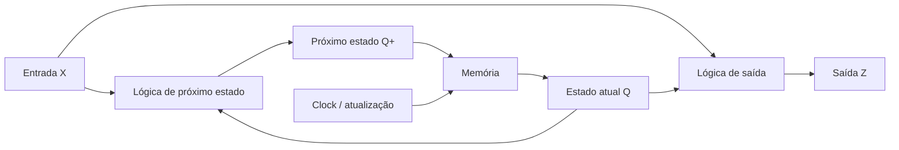
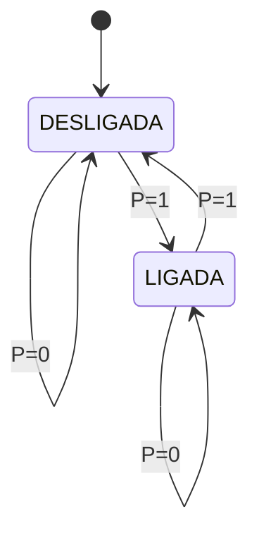
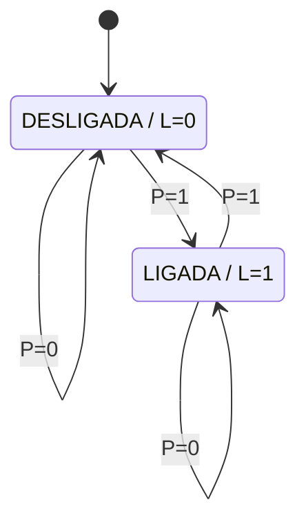
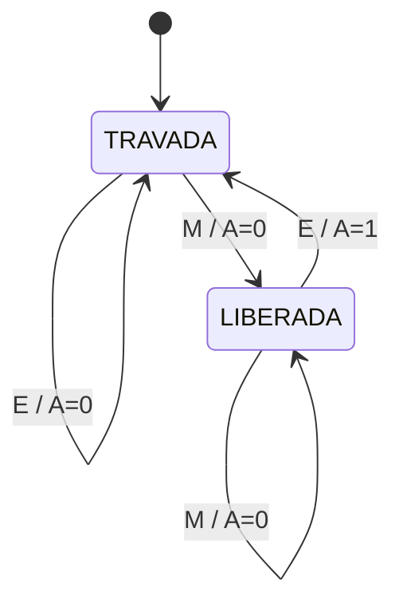
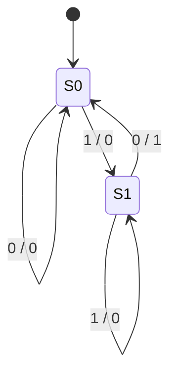
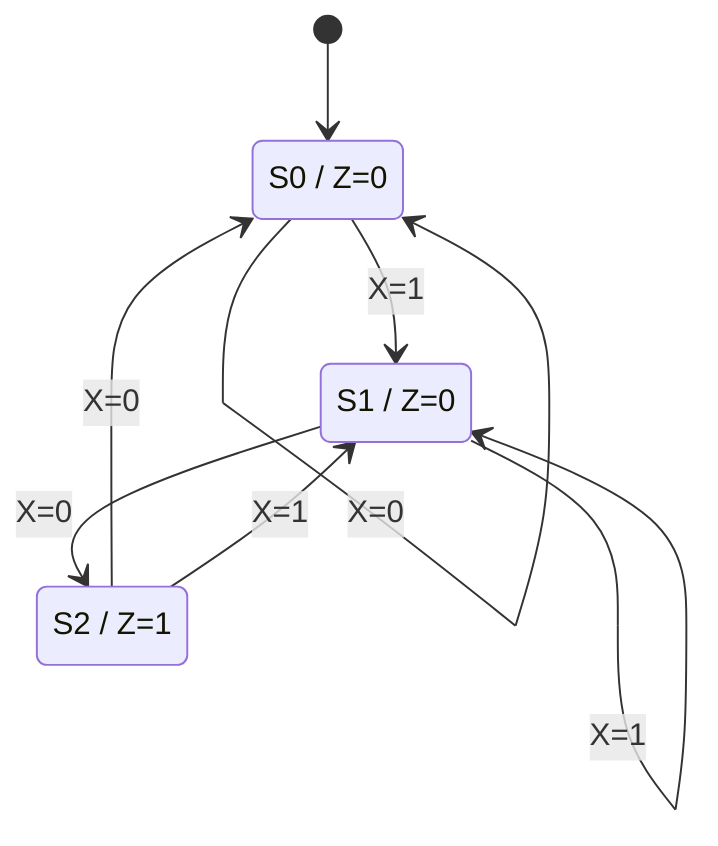
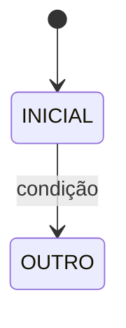
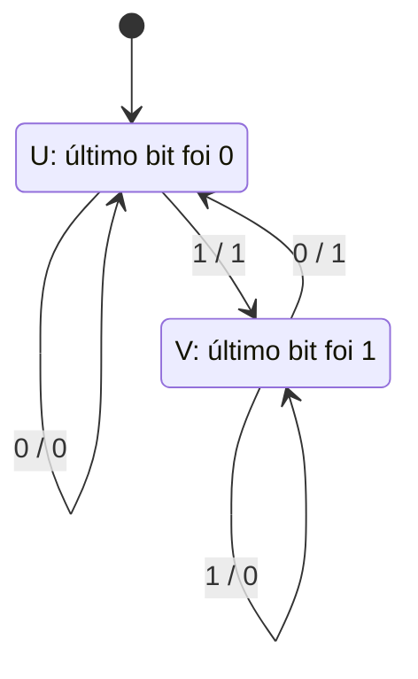
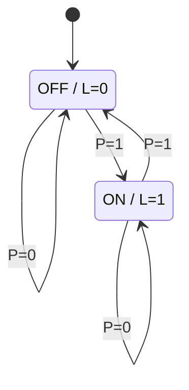

# Aula Detalhada — Introdução a Máquinas de Estados: Moore e Mealy

**Tema do dia:** Estado atual, transições, entradas, saídas e diferença entre máquinas de Moore e Mealy  
**Data do cronograma revisado:** 31/05 — Domingo  
**Aula na sequência:** 11  
**Objetivo:** entender por que circuitos precisam de memória, interpretar diagramas e tabelas de estados e distinguir máquinas de Moore e Mealy antes de estudar sua implementação com latches e flip-flops.

---

## 1. Onde esta aula entra no estudo?

Até a Aula 10, você trabalhou com **lógica combinacional**:

```text
entradas atuais → saída atual
```

Uma soma, um MUX, um decoder ou um comparador não precisa lembrar o que aconteceu anteriormente. Se as entradas forem iguais, a saída será igual.

Agora começa a ideia de **lógica sequencial**:

```text
entradas atuais + estado armazenado → saída e próximo estado
```

O circuito passa a ter alguma informação sobre o passado.

| Tipo de circuito | A saída depende de | Exemplos |
|---|---|---|
| Combinacional | Entradas atuais | Portas, MUX, decoder, comparador |
| Sequencial | Entradas atuais e estado anterior | Contador, registrador, controlador, FSM |

No cronograma, esta introdução aparece junto da correção do simulado combinacional. O simulado consolida o conteúdo anterior; esta aula abre o conteúdo novo que será aprofundado nas próximas aulas.

---

# 2. Por que um circuito precisa lembrar do passado?

Imagine uma catraca eletrônica.

Ela recebe o evento:

```text
empurrar
```

Mas a resposta não pode depender apenas desse evento:

| Situação anterior | Evento atual | Resultado esperado |
|---|---|---|
| Nenhuma moeda foi inserida | Empurrar | Bloquear passagem |
| Uma moeda foi inserida | Empurrar | Liberar passagem |

O evento atual é o mesmo: `empurrar`.

O resultado muda porque a catraca precisa saber se está:

```text
TRAVADA
```

ou

```text
LIBERADA
```

Essas situações são os **estados** do sistema.

Outro exemplo é um detector de sequência. Se o circuito deve detectar quando aparecem os bits `10`, ao receber um `0` ele precisa saber se o bit anterior era `1`.

```text
receber 0 depois de 1 → detectou 10
receber 0 depois de 0 → não detectou 10
```

Sem estado, o circuito enxerga apenas o `0` atual e não sabe distinguir os dois casos.

---

# 3. O que é uma máquina de estados finitos?

Uma **máquina de estados finitos**, normalmente chamada de `FSM` pela expressão *Finite State Machine*, é um modelo de circuito que:

1. Pode estar em um número finito de estados.
2. Recebe entradas.
3. Muda de estado conforme o estado atual e as entradas.
4. Produz saídas.

A ideia mais importante é:

> O estado atual resume a parte do passado que importa para decidir o futuro.

Em uma catraca, não é necessário guardar todas as moedas inseridas desde que ela foi instalada. Basta guardar se a passagem atual está `TRAVADA` ou `LIBERADA`.

Em um detector de `10`, não é necessário guardar todos os bits já recebidos. Basta guardar se o último bit relevante foi `1`.

---

# 4. Elementos de uma FSM

Uma FSM costuma ser descrita com estes elementos:

| Elemento | Significado |
|---|---|
| Estado atual | Situação armazenada antes de processar a nova entrada |
| Entrada | Informação recebida naquele instante |
| Próximo estado | Estado para o qual a máquina passará |
| Saída | Resposta produzida pela máquina |
| Estado inicial | Estado assumido quando o sistema começa ou é reiniciado |

Em exercícios, é comum encontrar esta notação:

| Símbolo | Leitura |
|---|---|
| `Q` | Estado atual |
| `X` | Entrada |
| `Q+` | Próximo estado |
| `Z` | Saída |

Portanto, uma tabela com colunas como estas:

| `Q` | `X` | `Q+` | `Z` |
|---|---|---|---|

é uma tabela de transição e saída de uma máquina de estados.

---

# 5. Estrutura geral de uma FSM

Uma FSM é formada conceitualmente por:

```text
lógica combinacional + memória
```

A memória guarda o estado atual. A lógica combinacional calcula o próximo estado e a saída.



O desenho mostra o caso mais geral, compatível com uma máquina Mealy, pois `X` pode influenciar diretamente a lógica de saída. Em uma máquina Moore, a ligação direta de `X` para a lógica de saída não existe:

```text
Moore: lógica de saída recebe apenas Q
Mealy: lógica de saída pode receber Q e X
```

Nesta aula, o foco está em entender o **comportamento** da máquina:

```text
qual estado existe?
quando ocorre cada transição?
quando a saída vale 1?
```

Nas próximas aulas, você verá como a memória é realmente feita com latches e flip-flops.

---

# 6. Estado atual e próximo estado

Considere uma lâmpada controlada por um botão de pulso:

```text
cada aperto alterna entre apagada e acesa
```

Ela pode ter dois estados:

```text
DESLIGADA
LIGADA
```

Se `P=1` significa que o botão foi pressionado e `P=0` significa que ele não foi pressionado:

| Estado atual | `P` | Próximo estado |
|---|---:|---|
| DESLIGADA | 0 | DESLIGADA |
| DESLIGADA | 1 | LIGADA |
| LIGADA | 0 | LIGADA |
| LIGADA | 1 | DESLIGADA |

Observe:

- Com `P=0`, a máquina permanece onde está.
- Com `P=1`, a máquina troca de estado.
- A mesma entrada `P=1` pode levar a resultados diferentes, conforme o estado atual.

Este é o comportamento típico de uma máquina sequencial.

---

# 7. Como ler um diagrama de estados

Um diagrama de estados utiliza:

| Elemento visual | Significado |
|---|---|
| Círculo ou caixa | Um estado |
| Seta entre estados | Uma transição |
| Seta voltando ao próprio estado | Permanência no estado |
| Seta inicial | Estado em que a máquina começa |

Para a lâmpada, o diagrama básico é:



Esse diagrama ainda não informou explicitamente como a saída é exibida. Essa decisão separa os dois modelos centrais desta aula:

```text
Moore
Mealy
```

---

# 8. Máquina de Moore

Em uma máquina de **Moore**, a saída depende somente do estado atual.

```text
Z = função do estado atual
```

Ou, em notação curta:

```text
Z = g(Q)
```

Na lâmpada:

| Estado | Saída `L` |
|---|---:|
| DESLIGADA | 0 |
| LIGADA | 1 |

A saída pode ser escrita dentro do próprio estado:



Regra visual importante:

```text
Moore: a saída costuma aparecer dentro do estado.
```

Se a máquina está em `LIGADA`, a saída `L=1` independe de o botão estar ou não pressionado naquele instante.

---

# 9. Máquina de Mealy

Em uma máquina de **Mealy**, a saída depende do estado atual e da entrada atual.

```text
Z = função do estado atual e da entrada
```

Ou:

```text
Z = g(Q, X)
```

Por isso, em diagramas de Mealy, a saída normalmente aparece na transição no formato:

```text
entrada / saída
```

Considere uma catraca com:

```text
T = TRAVADA
L = LIBERADA
M = evento de inserir moeda
E = evento de empurrar
A = autorização de passagem
```

Uma modelagem simples pode liberar a passagem no evento de empurrar quando a catraca já está liberada:



O mesmo evento `E` produz:

| Estado atual | Entrada | Saída `A` | Próximo estado |
|---|---|---:|---|
| TRAVADA | Empurrar | 0 | TRAVADA |
| LIBERADA | Empurrar | 1 | TRAVADA |

Regra visual importante:

```text
Mealy: a saída costuma aparecer na seta, junto da entrada.
```

---

# 10. Moore versus Mealy

As duas máquinas podem resolver problemas semelhantes, mas representam a saída de formas diferentes.

| Característica | Moore | Mealy |
|---|---|---|
| Saída depende de | Apenas estado | Estado e entrada |
| Saída indicada no diagrama | Dentro do estado | Na transição |
| Alteração da saída | Quando muda o estado | Pode reagir à entrada na transição |
| Quantidade de estados | Pode precisar de mais estados | Frequentemente usa menos estados |
| Forma comum na seta | Apenas entrada | `entrada / saída` |

A distinção mais cobrada é:

```text
Moore: saída associada ao estado.
Mealy: saída associada à transição.
```

Não conclua que uma é sempre melhor que a outra. A escolha depende do comportamento desejado e da implementação.

---

# 11. Exemplo central: detector da sequência `10`

Considere uma entrada serial `X`, recebida bit a bit. A máquina deve produzir:

```text
Z=1 quando os dois últimos bits recebidos formarem 10
```

Exemplos:

| Bits recebidos | Ocorreu `10`? |
|---|---|
| `00` | Não |
| `01` | Não |
| `10` | Sim |
| `110` | Sim, nos dois últimos bits |
| `1010` | Sim duas vezes |

Para reconhecer `10`, a máquina precisa lembrar se o bit anterior foi `1`.

---

## 11.1 Detector `10` em Mealy

Bastam dois estados:

| Estado | Significado |
|---|---|
| `S0` | O último bit relevante não foi `1` |
| `S1` | O último bit recebido foi `1` |

A detecção ocorre na transição:

```text
estava em S1 + chegou X=0 → completou 10 → Z=1
```



Tabela de transição e saída:

| Estado atual `Q` | Entrada `X` | Próximo estado `Q+` | Saída `Z` |
|---|---:|---|---:|
| `S0` | 0 | `S0` | 0 |
| `S0` | 1 | `S1` | 0 |
| `S1` | 0 | `S0` | 1 |
| `S1` | 1 | `S1` | 0 |

Perceba que em `S1` a saída muda conforme a entrada:

```text
S1 com X=0 → Z=1
S1 com X=1 → Z=0
```

Logo, essa máquina é Mealy.

---

## 11.2 Detector `10` em Moore

Em Moore, a saída `Z=1` precisa pertencer a um estado. Portanto, surge um estado específico para registrar a detecção:

| Estado | Significado | Saída `Z` |
|---|---|---:|
| `S0` | Nenhuma parte útil de `10` armazenada | 0 |
| `S1` | Último bit recebido foi `1` | 0 |
| `S2` | A sequência `10` acabou de ser reconhecida | 1 |



Tabela:

| Estado atual `Q` | Saída `Z` | Entrada `X` | Próximo estado `Q+` |
|---|---:|---:|---|
| `S0` | 0 | 0 | `S0` |
| `S0` | 0 | 1 | `S1` |
| `S1` | 0 | 0 | `S2` |
| `S1` | 0 | 1 | `S1` |
| `S2` | 1 | 0 | `S0` |
| `S2` | 1 | 1 | `S1` |

Aqui, para saber `Z`, basta olhar o estado:

```text
S0 → Z=0
S1 → Z=0
S2 → Z=1
```

Logo, essa máquina é Moore.

---

# 12. Rastreando uma sequência de entrada

Em prova, é comum receber um diagrama ou tabela e precisar descobrir a saída produzida para uma sequência.

Use sempre este roteiro:

1. Marque o estado inicial.
2. Leia uma entrada por vez, da esquerda para a direita.
3. Para cada bit, encontre a transição correspondente.
4. Registre o próximo estado.
5. Registre a saída segundo o tipo da máquina.

---

## 12.1 Rastreio do detector Mealy de `10`

Entrada:

```text
X = 1 1 0 1 0
```

Estado inicial:

```text
S0
```

| Passo | Estado antes | Entrada `X` | Estado depois | Saída `Z` | Motivo |
|---:|---|---:|---|---:|---|
| 1 | `S0` | 1 | `S1` | 0 | Guardou que chegou `1` |
| 2 | `S1` | 1 | `S1` | 0 | Ainda não formou `10` |
| 3 | `S1` | 0 | `S0` | 1 | Formou `10` |
| 4 | `S0` | 1 | `S1` | 0 | Começou nova possibilidade |
| 5 | `S1` | 0 | `S0` | 1 | Formou `10` novamente |

Saída:

```text
Z = 0 0 1 0 1
```

---

## 12.2 Rastreio do detector Moore de `10`

Usando a mesma entrada:

```text
X = 1 1 0 1 0
```

e registrando a saída do estado alcançado após cada entrada:

| Passo | Estado antes | Entrada `X` | Estado depois | Saída do estado depois |
|---:|---|---:|---|---:|
| 1 | `S0` | 1 | `S1` | 0 |
| 2 | `S1` | 1 | `S1` | 0 |
| 3 | `S1` | 0 | `S2` | 1 |
| 4 | `S2` | 1 | `S1` | 0 |
| 5 | `S1` | 0 | `S2` | 1 |

Saída observada após cada transição:

```text
Z = 0 0 1 0 1
```

Neste exemplo abstrato, as sequências registradas parecem iguais. A diferença estrutural continua existindo:

- Na Mealy, o `1` está na seta `S1 -- 0/1 --> S0`.
- Na Moore, o `1` está no estado `S2`.

Quando você estudar clock e temporização, verá por que essa diferença pode afetar o instante físico em que a saída aparece.

---

# 13. Sobreposição de sequências

Detectores frequentemente precisam reconhecer ocorrências sobrepostas.

Exemplo: detectar `101` na entrada:

```text
10101
```

As ocorrências são:

```text
10101
^^^       primeira ocorrência
  ^^^     segunda ocorrência
```

Após reconhecer a primeira sequência, a máquina não deve necessariamente voltar para um estado de "nada aproveitável". O final da sequência reconhecida pode também ser o início de uma nova sequência.

Para `101`:

```text
o último bit da sequência detectada é 1
```

Esse `1` já pode servir como início de outra ocorrência.

Nesta aula, basta guardar a regra:

> Ao desenhar uma FSM detectora de sequência, verifique se o final de uma detecção pode ser reutilizado como início da próxima.

Esse cuidado aparecerá novamente na síntese completa de máquinas de estados.

---

# 14. Estado simbólico e codificação binária

Até aqui usamos nomes como:

```text
S0, S1, S2
TRAVADA, LIBERADA
DESLIGADA, LIGADA
```

Esses são **estados simbólicos**: facilitam entender o comportamento.

Para implementar a máquina em hardware, esses estados precisarão ser representados por bits armazenados.

Exemplo com três estados:

| Estado simbólico | Uma codificação possível |
|---|---|
| `S0` | `00` |
| `S1` | `01` |
| `S2` | `10` |

O código `11` ficaria sobrando nessa escolha.

Relação importante:

```text
n bits conseguem representar até 2^n estados
```

| Quantidade de estados necessários | Bits mínimos para codificar |
|---:|---:|
| 2 | 1 |
| 3 ou 4 | 2 |
| 5 a 8 | 3 |
| 9 a 16 | 4 |

Ainda não é necessário sintetizar as equações desses bits. Isso será feito depois do estudo de flip-flops.

---

# 15. Estado inicial e reset

Uma FSM precisa começar em um estado conhecido.

Se uma catraca ligasse sem saber se está travada ou liberada, o sistema teria comportamento imprevisível. Se um detector de sequência começasse em um estado aleatório, poderia indicar uma detecção que nunca ocorreu.

Por isso, os diagramas indicam um estado inicial:



Na implementação física, normalmente haverá um sinal de inicialização, chamado:

```text
reset
```

Ele força a memória para o estado inicial definido no projeto.

Para exercícios desta aula:

- Se o enunciado informar o estado inicial, comece por ele.
- Se o diagrama tiver uma seta inicial, use o estado apontado.
- Se nada for informado, a questão está incompleta para rastrear uma sequência de forma única.

---

# 16. Clock: apenas a ideia necessária agora

Circuitos sequenciais normalmente atualizam seu estado seguindo um sinal de sincronismo chamado `clock`.

Neste momento, pense assim:

```text
entre atualizações → a máquina permanece no estado atual
na atualização → o próximo estado passa a ser o estado atual
```

Exemplo:

```text
antes da borda: Q = S1
entrada indica que Q+ = S2
na borda do clock: Q passa a ser S2
```

Não é necessário estudar ainda os detalhes de borda, tempo de setup ou tempo de hold. Esses conceitos aparecem depois dos latches e flip-flops.

---

# 17. Como reconhecer Moore ou Mealy em uma questão

## 17.1 Pelo diagrama

| O que aparece? | Classificação provável |
|---|---|
| Estado escrito como `S0 / Z=0` | Moore |
| Seta escrita como `X=1 / Z=1` | Mealy |

## 17.2 Pela tabela

Considere estas duas formas:

**Tabela A**

| Estado | Saída |
|---|---:|
| `S0` | 0 |
| `S1` | 1 |

Se cada estado possui uma única saída, independentemente da entrada, o comportamento é Moore.

**Tabela B**

| Estado | Entrada | Saída |
|---|---:|---:|
| `S0` | 0 | 0 |
| `S0` | 1 | 1 |

Se o mesmo estado pode gerar saídas diferentes conforme a entrada, o comportamento é Mealy.

## 17.3 Pelo texto do enunciado

| Frase | Modelo sugerido |
|---|---|
| "A saída vale 1 enquanto estiver no estado de alarme." | Moore |
| "Ao receber moeda estando travada, emita um pulso de liberação." | Mealy |
| "A saída é determinada apenas pelo estado atual." | Moore |
| "A saída depende do estado e da entrada." | Mealy |

---

# 18. Caminho para sintetizar uma FSM

Nesta aula, você apenas começa o processo. O caminho completo será:

```text
enunciado
→ identificar entradas e saídas
→ definir estados
→ desenhar diagrama
→ montar tabela de transição
→ codificar estados em bits
→ escolher flip-flops
→ obter equações de próximo estado e saída
→ montar circuito
```

A parte já acessível agora é:

```text
enunciado → estados → diagrama → tabela
```

A parte de circuito dependerá dos próximos tópicos:

```text
latches → flip-flops → registradores → síntese de FSM
```

---

# 19. Erros comuns em prova

## Erro 1: achar que estado é a mesma coisa que entrada

Entrada chega de fora; estado é uma informação guardada internamente.

```text
entrada: moeda foi inserida agora
estado: catraca está liberada
```

## Erro 2: esquecer o estado inicial

Sem definir de onde a máquina começa, você pode produzir uma sequência de saídas totalmente diferente.

## Erro 3: classificar como Moore só porque existem estados

Toda FSM tem estados. A classificação depende de onde a saída é determinada:

```text
somente estado → Moore
estado e entrada → Mealy
```

## Erro 4: ler uma saída Mealy como se pertencesse ao estado de chegada

Em uma seta de Mealy:

```text
1 / 0
```

o primeiro valor é a entrada que causa a transição; o segundo é a saída produzida nessa transição.

## Erro 5: perder detecções sobrepostas

Em detectores de sequência, uma sequência recém-detectada pode terminar com bits úteis para iniciar a próxima detecção.

## Erro 6: começar a codificar estados antes de entender o comportamento

Primeiro crie estados com significado claro. Depois, quando a tabela estiver certa, atribua códigos binários.

---

# 20. Resumo Operacional

## Conceito de estado

```text
Estado = memória resumida do passado relevante.
```

## Máquina de estados

```text
estado atual + entrada → próximo estado e saída
```

## Moore

```text
saída depende somente do estado
diagrama: saída dentro do estado
Z = g(Q)
```

## Mealy

```text
saída depende do estado e da entrada
diagrama: entrada / saída na transição
Z = g(Q, X)
```

## Codificação

```text
n bits representam até 2^n estados
```

## Rastreio

```text
estado inicial → ler uma entrada → seguir seta → registrar saída → repetir
```

---

# 21. Exercícios para Fazer

## Parte A — Conceitos essenciais

### Exercício 1

Explique, em uma frase, por que uma catraca eletrônica não pode ser descrita apenas por lógica combinacional se precisa distinguir uma passagem paga de uma tentativa sem pagamento.

### Exercício 2

Uma saída depende somente das entradas presentes no instante atual. Esse circuito é combinacional ou sequencial?

### Exercício 3

Uma saída depende da entrada atual e do estado armazenado. Esse circuito é combinacional ou sequencial?

### Exercício 4

Em uma FSM, o que representa o próximo estado `Q+`?

### Exercício 5

Uma máquina possui `5` estados distintos. Qual é o número mínimo de bits necessário para codificá-los?

### Exercício 6

Por que o estado inicial é necessário para prever a saída de uma FSM ao receber uma sequência de entradas?

---

## Parte B — Moore e Mealy

### Exercício 7

Uma máquina tem a saída escrita dentro de cada estado, e nenhuma transição informa saída. Ela é Moore ou Mealy?

### Exercício 8

Uma transição está identificada como:

```text
0 / 1
```

O que representam o `0` e o `1` em uma máquina Mealy?

### Exercício 9

No mesmo estado `A`, uma tabela indica:

| Estado atual | Entrada `X` | Saída `Z` |
|---|---:|---:|
| `A` | 0 | 0 |
| `A` | 1 | 1 |

Essa saída poderia pertencer a uma máquina Moore sem acrescentar ou alterar estados? Justifique.

### Exercício 10

Uma máquina possui estados:

| Estado | Saída `Z` |
|---|---:|
| `A` | 0 |
| `B` | 1 |

A saída depende apenas do estado. Classifique a máquina.

---

## Parte C — Rastreio de uma máquina Mealy

Considere a máquina detectora de `01`:

| Estado atual | Entrada `X` | Próximo estado | Saída `Z` |
|---|---:|---|---:|
| `S0` | 0 | `S1` | 0 |
| `S0` | 1 | `S0` | 0 |
| `S1` | 0 | `S1` | 0 |
| `S1` | 1 | `S0` | 1 |

O estado inicial é `S0`.

### Exercício 11

Qual sequência essa máquina detecta?

### Exercício 12

Para a entrada:

```text
X = 0 0 1 0 1 1
```

determine a sequência de saída `Z`.

### Exercício 13

Para a entrada do exercício anterior, em qual estado a máquina termina?

### Exercício 14

Essa máquina é Moore ou Mealy? Indique a evidência na tabela.

---

## Parte D — Rastreio de uma máquina Moore

Uma lâmpada tem os estados:

| Estado | Saída `L` |
|---|---:|
| `OFF` | 0 |
| `ON` | 1 |

Sua transição é:

| Estado atual | Entrada `P` | Próximo estado |
|---|---:|---|
| `OFF` | 0 | `OFF` |
| `OFF` | 1 | `ON` |
| `ON` | 0 | `ON` |
| `ON` | 1 | `OFF` |

O estado inicial é `OFF`. Considere a saída do estado alcançado após cada entrada.

### Exercício 15

Para:

```text
P = 1 0 1 1
```

determine a sequência de estados alcançados e a sequência de saídas.

### Exercício 16

Por que esta máquina é Moore?

---

## Parte E — Construção de diagramas

### Exercício 17

Desenhe uma máquina Mealy que compare cada bit atual com o bit imediatamente anterior:

```text
Z=1 quando o bit atual for diferente do anterior
Z=0 quando forem iguais
```

Use dois estados:

```text
U = último bit guardado foi 0
V = último bit guardado foi 1
```

Considere `U` como estado inicial.

### Exercício 18

Desenhe como máquina Moore o controlador da lâmpada dos exercícios 15 e 16. Indique a saída dentro de cada estado e rotule as transições com `P=0` e `P=1`.

---

# 22. Gabarito Direto

## Parte A — Conceitos essenciais

**1.** Porque a resposta ao evento de tentar passar depende de a máquina guardar se houve pagamento, isto é, do estado anterior.  

**2.** Combinacional.  

**3.** Sequencial.  

**4.** O estado que passará a estar armazenado após a atualização da máquina.  

**5.** `3` bits, pois `2^2=4` não comporta cinco estados e `2^3=8` comporta.  

**6.** Porque a mesma sequência de entradas pode gerar respostas diferentes se a máquina começar em estados diferentes.

---

## Parte B — Moore e Mealy

**7.** Moore.  

**8.** O `0` é a entrada que provoca a transição; o `1` é a saída produzida nessa transição.  

**9.** Não. Em Moore, um estado possui uma saída fixa; como `A` gera `0` ou `1` conforme `X`, o comportamento indicado é Mealy, salvo se os estados forem reformulados.  

**10.** Moore.

---

## Parte C — Máquina Mealy

**11.** Detecta a sequência `01`. O estado `S1` guarda que foi recebido um `0`; se depois chega `1`, a saída vale `1`.  

**12.**

| Entrada `X` | 0 | 0 | 1 | 0 | 1 | 1 |
|---|---:|---:|---:|---:|---:|---:|
| Saída `Z` | 0 | 0 | 1 | 0 | 1 | 0 |

```text
Z = 0 0 1 0 1 0
```

**13.** Termina em `S0`.  

**14.** Mealy, pois no estado `S1` a saída é `0` para `X=0` e `1` para `X=1`; portanto, depende da entrada e do estado.

---

## Parte D — Máquina Moore

**15.**

| Entrada `P` | 1 | 0 | 1 | 1 |
|---|---:|---:|---:|---:|
| Estado alcançado | `ON` | `ON` | `OFF` | `ON` |
| Saída `L` | 1 | 1 | 0 | 1 |

```text
L = 1 1 0 1
```

**16.** Porque a saída está definida unicamente pelo estado: `OFF` sempre possui `L=0` e `ON` sempre possui `L=1`.

---

## Parte E — Diagramas

**17.** Uma solução correta é:



**18.** Uma solução correta é:



---

# 23. O que Memorizar

## Definições

```text
Circuito combinacional: saída depende somente das entradas atuais.
Circuito sequencial: saída e evolução dependem também de estado armazenado.
FSM: máquina com quantidade finita de estados.
Estado: memória resumida do passado relevante.
```

## Moore e Mealy

```text
Moore: Z = g(Q)
saída associada ao estado

Mealy: Z = g(Q, X)
saída associada à transição
```

## Leitura de diagrama

```text
Moore: estado / saída
Mealy: entrada / saída na seta
```

## Codificação de estados

```text
n bits representam até 2^n estados.
5 estados exigem no mínimo 3 bits.
```

## Sequência de resolução

```text
identificar estado inicial
→ ler entrada
→ seguir transição
→ registrar saída
→ repetir
```

---

# 24. Plano de Estudo para Esta Aula

| Etapa | Tempo | Atividade |
|---|---:|---|
| Retomada | 10 min | Relembrar a diferença entre função combinacional e bloco lógico |
| Conceito de estado | 25 min | Estudar seções 2 a 6 e explicar com suas palavras por que a catraca precisa de estado |
| Diagramas | 30 min | Estudar seções 7 a 10 e reproduzir os diagramas de lâmpada e catraca |
| Detector de sequência | 40 min | Estudar seções 11 a 13 e rastrear manualmente os exemplos |
| Preparação para síntese | 20 min | Estudar seções 14 a 18 |
| Exercícios | 35 min | Resolver os 18 exercícios antes de abrir o gabarito |
| Revisão | 15 min | Anotar diferenças entre Moore e Mealy e erros cometidos |

Tempo total estimado:

```text
2h55
```

Se precisar de uma primeira passada reduzida, priorize:

```text
seções 2, 3, 7, 8, 9, 10, 11, 12, 17 e 20
exercícios 5, 7, 8, 9, 12, 14, 15, 17 e 18
```

---

# 25. Conexão com a Próxima Aula

Nesta aula, o estado foi tratado como uma informação que a máquina consegue guardar:

```text
estado atual → próximo estado
```

O próximo passo é entender o componente que realmente armazena esse estado:

```text
estabilidade
latch SR
condição inválida do latch SR
latch D
transparência por nível
```

Depois disso, será possível compreender flip-flops e, mais adiante, voltar às máquinas de estados para construir seus circuitos completos.
