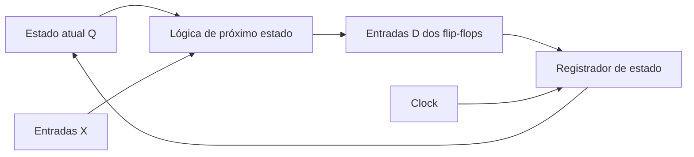

# Aula Detalhada - Flip-Flops e Registradores

**Tema do dia:** latch sensível a nível, flip-flop sensível a borda, flip-flop D, JK, T, registradores e habilitação  
**Data do cronograma revisado:** 02/06 - Terça  
**Aula na sequência:** 13  
**Objetivo:** entender como o estado é atualizado por bordas de clock, prever saídas de flip-flops e compreender registradores como conjuntos de flip-flops.

---

## 1. Onde Esta Aula Entra No Estudo?

Na Aula 12, você estudou latches.

O latch D ativo alto funciona assim:

```text
EN=1 -> Q acompanha D
EN=0 -> Q mantém o valor anterior
```

Isso quer dizer que o latch é **sensível a nível**.

Enquanto o enable fica ativo, a saída pode mudar várias vezes.

Nesta aula, entra o componente mais usado para guardar estado em circuitos síncronos:

```text
flip-flop
```

A ideia principal é:

```text
flip-flop atualiza apenas na borda do clock
```

Isso torna o comportamento mais controlado.

---

# 2. Por Que Precisamos De Clock?

Em circuitos sequenciais maiores, vários elementos de memória precisam atualizar juntos.

Exemplo:

```text
registrador A
registrador B
contador
estado de uma FSM
```

Se cada parte atualizasse em momentos aleatórios, o circuito ficaria difícil de controlar.

O clock resolve isso criando instantes bem definidos:

```text
agora todos podem atualizar
agora todos devem manter
```

Um clock é um sinal periódico:

```text
0 -> 1 -> 0 -> 1 -> 0 -> 1 ...
```

Visualmente:

```text
CLK: ___|‾‾‾|___|‾‾‾|___|‾‾‾|___
        ↑       ↑       ↑
      bordas  bordas  bordas
```

As mudanças importantes são as bordas.

---

# 3. Bordas De Clock

Existem duas bordas principais:

| Nome | Transição | Símbolo comum |
|---|---|---|
| Borda de subida | `0 -> 1` | seta para cima |
| Borda de descida | `1 -> 0` | bolinha ou seta para baixo |

Um flip-flop pode ser:

```text
disparado na borda de subida
```

ou:

```text
disparado na borda de descida
```

Se a questão não disser nada, muitas vezes assume-se borda de subida. Mas em prova, sempre procure:

```text
posedge
borda de subida
↑
```

ou:

```text
negedge
borda de descida
↓
bolinha no clock
```

---

# 4. Latch Versus Flip-Flop

Essa é uma das distinções mais importantes.

| Elemento | Sensível a | Quando Q pode mudar |
|---|---|---|
| Latch D | nível do enable | durante todo o tempo em que `EN` está ativo |
| Flip-flop D | borda do clock | apenas no instante da borda ativa |

## 4.1 Latch D

```text
EN=1 por muito tempo
D muda várias vezes
Q pode mudar várias vezes
```

## 4.2 Flip-flop D

```text
clock tem borda ativa
Q copia D naquele instante
entre bordas, Q mantém
```

Frase para memorizar:

```text
latch é transparente por nível
flip-flop é amostrado por borda
```

---

# 5. Flip-Flop D

O flip-flop D é o mais importante para a prova e para máquinas de estados.

Entradas e saídas:

| Sinal | Função |
|---|---|
| `D` | dado de entrada |
| `CLK` | clock |
| `Q` | valor armazenado |

Regra:

```text
na borda ativa do clock, Q recebe D
entre bordas, Q mantém
```

Tabela característica:

| `D` | `Q+` |
|---:|---:|
| 0 | 0 |
| 1 | 1 |

Ou simplesmente:

```text
Q+ = D
```

Mas cuidado: isso vale no instante da borda ativa.

Entre bordas:

```text
Q não fica seguindo D
```

---

# 6. Como Ler Uma Questão Com Flip-Flop D

Se a questão disser:

```text
flip-flop D de borda de subida
```

você deve olhar apenas os valores de `D` nos instantes:

```text
0 -> 1 do clock
```

Exemplo:

| Borda de subida | Valor de `D` no instante da borda | Novo `Q` |
|---:|---:|---:|
| 1ª | 1 | 1 |
| 2ª | 0 | 0 |
| 3ª | 1 | 1 |

Se `D` mudar entre as bordas, isso não altera `Q` imediatamente.

O `Q` só será atualizado na próxima borda ativa.

---

# 7. Exemplo De Rastreio Com Flip-Flop D

Considere um flip-flop D de borda de subida.

Estado inicial:

```text
Q = 0
```

Valores de `D` em cada borda de subida:

| Borda | `D` |
|---:|---:|
| 1 | 1 |
| 2 | 1 |
| 3 | 0 |
| 4 | 1 |
| 5 | 0 |

Rastreando:

| Borda | `D` | `Q` antes | `Q` depois |
|---:|---:|---:|---:|
| 1 | 1 | 0 | 1 |
| 2 | 1 | 1 | 1 |
| 3 | 0 | 1 | 0 |
| 4 | 1 | 0 | 1 |
| 5 | 0 | 1 | 0 |

Sequência de `Q` após as bordas:

```text
1, 1, 0, 1, 0
```

---

# 8. Flip-Flop D Com Enable

Muitos flip-flops possuem habilitação.

Com enable ativo alto:

```text
EN=1 -> na borda, Q recebe D
EN=0 -> na borda, Q mantém
```

Tabela no instante da borda:

| `EN` | `D` | `Q+` |
|---:|---:|---|
| 0 | 0 | `Q` |
| 0 | 1 | `Q` |
| 1 | 0 | 0 |
| 1 | 1 | 1 |

Forma compacta:

```text
se EN=1, Q+=D
se EN=0, Q+=Q
```

Exemplo:

Estado inicial:

```text
Q=0
```

| Borda | `EN` | `D` | `Q` depois |
|---:|---:|---:|---:|
| 1 | 0 | 1 | 0 |
| 2 | 1 | 1 | 1 |
| 3 | 0 | 0 | 1 |
| 4 | 1 | 0 | 0 |

Repare:

```text
na borda 3, D=0, mas EN=0
```

Então:

```text
Q mantém 1
```

---

# 9. Reset E Set Em Flip-Flops

Além de `D` e `CLK`, um flip-flop pode ter sinais de controle:

| Sinal | Função |
|---|---|
| `RESET` | força `Q=0` |
| `SET` ou `PRESET` | força `Q=1` |

Esses sinais podem ser:

```text
síncronos
```

ou:

```text
assíncronos
```

## 9.1 Reset síncrono

Só age na borda do clock.

```text
RESET=1 antes da borda -> na borda, Q vira 0
RESET=1 sem borda -> Q ainda não muda
```

## 9.2 Reset assíncrono

Age imediatamente, sem esperar clock.

```text
RESET=1 -> Q vira 0 na hora
```

Para esta fase do estudo, o mais importante é reconhecer a diferença:

```text
síncrono depende da borda do clock
assíncrono não espera a borda
```

---

# 10. Flip-Flop T

O flip-flop T é útil para contadores.

`T` vem de:

```text
toggle
```

Toggle significa alternar.

Tabela característica:

| `T` | `Q+` |
|---:|---|
| 0 | `Q` |
| 1 | `Q'` |

Ou seja:

```text
T=0 -> mantém
T=1 -> inverte
```

Exemplo com `Q` inicial igual a `0`:

| Borda | `T` | `Q` antes | `Q` depois |
|---:|---:|---:|---:|
| 1 | 1 | 0 | 1 |
| 2 | 1 | 1 | 0 |
| 3 | 0 | 0 | 0 |
| 4 | 1 | 0 | 1 |

Sequência:

```text
1, 0, 0, 1
```

O flip-flop T aparecerá de novo em contadores.

Se `T=1` sempre:

```text
Q alterna a cada borda
```

Isso divide a frequência por 2.

---

# 11. Flip-Flop JK

O flip-flop JK é uma extensão do SR.

A vantagem:

```text
não possui condição inválida para J=1,K=1
```

Tabela característica:

| `J` | `K` | `Q+` | Operação |
|---:|---:|---|---|
| 0 | 0 | `Q` | mantém |
| 0 | 1 | 0 | reset |
| 1 | 0 | 1 | set |
| 1 | 1 | `Q'` | toggle |

Compare com SR:

```text
SR com 1,1 -> inválido
JK com 1,1 -> inverte
```

Esse é o ponto principal.

---

# 12. Exemplo De Rastreio Com JK

Flip-flop JK de borda de subida.

Estado inicial:

```text
Q=0
```

| Borda | `J` | `K` |
|---:|---:|---:|
| 1 | 1 | 0 |
| 2 | 0 | 0 |
| 3 | 1 | 1 |
| 4 | 0 | 1 |
| 5 | 1 | 1 |

Rastreando:

| Borda | `J` | `K` | `Q` antes | Operação | `Q` depois |
|---:|---:|---:|---:|---|---:|
| 1 | 1 | 0 | 0 | set | 1 |
| 2 | 0 | 0 | 1 | mantém | 1 |
| 3 | 1 | 1 | 1 | toggle | 0 |
| 4 | 0 | 1 | 0 | reset | 0 |
| 5 | 1 | 1 | 0 | toggle | 1 |

Sequência:

```text
1, 1, 0, 0, 1
```

---

# 13. Relação Entre D, T E JK

Na prática, muitos circuitos usam flip-flop D porque ele é direto:

```text
Q+ = D
```

Para implementar uma máquina de estados com flip-flop D, basta calcular qual deve ser o próximo estado e ligar essa equação em `D`.

O flip-flop T é natural para:

```text
contadores
alternância
divisão de frequência
```

O JK é útil como forma teórica e também para entender:

```text
set
reset
mantém
toggle
```

Para o seu edital, a prioridade deve ser:

```text
1. D
2. T
3. JK
```

Mas precisa reconhecer os três.

---

# 14. Registradores

Um registrador é um conjunto de flip-flops que guarda vários bits ao mesmo tempo.

Se um flip-flop guarda:

```text
1 bit
```

então um registrador de 4 bits guarda:

```text
4 bits
```

Exemplo:

```text
registrador de 4 bits = 4 flip-flops D
```

Visualmente:

```text
D3 -> [FF] -> Q3
D2 -> [FF] -> Q2
D1 -> [FF] -> Q1
D0 -> [FF] -> Q0
```

Todos recebem o mesmo clock:

```text
CLK comum
```

Na borda ativa:

```text
Q3 recebe D3
Q2 recebe D2
Q1 recebe D1
Q0 recebe D0
```

---

# 15. Registrador De 4 Bits

Suponha um registrador de 4 bits de borda de subida.

Antes da borda:

```text
Q = 0011
D = 1010
```

Na borda de subida:

```text
Q recebe D
```

Depois da borda:

```text
Q = 1010
```

Se `D` mudar depois da borda:

```text
D = 1111
```

o registrador não muda imediatamente.

Ele só mudará na próxima borda ativa.

---

# 16. Registrador Com Enable

Um registrador com enable permite controlar quando o valor será carregado.

Regra:

```text
EN=1 -> na borda, carrega D
EN=0 -> na borda, mantém Q
```

Exemplo:

Estado inicial:

```text
Q = 0000
```

| Borda | `EN` | `D` | `Q` depois |
|---:|---:|---|---|
| 1 | 0 | `1111` | `0000` |
| 2 | 1 | `1010` | `1010` |
| 3 | 0 | `0101` | `1010` |
| 4 | 1 | `0011` | `0011` |

Repare:

```text
na borda 3, D=0101, mas EN=0
```

Então:

```text
Q continua 1010
```

---

# 17. Carga Paralela

Quando todos os bits de um registrador são carregados ao mesmo tempo, isso é chamado de:

```text
carga paralela
```

Exemplo:

```text
D3D2D1D0 = 1101
```

Na borda ativa:

```text
Q3Q2Q1Q0 = 1101
```

Todos os bits entram juntos.

Isso é diferente de deslocamento, em que os bits entram um por vez.

Deslocadores serão mais naturais quando aparecerem contadores e registradores de deslocamento, mas a ideia básica é:

| Tipo | Como os bits entram |
|---|---|
| Carga paralela | vários bits ao mesmo tempo |
| Deslocamento serial | um bit por vez |

---

# 18. Registrador Como Estado De Uma FSM

Lembra da estrutura da FSM?

```text
estado atual -> lógica combinacional -> próximo estado
```

Agora podemos enxergar melhor:



O registrador de estado é formado por flip-flops.

Na borda do clock:

```text
Q recebe D
```

Ou seja:

```text
estado atual recebe próximo estado
```

Essa frase será essencial na síntese de FSM.

---

# 19. Quantos Flip-Flops Para Guardar Estados?

Cada flip-flop guarda 1 bit.

Com `n` flip-flops, é possível representar:

```text
2^n estados
```

Tabela:

| Flip-flops | Estados possíveis |
|---:|---:|
| 1 | 2 |
| 2 | 4 |
| 3 | 8 |
| 4 | 16 |

Exemplos:

```text
3 estados -> precisa de 2 flip-flops, pois 2^1=2 não basta e 2^2=4 basta
5 estados -> precisa de 3 flip-flops, pois 2^2=4 não basta e 2^3=8 basta
9 estados -> precisa de 4 flip-flops, pois 2^3=8 não basta e 2^4=16 basta
```

---

# 20. Como Questões Costumam Cobrar

## Tipo 1: tabela característica

Exemplo:

```text
Em um flip-flop T, T=1 e Q=0. Qual é Q+?
```

Resposta:

```text
Q+ = 1
```

## Tipo 2: borda de clock

Exemplo:

```text
Flip-flop D de borda de subida. D muda entre bordas. Q muda na hora?
```

Resposta:

```text
Não. Q muda apenas na borda ativa.
```

## Tipo 3: registrador com enable

Exemplo:

```text
Q=1010, D=0110, EN=0. Na borda, qual será Q?
```

Resposta:

```text
Q continua 1010
```

## Tipo 4: número de flip-flops

Exemplo:

```text
Quantos flip-flops são necessários para 6 estados?
```

Resposta:

```text
3, pois 2^2=4 e 2^3=8
```

---

# 21. Erros Comuns

## Erro 1: tratar flip-flop D como latch D

Errado:

```text
D mudou, então Q mudou
```

Correto:

```text
Q só copia D na borda ativa do clock
```

## Erro 2: ignorar enable

Se `EN=0`, mesmo na borda:

```text
Q mantém
```

## Erro 3: confundir reset síncrono com assíncrono

Reset síncrono:

```text
espera borda de clock
```

Reset assíncrono:

```text
age imediatamente
```

## Erro 4: esquecer o estado atual em T e JK

Em flip-flop T:

```text
T=1 -> Q+ = Q'
```

Então você precisa saber `Q` atual.

Em JK:

```text
J=1,K=1 -> Q+ = Q'
```

Também precisa saber `Q` atual.

## Erro 5: contar estados como se fosse número de flip-flops

Errado:

```text
5 estados -> 5 flip-flops
```

Correto:

```text
5 estados -> 3 flip-flops
```

porque:

```text
2^3 = 8
```

---

# 22. Exercícios

## Parte A - Conceitos

1. Qual é a diferença entre latch e flip-flop?
2. O que é uma borda de subida?
3. O que é uma borda de descida?
4. Em um flip-flop D, quando `Q` copia `D`?
5. O que significa dizer que um reset é assíncrono?
6. O que significa dizer que um reset é síncrono?

## Parte B - Flip-Flop D

7. Complete: em um flip-flop D, no instante da borda ativa, `Q+ = ___`.
8. Um flip-flop D de borda de subida tem `Q=0`. Na borda, `D=1`. Qual será `Q+`?
9. Um flip-flop D de borda de subida tem `Q=1`. Entre duas bordas, `D` muda para `0`. `Q` muda imediatamente?
10. Um flip-flop D com enable tem `Q=1`, `EN=0` e `D=0`. Na borda ativa, qual será `Q+`?
11. Um flip-flop D com enable tem `Q=1`, `EN=1` e `D=0`. Na borda ativa, qual será `Q+`?

## Parte C - Rastreio Com D

Considere um flip-flop D de borda de subida com `Q` inicial igual a `0`.

| Borda | `D` |
|---:|---:|
| 1 | 1 |
| 2 | 0 |
| 3 | 0 |
| 4 | 1 |
| 5 | 1 |

12. Qual é a sequência de `Q` após cada borda?

Considere agora um flip-flop D com enable ativo alto e `Q` inicial igual a `0`.

| Borda | `EN` | `D` |
|---:|---:|---:|
| 1 | 0 | 1 |
| 2 | 1 | 1 |
| 3 | 0 | 0 |
| 4 | 1 | 0 |
| 5 | 1 | 1 |

13. Qual é a sequência de `Q` após cada borda?

## Parte D - Flip-Flop T

14. Em um flip-flop T, o que acontece quando `T=0`?
15. Em um flip-flop T, o que acontece quando `T=1`?
16. Um flip-flop T tem `Q=0` e `T=1`. Na borda ativa, qual será `Q+`?
17. Um flip-flop T tem `Q=1` e `T=1`. Na borda ativa, qual será `Q+`?

Considere um flip-flop T com `Q` inicial igual a `0`.

| Borda | `T` |
|---:|---:|
| 1 | 1 |
| 2 | 1 |
| 3 | 0 |
| 4 | 1 |
| 5 | 1 |

18. Qual é a sequência de `Q` após cada borda?

## Parte E - Flip-Flop JK

19. Em um flip-flop JK, qual operação ocorre quando `J=0,K=0`?
20. Em um flip-flop JK, qual operação ocorre quando `J=0,K=1`?
21. Em um flip-flop JK, qual operação ocorre quando `J=1,K=0`?
22. Em um flip-flop JK, qual operação ocorre quando `J=1,K=1`?

Considere um flip-flop JK com `Q` inicial igual a `0`.

| Borda | `J` | `K` |
|---:|---:|---:|
| 1 | 1 | 0 |
| 2 | 1 | 1 |
| 3 | 0 | 0 |
| 4 | 0 | 1 |
| 5 | 1 | 1 |

23. Qual é a sequência de `Q` após cada borda?

## Parte F - Registradores

24. Quantos flip-flops D são necessários para montar um registrador de 8 bits?
25. Um registrador de 4 bits tem `Q=0011`. Na borda ativa, `D=1100` e `EN=1`. Qual será `Q+`?
26. Um registrador de 4 bits tem `Q=0011`. Na borda ativa, `D=1100` e `EN=0`. Qual será `Q+`?
27. O que significa carga paralela em um registrador?
28. Quantos flip-flops são necessários para representar 5 estados?
29. Quantos flip-flops são necessários para representar 9 estados?
30. Em uma FSM implementada com flip-flops D, o que deve ser ligado nas entradas `D` dos flip-flops?

---

# 23. Gabarito

## Parte A

**1.** Latch é sensível a nível; flip-flop é sensível à borda do clock.  

**2.** A transição do clock de `0` para `1`.  

**3.** A transição do clock de `1` para `0`.  

**4.** Na borda ativa do clock.  

**5.** Que o reset age imediatamente, sem esperar borda do clock.  

**6.** Que o reset só age na borda ativa do clock.

---

## Parte B

**7.** `D`.  

**8.** `Q+ = 1`.  

**9.** Não. `Q` só muda na borda ativa.  

**10.** `Q+ = 1`, pois `EN=0` faz manter.  

**11.** `Q+ = 0`, pois `EN=1` permite copiar `D`.

---

## Parte C

**12.**

| Borda | `D` | `Q` depois |
|---:|---:|---:|
| 1 | 1 | 1 |
| 2 | 0 | 0 |
| 3 | 0 | 0 |
| 4 | 1 | 1 |
| 5 | 1 | 1 |

Sequência:

```text
1, 0, 0, 1, 1
```

**13.**

| Borda | `EN` | `D` | `Q` antes | `Q` depois |
|---:|---:|---:|---:|---:|
| 1 | 0 | 1 | 0 | 0 |
| 2 | 1 | 1 | 0 | 1 |
| 3 | 0 | 0 | 1 | 1 |
| 4 | 1 | 0 | 1 | 0 |
| 5 | 1 | 1 | 0 | 1 |

Sequência:

```text
0, 1, 1, 0, 1
```

---

## Parte D

**14.** Mantém o valor atual.  

**15.** Inverte o valor atual.  

**16.** `Q+ = 1`.  

**17.** `Q+ = 0`.  

**18.**

| Borda | `T` | `Q` antes | `Q` depois |
|---:|---:|---:|---:|
| 1 | 1 | 0 | 1 |
| 2 | 1 | 1 | 0 |
| 3 | 0 | 0 | 0 |
| 4 | 1 | 0 | 1 |
| 5 | 1 | 1 | 0 |

Sequência:

```text
1, 0, 0, 1, 0
```

---

## Parte E

**19.** Mantém.  

**20.** Reset, `Q+ = 0`.  

**21.** Set, `Q+ = 1`.  

**22.** Toggle, `Q+ = Q'`.  

**23.**

| Borda | `J` | `K` | `Q` antes | Operação | `Q` depois |
|---:|---:|---:|---:|---|---:|
| 1 | 1 | 0 | 0 | set | 1 |
| 2 | 1 | 1 | 1 | toggle | 0 |
| 3 | 0 | 0 | 0 | mantém | 0 |
| 4 | 0 | 1 | 0 | reset | 0 |
| 5 | 1 | 1 | 0 | toggle | 1 |

Sequência:

```text
1, 0, 0, 0, 1
```

---

## Parte F

**24.** 8 flip-flops D.  

**25.** `1100`.  

**26.** `0011`.  

**27.** Todos os bits são carregados ao mesmo tempo na borda ativa.  

**28.** 3 flip-flops, pois `2^2=4` não basta e `2^3=8` basta.  

**29.** 4 flip-flops, pois `2^3=8` não basta e `2^4=16` basta.  

**30.** As equações do próximo estado.

---

# 24. O Que Memorizar

## Latch Versus Flip-Flop

```text
latch: sensível a nível
flip-flop: sensível a borda
```

## Flip-Flop D

```text
na borda ativa: Q+ = D
entre bordas: Q mantém
```

## Flip-Flop D Com Enable

```text
EN=1 -> na borda, Q+=D
EN=0 -> na borda, Q+=Q
```

## Flip-Flop T

```text
T=0 -> mantém
T=1 -> inverte
```

## Flip-Flop JK

```text
J=0,K=0 -> mantém
J=0,K=1 -> reset
J=1,K=0 -> set
J=1,K=1 -> toggle
```

## Registradores

```text
registrador de n bits = n flip-flops
na borda ativa, Q recebe D
com EN=0, mantém
```

## Estados

```text
n flip-flops representam até 2^n estados
```

---

# 25. Plano De Estudo Para Esta Aula

| Etapa | Tempo | Atividade |
|---|---:|---|
| Retomada | 10 min | Relembrar latch D da Aula 12 |
| Clock e bordas | 25 min | Estudar seções 2 a 4 e desenhar bordas de subida/descida |
| Flip-flop D | 45 min | Estudar seções 5 a 9 e resolver rastreios simples |
| T e JK | 40 min | Estudar seções 10 a 13 e memorizar tabelas características |
| Registradores | 35 min | Estudar seções 14 a 19 e conectar com FSM |
| Exercícios | 55 min | Resolver os 30 exercícios sem olhar o gabarito |
| Revisão | 15 min | Fazer uma folha curta com tabelas de D, T e JK |

Tempo total estimado:

```text
3h45
```

Se precisar de uma primeira passada reduzida, priorize:

```text
seções 4, 5, 6, 8, 10, 11, 14, 16, 18, 19 e 24
exercícios 7 a 13, 14 a 18, 23 a 30
```

---

# 26. Conexão Com A Próxima Aula

Agora você sabe como um bit é armazenado e como vários bits formam registradores.

O próximo passo do cronograma é:

```text
contadores
contadores assíncronos
contadores síncronos
contagem crescente/decrescente
divisão de frequência
número de estados com n flip-flops
```

O flip-flop T vai aparecer bastante, porque:

```text
T=1 -> alterna a cada borda
```

E essa alternância é a base de muitos contadores.
