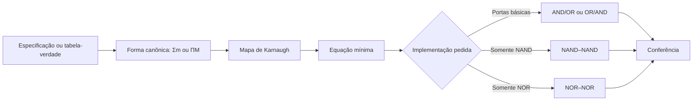

# Aula Detalhada — Síntese Lógica Completa: SOP, POS, NAND e NOR

**Tema do dia:** Projeto de circuitos combinacionais a partir de funções lógicas  
**Data do cronograma revisado:** 28/05 — Quinta-feira  
**Aula na sequência:** 9  
**Objetivo:** transformar especificações e tabelas-verdade em circuitos lógicos mínimos, escolhendo entre `SOP` e `POS` e implementando funções com portas básicas, somente `NAND` ou somente `NOR`.

---

## 1. Onde esta aula entra no estudo?

Até agora, você aprendeu as peças da lógica combinacional:

```text
aulas 1 e 2 → representações numéricas e códigos
aula 3       → portas lógicas e expressões
aulas 4 e 5 → simplificação, DeMorgan, NAND e NOR
aula 6       → mintermos, maxtermos, SOP e POS
aulas 7 e 8 → mapas de Karnaugh e don't care
```

Nesta aula, você junta tudo isso em um processo de projeto:

```text
receber o comportamento desejado
escrever a função
minimizar a função
montar o circuito
verificar se o circuito faz exatamente o que deveria
```

Esse processo é chamado de:

```text
síntese de circuito lógico
```

---

# 2. Análise e síntese são caminhos opostos

É importante não confundir duas tarefas.

## 2.1 Análise de circuito

Na análise, o circuito já existe. Você precisa descobrir o que ele faz:

```text
circuito → expressão → tabela-verdade
```

Exemplo de pergunta:

```text
Dado um circuito com duas AND e uma OR, determine F.
```

## 2.2 Síntese de circuito

Na síntese, o comportamento desejado já existe. Você precisa construir um circuito que o realize:

```text
tabela-verdade ou especificação → expressão → simplificação → circuito
```

Exemplo de pergunta:

```text
Projete um circuito que produza 1 nas entradas indicadas pela tabela.
```

Nesta aula, o foco é a síntese.

---

# 3. O caminho completo da síntese lógica



O circuito não deve ser desenhado diretamente a partir da tabela, por impulso. O caminho intermediário evita circuitos desnecessariamente grandes.

```text
tabela → expressão mínima → circuito
```

---

# 4. O que significa sintetizar uma função?

Uma função lógica descreve quais combinações das entradas produzem saída `1` ou `0`.

Por exemplo:

```text
Uma saída F deve valer 1 quando pelo menos uma condição de segurança falhar.
```

Na prática de prova, isso costuma aparecer em uma destas formas:

| Entrada do problema | O que você faz primeiro |
|---|---|
| Tabela-verdade | Identifique as linhas com `F=1` ou `F=0` |
| Lista de mintermos | Preencha os `1s` no mapa |
| Lista de maxtermos | Preencha os `0s` no mapa |
| Expressão lógica | Avalie, simplifique ou converta para a forma conveniente |
| Circuito desenhado | Extraia a expressão antes de analisar |

O objetivo final é obter uma implementação que:

```text
produza os valores corretos
use a forma solicitada
seja simples o suficiente para reduzir portas e erros
```

---

# 5. Da tabela para a forma canônica

Considere uma função de três entradas:

| A | B | C | F |
|---:|---:|---:|---:|
| `0` | `0` | `0` | `0` |
| `0` | `0` | `1` | `1` |
| `0` | `1` | `0` | `0` |
| `0` | `1` | `1` | `1` |
| `1` | `0` | `0` | `0` |
| `1` | `0` | `1` | `0` |
| `1` | `1` | `0` | `1` |
| `1` | `1` | `1` | `1` |

## 5.1 Lendo pelos `1s`: SOP canônica

As linhas onde `F=1` são:

```text
m1, m3, m6, m7
```

Logo:

```text
F(A,B,C) = Σm(1,3,6,7)
```

Expandindo os mintermos:

```text
F = A'B'C + A'BC + ABC' + ABC
```

## 5.2 Lendo pelos `0s`: POS canônica

As linhas onde `F=0` são:

```text
M0, M2, M4, M5
```

Logo:

```text
F(A,B,C) = ΠM(0,2,4,5)
```

Expandindo os maxtermos:

```text
F = (A+B+C)(A+B'+C)(A'+B+C)(A'+B+C')
```

As duas expressões descrevem a mesma função. Uma lista observa onde a função é `1`; a outra observa onde ela é `0`.

---

# 6. SOP ou POS: qual caminho escolher?

Nem sempre a prova determina a forma. Quando você puder escolher, observe o mapa.

## 6.1 Use SOP quando os `1s` formam grupos melhores

Em `SOP`:

```text
agrupamos 1s
cada grupo produz um termo produto
somamos os termos
```

Exemplo de resultado:

```text
F = A'C + AB
```

A implementação natural com portas básicas é:

```text
AND nos termos produto → OR na saída
```

Se for pedido usar apenas uma porta universal:

```text
SOP favorece NAND–NAND
```

## 6.2 Use POS quando os `0s` formam grupos melhores

Em `POS`:

```text
agrupamos 0s
cada grupo produz um termo soma
multiplicamos os termos
```

Exemplo de resultado:

```text
F = (A+C)(A'+B)
```

A implementação natural com portas básicas é:

```text
OR nos termos soma → AND na saída
```

Se for pedido usar apenas uma porta universal:

```text
POS favorece NOR–NOR
```

## 6.3 Regra prática

| Objetivo de implementação | Forma preferida |
|---|---|
| Circuito `AND/OR` | `SOP` |
| Circuito `OR/AND` | `POS` |
| Somente `NAND` em dois níveis | `SOP` |
| Somente `NOR` em dois níveis | `POS` |

Se a questão exigir uma forma específica, você segue o pedido mesmo que a outra pareça menor.

---

# 7. Minimização em SOP: agrupe os `1s`

Usando a função:

```text
F(A,B,C) = Σm(1,3,6,7)
```

Monte o mapa:

| `A \ BC` | `00` | `01` | `11` | `10` |
|---|---:|---:|---:|---:|
| `0` | `0` | `1` | `1` | `0` |
| `1` | `0` | `0` | `1` | `1` |

Agrupamentos:

| Grupo | Mintermos | Constantes | Termo produto |
|---|---|---|---|
| Par superior central | `m1,m3` | `A=0`, `C=1` | `A'C` |
| Par inferior direito | `m6,m7` | `A=1`, `B=1` | `AB` |

Resultado mínimo em soma de produtos:

```text
F = A'C + AB
```

Perceba a passagem:

```text
4 mintermos com 3 literais
        ↓
2 termos com 2 literais
```

---

# 8. Circuito a partir de uma SOP mínima

Para:

```text
F = A'C + AB
```

as operações são:

```text
1. inverter A para produzir A'
2. calcular A'C com uma porta AND
3. calcular AB com outra porta AND
4. somar os dois produtos com uma porta OR
```

Representação em sinais intermediários:

```text
N0 = A'
N1 = N0 · C
N2 = A · B
F  = N1 + N2
```

O circuito básico possui:

```text
1 NOT
2 AND
1 OR
```

## 8.1 Como ler o desenho pedido em prova

Quando a expressão estiver em `SOP`, desenhe da esquerda para a direita:

```text
literais negados → portas AND dos produtos → porta OR final
```

Isso diminui o risco de trocar `AND` por `OR` no último nível.

---

# 9. A mesma SOP usando somente NAND

Considere novamente:

```text
F = A'C + AB
```

Uma estrutura `NAND–NAND` realiza diretamente uma soma de produtos:

```text
F = A'C + AB
  = ((A'C)' · (AB)')'
```

Essa última linha é a forma implementável com NAND.

Primeiro, obtenha `A'`:

```text
N0 = A NAND A = A'
```

Depois, gere os complementos dos produtos:

```text
N1 = N0 NAND C = (A'C)'
N2 = A NAND B  = (AB)'
```

Por fim:

```text
F = N1 NAND N2 = A'C + AB
```

## 9.1 O que a NAND final faz?

Ela recebe os produtos já negados:

```text
(A'C)' e (AB)'
```

e aplica:

```text
((A'C)' · (AB)')' = A'C + AB
```

Essa é a razão de `SOP` combinar naturalmente com `NAND–NAND`.

---

# 10. Minimização em POS: agrupe os `0s`

A mesma tabela da seção 5 possui zeros em:

```text
F(A,B,C) = ΠM(0,2,4,5)
```

Para obter uma `POS` mínima, coloque os `0s` no mapa e agrupe esses zeros:

| `A \ BC` | `00` | `01` | `11` | `10` |
|---|---:|---:|---:|---:|
| `0` | `0` | `1` | `1` | `0` |
| `1` | `0` | `0` | `1` | `1` |

Os quatro zeros são cobertos por dois pares:

| Grupo de zeros | Maxtermos | Constantes | Termo soma |
|---|---|---|---|
| Par pelas bordas na linha superior | `M0,M2` | `A=0`, `C=0` | `(A+C)` |
| Par inferior à esquerda | `M4,M5` | `A=1`, `B=0` | `(A'+B)` |

Resultado mínimo em produto de somas:

```text
F = (A+C)(A'+B)
```

## 10.1 Regra para ler um grupo de zeros

Ao agrupar `0s` para produzir um maxtermo:

```text
variável constante em 0 → aparece direta no termo soma
variável constante em 1 → aparece complementada no termo soma
variável que muda        → desaparece
```

Compare:

| Grupo | Forma usada | Valor constante `0` | Valor constante `1` |
|---|---|---|---|
| Grupo de `1s` para `SOP` | Produto | variável complementada | variável direta |
| Grupo de `0s` para `POS` | Soma | variável direta | variável complementada |

---

# 11. Circuito a partir de uma POS mínima

Para:

```text
F = (A+C)(A'+B)
```

as operações são:

```text
1. inverter A para produzir A'
2. calcular A+C com uma porta OR
3. calcular A'+B com outra porta OR
4. multiplicar os termos soma com uma porta AND
```

Representação em sinais:

```text
N0 = A'
N1 = A + C
N2 = N0 + B
F  = N1 · N2
```

O circuito básico possui:

```text
1 NOT
2 OR
1 AND
```

---

# 12. A mesma POS usando somente NOR

Considere:

```text
F = (A+C)(A'+B)
```

Uma estrutura `NOR–NOR` realiza diretamente um produto de somas:

```text
F = (A+C)(A'+B)
  = ((A+C)' + (A'+B)')'
```

Primeiro, obtenha `A'`:

```text
N0 = A NOR A = A'
```

Depois, produza os termos soma negados:

```text
N1 = A NOR C  = (A+C)'
N2 = N0 NOR B = (A'+B)'
```

Por fim:

```text
F = N1 NOR N2 = (A+C)(A'+B)
```

Essa é a razão de `POS` combinar naturalmente com `NOR–NOR`.

---

# 13. Comparando as duas implementações da mesma função

A função do exemplo pode ser escrita de duas formas mínimas:

```text
SOP: F = A'C + AB
POS: F = (A+C)(A'+B)
```

As duas produzem a mesma tabela-verdade.

| Forma | Implementação com portas básicas | Implementação universal natural |
|---|---|---|
| `A'C + AB` | Duas `AND` seguidas de `OR` | `NAND–NAND` |
| `(A+C)(A'+B)` | Duas `OR` seguidas de `AND` | `NOR–NOR` |

Quando a questão diz:

```text
implemente somente com NAND
```

prefira obter ou manter a expressão em `SOP`.

Quando a questão diz:

```text
implemente somente com NOR
```

prefira obter ou manter a expressão em `POS`.

---

# 14. Síntese com quatro variáveis e `don't care`

Considere uma função de entrada BCD que deve indicar dígitos `8` ou `9`:

```text
F(A,B,C,D) = Σm(8,9) + d(10,11,12,13,14,15)
```

Da aula anterior, usando os `X` para formar uma oitava:

```text
F = A
```

O circuito final não precisa de porta:

```text
saída F conectada diretamente à entrada A
```

Este caso mostra por que a minimização deve ocorrer antes do desenho do circuito:

```text
uma expressão aparentemente grande pode reduzir-se a um fio
```

---

# 15. Avaliando expressões lógicas combinadas

Além de sintetizar, a prova pode entregar uma expressão e pedir a saída para determinados valores.

## 15.1 Ordem de avaliação

Use esta ordem:

```text
1. NOT
2. AND
3. OR
```

Parênteses têm prioridade sobre essa ordem.

## 15.2 Exemplo com soma de produtos

Calcule:

```text
F = A + B'C
```

para:

```text
A=0, B=0, C=1
```

Avaliação:

| Parte | Valor |
|---|---:|
| `B'` | `1` |
| `B'C` | `1·1 = 1` |
| `A + B'C` | `0 + 1 = 1` |

Logo:

```text
F = 1
```

## 15.3 Exemplo com produto de somas

Calcule:

```text
F = (A+B)(C+D')
```

para:

```text
A=0, B=1, C=0, D=1
```

Avaliação:

| Parte | Valor |
|---|---:|
| `D'` | `0` |
| `A+B` | `0+1 = 1` |
| `C+D'` | `0+0 = 0` |
| `(A+B)(C+D')` | `1·0 = 0` |

Logo:

```text
F = 0
```

---

# 16. Como desenhar o circuito sem se perder

Ao desenhar a implementação, nomeie resultados intermediários.

## 16.1 Para SOP

Se:

```text
F = A'B + CD
```

escreva antes do desenho:

```text
N0 = A'
N1 = N0 · B
N2 = C · D
F  = N1 + N2
```

## 16.2 Para POS

Se:

```text
F = (A+B')(C+D)
```

escreva:

```text
N0 = B'
N1 = A + N0
N2 = C + D
F  = N1 · N2
```

## 16.3 Para somente NAND ou somente NOR

Mantenha o mesmo hábito:

```text
cada linha corresponde a uma porta
cada sinal intermediário deve ter significado conhecido
```

Isso facilita conferir sua resposta sem precisar redesenhar o circuito inteiro.

---

# 17. Quando há literal negado na implementação universal

Uma expressão mínima pode conter entradas complementadas:

```text
A', B', C' ou D'
```

Se a implementação deve usar somente `NAND`:

```text
A' = A NAND A
```

Se a implementação deve usar somente `NOR`:

```text
A' = A NOR A
```

Exemplo em NAND:

```text
F = A'B + CD

N0 = A NAND A  = A'
N1 = N0 NAND B = (A'B)'
N2 = C NAND D  = (CD)'
F  = N1 NAND N2
```

Exemplo em NOR:

```text
F = (A'+B)(C+D)

N0 = A NOR A   = A'
N1 = N0 NOR B  = (A'+B)'
N2 = C NOR D   = (C+D)'
F  = N1 NOR N2
```

---

# 18. Roteiro completo para questões de síntese

## Se a entrada for uma tabela-verdade

```text
1. Confira a ordem das combinações.
2. Liste os mintermos dos 1s para SOP ou os maxtermos dos 0s para POS.
3. Preencha o mapa de Karnaugh.
4. Forme os maiores grupos possíveis.
5. Extraia a expressão mínima.
6. Desenhe ou descreva o circuito solicitado.
7. Confira pelo menos as linhas críticas.
```

## Se a entrada já for `Σm(...)`

```text
1. Preencha os 1s diretamente no mapa.
2. Minimize em SOP.
3. Use AND/OR ou NAND–NAND conforme solicitado.
```

## Se a entrada já for `ΠM(...)`

```text
1. Preencha os 0s diretamente no mapa.
2. Minimize em POS.
3. Use OR/AND ou NOR–NOR conforme solicitado.
```

## Se houver `don't care`

```text
1. Marque as células com X.
2. Use um X apenas quando ampliar um grupo necessário.
3. Não crie termo para cobrir exclusivamente X.
```

---

# 19. Como conferir a síntese final

Uma expressão bonita ainda pode estar errada. Faça conferência rápida.

## 19.1 Confira os `1s` obrigatórios

Se a função foi dada em `Σm(...)`, substitua valores correspondentes a alguns mintermos da lista:

```text
a expressão final precisa produzir 1
```

## 19.2 Confira zeros fora da lista

Escolha uma ou duas entradas não presentes na lista:

```text
a expressão não pode produzir 1 nelas
```

## 19.3 Em `don't care`, não exija valor fixo

Para uma célula `X`:

```text
o circuito pode produzir 0 ou 1
```

## 19.4 Confira o tipo de porta

| Expressão final | Última porta básica | Última porta universal natural |
|---|---|---|
| Soma de produtos | `OR` | `NAND` |
| Produto de somas | `AND` | `NOR` |

---

# 20. Erros comuns em prova

## Erro 1: desenhar o circuito canônico antes de minimizar

Um circuito baseado diretamente em todos os mintermos pode funcionar, mas costuma usar portas demais.

```text
primeiro minimize; depois implemente
```

## Erro 2: agrupar `0s` e escrever uma SOP

```text
agrupar 1s → SOP
agrupar 0s → POS
```

## Erro 3: inverter a regra de leitura de grupos de zeros

Em `POS`, para um grupo de `0s`:

```text
constante 0 → variável direta
constante 1 → variável complementada
```

## Erro 4: usar NAND–NAND diretamente sobre uma POS

Em dois níveis:

```text
NAND–NAND combina naturalmente com SOP
NOR–NOR combina naturalmente com POS
```

## Erro 5: esquecer o inversor necessário para um literal negado

Se a expressão contém `A'` e a implementação só permite NAND, produza:

```text
A' = A NAND A
```

## Erro 6: considerar os `X` como saídas obrigatoriamente iguais a 1

O `X` apenas autoriza escolher o valor que simplifica a implementação.

---

# 21. Resumo operacional

## Rota por SOP

```text
linhas F=1
    ↓
Σm(...)
    ↓
agrupar 1s no Karnaugh
    ↓
SOP mínima
    ↓
AND/OR ou NAND–NAND
```

## Rota por POS

```text
linhas F=0
    ↓
ΠM(...)
    ↓
agrupar 0s no Karnaugh
    ↓
POS mínima
    ↓
OR/AND ou NOR–NOR
```

## Decisão rápida

| Se a questão pedir... | Busque preferencialmente... |
|---|---|
| `AND/OR` | `SOP` mínima |
| `OR/AND` | `POS` mínima |
| Apenas `NAND` | `SOP` mínima |
| Apenas `NOR` | `POS` mínima |

---

# 22. Exercícios para fazer

## Parte A — Avaliação de expressões

Calcule a saída `F` para os valores indicados.

1. `F = A + B'C`, com `A=0`, `B=0`, `C=1`.

2. `F = (A+B)(C+D')`, com `A=0`, `B=1`, `C=0`, `D=1`.

3. `F = (AB+C)'`, com `A=1`, `B=1`, `C=0`.

4. `F = A'B + AC`, com `A=1`, `B=0`, `C=1`.

5. `F = (A+B')(A'+C)`, com `A=1`, `B=1`, `C=0`.

6. `F = (A XOR B) + C'`, com `A=1`, `B=1`, `C=0`.

## Parte B — Da tabela ao circuito com portas básicas

Para cada tabela:

```text
1. Escreva a SOP canônica em notação Σm(...).
2. Minimize usando mapa de Karnaugh.
3. Descreva o circuito AND/OR correspondente à expressão mínima.
```

### Exercício 7

| A | B | C | F |
|---:|---:|---:|---:|
| `0` | `0` | `0` | `0` |
| `0` | `0` | `1` | `1` |
| `0` | `1` | `0` | `0` |
| `0` | `1` | `1` | `1` |
| `1` | `0` | `0` | `0` |
| `1` | `0` | `1` | `1` |
| `1` | `1` | `0` | `0` |
| `1` | `1` | `1` | `1` |

### Exercício 8

| A | B | C | F |
|---:|---:|---:|---:|
| `0` | `0` | `0` | `1` |
| `0` | `0` | `1` | `0` |
| `0` | `1` | `0` | `1` |
| `0` | `1` | `1` | `0` |
| `1` | `0` | `0` | `1` |
| `1` | `0` | `1` | `1` |
| `1` | `1` | `0` | `1` |
| `1` | `1` | `1` | `1` |

### Exercício 9

| A | B | C | F |
|---:|---:|---:|---:|
| `0` | `0` | `0` | `0` |
| `0` | `0` | `1` | `1` |
| `0` | `1` | `0` | `1` |
| `0` | `1` | `1` | `1` |
| `1` | `0` | `0` | `0` |
| `1` | `0` | `1` | `1` |
| `1` | `1` | `0` | `0` |
| `1` | `1` | `1` | `1` |

### Exercício 10

| A | B | C | D | F |
|---:|---:|---:|---:|---:|
| `0` | `0` | `0` | `0` | `1` |
| `0` | `0` | `0` | `1` | `1` |
| `0` | `0` | `1` | `0` | `1` |
| `0` | `0` | `1` | `1` | `1` |
| `0` | `1` | `0` | `0` | `0` |
| `0` | `1` | `0` | `1` | `0` |
| `0` | `1` | `1` | `0` | `0` |
| `0` | `1` | `1` | `1` | `0` |
| `1` | `0` | `0` | `0` | `1` |
| `1` | `0` | `0` | `1` | `1` |
| `1` | `0` | `1` | `0` | `1` |
| `1` | `0` | `1` | `1` | `1` |
| `1` | `1` | `0` | `0` | `0` |
| `1` | `1` | `0` | `1` | `0` |
| `1` | `1` | `1` | `0` | `0` |
| `1` | `1` | `1` | `1` | `0` |

### Exercício 11

| A | B | C | D | F |
|---:|---:|---:|---:|---:|
| `0` | `0` | `0` | `0` | `1` |
| `0` | `0` | `0` | `1` | `0` |
| `0` | `0` | `1` | `0` | `1` |
| `0` | `0` | `1` | `1` | `0` |
| `0` | `1` | `0` | `0` | `0` |
| `0` | `1` | `0` | `1` | `1` |
| `0` | `1` | `1` | `0` | `0` |
| `0` | `1` | `1` | `1` | `1` |
| `1` | `0` | `0` | `0` | `1` |
| `1` | `0` | `0` | `1` | `0` |
| `1` | `0` | `1` | `0` | `1` |
| `1` | `0` | `1` | `1` | `0` |
| `1` | `1` | `0` | `0` | `0` |
| `1` | `1` | `0` | `1` | `1` |
| `1` | `1` | `1` | `0` | `0` |
| `1` | `1` | `1` | `1` | `1` |

## Parte C — Implementação somente com NAND

Descreva o circuito usando equações intermediárias, com uma porta por linha.

12. Implemente somente com `NAND`:

```text
F = AB + C'D
```

13. Implemente somente com `NAND`:

```text
F = A + B'C
```

## Parte D — Implementação somente com NOR

Descreva o circuito usando equações intermediárias, com uma porta por linha.

14. Implemente somente com `NOR`:

```text
F = (A+B)(C'+D)
```

15. Implemente somente com `NOR`:

```text
F = (A'+B)(C+D')
```

---

# 23. Gabarito direto

## Parte A — Avaliação de expressões

| Exercício | Resposta |
|---:|---:|
| `1` | `F=1` |
| `2` | `F=0` |
| `3` | `F=0` |
| `4` | `F=1` |
| `5` | `F=0` |
| `6` | `F=1` |

## Parte B — Da tabela ao circuito com portas básicas

| Exercício | Forma canônica | Expressão mínima | Circuito mínimo |
|---:|---|---|---|
| `7` | `Σm(1,3,5,7)` | `F=C` | Ligar `C` diretamente a `F` |
| `8` | `Σm(0,2,4,5,6,7)` | `F=A+C'` | Uma `NOT` para `C'` e uma `OR` com `A` |
| `9` | `Σm(1,2,3,5,7)` | `F=C+A'B` | Uma `NOT` em `A`, uma `AND` para `A'B` e uma `OR` com `C` |
| `10` | `Σm(0,1,2,3,8,9,10,11)` | `F=B'` | Uma `NOT` na entrada `B` |
| `11` | `Σm(0,2,5,7,8,10,13,15)` | `F=B'D'+BD` | Duas `NOT`, duas `AND` e uma `OR` |

## Parte C — Somente NAND

### Exercício 12

```text
N0 = C NAND C  = C'
N1 = A NAND B  = (AB)'
N2 = N0 NAND D = (C'D)'
F  = N1 NAND N2
```

### Exercício 13

```text
N0 = B NAND B  = B'
N1 = A NAND A  = A'
N2 = N0 NAND C = (B'C)'
F  = N1 NAND N2
```

## Parte D — Somente NOR

### Exercício 14

```text
N0 = C NOR C  = C'
N1 = A NOR B  = (A+B)'
N2 = N0 NOR D = (C'+D)'
F  = N1 NOR N2
```

### Exercício 15

```text
N0 = A NOR A  = A'
N1 = D NOR D  = D'
N2 = N0 NOR B = (A'+B)'
N3 = C NOR N1 = (C+D')'
F  = N2 NOR N3
```

---

# 24. O que memorizar

## Fluxo completo

```text
tabela-verdade
      ↓
Σm(...) ou ΠM(...)
      ↓
mapa de Karnaugh
      ↓
expressão mínima
      ↓
circuito solicitado
```

## Associação entre formas e portas

```text
SOP → AND/OR → NAND–NAND
POS → OR/AND → NOR–NOR
```

## Leitura no mapa

```text
SOP: agrupe os 1s
POS: agrupe os 0s
```

## Portas universais para inversão

```text
A' = A NAND A
A' = A NOR A
```

## Conferência final

```text
teste os 1s obrigatórios
teste alguns 0s obrigatórios
ignore a obrigação de valor nas células X
confira se todas as portas respeitam o pedido da questão
```

---

# 25. Plano de estudo para esta aula

Nesta aula, desenhar circuitos e nomear sinais intermediários é tão importante quanto montar os mapas.

| Etapa | Tempo | Atividade |
|---|---:|---|
| Retomada | 15 min | Redesenhar um mapa de 3 e um de 4 variáveis |
| Processo de síntese | 25 min | Estudar seções 2 a 6 e reproduzir o fluxo completo |
| Rota SOP/NAND | 35 min | Refazer em papel as seções 7 a 9 |
| Rota POS/NOR | 40 min | Refazer em papel as seções 10 a 13 |
| Avaliação e conferência | 25 min | Estudar seções 15 a 20 |
| Exercícios de avaliação | 15 min | Resolver a parte A |
| Funções completas | 60 min | Resolver a parte B com mapas e circuitos |
| NAND e NOR | 35 min | Resolver as partes C e D |
| Correção | 20 min | Corrigir e registrar falhas no arquivo de revisão |

Tempo total estimado:

```text
4h30
```

Se precisar reduzir a primeira passada para encaixar outra aula no mesmo dia, faça obrigatoriamente:

```text
seções 3, 6, 7, 8, 9, 10, 11, 12, 18, 19 e 21
exercícios 2, 7, 9, 11, 12 e 14
```

---

# 26. Conexão com o próximo tópico

Com esta aula, você consegue pegar uma função lógica e chegar à implementação em portas:

```text
tabela → mapa → expressão → circuito
```

O próximo item do cronograma é:

```text
multiplexador, demultiplexador, decoder, encoder e blocos lógicos básicos
```

Esses blocos não substituem o que você estudou. Eles são formas padronizadas de construir funções e selecionar, distribuir ou codificar sinais.

Na próxima aula, você verá, por exemplo:

```text
como um MUX escolhe uma entrada
como um decoder ativa uma saída específica
como uma função lógica pode ser implementada usando um MUX ou um decoder
```
