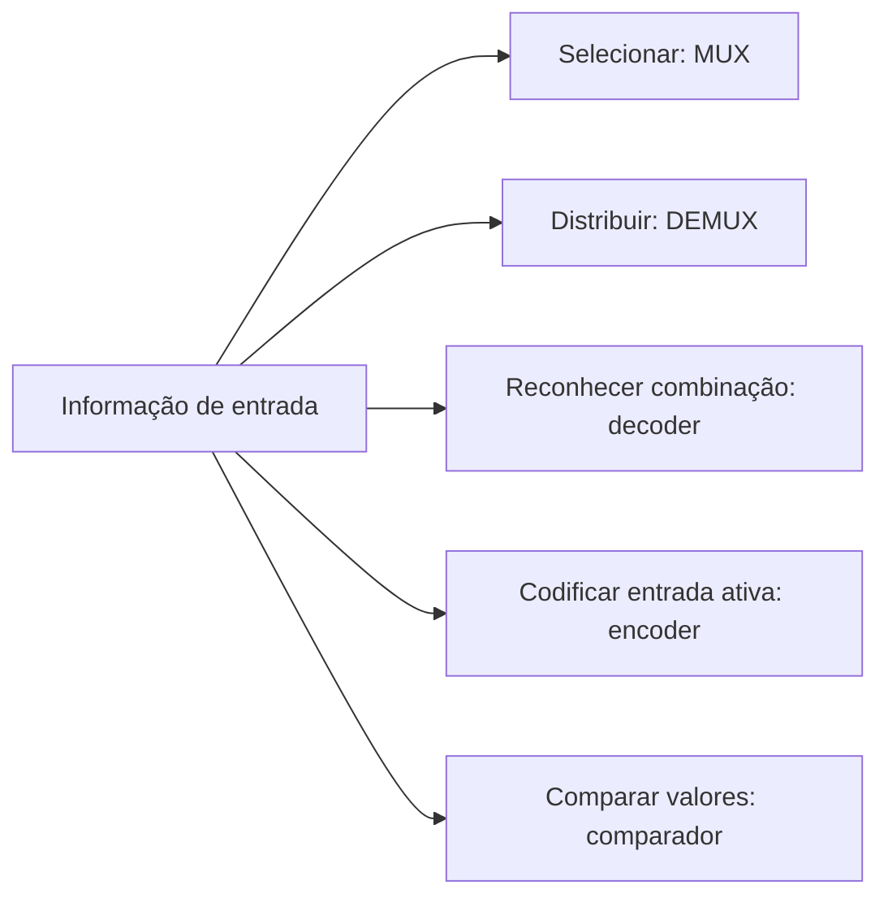

# Aula Detalhada — MUX, DEMUX, Decoder, Encoder e Blocos Combinacionais

**Tema do dia:** Blocos lógicos básicos para seleção, distribuição e codificação de sinais  
**Data do cronograma revisado:** 29/05 — Sexta-feira, com complemento previsto para 30/05  
**Aula na sequência:** 10  
**Objetivo:** compreender o funcionamento de multiplexadores, demultiplexadores, decoders, encoders e comparadores simples, interpretar suas tabelas e usar `MUX` e `decoder` para implementar funções lógicas.

---

## 1. Onde esta aula entra no estudo?

Nas aulas anteriores, você construiu circuitos a partir de portas:

```text
tabela-verdade → Karnaugh → expressão mínima → AND/OR, NAND ou NOR
```

Agora você verá blocos que já encapsulam comportamentos muito usados:

```text
MUX      → escolhe uma entre várias entradas
DEMUX    → envia uma entrada para uma entre várias saídas
decoder  → identifica uma combinação binária ativando uma saída
encoder  → informa em binário qual entrada está ativa
comparador → informa se valores são iguais ou qual é maior
```

Esses blocos continuam sendo feitos de portas lógicas. A diferença é que, em vez de redesenhar todas as portas, tratamos o conjunto como uma peça pronta.



---

# 2. O que é um bloco combinacional?

Um circuito é **combinacional** quando sua saída depende somente das entradas atuais:

```text
mesmas entradas agora → mesmas saídas agora
```

Ele não possui memória de acontecimentos anteriores.

Os blocos desta aula são combinacionais:

| Bloco | Entradas principais | Saída principal |
|---|---|---|
| `MUX` | Vários dados + seleção | Um dado escolhido |
| `DEMUX` | Um dado + seleção | Uma saída escolhida recebe o dado |
| `Decoder` | Código binário | Uma saída correspondente ativa |
| `Encoder` | Uma entrada ativa | Código binário dessa entrada |
| `Comparador` | Dois valores | Igual, maior ou menor |

Mais adiante, latches, flip-flops, contadores e máquinas de estados serão circuitos **sequenciais**, pois armazenam estado.

---

# 3. Sinais de seleção e de habilitação

Antes de estudar os blocos, distinga dois tipos de entrada.

## 3.1 Seleção

Um sinal de seleção decide qual caminho será usado:

```text
S = 0 → escolhe um caminho
S = 1 → escolhe outro caminho
```

Em blocos maiores, aparecem vários seletores:

```text
S1 S0 = 00, 01, 10 ou 11
```

## 3.2 Enable ou habilitação

Um sinal `EN` decide se o bloco está ativo:

```text
EN = 1 → bloco habilitado, se o enable for ativo em nível alto
EN = 0 → bloco desabilitado
```

Algumas questões usam enable ativo em nível baixo, escrito como:

```text
EN'
/EN
bolha na entrada EN
```

Nesses casos:

```text
EN = 0 → bloco habilitado
```

Sempre verifique a polaridade indicada no enunciado ou no símbolo.

---

# 4. Multiplexador: escolhendo uma entrada

O **multiplexador**, abreviado `MUX`, funciona como uma chave digital:

```text
várias entradas de dados
uma única saída
seletores escolhem qual entrada chegará à saída
```

Uma analogia adequada é um seletor de fonte:

```text
vários sinais disponíveis → somente um é encaminhado
```

## 4.1 Relação entre entradas e seletores

Com `n` bits de seleção, é possível escolher entre:

```text
2^n entradas de dados
```

| Seletores | Combinações de seleção | Entradas escolhíveis | Nome comum |
|---:|---:|---:|---|
| `1` | `2` | `2` | MUX `2:1` |
| `2` | `4` | `4` | MUX `4:1` |
| `3` | `8` | `8` | MUX `8:1` |
| `4` | `16` | `16` | MUX `16:1` |

O nome `4:1`, por exemplo, significa:

```text
4 entradas de dados → 1 saída
```

---

# 5. MUX 2:1

Um MUX `2:1` possui:

```text
entradas: I0 e I1
seletor:  S
saída:    Y
```

Tabela de seleção:

| `S` | Saída `Y` |
|---:|---|
| `0` | `I0` |
| `1` | `I1` |

Representação:

```text
       +---------+
 I0 ---| 0       |
 I1 ---| 1  MUX  |--- Y
 S  ---| sel     |
       +---------+
```

## 5.1 Expressão booleana do MUX 2:1

Quando `S=0`, precisamos passar `I0`:

```text
S'I0
```

Quando `S=1`, precisamos passar `I1`:

```text
SI1
```

Somando os dois casos:

```text
Y = S'I0 + SI1
```

## 5.2 Avaliando um MUX 2:1

Considere:

```text
I0 = 1
I1 = 0
S  = 0
```

Como `S=0`, o MUX escolhe `I0`:

```text
Y = 1
```

Se apenas o seletor mudar para:

```text
S = 1
```

a saída passa a ser:

```text
Y = I1 = 0
```

---

# 6. MUX 4:1

Um MUX `4:1` possui:

```text
entradas:  I0, I1, I2, I3
seletores: S1, S0
saída:     Y
```

Tabela de seleção:

| `S1` | `S0` | Saída `Y` |
|---:|---:|---|
| `0` | `0` | `I0` |
| `0` | `1` | `I1` |
| `1` | `0` | `I2` |
| `1` | `1` | `I3` |

Atalho:

```text
o valor binário de S1S0 indica o índice da entrada selecionada
```

Exemplos:

```text
S1S0 = 00 → Y = I0
S1S0 = 10 → Y = I2
S1S0 = 11 → Y = I3
```

## 6.1 Expressão do MUX 4:1

```text
Y = S1'S0'I0 + S1'S0I1 + S1S0'I2 + S1S0I3
```

Cada parcela representa uma combinação de seleção ativando exatamente uma entrada.

---

# 7. Implementando funções lógicas com MUX

Um MUX não serve apenas para escolher dados externos. As entradas `I0`, `I1`, `I2` e `I3` podem ser conectadas a:

```text
0
1
uma variável
uma variável negada
outra expressão lógica
```

Assim, o MUX pode implementar uma função.

## 7.1 Usando todas as variáveis como seletores

Para uma função de três variáveis:

```text
F(A,B,C)
```

você pode usar um MUX `8:1` com:

```text
S2=A, S1=B, S0=C
```

Cada entrada do MUX recebe diretamente o valor da função no mintermo correspondente:

| Entrada do MUX | Seleção `ABC` | Valor conectado |
|---|---|---|
| `I0` | `000` | `F(m0)` |
| `I1` | `001` | `F(m1)` |
| `I2` | `010` | `F(m2)` |
| `I3` | `011` | `F(m3)` |
| `I4` | `100` | `F(m4)` |
| `I5` | `101` | `F(m5)` |
| `I6` | `110` | `F(m6)` |
| `I7` | `111` | `F(m7)` |

Exemplo:

```text
F(A,B,C) = Σm(1,2,6,7)
```

Com MUX `8:1`:

```text
I0=0, I1=1, I2=1, I3=0, I4=0, I5=0, I6=1, I7=1
```

Essa implementação é direta, mas usa um MUX maior.

## 7.2 Usando um MUX menor

Também podemos implementar a mesma função:

```text
F(A,B,C) = Σm(1,2,6,7)
```

com um MUX `4:1`, usando:

```text
S1=A
S0=B
```

Agora analisamos o que a saída deve fazer para cada valor de `AB`, deixando `C` como dado:

| `AB` | Linhas consideradas | Valores de `F` quando `C=0` e `C=1` | Entrada do MUX |
|---|---|---|---|
| `00` | `m0,m1` | `0,1` | `I0=C` |
| `01` | `m2,m3` | `1,0` | `I1=C'` |
| `10` | `m4,m5` | `0,0` | `I2=0` |
| `11` | `m6,m7` | `1,1` | `I3=1` |

Portanto:

```text
S1=A, S0=B
I0=C
I1=C'
I2=0
I3=1
```

O MUX `4:1` implementa a função inteira usando apenas um inversor adicional para obter `C'`.

## 7.3 Padrões para uma variável restante

Ao escolher duas variáveis como seletores de um MUX `4:1` para implementar uma função de três variáveis, cada par de valores da saída indica uma ligação:

| Saídas para `C=0,C=1` | Conectar na entrada do MUX |
|---|---|
| `0,0` | `0` |
| `1,1` | `1` |
| `0,1` | `C` |
| `1,0` | `C'` |

Essa tabela é muito importante em questões de implementação com MUX.

---

# 8. Demultiplexador: escolhendo uma saída

O **demultiplexador**, abreviado `DEMUX`, faz o sentido oposto do MUX:

```text
uma entrada de dados
várias saídas
seletores escolhem para qual saída o dado será enviado
```

## 8.1 DEMUX 1:4

Um DEMUX `1:4` possui:

```text
entrada:    D
seletores:  S1, S0
saídas:     Y0, Y1, Y2, Y3
```

Tabela:

| `S1` | `S0` | Saída que recebe `D` | Demais saídas |
|---:|---:|---|---|
| `0` | `0` | `Y0` | `0` |
| `0` | `1` | `Y1` | `0` |
| `1` | `0` | `Y2` | `0` |
| `1` | `1` | `Y3` | `0` |

Exemplo:

```text
D=1 e S1S0=10 → Y2=1; Y0=Y1=Y3=0
D=0 e S1S0=10 → Y2=0; todas as saídas ficam 0
```

## 8.2 Expressões do DEMUX 1:4

```text
Y0 = D S1' S0'
Y1 = D S1' S0
Y2 = D S1  S0'
Y3 = D S1  S0
```

O DEMUX pode ser usado para encaminhar um sinal de controle a apenas um destino por vez.

---

# 9. MUX versus DEMUX

Não confunda a direção dos dados:

| Bloco | Quantidade de entradas de dados | Quantidade de saídas | Pergunta que responde |
|---|---:|---:|---|
| MUX `4:1` | `4` | `1` | Qual entrada passará para a saída? |
| DEMUX `1:4` | `1` | `4` | Qual saída receberá a entrada? |

Visualmente:

```text
MUX:
I0 ─┐
I1 ─┼── seleção ──> Y
I2 ─┼
I3 ─┘

DEMUX:
                     ┌──> Y0
                     ├──> Y1
D ── seleção ────────┼──> Y2
                     └──> Y3
```

---

# 10. Decoder: ativando uma saída a partir de um código

Um **decoder** recebe um código binário e ativa a saída correspondente a esse código.

Um decoder `2:4` possui:

```text
2 entradas binárias
4 saídas
```

## 10.1 Decoder 2:4 ativo em nível alto

Entradas:

```text
A, B
```

Saídas:

```text
D0, D1, D2, D3
```

Tabela:

| `A` | `B` | `D0` | `D1` | `D2` | `D3` |
|---:|---:|---:|---:|---:|---:|
| `0` | `0` | `1` | `0` | `0` | `0` |
| `0` | `1` | `0` | `1` | `0` | `0` |
| `1` | `0` | `0` | `0` | `1` | `0` |
| `1` | `1` | `0` | `0` | `0` | `1` |

A saída ativa é indicada pelo valor binário da entrada:

```text
AB=00 → D0=1
AB=01 → D1=1
AB=10 → D2=1
AB=11 → D3=1
```

## 10.2 Cada saída é um mintermo

As expressões das saídas são:

```text
D0 = A'B'
D1 = A'B
D2 = AB'
D3 = AB
```

Isso explica por que o decoder é útil para construir funções em `SOP`: ele já produz mintermos.

---

# 11. Decoder 3:8 e implementação de funções

Um decoder `3:8` recebe:

```text
A, B, C
```

e possui saídas:

```text
D0 até D7
```

Cada saída corresponde a um mintermo:

| Saída | Combinação ativa | Mintermo |
|---|---|---|
| `D0` | `000` | `A'B'C'` |
| `D1` | `001` | `A'B'C` |
| `D2` | `010` | `A'BC'` |
| `D3` | `011` | `A'BC` |
| `D4` | `100` | `AB'C'` |
| `D5` | `101` | `AB'C` |
| `D6` | `110` | `ABC'` |
| `D7` | `111` | `ABC` |

## 11.1 Implementação por soma de saídas

Para:

```text
F(A,B,C) = Σm(1,2,6,7)
```

use um decoder `3:8` e uma porta `OR`:

```text
F = D1 + D2 + D6 + D7
```

Representação:

```text
ABC ──> decoder 3:8 ── D1 ─┐
                            ├── OR ──> F
                     ── D2 ┤
                     ── D6 ┤
                     ── D7 ┘
```

O decoder pode não fornecer a implementação com menos portas se você construísse tudo do zero. Mas, se ele já está disponível no circuito, implementar uma função por soma de saídas é muito natural.

## 11.2 Enable em decoder

Se um decoder possui `EN` ativo em nível alto:

```text
EN=1 → uma das saídas é ativada conforme as entradas
EN=0 → nenhuma saída é ativada
```

O enable é útil para compor decoders maiores ou ativar apenas um módulo por vez.

---

# 12. Decoder versus DEMUX

Decoder e DEMUX podem parecer iguais porque ambos podem ter uma única saída ativa. A diferença está no dado encaminhado.

| Bloco | O que recebe | O que faz |
|---|---|---|
| Decoder `2:4` | Apenas código `AB` e, às vezes, `EN` | Ativa a saída indicada pelo código |
| DEMUX `1:4` | Dado `D` mais seleção `S1S0` | Encaminha o valor de `D` à saída escolhida |

Se a entrada do DEMUX for permanentemente:

```text
D = 1
```

o DEMUX `1:4` se comporta como um decoder `2:4` ativo em nível alto:

```text
somente a saída selecionada recebe 1
```

---

# 13. Encoder: codificando qual entrada está ativa

Um **encoder** faz o caminho conceitualmente inverso ao decoder:

```text
uma entre várias entradas está ativa
o bloco produz o índice binário dessa entrada
```

## 13.1 Encoder 4:2 simples

Um encoder `4:2` possui:

```text
entradas: D0, D1, D2, D3
saídas:   Y1, Y0
```

Assumindo que apenas uma entrada vale `1` por vez:

| `D3` | `D2` | `D1` | `D0` | `Y1` | `Y0` |
|---:|---:|---:|---:|---:|---:|
| `0` | `0` | `0` | `1` | `0` | `0` |
| `0` | `0` | `1` | `0` | `0` | `1` |
| `0` | `1` | `0` | `0` | `1` | `0` |
| `1` | `0` | `0` | `0` | `1` | `1` |

Leitura:

```text
D0 ativo → saída 00
D1 ativo → saída 01
D2 ativo → saída 10
D3 ativo → saída 11
```

## 13.2 Expressões do encoder simples

Observando a tabela:

```text
Y1 = D2 + D3
Y0 = D1 + D3
```

Essas expressões pressupõem que somente uma entrada esteja ativa.

---

# 14. O problema do encoder simples

O encoder simples fica ambíguo se várias entradas forem ativadas ao mesmo tempo.

Exemplo:

```text
D1=1 e D3=1
```

As saídas calculadas seriam:

```text
Y1 = D2 + D3 = 1
Y0 = D1 + D3 = 1
```

Resultado:

```text
Y1Y0 = 11
```

Esse código parece indicar `D3`, mas a entrada `D1` também estava ativa. Um encoder simples não informa essa situação de forma controlada.

---

# 15. Encoder prioritário

O **encoder prioritário** resolve a ambiguidade definindo qual entrada vence quando mais de uma está ativa.

Suponha prioridade:

```text
D3 > D2 > D1 > D0
```

Tabela resumida:

| Entradas relevantes | Saída `Y1Y0` | Entrada reconhecida |
|---|---|---|
| `D3=1` | `11` | `D3`, independentemente das demais |
| `D3=0, D2=1` | `10` | `D2` |
| `D3=0, D2=0, D1=1` | `01` | `D1` |
| `D3=0, D2=0, D1=0, D0=1` | `00` | `D0` |

Muitos encoders prioritários ainda fornecem um sinal de validade:

```text
V = 1 → existe ao menos uma entrada ativa
V = 0 → nenhuma entrada está ativa
```

Sem esse sinal, a saída:

```text
Y1Y0 = 00
```

pode significar:

```text
D0 ativo
ou nenhuma entrada ativa
```

---

# 16. Decoder versus Encoder

| Característica | Decoder | Encoder |
|---|---|---|
| Direção conceitual | Código binário para uma linha ativa | Uma linha ativa para código binário |
| Exemplo | `2:4` | `4:2` |
| Entrada típica | `AB=10` | `D2=1` |
| Saída típica | `D2=1` | `Y1Y0=10` |
| Cuidado principal | Polaridade das saídas/enable | Mais de uma entrada ativa |

Memorização:

```text
decoder: código abre uma linha
encoder: linha vira código
```

---

# 17. Comparador simples

Um comparador recebe dois valores e produz sinais indicando a relação entre eles.

Para dois bits individuais `A` e `B`, usamos três saídas:

```text
EQ → A é igual a B
GT → A é maior que B
LT → A é menor que B
```

## 17.1 Comparador de 1 bit

| `A` | `B` | `EQ` | `GT` | `LT` |
|---:|---:|---:|---:|---:|
| `0` | `0` | `1` | `0` | `0` |
| `0` | `1` | `0` | `0` | `1` |
| `1` | `0` | `0` | `1` | `0` |
| `1` | `1` | `1` | `0` | `0` |

Expressões:

```text
EQ = A XNOR B = A'B' + AB
GT = AB'
LT = A'B
```

## 17.2 Ideia para mais bits

Ao comparar números com mais de um bit, o bit mais significativo tem prioridade.

Exemplo:

```text
10₂ > 01₂
```

Não é necessário olhar o segundo bit depois que o mais significativo já decidiu:

```text
1 > 0
```

Esse princípio aparecerá novamente em ULA e circuitos aritméticos.

---

# 18. Escolhendo o bloco adequado

Questões podem descrever uma necessidade sem dar o nome do bloco.

| Necessidade descrita | Bloco adequado |
|---|---|
| Escolher um entre quatro sensores para leitura em uma linha | MUX `4:1` |
| Enviar um pulso para um entre quatro módulos | DEMUX `1:4` |
| Ativar uma entre oito linhas a partir de endereço binário | Decoder `3:8` |
| Produzir o número binário da tecla ativa | Encoder |
| Escolher a tecla de maior prioridade se duas forem pressionadas | Encoder prioritário |
| Indicar se duas palavras são iguais | Comparador |

---

# 19. Relação com a síntese lógica

Na aula 9, você aprendeu a implementar:

```text
F = Σm(...)
```

por portas e mapas.

Agora há novas possibilidades:

## 19.1 Usando decoder

Se a função está em soma de mintermos:

```text
F(A,B,C) = Σm(1,2,6,7)
```

um decoder `3:8` fornece diretamente:

```text
D1, D2, D6 e D7
```

Basta somar:

```text
F = D1 + D2 + D6 + D7
```

## 19.2 Usando MUX

A mesma função pode ser implementada por um MUX:

```text
MUX 8:1 → usar A, B, C como seleção e ligar 0/1 nas entradas
MUX 4:1 → usar A, B como seleção e ligar C, C', 0, 1 nas entradas
```

## 19.3 Qual é melhor?

Depende do que a questão fornece ou exige:

| Se o problema fornecer ou pedir... | Caminho natural |
|---|---|
| Um decoder disponível e função em `Σm` | Somar saídas do decoder |
| Um MUX de tamanho suficiente | Programar suas entradas |
| Apenas portas | Karnaugh e expressão mínima |

---

# 20. Erros comuns em prova

## Erro 1: confundir MUX com DEMUX

```text
MUX: muitas entradas → uma saída
DEMUX: uma entrada → muitas saídas
```

## Erro 2: errar a quantidade de seletores

```text
MUX 4:1 precisa de 2 seletores, pois 2^2=4.
MUX 8:1 precisa de 3 seletores, pois 2^3=8.
```

## Erro 3: trocar o índice de seleção

Em MUX `4:1`:

```text
S1S0=10 → escolhe I2, não I3
```

## Erro 4: esquecer que o decoder gera mintermos

Em decoder `3:8`:

```text
D5 corresponde a ABC=101 → AB'C
```

## Erro 5: assumir que encoder simples aceita várias entradas ativas

Se isso puder ocorrer, o enunciado deve especificar prioridade ou o circuito pode ficar ambíguo.

## Erro 6: confundir o enable com a seleção

```text
seleção decide qual canal
enable decide se o bloco funciona
```

---

# 21. Resumo Operacional

## MUX

```text
2:1 → Y = S'I0 + SI1
4:1 → 2 seletores escolhem I0, I1, I2 ou I3
Função de 3 variáveis com MUX 4:1:
escolha 2 variáveis como seleção e ligue 0, 1, variável ou complemento nas entradas
```

## DEMUX

```text
1 entrada de dado → uma saída selecionada
DEMUX 1:4 usa 2 seletores
```

## Decoder

```text
n entradas → 2^n saídas
decoder 3:8 produz os mintermos m0 a m7
F = Σm(1,2,6,7) → F = D1 + D2 + D6 + D7
```

## Encoder

```text
uma entrada ativa → índice binário
encoder 4:2: D2 ativo → saída 10
se mais de uma entrada pode ativar, use prioridade
```

## Comparador

```text
EQ = A XNOR B
GT = AB'
LT = A'B
```

---

# 22. Exercícios para Fazer

## Parte A — Multiplexadores

1. Quantos seletores são necessários em um MUX `8:1`?

2. Em um MUX `4:1`, com `I0=0`, `I1=1`, `I2=1`, `I3=0` e `S1S0=10`, qual é a saída `Y`?

3. Escreva a expressão booleana de um MUX `2:1` com entradas `I0`, `I1` e seletor `S`.

4. Um MUX `8:1` usa `A`, `B` e `C` como seletores para implementar:

```text
F(A,B,C) = Σm(0,3,5,6)
```

Quais valores devem ser conectados a `I0` até `I7`?

5. Implemente com MUX `4:1`, usando `A` e `B` como seletores:

```text
F(A,B,C) = Σm(0,1,2,6,7)
```

Determine `I0`, `I1`, `I2` e `I3`.

6. Implemente com MUX `4:1`, usando `A` e `B` como seletores:

```text
F(A,B,C) = Σm(1,2,3,4,6)
```

Determine `I0`, `I1`, `I2` e `I3`.

## Parte B — Decoder

7. Em um decoder `2:4` ativo em nível alto, qual saída é ativada quando `AB=10`?

8. Escreva as expressões das quatro saídas de um decoder `2:4` ativo em nível alto.

9. Usando um decoder `3:8`, indique quais saídas devem ser conectadas a uma porta `OR` para implementar:

```text
F(A,B,C) = Σm(0,2,5,7)
```

10. Em um decoder `3:8`, qual mintermo corresponde à saída `D6`?

11. Um decoder `3:8` possui enable `EN` ativo em nível alto. Se `EN=0`, quantas saídas ficam ativas?

## Parte C — Encoder

12. Em um encoder `4:2` simples, qual saída binária é produzida quando apenas `D2=1`?

13. Em um encoder prioritário com prioridade `D3>D2>D1>D0`, qual saída é produzida quando `D3=1` e `D1=1`?

14. Por que um sinal de validade `V` é útil em um encoder?

## Parte D — DEMUX e Comparador

15. Em um DEMUX `1:4`, com `D=1` e seleção `S1S0=01`, quais são os valores de `Y0,Y1,Y2,Y3`?

16. Escreva as expressões das saídas `EQ`, `GT` e `LT` de um comparador de 1 bit para entradas `A` e `B`.

17. Para um comparador de 1 bit, determine `EQ`, `GT` e `LT` quando `A=0` e `B=1`.

---

# 23. Gabarito Direto

## Parte A — Multiplexadores

| Exercício | Resposta |
|---:|---|
| `1` | `3` seletores |
| `2` | `Y=I2=1` |
| `3` | `Y=S'I0+SI1` |
| `4` | `I0=1, I1=0, I2=0, I3=1, I4=0, I5=1, I6=1, I7=0` |
| `5` | `I0=1, I1=C', I2=0, I3=1` |
| `6` | `I0=C, I1=1, I2=C', I3=C'` |

## Parte B — Decoder

| Exercício | Resposta |
|---:|---|
| `7` | `D2=1`; as demais saídas valem `0` |
| `8` | `D0=A'B'`, `D1=A'B`, `D2=AB'`, `D3=AB` |
| `9` | `F=D0+D2+D5+D7` |
| `10` | `D6=ABC'` |
| `11` | Nenhuma saída ativa |

## Parte C — Encoder

| Exercício | Resposta |
|---:|---|
| `12` | `Y1Y0=10` |
| `13` | `Y1Y0=11`, pois `D3` tem prioridade |
| `14` | Distingue o caso `D0` ativo (`00`) do caso em que nenhuma entrada está ativa (`00` sem validade) |

## Parte D — DEMUX e Comparador

| Exercício | Resposta |
|---:|---|
| `15` | `Y0=0, Y1=1, Y2=0, Y3=0` |
| `16` | `EQ=A'B'+AB`, `GT=AB'`, `LT=A'B` |
| `17` | `EQ=0, GT=0, LT=1` |

---

# 24. O que Memorizar

## Identificação dos blocos

```text
MUX: muitos para um
DEMUX: um para muitos
decoder: código para linha
encoder: linha para código
comparador: relação entre dois valores
```

## Relações numéricas

```text
MUX com n seletores escolhe 2^n entradas
decoder com n entradas possui 2^n saídas
encoder com 2^n entradas fornece n bits de código
```

## Equações essenciais

```text
MUX 2:1: Y = S'I0 + SI1

Decoder 2:4:
D0=A'B'
D1=A'B
D2=AB'
D3=AB

Comparador de 1 bit:
EQ=A XNOR B
GT=AB'
LT=A'B
```

## Implementação de função

```text
Com decoder: some as saídas dos mintermos desejados.
Com MUX: seletores escolhem a linha e as entradas recebem 0, 1, variável ou complemento.
```

---

# 25. Plano de Estudo para Esta Aula

| Etapa | Tempo | Atividade |
|---|---:|---|
| Retomada | 10 min | Lembrar `Σm(...)` e como uma função é implementada por portas |
| MUX básico | 35 min | Estudar seções 4 a 6 e montar tabelas de seleção |
| Funções com MUX | 45 min | Refazer a seção 7 e resolver exercícios 1 a 6 |
| DEMUX e decoder | 40 min | Estudar seções 8 a 12 e resolver exercícios 7 a 11 e 15 |
| Encoder | 30 min | Estudar seções 13 a 16 e resolver exercícios 12 a 14 |
| Comparador | 20 min | Estudar seção 17 e resolver exercícios 16 e 17 |
| Correção e revisão | 20 min | Conferir gabarito e registrar erros |

Tempo total estimado:

```text
3h20
```

Se precisar de uma primeira passada mais curta, faça obrigatoriamente:

```text
seções 4, 5, 6, 7, 10, 11, 13, 15, 18 e 21
exercícios 2, 4, 5, 7, 9, 12, 13 e 15
```

---

# 26. Conexão com o Próximo Tópico

Com esta aula, você fecha os principais blocos de lógica combinacional do primeiro conjunto de estudos:

```text
portas e álgebra
formas canônicas
Karnaugh
síntese lógica
MUX, DEMUX, decoder, encoder e comparador simples
```

O passo seguinte previsto é consolidar tudo em questões e simulado combinacional. Depois, a matéria muda de natureza:

```text
lógica combinacional → lógica sequencial
```

Você começará a estudar circuitos que conseguem guardar informação:

```text
latches
flip-flops
registradores
contadores
máquinas de estados
```
