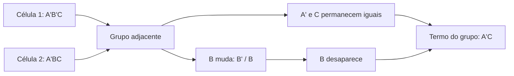

# Aula Detalhada — Mapas de Karnaugh de 2 e 3 Variáveis

**Tema do dia:** Minimização lógica por mapas de Karnaugh  
**Data do cronograma revisado:** 26/05 — Terça-feira  
**Aula na sequência:** 7  
**Objetivo:** organizar mintermos em mapas de Karnaugh, entender adjacência em ordem Gray, formar agrupamentos corretos e obter expressões mínimas em soma de produtos (`SOP`) para funções de 2 e 3 variáveis.

---

## 1. Onde esta aula entra no estudo?

Na aula 6, você aprendeu a partir de uma tabela-verdade e escrever:

```text
F = Σm(...)
```

e depois expandir a função em uma `SOP` canônica:

```text
F = mintermo + mintermo + mintermo + ...
```

Por exemplo:

```text
F(A,B,C) = Σm(0,1,2,3)
```

vira:

```text
F = A'B'C' + A'B'C + A'BC' + A'BC
```

A expressão está correta, mas é muito maior do que precisa ser. Todas essas linhas têm algo em comum:

```text
A = 0
```

Então a função é simplesmente:

```text
F = A'
```

O mapa de Karnaugh é a ferramenta visual que permite encontrar esse tipo de redução rapidamente.

O fluxo agora é:

```text
tabela-verdade → mintermos → mapa de Karnaugh → expressão mínima em SOP
```

Em forma visual:


Depois, na aula de síntese lógica, a expressão mínima será convertida em portas.

---

# 2. O problema da forma canônica

Considere uma função de três variáveis:

```text
F(A,B,C) = Σm(1,3,5,7)
```

A `SOP` canônica é:

```text
F = A'B'C + A'BC + AB'C + ABC
```

Ela exige quatro produtos, cada um com três literais.

Observe, porém, as linhas selecionadas:

| Índice | A | B | C | F |
|---:|---:|---:|---:|---:|
| `1` | `0` | `0` | `1` | `1` |
| `3` | `0` | `1` | `1` | `1` |
| `5` | `1` | `0` | `1` | `1` |
| `7` | `1` | `1` | `1` | `1` |

Nas quatro linhas:

```text
C = 1
```

Enquanto isso:

```text
A varia
B varia
```

Logo:

```text
F = C
```

Em notação matemática, a redução completa fica:

\[
\begin{aligned}
F &= A'B'C + A'BC + AB'C + ABC \\
  &= C(A'B' + A'B + AB' + AB) \\
  &= C \cdot 1 \\
  &= C
\end{aligned}
\]

Uma porta ou fio substitui uma expressão com quatro mintermos. Essa é a finalidade prática da minimização:

```text
menos literais → menos portas → circuito mais simples
```

---

# 3. O que é um mapa de Karnaugh?

Um mapa de Karnaugh, ou mapa `K`, é uma reorganização da tabela-verdade.

Cada célula representa:

```text
uma combinação das entradas
um mintermo
uma linha da tabela-verdade
```

Para obter uma expressão em soma de produtos:

```text
colocamos 1 nas células onde F=1
agrupamos os 1s adjacentes
extraímos um termo produto de cada grupo
somamos os termos encontrados
```

A diferença fundamental para uma tabela comum é a ordem das células:

```text
no mapa, células vizinhas diferem em apenas uma variável
```

Essa propriedade permite apagar variáveis que mudam dentro de um grupo.

---

# 4. Por que agrupar elimina variáveis?

Antes do desenho do mapa, veja a álgebra por trás dele.

## 4.1 Dois mintermos que diferem apenas em `B`

```text
A'B'C + A'BC
```

Fatorando o que é comum:

```text
F = A'C(B' + B)
  = A'C·1
  = A'C
```

De forma compacta:

\[
A'B'C + A'BC = A'C(B' + B) = A'C
\]

O termo `B` desapareceu porque o grupo inclui:

```text
B=0 e B=1
```

e isso produz:

```text
B' + B = 1
```

## 4.2 Quatro mintermos em que duas variáveis mudam

```text
A'B'C' + A'B'C + A'BC' + A'BC
```

Colocando `A'` em evidência:

```text
F = A'(B'C' + B'C + BC' + BC)
```

Dentro dos parênteses estão todas as combinações de `B` e `C`:

```text
B'C' + B'C + BC' + BC = 1
```

Logo:

```text
F = A'
```

Em um grupo de quatro células:

```text
duas variáveis podem variar e desaparecer
```

## 4.3 Ideia central

Ao ler um grupo no mapa:

```text
variável que permanece igual → fica no termo
variável que muda           → desaparece do termo
```

Essa é a regra mais importante desta aula.

Visualize a eliminação da variável no caso de duas células:



---

# 5. Ordem Gray: a base do mapa

Na tabela-verdade tradicional, três variáveis aparecem em ordem binária:

```text
000, 001, 010, 011, 100, 101, 110, 111
```

Essa ordem é útil para numerar mintermos, mas há um problema visual:

```text
01 → 10 muda dois bits ao mesmo tempo
```

No mapa de Karnaugh, usamos ordem Gray:

```text
00, 01, 11, 10
```

Compare vizinhos:

| Passagem | Bits que mudam |
|---|---:|
| `00 → 01` | `1` |
| `01 → 11` | `1` |
| `11 → 10` | `1` |
| `10 → 00` | `1` |

Observe a última passagem:

```text
10 → 00
```

Ela também muda apenas um bit. Por isso, em mapas com quatro colunas:

```text
a primeira coluna é adjacente à última coluna
```

Esse detalhe será essencial nos mapas de 3 variáveis.

---

# 6. Regras de agrupamento para obter SOP mínima

Nesta aula, queremos uma expressão mínima em `SOP`. Portanto:

```text
agruparemos os 1s do mapa
```

As regras são:

## 6.1 Todo grupo deve conter apenas `1`

Não inclua uma célula `0` em um grupo de `1s`.

```text
Grupo com 0 muda a função e está errado.
```

O uso de `X` (`don't care`) será aprofundado na aula seguinte.

## 6.2 O número de células do grupo deve ser potência de 2

Grupos permitidos:

```text
1, 2, 4, 8, ...
```

Grupos proibidos:

```text
3, 5, 6, 7, ...
```

Por que?

Porque cada duplicação completa permite eliminar uma variável:

| Tamanho do grupo | Variáveis eliminadas |
|---:|---:|
| `1` | `0` |
| `2` | `1` |
| `4` | `2` |
| `8` | `3` |

## 6.3 Os grupos devem ser retangulares

São válidos:

```text
uma célula
duas células lado a lado
quatro células em linha
quatro células em retângulo 2×2
```

Não são válidos:

```text
diagonais
formas em L
formas em T
grupos desconectados
```

## 6.4 Faça os maiores grupos possíveis

Quanto maior o grupo, menor o termo resultante:

| Em função de 3 variáveis | Resultado |
|---:|---|
| Grupo de `1` célula | termo com `3` literais |
| Grupo de `2` células | termo com `2` literais |
| Grupo de `4` células | termo com `1` literal |
| Grupo de `8` células | constante `1` |

Logo:

```text
prefira um grupo de 4 a dois grupos de 2
prefira um grupo de 2 a dois grupos isolados
```

## 6.5 Todos os `1s` precisam ser cobertos

Um `1` sem grupo significa que sua expressão final não produzirá `1` naquela entrada.

## 6.6 Sobreposição é permitida quando ajuda

Uma célula `1` pode participar de mais de um grupo.

Isso é útil quando a sobreposição permite:

```text
formar grupos maiores
cobrir 1s isolados sem perder simplificação
```

Não há problema lógico: se um caso que já produz `1` for coberto por dois termos, a saída continua `1`.

---

# 7. Como ler o termo produzido por um grupo

Para cada grupo:

```text
1. Observe as variáveis das células agrupadas.
2. Mantenha somente as variáveis que não mudam.
3. Se a variável constante vale 0, escreva com apóstrofo.
4. Se a variável constante vale 1, escreva sem apóstrofo.
```

Exemplo com duas células:

| A | B | C |
|---:|---:|---:|
| `0` | `1` | `0` |
| `0` | `1` | `1` |

No grupo:

```text
A permanece 0 → A'
B permanece 1 → B
C muda 0/1    → desaparece
```

Termo:

```text
A'B
```

---

# 8. Mapa de Karnaugh de 2 variáveis

Para duas variáveis `A` e `B`, há:

```text
2² = 4 células
```

O mapa é:

```text
              B
            0       1
         +-------+-------+
 A = 0   |  m0   |  m1   |
         +-------+-------+
 A = 1   |  m2   |  m3   |
         +-------+-------+
```

Correspondência completa:

| Célula | A | B | Mintermo |
|---:|---:|---:|---|
| `m0` | `0` | `0` | `A'B'` |
| `m1` | `0` | `1` | `A'B` |
| `m2` | `1` | `0` | `AB'` |
| `m3` | `1` | `1` | `AB` |

Para colocar uma função no mapa, marque:

```text
1 nas células indicadas em Σm(...)
0 nas demais
```

---

# 9. Adjacências no mapa de 2 variáveis

As células adjacentes são as que compartilham uma borda:

```text
m0 é adjacente a m1 e m2
m1 é adjacente a m0 e m3
m2 é adjacente a m0 e m3
m3 é adjacente a m1 e m2
```

As diagonais não são adjacentes:

```text
m0 e m3 não formam grupo de 2
m1 e m2 não formam grupo de 2
```

Confira em bits:

```text
m0 = 00
m3 = 11
```

Duas variáveis mudaram. Logo, não pode haver cancelamento de apenas uma variável.

---

# 10. Grupos possíveis no mapa de 2 variáveis

## 10.1 Uma célula isolada

Se apenas `m1` vale `1`:

```text
F = Σm(1) = A'B
```

Nenhuma variável pode ser eliminada.

## 10.2 Par horizontal

```text
              B
            0       1
         +-------+-------+
 A = 0   |   1   |   1   |  ← grupo
         +-------+-------+
 A = 1   |   0   |   0   |
         +-------+-------+
```

As células são:

```text
m0 = A'B'
m1 = A'B
```

Simplificação:

```text
A'B' + A'B = A'(B'+B) = A'
```

No grupo:

```text
A permanece 0
B muda
```

Resultado:

```text
F = A'
```

## 10.3 Par vertical

```text
              B
            0       1
         +-------+-------+
 A = 0   |   0   |   1   |
         +-------+-------+
 A = 1   |   0   |   1   |
         +-------+-------+
                         ↑ grupo
```

As células são:

```text
m1 = A'B
m3 = AB
```

No grupo:

```text
B permanece 1
A muda
```

Resultado:

```text
F = B
```

## 10.4 Grupo de quatro

Se todas as células valem `1`:

```text
              B
            0       1
         +-------+-------+
 A = 0   |   1   |   1   |
         +-------+-------+
 A = 1   |   1   |   1   |
         +-------+-------+
```

Tanto `A` quanto `B` mudam dentro do grupo:

```text
F = 1
```

A função está sempre ativa, independentemente das entradas.

---

# 11. Exemplo resolvido de 2 variáveis — um grupo e um termo isolado

Simplifique:

```text
F(A,B) = Σm(0,1,3)
```

## 11.1 Preencha o mapa

```text
              B
            0       1
         +-------+-------+
 A = 0   |   1   |   1   |
         +-------+-------+
 A = 1   |   0   |   1   |
         +-------+-------+
```

## 11.2 Forme grupos máximos

Há dois pares necessários:

```text
m0 com m1 → A'
m1 com m3 → B
```

O `m1` aparece nos dois grupos. Isso é permitido e necessário para cobrir os três `1s` usando pares.

## 11.3 Expressão mínima

```text
F = A' + B
```

Conferência algébrica:

```text
F = A'B' + A'B + AB
  = A'(B'+B) + AB
  = A' + AB
  = A' + B
```

---

# 12. Exemplo resolvido de 2 variáveis — diagonal não agrupa

Simplifique:

```text
F(A,B) = Σm(1,2)
```

Mapa:

```text
              B
            0       1
         +-------+-------+
 A = 0   |   0   |   1   |
         +-------+-------+
 A = 1   |   1   |   0   |
         +-------+-------+
```

Os dois `1s` são diagonais. Eles não são adjacentes.

Portanto, ficam isolados:

```text
m1 = A'B
m2 = AB'
```

Resultado:

```text
F = A'B + AB'
```

Essa é a função `XOR`:

```text
F = A ⊕ B
```

O mapa também mostra por que a XOR não vira um único literal: nenhuma das duas variáveis permanece constante entre os casos em que a saída é `1`.

---

# 13. Método rápido para mapas de 2 variáveis

Quando receber `F(A,B)=Σm(...)`:

```text
1. Desenhe as quatro células na posição correta.
2. Coloque os 1s.
3. Verifique primeiro se há grupo de 4.
4. Se não houver, procure pares horizontais ou verticais.
5. Deixe célula isolada apenas quando não houver par possível.
6. Leia o termo de cada grupo.
7. Faça OR entre os termos.
```

---

# 14. Mapa de Karnaugh de 3 variáveis

Para três variáveis `A`, `B` e `C`, há:

```text
2³ = 8 células
```

Usaremos `A` nas linhas e `BC` nas colunas.

As colunas devem ser escritas em ordem Gray:

```text
00, 01, 11, 10
```

Mapa:

```text
                         BC
                 00      01      11      10
              +-------+-------+-------+-------+
 A = 0        |  m0   |  m1   |  m3   |  m2   |
              +-------+-------+-------+-------+
 A = 1        |  m4   |  m5   |  m7   |  m6   |
              +-------+-------+-------+-------+
```

A ordem das células parece estranha no começo:

```text
m0, m1, m3, m2
m4, m5, m7, m6
```

Ela não é crescente porque o mapa não é uma tabela decimal. Ele foi organizado para que vizinhos mudem somente um bit.

---

# 15. Tabela completa das células de 3 variáveis

| Índice | A | B | C | Posição no mapa | Mintermo |
|---:|---:|---:|---:|---|---|
| `m0` | `0` | `0` | `0` | linha `A=0`, coluna `BC=00` | `A'B'C'` |
| `m1` | `0` | `0` | `1` | linha `A=0`, coluna `BC=01` | `A'B'C` |
| `m2` | `0` | `1` | `0` | linha `A=0`, coluna `BC=10` | `A'BC'` |
| `m3` | `0` | `1` | `1` | linha `A=0`, coluna `BC=11` | `A'BC` |
| `m4` | `1` | `0` | `0` | linha `A=1`, coluna `BC=00` | `AB'C'` |
| `m5` | `1` | `0` | `1` | linha `A=1`, coluna `BC=01` | `AB'C` |
| `m6` | `1` | `1` | `0` | linha `A=1`, coluna `BC=10` | `ABC'` |
| `m7` | `1` | `1` | `1` | linha `A=1`, coluna `BC=11` | `ABC` |

Ao desenhar o mapa de memória, escreva primeiro o cabeçalho:

```text
BC = 00, 01, 11, 10
```

Só depois preencha os índices:

```text
A=0 → 0, 1, 3, 2
A=1 → 4, 5, 7, 6
```

Essa pequena rotina evita a maior parte dos erros iniciais.

---

# 16. Adjacência no mapa de 3 variáveis

Há três tipos de adjacência importantes.

## 16.1 Adjacência horizontal

Exemplo:

```text
m0 e m1
```

Bits:

```text
m0 = 000
m1 = 001
```

Somente `C` muda. Portanto, formam um par.

## 16.2 Adjacência vertical

Exemplo:

```text
m1 e m5
```

Bits:

```text
m1 = 001
m5 = 101
```

Somente `A` muda. Portanto, formam um par.

## 16.3 Adjacência pelas bordas laterais

A primeira coluna e a última coluna são vizinhas:

```text
BC=00 é adjacente a BC=10
```

Exemplo:

```text
m0 e m2
```

Bits:

```text
m0 = 000
m2 = 010
```

Somente `B` muda; `A=0` e `C=0` permanecem.

Logo, formam um par:

```text
m0 + m2 → A'C'
```

Visualmente, o mapa deve ser imaginado como se a extremidade esquerda encostasse na extremidade direita:

```text
última coluna ↔ primeira coluna
```

## 16.4 Diagonais continuam proibidas

Por exemplo:

```text
m0 = 000
m7 = 111
```

As três variáveis mudam. Eles não são adjacentes.

---

# 17. Grupos e número de literais no mapa de 3 variáveis

Em uma função de três variáveis:

| Tamanho do grupo | Número de variáveis que mudam | Literais no termo resultante |
|---:|---:|---:|
| `1` | `0` | `3` |
| `2` | `1` | `2` |
| `4` | `2` | `1` |
| `8` | `3` | `0`, resultado `1` |

Isso dá uma forma rápida de conferir seu resultado:

```text
grupo de 4 células nunca deve gerar termo com 2 literais
grupo de 2 células nunca deve gerar termo com 3 literais
```

Essa relação também pode ser representada por:

\[
\text{literais restantes} = n - \log_2(\text{tamanho do grupo})
\]

Para uma função de `3` variáveis:

\[
\begin{array}{c|c}
\text{grupo} & \text{literais restantes} \\
\hline
1 & 3 - \log_2(1) = 3 \\
2 & 3 - \log_2(2) = 2 \\
4 & 3 - \log_2(4) = 1 \\
8 & 3 - \log_2(8) = 0
\end{array}
\]

Você não precisa calcular logaritmos na prova. A fórmula apenas explica o padrão:

```text
cada vez que o grupo dobra, uma variável desaparece
```

---

# 18. Pares importantes no mapa de 3 variáveis

Veja alguns pares e seus termos:

| Células agrupadas | O que muda? | O que permanece? | Termo |
|---|---|---|---|
| `m0, m1` | `C` | `A=0`, `B=0` | `A'B'` |
| `m2, m3` | `C` | `A=0`, `B=1` | `A'B` |
| `m4, m5` | `C` | `A=1`, `B=0` | `AB'` |
| `m6, m7` | `C` | `A=1`, `B=1` | `AB` |
| `m0, m4` | `A` | `B=0`, `C=0` | `B'C'` |
| `m1, m5` | `A` | `B=0`, `C=1` | `B'C` |
| `m3, m7` | `A` | `B=1`, `C=1` | `BC` |
| `m2, m6` | `A` | `B=1`, `C=0` | `BC'` |
| `m0, m2` | `B`, pelas bordas | `A=0`, `C=0` | `A'C'` |
| `m4, m6` | `B`, pelas bordas | `A=1`, `C=0` | `AC'` |

As duas últimas linhas são as que mais passam despercebidas:

```text
os extremos do mapa são vizinhos
```

---

# 19. Quartetos importantes no mapa de 3 variáveis

Um quarteto elimina duas variáveis. Por isso, resulta em um único literal.

## 19.1 Linha superior inteira

```text
                         BC
                 00      01      11      10
              +-------+-------+-------+-------+
 A = 0        |   1   |   1   |   1   |   1   |
              +-------+-------+-------+-------+
 A = 1        |   0   |   0   |   0   |   0   |
              +-------+-------+-------+-------+
```

No grupo:

```text
A permanece 0
B e C mudam
```

Resultado:

```text
A'
```

## 19.2 Linha inferior inteira

Se `m4,m5,m6,m7` forem `1`:

```text
resultado = A
```

## 19.3 Duas colunas centrais

Agrupe:

```text
m1, m3, m5, m7
```

Essas células são as colunas:

```text
BC=01 e BC=11
```

Em todas elas:

```text
C=1
```

`A` e `B` mudam. Resultado:

```text
C
```

## 19.4 Quarteto envolvendo as bordas

Agrupe:

```text
m0, m2, m4, m6
```

No desenho, são a primeira e a última colunas:

```text
                         BC
                 00      01      11      10
              +-------+-------+-------+-------+
 A = 0        |   1   |   0   |   0   |   1   |
              +-------+-------+-------+-------+
 A = 1        |   1   |   0   |   0   |   1   |
              +-------+-------+-------+-------+
```

Em todas elas:

```text
C=0
```

`A` e `B` mudam. Resultado:

```text
C'
```

Não perca esse quarteto: apesar de visualmente separado, ele é um retângulo que fecha pelas bordas do mapa.

---

# 20. Exemplo resolvido de 3 variáveis — linha completa

Simplifique:

```text
F(A,B,C) = Σm(0,1,2,3)
```

## 20.1 Coloque no mapa

```text
                         BC
                 00      01      11      10
              +-------+-------+-------+-------+
 A = 0        |   1   |   1   |   1   |   1   |
              +-------+-------+-------+-------+
 A = 1        |   0   |   0   |   0   |   0   |
              +-------+-------+-------+-------+
```

## 20.2 Escolha o maior grupo

Os quatro `1s` formam um quarteto.

Não faça dois pares, pois:

```text
quarteto elimina duas variáveis
pares eliminariam apenas uma variável em cada termo
```

## 20.3 Leia o termo

```text
A=0 permanece → A'
B muda         → sai
C muda         → sai
```

Resultado:

```text
F = A'
```

---

# 21. Exemplo resolvido de 3 variáveis — agrupamento pelas bordas

Simplifique:

```text
F(A,B,C) = Σm(0,2,4,6)
```

## 21.1 Preencha as células

```text
                         BC
                 00      01      11      10
              +-------+-------+-------+-------+
 A = 0        |   1   |   0   |   0   |   1   |
              +-------+-------+-------+-------+
 A = 1        |   1   |   0   |   0   |   1   |
              +-------+-------+-------+-------+
```

## 21.2 Não caia na armadilha visual

Os `1s` parecem divididos em duas extremidades, mas:

```text
coluna 00 e coluna 10 são adjacentes
```

Portanto, há um quarteto envolvendo as bordas.

## 21.3 Leia o termo

Nas células `m0,m2,m4,m6`:

```text
A muda
B muda
C permanece 0
```

Resultado:

```text
F = C'
```

---

# 22. Exemplo resolvido de 3 variáveis — sobreposição útil

Simplifique:

```text
F(A,B,C) = Σm(1,3,4,5,6,7)
```

## 22.1 Mapa

```text
                         BC
                 00      01      11      10
              +-------+-------+-------+-------+
 A = 0        |   0   |   1   |   1   |   0   |
              +-------+-------+-------+-------+
 A = 1        |   1   |   1   |   1   |   1   |
              +-------+-------+-------+-------+
```

## 22.2 Primeiro grupo: linha inferior

As quatro células inferiores formam:

```text
m4,m5,m7,m6 → A
```

## 22.3 Segundo grupo: colunas com `C=1`

Os `1s` superiores `m1` e `m3` ainda precisam ser cobertos. Em vez de formar apenas um par superior, podemos usar também os `1s` inferiores `m5` e `m7`:

```text
m1,m3,m5,m7 → C
```

As células `m5` e `m7` participam de dois grupos. Essa sobreposição é útil, porque permite formar um quarteto em vez de um par.

## 22.4 Expressão mínima

```text
F = A + C
```

Se você tivesse usado o par superior:

```text
m1,m3 → A'C
```

teria obtido:

```text
F = A + A'C
```

Essa expressão ainda simplifica para:

```text
A + C
```

O mapa já permite chegar diretamente à forma menor escolhendo grupos maiores com sobreposição.

---

# 23. Exemplo resolvido de 3 variáveis — da tabela ao mapa

Dada a tabela:

| Índice | A | B | C | F |
|---:|---:|---:|---:|---:|
| `0` | `0` | `0` | `0` | `0` |
| `1` | `0` | `0` | `1` | `1` |
| `2` | `0` | `1` | `0` | `0` |
| `3` | `0` | `1` | `1` | `1` |
| `4` | `1` | `0` | `0` | `0` |
| `5` | `1` | `0` | `1` | `1` |
| `6` | `1` | `1` | `0` | `0` |
| `7` | `1` | `1` | `1` | `1` |

## 23.1 Escreva a lista de mintermos

Saída `1` em:

```text
1,3,5,7
```

Logo:

```text
F = Σm(1,3,5,7)
```

## 23.2 Coloque no mapa

```text
                         BC
                 00      01      11      10
              +-------+-------+-------+-------+
 A = 0        |   0   |   1   |   1   |   0   |
              +-------+-------+-------+-------+
 A = 1        |   0   |   1   |   1   |   0   |
              +-------+-------+-------+-------+
```

## 23.3 Forme o quarteto

```text
m1,m3,m5,m7
```

No grupo:

```text
C permanece 1
A e B mudam
```

Resultado:

```text
F = C
```

## 23.4 Compare com a forma canônica

Antes:

```text
F = A'B'C + A'BC + AB'C + ABC
```

Depois:

```text
F = C
```

Essa diferença mostra por que Karnaugh é tão valioso em problemas de circuito.

---

# 24. Exemplo resolvido de 3 variáveis — da expressão canônica ao mapa

Simplifique:

```text
F = A'BC' + A'BC + AB'C' + ABC'
```

## 24.1 Identifique os mintermos

```text
A'BC' = m2
A'BC  = m3
AB'C' = m4
ABC'  = m6
```

Portanto:

```text
F = Σm(2,3,4,6)
```

## 24.2 Preencha o mapa

```text
                         BC
                 00      01      11      10
              +-------+-------+-------+-------+
 A = 0        |   0   |   0   |   1   |   1   |
              +-------+-------+-------+-------+
 A = 1        |   1   |   0   |   0   |   1   |
              +-------+-------+-------+-------+
```

## 24.3 Agrupe

Grupo superior:

```text
m2,m3 → A'B
```

Grupo inferior pelas bordas:

```text
m4,m6 → AC'
```

## 24.4 Resultado

```text
F = A'B + AC'
```

Neste caso, não há quarteto possível. A expressão já foi reduzida de quatro mintermos com três literais para dois termos com dois literais.

---

# 25. Como saber se um grupo é essencial?

Um grupo é **essencial** quando cobre pelo menos um `1` que nenhum outro agrupamento máximo consegue cobrir.

Você não precisa dominar terminologia avançada ainda, mas a ideia ajuda a escolher grupos.

No exemplo:

```text
F = Σm(1,3,4,5,6,7)
```

A linha inferior:

```text
m4,m5,m6,m7
```

é necessária porque `m4` e `m6` não seriam cobertos pelo quarteto de `C`.

O quarteto de `C`:

```text
m1,m3,m5,m7
```

é necessário porque cobre `m1` e `m3`.

Assim:

```text
F = A + C
```

Roteiro prático:

```text
1. Marque os maiores grupos disponíveis.
2. Veja se existe algum 1 coberto por apenas um desses grupos.
3. Escolha esses grupos primeiro.
4. Complete a cobertura com o menor número de grupos possível.
```

---

# 26. Erros comuns em mapas de Karnaugh

## Erro 1: escrever as colunas em ordem binária comum

Errado:

```text
00, 01, 10, 11
```

Correto:

```text
00, 01, 11, 10
```

No mapa, cada transição entre colunas vizinhas precisa mudar apenas um bit.

## Erro 2: agrupar diagonal

Em duas variáveis:

```text
m1 e m2
```

são diagonais e não formam grupo.

## Erro 3: esquecer que as bordas são adjacentes

Em três variáveis, as colunas:

```text
BC=00 e BC=10
```

são vizinhas.

Por isso:

```text
Σm(0,2,4,6) = C'
```

e não quatro termos separados.

## Erro 4: formar grupos de três

Mesmo que existam três `1s` lado a lado:

```text
um grupo de 3 não é permitido
```

Use grupos de `2` possivelmente sobrepostos, ou um grupo de `4` se houver uma quarta célula válida.

## Erro 5: fazer grupos pequenos quando há grupo maior

Se quatro células formam um quarteto, não as divida automaticamente em pares.

```text
quarteto → 1 literal
dois pares → normalmente 2 termos
```

## Erro 6: retirar a variável que não muda

É o inverso:

```text
variável que muda → é eliminada
variável constante → permanece
```

## Erro 7: marcar zeros quando a pergunta pede SOP

Para obter soma de produtos:

```text
agrupe 1s
```

Agrupar `0s` é a estratégia para produto de somas (`POS`), que será reforçada adiante.

---

# 27. Roteiro completo para resolver uma questão

Se a questão fornecer uma tabela-verdade:

```text
1. Liste os índices em que F=1.
2. Escreva F=Σm(...).
3. Desenhe o mapa correto para o número de variáveis.
4. Coloque os 1s nos índices indicados.
5. Procure grupos de maior tamanho: 8, depois 4, depois 2, depois 1.
6. Use as bordas como vizinhas quando aplicável.
7. Permita sobreposição se formar grupos maiores ou cobrir 1s necessários.
8. Para cada grupo, mantenha apenas as variáveis constantes.
9. Faça OR dos termos encontrados.
10. Confira se cada 1 original está coberto e nenhum 0 entrou em grupo.
```

Se a questão fornecer `Σm(...)`, comece no passo `3`.

Se fornecer a `SOP` canônica, primeiro identifique os índices dos mintermos.

---

# 27.1 Preenchimento guiado: não trocar `m2` com `m3`

Um dos erros mais comuns ao começar Karnaugh é receber:

```text
F = Σm(1,2,3,6,7)
```

e colocar os `1s` como se a linha do mapa estivesse em ordem decimal:

```text
0,1,2,3
```

Ela não está. Em um mapa de três variáveis, as colunas são:

```text
BC = 00, 01, 11, 10
```

Por isso, a linha superior é:

```text
m0, m1, m3, m2
```

e a linha inferior:

```text
m4, m5, m7, m6
```

## Passo 1 — Desenhe a moldura antes de olhar para os `1s`

```text
                         BC
                 00      01      11      10
              +-------+-------+-------+-------+
 A = 0        |  m0   |  m1   |  m3   |  m2   |
              +-------+-------+-------+-------+
 A = 1        |  m4   |  m5   |  m7   |  m6   |
              +-------+-------+-------+-------+
```

## Passo 2 — Agora localize apenas os índices pedidos

```text
m1 → linha A=0, coluna BC=01
m2 → linha A=0, coluna BC=10
m3 → linha A=0, coluna BC=11
m6 → linha A=1, coluna BC=10
m7 → linha A=1, coluna BC=11
```

Mapa preenchido:

```text
                         BC
                 00      01      11      10
              +-------+-------+-------+-------+
 A = 0        |   0   |   1   |   1   |   1   |
              +-------+-------+-------+-------+
 A = 1        |   0   |   0   |   1   |   1   |
              +-------+-------+-------+-------+
```

## Passo 3 — Procure primeiro o quarteto

As colunas:

```text
BC=11 e BC=10
```

estão completas com `1`. Elas formam:

```text
m2,m3,m6,m7
```

Nessas quatro células:

```text
B=1 permanece
A muda
C muda
```

Termo:

```text
B
```

## Passo 4 — Cubra o `1` restante

Falta cobrir:

```text
m1
```

Ele pode ser agrupado com `m3`, pois são vizinhos na linha superior:

```text
m1,m3
```

Nessas células:

```text
A=0 permanece → A'
C=1 permanece → C
B muda        → sai
```

Termo:

```text
A'C
```

## Resultado

```text
F = B + A'C
```

Esse exemplo mostra por que é melhor preencher o mapa pelas posições rotuladas do que tentar enxergar os índices rapidamente de cabeça.

---

# 27.2 Leitura inversa: da expressão simplificada para o mapa

Até aqui, o caminho foi:

```text
mintermos → mapa → expressão simplificada
```

Mas entender o caminho inverso fortalece muito sua leitura:

```text
expressão simplificada → grupos no mapa → mintermos cobertos
```

Considere:

```text
F = A'C + BC'
```

## Termo 1 — `A'C`

Esse termo exige:

```text
A=0
C=1
B pode ser 0 ou 1
```

As combinações são:

| A | B | C | Índice |
|---:|---:|---:|---:|
| `0` | `0` | `1` | `m1` |
| `0` | `1` | `1` | `m3` |

Portanto:

```text
A'C cobre m1 e m3
```

## Termo 2 — `BC'`

Esse termo exige:

```text
B=1
C=0
A pode ser 0 ou 1
```

As combinações são:

| A | B | C | Índice |
|---:|---:|---:|---:|
| `0` | `1` | `0` | `m2` |
| `1` | `1` | `0` | `m6` |

Portanto:

```text
BC' cobre m2 e m6
```

## Mapa correspondente

```text
                         BC
                 00      01      11      10
              +-------+-------+-------+-------+
 A = 0        |   0   |   1   |   1   |   1   |
              +-------+-------+-------+-------+
 A = 1        |   0   |   0   |   0   |   1   |
              +-------+-------+-------+-------+
```

Lista de mintermos:

```text
F = Σm(1,2,3,6)
```

Os agrupamentos naturais são:

```text
m1,m3 → A'C
m2,m6 → BC'
```

Resultado:

```text
F = A'C + BC'
```

## Por que essa leitura é útil?

Ela ajuda em três situações:

```text
1. Conferir se sua resposta do mapa cobre as células corretas.
2. Entender o circuito produzido por uma expressão mínima.
3. Reconhecer quantas células um termo deve cobrir.
```

Regra de cobertura em três variáveis:

| Termo | Número de literais | Número de células cobertas |
|---|---:|---:|
| `A'BC` | `3` | `1` |
| `A'C` | `2` | `2` |
| `B` | `1` | `4` |
| `1` | `0` | `8` |

Quanto menos literais, mais combinações o termo cobre.

---

# 27.3 Como escolher entre grupos possíveis

Às vezes um mapa permite vários agrupamentos corretos, mas um deles leva a uma expressão menor.

Considere:

```text
F(A,B,C) = Σm(0,1,2,3,4,5)
```

Mapa:

```text
                         BC
                 00      01      11      10
              +-------+-------+-------+-------+
 A = 0        |   1   |   1   |   1   |   1   |
              +-------+-------+-------+-------+
 A = 1        |   1   |   1   |   0   |   0   |
              +-------+-------+-------+-------+
```

## Escolha menos eficiente

Você poderia fazer:

```text
m0,m1,m2,m3 → A'
m4,m5       → AB'
```

Resultado:

```text
F = A' + AB'
```

Essa expressão está correta, mas ainda pode simplificar:

```text
A' + AB' = A' + B'
```

## Escolha melhor diretamente no mapa

Use a sobreposição:

```text
m0,m1,m2,m3 → A'
m0,m1,m4,m5 → B'
```

O segundo grupo é um quarteto nas colunas:

```text
BC=00 e BC=01
```

Nelas:

```text
B=0 permanece → B'
A e C mudam   → saem
```

Resultado direto:

```text
F = A' + B'
```

## Lição

Quando um par puder ser ampliado usando células que já pertencem a outro grupo:

```text
amplie o grupo
```

O objetivo não é evitar repetir células. O objetivo é obter termos menores.

---

# 27.4 Conferindo uma resposta por tabela-verdade

Se você tiver dúvida depois de agrupar, confira a expressão obtida nas oito linhas.

Retome o exemplo:

```text
F = Σm(1,3,4,5,6,7)
```

Pelo mapa:

```text
F = A + C
```

Agora confira:

| Índice | A | B | C | A+C | Deve estar em `Σm(1,3,4,5,6,7)`? |
|---:|---:|---:|---:|---:|---|
| `0` | `0` | `0` | `0` | `0` | Não |
| `1` | `0` | `0` | `1` | `1` | Sim |
| `2` | `0` | `1` | `0` | `0` | Não |
| `3` | `0` | `1` | `1` | `1` | Sim |
| `4` | `1` | `0` | `0` | `1` | Sim |
| `5` | `1` | `0` | `1` | `1` | Sim |
| `6` | `1` | `1` | `0` | `1` | Sim |
| `7` | `1` | `1` | `1` | `1` | Sim |

A expressão produz `1` exatamente nos mintermos pedidos:

```text
1,3,4,5,6,7
```

Portanto:

```text
F = A + C
```

está confirmada.

Em prova, você não fará tabela completa para toda questão. Mas essa verificação é excelente durante o estudo, principalmente quando:

```text
o agrupamento usou bordas
houve sobreposição
você encontrou duas respostas aparentemente diferentes
```

---

# 27.5 Uma ponte breve para `POS`

O foco desta aula é:

```text
agrupar 1s para obter SOP mínima
```

Mas você também aprendeu na aula 6 que uma função pode ser expressa em `POS`, usando os zeros.

No mapa, a ideia dual será:

```text
agrupar 0s para obter produto de somas
```

Por exemplo, se em um mapa de três variáveis somente as células:

```text
m0,m2,m4,m6
```

forem `0`, os zeros formam o quarteto das bordas, no qual:

```text
C=0
```

O maxtermo correspondente deve zerar quando `C=0`:

```text
C
```

Assim, nesse caso:

```text
F = C
```

Não misture os procedimentos:

| Forma desejada | Valor agrupado | Resultado |
|---|---:|---|
| `SOP` | `1s` | termos produto somados |
| `POS` | `0s` | termos soma multiplicados |

Nesta aula, resolva os exercícios por `SOP`, agrupando os `1s`. A leitura de `POS` será aproveitada junto da síntese com NOR.

---

# 28. Exercícios resolvidos adicionais

## Exercício resolvido 1 — Mapa de 2 variáveis

Simplifique:

```text
F(A,B) = Σm(0,2)
```

Mapa:

```text
              B
            0       1
         +-------+-------+
 A = 0   |   1   |   0   |
         +-------+-------+
 A = 1   |   1   |   0   |
         +-------+-------+
```

O par vertical tem:

```text
B=0 constante → B'
A muda         → sai
```

Resultado:

```text
F = B'
```

---

## Exercício resolvido 2 — Mapa de 3 variáveis com par

Simplifique:

```text
F(A,B,C) = Σm(2,3)
```

Mapa:

```text
                         BC
                 00      01      11      10
              +-------+-------+-------+-------+
 A = 0        |   0   |   0   |   1   |   1   |
              +-------+-------+-------+-------+
 A = 1        |   0   |   0   |   0   |   0   |
              +-------+-------+-------+-------+
```

No par:

```text
A=0 constante → A'
B=1 constante → B
C muda        → sai
```

Resultado:

```text
F = A'B
```

---

## Exercício resolvido 3 — Oito células

Simplifique:

```text
F(A,B,C) = Σm(0,1,2,3,4,5,6,7)
```

O mapa inteiro contém `1`:

```text
                         BC
                 00      01      11      10
              +-------+-------+-------+-------+
 A = 0        |   1   |   1   |   1   |   1   |
              +-------+-------+-------+-------+
 A = 1        |   1   |   1   |   1   |   1   |
              +-------+-------+-------+-------+
```

Todas as variáveis mudam:

```text
F = 1
```

---

# 29. Exercícios para fazer — mapas de 2 variáveis

Para cada função:

```text
1. desenhe o mapa;
2. marque os 1s;
3. indique o agrupamento;
4. escreva a SOP mínima.
```

## 1.

```text
F(A,B) = Σm(0,1)
```

## 2.

```text
F(A,B) = Σm(1,3)
```

## 3.

```text
F(A,B) = Σm(0,2)
```

## 4.

```text
F(A,B) = Σm(0,1,2,3)
```

## 5.

```text
F(A,B) = Σm(0,1,2)
```

## 6.

A tabela-verdade é:

| A | B | F |
|---:|---:|---:|
| `0` | `0` | `0` |
| `0` | `1` | `1` |
| `1` | `0` | `1` |
| `1` | `1` | `0` |

Escreva primeiro a notação `Σm(...)` e depois tente minimizar pelo mapa.

---

# 30. Exercícios para fazer — mapas de 3 variáveis

Para cada função:

```text
1. use colunas BC em ordem 00, 01, 11, 10;
2. marque os 1s;
3. forme os maiores grupos possíveis;
4. escreva a SOP mínima.
```

## 1.

```text
F(A,B,C) = Σm(0,1)
```

## 2.

```text
F(A,B,C) = Σm(2,3)
```

## 3.

```text
F(A,B,C) = Σm(4,6)
```

## 4.

```text
F(A,B,C) = Σm(0,1,2,3)
```

## 5.

```text
F(A,B,C) = Σm(4,5,6,7)
```

## 6.

```text
F(A,B,C) = Σm(0,2,4,6)
```

## 7.

```text
F(A,B,C) = Σm(1,3,5,7)
```

## 8.

```text
F(A,B,C) = Σm(0,1,2,3,4,5,6,7)
```

## 9.

```text
F(A,B,C) = Σm(1,3,4,5,6,7)
```

## 10.

```text
F(A,B,C) = Σm(0,1,2,3,6,7)
```

Nesta última questão, procure uma solução usando dois quartetos com sobreposição.

---

# 31. Gabarito — mapas de 2 variáveis

## 1.

```text
F = Σm(0,1)
```

Mapa:

```text
              B
            0       1
         +-------+-------+
 A = 0   |   1   |   1   |
         +-------+-------+
 A = 1   |   0   |   0   |
         +-------+-------+
```

Grupo:

```text
m0,m1 → A'
```

Resposta:

```text
F = A'
```

## 2.

```text
F = Σm(1,3)
```

Grupo vertical:

```text
m1,m3 → B
```

Resposta:

```text
F = B
```

## 3.

```text
F = Σm(0,2)
```

Grupo vertical:

```text
m0,m2 → B'
```

Resposta:

```text
F = B'
```

## 4.

```text
F = Σm(0,1,2,3)
```

Grupo de quatro:

```text
m0,m1,m2,m3 → 1
```

Resposta:

```text
F = 1
```

## 5.

```text
F = Σm(0,1,2)
```

Grupos:

```text
m0,m1 → A'
m0,m2 → B'
```

Resposta:

```text
F = A' + B'
```

## 6.

Linhas de saída `1`:

```text
m1 e m2
```

Logo:

```text
F = Σm(1,2)
```

Os `1s` são diagonais e não podem ser agrupados:

```text
F = A'B + AB'
```

Também pode ser reconhecida como:

```text
F = A ⊕ B
```

---

# 32. Gabarito — mapas de 3 variáveis

## 1.

```text
F = Σm(0,1)
```

Grupo:

```text
m0,m1
```

Constantes:

```text
A=0, B=0
```

Resposta:

```text
F = A'B'
```

## 2.

```text
F = Σm(2,3)
```

Grupo:

```text
m2,m3
```

Constantes:

```text
A=0, B=1
```

Resposta:

```text
F = A'B
```

## 3.

```text
F = Σm(4,6)
```

As células são vizinhas pelas bordas:

```text
m4,m6
```

Constantes:

```text
A=1, C=0
```

Resposta:

```text
F = AC'
```

## 4.

```text
F = Σm(0,1,2,3)
```

Quarteto da linha superior:

```text
F = A'
```

## 5.

```text
F = Σm(4,5,6,7)
```

Quarteto da linha inferior:

```text
F = A
```

## 6.

```text
F = Σm(0,2,4,6)
```

Quarteto pelas bordas:

```text
m0,m2,m4,m6
```

Somente `C=0` permanece:

```text
F = C'
```

## 7.

```text
F = Σm(1,3,5,7)
```

Quarteto das duas colunas centrais:

```text
m1,m3,m5,m7
```

Somente `C=1` permanece:

```text
F = C
```

## 8.

```text
F = Σm(0,1,2,3,4,5,6,7)
```

Grupo de oito:

```text
F = 1
```

## 9.

```text
F = Σm(1,3,4,5,6,7)
```

Grupos:

```text
m4,m5,m6,m7 → A
m1,m3,m5,m7 → C
```

Há sobreposição em `m5` e `m7`.

Resposta:

```text
F = A + C
```

## 10.

```text
F = Σm(0,1,2,3,6,7)
```

Mapa:

```text
                         BC
                 00      01      11      10
              +-------+-------+-------+-------+
 A = 0        |   1   |   1   |   1   |   1   |
              +-------+-------+-------+-------+
 A = 1        |   0   |   0   |   1   |   1   |
              +-------+-------+-------+-------+
```

Grupos:

```text
m0,m1,m2,m3 → A'
m2,m3,m6,m7 → B
```

O segundo quarteto ocupa as colunas `BC=11` e `BC=10`, onde `B=1`.

Resposta:

```text
F = A' + B
```

---

# 33. Conferência rápida por álgebra

O mapa entrega a expressão visualmente, mas alguns resultados podem ser conferidos pelas leis já estudadas.

## 33.1 Exercício 5 de duas variáveis

```text
F = Σm(0,1,2)
  = A'B' + A'B + AB'
```

Agrupando:

```text
F = A'(B'+B) + AB'
  = A' + AB'
```

Aplicando a distributiva booleana:

```text
A' + AB' = (A'+A)(A'+B')
          = 1·(A'+B')
          = A'+B'
```

Igual ao mapa.

## 33.2 Exercício 10 de três variáveis

O mapa forneceu:

```text
F = A' + B
```

Se `A=0`, a saída vale `1` independentemente de `BC`:

```text
m0,m1,m2,m3
```

Se `A=1`, para a saída valer `1`, precisamos de `B=1`:

```text
m6,m7
```

Logo a lista de mintermos é exatamente:

```text
Σm(0,1,2,3,6,7)
```

---

# 34. O que memorizar

## Ordem do mapa

Para duas variáveis:

```text
              B
            0       1
 A = 0      m0      m1
 A = 1      m2      m3
```

Para três variáveis:

```text
                         BC
                 00      01      11      10
 A = 0          m0      m1      m3      m2
 A = 1          m4      m5      m7      m6
```

## Grupos

```text
Para SOP, agrupe 1s.
Grupos têm tamanho 1, 2, 4 ou 8.
Faça grupos máximos.
Sobreposição é permitida quando ajuda.
Diagonais não agrupam.
As bordas laterais são adjacentes no mapa de 3 variáveis.
```

## Extração do termo

```text
Variável que muda no grupo → desaparece.
Variável constante em 0    → permanece complementada.
Variável constante em 1    → permanece direta.
```

## Tamanho do grupo em três variáveis

```text
1 célula  → 3 literais
2 células → 2 literais
4 células → 1 literal
8 células → 1
```

---

# 35. Plano de estudo para esta aula

Como este assunto é muito operacional, a leitura deve ser acompanhada de desenho à mão.

| Etapa | Tempo | Atividade |
|---|---:|---|
| Recuperação ativa | 10 min | Escrever `m0` a `m7` e revisar `Σm(...)` |
| Fundamento do mapa | 20 min | Entender ordem Gray e por que um grupo elimina variáveis |
| Mapa de 2 variáveis | 25 min | Redesenhar os mapas e exemplos das seções 8 a 13 |
| Exercícios de 2 variáveis | 25 min | Resolver os 6 exercícios sem consultar o gabarito |
| Mapa de 3 variáveis | 35 min | Memorizar posições e adjacência pelas bordas |
| Exemplos guiados | 30 min | Refazer as seções 20 a 24 à mão |
| Exercícios de 3 variáveis | 55 min | Resolver os 10 mapas sem consulta |
| Correção e registro | 20 min | Corrigir, circular erros de agrupamento e levar dúvidas ao arquivo de revisão |

Tempo total estimado:

```text
3h40
```

Se você estudar duas aulas no dia e precisar reduzir o tempo desta primeira passada, faça obrigatoriamente:

```text
as seções 14 a 27
os exercícios 1, 3, 6, 7, 9 e 10 de três variáveis
```

e deixe os exercícios restantes para revisão espaçada.

Flashcards recomendados:

1. Por que a ordem das colunas é `00,01,11,10`?
2. Qual é o mapa de índices para três variáveis?
3. Para obter SOP mínima, agrupo `0s` ou `1s`?
4. Quais tamanhos de grupo são permitidos?
5. Uma diagonal pode formar grupo?
6. A primeira e a última coluna são adjacentes?
7. Qual termo sai do grupo `m0,m2,m4,m6`?
8. Qual termo sai do grupo `m1,m3,m5,m7`?
9. O que ocorre com uma variável que muda dentro do grupo?
10. Por que a sobreposição pode ser útil?

---

# 36. Conexão com os próximos tópicos

Nesta aula, você minimizou funções de:

```text
2 e 3 variáveis
```

O próximo item do cronograma é:

```text
mapas de Karnaugh de 4 variáveis e uso estratégico de don't care
```

As ideias continuarão as mesmas:

```text
ordem Gray
adjacência por bordas
grupos em potências de 2
variáveis que mudam desaparecem
```

O que aumenta é a escala:

```text
4 variáveis → 16 células
bordas superiores e inferiores também se conectam
X pode ser usado para aumentar agrupamentos
```

Depois disso, você estará pronto para o caminho completo:

```text
tabela-verdade → mintermos → Karnaugh → expressão mínima → circuito AND/OR, NAND ou NOR
```
