---
fonte_pdf: "Desenvolvimento - Aula 16.pdf"
paginas: 118
conversao: texto-e-imagens
---

<!-- pagina: 2 -->

**Vinicius Borges Aula 16** 

# **Índice** 

|.....................................................................................................................................................<br>1) Formato de Intercâmbio - XML|.........................................<br>3|
|---|---|
|.....................................................................................................................................................<br>2) Questões Comentadas - Formato de Intercâmbio - XML - Multibancas|.........................................<br>20|
|.....................................................................................................................................................<br>3) Lista de Questões - Formato de Intercâmbio - XML - Multibancas|.........................................<br>68|
|.....................................................................................................................................................<br>4) XSLT - Teoria|.........................................<br>100|
|.....................................................................................................................................................<br>5) XSLT - Questões Comentadas - Multibancas|.........................................<br>104|
|.....................................................................................................................................................<br>6) XSLT - Lista de Questões - Multibancas|.........................................<br>112|

---

<!-- pagina: 3 -->

**Vinicius Borges Aula 16** 

# **XML** 

## Conceitos Básicos 

##### **<mark>INCIDÊNCIA EM PROVA: ALTA</mark>** 

O e **X** tensible **M** arkup **L** anguage (XML) pode ser definido como uma metalinguagem de marcação extensível, especificada pela W3C, de propósito geral e que define um conjunto de regras para codificar documentos em um formato que seja legível tanto por humanos quanto por máquinas com o intuito principal de facilitar a representação, armazenamento, transporte e intercâmbio de dados entre sistemas de forma padronizada. _Calma! Nós vamos destrinchar tudo ponto por ponto..._ 

Em primeiro lugar, trata-se de uma metalinguagem! _O que seria uma metalinguagem?_ É basicamente uma linguagem utilizada para descrever outras linguagens. Por exemplo: o idioma português é uma metalinguagem, visto que se trata de uma linguagem capaz de descrever outras linguagens, inclusive ela mesma. É possível definir em português como é a estrutura, gramática, sintaxe, ortografia, etc do próprio português. 

O XML é considerado uma metalinguagem porque ele também é autodescritivo, isto é, ele é capaz de descrever a sua própria estrutura. Em segundo lugar, trata-se de uma metalinguagem de marcação. _O que significa isso?_ Galera, as marcações (também chamadas de tags) são basicamente anotações (sinais e códigos) dentro de um documento que marcam o início e o fim de um elemento de dados que serão intercambiados – além de idealmente definir seus significados. 

Notem por meio do exemplo apresentado a seguir que as marcações são aquelas destacadas em azul e elas apenas marcam o início e fim de elementos de dados – elas não fazem parte do conteúdo em si. Dessa forma, essa linguagem (assim como outras linguagens de marcação) permite representar os dados de tal forma que dados de conteúdo fiquem visualmente separados de dados sobre a estrutura do próprio documento. _Bacana?_ 

**<mark><?xml version="1.0" encoding="UTF-8"?></mark>** 

**<mark><carta> <de></mark>** <mark>Banca</mark> **<mark></de></mark>** 

**<mark><para></mark>** <mark>Aluno</mark> **<mark></para> <assunto></mark>** <mark>Você passou no concurso dos seus sonhos!</mark> **<mark></assunto> <corpo></mark>** <mark>Isso mesmo que você leu: você está sendo convocado para tomar posse!</mark> **<mark></corpo> </carta></mark>** 

_Quem aí já ouviu falar em HTML (HyperText Markup Language)?_ É a linguagem de marcação padrão utilizada na construção de páginas web. _Você acessa páginas web?_ Então você acessa uma página escrita (entre outras tecnologias) em HTML. Note que ela também é uma linguagem de marcação, porque ela também tem marcações. Por outro lado, todas as marcações do HTML são prédefinidas, isto é, já existe uma lista de marcações que podem ser definidas.

---

<!-- pagina: 4 -->

**Vinicius Borges Aula 16** 

Já o XML é uma metalinguagem de marcação extensível! _Por que ela é extensível?_ Porque as marcações não são pré-definidas – você pode criar suas próprias marcações (tags). Vejam a seguir um exemplo de HTML: observe que se trata também de uma linguagem de marcações, mas as marcações do HTML são pré-definidas. As marcações **<html>** , **<head>** , **<title>** , **<body>** , **<h1>** , **<p>** são pré-definidas na linguagem – já as marcações do XML podem ser criadas pelo usuário... 

**<mark><!DOCTYPE html> <html> <head> <title></mark>** <mark>Título de uma Página Web</mark> **<mark></title> </head> <body> <h1></mark>** <mark>Isto é um cabeçalho</mark> **<mark></h1> <p></mark>** <mark>Isto é um parágrafo</mark> **<mark></p> </body> </html></mark>** 

Bacana! Nós já entendemos porque XML é uma metalinguagem, porque é uma metalinguagem de marcação e porque é uma linguagem de marcação extensível. _E por que ela é especificada pela W3C?_ W3C é a World Wide Web Consortium) – trata-se da principal organização de padronização da World Wide Web. _Por que é bom ser especificada pela W3C?_ Porque novas tecnologias e aplicações tentam se adequar às especificações dessa organização. Vamos continuar... 

XML é uma linguagem de propósito geral! Nós acabamos de ver que o HTML é uma linguagem que tem basicamente o propósito de definir a estrutura de conteúdos de páginas web, logo se trata de uma linguagem com um propósito bem definido. Já o XML é uma linguagem que tem o propósito de definir a estrutura de intercâmbio de dados de qualquer contexto ou domínio e de forma independente de tecnologia ou plataforma. 

O XML define um conjunto de regras para codificar documentos em um formato que seja legível tanto por humanos quanto por máquinas. Essa parte é bacana! Observem o código a seguir... 

**<mark><</mark>** <mark>script type</mark> **<mark>=</mark>** <mark>'text/javascript'</mark> **<mark>></mark>** <mark>$</mark> **<mark>(document).</mark>** <mark>ready</mark> **<mark>(function() {</mark>** <mark>$</mark> **<mark>(&</mark>** <mark>#39</mark> **<mark>;</mark>** <mark>img#</mark> **<mark>closed&</mark>** <mark>#39</mark> **<mark>;).</mark>** <mark>click</mark> **<mark>(function(){</mark>** <mark>$</mark> **<mark>(&</mark>** <mark>#39</mark> **<mark>;</mark>** <mark>#bl_banner</mark> **<mark>&</mark>** <mark>#39</mark> **<mark>;).</mark>** <mark>hide</mark> **<mark>(</mark>** <mark>90</mark> **<mark>);});}); document.</mark>** <mark>addEventListener</mark> **<mark>(</mark>** <mark>"DOMContentLoaded"</mark> **<mark>, function(){ var</mark>** <mark>popup</mark> **<mark>= document.</mark>** <mark>getElementById</mark> **<mark>(</mark>** <mark>"popup"</mark> **<mark>); var</mark>** <mark>ls</mark> **<mark>=</mark>** <mark>localStorage</mark> **<mark>.</mark>** <mark>getItem</mark> **<mark>(</mark>** <mark>"popup"</mark> **<mark>); var</mark>** <mark>data</mark> **<mark>= new</mark>** <mark>Date</mark> **<mark>(); var</mark>** <mark>data_atual</mark> **<mark>=</mark>** <mark>data</mark> **<mark>.</mark>** <mark>valueOf</mark> **<mark>(); var</mark>** <mark>data24</mark> **<mark>=</mark>** <mark>data</mark> **<mark>.</mark>** <mark>setHours</mark> **<mark>(</mark>** <mark>data</mark> **<mark>.</mark>** <mark>getHours</mark> **<mark>()+</mark>** <mark>24</mark> **<mark>); if(</mark>** <mark>ls</mark> **<mark><</mark>** <mark>data_atual</mark> **<mark>){</mark>** <mark>popup</mark> **<mark>.</mark>** <mark>style</mark> **<mark>.</mark>** <mark>display</mark> **<mark>=</mark>** <mark>"block"</mark> **<mark>;</mark>** <mark>localStorage</mark> **<mark>.</mark>** <mark>setItem</mark> **<mark>(</mark>** <mark>"popup"</mark> **<mark>,</mark>** <mark>data24</mark> **<mark>); } });</mark>** 

_Vocês conseguem entendê-lo?_ Difícil! _Por que?_ Porque esse código foi escrito em uma linguagem chamada JavaScript. Só quem consegue entendê-lo são programadores e, principalmente, aqueles que dominam essa linguagem. Já o XML é uma linguagem que pode ser facilmente lida tanto por

---

<!-- pagina: 5 -->

**Vinicius Borges Aula 16** 

máquinas quanto por humanos, conforme vimos no exemplo da página anterior. _Aquele vocês conseguiram ler e entender, correto?_ Pois é... 

Você bate o olho e consegue identificar que há um emissor de dados, um receptor de dados, um assunto e um corpo contendo o conteúdo em si – é um documento autodescritível. Note que o XML não **executa** nada – ele apenas representa, armazena e facilita o transporte de dados. Quem executa instruções que informam o que o computador deve fazer são as linguagens de programação. XML é uma linguagem de marcação e, não, uma linguagem de programação. 

Aliás, essa é a última parte da definição: XML tem o intuito principal de facilitar o intercâmbio de dados entre sistemas de forma padronizada. Trata-se de uma linguagem que busca facilitar o armazenamento, transporte e representação dos dados. Pronto! Terminamos de destrinchar cada ponto da nossa definição. No entanto, ainda não terminamos: vamos falar agora de mais algumas outras características dessa linguagem: 


|**CARACTERÍSTICAS**|**DESCRIÇÃO**|
|---|---|
|**XML separa dados da**<br>**apresentação**|XML não mantém nenhuma informação sobre como os dados serão exibidos,<br>logo um mesmo documento XML pode ser utilizado em vários cenários de<br>apresentação diferentes.|
|**Xml frequentemente**<br>**complementa o html**|XML é comumente utilizado para armazenar e transportar dados enquanto<br>HTML é utilizado para formatação e exibição dos mesmos dados – ambos em<br>arquivos separados e tratados independentemente.|
|**Xml Suporte a**<br>**unicode**|XML oferece suporte a Unicode, o que permite a comunicação de quase todas<br>as informações em qualquer linguagem humana escrita.|
|**Xml se adapta a avanços**<br>**tecnológicos**|XML pode se adaptar às novas tecnologias por causa de sua natureza<br>independente de plataforma ou tecnologia. Logo, é uma ótima opção para<br>armazenamento de dadospor um longoperíodo.|
|**Xml trata dados em uma**<br>**estrutura de árvore**|XML mantém uma estrutura hierárquica de elementos – tanto que o primeiro<br>elemento é sempre o elemento raiz. Isso facilita a representação de dados<br>hierárquicos.|
|**Xml é um formato que pode**<br>**ser validado**|XML permite fornecer um segundo documento XML – chamado XSD – para<br>descrever exatamente como o arquivo de dados deve ser estruturado,<br>facilitando seu processamento.|
|**Xml permite criar outras**<br>**linguagens**|XML é uma metalinguagem extensível, logo permite criar outras linguagens.<br>Atualmente, existem linguagens baseadas em XML como WSDL, RSS e XHTML.|
|**XML permite buscas**<br>**eficientes**|Como elementos podem ser unicamente “etiquetados” por meio de tags, isso<br>facilita buscas de dados dentro de documentos.|

---

<!-- pagina: 6 -->

**Vinicius Borges Aula 16** 

## Estrutura de Árvore 


<!-- Start of picture text -->
INCIDÊNCIA EM PROVA: baixa<br><!-- End of picture text -->


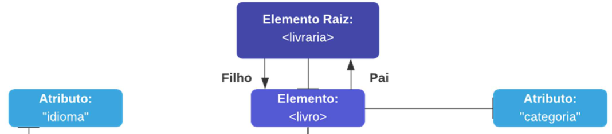


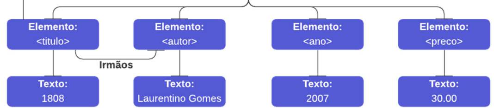


Documentos XML são formados como uma árvore de elementos! A imagem acima representa uma estrutura hierárquica de livros que é representada em XML conforme apresenta o código a seguir: 

**<mark><?xml version="1.0" encoding="UTF-8"?> <livraria> <livro categoria="historia"> <titulo idioma="pt"></mark>** <mark>1808</mark> **<mark></titulo> <autor></mark>** <mark>Laurentino Gomes</mark> **<mark></autor> <ano></mark>** <mark>2007</mark> **<mark></ano> <preco></mark>** <mark>30.00</mark> **<mark></preco> </livro> <livro categoria="infantil"> <titulo idioma="en"></mark>** <mark>Harry Potter</mark> **<mark></titulo> <autor></mark>** <mark>J K. Rowling</mark> **<mark></autor> <ano></mark>** <mark>2005</mark> **<mark></ano> <preco></mark>** <mark>29.99</mark> **<mark></preco> </livro> <livro categoria="economia"> <titulo idioma="pt"></mark>** <mark>A Liberdade</mark> **<mark></titulo> <autor></mark>** <mark>John Stuart Mill</mark> **<mark></autor> <ano></mark>** <mark>1859</mark> **<mark></ano> <preco></mark>** <mark>39.95</mark> **<mark></preco> </livro> </livraria></mark>** 

Observem que uma árvore sempre começa em um elemento raiz e se ramifica da raiz para os elementos filhos, lembrando que todos os elementos podem ter sub-elementos (elementos filhos). Note que os termos pai, filho e irmãos são utilizados para descrever relacionamentos entre elementos. Pais possuem filhos, filhos possuem pais, irmãos são filhos localizados no mesmo nível. E todos os elementos podem ter conteúdos (Ex: Harry Potter) e atributos (categoria=”infantil”).

---

<!-- pagina: 7 -->

**Vinicius Borges Aula 16** 

**<mark><raiz> <filho> <sub-filho></mark>** <mark>...</mark> **<mark></sub-filho> </filho> </raiz></mark>** 

_Diego, por que você pulou a primeira linha do código apresentado na página anterior?_ Ah, sim! Essa primeira linha (assim como tudo que aparece antes do elemento-raiz) se chama **prolog** e esse componente é responsável por definir a versão do documento, o tipo de codificação de caracteres, instruções de processamento, entre outros. Na verdade, todas essas configurações são opcionais, mas – se existirem – devem ser necessariamente a primeira coisa em um documento. 

A declaração do prolog deve ser a primeira coisa em um documento, não pode haver nem um espaço em branco antes. Vamos entendê-la melhor: 

```
<?xmlversion="1.0"encoding="UTF-8"?>
```

Essa linha indica que o documento está utilizando a versão de especificação 1.0 do XML e que os caracteres do arquivo utilizado a codificação UTF-8. _Que codificação é essa, professor?_ Galera, documentos podem conter caracteres internacionais como ç, ø, æ, å, è, ß. Para evitar erros, recomenda-se especificar o tipo de codificação de caracteres utilizado. UTF-8 é o tipo de codificação de caracteres padrão do XML (assim como do HTML, SQL, etc). Vamos seguir... 

**<mark><livraria> <livro categoria="historia"> <titulo idioma="pt"></mark>** <mark>1808</mark> **<mark></titulo> <autor></mark>** <mark>Laurentino Gomes</mark> **<mark></autor> <ano></mark>** <mark>2007</mark> **<mark></ano> <preco></mark>** <mark>30.00</mark> **<mark></preco> </livro> ...</mark>** 

A próxima linha após o prolog contém o elemento raiz do documento: <livraria>; a linha seguinte começa com um elemento <livro>; o elemento livro contém quatro elementos filho: <titulo>, <autor>, <ano>, <preco>; e, por fim, a próxima linha finaliza o elemento <livro> por meio de uma tag de fechamento </livro>. _Conseguiram perceber por que o XML é considerado uma linguagem autodescritiva capaz de ser lida tanto por humanos como por máquinas?_ Pois é, vamos continuar...

---

<!-- pagina: 8 -->

**Vinicius Borges Aula 16** 

## Sintaxe XML 

**<mark>INCIDÊNCIA EM PROVA: média</mark>** 

### Elementos 

Um elemento é considerado tudo que se encontra entre a tag inicial e uma tag final, incluindo a própria tag do elemento. Ele pode conter outros elementos, textos e atributos – ou  também ser vazio. Observem no código seguinte que os elementos <titulo>, <autor>, <ano> e <preco> possuem textos; já os elementos <livro> e <titulo> possuem atributos; e os elementos <livraria> e <livro> possuem outros elementos. 

**<mark><livraria> <livro categoria="historia"> <titulo idioma="pt"></mark>** <mark>1808</mark> **<mark></titulo> <autor></mark>** <mark>Laurentino Gomes</mark> **<mark></autor> <ano></mark>** <mark>2007</mark> **<mark></ano> <preco></mark>** <mark>30.00</mark> **<mark></preco> </livro> </livraria></mark>** 

Um elemento pode ser escrito das duas maneiras apresentadas abaixo – lembrando que todo elemento deve ter uma tag de abertura e de fechamento. _Professor, o prolog apresentado na página anterior não possui nenhuma tag de fechamento!_ Sim, bem observado! Isso ocorre por o prolog não é considerado como parte do documento XML em si. Logo, ele não invalida a regra que acabamos de mencionar. _Fechado?_ 

**<mark><livro></mark>** 

**<mark></livro></mark>** 

```
<livro
```

```
/>
```

É possível existir elementos vazios, isto é, aqueles que não possuem nenhum conteúdo (apesar de poder possuir atributos). Eles podem ser representados da seguinte forma: 

**<mark><elemento-vazio></elemento-vazio></mark>** 

É possível também utilizar uma tag auto-fechada, que – na verdade – produz resultados idênticos ao apresentado na linha anterior: 

**<mark><elemento-vazio/></mark>** 

Por fim, existem algumas regras para nomes de elementos: nomes de elementos devem começar com uma letra ou underscore ( _ ); nomes de elementos não podem começar com “xml” ou suas variações de maiúsculas e minúsculas; nomes de elementos podem conter letras, dígitos, hífen,

---

<!-- pagina: 9 -->

**Vinicius Borges Aula 16** 

underscore e ponto; nomes de elementos não podem conter espaços. Todo nome pode ser utilizado – não há palavras reservadas (exceto “xml” e suas variações). 

### Atributos 

Atributos são informações adicionais sobre um elemento. Eles vêm dentro da tag de início de um elemento entre aspas (simples ou duplas) e em um formato nome=valor: 

**<mark><pessoa genero="feminino"> <pessoa genero=’feminino></mark>** 

Se o próprio valor do atributo contiver aspas duplas, você poderá usar aspas simples (apóstrofos) ou símbolos de escape (que veremos em detalhes mais à frente). Vejamos... 

```
<lutadornome='Anderson "Spyder" Silva'>
<lutadornome="Anderson &quot;Spyder&quot; Silva">
```

Agora notem os dois exemplos a seguir: no primeiro, gênero é um atributo; no segundo, é um elemento. Ambos fornecem a mesma informação – não há regras para usar um ou outro! 

```
<pessoagenero="feminino">
<primeiro-nome>Ana</primeiro-nome>
<ultimo-nome>de Amsterdam</ultimo-nome>
</pessoa>
<pessoa>
<genero>feminino</genero>
<primeiro-nome>Ana</primeiro-nome>
<ultimo-nome>de Amsterdam</ultimo-nome>
</pessoa>
```

A única ressalva é que atributos são bem mais limitados que elementos, uma vez que não podem conter múltiplos valores e não podem ser dispostos em uma hierarquia. Além disso, é fundamental destacar um elemento pode conter vários atributos, mas atributos não podem conter múltiplos valores ou estruturas hierárquicas – diferentemente dos elementos. Ademais, dentro de um mesmo elemento, dois atributos jamais podem ter o mesmo nome. 

### Namespaces 

Namespaces são recursos que permitem evitar conflitos de nomes de elementos. Nós vimos que esses nomes são definidos pelo criador do documento, por outro lado frequentemente isso pode resultar em conflitos ao tentar misturar documentos de aplicações diferentes que utilizam o mesmo nome. Vejam no exemplo seguinte dois documentos que utilizam o mesmo nome de elemento, mas um trata do maior clube de futebol do planeta e o outro trata de um bairro do Rio de Janeiro! 

**<mark><flamengo> <esporte></mark>** <mark>Futebol</mark> **<mark></esporte> <mascote></mark>** <mark>Urubu</mark> **<mark></mascote></mark>**

---

<!-- pagina: 10 -->

**Vinicius Borges Aula 16** 

**<mark></flamengo></mark>** 

**<mark><flamengo> <populacao></mark>** <mark>50.640</mark> **<mark></populacao> <distrito></mark>** <mark>Zona Sul</mark> **<mark></distrito> </flamengo></mark>** 

Se esses documentos interagirem de alguma forma, pode ocorrer um conflito de nomes. Para evitar esse conflito, podemos utilizar prefixos: 

**<mark><raiz> <a:flamengo> <a:esporte></mark>** <mark>Futebol</mark> **<mark></a:esporte> <a:mascote></mark>** <mark>Urubu</mark> **<mark></a:mascote> </a:flamengo> <b:flamengo> <b:populacao></mark>** <mark>50.640</mark> **<mark></b:populacao> <b:distrito></mark>** <mark>Zona Sul</mark> **<mark></b:distrito> </b:flamengo> </raiz></mark>** 

Ao utilizar um prefixo, um **namespace** deve ser definido. Esse namespace é definido pelo atributo **xmlns** na tag de abertura de um elemento. A declaração do namespace segue a seguinte sintaxe: 

```
xmlns:prefix="URI"
```

Vamos ver como é que fica aplicado ao exemplo anterior: 

**<mark><raiz> <a:flamengo xmlns:a="http://www.flamengo.com.br"> <a:esporte></mark>** <mark>Futebol</mark> **<mark></a:esporte> <a:mascote></mark>** <mark>Urubu</mark> **<mark></a:mascote> </a:flamengo> <b:flamengo xmlns:b="https://prefeitura.rio"> <b:populacao></mark>** <mark>50.640</mark> **<mark></b:populacao> <b:distrito></mark>** <mark>Zona Sul</mark> **<mark></b:distrito> </b:flamengo> </raiz></mark>** 

No exemplo acima, o atributo xmlns no primeiro elemento **<flamengo>** dá um namespace para **a:** ; já o atributo xmlns no segundo elemento **<flamengo>** dá um namespace para **b:** . Lembrando que, quando um namespace é definido para um elemento, todos os elementos filhos com o mesmo prefixo são associados ao mesmo namespace. Além disso, os namespaces também podem ser declarados no elemento raiz do documento. 

**<mark><raiz xmlns:a="http://www.flamengo.com.br" xmlns:b="https://prefeitura.rio"> <a:flamengo> <a:esporte></mark>** <mark>Futebol</mark> **<mark></a:esporte></mark>**

---

<!-- pagina: 11 -->

**Vinicius Borges Aula 16** 

**<mark><a:mascote></mark>** <mark>Urubu</mark> **<mark></a:mascote> </a:flamengo></mark>** 

**<mark><b:flamengo> <b:populacao></mark>** <mark>50.640</mark> **<mark></b:populacao> <b:distrito></mark>** <mark>Zona Sul</mark> **<mark></b:distrito> </b:flamengo> </raiz></mark>** 

_Professor, fiquei meio perdido! O namespace é um site?_ Não, o namespace é um nome, mas esse nome precisa ser um identificador único. Logo, é comum a utilização de uma URI (Uniform Resource Identifier) para evitar de ter dois identificadores de namespace com o mesmo nome, mas é completamente possível colocar qualquer identificador desde que ele seja único (Ex: CPF, RG, etc). _Entendido, galera?_ Vamos seguir... 


<!-- Start of picture text -->
==5460==<br><!-- End of picture text -->

Por fim, é importante mencionar que – quando inserimos um namespace no próprio elemento – podemos evitar de usar os prefixos nos elementos filhos: 

**<mark><flamengo xmlns:a="http://www.flamengo.com.br"> <esporte></mark>** <mark>Futebol</mark> **<mark></esporte> <mascote></mark>** <mark>Urubu</mark> **<mark></mascote> </flamengo> <flamengo xmlns:b="https://prefeitura.rio"> <populacao></mark>** <mark>50.640</mark> **<mark></populacao> <distrito></mark>** <mark>Zona Sul</mark> **<mark></distrito> </flamengo></mark>** 

### Comentários 

A sintaxe para escrever comentários é extremamente simples, só lembrando que não se pode utilizar dois traços no meio do comentário para não confundir o processador do documento: 

<mark><!-- Isso é um comentário válido --> <!-- Isso é um comentário -- inválido --></mark> 

**<mark><flamengo xmlns:a="http://www.flamengo.com.br"> <esporte></mark>** <mark>Futebol</mark> **<mark></esporte> <mascote></mark>** <mark>Urubu</mark> **<mark></mascote> </flamengo></mark>** <mark><!—Flamengo é o maior time de futebol do mundo--></mark> **<mark><flamengo xmlns:b="https://prefeitura.rio"> <populacao></mark>** <mark>50.640</mark> **<mark></populacao> <distrito></mark>** <mark>Zona Sul</mark> **<mark></distrito> </flamengo></mark>** 

### Espaços em Branco

---

<!-- pagina: 12 -->

**Vinicius Borges Aula 16** 

Em contraste com HTML, XML não trunca ou elimina múltiplos espaços em branco em documentos (Ex: espaços, tabs, quebra de linha). Dessa forma, se você deixar espaços em branco nos seus dados, eles vão permanecer no documento. Vejam os exemplos apresentados no código a seguir e note que temos três registros diferentes. Caso isso fosse um Documento HTML, essa linguagem truncaria (eliminaria) os espaços em branco. 

**<mark><nome></mark>** <mark>DiegoCarvalho</mark> **<mark></nome> <nome></mark>** <mark>Diego Carvalho</mark> **<mark></nome> <nome></mark>** <mark>Diego Carvalho</mark> **<mark></nome></mark>** 

### Caracteres Especiais 

Nós vimos que os símbolos de menor (<) e maior (>) possuem significados especiais e são utilizados para indicar o início ou fim de uma tag. Se você inserir um caractere como “<” dentro de um elemento (conforme é apresentado na linha de código apresenta a seguir), isso gerará um erro porque ocasionará uma ambiguidade para o processador<sup>1</sup> do documento que achará que se trata do início de um novo elemento. 

**<mark><concurseiro></mark>** <mark>salario < 30000</mark> **<mark></concurseiro></mark>** 

Para evitar esse tipo de problema, existem cinco entidades de escape pré-definidos que ajudam a não confundir o processador do documento: 

|**Menor que**|**Maior que**|**E comercial**|**Apóstrofo**|**Aspas**|
|---|---|---|---|---|
|<|>|&|‘|“|
|&lt|&gt|&amp|&apos|&quot|


É importante destacar que os únicos elementos terminantemente proibidos são < e &. De todo modo, é uma boa prática substituir os outros três pelos seus símbolos correspondentes. 

> 1 O documento XML é processado por um _parser_ , isto é, uma ferramenta que quebra o código em partes menores para verificar sua estrutura gramatical e sintática.

---

<!-- pagina: 13 -->

**Vinicius Borges Aula 16** 

## Valida ão de XML <u>ç</u> 

##### **<mark>INCIDÊNCIA EM PROVA: média</mark>** 

Dizemos que um documento XML bem formado é aquele que obedece categoricamente às suas regras de sintaxe. Nós já vimos todas as regras, mas vamos relembrá-las: 

|**REGRA 1**|Documentos XML devempossuir um único elemento-raiz.|
|---|---|
|**REGRA 2**|Todos os elementos devem conter uma_tag_de fechamento.|
|**REGRA 3**|Elementos devem estar corretamente aninhados.|
|**REGRA 4**|Atributos devempossuir valor entre aspas simples ou duplas.|
|**REGRA 5**|Nomes de tags e atributos são Case-Sensitive.|


Legal! Aprendemos o que define um Documento XML bem formado! Agora é o momento de ver o que define um documento XML válido! _São coisas diferentes, professor?_ Sim, são conceitos complementares. Todo documento XML válido é bem formado, mas nem todo documento bem formado é válido.  O que define a validade de um documento XML não é a sua sintaxe e, sim, se ele é consistente com o seu esquema. _Como é, professor?_ Vamos explicar melhor... 

Um esquema (ou arquivo de definição) é um modelo que descreve como devem ser os elementos, atributos, dados, entre outros. Um documento XML será considerado válido se ele for bem formado e... obedece às regras de seu esquema. _Vamos abstrair um pouco?_ Imaginem o seguinte: eu quero construir um carro! Logo, para que seja um carro bem formado, é preciso que tenha um único volante, quatro rodas, um sistema elétrico e hidráulico, entre outros! 


Nós podemos dizer que qualquer veículo que contenha essas características será considerado um carro bem formado. _Fechado?_ Mas eu não quero um carro qualquer... eu quero uma Ferrari Califórnia! Logo, para que esse carro seja validado como uma Ferrari Califórnia, é preciso que tenha um motor 4.3L de 460 cv, torque de 77 kgfm, 900 kg, 8 cilindros, transmissão de sete velocidades, suspensão esportiva, design como o da imagem ao lado! 

Qualquer objeto que seja considerado um carro bem formado e que contenha essas características que eu defini de forma específica será considerado uma Ferrari California. Note também que nem todo carro é uma Ferrari Califórnia, mas toda Ferrari Califórnia é um carro. Um outro exemplo que eu gosto de ensinar é a relação entre uma prova discursiva e o padrão de resposta. Muitas vezes, as bancas disponibilizam um padrão de resposta esperada para as provas discursivas.

---

<!-- pagina: 14 -->

**Vinicius Borges Aula 16** 

Nesse contexto, imagine que você fez uma discursiva com o português correto, ortografia impecável, pontuação adequada, sintaxe satisfatória e orações bem construídas – sua prova discursiva estaria bem formada. Agora imaginem que, apesar de tudo isso, seu texto não tem nada a ver com o que o examinador esperava como resposta. Nesse caso, sua prova discursiva está bem formada, mas não é válida. _Entenderam agora?_ 

Agora vamos voltar para o mundo real: _é obrigatória a utilização de um esquema?_ Não! Nós mostramos vários exemplos que não precisavam de esquema nenhum. Em geral, quando se trabalha com documentos pequenos ou se deseja apenas realizar alguns testes, criar um esquema pode ser uma perda de tempo. Já em outros contextos, um esquema permite a verificação da estrutura e regras de preenchimento de um arquivo contendo dados no formato XML. 

Dessa forma, ele serve para facilitar a vida do desenvolvedor, ajuda a padronizar documentos para diversos usuários, auxilia o compartilhamento de dados, definem quais tags são válidas e fornece uma boa referência de estrutura para todos que queiram interagir e utilizar os dados. Existem dois tipos principais de arquivos de definição: DTD e XSD! Vamos começar falando do primeiro porque ele é o mais antigo. 

O DTD (Document Type Definition) define a estrutura e os elementos/atributos legais permitidos dentro de um documento XML. Trata-se de um conjunto de regras que define quais tipos de dados e entidades farão parte de um documento XML. Estas regras serão utilizadas para que o analisador sintático verifique se o documento é válido ou não. O DTD pode estar definida dentro do próprio arquivo XML ou em um arquivo à parte com extensão .dtd. Vejamos um exemplo anterior: 

**<mark><?xml version="1.0" encoding="UTF-8"?> <!DOCTYPE carta SYSTEM "Carta.dtd"></mark>** 

**<mark><carta></mark>** 

**<mark><de></mark>** <mark>Banca</mark> **<mark></de></mark>** 

**<mark><para></mark>** <mark>Aluno</mark> **<mark></para> <assunto></mark>** <mark>Você passou no concurso dos seus sonhos!</mark> **<mark></assunto> <corpo></mark>** <mark>Isso mesmo que você leu: você está sendo convocado para tomar posse!</mark> **<mark></corpo> </carta></mark>** 

Note que agora a segunda linha contém uma declaração DOCTYPE. _O que isso significa, professor?_ Trata-se de uma instrução que faz uma referência a um arquivo DTD externo (no caso, Carta.dtd). 

**<mark><!DOCTYPE carta [ <!ELEMENT</mark>** <mark>carta</mark> **<mark>(de,para,assunto,corpo)> <!ELEMENT</mark>** <mark>de</mark> **<mark>(#PCDATA)> <!ELEMENT</mark>** <mark>para</mark> **<mark>(#PCDATA)> <!ELEMENT</mark>** <mark>assunto</mark> **<mark>(#PCDATA)> <!ELEMENT</mark>** <mark>corpo</mark> **<mark>(#PCDATA)> ]></mark>** 

Esse arquivo pode ser interpretado da seguinte maneira:

---

<!-- pagina: 15 -->

**Vinicius Borges Aula 16** 

- **!DOCTYPE carta -** define que carta é o elemento raiz do documento; 

- **!ELEMENT carta -** define que o elemento carta deve conter esses quatro elementos em ordem; 

- **!ELEMENT de -** define o elemento “de” como sendo do tipo #PCDATA; 

- **!ELEMENT para -** define o elemento “para” como sendo do tipo #PCDATA; 

- **!ELEMENT assunto -** define o elemento “assunto” como sendo do tipo #PCDATA; 

- **!ELEMENT corpo -** define o elemento “corpo” como sendo do tipo #PCDATA. 

_Professor, o que é esse #PCDATA?_ É um código que indica que determinado elemento contém dados que devem ser processados pelo validador. Existe também o #CDATA, que indica que determinado elemento contém dados que não devem ser processados pelo validador (Ex: caracteres especiais). Por meio do meu arquivo DTD, eu consigo analisar se meu Documento XML é válido. Eu não coloquei no exemplo, mas é possível representar números de ocorrências de um elemento. 

Por meio de alguns símbolos: o sinal de mais (+) indica que se trata de um elemento obrigatório que pode aparecer uma ou mais vezes; o sinal de asterisco (*) indica que se trata de um elemento opcional que pode aparecer zero ou mais vezes; o sinal de ponto de interrogação (?) indica que se trata de um elemento opcional que pode aparecer zero ou uma vez; e se não houver símbolo algum, indica que um elemento deve aparecer uma e apenas uma vez. _E o XML Schema?_ 

Assim como o DTD, o XML Schema Definition (XSD) descreve a estrutura de um documento XML. No entanto, trata-se de uma ferramenta mais poderosa por ser capaz de suportar a criação de namespaces, a definição de novos tipos de dados, a definição de restrições, a conversão de dados, entre outras características que não vamos detalhar. Em contraste com o DTD, ele é escrito em XML – não sendo necessário aprender outra linguagem. Vamos ver um exemplo: 

**<mark><xs:element name="</mark>** <mark>carta</mark> **<mark>"></mark>** 

**<mark><xs:complexType> <xs:sequence> <xs:element name="</mark>** <mark>de</mark> **<mark>" type="xs:</mark>** <mark>string</mark> **<mark>"/> <xs:element name="</mark>** <mark>para</mark> **<mark>" type="xs:</mark>** <mark>string</mark> **<mark>"/> <xs:element name="</mark>** <mark>assunto</mark> **<mark>" type="xs:</mark>** <mark>string</mark> **<mark>"/> <xs:element name="</mark>** <mark>corpo</mark> **<mark>" type="xs:</mark>** <mark>string</mark> **<mark>"/> </xs:sequence> </xs:complexType> </xs:element></mark>** 

Esse arquivo pode ser interpretado da seguinte maneira: 

- **<xs:element name=”carta”>** define um elemento chamado “carta”; 

- **<xs:complexType>** “carta” é um elemento do tipo complexo; 

- **<xs:sequence>** o tipo complexo é uma sequência de elementos; 

- **<xs:element name=”de” type=”xs:string”>** o elemento é uma string; 

- **<xs:element name=”para” type=”xs:string”>** o elemento é uma string; 

- **<xs:element name=”assunto” type=”xs:string”>** o elemento é uma string; 

- **<xs:element name=”corpo” type=”xs:string”>** o elemento é uma string;

---

<!-- pagina: 16 -->

**Vinicius Borges Aula 16** 

# **RESUMO** 

|**CARACTERÍSTICAS**|**DESCRIÇÃO**|
|---|---|
|**XML separa dados da**<br>**apresentação**|XML não mantém nenhuma informação sobre como os dados serão exibidos,<br>logo um mesmo documento XML pode ser utilizado em vários cenários de<br>apresentação diferentes.|
|**Xml frequentemente**<br>**complementa o html**|XML é comumente utilizado para armazenar e transportar dados enquanto<br>HTML é utilizado para formatação e exibição dos mesmos dados – ambos em<br>arquivos separados e tratados independentemente.|
|**Xml Suporte a**<br>**unicode**|XML oferece suporte a Unicode, o que permite a comunicação de quase todas<br>as informações em qualquer linguagem humana escrita.|
|**Xml se adapta a avanços**<br>**tecnológicos**|XML pode se adaptar às novas tecnologias por causa de sua natureza<br>independente de plataforma ou tecnologia. Logo, é uma ótima opção para<br>armazenamento de dadospor um longoperíodo.|
|**Xml trata dados em uma**<br>**estrutura de árvore**|XML mantém uma estrutura hierárquica de elementos – tanto que o primeiro<br>elemento é sempre o elemento raiz. Isso facilita a representação de dados<br>hierárquicos.|
|**Xml é um formato que pode**<br>**ser validado**|XML permite fornecer um segundo documento XML – chamado XSD – para<br>descrever exatamente como o arquivo de dados deve ser estruturado,<br>facilitando seu processamento.|
|**Xml permite criar outras**<br>**linguagens**|XML é uma metalinguagem extensível, logo permite criar outras linguagens.<br>Atualmente, existem linguagens baseadas em XML como WSDL, RSS e XHTML.|
|**XML permite buscas**<br>**eficientes**|Como elementos podem ser unicamente “etiquetados” por meio de tags, isso<br>facilita buscas de dados dentro de documentos.|


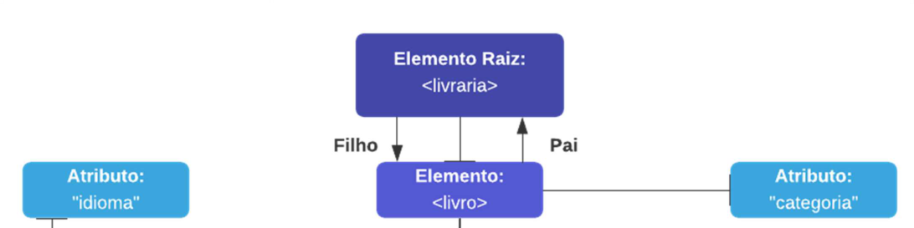


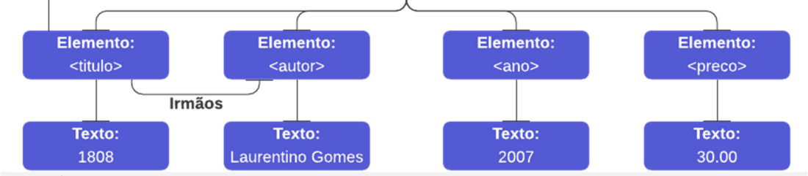


#### **<mark>ELEMENTO</mark>**

---

<!-- pagina: 17 -->

**Vinicius Borges Aula 16** 

Um elemento é tudo que se encontra entre a tag inicial e uma tag final, incluindo a própria tag do elemento. Ele pode conter outros elementos, textos e atributos – ou  também ser vazio. 

**<mark><livro> </livro></mark>** 

```
<livro
```

```
/>
```

#### **<mark>ATRIBUTO</mark>** 

Atributos são informações adicionais sobre um elemento. Eles vêm dentro da tag de início de um elemento entre aspas (simples ou duplas) e em um formato nome=valor: 

**<mark><pessoa genero="feminino"> <pessoa genero=’feminino></mark>** 

#### **<mark>namespaces</mark>** 

Namespaces são recursos que permitem evitar conflitos de nomes de elementos. Ele pode ser inserido na raiz ou no próprio elemento e representa um identificador único (URI) 

**<mark><raiz xmlns:a="http://www.flamengo.com.br" xmlns:b="https://prefeitura.rio"></mark>** 

**<mark><a:flamengo> <a:esporte></mark>** <mark>Futebol</mark> **<mark></a:esporte> <a:mascote></mark>** <mark>Urubu</mark> **<mark></a:mascote> </a:flamengo> <b:flamengo> <b:populacao></mark>** <mark>50.640</mark> **<mark></b:populacao> <b:distrito></mark>** <mark>Zona Sul</mark> **<mark></b:distrito> </b:flamengo> </raiz></mark>** 

**<mark><flamengo xmlns:a="http://www.flamengo.com.br"> <esporte></mark>** <mark>Futebol</mark> **<mark></esporte> <mascote></mark>** <mark>Urubu</mark> **<mark></mascote> </flamengo> <flamengo xmlns:b="https://prefeitura.rio"> <populacao></mark>** <mark>50.640</mark> **<mark></populacao> <distrito></mark>** <mark>Zona Sul</mark> **<mark></distrito> </flamengo></mark>** 

#### **<mark>comentários</mark>**

---

<!-- pagina: 18 -->

**Vinicius Borges Aula 16** 

A sintaxe para escrever comentários é extremamente simples, só lembrando que não se pode utilizar dois traços no meio do comentário para não confundir o processador do documento: 

<mark><!-- Isso é um comentário válido --> <!-- Isso é um comentário -- inválido --></mark> 

#### **<mark>Espaços em branco</mark>** 

Em contraste com HTML, XML não trunca ou elimina múltiplos espaços em branco em documentos (Ex: espaços, tabs, quebra de linha). 

**<mark><nome></mark>** <mark>DiegoCarvalho</mark> **<mark></nome> <nome></mark>** <mark>Diego Carvalho</mark> **<mark></nome> <nome></mark>** <mark>Diego Carvalho</mark> **<mark></nome></mark>** 

#### **<mark>Caracteres especiais</mark>** 

<mark>Existem caracteres especiais que devem ser escapados pelas entidades apresentadas na tabela seguinte. É importante destacar que os únicos elementos terminantemente proibidos são < e &.</mark> 

|**Menor que**|**Maior que**|**E comercial**|**Apóstrofo**|**Aspas**|
|---|---|---|---|---|
|<|>|&|‘|“|
|&lt|&gt|&amp|&apos|&quot|


#### **<mark>Xml bem formado</mark>** 

|**REGRA 1**|Documentos XML devempossuir um único elemento-raiz.|
|---|---|
|**REGRA 2**|Todos os elementos devem conter uma_tag_de fechamento.|
|**REGRA 3**|Elementos devem estar corretamente aninhados.|
|**REGRA 4**|Atributos devempossuir valor entre aspas simples ou duplas.|
|**REGRA 5**|Nomes de tags e atributos são Case-Sensitive.|


#### **<mark>document type definition</mark>** 

**<mark><!DOCTYPE carta [ <!ELEMENT</mark>** <mark>carta</mark> **<mark>(de,para,assunto,corpo)> <!ELEMENT</mark>** <mark>de</mark> **<mark>(#PCDATA)> <!ELEMENT</mark>** <mark>para</mark> **<mark>(#PCDATA)> <!ELEMENT</mark>** <mark>assunto</mark> **<mark>(#PCDATA)> <!ELEMENT</mark>** <mark>corpo</mark> **<mark>(#PCDATA)> ]></mark>** 

- **!DOCTYPE carta -** define que carta é o elemento raiz do documento; 

- **!ELEMENT carta -** define que o elemento carta deve conter esses quatro elementos em ordem; 

- **!ELEMENT de -** define o elemento “de” como sendo do tipo #PCDATA;

---

<!-- pagina: 19 -->

**Vinicius Borges Aula 16** 

- **!ELEMENT para -** define o elemento “para” como sendo do tipo #PCDATA; 

- **!ELEMENT assunto -** define o elemento “assunto” como sendo do tipo #PCDATA; 

- **!ELEMENT corpo -** define o elemento “corpo” como sendo do tipo #PCDATA. 

#### **<mark>Xml schema definition (xsd)</mark>** 

**<mark><xs:element name="</mark>** <mark>carta</mark> **<mark>"></mark>** 

**<mark><xs:complexType> <xs:sequence> <xs:element name="</mark>** <mark>de</mark> **<mark>" type="xs:</mark>** <mark>string</mark> **<mark>"/> <xs:element name="</mark>** <mark>para</mark> **<mark>" type="xs:</mark>** <mark>string</mark> **<mark>"/> <xs:element name="</mark>** <mark>assunto</mark> **<mark>" type="xs:</mark>** <mark>string</mark> **<mark>"/> <xs:element name="</mark>** <mark>corpo</mark> **<mark>" type="xs:</mark>** <mark>string</mark> **<mark>"/> </xs:sequence> </xs:complexType></mark>** 

**<mark></xs:element></mark>** 

Esse arquivo pode ser interpretado da seguinte maneira: 

- **<xs:element name=”carta”>** define um elemento chamado “note”; 

- **<xs:complexType>** “carta” é um elemento do tipo complexo; 

- **<xs:sequence>** o tipo complexo é uma sequência de elementos; 

- **<xs:element name=”de” type=”xs:string”>** o elemento é uma string; 

- **<xs:element name=”para” type=”xs:string”>** o elemento é uma string; 

- **<xs:element name=”assunto” type=”xs:string”>** o elemento é uma string; 

- **<xs:element name=”corpo” type=”xs:string”>** o elemento é uma string;

---

<!-- pagina: 20 -->

**Vinicius Borges Aula 16** 

# **– QUESTÕES COMENTADAS CESPE** 

**1. (FGV / TCE-TO – 2022)** Um documento XML é considerado bem formado quando segue as regras de sintaxe estabelecidas na especificação da linguagem. A alternativa que apresenta um documento XML bem formado é: 


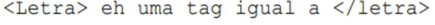


a) 


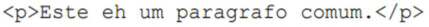


b) 


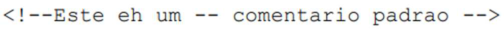


c) d) e) 


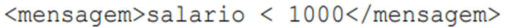


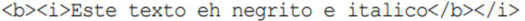


#### **Comentários:** 

(a) Errado. <Letra> deve ser fechado com </Letra> e, não, </letra>; (b) Correto; (c) Errado, não é permitido ter – dentro do comentário; (d) Errado, o caractere < confunde o processador e não deve ser utilizado; (e) Errado. Primeiro, fecha-se o </i> e depois o </b>. 

<mark><!-- Isso é um comentário válido --> <!-- Isso é um comentário -- inválido --></mark> 

|**Menor que**|**Maior que**|**E comercial**|**Apóstrofo**|**Aspas**|
|---|---|---|---|---|
|<|>|&|‘|“|
|&lt|&gt|&amp|&apos|&quot|
|||||**Gabarito:**Letra B|


**2. (CESPE / DPDF - 2022)** <mark>Nos códigos em XML a seguir, sexo é um atributo no código A e um elemento no código B, mas ambos os códigos fornecem as mesmas informações.</mark> 

<mark>código A <pessoa sexo="fem"> <nome>Maria</nome> <sobrenome>Silva</sobrenome></mark> 

<mark></pessoa></mark> 

<mark>código B <pessoa> <sexo>fem</sexo> <nome>Maria</nome> <sobrenome>Silva</sobrenome></mark> 

<mark></pessoa></mark>

---

<!-- pagina: 21 -->

**Vinicius Borges Aula 16** 

#### **Comentários:** 

<mark>Um elemento é considerado tudo que se encontra entre a tag inicial e a tag final. Dentro de um elemento, podem conter outros elementos, textos e atributos. Dessa forma, no código A,</mark> _<mark>sexo</mark>_ <mark>é um atributo do elemento</mark> _<mark>pessoa</mark>_ <mark>(observem que ele vem no formato nome=valor). Já no código B, é um elemento. Além disso, não há diferenciação entre os dois modos de utilização.</mark> 

**Gabarito:** <mark>Correto</mark> 

**3. (CESPE / Polícia Federal - 2018)** <mark>Em arquivos no formato XML, as tags não são consideradas metadados.</mark> 

#### **Comentários:** 

As tags são consideradas metadados porque fornecem informações sobre os dados que elas envolvem e dados sobre dados são metadados. 

**Gabarito:** <mark>Errado</mark> 

**4. (CESPE / SEDF – 2017)** <mark>Um dos objetivos do projeto XML é que o número de recursos opcionais da linguagem deve ser maximizado para torná-la versátil e adaptável.</mark> 

#### **Comentários:** 

De acordo com a documentação oficial, o número de recursos opcionais deve ser mantido no absoluto mínimo, idealmente zero. O que torna a linguagem versátil e adaptável é a sua extensibilidade em relação à criação de tags customizadas. 

**Gabarito:** <mark>Errado</mark> 

**5. (CESPE / TCE-PA – 2016)** <mark>Em um documento XML, deve haver diferenciação entre letras maiúsculas e minúsculas e os comentários devem ter a seguinte sintaxe:</mark> 

<mark><!--comentario-->.</mark> 

#### **Comentários:** 

Perfeito! Essa é a sintaxe correta de um comentário em XML. 

**Gabarito:** <mark>Correto</mark>

---

<!-- pagina: 22 -->

**Vinicius Borges Aula 16** 

**6. (CESPE / TCE-PA – 2016)** <mark>As desvantagens dos esquemas XML incluem a falta de suporte a diferentes tipos de dados.</mark> 

#### **Comentários:** 

O XML possui vários tipos de dados predefinidos (Ex: string, booleano, inteiro, data, etc). Além disso, existe a possibilidade de criar o seu próprio tipo. 

**Gabarito:** <mark>Errado</mark> 

**7. (CESPE / TCE-PA – 2016)** <mark>Um arquivo XML deve conter, no máximo, 1.024 tags. Se o uso de uma quantidade maior de tags for necessário, deve-se adotar o seguinte recurso, a fim de aumentar a quantidade de tags referenciadas pelo arquivo XML principal: um arquivo XML fazer referência a outro.</mark> 

#### **Comentários:** 

Não existe quantidade máxima limite de tags. 

**Gabarito:** <mark>Errado</mark> 


---

<!-- pagina: 23 -->

**Vinicius Borges Aula 16** 

# **– QUESTÕES COMENTADAS FGV** 

**8. (FGV / FUNSAÚDE - 2021)** <mark>Maria está editando um arquivo XML por meio do bloco de notas do Windows, e deve tomar cuidado com certos caracteres que têm funções especiais. Assinale a lista que contém apenas caracteres especiais do XML.</mark> 

a) < > & # b) < > & " c) > & " / d) @ " / \ e) / \ @ " 

#### **Comentários:** 

|**Menor que**|**Maior que**|**E comercial**|**Apóstrofo**|**Aspas**|
|---|---|---|---|---|
|<|>|&|‘|“|
|&lt|&gt|&amp|&apos|&quot|
|||||**Gabarito:**Letra B|


**9. (FGV / TCE-AM – 2021** **<mark>)</mark>** <mark>O código XML sintaticamente correto é:</mark> 


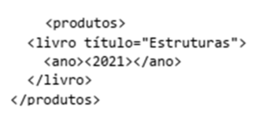


a) 


b) 


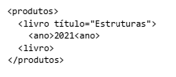


c) 


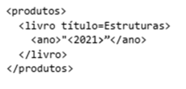


d)

---

<!-- pagina: 24 -->

**Vinicius Borges Aula 16** 


e) 

#### **Comentários:** 

(a) Errado, os caracteres “<” e “>” precisam ser escapados; (b) Errado, faltam as aspas em “Estruturas”; (c) Errado, faltou fechar a tag </ano> e a tag </livro>; (d) Errado, faltam as aspas em “Estruturas”; (e) Correto. Alguns caracteres especiais devem ser especificados com o uso de entidades pré-definidas (no caso & lt; , & amp; e & gt; , respectivamente). 

#### **Gabarito:** <mark>Letra E</mark> 


<!-- Start of picture text -->
==5460==<br><!-- End of picture text -->

- **10.(FGV / IMBEL – 2021)** <mark>O uso do XML é bastante difundido no Brasil para troca de dados em aplicações como notas fiscais, procedimentos médicos, e várias outras. Assinale a utilidade de um Schema XML em aplicações dessa natureza.</mark> 

a) <mark>Direciona os aplicativos que leem arquivos no formato XML.</mark> 

b) <mark>Permite a conversão automática de arquivos XML para o formato CSV.</mark> 

c) <mark>Estabelece precisamente a versão do XML em uso num arquivo no formato XML.</mark> 

d) <mark>Permite que um Web Service interprete corretamente um arquivo de dados no formato XML.</mark> e) <mark>Permite a verificação da estrutura e regras de preenchimento de um arquivo contendo dados no formato XML.</mark> 

#### **Comentários:** 

(a) Errado, isso é uma função do sistema operacional; (b) Errado, essa definitivamente não é uma aplicação do XML Schema; (c) Errado, isso é função do prolog e, não, do XML Schema; (d) Errado, essa não é uma de suas funções; (e) Correto, o XML Schema realmente permite a verificação da estrutura e regras de preenchimento de um arquivo contendo dados no formato XML. 

#### **Gabarito:** <mark>Letra E</mark> 

**11. (FGV / MPE-RJ – 2019)** <mark>A troca de dados entre sistemas computacionais é normalmente realizada por meio de arquivos que seguem padrões de formato e organização. Desse modo, diferentes agentes com diferentes equipamentos podem enviar e receber dados estruturados muito facilmente. Nesse contexto, analise um trecho do conteúdo de um dado arquivo a seguir.</mark> 

<mark><nota></mark> 

<mark><para>Rita</para> <de>Bernardo</de> <título>Lembrete</título> <texto>O pacote &lt;chegou&gt; ...</texto></mark>

---

<!-- pagina: 25 -->

**Vinicius Borges Aula 16** 

<mark></nota></mark> 

<mark>Com base nesse trecho, é correto deduzir que a organização desse arquivo segue o padrão conhecido como:</mark> 

a) CSS. b) CSV. c) ODF. d) PDF. e) XML. 

**Comentários:** 

(a) Errado, CSS é uma linguagem de estilo de páginas web; (b) Errado, CSV é um formato de dados tabulares separados por um delimitador; (c) Errado, ODF é um formato para criação de arquivos do LibreOffice; (d) Errado, PDF é um formato de documentos portáveis; (e) Correto. 

**Gabarito:** <mark>Letra E</mark> 

**12. (FGV / DPE-RJ – 2019)** <mark>Considere os trechos XML exibidos a seguir.</mark> 

I. 

<mark><p>Um primeiro exemplo</p> <br/></mark> 

II. 

<mark><message>Texto breve</message></mark> 

III. <mark><b><i>Texto com destaque.</b></i></mark> 

IV. <mark><p>Note que, para x>1, a resposta é sim.</p></mark> 

<mark>O número de trechos válidos é:</mark> 

a) 0. b) 1. c) 2. d) 3. e) 4. 

**Comentários:**

---

<!-- pagina: 26 -->

**Vinicius Borges Aula 16** 

(I) Errado, não pode haver elementos após o fechamento do elemento raiz; (II) Correto; (III) Errado, as tags não estão aninhadas corretamente; (IV) Errado, recomenda-se que o caractere “>” seja escapado por meio de um &gt. 

**Gabarito:** <mark>Letra B</mark> 

**13. (FGV / MPE-AL – 2018** **<mark>)</mark>** <mark>No XML, a sequência de símbolos</mark> 

<mark>&lt;</mark> 

<mark>Representa:</mark> a) < b) > c) “ d) & e) ’ 

**Comentários:** 

|**Menor que**|**Maior que**|**E comercial**|**Apóstrofo**|**Aspas**|
|---|---|---|---|---|
|<|>|&|‘|“|
|&lt|&gt|&amp|&apos|&quot|


**Gabarito:** Letra A 

**14.(FGV / Câmara de Salvador-BA – 2018)** <mark>Analise o conteúdo XML de um arquivo de seis linhas, exibido a seguir.</mark> 


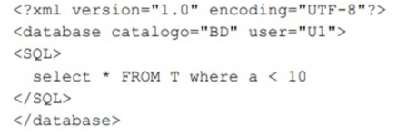


<mark>A validação desse arquivo apontaria um erro na linha de número:</mark> 

a)  1. b) 2. c) 3. d) 4. e) 6. 

**Comentários:**

---

<!-- pagina: 27 -->

**Vinicius Borges Aula 16** 

Ocorrerá um erro na Linha 4, dado que é recomendado escapar o caractere < por meio de um &lt. 

**Gabarito:** <mark>Letra D</mark> 

**15. (FGV / Prefeitura de Niterói-RJ – 2018)** <mark>Considere a declaração do tipo de documento (DTD) a seguir.</mark> 


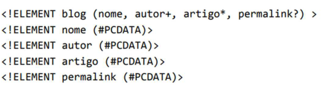


<mark>Em um documento XML, que obedece a esse conjunto de regras,</mark> 

a) deve haver precisamente um elemento do tipo artigo. 

b) podem ocorrer vários elementos do tipo permalink. 

c) pode conter um elemento do tipo nome e outro elemento do tipo autor, em qualquer ordem. d) deve existir um elemento do tipo autor, sendo permitidas múltiplas ocorrências deste tipo de elemento. 

e) não é necessário haver um elemento do tipo nome. 

#### **Comentários:** 

(a) Errado, o asterisco indica que o elemento pode aparecer zero ou mais vezes; (b) Errado, a interrogação indica que o elemento deve aparecer zero ou uma vez; (c) Errado, a ordem dos elementos entre parênteses deve ser respeitada; (d) Correto, o sinal de mais indica que o elemento pode aparecer uma ou mais vezes; (e) Errado, quando não há nenhum símbolo, indica que deve haver necessariamente um único elemento. 

**Gabarito:** <mark>Letra D</mark> 

- **16.(FGV / Prefeitura de Niterói-RJ – 2018)** <mark>XML é uma linguagem de marcação projetada para descrever e transportar dados. Dado que em um documento XML é permitido ao desenvolvedor de software definir seus próprios elementos, pode ser necessário utilizar namespaces para evitar conflitos de nomes. Em relação à namespaces em XML, analise as afirmativas a seguir.</mark> 

<mark>I. Um namespace pode ser declarado no elemento em que é utilizado ou no elemento raiz do documento XML.</mark> 

<mark>II. O atributo uri é reservado em XML para indicar que um prefixo está associado ao namespace. III. As várias declarações de namespace com prefixos podem ser feitas em um elemento, mas devem possuir prefixos diferentes.</mark>

---

<!-- pagina: 28 -->

**Vinicius Borges Aula 16** 

<mark>Assinale:</mark> 

a) se somente a afirmativa I estiver correta. 

b) se somente a afirmativa II estiver correta. 

c) se somente a afirmativa III estiver correta. 

d) se somente as afirmativas I e III estiverem corretas. 

e) se todas as afirmativas estiverem corretas. 

#### **Comentários:** 

(I) Correto; (II) Errado, ele é utilizado para identificar de forma única um prefixo de um namespace; (III) Correto, não há nenhum problema desde que os prefixos sejam diferentes. 

**Gabarito:** <mark>Letra D</mark> 

**17. (FGV / IBGE – 2017)** <mark>As declarações de elementos na DTD determinam a possível estrutura de um documento XML. Analise a DTD a seguir:</mark> 


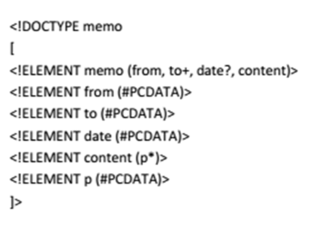


<mark>É correto afirmar que o(s) elemento(s):</mark> 

a) **<mark>memo</mark>** <mark>pode conter os elementos</mark> **<mark>from</mark>** <mark>,</mark> **<mark>to</mark>** <mark>,</mark> **<mark>date</mark>** <mark>e</mark> **<mark>content</mark>** <mark>em qualquer ordem;</mark> 

b) **<mark>content</mark>** <mark>deve conter um ou mais elementos</mark> **<mark>p</mark>** <mark>;</mark> 

c) **<mark>date</mark>** <mark>é opcional;</mark> 

d) **<mark>to</mark>** <mark>é obrigatório e precisa ocorrer mais de uma vez dentro do elemento</mark> **<mark>memo</mark>** <mark>;</mark> 

e) **from** , **to** e **date** podem conter qualquer um dos elementos descritos na DTD. 

#### **Comentários:** 

(a) Errado, a ordem deve ser respeitada; (b) Errado, deve conter necessariamente zero ou mais elementos; (c) Correto; (d) Errado, deve ocorrer uma ou mais vezes; (e) Errado, não há nada que indique isso. 

**Gabarito:** <mark>Letra C</mark>

---

<!-- pagina: 29 -->

**Vinicius Borges Aula 16** 

- **18.(FGV / ALERJ – 2017)** <mark>XML (Extensible Markup Language) é um sistema de codificação que permite que diferentes tipos de informação sejam distribuídos através da World Wide Web. Com a XML, diversos sistemas de informação, semelhantes ou não, se comunicam de forma transparente entre si. Em relação à linguagem XML, analise as afirmativas a seguir:</mark> 

<mark>I. Seções CDATA podem ocorrer em qualquer parte de um documento XML e devem ser utilizadas para inserir blocos de texto que contenham caracteres especiais como & e <.</mark> 

<mark>II. Documentos XML bem formados devem ter um DTD (Document Type Definition) associado e obedecer a todas as regras que o DTD contém.</mark> 

<mark>III. Na linguagem XML é permitido omitir as tags finais em elementos não vazios.</mark> 

<mark>Está correto o que se afirma em:</mark> 

a) <mark>somente I;</mark> 

b) <mark>somente II;</mark> 

c) <mark>somente III;</mark> 

d) <mark>somente I e II;</mark> 

e) <mark>I, II e III.</mark> 

#### **Comentários:** 

(I) Correto, elas podem ser utilizadas em qualquer parte do documento e são úteis para textos que c ~~o~~ ntenham caracteres especiais – indicando que esses caracteres não devem ser processados pelo parser; (II) Errado, não é obrigatório ter um DTD ou XML Schema; (III) Errado, não é permitido omitir tags de fechamento em elementos vazios ou não. 

**Gabarito:** <mark>Letra A</mark> 

- **19.(FGV / Prefeitura de Paulínia-SP – 2016)** <mark>Analise o trecho de um documento XML exibido a seguir.</mark> 


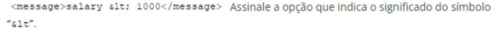


a) É uma diretiva de formatação de texto. 

b) Representa o caracter “<”. 

c) É um operador de multiplicação de constantes. 

d) É uma constante matemática da biblioteca “&math”. 

- e) Representa um bookmark. 

#### **Comentários:** 

|**Menor que**<br>**Maior que**<br>**E comercial**|**Apóstrofo**<br>**Aspas**|
|---|---|

---

<!-- pagina: 30 -->

**Vinicius Borges Aula 16** 

|<|>|&|‘|“|
|---|---|---|---|---|
|&lt|&gt|&amp|&apos|&quot|


**Gabarito:** <mark>Letra B</mark> 

**20.(FGV / CODEBA – 2016)** <mark>Analise o seguinte trecho de XML Schema (XSD).</mark> 


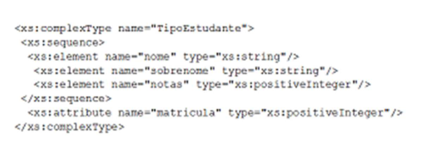


<mark>Assinale o elemento XML cuja definição está de acordo a especificação de “TipoEstudante"</mark> 


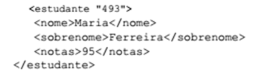


a) 


b) 


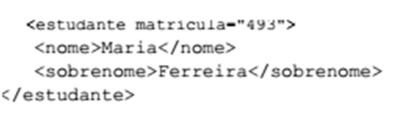


c) 


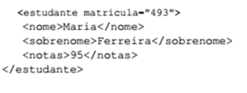


d) e) 


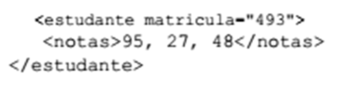


**Comentários:** 

Vejam como não é difícil de entender: o XSD indica que temos um tipo complexo chamado TipoEstudante que contém três elementos: nome (string), sobrenome (string) e notas (inteiro positivo). Além disso, ele informa que há um atributo chamado “matrícula“ que também é um

---

<!-- pagina: 31 -->

**Vinicius Borges Aula 16** 

inteiro positivo. Logo, vamos analisar os itens: (a) Errado, falta o atributo “matrícula” e nota é apenas um valor; (b) Errado, nota é um inteiro positivo; (c) Errado, falta o elemento “notas”; (d) Correto; (e) Errado, falta o elemento nome e sobrenome – e nota é apenas um valor. 

**Gabarito:** <mark>Letra D</mark> 

**21. (FGV / DPE-RO – 2015)** <mark>Os trechos contendo XML mal-formado, válido e inválido, respectivamente, são:</mark> 


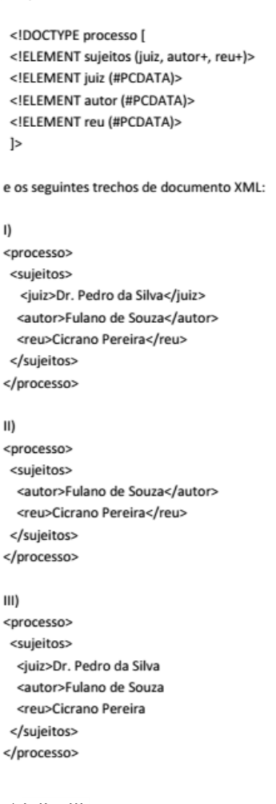


a) <mark>I, II e III;</mark> b) <mark>I, III e II;</mark> c) <mark>II, I e III;</mark> d) <mark>III, I e II;</mark> e) III, II e I.

---

<!-- pagina: 32 -->

**Vinicius Borges Aula 16** 

#### **Comentários:** 

Vamos começar analisando o DTD: (1) note que os elementos juiz, autor e réu devem vir necessariamente nessa ordem; (2) note que juiz deve aparecer necessariamente uma vez, e autor e réu podem aparecer uma ou mais vezes. Dito isso, já podemos responder à questão: (I) Trata-se de um trecho bem formado, visto que não possui erros de sintaxe e válido, visto que obedece fielmente ao DTD; (II) Trata-se de um trecho bem formado, visto que não possui erros de sintaxe, mas é inválido, visto que juiz deve aparecer necessariamente uma vez; (III) Trata-se de um trecho mal formado, visto não apresenta as tags de fechamento de juiz, autor e réu, portanto é um trecho consequentemente inválido. 

**Gabarito:** <mark>Letra D</mark> 

- **22.(FGV / TJ-PI – 2015** **<mark>)</mark>** <mark>Num trecho XML, o comentário “Trecho em teste” deve ser introduzido como:</mark> 

a)  < !-- Trecho -- em -- teste -- > 

b) < !-- Trecho em teste > 

c)  < !Trecho em teste > 

d) < !--Trecho em teste --> 

e) <-- Trecho em teste --> 

#### **Comentários:** 

(a) Errado, não pode haver traços dentro do comentário; (b) Errado, faltam os traços da tag de fechamento; (c) Errado, faltam os traços da tag de abertura e fechamento; (d) Correto; (e) Errado, falta o ponto de exclamação na tag de abertura. 

**Gabarito:** <mark>Letra D</mark> 

**23. (FGV / DPE-RO – 2015)** <mark>A representação em XML da agenda de uma pessoa em que o telefone do usuário João está representado como um atributo é:</mark> 

a) 


b) 


c)

---

<!-- pagina: 33 -->

**Vinicius Borges Aula 16** 


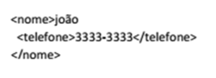


d) 


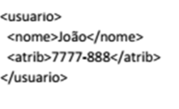


e) 


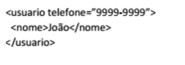


#### **Comentários:** 

(a) Errado, telefone é um elemento; (b) Errado, telefone é um elemento; (c) Errado, telefone é um elemento; (d) Errado, nem sequer há telefone; (e) Correto, telefone é um atributo do elemento usuário de nome João. 

**Gabarito:** <mark>Letra E</mark> 

**24. (FGV / PGE-RO – 2015)** <mark>Analise, abaixo, a lista de definições que podem ser estabelecidas por meio de um esquema (schema) para um documento XML:</mark> 

<mark>I. os elementos que podem ser utilizados;</mark> 

<mark>II. os tipos de dados para elementos e atributos;</mark> 

<mark>III. valores default para elementos e atributos;</mark> 

<mark>IV. espaços reservados para comentários.</mark> 

<mark>Somente estão corretas as afirmativas:</mark> 

a)  I e II; b) I e III; 

c) II e III; d) I, II e III; 

e) II, III e IV. 

#### **Comentários:** 

Um esquema pode definir os elementos que podem ser utilizados, os tipos de dados dos elementos e atributos e os valores default para elementos e atributos, mas não podem definir espaços reservados para comentários. 

**Gabarito:** <mark>Letra D</mark>

---

<!-- pagina: 34 -->

**Vinicius Borges Aula 16** 

**25. (FGV / PGE-RO – 2015)** <mark>São requisitos de um documento XML, EXCETO:</mark> 

a)  deve ter um elemento raiz, responsável por aninhar os demais elementos que formam o documento. 

b) deve ser bem formado, ou seja, possuir somente uma tag raiz, possuir tags de fechamento, etc.; 

- c) pode conter atributos que devem ser únicos dentro do elemento, e seus valores devem estar envoltos em aspas. 

d) deve ser válido quando se desejar formalização na representação das informações. 

- e) deve começar por uma declaração de conteúdo do elemento. 

#### **Comentários:** 

Todos os itens estão perfeitos com exceção do último – não é obrigatório começar com uma declaração de conteúdo do elemento. 

**Gabarito:** <mark>Letra E</mark> 

- **26.(FGV / TJ-GO – 2014)** Observe os principais tópicos de um arquivo XML de uma nota fiscal eletrônica. 


<mark>O atributo</mark> _<mark>xmlns</mark>_ <mark>define o que é conhecido como:</mark> 

a) Namespace; 

b) Name Source; 

c) Named Schema; 

d) Name Status; 

e) Name Server. 

#### **Comentários:** 

A imagem está péssima, mas o importante é que xmlns significa XML Namespace. 

**Gabarito:** <mark>Letra A</mark> 

**27. (FGV / AL-MA – 2013)** <mark>Dentre as alternativas a seguir, selecione aquelas que correspondem a especificações elaboradas com a finalidade de definir regras de validação (esquemas) para documentos XML:</mark>

---

<!-- pagina: 35 -->

**Vinicius Borges Aula 16** 

<mark>I. XSLT</mark> 

<mark>II. DTD</mark> 

<mark>III. XML Schema</mark> 

<mark>Assinale:</mark> 

a) se somente a afirmativa I estiver correta. 

b) se somente a afirmativa II estiver correta. 

c) se somente a afirmativa I e II estiver correta. 

d) se somente as afirmativas II e III estiverem corretas. 

e) se todas as afirmativas estiverem corretas. 

#### **Comentários:** 

DTD e XML Schema têm a finalidade de definir regras de validação (esquemas) para documentos XML. O XSLT é utilizado para transformar documentos XML em outros documentos que aqui não cabe detalhar. 

**Gabarito:** <mark>Letra D</mark> 

**28.(FGV / AL-MA – 2013)** <mark>O scritp XML a seguir, que faz referência ao esquema verifica.xsd, está sintaticamente incorreto porque UTF-8 não é suportado no XML.</mark> 


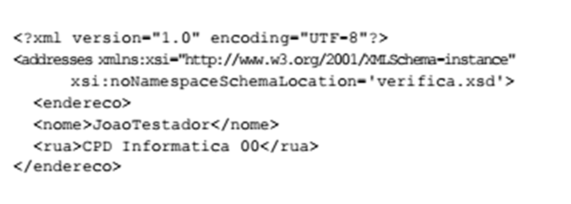


. 

#### **Comentários:** 

Vamos por partes: em primeiro lugar, veja que a questão escreveu scritp em vez de script – não fui eu que errei; em segundo lugar, veja que realmente há uma referência a um esquema externo chamado verifica.xsd; por fim, todo processador XML precisa necessariamente suportar as codificações UTF-8 e UTF-16 (e pode, inclusive, suportar outros tipos de codificação de caracteres). 

**Gabarito:** <mark>Errado</mark>

---

<!-- pagina: 36 -->

**Vinicius Borges Aula 16** 

# **– QUESTÕES COMENTADAS CESGRANRIO** 

– **29.(CESGRANRIO / IPEA 2024)** O Ipea pretende publicar a Tabela de índices de custos e preços abaixo, relativa aos meses do primeiro trimestre de 2023. Para publicá-la, é necessário colocála no formato XML. Desconsiderando - se a parte de DOCTYPE e Style, ao colocar essa Tabela no formato XML, obtém-se: 

a) <Indices> 

<Indice> ICTI IPCA IGPM </Indice> <Indice> 182,34 0,53 0,21 </Indice > <Indice> 183,16 0,84 - 0,06 </Indice > <Indice> 183,34 0,76 0,05 </Indice > 

b) 

<Indices> <Indice> <ICTI> 182,34 </ICTI> <IPCA> 0,53 </IPCA> <IGPM> 0,21 </IGPM> </Indice> <Indice> <ICTI> 183,16 </ICTI> <IPCA> 0,84 </IPCA> <IGPM> - 0,06 </IGPM> </Indice> <Indice> <ICTI> 183,34 </ICTI> <IPCA> 0,76 </IPCA> <IGPM> 0,05 </IGPM> </Indice> </Indices> 

c) <Indices> <1> <ICTI> 182,34 </ICTI> <IPCA> 0,53 </IPCA> <IGPM> 0,21 </IGPM> <2> <ICTI> 183,16 </ICTI>

---

<!-- pagina: 37 -->

**Vinicius Borges Aula 16** 

<IPCA> 0,84 </IPCA> <IGPM> - 0,06 </IGPM> <3> <ICTI> 183,34 </ICTI> <IPCA> 0,76 </IPCA> <IGPM> 0,05 </IGPM> </Indices> 

d) <Indices> <ICTI> 182,34 </ICTI> <IPCA> 0,53 </IPCA> <IGPM> 0,21 </IGPM> </Indices> <Indices> <ICTI> 183,16 </ICTI> <IPCA> 0,84 </IPCA> <IGPM> - 0,06 </IGPM> </Indices> <Indices> <ICTI> 183,34 </ICTI> <IPCA> 0,76 </IPCA> <IGPM> 0,05 </IGPM> </Indices> 

e) <Indices> <insert> <1> <ICTI> 182,34 </ICTI> <IPCA> 0,53 </IPCA> <IGPM> 0,21 </IGPM> </1> <insert> <2> <ICTI> 183,16 </ICTI> <IPCA> 0,84 </IPCA> <IGPM> - 0,06 </IGPM> </2> <insert> <3> <ICTI> 183,34 </ICTI> <IPCA> 0,76 </IPCA> <IGPM> 0,05 </IGPM>

---

<!-- pagina: 38 -->

**Vinicius Borges Aula 16** 

</3> </Indices> 

**Comentários:** 

(a) Errado. A alternativa apresenta um formato incorreto. As tags Indice não possuem atributos para identificar os dados; 

(b) Correto. A alternativa utiliza tags para cada índice (ICTI, IPCA e IGPM) dentro de cada mês, organizando os dados de forma clara e legível; 

(c) Errado. A alternativa utiliza números como identificadores de meses, o que pode dificultar a interpretação do conteúdo. A utilização de tags específicas para cada mês seria mais adequada; 

(d) Errado. A alternativa cria um bloco Indices para cada mês, o que torna o código redundante e dificulta a leitura; 

(e) Errado. A alternativa utiliza tags insert e números como identificadores de meses, o que torna o código mais complexo e menos intuitivo. 

**Gabarito:** Letra B 

- **30.(CESGRANRIO / TRANSPETRO – 2023)** Um profissional de Informática está trabalhando em um projeto que envolve a manipulação de documentos XML. Ele precisa garantir que os documentos XML estejam bem-formados e válidos, de acordo com as especificações do XML 1.1. Uma das regras que ele deverá seguir para garantir que um documento XML 1.1 seja válido é que o(s): 

a) documento pode ter um ou mais elementos raiz. 

b) documento deve começar com uma declaração XML. 

c) nomes dos elementos são insensíveis a maiúsculas e minúsculas. 

d) atributos devem ter o mesmo nome se estiverem no mesmo elemento. 

e) comentários XML devem aparecer como atributos de uma etiqueta (tag). 

**Comentários:** 

(a) Errado. O XML 1.1 permite apenas um elemento raiz; 

(b) Correta. Um documento XML 1.1 deve começar com uma declaração XML que especifica a versão do XML e o tipo de codificação de caracteres utilizada; 

(c) Errado. O XML 1.1 é sensível a maiúsculas e minúsculas nos nomes dos elementos e atributos;

---

<!-- pagina: 39 -->

**Vinicius Borges Aula 16** 

(d) Errado. Atributos com o mesmo nome no mesmo elemento devem ter valores diferentes. Essa regra não garante a validade do documento; 

(e) Errado. Comentários XML não podem ser atributos de uma tag. Eles devem ser inseridos entre as tags ou antes da declaração XML. 

**Gabarito:** Letra B 

- 

- **31. (CESGRANRIO / BASA 2022)** Um projetista de sistemas está desenvolvendo um sistema e precisou programar um arquivo XSLT. Neste arquivo, ele precisou inserir um elemento para aplicar uma regra de modelo, a partir de uma folha de estilo importada, ao invés de uma regra equivalente, a partir da folha de estilo principal, mas sem que este elemento apareça como o primeiro nó filho de . 

Para este caso, o elemento que deve ser inserido para aplicar tal regra nesse arquivo XSLT é o 

a) apply-imports 

b) apply_templates 

c) imports 

d) include 

e) Template 

**Comentários:** 

(a) Correto. O elemento <xsl:apply-imports> é usado dentro de um template para aplicar as regras de template importadas. Se houver regras de template equivalentes na folha de estilo principal, <xsl:apply-imports> permite que o processador XSLT ignore essas regras principais em favor das regras importadas, adequando-se à descrição fornecida; 

(b) Errado. <xsl:apply-templates> é usado para aplicar regras de template a nós selecionados, mas não especificamente para escolher regras de templates importados sobre os da folha de estilo principal; 

(c) Errado. “imports” não é um elemento XSLT válido. A importação de folhas de estilo em XSLT é feita com o elemento <xsl:import>; 

(d) Errado. <xsl:include> é usado para incluir templates de outra folha de estilo XSLT dentro da folha de estilo atual. Diferente de <xsl:import>, ele não tem a funcionalidade específica de priorizar regras de templates importados sobre os da folha de estilo principal; 

(e) Errado. <xsl:template> é o elemento usado para definir uma regra de template. Sozinho, não serve para aplicar uma regra de modelo de uma folha de estilo importada sobre a folha de estilo principal.

---

<!-- pagina: 40 -->

**Vinicius Borges Aula 16** 

#### **Gabarito:** Letra A 

**32. (CESGRANRIO / BASA – 2022)** Ao desenvolver um sistema de notícias, a empresa X decidiu manter as notícias em um formato XML, como o do exemplo a seguir: 

<?xml version="1.0"?> 

<news> 

<heading>Reminder</heading> 

<body>Don’t forget me this weekend!</body> 

</news> 

Mais tarde, entendeu que, para esse formato exemplificado acima, seria melhor definir um esquema em XSD. Que fragmento de código XSD deve conter esse esquema para permitir que o exemplo apresentado seja validado corretamente, quando nele for incluída a referência ao esquema completo? 

#### a) <xs:element name="news"> 

- <xs:complexType> 

<xs:sequence> <xs:element name="heading" type="xs:string"/> 

<xs:element name="body" type="xs:string"/> 

</xs:sequence> 

</xs:complexType> 

</xs:element> 

- b) <xs:element name="news"> 

- <xs:sequence> 

<xs:element name="heading" type="xs:string"/> 

<xs:element name="body" type="xs:string"/> 

</xs:sequence> 

</xs:element> 

#### c) <xs:element name="news"> 

<xs:element name="heading" type="xs:string"/> 

<xs:element name="body" type="xs:string"/> 

</xs:element> 

d) <!ELEMENT news (heading, body)> 

<!ELEMENT heading (#PCDATA)> 

- <!ELEMENT body (#PCDATA)> 

#### e) <!ELEMENT news (heading, body)> 

- <!ELEMENT heading (text)>

---

<!-- pagina: 41 -->

**Vinicius Borges Aula 16** 

<!ELEMENT body (text)> 

**Comentários:** 

_Vocês lembram que a linguagem de esquema XML é definida pelo padrão XML Schema Definition (XSD)?_ É uma maneira de descrever a estrutura e restringir o conteúdo de documentos XML. Após o lembrete, vamos juntos analisar as alternativas. 

(a) Correto. Este fragmento define um esquema XSD completo para o exemplo de notícia. Ele inclui: Elemento news como raiz, com tipo complexo; Sequência de dois elementos filhos: heading e body; Definição do tipo de cada elemento filho como xs:string. 

(b) Errado. Este fragmento define apenas a sequência de elementos, mas não seus tipos; (c) Errado. Este fragmento define os elementos, mas não seus tipos; (d) Errado. Este fragmento usa DTD (Document Type Definition), que não é XSD; (e) Errado. Este fragmento define os elementos com conteúdo text, o que não valida o exemplo dado, que possui conteúdo específico em body. 

**Gabarito:** Letra A 

**33. (CESGRANRIO / BASA – 2021)** Ao participar de uma equipe para desenvolvimento de um website para a intranet do banco em que trabalhava, um programador teve como missão criar uma tabela HTML a partir de um arquivo XML que indicava clientes e seus saldos. 

O fragmento de XML a seguir é um exemplo da estrutura do XML do arquivo que conterá os dados: 

<?xml version="1.0" encoding="UTF - 8"?> 

<clientes> 

<cliente> <nome>Ana Zurique</nome> <saldo>3000</saldo> </cliente> <cliente> <nome>Bernardo Washington</nome> <saldo>4500</saldo> </cliente> <cliente> <nome>Carlos York</nome> <saldo>12345</saldo> </cliente> </cliente> 

Para esse arquivo, a tabela gerada deve ter a seguinte aparência:

---

<!-- pagina: 42 -->

**Vinicius Borges Aula 16** 


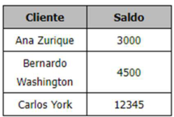


#### Inicialmente, o programador construiu o seguinte arquivo em XSLT: 

<?xml version="1.0" encoding="UTF - 8"?> <xsl:stylesheet version="1.0" xmlns:xsl="http://www.w3.org/1999/XSL/Transform"> <xsl:template match="/"> <html> <body> <table border="1"> <tr> <th>Cliente</th> <th>Saldo</th> </tr> <! - - Código Para os Dados - - > </table> </body> </html> </xsl:template> </xsl:stylesheet> 

Que sequência de instruções deve substituir o comentário , de forma a gerar a tabela no formato apresentado? 

#### a) 

<xsl:for - each select="clientes/cliente/"> 

<tr> <td><xsl:value - of select="nome"/></td> <td><xsl:value - of select="saldo"/></td> </tr> </xsl:for - each> 

b) 

<xsl:for - each select="clientes/cliente"> 

<tr> <td><xsl:value - of select="clientes/cliente/nome"/></td> <td><xsl:value - of select="clientes/cliente/saldo"/></td> </tr> </xsl:for - each>

---

<!-- pagina: 43 -->

**Vinicius Borges Aula 16** 

c) <xsl:for - each select="clientes/cliente"> 

<tr> <td><xsl:value - of select="nome"/></td> <td><xsl:value - of select="saldo"/></td> </tr> </xsl:for - each> 

d) 

<xsl:for - each select="clientes/"> 

<tr> 

<td><xsl:value - of select="cliente/nome"/></td> <td><xsl:value - of select="cliente/saldo"/></td> </tr> </xsl:for - each> 

e) <xsl:for - each select="clientes"> 

<tr> 

<td><xsl:value - of select="cliente/nome"/></td> <td><xsl:value - of select="cliente/saldo"/></td> </tr> </xsl:for - each> 

**Comentários:** 

xsl:for-each e xsl:value-of são instruções usadas em XSLT, linguagem usada para transformar documentos XML em outros formatos, como HTML, texto ou até mesmo em outros documentos XML. Essas instruções são utilizadas para percorrer e manipular elementos XML durante o processo de transformação. 

(a) Errado. Há um erro no XPath utilizado no xsl:for-each. A barra final ("/") após "clientes/cliente/" não é necessária e causa a seleção incorreta dos elementos. O XPath "clientes/cliente/" seleciona todos os elementos "cliente" que são filhos diretos do elemento "clientes". 

(b) Errado. Esta sequência é redundante, pois seleciona "clientes/cliente/nome" e "clientes/cliente/saldo" para cada cliente. 

(c) Correta. Esta sequência utiliza: xsl:for-each para iterar sobre cada cliente no XML e xsl:value-of para extrair o nome e o saldo de cada cliente. 

(d) Errado. Esta sequência seleciona "cliente/nome" e "cliente/saldo", mas não há garantia de que esses elementos existam no contexto atual.

---

<!-- pagina: 44 -->

**Vinicius Borges Aula 16** 

(e) Errado. Esta sequência é semelhante à alternativa d) e pode gerar erros se "cliente" não for o elemento filho direto de "clientes". 

**Gabarito:** Letra C 

**34.(CESGRANRIO / CEF – 2021)** Um arquivo, contendo um documento XML, contém exatamente a seguinte informação: 

<?xml version=”1.0”?> 

<PEDIDOS> 

<PEDIDO> 

<TITULO>Pedido de Empréstimo</TITULO> 

<REQUERENTE>José da Silva</REQUERENTE> 

<CPF>999.999.999 - 99</CPF> 

<VALOR>20000</VALOR> 

<PEDIDO> <PEDIDOS> 

A partir desse documento apenas, um processador XML pode garantir que o arquivo é 

a) bem - formado, apenas 

b) bem - formado e normalizado 

c) bem - formado e válido 

d) normalizado, apenas 

e) válido, apenas 

**Comentários:** 

É importante ressaltar que um processador XML pode verificar se um arquivo é bem-formado, mas não pode garantir que ele esteja normalizado ou válido sem informações adicionais. A normalização e a validação são etapas opcionais que podem ser utilizadas para melhorar a qualidade e a confiabilidade de um documento XML. 

(a) Correto. Um processador XML pode garantir que o arquivo é bem-formado, porque possui uma única tag raiz (PEDIDOS). Todas as tags são fechadas corretamente e a estrutura hierárquica das tags está perfeita; (b) O arquivo não está normalizado, pois a tag PEDIDO é repetida; (c) O arquivo não é válido, pois não há uma DTD (Document Type Definition) ou esquema XSD para verificar sua validade; (d) O arquivo não está normalizado; (e) O arquivo não é válido. 

**Gabarito:** Letra A 

**35. (CESGRANRIO / Caixa – 2021)** As fontes (feed) RSS devem todas fornecer informações em

---

<!-- pagina: 45 -->

**Vinicius Borges Aula 16** 

a) CSS b) HTML 1.0 c) HTML 1.1 d) SOAP e) XML 

**Comentários:** 

A fonte (feed) RSS deve fornecer informações em XML (eXtensible Markup Language). O RSS (Really Simple Syndication) é uma tecnologia de distribuição de conteúdo web atualizado de um site para outros sites ou para usuários que assinam o feed. O formato padrão para estruturar e representar essas informações é o XML devido à sua flexibilidade e capacidade de representar dados de forma estruturada e legível por máquina. 

**Gabarito:** Letra E 

- **36.(CESGRANRIO / TRANSPETRO – 2018)** <mark>Considerando a linguagem XML, qual é o exemplo correto de uso de um atributo chamado “src” que recebe o valor “computador.gif” em um elemento de nome “img”?</mark> 

a)   

b)  

c)  "src=computador.gif " </img> 

d)  <src> computador.gif </src> </img> 

e)  src="computador.gif " </img> 

#### **Comentários:** 

(a) Correto; (b) Errado, a tag de fechamento deve ser /> ou </img>; (c) Errado, a tag de abertura deve ser ; (d) Errado, src é um atributo e, não, um elemento; (e) Errado, a tag de abertura deve ser . 

**Gabarito:** <mark>Letra A</mark> 

**37. (CESGRANRIO / PETROBRAS – 2018)** <mark>Qual linguagem de marcação, fundamental para o estabelecimento de serviços Web, que compõe uma Arquitetura Orientada a Serviços, é usada para que dados sejam apresentados, comunicados e armazenados?</mark> 

a) HTML; 

b) XML; c) JAVA; 

d) JAVASCRIPT;

---

<!-- pagina: 46 -->

**Vinicius Borges Aula 16** 

e) C#. 

#### **Comentários:** 

(a) Errado. HTML é uma linguagem de marcação utilizada para criar e estruturar páginas na Web, mas não é especificamente projetada para comunicação de dados em uma Arquitetura Orientada a Serviços; 

(b) Correto. XML é uma linguagem de marcação que permite a criação de documentos com dados estruturados. É amplamente utilizada em serviços Web e Arquiteturas Orientadas a Serviços (SOA) para a comunicação, apresentação e armazenamento de dados de maneira padronizada e independente de plataforma; 

(c) Errado. Java é uma linguagem de programação, não uma linguagem de marcação. Embora seja amplamente utilizada para desenvolver aplicações web e serviços, não se encaixa no contexto da questão; 

(d) Errado. JavaScript é uma linguagem de programação usada principalmente para criar scripts do lado do cliente em páginas web. Não é uma linguagem de marcação nem é usada primariamente para comunicação de dados em SOA; 

(e) Errado. C# é uma linguagem de programação orientada a objetos desenvolvida pela Microsoft, usada para desenvolver uma grande variedade de aplicações, incluindo serviços web, mas não é uma linguagem de marcação. 

**Gabarito:** <mark>Letra B</mark> 

#### **38.(CESGRANRIO / BASA – 2018)** Considere o esquema XML a seguir: 

<xs:elemente name="rectangle" type = "area"/> 

<xs:complexType name = "area"> 

<xs:attribute name="x1" type="xs:decimal" /> 

<xs:attribute name="y1" type="xs:decimal" /> 

<xs:attribute name="x2" type="xs:decimal" /> 

<xs:attribute name="y2" type="xs:decimal" /> 

<xs:complexType> 

Um elemento XML válido, segundo esse esquema, é: 

a) <area><x1>1</x1><y1>1</y1><x2>2</x2><y2>3</y2></area> 

b) <area x1="1" y1="1" x2="4" y2="5" /> 

c) <rectangle x1="5" y1="4" x2="1" y2="1"/> 

d) <area><x1>4</x1><y1>4</y1><x2>2</x2><y2>3</y2></area> 

e) <rectangle><x1>1</x1><y1>1</y1><x2>2</x2><y2>3</y2></rectangle>

---

<!-- pagina: 47 -->

**Vinicius Borges Aula 16** 

**Comentários:** 

(a) Errado. Essa alternativa utiliza elementos para representar os atributos (x1, y1, x2, y2), o que contradiz a definição no esquema XML que especifica esses como atributos do elemento, não como subelementos; 

(b) Errado. Apesar de b representar os dados como atributos, o elemento correto definido pelo esquema é rectangle, não área; 

(c) Correto. Esta alternativa está correta porque rectangle é o elemento definido no esquema, e os atributos x1, y1, x2, y2 são especificados de acordo com as regras do esquema; 

(d) Errado. Assim como em a, esta alternativa representa os valores como subelementos, o que não está de acordo com a definição do esquema; 

(e) Errado. Apesar de usar o nome do elemento rectangle, esta alternativa também representa os valores como subelementos, o que vai contra o esquema que define esses valores como atributos. 

**Gabarito:** Letra C 

- **39.(CESGRANRIO / TRANSPETRO – 2018)** Documentos XML são estruturados segundo uma hierarquia de unidades informacionais chamadas de nós. Qual tecnologia XML fornece ao desenvolvedor uma API para adicionar, editar e remover esses nós? 

a) XMI 

b) XSDL 

c) XSLT d) XML DOM 

e) XML Schema 

**Comentários:** 

(a) Errado. XMI (XML Metadata Interchange) é uma especificação para troca de metadados via XML. Não é uma API para manipulação direta de documentos XML; 

(b) Errado. Não existe uma tecnologia XML conhecida como XSDL. Pode haver confusão com WSDL (Web Services Description Language) ou XSD (XML Schema Definition), mas nenhum desses é uma API para manipulação de nós em documentos XML; 

(c) Errado. XSLT (eXtensible Stylesheet Language Transformations) é uma linguagem para transformação de documentos XML em outros tipos de documentos (XML, HTML, texto puro, etc.). Embora possa alterar a estrutura de um documento XML, não é uma API para adicionar, editar ou remover nós diretamente;

---

<!-- pagina: 48 -->

**Vinicius Borges Aula 16** 

(d) Correto. XML DOM (Document Object Model) é uma interface de programação de aplicações (API) que permite aos desenvolvedores adicionar, modificar e remover nós em documentos XML. O DOM representa o documento como uma árvore de nós, onde cada nó pode ser manipulado programaticamente; 

(e) Errado. XML Schema é uma linguagem para definir a estrutura e restringir o conteúdo de documentos XML. Não fornece uma API para a manipulação de nós dentro de documentos XML. 

**Gabarito:** Letra D 

- **40.(CESGRANRIO / BASA – 2014)** Sabendo que um arquivo XML está sintaticamente correto e que pode ser consumido ou processado por um parser XML, de acordo com a especificação XML, pode-se afirmar, com certeza, que ele é: 

a) autorizado 

b) validado 

c) certificado 

d) compilado 

e) bem formado 

**Comentários:** 

(a) Errado. "Autorizado" não é um termo usado na especificação XML para descrever a correção sintática ou a capacidade de um arquivo XML ser processado; 

(b) Errado. "Validado" refere-se a um arquivo XML que foi verificado e está em conformidade com um esquema ou DTD (Document Type Definition). A validação vai além da correção sintática, verificando também a conformidade estrutural com uma definição de esquema; 

(c) Errado. "Certificado" não é um termo aplicável ao contexto de arquivos XML em relação à sua estrutura ou sintaxe; 

(d) Errado. "Compilado" é um termo geralmente associado a linguagens de programação que necessitam de compilação para serem executadas. Arquivos XML são interpretados por parsers e não são compilados; 

(e) Correto. "Bem formado" é o termo usado para descrever um arquivo XML que segue as regras sintáticas da especificação XML. Isso significa que o arquivo pode ser adequadamente interpretado por um parser XML, indicando que todas as tags estão corretamente abertas e fechadas, os atributos estão corretamente citados, e o documento possui uma única raiz. 

**Gabarito:** Letra E

---

<!-- pagina: 49 -->

**Vinicius Borges Aula 16** 

**41.(CESGRANRIO / AGC – 2014)** Analise o seguinte DTD 

<?xml version="1.0" ?> <!DOCTYPE A [ <!ELEMENT A (B,C)> <!ELEMENT B (#PCDATA)> 

<!ELEMENT C (D?,E)> 

<!ELEMENT D (#PCDATA)> 

<!ELEMENT E (#PCDATA)> ]> 

Segundo o DTD acima, que documento XML NÃO é válido? 

a) <A><B>Teste</B> <C><E>Teste</E> </C></A> 

b) <A><B>Teste</B> <C><D>Teste</D> <E>Teste</E></C></A> 

c) <A><B>Teste</B> <C>Teste<D>Teste</D> <E>Teste</E></C></A> 

d) <A><B> </B> <C> <D>Teste</D><E>Teste</E></C></A> 

e) <A><B></B><C><D></D><E></E></C></A> 

**Comentários:** 

(a) Correto. Está de acordo com o DTD. Elemento A contém B e C, e C contém E como permitido; (b) Correto. Está de acordo com o DTD. Elemento A contém B e C, C contém opcionalmente D seguido por E, conforme especificado; (c) Errado. O conteúdo diretamente dentro de C deveria ser elementos D (opcional) seguido por E, mas o exemplo inclui texto diretamente dentro de C ("Teste" antes de <D>Teste</D>), o que viola o DTD; (d) Correto. Está de acordo com o DTD. A contém B e C, onde C tem opcionalmente D e obrigatoriamente E; (e) Correto. Está de acordo com o DTD. Apesar de D e E estarem vazios, eles estão presentes na ordem correta dentro de C. 

**Gabarito:** Letra C 

- **42.(CESGRANRIO / BASA - 2014)** Seja o arquivo XML abaixo: 

<?xml version=”1.0” encoding=”UTF - 8”?> 

<T><P N=”1”> <K N=”1” M=”G”>Texto</K> <K N=”2” M=”H”>Texto</K> <K></K></P> <P><F>Texto</F></P> </T> 

Que DTD permite que esse arquivo seja considerado válido?

---

<!-- pagina: 50 -->

**Vinicius Borges Aula 16** 


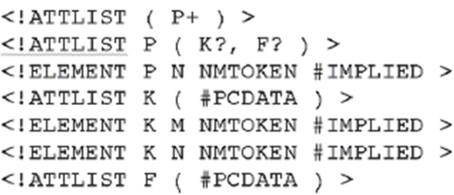


a) 


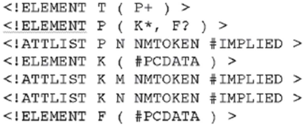


b) 


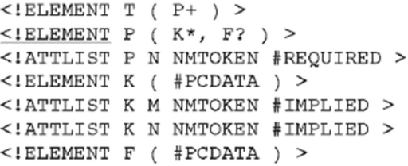


c) 


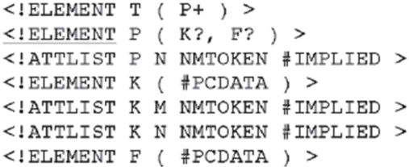


d) 


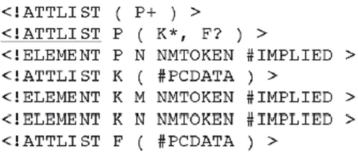


e) 

**Comentários:** 

Analisando o XML, podemos entender sua estrutura e os elementos envolvidos: 

- O elemento T é o elemento raiz do documento XML. 

- Dentro do elemento T, temos dois elementos P.

---

<!-- pagina: 51 -->

**Vinicius Borges Aula 16** 

- Cada elemento P pode conter vários elementos K e opcionalmente um elemento F. 

- Os elementos K podem conter texto e têm os atributos N e M. 

- O elemento F pode conter apenas texto. 

Com base nessa análise, podemos construir o DTD correspondente que valida o XML: 

<!ELEMENT T (P+)> 

- <!ELEMENT P (K*, F?)> 

- <!ATTLIST P N NMTOKEN #IMPLIED> 

- <!ELEMENT K (#PCDATA)> 

- <!ATTLIST K N NMTOKEN #IMPLIED> 

- <!ATTLIST K M NMTOKEN #IMPLIED> 

- <!ELEMENT F (#PCDATA)> 

#### Nesse DTD: 

- T é definido como tendo um ou mais elementos P. 

- P pode conter zero ou mais elementos K e opcionalmente um elemento F. 

- P pode ter um atributo N. 

- K contém dados de texto (#PCDATA). 

- K pode ter atributos N e M. 

- F contém dados de texto (#PCDATA). 

As demais opções não estão corretas pois apresentam erros de sintaxe ou não abordam adequadamente a estrutura do XML. 

**Gabarito:** Letra B 

- 

- **43.(CESGRANRIO / CEFET RJ 2014)** Uma universidade decidiu alterar seu sistema acadêmico, atualmente escrito em Delphi, para aceitar uma interface Web. Para isso, decidiu adotar as tecnologias Ajax e PHP. 

A primeira parte do trabalho será alterar o subsistema de avaliação, chamado de NOTAS. O modelo de dados atual desse subsistema é bastante simples, e é descrito pelo modelo diagrama a seguir, que usa a notação da Engenharia da Informação.

---

<!-- pagina: 52 -->

**Vinicius Borges Aula 16** 


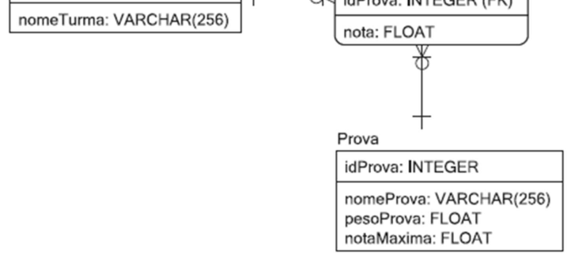


Que fragmento de código XML o sistema NOTAS pode usar para representar corretamente uma linha da tabela Turma? 


a) </TURMA></IDTURMA>1<IDTURMA></NOMETURMA>Cálculo<NOMETURMA><TURMA> b) <TURMA><IDTURMA><NOMETURMA>1</IDTURMA>Cálculo</NOMETURMA></TURMA> c) <TURMA><IDTURMA>1</IDTURMA><NOMETURMA>Cálculo</NOMETURMA></TURMA> d) <TURMA><IDTURMA>1<IDTURMA><NOMETURMA>Cálculo<NOMETURMA><TURMA> e) 

<TURMA/><IDTURMA/>Cálculo</IDTURMA><NOMETURMA/>1</NOMETURMA></TURMA> 

**Comentários:** 

(a) Errado. Esta alternativa está incorreta porque todas as tags estão fechadas antes mesmo de serem abertas corretamente. Além disso, a estrutura está confusa e desorganizada; 

(b) Errado. Nesta alternativa, a tag <NOMETURMA> está fechada antes da tag <IDTURMA>, o que viola a ordem correta de fechamento das tags. Isso resulta em uma estrutura incorreta; 

(c) Esta alternativa está correta. As tags estão corretamente abertas e fechadas na ordem adequada, e os elementos IDTURMA e NOMETURMA estão corretamente aninhados dentro do elemento TURMA; 

(d) Errado. Todas as tags estão abertas, mas nenhuma delas está sendo fechada, o que resulta em uma estrutura incorreta e inválida;

---

<!-- pagina: 53 -->

**Vinicius Borges Aula 16** 

(e) Errado. Nesta alternativa, todas as tags são auto-fechadas com a notação />, o que não é apropriado para o contexto apresentado. Além disso, a ordem das tags está incorreta e não segue a estrutura esperada. 

**Gabarito:** Letra C 

– **44.(CESGRANRIO / IBGE 2013)** O gerente acadêmico de uma universidade solicitou ao setor de tecnologia da informação que fosse desenvolvida uma ferramenta que permitisse a distribuição dos currículos dos professores em diferentes formatos, uma vez que isso é essencial para promover o intercâmbio de informações entre diferentes instituições de ensino do Brasil e do exterior. Sabendo-se que os currículos que estão armazenados na base de dados da universidade são documentos XML válidos, qual tecnologia XML deve ser empregada na construção dessa ferramenta? 

a) XSD b) PDF c) XSL d) XKMS e) HTML 

**Comentários:** 

(a) Errado. XSD (XML Schema Definition) é usado para definir a estrutura e validar documentos XML, não para transformá-los em diferentes formatos. 

(b) Errado. PDF é um formato de arquivo para apresentação de documentos de forma independente de software, hardware ou sistema operacional, mas não é uma tecnologia XML utilizada para transformar ou distribuir documentos XML em diferentes formatos. 

(c) Correto. XSL (eXtensible Stylesheet Language), especialmente em conjunto com XSLT (XSL Transformations), é a tecnologia XML projetada para transformar documentos XML em outros formatos de documento. Ela permite que os dados XML sejam apresentados em diferentes formatos, como HTML para web, PDF para documentos impressos, ou outros formatos XML específicos de domínio, atendendo à necessidade de distribuição de currículos em diversos formatos. 

(d) Errado. XKMS (XML Key Management Specification) é relacionado à gestão de chaves criptográficas para serviços web, não à transformação ou distribuição de documentos XML em diferentes formatos.

---

<!-- pagina: 54 -->

**Vinicius Borges Aula 16** 

(e) Errado. HTML é uma linguagem de marcação usada para criar páginas web. Embora possa ser um dos alvos da transformação dos documentos XML, não é a tecnologia que permite essa transformação. 

**Gabarito:** Letra C 

- **45.(CESGRANRIO / LIQUIGÁS - 2013)** Muitas tecnologias usadas pela indústria de software favorecem a implantação de melhorias na gestão de processos integrados de negócios. Um exemplo disso é o uso de: 

#### a) softwares abertos. 

- b) bancos de dados relacionais. 

c) computação móvel em larga escala. 

d) orientação a objetos como paradigma de desenvolvimento. 

e) XML para a troca de informações entre sistemas. 

**Comentários:** 

(a) Errado. Softwares abertos (ou software livre) podem contribuir para a flexibilidade e redução de custos no desenvolvimento de sistemas. No entanto, essa alternativa não destaca diretamente a gestão de processos de negócios integrados; 

(b) Errado. Bancos de dados relacionais são fundamentais para armazenamento e consulta de dados de forma estruturada, mas o benefício mais direto na gestão de processos integrados de negócios não é tão específico quanto o oferecido por outras tecnologias listadas; 

(c) Errado. Computação móvel em larga escala permite o acesso a sistemas e dados de qualquer lugar, o que é certamente benéfico para negócios. No entanto, não foca especificamente na integração de processos de negócios como outras opções; 

(d) Errado. A orientação a objetos é um paradigma de desenvolvimento que ajuda na organização e estruturação do código fonte, melhorando a manutenção e compreensão dos sistemas. No entanto, não é a tecnologia mais diretamente associada à melhoria da gestão de processos de negócios integrados; 

(e) Correto. XML (eXtensible Markup Language) é uma tecnologia chave para a troca de informações entre sistemas, facilitando a integração de dados entre diferentes plataformas e sistemas. Isso é essencial para a gestão de processos de negócios integrados, pois permite que sistemas distintos se comuniquem de forma eficiente, compartilhando dados de negócios em um formato padronizado. 

**Gabarito:** Letra E

---

<!-- pagina: 55 -->

**Vinicius Borges Aula 16** 

- **46.(CESGRANRIO / AGC – 2012)** Um documento XML bem formado (well - formed) segue as restrições de sintaxe definidas pela especificação XML. 

#### PORQUE 

Um documento XML bem formado deve, necessariamente, estar em conformidade com uma definição em DTD (Document Type Definition) ou em XML Schema. 

Analisando - se as afirmações acima, conclui-se que: 

a) as duas afirmações são verdadeiras, e a segunda justifica a primeira. 

- b) as duas afirmações são verdadeiras, e a segunda não justifica a primeira. 

c) a primeira afirmação é verdadeira, e a segunda é falsa. 

d) a primeira afirmação é falsa, e a segunda é verdadeira. 

e) as duas afirmações são falsas. 

**Comentários:** 

A primeira afirmação é verdadeira. Um documento XML bem formado é aquele que segue as regras básicas de sintaxe conforme definido pela especificação XML. Isso inclui, mas não se limita a, ter uma única raiz, usar corretamente os fechamentos de tags, citar atributos apropriadamente, entre outros requisitos sintáticos. 

A segunda afirmação é falsa. Um documento XML pode ser bem formado sem necessariamente estar em conformidade com um DTD ou XML Schema. A conformidade com DTD ou XML Schema diz respeito à validade do documento XML, que é uma noção diferente de estar bem formado. Estar bem formado é um requisito prévio para a validação, mas um documento pode ser bem formado sem ser validado contra uma DTD ou um XML Schema. 

#### **Gabarito:** Letra C 

- **47.(CESGRANRIO / Petrobras – 2012)** Solicitado a preparar um arquivo de teste em XML para um sistema de controle de pedidos de uma distribuidora de petróleo, um analista de sistemas gerou o seguinte documento: 

< ? xml version="1.0" encoding="UTF-8"? > 

< ! DOCTYPE cliente SYSTEM "C:\postos.dtd" > 

< cliente > 

< posto > 

< cnpj > 53.726.891/0001-24 < /cnpj > < pedidos > < pedido >

---

<!-- pagina: 56 -->

**Vinicius Borges Aula 16** 

< produto > Gasolina 

< /produto > 

< quantidade > 10.000 < /quantidade > 

< /pedido > < pedido > < produto > Gasolina < /produto > 

< /pedido > < /pedidos > < /posto > 

< /cliente > 

Considere o DTD abaixo, salvo no arquivo C:\postos.dtd. 

< ? xml version="1.0" encoding="UTF-8"? > 

< ! ELEMENT quantidade (#PCDATA) > 

< ! ELEMENT produto (#PCDATA) > 

< ! ELEMENT posto (cnpj,pedidos*) > 

< ! ELEMENT pedidos (pedido*) > 

< ! ELEMENT pedido (produto, quantidade)m> 

< ! ELEMENT cnpj (#PCDATA) > 

< ! ELEMENT cliente (posto) > 

O arquivo preparado pelo analista está em 

a) formato diferente do XML. 

b) XML, mas não é válido e não é bem-formado. 

c) XML, é bem-formado, mas não é válido. 

d) XML, é válido, mas não é bem-formado. 

e) XML, é válido e bem-formado. 

**Comentários:** 

A estrutura do documento XML parece seguir as regras de bem-formação, com tags de abertura e fechamento correspondentes, declaração de tipo de documento (DOCTYPE) e codificação ( _encoding_ ) apropriada. Isso sugere que o documento é bem formado. No entanto, ao analisar a conformidade com o DTD, percebe-se uma incompatibilidade. O DTD especifica que cada <pedido> deve conter um <produto> e uma <quantidade>. No entanto, o segundo <pedido> no documento XML não inclui uma tag <quantidade>, o que viola a definição do DTD.

---

<!-- pagina: 57 -->

**Vinicius Borges Aula 16** 

Logo, enquanto o documento é XML e bem-formado (satisfaz as regras básicas de sintaxe do XML), ele não é válido pois não atende completamente à estrutura definida pelo DTD fornecido. 

**Gabarito:** Letra C 

- **48.(CESGRANRIO / Liquigás – 2012)** Com a proliferação de aplicações e serviços utilizados na Internet, o conjunto geral de marcadores presente na linguagem HTML começou a se tornar restritivo, e a necessidade de extensões para criar novos tipos de marcadores começou a surgir. Uma das soluções adotadas pelo W3C foi padronizar uma nova linguagem com a capacidade de ser extensível, sobre a qual rótulos pudessem ser criados de acordo com a necessidade das aplicações. De fato, tal linguagem é muito mais uma metalinguagem, no sentido de que, a partir dela, outras linguagens (até mesmo a própria HTML) com suas marcações poderiam ser geradas. Essa metalinguagem é conhecida como: 

a) UML b) WML c) XML d) VML 

e) SVG 

**Comentários:** 

(a) Errado. UML (Unified Modeling Language) é uma linguagem de modelagem para especificação, visualização, construção e documentação dos artefatos de sistemas de software, mas não é uma metalinguagem para a criação de linguagens de marcação; 

(b) Errado. WML (Wireless Markup Language) é uma linguagem de marcação baseada em XML usada para criar páginas que podem ser acessadas em dispositivos móveis via WAP (Wireless Application Protocol), mas não é uma metalinguagem para a criação de outras linguagens; 

(c) Correto. XML (eXtensible Markup Language) é uma metalinguagem que permite a definição de outras linguagens de marcação para necessidades específicas. XML foi projetado para ser extensível e transportável, permitindo que desenvolvedores criem suas próprias tags para atender às necessidades específicas das aplicações; 

(d) Errado. VML (Vector Markup Language) é uma linguagem de marcação XML para gráficos vetoriais bidimensionais, mas não é uma metalinguagem destinada à criação de outras linguagens; 

(e) Errado. SVG (Scalable Vector Graphics) é uma linguagem de marcação XML para descrever gráficos vetoriais bidimensionais, tanto estáticos quanto animados, mas não serve como uma metalinguagem para gerar novas linguagens de marcação. 

**Gabarito:** Letra C

---

<!-- pagina: 58 -->

**Vinicius Borges Aula 16** 

#### **49.(CESGRANRIO / Transpetro – 2012)** Considere o documento DTD a seguir. 

<?xml version="1.0" encoding="UTF-8"?> 

<!ELEMENT livros (titulo|autores)> 

<!ELEMENT titulo (#PCDATA)> 

<!ELEMENT autores (#PCDATA)> 

O trecho de documento XML consistente com o DTD acima é: 

a) <livros> <titulo>Principia Mathematica</titulo> <autores>Isaac Newton</autores> </livros> b) <livros> <autores>Isaac Newton</autores> <titulo>Principia Mathematica</titulo> </livros> c) <livros> <autores> <autores>Alfred North Whitehead</autores> <autores>Bertrand Russel</autores> </autores> </livros> 

d) <livros> <titulo>Principia Mathematica</titulo> <autores> <autores>Alfred North Whitehead </autores> <autores>Bertrand Russel</autores> </autores> </livros> e) <livros> <titulo>Principia Mathematica</titulo> </livros> 

**Comentários:** 

O DTD define que o elemento <livros> pode conter ou <titulo> ou <autores>, mas não ambos simultaneamente. Isso é indicado pela utilização do operador | na declaração do elemento <livros>.

---

<!-- pagina: 59 -->

**Vinicius Borges Aula 16** 

Assim, somente um dos elementos <titulo> ou <autores> pode aparecer dentro de um único <livros> de acordo com este DTD; 

As opções (a) e (b) apresentam <livros> contendo tanto <titulo> quanto <autores>, o que vai contra a definição do DTD; 

A opção (c) tenta definir múltiplos <autores> dentro de um <autores>, o que também contraria a definição do DTD, pois <autores> é definido para conter apenas #PCDATA, não outros elementos; 

A opção (d) apresenta uma estrutura semelhante à (c), adicionando um <titulo>, mas continua violando o DTD ao tentar incluir múltiplos <autores> dentro de um <autores>; 

A opção (e) está correta de acordo com o DTD, pois inclui apenas um <titulo> dentro de <livros>, seguindo a regra de que <livros> pode conter ou <titulo> ou <autores>. 

**Gabarito:** Letra E 

**50.(CESGRANRIO / Petrobras – 2012)** Na linguagem XSL, 

a) o XSD é o responsável por transformar documentos XML em XHTML. 

b) o XSL-FO é o componente que permite a navegação através de um documento XML. 

c) o SVG é o componente responsável por descrever gráficos vetoriais bidimensionais. 

d) as regras de transformação residem em um arquivo DTD. 

e) as transformações podem ocorrer tanto no servidor como no cliente. 

**Comentários:** 

(a) Errada. O responsável por transformar documentos XML em XHTML é o XSLT (Extensible Stylesheet Language Transformation), não o XSD (XML Schema Definition); 

(b) Errada. O XSL-FO (Extensible Stylesheet Language Formatting Objects) não é responsável pela navegação em um documento XML. Ele é usado para formatação de dados XML para impressão ou visualização; 

(c) Errada. O SVG (Scalable Vector Graphics) é responsável por descrever gráficos vetoriais bidimensionais, não o XSL-FO; 

(d) Errada. As regras de transformação residem em arquivos XSL, não em um arquivo DTD (Document Type Definition). O DTD é usado para definir a estrutura e validação de documentos XML; 

(e) Correta. As transformações podem ocorrer tanto no servidor quanto no cliente, dependendo do contexto e dos requisitos da aplicação. O XSLT pode ser processado no servidor para transformar os dados antes de serem enviados para o cliente, ou pode ser processado no cliente pelo navegador.

---

<!-- pagina: 60 -->

**Vinicius Borges Aula 16** 

**Gabarito:** Letra E 

**51. (CESGRANRIO / Petrobras – 2012)** Sobre o XML DOM, que define uma forma padrão para acessar e manipular documentos XML, considere as afirmativas a seguir. 

I - Utiliza um modelo dirigido por eventos para ler documentos XML. 

II - Por ser uma API definida através de uma linguagem de definição de interface (IDL), é independente em relação a plataformas e linguagens de programação. 

III - É bastante eficiente em relação ao consumo de memória, mesmo no caso de grandes documentos XML. 

É correto APENAS o que se afirma em: 

a) I 

b) II 

c) III 

d) I e II 

e) I e IIII 

**Comentários:** 

(I) Errado. O XML DOM utiliza um modelo hierárquico em árvore para representar os documentos XML, não um modelo dirigido por eventos; 

(II) Correto. O XML DOM é definido através de uma linguagem de definição de interface (IDL), o que o torna independente em relação a plataformas e linguagens de programação; 

(III) Errado. O XML DOM pode consumir uma quantidade significativa de memória, especialmente ao lidar com grandes documentos XML, o que pode afetar sua eficiência. 

**Gabarito:** Letra B

---

<!-- pagina: 61 -->

**Vinicius Borges Aula 16** 

# **– QUESTÕES COMENTADAS DIVERSAS BANCAS** 

**52. (VUNESP / TJM-SP – 2021)** <mark>No XML, os nomes de elementos:</mark> 

a) <mark>não diferenciam maiúsculas de minúsculas.</mark> 

b) <mark>devem ser iniciados com um caractere letra ou sublinhado.</mark> 

c) <mark>podem conter letras, números, hifens, sublinhados, pontos ou espaços.</mark> 

d) <mark>não podem conter caracteres acentuados.</mark> 

e) <mark>não podem fazer uso de nomes existentes no HTML.</mark> 

#### **Comentários:** 

(a) Errado, XML é case-sensitive; (b) Correto; (c) Errado, podem conter letras, números, hífens, sublinhados e pontos – espaço, não; (d) Errado, podem – sim – conter caracteres acentuados; (e) Errado, podem sem nenhum problema. 

**Gabarito:** <mark>Letra B</mark> 

**53. (VUNESP / SEMAE DE PIRACICABA – 2021)** <mark>A opção que representa a forma correta de inserção de um comentário dentro de um arquivo XML é:</mark> 

a)  // meu comentário 

b) <!-- meu comentário --> 

c) /* meu comentário */ 

d) # meu comentário 

e) ** meu comentário 

#### **Comentários:** 

Comentários utilizam a sintaxe: <!-- meu comentário --> 

**Gabarito:** <mark>Letra B</mark> 

**54.(IDIB / CRF-MS – 2021)** <mark>Em relação ao XML, analise as afirmativas a seguir:</mark> 

<mark>(I) O XML é uma linguagem de marcação como o HTML.</mark> 

<mark>(II) O XML é uma linguagem de programação para ser compilada.</mark> 

<mark>(III) O XML é utilizado para armazenar e transportar dados.</mark> 

<mark>É correto o que se afirma:</mark> 

a)  apenas em I e II..

---

<!-- pagina: 62 -->

**Vinicius Borges Aula 16** 

b) apenas em II e III. 

c) apenas em I. 

d) apenas em I e III. 

#### **Comentários:** 

(I) Correto; (II) Errado, não se trata de uma linguagem de programação e, sim, uma linguagem de marcação; (III) Correto. 

**Gabarito:** <mark>Letra D</mark> 

**55. (VUNESP / Prefeitura de Presidente Prudente-SP – 2021)** <mark>Segundo a especificação do XML, se um documento XML é considerado válido, então, é correto afirmar que:</mark> 

a) ele também é bem-formado. 

b) ele possui uma Definição de Tipo de Documento (DTD), mas a sintaxe não necessariamente está correta. 

c) a sintaxe dele está correta, mas ele não possui uma Definição de Tipo de Documento (DTD). 

d) todos os elementos que compõem o documento possuem, no máximo, um único elemento filho. 

e) todos os elementos possuem a propriedade “id” e estão corretamente identificados. 

#### **Comentários:** 

(a) Correto, um documento válido necessariamente é bem formado; (b) Errado, ele não precisa ter necessariamente um DTD; (c) Errado, ele pode ou não possuir um DTD; (d) Errado, isso não faz qualquer sentido lógico; (e) Errado, não é obrigatório ter uma propriedade “id”. 

**Gabarito:** <mark>Letra A</mark> 

- **56.(COMPERVE / TJ-RN – 2020)** <mark>Alguns caracteres causam problemas quando são colocados dentro de conteúdo ou como valores de atributos no XML. Por isso, certos caracteres são proibidos na linguagem, tais como:</mark> 

a)  = e “ 

b) < e ! 

c) ! e = 

d) " e < 

#### **Comentários:** 

Os caracteres terminantemente proibidos são **<** e **&** ; outros que a documentação recomenda veemente que não se utilizem são **>** , **‘** e **“** .

---

<!-- pagina: 63 -->

**Vinicius Borges Aula 16** 

**Gabarito:** <mark>Letra D</mark> 

**57. (AOCP / UFPB – 2019)** <mark>O XML não é uma linguagem de programação, mas, sim, de marcação. Sobre XML, é correto afirmar que:</mark> 

a) <mark>o XML é utilizado para aumentar a velocidade na troca de informação.</mark> 

b) <mark>o XML pode ser definido como uma linguagem de metamarcação.</mark> 

c) <mark>o XML nada mais é do que um arquivo que contém a codificação de exibição de uma página web.</mark> 

d) <mark>o XML é uma linguagem de orientação a objetos.</mark> 

e) <mark>o XML pode ser conceituado como uma linguagem de metaprogramação.</mark> 

#### **Comentários:** 

(a) Errado, não há nada que justifique uma alternativa como essa sem um parâmetro de comparação – por exemplo: ele é mais lento que o JSON; (b) Correto, pode ser considerado uma linguagem de metamarcação, dado que ela pode utilizar marcações para definir as próprias marcações; (c) Errado, trata-se de uma linguagem para o armazenamento, compartilhamento, e intercâmbio de dados; (d) Errado, não se trata de uma linguagem orientada a objetos – sequer existe o conceito de objeto em XML; (e) Errado, metaprogramação é a programação de programas que se autoprogramam ou programam outros programas, não há nenhuma relação com XML. 

#### **Gabarito:** <mark>Letra B</mark> 

- **58.(CVV / UFC – 2019)** <mark>Sobre as características da linguagem XML (eXtensible Markup Language), é correto afirmar:</mark> 

a)  o usuário da linguagem XML pode definir novas tags para melhor estruturar a informação contida no arquivo. 

b) a XML é uma linguagem de programação que necessita de um compilador específico para gerar o arquivo binário a ser executado em algum sistema. 

c) a desvantagem da XML é a dependência da plataforma sobre a qual está executando, sendo necessárias adequações para cada tipo de sistema. 

d) a característica de extensibilidade da linguagem está relacionada ao fato de ser possível criar funções a partir de um conjunto fixo de tags fornecido pela linguagem. 

e) a linguagem XML fornece o recurso de tipagem dos dados, de forma que, por exemplo, é possível definir números inteiros e realizar operações sobre eles no programa XML.

---

<!-- pagina: 64 -->

**Vinicius Borges Aula 16** 

#### **Comentários:** 

(a) Correto, trata-se de uma linguagem extensível; (b) Errado, trata-se de uma linguagem de marcação e, não, de programação; (c) Errado, ele é independente de plataforma; (d) Errado, ela é considerada extensível porque permite estender a quantidade de tags, dado que cada usuário pode criar suas tags sem limitações; (e) Errado, ela não é uma linguagem de programação, logo não há que se falar em operações. 

**Gabarito:** <mark>Letra A</mark> 

- **59.(CCV / UFC – 2018)** <mark>Qual dos seguintes fragmentos representa um fragmento XML bem formado?</mark> 

a) <mark><myElement myAttribute="someValue"/></mark> 

b) <mark><myElement myAttribute="someValue’/></mark> 

c) <mark><myElement myAttribute=’someValue’></mark> 

d) <mark><myElement myAttribute=someValue/></mark> 

e) <mark><myElement myAttribute=someValue></mark> 

#### **Comentários:** 

(a) Correto; (b) Errado, se abriu com aspas duplas deve fechar com aspas duplas; (c) Errado, a tag de fechamento está incorreta – deveria ser />; (d) Errado, utilizam-se aspas simples ou duplas; (e) Errado, utilizam-se aspas simples ou duplas – e a tag de fechamento também está incorreta. 

**Gabarito:** <mark>Letra A</mark> 

- **60.(QUADRIX / CRQ4-SP – 2018)** <mark>Uma vantagem do DTD é que ele é escrito em linguagem XML, enquanto o XML-Schema possui outra sintaxe de programação.</mark> 

#### **Comentários:** 

DTD não é escrito em XML! Já o XML Schema é escrito em XML, mas utiliza uma sintaxe de marcação e, não, de programação. 

**Gabarito:** <mark>Errado</mark> 

- **61.(QUADRIX / CRQ4-SP – 2018)** <mark>Para a descrição de um XML, tanto o XML-Schema quanto a DTD (Document Type Definition) podem definir os elementos e atributos que podem aparecer em um documento, os tipos de dados para elementos e atributos e os valores-padrão e fixos para elementos e atributos.</mark> 

#### **Comentários:**

---

<!-- pagina: 65 -->

**Vinicius Borges Aula 16** 

Perfeito! O DTD é mais antigo e o XML Schema é mais novo e poderoso, mas ambos podem ser utilizados para descrever um XML. 

#### **Gabarito:** <mark>Correto</mark> 

- **62.(CONSUPLAN / TRE-RJ – 2017)** <mark>A respeito de XML, é INCORRETO afirmar que:</mark> 

a) <mark>Processar um documento XML requer um software parser XML (ou processador XML).</mark> 

b) <mark>Todo documento XML deve ter exatamente um elemento-raiz que contém todos os outros elementos.</mark> 

c) <mark>Apesar de documentos XML serem altamente portáveis, visualizar ou modificar documentos XML requer softwares especializados.</mark> 

d) <mark>Um documento XML pode referenciar uma Definição de Tipo de Documento (DTD) ou um esquema que define a estrutura adequada do documento XML.</mark> 

#### **Comentários:** 

Todos os itens estão corretos, exceto o terceiro! Visualizar ou modificar elementos XML não requerem softwares especializados – lembrem-se que se trata apenas de um documento de texto. 

#### **Gabarito:** <mark>Letra C</mark> 

- **63.(UFMT / UFSBA – 2017)** <mark>Sobre XML (eXtended Markup Language), assinale a afirmativa correta.</mark> 

a) Possui tecnologias para auxílio na execução de seu código, como DTD (Document Type Definition) e XML Schema. 

b) É uma tecnologia recomendada pela W3C, projetada para armazenar e transportar dados. 

c) É uma evolução do HTML, por isso páginas HTML migraram para páginas XHTML. 

d) É estruturada na forma de árvore, mas permite a existência de mais de um nó raiz no documento. 

#### **Comentários:** 

(a) Errado, DTD e XML Schema não auxiliam na execução de código – eles ajudam a validar documentos; (b) Correto; (c) Errado, não se trata de uma evolução do HTML – eles possuem funções completamente diferentes; (d) Errado, deve apenas um e apenas um nó raiz. 

**Gabarito:** <mark>Letra B</mark> 

- **64.(VUNESP / Prefeitura de Presidente Prudente-SP – 2016)** <mark>A Definição de Tipo de Documento (DTD) é utilizada no XML para:</mark>

---

<!-- pagina: 66 -->

**Vinicius Borges Aula 16** 

a) <mark>especificar as transformações a serem aplicadas para reestruturar o documento em um novo formato.</mark> 

b) <mark>validar a estrutura do documento.</mark> 

c) <mark>armazenar valores com mais de 65535 bytes.</mark> 

d) <mark>interligar múltiplos documentos.</mark> 

e) <mark>associar código JavaScript ao documento.</mark> 

#### **Comentários:** 

DTD é utilizado para validar a estrutura de um documento – nenhum dos outros itens faz sentido! 

**Gabarito:** <mark>Letra B</mark> 

**65.(CCV / UFC – 2016)** <mark>Em um documento XML, o que a DTD representa?</mark> 

a) Direct Type Definition. 

b) Direct Type Document. 

c) Dynamic Type Definition. 

d) Document Type Definition. 

e) Dynamic Type Document. 

**Comentários:** 

DTD é a sigla para Document Type Definition. 

**Gabarito:** <mark>Letra D</mark> 

**66. (FUNRIO / IF-PA – 2016)** <mark>Em relação as regras de sintaxe do XML são apresentadas as seguintes proposições:</mark> 

<mark>I – Todo documento XML deve conter um elemento raiz que é o pai de todos os outros elementos.</mark> 

<mark>II – Os elementos do XML não precisam estar devidamente aninhados. III – Os valores dos atributos devem sempre estar entre aspas.</mark> 

<mark>É correto apenas o que se afirma em</mark> 

a)  I. 

b) II. 

c) III. 

d) I e II. 

e) I e III.

---

<!-- pagina: 67 -->

**Vinicius Borges Aula 16** 

#### **Comentários:** 

(I) Correto; (II) Errado, eles precisam necessariamente estar aninhados de forma correta; (III) Correto, valores de atributos entre aspas sempre. 

**Gabarito:** <mark>Letra E</mark>

---

<!-- pagina: 68 -->

**Vinicius Borges Aula 16** 

# **– LISTA DE QUESTÕES CESPE** 

**1. (FGV / TCE-TO – 2022)** Um documento XML é considerado bem formado quando segue as regras de sintaxe estabelecidas na especificação da linguagem. A alternativa que apresenta um documento XML bem formado é: 


a) 


b) 


c) 


d) 


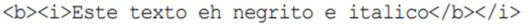


   - e) 

**2. (CESPE / DPDF - 2022)** <mark>Nos códigos em XML a seguir, sexo é um atributo no código A e um elemento no código B, mas ambos os códigos fornecem as mesmas informações.</mark> 

<mark>código A</mark> 

<mark><pessoa sexo="fem"></mark> 

<mark><nome>Maria</nome> <sobrenome>Silva</sobrenome></mark> 

<mark></pessoa></mark> 

<mark>código B <pessoa> <sexo>fem</sexo></mark> 

<mark><nome>Maria</nome> <sobrenome>Silva</sobrenome></mark> 

<mark></pessoa></mark> 

**3. (CESPE / Polícia Federal - 2018)** <mark>Em arquivos no formato XML, as tags não são consideradas metadados.</mark> 

**4. (CESPE / SEDF – 2017)** <mark>Um dos objetivos do projeto XML é que o número de recursos opcionais da linguagem deve ser maximizado para torná-la versátil e adaptável.</mark> 

**5. (CESPE / TCE-PA – 2016)** <mark>Em um documento XML, deve haver diferenciação entre letras maiúsculas e minúsculas e os comentários devem ter a seguinte sintaxe:</mark> 

<mark><!--comentario-->.</mark> 

**6. (CESPE / TCE-PA – 2016)** <mark>As desvantagens dos esquemas XML incluem a falta de suporte a diferentes tipos de dados.</mark>

---

<!-- pagina: 69 -->

**Vinicius Borges Aula 16** 

**7. (CESPE / TCE-PA – 2016)** <mark>Um arquivo XML deve conter, no máximo, 1.024 tags. Se o uso de uma quantidade maior de tags for necessário, deve-se adotar o seguinte recurso, a fim de aumentar a quantidade de tags referenciadas pelo arquivo XML principal: um arquivo XML fazer referência a outro.</mark>

---

<!-- pagina: 70 -->

**Vinicius Borges Aula 16** 

# **– LISTA DE QUESTÕES FGV** 

**8. (FGV / FUNSAÚDE-CE – 2021** **<mark>)</mark>** <mark>Maria está editando um arquivo XML por meio do bloco de notas do Windows, e deve tomar cuidado com certos caracteres que têm funções especiais. Assinale a lista que contém apenas caracteres especiais do XML.</mark> 

<mark>a) < > & # b) < > & " c) > & " / d) @ " / \ e) / \ @ "</mark> 

**9. (FGV / TCE-AM – 2021** **<mark>)</mark>** <mark>O código XML sintaticamente correto é:</mark> 


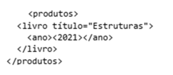


a) 


b) 


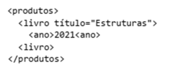


c) 


d) 


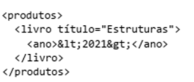


e) 

- **10.(FGV / IMBEL – 2021)** <mark>O uso do XML é bastante difundido no Brasil para troca de dados em aplicações como notas fiscais, procedimentos médicos, e várias outras. Assinale a utilidade de um Schema XML em aplicações dessa natureza.</mark>

---

<!-- pagina: 71 -->

**Vinicius Borges Aula 16** 

a) <mark>Direciona os aplicativos que leem arquivos no formato XML.</mark> 

b) <mark>Permite a conversão automática de arquivos XML para o formato CSV.</mark> 

c) <mark>Estabelece precisamente a versão do XML em uso num arquivo no formato XML.</mark> 

d) <mark>Permite que um Web Service interprete corretamente um arquivo de dados no formato XML.</mark> e) <mark>Permite a verificação da estrutura e regras de preenchimento de um arquivo contendo dados no formato XML.</mark> 

**11. (FGV / MPE-RJ – 2019)** <mark>A troca de dados entre sistemas computacionais é normalmente realizada por meio de arquivos que seguem padrões de formato e organização. Desse modo, diferentes agentes com diferentes equipamentos podem enviar e receber dados estruturados muito facilmente. Nesse contexto, analise um trecho do conteúdo de um dado arquivo a seguir.</mark> 

<mark><nota></mark> 

<mark><para>Rita</para> <de>Bernardo</de> <título>Lembrete</título> <texto>O pacote &lt;chegou&gt; ...</texto></mark> 

<mark></nota></mark> 

<mark>Com base nesse trecho, é correto deduzir que a organização desse arquivo segue o padrão conhecido como:</mark> 

a) CSS. 

b) CSV. 

c) ODF. 

d) PDF. 

e) XML. 

**12. (FGV / DPE-RJ – 2019)** <mark>Considere os trechos XML exibidos a seguir.</mark> 

I. 

<mark><p>Um primeiro exemplo</p> <br/></mark> 

#### II. 

<mark><message>Texto breve</message></mark> 

#### III. 

<mark><b><i>Texto com destaque.</b></i></mark> 

#### IV. 

<mark><p>Note que, para x>1, a resposta é sim.</p></mark> 

<mark>O número de trechos válidos é:</mark>

---

<!-- pagina: 72 -->

**Vinicius Borges Aula 16** 

a) 0. b) 1. c) 2. d) 3. e) 4. 

**13. (FGV / MPE-AL – 2018** **<mark>)</mark>** <mark>No XML, a sequência de símbolos</mark> 

<mark>&lt;</mark> 

<mark>Representa:</mark> 

a) < b) > 

c) “ d) & 

e) ’ 

- **14.(FGV / Câmara de Salvador-BA – 2018)** <mark>Analise o conteúdo XML de um arquivo de seis linhas, exibido a seguir.</mark> 


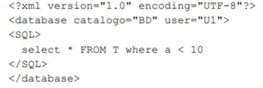


<mark>A validação desse arquivo apontaria um erro na linha de número:</mark> 

a)  1. b) 2. c) 3. d) 4. e) 6. 

**15. (FGV / Prefeitura de Niterói-RJ – 2018)** <mark>Considere a declaração do tipo de documento (DTD) a seguir.</mark> 


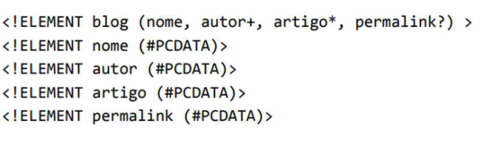


<mark>Em um documento XML, que obedece a esse conjunto de regras,</mark>

---

<!-- pagina: 73 -->

**Vinicius Borges Aula 16** 

- a) deve haver precisamente um elemento do tipo artigo. 

b) podem ocorrer vários elementos do tipo permalink. 

c) pode conter um elemento do tipo nome e outro elemento do tipo autor, em qualquer ordem. d) deve existir um elemento do tipo autor, sendo permitidas múltiplas ocorrências deste tipo de elemento. 

e) não é necessário haver um elemento do tipo nome. 

- **16.(FGV / Prefeitura de Niterói-RJ – 2018)** <mark>XML é uma linguagem de marcação projetada para descrever e transportar dados. Dado que em um documento XML é permitido ao desenvolvedor de software definir seus próprios elementos, pode ser necessário utilizar namespaces para evitar conflitos de nomes. Em relação à namespaces em XML, analise as afirmativas a seguir.</mark> 

<mark>I. Um namespace pode ser declarado no elemento em que é utilizado ou no elemento raiz do documento XML.</mark> 

<mark>II. O atributo uri é reservado em XML para indicar que um prefixo está associado ao namespace. III. As várias declarações de namespace com prefixos podem ser feitas em um elemento, mas devem possuir prefixos diferentes.</mark> 

<mark>Assinale:</mark> 

a) se somente a afirmativa I estiver correta. 

b) se somente a afirmativa II estiver correta. 

c) se somente a afirmativa III estiver correta. 

d) se somente as afirmativas I e III estiverem corretas. 

e) se todas as afirmativas estiverem corretas. 

**17. (FGV / IBGE – 2017)** <mark>As declarações de elementos na DTD determinam a possível estrutura de um documento XML. Analise a DTD a seguir:</mark> 


<mark>É correto afirmar que o(s) elemento(s):</mark> 

- a) **<mark>memo</mark>** <mark>pode conter os elementos</mark> **<mark>from</mark>** <mark>,</mark> **<mark>to</mark>** <mark>,</mark> **<mark>date</mark>** <mark>e</mark> **<mark>content</mark>** <mark>em qualquer ordem;</mark> b) **<mark>content</mark>** <mark>deve conter um ou mais elementos</mark> **<mark>p</mark>** <mark>;</mark>

---

<!-- pagina: 74 -->

**Vinicius Borges Aula 16** 

#### c) **<mark>date</mark>** <mark>é opcional;</mark> 

d) **<mark>to</mark>** <mark>é obrigatório e precisa ocorrer mais de uma vez dentro do elemento</mark> **<mark>memo</mark>** <mark>;</mark> 

e) **from** , **to** e **date** podem conter qualquer um dos elementos descritos na DTD. 

- **18.(FGV / ALERJ – 2017)** <mark>XML (Extensible Markup Language) é um sistema de codificação que permite que diferentes tipos de informação sejam distribuídos através da World Wide Web. Com a XML, diversos sistemas de informação, semelhantes ou não, se comunicam de forma transparente entre si. Em relação à linguagem XML, analise as afirmativas a seguir:</mark> 

   - <mark>I. Seções CDATA podem ocorrer em qualquer parte de um documento XML e devem ser utilizadas para inserir blocos de texto que contenham caracteres especiais como & e <.</mark> 

<mark>II. Documentos XML bem formados devem ter um DTD (Document Type Definition) associado e obedecer a todas as regras que o DTD contém.</mark> 

<mark>III. Na linguagem XML é permitido omitir as tags finais em elementos não vazios.</mark> 

<mark>Está correto o que se afirma em:</mark> 

a) <mark>somente I;</mark> 

b) <mark>somente II;</mark> 

c) <mark>somente III;</mark> 

d) <mark>somente I e II;</mark> 

e) <mark>I, II e III.</mark> 

- **19.(FGV / Prefeitura de Paulínia-SP – 2016)** <mark>Analise o trecho de um documento XML exibido a seguir.</mark> 


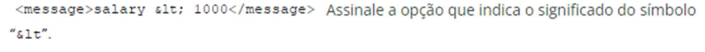


   - a) É uma diretiva de formatação de texto. 

   - b) Representa o caracter “<”. 

   - c) É um operador de multiplicação de constantes. 

   - d) É uma constante matemática da biblioteca “&math”. 

   - e) Representa um bookmark. 

- **20.(FGV / CODEBA – 2016)** <mark>Analise o seguinte trecho de XML Schema (XSD).</mark> 


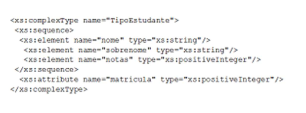

---

<!-- pagina: 75 -->

**Vinicius Borges Aula 16** 

<mark>Assinale o elemento XML cuja definição está de acordo a especificação de “TipoEstudante"</mark> 


a) b) c) d) e) 


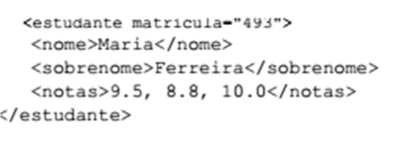


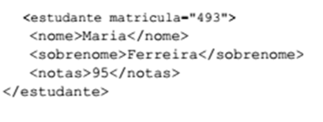


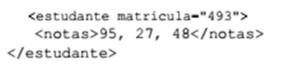


**21. (FGV / DPE-RO – 2015)** <mark>Os trechos contendo XML mal-formado, válido e inválido, respectivamente, são:</mark>

---

<!-- pagina: 76 -->

**Vinicius Borges Aula 16** 


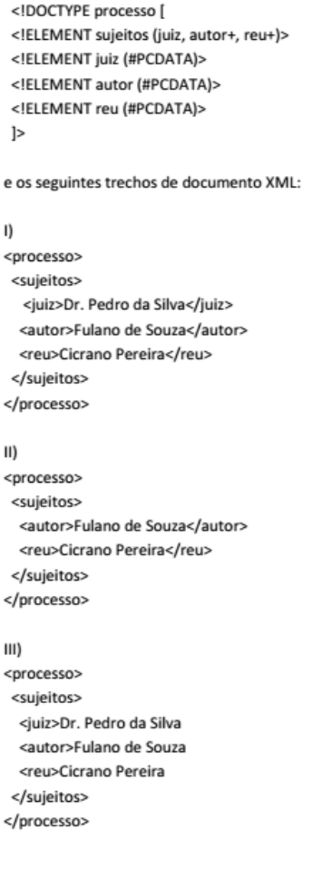


a) <mark>I, II e III;</mark> b) <mark>I, III e II;</mark> c) <mark>II, I e III;</mark> d) <mark>III, I e II;</mark> e) III, II e I. 

**22.(FGV / TJ-PI – 2015** **<mark>)</mark>** <mark>Num trecho XML, o comentário “Trecho em teste” deve ser introduzido como:</mark> 

a)  < !-- Trecho -- em -- teste -- > 

b) < !-- Trecho em teste > 

c)  < !Trecho em teste > 

d) < !--Trecho em teste --> 

e) <-- Trecho em teste -->

---

<!-- pagina: 77 -->

**Vinicius Borges Aula 16** 

**23. (FGV / DPE-RO – 2015)** <mark>A representação em XML da agenda de uma pessoa em que o telefone do usuário João está representado como um atributo é:</mark> 

a) 


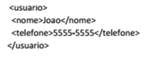


b) 


c) 


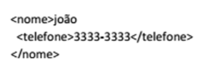


d) 


e) 


- **2** **~~4~~ . (FGV / PGE-RO – 2015)** <mark>Analise, abaixo, a lista de definições que podem ser estabelecidas por meio de um esquema (schema) para um documento XML:</mark> 

<mark>I. os elementos que podem ser utilizados; II. os tipos de dados para elementos e atributos; III. valores default para elementos e atributos; IV. espaços reservados para comentários.</mark> 

<mark>Somente estão corretas as afirmativas:</mark> 

a)  I e II; 

b) I e III; c) II e III; d) I, II e III; e) II, III e IV. 

**25. (FGV / PGE-RO – 2015)** <mark>São requisitos de um documento XML, EXCETO:</mark> 

a)  deve ter um elemento raiz, responsável por aninhar os demais elementos que formam o documento. 

b) deve ser bem formado, ou seja, possuir somente uma tag raiz, possuir tags de fechamento, etc.;

---

<!-- pagina: 78 -->

**Vinicius Borges Aula 16** 

c) pode conter atributos que devem ser únicos dentro do elemento, e seus valores devem estar envoltos em aspas. 

d) deve ser válido quando se desejar formalização na representação das informações. 

e) deve começar por uma declaração de conteúdo do elemento. 

**26.(FGV / TJ-GO – 2014)** Observe os principais tópicos de um arquivo XML de uma nota fiscal eletrônica. 


<mark>O atributo</mark> _<mark>xmlns</mark>_ <mark>define o que é conhecido como:</mark> 

a) Namespace; b) Name Source; 

c) Named Schema; d) Name Status; e) Name Server. 

**27. (FGV / AL-MA – 2013)** <mark>Dentre as alternativas a seguir, selecione aquelas que correspondem a especificações elaboradas com a finalidade de definir regras de validação (esquemas) para documentos XML:</mark> 

<mark>I. XSLT II. DTD III. XML Schema</mark> 

<mark>Assinale:</mark> 

a) se somente a afirmativa I estiver correta. 

b) se somente a afirmativa II estiver correta. 

c) se somente a afirmativa I e II estiver correta. 

d) se somente as afirmativas II e III estiverem corretas. 

e) se todas as afirmativas estiverem corretas. 

- **28.(FGV / AL-MA – 2013)** <mark>O scritp XML a seguir, que faz referência ao esquema verifica.xsd, está sintaticamente incorreto porque UTF-8 não é suportado no XML.</mark>

---

<!-- pagina: 79 -->

**Vinicius Borges Aula 16** 


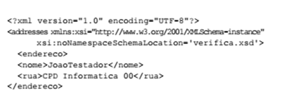

---

<!-- pagina: 80 -->

**Vinicius Borges Aula 16** 

# **– LISTA DE QUESTÕES CESGRANRIO** 

– **29.(CESGRANRIO / IPEA 2024)** O Ipea pretende publicar a Tabela de índices de custos e preços abaixo, relativa aos meses do primeiro trimestre de 2023. Para publicá-la, é necessário colocála no formato XML. Desconsiderando - se a parte de DOCTYPE e Style, ao colocar essa Tabela no formato XML, obtém-se: 

#### a) 

<Indices> <Indice> ICTI IPCA IGPM </Indice> <Indice> 182,34 0,53 0,21 </Indice > <Indice> 183,16 0,84 - 0,06 </Indice > <Indice> 183,34 0,76 0,05 </Indice > 

b) 

<Indices> <Indice> <ICTI> 182,34 </ICTI> <IPCA> 0,53 </IPCA> <IGPM> 0,21 </IGPM> </Indice> <Indice> <ICTI> 183,16 </ICTI> <IPCA> 0,84 </IPCA> <IGPM> - 0,06 </IGPM> </Indice> <Indice> <ICTI> 183,34 </ICTI> <IPCA> 0,76 </IPCA> <IGPM> 0,05 </IGPM> </Indice> </Indices> 

c) <Indices> <1> <ICTI> 182,34 </ICTI> <IPCA> 0,53 </IPCA> <IGPM> 0,21 </IGPM> <2> <ICTI> 183,16 </ICTI> <IPCA> 0,84 </IPCA>

---

<!-- pagina: 81 -->

**Vinicius Borges Aula 16** 

<IGPM> - 0,06 </IGPM> <3> <ICTI> 183,34 </ICTI> <IPCA> 0,76 </IPCA> <IGPM> 0,05 </IGPM> </Indices> 

d) 

<Indices> <ICTI> 182,34 </ICTI> <IPCA> 0,53 </IPCA> <IGPM> 0,21 </IGPM> </Indices> <Indices> <ICTI> 183,16 </ICTI> <IPCA> 0,84 </IPCA> <IGPM> - 0,06 </IGPM> </Indices> <Indices> <ICTI> 183,34 </ICTI> <IPCA> 0,76 </IPCA> <IGPM> 0,05 </IGPM> </Indices> 

e) <Indices> <insert> <1> <ICTI> 182,34 </ICTI> <IPCA> 0,53 </IPCA> <IGPM> 0,21 </IGPM> </1> <insert> <2> <ICTI> 183,16 </ICTI> <IPCA> 0,84 </IPCA> <IGPM> - 0,06 </IGPM> </2> <insert> <3> <ICTI> 183,34 </ICTI> <IPCA> 0,76 </IPCA> <IGPM> 0,05 </IGPM> </3>

---

<!-- pagina: 82 -->

**Vinicius Borges Aula 16** 

</Indices> 

- **30.(CESGRANRIO / TRANSPETRO – 2023)** Um profissional de Informática está trabalhando em um projeto que envolve a manipulação de documentos XML. Ele precisa garantir que os documentos XML estejam bem-formados e válidos, de acordo com as especificações do XML 1.1. Uma das regras que ele deverá seguir para garantir que um documento XML 1.1 seja válido é que o(s): 

   - a) documento pode ter um ou mais elementos raiz. 

   - b) documento deve começar com uma declaração XML. 

   - c) nomes dos elementos são insensíveis a maiúsculas e minúsculas. 

   - d) atributos devem ter o mesmo nome se estiverem no mesmo elemento. 

   - e) comentários XML devem aparecer como atributos de uma etiqueta (tag). 

- 

- **31. (CESGRANRIO / BASA 2022)** Um projetista de sistemas está desenvolvendo um sistema e precisou programar um arquivo XSLT. Neste arquivo, ele precisou inserir um elemento para aplicar uma regra de modelo, a partir de uma folha de estilo importada, ao invés de uma regra equivalente, a partir da folha de estilo principal, mas sem que este elemento apareça como o primeiro nó filho de . 

Para este caso, o elemento que deve ser inserido para aplicar tal regra nesse arquivo XSLT é o 

a) apply-imports 

b) apply_templates 

c) imports 

d) include 

e) Template 

**32. (CESGRANRIO / BASA – 2022)** Ao desenvolver um sistema de notícias, a empresa X decidiu manter as notícias em um formato XML, como o do exemplo a seguir: 

   - <?xml version="1.0"?> 

<news> 

<heading>Reminder</heading> 

- <body>Don’t forget me this weekend!</body> 

- </news> 

Mais tarde, entendeu que, para esse formato exemplificado acima, seria melhor definir um esquema em XSD. Que fragmento de código XSD deve conter esse esquema para permitir que o exemplo apresentado seja validado corretamente, quando nele for incluída a referência ao esquema completo? 

a) <xs:element name="news">

---

<!-- pagina: 83 -->

**Vinicius Borges Aula 16** 

<xs:complexType> 

<xs:sequence> <xs:element name="heading" type="xs:string"/> 

<xs:element name="body" type="xs:string"/> 

</xs:sequence> 

</xs:complexType> 

</xs:element> 

b) <xs:element name="news"> 

<xs:sequence> 

<xs:element name="heading" type="xs:string"/> 

<xs:element name="body" type="xs:string"/> 

</xs:sequence> 

</xs:element> 

c) <xs:element name="news"> 

<xs:element name="heading" type="xs:string"/> 

<xs:element name="body" type="xs:string"/> 

</xs:element> 

d) <!ELEMENT news (heading, body)> 

<!ELEMENT heading (#PCDATA)> 

<!ELEMENT body (#PCDATA)> 

e) <!ELEMENT news (heading, body)> 

<!ELEMENT heading (text)> 

<!ELEMENT body (text)> 

**33. (CESGRANRIO / BASA – 2021)** Ao participar de uma equipe para desenvolvimento de um website para a intranet do banco em que trabalhava, um programador teve como missão criar uma tabela HTML a partir de um arquivo XML que indicava clientes e seus saldos. 

O fragmento de XML a seguir é um exemplo da estrutura do XML do arquivo que conterá os dados: 

<?xml version="1.0" encoding="UTF - 8"?> 

<clientes> 

<cliente> 

<nome>Ana Zurique</nome> <saldo>3000</saldo> 

</cliente> <cliente> 

<nome>Bernardo Washington</nome> 

<saldo>4500</saldo> 

</cliente>

---

<!-- pagina: 84 -->

**Vinicius Borges Aula 16** 

<cliente> <nome>Carlos York</nome> <saldo>12345</saldo> </cliente> </cliente> 

Para esse arquivo, a tabela gerada deve ter a seguinte aparência: 


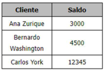


Inicialmente, o programador construiu o seguinte arquivo em XSLT: 

<?xml version="1.0" encoding="UTF - 8"?> <xsl:stylesheet version="1.0" xmlns:xsl="http://www.w3.org/1999/XSL/Transform"> <xsl:template match="/"> <html> <body> <table border="1"> <tr> <th>Cliente</th> <th>Saldo</th> </tr> <! - - Código Para os Dados - - > </table> </body> </html> </xsl:template> </xsl:stylesheet> 

Que sequência de instruções deve substituir o comentário , de forma a gerar a tabela no formato apresentado? 

a) <xsl:for - each select="clientes/cliente/"> <tr> <td><xsl:value - of select="nome"/></td> <td><xsl:value - of select="saldo"/></td> </tr> </xsl:for - each>

---

<!-- pagina: 85 -->

**Vinicius Borges Aula 16** 

b) <xsl:for - each select="clientes/cliente"> <tr> <td><xsl:value - of select="clientes/cliente/nome"/></td> <td><xsl:value - of select="clientes/cliente/saldo"/></td> </tr> </xsl:for - each> 

c) <xsl:for - each select="clientes/cliente"> <tr> <td><xsl:value - of select="nome"/></td> <td><xsl:value - of select="saldo"/></td> </tr> </xsl:for - each> 

d) 

<xsl:for - each select="clientes/"> <tr> <td><xsl:value - of select="cliente/nome"/></td> <td><xsl:value - of select="cliente/saldo"/></td> </tr> </xsl:for - each> 

e) <xsl:for - each select="clientes"> 

<tr> 

<td><xsl:value - of select="cliente/nome"/></td> <td><xsl:value - of select="cliente/saldo"/></td> </tr> </xsl:for - each> 

**34.(CESGRANRIO / CEF – 2021)** Um arquivo, contendo um documento XML, contém exatamente a seguinte informação: 

<?xml version=”1.0”?> <PEDIDOS> <PEDIDO> <TITULO>Pedido de Empréstimo</TITULO> <REQUERENTE>José da Silva</REQUERENTE> <CPF>999.999.999 - 99</CPF> <VALOR>20000</VALOR> <PEDIDO>

---

<!-- pagina: 86 -->

**Vinicius Borges Aula 16** 

#### <PEDIDOS> 

A partir desse documento apenas, um processador XML pode garantir que o arquivo é 

a) bem - formado, apenas 

b) bem - formado e normalizado 

c) bem - formado e válido 

d) normalizado, apenas 

e) válido, apenas 

**35. (CESGRANRIO / Caixa – 2021)** As fontes (feed) RSS devem todas fornecer informações em 

a) CSS b) HTML 1.0 

c) HTML 1.1 d) SOAP 

e) XML 

- **36.(CESGRANRIO / TRANSPETRO – 2018)** <mark>Considerando a linguagem XML, qual é o exemplo correto de uso de um atributo chamado “src” que recebe o valor “computador.gif” em um elemento de nome “img”?</mark> 

a)   

   - b)  

   - c)  "src=computador.gif " </img> 

   - d)  <src> computador.gif </src> </img> 

   - e)  src="computador.gif " </img> 

**37. (CESGRANRIO / PETROBRAS – 2018)** <mark>Qual linguagem de marcação, fundamental para o estabelecimento de serviços Web, que compõe uma Arquitetura Orientada a Serviços, é usada para que dados sejam apresentados, comunicados e armazenados?</mark> 

a) HTML; 

b) XML; 

c) JAVA; 

d) JAVASCRIPT; 

e) C#. 

#### **38.(CESGRANRIO / BASA – 2018)** Considere o esquema XML a seguir: 

<xs:elemente name="rectangle" type = "area"/> 

- <xs:complexType name = "area"> 

- <xs:attribute name="x1" type="xs:decimal" /> 

- <xs:attribute name="y1" type="xs:decimal" />

---

<!-- pagina: 87 -->

**Vinicius Borges Aula 16** 

<xs:attribute name="x2" type="xs:decimal" /> 

<xs:attribute name="y2" type="xs:decimal" /> 

<xs:complexType> 

Um elemento XML válido, segundo esse esquema, é: 

a) <area><x1>1</x1><y1>1</y1><x2>2</x2><y2>3</y2></area> 

b) <area x1="1" y1="1" x2="4" y2="5" /> 

c) <rectangle x1="5" y1="4" x2="1" y2="1"/> 

d) <area><x1>4</x1><y1>4</y1><x2>2</x2><y2>3</y2></area> 

e) <rectangle><x1>1</x1><y1>1</y1><x2>2</x2><y2>3</y2></rectangle> 

- **39.(CESGRANRIO / TRANSPETRO – 2018)** Documentos XML são estruturados segundo uma hierarquia de unidades informacionais chamadas de nós. Qual tecnologia XML fornece ao desenvolvedor uma API para adicionar, editar e remover esses nós? 

a) XMI 

b) XSDL 

c) XSLT 

d) XML DOM 

e) XML Schema 

- **40.(CESGRANRIO / BASA – 2014)** Sabendo que um arquivo XML está sintaticamente correto e que pode ser consumido ou processado por um parser XML, de acordo com a especificação XML, pode-se afirmar, com certeza, que ele é: 

a) autorizado 

b) validado 

c) certificado 

d) compilado 

e) bem formado 

#### **41.(CESGRANRIO / AGC – 2014)** Analise o seguinte DTD 

<?xml version="1.0" ?> 

<!DOCTYPE A [ 

<!ELEMENT A (B,C)> 

<!ELEMENT B (#PCDATA)> 

<!ELEMENT C (D?,E)> 

<!ELEMENT D (#PCDATA)> 

<!ELEMENT E (#PCDATA)> 

]> 

Segundo o DTD acima, que documento XML NÃO é válido?

---

<!-- pagina: 88 -->

**Vinicius Borges Aula 16** 

a) <A><B>Teste</B> <C><E>Teste</E> </C></A> 

b) <A><B>Teste</B> <C><D>Teste</D> <E>Teste</E></C></A> 

c) <A><B>Teste</B> <C>Teste<D>Teste</D> <E>Teste</E></C></A> 

d) <A><B> </B> <C> <D>Teste</D><E>Teste</E></C></A> 

e) <A><B></B><C><D></D><E></E></C></A> 

**42.(CESGRANRIO / BASA - 2014)** Seja o arquivo XML abaixo: 

<?xml version=”1.0” encoding=”UTF - 8”?> <T><P N=”1”> <K N=”1” M=”G”>Texto</K> <K N=”2” M=”H”>Texto</K> <K></K></P> <P><F>Texto</F></P> </T> 

Que DTD permite que esse arquivo seja considerado válido? 


a) 


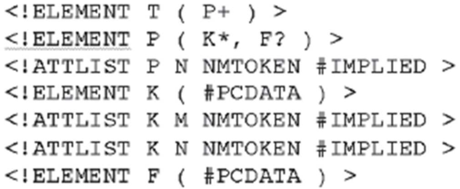


b) 


c)

---

<!-- pagina: 89 -->

**Vinicius Borges Aula 16** 


d) 


e) 

- 

- **43.(CESGRANRIO / CEFET RJ 2014)** Uma universidade decidiu alterar seu sistema acadêmico, atualmente escrito em Delphi, para aceitar uma interface Web. Para isso, decidiu adotar as tecnologias Ajax e PHP. 

A primeira parte do trabalho será alterar o subsistema de avaliação, chamado de NOTAS. O modelo de dados atual desse subsistema é bastante simples, e é descrito pelo modelo diagrama a seguir, que usa a notação da Engenharia da Informação. 


https://t.me/KakashiAssinaturasBot

---

<!-- pagina: 90 -->

**Vinicius Borges Aula 16** 

Que fragmento de código XML o sistema NOTAS pode usar para representar corretamente uma linha da tabela Turma? 

a) </TURMA></IDTURMA>1<IDTURMA></NOMETURMA>Cálculo<NOMETURMA><TURMA> b) <TURMA><IDTURMA><NOMETURMA>1</IDTURMA>Cálculo</NOMETURMA></TURMA> c) <TURMA><IDTURMA>1</IDTURMA><NOMETURMA>Cálculo</NOMETURMA></TURMA> d) <TURMA><IDTURMA>1<IDTURMA><NOMETURMA>Cálculo<NOMETURMA><TURMA> e) 

<TURMA/><IDTURMA/>Cálculo</IDTURMA><NOMETURMA/>1</NOMETURMA></TURMA> 

- 

- **44.(CESGRANRIO / IBGE 2013)** O gerente acadêmico de uma universidade solicitou ao setor de tecnologia da informação que fosse desenvolvida uma ferramenta que permitisse a distribuição dos currículos dos professores em diferentes formatos, uma vez que isso é essencial para promover o intercâmbio de informações entre diferentes instituições de ensino do Brasil e do exterior. Sabendo-se que os currículos que estão armazenados na base de dados da universidade são documentos XML válidos, qual tecnologia XML deve ser empregada na construção dessa ferramenta? 

a) XSD 

b) PDF 

c) XSL 

d) XKMS 

e) HTML 

- **45.(CESGRANRIO / LIQUIGÁS - 2013)** Muitas tecnologias usadas pela indústria de software favorecem a implantação de melhorias na gestão de processos integrados de negócios. Um exemplo disso é o uso de: 

#### a) softwares abertos. 

   - b) bancos de dados relacionais. 

   - c) computação móvel em larga escala. 

   - d) orientação a objetos como paradigma de desenvolvimento. 

   - e) XML para a troca de informações entre sistemas. 

- **46.(CESGRANRIO / AGC – 2012)** Um documento XML bem formado (well - formed) segue as restrições de sintaxe definidas pela especificação XML. 

#### PORQUE 

Um documento XML bem formado deve, necessariamente, estar em conformidade com uma definição em DTD (Document Type Definition) ou em XML Schema. 

Analisando - se as afirmações acima, conclui-se que:

---

<!-- pagina: 91 -->

**Vinicius Borges Aula 16** 

a) as duas afirmações são verdadeiras, e a segunda justifica a primeira. 

b) as duas afirmações são verdadeiras, e a segunda não justifica a primeira. 

c) a primeira afirmação é verdadeira, e a segunda é falsa. 

d) a primeira afirmação é falsa, e a segunda é verdadeira. 

e) as duas afirmações são falsas. 

**47.(CESGRANRIO / Petrobras – 2012)** Solicitado a preparar um arquivo de teste em XML para um sistema de controle de pedidos de uma distribuidora de petróleo, um analista de sistemas gerou o seguinte documento: 

< ? xml version="1.0" encoding="UTF-8"? > 

< ! DOCTYPE cliente SYSTEM "C:\postos.dtd" > 

< cliente > < posto > 

< cnpj > 53.726.891/0001-24 < /cnpj > < pedidos > < pedido > < produto > Gasolina 

< /produto > < quantidade > 10.000 < /quantidade > < /pedido > < pedido > < produto > Gasolina 

< /produto > < /pedido > < /pedidos > < /posto > < /cliente > 

Considere o DTD abaixo, salvo no arquivo C:\postos.dtd. 

< ? xml version="1.0" encoding="UTF-8"? > < ! ELEMENT quantidade (#PCDATA) > < ! ELEMENT produto (#PCDATA) > < ! ELEMENT posto (cnpj,pedidos*) > < ! ELEMENT pedidos (pedido*) > < ! ELEMENT pedido (produto, quantidade)m> 

< ! ELEMENT cnpj (#PCDATA) >

---

<!-- pagina: 92 -->

**Vinicius Borges Aula 16** 

#### < ! ELEMENT cliente (posto) > 

O arquivo preparado pelo analista está em 

#### a) formato diferente do XML. 

b) XML, mas não é válido e não é bem-formado. 

c) XML, é bem-formado, mas não é válido. 

d) XML, é válido, mas não é bem-formado. 

e) XML, é válido e bem-formado. 

- **48.(CESGRANRIO / Liquigás – 2012)** Com a proliferação de aplicações e serviços utilizados na Internet, o conjunto geral de marcadores presente na linguagem HTML começou a se tornar restritivo, e a necessidade de extensões para criar novos tipos de marcadores começou a surgir. Uma das soluções adotadas pelo W3C foi padronizar uma nova linguagem com a capacidade de ser extensível, sobre a qual rótulos pudessem ser criados de acordo com a necessidade das aplicações. De fato, tal linguagem é muito mais uma metalinguagem, no sentido de que, a partir dela, outras linguagens (até mesmo a própria HTML) com suas marcações poderiam ser geradas. Essa metalinguagem é conhecida como: 

a) UML 

b) WML 

c) XML d) VML e) SVG 

- **49.(CESGRANRIO / Transpetro – 2012)** Considere o documento DTD a seguir. 

<?xml version="1.0" encoding="UTF-8"?> 

<!ELEMENT livros (titulo|autores)> 

<!ELEMENT titulo (#PCDATA)> 

- <!ELEMENT autores (#PCDATA)> 

O trecho de documento XML consistente com o DTD acima é: 

a) <livros> <titulo>Principia Mathematica</titulo> 

<autores>Isaac Newton</autores> </livros> 

b) 

<livros> 

<autores>Isaac Newton</autores> <titulo>Principia Mathematica</titulo> 

</livros>

---

<!-- pagina: 93 -->

**Vinicius Borges Aula 16** 

c) <livros> <autores> 

<autores>Alfred North Whitehead</autores> <autores>Bertrand Russel</autores> 

</autores> </livros> 

d) <livros> 

<titulo>Principia Mathematica</titulo> 

<autores> <autores>Alfred North Whitehead </autores> <autores>Bertrand Russel</autores> 

</autores> </livros> 

e) <livros> 

<titulo>Principia Mathematica</titulo> 

</livros> 

#### **50.(CESGRANRIO / Petrobras – 2012)** Na linguagem XSL, 

a) o XSD é o responsável por transformar documentos XML em XHTML. 

b) o XSL-FO é o componente que permite a navegação através de um documento XML. c) o SVG é o componente responsável por descrever gráficos vetoriais bidimensionais. d) as regras de transformação residem em um arquivo DTD. 

e) as transformações podem ocorrer tanto no servidor como no cliente. 

**51. (CESGRANRIO / Petrobras – 2012)** Sobre o XML DOM, que define uma forma padrão para acessar e manipular documentos XML, considere as afirmativas a seguir. 

I - Utiliza um modelo dirigido por eventos para ler documentos XML. 

II - Por ser uma API definida através de uma linguagem de definição de interface (IDL), é independente em relação a plataformas e linguagens de programação. 

III - É bastante eficiente em relação ao consumo de memória, mesmo no caso de grandes documentos XML. 

É correto APENAS o que se afirma em: 

a) I 

b) II 

c) III

---

<!-- pagina: 94 -->

**Vinicius Borges Aula 16** 

d) I e II 

e) I e IIII

---

<!-- pagina: 95 -->

**Vinicius Borges Aula 16** 

# **– LISTA DE QUESTÕES DIVERSAS BANCAS** 

**52. (VUNESP / TJM-SP – 2021)** <mark>No XML, os nomes de elementos:</mark> 

a) <mark>não diferenciam maiúsculas de minúsculas.</mark> 

b) <mark>devem ser iniciados com um caractere letra ou sublinhado.</mark> 

c) <mark>podem conter letras, números, hifens, sublinhados, pontos ou espaços.</mark> 

d) <mark>não podem conter caracteres acentuados.</mark> 

e) <mark>não podem fazer uso de nomes existentes no HTML.</mark> 

**53. (VUNESP / SEMAE DE PIRACICABA – 2021)** <mark>A opção que representa a forma correta de inserção de um comentário dentro de um arquivo XML é:</mark> 

a)  // meu comentário 

b) <!-- meu comentário --> 

c) /* meu comentário */ 

d) # meu comentário 

e) ** meu comentário 

**54.(IDIB / CRF-MS – 2021)** <mark>Em relação ao XML, analise as afirmativas a seguir:</mark> 

<mark>(I) O XML é uma linguagem de marcação como o HTML.</mark> 

<mark>(II) O XML é uma linguagem de programação para ser compilada.</mark> 

<mark>(III) O XML é utilizado para armazenar e transportar dados.</mark> 

<mark>É correto o que se afirma:</mark> 

a)  apenas em I e II.. 

b) apenas em II e III. 

c) apenas em I. 

d) apenas em I e III. 

**55. (VUNESP / Prefeitura de Presidente Prudente-SP – 2021)** <mark>Segundo a especificação do XML, se um documento XML é considerado válido, então, é correto afirmar que:</mark> 

a) ele também é bem-formado. 

b) ele possui uma Definição de Tipo de Documento (DTD), mas a sintaxe não necessariamente está correta. 

c) a sintaxe dele está correta, mas ele não possui uma Definição de Tipo de Documento (DTD). d) todos os elementos que compõem o documento possuem, no máximo, um único elemento filho. 

e) todos os elementos possuem a propriedade “id” e estão corretamente identificados.

---

<!-- pagina: 96 -->

**Vinicius Borges Aula 16** 

- **56.(COMPERVE / TJ-RN – 2020)** <mark>Alguns caracteres causam problemas quando são colocados dentro de conteúdo ou como valores de atributos no XML. Por isso, certos caracteres são proibidos na linguagem, tais como:</mark> 

a)  = e “ 

b) < e ! 

c) ! e = 

d) " e < 

**57. (AOCP / UFPB – 2019)** <mark>O XML não é uma linguagem de programação, mas, sim, de marcação. Sobre XML, é correto afirmar que:</mark> 

a) <mark>o XML é utilizado para aumentar a velocidade na troca de informação.</mark> 

b) <mark>o XML pode ser definido como uma linguagem de metamarcação.</mark> 

c) <mark>o XML nada mais é do que um arquivo que contém a codificação de exibição de uma página web.</mark> 

d) <mark>o XML é uma linguagem de orientação a objetos.</mark> 

e) <mark>o XML pode ser conceituado como uma linguagem de metaprogramação.</mark> 

- **58.(CVV / UFC – 2019)** <mark>Sobre as características da linguagem XML (eXtensible Markup Language), é correto afirmar:</mark> 

a)  o usuário da linguagem XML pode definir novas tags para melhor estruturar a informação contida no arquivo. 

b) a XML é uma linguagem de programação que necessita de um compilador específico para gerar o arquivo binário a ser executado em algum sistema. 

c) a desvantagem da XML é a dependência da plataforma sobre a qual está executando, sendo necessárias adequações para cada tipo de sistema. 

d) a característica de extensibilidade da linguagem está relacionada ao fato de ser possível criar funções a partir de um conjunto fixo de tags fornecido pela linguagem. 

e) a linguagem XML fornece o recurso de tipagem dos dados, de forma que, por exemplo, é possível definir números inteiros e realizar operações sobre eles no programa XML. 

- **59.(CCV / UFC – 2018)** <mark>Qual dos seguintes fragmentos representa um fragmento XML bem formado?</mark> 

a) <mark><myElement myAttribute="someValue"/></mark> b) <mark><myElement myAttribute="someValue’/></mark> c) <mark><myElement myAttribute=’someValue’></mark>

---

<!-- pagina: 97 -->

**Vinicius Borges Aula 16** 

d) <mark><myElement myAttribute=someValue/></mark> e) <mark><myElement myAttribute=someValue></mark> 

- **60.(QUADRIX / CRQ4-SP – 2018)** <mark>Uma vantagem do DTD é que ele é escrito em linguagem XML, enquanto o XML-Schema possui outra sintaxe de programação.</mark> 

- **61.(QUADRIX / CRQ4-SP – 2018)** <mark>Para a descrição de um XML, tanto o XML-Schema quanto a DTD (Document Type Definition) podem definir os elementos e atributos que podem aparecer em um documento, os tipos de dados para elementos e atributos e os valores-padrão e fixos para elementos e atributos.</mark> 

- **62.(CONSUPLAN / TRE-RJ – 2017)** <mark>A respeito de XML, é INCORRETO afirmar que:</mark> 

a) <mark>Processar um documento XML requer um software parser XML (ou processador XML).</mark> 

- b) <mark>Todo documento XML deve ter exatamente um elemento-raiz que contém todos os outros elementos.</mark> 

- c) <mark>Apesar de documentos XML serem altamente portáveis, visualizar ou modificar documentos XML requer softwares especializados.</mark> 

d) <mark>Um documento XML pode referenciar uma Definição de Tipo de Documento (DTD) ou um esquema que define a estrutura adequada do documento XML.</mark> 

- **63.(UFMT / UFSBA – 2017)** <mark>Sobre XML (eXtended Markup Language), assinale a afirmativa correta.</mark> 

   - a) Possui tecnologias para auxílio na execução de seu código, como DTD (Document Type Definition) e XML Schema. 

   - b) É uma tecnologia recomendada pela W3C, projetada para armazenar e transportar dados. 

c) É uma evolução do HTML, por isso páginas HTML migraram para páginas XHTML. 

d) É estruturada na forma de árvore, mas permite a existência de mais de um nó raiz no documento. 

- **64.(VUNESP / Prefeitura de Presidente Prudente-SP – 2016)** <mark>A Definição de Tipo de Documento (DTD) é utilizada no XML para:</mark> 

a) <mark>especificar as transformações a serem aplicadas para reestruturar o documento em um novo formato.</mark> 

b) <mark>validar a estrutura do documento.</mark> 

c) <mark>armazenar valores com mais de 65535 bytes.</mark> 

d) <mark>interligar múltiplos documentos.</mark> 

   - e) <mark>associar código JavaScript ao documento.</mark> 

- **65.(CCV / UFC – 2016)** <mark>Em um documento XML, o que a DTD representa?</mark> 

   - a) Direct Type Definition. 

   - b) Direct Type Document.

---

<!-- pagina: 98 -->

**Vinicius Borges Aula 16** 

c) Dynamic Type Definition. 

d) Document Type Definition. 

e) Dynamic Type Document. 

**66. (FUNRIO / IF-PA – 2016)** <mark>Em relação as regras de sintaxe do XML são apresentadas as seguintes proposições:</mark> 

<mark>I – Todo documento XML deve conter um elemento raiz que é o pai de todos os outros elementos.</mark> 

<mark>II – Os elementos do XML não precisam estar devidamente aninhados.</mark> 

<mark>III – Os valores dos atributos devem sempre estar entre aspas.</mark> 

<mark>É correto apenas o que se afirma em</mark> ==5460== a)  I. b) II. 

c) III. d) I e II. 

e) I e III.

---

<!-- pagina: 99 -->

**Vinicius Borges Aula 16** 

||||GABARITO<br>|||
|---|---|---|---|---|---|
|**1.**|LETRA B|**23.**|LETRA E|**45.**|LETRA E|
|**2.**|CORRETO|**24.**|LETRA D|**46.**|LETRA C|
|**3.**|ERRADO|**25.**|LETRA E|**47.**|LETRA C|
|**4.**|ERRADO|**26.**|LETRA A|**48.**|LETRA C|
|**5.**|CORRETO|**27.**|LETRA D|**49.**|LETRA E|
|**6.**|ERRADO|**28.**|ERRADO|**50.**|LETRA E|
|**7.**|ERRADO|**29.**|LETRA B|**51.**|LETRA B|
|**8.**|LETRA B|**30.**|LETRA B|**52.**|LETRA B|
|**9.**|LETRA E|**31.**|LETRA A|**53.**|LETRA B|
|**10.**|LETRA E|**32.**|LETRA A|**54.**|LETRA D|
|**11.**|LETRA E|**33.**|LETRA C|**55.**|LETRA A|
|**12.**|LETRA B|**34.**|LETRA A|**56.**|LETRA D|
|**13.**|LETRA A|**35.**|LETRA E|**57.**|LETRA B|
|**14.**|LETRA D|**36.**|LETRA A|**58.**|LETRA A|
|**15.**|LETRA D|**37.**|LETRA B|**59.**|LETRA A|
|**16.**|LETRA D|**38.**|LETRA C|**60.**|ERRADO|
|**17.**|LETRA C|**39.**|LETRA D|**61.**|CORRETO|
|**18.**|LETRA A|**40.**|LETRA E|**62.**|LETRA C|
|**19.**|LETRA B|**41.**|LETRA C|**63.**|LETRA B|
|**20.**|LETRA D|**42.**|LETRA B|**64.**|LETRA B|
|**21.**|LETRA D|**43.**|LETRA C|**65.**|LETRA D|
|**22.**|LETRA D|**44.**|LETRA C|**66.**|LETRA E|

---

<!-- pagina: 100 -->

**Vinicius Borges Aula 16** 

# **XSLT** 


---

<!-- pagina: 101 -->

**Vinicius Borges Aula 16** 


---

<!-- pagina: 102 -->

**Vinicius Borges Aula 16** 


---

<!-- pagina: 103 -->

**Vinicius Borges Aula 16** 


---

<!-- pagina: 104 -->

**Vinicius Borges Aula 16** 

# **- - QUESTÕES COMENTADAS XSLT MULTIBANCAS** 


---

<!-- pagina: 105 -->

**Vinicius Borges Aula 16** 


---

<!-- pagina: 106 -->

**Vinicius Borges Aula 16** 


---

<!-- pagina: 107 -->

**Vinicius Borges Aula 16** 


---

<!-- pagina: 108 -->

**Vinicius Borges Aula 16** 


---

<!-- pagina: 109 -->

**Vinicius Borges Aula 16** 


---

<!-- pagina: 110 -->

**Vinicius Borges Aula 16** 


---

<!-- pagina: 111 -->

**Vinicius Borges Aula 16** 


---

<!-- pagina: 112 -->

**Vinicius Borges Aula 16** 

# **- - LISTA DE QUESTÕES XSLT MULTIBANCAS** 


---

<!-- pagina: 113 -->

**Vinicius Borges Aula 16** 


---

<!-- pagina: 114 -->

**Vinicius Borges Aula 16** 


---

<!-- pagina: 115 -->

**Vinicius Borges Aula 16** 


<!-- Start of picture text -->
==5460==<br><!-- End of picture text -->


---

<!-- pagina: 116 -->

**Vinicius Borges Aula 16** 


---

<!-- pagina: 117 -->

**Vinicius Borges Aula 16** 

# **GABARITO** 


---

<!-- pagina: 118 -->


