---
fonte_pdf: "Desenvolvimento - Aula 18.pdf"
paginas: 108
conversao: texto-e-imagens
---

<!-- pagina: 2 -->

**Vinicius Borges Aula 18** 

# **Índice** 

|..............................................................................................................................<br>1) ActiveMQ - Teoria|................................................................<br>3|
|---|---|
|..............................................................................................................................<br>2) ActiveMQ - Questões Comentadas|................................................................<br>18|
|..............................................................................................................................<br>3) ActiveMQ - Lista de Questões|................................................................<br>21|
|..............................................................................................................................<br>4) Apache Kafka - Teoria|................................................................<br>24|
|..............................................................................................................................<br>5) Apache Kafka - Questões Comentadas|................................................................<br>36|
|..............................................................................................................................<br>6) Apache Kafka - Lista de Questões|................................................................<br>44|
|..............................................................................................................................<br>7) NATS - Teoria|................................................................<br>49|
|..............................................................................................................................<br>8) NATS - Questões Comentadas|................................................................<br>60|
|..............................................................................................................................<br>9) NATS - Lista de Questões|................................................................<br>62|
|..............................................................................................................................<br>10) RabbitMQ - Teoria|................................................................<br>64|
|..............................................................................................................................<br>11) RabbitMQ - Questões Comentadas|................................................................<br>77|
|..............................................................................................................................<br>12) RabbitMQ - Lista de Questões|................................................................<br>87|
|..............................................................................................................................<br>13) STOMP - Teoria|................................................................<br>92|
|..............................................................................................................................<br>14) STOMP - Questões Comentadas|................................................................<br>101|
|..............................................................................................................................<br>15) STOMP - Lista de Questões|................................................................<br>104|

---

<!-- pagina: 3 -->

**Vinicius Borges Aula 18** 

# **ACTIVEMQ** 

## Conceitos Gerais 


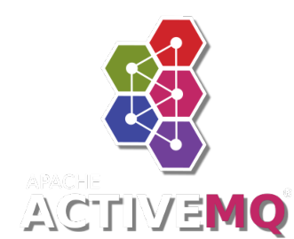


O Apache ActiveMQ Artemis (nessa aula referido apenas como ActiveMQ) é um projeto de código aberto destinado a construir um sistema de mensageria assíncrona de alta performance, _clusterizado_ , e que suporte múltiplos protocolos de troca de mensagem . 

O ActiveMQ age como um _middleware_ em sistema de mensageria, também chamados de Message Oriented Middleware (MoM) ou 

_broker_ . 

Algumas vantagens da adoção do ActiveMQ, em comparação a outros sistemas de mensageria incluem: 

- Software 100% open source 

- Projeto baseado em usabilidade 

- Escrito em Java, rodando em qualquer plataforma com um runtime Java 11+ 

- Alta performance 

- Alta disponibilidade 

- Alta flexibilidade 

Além disso, por ser desenvolvido com mínimas dependências , o ActiveMQ pode usar de forma isolada, integrado com servidores de aplicação Java EE, ou de forma embutida dentro da própria aplicação. Isso permite maleabilidade e flexibilidade de escolhas de abordagem na hora do desenvolvimento de aplicações. 

(Inédita/Prof. Felipe Mathias) Acerca dos sistemas de mensageria, julgue o item abaixo. 

O Apache ActiveMQ Artemis é um sistema de mensageria de código fechado, desenvolvido em C#, com foco em disponibilidade e performance. 

Comentários: 

Dois erros basilares na construção da afirmativa. O primeiro deles é que o ActiveMQ é de código aberto, _open source_ , e o segundo é a linguagem de desenvolvimento: o ActiveMQ é desenvolvido em Java, e usado no seu ecossistema. Portanto, incorreta a afirmativa. (Gabarito: Errado)

---

<!-- pagina: 4 -->

**Vinicius Borges Aula 18**

---

<!-- pagina: 5 -->

**Vinicius Borges Aula 18** 

## Arquitetura 

A arquitetura do ActiveMQ é baseada em um conjunto objetos antigos Java - os Plain Old Java Objects (POJO) . Isso garante uma arquitetura simples e bem definida. Cada servidor do ActiveMQ conta com um _journal_ próprio, uma ferramenta de alta performance, usada para persistência das mensagens. 

O servidor ActiveMQ serve como um intermediário num sistema de mensageria - um gerenciador, ou _broker_ . Ele atua tanto no sistema de mensageria ponto-a-ponto ( _point-to-point_ ), onde uma mensagem usualmente é encaminhada a uma fila e entregue diretamente ao usuário, ou no sistema pub/sub ( _publisher-subscriber_ ) onde um publicador envia a mensagem para um _middleware_ , que armazena essas mensagens usualmente em tópicos. Os consumidores, então, se inscrevem nos diferentes tópicos e consomem as mensagens. 

Mensageria point-to-point 


<!-- Start of picture text -->
Origem<br><!-- End of picture text -->


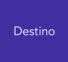


<!-- Start of picture text -->
Destino<br><!-- End of picture text -->


<!-- Start of picture text -->
Fila<br><!-- End of picture text -->


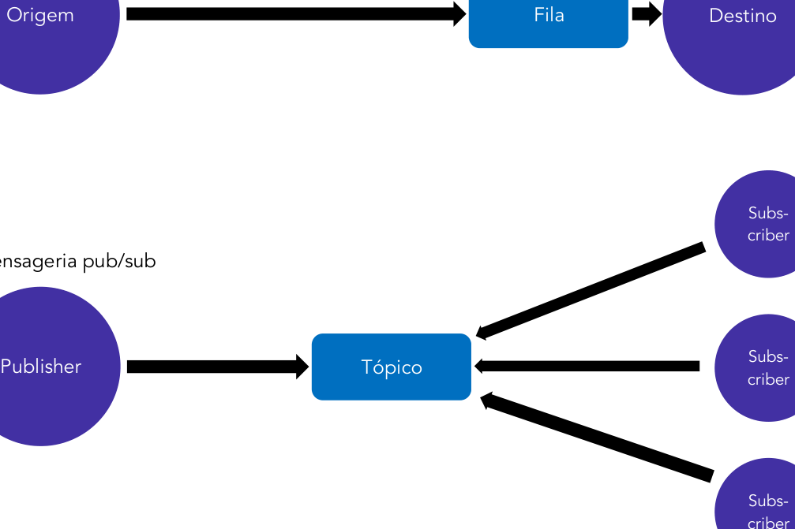


<!-- Start of picture text -->
Origem  Fila  Destino<br>Subs-<br>criber<br>Mensageria pub/sub<br>Subs-<br>Publisher  Tópico<br>criber<br>Subs-<br>criber<br><!-- End of picture text -->


<!-- Start of picture text -->
Subs-<br>criber<br><!-- End of picture text -->

#### Mensageria pub/sub 


<!-- Start of picture text -->
Publisher<br><!-- End of picture text -->


<!-- Start of picture text -->
Subs-<br>criber<br><!-- End of picture text -->


<!-- Start of picture text -->
Subs-<br>criber<br><!-- End of picture text -->

---

<!-- pagina: 6 -->

**Vinicius Borges Aula 18** 

Os clientes do ActiveMQ interagem com as mensagens a partir do ActiveMQ broker , o gerenciador de mensagens, que roda no servidor e gerencia as mensagens. Para alocar essas mensagens no servidor, o ActiveMQ conta com três APIs _client-side:_ 

- API central do cliente: é uma API Java simples e intuitiva alinhada com o Core interno do ActiveMQ, permitindo mais controle sobre objetos do broker (por exemplo, criação direta de endereços e filas). A API do Core também oferece um conjunto completo de funcionalidades de mensagens sem algumas das complexidades do JMS. 

- API do cliente JMS 2.0: a API padrão do JMS (Java Messaging System) está disponível no lado do cliente. Este cliente também está em conformidade com a especificação Jakarta Messaging 2.0. 

- API do cliente Jakarta Messaging 3.0: é essencialmente o mesmo que a API JMS 2.0, apenas com uma diferença no nome do pacote utilizado - é usado <mark>`jakarta`</mark> ao invés de <mark>`javax` .</mark> 

Ao contrário de muitos sistemas de mensageria que implementam um único protocolo, o ActiveMQ é agnóstico a protcolos - isso é, ele independente do protocolo utilizado. Suas APIs dão suporte a 6 diferentes protocolos: 

- AMQP 

- OpenWIre 

- MQTT 

- STOMP 

- HornetQ 

- Core (Artemis Core Protocol) 


(Inédita/Prof. Felipe Mathias) Acerca dos conhecimentos sobre o ecossistema Apache, julgue o item abaixo.

---

<!-- pagina: 7 -->

**Vinicius Borges Aula 18** 

O Apache ActiveMQ Artemis, framework de mensageria de código aberto, é amplamente adotado por suportar diversos protocolos de troca de mensagens, como AMQP e MQTT. 

Comentários: 

Perfeito! Uma das vantagens do ActiveMQ é justamente ele ser agnóstico em relação ao protocolo de implementação, permitindo o uso de um grande conjunto de protocolos, adaptando a aplicação à situação mais desejada. (Gabarito: Certo) 

Temos três formas de implementar o _broker_ , o gerenciador de mensagens que fica alocado no servidor e que garante a entrega da mensagem aos destinatários: 

- Standalone: Nesta configuração, o broker ActiveMQ é executado como um processo independente em seu próprio ambiente. Isso significa que ele opera como um serviço separado, geralmente em sua própria máquina ou servidor. O broker standalone é útil quando você precisa de uma implantação independente, isolada de outros aplicativos ou serviços, e deseja configurar e gerenciar o ActiveMQ de forma autônoma. 

- Embedded: No modo Embedded, o broker ActiveMQ é incorporado diretamente em um aplicativo Java. Isso permite que você inicie e controle o broker dentro do próprio aplicativo, sem a necessidade de executar um processo separado. O modo Embedded é útil em casos em que você deseja simplificar a implantação e distribuição do seu aplicativo, consolidando o broker e o aplicativo em uma única execução. 

- Integrado com Jakarta/Java EE: Nesta abordagem, o broker ActiveMQ é integrado ao ambiente Jakarta EE ou Java EE. Isso significa que o broker é configurado e implantado como parte de um contêiner de aplicativos Jakarta EE ou Java EE, como o Apache Tomcat ou o WildFly. Essa integração oferece recursos avançados de gerenciamento e escalabilidade, aproveitando os recursos fornecidos pelo contêiner de aplicativos. É útil quando você está desenvolvendo aplicativos Java EE ou Jakarta EE e deseja utilizar o ActiveMQ como seu sistema de mensagens, integrando-o perfeitamente ao ambiente existente. 

# **Implementações do ActiveMQ Broker** 


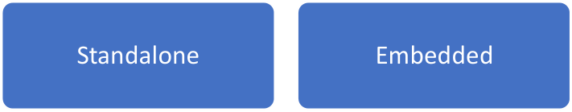


<!-- Start of picture text -->
Standalone Embedded<br><!-- End of picture text -->


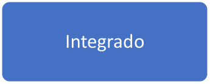


<!-- Start of picture text -->
Integrado<br><!-- End of picture text -->

---

<!-- pagina: 8 -->

**Vinicius Borges Aula 18** 

Então, de forma geral, podemos definir a estrutura do ActiveMQ da seguinte forma: as fontes de dados (ou mensagens), que encaminham essas mensagens para o _broker_ . O _broker_ irá armazenar a mensagem conforme o tipo de comunicação (p2p ou pub/sub), e os destinatários receberão essa mensagem através de um protocolo de comunicação. 


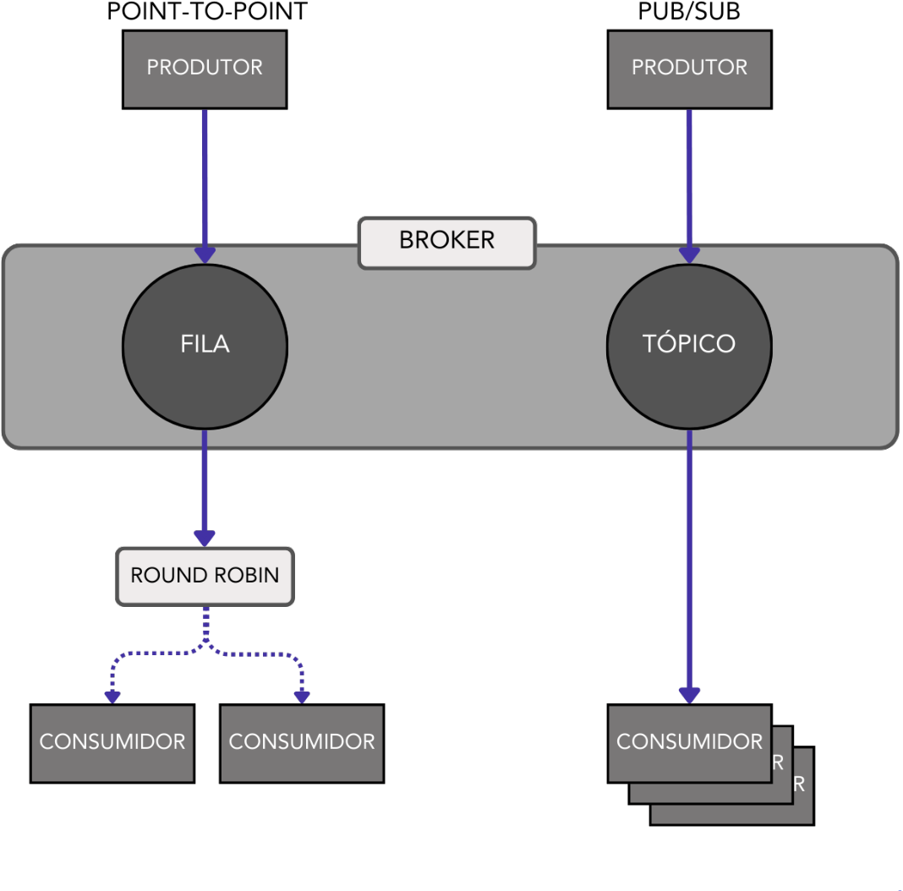

---

<!-- pagina: 9 -->

**Vinicius Borges Aula 18**

---

<!-- pagina: 10 -->

**Vinicius Borges Aula 18** 

## Mensagens 

As mensagens no ActiveMQ são baseadas no padrão JMS - Java Message System . Com isso, cada mensagem é composta de três campos: 

- Cabeçalho 

- Propriedades opcionais 

- Corpo 


<!-- Start of picture text -->
==5460==<br>Cabeçalho<br><!-- End of picture text -->


<!-- Start of picture text -->
Propriedades (opcional)<br><!-- End of picture text -->


<!-- Start of picture text -->
Corpo ( payload )<br><!-- End of picture text -->

O cabeçalho carrega os metadados da mensagem. Eles são definidos conforme as especificações JMS e seus valores são definidos ou quando o produtor cria a mensagem, ou quando o ActiveMQ a envia. Ele garante informações qualitativas à mensagem, que afeta como o _broker_ e os clientes lidarão com a mensagem. Temos dois pontos chave definidos aqui: 

- Expiração da mensagem: o tempo de expiração define quanto a mensagem irá durar até que o ActiveMQ a descarte. A expiração pode ser baseada em números de leituras (max delivery count) ou em tempo(time-to-live). 

- Persistência: mensagens no ActiveMQ são persistentes por padrão. Com isso, as mensagens são salvas no disco antes de serem enviadas. Podemos configurar essas persistência para não existir, ser específica por mensagem, ou por produtor. 

As propriedades proveem uma forma de colocar metadados adicionais no pacote. O JMS conta com um conjunto de propriedades pré-definidas, além da possibilidade de serem criadas propriedades customizadas para  a relação.

---

<!-- pagina: 11 -->

**Vinicius Borges Aula 18** 

E, por fim, o corpo (body) contém a mensagem em si - que pode ser um corpo de texto ou dados binários. O JMS define alguns tipos diferentes de mensagem: 

- TextMessage - uma string de texto, como um arquivo XML ou JSON 

- MapMessage - um conjunto de nome-valor, com os nomes configurados como strings, e os valores como tipos primitivos do Java 

- BytesMessage - um conjunto de bytes não interpretados 

- StreamMessage - um _stream_ de valores primitivos do Java, de forma sequencial 

- ObjectMessage - um objeto serializável em Java 

- Message - apesar do nome, _message_ é um campo vazio, sem valores 

# **Tipos de Mensagens JMS** 


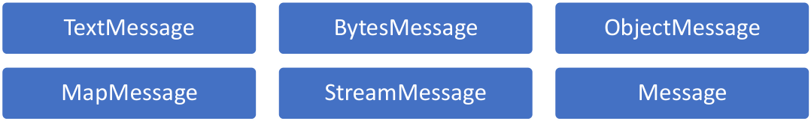


<!-- Start of picture text -->
TextMessage BytesMessage ObjectMessage<br>MapMessage StreamMessage Message<br><!-- End of picture text -->


(Inédita/Prof. Felipe Mathias) A empresa XPTO, inscrita em um tópico de mensageria em um ActiveMQ, recebe uma mensagem JMS com o corpo vazio. O tipo de mensagem JMS recebida pela empresa XPTO é: 

- a) BytesMessage 

- b) MapMessage 

- c) ObjectMessage 

- d) Message 

- e) TextMessage 

Comentários:

---

<!-- pagina: 12 -->

**Vinicius Borges Aula 18** 

Como a resposta recebida possuia um campo vazio, podemos afirmar que o tipo de mensagem recebida foi _Message_ . (Gabarito: Letra D)

---

<!-- pagina: 13 -->

**Vinicius Borges Aula 18** 

## Federa ões <u>ç</u> 

Um broker refere-se a um servidor dentro de um cluster de servidores - ou seja, apenas um dos nós do sistema distribuído. Pode ser necessário replicar uma mesma mensagem para diversos nós - e é ai que entra o conceito de federação de endereços . É como uma fluxo de mensagem _multicast_ , onde uma mensagem será entregue a um _broker_ e, a partir dele, distribuída a outros. 


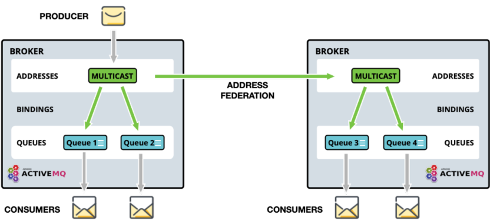


Temos 4 diferentes tipologias de federação. 

### Simétrica 

Aqui, os _brokers_ de cada nó estão interconectados. Dessa forma, é feita uma transmissão a um nó inicialmente e, se necessário, consumidores de outros nós podem requisitar acesso a essa imagem, permitindo que qualquer consumidor em qualquer nó tenha acesso a mensagens de quaisquer produtores. A quantidade máxima de saltos aqui (max-hops) deve ser configurada como 1, para que consumidores não recebam múltiplas cópias de uma mensagem. 


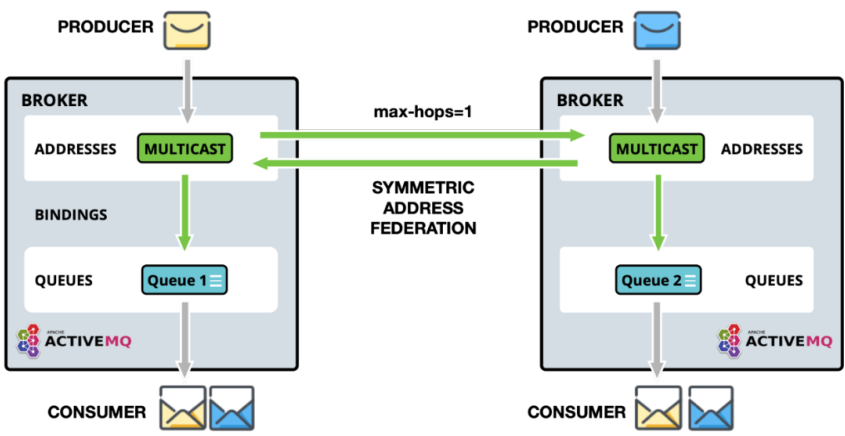

---

<!-- pagina: 14 -->

**Vinicius Borges Aula 18** 

### Full mesh 

Na malha completa, ou _full mesh_ , temos ligações similares às da forma simétrica - aqui, porém, ao invés de um _broker_ estar federado simetricamente a somente um outro, temos todos os nós interconectados por uma ligação. 


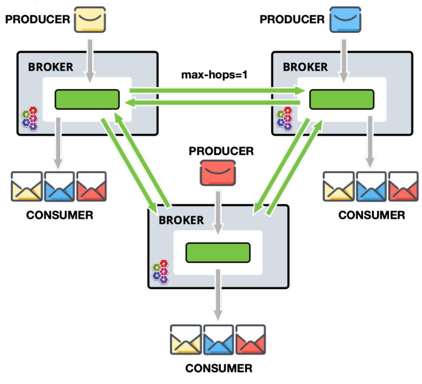


Anel 

Na tipologia em anel, ou _ring_ , cada broker se liga unidercionalmente ao _broker_ mais próximo - ao “vizinho”. Assim, criamos um fluxo circular de mensagens. Aqui é imperioso apontar como maxhops n - 1, sendo n o número de nós. 

Por exemplo, se tivermos 5 brokers, uma mensagem deve dar somente 4 saltos, caso contrário teremos duplicações.

---

<!-- pagina: 15 -->

**Vinicius Borges Aula 18** 


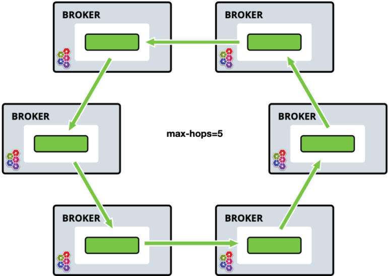


### Fan-out 

Aqui, temos uma estrutura hierárquica de nós, formando uma estrutura em árvore. Um nó inicial _n_ recebe a mensagem, que propaga para nós, que, por sua vez, propagam essa mensagem _n_ também para outros nós. Assim, mensagens publicas no endereço principal, são enviadas a todos os consumidores, independente do nó que estejam. 


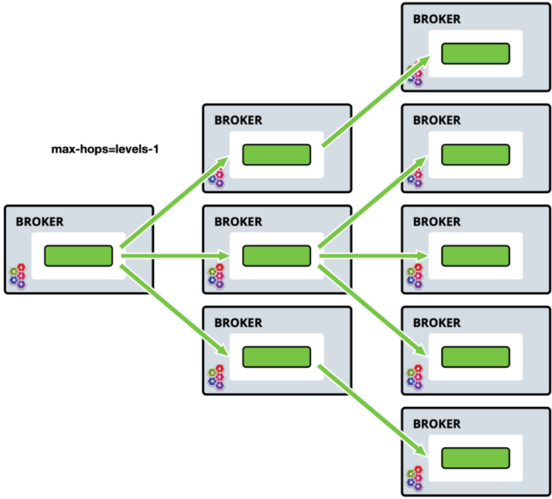

---

<!-- pagina: 16 -->

**Vinicius Borges Aula 18** 


(Inédita/Prof. Felipe Mathias) A entidade XPTO, empresa pública, adota um sistema ActiveMQ de mensageria e somente tem a estrutura para publicar uma mensagem unicamente em um nó local, porém, com necessidade de que essa mensagem chegue a todos os outros consumidores, mesmo que não ligados diretamente a esse nó inicial. 

Qual deve ser a topologia de federação adotada pela XPTO para satisfazer essa necessidade? 

a) Mesh 

b) Symetric 

c) Full Mesh 

d) Fan out 

e) Ring 

Comentários: 

A topologia de rede que permite a publicação em um único nó e que, mesmo assim, a mensagem se propague a todos os nós - mesmo que não estejam conectados de forma direta ao nó inicial - é a topologia _Fan Out ._ (Gabarito: Letra D)

---

<!-- pagina: 17 -->

**Vinicius Borges Aula 18** 

# **RESUMO** 

### O que é o ActiveMQ? 

. O Apache ActievMQ Artemis é um programa de mensageria de código aberto Ele implementa uma diversidade de protocolos para estabelecer relações de trocas de mensagens entre diferentes nós de um sistema distribuído. 

### Quais protocolos usados no ActiveMQ? 

: O Apache ActievMQ Artemis suporte um conjunto de diferentes protocolos MQTT, STOMP, AMQP, entre outros. A sua estruturação, porém, é orientada a suportar o JMS - Java Message System. 

### Quais as três formas de implementação do ActiveMQ Broker? 

Temos três formas distintas: standalone , onde o ActiveMQ é executado como um processo isolado; embedded , onde o broker é incorporado diretamente em um aplicativo Java; integrado , onde há uma integração do broker ao ambiente Jakarta ou Java EE. 

### O que são federações? 

As federações são formas de comunicar diferentes brokers de um sistema distribuído. A partir de diferentes implementações, como simétrica e fan-out, uma mensagem encaminhada a um broker pode ser acessada por inscritos de outros brokers, ou até mesmo propagada para esses outros brokers para persistência

---

<!-- pagina: 18 -->

**Vinicius Borges Aula 18** 

# **QUESTÕES COMENTADAS** 

01. (COPERVE UFSC/TAE UFSC/2022 - Adaptada) Julgue a afirmativa abaixo. 

O Apache ActiveMQ permite a troca de mensagens entre aplicações remotas utilizando o protocolo AMQP (Advanced Message Queuing Protocol). 

Comentários: 

O ActiveMQ é uma ferramenta de mensageria para projetos menores, da Apache. Apesar disso, ele é agnóstico a protocolos, o que permite a implementação de diversos protocolos - dentre eles, o AMQP. Portanto, correta a afirmativa. 

Gabarito: Correto 

02. (COPERVE UFSC/TAE UFSC/2018 - Adaptada) Julgue a afirmativa abaixo. 

O servidor Apache ActiveMQ implementa os padrões JMS e AMQP. 

Comentários: 

A mesma pergunta, mas em anos diferentes. Sim, o ActiveMQ implementa os padrões JMS (Java Message System) e AMQP. Portanto, correta a afirmativa. 

Gabarito: Correto 

03. (Inédita/Prof. Felipe Mathias) Acerca dos sistemas de mensageria, julgue o item abaixo. 

O Apache ActiveMQ Artemis é um sistema de mensageria de código fechado, desenvolvido em C#, com foco em disponibilidade e performance. 

Comentários: 

Dois erros basilares na construção da afirmativa. O primeiro deles é que o ActiveMQ é de código aberto, _open source_ , e o segundo é a linguagem de desenvolvimento: o ActiveMQ é desenvolvido em Java, e usado no seu ecossistema. Portanto, incorreta a afirmativa. 

Gabarito: Errado

---

<!-- pagina: 19 -->

**Vinicius Borges Aula 18** 

04. (Inédita/Prof. Felipe Mathias) A empresa XPTO, inscrita em um tópico de mensageria em um ActiveMQ, recebe uma mensagem JMS com o corpo vazio. O tipo de mensagem JMS recebida pela empresa XPTO é: 

- a) BytesMessage 

- b) MapMessage 

- c) ObjectMessage 

- d) Message 

- e) TextMessage 

Comentários: 

Vamos relembrar os tipos de mensagem: 

==5460== 

- TextMessage - uma string de texto, como um arquivo XML ou JSON 

- MapMessage - um conjunto de nome-valor, com os nomes configurados como strings, e os valores como tipos primitivos do Java 

- BytesMessage - um conjunto de bytes não interpretados 

- StreamMessage - um _stream_ de valores primitivos do Java, de forma sequencial 

- ObjectMessage - um objeto serializável em Java 

- Message - apesar do nome, _message_ é um campo vazio, sem valores 

Como a resposta recebida possuia um campo vazio, podemos afirmar que o tipo de mensagem recebida foi _Message_ . 

#### Gabarito: Letra D 

05. (Inédita/Prof. Felipe Mathias) A entidade XPTO, empresa pública, adota um sistema ActiveMQ de mensageria e somente tem a estrutura para publicar uma mensagem unicamente em um nó local, porém, com necessidade de que essa mensagem chegue a todos os outros consumidores, mesmo que não ligados diretamente a esse nó inicial. 

Qual deve ser a topologia de federação adotada pela XPTO para satisfazer essa necessidade? 

#### a) Mesh 

- b) Symetric 

- c) Full Mesh 

- d) Fan out 

- e) Ring 

Comentários:

---

<!-- pagina: 20 -->

**Vinicius Borges Aula 18** 

Temos 4 possíveis topologias de rede para as federações no ActiveMQ: Simétrica, Full mesh, Anel e Fan-out. A topologia de rede que permite a publicação em um único nó e que, mesmo assim, a mensagem se propague a todos os nós - mesmo que não estejam conectados de forma direta ao nó inicial - é a topologia _Fan Out._ 

Gabarito: Letra D 

06. (Inédita/Prof. Felipe Mathias) Acerca dos conhecimentos sobre ActiveMQ, julgue o item abaixo. 

No ActiveMQ é possível definir se uma mensagem será mantida no _broker_ após a leitura, ou se será consumida (removida). Esse processo, chamado de expiração de mensagem, pode se dar, por exemplo, por quantidades máximas de leituras, ou com base no tempo de vida (time-to-live). 

Comentários: 

Perfeito! A expiração das mensagens é um dos pontos chaves do ActiveMQ, e permite dizer quanto tempo a mensagem ficará disponível para consultas. Podemos configurar a expiração de diversas formas, através da quantidade máxima de leituras (por exemplo, se essa quantidade for 1, a mensagem será removida após uma leitura), por um tempo máximo de disponibilidade, por uma quantidade máxima de mensagens na fila, entre outros. Sendo assim, correta a afirmativa. 


Gabarito: Correto

---

<!-- pagina: 21 -->

**Vinicius Borges Aula 18** 

# **LISTA DE QUESTÕES** 

01. (COPERVE UFSC/TAE UFSC/2022 - Adaptada) Julgue a afirmativa abaixo. 

O Apache ActiveMQ permite a troca de mensagens entre aplicações remotas utilizando o protocolo AMQP (Advanced Message Queuing Protocol). 

02. (COPERVE UFSC/TAE UFSC/2018 - Adaptada) Julgue a afirmativa abaixo. 

O servidor Apache ActiveMQ implementa os padrões JMS e AMQP. 

03. (Inédita/Prof. Felipe Mathias) Acerca dos sistemas de mensageria, julgue o item abaixo. 

O Apache ActiveMQ Artemis é um sistema de mensageria de código fechado, desenvolvido em C#, com foco em disponibilidade e performance. 

04. (Inédita/Prof. Felipe Mathias) A empresa XPTO, inscrita em um tópico de mensageria em um ActiveMQ, recebe uma mensagem JMS com o corpo vazio. O tipo de mensagem JMS recebida pela empresa XPTO é: 

- a) BytesMessage 

- b) MapMessage 

- c) ObjectMessage d) Message 

- e) TextMessage 

05. (Inédita/Prof. Felipe Mathias) A entidade XPTO, empresa pública, adota um sistema ActiveMQ de mensageria e somente tem a estrutura para publicar uma mensagem unicamente em um nó local, porém, com necessidade de que essa mensagem chegue a todos os outros consumidores, mesmo que não ligados diretamente a esse nó inicial. 

Qual deve ser a topologia de federação adotada pela XPTO para satisfazer essa necessidade? 

- a) Mesh 

- b) Symetric 

- c) Full Mesh 

- d) Fan out 

- e) Ring

---

<!-- pagina: 22 -->

**Vinicius Borges Aula 18** 

06. (Inédita/Prof. Felipe Mathias) Acerca dos conhecimentos sobre ActiveMQ, julgue o item abaixo. 

No ActiveMQ é possível definir se uma mensagem será mantida no _broker_ após a leitura, ou se será consumida (removida). Esse processo, chamado de expiração de mensagem, pode se dar, por exemplo, por quantidades máximas de leituras, ou com base no tempo de vida (time-to-live). 


<!-- Start of picture text -->
==5460==<br><!-- End of picture text -->

---

<!-- pagina: 23 -->

**Vinicius Borges Aula 18** 


<!-- Start of picture text -->
GABARITO<br><!-- End of picture text -->

1. Correto 

2. Correto 

3. Errado 

4. Letra D 

5. Letra D 


6. Correto

---

<!-- pagina: 24 -->

**Vinicius Borges Aula 18** 

# **APACHE KAFKA** 

## Conceitos Gerais 


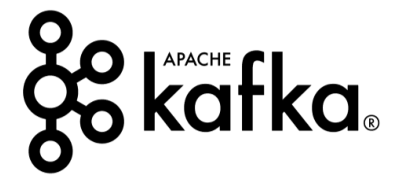


O Apache Kafka é uma plataforma _open source_ de distribuição de dados para computação - ou seja, uma plataforma de mensageria . Ele trabalha com _pipelines_ de transmissão visando fornecer dados diferentes para consumidores através de um esquema _publisher/subscriber_ (pub/sub), ou publicado e consumidor. 

Pub/sub é um padrão de comunicação em sistemas distribuídos onde os remetentes (publishers) enviam mensagens para um canal de comunicação (tópico), e os destinatários (subscribers) recebem essas mensagens do canal ao qual estão inscritos, permitindo a comunicação assíncrona e desacoplada entre componentes de um sistema. 

Mais precisamente, o Apache Kafka trabalha com o _streaming_ de eventos . Com isso, o programa captura dados em tempo real de fontes de eventos , como bancos de dados, sensores, aplicativos móveis, serviços na nuvem e aplicações numa forma de fluxo de evento. Após a captura, esses eventos e seus dados correlatos são armazenados por um tempo, garantindo durabilidade e fornecendo acesso futuro à aplicação. 

Um exemplo de _stream_ de eventos é a aprovação de cartões de crédito em sistemas de compra. A empresa de venda age como um _subscriber_ do evento de aprovação (ou reprovação) do cartão - assim que o processo for concluído, o resultado é capturado e adicionado a um tópico específico. Os consumidores “assinam”, se inscrevem nesse tópico e acessam a informação necessária a partir dali. 

Portanto, de forma resumida, podemos ter três capacidades básicas no Apache Kafka: 

- Publicar (escrever) e se inscrever (ler) um fluxo de eventos, incluindo importações e exportações contínuas de dados de outros sistemas 

- Armazenar a série de eventos de forma durável e confiável 

- Processar o fluxo de eventos conforme eles ocorrem, ou retrospectivamente

---

<!-- pagina: 25 -->

**Vinicius Borges Aula 18** 

# Capacidades Básicas do Apache Kafka 


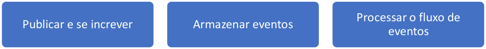


<!-- Start of picture text -->
Processar o fluxo de<br>Publicar e se increver Armazenar eventos<br>eventos<br><!-- End of picture text -->

## Eventos 

O primeiro passo para entender completamente o Apache Kafka é entender o conceito de eventos . 

Eventos são registros de algum fato , indicando que “alguma coisa” aconteceu no mundo ou no negócio. Eventos também podem receber o nome de _registro_ ou mensagem - se alinhando, portanto, ao conceito de mensageria. Todos os dados lidos ou escritos no Kafka são feitos na forma de um evento. 

Um evento tem três valores obrigatórios: 

- Chave do evento: identificador para esse evento específico 

- Valor do evento: valor que está sendo expresso a partir do evento 

- _Timestamp:_ carimbo de tempo responsável por registrar o momento do evento 

# Composição do Evento 


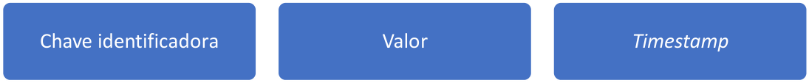


<!-- Start of picture text -->
Chave identificadora Valor Timestamp<br><!-- End of picture text -->

Por exemplo, seguindo na seara dos cartões de crédito, um evento pode ser composto dos seguintes campos: 

```
{
“chave”: “pgto#2911”
“valor”: “Pagamento processado”
“timestamp”:1649011845000
}
```

Apesar do evento acima ser retratado em JSON, o Kafka é agnóstico em relação ao formato de dados , isso é, não possui restrição quanto ao tipo de dados utilizado. Normalmente, por ser um

---

<!-- pagina: 26 -->

**Vinicius Borges Aula 18** 

tipo de dado altamente otimizado e integrado, usa-se o JSON ou, alternativamente, o XML. A comunicação desses eventos e a transmissão do respectivo dado é feita a partir de servidores, _brokers_ o . e outros elementos, que veremos mais à frente, utilizando protocolo de rede TCP 


---

<!-- pagina: 27 -->

**Vinicius Borges Aula 18** 

## Papéis e Objetos 

Temos, portanto, dois papéis essenciais para entendermos o conceito do Apache Kafka e como ele aplica a mensageria: 

- Produtor (producer): É responsável por enviar mensagens para tópicos do Kafka. Os produtores publicam registros (eventos) em um ou mais tópicos. 

- Consumidor (consumer): É responsável por ler mensagens de tópicos do Kafka. Os consumidores se inscrevem em um ou mais tópicos e processam os registros recebidos. 

Esses eventos são organizados e armazenados em tópicos . De forma simplificada, os tópicos agem como pastas de arquivos, e os eventos como arquivos dentro dessa pasta. Usualmente, tópicos armazenam dados correlacionados e afins de uma mesma área - por exemplo, dados de pagamento, de baixa de estoque, entre outros. 


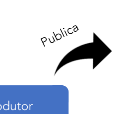


<!-- Start of picture text -->
Tópico<br><!-- End of picture text -->


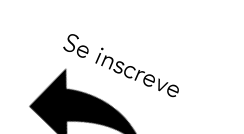


<!-- Start of picture text -->
Consumidor<br><!-- End of picture text -->

Um grande destaque do Kafka é a perenidade dos eventos. Após alocado num tópico, os eventos ficam armazenados , podendo ser consumidos por uma pluralidade de vezes - o tempo de armazenamento é definido pelo desenvolvedor. Além disso, um tópico pode ter múltiplos produtores publicando nele, e múltiplos consumidores escritos. 


## <mark>ATENÇÃO! EVENTOS (DADOS) NÃO SÃO DESCARTADOS DIRETAMENTE APÓS SEU CONSUMO NO APACHE KAFKA</mark>

---

<!-- pagina: 28 -->

**Vinicius Borges Aula 18** 

Para garantir essa durabilidade ao evento e uma integridade nas leituras, após publicado em um tópico (ou partição), os eventos são imutáveis , isso é, não pode ser modificados após escritos. Imagine, você publicou um evento aprovando o cartão de crédito e, portanto, dando início ao processo de envio de determinado produto. Se houve um erro no pedido, e esse evento for modificado, teremos diferentes leituras para cada usuário - a depender do tempo de leitura. 

Para contornar esses casos entra em voga o _timestamp_ . Publicamos versões novas de um mesmo dado, com um novo conteúdo. O consumidor, ao verificar uma informação, pode sempre pesquisar pela informação mais recente, ou comparar a versão do evento que ele consultou com eventuais versões mais recentes no tópico. 

# <mark>APÓS PUBLICADO NO TÓPICO, O EVENTO É IMUTÁVEL</mark> 

==5460== 


(FGV/CÂMARA DOS DEPUTADOS/2023 - Adaptada) Apache Kafka é um sistema de mensageria altamente escalável, que usa tópicos e partições para enfileiramento de mensagens. 

Sobre os componentes arquitetônicos do Kafka, julgue o item abaixo. 

Os eventos no tópico são imutáveis, o que significa que não podem ser modificados depois de escritos. 

Comentários: 

Perfeito! Após ser inserido num tópico, para garantirmos homogeneidade nas leituras e, consequentemente, uma maior integridade, os eventos não podem mais ser modificados. Correta a alternativa, portanto. (Gabarito: Correto) 

Ainda falando sobre os tópicos, eles são segregados em partições . É como se tivéssemos subpastas dentro da grande pasta, que é o tópico. Usualmente, eventos com mesma chave são escritos em uma mesma partição, agregando dados correlacionados em um único local. É

---

<!-- pagina: 29 -->

**Vinicius Borges Aula 18** 

- importante destacar que a sequência de eventos dentro de uma partição é ordenada e imutável isso garante uma “linha do tempo” para a sequência de eventos. 


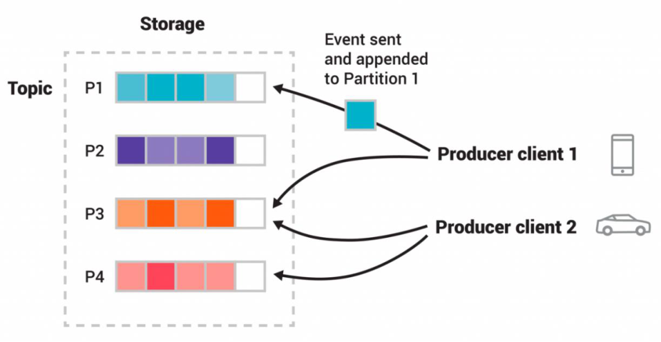


Ao dividirmos os dados em partições, é possível alocar os dados a diversos servidores do Kafka - chamados de Kafka Broker (veremos em seguida sobre ele). Isso garante uma possibilidade de alocações em diversos nós distintos, aumentando a escalabilidade e, devido à replicação dos dados, a redundância - consequentemente, a disponibilidade. Para isso, apontamos uma partição líder, que funciona como o nó mestre, e as réplicas, que “acompanham” o líder. 

Bom, já que citamos o servidor, vamos falar mais sobre ele. Um conjunto de tópicos dentro de um mesmo nó é administrador por um gerenciador de mensageria, chamado, na mensageria, de broker (ou agenciador). No caso do Apache Kafka, esse agenciador recebe o nome de Kafka broker . 


---

<!-- pagina: 30 -->

**Vinicius Borges Aula 18** 

Ele é o “admin” do nó, responsável por gerenciar todas as atividades que acontecem dentro do seu respectivo nó - ou seja, armazenar os eventos, garantir que eles sejam consistentes, entre outros. O conjunto de _brokers_ dá origem ao cluster Kafka , a nossa rede de computação distribuída. Os _brokers_ são os responsáveis por garantir a escalabilidade horizontal . Veja, na computação, temos dois tipos de escalabilidade: 

- Escalabilidade vertical: atua num mesmo nó, aumentando seu poder computacional 

- Escalabilidade horizontal: atua adicionando mais nós no cluster, aumentando o poder de processamento do sistema como um todo 

Mais brokers significa mais nós, maior capacidade de processamento - portanto, maior escalabilidade. Além disso, temos maior resiliência e disponibilidade no sistema, já que podemos ter replicações dos dados e, assim, mais redundância, e um aumento na velocidade de consulta aos tópicos, já que nós podem acabar ficando geograficamente mais próximos ao consumidor. 

(FGV/TCE SP/2023) A analista Lúcia administra o AKluster, o cluster do Apache Kafka no TCE SP. Lúcia constatou que o espaço disponível no AKluster para o armazenamento de streams de eventos está acabando. 

Para expandir a camada de persistência do AKluster, aumentando ainda a escalabilidade, Lúcia deve prover mais espaço de armazenamento ao Apache Kafka mediante novos: 

a) topics; 

b) brokers; 

c) partitions; 

d) producers; 

e) replications. 

Comentários: 

Para aumentar a escalabilidade, Lúcia deve apontar mais brokers , ou seja, mais nós no _cluster_ . Vamos aproveitar a questão para revisar os conceitos do Kafka: 

- topics: os tópicos são divisões do _broker_ , que recebem eventos que compartilham uma mesma chave 

- partitions: forma de divisão interna dos tópicos 

- producers: responsáveis por gerar os eventos e escrevê-los nos tópicos e/ou repartições 

- replications: é a quantidade de réplicas, definindo quantos _brokers_ receberão um mesmo evento 

Temos, portanto, como alternativa correta, a letra B. (Gabarito: Letra B)

---

<!-- pagina: 31 -->

**Vinicius Borges Aula 18** 

O produtor envia dados diretamente ao _broker_ líder da repartição, sem rotas intermediárias. Para auxiliar o produtor a realizar essa ação, qualquer nós do Kafka podem responder ao pedido para metadados sobre quais servidores estão em funcionamento, e onde os líderes das repartições estão localizados, em qualquer momento. 

Essa é uma forma de distribuir os metadados para garantir a disponibilidade do serviço. Assim, mesmo que alguns nós não estejam em funcionamento, qualquer nó do sistema poderá auxiliar na definição da rota para o nó principal, que deve receber a mensagem. 

O Apache Kafka também permite a implementação do carregamento de eventos em _batches_ , ou lotes, através de uma comunicação assíncrona . Dessa forma, o produtor irá acumular dados em memória antes de serem enviados - através de um limite máximo de quantidade de mensagens ou para não aguardar mais que um determinado limite de latência (por exemplo, 64 mil mensagens ou 10ms de latência). 

Já o consumidor interage com o Kafka através de operações de <mark>`fetch`</mark> direcionadas aos _brokers_ líderes das partições que desejam consumir. O consumidor especifica o _offset_ no log de mensagens do broker, recebendo uma quantidade de _logs_ iniciando da posição definida no _offset_ . A partir de então, o consumidor tem controle total da posição e pode optar por retornar para esse ponto, de forma a re-consumir dados, se necessário. 

Um outro ponto chave para entendermos a relação entre publicador, consumidor e o _broker_ é a <mark>`PUSH`</mark> e <mark>`PULL` .</mark> relação de ações - o sistema de requisições Os produtores enviarão as mensagens _broker_ <mark>`PUSH`</mark> para o através de uma requisição , enquanto os consumidores recuperam o dado do servidor a partir de uma requisição <mark>`PULL` .</mark> 

# <mark>PRODUTOR → PUSH CONSUMIDOR → PULL</mark> 

Por fim, é possível a integração do Apache Kafka com sistemas distribuídos de armazenamento de dados, como o Hadoop, através de carregamentos _offline_ . Especificamente como o Hadoop, há uma paralelização do carregamento de dados através de atividades de mapeamento individual (do MapReduce), uma para cada combinação de nó-tópico-partição, permitindo um paralelismo completo. 

(Inédita/Prof. Felipe Mathias) Acerca dos conhecimentos sobre Apache Spark, julgue o item que segue. 

O produtor envia dados ao _broker_ Kafka através de requisições PULL. 

Comentários:

---

<!-- pagina: 32 -->

**Vinicius Borges Aula 18** 

Cuidado! A requisição enviada pelo produtor é a PUSH, para “empurrar” o dado, enquanto o consumidor usa as requisições PULL. (Gabarito: Errado)

---

<!-- pagina: 33 -->

**Vinicius Borges Aula 18** 

## APIs 

Usualmente, interações com o Kafka ocorrem através da sua própria ferramenta de CLI (Command Line Interface, ou Interface de Linha de Comando). Porém, é possível o uso de um conjunto de APIs nativas . Essas APIs, desenvolvidas para Java e Scala, são conjuntos de interfaces que permitem aos desenvolvedores interagir com o Kafka para gerenciar, produzir e consumir dados. 

São 5 as APIs principais do Kafka: 

- Admin API: A Admin API é utilizada para administrar e gerenciar recursos do Kafka, como tópicos, partições e configurações do cluster. Ela permite criar, excluir, listar e modificar tópicos, bem como configurar políticas de retenção de dados e configurações de segmento. 

- Producer API: A Producer API permite que os desenvolvedores publiquem (produzam) mensagens em tópicos do Kafka. Os produtores são responsáveis por enviar registros para o Kafka, especificando o tópico e, opcionalmente, a chave e o valor da mensagem. 

- Consumer API: A Consumer API é usada para consumir mensagens de tópicos do Kafka. Os consumidores se inscrevem em tópicos e recebem mensagens para processamento. Eles podem ser configurados para consumir mensagens em um ou mais tópicos e podem ser parte de um grupo de consumidores para balanceamento de carga e failover. 

- Kafka Streams API: A Kafka Streams API é uma biblioteca Java para processamento de dados em tempo real. Ela permite que os desenvolvedores criem aplicativos de processamento de fluxo de dados que leem dados de tópicos Kafka, realizam transformações e análises em tempo real e escrevem os resultados de volta em tópicos Kafka. 

- Kafka Connect API: A Kafka Connect API é um framework para integração de dados que simplifica o desenvolvimento de conectores para importar e exportar dados entre o Kafka e outros sistemas de armazenamento de dados, como bancos de dados, sistemas de arquivos e serviços na nuvem. Ele permite que os desenvolvedores criem conectores reutilizáveis que podem ser configurados e implantados facilmente para mover dados de forma eficiente para dentro e para fora do Kafka. 

# APIs Nativas do Kafka 


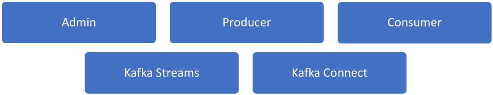


<!-- Start of picture text -->
Admin Producer Consumer<br>Kafka Streams Kafka Connect<br><!-- End of picture text -->

---

<!-- pagina: 34 -->

**Vinicius Borges Aula 18**

---

<!-- pagina: 35 -->

**Vinicius Borges Aula 18** 

# **RESUMO** 

### O que é o Apache Kafka? 

O Apache Kafka é uma plataforma open source de mensageria , destinada a serviços de computação distribuída de alta escala. Ele trabalha através de uma abordagem pub/sub, onde o polo gerador da informação age como produtor, e o consumidor se inscreve em determinados tópicos para receber a mensagem. 

### O que são eventos? 

Eventos, no Apache Kafka, são o equivalente a mensagens em sistemas de mensageria tradicional . Eles são conjuntos de dados em pares de chave-valor, compostos por uma chave, um corpo e um carimbo de tempo. O evento pode assumir diversos formatos, tendo em vista o Kafka ser agnóstico de formatos de dados. 

### Quais os papéis no Apache Kafka? 

Podemos ressaltar três papéis bem definidos: 

- O produtor da mensagem, que dá origem ao evento 

- O consumidor da mensagem, que se inscreve em diferentes tópicos para consumir a mensagem 

- O Kafka Broker , que age como um gerenciador intermediando e armazenando as mensagens para serem consumidas 

### Como é a estrutura do Kafka Broker? 

O Broker do Apache Kafka, sistema de gerenciamento de mensagens, é responsável por gerenciar o nó intermediário que receberá as publicações . Nele, temos divisões de mensagens em tópicos , que compartilham mensagens de uma . mesma chave, e esses tópicos podem ser divididos em diferentes partições

---

<!-- pagina: 36 -->

**Vinicius Borges Aula 18** 

# **QUESTÕES COMENTADAS** 

#### 01. (CEBRASPE/CAU BR/2024) Acerca do Confluent Kafka, julgue o item a seguir. 

Broker é um capturador de eventos que pode ser dividido em partições e atua na proteção de eventos com característica de imutabilidade. 

Comentários: 

O Confluent Kafka é uma aplicação do Kafka voltada para a nuvem. Nele, um _broker_ é uma entidade que faz o gerenciamento dos nós onde as mensagens ficarão armazenadas, recebendo, hospedando as mensagens (ou eventos) em partições, e as encaminhando aos destinatários. Portanto, ele é um elemento de gerenciamento de mensagens, não um capturador de eventos. 

Gabarito: Errado 

#### 02. (CEBRASPE/CAU BR/2024) Acerca do Confluent Kafka, julgue o item a seguir. 

Uma aplicação que publica dados escrevendo em um tópico no Kafka cluster é considerada producer. 

Comentários: 

Apesar da pergunta ser sobre o Confluent Kafka, sua estrutura é quase idêntica ao Apache Kafka. Nele, os pontos de origem de dados, ou eventos, são chamados de produtores , ou, em inglês, producer . Esse nome também pode aparecer como _publisher_ , de publicadores. 

Gabarito: Certo 

03. (CEBRASPE/AGER MT/2023) Assinale a opção que apresenta exemplos de serviços de mensageria em que há agentes que publicam, conhecidos como publishers, e agentes que leem, conhecidos como consumers. 

- a) RabbitMQ e Kafka. 

- b) XML-HTTP Request. 

- c) ZooKeeper e WSDL. 

- d) SOAP e Ionic. 

- e) Data lake e Spark. 

Comentários:

---

<!-- pagina: 37 -->

**Vinicius Borges Aula 18** 

Vamos procurar a alternativa que traz dois serviços de mensageria. 

- a) Certo. RabbitMQ e Kafka são dois _brokers_ de mensageria. 

- b) Errado. XML-HTTP Request é uma API de navegador responsável por enviar interações com o navegador para o servidor através de operações AJAX. 

- c) Errado. Zookeper é um elemento do ecossistema Hadoop; WSDL é um formato de arquivos de descoberta de web services. 

- d) Errado. SOAP é um protocolo de Web Services; Ionic é uma plataforma de desenvolvimento híbrido para aplicações móveis; 

- e) Errado. Data Lake é um repositório de dados; Spark é uma ferramenta de análise e processamento distribuído de big data; 

Portanto, a alternativa correta é a letra A. 

Gabarito: Certo 

04. (FGV/Câmara dos Deputados/2023) Apache Kafka é um sistema de mensageria altamente escalável, que usa tópicos e partições para enfileiramento de mensagens. 

Sobre os componentes arquitetônicos do Kafka, assinale a afirmativa correta. 

- a) As partições são divididas em tópicos que os consumidores assinam para receber mensagens. 

- b) Um tópico pode ter apenas um produtor que escreve eventos nele, porém pode ter muitos consumidores que o assinam. 

- c) Os eventos no tópico são imutáveis, o que significa que não podem ser modificados depois de escritos. 

- d) Os produtores atribuem uma chave a cada mensagem e o Kafka a armazena no tópico principal da partição mais vazia. 

- e) Os consumidores sempre recebem as mensagens na ordem em que foram enviadas. 

Comentários: 

Vamos analisar as alternativas. 

- a) Errado. São os tópicos que são divididos em partições. 

- b) Errado. Podemos ter diversos produtores em um tópico, e diversos consumidores também. 

- c) Certo. Os eventos no Kafka são imutáveis, isso quer dizer que eles não podem ser alterados depois de escritos e armazenados no broker. Eventuais modificações devem vir a partir de retificações ou da remoção do evento, com a adição de outro novo. 

- d) Errado. O Kafka não aloca as mensagens conforme a partição mais vazia, e sim conforme o tópico e partição de destino indicados na chave. 

- e) Errado. Não há garantia de entrega das mensagens na ordem.

---

<!-- pagina: 38 -->

**Vinicius Borges Aula 18** 

Portanto, temos como gabarito a letra C. 

Gabarito: Letra C 

#### 05. (CEBRASPE/DATAPREV/2023) A respeito do Confluent Kafka, julgue os item a seguir. 

Um tópico pode ser utilizado pela simples adição de um novo evento de mensagem e, se necessário, pode ser editado. 

Comentários: 

De fato, podemos utilizar um tópico pela simples adição de um evento. Porém, um dos pilares ==5460== essenciais do Kafka é a imutabilidade das mensagens . Portanto, não podemos “editar, se necessário”. Sendo assim, afirmativa incorreta. 

Gabarito: Errado 

#### 06. (CEBRASPE/DATAPREV/2023) A respeito do Confluent Kafka, julgue os item a seguir. 


As partições são capazes de gerenciar eventos, porém os tópicos não podem ser quebrados em partições. 

Comentários: 

Muito pelo contrário. Vamos relembrar a estrutura do Kafka: 


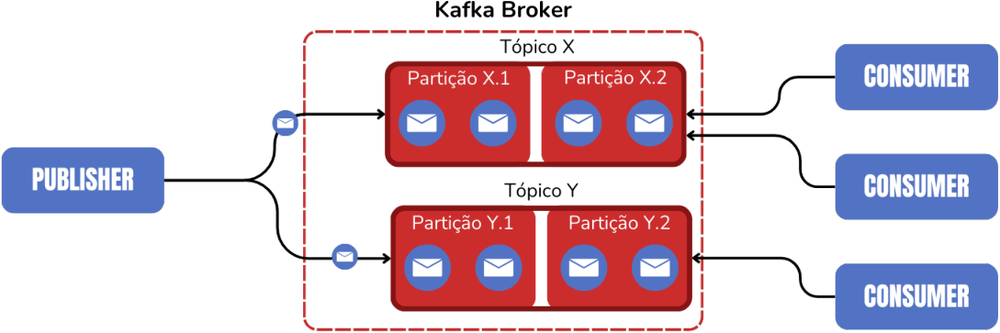


Portanto, é plenamente possível quebrar tópicos em partições. 

Gabarito: Errado

---

<!-- pagina: 39 -->

**Vinicius Borges Aula 18** 

#### 07. (CEBRASPE/DATAPREV/2023) A respeito do Confluent Kafka, julgue os item a seguir. 

Um consumer faz a leitura de eventos e pode consumir os registros em qualquer ordem. 

Comentários: 

Exatamente. Pelo Kafka fornecer um broker que armazena as mensagens por um tempo determinado, o consumidor inscrito no tópico pode consumir a mensagem em qualquer ordem que desejar. 

Gabarito: Correto 

#### 08. (CEBRASPE/SERPRO/2021) A respeito do software Kafka, julgue o item a seguir. 

Conexões entre producers e consumers suportam mecanismos de autenticação capazes de criptografar com SSL. 

Comentários: 

Segundo o Apache Kafka, em sua documentação oficial, traduzida: 

_“O Apacha Kafka permite clientes a se conectarem por protocolos SSL. Por padrão, o SSL é desativado, mas pode ser ativado quando necessário”_ . 

Portanto, é plenamente possível conectar os clientes (producer e consumer) através de conexões SSL. 

Gabarito: Correto 

#### 09. (CEBRASPE/SERPRO/2021) A respeito do software Kafka, julgue o item a seguir. 

É possível fazer uso da API consumer para publicar eventos em tópicos Kafka. 

Comentários: 

A publicação de eventos é feita a partir da API _producer_ , não da API consumer. 

Gabarito: Errado

---

<!-- pagina: 40 -->

**Vinicius Borges Aula 18** 

10. (FGV/PGM Niterói/2023) O analista João implementou o PStream, um fluxo de tratamento de dados em tempo real, através do Apache Kafka. O PStream é alimentado pela captura em tempo real das alterações feitas em uma base de dados relacional. Para configurar esta captura de dados relacionais para o PStream, João recorreu aos mecanismos do Apache Kafka para integração com outros sistemas. 

Esses mecanismos de integração utilizados por João para integrar o Apache Kafka com outros sistemas são baseados na Application Programming Interface (API) do Apache Kafka: 

- a) Admin; 

- b) Connect; 

- c) Streams; 

- d) Producer; 

- e) Consumer. 

Comentários: 

A questão cobra conhecimentos acerta do Kafka Connect . Segundo a documentação oficial do Apache Kafka: 

_O Kafka Connect é uma ferramenta para streaming de dados de forma escalonável e confiável entre o Apache Kafka e outros sistemas. Ele simplifica a definição rápida de conectores que movem grandes coleções de dados para dentro e para fora do Kafka. O Kafka Connect pode ingerir bancos de dados inteiros ou coletar métricas de todos os seus servidores de aplicativos em tópicos Kafka , disponibilizando os dados para processamento de fluxo com baixa latência. Um trabalho de exportação pode fornecer dados de tópicos Kafka para armazenamento secundário e sistemas de consulta ou para sistemas em lote para análise offline._ 

Gabarito: Letra B 

11. (CEBRASPE/SERPRO/2023) Julgue o item subsequente, referente a ferramentas de integração assíncrona e contêineres. 

O Apache Kafka 3.4 é uma plataforma voltada para processar dados de eventos de streaming ou dados que não têm início ou fim distintos. Ele possui recursos de publicar (escrever) e assinar (ler) fluxos de eventos e de processar fluxos de eventos à medida que ocorrem; portanto, nessa plataforma, prescinde-se do armazenamento de fluxos de eventos de forma durável.

---

<!-- pagina: 41 -->

**Vinicius Borges Aula 18** 

Comentários: 

A afirmativa está quase correta - porém, temos um erro essencial. O Kafka não prescinde de um sistema de armazenamento, isso é, não necessita de um sistema de armazenamento. Muito pelo contrário, como ele permite uma leitura fora de ordem, precisamos de um sistema de armazenamento que guarde essas mensagens por determinado tempo. 

Gabarito: Errado 

12. (CEBRASPE/SEFAZ CE/2021) Julgue o próximo item, relativo ao Apache Kafka e ao Kubernetes. 

O Apache Kafka provê serviço de mensageria e integração de dados, de forma assíncrona, em que produtores e consumidores ficam desacoplados e agnósticos entre si. 

Comentários: 

Certo, meu caro aluno! Os produtores e consumidores são completamente desacoplados e agnósticos entre si, o que quer dizer que são totalmente independentes e não precisam saber da existência uns dos outros, já que o _broker_ irá intermediar todas as ligações. 

Gabarito: Certo 

13. (FGV/TCE SP/2023) A analista Lúcia administra o AKluster, o cluster do Apache Kafka no TCE SP. Lúcia constatou que o espaço disponível no AKluster para o armazenamento de streams de eventos está acabando. 

Para expandir a camada de persistência do AKluster, aumentando ainda a escalabilidade, Lúcia deve prover mais espaço de armazenamento ao Apache Kafka mediante novos: 

- a) topics; 

- b) brokers; 

- c) partitions; 

d) producers; 

- e) replications. 

Comentários: 

A persistência dos dados e a escalabilidade, no Apache Kafka, é garantida através dos brokers. Eles são sistemas gerenciadores que recebem, armazenam e encaminham os eventos de mensagem recebidos.

---

<!-- pagina: 42 -->

**Vinicius Borges Aula 18** 

Gabarito: Letra B 

14. (Inédita/Prof. Felipe Mathias) Acerca dos conhecimentos sobre Apache Spark, julgue o item que segue. 

O produtor envia dados ao _broker_ Kafka através de requisições PULL. 

Comentários: 

Cuidado! A requisição enviada pelo produtor é a PUSH, para “empurrar” o dado, enquanto o consumidor usa as requisições PULL. 

Gabarito: Errado 

15. (Inédita/Prof. Felipe Mathias) Um desenvolvedor está trabalhando com o Apache Kafka e se depara com a seguinte mensagem em JSON: 

{ 

"topic": "user_updates", "offset": 12345, "key": "user123", "value": { "name": "John Doe", "email": "johndoe@example.com", "last_login": "2024-04-26T21:42:41Z" 

} 

} 

Qual dos pares de chave-valor é usado para determinar em que partição a mensagem será escrita? 

a) Name 

b) Key 

c) Value 

d) Topic 

e) Offset 

Comentários: 

No Apache Kafka, a chave (key) de uma mensagem é usada para determinar em qual partição a mensagem será escrita. Se uma chave for fornecida, todas as mensagens com a mesma chave serão escritas na mesma partição (desde que o número de partições não mude). Isso garante a

---

<!-- pagina: 43 -->

**Vinicius Borges Aula 18** 

ordem das mensagens no nível da chave. Se nenhuma chave for fornecida, as mensagens serão distribuídas entre as partições de um tópico de maneira round-robin. Portanto, no exemplo acima, todas as mensagens com a chave “user123” serão escritas na mesma partição. 

Gabarito: Letra B

---

<!-- pagina: 44 -->

**Vinicius Borges Aula 18** 

# **LISTA DE QUESTÕES** 

01. (CEBRASPE/CAU BR/2024) Acerca do Confluent Kafka, julgue o item a seguir. 

Broker é um capturador de eventos que pode ser dividido em partições e atua na proteção de eventos com característica de imutabilidade. 

02. (CEBRASPE/CAU BR/2024) Acerca do Confluent Kafka, julgue o item a seguir. 

Uma aplicação que publica dados escrevendo em um tópico no Kafka cluster é considerada producer. 

03. (CEBRASPE/AGER MT/2023) Assinale a opção que apresenta exemplos de serviços de mensageria em que há agentes que publicam, conhecidos como publishers, e agentes que leem, conhecidos como consumers. 

- a) RabbitMQ e Kafka. 

- b) XML-HTTP Request. 

- c) ZooKeeper e WSDL. 

- d) SOAP e Ionic. 

- e) Data lake e Spark. 

04. (FGV/Câmara dos Deputados/2023) Apache Kafka é um sistema de mensageria altamente escalável, que usa tópicos e partições para enfileiramento de mensagens. 

Sobre os componentes arquitetônicos do Kafka, assinale a afirmativa correta. 

- a) As partições são divididas em tópicos que os consumidores assinam para receber mensagens. 

- b) Um tópico pode ter apenas um produtor que escreve eventos nele, porém pode ter muitos consumidores que o assinam. 

- c) Os eventos no tópico são imutáveis, o que significa que não podem ser modificados depois de escritos. 

- d) Os produtores atribuem uma chave a cada mensagem e o Kafka a armazena no tópico principal da partição mais vazia. 

- e) Os consumidores sempre recebem as mensagens na ordem em que foram enviadas. 

#### 05. (CEBRASPE/DATAPREV/2023) A respeito do Confluent Kafka, julgue os item a seguir. 

Um tópico pode ser utilizado pela simples adição de um novo evento de mensagem e, se necessário, pode ser editado.

---

<!-- pagina: 45 -->

**Vinicius Borges Aula 18** 

06. (CEBRASPE/DATAPREV/2023) A respeito do Confluent Kafka, julgue os item a seguir. 

As partições são capazes de gerenciar eventos, porém os tópicos não podem ser quebrados em partições. 

07. (CEBRASPE/DATAPREV/2023) A respeito do Confluent Kafka, julgue os item a seguir. 

Um consumer faz a leitura de eventos e pode consumir os registros em qualquer ordem. 

08. (CEBRASPE/SERPRO/2021) A respeito do software Kafka, julgue o item a seguir. 

Conexões entre producers e consumers suportam mecanismos de autenticação capazes de criptografar com SSL. 

09. (CEBRASPE/SERPRO/2021) A respeito do software Kafka, julgue o item a seguir. 

É possível fazer uso da API consumer para publicar eventos em tópicos Kafka. 

10. (FGV/PGM Niterói/2023) O analista João implementou o PStream, um fluxo de tratamento de dados em tempo real, através do Apache Kafka. O PStream é alimentado pela captura em tempo real das alterações feitas em uma base de dados relacional. Para configurar esta captura de dados relacionais para o PStream, João recorreu aos mecanismos do Apache Kafka para integração com outros sistemas. 

Esses mecanismos de integração utilizados por João para integrar o Apache Kafka com outros sistemas são baseados na Application Programming Interface (API) do Apache Kafka: 

- a) Admin; 

- b) Connect; 

- c) Streams; d) Producer; 

- e) Consumer. 

11. (CEBRASPE/SERPRO/2023) Julgue o item subsequente, referente a ferramentas de integração assíncrona e contêineres. 

O Apache Kafka 3.4 é uma plataforma voltada para processar dados de eventos de streaming ou dados que não têm início ou fim distintos. Ele possui recursos de publicar (escrever) e assinar (ler) fluxos de eventos e de processar fluxos de eventos à medida que ocorrem; portanto, nessa plataforma, prescinde-se do armazenamento de fluxos de eventos de forma durável.

---

<!-- pagina: 46 -->

**Vinicius Borges Aula 18** 

12. (CEBRASPE/SEFAZ CE/2021) Julgue o próximo item, relativo ao Apache Kafka e ao Kubernetes. 

O Apache Kafka provê serviço de mensageria e integração de dados, de forma assíncrona, em que produtores e consumidores ficam desacoplados e agnósticos entre si. 

13. (FGV/TCE SP/2023) A analista Lúcia administra o AKluster, o cluster do Apache Kafka no TCE SP. Lúcia constatou que o espaço disponível no AKluster para o armazenamento de streams de eventos está acabando. 

Para expandir a camada de persistência do AKluster, aumentando ainda a escalabilidade, Lúcia deve prover mais espaço de armazenamento ao Apache Kafka mediante novos: 

- a) topics; 

- b) brokers; 

- c) partitions; 

- d) producers; 

- e) replications. 


14. (Inédita/Prof. Felipe Mathias) Acerca dos conhecimentos sobre Apache Spark, julgue o item que segue. 

O produtor envia dados ao _broker_ Kafka através de requisições PULL. 

15. (Inédita/Prof. Felipe Mathias) Um desenvolvedor está trabalhando com o Apache Kafka e se depara com a seguinte mensagem em JSON: 

{ 

"topic": "user_updates", "offset": 12345, "key": "user123", "value": { "name": "John Doe", "email": "johndoe@example.com", "last_login": "2024-04-26T21:42:41Z" 

} } 

Qual dos pares de chave-valor é usado para determinar em que partição a mensagem será escrita? 

- a) Name

---

<!-- pagina: 47 -->

**Vinicius Borges Aula 18** 

b) Key c) Value d) Topic e) Offset 


<!-- Start of picture text -->
==5460==<br><!-- End of picture text -->

---

<!-- pagina: 48 -->

**Vinicius Borges Aula 18** 


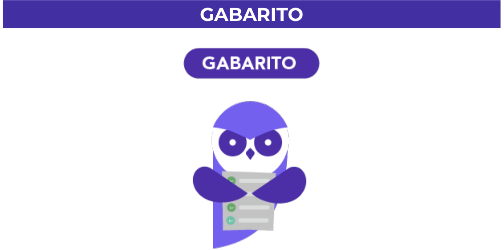


<!-- Start of picture text -->
GABARITO<br><!-- End of picture text -->

1. Errado 

2. Certo 

3. Letra A 

4. Letra C 

5. Errado 

6. Errado 

7. Correto 

9. Errado 

10.Letra B 11.Errado 

12.Certo 

   - 13.Letra B 14.Errado 

   - 15.Letra B 

8. Correto

---

<!-- pagina: 49 -->

**Vinicius Borges Aula 18** 

# **NATS** 

## Conceitos Gerais 


NATS (Neural Atomic Transport System) é uma tecnologia conectiva para sistemas distribuídos modernos. Uma tecnologia conectiva é responsável por endereçar, descobrir e trocar mensagens entre os diferentes componentes (nós) de um sistema distribuído. Dessa forma, o NATS é capaz de prover serviços de mensageria e microsserviços, através de _streams_ de processamento. 

O grande diferencial do NATS é a utilização de uma forma diferente de endereçamento e descoberta - descoberta é o processo em que encontramos os nós de um sistema distribuído em uma rede. Abordagens tradicionais utilizam IP, nome dos _hosts_ e portas. O NATS utiliza o conceito de assuntos (ou _subjects_ , em inglês). 

Outro ponto de diferencial é sua conectividade múltipla (chamada de conectividade M:N) por padrão. Com sistemas M:N, temos um superconjunto de conexões 1:1 - dessa forma, temos um sistema adaptado, por padrão, desde conexões simples, 1-1, até conexões múltiplas e complexas de sistemas distribuídos. 

A infraestrutura NATS e seus clientes se comunicam em tempo real , dessa forma, os clientes não precisam mudar quando os _deployments_ do NATS mudam. Com isso, não necessitamos reiniciar servidores a cada implementação, permitindo um mais baixo acoplamento no desenvolvimento desses aplicativos e tendo entregas mais modernas. 

Então, de forma geral, caso você não tenha entendido, o NATS é uma infraestrutura para troca de mensagens, ou seja, um sistema de mensageria - ou, como é chamado em inglês, um Message Oriented Middleware (MoM) . Para suas comunicações, o servidor NATS opera na porta TCP 4222 . 

(Inédita/Prof. Felipe Mathias) Assinale a alternativa que apresenta um sistema de mensageria com encaminhamento de mensagens e descoberta de nós baseada em assuntos ( _subjects_ ): 

a) ActiveMQ 

b) RabbitMQ 

c) Apache Kafka 

d) NATS 

Comentários: 

Das alternativas apresentadas, o único que apresenta essa abordagem é o NATS. (Gabarito: Letra D)

---

<!-- pagina: 50 -->

**Vinicius Borges Aula 18** 

## Assunto 

o Sabemos que o NATS opera num encaminhamento de mensagens baseado em assunto. Mas que é o “assunto” ? 

Tecnicamente falando, a resposta é simples: uma string de texto. É como um rótulo, uma _tag_ associada a um tópico específico, que forma um nome com que o publicador e o inscrito, no sistema de mensageria, usam para se comunicar. Boas práticas indicam que esse nome deve apontar um tópico ou um assunto específico para a associação. 


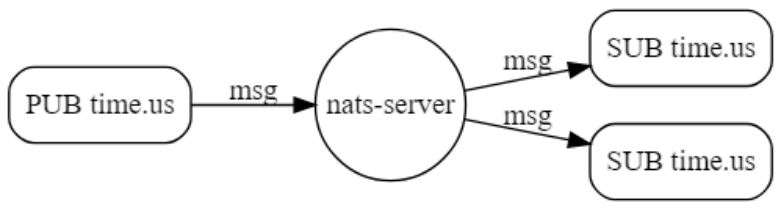


<!-- Start of picture text -->
==5460==<br><!-- End of picture text -->

Nomes no NATS, que usualmente seguem o padrão ASCII, podem ter hierarquias . Hierarquias são `.` identificadas pela presença de um ponto . Então, por exemplo, podemos estar nos comunicando com um sistema de nós de uma autarquia. Se quisermos acessar um lotado em algum local do sul do Brasil, a notação poderia ser <mark>`autarquia.brasil.sul` .</mark> 

Além disso, o NATS possui _wildcards_ , ou termos curinga , que podem ocupar o espaço de um ou mais elementos num nome separado por pontos. Esses _wildcards_ são usados pelos consumidores inscritos em um tópico, para ouvir (receber as mensagens) de diversos tópicos distintos. Os publicadores, entretanto, devem sempre especificar todos os nomes. 

Temos dois tipos de _wildcards:_ 

- **`*`** - é usado quando um consumidor quer ouvir um único token. Por exemplo, se a autarquia do exemplo acima possui nós em outros países, usar <mark>`autarquia.*.sul`</mark> traria resultados como <mark>`autarquia.brasil.sul` ,</mark> <mark>`autarquia.argentina.sul` ,</mark> <mark>`autarquia.canada.sul` ,</mark> entre outros. 

- **`>`** - usado quando um consumidor quer ouvir múltiplos tokens. Ele só pode aparecer no fim do nome. Então, usar <mark>`autarquia.brasil.>`</mark> traria todos os nós dentro do brasil - <mark>`autarquia.brasil.sul`</mark> , <mark>`autarquia.brasil.nordeste` ,</mark> entre outros.

---

<!-- pagina: 51 -->

**Vinicius Borges Aula 18** 


---

<!-- pagina: 52 -->

**Vinicius Borges Aula 18** 

## Publica ão <u>ç</u> 

O NATS utiliza a abordagem de publicadores e consumidores escritos em tópicos - chamada de pub/sub , ou publish/subscribe . Uma fonte emissora de mensagens (que nada mais são que conjunto de dados), chamada de publicador , envia mensagens para um assunto . Os consumidores se inscrevem nesse assunto e recebem o conteúdo das mensagens. 


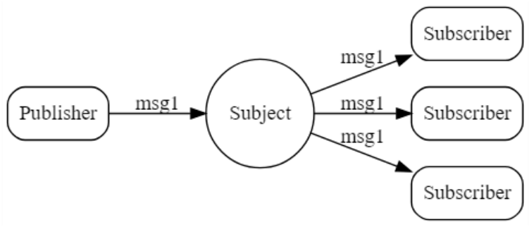


As mensagens enviadas são compostas dos seguintes campos: 

- Um assunto , que é onde a mensagem será alocada 

- Um corpo , composto por uma _array_ de bytes 

- Um conjunto de campos de cabeçalho 

- Um campo de resposta opcional 


<!-- Start of picture text -->
Assunto<br><!-- End of picture text -->


<!-- Start of picture text -->
Cabeçalhos<br><!-- End of picture text -->


<!-- Start of picture text -->
Corpo ( payload )<br><!-- End of picture text -->


<!-- Start of picture text -->
Resposta (opcional)<br><!-- End of picture text -->

---

<!-- pagina: 53 -->

**Vinicius Borges Aula 18** 

Por padrão, as mensagens no NATS são configuradas para um tamanho máximo de 1MB. Porém, é possível modificar a configuração no servidor através do parâmetro <mark>`max_payload` ,</mark> para até 64MB - o recomendado, porém, é que cada _payload_ não passe de 8MB. 

No NATS, podemos imaginar seu servidor como um grande fluxo de dados, um rio de informação, onde os publicados se inscrevem para enviar suas mensagens, e os inscritos se inscrevem para receber as mensagens - seja de forma direta, seja pelo uso dos _wildcards_ . 


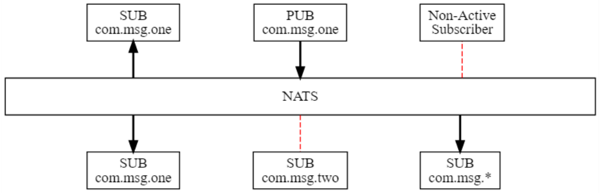


Porém, como o NATS permite um campo de resposta na mensagem enviada, é possível implementar um sistema de req-res (request-reply ou requisição-resposta) através da estrutura de mensageria. O publicador envia a mensagem para o assunto com o campo de resposta ativado e, ao consumir a mensagem, o inscrito a responde - de forma direta ao publicador. 


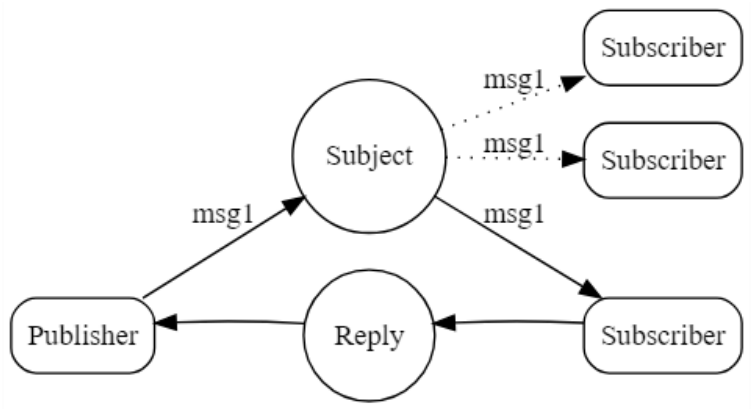

---

<!-- pagina: 54 -->

**Vinicius Borges Aula 18** 

## Grupos da fila e JetStream 

Quando consumidores se inscrevem para receber as mensagens de um publicador, o padrão de fan-out (1:N) garante que qualquer mensagem enviada chegue a todos os inscritos . O NATS provê uma funcionalidade adicional, chamada de “fila” ,  que permite com que consumidores se inscrevam como parte da fila - inscritos que fazem parte dessa fila, formam os grupos da fila , ou, em inglês, _queue groups_ . 

Em padrões normais, todos os inscritos de uma fila recebem as mensagens. Entretanto, se temos um grupo de inscritos, apenas um deles receberá cada uma das mensagens, aleatoriamente. Essa é uma forma de balanceamento de carga nativa do NATS. Essa abordagem é ideal para sistemas de alta escalabilidade, garantindo que não teremos uma sobrecarga desnecessária. 

Usando a ferramenta JetStream também é possível configurar uma fila em fluxo, ou _stream as a queue_ . Com isso, temos uma distribuição em tempo real das mensagens em diferentes nós de um servidor. Isso acaba sendo interessante quando as mensagens consistem em pipelines de dados puros, formando quase como uma pipeline ETL distribuindo os dados entre os diferentes nós do sistema, sem sobrecarga. 

Uma stream criada pelo JetStream é uma abordagem de fornecimento de dados em uma fila de mensagens ordenadas, que permite o consumo em ordem das mensagens e uma forma de adicionar persistência ao conjunto de dados. 


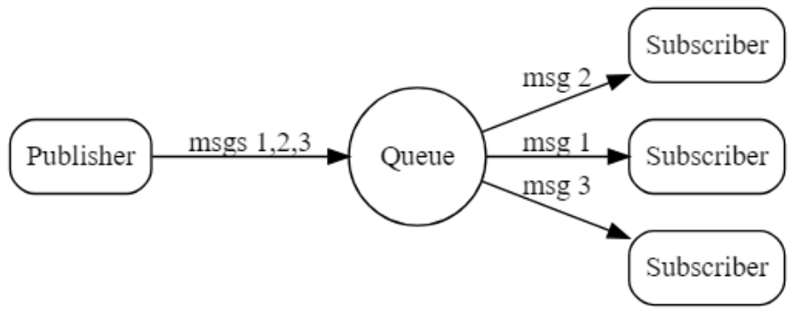


Falando no JetStream, ele é uma ferramenta nativa do NATS responsável por fornecer um sistema distribuído de persistência . Ele foi criado para fornecer algumas funcionalidades novas em cima do NATS - mais notoriamente, a capacidade de termos um consumo (remoção) da mensagem de forma personalizada, o que implica na possibilidade de um sistema de _replay_ de mensagens. 

Essas práticas são definidas na política de retenção . Alguns limites para a temporização da mensagem podem ser definidos:

---

<!-- pagina: 55 -->

**Vinicius Borges Aula 18** 

- Tempo máximo de mensagem 

- Tamanho máximo da _stream_ 

- Quantidade máxima de mensagens na _stream_ 

- Tamanho máximo de mensagens individuais 

- Número de consumidores que receberam a mensagem 

Além disso, uma política de descarte pode ser definida. Essa política irá definir o que deve acontecer assim que uma _stream_ atingir um dos limites definidos acima. Usualmente, a política de descarte gira em torno da remoção do elemento mais novo, ou do elemento mais antigo da fila. 

Como o JetStream também age como uma forma de persistência das mensagens, podemos definir o número de réplicas , que, basicamente, define a quantidade de nós que receberão uma cópia do dado para a persistência. Esse armazenamento usará uma de duas formas distintas: um par de chave-valor , ou no formato de um objeto . 


(Inédita/Prof. Felipe Mathias) A empresa XPTO deseja adicionar uma camada de persistência no seu sistema de mensageria, armazenando mensagens de destaque no formato chave-valor. Como a empresa utiliza o sistema NATS para controlar a comunicação no seu sistema distribuído, o componente a ser utilizado para garantir a persistência é o/a: 

a) JetData 

b) DataFlow 

c) DataStream 

d) JetStream 

e) JetStore 

Comentários:

---

<!-- pagina: 56 -->

**Vinicius Borges Aula 18** 

A ferramenta responsável por adicionar uma camada de persistência aos dados, criando um diferencial para sistemas de mensageria tradicional, é o JetStream . (Gabarito: Letra D)

---

<!-- pagina: 57 -->

**Vinicius Borges Aula 18** 

## Mapeamento de Assuntos 

O mapeamento de assuntos é uma ferramenta útil para sistemas distribuídos, usada para escalonamento a partir de particionamento e encaminhamento de mensagens . Isso acaba sendo útil para situações de implementações canárias, testes A/B e migração de espaço. 

O mapeamento irá direcionar todas as mensagens de um assunto para outro. Por exemplo, se eu estou enviando mensagens para o assunto implementação e quiser que essa mensagem seja encaminhada para o assunto teste, posso usar o mapeamento através dos dois pontos - da seguinte forma: <mark>`implementação:teste` .</mark> 

É possível também atribuir um peso ( _weight_ ) ao mapeamento. Por exemplo, numa implementação canária, queremos que apenas 2% do tráfego redirecionado para o nó de serviços com a nova implementação, a v2. Podemos fazer isso da seguinte forma: 

```
    myservice.requests: [
```

```
        { destination: myservice.requests.v1, weight: 98% },
```

```
        { destination: myservice.requests.v2, weight: 2% }
    ]
```


(Inédita/Prof. Felipe Mathias) Um desenvolvedor estava operando um sistema de mensageria desenvolvido em MAPS e se deparou com a seguinte linha de código: 

acompanhamento.sul:acompanhamento.centro 

Sobre essa linha, é correto afirmar que ela está fazendo uma operação de mapeamento, direcionando as mensagens de acompanhamento.sul também para acompanhamento.centro. 

Comentários:

---

<!-- pagina: 58 -->

**Vinicius Borges Aula 18** 

Perfeito! O uso dos dois pontos indica uma operação de mapeamento, em que encaminhamos uma mensagem de um _broker_ <u>para outro. (Gabarito: Certo)</u>

---

<!-- pagina: 59 -->

**Vinicius Borges Aula 18** 

# **RESUMO** 

### O que é o NATS? 

NATS é um sistema de mensageria hiper escalável , chamado de Message Oriented Middleware (MoM), que implementa strems de processamento de dados e um encaminhamento de mensagem baseado em assuntos. 

### O que é uma mensagem no NATS? 

Mensagens são a forma de encaminhamento de dados , compostas por: um assunto , que define a fila que receberá o dado; um corpo , composto por um array de bytes; um conjunto de cabeçalhos ; um campo de resposta opcional. Por ter um campo de resposta, o NATS pode ser usado como forma de implementação de sistemas de request-response (req-res). 

### O que é o mapeamento de assuntos? 

O mapeamento de assuntos no NATS é uma forma de encaminhamento de mensagens a diferentes destinos . Com ele, uma mensagem encaminhada para um nó pode ter uma réplica enviada a outro nó, ou uma distribuição de alocações ao longo dos nós de um sistema distribuído, como um sistema de balanceamento de cargas.

---

<!-- pagina: 60 -->

**Vinicius Borges Aula 18** 

# **QUESTÕES COMENTADAS** 

01. (Inédita/Prof. Felipe Mathias) Julgue a afirmativa abaixo, acerca dos conhecimentos do NATS (Neural Atomic Transport System). 

O NATS é um sistema de mensageria, que atua tanto no padrão pub-sub, quanto no padrão pointto-point. 

Comentários: 

Perfeito! O NATS é um sistema de mensageria altamente escalável, com ambos os modelos de ==5460== mensageria - pub/sub, a abordagem mais tradicional, e p2p, através de um modelo de request/response. 

Gabarito: Correto 

02. (Inédita/Prof. Felipe Mathias) Julgue a afirmativa abaixo, acerca dos conhecimentos do NATS (Neural Atomic Transport System). 

O NATS mantém um registro de todas as mensagens que passaram pelo seu _broker_ . 

Comentários: 

Cuidado, o NATS utiliza um sistema chamado de “fire and forget”, ou disparar e esquecer. Nele, as mensagens são apagadas assim que entregue ao usuário final. Portanto, incorreta a afirmativa. 

Gabarito: Errado 

03. (Inédita/Prof. Felipe Mathias) Assinale a alternativa que apresenta um sistema de mensageria com encaminhamento de mensagens e descoberta de nós baseada em assuntos ( _subjects_ ): 

- a) ActiveMQ 

- b) RabbitMQ 

- c) Apache Kafka 

- d) NATS 

Comentários: 

Quando falamos em encaminhamento baseado em assuntos, o NATS entra em destaque. Ele é um sistema de mensageria com uma abordagem diferente do tradicional; enquanto a descoberta

---

<!-- pagina: 61 -->

**Vinicius Borges Aula 18** 

de nós e encaminhamento de mensagens costuma ser feita por IP ou _hostname_ , o NATS utiliza o conceito de _subjects_ , uma _string_ que indica determinado assunto. 

Gabarito: Letra D 

04. (Inédita/Prof. Felipe Mathias) A empresa XPTO deseja adicionar uma camada de persistência no seu sistema de mensageria, armazenando mensagens de destaque no formato chave-valor. Como a empresa utiliza o sistema NATS para controlar a comunicação no seu sistema distribuído, o componente a ser utilizado para garantir a persistência é o/a: 

- a) JetData 

- b) DataFlow 

- c) DataStream d) JetStream 

- e) JetStore 

Comentários: 

A ferramenta responsável por adicionar uma camada de persistência aos dados, criando um diferencial para sistemas de mensageria tradicional, é o JetStream 

Gabarito: Letra D 

05. (Inédita/Prof. Felipe Mathias) Um desenvolvedor estava operando um sistema de mensageria desenvolvido em MAPS e se deparou com a seguinte linha de código: 

acompanhamento.sul:acompanhamento.centro 

Sobre essa linha, é correto afirmar que ela está fazendo uma operação de mapeamento, direcionando as mensagens de acompanhamento.sul também para acompanhamento.centro. 

Comentários: 

Perfeito! O uso dos dois pontos indica uma operação de mapeamento, em que encaminhamos uma mensagem de um _broker_ para outro. Assim, toda mensagem encaminhada para acopmanhamento.sul, irá estar presente no broker acompanhamento.centro. 

Gabarito: Correto

---

<!-- pagina: 62 -->

**Vinicius Borges Aula 18** 

# **LISTA DE QUESTÕES** 

01. (Inédita/Prof. Felipe Mathias) Julgue a afirmativa abaixo, acerca dos conhecimentos do NATS (Neural Atomic Transport System). 

O NATS é um sistema de mensageria, que atua tanto no padrão pub-sub, quanto no padrão pointto-point. 

02. (Inédita/Prof. Felipe Mathias) Julgue a afirmativa abaixo, acerca dos conhecimentos do NATS (Neural Atomic Transport System). 

O NATS mantém um registro de todas as mensagens que passaram pelo seu ==5460== _broker_ . 

03. (Inédita/Prof. Felipe Mathias) Assinale a alternativa que apresenta um sistema de mensageria com encaminhamento de mensagens e descoberta de nós baseada em assuntos ( _subjects_ ): 

- a) ActiveMQ 

- b) RabbitMQ 

- c) Apache Kafka d) NATS 

04. (Inédita/Prof. Felipe Mathias) A empresa XPTO deseja adicionar uma camada de persistência no seu sistema de mensageria, armazenando mensagens de destaque no formato chave-valor. Como a empresa utiliza o sistema NATS para controlar a comunicação no seu sistema distribuído, o componente a ser utilizado para garantir a persistência é o/a: 

- a) JetData 

- b) DataFlow 

- c) DataStream d) JetStream 

- e) JetStore 

05. (Inédita/Prof. Felipe Mathias) Um desenvolvedor estava operando um sistema de mensageria desenvolvido em MAPS e se deparou com a seguinte linha de código: 

acompanhamento.sul:acompanhamento.centro 

Sobre essa linha, é correto afirmar que ela está fazendo uma operação de mapeamento, direcionando as mensagens de acompanhamento.sul também para acompanhamento.centro.

---

<!-- pagina: 63 -->

**Vinicius Borges Aula 18** 


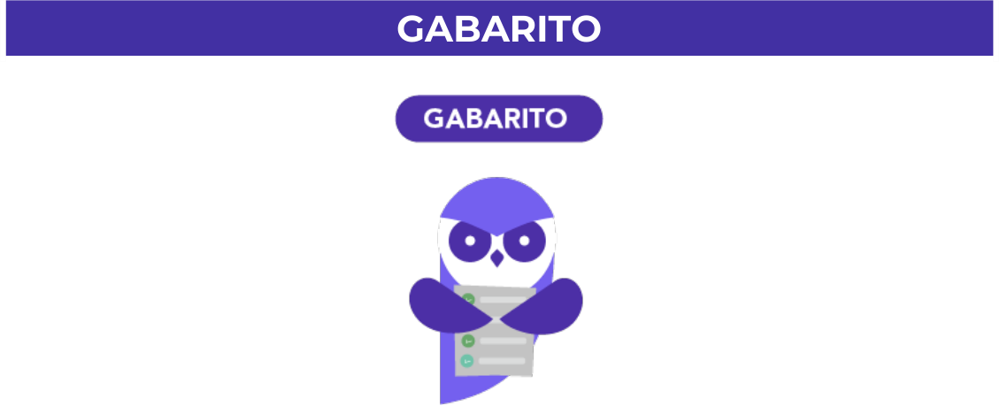


<!-- Start of picture text -->
GABARITO<br><!-- End of picture text -->

1. Correto 

2. Errado 

3. Letra D 

4. Letra D 

5. Correto

---

<!-- pagina: 64 -->

**Vinicius Borges Aula 18** 

# **RABBIT MQ** 

## Conceitos Gerais 


O RabbitMQ é um sistema de mensageria, que lida com as mensagens, ou dados enviados entre os sistemas, em uma fila - daí que surge 

seu nome: MQ é uma abreviação para _Message Queue_ , ou Fila de Mensagens em português. 

O RabbitMQ é responsável por implementar um tipo de comunicação assíncrona entre sistemas distribuídos, chamada de mensageria . Aqui, cada dado, cada informação, é convertido para uma mensagem e, assim, pode ser propagada para outros sistemas. Uma mensagem pode ser uma transação, uma inclusão no banco de dados, uma mudança de estado, entre outros. 

Como um sistema de mensageria tradicional, o RabbitMQ atua como um broker , um agenciador , ou seja, um sistema de recebimento, armazenamento e entrega de mensagens. Essas mensagens são publicadas no seu sistema a partir de um produtor , e consumida através de inscrições, pelos consumidores - criando um sistema chamado de _pub/sub_ , ou _publisher/subscriber_ , onde as fontes de dados atuam como publicadores, e os consumidores de dados atuam como inscritos. 


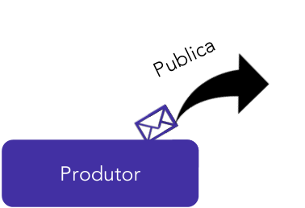


<!-- Start of picture text -->
Produtor<br><!-- End of picture text -->


<!-- Start of picture text -->
Consumidor<br><!-- End of picture text -->

(Inédita/Prof. Felipe Mathias) Acerca dos diferentes sistemas de mensageria, julgue o item abaixo. 

O RabbitMQ é um sistema de mensageria que atua como _broker_ de comunicações assíncronas, armazenando e entregando as mensagens de diferentes produtores. O sistema adotado para sua arquitetura é o de pub/sub, ou publisher/subscriber. 

Comentários: 

Perfeito! A questão descreve perfeitamente uma visão geral acerca do funcionamento do RabbitMQ. (Gabarito: Certo)

---

<!-- pagina: 65 -->

**Vinicius Borges Aula 18** 

## AMQP 

Para fazer suas comunicações , o RabbitMQ usa primariamente o protocolo AMQP 0-9-1 - Advanced Message Queue Protocol. Esse protocolo dita a forma de comunicação de todo o sistema do RabbitMQ, desde os componentes da sua estrutura, até a forma como as mensagens são levadas da origem ao respectivo destino. 

# <mark>PRINCIPAL PROTOCOLO DO RABBITMQ → AMQP 0-9-1</mark> 

_Um adendo: apesar do RabbitMQ ser estruturado primariamente no AMQP, ele aceita outros protocolos, como MQTT, STOMP e AMQP 1.0. Nessa aula, estudaremos o RabbitMQ de acordo com a implementação do protocolo AMQP 0-9-1._ 

De forma geral, o protocolo funciona da seguinte forma: os publicadores , pontos de origem das mensagens, as publicam no RabbitMQ primeiramente num elemento chamado de exchange . Ele é um roteador de mensagens , agindo quase como um _gateway_ e balanceador de cargas para o nó - que é gerenciado pelo RabbitMQ Broker . 

A principal função do _exchange_ é receber as mensagens e as encaminhar para uma determinada fila , com base em regras pré-definidas chamadas de binding . O _binding_ é quase como uma regra de associação entre um tipo de mensagem e sua respectiva fila de destino. Podemos fazer esse _binding_ de diferentes formas, que veremos em seguida - antes, vamos finalizar o ciclo de comunicação e funcionamento do RabbitMQ. 

Feito encaminhamento a partir do _exchange_ , as mensagens são alocadas em filas , ou queues . Uma fila é uma estrutura de dados que visa armazenar temporariamente as mensagens encaminhadas, de forma a permitir seu consumo pelos inscritos na fila. No RabbitMQ, a durabilidade da mensagem alocada em uma fila pode ser declarada de duas formas distintas: 

- Durável: tem seus metadados armazenados em disco 

- Transiente: tem seus metadados armazenados em memória 

As filas têm características específicas que também veremos mais à frente, de forma mais específica. Por fim, com as mensagens em fila, os consumidores podem as acessar e consumir seus conteúdos. Então, fazendo analogias, pense que você vai fazer uma viagem - você é a mensagem, o exchange age como um aeroporto, congregando todos os passageiros, o _binding_ é a rota que seu avião irá tomar e, por fim, a fila é o aeroporto de destino. O motorista que irá lhe pegar no aeroporto será o consumidor de você - a mensagem, no caso rs. 

Esquematizando o RabbitMQ:

---

<!-- pagina: 66 -->

**Vinicius Borges Aula 18** 


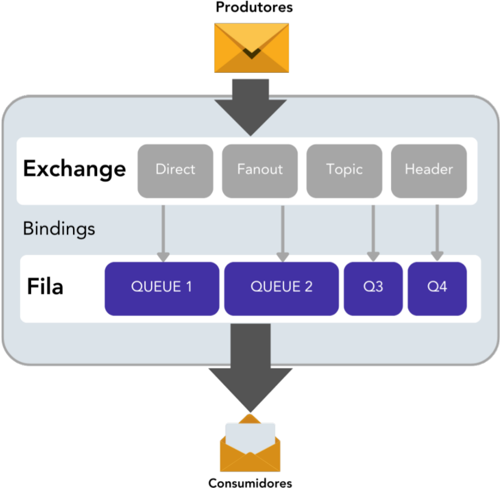


(IDECAN/TJ PI/2022) Lançado em 2007, o RabbitMQ é um servidor concebido para lidar com o tráfego de mensagens de forma confiável e eficiente. Esse tipo de servidor é bastante útil para sistemas que precisam gerenciar o processamento de um grande volume de mensagens. Em situações desse tipo, o processamento assíncrono é interessante pois diminui o acoplamento entre as aplicações do sistema mas demanda um controle de filas em segundo plano. O RabbitMQ atende perfeitamente essa demanda. Marque a alternativa que Indica, corretamente, o nome do protocolo de mensagens para o qual o RabbitMQ foi projetado para suportar. 

- a) AMQP 

- b) XMPP 

- c) IMAP 

- d) ICMP 

- e) MQTT 

Comentários:

---

<!-- pagina: 67 -->

**Vinicius Borges Aula 18** 

O protocolo utilizado pelo RabbitMQ é o AMQP - Advanced Messaging Queue Potocol. (Gabarito: Letra A)

---

<!-- pagina: 68 -->

**Vinicius Borges Aula 18** 

## Formas de Exchange 

Como vimos, a _exchange_ é como um _hub_ de recepção das mensagens, que armazenará as mensagens seguindo alguma rota - rota essa que é definida pelo _binding_ . Temos 4 formas de exchange no RabbitMQ: 

# Formas de Troca (Exchange) 


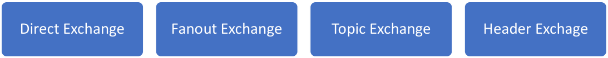


<!-- Start of picture text -->
Direct Exchange Fanout Exchange Topic Exchange Header Exchage<br><!-- End of picture text -->

### Direct Exchange: 

Na troca direta , ou _direct exchange ,_ as mensagens são roteadas para as filas com base em uma chave de roteamento (routing key) especificada pelos produtores. A exchange encaminha a mensagem para a fila cuja chave de roteamento corresponde exatamente à chave especificada na mensagem. 


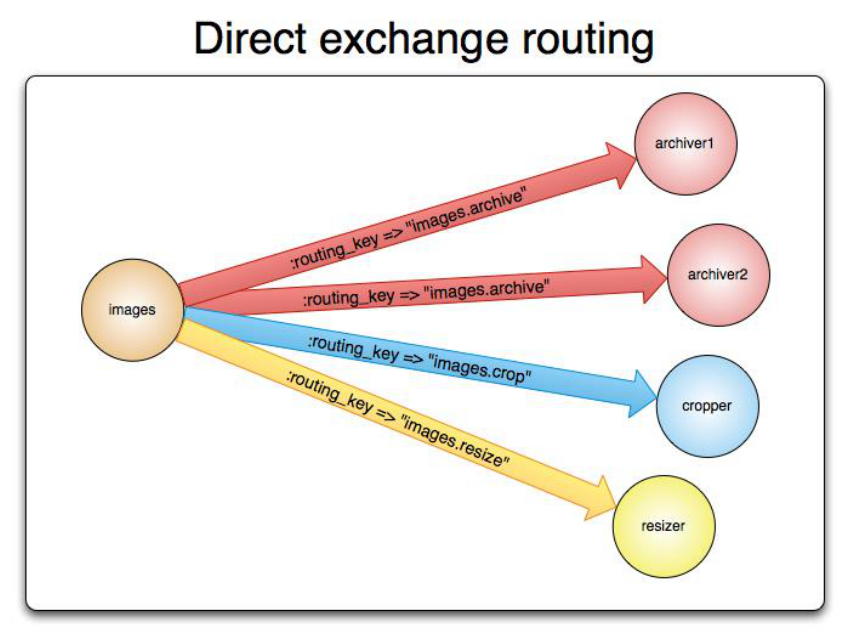

---

<!-- pagina: 69 -->

**Vinicius Borges Aula 18** 

### Fanout Exchange: 

A _fanout exchange_ encaminha todas as mensagens que recebe para todas as filas vinculadas a ela , ignorando completamente as chaves de roteamento. Isso é útil quando várias filas precisam receber a mesma mensagem. Usualmente, essa estratégia é empregada em jogos MMO (Massively Multi-player Online), sistemas distribuídos e sistemas de _chat_ . 


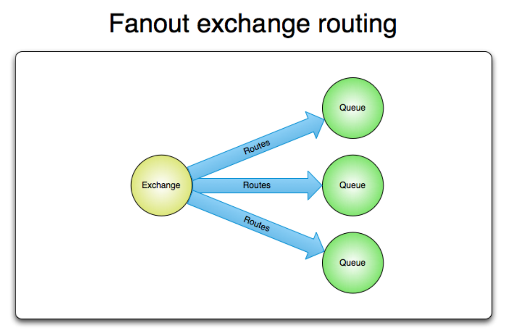


### Topic Exchange: 

A troca baseada em tópicos é similar à direct exchange, mas oferece maior flexibilidade no roteamento de mensagens. As filas são vinculadas à exchange com padrões de roteamento (routing patterns) , em vez de chaves de roteamento específicas. A exchange então encaminha a mensagem para as filas cujos padrões de roteamento correspondem à chave de roteamento da mensagem. 

### Headers Exchange: 

Neste tipo de troca, as mensagens são roteadas com base em cabeçalhos de mensagem (headers) arbitrários. As filas são vinculadas à exchange com regras de cabeçalho, e a exchange encaminha a mensagem para as filas cujos cabeçalhos correspondem aos da mensagem.

---

<!-- pagina: 70 -->

**Vinicius Borges Aula 18** 

## Filas 

As filas no RabbitMQ são uma coleção ordenadas de mensagens . A fila se estrutura de acordo com o padrão FIFO (First In, First Out) - ou PEPS, em português (Primeiro que Entra, Primeiro que Sai). Ou seja, a primeira mensagem a entrar deve ser a primeira a ser consumida - como uma fila indiana tradicional. 


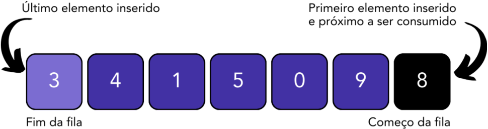


Temos basicamente duas ações que podem ser feitas: a adição de mensagens , também chamada de enfileiramento (ou _enqueue_ em inglês) e o consumo da mensagem , com sua respectiva remoção, também chamado de desenfileiramento (ou _dequeue_ em inglês). São duas operações básicas, sendo uma oriunda do publicador, e outra do consumidor. 

nomes As filas são referenciadas por específicos a cada uma delas. Seus nomes devem ter até 255 byts e usar padrão UTF-8. Quando tivermos filas com o nome começando com <mark>`amq` ,</mark> quer dizer que essa é uma fila reservada para uso interno do _broker_ . Tentativas de declarar uma fila com esse nome retornarão um erro (mais especificamente, de código 403 - ACCESS_REFSED). 

A forma de funcionamento da fila é definida na suas propriedades. Além do nome da fila, essas propriedades definem, obrigatoriamente: 

- Durabilidade - se a fila é durável, isso é, irá suportar um _restart_ do broker 

- Exclusividade - se a fila é acessada somente por uma conexão, e é deletada quando essa conexão é fechada 

- Auto-delete - filas que tiverem essa opção são deletadas assim que o último consumidor se desinscrever

---

<!-- pagina: 71 -->

**Vinicius Borges Aula 18** 


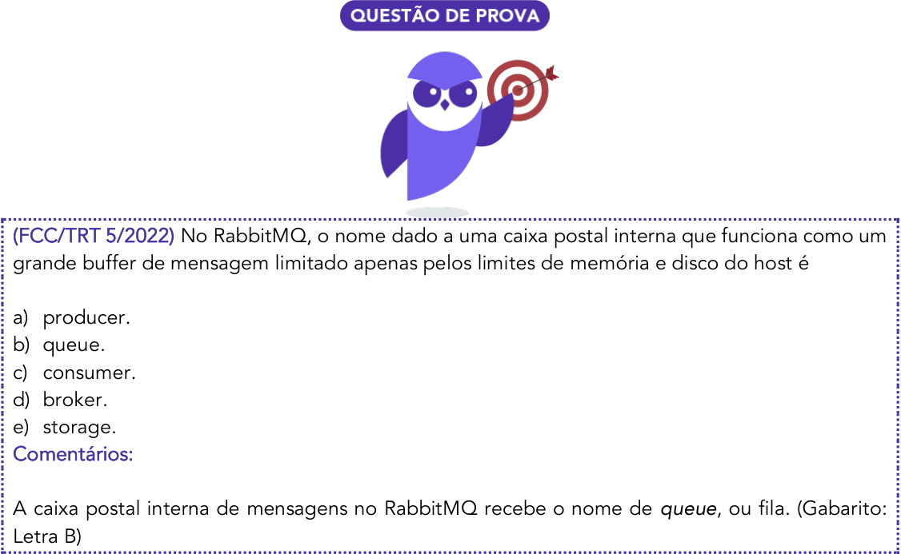


<!-- Start of picture text -->
(FCC/TRT 5/2022) No RabbitMQ, o nome dado a uma caixa postal interna que funciona como um<br>grande buffer de mensagem limitado apenas pelos limites de memória e disco do host é<br>a) producer.<br>b) queue.<br>c) consumer.<br>d) broker.<br>e) storage.<br>Comentários:<br>A caixa postal interna de mensagens no RabbitMQ recebe o nome de  queue , ou fila. (Gabarito:<br>Letra B)<br><!-- End of picture text -->

Temos diversos tipos de filas, cada uma com características inerentes a elas. Os 6 principais tipos são: 

- Classic queue: é a fila clássica, padrão do RabbitMQ, que segue o modelo FIFO 

- Quorum queue: são filas que garantem alta disponibilidade e durabilidade das mensagens, através da replicação em diversos nós. Utilizam um mecanismo de consenso, baseado em um algoritmo Raft, de forma a garantir consistência das mensagens ao longo dos diferentes nós do sistema. 

- Mirrored Classic queue: são uma extensão as filas clássicas, visando trazer mais redundância e disponibilidade, através da replicação das mensagens entre nós. 

- Lazy queue: são um tipo de fila que prioriza a eficiência do armazenamento de mensagens em disco e, graças a isso, não garante a implementação da organização FIFO. Elas armazenam grandes volumes de dados em disco de forma eficiente. 

- Dead Letter queue: uma fila composta de mensagens mortas, mensagens que não puderam ser processadas após um determinado número de tentativas. É extremamente útil para identificar mensagens com problemas. 

- Priority queue: são filas onde cada mensagem recebe uma prioridade diferente. Graças a isso, ela também não obedece à organização FIFO. Aqui, mensagens com maior prioridade são colocadas à frente na fila, para serem consumidas primeiro. 

(Inédita/Prof. Felipe Mathias) Acerca dos conhecimentos de RabbitMQ, julgue o item abaixo.

---

<!-- pagina: 72 -->

**Vinicius Borges Aula 18** 

As filas em RabbitMQ tem sempre a propriedade de organização FIFO garantidas. 

Comentário: 

Muito cuidado! Apesar das filas serem estruturadas no modelo FIFO, a ordenação pode ser afetada por diversos fatores - como, por exemplo, prioridades de consumidores, consumidores múltiplos acessando as mensagens, além da própria tipologia da fila implicar no uso de outras tipologias. A afirmativa está, portanto, incorreta. (Gabarito: Errado) 


<!-- Start of picture text -->
==5460==<br><!-- End of picture text -->

---

<!-- pagina: 73 -->

**Vinicius Borges Aula 18** 

## Acknowledge 

As mensagens podem ser consumidas através do sistema de inscrição. Determinada inscrição indica o interesse do consumidor na mensagem, e o RabbitMQ envia essa mensagem para os usuários através de diversos métodos - que veremos logo em seguida. Nesse contexto, o acknowledge, ACK ou reconhecimento é o mecanismo com o qual o RabbitMQ identifica que uma mensagem foi consumida ou não - permitindo identificar eventuais erros. 

As mensagens entregues podem ser reconhecidas, quase que “marcadas” com um ACK pelos consumidores, de forma explícita ou automática. O modo automático de reconhecimento fornece, usualmente, uma forma mais otimizado e com menor consumo de rede - porém, ela fornece uma menor garantia em caso de erros. 

É quase como uma via de duas mãos: o RabbitMQ envia a mensagem ao consumidor, que, ao recebê-la, envia uma mensagem ACK de retorno. 


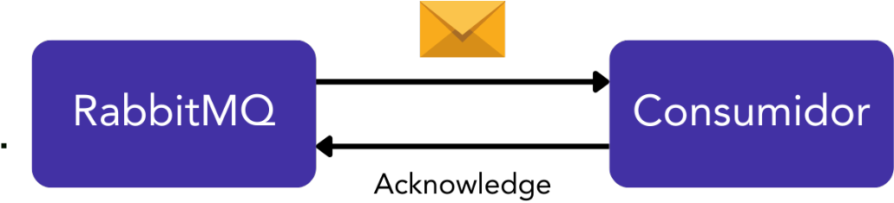


Com isso, podemos ter duas abordagens para a remoção de mensagens das filas: 

- `basic.deliver` ou 

- Após a mensagem ser enviada para a aplicação (com os métodos <mark>`basic.get-ok`</mark> ) 

- Após a aplicação enviar o ACK de retorno (com o método `basic.ack` <mark>)</mark> 

É possível também rejeitar mensagens . Isso é feito principalmente quando o processamento da mensagem encontra algum erro. Ao rejeitar a mensagem, a aplicação pode solicitar ao _broker_ duas ações distintas: retirar a mensagem da fila, ou recolocá-la. O método utilizado para rejeições de mensagem é o <mark>`basic.reject` .</mark>

---

<!-- pagina: 74 -->

**Vinicius Borges Aula 18** 

## Transmissão de Mensagens 

A prática mais usual da transmissão das mensagens entre o _broker_ e os consumidores é seguindo o protocolo padrão do RabbitMQ - o AMQP, utilizando a porta 5672 por padrão . Porém, pode ser necessário implementar diferentes protocolos em resposta aos diferentes sistemas, mais notoriamente o HTTP, para comunicação através de navegadores web. Isso  pois muitos _apps web_ rodam com APIs que necessitam de requisições HTTP ou WebSocket para funcionar. 

Para isso, é necessário fazermos umas adaptações no modelo. Temos três abordagens distintas para essa implementação: 

- 1) Usando um plug-in web STOMP: STOMP (Simple Text Oriented Messaging Protocol) é um protocolo de mensagens simples e leve, frequentemente usado para comunicação entre clientes e servidores de mensagens, como o RabbitMQ. O plug-in fornece uma interface JavaScript para enviar e receber mensagens STOMP através de conexões WebSocket ou HTTP. Assim, conseguimos formar uma comunicação bidirecional entre o navegador e o servidor RabbitMQ. 

- 2) Usando um plug-in web MQTT: MQTT (Message Queuing Telemetry Transport) é um protocolo de mensagens leve e eficiente, projetado para redes de dispositivos com largura de banda limitada. Ele também oferece uma interface JavaScript para conectar, publicar e assinar tópicos MQTT diretamente de um navegador. Isso possibilita a troca eficiente de mensagens entre o navegador e o servidor RabbitMQ, ideal para aplicativos web de Internet das Coisas (IoT) e outras aplicações de baixa largura de banda. 

- 3) Usando um plug-in de gerenciamento: os plug-ins de gerenciamento do RabbitMQ, como o RabbitMQ Management Plugin, oferecem uma interface baseada na web para monitoramento, administração e visualização de dados no servidor RabbitMQ. Os usuários podem acessar a interface da web do plug-in de gerenciamento por meio de um navegador, geralmente digitando uma URL específico. 


---

<!-- pagina: 75 -->

**Vinicius Borges Aula 18** 

(FCC/MPE PB/2023) O RabbitMQ pode transmitir mensagens por HTTP utilizando 

- a) uma API baseada em HTTP, que é ativada por padrão em todas as instâncias do CloudAQMP e na porta atribuída 334. 

- b) o plug-in Web JSON, que suporta mensagens JSON para o navegador usando JsonSockets. 

- c) o plug-in Web MQTT, que oferece suporte a mensagens MQTT para o navegador usando WebSockets. 

- d) uma API baseada em HTTP, que é ativada por padrão em todas as instâncias do CloudSTOPM e na porta atribuída 434. 

- e) URLs que utilizam recursos do tipo curl/json e exigirão autenticação básica HTTPS (usando o banco de dados de segurança padrão do RabbitMQ). 

Comentários: 

Vamos analisar as alternativas. 

- a) Errado. O RabbitMQ náo possui uma API baseada em HTTP para instâncias do CloudAMQP (veja que a questão errou o nome - é AMQP, não AQMP). 

- b) Errado. Não temos um plug-in web para JSON. 

- c) Certo. O plug-in Web MQTT oferece suporte a mensagens MQTT, usando os WebSockets e as mensagens HTTP. 

- d) Errado. Novamente, o RabbitMQ não possui uma API baseada em HTTP para instâncias do CloudSTOMP (novamente, errou o nome - é STOMP, não STOPM). 

- e) Errado. Embora seja possível criar URLs que usem recursos do tipo curl/json para interagir com o RabbitMQ, essa não é uma forma padrão de transmitir mensagens por HTTP no RabbitMQ. 

- A alternativa correta é, portanto, a letra C. (Gabarito: Letra C)

---

<!-- pagina: 76 -->

**Vinicius Borges Aula 18** 

# **RESUMO** 

### O que é o RabbitMQ? 

O RabbitMQ é um sistema de mensageria de código aberto , que adota o sistema pub/sub para implementar comunicações entre diferentes componentes e nós de um sistema distribuído. 

### Quais protocolos implementados pelo RabbitMQ? 

O RabbitMQ suporta uma multiplicidade de protocolos - MQTT, STOMP e AMP 1.0. Porém, a principal implementação da ferramenta se dá com o uso do protocolo AMQP 0-9-1. 

### Como é a estrutura interna do Broker RabbitMQ? 

O broker do RabbitMQ recebe as mensagens dos produtores num repositório centralizado chamado de exchange . A partir dali, as mensagens são encaminhadas para diferentes filas (queues) através de regras de roteamento, chamadas de binding . Dentro das filas, as mensagens podem ser consumidas pelos consumidores. 

### Quais as formas de exchange no RabbitMQ? 

Temos 4 formas de _exchange_ no programa. Direct Exchange , onde a mensagem é encaminhada a uma única fila, com base em uma chave de roteamento; Fan-Out Exchange , onde as mensagens são encaminhadas para todas as filas; Topic Exchange , onde as mensagens são vinculadas a filas através de padrões de roteamentos; e Headers Exchange , onde as mensagens são encaminhadas para filas com ase em cabeçalhos das mensagens.

---

<!-- pagina: 77 -->

**Vinicius Borges Aula 18** 

# **QUESTÕES COMENTADAS** 

01. (IBFC/TRF 5/2024) Sobre RabbitMQ, analise as afirmativas abaixo e dê valores Verdadeiro (V) ou Falso (F). 

( ) RabbitMQ é um middleware de mensageria open-source que implementa o protocolo Advanced Message Queuing Protocol (AMQP). 

( ) O RabbitMQ é exclusivo para a linguagem de programação Java, não oferecendo suporte a outras linguagens de programação. 

( ) No RabbitMQ, os produtores são responsáveis por enviar mensagens para uma fila, enquanto os consumidores as recebem e processam. 

Assinale a alternativa que apresenta a sequência correta de cima para baixo. 

a) F - F - F 

b) F - V - F 

c) V - F - V 

d) V - V - V 

Comentários: 

Vamos às alternativas. 

( ) RabbitMQ é um middleware de mensageria open-source que implementa o protocolo Advanced Message Queuing Protocol (AMQP). 

Verdadeiro. Apesar de suportar outros protocolos, o RabbitMQ é estruturado de forma a implementar primariamente o AMQP. 

( ) O RabbitMQ é exclusivo para a linguagem de programação Java, não oferecendo suporte a outras linguagens de programação. 

Falso. O RabbitMQ é agnóstico de linguagem. 

( ) No RabbitMQ, os produtores são responsáveis por enviar mensagens para uma fila, enquanto os consumidores as recebem e processam. 

Verdadeiro. Essa é a relação entre os diferentes papéis no RabbitMQ. 

Portanto, temos V-F-V. 

Gabarito: Letra C

---

<!-- pagina: 78 -->

**Vinicius Borges Aula 18** 

02. (FCC/MPE PB/2023) O RabbitMQ pode transmitir mensagens por HTTP utilizando 

   - a) uma API baseada em HTTP, que é ativada por padrão em todas as instâncias do CloudAQMP e na porta atribuída 334. 

   - b) o plug-in Web JSON, que suporta mensagens JSON para o navegador usando JsonSockets. 

   - c) o plug-in Web MQTT, que oferece suporte a mensagens MQTT para o navegador usando WebSockets. 

   - d) uma API baseada em HTTP, que é ativada por padrão em todas as instâncias do CloudSTOPM e na porta atribuída 434. 

   - e) URLs que utilizam recursos do tipo curl/json e exigirão autenticação básica HTTPS (usando o banco de dados de segurança padrão do ==5460== 

   - Vamos analisar as alternativas. a) Errado. O RabbitMQ náo possui uma API baseada em HTTP para instâncias do CloudAMQP (veja que a questão errou o nome - é AMQP, não AQMP). 

Comentários: 

Vamos analisar as alternativas. 

- b) Errado. Não temos um plug-in web para JSON. 

- c) Certo. O plug-in Web MQTT oferece suporte a mensagens MQTT, usando os WebSockets e as mensagens HTTP. 

- d) Errado. Novamente, o RabbitMQ não possui uma API baseada em HTTP para instâncias do CloudSTOMP (novamente, errou o nome - é STOMP, não STOPM). 

- e) Errado. Embora seja possível criar URLs que usem recursos do tipo curl/json para interagir com o RabbitMQ, essa não é uma forma padrão de transmitir mensagens por HTTP no RabbitMQ. 

A alternativa correta é, portanto, a letra C. 

Gabarito: Letra C 

03. (FUNDATEC/IFC/2023) Quais aplicações pertencem ao grupo, e, nesse sentido, são considerados servidores de mensagem/evento (Message Broker), o que possibilita a integração entre sistemas distribuídos? 

- a) Apache Kafka, RabbitMq, IBM MQ, Apache Tomcat. 

- b) Apache Kafka, RabbitMq, IIS Microsoft, Server Message Broker. 

- c) Apache Kafka, IBM MQ, RabbitMq, Amazon SQS. 

- d) Server Message Broker, IIS Microsoft, Amazon SQS, IBM MQ. 

- e) IIS Microsoft, Server Message Broker, Apache Kafka, IBM MQ.

---

<!-- pagina: 79 -->

**Vinicius Borges Aula 18** 

Comentários: 

Vou listar e explicar brevemente todos os programas que aparecem na questão. 

- Apache Kafka - broker de mensageria 

- RabbitMQ - broker de mensageria 

- IBM MQ - broker de mensageria 

- Apache Tomcat - servidor de aplicações web para aplicações Java 

- IIS Microsoft - servidor web para aplicações Microsoft 

- Amazon SQS - broker de mensageria 

Portanto, com isso em mente, vamos às alternativas. Irei tachar aquelas que não correspondem aos brokers. 

- a) Apache Kafka, RabbitMq, IBM MQ, ~~Apache Tomcat.~~ 

- b) Apache Kafka, RabbitMq, ~~IIS Microsoft, Server Message Broker.~~ 

- c) Apache Kafka, IBM MQ, RabbitMq, Amazon SQS. 

- d) ~~Server Message Broker, IIS Microsoft~~ , Amazon SQS, IBM MQ. 

- e) ~~IIS Microsoft, Server Message Broker~~ , Apache Kafka, IBM MQ. 

Temos, portanto, a letra C como correta. 


Gabarito: Letra C 

04. (VUNESP/TJM SP/2023) A respeito da ferramenta RabbitMQ, assinale a alternativa correta. 

   - a) O protocolo AMQP 0-9-1 é suportado, mas o AMQP 1.0 não, já que são substancialmente diferentes. 

   - b) O protocolo STOMP é suportado. 

   - c) O consumidor e o publicador de mensagens precisam estar no mesmo servidor. 

   - d) Cada conexão do protocolo AMQP 0-9-1 suporta, no máximo, um canal. 

   - e) Um canal AMQP 0-9-1 pode existir fora do contexto de uma conexão. 

Comentários: 

Vamos às alternativas. 

- a) Errado. O RabbitMQ suporta ambos - mas usa o AMQP 0-9-1 como fonte primária. 

- b) Certo. O RabbitMQ suporta múltiplos protocolos, dentre eles o STOMP. 

- c) Errado. Não há necessidade de estarem no mesmo servidor. 

- d) Errado. As conexões suportam múltiplos canais. 

- e) Errado. É necessária uma conexão para existir um canal.

---

<!-- pagina: 80 -->

**Vinicius Borges Aula 18** 

Portanto, correta a letra B. 

Gabarito: Letra B 

05. (FGV/TCE SP/2023) Mensagerias, como o RabbitMQ, são um importante recurso para a comunicação assíncrona entre Microsserviços. Elas utilizam os domínios Point-to-Point e PublishSubscribe, com o depósito de mensagens em uma fila para que os consumidores as tratem no momento correto. 

Acerca do uso de mensagerias com microsserviços, é correto afirmar que: 

- a) através do domínio Point-to-Point, um microsserviço pode enviar dados para vários microsserviços simultaneamente; 

- b) é necessário que microsserviços produtores e consumidores estejam ativos, para que a mensagem não seja perdida; 

- c) o modelo de comunicação segue o padrão arquitetural PAC; 

- d) no domínio Publish-Subscribe é definido um tópico, para que os microsserviços de destino consumam de forma assíncrona; 

- e) o uso de mensagerias define sistemas com alto acoplamento. 

Comentários: 

Vamos analisar o que as alternativas nos trazem. 

- a) Errado. No point-to-point, temos comunicação entre dois microsserviços, não entre vários. 

- b) Errado. Existem sistemas de mensageria que permitem a persistência de mensagens. 

- c) Errado. O padrão de comunicação é o pub/sub, ou publish-subscribe. 

- d) Certo. No modelo de comunicação pub/sub, temos um tópico que recebe mensagens afins, identificadas usualmente por uma mesma chave, que são consumidas assincronamente pelos inscritos (subscriber). 

- e) Errado. Ele define sistemas de baixo acoplamento. 

Sendo assim, correta a letra D. 

Gabarito: Letra D 

06. (VUNESP/TRF 3/2023) No RabbitMQ, o elemento intermediário que recebe mensagens de produtores e as adiciona em alguma fila, ou não, conforme regras associadas a seu tipo e parametrizações prévias, é conhecido como 

- a) subscriber. 

- b) moderator. 

- c) judge. 

- d) exchange.

---

<!-- pagina: 81 -->

**Vinicius Borges Aula 18** 

e) forwarder. 

Comentários: 

Vamos relembrar a estrutura do RabbitMQ? 


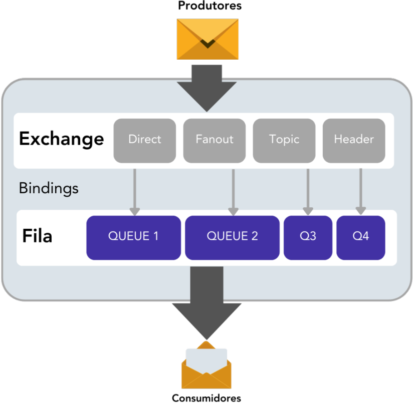


Portanto, o elemento que recebe as mensagens dos produtores e as distribui para as filas é chamado de exchange . 

Gabarito: Letra D 

07. (FCC/TRT 19/2022) Internamente à Plataforma Digital do Poder Judiciário PDPJ-Br, é encorajado que os serviços se comuniquem entre si por meio de troca de mensagens, fazendo uso de um Message Broker. No caso da PDPJ, utiliza-se para isso a solução open source conhecida como 

- a) Keycloak. 

- b) Kubernetes.

---

<!-- pagina: 82 -->

**Vinicius Borges Aula 18** 

- c) RabbitMQ. 

- d) TIBCO Enterprise Message Service. 

- e) RabbitMB. 

Comentários: 

Essa questão envolve analisarmos as alternativas procurando um serviço de mensageria _open source_ . Vamos lá. 

- a) Errado. O Keycloack é um serviço de login único (SSO) com gerenciamento de identidade. 

- b) Errado. O Kubernetes é um serviço de orquestração de contêineres. 

- c) Certo. O RabbitMQ é um sistema de mensageria open source. 

- d) Errado. O TIBCO EMS realmente é um sistema de mensageria, mas não é open source. 

- e) Errado. O nome é RabbitMQ, não RabbitMB. MB seria o _broker_ (Messag Broker) do RabbitMQ. 

Portanto, a alternativa correta é a letra C. 

Gabarito: Letra C 

08. (FCC/TRT 23/2022) RabbitMQ é um message broker escrito em Java que 

   - a) suporta apenas o protocolo de mensagens AMQP para atender aos requisitos de alta disponibilidade e escalabilidade. 

   - b) não permite escolher um mecanismo de persistência, mas oferece opções para personalizar a segurança para autenticação e autorização. 

   - c) suporta autenticação e autorização conectáveis, suporta LDAP e TLS e pode ser implantado em nuvens públicas e privadas. 

   - d) pode ser implantado como clusters para alta disponibilidade e alta taxa de transferência, mas não pode ser federado em várias zonas e regiões de disponibilidade. 

   - e) fornece APIs de cliente somente para a plataforma Java e frameworks relacionados. 

Comentários: 

Vamos analisar as alternativas. 

- a) Errado. O RabbitMQ suporta uma multiplicidade de protocolos. 

- b) Errado. O RabbitMQ possui alguns mecanismos de persistência. 

- c) Certo. O RabbitMQ tem muita afinidade com sistemas de segurança, fornecendo a possibilidade de uso de protocolo de segurança, como o SSL/TLS, e a protocolos de autenticação e autorização, como o LDAP.

---

<!-- pagina: 83 -->

**Vinicius Borges Aula 18** 

- d) Errado. Temos a ferramenta de “zonas federadas”, para agrupar os clusters a partir de regiões. 

- e) Errado. O RabbitMQ tem APIs para uma multiplicidade de linguagens, não limitado ao Java. 

Portanto, correta a letra C. 

Gabarito: Letra C 

09. (IDECAN/TJ PI/2022) Lançado em 2007, o RabbitMQ é um servidor concebido para lidar com o tráfego de mensagens de forma confiável e eficiente. Esse tipo de servidor é bastante útil para sistemas que precisam gerenciar o processamento de um grande volume de mensagens. Em situações desse tipo, o processamento assíncrono é interessante pois diminui o acoplamento entre as aplicações do sistema mas demanda um controle de filas em segundo plano. O RabbitMQ atende perfeitamente essa demanda. Marque a alternativa que Indica, corretamente, o nome do protocolo de mensagens para o qual o RabbitMQ foi projetado para suportar. 

a) AMQP 

b) XMPP 

- c) IMAP 

- d) ICMP 

- e) MQTT 

Comentários: 

O protocolo que serviu de base para o desenvolvimento do RabbitMQ é o AMQP - Advanced Messaging Queue Potocol. 

Gabarito: Letra A 

10. (FUMARC/TRT 3/2022 - Adaptada) Julgue a afirmativa sobre as tecnologias utilizadas na Arquitetura de Desenvol-vimento da Plataforma Digital do Poder Judiciário (PDPJ-Br). 

RabbitMQ é uma plataforma de auditoria que armazena os principais eventos que ocorrem nas aplicações. 

Comentários: 

O RabbitMQ é uma plataforma de mensageria , que armazena as mensagens (dados) gerados pelos produtores, para que elas possam ser consumidas pelos nós inscritos. 

Gabarito: Errado 

11. (FCC/TRT 17/2022) Um Técnico fez a instalação padrão do RabbitMQ em um computador, em condições ideais. O RabbitMQ escutará, na porta padrão

---

<!-- pagina: 84 -->

**Vinicius Borges Aula 18** 

a) 3306 b) 8081 c) 1575 d) 8080 e) 5672 

Comentários: 

Questão bem literal e “decoreba” da FCC. O RabbitMQ escuta na porta 5672 . 

Gabarito: Letra E 

12. (FCC/TRT 5/2022) No RabbitMQ, o nome dado a uma caixa postal interna que funciona como um grande buffer de mensagem limitado apenas pelos limites de memória e disco do host é 

a) producer. 

b) queue. 

c) consumer. 

d) broker. 

e) storage. 

Comentários: 

A alternativa cobra o conceito de queue , ou filas. As _queues_ são as partições internas do broker, onde as mensagens são armazenadas, funcionando como uma caixa postal onde os consumidores acessam as mensagens. 

Gabarito: Letra B 

13. (ProGPe UFSCAR/UFSCAR/2016) Assinale o único serviço dentre os listados a seguir que pode atuar como barramento de troca de mensagens entre os diversos componentes de uma instalação de OpenStack: 

a) Nova. 

b) RabbitMQ. 

c) MySQL. 

d) Neutron. 

- e) Horizon. 

Comentários:

---

<!-- pagina: 85 -->

**Vinicius Borges Aula 18** 

OpenStack é uma plataforma de código aberto para construção e gerenciamento de nuvens públicas e privadas, oferecendo serviços de computação, rede e armazenamento em uma infraestrutura escalável e flexível. Das alternativas apontadas, a única que traz um broker de mensageria é a letra b - RabbitMQ. Quanto às demais: 

- Nova: componente do OpenStack responsável por computação na nuvem 

- MySQL: SGBD de bancos de dados relacionais 

- Neutron: servido de rede do OpenStack 

- Horizon: interface de usuário baseada na web para o Open Stack. 

Portanto, a alternativa correta é a letra B. 

Gabarito: Letra B 

14. (Inédita/Prof. Felipe Mathias) Carlos, mantenedor de um sistema distribuído do Estado XPTO, que utiliza o RabbitMQ como plataforma de mensageria, se deparou com uma exchange baseada em padrões de roteamento. Nesse caso, é correto afirmar que a exchange utilizada foi: 

- a) Direct Exchange 

- b) Fan-Out Exchange 

- c) Fan-In Exchange 

- d) Topic Exchange 

- e) Headers Exchange 

Comentários: 

Exchange é o processo de alocar uma mensagem a uma fila, com base em regras de associação, ou _binding_ . Temos 4 formas de exchange: 

- Direct: a alocação é direta, com base em uma chave de roteamento 

- Fanout: a mensagem é direcionada a todas as filas vinculada ao exchange 

- Topic Exchange: o encaminhamento é feito com base em um padrão de roteamento 

- Headers Exchange: uma lista de cabeçalhos serve para definir o encaminhamento 

Portanto, como ele se deparou com um padrão de roteamento, a exchange usada é a Topic. 

Gabarito: Letra B 

15. (Inédita/Prof. Felipe Mathias) Acerca dos conhecimentos sobre RabbitMQ, julgue o item abaixo.

---

<!-- pagina: 86 -->

**Vinicius Borges Aula 18** 

É possível que uma fila, no RabbitMQ, sobreviva a uma reinicialização do servidor. Esse tipo de fila recebe o nome de fila durável. 

Comentários: 

Perfeito! A durabilidade de uma fila indica que ela sobreviverá reinicializações do servidor. 

Gabarito: Correto

---

<!-- pagina: 87 -->

**Vinicius Borges Aula 18** 

# **LISTA DE QUESTÕES** 

01. (IBFC/TRF 5/2024) Sobre RabbitMQ, analise as afirmativas abaixo e dê valores Verdadeiro (V) ou Falso (F). 

- ( ) RabbitMQ é um middleware de mensageria open-source que implementa o protocolo Advanced Message Queuing Protocol (AMQP). 

- ( ) O RabbitMQ é exclusivo para a linguagem de programação Java, não oferecendo suporte a outras linguagens de programação. 

- ( ) No RabbitMQ, os produtores são responsáveis por enviar mensagens para uma fila, enquanto os consumidores as recebem e processam. 

Assinale a alternativa que apresenta a sequência correta de cima para baixo. 

a) F - F - F 

   - b) F - V - F 

   - c) V - F - V 

   - d) V - V - V 

02. (FCC/MPE PB/2023) O RabbitMQ pode transmitir mensagens por HTTP utilizando 

   - a) uma API baseada em HTTP, que é ativada por padrão em todas as instâncias do CloudAQMP e na porta atribuída 334. 

   - b) o plug-in Web JSON, que suporta mensagens JSON para o navegador usando JsonSockets. 

   - c) o plug-in Web MQTT, que oferece suporte a mensagens MQTT para o navegador usando WebSockets. 

   - d) uma API baseada em HTTP, que é ativada por padrão em todas as instâncias do CloudSTOPM e na porta atribuída 434. 

   - e) URLs que utilizam recursos do tipo curl/json e exigirão autenticação básica HTTPS (usando o banco de dados de segurança padrão do 

03. (FUNDATEC/IFC/2023) Quais aplicações pertencem ao grupo, e, nesse sentido, são considerados servidores de mensagem/evento (Message Broker), o que possibilita a integração entre sistemas distribuídos? 

- a) Apache Kafka, RabbitMq, IBM MQ, Apache Tomcat. 

- b) Apache Kafka, RabbitMq, IIS Microsoft, Server Message Broker. 

- c) Apache Kafka, IBM MQ, RabbitMq, Amazon SQS. 

- d) Server Message Broker, IIS Microsoft, Amazon SQS, IBM MQ. 

- e) IIS Microsoft, Server Message Broker, Apache Kafka, IBM MQ.

---

<!-- pagina: 88 -->

**Vinicius Borges Aula 18** 

04. (VUNESP/TJM SP/2023) A respeito da ferramenta RabbitMQ, assinale a alternativa correta. 

   - a) O protocolo AMQP 0-9-1 é suportado, mas o AMQP 1.0 não, já que são substancialmente diferentes. 

   - b) O protocolo STOMP é suportado. 

   - c) O consumidor e o publicador de mensagens precisam estar no mesmo servidor. 

   - d) Cada conexão do protocolo AMQP 0-9-1 suporta, no máximo, um canal. 

   - e) Um canal AMQP 0-9-1 pode existir fora do contexto de uma conexão. 

05. (FGV/TCE SP/2023) Mensagerias, como o RabbitMQ, são um importante recurso para a comunicação assíncrona entre Microsserviços. Elas utilizam os domínios Point-to-Point e PublishSubscribe, com o depósito de mensagens em uma fila para que os consumidores as tratem no ==5460== momento correto. 

Acerca do uso de mensagerias com microsserviços, é correto afirmar que: 

- a) através do domínio Point-to-Point, um microsserviço pode enviar dados para vários microsserviços simultaneamente; 

- b) é necessário que microsserviços produtores e consumidores estejam ativos, para que a mensagem não seja perdida; 

- c) o modelo de comunicação segue o padrão arquitetural PAC; 

- d) no domínio Publish-Subscribe é definido um tópico, para que os microsserviços de destino consumam de forma assíncrona; 

- e) o uso de mensagerias define sistemas com alto acoplamento. 

06. (VUNESP/TRF 3/2023) No RabbitMQ, o elemento intermediário que recebe mensagens de produtores e as adiciona em alguma fila, ou não, conforme regras associadas a seu tipo e parametrizações prévias, é conhecido como 

- a) subscriber. 

- b) moderator. 

- c) judge. 

- d) exchange. e) forwarder. 

07. (FCC/TRT 19/2022) Internamente à Plataforma Digital do Poder Judiciário PDPJ-Br, é encorajado que os serviços se comuniquem entre si por meio de troca de mensagens, fazendo uso de um Message Broker. No caso da PDPJ, utiliza-se para isso a solução open source conhecida como 

- a) Keycloak. 

- b) Kubernetes.

---

<!-- pagina: 89 -->

**Vinicius Borges Aula 18** 

   - c) RabbitMQ. 

   - d) TIBCO Enterprise Message Service. 

   - e) RabbitMB. 

08. (FCC/TRT 23/2022) RabbitMQ é um message broker escrito em Java que 

   - a) suporta apenas o protocolo de mensagens AMQP para atender aos requisitos de alta disponibilidade e escalabilidade. 

   - b) não permite escolher um mecanismo de persistência, mas oferece opções para personalizar a segurança para autenticação e autorização. 

   - c) suporta autenticação e autorização conectáveis, suporta LDAP e TLS e pode ser implantado em nuvens públicas e privadas. 

   - d) pode ser implantado como clusters para alta disponibilidade e alta taxa de transferência, mas não pode ser federado em várias zonas e regiões de disponibilidade. 

   - e) fornece APIs de cliente somente para a plataforma Java e frameworks relacionados. 


09. (IDECAN/TJ PI/2022) Lançado em 2007, o RabbitMQ é um servidor concebido para lidar com o tráfego de mensagens de forma confiável e eficiente. Esse tipo de servidor é bastante útil para sistemas que precisam gerenciar o processamento de um grande volume de mensagens. Em situações desse tipo, o processamento assíncrono é interessante pois diminui o acoplamento entre as aplicações do sistema mas demanda um controle de filas em segundo plano. O RabbitMQ atende perfeitamente essa demanda. Marque a alternativa que Indica, corretamente, o nome do protocolo de mensagens para o qual o RabbitMQ foi projetado para suportar. 

- a) AMQP 

- b) XMPP 

- c) IMAP 

- d) ICMP e) MQTT 

10. (FUMARC/TRT 3/2022 - Adaptada) Julgue a afirmativa sobre as tecnologias utilizadas na Arquitetura de Desenvol-vimento da Plataforma Digital do Poder Judiciário (PDPJ-Br). 

RabbitMQ é uma plataforma de auditoria que armazena os principais eventos que ocorrem nas aplicações. 

11. (FCC/TRT 17/2022) Um Técnico fez a instalação padrão do RabbitMQ em um computador, em condições ideais. O RabbitMQ escutará, na porta padrão 

a) 3306 b) 8081 c) 1575

---

<!-- pagina: 90 -->

**Vinicius Borges Aula 18** 

- d) 8080 e) 5672 

12. (FCC/TRT 5/2022) No RabbitMQ, o nome dado a uma caixa postal interna que funciona como um grande buffer de mensagem limitado apenas pelos limites de memória e disco do host é 

- a) producer. 

- b) queue. 

- c) consumer. 

- d) broker. 

- e) storage. 

13. (ProGPe UFSCAR/UFSCAR/2016) Assinale o único serviço dentre os listados a seguir que pode atuar como barramento de troca de mensagens entre os diversos componentes de uma instalação de OpenStack: 

- a) Nova. 

- b) RabbitMQ. 

- c) MySQL. 

- d) Neutron. 

- e) Horizon. 

14. (Inédita/Prof. Felipe Mathias) Carlos, mantenedor de um sistema distribuído do Estado XPTO, que utiliza o RabbitMQ como plataforma de mensageria, se deparou com uma exchange baseada em padrões de roteamento. Nesse caso, é correto afirmar que a exchange utilizada foi: 

- a) Direct Exchange 

- b) Fan-Out Exchange 

- c) Fan-In Exchange 

- d) Topic Exchange 

- e) Headers Exchange 

15. (Inédita/Prof. Felipe Mathias) Acerca dos conhecimentos sobre RabbitMQ, julgue o item abaixo. 

É possível que uma fila, no RabbitMQ, sobreviva a uma reinicialização do servidor. Esse tipo de fila recebe o nome de fila durável.

---

<!-- pagina: 91 -->

**Vinicius Borges Aula 18** 


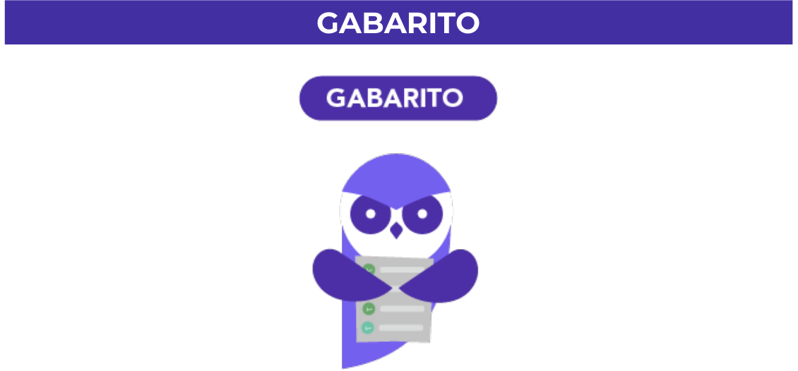


<!-- Start of picture text -->
GABARITO<br><!-- End of picture text -->

1. Letra C 

2. Letra C 

3. Letra C 

4. Letra B 

5. Letra D 

6. Letra D 

7. Letra C 

9. Letra A 

10.Errado 

11.Letra E 

   - 12.Letra B 

   - 13.Letra B 

   - 14.Letra B 

   - 15.Correto 

8. Letra C

---

<!-- pagina: 92 -->

**Vinicius Borges Aula 18** 

# **STOMP** 

## Conceitos Gerais 

STOMP , ou Simple (ou Streaming) Text Oriented Messaging Protocol , é um protocolo projetado originalmente para conectar linguagens de script (como Python e Ruby) a _brokers_ , no contexto de sistemas de mensageria. Seu objetivo é fornecer uma plataforma de mensageria assíncrona entre clientes a partir de um servidor mediador. 

A versão do protocolo STOMP estudada nessa aula será a 1.2, baseada na documentação oficial do protocolo, que pode ser vista _<u>aqui</u>_ <u>.</u> 

Ele serve como uma alternativa para outros protocolos abertos de mensageria, como o AMQP, e protocolos dependentes de implementações específicas, como o OpenWire nos _brokers_ JMS. Ele se diferencia ao cobrir um pequeno conjunto de operações de mensagens comuns, ao invés de oferecer uma API de mensageria. 

O STOMP é um protocolo baseado em quadros, _frames_ , que são modelados com base no modelo dos quadros HTTP. Um frame STOMP consiste em : 

- Um comando 

- Um conjunto de cabeçalhos opcionais 

- Um corpo ( _payload_ ) opcional 


<!-- Start of picture text -->
Assunto<br><!-- End of picture text -->


<!-- Start of picture text -->
Cabeçalho (opcional)<br><!-- End of picture text -->


<!-- Start of picture text -->
Payload (opcional)<br><!-- End of picture text -->

Apesar de primariamente baseado em formato de texto, o STOMP também permite o uso de mensagens binárias. A codificação padrão para as mensagens é em UTF-8.

---

<!-- pagina: 93 -->

**Vinicius Borges Aula 18** 

O ponto intermediário da relação, o servidor STOMP , receberá mensagens de fontes publicadoras e as armazenará de forma a encaminhá-las aos consumidores. Esse servidor é modelado como um conjunto de destinações , para os quais cada mensagem pode ser encaminhada. 

Para uma implementação mais flexível, o protocolo STOMP trata as destinações como _strings_ opacas, e sua sintaxe é específica a implementação do servidor. Adicionalmente, o STOMP não define que semântica de entrega da destinação deve ser usada. A troca de mensagens irá variar de acordo com o servidor e destinação. 

Do outro lado, temos os clientes STOMP . Ele é um usuário-agente que pode atuar de duas formas, separadamente ou simultaneamente: 

- Como um produtor , enviando mensagens para uma destinação a partir de um frame do tipo <mark>`SEND`</mark> 

- Como um consumidor , enviando um frame <mark>`SUBSCRIBE`</mark> para uma destinação, de forma a se inscrever nela, recebendo mensagens como frames <mark>`MESSAGE` .</mark> 


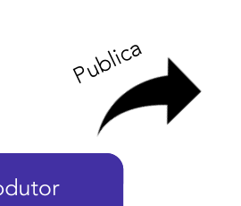


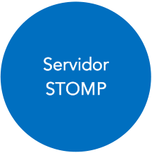


<!-- Start of picture text -->
Servidor<br>STOMP<br><!-- End of picture text -->


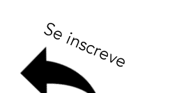


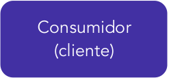


<!-- Start of picture text -->
Consumidor<br>(cliente)<br><!-- End of picture text -->

(Inédita/Prof. Felipe Mathias) Acerca dos conhecimentos sobre os protocolos de mensageria, julgue o item abaixo. 

O cliente STOMP pode agir como produtor de mensagem, ou como consumidor - mas não como ambos simultaneamente. 

Comentários: 

Como acabamos de ver, um cliente pode atuar tanto como produtor quanto como consumidor, inclusive sendo os dois ao mesmo tempo - aliás, essa é a forma mais comum. Portanto, correta a alternativa. (Gabarito: Certo)

---

<!-- pagina: 94 -->

**Vinicius Borges Aula 18** 

## Quadros STOMP 

As mensagens encaminhadas no protocolo STOMP são frames, quadros, que trafegam sob protocolos confiáveis de comunicação bidirecional - como o TCP. Os clientes e o servidores irão se comunicar usando frames STOMP enviados ao longo desse fluxo bidirecional. 

Um frame STOMP parece-se com isso: 

```
SEND
destination:/queue/example
content-type:text/plain
```

```
Esta é uma mensagem de exemplo enviada através do protocolo STOMP.
^@
```

Vamos destrinchar cada elemento desse frame. 

- SEND é o comando STOMP usado para enviar uma mensagem. 

- destination:/queue/example é um cabeçalho, em par de chave-valor, que especifica o destino da mensagem, que neste caso é a fila chamada "example". 


- content-type:text/plain define o tipo de conteúdo da mensagem como texto simples. 

- A linha em branco indica o final dos cabeçalhos. 

- A mensagem real é "Esta é uma mensagem de exemplo enviada através do protocolo STOMP.", seguida por um caractere de terminação especial, muitas vezes representado como ^@. 

Os principais comandos STOMP que você deve saber são: 

- CONNECT: Este comando é usado para iniciar uma conexão com o servidor STOMP. Ele pode incluir cabeçalhos para autenticação, como "login" e "passcode". 

- CONNECTED: Este é o comando de resposta do servidor ao comando CONNECT. Ele confirma a conexão bem-sucedida e pode incluir cabeçalhos adicionais para comunicação adicional. 

- SEND: Usado para enviar uma mensagem para um destino específico, como uma fila ou tópico. O destino é especificado usando o cabeçalho "destination". 

- SUBSCRIBE: Este comando é usado para se inscrever em um destino específico para receber mensagens. Pode incluir cabeçalhos como "id" para identificar a inscrição e "destination" para especificar o destino da inscrição. 

- UNSUBSCRIBE: Usado para cancelar a inscrição em um destino específico. Geralmente inclui o cabeçalho "id" para identificar a inscrição a ser cancelada.

---

<!-- pagina: 95 -->

**Vinicius Borges Aula 18** 

- ACK: Este comando é usado para confirmar o recebimento e processamento de uma mensagem específica. É comumente usado em ambientes de entrega garantida. 

- NACK: Similar ao comando ACK, o NACK é usado para indicar que uma mensagem específica não foi processada com sucesso e deve ser reenviada. 

- BEGIN: Usado em transações, o comando BEGIN inicia uma transação no servidor STOMP. 

- COMMIT: Usado para confirmar uma transação pendente. Todas as operações realizadas na transação serão confirmadas e aplicadas. 

- ABORT: Cancela uma transação pendente, descartando todas as operações realizadas dentro dela. 

- DISCONNECT: Este comando é usado para encerrar a conexão com o servidor STOMP de forma limpa. 

- MESSAGE: Usado para enviar uma mensagem ao cliente que se inscreveu em um destino específico 

- RECEIPT: Frame que confirma a conclusão bem-sucedida de um comando enviado pelo cliente STOMP ao servidor 

- ERROR: 

# Comandos STOMP 


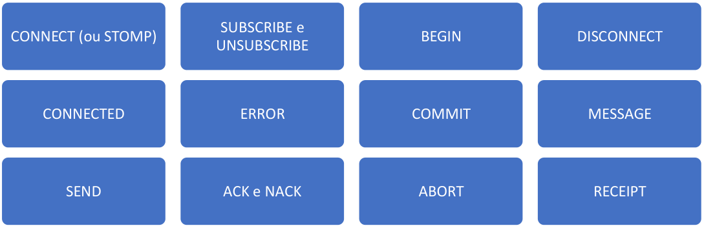


<!-- Start of picture text -->
SUBSCRIBE e<br>CONNECT (ou STOMP) BEGIN DISCONNECT<br>UNSUBSCRIBE<br>CONNECTED ERROR COMMIT MESSAGE<br>SEND ACK e NACK ABORT RECEIPT<br><!-- End of picture text -->

O corpo , que carrega a mensagem, é uma parte opcional. Entretanto, ele só pode estar presente em mensagens do tipo <mark>`SEND` ,</mark> <mark>`MESSAGE`</mark> e <mark>`ERROR` .</mark> Em demais tipos de mensagem, conteúdo de corpo ( _payload_ ) é completamente proibido - já que esses quadros são mensagens destinadas a comunicar uma ação, como abortar ou desconectar. 

Para os cabeçalhos, temos alguns campos pré-concebidos que podem, ou não, serem definidos - caso não sejam, seguirão valores padrões pré-definidos. 

- Content-length: um octeto (8 bits) para apontar o tamanho do corpo do frame. Esse frame é obrigatório quando houver um corpo na mensagem.

---

<!-- pagina: 96 -->

**Vinicius Borges Aula 18** 

- Content-type: aponta o conteúdo do corpo da mensagem, através de um código MIME 

- Receipt: cabeçalho que irá fazer com que o reconheça o processamento de um cliente com o frame <mark>`RECEIPT`</mark> 

Além desses três cabeçalhos, cada tipo de mensagem traz um conjunto de cabeçalhos obrigatórios e recomendados. Vou resumir tudo numa tabela para você. 

|MENSAGEM|CABEÇALHOS OBRIGATÓRIOS|CABEÇALHOS OPCIONAIS|
|---|---|---|
|CONNECT|• accept-version<br>• host|• login<br>• passcode<br>• heratbeat|
|CONNECTED|• version<br>==5460==|• session<br>• server<br>• heartbeat|
|SEND|• destination|• transaction|
|SUBSCRIBE|• destination<br>• id|• ack|
|UNSUBSCRIBE|• id|N/C|
|ACK e NACK|• id|• transaction|
|BEGIN, COMMIT<br>e ABORT|• transaction|N/C|
|DISCONNECT|N/C|• receipt|
|MESSAGE|• destination<br>• message-id<br>• subscription|• ack|
|RECEIPT|• receipt-id|N/C|
|ERROR|N/C|• message|


(Inédita/Prof. Felipe Mathias) José, gerenciador de sistemas distribuídos da empresa XPTO, está configurando o frame da mensagem gerada com os dados de uma transição, para ser encaminhada ao _broker_ de mensageria, que adota o padrão STOMP. Essa mensagem é relativa à inscrição de um nó em determinado tópico do broker. O tipo de mensagem e os cabeçalhos obrigatórios para o _frame_ são, respectivamente: 

- a) Connect: accept-version, host 

- b) Send: destination 

- c) Subscribe: destination, id 

- d) Begin: transaction 

- e) Commit: transaction 

Comentários:

---

<!-- pagina: 97 -->

**Vinicius Borges Aula 18** 

A inscrição em um tópico é feita a partir da mensagem de tipo SUBSCRIBE. Essa mensagem recebe dois cabeçalhos obrigatórios: destination e id. Portanto, o gabarito da questão é a letra C. (Gabarito: Letra C)

---

<!-- pagina: 98 -->

**Vinicius Borges Aula 18** 

## Heart-beating 

É possível implementar um sistema de checagem de saúde da conexão TCP subjacente do mecanismo de Heart-beating . Cuidado, ao contrário da maioria dos sistemas de heart-beat que se destina a verificar a saúde dos nós, aqui ele é direcionado a verificar a saúde da conexão que transportará o pacote STOMP. 

Para habilitar o heart-beat , cada parte deve declarar o que pode fazer e o que gostaria que a outra parte fizesse - por partes, entenda diferentes clientes e/ou servidores. Esse “acordo de nível de serviço” é feito no começo de cada sessão STOMP , adicionando o um cabeçalho <mark>`heart-beat`</mark> nos frames <mark>`CONNECT`</mark> e <mark>`CONNECTED`</mark> . 

O cabeçalho de heart-beat se estrutura a partir de dois valores separados por vírgulas - chamaremos de <vx> e <vy>, da seguinte forma: 

```
CONNECT
heart-beat: <vx>, <vy>
```

O <vx>, primeiro número da relação, indica fatores relacionados à origem da mensagem (chamada de outgoing heartbeat), o que ela pode fazer: 

- vx = 0 → indica que o nó não envia heart-beats 

- vy > 0 → indica o menor número de milissegundos entre frames heart-beat que o nó pode garantir 

Já o segundo número, <vy>, indica o que a origem da mensagem gostaria que o destino pudesse oferecer a ela: 

- vy = 0 → indica que não quer receber heart-beats 

- vx > 0 → aponta o tempo desejado, em milissegundos, entre heart-beats 

Como um heart-beat é um cabeçalho opcional, sua ausência deve ser tratada como um `heartbeat: 0, 0` <mark>,</mark> isso é, que a parte não pode enviar e nem receber esse tipo de frame. Dessa forma, conseguimos transmitir informações suficientes através do cabeçalho heart-beat para que cada parte encontre se a outra pode usar essa abordagem, em que frequência e em que direção. 

Mais formalmente, os frames iniciais de _heart-beat_ trocados entre um cliente e servidor, através das mensagens de CONNECT e CONNECTED, parece-se com isso:

---

<!-- pagina: 99 -->

**Vinicius Borges Aula 18** 

```
CONNECT
heart-beat: <vx>, <vy>
CONNECTED:
heart-beat: <sx>, <sy>
```

Para heart-beats do cliente ao servidor: 

- Se <vx> for 0 (cliente não pode enviar heart-beat) ou <sy> for 0 (servidor não quer receber heart-beats), não teremos esse tipo de troca de mensagens 

- Caso contrário, ocorrerá uma troca de heart-beats pelo maior tempo entre <cx> e <sy>. 

(Inédita/Prof. Felipe Mathias) Carla acessou o sistema de mensageria do Estado ABC e interceptou a seguinte troca de frames: 

```
     CONNECT
     heart-beat:3000,3000
```

```
     CONNECTED
     heart-beat:2000,2000
```

Acerca dessa situação, julgue o item abaixo. 

Esse conjunto de _frames_ indica a conexão de um cliente a um servidor, havendo mensagens do tipo heart-beat a cada 2.000ms. 

Comentários: 

A alternativa está quase perfeita - mas peca no final. De fato, essa é uma conexão cliente-servidor, com mensagens do tipo heart-beat habilitadas. Entretanto, o tempo entre mensagens de heartbeat é definido pelo maior valor entre o primeiro valor do CONNECT (3000), e o último valor do CONNECTED (2000). Portanto, a troca de mensagens ocorrerá a cada 3.000ms. (Gabarito: Errado)

---

<!-- pagina: 100 -->

**Vinicius Borges Aula 18** 

# **RESUMO** 

### O que é o STOMP? 

STOMP (Simple Text Oriented Messaging Protocol) é um protocolo de mensagens de texto simples que foi criado para linguagens de script como Ruby, Python e Perl para se conectar a intermediários de mensagens corporativas, os _brokers_ . Graças ao STOMP, clientes e brokers capturados em diferentes idiomas podem enviar e receber mensagens entre si. 

### O que são os quadros STOMP? 

Os frames são as mensagens de dados , no contexto do STOMP. Esses quadros, ou frames, são compostos de um comando principal (como SEND, CONNECT e SUBSCRIBE), um conjunto de cabeçalhos em pares de chave-valor, e um corpo de mensagem opcional. 

### O que é o heart-beat do STOMP? 

O heart-beat no STOMP pode ser usado opcionalmente para testar a saúde da conexão TCP subjacente e para garantir que a outra extremidade está ativa. Isso é útil para evitar a perda de mensagens quando as mensagens são enviadas de forma assíncrona por clientes (ou seja, envio e esquecimento). Se não houvesse mecanismo para detectar a perda de conexão, o cliente poderia continuar enviando mensagens de forma assíncrona em uma conexão morta. Essas mensagens seriam perdidas, pois nunca chegariam ao corretor.

---

<!-- pagina: 101 -->

**Vinicius Borges Aula 18** 

# **QUESTÕES COMENTADAS** 

01. (Inédita/Prof. Felipe Mathias) Julgue a afirmativa abaixo, acerca dos sistemas de mensageria. 

STOMP, Simple Text Oriented Messaging Protocol é um protocolo para troca de mensagens em sistemas de mensageria. A estrutura de suas mensagens é baseada no frame HTTP, contendo um comando, um conjunto de cabeçalhos opcionais, e um corpo. 

Comentários: 

Correto, caro aluno. O STOMP é um protocolo que visa integrar linguagens orientadas a script com brokers de mensageria. A estrutura da mensagem é baseada na estrutura do Frame HTTP, e é chamada de Frame STOMP. Veja sua estrutura: 


<!-- Start of picture text -->
Assunto<br><!-- End of picture text -->


<!-- Start of picture text -->
Cabeçalho (opcional)<br><!-- End of picture text -->


<!-- Start of picture text -->
Payload (opcional)<br><!-- End of picture text -->

Portanto, correta a afirmativa. 

Gabarito: Correto 

02. (Inédita/Prof. Felipe Mathias) Acerca dos conhecimentos sobre os protocolos de mensageria, julgue o item abaixo. 

O cliente STOMP pode agir como produtor de mensagem, ou como consumidor - mas não como ambos simultaneamente. 

Comentários:

---

<!-- pagina: 102 -->

**Vinicius Borges Aula 18** 

Como acabamos de ver, um cliente pode atuar tanto como produtor quanto como consumidor, inclusive sendo os dois ao mesmo tempo - aliás, essa é a forma mais comum. Portanto, correta a alternativa. 

Gabarito: Correto 

03. (Inédita/Prof. Felipe Mathias) José, gerenciador de sistemas distribuídos da empresa XPTO, está configurando o frame da mensagem gerada com os dados de uma transição, para ser encaminhada ao _broker_ de mensageria, que adota o padrão STOMP. Essa mensagem é relativa à inscrição de um nó em determinado tópico do broker. O tipo de mensagem e os cabeçalhos obrigatórios para o _frame_ são, respectivamente: 

- a) Connect: accept-version, host ==5460== b) Send: destination 

- c) Subscribe: destination, id 

- d) Begin: transaction 

- e) Commit: transaction 

Comentários: 

A inscrição em um tópico é feita a partir da mensagem de tipo SUBSCRIBE. Essa mensagem recebe dois cabeçalhos obrigatórios: destination e id. Portanto, o gabarito da questão é a letra C. Quanto às demais ações apontadas: 

- CONNECT: iniciar uma sessão STOMP 

- SEND: enviar uma mensagem para o broker 

- BEGIN: inicia uma transação no servidor STOMP 

- COMMIT: confirma uma transação pendente. 

Gabarito: Correto 

04. (Inédita/Prof. Felipe Mathias) Carla acessou o sistema de mensageria do Estado ABC e interceptou a seguinte troca de frames: 

```
     CONNECT
     heart-beat:3000,3000
```

#### `CONNECTED` 

```
     heart-beat:2000,2000
```

Acerca dessa situação, julgue o item abaixo.

---

<!-- pagina: 103 -->

**Vinicius Borges Aula 18** 

Esse conjunto de _frames_ indica a conexão de um cliente a um servidor, havendo mensagens do tipo heart-beat a cada 2.000ms. 

Comentários: 

A alternativa está quase perfeita - mas peca no final. De fato, essa é uma conexão cliente-servidor, com mensagens do tipo heart-beat habilitadas. Entretanto, o tempo entre mensagens de heartbeat é definido pelo maior valor entre o primeiro valor do CONNECT (3000), e o último valor do CONNECTED (2000). Portanto, a troca de mensagens ocorrerá a cada 3.000ms. Portanto, errado o gabarito. 

Gabarito: Errado 

#### 05. (Inédita/Prof. Felipe Mathias) Julgue o item abaixo, acerca do protocolo STOMP. 

Ao realizar uma interação de envio de mensagem, o produtor envia uma mensagem do tipo SEND. Após o processamento, do outro lado da relação, o consumidor inscrito no tópico recebe a mensagem a partir de um frame MESSAGE. 

Comentários: 


A questão aponta, corretamente, a troca de frames STOMP em uma troca de mensagens. A mensagem é encaminhada ao broker através de um frame SEND. Chegando no broker, a mensagem é armazenada e processada em tópicos ou filas, e, por fim, encaminhada ao consumidor inscrito no tópico a partir de um frame MESSAGE. 

Gabarito: Correto

---

<!-- pagina: 104 -->

**Vinicius Borges Aula 18** 

# **LISTA DE QUESTÕES** 

01. (Inédita/Prof. Felipe Mathias) Julgue a afirmativa abaixo, acerca dos sistemas de mensageria. 

STOMP, Simple Text Oriented Messaging Protocol é um protocolo para troca de mensagens em sistemas de mensageria. A estrutura de suas mensagens é baseada no frame HTTP, contendo um comando, um conjunto de cabeçalhos opcionais, e um corpo. 

Comentários: 

Correto, caro aluno. O STOMP é um protocolo que visa integrar linguagens orientadas a script com brokers de mensageria. A estrutura da mensagem é baseada na estrutura do Frame HTTP, e é chamada de Frame STOMP. Veja sua estrutura: 


<!-- Start of picture text -->
Assunto<br><!-- End of picture text -->


<!-- Start of picture text -->
Cabeçalho (opcional)<br><!-- End of picture text -->


<!-- Start of picture text -->
Payload (opcional)<br><!-- End of picture text -->

Portanto, correta a afirmativa. 

Gabarito: Correto 

02. (Inédita/Prof. Felipe Mathias) Acerca dos conhecimentos sobre os protocolos de mensageria, julgue o item abaixo. 

O cliente STOMP pode agir como produtor de mensagem, ou como consumidor - mas não como ambos simultaneamente. 

Comentários:

---

<!-- pagina: 105 -->

**Vinicius Borges Aula 18** 

Como acabamos de ver, um cliente pode atuar tanto como produtor quanto como consumidor, inclusive sendo os dois ao mesmo tempo - aliás, essa é a forma mais comum. Portanto, correta a alternativa. 

Gabarito: Correto 

03. (Inédita/Prof. Felipe Mathias) José, gerenciador de sistemas distribuídos da empresa XPTO, está configurando o frame da mensagem gerada com os dados de uma transição, para ser encaminhada ao _broker_ de mensageria, que adota o padrão STOMP. Essa mensagem é relativa à inscrição de um nó em determinado tópico do broker. O tipo de mensagem e os cabeçalhos obrigatórios para o _frame_ são, respectivamente: 

- a) Connect: accept-version, host 

- b) Send: destination 

- c) Subscribe: destination, id 

- d) Begin: transaction 

- e) Commit: transaction 

Comentários: 

A inscrição em um tópico é feita a partir da mensagem de tipo SUBSCRIBE. Essa mensagem recebe dois cabeçalhos obrigatórios: destination e id. Portanto, o gabarito da questão é a letra C. Quanto às demais ações apontadas: 

- CONNECT: iniciar uma sessão STOMP 

- SEND: enviar uma mensagem para o broker 

- BEGIN: inicia uma transação no servidor STOMP 

- COMMIT: confirma uma transação pendente. 

Gabarito: Correto 

04. (Inédita/Prof. Felipe Mathias) Carla acessou o sistema de mensageria do Estado ABC e interceptou a seguinte troca de frames: 

#### `CONNECT` 

```
     heart-beat:3000,3000
```

#### `CONNECTED` 

```
     heart-beat:2000,2000
```

Acerca dessa situação, julgue o item abaixo.

---

<!-- pagina: 106 -->

**Vinicius Borges Aula 18** 

Esse conjunto de _frames_ indica a conexão de um cliente a um servidor, havendo mensagens do tipo heart-beat a cada 2.000ms. 

Comentários: 

A alternativa está quase perfeita - mas peca no final. De fato, essa é uma conexão cliente-servidor, com mensagens do tipo heart-beat habilitadas. Entretanto, o tempo entre mensagens de heartbeat é definido pelo maior valor entre o primeiro valor do CONNECT (3000), e o último valor do CONNECTED (2000). Portanto, a troca de mensagens ocorrerá a cada 3.000ms. Portanto, errado o gabarito. 

Gabarito: Errado 

==5460== 

#### 05. (Inédita/Prof. Felipe Mathias) Julgue o item abaixo, acerca do protocolo STOMP. 

Ao realizar uma interação de envio de mensagem, o produtor envia uma mensagem do tipo SEND. Após o processamento, do outro lado da relação, o consumidor inscrito no tópico recebe a mensagem a partir de um frame MESSAGE. 

Comentários: 


A questão aponta, corretamente, a troca de frames STOMP em uma troca de mensagens. A mensagem é encaminhada ao broker através de um frame SEND. Chegando no broker, a mensagem é armazenada e processada em tópicos ou filas, e, por fim, encaminhada ao consumidor inscrito no tópico a partir de um frame MESSAGE. 

Gabarito: Correto

---

<!-- pagina: 107 -->

**Vinicius Borges Aula 18** 


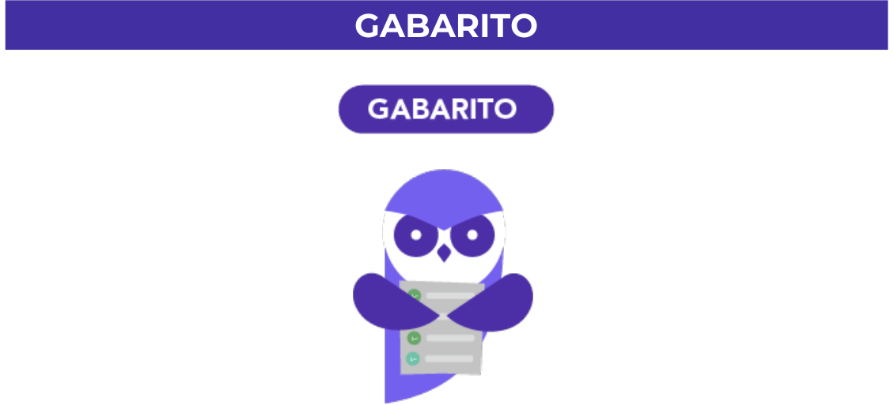


<!-- Start of picture text -->
GABARITO<br><!-- End of picture text -->

1. Correto 

2. Correto 

3. Correto 

4. Errado 

5. Correto

---

<!-- pagina: 108 -->


