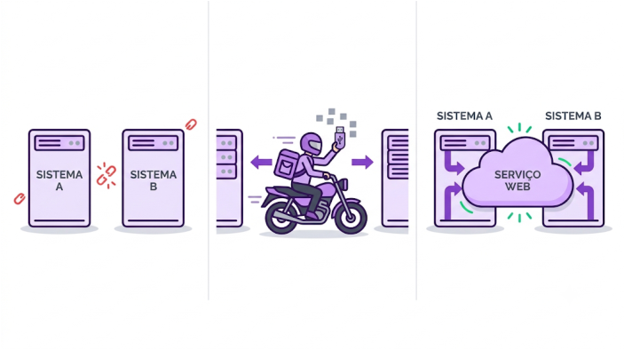
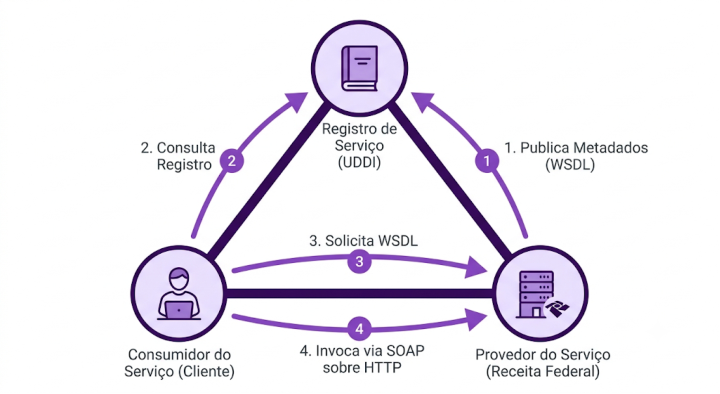
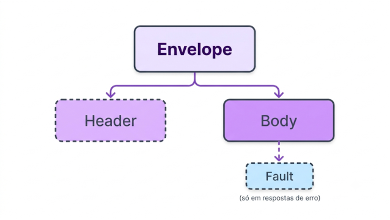
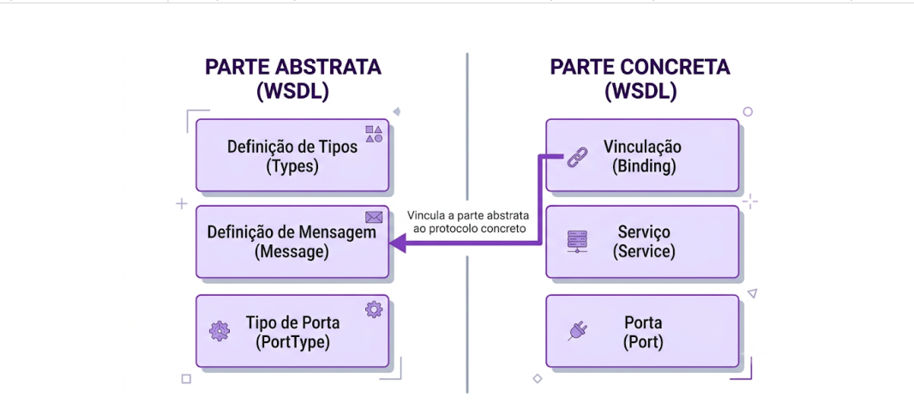
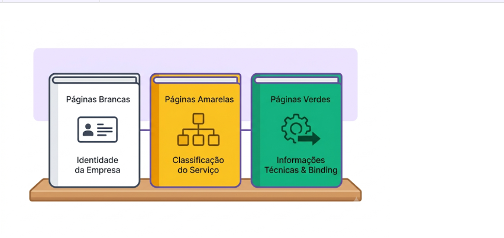

---
fonte_pdf: "Desenvolvimento - Aula 19.pdf"
paginas: 28
conversao: texto-e-imagens
---

<!-- pagina: 2 -->

**Vinicius Borges Aula 19** 

# **Índice** 

|.............................................................................................................................................................................................. 1) Integração de Serviços - Teoria 3|
|---|
|.............................................................................................................................................................................................. 2) Integração de Serviços - Questões comentadas 18|
|.............................................................................................................................................................................................. 3) Integração de Serviços - Lista de questões 24|

---

<!-- pagina: 3 -->

**Vinicius Borges Aula 19** 

# **ARQUITETURA DE INTEGRAÇÃO DE SERVIÇOS** 

## Como aplicações se comunicam: do mainframe aos web services 

### O problema de fundo 

Imagine dois sistemas: um sistema A, que cadastra clientes, e um sistema B, que tem a base da Receita Federal. Quando o sistema A recebe um novo cliente, precisa perguntar ao sistema B se aquele CPF está negativado. A pergunta é: como automatizar essa comunicação? 

Uma forma antiga, e que ainda acontece em alguns lugares, é a comunicação por arquivo. Um operador (por exemplo, um motoboy) leva diariamente um pendrive com os dados de um sistema para o outro. Isso resolve o problema do transporte, mas surge outro: como o sistema A vai ler aquele arquivo? Qual é o formato que o sistema B vai gravar? 

A solução tradicional foi padronizar a estrutura do arquivo: blocagem por posição. Da coluna 1 à 10, código; da 11 à 50, nome; da 51 à 60, CPF; da 61 à 65, indicador de negativado. Funciona, mas é frágil. Qualquer mudança na blocagem quebra tudo. Versionar é difícil. Esse modelo ainda roda em muitos mainframes. 

_Do arquivo manual (motoboy), passamos a um padrão de comunicação automatizada pela web. É o conceito de web service que resolve, de uma vez, transporte e protocolo._ 

#### _Fonte: Prof. Vinícius Borges_ 

### O surgimento dos web services 

Para resolver os problemas de transporte e protocolo de forma automatizada, surgiu o conceito de web service: um serviço disponível na web, com interface bem definida, consumível por qualquer

---

<!-- pagina: 4 -->

**Vinicius Borges Aula 19** 

aplicação que respeite o contrato. Existem várias formas de implementar um web service: SOAP/WSDL/UDDI (o foco desta aula), REST, mensageria, RPC e GraphQL, entre outras. 

Quando uma organização adota web services em larga escala, expondo suas funcionalidades como serviços reutilizáveis e compostos por outras aplicações, ela passa a ter o que se chama de Arquitetura Orientada a Serviços (SOA). Vale uma observação: o conceito de SOA não é tão novo quanto parece. Há décadas o mainframe já fazia integração por arquivos, com a mesma filosofia. SOA é, em boa medida, a sistematização e modernização daquilo. 

### Os oito princípios da orientação a serviços 

A literatura consagrou oito princípios que orientam a construção de serviços. Conhecer essa lista de cor é exigência clássica das provas: 

|Princípio||O que significa|
|---|---|---|
|Contrato padronizado||Serviços expõem contratos formais (como WSDL) que permitem ao consumidor conhecer a interface sem depender de detalhes internos.|
|Baixo acoplamento||Serviços conhecem o mínimo necessário uns dos outros. Mudanças internas não devemquebrar consumidores.|
|Abstração||Detalhes de implementação ficam escondidos. O consumidor enxerga apenas o contrato.|
|Reutilização||Cada serviço é projetado para ser consumido por múltiplas aplicações.|
|Autonomia||O serviço tem controle sobre seus próprios recursos, sem depender de coordenação externa.|
|Sem manutenção estado|de|O serviço evita manter estado entre chamadas, melhorando escalabilidade.|
|Habilidade de|ser|Serviços são publicados em registros (como o UDDI) para serem|
|descoberto||localizadospor consumidores.|
|Habilidade de composto|ser|Serviços podem ser combinados em fluxos maiores (orquestração e coreografia).|

"Orientação a Serviço é um paradigma de design pretendido para a criação de unidades de lógica de solução que são individualmente moldadas para que possam ser coletivamente e repetidamente utilizadas a fim de realizar um conjunto específico de objetivos." Definição clássica utilizada em prova (IBGE/2019). 

### SOA e web service não são a mesma coisa 

Aqui mora uma confusão recorrente. SOA é o estilo arquitetural; web service é uma das formas tecnológicas de implementar esse estilo. É possível ter SOA sem web service (com arquivos

---

<!-- pagina: 5 -->

**Vinicius Borges Aula 19** 

blocados, filas, eventos) e é possível ter web service sem SOA (basta criar um web service isolado, sem qualquer estratégia corporativa de reutilização). 

Em concurso, esteja atento a afirmações que tentem prender a SOA a uma tecnologia específica. SOA não depende exclusivamente de SOAP, nem exclusivamente de REST. Ela é o conceito geral; SOAP e REST são tecnologias que podem materializá-la. 

#### Para a prova: 

- SOA é estilo arquitetural; SOAP, REST, mensageria, RPC são tecnologias que podem implementar SOA. 

- Princípios da orientação a serviços: contrato padronizado, baixo acoplamento, abstração, reutilização, autonomia, sem manutenção de estado, descobribilidade e componibilidade. 

#### (PROF. VINICIUS BORGES / INÉDITA - 2026) 

Julgue o item sobre os princípios da orientação a serviços. 

Entre os princípios consagrados estão o contrato de serviço padronizado, o baixo acoplamento, a abstração, a reutilização, a autonomia, a ausência de manutenção de estado, a habilidade de ser descoberto e a habilidade de ser composto. 

Comentários: 

Conforme vimos na tabela desta seção, a lista dos oito princípios é exatamente essa: contrato padronizado, baixo acoplamento , abstração, reutilização, autonomia, sem manutenção de estado, descobribilidade e componibilidade. 

Gabarito: Certo

---

<!-- pagina: 6 -->

**Vinicius Borges Aula 19** 

## A arquitetura triangular SOAP, WSDL e UDDI 

### As quatro perguntas que o triângulo responde 

Para implementar um web service no estilo SOAP, precisamos responder a quatro perguntas básicas. Cada uma é resolvida por uma tecnologia diferente do triângulo. 

|Pergunta|Tecnologia|
|---|---|
|Quais serviços estão disponíveis?|UDDI(catálogo de metadados)|
|Como acionar o serviço (operações, parâmetros, tipos)?|WSDL (descrição do serviço)|
|Como transportar a mensagem pela rede?|HTTP (geralmente, mas pode ser SMTP, JMS)|
|Comoprotocolar(formato)a mensagem?|SOAP(envelope XML)|

Cada vértice resolve uma parte do problema. O UDDI é o registro; o WSDL é o contrato; o SOAP é o formato da mensagem; o HTTP é tipicamente o transporte. As tecnologias core são SOAP, WSDL e UDDI, com o XML servindo de base comum a todas elas. 

### Os três atores e o fluxo de uso 

O triângulo tem três atores: o Service Provider (provedor do serviço, por exemplo, a Receita Federal); o Service Consumer (consumidor, a aplicação do cliente); e o Service Registry (o UDDI). O fluxo típico de uso é o seguinte: 

_Observe a numeração das setas: o UDDI guarda apenas metadados (não o WSDL completo). O WSDL é solicitado ao próprio Provider, e a comunicação real acontece por mensagens SOAP._ 

_Fonte: Prof. Vinícius Borges_

---

<!-- pagina: 7 -->

**Vinicius Borges Aula 19** 

Um detalhe importante: o UDDI não armazena o WSDL completo. Ele guarda apenas metadados sobre os serviços, incluindo a localização (endereço) do WSDL. Para obter o WSDL real, o consumidor precisa solicitá-lo diretamente ao Provider, e não ao UDDI. É uma confusão clássica que vale guardar. 

### As tecnologias core e a segunda geração 

Além das três tecnologias core do triângulo (SOAP, WSDL e UDDI), o ecossistema conta com outras especificações que merecem ser conhecidas. Por baixo, temos o XML (formato), o XSD (XML Schema Definition, que valida o XML) e o HTTP (transporte). Acima, surgiu o que se chama de segunda geração de web services: 

|Especificação|Função|
|---|---|
|WS-Security|Adiciona segurança às mensagens SOAP (assinatura, criptografia, tokens).|
|WS-Transaction|Gerencia transações distribuídas entre múltiplos serviços.|
|WS-Policy|Define políticas para os serviços, como requisitos de segurança e qualidade.|
|WS-Addressing|Adiciona informações de endereçamento ao envelope SOAP.|

Essas extensões mostram que o SOAP é extensível. Uma questão clássica de prova afirma que o SOAP é um protocolo extensível, e a existência dessas especificações WS-* é a justificativa dessa afirmação. 

#### Para a prova: 

- Três vértices do triângulo: SOAP (mensagem), WSDL (descrição), UDDI (registro). 

- Três atores: Service Provider, Service Consumer, Service Registry (UDDI). 

- UDDI guarda METADADOS, não o WSDL completo. WSDL é pedido ao Provider. 

- SOAP é extensível: WS-Security, WS-Transaction, WS-Policy, WS-Addressing. 

(PROF. VINICIUS BORGES / INÉDITA - 2026)

---

<!-- pagina: 8 -->

**Vinicius Borges Aula 19** 

O UDDI é um dos componentes da arquitetura orientada a serviços (SOA). Considerando seu papel na arquitetura triangular dos web services SOAP, sua função principal é: 

a) prover a descrição dos serviços, indicando suas operações e parâmetros. 

b) atuar como o protocolo padrão de comunicação entre cliente e servidor. 

c) atuar como linguagem de marcação para a descrição e descoberta de serviços. 

d) prover a publicação e a descoberta dos serviços disponíveis. 

e) prover comunicação entre os serviços por meio de envelopes XML. 

Comentários: 

Conforme estudamos nesta seção, o UDDI cumpre o papel de publicar e descobrir serviços no triângulo dos web services SOAP. As demais alternativas descrevem outras peças: A é o WSDL (descrição), B é o protocolo de transporte (HTTP), C é o XML (linguagem de marcação) e E é o próprio SOAP (comunicação com envelopes XML). Saber quem faz o quê no triângulo é a forma mais rápida de matar questões desse tipo. 

Gabarito: Letra D

---

<!-- pagina: 9 -->

**Vinicius Borges Aula 19** 

## SOAP: o protocolo de mensagens em XML 

### Definição e características 

O SOAP (Simple Object Access Protocol) é um protocolo de troca de mensagens, mantido pela W3C, baseado em XML. Seu papel no triângulo é definir o formato das mensagens trocadas entre cliente e servidor. Como o XML é interpretado por qualquer plataforma e linguagem moderna, o SOAP garante interoperabilidade quase universal. 

O SOAP é, em essência, um envelope XML padronizado que viaja sobre um protocolo de transporte. Tipicamente o transporte é o HTTP, mas a especificação admite outros, como SMTP, JMS e TCP. É importante separar mentalmente o SOAP (o formato) do transporte (o protocolo que ==5460== carrega o SOAP pela rede). 

Além de envelopar mensagens documentais, o SOAP suporta o estilo RPC (Remote Procedure Call). Nesse estilo, o Body da mensagem carrega o nome do método a ser executado no servidor e seus parâmetros, em um formato que lembra uma chamada de função remota. O estilo alternativo é o Document, em que o Body carrega um documento XML mais livre. 

### Estrutura da mensagem SOAP 

Toda mensagem SOAP é um documento XML bem formado, com quatro elementos possíveis: Envelope, Header, Body e Fault. Conhecer quais são obrigatórios e como se relacionam é o ponto mais cobrado em prova: 

|Elemento|Obrigatório?|Função|
|---|---|---|
|Envelope|Sim (raiz)|Elemento-raiz do documento XML. Identifica que se trata de uma mensagem SOAP.|
|||Carrega metadados (autenticação, transação,|
|Header|Não|documentação sobre a mensagem). Quando aparece, é filho do Envelope.|
|Body|Sim|Carrega o conteúdo real da requisição ou resposta. É filho do Envelope.|
|Fault|Não (só em erros)|Carrega informações de erro (faultcode, faultstring, faultactor, detail). É filho do Body, não do Envelope.|

---

<!-- pagina: 10 -->

**Vinicius Borges Aula 19** 

_Observe a hierarquia: Envelope é raiz, Header é seu filho opcional, Body é seu filho obrigatório, e Fault só aparece dentro do Body quando ocorre erro._ 

#### _Fonte: Prof. Vinícius Borges_ 

### SOAP e os protocolos de transporte 

Como dito, o SOAP define apenas o formato da mensagem. O transporte é responsabilidade de outro protocolo. A escolha mais comum é o HTTP, que permite atravessar firewalls corporativos sem fricção (porta 80 ou 443) e é universalmente suportado. Mas a especificação não amarra o SOAP ao HTTP. É plenamente possível trafegar SOAP sobre SMTP (e-mail), JMS (mensageria Java), TCP puro ou outros. 

"O SOAP é um protocolo extensível, que utiliza XML para formatar as mensagens trocadas, podendo ser transportado sobre HTTP, SMTP ou outros protocolos." 

#### Para a prova: 

- SOAP = Simple Object Access Protocol. Mantido pela W3C, baseado em XML. 

- Obrigatórios: Envelope (raiz) e Body. Opcionais: Header e Fault. 

- Hierarquia: Envelope > (Header e Body). Fault é filho do Body, não do Envelope. 

- Transporte: tipicamente HTTP, mas suporta SMTP, JMS, TCP. NÃO é restrito ao HTTP. 

- Suporta RPC: o Body pode carregar chamada de método com parâmetros.

---

<!-- pagina: 11 -->

**Vinicius Borges Aula 19** 

#### (PROF. VINICIUS BORGES / INÉDITA - 2026) 

Julgue o item sobre o tratamento de erros em mensagens SOAP. 

O elemento Fault, usado para transportar informações de erro quando a requisição não pode ser processada, é filho direto do elemento Envelope, ao lado dos elementos Header e Body. Comentários: 

Cuidado, pessoal! Conforme vimos na árvore da mensagem SOAP desta seção, o elemento Fault não é filho direto do Envelope. Os filhos diretos do Envelope são Header (opcional) e Body (obrigatório). O Fault aparece dentro do Body, quando há erro. A hierarquia correta é Envelope > Body > Fault. Essa é uma das pegadinhas mais cobradas em prova; a banca conta com o candidato confundir a estrutura. 

Gabarito: Errado

---

<!-- pagina: 12 -->

**Vinicius Borges Aula 19** 

## WSDL: a descrição dos serviços 

### Por que precisamos do WSDL 

Imagine que você descobriu, via UDDI, que existe um web service para consultar CPF na Receita Federal. Como saber quais operações esse serviço oferece? Quais parâmetros cada operação espera? Que tipo de dado é retornado? Que endereço chamar? A resposta é: lendo o WSDL (Web Services Description Language) do serviço. 

O WSDL é uma linguagem baseada em XML cuja finalidade é descrever completamente a interface de um web service SOAP. A partir de um WSDL, ferramentas como wsimport (Java) e svcutil (.NET) geram automaticamente as classes de cliente, eliminando a necessidade de escrever na mão o código que monta envelopes SOAP. 

Existem duas versões em uso: WSDL 1.1 e WSDL 2.0. A 1.1 ainda é amplamente utilizada pelos frameworks (inclusive a implementação Metro do JAX-WS gera WSDL 1.1 por padrão). A 2.0 é mais nova e também aparece em prova. Saiba que as duas existem; a banca cobra ambas. 

### Parte abstrata e parte concreta 

Os elementos do WSDL são divididos em duas partes. A parte abstrata descreve o serviço sem se <u>preocupar com detalhes de transporte (o que o serviço faz). A parte concreta resolve o como (qual</u> protocolo, qual endpoint). 

|Parte|Elementos|O que cobre|
|---|---|---|
|||Tipos de dados, mensagens trocadas e operações|
|Abstrata|types, message, portType|abstratas oferecidas. Descreve o serviço sem amarrar a transporte.|
|||Protocolo concreto de comunicação, endpoints|
|Concreta|binding, service, port|disponíveis e portas de acesso. Resolve como o serviço será efetivamente consumido.|

A banca costuma inverter os elementos para tentar derrubar o candidato. Decore o mnemônico: TyMePoTy (Types, Message, portType) é abstrata; BiSerPo (Binding, Service, Port) é concreta. 

### Função de cada elemento 

|Elemento|Função|
|---|---|
|types|Tipos de dados suportados na troca de mensagens do serviço (geralmente declarados via XML Schema,XSD).|
|message|Informações necessárias para executar a operação: define cada mensagem e seusparâmetros.|

---

<!-- pagina: 13 -->

**Vinicius Borges Aula 19** 

|portType|Conjunto de operações que podem ser executadas pelo serviço, com as mensagens trocadas em cada uma.|
|---|---|
|binding|Protocolo concreto de comunicação utilizado (SOAP sobre HTTP, SOAP sobre SMTP, estilo RPC ou Document).|
|service|Conjunto de endpoints(ports) que vão atender o serviço.|
|port|Endpoint específico: endereço(URL)eporta emque o serviço está disponível.|

_Note a separação: types, message e portType descrevem o serviço de forma abstrata; binding, service e port aterrissam essa descrição em um protocolo e endpoint reais._ 

_Fonte: Prof. Vinícius Borges_ 

Para a prova: 

• WSDL = Web Services Description Language. Linguagem em XML para descrever serviços SOAP. 

• Duas versões em uso: 1.1 (mais comum em frameworks) e 2.0. 

- Parte abstrata: types, message, portType. Parte concreta: binding, service, port. 

• Mnemônico: TyMePo (abstrata) x BiServPo (concreta). Cuidado para a banca não inverter. 

- portType reúne as operações executáveis. binding amarra portType ao protocolo concreto.

---

<!-- pagina: 14 -->

**Vinicius Borges Aula 19** 

(TRF-2019 adaptada) 

Considere as quatro afirmações sobre o conteúdo de um documento WSDL: 

I. definição dos tipos de dados usados pelo web service; 

II. definição dos elementos de dados para cada operação; 

III. descrição das operações que podem ser feitas e mensagens envolvidas; 

IV. definição do protocolo e formato de dados para cada tipo de porta. 

Os elementos do WSDL que cumprem, respectivamente, essas funções são: 

a) type, portType, binding e message. 

b) message, binding, portType e wsdl. 

c) wsdl, type, message e portType. 

d) portType, type, message e binding. 

e) types, message, portType e binding. 

Comentários: 

Conforme estudamos na tabela desta seção, fazemos a associação direta: I (tipos de dados) corresponde a types ; II (elementos de dados de cada operação) corresponde a message ; III (descrição das operações e mensagens) corresponde a portType ; IV (protocolo e formato para cada porta) corresponde a binding . 

Gabarito: Letra E

---

<!-- pagina: 15 -->

**Vinicius Borges Aula 19** 

## UDDI: o registro de serviços 

### Definição e papel no triângulo 

O UDDI (Universal Description, Discovery and Integration) é uma especificação para registros de serviços web. No triângulo SOAP/WSDL/UDDI, ele ocupa o vértice do registro: provedores publicam seus serviços ali, e consumidores fazem consultas para descobrir o que está disponível. 

É importante destacar: o UDDI não armazena os arquivos WSDL completos. Ele guarda metadados sobre os serviços, incluindo ponteiros (URLs) para a localização do WSDL real. Para obter o WSDL completo, o consumidor precisa solicitá-lo diretamente ao Provider. 

Na prática, vale uma observação: o uso do UDDI não é universal. Muitas integrações SOAP corporativas dispensam o UDDI e passam o endereço do WSDL diretamente entre as equipes. Mas, para fins de prova, ele compõe oficialmente o modelo triangular e precisa ser conhecido. 

### As três páginas do UDDI 

A organização interna das informações no UDDI segue a metáfora das páginas, inspirada nos antigos catálogos telefônicos. São três tipos: 

|Páginas|Cor|Conteúdo|
|---|---|---|
|White pages|Brancas|Informações sobre a empresa que fornece o serviço: nome, contato,endereço,identificadores corporativos.|
|||Classificação ou categoria do serviço, segundo taxonomias|
|Yellow pages|Amarelas|padronizadas. Ajudam o consumidor a achar serviços por ramo de atividade.|
|Green pages|Verdes|Informações técnicas: como acessar o serviço, qual sua interface, metadados de binding, referência ao WSDL.|

---

<!-- pagina: 16 -->

**Vinicius Borges Aula 19** 

#### _Observe a metáfora: brancas para a empresa, amarelas para o tipo de negócio, verdes para os detalhes técnicos._ 

_Fonte: Prof. Vinícius Borges_ 

Memorizar essa divisão é fundamental. Em particular, lembre-se que as informações técnicas (binding, como acessar, referência ao WSDL) ficam nas páginas verdes. Esse ponto cai com frequência. 

### Função do UDDI na arquitetura SOA 

Na arquitetura SOA clássica, o UDDI materializa o princípio de descobribilidade. Para que um serviço seja reutilizado, é preciso que ele seja descobrível por consumidores potenciais. O UDDI é a tecnologia que cumpre esse papel no mundo SOAP. 

Cuidado com a divisão de papéis: o UDDI publica e descobre, mas não descreve nem transporta. A descrição do serviço é responsabilidade do WSDL; o transporte é responsabilidade do SOAP (geralmente sobre HTTP). O UDDI é apenas o índice. Esse mapeamento (UDDI = registro, WSDL = descrição, SOAP = mensagem) precisa estar automatizado na cabeça do candidato. 

#### Para a prova: 

- UDDI = Universal Description, Discovery and Integration. Registro de serviços do mundo SOAP. 

- Três páginas oficiais: brancas (empresa), amarelas (categoria) e verdes (técnico/binding). 

- Funções na SOA: publicação e descoberta de serviços. 

- UDDI guarda METADADOS sobre os serviços, não o WSDL completo. WSDL é pedido ao Provider. 

- Não descreve (isso é o WSDL) e não transporta (isso é o SOAP). 

- (PROF. VINICIUS BORGES / INÉDITA - 2026)

---

<!-- pagina: 17 -->

**Vinicius Borges Aula 19** 

O UDDI organiza os registros de serviços em três conjuntos de páginas. As páginas que descrevem os aspectos técnicos do serviço, incluindo a forma de acesso e os metadados de ligação (binding), são conhecidas como páginas: 

a) brancas. 

b) amarelas. 

c) verdes. 

d) vermelhas. 

e) azuis. 

Comentários: 

Conforme estudamos na tabela desta seção, as informações técnicas (incluindo metadados de binding e referência ao WSDL) ficam nas páginas verdes . As brancas trazem informações de contato da empresa fornecedora; as amarelas, a classificação do serviço por categoria. 

Gabarito: Letra C

---

<!-- pagina: 18 -->

**Vinicius Borges Aula 19** 

# **QUESTÕES COMENTADAS** 

#### <mark>1. (PROF. VINICIUS BORGES / INÉDITA - 2026)</mark> 

Considere uma situação em que duas aplicações distribuídas, desenvolvidas em linguagens e plataformas diferentes, precisam trocar informações de forma estruturada por meio de um web service. Assinale a alternativa que apresenta o protocolo de comunicação, embasado em XML e mantido pela W3C, projetado especificamente para esse cenário. 

a) SOAP. 

b) HTTP. 

c) FTP. 

d) SMTP. 

e) IMAP. 

Comentários: 

O SOAP (Simple Object Access Protocol) é um protocolo padrão da indústria, embasado em XML e mantido pela W3C, voltado para a troca de mensagens entre aplicações distribuídas independentemente da plataforma e da linguagem de programação. 

#### Gabarito: Letra A 

#### <mark>2. (PROF. VINICIUS BORGES / INÉDITA - 2026)</mark> 

Julgue o item a seguir sobre a Arquitetura Orientada a Serviços (SOA). 

A SOA não se baseia em web service, mas em quanto de um sistema pode ser acessado por mecanismos externos ao próprio sistema, independentemente da linguagem de programação utilizada. 

Comentários: 

Realmente, essa é uma definição bonita de SOA, que costuma ser cobrada em prova. Vale fixar: web service é uma das formas de implementar SOA, mas SOA é o conceito mais geral. Está ligada

---

<!-- pagina: 19 -->

**Vinicius Borges Aula 19** 

ao mecanismo de desacoplamento entre sistemas, linguagens e plataformas. A própria comunicação por arquivos blocados em mainframe, que se faz há décadas, já é uma forma de SOA. SOAP, REST, mensageria, RPC e GraphQL são tecnologias diferentes que podem materializar uma arquitetura SOA. 

Gabarito: Certo 

#### <mark>3. (PROF. VINICIUS BORGES / INÉDITA - 2026)</mark> 

No contexto da arquitetura triangular dos web services SOAP, a sigla UDDI corresponde a Universal Description, Discovery and Integration. Sua função, nessa arquitetura, é: 

==5460== a) descrever a interface dos serviços oferecidos pelo provedor. 

b) transportar as mensagens entre cliente e servidor pela rede. 

c) prover a publicação e a descoberta de serviços por meio de um catálogo. 

d) encapsular as chamadas remotas em envelopes XML padronizados. 

e) padronizar o formato dos tipos de dados trocados nas operações. 

Comentários: 

O UDDI ocupa o vértice do registro no triângulo dos web services SOAP. Sua função é prover a publicação e a descoberta de serviços: os provedores publicam suas ofertas no UDDI, e os consumidores fazem consultas para localizar endpoints disponíveis. As demais alternativas descrevem outros componentes do triângulo: A descreve o WSDL, B descreve o protocolo de transporte (tipicamente HTTP), D descreve o próprio SOAP, e E descreve o papel do XML Schema (XSD) dentro do WSDL. 

Gabarito: Letra C 

#### <mark>4. (PROF. VINICIUS BORGES / INÉDITA - 2026)</mark> 

Os web services baseados em SOAP costumam ter sua estrutura descrita por meio de uma linguagem em XML que documenta as operações disponíveis, os parâmetros esperados e os formatos das mensagens trocadas. Essa linguagem é conhecida como: 

a) REST. 

#### b) WSDL. 

#### c) CORBA. 

#### d) HTML.

---

<!-- pagina: 20 -->

**Vinicius Borges Aula 19** 

#### e) RESTful. 

Comentários: 

O WSDL (Web Services Description Language) é a linguagem consagrada, no mundo SOAP, para descrever a interface de um web service. Por meio dele, o consumidor sabe quais operações o serviço expõe, quais parâmetros cada operação espera, qual o formato das mensagens e em que endpoint o serviço está disponível. 

Gabarito: Letra B 

#### <mark>5. (PROF. VINICIUS BORGES / INÉDITA - 2026)</mark> 

Julgue o item sobre os princípios da orientação a serviços. 

Entre os princípios consagrados estão o contrato de serviço padronizado, o baixo acoplamento, a abstração, a reutilização, a autonomia, a ausência de manutenção de estado, a habilidade de ser descoberto e a habilidade de ser composto. 

Comentários: 

A lista dos oito princípios da orientação a serviços é exatamente essa: contrato padronizado, baixo acoplamento, abstração, reutilização, autonomia, ausência de estado (statelessness), descobribilidade e componibilidade. 

Gabarito: Certo 

#### <mark>6. (PROF. VINICIUS BORGES / INÉDITA - 2026)</mark> 

A arquitetura triangular dos web services SOAP envolve três tecnologias com papéis distintos. Considere o seguinte trecho: "tecnologia responsável por funcionar como catálogo de metadados dos serviços, permitindo que consumidores descubram quais serviços estão disponíveis na rede". Esse trecho descreve: 

a) o protocolo SOAP. 

b) o XML Schema (XSD). 

c) o protocolo HTTP. 

d) o UDDI. 

e) o WSDL. 

Comentários:

---

<!-- pagina: 21 -->

**Vinicius Borges Aula 19** 

Quando o enunciado fala em "catálogo de metadados dos serviços" e em "descobrir quais serviços estão disponíveis", estamos falando do UDDI. No triângulo SOAP/WSDL/UDDI, é ele que ocupa o papel de registro: provedores publicam, consumidores descobrem. O SOAP cuida do empacotamento da mensagem; o WSDL descreve a interface do serviço; o XSD valida os tipos de dados; o HTTP é o protocolo de transporte tipicamente usado por baixo do SOAP. 

Gabarito: Letra D 

#### <mark>7. (PROF. VINICIUS BORGES / INÉDITA - 2026)</mark> 

Acerca da estrutura de uma mensagem SOAP, julgue o item. 

São elementos obrigatórios de uma mensagem SOAP os elementos Envelope, Header e Body, sendo Envelope a raiz do documento XML e Header o elemento que carrega os metadados da chamada. 

#### Comentários: 

Atenção, é uma das pegadinhas mais cobradas. Os elementos obrigatórios da mensagem SOAP são apenas dois: Envelope (a raiz) e Body (o conteúdo). O Header é opcional. Quando aparece, ele de fato carrega metadados (documentação, autenticação, controle de transação), mas sua presença não é exigida pela especificação. Decore esse mapa: Envelope obrigatório como raiz, Body obrigatório dentro do Envelope, Header opcional, Fault opcional (e só aparece quando há erro). 

Gabarito: Errado 

#### <mark>8. (PROF. VINICIUS BORGES / INÉDITA - 2026)</mark> 

Julgue o item sobre a estrutura de uma mensagem SOAP. 

A mensagem SOAP é codificada como um documento XML em que o elemento Envelope é o elemento-raiz; o elemento Header é opcional e o elemento Body é obrigatório. 

#### Comentários: 

Realmente, a descrição corresponde à estrutura canônica da mensagem SOAP. O Envelope é a raiz do documento XML e identifica que se trata de uma mensagem SOAP. Dentro dele, o Header é opcional (carrega metadados) e o Body é obrigatório (carrega o conteúdo real da requisição ou resposta). Quando ocorre um erro, o Body passa a conter um subelemento Fault, que transporta o código e a descrição do problema.

---

<!-- pagina: 22 -->

**Vinicius Borges Aula 19** 

Gabarito: Certo 

#### <mark>9. (PROF. VINICIUS BORGES / INÉDITA - 2026)</mark> 

Julgue o item sobre o tratamento de erros em mensagens SOAP. 

O elemento Fault, usado para transportar informações de erro quando a requisição não pode ser processada, é filho direto do elemento Envelope, ao lado dos elementos Header e Body. 

#### Comentários: 

Cuidado, pessoal! O elemento Fault não é filho direto do Envelope, mas sim do Body. Ou seja: dentro do Envelope ficam Header (opcional) e Body (obrigatório); dentro do Body, quando há erro, aparece o Fault. Fixe a sequência: Envelope > Body > Fault. 

Gabarito: Errado 

#### <mark>10. (PROF. VINICIUS BORGES / INÉDITA - 2026)</mark> 

Em um documento WSDL, o elemento que define o conjunto de operações que podem ser executadas pelo serviço, descrevendo os nomes das operações e as mensagens de entrada e saída envolvidas, é: 

a) types. 

b) portType. 

c) binding. 

d) message. 

e) service. 

#### Comentários: 

O portType reúne as operações que o serviço oferece, associando cada operação às mensagens de entrada e saída envolvidas. É a parte abstrata da interface, responsável por descrever o que o serviço faz. O types declara os tipos de dados suportados (via XML Schema); o message define cada mensagem trocada; o binding faz a ponte entre o portType abstrato e o protocolo concreto de comunicação; e o service expõe os endpoints (ports) em que o serviço está disponível. 

Gabarito: Letra B

---

<!-- pagina: 23 -->

**Vinicius Borges Aula 19** 

# **GABARITO** 

1. Letra A 

2. Certo 

3. Letra C 

4. Letra B 

5. Certo 

6. Letra D 

7. Errado 

8. Certo 

9. Errado 

10. Letra B

---

<!-- pagina: 24 -->

**Vinicius Borges Aula 19** 

# **LISTA DE QUESTÕES** 

#### <mark>1. (PROF. VINICIUS BORGES / INÉDITA - 2026)</mark> 

Considere uma situação em que duas aplicações distribuídas, desenvolvidas em linguagens e plataformas diferentes, precisam trocar informações de forma estruturada por meio de um web service. Assinale a alternativa que apresenta o protocolo de comunicação, embasado em XML e mantido pela W3C, projetado especificamente para esse cenário. 

a) SOAP. 

b) HTTP. 

c) FTP. 

d) SMTP. 

e) IMAP. 

#### <mark>2. (PROF. VINICIUS BORGES / INÉDITA - 2026)</mark> 

Julgue o item a seguir sobre a Arquitetura Orientada a Serviços (SOA). 

A SOA não se baseia em web service, mas em quanto de um sistema pode ser acessado por mecanismos externos ao próprio sistema, independentemente da linguagem de programação utilizada. 

#### <mark>3. (PROF. VINICIUS BORGES / INÉDITA - 2026)</mark> 

No contexto da arquitetura triangular dos web services SOAP, a sigla UDDI corresponde a Universal Description, Discovery and Integration. Sua função, nessa arquitetura, é: 

a) descrever a interface dos serviços oferecidos pelo provedor. 

b) transportar as mensagens entre cliente e servidor pela rede. 

- c) prover a publicação e a descoberta de serviços por meio de um catálogo. 

- d) encapsular as chamadas remotas em envelopes XML padronizados.

---

<!-- pagina: 25 -->

**Vinicius Borges Aula 19** 

e) padronizar o formato dos tipos de dados trocados nas operações. 

#### <mark>4. (PROF. VINICIUS BORGES / INÉDITA - 2026)</mark> 

Os web services baseados em SOAP costumam ter sua estrutura descrita por meio de uma linguagem em XML que documenta as operações disponíveis, os parâmetros esperados e os formatos das mensagens trocadas. Essa linguagem é conhecida como: 

a) REST. 

b) WSDL. 

c) CORBA. d) HTML. ==5460== e) RESTful. 

#### <mark>5. (PROF. VINICIUS BORGES / INÉDITA - 2026)</mark> 

Julgue o item sobre os princípios da orientação a serviços. 

Entre os princípios consagrados estão o contrato de serviço padronizado, o baixo acoplamento, a abstração, a reutilização, a autonomia, a ausência de manutenção de estado, a habilidade de ser descoberto e a habilidade de ser composto. 

#### <mark>6. (PROF. VINICIUS BORGES / INÉDITA - 2026)</mark> 

A arquitetura triangular dos web services SOAP envolve três tecnologias com papéis distintos. Considere o seguinte trecho: "tecnologia responsável por funcionar como catálogo de metadados dos serviços, permitindo que consumidores descubram quais serviços estão disponíveis na rede". Esse trecho descreve: 

a) o protocolo SOAP. 

b) o XML Schema (XSD). 

c) o protocolo HTTP. 

d) o UDDI. 

e) o WSDL. 

#### <mark>7. (PROF. VINICIUS BORGES / INÉDITA - 2026)</mark>

---

<!-- pagina: 26 -->

**Vinicius Borges Aula 19** 

Acerca da estrutura de uma mensagem SOAP, julgue o item. 

São elementos obrigatórios de uma mensagem SOAP os elementos Envelope, Header e Body, sendo Envelope a raiz do documento XML e Header o elemento que carrega os metadados da chamada. 

#### <mark>8. (PROF. VINICIUS BORGES / INÉDITA - 2026)</mark> 

Julgue o item sobre a estrutura de uma mensagem SOAP. 

A mensagem SOAP é codificada como um documento XML em que o elemento Envelope é o elemento-raiz; o elemento Header é opcional e o elemento Body é obrigatório. 

#### <mark>9. (PROF. VINICIUS BORGES / INÉDITA - 2026)</mark> 

Julgue o item sobre o tratamento de erros em mensagens SOAP. 

O elemento Fault, usado para transportar informações de erro quando a requisição não pode ser processada, é filho direto do elemento Envelope, ao lado dos elementos Header e Body. 

#### <mark>10. (PROF. VINICIUS BORGES / INÉDITA - 2026)</mark> 

Em um documento WSDL, o elemento que define o conjunto de operações que podem ser executadas pelo serviço, descrevendo os nomes das operações e as mensagens de entrada e saída envolvidas, é: 

a) types. 

b) portType. 

c) binding. 

d) message. 

e) service.

---

<!-- pagina: 27 -->

**Vinicius Borges Aula 19** 

# **GABARITO** 

1. Letra A 

2. Certo 

3. Letra C 

4. Letra B 

5. Certo 

6. Letra D 

7. Errado 

8. Certo 

9. Errado 

10. Letra B

---

<!-- pagina: 28 -->

