---
fonte_pdf: "Desenvolvimento - Aula 20.pdf"
paginas: 47
conversao: texto-e-imagens
---

<!-- pagina: 2 -->

**Vinicius Borges Aula 20** 

# **Índice** 

|..............................................................................................................................................................................................<br>1) Blockchain - Teoria<br>3|
|---|
|..............................................................................................................................................................................................<br>2) Blockchain - Questões Comentadas<br>33|
|..............................................................................................................................................................................................<br>3) Blockchain - Lista de Questões<br>41|

---

<!-- pagina: 3 -->

**Vinicius Borges Aula 20** 

# **BLOCKCHAIN** 

### Conceitos Básicos 

Você provavelmente já deve ter ouvido falar de criptomoedas uma vez na vida, seja por propaganda, por amigos oferecendo um "esquema milagroso", ou até mesmo ouvindo histórias de alguém que ficou milionário investindo centavos. Bom, hoje nós não vamos falar delas - pelo menos não num primeiro momento. Vamos falar sobre a estrutura subjacente que suporta todas essas moedas: a Blockchain . 


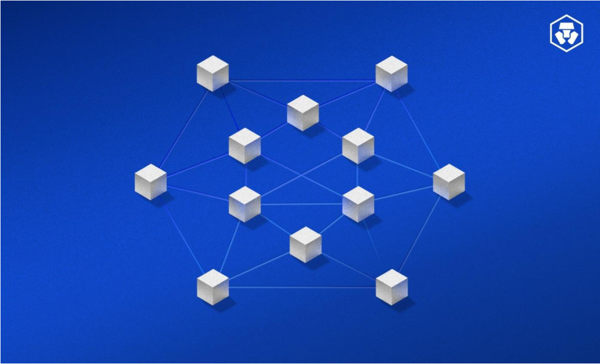


A blockchain, ou cadeia de blocos é um livro de registros distribuído . Pense no livro razão, onde as empresas de contabilidade fazem os registros, de forma centralizada, das transações em que a entidade fez parte - a _blockchain_ funciona de forma muito similar. Porém, ao invés de termos um registro centralizado, a _blockchain_ funciona de forma descentralizada , como uma base de dados descentralizada e compartilhada por todos os participantes da rede. 

Pense que você realizou uma transação: uma venda de um ativo. Para dar validade, no mundo real, a essa transação, é necessário que o Estado forneça toda uma estrutura de segurança jurídica, através de cartórios e instâncias recursais (judiciário), para que ninguém conteste a validade dessa transação. Ou seja, o Estado detém o monopólio centralizado de controle de transações.

---

<!-- pagina: 4 -->

**Vinicius Borges Aula 20** 

Já na _blockchain_ , quem garante essa validade de uma transação são todos os usuários da rede específica , validando os blocos fazendo, dessa forma, com que a tomada de decisão se torne descentralizada - até certo ponto. 

A primeira proposta de um protocolo baseado em criptografia, similar à _blockchain_ , apareceu em 1982 com uma dissertação de David Chaum. Porém, a primeira _blcokchain_ foi conceituada, de fato, em 2008, por um autor desconhecido (ou grupo de autores), com o pseudônimo Satoshi Nakamoto - o "criador" do Bitcoin. 

Satoshi introduziu uma forma de aplicarmos uma abordagem de _hashes_ chamada Hashcash , que consiste em incluir uma contagem de dificuldade para que o _hash_ gerado atenda a essas necessidades. Dessa forma, a complexidade da criptografia acompanha a necessidade de segurança. 

Hoje em dia, podemos separar em três tipos essenciais de _blockchains_ : 

- Blockchains públicas: são plataformas que hospedam a cadeia de blocos para qualquer um que quiser acesso. Assim, os blocos são validados por qualquer membro (ou por uma pluralidade de membros) que fazem parte dessa rede. É a forma com que as principais criptomoedas operam. 

- Blockchains privadas: cria uma restrição de acesso, onde apenas usuários ou empresas específicas podem ter acesso. Pode ser uma rede interna, restrita a uma empresa, ou de alcance global. Por ter um número menor de usuários, ela garante um maior controle, em contrapartida a uma menor velocidade de validação das transações. 

- Blockchains híbridas: é uma abordagem mista entre pública e privada, oferecendo alguns serviços em uma blockchain pública, e outros em uma privada 

De forma lógica, podemos estruturar as Blockchains em 5 camadas: 

- Infraestrutura 

- Blocos ( _block_ ) 

- Rede ( _chain_ ) 

- Validação ( _consenso_ ) 

- Aplicações 

A infraestrutura, composta pelos hardwares, não será objeto de estudo nessa aula - já que é abordada em aulas específicas, sendo a mesma que as de aplicações tradicionais. Quanto às demais camadas, veremos em seguida. 

(CEBRASPE/DATAPREV/2023) Considerando conceitos e padrões criptográficos, conceitos de blockchain e detecção, resposta, tratamento e recuperação de incidentes cibernéticos, julgue o item a seguir.

---

<!-- pagina: 5 -->

**Vinicius Borges Aula 20** 

Blockchain é um livro-razão distribuído ponto a ponto, protegido por criptografia, apenas anexado, praticamente imutável, que pode ser atualizado apenas por consenso das partes ou com o acordo entre elas. 

Comentários: 

Perfeito! Veremos mais à frente alguns dos conceitos aplicados nessa questão, mas saiba, em adiantado, que estão todos corretos. A _blockchain_ é um livro-razão ( _ledger_ ) descentralizado, em uma arquitetura ponto-a-ponto (P2P), imutável, que utiliza algoritmos de consenso para validar as transações. ( Gabarito: Correto) 


---

<!-- pagina: 6 -->

**Vinicius Borges Aula 20** 

### Block 

###### _Mas Felipe, o que são blocos?!_ Calma que te explico! 

Blocos são unidades de dados que armazenam informações sobre transações e demais operações em uma rede. Cada bloco contém, pelo menos, três elementos: 

- Conjunto de transações: Os blocos registram transações realizadas na rede. Uma transação pode envolver a transferência de criptomoedas, a execução de contratos inteligentes (no caso de blockchains como Ethereum), ou qualquer outra operação específica da rede. 

- Timestamp: Cada bloco possui um timestamp que indica quando as transações foram registradas. O uso de marcações de tempo ajuda a organizar a ordem cronológica das transações e a criar uma sequência imutável de eventos. 

- Hash criptográfico: O hash é um valor único e fixo que é gerado a partir dos dados contidos no bloco. Ele funciona como uma "impressão digital" única para aquele conjunto específico de informações. O hash de um bloco é calculado com base no conteúdo desse bloco, incluindo o hash do bloco anterior. 


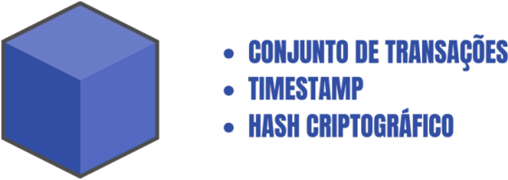


Após a formação do bloco, ele é adicionado à cadeia ( _chain_ , que falarei na próxima seção) para ser validado pelos usuários dessa rede. Nesses contexto, destaco a importância da criptografia . É graças a ela que toda a tecnologia da blockchain pode existir. E falo isso pois a quantidade de transações diárias é assustadora - veja o gráfico abaixo, com destaque para o BitCoin e o Ethereum, as duas maiores criptomoedas do mundo, que usam a _blockchain_ para validar suas transações.

---

<!-- pagina: 7 -->

**Vinicius Borges Aula 20** 


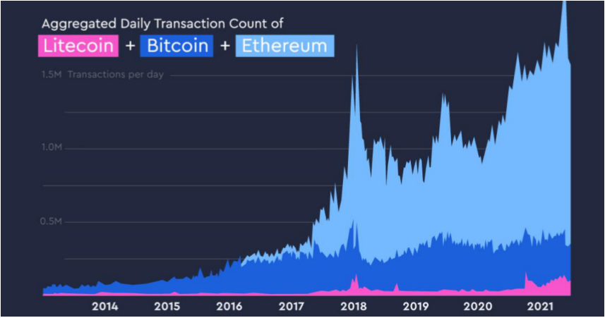


É importante que você entenda que um bloco é um conjunto de transações , e não uma só. Cada transação é adicionado a um bloco, formando, após determinado número de transações, um bloco completo. Esse número de transações usualmente é variável, e é delimitado pelo tamanho do bloco, e pelo intervalo de tempo em que blocos são criados (o Bitcoin tem um intervalo de 10min, por exemplo). 

Veja que, no Bitcoin, atualmente temos entre 3.500 e 4.000 transações por bloco: 


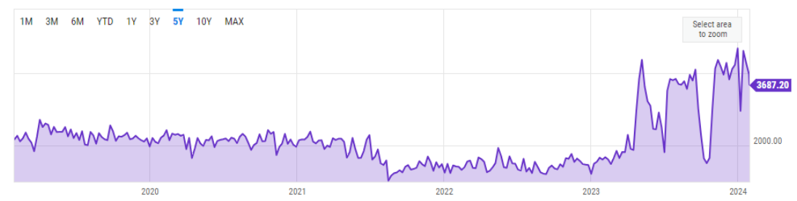


Esse é um dos principais gargalos das criptomoedas: a escalabilidade. Enquanto transações bancárias acontecem em frações de segundos, uma transação em _blockchain_ pode demorar segundos, minutos e até horas. 

(Inédita - Prof. Felipe Mathias) Sobre criptografia, _blockchain_ e transações online, julgue o item abaixo. 

Os blocos de uma _blockchain_ representam uma transação específica, com uma marcação de tempo, chamada de _timestramp_ , e tecnologias de _hash_ criptográfico aplicadas. Esse bloco é, então, incorporado a uma rede para validação. 

Comentários:

---

<!-- pagina: 8 -->

**Vinicius Borges Aula 20** 

Errado, galera! Muito cuidado... um bloco representa uma pluralidade de transações , não uma transação específica. Todas as transações feitas no intervalo de tempo de criação de um bloco são incorporadas a ele. ( Gabarito: Errado)

---

<!-- pagina: 9 -->

**Vinicius Borges Aula 20** 

### Chain 

Ok, entendemos o conceito de _block_ . Agora, vamos para o _chain_ - ou cadeia. 

Sempre que formamos um bloco, nós o colocamos em uma cadeia, a nossa _chain_ . Essa cadeia é composta por blocos, de forma interconectada: sempre sabemos qual o bloco anterior, e, se houver, qual o bloco posterior. Por isso a importância dos _timestamps_ , já que nossa cadeia segue uma ordem cronológica. 

Esse encadeamento garante um dos princípios mais importantes da _blockchain_ : a imutabilidade . Falamos que um ponto negativo da rede é sua falta de escalabilidade, que resulta em tempos longos para  transações - agora, temos um ponto positivo. As _blockchains_ são altamente confiáveis e, principalmente, auditáveis . 


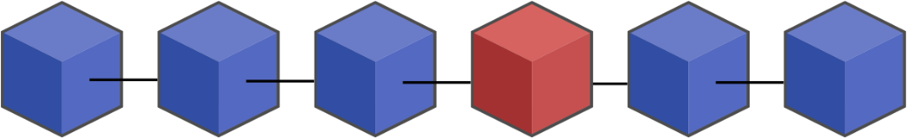


Cada bloco da rede tem sua posição específica - e ficará ali para sempre. Isso permite que esse tipo de rede seja altamente auditável , com confiança, podendo identificar facilmente um traço de auditoria , que irá apontar para a origem da transição, podendo identificar a origem delas. As vezes não podemos identificar quem fez a origem, pois há criptografia envolvida, permitindo que os usuários sejam anônimos, mas podemos identificar de onde a transação veio e marcar essa "carteira" como pouco confiável, se for o caso. 

Numa cadeia, podemos identificar 3 pontos distintos. Vou usar a imagem ao lado como referência. 


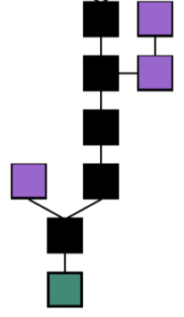


Temos, em verde , o bloco raiz, também chamado de _genesis block_ . Em preto , temos a cadeia principal , que é onde temos a principal estrutura da _blockchain_ . E, por último, em roxo , temos os blocos órfãos , ou blocos solitários. Um bloco é chamado de órfão quando não faz parte da rede principal, apesar de ter sido validado e propagado pela rede. Isso ocorre por problemas de implementação, usualmente quando dois mineradores (que você entenderá mais à frente) validam um mesmo bloco, ao mesmo tempo. 

Ao propagar esses blocos validados, pode ocorrer um problema de _timestamp_ , onde alguns usuários recebem o bloco feito pelo minerador A antes, e outros pelo minerador B, criando diferentes versões da _blockchain_ ao mesmo tempo. Usualmente, as redes possuem mecanismos automáticos de resolução desse tipo de problema, porém, se não for

---

<!-- pagina: 10 -->

**Vinicius Borges Aula 20** 

resolvido, pode levar a coexistência de diferentes versões de uma mesma _blockchain_ , sem uma fonte única de verdade ( _Single Source of Truth_ ) disponível. 

# <mark>NÃO ESQUEÇA: O BLOCO ÓRFÃO É UM BLOCO VÁLIDO E AUDITÁVEL!</mark> 

(Inédita - Prof. Felipe Mathias) Acerca dos usos da blockchain, julgue o item abaixo. 

Devido a problemas de temporização, um bloco, processados por dois nós diferentes de uma rede, são inseridos em ordens diferentes ao longo da rede. Dessa forma, temos um bloco inválido, chamado de bloco órfão ou bloco solitário. 

Comentários: 

Apesar da explicação do bloco solitário estar correta, temos um grande problema: o bloco é válido. Apenas um problema de tempo de inclusão foi relatado, gerando o bloco órfão. ( Gabarito: Errado) 

Falando em criar redes paralelas, as _blockchains_ , por, muitas vezes, terem código aberto, possibilitam a criação de bifurcações , que, nesse contexto, recebem o nome de _Fork_ . 


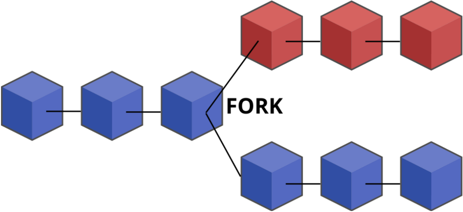


Temos duas abordagens para bifurcações: 

- SOFT FORK: um _soft fork_ , ou bifurcação suave, ocorre quando temos uma atualização no protocolo de forma a termos compatibilidade entre a bifurcação nova e antiga. Dessa forma, os nós que não foram atualizados ainda podem validar transações na nova versão.

---

<!-- pagina: 11 -->

**Vinicius Borges Aula 20** 

Aqui, a ideia é implementar uma atualização de forma gradual, objetivo manter, após a implementação total, uma só rede. 

- HARD FORK: o _hard fork_ , ou bifurcação dura, consiste numa implementação abrupta de uma nova rede, de forma que a nova implementação não seja compatível com a antiga. Nesse caso, teremos a coexistência de duas ou mais redes distintas. 

(Inédita - Prof. Felipe Mathias) Acerca das bifurcações em _blockchains_ , julgue o item abaixo. 

Um conglomerado de empresas criou sua blockchain privada, que permitia o uso por parte de todas as suas subsidiárias. Nesse contexto, a empresa Alpha pretendia sair desse conglomerado e, para continuar usando a _blockchain_ , criou uma nova implementação de forma abruta, a partir do código antigo, mas com uma nova rede privada sem compatibilidade com a rede antiga. Na situação narrada, podemos dizer que houve um _hard fork_ . 

Comentários: 

Perfeito! A chave para entende se a abordagem é um _soft_ ou _hard fork_ é entender se: 

###### 1) As redes possuem retrocompatibilidade 

- 2) Após a implementação total, as redes coexistem ou somente uma delas existirá 

Na questão, como teremos duas redes coexistindo sem compatibilidade entre ambas, podemos apontar que foi implementado um _hard fork_ . ( Gabarito: Correto)

---

<!-- pagina: 12 -->

**Vinicius Borges Aula 20** 

### Consenso 

Como comentei a vocês, as transações nas _blockchain_ acontecem de forma descentralizada - através do que chamamos de algoritmos de consenso . São elas que garantem tanto a autenticidade quanto a integridade das transações. 

Relembrando lá das aulas de Segurança da Informação, autenticidade refere-se à garantia de que a origem ou a identidade de uma entidade, como um usuário ou uma transação, é genuína e verificável. Em contextos de _blockchain_ , a autenticidade é alcançada por meio de técnicas como assinaturas digitais , onde o remetente utiliza sua chave privada para assinar a transação. 


<!-- Start of picture text -->
==5460==<br><!-- End of picture text -->

Já a integridade diz respeito à preservação da qualidade original e à ausência de alterações não autorizadas nos dados ou informações. Em uma blockchain, a integridade é mantida por meio do uso de funções hash criptográficas , que geram identificadores únicos para cada bloco, permitindo que qualquer alteração nos dados seja prontamente detectada. 

(QUADRIX/CRO SC/2023) No que diz respeito às novas tecnologias, julgue o item. 

~~Em~~ cada transação efetuada, na tecnologia Blockchain, uma chave criptografada única é gerada a partir de uma rede de verificação de aceitabilidade do código, o que torna a transação segura e irreversível. 

Comentários: 

Certinho, galera! Lembrem, lá de quando estudamos segurança da informação, que a criptografia que garante a autenticidade é a assimétrica, quando assinamos com a chave privada do remetente. A _blockchain_ utiliza esse mesmo conceito para dar autenticidade às transações. ( Gabarito: Correto) 

Existem duas abordagens de consenso para validação em _blockchains_ , que são, na verdade, o grande paradigma de discussão na otimização das redes: a abordagem de Proof of Work (prova de trabalho) e a abordagem de Proof of Stake (prova de participação).

---

<!-- pagina: 13 -->

**Vinicius Borges Aula 20** 


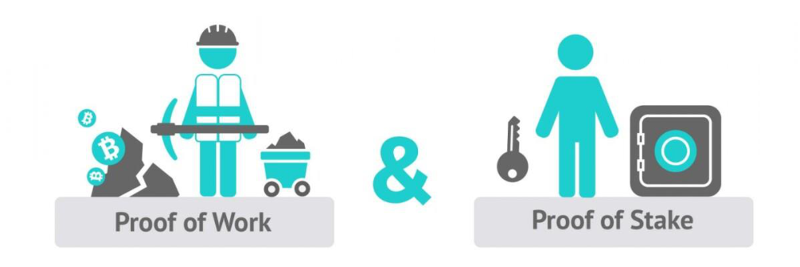


#### Proof of Work (PoW) 

A Proof of Work (PoW) é a metodologia mais difundida, já que é a utilizada pela blockchain do Bitcoin, e foi utilizada pela blockchain do Ethereum até a ocorrência do _soft fork_ , que mudou a abordagem para Proof of Stake. Quando você ouve alguém falando que está "minerando criptomoedas" , eles estão fazendo uma prova de trabalho . 

Neste modelo de consenso, cada um dos nós age como um minerador, competindo entre si para resolver as operações matemática complexas, que envolvem criptográficas de um bloco. Quando uma unidade computacional consegue resolver esse quebra-cabeça criptográfico, que é implementado pelo _hashcash_ , ele ganha o direito de adicionar o bloco à rede. 

Com isso, cada rede escolhe uma forma de recompensar a unidade pelo trabalho. A rede do Bitcoin, por exemplo, recompensa o usuário com uma quantidade de moedas representativas da rede - e é isso que dá origem às criptomoedas, uma forma de recompensa pelo trabalho realizado. 

A grande vantagem do PoW é a segurança , devido à grande complexidade empregada nos _hashes_ , o que gera uma exigência computacional para solução. Dessa forma, para alterar algum bloco anterior, já que cada bloco contém uma referência aos bloco anteriore, um ataque teria de calcular o _hash_ de todos os blocos posteriores, o que torna um ataque matematicamente inviável. 

Porém, essa complexidade é uma faca de dois gumes. O PoW exige muito dos computadores, fazendo com, que as transações sejam lentas, e gerando altos consumos de energia - levando a mineração de criptomoedas a serem banidas em algumas localidades. Além disso, quanto mais potente o poder computacional do usuário, mais provável que ele seja o primeiro a "desvendar" o bloco, quebrando um pouco da descentralização, que é tão importante para as redes. 

#### Proof of Stake (PoS)

---

<!-- pagina: 14 -->

**Vinicius Borges Aula 20** 

A Proof of Stake (PoS) , ao invés de usar o trabalho de mineração, usa o que chamamos de validadores . Aqui os usuários "travam", congelam, uma quantidade de ativos da rede específica (usualmente criptomoedas), e, ao fazer isso, ganham direito de processar e validar as transações. 

É basicamente uma autoridade garantida para quem tem muitas moedas da rede - afinal, quem tem uma grande monta investida na _blockchain_ irá prezar pelo seu bom funcionamento, garantindo que todas as transações sejam legítimas. Quanto mais moedas, maior o poder de processamento do nó. 

Dessa forma, a PoS garante a proteção da rede a partir de um ponto de vista financeiro: se alguém quiser atacar e validar transações falsas, teria de desembolsar uma grande monta para adquirir o direito. 

O ponto negativo imagino que vocês já tenham "pescado" - a concentração do poder de validação em quem possui maior poder financeiro. Como muitas das _blockchains_ são criadas como alternativas anárquicas a governos, justamente pregando por decisões populares e descentralizadas, isso fere profundamente os princípios da rede. 

Porém, assim temos mais eficiência energética, barreiras de entrada mais baixas (já que sai mais _hardware_ caro comprar um potente do que adquirir moedas suficientes para processar transações). 

#### Proof of History (PoH) 

O Proof of History (PoH) trabalha de uma forma híbrida. Essa abordagem foi desenvolvida pela rede Solana , uma das maiores em transações diárias (a 5a maior, para ser mais exato - movimentando cerca de US$3.5bi em 24h). 

O PoH não age como mecanismo principal, e sim como forma complementar ao PoS, que é a abordagem principal da rede. Aqui, o PoH cria uma sequência de eventos temporais verificáveis que implementam um conceito criptográfico chamado de função de atraso , que permite a verificação temporal da transação.

---

<!-- pagina: 15 -->

**Vinicius Borges Aula 20** 


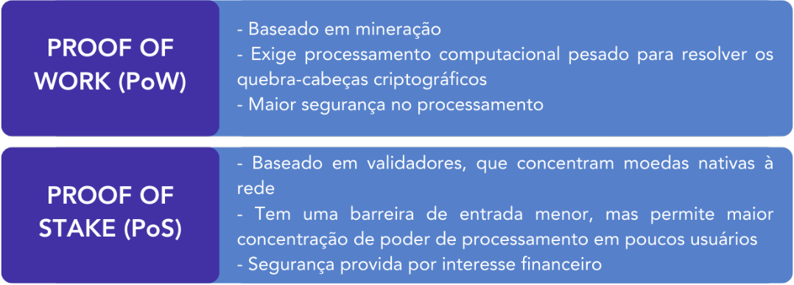


(Inédita - Prof. Felipe Mathias) João deseja iniciar no mundo da validação de transações em _blockchains_ , porém conta com um orçamento baixo para adquirir equipamentos computacionais. 

Nesse contexto, julgue o item abaixo. 

É mais indicado que João estude entrar em validações do tipo Proof of Stake (PoS), devido à barreira de entrada financeira ser mais baixa. 

Comentários: 

Para trabalharmos com o Proof of Work, devemos investir pesado em poder computacional, afinal competiremos com outros grandes do mercado, que também querem ser os primeiros a descriptografar um bloco. 

Já no Proof of Stake, João pode analisar em quais _blockchains_ ele possui poder financeiro suficiente para entrar como validador, fornecendo uma barreira de entrada menor. ( Gabarito: Correto)

---

<!-- pagina: 16 -->

**Vinicius Borges Aula 20** 

### Aplicações e Contratos Inteligentes 

As _blockchains_ tem diversas aplicabilidades. A primeira, e mais óbvia, é para o registro de transações financeiras. Como as redes são globais, podemos fazer transações entre diferentes países, de forma segura e auditável, sem a necessidade de passar por barreiras burocráticas. 

Um caso interessante, que acabou gerando repercussão, foi do empresário Roberto Justus, que, em entrevista, declarou ter comprado uma casa nos Estados Unidos através de uma transação na _blockchain_ da rede Ethereum. No contexto, Justus apontou a facilidade da transação que, apesar de demorar um certo tempo para ser processada, é muito mais veloz que transações internacionais, devido à ausência de barreiras. 

## APLICAÇÕES DA BLOCKCHAIN 


<!-- Start of picture text -->
Transações  Contratos  Aplicativos<br>NFTs<br>financeiras inteligentes Descentralizados<br><!-- End of picture text -->

#### Smart Contracts 

Existem outros usos para as _blockchains_ . O primeiro uso que se destaca é o de contratos inteligentes , ou _smart contracts_ . Esses contratos, apesar do nome, são programas de computador autoexecutáveis, que executam acordos, termos ou condições de um contrato , de forma automatizada, sem a necessidade de intervenção humana. A ideia é automatizar e garantir a execução transparente e confiável dos contratos, eliminando a necessidade de terceiros. 

Por exemplo, imagine que você pegou um empréstimo de um banco e deixou determinado imóvel como garantia. Na "vida real", o banco teria de usar terceiras para executar a garantia - já em contratos inteligentes, a execução se dá de forma automática. 

(CEBRASPE/TCE SC/2022) As transformações digitais e o uso de tecnologias disruptivas constituem grandes desafios, especialmente em se tratando de seus aspectos jurídicos. A esse respeito, julgue o item seguinte. 

A adoção de contratos inteligentes em determinados negócios jurídicos facilita a atuação jurisdicional, uma vez que a inexistência de pessoas nas posições contratuais dificulta a criação de embaraços ao cumprimento de ordens judiciais. 

Comentários:

---

<!-- pagina: 17 -->

**Vinicius Borges Aula 20** 

Como vimos, é muito pelo contrário: a ausência do fator humano facilita a execução do contrato, <u>por retirar os embaraços ao cumprimento da ordem. (</u> Gabarito: Errado) 

#### DApps 

A partir dos contratos inteligentes, podemos ter vários usos. Os aplicativos descentralizados (DApps) , programas de software que rodam de forma descentralizada. Eles fazem o uso dos contratos inteligentes para executar o que aplicações tradicionais precisariam de intervenção humana. O caso mais tradicional são as _swaps_ , aplicações para trocas de _tokens_ de diferentes _blockchains_ . 

Digamos que você foi recompensando por minerar um bloco, com Bitcoins, mas o que você deseja comprar está em Eth, a moeda da rede Ethereum. Nesse caso, as _swaps_ fazem a troca automática (como uma casa de câmbio) entre as duas moedas. 

#### NFTs 

O último uso que veremos são os Tokens Não Fungíveis , ou NFTs . Eles são representações virtuais exclusivas e indivisíveis de algum ativo ou item, em ambientes digitais. Cada NFT é único, possuindo informações exclusivas que o tornam identificável de forma inequívoca.

---

<!-- pagina: 18 -->

**Vinicius Borges Aula 20** 


Além da identificação exclusiva, cada NFT é indivisível , isso é, ele é a unidade mínima possível de algum token. Isso é importante pois, no contexto das _blockchains_ , as criptomoedas são ativos divisíveis, podemos ter frações de uma moeda (assim como temos frações de um real). Porém, os NFTs sempre representarão uma unidade só. 

A criação de NFTs é feita a partir de contratos inteligentes, usando padrões específicos. A rede Ethereum, que é a que recebe maior destaque nesse contexto, utiliza, normalmente, o padrão ERC-721 , ou _Ethereum Request for Comment_ 721. Ele estabelece uma estrutura comum, tanto para a criação, quanto para o gerenciamento desses ativos, permitindo rastreabilidade, transferibilidade e autenticidade. 

Um tempo atrás, tivemos o _boom_ das realidades virtuais (ou metaversos), com grandes empresas aderindo ao movimento. No contexto da _blockchain_ , temos a Decentraland, um DApp baseado na rede Ethereum que cria ambientes de realidade virtual, permitindo comprar, vender e desenvolver propriedades e ativos virtuais. Essas transações de compra e venda só são possíveis pois cada propriedade no aplicativo é definido como um NFT. 

Aqui, apesar da imagem que coloquei no início dessa seção, é importante que você encare o assunto sem viés - não deixe se levar pela febre de NFTs de baleias, macacos, ou o que for, que

---

<!-- pagina: 19 -->

**Vinicius Borges Aula 20** 

surgiu entre 2020 e 2022. Os NFTs, hoje, são uma das aplicações mais importantes do contexto das _blockchains_ , servindo como registros para autenticação de contratos do mundo real. 

Num futuro não tão distante, existindo _blockchains_ oficiais de governos, poderemos ter registros de imóveis sendo implementados a partir de NFTs, sem a necessidade da operacionalização de cartórios físicos, diminuindo a burocracia e aumentando a segurança. 

(Inédita - Prof. Felipe Mathias) Acerca dos conhecimentos sobre blockchains, julgue o item abaixo. 

Os _smart contracts_ são programas autônomos executados em uma _blockchain_ , e sua característica fundamental é a capacidade de automatizar a execução de acordos e lógicas de negócios sem a necessidade de intervenção humana. Essa automação é possível graças à execução dos contratos inteligentes por nós descentralizados na rede, garantindo transparência, segurança e imutabilidade nas transações. 

Comentários: 

Os _smart contracts_ são, de fato, programas autônomos que operam em uma _blockchain_ , e sua capacidade de automatizar a execução de acordos e lógicas de negócios sem a necessidade de intermediários humanos é uma característica fundamental. A execução descentralizada por nós na rede contribui para a transparência, segurança e imutabilidade das transações. ( Gabarito: Correto) 

(CEBRASPE/TCE-SC/2022) As transformações digitais e o uso de tecnologias disruptivas constituem grandes desafios, especialmente em se tratando de seus aspectos jurídicos. A esse respeito, julgue o item seguinte. 

Ao contrário do que ocorre com os contratos tradicionais, a execução dos contratos inteligentes ( _smart contracts_ ) implementados com a tecnologia blockchain pode ser automatizada, o que proporciona a mitigação de riscos, dada a previsibilidade garantida pelos códigos programados com base nessa tecnologia. 

Comentários: 

A grande vantagem, o grande motivo, para utilizarmos os contratos inteligentes é justamente essa automação, de forma que, caso os termos do contrato sejam incorridos, teremos a execução do mesmo sem nenhuma forma de remediação. Portanto, correto o apontamento da questão. ( Gabarito: Correto)

---

<!-- pagina: 20 -->

**Vinicius Borges Aula 20** 

### Distributed Ledger Techonology (DLT 

As Distrbuted Ledger Technology (DLT) , ou tecnologia de _ledger_ distribuída, numa tradução literal, é um banco de dados digital com informações copiadas, compartilhadas e sincronizadas, espalhadas por vários pontos geográficos, chamados de nós, em um ecossistema ou uma rede. 

_Ledger_ é um termo em inglês que significa "registro contábil", podendo também ser traduzido como "livro razão", em alguns casos - principalmente no contexto do DLT 

Aqui, não há uma administração centralizada, como um governo ou um banco. Em vez disso, temos um sistema sincronizado, que fornece um histórico verificável e auditável de informações, que podem ser acessadas por qualquer um que fizer parte da rede. Essa verificação é feita numa rede P2P (peer-to-peer), utilizando algoritmos de consenso. 

Agora você deve estar se perguntando: "ué, então _blockchain_ e DLT são a mesma coisa?" 


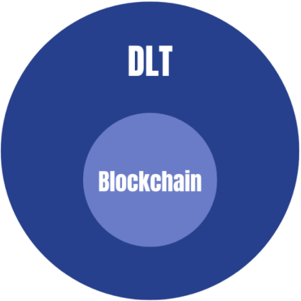


Mais ou menos! Toda _blockchain_ é considerada uma DLT. Porém, nem toda DLT é uma _blockchain_ , isso pois a estrutura dos dados da DLT não necessariamente segue a estrutura de blocos. Ela pode usar uma estrutura de grafos, estruturas de dados tradicionais, entre outros. 

Nesse contexto, muitos bancos já testaram DLTs para sistemas de pagamento. Atualmente, temos a Veris, plataforma que lida com venda de ações e é usada por grandes grupos, como BlackRock, Goldman & Sachs e Citigroup. Ela funciona como uma plataforma de pósconfirmação, isso é, uma confirmação gerada após a transação "na vida real", para garantir mais estabilidade e 

segurança à transação. 

(QUADRIX/CRO SC/2023) No que diz respeito às novas tecnologias, julgue o item. 

A tecnologia Blockchain baseia-se no conceito de DLT (Distributed Ledger Technology) — um livro-razão distribuído. 

Comentários:

---

<!-- pagina: 21 -->

**Vinicius Borges Aula 20** 

Correto, galera! Um pouco de "imprecisão", já que a _blockchain_ não se baseia no conceito de DLT, ela é uma DLT. Mas, tirando essa implicância minha e abrindo um pouco de licença poética, correta a questão. ( Gabarito: Correto)

---

<!-- pagina: 22 -->

**Vinicius Borges Aula 20** 

### Sidechains (L2) 

As sidechains , também chamadas de Layer 2 (L2) , são redes secundárias e independentes, que se conectam a uma blockchain principal,  usualmente referida pelo termo de mainnet . Essa conexão é feita através de uma ponte bidirecional , utilizando um protocolo de encadeamento comumente chamado de Two-way PEG , derivado do _pegging_ , em inglês. 


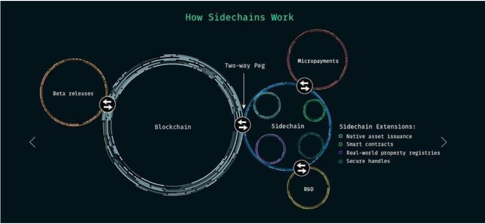


Usualmente as _sidechains_ são propostas para atacar alguns problemas nativos da rede principal. Por exemplo, no Ethereum, o _gas_ (de gasolina, que se refere ao custo da transação) costuma ser muito alto, levando a custos de transações elevados. Redes secundárias, como o Polygon, que foca na escalabilidade, permitindo a produção de dApps e oferecendo custos menores para uma transação. 

A ligação bidirecional é o que permite os dados fluírem de uma rede para a outra. Então, ainda no Ethereum, digamos que você tem posse de 1 Eth (moeda da rede) na rede principal, essa conexão bidirecional permite que esse recurso original seja bloqueado na rede de origem, garantindo o desbloqueio de uma quantidade proporcional (monetariamente falando) na rede secundária. Então esse processo passa a impressão de transferência de um token de uma rede a outra. Tudo isso garantido através dos contratos inteligentes . 

Como o objetivo das L2s usualmente é conceder uma maior escalabilidade, usa-se uma solução chamada de Rollup . Essa solução permite que um conjunto de transações seja comprimido, ou "enrolado" (daí o nome rollup), em uma única transação ou lote, que então é enviado para registro na mainnet. Atualmente, dois tipos de soluções de _rollup_ são implementadas - os Rollups Otimistas , e os Zero-Knowledge (zk) Rollups .

---

<!-- pagina: 23 -->

**Vinicius Borges Aula 20** 

Nos Rollups otimistas , supomos que todas as transações são válidas por padrão. Porém, há um período de contestação durante o qual os validadores podem verificar e contestar qualquer fraude. Os contratos inteligentes na mainnet mantêm a verificação de integridade das transações, e se uma transação fraudulenta for detectada durante o período de contestação, uma prova de fraude pode ser submetida para corrigir o erro. 

Já os zk Rollups , ao invés de confiarem na hipótese otimista, usa uma validação imediata por meio de provas de conhecimento zero (ZK-proofs), que são compactas e fornecem uma validação criptográfica de que as transações são válidas. As transações são garantidas on-chain por meio de provas ZK, o que elimina a necessidade de um período de contestação, pois as provas já fornecem a validade antes do registro. 

Então, de forma geral, temos uma rede que é capaz de processar inúmeras transações e que as registra em lote na rede principal, aumentando - e muito - a velocidade de validação das operações. 

(Inédita/Prof. Felipe Mathias) Julgue o item abaixo, acerca dos conhecimentos sobre Blockchains. 

A sidechain é uma solução de escalabilidade que permite transferências bidirecionais de ativos entre a rede principal (mainnet) e a sidechain, sendo que as transações na sidechain são validadas independentemente da mainnet e, por isso, não necessitam de garantias de segurança ou de consenso da rede principal. 

Comentários: 

O item está incorreto. As sidechains permitem transferências bidirecionais de ativos entre a rede principal (mainnet) e a sidechain, no entanto, as transações na sidechain requerem algum tipo de mecanismo para garantir sua segurança e conexão com a mainnet. Mesmo que as transações sejam validadas independentemente na sidechain, elas ainda dependem de contratos inteligentes ou outros métodos na mainnet para assegurar a paridade de valor dos ativos e prevenir fraudes. A segurança da sidechain não é completamente autônoma da mainnet, especialmente quando há transferência de valor entre as redes. _(Gabarito: Errado)_

---

<!-- pagina: 24 -->

**Vinicius Borges Aula 20** 

### Solidity 

Solidity é uma linguagem de programação criada para operar em _blockchains_ , especificamente sobre contratos inteligentes . Ela é uma linguagem amplamente utilizada na rede Ethereum, tanto que hoje existem carreiras diversas de especialistas em contratos inteligentes através do Solidity. Como a linguagem é muito utilizada pela rede Ethereum, usaremos ela como base para alguns conceitos da linguagem. 

_Os contratos inteligentes da rede Ethereum rodam num ambiente de virtual de execução chamado de Ethereum Virtual Machine. Cada transação da rede, derivada da execução de um contrato, exige um esforço computacional para ser realizada, já que temos que processar as informações, criptografar etc. Esse esforço computacional é denominado gas (de gasoline). Podemos definir um limite, de quanto o usuário estaria disposto a gastar para determinada transação, e quanto esse esforço é representado em bases monetárias, usualmente em frações de Ether (moeda da rede), denominadas Gwei._ 

A linguagem Solidity é uma linguagem de alto nível, assim como Python e JavaScript. Ela foi projetada para ser simples de aprender para programadores com experiência em outras linguagens modernas, mas com especificidades próprias devido à natureza distribuída e imutável das blockchains. Graças a isso, dizemos que o Solidity é uma linguagem orientada a contratos . 

Veja uma estrutura básica de Solidity: 


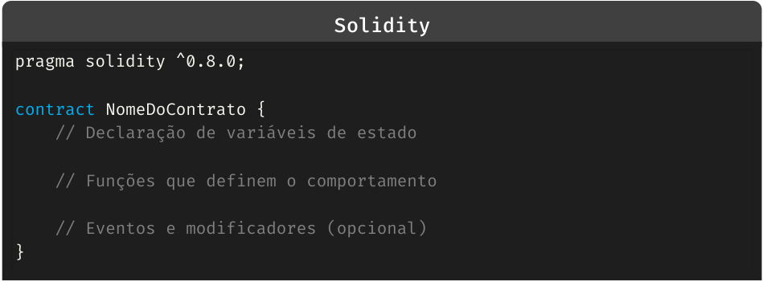


<!-- Start of picture text -->
Solidity<br>pragma solidity ^0.8.0;<br>contract NomeDoContrato {<br>    // Declaração de variáveis de estado<br>    // Funções que definem o comportamento<br>    // Eventos e modificadores (opcional)<br>}<br><!-- End of picture text -->

Acima, a primeira linha, com pragma solidity, inda a versão da linguagem sendo utilizada. Em seguida, a operação contract indica que estamos formando um contrato. Vamos explorar as três opções que aparecem comentadas no código. 

#### Variáveis

---

<!-- pagina: 25 -->

**Vinicius Borges Aula 20** 

As variáveis em Solidity são usadas para armazenar dados . Elas podem ser armazenadas na blockchain ou apenas usadas durante a execução do contrato. As variáveis de estado são armazenadas permanentemente no storage da blockchain, enquanto variáveis temporárias podem ser usadas na memória. As variáveis de estado são quaisquer variáveis que não são declaradas dentro de uma função. 

# <mark>VARIÁVEIS DE ESTADO → ARMAZENADAS NA BLOCKCHAIN VARIÁVEIS TEMPORÁRIAS → ARMAZENADAS EM MEMÓRIA</mark> 

O Solidity suporta alguns tipos tradicionais de variáveis, além de tipos específicos. Veja: 

|Tipo|Descrição|
|---|---|
|Inteiro (int)|Inteiros com sinal, ou seja,podem serpositivos ou negativos|
|Inteiro (uint)|Inteiros sem sinal, ou seja, somente números não negativos.|
|Boolean (bool)|Valores booleanos - true ou falso|
|Endereços (address)|Armazena endereços da rede Ethereum, um valor com 20 bytes<br>de comprimento|
|Strings (string)|Armazena blocos de caracteres|
|Bytes (bytes)|Armazena dados binários|
|Arrays [ ]|Arrays de dados, de tamanho fixo ou dinâmico.|
|Struct|Estruturapara criar tipos de dadospersonalizados|


Deixando claro que o Solidity é uma linguagem de tipagem estática . Portanto, devemos declarar o tipo de dado sempre que criarmos uma variável. Veja alguns exemplos: 

###### `Solidity` 

```
uint public balance = 1000; // Inteiro sem sinal
int public temperature = -20;  // Inteiro com sinal
address public owner = msg.sender;  // Armazena o endereço
uint[3] public fixedArray = [1, 2, 3];  // Array de inteiros com 3
elementos
```

```
uint[] public dynamicArray; // Array de tamanho dinâmico
```

---

<!-- pagina: 26 -->

**Vinicius Borges Aula 20** 

Podemos aplicar modificadores de variáveis . Esses modificadores mudam o local em que a variável é armazenada na memória, afetando a durabilidade do dado e, consequentemente, o custo de _gas_ para se executar o contrato. Os principais modificadores são: 

- Storage: o espaço onde as variáveis de estado (as variáveis declaradas no escopo do contrato) são armazenadas. Ele é persistente, ou seja, os dados são gravados permanentemente na blockchain. 

- Memory: é usado para armazenar variáveis temporárias dentro de funções. As variáveis declaradas como memory são descartadas após a execução da função. 

- Calldata: é uma região de memória somente leitura onde os argumentos de função externa são armazenados. 

Além disso, é possível criar locais constantes ou imutáveis para armazenar dados. É ideal que dados que não serão modificados sejam armazenados como esses tipos, pois há economia de _gas_ . As constantes são usadas quando definimos seu valor no momento da sua declaração, enquanto as imutáveis tem seu valor atribuído em um momento posterior à sua definição - lembrando que essa atribuição pode ocorrer uma única vez. 

###### `Solidity` 

```
uint public constant MAX_SUPPLY = 1000000; //constante
```

```
address public immutable owner;
```

```
constructor() {
    owner = msg.sender;  // Atribui o valor à immutable owner
}
```

#### Funções 

As funções dentro do Solidity seguem a estruturação padrão de funções, com algumas diferenciações únicas. Ele conta com a seguinte sintaxe genérica: 

function nomeDaFuncao(params) visibilidade modificadores returns (tipoDeRetorno) { // Lógica da função 

- } 

A visibilidade se refere ao nível de acesso da função. Elas podem ser: 

- _public_ , indicando que a função pode ser chamada de qualquer lugar, tanto de dentro do contrato quanto de fora. 

- _private_ , que indica que ela só poderá ser chamada internamente, dentro do próprio contrato em que essa determinada função for declarada.

---

<!-- pagina: 27 -->

**Vinicius Borges Aula 20** 

- _internal ,_ indicando que a função só pode ser chamada dentro do contrato atual, ou de outros que o herdem. Muito similar ao _private_ , mas incluindo o conceito de herança. 

- _external_ , indicando que a função só pode ser chamada externamente ao contrato. 

E, assim como nas variáveis, temos os modificadores de estado. Temos três modificadores principais aqui - _view_ , que indica que a função não irá alterar o estado do contrato, apenas ler os dados; _pure_ , que indica que a função não lê nem modifica o estado do contrato, servindo para cálculos internos; _payable_ , que indica que a função pode receber Ether. 

Outro ponto único é a especificação dos retornos. Regra geral, se não houver _return(tipo_de_dado)_ na função, essa função não gerará nenhum retorno. Ao especificarmos esse trecho de código, especificamos que haverá um retorno, e o tipo específico de retorno que será trazido pela função. Por exemplo, se tivermos um retorno em 2 valores diferentes do tipo _uint_ , usaríamos (...) _returns (uint, uint) { return (valor1, valor2); }_ . 

Além das funções customizadas, temos duas funções nativas muito importantes em Solidity - a _fallback()_ e a _receive()_ . Essas são funções associadas ao modificador _payable_ , ou seja, envolvem o pagamento ou recebimento de Ether na função. 

A _receive()_ é usada exclusivamente para receber Ether. Ela é acionada quando o contrato recebe Ether sem dados de transação associados. Já a _fallback()_ é usada como uma função "catch-all" para lidar com chamadas de função inválidas ou receber Ether (quando não há uma função _receive_ ou se dados adicionais forem enviados junto com a transação). 

#### Eventos 

Um evento em Solidity é uma maneira de registrar informações na blockchain, que podem ser acessadas externamente por outras aplicações ou interfaces, como aplicativos descentralizados (dApps), sem impactar o desempenho do contrato inteligente. 

Quando um evento é disparado (ou emitido) durante a execução de uma função, uma transação de log é criada na blockchain . Esses logs são armazenados de maneira eficiente e podem ser consultados de fora da blockchain, como por meio de APIs. Os eventos não afetam diretamente o estado do contrato inteligente, ou seja, eles são usados apenas para registrar informações, não para alterar variáveis de estado. 

A sintaxe geral de um evento é: 

event NomeDoEvento(tipo parametro1, tipo parametro2); 

Após criado um evento, ele precisa ser emitido com a palavra-chave _emit_ . Veja um exemplo de um evento:

---

<!-- pagina: 28 -->

**Vinicius Borges Aula 20** 

###### `Solidity` 

```
event Transfer(address indexed from, address indexed to, uint amount);
```

```
function transfer(address _to, uint _amount) public {
// Lógica para transferência
emit Transfer(msg.sender, _to, _amount
}
```

Nesse código temos outro detalhe - a palavra-chave _indexed_ . Ela é usada para marcar até três parâmetros de um evento como indexados. Isso significa que esses parâmetros podem ser usados como filtros ao pesquisar logs da blockchain. Quando um parâmetro é indexado, ele pode ser pesquisado mais facilmente nas ferramentas de blockchain, o que facilita a busca por eventos específicos.

---

<!-- pagina: 29 -->

**Vinicius Borges Aula 20** 

# **RESUMO** 

#### O QUE É UMA BLOCKCHAIN? 

_Blockchain_ são bases de dados distribuídos, que consiste em um sistema descentralizado de registros, onde dados são armazenados em blocos encadeados de forma criptografada e imutável. Essa estrutura oferece transparência, segurança e resistência à censura, sendo frequentemente associada às criptomoedas, como o Bitcoin. 

#### O QUE SÃO OS BLOCOS? 

Os blocos são unidades fundamentais em uma blockchain, contendo transações validadas e um cabeçalho. O cabeçalho inclui o hash do bloco anterior, o _timestamp_ e um segredo criptográfico. Cada transação possui informações como remetente, destinatário e valor. A combinação de transações e informações do cabeçalho forma um bloco, sendo encadeados sequencialmente. 

#### O QUE SÃO FORKS? 

_Forks_ em _blockchain_ referem-se a divisões na cadeia de blocos, resultando em duas versões distintas. _Hard forks_ alteram as regras de consenso de forma incompatível, enquanto _soft forks_ são compatíveis. _Hard forks_ podem criar novas _blockchains_ , enquanto _soft forks_ buscam consolidação. Ambos podem ser planejados ou não planejados. 

#### O QUE SÃO AS FORMAS DE CONSENSO POW E POS? 

_Proof of Work (POW)_ e _Proof of Stake (POS)_ são algoritmos de consenso em _blockchains_ . POW exige que os participantes resolvam problemas computacionais complexos para validar transações, enquanto POS permite que os validadores criem blocos com base na quantidade de criptomoeda que possuem e estão dispostos a "apostar" como garantia. 

#### O QUE SÃO CONTRATOS INTELIGENTES? 

Contratos inteligentes são programas autoexecutáveis que operam em uma _blockchain_ . Eles automatizam a execução de acordos, sem a necessidade de intermediários. Os contratos inteligentes são escritos em linguagens de programação específicas e executam automaticamente quando as condições predefinidas são atendidas.

---

<!-- pagina: 30 -->

**Vinicius Borges Aula 20** 

#### O QUE É UMA DLT? 

Uma _Distributed Ledger Technology (DLT)_ , ou Tecnologia de Registro Distribuído, é um conceito mais amplo que engloba a _blockchain_ . DLT refere-se a qualquer sistema descentralizado de registro e compartilhamento de dados, não necessariamente organizado em blocos encadeados.

---

<!-- pagina: 31 -->

**Vinicius Borges Aula 20** 

# **ESQUEMAS** 

## COMPONENTES DE UM BLOCO 


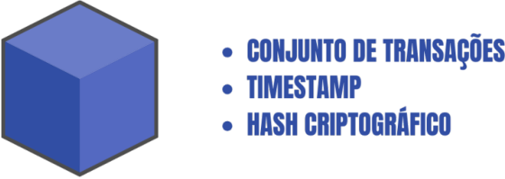


## REPRESENTAÇÃO DE UMA BIFURCAÇÃO/FORK 


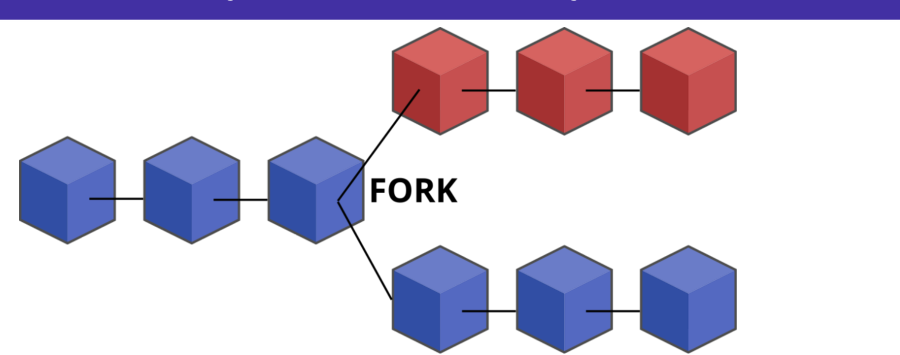


## PROOF OF WORK VS PROOF OF STAKE

---

<!-- pagina: 32 -->

**Vinicius Borges Aula 20** 


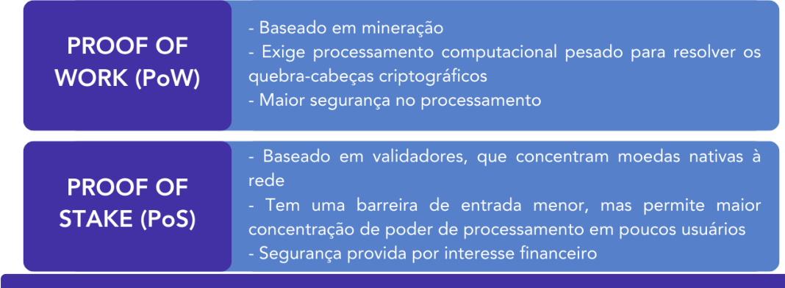


## APLICAÇÕES DA BLOCKCHAIN 

Transações financeiras 

Contratos Aplicativos NFTs inteligentes Descentralizados 

## DLT VS BLOCKCHAIN 


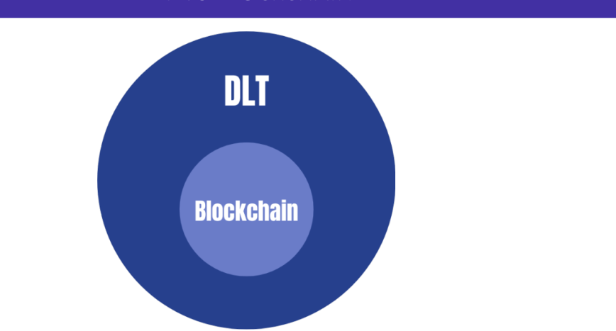

---

<!-- pagina: 33 -->

**Vinicius Borges Aula 20** 

# **QUESTÕES COMENTADAS** 

01. (IDECAN/COGERP SE/2023) Blockchain é uma tecnologia de registro distribuído que permite a criação de um registro compartilhado, seguro e confiável entre várias partes, sem a necessidade de uma autoridade central. Selecione a alternativa que mostra o algoritmo de Blockchain que garante que as transações sejam verificadas e adicionadas à cadeia de blocos de forma segura. 

- a) Hashing 

- b) Assinaturas digitais 

- c) PoS 

- d) RSA 

- e) PoW 

Comentários: 

Questão polêmica - isso porque ela apresenta dois gabaritos. Existem dois algoritmos de consenso, que são responsáveis por validar as operações: o Proof of Work (PoW) e o Proof of Stake (PoS). 

Dessa forma, tanto a letra C quanto a letra E são corretas, já que a banca não apontou uma forma de distinguirmos entre ambos. 

Gabarito da banca: Letra E Gabarito do Professor: Anulada 

02. (QUADRIX/CRECI 6 PR/2023) Em relação às novas tecnologias, julgue o item. 

A blockchain é uma tecnologia que não é exclusiva para as criptomoedas, ou seja, é uma plataforma que pode ser utilizada em diversos tipos de aplicação. 

###### CORRETO 

###### ERRADO 

Comentários: 

Perfeito! Como vimos, as criptomoedas são apenas um dos possíveis uso das _blockchains_ . Temos a implementação de aplicativos, contratos inteligentes, finanças descentralizadas, entre outros. 

Gabarito: Correto

---

<!-- pagina: 34 -->

**Vinicius Borges Aula 20** 

03. (QUADRIX/CRECI 6 PR/2023) Em relação às novas tecnologias, julgue o item. 

A blockchain é um banco de dados centralizado e facilmente manipulável. 

###### CORRETO 

ERRADO 

Comentários: 

Alguns erros basilares na questão. Primeiro, a _blockchain_ não é um banco de dados, e sim uma base de dados - uma coletânea de dados. Cada dado é uma transação que, de forma conjunta, formam os blocos. Outro ponto é que a _blockchain_ é descentralizada e, por ter segurança por _design_ , é extremamente difícil de ser manipulado. 


<!-- Start of picture text -->
==5460==<br><!-- End of picture text -->

Gabarito: Errado 

04. (CEBRASPE/DATAPREV/2023 ) Acerca de blockchain, conceitos de inteligência artificial, arquitetura hexagonal e gestão de conteúdo, julgue o item a seguir. 

A garantia de segurança e confiabilidade de um blockchain é feita por meio de uma terceira parte mediadora, cuja confiabilidade é publicamente aceita. 

CORRETO 

ERRADO 

Comentários: 

Cuidado! Apesar da validação acontecer por uma terceira parte, não é essa parte quem confere a garantia de segurança e confiabilidade. Quem confere esses aspectos é a própria rede, a própria _blockchain_ , através dos seus blocos interconectados. 

Gabarito: Errado 

05. (AOCP/IF MA/2023) A respeito do Blockchain, assinale a alternativa que apresenta sua principal característica. 

- a) Blockchain é uma base de dados centralizada que pode ser acessada apenas por usuários autorizados. 

- b) Blockchain é uma tecnologia voltada exclusivamente para o desenvolvimento de jogos eletrônicos. 

- c) Blockchain é uma rede social que permite a interação entre usuários através de mensagens criptografadas.

---

<!-- pagina: 35 -->

**Vinicius Borges Aula 20** 

- d) Blockchain é uma estrutura de dados distribuída e imutável que utiliza criptografia para garantir a segurança das transações. 

- e) Blockchain é um sistema de gerenciamento de projetos que prioriza a transparência e a colaboração entre os membros da equipe. 

Comentários: 

Vamos analisar cada afirmativa. 

- a) Errado. A _blockchain_ é descentralizada, e pode ser pública ou privada, a depender do caso. 

- b) Errado. Existem jogos desenvolvidos na rede, que usam primariamente as tecnologias de NFTs, mas não é seu uso exclusivo. 

- c) Errado. _Blockchain_ não é uma rede social. Existem iniciativas de redes sociais hospedadas nela, mas é um uso específico. 

- d) Correto. Perfeita a descrição da afirmativa. 

- e) Errado. A _blockchain_ não tem nada a ver com gerenciamento de projetos. 

Gabarito: Letra D 


06. (FUNDATEC/SEPOG RS/2022) De uma forma geral, um(a) _______________ é um software que funciona como um livro-razão distribuído pelos nós de uma rede. O que distingue esse livro-razão dos bancos de dados ou softwares tradicionais é a sua natureza de resistência à adulteração, pois a alteração dos dados de um bloco requer a manipulação de todos os outros blocos anteriores. 

Assinale a alternativa que preenche corretamente a lacuna do trecho acima. 

- a) Transformação digital 

- b) Contrato inteligente 

- c) Registro imutável 

- d) Blockchain 

- e) Repositório compartilhado 

Comentários: 

Pelas características apontadas no texto, podemos identificar claramente que se trata da _blockchain_ . Mas um adendo: a _blockchain_ não é um software! Ela é uma base de dados distribuída, que serve como _ledger_ (livro-razão). 

Gabarito: Letra D 

07. (QUADRIX/CRN 4/2022) Julgue o item, relativos às novas tecnologias, ao sistema operacional Windows 10 e ao Microsoft Outlook 2010.

---

<!-- pagina: 36 -->

**Vinicius Borges Aula 20** 

A blockchain é uma das novas tecnologias voltadas, exclusivamente, para a validação e a autenticação de informações bancárias. Essa ferramenta, entretanto, não consegue realizar algumas ações, como, por exemplo, prover integridade em sistemas de software distribuídos. 

CORRETO ERRADO 

Comentários: 

Alguns erros. Ela realiza a validação e autenticação de informações bancárias (se forem bancos descentralizados), mas isso é só uma funcionalidade, não o uso exclusivo. Além disso, a rede fornece integridade para sistemas distribuídos. Errada a afirmativa, portanto. 

Gabarito: Errado 

08. (QUADRIX/CRN 4/2022) Julgue o item, relativos às novas tecnologias, ao sistema operacional Windows 10 e ao Microsoft Outlook 2010. 

Existem diversas definições para o termo blockchain. Quando utilizado para nomear uma estrutura de dados, o termo blockchain refere-se a dados reunidos em unidades chamadas de blocos. 

CORRETO ERRADO 

Comentários: 

Questão um pouco mal escrita... não consigo encontrar "diversas" definições para _blockchain_ mas, de fato, quando ela nomeia a estrutura de dados distribuída e encadeada, os dados (transações) são reunidos em unidades chamadas de blocos. 

Gabarito: Correto 

09. (FCC/TJ CE/2022) Quanto à tecnologia de Blockchain pública, considere: 

- I. As transações são colocadas em blocos conjuntos em uma cadeia reversível. 

- II. Qualquer participante pode alterar uma transação depois de seu registro no livro-razão compartilhado. 

- III. Todos os participantes da rede têm acesso ao livro-razão distribuído e ao seu registro imutável de transações. 

Está correto o que se afirma APENAS em

---

<!-- pagina: 37 -->

**Vinicius Borges Aula 20** 

a) I. 

b) I e II. 

c) II. 

d) II e III. 

e) III. 

Comentários: 

###### Vamos analisar cada item. 

I. Errado. A cadeia é irreversível . 

II. Errado. Os blocos são imutáveis , portanto, não é possível fazer alterações. 

III. Correto. Tanto em redes públicas quanto privadas, se o usuário tem acesso à rede, ele deve ter acesso a todos os blocos de registro. 

Gabarito: Letra E 

10. (CEBRASPE/TCE-SC/2022) As transformações digitais e o uso de tecnologias disruptivas constituem grandes desafios, especialmente em se tratando de seus aspectos jurídicos. A esse respeito, julgue o item seguinte. 

O uso de contratos inteligentes, a despeito das dificuldades de sua regulação, tende a facilitar a criação e a modificação das normas contratuais. 

###### CORRETO 

ERRADO 

Comentários: 

De fato, há uma dificuldade em regular os contratos inteligentes. Porém, após implementados, eles são imutáveis , assim como os blocos da _blockchain_ (até porque eles fazem parte de blocos). Portanto, não há nenhuma facilidade na criação nem modificação das normas. 

Gabarito: Errado 

11. (QUADRIX/CRO RS/2022) A tecnologia baseada em um algoritmo matemático que identifica uma transação realizada virtualmente por meio de uma cadeia de blocos denomina-se 

- a) _big data_ . 

- b) inteligência artificial. 

- c) _blockchain_ .

---

<!-- pagina: 38 -->

**Vinicius Borges Aula 20** 

d) _machine learning_ . 

e) rede neural. 

Comentários: 

Tranquila, né? A tecnologia que implementa uma rede de blocos, criptografados com algoritmos matemáticos, é a _blockchain_ . 

Gabarito: Letra C 

12. (QUADRIX/CRMV SP/2022) No que se refere às novas tecnologias, julgue o item. 

A tecnologia blockchain utiliza criptografia para manter a privacidade do usuário. Ela é governada por seus usuários, ou seja, na rede, os usuários também contribuem para verificar as transações dos outros. 

Comentários: 

Cuidado! A criptografia é utilizada para dar autenticidade à origem da transação, e não para dar privacidade aos usuários. De fato, podemos ter privacidade, mas é pelas redes permitirem transações anônimas - mas essa privacidade sempre é discutível. 

Para você ter noção, existem casos em que certa transação fraudulenta precisou ser examinada, e o traço de auditoria dos blocos permitiu traçar uma rota até a carteira digital que originou essa transação. Não podemos dizer quem é o dono da carteira, já que ela é anônima, mas sabemos a origem. 

Gabarito: Errado 

13. (CEBRASPE/SERPRO/2021) Julgue o item a seguir, relativos a blockchain e smart contracts. Smart contracts são indicadores de desempenho em uma única página e seus fornecedores oferecem, tipicamente, um conjunto predefinido de relatórios com elementos estáticos e estrutura estanque. 

CORRETO ERRADO 

Comentários: 

Galera, essa questão não tem nem pé nem cabeça haha era pra pegar quem não tinha conhecimento nenhum de contratos inteligentes. Os _smart contracts_ são programas que

---

<!-- pagina: 39 -->

**Vinicius Borges Aula 20** 

implementam de forma automática cláusulas contratuais, termos e outros elementos, conforme suas condições são implementadas, eliminando a necessidade de terceiras partes no acordo. 

##### Gabarito: Errado 

###### 14. (CEBRASPE/SERPRO/2021) Julgue o item a seguir, relativos a _blockchain_ e _smart contracts_ . 

De acordo com a seguinte figura, _blockchain_ corresponde a uma lista ordenada de blocos em que cada bloco em um _blockchain_ é encadeado ao bloco anterior, de maneira a conter um _hash_ da representação do bloco anterior, e, assim, as transações históricas no _blockchain_ não podem ser excluídas ou alteradas sem se invalidar a cadeia de _hashes_ . 


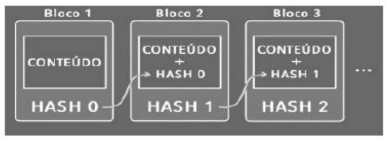


###### CORRETO ERRADO 

Comentários: 

Perfeito! Uma grande característica da _blockchain_ é a referência do bloco anterior dentro do _hash_ do bloco. Dessa forma aumentamos a segurança da rede, já que, para fraudar um bloco já processado, seria necessário desvendar o código hash de todos os blocos anteriores. 

##### Gabarito: Correto 

###### 15. (CEBRASPE/SERPRO/2021) Julgue o item a seguir, relativos a blockchain e smart contracts. 

Blockchain é uma plataforma de código aberto que foi a primeira capaz de executar a tecnologia de contratos inteligentes e aplicações descentralizadas, oferecendo confiança e consenso nas informações trocadas entre seus usuários. 

###### CORRETO 

###### ERRADO 

Comentários: 

A definição " _blockchain_ é uma plataforma de código aberto" é um pouco  errada. Primeiro que ela não é uma plataforma, e sim uma base de dados... segundo que nem sempre seu código será aberto - muitas vezes _blockchains_ privadas não divulgam seus códigos.

---

<!-- pagina: 40 -->

**Vinicius Borges Aula 20** 

Além disso, a tecnologia de contratos inteligentes foi crida antes das _blockchains_ , mas foi nelas que eles encontraram sua implementação ideal. 

Gabarito: Errado 

###### 16. (CEBRASPE/SERPRO/2021) Julgue o item a seguir, relativos a _blockchain_ e _smart contracts_ . 

Uma característica de _blockchain_ é o fato de que seus registros de dados são mantidos em um banco de dados distribuído e são protegidos contra adulteração e revisão até mesmo dos operadores dos nós do armazenamento de dados. 

###### CORRETO ERRADO 

Comentários: 

Eu não chamaria a _blockchain_ de um banco de dados, já que ele não oferece todas as propriedades que um banco de dados precisa, mas sim de uma base de dados, um repositório de dados distribuídos. E, de fato, eles são protegidos contra alterações e revisão, inclusive dos próprios operadores dos nós. Porém, mesmo com essa pequena impropriedade conceitual, a banca considerou a afirmativa correta. 

Gabarito: Correto

---

<!-- pagina: 41 -->

**Vinicius Borges Aula 20** 

# **LISTA DE QUESTÕES** 

01. (IDECAN/COGERP SE/2023) Blockchain é uma tecnologia de registro distribuído que permite a criação de um registro compartilhado, seguro e confiável entre várias partes, sem a necessidade de uma autoridade central. Selecione a alternativa que mostra o algoritmo de Blockchain que garante que as transações sejam verificadas e adicionadas à cadeia de blocos de forma segura. 

   - a) Hashing 

   - b) Assinaturas digitais 

   - c) PoS 

   - d) RSA 

   - e) PoW 

02. (QUADRIX/CRECI 6 PR/2023) Em relação às novas tecnologias, julgue o item. 

A blockchain é uma tecnologia que não é exclusiva para as criptomoedas, ou seja, é uma plataforma que pode ser utilizada em diversos tipos de aplicação. 

###### 03. (QUADRIX/CRECI 6 PR/2023) Em relação às novas tecnologias, julgue o item. 

A blockchain é um banco de dados centralizado e facilmente manipulável. 

04. (CEBRASPE/DATAPREV/2023 ) Acerca de blockchain, conceitos de inteligência artificial, arquitetura hexagonal e gestão de conteúdo, julgue o item a seguir. 

A garantia de segurança e confiabilidade de um blockchain é feita por meio de uma terceira parte mediadora, cuja confiabilidade é publicamente aceita. 

05. (AOCP/IF MA/2023) A respeito do Blockchain, assinale a alternativa que apresenta sua principal característica. 

- a) Blockchain é uma base de dados centralizada que pode ser acessada apenas por usuários autorizados. 

- b) Blockchain é uma tecnologia voltada exclusivamente para o desenvolvimento de jogos eletrônicos. 

- c) Blockchain é uma rede social que permite a interação entre usuários através de mensagens criptografadas. 

- d) Blockchain é uma estrutura de dados distribuída e imutável que utiliza criptografia para garantir a segurança das transações.

---

<!-- pagina: 42 -->

**Vinicius Borges Aula 20** 

- e) Blockchain é um sistema de gerenciamento de projetos que prioriza a transparência e a colaboração entre os membros da equipe. 

06. (FUNDATEC/SEPOG RS/2022) De uma forma geral, um(a) _______________ é um software que funciona como um livro-razão distribuído pelos nós de uma rede. O que distingue esse livro-razão dos bancos de dados ou softwares tradicionais é a sua natureza de resistência à adulteração, pois a alteração dos dados de um bloco requer a manipulação de todos os outros blocos anteriores. 

Assinale a alternativa que preenche corretamente a lacuna do trecho acima. 

- a) Transformação digital 

- b) Contrato inteligente 

- c) Registro imutável 

- d) Blockchain 

- e) Repositório compartilhado 

07. (QUADRIX/CRN 4/2022) Julgue o item, relativos às novas tecnologias, ao sistema operacional Windows 10 e ao Microsoft Outlook 2010. 

A blockchain é uma das novas tecnologias voltadas, exclusivamente, para a validação e a autenticação de informações bancárias. Essa ferramenta, entretanto, não consegue realizar algumas ações, como, por exemplo, prover integridade em sistemas de software distribuídos. 

08. (QUADRIX/CRN 4/2022) Julgue o item, relativos às novas tecnologias, ao sistema operacional Windows 10 e ao Microsoft Outlook 2010. 

Existem diversas definições para o termo blockchain. Quando utilizado para nomear uma estrutura de dados, o termo blockchain refere-se a dados reunidos em unidades chamadas de blocos. 

09. (FCC/TJ CE/2022) Quanto à tecnologia de Blockchain pública, considere: 

   - I. As transações são colocadas em blocos conjuntos em uma cadeia reversível. 

   - II. Qualquer participante pode alterar uma transação depois de seu registro no livro-razão compartilhado. 

III. Todos os participantes da rede têm acesso ao livro-razão distribuído e ao seu registro imutável de transações. 

Está correto o que se afirma APENAS em

---

<!-- pagina: 43 -->

**Vinicius Borges Aula 20** 

a) I. 

b) I e II. 

c) II. 

d) II e III. 

e) III. 

10. (CEBRASPE/TCE-SC/2022) As transformações digitais e o uso de tecnologias disruptivas constituem grandes desafios, especialmente em se tratando de seus aspectos jurídicos. A esse respeito, julgue o item seguinte. 

O uso de contratos inteligentes, a despeito das dificuldades de sua regulação, tende a facilitar a criação e a modificação das normas contratuais. 

11. (QUADRIX/CRO RS/2022) A tecnologia baseada em um algoritmo matemático que identifica uma transação realizada virtualmente por meio de uma cadeia de blocos denomina-se 

- a) _big data_ . 


   - b) inteligência artificial. 

   - c) _blockchain_ . 

   - d) _machine learning_ . 

   - e) rede neural. 

12. (QUADRIX/CRMV SP/2022) No que se refere às novas tecnologias, julgue o item. 

A tecnologia blockchain utiliza criptografia para manter a privacidade do usuário. Ela é governada por seus usuários, ou seja, na rede, os usuários também contribuem para verificar as transações dos outros. 

13. (CEBRASPE/SERPRO/2021) Julgue o item a seguir, relativos a blockchain e smart contracts. 

Smart contracts são indicadores de desempenho em uma única página e seus fornecedores oferecem, tipicamente, um conjunto predefinido de relatórios com elementos estáticos e estrutura estanque. 

14. (CEBRASPE/SERPRO/2021) Julgue o item a seguir, relativos a _blockchain_ e _smart contracts_ .

---

<!-- pagina: 44 -->

**Vinicius Borges Aula 20** 

De acordo com a seguinte figura, _blockchain_ corresponde a uma lista ordenada de blocos em que cada bloco em um _blockchain_ é encadeado ao bloco anterior, de maneira a conter um _hash_ da representação do bloco anterior, e, assim, as transações históricas no _blockchain_ não podem ser excluídas ou alteradas sem se invalidar a cadeia de _hashes_ . 


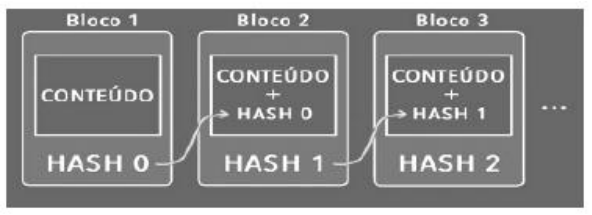


15. (CEBRASPE/SERPRO/2021) Julgue o item a seguir, relativos a blockchain e smart contracts. 

Blockchain é uma plataforma de código aberto que foi a primeira capaz de executar a tecnologia de contratos inteligentes e aplicações descentralizadas, oferecendo confiança e consenso nas informações trocadas entre seus usuários. 

16. (CEBRASPE/SERPRO/2021) Julgue o item a seguir, relativos a _blockchain_ e _smart contracts_ . 

Uma característica de _blockchain_ é o fato de que seus registros de dados são mantidos em um banco de dados distribuído e são protegidos contra adulteração e revisão até mesmo dos operadores dos nós do armazenamento de dados.

---

<!-- pagina: 45 -->

**Vinicius Borges Aula 20** 


<!-- Start of picture text -->
==5460==<br><!-- End of picture text -->

---

<!-- pagina: 46 -->

**Vinicius Borges Aula 20** 


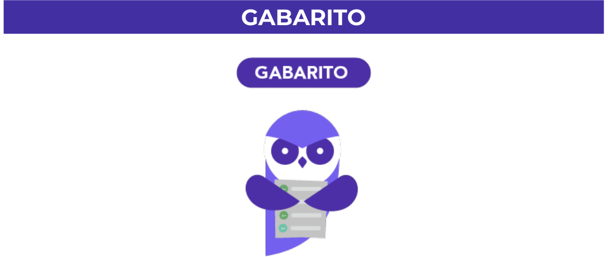


<!-- Start of picture text -->
GABARITO<br><!-- End of picture text -->

|01|02|03|04|05|06|07|08|09|10|
|---|---|---|---|---|---|---|---|---|---|
|E|C|Errado|Errado|D|D|Errado|Certo|E|Certo|
|11|12|13|14|15|16|||||
|C|Errado|Errado|Certo|Errado|Certo|||||

---

<!-- pagina: 47 -->


