---
fonte_pdf: "Eng. Software - Aula 00.pdf"
paginas: 95
conversao: texto-e-imagens
---

<!-- pagina: 2 -->

**Diego Carvalho, Equipe Informática 2 (Diego Carvalho), Equipe Informática 1 (Diego Carvalho) Aula 00** 

## **Índice** 

|.......................................**.**............................................................................................................ 1) Apresentação do Prof Diego Carvalho - Informática|.......................................... 3|
|---|---|
|.................................................................................................................................................... 2) Apresentação Flashcards|.......................................... 5|
|.................................................................................................................................................... 3) Metodologias de Desenvolvimento - Teoria|.......................................... 7|
|.................................................................................................................................................... 4) Metodologias de Desenvolvimento - Resumo|.......................................... 65|
|.................................................................................................................................................... 5) Metodologias de Desenvolvimento - Questões Comentadas - FGV|.......................................... 86|
|.................................................................................................................................................... 6) Metodologias de Desenvolvimento - Lista de Questões - FGV|.......................................... 91|

---

<!-- pagina: 5 -->

**Diego Carvalho, Equipe Informática 2 (Diego Carvalho), Equipe Informática 1 (Diego Carvalho) Aula 00** 

# <mark>E</mark> STRATÉGIA <mark>F</mark> LASHCARDS 

Você tem dificuldade de estudar, memorizar e revisar os conteúdos que estuda em nossas aulas? Então nós temos a ferramenta perfeita para você! 

<mark>Apresentamos o</mark> **<mark>Estratégia Cards</mark>** <mark>: app de flashcards que vai revolucionar sua forma de</mark> **<mark>estudar</mark>** <mark>e</mark> **<mark>revisar</mark>** <mark>conteúdos de provas de concurso público. Com nossa tecnologia inovadora e interface amigável, você dominará os tópicos mais complexos de maneira eficiente e divertida.</mark> 

#### **Recursos do Estratégia Cards:** 

|**Curadoria de** **Flashcards**|Flashcards criados e revisados por professores especializados em cada área, com qualidade e voltadospara concursospúblicos.|
|---|---|
|**Flashcards** **Personalizados**|Crie seus próprios flashcards, cobrindo os principais tópicos e matérias dos concursospúblicos. ==5460==|
|**Repetição** **Espaçada**|Técnica de aprendizagem que envolve revisar informações em intervalos crescentespara melhorar a retenção de longoprazo e combater o esquecimento.|
|**Estatísticas** **Personalizadas**|Visualize graficamente o percentual de acertos, erros ou dúvidas dos decks estudados.|
|**Modo** **Offline**|Estude em qualquer lugar, mesmo sem conexão à internet, fazendo o download dos decks.|
|**Estudo** **por Áudio**|_Está dirigindo ou fazendo esteira e quer continuar estudando?_Basta utilizar a opção “Escutar”.|
|**Decks** **Favoritos**|Você pode escolher decks específicos como favoritos e visualizá-los em uma aba separada do app.|
|**Opções** **de Estudo**|Você poderá estudar todos os cards de um deck; ou apenas os que você errou; ou apenas osque você não estudou ainda;entre outras opções.|

#### **E como eu consigo baixar?** 

É muito fácil! Basta pesquisar por “Estratégia Cards” na loja oficial do seu smartphone. 

Se você tiver um Android, basta acessar a **Google Play** ; 

Se for tiver um iPhone, basta acessar a **App Store (iOS)** . 

---

<!-- pagina: 6 -->

**Diego Carvalho, Equipe Informática 2 (Diego Carvalho), Equipe Informática 1 (Diego Carvalho) Aula 00** 

#### **E para acessar?** 

Para acessar, basta ter uma conta no Estratégia Concursos. Em seguida, utilize suas credenciais de login e senha para acessar o aplicativo. Por fim, acessa a carreira de Tecnologia da Informação. 

#### **Como utilizar o app:** 

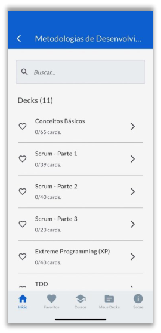

---

<!-- pagina: 7 -->

**Diego Carvalho, Equipe Informática 2 (Diego Carvalho), Equipe Informática 1 (Diego Carvalho) Aula 00** 

##### **Sumário** 

|Apresentação da Aula ........................................................................................................................................... 2|
|---|
|Engenharia de Software ........................................................................................................................................ 3|
|Conceitos Básicos .............................................................................................................................................. 3|
|Processos de Desenvolvimento ....................................................................................................................... 9|
|Modelos Sequenciais .................................................................................................................................. 15|
|Modelo Iterativos ......................................................................................................................................... 24|
|Modelo Especializados ............................................................................................................................... 46|

---

<!-- pagina: 8 -->

**Diego Carvalho, Equipe Informática 2 (Diego Carvalho), Equipe Informática 1 (Diego Carvalho) Aula 00** 

<!-- Start of picture text -->
A PRESENTAÇÃO DA  A <!-- End of picture text -->

<!-- Start of picture text -->
ULA <!-- End of picture text -->

Para o aluno que possui bastante tempo disponível, a estratégia ideal é estudar toda a cadeia de Processos de Desenvolvimento, mas respeitando fortemente a incidência das questões. O estudo deve começar obrigatoriamente pelo Modelo em Cascata, pelos Modelos Iterativos e Incrementais e pelos conceitos de ciclo de vida, porque esses assuntos dominam grande parte das provas. É fundamental entender diferenças entre sequencial, iterativo, incremental, prototipação e espiral, além das vantagens, limitações e cenários ideais de uso de cada abordagem. 

Já o aluno com pouco tempo precisa ser extremamente seletivo. Nesse cenário, o melhor custo-benefício está quase totalmente concentrado no Modelo em Cascata, Modelo Incremental, Modelo Iterativo e Modelo Espiral. As bancas repetem constantemente questões sobre sequência linear, rigidez, dificuldade de mudança de requisitos, entregas incrementais e análise de riscos. Saber diferenciar claramente “sequencial e linear” de “iterativo e incremental” resolve uma enorme quantidade de questões praticamente por eliminação lógica. 

Outro ponto indispensável envolve compreender as fases clássicas do desenvolvimento de software: requisitos, análise, projeto, implementação, testes e manutenção. Mesmo quando a questão não pergunta diretamente sobre modelos de processo, ela frequentemente cobra a ordem das atividades ou o objetivo de determinada fase. Isso possui excelente custo-benefício porque o assunto aparece transversalmente em várias bancas. Memorizar quem vem antes de quem no ciclo clássico ajuda muito na resolução rápida de itens interpretativos. 

Para quem possui bastante tempo, vale aprofundar também Prototipação, Modelo Espiral, RAD, Engenharia Baseada em Componentes, Modelo V e conceitos mais teóricos da Engenharia de Software. O Modelo Espiral merece atenção especial porque diversas bancas associam diretamente essa abordagem à gestão formal de riscos. Ademais, estudar princípios de Pressman, conceitos de qualidade, modularidade, abstração e decomposição ajuda bastante em provas mais conceituais e discursivas. 

Já para o aluno com tempo reduzido, alguns temas podem ser tratados apenas superficialmente ou até parcialmente descartados. Entre eles estão Métodos Formais, CBSE, detalhes históricos da Crise do Software, classificações muito específicas de protótipos e aprofundamentos excessivos sobre princípios teóricos. Nesses casos, basta reconhecer palavras-chave. Métodos Formais, por exemplo, normalmente aparecem associados a prova matemática, rigor extremo e sistemas críticos; estudar além disso costuma trazer pouco retorno estatístico. 

Existe ainda uma estratégia extremamente eficiente para provas de Engenharia de Software: estudar por contraste entre modelos. Compare constantemente cascata versus incremental; rígido versus adaptativo; planejamento extenso versus refinamento contínuo; entrega única versus entregas sucessivas; foco em documentação versus foco em adaptação. As bancas exploram exatamente essas oposições conceituais. Quando o aluno domina essas diferenças estruturais, ele consegue resolver muitas questões mesmo sem decorar literalmente toda a teoria. 

Por fim, tanto o aluno avançado quanto o aluno com pouco tempo devem priorizar resolução massiva de questões. Em Engenharia de Software, as bancas reciclam padrões com enorme frequência. Questões sobre cascata quase sempre giram em torno de linearidade, previsibilidade e dificuldade de mudança; incremental gira em torno de entregas parciais; espiral gira em torno de riscos; prototipação gira em torno de requisitos incertos. 

Prof. Diego Carvalho

---

<!-- pagina: 9 -->

**Diego Carvalho, Equipe Informática 2 (Diego Carvalho), Equipe Informática 1 (Diego Carvalho) Aula 00** 

<!-- Start of picture text -->
E NGENHARIA  D E  S <!-- End of picture text -->

<!-- Start of picture text -->
S OFTWARE <!-- End of picture text -->

<!-- Start of picture text -->
Conceitos Básicos <!-- End of picture text -->

**<mark>INCIDÊNCIA EM PROVA: BAIXÍSSIMA</mark>** 

###### **<mark>ENGENHARIA DE SOFTWARE</mark>** 

Disciplina da computação que aplica princípios, métodos e ferramentas de engenharia ao desenvolvimento, operação e manutenção de software, com o objetivo de produzir sistemas de qualidade, confiáveis e eficientes. Ela abrange atividades como levantamento de requisitos, projeto, implementação, testes e gestão, buscando <u>garantir que o software atenda às necessidades dos usuários dentro de prazos e custos adequados.</u> 

Vamos começar pelo começo: o que é software? Muita gente, quando ouve essa palavra, pensa imediatamente em "programa de computador". E não está errado, mas está incompleto! Segundo a visão adotada por autores como Ian Sommerville, software não é apenas o programa em si, mas também toda a documentação, os dados de configuração e tudo mais que seja necessário para que o programa opere corretamente. Ou seja, o manual do usuário, os arquivos de configuração, os scripts de instalação — tudo isso faz parte do software. 

O que é Engenharia de Software? Agora, sim, chegamos ao conceito central. Existem algumas definições importantes que você precisa conhecer e que costumam aparecer em prova. A IEEE, que é o principal órgão internacional de padronização em engenharia elétrica e computação, define Engenharia de Software como: 

_"A aplicação de uma abordagem sistemática, disciplinada e quantificável ao desenvolvimento, operação e manutenção de software"._ 

Reparem em três palavras-chave: sistemática (seguindo um sistema, um processo), disciplinada (com rigor e comprometimento) e quantificável (mensurável, ou seja, dá para medir e controlar). Essas três características juntas são o que diferenciam a Engenharia de Software de simplesmente "sair programando". 

Já Friedrich Bauer define como a criação e utilização de sólidos princípios de engenharia para obter software de forma econômica, confiável e que funcione em máquinas reais. Simples e direto. E Ian Sommerville complementa muito bem ao afirmar que a Engenharia de Software não se limita aos processos técnicos de desenvolvimento, ela também envolve gerenciamento de projetos e o desenvolvimento de ferramentas, métodos e teorias que apoiem toda a produção de software. Logo, não é só escrever código: é planejar, gerenciar, documentar e garantir qualidade. 

Em suma, a Engenharia de Software é uma disciplina que se ocupa de todos os aspectos da produção de software, desde a especificação inicial até a manutenção contínua do sistema, passando por aspectos humanos, organizacionais e técnicos. E sua meta principal é desenvolver sistemas com boa relação custobenefício, ou seja, entregando qualidade sem desperdiçar recursos. 

Agora uma observação: segundo Roger Pressman, a Engenharia de Software surge no contexto de um processo mais amplo chamado Engenharia de Sistemas. A diferença é que a Engenharia de Sistemas não foca apenas no software: ela analisa, projeta e organiza diversos elementos (hardware, software, processos, pessoas) para formar um sistema completo, que pode ser um produto, um serviço ou uma tecnologia de transformação da informação.

---

<!-- pagina: 10 -->

**Diego Carvalho, Equipe Informática 2 (Diego Carvalho), Equipe Informática 1 (Diego Carvalho) Aula 00** 

Pense assim: quando uma empresa vai desenvolver, por exemplo, um sistema de controle de tráfego aéreo, ela precisa pensar nos radares (hardware), no software de monitoramento, nos processos operacionais e nas pessoas que vão operar tudo isso. Isso é Engenharia de Sistemas! Dentro desse contexto maior, a Engenharia de Software cuida especificamente da parte de software. 

Pressman deixa claro que a Engenharia de Sistemas está preocupada com todos os aspectos do desenvolvimento de sistemas computacionais, incluindo engenharia de hardware, engenharia de software e engenharia de processos. A Engenharia de Software, portanto, é uma especialização dentro desse contexto mais amplo e, não apenas uma engenharia paralela entre outras, mas sim uma disciplina que emerge desse processo sistêmico. 

E para que serve a Engenharia de Software? Pressman apresenta um modelo muito interessante para entender como a Engenharia de Software se sustenta. Ela se apoia em três pilares fundamentais: Processos (que definem a sequência de atividades a serem realizadas, é o "roteiro" do desenvolvimento); Métodos (que indicam como fazer tecnicamente cada atividade, como análise, projeto, codificação, teste, manutenção); e Ferramentas (que automatizam ou apoiam os processos e métodos — pense em IDEs, ferramentas de teste, controle de versão, etc). 

E o que sustenta tudo isso? Pressman é enfático: a pedra fundamental que sustenta toda a Engenharia de Software é o Foco na Qualidade. Qualidade não é um detalhe — é o alicerce de tudo. Além disso, tudo isso envolve planejamento de custos e prazos, montagem e gestão da equipe, garantia de qualidade tanto do produto quanto do processo, e a produção de documentação formal — incluindo manuais de usuário e critérios de qualidade. 

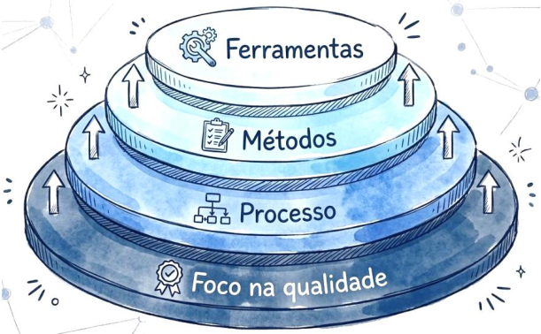

Vamos voltar um pouco no tempo para entender por que a Engenharia de Software existe: na década de 1960, o desenvolvimento de software era completamente fora de controle. Não havia processo, não havia gerenciamento, não havia monitoramento. Os projetos estouravam prazos e orçamentos, e raramente entregavam o que o cliente tinha pedido. Esse período ficou conhecido como a Crise do Software — e foi justamente para contornar essa crise que a Engenharia de Software nasceu, como uma tentativa de trazer ao desenvolvimento de software o mesmo rigor das engenharias tradicionais. 

Na década de 1980, surgiram a Análise Estruturada e as primeiras Ferramentas CASE (Computer-Aided Software Engineering), que permitiam automatizar partes do processo de desenvolvimento. Na década de 1990, ganharam força a orientação a objetos, as linguagens de programação visuais e o Processo Unificado (como o RUP), trazendo uma visão mais estruturada e iterativa do desenvolvimento.

---

<!-- pagina: 11 -->

**Diego Carvalho, Equipe Informática 2 (Diego Carvalho), Equipe Informática 1 (Diego Carvalho) Aula 00** 

E no início dos anos 2000 — mais precisamente em 2001, com a publicação do Manifesto Ágil —, surgiram as metodologias ágeis, como Scrum e XP. Essas metodologias propõem ciclos curtos de desenvolvimento, colaboração constante com o cliente e adaptação rápida a mudanças. Hoje são extremamente comuns no mercado. 

Aqui cabe uma observação importante: Sommerville não enumera formalmente os princípios da Engenharia de Software, mas Pressman sim. Aqui vamos adotar a versão de Pressman e de Mandrioli: 

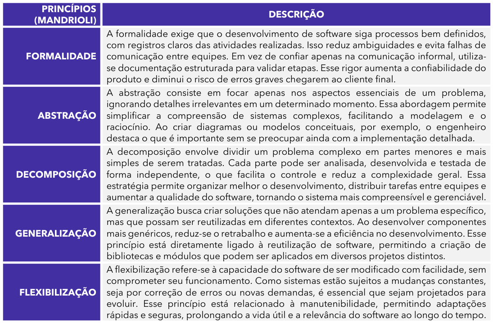

<!-- Start of picture text -->
PRINCÍPIOS DESCRIÇÃO (MANDRIOLI) A formalidade exige que o desenvolvimento de software siga processos bem definidos, com registros claros das atividades realizadas. Isso reduz ambiguidades e evita falhas de FORMALIDADE comunicação entre equipes. Em vez de confiar apenas na comunicação informal, utiliza- se documentação estruturada para validar etapas. Esse rigor aumenta a confiabilidade do produto e diminui o risco de erros graves chegarem ao cliente final. A abstração consiste em focar apenas nos aspectos essenciais de um problema, ignorando detalhes irrelevantes em um determinado momento. Essa abordagem permite ABSTRAÇÃO simplificar a compreensão de sistemas complexos, facilitando a modelagem e o raciocínio. Ao criar diagramas ou modelos conceituais, por exemplo, o engenheiro destaca o que é importante sem se preocupar ainda com a implementação detalhada. A decomposição envolve dividir um problema complexo em partes menores e mais simples de serem tratadas. Cada parte pode ser analisada, desenvolvida e testada de DECOMPOSIÇÃO forma independente, o que facilita o controle e reduz a complexidade geral. Essa estratégia permite organizar melhor o desenvolvimento, distribuir tarefas entre equipes e aumentar a qualidade do software, tornando o sistema mais compreensível e gerenciável. A generalização busca criar soluções que não atendam apenas a um problema específico, mas que possam ser reutilizadas em diferentes contextos. Ao desenvolver componentes GENERALIZAÇÃO mais genéricos, reduz-se o retrabalho e aumenta-se a eficiência no desenvolvimento. Esse princípio está diretamente ligado à reutilização de software, permitindo a criação de bibliotecas e módulos que podem ser aplicados em diversos projetos distintos. A flexibilização refere-se à capacidade do software de ser modificado com facilidade, sem comprometer seu funcionamento. Como sistemas estão sujeitos a mudanças constantes, FLEXIBILIZAÇÃO seja por correção de erros ou novas demandas, é essencial que sejam projetados para evoluir. Esse princípio está relacionado à manutenibilidade, permitindo adaptações rápidas e seguras, prolongando a vida útil e a relevância do software ao longo do tempo. <!-- End of picture text -->

**<mark>CATEGORIA</mark>** **<u>(PRESSMAN)</u> PRINCÍPIOS FUNDAMENTAIS (ORIENTAM A PRÁTICA COMO UM TODO)** 

|**PRINCÍPIO**|**DESCRIÇÃO**|
|---|---|
|A razão de existir|Todo sistema de software deve agregar valor aos seus usuários; todas as decisões devem considerar se estão trazendo um benefício real.|
|KISS (_Keep It Simple, Stupid!_)|Todo projeto deve ser o mais simples possível (sem ser simplista), o que resulta em um software menos propenso a erros e mais fácil de compreender e manter.|
|Mantenha a visão|É essencial manter uma visão arquitetural clara e consistente para que o projeto não se torne uma "colcha de retalhos" incompatível.|
|O que um produz outros consomem|Deve-se especificar, projetar e codificar lembrando sempre que outra pessoa (ou você mesmo no futuro) precisará entender, testar ou dar manutenção ao artefato gerado.|

---

<!-- pagina: 12 -->

**Diego Carvalho, Equipe Informática 2 (Diego Carvalho), Equipe Informática 1 (Diego Carvalho) Aula 00** 

|Esteja aberto para o futuro|Sistemas de sucesso são projetados para se adaptarem a mudanças e evoluírem, resolvendo o problema geral e estendendo sua vida útil.|
|---|---|
|Planeje visando a reutilização|Criar componentes genéricos e planejá-los com antecedência reduz o esforço futuro, economiza tempo e aumenta o valor do sistema.|
|Pense! |Refletir e analisar de forma clara antes de agir (projetar ou codificar) produz resultados superiores e reduz retrabalho.|
|Seja ágil |Mantenha a abordagem técnica e os produtos o mais simples possível, com foco na economia de ações e tomadas de decisão locais.|
|Concentre-se na qualidade|A qualidade do produto deve ser o foco principal em toda e qualquer atividade, ação e tarefa do processo de software.|
|Esteja pronto para adaptações|Não há espaço para dogmas; o processo deve ser adaptado às restrições do problema, da equipe e do projeto.|
|Monte uma equipe eficiente|Pessoas são o fator mais importante; crie uma equipe auto-organizada baseada em confiança e respeito mútuos.|
|Estabeleça comunicação|É fundamental coordenar esforços para evitar a omissão de informações críticas entre os envolvidos.|
|Gerencie Mudanças|Crie mecanismos formais ou informais para avaliar, aprovar e acomodar as mudanças solicitadas ao longo do processo.|
|Avalie os riscos|Muitas coisas podem dar errado; identifique os riscos antecipadamente e crie planos de contingência.|
|Gere artefatos de valor|Só produza artefatos (modelos, listas, etc) se eles agregarem valor e transmitirem informações claras para as próximas etapas.|
|Divida e conquiste|Utilize a "separação por interesses" para dividir problemas complexos em partes menores e independentes, facilitando a resolução.|
|Compreenda a abstração|Use a abstração para focar na essência do problema, ignorando detalhes de baixo nível e facilitando a comunicação do significado.|
|Esforce-se pela consistência|Estabeleça um contexto previsível e padronizado (como esquemas de cores e navegação em interfaces) para facilitar o uso do software.|
|Foco na transferência de informações|Preste atenção redobrada ao projetar e testar interfaces (internas e externas), pois é onde o fluxo de informações costuma gerar erros ou omissões.|

**PRINCÍPIOS DO PROCESSO (ORIENTAM A ORGANIZAÇÃO DO TRABALHO)** 

**PRINCÍPIOS DA PRÁTICA (ORIENTAM O TRABALHO TÉCNICO)**

---

<!-- pagina: 13 -->

**Diego Carvalho, Equipe Informática 2 (Diego Carvalho), Equipe Informática 1 (Diego Carvalho) Aula 00** 

|Construa modularidade efetiva|Crie módulos ou componentes que sejam altamente coesos (tenham uma única função bem definida) e apresentem baixo acoplamento.|
|---|---|
|Verifique os padrões|Empregue padrões de projeto comprovados para resolver problemas recorrentes, aproveitando o conhecimento já consolidado.|
|Múltiplas perspectivas|Represente problemas e soluções sob diferentes pontos de vista (cenários, classes, comportamentos) para revelar erros que ficariam ocultos.|
|Facilite a manutenção|Projete o código assumindo que erros serão descobertos e novas funções serão pedidas a longo prazo, aplicando práticas que ajudem as futuras equipes de manutenção.|

Outro ponto que merece destaque é que a Engenharia de Software não termina quando o sistema entra em produção. "Em produção" significa que o software já está disponível no ambiente real do cliente — mas isso não é o fim da história. Sommerville é bastante enfático ao tratar o desenvolvimento de software como um processo contínuo e iterativo: sistemas evoluem, requisitos mudam, erros são descobertos, e o ambiente ao redor do software se transforma. Por isso, a manutenção e a evolução do sistema são atividades tão importantes quanto o desenvolvimento inicial. 

Vamos resumir tudo? Software = Programa + Documentação + Dados de Configuração. Engenharia de Software é a disciplina que cuida de todos os aspectos da produção de software, com foco em qualidade e boa relação custo-benefício. Ela está inserida no contexto maior da Engenharia de Sistemas, que abrange hardware, software e processos; e ela se apoia em processos, métodos e ferramentas, tendo a qualidade como pedra fundamental. 

Ela surgiu na década de 1960 para contornar a Crise do Software, e evoluiu até as metodologias ágeis (a partir de 2001). Seus princípios fundamentais são: Formalidade, Abstração, Decomposição, Generalização e Flexibilização — oriundos principalmente de Ghezzi et al., mas amplamente adotados na literatura da área. O ciclo de vida do software é contínuo — não termina com a entrega. Ficou claro? Esses conceitos são a base de tudo que vem a seguir em Engenharia de Software. Vamos continuar... 

##### **Saiba mais:** 

<mark>Imagine que você deseja desenvolver um aplicativo de delivery. Sem Engenharia de Software, você provavelmente cometeria o erro clássico, isto é, simplesmente começa a programar: criar telas sem planejamento, não definir requisitos, não testar direito, não documentar nada. O resultado seria: o sistema dá erro, o prazo estoura e o custo aumenta.</mark> 

<mark>Por meio da Engenharia de Software, você faria o levantamento de requisitos conversando com o cliente para descobrir que: o app deve ter cadastro de usuários, deve permitir pedidos e deve integrar com pagamento. É aqui que você define o que o sistema deve fazer. Durante a fase de Projeto, você planeja antes de começar a programar. É o momento de pensar no banco de dados (clientes, pedidos, restaurantes), arquitetura de software (frontend + backend + API) e fluxo das telas.</mark> 

<mark>Durante a fase de Implementação, você faria a codificação em si. Você poderia utilizar a linguagem Java ou Python para construir o backend, poderia implementar a aplicação mobile e</mark>

---

<!-- pagina: 14 -->

**Diego Carvalho, Equipe Informática 2 (Diego Carvalho), Equipe Informática 1 (Diego Carvalho) Aula 00** 

<mark>poderia realizar as integrações – tudo isso seguindo padrões e boas práticas. Durante a fase de Testes, é o momento de verificar: O pedido funciona? O pagamento falha? O  sistema aguenta muitos usuários? Isso ajuda a garantir a qualidade. Já na fase de Entrega e Manutenção, o sistema entra em operação e eventuais bugs são corrigidos.</mark> 

<mark>No fim das contas, a Engenharia de Software é o que transforma o “Vou fazer um app” em “Vou</mark> construir um sistema confiável, dentro do prazo, com qualidade e que atende ao usuário”. 

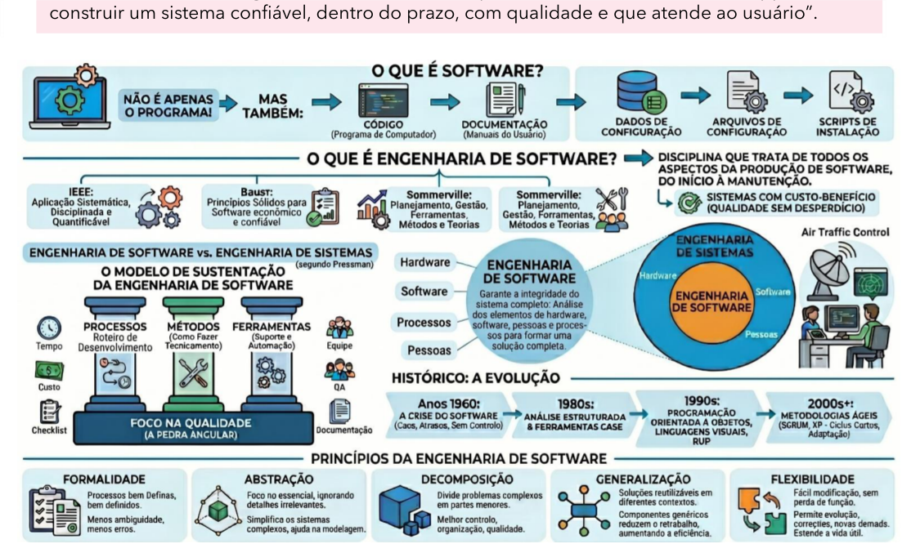

<!-- Start of picture text -->
construir um sistema confiável, dentro do prazo, com qualidade e que atende ao usuário”. <!-- End of picture text -->

---

<!-- pagina: 15 -->

**Diego Carvalho, Equipe Informática 2 (Diego Carvalho), Equipe Informática 1 (Diego Carvalho) Aula 00** 

<!-- Start of picture text -->
Processos de Desenvolvimento <!-- End of picture text -->

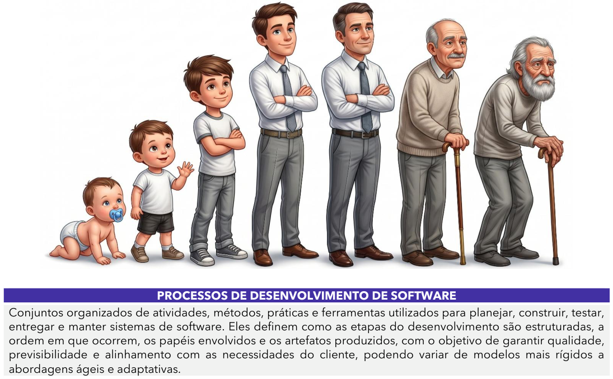

<!-- Start of picture text -->
PROCESSOS DE DESENVOLVIMENTO DE SOFTWARE Conjuntos organizados de atividades, métodos, práticas e ferramentas utilizados para planejar, construir, testar, entregar e manter sistemas de software. Eles definem como as etapas do desenvolvimento são estruturadas, a ordem em que ocorrem, os papéis envolvidos e os artefatos produzidos, com o objetivo de garantir qualidade, previsibilidade e alinhamento com as necessidades do cliente, podendo variar de modelos mais rígidos a abordagens ágeis e adaptativas. <!-- End of picture text -->

De onde vem o termo "ciclo de vida"? Ele surgiu lá na biologia! Trata do conjunto de transformações pelas quais passa um ser vivo durante toda a sua existência. Vocês se lembram lá do ensino fundamental? Um ser vivo nasce, cresce, se reproduz, envelhece e morre. Simples assim. E essa metáfora funciona muito bem para outros contextos também! Veja alguns exemplos: 

- **Ciclo de Vida de uma Organização:** introdução no mercado, crescimento, maturidade e declínio. 

- ▪ **Ciclo de Vida de um Projeto:** iniciação, planejamento, execução, controle e encerramento. 

- **Ciclo de Vida de um Produto:** lançamento, crescimento, maturidade e retirada. 

O que todos têm em comum? Exatamente: fases pelas quais algo passa do seu início ao seu fim. Guardem isso — funciona para qualquer contexto de ciclo de vida. Na Engenharia de Software, o conceito funciona da mesma forma. O ciclo de vida de software trata das fases pelas quais um sistema de software passa desde sua concepção até quando ele não está mais disponível para uso — ou seja, desde o nascimento até a aposentadoria do software. 

Uma definição bastante precisa afirma que o ciclo de vida de software abrange as fases de um produto desde quando ele é concebido inicialmente até quando é retirado de operação. Já Steve McConnell complementa dizendo que um modelo de ciclo de vida de software é uma representação que descreve todas as atividades que tratam da criação de um produto de software. 

Simples, né? O conceito em si não é o problema. O problema — e vou ser honesto com vocês — é que não há consenso entre os autores sobre quais são exatamente essas fases. Cada autor que escreve um livro tende a propor o seu próprio ciclo de vida, com suas próprias fases e nomenclaturas. E, às vezes, o mesmo

---

<!-- pagina: 16 -->

**Diego Carvalho, Equipe Informática 2 (Diego Carvalho), Equipe Informática 1 (Diego Carvalho) Aula 00** 

autor muda de ideia entre edições do mesmo livro! É o caso do próprio Pressman: se você comparar a 4ª edição do livro dele com a 6ª edição em diante, vai encontrar conjuntos de fases diferentes. 

Qual a solução prática para vocês? Não é vivável memorizar todos os ciclos de vida existentes — isso não cai com frequência em prova. O mais importante é que vocês entendam as principais fases que podem aparecer e sua ordem (Ex: não tem como a fase de requisitos vir depois da fase de implementação). Dito isso, vamos ver oito fases de um ciclo de vida bem completo e vamos entender o que acontece em cada etapa do desenvolvimento: 

###### **<mark>DESCRIÇÃO</mark>** 

###### **<mark>ETAPAS</mark>** 

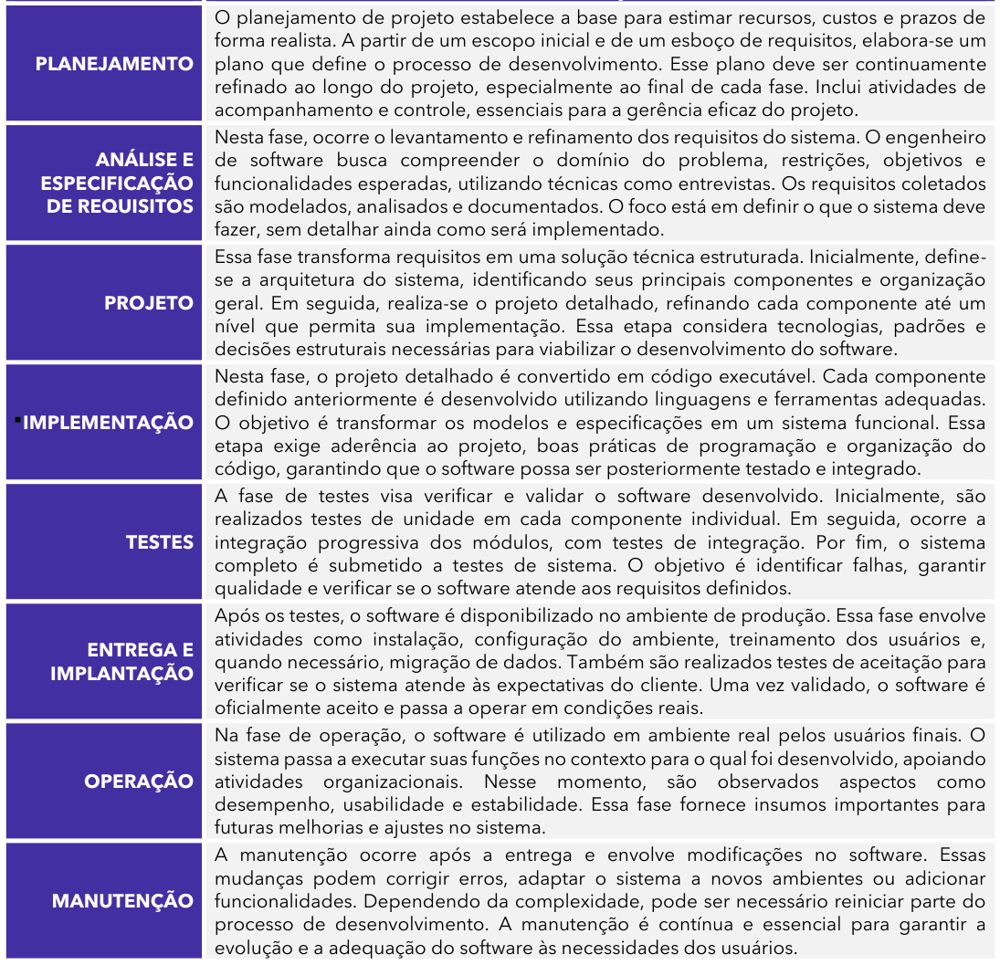

<!-- Start of picture text -->
O planejamento de projeto estabelece a base para estimar recursos, custos e prazos de forma realista. A partir de um escopo inicial e de um esboço de requisitos, elabora-se um PLANEJAMENTO plano que define o processo de desenvolvimento. Esse plano deve ser continuamente refinado ao longo do projeto, especialmente ao final de cada fase. Inclui atividades de acompanhamento e controle, essenciais para a gerência eficaz do projeto. Nesta fase, ocorre o levantamento e refinamento dos requisitos do sistema. O engenheiro ANÁLISE E  de software busca compreender o domínio do problema, restrições, objetivos e ESPECIFICAÇÃO  funcionalidades esperadas, utilizando técnicas como entrevistas. Os requisitos coletados DE REQUISITOS são modelados, analisados e documentados. O foco está em definir o que o sistema deve fazer, sem detalhar ainda como será implementado. Essa fase transforma requisitos em uma solução técnica estruturada. Inicialmente, define- se a arquitetura do sistema, identificando seus principais componentes e organização PROJETO geral. Em seguida, realiza-se o projeto detalhado, refinando cada componente até um nível que permita sua implementação. Essa etapa considera tecnologias, padrões e decisões estruturais necessárias para viabilizar o desenvolvimento do software. Nesta fase, o projeto detalhado é convertido em código executável. Cada componente definido anteriormente é desenvolvido utilizando linguagens e ferramentas adequadas. IMPLEMENTAÇÃO O objetivo é transformar os modelos e especificações em um sistema funcional. Essa etapa exige aderência ao projeto, boas práticas de programação e organização do código, garantindo que o software possa ser posteriormente testado e integrado. A fase de testes visa verificar e validar o software desenvolvido. Inicialmente, são realizados testes de unidade em cada componente individual. Em seguida, ocorre a TESTES integração progressiva dos módulos, com testes de integração. Por fim, o sistema completo é submetido a testes de sistema. O objetivo é identificar falhas, garantir qualidade e verificar se o software atende aos requisitos definidos. Após os testes, o software é disponibilizado no ambiente de produção. Essa fase envolve atividades como instalação, configuração do ambiente, treinamento dos usuários e, ENTREGA E quando necessário, migração de dados. Também são realizados testes de aceitação para IMPLANTAÇÃO verificar se o sistema atende às expectativas do cliente. Uma vez validado, o software é oficialmente aceito e passa a operar em condições reais. Na fase de operação, o software é utilizado em ambiente real pelos usuários finais. O sistema passa a executar suas funções no contexto para o qual foi desenvolvido, apoiando OPERAÇÃO atividades  organizacionais.  Nesse  momento,  são  observados  aspectos  como desempenho, usabilidade e estabilidade. Essa fase fornece insumos importantes para futuras melhorias e ajustes no sistema. A manutenção ocorre após a entrega e envolve modificações no software. Essas mudanças podem corrigir erros, adaptar o sistema a novos ambientes ou adicionar MANUTENÇÃO funcionalidades. Dependendo da complexidade, pode ser necessário reiniciar parte do processo de desenvolvimento. A manutenção é contínua e essencial para garantir a evolução e a adequação do software às necessidades dos usuários. <!-- End of picture text -->

##### **Saiba mais:**

---

<!-- pagina: 17 -->

**Diego Carvalho, Equipe Informática 2 (Diego Carvalho), Equipe Informática 1 (Diego Carvalho) Aula 00** 

<mark>Para viabilizar a compreensão adequada do domínio do problema e coletar as funcionalidades esperadas junto aos usuários, utilizam-se técnicas formais de criatividade e elicitação. O Brainstorming é amplamente utilizado para a geração verbal e livre de ideias. Já o Brainwriting funciona através de rodadas escritas (em formato de fluxo silencioso): cada participante escreve ideias em um papel que circula entre o grupo a cada rodada, permitindo que a equipe</mark> classifique, leia e expanda as ideias dos colegas posteriormente. 

É importante mencionar que outros autores incluem ainda fases como Análise (modelagem do problema, o que é diferente de Projeto – que modela a solução do problema), Homologação (aceitação formal do software pelo cliente) e Gerência de Configuração (controle sistemático de versões, artefatos e documentos). 

Agora atenção: esse é um ponto que confunde muita gente! O Ciclo de Vida de Software são as fases pelas quais o software passa desde o seu início até a sua desativação. Já o Modelo de Ciclo de Vida de Software são as fases mais a forma como essas fases se relacionam entre si. Veja um exemplo clássico: o Modelo em Cascata. Ele contém exatamente as fases que conhecemos — requisitos, projeto, implementação, testes, entrega. 

No entanto, a regra que define o modelo é: uma fase só começa depois que a anterior termina completamente. Não há sobreposição, não há retorno fácil. Essa regra de relacionamento entre as fases é o que transforma um simples Ciclo de Vida em um Modelo. Outro exemplo: o Desenvolvimento Iterativo. Aqui as fases se repetem em ciclos curtos, e o relacionamento entre elas é completamente diferente do Cascata — mesmo que as atividades sejam similares. 

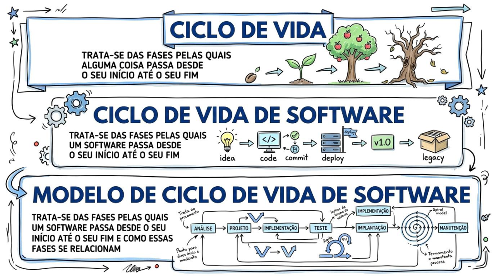

Para fins de prova, muitas questões tratam modelo de ciclo de vida e modelo de processo como sinônimos. Esse uso é comum e aceitável no contexto de concursos.

---

<!-- pagina: 18 -->

**Diego Carvalho, Equipe Informática 2 (Diego Carvalho), Equipe Informática 1 (Diego Carvalho) Aula 00** 

Agora chegamos a dois outros conceitos: processo de software e modelos de processo de software. Um processo de software é um conjunto de atividades de trabalho, ações e tarefas realizadas quando algum artefato de software deve ser criado. Cada uma dessas atividades, ações e tarefas se alocam dentro de uma metodologia ou modelo que determina sua relação com o processo e umas com as outras. 

Uma metodologia de processo genérica para engenharia de software estabelece cinco atividades metodológicas: comunicação, planejamento, modelagem, construção e entrega. Além disso, um conjunto de atividades de apoio é aplicado ao longo do processo, como o acompanhamento e controle do projeto, a administração de riscos, a garantia da qualidade, o gerenciamento das configurações, as revisões técnicas, entre outras. 

Pressman também enfatiza bastante o fluxo do processo, que descreve como são organizadas as atividades metodológicas, bem como as ações e tarefas que ocorrem dentro de cada atividade em relação à sequência e ao tempo. Um fluxo de processo linear executa cada uma das cinco atividades metodológicas em sequência, começando com a comunicação e culminando com a entrega. 

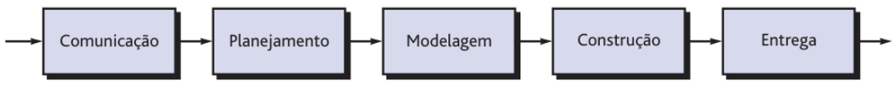

Já um fluxo de processo iterativo repete uma ou mais das atividades antes de prosseguir para a atividade seguinte conforme a imagem seguinte: 

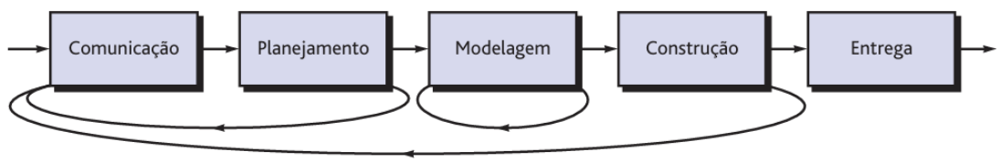

Continuando, um fluxo de processo evolucionário executa as atividades de forma “circular”, sendo que cada volta pelas cinco atividades conduz a uma versão mais completa do software. 

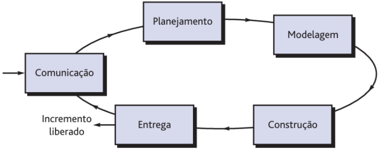

Por fim, um fluxo de processo paralelo executa uma ou mais atividades em paralelo com outras (Ex: a modelagem para um aspecto do software poderia ser executada em paralelo com a construção de outro):

---

<!-- pagina: 19 -->

**Diego Carvalho, Equipe Informática 2 (Diego Carvalho), Equipe Informática 1 (Diego Carvalho) Aula 00** 

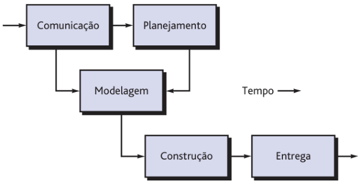

Note que cada etapa pode incluir diversas tarefas e gerar documentos específicos, isto é, quanto mais complexo o projeto, mais estruturado e detalhado precisa ser o processo de comunicação para garantir que todos estejam alinhados e que o software atenda às expectativas. O processo completo inclui: a escolha de um modelo de ciclo de vida; o detalhamento de suas macro-atividades; a escolha de métodos, técnicas e procedimentos; e a definição de recursos e artefatos necessários. 

Já segundo Sommerville, um processo de software é um conjunto de atividades e resultados associados que produz um produto de software. Para ele, existem quatro atividades fundamentais presentes em todos os processos de software: Especificação de Software (que define o que o sistema deve fazer); Desenvolvimento de Software (que projeta e implementa o sistema); Validação de Software (que garante que o sistema atende às necessidades do cliente); Evolução de Software (que modifica o sistema para acompanhar mudanças). 

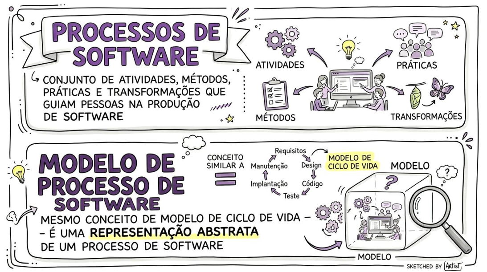

Por isso, dizer que modelo de ciclo de vida e processo de software são a mesma coisa é uma simplificação. O processo é mais rico e completo — o modelo é apenas um dos seus componentes. Um processo de software não pode ser definido de forma universal. Ele precisa ser adequado às especificidades de cada projeto, considerando: características da aplicação (domínio do problema, tamanho do software, tipo e

---

<!-- pagina: 20 -->

**Diego Carvalho, Equipe Informática 2 (Diego Carvalho), Equipe Informática 1 (Diego Carvalho) Aula 00** 

complexidade, entre outros); tecnologia a ser adotada na sua construção (paradigma de desenvolvimento, linguagem de programação, mecanismo de persistência, etc); organização onde o produto será desenvolvido e a equipe de desenvolvimento alocada (recursos humanos). 

Sommerville classifica a maioria dos processos de software em três grandes grupos: Modelo em Cascata (atividades sequenciais, uma fase após a outra); Desenvolvimento Iterativo (o sistema é desenvolvido em versões incrementais; e Engenharia de Software Baseada em Componentes (o sistema é montado a partir de componentes reutilizáveis). 

Outros autores organizam essa classificação de forma diferente, agrupando os modelos em: Modelos Sequenciais (Ex: Cascata), Modelos Incrementais (Ex: Desenvolvimento em Sprints); e Modelos Evolutivos (Ex: Prototipação, Espiral). Isso não é uma contradição entre os autores! São simplesmente taxonomias diferentes para classificar os mesmos fenômenos. Sommerville está descrevendo filosofias de organização; a segunda classificação descreve a estrutura de execução das fases. Os dois pontos de vista são complementares. Fiquem tranquilos quanto a isso! 

Por fim, mais um conceito importante: Metodologia de Desenvolvimento de Software, também chamada de Processo de Desenvolvimento de Software. Uma metodologia é uma caracterização — prescritiva ou descritiva — de como um produto de software deve ser desenvolvido. Em outras palavras: ela define o quê fazer, como fazer e quando fazer em cada etapa do desenvolvimento. 

Vale fazer uma distinção conceitual aqui, que Pressman e Sommerville deixam implícita: Processo é o conjunto de atividades, seus relacionamentos e os resultados esperados (é mais abstrato); e Metodologia é uma instância concreta e prescritiva do processo, com papéis definidos, regras claras e artefatos específicos (é mais operacional). São conceitos muito próximos, e em provas costumam ser tratados como sinônimos. Caso a questão exija distinção, a metodologia é uma aplicação específica de um processo. 

Ficou claro? Esses conceitos são a base para entender os modelos de processo que vamos estudar a seguir. Tudo vai fazer sentido a partir daqui. Vamos em frente... 

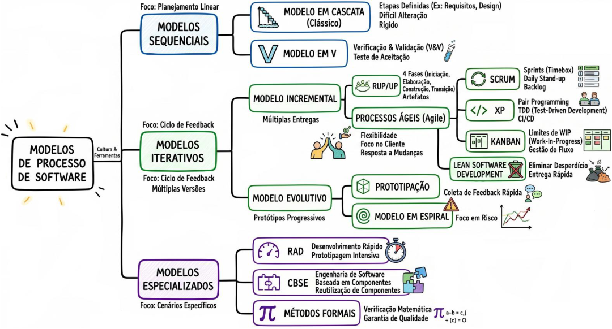

---

<!-- pagina: 21 -->

**Diego Carvalho, Equipe Informática 2 (Diego Carvalho), Equipe Informática 1 (Diego Carvalho) Aula 00** 

<!-- Start of picture text -->
Modelos Sequenciais <!-- End of picture text -->

##### **Modelo em Cascata** 

###### **<mark>INCIDÊNCIA EM PROVA: ALTÍSSIMA</mark>** 

###### **<mark>MODELO EM CASCATA</mark>** 

Modelo de desenvolvimento de software sequencial e linear, no qual as fases — como levantamento de requisitos, análise, projeto, implementação, testes e manutenção — são executadas uma após a outra, sem retorno significativo às etapas anteriores. Cada fase deve ser concluída antes do início da próxima, com forte ênfase em planejamento e documentação. É mais adequado para projetos com requisitos bem definidos e estáveis, mas apresenta baixa flexibilidade diante de mudanças. 

Vamos começar pelo nome! Esse modelo é conhecido por uma quantidade enorme de sinônimos — e todos já caíram em prova, então prestem atenção: Modelo em Cascata, Clássico, Sequencial, Linear, Tradicional, Waterfall, Rígido, Top-Down e Monolítico. Todos se referem à mesma coisa. O nome "cascata" vem justamente do encadeamento simples de uma fase com a outra — como uma cascata d'água que flui de cima para baixo, sem voltar. 

Agora, um detalhe histórico importante que muita gente ignora e que pode cair em prova! O modelo é atribuído a Winston Royce, que o descreveu em um artigo de 1970. Mas aqui vem a virada: Royce não estava propondo o Cascata como um modelo ideal. Pelo contrário! Ele descreveu o modelo sequencial para, logo em seguida, apontar seus problemas e propor melhorias com elementos iterativos. O próprio Royce considerava o modelo puro arriscado e inadequado para projetos complexos. Quem o adotou de forma rígida foram a indústria e o Departamento de Defesa dos EUA nos anos seguintes — e aí os problemas vieram à tona. Curioso, né? O autor do modelo já alertava sobre suas limitações desde o início. 

A regra central aqui é simples: uma fase só se inicia após o término e a aprovação completa da fase anterior. Não há sobreposição de fases, não há retorno fácil, não há paralelismo. É uma sequência rígida, do início ao fim. Por exemplo: a Fase 4 só começa quando a Fase 3 estiver 100% concluída e aprovada. A Fase 5 só começa quando a Fase 4 estiver concluída e aprovada. E assim por diante... 

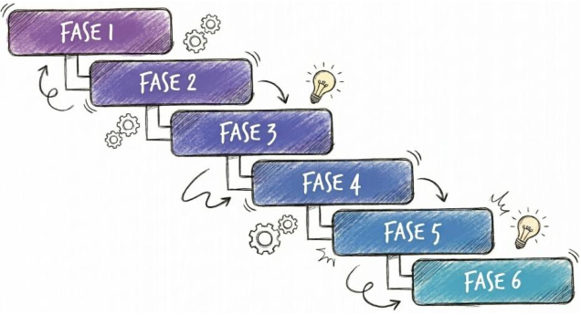

Assim como vimos no ciclo de vida geral, aqui também não há consenso entre os autores sobre quais são exatamente as fases. Cada um define as suas. Veja a comparação: 

|**POR SOMMERVILLE**|**POR ROYCE**|**POR PRESSMAN(4ª ED.)**|**POR PRESSMAN(6ª ED.)**|
|---|---|---|---|
|Análise e Definição de Requisitos|Requisitos de Sistema|Modelagem e Engenharia do Sistema|Comunicação|

---

<!-- pagina: 22 -->

**Diego Carvalho, Equipe Informática 2 (Diego Carvalho), Equipe Informática 1 (Diego Carvalho) Aula 00** 

|Projeto de Sistema e Software|Requisitos de Software|Análise de Requisitos de Software|Planejamento|
|---|---|---|---|
|Implementação e Teste de Unidade|Análise|Projeto|Modelagem|
|Integração e Teste de Sistema|Projeto|Geração de Código|Construção|
|Operação e Manutenção|Codificação|Teste e Manutenção|Implantação|
||Teste|||
||Operação|||

Percebam as grandes diferenças! E reparem que o próprio Pressman mudou de ideia entre a 4ª e a 6ª edição — isso já gerou polêmica em provas. Infelizmente, é assim: quando uma questão cobrar as fases sem dizer qual autor ou edição, podemos ter ambiguidade. Sempre leiam o enunciado com atenção para identificar a referência. 

De acordo com Ian Sommerville, o Modelo em Cascata é um exemplo de processo dirigido a planos (plandriven process). O que isso significa? Significa que, em princípio, você deve planejar e programar todas as atividades antes de começar a trabalhar nelas. Tudo é definido com antecedência — escopo, requisitos, arquitetura — antes de avançar para a próxima fase. As fases, segundo Sommerville, são: 

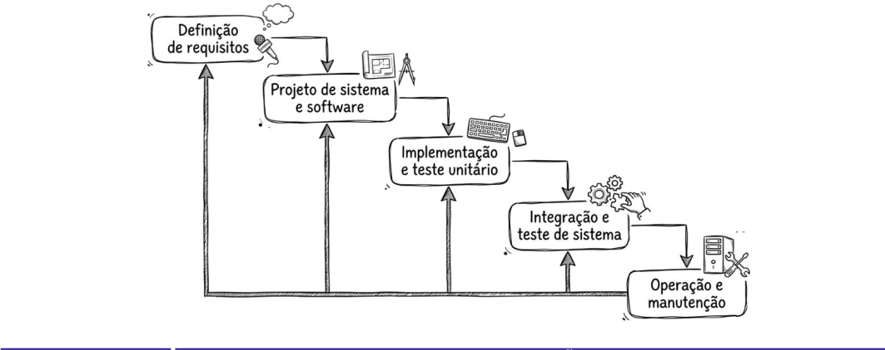

|**ETAPAS**|**DESCRIÇÃO**|
|---|---|
|**ANÁLISE E** **DEFINIÇÃO DE** **REQUISITOS**|Os serviços, restrições e metas do sistema são estabelecidos por meio de consulta aos usuários e documentados como especificação do sistema.|
|**PROJETO DE** **SISTEMA E** **SOFTWARE**|Os requisitos são alocados para componentes de hardware e software. Define-se a arquitetura geral do sistema e as abstrações fundamentais do software.|
|**IMPLEMENTAÇÃO** **E TESTE DE** **UNIDADE**|O projeto é desenvolvido como um conjunto de programas ou unidades. Cada unidade é verificada para garantir que atende à sua especificação.|
|**INTEGRAÇÃO E** **TESTE DE** **SISTEMA**|As unidades são integradas e testadas como sistema completo. Após os testes, o software é entregue ao cliente.|
|**OPERAÇÃO E** **MANUTENÇÃO**|O sistema é instalado e colocado em uso. A manutenção envolve correção de erros, melhorias de implementação e ampliação de serviços conforme novos requisitos surgem. Normalmente é a fase mais longa do ciclo de vida.|

---

<!-- pagina: 23 -->

**Diego Carvalho, Equipe Informática 2 (Diego Carvalho), Equipe Informática 1 (Diego Carvalho) Aula 00** 

Sommerville faz uma observação muito importante: em princípio, o resultado de cada fase é a aprovação de um ou mais documentos formais, e a fase seguinte só começa após essa aprovação. Na prática, porém, as fases se sobrepõem e alimentam umas às outras. Durante o projeto, problemas nos requisitos são descobertos; durante a codificação, problemas de projeto aparecem e assim por diante. 

Em outras palavras, mesmo no Cascata, existe algum feedback entre fases na prática. O problema é que esse feedback não é estruturado pelo modelo — ele acontece à margem do processo, gerando retrabalho caro e não planejado. E aqui vem um ponto crítico que Sommerville destaca: para evitar iterações dispendiosas, equipes tendem a congelar prematuramente partes do desenvolvimento, como a especificação de requisitos, e seguir em frente mesmo com incertezas. 

Resultado? O sistema pode não fazer o que o usuário realmente quer, e problemas de projeto acabam sendo "resolvidos" com gambiarras na implementação. 

Aqui vale um esclarecimento: o artigo de Royce de 1970 já previa feedback entre fases adjacentes. O que ele considerava problemático era o feedback entre fases não adjacentes — por exemplo, descobrir na fase de testes um erro que vem lá da fase de requisitos. Foram as versões industriais posteriores do modelo, adotadas de forma simplificada, que eliminaram qualquer forma de feedback, tornando o Cascata ainda mais rígido do que Royce havia proposto. Então, quando você ler que "o modelo original não permitia feedback algum", saiba que isso é tecnicamente impreciso. 

Roger Pressman reconhece que há situações em que o Cascata faz sentido: quando os requisitos são bem compreendidos, estáveis e pouco propensos a mudanças radicais. Ele cita dois exemplos típicos: (1) adaptações bem definidas em sistemas existentes – como uma mudança em software contábil por exigência de nova legislação fiscal; (2) e novos projetos com requisitos excepcionalmente claros e estáveis desde o início. 

Pressman descreve o Modelo em Cascata como uma abordagem sequencial e sistemática que começa com o levantamento de necessidades, avança pelas fases de planejamento, modelagem, construção, entrega e culminando no suporte contínuo do software concluído – conforme apresentado na imagem a seguir: 

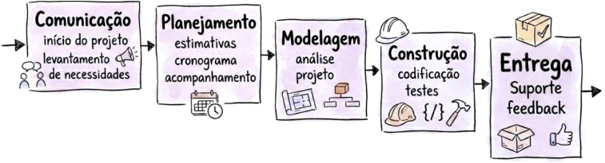

Qual é o grande problema do Modelo em Cascata? Ele atrasa a redução de riscos! Esse é um dos pontos mais cobrados em prova sobre o Cascata. O Modelo em Cascata adia a redução de riscos para as fases finais: como uma fase só começa após o término da anterior, erros cometidos no início — como um requisito mal levantado ou uma decisão arquitetural equivocada — só serão descobertos quando o sistema for efetivamente testado, quase no fim do projeto. 

Pense na Torre de Pisa: ela foi ficando inclinada devido a uma combinação de solo instável e uma fundação rasa demais para o peso da estrutura. No entanto, para efeitos didáticos, imagine que ela tenha sido originalmente mal construída. Se alguém notasse o problema de inclinação logo nos primeiros andares, a correção seria simples. Perceber o problema apenas quando a torre já estivesse quase pronta tornaria a correção muito mais cara e trabalhosa — ou até inviável. Software também é assim!

---

<!-- pagina: 24 -->

**Diego Carvalho, Equipe Informática 2 (Diego Carvalho), Equipe Informática 1 (Diego Carvalho) Aula 00** 

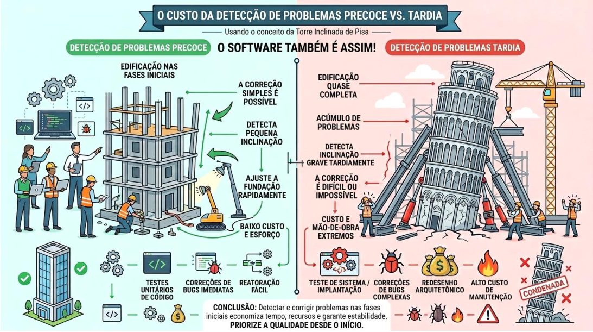

Pressman cita estudos empíricos que mostram uma realidade assustadora: o custo de corrigir um erro identificado na fase de manutenção pode ser de 50 a 200 vezes maior do que se o mesmo erro tivesse sido identificado ainda na fase de requisitos. Repitam isso para si mesmos: cinquenta a duzentas vezes mais caro. Isso por si só justifica a busca por modelos que reduzam riscos desde o início. 

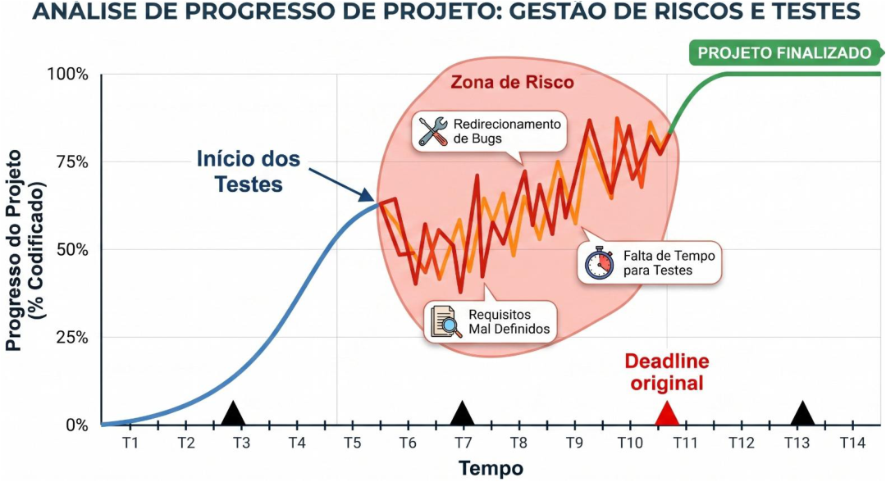

https://t.me/KakashiAssinaturasBot

---

<!-- pagina: 25 -->

**Diego Carvalho, Equipe Informática 2 (Diego Carvalho), Equipe Informática 1 (Diego Carvalho) Aula 00** 

E atenção a uma distinção importante: o custo de correção está mais relacionado ao momento em que o erro é identificado do que ao momento em que ele ocorreu. Se o erro aconteceu na fase de requisitos mas foi descoberto logo ali, o custo é baixo. Se o mesmo erro só foi descoberto na fase de testes ou implantação, o custo é altíssimo — porque provavelmente será necessário refazer boa parte do trabalho. 

Comparando com modelos iterativos e incrementais: nesses modelos, os riscos começam a ser reduzidos desde as primeiras iterações, porque o cliente vê versões funcionais do sistema desde cedo e pode identificar problemas antes que se tornem caros. No Modelo em Cascata, os riscos se acumulam silenciosamente até explodirem nas fases finais. Além do atraso na redução de riscos, Pressman elenca outros problemas relevantes: 

1. Projetos reais raramente seguem um fluxo estritamente sequencial. Mudanças acontecem, e o modelo não foi projetado para lidar com elas de forma estruturada. Qualquer mudança no meio do caminho gera confusão e retrabalho não planejado. 

2. É difícil para o cliente definir todos os requisitos no início. O Cascata pressupõe que o cliente sabe exatamente o que quer antes de o desenvolvimento começar. Na prática, os requisitos evoluem à medida que o cliente vê o sistema sendo construído. O Cascata não acomoda bem essa incerteza natural. 

3. O cliente não vê nada funcionando até o final. Uma versão operacional do software só estará disponível perto do encerramento do projeto. Se um erro grave não for detectado antes disso, pode ser catastrófico. Imagine contratar um arquiteto e só ver a casa pronta um ano depois — sem nenhuma prévia, sem nenhum modelo. Seria confortável? Certamente não. 

4. Estados de bloqueio. Em uma análise empírica de projetos reais, Pressman identificou que a natureza linear do Cascata cria "estados de bloqueio": alguns membros da equipe ficam parados esperando outros terminarem suas tarefas para poder começar as suas. O tempo de espera pode superar o tempo de trabalho produtivo — especialmente no início e no final do projeto. 

5. O ritmo atual do desenvolvimento não combina com o Cascata. O trabalho de software hoje é acelerado e sujeito a mudanças constantes em requisitos, funcionalidades e contexto de negócio. O Cascata foi concebido para um mundo mais estável, onde os requisitos eram fixos desde o início. Esse mundo, na maioria dos contextos, não existe mais. 

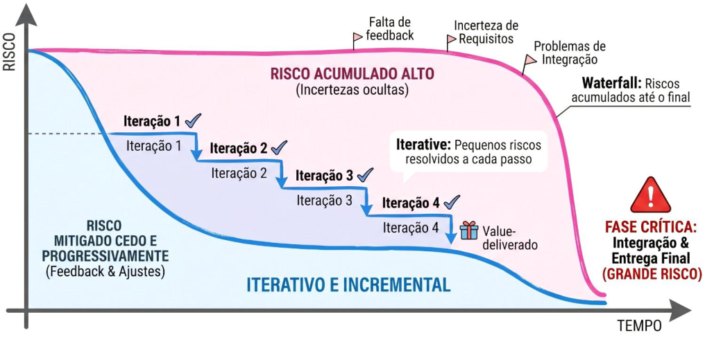

---

<!-- pagina: 26 -->

**Diego Carvalho, Equipe Informática 2 (Diego Carvalho), Equipe Informática 1 (Diego Carvalho) Aula 00** 

Apesar de todas as críticas, o Modelo em Cascata não deve ser descartado completamente. Tanto Sommerville quanto Pressman concordam que ele ainda tem aplicação em contextos específicos: 

- Quando os requisitos são bem compreendidos, estáveis e pouco propensos a mudanças. 

- Quando o projeto é pequeno e de baixa complexidade. 

- Quando a equipe precisa de um processo altamente estruturado e documentado. 

- Quando há exigências contratuais ou regulatórias que requerem documentação formal em cada fase. 

- Em adaptações bem definidas de sistemas existentes. 

Fora desses contextos, modelos iterativos e incrementais tendem a ser mais adequados para a realidade do desenvolvimento moderno. Vejamos agora as vantagens e desvantagens do modelo: 

|**VANTAGENS**|**DESVANTAGENS**|
|---|---|
|Simples de entender e fácil de aplicar.|Divisão inflexível em estágios distintos.|
|Fixapontos específicospara entrega de artefatos.|Dificuldade em incorporar mudanças de requisitos.|
|Funciona bem em projetos pequenos com requisitos estáveis.|Cliente só vê resultados funcionais próximo ao final.|
|Fácil de gerenciar devido à sua estrutura rígida.|Atrasa a redução de riscos — erros só aparecem nas fases finais.|
|Produz documentação formal e extensa em cada fase.|Apenas a fase final entrega um artefato de software operacional.|
|Boa aderência a outros modelos de processo de engenharia.|Pressupõe que todos os requisitos são conhecidos no início.|
|Torna o progresso visível e monitorável.|Pressupõe estabilidade de requisitos ao longo do tempo.|
||Cria "estados de bloqueio" — membros da equipe esperam unspelos outros.|
||Não se adapta bem a projetos complexos ou orientados a objetos.|

Um esclarecimento importante sobre a vantagem de "funcionar bem para equipes menos experientes": o que Pressman de fato argumenta é que o Cascata se adapta melhor a contextos onde o processo precisa ser altamente estruturado e documentado, o que pode beneficiar equipes que precisam de clareza e previsibilidade. Isso é diferente de dizer que é um modelo para "equipes fracas" — o modelo tem limitações independentemente do nível técnico da equipe. 

Para finalizar: o Modelo em Cascata é classificado por Roger Pressman como um método tradicional e fortemente prescritivo. Isso significa que ele busca dizer exatamente o que fazer, como fazer e quando fazer — tudo definido por planos detalhados estabelecidos no início do projeto: escopo, custos, cronograma e requisitos. Mudanças são vistas como problemas a serem evitados, não como parte natural do processo. Esse é o principal contraste com os métodos ágeis — que veremos a seguir — onde mudanças são esperadas, bem-vindas e incorporadas ao processo de forma estruturada. 

##### **Saiba mais:** 

<mark>Um exemplo clássico de uso do modelo em cascata é o desenvolvimento de um sistema de folha de pagamento para um órgão público.</mark> 

<mark>Nesse contexto, os requisitos são bem conhecidos e estáveis: regras de cálculo de salários, impostos, benefícios e descontos seguem legislação definida. Como há pouca margem para mudanças ao longo do projeto, o modelo em cascata funciona bem, pois permite planejar todas</mark>

---

<!-- pagina: 27 -->

**Diego Carvalho, Equipe Informática 2 (Diego Carvalho), Equipe Informática 1 (Diego Carvalho) Aula 00** 

<mark>as etapas com antecedência, documentar detalhadamente e executar o desenvolvimento de forma sequencial e controlada.</mark> 

<mark>As vantagens desse cenário são: clareza e previsibilidade (todas as fases são bem definidas desde o início); documentação robusta (essencial para auditorias e conformidade legal); facilidade de gestão (cronogramas e custos são mais fáceis de estimar); adequação a requisitos estáveis (reduz o risco de retrabalho).</mark> 

<mark>Já as desvantagens desse cenário são: baixa flexibilidade (mudanças na legislação durante o projeto podem gerar alto custo de adaptação); feedback tardio (o cliente só vê o sistema funcionando nas fases finais); risco de desalinhamento (se algum requisito inicial estiver errado, o erro se propaga); entrega tardia de valor (não há versões intermediárias utilizáveis).</mark> 

<mark>Logo, o modelo em cascata funciona bem quando os requisitos são estáveis e bem definidos,</mark> mas perde eficiência em ambientes dinâmicos ou com alta incerteza. 

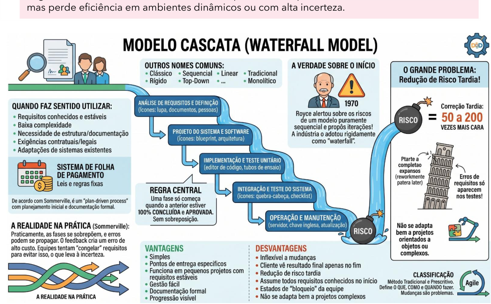

<!-- Start of picture text -->
mas perde eficiência em ambientes dinâmicos ou com alta incerteza. <!-- End of picture text -->

---

<!-- pagina: 28 -->

**Diego Carvalho, Equipe Informática 2 (Diego Carvalho), Equipe Informática 1 (Diego Carvalho) Aula 00** 

##### **Modelo em V** 

###### **<mark>INCIDÊNCIA EM PROVA: BAIXÍSSIMA</mark>** 

###### **<mark>MODELO EM V</mark>** 

Modelo de desenvolvimento de software que organiza as etapas de forma sequencial, associando cada fase de especificação e projeto a uma fase correspondente de teste e validação. Enquanto o lado esquerdo do “V” representa a definição de requisitos, arquitetura e design, o lado direito corresponde aos testes de unidade, integração, sistema e aceitação. Essa estrutura garante rastreabilidade entre requisitos e testes, promovendo maior qualidade e confiabilidade, especialmente em projetos com requisitos bem definidos e estáveis. 

Roger Pressman apresenta uma variação visual e conceitual do Modelo em Cascata chamada Modelo em V. O Modelo em V não é apenas uma representação gráfica diferente — ele tem um propósito específico: evidenciar a relação de rastreabilidade entre cada fase de desenvolvimento e sua correspondente fase de teste e validação. 

Como funciona? Imagine a letra V. No lado esquerdo, descendo, temos as fases de desenvolvimento: os requisitos são refinados em representações cada vez mais detalhadas e técnicas, até chegar ao código. No lado direito, subindo, temos as fases de teste e garantia de qualidade, que validam cada modelo e artefato produzido no lado esquerdo. 

A ideia central é esta: cada atividade do lado esquerdo tem uma atividade de teste correspondente no lado direito. Por exemplo: os requisitos de sistema (lado esquerdo) correspondem aos testes de aceitação (lado direito); o projeto de arquitetura corresponde aos testes de integração; e o projeto detalhado de componentes corresponde aos testes de unidade. 

E aqui vem um detalhe importante que Pressman enfatiza: os testes são executados no lado direito, mas são planejados no lado esquerdo — ou seja, enquanto você está levantando requisitos, já deve estar pensando em como vai validar se esses requisitos foram atendidos. Isso é garantia de qualidade proativa, não reativa. O Modelo em V mantém a natureza sequencial do Cascata, mas torna explícita a correspondência entre construção e verificação — o que o torna particularmente útil em contextos onde a rastreabilidade entre requisitos e testes é uma exigência formal, como em sistemas críticos de segurança. 

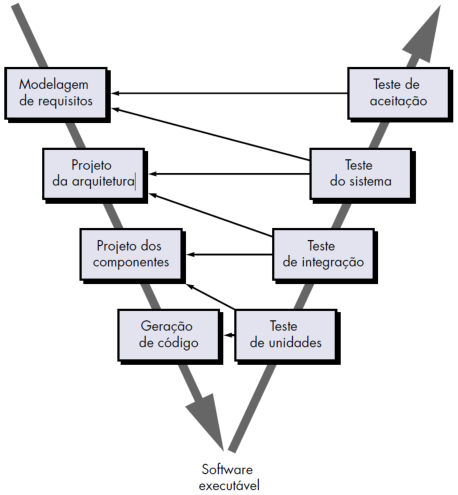

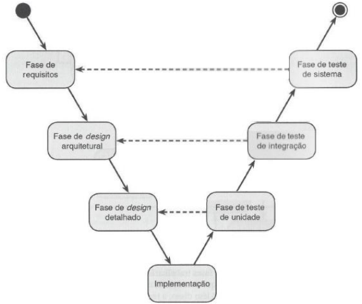

---

<!-- pagina: 29 -->

**Diego Carvalho, Equipe Informática 2 (Diego Carvalho), Equipe Informática 1 (Diego Carvalho) Aula 00** 

##### **Saiba mais:** 

<mark>Um exemplo típico de uso do modelo em V é o desenvolvimento de um sistema embarcado para um equipamento médico, como um monitor cardíaco hospitalar.</mark> 

<mark>Nesse cenário, os requisitos são altamente críticos, bem definidos e regulados por normas rígidas. Cada etapa de especificação (requisitos, arquitetura, design detalhado) precisa ter um correspondente direto de validação (teste de aceitação, sistema, integração, unidade), garantindo rastreabilidade completa entre o que foi definido e o que foi testado.</mark> 

<mark>As vantagens desse contexto são: alta confiabilidade (cada requisito tem um teste associado, reduzindo falhas críticas); rastreabilidade total (é possível mapear exatamente qual teste valida qual requisito); qualidade elevada (os testes são planejados desde o início, não no final); e adequação a ambientes regulados (ideal para setores como saúde, aeronáutica e bancário).</mark> 

<mark>Já as desvantagens desse contexto são: baixa flexibilidade (mudanças nos requisitos exigem revisão de várias fases e testes); alto custo inicial (exige muito planejamento e documentação detalhada); processo mais lento (a rigidez do modelo reduz a agilidade no desenvolvimento); e pouco adaptável a incertezas (não é ideal quando os requisitos não estão bem definidos).</mark> 

<mark>Logo, o modelo em V é mais adequado quando há necessidade de alta confiabilidade e validação rigorosa, e os requisitos são claros e estáveis desde o início. Em contrapartida, perde</mark> eficiência em projetos dinâmicos ou com mudanças frequentes. 

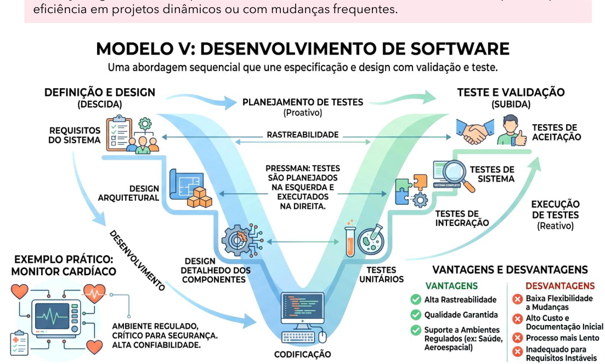

<!-- Start of picture text -->
eficiência em projetos dinâmicos ou com mudanças frequentes. <!-- End of picture text -->

---

<!-- pagina: 30 -->

**Diego Carvalho, Equipe Informática 2 (Diego Carvalho), Equipe Informática 1 (Diego Carvalho) Aula 00** 

<!-- Start of picture text -->
Modelo Iterativo <!-- End of picture text -->

<!-- Start of picture text -->
s <!-- End of picture text -->

##### **Modelos Incrementais** 

###### **<mark>INCIDÊNCIA EM PROVA: ALTA</mark>** 

###### **<mark>MODELO INCREMENTAL</mark>** 

Abordagem de desenvolvimento de software em que o sistema é construído e entregue em partes funcionais (incrementos), enquanto cada parte e o produto como um todo são continuamente refinados por meio de ciclos sucessivos (iterações). Assim, novas funcionalidades são adicionadas progressivamente, ao mesmo tempo em que melhorias, correções e ajustes são aplicados com base em feedback, permitindo entregas frequentes de valor e maior adaptação a mudanças nos requisitos. 

Comecemos pela pergunta: por que esse modelo surgiu? Como vimos anteriormente, o Modelo em Cascata acumulava riscos e vários projetos começaram a fracassar um atrás do outro ao utilizá-lo no mundo inteiro. Diego, o que você quer dizer com fracassar? O projeto não era entregue, ou era entregue de forma completamente errada, ou era entregue faltando partes, ou era entregue no dobro do prazo combinado, ou era entregue com o dobro do custo acordado — enfim, diversos motivos! 

Foi nesse contexto que surgiu o Modelo Iterativo e Incremental como uma tentativa de resolver esse problema de acúmulo de riscos. Mas antes de entender como ele funciona, precisamos entender as duas abordagens que o compõem. E aqui já começa um ponto importante: iterativo e incremental não são a mesma coisa, apesar de andarem sempre juntos na prática. Vamos ver as diferenças com calma... 

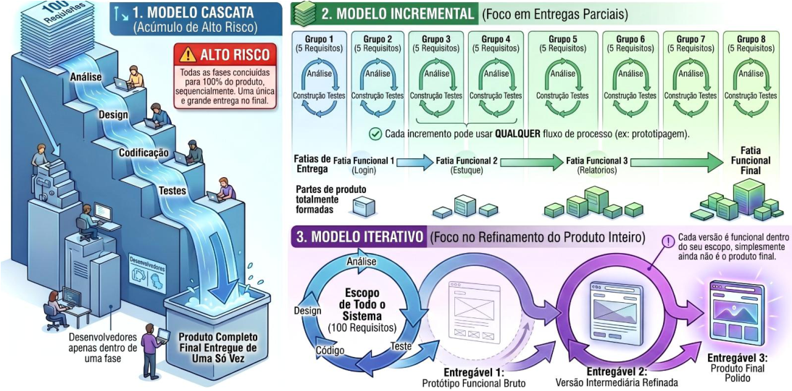

Vamos usar o mesmo exemplo para comparar as três abordagens. Imagine que temos cem requisitos a serem desenvolvidos. No Modelo em Cascata, analisam-se os cem requisitos, projetam-se os cem requisitos, codificam-se os cem requisitos, testam-se os cem requisitos — tudo sequencialmente, de uma vez só, sem entregar nada ao cliente até o final. Vocês já sabem os problemas que isso causa! 

No Modelo Incremental, dividem-se os cem requisitos em partes menores — digamos, vinte grupos de cinco requisitos cada — e desenvolve-se cada parte de forma independente, entregando fatias funcionais do sistema ao longo do tempo. Aqui vem um ponto importante: cada incremento não precisa

---

<!-- pagina: 31 -->

**Diego Carvalho, Equipe Informática 2 (Diego Carvalho), Equipe Informática 1 (Diego Carvalho) Aula 00** 

necessariamente usar o Cascata internamente. Pressman deixa claro que cada incremento pode incorporar qualquer fluxo de processo — inclusive prototipação. O que define o incremental não é o processo interno de cada parte, mas sim a ideia de dividir o produto em entregas parciais e funcionais. 

Já no Modelo Iterativo, passa-se por todas as fases do desenvolvimento cobrindo os cem requisitos, porém entregando versões progressivamente refinadas do sistema — e repetindo esse ciclo de melhoria até chegar ao produto final desejado. Aqui há um cuidado importante: o iterativo não entrega requisitos "incompletos" no sentido de quebrados ou defeituosos. Cada versão é funcional dentro do seu escopo — ela simplesmente ainda não é o produto final. A cada ciclo, o sistema fica mais completo e mais refinado. 

Vamos usar a analogia clássica da Monalisa para entender isso visualmente, porque ela esclarece muito bem a distinção. Imaginem um artista que já tem em mente a ideia completa do quadro. O modelo incremental divide o quadro em partes e desenvolve cada parte separadamente — primeiro o rosto, depois o fundo, depois as mãos — até integrar tudo em uma imagem completa. Cada parte entregue é funcional e definitiva. Ele produz builds, isto é, partes do software que são integradas progressivamente. 

A integração acontece ao longo do processo, não toda de uma vez no final! Cada incremento é entregue, avaliado e integrado durante o desenvolvimento — é isso que permite ao cliente dar feedback cedo. 

Já o Modelo Iterativo, o esboço que evolui: imaginem um artista que começa com um esboço grosseiro do quadro inteiro. Ele não divide o quadro em partes — ele refina o quadro inteiro repetidamente, versão após versão, até chegar ao nível de detalhe e qualidade desejado. A primeira versão já é reconhecível como a Monalisa, mas ainda grosseira. A segunda está mais refinada. A terceira, mais ainda. Ele produz releases, isto é, versões completas mas progressivamente melhoradas do software. 

Em suma: no modelo incremental, o produto cresce a cada entrega e você adiciona pedaços novos; no modelo iterativo, o produto evolui a cada ciclo e você refina o que já existe. 

Pressman e Sommerville são claros: na prática, a maioria dos modelos modernos combina as duas abordagens. Entregam-se incrementos (partes novas do sistema) que também são iterativamente refinados ao longo do desenvolvimento. Por isso o nome correto é Modelo Iterativo e Incremental e, não, Iterativo ou Incremental. A imagem seguinte representa isso por meio de miniprojetos sendo

---

<!-- pagina: 32 -->

**Diego Carvalho, Equipe Informática 2 (Diego Carvalho), Equipe Informática 1 (Diego Carvalho) Aula 00** 

desenvolvidos iterativamente: cada iteração (passagem pelas fases de desenvolvimento) refina cada vez mais a funcionalidade, enquanto novos incrementos vão sendo adicionados ao produto. 

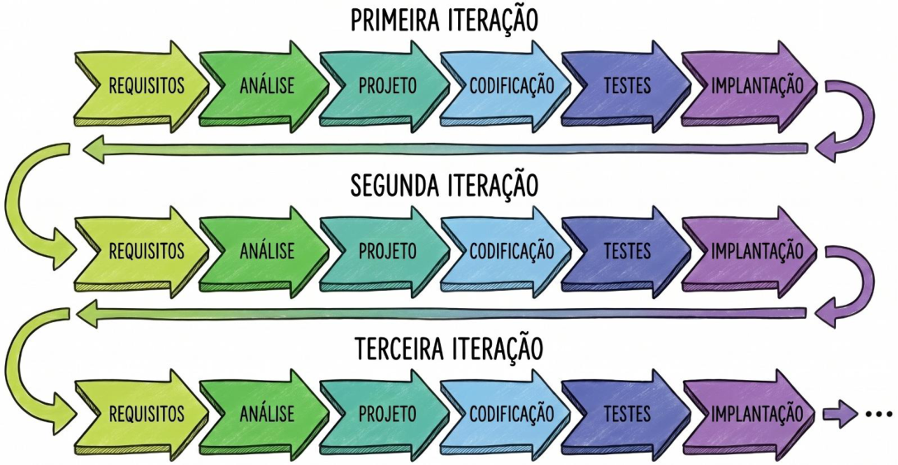

Antes de continuar, um alerta importante: cuidado com a grafia das palavras iterativo e interativo! Eu já as vi utilizadas de forma invertida dezenas de vezes em provas e até em editais. Por vezes, bancas não acatam recursos contra isso. Então, gravem: iterativo é sinônimo de reiterado, repetitivo – refere-se a ciclos de repetição e realiza entregas parciais ou funcionais, produzindo builds; e interativo é sinônimo de participação ou ação mútua – refere-se à interação entre partes e realiza versões completas progressivamente refinadas do produto, produzindo releases. 

Agora que entendemos as diferenças, vejamos por que esse modelo é tão superior ao Modelo em Cascata. Uma das principais vantagens do modelo iterativo e incremental é que o cliente pode receber e avaliar entregas do produto desde o início do desenvolvimento — não apenas no final. Isso, por si só, resolve o principal problema do Modelo em Cascata. Além disso, há uma maior tolerância a mudanças: como o desenvolvimento é dividido em ciclos curtos, uma mudança de requisito afeta apenas o incremento em curso, não o projeto inteiro. 

Há também uma redução de riscos desde o início: ao contrário do Cascata, que acumula riscos até as fases finais, aqui os riscos são identificados e mitigados desde as primeiras entregas. Ocorre também um feedback contínuo, isto é, o cliente vê versões funcionais do sistema desde cedo e pode identificar problemas antes que se tornem caros de corrigir. E há um aumento do reúso e da qualidade: ciclos de refinamento permitem melhorias contínuas na arquitetura e no código. 

|**ASPECTOS**|**INCREMENTAL**|**ITERATIVO**|
|---|---|---|
|**IDEIA CENTRAL**|Divide o produto em partes e entrega funcionalidadesgradualment|Refina o produto completo por meio de ciclos contínuos sucessivos|
|**ANALOGIA**|Como montar um quebra-cabeças adicionandopeças ao longo do tempo|Como um esboço que vai sendo melhorado com mais detalhes a cada ciclo|

---

<!-- pagina: 33 -->

**Diego Carvalho, Equipe Informática 2 (Diego Carvalho), Equipe Informática 1 (Diego Carvalho) Aula 00** 

|**O QUE ENTREGA**|Entrega builds com partes funcionais que somam valorprogressivo|Entrega releases com versões aprimoradas do sistema ao longo do tempo|
|---|---|---|
|**QUANDO** **INTEGRA**|Integra funcionalidades ao longo do processo,não apenas no final|Integra melhorias a cada ciclo, evoluindo a versão existente do sistema|
|**PROCESSO** **INTERNO**|Pode usar diversos fluxos, não se limitando ao modelo cascata|Percorre fases do desenvolvimento repetidamente em ciclos iterativos|
|**NA PRÁTICA**|Geralmente aplicado junto ao iterativo para evolução incremental|Normalmente combinado ao incremental para entregas evolutivas|

Certo! Agora que já entendemos as diferenças entre iterativo e incremental, vamos ver por que esse modelo é tão superior ao Cascata na maioria dos contextos modernos — e como nossos dois autores principais o descrevem. Uma das principais vantagens do modelo iterativo e incremental é que o cliente pode receber e avaliar entregas do produto desde o início do desenvolvimento — não apenas no final. 

Além disso, o modelo apresenta maior tolerância a mudanças, com consequência direta de redução do risco de falha do projeto. Em outras palavras, ele acomoda melhor mudanças, aumentando o reúso e a qualidade do produto. Lembram do exemplo do pedreiro e da casa? Aqui vale exatamente o mesmo raciocínio: se o pedreiro mostra a obra a cada etapa — fundação pronta, alvenaria pronta, acabamento parcial —, o cliente pode corrigir o rumo antes de tudo estar construído. O custo de uma correção antecipada é sempre muito menor do que o custo de uma correção tardia. 

Sommerville afirma que o desenvolvimento incremental é baseado na ideia de desenvolver uma implementação inicial, expô-la aos comentários dos usuários e continuar por meio da criação de várias versões até que um sistema adequado seja desenvolvido. As atividades de especificação, desenvolvimento e validação são intercaladas — e não separadas —, com rápido feedback permeando todas elas. 

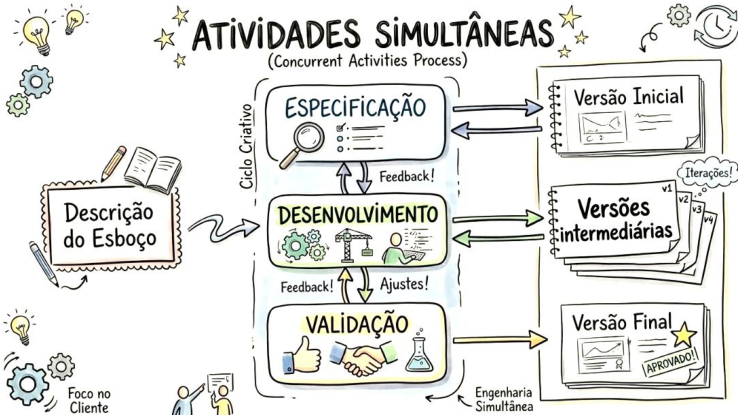

Percebam a diferença em relação ao Cascata: no Cascata, você especifica tudo, depois projeta tudo, depois implementa tudo, depois testa tudo — uma fase de cada vez, sem sobreposição. No incremental, essas atividades acontecem em paralelo e se alimentam mutuamente. Você especifica um pouco, desenvolve um pouco, valida um pouco — e o feedback de uma alimenta a outra continuamente. 

Sommerville é bastante enfático ao afirmar que o desenvolvimento incremental reflete a maneira como resolvemos problemas na vida real. Raramente elaboramos uma solução completa com antecedência — geralmente movemo-nos passo a passo em direção a uma solução, recuando quando percebemos que

---

<!-- pagina: 34 -->

**Diego Carvalho, Equipe Informática 2 (Diego Carvalho), Equipe Informática 1 (Diego Carvalho) Aula 00** 

cometemos um erro. É exatamente isso que o modelo incremental faz: permite que o time recue e corrija o rumo de forma barata e estruturada. 

Sommerville destaca três vantagens centrais do desenvolvimento incremental em comparação ao Cascata. Essas três vantagens são importantes para prova, então gravem bem: 

Custo de mudança reduzido: adaptar requisitos do cliente torna-se mais econômico, pois o desenvolvimento é estruturado em ciclos curtos e bem definidos. Dessa forma, eventuais alterações impactam apenas o incremento em andamento, sem comprometer todo o projeto. Além disso, o volume de análise e documentação que precisa ser revisado é muito menor quando comparado ao Modelo em Cascata, o que aumenta a flexibilidade e torna o processo mais ágil e eficiente. 

Feedback mais fácil: é mais fácil obter feedback dos clientes sobre o desenvolvimento realizado. Os clientes podem comentar sobre demonstrações reais do software e ver o quanto foi implementado. Sommerville faz uma observação muito perspicaz aqui: clientes têm dificuldade em avaliar a evolução do sistema por meio de documentos de projeto. Mostrar software funcionando é muito mais eficaz do que mostrar diagramas e especificações. 

Entrega rápida de valor: é possível disponibilizar ao cliente versões úteis do software em pouco tempo, mesmo que nem todas as funcionalidades estejam completas. Como o desenvolvimento ocorre de forma incremental, cada entrega já agrega valor real e pode ser utilizada na prática. Isso permite obter feedback antecipado e ajustar o produto conforme necessário, sendo muito mais vantajoso do que esperar a conclusão total do projeto para só então realizar a primeira entrega. 

Sommerville afirma que o desenvolvimento incremental é, atualmente, a abordagem mais comum para o desenvolvimento de sistemas. Ele pode ser dirigido a planos (os incrementos são todos identificados previamente, antes do desenvolvimento começar); pode ser ágil (apenas os incrementos iniciais são identificados; os posteriores dependem do progresso e das prioridades dos clientes); e pode ser misto (o mais comum na prática — uma combinação das duas abordagens anteriores). 

Aqui vai um ponto que Sommerville destaca e que é importante para prova: expor o sistema incrementalmente aos comentários dos clientes é diferente de entregá-lo incrementalmente para uso em produção. Você pode desenvolver um sistema de forma incremental e mostrar versões ao cliente para obter feedback, sem realmente implantá-lo no ambiente real de trabalho. 

Já a entrega e implantação incremental significa que o software passa a ser usado em processos operacionais reais — e isso nem sempre é possível. Por quê? Porque experimentações com o novo software podem interromper os processos normais de negócios do cliente. Imaginem uma empresa que precisa continuar operando normalmente enquanto o novo sistema ainda está sendo construído — substituir partes do sistema em produção pode causar instabilidade operacional. 

Agora vamos para o lado negativo — e esse é um ponto que já caiu em prova (inclusive no Senado Federal), então prestem atenção! Sommerville aponta três problemas do desenvolvimento incremental: 

O processo não é visível: se os sistemas são desenvolvidos rapidamente, não é economicamente viável produzir documentos formais para cada versão do sistema. Sem documentação regular, os gerentes perdem a capacidade de monitorar o progresso de forma estruturada — eles precisam de entregas tangíveis para acompanhar o andamento do projeto, e no incremental isso fica mais difícil de formalizar. 

Os sistemas são frequentemente mal estruturados: mudanças contínuas tendem a corromper a estrutura interna do software ao longo do tempo. Cada modificação acrescenta um pouquinho de complexidade e inconsistência à arquitetura. Com o tempo, o código fica difícil de entender, modificar e manter. Esse

---

<!-- pagina: 35 -->

**Diego Carvalho, Equipe Informática 2 (Diego Carvalho), Equipe Informática 1 (Diego Carvalho) Aula 00** 

fenômeno tem um nome técnico importante: degradação arquitetural. É um risco real em sistemas que evoluem sem um controle rigoroso da arquitetura. Sommerville observa que, sem investimento regular em refatoração e melhoria da estrutura, os custos de manutenção tendem a crescer continuamente. 

Dificuldade de gerenciar contratos: esse é o problema que muitos materiais omitem! Em contratos de software tradicionais, o cliente especifica tudo no início e o fornecedor entrega tudo no final — com escopo, prazo e custo definidos previamente. O modelo incremental é incompatível com esse modelo contratual tradicional, porque trabalha com especificações que evoluem ao longo do desenvolvimento. O que foi especificado no início pode mudar significativamente até o final — e contratos tradicionais não acomodam bem isso. Essa é uma barreira real para a adoção do modelo incremental em contextos mais formais e regulados. 

Esses problemas são particularmente críticos para sistemas de longa vida útil, grandes e complexos, nos quais várias equipes desenvolvem diferentes partes do sistema. Sistemas de grande porte necessitam de um framework e uma arquitetura estáveis, com responsabilidades de equipes claramente definidas com antecedência — e não desenvolvidas de forma incremental. 

Pressman aborda o modelo incremental de uma perspectiva ligeiramente diferente, mas complementar à de Sommerville. Para Pressman, o modelo incremental é especialmente adequado quando os requisitos iniciais são razoavelmente bem definidos, mas o escopo geral do trabalho é grande demais para um processo puramente linear. 

Atenção a esse ponto, porque ele distingue o incremental do evolucionário! O modelo incremental de Pressman pressupõe que você já conhece bem os requisitos — você só não consegue implementar tudo de uma vez. Já os modelos evolucionários (como a Espiral e a Prototipação, que veremos adiante) são usados justamente quando os requisitos não são bem conhecidos e precisam ser descobertos ao longo do processo. 

Não confundam os dois! Voltando ao Pressman: em muitos casos, pode ser necessário o rápido fornecimento de um conjunto funcional inicial aos usuários, para somente após esse fornecimento, refinar e expandir a funcionalidade em versões posteriores. Nesses casos, o modelo incremental é a escolha natural. 

O modelo incremental de Pressman combina elementos dos fluxos de processos lineares e paralelos. Cada incremento aplica uma sequência linear de atividades — análise, projeto, codificação, teste —, mas vários incrementos podem ocorrer em paralelo, de forma escalonada no tempo. Cada sequência linear gera um produto entregável, aprovado e liberado ao cliente. 

Para ilustrar o modelo incremental de Pressman, vamos usar o exemplo clássico de um software de processamento de texto desenvolvido de forma incremental. Imaginem o seguinte plano de incrementos: 

1º incremento: funções básicas de gerenciamento de arquivos, edição e produção de documentos. 2º incremento: recursos mais sofisticados de edição e produção de documentos. 

3º incremento: revisão ortográfica e gramatical. 

4º incremento: recursos avançados de formatação (layout) de página. 

Percebam que cada incremento entrega algo funcional e útil ao cliente. O usuário já consegue trabalhar com o sistema desde o primeiro incremento, mesmo que ainda não tenha todos os recursos. E a cada incremento, o produto fica mais completo. Vale notar também que o fluxo de processos de cada incremento pode incorporar o paradigma da prototipação — ou seja, dentro de um incremento, pode-se usar um protótipo para explorar requisitos incertos antes de implementar a solução definitiva.

---

<!-- pagina: 36 -->

**Diego Carvalho, Equipe Informática 2 (Diego Carvalho), Equipe Informática 1 (Diego Carvalho) Aula 00** 

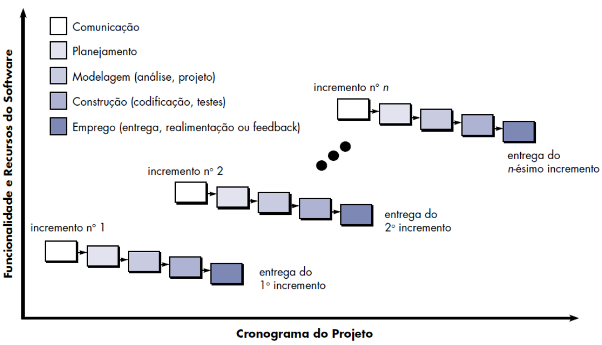

Aqui Pressman é muito preciso: a implementação inicial de um incremento não é um protótipo — ela é um produto funcional e definitivo. Um protótipo é descartável e serve para explorar incertezas. Um incremento é entregável e permanente. Confundir os dois é um erro conceitual importante. Ele também usa uma expressão muito específica para descrever o primeiro incremento: produto essencial ( _core product_ ). O que isso significa? 

O produto essencial atende aos requisitos básicos do sistema, mas ainda não inclui todos os recursos complementares — alguns desses recursos são conhecidos desde o início, outros ainda não. Esse produto essencial é utilizado pelo cliente ou passa por uma avaliação detalhada. Com base nisso, é desenvolvido um planejamento para o incremento seguinte, considerando modificações no produto essencial e a adição de novas funcionalidades. Esse ciclo se repete até que o produto completo seja entregue. 

O conceito de produto essencial é importante por duas razões práticas: Gestão de Pessoal e Gestão de Riscos Técnicos. No primeiro caso, os primeiros incrementos podem ser implementados com uma equipe menor. Se o produto essencial for bem recebido, pessoal adicional pode ser incorporado para os incrementos seguintes — o que dá flexibilidade para o gerente de projeto. 

Já no segundo caso, os incrementos podem ser planejados estrategicamente para contornar riscos técnicos. Por exemplo: se um sistema importante depende de um novo hardware ainda em desenvolvimento com data de entrega incerta, os incrementos iniciais podem ser planejados para funcionar sem esse hardware — liberando funcionalidade parcial aos usuários finais sem atraso excessivo. 

Por fim, é importante mencionar que o modelo de "produto essencial" consolidou-se comercialmente como MVP (Minimum Viable Product ou Produto Mínimo Viável). O MVP não dispensa os padrões fundamentais de qualidade comercial. Apesar de ter seu escopo inicial reduzido às funcionalidades críticas (parciais) para validar o mercado, o software precisa ter usabilidade satisfatória e níveis adequados de confiabilidade, já que será utilizado por clientes reais na validação do seu próprio modelo de negócios.

---

<!-- pagina: 37 -->

**Diego Carvalho, Equipe Informática 2 (Diego Carvalho), Equipe Informática 1 (Diego Carvalho) Aula 00** 

Ademais, é importante não confundir o conceito de protótipo de software técnico com o de um MVP. Enquanto um protótipo é comumente uma representação funcional criada para testar premissas, características técnicas ou refinar o escopo com o contratante, o MVP é um produto real e robusto (ainda que mínimo). O principal objetivo de um MVP é validar uma solução rentável, utilizável e valiosa para o negócio de frente para o usuário final, operando em cenário comercial produtivo. 

##### **Saiba mais:** 

<mark>Um exemplo clássico de uso do modelo iterativo e incremental é o desenvolvimento de um aplicativo de banco digital (fintech). Imagine que uma empresa decide lançar o app em partes:</mark> 

<mark>-- No  primeiro incremento, ela decide disponibilizar as funcionalidades de cadastro de usuário, login e consulta de saldo. Logo, já é um produto utilizável pelo cliente.</mark> 

<mark>-- No segundo incremento, ela decide disponibilizar as funcionalidades de transferências (PIX) e histórico de transações. Logo, o sistema cresce com novas funcionalidades.</mark> 

<mark>-- No terceiro incremento, ela decide disponibilizar as funcionalidades de pagamento de boletos e cartão virtual.</mark> 

<mark>Enquanto isso, funcionalidades já existentes são refinadas: interface do app melhora com base no feedback, a performance é otimizada, a segurança é reforçada e os bugs são corrigidos. Logo, o modelo incremental adiciona novas funcionalidades e o modelo iterativo melhora o que já existe.</mark> 

<mark>Por que esse modelo é ideal aqui? O banco pode lançar rápido e começar a operar, recebe feedback real dos usuários, evolui o produto continuamente e reduz risco de construir algo que ninguém usa. O modelo iterativo e incremental funciona muito bem quando o sistema pode ser entregue em partes, há necessidade de evolução contínua e o feedback do usuário é essencial.</mark> Por isso, é o modelo mais usado em produtos digitais modernos.

---

<!-- pagina: 38 -->

**Diego Carvalho, Equipe Informática 2 (Diego Carvalho), Equipe Informática 1 (Diego Carvalho) Aula 00** 

##### **Modelos Evolutivos** 

###### **<mark>MODELO EVOLUCIONÁRIOS</mark>** 

Abordagem de processo de software em que o sistema é desenvolvido por meio de versões sucessivas, cada uma delas refinando e expandindo a anterior. Em vez de especificar completamente todos os requisitos desde o início, o desenvolvimento ocorre de forma iterativa, permitindo que requisitos sejam progressivamente compreendidos e incorporados com base em feedback contínuo dos usuários. Essa abordagem reduz incertezas, melhora o alinhamento com as necessidades reais e possibilita a entrega incremental de valor, embora exija <mark>controle rigoroso para evitar perda de estrutura e qualidade ao longo das iterações.</mark> 

Antes de entrar nos modelos evolucionários específicos — Prototipação e Espiral —, precisamos entender por que eles existem e o que os diferencia dos modelos que vimos até aqui. Esse é um ponto conceitual importante que vai fazer tudo fazer mais sentido. Roger Pressman parte de uma observação bastante simples e poderosa: softwares, assim como outros sistemas complexos, evoluem ao longo do tempo. 

Conforme o desenvolvimento do projeto avança, as necessidades de negócio e de produto mudam — e seguir um planejamento em linha reta em direção a um produto final predefinido pode se tornar inadequado ou até impossível. Prazos apertados tornam inviável entregar um produto de software completo de uma só vez, mas uma versão limitada pode precisar ser introduzida para aliviar pressões comerciais ou competitivas. Em determinadas situações, é necessário um modelo de processo projetado especificamente para desenvolver um produto que evolua progressivamente — e é exatamente para isso que servem os modelos evolucionários. 

Antes de qualquer coisa, um ponto de classificação importante: a imensa maioria dos autores considera os modelos evolucionários como um tipo de modelo iterativo. Pressman é explícito sobre isso: 

_"Os modelos evolucionários são iterativos, apresentando características que possibilitam desenvolver versões cada vez mais completas do software"_ 

Logo, não estamos falando de algo completamente diferente do que já estudamos — estamos falando de uma família específica de modelos iterativos, com características próprias que os distinguem do modelo incremental clássico. E quais são essas características? A distinção tem duas dimensões que precisam ser entendidas juntas... 

A primeira dimensão refere-se à natureza dos requisitos: essa é a diferença mais fundamental e a que Pressman mais enfatiza. No modelo incremental, os requisitos são razoavelmente conhecidos desde o início. O problema não é descobrir o que construir — é que o escopo é grande demais para entregar tudo de uma vez. Então, divide-se em partes e entrega-se progressivamente. 

Já no modelo evolucionário, os requisitos são incertos, incompletos ou sujeitos a mudanças significativas. O processo é projetado justamente para descobrir e refinar os requisitos ao longo do desenvolvimento — não apenas para implementá-los de forma incremental. Percebam a diferença prática: no incremental, você sabe o que vai construir — só não consegue construir tudo de uma vez. No evolucionário, você ainda está descobrindo o que precisa ser construído. São contextos completamente diferentes! 

A segunda dimensão refere-se ao que é entregue em cada iteração. No modelo incremental, cada iteração sempre entrega funcionalidade operacional — uma parte real e funcional do sistema que o usuário pode usar. Já no modelo evolucionário, especialmente nas primeiras iterações, o resultado pode ser apenas modelos em papel, documentação ou protótipos não operacionais. 

É possível ter uma iteração inteira dedicada apenas a estudar melhor o problema, explorar alternativas de solução ou validar hipóteses de requisitos — sem entregar nada funcional ao usuário. Isso seria

---

<!-- pagina: 39 -->

**Diego Carvalho, Equipe Informática 2 (Diego Carvalho), Equipe Informática 1 (Diego Carvalho) Aula 00** 

inaceitável no modelo incremental, mas é perfeitamente válido no evolucionário. Juntando as duas dimensões, temos a distinção completa: 

|**ASPECTOS**|**INCREMENTAL**|**EVOLUCIONÁRIO**|
|---|---|---|
|**REQUISITOS**|Conhecidos desde o início|Incertos, descobertos ao longo do processo|
|**ENTREGA POR ITERAÇÃO**|Sempre funcionalidade operacional|Pode ser documentação, modelo ou protótipo|
|**CONTEXTO** **IDEAL**|Escopo grande, requisitos estáveis|Alta incerteza, mudanças esperadas|
|**OBJETIVO**|Implementar o que já se sabe|Descobrir e refinar o que se precisa construir|

E como Sommerville trata essa distinção? Aqui vale uma observação importante sobre a evolução do pensamento de Sommerville. Nas edições mais recentes do seu livro, ele reorganizou conceitualmente a classificação dos modelos de processo, passando a estruturá-los em torno de duas grandes filosofias: 

- **Processos Dirigidos a Planos (Plan-Driven):** onde as atividades são planejadas com antecedência e o progresso é medido em relação a esse plano. 

- **Processos Ágeis:** onde o planejamento é incremental e é mais fácil mudar o processo para refletir as necessidades mutáveis do cliente. 

Dentro dessa nova organização, o desenvolvimento incremental absorveu muito do que antes era chamado de evolucionário. Essa não foi uma decisão arbitrária — foi uma reorganização conceitual deliberada de Sommerville, que considerou que a distinção terminológica entre incremental e evolucionário gerava mais confusão do que clareza. 

O resultado prático para vocês: nas questões que se baseiam em Sommerville, é comum que evolucionário e incremental sejam tratados como sinônimos ou como parte de uma mesma família. Nas questões que se baseiam em Pressman, a distinção entre os dois pode ser cobrada — e as duas dimensões que vimos acima são os critérios que ele usa. 

Agora que entendemos o conceito geral, é hora de saber quais modelos se enquadram nessa categoria. Para Pressman, os principais modelos evolucionários são: 

- **Prototipação:** focado na construção de protótipos — versões preliminares e exploratórias do sistema — para ajudar a descobrir e refinar requisitos. É o modelo ideal quando o cliente sabe o que quer, mas não consegue descrever com precisão como deve ser. O protótipo serve como ferramenta de comunicação e descoberta. 

- **Modelo Espiral:** combina a natureza iterativa da prototipação com os aspectos sistemáticos e controlados do modelo em cascata. Seu diferencial é o gerenciamento explícito de riscos a cada ciclo — cada volta da espiral inclui uma fase dedicada a identificar, analisar e mitigar riscos antes de avançar. É o modelo mais adequado para projetos grandes, complexos e de alto risco. 

Veremos cada um desses modelos em detalhes nas próximas seções. Por ora, o importante é entender que ambos compartilham a mesma característica central dos modelos evolucionários: lidam com incerteza e mudança de forma estruturada, em contraste com o modelo incremental, que pressupõe requisitos razoavelmente estáveis.

---

<!-- pagina: 40 -->

**Diego Carvalho, Equipe Informática 2 (Diego Carvalho), Equipe Informática 1 (Diego Carvalho) Aula 00** 

##### **Saiba mais:** 

<mark>Modelos evolucionários são utilizados quando os requisitos de um sistema não estão completamente definidos no início do desenvolvimento. Em vez de tentar especificar tudo antecipadamente, o software é construído de forma gradual, permitindo que o entendimento do problema evolua ao longo do processo.</mark> 

<mark>Imagine o desenvolvimento de um sistema para um hospital que ainda não sabe exatamente todas as funcionalidades necessárias. Nesse cenário, a equipe cria uma primeira versão simples, com funcionalidades básicas, apenas para validar ideias iniciais e obter feedback dos usuários reais.</mark> 

<mark>Após essa primeira entrega, os usuários interagem com o sistema e identificam novas necessidades, como inclusão de histórico médico ou integração com exames. A partir desse retorno, o sistema é ajustado, aprimorado e expandido, dando origem a uma nova versão mais completa.</mark> 

<mark>Esse ciclo continua repetidamente, com novas versões sendo construídas, testadas e refinadas. Dessa forma, o software evolui com base no aprendizado contínuo, reduzindo riscos de erro e</mark> aumentando a aderência às reais necessidades do cliente ao longo do tempo. 

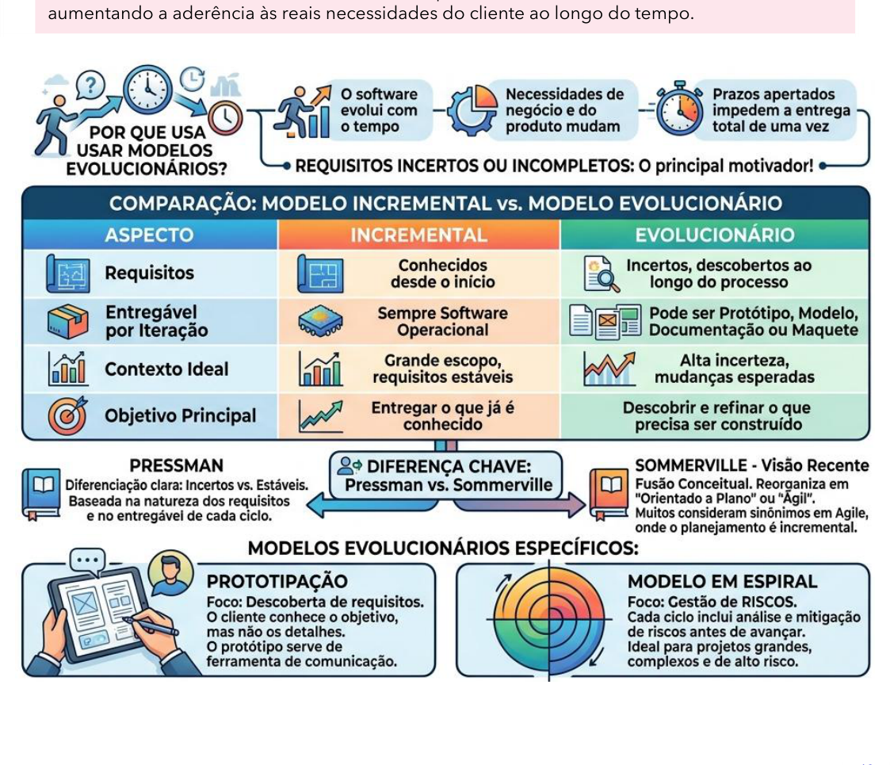

<!-- Start of picture text -->
aumentando a aderência às reais necessidades do cliente ao longo do tempo. <!-- End of picture text -->

---

<!-- pagina: 41 -->

**Diego Carvalho, Equipe Informática 2 (Diego Carvalho), Equipe Informática 1 (Diego Carvalho) Aula 00** 

<!-- Start of picture text -->
Prototipação <!-- End of picture text -->

###### **<mark>INCIDÊNCIA EM PROVA: MÉDIA</mark>** 

###### **<mark>PROTOTIPAÇÃO</mark>** 

<mark>Abordagem em que uma versão inicial e simplificada do sistema, chamada protótipo, é construída para ajudar</mark> na compreensão e validação dos requisitos. Esse protótipo é utilizado pelos usuários para explorar funcionalidades, esclarecer expectativas e fornecer feedback, permitindo que requisitos sejam refinados antes do desenvolvimento definitivo. O protótipo pode ser descartado após cumprir seu papel ou evoluir para o sistema final, dependendo da estratégia adotada, sendo especialmente útil em contextos de alta incerteza ou dificuldade de comunicação entre cliente e equipe técnica. 

Vamos começar entendendo o problema que a prototipação resolve — porque todo modelo de processo existe para resolver um problema específico, e a prototipação não é diferente. Imaginem a seguinte situação: um cliente chega até vocês e diz que quer um sistema, mas não consegue descrever com precisão o que ele precisa. Ele sabe o objetivo geral, mas os detalhes são vagos, incompletos ou contraditórios. 

Ou então vocês, como desenvolvedores, estão inseguros sobre a eficiência de um algoritmo, sobre como deve funcionar a interação do usuário com o sistema, ou sobre a viabilidade técnica de determinada abordagem. O que fazer nessa situação? Tentar especificar tudo antes de começar — como faria o Cascata — seria um desastre, porque simplesmente não há informação suficiente para isso. 

É exatamente para esse contexto que serve a prototipação: quando os requisitos são obscuros, incompletos ou incertos, e é necessário construir algo tangível para descobri-los e refiná-los. 

E o que é um protótipo? Segundo Sommerville, um protótipo é uma versão inicial de um sistema de software utilizada para demonstrar conceitos, experimentar opções de projeto e, principalmente, conhecer melhor o problema e suas possíveis soluções. Percebam o foco: o protótipo não é o produto final — ele é uma ferramenta de aprendizado e descoberta. O objetivo é aprender com ele, não entregálo ao cliente como produto final. 

Aqui vem um ponto importante que Pressman destaca e que cai em prova: a prototipação pode ser usada de duas formas diferentes: (1) como modelo de processo isolado (stand-alone), em que o projeto inteiro é conduzido sob a lógica da prototipação, desde o início até o final; ou (2) como técnica incorporada a outros modelos, em que a prototipação é usada em um determinado momento de outro processo — por exemplo, dentro de um incremento do modelo incremental — para explorar requisitos incertos antes de desenvolver a solução definitiva. 

Na prática, a segunda forma é muito mais comum. A prototipação raramente conduz um projeto inteiro sozinha — ela costuma aparecer como uma ferramenta dentro de outros modelos de processo, especialmente os ágeis e o modelo espiral. E para que serve um protótipo? Sommerville identifica dois usos principais para um protótipo dentro de um processo de desenvolvimento: 

**1. No processo de engenharia de requisitos:** o protótipo ajuda na elicitação e validação de requisitos. Os usuários veem o sistema funcionando — ainda que de forma parcial e rudimentar — e conseguem identificar o que está certo, o que está errado, o que falta e o que é desnecessário. É muito mais fácil para um usuário avaliar um protótipo concreto do que ler uma especificação abstrata em documento. 

**2. No processo de projeto do sistema:** o protótipo pode ser usado para estudar soluções técnicas específicas e apoiar o projeto de interface com o usuário. Por exemplo: um projeto de banco de dados pode ser prototipado e testado para verificar se suporta de forma eficiente as consultas mais comuns — antes de comprometer toda a arquitetura com essa decisão.

---

<!-- pagina: 42 -->

**Diego Carvalho, Equipe Informática 2 (Diego Carvalho), Equipe Informática 1 (Diego Carvalho) Aula 00** 

##### **Saiba mais:** 

<mark>Na prática da engenharia de requisitos, um protótipo pode assumir várias formas. Wireframes são esquemas estruturais estáticos que servem como "esqueleto" do software para priorizar a hierarquia da informação, muitas vezes sem cores ou tipografia final. Mockups são representações visuais detalhadas que refletem o design real (identidade visual) sem serem navegáveis. Por fim, os protótipos interativos adicionam interatividade simulada aos wireframes ou mockups, sendo extremamente úteis nas fases de elicitação para validar expectativas de</mark> experiência do usuário. 

<!-- Start of picture text -->
experiência do usuário. <!-- End of picture text -->

Sommerville acrescenta ainda que a prototipação é essencial no desenvolvimento de interfaces gráficas de usuário. Descrições textuais e diagramas simplesmente não são suficientes para expressar como uma interface deve se comportar dinamicamente. A prototipação rápida com envolvimento do usuário final é, segundo ele, a única forma sensata de desenvolver GUIs para sistemas de software. 

##### **Saiba mais:** 

<mark>Para a prototipagem de produtos digitais no cenário moderno, a trajetória da inovação está bastante acessível. O uso intensivo de ferramentas focadas em experiência do usuário (UX) e plataformas de desenvolvimento low-code (que demandam mínima codificação manual) permite o rápido avanço no desenho de interfaces. Dessa forma, é possível simular protótipos simples com fluxo completo para realizar testes de lógica com o usuário ou gerar provas de conceito</mark> rápidas de um produto sem necessitar de programação de alto custo inicialmente. 

Ian Sommerville descreve um modelo de processo para desenvolvimento de protótipos com quatro etapas bem definidas:

---

<!-- pagina: 43 -->

**Diego Carvalho, Equipe Informática 2 (Diego Carvalho), Equipe Informática 1 (Diego Carvalho) Aula 00** 

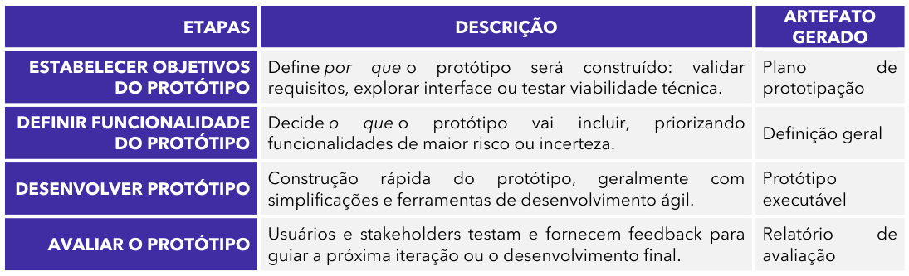

<!-- Start of picture text -->
ARTEFATO ETAPAS  DESCRIÇÃO GERADO ESTABELECER OBJETIVOS  Define  por  que  o  protótipo  será  construído:  validar  Plano  de DO PROTÓTIPO  requisitos, explorar interface ou testar viabilidade técnica.  prototipação DEFINIR FUNCIONALIDADE  Decide  o  que  o  protótipo  vai  incluir,  priorizando Definição geral DO PROTÓTIPO  funcionalidades de maior risco ou incerteza. Construção  rápida  do  protótipo,  geralmente  com  Protótipo DESENVOLVER PROTÓTIPO simplificações e ferramentas de desenvolvimento ágil.  executável Usuários e stakeholders testam e fornecem feedback para  Relatório  de AVALIAR O PROTÓTIPO guiar a próxima iteração ou o desenvolvimento final.  avaliação <!-- End of picture text -->

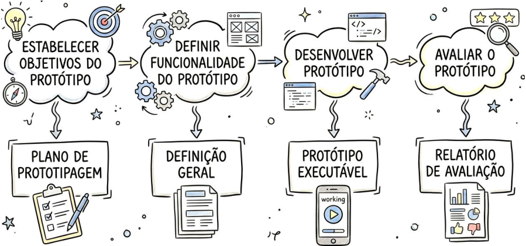

Pressman descreve o processo de prototipação de forma ligeiramente diferente, mas complementar. Para ele, o paradigma começa com a comunicação: uma reunião com todos os envolvidos para definir os objetivos gerais do software, identificar quais requisitos já são conhecidos e mapear quais áreas precisam de exploração mais aprofundada. 

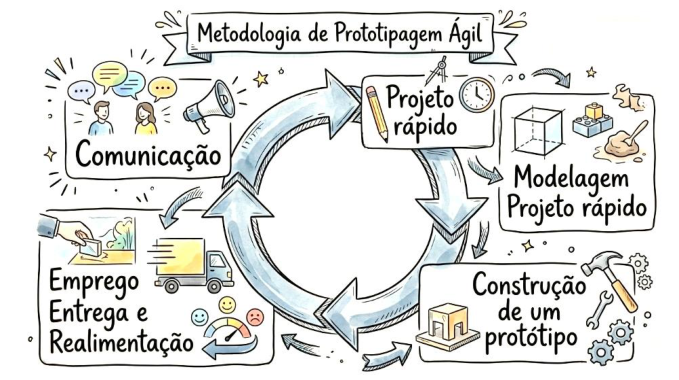

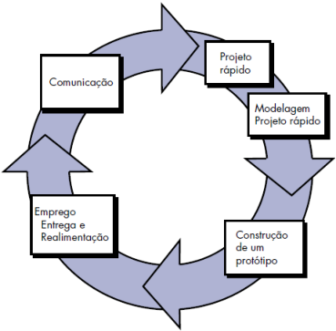

Em seguida, ocorre um planejamento rápido, seguido de modelagem na forma de um "projeto rápido". Esse projeto rápido se concentra nos aspectos do software que serão visíveis aos usuários finais — como o layout da interface ou os formatos de exibição de dados. Não é um projeto completo e definitivo; é uma

---

<!-- pagina: 44 -->

**Diego Carvalho, Equipe Informática 2 (Diego Carvalho), Equipe Informática 1 (Diego Carvalho) Aula 00** 

representação suficiente para construir o protótipo. O projeto rápido leva à construção do protótipo, que é empregado e avaliado pelos envolvidos. 

O feedback coletado serve para aprimorar os requisitos, e o ciclo se repete — ajustando o protótipo às necessidades dos interessados até que os requisitos estejam bem compreendidos. E o que fazer com o protótipo depois? Essa é uma questão central — e a resposta depende do tipo de prototipação adotado. Pressman e Sommerville reconhecem dois destinos possíveis para um protótipo: 

**<mark>TIPOS DESCRIÇÃO</mark>** O protótipo cumpre sua função de explorar e clarificar requisitos e depois é jogado **PROTÓTIPO** fora. O produto final é desenvolvido do zero, com base no aprendizado obtido. **DESCARTÁVEL** Pressman usa uma analogia direta: o protótipo é "o primeiro sistema" — que deve ser descartado para dar lugar a uma versão redesenhada e bem estruturada. <mark>O protótipo não é descartado. Pelo contrário, ele é refinado iterativamente</mark> **PROTÓTIPO** (repetidamente) até evoluir para o sistema final. Esse tipo de prototipação é mais **EVOLUCIONÁRIO** arriscado, pois o código desenvolvido rapidamente e sem rigor adequado pode acabar virando o produto entregue ao cliente. 

Em suma, a prototipação se baseia na construção de um protótipo que auxilia a levantar os requisitos junto aos usuários e depois ser descartado; ou ser refinado progressivamente até se tornar o sistema final. Sommerville formaliza essa distinção em dois tipos específicos — e essa nomenclatura pode cair em prova: Desenvolvimento Exploratório ou Prototipação Descartável. 

|**TIPOS**|**DESCRIÇÃO**|
|---|---|
|**DESENVOLVIMENTO** **EXPLORATÓRIO** **(EVOLUCIONÁRIO)**|O objetivo é trabalhar com o cliente para explorar os requisitos e entregar um sistema final. O desenvolvimento começa com as partes do sistema já compreendidas, e o sistema evolui por meio da adição de novas características propostas pelo cliente ao longo doprocesso. Oprotótipo não é descartado — ele se torna oproduto.|
|**DESENVOLVIMENTO** **THROWAWAY** **(DESCARTÁVEL)**|O objetivo é compreender os requisitos do cliente e desenvolver uma definição melhor para o sistema. O protótipo se concentra na experimentação dos requisitos mal compreendidos, mas é descartado ao final do processo de descoberta. O sistema real é desenvolvido separadamente.|

##### **Saiba mais:** 

<mark>Além de sua finalidade no ciclo de vida (descartável ou evolucionário), a prototipação classificase também pela sua fidelidade e pela sua abrangência.</mark> 

<mark>Quanto à abrangência, pode-se dizer que um "Protótipo Horizontal" mapeia muitas telas da interface do usuário superficialmente, sem implementar regras de negócio profundas. Já um "Protótipo Vertical" aprofunda-se implementando apenas um fluxo ou caso de uso de ponta a ponta (da interface até a lógica de dados).</mark> 

<mark>Quanto à fidelidade, pode-se dizer que um protótipo de "Baixa Fidelidade" utiliza recursos rústicos para provar um conceito rapidamente (como desenhos em papel ou quadros brancos); enquanto um protótipo de "Alta Fidelidade" utiliza designs visualmente idênticos ou muito</mark> próximos do software real. 

Sommerville deixa claro que, quando usa o termo "prototipação" sem qualificação, ele se refere à prototipação descartável — um processo iterativo de desenvolvimento de um sistema experimental que não é destinado à disponibilização ao cliente. Para ele, o desenvolvimento evolucionário é tratado como

---

<!-- pagina: 45 -->

**Diego Carvalho, Equipe Informática 2 (Diego Carvalho), Equipe Informática 1 (Diego Carvalho) Aula 00** 

uma forma de desenvolvimento incremental, não como prototipação propriamente dita. Logo, quando uma questão mencionar "prototipação" sem especificar o tipo, presuma que é descartável. Fechou? 

Agora um ponto que é muito cobrado em prova: os problemas e riscos da prototipação. Todo modelo tem suas fraquezas, e a prototipação não é exceção. Pressman aponta dois problemas centrais: 

Em primeiro lugar, o cliente não sabe que o protótipo é descartável. O cliente vê o protótipo funcionando — com telas, fluxos, interações — e naturalmente conclui que o produto final está quase pronto. Ele não enxerga os atalhos técnicos que foram tomados para construir aquele protótipo rapidamente. O resultado? Expectativas irreais sobre prazos e qualidade. O cliente começa a pressionar por entrega imediata de algo que ainda precisa ser completamente reconstruído. 

Em segundo lugar, o desenvolvedor faz concessões técnicas inadequadas. Para entregar o protótipo rapidamente, o desenvolvedor toma decisões técnicas ruins — algoritmos ineficientes, linguagens inadequadas, arquitetura improvisada. O problema é que, depois que o cliente viu o protótipo funcionando, há uma pressão enorme para usar aquele código como base do produto final, em vez de ==5460== descartá-lo. O desenvolvedor acaba sendo forçado a "embrulhar" código de má qualidade em um produto que vai a produção. Sommerville complementa com um problema igualmente relevante: protótipos descartáveis frequentemente não são de fato descartados. 

Na prática, há sempre pressão do cliente e do negócio para entregar o protótipo como produto final. Afinal, ele já existe, já funciona, e reconstruí-lo do zero parece um desperdício de tempo e dinheiro. O resultado são sistemas mal estruturados, difíceis de manter e que acumulam dívida técnica ao longo do tempo. Esses problemas têm uma solução prática: estabelecer desde o início, de forma explícita e documentada, que o protótipo é descartável. Todos os envolvidos (cliente, desenvolvedores e gerência) precisam entender e concordar com isso antes de o protótipo ser construído. 

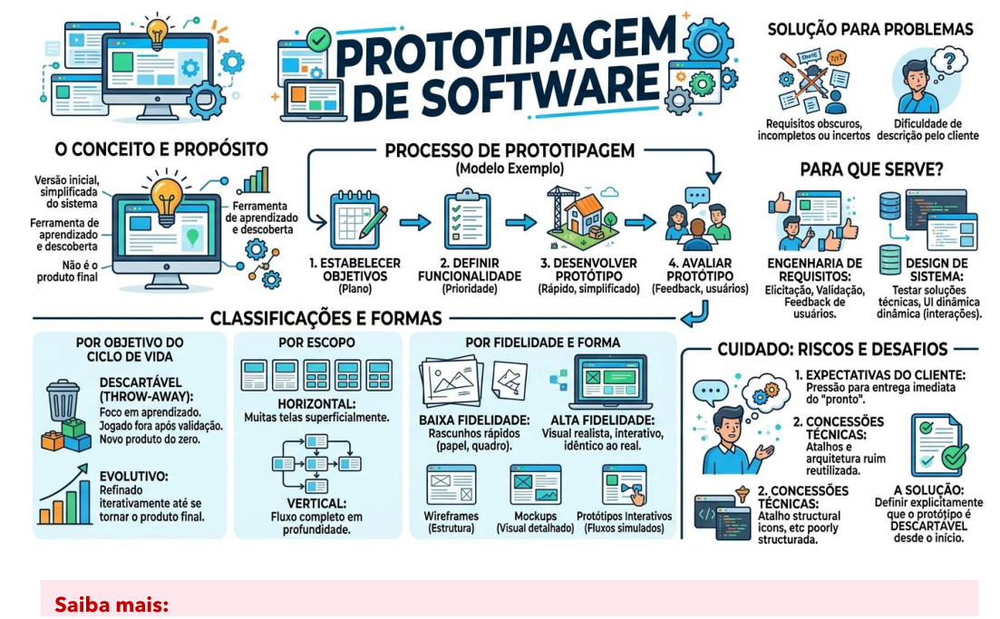

<!-- Start of picture text -->
Saiba mais: <!-- End of picture text -->

---

<!-- pagina: 46 -->

**Diego Carvalho, Equipe Informática 2 (Diego Carvalho), Equipe Informática 1 (Diego Carvalho) Aula 00** 

<mark>Outro risco relevante na validação por meio de protótipos diz respeito ao design da solução. Frequentemente, os stakeholders se concentram mais em aprovar especificações minuciosas e cosméticas do design do que na aderência dos requisitos funcionais reais. Simultaneamente, os próprios desenvolvedores podem sentir a pressão de entregar uma interface que copie de forma absolutamente precisa os atalhos criados no protótipo, ignorando o uso de tecnologias modernas e de abordagens de layout definitivas que seriam muito mais adequadas e</mark> interessantes em ambiente de produção.

---

<!-- pagina: 47 -->

**Diego Carvalho, Equipe Informática 2 (Diego Carvalho), Equipe Informática 1 (Diego Carvalho) Aula 00** 

**<mark>INCIDÊNCIA EM PROVA: MÉDIA</mark>** 

<!-- Start of picture text -->
Modelo em Espiral <!-- End of picture text -->

###### **<mark>MODELO EM ESPIRAL</mark>** 

Processo de desenvolvimento evolutivo orientado a riscos, no qual o software é construído por meio de ciclos iterativos (espirais). Cada ciclo envolve atividades de planejamento, análise de riscos, engenharia e avaliação com o cliente, permitindo identificar e mitigar incertezas antes de avançar. A cada volta da espiral, o sistema é progressivamente refinado e ampliado, combinando características de prototipação e desenvolvimento <mark>incremental, com forte ênfase na gestão sistemática de riscos ao longo de todo o projeto.</mark> 

Vamos falar agora sobre um dos modelos mais sofisticados e intelectualmente ricos que estudaremos: o Modelo Espiral. Ele foi proposto por Barry Boehm em 1988, e sua motivação foi muito clara: criar um modelo de processo que colocasse a análise de riscos no centro de cada ciclo de desenvolvimento, o que era algo que nenhum modelo anterior fazia de forma sistemática. 

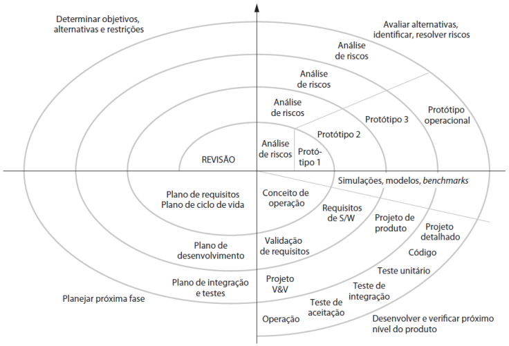

Vamos pensar nos modelos que já vimos: no Cascata, os riscos só aparecem nas fases finais — quando já é caro demais corrigi-los; no Incremental, os riscos de requisitos são reduzidos pelas entregas antecipadas, mas não há um mecanismo formal e recorrente de identificação e análise de riscos técnicos e de negócio; na Prototipação, os riscos de requisitos são tratados, mas de forma localizada e sem um processo estruturado de análise. O Espiral veio para resolver isso: tornar a análise de riscos um elemento obrigatório, formal e recorrente a cada volta do processo. Simples assim, mas poderoso. 

Em vez de representar o processo como uma sequência de atividades — como o Cascata — ou como ciclos de entrega — como o Incremental —, Boehm usou a metáfora de uma espiral que começa no centro e vai se expandindo para fora a cada nova volta. O que isso significa na prática? Cada volta completa da espiral representa uma fase do processo de software. As voltas mais internas lidam com questões mais abstratas e conceituais; as voltas mais externas lidam com aspectos cada vez mais concretos e operacionais. Vejamos um exemplo: 

- **Loop 1 (mais interno):** viabilidade do sistema e responde à pergunta “Faz sentido construir isso?”. 

- **Loop 2:** definição de requisitos e responde à pergunta “O que o sistema deve fazer?”. 

- **Loop 3:** projeto e arquitetura do sistema e responde à pergunta “Como será construído?”. 

- ▪ **Loop 4 (mais externo):** implementação, testes e manutenção.

---

<!-- pagina: 48 -->

**Diego Carvalho, Equipe Informática 2 (Diego Carvalho), Equipe Informática 1 (Diego Carvalho) Aula 00** 

E aqui está uma característica única do Modelo Espiral em relação a praticamente todos os outros: ele pode abranger todo o ciclo de vida do software, desde a concepção inicial até a aposentadoria do sistema. Pressman é explícito: diferente de outros modelos que terminam quando o software é entregue, o Espiral pode ser adaptado para ser aplicado ao longo de toda a vida útil do produto. 

Cada volta da espiral é dividida em quatro setores. Independentemente do loop em que se está, os setores são sempre os mesmos, o que muda é o conteúdo trabalhado em cada um deles. 

|**SETORES** |**O QUE ACONTECE AQUI?** |
|---|---|
|**DETERMINAR** **OBJETIVOS,** **ALTERNATIVAS E** **RESTRIÇÕES**|Definem-se os objetivos da fase atual (melhorar performance, corrigir funcionalidade, garantir segurança, etc.), identificam-se alternativas disponíveis (reúso de componentes, comprar um produto pronto, desenvolver do zero) e mapeiam-se as restrições impostas(custo, prazo,recursos humanos).|
|**AVALIAR ALTERNATIVAS,** **IDENTIFICAR E** **RESOLVER RISCOS**|As alternativas são avaliadas em relação aos objetivos e restrições. Áreas de incerteza são identificadas — custos excessivos, lacunas técnicas, requisitos ambíguos — e os riscos são resolvidos ou reduzidos antes de avançar. Um protótipo pode ser construído aquipara explorar incertezas e validar hipóteses.|
|**DESENVOLVER** **E TESTAR**|Após a redução dos riscos, seleciona-se um modelo de desenvolvimento adequado para aquela fase específica — pode ser prototipação evolucionária, Cascata, modelo baseado em componentes, entre outros. O software é desenvolvido e testado.|
|**PLANEJAR PRÓXIMAS** **FASES**|Revisa-se o trabalho realizado e decide-se sobre o prosseguimento ao próximo loop. Se a decisão for continuar, elaboram-se os planos para a próxima fase. Aqui ocorre um marco de ancoragem — que veremos em detalhes a seguir.|

Uma observação importante: os setores são fixos para todos os loops, o que muda a cada volta não são os setores, mas o conteúdo e o nível de detalhe trabalhado dentro deles. Roger Pressman, a partir da 6ª edição do seu livro, propõe uma organização ligeiramente diferente, com cinco setores: Comunicação, Planejamento, Modelagem, Construção e Implantação. 

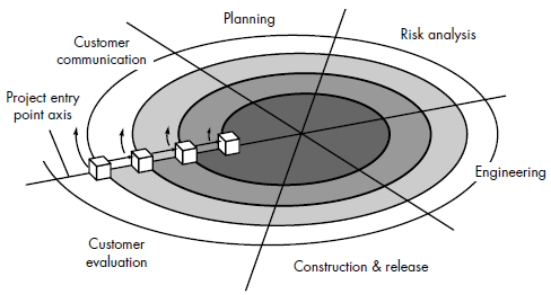

#### **PRESSMAN - 5ª EDIÇÃO** 

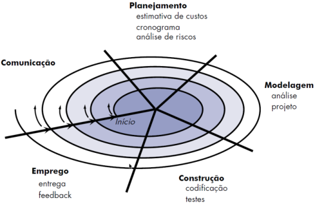

**PRESSMAN – 7ª EDIÇÃO** 

**<mark>SETORES (R. PRESSMAN) DESCRIÇÃO COMUNICAÇÃO</mark>** <mark>Levantamento de necessidades e alinhamento com os envolvidos.</mark> **<mark>PLANEJAMENTO</mark>** <mark>Estimativa de custos, cronograma e análise de riscos.</mark> **<mark>MODELAGEM</mark>** <mark>Análise e design do sistema.</mark> **<mark>CONSTRUÇÃO</mark>** <mark>Codificação e testes.</mark>

---

<!-- pagina: 49 -->

**Diego Carvalho, Equipe Informática 2 (Diego Carvalho), Equipe Informática 1 (Diego Carvalho) Aula 00** 

###### **<mark>IMPLANTAÇÃO</mark>** <mark>Entrega ao cliente e coleta de feedback.</mark> 

As edições anteriores de Pressman apresentam uma divisão diferente de setores. Variações do modelo consideram entre três e seis setores da espiral. Infelizmente, cada autor pega a versão original e adapta, criando sua versão, logo vocês verão muitos nomes diferentes para cada setor. Em caso de dúvida na questão, considere a versão original de Boehm com quatro setores como referência principal. 

Ao final de cada loop, há uma decisão formal sobre continuar ou interromper o projeto. Esse momento é formalizado por meio dos chamados Marcos de Ancoragem. O que são esses marcos? São pontos formais de revisão onde todos os envolvidos — cliente, desenvolvedores e gerência — avaliam o que foi produzido, validam os resultados obtidos e se comprometem formalmente com a direção e a continuidade do projeto. 

E por que isso importa? Porque sem esses marcos, o projeto pode avançar loop após loop sem que ninguém realmente valide se o caminho percorrido faz sentido. Os marcos de ancoragem garantem que o processo seja auditável, controlável e transparente, o que é essencial em projetos grandes e de alto risco. 

E por que o Espiral é classificado como evolucionário? Essa é uma questão conceitual importante e a resposta precisa ser precisa, não apenas intuitiva. O Espiral é classificado como evolucionário porque foi projetado especificamente para ambientes de alta incerteza e alto risco, onde o produto evolui progressivamente à medida que as incertezas são resolvidas. Nas primeiras iterações, o sistema pode existir apenas como modelo em papel ou protótipo não operacional. Nas iterações posteriores, são produzidas versões cada vez mais completas e concretas do sistema. 

Pressman é direto: o Espiral é um modelo de processo evolucionário que acopla a natureza iterativa da prototipação com os aspectos sistemáticos e controlados do Cascata. Vejam que combinação poderosa: a flexibilidade do iterativo com o rigor do sequencial, unidos pela análise de riscos recorrente. E aqui vale reforçar a distinção em relação ao Incremental: não é suficiente dizer que o Espiral é evolucionário apenas porque é iterativo. 

A razão mais precisa é que ele foi projetado para contextos onde os requisitos são incertos e se descobrem ao longo do processo — e onde a gestão sistemática de riscos guia cada avanço. No Incremental, os requisitos são razoavelmente conhecidos desde o início; no Espiral, eles evoluem junto com o produto. 

Sommerville aborda o Modelo Espiral com uma perspectiva mais crítica do que Pressman e esse contraste é importante para a prova. Para Sommerville, o Espiral é um modelo teoricamente bem estruturado, mas com aplicação prática bastante limitada. Ele o posiciona dentro dos processos dirigidos a planos ( _plandriven_ ) e observa que o modelo é mais adequado para projetos de grande escala e alto risco, como sistemas de defesa, aeroespaciais e infraestruturas críticas. 

O principal motivo da baixa adoção, segundo Sommerville, é que a análise de riscos formal exigida pelo modelo demanda competências que a maioria das equipes simplesmente não possui. Fazer análise de riscos de forma rigorosa e sistemática a cada ciclo não é trivial e exige experiência profunda, capacidade de estimativa e conhecimento técnico avançado. Equipes comuns não têm esse perfil, e sem uma boa análise de riscos o Espiral perde sua principal vantagem, tornando-se apenas um processo iterativo mais complexo e caro do que os alternativos. 

Além das observações de Sommerville, Pressman aponta uma limitação importante que merece destaque: apesar de suas qualidades teóricas, o Modelo Espiral não foi amplamente adotado pela

---

<!-- pagina: 50 -->

**Diego Carvalho, Equipe Informática 2 (Diego Carvalho), Equipe Informática 1 (Diego Carvalho) Aula 00** 

indústria comercial. Por quê? Há uma razão prática muito concreta: a natureza aberta e iterativa da espiral torna muito difícil estimar previamente o custo total do projeto. 

Em contratos de preço fixo, que ainda são extremamente comuns no mercado, especialmente no setor público —, o cliente precisa saber desde o início quanto vai pagar pelo sistema completo. O Modelo em Espiral não acomoda bem essa exigência, porque o escopo real do projeto vai sendo descoberto e refinado a cada loop. 

O resultado prático: o Espiral é excelente para projetos com flexibilidade contratual e equipe com maturidade técnica em gestão de riscos, tipicamente projetos internos de grande escala ou contratos de desenvolvimento contínuo. Para projetos comerciais menores, contratos tradicionais de escopo fixo ou equipes sem experiência em análise de riscos, outros modelos são mais adequados. 

|**VANTAGENS**|**DESVANTAGENS**|
|---|---|
|Análise de riscos sistemática e formal a cada ciclo.|Exige analistas de risco experientes e altamente qualificados.|
|Versões progressivamente mais completas e refinadas a cada loop.|Exige equipe de desenvolvimento com perfil técnico elevado.|
|Pode ser aplicado a todo o ciclo de vida do software.|Gerenciamento de processo mais complexo do que outros modelos.|
|Combina o rigor do Cascata com a flexibilidade do iterativo.|Não recomendado para projetos pequenos e simples.|
|Reflete as práticas reais de engenharia para projetos complexos.|Difícil de justificar em contratos de preço fixo.|
|Estimativas realistas por considerar riscos formalmente.|Baixa adoção comercial pela exigência de competências avançadas.|
|Marcos de ancoragem garantem comprometimento formal dos envolvidos.||

Recomenda-se utilizar o Modelo Espiral quando o projeto é de grande escala e alta complexidade; há alto risco técnico (tecnologias novas, requisitos críticos de desempenho ou segurança); o sistema é crítico (defesa, aeroespacial, saúde, infraestrutura financeira); a equipe possui experiência sólida em análise formal de riscos; e há flexibilidade contratual (o cliente aceita escopo evolutivo). 

Por outro lado, não use o Modelo Espiral quando: o projeto é pequeno ou de baixa complexidade; a equipe não tem experiência em gestão de riscos; o contrato exige preço fixo e escopo predefinido; os requisitos são estáveis e bem conhecidos desde o início. Nesses casos, o Incremental ou até o Modelo em Cascata seriam mais simples e eficientes. 

##### **Saiba mais:** 

<mark>O modelo em espiral é indicado para projetos em que há alto risco técnico ou de negócio, exigindo decisões cuidadosas antes de avançar. Imagine o desenvolvimento de um sistema bancário inovador, com novas tecnologias e requisitos críticos de segurança, onde erros podem gerar grandes prejuízos.</mark> 

<mark>Na primeira volta da espiral, a equipe avalia se o projeto é viável, identificando objetivos e possíveis riscos, como falhas de segurança ou limitações tecnológicas. Em seguida, analisa alternativas e pode criar protótipos para testar soluções antes de investir pesado no desenvolvimento.</mark>

---

<!-- pagina: 51 -->

**Diego Carvalho, Equipe Informática 2 (Diego Carvalho), Equipe Informática 1 (Diego Carvalho) Aula 00** 

<mark>Após reduzir os principais riscos, a equipe desenvolve uma versão inicial do sistema e realiza testes. Ao final dessa etapa, ocorre uma revisão formal para decidir se o projeto deve continuar, garantindo controle e alinhamento entre todos os envolvidos antes de avançar.</mark> 

<mark>Na volta seguinte, o processo se repete, agora com mais detalhes: novos requisitos são refinados, riscos adicionais são analisados e novas funcionalidades são implementadas. Assim, o sistema evolui progressivamente, sempre guiado pela análise sistemática de riscos .</mark> 

<mark>Dessa forma, o modelo em espiral combina desenvolvimento iterativo com controle rigoroso, sendo ideal para projetos grandes e complexos. Seu diferencial é tornar a análise de riscos uma atividade central e contínua, orientando cada decisão ao longo de todo o ciclo de vida do</mark> software. 

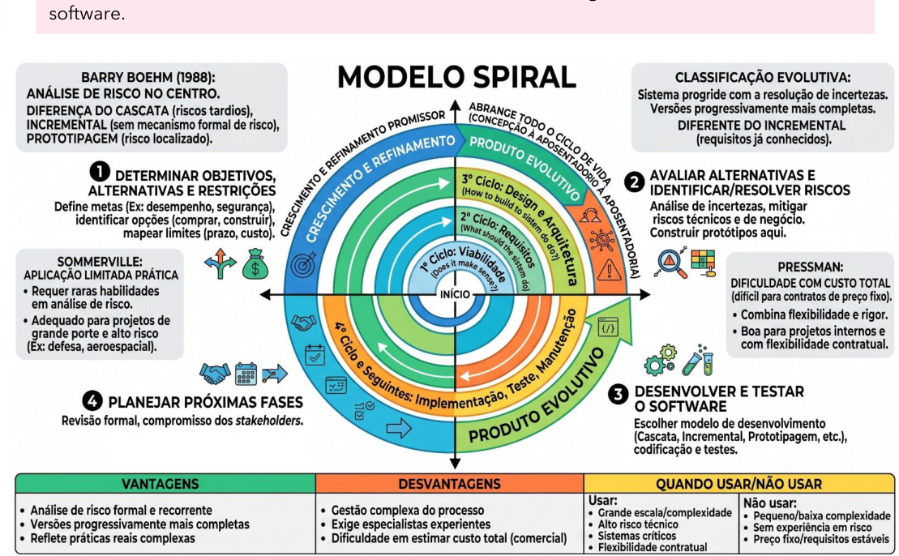

<!-- Start of picture text -->
software. <!-- End of picture text -->

---

<!-- pagina: 52 -->

**Diego Carvalho, Equipe Informática 2 (Diego Carvalho), Equipe Informática 1 (Diego Carvalho) Aula 00** 

<!-- Start of picture text -->
Modelo Especializados <!-- End of picture text -->

##### **Rapid Application Development (RAD)** 

###### **<mark>INCIDÊNCIA EM PROVA: BAIXA</mark>** 

###### **<mark>RAD (RAPID APPLICATION DEVELOPMENT)</mark>** 

Modelo de desenvolvimento de software que prioriza a rapidez na entrega por meio da construção iterativa de protótipos e do uso intensivo de ferramentas de alto nível, como geradores de código e construtores visuais de interfaces. Ele envolve fortemente os usuários no processo, permitindo validações constantes e ajustes rápidos, reduzindo a necessidade de planejamento detalhado inicial e focando na adaptação contínua até atingir os requisitos desejados. 

Agora vamos falar sobre um modelo muito interessante e que tem uma característica central bem marcante: a velocidade. Estamos falando do RAD (Rapid Application Development ou Desenvolvimento Rápido de Aplicações). O RAD é um modelo de processo incremental de alta velocidade. Pressman o descreve dessa forma com precisão: o RAD é incremental por natureza, pois entrega partes funcionais do sistema ao longo do tempo; porém, sua característica central não é simplesmente ser incremental. 

É a velocidade de entrega, obtida por meio de três elementos combinados: reutilização massiva de componentes, equipes trabalhando em paralelo e ferramentas de alta produtividade. O ciclo de desenvolvimento no RAD é tipicamente de 60 a 90 dias. Isso é muito rápido para o desenvolvimento de um sistema! Como esse ritmo é possível? Principalmente porque o modelo utiliza o reúso de componentes à exaustão. Como muitos desses componentes já foram testados anteriormente, o tempo total de desenvolvimento e de teste cai significativamente. 

Antes de falar nas fases e nas vantagens, preciso destacar um ponto que é central para o sucesso do RAD e que costuma ser negligenciado em muitos materiais: o comprometimento ativo e contínuo do cliente. Pressman é enfático nesse ponto: o RAD exige participação intensa dos usuários e do cliente ao longo de todo o processo. 

Não estamos falando de uma reunião inicial de levantamento de requisitos e, em seguida, ausência de participação; trata-se de feedback constante, validação frequente e disponibilidade para tomar decisões rápidas em ciclos curtos. Sem esse comprometimento, o modelo falha independentemente de qualquer outra condição técnica estar satisfeita. É a condição número um! 

O RAD é estruturado em cinco fases principais, que podem ser distribuídas por diversas equipes trabalhando em paralelo. Vejamos cada uma delas: 

|**ETAPAS**|**DESCRIÇÃO**|
|---|---|
|**MODELAGEM DE** **NEGÓCIO**|O fluxo de informações entre as funções de negócio é modelado para compreender como os processos organizacionais operam. Busca-se identificar quais informações direcionam cada atividade, quais são geradas ao longo do processo, quem é responsável por produzi- las, para onde são encaminhadas e quem as utiliza. Essa etapa fornece uma visão clara e estruturada do funcionamento do negócio.|
|**MODELAGEM DE** **DADOS**|O fluxo de informações identificado anteriormente é refinado em um conjunto estruturado de objetos de dados que sustentam o negócio. Nessa etapa, são definidos os atributos de cada objeto e estabelecidos os relacionamentos entre eles. O objetivo é construir uma base de dados consistente, que represente fielmente as informações necessárias para o funcionamento adequado do sistema.|
|**MODELAGEM DE** **PROCESSO**|Os objetos de dados definidos são utilizados para descrever como as funções de negócio serão implementadas no sistema. São criadas especificações de processamento que detalham como cada objeto será manipulado,incluindo operações de criação,alteração,|

---

<!-- pagina: 53 -->

**Diego Carvalho, Equipe Informática 2 (Diego Carvalho), Equipe Informática 1 (Diego Carvalho) Aula 00** 

<mark>exclusão e recuperação. Essa fase conecta os dados às ações do sistema, garantindo que</mark> os processos atendam às necessidades do negócio. 

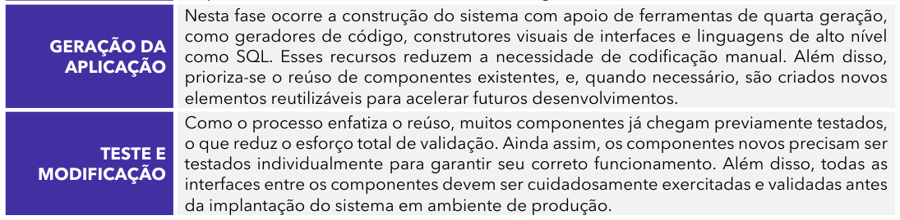

<!-- Start of picture text -->
Nesta fase ocorre a construção do sistema com apoio de ferramentas de quarta geração, como geradores de código, construtores visuais de interfaces e linguagens de alto nível GERAÇÃO DA como SQL. Esses recursos reduzem a necessidade de codificação manual. Além disso, APLICAÇÃO prioriza-se o reúso de componentes existentes, e, quando necessário, são criados novos elementos reutilizáveis para acelerar futuros desenvolvimentos. Como o processo enfatiza o reúso, muitos componentes já chegam previamente testados, o que reduz o esforço total de validação. Ainda assim, os componentes novos precisam ser TESTE E testados individualmente para garantir seu correto funcionamento. Além disso, todas as MODIFICAÇÃO interfaces entre os componentes devem ser cuidadosamente exercitadas e validadas antes da implantação do sistema em ambiente de produção. plantação do sistema em ambiente de produção. lantação do sistema em ambiente de produção. ção do sistema em ambiente de produção. ão do sistema em ambiente de produção. produção. rodução. ção. ão. <!-- End of picture text -->

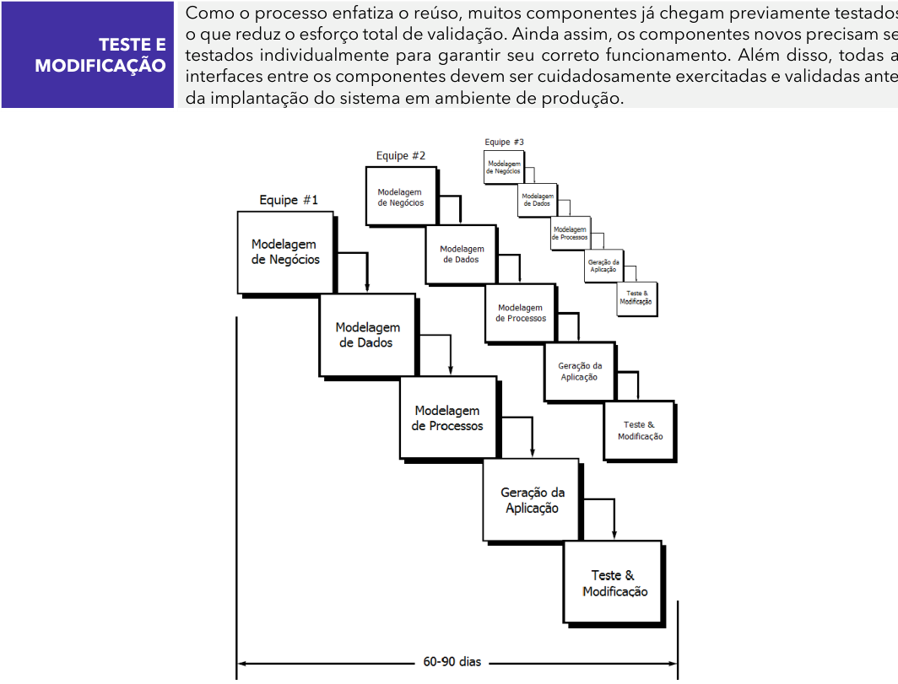

<!-- Start of picture text -->
Como o processo enfatiza o reúso, muitos componentes já chegam previamente testados, o que reduz o esforço total de validação. Ainda assim, os componentes novos precisam ser TESTE E testados individualmente para garantir seu correto funcionamento. Além disso, todas as MODIFICAÇÃO interfaces entre os componentes devem ser cuidadosamente exercitadas e validadas antes da implantação do sistema em ambiente de produção. plantação do sistema em ambiente de produção. lantação do sistema em ambiente de produção. ção do sistema em ambiente de produção. ão do sistema em ambiente de produção. produção. rodução. ção. ão. <!-- End of picture text -->

Um detalhe interessante sobre a organização dessas fases: as três primeiras — Modelagem de Negócio, Modelagem de Dados e Modelagem de Processo — são frequentemente condensadas em uma única etapa chamada simplesmente Modelagem. Já Geração da Aplicação e Teste e Modificação costumam ser condensadas em Construção. Isso simplifica a visão do processo sem perder sua essência. 

E quando devemos usar o RAD? O RAD não pode ser aplicado a qualquer projeto. Pressman descreve condições específicas em que ele é adequado. Vamos ver: 

- Quando o comprometimento ativo do cliente e dos usuários está garantido ao longo de todo o processo — condição número um, como já vimos; 

- Quando a aplicação é autossuficiente (standalone), sem necessidade de integração complexa com outros sistemas auxiliares;

---

<!-- pagina: 54 -->

**Diego Carvalho, Equipe Informática 2 (Diego Carvalho), Equipe Informática 1 (Diego Carvalho) Aula 00** 

- Quando é possível fazer o uso extensivo de classes e componentes pré-existentes ou quando a distribuição do produto no mercado é pequena; 

- Quando a performance não é o fator mais crítico do sistema — como veremos adiante, o reúso de componentes genéricos pode comprometer a otimização de desempenho.; 

- Quando o risco técnico é reduzido — ou seja, o sistema usa tecnologias conhecidas e consolidadas, não tecnologias novas e não testadas; 

- Quando o escopo do projeto é bem definido e relativamente restrito ou quando o risco de mudança tecnológica ao longo do projeto é baixo; 

- Quando o sistema pode ser claramente dividido em módulos independentes, desenvolvíveis por equipes separadas em paralelo. 

Agora atenção: Pressman também é explícito sobre situações em que o RAD não deve ser utilizado. Esse é um ponto que cai em prova e que muitos materiais deixam de fora! O RAD não é adequado quando: 

- O sistema não pode ser modularizado adequadamente: o RAD exige que o sistema seja divisível em módulos independentes, que possam ser desenvolvidos em paralelo por equipes distintas. Se o sistema tem uma arquitetura altamente integrada e interdependente, isto é, quando tudo depende de tudo, simplesmente não é possível dividir o trabalho em paralelo. O modelo quebra! 

- Há alto risco técnico: o RAD pressupõe que os componentes reutilizados são conhecidos e testados. Se o projeto exige o uso de tecnologias novas, não consolidadas ou experimentais, o reúso não se aplica e a velocidade característica do modelo desaparece. Nesses casos, um modelo mais cuidadoso e deliberado é mais adequado. 

- A performance do sistema é crítica: componentes genéricos reutilizáveis são projetados para funcionar em muitos contextos diferentes, o que geralmente significa que não são otimizados para nenhum contexto específico. Quando o sistema precisa de alto desempenho, baixa latência ou uso eficiente de recursos, o reúso de componentes genéricos pode ser um problema, e pode ser necessário desenvolver soluções sob medida. 

Agora vamos ver as vantagens e desvantagens do RAD: 

|**VANTAGENS**|**DESVANTAGENS**|
|---|---|
|Desenvolvimento rápido e entrega ágil de aplicações de software.|Exige recursos humanos caros e experientes.|
|Criação e reutilização extensiva de componentes.|Aparência e comportamento podem variar entre módulos(falta depadronização).|
|Desenvolvimento conduzido em nível mais alto de abstração.|Exige comprometimento intenso e contínuo de toda a equipe ao longo dos ciclos curtos.|
|Grande redução de codificação manual com ferramentas dequartageração.|Custo alto do conjunto de ferramentas e do hardware necessário.|
|Cada função pode ser direcionada a uma equipe separada,trabalhando emparalelo.|Mais difícil de acompanhar e gerenciar o projeto.|
|Maior flexibilidade — desenvolvedores podem reprojetar componentes à medidaque avançam.|Risco de perda de precisão e rigor por falta de métodos formais.|
|Custo potencialmente reduzido (tempo é dinheiro, e o reúso reduz esforço).|Risco de retorno a práticas caóticas de desenvolvimento.|

---

<!-- pagina: 55 -->

**Diego Carvalho, Equipe Informática 2 (Diego Carvalho), Equipe Informática 1 (Diego Carvalho) Aula 00** 

|Possui um ciclo de desenvolvimento muito curto (60 a 90 dias).|Pode gerar a construção de funções desnecessárias.|
|---|---|
|Protótipos e entregas parciais permitem visualização e avaliação mais cedo.|Conflitos entre desenvolvedores e clientes sobre requisitosque não se encaixam.|
|Maior envolvimento e participação do usuário ao longo doprocesso.||

Agora, dois comentários importantes sobre desvantagens que merecem mais atenção: sobre o comprometimento da equipe, a desvantagem “exige comprometimento intenso da equipe” pode parecer genérica, mas Pressman tem um ponto preciso aqui. Ciclos curtos de 60 a 90 dias com múltiplas equipes em paralelo geram uma pressão constante e elevada. O modelo demanda esse comprometimento de forma sustentada, ou seja, manter esse ritmo ao longo de todo o projeto é genuinamente difícil. Não é uma crítica à motivação da equipe; trata-se de uma exigência estrutural do modelo. 

Sobre o risco de retorno a práticas caóticas, esse é um risco real e importante. Como o RAD valoriza velocidade e flexibilidade, equipes menos disciplinadas podem usar essa característica como justificativa para abandonar práticas formais de engenharia, como documentação, revisões técnicas e controle de qualidade. O resultado pode ser uma regressão ao desenvolvimento desorganizado e ad hoc que a Engenharia de Software historicamente tentou superar. A velocidade do RAD deve ser obtida por reúso e ferramentas, e não pela supressão de boas práticas de engenharia. 

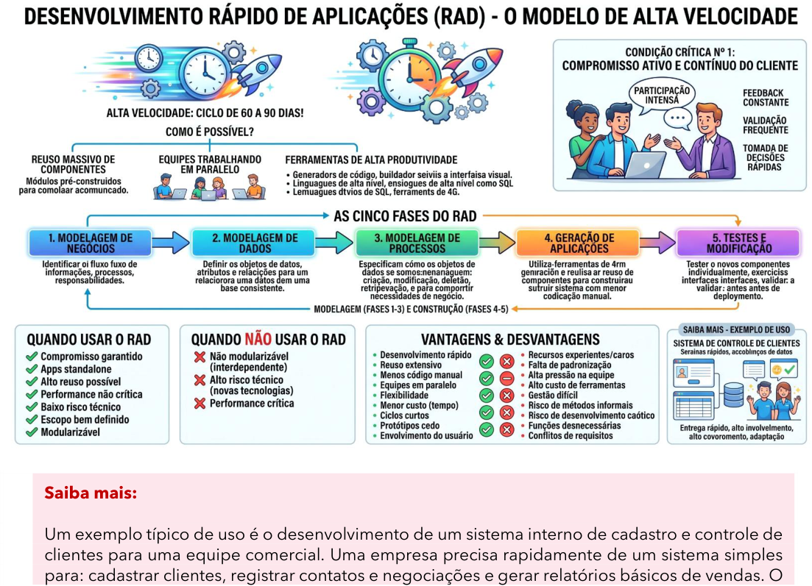

<!-- Start of picture text -->
Saiba mais: Um exemplo típico de uso é o desenvolvimento de um sistema interno de cadastro e controle de clientes para uma equipe comercial. Uma empresa precisa rapidamente de um sistema simples para: cadastrar clientes, registrar contatos e negociações e gerar relatórios básicos de vendas. O <!-- End of picture text -->

---

<!-- pagina: 56 -->

**Diego Carvalho, Equipe Informática 2 (Diego Carvalho), Equipe Informática 1 (Diego Carvalho) Aula 00** 

<mark>prazo é curto (semanas), e os usuários estão disponíveis para validar o sistema durante o desenvolvimento.</mark> 

<mark>A equipe utiliza ferramentas RAD, como construtores visuais de telas, geradores automáticos de código e banco de dados com consultas prontas. Como o RAD funciona nesse cenário? Protótipos são criados rapidamente, usuários testam e dão feedback imediato, ajustes são feitos quase em tempo real e novas versões são geradas com pouca codificação manual. O sistema evolui rápido até atender plenamente às necessidades.</mark> 

<mark>As vantagens nesse contexto são: entrega muito rápida, alto envolvimento do usuário, facilidade de adaptação e menos codificação manual. Já as desvantagens nesse contexto são: escalabilidade limitada (pode não suportar crescimento grande), dependência de ferramentas RAD, arquitetura menos robusta e dificuldade em sistemas muito complexos.</mark> 

<mark>O RAD é ideal quando o sistema é relativamente simples, o prazo é curto e os usuários podem</mark> participar. Ele prioriza velocidade e interação, em vez de rigidez e planejamento detalhado.

---

<!-- pagina: 57 -->

**Diego Carvalho, Equipe Informática 2 (Diego Carvalho), Equipe Informática 1 (Diego Carvalho) Aula 00** 

##### **Engenharia de Software Baseada em Componentes (CBSE)** 

###### **<mark>INCIDÊNCIA EM PROVA: BAIXA</mark>** 

###### **<mark>ENGENHARIA DE SOFTWARE BASEADA EM COMPONENTES</mark>** 

Abordagem de desenvolvimento em que o sistema é construído a partir da seleção, adaptação e integração de componentes reutilizáveis, previamente desenvolvidos e testados. Em vez de desenvolver todo o software do zero, a ênfase está no reúso de módulos existentes (como bibliotecas, frameworks ou sistemas COTS), o que reduz tempo, custo e riscos. O processo envolve identificar requisitos, buscar componentes adequados, avaliálos, adaptar o sistema a eles quando necessário e integrar tudo em uma arquitetura coerente, exigindo atenção <mark>à compatibilidade,</mark> <u><mark>qualidade e evolução dos componentes.</mark></u> 

O Modelo de Engenharia de Software Baseada em Componentes (Component-Based Software Engineering – CBSE) é uma estratégia de desenvolvimento de software voltada à reusabilidade. Em vez de construir tudo do zero, o processo se concentra em identificar, selecionar e integrar componentes já existentes, desenvolvendo apenas o que não puder ser encontrado pronto. 

As vantagens são bastante claras: redução dos custos de produção e manutenção, entregas mais rápidas e aumento da qualidade geral do sistema, pois os componentes reusados já foram testados em outros contextos. Mas o que é exatamente um componente? Pressman define componente como um bloco de construção modular: uma parte do sistema que é executável, implantável, independente, padronizada e reutilizável, que encapsula sua implementação interna e expõe um conjunto de interfaces bem definidas. 

Em suma, é uma peça que você pode encaixar no seu sistema sem precisar saber como ela foi feita por dentro, só precisa saber o que ela faz e como se comunicar com ela. 

##### **Saiba mais:** 

<mark>A viabilidade técnica de criar componentes de software independentes recai em metodologias sólidas de design, sendo o princípio OCP (Open-Closed Principle) um dos mais influentes para esse modelo de arquitetura. Ele determina que um artefato de software (como um componente, classe ou módulo) deve estar "aberto para extensão, mas fechado para modificação". Na prática, isso garante que o componente principal pode ganhar novas funcionalidades por meio da adição de extensões ou novas implementações, mas sem a necessidade de modificar o seu código-fonte</mark> interno testado originalmente. 

Ao longo das fases do modelo, vocês vão encontrar o termo COTS (Commercial Off-The-Shelf). Não se assustem: é simplesmente o nome dado a produtos de software comercialmente disponíveis, prontos para uso, que podem ser adquiridos ou licenciados no mercado. Eles vão desde frameworks e bibliotecas até sistemas completos, como um ERP já pronto para ser configurado. Os componentes COTS são desenvolvidos por fornecedores que disponibilizam a funcionalidade desejada junto com interfaces bem definidas, justamente para permitir a integração com o software que está sendo desenvolvido. 

Pressman descreve o processo em seis fases principais. É importante conhecê-las na ordem correta, pois questões de concurso frequentemente cobram exatamente isso: 

|**ETAPAS**|**DESCRIÇÃO** |
|---|---|
|**ESPECIFICAÇÃO DE** **REQUISITOS**|Traduz as informações da análise em um documento formal que define os requisitos do software. Esse documento contempla requisitos de usuário, que expressam necessidades do cliente, e requisitos de sistema, que detalham o comportamento técnico necessáriopara atendê-las.|

---

<!-- pagina: 58 -->

**Diego Carvalho, Equipe Informática 2 (Diego Carvalho), Equipe Informática 1 (Diego Carvalho) Aula 00** 

Com base nos requisitos, realiza-se a busca por componentes disponíveis que possam **ANÁLISE DE** atender à especificação. Em geral, não há correspondência exata, sendo comum que os **COMPONENTES** componentes encontrados cubram apenas parte das funcionalidades necessárias ao <mark>sistema.</mark> 

Os componentes identificados são avaliados quanto à adequação antes de qualquer decisão de projeto. Verifica-se se atendem aos requisitos funcionais, se são compatíveis entre si e se cumprem critérios de qualidade, confiabilidade e desempenho exigidos. 

**QUALIFICAÇÃO E** decisão de projeto. Verifica-se se atendem aos requisitos funcionais, se são compatíveis **CLASSIFICAÇÃO DE** entre si e se cumprem critérios de qualidade, confiabilidade e desempenho exigidos. **COMPONENTES** Os requisitos são revisados à luz dos componentes disponíveis e podem ser ajustados **MODIFICAÇÃO DE** para refletir limitações ou oportunidades de reúso. Caso alterações não sejam aceitáveis **REQUISITOS** pelo cliente, a busca por novos componentes pode ser reiniciada. 

<mark>Define a arquitetura do sistema considerando os componentes que serão reutilizados.</mark> **PROJETO DE** Pode envolver a adaptação de um framework existente ou a criação de um novo, além **SISTEMA COM** da identificação das partes que precisarão ser desenvolvidas do zero. **REÚSO** <mark>Desenvolve os elementos que não puderam ser reutilizados e integra os componentes</mark> **DESENVOLVIMENTO** adquiridos ou reaproveitados. Nesse modelo, a integração ocorre de forma contínua, **E INTEGRAÇÃO** sendo parte inseparável do próprio processo de construção do sistema. Verifica-se se o sistema integrado como um todo atende às necessidades e expectativas **VALIDAÇÃO DO** do cliente. Como os componentes individualmente já foram testados antes, o foco aqui **SISTEMA** é garantir que a integração funcionou corretamente e que o comportamento do sistema completo está de acordo com os requisitos. 

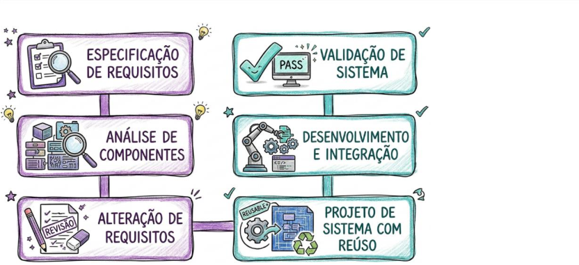

Um ponto que merece atenção especial: os custos de integração e de teste no CBSE são significativos e frequentemente subestimados. Isso ocorre porque é necessário assegurar que os componentes utilizados realmente satisfazem às especificações e que funcionam corretamente em conjunto com os outros. Não basta um componente funcionar bem isoladamente; ele precisa funcionar bem no contexto do seu sistema específico. 

Pressman é claro ao destacar esse ponto, porque é uma armadilha comum: a equipe imagina que reúso significa custo baixo em todas as frentes, quando na verdade os custos de desenvolvimento tendem a cair, mas os custos de integração e teste precisam ser planejados com cuidado. E qual é a natureza desse modelo? 

O modelo baseado em componentes incorpora características do modelo espiral: ele é evolucionário por natureza, demandando uma abordagem iterativa para a criação do software. Ele também compartilha algumas características com o modelo incremental. No entanto, há um ponto que o diferencia de ambos

---

<!-- pagina: 59 -->

**Diego Carvalho, Equipe Informática 2 (Diego Carvalho), Equipe Informática 1 (Diego Carvalho) Aula 00** 

e que é fundamental entender: componentes COTS não podem ser modificados pela equipe de desenvolvimento. 

A ausência de código-fonte impede que a equipe ajuste esses componentes para suas necessidades específicas. Isso significa que, apesar das semelhanças superficiais com os modelos evolucionários, o CBSE tem uma restrição estrutural que os outros não têm, e por isso não deve ser classificado simplesmente como uma variação deles. 

Na edição mais recente do seu livro, Sommerville renomeia esse modelo para Integração e Configuração, e a mudança de nome não é apenas cosmética: ela reflete uma ênfase diferente. Para Sommerville, o processo de desenvolvimento se concentra na configuração de componentes ou sistemas reusáveis para que sejam utilizados em um novo contexto, e na integração deles em um sistema coerente. Sommerville vai além e distingue três situações típicas de reúso que esse modelo contempla: 

- **Sistemas de Aplicação Independentes:** sistemas completos já existentes (Ex: ERP) configurados para uso em um novo contexto organizacional, sem necessidade de desenvolvimento significativo. 

- **Coleções de Objetos e Componentes:** pacotes desenvolvidos para integração com um framework específico, em que componentes são instanciados/adaptados para as necessidades do novo sistema. 

- **Serviços Web:** componentes desenvolvidos segundo padrões de serviço (Ex: REST ou SOAP), que são acessados remotamente e integrados ao sistema por meio de chamadas padronizadas. 

Essa distinção de Ian Sommerville é importante porque evidencia que o reúso, no contexto moderno, não se limita a funções ou bibliotecas isoladas. Ele abrange componentes maiores, como frameworks, serviços e até sistemas completos, que podem ser configurados, integrados e orquestrados para compor novas soluções de forma eficiente, reduzindo esforço de desenvolvimento. 

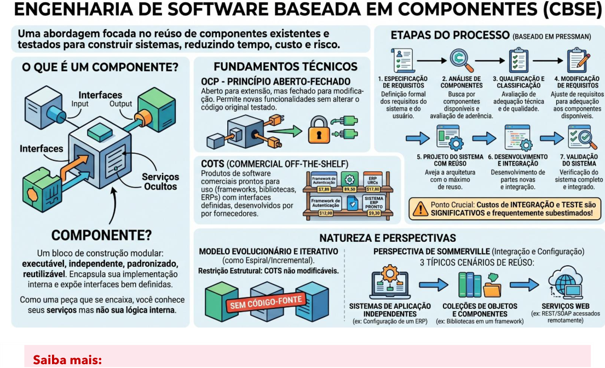

<!-- Start of picture text -->
Saiba mais: <!-- End of picture text -->

---

<!-- pagina: 60 -->

**Diego Carvalho, Equipe Informática 2 (Diego Carvalho), Equipe Informática 1 (Diego Carvalho) Aula 00** 

<mark>A Engenharia de Software Baseada em Componentes (CBSE) é uma abordagem em que o sistema é construído a partir de partes já existentes, chamadas componentes. Imagine o desenvolvimento de um sistema de e-commerce: em vez de criar tudo do zero, a equipe busca soluções prontas para funcionalidades comuns.</mark> 

<mark>Nesse cenário, a equipe pode utilizar um componente já pronto para autenticação de usuários, outro para processamento de pagamentos e um terceiro para envio de e-mails. Cada componente funciona como uma “peça de lego”, com interfaces definidas, que pode ser integrada ao sistema sem conhecer sua implementação interna .</mark> 

<mark>Durante o desenvolvimento, os requisitos do sistema são comparados com os componentes disponíveis no mercado. Muitas vezes, não há correspondência perfeita, exigindo adaptações no sistema ou ajustes nos próprios requisitos, sempre buscando maximizar o reúso e reduzir o esforço de construção.</mark> 

<mark>Após selecionar os componentes, a equipe projeta a arquitetura do sistema considerando como essas partes irão se comunicar. Em seguida, desenvolve apenas o que não foi encontrado pronto e realiza a integração, etapa crítica para garantir que todos os elementos funcionem corretamente em conjunto.</mark> 

<mark>Por fim, o sistema integrado é testado como um todo, verificando se atende às necessidades do cliente. Embora os componentes já tenham sido testados individualmente, é essencial validar sua</mark> interação, uma vez que problemas de compatibilidade podem surgir na integração.

---

<!-- pagina: 61 -->

**Diego Carvalho, Equipe Informática 2 (Diego Carvalho), Equipe Informática 1 (Diego Carvalho) Aula 00** 

##### **Métodos Formais** 

###### **<mark>INCIDÊNCIA EM PROVA: BAIXÍSSIMA</mark>** 

###### **<mark>MÉTODOS FORMAIS</mark>** 

Abordagem de desenvolvimento de software que utiliza especificações baseadas em notações matemáticas rigorosas para descrever, projetar e verificar sistemas. Nessa abordagem, os requisitos são expressos de forma precisa e sem ambiguidades, permitindo a aplicação de técnicas de prova e verificação para demonstrar propriedades do sistema, como correção e consistência. O objetivo é reduzir erros desde as fases iniciais e aumentar a confiabilidade do software, sendo especialmente útil em sistemas críticos, embora exija alto custo, <mark>conhecimento especializado e maior esforço de desenvolvimento.</mark> 

Os Métodos Formais são um conjunto de atividades que utilizam representações matemáticas rigorosas para especificar, desenvolver e verificar sistemas de software. De acordo com Roger Pressman, eles possibilitam especificar, desenvolver e verificar um sistema baseado em computador por meio da aplicação de uma notação matemática rigorosa, oferecendo um mecanismo capaz de endereçar muitos dos problemas difíceis de superar com outros modelos. 

Já Ian Sommerville define os métodos formais como abordagens baseadas em matemática para o desenvolvimento de software, nas quais é definido um modelo formal do sistema. Esse modelo pode ser analisado formalmente e usado como base para uma especificação de sistema inequívoca, ou seja, sem ambiguidades. 

A ideia central é simples, mas poderosa: em vez de descrever o que o sistema deve fazer em linguagem natural (que é imprecisa e sujeita a interpretações múltiplas), você o descreve em uma linguagem matemática com semântica formalmente definida. Com isso, problemas de ambiguidade, incompletude e inconsistência podem ser detectados e corrigidos pela própria análise matemática, e não apenas por revisões manuais. 

Para que contextos são indicados? Os Métodos Formais são indicados para ambientes extremamente complexos, com requisitos rigorosos de correção e confiabilidade. Pressman destaca que eles são especialmente adequados para sistemas nos quais falhas podem causar perda de vidas ou sério prejuízo econômico, como: sistemas de controle de aeronaves, equipamentos médicos críticos, usinas nucleares e sistemas financeiros de alta disponibilidade. 

Sommerville complementa essa visão ao afirmar que, por mais de 30 anos, pesquisadores têm defendido o uso de métodos formais justamente para esses contextos de software com fator crítico de segurança (safety-critical systems), pois a verificação formal pode demonstrar a ausência de certos tipos de falha, algo que testes convencionais jamais conseguem garantir. 

Atenção a um detalhe importante: os Métodos Formais não são amplamente usados no desenvolvimento de software industrial convencional. A maioria das empresas não os considera adequados em relação aos seus custos; mas as poucas organizações que investiram nessa abordagem relataram menos erros no software entregue aos clientes, sem necessariamente aumento de custos totais. 

Os Métodos Formais podem ser aplicados em todas as etapas do desenvolvimento ou apenas em partes específicas do projeto, especialmente nas mais críticas. As etapas principais são as seguintes: 

|**ETAPAS**|**DESCRIÇÃO**|
|---|---|
|**ESPECIFICAÇÃO** **FORMAL** **(DEFINIÇÃO DE** **REQUISITOS)**|Formaliza os requisitos por meio de notação matemática rigorosa, criando uma modelagem precisa e sem ambiguidades. Os requisitos do usuário, antes descritos em linguagem natural, diagramas e tabelas, são convertidos para uma linguagem formal com semântica bem definida.|

---

<!-- pagina: 62 -->

**Diego Carvalho, Equipe Informática 2 (Diego Carvalho), Equipe Informática 1 (Diego Carvalho) Aula 00** 

|**REFINAMENTO** **(CONCEPÇÃO DO** **PROJETO)**|Define a arquitetura do sistema, detalhando componentes, interfaces, dados e relacionamentos de forma estruturada. O refinamento transforma a especificação formal em uma representação progressivamente mais próxima da implementação, por meio de etapas matematicamente fundamentadas.|
|---|---|
|**SÍNTESE** **(IMPLEMENTAÇÃO)**|Gera, a partir do modelo refinado, um esqueleto de código que serve como base para a implementação final. Em abordagens mais rigorosas, o código pode ser derivado diretamente da especificaçãopor meio de transformações formais verificadas.|
|**PROVA** **(VERIFICAÇÃO)**|Verifica, por meio de análise matemática, se o sistema atende a todos os requisitos funcionais e não funcionais definidos. Essa etapa permite demonstrar formalmente a correção do software,indo além de testes tradicionais baseados apenas em execução.|

Percebam que não há, nesse processo, nenhuma etapa de prototipação. Esse é um ponto conceitual importante: a validação nos Métodos Formais é feita por prova matemática, e não pela construção de um protótipo funcional para avaliação do usuário. Protótipos são recursos característicos dos modelos evolucionários (como a Prototipação de Pressman); misturar os dois seria confundir paradigmas completamente distintos. 

Sommerville é preciso ao separar dois usos possíveis dos Métodos Formais, e essa distinção costuma ser cobrada em prova. Vejamos: 

- **Especificação Formal:** os requisitos do usuário são traduzidos para uma linguagem matemática com semântica formalmente definida. O resultado é uma descrição inequívoca do que o sistema deve fazer. A partir daí, o desenvolvimento pode seguir processos convencionais, como o Cascata; mas a especificação de partida é formal e precisa. 

- **Desenvolvimento Formal (ou Transformacional):** parte-se da especificação formal e chega-se ao código por meio de refinamentos sucessivos, cada um deles matematicamente fundamentado. Em princípio, é possível provar que o programa desenvolvido é consistente com o modelo formal, eliminando-se falhas resultantes de erros de programação. Esse é o uso mais rigoroso e também o mais custoso dos dois. 

Na prática, o primeiro uso (especificação formal) é muito mais comum do que o segundo (desenvolvimento formal completo), pois o segundo exige um nível de formalismo que poucos projetos podem sustentar economicamente. Agora vamos ver rapidamente3 as principais vantagens da utilização desse método: 

|**VANTAGENS**|**DESCRIÇÃO**|
|---|---|
|**PRECISÃO E** **AUSÊNCIA DE** **AMBIGUIDADE**|Em linguagem natural, erros podem se esconder na imprecisão das palavras e interpretações. A especificação formal elimina essa margem, pois utiliza símbolos com semântica rigorosamente definida, garantindo uma descrição exata e não ambígua do comportamento esperado do sistema.|
|**DETECÇÃO** **PRECOCE DE** **PROBLEMAS DE** **REQUISITOS**|A construção de uma especificação formal exige análise detalhada e estruturada dos requisitos. Esse processo força a identificação de inconsistências, omissões e conflitos ainda nas fases iniciais, reduzindo retrabalho e evitando que problemas avancem para etapasposteriores do desenvolvimento.|
|**VERIFICAÇÃO** **RIGOROSA**|Quando aplicados ao projeto, os métodos formais permitem verificar matematicamente a correção da solução proposta. Isso possibilita identificar e corrigir erros que passariam despercebidos em abordagens tradicionais, evitando falhas que só seriam detectadas em fases tardias e mais custosas.|
|**PROMESSA DE** **SOFTWARE SEM** **DEFEITOS**|Embora não seja garantia absoluta, o uso de métodos formais permite, em tese, demonstrar matematicamente a ausência de determinadas classes de erros. Essa abordagem eleva o nível de confiabilidade do sistema e reduz significativamente a probabilidade de falhas críticas em operação.|

---

<!-- pagina: 63 -->

**Diego Carvalho, Equipe Informática 2 (Diego Carvalho), Equipe Informática 1 (Diego Carvalho) Aula 00** 

Pressman e Sommerville são igualmente honestos quanto às limitações e desvantagens desse método, e é importante que vocês as conheçam: 

|**DESVANTAGENS**|**DESCRIÇÃO**|
|---|---|
|**ALTO CUSTO E** **CONSUMO DE** **TEMPO**|O desenvolvimento de modelos formais exige esforço significativo, demandando mais tempo e recursos financeiros do que abordagens tradicionais. Esse investimento elevado faz com que muitas empresas não considerem viável adotar métodos formais em projetos de software convencionais.|
|**NECESSIDADE DE** **TREINAMENTO** **EXTENSIVO**|Poucos profissionais possuem formação matemática suficiente para aplicar métodos formais com segurança. Por isso, sua adoção exige investimento em capacitação e treinamento especializado, aumentando o custo do projeto e prolongando o tempo necessáriopara formação da equipe.|
|**DIFICULDADE DE** **COMUNICAÇÃO** **COM O CLIENTE**|Modelos formais são baseados em notação matemática e não são facilmente compreendidos por clientes sem formação técnica. Isso dificulta a validação de requisitos e a comunicação, já que o cliente tende a entender melhor diagramas, protótipos e descrições em linguagem natural.|

Por conta dessas limitações, Pressman sugere que os Métodos Formais podem ser adequados em termos de custo se seu uso for limitado às partes do núcleo do sistema que são mais críticas, e não ao projeto inteiro. É uma estratégia de aplicação seletiva, e não universal. E por que os Métodos Formais tiveram impacto tão limitado? 

Apesar de todas as suas vantagens teóricas, os Métodos Formais tiveram um impacto limitado no desenvolvimento prático de software, mesmo para sistemas críticos. As razões já foram listadas acima; mas vale reforçar o ponto central: a Engenharia de Software lida com restrições de mercado, prazos, orçamentos e equipes que raramente permitem o nível de rigor que os Métodos Formais exigem. Dito isso, eles continuam sendo uma referência teórica fundamental. Sua existência nos lembra que é possível, em princípio, tratar o desenvolvimento de software com o mesmo rigor de uma demonstração matemática; e que, quanto mais crítico for o sistema, mais próximos desse ideal deveríamos tentar chegar. 

Por fim, vez ou outra o Método Cleanroom é apresentado como o exemplo por excelência de Método Formal, mas é preciso ter cuidado com essa classificação. O Cleanroom (cujo nome faz analogia à sala limpa de fabricação de semicondutores, onde se busca tolerância zero a contaminantes) é, na classificação de Pressman, um modelo de processo de software que incorpora elementos dos Métodos Formais, especialmente a verificação estática de correção; porém, ele constitui um modelo de processo distinto, com características próprias que vão além de um simples método formal. Tratá-lo como sinônimo de Método Formal é uma simplificação que pode gerar confusão em prova. 

##### **Saiba mais:** 

<mark>Imagine o desenvolvimento de um sistema de controle de portas de um metrô. Esse sistema só pode abrir as portas quando o trem estiver completamente parado e alinhado à plataforma; qualquer falha aqui pode causar acidentes graves. Em vez de descrever essa regra apenas em linguagem natural, a equipe decide aplicar Métodos Formais.</mark> 

<mark>Primeiro, os requisitos são escritos de forma matemática. Por exemplo, uma regra poderia ser expressa como: “PortaAberta = verdadeiro somente se (Velocidade = 0) e (Alinhamento = verdadeiro)”. Essa definição elimina ambiguidades: não há espaço para interpretação diferente. Em seguida, o sistema é projetado e refinado com base nessas especificações formais, mantendo a consistência lógica em todas as etapas.</mark>

---

<!-- pagina: 64 -->

**Diego Carvalho, Equipe Informática 2 (Diego Carvalho), Equipe Informática 1 (Diego Carvalho) Aula 00** 

<mark>Depois, na fase de verificação, a equipe utiliza técnicas matemáticas para provar que o sistema nunca permitirá a abertura das portas enquanto o trem estiver em movimento ou desalinhado. Logo, não se trata apenas de testar alguns cenários, mas de demonstrar logicamente que certas falhas são impossíveis dentro daquele modelo.</mark> 

<mark>Esse pequeno exemplo mostra o grande diferencial dos Métodos Formais: em sistemas críticos, como transporte, aviação ou equipamentos médicos, eles permitem sair do “funcionou nos testes” para algo muito mais forte — “é matematicamente garantido que funciona dentro de</mark> determinadas condições”. 

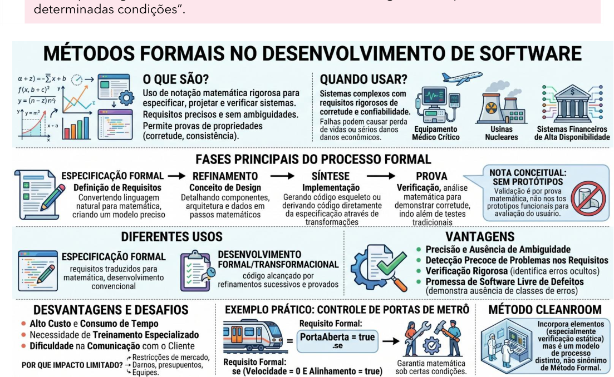

<!-- Start of picture text -->
determinadas condições”. <!-- End of picture text -->

---

<!-- pagina: 65 -->

**Diego Carvalho, Equipe Informática 2 (Diego Carvalho), Equipe Informática 1 (Diego Carvalho) Aula 00** 

<!-- Start of picture text -->
R ESUMO <!-- End of picture text -->

###### **<mark>ENGENHARIA DE SOFTWARE</mark>** 

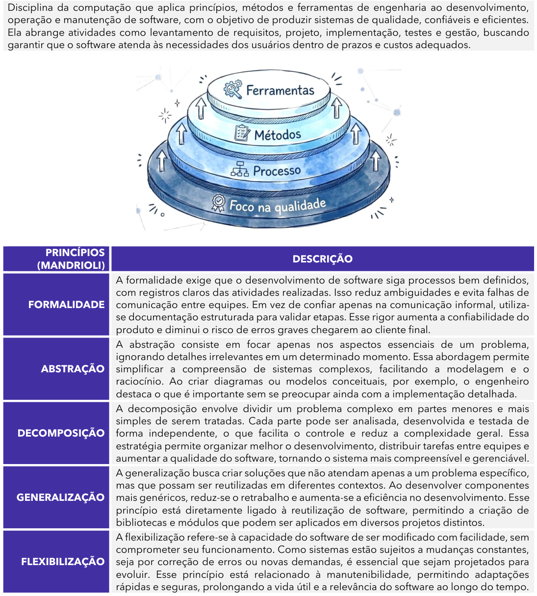

<!-- Start of picture text -->
Disciplina da computação que aplica princípios, métodos e ferramentas de engenharia ao desenvolvimento, operação e manutenção de software, com o objetivo de produzir sistemas de qualidade, confiáveis e eficientes. Ela abrange atividades como levantamento de requisitos, projeto, implementação, testes e gestão, buscando garantir que o software atenda às necessidades dos usuários dentro de prazos e custos adequados. PRINCÍPIOS DESCRIÇÃO (MANDRIOLI) A formalidade exige que o desenvolvimento de software siga processos bem definidos, com registros claros das atividades realizadas. Isso reduz ambiguidades e evita falhas de FORMALIDADE comunicação entre equipes. Em vez de confiar apenas na comunicação informal, utiliza- se documentação estruturada para validar etapas. Esse rigor aumenta a confiabilidade do produto e diminui o risco de erros graves chegarem ao cliente final. A abstração consiste em focar apenas nos aspectos essenciais de um problema, ignorando detalhes irrelevantes em um determinado momento. Essa abordagem permite ABSTRAÇÃO simplificar a compreensão de sistemas complexos, facilitando a modelagem e o raciocínio. Ao criar diagramas ou modelos conceituais, por exemplo, o engenheiro destaca o que é importante sem se preocupar ainda com a implementação detalhada. A decomposição envolve dividir um problema complexo em partes menores e mais simples de serem tratadas. Cada parte pode ser analisada, desenvolvida e testada de DECOMPOSIÇÃO forma independente, o que facilita o controle e reduz a complexidade geral. Essa estratégia permite organizar melhor o desenvolvimento, distribuir tarefas entre equipes e aumentar a qualidade do software, tornando o sistema mais compreensível e gerenciável. A generalização busca criar soluções que não atendam apenas a um problema específico, mas que possam ser reutilizadas em diferentes contextos. Ao desenvolver componentes GENERALIZAÇÃO mais genéricos, reduz-se o retrabalho e aumenta-se a eficiência no desenvolvimento. Esse princípio está diretamente ligado à reutilização de software, permitindo a criação de bibliotecas e módulos que podem ser aplicados em diversos projetos distintos. A flexibilização refere-se à capacidade do software de ser modificado com facilidade, sem comprometer seu funcionamento. Como sistemas estão sujeitos a mudanças constantes, FLEXIBILIZAÇÃO seja por correção de erros ou novas demandas, é essencial que sejam projetados para evoluir. Esse princípio está relacionado à manutenibilidade, permitindo adaptações rápidas e seguras, prolongando a vida útil e a relevância do software ao longo do tempo. <!-- End of picture text -->

|**CATEGORIA** **(PRESSMAN)** **PRINCÍPIO**|**DESCRIÇÃO**|
|---|---|

---

<!-- pagina: 66 -->

**Diego Carvalho, Equipe Informática 2 (Diego Carvalho), Equipe Informática 1 (Diego Carvalho) Aula 00** 

|A razão de existir|Todo sistema de software deve agregar valor aos seus usuários; todas as decisões devem considerar se estão trazendo um benefício real.|
|---|---|
|KISS (_Keep It Simple, Stupid!_)|Todo projeto deve ser o mais simples possível (sem ser simplista), o que resulta em um software menos propenso a erros e mais fácil de compreender e manter.|
|**PRINCÍPIOS** Mantenha a visão|É essencial manter uma visão arquitetural clara e consistente para que o projeto não se torne uma "colcha de retalhos" incompatível.|
|**FUNDAMENTAIS** **(ORIENTAM A** **PRÁTICA COMO** **UM TODO)** O que um produz outros consomem|Deve-se especificar, projetar e codificar lembrando sempre que outra pessoa (ou você mesmo no futuro) precisará entender, testar ou dar manutenção ao artefato gerado.|
|Esteja aberto para o futuro|Sistemas de sucesso são projetados para se adaptarem a mudanças e evoluírem, resolvendo o problema geral e estendendo sua vida útil.|
|Planeje visando a reutilização|Criar componentes genéricos e planejá-los com antecedência reduz o esforço futuro, economiza tempo e aumenta o valor do sistema.|
|Pense! |Refletir e analisar de forma clara antes de agir (projetar ou codificar) produz resultados superiores e reduz retrabalho.|
|Seja ágil |Mantenha a abordagem técnica e os produtos o mais simples possível, com foco na economia de ações e tomadas de decisão locais.|
|Concentre-se na qualidade|A qualidade do produto deve ser o foco principal em toda e qualquer atividade, ação e tarefa do processo de software.|
|Esteja pronto para adaptações|Não há espaço para dogmas; o processo deve ser adaptado às restrições do problema, da equipe e do projeto.|
|**PRINCÍPIOS DO** **PROCESSO** **(ORIENTAM A** Monte uma equipe eficiente|Pessoas são o fator mais importante; crie uma equipe auto-organizada baseada em confiança e respeito mútuos.|
| **ORGANIZAÇÃO** **DO TRABALHO)** Estabeleça comunicação|É fundamental coordenar esforços para evitar a omissão de informações críticas entre os envolvidos.|
|Gerencie Mudanças|Crie mecanismos formais ou informais para avaliar, aprovar e acomodar as mudanças solicitadas ao longo do processo.|
|Avalie os riscos|Muitas coisas podem dar errado; identifique os riscos antecipadamente e crie planos de contingência.|
|Gere artefatos de valor|Só produza artefatos (modelos, listas, etc) se eles agregarem valor e transmitirem informações claras para as próximas etapas.|

---

<!-- pagina: 67 -->

**Diego Carvalho, Equipe Informática 2 (Diego Carvalho), Equipe Informática 1 (Diego Carvalho) Aula 00** 

||Divida e conquiste|Utilize a "separação por interesses" para dividir problemas complexos em partes menores e independentes, facilitando a resolução.|
|---|---|---|
||Compreenda a abstração|Use a abstração para focar na essência do problema, ignorando detalhes de baixo nível e facilitando a comunicação do significado.|
||Esforce-se pela consistência|Estabeleça um contexto previsível e padronizado (como esquemas de cores e navegação em interfaces) para facilitar o uso do software.|
|**PRINCÍPIOS DA** **PRÁTICA**|Foco na transferência de informações|Preste atenção redobrada ao projetar e testar interfaces (internas e externas), pois é onde o fluxo de informações costuma gerar erros ou omissões.|
| **(ORIENTAM O** **TRABALHO** **TÉCNICO)**|Construa modularidade efetiva|Crie módulos ou componentes que sejam altamente coesos (tenham uma única função bem definida) e apresentem baixo acoplamento.|
||Verifique os padrões|Empregue padrões de projeto comprovados para resolver problemas recorrentes, aproveitando o conhecimento já consolidado.|
||Múltiplas perspectivas|Represente problemas e soluções sob diferentes pontos de vista (cenários, classes, comportamentos) para revelar erros que ficariam ocultos.|
||Facilite a manutenção|Projete o código assumindo que erros serão descobertos e novas funções serão pedidas a longo prazo, aplicando práticas que ajudem as futuras equipes de manutenção.|

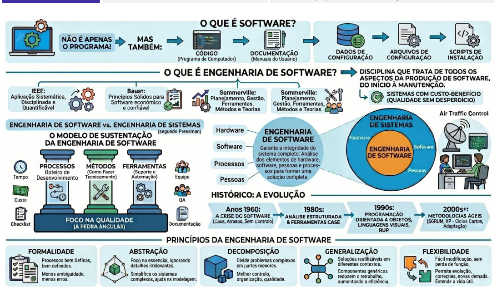

---

<!-- pagina: 68 -->

**Diego Carvalho, Equipe Informática 2 (Diego Carvalho), Equipe Informática 1 (Diego Carvalho) Aula 00** 

###### **<mark>PROCESSOS DE DESENVOLVIMENTO DE SOFTWARE</mark>** 

<mark>Conjuntos organizados de atividades, métodos, práticas e ferramentas utilizados para planejar, construir, testar,</mark> entregar e manter sistemas de software. Eles definem como as etapas do desenvolvimento são estruturadas, a ordem em que ocorrem, os papéis envolvidos e os artefatos produzidos, com o objetivo de garantir qualidade, previsibilidade e alinhamento com as necessidades do cliente, podendo variar de modelos mais rígidos a abordagens ágeis e adaptativas. 

###### **<mark>DESCRIÇÃO</mark>** 

###### **<mark>ETAPAS</mark>** 

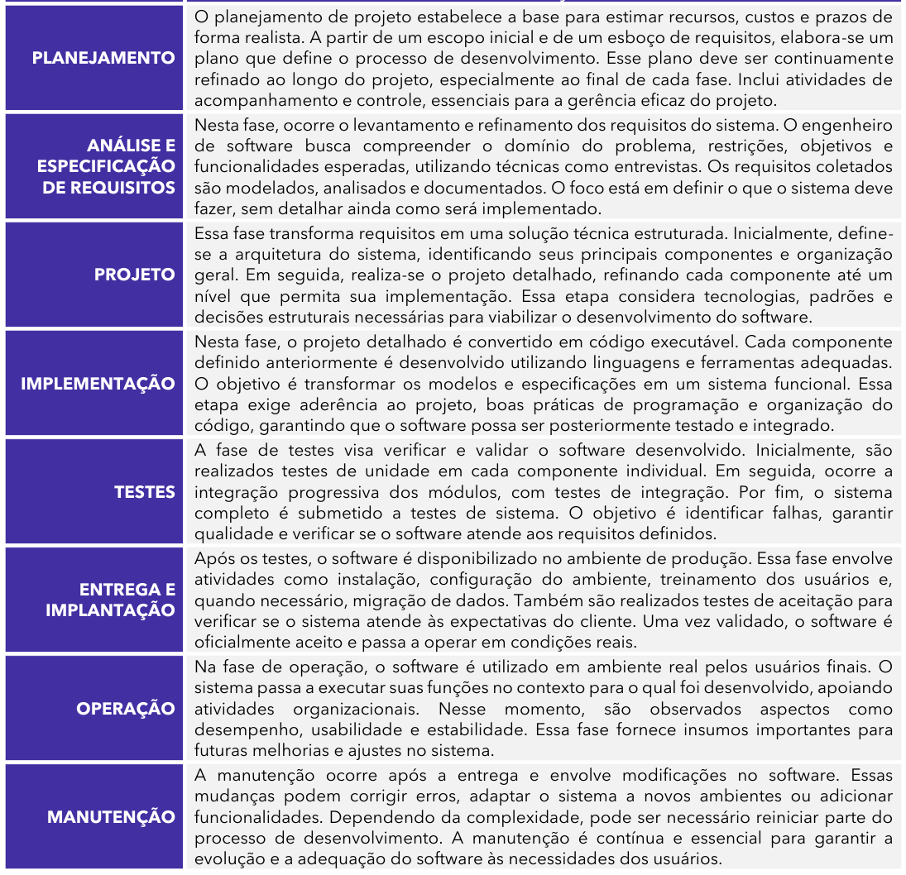

<!-- Start of picture text -->
O planejamento de projeto estabelece a base para estimar recursos, custos e prazos de forma realista. A partir de um escopo inicial e de um esboço de requisitos, elabora-se um PLANEJAMENTO plano que define o processo de desenvolvimento. Esse plano deve ser continuamente refinado ao longo do projeto, especialmente ao final de cada fase. Inclui atividades de acompanhamento e controle, essenciais para a gerência eficaz do projeto. Nesta fase, ocorre o levantamento e refinamento dos requisitos do sistema. O engenheiro ANÁLISE E  de software busca compreender o domínio do problema, restrições, objetivos e ESPECIFICAÇÃO  funcionalidades esperadas, utilizando técnicas como entrevistas. Os requisitos coletados DE REQUISITOS são modelados, analisados e documentados. O foco está em definir o que o sistema deve fazer, sem detalhar ainda como será implementado. Essa fase transforma requisitos em uma solução técnica estruturada. Inicialmente, define- se a arquitetura do sistema, identificando seus principais componentes e organização PROJETO geral. Em seguida, realiza-se o projeto detalhado, refinando cada componente até um nível que permita sua implementação. Essa etapa considera tecnologias, padrões e decisões estruturais necessárias para viabilizar o desenvolvimento do software. Nesta fase, o projeto detalhado é convertido em código executável. Cada componente definido anteriormente é desenvolvido utilizando linguagens e ferramentas adequadas. IMPLEMENTAÇÃO O objetivo é transformar os modelos e especificações em um sistema funcional. Essa etapa exige aderência ao projeto, boas práticas de programação e organização do código, garantindo que o software possa ser posteriormente testado e integrado. A fase de testes visa verificar e validar o software desenvolvido. Inicialmente, são realizados testes de unidade em cada componente individual. Em seguida, ocorre a TESTES integração progressiva dos módulos, com testes de integração. Por fim, o sistema completo é submetido a testes de sistema. O objetivo é identificar falhas, garantir qualidade e verificar se o software atende aos requisitos definidos. Após os testes, o software é disponibilizado no ambiente de produção. Essa fase envolve atividades como instalação, configuração do ambiente, treinamento dos usuários e, ENTREGA E quando necessário, migração de dados. Também são realizados testes de aceitação para IMPLANTAÇÃO verificar se o sistema atende às expectativas do cliente. Uma vez validado, o software é oficialmente aceito e passa a operar em condições reais. Na fase de operação, o software é utilizado em ambiente real pelos usuários finais. O sistema passa a executar suas funções no contexto para o qual foi desenvolvido, apoiando OPERAÇÃO atividades  organizacionais.  Nesse  momento,  são  observados  aspectos  como desempenho, usabilidade e estabilidade. Essa fase fornece insumos importantes para futuras melhorias e ajustes no sistema. A manutenção ocorre após a entrega e envolve modificações no software. Essas mudanças podem corrigir erros, adaptar o sistema a novos ambientes ou adicionar MANUTENÇÃO funcionalidades. Dependendo da complexidade, pode ser necessário reiniciar parte do processo de desenvolvimento. A manutenção é contínua e essencial para garantir a evolução e a adequação do software às necessidades dos usuários. <!-- End of picture text -->

---

<!-- pagina: 69 -->

**Diego Carvalho, Equipe Informática 2 (Diego Carvalho), Equipe Informática 1 (Diego Carvalho) Aula 00** 

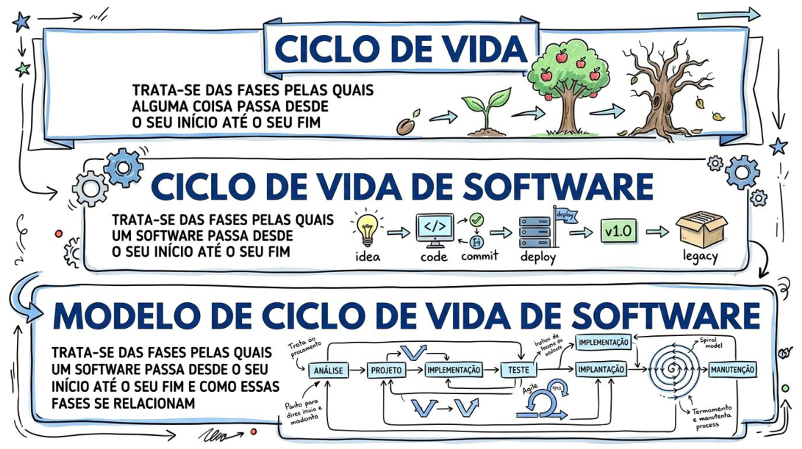

---

<!-- pagina: 70 -->

**Diego Carvalho, Equipe Informática 2 (Diego Carvalho), Equipe Informática 1 (Diego Carvalho) Aula 00** 

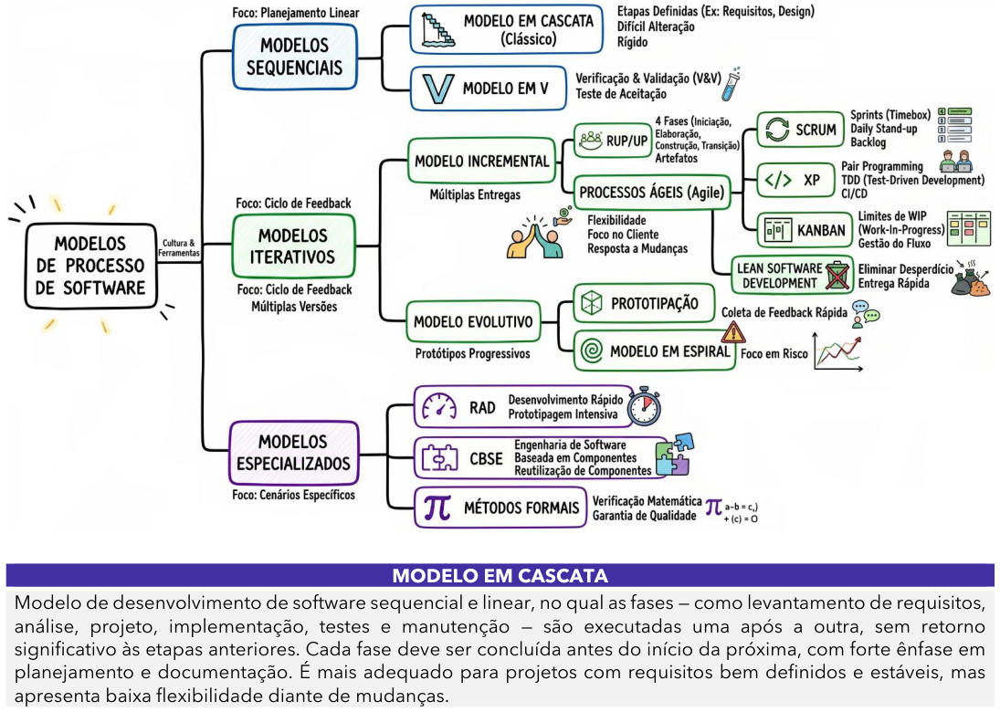

<!-- Start of picture text -->
MODELO EM CASCATA Modelo de desenvolvimento de software sequencial e linear, no qual as fases — como levantamento de requisitos, análise, projeto, implementação, testes e manutenção — são executadas uma após a outra, sem retorno significativo às etapas anteriores. Cada fase deve ser concluída antes do início da próxima, com forte ênfase em planejamento e documentação. É mais adequado para projetos com requisitos bem definidos e estáveis, mas apresenta baixa flexibilidade diante de mudanças. presenta baixa flexibilidade diante de mudanças. resenta baixa flexibilidade diante de mudanças. ças. as. <!-- End of picture text -->

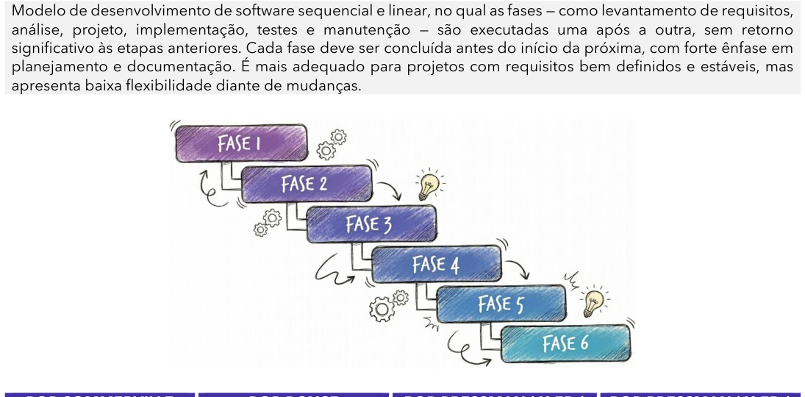

<!-- Start of picture text -->
Modelo de desenvolvimento de software sequencial e linear, no qual as fases — como levantamento de requisitos, análise, projeto, implementação, testes e manutenção — são executadas uma após a outra, sem retorno significativo às etapas anteriores. Cada fase deve ser concluída antes do início da próxima, com forte ênfase em planejamento e documentação. É mais adequado para projetos com requisitos bem definidos e estáveis, mas apresenta baixa flexibilidade diante de mudanças. presenta baixa flexibilidade diante de mudanças. resenta baixa flexibilidade diante de mudanças. ças. as. <!-- End of picture text -->

|**POR SOMMERVILLE**|**POR ROYCE**|**POR PRESSMAN(4ª ED.)**|**POR PRESSMAN(6ª ED.)**|
|---|---|---|---|
|Análise e Definição de Requisitos|Requisitos de Sistema|Modelagem e Engenharia do Sistema|Comunicação|
|Projeto de Sistema e Software|Requisitos de Software|Análise de Requisitos de Software|Planejamento|
|Implementação e Teste de Unidade|Análise|Projeto|Modelagem|
|Integração e Teste de Sistema|Projeto|Geração de Código|Construção|

---

<!-- pagina: 71 -->

**Diego Carvalho, Equipe Informática 2 (Diego Carvalho), Equipe Informática 1 (Diego Carvalho) Aula 00** 

|Operação e Manutenção|Codificação|Teste e Manutenção|Implantação|
|---|---|---|---|
||Teste|||
||Operação|||

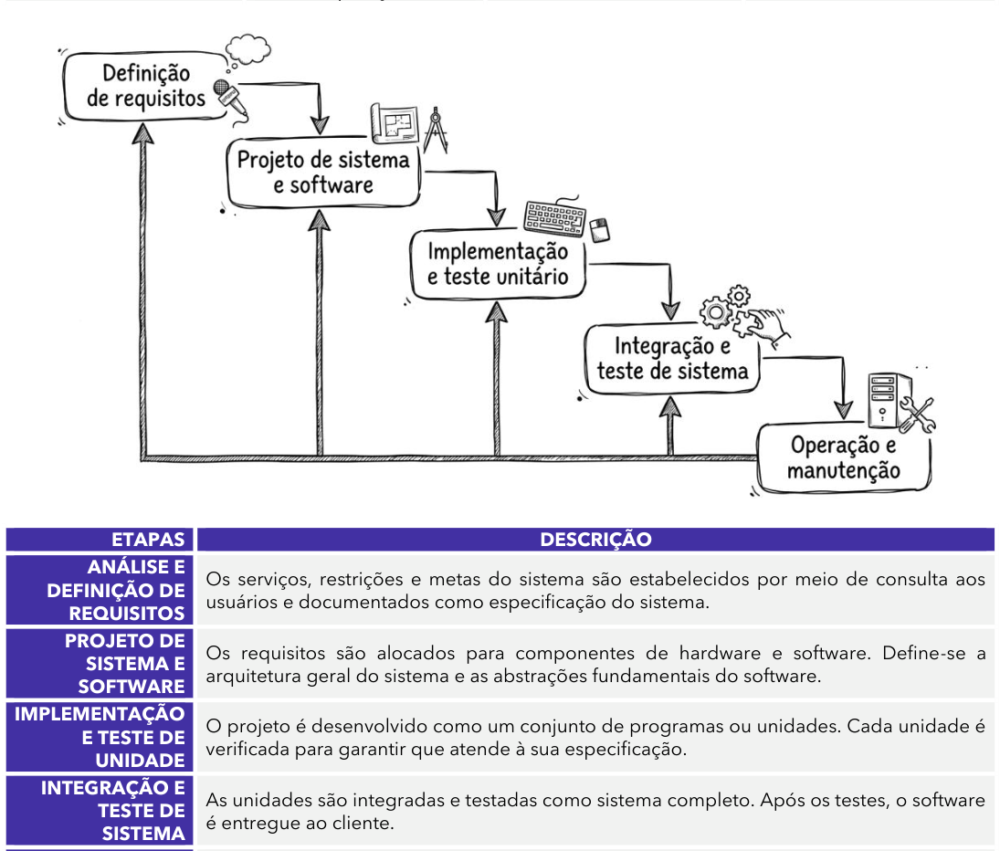

<!-- Start of picture text -->
ETAPAS  DESCRIÇÃO ÇÃO ÃO ANÁLISE E Os serviços, restrições e metas do sistema são estabelecidos por meio de consulta aos DEFINIÇÃO DE usuários e documentados como especificação do sistema. REQUISITOS PROJETO DE Os requisitos são alocados para componentes de hardware e software. Define-se a SISTEMA E arquitetura geral do sistema e as abstrações fundamentais do software. SOFTWARE IMPLEMENTAÇÃO O projeto é desenvolvido como um conjunto de programas ou unidades. Cada unidade é E TESTE DE verificada para garantir que atende à sua especificação. UNIDADE INTEGRAÇÃO E As unidades são integradas e testadas como sistema completo. Após os testes, o software TESTE DE é entregue ao cliente. SISTEMA <!-- End of picture text -->

**<mark>ETAPAS DESCRIÇÃO ÇÃO ÃO</mark> ANÁLISE E** Os serviços, restrições e metas do sistema são estabelecidos por meio de consulta aos **DEFINIÇÃO DE** usuários e documentados como especificação do sistema. **REQUISITOS PROJETO DE** Os requisitos são alocados para componentes de hardware e software. Define-se a **SISTEMA E** arquitetura geral do sistema e as abstrações fundamentais do software. **SOFTWARE IMPLEMENTAÇÃO** O projeto é desenvolvido como um conjunto de programas ou unidades. Cada unidade é **E TESTE DE** verificada para garantir que atende à sua especificação. **UNIDADE INTEGRAÇÃO E** As unidades são integradas e testadas como sistema completo. Após os testes, o software **TESTE DE** é entregue ao cliente. **SISTEMA** <mark>O sistema é instalado e colocado em uso. A manutenção envolve correção de erros,</mark> **OPERAÇÃO E** melhorias de implementação e ampliação de serviços conforme novos requisitos surgem. **MANUTENÇÃO** Normalmente é a fase mais longa do ciclo de vida. ga do ciclo de vida. a do ciclo de vida. 

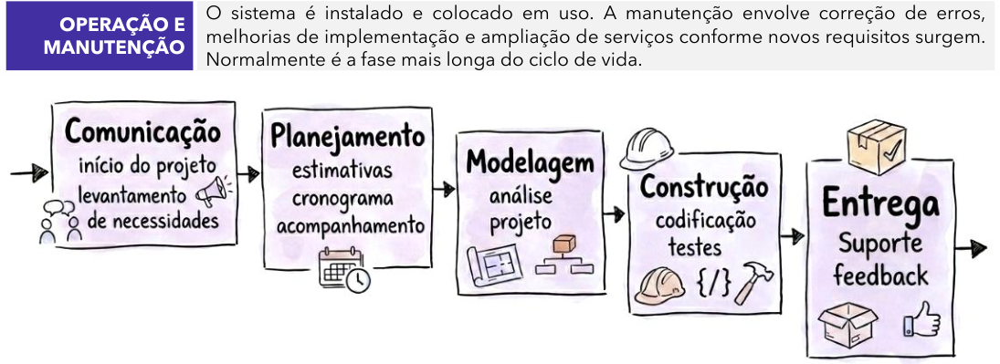

<!-- Start of picture text -->
O sistema é instalado e colocado em uso. A manutenção envolve correção de erros, OPERAÇÃO E melhorias de implementação e ampliação de serviços conforme novos requisitos surgem. MANUTENÇÃO Normalmente é a fase mais longa do ciclo de vida. ga do ciclo de vida. a do ciclo de vida. <!-- End of picture text -->

---

<!-- pagina: 72 -->

**Diego Carvalho, Equipe Informática 2 (Diego Carvalho), Equipe Informática 1 (Diego Carvalho) Aula 00** 

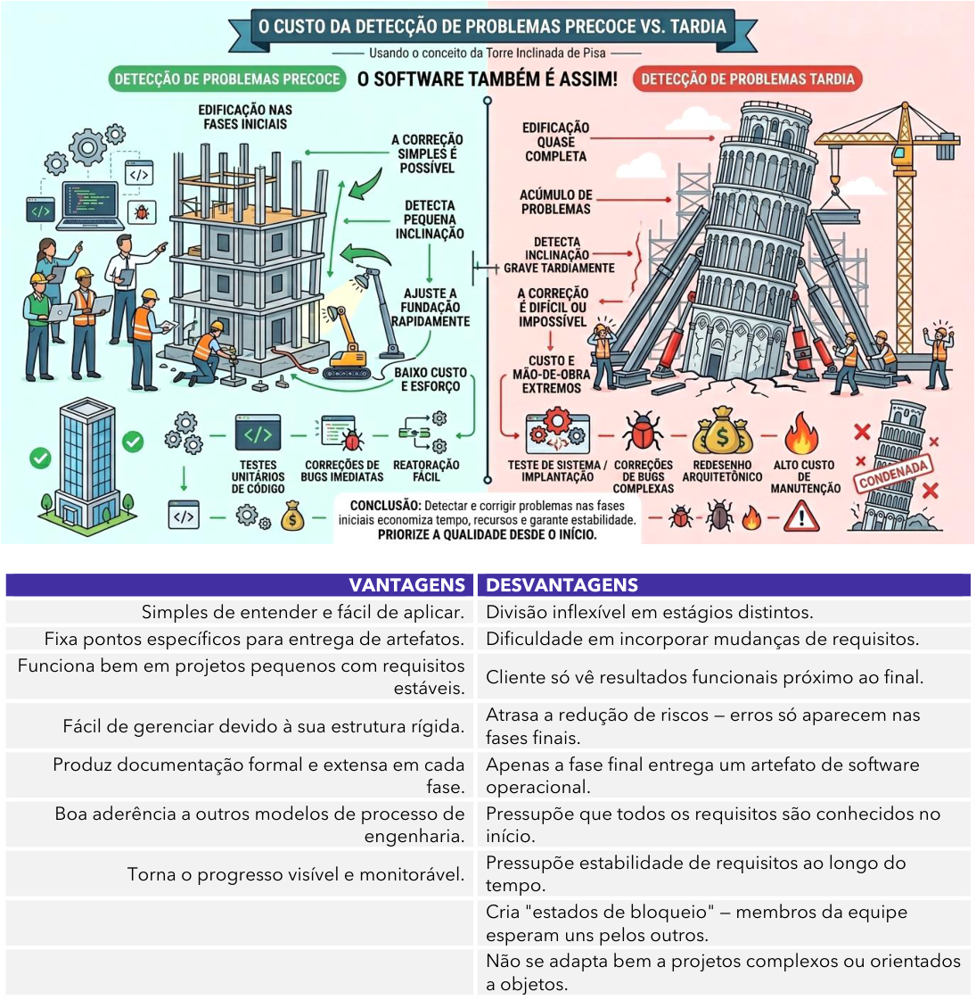

<!-- Start of picture text -->
VANTAGENS  DESVANTAGENS Simples de entender e fácil de aplicar. Divisão inflexível em estágios distintos. Fixa pontos específicos para entrega de artefatos. Dificuldade em incorporar mudanças de requisitos. Funciona bem em projetos pequenos com requisitos Cliente só vê resultados funcionais próximo ao final. estáveis. Atrasa a redução de riscos — erros só aparecem nas Fácil de gerenciar devido à sua estrutura rígida. fases finais. Produz documentação formal e extensa em cada  Apenas a fase final entrega um artefato de software fase.  operacional. Boa aderência a outros modelos de processo de  Pressupõe que todos os requisitos são conhecidos no engenharia.  início. Pressupõe estabilidade de requisitos ao longo do Torna o progresso visível e monitorável. tempo. Cria "estados de bloqueio" — membros da equipe esperam uns pelos outros. Não se adapta bem a projetos complexos ou orientados a objetos. <!-- End of picture text -->

---

<!-- pagina: 73 -->

**Diego Carvalho, Equipe Informática 2 (Diego Carvalho), Equipe Informática 1 (Diego Carvalho) Aula 00** 

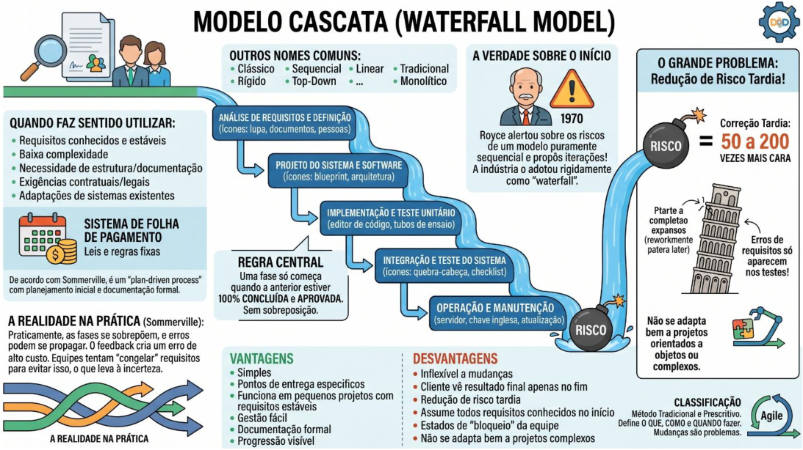

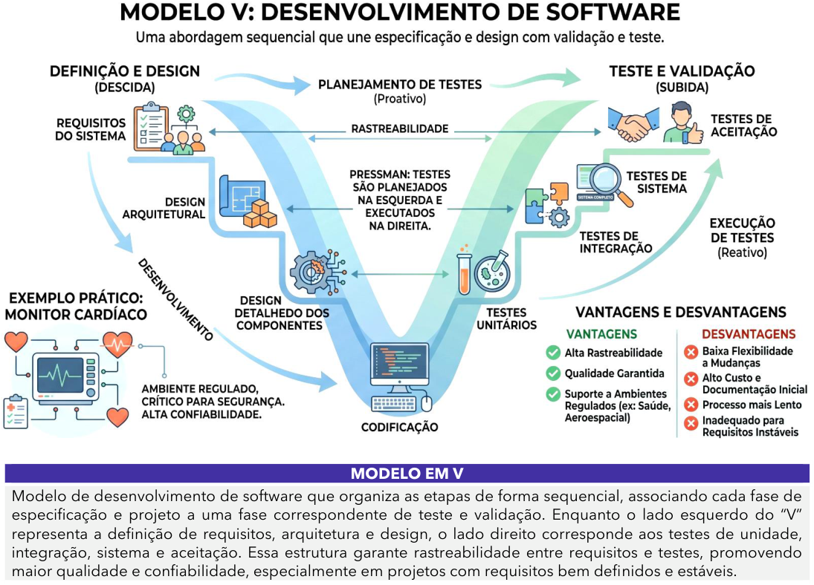

<!-- Start of picture text -->
MODELO EM V Modelo de desenvolvimento de software que organiza as etapas de forma sequencial, associando cada fase de especificação e projeto a uma fase correspondente de teste e validação. Enquanto o lado esquerdo do “V” representa a definição de requisitos, arquitetura e design, o lado direito corresponde aos testes de unidade, integração, sistema e aceitação. Essa estrutura garante rastreabilidade entre requisitos e testes, promovendo maior qualidade e confiabilidade, especialmente em projetos com requisitos bem definidos e estáveis. <!-- End of picture text -->

---

<!-- pagina: 74 -->

**Diego Carvalho, Equipe Informática 2 (Diego Carvalho), Equipe Informática 1 (Diego Carvalho) Aula 00** 

###### **<mark>MODELO INCREMENTAL</mark>** 

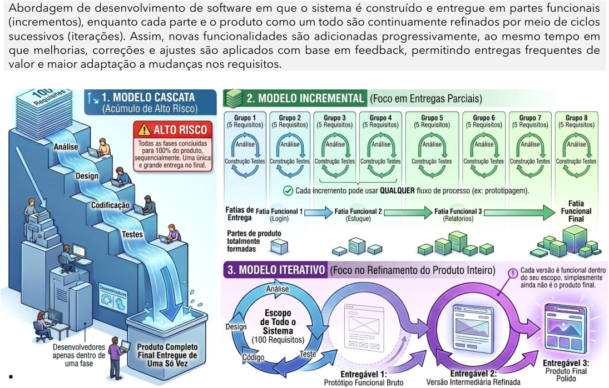

<!-- Start of picture text -->
Abordagem de desenvolvimento de software em que o sistema é construído e entregue em partes funcionais (incrementos), enquanto cada parte e o produto como um todo são continuamente refinados por meio de ciclos sucessivos (iterações). Assim, novas funcionalidades são adicionadas progressivamente, ao mesmo tempo em que melhorias, correções e ajustes são aplicados com base em feedback, permitindo entregas frequentes de valor e maior adaptação a mudanças nos requisitos. <!-- End of picture text -->

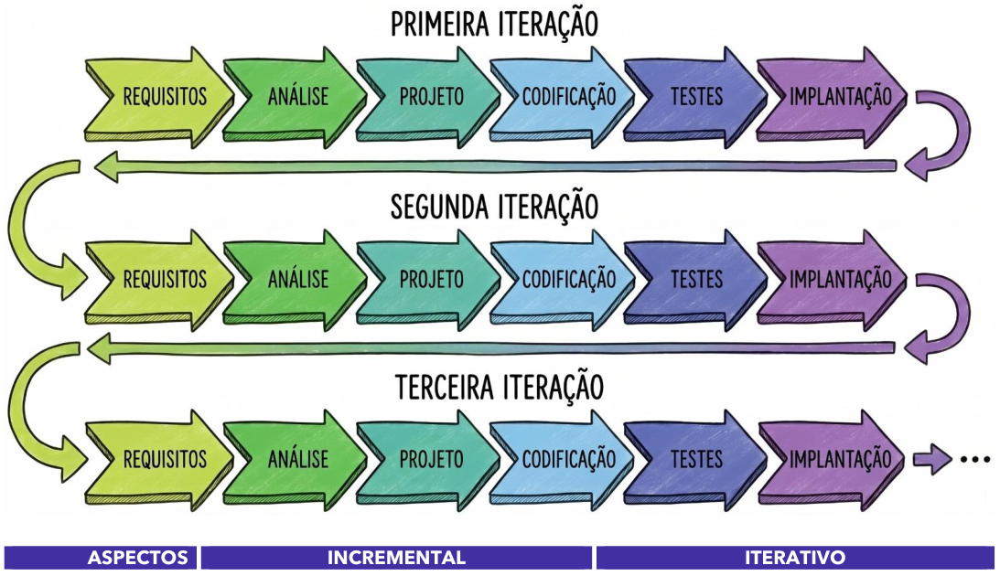

<!-- Start of picture text -->
ASPECTOS  INCREMENTAL  ITERATIVO <!-- End of picture text -->

https://t.me/KakashiAssinaturasBot

---

<!-- pagina: 75 -->

**Diego Carvalho, Equipe Informática 2 (Diego Carvalho), Equipe Informática 1 (Diego Carvalho) Aula 00** 

|**IDEIA CENTRAL**|Divide o produto em partes e entrega funcionalidadesgradualment|Refina o produto completo por meio de ciclos contínuos sucessivos|
|---|---|---|
|**ANALOGIA**|Como montar um quebra-cabeças adicionandopeças ao longo do tempo|Como um esboço que vai sendo melhorado com mais detalhes a cada ciclo|
|**O QUE ENTREGA**|Entrega builds com partes funcionais que somam valorprogressivo|Entrega releases com versões aprimoradas do sistema ao longo do tempo|
|**QUANDO** **INTEGRA**|Integra funcionalidades ao longo do processo,não apenas no final|Integra melhorias a cada ciclo, evoluindo a versão existente do sistema|
|**PROCESSO** **INTERNO**|Pode usar diversos fluxos, não se limitando ao modelo cascata|Percorre fases do desenvolvimento repetidamente em ciclos iterativos|
|**NA PRÁTICA**|Geralmente aplicado junto ao iterativo para evolução incremental|Normalmente combinado ao incremental para entregas evolutivas|

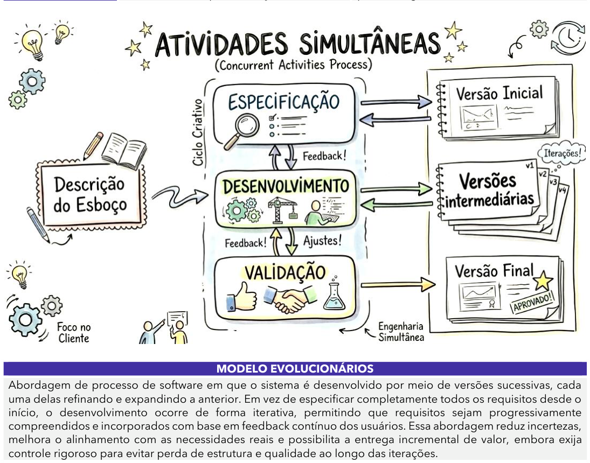

<!-- Start of picture text -->
==5460== MODELO EVOLUCIONÁRIOS Abordagem de processo de software em que o sistema é desenvolvido por meio de versões sucessivas, cada uma delas refinando e expandindo a anterior. Em vez de especificar completamente todos os requisitos desde o início, o desenvolvimento ocorre de forma iterativa, permitindo que requisitos sejam progressivamente compreendidos e incorporados com base em feedback contínuo dos usuários. Essa abordagem reduz incertezas, melhora o alinhamento com as necessidades reais e possibilita a entrega incremental de valor, embora exija controle rigoroso para evitar perda de estrutura e qualidade ao longo das iterações. <!-- End of picture text -->

|**ASPECTOS**|**INCREMENTAL**||**EVOLUCIONÁRIO**|
|---|---|---|---|
|**REQUISITOS**|Conhecidos desde o início|Incertos, processo|descobertos ao longo do|
|**ENTREGA POR ITERAÇÃO**|Sempre funcionalidade operacional|Pode ser protótipo|documentação, modelo ou |
|**CONTEXTO** **IDEAL**|Escopo grande, requisitos estáveis|Alta incer|teza, mudanças esperadas|

---

<!-- pagina: 76 -->

**Diego Carvalho, Equipe Informática 2 (Diego Carvalho), Equipe Informática 1 (Diego Carvalho) Aula 00** 

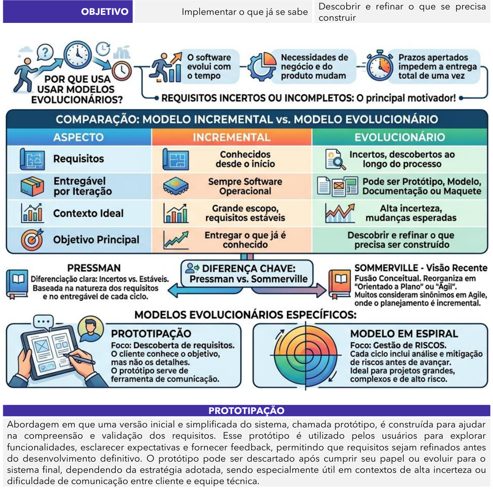

<!-- Start of picture text -->
Descobrir e refinar o que se precisa OBJETIVO Implementar o que já se sabe construir PROTOTIPAÇÃO Abordagem em que uma versão inicial e simplificada do sistema, chamada protótipo, é construída para ajudar na compreensão e validação dos requisitos. Esse protótipo é utilizado pelos usuários para explorar funcionalidades, esclarecer expectativas e fornecer feedback, permitindo que requisitos sejam refinados antes do desenvolvimento definitivo. O protótipo pode ser descartado após cumprir seu papel ou evoluir para o sistema final, dependendo da estratégia adotada, sendo especialmente útil em contextos de alta incerteza ou dificuldade de comunicação entre cliente e equipe técnica. <!-- End of picture text -->

|**ETAPAS**|**DESCRIÇÃO**|**ARTEFATO** **GERADO**|
|---|---|---|
|**ESTABELECER OBJETIVOS** **DO PROTÓTIPO**|Define_por_ _que_o protótipo será construído: validar requisitos, explorar interface ou testar viabilidade técnica.|Plano de prototipação|
|**DEFINIR FUNCIONALIDADE** **DO PROTÓTIPO**|Decide_o_ _que_o protótipo vai incluir, priorizando funcionalidades de maior risco ou incerteza.|Definição geral|
|**DESENVOLVER PROTÓTIPO**|Construção rápida do protótipo, geralmente com simplificações e ferramentas de desenvolvimento ágil.|Protótipo executável|
|**AVALIAR O PROTÓTIPO**|Usuários e stakeholders testam e fornecem feedback para guiar a próxima iteração ou o desenvolvimento final.|Relatório de avaliação|

---

<!-- pagina: 77 -->

**Diego Carvalho, Equipe Informática 2 (Diego Carvalho), Equipe Informática 1 (Diego Carvalho) Aula 00** 

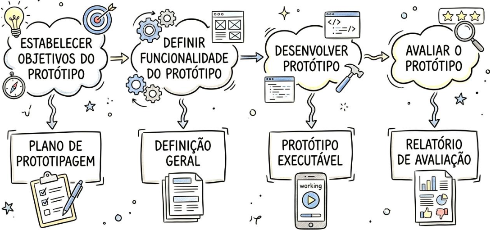

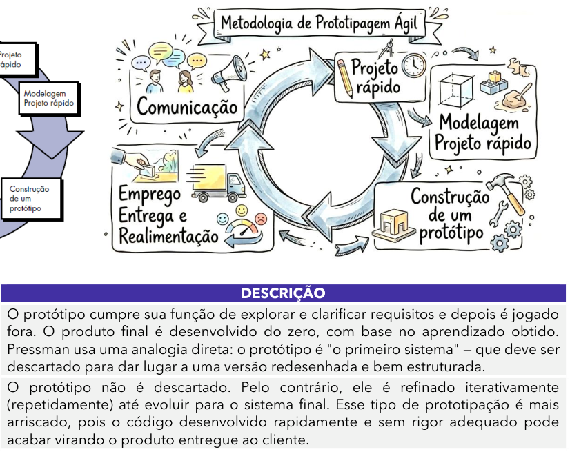

<!-- Start of picture text -->
DESCRIÇÃO ÇÃO ÃO O protótipo cumpre sua função de explorar e clarificar requisitos e depois é jogado fora. O produto final é desenvolvido do zero, com base no aprendizado obtido. Pressman usa uma analogia direta: o protótipo é "o primeiro sistema" — que deve ser descartado para dar lugar a uma versão redesenhada e bem estruturada. para dar lugar a uma versão redesenhada e bem estruturada. ara dar lugar a uma versão redesenhada e bem estruturada. gar a uma versão redesenhada e bem estruturada. ar a uma versão redesenhada e bem estruturada. O protótipo não é descartado. Pelo contrário, ele é refinado iterativamente (repetidamente) até evoluir para o sistema final. Esse tipo de prototipação é mais arriscado, pois o código desenvolvido rapidamente e sem rigor adequado pode acabar virando o produto entregue ao cliente. produto entregue ao cliente. roduto entregue ao cliente. gue ao cliente. ue ao cliente. <!-- End of picture text -->

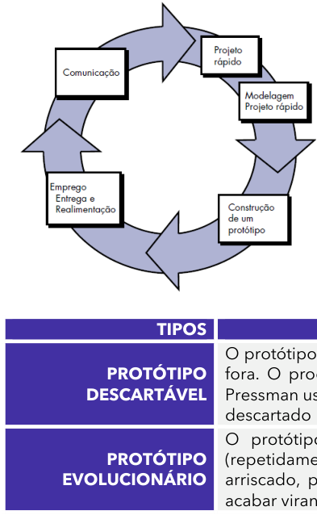

<!-- Start of picture text -->
TIPOS PROTÓTIPO DESCARTÁVEL PROTÓTIPO EVOLUCIONÁRIO <!-- End of picture text -->

**<mark>TIPOS DESCRIÇÃO ÇÃO ÃO</mark>** <mark>O protótipo cumpre sua função de explorar e clarificar requisitos e depois é jogado</mark> **PROTÓTIPO** fora. O produto final é desenvolvido do zero, com base no aprendizado obtido. **DESCARTÁVEL** Pressman usa uma analogia direta: o protótipo é "o primeiro sistema" — que deve ser descartado para dar lugar a uma versão redesenhada e bem estruturada. para dar lugar a uma versão redesenhada e bem estruturada. ara dar lugar a uma versão redesenhada e bem estruturada. gar a uma versão redesenhada e bem estruturada. ar a uma versão redesenhada e bem estruturada. O protótipo não é descartado. Pelo contrário, ele é refinado iterativamente **PROTÓTIPO** (repetidamente) até evoluir para o sistema final. Esse tipo de prototipação é mais **EVOLUCIONÁRIO** arriscado, pois o código desenvolvido rapidamente e sem rigor adequado pode acabar virando o produto entregue ao cliente. produto entregue ao cliente. roduto entregue ao cliente. gue ao cliente. ue ao cliente. 

**<mark>TIPOS DESCRIÇÃO</mark>** 

O objetivo é trabalhar com o cliente para explorar os requisitos e entregar um sistema **DESENVOLVIMENTO** final. O desenvolvimento começa com as partes do sistema já compreendidas, e o **EXPLORATÓRIO** sistema evolui por meio da adição de novas características propostas pelo cliente ao **(EVOLUCIONÁRIO)** longo do processo. O protótipo não é descartado — ele se torna o produto.

---

<!-- pagina: 78 -->

**Diego Carvalho, Equipe Informática 2 (Diego Carvalho), Equipe Informática 1 (Diego Carvalho) Aula 00** 

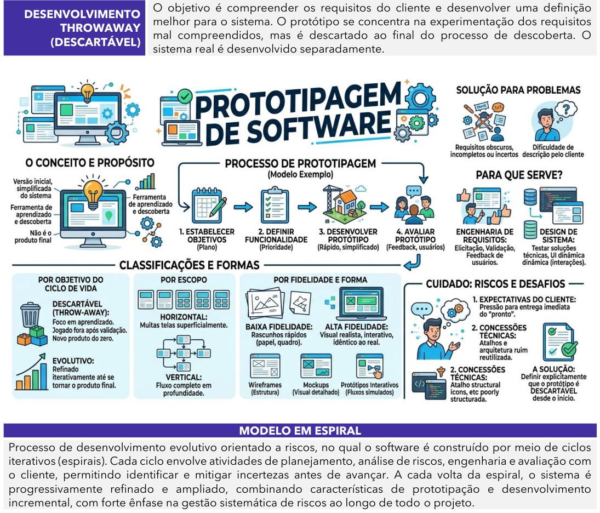

<!-- Start of picture text -->
O objetivo é compreender os requisitos do cliente e desenvolver uma definição DESENVOLVIMENTO melhor para o sistema. O protótipo se concentra na experimentação dos requisitos THROWAWAY mal compreendidos, mas é descartado ao final do processo de descoberta. O (DESCARTÁVEL) sistema real é desenvolvido separadamente. MODELO EM ESPIRAL Processo de desenvolvimento evolutivo orientado a riscos, no qual o software é construído por meio de ciclos iterativos (espirais). Cada ciclo envolve atividades de planejamento, análise de riscos, engenharia e avaliação com o cliente, permitindo identificar e mitigar incertezas antes de avançar. A cada volta da espiral, o sistema é progressivamente refinado e ampliado, combinando características de prototipação e desenvolvimento incremental, com forte ênfase na gestão sistemática de riscos ao longo de todo o projeto. , com forte ênfase na gestão sistemática de riscos ao longo de todo o projeto.  com forte ênfase na gestão sistemática de riscos ao longo de todo o projeto. gestão sistemática de riscos ao longo de todo o projeto. estão sistemática de riscos ao longo de todo o projeto. go de todo o projeto. o de todo o projeto. projeto. rojeto. jeto. eto. <!-- End of picture text -->

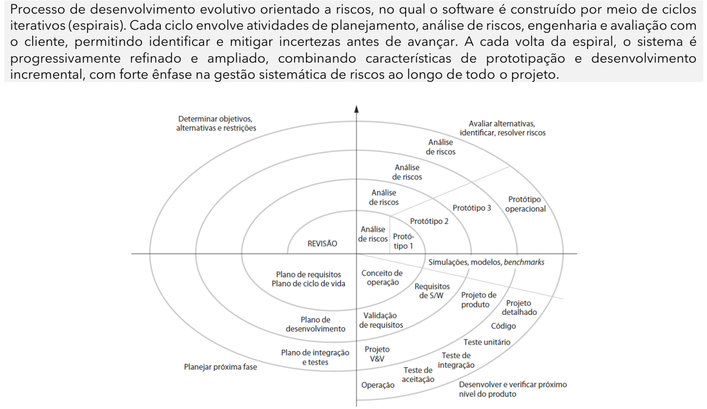

<!-- Start of picture text -->
Processo de desenvolvimento evolutivo orientado a riscos, no qual o software é construído por meio de ciclos iterativos (espirais). Cada ciclo envolve atividades de planejamento, análise de riscos, engenharia e avaliação com o cliente, permitindo identificar e mitigar incertezas antes de avançar. A cada volta da espiral, o sistema é progressivamente refinado e ampliado, combinando características de prototipação e desenvolvimento incremental, com forte ênfase na gestão sistemática de riscos ao longo de todo o projeto. , com forte ênfase na gestão sistemática de riscos ao longo de todo o projeto.  com forte ênfase na gestão sistemática de riscos ao longo de todo o projeto. gestão sistemática de riscos ao longo de todo o projeto. estão sistemática de riscos ao longo de todo o projeto. go de todo o projeto. o de todo o projeto. projeto. rojeto. jeto. eto. <!-- End of picture text -->

---

<!-- pagina: 79 -->

**Diego Carvalho, Equipe Informática 2 (Diego Carvalho), Equipe Informática 1 (Diego Carvalho) Aula 00** 

|**SETORES** |**O QUE ACONTECE AQUI?** |
|---|---|
|**DETERMINAR** **OBJETIVOS,** **ALTERNATIVAS E** **RESTRIÇÕES**|Definem-se os objetivos da fase atual (melhorar performance, corrigir funcionalidade, garantir segurança, etc.), identificam-se alternativas disponíveis (reúso de componentes, comprar um produto pronto, desenvolver do zero) e mapeiam-se as restrições impostas(custo, prazo,recursos humanos).|
|**AVALIAR ALTERNATIVAS,** **IDENTIFICAR E** **RESOLVER RISCOS**|As alternativas são avaliadas em relação aos objetivos e restrições. Áreas de incerteza são identificadas — custos excessivos, lacunas técnicas, requisitos ambíguos — e os riscos são resolvidos ou reduzidos antes de avançar. Um protótipo pode ser construído aquipara explorar incertezas e validar hipóteses.|
|**DESENVOLVER** **E TESTAR**|Após a redução dos riscos, seleciona-se um modelo de desenvolvimento adequado para aquela fase específica — pode ser prototipação evolucionária, Cascata, modelo baseado em componentes, entre outros. O software é desenvolvido e testado.|
|**PLANEJAR PRÓXIMAS** **FASES**|Revisa-se o trabalho realizado e decide-se sobre o prosseguimento ao próximo loop. Se a decisão for continuar, elaboram-se os planos para a próxima fase. Aqui ocorre um marco de ancoragem — que veremos em detalhes a seguir.|

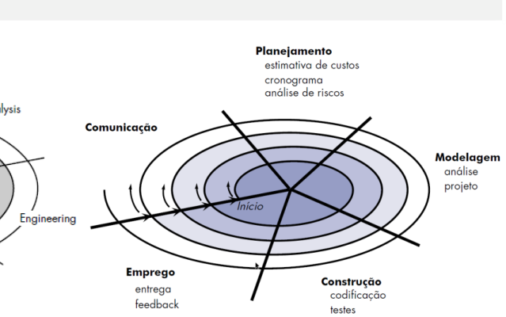

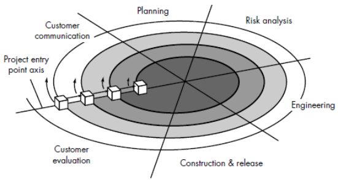

**PRESSMAN - 5ª EDIÇÃO** 

**PRESSMAN – 7ª EDIÇÃO** 

|**SETORES(R. PRESSMAN)**||**DESCRIÇÃO**|
|---|---|---|
|**COMUNICAÇÃO**|Levantamento de necessi|dades e alinhamento com os envolvidos.|
|**PLANEJAMENTO**|Estimativa de custos,cron|ograma e análise de riscos.|
|**MODELAGEM**|Análise e design do siste|ma.|
|**CONSTRUÇÃO**|Codificação e testes.||
|**IMPLANTAÇÃO**|Entrega ao cliente e colet|a de feedback.|
||**VANTAGENS**|**DESVANTAGENS**|
|Análise de riscos sistemá|tica e formal a cada ciclo.|Exige analistas de risco experientes e altamente qualificados.|
|Versões progressivamente m|ais completas e refinadas a cada loop.|Exige equipe de desenvolvimento com perfil técnico elevado.|
|Pode ser aplicado a todo o c|iclo de vida do software.|Gerenciamento de processo mais complexo do que outros modelos.|
|Combina o rigor do Casca|ta com a flexibilidade do iterativo.|Não recomendado para projetos pequenos e simples.|
|Reflete as práticas reais de|engenharia para projetos complexos.|Difícil de justificar em contratos de preço fixo.|

---

<!-- pagina: 80 -->

**Diego Carvalho, Equipe Informática 2 (Diego Carvalho), Equipe Informática 1 (Diego Carvalho) Aula 00** 

Estimativas realistas por considerar riscos Baixa adoção comercial pela exigência de formalmente. competências avançadas. Marcos de ancoragem garantem comprometimento formal dos envolvidos. 

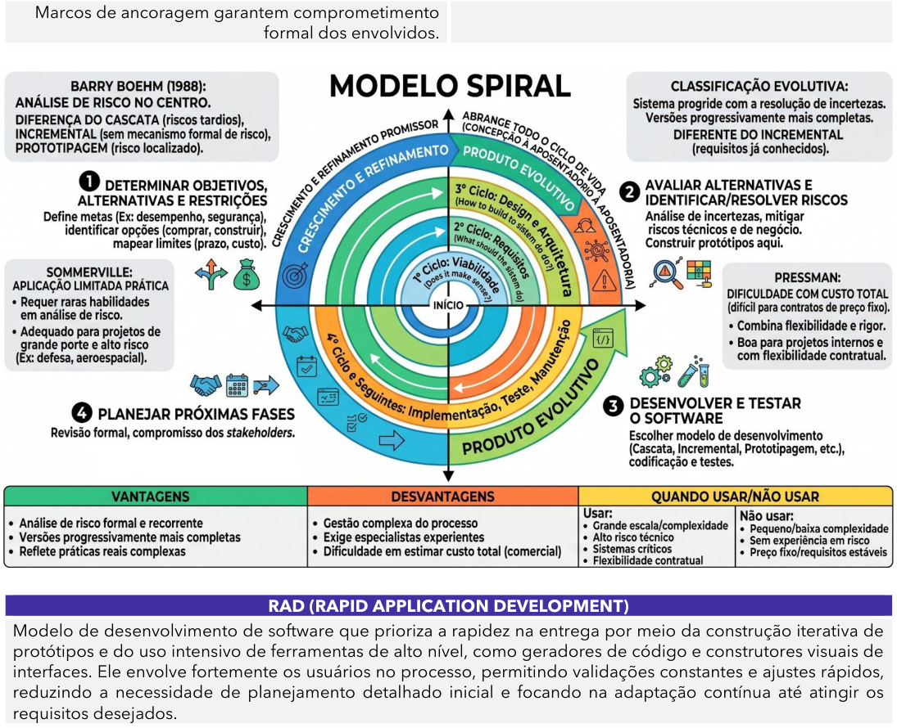

<!-- Start of picture text -->
Marcos de ancoragem garantem comprometimento formal dos envolvidos. RAD (RAPID APPLICATION DEVELOPMENT) Modelo de desenvolvimento de software que prioriza a rapidez na entrega por meio da construção iterativa de protótipos e do uso intensivo de ferramentas de alto nível, como geradores de código e construtores visuais de interfaces. Ele envolve fortemente os usuários no processo, permitindo validações constantes e ajustes rápidos, reduzindo a necessidade de planejamento detalhado inicial e focando na adaptação contínua até atingir os requisitos desejados. <!-- End of picture text -->

**<mark>ETAPAS DESCRIÇÃO</mark>** <mark>O fluxo de informações entre as funções de negócio é modelado para compreender como</mark> os processos organizacionais operam. Busca-se identificar quais informações direcionam **MODELAGEM DE** cada atividade, quais são geradas ao longo do processo, quem é responsável por produzi- **NEGÓCIO** las, para onde são encaminhadas e quem as utiliza. Essa etapa fornece uma visão clara e estruturada do funcionamento do negócio. O fluxo de informações identificado anteriormente é refinado em um conjunto estruturado de objetos de dados que sustentam o negócio. Nessa etapa, são definidos os atributos de **MODELAGEM DE** cada objeto e estabelecidos os relacionamentos entre eles. O objetivo é construir uma base **DADOS** de dados consistente, que represente fielmente as informações necessárias para o funcionamento adequado do sistema. Os objetos de dados definidos são utilizados para descrever como as funções de negócio serão implementadas no sistema. São criadas especificações de processamento que **MODELAGEM DE** detalham como cada objeto será manipulado, incluindo operações de criação, alteração, **PROCESSO** exclusão e recuperação. Essa fase conecta os dados às ações do sistema, garantindo que os processos atendam às necessidades do negócio.

---

<!-- pagina: 81 -->

**Diego Carvalho, Equipe Informática 2 (Diego Carvalho), Equipe Informática 1 (Diego Carvalho) Aula 00** 

Nesta fase ocorre a construção do sistema com apoio de ferramentas de quarta geração, como geradores de código, construtores visuais de interfaces e linguagens de alto nível como SQL. Esses recursos reduzem a necessidade de codificação manual. Além disso, prioriza-se o reúso de componentes existentes, e, quando necessário, são criados novos elementos reutilizáveis para acelerar futuros desenvolvimentos. 

**GERAÇÃO DA APLICAÇÃO TESTE E MODIFICAÇÃO** 

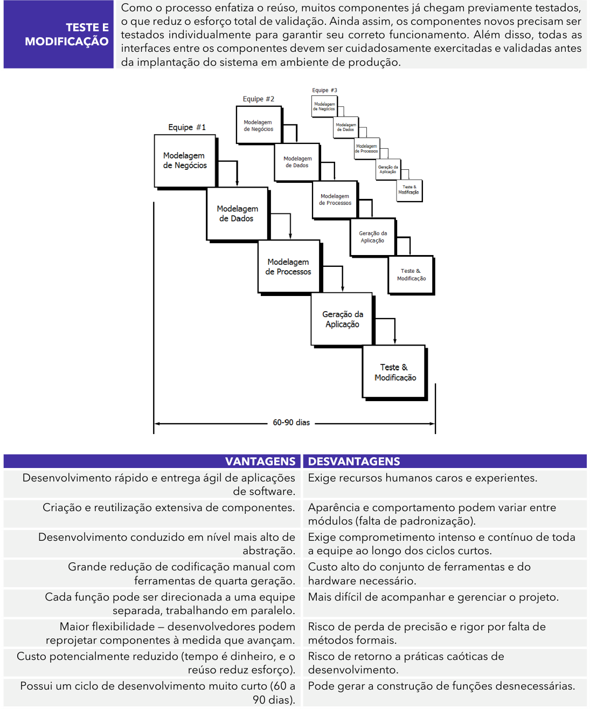

<!-- Start of picture text -->
Como o processo enfatiza o reúso, muitos componentes já chegam previamente testados, o que reduz o esforço total de validação. Ainda assim, os componentes novos precisam ser TESTE E testados individualmente para garantir seu correto funcionamento. Além disso, todas as MODIFICAÇÃO interfaces entre os componentes devem ser cuidadosamente exercitadas e validadas antes da implantação do sistema em ambiente de produção. VANTAGENS  DESVANTAGENS Desenvolvimento rápido e entrega ágil de aplicações  Exige recursos humanos caros e experientes. de software. Criação e reutilização extensiva de componentes. Aparência e comportamento podem variar entre módulos (falta de padronização). Desenvolvimento conduzido em nível mais alto de  Exige comprometimento intenso e contínuo de toda abstração.  a equipe ao longo dos ciclos curtos. Grande redução de codificação manual com  Custo alto do conjunto de ferramentas e do ferramentas de quarta geração.  hardware necessário. Cada função pode ser direcionada a uma equipe  Mais difícil de acompanhar e gerenciar o projeto. separada, trabalhando em paralelo. Maior flexibilidade — desenvolvedores podem  Risco de perda de precisão e rigor por falta de reprojetar componentes à medida que avançam.  métodos formais. Custo potencialmente reduzido (tempo é dinheiro, e o  Risco de retorno a práticas caóticas de reúso reduz esforço).  desenvolvimento. Possui um ciclo de desenvolvimento muito curto (60 a  Pode gerar a construção de funções desnecessárias. 90 dias). <!-- End of picture text -->

---

<!-- pagina: 82 -->

**Diego Carvalho, Equipe Informática 2 (Diego Carvalho), Equipe Informática 1 (Diego Carvalho) Aula 00** 

Protótipos e entregas parciais permitem visualização e Conflitos entre desenvolvedores e clientes sobre avaliação mais cedo. requisitos que não se encaixam. Maior envolvimento e participação do usuário ao longo do processo. processo. rocesso. 

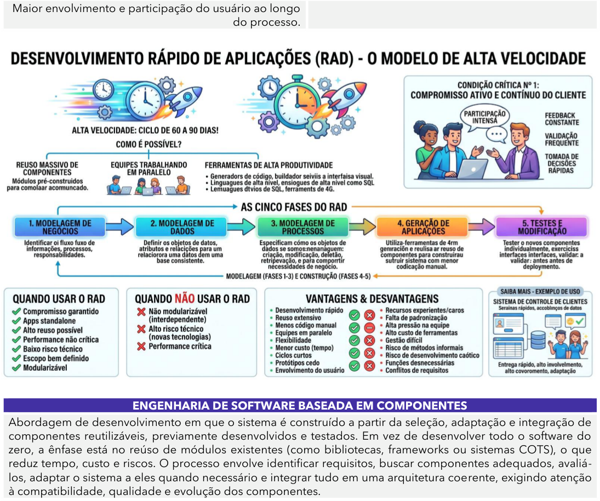

<!-- Start of picture text -->
Maior envolvimento e participação do usuário ao longo do processo. processo. rocesso. ENGENHARIA DE SOFTWARE BASEADA EM COMPONENTES Abordagem de desenvolvimento em que o sistema é construído a partir da seleção, adaptação e integração de componentes reutilizáveis, previamente desenvolvidos e testados. Em vez de desenvolver todo o software do zero, a ênfase está no reúso de módulos existentes (como bibliotecas, frameworks ou sistemas COTS), o que reduz tempo, custo e riscos. O processo envolve identificar requisitos, buscar componentes adequados, avaliá- los, adaptar o sistema a eles quando necessário e integrar tudo em uma arquitetura coerente, exigindo atenção à compatibilidade, qualidade e evolução dos componentes. <!-- End of picture text -->

**<mark>ETAPAS DESCRIÇÃO</mark>** <mark>Traduz as informações da análise em um documento formal que define os requisitos do</mark> **ESPECIFICAÇÃO DE** software. Esse documento contempla requisitos de usuário, que expressam **REQUISITOS** necessidades do cliente, e requisitos de sistema, que detalham o comportamento técnico necessário para atendê-las. Com base nos requisitos, realiza-se a busca por componentes disponíveis que possam **ANÁLISE DE** atender à especificação. Em geral, não há correspondência exata, sendo comum que os **COMPONENTES** componentes encontrados cubram apenas parte das funcionalidades necessárias ao sistema. Os componentes identificados são avaliados quanto à adequação antes de qualquer **QUALIFICAÇÃO E** decisão de projeto. Verifica-se se atendem aos requisitos funcionais, se são compatíveis **CLASSIFICAÇÃO DE** entre si e se cumprem critérios de qualidade, confiabilidade e desempenho exigidos. **COMPONENTES** Os requisitos são revisados à luz dos componentes disponíveis e podem ser ajustados **MODIFICAÇÃO DE** para refletir limitações ou oportunidades de reúso. Caso alterações não sejam aceitáveis **REQUISITOS** <u>pelo cliente, a busca por novos componentes pode ser reiniciada.</u>

---

<!-- pagina: 83 -->

**Diego Carvalho, Equipe Informática 2 (Diego Carvalho), Equipe Informática 1 (Diego Carvalho) Aula 00** 

**PROJETO DE SISTEMA COM REÚSO DESENVOLVIMENTO E INTEGRAÇÃO** 

<mark>Define a arquitetura do sistema considerando os componentes que serão reutilizados.</mark> Pode envolver a adaptação de um framework existente ou a criação de um novo, além da identificação das partes que precisarão ser desenvolvidas do zero. 

<mark>Desenvolve os elementos que não puderam ser reutilizados e integra os componentes</mark> adquiridos ou reaproveitados. Nesse modelo, a integração ocorre de forma contínua, sendo parte inseparável do próprio processo de construção do sistema. 

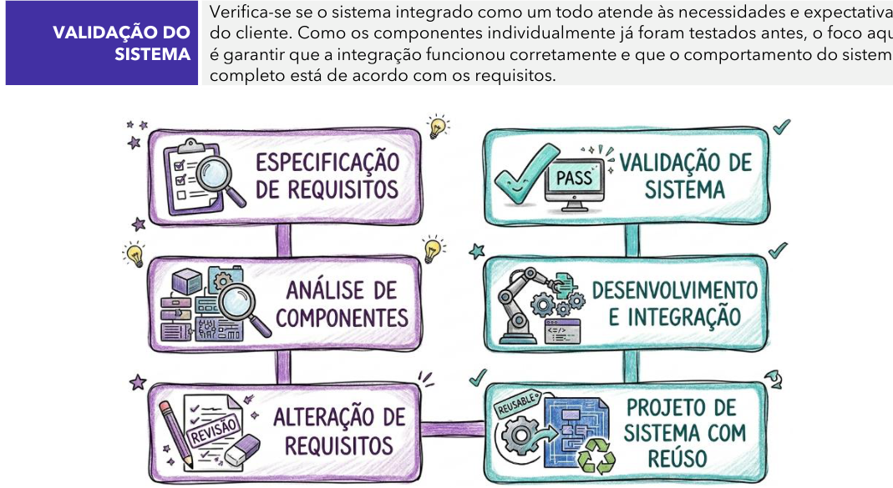

<!-- Start of picture text -->
Verifica-se se o sistema integrado como um todo atende às necessidades e expectativas VALIDAÇÃO DO  do cliente. Como os componentes individualmente já foram testados antes, o foco aqui SISTEMA  é garantir que a integração funcionou corretamente e que o comportamento do sistema completo está de acordo com os requisitos. pleto está de acordo com os requisitos. leto está de acordo com os requisitos. quisitos. uisitos. <!-- End of picture text -->

Verifica-se se o sistema integrado como um todo atende às necessidades e expectativas **VALIDAÇÃO DO** do cliente. Como os componentes individualmente já foram testados antes, o foco aqui **SISTEMA** é garantir que a integração funcionou corretamente e que o comportamento do sistema completo está de acordo com os requisitos. pleto está de acordo com os requisitos. leto está de acordo com os requisitos. quisitos. uisitos. 

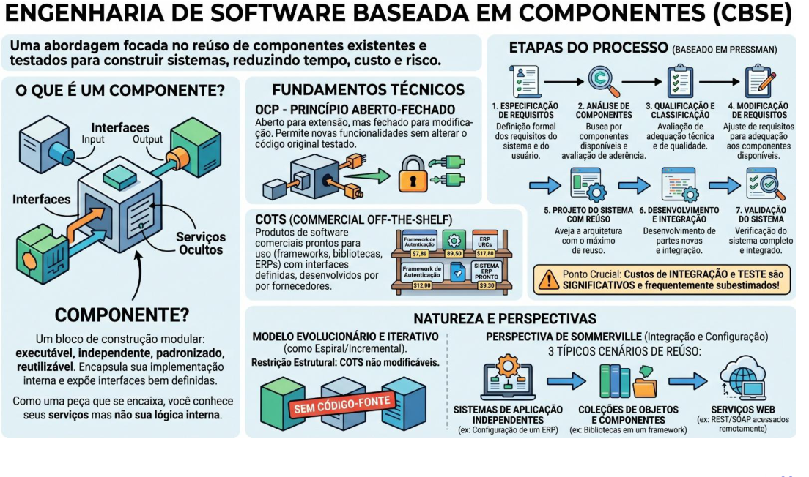

---

<!-- pagina: 84 -->

**Diego Carvalho, Equipe Informática 2 (Diego Carvalho), Equipe Informática 1 (Diego Carvalho) Aula 00** 

###### **<mark>MÉTODOS FORMAIS</mark>** 

Abordagem de desenvolvimento de software que utiliza especificações baseadas em notações matemáticas rigorosas para descrever, projetar e verificar sistemas. Nessa abordagem, os requisitos são expressos de forma precisa e sem ambiguidades, permitindo a aplicação de técnicas de prova e verificação para demonstrar propriedades do sistema, como correção e consistência. O objetivo é reduzir erros desde as fases iniciais e aumentar a confiabilidade do software, sendo especialmente útil em sistemas críticos, embora exija alto custo, conhecimento especializado e maior esforço de desenvolvimento. 

|**ETAPAS**|**DESCRIÇÃO**|
|---|---|
|**ESPECIFICAÇÃO** **FORMAL** **(DEFINIÇÃO DE** **REQUISITOS)**|Formaliza os requisitos por meio de notação matemática rigorosa, criando uma modelagem precisa e sem ambiguidades. Os requisitos do usuário, antes descritos em linguagem natural, diagramas e tabelas, são convertidos para uma linguagem formal com semântica bem definida.|
|**REFINAMENTO** **(CONCEPÇÃO DO** **PROJETO)**|Define a arquitetura do sistema, detalhando componentes, interfaces, dados e relacionamentos de forma estruturada. O refinamento transforma a especificação formal em uma representação progressivamente mais próxima da implementação, por meio de etapas matematicamente fundamentadas.|
|**SÍNTESE** **(IMPLEMENTAÇÃO)**|Gera, a partir do modelo refinado, um esqueleto de código que serve como base para a implementação final. Em abordagens mais rigorosas, o código pode ser derivado diretamente da especificaçãopor meio de transformações formais verificadas.|
|**PROVA** **(VERIFICAÇÃO)**|Verifica, por meio de análise matemática, se o sistema atende a todos os requisitos funcionais e não funcionais definidos. Essa etapa permite demonstrar formalmente a correção do software,indo além de testes tradicionais baseados apenas em execução.|

###### **<mark>DESCRIÇÃO ÇÃO ÃO</mark>** 

**<mark>VANTAGENS DESCRIÇÃO ÇÃO ÃO</mark>** <mark>Em linguagem natural, erros podem se esconder na imprecisão das palavras e</mark> **PRECISÃO E** interpretações. A especificação formal elimina essa margem, pois utiliza símbolos com **AUSÊNCIA DE** semântica rigorosamente definida, garantindo uma descrição exata e não ambígua do **AMBIGUIDADE** comportamento esperado do sistema. **DETECÇÃO** A construção de uma especificação formal exige análise detalhada e estruturada dos **PRECOCE DE** requisitos. Esse processo força a identificação de inconsistências, omissões e conflitos **PROBLEMAS DE** ainda nas fases iniciais, reduzindo retrabalho e evitando que problemas avancem para **REQUISITOS** etapas posteriores do desenvolvimento. Quando aplicados ao projeto, os métodos formais permitem verificar matematicamente a **VERIFICAÇÃO** correção da solução proposta. Isso possibilita identificar e corrigir erros que passariam **RIGOROSA** despercebidos em abordagens tradicionais, evitando falhas que só seriam detectadas em fases tardias e mais custosas. <mark>Embora não seja garantia absoluta, o uso de métodos formais permite, em tese,</mark> **PROMESSA DE** demonstrar matematicamente a ausência de determinadas classes de erros. Essa **SOFTWARE SEM** abordagem eleva o nível de confiabilidade do sistema e reduz significativamente a **DEFEITOS** <u>probabilidade de falhas críticas em operação.</u> 

###### **<mark>DESCRIÇÃO ÇÃO ÃO</mark>** 

**<mark>DESVANTAGENS DESCRIÇÃO ÇÃO ÃO</mark>** O desenvolvimento de modelos formais exige esforço significativo, demandando mais **ALTO CUSTO E** tempo e recursos financeiros do que abordagens tradicionais. Esse investimento elevado **CONSUMO DE** faz com que muitas empresas não considerem viável adotar métodos formais em projetos **TEMPO** de software convencionais. Poucos profissionais possuem formação matemática suficiente para aplicar métodos **NECESSIDADE DE** formais com segurança. Por isso, sua adoção exige investimento em capacitação e **TREINAMENTO** treinamento especializado, aumentando o custo do projeto e prolongando o tempo **EXTENSIVO** necessário para formação da equipe.

---

<!-- pagina: 85 -->

**Diego Carvalho, Equipe Informática 2 (Diego Carvalho), Equipe Informática 1 (Diego Carvalho) Aula 00** 

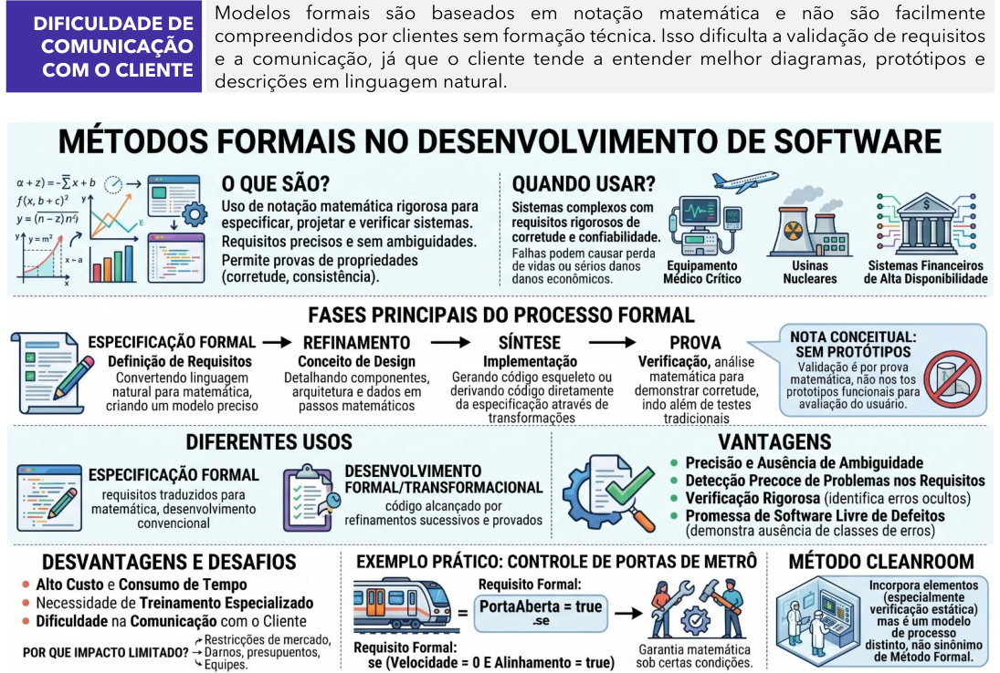

<!-- Start of picture text -->
Modelos formais são baseados em notação matemática e não são facilmente DIFICULDADE DE compreendidos por clientes sem formação técnica. Isso dificulta a validação de requisitos COMUNICAÇÃO e a comunicação, já que o cliente tende a entender melhor diagramas, protótipos e COM O CLIENTE descrições em linguagem natural. <!-- End of picture text -->

---

<!-- pagina: 86 -->

**Diego Carvalho, Equipe Informática 2 (Diego Carvalho), Equipe Informática 1 (Diego Carvalho) Aula 00** 

<!-- Start of picture text -->
Q UESTÕES  C OMENTADAS <!-- End of picture text -->

**1. (FGV / Câmara Municipal de Fortaleza - 2024) O modelo de desenvolvimento de software que possui ênfase na documentação extensiva e planejamento detalhado que é caracterizado por uma abordagem sequencial e linear, no qual cada fase deve ser concluída antes que a próxima seja iniciada, é conhecido como** 

   - a) Modelo Espiral. 

   - b) Desenvolvimento Orientado a Testes (TDD). 

   - c) Modelo Lean. 

   - d) Modelo em Cascata. 

   - e) Desenvolvimento Ágil. 

##### **Comentários:** 

(a) Errado. O modelo Espiral é iterativo e orientado a riscos, não segue uma sequência linear rígida com fases totalmente fechadas. 

(b) Errado. TDD é uma prática de desenvolvimento focada em testes antes do código, não um modelo sequencial com documentação extensiva. 

(c) Errado. O modelo Lean prioriza eficiência, redução de desperdícios e adaptação, destoando do planejamento detalhado e linear. 

(d) Correto. O modelo em Cascata é sequencial e linear, com forte ênfase em planejamento detalhado e documentação em cada fase. 

(e) Errado. O desenvolvimento ágil valoriza adaptação contínua e entregas incrementais, não uma execução rígida fase a fase. 

**Gabarito:** Letra D 

**2. (FGV / Prefeitura de Cuiabá - 2024) Entre as metodologias prescritivas de desenvolvimento de software, a metodologia em Cascata subdivide o desenvolvimento de um novo software em cinco atividades: Engenharia de Sistemas, Projeto, Codificação, Teste e Manutenção. Analise as afirmativas a seguir relativas à metodologia Cascata.** 

**I - A interação com o cliente ocorre somente nas fases de Projeto e Manutenção.**

---

<!-- pagina: 87 -->

**Diego Carvalho, Equipe Informática 2 (Diego Carvalho), Equipe Informática 1 (Diego Carvalho) Aula 00** 

**II – As atividades de Codificação e Testes são executadas em paralelo para reduzir o tempo de desenvolvimento do software.** 

##### **III – Os requisitos do sistema são determinados na atividade de Engenharia de sistemas.** 

**Está correto o que se afirma em** 

a) I, apenas. 

b) II, apenas. 

c) III, apenas. 

d) I e II, apenas. 

e) II e III, apenas. 

**Comentários:** 

(I) Errado. Na metodologia em Cascata, o contato com o cliente não fica restrito apenas a Projeto e Manutenção, pois há definição e alinhamento também em outros momentos do processo. 

(II) Errado. No modelo Cascata, as fases seguem de forma sequencial, sem paralelismo entre Codificação e Testes como regra para acelerar o desenvolvimento. 

(III) Correto. A atividade de Engenharia de Sistemas contempla o levantamento e a determinação dos requisitos que orientarão as etapas seguintes. 

**Gabarito:** Letra C 

**3. (FGV / TJ SE - 2023) O gerente de TI de sua empresa solicitou a implementação de um pequeno sistema para geração da folha salarial. Como será um sistema simples, com regras imutáveis e bem definidas, o analista já definiu os requisitos e efetuou a modelagem do sistema. Após o final da implementação, será iniciada a fase de testes e, por fim, a implantação no setor financeiro. De acordo com esse contexto, o modelo de ciclo de vida adotado foi:** 

a) RUP; 

b) modelo incremental; 

c) prototipagem; 

d) modelo evolutivo; 

e) modelo em cascata. 

**Comentários:**

---

<!-- pagina: 88 -->

**Diego Carvalho, Equipe Informática 2 (Diego Carvalho), Equipe Informática 1 (Diego Carvalho) Aula 00** 

(a) Errado. O RUP é iterativo e incremental, com ciclos e refinamentos sucessivos, diferente da sequência linear descrita no enunciado. 

(b) Errado. No modelo incremental, o sistema é entregue em partes sucessivas, o que não aparece no caso apresentado. 

(c) Errado. A prototipagem foca na construção de protótipos para validar requisitos, mas aqui os requisitos já estão definidos desde o início. 

(d) Errado. O modelo evolutivo prevê evolução contínua do sistema ao longo das entregas, o que não condiz com o fluxo único descrito. 

(e) Correto. O modelo em cascata segue etapas sequenciais e bem definidas, como requisitos, modelagem, implementação, testes e implantação. 

**Gabarito:** Letra E 

**4. (FGV / TJ RJ - 2024) Com relação ao modelo incremental do ciclo de vida do software, avalie se as afirmativas a seguir são verdadeiras (V) ou falsas (F).** 

**( ) O ciclo de vida incremental é um modelo de desenvolvimento de software que divide o projeto em incrementos entregues ao usuário de forma sequencial.** 

**( ) O ciclo de vida incremental é um modelo iterativo, pois cada incremento é desenvolvido e entregue ao usuário, e então o processo é repetido para o próximo incremento.** 

**( ) O ciclo de vida incremental é um modelo mais eficiente do que o modelo em cascata, pois permite que o software seja entregue ao usuário mais rapidamente.** 

**As afirmativas são, respectivamente,** 

a) V – V – V. 

b) F – V – V. 

c) F – V – F. 

d) V – F – F. 

e) V – V – F. 

##### **Comentários:** 

(V) No modelo incremental, o sistema é dividido em partes funcionais entregues em sequência, permitindo evolução gradual do software.

---

<!-- pagina: 89 -->

**Diego Carvalho, Equipe Informática 2 (Diego Carvalho), Equipe Informática 1 (Diego Carvalho) Aula 00** 

(V) Há repetição do processo a cada incremento, com desenvolvimento e entrega sucessivos, o que caracteriza a abordagem iterativa. 

(F) Embora permita entregas mais rápidas ao usuário, isso não autoriza afirmar de forma absoluta que seja mais eficiente que o cascata em qualquer contexto. 

**Gabarito:** Letra E 

**5. (FGV / SES MT - 2024) A engenharia de software tem empregado prototipação para gerar modelos representativos simulados para validação dos requisitos dos usuários. Com relação à prototipação, analise os itens a seguir.** 

<!-- Start of picture text -->
==5460== <!-- End of picture text -->

- **I. É o processo de criação de um protótipo, que dependendo das necessidades do projeto, podem empregar, entre outros: protótipos de papel, wireframes, mockups ou protótipos interativos.** 

- **II. No processo de engenharia de requisitos, as fases de elicitação e validação dos requisitos do sistema podem ser auxiliadas por um protótipo.** 

- **III. Um protótipo desenvolvido no processo de projeto do sistema pode auxiliar na exploração de soluções de software e no desenvolvimento de uma interface com o usuário para o sistema.** 

**Está correto o que se afirma em** 

a) I, II e III. 

b) I e II, apenas. 

c) I e III, apenas. 

d) II e III, apenas. 

**Comentários:** 

(I) Correto. Prototipação é justamente a criação de modelos representativos, como papel, wireframes, mockups e protótipos interativos, conforme a necessidade do projeto. 

(II) Correto. O protótipo ajuda a levantar, esclarecer e validar requisitos, facilitando o entendimento entre usuários e equipe durante a engenharia de requisitos. 

(III) Correto. No projeto do sistema, o protótipo apoia a exploração de soluções e contribui para definir e evoluir a interface com o usuário.

---

<!-- pagina: 90 -->

**Diego Carvalho, Equipe Informática 2 (Diego Carvalho), Equipe Informática 1 (Diego Carvalho) Aula 00** 

##### **Gabarito:** Letra A 

**6. (FGV / MPE SC - 2022) Um Time de Desenvolvimento de Sistemas de Software (TDSS) decidiu adotar um modelo de processo de software prescritivo como padrão para novos desenvolvimentos de sistemas. O modelo de processo adotado visa à redução do impacto de mudanças em requisitos, no qual a qualidade da documentação não é uma prioridade. O TDSS adotou o modelo de processo:** 

a) espiral; 

b) cascata; 

c) unificado; 

d) evolutivo; 

e) prototipagem. 

**Comentários:** 

(a) Errado. O modelo espiral é orientado a riscos e iterações, mas não tem como foco principal a baixa prioridade da documentação. 

(b) Errado. O cascata é mais rígido, com forte ênfase em fases bem definidas e documentação, o que não combina com o cenário. 

(c) Errado. O unificado é iterativo, porém costuma manter preocupação relevante com artefatos e documentação do processo. 

(d) Errado. O evolutivo reduz impactos de mudanças, mas a alternativa esperada destaca mais diretamente o uso de protótipos. 

(e) Correto. A prototipagem ajuda a acomodar mudanças de requisitos e prioriza a interação e validação rápida, sem foco central na documentação. 

**Gabarito:** Letra E

---

<!-- pagina: 91 -->

**Diego Carvalho, Equipe Informática 2 (Diego Carvalho), Equipe Informática 1 (Diego Carvalho) Aula 00** 

<!-- Start of picture text -->
L ISTA DE  Q <!-- End of picture text -->

<!-- Start of picture text -->
UESTÕES <!-- End of picture text -->

**1. (FGV / Câmara Municipal de Fortaleza - 2024) O modelo de desenvolvimento de software que possui ênfase na documentação extensiva e planejamento detalhado que é caracterizado por uma abordagem sequencial e linear, no qual cada fase deve ser concluída antes que a próxima seja iniciada, é conhecido como** 

   - a) Modelo Espiral. 

   - b) Desenvolvimento Orientado a Testes (TDD). 

   - c) Modelo Lean. 

   - d) Modelo em Cascata. 

   - e) Desenvolvimento Ágil. 

**2. (FGV / Prefeitura de Cuiabá - 2024) Entre as metodologias prescritivas de desenvolvimento de software, a metodologia em Cascata subdivide o desenvolvimento de um novo software em cinco atividades: Engenharia de Sistemas, Projeto, Codificação, Teste e Manutenção. Analise as afirmativas a seguir relativas à metodologia Cascata.** 

**I - A interação com o cliente ocorre somente nas fases de Projeto e Manutenção.** 

**II – As atividades de Codificação e Testes são executadas em paralelo para reduzir o tempo de desenvolvimento do software.** 

**III – Os requisitos do sistema são determinados na atividade de Engenharia de sistemas.** 

**Está correto o que se afirma em** 

a) I, apenas. 

- b) II, apenas. 

- c) III, apenas. 

d) I e II, apenas. 

e) II e III, apenas. 

**3. (FGV / TJ SE - 2023) O gerente de TI de sua empresa solicitou a implementação de um pequeno sistema para geração da folha salarial. Como será um sistema simples, com regras imutáveis e bem definidas, o analista já definiu os requisitos e efetuou a modelagem do sistema. Após o final da implementação, será iniciada a fase de testes e, por fim, a implantação no setor financeiro. De acordo com esse contexto, o modelo de ciclo de vida adotado foi:** 

a) RUP;

---

<!-- pagina: 92 -->

**Diego Carvalho, Equipe Informática 2 (Diego Carvalho), Equipe Informática 1 (Diego Carvalho) Aula 00** 

b) modelo incremental; 

c) prototipagem; 

d) modelo evolutivo; 

e) modelo em cascata. 

**4. (FGV / TJ RJ - 2024) Com relação ao modelo incremental do ciclo de vida do software, avalie se as afirmativas a seguir são verdadeiras (V) ou falsas (F).** 

**( ) O ciclo de vida incremental é um modelo de desenvolvimento de software que divide o projeto em incrementos entregues ao usuário de forma sequencial.** 

**( ) O ciclo de vida incremental é um modelo iterativo, pois cada incremento é desenvolvido e entregue ao usuário, e então o processo é repetido para o próximo incremento.** 

==5460== 

**( ) O ciclo de vida incremental é um modelo mais eficiente do que o modelo em cascata, pois permite que o software seja entregue ao usuário mais rapidamente.** 

**As afirmativas são, respectivamente,** 

a) V – V – V. 

b) F – V – V. 

c) F – V – F. 

d) V – F – F. 

e) V – V – F. 

**5. (FGV / SES MT - 2024) A engenharia de software tem empregado prototipação para gerar modelos representativos simulados para validação dos requisitos dos usuários. Com relação à prototipação, analise os itens a seguir.** 

   - **I. É o processo de criação de um protótipo, que dependendo das necessidades do projeto, podem empregar, entre outros: protótipos de papel, wireframes, mockups ou protótipos interativos.** 

   - **II. No processo de engenharia de requisitos, as fases de elicitação e validação dos requisitos do sistema podem ser auxiliadas por um protótipo.** 

   - **III. Um protótipo desenvolvido no processo de projeto do sistema pode auxiliar na exploração de soluções de software e no desenvolvimento de uma interface com o usuário para o sistema.** 

**Está correto o que se afirma em** 

- a) I, II e III.

---

<!-- pagina: 93 -->

**Diego Carvalho, Equipe Informática 2 (Diego Carvalho), Equipe Informática 1 (Diego Carvalho) Aula 00** 

b) I e II, apenas. 

c) I e III, apenas. 

   - d) II e III, apenas. 

**6. (FGV / MPE SC - 2022) Um Time de Desenvolvimento de Sistemas de Software (TDSS) decidiu adotar um modelo de processo de software prescritivo como padrão para novos desenvolvimentos de sistemas. O modelo de processo adotado visa à redução do impacto de mudanças em requisitos, no qual a qualidade da documentação não é uma prioridade. O TDSS adotou o modelo de processo:** 

a) espiral; 

b) cascata; 

- c) unificado; 

- d) evolutivo; 

- e) prototipagem. 

---

<!-- pagina: 94 -->

**Diego Carvalho, Equipe Informática 2 (Diego Carvalho), Equipe Informática 1 (Diego Carvalho) Aula 00** 

<!-- Start of picture text -->
G ABARITO <!-- End of picture text -->

|**1.**|LETRA D|**3.**|LETRA E|**5.**|LETRA A|
|---|---|---|---|---|---|
|**2.**|LETRA C|**4.**|LETRA E|**6.**|LETRA E|

---

<!-- pagina: 95 -->

