---
fonte_pdf: "Eng. Software - Aula 01.pdf"
paginas: 125
conversao: texto-e-imagens
---

<!-- pagina: 2 -->

**Diego Carvalho, Equipe Informática 2 (Diego Carvalho), Equipe Informática 1 (Diego Carvalho) Aula 01** 

# **Índice** 

|................................................................................................................................................ 1) Metodologias Ágeis - Teoria|.............................................. 3|
|---|---|
|................................................................................................................................................ 2) Metodologias Ágeis - Resumo|.............................................. 48|
|................................................................................................................................................ 3) Metodologias Ágeis - Questões Comentadas - FGV|.............................................. 59|
|................................................................................................................................................ 4) Metodologias Ágeis - Questões Comentadas - MULTIBANCAS|.............................................. 75|
|................................................................................................................................................ 5) Metodologias Ágeis - Lista de Questões - FGV|.............................................. 101|
|................................................................................................................................................ 6) Metodologias Ágeis - Lista de Questões - MULTIBANCAS|.............................................. 111|

---

<!-- pagina: 3 -->

**Diego Carvalho, Equipe Informática 2 (Diego Carvalho), Equipe Informática 1 (Diego Carvalho) Aula 01** 

## **Sumário** 

|Orientação de Estudos .....................................................................................................|................................ 3|
|---|---|
|Metodologias Ágeis .........................................................................................................|................................ 4|
|Fundamentos Ágeis ......................................................................................................|..................................... 4|
|Conceitos Básicos .....................................................................................................|..................................... 4|
|Agilidade x Velocidade ............................................................................................|..................................... 6|
|Método Ágil x Método Lean ....................................................................................|..................................... 8|
|Manifesto Ágil ...............................................................................................................|................................... 12|
|Indivíduos e Interações x Processos e Ferramentas..............................................|................................... 13|
|Software em Funcionamento x Documentação Abrangente ...............................|................................... 13|
|Colaboração com Cliente x Negociação de Contratos ........................................|................................... 14|
|Responder a Mudanças x Seguir um Plano............................................................|................................... 14|
|Filosofia Ágil ..................................................................................................................|................................... 15|
|Princípios Ágeis .........................................................................................................|................................... 15|
|Profissional Ágil .........................................................................................................|................................... 20|
|Estrutura Operacional ..................................................................................................|................................... 24|
|Gestão Ágil ................................................................................................................|................................... 24|
|Ferramentas Ágeis ....................................................................................................|................................... 28|
|Artefatos Ágeis ..........................................................................................................|................................... 33|
|Métricas e Indicadores Ágeis ..................................................................................|................................... 36|
|Engenharia Ágil .............................................................................................................|................................... 38|
|Arquitetura Ágil .........................................................................................................|................................... 38|
|Qualidade Ágil ..........................................................................................................|................................... 42|

---

<!-- pagina: 4 -->

**Diego Carvalho, Equipe Informática 2 (Diego Carvalho), Equipe Informática 1 (Diego Carvalho) Aula 01** 

<!-- Start of picture text -->
A PRESENTAÇÃO <!-- End of picture text -->

O assunto da aula de hoje é: Metodologias Ágeis! Vamos ver agora um novo paradigma de desenvolvimento de software bem interessante, muda bastante coisa em relação às metodologias tradicionais – é bem mais moderno. Esse é um assunto que sempre corre o risco de cair ao menos uma questãozinha na prova porque é o paradigma de desenvolvimento mais utilizado atualmente. Então, venham na fé que vocês vão gostar :) 

## **<mark>PROFESSOR DIEGO CARVALHO - WWW.INSTAGRAM.COM/PROFESSORDIEGOCARVALHO</mark>** 

Galera, todos os tópicos da aula possuem Faixas de Incidência, que indicam se o assunto cai muito ou pouco em prova. _Diego, se cai pouco para que colocar em aula?_ Cair pouco não significa que não cairá justamente na sua prova! A ideia aqui é: se você está com pouco tempo e precisa ver somente aquilo que cai mais, você pode filtrar pelas incidências média, alta e altíssima; se você tem tempo sobrando e quer ver tudo, vejam também as incidências baixas e baixíssimas. _Fechado?_ 

|**INCIDÊNCIA EM PROVA: BAIXÍSSIMA**|
|---|
|**INCIDÊNCIA EM PROVA: BAIXA**|
|**INCIDÊNCIA EM PROVA: MÉDIA**|
|**INCIDÊNCIA EM PROVA: ALTA**|
|**INCIDÊNCIA EM PROVA: ALTÍSSIMA**|

Além disso, essas faixas não são por banca – é baseado tanto na quantidade de vezes que caiu em prova independentemente da banca e também em minhas avaliações sobre cada assunto...

---

<!-- pagina: 5 -->

**Diego Carvalho, Equipe Informática 2 (Diego Carvalho), Equipe Informática 1 (Diego Carvalho) Aula 01** 

<!-- Start of picture text -->
O RIENTAÇÃO DE  E <!-- End of picture text -->

<!-- Start of picture text -->
STUDOS <!-- End of picture text -->

Para um aluno que possui bastante tempo disponível, a melhor estratégia é estudar praticamente todos os tópicos do material, mas respeitando uma ordem de prioridade baseada em incidência e recorrência nas questões. Nesse cenário, Manifesto Ágil, Princípios Ágeis, Conceitos Básicos, Gestão Ágil e Responder a Mudanças x Seguir um Plano devem formar o núcleo principal do estudo, porque aparecem constantemente em praticamente todas as bancas e ainda servem como base interpretativa para diversos outros assuntos do conteúdo. 

Já para o aluno que possui pouco tempo, a lógica precisa ser completamente diferente. O foco deve estar nos tópicos com maior retorno por hora estudada. Nesse caso, Manifesto Ágil se torna absolutamente obrigatório, porque influencia enorme quantidade de questões sobre valores, adaptação, colaboração, cliente e entregas frequentes. Em seguida, devem ser priorizados Conceitos Básicos, Princípios Ágeis, Gestão Ágil e comparações entre métodos tradicionais e métodos ágeis. Esses temas possuem altíssimo custo-benefício e resolvem boa parte das questões interpretativas. 

Outro ponto importante é entender que muitas bancas não cobram detalhes extremamente técnicos. Na maioria das vezes, elas exploram pares conceituais clássicos: flexibilidade versus rigidez, colaboração versus burocracia, adaptação versus planejamento fixo e software funcionando versus documentação excessiva. Isso significa que dominar profundamente a filosofia do Manifesto Ágil gera enorme ganho de desempenho. Muitas questões podem ser resolvidas apenas percebendo qual alternativa contradiz os valores centrais da mentalidade ágil. 

Para alunos com tempo reduzido, alguns tópicos eventualmente podem ser deixados apenas para leitura rápida ou revisão superficial. Entre eles estão Lean, Agilidade x Velocidade, Arquitetura Ágil, Qualidade Ágil e Métricas mais específicas. Esses assuntos podem aparecer, claro; contudo, possuem incidência menor quando comparados aos fundamentos do Manifesto e da filosofia ágil. Em termos de custobenefício, normalmente vale mais investir energia revisando princípios, valores, Scrum, Kanban e entregas incrementais do que aprofundar temas conceituais mais raros. 

Já o aluno com bastante tempo não deve descartar esses tópicos complementares. Embora apareçam menos, eles frequentemente diferenciam candidatos de alto desempenho. Questões sobre Lean, Qualidade Ágil, Arquitetura Ágil e Métricas costumam possuir grau interpretativo maior e misturam conceitos tradicionais com conceitos modernos. Além disso, examinadores gostam de explorar justamente erros comuns, como acreditar que métodos ágeis eliminam planejamento, arquitetura, documentação ou preocupação com qualidade. Quem domina essas nuances ganha vantagem importante na prova. 

Independentemente do perfil do aluno, existe uma técnica extremamente eficiente para revisar Metodologias Ágeis: estudar por comparação contínua. Compare Scrum versus Kanban; tradicional versus ágil; velocidade versus agilidade; documentação versus software funcionando; contrato versus colaboração; estabilidade versus adaptação. As bancas adoram inverter esses conceitos nas alternativas para induzir erro. Quando o candidato internaliza essas relações de oposição, ele passa a resolver muitas questões pela compreensão lógica do contexto, e não apenas pela memorização literal. 

Prof. Diego Carvalho

---

<!-- pagina: 6 -->

**Diego Carvalho, Equipe Informática 2 (Diego Carvalho), Equipe Informática 1 (Diego Carvalho) Aula 01** 

<!-- Start of picture text -->
M ETODOLOGIAS  Á <!-- End of picture text -->

<!-- Start of picture text -->
GEIS <!-- End of picture text -->

<!-- Start of picture text -->
Fundamentos Ágeis <!-- End of picture text -->

<!-- Start of picture text -->
Conceitos Básicos <!-- End of picture text -->

#### **<mark>INCIDÊNCIA EM PROVA: BAIXÍSSIMA</mark>** 

### **<mark>METODOLOGIAS ÁGEIS</mark>** 

Metodologias ágeis são abordagens iterativas, incrementais e adaptativas utilizadas no desenvolvimento de software e no gerenciamento de projetos, cujo principal objetivo é responder rapidamente às mudanças, entregar valor continuamente ao cliente e promover forte colaboração entre equipes e stakeholders. Diferentemente dos modelos tradicionais mais rígidos e preditivos, os métodos ágeis trabalham com ciclos curtos de desenvolvimento, feedback frequente, melhoria contínua e planejamento evolutivo, permitindo que <mark>requisitos,</mark> <u><mark>prioridades e soluções sejam ajustados ao longo do projeto conforme novas necessidades surgem.</mark></u> 

Em fevereiro de 2001, dezessete profissionais influentes da engenharia de software se reuniram em Snowbird, nos Estados Unidos, para discutir alternativas aos modelos tradicionais de desenvolvimento usados naquele período. Entre eles estavam nomes conhecidos, como Kent Beck, Martin Fowler e Jeff Sutherland. Apesar das diferenças entre suas abordagens, todos percebiam um problema parecido: muitos projetos atrasavam, ultrapassavam custos e entregavam soluções pouco eficientes para empresas e usuários. 

Naquela época, diversas organizações enfrentavam dificuldades com projetos longos e burocráticos. Em muitos casos, quando o sistema era entregue, as necessidades dos usuários já tinham mudado bastante. Isso aumentava custos, gerava desgaste nas equipes e comprometia resultados. Autores como Roger Pressman e Ian Sommerville destacavam que os modelos tradicionais não eram inadequados, mas apresentavam limitações importantes em ambientes sujeitos a mudanças frequentes. 

Durante os debates, os participantes perceberam que várias ideias apareciam repetidamente, mesmo entre métodos diferentes. Muitos defendiam ciclos curtos de desenvolvimento, entregas frequentes e maior proximidade com clientes. Outros reforçavam a necessidade de reduzir burocracias e adaptar processos constantemente. Aos poucos, ficou claro que existia uma visão compartilhada sobre como tornar os projetos mais eficientes, flexíveis e alinhados às necessidades reais das organizações. 

A partir dessas discussões, surgiu a proposta de registrar aquelas ideias em um documento simples e objetivo. Inicialmente, alguns participantes cogitaram termos ligados a processos `“` leves `”` , mas concluíram que `“` ágil `”` representava melhor a rapidez de adaptação desejada. Assim nasceu o Manifesto for Agile Software Development. O objetivo não era eliminar processos, mas tornar o desenvolvimento mais dinâmico diante das mudanças do mercado. 

O Manifesto Ágil definiu valores que passaram a orientar diferentes práticas de desenvolvimento de software. Entre eles estavam software funcionando acima de documentação extensa, colaboração com clientes acima de contratos rígidos e adaptação às mudanças acima de planos inflexíveis. Um detalhe importante é que os elementos apresentados à direita não perderam valor. O manifesto apenas indicava quais aspectos deveriam receber maior prioridade durante os projetos. 

Outro ponto relevante é que o Manifesto Ágil não criou uma metodologia única. Na verdade, ele serviu como base para métodos como Scrum, Extreme Programming, Crystal e Feature Driven Development. Muitos autores destacam essa diferença, porque o movimento ágil funciona mais como uma filosofia

---

<!-- pagina: 7 -->

**Diego Carvalho, Equipe Informática 2 (Diego Carvalho), Equipe Informática 1 (Diego Carvalho) Aula 01** 

orientada por princípios compartilhados do que como um modelo fechado. Essa interpretação costuma aparecer bastante em concursos e avaliações acadêmicas. 

Depois daquele encontro em Snowbird, os participantes passaram a integrar a Agile Alliance, organização voltada à divulgação de práticas ágeis de desenvolvimento de software. Com o passar do tempo, empresas perceberam vantagens importantes em abordagens iterativas, integração contínua e entregas frequentes. Ainda assim, métodos tradicionais continuam relevantes em projetos críticos e ambientes que exigem documentação rigorosa. O principal legado do movimento foi a mudança de mentalidade nas equipes de desenvolvimento. 

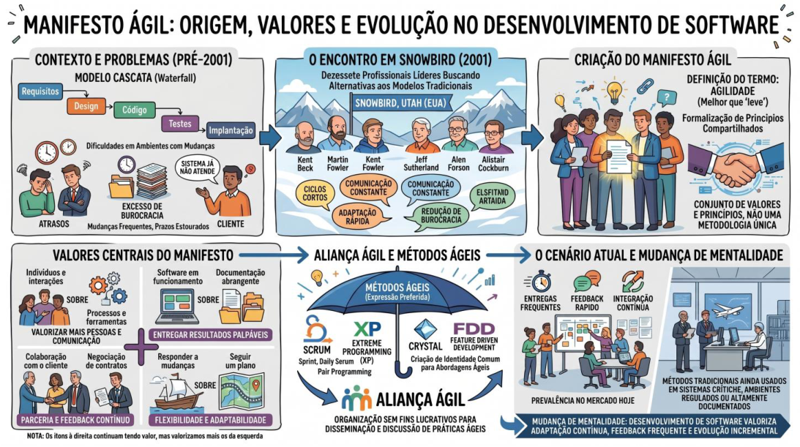

---

<!-- pagina: 8 -->

**Diego Carvalho, Equipe Informática 2 (Diego Carvalho), Equipe Informática 1 (Diego Carvalho) Aula 01** 

<!-- Start of picture text -->
Agilidade <!-- End of picture text -->

<!-- Start of picture text -->
x Velocidade <!-- End of picture text -->

#### **<mark>INCIDÊNCIA EM PROVA: BAIXÍSSIMA</mark>** 

### **<mark>AGILIDADE X VELOCIDADE</mark>** 

<!-- Start of picture text -->
negócio.  gócio.  ócio. <!-- End of picture text -->

Agilidade não significa simplesmente desenvolver software mais rápido, mas sim possuir capacidade de responder adequadamente às mudanças ao longo do projeto. Velocidade está relacionada à rapidez com que funcionalidades, produtos ou entregas são produzidos; já agilidade envolve adaptação contínua diante de alterações de requisitos, mudanças de prioridade, riscos, feedback dos clientes e novas necessidades do negócio.  gócio.  ócio. 

Agora vamos conversar sobre uma diferença que costuma gerar muita confusão em engenharia de software: agilidade não é a mesma coisa que velocidade. Muita gente acha que métodos ágeis são simplesmente métodos “mais rápidos”; contudo, essa interpretação está incompleta. A velocidade está relacionada ao quão rápido você consegue entregar alguma coisa. Já a agilidade envolve outra ideia: capacidade de adaptação, resposta eficiente a mudanças e flexibilidade diante de cenários que mudam constantemente ao longo do projeto.Para entender melhor isso, vamos usar uma metáfora esportiva. Pensem no Usain Bolt. Entre atletas olímpicos, ele era absurdamente veloz; contudo, sua largada normalmente não era a melhor. Isso acontecia porque ele possuía características físicas diferentes dos outros corredores: era mais alto, mais pesado e demorava um pouco mais para sair da inércia quando o tiro era disparado. Já no decorrer da corrida, quando todos estavam estabilizados, sua velocidade máxima fazia enorme diferença. 

A comparação entre velocidade e agilidade costuma gerar dúvidas na engenharia de software. Muitas pessoas acreditam que ambos os conceitos significam exatamente a mesma coisa, mas existe uma diferença importante entre eles. O exemplo das corridas ajuda bastante nessa compreensão. Usain Bolt, por exemplo, nem sempre reagia mais rápido na largada, porém conseguia alcançar velocidades muito superiores durante a prova. Isso mostra que velocidade está ligada ao desempenho máximo, enquanto agilidade envolve capacidade de resposta rápida diante de mudanças inesperadas. 

Uma metáfora automobilística também esclarece bem essa diferença. Imagine um carro extremamente potente disputando corrida contra outro mais leve e menos robusto. Em arrancadas curtas, o veículo leve pode reagir mais rapidamente e assumir vantagem inicial justamente por responder melhor às mudanças de estado. Contudo, isso não significa maior velocidade final. Depois que aceleração e desempenho estabilizam, o carro mais potente normalmente ultrapassa o concorrente com facilidade. A comparação

---

<!-- pagina: 9 -->

**Diego Carvalho, Equipe Informática 2 (Diego Carvalho), Equipe Informática 1 (Diego Carvalho) Aula 01** 

ajuda porque demonstra que reagir rapidamente não representa necessariamente alcançar maior desempenho contínuo. 

Quando essa lógica é aplicada à engenharia de software, percebemos que velocidade está relacionada principalmente à rapidez de entrega. Alguns modelos foram criados exatamente com esse objetivo, como o Rapid Application Development. Contudo, Roger Pressman destaca um ponto essencial: rapidez isolada não caracteriza agilidade. Um projeto pode entregar funcionalidades em pouco tempo e ainda apresentar enorme dificuldade para lidar com mudanças nos requisitos ou nas condições do ambiente. Em projetos reais, essa limitação costuma gerar retrabalho e aumento considerável de custos. 

Segundo Pressman, agilidade está muito mais ligada à capacidade de adaptação contínua ao longo do desenvolvimento. Mudanças aparecem constantemente: requisitos evoluem, prioridades organizacionais mudam, tecnologias envelhecem e problemas técnicos surgem de maneira inesperada. Métodos ágeis procuram responder a essas alterações de forma menos burocrática, reduzindo impactos negativos no projeto. Isso não significa ausência de planejamento, como muitos imaginam. Frameworks modernos, como Scrum, trabalham continuamente com revisões, refinamento de backlog e acompanhamento frequente das entregas realizadas pela equipe. 

Ian Sommerville também destaca que agilidade depende fortemente de colaboração intensa, comunicação frequente e adaptação constante às necessidades do cliente. Equipes ágeis procuram validar funcionalidades continuamente e ajustar prioridades conforme novas informações surgem durante o desenvolvimento. Vale lembrar ainda que métodos tradicionais não são totalmente inflexíveis. O Rational Unified Process, por exemplo, já utilizava iterações e refinamento contínuo antes da popularização do movimento ágil. No fim, a principal diferença está na ênfase dada à adaptação, flexibilidade e resposta rápida às mudanças. 

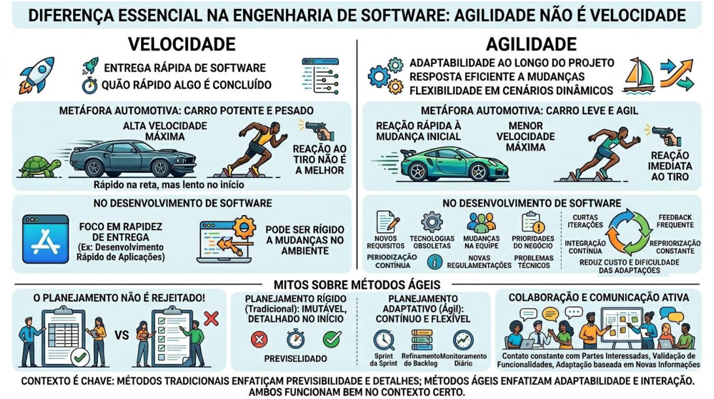

---

<!-- pagina: 10 -->

**Diego Carvalho, Equipe Informática 2 (Diego Carvalho), Equipe Informática 1 (Diego Carvalho) Aula 01** 

<!-- Start of picture text -->
Método Ágil x Método Lean <!-- End of picture text -->

#### **<mark>INCIDÊNCIA EM PROVA: BAIXÍSSIMA</mark>** 

### **<mark>MÉTODO ÁGIL X MÉTODO LEAN</mark>** 

O Método Ágil e o Método Lean são abordagens voltadas à melhoria da eficiência, adaptação e geração de valor, mas possuem focos diferentes. Os métodos ágeis surgiram principalmente no contexto do desenvolvimento de software e enfatizam colaboração contínua, entregas incrementais, adaptação rápida às mudanças e forte interação com o cliente ao longo do projeto. Já o Lean tem origem no sistema produtivo da Toyota e concentrase na eliminação de desperdícios, otimização de processos, melhoria contínua e maximização do valor entregue <mark>com o menor consumo possível de recursos.</mark> 

O Método Lean, também chamado de Método Enxuto, corresponde a uma filosofia de gestão voltada à redução contínua de desperdícios dentro dos processos produtivos. Sua origem está diretamente ligada ao Sistema Toyota de Produção, desenvolvido no Japão após a Segunda Guerra Mundial. A ideia central consiste em maximizar valor para o cliente utilizando a menor quantidade possível de recursos, tempo e esforço. De certa forma, Lean procura eliminar tudo aquilo que não contribui efetivamente para geração de valor no produto ou serviço final. 

Na prática, essa abordagem busca aumentar eficiência e qualidade por meio da melhoria contínua dos processos organizacionais. Entre os desperdícios combatidos pelo Lean estão excesso de estoque, retrabalho, movimentações desnecessárias, espera excessiva e produção acima da demanda. Muitas empresas perceberam que atividades aparentemente normais consumiam recursos sem gerar benefícios reais ao cliente. Isso ajudou bastante na expansão da filosofia Lean para diferentes áreas além da indústria automobilística, incluindo saúde, logística, administração e tecnologia da informação. 

Sendo mais rigoroso em termos conceituais, existe uma diferença importante de nomenclatura que costuma aparecer em provas e avaliações acadêmicas. O Método Lean representa a filosofia geral de gestão criada pela Toyota, centrada na criação de valor com o mínimo possível de desperdício. Já Lean Manufacturing corresponde especificamente à aplicação dessa filosofia no contexto industrial e manufatureiro. Por sua vez, Lean IT refere-se à adaptação dos princípios Lean para ambientes relacionados à tecnologia da informação e gestão de serviços digitais. 

Apesar dessas distinções conceituais, muitas provas utilizam simplesmente a expressão `“` Método Lean `”` mesmo quando o contexto envolve tecnologia da informação. Isso acontece porque os princípios fundamentais permanecem bastante semelhantes entre diferentes áreas de aplicação. Em ambientes de TI, Lean procura reduzir desperdícios relacionados a filas, retrabalho, excesso de documentação, falhas operacionais e demora na entrega de soluções. O foco continua sendo aumentar valor entregue ao usuário enquanto se reduz esforço desnecessário dentro dos processos organizacionais. O Lean Manufacturing possui cinco princípios: 

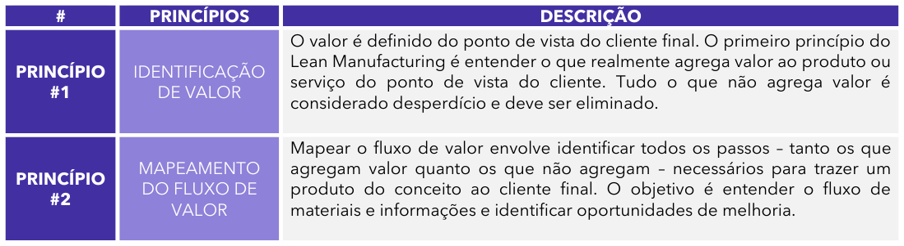

<!-- Start of picture text -->
#  PRINCÍPIOS  DESCRIÇÃO O valor é definido do ponto de vista do cliente final. O primeiro princípio do Lean Manufacturing é entender o que realmente agrega valor ao produto ou PRINCÍPIO  IDENTIFICAÇÃO serviço do ponto de vista do cliente. Tudo o que não agrega valor é #1  DE VALOR considerado desperdício e deve ser eliminado. Mapear o fluxo de valor envolve identificar todos os passos – tanto os que MAPEAMENTO  agregam valor quanto os que não agregam – necessários para trazer um PRINCÍPIO DO FLUXO DE  produto do conceito ao cliente final. O objetivo é entender o fluxo de #2 VALOR  materiais e informações e identificar oportunidades de melhoria. <!-- End of picture text -->

---

<!-- pagina: 11 -->

**Diego Carvalho, Equipe Informática 2 (Diego Carvalho), Equipe Informática 1 (Diego Carvalho) Aula 01** 

|**PRINCÍPIO** **#3**|CRIAÇÃO DE FLUXO CONTÍNUO|Depois de eliminar os desperdícios identificados, os processos restantes devem ser organizados de maneira que o fluxo de produção seja contínuo e suave. Isso significa garantir que os produtos se movam rapidamente e sem interrupções através do processo de produção, minimizando esperas e gargalos.|
|---|---|---|
|**PRINCÍPIO** **#4**|PRODUÇÃO PUXADA|A produção puxada significa que a produção é desencadeada pela demanda do cliente, e não por previsões de vendas ou produção em massa. Isso ajuda a evitar excesso de estoque e sobreprodução, produzindo apenas o que é necessário, quando é necessário.|
|**PRINCÍPIO** **#5**|PERFEIÇÃO E MELHORIA CONTÍNUA|O objetivo final do Lean Manufacturing é a busca pela perfeição através da melhoria contínua. O processo de melhoria contínua, ou Kaizen, envolve todos os níveis da organização e se concentra em pequenas melhorias incrementais em todos os aspectos do processo de produção.|

Já o Método Lean para Desenvolvimento de Software tem sete princípios: 

|**#**|**PRINCÍPIO**|**DESCRIÇÃO**|
|---|---|---|
|**PRINCÍPIO** **#1**|ELIMINAR DESPERDÍCIO|Deve-se eliminar tudo aquilo que não é percebido pelo cliente, por não agregar valor para ele. Ex: passos extras, burocracia, documentação que não será lida, processo pesado, etc. Também existem aqueles desperdícios que são trabalhos parcialmente prontos - tudo que teve um começo, mas não teve fim e, portanto,não será utilizado.|
|**PRINCÍPIO** **#2**|AMPLIFICAR/CRI- AR CONHECIMENTO|Deve-se garantir que o conhecimento sobre o software seja criado durante o desenvolvimento, em vez de ter uma lista de requisitos e/ou um layout recomendando como deve ser o resultado da aplicação antes do início de seu desenvolvimento.|
|**PRINCÍPIO** **#3**|FORTALECER O TIME / RESPEITAR AS PESSOAS|O software que está sendo produzido é uma espécie de espelho da equipe que o está desenvolvendo. Para que as pessoas se sintam motivadas e engajadas na atuação em equipe, eles precisam de respeito e confiança. Deve-se criar um ambiente onde a equipe trabalhe de forma auto-organizada e auto-dirigida,evitando micro-gerenciamento.|
|**PRINCÍPIO** **#4**|ENTREGAS RÁPIDAS|Uma dica importante é que, sem entregas rápidas, você não consegue receber um retorno, ou seja, você não consegue saber o que errou para tentar corrigir. Por isso, procurar a velocidade na entrega é uma maneira de garantir que o cliente tenha em mãos aquilo que ele precisava para hoje e não o que precisou.|
|**PRINCÍPIO** **#5**|CONSTRUIR / INTEGRAR QUALIDADE|Segundo os criadores da teoria, a qualidade é inegociável e deve ser entregue em duas dimensões: a integridade percebida e conceitual. A integridade percebida quer dizer que foi entregue ao cliente um produto usual, funcional, confiável. A integridade conceitual quer dizer que o sistema tempontos centrais altamente coesos e fáceis.|
|**PRINCÍPIO** **#6**|OTIMIZAR O TODO|Deve-se entender que o software concluído é muito mais que a soma das partes entregues e verificar como ele está alinhado com os objetivos da empresa. O ideal não é olhar apenas para o desenvolvimento, mas para como aquele requisito está sendo atendido, como ele está sendo detalhado e repassadopara entrar em desenvolvimento,entre outros.|
|**PRINCÍPIO** **#7**|ADIAR DECISÕES/ COMPROMISSOS|Deve-se diminuir as incertezas, retardando decisões até que elas sejam formuladas em cima de acontecimentos mais conhecidos, previsíveis e firmes. Decisões tomadas tardiamente devem ser mais corretas, uma vez que as melhores são baseadas em fatos ocorridos e não em suposições ou especulações.|

---

<!-- pagina: 12 -->

**Diego Carvalho, Equipe Informática 2 (Diego Carvalho), Equipe Informática 1 (Diego Carvalho) Aula 01** 

|**BENEFÍCIOS**|**DESCRIÇÃO**|
|---|---|
|**REDUÇÃO DE** **CUSTOS**|A eliminação de desperdícios e a melhoria da eficiência operacional reduzem custos com materiais, estoque, transporte, retrabalho e tempo ocioso, aumentando competitividade e margem de lucro da organização.|
|**MELHORIA DA** **QUALIDADE**|O foco em melhoria contínua e eliminação de defeitos aumenta a qualidade dos produtos, reduz retrabalho, diminui desperdícios e fortalece a reputação da empresa perante clientes e mercado.|
|**AUMENTO DA** **EFICIÊNCIA**|A remoção de atividades sem valor agregado melhora produtividade e utilização dos recursos, permitindo que equipes concentrem esforços em tarefas realmente importantes para o produto final.|
|**MAIOR** **FLEXIBILIDADE**|Processos mais simples e otimizados tornam a empresa mais adaptável às mudanças de mercado, preferências dos consumidores e novas demandas competitivas do ambiente organizacional.|
|**REDUÇÃO DE** **DESPERDÍCIOS**|O Lean busca eliminar desperdícios relacionados a tempo, materiais, movimentação, estoque, espaço e atividades desnecessárias, tornando os processos mais enxutos e eficientes.|
|**MELHORIA NO** **TEMPO DE** **ENTREGA**|Processos mais eficientes e produção orientada pela demanda ajudam a reduzir prazos de entrega, aumentando satisfação dos clientes e capacidade de resposta ao mercado.|
|**ENGAJAMENTO** **DOS** **FUNCIONÁRIOS**|O Lean incentiva participação ativa dos colaboradores na melhoria contínua, fortalecendo colaboração, motivação, aprendizado organizacional e comprometimento com os resultados.|
|**SUSTENTABILIDADE**|A redução de desperdícios e o uso mais eficiente de recursos contribuem para práticas mais sustentáveis, diminuindo impactos ambientais e fortalecendo a imagem institucional.|

Ele serviu de base para o método ágil e tem várias características em comum, mas são diferentes. A tabela abaixo organiza um comparativo para vocês terem noção das diferenças: 

|**CARACTERÍSTICA**|**MÉTODO LEAN**|**MÉTODO ÁGIL**|
|---|---|---|
|**ORIGEM E FOCO**|Originou-se no Sistema Toyota de Produção na indústria automobilística japonesa, com foco principal na eliminação de desperdícios ("muda") para otimizar a eficiência do processo de produção. Embora tenha começado na manufatura, os princípios Lean foram adaptados para outras áreas, incluindo desenvolvimento de software e serviços.|Desenvolvido inicialmente para o campo do desenvolvimento de software como uma resposta às limitações dos métodos tradicionais de gerenciamento de projetos (como o modelo cascata). O foco é na adaptabilidade, na entrega incremental de produtos e na colaboração constante com o cliente.|
|**PRINCÍPIOS E** **PRÁTICAS**|Baseia-se em princípios como Kaizen (melhoria contínua), eliminação de desperdícios, e Just-In-Time. Práticas incluem mapeamento do fluxo de valor e otimização dos processos.|Baseia-se nos princípios do Manifesto Ágil, como colaboração cliente-desenvolvedor, resposta a mudanças e entrega incremental. Práticas incluem Scrum, Kanban, programação em pares, e integração contínua.|
|**ABORDAGEM DE** **IMPLEMENTAÇÃO**|Pode ser aplicado de maneira mais ampla além do desenvolvimento de produtos, incluindo processos administrativos e operacionais,com um forte foco em|Focado primariamente no desenvolvimento de software e projetos que beneficiam de uma abordagem iterativa e incremental. A implementação Ágil é caracterizadapor|

---

<!-- pagina: 13 -->

**Diego Carvalho, Equipe Informática 2 (Diego Carvalho), Equipe Informática 1 (Diego Carvalho) Aula 01** 

eficiência operacional e redução de sprints ou iterações, planejamento desperdícios em todos os aspectos da adaptativo e equipe multidisciplinar. <mark>organização.</mark> O sucesso é medido pela eficiência do O sucesso é frequentemente medido pela processo, a redução de desperdícios e a satisfação do cliente, a capacidade de **MEDIDA DE** capacidade de entregar valor contínuo ao responder rapidamente a mudanças e a **SUCESSO** cliente com o mínimo de recursos entrega frequente de incrementos de possíveis. software que funcionam. 

Embora o Método Lean e o Método Ágil compartilhem princípios de melhoria contínua e eficiência, eles se diferenciam em suas origens, focos principais, e métodos de implementação. O Método Lean é mais abrangente em termos de aplicação a processos de negócios e operações, enquanto o Método Ágil é mais específico para o desenvolvimento de software e projetos que se beneficiam de uma abordagem flexível e iterativa. 

Há também o Método Kaizen: conceito japonês que significa "melhoria contínua". Diferente do Lean, que pode ser aplicado com projetos específicos para melhorias, o Kaizen é um processo contínuo e constante. Envolve todos os empregados, desde a alta administração até os trabalhadores da linha de frente, na busca por pequenas melhorias diárias que, somadas, resultam em uma significativa melhoria da eficiência e qualidade com o passar do tempo. O Kaizen pode usar muitas das mesmas ferramentas que o Lean, mas com ênfase na participação dos funcionários e na cultura de melhoria contínua. 

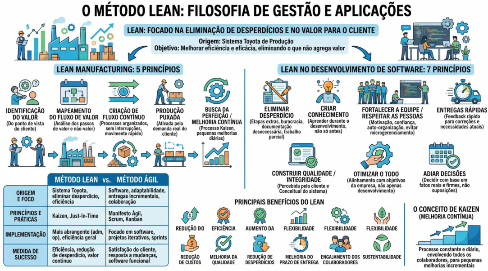

---

<!-- pagina: 14 -->

**Diego Carvalho, Equipe Informática 2 (Diego Carvalho), Equipe Informática 1 (Diego Carvalho) Aula 01** 

<!-- Start of picture text -->
Manifesto Ágil <!-- End of picture text -->

#### **<mark>INCIDÊNCIA EM PROVA: ALTÍSSIMA</mark>** 

### **<mark>MANIFESTO ÁGIL</mark>** 

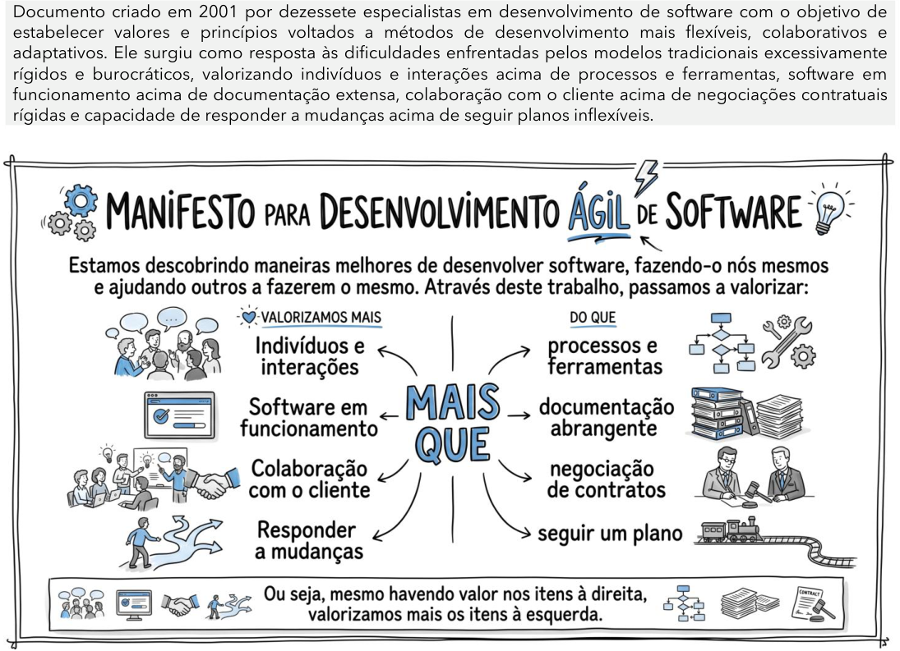

<!-- Start of picture text -->
Documento criado em 2001 por dezessete especialistas em desenvolvimento de software com o objetivo de estabelecer valores e princípios voltados a métodos de desenvolvimento mais flexíveis, colaborativos e adaptativos. Ele surgiu como resposta às dificuldades enfrentadas pelos modelos tradicionais excessivamente rígidos e burocráticos, valorizando indivíduos e interações acima de processos e ferramentas, software em funcionamento acima de documentação extensa, colaboração com o cliente acima de negociações contratuais rígidas e capacidade de responder a mudanças acima de seguir planos inflexíveis. <!-- End of picture text -->

Em 2001, dezessete profissionais bastante influentes da engenharia de software se reuniram em Snowbird, no estado de Utah, para discutir dificuldades recorrentes enfrentadas em projetos de desenvolvimento. Entre os participantes estavam nomes conhecidos como Kent Beck, Martin Fowler e Alistair Cockburn. Apesar das diferenças entre suas abordagens, existia uma percepção comum: muitos projetos atrasavam, ultrapassavam orçamento e entregavam sistemas que já não atendiam adequadamente às necessidades dos usuários quando finalmente eram concluídos. 

Naquele período, era bastante comum encontrar projetos marcados por excesso de documentação, processos extremamente rígidos e pouca capacidade de adaptação às mudanças. Em ambientes muito dinâmicos, isso gerava impactos significativos nas equipes e nas organizações. Roger Pressman e Ian Sommerville destacam justamente essa limitação dos processos excessivamente inflexíveis. Em muitos casos, enquanto o sistema ainda estava sendo desenvolvido, as necessidades do cliente já haviam mudado completamente, comprometendo utilidade e eficiência da solução produzida. 

Agora observem um detalhe importante que costuma aparecer bastante em provas: isso não significa que modelos tradicionais sejam incorretos ou inúteis. O Modelo em Cascata, por exemplo, continua sendo bastante eficiente em cenários nos quais requisitos permanecem estáveis e previsíveis durante

---

<!-- pagina: 15 -->

**Diego Carvalho, Equipe Informática 2 (Diego Carvalho), Equipe Informática 1 (Diego Carvalho) Aula 01** 

grande parte do projeto. O problema surge principalmente quando mudanças acontecem com frequência e o processo não consegue reagir adequadamente. Nesses contextos, planejamento rígido, documentação pesada e ciclos longos de entrega acabam dificultando adaptação das equipes. 

Durante as discussões em Snowbird, os participantes perceberam que muitos métodos utilizados por eles possuíam características semelhantes. Diversas abordagens defendiam ciclos iterativos curtos, feedback constante, proximidade com clientes e redução de burocracia desnecessária. Aos poucos, surgiu a ideia de organizar esses princípios em um documento simples e objetivo. Inicialmente, alguns cogitaram utilizar o termo `“` leve `”` ; contudo, concluíram que `“` ágil `”` representava melhor a rapidez de adaptação que desejavam enfatizar nos projetos. 

Foi assim que surgiu o Manifesto for Agile Software Development, conhecido em português como Manifesto Ágil. O documento não criou uma metodologia única e fechada. Na prática, ele estabeleceu valores e princípios compartilhados por diferentes métodos ágeis. Esse detalhe é importante porque muita gente utiliza a expressão `“` metodologia ágil `”` como se existisse apenas uma abordagem. Na realidade, métodos como Scrum, Extreme Programming, Crystal e Feature Driven Development possuem características próprias, embora compartilhem fundamentos semelhantes. 

<!-- Start of picture text -->
Indivíduos e Interações x Processos e Ferramentas <!-- End of picture text -->

O Manifesto Ágil afirma que devemos valorizar mais indivíduos e interações do que processos e ferramentas. Isso não significa, naturalmente, que ferramentas deixem de ser importantes dentro do desenvolvimento de software. O ponto principal é outro: sistemas são criados por pessoas, e não apenas por metodologias ou tecnologias. Ferramentas auxiliam bastante no trabalho cotidiano; contudo, criatividade, tomada de decisão, comunicação e resolução de problemas dependem diretamente da capacidade humana das equipes envolvidas no projeto. 

Autores ligados ao movimento ágil, como Jim Highsmith, defendem que colaboração, talento e adaptação das pessoas exercem enorme influência sobre o sucesso dos projetos. Processos ajudam a organizar atividades e estabelecer padrões; porém, não conseguem substituir experiência prática nem comunicação eficiente entre profissionais. Em projetos reais, equipes extremamente burocráticas podem possuir excelentes ferramentas e ainda assim produzir resultados ruins. Isso acontece porque falhas de comunicação frequentemente geram retrabalho, atrasos e dificuldades de alinhamento. 

<!-- Start of picture text -->
Software em Funcionamento x Documentação Abrangente <!-- End of picture text -->

Outro valor importante do manifesto estabelece que devemos valorizar mais software em funcionamento do que documentação abrangente. Prestem bastante atenção porque essa ideia costuma aparecer de maneira distorcida em provas. Métodos ágeis não eliminam documentação, nem defendem ausência completa de registros técnicos. A proposta é produzir documentação realmente útil para o projeto, evitando excesso de burocracia e materiais gigantescos que praticamente ninguém consulta durante o desenvolvimento ou manutenção do sistema. 

Isso não significa que documentação tenha perdido importância dentro da engenharia de software. Pelo contrário: ela continua essencial para manutenção, rastreabilidade, treinamento, transferência de conhecimento e até cumprimento de exigências legais ou contratuais. Ian Sommerville destaca justamente esse ponto em várias discussões sobre desenvolvimento moderno. O movimento ágil critica principalmente o excesso de documentação sem utilidade prática. Afinal, o que realmente gera valor para o cliente é um software funcionando corretamente e atendendo necessidades reais.

---

<!-- pagina: 16 -->

**Diego Carvalho, Equipe Informática 2 (Diego Carvalho), Equipe Informática 1 (Diego Carvalho) Aula 01** 

<!-- Start of picture text -->
Colaboração com Cliente x Negociação de Contratos <!-- End of picture text -->

Outro princípio bastante conhecido afirma que devemos valorizar mais colaboração com o cliente do que negociação de contratos. Em modelos tradicionais mais rígidos, era comum existir forte interação apenas no início do projeto, principalmente durante levantamento de requisitos. Depois disso, muitas equipes passavam meses desenvolvendo sem contato frequente com usuários. O problema surgia no momento da entrega: frequentemente o cliente percebia que o sistema já não atendia exatamente às necessidades existentes naquele contexto organizacional. 

Métodos ágeis procuram reduzir esse risco incentivando participação contínua do cliente ao longo do desenvolvimento. Isso não significa que contratos deixem de existir ou percam relevância dentro do projeto. Contratos continuam fundamentais para definir custos, responsabilidades, prazos e obrigações entre as partes envolvidas. Contudo, o relacionamento não deve ficar limitado apenas à negociação contratual. Em muitos projetos ágeis modernos, utiliza-se inclusive escopo variável, permitindo ajustes contínuos nas funcionalidades conforme novas necessidades surgem. 

<!-- Start of picture text -->
Responder a Mudanças x Seguir um Plano <!-- End of picture text -->

Outro valor central do manifesto estabelece que devemos valorizar mais resposta a mudanças do que seguir rigidamente um plano. Novamente, existe aqui uma confusão bastante comum em avaliações acadêmicas: métodos ágeis não rejeitam planejamento. O que eles criticam é a ideia de um planejamento completamente inflexível em ambientes sujeitos a mudanças constantes. Frameworks como Scrum trabalham continuamente com planejamento, refinamento de backlog, revisão de prioridades e acompanhamento frequente da evolução das entregas realizadas pela equipe. 

A lógica dessa abordagem é relativamente simples. Projetos de software frequentemente sofrem alterações de requisitos, mudanças regulatórias, novas demandas de negócio e evolução tecnológica ao longo do tempo. Em ambientes muito dinâmicos, insistir rigidamente em um plano antigo pode gerar prejuízos consideráveis ao projeto. Isso não significa abandonar organização ou controle. Na prática, métodos ágeis defendem revisão contínua das decisões conforme novas informações aparecem durante o desenvolvimento e ajudam a redefinir prioridades estratégicas. 

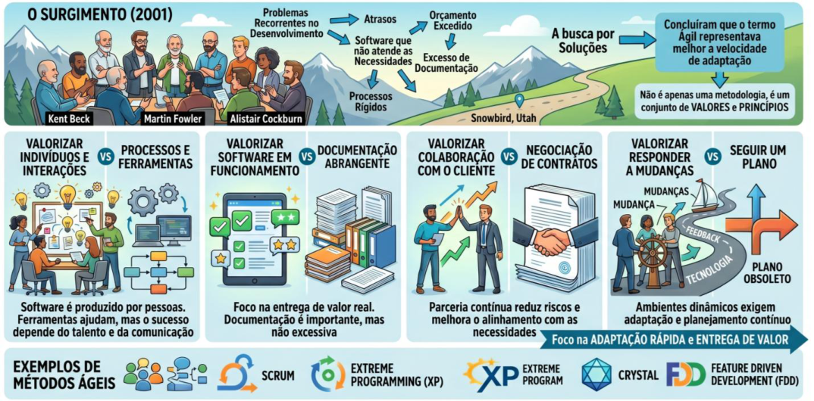

---

<!-- pagina: 17 -->

**Diego Carvalho, Equipe Informática 2 (Diego Carvalho), Equipe Informática 1 (Diego Carvalho) Aula 01** 

<!-- Start of picture text -->
Filosofia Ágil <!-- End of picture text -->

<!-- Start of picture text -->
Princípios <!-- End of picture text -->

<!-- Start of picture text -->
Ágeis <!-- End of picture text -->

#### **<mark>INCIDÊNCIA EM PROVA: MÉDIA</mark>** 

### **<mark>PRINCÍPIOS ÁGEIS</mark>** 

Os princípios ágeis são diretrizes derivadas do Manifesto for Agile Software Development que orientam a aplicação prática das metodologias ágeis no desenvolvimento de software e no gerenciamento de projetos. Eles enfatizam aspectos como entrega contínua de valor ao cliente, adaptação rápida às mudanças, colaboração constante entre equipes e stakeholders, comunicação eficiente, simplicidade, melhoria contínua e desenvolvimento iterativo e incremental. Esses princípios procuram tornar o processo mais flexível, humano e responsivo, permitindo que equipes lidem melhor com ambientes dinâmicos, requisitos mutáveis e necessidades frequentes de aprendizado e adaptação ao longo do projeto. 

A seguir, nós vamos conhecer quais são os princípios do Manifesto Ágil. Eles vêm expressamente no manifesto e vocês podem encontrá-lo no site oficial: www.agilemanifesto.org. 

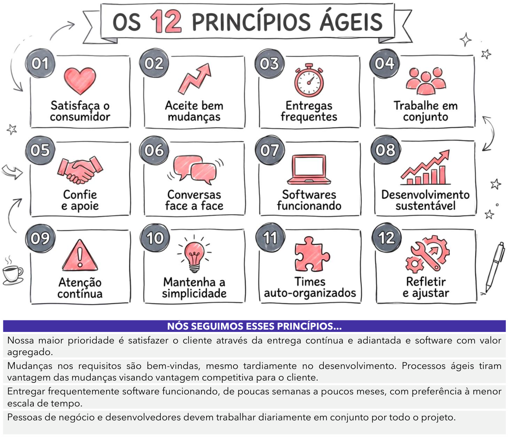

<!-- Start of picture text -->
NÓS SEGUIMOS ESSES PRINCÍPIOS... Nossa maior prioridade é satisfazer o cliente através da entrega contínua e adiantada e software com valor agregado. Mudanças nos requisitos são bem-vindas, mesmo tardiamente no desenvolvimento. Processos ágeis tiram vantagem das mudanças visando vantagem competitiva para o cliente. Entregar frequentemente software funcionando, de poucas semanas a poucos meses, com preferência à menor escala de tempo. Pessoas de negócio e desenvolvedores devem trabalhar diariamente em conjunto por todo o projeto. <!-- End of picture text -->

---

<!-- pagina: 18 -->

**Diego Carvalho, Equipe Informática 2 (Diego Carvalho), Equipe Informática 1 (Diego Carvalho) Aula 01** 

<mark>Construa projetos em torno de indivíduos motivados. Dê a eles o ambiente e o suporte necessário e confie neles</mark> <u>para fazer o trabalho.</u> 

O método mais eficiente e eficaz de transmitir informações para e entre uma equipe de desenvolvimento é através de conversa face a face. 

Software funcionando é a medida primária de progresso. 

Os processos ágeis promovem desenvolvimento sustentável. Os patrocinadores, desenvolvedores e usuários <mark>devem ser capazes de manter um ritmo constante indefinidamente.</mark> 

Contínua atenção à excelência técnica e bom design aumenta a agilidade. 

Simplicidade – a arte de maximizar a quantidade de trabalho não realizado – é essencial. 

As melhores arquiteturas, requisitos e designs emergem de equipes auto-organizáveis. 

Em intervalos regulares, a equipe reflete sobre como se tornar mais eficaz e então refina e ajusta seu <mark>comportamento de acordo.</mark> 

Uma questão bastante discutida na engenharia de software é se métodos ágeis funcionam em qualquer tipo de projeto. Ian Sommerville adota uma visão mais cautelosa sobre esse tema. Segundo ele, práticas ágeis apresentam ótimos resultados em determinados cenários, mas não devem ser vistas como solução universal. Isso acontece porque diferentes projetos possuem níveis variados de complexidade, tamanho e exigências organizacionais, fatores que podem dificultar aplicação de métodos ágeis de maneira totalmente eficiente. 

Sommerville destaca que métodos ágeis costumam funcionar melhor em equipes pequenas ou médias, especialmente em ambientes sujeitos a mudanças frequentes. Isso ocorre porque práticas ágeis dependem bastante de comunicação intensa, colaboração contínua e proximidade entre equipe e cliente. Conforme o tamanho do projeto cresce, surgem dificuldades relacionadas à coordenação, integração técnica e alinhamento entre diferentes grupos de trabalho. Em projetos gigantescos, envolvendo centenas de profissionais e sistemas críticos, manter simplicidade organizacional se torna muito mais complicado. 

Com o passar do tempo, essa discussão evoluiu bastante. Atualmente, muitas organizações utilizam práticas ágeis em larga escala com apoio de frameworks como Scaled Agile Framework e Large-Scale Scrum. Essas abordagens foram criadas justamente para lidar com desafios de integração, governança e coordenação em ambientes corporativos complexos. Isso demonstra que métodos ágeis modernos podem ser aplicados em projetos grandes, desde que exista adaptação adequada às necessidades organizacionais e técnicas do contexto. 

Roger Pressman também reforça que agilidade não significa ausência de disciplina, arquitetura ou controle técnico. Pelo contrário. Em ambientes complexos, cresce ainda mais a necessidade de organização, integração eficiente e qualidade arquitetural. O que muda é a forma de conduzir o desenvolvimento, priorizando adaptação contínua, feedback frequente e entregas incrementais. Muitas empresas, inclusive, adotam modelos híbridos, combinando práticas ágeis com elementos tradicionais de engenharia e governança corporativa em setores altamente regulados. 

Por isso, evitar generalizações é fundamental dentro da engenharia de software. Nem todo projeto precisa ser totalmente ágil, assim como nem todo método tradicional deve ser considerado ultrapassado. A escolha da abordagem depende de fatores como criticidade do sistema, estabilidade dos requisitos, tamanho da equipe, riscos envolvidos e exigências regulatórias. Em projetos reais, dificilmente existe solução perfeita para todos os cenários. O mais importante é compreender limitações, contexto organizacional e objetivos do desenvolvimento.

---

<!-- pagina: 19 -->

**Diego Carvalho, Equipe Informática 2 (Diego Carvalho), Equipe Informática 1 (Diego Carvalho) Aula 01** 

||**PRINCIPAIS METODOLOGIAS ÁGEIS**||
|---|---|---|
|SCRUM|CRYSTAL|XP|
|FDD|DSDM|ASD|
|AUP|SCRUMBAN|KANBAN|

Agora vamos ver algumas diferenças básicas entre metodologias de desenvolvimento software tradicionais e metodologias ágeis: 

**<mark>CRITÉRIOS MODELOS TRADICIONAIS MODELOS ÁGEIS</mark>** O planejamento costuma ser realizado em grande detalhe logo no início do projeto, buscando prever cronograma, custos, **PLANEJAMENTO** recursos, atividades e entregas futuras. Alterações posteriores normalmente exigem revisões formais do plano estabelecido. do projeto. O gerenciamento de riscos tende a ser realizado de maneira ampla e formal, contínua e incremental, procurando analisar impactos relacionados **RISCOS** ao projeto como um todo. Muitas vezes exige equipes especializadas e forte acompanhamento gerencial contínuo. mitigação dos problemas. As equipes costumam possuir papéis claramente definidos, organizados conforme colaborativas e hierarquia e planejamento inicial do projeto. integrantes participam **EQUIPE** As atividades normalmente são coordenadas e acompanhadas diretamente pelo gerente de projetos responsável. previstas para cada iteração. As entregas geralmente seguem o cronograma global definido no planejamento inicial e podem ocorrer **TEMPO DE** apenas após longos períodos de **ENTREGA** desenvolvimento. Dependendo do projeto, o ciclo pode durar meses ou até anos dos stakeholders. completos. Mudanças normalmente exigem processos formais de aprovação, pois podem impactar **ACEITAÇÃO DE** planejamento, cronograma, orçamento e **MUDANÇAS** documentação previamente estabelecidos. futuras podem ser Isso tende a tornar adaptações mais lentas e burocráticas. cliente e prioridades do negócio. A previsibilidade depende fortemente da qualidade do planejamento e da frequência do monitoramento realizado pela gestão. **PREVISIBILIDADE** Intervalos longos sem revisão podem iterações curtas permitem dificultar identificação precoce de desvios e problemas rapidamente problemas futuros. prioridades ao longo do projeto. **RESULTADOS AO** Os resultados normalmente aparecem de Os resultados aparecem **LONGO DO** forma mais perceptível apenas em etapas contínua ao longo do **TEMPO** avançadas ou próximas ao encerramento do <u>projeto. Isso ocorre porque grande parte das progressivamente. Isso rogressivamente. Isso gressivamente. Isso ressivamente. Isso permite</u> 

O planejamento inicial normalmente ocorre em nível mais alto, enquanto os detalhes são refinados continuamente ao longo das iterações. O foco principal está nas próximas entregas e nas prioridades mais imediatas do projeto. 

O gerenciamento de riscos ocorre de forma contínua e incremental, priorizando principalmente os riscos mais imediatos das próximas iterações. A própria equipe participa ativamente da identificação e mitigação dos problemas. 

As equipes tendem a ser multidisciplinares, colaborativas e auto-organizadas. Os integrantes participam ativamente das decisões técnicas e operacionais, definindo coletivamente como executar as atividades previstas para cada iteração. 

As entregas ocorrem em ciclos curtos e regulares chamados iterações ou sprints. Cada ciclo normalmente possui duração fixa entre uma e quatro semanas, permitindo entregas frequentes e feedback constante dos stakeholders. 

Mudanças são tratadas como parte natural do desenvolvimento. Embora se evite alterar a iteração em andamento, funcionalidades futuras podem ser replanejadas continuamente conforme necessidades do cliente e prioridades do negócio. A previsibilidade tende a aumentar por meio de inspeção frequente, feedback contínuo e adaptação constante das entregas. As iterações curtas permitem identificar problemas rapidamente e ajustar prioridades ao longo do projeto. 

Os resultados aparecem de maneira contínua ao longo do projeto, pois funcionalidades utilizáveis são entregues <u>progressivamente. Isso rogressivamente. Isso gressivamente. Isso ressivamente. Isso permite geração</u>

---

<!-- pagina: 20 -->

**Diego Carvalho, Equipe Informática 2 (Diego Carvalho), Equipe Informática 1 (Diego Carvalho) Aula 01** 

### **<mark>CRITÉRIOS</mark>** 

### **<mark>MODELOS TRADICIONAIS</mark>** 

<mark>funcionalidades costuma ser entregue</mark> somente ao final do desenvolvimento. As informações do projeto geralmente são apresentadas em reuniões formais previamente agendadas, utilizando relatórios e documentos detalhados. O nível de detalhamento varia conforme o público e os objetivos da comunicação. 

**APRESENTAÇÃO DE INFORMAÇÕES** 

O prazo é definido conforme o planejamento inicial do projeto e alterações **PRAZO DE** normalmente dependem de análise formal **ENTREGA** de impactos. Mudanças aprovadas podem gerar atrasos relevantes e afetar expectativas dos stakeholders envolvidos. 

A documentação tende a ser extensa e produzida desde o início do projeto, buscando registrar requisitos, planejamento, arquitetura, testes e demais informações relevantes para controle e rastreabilidade do desenvolvimento. 

**DOCUMENTAÇÃO** 

O cliente participa principalmente das etapas iniciais de levantamento de requisitos **ATUAÇÃO DO** e das validações mais importantes do **CLIENTE** produto. Durante longos períodos, pode existir pouca interação contínua com a equipe técnica. 

Discussões sobre melhorias e revisão de processos costumam ocorrer após grandes marcos ou entregas relevantes do projeto. Isso pode fazer com que ajustes importantes demorem mais tempo para serem implementados. 

**DISCUSSÕES E MELHORIAS** 

O gerenciamento normalmente é centralizado no gerente de projetos, responsável por acompanhar execução, distribuir atividades, controlar cronograma e garantir aderência ao planejamento previamente estabelecido. 

**COMANDANTE** 

Os papéis geralmente são bem definidos, especializados e associados a responsabilidades específicas dentro da **PAPÉIS** estrutura organizacional do projeto. Isso favorece controle formal e divisão clara das atividades executadas. O processo normalmente é guiado por planejamento detalhado, etapas formais e procedimentos previamente definidos. **PROCESSO** 

O processo normalmente é guiado por planejamento detalhado, etapas formais e procedimentos previamente definidos. Existe forte preocupação com controle, previsibilidade, documentação e aderência ao fluxo estabelecido. 

### **<mark>MODELOS ÁGEIS</mark>** 

<mark>antecipada de valor e maior percepção de</mark> evolução por parte do cliente. 

As informações costumam ser transparentes e continuamente visíveis para toda a equipe por meio de radiadores de informação, quadros e indicadores compartilhados. A comunicação tende a ocorrer de maneira mais direta e frequente. 

Os prazos costumam ser definidos pelas iterações e pelo planejamento das releases. O escopo pode variar entre ciclos, mas o tempo das iterações normalmente permanece fixo para manter previsibilidade e cadência do trabalho. A documentação é produzida conforme necessidade prática do projeto e das iterações. O objetivo é evitar burocracia excessiva, mantendo apenas materiais realmente úteis para comunicação, rastreabilidade e evolução do software. 

O cliente ou representante do negócio participa continuamente do desenvolvimento, colaborando com definição de prioridades, validação de entregas e esclarecimento de requisitos ao longo de todas as iterações do projeto. 

Discussões, retrospectivas e melhorias acontecem frequentemente ao final de cada iteração. Isso permite aprendizado contínuo, identificação rápida de problemas e adaptação constante das práticas utilizadas pela equipe. 

A equipe possui maior autonomia para decidir como executar o trabalho e organizar atividades internas. A liderança tende a atuar mais como facilitadora e menos como comando centralizador das decisões operacionais. Os papéis tendem a ser mais flexíveis e colaborativos, permitindo que integrantes contribuam em diferentes atividades conforme necessidade da equipe. A confiança e a cooperação possuem forte importância nesse modelo. 

O processo é mais adaptativo, iterativo e orientado à geração contínua de valor. O desenvolvimento ocorre por ciclos curtos, priorizando colaboração, feedback frequente e rápida resposta às mudanças do projeto.

---

<!-- pagina: 21 -->

**Diego Carvalho, Equipe Informática 2 (Diego Carvalho), Equipe Informática 1 (Diego Carvalho) Aula 01** 

**<mark>CRITÉRIOS MODELOS TRADICIONAIS MODELOS ÁGEIS</mark>** Costuma apresentar melhores resultados em projetos com requisitos estáveis, escopo bem definido e necessidade elevada de **RESULTADO** previsibilidade, documentação formal e forte controle organizacional do desenvolvimento. 

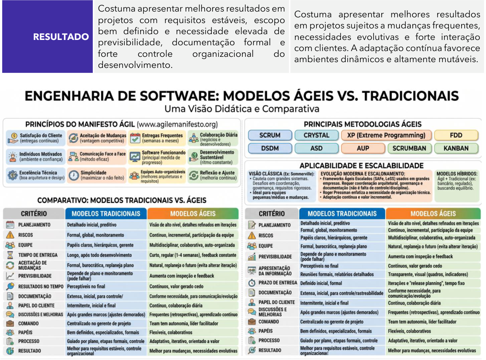

<!-- Start of picture text -->
Costuma apresentar melhores resultados em Costuma apresentar melhores resultados projetos com requisitos estáveis, escopo em projetos sujeitos a mudanças frequentes, bem definido e necessidade elevada de RESULTADO  necessidades evolutivas e forte interação previsibilidade, documentação formal e com clientes. A adaptação contínua favorece forte  controle  organizacional  do ambientes dinâmicos e altamente mutáveis. desenvolvimento. <!-- End of picture text -->

---

<!-- pagina: 22 -->

**Diego Carvalho, Equipe Informática 2 (Diego Carvalho), Equipe Informática 1 (Diego Carvalho) Aula 01** 

<!-- Start of picture text -->
Profissional Ágil <!-- End of picture text -->

#### **<mark>INCIDÊNCIA EM PROVA: BAIXÍSSIMA</mark>** 

### **<mark>PROFISSIONAIS ÁGEIS</mark>** 

Profissionais ágeis são indivíduos que atuam em ambientes orientados por metodologias ágeis e que valorizam colaboração, adaptação contínua, aprendizado constante e foco na entrega de valor ao cliente. Mais do que dominar ferramentas ou frameworks específicos, esses profissionais possuem postura flexível, capacidade de trabalhar em equipe, comunicação eficiente e abertura para mudanças ao longo do desenvolvimento do projeto. Além disso, costumam participar ativamente das decisões, compartilhar conhecimento, buscar melhoria contínua e assumir responsabilidade coletiva pela qualidade e evolução do produto, contribuindo para ambientes mais <mark>colaborativos, iterativos e orientados a resultados.</mark> 

Quando falamos em métodos ágeis, muitas pessoas pensam logo em ferramentas, cerimônias e frameworks como Scrum. Contudo, existe um fator ainda mais importante nesse contexto: a mentalidade das equipes. O desenvolvimento ágil depende fortemente de colaboração, adaptação contínua e aprendizado constante. Por isso, profissionais valorizados nesses ambientes precisam combinar competências técnicas com habilidades comportamentais bastante desenvolvidas, principalmente em cenários sujeitos a mudanças frequentes e decisões rápidas. 

Uma das características mais importantes em equipes ágeis é justamente a capacidade de adaptação. Projetos de software raramente permanecem estáveis por muito tempo. Requisitos mudam, prioridades evoluem e problemas inesperados aparecem durante o desenvolvimento. Roger Pressman destaca que agilidade está diretamente relacionada à habilidade de responder adequadamente a essas transformações. Logo, equipes ágeis precisam revisar prioridades, ajustar estratégias e adaptar comportamentos continuamente ao longo do projeto. 

Outro aspecto extremamente valorizado envolve colaboração constante entre os integrantes da equipe. Métodos ágeis enfatizam bastante comunicação frequente entre desenvolvedores, clientes e stakeholders. Em vez de departamentos isolados trabalhando separadamente durante meses, busca-se manter interação contínua durante todo o desenvolvimento. Frameworks como Scrum reforçam fortemente essa cultura de transparência, alinhamento frequente e cooperação. Na prática, isso costuma reduzir retrabalho e melhorar capacidade de resposta das equipes. 

A comunicação aberta também possui papel fundamental em ambientes ágeis. Problemas precisam ser discutidos rapidamente, impedimentos devem ser compartilhados e riscos não podem permanecer escondidos por muito tempo. Equipes maduras procuram criar ambientes nos quais as pessoas se sintam confortáveis para levantar dificuldades, propor melhorias e trocar ideias continuamente. Essa característica ajuda bastante na resolução rápida de problemas e fortalece alinhamento entre os integrantes do projeto e os objetivos organizacionais. 

Outro ponto importante envolve o foco constante no cliente e no valor gerado pelo produto. Métodos ágeis procuram entregar funcionalidades úteis de forma incremental, obtendo feedback frequente durante o desenvolvimento. Isso exige que equipes compreendam expectativas, necessidades e prioridades dos usuários. Ian Sommerville destaca justamente a importância desse retorno contínuo, porque ele reduz riscos, facilita correções e melhora alinhamento entre solução tecnológica e necessidades reais do negócio. 

Além das competências técnicas, ambientes ágeis valorizam bastante aprendizado contínuo, autonomia e habilidades interpessoais. O setor tecnológico muda rapidamente, e equipes precisam evoluir constantemente em ferramentas, práticas e processos internos. Também existe forte valorização de empatia, respeito e suporte mútuo entre os profissionais. Em muitos projetos, habilidades

---

<!-- pagina: 23 -->

**Diego Carvalho, Equipe Informática 2 (Diego Carvalho), Equipe Informática 1 (Diego Carvalho) Aula 01** 

comportamentais fazem enorme diferença no sucesso do desenvolvimento ágil, principalmente em ambientes colaborativos e altamente dinâmicos. 

|**CARACTERÍSTICAS**|**DESCRIÇÃO**|
|---|---|
|**ADAPTAÇÃO A** **MUDANÇAS**|Em ambientes ágeis, mudanças são tratadas como parte natural do desenvolvimento. Requisitos, prioridades e tecnologias podem mudar ao longo do projeto; por isso, equipes precisam responder rapidamente e ajustar continuamente planejamento, entregas e estratégias.|
|**COLABORAÇÃO**|Métodos ágeis valorizam fortemente colaboração entre desenvolvedores, clientes e stakeholders. O objetivo é manter comunicação constante, compartilhamento de conhecimento e alinhamento frequente para reduzir falhas de entendimento e aumentar qualidade das entregas.|
|**COMUNICAÇÃO**|A comunicação aberta e frequente possui enorme importância em equipes ágeis. Problemas, impedimentos, riscos e dúvidas devem ser compartilhados rapidamente, permitindo resolução mais eficiente e evitando acúmulo de erros ao longo das iterações.|
|**FOCO NO** **CLIENTE**|O desenvolvimento ágil procura manter o cliente próximo da equipe durante todo o projeto. As entregas incrementais permitem validação frequente das funcionalidades, garantindo maior alinhamento entre produto desenvolvido e necessidades reais do negócio.|
|**FEEDBACK** **CONTÍNUO**|Equipes ágeis trabalham com entregas frequentes e ciclos curtos de validação. Isso permite obter feedback constante dos usuários e stakeholders, facilitando correções rápidas e refinamento contínuo do produto ao longo do desenvolvimento.|
|**APRENDIZADO** **CONTÍNUO**|O ambiente ágil incentiva melhoria contínua das equipes, tanto em aspectos técnicos quanto organizacionais. Retrospectivas, revisões e ciclos iterativos ajudam profissionais a aprender com erros, aperfeiçoar práticas e evoluir continuamente.|
|**AUTONOMIA E** **PROATIVIDADE**|Equipes ágeis possuem maior participação nas decisões relacionadas à execução do trabalho. Isso não elimina liderança ou organização; contudo, estimula autonomia, colaboração e capacidade de resolver problemas sem depender de controle excessivo.|
|**PRIORIZAÇÃO**|Métodos ágeis trabalham constantemente com priorização de funcionalidades, riscos e necessidades do negócio. O foco é concentrar esforço nas entregas que geram maior valor para clientes e stakeholders em cada iteração do projeto.|
|**EMPATIA E** **RESPEITO**|Equipes ágeis valorizam respeito mútuo, cooperação e capacidade de compreender diferentes perspectivas. Como desenvolvimento de software envolve intensa colaboração, habilidades interpessoais ajudam bastante na estabilidade e produtividade do grupo.|

Dentro desse contexto, várias práticas modernas passaram a ser utilizadas com frequência em ambientes ágeis para melhorar alinhamento com clientes e acelerar aprendizado sobre o produto desenvolvido. Técnicas como personas, jornadas do cliente, design centrado no usuário, análise de métricas e feedback contínuo ajudam equipes a compreender melhor necessidades, expectativas e comportamento dos usuários. Vale lembrar um detalhe importante: essas práticas não pertencem exclusivamente ao universo ágil, mas combinam bastante com desenvolvimento iterativo e incremental. 

Outra prática extremamente conhecida nesse cenário é o conceito de MVP, sigla para Minimum Viable Product. A proposta consiste em lançar uma versão inicial do produto contendo apenas funcionalidades mínimas necessárias para validar hipóteses e obter feedback real dos usuários. Em vez de investir anos construindo um sistema completo sem validação prática, as equipes procuram aprender rapidamente com entregas menores. A partir desse aprendizado, o produto evolui continuamente conforme necessidades percebidas e comportamento real dos clientes.

---

<!-- pagina: 24 -->

**Diego Carvalho, Equipe Informática 2 (Diego Carvalho), Equipe Informática 1 (Diego Carvalho) Aula 01** 

O uso de métricas e experimentação também possui papel extremamente relevante dentro dos ambientes modernos de desenvolvimento. Equipes acompanham indicadores relacionados a retenção, engajamento, conversão e satisfação dos usuários para avaliar se o produto realmente está entregando valor ao negócio. Testes A/B e experimentos controlados ajudam a comparar soluções diferentes e identificar quais alternativas produzem melhores resultados na prática. Isso reduz decisões baseadas apenas em opinião e aproxima desenvolvimento de dados concretos observados no sistema. 

|**PRÁTICA OU** **CONCEITO**|**DESCRIÇÃO**|
|---|---|
|**PERSONAS**|Personas representam perfis fictícios de usuários criados para ajudar equipes a compreender melhor comportamentos, necessidades, objetivos e dificuldades do público que utilizará o sistema desenvolvido durante o projeto.|
|**JORNADA DO** **CLIENTE**|A jornada do cliente descreve etapas e experiências vividas pelo usuário durante interação com o produto ou serviço. Isso ajuda equipes a identificar problemas, oportunidades de melhoria e pontos críticos da experiência do usuário.|
|**TESTES A/B**|Testes A/B permitem comparar diferentes versões de funcionalidades, interfaces ou estratégias para verificar qual alternativa gera melhores resultados. As decisões passam a ser orientadas por dados e comportamento real dos usuários.|
|**MÉTRICAS**|Equipes modernas acompanham indicadores relacionados ao uso do produto, satisfação dos usuários e desempenho do sistema. Essas métricas ajudam a entender se as funcionalidades realmente estão entregando valor ao negócio.|
|**DESIGN** **CENTRADO NO** **USUÁRIO**|Essa abordagem procura desenvolver sistemas considerando necessidades, comportamentos e expectativas dos usuários desde o início do projeto. O foco não está apenas na tecnologia, mas também na experiência de utilização do produto.|
|**MVP**|MVP significa Minimum Viable Product. A ideia é lançar uma versão inicial com funcionalidades mínimas suficientes para validar hipóteses, obter feedback rápido e evoluir o produto gradualmente conforme aprendizado obtido com usuários reais.|

Outro aspecto bastante associado ao pensamento ágil é a forte valorização da cultura de inovação dentro das organizações. Métodos ágeis procuram criar ambientes nos quais equipes possam experimentar soluções, aprender rapidamente com resultados obtidos e ajustar continuamente o produto desenvolvido. Naturalmente, isso não significa ausência de disciplina técnica, arquitetura ou controle organizacional. O que existe é maior abertura para refinamento incremental, adaptação frequente e evolução progressiva das soluções conforme novas necessidades aparecem durante o projeto. 

Roger Pressman enfatiza bastante essa relação entre agilidade, adaptação contínua e melhoria constante dos processos de desenvolvimento. Em ambientes modernos, mudanças acontecem rapidamente, e equipes precisam responder de maneira eficiente a novos cenários tecnológicos e organizacionais. Por isso, práticas ágeis incentivam experimentação controlada, revisão frequente das decisões e aprendizado contínuo ao longo do ciclo de vida do software. Essa capacidade de evolução constante tornou-se uma característica extremamente valorizada no mercado atual. 

O perfil de um profissional ágil vai muito além de conhecer ferramentas específicas ou participar de cerimônias organizacionais. O desenvolvimento ágil depende fortemente de mentalidade colaborativa, comunicação eficiente, aprendizado contínuo e adaptação frequente às mudanças do projeto. Além disso, existe grande preocupação com geração constante de valor para clientes e usuários finais. Frameworks, práticas e processos oferecem suporte importante; contudo, são as pessoas e suas interações que realmente sustentam ambientes ágeis modernos.

---

<!-- pagina: 25 -->

**Diego Carvalho, Equipe Informática 2 (Diego Carvalho), Equipe Informática 1 (Diego Carvalho) Aula 01** 

Em projetos reais, profissionais capazes de colaborar bem, compartilhar conhecimento e lidar positivamente com mudanças tendem a contribuir muito mais para estabilidade e produtividade das equipes. Isso explica por que ambientes ágeis valorizam bastante habilidades comportamentais, empatia, proatividade e capacidade de aprendizado contínuo. Em muitos casos, equipes tecnicamente competentes enfrentam dificuldades justamente por problemas de comunicação e colaboração. De certa forma, agilidade depende tanto das relações humanas quanto das práticas técnicas utilizadas no desenvolvimento. 

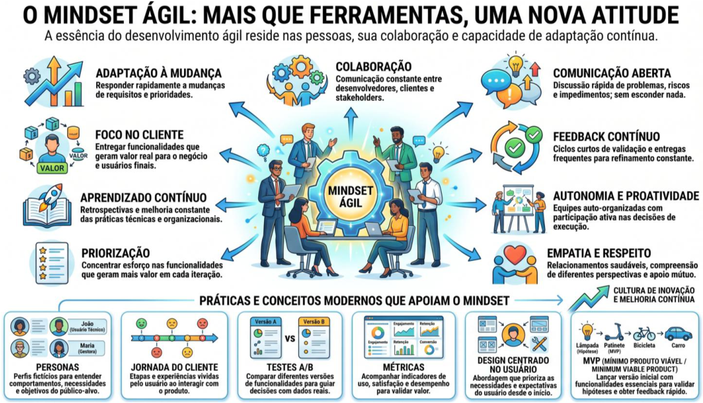

---

<!-- pagina: 26 -->

**Diego Carvalho, Equipe Informática 2 (Diego Carvalho), Equipe Informática 1 (Diego Carvalho) Aula 01** 

<!-- Start of picture text -->
Estrutura Operacional <!-- End of picture text -->

<!-- Start of picture text -->
Gestão Ágil <!-- End of picture text -->

#### **<mark>INCIDÊNCIA EM PROVA: MÉDIA</mark>** 

### **<mark>GESTÃO ÁGIL</mark>** 

<mark>Abordagem de gerenciamento de projetos e equipes baseada em adaptação contínua, colaboração frequente,</mark> entregas incrementais e resposta rápida às mudanças ao longo do desenvolvimento. Diferentemente dos modelos tradicionais mais rígidos e preditivos, a gestão ágil trabalha com ciclos curtos de planejamento, execução e validação, permitindo revisões constantes das prioridades conforme novas necessidades surgem. Essa abordagem valoriza forte participação dos stakeholders, equipes auto-organizadas, feedback contínuo e foco na geração de valor para o cliente, tornando o gerenciamento mais flexível, iterativo e adequado a ambientes dinâmicos e sujeitos a incertezas. 

Durante muito tempo, o gerenciamento tradicional dominou grande parte dos projetos de software. A proposta era planejar praticamente tudo no início, definir cronogramas detalhados e controlar o desenvolvimento de forma preditiva. Esse modelo funcionava bem em cenários mais estáveis, mas começou a apresentar limitações em ambientes marcados por mudanças frequentes e alto nível de incerteza. Autores como Roger Pressman e Ian Sommerville destacam que diferentes contextos exigem abordagens diferentes de gerenciamento. 

Em projetos inovadores, requisitos mudavam constantemente, clientes alteravam expectativas e tecnologias evoluíam durante o próprio desenvolvimento. Nesse cenário, prever todos os detalhes antecipadamente se tornava extremamente difícil. Como consequência, planos excessivamente rígidos geravam atrasos, retrabalho e dificuldades de adaptação. Foi justamente nesse contexto que abordagens iterativas, incrementais e adaptativas começaram a ganhar força dentro da engenharia de software. 

Métodos ágeis passaram então a enfatizar adaptação contínua, colaboração frequente e ciclos curtos de desenvolvimento. Isso não significa ausência de organização ou gerenciamento. Pelo contrário. Ambientes ágeis maduros continuam dependendo fortemente de disciplina, coordenação e acompanhamento constante das atividades. O que muda é a forma de estruturar o trabalho. Em vez de um planejamento totalmente fechado, as equipes revisam prioridades continuamente conforme aprendem mais sobre o projeto e sobre as necessidades dos clientes. 

Dentro desse contexto surgiu o chamado Gerenciamento Ágil de Projetos, também conhecido como Agile Project Management. Autores como Jim Highsmith descrevem essa abordagem como um conjunto de práticas voltadas à entrega contínua de valor em ambientes complexos e sujeitos a mudanças frequentes. Chin também destaca que gerenciamento ágil não procura destruir abordagens tradicionais, mas complementá-las com maior flexibilidade, aprendizado contínuo e adaptação progressiva ao longo do desenvolvimento. 

Outro ponto importante é que agilidade não significa apenas velocidade. O foco principal está na capacidade de responder adequadamente às mudanças sem perder estabilidade e capacidade de entrega. Métodos ágeis também valorizam bastante o fator humano, fortalecendo colaboração, aprendizado contínuo e participação ativa das equipes. Mesmo assim, continuam dependendo de arquitetura adequada, integração contínua, automação e práticas consistentes de qualidade para evitar desorganização e crescimento da dívida técnica. 

Além disso, abordagens ágeis procuram entregar valor continuamente ao cliente por meio de incrementos frequentes do produto. Isso permite validação constante das funcionalidades

---

<!-- pagina: 27 -->

**Diego Carvalho, Equipe Informática 2 (Diego Carvalho), Equipe Informática 1 (Diego Carvalho) Aula 01** 

implementadas e reduz riscos ao longo do projeto. Funcionalidades críticas e requisitos mais incertos costumam ser tratados cedo justamente para diminuir problemas futuros. No fim, o gerenciamento ágil busca aumentar capacidade de adaptação em ambientes dinâmicos sem abandonar completamente organização, coordenação e qualidade no desenvolvimento do software. 

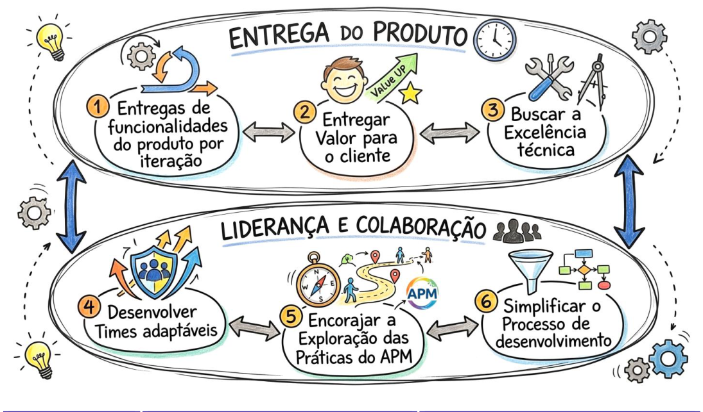

|**ABORDAGEM**|**TRADICIONAL**|**ÁGIL**|
|---|---|---|
|**METAS DO** **PROJETO**|Prioriza cumprimento do cronograma, orçamento e requisitos previamente definidos, buscando estabilidade e aderência ao planejamento inicial do projeto.|Prioriza geração contínua de valor para o negócio, adaptação às mudanças e alcance de múltiplos critérios de sucesso ao longo do projeto.|
|**PLANO DO** **PROJETO**|O plano define atividades, prazos e recursos detalhadamente no início, servindo como principal referência para execução e controle do projeto.|O planejamento é evolutivo e adaptável, organizando trabalho e prioridades conforme mudanças, feedbacks e necessidades do negócio surgem.|
|**ABORDAGEM** **GERENCIAL**|A gestão tende a ser mais rígida e preditiva, buscando seguir o plano inicial com forte controle sobre atividades, escopo e cronograma.|A gestão procura adaptar-se continuamente às mudanças, revisando prioridades, decisões e estratégias conforme evolução do ambiente do projeto.|
|**TRABALHO E** **EXECUÇÃO**|O trabalho é tratado como previsível e linear, permitindo estimativas detalhadas e maior controle antecipado das atividades do projeto.|O trabalho é tratado como dinâmico e complexo, exigindo adaptação contínua diante de incertezas, mudanças e novas necessidades do projeto.|
|**INFLUÊNCIA DA** **ORGANIZAÇÃO**|Após o início do projeto, a influência externa tende a ser menor, pois o planejamento busca estabilizar requisitos e atividades previstas.|A organização influencia continuamente o projeto, alterando prioridades, requisitos e decisões conforme mudanças de contexto e mercado.|

---

<!-- pagina: 28 -->

**Diego Carvalho, Equipe Informática 2 (Diego Carvalho), Equipe Informática 1 (Diego Carvalho) Aula 01** 

**<mark>ABORDAGEM TRADICIONAL ÁGIL</mark>** O controle busca identificar desvios em O controle procura identificar mudanças no **CONTROLE DO** relação ao plano inicial, aplicando ambiente e adaptar continuamente o **PROJETO** correções para manter escopo, prazo e planejamento conforme novas necessidades custo previstos. e aprendizados. A metodologia costuma ser aplicada de O processo é ajustado conforme **APLICAÇÃO DA** maneira padronizada, buscando características do projeto, permitindo maior **METODOLOGIA** repetibilidade e uniformidade entre flexibilidade diante de riscos, contexto e diferentes projetos. complexidade. A gestão utiliza modelos mais A gestão reconhece que projetos possuem **ESTILO DE** padronizados, assumindo que uma características distintas, exigindo **GESTÃO** abordagem estruturada pode atender abordagens adaptativas e flexíveis conforme diferentes tipos de projeto. o contexto. 

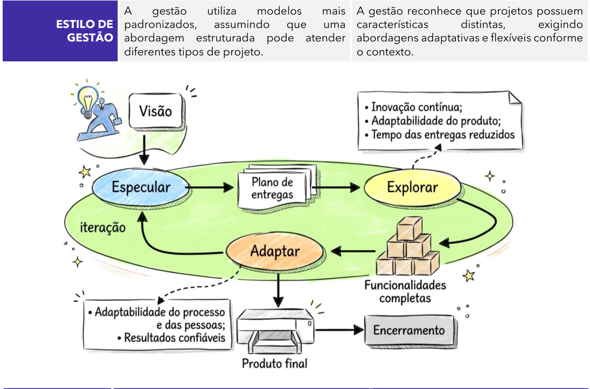

<!-- Start of picture text -->
A  gestão  utiliza  modelos  mais  A gestão reconhece que projetos possuem ESTILO DE  padronizados,  assumindo  que  uma  características  distintas,  exigindo GESTÃO  abordagem estruturada pode atender  abordagens adaptativas e flexíveis conforme diferentes tipos de projeto.  o contexto. <!-- End of picture text -->

|**FASES**|**DESCRIÇÃO**|
|---|---|
|**VISÃO**|O objetivo é determinar a visão do produto e o escopo de projeto, a comunidade do projeto, e definir como a equipe irá trabalhar e interagir. Define-se o que será entregue, os envolvidos e como o timepretende trabalhar.|
|**ESPECULAÇÃO**|O objetivo é planejar o projeto com base na visão preliminar construída com o apoio do time do projeto, sobre o que precisa ser entregue, quem são os envolvidos e qual será a estratégia adotada.|
|**EXPLORAÇÃO**|O objetivo é executar o que foi planejado, executando as entregas, promovendo a auto- organização e auto-disciplina da equipe de projetos e tratando da gestão das interações da equipe doprojeto com o cliente.|
|**ADAPTAÇÃO**|O objetivo é rever os resultados da fase anterior, analisar o progresso do projeto e o desempenho da equipe de projetos, para eventuais adaptações no plano de projeto, entregas eplano de iterações,caso seja necessário.|
|**ENCERRAMENTO**|Transferem-se os conhecimentos-chave adquiridos no projeto, e celebrado os resultados obtidos. Recomendam-se mini-fechamentos ao final de cada iteração no projeto.|

---

<!-- pagina: 29 -->

**Diego Carvalho, Equipe Informática 2 (Diego Carvalho), Equipe Informática 1 (Diego Carvalho) Aula 01** 

Quando estudamos métodos ágeis, algumas características aparecem praticamente o tempo inteiro: colaboração, adaptação contínua, autonomia das equipes, comunicação frequente e participação ativa dos stakeholders. Essas ideias possuem relação direta com os princípios do Manifesto for Agile Software Development e ajudam a explicar por que ambientes ágeis funcionam de maneira bastante diferente das abordagens tradicionais de gerenciamento. Em vez de estruturas excessivamente rígidas, procura-se criar processos mais flexíveis e capazes de responder rapidamente às mudanças. 

Autores como Roger Pressman e Ian Sommerville destacam bastante que projetos modernos de software convivem constantemente com mudanças, incertezas e evolução contínua dos requisitos. Em muitos casos, necessidades do cliente mudam durante o próprio desenvolvimento do sistema. Nesse cenário, processos extremamente rígidos acabam apresentando dificuldades maiores de adaptação. Por isso, abordagens iterativas procuram aumentar flexibilidade, comunicação frequente e capacidade de resposta rápida diante de novos cenários organizacionais e tecnológicos. 

Outro ponto extremamente importante é compreender que métodos ágeis não representam ausência de processo nem improvisação desorganizada. Pelo contrário: ambientes ágeis maduros dependem ==5460== fortemente de disciplina técnica, integração contínua, colaboração frequente e acompanhamento constante das atividades realizadas pela equipe. O que muda não é a eliminação da organização, mas a maneira de estruturar o trabalho. Em vez de ciclos longos e inflexíveis, procura-se trabalhar com entregas menores, feedback contínuo e adaptação progressiva das decisões. 

Dentro desse contexto, várias práticas ganharam enorme relevância nas abordagens ágeis modernas. Elas ajudam equipes a atuar de maneira mais integrada, colaborativa e adaptativa diante das mudanças naturais do desenvolvimento de software. Comunicação frequente, ciclos iterativos curtos, validação contínua e participação ativa dos usuários tornaram-se características muito presentes nesses ambientes. A seguir, vamos analisar alguns dos elementos mais importantes associados aos modelos iterativos e incrementais utilizados atualmente. 

|**CARACTERÍSTICA**|**DESCRIÇÃO**|
|---|---|
|**COOPERAÇÃO**|A colaboração contínua entre equipe, clientes e stakeholders ajuda a manter alinhamento constante sobre prioridades, objetivos e evolução do produto ao longo das iterações doprojeto.|
|**FLEXIBILIDADE DE** **ESCOPO**|O escopo pode evoluir progressivamente conforme feedbacks, mudanças de negócio e novas necessidades surgem durante o desenvolvimento do software ao longo das iterações.|
|**INTERATIVIDADE E** **ITERAÇÃO**|O trabalho é dividido em ciclos curtos com desenvolvimento incremental, validação frequente e revisões contínuasque ajudam a ajustar oproduto continuamente.|
|**AUTONOMIA DAS** **EQUIPES**|Equipes possuem elevada autonomia operacional para organizar trabalho e tomar decisões técnicas; contudo, continuam alinhadas aos objetivos do projeto e do negócio.|
|**EMPODERAMENTO**|As equipes recebem recursos, informações e autoridade suficientes para participar ativamente das decisões relacionadas ao desenvolvimento e evolução doproduto.|
|**PAIR PROGRAMMING**|Dois desenvolvedores trabalham conjuntamente na mesma funcionalidade, compartilhando conhecimento, revisando código continuamente e melhorando qualidade da soluçãoproduzida.|

A cooperação possui papel central nos métodos ágeis modernos. Em vez de departamentos trabalhando isoladamente, desenvolvedores, analistas, testadores e clientes colaboram continuamente ao longo do projeto. Práticas do Scrum, como reuniões diárias, revisões e retrospectivas, ajudam justamente a aumentar transparência, alinhamento e capacidade de adaptação das equipes. Em muitos projetos, essa comunicação frequente reduz retrabalho e melhora bastante coordenação entre os profissionais envolvidos no desenvolvimento.

---

<!-- pagina: 30 -->

**Diego Carvalho, Equipe Informática 2 (Diego Carvalho), Equipe Informática 1 (Diego Carvalho) Aula 01** 

Outro aspecto importante envolve a flexibilidade de escopo presente nos ambientes ágeis. Diferentemente de modelos tradicionais, nos quais requisitos procuram ser estabilizados logo no início, métodos iterativos aceitam que mudanças são naturais durante o desenvolvimento. Isso não significa ausência de controle organizacional. As equipes utilizam backlogs constantemente revisados para reorganizar prioridades e ajustar funcionalidades conforme necessidades do negócio evoluem ao longo das iterações realizadas. 

O trabalho iterativo em ciclos curtos também representa uma característica bastante importante dos métodos ágeis. Em vez de esperar meses para validar o sistema completo, equipes desenvolvem pequenos incrementos funcionais continuamente. Cada entrega gera aprendizado adicional sobre o produto e sobre os usuários. Isso ajuda a identificar problemas técnicos, falhas de requisitos e dificuldades de integração mais cedo, reduzindo impactos sobre prazo, custo e qualidade do projeto. 

Outro ponto muito valorizado envolve autonomia e empoderamento das equipes. Ambientes ágeis procuram permitir que os próprios profissionais organizem grande parte do trabalho operacional, definindo estratégias técnicas e maneiras de implementar funcionalidades. Contudo, autonomia não significa ausência de responsabilidade. Equipes continuam alinhadas às prioridades do negócio, às restrições arquiteturais e aos objetivos estratégicos do produto. Sem disciplina adequada, a flexibilidade pode rapidamente gerar desorganização e perda de controle do projeto. 

Práticas como pair programming também reforçam colaboração contínua dentro das equipes. No Extreme Programming, dois desenvolvedores trabalham juntos na mesma funcionalidade, compartilhando conhecimento, decisões técnicas e revisão constante do código. Além disso, retrospectivas e ciclos curtos de feedback estimulam aprendizado contínuo e melhoria constante dos processos. Em mercados tecnológicos altamente dinâmicos, essa capacidade de adaptação e evolução contínua tornou-se uma vantagem extremamente relevante para equipes de desenvolvimento. 

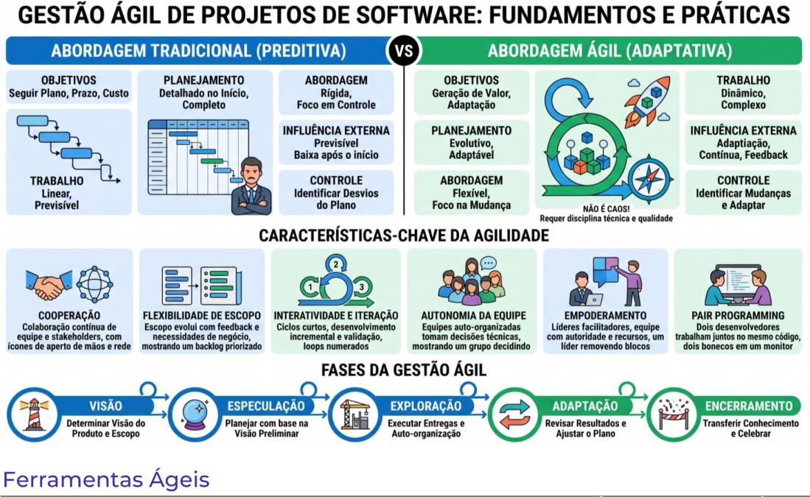

<!-- Start of picture text -->
Ferramentas Ágeis <!-- End of picture text -->

**<mark>INCIDÊNCIA EM PROVA: BAIXÍSSIMA</mark>**

---

<!-- pagina: 31 -->

**Diego Carvalho, Equipe Informática 2 (Diego Carvalho), Equipe Informática 1 (Diego Carvalho) Aula 01** 

### **<mark>FERRAMENTAS ÁGEIS</mark>** 

Aplicações e recursos utilizados para apoiar a implementação de metodologias ágeis e facilitar o gerenciamento iterativo e incremental de projetos. Elas auxiliam equipes na organização do trabalho, acompanhamento de tarefas, colaboração contínua, comunicação, automação de processos e monitoramento do progresso das entregas ao longo das iterações. Essas ferramentas normalmente oferecem funcionalidades como gerenciamento de backlog, quadros Kanban, planejamento de sprints, integração contínua, rastreamento de defeitos e geração de métricas, contribuindo para maior transparência, adaptabilidade e eficiência no desenvolvimento de software e na gestão ágil de projetos. 

No desenvolvimento ágil moderno, as ferramentas de apoio ganharam enorme importância nos últimos anos. Contudo, existe um detalhe importante: essas plataformas não são `“` ágeis `”` por natureza. Na prática, elas apenas ajudam equipes a organizar atividades, melhorar colaboração, automatizar tarefas e acompanhar o andamento dos projetos. Inclusive, muitas dessas ferramentas também podem ser utilizadas perfeitamente em projetos tradicionais de engenharia de software, dependendo do contexto organizacional e das necessidades da equipe. 

Roger Pressman destaca bastante que ferramentas não substituem equipes competentes nem processos bem estruturados. Uma organização pode possuir plataformas tecnológicas avançadas e ainda enfrentar problemas graves de comunicação, qualidade ou gerenciamento. As ferramentas funcionam principalmente como suporte para execução das práticas de desenvolvimento utilizadas pelas equipes. Elas ajudam no acompanhamento de tarefas, integração de código, automação de testes, gerenciamento de builds e controle das entregas realizadas ao longo do projeto. 

Essas características possuem relação direta com conceitos importantes do desenvolvimento moderno, como integração contínua, feedback rápido e entrega incremental. Em vez de esperar longos períodos para validar funcionalidades, equipes procuram automatizar grande parte dessas atividades. Isso acelera identificação de problemas, reduz riscos técnicos e melhora capacidade de adaptação durante o desenvolvimento. Em muitos casos, automação adequada também aumenta qualidade e previsibilidade das entregas realizadas pelas equipes. 

Outro aspecto relevante é que o desenvolvimento moderno normalmente integra várias ferramentas diferentes ao mesmo tempo. Uma equipe pode utilizar plataformas específicas para gerenciamento de tarefas, versionamento de código, comunicação interna e automação de deploy contínuo. Esse ecossistema integrado tornou-se ainda mais importante em ambientes distribuídos, nos quais profissionais trabalham remotamente ou em diferentes localidades. Mesmo assim, tecnologia sozinha não resolve problemas estruturais de colaboração, alinhamento ou gerenciamento dentro dos projetos. 

|**TIPOS DE** **FERRAMENTAS**|**DESCRIÇÃO**|
|---|---|
|**GERENCIAMENTO** **DE PROJETOS E** **COLABORAÇÃO** |Essas ferramentas ajudam equipes a organizar tarefas, planejar iterações, acompanhar progresso e melhorar comunicação entre os participantes do projeto. Frequentemente utilizam quadros visuais, backlog, sprints e mecanismos de acompanhamento colaborativo.|
|**INTEGRAÇÃO** **CONTÍNUA E** **ENTREGA** **CONTÍNUA**|Automatizam partes importantes do ciclo de desenvolvimento, incluindo integração de código, geração de builds, execução de testes automatizados e implantação contínua do software em diferentes ambientes operacionais.|
|**MONITORAMENTO** **E RELATÓRIOS**|Fornecem visibilidade sobre desempenho do projeto, estabilidade do sistema, qualidade do código e métricas relacionadas ao desenvolvimento. Isso ajuda equipes e gestores a acompanhar evolução e identificarproblemas rapidamente.|

---

<!-- pagina: 32 -->

**Diego Carvalho, Equipe Informática 2 (Diego Carvalho), Equipe Informática 1 (Diego Carvalho) Aula 01** 

|**TIPOS DE** **FERRAMENTAS**|**DESCRIÇÃO**|
|---|---|
|**RASTREAMENTO DE** **BUGS E ISSUES** |Permitem registrar, priorizar, atribuir e acompanhar defeitos, problemas e solicitações relacionadas ao sistema. Essas ferramentas ajudam bastante no controle de manutenção corretiva e evolução contínua do software.|
|**REPOSITÓRIOS E** **REVISÃO DE** **CÓDIGO**|Auxiliam no versionamento, armazenamento e compartilhamento de código-fonte. Também oferecem mecanismos de revisão colaborativa, permitindo que desenvolvedores avaliem alterações e mantenhamqualidade do softwareproduzido.|
|**COMUNICAÇÃO E** **COLABORAÇÃO**|Facilitam troca rápida de informações entre equipes, integração entre ferramentas e comunicação em tempo real. Em ambientes distribuídos, essas plataformas possuem enorme importânciapara coordenação das atividades doprojeto.|

Ferramentas modernas ajudam equipes a visualizar fluxo de trabalho, organizar backlog, acompanhar tarefas e monitorar evolução das entregas realizadas durante o projeto. Muitas plataformas utilizam conceitos inspirados em métodos como Scrum e Kanban para estruturar atividades. Vale lembrar um detalhe importante: Kanban não representa apenas um quadro visual de tarefas. Na verdade, ele surgiu das práticas Lean da Toyota e possui forte foco em gerenciamento eficiente do fluxo de trabalho dentro das organizações. 

Outra categoria bastante relevante envolve ferramentas ligadas à integração contínua e entrega contínua. Ian Sommerville destaca que integrações frequentes ajudam a reduzir riscos técnicos e identificar problemas mais cedo durante o desenvolvimento. Essas plataformas automatizam atividades como build, execução de testes, validações e implantação do sistema. Isso possui enorme importância em ambientes iterativos, nos quais novas versões do software são produzidas continuamente ao longo das entregas incrementais realizadas pelas equipes. 

Também existem ferramentas voltadas ao rastreamento de defeitos e gerenciamento de issues nos projetos. Elas ajudam equipes a registrar problemas, acompanhar correções e priorizar melhorias necessárias no sistema. Em projetos maiores, isso se torna essencial porque diferentes bugs e solicitações surgem simultaneamente durante o desenvolvimento. Ferramentas de versionamento e revisão colaborativa de código também possuem papel central, permitindo que vários desenvolvedores trabalhem juntos sem comprometer alterações realizadas por outros integrantes da equipe. 

Outro aspecto importante dessas plataformas é o aumento da transparência dentro dos projetos de software. Equipes conseguem visualizar andamento das atividades, identificar gargalos e acompanhar evolução das entregas com muito mais clareza. Isso melhora alinhamento entre desenvolvedores, gestores e stakeholders envolvidos no projeto. Mesmo assim, vale lembrar que ferramentas não substituem competências humanas, comunicação eficiente nem organização adequada das equipes. Resultados positivos dependem fortemente de colaboração efetiva e processos bem estruturados. 

|**EXEMPLOS**|**DESCRIÇÃO**|
|---|---|
|**JIRA**|Ferramenta bastante utilizada para gerenciamento ágil de projetos, permitindo planejamento de sprints, rastreamento de tarefas, acompanhamento de issues, geração de relatórios e organização de fluxos de trabalho iterativos.|
|**TRELLO**|Plataforma visual inspirada em quadros Kanban, bastante utilizada para organização de tarefas e acompanhamento simples de atividades. Possui forte apelo visual e facilidade de utilização em equipes menores.|
|**ASANA**|Ferramenta voltada ao gerenciamento colaborativo de tarefas e projetos. Permite organizar atividades, acompanhar progresso, compartilhar informações e melhorar coordenação entre equipes de trabalho.|

---

<!-- pagina: 33 -->

**Diego Carvalho, Equipe Informática 2 (Diego Carvalho), Equipe Informática 1 (Diego Carvalho) Aula 01** 

|**EXEMPLOS**|**DESCRIÇÃO**|
|---|---|
|**CONFLUENCE**|Plataforma de colaboração utilizada para criação e compartilhamento de documentação, páginas internas, procedimentos e conhecimento organizacional relacionado ao desenvolvimento do projeto.|
|**GITHUB**|Plataforma bastante utilizada para versionamento e colaboração em projetos de software. Oferece repositórios Git, revisão de código, integração com automações e mecanismos colaborativos de desenvolvimento.|
|**GITLAB**|Plataforma integrada de desenvolvimento e DevOps que combina versionamento, integração contínua, gerenciamento de issues, automação de pipelines e colaboração entre equipes técnicas.|
|**SLACK**|Plataforma de comunicação em tempo real bastante utilizada por equipes modernas. Facilita colaboração, integração entre ferramentas e compartilhamento rápido de informações relacionadas ao projeto.|

Outro aspecto extremamente importante dessas ferramentas envolve a transparência proporcionada ao projeto. Em ambientes ágeis, equipes procuram manter visibilidade contínua das atividades, tarefas e problemas em andamento durante o desenvolvimento. Radiadores de informação, dashboards e quadros compartilhados ajudam desenvolvedores, gestores e stakeholders a acompanhar evolução das entregas e identificar rapidamente riscos ou dificuldades que estejam afetando o projeto. Isso aumenta alinhamento organizacional e facilita tomada mais rápida de decisões. 

Essa transparência possui enorme importância em ambientes iterativos porque mudanças acontecem constantemente ao longo do desenvolvimento. Quando informações permanecem acessíveis e atualizadas, equipes conseguem reagir mais rapidamente diante de atrasos, impedimentos ou alterações de prioridade. Além disso, acompanhamento contínuo ajuda bastante na coordenação entre diferentes áreas envolvidas no projeto. Em muitos casos, problemas pequenos podem ser identificados cedo justamente porque existe maior visibilidade sobre andamento das atividades executadas pelas equipes. 

Outro ponto bastante relevante é o crescimento da automação dentro da engenharia de software moderna. Processos repetitivos, como geração de builds, execução de testes e implantação de novas versões, passaram a ser amplamente automatizados para reduzir erros humanos e aumentar velocidade das validações realizadas durante o desenvolvimento. Essa automação tornou-se extremamente importante em ambientes iterativos, nos quais novas funcionalidades e alterações são integradas continuamente ao sistema ao longo das entregas incrementais. 

Essas práticas possuem relação direta com conceitos modernos de DevOps, integração contínua e entrega contínua amplamente utilizados atualmente. Em vez de depender de processos manuais demorados e sujeitos a falhas frequentes, equipes procuram automatizar grande parte das atividades operacionais relacionadas ao ciclo de vida do software. Isso melhora confiabilidade das entregas, acelera identificação de problemas e facilita adaptação rápida diante das mudanças naturais dos projetos modernos de desenvolvimento de sistemas. 

|**BENEFÍCIOS**|**DESCRIÇÃO**|
|---|---|
|**MELHORIA DA** **COLABORAÇÃO**|Facilitam a comunicação e a colaboração entre membros da equipe e stakeholders, independentemente de sua localização.|
|**VISIBILIDADE E** **TRANSPARÊNCIA**|Proporcionam uma visão clara do progresso do projeto, ajudando na tomada de decisões baseadas em dados.|
|**EFICIÊNCIA** **OPERACIONAL**|Automatizam tarefas repetitivas e promovem a eficiência na gestão de projetos e no desenvolvimento de software.|

---

<!-- pagina: 34 -->

**Diego Carvalho, Equipe Informática 2 (Diego Carvalho), Equipe Informática 1 (Diego Carvalho) Aula 01** 

**<mark>ADAPTABILIDADE E</mark>** <mark>Permitem que as equipes respondam rapidamente a mudanças no projeto ou no</mark> **FLEXIBILIDADE** ambiente de mercado. **MELHORIA** Facilitam o rastreamento de métricas e feedbacks, apoiando a melhoria contínua dos **CONTÍNUA** <u>processos e produtos.</u> 

Essas ferramentas possuem enorme importância no desenvolvimento moderno; contudo, elas continuam sendo meios e não fins. O sucesso de um projeto depende principalmente das pessoas, da comunicação, da qualidade das práticas de engenharia e da capacidade de adaptação das equipes. Ferramentas ajudam bastante a potencializar produtividade, colaboração e automação; mas, sozinhas, não resolvem problemas estruturais de processo, organização ou gestão dentro do desenvolvimento de software. 

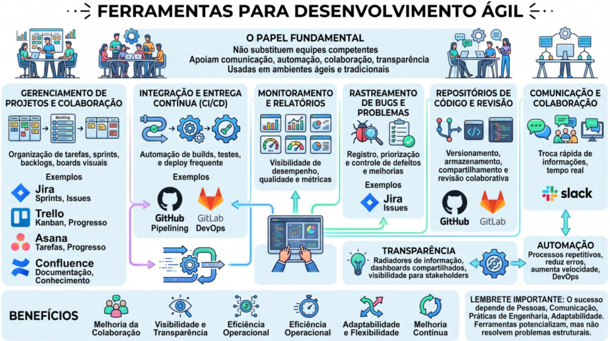

---

<!-- pagina: 35 -->

**Diego Carvalho, Equipe Informática 2 (Diego Carvalho), Equipe Informática 1 (Diego Carvalho) Aula 01** 

<!-- Start of picture text -->
Artefatos Ágeis <!-- End of picture text -->

#### **<mark>INCIDÊNCIA EM PROVA: BAIXÍSSIMA</mark>** 

### **<mark>ARTEFATOS ÁGEIS</mark>** 

<mark>Elementos produzidos e utilizados ao longo do desenvolvimento iterativo e incremental para apoiar</mark> planejamento, organização, acompanhamento e comunicação dentro das metodologias ágeis. Eles ajudam equipes e stakeholders a visualizar o progresso do projeto, priorizar atividades, acompanhar entregas e manter transparência sobre o trabalho realizado. Entre os principais exemplos estão backlog do produto, backlog da sprint, incremento, histórias de usuário, <u>gráficos de burndown e quadros Kanban.</u> 

Quando falamos em métodos ágeis, um conceito extremamente importante é o de artefatos. De maneira geral, artefatos correspondem a elementos utilizados para organizar atividades, acompanhar progresso e facilitar comunicação entre os envolvidos no projeto. Em ambientes iterativos, eles possuem enorme relevância porque ajudam equipes a manter transparência, coordenação e alinhamento contínuo durante o desenvolvimento. Além disso, tornam mais visível o andamento das entregas realizadas ao longo das diferentes iterações do produto. 

Autores como Roger Pressman e Ian Sommerville destacam bastante a importância da transparência, da rastreabilidade e da comunicação dentro do desenvolvimento moderno de software. Os artefatos ajudam justamente nesse processo, permitindo que desenvolvedores, gestores e stakeholders compreendam melhor o estado atual do projeto. Também ajudam na priorização de funcionalidades, acompanhamento do fluxo de trabalho e validação contínua da evolução do produto desenvolvido pelas equipes. 

Outro ponto importante é perceber que diferentes métodos ágeis utilizam artefatos distintos conforme suas práticas e necessidades organizacionais. Alguns pertencem oficialmente ao Scrum; outros surgem das práticas modernas de mercado e do gerenciamento ágil de produtos. Em muitos casos, esses elementos funcionam mais como mecanismos visuais de acompanhamento das atividades do que como documentos tradicionais da engenharia clássica de software e gerenciamento preditivo. 

Em ambientes ágeis, os artefatos normalmente procuram permanecer simples, objetivos e constantemente atualizados. O foco não está em produzir grande quantidade de documentação burocrática, mas criar elementos realmente úteis para organização do trabalho e acompanhamento das entregas. Além disso, muitos desses artefatos ajudam equipes a identificar gargalos, revisar prioridades e melhorar continuamente os processos utilizados durante o desenvolvimento do software. 

|**ARTEFATOS E** **ELEMENTOS ÁGEIS**|**DESCRIÇÃO**|
|---|---|
|**PRODUCT** **BACKLOG**|O Product Backlog representa uma lista priorizada e dinâmica contendo funcionalidades, melhorias, correções e necessidades relacionadas ao produto. Ele funciona como principal fonte de requisitos e evolui continuamente conforme mudanças de negócio e feedback dos usuários.|
|**SPRINT BACKLOG**|O Sprint Backlog reúne itens selecionados do Product Backlog para desenvolvimento durante a sprint atual. Além das tarefas escolhidas, ele também inclui o plano elaborado pela equipe para atingir os objetivos definidos para a iteração.|
|**INCREMENTO**|O incremento representa o conjunto de funcionalidades concluídas ao final de uma sprint juntamente com incrementos anteriores do produto. Ele deve atender aos critérios definidos pela equipe e estar potencialmente pronto para entrega e utilização.|
|**HISTÓRIAS DE** **USUÁRIO**|Histórias de usuário descrevem funcionalidades sob a perspectiva do usuário final, ajudando equipes a compreender necessidades, objetivos e valor esperado das entregas. São muito utilizadas em ambientes ágeis para facilitar entendimento e priorização.|

---

<!-- pagina: 36 -->

**Diego Carvalho, Equipe Informática 2 (Diego Carvalho), Equipe Informática 1 (Diego Carvalho) Aula 01** 

|**ARTEFATOS E** **ELEMENTOS ÁGEIS**|**DESCRIÇÃO**|
|---|---|
|**DEFINIÇÃO DE** **CONCLUÍDO**|A Definition of Done estabelece critérios claros para determinar quando uma funcionalidade pode ser considerada realmente concluída. Isso ajuda equipes a manter qualidade, consistência e alinhamento sobre o que significa finalizar o trabalho.|
|**ÉPICOS**|Épicos representam funcionalidades amplas ou grandes objetivos de negócio que posteriormente são divididos em histórias menores e mais gerenciáveis. Eles ajudam bastante na organização estratégica e no planejamento evolutivo do produto.|

O Product Backlog possui papel central dentro do Scrum. Ele funciona como uma lista dinâmica e priorizada contendo tudo aquilo que pode gerar valor para o produto. Diferentemente de modelos tradicionais, o backlog não permanece estático durante o projeto. Novos requisitos surgem, funcionalidades evoluem e prioridades mudam continuamente conforme necessidades do negócio e feedback recebido dos usuários. O Product Owner atua diretamente nesse processo, ajudando a manter alinhamento entre desenvolvimento técnico e objetivos estratégicos. 

Outro elemento importante é o Sprint Backlog, que representa o conjunto de itens selecionados para a sprint atual juntamente com o plano de trabalho elaborado pela equipe. Esse mecanismo ajuda bastante na organização das atividades e no acompanhamento contínuo do progresso realizado durante cada iteração. Como os objetivos da sprint ficam claramente definidos, desenvolvedores conseguem identificar impedimentos mais rapidamente e manter maior alinhamento ao longo do desenvolvimento incremental. 

O conceito de incremento também possui enorme relevância dentro do Scrum. Ao final de cada sprint, espera-se uma nova versão potencialmente entregável do produto. Contudo, não basta apenas a funcionalidade aparentar estar pronta. O incremento precisa atender integralmente à Definition of Done, também chamada de Definição de Concluído. Essa definição estabelece critérios mínimos relacionados à qualidade, testes, revisão de código e integração adequada das funcionalidades implementadas pela equipe. 

As histórias de usuário também aparecem com frequência em ambientes ágeis modernos. Elas descrevem funcionalidades sob a perspectiva do usuário final, ajudando equipes a manter foco na geração de valor para o negócio. Além disso, ambientes ágeis utilizam bastante mecanismos visuais como quadros Kanban, dashboards e gráficos de burndown. Essas ferramentas ajudam equipes e stakeholders a visualizar progresso, identificar gargalos e acompanhar evolução do projeto sem depender de relatórios excessivamente burocráticos. 

|**ELEMENTOS** **VISUAIS**|**DESCRIÇÃO**|
|---|---|
|**QUADROS** **KANBAN**|Quadros Kanban ajudam equipes a visualizar fluxo de trabalho ao longo das etapas do desenvolvimento. Eles facilitam identificação de gargalos, controle do trabalho em progresso e acompanhamento contínuo das atividades realizadas pela equipe.|
|**GRÁFICOS DE** **BURNDOWN**|Os gráficos de burndown mostram quantidade de trabalho restante ao longo do tempo. Eles ajudam equipes e stakeholders a acompanhar evolução da sprint ou do backlog e identificar rapidamente possíveis atrasos ou desvios de planejamento.|

Os quadros Kanban possuem enorme popularidade nos ambientes ágeis modernos porque ajudam equipes a visualizar tarefas em diferentes etapas do fluxo de trabalho. Contudo, Kanban não representa apenas um quadro visual. Na verdade, trata-se de uma abordagem de gerenciamento de fluxo originada

---

<!-- pagina: 37 -->

**Diego Carvalho, Equipe Informática 2 (Diego Carvalho), Equipe Informática 1 (Diego Carvalho) Aula 01** 

das práticas Lean, com forte preocupação em limitar trabalho em progresso, reduzir gargalos e melhorar fluidez contínua das atividades realizadas pelas equipes durante o desenvolvimento. 

Um dos princípios mais importantes do Kanban envolve justamente o limite de trabalho em progresso, conhecido como WIP. A ideia é evitar que muitas tarefas sejam iniciadas simultaneamente sem conclusão adequada. Isso melhora previsibilidade, reduz atrasos e favorece fluxo mais estável das entregas. Outro elemento bastante utilizado em ambientes iterativos são os gráficos de burndown, que ajudam equipes a acompanhar visualmente quanto trabalho ainda resta durante a sprint planejada. 

Os gráficos de burndown também fortalecem comunicação entre equipe, Product Owner e stakeholders, porque tornam progresso das atividades mais fácil de compreender. Essa transparência ajuda bastante na identificação rápida de riscos, atrasos e dificuldades relacionadas ao ritmo atual das entregas. Roger Pressman destaca justamente a importância do acompanhamento frequente e do feedback contínuo dentro do desenvolvimento moderno de software, principalmente em ambientes sujeitos a mudanças constantes. 

Outro aspecto importante é que esses artefatos visuais ajudam bastante na transparência organizacional. Quando o fluxo de trabalho permanece visível, equipes conseguem identificar rapidamente tarefas bloqueadas, gargalos e excesso de atividades em andamento. Contudo, métodos ágeis procuram evitar burocracia excessiva. O objetivo principal é manter apenas mecanismos realmente úteis para rastreabilidade, comunicação e entrega contínua de valor. Em ambientes ágeis maduros, simplicidade e adaptação contínua possuem enorme importância. 

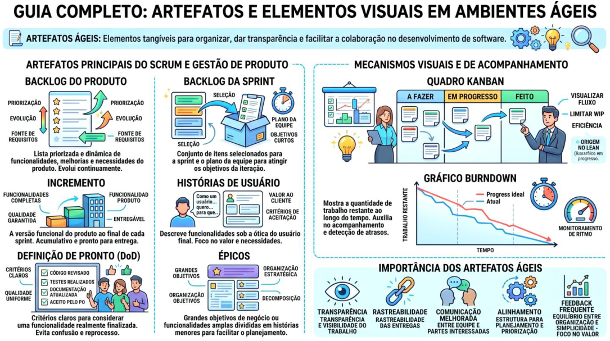

---

<!-- pagina: 38 -->

**Diego Carvalho, Equipe Informática 2 (Diego Carvalho), Equipe Informática 1 (Diego Carvalho) Aula 01** 

<!-- Start of picture text -->
Métricas e Indicadores Ágeis <!-- End of picture text -->

#### **<mark>INCIDÊNCIA EM PROVA: MÉDIA</mark>** 

### **<mark>MÉTRICAS E INDICADORES ÁGEIS</mark>** 

<mark>Mecanismos utilizados para acompanhar desempenho, progresso, qualidade e capacidade de entrega das</mark> equipes em ambientes de desenvolvimento iterativo e incremental. Diferentemente de abordagens excessivamente focadas apenas em controle burocrático, as métricas ágeis procuram fornecer visibilidade contínua sobre o fluxo de trabalho, permitindo identificar gargalos, riscos, atrasos e oportunidades de melhoria ao longo do projeto. Entre os exemplos mais comuns estão velocity, lead time, cycle time, burndown chart e throughput. Essas métricas ajudam equipes e stakeholders a tomar decisões mais rápidas e baseadas em evidências, fortalecendo adaptação contínua, <u>previsibilidade e melhoria dos processos.</u> 

As métricas ágeis são indicadores utilizados para medir o progresso, a eficiência e a eficácia das equipes e dos processos em ambientes que adotam metodologias ágeis de desenvolvimento, como Scrum, Kanban, entre outros. Elas fornecem insights valiosos sobre o desempenho da equipe, a qualidade do produto, a satisfação do cliente e outros aspectos críticos do processo de desenvolvimento de software. Vejamos exemplos de métricas ágeis: 

|**MÉTRICAS E** **INDICADORES**|**DESCRIÇÃO**|
|---|---|
|**VELOCIDADE DA** **EQUIPE**|Mede a quantidade de trabalho que uma equipe consegue completar durante um sprint. Geralmente, é calculada somando os pontos de história (ou qualquer outra unidade de medida) de todas as tarefas concluídas. Ajuda a prever a capacidade de entrega da equipepara futuros sprints, permitindo umplanejamento maispreciso.|
|**GRÁFICO DE** **BURNDOWN**|Um gráfico que mostra a quantidade de trabalho restante versus tempo. Pode ser usado para sprints ou para o projeto como um todo. Fornece uma visualização clara de como a equipe está progredindo em direção à conclusão das tarefas dentro do prazo estabelecido.|
|**LEAD/CYCLE TIME**|Lead Time é o tempo total desde a solicitação até a entrega de uma tarefa. Cycle Time é o tempo que a tarefa leva para ser concluída, começando quando o trabalho efetivamente inicia. Indica a eficiência do processo de desenvolvimento, ajudando a identificargargalos e a melhorar o fluxo de trabalho.|
|**TAXA DE FALHAS** **EM PRODUÇÃO**|Mede a frequência de falhas ou bugs que ocorrem no ambiente de produção. Ajuda a avaliar a qualidade do código e a eficácia das práticas de teste.|
|**SATISFAÇÃO DO** **CLIENTE**|Geralmente avaliada através de pesquisas ou Net Promoter Score (NPS), mede o quão satisfeitos os clientes estão com o produto ou serviço entregue. Fornece feedback direto sobre o valor que o produto está entregando aos usuários finais.|
|**VAZÃO** **(THROUGHPUT)**|Número de itens de trabalho (como Histórias de Usuário) completados em um período de tempo específico. Avalia a produtividade da equipe e pode ajudar a prever a entrega de futuras funcionalidades.|
|**WORK IN** **PROGRESS (WIP)**|Quantidade de tarefas em andamento em um determinado momento. Monitorar o WIP ajuda a evitar sobrecarga da equipe e a identificar gargalos no fluxo de trabalho.|
|**MÉTRICA DE** **FELICIDADE**|Avaliação do nível de satisfação ou felicidade da equipe. Equipes felizes tendem a ser mais produtivas e engajadas. Esta métrica ajuda a identificar problemas que podem estar afetando o moral da equipe.|

---

<!-- pagina: 39 -->

**Diego Carvalho, Equipe Informática 2 (Diego Carvalho), Equipe Informática 1 (Diego Carvalho) Aula 01** 

**RETENÇÃO DE CLIENTE** 

Mede a porcentagem de clientes que continuam utilizando o produto ou serviço ao longo do tempo. Indica o sucesso do produto em manter os usuários engajados e satisfeitos. 

Esses indicadores fornecem uma visão abrangente do desempenho do projeto e da equipe, permitindo ajustes contínuos para otimizar os processos e as entregas. No entanto, é muito importante escolher os indicadores que melhor se alinham aos objetivos específicos do projeto e da organização para garantir que as métricas suportem, e não atrapalhem, a entrega de valor. 

Em um contexto de Inovação Aberta, as organizações buscam ativamente a colaboração externa e a integração de novas ideias para acelerar o desenvolvimento. Ao contrário do que se imagina, a adoção de métodos ágeis como Scrum e Kanban não restringe a mensuração de desempenho ao longo prazo. Pelo contrário, as métricas ágeis de ciclos curtos facilitam a adaptação e a validação contínua dos resultados, superando o desafio de acompanhar o valor em ambientes de inovação aberta, que exigem rápida resposta e flexibilidade extrema. 

---

<!-- pagina: 40 -->

**Diego Carvalho, Equipe Informática 2 (Diego Carvalho), Equipe Informática 1 (Diego Carvalho) Aula 01** 

<!-- Start of picture text -->
Engenharia Ágil <!-- End of picture text -->

<!-- Start of picture text -->
Arquitetura Ágil <!-- End of picture text -->

#### **<mark>INCIDÊNCIA EM PROVA: BAIXÍSSIMA</mark>** 

### **<mark>ARQUITETURA ÁGIL</mark>** 

Abordagem arquitetural que combina princípios de arquitetura de software com valores e práticas das metodologias ágeis, buscando criar sistemas flexíveis, evolutivos e adaptáveis às mudanças ao longo do desenvolvimento. Em vez de definir toda a arquitetura de forma rígida logo no início do projeto, a arquitetura ágil evolui incrementalmente por meio de ciclos iterativos, feedback contínuo, refatoração e validação frequente das decisões técnicas. Essa abordagem valoriza simplicidade, modularidade, testabilidade, colaboração entre equipes e melhoria contínua, permitindo que a estrutura do sistema acompanhe a evolução dos requisitos e das necessidades do negócio sem comprometer qualidade e sustentabilidade do software. 

Quando falamos em arquitetura ágil, estamos tratando de uma abordagem alinhada ao desenvolvimento iterativo, incremental e adaptativo. Em vez de definir toda a estrutura técnica logo no início do projeto, as equipes constroem uma base arquitetural inicial e permitem que ela evolua conforme novas demandas, riscos e aprendizados aparecem ao longo do desenvolvimento. Essa evolução contínua tornou-se bastante comum em ambientes modernos marcados por mudanças frequentes e necessidade constante de adaptação. 

Autores como Roger Pressman e Ian Sommerville destacam que arquitetura continua possuindo enorme importância dentro dos métodos ágeis. Existe uma interpretação equivocada de que agilidade elimina planejamento técnico ou decisões estruturais relevantes, mas isso não corresponde à prática das equipes maduras. Na realidade, decisões arquiteturais continuam acontecendo, porém evoluem gradualmente conforme o sistema amadurece e novas necessidades surgem durante as iterações do projeto. 

A arquitetura ágil procura equilibrar estabilidade estrutural e adaptação contínua. O sistema precisa manter organização suficiente para suportar crescimento, manutenção e futuras expansões sem comprometer qualidade técnica. Ao mesmo tempo, deve permanecer flexível diante de mudanças nos requisitos e prioridades do negócio. Além disso, desenvolvedores, arquitetos, testadores e stakeholders participam conjuntamente das decisões técnicas, fortalecendo alinhamento entre tecnologia e necessidades organizacionais. 

Outro ponto importante envolve a preocupação constante com qualidade técnica. O próprio Manifesto Ágil destaca que atenção ao bom design e à excelência técnica aumenta capacidade de adaptação do sistema. Por isso, práticas como refatoração, integração contínua, automação de testes e revisão colaborativa de código recebem tanta atenção nas equipes modernas. Sem esses cuidados, a flexibilidade inicialmente desejada pode rapidamente gerar dívida técnica e perda de sustentabilidade no desenvolvimento. 

Ambientes ágeis também procuram reduzir riscos técnicos logo nas primeiras etapas do projeto, tratando cedo funcionalidades críticas e integrações mais complexas. Além disso, não existe rejeição completa à documentação arquitetural. O que se evita são documentos excessivamente burocráticos e rapidamente desatualizados. Equipes modernas preferem registros mais simples, objetivos e realmente úteis para apoiar comunicação técnica e evolução contínua do sistema.

---

<!-- pagina: 41 -->

**Diego Carvalho, Equipe Informática 2 (Diego Carvalho), Equipe Informática 1 (Diego Carvalho) Aula 01** 

|**CARACTERÍSTICA**|**DESCRIÇÃO**|
|---|---|
|**PLANEJAMENTO** **INCREMENTAL**|A arquitetura é construída e refinada gradualmente ao longo das iterações do projeto. Em vez de tentar definir todos os detalhes antecipadamente, a equipe evolui a estrutura do sistema conforme aprende mais sobre requisitos e necessidades do negócio.|
|**COLABORAÇÃO E** **COMUNICAÇÃO**|Arquitetos, desenvolvedores, testadores e stakeholders trabalham conjuntamente na evolução arquitetural do sistema. A comunicação contínua ajuda a alinhar decisões técnicas às necessidades organizacionais e operacionais do projeto.|
|**QUALIDADE E** **REFATORAÇÃO**|A arquitetura é continuamente revisada e aprimorada por meio de testes automatizados, revisão de código e refatoração. Isso ajuda a reduzir complexidade, melhorar organização estrutural e aumentar sustentabilidade do software.|
|**ABORDAGEM** **EMPÍRICA**|Muitas decisões arquiteturais são refinadas com base em feedback, experimentação, métricas e aprendizado obtido ao longo das iterações. Contudo, experiência técnica e padrões consolidados também continuam extremamente importantes.|
|**DESIGN EMERGENTE**|Parte da arquitetura evolui progressivamente conforme o entendimento do sistema amadurece. Atenção porque isso não significa ausência de arquitetura inicial; significa evitar detalhamento excessivo prematuro e permitir evolução contínua.|
|**FEEDBACK RÁPIDO**|Revisões frequentes, integração contínua, testes automatizados e demonstrações ajudam equipes a identificar rapidamente problemas arquiteturais, gargalos e limitações estruturais do sistema em desenvolvimento.|
|**PADRÕES E BOAS** **PRÁTICAS**|A arquitetura utiliza padrões de projeto, modularização, encapsulamento e práticas de engenharia de software que favorecem flexibilidade, manutenção, escalabilidade e organização estrutural do sistema.|
|**REFATORAÇÃO** **CONTÍNUA**|A equipe melhora continuamente código e arquitetura sem alterar comportamento externo esperado do sistema. O objetivo é reduzir dívida técnica, simplificar estruturas e adaptar o software às mudanças necessárias.|

Um conceito muito associado à arquitetura ágil é justamente o design emergente. Isso significa que parte importante da estrutura do sistema vai sendo refinada progressivamente conforme o projeto evolui. Contudo, atenção para um detalhe extremamente importante: design emergente não significa ausência de direção arquitetural. Mesmo equipes ágeis normalmente trabalham com alguma visão estrutural inicial para evitar desorganização técnica e crescimento caótico do sistema. 

Outro aspecto fortemente valorizado é a refatoração contínua. Em ambientes iterativos, o software evolui constantemente; portanto, a arquitetura também precisa evoluir. Refatoração ajuda equipes a reorganizar estruturas internas, melhorar legibilidade, reduzir acoplamento e simplificar componentes sem alterar comportamento funcional externo do sistema. Isso possui enorme importância para manter sustentabilidade técnica ao longo do crescimento contínuo do produto. 

A automação também possui papel central nesse contexto. Testes automatizados, integração contínua e pipelines de validação ajudam equipes a verificar rapidamente impacto das mudanças arquiteturais realizadas ao longo das iterações. Sem esse suporte técnico, a evolução contínua da arquitetura se tornaria extremamente arriscada, porque pequenas alterações poderiam introduzir falhas difíceis de identificar rapidamente durante o desenvolvimento. 

|**PRINCÍPIOS**|**DESCRIÇÃO**|
|---|---|
|**SIMPLICIDADE**|A arquitetura procura favorecer soluções simples e compreensíveis, evitando complexidade desnecessária e superengenharia prematura. O foco está em resolver adequadamente os problemas atuais sem antecipar cenários improváveis.|

---

<!-- pagina: 42 -->

**Diego Carvalho, Equipe Informática 2 (Diego Carvalho), Equipe Informática 1 (Diego Carvalho) Aula 01** 

|**PRINCÍPIOS**|**DESCRIÇÃO**|
|---|---|
|**FLEXIBILIDADE**|O sistema deve conseguir adaptar-se relativamente bem a mudanças de requisitos, tecnologias e necessidades do negócio. Isso exige modularização, baixo acoplamento e capacidade contínua de evolução arquitetural.|
|**TESTABILIDADE**|A arquitetura deve facilitar testes automatizados e validações contínuas. Componentes bem estruturados e desacoplados normalmente tornam o sistema mais fácil de verificar, validar e manter ao longo do desenvolvimento.|
|**REUTILIZABILIDADE**|Componentes reutilizáveis ajudam a reduzir retrabalho e aumentar produtividade; contudo, reutilização deve ocorrer de maneira equilibrada para evitar abstrações excessivas e complexidade desnecessária no sistema.|
|**EVOLUTIVIDADE**|A arquitetura precisa permitir crescimento e adaptação contínua do software sem comprometer estabilidade e manutenibilidade. Isso possui enorme importância em sistemas sujeitos a mudanças frequentes ao longo do tempo.|

Outro ponto interessante é que arquitetura ágil possui forte relação com redução de riscos técnicos. Em vez de deixar decisões críticas para fases tardias do projeto, equipes procuram validar cedo elementos arquiteturalmente significativos. Isso ajuda bastante a identificar limitações tecnológicas, problemas de integração, gargalos de desempenho e dificuldades estruturais antes que o sistema cresça excessivamente. 

Além disso, arquitetura ágil conversa muito bem com práticas modernas como DevOps, integração contínua e entrega contínua. Sistemas precisam ser construídos não apenas para funcionar corretamente, mas também para permitir implantação frequente, monitoramento contínuo, automação operacional e evolução incremental do produto ao longo das entregas realizadas pelas equipes de desenvolvimento. 

|**BENEFÍCIOS**|**DESCRIÇÃO**|
|---|---|
|**ADAPTABILIDADE**|A arquitetura evolutiva facilita adaptação do sistema diante de mudanças de requisitos, prioridades e necessidades organizacionais observadas ao longo do desenvolvimento do projeto.|
|**QUALIDADE** **CONTÍNUA**|Revisões frequentes, refatoração e automação ajudam a manter qualidade estrutural do software, reduzindo acúmulo de problemas arquiteturais e dívida técnica ao longo do tempo.|
|**ENTREGA** **INCREMENTAL DE** **VALOR**|O desenvolvimento iterativo permite entregar funcionalidades utilizáveis continuamente, possibilitando validação frequente do produto e alinhamento constante com necessidades do cliente.|
|**COLABORAÇÃO**|A participação conjunta de diferentes perfis profissionais melhora alinhamento entre negócio, requisitos e decisões técnicas relacionadas à evolução arquitetural do sistema.|
|**FLEXIBILIDADE** **DIANTE DE** **INCERTEZAS**|A arquitetura evolutiva ajuda equipes a lidar melhor com mudanças, riscos técnicos e cenários ainda pouco compreendidos no início do projeto de software.|

No entanto, é importante evitar uma visão romantizada da arquitetura ágil. Ela não representa ausência de disciplina, ausência de planejamento ou improvisação técnica contínua. Pelo contrário: ambientes ágeis maduros normalmente exigem equipes tecnicamente fortes, comunicação eficiente, automação robusta e muita preocupação com qualidade arquitetural. Sem isso, o sistema rapidamente acumula dívida técnica e perde capacidade de evolução sustentável. 

A arquitetura ágil procura justamente equilibrar organização estrutural e capacidade de adaptação. O objetivo não é prever absolutamente tudo desde o início; mas também não é construir software sem

---

<!-- pagina: 43 -->

**Diego Carvalho, Equipe Informática 2 (Diego Carvalho), Equipe Informática 1 (Diego Carvalho) Aula 01** 

direção arquitetural. A ideia central é permitir evolução contínua da solução, utilizando feedback frequente, refatoração, colaboração e aprendizado incremental para manter o sistema sustentável, flexível e alinhado às necessidades reais do negócio ao longo do tempo. 

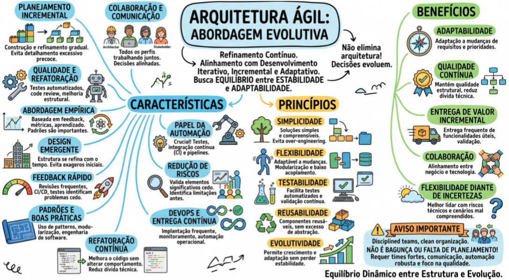

---

<!-- pagina: 44 -->

**Diego Carvalho, Equipe Informática 2 (Diego Carvalho), Equipe Informática 1 (Diego Carvalho) Aula 01** 

<!-- Start of picture text -->
Qualidade Ágil <!-- End of picture text -->

#### **<mark>INCIDÊNCIA EM PROVA: BAIXÍSSIMA</mark>** 

### **<mark>QUALIDADE ÁGIL</mark>** 

Abordagem de garantia e construção contínua da qualidade ao longo de todo o desenvolvimento de software, integrando práticas de validação, testes e melhoria contínua às atividades realizadas em cada iteração do projeto. Diferentemente dos modelos tradicionais, nos quais a qualidade muitas vezes era verificada apenas nas fases finais, as metodologias ágeis procuram identificar defeitos e problemas o mais cedo possível, utilizando práticas como testes automatizados, integração contínua, refatoração, revisão de código e feedback frequente dos stakeholders. Dessa forma, a qualidade deixa de ser responsabilidade exclusiva da equipe de testes e passa a <mark>ser um compromisso compartilhado entre todos os participantes do projeto.</mark> 

A Qualidade Ágil refere-se à abordagem de garantia de qualidade que está alinhada com os princípios e práticas ágeis de desenvolvimento de software. Em um contexto ágil, a qualidade não é vista como um aspecto separado do processo de desenvolvimento, mas sim como uma responsabilidade compartilhada por toda a equipe. A importância da Qualidade Ágil no contexto ágil é significativa por várias razões: 

|**CARACTERÍSTICA**|**DESCRIÇÃO**|
|---|---|
|**ENTREGA CONTÍNUA** **DE VALOR**|A qualidade ajuda a garantir que cada incremento entregue realmente gere valor para o cliente. Em métodos iterativos, funcionalidades são disponibilizadas continuamente, exigindo estabilidade, consistência e alinhamento constante com expectativas do usuário.|
|**FEEDBACK** **CONTÍNUO**|Equipes procuram obter feedback frequente de usuários, clientes e stakeholders para identificar melhorias e validar funcionalidades rapidamente. Isso ajuda bastante na adaptação contínua do produto ao longo das iterações do projeto.|
|**ADAPTAÇÃO RÁPIDA**|Ambientes ágeis trabalham constantemente com mudanças de requisitos e prioridades. A preocupação contínua com qualidade ajuda equipes a adaptar o software sem comprometer estabilidade, confiabilidade e organização estrutural do sistema.|
|**COLABORAÇÃO E** **COMUNICAÇÃO**|A qualidade depende fortemente da comunicação entre desenvolvedores, testadores, analistas e stakeholders. O alinhamento contínuo reduz ambiguidades, melhora entendimento dos requisitos e facilita validação das funcionalidades implementadas.|
|**REDUÇÃO DE RISCOS**|A verificação contínua do sistema ajuda a identificar defeitos e inconsistências cedo, reduzindo probabilidade de falhas graves, retrabalho excessivo e problemas críticos próximos da implantação do software.|
|**MELHORIA** **CONTÍNUA**|Equipes iterativas procuram constantemente aperfeiçoar processos, práticas técnicas e organização do trabalho. Retrospectivas, revisões e automação ajudam bastante nessa evolução contínua da qualidade do produto.|

Os princípios do Manifesto Ágil influenciam diretamente a garantia de qualidade no desenvolvimento de software. Vejamos: 

|**PRINCÍPIOS DE** **QUALIDADE**|**DESCRIÇÃO**|
|---|---|
|**ENTREGA FREQUENTE** **DE SOFTWARE** **FUNCIONANDO**|Funcionalidades utilizáveis são entregues continuamente ao longo das iterações. Isso permite validação frequente do produto e identificação precoce de problemas relacionados à qualidade do sistema desenvolvido.|
|**ACEITAÇÃO DE** **MUDANÇAS**|O software precisa adaptar-se continuamente às mudanças de requisitos e prioridades. A qualidade ajuda justamente a sustentar essa capacidade de evolução sem comprometer estabilidade e manutenibilidade do sistema.|

---

<!-- pagina: 45 -->

**Diego Carvalho, Equipe Informática 2 (Diego Carvalho), Equipe Informática 1 (Diego Carvalho) Aula 01** 

|**PRINCÍPIOS DE** **QUALIDADE**|**DESCRIÇÃO**|
|---|---|
|**COLABORAÇÃO** **CONTÍNUA**|Clientes, desenvolvedores e stakeholders interagem frequentemente ao longo do projeto. Isso melhora entendimento dos requisitos e reduz risco de desalinhamento entre produto e necessidades do negócio.|
|**EQUIPES MOTIVADAS**|Métodos ágeis valorizam ambientes colaborativos e equipes engajadas. Pessoas motivadas tendem a produzir software mais consistente, sustentável e alinhado aos objetivos do projeto e do cliente.|

Nesse contexto, testes ágeis possuem enorme importância. Atenção porque testes ágeis não representam apenas execução acelerada de testes manuais. Na prática, envolvem integração contínua, automação, validação frequente e participação constante da equipe no acompanhamento da qualidade do sistema. Além disso, métodos ágeis modernos procuram incorporar testes continuamente durante todo o ciclo de desenvolvimento. 

Outro ponto importante é perceber que automação de testes ganhou enorme relevância em ambientes iterativos. Como builds são gerados frequentemente, executar manualmente todos os testes o tempo inteiro se torna extremamente difícil, principalmente em projetos grandes. A automação ajuda equipes a validar rapidamente funcionalidades existentes e identificar regressões introduzidas por alterações recentes no sistema. 

Contudo, atenção para um detalhe importante: automação não elimina completamente testes manuais. Testes exploratórios, avaliações de usabilidade, validações visuais e análises humanas continuam extremamente importantes em vários cenários. Pressman e Sommerville destacam bastante que qualidade depende tanto de automação quanto de julgamento humano, experiência técnica e compreensão adequada do contexto do sistema. 

|**PRÁTICAS DE TESTE** **ÁGIL**|**DESCRIÇÃO**|
|---|---|
|**TEST-DRIVEN** **DEVELOPMENT**|TDD é uma prática de desenvolvimento na qual testes automatizados são escritos antes do código de produção. O desenvolvimento ocorre em ciclos curtos: criar teste, implementar funcionalidade e refatorar continuamente o código.|
|**BEHAVIOR-DRIVEN** **DEVELOPMENT**|BDD procura descrever comportamentos esperados do sistema utilizando linguagem compreensível para negócio e equipe técnica. Isso melhora alinhamento entre requisitos, funcionalidades e expectativas dos stakeholders.|
|**AUTOMAÇÃO DE** **TESTES**|A automação ajuda equipes a executar validações repetitivas rapidamente, reduzindo esforço manual e aumentando confiabilidade das verificações realizadas continuamente durante as iterações do projeto.|
|**ENTREGA CONTÍNUA**|A entrega contínua depende fortemente de integração frequente, testes automatizados e validações rápidas. Sem automação adequada, manter ciclos curtos de entrega se torna extremamente difícil em projetos maiores.|
|**COBERTURA DE** **TESTES**|Cobertura de testes ajuda equipes a avaliar quais partes do sistema estão sendo verificadas automaticamente. Contudo, alta cobertura isoladamente não garante ausência de defeitos nem qualidade elevada do software.|

---

<!-- pagina: 46 -->

**Diego Carvalho, Equipe Informática 2 (Diego Carvalho), Equipe Informática 1 (Diego Carvalho) Aula 01** 

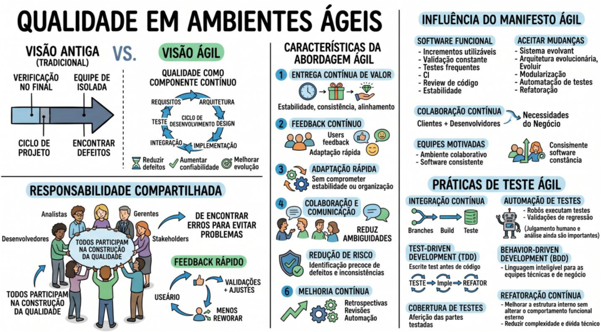

Arquitetura ágil corresponde a uma abordagem alinhada ao desenvolvimento iterativo e adaptativo. Em vez de definir toda a estrutura técnica logo no início, as equipes constroem uma base inicial e permitem evolução contínua conforme surgem novas demandas, riscos e aprendizados. Roger Pressman e Ian Sommerville destacam que arquitetura continua extremamente importante nos métodos ágeis, mesmo existindo a interpretação equivocada de que agilidade elimina planejamento técnico ou decisões estruturais relevantes. 

A arquitetura ágil procura equilibrar estabilidade estrutural e adaptação contínua. O sistema precisa manter organização suficiente para suportar crescimento e mudanças sem comprometer qualidade técnica. Além disso, decisões arquiteturais deixam de ficar concentradas apenas nos arquitetos. Desenvolvedores, analistas, testadores e stakeholders participam continuamente das discussões técnicas, fortalecendo alinhamento entre tecnologia e necessidades do negócio ao longo do desenvolvimento. 

Outro aspecto importante envolve a preocupação permanente com qualidade técnica. O Manifesto Ágil destaca que atenção contínua ao bom design aumenta capacidade de adaptação do sistema. Por isso, práticas como integração contínua, automação de testes, refatoração e revisão colaborativa de código recebem enorme atenção nas equipes modernas. Sem esses cuidados, a flexibilidade desejada pode rapidamente gerar dívida técnica e comprometer sustentabilidade do software desenvolvido. 

Os métodos ágeis também modificaram bastante a forma de enxergar qualidade dentro dos projetos. Em vez de tratar qualidade apenas como etapa final realizada por testadores, ambientes iterativos modernos passaram a distribuir essa responsabilidade entre toda a equipe. Desenvolvedores, arquitetos, analistas e stakeholders participam continuamente da prevenção de falhas e da melhoria constante do produto. Isso fortalece confiabilidade e facilita evolução contínua do sistema ao longo das iterações. 

Outro ponto extremamente relevante envolve o feedback rápido proporcionado pelas entregas incrementais. Cada iteração cria oportunidades para validar funcionalidades, identificar limitações e ajustar o software conforme necessidades reais dos usuários. Além disso, integração contínua reduz conflitos entre versões e melhora estabilidade do sistema. Em projetos modernos, qualidade não significa

---

<!-- pagina: 47 -->

**Diego Carvalho, Equipe Informática 2 (Diego Carvalho), Equipe Informática 1 (Diego Carvalho) Aula 01** 

apenas executar mais testes, mas construir continuamente um software sustentável, adaptável e alinhado às necessidades do negócio.

---

<!-- pagina: 48 -->

**Diego Carvalho, Equipe Informática 2 (Diego Carvalho), Equipe Informática 1 (Diego Carvalho) Aula 01** 

<!-- Start of picture text -->
R ESUMO <!-- End of picture text -->

### **<mark>METODOLOGIAS ÁGEIS</mark>** 

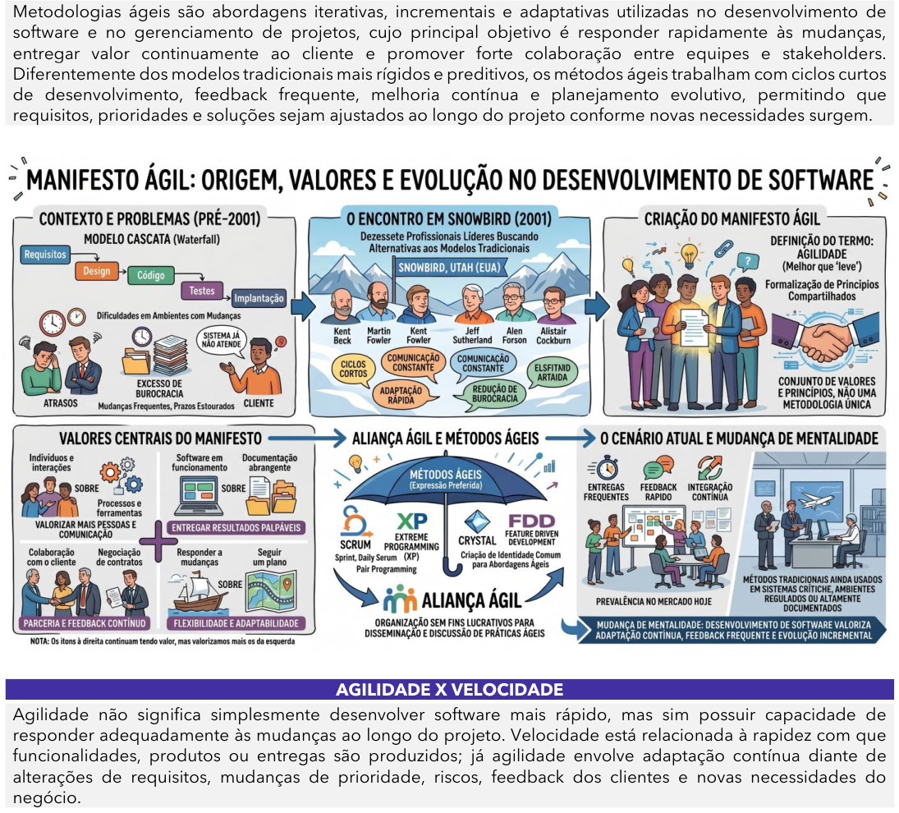

<!-- Start of picture text -->
Metodologias ágeis são abordagens iterativas, incrementais e adaptativas utilizadas no desenvolvimento de software e no gerenciamento de projetos, cujo principal objetivo é responder rapidamente às mudanças, entregar valor continuamente ao cliente e promover forte colaboração entre equipes e stakeholders. Diferentemente dos modelos tradicionais mais rígidos e preditivos, os métodos ágeis trabalham com ciclos curtos de desenvolvimento, feedback frequente, melhoria contínua e planejamento evolutivo, permitindo que requisitos, prioridades e soluções sejam ajustados ao longo do projeto conforme novas necessidades surgem. AGILIDADE X VELOCIDADE Agilidade não significa simplesmente desenvolver software mais rápido, mas sim possuir capacidade de responder adequadamente às mudanças ao longo do projeto. Velocidade está relacionada à rapidez com que funcionalidades, produtos ou entregas são produzidos; já agilidade envolve adaptação contínua diante de alterações de requisitos, mudanças de prioridade, riscos, feedback dos clientes e novas necessidades do negócio. <!-- End of picture text -->

---

<!-- pagina: 49 -->

**Diego Carvalho, Equipe Informática 2 (Diego Carvalho), Equipe Informática 1 (Diego Carvalho) Aula 01** 

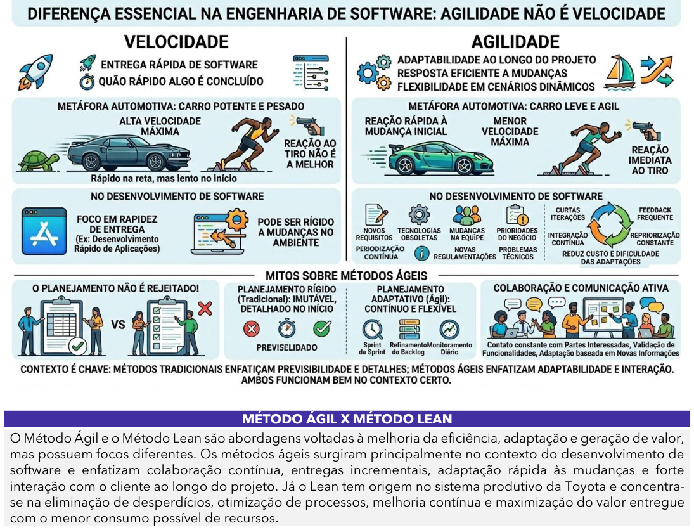

<!-- Start of picture text -->
MÉTODO ÁGIL X MÉTODO LEAN O Método Ágil e o Método Lean são abordagens voltadas à melhoria da eficiência, adaptação e geração de valor, mas possuem focos diferentes. Os métodos ágeis surgiram principalmente no contexto do desenvolvimento de software e enfatizam colaboração contínua, entregas incrementais, adaptação rápida às mudanças e forte interação com o cliente ao longo do projeto. Já o Lean tem origem no sistema produtivo da Toyota e concentra- se na eliminação de desperdícios, otimização de processos, melhoria contínua e maximização do valor entregue com o menor consumo possível de recursos. <!-- End of picture text -->

**<mark>CARACTERÍSTICA MÉTODO LEAN MÉTODO ÁGIL</mark>** <mark>Originou-se no Sistema Toyota de</mark> Produção na indústria automobilística japonesa, com foco principal na resposta às limitações dos métodos eliminação de desperdícios ("muda") para **ORIGEM E FOCO** otimizar a eficiência do processo de (como o modelo cascata). O foco é na produção. Embora tenha começado na manufatura, os princípios Lean foram adaptados para outras áreas, incluindo cliente. desenvolvimento de software e serviços. Baseia-se em princípios como Kaizen (melhoria contínua), eliminação de **PRINCÍPIOS E** desperdícios, e Just-In-Time. Práticas Práticas incluem Scrum, Kanban, **PRÁTICAS** incluem mapeamento do fluxo de valor e programação em pares, e integração otimização dos processos. contínua. <mark>Pode ser aplicado de maneira mais ampla</mark> **ABORDAGEM DE** além do desenvolvimento de produtos, **IMPLEMENTAÇÃO** incluindo processos administrativos e operacionais, com um forte foco em implementação Ágplementação Áglementação Ágção Ágão Ággil é caracterizada por 

<mark>Desenvolvido inicialmente para o campo do</mark> desenvolvimento de software como uma resposta às limitações dos métodos tradicionais de gerenciamento de projetos (como o modelo cascata). O foco é na adaptabilidade, na entrega incremental de produtos e na colaboração constante com o cliente. 

Baseia-se nos princípios do Manifesto Ágil, como colaboração cliente-desenvolvedor, resposta a mudanças e entrega incremental. Práticas incluem Scrum, Kanban, programação em pares, e integração contínua. 

<mark>Focado primariamente no desenvolvimento</mark> de software e projetos que beneficiam de uma abordagem iterativa e incremental. A implementação Ágplementação Áglementação Ágção Ágão Ággil é caracterizada por

---

<!-- pagina: 50 -->

**Diego Carvalho, Equipe Informática 2 (Diego Carvalho), Equipe Informática 1 (Diego Carvalho) Aula 01** 

eficiência operacional e redução de desperdícios em todos os aspectos da <mark>organização.</mark> O sucesso é medido pela eficiência do processo, a redução de desperdícios e a capacidade de entregar valor contínuo ao cliente com o mínimo de recursos possíveis. 

sprints ou iterações, planejamento adaptativo e equipe multidisciplinar. 

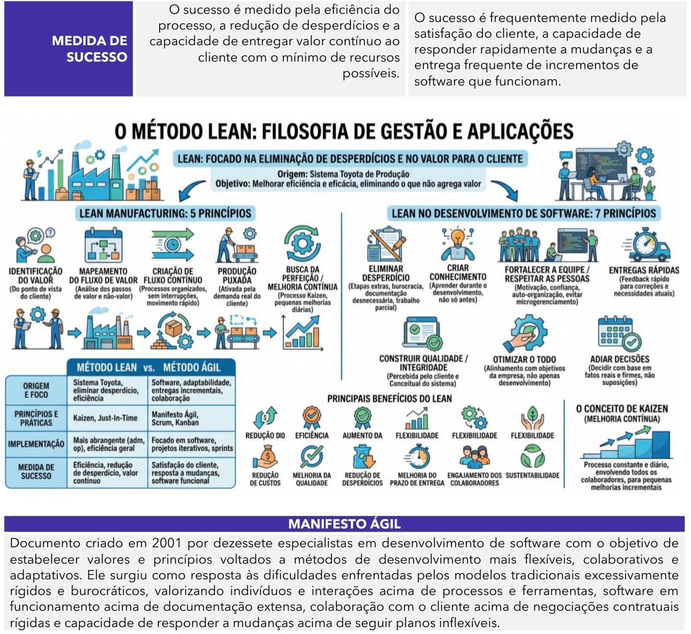

<!-- Start of picture text -->
O sucesso é medido pela eficiência do O sucesso é frequentemente medido pela processo, a redução de desperdícios e a satisfação do cliente, a capacidade de MEDIDA DE  capacidade de entregar valor contínuo ao responder rapidamente a mudanças e a SUCESSO  cliente com o mínimo de recursos entrega frequente de incrementos de possíveis. software que funcionam. ==5460== MANIFESTO ÁGIL Documento criado em 2001 por dezessete especialistas em desenvolvimento de software com o objetivo de estabelecer valores e princípios voltados a métodos de desenvolvimento mais flexíveis, colaborativos e adaptativos. Ele surgiu como resposta às dificuldades enfrentadas pelos modelos tradicionais excessivamente rígidos e burocráticos, valorizando indivíduos e interações acima de processos e ferramentas, software em funcionamento acima de documentação extensa, colaboração com o cliente acima de negociações contratuais rígidas e capacidade de responder a mudanças acima de seguir planos inflexíveis. <!-- End of picture text -->

---

<!-- pagina: 51 -->

**Diego Carvalho, Equipe Informática 2 (Diego Carvalho), Equipe Informática 1 (Diego Carvalho) Aula 01** 

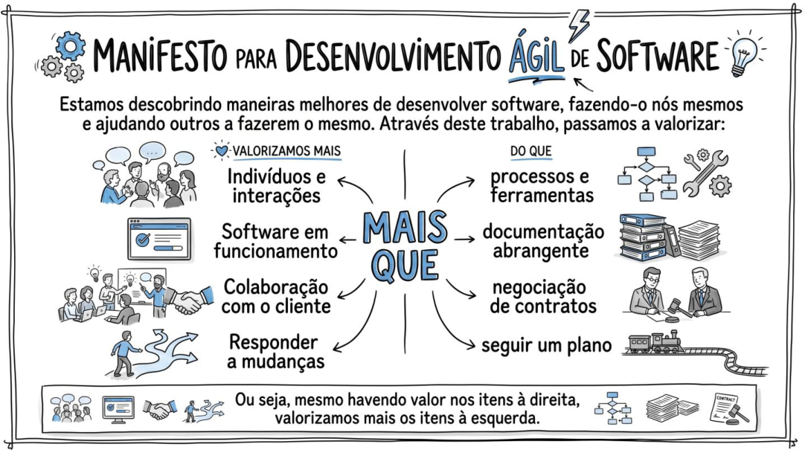

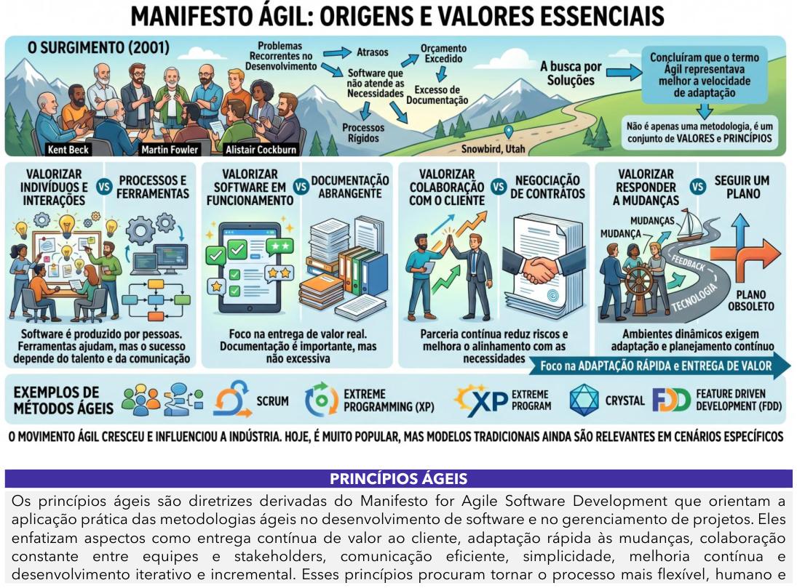

<!-- Start of picture text -->
PRINCÍPIOS ÁGEIS Os princípios ágeis são diretrizes derivadas do Manifesto for Agile Software Development que orientam a aplicação prática das metodologias ágeis no desenvolvimento de software e no gerenciamento de projetos. Eles enfatizam aspectos como entrega contínua de valor ao cliente, adaptação rápida às mudanças, colaboração constante entre equipes e stakeholders, comunicação eficiente, simplicidade, melhoria contínua e desenvolvimento iterativo e incremental. Esses princípios procuram tornar o processo mais flexível, humano e <!-- End of picture text -->

---

<!-- pagina: 52 -->

**Diego Carvalho, Equipe Informática 2 (Diego Carvalho), Equipe Informática 1 (Diego Carvalho) Aula 01** 

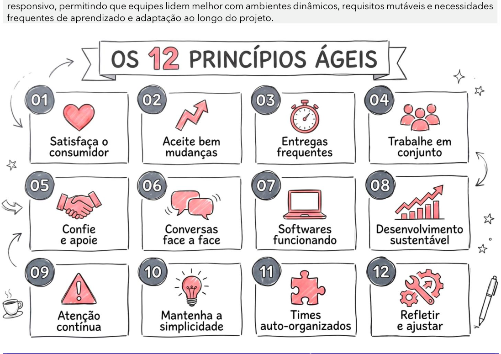

<!-- Start of picture text -->
responsivo, permitindo que equipes lidem melhor com ambientes dinâmicos, requisitos mutáveis e necessidades frequentes de aprendizado e adaptação ao longo do projeto. <!-- End of picture text -->

||**PRINCIPAIS METODOLOGIAS ÁGEIS**||
|---|---|---|
|SCRUM|CRYSTAL|XP|
|FDD|DSDM|ASD|
|AUP|SCRUMBAN|KANBAN|

### **<mark>PROFISSIONAIS ÁGEIS</mark>** 

Profissionais ágeis são indivíduos que atuam em ambientes orientados por metodologias ágeis e que valorizam colaboração, adaptação contínua, aprendizado constante e foco na entrega de valor ao cliente. Mais do que dominar ferramentas ou frameworks específicos, esses profissionais possuem postura flexível, capacidade de trabalhar em equipe, comunicação eficiente e abertura para mudanças ao longo do desenvolvimento do projeto. Além disso, costumam participar ativamente das decisões, compartilhar conhecimento, buscar melhoria contínua e assumir responsabilidade coletiva pela qualidade e evolução do produto, contribuindo para ambientes mais colaborativos, iterativos e orientados a resultados. 

**PRÁTICA OU DESCRIÇÃO CONCEITO** Personas representam perfis fictícios de usuários criados para ajudar equipes a **PERSONAS** compreender melhor comportamentos, necessidades, objetivos e dificuldades do público que utilizará o sistema desenvolvido durante o projeto. A jornada do cliente descreve etapas e experiências vividas pelo usuário durante interação **JORNADA DO** com o produto ou serviço. Isso ajuda equipes a identificar problemas, oportunidades de **CLIENTE** melhoria e pontos críticos da experiência do usuário.

---

<!-- pagina: 53 -->

**Diego Carvalho, Equipe Informática 2 (Diego Carvalho), Equipe Informática 1 (Diego Carvalho) Aula 01** 

|**PRÁTICA OU** **CONCEITO**|**DESCRIÇÃO**|
|---|---|
|**TESTES A/B**|Testes A/B permitem comparar diferentes versões de funcionalidades, interfaces ou estratégias para verificar qual alternativa gera melhores resultados. As decisões passam a ser orientadas por dados e comportamento real dos usuários.|
|**MÉTRICAS**|Equipes modernas acompanham indicadores relacionados ao uso do produto, satisfação dos usuários e desempenho do sistema. Essas métricas ajudam a entender se as funcionalidades realmente estão entregando valor ao negócio.|
|**DESIGN** **CENTRADO NO** **USUÁRIO**|Essa abordagem procura desenvolver sistemas considerando necessidades, comportamentos e expectativas dos usuários desde o início do projeto. O foco não está apenas na tecnologia, mas também na experiência de utilização do produto.|
|**MVP**|MVP significa Minimum Viable Product. A ideia é lançar uma versão inicial com funcionalidades mínimas suficientes para validar hipóteses, obter feedback rápido e evoluir o produto gradualmente conforme aprendizado obtido com usuários reais.|

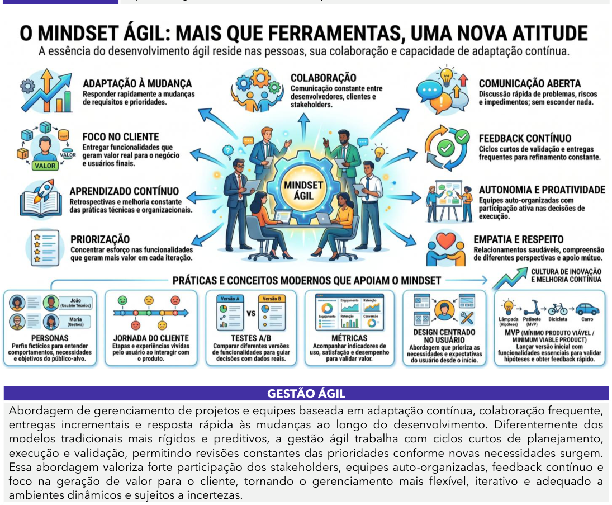

<!-- Start of picture text -->
GESTÃO ÁGIL Abordagem de gerenciamento de projetos e equipes baseada em adaptação contínua, colaboração frequente, entregas incrementais e resposta rápida às mudanças ao longo do desenvolvimento. Diferentemente dos modelos tradicionais mais rígidos e preditivos, a gestão ágil trabalha com ciclos curtos de planejamento, execução e validação, permitindo revisões constantes das prioridades conforme novas necessidades surgem. Essa abordagem valoriza forte participação dos stakeholders, equipes auto-organizadas, feedback contínuo e foco na geração de valor para o cliente, tornando o gerenciamento mais flexível, iterativo e adequado a ambientes dinâmicos e sujeitos a incertezas. <!-- End of picture text -->

---

<!-- pagina: 54 -->

**Diego Carvalho, Equipe Informática 2 (Diego Carvalho), Equipe Informática 1 (Diego Carvalho) Aula 01** 

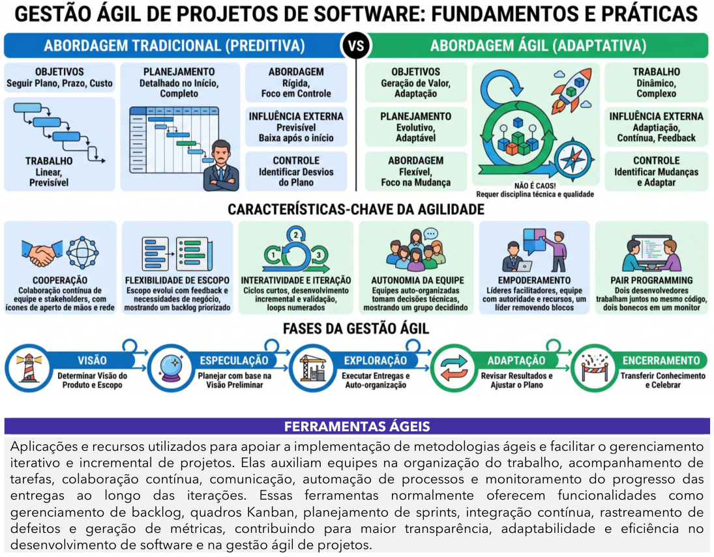

<!-- Start of picture text -->
FERRAMENTAS ÁGEIS Aplicações e recursos utilizados para apoiar a implementação de metodologias ágeis e facilitar o gerenciamento iterativo e incremental de projetos. Elas auxiliam equipes na organização do trabalho, acompanhamento de tarefas, colaboração contínua, comunicação, automação de processos e monitoramento do progresso das entregas ao longo das iterações. Essas ferramentas normalmente oferecem funcionalidades como gerenciamento de backlog, quadros Kanban, planejamento de sprints, integração contínua, rastreamento de defeitos e geração de métricas, contribuindo para maior transparência, adaptabilidade e eficiência no desenvolvimento de software e na gestão ágil de projetos. <!-- End of picture text -->

|**EXEMPLOS**|**DESCRIÇÃO**|
|---|---|
|**JIRA**|Ferramenta bastante utilizada para gerenciamento ágil de projetos, permitindo planejamento de sprints, rastreamento de tarefas, acompanhamento de issues, geração de relatórios e organização de fluxos de trabalho iterativos.|
|**TRELLO**|Plataforma visual inspirada em quadros Kanban, bastante utilizada para organização de tarefas e acompanhamento simples de atividades. Possui forte apelo visual e facilidade de utilização em equipes menores.|
|**ASANA**|Ferramenta voltada ao gerenciamento colaborativo de tarefas e projetos. Permite organizar atividades, acompanhar progresso, compartilhar informações e melhorar coordenação entre equipes de trabalho.|
|**CONFLUENCE**|Plataforma de colaboração utilizada para criação e compartilhamento de documentação, páginas internas, procedimentos e conhecimento organizacional relacionado ao desenvolvimento do projeto.|
|**GITHUB**|Plataforma bastante utilizada para versionamento e colaboração em projetos de software. Oferece repositórios Git, revisão de código, integração com automações e mecanismos colaborativos de desenvolvimento.|

---

<!-- pagina: 55 -->

**Diego Carvalho, Equipe Informática 2 (Diego Carvalho), Equipe Informática 1 (Diego Carvalho) Aula 01** 

**<mark>EXEMPLOS DESCRIÇÃO</mark>** Plataforma integrada de desenvolvimento e DevOps que combina versionamento, **GITLAB** integração contínua, gerenciamento de issues, automação de pipelines e colaboração entre equipes técnicas. Plataforma de comunicação em tempo real bastante utilizada por equipes modernas. **SLACK** Facilita colaboração, integração entre ferramentas e compartilhamento rápido de informações relacionadas ao projeto. 

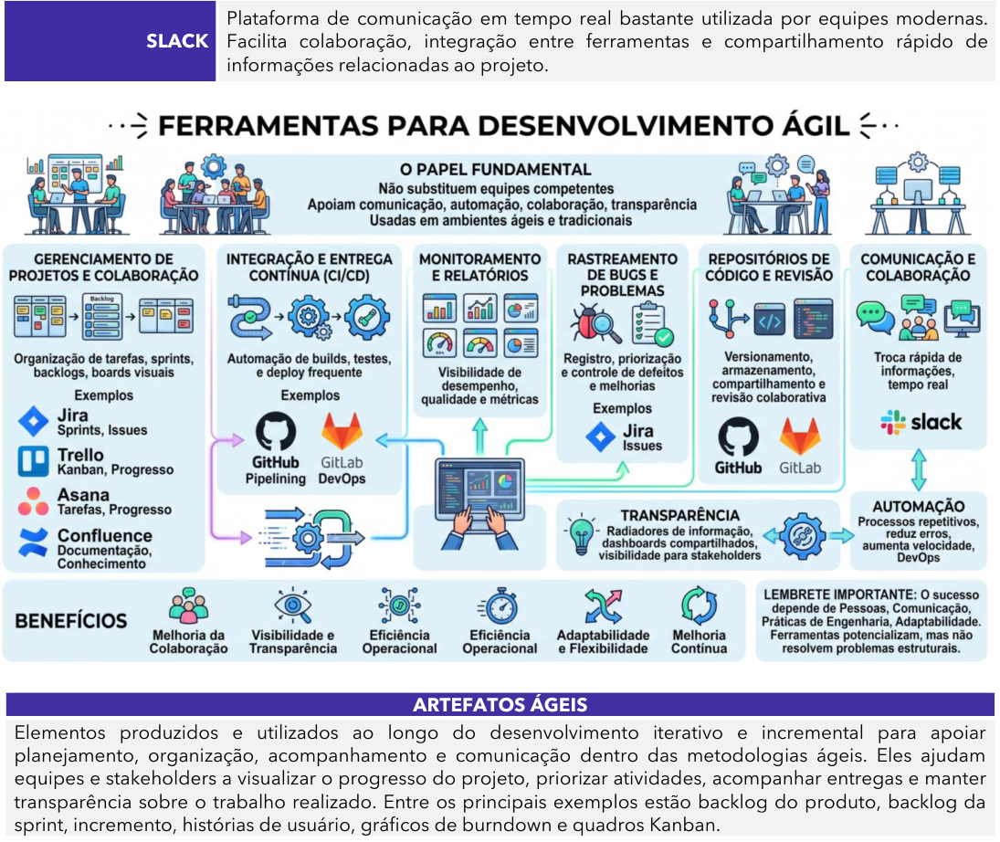

<!-- Start of picture text -->
Plataforma de comunicação em tempo real bastante utilizada por equipes modernas. SLACK  Facilita colaboração, integração entre ferramentas e compartilhamento rápido de informações relacionadas ao projeto. ARTEFATOS ÁGEIS Elementos produzidos e utilizados ao longo do desenvolvimento iterativo e incremental para apoiar planejamento, organização, acompanhamento e comunicação dentro das metodologias ágeis. Eles ajudam equipes e stakeholders a visualizar o progresso do projeto, priorizar atividades, acompanhar entregas e manter transparência sobre o trabalho realizado. Entre os principais exemplos estão backlog do produto, backlog da sprint, incremento, histórias de usuário, gráficos de burndown e quadros Kanban. <!-- End of picture text -->

**ARTEFATOS E DESCRIÇÃO ELEMENTOS ÁGEIS** O Product Backlog representa uma lista priorizada e dinâmica contendo funcionalidades, **PRODUCT** melhorias, correções e necessidades relacionadas ao produto. Ele funciona como principal **BACKLOG** fonte de requisitos e evolui continuamente conforme mudanças de negócio e feedback dos usuários. O Sprint Backlog reúne itens selecionados do Product Backlog para desenvolvimento **SPRINT BACKLOG** durante a sprint atual. Além das tarefas escolhidas, ele também inclui o plano elaborado pela equipe para atingir os objetivos definidos para a iteração. O incremento representa o conjunto de funcionalidades concluídas ao final de uma sprint **INCREMENTO** juntamente com incrementos anteriores do produto. Ele deve atender aos critérios definidos pela equipe e estar potencialmente pronto para entrega e utilização.

---

<!-- pagina: 56 -->

**Diego Carvalho, Equipe Informática 2 (Diego Carvalho), Equipe Informática 1 (Diego Carvalho) Aula 01** 

|**ARTEFATOS E** **ELEMENTOS ÁGEIS**|**DESCRIÇÃO**|
|---|---|
|**HISTÓRIAS DE** **USUÁRIO**|Histórias de usuário descrevem funcionalidades sob a perspectiva do usuário final, ajudando equipes a compreender necessidades, objetivos e valor esperado das entregas. São muito utilizadas em ambientes ágeis para facilitar entendimento e priorização.|
|**DEFINIÇÃO DE** **CONCLUÍDO**|A Definition of Done estabelece critérios claros para determinar quando uma funcionalidade pode ser considerada realmente concluída. Isso ajuda equipes a manter qualidade, consistência e alinhamento sobre o que significa finalizar o trabalho.|
|**ÉPICOS**|Épicos representam funcionalidades amplas ou grandes objetivos de negócio que posteriormente são divididos em histórias menores e mais gerenciáveis. Eles ajudam bastante na organização estratégica e no planejamento evolutivo do produto.|

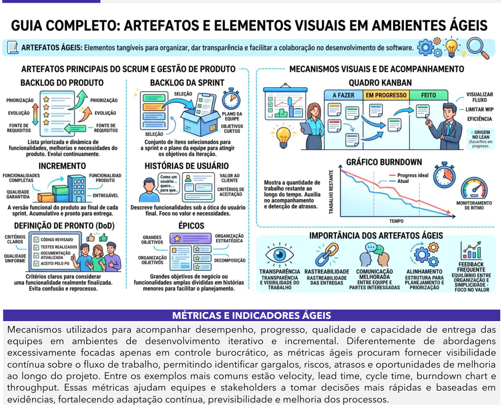

<!-- Start of picture text -->
MÉTRICAS E INDICADORES ÁGEIS Mecanismos utilizados para acompanhar desempenho, progresso, qualidade e capacidade de entrega das equipes em ambientes de desenvolvimento iterativo e incremental. Diferentemente de abordagens excessivamente focadas apenas em controle burocrático, as métricas ágeis procuram fornecer visibilidade contínua sobre o fluxo de trabalho, permitindo identificar gargalos, riscos, atrasos e oportunidades de melhoria ao longo do projeto. Entre os exemplos mais comuns estão velocity, lead time, cycle time, burndown chart e throughput. Essas métricas ajudam equipes e stakeholders a tomar decisões mais rápidas e baseadas em evidências, fortalecendo adaptação contínua, previsibilidade e melhoria dos processos. <!-- End of picture text -->

---

<!-- pagina: 57 -->

**Diego Carvalho, Equipe Informática 2 (Diego Carvalho), Equipe Informática 1 (Diego Carvalho) Aula 01** 

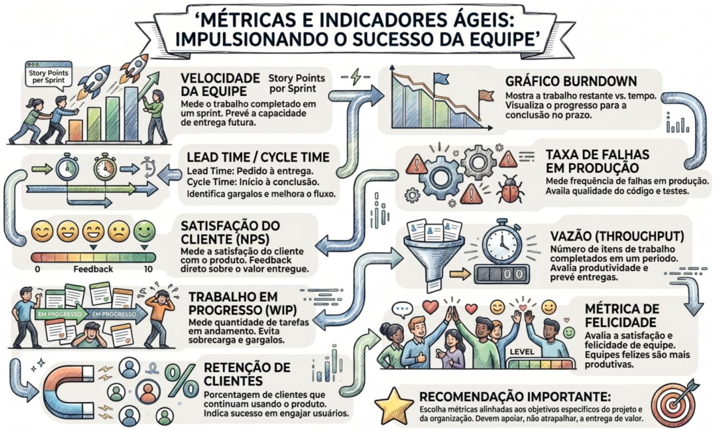

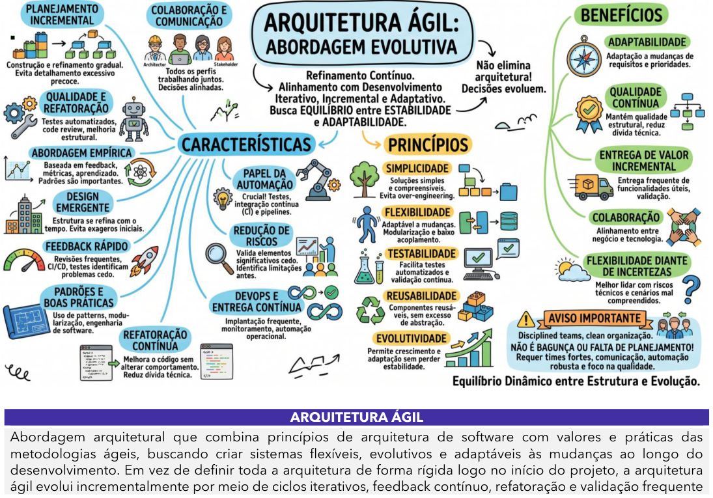

<!-- Start of picture text -->
ARQUITETURA ÁGIL Abordagem arquitetural que combina princípios de arquitetura de software com valores e práticas das metodologias ágeis, buscando criar sistemas flexíveis, evolutivos e adaptáveis às mudanças ao longo do desenvolvimento. Em vez de definir toda a arquitetura de forma rígida logo no início do projeto, a arquitetura ágil evolui incrementalmente por meio de ciclos iterativos, feedback contínuo, refatoração e validação frequente <!-- End of picture text -->

---

<!-- pagina: 58 -->

**Diego Carvalho, Equipe Informática 2 (Diego Carvalho), Equipe Informática 1 (Diego Carvalho) Aula 01** 

das decisões técnicas. Essa abordagem valoriza simplicidade, modularidade, testabilidade, colaboração entre equipes e melhoria contínua, permitindo que a estrutura do sistema acompanhe a evolução dos requisitos e das <mark>necessidades do negócio sem comprometer qualidade e sustentabilidade do software.</mark> 

### **<mark>QUALIDADE ÁGIL</mark>** 

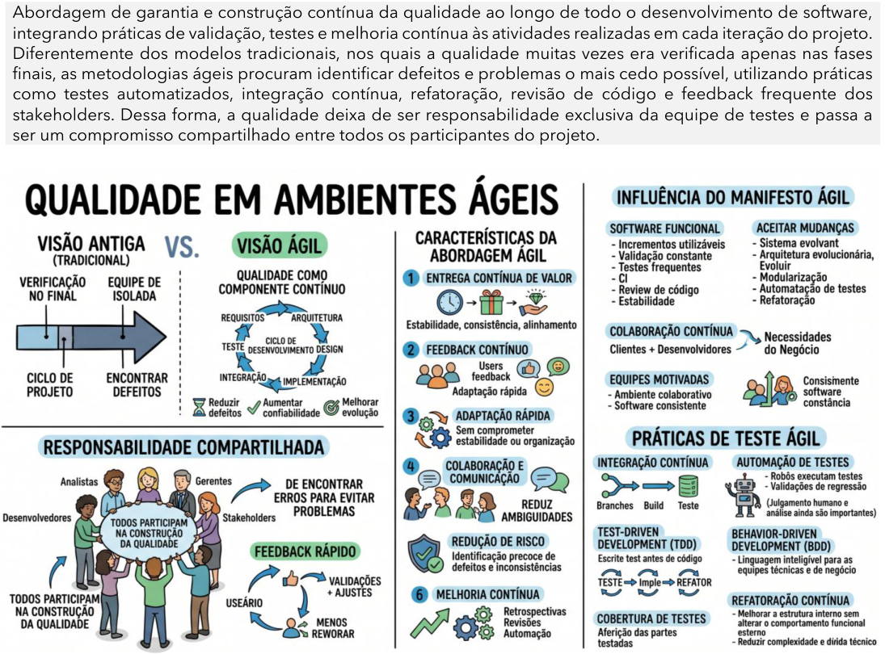

<!-- Start of picture text -->
Abordagem de garantia e construção contínua da qualidade ao longo de todo o desenvolvimento de software, integrando práticas de validação, testes e melhoria contínua às atividades realizadas em cada iteração do projeto. Diferentemente dos modelos tradicionais, nos quais a qualidade muitas vezes era verificada apenas nas fases finais, as metodologias ágeis procuram identificar defeitos e problemas o mais cedo possível, utilizando práticas como testes automatizados, integração contínua, refatoração, revisão de código e feedback frequente dos stakeholders. Dessa forma, a qualidade deixa de ser responsabilidade exclusiva da equipe de testes e passa a ser um compromisso compartilhado entre todos os participantes do projeto. <!-- End of picture text -->

---

<!-- pagina: 59 -->

**Diego Carvalho, Equipe Informática 2 (Diego Carvalho), Equipe Informática 1 (Diego Carvalho) Aula 01** 

<!-- Start of picture text -->
Q UESTÕES  C OMENTADAS <!-- End of picture text -->

**1. (FGV / AMAZUL - 2026) Uma equipe de desenvolvimento está iniciando um novo projeto de software para um cliente que ainda não tem clareza sobre todos os requisitos do sistema. O cliente deseja entregas frequentes de funcionalidades para validar se o produto atende às suas necessidades. Nesse cenário, a metodologia de desenvolvimento mais adequada é** 

   - a) modelo cascata, pois permite um planejamento detalhado antes do início da codificação. 

   - b) metodologia ágil com Scrum, pois permite entregas incrementais e adaptação a mudanças. 

   - c) modelo espiral, pois é focado exclusivamente na análise de riscos técnicos. 

   - d) modelo V, pois garante que todos os testes sejam executados apenas no final do projeto. 

   - e) prototipagem descartável, pois o objetivo é criar um produto final sem iterações. 

**Comentários:** 

(a) Errado. O modelo cascata é mais rígido e depende de requisitos bem definidos desde o início, o que não combina com um cliente que ainda busca clareza. 

(b) Correto. Scrum favorece entregas incrementais, feedback constante e adaptação a mudanças, ideal quando os requisitos ainda estão sendo descobertos. 

(c) Errado. O modelo espiral envolve riscos, mas não é descrito aqui como a melhor opção para entregas frequentes e validação contínua com o cliente. 

(d) Errado. O modelo V associa fases de desenvolvimento e testes, não se caracteriza por deixar todos os testes apenas para o final. 

(e) Errado. Prototipagem descartável serve para explorar requisitos, mas não tem como foco principal entregas incrementais contínuas do produto. 

**Gabarito:** Letra B 

**2. (FGV / ALEGO - 2026) No contexto institucional de organizações que buscam maior flexibilidade, eficiência e alinhamento estratégico na condução de projetos, o Manifesto Ágil orienta a adoção de práticas e valores voltados à adaptação contínua e à colaboração. Considerando os princípios do Manifesto ágil, assinale (V) para a afirmativa verdadeira e (F) para a falsa.** 

**( ) Mudanças nos requisitos são bem-vindas, mesmo em fases avançadas do desenvolvimento, pois os processos ágeis exploram essas mudanças como oportunidades para gerar vantagem competitiva ao cliente.**

---

<!-- pagina: 60 -->

**Diego Carvalho, Equipe Informática 2 (Diego Carvalho), Equipe Informática 1 (Diego Carvalho) Aula 01** 

**( ) A atenção contínua à excelência técnica e a um bom design contribui diretamente para o aumento da agilidade.** 

**( ) As melhores arquiteturas, requisitos e soluções de design emergem de equipes tradicionais.** 

**( ) Construa projetos em torno de indivíduos motivados, oferecendo-lhes o ambiente e o suporte necessários e confiando neles para a realização do trabalho.** 

**As afirmativas são, respectivamente,** 

a) V – V – V – V. 

b) F – F – V – F. 

c) V – F – V – F. 

d) F – V – V – F. 

e) V – V – F – V. 

**Comentários:** 

(I) Correto. O Manifesto Ágil valoriza mudanças de requisitos, inclusive tardiamente, aproveitando-as para gerar valor e vantagem ao cliente. 

(II) Correto. Excelência técnica e bom design sustentam entregas melhores e favorecem a adaptação contínua, aumentando a agilidade. 

(III) Errado. No contexto ágil, arquiteturas, requisitos e soluções emergem da colaboração e da dinâmica do time, não de estruturas tradicionais; (IV) Correto. Projetos ágeis se apoiam em pessoas motivadas, com suporte adequado, autonomia e confiança para executar o trabalho. 

**Gabarito:** Letra E 

**3. (FGV / TJ RJ - 2026) O departamento de TI de uma escola está desenvolvendo um Sistema de Gestão Escolar usando a metodologia ágil. Depois de definido 90% do escopo do projeto, o diretor da escola solicitou uma mudança significativa no escopo com a alegação de que a nova funcionalidade tinha se tornado prioridade. A equipe ágil deve lidar com essa demanda:** 

a) aceitando a mudança apenas após o término do projeto; 

b) recusando a mudança, pois ela compromete o planejamento inicial; 

c) avaliando a solicitação junto ao Product Owner e adaptando o backlog; 

d) cobrando uma taxa adicional e incluindo a funcionalidade sem discussão; 

- e) suspendendo o projeto até que todas as mudanças sejam definidas.

---

<!-- pagina: 61 -->

**Diego Carvalho, Equipe Informática 2 (Diego Carvalho), Equipe Informática 1 (Diego Carvalho) Aula 01** 

## **Comentários:** 

(a) Errado. Em métodos ágeis, mudanças podem ser tratadas durante o projeto, sem necessidade de esperar seu encerramento. 

(b) Errado. A abordagem ágil não rejeita mudanças por afetarem o plano inicial; ela busca adaptação contínua. 

(c) Correto. A solicitação deve ser avaliada com o Product Owner, que prioriza e ajusta o backlog conforme o valor entregue. 

(d) Errado. A inclusão de funcionalidade exige análise e priorização, não decisão automática mediante cobrança. 

(e) Errado. Projetos ágeis não precisam ser suspensos para consolidar todas as mudanças antes de seguir. 

**Gabarito:** Letra C 

**4. (FGV / TCE-PE - 2025) Sobre processos tradicionais para desenvolvimento de software, bem como metodologias ágeis e Kanban, assinale a afirmativa correta.** 

   - a) Valorizar processos e ferramentas acima de indivíduos e interações é uma das principais características de metodologias ágeis. 

- b) Metodologias de processo sequenciais, como os modelos cascata e V, são indicados para cenários nos quais os requisitos são bem definidos e estáveis. 

- c) Uma ideia convencional em desenvolvimento de sistemas é que os impactos de mudanças crescem linearmente com o avanço do projeto. 

- d) Enquanto o Scrum tem sua origem na fabricação Lean, o Kanban é mais voltado para desenvolvimento de software. 

- e) Seja em modelos mais tradicionais, como em métodos ágeis, é fácil prever quais requisitos de software vão perdurar e quais serão alterados. 

**Comentários:** 

(a) Errado. Métodos ágeis priorizam indivíduos e interações mais que processos e ferramentas, conforme seus princípios centrais.

---

<!-- pagina: 62 -->

**Diego Carvalho, Equipe Informática 2 (Diego Carvalho), Equipe Informática 1 (Diego Carvalho) Aula 01** 

(b) Correto. Modelos sequenciais, como cascata e V, funcionam melhor quando os requisitos já estão claros, definidos e tendem a permanecer estáveis. 

(c) Errado. Em abordagens tradicionais, a visão clássica é de que o custo das mudanças aumenta fortemente ao longo do projeto, não de forma linear. 

(d) Errado. Kanban tem forte relação com a manufatura Lean, enquanto Scrum se consolidou como framework amplamente aplicado ao desenvolvimento de software. 

(e) Errado. Tanto em métodos tradicionais quanto ágeis, mudanças de requisitos podem ocorrer, o que dificulta prever com facilidade o que permanecerá inalterado. 

**Gabarito:** Letra B 

<!-- Start of picture text -->
==5460== <!-- End of picture text -->

**5. (FGV / TJ RJ - 2024) O Manifesto Ágil foi lançado em 2001 e representa uma declaração de valores e princípios essenciais para o desenvolvimento de software.** 

**Com relação ao desenvolvimento ágil de software proposto no Manifesto, avalie se as afirmativas a seguir são verdadeiras (V) ou falsas (F).** 

**( ) O desenvolvimento ágil valoriza mais os indivíduos e interações do que os processos e ferramentas, bem como atribui mais valor ao software em funcionamento do que à documentação abrangente.** 

**( ) O movimento ágil valoriza menos a negociação de contratos, dando mais importância à colaboração com o cliente.** 

**( ) O desenvolvimento ágil valoriza mais seguir um plano do que responder a mudanças.** 

**As afirmativas são, respectivamente,** 

a) V – V – F. 

b) F – F – V. 

c) V – F – V. 

d) V – F – F. 

e) F – V – V. 

**Comentários:** 

(I) Correto. O Manifesto Ágil prioriza indivíduos e interações, além de valorizar mais software em funcionamento do que documentação extensa.

---

<!-- pagina: 63 -->

**Diego Carvalho, Equipe Informática 2 (Diego Carvalho), Equipe Informática 1 (Diego Carvalho) Aula 01** 

(II) Correto. A colaboração com o cliente recebe mais destaque que a negociação contratual no desenvolvimento ágil. 

(III) Errado. No ágil, responder a mudanças tem mais valor do que seguir rigidamente um plano. 

**Gabarito:** Letra A 

**6. (FGV / Prefeitura de SJC - 2024) Com relação à metodologia de desenvolvimento de software ágil, avalie se as afirmativas a seguir são verdadeiras (V) ou falsas (F).** 

**( ) Os métodos ágeis são métodos de desenvolvimento incremental nos quais os incrementos são pequenos e, normalmente, novas versões do sistema são criadas e disponibilizadas aos clientes a cada duas ou três semanas.** 

**( ) Esta metodologia envolve aos clientes no processo de desenvolvimento para obter feedback rápido sobre as mudanças nos requisitos.** 

**( ) Maximizam a documentação utilizando comunicações formais em vez de reuniões informais com documentos escritos.** 

**As afirmativas são, respectivamente,** 

a) F – V – V. 

b) F – F – V. 

c) F – V – F. 

d) V – F – F. 

e) V – V – F. 

**Comentários:** 

(I) Correto. Métodos ágeis trabalham com desenvolvimento incremental, em ciclos curtos, com entregas frequentes de novas versões ao cliente. 

(II) Correto. A participação do cliente é característica marcante da abordagem ágil, permitindo feedback rápido e adaptação dos requisitos. 

(III) Errado. Métodos ágeis priorizam comunicação direta e interações frequentes, sem foco em maximizar documentação formal. 

**Gabarito:** Letra E

---

<!-- pagina: 64 -->

**Diego Carvalho, Equipe Informática 2 (Diego Carvalho), Equipe Informática 1 (Diego Carvalho) Aula 01** 

**7. (FGV / Câmara Municipal de SP - 2024) Com relação às afirmações sobre a metodologia ágil, assinale (V) para a afirmativa verdadeira e (F) para a falsa.** 

**( ) A satisfação do cliente é o principal objetivo da metodologia ágil.** 

**( ) As metodologias ágeis são baseadas no modelo de desenvolvimento em cascata.** 

**( ) As equipes ágeis são compostas por indivíduos motivados e auto-organizados.** 

**As afirmativas são, respectivamente,** 

a) F – V – V. 

b) V – V – F. 

c) V – F – F. 

d) F – F – V. 

e) V – F – V. 

**Comentários:** 

(V) A satisfação do cliente é um dos princípios centrais das metodologias ágeis, com foco em entregas contínuas de valor; 

(F) Metodologias ágeis surgiram justamente como alternativa ao modelo em cascata, priorizando adaptação e interação constante; 

(V) Equipes ágeis são auto-organizadas, colaborativas e compostas por profissionais motivados. 

**Gabarito:** Letra E 

**8. (FGV / ALETO - 2024) Considerando as características e as práticas comuns às metodologias ágeis, analise as afirmativas a seguir.** 

   - **I. O manifesto ágil enfatiza a importância da colaboração com o cliente mais do que a negociação de contratos.** 

   - **II. O desenvolvimento iterativo e incremental é um princípio chave, permitindo entregas frequentes de partes funcionais do software.** 

   - **III. A rigidez nos processos de desenvolvimento é essencial para garantir a qualidade e a previsibilidade do produto final.** 

**Está correto o que se afirma em**

---

<!-- pagina: 65 -->

**Diego Carvalho, Equipe Informática 2 (Diego Carvalho), Equipe Informática 1 (Diego Carvalho) Aula 01** 

a) I, apenas. 

b) I e II, apenas. c) I e III, apenas. d) II e III, apenas. 

e) I, II e III. 

## **Comentários:** 

(I) Correto. O Manifesto Ágil valoriza mais a colaboração com o cliente do que a negociação contratual, priorizando alinhamento contínuo. 

(II) Correto. Metodologias ágeis adotam ciclos iterativos e incrementais, com entregas frequentes de software funcional. 

(III) Errado. A agilidade privilegia adaptação e flexibilidade, não rigidez processual como elemento central. Itens corretos: I e II, apenas. 

**Gabarito:** Letra B 

**9. (FGV / SES MT - 2024) No desenvolvimento de software por metodologias ágeis têm sido empregadas métricas ágeis para acompanhamento de projetos Scrum. Elas têm sido aplicadas para avaliar se os requisitos de qualidade e as necessidades dos clientes foram atendidos. Quanto ao emprego de métricas ágeis baseadas em Scrum, assinale a afirmativa correta.** 

a) As métricas ágeis são baseadas na análise de funcionalidades. 

- b) Permitem o acompanhamento individual e em tempo real de equipe, software e projeto. 

- c) Elas se concentram no sucesso do projeto e no tamanho funcional do software a partir da visão do gestor. 

- d) Medem diretamente a produtividade por meio de linhas de código, mas possuem limitações em mensurar esforços da equipe. 

**Comentários:** 

(a) Errado. Métricas ágeis em Scrum não se limitam à análise de funcionalidades; acompanham também andamento, qualidade e entrega de valor. 

(b) Correto. Essas métricas permitem acompanhar continuamente equipe, software e projeto, favorecendo visibilidade e ajustes rápidos ao longo do processo.

---

<!-- pagina: 66 -->

**Diego Carvalho, Equipe Informática 2 (Diego Carvalho), Equipe Informática 1 (Diego Carvalho) Aula 01** 

(c) Errado. O foco não é apenas a visão do gestor nem o tamanho funcional, mas o progresso do projeto e a entrega de valor ao cliente. 

(d) Errado. Em Scrum, métricas ágeis não se baseiam diretamente em linhas de código, pois isso não reflete bem o esforço nem o valor entregue. 

**Gabarito:** Letra B 

- **10.(FGV / TCE-PA - 2024) Considerando o uso de metodologias ágeis para gerenciar projetos de desenvolvimento de software de forma iterativa e incremental, avalie as afirmativas a seguir.** 

   - **I. Em reuniões diárias e de curta duração (Daily Scrums), os membros do time Scrum são incentivados a expor o que fizeram desde a última reunião, o que planejam fazer até a reunião seguinte e a reportar algum impedimento que esteja atrapalhando o desenvolvimento de suas atividades.** 

   - **II. O uso do Scrum junto ao método Kanban é uma prática muito comum nas organizações. De forma sucinta, cria-se um sistema em que as histórias de usuário são puxadas sob demanda, de acordo com a capacidade do sistema, como um todo, em identificar, desenvolver e entregar os itens de maior valor.** 

   - **III. A necessidade de agregar maior valor aos processos de desenvolvimento de software propiciou o surgimento de metodologias ágeis tais como o Extreme Programming (XP), com foco em feedback constante e entregas incrementais. Uma prática fundamental do XP é o desenvolvimento orientado a testes (Test Driven Development – TDD). Com testes automatizados aplicados somente ao final do processo de desenvolvimento, o TDD possibilita maior alinhamento aos requisitos e menor risco de falhas.** 

**Está correto o que se afirma em** 

a) I, apenas. 

b) II, apenas. 

c) III, apenas. 

d) I e II, apenas. 

e) II e III, apenas. 

**Comentários:** 

(I) Correto. A Daily Scrum é uma reunião breve em que o time compartilha o que fez, o que fará e eventuais impedimentos, favorecendo alinhamento e transparência.

---

<!-- pagina: 67 -->

**Diego Carvalho, Equipe Informática 2 (Diego Carvalho), Equipe Informática 1 (Diego Carvalho) Aula 01** 

(II) Correto. A combinação Scrum + Kanban é comum e permite fluxo puxado conforme a capacidade do sistema, priorizando a entrega contínua de itens de maior valor. 

(III) Errado. Embora o XP valorize feedback constante, entregas incrementais e TDD, o item não descreve adequadamente essa prática como fundamento do processo. 

**Gabarito:** Letra D 

- **11.(FGV / TJ RR - 2024) Considerando a aplicação de metodologias ágeis a projetos de desenvolvimento de software, analise as afirmativas a seguir.** 

   - **I. Documentação abrangente mais que software em funcionamento é um dos valores propostos pelo manifesto ágil.** 

   - **II. A limitação do número de tarefas em execução, conhecida como WIP (Work In Progress), favorece um ritmo sustentável para a equipe de desenvolvimento sem impedir o fluxo de trabalho.** 

   - **III. O tempo transcorrido desde o momento em que uma tarefa entra em um quadro Kanban até ser finalizada é conhecido como lead time.** 

**Está correto o que se afirma em** 

a) I, apenas. 

b) II, apenas. 

c) III, apenas. 

d) I e II, apenas. 

e) II e III, apenas. 

**Comentários:** 

(I) Errado. O Manifesto Ágil valoriza mais software em funcionamento do que documentação abrangente, por isso a assertiva contraria esse princípio. 

(II) Correto. Limitar o WIP ajuda a equipe a evitar sobrecarga, manter o fluxo contínuo e trabalhar de forma mais estável e sustentável. 

(III) Correto. No Kanban, o lead time corresponde ao tempo total desde a entrada da tarefa no fluxo até sua conclusão. 

**Gabarito:** Letra E

---

<!-- pagina: 68 -->

**Diego Carvalho, Equipe Informática 2 (Diego Carvalho), Equipe Informática 1 (Diego Carvalho) Aula 01** 

- **12.(FGV / Sefaz AM - 2022) O Manifesto Ágil descreve um conjunto de princípios que servem de guia para o desenvolvimento ágil de software. Segundo esse manifesto,** 

   - a) o método mais eficiente e eficaz de transmitir informações para e entre uma equipe de desenvolvimento, é a conversa face a face. 

   - b) as reuniões entre pessoas de negócio e desenvolvedores devem ser evitadas a fim de manter um ritmo constante de trabalho. 

   - c) o software entregue dentro do prazo é a medida primária de progresso. 

   - d) as mudanças nos requisitos após o início do desenvolvimento são inaceitáveis, mesmo havendo repactuação do prazo. 

e) a contínua atenção à excelência técnica e o bom design reduzem a agilidade. 

**Comentários:** 

(a) Correto. O Manifesto Ágil valoriza a comunicação direta, apontando a conversa face a face como a forma mais eficiente e eficaz de transmitir informações na equipe. 

(b) Errado. O manifesto incentiva a colaboração frequente entre negócio e desenvolvimento, e não o afastamento entre essas partes. 

(c) Errado. A medida primária de progresso, no ágil, é o software em funcionamento, não apenas a entrega dentro do prazo. 

(d) Errado. O Manifesto Ágil aceita mudanças de requisitos, inclusive em fases avançadas, buscando gerar mais valor ao cliente. 

(e) Errado. A atenção contínua à excelência técnica e ao bom design aumenta a agilidade, em vez de reduzi-la. 

**Gabarito:** Letra A 

- **13.(FGV / IMBEL - 2021) Com referência aos valores do The Agile Manifesto, analise as afirmativas a seguir.** 

**I. Processos e ferramentas mais que indivíduos e interação entre eles.** 

**II. Software em funcionamento mais que documentação abrangente. III. Colaboração do cliente mais que negociação de contratos.** 

- **IV. Seguir um plano mais que responder a mudanças.**

---

<!-- pagina: 69 -->

**Diego Carvalho, Equipe Informática 2 (Diego Carvalho), Equipe Informática 1 (Diego Carvalho) Aula 01** 

**Está correto o que se afirma em** 

a) I e II, somente. 

b) II e III, somente. 

c) III e IV, somente. 

d) I e IV, somente. 

e) II e IV, somente. 

## **Comentários:** 

(I) Errado. O valor do Manifesto prioriza indivíduos e interações, não processos e ferramentas. 

(II) Correto. O foco está em software funcionando, em vez de documentação excessivamente abrangente. 

(III) Correto. A colaboração com o cliente é valorizada acima da simples negociação contratual; 

(IV) Errado. O Manifesto privilegia responder a mudanças, e não seguir rigidamente um plano. 

## **Gabarito:** Letra B 

- **14.(FGV / EPE - 2024) As metodologias ágeis são abordagens de desenvolvimento que ganharam amplo reconhecimento nos últimos anos, revolucionando a atividade de gerenciamento de projetos. Nesse contexto, em 2001, foi elaborado o manifesto ágil, declaração que sistematizou os princípios e valores dessas metodologias, auxiliando na sua ampla popularização. Com relação ao manifesto ágil, analise as afirmativas a seguir.** 

   - **I. Até mesmo modificações ocorridas tardiamente no desenvolvimento são consideradas positivas para o projeto.** 

   - **II. Os melhores requisitos e designs no desenvolvimento surgem de trabalhos realizados por equipes auto organizáveis.** 

   - **III. Entregar uma documentação detalhada e completa é mais valioso que entregar um produto meramente funcional.** 

   - **IV. A comunicação com o cliente se limita à fase inicial e na entrega do produto, minimizando ruídos** 

**Está correto o que se afirma em** 

a) I e II, apenas. 

b) II e III, apenas. 

- c) III e IV, apenas. 

- d) I e IV, apenas.

---

<!-- pagina: 70 -->

**Diego Carvalho, Equipe Informática 2 (Diego Carvalho), Equipe Informática 1 (Diego Carvalho) Aula 01** 

e) II e IV, apenas. 

## **Comentários:** 

(I) Correto. O manifesto ágil valoriza a adaptação a mudanças, inclusive quando elas aparecem mais tarde, porque isso pode gerar mais valor para o projeto e para o cliente. 

(II) Correto. Um dos princípios ágeis destaca que equipes auto-organizáveis tendem a produzir melhores soluções, requisitos e designs, com mais autonomia e colaboração. 

(III) Errado. No ágil, o foco maior está em entregar algo funcionando, útil na prática, e não em priorizar documentação extensa como principal medida de valor; 

(IV) Errado. A proposta ágil incentiva contato frequente com o cliente ao longo do projeto, justamente para alinhar expectativas e reduzir falhas de comunicação. 

**Gabarito:** Letra A 

- **15.(FGV / TRT 13ª Região - 2022) A gestão ágil de projetos é uma abordagem que surgiu guiada pelo Manifesto Ágil, proposto no ano de 2001, visando a se contrapor às técnicas tradicionais usadas até então no gerenciamento de projetos. O Manifesto Ágil tem como ênfase** 

a) a excelência na negociação de contratos. 

b) o desenvolvimento de uma documentação abrangente. 

c) a utilização de um extenso leque de ferramentas e processos. 

d) a participação colaborativa do cliente no desenvolvimento. 

e) a obediência a um plano prévio e bem definido. 

**Comentários:** 

(a) Errado. No Manifesto Ágil, a ideia não é colocar a negociação de contratos no centro, mas valorizar mais a interação com o cliente ao longo do projeto. 

(b) Errado. A abordagem ágil não dá ênfase principal a documentação extensa, e sim a entregas úteis e frequentes. 

(c) Errado. O foco do ágil não está em um grande volume de ferramentas e processos, mas em colaboração, adaptação e simplicidade. 

(d) Correto. A participação colaborativa do cliente no desenvolvimento é um dos pontos centrais do Manifesto Ágil, com acompanhamento e feedback constantes.

---

<!-- pagina: 71 -->

**Diego Carvalho, Equipe Informática 2 (Diego Carvalho), Equipe Informática 1 (Diego Carvalho) Aula 01** 

(e) Errado. No ágil, seguir rigidamente um plano não é a prioridade, porque mudanças podem acontecer e precisam ser incorporadas ao projeto. 

**Gabarito:** Letra D 

## **16.(FGV / INPE - 2024) Acerca de metodologias ágeis, assinale a afirmativa correta.** 

- a) Satisfazer o cliente através da entrega antecipada e contínua de software valioso não é uma das prioridades do Manifesto Ágil. 

- b) É responsabilidade do Scrum Master criar e comunicar de maneira clara os itens do Product Backlog. 

- c) Integração Contínua é o processo no qual os desenvolvedores recriam o código continuamente assim que melhorias são identificadas, o que contribui para a simplicidade e facilidade de manutenção do código. 

- d) A Sprint Review é uma representação altamente visível e em tempo real do trabalho que os desenvolvedores planejam realizar durante a Sprint, cujo propósito é alcançar a Meta da Sprint. 

- e) Na metodologia XP, a elicitação de requisitos é conduzida pelos próprios membros da equipe de desenvolvimento e os requisitos são desenvolvidos de maneira incremental, conforme as prioridades do usuário. 

**Comentários:** 

(a) Errado. O Manifesto Ágil traz justamente como prioridade satisfazer o cliente com entregas antecipadas e contínuas de valor, então a frase nega um ponto central dele. 

(b) Errado. No Scrum, essa clareza sobre os itens do Product Backlog não fica como responsabilidade do Scrum Master, já que ele atua mais como facilitador do processo. 

(c) Errado. A descrição mistura conceitos. Integração Contínua está ligada à integração frequente do código, não à recriação contínua do software quando surgem melhorias. 

(d) Errado. A frase descreve outra ideia do Scrum. Sprint Review não é esse quadro visível do trabalho planejado para a Sprint, mas um evento de inspeção do incremento. 

(e) Correto. No XP, os requisitos vão sendo construídos de forma incremental, com forte participação do usuário e priorização conforme o valor de negócio. 

**Gabarito:** Letra E

---

<!-- pagina: 72 -->

**Diego Carvalho, Equipe Informática 2 (Diego Carvalho), Equipe Informática 1 (Diego Carvalho) Aula 01** 

- **17.(FGV / ALEGO - 2026) As práticas dos métodos ágeis são orientadas pelos princípios estabelecidos no Manifesto Ágil, que corresponde a uma iniciativa de desenvolvedores de software que estavam cansados dos métodos improdutivos e das regras corporativas rígidas que tornavam o processo de trabalho na tecnologia burocrático e previsível. Dentre os métodos ágeis destaca-se o Scrum, que possui dentre suas cerimônias específicas a** 

   - a) divisão do trabalho em grandes tarefas e inserção dos estados de trabalho em relatório de planejamento. 

   - b) reunião de revisão da Sprint. 

   - c) reunião semanal da equipe para alinhar as tarefas. 

   - d) demonstração para o cliente dos sprints e backlogs. 

   - e) Identificação dos desperdícios para, em seguida, eliminá-los ou minimizá-los. 

**Comentários:** 

(a) Errado. No Scrum, não se fala em grandes tarefas com estados em relatório de planejamento como cerimônia específica; isso foge da estrutura típica do framework. 

(b) Correto. A Sprint Review é uma cerimônia própria do Scrum, feita ao fim da Sprint para revisar o que foi entregue e alinhar os próximos passos. 

(c) Errado. No Scrum, o alinhamento da equipe ocorre em reunião própria, mas não é definida como reunião semanal nessa forma apresentada. 

(d) Errado. A alternativa mistura termos e não nomeia uma cerimônia específica do Scrum; backlogs e sprints são artefatos e ciclos, não uma cerimônia de demonstração com essa redação. 

(e) Errado. Identificar e eliminar desperdícios é algo mais ligado à filosofia Lean, não a uma cerimônia específica do Scrum. 

**Gabarito:** Letra B 

- **18.(FGV / ALERO - 2026) No desenvolvimento de um sistema de controle de tráfego aéreo, a equipe de Engenharia de Computação adotou o método Scrum. O objetivo é entregar valor continuamente e se adaptar rapidamente às mudanças nas especificações regulatórias. Um princípio fundamental do manifesto ágil, contrastando com modelos tradicionais, é priorizar**

---

<!-- pagina: 73 -->

**Diego Carvalho, Equipe Informática 2 (Diego Carvalho), Equipe Informática 1 (Diego Carvalho) Aula 01** 

a) a documentação abrangente sobre o software em funcionamento. 

b) negociação de contrato sobre a colaboração com o cliente. 

c) o seguimento de um plano sobre a resposta a mudanças. 

d) o software em funcionamento sobre a documentação abrangente. 

e) o processo rígido sobre a adaptabilidade. 

## **Comentários:** 

(a) Errado. No ágil, a ideia não é colocar a documentação acima do que realmente funciona; documentação ajuda, mas não é o foco principal. 

(b) Errado. O manifesto ágil valoriza mais a colaboração com o cliente do que a simples negociação contratual. 

(c) Errado. Em vez de seguir um plano de forma engessada, o ágil prioriza responder bem às mudanças. 

(d) Correto. Esse é um dos valores centrais do manifesto ágil: dar mais importância ao software em funcionamento do que à documentação abrangente. 

(e) Errado. O ágil vai na direção oposta de rigidez, valorizando adaptação, flexibilidade e resposta rápida a mudanças. 

**Gabarito:** Letra D 

## **19.(FGV / CPRM - 2025) O valor que não integra os princípios do Manifesto Ágil é** 

a) indivíduos e interações mais que processos e ferramentas. 

b) qualidade do produto mais que cumprimento de prazos. 

c) colaboração com o cliente mais que negociação de contratos. 

d) responder a mudanças mais que seguir um plano. 

e) software em funcionamento mais que documentação abrangente. 

## **Comentários:** 

(a) Errado. “Indivíduos e interações mais que processos e ferramentas” é um dos valores centrais do Manifesto Ágil, focando mais nas pessoas e na comunicação do que na rigidez dos processos. 

(b) Correto. “Qualidade do produto mais que cumprimento de prazos” não aparece entre os valores do Manifesto Ágil, por isso é a opção pedida na questão. 

(c) Errado. “Colaboração com o cliente mais que negociação de contratos” está, sim, entre os princípios valorizados pelo Manifesto Ágil.

---

<!-- pagina: 74 -->

**Diego Carvalho, Equipe Informática 2 (Diego Carvalho), Equipe Informática 1 (Diego Carvalho) Aula 01** 

(d) Errado. “Responder a mudanças mais que seguir um plano” também é um valor clássico do Manifesto Ágil, destacando adaptação em vez de rigidez. 

(e) Errado. “Software em funcionamento mais que documentação abrangente” é outro dos valores expressos no Manifesto Ágil. 

**Gabarito:** Letra B

---

<!-- pagina: 75 -->

**Diego Carvalho, Equipe Informática 2 (Diego Carvalho), Equipe Informática 1 (Diego Carvalho) Aula 01** 

<!-- Start of picture text -->
Q UESTÕES  C OMENTADAS <!-- End of picture text -->

**1. (AOCP / MGI - 2024) O Manifesto Ágil tem relação com discussões a respeito de uma nova forma de gerar resultados melhores em projetos. Buscava-se uma alternativa ao modelo sequencial de desenvolvimento de software (também chamado de cascata ou Waterfall). Nessa perspectiva, assinale a alternativa que apresenta 1 dos 4 valores ou características do Manifesto Ágil, em comparação aos métodos tradicionais.** 

   - a) Viabilidade do projeto mais que avaliação do orçamento. 

   - b) Processos e ferramentas mais que organização informal. 

   - c) Estabelecimento dos planos mais que responder às mudanças. 

   - d) Qualidade do produto mais que a redução dos custos. 

   - e) Indivíduos e interações mais que processos e ferramentas. 

**Comentários:** 

(a) Errado. “Viabilidade do projeto mais que avaliação do orçamento” não corresponde aos valores centrais do Manifesto Ágil. 

(b) Errado. O Manifesto Ágil não prioriza processos e ferramentas; ele valoriza mais o lado humano e a colaboração. 

(c) Errado. No Ágil, a ideia é justamente valorizar responder às mudanças, e não colocar os planos acima disso. 

(d) Errado. Qualidade e custo são importantes, mas essa comparação não aparece entre os 4 valores do Manifesto Ágil. 

(e) Correto. “Indivíduos e interações mais que processos e ferramentas” é um dos valores expressos no Manifesto Ágil. 

## **Gabarito:** Letra E 

## **2. (COGEPE FIOCRUZ / FIOCRUZ - 2024) Em relação à Abordagem Ágil, é correto afirmar que:** 

- a) são valores do Manifesto Ágil: (1) Indivíduos e interações mais que processos e ferramentas; (2) software em funcionamento mais que documentação abrangente; (3) colaboração com o cliente mais que negociação de contratos; (4) seguir um plano mais do que responder às mudanças. 

- b) agilidade em projetos é ser eficiente fazendo mais com menos.

---

<!-- pagina: 76 -->

**Diego Carvalho, Equipe Informática 2 (Diego Carvalho), Equipe Informática 1 (Diego Carvalho) Aula 01** 

- c) quanto maior o time maior a probabilidade de um projeto ser concluído com rapidez e sucesso. 

- d) um dos 12 princípios do Manifesto Ágil é simplicidade – a arte de maximizar a quantidade de trabalho não realizado - é essencial. 

- e) mudanças nos requisitos não podem ser aceitas nas etapas finais de um projeto com risco de afetar a agilidade de um projeto. 

**Comentários:** 

(a) Errado. A alternativa mistura valores do Manifesto Ágil com uma ideia que não faz parte dele, já que a abordagem ágil valoriza adaptação e flexibilidade diante das mudanças. 

(b) Errado. Agilidade em projetos não se resume a “fazer mais com menos”, mas a gerar valor com adaptação contínua, colaboração e entregas frequentes. 

(c) Errado. Times maiores não garantem mais rapidez nem sucesso. Na prática, equipes muito grandes podem até dificultar comunicação, alinhamento e tomada de decisão. 

(d) Correto. A simplicidade, entendida como a arte de maximizar o trabalho não realizado, é mesmo um dos 12 princípios do Manifesto Ágil e busca foco no que realmente gera valor. 

(e) Errado. Na abordagem ágil, mudanças são tratadas com abertura ao longo do projeto, pois adaptar requisitos faz parte da lógica de responder melhor às necessidades do cliente. 

**Gabarito:** Letra D 

**3. (MS (SARMENTO) / SARMENTO - 2023) O Manifesto Ágil é uma declaração de valores e princípios essenciais para o desenvolvimento de software. Esse manifesto une valores de todos os profissionais envolvidos, que acordaram segui-lo e disseminá-lo. O manifesto ágil possui doze princípios entre os relacionados, exceto:** 

   - a) Prioridade é satisfazer o cliente através da entrega contínua e adiantada de software com valor agregado. 

   - b) Processos ágeis se adequam a mudanças, para que o cliente possa tirar vantagens competitivas. 

   - c) Os processos ágeis não promovem desenvolvimento sustentável. 

   - d) Pessoas de negócio e desenvolvedores devem trabalhar, diariamente, em conjunto por todo o projeto.

---

<!-- pagina: 77 -->

**Diego Carvalho, Equipe Informática 2 (Diego Carvalho), Equipe Informática 1 (Diego Carvalho) Aula 01** 

## **Comentários:** 

(a) Errado. Essa ideia está, sim, alinhada ao Manifesto Ágil, que valoriza entregar software útil com frequência para gerar valor ao cliente desde cedo. 

(b) Errado. A adaptação a mudanças é um ponto central da abordagem ágil, justamente para aproveitar melhor oportunidades e necessidades do cliente. 

(c) Correto. Essa é a exceção, porque contraria os princípios ágeis, que defendem ritmo de trabalho sustentável ao longo do desenvolvimento. 

(d) Errado. A colaboração diária entre área de negócio e desenvolvedores também faz parte dos princípios do Manifesto Ágil. 

**Gabarito:** Letra C 

**4. (FUNDEPES COPEVE-UFAL / TCE AL - 2022) Um cliente deseja contratar uma empresa para desenvolver um sistema de informação. Porém, durante a negociação ele deixa claro que não conhece, ao menos a priori, todos os requisitos do software e afirmou ainda que tais requisitos devem ser apresentados incrementalmente, à medida que partes do software forem sendo entregues, podendo até haver, no decorrer do desenvolvimento, eventuais ajustes nos requisitos já implementados. Além disso, o cliente relatou que, dada a criticidade do seu negócio, o desenvolvimento deve considerar uma preocupação sistemática com a execução de testes, ainda que, para isso, seja necessário aumentar o preço cobrado para o desenvolvimento.** 

## **Diante da situação apresentada, é correto afirmar:** 

- a) nesse cenário, seria fundamental a adoção de um processo de desenvolvimento ágil, como por exemplo o XP, uma vez que processos tradicionais, tais como o processo unificado, não são adequados ao desenvolvimento incremental. 

- b) apesar da sua rigidez na documentação do software, uma das principais limitações dos processos tradicionais, tais como o processo unificado, é o fato de não considerarem os testes em seu fluxo de trabalho. Tal limitação foi inclusive criticada no Manifesto Ágil. 

- c) o processo unificado poderia ser utilizado, uma vez que possui uma fase de testes e assim como os processos ágeis, também permite o desenvolvimento iterativo e incremental, favorecendo a aplicação de mudanças tardias nos artefatos que já foram desenvolvidos em iterações anteriores.

---

<!-- pagina: 78 -->

**Diego Carvalho, Equipe Informática 2 (Diego Carvalho), Equipe Informática 1 (Diego Carvalho) Aula 01** 

- d) uma das características principais dos processos ágeis é a redução do esforço para documentação do software. Por essa razão, tais processos negligenciam o projeto arquitetural do software, não sendo recomendados para o desenvolvimento de softwares que possuem requisitos não funcionais. 

- e) processos ágeis poderiam ser utilizados, desde que não seja necessário utilizar modelos da UML, uma vez que a documentação do sistema utilizando UML fere um dos princípios do Manifesto Ágil. Por essa razão, deve-se optar por processos ágeis que utilizam outras notações para documentar os artefatos do desenvolvimento. 

## **Comentários:** 

(a) Errado. A ideia de que só processos ágeis, como XP, servem para desenvolvimento incremental não se sustenta aqui, porque o processo unificado também trabalha de forma iterativa e incremental. 

(b) Errado. Processos tradicionais, como o processo unificado, não ignoram testes. Pelo contrário, testes fazem parte do fluxo de desenvolvimento, então essa crítica não se aplica ao caso. 

(c) Correto. O processo unificado se encaixa bem nesse cenário, pois admite desenvolvimento iterativo e incremental, inclui testes no processo e ainda favorece ajustes em artefatos já produzidos ao longo das iterações. 

(d) Errado. Processos ágeis buscam reduzir excesso de documentação, mas isso não significa deixar de lado arquitetura ou inviabilizar o tratamento de requisitos não funcionais. 

(e) Errado. O uso de UML não contraria, por si só, princípios ágeis. Métodos ágeis não proíbem documentação; a ideia é produzir documentação útil, sem excesso. 

## **Gabarito:** Letra C 

**5. (AOCP / MPE-PR - 2024) O Manifesto Ágil é um conjunto de princípios e valores destinados a melhorar o desenvolvimento de software, promovendo flexibilidade, colaboração e eficiência. Esses valores ajudam as equipes a responder rapidamente às mudanças e a entregar valor contínuo aos clientes. A partir disso, assinale a alternativa que NÃO apresenta um valor do Manifesto Ágil.** 

a) Indivíduos e interações mais do que processos e ferramentas. 

- b) Software em funcionamento mais do que documentação abrangente. 

- c) Colaboração com o cliente mais do que negociação de contratos. 

- d) Responder a mudanças mais do que seguir um plano. 

- e) Uso de tecnologias mais recentes mais do que software funcional. 

## **Comentários:**

---

<!-- pagina: 79 -->

**Diego Carvalho, Equipe Informática 2 (Diego Carvalho), Equipe Informática 1 (Diego Carvalho) Aula 01** 

(a) Errado. Esse é, sim, um dos valores centrais do Manifesto Ágil, com foco nas pessoas e na comunicação acima da rigidez de processos e ferramentas. 

(b) Errado. Também traz um valor do Manifesto Ágil, ao priorizar software funcionando em vez de excesso de documentação. 

(c) Errado. Essa alternativa reproduz outro valor clássico do Manifesto Ágil, destacando a parceria com o cliente acima da formalidade contratual. 

(d) Errado. Aqui aparece mais um valor do Manifesto Ágil, que valoriza adaptação e resposta rápida às mudanças em vez de seguir um plano fixo. 

(e) Correto. “Uso de tecnologias mais recentes” não é um valor do Manifesto Ágil. A ideia central do ágil não é adotar tecnologia nova por si só, mas gerar valor com colaboração, adaptação e entrega contínua. 

## **Gabarito:** Letra E 

**6. (AOCP / MPE PR - 2024) O Manifesto Ágil é baseado em 12 princípios que orientam o desenvolvimento de software, promovendo a entrega contínua de valor, flexibilidade e colaboração. Dessa forma, assinale a alternativa que NÃO apresenta um princípio do Manifesto Ágil.** 

   - a) As melhores arquiteturas, requisitos e designs são definidos por gerentes externos e seguidos rigidamente pela equipe. 

   - b) Pessoas de negócio e desenvolvedores devem trabalhar em conjunto diariamente por todo o projeto. 

   - c) Construir projetos em torno de indivíduos motivados, dando a eles o ambiente e o suporte necessário e confiando neles para fazer o trabalho. 

   - d) O método mais eficiente e eficaz de transmitir informações para e entre uma equipe de desenvolvimento é por meio de conversa face a face. 

   - e) Os processos ágeis promovem desenvolvimento sustentável. Os patrocinadores, desenvolvedores e usuários devem ser capazes de manter um ritmo constante indefinidamente. 

## **Comentários:** 

(a) Correto. Essa alternativa foge do Manifesto Ágil, porque nele a equipe tem autonomia, colaboração e adaptação, não uma imposição rígida de gerentes externos.

---

<!-- pagina: 80 -->

**Diego Carvalho, Equipe Informática 2 (Diego Carvalho), Equipe Informática 1 (Diego Carvalho) Aula 01** 

(b) Errado. Esse é, sim, um princípio ágil: negócio e desenvolvimento devem atuar juntos diariamente ao longo do projeto. 

(c) Errado. Isso também é princípio do Manifesto Ágil, com foco em pessoas motivadas, suporte adequado e confiança na equipe. 

(d) Errado. A comunicação face a face é expressamente valorizada no Manifesto como a forma mais eficiente de trocar informações. 

(e) Errado. Desenvolvimento sustentável, com ritmo constante e duradouro, também faz parte dos princípios do Manifesto Ágil. 

**Gabarito:** Letra A 

**7. (VERBENA / Prefeitura de Rio Branco (AC - 2024) Em um mundo de desenvolvimento de software que muda rapidamente, adotar uma abordagem ágil ao gerenciar e planejar projetos tornou-se essencial. As equipes estão procurando formas de melhorar a colaboração e responder rapidamente às mudanças do mercado. De acordo com o Manifesto Ágil, qual é foco dessa abordagem?** 

a) Seguir planos rigorosos e detalhados de desenvolvimento. 

- b) Priorizar documentação técnica abrangente e assertiva. 

- c) Responder a mudanças mais do que seguir um plano. 

- d) Propiciar adesão estrita a ferramentas e processos. 

## **Comentários:** 

(a) Errado. A ideia do Manifesto Ágil não é engessar o projeto com planos rígidos, porque o foco está em adaptação e flexibilidade ao longo do desenvolvimento. 

(b) Errado. Documentação tem seu valor, mas na abordagem ágil ela não vem como prioridade máxima acima da capacidade de ajustar o rumo quando necessário. 

(c) Correto. Esse é um dos pontos centrais do Manifesto Ágil: responder bem às mudanças, mesmo durante o projeto, em vez de ficar preso ao plano inicial. 

(d) Errado. No ágil, ferramentas e processos ajudam, claro, mas não são o foco principal quando comparados à adaptação e à colaboração da equipe. 

**Gabarito:** Letra C

---

<!-- pagina: 81 -->

**Diego Carvalho, Equipe Informática 2 (Diego Carvalho), Equipe Informática 1 (Diego Carvalho) Aula 01** 

**8. (FUMARC / ALMG - 2023) O Manifesto Ágil, criado em 2001, é uma declaração de valores e princípios essenciais para o desenvolvimento de software. Correlacione os elementos utilizados para descrever os pilares básicos do Manifesto Ágil:** 

**Elemento** 

**I. Indivíduos e interações** 

**II. Software em funcionamento III. Colaboração com o cliente IV. Responder a mudanças** 

**Descrição** 

**( ) mais que documentação abrangente.** 

- **( ) mais que seguir um plano.** 

- **( ) mais que processos e ferramentas.** 

- **( ) mais que negociação de contratos.** 

**Está CORRETA a seguinte sequência de respostas:** 

a) I, IV, II, III. b) II, IV, I, III. c) II, IV, III, I. d) IV, III, I, II. 

## **Comentários:** 

II = software em funcionamento mais que documentação abrangente; IV = responder a mudanças mais que seguir um plano; 

I = indivíduos e interações mais que processos e ferramentas; III = colaboração com o cliente mais que negociação de contratos. 

**Gabarito:** Letra B 

**9. (CENTEC / SEDUC CE - 2023) A equipe de desenvolvimento da empresa CodeCore está seguindo os princípios do Manifesto Ágil em seu projeto de desenvolvimento de software. Um dos membros da equipe pergunta qual dos seguintes princípios é considerado mais importante. O que você responderia?** 

a) Processos e ferramentas abrangentes são mais importantes que indivíduos e interações. 

b) Documentação detalhada é mais importante que software funcionando. 

- c) Negociação de contrato é mais importante que colaboração com o cliente.

---

<!-- pagina: 82 -->

**Diego Carvalho, Equipe Informática 2 (Diego Carvalho), Equipe Informática 1 (Diego Carvalho) Aula 01** 

d) Responder a mudanças é mais importante que seguir um plano. e) N.D.A. 

## **Comentários:** 

(a) Errado. No Manifesto Ágil, o foco não está em colocar processos e ferramentas acima das pessoas; a interação da equipe tem papel central. 

(b) Errado. A ideia não é priorizar papelada e detalhamento excessivo, mas entregar valor com software funcionando. 

(c) Errado. A proposta ágil valoriza a parceria com o cliente ao longo do projeto, e não a rigidez da negociação contratual. 

(d) Correto. Um dos princípios mais valorizados é a capacidade de se adaptar ao longo do caminho, respondendo bem às mudanças em vez de ficar preso ao plano inicial. 

(e) Errado. Há, sim, uma alternativa alinhada ao Manifesto Ágil, que é a letra D. 

## **Gabarito:** Letra D 

- **10.(AOCP / CODEBA - 2023) No contexto dos Métodos Ágeis, diversas práticas e princípios são adotados para promover a entrega contínua de valor com rapidez e flexibilidade. Considerando os princípios do Manifesto Ágil e as práticas comuns em métodos como Scrum e XP (eXtreme Programming), é correto afirmar que, nos Métodos Ágeis,** 

   - a) não é necessário adaptar-se a mudanças nos requisitos, já que o foco principal é seguir um plano estrito. 

   - b) o desenvolvimento de software é uma atividade isolada, sem interação constante com os stakeholders. 

   - c) a entrega contínua de software funcionando é priorizada, permitindo que os stakeholders percebam o valor de forma antecipada. 

   - d) o foco está apenas em seguir processos e práticas predefinidos, sem considerar a melhoria contínua. 

   - e) não é necessário ter interação face a face entre os membros da equipe, já que a comunicação escrita é mais eficaz. 

**Comentários:**

---

<!-- pagina: 83 -->

**Diego Carvalho, Equipe Informática 2 (Diego Carvalho), Equipe Informática 1 (Diego Carvalho) Aula 01** 

(a) Errado. Nos métodos ágeis, a ideia é justamente se adaptar bem às mudanças, mesmo quando elas aparecem no meio do caminho, e não ficar preso a um plano rígido. 

(b) Errado. O trabalho ágil pede troca constante com stakeholders, com feedback frequente para ajustar o produto ao que realmente gera valor. 

(c) Correto. Entregar software funcionando de forma contínua é um ponto central do ágil, porque isso antecipa valor e permite validação rápida pelos stakeholders. 

(d) Errado. Métodos ágeis não ficam só no cumprimento de processos; eles também incentivam aprendizado, inspeção, adaptação e melhoria contínua. 

(e) Errado. A comunicação direta entre as pessoas é bastante valorizada no ágil, porque tende a ser mais rápida, clara e eficiente do que depender só de registros escritos. 

**Gabarito:** Letra C 

- **11.(NC UFPR (FUNPAR) / FUNPAR - 2023) A Engenharia de Software abrange um processo, um conjunto de métodos e um leque de ferramentas que possibilitam aos profissionais desenvolverem softwares de qualidade. A Engenharia de Software Ágil combina filosofia com um conjunto de princípios de desenvolvimento. A filosofia defende a satisfação do cliente e a entrega incremental antecipada, entre outros fatores. O Scrum é uma das metodologias de desenvolvimento ágil e seus princípios são coerentes com o manifesto ágil. Em relação aos Backlog, é correto afirmar:** 

   - a) Consistem em unidades de trabalho solicitadas para atingir um requisito estabelecido no registro de trabalho e que precisa ser ajustado dentro de um prazo já fechado. 

   - b) Fornecem uma entrega incremental de software ao cliente para que a funcionalidade implementada possa ser demonstrada e avaliada por ele. 

   - c) São uma lista de tarefas com descrições que trazem os requisitos de um projeto específico e suas respectivas prioridades, de acordo com as necessidades do cliente. 

   - d) São uma entrega total de software ao cliente para que o sistema possa ser implementado e avaliado por ele. 

   - e) São classificados como Backlog do produto, Backlog da sprint e Backlog de strike. 

**Comentários:**

---

<!-- pagina: 84 -->

**Diego Carvalho, Equipe Informática 2 (Diego Carvalho), Equipe Informática 1 (Diego Carvalho) Aula 01** 

(a) Errado. A alternativa mistura ideia de unidade de trabalho com prazo fechado, mas backlog não é definido por ajuste dentro de prazo já travado. 

(b) Errado. Aqui a descrição está mais ligada à entrega incremental do software, não ao conceito de backlog em si. 

(c) Correto. Backlog é justamente uma lista organizada de tarefas ou requisitos do projeto, priorizada conforme o que o cliente mais precisa. 

(d) Errado. Backlog não é entrega total de software, e sim um conjunto de itens a serem desenvolvidos e priorizados. 

(e) Errado. A classificação citada traz um termo que não corresponde aos tipos de backlog normalmente considerados no Scrum. 

**Gabarito:** Letra C 

- **12.(NC UFPR (FUNPAR) / FUNPAR - 2023) No ano de 2001, um grupo formado por 17 grandes especialistas em desenvolvimento de software se reuniu nos Estados Unidos para discutir uma nova forma de gerar melhores resultados em seus projetos. Eles buscavam uma alternativa ao modelo sequencial de desenvolvimento de software vigente até então, o qual somente dava resultados em ambientes extremamente estáveis e sem incerteza. Desse encontro, nascia o Manifesto Ágil. Embora os princípios do Manifesto Ágil tenham sido definidos com foco na indústria de desenvolvimento de software, eles têm grande aplicabilidade nas demais áreas de negócio. Assinale a alternativa que contém somente os princípios do Manifesto Ágil.** 

   - a) Simplicidade – a arte de maximizar a quantidade de trabalho não realizado – é essencial. Em intervalos regulares, a equipe reflete sobre como se tornar mais eficaz e então refina e ajusta seu comportamento de acordo. O método mais eficiente e eficaz de transmitir informações para e entre uma equipe de desenvolvimento é através de conversa face a face. 

   - b) Nossa maior prioridade é satisfazer o cliente através da entrega contínua e adiantada de software com valor agregado. Pessoas de negócio e desenvolvedores devem trabalhar diariamente em conjunto por todo o projeto. O escopo, prazo e custo do projeto devem ser definidos antes de se iniciar o projeto. 

   - c) Mudanças nos requisitos são bem-vindas, mesmo tardiamente no desenvolvimento. Processos ágeis tiram vantagem das mudanças, visando à vantagem competitiva para o cliente. Valorizar mais os processos e ferramentas do que indivíduos e interações.

---

<!-- pagina: 85 -->

**Diego Carvalho, Equipe Informática 2 (Diego Carvalho), Equipe Informática 1 (Diego Carvalho) Aula 01** 

- d) Seguir um plano é mais importante do que responder a mudanças. Construa projetos em torno de indivíduos motivados. Dê a eles o ambiente e o suporte necessário e confie neles para fazer o trabalho. 

- e) A colaboração com o cliente é mais importante do que a negociação de contratos. Não adianta ter um produto em funcionamento se não houver uma documentação abrangente e completa. Contínua atenção à excelência técnica e bom design aumentam a agilidade. 

## **Comentários:** 

(a) Correto. Os três trechos apresentados são, sim, princípios do Manifesto Ágil: simplicidade, reflexão frequente para melhoria contínua e comunicação face a face como forma mais eficaz de troca de informações. 

(b) Errado. Os dois primeiros trechos seguem a lógica ágil, mas a exigência de definir escopo, prazo e custo antes do início contraria a flexibilidade e adaptação valorizadas no Manifesto. 

(c) Errado. Aceitar mudanças nos requisitos está alinhado ao ágil, mas priorizar processos e ferramentas acima de indivíduos e interações vai na direção oposta do Manifesto. 

(d) Errado. Valorizar seguir um plano acima de responder a mudanças não é princípio ágil, embora a parte sobre indivíduos motivados, suporte e confiança esteja alinhada com essa abordagem. 

(e) Errado. A colaboração com o cliente e a atenção à excelência técnica combinam com o Manifesto, mas defender documentação abrangente e completa como prioridade não segue a lógica ágil. 

**Gabarito:** Letra A 

- **13.(IBFC / DETRAN AM - 2022) Conforme SOMMERVILLE (2011), tanto o SCRUM, como o XP, com base no manifesto ágil, compartilham de um mesmo conjunto de princípios dos métodos ágeis, tais como:** 

   - **(1) Entrega incremental do software para o cliente.** 

   - **(2) Documentação antes, desenvolvimento depois.** 

   - **(3) Requisitos mudam, mudanças devem ser aceitas.** 

   - **(4) Manter a simplicidade, eliminar a complexidade.** 

**Da relação apresentada, existem somente:** 

a) 1, 2 e 3 

- b) 1, 2 e 4 

- c) 2, 3 e 4

---

<!-- pagina: 86 -->

**Diego Carvalho, Equipe Informática 2 (Diego Carvalho), Equipe Informática 1 (Diego Carvalho) Aula 01** 

d) 1, 3 e 4 

## **Comentários:** 

Os itens 1, 3 e 4 batem com os princípios ágeis: entrega incremental, aceitação de mudanças nos requisitos e foco na simplicidade, evitando complexidade desnecessária. 

**Gabarito:** Letra D 

- **14.(COC UFAC / UFAC - 2022) O Manifesto Ágil possui um conjunto de princípios que norteiam o desenvolvimento ágil de software. Assinale a alternativa que NÃO contém um desses princípios.** 

a) Responder a mudanças mais que seguir um plano 

- b) Indivíduos são mais valorizados do que as próprias ferramentas 

- c) A colaboração com o cliente vale mais do que a mera negociação de contratos 

- d) Os processos de desenvolvimento são mais valiosos do que as interações individuais 

- e) Maior importância para o software em funcionamento do que para uma documentação abrangente 

**Comentários:** 

(a) Errado. “Responder a mudanças mais que seguir um plano” é, sim, um dos valores centrais do Manifesto Ágil. 

(b) Errado. A valorização das pessoas acima das ferramentas está alinhada com os princípios e valores ágeis. 

(c) Errado. A colaboração com o cliente, acima da simples negociação contratual, também faz parte do Manifesto Ágil. 

(d) Correto. Essa alternativa inverte a lógica ágil, porque no Manifesto as interações entre indivíduos têm mais valor que processos rígidos. 

(e) Errado. Dar mais importância ao software funcionando do que à documentação extensa é outro ponto clássico do Manifesto Ágil. 

**Gabarito:** Letra D 

- **15.(FUMARC / TRT 3ª Região - 2022) Analise as seguintes afirmativas sobre o Manifesto Ágil:** 

**I – Indivíduos e interações são mais importantes que processos e ferramentas.** 

**II – Negociação de contratos é mais importante que colaboração com o cliente. III – Software em funcionamento é mais importante que documentação abrangente.**

---

<!-- pagina: 87 -->

**Diego Carvalho, Equipe Informática 2 (Diego Carvalho), Equipe Informática 1 (Diego Carvalho) Aula 01** 

## **Está CORRETO o que se afirma em:** 

a) I, apenas. b) I e II, apenas. c) I e III, apenas. 

d) II e III, apenas. 

e) I, II e III. 

**Comentários:** 

(I) Correto. O Manifesto Ágil valoriza mais as pessoas e a forma como elas interagem do que processos rígidos e ferramentas, porque isso facilita adaptação e entrega de valor. 

(II) Errado. Na lógica ágil, a prioridade não está na negociação de contratos, mas sim em manter uma relação próxima e colaborativa com o cliente ao longo do projeto. 

(III) Correto. Um dos pilares do Manifesto Ágil é dar mais valor ao software funcionando do que ao excesso de documentação, focando no que realmente gera resultado. 

## **Gabarito:** Letra C 

- **16.(PRGP UNIFEI / UNIFEI - 2022) Os métodos ágeis compartilham um conjunto de princípios com base no manifesto ágil (SOMMERVILLE, 2018). São princípios dos métodos ágeis, exceto:** 

   - a) Manter a simplicidade: deve-se ter como foco a simplicidade, tanto no software que está sendo desenvolvido quanto no processo de desenvolvimento. 

   - b) Envolvimento do cliente: os clientes devem ser envolvidos em todo o processo de desenvolvimento; seu papel é fornecer e priorizar novos requisitos de sistema e avaliar as interações do sistema. 

   - c) Acolher as mudanças: é necessário ter em mente que os requisitos do sistema mudam e, portanto, devese projetar o sistema para acomodar as mudanças. 

   - d) Entrega sequencial: o software é desenvolvido de forma sequencial. 

**Comentários:** 

(a) Errado. Manter a simplicidade é, sim, um princípio ágil: a ideia é evitar excesso de processo e de complexidade no software.

---

<!-- pagina: 88 -->

**Diego Carvalho, Equipe Informática 2 (Diego Carvalho), Equipe Informática 1 (Diego Carvalho) Aula 01** 

(b) Errado. O envolvimento do cliente é central nos métodos ágeis, já que ele ajuda a priorizar requisitos e validar as entregas ao longo do processo. 

(c) Errado. Acolher mudanças também faz parte da base ágil, pois os requisitos podem evoluir durante o desenvolvimento. 

(d) Correto. Entrega sequencial não é princípio dos métodos ágeis, porque o ágil trabalha com entregas incrementais e adaptação contínua. 

**Gabarito:** Letra D 

- **17.(OBJETIVA CONCURSOS / Prefeitura de Sta Maria (RS - 2021) De acordo com SOMMERVILLE, considerando-se os princípios do manifesto ágil para o desenvolvimento de softwares, analisar os itens abaixo:** 

   - **I. O desenvolvimento incremental é apoiado por lançamentos menores e mais frequentes do sistema. Os requisitos se baseiam em histórias simples dos clientes, utilizados como base para decidir qual funcionalidade deve ser incluída em um determinado incremento.** 

   - **II. O envolvimento do cliente é apoiado por seu engajamento contínuo no time de desenvolvimento. O cliente participa do desenvolvimento e é responsável por definir os testes de aceitação do sistema.** 

   - **III. As mudanças são adotadas por meio de lançamentos regulares do sistema aos clientes, desenvolvimento com testes a priori (test-first), refatoração e integração contínua de novas funcionalidades.** 

## **Está(ão) CORRETO(S):** 

- a) Somente os itens I e II. 

- b) Somente os itens I e III. 

- c) Somente os itens II e III. 

- d) Todos os itens. 

- e) Nenhum dos itens. 

## **Comentários:** 

(I) Correto. O manifesto ágil valoriza entregas incrementais, com versões menores e frequentes. As histórias do cliente ajudam justamente a priorizar o que entra em cada incremento. 

(II) Correto. Na abordagem ágil, o cliente fica bem próximo do time, acompanhando o desenvolvimento e colaborando na definição dos critérios e testes de aceitação.

---

<!-- pagina: 89 -->

**Diego Carvalho, Equipe Informática 2 (Diego Carvalho), Equipe Informática 1 (Diego Carvalho) Aula 01** 

(III) Correto. A agilidade também passa por aceitar mudanças com práticas como entregas regulares, testfirst, refatoração e integração contínua, o que facilita evoluir o sistema. 

**Gabarito:** Letra D 

- **18.(IDIB / CRECI 7 - 2021) Metodologias ágeis são conjuntos de práticas que proporcionam uma forma de gerenciar projetos mais adaptável às mudanças. Elas são estruturadas em ciclos curtos, sendo que, a cada novo ciclo, é entregue um conjunto de funcionalidades pré-determinado. Portanto, as metodologias ágeis têm como principal restrição o tempo e são caracterizadas por produzirem entregas rápidas e frequentes.** 

## **Assinale a alternativa correta sobre os “Valores do Ágil” descritos no Manifesto Ágil.** 

<!-- Start of picture text -->
==5460== <!-- End of picture text -->

- a) Valorizar mais respostas às mudanças do que seguir um  plano. 

- b) Valorizar mais processos e ferramentas do que indivíduos e  interações. 

- c) Valorizar mais documentação abrangente do que software em  funcionamento. 

- d) Valorizar mais negociação de contratos do que colaboração  com o cliente. 

## **Comentários:** 

(a) Correto. Um dos valores do Manifesto Ágil é justamente priorizar a capacidade de adaptação, ou seja, responder bem às mudanças em vez de ficar preso rigidamente ao planejamento inicial. 

(b) Errado. No Ágil, o foco maior está nas pessoas e nas interações, porque são elas que fazem o trabalho acontecer no dia a dia. 

(c) Errado. O Manifesto Ágil dá mais importância a software em funcionamento do que a documentação extensa, sem dizer que documentação não tenha valor. 

(d) Errado. A colaboração com o cliente é mais valorizada no Ágil do que a simples negociação contratual. 

**Gabarito:** Letra A 

- **19.(IUDS / IF RJ - 2021) Um grupo de profissionais publicou, em 2001, o chamado manifesto ágil, que trouxe uma grande mudança ao mundo do desenvolvimento de software, no manifesto estão os princípios do desenvolvimento ágil que são, indivíduos e interações, colaboração com o cliente, responder a mudanças e:** 

a) Agilidade no processo. 

b) Software em funcionamento. 

- c) Manutenabilidade fixa.

---

<!-- pagina: 90 -->

**Diego Carvalho, Equipe Informática 2 (Diego Carvalho), Equipe Informática 1 (Diego Carvalho) Aula 01** 

d) Gestão de valor. 

**Comentários:** 

(a) Errado. “Agilidade no processo” não aparece como um dos quatro valores centrais do manifesto ágil. 

(b) Correto. “Software em funcionamento” é um dos pilares do manifesto, ao lado de indivíduos e interações, colaboração com o cliente e responder a mudanças. 

(c) Errado. “Manutenabilidade fixa” não faz parte dos valores do manifesto ágil. 

(d) Errado. “Gestão de valor” pode ser importante no contexto de projetos, mas não é um dos princípios centrais citados no manifesto. 

**Gabarito:** Letra B 

- **20.(CETAP / PGE PA - 2021) De acordo com o Manifesto Ágil, os princípios são preceitos básicos para a utilização de métodos ágeis. Para que um método possa ser chamado de ágil, ele deve considerar que:** 

   - a) mudanças nos requisitos não são bem-vindas, porque prejudicam o desenvolvimento e impedem a entrega do produto em menor escala de tempo. 

   - b) os ciclos de desenvolvimento devem ser mais curtos para que seja possível validar frequentemente se o que está sendo entregue atende à expectativa de valor pelo cliente. 

   - c) o método mais eficiente e eficaz de transmitir informações para e entre uma equipe de desenvolvimento é através de emails corporativos. 

   - d) as melhores arquiteturas, requisitos e designs emergem de equipes com estruturas centralizadas de comando e controle. 

**Comentários:** 

(a) Errado. Nos métodos ágeis, a ideia é lidar melhor com mudanças, e não tratá-las como algo a ser evitado a todo custo. 

(b) Correto. Ciclos curtos permitem entregas frequentes e validação constante, ajudando a checar se o produto gera valor para o cliente. 

(c) Errado. A comunicação ágil prioriza interação direta e rápida entre as pessoas, não ficando centrada em emails corporativos.

---

<!-- pagina: 91 -->

**Diego Carvalho, Equipe Informática 2 (Diego Carvalho), Equipe Informática 1 (Diego Carvalho) Aula 01** 

(d) Errado. Métodos ágeis valorizam equipes colaborativas e mais autônomas, não estruturas rígidas de comando e controle. 

**Gabarito:** Letra B 

- **21.(FADESP / UEPA - 2020) Um dos princípios do Manifesto Ágil é o de que os indivíduos e interações são mais importantes que processos e ferramentas. Um outro princípio é o de que** 

a) o usuário é a principal fonte de informação de requisitos de software. 

- b) os contratos são mais importantes que a colaboração com os clientes. 

- c) o software funcionando é mais importante do que a documentação completa e detalhada. 

- d) seguir o plano inicial é mais importante que a adaptação a mudanças. 

## **Comentários:** 

(a) Errado. No Manifesto Ágil, o foco está na colaboração contínua com o cliente, não em tratá-lo como única fonte de requisitos. 

- (b) Errado. O ágil valoriza mais a colaboração com o cliente do que a negociação rígida de contratos. 

(c) Correto. Um princípio central do Manifesto Ágil é priorizar software funcionando em vez de documentação extensa e detalhada. 

(d) Errado. No ágil, responder bem às mudanças vale mais do que seguir rigidamente um plano inicial. 

**Gabarito:** Letra C 

**22.(FAPEC / UFMS - 2022) Sobre as metodologias ágeis, assinale a alternativa correta.** 

- a) O manifesto ágil desencoraja a utilização de documentação, contratos e controles, uma vez que esses artefatos não geram valores para as partes interessadas. 

- b) O papel do Scrum Master é garantir que a metodologia Scrum seja seguida por todos. 

- c) As fases de um projeto SCRUM são análogas às fases de um projeto em cascata, exceto pela produção de artefatos documentais, uma vez que metodologias ágeis não utilizam documentação em seus processos. 

- d) User Story é a principal ferramenta da metodologia Scrum para compreensão dos requisitos de um item do Product Backlog, uma vez que trata as necessidades ou os objetivos de negócios sob o ponto de vista do usuário do produto de forma concisa, simples e leve.

---

<!-- pagina: 92 -->

**Diego Carvalho, Equipe Informática 2 (Diego Carvalho), Equipe Informática 1 (Diego Carvalho) Aula 01** 

- e) Para o Scrum, o papel do Product Owner é o de definir, comunicar e manter a visão do produto relativamente constante ao longo do projeto. 

**Comentários:** 

(a) Errado. O Manifesto Ágil não elimina documentação, contratos ou controles; ele só mostra que esses elementos não devem pesar mais que a colaboração, a adaptação e a entrega de valor. 

(b) Errado. O Scrum Master atua mais como facilitador e guardião do processo, ajudando o time a aplicar o Scrum, e não como alguém que apenas cobra obediência de todos. 

(c) Errado. Scrum não replica a lógica do modelo em cascata, e metodologias ágeis também podem usar documentação, desde que ela faça sentido e agregue valor ao trabalho. 

(d) Errado. User Story é uma forma bem comum de descrever necessidades do usuário, mas não é colocada aqui como a principal ferramenta do Scrum para entender requisitos do Product Backlog. 

(e) Correto. O Product Owner é quem define, comunica e sustenta a visão do produto, dando direção ao trabalho e buscando manter essa visão estável ao longo do projeto. 

## **Gabarito:** Letra E 

- **23.(FEPESE / CELESC - 2022) O software faz parte de quase todas as operações de negócios, então novo software tem que ser desenvolvido rapidamente, para que seja possível tirar vantagem das novas oportunidades e responder à pressão da concorrência. A entrega e o desenvolvimento rápidos são, portanto, os requisitos mais importantes da maioria dos sistemas de negócios. Assinale a alternativa correta com relação aos métodos ágeis.** 

   - a) Nos métodos ágeis os processos de especificação, projeto e implementação são realizados sequencialmente. A especificação detalhada do sistema é simplificada e a documentação do projeto é minimizada. 

   - b) O Scrum é um método ágil na medida em que segue os princípios do manifesto ágil. Ele impõe o uso de práticas de desenvolvimento específicas, como a programação em pares e o desenvolvimento com testes a priori (test-first). 

   - c) No Scrum, o Product Owner é responsável por assegurar que o processo Scrum seja seguido e guiar o time no uso eficaz do Scrum. Essa pessoa é responsável pela interação com o resto da empresa e por garantir que o time Scrum não seja desviado por interferências externas.

---

<!-- pagina: 93 -->

**Diego Carvalho, Equipe Informática 2 (Diego Carvalho), Equipe Informática 1 (Diego Carvalho) Aula 01** 

- d) Os métodos ágeis se baseiam no desenvolvimento incremental; os incrementos são pequenos e, normalmente, novas versões do sistema são criadas e disponibilizadas para os clientes a cada duas ou três semanas, para que seja possível obter deles um feedback rápido nos requisitos que mudam. 

- e) No Scrum, o Scrum Master é o indivíduo cujo dever é identificar características ou requisitos do produto, priorizá-los para desenvolvimento e revisar continuamente o backlog do produto para garantir que o projeto continue a satisfazer as necessidades críticas do negócio. 

**Comentários:** 

(a) Errado. Em métodos ágeis, essas etapas não seguem uma lógica puramente sequencial; elas costumam acontecer de forma iterativa e integrada, mesmo com menos documentação. 

(b) Errado. O Scrum segue princípios ágeis, mas não obriga práticas técnicas específicas como programação em pares ou test-first, que são mais associadas a outras abordagens. 

(c) Errado. Essa descrição mistura papéis. No Scrum, essa atuação de garantir o processo e proteger o time não corresponde ao Product Owner. 

(d) Correto. Métodos ágeis trabalham com desenvolvimento incremental, em ciclos curtos, com entregas frequentes para receber feedback rápido e ajustar requisitos. 

(e) Errado. A alternativa atribui ao Scrum Master funções ligadas à definição e priorização do backlog, que, no Scrum, ficam associadas a outro papel. 

## **Gabarito:** Letra D 

- **24.(UNIFIL / Prefeitura de Faz RG - 2023) O desenvolvimento ágil de software baseia-se em quatro valores que foram publicados em 2001 como "Manifesto para o Desenvolvimento Ágil de Software". Sendo assim, assinale a alternativa correta que apresenta os valores definidos no manifesto ágil.** 

   - a) Indivíduos e interações são mais importantes do que processos e ferramentas, o software funcional é mais importante do que a documentação abrangente, a cooperação com o cliente tem precedência sobre as negociações contratuais e as respostas às alterações tem precedência sobre o controle rigoroso do plano. 

   - b) Interações são mais importantes que indivíduos, processos e ferramentas, a documentação é mais importante que o software funcional, a cooperação com o cliente é mais importante que as negociações contratuais, o plano de negócios é mais importante que alterações de processos.

---

<!-- pagina: 94 -->

**Diego Carvalho, Equipe Informática 2 (Diego Carvalho), Equipe Informática 1 (Diego Carvalho) Aula 01** 

- c) Indivíduos são mais importantes que interações, processos e ferramentas, a documentação é mais importante que o software funcional, a cooperação com o cliente é mais importante que as negociações contratuais, o plano de negócios é mais importante que alterações de processos. 

- d) Indivíduos e interações são mais importantes do que processos e ferramentas, o software funcional é mais importante do que a documentação abrangente, a cooperação com o cliente é mais importante que as negociações contratuais, o plano de negócios é mais importante que alterações de processos. 

**Comentários:** 

(a) Correto. Essa alternativa traz os quatro valores do Manifesto Ágil: foco em indivíduos e interações, software funcionando, colaboração com o cliente e adaptação a mudanças. 

(b) Errado. Inverte pontos centrais do manifesto, como colocar documentação acima de software funcional e plano acima de mudanças, o que foge da proposta ágil. 

(c) Errado. Também troca a lógica do manifesto ao priorizar documentação e plano de negócios, além de separar indivíduos de interações de forma inadequada. 

(d) Errado. Começa alinhada ao manifesto, mas erra no último valor ao priorizar plano de negócios em vez de responder bem às mudanças. 

**Gabarito:** Letra A 

- **25.(UNESC / Prefeitura de Meleiro - 2026) A escolha do modelo de ciclo de vida de desenvolvimento de software é crucial para o gerenciamento de prazos, custos e qualidade do produto final entregue ao cliente. Analise as afirmativas a seguir sobre os modelos tradicionais e ágeis de desenvolvimento.** 

**I.O modelo em cascata (Waterfall) é uma abordagem sequencial onde cada fase (requisitos, análise, design, codificação, testes) deve ser concluída antes do início da próxima.** 

**II.As metodologias ágeis, como o Scrum, baseiam-se em ciclos iterativos e incrementais chamados de sprints, permitindo adaptações rápidas a mudanças nos requisitos.** 

**III.O manifesto ágil prioriza a documentação abrangente e o seguimento rígido de um plano inicial em detrimento da colaboração com o cliente e da resposta a mudanças.** 

**Está correto o que se afirma em:** 

a) I, II e III.

---

<!-- pagina: 95 -->

**Diego Carvalho, Equipe Informática 2 (Diego Carvalho), Equipe Informática 1 (Diego Carvalho) Aula 01** 

b) II e III apenas. 

c) I e II apenas. 

d) III apenas. 

e) I e III apenas. 

## **Comentários:** 

(I) Correto. No modelo em cascata, a ideia é justamente seguir etapas em sequência, com uma fase sendo finalizada antes da próxima começar. 

(II) Correto. Scrum e outras abordagens ágeis trabalham com ciclos curtos, iterativos e incrementais, o que facilita ajustar o projeto quando os requisitos mudam. 

(III) Errado. O foco ágil vai mais para colaboração com o cliente e adaptação a mudanças, não para documentação extensa e apego rígido ao plano inicial. 

**Gabarito:** Letra C 

- **26.(NUCEPE UESPI / SEDUC PI - 2025) Processos ágeis tiveram um profundo impacto na indústria de software. Hoje, eles são usados pelas mais diferentes organizações que produzem software, desde pequenas empresas até as grandes companhias da Internet. As bases para esse conceito de processo de software foram registradas em um documento que chamaram de Manifesto Ágil. Por ser curto, iremos reproduzir o texto do manifesto: "Por meio deste trabalho, passamos a valorizar:_________________________ mais do que processos e ferramentas, ______________________ mais do que processos e ____________________, mais do que negociação de contratos, ____________________, mais do que seguir um plano.”** 

**Adaptado de Marco Túlio Valente, Engenharia de Software Moderna: Princípios e Práticas para Desenvolvimento de Software com Produtividade, Editora: Independente, 2020.** 

## **Os conceitos que preenchem CORRETAMENTE as lacunas são:** 

- a) Software em funcionamento | Indivíduos e interações | Colaboração com o cliente | Resposta a mudanças 

- b) Indivíduos e interações | Colaboração com o cliente | Software em funcionamento | Resposta a mudanças 

- c) Indivíduos e interações | Colaboração com o cliente | Software em funcionamento | Resposta a mudanças 

- d) Colaboração com o cliente | Software em funcionamento | Indivíduos e interações | Resposta a mudanças

---

<!-- pagina: 96 -->

**Diego Carvalho, Equipe Informática 2 (Diego Carvalho), Equipe Informática 1 (Diego Carvalho) Aula 01** 

- e) Indivíduos e interações | Software em funcionamento | Colaboração com o cliente | Resposta a mudanças 

## **Comentários:** 

A sequência apresentada preenche as lacunas na ordem esperada: indivíduos e interações, software em funcionamento, colaboração com o cliente e resposta a mudanças. 

**Gabarito:** Letra E 

- **27.(OBJETIVA CONCURSOS / Prefeitura de Sen Salgado F - 2024) O Manifesto Ágil estabelece valores fundamentais para as metodologias ágeis de desenvolvimento de software. Assinalar a alternativa que NÃO faz parte dos valores fundamentais do Manifesto Ágil.** 

   - a) Valorizamos mais indivíduos e entrosamento do que processos e ferramentas. 

   - b) Valorizamos mais softwares operando do que documentação ampla. 

   - c) Valorizamos mais coparticipação do cliente do que negociação de contratos. 

   - d) Valorizamos mais processos e ferramentas do que documentação abrangente. 

## **Comentários:** 

(a) Errado. Esse é, sim, um dos valores centrais do Manifesto Ágil: prioriza pessoas e interação acima de processos rígidos e ferramentas. 

(b) Errado. Também faz parte do Manifesto Ágil, que dá mais importância ao software funcionando do que à documentação excessiva. 

(c) Errado. Esse valor também está no Manifesto Ágil: a colaboração com o cliente vem antes da negociação contratual. 

(d) Correto. Essa alternativa não traz um valor do Manifesto Ágil, pois inverte a lógica dos princípios ágeis ao priorizar processos e ferramentas. 

**Gabarito:** Letra D 

- **28.(AOCP / SANEPAR - 2024) O Manifesto Ágil é um conjunto de princípios que visa aprimorar o desenvolvimento de software ao enfatizar certos valores sobre outros. Considerando esses princípios, assinale a alternativa que apresenta um valor central do Manifesto Ágil.** 

a) Obter aprovações formais mais que ajustar-se rapidamente. 

- b) Planos detalhados mais que comunicação contínua.

---

<!-- pagina: 97 -->

**Diego Carvalho, Equipe Informática 2 (Diego Carvalho), Equipe Informática 1 (Diego Carvalho) Aula 01** 

- c) Manter o escopo fixo mais que promover o feedback contínuo. 

- d) Colaboração com o cliente mais que negociação de contratos. 

- e) Seguir processos rígidos mais que responder a mudanças. 

## **Comentários:** 

(a) Errado. O Manifesto Ágil não prioriza burocracia e aprovações formais; a ideia é ganhar agilidade e adaptar o trabalho conforme a necessidade. 

(b) Errado. No ágil, comunicação constante e alinhamento entre as pessoas pesam mais do que excesso de planejamento detalhado. 

(c) Errado. A proposta ágil não é engessar o escopo, mas evoluir com base em interação, aprendizado e retorno frequente. 

(d) Correto. Colaboração com o cliente mais que negociação de contratos é um dos valores centrais do Manifesto Ágil, focando parceria e troca contínua. 

(e) Errado. O ágil valoriza responder bem às mudanças, em vez de ficar preso a processos rígidos e inflexíveis. 

**Gabarito:** Letra D 

- **29.(AOCP / SANEPAR - 2024) O Manifesto Ágil estabelece princípios e valores para aprimorar o desenvolvimento de software. Um dos valores do Manifesto Ágil estabelece que** 

a) um software em funcionamento é mais importante do que a documentação abrangente. 

- b) a documentação abrangente é mais importante do que um software em funcionamento. 

- c) seguir um plano fixo é mais importante do que responder a mudanças. 

- d) a estabilidade dos requisitos é mais importante do que a evolução contínua do produto. 

- e) a hierarquia rígida é mais importante do que equipes auto-organizadas. 

## **Comentários:** 

(a) Correto. Esse é um dos valores centrais do Manifesto Ágil: priorizar entregar software funcionando, porque é isso que gera valor de fato, sem deixar a documentação tomar o lugar do resultado prático. 

(b) Errado. No Ágil, a documentação tem seu papel, mas não fica acima da entrega de software funcionando, que é o foco principal. 

(c) Errado. O Manifesto Ágil valoriza a capacidade de responder a mudanças, em vez de ficar preso a um plano fixo do começo ao fim.

---

<!-- pagina: 98 -->

**Diego Carvalho, Equipe Informática 2 (Diego Carvalho), Equipe Informática 1 (Diego Carvalho) Aula 01** 

(d) Errado. A proposta ágil aceita mudanças e evolução contínua do produto, então não coloca a estabilidade dos requisitos como prioridade maior. 

(e) Errado. O Ágil valoriza colaboração, autonomia e times auto-organizados, não uma hierarquia rígida como elemento mais importante. 

**Gabarito:** Letra A 

- **30.(IADES / CFM - 2024) Considerando o Manifesto Ágil e suas implicações, assinale a alternativa correta.** 

   - a) Poucas entregas devem ser realizadas, e apenas entregas finais devem acontecer. 

   - b) Métodos ágeis não possuem documentação. 

   - c) O envolvimento contínuo do cliente não é importante. 

   - d) A velocidade das entregas deve ser preconizada em detrimento da qualidade. 

   - e) Indivíduos e interações são mais valorizados do que processos e ferramentas. 

**Comentários:** 

(a) Errado. No ágil, a ideia é fazer entregas frequentes e incrementais, gerando valor ao longo do processo, e não deixar tudo só para o fim. 

(b) Errado. Métodos ágeis não eliminam documentação; o foco é produzir o que for útil e necessário, sem excesso que atrapalhe o andamento. 

(c) Errado. A participação contínua do cliente é bem importante no ágil, porque ajuda a alinhar expectativas e ajustar o produto com mais rapidez. 

(d) Errado. Agilidade não significa correr de qualquer jeito. A proposta é entregar com frequência, mas mantendo a qualidade do que está sendo desenvolvido. 

(e) Correto. Esse é um dos valores centrais do Manifesto Ágil: dar mais importância a indivíduos e interações do que a processos e ferramentas. 

**Gabarito:** Letra E 

- **31.(NOSSO RUMO / IF RO - 2024) Um dos princípios das metodologias ágeis, segundo o manifesto ágil, é** 

a) a simplicidade. 

- b) organizar o trabalho em quadros.

---

<!-- pagina: 99 -->

**Diego Carvalho, Equipe Informática 2 (Diego Carvalho), Equipe Informática 1 (Diego Carvalho) Aula 01** 

c) distribuir a lista de atividades em vários times. 

d) tornar as pessoas incríveis. 

- e) apenas refletir e ajustar quando necessário. 

## **Comentários:** 

(a) Correto. A simplicidade é, sim, um princípio do Manifesto Ágil, ligada à ideia de maximizar o trabalho que não precisa ser feito. 

(b) Errado. Organizar o trabalho em quadros é prática comum em métodos ágeis, mas não aparece como princípio do manifesto. 

(c) Errado. Dividir atividades entre vários times pode acontecer na prática, porém isso não é um princípio do Manifesto Ágil. 

(d) Errado. “Tornar as pessoas incríveis” não é um princípio do manifesto, embora valorizar pessoas esteja no espírito ágil. 

(e) Errado. Refletir e ajustar faz parte da agilidade, mas o manifesto fala em fazer isso continuamente, não “apenas” quando necessário. 

**Gabarito:** Letra A 

- **32.(AVANÇASP / Prefeitura de Ubatuba - 2023) Analise as opções e assinale a alternativa correta. São valores do manifesto ágil:** 

**I. Indivíduos e interações mais que processos e ferramentas** 

**II. O tempo gasto na documentação não é importante** 

**III. Software em funcionamento mais que documentação abrangente** 

**IV. Colaboração com o cliente mais que negociação de contratos** 

- **V. Responder a mudanças mais que seguir um plano** 

## **Estão corretas as alternativas:** 

a) As alternativas II, III, IV e V estão corretas. 

- b) As alternativas I, III, IV e V estão corretas. 

- c) As alternativas I, II, III e V estão corretas. 

- d) As alternativas I, II, IV e V estão corretas. 

- e) As alternativas I, II e V estão corretas. 

**Comentários:**

---

<!-- pagina: 100 -->

**Diego Carvalho, Equipe Informática 2 (Diego Carvalho), Equipe Informática 1 (Diego Carvalho) Aula 01** 

(I) Correto. O Manifesto Ágil prioriza pessoas, comunicação e colaboração acima de processos rígidos e ferramentas; 

(II) Errado. A documentação possui importância, porém o foco está em evitar excesso e priorizar valor entregue; 

(III) Correto. O principal é entregar software funcionando, sem depender de documentação extensa; 

- (IV) Correto. O cliente deve participar ativamente do processo, favorecendo colaboração contínua; 

- (V) Correto. Métodos ágeis valorizam adaptação rápida às mudanças em vez de seguir planos inflexíveis. 

**Gabarito:** Letra B 

- **33.(PROGEP UFRRJ / UFRRJ - 2023) O manifesto ágil surgiu nos anos 2000 com o objetivo de atuar em forma contrária às metodologias prescritivas de desenvolvimento de software, e sem corromper a sólida prática da engenharia de software. Neste sentido, a única alternativa que atende um dos aspectos da definição clara do manifesto ágil é** 

a) execução de um plano mais que negociar contratos. 

- b) execução de um plano mais que documentação abrangente. 

- c) processos e ferramentas mais que documentação abrangente. 

- d) documentação abrangente mais que processos e ferramentas. 

- e) colaboração com o cliente mais que negociação de contratos. 

**Comentários:** 

(a) Errado. “Execução de um plano” não aparece como um dos valores centrais do manifesto ágil nessa comparação apresentada. 

(b) Errado. O manifesto não traz “execução de um plano” como prioridade sobre documentação abrangente. 

(c) Errado. A relação entre “processos e ferramentas” e “documentação abrangente” não corresponde aos valores destacados pelo manifesto. 

(d) Errado. O manifesto ágil não prioriza documentação abrangente acima de processos e ferramentas. 

(e) Correto. Um dos pontos centrais do manifesto ágil é valorizar a colaboração com o cliente mais que a negociação de contratos. 

**Gabarito:** Letra E

---

<!-- pagina: 101 -->

**Diego Carvalho, Equipe Informática 2 (Diego Carvalho), Equipe Informática 1 (Diego Carvalho) Aula 01** 

<!-- Start of picture text -->
L ISTA DE  Q <!-- End of picture text -->

<!-- Start of picture text -->
UESTÕES <!-- End of picture text -->

**1. (FGV / AMAZUL - 2026) Uma equipe de desenvolvimento está iniciando um novo projeto de software para um cliente que ainda não tem clareza sobre todos os requisitos do sistema. O cliente deseja entregas frequentes de funcionalidades para validar se o produto atende às suas necessidades. Nesse cenário, a metodologia de desenvolvimento mais adequada é** 

a) modelo cascata, pois permite um planejamento detalhado antes do início da codificação. 

   - b) metodologia ágil com Scrum, pois permite entregas incrementais e adaptação a mudanças. 

   - c) modelo espiral, pois é focado exclusivamente na análise de riscos técnicos. 

   - d) modelo V, pois garante que todos os testes sejam executados apenas no final do projeto. 

   - e) prototipagem descartável, pois o objetivo é criar um produto final sem iterações. 

**2. (FGV / ALEGO - 2026) No contexto institucional de organizações que buscam maior flexibilidade, eficiência e alinhamento estratégico na condução de projetos, o Manifesto Ágil orienta a adoção de práticas e valores voltados à adaptação contínua e à colaboração. Considerando os princípios do Manifesto ágil, assinale (V) para a afirmativa verdadeira e (F) para a falsa.** 

**( ) Mudanças nos requisitos são bem-vindas, mesmo em fases avançadas do desenvolvimento, pois os processos ágeis exploram essas mudanças como oportunidades para gerar vantagem competitiva ao cliente.** 

**( ) A atenção contínua à excelência técnica e a um bom design contribui diretamente para o aumento da agilidade.** 

**( ) As melhores arquiteturas, requisitos e soluções de design emergem de equipes tradicionais.** 

**( ) Construa projetos em torno de indivíduos motivados, oferecendo-lhes o ambiente e o suporte necessários e confiando neles para a realização do trabalho.** 

**As afirmativas são, respectivamente,** 

a) V – V – V – V. 

b) F – F – V – F. 

c) V – F – V – F. 

d) F – V – V – F. 

e) V – V – F – V. 

**3. (FGV / TJ RJ - 2026) O departamento de TI de uma escola está desenvolvendo um Sistema de Gestão Escolar usando a metodologia ágil. Depois de definido 90% do escopo do projeto, o**

---

<!-- pagina: 102 -->

**Diego Carvalho, Equipe Informática 2 (Diego Carvalho), Equipe Informática 1 (Diego Carvalho) Aula 01** 

**diretor da escola solicitou uma mudança significativa no escopo com a alegação de que a nova funcionalidade tinha se tornado prioridade. A equipe ágil deve lidar com essa demanda:** 

a) aceitando a mudança apenas após o término do projeto; 

   - b) recusando a mudança, pois ela compromete o planejamento inicial; 

   - c) avaliando a solicitação junto ao Product Owner e adaptando o backlog; 

   - d) cobrando uma taxa adicional e incluindo a funcionalidade sem discussão; 

   - e) suspendendo o projeto até que todas as mudanças sejam definidas. 

**4. (FGV / TCE-PE - 2025) Sobre processos tradicionais para desenvolvimento de software, bem como metodologias ágeis e Kanban, assinale a afirmativa correta.** 

   - a) Valorizar processos e ferramentas acima de indivíduos e interações é uma das principais características de metodologias ágeis. 

   - b) Metodologias de processo sequenciais, como os modelos cascata e V, são indicados para cenários nos quais os requisitos são bem definidos e estáveis. 

   - c) Uma ideia convencional em desenvolvimento de sistemas é que os impactos de mudanças crescem linearmente com o avanço do projeto. 

   - d) Enquanto o Scrum tem sua origem na fabricação Lean, o Kanban é mais voltado para desenvolvimento de software. 

   - e) Seja em modelos mais tradicionais, como em métodos ágeis, é fácil prever quais requisitos de software vão perdurar e quais serão alterados. 

**5. (FGV / TJ RJ - 2024) O Manifesto Ágil foi lançado em 2001 e representa uma declaração de valores e princípios essenciais para o desenvolvimento de software.** 

**Com relação ao desenvolvimento ágil de software proposto no Manifesto, avalie se as afirmativas a seguir são verdadeiras (V) ou falsas (F).** 

**( ) O desenvolvimento ágil valoriza mais os indivíduos e interações do que os processos e ferramentas, bem como atribui mais valor ao software em funcionamento do que à documentação abrangente.** 

**( ) O movimento ágil valoriza menos a negociação de contratos, dando mais importância à colaboração com o cliente.** 

**( ) O desenvolvimento ágil valoriza mais seguir um plano do que responder a mudanças.**

---

<!-- pagina: 103 -->

**Diego Carvalho, Equipe Informática 2 (Diego Carvalho), Equipe Informática 1 (Diego Carvalho) Aula 01** 

**As afirmativas são, respectivamente,** 

a) V – V – F. 

b) F – F – V. 

c) V – F – V. 

d) V – F – F. 

e) F – V – V. 

**6. (FGV / Prefeitura de SJC - 2024) Com relação à metodologia de desenvolvimento de software ágil, avalie se as afirmativas a seguir são verdadeiras (V) ou falsas (F).** 

**( ) Os métodos ágeis são métodos de desenvolvimento incremental nos quais os incrementos são pequenos e, normalmente, novas versões do sistema são criadas e disponibilizadas aos clientes a cada duas ou três semanas.** 

**( ) Esta metodologia envolve aos clientes no processo de desenvolvimento para obter feedback rápido sobre as mudanças nos requisitos.** 

**( ) Maximizam a documentação utilizando comunicações formais em vez de reuniões informais com documentos escritos.** 

**As afirmativas são, respectivamente,** 

a) F – V – V. 

b) F – F – V. 

c) F – V – F. 

d) V – F – F. 

e) V – V – F. 

**7. (FGV / Câmara Municipal de SP - 2024) Com relação às afirmações sobre a metodologia ágil, assinale (V) para a afirmativa verdadeira e (F) para a falsa.** 

**( ) A satisfação do cliente é o principal objetivo da metodologia ágil.** 

**( ) As metodologias ágeis são baseadas no modelo de desenvolvimento em cascata.** 

**( ) As equipes ágeis são compostas por indivíduos motivados e auto-organizados.** 

**As afirmativas são, respectivamente,** 

a) F – V – V. 

b) V – V – F.

---

<!-- pagina: 104 -->

**Diego Carvalho, Equipe Informática 2 (Diego Carvalho), Equipe Informática 1 (Diego Carvalho) Aula 01** 

c) V – F – F. 

d) F – F – V. 

e) V – F – V. 

**8. (FGV / ALETO - 2024) Considerando as características e as práticas comuns às metodologias ágeis, analise as afirmativas a seguir.** 

   - **I. O manifesto ágil enfatiza a importância da colaboração com o cliente mais do que a negociação de contratos.** 

   - **II. O desenvolvimento iterativo e incremental é um princípio chave, permitindo entregas frequentes de partes funcionais do software.** 

   - **III. A rigidez nos processos de desenvolvimento é essencial para garantir a qualidade e a previsibilidade do produto final.** 

**Está correto o que se afirma em** 

a) I, apenas. 

b) I e II, apenas. 

c) I e III, apenas. d) II e III, apenas. e) I, II e III. 

**9. (FGV / SES MT - 2024) No desenvolvimento de software por metodologias ágeis têm sido empregadas métricas ágeis para acompanhamento de projetos Scrum. Elas têm sido aplicadas para avaliar se os requisitos de qualidade e as necessidades dos clientes foram atendidos. Quanto ao emprego de métricas ágeis baseadas em Scrum, assinale a afirmativa correta.** 

a) As métricas ágeis são baseadas na análise de funcionalidades. 

   - b) Permitem o acompanhamento individual e em tempo real de equipe, software e projeto. 

   - c) Elas se concentram no sucesso do projeto e no tamanho funcional do software a partir da visão do gestor. 

   - d) Medem diretamente a produtividade por meio de linhas de código, mas possuem limitações em mensurar esforços da equipe. 

- **10.(FGV / TCE-PA - 2024) Considerando o uso de metodologias ágeis para gerenciar projetos de desenvolvimento de software de forma iterativa e incremental, avalie as afirmativas a seguir.**

---

<!-- pagina: 105 -->

**Diego Carvalho, Equipe Informática 2 (Diego Carvalho), Equipe Informática 1 (Diego Carvalho) Aula 01** 

- **I. Em reuniões diárias e de curta duração (Daily Scrums), os membros do time Scrum são incentivados a expor o que fizeram desde a última reunião, o que planejam fazer até a reunião seguinte e a reportar algum impedimento que esteja atrapalhando o desenvolvimento de suas atividades.** 

- **II. O uso do Scrum junto ao método Kanban é uma prática muito comum nas organizações. De forma sucinta, cria-se um sistema em que as histórias de usuário são puxadas sob demanda, de acordo com a capacidade do sistema, como um todo, em identificar, desenvolver e entregar os itens de maior valor.** 

- **III. A necessidade de agregar maior valor aos processos de desenvolvimento de software propiciou o surgimento de metodologias ágeis tais como o Extreme Programming (XP), com foco em feedback constante e entregas incrementais. Uma prática fundamental do XP é o desenvolvimento orientado a testes (Test Driven Development – TDD). Com testes automatizados aplicados somente ao final do processo de desenvolvimento, o TDD possibilita maior alinhamento aos requisitos e menor risco de falhas.** 

**Está correto o que se afirma em** 

a) I, apenas. 

b) II, apenas. 

c) III, apenas. 

d) I e II, apenas. 

e) II e III, apenas. 

- **11.(FGV / TJ RR - 2024) Considerando a aplicação de metodologias ágeis a projetos de desenvolvimento de software, analise as afirmativas a seguir.** 

   - **I. Documentação abrangente mais que software em funcionamento é um dos valores propostos pelo manifesto ágil.** 

   - **II. A limitação do número de tarefas em execução, conhecida como WIP (Work In Progress), favorece um ritmo sustentável para a equipe de desenvolvimento sem impedir o fluxo de trabalho.** 

   - **III. O tempo transcorrido desde o momento em que uma tarefa entra em um quadro Kanban até ser finalizada é conhecido como lead time.** 

**Está correto o que se afirma em** 

a) I, apenas. 

b) II, apenas.

---

<!-- pagina: 106 -->

**Diego Carvalho, Equipe Informática 2 (Diego Carvalho), Equipe Informática 1 (Diego Carvalho) Aula 01** 

c) III, apenas. 

d) I e II, apenas. 

e) II e III, apenas. 

- **12.(FGV / Sefaz AM - 2022) O Manifesto Ágil descreve um conjunto de princípios que servem de guia para o desenvolvimento ágil de software. Segundo esse manifesto,** 

   - a) o método mais eficiente e eficaz de transmitir informações para e entre uma equipe de desenvolvimento, é a conversa face a face. 

   - b) as reuniões entre pessoas de negócio e desenvolvedores devem ser evitadas a fim de manter um ritmo constante de trabalho. 

   - c) o software entregue dentro do prazo é a medida primária de progresso. 

   - d) as mudanças nos requisitos após o início do desenvolvimento são inaceitáveis, mesmo havendo repactuação do prazo. 

   - e) a contínua atenção à excelência técnica e o bom design reduzem a agilidade. 

- **13.(FGV / IMBEL - 2021) Com referência aos valores do The Agile Manifesto, analise as afirmativas a seguir.** 

   - **I. Processos e ferramentas mais que indivíduos e interação entre eles.** 

**II. Software em funcionamento mais que documentação abrangente.** 

**III. Colaboração do cliente mais que negociação de contratos.** 

**IV. Seguir um plano mais que responder a mudanças.** 

**Está correto o que se afirma em** 

a) I e II, somente. 

b) II e III, somente. 

c) III e IV, somente. 

d) I e IV, somente. 

e) II e IV, somente. 

- **14.(FGV / EPE - 2024) As metodologias ágeis são abordagens de desenvolvimento que ganharam amplo reconhecimento nos últimos anos, revolucionando a atividade de gerenciamento de projetos. Nesse contexto, em 2001, foi elaborado o manifesto ágil, declaração que sistematizou os princípios e valores dessas metodologias, auxiliando na sua ampla popularização. Com relação ao manifesto ágil, analise as afirmativas a seguir.**

---

<!-- pagina: 107 -->

**Diego Carvalho, Equipe Informática 2 (Diego Carvalho), Equipe Informática 1 (Diego Carvalho) Aula 01** 

- **I. Até mesmo modificações ocorridas tardiamente no desenvolvimento são consideradas positivas para o projeto.** 

- **II. Os melhores requisitos e designs no desenvolvimento surgem de trabalhos realizados por equipes auto organizáveis.** 

- **III. Entregar uma documentação detalhada e completa é mais valioso que entregar um produto meramente funcional.** 

- **IV. A comunicação com o cliente se limita à fase inicial e na entrega do produto, minimizando ruídos** 

**Está correto o que se afirma em** 

a) I e II, apenas. 

b) II e III, apenas. 

c) III e IV, apenas. 

d) I e IV, apenas. 

e) II e IV, apenas. 

- **15.(FGV / TRT 13ª Região - 2022) A gestão ágil de projetos é uma abordagem que surgiu guiada pelo Manifesto Ágil, proposto no ano de 2001, visando a se contrapor às técnicas tradicionais usadas até então no gerenciamento de projetos. O Manifesto Ágil tem como ênfase** 

   - a) a excelência na negociação de contratos. 

   - b) o desenvolvimento de uma documentação abrangente. 

   - c) a utilização de um extenso leque de ferramentas e processos. 

   - d) a participação colaborativa do cliente no desenvolvimento. 

   - e) a obediência a um plano prévio e bem definido. 

## **16.(FGV / INPE - 2024) Acerca de metodologias ágeis, assinale a afirmativa correta.** 

- a) Satisfazer o cliente através da entrega antecipada e contínua de software valioso não é uma das prioridades do Manifesto Ágil. 

- b) É responsabilidade do Scrum Master criar e comunicar de maneira clara os itens do Product Backlog. 

- c) Integração Contínua é o processo no qual os desenvolvedores recriam o código continuamente assim que melhorias são identificadas, o que contribui para a simplicidade e facilidade de manutenção do código.

---

<!-- pagina: 108 -->

**Diego Carvalho, Equipe Informática 2 (Diego Carvalho), Equipe Informática 1 (Diego Carvalho) Aula 01** 

   - d) A Sprint Review é uma representação altamente visível e em tempo real do trabalho que os desenvolvedores planejam realizar durante a Sprint, cujo propósito é alcançar a Meta da Sprint. 

   - e) Na metodologia XP, a elicitação de requisitos é conduzida pelos próprios membros da equipe de desenvolvimento e os requisitos são desenvolvidos de maneira incremental, conforme as prioridades do usuário. 

- **17.(FGV / ALEGO - 2026) As práticas dos métodos ágeis são orientadas pelos princípios estabelecidos no Manifesto Ágil, que corresponde a uma iniciativa de desenvolvedores de software que estavam cansados dos métodos improdutivos e das regras corporativas rígidas que tornavam o processo de trabalho na tecnologia burocrático e previsível. Dentre os métodos ágeis destaca-se o Scrum, que possui dentre suas cerimônias específicas a** 

   - a) divisão do trabalho em grandes tarefas e inserção dos estados de trabalho em relatório de ==5460== planejamento. 

   - b) reunião de revisão da Sprint. 

   - c) reunião semanal da equipe para alinhar as tarefas. 

   - d) demonstração para o cliente dos sprints e backlogs. 

   - e) Identificação dos desperdícios para, em seguida, eliminá-los ou minimizá-los. 

- **18.(FGV / ALERO - 2026) No desenvolvimento de um sistema de controle de tráfego aéreo, a equipe de Engenharia de Computação adotou o método Scrum. O objetivo é entregar valor continuamente e se adaptar rapidamente às mudanças nas especificações regulatórias. Um princípio fundamental do manifesto ágil, contrastando com modelos tradicionais, é priorizar** 

   - a) a documentação abrangente sobre o software em funcionamento. 

   - b) negociação de contrato sobre a colaboração com o cliente. 

   - c) o seguimento de um plano sobre a resposta a mudanças. 

   - d) o software em funcionamento sobre a documentação abrangente. 

   - e) o processo rígido sobre a adaptabilidade. 

## **19.(FGV / CPRM - 2025) O valor que não integra os princípios do Manifesto Ágil é** 

- a) indivíduos e interações mais que processos e ferramentas. 

- b) qualidade do produto mais que cumprimento de prazos. 

- c) colaboração com o cliente mais que negociação de contratos. 

- d) responder a mudanças mais que seguir um plano. 

- e) software em funcionamento mais que documentação abrangente.

---

<!-- pagina: 109 -->

**Diego Carvalho, Equipe Informática 2 (Diego Carvalho), Equipe Informática 1 (Diego Carvalho) Aula 01**

---

<!-- pagina: 110 -->

**Diego Carvalho, Equipe Informática 2 (Diego Carvalho), Equipe Informática 1 (Diego Carvalho) Aula 01** 

<!-- Start of picture text -->
G ABARITO <!-- End of picture text -->

**1.** LETRA B **8.** LETRA B **15.** LETRA D **2.** LETRA E **9.** LETRA B **16.** LETRA E **3.** LETRA C **10.** LETRA D **17.** LETRA B **4.** LETRA B **11.** LETRA E **18.** LETRA D **5.** LETRA A **12.** LETRA A **19.** LETRA B **6.** LETRA E **13.** LETRA B **7.** LETRA E **14.** LETRA A

---

<!-- pagina: 111 -->

**Diego Carvalho, Equipe Informática 2 (Diego Carvalho), Equipe Informática 1 (Diego Carvalho) Aula 01** 

<!-- Start of picture text -->
L ISTA DE  Q <!-- End of picture text -->

<!-- Start of picture text -->
UESTÕES <!-- End of picture text -->

**1. (AOCP / MGI - 2024) O Manifesto Ágil tem relação com discussões a respeito de uma nova forma de gerar resultados melhores em projetos. Buscava-se uma alternativa ao modelo sequencial de desenvolvimento de software (também chamado de cascata ou Waterfall). Nessa perspectiva, assinale a alternativa que apresenta 1 dos 4 valores ou características do Manifesto Ágil, em comparação aos métodos tradicionais.** 

   - a) Viabilidade do projeto mais que avaliação do orçamento. 

   - b) Processos e ferramentas mais que organização informal. 

   - c) Estabelecimento dos planos mais que responder às mudanças. 

   - d) Qualidade do produto mais que a redução dos custos. 

   - e) Indivíduos e interações mais que processos e ferramentas. 

**2. (COGEPE FIOCRUZ / FIOCRUZ - 2024) Em relação à Abordagem Ágil, é correto afirmar que:** 

   - a) são valores do Manifesto Ágil: (1) Indivíduos e interações mais que processos e ferramentas; (2) software em funcionamento mais que documentação abrangente; (3) colaboração com o cliente mais que negociação de contratos; (4) seguir um plano mais do que responder às mudanças. 

   - b) agilidade em projetos é ser eficiente fazendo mais com menos. 

   - c) quanto maior o time maior a probabilidade de um projeto ser concluído com rapidez e sucesso. 

   - d) um dos 12 princípios do Manifesto Ágil é simplicidade – a arte de maximizar a quantidade de trabalho não realizado - é essencial. 

   - e) mudanças nos requisitos não podem ser aceitas nas etapas finais de um projeto com risco de afetar a agilidade de um projeto. 

**3. (MS (SARMENTO) / SARMENTO - 2023) O Manifesto Ágil é uma declaração de valores e princípios essenciais para o desenvolvimento de software. Esse manifesto une valores de todos os profissionais envolvidos, que acordaram segui-lo e disseminá-lo. O manifesto ágil possui doze princípios entre os relacionados, exceto:** 

   - a) Prioridade é satisfazer o cliente através da entrega contínua e adiantada de software com valor agregado. 

   - b) Processos ágeis se adequam a mudanças, para que o cliente possa tirar vantagens competitivas.

---

<!-- pagina: 112 -->

**Diego Carvalho, Equipe Informática 2 (Diego Carvalho), Equipe Informática 1 (Diego Carvalho) Aula 01** 

   - c) Os processos ágeis não promovem desenvolvimento sustentável. 

   - d) Pessoas de negócio e desenvolvedores devem trabalhar, diariamente, em conjunto por todo o projeto. 

**4. (FUNDEPES COPEVE-UFAL / TCE AL - 2022) Um cliente deseja contratar uma empresa para desenvolver um sistema de informação. Porém, durante a negociação ele deixa claro que não conhece, ao menos a priori, todos os requisitos do software e afirmou ainda que tais requisitos devem ser apresentados incrementalmente, à medida que partes do software forem sendo entregues, podendo até haver, no decorrer do desenvolvimento, eventuais ajustes nos requisitos já implementados. Além disso, o cliente relatou que, dada a criticidade do seu negócio, o desenvolvimento deve considerar uma preocupação sistemática com a execução de testes, ainda que, para isso, seja necessário aumentar o preço cobrado para o desenvolvimento.** 

**Diante da situação apresentada, é correto afirmar:** 

   - a) nesse cenário, seria fundamental a adoção de um processo de desenvolvimento ágil, como por exemplo o XP, uma vez que processos tradicionais, tais como o processo unificado, não são adequados ao desenvolvimento incremental. 

   - b) apesar da sua rigidez na documentação do software, uma das principais limitações dos processos tradicionais, tais como o processo unificado, é o fato de não considerarem os testes em seu fluxo de trabalho. Tal limitação foi inclusive criticada no Manifesto Ágil. 

   - c) o processo unificado poderia ser utilizado, uma vez que possui uma fase de testes e assim como os processos ágeis, também permite o desenvolvimento iterativo e incremental, favorecendo a aplicação de mudanças tardias nos artefatos que já foram desenvolvidos em iterações anteriores. 

   - d) uma das características principais dos processos ágeis é a redução do esforço para documentação do software. Por essa razão, tais processos negligenciam o projeto arquitetural do software, não sendo recomendados para o desenvolvimento de softwares que possuem requisitos não funcionais. 

   - e) processos ágeis poderiam ser utilizados, desde que não seja necessário utilizar modelos da UML, uma vez que a documentação do sistema utilizando UML fere um dos princípios do Manifesto Ágil. Por essa razão, deve-se optar por processos ágeis que utilizam outras notações para documentar os artefatos do desenvolvimento. 

**5. (AOCP / MPE-PR - 2024) O Manifesto Ágil é um conjunto de princípios e valores destinados a melhorar o desenvolvimento de software, promovendo flexibilidade, colaboração e eficiência. Esses valores ajudam as equipes a responder rapidamente às mudanças e a entregar valor contínuo aos clientes. A partir disso, assinale a alternativa que NÃO apresenta um valor do Manifesto Ágil.**

---

<!-- pagina: 113 -->

**Diego Carvalho, Equipe Informática 2 (Diego Carvalho), Equipe Informática 1 (Diego Carvalho) Aula 01** 

   - a) Indivíduos e interações mais do que processos e ferramentas. 

   - b) Software em funcionamento mais do que documentação abrangente. 

   - c) Colaboração com o cliente mais do que negociação de contratos. 

   - d) Responder a mudanças mais do que seguir um plano. 

   - e) Uso de tecnologias mais recentes mais do que software funcional. 

**6. (AOCP / MPE PR - 2024) O Manifesto Ágil é baseado em 12 princípios que orientam o desenvolvimento de software, promovendo a entrega contínua de valor, flexibilidade e colaboração. Dessa forma, assinale a alternativa que NÃO apresenta um princípio do Manifesto Ágil.** 

   - a) As melhores arquiteturas, requisitos e designs são definidos por gerentes externos e seguidos rigidamente pela equipe. 

   - b) Pessoas de negócio e desenvolvedores devem trabalhar em conjunto diariamente por todo o projeto. 

   - c) Construir projetos em torno de indivíduos motivados, dando a eles o ambiente e o suporte necessário e confiando neles para fazer o trabalho. 

   - d) O método mais eficiente e eficaz de transmitir informações para e entre uma equipe de desenvolvimento é por meio de conversa face a face. 

   - e) Os processos ágeis promovem desenvolvimento sustentável. Os patrocinadores, desenvolvedores e usuários devem ser capazes de manter um ritmo constante indefinidamente. 

**7. (VERBENA / Prefeitura de Rio Branco (AC - 2024) Em um mundo de desenvolvimento de software que muda rapidamente, adotar uma abordagem ágil ao gerenciar e planejar projetos tornou-se essencial. As equipes estão procurando formas de melhorar a colaboração e responder rapidamente às mudanças do mercado. De acordo com o Manifesto Ágil, qual é foco dessa abordagem?** 

   - a) Seguir planos rigorosos e detalhados de desenvolvimento. 

   - b) Priorizar documentação técnica abrangente e assertiva. 

   - c) Responder a mudanças mais do que seguir um plano. 

   - d) Propiciar adesão estrita a ferramentas e processos. 

**8. (FUMARC / ALMG - 2023) O Manifesto Ágil, criado em 2001, é uma declaração de valores e princípios essenciais para o desenvolvimento de software. Correlacione os elementos utilizados para descrever os pilares básicos do Manifesto Ágil:**

---

<!-- pagina: 114 -->

**Diego Carvalho, Equipe Informática 2 (Diego Carvalho), Equipe Informática 1 (Diego Carvalho) Aula 01** 

**Elemento** 

**I. Indivíduos e interações** 

**II. Software em funcionamento III. Colaboração com o cliente IV. Responder a mudanças** 

**Descrição** 

**( ) mais que documentação abrangente.** 

- **( ) mais que seguir um plano.** 

- **( ) mais que processos e ferramentas.** 

- **( ) mais que negociação de contratos.** 

**Está CORRETA a seguinte sequência de respostas:** 

a) I, IV, II, III. 

- b) II, IV, I, III. 

c) II, IV, III, I. 

   - d) IV, III, I, II. 

**9. (CENTEC / SEDUC CE - 2023) A equipe de desenvolvimento da empresa CodeCore está seguindo os princípios do Manifesto Ágil em seu projeto de desenvolvimento de software. Um dos membros da equipe pergunta qual dos seguintes princípios é considerado mais importante. O que você responderia?** 

   - a) Processos e ferramentas abrangentes são mais importantes que indivíduos e interações. 

   - b) Documentação detalhada é mais importante que software funcionando. 

   - c) Negociação de contrato é mais importante que colaboração com o cliente. 

   - d) Responder a mudanças é mais importante que seguir um plano. 

   - e) N.D.A. 

- **10.(AOCP / CODEBA - 2023) No contexto dos Métodos Ágeis, diversas práticas e princípios são adotados para promover a entrega contínua de valor com rapidez e flexibilidade. Considerando os princípios do Manifesto Ágil e as práticas comuns em métodos como Scrum e XP (eXtreme Programming), é correto afirmar que, nos Métodos Ágeis,** 

   - a) não é necessário adaptar-se a mudanças nos requisitos, já que o foco principal é seguir um plano estrito. 

   - b) o desenvolvimento de software é uma atividade isolada, sem interação constante com os stakeholders.

---

<!-- pagina: 115 -->

**Diego Carvalho, Equipe Informática 2 (Diego Carvalho), Equipe Informática 1 (Diego Carvalho) Aula 01** 

   - c) a entrega contínua de software funcionando é priorizada, permitindo que os stakeholders percebam o valor de forma antecipada. 

   - d) o foco está apenas em seguir processos e práticas predefinidos, sem considerar a melhoria contínua. 

   - e) não é necessário ter interação face a face entre os membros da equipe, já que a comunicação escrita é mais eficaz. 

- **11.(NC UFPR (FUNPAR) / FUNPAR - 2023) A Engenharia de Software abrange um processo, um conjunto de métodos e um leque de ferramentas que possibilitam aos profissionais desenvolverem softwares de qualidade. A Engenharia de Software Ágil combina filosofia com um conjunto de princípios de desenvolvimento. A filosofia defende a satisfação do cliente e a entrega incremental antecipada, entre outros fatores. O Scrum é uma das metodologias de desenvolvimento ágil e seus princípios são coerentes com o manifesto ágil. Em relação aos Backlog, é correto afirmar:** 

   - a) Consistem em unidades de trabalho solicitadas para atingir um requisito estabelecido no registro de trabalho e que precisa ser ajustado dentro de um prazo já fechado. 

   - b) Fornecem uma entrega incremental de software ao cliente para que a funcionalidade implementada possa ser demonstrada e avaliada por ele. 

   - c) São uma lista de tarefas com descrições que trazem os requisitos de um projeto específico e suas respectivas prioridades, de acordo com as necessidades do cliente. 

   - d) São uma entrega total de software ao cliente para que o sistema possa ser implementado e avaliado por ele. 

   - e) São classificados como Backlog do produto, Backlog da sprint e Backlog de strike. 

- **12.(NC UFPR (FUNPAR) / FUNPAR - 2023) No ano de 2001, um grupo formado por 17 grandes especialistas em desenvolvimento de software se reuniu nos Estados Unidos para discutir uma nova forma de gerar melhores resultados em seus projetos. Eles buscavam uma alternativa ao modelo sequencial de desenvolvimento de software vigente até então, o qual somente dava resultados em ambientes extremamente estáveis e sem incerteza. Desse encontro, nascia o Manifesto Ágil. Embora os princípios do Manifesto Ágil tenham sido definidos com foco na indústria de desenvolvimento de software, eles têm grande aplicabilidade nas demais áreas de negócio. Assinale a alternativa que contém somente os princípios do Manifesto Ágil.** 

   - a) Simplicidade – a arte de maximizar a quantidade de trabalho não realizado – é essencial. Em intervalos regulares, a equipe reflete sobre como se tornar mais eficaz e então refina e ajusta seu

---

<!-- pagina: 116 -->

**Diego Carvalho, Equipe Informática 2 (Diego Carvalho), Equipe Informática 1 (Diego Carvalho) Aula 01** 

comportamento de acordo. O método mais eficiente e eficaz de transmitir informações para e entre uma equipe de desenvolvimento é através de conversa face a face. 

   - b) Nossa maior prioridade é satisfazer o cliente através da entrega contínua e adiantada de software com valor agregado. Pessoas de negócio e desenvolvedores devem trabalhar diariamente em conjunto por todo o projeto. O escopo, prazo e custo do projeto devem ser definidos antes de se iniciar o projeto. 

   - c) Mudanças nos requisitos são bem-vindas, mesmo tardiamente no desenvolvimento. Processos ágeis tiram vantagem das mudanças, visando à vantagem competitiva para o cliente. Valorizar mais os processos e ferramentas do que indivíduos e interações. 

   - d) Seguir um plano é mais importante do que responder a mudanças. Construa projetos em torno de indivíduos motivados. Dê a eles o ambiente e o suporte necessário e confie neles para fazer o trabalho. 

   - e) A colaboração com o cliente é mais importante do que a negociação de contratos. Não adianta ter um produto em funcionamento se não houver uma documentação abrangente e completa. Contínua atenção à excelência técnica e bom design aumentam a agilidade. 

- **13.(IBFC / DETRAN AM - 2022) Conforme SOMMERVILLE (2011), tanto o SCRUM, como o XP, com base no manifesto ágil, compartilham de um mesmo conjunto de princípios dos métodos ágeis, tais como:** 

   - **(1) Entrega incremental do software para o cliente.** 

   - **(2) Documentação antes, desenvolvimento depois.** 

   - **(3) Requisitos mudam, mudanças devem ser aceitas.** 

   - **(4) Manter a simplicidade, eliminar a complexidade.** 

**Da relação apresentada, existem somente:** 

a) 1, 2 e 3 

- b) 1, 2 e 4 

- c) 2, 3 e 4 

d) 1, 3 e 4 

- **14.(COC UFAC / UFAC - 2022) O Manifesto Ágil possui um conjunto de princípios que norteiam o desenvolvimento ágil de software. Assinale a alternativa que NÃO contém um desses princípios.** 

   - a) Responder a mudanças mais que seguir um plano 

   - b) Indivíduos são mais valorizados do que as próprias ferramentas 

   - c) A colaboração com o cliente vale mais do que a mera negociação de contratos

---

<!-- pagina: 117 -->

**Diego Carvalho, Equipe Informática 2 (Diego Carvalho), Equipe Informática 1 (Diego Carvalho) Aula 01** 

d) Os processos de desenvolvimento são mais valiosos do que as interações individuais 

   - e) Maior importância para o software em funcionamento do que para uma documentação abrangente 

- **15.(FUMARC / TRT 3ª Região - 2022) Analise as seguintes afirmativas sobre o Manifesto Ágil:** 

**I – Indivíduos e interações são mais importantes que processos e ferramentas.** 

**II – Negociação de contratos é mais importante que colaboração com o cliente. III – Software em funcionamento é mais importante que documentação abrangente.** 

**Está CORRETO o que se afirma em:** 

a) I, apenas. 

b) I e II, apenas. 

c) I e III, apenas. ==5460== d) II e III, apenas. 

e) I, II e III. 

- **16.(PRGP UNIFEI / UNIFEI - 2022) Os métodos ágeis compartilham um conjunto de princípios com base no manifesto ágil (SOMMERVILLE, 2018). São princípios dos métodos ágeis, exceto:** 

   - a) Manter a simplicidade: deve-se ter como foco a simplicidade, tanto no software que está sendo desenvolvido quanto no processo de desenvolvimento. 

   - b) Envolvimento do cliente: os clientes devem ser envolvidos em todo o processo de desenvolvimento; seu papel é fornecer e priorizar novos requisitos de sistema e avaliar as interações do sistema. 

   - c) Acolher as mudanças: é necessário ter em mente que os requisitos do sistema mudam e, portanto, devese projetar o sistema para acomodar as mudanças. 

   - d) Entrega sequencial: o software é desenvolvido de forma sequencial. 

- **17.(OBJETIVA CONCURSOS / Prefeitura de Sta Maria (RS - 2021) De acordo com SOMMERVILLE, considerando-se os princípios do manifesto ágil para o desenvolvimento de softwares, analisar os itens abaixo:** 

   - **I. O desenvolvimento incremental é apoiado por lançamentos menores e mais frequentes do sistema. Os requisitos se baseiam em histórias simples dos clientes, utilizados como base para decidir qual funcionalidade deve ser incluída em um determinado incremento.** 

   - **II. O envolvimento do cliente é apoiado por seu engajamento contínuo no time de desenvolvimento. O cliente participa do desenvolvimento e é responsável por definir os testes de aceitação do sistema.**

---

<!-- pagina: 118 -->

**Diego Carvalho, Equipe Informática 2 (Diego Carvalho), Equipe Informática 1 (Diego Carvalho) Aula 01** 

- **III. As mudanças são adotadas por meio de lançamentos regulares do sistema aos clientes, desenvolvimento com testes a priori (test-first), refatoração e integração contínua de novas funcionalidades.** 

## **Está(ão) CORRETO(S):** 

   - a) Somente os itens I e II. 

   - b) Somente os itens I e III. 

   - c) Somente os itens II e III. 

   - d) Todos os itens. 

   - e) Nenhum dos itens. 

- **18.(IDIB / CRECI 7 - 2021) Metodologias ágeis são conjuntos de práticas que proporcionam uma forma de gerenciar projetos mais adaptável às mudanças. Elas são estruturadas em ciclos curtos, sendo que, a cada novo ciclo, é entregue um conjunto de funcionalidades pré-determinado. Portanto, as metodologias ágeis têm como principal restrição o tempo e são caracterizadas por produzirem entregas rápidas e frequentes.** 

## **Assinale a alternativa correta sobre os “Valores do Ágil” descritos no Manifesto Ágil.** 

   - a) Valorizar mais respostas às mudanças do que seguir um  plano. 

   - b) Valorizar mais processos e ferramentas do que indivíduos e  interações. 

   - c) Valorizar mais documentação abrangente do que software em  funcionamento. 

   - d) Valorizar mais negociação de contratos do que colaboração  com o cliente. 

- **19.(IUDS / IF RJ - 2021) Um grupo de profissionais publicou, em 2001, o chamado manifesto ágil, que trouxe uma grande mudança ao mundo do desenvolvimento de software, no manifesto estão os princípios do desenvolvimento ágil que são, indivíduos e interações, colaboração com o cliente, responder a mudanças e:** 

   - a) Agilidade no processo. 

   - b) Software em funcionamento. 

   - c) Manutenabilidade fixa. 

   - d) Gestão de valor. 

- **20.(CETAP / PGE PA - 2021) De acordo com o Manifesto Ágil, os princípios são preceitos básicos para a utilização de métodos ágeis. Para que um método possa ser chamado de ágil, ele deve considerar que:** 

   - a) mudanças nos requisitos não são bem-vindas, porque prejudicam o desenvolvimento e impedem a entrega do produto em menor escala de tempo.

---

<!-- pagina: 119 -->

**Diego Carvalho, Equipe Informática 2 (Diego Carvalho), Equipe Informática 1 (Diego Carvalho) Aula 01** 

   - b) os ciclos de desenvolvimento devem ser mais curtos para que seja possível validar frequentemente se o que está sendo entregue atende à expectativa de valor pelo cliente. 

   - c) o método mais eficiente e eficaz de transmitir informações para e entre uma equipe de desenvolvimento é através de emails corporativos. 

   - d) as melhores arquiteturas, requisitos e designs emergem de equipes com estruturas centralizadas de comando e controle. 

- **21.(FADESP / UEPA - 2020) Um dos princípios do Manifesto Ágil é o de que os indivíduos e interações são mais importantes que processos e ferramentas. Um outro princípio é o de que** 

   - a) o usuário é a principal fonte de informação de requisitos de software. 

   - b) os contratos são mais importantes que a colaboração com os clientes. 

   - c) o software funcionando é mais importante do que a documentação completa e detalhada. d) seguir o plano inicial é mais importante que a adaptação a mudanças. 

- **22.(FAPEC / UFMS - 2022) Sobre as metodologias ágeis, assinale a alternativa correta.** 

   - a) O manifesto ágil desencoraja a utilização de documentação, contratos e controles, uma vez que esses artefatos não geram valores para as partes interessadas. 

   - b) O papel do Scrum Master é garantir que a metodologia Scrum seja seguida por todos. 

   - c) As fases de um projeto SCRUM são análogas às fases de um projeto em cascata, exceto pela produção de artefatos documentais, uma vez que metodologias ágeis não utilizam documentação em seus processos. 

   - d) User Story é a principal ferramenta da metodologia Scrum para compreensão dos requisitos de um item do Product Backlog, uma vez que trata as necessidades ou os objetivos de negócios sob o ponto de vista do usuário do produto de forma concisa, simples e leve. 

   - e) Para o Scrum, o papel do Product Owner é o de definir, comunicar e manter a visão do produto relativamente constante ao longo do projeto. 

- **23.(FEPESE / CELESC - 2022) O software faz parte de quase todas as operações de negócios, então novo software tem que ser desenvolvido rapidamente, para que seja possível tirar vantagem das novas oportunidades e responder à pressão da concorrência. A entrega e o desenvolvimento rápidos são, portanto, os requisitos mais importantes da maioria dos sistemas de negócios. Assinale a alternativa correta com relação aos métodos ágeis.**

---

<!-- pagina: 120 -->

**Diego Carvalho, Equipe Informática 2 (Diego Carvalho), Equipe Informática 1 (Diego Carvalho) Aula 01** 

   - a) Nos métodos ágeis os processos de especificação, projeto e implementação são realizados sequencialmente. A especificação detalhada do sistema é simplificada e a documentação do projeto é minimizada. 

   - b) O Scrum é um método ágil na medida em que segue os princípios do manifesto ágil. Ele impõe o uso de práticas de desenvolvimento específicas, como a programação em pares e o desenvolvimento com testes a priori (test-first). 

   - c) No Scrum, o Product Owner é responsável por assegurar que o processo Scrum seja seguido e guiar o time no uso eficaz do Scrum. Essa pessoa é responsável pela interação com o resto da empresa e por garantir que o time Scrum não seja desviado por interferências externas. 

   - d) Os métodos ágeis se baseiam no desenvolvimento incremental; os incrementos são pequenos e, normalmente, novas versões do sistema são criadas e disponibilizadas para os clientes a cada duas ou três semanas, para que seja possível obter deles um feedback rápido nos requisitos que mudam. 

   - e) No Scrum, o Scrum Master é o indivíduo cujo dever é identificar características ou requisitos do produto, priorizá-los para desenvolvimento e revisar continuamente o backlog do produto para garantir que o projeto continue a satisfazer as necessidades críticas do negócio. 

- **24.(UNIFIL / Prefeitura de Faz RG - 2023) O desenvolvimento ágil de software baseia-se em quatro valores que foram publicados em 2001 como "Manifesto para o Desenvolvimento Ágil de Software". Sendo assim, assinale a alternativa correta que apresenta os valores definidos no manifesto ágil.** 

   - a) Indivíduos e interações são mais importantes do que processos e ferramentas, o software funcional é mais importante do que a documentação abrangente, a cooperação com o cliente tem precedência sobre as negociações contratuais e as respostas às alterações tem precedência sobre o controle rigoroso do plano. 

   - b) Interações são mais importantes que indivíduos, processos e ferramentas, a documentação é mais importante que o software funcional, a cooperação com o cliente é mais importante que as negociações contratuais, o plano de negócios é mais importante que alterações de processos. 

   - c) Indivíduos são mais importantes que interações, processos e ferramentas, a documentação é mais importante que o software funcional, a cooperação com o cliente é mais importante que as negociações contratuais, o plano de negócios é mais importante que alterações de processos. 

   - d) Indivíduos e interações são mais importantes do que processos e ferramentas, o software funcional é mais importante do que a documentação abrangente, a cooperação com o cliente é mais importante que as negociações contratuais, o plano de negócios é mais importante que alterações de processos.

---

<!-- pagina: 121 -->

**Diego Carvalho, Equipe Informática 2 (Diego Carvalho), Equipe Informática 1 (Diego Carvalho) Aula 01** 

- **25.(UNESC / Prefeitura de Meleiro - 2026) A escolha do modelo de ciclo de vida de desenvolvimento de software é crucial para o gerenciamento de prazos, custos e qualidade do produto final entregue ao cliente. Analise as afirmativas a seguir sobre os modelos tradicionais e ágeis de desenvolvimento.** 

**I.O modelo em cascata (Waterfall) é uma abordagem sequencial onde cada fase (requisitos, análise, design, codificação, testes) deve ser concluída antes do início da próxima.** 

**II.As metodologias ágeis, como o Scrum, baseiam-se em ciclos iterativos e incrementais chamados de sprints, permitindo adaptações rápidas a mudanças nos requisitos.** 

**III.O manifesto ágil prioriza a documentação abrangente e o seguimento rígido de um plano inicial em detrimento da colaboração com o cliente e da resposta a mudanças.** 

**Está correto o que se afirma em:** 

a) I, II e III. 

b) II e III apenas. 

c) I e II apenas. 

d) III apenas. 

e) I e III apenas. 

- **26.(NUCEPE UESPI / SEDUC PI - 2025) Processos ágeis tiveram um profundo impacto na indústria de software. Hoje, eles são usados pelas mais diferentes organizações que produzem software, desde pequenas empresas até as grandes companhias da Internet. As bases para esse conceito de processo de software foram registradas em um documento que chamaram de Manifesto Ágil. Por ser curto, iremos reproduzir o texto do manifesto: "Por meio deste trabalho, passamos a valorizar:_________________________ mais do que processos e ferramentas, ______________________** 

**mais do que processos e ____________________, mais do que negociação de contratos, ____________________, mais do que seguir um plano.”** 

**Adaptado de Marco Túlio Valente, Engenharia de Software Moderna: Princípios e Práticas para Desenvolvimento de Software com Produtividade, Editora: Independente, 2020.** 

**Os conceitos que preenchem CORRETAMENTE as lacunas são:** 

- a) Software em funcionamento | Indivíduos e interações | Colaboração com o cliente | Resposta a mudanças 

- b) Indivíduos e interações | Colaboração com o cliente | Software em funcionamento | Resposta a mudanças

---

<!-- pagina: 122 -->

**Diego Carvalho, Equipe Informática 2 (Diego Carvalho), Equipe Informática 1 (Diego Carvalho) Aula 01** 

   - c) Indivíduos e interações | Colaboração com o cliente | Software em funcionamento | Resposta a mudanças 

   - d) Colaboração com o cliente | Software em funcionamento | Indivíduos e interações | Resposta a mudanças 

   - e) Indivíduos e interações | Software em funcionamento | Colaboração com o cliente | Resposta a mudanças 

- **27.(OBJETIVA CONCURSOS / Prefeitura de Sen Salgado F - 2024) O Manifesto Ágil estabelece valores fundamentais para as metodologias ágeis de desenvolvimento de software. Assinalar a alternativa que NÃO faz parte dos valores fundamentais do Manifesto Ágil.** 

   - a) Valorizamos mais indivíduos e entrosamento do que processos e ferramentas. 

   - b) Valorizamos mais softwares operando do que documentação ampla. 

   - c) Valorizamos mais coparticipação do cliente do que negociação de contratos. 

   - d) Valorizamos mais processos e ferramentas do que documentação abrangente. 

- **28.(AOCP / SANEPAR - 2024) O Manifesto Ágil é um conjunto de princípios que visa aprimorar o desenvolvimento de software ao enfatizar certos valores sobre outros. Considerando esses princípios, assinale a alternativa que apresenta um valor central do Manifesto Ágil.** 

   - a) Obter aprovações formais mais que ajustar-se rapidamente. 

   - b) Planos detalhados mais que comunicação contínua. 

   - c) Manter o escopo fixo mais que promover o feedback contínuo. 

   - d) Colaboração com o cliente mais que negociação de contratos. 

   - e) Seguir processos rígidos mais que responder a mudanças. 

- **29.(AOCP / SANEPAR - 2024) O Manifesto Ágil estabelece princípios e valores para aprimorar o desenvolvimento de software. Um dos valores do Manifesto Ágil estabelece que** 

   - a) um software em funcionamento é mais importante do que a documentação abrangente. 

   - b) a documentação abrangente é mais importante do que um software em funcionamento. 

   - c) seguir um plano fixo é mais importante do que responder a mudanças. 

   - d) a estabilidade dos requisitos é mais importante do que a evolução contínua do produto. 

   - e) a hierarquia rígida é mais importante do que equipes auto-organizadas. 

- **30.(IADES / CFM - 2024) Considerando o Manifesto Ágil e suas implicações, assinale a alternativa correta.** 

   - a) Poucas entregas devem ser realizadas, e apenas entregas finais devem acontecer. 

   - b) Métodos ágeis não possuem documentação.

---

<!-- pagina: 123 -->

**Diego Carvalho, Equipe Informática 2 (Diego Carvalho), Equipe Informática 1 (Diego Carvalho) Aula 01** 

   - c) O envolvimento contínuo do cliente não é importante. 

   - d) A velocidade das entregas deve ser preconizada em detrimento da qualidade. 

   - e) Indivíduos e interações são mais valorizados do que processos e ferramentas. 

- **31.(NOSSO RUMO / IF RO - 2024) Um dos princípios das metodologias ágeis, segundo o manifesto ágil, é** 

   - a) a simplicidade. 

   - b) organizar o trabalho em quadros. 

   - c) distribuir a lista de atividades em vários times. 

   - d) tornar as pessoas incríveis. 

   - e) apenas refletir e ajustar quando necessário. 

- **32.(AVANÇASP / Prefeitura de Ubatuba - 2023) Analise as opções e assinale a alternativa correta. São valores do manifesto ágil:** 

   - **I. Indivíduos e interações mais que processos e ferramentas** 

**II. O tempo gasto na documentação não é importante** 

**III. Software em funcionamento mais que documentação abrangente** 

**IV. Colaboração com o cliente mais que negociação de contratos** 

- **V. Responder a mudanças mais que seguir um plano** 

## **Estão corretas as alternativas:** 

   - a) As alternativas II, III, IV e V estão corretas. 

   - b) As alternativas I, III, IV e V estão corretas. 

   - c) As alternativas I, II, III e V estão corretas. 

   - d) As alternativas I, II, IV e V estão corretas. 

   - e) As alternativas I, II e V estão corretas. 

- **33.(PROGEP UFRRJ / UFRRJ - 2023) O manifesto ágil surgiu nos anos 2000 com o objetivo de atuar em forma contrária às metodologias prescritivas de desenvolvimento de software, e sem corromper a sólida prática da engenharia de software. Neste sentido, a única alternativa que atende um dos aspectos da definição clara do manifesto ágil é** 

   - a) execução de um plano mais que negociar contratos. 

   - b) execução de um plano mais que documentação abrangente. 

   - c) processos e ferramentas mais que documentação abrangente. 

   - d) documentação abrangente mais que processos e ferramentas. 

   - e) colaboração com o cliente mais que negociação de contratos.

---

<!-- pagina: 124 -->

**Diego Carvalho, Equipe Informática 2 (Diego Carvalho), Equipe Informática 1 (Diego Carvalho) Aula 01** 

<!-- Start of picture text -->
G ABARITO <!-- End of picture text -->

|**1.**|LETRA E|**12.**|LETRA A|**23.**|LETRA D|
|---|---|---|---|---|---|
|**2.**|LETRA D|**13.**|LETRA D|**24.**|LETRA A|
|**3.**|LETRA C|**14.**|LETRA D|**25.**|LETRA C|
|**4.**|LETRA C|**15.**|LETRA C|**26.**|LETRA E|
|**5.**|LETRA E|**16.**|LETRA D|**27.**|LETRA D|
|**6.**|LETRA A|**17.**|LETRA D|**28.**|LETRA D|
|**7.**|LETRA C|**18.**|LETRA A|**29.**|LETRA A|
|**8.**|LETRA B|**19.**|LETRA B|**30.**|LETRA E|
|**9.**|LETRA D|**20.**|LETRA B|**31.**|LETRA A|
|**10.**|LETRA C|**21.**|LETRA C|**32.**|LETRA B|
|**11.**|LETRA C|**22.**|LETRA E|**33.**|LETRA E|

---

<!-- pagina: 125 -->

