---
fonte_pdf: "Eng. Software - Aula 02.pdf"
paginas: 121
conversao: texto-e-imagens
---

<!-- pagina: 2 -->

**Diego Carvalho, Equipe Informática 2 (Diego Carvalho), Equipe Informática 1 (Diego Carvalho) Aula 02** 

# **Índice** 

|............................................................................................................................. 1) Scrum - Teoria|................................................................. 3|
|---|---|
|............................................................................................................................. 2) Scrum - Resumo|................................................................. 64|
|............................................................................................................................. 3) Scrum - Questões Comentadas - FGV|................................................................. 73|
|............................................................................................................................. 4) Scrum - Lista de Questões - FGV|................................................................. 105|

---

<!-- pagina: 3 -->

**Diego Carvalho, Equipe Informática 2 (Diego Carvalho), Equipe Informática 1 (Diego Carvalho) Aula 02** 

### **Sumário** 

|Orientações de Estudo .....................................................................|................................................................ 2|
|---|---|
|Scrum .................................................................................................|................................................................ 3|
|Conceitos Básicos .........................................................................|..................................................................... 3|
|Pilares Fundamentais ...................................................................|..................................................................... 9|
|Transparência ............................................................................|................................................................... 10|
|Inspeção .....................................................................................|................................................................... 10|
|Adaptação .................................................................................|................................................................... 10|
|Principais Valores ..........................................................................|................................................................... 13|
|Papéis .............................................................................................|................................................................... 15|
|Product Owner (PO) .................................................................|................................................................... 18|
|Developers (DV) ........................................................................|................................................................... 21|
|Scrum Master (SM) ....................................................................|................................................................... 24|
|Artefatos .........................................................................................|................................................................... 29|
|Product Backlog ........................................................................|................................................................... 29|
|Sprint Backlog ...........................................................................|................................................................... 34|
|Product Increment ....................................................................|................................................................... 38|
|Eventos ...........................................................................................|................................................................... 44|
|Sprint Planning ..........................................................................|................................................................... 47|
|Daily Scrum ................................................................................|................................................................... 51|
|Sprint Review .............................................................................|................................................................... 54|
|Sprint Retrospective..................................................................|................................................................... 57|

---

<!-- pagina: 4 -->

**Diego Carvalho, Equipe Informática 2 (Diego Carvalho), Equipe Informática 1 (Diego Carvalho) Aula 02** 

<!-- Start of picture text -->
O RIENTAÇÕES DE  E <!-- End of picture text -->

<!-- Start of picture text -->
STUDO <!-- End of picture text -->

Para o aluno que tem bastante tempo, a recomendação é estudar todo o material com muita calma. A aula aborda o Scrum, um framework que é simples de entender, mas extremamente difícil de dominar na prática. Embora o assunto seja prático, existe uma boa carga de decoreba, especialmente em relação às definições oficiais do Guia Scrum, que costumam aparecer literalmente nas provas. Esse perfil de estudante deve aproveitar para ler o guia de forma completa e resolver absolutamente todas as questões para fixar bem o assunto. 

Por outro lado, o aluno sem muito tempo sobrando precisa focar estritamente no custo-benefício. Baseado na nossa tabela de incidência, o direcionamento é claro: concentre todos os esforços nos tópicos de Papéis, Artefatos e Eventos. Esses três assuntos possuem uma incidência altíssima no histórico das questões e provas. O foco principal deve ser entender perfeitamente as responsabilidades do Product Owner, Scrum Master e Developers, além de dominar o funcionamento das Sprints e a real função dos artefatos oficiais. 

Finalmente, sobre o que pode ser descartado por quem tem extrema pressa: os tópicos de Pilares Fundamentais e Principais Valores possuem incidência baixa em provas. Esses assuntos secundários podem ser lidos rapidamente ou até ignorados em um estudo de emergência. Já os Conceitos Básicos têm incidência alta, mas são de fácil entendimento, pois o Scrum possui regras bastante enxutas. Leia-os brevemente para criar uma boa base teórica e corra direto para os três tópicos centrais já mencionados anteriormente. 

Prof. Diego Carvalho

---

<!-- pagina: 5 -->

**Diego Carvalho, Equipe Informática 2 (Diego Carvalho), Equipe Informática 1 (Diego Carvalho) Aula 02** 

<!-- Start of picture text -->
S CRUM <!-- End of picture text -->

<!-- Start of picture text -->
Conceitos <!-- End of picture text -->

<!-- Start of picture text -->
Básicos <!-- End of picture text -->

##### **<mark>INCIDÊNCIA EM PROVA: ALTA</mark>** 

#### **<mark>SCRUM</mark>** 

<mark>Framework ágil utilizado para desenvolver, gerenciar e evoluir produtos complexos por meio de ciclos curtos e</mark> iterativos chamados Sprints. Baseado nos princípios do empirismo e do Lean Thinking, o Scrum procura aumentar transparência, inspeção contínua e capacidade rápida de adaptação diante de mudanças. O framework organiza o trabalho por meio de papéis, eventos e artefatos que ajudam equipes multifuncionais e autogerenciáveis a entregar incrementos utilizáveis do produto continuamente, priorizando colaboração, feedback frequente, melhoria contínua e geração de valor para usuários e stakeholders. 

Quando começamos a estudar Scrum, muita gente fica curiosa sobre a origem desse nome. O termo vem do Rugby e funciona como uma metáfora para representar colaboração intensa, coordenação coletiva e esforço conjunto em busca de um objetivo comum. Essa analogia não surgiu por acaso, porque os criadores do Scrum queriam transmitir justamente a ideia de equipes altamente integradas, capazes de trabalhar juntas de maneira rápida, adaptativa e sincronizada diante de problemas complexos. 

Talvez muitos de vocês nunca tenham acompanhado uma partida de Rugby; portanto, vale entender rapidamente por que esse esporte acabou influenciando tanto o desenvolvimento ágil moderno. No Rugby, os jogadores avançam em equipe enquanto trocam passes constantemente para evitar que um único atleta fique excessivamente exposto aos adversários. Quando um jogador é derrubado, a posse da bola precisa continuar circulando rapidamente entre os membros do time. Percebam como a cooperação coletiva é muito mais importante do que ações individuais isoladas. 

Existe também uma formação bastante conhecida chamada Scrum. Nela, os jogadores se agrupam de forma extremamente próxima, unindo força, coordenação e estratégia para disputar a posse da bola. Observem que a metáfora é poderosa: ninguém vence sozinho, ninguém resolve tudo individualmente, e o desempenho coletivo acaba sendo mais importante do que talentos isolados. Essa visão possui enorme relação com ambientes ágeis, nos quais comunicação contínua, colaboração frequente e responsabilidade compartilhada tornam-se elementos fundamentais. 

Diferentemente de esportes muito centralizados em uma figura específica, o Rugby distribui responsabilidades entre vários participantes. Claro que existem posições diferentes e funções estratégicas específicas; contudo, o sucesso depende fortemente da coordenação do grupo inteiro. Essa ideia aparece bastante no Scrum moderno. Equipes ágeis não depenem exclusivamente de um “herói técnico” que resolve tudo sozinho, porque o framework valoriza cooperação, transparência, adaptação contínua e construção coletiva das soluções.

---

<!-- pagina: 6 -->

**Diego Carvalho, Equipe Informática 2 (Diego Carvalho), Equipe Informática 1 (Diego Carvalho) Aula 02** 

Atenção a um detalhe extremamente importante para provas: Scrum não é definido oficialmente como metodologia. O Guia Scrum descreve Scrum como um framework leve para desenvolver, entregar e sustentar produtos complexos. Essa distinção é relevante porque metodologias normalmente descrevem processos muito detalhados; já frameworks oferecem uma estrutura mais enxuta, contendo papéis, eventos, artefatos e princípios gerais para orientar o trabalho das equipes. 

Ambientes modernos de desenvolvimento precisam lidar continuamente com mudanças, incertezas e evolução constante de requisitos. Nesse cenário, modelos excessivamente rígidos acabam apresentando dificuldades para adaptação rápida. O Scrum surge justamente nesse contexto: criar um ambiente mais flexível, iterativo e incremental, capaz de responder rapidamente às mudanças sem perder organização e qualidade. 

O Guia Scrum apresenta uma definição bastante famosa, inclusive muito cobrada em concursos: Scrum é um framework leve, simples de entender e extremamente difícil de dominar. Essa frase parece contraditória à primeira vista; contudo, ela faz bastante sentido na prática. Entender conceitos básicos de Scrum normalmente é rápido, porque o framework possui relativamente poucas regras. O problema aparece na aplicação real, pois implementar colaboração efetiva, autonomia madura e melhoria contínua exige experiência, disciplina e mudança cultural. 

Outro ponto extremamente importante é compreender que Scrum não elimina planejamento, arquitetura ou preocupação técnica. Existe um erro muito comum entre iniciantes: imaginar que métodos ágeis significam improvisação constante ou ausência de organização. Isso está completamente errado. Pressman e Sommerville deixam bastante claro que equipes ágeis maduras continuam realizando planejamento, modelagem, testes, validações e decisões arquiteturais importantes; contudo, tudo isso ocorre de maneira incremental e adaptativa ao longo do projeto. 

Em vez de tentar prever absolutamente tudo logo no início, equipes Scrum trabalham em ciclos curtos chamados Sprints. Ao final de cada ciclo, ocorre entrega incremental de valor, coleta de feedback e reavaliação das prioridades do produto. Observem como isso reduz riscos: erros são percebidos mais cedo, mudanças podem ser incorporadas rapidamente, e o cliente participa continuamente da evolução do produto. Essa abordagem iterativa tornou-se extremamente importante em ambientes modernos, nos quais requisitos mudam constantemente. 

Outro aspecto central no Scrum envolve transparência e inspeção contínua. O framework foi construído sobre pilares empíricos bastante conhecidos: transparência, inspeção e adaptação. Em outras palavras: a equipe precisa tornar o trabalho visível, avaliar frequentemente os resultados obtidos e ajustar rapidamente aquilo que não está funcionando bem. Esse mecanismo ajuda organizações a reduzirem desperdícios, melhorarem previsibilidade e aumentarem capacidade de adaptação diante de cenários complexos e frequentemente imprevisíveis. 

Uma recomendação extremamente importante para quem estuda Scrum é ler diretamente o Guia Scrum oficial. Sério, vale muito a pena! O documento é curto, gratuito, possui linguagem relativamente objetiva e representa praticamente a principal fonte conceitual do framework. Além disso, várias questões de concurso reproduzem trechos quase literais do guia. As versões mais recentes também trouxeram mudanças importantes, como maior ênfase em objetivos do produto, simplificação estrutural e fortalecimento do pensamento empírico dentro das equipes ágeis. 

Entendam uma ideia fundamental: Scrum não foi criado apenas para desenvolver software rapidamente. O verdadeiro objetivo envolve gerar valor continuamente em ambientes complexos, nos quais mudanças acontecem o tempo inteiro. O framework procura equilibrar adaptação, colaboração, qualidade e entrega incremental. Parece simples olhando superficialmente; entretanto, dominar tudo isso na prática

---

<!-- pagina: 7 -->

**Diego Carvalho, Equipe Informática 2 (Diego Carvalho), Equipe Informática 1 (Diego Carvalho) Aula 02** 

exige maturidade organizacional, comunicação eficiente, forte disciplina técnica e participação ativa de toda a equipe ao longo do desenvolvimento. 

Scrum é um framework leve, simples de entender e extremamente difícil de dominar, para desenvolver e manter produtos complexos e adaptativos, enquanto entrega produtiva e criativamente produtos com o mais alto valor possível. Na minha época de concurso, eu decorava essa definição – sim, eu recomendo decorar algumas definições! Fiquem calmos porque nós vamos esmiuçar cada parte desse conceito. 

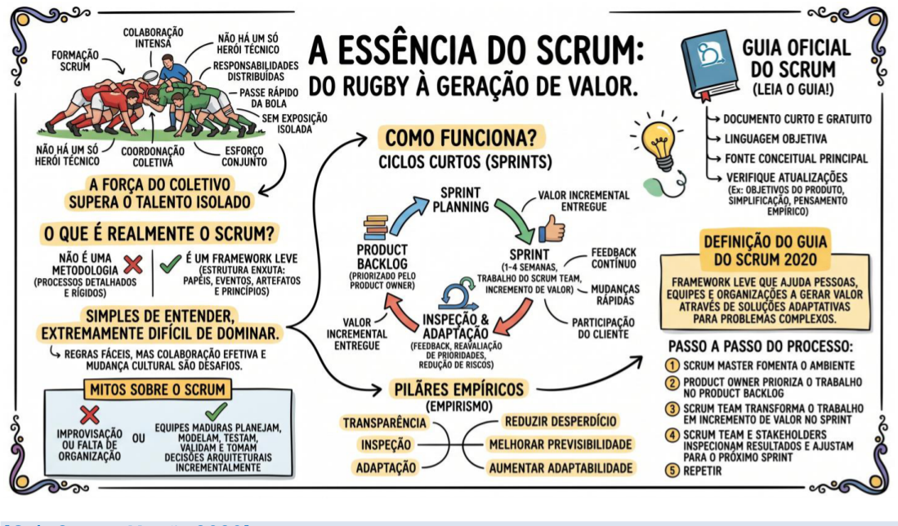

### **_<mark>[Guia Scrum - Versão 2020]</mark>_** 

_<mark>Scrum é um framework leve que ajuda pessoas, times e organizações a gerar valor por meio de soluções adaptativas para problemas complexos.</mark>_ 

_<mark>Em suma, Scrum requer um Scrum Master para promover um ambiente onde:</mark>_ 

_<mark>1. Um Product Owner ordena o trabalho para um problema complexo em um Product Backlog. 2. O Scrum Team transforma uma seleção do trabalho em um incremento de valor durante uma Sprint. 3. O Scrum Team e seus stakeholders inspecionam os resultados e se ajustam para a próxima Sprint. 4. Repita</mark>_ 

Quando estudamos Scrum, uma das primeiras coisas que precisamos entender é que ele não é uma metodologia tradicional cheia de regras rígidas e procedimentos detalhados. O Guia Scrum define Scrum como um framework leve; em outras palavras: ele fornece uma estrutura básica de funcionamento para que equipes consigam desenvolver e evoluir produtos complexos em ambientes sujeitos a mudanças constantes. Percebam que isso dá bastante flexibilidade para adaptação conforme a realidade de cada organização. 

Essa ideia de framework é extremamente importante em provas. Significa que Scrum não tenta definir absolutamente tudo que a equipe deve fazer durante o desenvolvimento. Ele estabelece

---

<!-- pagina: 8 -->

**Diego Carvalho, Equipe Informática 2 (Diego Carvalho), Equipe Informática 1 (Diego Carvalho) Aula 02** 

responsabilidades, eventos, artefatos e princípios fundamentais; contudo, diversas práticas técnicas podem ser adicionadas conforme a necessidade do projeto. É justamente por isso que equipes Scrum frequentemente utilizam integração contínua, testes automatizados, Kanban, DevOps, XP e várias outras abordagens complementares. 

Métodos ágeis não eliminam engenharia de software, arquitetura ou qualidade técnica. Na verdade, ambientes ágeis maduros dependem fortemente dessas práticas para sustentar entregas rápidas e frequentes. O framework Scrum fornece a estrutura organizacional do trabalho; já técnicas específicas de desenvolvimento podem variar conforme contexto, maturidade e necessidades do produto. 

Outro ponto extremamente importante é entender que Scrum trabalha fortemente na organização e gerenciamento do trabalho relacionado ao desenvolvimento e evolução contínua do produto. Atenção porque isso costuma gerar confusão. Scrum não é apenas uma ferramenta de controle de tarefas ou cronogramas; ele possui forte relação com gestão de produto, priorização de valor, adaptação contínua e alinhamento constante com necessidades do cliente e dos stakeholders. 

Percebam também que Scrum foi construído para funcionar em ambientes complexos e adaptativos. Em cenários modernos, requisitos mudam o tempo inteiro, prioridades se alteram rapidamente e novas necessidades aparecem durante o desenvolvimento. Nesse contexto, modelos excessivamente rígidos acabam apresentando dificuldades para responder às mudanças. O Scrum procura justamente aumentar capacidade de adaptação, comunicação contínua e velocidade de aprendizado organizacional ao longo do projeto. 

Uma característica muito interessante do Scrum é seu caráter minimalista. O Guia Scrum é extremamente enxuto e propositalmente incompleto. Isso mesmo: ele foi criado dessa forma intencionalmente. Em vez de tentar engessar equipes com excesso de regras, o framework define apenas o essencial para implementação do empirismo. A ideia central é permitir que cada organização complemente a estrutura básica com ferramentas, técnicas e práticas que façam sentido dentro do seu contexto específico. 

No Scrum moderno, existem três responsabilidades fundamentais: Product Owner, Scrum Master e Developers. Observem um detalhe importante para concursos: o Guia Scrum 2020 deixou de utilizar oficialmente o termo “papéis” e passou a enfatizar “responsabilidades”. Essa mudança procura reforçar que Scrum não se baseia em hierarquias tradicionais muito rígidas; o foco está muito mais na responsabilidade coletiva pelo valor entregue do que em estruturas burocráticas de autoridade formal. 

Além das responsabilidades, o framework define cinco eventos principais: Sprint, Sprint Planning, Daily Scrum, Sprint Review e Sprint Retrospective. Atenção porque o Sprint não é apenas um ciclo temporal genérico; ele próprio é considerado um evento que engloba todos os demais. Dentro desse ciclo ocorre planejamento, execução do trabalho, inspeção dos resultados, coleta de feedback e adaptação contínua. Observem como tudo gira em torno de aprendizado constante e melhoria incremental. 

O Scrum também define três artefatos centrais: Product Backlog, Sprint Backlog e Increment. Esses artefatos ajudam a garantir transparência sobre prioridades, progresso e resultados obtidos durante o desenvolvimento. Contudo, isso não significa que equipes estejam proibidas de utilizar outros recursos adicionais. Dependendo do contexto, podem surgir gráficos de Burndown, quadros Kanban, documentos arquiteturais, mapas de produto, métricas de fluxo e diversos outros mecanismos complementares de apoio ao trabalho. 

É justamente aqui que aparece uma das grandes forças do Scrum: sua enorme capacidade de integração com outras práticas modernas de engenharia de software. Pressman e Sommerville destacam bastante que desenvolvimento contemporâneo exige colaboração contínua entre gestão, arquitetura, testes, integração e qualidade. O Scrum oferece uma estrutura organizacional simples e adaptativa; contudo, ele

---

<!-- pagina: 9 -->

**Diego Carvalho, Equipe Informática 2 (Diego Carvalho), Equipe Informática 1 (Diego Carvalho) Aula 02** 

depende fortemente de maturidade técnica, comunicação eficiente e melhoria contínua para realmente funcionar bem. 

Scrum parece simples quando observamos apenas seus conceitos básicos; entretanto, aplicá-lo corretamente no mundo real é muito mais difícil do que muitos imaginam. Criar equipes verdadeiramente colaborativas, adaptativas e comprometidas com entrega contínua de valor exige mudança cultural profunda, disciplina técnica e forte participação coletiva. É justamente por isso que o Guia Scrum afirma que ele é simples de entender; porém extremamente difícil de dominar. 

### **_<mark>[Guia Scrum - Versão 2020]</mark>_** 

_<mark>Scrum é simples. Experimente como está e determine se sua filosofia, teoria e estrutura ajudam a atingir objetivos e criar valor. O framework Scrum é propositalmente incompleto, apenas definindo as partes necessárias para implementar a teoria Scrum. O Scrum é construído sobre a inteligência coletiva das pessoas que o utilizam. Em vez de fornecer às pessoas instruções detalhadas, as regras do Guia do Scrum orientam seus relacionamentos e interações.</mark>_ 

_<mark>Vários processos, técnicas e métodos podem ser empregados com o framework. Scrum se acopla as práticas existentes ou as torna desnecessárias. Scrum torna visível a eficácia relativa da gestão atual, meio ambiente e técnicas de trabalho, para que melhorias possam ser feitas.</mark>_ 

Quando estudamos Scrum, precisamos entender que ele foi criado para lidar com ambientes complexos, nos quais requisitos, prioridades e necessidades mudam constantemente ao longo do desenvolvimento. Diferentemente de modelos extremamente rígidos, o Scrum trabalha com adaptação contínua, ciclos curtos de trabalho e feedback frequente. Atenção porque isso não significa ausência de planejamento; significa que o planejamento ocorre continuamente conforme novas informações aparecem durante o projeto. 

Existe um modelo bastante conhecido chamado Cynefin, utilizado para classificar tipos de ambientes. Em ambientes simples, normalmente existem processos previsíveis, procedimentos padronizados e pouca variação na execução das tarefas. Já ambientes complexos apresentam muitas incertezas, mudanças frequentes e diferentes possibilidades de solução. O desenvolvimento moderno de software se encaixa bastante nesse cenário, porque clientes, tecnologias e necessidades evoluem constantemente durante o trabalho. 

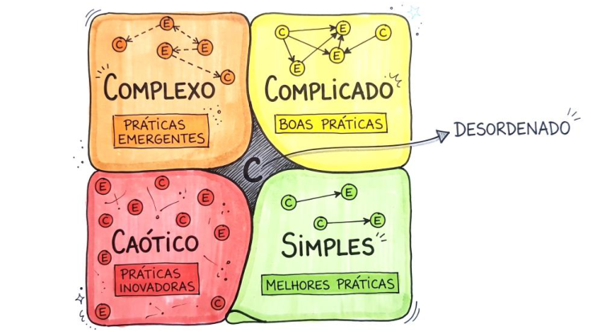

---

<!-- pagina: 10 -->

**Diego Carvalho, Equipe Informática 2 (Diego Carvalho), Equipe Informática 1 (Diego Carvalho) Aula 02** 

O Guia Scrum define Scrum como um framework leve para desenvolver, entregar e sustentar produtos complexos. Observem um detalhe importante: ele é chamado de framework porque não tenta definir absolutamente todas as práticas, técnicas ou ferramentas utilizadas pela equipe. O Scrum fornece uma estrutura básica contendo responsabilidades, eventos, artefatos e regras essenciais; contudo, outras abordagens podem ser incorporadas conforme as necessidades do projeto e da organização. 

É sempre bom lembrar que métodos ágeis não eliminam qualidade, arquitetura, testes ou documentação. O objetivo é reduzir burocracia desnecessária e aumentar capacidade de adaptação. O Scrum utiliza uma abordagem iterativa e incremental, baseada em transparência, inspeção e adaptação contínua, permitindo entregas frequentes, redução de riscos e melhoria constante do produto e da equipe. 

**(FUNDATEC / IF-RS – 2025)** Uma equipe de desenvolvimento de software deseja adotar, dentro <mark>da gestão de projetos, uma metodologia ágil que permita entregas rápidas e frequentes, com ciclos curtos de trabalho e revisões constantes para garantir a melhoria contínua. Para isso, escolhem um framework que divide o trabalho em sprints, promove reuniões diárias de acompanhamento e conta com papéis definidos, como o product owner. A metodologia ágil descrita é:</mark> 

<mark>a) Kanban. b) Lean. c) Waterfall. d) Extreme programming (XP). e) Scrum.</mark> 

## **<mark>_______________________</mark>** 

**<mark>Comentários:</mark>** <mark>(a) Errado. Kanban organiza o fluxo de trabalho de forma visual e contínua, sem foco obrigatório em sprints ou papéis como product owner; (b) Errado. Lean busca eliminar desperdícios e otimizar processos, mas não se caracteriza por sprints e papéis específicos; (c) Errado. Waterfall segue um modelo sequencial e rígido, sem ciclos curtos, revisões frequentes ou reuniões diárias típicas de métodos ágeis; (d) Errado. XP é uma metodologia ágil, mas a descrição com sprints, daily meetings e product owner remete ao Scrum; (e) Correto. Scrum trabalha com sprints, reuniões diárias, entregas frequentes e papéis definidos, como product owner, alinhando-se ao</mark> enunciado (Letra E).

---

<!-- pagina: 11 -->

**Diego Carvalho, Equipe Informática 2 (Diego Carvalho), Equipe Informática 1 (Diego Carvalho) Aula 02** 

<!-- Start of picture text -->
Pilares Fundamentais <!-- End of picture text -->

##### **<mark>INCIDÊNCIA EM PROVA: BAIXA</mark>** 

O Scrum é fundamentado em dois conceitos extremamente importantes: empirismo e Lean Thinking. O empirismo parte da ideia de que o conhecimento surge da experiência, da observação e do aprendizado contínuo obtido durante o trabalho. Em vez de confiar exclusivamente em previsões feitas no início do projeto, as equipes tomam decisões com base em resultados reais, feedback constante e informações concretas obtidas ao longo do desenvolvimento. Isso permite maior adaptação diante de mudanças e incertezas. 

Além disso, o Scrum utiliza uma abordagem iterativa e incremental para aumentar previsibilidade e reduzir riscos continuamente. “Iterativo” significa aprender e melhorar a cada ciclo; já “incremental” significa entregar partes funcionais do produto gradualmente. Métodos ágeis dependem fortemente desse aprendizado contínuo para lidar com ambientes complexos e sujeitos a mudanças frequentes. 

O Lean Thinking também possui papel fundamental dentro do Scrum. Essa mentalidade procura eliminar desperdícios, reduzir atividades que não agregam valor e concentrar esforços naquilo que realmente importa para o cliente e para o produto. Percebam que o objetivo não é simplesmente “fazer mais rápido”; o foco está em gerar valor continuamente com eficiência, simplicidade e melhoria constante do processo de desenvolvimento. 

O Scrum organiza o trabalho por meio de eventos formais que permitem inspeção e adaptação contínuas. No Guia Scrum atual, existem cinco eventos principais: Sprint, Sprint Planning, Daily Scrum, Sprint Review e Sprint Retrospective. Observem que a Sprint não é apenas um intervalo de tempo; ela própria é considerada um evento que engloba os demais. Todos esses eventos existem para sustentar os três pilares fundamentais do controle empírico de processo: Transparência, Inspeção e Adaptação (TIA). 

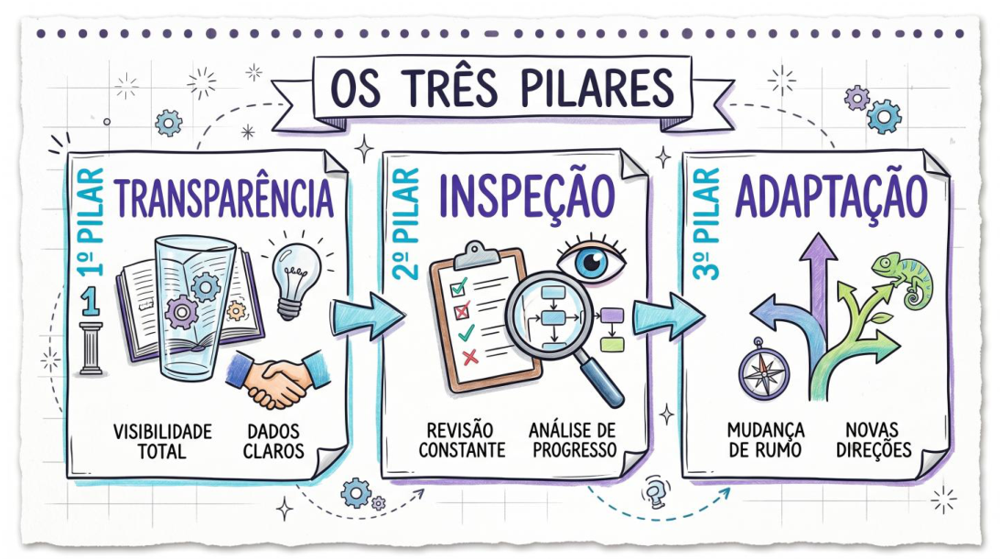

---

<!-- pagina: 12 -->

**Diego Carvalho, Equipe Informática 2 (Diego Carvalho), Equipe Informática 1 (Diego Carvalho) Aula 02** 

<!-- Start of picture text -->
Transparência <!-- End of picture text -->

O primeiro pilar é a transparência. Isso significa que informações importantes sobre o produto, o progresso e o trabalho realizado devem permanecer visíveis e compreensíveis para todos os envolvidos. A equipe, o Product Owner e os stakeholders precisam entender claramente o que está acontecendo durante o desenvolvimento. Transparência gera confiança, melhora comunicação e evita que problemas permaneçam escondidos até se tornarem muito maiores e mais difíceis de resolver. 

Existe uma frase bastante conhecida de Ken Schwaber que resume bem essa ideia: o Scrum expõe problemas que antes permaneciam escondidos dentro da organização. Se uma entrega atrasou, se a qualidade caiu ou se os feedbacks dos usuários foram negativos, tudo isso precisa ficar visível rapidamente. Pode parecer desconfortável no começo; contudo, o objetivo é justamente permitir aprendizado contínuo e resolução rápida dos problemas antes que os impactos se tornem ainda maiores. 

### **_<mark>[Guia Scrum - Versão 2020]</mark>_** 

_<mark>O processo emergente e o trabalho devem ser visíveis tanto para quem executa o trabalho quanto para quem recebe o trabalho. Com o Scrum, decisões importantes são baseadas no estado percebido de seus três artefatos formais. Artefatos com baixa transparência podem levar a decisões que diminuem o valor e aumentam o risco. A transparência permite a inspeção. A inspeção sem transparência é enganosa e gera desperdício.</mark>_ 

<!-- Start of picture text -->
Inspeção <!-- End of picture text -->

O segundo pilar é a inspeção ou fiscalização. Durante o desenvolvimento, o progresso, os artefatos e os resultados obtidos devem ser avaliados frequentemente para identificar desvios, dificuldades e oportunidades de melhoria. Atenção porque inspeção não significa auditoria excessiva ou microgerenciamento. O objetivo é verificar continuamente se o trabalho continua alinhado às metas do produto e às expectativas dos stakeholders sem prejudicar o fluxo normal de desenvolvimento da equipe. 

Essas inspeções acontecem em diferentes momentos do Scrum. Na Sprint Review, por exemplo, stakeholders e equipe avaliam o incremento produzido e discutem próximos passos do produto. Já na Sprint Retrospective, a própria equipe analisa seus processos, comunicação, colaboração e formas de trabalho em busca de melhoria contínua. Observem como o Scrum transforma aprendizado e adaptação em atividades permanentes do desenvolvimento moderno de software. 

### **_<mark>[Guia Scrum - Versão 2020]</mark>_** 

_<mark>Os artefatos do Scrum e o progresso em direção às metas acordadas devem ser inspecionados com frequência e diligência para detectar variações ou problemas potencialmente indesejáveis. Para ajudar na inspeção, o Scrum fornece cadência na forma de seus cinco eventos. A inspeção habilita a adaptação. A inspeção sem adaptação é considerada inútil. Os eventos Scrum são projetados para provocar mudanças.</mark>_ 

<!-- Start of picture text -->
Adaptação <!-- End of picture text -->

O terceiro pilar é a adaptação. Sempre que problemas, desvios ou novas necessidades forem identificados, ajustes devem ser realizados rapidamente para reduzir riscos e evitar impactos maiores no produto. Em ambientes complexos, mudanças acontecem constantemente; portanto, tentar impedir qualquer alteração normalmente gera mais dificuldades do que benefícios. O Scrum procura justamente aumentar capacidade de resposta rápida diante de novos aprendizados, mudanças de mercado e evolução contínua das necessidades dos clientes.

---

<!-- pagina: 13 -->

**Diego Carvalho, Equipe Informática 2 (Diego Carvalho), Equipe Informática 1 (Diego Carvalho) Aula 02** 

### **_<mark>[Guia Scrum - Versão 2020]</mark>_** 

_<mark>Se algum aspecto de um processo se desviar fora dos limites aceitáveis ou se o produto resultante for inaceitável, o processo que está sendo aplicado ou os materiais que estão sendo produzidos devem ser ajustados. O ajuste deve ser feito o mais rápido possível para minimizar novos desvios. A adaptação se torna mais difícil quando as pessoas envolvidas não são empoderadas ou auto-gerenciadas. Espera-se que um Scrum Team se adapte no momento em que aprende algo novo por meio da inspeção.</mark>_ 

Os três pilares do Scrum formam a base do controle empírico de processo: Transparência, Inspeção e Adaptação. A lógica é relativamente simples: primeiro, tudo que for relevante sobre o produto, o progresso e o trabalho realizado deve permanecer visível e compreensível para todos os envolvidos. A partir dessa transparência, a equipe consegue inspecionar continuamente aquilo que está funcionando bem, os problemas existentes e as oportunidades de melhoria relacionadas tanto ao produto quanto ao próprio processo de trabalho. 

Essas inspeções acontecem frequentemente durante o Scrum, principalmente por meio dos eventos formais do framework. O objetivo é identificar rapidamente desvios, dificuldades, riscos e mudanças necessárias antes que os problemas cresçam demais. Após essa análise, entra o terceiro pilar: adaptação. Sempre que necessário, produto, prioridades ou formas de trabalho devem ser ajustados para reduzir riscos e melhorar resultados continuamente. Observem como o Scrum transforma aprendizado contínuo em parte natural do desenvolvimento. 

O Guia Scrum define Scrum como um framework leve para desenvolver, entregar e sustentar produtos complexos. Atenção porque ele não é oficialmente definido como uma metodologia tradicional de gerenciamento de projetos. O framework fornece uma estrutura básica contendo responsabilidades, eventos, artefatos e regras essenciais; contudo, diferentes práticas, técnicas e ferramentas podem ser incorporadas conforme as necessidades da organização e do contexto do produto desenvolvido. 

Embora tenha surgido fortemente associado ao desenvolvimento de software, o Scrum atualmente é utilizado em diversos contextos além da tecnologia. Isso acontece porque muitos ambientes modernos apresentam alta complexidade, mudanças frequentes e forte necessidade de adaptação contínua. Equipes que trabalham com inovação, marketing, pesquisa, educação e produtos digitais frequentemente utilizam Scrum justamente porque seus problemas não possuem soluções totalmente previsíveis desde o início do trabalho. 

Roger Pressman e Ian Sommerville salientam que métodos ágeis surgiram para lidar com ambientes complexos, interdependentes e sujeitos a mudanças constantes. Nesses cenários, modelos extremamente rígidos costumam apresentar dificuldades de adaptação. O Scrum procura justamente aumentar colaboração, feedback contínuo, aprendizado incremental e capacidade rápida de resposta diante das mudanças. 

Dentro dessa estrutura, talvez o conceito mais importante seja a Sprint. A Sprint é um evento de duração fixa no qual ocorre todo o trabalho necessário para alcançar um objetivo específico chamado Sprint Goal. Durante esse período, a equipe desenvolve um incremento potencialmente utilizável do produto. Em outras palavras: ao final da Sprint deve existir uma nova versão funcional, pronta e validada, permitindo inspeção frequente, adaptação contínua e redução progressiva dos riscos do projeto. 

|**PILARES**|**DESCRIÇÃO**|
|---|---|
|**TRANSPARÊNCIA**|Todo trabalho deve ser claramente definido e conhecido por todas as partes envolvidas noprojeto.|

---

<!-- pagina: 14 -->

**Diego Carvalho, Equipe Informática 2 (Diego Carvalho), Equipe Informática 1 (Diego Carvalho) Aula 02** 

<mark>Todo trabalho deve ser inspecionado com a frequência necessária para garantir a</mark> **INSPEÇÃO** <u>qualidade do produto.</u> O projeto deve ser capaz de se adaptar o projeto às necessidades de negócio. **ADAPTAÇÃO** 

**(FCC / SAD-PE – 2026)** O método SCRUM possui pilares empíricos, um deles é a transparência. <mark>Tanto o processo emergente quanto o trabalho devem ser visíveis para quem o executa ou recebe. Desse modo, a transparência permite o outro pilar empírico, denominado de:</mark> 

<mark>a) Correção. b) Inspeção. c) Produção. d) Adaptação. e) Mediação.</mark> 

## **<mark>_______________________</mark>** 

**<mark>Comentários:</mark>** <mark>(a) Errado. Correção não é pilar empírico do Scrum; o enunciado pede o pilar viabilizado pela transparência; (b) Correto. A transparência torna processo e trabalho visíveis, permitindo a inspeção adequada no Scrum; (c) Errado. Produção não corresponde ao pilar empírico mencionado no enunciado; (d) Errado. Adaptação é pilar do Scrum, mas a transparência permite diretamente a inspeção;</mark> (e) Errado. Mediação não integra os pilares empíricos do Scrum (Letra B).

---

<!-- pagina: 15 -->

**Diego Carvalho, Equipe Informática 2 (Diego Carvalho), Equipe Informática 1 (Diego Carvalho) Aula 02** 

<!-- Start of picture text -->
Principais <!-- End of picture text -->

<!-- Start of picture text -->
Valores <!-- End of picture text -->

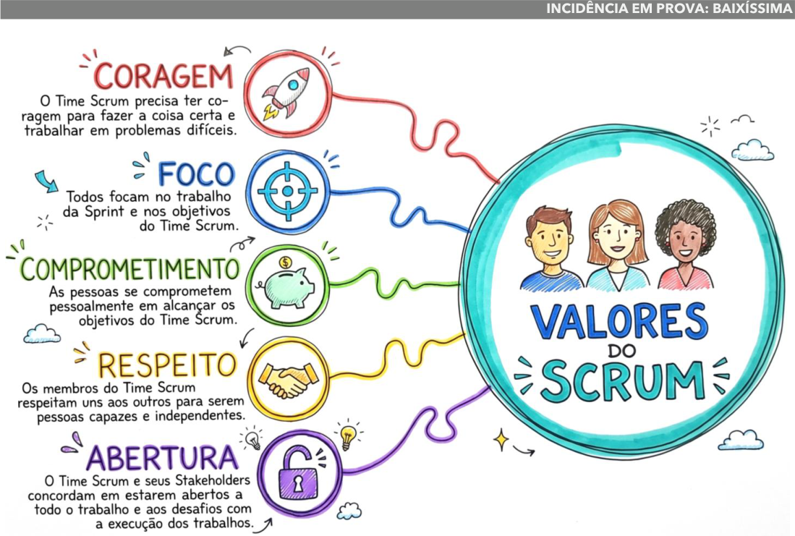

<!-- Start of picture text -->
INCIDÊNCIA EM PROVA: BAIXÍSSIMA <!-- End of picture text -->

<!-- Start of picture text -->
INCIDÊNCIA EM PROVA: BAIXÍSSIMA <!-- End of picture text -->

O Scrum possui cinco valores fundamentais que ajudam a orientar comportamento, comunicação e tomada de decisão dentro das equipes: coragem, foco, comprometimento, respeito e abertura. Esses valores não funcionam apenas como recomendações teóricas ou ideias motivacionais; eles sustentam toda a lógica do empirismo presente no framework. Em outras palavras: sem esses valores, torna-se muito mais difícil alcançar transparência real, colaboração contínua e adaptação rápida diante das mudanças. 

O Guia Scrum deixa claro que esses valores ajudam equipes a construir confiança e melhorar a forma como o trabalho acontece diariamente. Observem que o framework não depende apenas de processos, eventos e artefatos; ele também depende fortemente da cultura criada dentro da equipe. Roger Pressman e Ian Sommerville ressaltam que ambientes ágeis maduros exigem comunicação aberta, colaboração constante e forte responsabilidade coletiva. 

A coragem aparece quando a equipe precisa enfrentar problemas difíceis, expor falhas, admitir erros e tomar decisões importantes mesmo diante de incertezas. Já o foco procura direcionar atenção para aquilo que realmente gera valor durante a Sprint, evitando dispersão excessiva e mudanças descontroladas de prioridade. O comprometimento está relacionado à responsabilidade coletiva pelos objetivos definidos e pela qualidade do trabalho entregue ao final de cada ciclo. 

O respeito é essencial porque equipes Scrum dependem fortemente de colaboração contínua entre pessoas com diferentes conhecimentos, experiências e responsabilidades. Sem respeito mútuo, comunicação e cooperação acabam sendo prejudicadas rapidamente. Por fim, a abertura incentiva transparência, honestidade e compartilhamento constante de informações relevantes sobre progresso,

---

<!-- pagina: 16 -->

**Diego Carvalho, Equipe Informática 2 (Diego Carvalho), Equipe Informática 1 (Diego Carvalho) Aula 02** 

dificuldades, riscos e oportunidades de melhoria. Observem como todos esses valores se conectam diretamente aos pilares de transparência, inspeção e adaptação presentes no Scrum. 

|**VALORES**|**DESCRIÇÃO**|
|---|---|
|**CORAGEM**|Os integrantes de um projeto precisam ter coragem para fazer a coisa certa e trabalharemjuntos removendo impedimentos,buscando soluções.|
|**FOCO**|Os integrantes de um projeto precisam focar no trabalho durante a sprint e nas metas designadas – time dispersoperdeprodutividade e não alcança os objetivos.|
|**COMPROMETIMENTO**|Os integrantes se comprometem com o trabalho que se responsabilizou em fazer, envolvendo-se e não abandonandopela metade ou entregando semqualidade.|
|**RESPEITO**|Os integrantes se respeitam entre si a fim de manter a colaboração, a integração e o bom ambiente de trabalho.|
|**ABERTURA**|Os integrantes devem poder ser francos, expor ideias e propostas mesmo que elas não sejamproveitosas. Momentos de debates,discussões e sugestões são ideais.|

### **_<mark>[Guia Scrum - Versão 2020]</mark>_** 

_<mark>O Scrum Team se compromete a atingir seus objetivos e suportar uns aos outros. Seu foco principal é o trabalho da Sprint para fazer o melhor progresso possível em direção a essas metas. O Scrum Team e seus stakeholders são abertos quanto ao trabalho e os desafios. Os membros do Scrum Team se respeitam quanto a serem pessoas capazes e independentes, e são respeitados como tal pelas pessoas com quem trabalham. Os membros do Scrum Team têm a coragem de fazer a coisa certa e trabalhar em problemas difíceis.</mark>_ 

_<mark>Esses valores orientam o Scrum Team em relação ao seu trabalho, ações e comportamento. As decisões que são tomadas, os passos dados e a forma como o Scrum é usado devem reforçar esses valores, não diminuí-los ou miná-los. Os membros do Scrum Team aprendem e exploram os valores à medida que trabalham com os eventos e artefatos do Scrum. Quando esses valores são incorporados pelo Scrum Team e pelas pessoas com quem trabalham, os pilares empíricos do Scrum de transparência, inspeção e adaptação ganham vida, construindo confiança.</mark>_

---

<!-- pagina: 17 -->

**Diego Carvalho, Equipe Informática 2 (Diego Carvalho), Equipe Informática 1 (Diego Carvalho) Aula 02** 

<!-- Start of picture text -->
Papéis <!-- End of picture text -->

##### **<mark>INCIDÊNCIA EM PROVA: ALTÍSSIMA</mark>** 

O Scrum possui poucos papeis, mas muito bem definidos! As pessoas que desempenham esses papeis são igualmente responsáveis e responsabilizadas pelos resultados do trabalho e, assim, se comprometem com o projeto. Eles são membros de um mesmo time e trabalham juntos, de forma colaborativa, para alcançarem seus resultados. Os papeis são diferentes dependendo da versão de referência: 

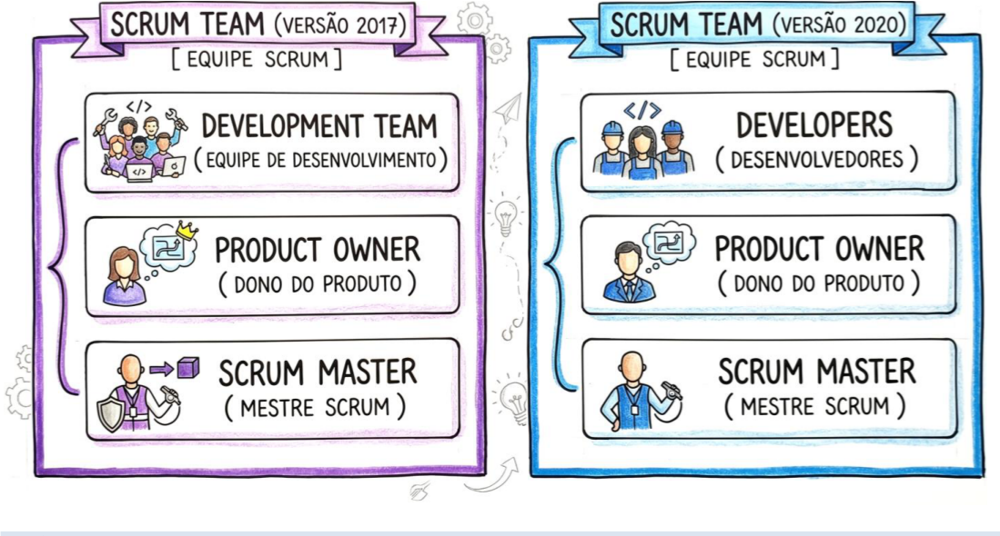

### **_<mark>[Guia Scrum - Versão 2020]</mark>_** 

_<mark>A unidade fundamental do Scrum é um pequeno time de pessoas, um Scrum Team. O Scrum Team consiste em um Scrum Master, um Product Owner e Developers. Dentro de um Scrum Team, não há subtimes ou hierarquias. É uma unidade coesa de profissionais focados em um objetivo de cada vez, a Meta do Produto. Os Scrum Teams são multifuncionais, o que significa que os membros possuem todas as habilidades necessárias para criar valor a cada Sprint. Eles também são autogerenciáveis, o que significa que decidem internamente quem faz o quê, quando e como.</mark>_ 

_<mark>O Scrum Team é pequeno o suficiente para permanecer ágil e grande o suficiente para concluir um trabalho significativo dentro de uma Sprint, normalmente 10 ou menos pessoas. Em geral, descobrimos que times menores se comunicam melhor e são mais produtivos. Se os Scrum Teams se tornarem muito grandes, eles devem considerar a reorganização em vários Scrum Teams coesos, cada um focado no mesmo produto. Portanto, eles devem compartilhar a mesma meta do produto, Product Backlog e Product Owner.</mark>_ 

_<mark>O Scrum Team é responsável por todas as atividades relacionadas ao produto, desde a colaboração com stakeholder, verificação, manutenção, operação, experimentação, pesquisa e desenvolvimento, e qualquer outra coisa que possa ser necessária. Eles são estruturados e empoderados pela organização para gerenciar seu próprio trabalho. Trabalhar em Sprints em um ritmo sustentável melhora o foco e a consistência do Scrum Team. Todo o Scrum Team é responsável por criar um Incremento valioso e útil a</mark>_

---

<!-- pagina: 18 -->

**Diego Carvalho, Equipe Informática 2 (Diego Carvalho), Equipe Informática 1 (Diego Carvalho) Aula 02** 

_<mark>cada Sprint. Scrum define três responsabilidades específicas dentro do Scrum Team: os Developers, o Product Owner e o Scrum Master.</mark>_ 

**(CEBRASPE / CTI – 2024)** Acerca dos eventos Scrum, julgue o item subsecutivo. 

<mark>A meta do produto é o objetivo de longo prazo do time Scrum, que deve cumprir ou abandonar um objetivo antes de assumir o próximo.</mark> 

## **<mark>_______________________</mark>** 

**<mark>Comentários:</mark>** <mark>a meta do produto orienta o trabalho de longo prazo do Scrum Team, dando foco e direção. Antes de partir para um novo</mark> objetivo, o time deve concluir ou abandonar o objetivo atual (Correto). 

Na versão 2017 do Guia Scrum existia uma distinção importante entre Scrum Team e Development Team. Muita atenção com isso em provas! O Development Team era descrito formalmente como autoorganizável e multifuncional; já a Scrum Team englobava Product Owner, Scrum Master e Development Team trabalhando de maneira integrada. Na versão 2020 essa estrutura foi simplificada, porque o termo Development Team deixou de existir oficialmente, permanecendo apenas Scrum Team e Developers. 

Quando dizemos que uma equipe é auto-organizável, significa que ela possui autonomia para decidir como realizará o próprio trabalho sem depender constantemente de direcionamento externo detalhado. Observem que isso não significa ausência de liderança ou desorganização. O objetivo é permitir que a equipe utilize sua experiência técnica para escolher as melhores soluções diante dos problemas encontrados durante a Sprint. Métodos ágeis valorizam bastante essa autonomia coletiva. 

Equipes ágeis maduras dependem fortemente de colaboração contínua, comunicação aberta e responsabilidade compartilhada. Em vez de estruturas excessivamente hierárquicas e fragmentadas, procura-se criar equipes capazes de tomar decisões rapidamente, adaptar-se às mudanças e resolver problemas sem depender constantemente de aprovações externas demoradas. 

Outra característica extremamente importante é a multifuncionalidade. Isso significa que a equipe possui todas as competências necessárias para produzir o incremento do produto sem depender excessivamente de outros grupos externos. Atenção porque isso não significa ausência de especialização técnica. Em equipes Scrum continuam existindo pessoas com conhecimentos diferentes em análise, testes, arquitetura, UX, desenvolvimento e outras áreas; contudo, essas competências trabalham integradas dentro da mesma equipe. 

O Guia Scrum 2017 também enfatizava que o Development Team não deveria possuir subtimes isolados funcionando como departamentos internos separados. Em outras palavras: o objetivo era evitar silos organizacionais nos quais cada grupo trabalha de forma excessivamente independente. Observem como isso melhora comunicação, reduz gargalos e acelera feedback contínuo. Quanto maior a integração da equipe, maior tende a ser a capacidade de adaptação diante das mudanças do projeto. 

Outra dúvida bastante comum envolve acumulação de responsabilidades. Na versão 2017, Product Owner e Scrum Master poderiam participar diretamente do trabalho do Sprint Backlog caso também executassem atividades técnicas relacionadas ao desenvolvimento. Isso aparece inclusive no próprio Guia Scrum. Contudo, apesar de possível em alguns contextos organizacionais menores, acumular muitas responsabilidades pode gerar conflitos de prioridade, sobrecarga operacional e dificuldades de foco durante a Sprint. 

Existe também uma discussão bastante conhecida sobre acumulação entre Scrum Master e Product Owner. O Guia Scrum não proíbe explicitamente essa combinação; contudo, ela normalmente não é

---

<!-- pagina: 19 -->

**Diego Carvalho, Equipe Informática 2 (Diego Carvalho), Equipe Informática 1 (Diego Carvalho) Aula 02** 

recomendada. O Product Owner está focado em maximizar valor do produto e priorizar necessidades do negócio; já o Scrum Master atua facilitando o framework, removendo impedimentos e apoiando funcionamento saudável da equipe. Observem que esses objetivos podem gerar conflitos de interesse em determinadas situações. 

A ideia central do Scrum moderno: o framework procura fortalecer responsabilidade coletiva pela entrega de valor. Em vez de estruturas rígidas baseadas em departamentos isolados, o Scrum estimula colaboração contínua, integração de competências e adaptação rápida diante das mudanças. É justamente essa combinação entre autonomia, multifuncionalidade e comunicação constante que ajuda equipes ágeis a trabalharem melhor em ambientes complexos e sujeitos a mudanças frequentes. 

### **Saiba mais:** 

<mark>Ao longo dos estudos para concursos, é crucial saber que há diferentes guias literários no mercado, como o Guia Scrum (que é o utilizado para essa aula e para a imensa maioria das questões de prova) e o SBOK (Scrum Body of Knowledge). De acordo com a visão do guia SBOK, os papéis envolvidos no ecossistema do Scrum são formalmente segmentados em duas categorias: Papéis Centrais (Essenciais) e Papéis Não-Essenciais.</mark> 

<mark>Os Papéis Centrais englobam as funções responsáveis diretas pelo sucesso do projeto: o Product Owner, o Scrum Master e o Time Scrum. Já os Papéis Não-Essenciais, embora importantes pontualmente, não possuem responsabilidade direta e vinculante pelo projeto do ponto de vista do framework, englobando Stakeholders (Patrocinadores, Usuários, Clientes), Fornecedores e, no</mark> <mark>`—` caso de empresas maiores, o chamado Scrum Guidance Body (SGB) um grupo consultivo que dita</mark> regulamentações, segurança e normas técnicas para as equipes. 

**(FUNDATEC / Câmara Municipal de Venâncio Aires – 2024)** Na metodologia ágil Scrum, a Sprint <mark>Planning (Planejamento da Sprint) deve contar com a participação de quais papéis?</mark> 

<mark>a) Developers, Product Owner e Scrum Master.</mark> 

<mark>b) Apenas Product Owner e Scrum Master.</mark> 

<mark>c) Apenas Developers e Product Owner.</mark> 

<mark>d) Apenas Developers e Scrum Master.</mark> 

<mark>e) Apenas Developers.</mark> 

## **<mark>_______________________</mark>** 

**<mark>Comentários:</mark>** <mark>(a) Correto. A Sprint Planning envolve todo o Scrum Team: Developers, Product Owner e Scrum Master, para definir objetivo, itens selecionados e plano de execução da Sprint; (b) Errado. Excluir os Developers compromete o planejamento, pois são eles que estimam e organizam o trabalho da Sprint; (c) Errado. O Scrum Master também participa da Sprint Planning, apoiando o processo e garantindo o bom uso do Scrum; (d) Errado. O Product Owner é essencial na Sprint Planning, pois apresenta prioridades e esclarece os itens do Product Backlog; (e) Errado. Limitar a reunião aos Developers exclui papéis importantes para alinhamento, priorização e</mark> condução adequada do planejamento (Letra A).

---

<!-- pagina: 20 -->

**Diego Carvalho, Equipe Informática 2 (Diego Carvalho), Equipe Informática 1 (Diego Carvalho) Aula 02** 

<!-- Start of picture text -->
Product Owner <!-- End of picture text -->

<!-- Start of picture text -->
(PO) <!-- End of picture text -->

#### **<mark>PRODUCT OWNER (PO)</mark>** 

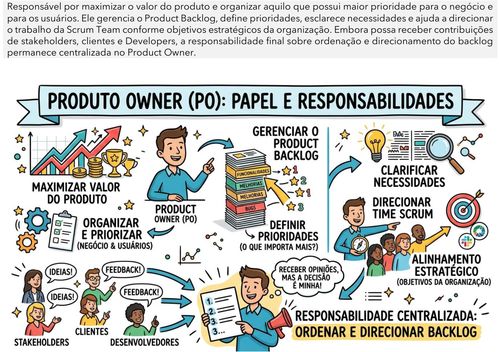

<!-- Start of picture text -->
Responsável por maximizar o valor do produto e organizar aquilo que possui maior prioridade para o negócio e para os usuários. Ele gerencia o Product Backlog, define prioridades, esclarece necessidades e ajuda a direcionar o trabalho da Scrum Team conforme objetivos estratégicos da organização. Embora possa receber contribuições de stakeholders, clientes e Developers, a responsabilidade final sobre ordenação e direcionamento do backlog permanece centralizada no Product Owner. <!-- End of picture text -->

O Product Owner, normalmente chamado apenas de PO, representa uma das responsabilidades centrais dentro do Scrum. O Guia Scrum deixa claro que ele é uma única pessoa responsável pelo direcionamento de valor do produto. Atenção porque ele não funciona como um comitê coletivo nem como um departamento inteiro tomando decisões simultaneamente. Claro que clientes, usuários, gestores e stakeholders participam continuamente do processo; contudo, a responsabilidade final sobre priorização permanece concentrada no Product Owner. 

O principal objetivo do PO é maximizar o valor gerado pelo produto e pelo trabalho realizado pela Scrum Team. Em outras palavras: ele procura garantir que a equipe esteja focada naquilo que realmente possui maior importância estratégica para o negócio e para os usuários. Métodos ágeis dependem fortemente desse alinhamento contínuo entre objetivos do negócio e desenvolvimento técnico. 

Dentro do Scrum, o Product Owner é o responsável final pelo Product Backlog. Isso significa organizar, ordenar, esclarecer e manter os itens do backlog alinhados às necessidades do produto. Observem um detalhe importante: embora a responsabilidade final pertença ao PO, o backlog continua sendo construído de maneira colaborativa. Desenvolvedores, stakeholders e especialistas podem contribuir constantemente com refinamentos, sugestões, esclarecimentos e novas necessidades identificadas ao longo do projeto.

---

<!-- pagina: 21 -->

**Diego Carvalho, Equipe Informática 2 (Diego Carvalho), Equipe Informática 1 (Diego Carvalho) Aula 02** 

Outra responsabilidade extremamente importante envolve transparência. O Product Backlog precisa permanecer visível, compreensível e devidamente ordenado para que todos saibam aquilo que possui maior valor naquele momento. Observem como isso se conecta diretamente ao empirismo do Scrum: transparência melhora inspeção; inspeção facilita adaptação; e adaptação ajuda a aumentar continuamente qualidade, aprendizado e geração de valor ao longo do desenvolvimento do produto. 

O Product Owner também possui forte responsabilidade de comunicação. Os itens do Product Backlog precisam ser suficientemente claros para que os Developers compreendam aquilo que deve ser construído durante as Sprints. Atenção porque isso não significa produzir documentação gigantesca ou burocrática. Em ambientes ágeis, comunicação contínua, refinamento frequente e alinhamento constante costumam ser muito mais importantes do que especificações excessivamente detalhadas produzidas meses antes da implementação. 

Isso não significa ausência de documentação. Pressman e Sommerville destacam bastante que equipes ágeis maduras procuram equilíbrio entre comunicação direta e documentação necessária. Dependendo do contexto organizacional, documentos técnicos, arquiteturais ou regulatórios continuam sendo importantes. O objetivo do Scrum não é eliminar registros úteis; o objetivo é evitar excesso de burocracia que não agregue valor real ao produto ou ao trabalho da equipe. 

Existe ainda uma dúvida muito comum em provas: quem escolhe os itens que entrarão na Sprint? O Product Owner é responsável por priorizar e ordenar o Product Backlog; contudo, durante o Sprint Planning, os Developers participam diretamente da seleção do trabalho necessário para alcançar o Sprint Goal. Observem como o Scrum procura equilibrar direcionamento estratégico de negócio com autonomia técnica da equipe durante planejamento e execução do trabalho. 

Outra ideia central envolve geração contínua de valor para o negócio. O Product Owner procura maximizar benefícios obtidos com o produto, priorizando funcionalidades, melhorias e correções capazes de gerar maior impacto possível para usuários e organização. Claro que resultados financeiros dependem também de fatores externos; contudo, o PO atua continuamente direcionando esforços para aquilo que possui maior valor estratégico, operacional e competitivo dentro do contexto do produto desenvolvido. 

**(FGV / MPE-RJ – 2025)** Com relação ao SCRUM, a pessoa responsável por garantir e maximizar, a <mark>partir do trabalho do time de desenvolvimento, o retorno sobre o investimento no produto para os clientes, definir o produto e a tomada das decisões de negócios relativas a seu desenvolvimento a partir das necessidades dos clientes do projeto e demais partes interessadas, alinhado com ou em direção aos objetivos da organização, chama-se</mark> 

<mark>a) Quality Manager. b) Sprint Referee. c) Product Owner. d) Scrum Master. e) Stakeholder.</mark> 

## **<mark>_______________________</mark>** 

**<mark>Comentários:</mark>** <mark>(a) Errado. Quality Manager não é papel padrão do Scrum e não responde por maximizar o valor do produto nem por decisões de negócio; (b) Errado. Sprint Referee não é papel previsto no Scrum para definir produto ou priorizar valor ao cliente e à organização; (c) Correto. Product Owner é quem maximiza o valor gerado pelo trabalho do time, define o produto e orienta decisões conforme necessidades das partes interessadas; (d) Errado. Scrum Master atua como facilitador do Scrum, removendo impedimentos e apoiando o processo, não como responsável pelo valor do produto; (e) Errado. Stakeholder é parte interessada no projeto, mas não</mark> exerce o papel central de definir o produto e priorizar o retorno sobre o investimento (Letra C).

---

<!-- pagina: 22 -->

**Diego Carvalho, Equipe Informática 2 (Diego Carvalho), Equipe Informática 1 (Diego Carvalho) Aula 02** 

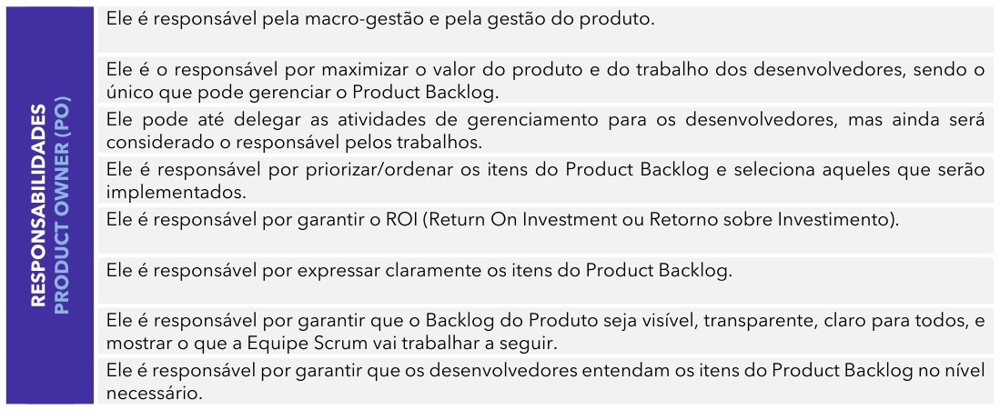

<!-- Start of picture text -->
Ele é responsável pela macro-gestão e pela gestão do produto. Ele é o responsável por maximizar o valor do produto e do trabalho dos desenvolvedores, sendo o único que pode gerenciar o Product Backlog. Ele pode até delegar as atividades de gerenciamento para os desenvolvedores, mas ainda será considerado o responsável pelos trabalhos. Ele é responsável por priorizar/ordenar os itens do Product Backlog e seleciona aqueles que serão implementados. Ele é responsável por garantir o ROI (Return On Investment ou Retorno sobre Investimento). Ele é responsável por expressar claramente os itens do Product Backlog. Ele é responsável por garantir que o Backlog do Produto seja visível, transparente, claro para todos, e mostrar o que a Equipe Scrum vai trabalhar a seguir. Ele é responsável por garantir que os desenvolvedores entendam os itens do Product Backlog no nível necessário. RESPONSABILIDADES   PRODUCT OWNER (PO) <!-- End of picture text -->

### **_<mark>[Guia Scrum - Versão 2020]</mark>_** 

_<mark>O Product Owner é responsável por maximizar o valor do produto resultante do trabalho do Scrum Team. A forma como isso é feito pode variar amplamente entre organizações, Scrum Teams e indivíduos. O Product Owner também é responsável pelo gerenciamento eficaz do Product Backlog , que inclui:</mark>_ 

_<mark>• Desenvolver e comunicar explicitamente a meta do produto;</mark>_ 

- _<mark>Criar e comunicar claramente os itens do Product Backlog;</mark>_ 

- _<mark>Ordenar os itens do Product Backlog; e,</mark>_ 

- _<mark>Garantir que o Product Backlog seja transparente, visível e compreensível.</mark>_ 

_<mark>O Product Owner pode fazer o trabalho acima ou pode delegar a responsabilidade a outros. Independentemente disso, o Product Owner ainda é o responsável. Para que os Product Owners tenham sucesso, toda a organização deve respeitar suas decisões. Essas decisões são visíveis no conteúdo e na ordem do Product Backlog e por meio do incremento inspecionável na revisão da sprint. O Product Owner é uma pessoa, não um comitê. O Product Owner pode representar as necessidades de muitos stakeholders no Product Backlog. Aqueles que desejam alterar o Product Backlog podem fazê-lo tentando convencer o Product Owner.</mark>_ 

**(CEBRASPE / EMBRAPA – 2025)** A respeito de gestão de projetos de inovação, julgue o item a <mark>seguir.</mark> 

<mark>No Scrum, o product owner é responsável por maximizar o valor do produto e gerenciar o product backlog, enquanto o scrum master facilita o processo e remove impedimentos para a equipe.</mark> 

## **<mark>_______________________</mark>** 

**<mark>Comentários:</mark>** <mark>no Scrum, o product owner cuida do valor do produto e da gestão do product backlog, enquanto o scrum master apoia a</mark> equipe, facilita o processo e atua na remoção de impedimentos (Correto).

---

<!-- pagina: 23 -->

**Diego Carvalho, Equipe Informática 2 (Diego Carvalho), Equipe Informática 1 (Diego Carvalho) Aula 02** 

<!-- Start of picture text -->
Developers (DV) <!-- End of picture text -->

#### **<mark>DEVELOPERS (DV)</mark>** 

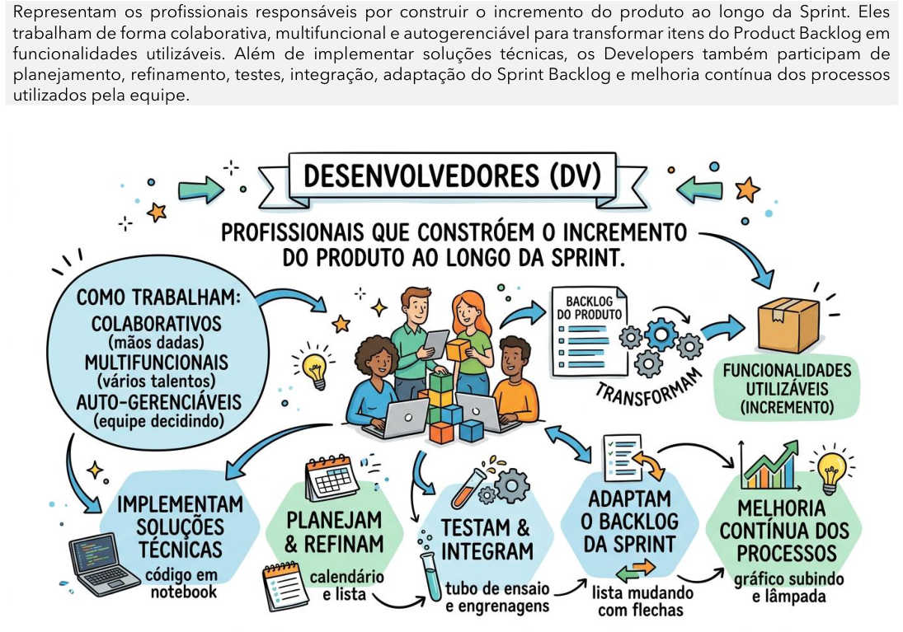

<!-- Start of picture text -->
Representam os profissionais responsáveis por construir o incremento do produto ao longo da Sprint. Eles trabalham de forma colaborativa, multifuncional e autogerenciável para transformar itens do Product Backlog em funcionalidades utilizáveis. Além de implementar soluções técnicas, os Developers também participam de planejamento, refinamento, testes, integração, adaptação do Sprint Backlog e melhoria contínua dos processos utilizados pela equipe. <!-- End of picture text -->

Os Developers representam as pessoas responsáveis por construir o incremento do produto ao final de cada Sprint. Em outras palavras: são os profissionais que realizam efetivamente o trabalho necessário para transformar itens do Product Backlog em uma versão utilizável do produto. O Guia Scrum deixa claro que somente os Developers criam incrementos. Isso significa que eles possuem responsabilidade direta pela construção, qualidade e entrega contínua de valor durante o desenvolvimento. 

Na versão anterior do Guia Scrum existia o termo “Development Team”; contudo, o Guia Scrum 2020 substituiu essa expressão por “Developers”. Essa mudança foi extremamente importante porque o termo anterior passava a impressão equivocada de existir um sub-time separado dentro da Scrum Team. O framework moderno procura reforçar justamente a ideia de uma única equipe integrada, formada por Product Owner, Scrum Master e Developers trabalhando continuamente em direção aos mesmos objetivos. 

Observem que essa mudança não foi apenas semântica. Ao remover a ideia de subtimes isolados, o Scrum fortalece responsabilidade coletiva pela Meta da Sprint e pela entrega de valor ao produto. Em vez de departamentos internos excessivamente separados, o framework procura incentivar colaboração contínua, comunicação aberta e integração constante entre diferentes competências técnicas.

---

<!-- pagina: 24 -->

**Diego Carvalho, Equipe Informática 2 (Diego Carvalho), Equipe Informática 1 (Diego Carvalho) Aula 02** 

Os Developers possuem autonomia para decidir como realizar o trabalho necessário durante a Sprint. Atenção porque isso não significa ausência de alinhamento organizacional ou liberdade descontrolada. O Scrum procura evitar modelos hierárquicos excessivamente rígidos, permitindo que a equipe utilize conhecimento técnico coletivo para escolher as melhores soluções diante dos problemas encontrados. O Product Owner direciona prioridades relacionadas ao produto; contudo, os Developers continuam responsáveis pela forma como o trabalho será executado tecnicamente. 

Outro ponto importante envolve comunicação. Em Scrum moderno, Developers interagem frequentemente com Product Owner, Scrum Master, stakeholders e usuários conforme necessário. O framework não proíbe comunicação direta; pelo contrário: ambientes ágeis dependem fortemente de transparência, feedback rápido e colaboração contínua. O ponto central é que mudanças de prioridade relacionadas ao Product Backlog precisam permanecer alinhadas com o Product Owner para evitar conflitos, perda de foco e comprometimento da Meta da Sprint. 

O Guia Scrum também enfatiza que equipes pequenas costumam se comunicar melhor e gerar menos sobrecarga de coordenação. Na versão 2017, recomendava-se normalmente um Development Team entre 3 e 9 integrantes, excluindo Product Owner e Scrum Master caso não executassem trabalho da Sprint. Já o Guia Scrum 2020 tornou-se menos prescritivo; contudo, ainda afirma que Scrum Teams normalmente possuem dez ou menos pessoas para manter agilidade, colaboração e eficiência operacional. 

Observem que o objetivo dessa flexibilidade não é permitir equipes gigantescas e desorganizadas. Conforme o número de participantes cresce, aumentam também dificuldades de comunicação, alinhamento e coordenação diária. Scrum procura justamente equilibrar autonomia, velocidade e colaboração contínua. Equipes muito pequenas podem enfrentar dificuldades para entregar valor consistentemente; já equipes excessivamente grandes tendem a perder agilidade, transparência e capacidade rápida de adaptação diante das mudanças do projeto. 

Existe ainda um detalhe importante relacionado ao cancelamento de uma Sprint. O Guia Scrum estabelece que somente o Product Owner possui autoridade formal para cancelar a Sprint; contudo, essa decisão normalmente acontece após discussão com a Scrum Team e stakeholders relevantes. Observem como o framework procura equilibrar clareza de responsabilidade com colaboração contínua entre todos os envolvidos no desenvolvimento e evolução do produto. 

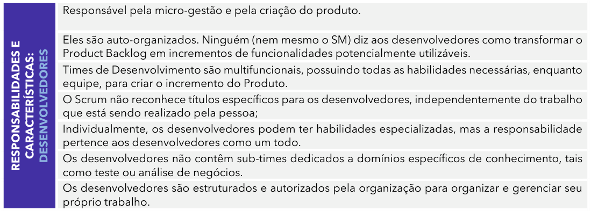

<!-- Start of picture text -->
Responsável pela micro-gestão e pela criação do produto. Eles são auto-organizados. Ninguém (nem mesmo o SM) diz aos desenvolvedores como transformar o Product Backlog em incrementos de funcionalidades potencialmente utilizáveis. Times de Desenvolvimento são multifuncionais, possuindo todas as habilidades necessárias, enquanto equipe, para criar o incremento do Produto. O Scrum não reconhece títulos específicos para os desenvolvedores, independentemente do trabalho que está sendo realizado pela pessoa; Individualmente, os desenvolvedores podem ter habilidades especializadas, mas a responsabilidade pertence aos desenvolvedores como um todo. Os desenvolvedores não contêm sub-times dedicados a domínios específicos de conhecimento, tais como teste ou análise de negócios. Os desenvolvedores são estruturados e autorizados pela organização para organizar e gerenciar seu próprio trabalho. CARACTERÍSTICAS:  DESENVOLVEDORES RESPONSABILIDADES E <!-- End of picture text -->

### **_<mark>[Guia Scrum - Versão 2020]</mark>_**

---

<!-- pagina: 25 -->

**Diego Carvalho, Equipe Informática 2 (Diego Carvalho), Equipe Informática 1 (Diego Carvalho) Aula 02** 

_<mark>Developers são as pessoas do Scrum Team que estão comprometidas em criar qualquer aspecto de um Incremento utilizável a cada Sprint. As habilidades específicas necessárias pelos Developers geralmente são amplas e variam de acordo com o domínio de trabalho. No entanto, os Developers são sempre responsáveis por: criar um plano para a Sprint, o Sprint Backlog; introduzir gradualmente qualidade aderindo a uma Definição de Pronto;  adaptar seu plano a cada dia em direção à meta da Sprint; e responsabilizar-se mutuamente como profissionais.</mark>_ 

**(CEBRASPE / TCE-AC  – 2024)** Julgue o próximo item conforme o Scrum (nov./2020). 

<mark>Na sprint planning, fica a critério exclusivo dos developers o planejamento necessário para se criar um incremento que atenda à definição de pronto, o que pode ser realizado decompondo-se os itens do product backlog.</mark> 

## **<mark>_______________________</mark>** 

**<mark>Comentários:</mark>** <mark>no Scrum Guide 2020, cabe aos developers definir como planejar o trabalho da sprint para gerar um incremento conforme</mark> a definição de pronto, inclusive decompondo itens do product backlog em tarefas menores (Correto).

---

<!-- pagina: 26 -->

**Diego Carvalho, Equipe Informática 2 (Diego Carvalho), Equipe Informática 1 (Diego Carvalho) Aula 02** 

<!-- Start of picture text -->
Scrum Master <!-- End of picture text -->

<!-- Start of picture text -->
(SM) <!-- End of picture text -->

#### **<mark>SCRUM MASTER (SM)</mark>** 

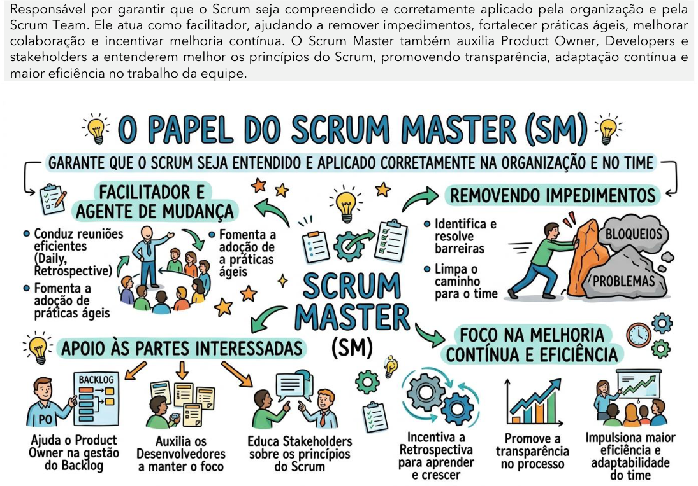

<!-- Start of picture text -->
Responsável por garantir que o Scrum seja compreendido e corretamente aplicado pela organização e pela Scrum Team. Ele atua como facilitador, ajudando a remover impedimentos, fortalecer práticas ágeis, melhorar colaboração e incentivar melhoria contínua. O Scrum Master também auxilia Product Owner, Developers e stakeholders a entenderem melhor os princípios do Scrum, promovendo transparência, adaptação contínua e maior eficiência no trabalho da equipe. <!-- End of picture text -->

O Scrum Master representa uma das responsabilidades centrais dentro do Scrum. O Guia Scrum define que ele é responsável por promover e apoiar o framework, ajudando todos a compreenderem corretamente seus conceitos, eventos, valores e práticas. Atenção porque isso não significa atuar como gerente tradicional, fiscal rígido ou chefe da equipe. O Scrum Master funciona muito mais como facilitador, mentor e agente de melhoria contínua dentro da organização e da Scrum Team. 

Uma expressão bastante associada ao Scrum Master é “servo-líder”. Muita gente interpreta isso de maneira equivocada no começo; contudo, a ideia não envolve passividade ou falta de autoridade. O Scrum Master lidera servindo à equipe, ajudando pessoas a colaborarem melhor, removerem impedimentos e aprimorarem continuamente a forma de trabalho. Em vez de controlar detalhadamente cada atividade executada, ele procura criar um ambiente favorável para que a Scrum Team consiga trabalhar com autonomia, foco e eficiência. 

Métodos ágeis dependem fortemente de comunicação contínua, colaboração multidisciplinar e liderança facilitadora. Nesse contexto, o Scrum Master possui papel extremamente importante para fortalecer cultura ágil, incentivar transparência e melhorar continuamente relações entre equipe, stakeholders e organização ao longo do desenvolvimento do produto. 

Outra responsabilidade central do Scrum Master envolve ajudar a Scrum Team a compreender e aplicar corretamente os princípios do Scrum. Atenção porque isso não significa “policiar” a equipe

---

<!-- pagina: 27 -->

**Diego Carvalho, Equipe Informática 2 (Diego Carvalho), Equipe Informática 1 (Diego Carvalho) Aula 02** 

constantemente ou agir como auditor burocrático. O objetivo é facilitar entendimento do empirismo, da auto-organização e das práticas ágeis para que a equipe consiga utilizar o framework de maneira realmente eficiente. Em ambientes maduros, o Scrum Master atua muito mais por influência, facilitação e orientação do que por imposição hierárquica. 

O Scrum Master também ajuda pessoas externas à Scrum Team a entenderem quais interações contribuem positivamente para o trabalho da equipe e quais acabam prejudicando foco, transparência e produtividade. Observem como isso é importante em ambientes organizacionais complexos: interrupções excessivas, mudanças caóticas de prioridade e interferências constantes podem comprometer completamente a Meta da Sprint e reduzir capacidade de entrega contínua de valor. 

Além disso, o Scrum Master trabalha continuamente removendo impedimentos que dificultam evolução do trabalho. Esses impedimentos podem ser técnicos, organizacionais, comunicacionais ou até culturais. Em muitos casos, problemas não surgem apenas dentro da equipe; eles aparecem em processos organizacionais inadequados, burocracias excessivas ou dificuldades de integração entre diferentes áreas da empresa. O Scrum Master ajuda justamente a identificar e reduzir essas barreiras para melhorar fluxo de trabalho e colaboração. 

Outra função extremamente importante envolve fortalecimento da melhoria contínua. O Scrum não foi criado apenas para entregar funcionalidades rapidamente; ele também procura aprimorar constantemente produto, processos, comunicação e dinâmica da equipe. O Scrum Master ajuda a criar esse ambiente de aprendizado contínuo, incentivando retrospectivas produtivas, transparência nas dificuldades encontradas e adaptação frequente diante dos problemas identificados ao longo das Sprints. 

Entendam uma ideia fundamental: o Scrum Master não existe para controlar pessoas; ele existe para ajudar a Scrum Team e a organização a funcionarem melhor dentro da filosofia ágil. O framework depende fortemente de confiança, colaboração, adaptação e comunicação aberta. Quando o Scrum Master consegue fortalecer esses elementos, a equipe tende a ganhar mais autonomia, foco, qualidade e capacidade de gerar valor continuamente em ambientes complexos e sujeitos a mudanças constantes. 

<!-- Start of picture text -->
RESPONSABILIDADES   SCRUM MASTER (SM) <!-- End of picture text -->

|Responsável pela gestão de pessoas e gestão do processo.|
|---|
|Ele deve garantir que o Scrum seja entendido e aplicado. O Scrum Master faz isso para garantir que a Equipe Scrum adere à teoria, práticas e regras do Scrum.|
|O Scrum Master ajuda aqueles que estão fora da Equipe Scrum a entender quais as suas interações com a Equipe Scrum são úteis equais não são.|
|O Scrum Master ajuda todos a mudarem estas interações para maximizar o valor criado pela Equipe Scrum.|
|Ele é responsável por orientar o Product Owner na criação e ordenação do Product Backlog.|
|Ele é responsável por garantir que as regras do Scrum estejam sendo cumpridas e seus valores estejam sendo seguidos.|
|Ele é responsável por ajudar a remover impedimentos que o time enfrente, fazendo isso sem o uso de qualquer autoridade.|
|Ele utiliza técnicas de facilitação e coaching para que os membros do time consigam visualizar os problemas e encontrem a melhor solução. |
|Durante eventos, ele é responsável por fazer com que a reunião flua adequadamente, utilizando técnicas de facilitação,embora não seja o responsávelpela condução.|
|Ele ajuda a treinar os desenvolvedores em autogerenciamento e interdisciplinaridade.|

---

<!-- pagina: 28 -->

**Diego Carvalho, Equipe Informática 2 (Diego Carvalho), Equipe Informática 1 (Diego Carvalho) Aula 02** 

<mark>Ele treina os desenvolvedores em ambientes organizacionais nos quais o Scrum não é totalmente</mark> adotado e compreendido. 

Ele ensina a Equipe Scrum a criar itens do Product Backlog de forma clara e concisa. 

Ele comunica claramente a visão, objetivo e itens do Product Backlog para os desenvolvedores. 

### **_<mark>[Guia Scrum - Versão 2020]</mark>_** 

_<mark>O Scrum Master é responsável por estabelecer o Scrum conforme definido no Guia do Scrum. Eles fazem isso ajudando todos a entender a teoria e a prática do Scrum, tanto no Scrum Team quanto na organização. O Scrum Master é responsável pela eficácia do Scrum Team. Eles fazem isso permitindo que o Scrum Team melhore suas práticas, dentro do framework Scrum Scrum Masters são verdadeiros líderes que servem ao Scrum Team e à organização como um todo.</mark>_ 

### **_<mark>O Scrum Master serve ao Scrum Team de várias maneiras, incluindo:</mark>_** 

_<mark>• Treinar os membros do time em autogerenciamento e cross-funcionalidade;</mark>_ 

_<mark>• Ajudar o Scrum Team a se concentrar na criação de incrementos de alto valor que atendem à Definição de Pronto;</mark>_ 

_<mark>• Provocando a remoção de impedimentos ao progresso do Scrum Team; e,</mark>_ 

_<mark>• Garantir que todos os eventos Scrum ocorram e sejam positivos, produtivos e mantidos dentro do Timebox.</mark>_ 

### **_<mark>O Scrum Master serve o Product Owner de várias maneiras, incluindo:</mark>_** 

_<mark>• Ajudar a encontrar técnicas para a definição eficaz de meta do Produto e gerenciamento do Product Backlog;</mark>_ 

_<mark>• Ajudar o Scrum Team a entender a necessidade de itens do Product Backlog claros e concisos;</mark>_ 

_<mark>• Ajudar a estabelecer o planejamento empírico do produto para um ambiente complexo; e,</mark>_ 

_<mark>• Facilitar a colaboração dos stakeholder, conforme solicitado ou necessário.</mark>_ 

### **_<mark>O Scrum Master serve a organização de várias maneiras, incluindo:</mark>_** 

_<mark>• Liderar, treinar e orientar a organização na adoção do Scrum;</mark>_ 

_<mark>• Planejar e aconselhar implementações de Scrum dentro da organização;</mark>_ 

_<mark>• Ajudar os funcionários e os stakeholders a compreender e aplicar uma abordagem empírica para trabalhos complexos; e,</mark>_ 

_<mark>• Remover barreiras entre stakeholders e Scrum Teams.</mark>_ 

### **Saiba mais:** 

<mark>Imaginem a construção de uma casa. Uma pessoa deseja construir sua residência e contrata uma empresa especializada para executar o projeto. Essa empresa monta uma equipe responsável por transformar necessidades e ideias em uma casa pronta e utilizável. Dentro dessa estrutura, podemos visualizar facilmente os papéis existentes no Scrum e compreender como ocorre colaboração entre todos os envolvidos no trabalho.</mark> 

<mark>Imaginem agora que existe um Dono da Casa. Ele representa a pessoa mais interessada no resultado final do projeto. É ele quem define prioridades, explica necessidades, escolhe aquilo que possui maior valor e decide quais características da casa são mais importantes naquele momento.</mark>

---

<!-- pagina: 29 -->

**Diego Carvalho, Equipe Informática 2 (Diego Carvalho), Equipe Informática 1 (Diego Carvalho) Aula 02** 

<mark>Observem que ele não constrói diretamente a casa; contudo, ele direciona continuamente aquilo que deve gerar maior valor para o produto final. Esse papel funciona de maneira muito parecida com o Product Owner dentro do Scrum.</mark> 

<mark>O principal objetivo do Dono da Casa é maximizar valor. Em outras palavras: ele procura garantir que a equipe esteja trabalhando naquilo que realmente importa para atingir os objetivos do projeto. Ele organiza prioridades, ajusta necessidades e mantém clareza sobre aquilo que deve ser feito primeiro. Esse alinhamento contínuo entre necessidades do negócio e trabalho técnico realizado pela equipe é de extrema importância.</mark> 

<mark>Agora pensem na equipe responsável por construir efetivamente a casa. Esses profissionais seriam equivalentes aos Developers dentro do Scrum. São as pessoas que colocam literalmente a mão na massa: levantam paredes, organizam estruturas, executam instalações e transformam planejamento em resultado concreto. Observem um detalhe importante: essa equipe deve ser multifuncional. Isso significa possuir diferentes competências necessárias para entregar valor sem depender excessivamente de grupos externos ao longo do trabalho.</mark> ==5460== 

<mark>A ideia de multifuncionalidade não significa que todos sejam especialistas idênticos em absolutamente tudo. Na prática, cada integrante pode possuir conhecimentos mais fortes em determinadas áreas; contudo, a equipe trabalha de maneira integrada, colaborativa e compartilhando responsabilidades continuamente. Métodos ágeis valorizam bastante esse modelo porque ele reduz gargalos, melhora comunicação e aumenta capacidade de adaptação diante das mudanças que surgem durante o projeto.</mark> 

<mark>Existe também uma figura extremamente importante nessa metáfora: o Mestre de Obras. Ele representa o Scrum Master. Atenção porque muita gente interpreta esse papel de maneira equivocada. O Scrum Master não funciona como chefe autoritário nem como gerente tradicional distribuindo ordens constantemente. Seu principal objetivo é ajudar a equipe a trabalhar melhor, remover impedimentos, facilitar colaboração e garantir que o framework Scrum esteja sendo corretamente compreendido e aplicado.</mark> 

<mark>Se surgirem problemas organizacionais, dificuldades de comunicação, conflitos internos ou obstáculos que prejudiquem evolução do trabalho, o Scrum Master ajuda a equipe a superar essas barreiras. Observem como ele atua muito mais como facilitador e líder servidor do que como fiscal rígido. Em ambientes ágeis, liderança colaborativa costuma ser muito mais importante do que modelos excessivamente hierárquicos e centralizadores de comando e controle.</mark> 

<mark>Outra função extremamente importante do Scrum Master envolve fortalecimento da autoorganização da equipe. O Scrum procura criar equipes capazes de tomar decisões técnicas sobre como executar o trabalho necessário durante a Sprint. O Product Owner direciona prioridades relacionadas ao produto; contudo, os Developers possuem autonomia para decidir tecnicamente como alcançar os objetivos definidos para a Sprint. Observem como o framework procura equilibrar direcionamento estratégico com autonomia operacional.</mark> 

<mark>Na versão anterior do Guia Scrum existia o termo “Development Team”; contudo, o Guia Scrum 2020 substituiu essa expressão por “Developers”. Essa mudança aconteceu para evitar percepção de subtimes separados dentro da Scrum Team. Hoje a ideia central é reforçar existência de uma única equipe integrada: Scrum Master, Product Owner e Developers trabalhando continuamente em direção aos mesmos objetivos relacionados à Meta da Sprint e geração contínua de valor.</mark> 

<mark>Outro ponto interessante envolve tamanho da equipe. O Guia Scrum atual não estabelece número rígido mínimo ou máximo para os Developers; contudo, afirma que Scrum Teams normalmente</mark>

---

<!-- pagina: 30 -->

**Diego Carvalho, Equipe Informática 2 (Diego Carvalho), Equipe Informática 1 (Diego Carvalho) Aula 02** 

<mark>possuem dez ou menos integrantes. O objetivo é manter colaboração eficiente, comunicação simples e baixa complexidade de coordenação. Equipes excessivamente grandes costumam perder agilidade, aumentar burocracia interna e dificultar alinhamento contínuo durante o desenvolvimento do produto.</mark> 

<mark>Claro que toda metáfora possui limitações; entretanto, ela ajuda bastante a visualizar a lógica do Scrum. O mais importante é entender que o framework procura substituir estruturas excessivamente burocráticas por colaboração contínua, transparência, adaptação rápida e responsabilidade coletiva. Em vez de departamentos isolados trabalhando separadamente, Scrum procura criar uma equipe integrada capaz de aprender constantemente, resolver problemas rapidamente e entregar</mark> valor contínuo em ambientes complexos e sujeitos a mudanças frequentes. 

**(CEBRASPE / DATAPREV – 2023)** A respeito de gerenciamento de projetos, gerenciamento de <mark>produtos e metodologias ágeis, julgue o item a seguir.</mark> 

<mark>No Scrum, o Scrum Master tem a responsabilidade de direcionar o rumo do desenvolvimento do produto.</mark> 

## **<mark>_______________________</mark>** 

**<mark>Comentários:</mark>** <mark>no Scrum, o Scrum Master atua como facilitador do processo e do time. O direcionamento do produto fica associado às</mark> decisões sobre valor e prioridades, não à condução feita por esse papel (Errado).

---

<!-- pagina: 31 -->

**Diego Carvalho, Equipe Informática 2 (Diego Carvalho), Equipe Informática 1 (Diego Carvalho) Aula 02** 

<!-- Start of picture text -->
Artefatos <!-- End of picture text -->

##### **<mark>INCIDÊNCIA EM PROVA: ALTÍSSIMA</mark>** 

Segundo o Guia Scrum, o framework possui apenas três artefatos oficiais: Product Backlog, Sprint Backlog e Increment. Atenção porque muitas ferramentas, gráficos e documentos adicionais aparecem frequentemente em ambientes ágeis; contudo, oficialmente esses três são os únicos artefatos definidos pelo Scrum. O framework procura ser propositalmente enxuto e minimalista, permitindo que equipes adicionem outras práticas conforme suas necessidades sem transformar o processo em algo excessivamente burocrático. 

Quando falamos em artefatos dentro do Scrum, não estamos tratando apenas de “produtos gerados pelo trabalho”. Os artefatos funcionam principalmente como mecanismos de transparência. Em outras palavras: eles tornam visível aquilo que está sendo desenvolvido, aquilo que possui maior prioridade e aquilo que já foi efetivamente concluído. Observem como isso se conecta diretamente ao empirismo do Scrum: transparência melhora inspeção; inspeção facilita adaptação; e adaptação ajuda a aumentar continuamente valor e qualidade do produto. 

### **_<mark>[Guia Scrum - Versão 2020]</mark>_** 

_<mark>Os artefatos do Scrum representam trabalho ou valor. Eles são projetados para maximizar a transparência das principais informações. Assim, todos os que os inspecionam têm a mesma base para adaptação. Cada artefato contém um compromisso para garantir que ele forneça informações que aumentem a transparência e o foco contra o qual o progresso pode ser medido:</mark>_ 

_<mark>• Para o Product Backlog, é a Meta do produto.</mark>_ 

_<mark>• Para o Sprint Backlog, é a Meta da Sprint.</mark>_ 

_<mark>• Para o incremento, é a Definição de Pronto.</mark>_ 

_<mark>Esses compromissos existem para reforçar o empirismo e os valores Scrum para o Scrum Team, e seus stakeholders.</mark>_ 

<!-- Start of picture text -->
Product Backlog <!-- End of picture text -->

#### **<mark>PRODUCT BACKLOG</mark>** 

Lista ordenada e dinâmica contendo funcionalidades, melhorias, correções, requisitos e necessidades relacionadas ao produto. Ele representa a principal fonte de mudanças e evolução do sistema, sendo continuamente refinado conforme surgem novos aprendizados, feedbacks e prioridades organizacionais. O Product Owner é o responsável final pelo gerenciamento desse backlog, embora Developers e stakeholders <u>possam colaborar continuamente no refinamento dos itens.</u> 

### **_<mark>[Guia Scrum - Versão 2020]</mark>_** 

_<mark>O Product Backlog é uma lista ordenada e emergente do que é necessário para melhorar o produto. É a única fonte de trabalho realizado pelo Scrum Team. Os itens do Product Backlog que podem ser realizados pelo Scrum Team em uma Sprint são considerados preparados para seleção no evento Sprint Planning. Eles geralmente adquirem esse grau de transparência após as atividades de refinamento. O Product Backlog refinement é o ato de quebrar e incluir definição adicional aos itens do Product Backlog para ter itens menores e mais precisos.</mark>_

---

<!-- pagina: 32 -->

**Diego Carvalho, Equipe Informática 2 (Diego Carvalho), Equipe Informática 1 (Diego Carvalho) Aula 02** 

_<mark>Esta é uma atividade contínua para adicionar detalhes, como descrição, ordem e tamanho. Os atributos geralmente variam de acordo com o domínio de trabalho. Os Developers que farão o trabalho são responsáveis pelo dimensionamento. O Product Owner pode influenciar os Developers, ajudando-os a entender e selecionar trade-offs (trocas de itens).</mark>_ 

### **_<mark>Compromisso: Meta do Produto</mark>_** 

_<mark>A Meta do Produto descreve um estado futuro do produto que pode servir como um alvo para o Scrum Team planejar. A Meta do produto está no Product Backlog. O restante do Product Backlog emerge para definir “o que” cumprirá a Meta do Produto. Um produto é um veículo para entregar valor. Tem um limite claro, stakeholders conhecidos, usuários ou clientes bem definidos. Um produto pode ser um serviço, um produto físico ou algo mais abstrato. A Meta do Produto é o objetivo de longo prazo para o Scrum Team. Eles devem cumprir (ou abandonar) um objetivo antes de assumir o próximo.</mark>_ 

Antes de tudo, precisamos entender o que significa backlog. Em termos gerais, backlog representa uma lista acumulada de demandas, necessidades, tarefas ou funcionalidades relacionadas a determinado produto ou projeto. Dentro do Scrum, o Product Backlog funciona como uma lista ordenada contendo tudo aquilo que pode ser necessário para evolução do produto. Essa ordenação normalmente considera valor de negócio, prioridade, riscos, dependências, necessidades dos usuários e diversos outros fatores relevantes para o projeto. 

O Product Backlog é considerado a principal fonte de requisitos e mudanças relacionadas ao produto. Observem um detalhe extremamente importante: ele não é estático nem definitivo. Pelo contrário, tratase de um artefato vivo, dinâmico e em constante evolução. Conforme o produto evolui, o mercado muda, novas necessidades aparecem e os usuários fornecem feedbacks, o backlog também precisa ser continuamente atualizado para refletir essa nova realidade do projeto. 

Dentro do Scrum, o Product Owner é o responsável final pelo gerenciamento e ordenação do Product Backlog. Isso significa definir prioridades, esclarecer necessidades e direcionar aquilo que possui maior valor para o produto. Atenção porque isso não significa trabalho isolado. Developers, stakeholders e especialistas frequentemente colaboram no refinamento, entendimento e evolução dos itens; contudo, a responsabilidade final sobre organização e direcionamento do backlog continua pertencendo ao Product Owner. 

Ambientes ágeis precisam lidar continuamente com mudanças de requisitos. Em projetos complexos, normalmente é impossível conhecer todos os detalhes do produto logo no início do desenvolvimento. Por isso, o Product Backlog evolui continuamente conforme surgem novos aprendizados, mudanças de mercado e melhor entendimento das necessidades do usuário. 

Os itens do Product Backlog podem assumir diferentes formatos. Um dos mais populares envolve Histórias de Usuário, chamadas também de User Stories. Elas normalmente descrevem necessidades do usuário utilizando linguagem simples e próxima do contexto de negócio. Atenção porque Histórias de Usuário não são obrigatórias no Scrum; elas representam apenas uma maneira bastante comum e eficiente de organizar requisitos em ambientes ágeis. 

Além de Histórias de Usuário, o backlog pode conter funcionalidades, melhorias técnicas, requisitos não funcionais, itens arquiteturais, tarefas de infraestrutura, correções e até riscos que precisam ser mitigados ao longo do projeto. Observem como isso amplia bastante o conceito do backlog. Ele não armazena apenas “funcionalidades visíveis”; ele reúne tudo aquilo que pode contribuir para evolução, qualidade e sustentabilidade do produto durante o desenvolvimento.

---

<!-- pagina: 33 -->

**Diego Carvalho, Equipe Informática 2 (Diego Carvalho), Equipe Informática 1 (Diego Carvalho) Aula 02** 

Outra característica extremamente importante envolve refinamento contínuo. Em geral, itens mais prioritários permanecem mais detalhados e refinados porque possuem maior chance de serem desenvolvidos nas próximas Sprints. Já itens mais distantes costumam permanecer menos detalhados inicialmente. Isso evita desperdício de tempo refinando excessivamente funcionalidades que talvez mudem, percam prioridade ou até deixem de existir conforme o produto evolui ao longo do projeto. 

Em muitos projetos, algumas funcionalidades inicialmente consideradas importantes acabam perdendo relevância conforme novas necessidades aparecem. Isso é completamente normal em ambientes complexos. Da mesma forma, novos requisitos podem surgir continuamente a partir de feedbacks, mudanças de mercado ou evolução das estratégias organizacionais. O Scrum procura justamente permitir adaptação rápida diante dessas mudanças sem transformar o desenvolvimento em um processo excessivamente burocrático e rígido. 

Para que um item entre em uma Sprint, normalmente ele precisa estar suficientemente claro, compreensível e pequeno o bastante para ser desenvolvido dentro daquele ciclo. Muitas equipes utilizam uma prática chamada Definition of Ready, conhecida como DoR. Atenção porque ela não faz parte oficial do Guia Scrum; trata-se de uma prática complementar criada pelas próprias equipes para definir critérios mínimos necessários antes de iniciar desenvolvimento de determinado item. 

A Definition of Ready ajuda bastante a reduzir ambiguidades, falhas de comunicação e conflitos de entendimento entre Product Owner e Developers. Em muitos casos, equipes criam critérios explícitos relacionados a descrição funcional, critérios de aceite, dependências, regras de negócio e informações necessárias para implementação. Observem que isso não deve ser confundido com Definition of Done. A DoR está relacionada à prontidão para começar desenvolvimento; já a Definition of Done define quando o incremento pode ser considerado realmente concluído. 

Quando critérios claros de refinamento e entendimento são estabelecidos coletivamente, o trabalho tende a fluir de maneira muito mais organizada e transparente. Equipes reduzem retrabalho, conflitos de interpretação e rejeições inesperadas durante as entregas. Em ambientes ágeis maduros, comunicação contínua, alinhamento frequente e refinamento colaborativo costumam ser muito mais importantes do que documentação gigantesca produzida meses antes da implementação das funcionalidades do produto. 

### **Saiba mais:** 

<mark>Muitas vezes, durante as cerimônias de refinamento do backlog ou antes da Sprint Planning, a equipe se depara com histórias de usuário que apresentam um grau altíssimo de incerteza técnica, de forma que é impossível fornecer uma estimativa razoável. Nessas situações, não se deve incluir a história às cegas, nem excluí-la de forma definitiva. A prática recomendada é adotar um Spike.</mark> 

<mark>O Spike é uma prática de investigação, um experimento rápido, ou uma prova de conceito (PoC) com time-box (limite de tempo) fixo. Ele é incluído como uma tarefa independente e sua finalidade é estritamente encontrar as respostas tecnológicas ou de negócio necessárias para reduzir o risco. Uma vez concluído o Spike, a incerteza diminui, e a história original pode ser desdobrada, estimada com precisão e então, com segurança, assumida em uma futura Sprint pela equipe de</mark> desenvolvimento.

---

<!-- pagina: 34 -->

**Diego Carvalho, Equipe Informática 2 (Diego Carvalho), Equipe Informática 1 (Diego Carvalho) Aula 02** 

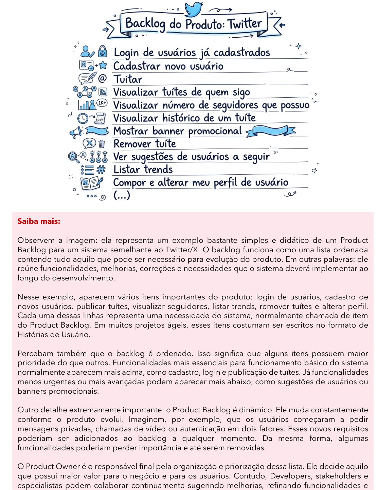

<!-- Start of picture text -->
Saiba mais: Observem a imagem: ela representa um exemplo bastante simples e didático de um Product Backlog para um sistema semelhante ao Twitter/X. O backlog funciona como uma lista ordenada contendo tudo aquilo que pode ser necessário para evolução do produto. Em outras palavras: ele reúne funcionalidades, melhorias, correções e necessidades que o sistema deverá implementar ao longo do desenvolvimento. Nesse exemplo, aparecem vários itens importantes do produto: login de usuários, cadastro de novos usuários, publicar tuítes, visualizar seguidores, listar trends, remover tuítes e alterar perfil. Cada uma dessas linhas representa uma necessidade do sistema, normalmente chamada de item do Product Backlog. Em muitos projetos ágeis, esses itens costumam ser escritos no formato de Histórias de Usuário. Percebam também que o backlog é ordenado. Isso significa que alguns itens possuem maior prioridade do que outros. Funcionalidades mais essenciais para funcionamento básico do sistema normalmente aparecem mais acima, como cadastro, login e publicação de tuítes. Já funcionalidades menos urgentes ou mais avançadas podem aparecer mais abaixo, como sugestões de usuários ou banners promocionais. Outro detalhe extremamente importante: o Product Backlog é dinâmico. Ele muda constantemente conforme o produto evolui. Imaginem, por exemplo, que os usuários começaram a pedir mensagens privadas, chamadas de vídeo ou autenticação em dois fatores. Esses novos requisitos poderiam ser adicionados ao backlog a qualquer momento. Da mesma forma, algumas funcionalidades poderiam perder importância e até serem removidas. O Product Owner é o responsável final pela organização e priorização dessa lista. Ele decide aquilo que possui maior valor para o negócio e para os usuários. Contudo, Developers, stakeholders e especialistas podem colaborar continuamente sugerindo melhorias, refinando funcionalidades e <!-- End of picture text -->

---

<!-- pagina: 35 -->

**Diego Carvalho, Equipe Informática 2 (Diego Carvalho), Equipe Informática 1 (Diego Carvalho) Aula 02** 

<mark>esclarecendo requisitos. Observem como o backlog funciona como um grande repositório vivo de</mark> necessidades do produto. 

**(FGV / TJ-RJ – 2026)** O analista de dados Junior está gerenciando um projeto de desenvolvimento <mark>de um ambiente analítico para apoiar a tomada de decisão. Junior está utilizando o Framework Scrum para agilizar a implementação do projeto que possui dezenas de requisitos.</mark> 

<mark>No Framework Scrum, o artefato que Junior utilizou para representar a lista ordenada de tudo o que é necessário para o projeto, servindo como fonte única de requisitos para a equipe, é:</mark> 

<mark>a) Roadmap;</mark> 

<mark>b) Increment;</mark> 

<mark>c) Daily Scrum;</mark> 

<mark>d) Sprint Backlog;</mark> 

<mark>e) Product Backlog.</mark> 

## **<mark>_______________________</mark>** 

**<mark>Comentários:</mark>** <mark>(a) Errado. Roadmap é um plano de alto nível com visão de evolução do produto, não a lista única e ordenada de requisitos do projeto; (b) Errado. Increment é o resultado entregue ao fim da Sprint, representando avanço no produto, e não o repositório de requisitos; (c) Errado. Daily Scrum é um evento diário de alinhamento da equipe, usado para inspecionar o progresso e ajustar o trabalho; (d) Errado. Sprint Backlog reúne os itens selecionados para a Sprint atual, não todos os requisitos necessários para o projeto; (e) Correto. Product Backlog é a lista ordenada de tudo o que é necessário no produto, servindo como fonte única de requisitos para a equipe (Letra</mark> E). 

---

<!-- pagina: 36 -->

**Diego Carvalho, Equipe Informática 2 (Diego Carvalho), Equipe Informática 1 (Diego Carvalho) Aula 02** 

<!-- Start of picture text -->
Sprint Backlog <!-- End of picture text -->

#### **<mark>SPRINT BACKLOG</mark>** 

Representa o conjunto de itens selecionados do Product Backlog para desenvolvimento durante a Sprint, juntamente com o plano necessário para produzir o incremento do produto. Ele inclui a Sprint Goal, os itens escolhidos e as atividades necessárias para execução do trabalho. O Sprint Backlog é gerenciado pelos Developers e permanece continuamente adaptável durante a Sprint conforme surgem novos aprendizados, dificuldades ou necessidades de reorganização do trabalho. 

### **_<mark>[Guia Scrum - Versão 2020]</mark>_** 

_<mark>O Sprint Backlog é composto pela Meta da Sprint (por que), o conjunto de itens do Product Backlog selecionados para a Sprint (o que), bem como um plano de ação para entregar o Incremento (como). O Sprint Backlog é um plano feito por e para os Developers. É uma imagem altamente visível, em tempo real do trabalho que os Developers planejam realizar durante a Sprint para atingir a Meta da Sprint. Consequentemente, o Sprint Backlog é atualizado ao longo da Sprint conforme mais é aprendido. Deve ter detalhes suficientes para que eles possam inspecionar seu progresso na Daily Scrum.</mark>_ 

### **_<mark>Compromisso: Meta da Sprint</mark>_** 

_<mark>A Meta da Sprint é o único objetivo da Sprint. Embora a Meta da Sprint seja um compromisso dos Developers, esta fornece flexibilidade em termos do trabalho exato necessário para alcançá-la. A Meta da Sprint também cria coerência e foco, encorajando o Scrum Team a trabalhar junto ao invés de iniciativas separadas. A Meta da Sprint é criada durante o evento Sprint Planning e então adicionada ao Sprint Backlog. Conforme os Developers trabalham durante a Sprint, eles mantêm a Meta da Sprint em mente. Se o trabalho acabar sendo diferente do que eles esperavam, eles colaboram com o Product Owner para negociar o escopo do Sprint Backlog dentro da Sprint sem afetar a Meta da Sprint.</mark>_ 

O Sprint Backlog representa o conjunto de itens selecionados para desenvolvimento durante a Sprint juntamente com o plano necessário para transformá-los em um incremento utilizável do produto. No Guia Scrum 2020, esse artefato passou a incluir explicitamente três elementos: Sprint Goal, itens selecionados do Product Backlog e plano de execução elaborado pelos Developers. Ao final da Sprint Planning, nasce um novo Sprint Backlog contendo aquilo que a equipe pretende desenvolver naquele ciclo. 

Uma dúvida extremamente comum em provas envolve diferença entre Product Backlog e Sprint Backlog. Atenção porque essa distinção costuma aparecer bastante! O Product Backlog representa uma lista ordenada contendo necessidades, funcionalidades, melhorias e requisitos relacionados ao produto como um todo. Já o Sprint Backlog está relacionado especificamente ao trabalho selecionado para a Sprint atual, funcionando como uma visão muito mais operacional e imediata do desenvolvimento. 

Em outras palavras: o Sprint Backlog representa o desdobramento do trabalho necessário para alcançar a Sprint Goal. Normalmente, os Developers transformam os itens selecionados em tarefas técnicas, atividades de implementação, testes, validações e outras ações necessárias para produzir o incremento. Observem um detalhe importante: o Guia Scrum não exige formalmente divisão em tarefas; contudo, essa prática costuma ser bastante utilizada porque ajuda organização, transparência e acompanhamento do progresso diário. 

Métodos ágeis dependem fortemente de visibilidade contínua do trabalho realizado. O Sprint Backlog ajuda justamente nisso: ele torna transparente aquilo que os Developers acreditam ser necessário para atingir a Meta da Sprint. Quanto maior essa transparência, maior tende a ser a capacidade de inspeção, adaptação e alinhamento da equipe.

---

<!-- pagina: 37 -->

**Diego Carvalho, Equipe Informática 2 (Diego Carvalho), Equipe Informática 1 (Diego Carvalho) Aula 02** 

Outro ponto importante é que o Sprint Backlog permanece dinâmico durante toda a Sprint. Conforme o trabalho evolui, os Developers podem descobrir novas tarefas, remover atividades desnecessárias, ajustar estimativas e reorganizar o plano de execução. Observem que isso não significa falta de planejamento; significa adaptação contínua baseada no aprendizado obtido ao longo do desenvolvimento. O Scrum procura justamente permitir flexibilidade sem comprometer foco e objetivo da Sprint. 

Os Developers possuem responsabilidade direta sobre gerenciamento do Sprint Backlog. Em outras palavras: eles decidem como organizar tecnicamente o trabalho necessário para alcançar a Sprint Goal. O framework evita modelos excessivamente hierárquicos e centralizadores, permitindo que a equipe utilize sua experiência coletiva para ajustar continuamente o plano conforme dificuldades, riscos e descobertas surgem ao longo da Sprint. 

O Sprint Backlog também funciona como uma imagem altamente visível do progresso da equipe. Durante a Daily Scrum, os Developers inspecionam andamento do trabalho e avaliam progresso em direção à Meta da Sprint. O Guia Scrum moderno enfatiza muito mais inspeção contínua do progresso relacionado à Sprint Goal do que simples controle burocrático de tarefas isoladas. Observem como o foco permanece continuamente na entrega de valor e no alcance do objetivo da Sprint. 

Outro aspecto bastante interessante envolve melhoria contínua. No Guia Scrum 2017 existia uma recomendação explícita para inclusão de pelo menos um item de melhoria identificado na Sprint Retrospective dentro da Sprint seguinte. O Guia Scrum 2020 removeu essa prescrição específica para tornar o framework menos prescritivo; contudo, a filosofia de melhoria contínua continua totalmente presente no Scrum moderno. 

Em ambientes ágeis maduros, a equipe não trabalha apenas para entregar funcionalidades; ela também procura melhorar continuamente processos, comunicação, colaboração e qualidade técnica do produto. O Sprint Backlog ajuda bastante nesse processo porque fornece transparência sobre aquilo que está sendo feito, facilita inspeção constante do progresso e permite adaptação rápida diante das mudanças e dificuldades encontradas durante o desenvolvimento da Sprint. 

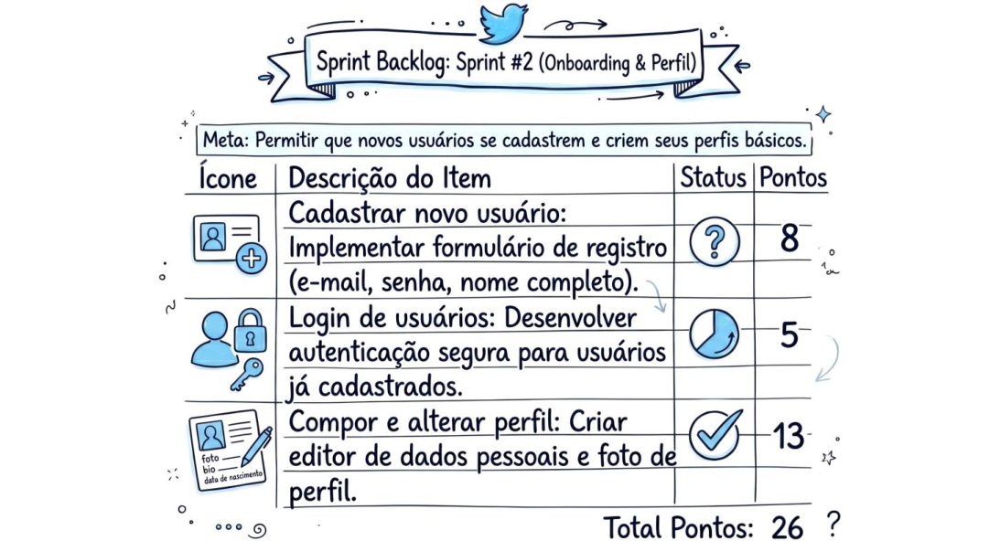

---

<!-- pagina: 38 -->

**Diego Carvalho, Equipe Informática 2 (Diego Carvalho), Equipe Informática 1 (Diego Carvalho) Aula 02** 

### **Saiba mais:** 

<mark>Observem que a imagem representa um exemplo de Sprint Backlog relacionado a uma Sprint específica de um sistema semelhante ao Twitter/X. Diferentemente do Product Backlog, que contém todas as necessidades do produto, o Sprint Backlog mostra apenas aquilo que foi selecionado para desenvolvimento durante uma Sprint específica. Nesse caso, trata-se da “Sprint #2”, focada em onboarding e criação de perfil de usuários.</mark> 

<mark>A primeira coisa importante da imagem é a Meta da Sprint: “Permitir que novos usuários se cadastrem e criem seus perfis básicos”. Observem como tudo dentro do Sprint Backlog gira em torno desse objetivo. O Scrum moderno enfatiza bastante essa ideia de foco contínuo na Sprint Goal, ou seja, as funcionalidades escolhidas devem colaborar diretamente para alcançar o resultado esperado ao final da Sprint.</mark> 

<mark>Logo abaixo aparecem os itens selecionados para desenvolvimento. Percebam que eles vieram originalmente do Product Backlog, mas agora foram refinados e detalhados para execução durante a Sprint. Entre os exemplos mostrados estão:</mark> 

<mark>- Cadastrar novo usuário;</mark> 

<mark>- Login de usuários;</mark> 

<mark>- Compor e alterar perfil.</mark> 

<mark>Observem como cada item já possui descrição mais clara e operacional. No item “Cadastrar novo usuário”, por exemplo, a equipe detalhou que será necessário implementar formulário de registro contendo e-mail, senha e nome completo. Isso mostra exatamente a ideia do Sprint Backlog: transformar necessidades mais amplas do Product Backlog em trabalho concreto e executável pelos Developers durante aquele ciclo.</mark> 

<mark>Outro detalhe importante envolve os status dos itens. A imagem mostra elementos ainda não iniciados, itens em andamento e itens concluídos. Isso reforça a principal função do Sprint Backlog: fornecer transparência contínua sobre o progresso da Sprint. A equipe consegue visualizar rapidamente aquilo que já foi entregue, aquilo que ainda está sendo desenvolvido e possíveis gargalos no fluxo de trabalho.</mark> 

<mark>Também aparecem os “pontos”, normalmente associados a Story Points. Esses pontos representam estimativas relativas de esforço, complexidade ou trabalho necessário para implementação dos itens. Observem que não significam tempo exato em horas. Métodos ágeis costumam utilizar estimativas relativas justamente porque desenvolvimento de software envolve bastante incerteza e variabilidade.</mark> 

<mark>O “Total Pontos: 26” representa a soma estimada do esforço planejado para aquela Sprint. Isso ajuda a equipe a acompanhar capacidade de entrega e evolução do trabalho ao longo das Sprints. Com o tempo, os Developers conseguem entender melhor sua velocidade média de entrega, facilitando planejamento futuro sem transformar Scrum em um modelo rígido e excessivamente</mark> burocrático. 

**(CESGRANRIO / BNDES – 2024)** Uma equipe de software que vem trabalhando no <mark>desenvolvimento de sistemas está aplicando a metodologia Scrum para atingir o objetivo de construir um software de gerência de redes. No momento, foi necessário apresentar a lista de</mark>

---

<!-- pagina: 39 -->

**Diego Carvalho, Equipe Informática 2 (Diego Carvalho), Equipe Informática 1 (Diego Carvalho) Aula 02** 

<mark>trabalho, para que todos os envolvidos soubessem as próximas execuções que precisariam ser realizadas. Que recurso da metodologia Scrum apresenta essas execuções?</mark> 

<mark>a) Daily Scrum</mark> 

<mark>b) Incremental Task</mark> 

<mark>c) Scrum Master</mark> 

<mark>d) Sprint Backlog</mark> 

<mark>e) Sprint Review</mark> 

## **<mark>______________________</mark>** 

**<mark>Comentários:</mark>** <mark>(a) Errado. Daily Scrum é a reunião diária de alinhamento da equipe, não a lista de trabalhos a executar; (b) Errado. Incremental Task não é o artefato do Scrum usado para apresentar as próximas execuções; (c) Errado. Scrum Master é um papel da metodologia, responsável por facilitar o processo, não por listar execuções; (d) Correto. Sprint Backlog reúne os itens de trabalho selecionados para a sprint e as próximas execuções da equipe; (e) Errado. Sprint Review é a reunião de revisão do que foi entregue ao</mark> fim da sprint, não a lista de tarefas (Letra D).

---

<!-- pagina: 40 -->

**Diego Carvalho, Equipe Informática 2 (Diego Carvalho), Equipe Informática 1 (Diego Carvalho) Aula 02** 

<!-- Start of picture text -->
Product Increment <!-- End of picture text -->

#### **<mark>PRODUCT INCREMENT</mark>** 

Representa o resultado concreto do trabalho realizado durante a Sprint. Trata-se de um incremento utilizável do produto que atende aos critérios da Definition of Done e contribui para evolução contínua do sistema. Cada Sprint adiciona novos incrementos ao produto existente, permitindo feedback frequente, inspeção contínua e adaptação rápida diante das mudanças. O incremento deve possuir qualidade suficiente para uso real, mesmo <u>que a organização escolha não liberá-lo imediatamente.</u> 

### **_<mark>[Guia Scrum - Versão 2020]</mark>_** 

_<mark>Um incremento é um trampolim concreto em direção a Meta do produto. Cada incremento é adicionado a todos os incrementos anteriores e completamente verificado, garantindo que todos os incrementos funcionem juntos. A fim de fornecer valor, o incremento deve ser utilizável. Vários incrementos podem ser criados em uma Sprint. A soma dos incrementos é apresentada na Sprint Review, apoiando assim o empirismo. No entanto, um incremento pode ser entregue aos stakeholders antes do final da Sprint. A Sprint Review nunca deve ser considerada um marco para liberar valor. O trabalho não pode ser considerado parte de um incremento a menos que atenda a Definição de Pronto.</mark>_ 

### **_<mark>Compromisso: Definição de Pronto</mark>_** 

_<mark>A Definição de Pronto é uma descrição formal do estado do Incremento quando ela atende às medidas de qualidade exigidas para o produto. No momento em que um item do Product Backlog atende a Definição de Pronto, um incremento nasce. A Definição de Pronto cria transparência ao fornecer a todos um entendimento compartilhado de qual trabalho foi concluído como parte do Incremento. Se um item do Product Backlog não atender à Definição de Pronto, ele não poderá ser liberado ou mesmo apresentado na Sprint Review. Em vez disso, ele retorna ao Product Backlog para consideração futura.</mark>_ 

_<mark>Se a Definição de Pronto para um incremento faz parte dos padrões da organização, todos os Scrum Teams devem segui-la como mínimo. Se não for um padrão organizacional, o Scrum Team deve criar uma Definição de Pronto apropriada para o produto. Os Developers devem estar em conformidade com a Definição de Pronto. Se houver vários Scrum Teams trabalhando juntos em um produto, eles devem definir e cumprir mutuamente a mesma Definição de Pronto.</mark>_ 

Ao final de cada Sprint, os Developers produzem um incremento do produto. Esse incremento representa o resultado concreto do trabalho realizado durante o ciclo e deve estar em condição utilizável. Observem um detalhe extremamente importante: o Guia Scrum moderno prefere utilizar o termo “utilizável” em vez de simplesmente “entregável”. Isso acontece porque o incremento pode estar completamente pronto para uso mesmo que a organização decida não liberá-lo imediatamente para clientes ou usuários finais. 

A ideia de incremento está diretamente ligada ao empirismo presente no Scrum. A cada Sprint, stakeholders e Scrum Team conseguem visualizar evolução real do produto, coletar feedbacks, identificar problemas e adaptar prioridades futuras. Métodos ágeis procuram reduzir riscos justamente por meio dessas entregas incrementais, frequentes e continuamente avaliadas. 

Outro conceito extremamente importante dentro do Scrum é a Definition of Done, normalmente chamada apenas de DoD. Em ambientes ágeis maduros, “pronto” significa realmente pronto. Não existe aquela ideia de “falta só um detalhe” ou “depois a gente ajusta”. Quando um item é considerado concluído, ele precisa atender integralmente aos critérios de qualidade definidos pela Scrum Team para que o incremento possa ser considerado utilizável e consistente.

---

<!-- pagina: 41 -->

**Diego Carvalho, Equipe Informática 2 (Diego Carvalho), Equipe Informática 1 (Diego Carvalho) Aula 02** 

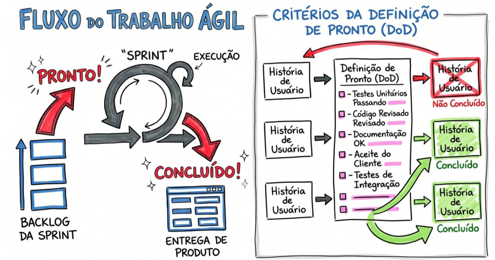

A Definition of Done funciona como um entendimento compartilhado sobre aquilo que significa conclusão real do trabalho. Ela normalmente envolve critérios relacionados a codificação, revisão, integração, testes, validações, documentação necessária e outros requisitos técnicos importantes para qualidade do produto. Observem que a DoD não pertence apenas aos Developers nem funciona como simples acordo isolado com o Product Owner; ela representa um compromisso coletivo da Scrum Team relacionado à qualidade do incremento. 

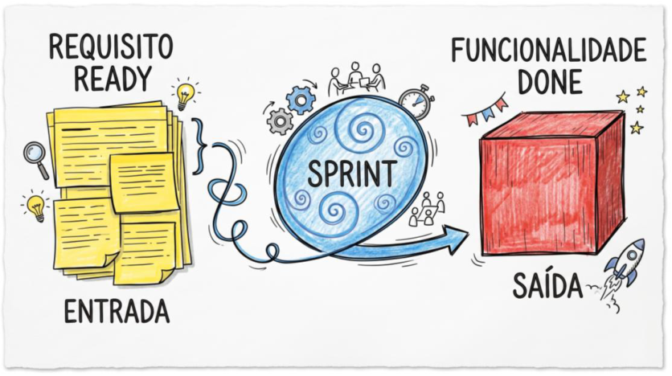

Existe uma diferença extremamente importante entre Definition of Done e Critérios de Aceite. Muitas pessoas confundem esses conceitos em provas. Os critérios de aceite normalmente estão associados a funcionalidades ou itens específicos do Product Backlog. Já a Definition of Done define padrões gerais de qualidade válidos para todos os incrementos produzidos pela equipe. Em outras palavras: critérios de aceite verificam se determinada funcionalidade atende ao comportamento esperado; já a DoD verifica se ela realmente pode ser considerada concluída.

---

<!-- pagina: 42 -->

**Diego Carvalho, Equipe Informática 2 (Diego Carvalho), Equipe Informática 1 (Diego Carvalho) Aula 02** 

Outra prática bastante conhecida em ambientes ágeis envolve a Definition of Ready, chamada também de DoR. Atenção porque ela não faz parte oficial do Guia Scrum; trata-se de uma prática complementar adotada por muitas equipes. A ideia é definir critérios mínimos necessários para que um item esteja suficientemente claro, compreensível e refinado antes de entrar em uma Sprint para desenvolvimento. 

Enquanto a Definition of Ready ajuda Developers a entenderem quando um item está pronto para começar desenvolvimento, a Definition of Done define quando o incremento pode ser considerado efetivamente concluído. Observem como esses conceitos ajudam bastante a reduzir ambiguidades, retrabalho e conflitos de interpretação durante o projeto. Em ambientes complexos, alinhamento contínuo sobre expectativas costuma ser fundamental para melhorar colaboração e qualidade das entregas. 

Uma funcionalidade que não atende à Definition of Done ao final da Sprint não pode ser considerada concluída. Normalmente, ela retorna ao Product Backlog para futura reavaliação e priorização pelo Product Owner. Isso ajuda a evitar falsa sensação de progresso e reduz acúmulo de débito técnico. O Scrum procura justamente incentivar transparência real sobre qualidade e andamento do desenvolvimento em vez de mascarar problemas temporariamente. 

Outro aspecto interessante é que a Definition of Done pode evoluir ao longo do tempo. Conforme a equipe amadurece tecnicamente, melhora seus processos e resolve impedimentos organizacionais, novos critérios de qualidade podem ser incorporados. Observem como isso reforça a filosofia de melhoria contínua presente no Scrum moderno: não apenas o produto evolui continuamente; os processos, práticas e padrões de qualidade da equipe também evoluem progressivamente. 

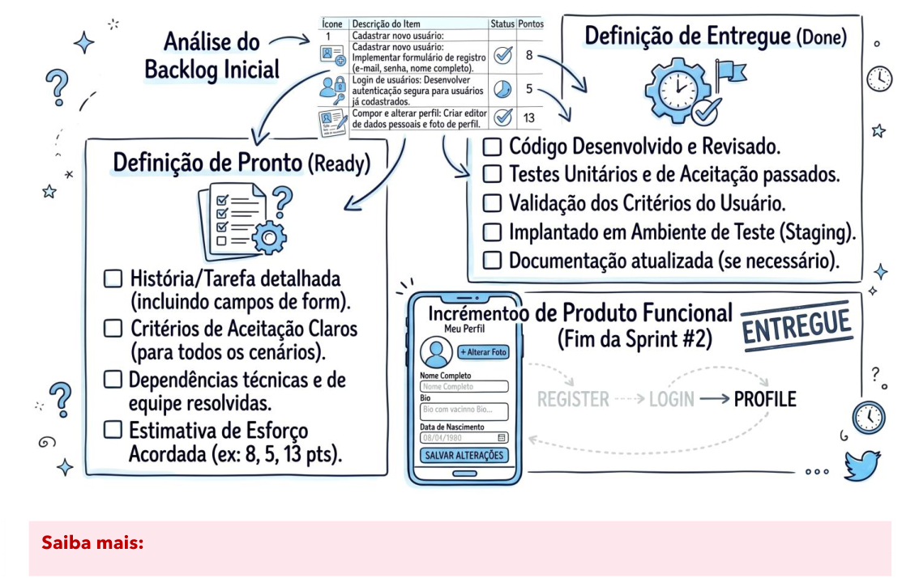

<!-- Start of picture text -->
Saiba mais: <!-- End of picture text -->

---

<!-- pagina: 43 -->

**Diego Carvalho, Equipe Informática 2 (Diego Carvalho), Equipe Informática 1 (Diego Carvalho) Aula 02** 

<mark>Observem que a imagem mostra um fluxo bastante completo do funcionamento de um Sprint Backlog dentro do Scrum. Ela conecta vários conceitos importantes: análise inicial do backlog, Definition of Ready, desenvolvimento durante a Sprint, Definition of Done e entrega do incremento funcional ao final do ciclo. Em outras palavras: a figura ilustra praticamente todo o caminho percorrido por um item até ele realmente ser considerado concluído.</mark> 

<mark>No canto superior esquerdo aparece o backlog inicial contendo itens selecionados para a Sprint. Nesse exemplo, temos funcionalidades relacionadas a cadastro de usuários, login e edição de perfil. Observem que cada item possui descrição, pontuação estimada e status. Esses itens vieram originalmente do Product Backlog e foram escolhidos pelos Developers durante a Sprint Planning para compor o Sprint Backlog daquela Sprint específica.</mark> 

<mark>Logo abaixo aparece a Definition of Ready (DoR). Ela representa um conjunto de critérios mínimos necessários para que um item esteja suficientemente claro antes do desenvolvimento começar. Na imagem, por exemplo, aparecem requisitos como: história detalhada; critérios de aceite claros; dependências resolvidas; e estimativa acordada. Isso ajuda bastante a reduzir ambiguidades e conflitos de entendimento.</mark> 

<mark>Atenção porque a Definition of Ready não faz parte oficial do Guia Scrum. Trata-se de uma prática complementar bastante utilizada por equipes ágeis modernas. O objetivo principal é garantir que Developers tenham informações suficientes para iniciar trabalho sem excesso de incerteza. Observem como isso melhora comunicação, alinhamento e previsibilidade durante a Sprint.</mark> 

<mark>Depois que os itens passam pela DoR, começa efetivamente o trabalho de desenvolvimento. Conforme as funcionalidades vão sendo implementadas, os Developers executam codificação, testes, validações e demais atividades técnicas necessárias. É justamente aqui que entra outro conceito extremamente importante mostrado na imagem: a Definition of Done, normalmente chamada apenas de DoD.</mark> 

<mark>A DoD representa os critérios necessários para considerar um incremento realmente concluído. Observem os exemplos exibidos: código desenvolvido e revisado; testes unitários e de aceitação executados; validação dos critérios do usuário; implantação em ambiente de testes; documentação atualizada. Percebam uma ideia central do Scrum moderno: “pronto” significa realmente pronto, não parcialmente concluído.</mark> 

<mark>Outro detalhe extremamente importante é que a DoD pertence à Scrum Team como um todo. Ela não funciona apenas como checklist técnico isolado nem como simples validação do Product Owner. A equipe inteira compartilha entendimento comum sobre aquilo que precisa acontecer para garantir qualidade mínima do incremento produzido ao final da Sprint.</mark> 

<mark>Na parte inferior da imagem aparece o incremento funcional produzido ao final da Sprint #2. Observem que agora já existe fluxo completo de cadastro, login e perfil funcionando de maneira integrada. Esse é justamente o principal objetivo do Scrum: produzir incrementos utilizáveis continuamente, permitindo feedback rápido, redução de riscos e evolução incremental do produto</mark> ao longo das Sprints. 

**(CEBRASPE / MPE-GO – 2024)** A respeito das metodologias ágeis para o desenvolvimento de <mark>software, julgue o próximo item.</mark>

---

<!-- pagina: 44 -->

**Diego Carvalho, Equipe Informática 2 (Diego Carvalho), Equipe Informática 1 (Diego Carvalho) Aula 02** 

<mark>De acordo com o Scrum 2020, caso a construção de uma funcionalidade, melhoria ou correção específica não cumpra a definição de feito (definition of done), ela não pode ser apresentada na Sprint Review.</mark> 

## **<mark>_______________________</mark>** 

**<mark>Comentários:</mark>** <mark>no Scrum 2020, o que não atende à Definition of Done não é considerado incremento pronto; por isso, não deve ser</mark> apresentado como entrega concluída na Sprint Review (Correto). 

Alguns artefatos e ferramentas complementares bastante utilizados em ambientes Scrum, mesmo não sendo elementos oficiais do Guia. Um exemplo clássico é o Burndown Chart, utilizado para tornar visível evolução do trabalho restante ao longo da Sprint. Esses gráficos podem utilizar diferentes métricas, como horas, tarefas ou pontos de esforço. O objetivo principal é aumentar transparência, facilitar inspeção contínua do progresso e apoiar adaptação rápida durante o desenvolvimento do produto. 

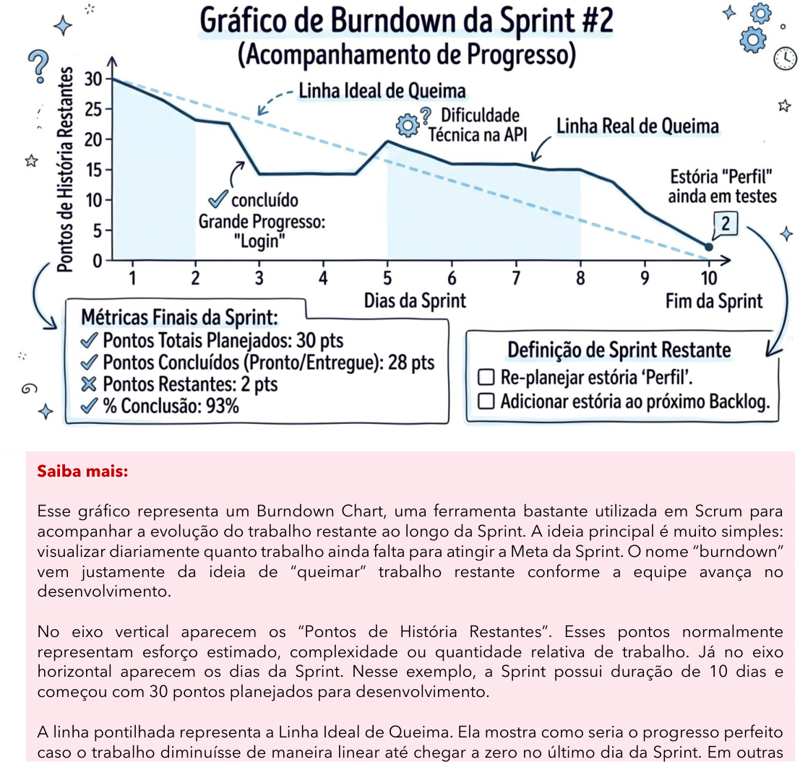

<!-- Start of picture text -->
Saiba mais: Esse gráfico representa um Burndown Chart, uma ferramenta bastante utilizada em Scrum para acompanhar a evolução do trabalho restante ao longo da Sprint. A ideia principal é muito simples: visualizar diariamente quanto trabalho ainda falta para atingir a Meta da Sprint. O nome “burndown” vem justamente da ideia de “queimar” trabalho restante conforme a equipe avança no desenvolvimento. No eixo vertical aparecem os “Pontos de História Restantes”. Esses pontos normalmente representam esforço estimado, complexidade ou quantidade relativa de trabalho. Já no eixo horizontal aparecem os dias da Sprint. Nesse exemplo, a Sprint possui duração de 10 dias e começou com 30 pontos planejados para desenvolvimento. A linha pontilhada representa a Linha Ideal de Queima. Ela mostra como seria o progresso perfeito caso o trabalho diminuísse de maneira linear até chegar a zero no último dia da Sprint. Em outras <!-- End of picture text -->

---

<!-- pagina: 45 -->

**Diego Carvalho, Equipe Informática 2 (Diego Carvalho), Equipe Informática 1 (Diego Carvalho) Aula 02** 

<mark>palavras: se a equipe queimasse exatamente a mesma quantidade de esforço todos os dias, o comportamento esperado do gráfico seria parecido com essa linha.</mark> 

<mark>Já a linha contínua representa a Linha Real de Queima, ou seja, aquilo que realmente aconteceu durante a Sprint. Observem que, nos primeiros dias, o progresso ocorreu normalmente. No terceiro dia aparece uma queda mais acentuada relacionada à conclusão da funcionalidade de login. Isso significa que uma quantidade importante de trabalho foi efetivamente concluída naquele momento.</mark> 

<mark>Depois disso, percebam que a linha sobe temporariamente por volta do quinto dia. Atenção porque isso é extremamente interessante em provas e no mundo real! Em um Burndown Chart, a linha pode subir quando a equipe descobre trabalho adicional, dificuldades técnicas ou necessidade de reestimativa. Nesse caso, a imagem mostra explicitamente uma “Dificuldade Técnica na API”, aumentando trabalho restante da Sprint.</mark> 

<mark>Nos dias seguintes, a equipe volta a reduzir gradualmente os pontos restantes até chegar ao final da Sprint com apenas 2 pontos pendentes. Observem o detalhe importante destacado na imagem: a funcionalidade “Perfil” ainda estava em testes. Isso significa que ela não atendeu completamente à Definition of Done e, portanto, não pode ser considerada concluída.</mark> 

<mark>Na parte inferior, aparecem as métricas finais da sprint realizada: dos 30 pontos planejados, 28 pontos foram concluídos, 2 pontos restaram e, portanto, tivemos 93% de conclusão. Isso mostra que a Sprint teve desempenho bastante positivo, embora nem todo o trabalho inicialmente planejado tenha sido finalizado.</mark> 

<mark>Outro detalhe importante aparece na caixa “Definição de Sprint Restante”. Como ainda sobraram 2 pontos relacionados à história “Perfil”, a equipe precisará replanejar esse item e provavelmente devolvê-lo ao Product Backlog para futura priorização pelo Product Owner. Isso está totalmente alinhado ao Scrum: trabalho não concluído retorna ao backlog e poderá entrar em Sprint futura.</mark> 

<mark>Além do acompanhamento feito com o Burndown Chart, equipes ágeis costumam adotar métricas de fluxo oriundas do método Kanban para medir a eficiência do seu processo. As duas métricas mais cobradas em provas são o Lead Time e o Cycle Time. O Lead Time (Tempo de Entrega) corresponde ao tempo total transcorrido desde o exato momento em que uma demanda (ou história de usuário) entra no sistema (no Product Backlog ou na fila de requisitos) até o momento em que ela é efetivamente concluída e entregue ao cliente.</mark> 

<mark>Por outro lado, o Cycle Time mede o tempo decorrido desde o momento em que a equipe efetivamente começa a trabalhar na tarefa (por exemplo, a codificação do componente) até o momento em que ela é considerada pronta. Sendo assim, afirmar que o Lead Time é restrito ao "tempo transcorrido na codificação" está errado, pois esse conceito se aproxima mais do Cycle</mark> Time. O Lead Time abrange o tempo de espera e análise antes mesmo da codificação iniciar. 

**(CEBRASPE / MPO – 2024)** No que se refere aos métodos ágeis para o gerenciamento de projetos, <mark>julgue o item subsequente.</mark> 

<mark>No Scrum, chama-se incremento que foi feito do produto dentro de uma sprint.</mark> 

## **<mark>_______________________</mark>** 

**<mark>Comentários:</mark>** <mark>no Scrum, o trabalho concluído dentro da sprint gera um incremento do produto, isto é, uma parte funcional e agregada</mark> ao que já existia, pronta para somar valor ao resultado do projeto (Correto).

---

<!-- pagina: 46 -->

**Diego Carvalho, Equipe Informática 2 (Diego Carvalho), Equipe Informática 1 (Diego Carvalho) Aula 02** 

<!-- Start of picture text -->
Eventos <!-- End of picture text -->

##### **<mark>INCIDÊNCIA EM PROVA: ALTÍSSIMA</mark>** 

Vamos falar agora sobre os eventos do Scrum, também chamados em muitas provas de reuniões ou cerimônias. Antes de entender cada evento individualmente, precisamos compreender o principal deles: a Sprint. Atenção porque, no Guia Scrum moderno, a própria Sprint também é considerada oficialmente um evento. Ela funciona como um grande contêiner que engloba todos os demais eventos do framework e também o trabalho de desenvolvimento realizado pelos Developers. 

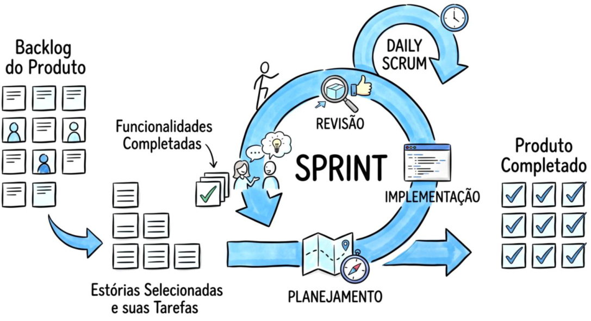

Imaginem um projeto cujo objetivo seja criar uma plataforma de e-commerce para uma grande empresa de varejo. Existem diversas funcionalidades necessárias para construção desse sistema: cadastro de clientes, login, pagamentos, carrinho de compras, rastreamento de pedidos e muito mais. Em vez de esperar meses até tudo ficar completamente pronto, o Scrum procura dividir desenvolvimento em ciclos curtos chamados Sprints, permitindo entregas frequentes e evolução incremental do produto. 

Ao final de cada Sprint, os Developers devem produzir um incremento utilizável do produto. Observem a importância da palavra “utilizável”. Isso significa que o incremento precisa atender aos critérios da Definition of Done e estar em condição real de uso. A organização pode decidir liberar imediatamente ou não para clientes finais; contudo, do ponto de vista técnico e funcional, o incremento já deve possuir qualidade suficiente para utilização. 

Métodos ágeis procuram reduzir riscos por meio de entregas incrementais e feedback contínuo. Em vez de descobrir problemas somente no final do projeto, equipes conseguem inspecionar produto continuamente, adaptar prioridades rapidamente e corrigir desvios enquanto desenvolvimento ainda está em andamento. 

Eu sei que isso pode parecer um pouco abstrato no começo; então, vamos pensar em uma metáfora bastante simples. Imaginem que você contratou um marceneiro para construir todos os armários do apartamento novo. Em um modelo tradicional, talvez ele passasse vários meses trabalhando

---

<!-- pagina: 47 -->

**Diego Carvalho, Equipe Informática 2 (Diego Carvalho), Equipe Informática 1 (Diego Carvalho) Aula 02** 

isoladamente e só entregasse tudo de uma única vez no final. O problema é que, até lá, você praticamente não teria visibilidade do andamento nem oportunidade de adaptação. 

Agora imaginem uma abordagem incremental. Você combina com o marceneiro entregas a cada quinze dias. Nos primeiros quinze dias, ele entrega os armários do banheiro já utilizáveis. Nos quinze dias seguintes, entrega armários da área de serviço. Depois, entrega o guarda-roupa do quarto completamente funcional. Observem como você passa a receber valor continuamente, além de conseguir ajustar detalhes, mudar prioridades e fornecer feedback durante o próprio desenvolvimento. 

Essa lógica representa exatamente o funcionamento das Sprints dentro do Scrum. Cada Sprint possui duração fixa de até um mês e começa imediatamente após conclusão da Sprint anterior. Durante esse período, a equipe trabalha continuamente para alcançar a Sprint Goal e produzir um incremento utilizável do produto. Observem como o framework procura criar ritmo constante de desenvolvimento, inspeção e adaptação ao longo do projeto. 

Durante a Sprint, mudanças continuam sendo possíveis; contudo, elas não devem comprometer a Sprint Goal. Em outras palavras: o Scrum não proíbe adaptação, mas procura evitar alterações caóticas que inviabilizem objetivos definidos para aquele ciclo. O escopo pode ser esclarecido, refinado e renegociado entre Product Owner e Developers conforme novos aprendizados surgem durante o desenvolvimento da Sprint em andamento. 

Outro ponto extremamente importante envolve estabilidade e qualidade. O Scrum enfatiza que qualidade não deve diminuir ao longo da Sprint. Além disso, mudanças constantes na composição da equipe normalmente não são desejáveis porque prejudicam previsibilidade, colaboração e fluxo de trabalho; contudo, o Guia Scrum moderno evita regras excessivamente rígidas sobre isso. O objetivo é preservar foco, alinhamento e capacidade contínua de entrega de valor. 

Existe ainda a possibilidade de cancelamento de uma Sprint antes do término do time-box. Segundo o Guia Scrum, somente o Product Owner possui autoridade formal para cancelar a Sprint. Isso normalmente acontece quando a Sprint Goal se torna obsoleta. Mudanças organizacionais, alterações estratégicas, transformações tecnológicas ou mudanças relevantes de mercado podem fazer determinada Sprint perder completamente o sentido dentro do contexto do produto. 

Quando uma Sprint é cancelada, todos os itens concluídos e utilizáveis normalmente são avaliados pelo Product Owner. Já os itens incompletos retornam ao Product Backlog para futura reestimativa e priorização. Observem que cancelamentos costumam ser incomuns, justamente porque as Sprints possuem curta duração. Além disso, cancelar uma Sprint normalmente gera custo organizacional significativo, pois exige novo planejamento, reorganização da equipe e redefinição de prioridades. 

Por fim, entendam uma ideia central do Scrum: os eventos existem para aumentar transparência, inspeção e adaptação contínua. Todos os eventos Scrum são time-boxed, isto é, possuem duração máxima predefinida. Isso ajuda a criar rotina, reduzir desperdícios e evitar excesso de reuniões desnecessárias. Dentro da Sprint, os principais eventos são: Sprint Planning, Daily Scrum, Sprint Review e Sprint Retrospective. Cada um deles possui papel fundamental para sustentar empirismo e melhoria contínua ao longo do desenvolvimento do produto. 

### **_<mark>[Guia Scrum - Versão 2020]</mark>_** 

_<mark>A Sprint é um contêiner para todos os outros eventos. Cada evento no Scrum é uma oportunidade formal para inspecionar e adaptar os artefatos do Scrum. Esses eventos são projetados especificamente para permitir a transparência necessária. A falha em operar quaisquer eventos conforme prescrito resulta em oportunidades perdidas de inspeção e adaptação. Os eventos são usados no Scrum para criar</mark>_

---

<!-- pagina: 48 -->

**Diego Carvalho, Equipe Informática 2 (Diego Carvalho), Equipe Informática 1 (Diego Carvalho) Aula 02** 

_<mark>regularidade e minimizar a necessidade de reuniões não definidas no Scrum. O ideal é que todos os eventos sejam realizados no mesmo horário e local para reduzir a complexidade.</mark>_ 

_<mark>Sprints são o coração do Scrum, onde ideias são transformadas em valor. São eventos de duração fixa de um mês ou menos para criar consistência. Uma nova Sprint começa imediatamente após a conclusão da Sprint anterior. Todo o trabalho necessário para atingir a meta do Produto, incluindo Sprint Planning, Daily Scrums, Sprint Review e Sprint Retrospective, acontece dentro de Sprints. Durante a Sprint:</mark>_ 

- _<mark>Nenhuma mudança é feita que coloque em risco a meta da Sprint;</mark>_ 

- _<mark>A qualidade não diminui;</mark>_ 

- _<mark>O Product Backlog é refinado conforme necessário; e,</mark>_ 

- _<mark>O escopo pode ser esclarecido e renegociado com o Product Owner conforme mais é aprendido.</mark>_ 

_<mark>Sprints permitem previsibilidade, garantindo a inspeção e adaptação do progresso em direção a uma meta do Produto ao menos uma vez por mês. Quando o horizonte de uma Sprint é muito longo, a meta da Sprint pode se tornar inválida, a complexidade pode aumentar e o risco pode aumentar. Sprints mais curtas podem ser empregados para gerar mais ciclos de aprendizagem e limitar os riscos de custo e esforço a um período de tempo menor. Cada Sprint pode ser considerado um projeto curto.</mark>_ 

_<mark>Existem várias práticas para prever o progresso, como burn-downs, burn-ups ou cumulative flows. Embora comprovadamente úteis, eles não substituem a importância do empirismo. Em ambientes complexos, o que acontecerá é desconhecido. Somente o que já aconteceu pode ser usado para a tomada de decisão voltada para o futuro. Uma Sprint pode ser cancelada se a Meta da Sprint se tornar obsoleta. Apenas o Product Owner tem autoridade para cancelar a Sprint.</mark>_ 

**(FUNDATEC / BRDE – 2023)** São eventos da metodologia ágil Scrum, segundo O Guia do Scrum, <mark>versão 2020, em português, disponível no site https://scrumguides.org:</mark> 

<mark>a) Meta da Sprint e Meta do Produto.</mark> 

- <mark>b) Inspect Meeting e Sprint Retrospective.</mark> 

- <mark>c) Daily Scrum e Sprint Planning.</mark> 

<mark>d) Product Backlog e Sprint Backlog.</mark> 

- <mark>e) Refinement Level e Sprint Review.</mark> 

## **<mark>_______________________</mark>** 

**<mark>Comentários:</mark>** <mark>(a) Errado. Meta da Sprint e Meta do Produto são objetivos no Scrum, não eventos previstos no Guia Scrum 2020; (b) Errado. Sprint Retrospective é evento, mas Inspect Meeting não é um evento oficial do Scrum; (c) Correto. Daily Scrum e Sprint Planning são eventos formais definidos no Guia do Scrum 2020; (d) Errado. Product Backlog e Sprint Backlog são artefatos do Scrum, e não</mark> eventos; (e) Errado. Sprint Review é evento, mas Refinement Level não é evento oficial do Scrum (Letra C).

---

<!-- pagina: 49 -->

**Diego Carvalho, Equipe Informática 2 (Diego Carvalho), Equipe Informática 1 (Diego Carvalho) Aula 02** 

<!-- Start of picture text -->
Sprint Planning <!-- End of picture text -->

#### **<mark>SPRINT PLANNING</mark>** 

<mark>Evento que inicia a Sprint e define aquilo que será desenvolvido ao longo do ciclo. Durante essa reunião, a Scrum</mark> Team discute valor da Sprint, seleciona itens do Product Backlog e constrói entendimento compartilhado sobre como o trabalho será realizado. O objetivo principal é estabelecer a Sprint Goal e estruturar o Sprint Backlog, <u>garantindo alinhamento entre Product Owner e Developers antes do início efetivo do desenvolvimento.</u> 

### **_<mark>[Guia Scrum - Versão 2020]</mark>_** 

_<mark>A Sprint Planning inicia a Sprint ao definir o trabalho a ser realizado na Sprint. Este plano resultante é criado pelo trabalho colaborativo de todo o Scrum Team. O Product Owner garante que os participantes estejam preparados para discutir os itens mais importantes do Product Backlog e como eles são mapeados para a Meta do Produto. O Scrum</mark>_ 

_<mark>Team também pode convidar outras pessoas para participar da Sprint Planning para fornecer conselhos.</mark>_ 

### **_<mark>A Sprint Planning aborda os seguintes tópicos:</mark>_** 

### **_<mark>Tópico um: Por que esta Sprint é valiosa?</mark>_** 

_<mark>O Product Owner propõe como o produto pode aumentar seu valor e utilidade na Sprint atual. Todo o Scrum Team então colabora para definir uma Meta da Sprint que comunica porque a Sprint é valiosa para os stakeholders. A meta da Sprint deve ser finalizada antes do final da Sprint Planning.</mark>_ 

### **_<mark>Tópico dois: O que pode ser feito nesta Sprint?</mark>_** 

_<mark>Por meio de discussão com o Product Owner, os Developers selecionam itens do Product Backlog para incluir na Sprint atual. O Scrum Team pode refinar esses itens durante este processo, o que aumenta a compreensão e a confiança. Selecionar o quanto pode ser concluído em uma Sprint pode ser um desafio. No entanto, quanto mais os Developers sabem sobre seu desempenho anterior, sua capacidade futura e sua Definição de Pronto, mais confiantes eles estarão em suas previsões quanto a Sprint.</mark>_ 

### **_<mark>Tópico três: Como o trabalho escolhido será realizado?</mark>_** 

_<mark>Para cada item do Product Backlog selecionado, os Developers planejam o trabalho necessário para criar um Incremento que atenda à Definição de Pronto. Isso geralmente é feito decompondo itens do Product Backlog em itens de trabalho menores de um dia ou menos. A forma como isso é feito fica a critério exclusivo dos Developers . Ninguém mais diz a eles como transformar itens do Product Backlog em incrementos de valor. A Meta da Sprint, os itens do Product Backlog selecionados para a Sprint, mais o plano para entregá-los são chamados juntos de Sprint Backlog.</mark>_ 

_<mark>A Sprint Planning tem um Timebox definido com duração máxima de de oito horas para uma Sprint de um mês. Para Sprints mais curtas, o evento geralmente é mais curto.</mark>_ 

O trabalho da Sprint começa a ser estruturado durante a Sprint Planning, também chamada de Reunião de Planejamento da Sprint. Esse evento reúne toda a Scrum Team para construir entendimento compartilhado sobre aquilo que será desenvolvido e sobre como o trabalho será realizado ao longo da Sprint. O Guia Scrum estabelece um time-box máximo de oito horas para Sprints de um mês; contudo, Sprints menores normalmente possuem planejamentos proporcionalmente menores.

---

<!-- pagina: 50 -->

**Diego Carvalho, Equipe Informática 2 (Diego Carvalho), Equipe Informática 1 (Diego Carvalho) Aula 02** 

No Guia Scrum moderno, a Sprint Planning procura responder essencialmente três grandes questões: por que a Sprint possui valor, o que pode ser desenvolvido durante o ciclo e como os Developers pretendem realizar esse trabalho. Observem como o foco não está apenas em distribuir tarefas mecanicamente; o objetivo principal é alinhar entendimento coletivo sobre geração de valor, objetivos da Sprint e viabilidade do trabalho planejado. 

Durante esse planejamento, o Product Owner apresenta os itens mais priorizados do Product Backlog. Esses itens normalmente representam funcionalidades, melhorias, correções ou necessidades consideradas mais relevantes para o produto naquele momento. Em ambientes ágeis, priorização costuma considerar diversos fatores: valor de negócio, riscos, dependências, impacto para usuários, retorno esperado e alinhamento estratégico da organização. 

Imaginem, por exemplo, um sistema de e-commerce. Talvez a funcionalidade de pagamento online possua enorme valor estratégico porque sem ela usuários sequer conseguem concluir compras. Já determinada melhoria estética menos relevante pode possuir prioridade muito inferior naquele momento. Observem como o Product Owner procura continuamente maximizar valor organizando o backlog conforme aquilo que gera maior impacto para negócio e usuários. 

Depois da apresentação e discussão dos itens priorizados, os Developers analisam aquilo que consideram viável para a Sprint. Observem um detalhe extremamente importante: o Scrum moderno enfatiza colaboração e negociação contínua, não simples “promessas rígidas” de entrega. A equipe procura selecionar quantidade de trabalho compatível com sua capacidade real, mantendo foco na Sprint Goal e na produção de um incremento utilizável ao final do ciclo. Métodos ágeis precisam lidar continuamente com incertezas e mudanças. Logo, estimativas normalmente utilizam medidas relativas em vez de tentar prever exatamente quantidade de horas necessárias para cada atividade do projeto. 

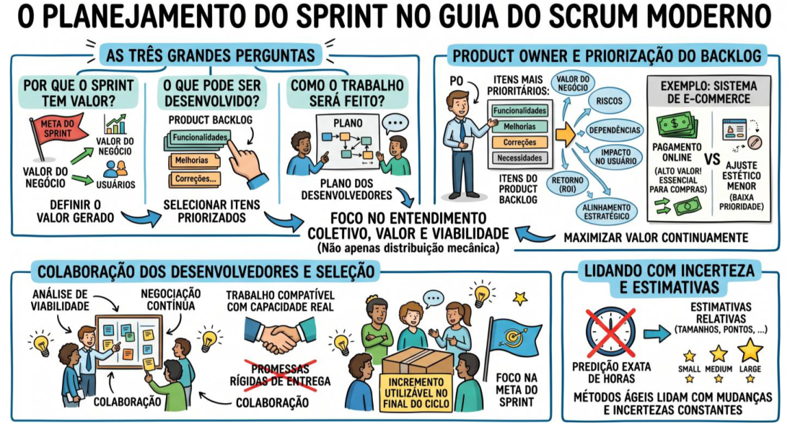

Nesse contexto surgem os Story Points, normalmente utilizados para estimar tamanho relativo, esforço, complexidade e incerteza associados a uma User Story. Atenção porque Story Points não representam apenas tempo isoladamente. Duas funcionalidades podem exigir quantidade semelhante de horas;

---

<!-- pagina: 51 -->

**Diego Carvalho, Equipe Informática 2 (Diego Carvalho), Equipe Informática 1 (Diego Carvalho) Aula 02** 

contudo, uma delas pode possuir muito mais riscos técnicos, dependências ou incertezas, recebendo assim maior quantidade de Story Points durante estimativa. 

Uma das técnicas mais populares para estimar Story Points é o Planning Poker. Atenção porque ele não faz parte oficial do Guia Scrum; contudo, tornou-se extremamente difundido em ambientes ágeis. O principal objetivo dessa técnica é incentivar discussão colaborativa e reduzir influência excessiva de determinados integrantes sobre estimativas realizadas pela equipe durante o planejamento da Sprint. 

No Planning Poker, cada participante recebe cartas contendo valores numéricos normalmente baseados na Sequência de Fibonacci: 1, 2, 3, 5, 8, 13 e assim por diante. Observem que o objetivo dessa sequência não está relacionado a “função quadrática”. O motivo principal é representar aumento progressivo da incerteza conforme funcionalidades se tornam maiores e mais complexas. Quanto maior o item, menor tende a ser precisão relativa da estimativa. 

Durante a dinâmica, o Product Owner apresenta determinada User Story e esclarece dúvidas relacionadas à funcionalidade. Depois disso, cada participante escolhe secretamente uma carta representando sua estimativa. Todas as cartas são reveladas simultaneamente. Quando surgem diferenças significativas entre valores, inicia-se uma discussão extremamente rica sobre riscos, complexidade, dependências e entendimento técnico da funcionalidade analisada. 

Observem como isso gera benefícios muito além da própria estimativa numérica. O Planning Poker estimula comunicação, compartilhamento de conhecimento e alinhamento técnico entre os Developers. Muitas vezes, integrantes diferentes percebem riscos ou dificuldades que outros ainda não haviam identificado. Em ambientes complexos, essas discussões ajudam bastante a reduzir surpresas durante desenvolvimento e aumentam qualidade geral do planejamento realizado pela equipe. 

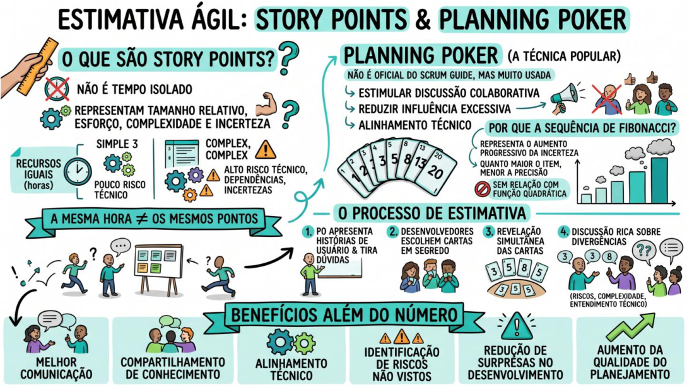

Algumas funcionalidades podem ser grandes demais para desenvolvimento dentro de uma única Sprint. Nesses casos, normalmente surgem os chamados épicos. Épicos representam funcionalidades amplas que frequentemente precisam ser quebradas em partes menores antes da implementação. Em

---

<!-- pagina: 52 -->

**Diego Carvalho, Equipe Informática 2 (Diego Carvalho), Equipe Informática 1 (Diego Carvalho) Aula 02** 

determinados ambientes organizacionais também aparecem conceitos como sagas; contudo, isso normalmente pertence mais a práticas de escalabilidade ágil ou arquiteturas distribuídas do que ao Scrum propriamente dito. 

Depois da seleção dos itens e definição da Sprint Goal, os Developers começam a estruturar tecnicamente o trabalho necessário para produzir o incremento. Surge então o Sprint Backlog, contendo a Meta da Sprint, os itens selecionados do Product Backlog e o plano necessário para entregar o incremento. Muitas equipes detalham esse plano em tarefas técnicas; contudo, o Guia Scrum não exige formalmente um formato específico para organização desse trabalho. 

Ao final da Sprint Planning, toda a Scrum Team deve possuir entendimento claro sobre objetivo da Sprint, valor esperado do incremento e estratégia geral de desenvolvimento. Observem como o Scrum procura equilibrar planejamento e adaptação contínua. Existe organização, alinhamento e foco; contudo, sem transformar desenvolvimento em processo excessivamente rígido, burocrático ou incapaz de responder rapidamente às mudanças que surgem ao longo do projeto. 

### **Saiba mais:** 

<mark>Em equipes grandes, também pode aparecer a prática avançada ou complementar de Balanced Team (Equipe Balanceada) na condução do framework ágil. Nesse cenário, o trabalho em grupo requer alto sincronismo, e realizar um planejamento simultâneo com a totalidade dos integrantes para demandas muito amplas pode gerar ineficiências.</mark> 

<mark>Para contornar isso, um grupo central de especialistas dentro do time de desenvolvimento atua em reuniões semanais chamadas de "pré-planejamento" (ou refinamento aprofundado). Apenas na última semana, o pré-planejamento da sprint atual passa a envolver a equipe inteira para realizar o alinhamento definitivo. Essa abordagem não substitui a Sprint Planning, mas prepara o terreno</mark> iterativamente para garantir que ela seja coesa e ágil quando envolver todos os desenvolvedores.

---

<!-- pagina: 53 -->

**Diego Carvalho, Equipe Informática 2 (Diego Carvalho), Equipe Informática 1 (Diego Carvalho) Aula 02** 

<!-- Start of picture text -->
Daily Scrum <!-- End of picture text -->

#### **<mark>DAILY SCRUM</mark>** 

Evento diário de até quinze minutos realizado pelos Developers para inspecionar progresso em direção à Sprint Goal e adaptar o Sprint Backlog conforme necessário. Durante essa reunião, a equipe procura alinhar trabalho, identificar impedimentos, reorganizar prioridades e planejar as próximas atividades da Sprint. O principal objetivo não é fornecer status para gestores, mas fortalecer colaboração, transparência e coordenação contínua entre os integrantes da Scrum Team. 

### **_<mark>[Guia Scrum - Versão 2020]</mark>_** 

_<mark>O propósito da Daily Scrum é inspecionar o progresso em direção a Meta da Sprint e adaptar o Sprint Backlog conforme necessário, ajustando o próximo trabalho planejado. A Daily Scrum é um evento de 15 minutos para os Developers do Scrum Team. Para reduzir a complexidade, é realizado no mesmo horário e local, todos os dias úteis da Sprint. Se o Product Owner ou o Scrum Master estão trabalhando ativamente nos itens do Sprint Backlog, eles participam como Developers.</mark>_ 

_<mark>Os Developers podem selecionar qualquer estrutura e técnicas que quiserem, desde que seu Daily Scrum se concentre no progresso em direção a Meta da Sprint e produza um plano de ação para o próximo dia de trabalho. Isso cria foco e melhora o autogerenciamento. As Daily Scrums melhoram as comunicações, identificam os impedimentos, promovem a rápida tomada de decisões e consequentemente, eliminam a necessidade de outras reuniões. A Daily Scrum não é o único momento em que os Developers podem ajustar seu plano. Eles costumam se reunir ao longo do dia para discussões mais detalhadas sobre a adaptação ou replanejamento do resto do trabalho da Sprint.</mark>_ 

A Daily Scrum, também chamada frequentemente de Reunião Diária, representa um dos eventos mais importantes do Scrum para coordenação contínua do trabalho durante a Sprint. Trata-se de um evento curto, com duração máxima de quinze minutos, realizado diariamente pelos Developers. O principal objetivo dessa reunião é inspecionar o progresso em direção à Sprint Goal e adaptar o Sprint Backlog conforme necessário para melhorar alinhamento e evolução do trabalho. 

Observem um detalhe extremamente importante: a Daily Scrum não existe apenas para “dar status” ao Scrum Master ou ao Product Owner. Essa é uma confusão bastante comum. O evento pertence aos Developers e funciona principalmente como mecanismo de sincronização, colaboração e planejamento do próximo trabalho necessário para alcançar a Meta da Sprint. Em outras palavras: a equipe procura alinhar continuamente aquilo que está sendo feito e aquilo que ainda precisa acontecer. 

O Guia Scrum recomenda que a Daily Scrum aconteça sempre no mesmo horário e local durante os dias úteis da Sprint. Isso ajuda bastante a reduzir complexidade organizacional e criar rotina previsível para a equipe. Atenção porque o Scrum não exige que a reunião aconteça em pé. Muita gente associa Daily Scrum obrigatoriamente ao famoso “daily stand-up”; contudo, isso representa apenas uma prática bastante comum adotada por diversas equipes. 

Métodos ágeis dependem fortemente de comunicação contínua e feedback rápido. A Daily Scrum existe justamente para fortalecer transparência, alinhamento e capacidade rápida de adaptação. Quanto mais cedo problemas, impedimentos ou desalinhamentos forem identificados, menor tende a ser impacto negativo sobre a Sprint. 

Outro ponto extremamente importante envolve foco na Sprint Goal. O Guia Scrum moderno enfatiza bastante que a Daily Scrum deve se concentrar continuamente no progresso em direção à Meta da Sprint. Em vez de simplesmente relatar tarefas isoladas, os Developers procuram entender coletivamente como avançar da melhor forma possível para atingir o objetivo definido durante a Sprint Planning.

---

<!-- pagina: 54 -->

**Diego Carvalho, Equipe Informática 2 (Diego Carvalho), Equipe Informática 1 (Diego Carvalho) Aula 02** 

Muitas equipes utilizam perguntas clássicas para estruturar essa conversa. Exemplos bastante conhecidos incluem: o que foi realizado desde a última Daily Scrum, o que será realizado até a próxima reunião e quais impedimentos estão dificultando evolução do trabalho. Atenção porque o Guia Scrum 2020 não obriga utilização dessas perguntas específicas. Os Developers podem escolher qualquer formato ou técnica desde que o foco permaneça no progresso relacionado à Sprint Goal. 

Observem como isso reforça autonomia e autogerenciamento da equipe. O Scrum evita estruturas excessivamente rígidas e procura permitir que os Developers adaptem suas próprias dinâmicas de trabalho conforme contexto, maturidade e necessidades do projeto. Algumas equipes preferem perguntas objetivas; outras trabalham diretamente sobre o quadro do Sprint Backlog; e algumas utilizam discussões rápidas focadas em impedimentos e prioridades do dia. 

Outro aspecto extremamente importante envolve identificação rápida de impedimentos. Problemas técnicos, dependências externas, dificuldades de integração ou dúvidas relacionadas às funcionalidades podem comprometer evolução da Sprint caso não sejam percebidos rapidamente. A Daily Scrum ajuda justamente a tornar essas dificuldades transparentes o quanto antes, permitindo que a equipe adapte plano de trabalho e busque soluções rapidamente. 

O Scrum Master pode participar da Daily Scrum; contudo, o evento continua pertencendo aos Developers. Segundo o Guia Scrum 2020, caso Product Owner ou Scrum Master estejam trabalhando ativamente em itens do Sprint Backlog, eles participam como Developers. Observem como isso reforça uma característica importante do Scrum moderno: redução de hierarquias rígidas e fortalecimento da colaboração contínua dentro da Scrum Team. 

A Daily Scrum também ajuda bastante a reduzir necessidade de reuniões adicionais desnecessárias ao longo da Sprint. Isso não significa eliminar completamente outras conversas ou alinhamentos; contudo, quando existe comunicação contínua e transparente diariamente, muitos problemas acabam sendo resolvidos rapidamente antes mesmo de crescerem. Em ambientes ágeis maduros, pequenas interações frequentes costumam ser muito mais eficientes do que longas reuniões burocráticas realizadas esporadicamente. 

Outro detalhe importante é que a Daily Scrum não representa o único momento de adaptação do plano de trabalho. Developers frequentemente continuam conversando e ajustando estratégias ao longo do dia conforme surgem novas informações, riscos ou dificuldades técnicas. O Scrum procura justamente incentivar adaptação contínua e colaboração frequente em vez de depender exclusivamente de reuniões formais para tomada de decisões relacionadas ao desenvolvimento do produto. 

### **(CEBRASPE / CTI – 2024)** Julgue o seguinte item, acerca de Scrum. 

<mark>Daily Scrum, evento de 15 minutos, cujo objetivo é inspecionar o progresso em direção à meta da sprint, é o único momento em que é permitido que os developers ajustem seu plano após o início da sprint.</mark> 

## **<mark>_______________________</mark>** 

**<mark>Comentários:</mark>** <mark>embora a Daily Scrum sirva para inspecionar o progresso e adaptar o trabalho, os developers podem ajustar o plano</mark> sempre que necessário ao longo da sprint, e não apenas nesse evento (Errado).

---

<!-- pagina: 55 -->

**Diego Carvalho, Equipe Informática 2 (Diego Carvalho), Equipe Informática 1 (Diego Carvalho) Aula 02** 

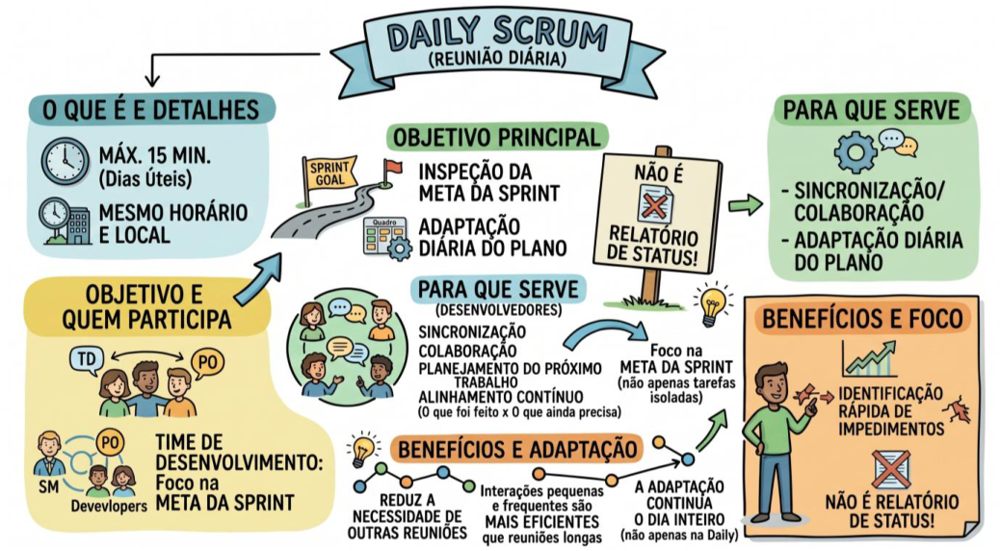

---

<!-- pagina: 56 -->

**Diego Carvalho, Equipe Informática 2 (Diego Carvalho), Equipe Informática 1 (Diego Carvalho) Aula 02** 

<!-- Start of picture text -->
Sprint Review <!-- End of picture text -->

#### **<mark>SPRINT REVIEW</mark>** 

Evento realizado ao final da Sprint para inspecionar o incremento produzido e coletar feedback dos stakeholders. Durante essa reunião, a Scrum Team apresenta funcionalidades concluídas, discute resultados alcançados e analisa possíveis adaptações futuras do Product Backlog. O foco principal da Sprint Review não é apenas demonstrar funcionalidades prontas, mas promover aprendizado contínuo, alinhamento com stakeholders e evolução incremental do produto. 

### **_<mark>[Guia Scrum - Versão 2020]</mark>_** 

_<mark>O propósito da Sprint Review é inspecionar o resultado da Sprint e determinar as adaptações futuras. O Scrum Team apresenta os resultados de seu trabalho para os principais stakeholders e o progresso em direção a Meta do Produto é discutido. Durante o evento, o Scrum Team e os stakeholders revisam o que foi realizado na Sprint e o que mudou em seu ambiente. Com base nessas informações, os participantes colaboram sobre o que fazer a seguir. O Product Backlog também pode ser ajustado para atender a novas oportunidades.</mark>_ 

_<mark>A Sprint Review é uma sessão de trabalho e o Scrum Team deve evitar limitá-la a uma apresentação. A Sprint Review é o penúltimo evento da Sprint e tem um Timebox com prazo máximo de quatro horas para uma Sprint de um mês. Para Sprints mais curtas, o evento geralmente é mais curto.</mark>_ 

Ao final da Sprint acontece a Sprint Review – também chamada de Revisão da Sprint. Esse evento possui duração máxima de até quatro horas para Sprints de um mês; contudo, Sprints menores normalmente possuem revisões proporcionalmente menores. Atenção porque a Sprint Review não representa apenas uma simples demonstração de funcionalidades prontas. O principal objetivo desse evento é inspecionar o incremento produzido e adaptar continuamente o Product Backlog conforme feedbacks, mudanças e novos aprendizados surgem. 

Durante a Sprint Review, a Scrum Team e os stakeholders analisam aquilo que foi desenvolvido ao longo da Sprint. Observem como o foco está fortemente relacionado ao empirismo presente no Scrum: transparência permite inspeção; inspeção facilita adaptação; e adaptação ajuda a aumentar continuamente valor e qualidade do produto. Em vez de esperar meses para descobrir problemas ou desalinhamentos, o Scrum procura criar ciclos frequentes de validação e aprendizado. 

Métodos ágeis dependem profundamente de feedback contínuo dos usuários e stakeholders. Em ambientes complexos, necessidades mudam constantemente; portanto, revisões frequentes ajudam equipes a identificar rapidamente novas prioridades, oportunidades e problemas antes que eles cresçam excessivamente durante o projeto. 

A Sprint Review normalmente inclui demonstração do incremento produzido durante a Sprint. Os Developers apresentam funcionalidades concluídas, explicam soluções implementadas e respondem dúvidas relacionadas ao produto. Observem, porém, um detalhe extremamente importante: o evento não funciona como uma cerimônia formal de “aprovação” rígida conduzida por um gerente tradicional. O objetivo principal é colaboração, inspeção do incremento e discussão sobre próximos passos do produto. 

O Product Owner possui participação extremamente importante nesse evento porque ele ajuda a avaliar valor gerado pelo incremento e estado atual do Product Backlog. No entanto, a Sprint Review não pertence exclusivamente ao Product Owner nem funciona como simples validação unilateral da Sprint. Trata-se de um evento colaborativo envolvendo Scrum Team e stakeholders relevantes, permitindo discussão conjunta sobre aquilo que foi entregue e sobre possíveis adaptações futuras do produto.

---

<!-- pagina: 57 -->

**Diego Carvalho, Equipe Informática 2 (Diego Carvalho), Equipe Informática 1 (Diego Carvalho) Aula 02** 

Outro ponto extremamente importante envolve a Sprint Goal. Durante a Sprint Review, a equipe analisa em que medida o objetivo definido durante a Sprint Planning foi alcançado. Observem que o Scrum não procura criar ambiente punitivo baseado apenas em “aprovação” ou “reprovação”. O framework valoriza muito mais transparência, aprendizado contínuo e adaptação rápida diante dos resultados observados ao final da Sprint. 

Caso determinadas funcionalidades não atendam à Definition of Done, elas não podem ser consideradas parte válida do incremento concluído. Isso ajuda bastante a evitar falsa sensação de progresso e reduz acúmulo de débito técnico ao longo do desenvolvimento. Em Scrum moderno, qualidade não deve ser negociada apenas para aparentar velocidade maior de entrega. O incremento precisa realmente estar utilizável e consistente ao final da Sprint. 

A Sprint Review também representa excelente oportunidade para discutir mudanças de mercado, feedbacks de usuários, riscos identificados e novas possibilidades para evolução do produto. Muitas vezes, stakeholders percebem novas necessidades ao visualizar incremento funcionando na prática. Observem como isso reforça uma das maiores vantagens dos métodos ágeis: aprendizado contínuo baseado em interação frequente com produto real e não apenas em documentação teórica produzida no início do projeto. 

Outro detalhe extremamente importante é que o Product Backlog costuma ser adaptado após as discussões realizadas durante a Sprint Review. Funcionalidades podem ganhar maior prioridade, perder importância, sofrer refinamentos ou até deixar de fazer sentido dependendo do feedback recebido. O Scrum procura justamente permitir adaptação contínua sem transformar mudanças em algo traumático ou excessivamente burocrático para a equipe. 

O foco da Sprint Review não está apenas em mostrar aquilo que foi desenvolvido; o foco principal está em gerar aprendizado coletivo sobre o produto e orientar próximos passos do desenvolvimento. Em ambientes ágeis maduros, esse evento ajuda bastante a fortalecer transparência, alinhamento organizacional, colaboração com stakeholders e capacidade contínua de adaptação diante das mudanças e necessidades do mercado. 

Vocês se lembram do filme O Gladiador? Pois é! A Revisão da Sprint é o momento em que o Product Owner valida ou não a Sprint, de acordo com a meta que tenha sido acordada com os desenvolvedores durante a reunião de planejamento da sprint. Discute-se os problemas e as soluções e, após a demonstração do incremento, respondem-se quaisquer dúvidas dos presentes.

---

<!-- pagina: 58 -->

**Diego Carvalho, Equipe Informática 2 (Diego Carvalho), Equipe Informática 1 (Diego Carvalho) Aula 02** 

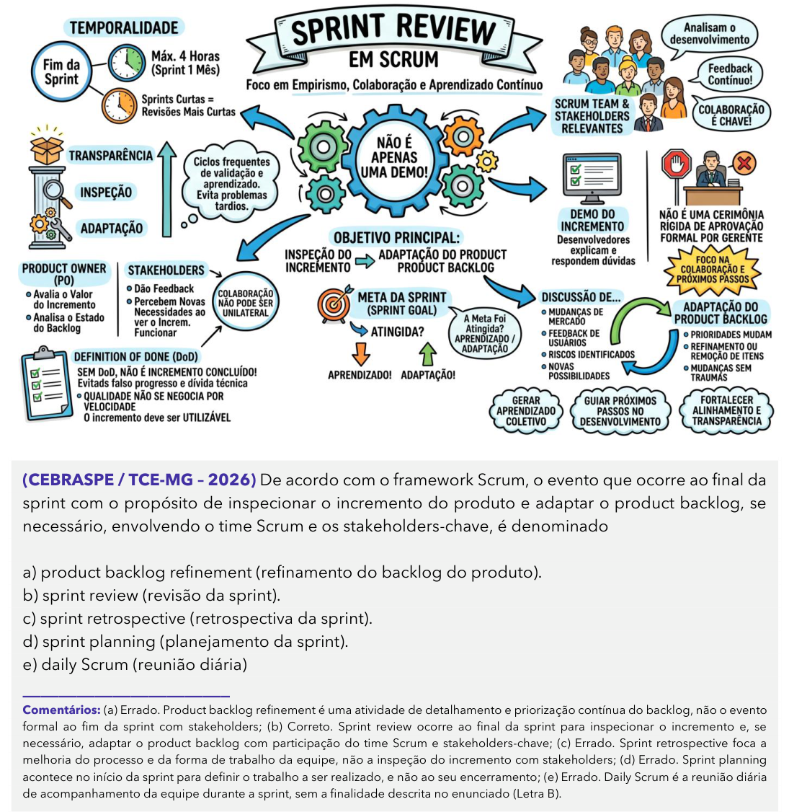

<!-- Start of picture text -->
(CEBRASPE / TCE-MG – 2026)  De acordo com o framework Scrum, o evento que ocorre ao final da sprint com o propósito de inspecionar o incremento do produto e adaptar o product backlog, se necessário, envolvendo o time Scrum e os stakeholders-chave, é denominado a) product backlog refinement (refinamento do backlog do produto). b) sprint review (revisão da sprint). c) sprint retrospective (retrospectiva da sprint). d) sprint planning (planejamento da sprint). e) daily Scrum (reunião diária) _______________________ Comentários:  (a) Errado. Product backlog refinement é uma atividade de detalhamento e priorização contínua do backlog, não o evento formal ao fim da sprint com stakeholders; (b) Correto. Sprint review ocorre ao final da sprint para inspecionar o incremento e, se necessário, adaptar o product backlog com participação do time Scrum e stakeholders-chave; (c) Errado. Sprint retrospective foca a melhoria do processo e da forma de trabalho da equipe, não a inspeção do incremento com stakeholders; (d) Errado. Sprint planning acontece no início da sprint para definir o trabalho a ser realizado, e não ao seu encerramento; (e) Errado. Daily Scrum é a reunião diária de acompanhamento da equipe durante a sprint, sem a finalidade descrita no enunciado (Letra B). <!-- End of picture text -->

---

<!-- pagina: 59 -->

**Diego Carvalho, Equipe Informática 2 (Diego Carvalho), Equipe Informática 1 (Diego Carvalho) Aula 02** 

<!-- Start of picture text -->
Sprint Retrospective <!-- End of picture text -->

#### **<mark>SPRINT RETROSPECTIVE</mark>** 

Evento dedicado à melhoria contínua da Scrum Team. Ao final da Sprint, a equipe analisa aquilo que funcionou bem, os problemas enfrentados e possíveis melhorias relacionadas a processos, ferramentas, comunicação e colaboração. O objetivo principal é identificar ações concretas capazes de aumentar eficiência, qualidade e maturidade da equipe nas próximas Sprints, fortalecendo continuamente adaptação, aprendizado e evolução do trabalho realizado. 

### **_<mark>[Guia Scrum - Versão 2020]</mark>_** 

_<mark>O propósito da Sprint Retrospective é planejar maneiras de aumentar a qualidade e a eficácia. O Scrum Team inspeciona como foi a última Sprint em relação a indivíduos, interações, processos, ferramentas e sua Definição de Pronto. Os elementos inspecionados geralmente variam com o domínio de trabalho. As suposições que os desviaram são identificadas e suas origens exploradas. O Scrum Team discute o que deu certo durante a Sprint, quais problemas encontraram e como esses problemas foram (ou não) resolvidos.</mark>_ 

_<mark>O Scrum Team identifica as mudanças mais úteis para melhorar sua eficácia. As melhorias mais impactantes são endereçadas o mais rápido possível. Essas podem até ser adicionadas ao Sprint Backlog para a próxima Sprint. A Sprint Retrospective conclui a Sprint. É limitada pelo Timebox de no máximo três horas para uma Sprint de um mês. Para Sprints mais curtas, o evento geralmente é mais curto.</mark>_ 

A Sprint Retrospective, também chamada de Retrospectiva da Sprint, representa o principal momento formal de melhoria contínua dentro do Scrum. Esse evento acontece ao final da Sprint e possui duração máxima de até três horas para Sprints de um mês; contudo, Sprints menores normalmente possuem retrospectivas proporcionalmente menores. O principal objetivo da retrospectiva é permitir que a Scrum Team inspecione a si própria e identifique maneiras de trabalhar melhor na Sprint seguinte. 

Observem um detalhe extremamente importante: enquanto a Sprint Review possui foco principal no produto e no incremento entregue, a Sprint Retrospective concentra atenção principalmente no processo de trabalho da equipe. Em outras palavras: o evento procura analisar aquilo que funcionou bem, aquilo que gerou dificuldades e aquilo que pode ser melhorado em relação à comunicação, colaboração, ferramentas, práticas técnicas e dinâmica geral do desenvolvimento. 

Métodos ágeis dependem profundamente de aprendizado contínuo e adaptação frequente. Em ambientes complexos, não basta apenas evoluir o produto; a própria equipe também precisa evoluir continuamente sua maneira de trabalhar para aumentar qualidade, produtividade e capacidade de resposta diante das mudanças. 

Durante a retrospectiva, a Scrum Team costuma discutir aspectos relacionados às pessoas, às relações interpessoais, aos processos utilizados, às ferramentas adotadas e aos impedimentos enfrentados ao longo da Sprint. Observem como o objetivo não é buscar culpados nem criar ambiente punitivo. O Scrum procura incentivar transparência e melhoria contínua, permitindo que dificuldades sejam discutidas abertamente para que a equipe encontre soluções coletivamente. 

O Scrum Master possui papel extremamente importante nesse evento. Ele ajuda a manter ambiente produtivo, colaborativo e respeitoso durante as discussões. Atenção porque o Scrum Master não atua como simples “membro auxiliar”; ele é integrante pleno da Scrum Team e trabalha fortemente como facilitador do processo Scrum. Seu objetivo principal é ajudar a equipe a refletir sobre melhorias possíveis e fortalecer continuamente práticas ágeis dentro da organização.

---

<!-- pagina: 60 -->

**Diego Carvalho, Equipe Informática 2 (Diego Carvalho), Equipe Informática 1 (Diego Carvalho) Aula 02** 

Durante a Sprint Retrospective, também é comum que a equipe verifique e reflita sobre as métricas de desempenho do ciclo que se encerrou. É nesse momento que o time frequentemente verifica quantos pontos de história (story points) foram efetivamente entregues na Sprint e registra a sua velocidade. O acompanhamento contínuo e a discussão dessa métrica na retrospectiva permitem que os Developers compreendam melhor sua capacidade real de entrega, utilizando esses dados empíricos para melhorar e calibrar o planejamento das próximas Sprints. 

Outro ponto extremamente importante envolve a Definition of Done. O Guia Scrum menciona explicitamente que a Scrum Team pode adaptar sua definição de “Pronto” durante a retrospectiva, desde que isso não entre em conflito com padrões organizacionais ou requisitos necessários ao produto. Observem como isso reforça a ideia de amadurecimento contínuo da equipe: conforme conhecimento técnico aumenta, critérios de qualidade também podem evoluir progressivamente. 

Ao final da Sprint Retrospective, a Scrum Team normalmente identifica ações concretas de melhoria para próximas Sprints. O Guia Scrum 2017 enfatizava explicitamente inclusão de melhorias na Sprint seguinte; já o Guia 2020 tornou o framework menos prescritivo nesse ponto. Mesmo assim, a filosofia de melhoria contínua permanece totalmente presente. O mais importante é garantir que as reflexões produzam mudanças reais e não apenas discussões teóricas sem impacto prático no trabalho da equipe. 

Além dos eventos oficiais do Scrum, muitas organizações utilizam práticas complementares bastante comuns em ambientes ágeis. Um exemplo é a chamada Reunião de Visão do Produto. Atenção porque esse evento não faz parte oficial do Guia Scrum; contudo, ele costuma ser utilizado para alinhar entendimento estratégico sobre aquilo que o produto pretende entregar aos usuários e ao negócio ao longo do projeto. 

Nessa visão do produto, o Product Owner normalmente apresenta objetivos gerais, público-alvo, diferenciais do produto e expectativas relacionadas ao valor que será gerado. Técnicas como Elevator Pitch, Product Vision Box e Product Roadmap aparecem frequentemente nesse contexto. O famoso “Teste do Elevador”, popularizado por Geoffrey Moore e adaptado por Jim Highsmith, procura justamente resumir proposta de valor do produto de maneira rápida, objetiva e facilmente compreensível. 

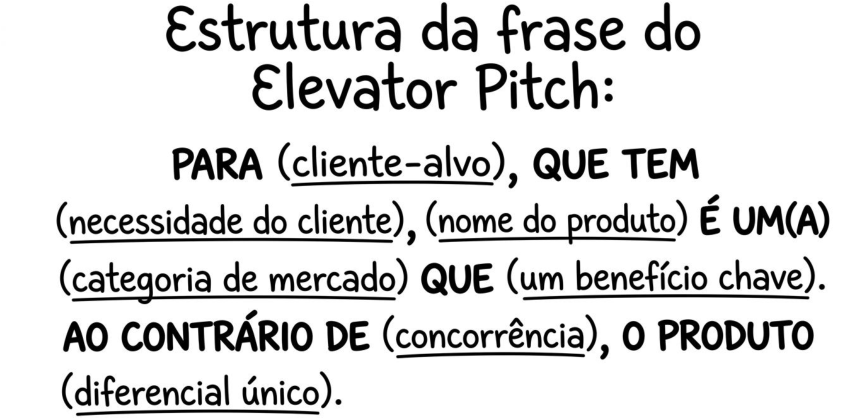

Um exemplo de visão sobre um produto de turismo poderia ser: “Para turistas usuários de smartphone que desejam aproveitar melhor seus locais de destino, o MyTrip é um aplicativo móvel de viagens que sugere roteiros diários flexíveis de acordo com seu perfil de viajante. Ao contrário de guias de viagens com roteiros predefinidos e burocráticos, nosso produto elabora trajetos personalizados e adaptáveis”.

---

<!-- pagina: 61 -->

**Diego Carvalho, Equipe Informática 2 (Diego Carvalho), Equipe Informática 1 (Diego Carvalho) Aula 02** 

Outro evento bastante comum em ambientes corporativos é o Release Planning Meeting. Novamente, atenção: isso também não faz parte oficial do Scrum Guide. Em muitos projetos, entretanto, organizações preferem agrupar diversos incrementos produzidos ao longo de várias Sprints antes de disponibilizar uma release completa em produção. Isso costuma acontecer devido a restrições técnicas, contratuais, operacionais ou relacionadas ao próprio negócio. 

Nesses casos, torna-se necessário planejar dependências, datas importantes, estratégias de implantação, testes integrados e gerenciamento de riscos associados à liberação do produto. Observem como ambientes organizacionais reais frequentemente complementam Scrum com práticas adicionais para lidar com necessidades específicas relacionadas a governança, operações e entrega contínua de software em larga escala. 

O Scrum procura criar ciclos contínuos de transparência, inspeção e adaptação. O Product Backlog evolui continuamente; a Sprint Planning define objetivos e trabalho; a Daily Scrum acompanha progresso diário; a Sprint Review inspeciona produto e feedbacks; e a Sprint Retrospective melhora continuamente processos e dinâmica da equipe. Observem como todos esses elementos trabalham juntos para sustentar aprendizado contínuo, colaboração e geração incremental de valor ao longo do projeto. 

Historicamente, algumas abordagens mais antigas relacionadas ao Scrum descreviam o ciclo de vida do framework utilizando três grandes momentos: Pre-game, Game e Post-game. Atenção porque essa divisão não faz parte oficial do Guia Scrum moderno; contudo, ela ainda aparece em diversos materiais didáticos e ajuda bastante a compreender como o trabalho evolui desde preparação inicial até entrega e validação do produto. 

A primeira dessas etapas era chamada de Pre-game Phase, normalmente traduzida como PréPlanejamento. Nesse momento inicial, a equipe procurava definir visão geral do produto, identificar necessidades principais do projeto e estruturar o Product Backlog inicial. Observem um detalhe extremamente importante: o backlog não nasce completo e definitivo. Em ambientes ágeis, ele evolui continuamente conforme surgem novos aprendizados, feedbacks e mudanças de negócio. 

Durante essa preparação inicial, também costumava surgir uma visão arquitetural de alto nível do sistema. Métodos ágeis não eliminam arquitetura: o que muda é a forma como ela evolui! Em vez de tentar definir todos os detalhes técnicos logo no início, equipes constroem uma base arquitetural inicial que amadurece continuamente ao longo das Sprints. 

Depois disso ocorria a chamada Game Phase, correspondente ao desenvolvimento iterativo e incremental do produto. É justamente aqui que acontecem as Sprints do Scrum. Durante cada Sprint, a Scrum Team trabalha continuamente para produzir incrementos utilizáveis do sistema. Observem que o desenvolvimento não acontece em grandes blocos isolados; o produto evolui gradualmente por meio de ciclos curtos de planejamento, implementação, testes, integração, inspeção e adaptação. 

Outro detalhe extremamente importante é que Scrum moderno não funciona como mini-cascata repetida dentro das Sprints. Embora existam atividades de análise, design, implementação e testes, essas atividades costumam acontecer de maneira bastante integrada e colaborativa ao longo do ciclo. Em ambientes ágeis maduros, Developers trabalham continuamente em conjunto, reduzindo barreiras rígidas entre funções técnicas e fortalecendo comunicação frequente durante desenvolvimento. 

A cada Sprint, novas funcionalidades, melhorias, correções e ajustes são incorporados ao produto. Isso permite feedback rápido dos stakeholders e reduz bastante riscos relacionados a requisitos incorretos ou mudanças de mercado. Observem como o empirismo aparece fortemente aqui: a equipe aprende continuamente a partir daquilo que está sendo construído, validado e utilizado ao longo do projeto.

---

<!-- pagina: 62 -->

**Diego Carvalho, Equipe Informática 2 (Diego Carvalho), Equipe Informática 1 (Diego Carvalho) Aula 02** 

A terceira etapa histórica era chamada de Post-game Phase, normalmente associada a atividades de integração, validação e preparação para disponibilização do produto. Atenção porque Scrum moderno procura distribuir essas atividades continuamente durante as Sprints. Em outras palavras: integração, testes, validação e refinamentos não deveriam ficar concentrados apenas ao final do projeto. 

Métodos ágeis mais maduros procuram incorporar qualidade continuamente ao desenvolvimento. Isso significa realizar integração frequente, testes contínuos, validações constantes e feedback rápido ao longo de todo o projeto. Quanto mais cedo problemas forem identificados, menor tende a ser custo de correção e maior tende a ser capacidade de adaptação da equipe. 

Mesmo assim, muitas organizações ainda executam atividades finais adicionais antes de grandes releases em produção. Dependendo do contexto organizacional, podem existir validações extras, testes integrados em larga escala, homologações corporativas, revisões regulatórias ou preparação operacional para implantação do sistema. Observem que isso não substitui as Sprints; representa apenas necessidade prática existente em muitos ambientes corporativos reais. 

Outro aspecto bastante interessante dessa visão histórica é perceber como o Scrum procura equilibrar planejamento e adaptação contínua. Existe preparação inicial, existe visão geral do produto e existe direcionamento estratégico; contudo, o framework evita transformar desenvolvimento em processo excessivamente rígido e burocrático. O aprendizado contínuo ao longo das Sprints possui papel central na evolução do produto e também na evolução da própria equipe. 

Independentemente da nomenclatura utilizada, o Scrum moderno gira continuamente em torno de transparência, inspeção e adaptação. O Product Backlog evolui constantemente; as Sprints produzem incrementos utilizáveis; stakeholders fornecem feedback frequente; e a Scrum Team melhora continuamente seus processos. Observem como todo o framework procura criar ciclos rápidos de aprendizado, colaboração e geração incremental de valor ao longo do desenvolvimento do produto. 

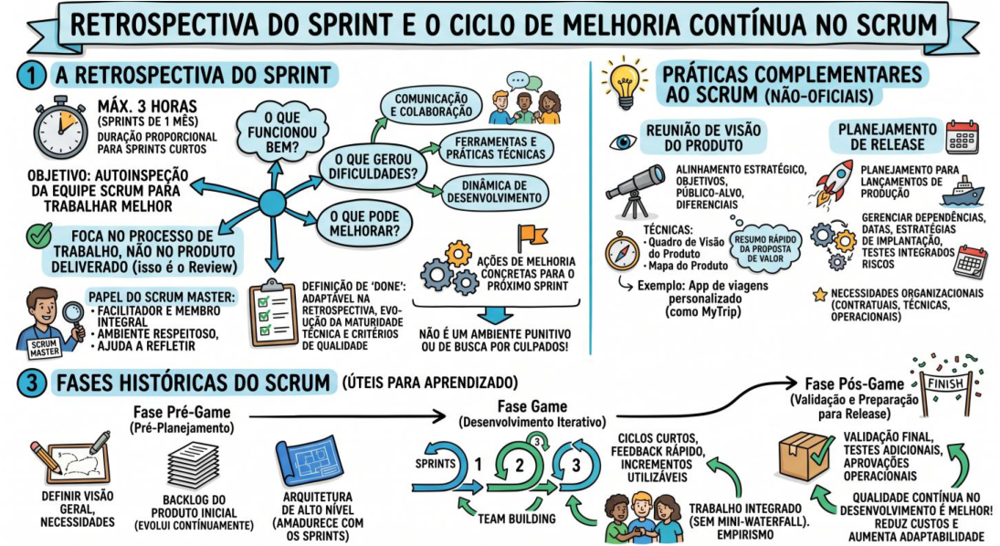

---

<!-- pagina: 63 -->

**Diego Carvalho, Equipe Informática 2 (Diego Carvalho), Equipe Informática 1 (Diego Carvalho) Aula 02** 

**(CESGRANRIO / CEF - 2024)** Ao final da primeira Sprint de um projeto, o time realizou uma reunião, <mark>prevista no Scrum, na qual todos os membros do time de desenvolvimento declararam que estavam satisfeitos por usar teste de unidade e que gostariam que o desenvolvimento fosse dirigido por testes, usando a técnica conhecida como TDD, para melhorar o trabalho. A atividade especificamente designada no Scrum para discutir tópicos como esses é a reunião de</mark> 

<mark>a) Alinhamento Técnico b) Inspeção</mark> 

<mark>c) Planejamento d) Retrospectiva</mark> 

<mark>e) Revisão</mark> 

## **<mark>_______________________</mark>** 

**<mark>Comentários:</mark>** <mark>(a) Errado.</mark> `“` <mark>Alinhamento Técnico</mark> `”` <mark>não é evento oficial do Scrum para refletir sobre melhorias do processo do time; (b) Errado. Inspeção é um princípio presente no Scrum, não a reunião específica voltada a discutir satisfação e melhorias; (c) Errado. Planejamento define o trabalho da Sprint, não é o momento próprio para avaliar práticas adotadas e propor ajustes; (d) Correto. A Retrospectiva é a reunião destinada a inspecionar como o trabalho ocorreu e discutir melhorias, como adoção de TDD; (e) Errado. Revisão</mark> foca no incremento entregue e no feedback sobre o produto, não nas melhorias internas do modo de trabalho do time (Letra D).

---

<!-- pagina: 64 -->

**Diego Carvalho, Equipe Informática 2 (Diego Carvalho), Equipe Informática 1 (Diego Carvalho) Aula 02** 

<!-- Start of picture text -->
S CRUM <!-- End of picture text -->

#### **<mark>SCRUM</mark>** 

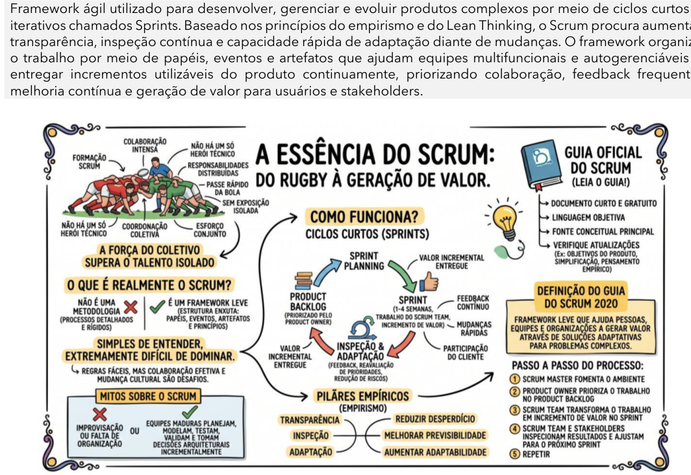

<!-- Start of picture text -->
Framework ágil utilizado para desenvolver, gerenciar e evoluir produtos complexos por meio de ciclos curtos e iterativos chamados Sprints. Baseado nos princípios do empirismo e do Lean Thinking, o Scrum procura aumentar transparência, inspeção contínua e capacidade rápida de adaptação diante de mudanças. O framework organiza o trabalho por meio de papéis, eventos e artefatos que ajudam equipes multifuncionais e autogerenciáveis a entregar incrementos utilizáveis do produto continuamente, priorizando colaboração, feedback frequente, melhoria contínua e geração de valor para usuários e stakeholders. geração de valor para usuários e stakeholders. eração de valor para usuários e stakeholders. ção de valor para usuários e stakeholders. ão de valor para usuários e stakeholders. para usuários e stakeholders. ara usuários e stakeholders. <!-- End of picture text -->

<mark>Framework ágil utilizado para desenvolver, gerenciar e evoluir produtos complexos por meio de ciclos curtos e</mark> iterativos chamados Sprints. Baseado nos princípios do empirismo e do Lean Thinking, o Scrum procura aumentar transparência, inspeção contínua e capacidade rápida de adaptação diante de mudanças. O framework organiza o trabalho por meio de papéis, eventos e artefatos que ajudam equipes multifuncionais e autogerenciáveis a entregar incrementos utilizáveis do produto continuamente, priorizando colaboração, feedback frequente, melhoria contínua e geração de valor para usuários e stakeholders. geração de valor para usuários e stakeholders. eração de valor para usuários e stakeholders. ção de valor para usuários e stakeholders. ão de valor para usuários e stakeholders. para usuários e stakeholders. ara usuários e stakeholders. 

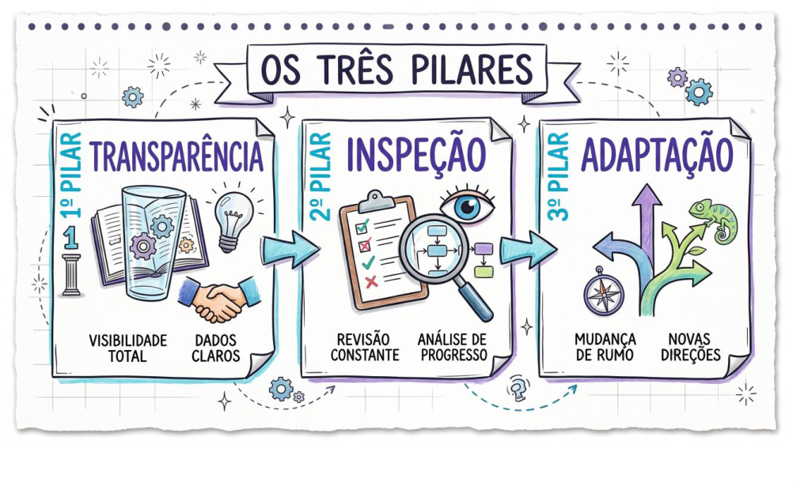

---

<!-- pagina: 65 -->

**Diego Carvalho, Equipe Informática 2 (Diego Carvalho), Equipe Informática 1 (Diego Carvalho) Aula 02** 

|**PILARES**|**DESCRIÇÃO**|
|---|---|
|**TRANSPARÊNCIA**|Todo trabalho deve ser claramente definido e conhecido por todas as partes envolvidas noprojeto.|
|**INSPEÇÃO**|Todo trabalho deve ser inspecionado com a frequência necessária para garantir a qualidade doproduto.|
|**ADAPTAÇÃO**|O projeto deve ser capaz de se adaptar o projeto às necessidades de negócio.|

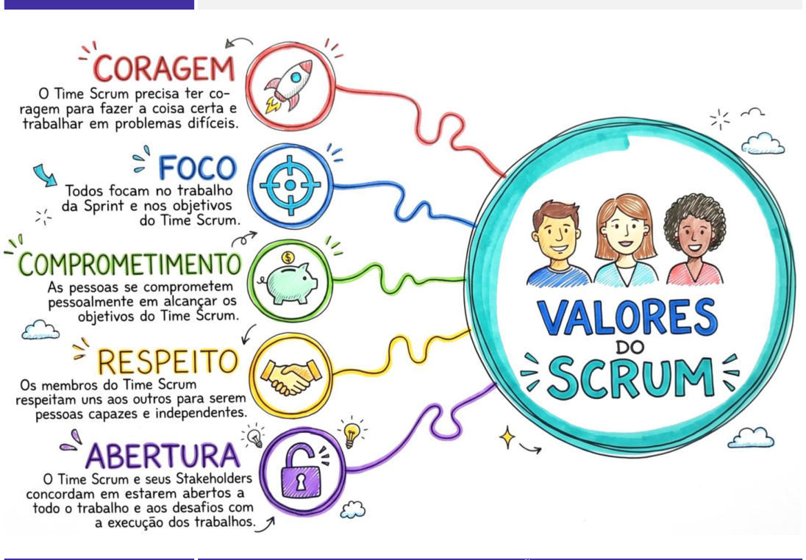

|**VALORES**|**DESCRIÇÃO**|
|---|---|
|**CORAGEM**|Os integrantes de um projeto precisam ter coragem para fazer a coisa certa e trabalharemjuntos removendo impedimentos,buscando soluções.|
|**FOCO**|Os integrantes de um projeto precisam focar no trabalho durante a sprint e nas metas designadas – time dispersoperdeprodutividade e não alcança os objetivos.|
|**COMPROMETIMENTO**|Os integrantes se comprometem com o trabalho que se responsabilizou em fazer, envolvendo-se e não abandonandopela metade ou entregando semqualidade.|
|**RESPEITO**|Os integrantes se respeitam entre si a fim de manter a colaboração, a integração e o bom ambiente de trabalho.|
|**ABERTURA**|Os integrantes devem poder ser francos, expor ideias e propostas mesmo que elas não sejamproveitosas. Momentos de debates,discussões e sugestões são ideais.|

---

<!-- pagina: 66 -->

**Diego Carvalho, Equipe Informática 2 (Diego Carvalho), Equipe Informática 1 (Diego Carvalho) Aula 02** 

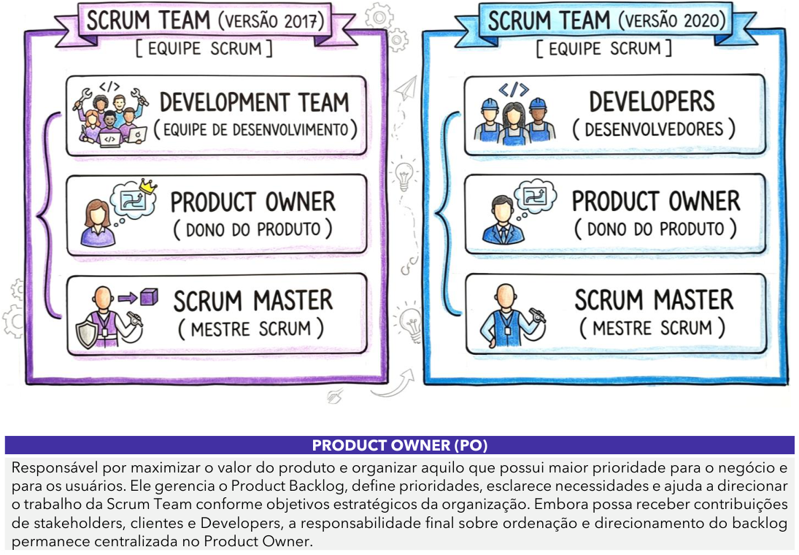

<!-- Start of picture text -->
PRODUCT OWNER (PO) Responsável por maximizar o valor do produto e organizar aquilo que possui maior prioridade para o negócio e para os usuários. Ele gerencia o Product Backlog, define prioridades, esclarece necessidades e ajuda a direcionar o trabalho da Scrum Team conforme objetivos estratégicos da organização. Embora possa receber contribuições de stakeholders, clientes e Developers, a responsabilidade final sobre ordenação e direcionamento do backlog permanece centralizada no Product Owner. ermanece centralizada no Product Owner. <!-- End of picture text -->

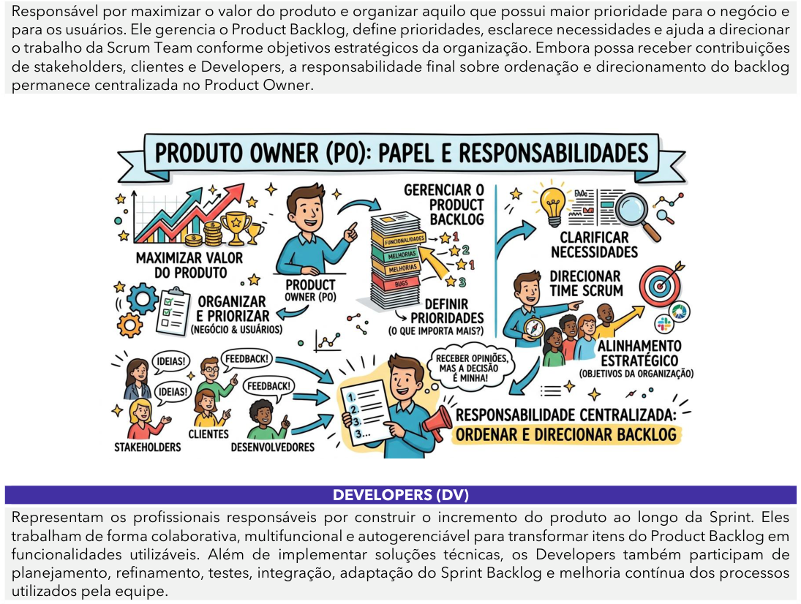

<!-- Start of picture text -->
Responsável por maximizar o valor do produto e organizar aquilo que possui maior prioridade para o negócio e para os usuários. Ele gerencia o Product Backlog, define prioridades, esclarece necessidades e ajuda a direcionar o trabalho da Scrum Team conforme objetivos estratégicos da organização. Embora possa receber contribuições de stakeholders, clientes e Developers, a responsabilidade final sobre ordenação e direcionamento do backlog permanece centralizada no Product Owner. ermanece centralizada no Product Owner. DEVELOPERS (DV) Representam os profissionais responsáveis por construir o incremento do produto ao longo da Sprint. Eles trabalham de forma colaborativa, multifuncional e autogerenciável para transformar itens do Product Backlog em funcionalidades utilizáveis. Além de implementar soluções técnicas, os Developers também participam de planejamento, refinamento, testes, integração, adaptação do Sprint Backlog e melhoria contínua dos processos utilizados pela equipe. <!-- End of picture text -->

---

<!-- pagina: 67 -->

**Diego Carvalho, Equipe Informática 2 (Diego Carvalho), Equipe Informática 1 (Diego Carvalho) Aula 02** 

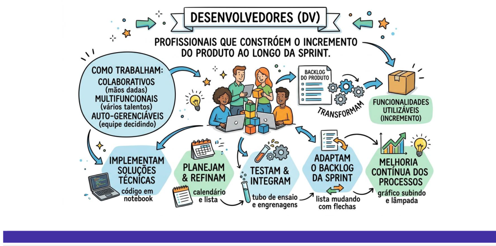

<!-- Start of picture text -->
==5460== <!-- End of picture text -->

==5460== Responsável por garantir que o Scrum seja compreendido e corretamente aplicado pela organização e pela Scrum Team. Ele atua como facilitador, ajudando a remover impedimentos, fortalecer práticas ágeis, melhorar colaboração e incentivar melhoria contínua. O Scrum Master também auxilia Product Owner, Developers e stakeholders a entenderem melhor os princípios do Scrum, promovendo transparência, adaptação contínua e maior eficiência no trabalho da equipe. 

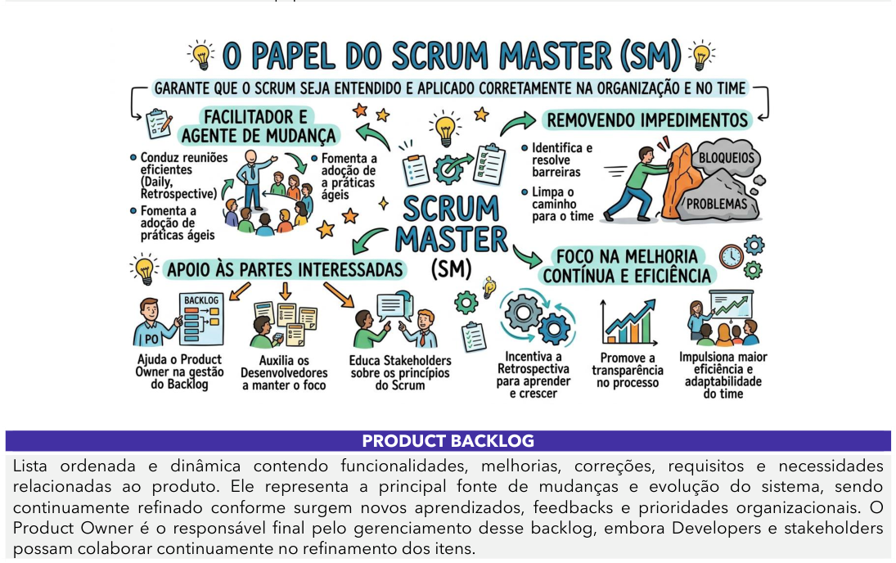

<!-- Start of picture text -->
PRODUCT BACKLOG Lista ordenada e dinâmica contendo funcionalidades, melhorias, correções, requisitos e necessidades relacionadas ao produto. Ele representa a principal fonte de mudanças e evolução do sistema, sendo continuamente refinado conforme surgem novos aprendizados, feedbacks e prioridades organizacionais. O Product Owner é o responsável final pelo gerenciamento desse backlog, embora Developers e stakeholders possam colaborar continuamente no refinamento dos itens. <!-- End of picture text -->

---

<!-- pagina: 68 -->

**Diego Carvalho, Equipe Informática 2 (Diego Carvalho), Equipe Informática 1 (Diego Carvalho) Aula 02** 

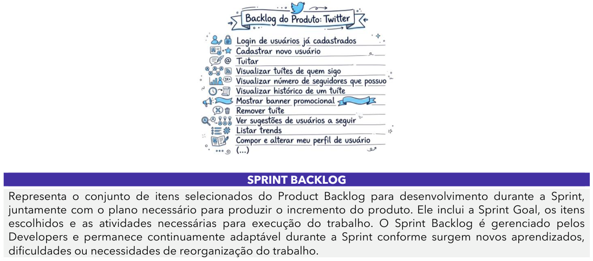

<!-- Start of picture text -->
SPRINT BACKLOG Representa o conjunto de itens selecionados do Product Backlog para desenvolvimento durante a Sprint, juntamente com o plano necessário para produzir o incremento do produto. Ele inclui a Sprint Goal, os itens escolhidos e as atividades necessárias para execução do trabalho. O Sprint Backlog é gerenciado pelos Developers e permanece continuamente adaptável durante a Sprint conforme surgem novos aprendizados, dificuldades ou necessidades de reorganização do trabalho. ganização do trabalho. anização do trabalho. ção do trabalho. ão do trabalho. <!-- End of picture text -->

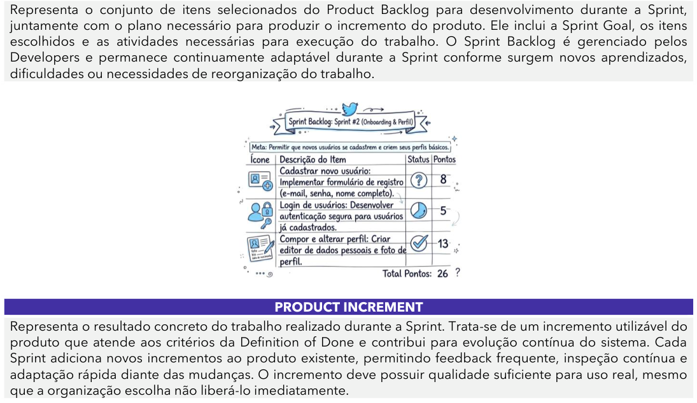

<!-- Start of picture text -->
Representa o conjunto de itens selecionados do Product Backlog para desenvolvimento durante a Sprint, juntamente com o plano necessário para produzir o incremento do produto. Ele inclui a Sprint Goal, os itens escolhidos e as atividades necessárias para execução do trabalho. O Sprint Backlog é gerenciado pelos Developers e permanece continuamente adaptável durante a Sprint conforme surgem novos aprendizados, dificuldades ou necessidades de reorganização do trabalho. ganização do trabalho. anização do trabalho. ção do trabalho. ão do trabalho. PRODUCT INCREMENT Representa o resultado concreto do trabalho realizado durante a Sprint. Trata-se de um incremento utilizável do produto que atende aos critérios da Definition of Done e contribui para evolução contínua do sistema. Cada Sprint adiciona novos incrementos ao produto existente, permitindo feedback frequente, inspeção contínua e adaptação rápida diante das mudanças. O incremento deve possuir qualidade suficiente para uso real, mesmo que a organização escolha não liberá-lo imediatamente. ue a organização escolha não liberá-lo imediatamente. ganização escolha não liberá-lo imediatamente. anização escolha não liberá-lo imediatamente. ção escolha não liberá-lo imediatamente. ão escolha não liberá-lo imediatamente. <!-- End of picture text -->

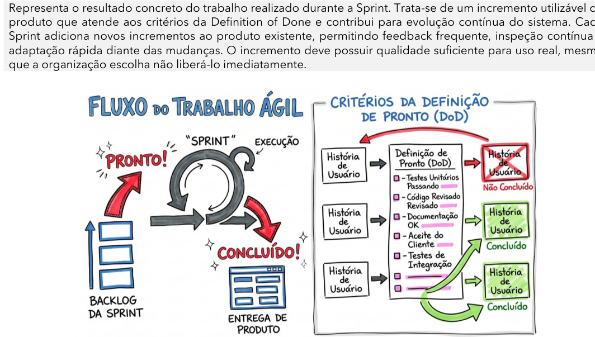

<!-- Start of picture text -->
Representa o resultado concreto do trabalho realizado durante a Sprint. Trata-se de um incremento utilizável do produto que atende aos critérios da Definition of Done e contribui para evolução contínua do sistema. Cada Sprint adiciona novos incrementos ao produto existente, permitindo feedback frequente, inspeção contínua e adaptação rápida diante das mudanças. O incremento deve possuir qualidade suficiente para uso real, mesmo que a organização escolha não liberá-lo imediatamente. ue a organização escolha não liberá-lo imediatamente. ganização escolha não liberá-lo imediatamente. anização escolha não liberá-lo imediatamente. ção escolha não liberá-lo imediatamente. ão escolha não liberá-lo imediatamente. <!-- End of picture text -->

---

<!-- pagina: 69 -->

**Diego Carvalho, Equipe Informática 2 (Diego Carvalho), Equipe Informática 1 (Diego Carvalho) Aula 02** 

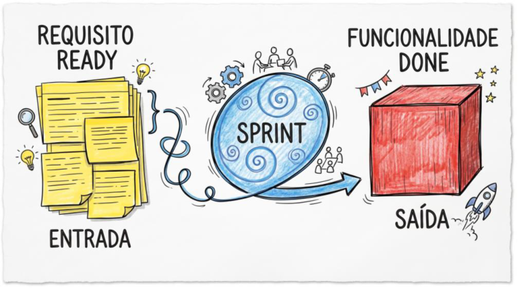

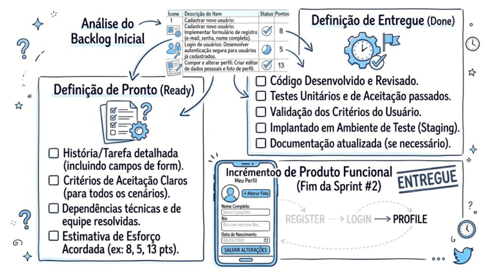

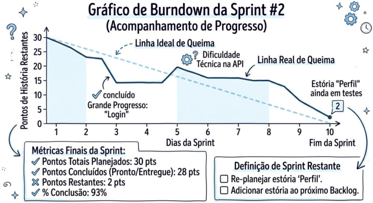

---

<!-- pagina: 70 -->

**Diego Carvalho, Equipe Informática 2 (Diego Carvalho), Equipe Informática 1 (Diego Carvalho) Aula 02** 

#### **<mark>SPRINT PLANNING</mark>** 

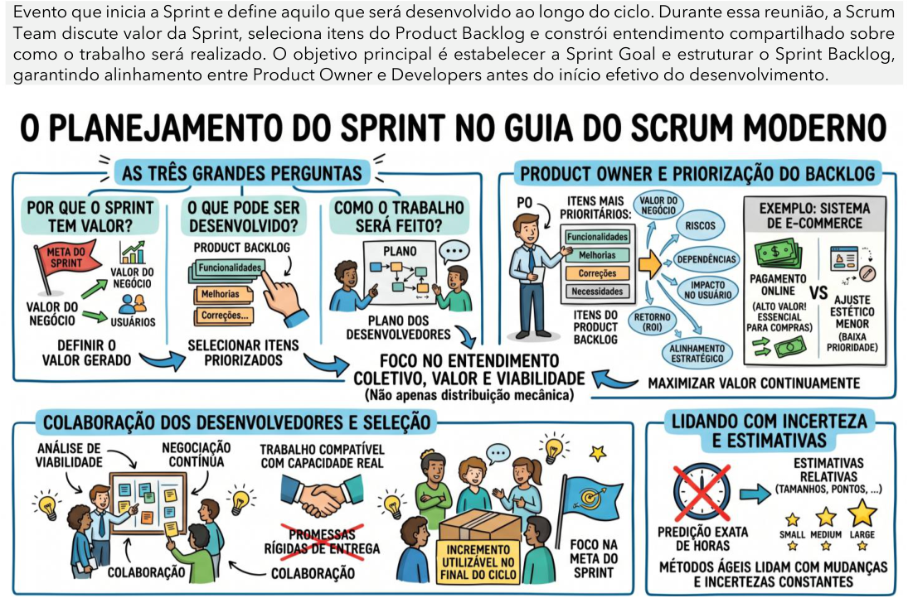

<!-- Start of picture text -->
Evento que inicia a Sprint e define aquilo que será desenvolvido ao longo do ciclo. Durante essa reunião, a Scrum Team discute valor da Sprint, seleciona itens do Product Backlog e constrói entendimento compartilhado sobre como o trabalho será realizado. O objetivo principal é estabelecer a Sprint Goal e estruturar o Sprint Backlog, garantindo alinhamento entre Product Owner e Developers antes do início efetivo do desenvolvimento. <!-- End of picture text -->

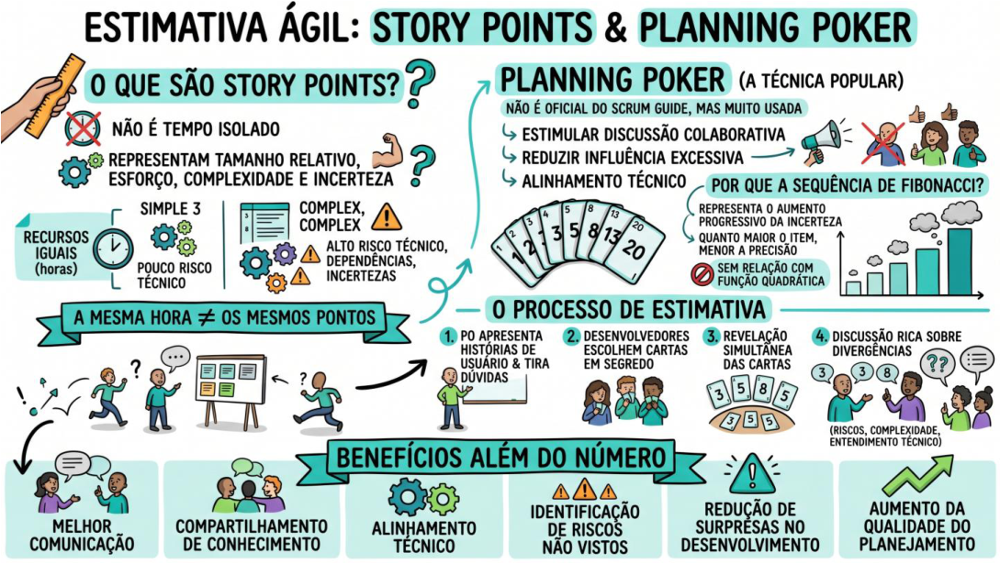

https://t.me/KakashiAssinaturasBot

---

<!-- pagina: 71 -->

**Diego Carvalho, Equipe Informática 2 (Diego Carvalho), Equipe Informática 1 (Diego Carvalho) Aula 02** 

#### **<mark>DAILY SCRUM</mark>** 

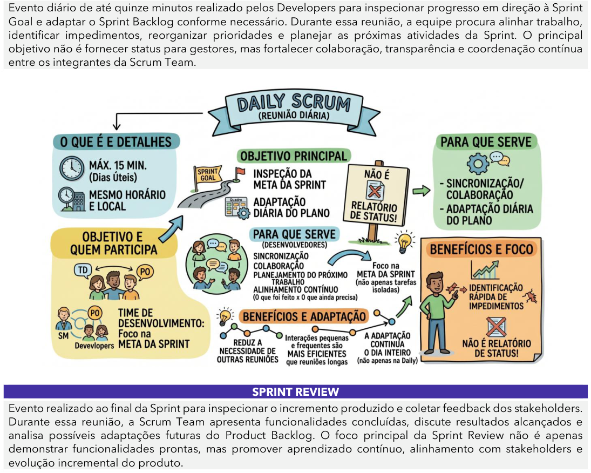

<!-- Start of picture text -->
Evento diário de até quinze minutos realizado pelos Developers para inspecionar progresso em direção à Sprint Goal e adaptar o Sprint Backlog conforme necessário. Durante essa reunião, a equipe procura alinhar trabalho, identificar impedimentos, reorganizar prioridades e planejar as próximas atividades da Sprint. O principal objetivo não é fornecer status para gestores, mas fortalecer colaboração, transparência e coordenação contínua entre os integrantes da Scrum Team. SPRINT REVIEW Evento realizado ao final da Sprint para inspecionar o incremento produzido e coletar feedback dos stakeholders. Durante essa reunião, a Scrum Team apresenta funcionalidades concluídas, discute resultados alcançados e analisa possíveis adaptações futuras do Product Backlog. O foco principal da Sprint Review não é apenas demonstrar funcionalidades prontas, mas promover aprendizado contínuo, alinhamento com stakeholders e evolução incremental do produto. ção incremental do produto. ão incremental do produto. produto. roduto. <!-- End of picture text -->

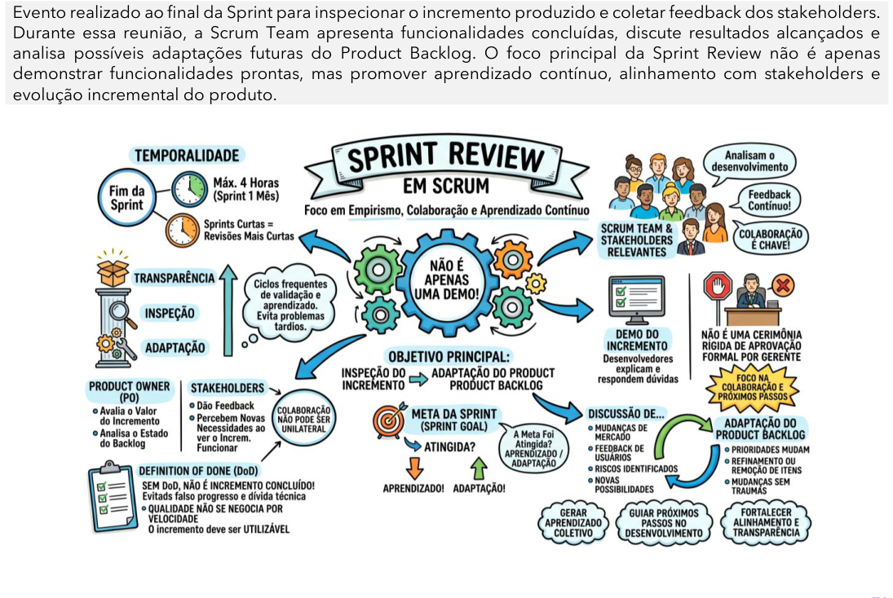

<!-- Start of picture text -->
Evento realizado ao final da Sprint para inspecionar o incremento produzido e coletar feedback dos stakeholders. Durante essa reunião, a Scrum Team apresenta funcionalidades concluídas, discute resultados alcançados e analisa possíveis adaptações futuras do Product Backlog. O foco principal da Sprint Review não é apenas demonstrar funcionalidades prontas, mas promover aprendizado contínuo, alinhamento com stakeholders e evolução incremental do produto. ção incremental do produto. ão incremental do produto. produto. roduto. <!-- End of picture text -->

---

<!-- pagina: 72 -->

**Diego Carvalho, Equipe Informática 2 (Diego Carvalho), Equipe Informática 1 (Diego Carvalho) Aula 02** 

#### **<mark>SPRINT RETROSPECTIVE</mark>** 

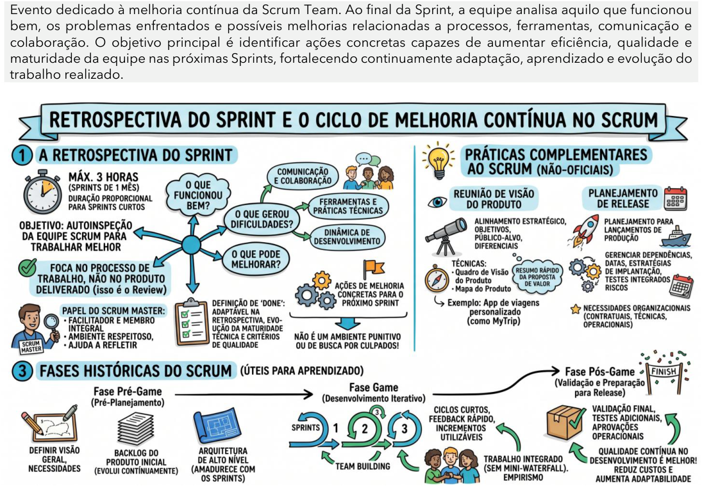

<!-- Start of picture text -->
Evento dedicado à melhoria contínua da Scrum Team. Ao final da Sprint, a equipe analisa aquilo que funcionou bem, os problemas enfrentados e possíveis melhorias relacionadas a processos, ferramentas, comunicação e colaboração. O objetivo principal é identificar ações concretas capazes de aumentar eficiência, qualidade e maturidade da equipe nas próximas Sprints, fortalecendo continuamente adaptação, aprendizado e evolução do trabalho realizado. <!-- End of picture text -->

---

<!-- pagina: 73 -->

**Diego Carvalho, Equipe Informática 2 (Diego Carvalho), Equipe Informática 1 (Diego Carvalho) Aula 02** 

<!-- Start of picture text -->
Q UESTÕES  C OMENTADAS <!-- End of picture text -->

**1. (FGV / TJ RJ - 2026) No Tribunal de Justiça do Estado X há diversos projetos de análise de dados em andamento, pois a demanda por informações está aumentando a cada dia. Para agilizar a entrega de resultados, o gerente de projetos decidiu empregar o Framework Scrum; contudo, a sua equipe ainda está aprendendo a sua prática e muitas vezes sofre interferências externas.** 

**No Framework Scrum, o responsável por facilitar o entendimento e a aplicação do Scrum, apoiar a equipe, minimizar interferências externas e remover impedimentos é o:** 

a) Stakeholder; 

b) Usuário Final; 

c) Scrum Master; 

d) Desenvolvedor; 

- e) Product Owner. 

**Comentários:** 

(a) Errado. Stakeholder é parte interessada no projeto, mas não exerce o papel de facilitar o uso do Scrum nem de remover impedimentos da equipe. 

(b) Errado. Usuário final é quem utiliza o produto entregue, não sendo o responsável por apoiar a equipe Scrum ou reduzir interferências externas. 

(c) Correto. Scrum Master atua como facilitador do Scrum, apoia a equipe, ajuda na correta aplicação do framework e trabalha para remover impedimentos e interferências. 

(d) Errado. Desenvolvedor participa da construção das entregas do produto, mas não é o agente responsável por zelar pela aplicação do Scrum na equipe. 

(e) Errado. Product Owner cuida da visão do produto e da priorização do backlog, não sendo o foco principal remover impedimentos e proteger a equipe. 

**Gabarito:** Letra C 

**2. (FGV / TJ RJ - 2026) O setor de inovação de um órgão criou um Scrum Team para implementar o framework Scrum para gerar soluções para os problemas complexos da organização. Como parte de eventos do framework, os desenvolvedores realizam reuniões diárias (Daily Scrum) com o propósito de inspecionar o progresso e ajustar o plano da Sprint.**

---

<!-- pagina: 74 -->

**Diego Carvalho, Equipe Informática 2 (Diego Carvalho), Equipe Informática 1 (Diego Carvalho) Aula 02** 

### **A respeito desse evento, é correto afirmar que:** 

a) o Product Backlog é refinado conforme necessário; 

- b) mudanças são avaliadas para melhoria da eficácia; 

- c) impedimentos são identificados e decisões são tomadas; 

- d) o escopo pode ser esclarecido e renegociado com o Product Owner; 

- e) itens do Product Backlog são selecionados para inclusão na Sprint atual. 

### **Comentários:** 

(a) Errado. O refinamento do Product Backlog não é o objetivo da Daily Scrum, mas uma atividade contínua ao longo da Sprint. 

<!-- Start of picture text -->
==5460== <!-- End of picture text -->

(b) Errado. Avaliar mudanças para melhorar a eficácia está mais ligado à retrospectiva, não à reunião diária dos desenvolvedores. 

(c) Correto. Na Daily Scrum, os desenvolvedores inspecionam o progresso, identificam impedimentos e tomam decisões para ajustar o trabalho da Sprint. 

(d) Errado. Esclarecer e renegociar escopo com o Product Owner não é a finalidade da Daily Scrum. 

(e) Errado. A seleção de itens para a Sprint ocorre no Sprint Planning, e não na reunião diária. 

**Gabarito:** Letra C 

**3. (FGV / TJ RJ - 2026) Durante o desenvolvimento de um sistema de gestão financeira de uma corretora de valores, a equipe de TI optou por utilizar o framework de gerenciamento Scrum. O objetivo é a entrega de valor ao cliente no período de um timebox chamado Sprint. Após o segundo Sprint, o Product Owner percebeu que os usuários finais estavam insatisfeitos com a interface disponibilizada.** 

### **De forma a manter a conformidade com o modelo, a equipe de TI deverá:** 

- a) cancelar o Sprint atual e iniciar um novo ciclo com novos requisitos; 

- b) incluir os usuários nas reuniões diárias para acompanhar o progresso técnico; 

- c) ignorar o feedback dos usuários até o final do projeto, para evitar mudanças de escopo; 

- d) realizar uma reunião de retrospectiva com os usuários para redefinir os papéis da equipe; 

- e) reavaliar o backlog do produto com base no feedback e priorizar melhorias na interface. 

**Comentários:**

---

<!-- pagina: 75 -->

**Diego Carvalho, Equipe Informática 2 (Diego Carvalho), Equipe Informática 1 (Diego Carvalho) Aula 02** 

(a) Errado. Cancelar Sprint não é a resposta adequada ao simples feedback de insatisfação; o Scrum busca adaptação contínua sem romper o ciclo sem necessidade. 

(b) Errado. A Daily Scrum é voltada ao time de desenvolvimento para alinhamento do trabalho, não para incluir usuários no acompanhamento técnico diário. 

(c) Errado. No Scrum, feedback é insumo essencial para gerar valor. Ignorá-lo até o fim contraria a inspeção e adaptação do produto. 

(d) Errado. A retrospectiva foca a melhoria do processo da equipe, não a redefinição de papéis com usuários por causa da interface. 

(e) Correto. O Product Backlog deve ser revisto com base no feedback recebido, priorizando ajustes que aumentem o valor entregue, como melhorias na interface. 

**Gabarito:** Letra E 

**4. (FGV / TCE-RR - 2025) Em relação à metodologia de gerência de projetos Scrum, analise as afirmativas a seguir.** 

- **I. O time de desenvolvimento é responsável por garantir a realização das tarefas do Sprint Backlog.** 

- **II. O Product Backlog é gerenciado pelo Product Owner, contendo itens priorizados de acordo com o valor para o cliente.** 

- **III. A Definition of Done é um artefato utilizado pelo Scrum Master para controlar a qualidade do trabalho.** 

**Está correto o que se afirma em** 

a) I, apenas. 

b) II, apenas. 

c) III, apenas. 

d) I e II, apenas. 

e) I e III, apenas. 

**Comentários:**

---

<!-- pagina: 76 -->

**Diego Carvalho, Equipe Informática 2 (Diego Carvalho), Equipe Informática 1 (Diego Carvalho) Aula 02** 

(I) Correto. O time de desenvolvimento assume o compromisso com o Sprint Backlog e atua para garantir a execução das tarefas planejadas na Sprint. 

(II) Correto. O Product Backlog é gerenciado pelo Product Owner, que prioriza os itens conforme o valor entregue ao cliente e ao negócio. 

(III) Errado. A Definition of Done não é apresentada como instrumento de controle do Scrum Master, mas como referência de conclusão do trabalho. 

**Gabarito:** Letra D 

**5. (FGV / DPE RO - 2025) Scrum é um método ágil, iterativo e incremental para gerenciamento de projetos que foi proposto por Sutherland e Schwaber. A definição do Scrum inclui um conjunto bem definido de papéis, artefatos e eventos. São eventos Scrum:** 

   - a) desenvolvimento de produto e lançamento do produto, apenas. 

   - b) planejamento dos sprints, sprints, reuniões diárias, revisões dos sprints e retrospectivas, apenas. 

   - c) validação dos sprints, manutenção dos backlogs dos sprints e atualização dos gráficos de burndown, apenas. 

   - d) manutenção do backlog do produto, dos backlogs dos sprints e dos quadros scrum e lançamento do produto, apenas. 

   - e) desenvolvimento do produto, execução dos sprints, manutenção dos backlogs, reuniões de pé, atualização dos gráficos de burndown e lançamento do produto, apenas. 

**Comentários:** 

(a) Errado. Desenvolvimento e lançamento do produto não compõem, isoladamente, o conjunto de eventos Scrum previsto na definição do framework. 

(b) Correto. Planejamento da sprint, sprint, reunião diária, revisão da sprint e retrospectiva são os eventos clássicos do Scrum. 

(c) Errado. Validação de sprint, manutenção de backlog e atualização de burndown não formam a lista de eventos Scrum. 

(d) Errado. Manutenção de backlog, quadro Scrum e lançamento do produto são atividades ou artefatos associados, não os eventos definidos.

---

<!-- pagina: 77 -->

**Diego Carvalho, Equipe Informática 2 (Diego Carvalho), Equipe Informática 1 (Diego Carvalho) Aula 02** 

(e) Errado. Mistura atividades de desenvolvimento e manutenção com reunião diária, mas não apresenta corretamente o conjunto formal de eventos Scrum. 

**Gabarito:** Letra B 

**6. (FGV / TCE-PE - 2025) Na metodologia Scrum, um artefato contém a soma de todos os itens do Backlog do produto completados durante a sprint e os de sprints anteriores. Deve estar "Pronto" (Done) e ser potencialmente utilizável, mesmo que o Product Owner decida não liberar.** 

### **O artefato em questão é o (a):** 

a) Incremento. 

- b) Backlog da sprint. 

- c) Quadro kanban. 

- d) Backlog do produto. 

- e) Definição de pronto. 

**Comentários:** 

(a) Correto. O Incremento é a soma dos itens concluídos na sprint com os incrementos anteriores, devendo estar em estado “Pronto” e potencialmente utilizável. 

(b) Errado. O Backlog da sprint reúne os itens selecionados para a sprint e o plano de execução, não o resultado final entregue. 

(c) Errado. Quadro kanban é uma ferramenta visual de acompanhamento do fluxo de trabalho, não o artefato descrito no enunciado. 

(d) Errado. O Backlog do produto é a lista ordenada de necessidades e requisitos, não a soma dos itens já concluídos. 

(e) Errado. A Definição de pronto estabelece critérios de conclusão, mas não corresponde ao artefato potencialmente utilizável. 

**Gabarito:** Letra A 

**7. (FGV / TCE-PE - 2025) Scrum é um framework leve baseado em empirismo que ajuda pessoas, times e organizações a gerar valor por meio de soluções adaptativas para problemas complexos. Sobre o Scrum, avalie as afirmativas a seguir e assinale (V) para verdadeira e (F) para falsa.**

---

<!-- pagina: 78 -->

**Diego Carvalho, Equipe Informática 2 (Diego Carvalho), Equipe Informática 1 (Diego Carvalho) Aula 02** 

**( ) No início da Sprint, é realizada uma reunião para planejar o novo ciclo, cabendo à equipe determinar quanto trabalho acredita ser capaz de executar durante a Sprint.** 

**( ) Criar e comunicar claramente os itens do Product Backlog é uma tarefa do Scrum Master.** 

**( ) Os membros de um time Scrum são autogerenciáveis, decidindo internamente quem faz o quê, quando e como.** 

**As afirmativas são, respectivamente,** 

a) V – F – V. 

b) F – F – V. 

c) V – F – F. 

d) V – V – V. 

e) F – V – F. 

**Comentários:** 

(V) No início da Sprint ocorre o Sprint Planning, em que o time define o que consegue entregar no ciclo. 

(F) A criação e comunicação clara dos itens do Product Backlog não é atribuída ao Scrum Master nessa divisão de papéis. 

(V) O time Scrum é autogerenciável e organiza internamente responsabilidades, forma de execução e momento das atividades. 

**Gabarito:** Letra A 

**8. (FGV / CNU - 2025) Uma universidade corporativa desenvolve um curso EAD de 40 horas para gestores públicos, operando com Scrum em sprints quinzenais. A campanha de lançamento está marcada para 10 de outubro, porém a equipe de conteúdo está dois sprints atrasada devido a revisões pedagógicas. Sem verba para horas extras e com a reputação em jogo, o Scrum Master deve facilitar o trabalho da equipe em busca de alternativas para entregar valor sem sacrificar a qualidade nem aumentar o custo.** 

**Para cumprir a data anunciada, o Product Owner, com o apoio da equipe, deve:** 

a) reordenar o backlog priorizando conteúdo crítico; 

b) estender cada sprint para três semanas; 

- c) contratar conteudistas externos com verba extra;

---

<!-- pagina: 79 -->

**Diego Carvalho, Equipe Informática 2 (Diego Carvalho), Equipe Informática 1 (Diego Carvalho) Aula 02** 

d) demandar horas extras para compensar o atraso; 

- e) flexibilizar critérios de aceitação para acelerar revisões. 

### **Comentários:** 

(a) Correto. Reordenar o backlog para priorizar o conteúdo mais crítico é a saída mais aderente ao Scrum, pois permite entregar valor na data, mantendo qualidade e sem elevar custos. 

(b) Errado. Estender a duração da sprint reduz a cadência de inspeção e adaptação, além de não ser a melhor alternativa para preservar a data já anunciada. 

(c) Errado. Contratar conteudistas externos com verba extra contraria a restrição do enunciado, que afasta aumento de custo para resolver o atraso. 

(d) Errado. Exigir horas extras também viola a limitação apresentada e ainda pode comprometer a sustentabilidade do ritmo de trabalho da equipe. 

(e) Errado. Flexibilizar critérios de aceitação acelera no curto prazo, mas sacrifica a qualidade, justamente o que o enunciado busca evitar. 

**Gabarito:** Letra A 

**9. (FGV / AgSUS - 2025) Na AgSUS, há necessidade de entender os papéis definidos e suas responsabilidades em um projeto Scrum é muito importante para garantir o sucesso na implementação do Scrum. A literatura da área indica que os papéis do Scrum são divididos em duas categorias, a saber: papéis centrais e papéis não-essenciais.** 

### **Selecione a alternativa que contém os papéis centrais;** 

a) dono do produto e stakeholder, apenas. 

- b) scrum master chefe e fornecedores, apenas. 

- c) dono do produto, scrum master e time scrum, apenas. 

- d) stakeholder, scrum manager, fornecedores e scrum mater chefe, apenas. 

- e) Dono do produto, scrum guidance body, fornecedores e scrum mater chefe e time scrum, apenas. 

### **Comentários:** 

(a) Errado. Stakeholder é tratado como papel não essencial; a alternativa ainda omite o scrum master e o time scrum. 

### (b) Errado. “Scrum master chefe” e fornecedores não compõem os papéis centrais do Scrum.

---

<!-- pagina: 80 -->

**Diego Carvalho, Equipe Informática 2 (Diego Carvalho), Equipe Informática 1 (Diego Carvalho) Aula 02** 

(c) Correto. Reúne os papéis centrais: dono do produto, scrum master e time scrum. 

(d) Errado. Lista apenas papéis não essenciais ou nomenclaturas que não representam o núcleo central indicado. 

(e) Errado. Mistura papel central com papéis não essenciais, por isso não apresenta somente os papéis centrais. 

**Gabarito:** Letra C 

- **10.(FGV / TJ RJ - 2024) O Scrum é uma estrutura usada por equipes para gerenciar o trabalho e resolver problemas de forma colaborativa em ciclos curtos. Considerando o desenvolvimento de software empregando Scrum, analise as afirmativas a seguir.** 

   - **I. O ciclo de vida do Scrum é incremental, sendo concluído em intervalos de tempo fixos chamados sprints que geralmente dura de um a quatro meses.** 

   - **II. O proprietário do produto é responsável pelo que a equipe cria e por que ela o cria, enquanto e o Scrum master garante que o processo Scrum seja seguido pela equipe, que constroem o produto de fato.** 

   - **III. A etapa de planejamento do sprint envolve a escolha pela equipe dos itens da lista de pendências do produto e a etapa de execução do sprint tem sua forma de atuação especificada no Scrum para modo de comportamento da equipe na realização da lista de pendências.** 

**Está correto o que se afirma em** 

a) I, apenas. 

b) II, apenas. 

c) I e II, apenas. 

d) II e III, apenas. 

e) I e III, apenas. 

**Comentários:** 

(I) Errado. A ideia de ciclos incrementais está alinhada ao Scrum, mas a duração indicada para as sprints não corresponde ao padrão esperado no contexto da metodologia. 

(II) Correto. O Product Owner direciona o que será construído e por quê, enquanto o Scrum Master zela pela aplicação do Scrum e a equipe desenvolve o produto.

---

<!-- pagina: 81 -->

**Diego Carvalho, Equipe Informática 2 (Diego Carvalho), Equipe Informática 1 (Diego Carvalho) Aula 02** 

(III) Errado. No planejamento, a equipe seleciona itens do backlog, mas o Scrum não engessa a execução com um modo único e rigidamente especificado de atuação. 

**Gabarito:** Letra B 

- **11.(FGV / Câmara Municipal de SP - 2024) Com relação às fases do scrum, assinale (V) para a afirmativa verdadeira e (F) para a falsa.** 

**( ) Planejamento geral, em que se estabelecem os objetivos particulares do projeto e da arquitetura do software.** 

**( ) Ocorre uma série de ciclos de sprint, em que cada ciclo desenvolve um decremento do sistema.** 

**( ) Encerra o projeto, completa a documentação exigida, como quadros de ajuda do sistema e manuais do usuário, e avalia as lições aprendidas com o projeto.** 

**As afirmativas são, respectivamente,** 

a) V – F – F. 

b) F – V – V 

c) V – F – V. 

d) F – F – V. 

e) F – F – F. 

**Comentários:** 

(a) Errado. A 1ª pode sugerir planejamento, mas a 2ª e a 3ª não formam a combinação indicada pela alternativa. 

(b) Errado. A 2ª trata dos ciclos de sprint e a 3ª do encerramento do projeto, porém a 1ª não se ajusta como verdadeira. 

(c) Errado. Embora a 3ª descreva o fechamento, a 2ª não fica como verdadeira nessa composição. 

(d) Correto. A 1ª e a 2ª não são tomadas como fases válidas na forma apresentada, enquanto a 3ª corresponde ao encerramento do projeto. 

(e) Errado. A 3ª é considerada verdadeira por descrever a etapa final de encerramento e registro das lições aprendidas.

---

<!-- pagina: 82 -->

**Diego Carvalho, Equipe Informática 2 (Diego Carvalho), Equipe Informática 1 (Diego Carvalho) Aula 02** 

### **Gabarito:** Letra D 

- **12.(FGV / TJ AP - 2024) A metodologia Scrum é um framework que apoia o desenvolvimento de soluções adaptativas para problemas complexos utilizando diversos artefatos.** 

**O artefato do Scrum composto pela Meta da Sprint (por que), o conjunto de itens do Product Backlog selecionados para a Sprint (o que), bem como um plano de ação para entregar o Incremento (como) é o:** 

a) kanban; 

b) incremento; 

- c) sprint backlog; 

- d) product owner; 

- e) meta do produto. 

**Comentários:** 

(a) Errado. Kanban é um método visual de gestão do fluxo de trabalho, não o artefato que reúne meta, itens selecionados e plano da Sprint. 

(b) Errado. Incremento é o resultado produzido na Sprint, e não o artefato que organiza objetivo, escopo e plano de execução. 

(c) Correto. Sprint Backlog reúne a Meta da Sprint, os itens do Product Backlog escolhidos e o plano de trabalho para entregar o Incremento. 

(d) Errado. Product Owner é um papel no Scrum, responsável por maximizar o valor do produto, não um artefato. 

(e) Errado. Meta do Produto expressa um objetivo de longo prazo, sem reunir os elementos operacionais específicos de uma Sprint. 

**Gabarito:** Letra C 

- **13.(FGV / Câmara Municipal de Fortaleza - 2024) No scrum, o artefato que é uma representação visual do trabalho restante durante um sprint é** 

   - a) Product Backlog (Backlog do Produto). 

   - b) Sprint Backlog (Backlog da Sprint).

---

<!-- pagina: 83 -->

**Diego Carvalho, Equipe Informática 2 (Diego Carvalho), Equipe Informática 1 (Diego Carvalho) Aula 02** 

- c) Burn-Down Chart (Gráfico de Burndown do Sprint). 

- d) Product Increment (Incremento do Produto). 

- e) Definition of Done (Definição de Pronto). 

### **Comentários:** 

(a) Errado. Product Backlog é a lista priorizada de requisitos e funcionalidades do produto, não a representação visual do trabalho restante no sprint. 

(b) Errado. Sprint Backlog reúne os itens e tarefas da sprint, mas não é, por si, o gráfico visual do trabalho restante. 

(c) Correto. Burn-Down Chart mostra visualmente o trabalho que ainda falta ao longo da sprint, acompanhando a evolução até sua conclusão. 

(d) Errado. Product Increment é o resultado entregue ao fim da sprint, e não um instrumento visual de acompanhamento do trabalho restante. 

(e) Errado. Definition of Done define critérios para considerar algo concluído, não servindo como representação visual do trabalho restante. 

**Gabarito:** Letra C 

- **14.(FGV / ALESC - 2024) Segundo o guia Scrum, uma unidade fundamental é uma equipe de pessoas denominada Time Scrum, responsável por criar incrementos úteis e valiosos a cada Sprint. Um Time Scrum é composto por** 

   - a) alguns Product Owner apenas. 

   - b) um Product Owner e alguns usuários finais. 

   - c) um Scrum Master e alguns desenvolvedores. 

   - d) um Scrum Master, um Product Owner e alguns desenvolvedores. 

   - e) um Scrum Master, alguns Product Owner, alguns desenvolvedores e muitos usuários finais. 

### **Comentários:** 

(a) Errado. O Time Scrum não é formado apenas por Product Owner; essa composição é incompleta e não contempla os demais papéis essenciais. 

(b) Errado. Usuários finais não compõem formalmente o Time Scrum; a estrutura prevista inclui papéis específicos do framework.

---

<!-- pagina: 84 -->

**Diego Carvalho, Equipe Informática 2 (Diego Carvalho), Equipe Informática 1 (Diego Carvalho) Aula 02** 

(c) Errado. Falta o Product Owner, papel indispensável na composição do Time Scrum segundo o guia Scrum. 

(d) Correto. O Time Scrum é composto por um Scrum Master, um Product Owner e alguns desenvolvedores, formando a estrutura básica da equipe. 

(e) Errado. A composição indicada extrapola a estrutura do Time Scrum, incluindo múltiplos Product Owner e usuários finais, o que não corresponde ao guia Scrum. 

### **Gabarito:** Letra D 

- **15.(FGV / TJ MS - 2024) O TJMS está começando um novo projeto com três times que estão trabalhando com o framework Scrum. Durante uma reunião de definition of done (DoD), um time deve considerar diferentes critérios para definir o que significa "feito".** 

**Dentre os critérios para discussão na reunião, o time deve considerar fundamentalmente:** 

a) a missão da empresa; 

b) o conselho do Scrum Master; 

c) a experiência do líder técnico; 

d) os DoD dos outros 2 times Scrum que trabalham no mesmo produto; 

e) o prazo de entrega do produto. 

**Comentários:** 

(a) Errado. A missão da empresa orienta o negócio, mas não define diretamente os critérios objetivos de “feito” no contexto operacional do Scrum. 

(b) Errado. O Scrum Master apoia o processo, porém a DoD não deve se basear apenas em conselho individual. 

(c) Errado. A experiência do líder técnico ajuda, mas não é o elemento central para alinhar o conceito de “feito” entre times. 

(d) Correto. Em produto com vários times Scrum, considerar os DoD dos outros times favorece alinhamento, consistência e integração do trabalho. 

(e) Errado. Prazo de entrega influencia planejamento, mas não é critério fundamental para definir o que significa “feito”. 

**Gabarito:** Letra D

---

<!-- pagina: 85 -->

**Diego Carvalho, Equipe Informática 2 (Diego Carvalho), Equipe Informática 1 (Diego Carvalho) Aula 02** 

- **16.(FGV / TJ MS - 2024) O Scrum é um dos frameworks ágeis mais utilizados em desenvolvimento de software. Nesse framework, existem dois papéis essenciais: o Product Owner e o Scrum Master.** 

**O Scrum Master, como facilitador do processo Scrum, pode colaborar com o Product Owner de diversas maneiras, incluindo:** 

a) a introdução de práticas de desenvolvimento de ponta; 

- b) a compreensão do planejamento de produtos em um ambiente empírico; 

- c) o gerenciamento do orçamento do projeto; 

- d) ajuda com a codificação de novos recursos; 

- e) coordenação das reuniões das dailies da equipe. 

**Comentários:** 

(a) Errado. Introduzir práticas de desenvolvimento está mais ligado ao time e à melhoria técnica, não ao apoio direto ao Product Owner. 

(b) Correto. O Scrum Master ajuda o Product Owner a entender o planejamento de produtos em ambiente empírico, alinhando expectativas e adaptação contínua. 

(c) Errado. Gerenciar orçamento do projeto não é uma atribuição típica desse papel no Scrum. 

(d) Errado. Codificar novos recursos é atividade do time de desenvolvimento, não uma forma de apoio ao Product Owner. 

(e) Errado. As dailies são eventos da equipe; coordená-las não representa, aqui, a colaboração específica com o Product Owner. 

### **Gabarito:** Letra B 

- **17.(FGV / TJ MS - 2024) Em um ambiente de desenvolvimento de software que segue a metodologia ágil Scrum, um time de 5 pessoas está realizando sprints mensais. Durante as cerimônias de revisão e retrospectiva, foram estabelecidos limites de tempo para garantir eficiência e foco. O tempo máximo recomendado pelo Guia do Scrum para cada uma dessas cerimônias é:** 

a) revisão: 2 horas; retrospectiva: 1 hora; 

b) revisão: 4 horas; retrospectiva: 3 horas; 

- c) revisão: 3 horas; retrospectiva: 2 horas;

---

<!-- pagina: 86 -->

**Diego Carvalho, Equipe Informática 2 (Diego Carvalho), Equipe Informática 1 (Diego Carvalho) Aula 02** 

d) revisão: 1 hora; retrospectiva: 1,5 hora; 

e) revisão: 4 horas; retrospectiva: 1 hora. 

### **Comentários:** 

(a) Errado. Para sprint mensal, esses tempos ficam abaixo do limite recomendado no Scrum Guide para revisão e retrospectiva. 

(b) Correto. Em sprint de um mês, o limite recomendado é de até 4 horas para a revisão e até 3 horas para a retrospectiva. 

(c) Errado. Os tempos indicados não correspondem aos limites máximos previstos para essas cerimônias em sprint mensal. 

(d) Errado. Os valores são inferiores aos limites recomendados e não refletem o timebox previsto no guia. 

(e) Errado. A revisão está no limite, mas a retrospectiva foi reduzida além do máximo recomendado para sprint mensal. 

**Gabarito:** Letra B 

- **18.(FGV / INPE - 2024) O Scrum é um framework de gerenciamento que as equipes usam para se auto-organizar e trabalhar em direção a um objetivo em comum. Sobre o Scrum, analise as afirmativas a seguir.** 

**I. Por ser uma metodologia ágil, um de seus pilares é a eliminação de reuniões. II. O backlog do produto é uma lista dinâmica de funcionalidades organizada por prioridades. III. O Product Owner planeja os recursos necessários para cada Sprint.** 

**Está correto o que se afirma em** 

a) I, apenas 

b) II, apenas. 

c) III, apenas. 

d) I e II, apenas. 

e) II e III, apenas. 

### **Comentários:** 

(I) Errado. No Scrum, reuniões não são eliminadas; há eventos definidos para alinhamento, inspeção e adaptação do trabalho.

---

<!-- pagina: 87 -->

**Diego Carvalho, Equipe Informática 2 (Diego Carvalho), Equipe Informática 1 (Diego Carvalho) Aula 02** 

(II) Correto. O backlog do produto é dinâmico e priorizado, reunindo funcionalidades, melhorias e necessidades do produto. 

(III) Errado. O Product Owner foca valor e priorização do backlog, não o planejamento dos recursos necessários para cada Sprint. 

**Gabarito:** Letra B 

- **19.(FGV / STN - 2024) O gráfico de burndown é frequentemente utilizado em metodologias ágeis de desenvolvimento de software, como o Scrum. Esse artefato é uma representação visual** 

a) do trabalho a ser realizado em relação ao tempo necessário para a sua conclusão. 

b) de todos os requisitos necessários e desejáveis que agregam valor ao produto. 

c) dos itens do backlog do produto completados durante as sprints anteriores. 

d) do nível de estresse e exaustão relacionada ao trabalho da equipe. 

e) da lista de impedimentos que impossibilitam a equipe de entregar o que foi acordado. 

**Comentários:** 

(a) Correto. O burndown mostra visualmente o trabalho restante ao longo do tempo, permitindo acompanhar o progresso até a conclusão da sprint ou do projeto. 

(b) Errado. Essa descrição corresponde ao backlog do produto, que reúne requisitos e funcionalidades com valor para o produto. 

(c) Errado. O burndown não lista itens concluídos em sprints anteriores, mas acompanha a redução do trabalho restante. 

(d) Errado. O gráfico não mede estresse ou exaustão da equipe, e sim a evolução do trabalho ao longo do tempo. 

(e) Errado. Impedimentos podem afetar o andamento, mas não são o objeto de representação do gráfico de burndown. 

**Gabarito:** Letra A 

- **20.(FGV / TRF 1ª Região - 2024) A analista Paula foi designada como responsável por um projeto com as seguintes características: inovação, alto grau de incerteza, não ter sido realizado nenhum outro similar em seu órgão e provavelmente passar por muitas mudanças durante o processo.**

---

<!-- pagina: 88 -->

**Diego Carvalho, Equipe Informática 2 (Diego Carvalho), Equipe Informática 1 (Diego Carvalho) Aula 02** 

**Considerando essas características do projeto, Paula decidiu pela abordagem ágil usando o framework Scrum.** 

**A atividade empregada pelo framework Scrum que Paula deve utilizar, para tratar a alta incerteza do projeto, é:** 

a) realização de sprints; 

b) manutenção da declaração de escopo; 

- c) confecção de documentação abrangente; 

- d) revisões periódicas de processos e ferramentas; 

- e) acompanhamento permanente da equipe de desenvolvimento. 

**Comentários:** 

(a) Correto. As sprints permitem ciclos curtos de inspeção e adaptação, ideais para projetos inovadores, incertos e sujeitos a mudanças frequentes. 

(b) Errado. Declaração de escopo rígida não é o foco do Scrum, que privilegia adaptação contínua ao longo do projeto. 

(c) Errado. Documentação abrangente não é a atividade central do Scrum para lidar com incerteza, mas sim entregas iterativas. 

(d) Errado. Revisões existem no Scrum, mas a atividade-chave para enfrentar incertezas é a realização de sprints. 

(e) Errado. O acompanhamento da equipe é importante, porém não representa a atividade específica do Scrum mais adequada ao cenário descrito. 

**Gabarito:** Letra A 

- **21.(FGV / MACAEPREV - 2024) Metodologia Ágil é uma abordagem utilizadas para gerenciar e executar projetos de desenvolvimento de software, com foco na flexibilidade, colaboração e entrega contínua de valor. No contexto da Metodologia Ágil Scrum, a seguinte atividade é realizada durante a cerimônia de "Sprint Retrospective":** 

a) os membros da equipe revisam e priorizam o backlog do produto para a próxima sprint. 

- b) a equipe avalia o trabalho concluído na sprint e demonstra as funcionalidades desenvolvidas aos stakeholders.

---

<!-- pagina: 89 -->

**Diego Carvalho, Equipe Informática 2 (Diego Carvalho), Equipe Informática 1 (Diego Carvalho) Aula 02** 

- c) a equipe discute o que funcionou bem, o que não funcionou e como melhorar os processos na próxima sprint. 

- d) o Scrum Master atribui tarefas específicas aos membros da equipe para a próxima sprint. 

- e) o Product Owner aprova ou rejeita as funcionalidades desenvolvidas durante a sprint. 

**Comentários:** 

(a) Errado. Revisar e priorizar o backlog é atividade ligada ao refinamento ou planejamento da sprint, não à retrospectiva. 

(b) Errado. Avaliar entregas e demonstrar funcionalidades aos stakeholders ocorre na Sprint Review, não na retrospectiva. 

(c) Correto. Na Sprint Retrospective, a equipe analisa o que deu certo, o que falhou e define melhorias para a próxima sprint. 

(d) Errado. No Scrum, tarefas não são atribuídas pelo Scrum Master na retrospectiva; a equipe se organiza de forma colaborativa. 

(e) Errado. Aprovar ou rejeitar funcionalidades não é objetivo da retrospectiva, mas de eventos voltados à revisão das entregas. 

**Gabarito:** Letra C 

- **22.(FGV / TJ RR - 2024) Em relação às características do time Scrum, analise as afirmativas a seguir.** 

   - **I. O time Scrum é um pequeno grupo de pessoas em que o dono do produto é o superior hierárquico do Scrum Master e dos desenvolvedores.** 

   - **II. O Scrum Master é o responsável pela efetividade do time Scrum, permitindo que o time melhore suas práticas dentro do framework Scrum.** 

   - **III. Os desenvolvedores são as pessoas comprometidas a criar qualquer aspecto de um incremento utilizável em cada Sprint.** 

**Está correto o que se afirma em** 

a) I, apenas. 

- b) II, apenas.

---

<!-- pagina: 90 -->

**Diego Carvalho, Equipe Informática 2 (Diego Carvalho), Equipe Informática 1 (Diego Carvalho) Aula 02** 

c) III, apenas. 

d) I e II, apenas. 

e) II e III, apenas. 

**Comentários:** 

(I) Errado. No Scrum, não há relação de chefia entre os papéis; o Product Owner não atua como superior hierárquico do Scrum Master nem dos desenvolvedores. 

(II) Correto. O Scrum Master promove a efetividade do time, ajudando o grupo a evoluir continuamente suas práticas dentro do framework Scrum. 

(III) Correto. Os desenvolvedores são os responsáveis por construir, a cada Sprint, aspectos do incremento que possam ser utilizados. 

**Gabarito:** Letra E 

- **23.(FGV / TJ RR - 2024) Em relação aos eventos e aos artefatos do framework Scrum, analise as afirmativas a seguir.** 

   - **I. O backlog do produto é um documento preenchido antes do início do projeto e que não sofre alterações mesmo que os desejos do cliente mudem ao longo do tempo.** 

   - **II. A reunião diária, daily Scrum, é um evento de curta duração que permite identificar impedimentos, melhorar as comunicações, promover rápida tomada de decisões e reduzir a necessidade de outras reuniões ao longo do dia.** 

   - **III. A reunião de revisão da Sprint é um evento em que são definidas as histórias de usuário que serão trabalhadas naquela Sprint.** 

**Está correto o que se afirma em** 

a) I, apenas. 

b) II, apenas. 

c) III, apenas. 

d) I e II, apenas. 

- e) II e III, apenas. 

**Comentários:**

---

<!-- pagina: 91 -->

**Diego Carvalho, Equipe Informática 2 (Diego Carvalho), Equipe Informática 1 (Diego Carvalho) Aula 02** 

(I) Errado. O backlog do produto é dinâmico e pode ser ajustado conforme necessidades, prioridades e mudanças percebidas ao longo do projeto. 

(II) Correto. A daily Scrum é breve e ajuda a dar visibilidade a impedimentos, alinhar o time e evitar reuniões desnecessárias durante o dia. 

(III) Errado. A revisão da Sprint foca no que foi entregue e no feedback obtido, não na definição das histórias que serão trabalhadas. 

**Gabarito:** Letra B 

- **24.(FGV / DATAPREV - 2024) Em um projeto de alta complexidade, sujeito a mudanças frequentes nos requisitos e com a necessidade de entregas rápidas em ciclos incrementais, a metodologia ágil mais adequada para priorizar o valor ao cliente por meio de feedback contínuo e promover a colaboração da equipe é a** 

   - a) Scrum, por organizar o trabalho em sprints fixas, com foco em entregas incrementais de software e adaptações baseadas em revisões periódicas. 

   - b) Kanban, por utilizar um fluxo contínuo de trabalho, permitindo a entrega de funcionalidades conforme são concluídas, sem ciclos fechados de tempo. 

   - c) XP (Extreme Programming), por enfatizar práticas como programação em par, testes automatizados e integração contínua, visando adaptação rápida a mudanças. 

   - d) Waterfall (Cascata), por ser uma metodologia linear e estruturada, permitindo controle e planejamento durante as fases do projeto. 

   - e) Lean, por eliminar desperdícios e otimizar o uso de recursos em projetos complexos, buscando entregas mais eficientes. 

### **Comentários:** 

(a) Correto. Scrum trabalha com sprints, entregas incrementais, revisões frequentes e feedback contínuo, favorecendo adaptação rápida e colaboração da equipe em cenários complexos. 

(b) Errado. Kanban prioriza fluxo contínuo, mas a questão destaca ciclos incrementais e revisões periódicas, características mais associadas ao Scrum. 

(c) Errado. XP traz práticas técnicas valiosas, porém o foco da questão está na organização do trabalho em ciclos incrementais com forte colaboração e feedback.

---

<!-- pagina: 92 -->

**Diego Carvalho, Equipe Informática 2 (Diego Carvalho), Equipe Informática 1 (Diego Carvalho) Aula 02** 

(d) Errado. Waterfall segue uma lógica linear e sequencial, menos adequada a mudanças frequentes de requisitos e entregas rápidas. 

(e) Errado. Lean busca eficiência e redução de desperdícios, mas não se destaca aqui como a metodologia mais adequada para ciclos incrementais com feedback contínuo. 

**Gabarito:** Letra A 

- **25.(FGV / DATAPREV - 2024) Uma equipe de desenvolvimento está trabalhando em um projeto importante usando Scrum. Durante o Daily Scrum, um dos desenvolvedores comenta que está com dificuldades para concluir uma tarefa e provavelmente não conseguirá terminá-la até o fim do Sprint. Diante disso, o Scrum Master sugere que a equipe pense em como reorganizar as tarefas para garantir que o objetivo do Sprint ainda seja alcançado.** 

**Para ajudar a equipe a continuar no caminho certo, o Scrum Master deve** 

- a) redistribuir as tarefas por conta própria, sem envolver a equipe, para garantir que tudo seja concluído a tempo. 

- b) incentivar a equipe a discutir o problema e encontrar uma solução colaborativa, removendo qualquer obstáculo, mas sem interferir demais. 

- c) assumir a tarefa do desenvolvedor, garantindo que o prazo seja cumprido. 

- d) escalar o problema ao Product Owner, deixando que ele reorganize as prioridades e tarefas. 

e) encerrar o Sprint mais cedo, já que a tarefa não será concluída. 

**Comentários:** 

(a) Errado. No Scrum, o Scrum Master não redistribui tarefas sozinho; a equipe é autogerenciável e participa das decisões. 

(b) Correto. O Scrum Master deve estimular a colaboração da equipe para ajustar o trabalho e remover impedimentos, preservando a autonomia do time. 

(c) Errado. O papel do Scrum Master não é executar a tarefa no lugar do desenvolvedor, mas apoiar o time na superação dos obstáculos.

---

<!-- pagina: 93 -->

**Diego Carvalho, Equipe Informática 2 (Diego Carvalho), Equipe Informática 1 (Diego Carvalho) Aula 02** 

(d) Errado. O Product Owner cuida do valor e das prioridades do produto, não de reorganizar diretamente as tarefas da equipe durante o Sprint. 

(e) Errado. Encerrar o Sprint antes do tempo por uma dificuldade pontual não é a medida adequada; o foco deve ser adaptar-se para atingir o objetivo. 

**Gabarito:** Letra B 

- **26.(FGV / DATAPREV - 2024) A equipe de marketing resolveu mudar as coisas nessa eleição e escolheu usar o SCRUM. Na reunião de planejamento do Sprint, o coordenador de campanha (Product Owner) apresentou uma lista de tarefas essenciais: criar conteúdo para as redes sociais, produzir vídeos e organizar eventos locais. Um dos membros da equipe sugeriu que todas as tarefas fossem incluídas no Sprint, mas, dada a complexidade, não devem caber dentro do Sprint.** 

**Assinale a opção que indica como a equipe de marketing deveria lidar com a seleção das tarefas para o Sprint.** 

- a) O membro da equipe está certo em querer incluir todas as tarefas, já que campanhas eleitorais são imprevisíveis e mudanças de última hora podem acontecer. 

- b) A equipe deve priorizar as tarefas que podem ser concluídas dentro do Sprint, levando em conta a capacidade de trabalho e o tempo disponível, para garantir que os objetivos mais importantes da campanha sejam alcançados. 

- c) O coordenador de campanha (Product Owner) deve decidir sozinho quais tarefas serão incluídas no Sprint, sem consultar o restante da equipe. 

- d) A equipe deve colocar o máximo de tarefas possível no Sprint para cobrir todas as frentes da campanha, mesmo que algumas não sejam finalizadas. 

- e) O Scrum Master deve adicionar mais tarefas ao Sprint durante o processo, se perceber que a equipe está avançando rápido demais. 

**Comentários:** 

(a) Errado. Incluir tudo no Sprint sem considerar a capacidade da equipe compromete o foco e a entrega do que é mais relevante no período. 

(b) Correto. No planejamento do Sprint, a equipe seleciona o que consegue concluir no tempo disponível, priorizando o que gera mais valor para os objetivos da campanha.

---

<!-- pagina: 94 -->

**Diego Carvalho, Equipe Informática 2 (Diego Carvalho), Equipe Informática 1 (Diego Carvalho) Aula 02** 

(c) Errado. A definição do Sprint não deve ser feita de forma isolada, pois envolve alinhamento com a equipe sobre viabilidade e execução das tarefas. 

(d) Errado. Colocar tarefas em excesso aumenta o risco de não concluir entregas importantes e prejudica o compromisso assumido para o Sprint. 

(e) Errado. Acrescentar tarefas durante o Sprint sem critério compromete o planejamento e a estabilidade necessária para a equipe trabalhar com foco. 

**Gabarito:** Letra B 

- **27.(FGV / SEPLAG Niterói - 2024) As metodologias ágeis em desenvolvimento de sistemas promovem a entrega rápida e incremental de valor ao cliente, priorizando a adaptação contínua às mudanças. Elas utilizam práticas colaborativas e ciclos curtos, como os Sprints do Scrum, para melhorar a eficiência e a flexibilidade no desenvolvimento de software.** 

**Em relação ao Scrum, assinale a opção que descreve corretamente a principal responsabilidade do Product Owner em relação ao desenvolvimento de software.** 

- a) Definir, priorizar e refinar os itens do Product Backlog, garantindo que a equipe entenda o valor de negócio de cada item. 

- b) Executar os testes de software e garantir a qualidade do produto. 

- c) Tomar decisões técnicas sobre a arquitetura do sistema e as tecnologias a serem usadas. 

- d) Gerenciar a equipe de desenvolvimento, atribuindo tarefas e monitorando o progresso diário. 

- e) Garantir que as reuniões do Scrum ocorram de forma eficaz e produtiva, remover impedimentos e garantir o cumprimento do processo. 

### **Comentários:** 

(a) Correto. O Product Owner é responsável por maximizar o valor do produto, definindo, priorizando e refinando o Product Backlog para orientar a equipe. 

(b) Errado. Testes e garantia de qualidade fazem parte das atividades do time de desenvolvimento, não da responsabilidade principal do Product Owner.

---

<!-- pagina: 95 -->

**Diego Carvalho, Equipe Informática 2 (Diego Carvalho), Equipe Informática 1 (Diego Carvalho) Aula 02** 

(c) Errado. Decisões sobre arquitetura e tecnologias são atribuições técnicas da equipe, não a função central do Product Owner. 

(d) Errado. No Scrum, o Product Owner não gerencia pessoas nem distribui tarefas; o time é autoorganizado. 

(e) Errado. Facilitar cerimônias, remover impedimentos e zelar pelo processo é papel típico do Scrum Master. 

**Gabarito:** Letra A 

- **28.(FGV / Prefeitura de Cuiabá - 2024) Você é o Scrum Master de uma equipe que está desenvolvendo uma nova aplicação para o setor de saúde. Durante uma sprint, o Product Owner solicita a inclusão de uma funcionalidade crítica que não foi priorizada inicialmente no backlog, pois surgiu uma nova exigência regulatória. No entanto, a equipe já está totalmente comprometida com as tarefas planejadas da sprint e qualquer alteração pode impactar a entrega.** 

**Das seguintes ações, assinale a mais adequada, de acordo com as práticas do Scrum, para lidar com essa solicitação do Product Owner.** 

- a) Negociar com o Product Owner para incluir a nova funcionalidade na sprint atual, já que se trata de uma exigência regulatória, e ajustar a carga de trabalho da equipe conforme necessário para acomodar a mudança. 

- b) Adicionar a nova funcionalidade ao backlog do produto, mas priorizar sua implementação na próxima sprint, respeitando o compromisso da equipe com as tarefas atuais. 

- c) Solicitar ao Product Owner que substitua uma tarefa atual da sprint pela nova funcionalidade, mantendo o número de itens na sprint, para evitar sobrecarga e cumprir a nova exigência. 

- d) Organizar uma reunião de refinamento de backlog imediatamente para reprojetar a sprint em andamento e acomodar a nova funcionalidade, garantindo que os requisitos estejam totalmente claros. 

- e) Convocar uma reunião de revisão de sprint antecipada, para encerrar a sprint atual, integrar a nova funcionalidade ao backlog e iniciar uma nova sprint com o escopo atualizado. 

### **Comentários:** 

(a) Errado. Alterar a sprint em andamento para incluir novo item compromete o planejamento já assumido e pode afetar a previsibilidade da entrega.

---

<!-- pagina: 96 -->

**Diego Carvalho, Equipe Informática 2 (Diego Carvalho), Equipe Informática 1 (Diego Carvalho) Aula 02** 

(b) Correto. A funcionalidade entra no Product Backlog e deve ser priorizada para a próxima sprint, preservando o compromisso atual da equipe. 

(c) Errado. Trocar item da sprint durante sua execução ainda altera o escopo planejado e quebra a estabilidade esperada para o ciclo. 

(d) Errado. Refinamento ajuda a preparar itens futuros, mas não serve para reprojetar formalmente a sprint em andamento. 

(e) Errado. Encerrar a sprint antecipadamente é medida excepcional; a conduta mais adequada é priorizar o item no backlog para a próxima sprint. 

**Gabarito:** Letra B 

- **29.(FGV / TJ MT - 2024) No Scrum, um papel é responsável por maximizar o valor do produto e do trabalho da equipe, além de definir e ordenar o Product Backlog, papel esse exercido pelo** 

a) Product Owner. 

b) Scrum Master. 

- c) Desenvolvedor. 

- d) Stakeholder. 

- e) Gerente de Projetos. 

**Comentários:** 

(a) Correto. O Product Owner é quem busca maximizar o valor do produto e gerencia o Product Backlog, definindo e ordenando seus itens. 

(b) Errado. O Scrum Master atua como facilitador do Scrum, mas não é o responsável por definir e ordenar o Product Backlog. 

(c) Errado. O Desenvolvedor participa da construção do produto, porém não exerce a responsabilidade principal sobre o valor e a ordenação do backlog. 

(d) Errado. O Stakeholder pode influenciar requisitos e expectativas, mas não desempenha esse papel formal no Scrum. 

(e) Errado. Gerente de Projetos não é o papel indicado no Scrum para maximizar valor do produto e ordenar o Product Backlog.

---

<!-- pagina: 97 -->

**Diego Carvalho, Equipe Informática 2 (Diego Carvalho), Equipe Informática 1 (Diego Carvalho) Aula 02** 

### **Gabarito:** Letra A 

- **30.(FGV / SEF MG - 2023) Em uma equipe ágil, um dos papéis mais importantes é o do responsável por planejar o desenvolvimento do produto, escolhendo e priorizando os itens do backlog e garantindo que o máximo de valor seja entregue a cada sprint.** 

**Assinale a opção que indica o nome correto desse membro do time.** 

a) Scrum Master 

b) Stakeholder 

c) Gerente de Projetos 

d) Product Owner 

e) Desenvolvedor 

**Comentários:** 

(a) Errado. O Scrum Master facilita o processo ágil e remove impedimentos, mas não é o responsável por priorizar o backlog. 

(b) Errado. Stakeholder é parte interessada no produto, mas não exerce esse papel de gestão e priorização no time. 

(c) Errado. Gerente de Projetos não é o papel indicado no Scrum para definir e priorizar itens do backlog. 

(d) Correto. O Product Owner é quem planeja o desenvolvimento do produto, prioriza o backlog e busca maximizar o valor entregue em cada sprint. 

(e) Errado. O Desenvolvedor executa as atividades de construção do produto, mas não é o responsável principal pela priorização do backlog. 

### **Gabarito:** Letra D 

### **31.(FGV / CGE SC - 2023) No Scrum, o principal objetivo da reunião de Retrospectiva da Sprint é** 

a) revisar e atualizar o backlog do produto. 

b) avaliar o progresso feito durante a sprint. 

c) planejar a próxima sprint. 

- d) identificar e planejar melhorias para a próxima sprint. 

- e) revisar e atualizar o backlog da sprint.

---

<!-- pagina: 98 -->

**Diego Carvalho, Equipe Informática 2 (Diego Carvalho), Equipe Informática 1 (Diego Carvalho) Aula 02** 

**Comentários:** 

(a) Errado. Revisar e atualizar o backlog do produto é atividade ligada ao gerenciamento do Product Backlog, não ao foco central da Retrospectiva. 

(b) Errado. Avaliar o progresso da sprint se relaciona mais à revisão do trabalho realizado do que à finalidade principal da Retrospectiva. 

(c) Errado. Planejar a próxima sprint é objetivo da Sprint Planning, reunião própria para definir o trabalho seguinte. 

(d) Correto. A Retrospectiva busca identificar aprendizados e definir melhorias práticas para tornar a próxima sprint mais eficiente. 

(e) Errado. O backlog da sprint não é o foco principal da Retrospectiva, que se concentra em processos, interação e aperfeiçoamento contínuo. 

**Gabarito:** Letra D 

- **32.(FGV / CGE SC - 2023) Assinale a opção que, em metodologias ágeis, apresenta corretamente a principal diferença entre a "Definição de Pronto" (DoR) e a "Definição de Feito" (DoD).** 

   - a) A Definição de Pronto define quando uma tarefa pode ser trabalhada, enquanto a Definição de Feito define quando uma tarefa é concluída. 

   - b) A Definição de Pronto define quando um recurso pode ser trabalhado, enquanto a Definição de Feito define quando um recurso é concluído. 

   - c) A Definição de Pronto define os critérios de aceitação para uma tarefa, enquanto a Definição de Feito define os critérios de aceitação para uma história de usuário. 

   - d) A Definição de Pronto define critérios de aceitação para um recurso, enquanto a Definição de Feito define critérios de aceitação para um lançamento. 

   - e) A Definição de Pronto define quando uma história de usuário pode ser trabalhada, enquanto a Definição de Feito define quando uma história de usuário é concluída. 

**Comentários:** 

(a) Errado. Fala em “tarefa” de modo genérico; a distinção pedida destaca a história de usuário como item que pode ser iniciada e depois concluída.

---

<!-- pagina: 99 -->

**Diego Carvalho, Equipe Informática 2 (Diego Carvalho), Equipe Informática 1 (Diego Carvalho) Aula 02** 

(b) Errado. “Recurso” não expressa a diferença central entre DoR e DoD no contexto apresentado pela questão. 

(c) Errado. A alternativa desloca o foco para critérios de aceitação, mas a diferença principal cobrada é entre poder ser trabalhada e estar concluída. 

(d) Errado. Mistura “recurso” e “lançamento”, fugindo da distinção central pedida entre início do trabalho e conclusão do item. 

(e) Correto. A DoR indica quando uma história de usuário está pronta para ser trabalhada, e a DoD indica quando ela pode ser considerada concluída. 

**Gabarito:** Letra E 

- **33.(FGV / Prefeitura de Niterói - 2023) Na metodologia ágil Scrum, os sprints são eventos de duração fixa de um mês ou menos que podem ser cancelados se a Meta do sprint se tornar obsoleta. O único integrante do Scrum Team que tem autoridade para cancelar o sprint é o:** 

a) Stakeholder; 

b) Desenvolvedor; 

c) Scrum Master; 

d) Product Owner; 

e) Analista de Teste. 

**Comentários:** 

(a) Errado. Stakeholders podem influenciar prioridades, mas não têm autoridade formal para cancelar um sprint no Scrum. 

(b) Errado. Desenvolvedores executam o trabalho do sprint, porém não detêm a decisão de cancelá-lo. 

(c) Errado. O Scrum Master facilita o processo e apoia o time, mas não é quem cancela o sprint. 

(d) Correto. O Product Owner é quem tem autoridade para cancelar o sprint quando a Meta do sprint se torna obsoleta. 

(e) Errado. Analista de Teste pode atuar no desenvolvimento, mas não possui essa atribuição específica no Scrum. 

**Gabarito:** Letra D

---

<!-- pagina: 100 -->

**Diego Carvalho, Equipe Informática 2 (Diego Carvalho), Equipe Informática 1 (Diego Carvalho) Aula 02** 

- **34.(FGV / Prefeitura de Niterói - 2023) Na metodologia ágil Scrum, os sprints são eventos de duração fixa de um mês ou menos que podem ser cancelados se a Meta do sprint se tornar obsoleta.** 

**O único integrante do Scrum Team que tem autoridade para cancelar o sprint é o:** 

a) Stakeholder; 

- b) Desenvolvedor; 

- c) Scrum Master; 

- d) Product Owner; 

- e) Analista de Teste. 

**Comentários:** 

(a) Errado. Stakeholders podem influenciar prioridades, mas não têm autoridade formal para cancelar um sprint no Scrum. 

(b) Errado. Desenvolvedores executam o trabalho do sprint, porém não possuem essa atribuição de cancelamento. 

(c) Errado. O Scrum Master facilita o processo e apoia o time, mas não é quem decide pelo cancelamento do sprint. 

(d) Correto. O Product Owner é o integrante com autoridade para cancelar o sprint, especialmente se a Meta do sprint perder sentido. 

(e) Errado. Analista de Teste não é o papel com autoridade para cancelar sprint dentro da estrutura do Scrum. 

### **Gabarito:** Letra D 

- **35.(FGV / BBTS - 2023) Com relação a Scrum, analise as afirmativas a seguir e assinale (V) para a verdadeira e (F) para a falsa.** 

   - **I. Os artefatos com baixa transparência podem levar a decisões de projeto que aumentam o valor e reduzem o risco.** 

   - **II. A inspeção permite a adaptação, a inspeção sem adaptação é considerada útil. Os eventos do Scrum são projetados para provocar mudanças.**

---

<!-- pagina: 101 -->

**Diego Carvalho, Equipe Informática 2 (Diego Carvalho), Equipe Informática 1 (Diego Carvalho) Aula 02** 

**III. A adaptação torna-se mais difícil quando as pessoas envolvidas não são empoderadas ou autogeridas. Espera-se que um Time Scrum se adapte quando aprende algo novo por meio da inspeção.** 

**As afirmativas são, respectivamente,** 

a) F – V – V. 

b) V – F – F. 

c) F – V – F. 

d) V – V – F. 

e) F – F – V. 

**Comentários:** 

(F) Baixa transparência prejudica a avaliação real do trabalho e tende a comprometer decisões, não a favorecer aumento de valor e redução de risco. 

(F) No Scrum, inspeção só gera utilidade prática quando pode orientar ajustes; sem adaptação, perde seu propósito de promover mudanças relevantes. 

(V) A adaptação fica mais difícil sem autonomia e autogestão. Por isso, espera-se que o Time Scrum ajuste seu trabalho ao aprender algo novo pela inspeção. 

**Gabarito:** Letra E 

- **36.(FGV / DPE RS - 2023) Scrum é uma metodologia ágil para o desenvolvimento de sistemas que se baseia em histórias de usuário, priorizadas em termos do valor para o cliente, com o desenvolvimento fragmentado em períodos de prazo determinado, conhecidos como sprints. Tem sido considerada uma boa estratégia, trazendo como resultado um retorno em menor tempo e com melhor avaliação por parte do cliente** 

**Uma das características dos artefatos definidos no SCRUM é:** 

a) cada sprint dura de 2 a 4 meses; 

- b) utiliza ampla documentação, definindo alto formalismo nos processos; 

- c) as histórias de usuário são agrupadas e priorizadas em uma lista denominada backlog; 

- d) as entregas são feitas diariamente, mesmo que os testes não tenham sido efetuados;

---

<!-- pagina: 102 -->

**Diego Carvalho, Equipe Informática 2 (Diego Carvalho), Equipe Informática 1 (Diego Carvalho) Aula 02** 

- e) o desenvolvimento segue o modelo clássico em cascata, com testes efetuados ao final da implementação completa do sistema. 

### **Comentários:** 

(a) Errado. Sprint é um período curto e time-boxed; a faixa de 2 a 4 meses não corresponde à prática usual do Scrum. 

(b) Errado. Scrum privilegia adaptação, colaboração e simplicidade, não ampla documentação nem alto formalismo processual. 

(c) Correto. As histórias de usuário são organizadas e priorizadas em uma lista chamada backlog, artefato central no Scrum. 

(d) Errado. As entregas no Scrum não ocorrem diariamente sem testes; o foco é gerar incrementos com qualidade ao fim da sprint. 

(e) Errado. Scrum não adota o modelo clássico em cascata; trabalha de forma iterativa e incremental ao longo das sprints. 

### **Gabarito:** Letra C 

- **37.(FGV / TJ SE - 2023) Com as exigências em termos de qualidade e prazos atuais, as metodologias ágeis, como SCRUM e XP, se tornaram muito comuns no mercado de desenvolvimento. Uma característica na adoção do modelo SCRUM é que:** 

   - a) o Scrum Master é responsável por gerenciar a prioridade das histórias de usuário; 

   - b) a Sprint Review Meeting é uma reunião que ocorre no início de cada Sprint, visando seu planejamento; 

   - c) as reuniões diárias, ou Daily Scrum, têm uma duração média ideal de sessenta minutos; 

   - d) o uso de um quadro Kanban é uma prática comum para o acompanhamento da evolução da Sprint; 

   - e) exige uma documentação completa, envolvendo todos os diagramas UML da análise orientada a objetos. 

**Comentários:**

---

<!-- pagina: 103 -->

**Diego Carvalho, Equipe Informática 2 (Diego Carvalho), Equipe Informática 1 (Diego Carvalho) Aula 02** 

(a) Errado. No Scrum, a priorização das histórias de usuário fica associada ao Product Owner, não ao Scrum Master. 

(b) Errado. A Sprint Review ocorre ao final da Sprint, para inspecionar o incremento, não no início para planejamento. 

(c) Errado. O Daily Scrum é uma reunião curta e objetiva, não tendo como duração ideal sessenta minutos. 

(d) Correto. O quadro Kanban é comumente usado para acompanhar visualmente o andamento das tarefas durante a Sprint. 

(e) Errado. Scrum valoriza documentação enxuta e útil, sem exigir todos os diagramas UML da análise orientada a objetos. 

**Gabarito:** Letra D 

- **38.(FGV / Prefeitura de BH - 2023) respeito do método Scrum para desenvolvimento de software, assinale a afirmativa correta.** 

   - a) Cada release é dividida em um ou mais sprints de forma a manter um fluxo de melhoria contínua. 

   - b) O scrum master representa o cliente, decide metas, prioriza e aprova requisitos, sempre buscando garantir o ROI. 

   - c) A reunião de review é o momento de reflexão sobre o que melhorar, manter ou mudar no trabalho da equipe. 

   - d) A sprint backlog é a lista de demandas sempre atualizada de forma a registrar todas as necessidades do usuário. 

**Comentários:** 

(a) Correto. No Scrum, o trabalho pode ser organizado em releases compostas por um ou mais sprints, favorecendo entregas incrementais e evolução contínua do produto. 

(b) Errado. As funções de representar o cliente, priorizar requisitos e buscar maior valor do produto não são atribuídas ao scrum master nessa descrição. 

(c) Errado. A review é voltada à inspeção do incremento entregue; o momento de refletir sobre melhorias no processo da equipe é outro.

---

<!-- pagina: 104 -->

**Diego Carvalho, Equipe Informática 2 (Diego Carvalho), Equipe Informática 1 (Diego Carvalho) Aula 02** 

(d) Errado. A lista dinâmica de necessidades e demandas do usuário corresponde ao backlog do produto, não à sprint backlog. 

**Gabarito:** Letra A

---

<!-- pagina: 105 -->

**Diego Carvalho, Equipe Informática 2 (Diego Carvalho), Equipe Informática 1 (Diego Carvalho) Aula 02** 

<!-- Start of picture text -->
L ISTA DE  Q <!-- End of picture text -->

<!-- Start of picture text -->
UESTÕES <!-- End of picture text -->

**1. (FGV / TJ RJ - 2026) No Tribunal de Justiça do Estado X há diversos projetos de análise de dados em andamento, pois a demanda por informações está aumentando a cada dia. Para agilizar a entrega de resultados, o gerente de projetos decidiu empregar o Framework Scrum; contudo, a sua equipe ainda está aprendendo a sua prática e muitas vezes sofre interferências externas.** 

**No Framework Scrum, o responsável por facilitar o entendimento e a aplicação do Scrum, apoiar a equipe, minimizar interferências externas e remover impedimentos é o:** 

   - a) Stakeholder; 

   - b) Usuário Final; 

   - c) Scrum Master; 

   - d) Desenvolvedor; 

   - e) Product Owner. 

**2. (FGV / TJ RJ - 2026) O setor de inovação de um órgão criou um Scrum Team para implementar o framework Scrum para gerar soluções para os problemas complexos da organização. Como parte de eventos do framework, os desenvolvedores realizam reuniões diárias (Daily Scrum) com o propósito de inspecionar o progresso e ajustar o plano da Sprint.** 

**A respeito desse evento, é correto afirmar que:** 

   - a) o Product Backlog é refinado conforme necessário; 

   - b) mudanças são avaliadas para melhoria da eficácia; 

   - c) impedimentos são identificados e decisões são tomadas; 

   - d) o escopo pode ser esclarecido e renegociado com o Product Owner; 

   - e) itens do Product Backlog são selecionados para inclusão na Sprint atual. 

**3. (FGV / TJ RJ - 2026) Durante o desenvolvimento de um sistema de gestão financeira de uma corretora de valores, a equipe de TI optou por utilizar o framework de gerenciamento Scrum. O objetivo é a entrega de valor ao cliente no período de um timebox chamado Sprint. Após o segundo Sprint, o Product Owner percebeu que os usuários finais estavam insatisfeitos com a interface disponibilizada.** 

**De forma a manter a conformidade com o modelo, a equipe de TI deverá:** 

- a) cancelar o Sprint atual e iniciar um novo ciclo com novos requisitos; 

- b) incluir os usuários nas reuniões diárias para acompanhar o progresso técnico; 

- c) ignorar o feedback dos usuários até o final do projeto, para evitar mudanças de escopo;

---

<!-- pagina: 106 -->

**Diego Carvalho, Equipe Informática 2 (Diego Carvalho), Equipe Informática 1 (Diego Carvalho) Aula 02** 

d) realizar uma reunião de retrospectiva com os usuários para redefinir os papéis da equipe; 

e) reavaliar o backlog do produto com base no feedback e priorizar melhorias na interface. 

**4. (FGV / TCE-RR - 2025) Em relação à metodologia de gerência de projetos Scrum, analise as afirmativas a seguir.** 

   - **I. O time de desenvolvimento é responsável por garantir a realização das tarefas do Sprint Backlog.** 

   - **II. O Product Backlog é gerenciado pelo Product Owner, contendo itens priorizados de acordo com o valor para o cliente.** 

   - **III. A Definition of Done é um artefato utilizado pelo Scrum Master para controlar a qualidade do trabalho.** 

**Está correto o que se afirma em** 

a) I, apenas. 

- b) II, apenas. 

- c) III, apenas. 

- d) I e II, apenas. 

e) I e III, apenas. 

**5. (FGV / DPE RO - 2025) Scrum é um método ágil, iterativo e incremental para gerenciamento de projetos que foi proposto por Sutherland e Schwaber. A definição do Scrum inclui um conjunto bem definido de papéis, artefatos e eventos. São eventos Scrum:** 

   - a) desenvolvimento de produto e lançamento do produto, apenas. 

   - b) planejamento dos sprints, sprints, reuniões diárias, revisões dos sprints e retrospectivas, apenas. 

   - c) validação dos sprints, manutenção dos backlogs dos sprints e atualização dos gráficos de burndown, apenas. 

   - d) manutenção do backlog do produto, dos backlogs dos sprints e dos quadros scrum e lançamento do produto, apenas. 

   - e) desenvolvimento do produto, execução dos sprints, manutenção dos backlogs, reuniões de pé, atualização dos gráficos de burndown e lançamento do produto, apenas.

---

<!-- pagina: 107 -->

**Diego Carvalho, Equipe Informática 2 (Diego Carvalho), Equipe Informática 1 (Diego Carvalho) Aula 02** 

**6. (FGV / TCE-PE - 2025) Na metodologia Scrum, um artefato contém a soma de todos os itens do Backlog do produto completados durante a sprint e os de sprints anteriores. Deve estar "Pronto" (Done) e ser potencialmente utilizável, mesmo que o Product Owner decida não liberar.** 

**O artefato em questão é o (a):** 

### a) Incremento. 

   - b) Backlog da sprint. 

   - c) Quadro kanban. 

   - d) Backlog do produto. 

   - e) Definição de pronto. 

**7. (FGV / TCE-PE - 2025) Scrum é um framework leve baseado em empirismo que ajuda pessoas, times e organizações a gerar valor por meio de soluções adaptativas para problemas complexos. Sobre o Scrum, avalie as afirmativas a seguir e assinale (V) para verdadeira e (F) para falsa.** 

**( ) No início da Sprint, é realizada uma reunião para planejar o novo ciclo, cabendo à equipe determinar quanto trabalho acredita ser capaz de executar durante a Sprint.** 

**( ) Criar e comunicar claramente os itens do Product Backlog é uma tarefa do Scrum Master.** 

**( ) Os membros de um time Scrum são autogerenciáveis, decidindo internamente quem faz o quê, quando e como.** 

**As afirmativas são, respectivamente,** 

a) V – F – V. 

b) F – F – V. 

c) V – F – F. 

d) V – V – V. 

e) F – V – F. 

**8. (FGV / CNU - 2025) Uma universidade corporativa desenvolve um curso EAD de 40 horas para gestores públicos, operando com Scrum em sprints quinzenais. A campanha de lançamento está marcada para 10 de outubro, porém a equipe de conteúdo está dois sprints atrasada devido a revisões pedagógicas. Sem verba para horas extras e com a reputação em jogo, o Scrum Master deve facilitar o trabalho da equipe em busca de alternativas para entregar valor sem sacrificar a qualidade nem aumentar o custo.** 

**Para cumprir a data anunciada, o Product Owner, com o apoio da equipe, deve:** 

a) reordenar o backlog priorizando conteúdo crítico;

---

<!-- pagina: 108 -->

**Diego Carvalho, Equipe Informática 2 (Diego Carvalho), Equipe Informática 1 (Diego Carvalho) Aula 02** 

   - b) estender cada sprint para três semanas; 

   - c) contratar conteudistas externos com verba extra; 

   - d) demandar horas extras para compensar o atraso; 

   - e) flexibilizar critérios de aceitação para acelerar revisões. 

**9. (FGV / AgSUS - 2025) Na AgSUS, há necessidade de entender os papéis definidos e suas responsabilidades em um projeto Scrum é muito importante para garantir o sucesso na implementação do Scrum. A literatura da área indica que os papéis do Scrum são divididos em duas categorias, a saber: papéis centrais e papéis não-essenciais.** 

### **Selecione a alternativa que contém os papéis centrais;** 

   - a) dono do produto e stakeholder, apenas. 

   - b) scrum master chefe e fornecedores, apenas. 

   - c) dono do produto, scrum master e time scrum, apenas. 

   - d) stakeholder, scrum manager, fornecedores e scrum mater chefe, apenas. 

   - e) Dono do produto, scrum guidance body, fornecedores e scrum mater chefe e time scrum, apenas. 

- **10.(FGV / TJ RJ - 2024) O Scrum é uma estrutura usada por equipes para gerenciar o trabalho e resolver problemas de forma colaborativa em ciclos curtos. Considerando o desenvolvimento de software empregando Scrum, analise as afirmativas a seguir.** 

   - **I. O ciclo de vida do Scrum é incremental, sendo concluído em intervalos de tempo fixos chamados sprints que geralmente dura de um a quatro meses.** 

   - **II. O proprietário do produto é responsável pelo que a equipe cria e por que ela o cria, enquanto e o Scrum master garante que o processo Scrum seja seguido pela equipe, que constroem o produto de fato.** 

   - **III. A etapa de planejamento do sprint envolve a escolha pela equipe dos itens da lista de pendências do produto e a etapa de execução do sprint tem sua forma de atuação especificada no Scrum para modo de comportamento da equipe na realização da lista de pendências.** 

**Está correto o que se afirma em** 

- a) I, apenas. 

- b) II, apenas. 

- c) I e II, apenas. 

- d) II e III, apenas. 

- e) I e III, apenas.

---

<!-- pagina: 109 -->

**Diego Carvalho, Equipe Informática 2 (Diego Carvalho), Equipe Informática 1 (Diego Carvalho) Aula 02** 

- **11.(FGV / Câmara Municipal de SP - 2024) Com relação às fases do scrum, assinale (V) para a afirmativa verdadeira e (F) para a falsa.** 

**( ) Planejamento geral, em que se estabelecem os objetivos particulares do projeto e da arquitetura do software.** 

**( ) Ocorre uma série de ciclos de sprint, em que cada ciclo desenvolve um decremento do sistema.** 

**( ) Encerra o projeto, completa a documentação exigida, como quadros de ajuda do sistema e manuais do usuário, e avalia as lições aprendidas com o projeto.** 

**As afirmativas são, respectivamente,** 

a) V – F – F. 

b) F – V – V 

c) V – F – V. 

d) F – F – V. 

e) F – F – F. 

- **12.(FGV / TJ AP - 2024) A metodologia Scrum é um framework que apoia o desenvolvimento de soluções adaptativas para problemas complexos utilizando diversos artefatos.** 

**O artefato do Scrum composto pela Meta da Sprint (por que), o conjunto de itens do Product Backlog selecionados para a Sprint (o que), bem como um plano de ação para entregar o Incremento (como) é o:** 

a) kanban; 

   - b) incremento; 

   - c) sprint backlog; 

   - d) product owner; 

   - e) meta do produto. 

- **13.(FGV / Câmara Municipal de Fortaleza - 2024) No scrum, o artefato que é uma representação visual do trabalho restante durante um sprint é** 

   - a) Product Backlog (Backlog do Produto). 

   - b) Sprint Backlog (Backlog da Sprint). 

   - c) Burn-Down Chart (Gráfico de Burndown do Sprint). 

   - d) Product Increment (Incremento do Produto). 

   - e) Definition of Done (Definição de Pronto).

---

<!-- pagina: 110 -->

**Diego Carvalho, Equipe Informática 2 (Diego Carvalho), Equipe Informática 1 (Diego Carvalho) Aula 02** 

- **14.(FGV / ALESC - 2024) Segundo o guia Scrum, uma unidade fundamental é uma equipe de pessoas denominada Time Scrum, responsável por criar incrementos úteis e valiosos a cada Sprint. Um Time Scrum é composto por** 

   - a) alguns Product Owner apenas. 

   - b) um Product Owner e alguns usuários finais. 

   - c) um Scrum Master e alguns desenvolvedores. 

   - d) um Scrum Master, um Product Owner e alguns desenvolvedores. 

   - e) um Scrum Master, alguns Product Owner, alguns desenvolvedores e muitos usuários finais. 

- **15.(FGV / TJ MS - 2024) O TJMS está começando um novo projeto com três times que estão trabalhando com o framework Scrum. Durante uma reunião de definition of done (DoD), um time deve considerar diferentes critérios para definir o que significa "feito".** 

**Dentre os critérios para discussão na reunião, o time deve considerar fundamentalmente:** 

### a) a missão da empresa; 

   - b) o conselho do Scrum Master; 

   - c) a experiência do líder técnico; 

   - d) os DoD dos outros 2 times Scrum que trabalham no mesmo produto; 

   - e) o prazo de entrega do produto. 

- **16.(FGV / TJ MS - 2024) O Scrum é um dos frameworks ágeis mais utilizados em desenvolvimento de software. Nesse framework, existem dois papéis essenciais: o Product Owner e o Scrum Master.** 

**O Scrum Master, como facilitador do processo Scrum, pode colaborar com o Product Owner de diversas maneiras, incluindo:** 

   - a) a introdução de práticas de desenvolvimento de ponta; 

   - b) a compreensão do planejamento de produtos em um ambiente empírico; 

   - c) o gerenciamento do orçamento do projeto; 

   - d) ajuda com a codificação de novos recursos; 

   - e) coordenação das reuniões das dailies da equipe. 

- **17.(FGV / TJ MS - 2024) Em um ambiente de desenvolvimento de software que segue a metodologia ágil Scrum, um time de 5 pessoas está realizando sprints mensais. Durante as cerimônias de revisão e retrospectiva, foram estabelecidos limites de tempo para garantir eficiência e foco. O tempo máximo recomendado pelo Guia do Scrum para cada uma dessas cerimônias é:** 

a) revisão: 2 horas; retrospectiva: 1 hora; 

- b) revisão: 4 horas; retrospectiva: 3 horas;

---

<!-- pagina: 111 -->

**Diego Carvalho, Equipe Informática 2 (Diego Carvalho), Equipe Informática 1 (Diego Carvalho) Aula 02** 

- c) revisão: 3 horas; retrospectiva: 2 horas; 

d) revisão: 1 hora; retrospectiva: 1,5 hora; 

e) revisão: 4 horas; retrospectiva: 1 hora. 

- **18.(FGV / INPE - 2024) O Scrum é um framework de gerenciamento que as equipes usam para se auto-organizar e trabalhar em direção a um objetivo em comum. Sobre o Scrum, analise as afirmativas a seguir.** 

**I. Por ser uma metodologia ágil, um de seus pilares é a eliminação de reuniões. II. O backlog do produto é uma lista dinâmica de funcionalidades organizada por prioridades. III. O Product Owner planeja os recursos necessários para cada Sprint.** 

**Está correto o que se afirma em** 

a) I, apenas 

b) II, apenas. 

c) III, apenas. 

d) I e II, apenas. 

e) II e III, apenas. 

- **19.(FGV / STN - 2024) O gráfico de burndown é frequentemente utilizado em metodologias ágeis de desenvolvimento de software, como o Scrum. Esse artefato é uma representação visual** 

   - a) do trabalho a ser realizado em relação ao tempo necessário para a sua conclusão. 

   - b) de todos os requisitos necessários e desejáveis que agregam valor ao produto. 

   - c) dos itens do backlog do produto completados durante as sprints anteriores. 

   - d) do nível de estresse e exaustão relacionada ao trabalho da equipe. 

   - e) da lista de impedimentos que impossibilitam a equipe de entregar o que foi acordado. 

- **20.(FGV / TRF 1ª Região - 2024) A analista Paula foi designada como responsável por um projeto com as seguintes características: inovação, alto grau de incerteza, não ter sido realizado nenhum outro similar em seu órgão e provavelmente passar por muitas mudanças durante o processo. Considerando essas características do projeto, Paula decidiu pela abordagem ágil usando o framework Scrum.** 

**A atividade empregada pelo framework Scrum que Paula deve utilizar, para tratar a alta incerteza do projeto, é:** 

- a) realização de sprints; 

- b) manutenção da declaração de escopo; 

- c) confecção de documentação abrangente; 

- d) revisões periódicas de processos e ferramentas;

---

<!-- pagina: 112 -->

**Diego Carvalho, Equipe Informática 2 (Diego Carvalho), Equipe Informática 1 (Diego Carvalho) Aula 02** 

e) acompanhamento permanente da equipe de desenvolvimento. 

- **21.(FGV / MACAEPREV - 2024) Metodologia Ágil é uma abordagem utilizadas para gerenciar e executar projetos de desenvolvimento de software, com foco na flexibilidade, colaboração e entrega contínua de valor. No contexto da Metodologia Ágil Scrum, a seguinte atividade é realizada durante a cerimônia de "Sprint Retrospective":** 

   - a) os membros da equipe revisam e priorizam o backlog do produto para a próxima sprint. 

   - b) a equipe avalia o trabalho concluído na sprint e demonstra as funcionalidades desenvolvidas aos stakeholders. 

   - c) a equipe discute o que funcionou bem, o que não funcionou e como melhorar os processos na próxima sprint. 

   - d) o Scrum Master atribui tarefas específicas aos membros da equipe para a próxima sprint. 

   - e) o Product Owner aprova ou rejeita as funcionalidades desenvolvidas durante a sprint. 

- **22.(FGV / TJ RR - 2024) Em relação às características do time Scrum, analise as afirmativas a seguir.** 

   - **I. O time Scrum é um pequeno grupo de pessoas em que o dono do produto é o superior hierárquico do Scrum Master e dos desenvolvedores.** 

   - **II. O Scrum Master é o responsável pela efetividade do time Scrum, permitindo que o time melhore suas práticas dentro do framework Scrum.** 

   - **III. Os desenvolvedores são as pessoas comprometidas a criar qualquer aspecto de um incremento utilizável em cada Sprint.** 

**Está correto o que se afirma em** 

a) I, apenas. 

   - b) II, apenas. 

   - c) III, apenas. 

   - d) I e II, apenas. 

   - e) II e III, apenas. 

- **23.(FGV / TJ RR - 2024) Em relação aos eventos e aos artefatos do framework Scrum, analise as afirmativas a seguir.**

---

<!-- pagina: 113 -->

**Diego Carvalho, Equipe Informática 2 (Diego Carvalho), Equipe Informática 1 (Diego Carvalho) Aula 02** 

- **I. O backlog do produto é um documento preenchido antes do início do projeto e que não sofre alterações mesmo que os desejos do cliente mudem ao longo do tempo.** 

- **II. A reunião diária, daily Scrum, é um evento de curta duração que permite identificar impedimentos, melhorar as comunicações, promover rápida tomada de decisões e reduzir a necessidade de outras reuniões ao longo do dia.** 

- **III. A reunião de revisão da Sprint é um evento em que são definidas as histórias de usuário que serão trabalhadas naquela Sprint.** 

**Está correto o que se afirma em** 

a) I, apenas. 

b) II, apenas. 

c) III, apenas. 

d) I e II, apenas. 

e) II e III, apenas. 

- **24.(FGV / DATAPREV - 2024) Em um projeto de alta complexidade, sujeito a mudanças frequentes nos requisitos e com a necessidade de entregas rápidas em ciclos incrementais, a metodologia ágil mais adequada para priorizar o valor ao cliente por meio de feedback contínuo e promover a colaboração da equipe é a** 

   - a) Scrum, por organizar o trabalho em sprints fixas, com foco em entregas incrementais de software e adaptações baseadas em revisões periódicas. 

   - b) Kanban, por utilizar um fluxo contínuo de trabalho, permitindo a entrega de funcionalidades conforme são concluídas, sem ciclos fechados de tempo. 

   - c) XP (Extreme Programming), por enfatizar práticas como programação em par, testes automatizados e integração contínua, visando adaptação rápida a mudanças. 

   - d) Waterfall (Cascata), por ser uma metodologia linear e estruturada, permitindo controle e planejamento durante as fases do projeto. 

   - e) Lean, por eliminar desperdícios e otimizar o uso de recursos em projetos complexos, buscando entregas mais eficientes. 

- **25.(FGV / DATAPREV - 2024) Uma equipe de desenvolvimento está trabalhando em um projeto importante usando Scrum. Durante o Daily Scrum, um dos desenvolvedores comenta que está com dificuldades para concluir uma tarefa e provavelmente não conseguirá terminá-la até o fim**

---

<!-- pagina: 114 -->

**Diego Carvalho, Equipe Informática 2 (Diego Carvalho), Equipe Informática 1 (Diego Carvalho) Aula 02** 

**do Sprint. Diante disso, o Scrum Master sugere que a equipe pense em como reorganizar as tarefas para garantir que o objetivo do Sprint ainda seja alcançado.** 

**Para ajudar a equipe a continuar no caminho certo, o Scrum Master deve** 

   - a) redistribuir as tarefas por conta própria, sem envolver a equipe, para garantir que tudo seja concluído a tempo. 

   - b) incentivar a equipe a discutir o problema e encontrar uma solução colaborativa, removendo qualquer obstáculo, mas sem interferir demais. 

   - c) assumir a tarefa do desenvolvedor, garantindo que o prazo seja cumprido. 

   - d) escalar o problema ao Product Owner, deixando que ele reorganize as prioridades e tarefas. 

   - e) encerrar o Sprint mais cedo, já que a tarefa não será concluída. 

- **26.(FGV / DATAPREV - 2024) A equipe de marketing resolveu mudar as coisas nessa eleição e escolheu usar o SCRUM. Na reunião de planejamento do Sprint, o coordenador de campanha (Product Owner) apresentou uma lista de tarefas essenciais: criar conteúdo para as redes sociais, produzir vídeos e organizar eventos locais. Um dos membros da equipe sugeriu que todas as tarefas fossem incluídas no Sprint, mas, dada a complexidade, não devem caber dentro do Sprint.** 

**Assinale a opção que indica como a equipe de marketing deveria lidar com a seleção das tarefas para o Sprint.** 

- a) O membro da equipe está certo em querer incluir todas as tarefas, já que campanhas eleitorais são imprevisíveis e mudanças de última hora podem acontecer. 

- b) A equipe deve priorizar as tarefas que podem ser concluídas dentro do Sprint, levando em conta a capacidade de trabalho e o tempo disponível, para garantir que os objetivos mais importantes da campanha sejam alcançados. 

- c) O coordenador de campanha (Product Owner) deve decidir sozinho quais tarefas serão incluídas no Sprint, sem consultar o restante da equipe. 

- d) A equipe deve colocar o máximo de tarefas possível no Sprint para cobrir todas as frentes da campanha, mesmo que algumas não sejam finalizadas. 

- e) O Scrum Master deve adicionar mais tarefas ao Sprint durante o processo, se perceber que a equipe está avançando rápido demais.

---

<!-- pagina: 115 -->

**Diego Carvalho, Equipe Informática 2 (Diego Carvalho), Equipe Informática 1 (Diego Carvalho) Aula 02** 

- **27.(FGV / SEPLAG Niterói - 2024) As metodologias ágeis em desenvolvimento de sistemas promovem a entrega rápida e incremental de valor ao cliente, priorizando a adaptação contínua às mudanças. Elas utilizam práticas colaborativas e ciclos curtos, como os Sprints do Scrum, para melhorar a eficiência e a flexibilidade no desenvolvimento de software.** 

**Em relação ao Scrum, assinale a opção que descreve corretamente a principal responsabilidade do Product Owner em relação ao desenvolvimento de software.** 

- a) Definir, priorizar e refinar os itens do Product Backlog, garantindo que a equipe entenda o valor de negócio de cada item. 

- b) Executar os testes de software e garantir a qualidade do produto. 

<!-- Start of picture text -->
==5460== <!-- End of picture text -->

   - c) Tomar decisões técnicas sobre a arquitetura do sistema e as tecnologias a serem usadas. 

   - d) Gerenciar a equipe de desenvolvimento, atribuindo tarefas e monitorando o progresso diário. 

   - e) Garantir que as reuniões do Scrum ocorram de forma eficaz e produtiva, remover impedimentos e garantir o cumprimento do processo. 

- **28.(FGV / Prefeitura de Cuiabá - 2024) Você é o Scrum Master de uma equipe que está desenvolvendo uma nova aplicação para o setor de saúde. Durante uma sprint, o Product Owner solicita a inclusão de uma funcionalidade crítica que não foi priorizada inicialmente no backlog, pois surgiu uma nova exigência regulatória. No entanto, a equipe já está totalmente comprometida com as tarefas planejadas da sprint e qualquer alteração pode impactar a entrega.** 

**Das seguintes ações, assinale a mais adequada, de acordo com as práticas do Scrum, para lidar com essa solicitação do Product Owner.** 

- a) Negociar com o Product Owner para incluir a nova funcionalidade na sprint atual, já que se trata de uma exigência regulatória, e ajustar a carga de trabalho da equipe conforme necessário para acomodar a mudança. 

- b) Adicionar a nova funcionalidade ao backlog do produto, mas priorizar sua implementação na próxima sprint, respeitando o compromisso da equipe com as tarefas atuais. 

- c) Solicitar ao Product Owner que substitua uma tarefa atual da sprint pela nova funcionalidade, mantendo o número de itens na sprint, para evitar sobrecarga e cumprir a nova exigência.

---

<!-- pagina: 116 -->

**Diego Carvalho, Equipe Informática 2 (Diego Carvalho), Equipe Informática 1 (Diego Carvalho) Aula 02** 

   - d) Organizar uma reunião de refinamento de backlog imediatamente para reprojetar a sprint em andamento e acomodar a nova funcionalidade, garantindo que os requisitos estejam totalmente claros. 

   - e) Convocar uma reunião de revisão de sprint antecipada, para encerrar a sprint atual, integrar a nova funcionalidade ao backlog e iniciar uma nova sprint com o escopo atualizado. 

- **29.(FGV / TJ MT - 2024) No Scrum, um papel é responsável por maximizar o valor do produto e do trabalho da equipe, além de definir e ordenar o Product Backlog, papel esse exercido pelo** 

   - a) Product Owner. 

   - b) Scrum Master. 

   - c) Desenvolvedor. 

   - d) Stakeholder. 

   - e) Gerente de Projetos. 

- **30.(FGV / SEF MG - 2023) Em uma equipe ágil, um dos papéis mais importantes é o do responsável por planejar o desenvolvimento do produto, escolhendo e priorizando os itens do backlog e garantindo que o máximo de valor seja entregue a cada sprint.** 

### **Assinale a opção que indica o nome correto desse membro do time.** 

   - a) Scrum Master 

   - b) Stakeholder 

   - c) Gerente de Projetos 

   - d) Product Owner 

   - e) Desenvolvedor 

- **31.(FGV / CGE SC - 2023) No Scrum, o principal objetivo da reunião de Retrospectiva da Sprint é** 

   - a) revisar e atualizar o backlog do produto. 

   - b) avaliar o progresso feito durante a sprint. 

   - c) planejar a próxima sprint. 

   - d) identificar e planejar melhorias para a próxima sprint. 

   - e) revisar e atualizar o backlog da sprint. 

- **32.(FGV / CGE SC - 2023) Assinale a opção que, em metodologias ágeis, apresenta corretamente a principal diferença entre a "Definição de Pronto" (DoR) e a "Definição de Feito" (DoD).** 

   - a) A Definição de Pronto define quando uma tarefa pode ser trabalhada, enquanto a Definição de Feito define quando uma tarefa é concluída.

---

<!-- pagina: 117 -->

**Diego Carvalho, Equipe Informática 2 (Diego Carvalho), Equipe Informática 1 (Diego Carvalho) Aula 02** 

   - b) A Definição de Pronto define quando um recurso pode ser trabalhado, enquanto a Definição de Feito define quando um recurso é concluído. 

   - c) A Definição de Pronto define os critérios de aceitação para uma tarefa, enquanto a Definição de Feito define os critérios de aceitação para uma história de usuário. 

   - d) A Definição de Pronto define critérios de aceitação para um recurso, enquanto a Definição de Feito define critérios de aceitação para um lançamento. 

   - e) A Definição de Pronto define quando uma história de usuário pode ser trabalhada, enquanto a Definição de Feito define quando uma história de usuário é concluída. 

- **33.(FGV / Prefeitura de Niterói - 2023) Na metodologia ágil Scrum, os sprints são eventos de duração fixa de um mês ou menos que podem ser cancelados se a Meta do sprint se tornar obsoleta. O único integrante do Scrum Team que tem autoridade para cancelar o sprint é o:** 

### a) Stakeholder; 

   - b) Desenvolvedor; 

   - c) Scrum Master; 

   - d) Product Owner; 

   - e) Analista de Teste. 

- **34.(FGV / Prefeitura de Niterói - 2023) Na metodologia ágil Scrum, os sprints são eventos de duração fixa de um mês ou menos que podem ser cancelados se a Meta do sprint se tornar obsoleta.** 

**O único integrante do Scrum Team que tem autoridade para cancelar o sprint é o:** 

a) Stakeholder; 

   - b) Desenvolvedor; 

   - c) Scrum Master; 

   - d) Product Owner; 

   - e) Analista de Teste. 

- **35.(FGV / BBTS - 2023) Com relação a Scrum, analise as afirmativas a seguir e assinale (V) para a verdadeira e (F) para a falsa.** 

   - **I. Os artefatos com baixa transparência podem levar a decisões de projeto que aumentam o valor e reduzem o risco.** 

   - **II. A inspeção permite a adaptação, a inspeção sem adaptação é considerada útil. Os eventos do Scrum são projetados para provocar mudanças.**

---

<!-- pagina: 118 -->

**Diego Carvalho, Equipe Informática 2 (Diego Carvalho), Equipe Informática 1 (Diego Carvalho) Aula 02** 

- **III. A adaptação torna-se mais difícil quando as pessoas envolvidas não são empoderadas ou autogeridas. Espera-se que um Time Scrum se adapte quando aprende algo novo por meio da inspeção.** 

**As afirmativas são, respectivamente,** 

a) F – V – V. 

b) V – F – F. 

c) F – V – F. 

- d) V – V – F. 

e) F – F – V. 

- **36.(FGV / DPE RS - 2023) Scrum é uma metodologia ágil para o desenvolvimento de sistemas que se baseia em histórias de usuário, priorizadas em termos do valor para o cliente, com o desenvolvimento fragmentado em períodos de prazo determinado, conhecidos como sprints. Tem sido considerada uma boa estratégia, trazendo como resultado um retorno em menor tempo e com melhor avaliação por parte do cliente** 

**Uma das características dos artefatos definidos no SCRUM é:** 

   - a) cada sprint dura de 2 a 4 meses; 

   - b) utiliza ampla documentação, definindo alto formalismo nos processos; 

   - c) as histórias de usuário são agrupadas e priorizadas em uma lista denominada backlog; 

   - d) as entregas são feitas diariamente, mesmo que os testes não tenham sido efetuados; 

   - e) o desenvolvimento segue o modelo clássico em cascata, com testes efetuados ao final da implementação completa do sistema. 

- **37.(FGV / TJ SE - 2023) Com as exigências em termos de qualidade e prazos atuais, as metodologias ágeis, como SCRUM e XP, se tornaram muito comuns no mercado de desenvolvimento. Uma característica na adoção do modelo SCRUM é que:** 

   - a) o Scrum Master é responsável por gerenciar a prioridade das histórias de usuário; 

   - b) a Sprint Review Meeting é uma reunião que ocorre no início de cada Sprint, visando seu planejamento; 

   - c) as reuniões diárias, ou Daily Scrum, têm uma duração média ideal de sessenta minutos;

---

<!-- pagina: 119 -->

**Diego Carvalho, Equipe Informática 2 (Diego Carvalho), Equipe Informática 1 (Diego Carvalho) Aula 02** 

   - d) o uso de um quadro Kanban é uma prática comum para o acompanhamento da evolução da Sprint; 

   - e) exige uma documentação completa, envolvendo todos os diagramas UML da análise orientada a objetos. 

- **38.(FGV / Prefeitura de BH - 2023) respeito do método Scrum para desenvolvimento de software, assinale a afirmativa correta.** 

   - a) Cada release é dividida em um ou mais sprints de forma a manter um fluxo de melhoria contínua. 

   - b) O scrum master representa o cliente, decide metas, prioriza e aprova requisitos, sempre buscando garantir o ROI. 

   - c) A reunião de review é o momento de reflexão sobre o que melhorar, manter ou mudar no trabalho da equipe. 

   - d) A sprint backlog é a lista de demandas sempre atualizada de forma a registrar todas as necessidades do usuário.

---

<!-- pagina: 120 -->

**Diego Carvalho, Equipe Informática 2 (Diego Carvalho), Equipe Informática 1 (Diego Carvalho) Aula 02** 

<!-- Start of picture text -->
G ABARITO <!-- End of picture text -->

|**1.**|LETRA C|**14.**|LETRA D|**27.**|LETRA A|
|---|---|---|---|---|---|
|**2.**|LETRA C|**15.**|LETRA D|**28.**|LETRA B|
|**3.**|LETRA E|**16.**|LETRA B|**29.**|LETRA A|
|**4.**|LETRA D|**17.**|LETRA B|**30.**|LETRA D|
|**5.**|LETRA B|**18.**|LETRA B|**31.**|LETRA D|
|**6.**|LETRA A|**19.**|LETRA A|**32.**|LETRA E|
|**7.**|LETRA A|**20.**|LETRA A|**33.**|LETRA D|
|**8.**|LETRA A|**21.**|LETRA C|**34.**|LETRA D|
|**9.**|LETRA C|**22.**|LETRA E|**35.**|LETRA E|
|**10.**|LETRA B|**23.**|LETRA B|**36.**|LETRA C|
|**11.**|LETRA D|**24.**|LETRA A|**37.**|LETRA D|
|**12.**|LETRA C|**25.**|LETRA B|**38.**|LETRA A|
|**13.**|LETRA C|**26.**|LETRA B|||

---

<!-- pagina: 121 -->

