---
fonte_pdf: "Eng. Software - Aula 03.pdf"
paginas: 64
conversao: texto-e-imagens
---

<!-- pagina: 2 -->

**Diego Carvalho, Equipe Informática 2 (Diego Carvalho), Equipe Informática 1 (Diego Carvalho) Aula 03** 

# **Índice** 

|.................................................................................................................................... 1) XP - Teoria|.......................................................... 3|
|---|---|
|.................................................................................................................................... 2) XP - Resumo|.......................................................... 19|
|.................................................................................................................................... 3) XP - Questões Comentadas - FGV|.......................................................... 26|
|.................................................................................................................................... 4) XP - Questões Comentadas - MULTIBANCAS|.......................................................... 33|
|.................................................................................................................................... 5) XP - Lista de Questões - FGV|.......................................................... 51|
|.................................................................................................................................... 6) XP - Lista de Questões - MULTIBANCAS|.......................................................... 55|

---

<!-- pagina: 3 -->

**Diego Carvalho, Equipe Informática 2 (Diego Carvalho), Equipe Informática 1 (Diego Carvalho) Aula 03** 

## **Sumário** 

|Extreme Programming (XP) ............................................................................................................................. 3|
|---|
|Conceitos Básicos .............................................................................................................................................. 3|
|Práticas ............................................................................................................................................................ 6|
|Princípios ........................................................................................................................................................ 8|
|Valores .......................................................................................................................................................... 10|
|Processo do XP ................................................................................................................................................ 13|
|XP x Scrum ........................................................................................................................................................ 16|

---

<!-- pagina: 4 -->

**Diego Carvalho, Equipe Informática 2 (Diego Carvalho), Equipe Informática 1 (Diego Carvalho) Aula 03** 

<!-- Start of picture text -->
A PRESENTAÇÃO <!-- End of picture text -->

Fala, pessoal! Tudo bem? 

A aula aborda o Extreme Programming (XP), famosa metodologia de desenvolvimento ágil que se destaca por sua simplicidade. É um assunto muito tranquilo de entender, com uma teoria bem pequena e sem exigir enorme esforço de "decoreba". Trata-se de uma daquelas aulas ideais para dar uma relaxada nos estudos, pois a exigência teórica é menor. A chance de errar uma questão na sua prova após treinar e resolver todas as questões propostas sobre esse tema é considerada muito pequena, garantindo um excelente desempenho de forma bem prática. 

Para o aluno que tem um bom tempo sobrando, a recomendação principal é estudar absolutamente todo o material com bastante calma. Esse perfil de estudante deve aproveitar a oportunidade para ler o conteúdo de forma completa, não ignorando nenhum dos subtópicos apresentados. A orientação inclui ==5460== passar pelas faixas de incidência baixas e baixíssimas, assegurando que o domínio sobre a matéria seja total. Ao resolver todas as questões detalhadamente, o candidato constrói uma base teórica sólida e não será pego de surpresa ao realizar sua prova. 

Por outro lado, o aluno sem tempo sobrando precisa focar estritamente na relação custo e benefício. O direcionamento correto é filtrar os estudos somente pelas incidências média, alta e altíssima. O foco principal e absolutamente obrigatório deve ser o tópico de "Práticas", que possui uma incidência altíssima. Além disso, é necessário estudar os "Conceitos Básicos" e o "Processo do XP", ambos com incidência média. Concentrando-se apenas nessas partes centrais, você garante os pontos essenciais exigidos para passar na sua prova. 

Finalmente, sobre o que eventualmente pode ser descartado por quem tem uma extrema pressa: os tópicos relacionados aos Princípios e Valores do Extreme Programming. Ambos possuem uma incidência baixíssima no histórico recente de provas e questões avaliadas. O tópico que trata das diferenças entre XP e Scrum também apresenta incidência baixíssima e pode ser deixado de lado. Esses assuntos secundários podem ser ignorados em um estudo de emergência, permitindo que a sua carga horária seja direcionada para o que de fato mais importa. 

Prof. Diego Carvalho 

### **<mark>INSTAGRAM DO PROFESSOR- WWW.INSTAGRAM.COM/PROFESSORDIEGOCARVALHO</mark>** 

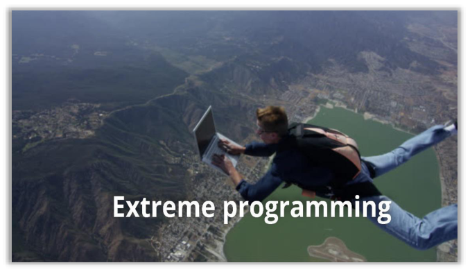

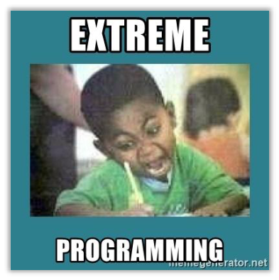

---

<!-- pagina: 5 -->

**Diego Carvalho, Equipe Informática 2 (Diego Carvalho), Equipe Informática 1 (Diego Carvalho) Aula 03** 

<!-- Start of picture text -->
E XTREME  P <!-- End of picture text -->

<!-- Start of picture text -->
(XP) <!-- End of picture text -->

<!-- Start of picture text -->
ROGRAMMING <!-- End of picture text -->

<!-- Start of picture text -->
Conceitos Básicos <!-- End of picture text -->

**<mark>INCIDÊNCIA EM PROVA: MÉDIA</mark>** 

## **<mark>EXTREME PROGRAMMING (XP)</mark>** 

Metodologia ágil de desenvolvimento de software criada por Kent Beck, voltada principalmente para ambientes com mudanças frequentes de requisitos e necessidade de adaptação rápida. O XP procura fortalecer colaboração entre equipe e cliente, feedback contínuo, simplicidade e alta qualidade técnica por meio de práticas como testes automatizados, integração contínua, programação em pares e refatoração constante. Diferente de modelos lineares tradicionais, o XP trabalha de forma iterativa e incremental, <u>permitindo evolução contínua do sistema ao longo de pequenas entregas frequentes.</u> 

O eXtreme Programming (XP) surgiu como uma abordagem ágil voltada principalmente para ambientes altamente dinâmicos, nos quais requisitos mudam frequentemente e o desenvolvimento precisa responder rapidamente às necessidades do cliente. Kent Beck propôs a ideia de levar determinadas boas práticas ao “extremo”. A lógica era relativamente simples: se testar é importante, então devemos testar continuamente; se integração é importante, então devemos integrar frequentemente; e se feedback rápido melhora qualidade, então ele deve acontecer o tempo inteiro durante o projeto. 

O XP tornou-se bastante associado a equipes pequenas, colaborativas e multidisciplinares trabalhando em ambientes sujeitos a mudanças constantes. Diferentemente de modelos excessivamente burocráticos e fortemente baseados em documentação extensa produzida antecipadamente, o XP procura privilegiar comunicação contínua, simplicidade e adaptação rápida. Atenção porque isso não significa ausência completa de documentação. Pressman e Sommerville destacam que métodos ágeis maduros continuam produzindo documentação quando ela realmente agrega valor ao projeto, ao produto ou à manutenção futura do sistema. 

Uma das ideias centrais do XP envolve forte valorização do código limpo, dos testes automatizados e da comunicação constante entre clientes e desenvolvedores. O framework parte do entendimento de que documentos extensos podem rapidamente ficar desatualizados em ambientes sujeitos a mudanças frequentes. Por isso, o XP procura manter conhecimento o mais próximo possível da implementação real do sistema, utilizando código bem estruturado, testes automatizados e feedback contínuo como mecanismos principais de validação e comunicação técnica. 

No XP, os requisitos normalmente são descritos por meio de User Stories, também chamadas de histórias de usuário. Essas histórias representam descrições curtas de funcionalidades sob perspectiva do usuário ou cliente. Observem um detalhe importante: uma User Story não representa especificação completa e detalhada do sistema. Ela funciona muito mais como ponto de partida para conversas contínuas entre clientes e desenvolvedores. Em ambientes ágeis, comunicação frequente costuma ser mais eficiente do que documentação excessivamente detalhada criada muito tempo antes da implementação. 

As histórias de usuário normalmente descrevem pequenas funcionalidades capazes de gerar valor para o negócio. Uma boa história precisa possuir relevância para o cliente, permitindo priorização adequada do trabalho. Caso determinada história seja grande demais para caber dentro de uma iteração, ela costuma ser dividida em histórias menores e mais simples. Além disso, histórias excessivamente vagas ou impossíveis de estimar adequadamente geralmente precisam ser refinadas ou reescritas antes do desenvolvimento.

---

<!-- pagina: 6 -->

**Diego Carvalho, Equipe Informática 2 (Diego Carvalho), Equipe Informática 1 (Diego Carvalho) Aula 03** 

## **Saiba mais:** 

<mark>Para garantir uma compreensão comum e objetiva entre todos os envolvidos no projeto, as Histórias de Usuário costumam ser estruturadas baseadas no modelo dos "3 Cs", criado por Ron Jeffries. Estes três componentes principais são: o Cartão (Card), que é o meio físico ou digital onde a história é brevemente escrita; a Conversação (Conversation), que representa o diálogo contínuo entre os desenvolvedores, Product Owners e clientes para refinar e detalhar a necessidade; e a Confirmação (Confirmation), que são os critérios de aceitação que servem para atestar que a funcionalidade foi</mark> implementada adequadamente e de fato gerou o valor esperado. 

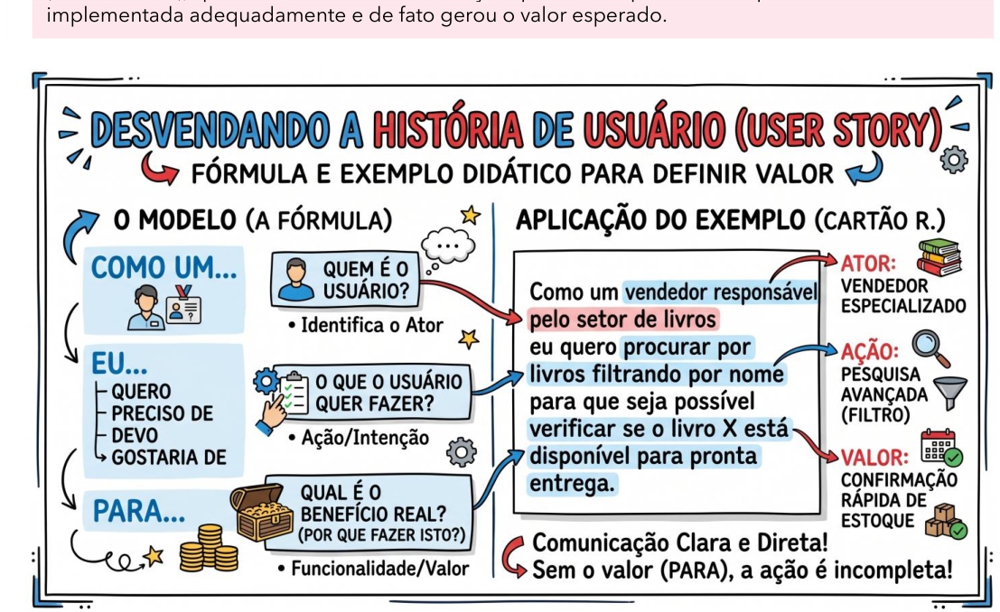

<!-- Start of picture text -->
implementada adequadamente e de fato gerou o valor esperado. <!-- End of picture text -->

Na transição de metodologias tradicionais para ágeis, é comum a adoção das Histórias de Usuário em substituição direta aos Casos de Uso padronizados pela UML. Sob a ótica de equivalência técnica, devese considerar que uma História de Usuário atua de maneira semelhante a um ou mais cenários dentro de um Caso de Uso convencional. Ambas as técnicas visam descrever as interações sob a perspectiva de quem utilizará o sistema, mas a História de Usuário tem seu formato enxuto focado prioritariamente nos objetivos do usuário e em como essa interação satisfaz suas necessidades de negócio, dispensando fluxos e especificações prematuras. Vejamos um comparativo:

---

<!-- pagina: 7 -->

**Diego Carvalho, Equipe Informática 2 (Diego Carvalho), Equipe Informática 1 (Diego Carvalho) Aula 03** 

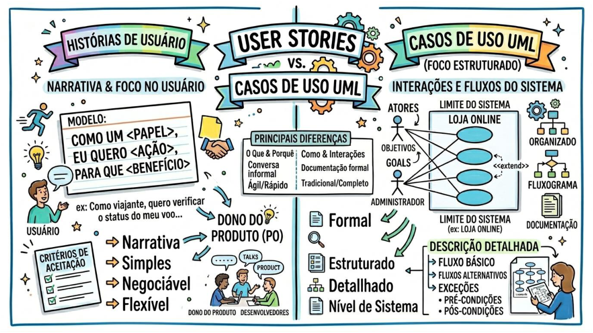

Outra característica extremamente importante do XP envolve desenvolvimento incremental e feedback rápido. O sistema evolui continuamente por meio de pequenas entregas frequentes chamadas releases. A cada nova funcionalidade implementada, novos testes são executados e o cliente pode validar rapidamente aquilo que foi desenvolvido. Observem como isso ajuda bastante a reduzir riscos: problemas, erros de entendimento e mudanças de prioridade costumam ser percebidos muito mais cedo do que em modelos tradicionais excessivamente sequenciais. 

O XP também ficou bastante conhecido por práticas técnicas específicas, como Pair Programming, integração contínua e Test-Driven Development. Na programação em pares, dois desenvolvedores trabalham juntos sobre o mesmo código, colaborando continuamente na construção e revisão das soluções implementadas. Já o desenvolvimento orientado a testes procura incentivar criação de testes automatizados antes da implementação da funcionalidade propriamente dita, fortalecendo qualidade, segurança das alterações e redução de defeitos durante evolução contínua do sistema. 

## **Saiba mais:** 

<mark>Além do trabalho em dupla propriamente dito, uma característica essencial e indissociável da Programação em Pares (Pair Programming) é o rodízio constante de colaboradores (Pair Rotation). No XP, as duplas não devem ser estáticas ou fixas durante todo o ciclo de vida do projeto. Pelo contrário, a metodologia estimula que os programadores troquem de par frequentemente, às vezes até diariamente.</mark> 

<mark>Esse rodízio contínuo garante que o conhecimento técnico, as lógicas de domínio e os detalhes da arquitetura sejam disseminados homogeneamente por toda a equipe. Isso elimina as chamadas</mark> <mark>`— —` "ilhas de conhecimento" onde apenas um desenvolvedor entende de um módulo específico e fortalece na prática o princípio da Propriedade Coletiva do Código, garantindo que qualquer</mark> integrante tenha contexto e confiança para modificar qualquer parte do sistema.

---

<!-- pagina: 8 -->

**Diego Carvalho, Equipe Informática 2 (Diego Carvalho), Equipe Informática 1 (Diego Carvalho) Aula 03** 

Outro aspecto extremamente importante envolve os testes de aceitação. Esses testes normalmente são definidos com forte participação do cliente e procuram validar funcionalidades visíveis do sistema como um todo. Além dos testes automatizados internos utilizados pelos desenvolvedores, os testes de aceitação ajudam a verificar se aquilo que foi implementado realmente atende necessidades do negócio e expectativas dos usuários. Observem como XP procura combinar continuamente qualidade técnica com geração prática de valor para o cliente. 

Em XP, o cliente possui participação muito próxima da equipe de desenvolvimento. A abordagem clássica defendia inclusive presença contínua do cliente junto aos desenvolvedores para facilitar esclarecimento rápido de dúvidas e tomada ágil de decisões. Embora ambientes modernos frequentemente adaptem essa prática conforme contexto organizacional, o princípio permanece extremamente relevante: quanto mais rápido ocorre comunicação entre negócio e equipe técnica, menores tendem a ser ambiguidades, retrabalho e atrasos no desenvolvimento do produto. 

Outro conceito importante trata de Casos de Teste. Eles representam um conjunto de condições utilizado para verificar comportamento correto de determinada funcionalidade. Em geral, ele especifica entradas, ações executadas e resultados esperados do sistema. Em métodos ágeis, testes automatizados ajudam bastante a manter segurança das mudanças realizadas continuamente ao longo do projeto, permitindo evolução incremental do software sem comprometer estabilidade e qualidade do produto desenvolvido. 

<!-- Start of picture text -->
Práticas <!-- End of picture text -->

#### **<mark>INCIDÊNCIA EM PROVA: ALTÍSSIMA</mark>** 

O XP possui um conjunto de práticas que são frequentemente utilizadas. Na prática, muitas organizações não aplicam todas as práticas clássicas do XP exatamente da maneira descrita pela teoria. Isso acontece porque ambientes reais possuem restrições relacionadas a orçamento, cultura organizacional, prazos, maturidade técnica da equipe e disponibilidade de profissionais. Em geral, cada organização adapta o

---

<!-- pagina: 9 -->

**Diego Carvalho, Equipe Informática 2 (Diego Carvalho), Equipe Informática 1 (Diego Carvalho) Aula 03** 

XP conforme suas necessidades, escolhendo práticas consideradas mais úteis, viáveis e compatíveis com seu contexto específico de desenvolvimento. 

Observem que isso não significa abandono dos princípios ágeis. Métodos como XP procuram justamente incentivar adaptação contínua e melhoria constante. Em algumas equipes, por exemplo, Pair Programming pode ser utilizado apenas em funcionalidades críticas; em outras, refatoração pode acontecer de maneira mais limitada dependendo da familiaridade dos desenvolvedores com determinadas partes do sistema. O importante é preservar colaboração, feedback rápido, qualidade técnica e evolução incremental do produto. Vejamos... 

|**PRÁTICA**|**DESCRIÇÃO**|
|---|---|
|**PLANEJAMENTO** **INCREMENTAL**|No XP, os requisitos são registrados como histórias de usuário priorizadas conforme valor de negócio e tempo disponível para o release. Depois disso, os desenvolvedores dividem essas histórias em tarefas menores, permitindo planejamento incremental, adaptação contínua e entregas frequentes.|
|**PEQUENOS RELEASES**|O XP procura entregar primeiro o menor conjunto de funcionalidades capaz de gerar valor real para o cliente. Após isso, novos releases são disponibilizados frequentemente, adicionando melhorias e funcionalidades de forma incremental, reduzindo riscos e acelerando feedback dos usuários.|
|**PROJETO SIMPLES** **DESENVOLVIMENTO** **TEST-FIRST**|O XP incentiva criação de soluções simples que atendam apenas às necessidades atuais do sistema, evitando complexidade desnecessária e funcionalidades prematuras. A ideia central é facilitar entendimento, manutenção e adaptação contínua do código ao longo do projeto. No desenvolvimento Test-First, os testes unitários automatizados são escritos antes da implementação da funcionalidade. Assim, primeiro define-se o comportamento esperado do sistema; depois, o código é desenvolvido para satisfazer os testes previamente criados pela equipe.|
|**REFACTORING**|Refatoração consiste em melhorar continuamente estrutura interna do código sem alterar comportamento funcional externo do sistema. O objetivo é reduzir complexidade, melhorar legibilidade, facilitar manutenção e evitar degradação progressiva da qualidade técnica ao longo do desenvolvimento.|
|**PROGRAMAÇÃO EM** **PARES**|Na programação em pares, dois desenvolvedores trabalham juntos utilizando o mesmo computador. Enquanto um implementa o código, o outro revisa continuamente decisões e possíveis problemas. Essa prática fortalece qualidade, compartilhamento de conhecimento e redução de defeitos.|
|**PROPRIEDADE** **COLETIVA**|No XP, qualquer desenvolvedor pode modificar qualquer parte do código quando necessário. Isso reduz formação de ilhas de conhecimento e aumenta compartilhamento técnico dentro da equipe, permitindo maior colaboração, flexibilidade e continuidade do desenvolvimento do sistema.|
|**INTEGRAÇÃO** **CONTÍNUA** **RITMO SUSTENTÁVEL**|Sempre que uma tarefa é concluída, o código é integrado rapidamente ao sistema principal e todos os testes automatizados são executados. Isso ajuda a detectar erros cedo, reduzir conflitos entre versões e manter o software continuamente funcional e estável. O XP defende ritmo sustentável de trabalho, evitando excesso contínuo de horas extras. A ideia é preservar produtividade, qualidade do código e saúde da equipe ao longo do tempo, pois longos períodos de sobrecarga tendem a aumentar erros e reduzir eficiência.|
|**METÁFORAS**|O XP utiliza metáforas para facilitar comunicação entre equipe técnica e clientes. Quando bem escolhidas,elas ajudam todos os envolvidos a compreender|

---

<!-- pagina: 10 -->

**Diego Carvalho, Equipe Informática 2 (Diego Carvalho), Equipe Informática 1 (Diego Carvalho) Aula 03** 

|**PRÁTICA**|**DESCRIÇÃO**|
|---|---|
||funcionamento geral do sistema, regras de negócio e arquitetura do projeto de maneira mais simples e intuitiva.|
|**CLIENTE ON-SITE**|O XP recomenda participação contínua de um representante do cliente junto à equipe de desenvolvimento. Esse envolvimento frequente facilita esclarecimento rápido de dúvidas, priorização de requisitos, feedback constante e maior alinhamento entre negócio e software produzido.|
|**REUNIÕES EM PÉ**|As reuniões em pé procuram manter foco, objetividade e rapidez na comunicação da equipe. Normalmente são encontros curtos utilizados para discutir progresso, tarefas futuras e impedimentos encontrados durante desenvolvimento, evitando longas reuniões improdutivas.|
|**TIME COESO**|O XP valoriza equipes pequenas, colaborativas e multidisciplinares. Os integrantes trabalham de forma integrada, compartilhando responsabilidades e conhecimentos técnicos diversos, aumentando adaptação, comunicação contínua e capacidade rápida de resolução de problemas.|
|**JOGO DO** **PLANEJAMENTO**|O Jogo do Planejamento envolve colaboração entre clientes e desenvolvedores para definir releases e iterações. Clientes priorizam funcionalidades conforme valor de negócio; já os desenvolvedores avaliam esforço, riscos e viabilidade técnica das implementações planejadas.|

## **Saiba mais:** 

<mark>O XP valoriza fortemente a estabilidade da equipe. Por ser uma metodologia explicitamente orientada às pessoas e ao fluxo de comunicação entre elas, recomenda-se evitar a troca de desenvolvedores durante o desenvolvimento de um projeto. A continuidade dos mesmos integrantes na equipe ajuda a preservar o entrosamento, facilita a comunicação fluida, consolida o senso de propriedade coletiva do código e evita a perda do conhecimento tácito que é</mark> continuamente construído ao longo das iterações. 

<!-- Start of picture text -->
Princípios <!-- End of picture text -->

#### **<mark>INCIDÊNCIA EM PROVA: BAIXÍSSIMA</mark>** 

No XP existem valores, princípios e práticas; atenção porque esses conceitos não são sinônimos. Os valores representam ideias culturais mais amplas relacionadas à forma como a equipe trabalha; já os princípios ajudam orientar decisões práticas durante resolução de problemas no projeto. Em outras palavras: eles funcionam como diretrizes utilizadas pela equipe para escolher melhores caminhos diante das mudanças, dificuldades e incertezas naturais do desenvolvimento de software em ambientes ágeis. 

|**PRINCÍPIOS** **BÁSICOS**|**DESCRIÇÃO**|
|---|---|
|**FEEDBACK** **RÁPIDO**|O sistema é apresentado frequentemente ao cliente e, sempre que novas funcionalidades são implementadas, a equipe procura obter retorno imediato sobre aquilo que foi desenvolvido. Observem como isso reduz riscos: problemas de entendimento, funcionalidades sem valor e falhas de alinhamento tendem a ser percebidos muito mais cedo. Métodos ágeis dependem fortemente dessa capacidade contínua de aprendizado e adaptação rápida durante evolução doproduto.|
|**ABRAÇAR** **MUDANÇAS**|Diferentemente de abordagens tradicionais excessivamente rígidas, o XP parte da ideia de que mudanças são inevitáveis em projetos complexos. Isso não significa incentivar mudanças caóticas ou desorganizadas;significa aceitarque requisitos evoluem continuamente|

---

<!-- pagina: 11 -->

**Diego Carvalho, Equipe Informática 2 (Diego Carvalho), Equipe Informática 1 (Diego Carvalho) Aula 03** 

<mark>conforme clientes aprendem mais sobre suas próprias necessidades e conforme o contexto</mark> do projeto se transforma ao longo do desenvolvimento. 

A ideia central é resolver problemas da maneira mais simples possível dentro das necessidades atuais do sistema, evitando complexidade desnecessária e funcionalidades **PRESUMIR** especulativas. Pressman e Sommerville destacam que métodos ágeis procuram evitar **SIMPLICIDADE** superengenharia, isto é, desenvolvimento excessivamente complexo baseado em hipóteses futuras incertas. Em XP existe forte influência da ideia conhecida como YAGNI: “You Aren’t <mark>Gonna Need It”, isto é, não implementar algo que ainda não possui necessidade concreta.</mark> O software evolui gradualmente por meio de pequenas melhorias realizadas continuamente ao longo das iterações. Em vez de grandes alterações massivas feitas apenas no final do **MUDANÇAS** projeto, o XP procura permitir evolução progressiva e frequente do sistema. Isso ajuda **INCREMENTAIS** bastante a reduzir riscos, aumentar previsibilidade e facilitar adaptação diante das mudanças identificadas durante desenvolvimento do produto. A abordagem defende que qualidade não deve ser sacrificada apenas para acelerar entregas. Uma das práticas que reforça essa ideia é o desenvolvimento Test-First, no qual **TRABALHO DE** testes automatizados são criados antes da implementação da funcionalidade propriamente **QUALIDADE** dita. Observem como isso fortalece segurança das mudanças, reduz defeitos e melhora confiabilidade do software ao longo das iterações. 

## **Saiba mais:** 

<mark>É imperativo lembrar que todas essas abordagens estão submetidas aos princípios e valores do Manifesto Ágil. A maior e mais importante prioridade do Manifesto Ágil é justamente "satisfazer o cliente através da entrega contínua e adiantada de software com valor". As práticas do Extreme Programming, como entregas pequenas e feedback constante, são essencialmente desenhadas para atender materialmente a essa prioridade máxima, evidenciando o alinhamento total entre a</mark> teoria do XP e os ideais do Manifesto Ágil original. 

No XP, novas versões do software podem ser integradas e compiladas diversas vezes ao longo do dia. Sempre que uma nova funcionalidade é adicionada, todos os testes automatizados precisam ser executados novamente para verificar se o sistema continua funcionando corretamente. Essa prática está fortemente associada à integração contínua, permitindo identificação rápida de defeitos e redução de problemas causados por incompatibilidades entre diferentes partes do sistema. 

A engenharia de software tradicional frequentemente enfatiza antecipação de mudanças futuras durante projeto arquitetural. O XP, contudo, questiona exageros nesse planejamento especulativo. A abordagem entende que muitas mudanças previstas antecipadamente jamais acontecerão; além disso, mudanças reais frequentemente surgem de maneira completamente diferente daquilo que havia sido imaginado inicialmente. Por isso, o XP procura manter arquitetura simples e continuamente adaptável ao longo do desenvolvimento. 

Isso não significa ausência de projeto arquitetural ou improvisação desorganizada. Pressman e Sommerville deixam claro que métodos ágeis maduros continuam exigindo preocupação com qualidade, arquitetura e manutenção futura do sistema. A diferença principal está na forma incremental e evolutiva com que essas decisões acontecem. Em vez de tentar prever absolutamente tudo logo no início, o software evolui continuamente conforme novas necessidades surgem durante o projeto. 

Outro conceito extremamente importante do XP envolve refatoração contínua. Refatorar significa melhorar estrutura interna do código sem alterar comportamento externo do sistema. Em XP, os desenvolvedores procuram constantemente simplificar, reorganizar e melhorar código-fonte conforme

---

<!-- pagina: 12 -->

**Diego Carvalho, Equipe Informática 2 (Diego Carvalho), Equipe Informática 1 (Diego Carvalho) Aula 03** 

novas funcionalidades são implementadas. Isso ajuda bastante a evitar degradação progressiva da arquitetura e facilita implementação de mudanças futuras sem aumentar excessivamente complexidade técnica do software. 

Sommerville também destaca diferenças importantes entre testes em métodos incrementais e testes tradicionais dirigidos a planos. Em modelos clássicos, normalmente existe forte separação entre desenvolvimento e equipe independente de testes baseada em especificações extensas. Já em XP, os testes fazem parte contínua do próprio desenvolvimento. Isso não significa testes “informais”; pelo contrário: XP enfatiza disciplina forte relacionada à automação, validação frequente e execução contínua de testes ao longo de toda evolução do sistema. 

As principais características dos testes no XP incluem: desenvolvimento Test-First; criação incremental de testes a partir de cenários e histórias de usuário; forte participação dos usuários na validação; e utilização intensa de frameworks automatizados de teste. Observem como essas práticas fortalecem feedback rápido, qualidade contínua e redução de erros desconhecidos durante desenvolvimento incremental do software. Em ambientes complexos, essa capacidade rápida de validação torna-se extremamente importante para evolução segura e contínua do produto. 

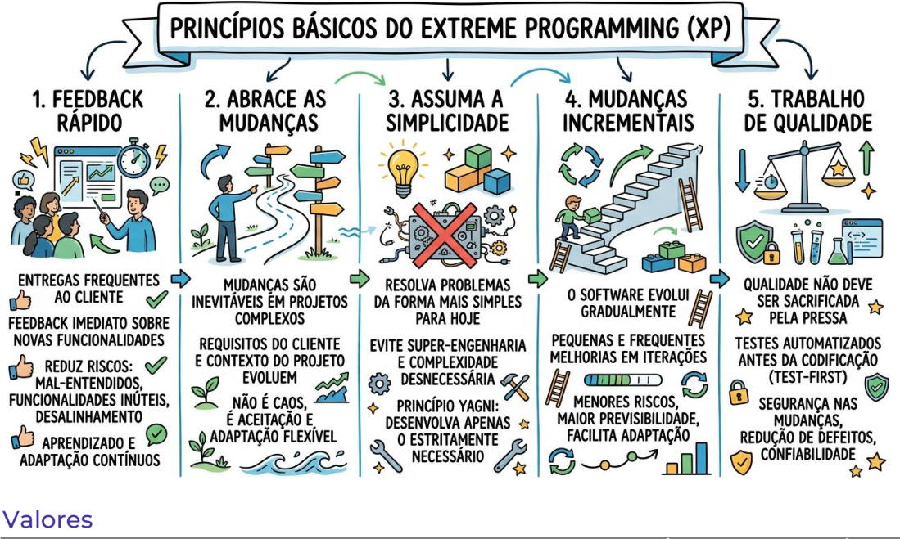

<!-- Start of picture text -->
Valores <!-- End of picture text -->

**<mark>INCIDÊNCIA EM PROVA: BAIXÍSSIMA</mark>** 

Os valores fundamentais do XP representam princípios culturais que orientam comportamento, decisões técnicas e forma de trabalho da equipe durante o desenvolvimento do software. Eles ajudam a sustentar práticas ágeis como integração contínua, programação em pares, refatoração e desenvolvimento orientado a testes. Atenção porque valores não são exatamente práticas técnicas; eles funcionam muito mais como ideias centrais que orientam mentalidade e cultura da equipe. 

|**VALORES** **FUNDAMENTAIS**|**DESCRIÇÃO**|
|---|---|

---

<!-- pagina: 13 -->

**Diego Carvalho, Equipe Informática 2 (Diego Carvalho), Equipe Informática 1 (Diego Carvalho) Aula 03** 

**COMUNICAÇÃO** 

**SIMPLICIDADE** 

**FEEDBACK** 

O XP entende que muitos problemas em projetos de software surgem justamente por falhas de comunicação entre clientes, desenvolvedores e demais envolvidos. Por isso, a abordagem procura incentivar conversas frequentes, feedback rápido e troca contínua de conhecimento. Práticas como programação em pares, cliente on-site e reuniões rápidas ajudam bastante a fortalecer comunicação clara e reduzir ambiguidades durante <mark>desenvolvimento.</mark> 

O XP procura resolver problemas utilizando soluções simples e adequadas às necessidades atuais do sistema, evitando complexidade desnecessária e funcionalidades especulativas. A ideia não é produzir software “pobre” ou mal estruturado; o objetivo é evitar superengenharia e excesso de sofisticação sem necessidade real. Em ambientes sujeitos a mudanças frequentes, soluções simples normalmente são mais fáceis de entender, manter e <mark>adaptar continuamente.</mark> 

A abordagem procura gerar retorno rápido constantemente: feedback do cliente sobre funcionalidades desenvolvidas, feedback dos testes automatizados sobre qualidade do código e feedback da própria equipe sobre processo de desenvolvimento. Quanto mais cedo problemas e desalinhamentos forem percebidos, menores tendem a ser custos de correção e impactos negativos sobre evolução do projeto. 

**CORAGEM** 

<mark>Equipes XP precisam ter coragem para refatorar código, simplificar soluções, admitir</mark> problemas e modificar decisões anteriores quando necessário. Em métodos ágeis, mudanças fazem parte natural do desenvolvimento; portanto, insistir em soluções inadequadas apenas porque já foram implementadas costuma gerar prejuízos técnicos e organizacionais no médio prazo. A coragem ajuda justamente a enfrentar mudanças e dificuldades de maneira transparente e colaborativa. 

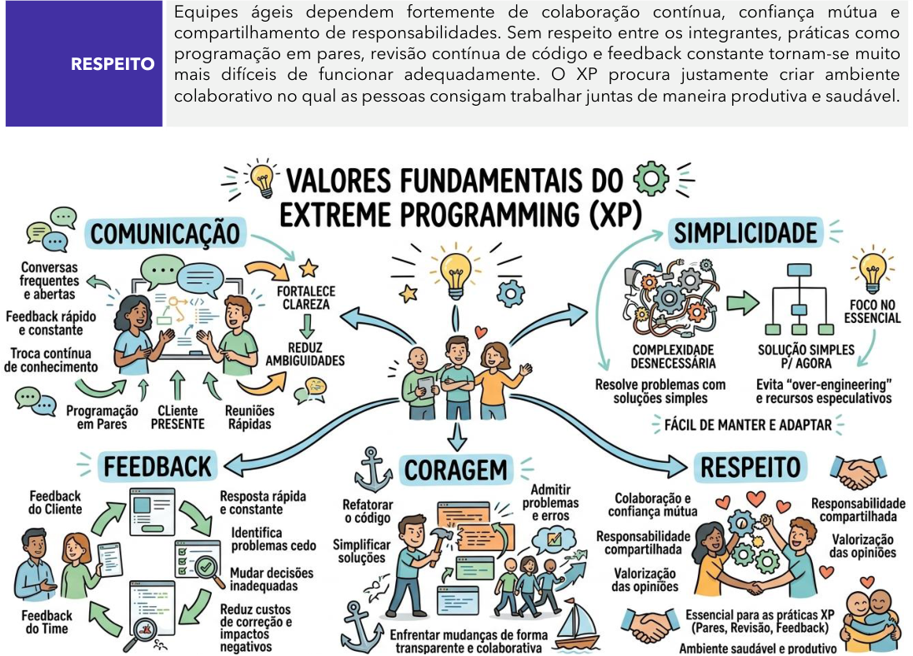

<!-- Start of picture text -->
Equipes ágeis dependem fortemente de colaboração contínua, confiança mútua e compartilhamento de responsabilidades. Sem respeito entre os integrantes, práticas como programação em pares, revisão contínua de código e feedback constante tornam-se muito RESPEITO mais difíceis de funcionar adequadamente. O XP procura justamente criar ambiente colaborativo no qual as pessoas consigam trabalhar juntas de maneira produtiva e saudável. <!-- End of picture text -->

---

<!-- pagina: 14 -->

**Diego Carvalho, Equipe Informática 2 (Diego Carvalho), Equipe Informática 1 (Diego Carvalho) Aula 03** 

|**CORAGEM**|**SIMPLICIDADE**|**COMUNICAÇÃO**|**FEEDBACK**|**RESPEITO**|
|---|---|---|---|---|
|Cor|Sim|Com|Fe|Re|
|||**CorSim ComFeRe**|||

Observem como esses valores se conectam diretamente às práticas técnicas do XP. Comunicação fortalece colaboração; simplicidade reduz complexidade desnecessária; feedback acelera aprendizado; coragem facilita adaptação contínua; e respeito melhora dinâmica da equipe. Em conjunto, esses valores ajudam organizações a desenvolver software com maior qualidade, adaptação rápida e forte alinhamento às necessidades reais dos usuários e do negócio.

---

<!-- pagina: 15 -->

**Diego Carvalho, Equipe Informática 2 (Diego Carvalho), Equipe Informática 1 (Diego Carvalho) Aula 03** 

<!-- Start of picture text -->
Processo do XP <!-- End of picture text -->

#### **<mark>INCIDÊNCIA EM PROVA: MÉDIA</mark>** 

Quando estudamos o XP, precisamos entender que ele não funciona como um processo linear tradicional no qual primeiro se planeja tudo, depois se projeta tudo, depois se implementa tudo e somente no final se testa o sistema. O XP trabalha de maneira altamente iterativa, incremental e contínua. Em outras palavras: planejamento, projeto, codificação e testes acontecem constantemente ao longo do desenvolvimento, permitindo adaptação rápida diante das mudanças e aprendizado contínuo durante evolução do software. 

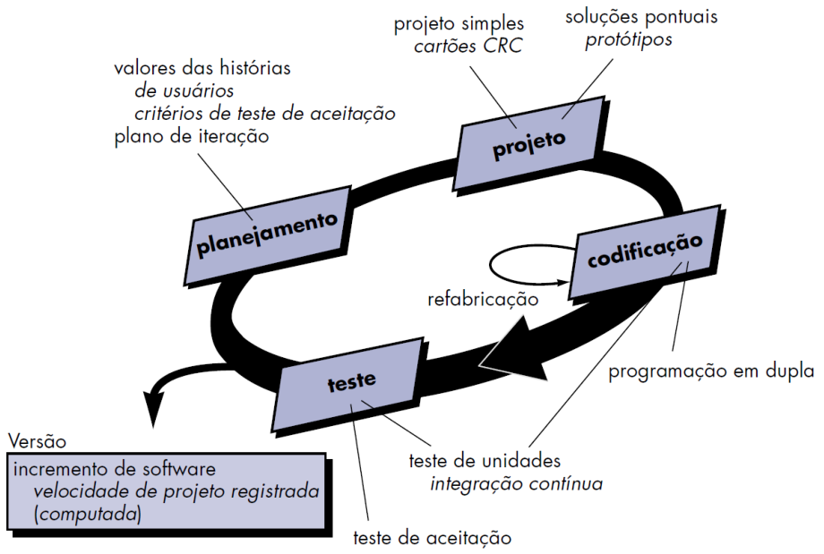

Historicamente, o XP ficou fortemente associado ao paradigma orientado a objetos, principalmente porque muitas ideias originais propostas por Kent Beck surgiram nesse contexto. Contudo, atenção porque o XP não depende obrigatoriamente desse paradigma para existir. O ponto central do framework está muito mais relacionado à colaboração intensa, feedback rápido, simplicidade, integração contínua e adaptação frequente durante desenvolvimento de software em ambientes sujeitos a mudanças constantes. 

Segundo Pressman, o XP pode ser entendido em torno de quatro grandes atividades metodológicas: planejamento, projeto, codificação e testes. Observem, porém, um detalhe extremamente importante: essas atividades não acontecem isoladamente nem em sequência rígida como em modelos tradicionais. Existe forte retroalimentação contínua entre elas. Enquanto a equipe codifica, novos testes surgem; durante testes aparecem necessidades de refatoração; e mudanças identificadas podem gerar novos planejamentos e ajustes arquiteturais. 

### **<mark>ETAPAS DESCRIÇÃO</mark>** 

**PLANEJAMENTO** No XP, o planejamento ocorre continuamente e de maneira colaborativa entre clientes e desenvolvedores. As funcionalidades desejadas são descritas <u>por meio de histórias de</u>

---

<!-- pagina: 16 -->

**Diego Carvalho, Equipe Informática 2 (Diego Carvalho), Equipe Informática 1 (Diego Carvalho) Aula 03** 

**<mark>ETAPAS DESCRIÇÃO</mark>** <mark>usuário, que representam necessidades do sistema sob perspectiva do usuário final. A</mark> equipe define prioridades, critérios de aceitação e objetivos das iterações, permitindo adaptação rápida diante das mudanças. O foco principal é alinhar desenvolvimento técnico às necessidades reais do negócio e do cliente. O projeto no XP procura criar soluções simples, objetivas e fáceis de modificar. Em vez de antecipar todas as mudanças futuras possíveis, a equipe desenvolve arquitetura suficiente para atender às necessidades atuais do sistema. Essa abordagem reduz complexidade **PROJETO** desnecessária e evita superengenharia. Técnicas como cartões CRC, protótipos e soluções pontuais ajudam a organizar entendimento do domínio e facilitar evolução contínua do software ao longo das iterações. A codificação representa atividade central no XP e acontece de maneira altamente colaborativa. Uma das práticas mais conhecidas é a programação em pares, na qual dois desenvolvedores trabalham juntos no mesmo computador revisando continuamente **CODIFICAÇÃO** decisões e implementação do código. O XP também enfatiza integração contínua e refatoração frequente, permitindo que o sistema evolua continuamente sem perder qualidade, legibilidade e facilidade de manutenção. Os testes ocupam posição central dentro do XP e acontecem continuamente durante desenvolvimento do software. A abordagem enfatiza desenvolvimento Test-First, no qual os testes automatizados são escritos antes da implementação da funcionalidade. Sempre que **TESTE** novas funcionalidades são integradas ao sistema, todos os testes existentes são executados novamente. Isso ajuda a identificar defeitos rapidamente, aumentar confiabilidade do sistema e reduzir riscos durante evolução incremental do produto. 

Observem como todas essas atividades se conectam continuamente formando um ciclo dinâmico de aprendizado e adaptação. Planejamento gera histórias; histórias orientam projeto; projeto direciona codificação; codificação exige testes; testes revelam melhorias; e melhorias retroalimentam novamente planejamento e evolução do sistema. É justamente essa integração contínua entre comunicação, simplicidade, feedback rápido e melhoria constante que torna o XP uma das abordagens ágeis mais influentes dentro da engenharia moderna de software. 

Na tabela anterior, mencionamos rapidamente as “soluções pontuais”. Também chamadas de Spike Solutions, Protótipos Operacionais ou Provas de Conceito Focadas, trata-se de um programa extremamente simples, com código isolado, criado unicamente com o propósito de testar uma tecnologia desconhecida, explorar uma solução potencial ou investigar um problema arquitetural espinhoso. 

A característica mais marcante de uma Spike Solution é a sua transitoriedade: ela é feita para ser descartada (throwaway code). Como o objetivo primário do Spike é gerar aprendizado rápido (e não criar um código escalável ou limpo), uma vez que a equipe obtém as respostas técnicas que precisava, o protótipo é jogado fora. A funcionalidade real e oficial é então codificada do zero, desta vez utilizando a disciplina exigida pelo XP, como TDD e Pair Programming. 

## **Saiba mais:** 

<mark>É importante mencionar também o Design Incremental, que é uma prática utilizada para minimizar o custo das alterações e o retrabalho. Em vez de realizar um planejamento arquitetural exaustivo no início do projeto (prática conhecida como Big Design Up Front - BDUF), a equipe adia as decisões de design estrutural até que sejam estritamente necessárias, tomando-as com base nas informações mais maduras e atuais disponíveis.</mark>

---

<!-- pagina: 17 -->

**Diego Carvalho, Equipe Informática 2 (Diego Carvalho), Equipe Informática 1 (Diego Carvalho) Aula 03** 

<mark>Com o Incremental Design, o software começa da forma mais simples possível e a sua complexidade evolui organicamente, suportada por refatorações constantes para remover duplicações (code smells). É importante distinguir essa abordagem de outras nomenclaturas ágeis de mercado, como o 15-Minute Build (prática focada em manter o ciclo de compilação e execução total de testes automatizados muito curtos, idealmente em menos de 15 minutos) e o Slack (técnica de gerenciamento de tempo que consiste em inserir uma "folga" no planejamento para acomodar</mark> imprevistos e correções sem sacrificar os compromissos da iteração). 

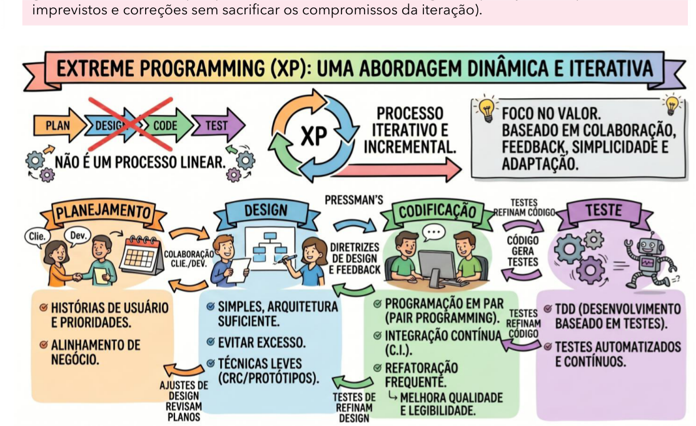

<!-- Start of picture text -->
imprevistos e correções sem sacrificar os compromissos da iteração). <!-- End of picture text -->

---

<!-- pagina: 18 -->

**Diego Carvalho, Equipe Informática 2 (Diego Carvalho), Equipe Informática 1 (Diego Carvalho) Aula 03** 

<!-- Start of picture text -->
XP x Scrum <!-- End of picture text -->

#### **<mark>INCIDÊNCIA EM PROVA: BAIXÍSSIMA</mark>** 

É importante não confundir XP e Scrum! Eles são frequentemente utilizados juntos porque acabam se complementando muito bem dentro dos projetos ágeis. O Scrum possui foco muito forte na organização e gestão do trabalho: definição de papéis, planejamento das Sprints, reuniões diárias, revisão, retrospectiva e acompanhamento contínuo do fluxo de desenvolvimento. Já o XP mergulha mais profundamente na engenharia de software propriamente dita, trazendo práticas importantes para garantir qualidade contínua do código e redução de defeitos durante evolução do sistema. 

Na prática, muita gente costuma dizer que o Scrum responde “como organizar o trabalho”; já o XP responde “como desenvolver tecnicamente com qualidade”. Observem que o Scrum não define práticas obrigatórias de programação, testes automatizados ou refatoração; contudo, o XP enfatiza justamente elementos como Test-First, programação em pares, integração contínua, refatoração constante e pequenas entregas frequentes. Quando utilizados juntos, o Scrum fornece estrutura gerencial ágil; já o XP fortalece disciplina técnica, qualidade do software e capacidade contínua de adaptação da equipe. 

|**ASPECTOS**|**SCRUM**|**EXTREME PROGRAMMING(XP)**|
|---|---|---|
|**FOCO** **PRINCIPAL**|Foca organização, gestão do trabalho, inspeção contínua, adaptação e geração incremental de valor durante as Sprints.|Foca práticas técnicas de engenharia de software, buscando melhorar qualidade, testes, integração e manutenção contínua do código.|
|**NATUREZA**|Framework leve que define papéis, eventos e artefatos para organizar desenvolvimento ágil de produtos complexos.|É uma metodologia ágil centrada em práticas técnicas e colaboração contínua para desenvolvimento incremental de software.|
|**ORGANIZAÇÃO** **DO TRABALHO**|Organiza trabalho em Sprints com planejamento, reuniões diárias, revisão e retrospectiva para adaptação contínua.|Organiza trabalho em pequenas iterações com feedback rápido, integração frequente e evolução contínua do software.|
|**PAPÉIS**|Define três responsabilidades formais: PO, SM e DEVs, cada uma com funções específicas.|Não enfatiza papéis formais rígidos; valoriza colaboração contínua entre cliente, programadores e equipe técnica.|
|**PRÁTICAS** **TÉCNICAS**|Não define práticas obrigatórias de programação, testes ou arquitetura; a equipe escolhe técnicas complementares.|Define práticas como programação em pares, Test-First, refatoração, integração contínua e pequenas releases.|
|**TESTES**|Valoriza qualidade do incremento entregue, mas não detalha formalmente como testes devem ser realizados.|Coloca testes automatizados no centro do desenvolvimento, enfatizando Test-First e validação contínua do sistema.|
|**REFATORAÇÃO**|Permite refatoração, mas não a estabelece explicitamente como prática obrigatória dentro do framework Scrum.|A refatoração contínua é prática central do XP para manter código simples, limpo e fácil de modificar.|
|**PARTICIPAÇÃO** **DO CLIENTE**|O Product Owner representa interesses do negócio e mantém alinhamento contínuo com stakeholders e usuários.|O cliente participa diretamente do desenvolvimento, esclarecendo dúvidas e priorizando funcionalidades continuamente.|
|**USO EM** **CONJUNTO**|Frequentemente combinado com métodos técnicos porque possui foco maior em gestão e coordenação ágil.|Complementa muito bem o Scrum, oferecendo práticas técnicas para aumentar qualidade e segurança do software.|

---

<!-- pagina: 19 -->

**Diego Carvalho, Equipe Informática 2 (Diego Carvalho), Equipe Informática 1 (Diego Carvalho) Aula 03** 

<!-- Start of picture text -->
R ESUMO <!-- End of picture text -->

## **<mark>EXTREME PROGRAMMING (XP)</mark>** 

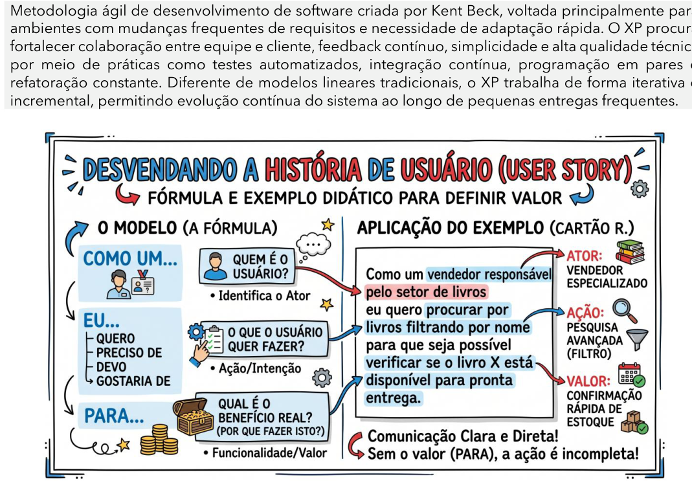

<!-- Start of picture text -->
Metodologia ágil de desenvolvimento de software criada por Kent Beck, voltada principalmente para ambientes com mudanças frequentes de requisitos e necessidade de adaptação rápida. O XP procura fortalecer colaboração entre equipe e cliente, feedback contínuo, simplicidade e alta qualidade técnica por meio de práticas como testes automatizados, integração contínua, programação em pares e refatoração constante. Diferente de modelos lineares tradicionais, o XP trabalha de forma iterativa e incremental,, permitindo evolução contínua do sistema ao longo de pequenas entregas frequentes. ermitindo evolução contínua do sistema ao longo de pequenas entregas frequentes. ção contínua do sistema ao longo de pequenas entregas frequentes. ão contínua do sistema ao longo de pequenas entregas frequentes. go de pequenas entregas frequentes. o de pequenas entregas frequentes. pequenas entregas frequentes. equenas entregas frequentes. quenas entregas frequentes. uenas entregas frequentes. gas frequentes. as frequentes. quentes. uentes. <!-- End of picture text -->

Metodologia ágil de desenvolvimento de software criada por Kent Beck, voltada principalmente para ambientes com mudanças frequentes de requisitos e necessidade de adaptação rápida. O XP procura fortalecer colaboração entre equipe e cliente, feedback contínuo, simplicidade e alta qualidade técnica por meio de práticas como testes automatizados, integração contínua, programação em pares e refatoração constante. Diferente de modelos lineares tradicionais, o XP trabalha de forma iterativa e incremental,, <u>permitindo evolução contínua do sistema ao longo de pequenas entregas frequentes. ermitindo evolução contínua do sistema ao longo de pequenas entregas frequentes. ção contínua do sistema ao longo de pequenas entregas frequentes. ão contínua do sistema ao longo de pequenas entregas frequentes. go de pequenas entregas frequentes. o de pequenas entregas frequentes. pequenas entregas frequentes. equenas entregas frequentes. quenas entregas frequentes. uenas entregas frequentes. gas frequentes. as frequentes. quentes. uentes.</u> 

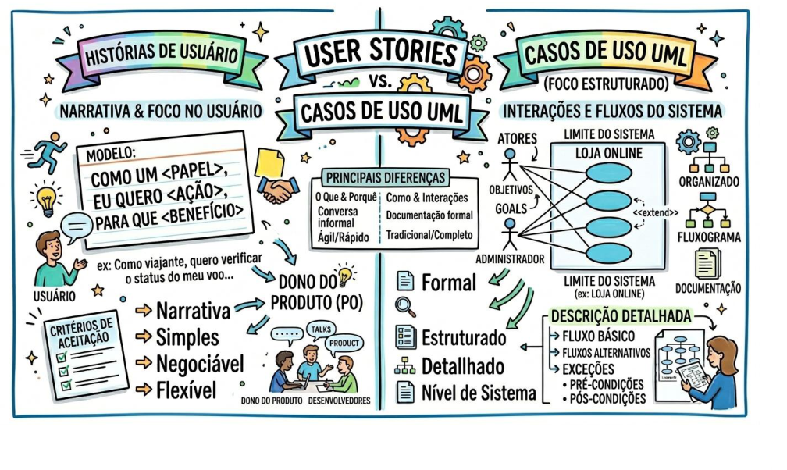

---

<!-- pagina: 20 -->

**Diego Carvalho, Equipe Informática 2 (Diego Carvalho), Equipe Informática 1 (Diego Carvalho) Aula 03** 

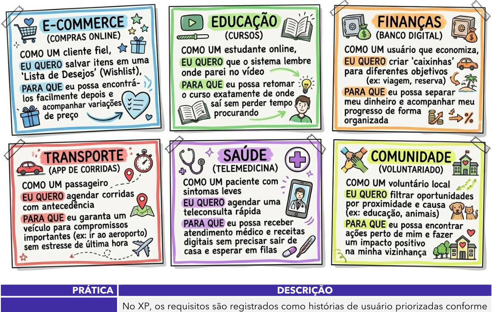

<!-- Start of picture text -->
==5460== PRÁTICA  DESCRIÇÃO No XP, os requisitos são registrados como histórias de usuário priorizadas conforme <!-- End of picture text -->

||==5460==|
|---|---|
|**PRÁTICA** **PLANEJAMENTO** **INCREMENTAL**|**DESCRIÇÃO** No XP, os requisitos são registrados como histórias de usuário priorizadas conforme valor de negócio e tempo disponível para o release. Depois disso, os desenvolvedores dividem essas histórias em tarefas menores, permitindo planejamento incremental, adaptação contínua e entregas frequentes.|
|**PEQUENOS RELEASES**|O XP procura entregar primeiro o menor conjunto de funcionalidades capaz de gerar valor real para o cliente. Após isso, novos releases são disponibilizados frequentemente, adicionando melhorias e funcionalidades de forma incremental, reduzindo riscos e acelerando feedback dos usuários.|
|**PROJETO SIMPLES**|O XP incentiva criação de soluções simples que atendam apenas às necessidades atuais do sistema, evitando complexidade desnecessária e funcionalidades prematuras. A ideia central é facilitar entendimento, manutenção e adaptação contínua do código ao longo do projeto.|
|**DESENVOLVIMENTO** **TEST-FIRST**|No desenvolvimento Test-First, os testes unitários automatizados são escritos antes da implementação da funcionalidade. Assim, primeiro define-se o comportamento esperado do sistema; depois, o código é desenvolvido para satisfazer os testes previamente criados pela equipe.|
|**REFACTORING**|Refatoração consiste em melhorar continuamente estrutura interna do código sem alterar comportamento funcional externo do sistema. O objetivo é reduzir complexidade, melhorar legibilidade, facilitar manutenção e evitar degradação progressiva da qualidade técnica ao longo do desenvolvimento.|
|**PROGRAMAÇÃO EM** **PARES**|Na programação em pares, dois desenvolvedores trabalham juntos utilizando o mesmo computador. Enquanto um implementa o código, o outro revisa continuamente decisões e possíveis problemas. Essa prática fortalece qualidade, compartilhamento de conhecimento e redução de defeitos.|

---

<!-- pagina: 21 -->

**Diego Carvalho, Equipe Informática 2 (Diego Carvalho), Equipe Informática 1 (Diego Carvalho) Aula 03** 

|**PRÁTICA**|**DESCRIÇÃO**|
|---|---|
|**PROPRIEDADE** **COLETIVA** **INTEGRAÇÃO** **CONTÍNUA**|No XP, qualquer desenvolvedor pode modificar qualquer parte do código quando necessário. Isso reduz formação de ilhas de conhecimento e aumenta compartilhamento técnico dentro da equipe, permitindo maior colaboração, flexibilidade e continuidade do desenvolvimento do sistema. Sempre que uma tarefa é concluída, o código é integrado rapidamente ao sistema principal e todos os testes automatizados são executados. Isso ajuda a detectar erros cedo, reduzir conflitos entre versões e manter o software continuamente funcional e estável.|
|**RITMO SUSTENTÁVEL**|O XP defende ritmo sustentável de trabalho, evitando excesso contínuo de horas extras. A ideia é preservar produtividade, qualidade do código e saúde da equipe ao longo do tempo, pois longos períodos de sobrecarga tendem a aumentar erros e reduzir eficiência.|
|**METÁFORAS**|O XP utiliza metáforas para facilitar comunicação entre equipe técnica e clientes. Quando bem escolhidas, elas ajudam todos os envolvidos a compreender funcionamento geral do sistema, regras de negócio e arquitetura do projeto de maneira mais simples e intuitiva.|
|**CLIENTE ON-SITE**|O XP recomenda participação contínua de um representante do cliente junto à equipe de desenvolvimento. Esse envolvimento frequente facilita esclarecimento rápido de dúvidas, priorização de requisitos, feedback constante e maior alinhamento entre negócio e software produzido.|
|**REUNIÕES EM PÉ**|As reuniões em pé procuram manter foco, objetividade e rapidez na comunicação da equipe. Normalmente são encontros curtos utilizados para discutir progresso, tarefas futuras e impedimentos encontrados durante desenvolvimento, evitando longas reuniões improdutivas.|
|**TIME COESO**|O XP valoriza equipes pequenas, colaborativas e multidisciplinares. Os integrantes trabalham de forma integrada, compartilhando responsabilidades e conhecimentos técnicos diversos, aumentando adaptação, comunicação contínua e capacidade rápida de resolução de problemas.|
|**JOGO DO** **PLANEJAMENTO**|O Jogo do Planejamento envolve colaboração entre clientes e desenvolvedores para definir releases e iterações. Clientes priorizam funcionalidades conforme valor de negócio; já os desenvolvedores avaliam esforço, riscos e viabilidade técnica das implementações planejadas.|
|**PRINCÍPIOS** **BÁSICOS**|**DESCRIÇÃO**|
|**FEEDBACK** **RÁPIDO** O sist são i desen funcio Métod adapt **ABRAÇAR** **MUDANÇAS** Difere que m caótic confor dopro|ema é apresentado frequentemente ao cliente e, sempre que novas funcionalidades mplementadas, a equipe procura obter retorno imediato sobre aquilo que foi volvido. Observem como isso reduz riscos: problemas de entendimento, nalidades sem valor e falhas de alinhamento tendem a ser percebidos muito mais cedo. os ágeis dependem fortemente dessa capacidade contínua de aprendizado e ação rápida durante evolução doproduto. ntemente de abordagens tradicionais excessivamente rígidas, o XP parte da ideia de udanças são inevitáveis em projetos complexos. Isso não significa incentivar mudanças as ou desorganizadas; significa aceitar que requisitos evoluem continuamente me clientes aprendem mais sobre suas próprias necessidades e conforme o contexto jeto se transforma ao longo do desenvolvimento.|
|**PRESUMIR** **SIMPLICIDADE** A ide neces espec super|ia central é resolver problemas da maneira mais simples possível dentro das sidades atuais do sistema, evitando complexidade desnecessária e funcionalidades ulativas. Pressman e Sommerville destacam que métodos ágeis procuram evitar engenharia,isto é,desenvolvimento excessivamente complexo baseado em hipóteses|

---

<!-- pagina: 22 -->

**Diego Carvalho, Equipe Informática 2 (Diego Carvalho), Equipe Informática 1 (Diego Carvalho) Aula 03** 

<mark>futuras incertas. Em XP existe forte influência da ideia conhecida como YAGNI: “You Aren’t</mark> Gonna Need It”, isto é, não implementar algo que ainda não possui necessidade concreta. O software evolui gradualmente por meio de pequenas melhorias realizadas continuamente ao longo das iterações. Em vez de grandes alterações massivas feitas apenas no final do **MUDANÇAS** projeto, o XP procura permitir evolução progressiva e frequente do sistema. Isso ajuda **INCREMENTAIS** bastante a reduzir riscos, aumentar previsibilidade e facilitar adaptação diante das mudanças identificadas durante desenvolvimento do produto. 

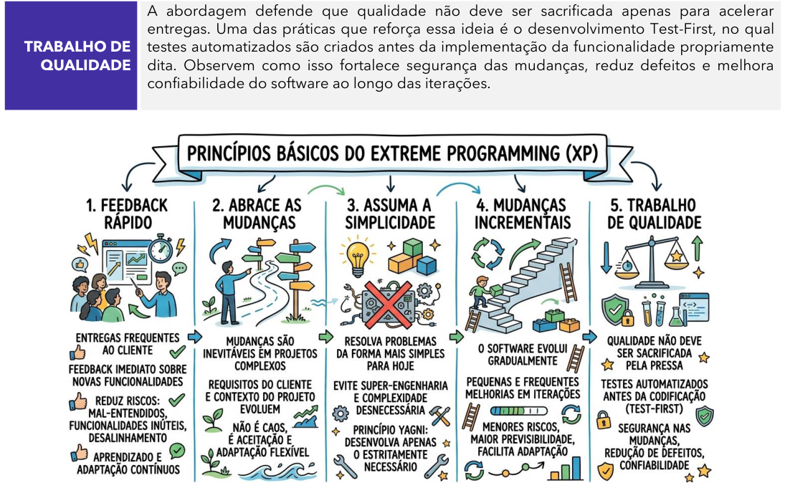

<!-- Start of picture text -->
A abordagem defende que qualidade não deve ser sacrificada apenas para acelerar entregas. Uma das práticas que reforça essa ideia é o desenvolvimento Test-First, no qual TRABALHO DE  testes automatizados são criados antes da implementação da funcionalidade propriamente QUALIDADE  dita. Observem como isso fortalece segurança das mudanças, reduz defeitos e melhora confiabilidade do software ao longo das iterações. <!-- End of picture text -->

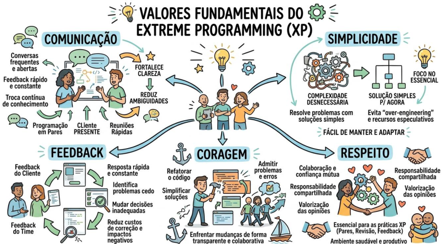

---

<!-- pagina: 23 -->

**Diego Carvalho, Equipe Informática 2 (Diego Carvalho), Equipe Informática 1 (Diego Carvalho) Aula 03** 

### **<mark>VALORES</mark> FUNDAMENTAIS COMUNICAÇÃO** 

### **DESCRIÇÃO** 

O XP entende que muitos problemas em projetos de software surgem justamente por falhas de comunicação entre clientes, desenvolvedores e demais envolvidos. Por isso, a abordagem procura incentivar conversas frequentes, feedback rápido e troca contínua de conhecimento. Práticas como programação em pares, cliente on-site e reuniões rápidas ajudam bastante a fortalecer comunicação clara e reduzir ambiguidades durante <mark>desenvolvimento.</mark> 

O XP procura resolver problemas utilizando soluções simples e adequadas às necessidades atuais do sistema, evitando complexidade desnecessária e funcionalidades especulativas. A ideia não é produzir software “pobre” ou mal estruturado; o objetivo é evitar superengenharia e excesso de sofisticação sem necessidade real. Em ambientes sujeitos a mudanças frequentes, soluções simples normalmente são mais fáceis de entender, manter e <mark>adaptar continuamente. ptar continuamente. tar continuamente.</mark> 

**SIMPLICIDADE** superengenharia e excesso de sofisticação sem necessidade real. Em ambientes sujeitos a mudanças frequentes, soluções simples normalmente são mais fáceis de entender, manter e <mark>adaptar continuamente. ptar continuamente. tar continuamente.</mark> A abordagem procura gerar retorno rápido constantemente: feedback do cliente sobre funcionalidades desenvolvidas, feedback dos testes automatizados sobre qualidade do código e feedback da própria equipe sobre processo de desenvolvimento. Quanto mais **FEEDBACK** cedo problemas e desalinhamentos forem percebidos, menores tendem a ser custos de correção e impactos negativos sobre evolução do projeto. Equipes XP precisam ter coragem para refatorar código, simplificar soluções, admitir problemas e modificar decisões anteriores quando necessário. Em métodos ágeis, mudanças fazem parte natural do desenvolvimento; portanto, insistir em soluções **CORAGEM** inadequadas apenas porque já foram implementadas costuma gerar prejuízos técnicos e organizacionais no médio prazo. A coragem ajuda justamente a enfrentar mudanças e dificuldades de maneira transparente e colaborativa. Equipes ágeis dependem fortemente de colaboração contínua, confiança mútua e compartilhamento de responsabilidades. Sem respeito entre os integrantes, práticas como programação em pares, revisão contínua de código e feedback constante tornam-se muito **RESPEITO** mais difíceis de funcionar adequadamente. O XP procura justamente criar ambiente colaborativo no qual as pessoas consigam trabalhar juntas de maneira produtiva e saudável. 

<!-- Start of picture text -->
CORAGEM  SIMPLICIDADE  COMUNICAÇÃO  FEEDBACK  RESPEITO Cor  Sim  Com  Fe  Re CorSim ComFeRe <!-- End of picture text -->

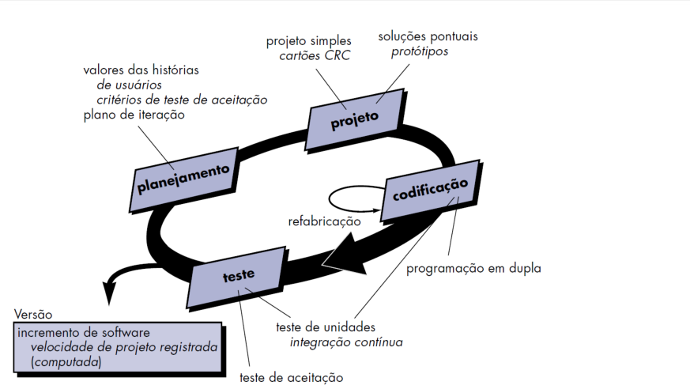

---

<!-- pagina: 24 -->

**Diego Carvalho, Equipe Informática 2 (Diego Carvalho), Equipe Informática 1 (Diego Carvalho) Aula 03** 

**<mark>ETAPAS DESCRIÇÃO</mark>** No XP, o planejamento ocorre continuamente e de maneira colaborativa entre clientes e desenvolvedores. As funcionalidades desejadas são descritas por meio de histórias de usuário, que representam necessidades do sistema sob perspectiva do usuário final. A **PLANEJAMENTO** equipe define prioridades, critérios de aceitação e objetivos das iterações, permitindo adaptação rápida diante das mudanças. O foco principal é alinhar desenvolvimento técnico às necessidades reais do negócio e do cliente. O projeto no XP procura criar soluções simples, objetivas e fáceis de modificar. Em vez de antecipar todas as mudanças futuras possíveis, a equipe desenvolve arquitetura suficiente para atender às necessidades atuais do sistema. Essa abordagem reduz complexidade **PROJETO** desnecessária e evita superengenharia. Técnicas como cartões CRC, protótipos e soluções pontuais ajudam a organizar entendimento do domínio e facilitar evolução contínua do software ao longo das iterações. A codificação representa atividade central no XP e acontece de maneira altamente colaborativa. Uma das práticas mais conhecidas é a programação em pares, na qual dois desenvolvedores trabalham juntos no mesmo computador revisando continuamente **CODIFICAÇÃO** decisões e implementação do código. O XP também enfatiza integração contínua e refatoração frequente, permitindo que o sistema evolua continuamente sem perder qualidade, legibilidade e facilidade de manutenção. Os testes ocupam posição central dentro do XP e acontecem continuamente durante desenvolvimento do software. A abordagem enfatiza desenvolvimento Test-First, no qual os testes automatizados são escritos antes da implementação da funcionalidade. Sempre que **TESTE** novas funcionalidades são integradas ao sistema, todos os testes existentes são executados novamente. Isso ajuda a identificar defeitos rapidamente, aumentar confiabilidade do sistema e reduzir riscos durante evolução incremental do produto. 

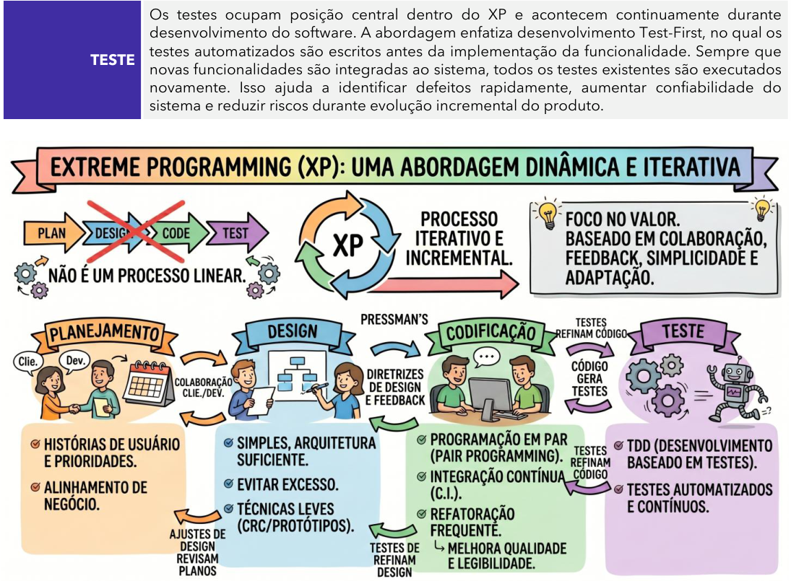

<!-- Start of picture text -->
Os testes ocupam posição central dentro do XP e acontecem continuamente durante desenvolvimento do software. A abordagem enfatiza desenvolvimento Test-First, no qual os testes automatizados são escritos antes da implementação da funcionalidade. Sempre que TESTE novas funcionalidades são integradas ao sistema, todos os testes existentes são executados novamente. Isso ajuda a identificar defeitos rapidamente, aumentar confiabilidade do sistema e reduzir riscos durante evolução incremental do produto. <!-- End of picture text -->

---

<!-- pagina: 25 -->

**Diego Carvalho, Equipe Informática 2 (Diego Carvalho), Equipe Informática 1 (Diego Carvalho) Aula 03** 

|**ASPECTOS**|**SCRUM**|**EXTREME PROGRAMMING(XP)**|
|---|---|---|
|**FOCO** **PRINCIPAL**|Foca organização, gestão do trabalho, inspeção contínua, adaptação e geração incremental de valor durante as Sprints.|Foca práticas técnicas de engenharia de software, buscando melhorar qualidade, testes, integração e manutenção contínua do código.|
|**NATUREZA**|Framework leve que define papéis, eventos e artefatos para organizar desenvolvimento ágil de produtos complexos.|É uma metodologia ágil centrada em práticas técnicas e colaboração contínua para desenvolvimento incremental de software.|
|**ORGANIZAÇÃO** **DO TRABALHO**|Organiza trabalho em Sprints com planejamento, reuniões diárias, revisão e retrospectiva para adaptação contínua.|Organiza trabalho em pequenas iterações com feedback rápido, integração frequente e evolução contínua do software.|
|**PAPÉIS**|Define três responsabilidades formais: PO, SM e DEVs, cada uma com funções específicas.|Não enfatiza papéis formais rígidos; valoriza colaboração contínua entre cliente, programadores e equipe técnica.|
|**PRÁTICAS** **TÉCNICAS**|Não define práticas obrigatórias de programação, testes ou arquitetura; a equipe escolhe técnicas complementares.|Define práticas como programação em pares, Test-First, refatoração, integração contínua e pequenas releases.|
|**TESTES**|Valoriza qualidade do incremento entregue, mas não detalha formalmente como testes devem ser realizados.|Coloca testes automatizados no centro do desenvolvimento, enfatizando Test-First e validação contínua do sistema.|
|**REFATORAÇÃO**|Permite refatoração, mas não a estabelece explicitamente como prática obrigatória dentro do framework Scrum.|A refatoração contínua é prática central do XP para manter código simples, limpo e fácil de modificar.|
|**PARTICIPAÇÃO** **DO CLIENTE**|O Product Owner representa interesses do negócio e mantém alinhamento contínuo com stakeholders e usuários.|O cliente participa diretamente do desenvolvimento, esclarecendo dúvidas e priorizando funcionalidades continuamente.|
|**USO EM** **CONJUNTO**|Frequentemente combinado com métodos técnicos porque possui foco maior em gestão e coordenação ágil.|Complementa muito bem o Scrum, oferecendo práticas técnicas para aumentar qualidade e segurança do software.|

---

<!-- pagina: 26 -->

**Diego Carvalho, Equipe Informática 2 (Diego Carvalho), Equipe Informática 1 (Diego Carvalho) Aula 03** 

<!-- Start of picture text -->
Q UESTÕES  C OMENTADAS <!-- End of picture text -->

**1. (FGV / CVM - 2024) As metodologias ágeis surgiram com o intuito de oferecer com maior rapidez produtos consistentes e que agregam valor, por meio de entregas parciais em períodos curtos. Em termos de Scrum e XP, existem diversas regras e eventos que objetivam essa otimização de entregas, como:** 

   - a) as reuniões diárias do Scrum, com duração média de uma hora, onde é analisado o avanço das tarefas na Sprint; 

   - b) o uso de programação em pares no XP, aliado ao rodízio de colaboradores durante o desenvolvimento; 

   - c) as reuniões de planejamento da Sprint, com duração máxima de quinze minutos, para definir as funcionalidades que serão desenvolvidas pela equipe na Sprint; 

   - d) a definição de um prazo médio de dois meses para completar cada Sprint e entregar as funcionalidades previstas; 

   - e) a priorização do desenvolvimento frente aos testes no XP, de forma a entregar mais rapidamente os produtos. 

## **Comentários:** 

(a) Errado. A Daily Scrum é uma reunião curta, voltada ao alinhamento diário da equipe, não com duração média de uma hora. 

(b) Correto. No XP, a programação em pares é uma prática clássica, e o rodízio favorece compartilhamento de conhecimento e qualidade no desenvolvimento. 

(c) Errado. O planejamento da Sprint não é uma reunião de quinze minutos; esse tempo curto se relaciona a outro evento do Scrum. 

(d) Errado. Sprint é um ciclo curto e iterativo, não definido, em regra, por prazo médio de dois meses. 

(e) Errado. No XP, testes têm papel central no processo, não ficando em segundo plano em nome da velocidade. 

**Gabarito:** Letra B

---

<!-- pagina: 27 -->

**Diego Carvalho, Equipe Informática 2 (Diego Carvalho), Equipe Informática 1 (Diego Carvalho) Aula 03** 

**2. (FGV / CVM - 2024) A fase de testes de software em processos ágeis se caracteriza pela elaboração dos testes antes da implementação do código, permitindo a execução do teste enquanto o código está sendo escrito. A característica do XP que tem como fundamento esse conceito de teste é o:** 

   - a) desenvolvimento de testes incrementais a partir de cenários; 

   - b) envolvimento dos usuários no desenvolvimento de testes e validação; 

   - c) desenvolvimento de test-first; 

   - d) uso de frameworks de testes automatizados; 

   - e) uso de workflows em testes. 

**Comentários:** 

(a) Errado. Testes incrementais por cenários podem ser usados em métodos ágeis, mas não representam a prática central do XP destacada no enunciado. 

(b) Errado. A participação dos usuários ajuda na validação, porém não corresponde ao princípio de escrever testes antes do código. 

(c) Correto. O test-first no XP prevê elaborar os testes antes da implementação, guiando a escrita do código desde o início. 

(d) Errado. Frameworks automatizados apoiam a execução dos testes, mas não definem, por si, a característica conceitual citada. 

(e) Errado. Workflows em testes organizam atividades, porém não expressam o fundamento do XP baseado em criar testes antes do código. 

**Gabarito:** Letra C 

**3. (FGV / INPE - 2024) Acerca de metodologias ágeis, assinale a afirmativa correta.** 

   - a) Satisfazer o cliente através da entrega antecipada e contínua de software valioso não é uma das prioridades do Manifesto Ágil. 

   - b) É responsabilidade do Scrum Master criar e comunicar de maneira clara os itens do Product Backlog.

---

<!-- pagina: 28 -->

**Diego Carvalho, Equipe Informática 2 (Diego Carvalho), Equipe Informática 1 (Diego Carvalho) Aula 03** 

- c) Integração Contínua é o processo no qual os desenvolvedores recriam o código continuamente assim que melhorias são identificadas, o que contribui para a simplicidade e facilidade de manutenção do código. 

- d) A Sprint Review é uma representação altamente visível e em tempo real do trabalho que os desenvolvedores planejam realizar durante a Sprint, cujo propósito é alcançar a Meta da Sprint. 

- e) Na metodologia XP, a elicitação de requisitos é conduzida pelos próprios membros da equipe de desenvolvimento e os requisitos são desenvolvidos de maneira incremental, conforme as prioridades do usuário. 

**Comentários:** 

(a) Errado. O Manifesto Ágil valoriza justamente a entrega frequente de software útil, tornando a alternativa ==5460== incompatível com seus princípios. 

(b) Errado. No Scrum, a clareza e comunicação dos itens do Product Backlog não são atribuídas dessa forma ao Scrum Master. 

(c) Errado. A alternativa descreve ideia ligada à melhoria de código, mas não caracteriza corretamente Integração Contínua. 

(d) Errado. A descrição apresentada corresponde a outro artefato do Scrum, não à Sprint Review. 

(e) Correto. No XP, os requisitos evoluem de forma incremental, com forte interação com o usuário e priorização conforme o valor entregue. 

**Gabarito:** Letra E 

**4. (FGV / INPE - 2024) As chamadas metodologias ágeis, apesar de compartilharem os mesmos fundamentos, possuem procedimentos particulares. Assinale a opção que indica a metodologia ágil que se caracteriza por organizar programadores em pares e focar na refatoração frequente.** 

a) Scrum. 

b) LSD. 

c) Extreme programming. 

d) Kanban. 

e) FDD. 

## **Comentários:** 

#### **DataPrev (Perfil 3: Desenvolvimento de Software) Engenharia de Software - 2026 (Pós-Edital)** **_www.estrategiaconcursos.com.br_**

---

<!-- pagina: 29 -->

**Diego Carvalho, Equipe Informática 2 (Diego Carvalho), Equipe Informática 1 (Diego Carvalho) Aula 03** 

(a) Errado. Scrum organiza o trabalho em sprints e papéis definidos, mas não se caracteriza pela programação em pares e refatoração frequente. 

(b) Errado. LSD foca em eliminar desperdícios e otimizar processos, sem ter como marca central a atuação em pares. 

(c) Correto. Extreme Programming adota programação em pares e valoriza refatoração constante para melhorar continuamente o código. 

(d) Errado. Kanban prioriza fluxo contínuo e gestão visual das tarefas, não a programação em pares como traço principal. 

(e) Errado. FDD é orientada por funcionalidades e planejamento incremental, sem destaque para pares e refatoração frequente. 

**Gabarito:** Letra C 

**5. (FGV / TRF 1ª Região - 2024) Os analistas do Time de Desenvolvimento de Software (TDS) estão utilizando User Story (História de Usuário) do Extreme Programming (XP) para todos os novos projetos, em substituição aos Casos de Uso em UML. Na escrita das User Stories, os analistas devem:** 

a) considerar que histórias podem ser construídas em mais de uma iteração; 

- b) ordenar a escrita das histórias, visto que há uma dependência entre elas; 

- c) detalhar os critérios de testes a serem executados com base na história; 

- d) considerar que uma história pode ser um ou mais cenários em um caso de uso; 

- e) focar nos objetivos do usuário e em como a interação com o sistema satisfaz esses objetivos. 

**Comentários:** 

(a) Errado. User Stories devem ser pequenas e, em regra, planejadas para caber em uma iteração, evitando atravessar várias delas. 

(b) Errado. Não há exigência de ordenar a escrita por dependência entre histórias; elas são independentes para facilitar priorização. 

(c) Errado. User Stories são descrições breves de valor ao usuário, sem exigir detalhamento dos testes na sua escrita. 

(d) Correto. Uma User Story pode corresponder a um ou mais cenários de um caso de uso, representando funcionalidade sob a ótica do usuário.

---

<!-- pagina: 30 -->

**Diego Carvalho, Equipe Informática 2 (Diego Carvalho), Equipe Informática 1 (Diego Carvalho) Aula 03** 

(e) Errado. Esse foco é típico da ideia geral de requisitos orientados ao usuário, mas a equivalência pedida na questão recai sobre cenários de caso de uso. 

**Gabarito:** Letra D 

**6. (FGV / TJ SE - 2023) As metodologias ágeis se tornam cada vez mais presentes no mercado de criação de software, sendo comum a adoção de SCRUM ou XP pelas equipes de desenvolvimento. Em termos do modelo XP, é correto afirmar que:** 

a) apenas o sistema completo deve ser entregue; 

b) o cliente não deve ser incomodado com perguntas; 

c) os testes são definidos logo após a codificação; 

d) utiliza programação em duplas; 

- e) código pronto não pode ser modificado. 

**Comentários:** 

(a) Errado. No XP, as entregas são incrementais e frequentes, não se espera apenas o sistema completo ao final. 

(b) Errado. A participação ativa do cliente é valorizada no XP, com interação constante para esclarecer requisitos. 

(c) Errado. No XP, os testes são pensados antes ou junto do desenvolvimento, não apenas após codificar. 

(d) Correto. A programação em duplas é uma prática clássica do XP, favorecendo revisão contínua e troca de conhecimento. 

(e) Errado. No XP, o código pode ser melhorado continuamente por meio de refatoração, sempre buscando mais qualidade. 

**Gabarito:** Letra D 

**7. (FGV / Sefaz AM - 2022) A metodologia Extreme Programming (XP) define uma série de práticas para desenvolvimento de software. Assinale a opção que apresenta a prática desta metodologia que contribui para produção de softwares de alta qualidade.** 

   - a) Testes de aceitação devem ser construídos por analistas especializados, sem a participação do cliente.

---

<!-- pagina: 31 -->

**Diego Carvalho, Equipe Informática 2 (Diego Carvalho), Equipe Informática 1 (Diego Carvalho) Aula 03** 

- b) Programadores devem ter autonomia para utilizar seu próprio estilo de codificação desde que seja inteligível. 

- c) Postergar sempre que possível o merge do trabalho dos desenvolvedores em uma linha principal compartilhada. 

- d) Programar em par/dupla num único computador para assegurar que o código seja sempre revisto por duas pessoas. 

- e) Vedar a refatoração de códigos já testados e aprovados para evitar a introdução de novos erros. 

**Comentários:** 

(a) Errado. Em XP, o cliente participa ativamente da definição e validação dos testes de aceitação, alinhando o software às necessidades do negócio. 

(b) Errado. XP valoriza padrão de codificação compartilhado, evitando estilos individuais que dificultem manutenção e entendimento coletivo. 

(c) Errado. XP incentiva integração contínua, com merges frequentes na linha principal, reduzindo conflitos e melhorando a qualidade. 

(d) Correto. A programação em par promove revisão constante do código por duas pessoas, ajudando a prevenir falhas e elevar a qualidade do software. 

(e) Errado. XP estimula refatoração contínua, inclusive em códigos já testados, para melhorar estrutura, clareza e manutenção sem perder qualidade. 

**Gabarito:** Letra D 

**8. (FGV / SEFAZ BA - 2022) Com relação à programação por pares, analise as afirmativas a seguir e assinale (V) para a verdadeira e (F) para a falsa.** 

**( ) É uma prática proposta no método ágil, onde programadores (um experiente e um novato) atuam no desenvolvimento de código-fonte.** 

**( ) Requer uma mudança cultural. A prática consiste em uma pessoa programando enquanto a outra atua como revisor.**

---

<!-- pagina: 32 -->

**Diego Carvalho, Equipe Informática 2 (Diego Carvalho), Equipe Informática 1 (Diego Carvalho) Aula 03** 

**( ) Este tipo de programação não exemplifica uma prática de construção colaborativa de modelos e de elaboração de código-fonte.** 

**As afirmativas são, na ordem apresentada, respectivamente,** 

a) F – V – F. 

b) V – V – F. 

c) F – F – V. 

d) V – F – V. 

e) V – F – F. 

**Comentários:** 

(V) A programação por pares é prática ágil em que duas pessoas trabalham juntas no código, comumente combinando maior e menor experiência. 

(V) A adoção dessa prática pede mudança cultural, pois uma pessoa codifica enquanto a outra revisa continuamente. 

(F) A programação por pares é, sim, exemplo de construção colaborativa e elaboração conjunta de códigofonte. 

**Gabarito:** Letra B

---

<!-- pagina: 33 -->

**Diego Carvalho, Equipe Informática 2 (Diego Carvalho), Equipe Informática 1 (Diego Carvalho) Aula 03** 

<!-- Start of picture text -->
Q UESTÕES  C OMENTADAS <!-- End of picture text -->

**1. (CEBRASPE / TRF 6ª Região - 2025) Julgue o item a seguir, no que se refere à engenharia de software e à análise de requisitos.** 

As principais características do teste em programação extrema (XP) são o desenvolvimento orientado a testes a partir de cenários com participação do usuário e o uso de frameworks automatizados para garantir qualidade contínua. 

## **Comentários:** 

Em XP, os testes são centrais: usam cenários com participação do usuário e automação por frameworks, apoiando feedback rápido e qualidade contínua ao longo do desenvolvimento. 

**Gabarito:** Correto 

**2. (CEBRASPE / TRF 6ª Região - 2025) Julgue o item a seguir, no que se refere a metodologias ágeis para o desenvolvimento de software.** 

A metodologia XP é explicitamente orientada às pessoas, de modo que evita a troca dos desenvolvedores durante o desenvolvimento de um projeto. 

## **Comentários:** 

A XP valoriza fortemente as pessoas e a dinâmica da equipe, buscando preservar entrosamento, comunicação e continuidade no trabalho, o que justifica evitar trocas de desenvolvedores ao longo do projeto. 

**Gabarito:** Correto 

**3. (CEBRASPE / FUNPRESP-EXE - 2025) Com relação às metodologias ágeis e suas aplicações no desenvolvimento de software, julgue o item subsequente.** 

Em extreme programming, os requisitos são uma lista de funções, requeridas pelo sistema, implementados em pequenos releases pela equipe de desenvolvimento. 

## **Comentários:** 

Em XP, os requisitos não são tratados apenas como uma lista fixa de funções; eles são trabalhados de forma incremental, com forte interação com o cliente e entregas frequentes em pequenos releases.

---

<!-- pagina: 34 -->

**Diego Carvalho, Equipe Informática 2 (Diego Carvalho), Equipe Informática 1 (Diego Carvalho) Aula 03** 

## **Gabarito:** Errado 

## **4. (CEBRASPE / BDMG - 2025) Julgue o próximo item, relativo a metodologias ágeis.** 

Na metodologia XP, os releases devem ser tão grandes quanto possível, de maneira a conter a maior quantidade de requisitos importantes implementados e entregues para o cliente. 

## **Comentários:** 

Na XP, busca-se liberar versões pequenas e frequentes, com entregas incrementais de valor ao cliente. A ideia não é concentrar o máximo de requisitos em releases grandes, mas favorecer rapidez e adaptação. 

**Gabarito:** Errado 

## **5. (CEBRASPE / BDMG - 2025) Julgue o próximo item, relativo a metodologias ágeis.** 

Na metodologia XP, o refatoramento consiste na implementação das funcionalidades cujos componentes do código-fonte devem ser integrados várias vezes, à medida que tais funcionalidades sejam desenvolvidas e testadas unitariamente. 

## **Comentários:** 

Em XP, refatoramento é a melhoria da estrutura interna do código sem alterar seu comportamento. A descrição apresentada trata de integração contínua, com integrações frequentes após desenvolvimento e testes unitários. 

**Gabarito:** Errado 

**6. (CESGRANRIO / CEF - 2024) Uma equipe de desenvolvimento de um software para gerência de finanças pessoais decidiu adotar uma abordagem ágil, utilizando Histórias do Usuário para capturar requisitos funcionais. Essa técnica tem como característica descrever as funcionalidades do software do ponto de vista do usuário final. Para assegurar uma compreensão comum entre todos os envolvidos no projeto, é fundamental que a equipe entenda os componentes de uma História do Usuário. Os três componentes principais de uma História do Usuário são** 

   - a) Cartão, Conversação e Confirmação 

   - b) Classes, Métodos e Atributos 

   - c) Entidade, Relacionamento e Atributo 

   - d) Requisitos Funcionais, Requisitos Não Funcionais e Requisitos de Domínio 

   - e) Diagrama de Caso de Uso, Diagrama de Atividades e Diagrama de Sequência

---

<!-- pagina: 35 -->

**Diego Carvalho, Equipe Informática 2 (Diego Carvalho), Equipe Informática 1 (Diego Carvalho) Aula 03** 

**Comentários:** 

(a) Correto. Os 3 Cs das Histórias do Usuário são Cartão, Conversação e Confirmação, base para registrar, discutir e validar a necessidade do usuário. 

(b) Errado. Classes, métodos e atributos pertencem à modelagem orientada a objetos, não aos componentes de História do Usuário. 

(c) Errado. Entidade, relacionamento e atributo são conceitos do modelo entidade-relacionamento, usados em banco de dados. 

(d) Errado. Essa divisão trata de categorias de requisitos, não dos componentes específicos de uma História do Usuário. 

(e) Errado. Esses são diagramas da UML, úteis na modelagem de sistemas, mas não correspondem aos 3 componentes da História do Usuário. 

**Gabarito:** Letra A 

**7. (CESGRANRIO / TRANSPETRO - 2023) Uma das práticas de eXtreme Programming (XP) é a programação em pares. Um dos objetivos dessa prática é** 

a) otimizar a qualidade do código produzido devido ao mecanismo de inspeção em tempo real. 

b) permitir que o cliente valide as histórias à medida que são implementadas. 

c) integrar ao sistema, de forma regular e contínua, o código recém-concluído. 

d) escrever os testes unitários antes de escrever o código a ser testado. 

e) escrever os casos de testes junto com o código a ser testado. 

**Comentários:** 

(a) Correto. Na programação em pares, duas pessoas trabalham juntas no mesmo código, o que favorece revisão contínua e inspeção em tempo real, elevando a qualidade do software produzido. 

(b) Errado. Validação de histórias pelo cliente se relaciona mais ao acompanhamento dos requisitos e feedback constante do que à prática de programação em pares. 

(c) Errado. Integrar código de forma frequente e contínua corresponde à integração contínua, não ao objetivo específico da programação em pares. 

(d) Errado. Escrever testes antes do código é característica do TDD, prática distinta da programação em pares.

---

<!-- pagina: 36 -->

**Diego Carvalho, Equipe Informática 2 (Diego Carvalho), Equipe Informática 1 (Diego Carvalho) Aula 03** 

(e) Errado. Elaborar casos de teste junto com o código não define a programação em pares, cujo foco está na colaboração simultânea entre dois desenvolvedores. 

**Gabarito:** Letra A 

**8. (FCC / PGE AM - 2022) Um engenheiro de software, trabalhando em um projeto baseado na metodologia ágil XP, utiliza a prática** 

   - a) 15-Minute Build, cujo objetivo é compilar todo o sistema e executar todos os testes em 15 minutos. Essa prática incentiva a equipe a usar esse processo de compilação automatizado para executar todos os testes diariamente. 

   - b) Incremental Design, visando reduzir o custo das alterações, permitindo que se tomem decisões de projeto quando necessário com base nas informações mais atuais disponíveis e deixando o projeto mais simples, removendo a duplicação de processos. 

   - c) Test-Fast Programming, que usa o ciclo “desenvolver código -> escrever testes -> executar testes”, visando identificar e resolver falhas de forma rápida. 

   - d) Slack, que busca não deixar que nenhuma tarefa ou história de baixa prioridade seja adicionada nos ciclos semanais e trimestrais, para que o engenheiro de software não se atrase e cumpra fielmente as estimativas previstas. 

   - e) Pair Programming, visando melhorar a qualidade do código, mesmo que leve o dobro do tempo. O engenheiro de software trabalha em um computador e seu par trabalha em outra máquina, lado a lado. Ao final do dia um revisa o código do outro e a melhor solução é incorporada ao sistema. 

**Comentários:** 

(a) Errado. A descrição trata de compilação e testes automatizados, mas não corresponde à prática destacada no gabarito oficial da questão. 

(b) Correto. Incremental Design reduz o custo de mudanças, adia decisões para o momento oportuno e busca simplicidade, alinhando-se à proposta da XP. 

(c) Errado. A sequência apresentada não representa a prática indicada no gabarito, além de destoar da lógica de testes adotada na XP. 

(d) Errado. Slack não tem como foco impedir totalmente tarefas de baixa prioridade, como afirma a alternativa.

---

<!-- pagina: 37 -->

**Diego Carvalho, Equipe Informática 2 (Diego Carvalho), Equipe Informática 1 (Diego Carvalho) Aula 03** 

(e) Errado. Pair Programming ocorre com dois desenvolvedores atuando juntos no mesmo trabalho, e não com revisão separada ao fim do dia. 

**Gabarito:** Letra B 

**9. (FGV / CVM - 2024) As metodologias ágeis surgiram com o intuito de oferecer com maior rapidez produtos consistentes e que agregam valor, por meio de entregas parciais em períodos curtos. Em termos de Scrum e XP, existem diversas regras e eventos que objetivam essa otimização de entregas, como:** 

   - a) as reuniões diárias do Scrum, com duração média de uma hora, onde é analisado o avanço das tarefas na Sprint; 

   - b) o uso de programação em pares no XP, aliado ao rodízio de colaboradores durante o desenvolvimento; 

   - c) as reuniões de planejamento da Sprint, com duração máxima de quinze minutos, para definir as funcionalidades que serão desenvolvidas pela equipe na Sprint; 

   - d) a definição de um prazo médio de dois meses para completar cada Sprint e entregar as funcionalidades previstas; 

   - e) a priorização do desenvolvimento frente aos testes no XP, de forma a entregar mais rapidamente os produtos. 

**Comentários:** 

(a) Errado. A Daily Scrum é uma reunião curta, voltada ao alinhamento diário da equipe, não com duração média de uma hora. 

(b) Correto. No XP, a programação em pares é uma prática clássica, e o rodízio favorece compartilhamento de conhecimento e qualidade no desenvolvimento. 

(c) Errado. O planejamento da Sprint não é uma reunião de quinze minutos; esse tempo curto se relaciona a outro evento do Scrum. 

(d) Errado. Sprint é um ciclo curto e iterativo, não definido, em regra, por prazo médio de dois meses. 

(e) Errado. No XP, testes têm papel central no processo, não ficando em segundo plano em nome da velocidade. 

**Gabarito:** Letra B

---

<!-- pagina: 38 -->

**Diego Carvalho, Equipe Informática 2 (Diego Carvalho), Equipe Informática 1 (Diego Carvalho) Aula 03** 

- **10.(FGV / CVM - 2024) A fase de testes de software em processos ágeis se caracteriza pela elaboração dos testes antes da implementação do código, permitindo a execução do teste enquanto o código está sendo escrito. A característica do XP que tem como fundamento esse conceito de teste é o:** 

   - a) desenvolvimento de testes incrementais a partir de cenários; 

   - b) envolvimento dos usuários no desenvolvimento de testes e validação; 

   - c) desenvolvimento de test-first; 

   - d) uso de frameworks de testes automatizados; 

   - e) uso de workflows em testes. 

**Comentários:** 

==5460== 

(a) Errado. Testes incrementais por cenários podem ser usados em métodos ágeis, mas não representam a prática central do XP destacada no enunciado. 

(b) Errado. A participação dos usuários ajuda na validação, porém não corresponde ao princípio de escrever testes antes do código. 

(c) Correto. O test-first no XP prevê elaborar os testes antes da implementação, guiando a escrita do código desde o início. 

(d) Errado. Frameworks automatizados apoiam a execução dos testes, mas não definem, por si, a característica conceitual citada. 

(e) Errado. Workflows em testes organizam atividades, porém não expressam o fundamento do XP baseado em criar testes antes do código. 

## **Gabarito:** Letra C 

## **11.(FGV / INPE - 2024) Acerca de metodologias ágeis, assinale a afirmativa correta.** 

- a) Satisfazer o cliente através da entrega antecipada e contínua de software valioso não é uma das prioridades do Manifesto Ágil. 

- b) É responsabilidade do Scrum Master criar e comunicar de maneira clara os itens do Product Backlog. 

- c) Integração Contínua é o processo no qual os desenvolvedores recriam o código continuamente assim que melhorias são identificadas, o que contribui para a simplicidade e facilidade de manutenção do código. 

#### **DataPrev (Perfil 3: Desenvolvimento de Software) Engenharia de Software - 2026 (Pós-Edital)** **_www.estrategiaconcursos.com.br_**

---

<!-- pagina: 39 -->

**Diego Carvalho, Equipe Informática 2 (Diego Carvalho), Equipe Informática 1 (Diego Carvalho) Aula 03** 

- d) A Sprint Review é uma representação altamente visível e em tempo real do trabalho que os desenvolvedores planejam realizar durante a Sprint, cujo propósito é alcançar a Meta da Sprint. 

- e) Na metodologia XP, a elicitação de requisitos é conduzida pelos próprios membros da equipe de desenvolvimento e os requisitos são desenvolvidos de maneira incremental, conforme as prioridades do usuário. 

**Comentários:** 

(a) Errado. O Manifesto Ágil valoriza justamente a entrega frequente de software útil, tornando a alternativa incompatível com seus princípios. 

(b) Errado. No Scrum, a clareza e comunicação dos itens do Product Backlog não são atribuídas dessa forma ao Scrum Master. 

(c) Errado. A alternativa descreve ideia ligada à melhoria de código, mas não caracteriza corretamente Integração Contínua. 

(d) Errado. A descrição apresentada corresponde a outro artefato do Scrum, não à Sprint Review. 

(e) Correto. No XP, os requisitos evoluem de forma incremental, com forte interação com o usuário e priorização conforme o valor entregue. 

**Gabarito:** Letra E 

- **12.(FGV / INPE - 2024) As chamadas metodologias ágeis, apesar de compartilharem os mesmos fundamentos, possuem procedimentos particulares. Assinale a opção que indica a metodologia ágil que se caracteriza por organizar programadores em pares e focar na refatoração frequente.** 

a) Scrum. 

b) LSD. 

c) Extreme programming. 

d) Kanban. 

e) FDD. 

## **Comentários:** 

(a) Errado. Scrum organiza o trabalho em sprints e papéis definidos, mas não se caracteriza pela programação em pares e refatoração frequente.

---

<!-- pagina: 40 -->

**Diego Carvalho, Equipe Informática 2 (Diego Carvalho), Equipe Informática 1 (Diego Carvalho) Aula 03** 

(b) Errado. LSD foca em eliminar desperdícios e otimizar processos, sem ter como marca central a atuação em pares. 

(c) Correto. Extreme Programming adota programação em pares e valoriza refatoração constante para melhorar continuamente o código. 

(d) Errado. Kanban prioriza fluxo contínuo e gestão visual das tarefas, não a programação em pares como traço principal. 

(e) Errado. FDD é orientada por funcionalidades e planejamento incremental, sem destaque para pares e refatoração frequente. 

**Gabarito:** Letra C 

- **13.(FGV / TRF 1ª Região - 2024) Os analistas do Time de Desenvolvimento de Software (TDS) estão utilizando User Story (História de Usuário) do Extreme Programming (XP) para todos os novos projetos, em substituição aos Casos de Uso em UML. Na escrita das User Stories, os analistas devem:** 

   - a) considerar que histórias podem ser construídas em mais de uma iteração; 

   - b) ordenar a escrita das histórias, visto que há uma dependência entre elas; 

   - c) detalhar os critérios de testes a serem executados com base na história; 

   - d) considerar que uma história pode ser um ou mais cenários em um caso de uso; 

   - e) focar nos objetivos do usuário e em como a interação com o sistema satisfaz esses objetivos. 

**Comentários:** 

(a) Errado. User Stories devem ser pequenas e, em regra, planejadas para caber em uma iteração, evitando atravessar várias delas. 

(b) Errado. Não há exigência de ordenar a escrita por dependência entre histórias; elas são independentes para facilitar priorização. 

(c) Errado. User Stories são descrições breves de valor ao usuário, sem exigir detalhamento dos testes na sua escrita. 

(d) Correto. Uma User Story pode corresponder a um ou mais cenários de um caso de uso, representando funcionalidade sob a ótica do usuário. 

(e) Errado. Esse foco é típico da ideia geral de requisitos orientados ao usuário, mas a equivalência pedida na questão recai sobre cenários de caso de uso.

---

<!-- pagina: 41 -->

**Diego Carvalho, Equipe Informática 2 (Diego Carvalho), Equipe Informática 1 (Diego Carvalho) Aula 03** 

## **Gabarito:** Letra D 

- **14.(FUNDATEC / CREMERS - 2024) Assinale a alternativa que corresponde à metodologia de desenvolvimento ágil que tem a programação em pares como uma de suas características.** 

a) FDD (Feature Driven Development). 

- b) XP (Extreme Programming). 

- c) MDA (Model Driven Architecture). 

- d) MDD (Model Driven Development). 

- e) Scrum. 

## **Comentários:** 

(a) Errado. FDD é uma metodologia ágil orientada a funcionalidades, mas não tem como marca principal a programação em pares. 

(b) Correto. XP adota práticas clássicas como programação em pares, integração contínua e foco intenso em feedback rápido. 

(c) Errado. MDA é uma abordagem baseada em modelos de arquitetura, não conhecida pela prática de programação em pares. 

(d) Errado. MDD foca no desenvolvimento orientado por modelos, sem ter a programação em pares como característica central. 

(e) Errado. Scrum é um framework ágil de gestão do trabalho, mas programação em pares não é uma prática típica que o define. 

## **Gabarito:** Letra B 

## **15.(FUNDATEC / CIGA SC - 2023) Assinale a alternativa que apresenta uma característica da metodologia ágil Extreme Programming (XP).** 

a) Reuniões diárias de 15 minutos. 

- b) Modelos como artefato primário do processo de desenvolvimento. 

- c) Programação em dupla. 

d) Ciclos adaptáveis. 

- e) Desenvolvimento dirigido a funcionalidades. 

**Comentários:**

---

<!-- pagina: 42 -->

**Diego Carvalho, Equipe Informática 2 (Diego Carvalho), Equipe Informática 1 (Diego Carvalho) Aula 03** 

(a) Errado. Reuniões diárias de 15 minutos são mais associadas ao Scrum, não como característica marcante do XP. 

(b) Errado. XP prioriza código, testes e comunicação constante, não modelos como artefato principal. 

(c) Correto. A programação em dupla é uma prática clássica do Extreme Programming, voltada à qualidade e colaboração. 

(d) Errado. Ciclos adaptáveis são traço geral de métodos ágeis, mas não a característica mais específica do XP aqui. 

(e) Errado. Desenvolvimento dirigido a funcionalidades remete ao FDD, não à prática típica do XP. 

**Gabarito:** Letra C 

- **16.(FUNDATEC / IFC - 2023) Na área de estudo da engenharia de software, as metodologias de desenvolvimento utilizam diferentes abordagens. Sendo assim, o SCRUM e o XP (Extreme Programming), que são práticas ágeis para o desenvolvimento de software, se enquadram em qual modelo de desenvolvimento de software?** 

a) Em cascata. 

- b) Engenharia orientada a reúso. 

- c) Dirigido a planos. 

- d) Incremental. 

- e) Sistemas dinâmicos. 

**Comentários:** 

(a) Errado. O modelo em cascata é sequencial e rígido, diferente de Scrum e XP, que trabalham com entregas frequentes e adaptação contínua. 

(b) Errado. Engenharia orientada a reúso prioriza o aproveitamento de componentes existentes, não sendo a classificação pedida para Scrum e XP. 

(c) Errado. O modelo dirigido a planos enfatiza planejamento detalhado e etapas mais fixas, ao contrário da dinâmica ágil de Scrum e XP. 

(d) Correto. Scrum e XP se enquadram no modelo incremental, com desenvolvimento em partes, entregas sucessivas e evolução contínua do software. 

(e) Errado. Sistemas dinâmicos não corresponde, nesse contexto, ao modelo de desenvolvimento em que Scrum e XP são classificados.

---

<!-- pagina: 43 -->

**Diego Carvalho, Equipe Informática 2 (Diego Carvalho), Equipe Informática 1 (Diego Carvalho) Aula 03** 

**Gabarito:** Letra D 

- **17.(FUNDATEC / GHC - 2023) A Extreme Programming (Programação Extrema) emprega uma metodologia orientada a objetos como seu paradigma de desenvolvimento e envolve um conjunto de regras e práticas constantes no contexto das seguintes atividades metodológicas, EXCETO:** 

   - a) Planejamento. 

   - b) Projeto. 

   - c) Codificação. 

   - d) Documentação. 

   - e) Testes. 

**Comentários:** 

(a) Errado. Planejamento é uma das atividades clássicas da XP, com foco em definir prioridades e organizar as entregas. 

(b) Errado. Projeto integra a XP, buscando soluções simples, objetivas e alinhadas às necessidades do sistema. 

(c) Errado. Codificação é atividade central na XP, com práticas contínuas de implementação e melhoria do código. 

(d) Correto. Documentação não figura entre as atividades metodológicas centrais da XP, que prioriza comunicação, código e feedback. 

(e) Errado. Testes são fundamentais na XP, com forte ênfase em validação constante e qualidade do software. 

**Gabarito:** Letra D 

- **18.(FUNDATEC / IPE Saúde - 2022) O processo de desenvolvimento de software especificado pela Programação Extrema (eXtreme Programming – XP) começa com uma fase de planejamento, na qual são levantados e descritos requisitos para o software na forma de ____________. O projeto e desenvolvimento dos requisitos busca focar nas necessidades imediatas. Necessidades de melhoria no projeto são realizadas através de processos de ____________. Além disso, se recomenda que a atividade de codificação ocorra em ____________ e seja guiada por ____________.** 

**Assinale a alternativa que preenche, correta e respectivamente, as lacunas do trecho acima.**

---

<!-- pagina: 44 -->

**Diego Carvalho, Equipe Informática 2 (Diego Carvalho), Equipe Informática 1 (Diego Carvalho) Aula 03** 

- a) histórias de usuários – refatoração – quartetos – testes 

- b) histórias de usuários – testes – pares – casos de uso 

- c) histórias de usuários – refatoração – pares – testes 

- d) modelos de domínio – refatoração – pares – testes 

- e) modelos de domínio – testes – quartetos – casos de uso 

## **Comentários:** 

XP usa histórias de usuários, melhorias por refatoração, programação em pares e desenvolvimento orientado a testes. 

**Gabarito:** Letra C 

## **19.(QUADRIX / CREFITO 8 - 2024) A respeito da metodologia XP, do RUP, do Scrum, do PMBOK e da análise de pontos de função, julgue o item.** 

Simplicidade e coragem são valores fundamentais da metodologia XP. 

## **Comentários:** 

Na XP, simplicidade e coragem integram os valores centrais da metodologia, orientando decisões objetivas, código enxuto e enfrentamento rápido de mudanças e problemas no desenvolvimento. 

## **Gabarito:** Correto 

## **20.(QUADRIX / CRM MG - 2023) A metodologia XP (Extreme Programming) é definida como uma** 

- a) metodologia ágil que prioriza a comunicação constante com o cliente, iterações curtas e feedback contínuo. 

- b) abordagem de desenvolvimento de software com base em modelos de processo tradicionais, com ênfase na documentação detalhada e planejamento extensivo. 

- c) técnica de programação extensiva que se concentra principalmente na otimização de código-fonte para melhor desempenho. 

- d) metodologia de gerenciamento de projetos que utiliza técnicas de análise de risco para minimizar possíveis problemas durante o desenvolvimento de software. 

- e) estrutura de teste de software que se concentra principalmente na execução de testes de unidade automatizados.

---

<!-- pagina: 45 -->

**Diego Carvalho, Equipe Informática 2 (Diego Carvalho), Equipe Informática 1 (Diego Carvalho) Aula 03** 

## **Comentários:** 

(a) Correto. XP é uma metodologia ágil focada em comunicação com o cliente, ciclos curtos de desenvolvimento e feedback contínuo. 

(b) Errado. Essa descrição se aproxima de modelos tradicionais, não das características centrais da XP. 

(c) Errado. XP não se resume à otimização de código, mas a práticas ágeis de desenvolvimento colaborativo. 

(d) Errado. XP não é definida como metodologia centrada em análise de risco para gerenciamento de projetos. 

(e) Errado. Testes automatizados são importantes na XP, mas ela não é apenas uma estrutura de testes. 

**Gabarito:** Letra A 

## **21.(QUADRIX / CREFITO 7 - 2023) Acerca da metodologia XP (Extreme Programming), julgue o item.** 

A XP enfatiza a colaboração entre os desenvolvedores e os clientes, promovendo a comunicação constante e a entrega de um software funcional, em pequenos incrementos. 

## **Comentários:** 

A XP valoriza contato próximo com o cliente, comunicação contínua e entregas frequentes em pequenos incrementos, garantindo software funcional e alinhado às necessidades do negócio. 

**Gabarito:** Correto 

## **22.(QUADRIX / CREFITO 7 - 2023) Acerca da metodologia XP (Extreme Programming), julgue o item.** 

Para garantir uma comunicação eficiente, a metodologia XP recomenda o uso de equipes grandes e uma hierarquia rigorosa. 

## **Comentários:** 

A XP valoriza comunicação direta, colaboração próxima e equipes enxutas, com menos formalismo e menor rigidez hierárquica, favorecendo interação rápida e feedback constante. 

**Gabarito:** Errado

---

<!-- pagina: 46 -->

**Diego Carvalho, Equipe Informática 2 (Diego Carvalho), Equipe Informática 1 (Diego Carvalho) Aula 03** 

- **23.(QUADRIX / CREFITO 7 - 2023) Acerca da metodologia XP (Extreme Programming), julgue o item.** 

A integração contínua e os testes automatizados, entre outros, caracterizam a metodologia XP. 

## **Comentários:** 

Na XP, práticas como integração contínua e testes automatizados são centrais para garantir feedback rápido, qualidade do código e adaptação constante às mudanças no desenvolvimento. 

**Gabarito:** Correto 

- **24.(VUNESP / Prefeitura de SBC - 2024) Considerando o método ágil de desenvolvimento XP (Extreme Progamming), utilizam-se as chamadas histórias de usuário, sobre as quais é correto afirmar que** 

   - a) não se atribuem graus de prioridade para tais histórias, visando à sua implementação. 

   - b) são escritas diretamente pelos programadores do software, e não por seus usuários ou clientes. 

   - c) devem descrever características e funcionalidades requeridas para o software. 

   - d) se atribui um custo para a conversão de cada história em um programa, tendo como base uma moeda virtual. 

   - e) a implementação de cada história não faz uso da técnica de desenvolvimento denominada programação em pares. 

## **Comentários:** 

(a) Errado. Em XP, as histórias de usuário podem, sim, receber prioridade para orientar a ordem de implementação. 

(b) Errado. As histórias de usuário representam necessidades do usuário/cliente, não sendo definidas exclusivamente pelos programadores. 

(c) Correto. Histórias de usuário descrevem características e funcionalidades desejadas para o software, guiando o desenvolvimento. 

(d) Errado. Embora haja estimativas, a ideia central não é converter cada história em programa com base em moeda virtual.

---

<!-- pagina: 47 -->

**Diego Carvalho, Equipe Informática 2 (Diego Carvalho), Equipe Informática 1 (Diego Carvalho) Aula 03** 

(e) Errado. A implementação em XP pode utilizar programação em pares, prática bastante associada a esse método. 

**Gabarito:** Letra C 

- **25.(VUNESP / Prefeitura de Lins - 2024) O método ágil de desenvolvimento XP apresenta diversas características peculiares, dentre as quais é correto citar:** 

   - a) a técnica de duas pessoas trabalharem juntas em uma estação de trabalho para criar um código denomina- se programação em massa. 

   - b) um eventual protótipo operacional criado como parte do desenvolvimento denomina-se solução de ponta. 

   - c) esse método dispensa a execução de uma etapa de testes do programa desenvolvido. 

   - d) uma das etapas componentes desse método de desenvolvimento compreende a atividade de registro do programa junto ao órgão responsável. 

**Comentários:** 

(a) Errado. No XP, a prática conhecida é programação em par, não “programação em massa”, embora envolva duas pessoas na mesma estação. 

(b) Correto. A criação de um protótipo operacional como parte do desenvolvimento pode ser referida como solução de ponta, característica associada ao método. 

(c) Errado. O XP valoriza fortemente testes durante o desenvolvimento, não dispensando essa etapa. 

(d) Errado. Registro do programa em órgão responsável não compõe etapa típica do XP, que foca práticas ágeis de desenvolvimento. 

**Gabarito:** Letra B 

- **26.(VUNESP / EsFCEx - 2023) Na produção de software, pode-se decidir por utilizar um método ágil de desenvolvimento. Dessa forma, assinale a alternativa que contém um desses métodos ágeis.** 

   - a) SWOT – Strenghts, Weaknesses, Opportunities, Threats. 

   - b) JSON – Java Script Object Notation. 

   - c) XP – Extreme Programming. 

   - d) Python.

---

<!-- pagina: 48 -->

**Diego Carvalho, Equipe Informática 2 (Diego Carvalho), Equipe Informática 1 (Diego Carvalho) Aula 03** 

e) OLAP – OnLine Analytical Processing. 

## **Comentários:** 

(a) Errado. SWOT é uma ferramenta de análise estratégica, usada para avaliar cenários e contextos, não um método ágil de desenvolvimento de software. 

(b) Errado. JSON é um formato de troca de dados, muito usado em sistemas e APIs, mas não se trata de metodologia ágil. 

(c) Correto. XP significa Extreme Programming, um método ágil voltado a entregas frequentes, colaboração e adaptação contínua. 

(d) Errado. Python é uma linguagem de programação, útil no desenvolvimento, porém não constitui método ágil. 

(e) Errado. OLAP é uma tecnologia de análise de dados, aplicada em inteligência de negócios, e não uma abordagem ágil de software. 

**Gabarito:** Letra C 

- **27.(VUNESP / SP Regula - 2023) A metodologia de desenvolvimento XP (Extreme Programming) apresenta diversas peculiaridades, sendo correto afirmar que** 

   - a) a chamada velocidade de projeto representa o desempenho médio obtido pela última versão do software. 

b) a programação em pares é uma técnica utilizada na etapa de codificação. 

c) a eventual criação de um protótipo denominado solução de ponta é feita na etapa de planejamento. 

d) as histórias de usuário são avaliadas e toma-se a decisão de quais implementar na etapa de teste. 

e) cada software comporta exclusivamente uma única história de usuário. 

## **Comentários:** 

(a) Errado. Velocidade de projeto, em XP, relaciona-se ao ritmo de entrega da equipe, não ao desempenho médio da última versão do software. 

(b) Correto. A programação em pares é uma prática clássica do XP aplicada diretamente na etapa de codificação, com dois desenvolvedores atuando juntos.

---

<!-- pagina: 49 -->

**Diego Carvalho, Equipe Informática 2 (Diego Carvalho), Equipe Informática 1 (Diego Carvalho) Aula 03** 

(c) Errado. A solução de ponta não caracteriza a etapa de planejamento como descrito na alternativa. 

(d) Errado. A escolha das histórias de usuário ocorre no planejamento das iterações, não na etapa de teste. 

(e) Errado. Um software em XP pode contemplar várias histórias de usuário, conforme as funcionalidades priorizadas no desenvolvimento. 

**Gabarito:** Letra B 

- **28.(VUNESP / CIJUN - 2023) Considerando os métodos ágeis de projeto, o método XP (Extreme Programming) exerce papel importante na fase de planejamento, utilizando um item denominado histórias de usuário, que, especificamente, têm a função de** 

   - a) determinar o conjunto de ferramentas computacionais a serem utilizadas para o desenvolvimento do software em questão. 

   - b) descrever características e funcionalidades requeridas para o software em desenvolvimento. 

   - c) determinar como a verificação e validação do software deve ser realizada. 

   - d) especificar as técnicas de teste a serem aplicadas no software em desenvolvimento. 

e) especificar o tempo e quantidade de homens-hora requeridos para o software em desenvolvimento. 

**Comentários:** 

(a) Errado. Histórias de usuário não servem para definir ferramentas computacionais, mas para registrar necessidades do usuário no projeto. 

(b) Correto. Histórias de usuário descrevem características e funcionalidades desejadas, orientando o desenvolvimento conforme as necessidades do usuário. 

(c) Errado. Verificação e validação são tratadas por outras práticas do processo, não pela função específica das histórias de usuário. 

(d) Errado. Técnicas de teste não são o foco das histórias de usuário, que se concentram no que o sistema deve oferecer ao usuário. 

(e) Errado. Estimativas de tempo e esforço podem ser derivadas depois, mas não constituem a função específica das histórias de usuário.

---

<!-- pagina: 50 -->

**Diego Carvalho, Equipe Informática 2 (Diego Carvalho), Equipe Informática 1 (Diego Carvalho) Aula 03** 

## **Gabarito:** Letra B

---

<!-- pagina: 51 -->

**Diego Carvalho, Equipe Informática 2 (Diego Carvalho), Equipe Informática 1 (Diego Carvalho) Aula 03** 

<!-- Start of picture text -->
L ISTA DE  Q <!-- End of picture text -->

<!-- Start of picture text -->
UESTÕES <!-- End of picture text -->

**1. (FGV / CVM - 2024) As metodologias ágeis surgiram com o intuito de oferecer com maior rapidez produtos consistentes e que agregam valor, por meio de entregas parciais em períodos curtos. Em termos de Scrum e XP, existem diversas regras e eventos que objetivam essa otimização de entregas, como:** 

   - a) as reuniões diárias do Scrum, com duração média de uma hora, onde é analisado o avanço das tarefas na Sprint; 

   - b) o uso de programação em pares no XP, aliado ao rodízio de colaboradores durante o desenvolvimento; 

   - c) as reuniões de planejamento da Sprint, com duração máxima de quinze minutos, para definir as funcionalidades que serão desenvolvidas pela equipe na Sprint; 

   - d) a definição de um prazo médio de dois meses para completar cada Sprint e entregar as funcionalidades previstas; 

   - e) a priorização do desenvolvimento frente aos testes no XP, de forma a entregar mais rapidamente os produtos. 

**2. (FGV / CVM - 2024) A fase de testes de software em processos ágeis se caracteriza pela elaboração dos testes antes da implementação do código, permitindo a execução do teste enquanto o código está sendo escrito. A característica do XP que tem como fundamento esse conceito de teste é o:** 

   - a) desenvolvimento de testes incrementais a partir de cenários; 

   - b) envolvimento dos usuários no desenvolvimento de testes e validação; 

   - c) desenvolvimento de test-first; 

   - d) uso de frameworks de testes automatizados; 

   - e) uso de workflows em testes. 

**3. (FGV / INPE - 2024) Acerca de metodologias ágeis, assinale a afirmativa correta.** 

   - a) Satisfazer o cliente através da entrega antecipada e contínua de software valioso não é uma das prioridades do Manifesto Ágil. 

   - b) É responsabilidade do Scrum Master criar e comunicar de maneira clara os itens do Product Backlog.

---

<!-- pagina: 52 -->

**Diego Carvalho, Equipe Informática 2 (Diego Carvalho), Equipe Informática 1 (Diego Carvalho) Aula 03** 

   - c) Integração Contínua é o processo no qual os desenvolvedores recriam o código continuamente assim que melhorias são identificadas, o que contribui para a simplicidade e facilidade de manutenção do código. 

   - d) A Sprint Review é uma representação altamente visível e em tempo real do trabalho que os desenvolvedores planejam realizar durante a Sprint, cujo propósito é alcançar a Meta da Sprint. 

   - e) Na metodologia XP, a elicitação de requisitos é conduzida pelos próprios membros da equipe de desenvolvimento e os requisitos são desenvolvidos de maneira incremental, conforme as prioridades do usuário. 

**4. (FGV / INPE - 2024) As chamadas metodologias ágeis, apesar de compartilharem os mesmos fundamentos, possuem procedimentos particulares. Assinale a opção que indica a metodologia** ==5460== **ágil que se caracteriza por organizar programadores em pares e focar na refatoração frequente.** 

a) Scrum. 

   - b) LSD. 

   - c) Extreme programming. 

   - d) Kanban. 

   - e) FDD. 

**5. (FGV / TRF 1ª Região - 2024) Os analistas do Time de Desenvolvimento de Software (TDS) estão utilizando User Story (História de Usuário) do Extreme Programming (XP) para todos os novos projetos, em substituição aos Casos de Uso em UML. Na escrita das User Stories, os analistas devem:** 

   - a) considerar que histórias podem ser construídas em mais de uma iteração; 

   - b) ordenar a escrita das histórias, visto que há uma dependência entre elas; 

   - c) detalhar os critérios de testes a serem executados com base na história; 

   - d) considerar que uma história pode ser um ou mais cenários em um caso de uso; 

   - e) focar nos objetivos do usuário e em como a interação com o sistema satisfaz esses objetivos. 

**6. (FGV / TJ SE - 2023) As metodologias ágeis se tornam cada vez mais presentes no mercado de criação de software, sendo comum a adoção de SCRUM ou XP pelas equipes de desenvolvimento. Em termos do modelo XP, é correto afirmar que:** 

   - a) apenas o sistema completo deve ser entregue; 

   - b) o cliente não deve ser incomodado com perguntas; 

   - c) os testes são definidos logo após a codificação; 

   - d) utiliza programação em duplas; 

   - e) código pronto não pode ser modificado.

---

<!-- pagina: 53 -->

**Diego Carvalho, Equipe Informática 2 (Diego Carvalho), Equipe Informática 1 (Diego Carvalho) Aula 03** 

**7. (FGV / Sefaz AM - 2022) A metodologia Extreme Programming (XP) define uma série de práticas para desenvolvimento de software. Assinale a opção que apresenta a prática desta metodologia que contribui para produção de softwares de alta qualidade.** 

   - a) Testes de aceitação devem ser construídos por analistas especializados, sem a participação do cliente. 

   - b) Programadores devem ter autonomia para utilizar seu próprio estilo de codificação desde que seja inteligível. 

   - c) Postergar sempre que possível o merge do trabalho dos desenvolvedores em uma linha principal compartilhada. 

   - d) Programar em par/dupla num único computador para assegurar que o código seja sempre revisto por duas pessoas. 

   - e) Vedar a refatoração de códigos já testados e aprovados para evitar a introdução de novos erros. 

**8. (FGV / SEFAZ BA - 2022) Com relação à programação por pares, analise as afirmativas a seguir e assinale (V) para a verdadeira e (F) para a falsa.** 

**( ) É uma prática proposta no método ágil, onde programadores (um experiente e um novato) atuam no desenvolvimento de código-fonte.** 

**( ) Requer uma mudança cultural. A prática consiste em uma pessoa programando enquanto a outra atua como revisor.** 

**( ) Este tipo de programação não exemplifica uma prática de construção colaborativa de modelos e de elaboração de código-fonte.** 

**As afirmativas são, na ordem apresentada, respectivamente,** 

a) F – V – F. 

b) V – V – F. 

c) F – F – V. 

d) V – F – V. 

e) V – F – F.

---

<!-- pagina: 54 -->

**Diego Carvalho, Equipe Informática 2 (Diego Carvalho), Equipe Informática 1 (Diego Carvalho) Aula 03** 

<!-- Start of picture text -->
G ABARITO <!-- End of picture text -->

|**1.**|LETRA B|**4.**|LETRA C|**7.**|LETRA D|
|---|---|---|---|---|---|
|**2.**|LETRA C|**5.**|LETRA D|**8.**|LETRA B|
|**3.**|LETRA E|**6.**|LETRA D|||

---

<!-- pagina: 55 -->

**Diego Carvalho, Equipe Informática 2 (Diego Carvalho), Equipe Informática 1 (Diego Carvalho) Aula 03** 

<!-- Start of picture text -->
L ISTA DE  Q <!-- End of picture text -->

<!-- Start of picture text -->
UESTÕES <!-- End of picture text -->

**1. (CEBRASPE / TRF 6ª Região - 2025) Julgue o item a seguir, no que se refere à engenharia de software e à análise de requisitos.** 

As principais características do teste em programação extrema (XP) são o desenvolvimento orientado a testes a partir de cenários com participação do usuário e o uso de frameworks automatizados para garantir qualidade contínua. 

**2. (CEBRASPE / TRF 6ª Região - 2025) Julgue o item a seguir, no que se refere a metodologias ágeis para o desenvolvimento de software.** 

A metodologia XP é explicitamente orientada às pessoas, de modo que evita a troca dos desenvolvedores durante o desenvolvimento de um projeto. 

**3. (CEBRASPE / FUNPRESP-EXE - 2025) Com relação às metodologias ágeis e suas aplicações no desenvolvimento de software, julgue o item subsequente.** 

Em extreme programming, os requisitos são uma lista de funções, requeridas pelo sistema, implementados em pequenos releases pela equipe de desenvolvimento. 

**4. (CEBRASPE / BDMG - 2025) Julgue o próximo item, relativo a metodologias ágeis.** 

Na metodologia XP, os releases devem ser tão grandes quanto possível, de maneira a conter a maior quantidade de requisitos importantes implementados e entregues para o cliente. 

**5. (CEBRASPE / BDMG - 2025) Julgue o próximo item, relativo a metodologias ágeis.** 

Na metodologia XP, o refatoramento consiste na implementação das funcionalidades cujos componentes do código-fonte devem ser integrados várias vezes, à medida que tais funcionalidades sejam desenvolvidas e testadas unitariamente. 

**6. (CESGRANRIO / CEF - 2024) Uma equipe de desenvolvimento de um software para gerência de finanças pessoais decidiu adotar uma abordagem ágil, utilizando Histórias do Usuário para capturar requisitos funcionais. Essa técnica tem como característica descrever as funcionalidades do software do ponto de vista do usuário final. Para assegurar uma compreensão comum entre todos os envolvidos no projeto, é fundamental que a equipe entenda os componentes de uma História do Usuário. Os três componentes principais de uma História do Usuário são** 

## a) Cartão, Conversação e Confirmação

---

<!-- pagina: 56 -->

**Diego Carvalho, Equipe Informática 2 (Diego Carvalho), Equipe Informática 1 (Diego Carvalho) Aula 03** 

   - b) Classes, Métodos e Atributos 

   - c) Entidade, Relacionamento e Atributo 

   - d) Requisitos Funcionais, Requisitos Não Funcionais e Requisitos de Domínio 

   - e) Diagrama de Caso de Uso, Diagrama de Atividades e Diagrama de Sequência 

**7. (CESGRANRIO / TRANSPETRO - 2023) Uma das práticas de eXtreme Programming (XP) é a programação em pares. Um dos objetivos dessa prática é** 

   - a) otimizar a qualidade do código produzido devido ao mecanismo de inspeção em tempo real. 

   - b) permitir que o cliente valide as histórias à medida que são implementadas. 

   - c) integrar ao sistema, de forma regular e contínua, o código recém-concluído. 

   - d) escrever os testes unitários antes de escrever o código a ser testado. 

   - e) escrever os casos de testes junto com o código a ser testado. 

**8. (FCC / PGE AM - 2022) Um engenheiro de software, trabalhando em um projeto baseado na metodologia ágil XP, utiliza a prática** 

   - a) 15-Minute Build, cujo objetivo é compilar todo o sistema e executar todos os testes em 15 minutos. Essa prática incentiva a equipe a usar esse processo de compilação automatizado para executar todos os testes diariamente. 

   - b) Incremental Design, visando reduzir o custo das alterações, permitindo que se tomem decisões de projeto quando necessário com base nas informações mais atuais disponíveis e deixando o projeto mais simples, removendo a duplicação de processos. 

   - c) Test-Fast Programming, que usa o ciclo “desenvolver código -> escrever testes -> executar testes”, visando identificar e resolver falhas de forma rápida. 

   - d) Slack, que busca não deixar que nenhuma tarefa ou história de baixa prioridade seja adicionada nos ciclos semanais e trimestrais, para que o engenheiro de software não se atrase e cumpra fielmente as estimativas previstas. 

   - e) Pair Programming, visando melhorar a qualidade do código, mesmo que leve o dobro do tempo. O engenheiro de software trabalha em um computador e seu par trabalha em outra máquina, lado a lado. Ao final do dia um revisa o código do outro e a melhor solução é incorporada ao sistema. 

**9. (FGV / CVM - 2024) As metodologias ágeis surgiram com o intuito de oferecer com maior rapidez produtos consistentes e que agregam valor, por meio de entregas parciais em períodos curtos. Em termos de Scrum e XP, existem diversas regras e eventos que objetivam essa otimização de entregas, como:**

---

<!-- pagina: 57 -->

**Diego Carvalho, Equipe Informática 2 (Diego Carvalho), Equipe Informática 1 (Diego Carvalho) Aula 03** 

   - a) as reuniões diárias do Scrum, com duração média de uma hora, onde é analisado o avanço das tarefas na Sprint; 

   - b) o uso de programação em pares no XP, aliado ao rodízio de colaboradores durante o desenvolvimento; 

   - c) as reuniões de planejamento da Sprint, com duração máxima de quinze minutos, para definir as funcionalidades que serão desenvolvidas pela equipe na Sprint; 

   - d) a definição de um prazo médio de dois meses para completar cada Sprint e entregar as funcionalidades previstas; 

   - e) a priorização do desenvolvimento frente aos testes no XP, de forma a entregar mais rapidamente os produtos. 

- **10.(FGV / CVM - 2024) A fase de testes de software em processos ágeis se caracteriza pela elaboração dos testes antes da implementação do código, permitindo a execução do teste enquanto o código está sendo escrito. A característica do XP que tem como fundamento esse conceito de teste é o:** 

   - a) desenvolvimento de testes incrementais a partir de cenários; 

   - b) envolvimento dos usuários no desenvolvimento de testes e validação; 

   - c) desenvolvimento de test-first; 

   - d) uso de frameworks de testes automatizados; 

   - e) uso de workflows em testes. 

- **11.(FGV / INPE - 2024) Acerca de metodologias ágeis, assinale a afirmativa correta.** 

   - a) Satisfazer o cliente através da entrega antecipada e contínua de software valioso não é uma das prioridades do Manifesto Ágil. 

   - b) É responsabilidade do Scrum Master criar e comunicar de maneira clara os itens do Product Backlog. 

   - c) Integração Contínua é o processo no qual os desenvolvedores recriam o código continuamente assim que melhorias são identificadas, o que contribui para a simplicidade e facilidade de manutenção do código. 

   - d) A Sprint Review é uma representação altamente visível e em tempo real do trabalho que os desenvolvedores planejam realizar durante a Sprint, cujo propósito é alcançar a Meta da Sprint.

---

<!-- pagina: 58 -->

**Diego Carvalho, Equipe Informática 2 (Diego Carvalho), Equipe Informática 1 (Diego Carvalho) Aula 03** 

   - e) Na metodologia XP, a elicitação de requisitos é conduzida pelos próprios membros da equipe de desenvolvimento e os requisitos são desenvolvidos de maneira incremental, conforme as prioridades do usuário. 

- **12.(FGV / INPE - 2024) As chamadas metodologias ágeis, apesar de compartilharem os mesmos fundamentos, possuem procedimentos particulares. Assinale a opção que indica a metodologia ágil que se caracteriza por organizar programadores em pares e focar na refatoração frequente.** 

   - a) Scrum. 

   - b) LSD. 

   - c) Extreme programming. 

   - d) Kanban. 

   - e) FDD. 

- **13.(FGV / TRF 1ª Região - 2024) Os analistas do Time de Desenvolvimento de Software (TDS) estão utilizando User Story (História de Usuário) do Extreme Programming (XP) para todos os novos projetos, em substituição aos Casos de Uso em UML. Na escrita das User Stories, os analistas devem:** 

   - a) considerar que histórias podem ser construídas em mais de uma iteração; 

   - b) ordenar a escrita das histórias, visto que há uma dependência entre elas; 

   - c) detalhar os critérios de testes a serem executados com base na história; 

   - d) considerar que uma história pode ser um ou mais cenários em um caso de uso; 

   - e) focar nos objetivos do usuário e em como a interação com o sistema satisfaz esses objetivos. 

- **14.(FUNDATEC / CREMERS - 2024) Assinale a alternativa que corresponde à metodologia de desenvolvimento ágil que tem a programação em pares como uma de suas características.** 

   - a) FDD (Feature Driven Development). 

   - b) XP (Extreme Programming). 

   - c) MDA (Model Driven Architecture). 

   - d) MDD (Model Driven Development). 

   - e) Scrum. 

- **15.(FUNDATEC / CIGA SC - 2023) Assinale a alternativa que apresenta uma característica da metodologia ágil Extreme Programming (XP).** 

   - a) Reuniões diárias de 15 minutos. 

   - b) Modelos como artefato primário do processo de desenvolvimento. 

   - c) Programação em dupla. 

   - d) Ciclos adaptáveis. 

   - e) Desenvolvimento dirigido a funcionalidades.

---

<!-- pagina: 59 -->

**Diego Carvalho, Equipe Informática 2 (Diego Carvalho), Equipe Informática 1 (Diego Carvalho) Aula 03** 

- **16.(FUNDATEC / IFC - 2023) Na área de estudo da engenharia de software, as metodologias de desenvolvimento utilizam diferentes abordagens. Sendo assim, o SCRUM e o XP (Extreme Programming), que são práticas ágeis para o desenvolvimento de software, se enquadram em qual modelo de desenvolvimento de software?** 

   - a) Em cascata. 

   - b) Engenharia orientada a reúso. 

   - c) Dirigido a planos. 

   - d) Incremental. 

   - e) Sistemas dinâmicos. 

- **17.(FUNDATEC / GHC - 2023) A Extreme Programming (Programação Extrema) emprega uma metodologia orientada a objetos como seu paradigma de desenvolvimento e envolve um** ==5460== **conjunto de regras e práticas constantes no contexto das seguintes atividades metodológicas, EXCETO:** 

   - a) Planejamento. 

   - b) Projeto. 

   - c) Codificação. 

   - d) Documentação. 

   - e) Testes. 

- **18.(FUNDATEC / IPE Saúde - 2022) O processo de desenvolvimento de software especificado pela Programação Extrema (eXtreme Programming – XP) começa com uma fase de planejamento, na qual são levantados e descritos requisitos para o software na forma de ____________. O projeto e desenvolvimento dos requisitos busca focar nas necessidades imediatas. Necessidades de melhoria no projeto são realizadas através de processos de ____________. Além disso, se recomenda que a atividade de codificação ocorra em ____________ e seja guiada por ____________.** 

**Assinale a alternativa que preenche, correta e respectivamente, as lacunas do trecho acima.** 

   - a) histórias de usuários – refatoração – quartetos – testes 

   - b) histórias de usuários – testes – pares – casos de uso 

   - c) histórias de usuários – refatoração – pares – testes 

   - d) modelos de domínio – refatoração – pares – testes 

   - e) modelos de domínio – testes – quartetos – casos de uso 

- **19.(QUADRIX / CREFITO 8 - 2024) A respeito da metodologia XP, do RUP, do Scrum, do PMBOK e da análise de pontos de função, julgue o item.** 

Simplicidade e coragem são valores fundamentais da metodologia XP.

---

<!-- pagina: 60 -->

**Diego Carvalho, Equipe Informática 2 (Diego Carvalho), Equipe Informática 1 (Diego Carvalho) Aula 03** 

## **20.(QUADRIX / CRM MG - 2023) A metodologia XP (Extreme Programming) é definida como uma** 

   - a) metodologia ágil que prioriza a comunicação constante com o cliente, iterações curtas e feedback contínuo. 

   - b) abordagem de desenvolvimento de software com base em modelos de processo tradicionais, com ênfase na documentação detalhada e planejamento extensivo. 

   - c) técnica de programação extensiva que se concentra principalmente na otimização de código-fonte para melhor desempenho. 

   - d) metodologia de gerenciamento de projetos que utiliza técnicas de análise de risco para minimizar possíveis problemas durante o desenvolvimento de software. 

   - e) estrutura de teste de software que se concentra principalmente na execução de testes de unidade automatizados. 

- **21.(QUADRIX / CREFITO 7 - 2023) Acerca da metodologia XP (Extreme Programming), julgue o item.** 

A XP enfatiza a colaboração entre os desenvolvedores e os clientes, promovendo a comunicação constante e a entrega de um software funcional, em pequenos incrementos. 

- **22.(QUADRIX / CREFITO 7 - 2023) Acerca da metodologia XP (Extreme Programming), julgue o item.** 

Para garantir uma comunicação eficiente, a metodologia XP recomenda o uso de equipes grandes e uma hierarquia rigorosa. 

- **23.(QUADRIX / CREFITO 7 - 2023) Acerca da metodologia XP (Extreme Programming), julgue o item.** 

A integração contínua e os testes automatizados, entre outros, caracterizam a metodologia XP. 

- **24.(VUNESP / Prefeitura de SBC - 2024) Considerando o método ágil de desenvolvimento XP (Extreme Progamming), utilizam-se as chamadas histórias de usuário, sobre as quais é correto afirmar que** 

   - a) não se atribuem graus de prioridade para tais histórias, visando à sua implementação. 

   - b) são escritas diretamente pelos programadores do software, e não por seus usuários ou clientes.

---

<!-- pagina: 61 -->

**Diego Carvalho, Equipe Informática 2 (Diego Carvalho), Equipe Informática 1 (Diego Carvalho) Aula 03** 

   - c) devem descrever características e funcionalidades requeridas para o software. 

   - d) se atribui um custo para a conversão de cada história em um programa, tendo como base uma moeda virtual. 

   - e) a implementação de cada história não faz uso da técnica de desenvolvimento denominada programação em pares. 

- **25.(VUNESP / Prefeitura de Lins - 2024) O método ágil de desenvolvimento XP apresenta diversas características peculiares, dentre as quais é correto citar:** 

   - a) a técnica de duas pessoas trabalharem juntas em uma estação de trabalho para criar um código denomina- se programação em massa. 

   - b) um eventual protótipo operacional criado como parte do desenvolvimento denomina-se solução de ponta. 

   - c) esse método dispensa a execução de uma etapa de testes do programa desenvolvido. 

   - d) uma das etapas componentes desse método de desenvolvimento compreende a atividade de registro do programa junto ao órgão responsável. 

- **26.(VUNESP / EsFCEx - 2023) Na produção de software, pode-se decidir por utilizar um método ágil de desenvolvimento. Dessa forma, assinale a alternativa que contém um desses métodos ágeis.** 

   - a) SWOT – Strenghts, Weaknesses, Opportunities, Threats. 

   - b) JSON – Java Script Object Notation. 

   - c) XP – Extreme Programming. 

   - d) Python. 

   - e) OLAP – OnLine Analytical Processing. 

- **27.(VUNESP / SP Regula - 2023) A metodologia de desenvolvimento XP (Extreme Programming) apresenta diversas peculiaridades, sendo correto afirmar que** 

   - a) a chamada velocidade de projeto representa o desempenho médio obtido pela última versão do software. 

   - b) a programação em pares é uma técnica utilizada na etapa de codificação. 

   - c) a eventual criação de um protótipo denominado solução de ponta é feita na etapa de planejamento.

---

<!-- pagina: 62 -->

**Diego Carvalho, Equipe Informática 2 (Diego Carvalho), Equipe Informática 1 (Diego Carvalho) Aula 03** 

   - d) as histórias de usuário são avaliadas e toma-se a decisão de quais implementar na etapa de teste. 

   - e) cada software comporta exclusivamente uma única história de usuário. 

- **28.(VUNESP / CIJUN - 2023) Considerando os métodos ágeis de projeto, o método XP (Extreme Programming) exerce papel importante na fase de planejamento, utilizando um item denominado histórias de usuário, que, especificamente, têm a função de** 

   - a) determinar o conjunto de ferramentas computacionais a serem utilizadas para o desenvolvimento do software em questão. 

   - b) descrever características e funcionalidades requeridas para o software em desenvolvimento. 

   - c) determinar como a verificação e validação do software deve ser realizada. 

   - d) especificar as técnicas de teste a serem aplicadas no software em desenvolvimento. 

   - e) especificar o tempo e quantidade de homens-hora requeridos para o software em desenvolvimento.

---

<!-- pagina: 63 -->

**Diego Carvalho, Equipe Informática 2 (Diego Carvalho), Equipe Informática 1 (Diego Carvalho) Aula 03** 

<!-- Start of picture text -->
G ABARITO <!-- End of picture text -->

|**1.**|CORRETO|**11.**|LETRA E|**21.**|CORRETO|
|---|---|---|---|---|---|
|**2.**|CORRETO|**12.**|LETRA C|**22.**|ERRADO|
|**3.**|ERRADO|**13.**|LETRA D|**23.**|CORRETO|
|**4.**|ERRADO|**14.**|LETRA B|**24.**|LETRA C|
|**5.**|ERRADO|**15.**|LETRA C|**25.**|LETRA B|
|**6.**|LETRA A|**16.**|LETRA D|**26.**|LETRA C|
|**7.**|LETRA A|**17.**|LETRA D|**27.**|LETRA B|
|**8.**|LETRA B|**18.**|LETRA C|**28.**|LETRA B|
|**9.**|LETRA B|**19.**|CORRETO|||
|**10.**|LETRA C|**20.**|LETRA A|||

---

<!-- pagina: 64 -->

