---
fonte_pdf: "Eng. Software - Aula 04.pdf"
paginas: 89
conversao: texto-e-imagens
---

<!-- pagina: 2 -->

**Diego Carvalho, Equipe Informática 2 (Diego Carvalho), Equipe Informática 1 (Diego Carvalho) Aula 04** 

# **Índice** 

|.............................................................................................................................................................................................. 1) Kanban 3|
|---|
|.............................................................................................................................................................................................. 2) Kanban - Resumo 16|
|.............................................................................................................................................................................................. 3) Kanban - Questões Comentadas - FGV 18|
|.............................................................................................................................................................................................. 4) Kanban - Lista de Questões - FGV 28|
|.............................................................................................................................................................................................. 5) TDD 35|
|.............................................................................................................................................................................................. 6) Questões Comentadas - TDD - Multibancas 43|
|.............................................................................................................................................................................................. 7) Lista de Questões - TDD - Multibancas 73|

---

<!-- pagina: 3 -->

**Diego Carvalho, Equipe Informática 2 (Diego Carvalho), Equipe Informática 1 (Diego Carvalho) Aula 04** 

## **KANBAN** 

### Conceitos Básicos 

###### **<mark>INCIDÊNCIA EM PROVA: ALTA</mark>** 

###### **<mark>KANBAN</mark>** 

O Kanban é um método ágil de gestão de trabalho que utiliza um sistema visual para acompanhar o fluxo das tarefas e otimizar processos. Baseia-se em um quadro dividido em colunas que representam etapas do fluxo de trabalho, como “A Fazer”, “Em Progresso” e “Concluído”, e em cartões que simbolizam cada item de trabalho. Um princípio central é a limitação de trabalho em progresso (WIP), que ajuda a evitar sobrecarga e a identificar <u>gargalos, promovendo entregas mais contínuas e previsíveis.</u> 

O Kanban é um método visual de gestão e melhoria do fluxo de trabalho. Embora seja bastante usado no universo ágil, ele não é uma metodologia ágil no sentido estrito — e pode ser aplicado em praticamente qualquer contexto, muito além do desenvolvimento de software. Seu foco não está no desempenho individual de cada membro, mas sim no fluxo contínuo de entrega de valor. 

A ideia central é evitar sobrecarga na equipe e manter um ritmo sustentável de trabalho. O método nasceu no sistema de produção da Toyota, como forma de otimizar processos e reduzir desperdícios. Mais tarde, foi adaptado para o desenvolvimento de software e outras áreas, mantendo seus princípios básicos: visualizar o fluxo e gerenciar a passagem do trabalho pelas etapas. 

Na prática, o Kanban oferece uma visão clara de tudo o que está sendo feito, onde cada tarefa está no processo e quais são as prioridades. Um dos pilares é o uso de limites de trabalho em progresso (WIP), que ajudam a identificar gargalos, reduzir atrasos e aumentar a previsibilidade das entregas. Isso traz mais transparência e incentiva a colaboração, criando um ambiente mais engajado e com melhor clima organizacional. 

Ao equilibrar demanda e capacidade, o Kanban aumenta produtividade e eficiência. A equipe deixa de “abraçar mais do que consegue carregar” e passa a trabalhar de forma mais fluida, garantindo entregas de qualidade, com menos estresse e mais satisfação para todos os envolvidos.

---

<!-- pagina: 4 -->

**Diego Carvalho, Equipe Informática 2 (Diego Carvalho), Equipe Informática 1 (Diego Carvalho) Aula 04** 

### Princípios e Práticas 

###### **<mark>INCIDÊNCIA EM PROVA: ALTÍSSIMA</mark>** 

O Kanban se baseia em um conjunto de princípios e práticas que visam otimizar o fluxo de trabalho e a entrega de valor. São eles: 

#### Visualização do Fluxo de Trabalho 

Uma das práticas mais importantes do Kanban é a visualização do fluxo de trabalho, normalmente feita por meio de um quadro Kanban. Esse quadro é dividido em colunas que representam as etapas do processo — as mais comuns são A Fazer, Fazendo e Feito. 

Ter essa visão clara de onde cada tarefa está ajuda a identificar gargalos e obstáculos antes que eles se tornem problemas maiores. Além disso, aumenta a transparência e estimula a colaboração, já que todos conseguem acompanhar o andamento do trabalho em tempo real. 

No fim das contas, o quadro Kanban não é apenas um painel bonito: ele é o coração da metodologia, servindo como ponto central de acompanhamento e gestão do fluxo. 

**(FGV / TJDFT – 2022)** A Equipe de Gestão de Dados (EGD) de um órgão público optou por <mark>aplicar práticas ágeis em seus projetos. Uma das propostas da EGD é utilizar o sistema de gestão Kanban para observar de forma contínua o fluxo do trabalho, de modo a:</mark> 

<mark>a) fixar a duração de um ciclo de entrega;</mark> 

<mark>b) identificar possíveis obstáculos entre as tarefas;</mark> 

<mark>c) eliminar os Epics com User Stories complexas do Backlog;</mark> 

<mark>d) garantir que o quadro Kanban apresente os Backlogs dos projetos em andamento;</mark> 

<mark>e) permitir que os membros da equipe executem mais de uma tarefa por vez (WIP - work in progress).</mark> 

###### **<mark>_______________________</mark>** 

**<mark>Comentários:</mark>** <mark>(a) Errado. Fixar duração de ciclos é prática do Scrum, não do Kanban, que trabalha com fluxo contínuo; (b) Correto. A visualização do fluxo no Kanban ajuda a identificar gargalos e obstáculos entre tarefas, permitindo melhorias; (c) Errado. Kanban não exige a exclusão de épicos ou histórias complexas do backlog; (d) Errado. O quadro Kanban mostra o fluxo de tarefas, não obrigatoriamente todos os backlogs dos projetos; (e) Errado. Limitar o WIP é prática central do Kanban, justamente</mark> para evitar que membros assumam muitas tarefas ao mesmo tempo (Letra B). 

#### Limitação do Trabalho em Progresso (WIP) 

No Kanban, um dos princípios mais importantes é limitar o WIP (Work in Progress), ou seja, o trabalho em andamento. WIP são todas as tarefas que já foram iniciadas, mas ainda não foram concluídas. O limite de WIP define quantos itens podem estar simultaneamente em uma mesma etapa do fluxo. Essa prática é essencial porque: 

- Reduz a multitarefa, permitindo que a equipe se concentre no que realmente importa. 

- Evita sobrecarga, mantendo um ritmo de trabalho sustentável. 

- Facilita a identificação de gargalos, já que qualquer acúmulo chama atenção rapidamente. 

- Melhora a fluidez e a previsibilidade das entregas. 

Vale destacar que o limite de WIP não define a ordem em que as tarefas serão feitas — ele apenas restringe a quantidade que pode estar em andamento ao mesmo tempo. Manter esse limite de forma contínua é o

---

<!-- pagina: 5 -->

**Diego Carvalho, Equipe Informática 2 (Diego Carvalho), Equipe Informática 1 (Diego Carvalho) Aula 04** 

que garante estabilidade no fluxo e evita que a equipe fique constantemente “apagando incêndios” em vez de entregar valor. 

**(IBFC / Correios – 2024)** Sobre a aplicação de WIP (Work In Progress) em um quadro Kanban, <mark>assinale a alternativa que descreve seu uso.</mark> 

<mark>a) O limite de WIP só é relevante para equipes de desenvolvimento de software e pode ser ignorado em outros contextos.</mark> 

<mark>b) Limitar o WIP tem como objetivo garantir que a equipe esteja sempre ocupada e produtiva, evitando períodos ociosos.</mark> 

<mark>c) Limitar o WIP permite identificar gargalos no fluxo de trabalho e melhorar a eficiência do time ao evitar o acúmulo de tarefas inacabadas.</mark> 

<mark>d) O WIP só é aplicável na fase inicial do projeto para acelerar o desenvolvimento e, em</mark> ==5460== <mark>seguida, pode ser removido.</mark> 

###### **<mark>_______________________</mark>** 

**<mark>Comentários:</mark>** <mark>(a) Errado. O limite de WIP é aplicável em qualquer contexto de trabalho baseado em fluxo, não apenas no desenvolvimento de software; (b) Errado. O objetivo não é manter todos ocupados, mas sim otimizar o fluxo e evitar sobrecarga; (c) Correto. Limitar o WIP ajuda a identificar gargalos, melhorar a eficiência e reduzir tarefas acumuladas e inacabadas; (d) Errado.</mark> O WIP deve ser mantido continuamente para garantir estabilidade e previsibilidade no fluxo (Letra C). 

#### Gerenciamento do Fluxo 

O Kanban não se limita a manter um fluxo de trabalho estável — seu objetivo é melhorá-lo continuamente. Para isso, uma das práticas essenciais é o gerenciamento do fluxo, que envolve acompanhar, medir e reportar o andamento das tarefas em cada etapa do processo. Com esse acompanhamento constante, fica mais fácil identificar gargalos — que podem surgir em qualquer fase — e agir rapidamente para corrigilos. Isso ajuda a otimizar o tempo, reduzir desperdícios e aumentar a entrega de valor. 

Outro ponto-chave é o chamado sistema puxado: novas tarefas só entram no fluxo quando há capacidade disponível para executá-las. Ou seja, em vez de “empurrar” trabalho para a equipe, o Kanban garante que um novo item só seja iniciado quando houver espaço para ele, evitando sobrecarga e mantendo o ritmo de trabalho equilibrado. Essa combinação de monitoramento constante e sistema puxado é o que torna o Kanban tão eficiente em melhorar o fluxo de forma sustentável ao longo do tempo. 

**(CEBRASPE / SERPRO – 2013)** Kanban é um método de desenvolvimento de software que <mark>tem como uma de suas práticas o gerenciamento do fluxo de trabalho, que deve ser monitorado, medido e reportado a cada estado do fluxo.</mark> 

###### **<mark>_______________________</mark>** 

**<mark>Comentários:</mark>** <mark>no Kanban, o gerenciamento do fluxo é prática essencial. Ele envolve monitorar, medir e reportar o andamento</mark> das tarefas em cada estágio, identificando gargalos e promovendo ajustes para melhorar a eficiência (Correto). 

#### Políticas Explícitas 

No Kanban, as políticas não são estáticas — elas podem e devem ser ajustadas à medida que o trabalho e a equipe evoluem. Essas políticas definem as regras para cada etapa do fluxo, como, por exemplo, quando uma tarefa pode ser movida de uma coluna para outra.

---

<!-- pagina: 6 -->

**Diego Carvalho, Equipe Informática 2 (Diego Carvalho), Equipe Informática 1 (Diego Carvalho) Aula 04** 

O mais importante é que essas regras sejam claras e visíveis para todos. Quando todos entendem exatamente como funciona cada transição, o processo ganha consistência, evita interpretações diferentes e mantém a eficiência no dia a dia. 

Em outras palavras, políticas bem definidas e adaptáveis são um dos segredos para que o Kanban funcione de forma organizada e sustentável. 

#### Ciclos de Feedback e Melhorias 

No Kanban, a melhoria contínua não é um evento isolado, mas parte da rotina. A metodologia incentiva cadências curtas de feedback, em vez de esperar por ciclos longos — como revisões anuais — para avaliar e ajustar o processo. Essa troca regular de percepções permite que a equipe faça ajustes com base em observações do dia a dia, garantindo que o fluxo de trabalho esteja sempre otimizado. 

O foco está nas tarefas, mas o objetivo vai além de apenas concluí-las: o Kanban valoriza o aprimoramento constante dos processos, tornando-os cada vez mais eficientes e adequados à realidade da equipe. 

**(FGV / TRF1 – 2024)** O Time de Soluções Inovadoras (TISI) de uma organização está utilizando <mark>práticas do Kanban no processo de desenvolvimento de soluções de software. Com o uso do Kanban, o TISI visa a:</mark> 

<mark>a) manter um workflow padrão para o processo de inovação;</mark> 

<mark>b) gerenciar e melhorar o desempenho dos indivíduos do time;</mark> 

<mark>c) estabelecer uma metodologia de desenvolvimento de soluções de software de modo iterativo;</mark> 

<mark>d) aplicar um processo para definição de incrementos para desenvolvimento de soluções de software;</mark> 

<mark>e) utilizar uma abordagem de mudança evolutiva, baseada em feedbacks, para o processo de desenvolvimento de soluções de software.</mark> 

**<mark>_______________________ Comentários:</mark>** <mark>(a) Errado. O Kanban não busca apenas manter um workflow padrão, mas sim melhorar continuamente o fluxo de trabalho; (b) Errado. O foco do Kanban é no fluxo do trabalho, não no desempenho individual dos membros do time; (c) Errado. Desenvolvimento iterativo é mais característico de metodologias como Scrum, não do Kanban; (d) Errado. A definição de incrementos é prática do Scrum, não um objetivo principal do Kanban; (e) Correto. O Kanban promove mudanças evolutivas,</mark> ajustando o processo com base em feedbacks contínuos para melhorar o fluxo e a entrega (Letra E). 

#### Mudanças Evolutivas 

O Kanban aposta em mudanças evolutivas, feitas passo a passo, a partir de feedbacks contínuos. A ideia é simples: melhorar o fluxo e a entrega sem causar grandes rupturas no trabalho. Essas mudanças são graduais e incrementais, o que dá tempo para a equipe se adaptar e incorporar as novidades naturalmente. Essa abordagem evita choques, reduz resistência e mantém a produtividade. Por ser flexível e adaptável, o Kanban permite ajustar o processo sempre que necessário, acompanhando as demandas do projeto e o ritmo do time.

---

<!-- pagina: 7 -->

**Diego Carvalho, Equipe Informática 2 (Diego Carvalho), Equipe Informática 1 (Diego Carvalho) Aula 04** 

### Kanban x Scrum 

###### **<mark>INCIDÊNCIA EM PROVA: ALTA</mark>** 

Embora tanto Kanban quanto Scrum sejam métodos ágeis, eles possuem diferenças fundamentais em sua abordagem e práticas: 

|**CARACTERÍSTICA**|**DESCRIÇÃO**|
|---|---|
|**ITERAÇÕES**|O Scrum organiza o trabalho em iterações fixas chamadas sprints, com duração definida (geralmente de 1 a 4 semanas). O Kanban, por outro lado, opera com um fluxo contínuo, sem iterações temporais definidas ou prazos fixos para conclusão dos itens. A limitação de WIP não está ligada a sprints, mas a limitar itens em andamento emqualquer momento.|
|**PAPÉIS**|O Scrum possui papéis definidos e obrigatórios, como Product Owner, Scrum Master e Time de Desenvolvimento. No Kanban, não há papéis formais ou obrigatórios como esses, focando mais na visualização e no gerenciamento do fluxo.|
|**EVENTOS** **BACKLOG**|O Scrum prevê reuniões diárias obrigatórias (Daily Scrum), planejamento de sprint (Sprint Planning), revisão de sprint (Sprint Review) e retrospectiva de sprint (Sprint Retrospective). No Kanban, reuniões não são obrigatórias e são mais flexíveis, podendo ser adaptadas conforme a necessidade da equipe. O Kanban não elimina reuniões,apenas não asprescreve. No Scrum, o backlog pode ser ajustado entre sprints. No Kanban, o backlog pode ser ajustado de forma contínua, não apenas no fim do projeto.|
|**LIMITES DE WIP**|No Scrum, não há "limites automáticos de WIP". No Kanban, é possível (e recomendado) definir limites de WIP para otimizar o fluxo e evitar gargalos, diferindo do Scrum nesse aspecto.|
|**INCREMENTOS**|A definição de incrementos é prática do Scrum. No Kanban, não há incrementos fixos como releases obrigatórios; o trabalho flui de forma contínua.|

**(CEBRASPE / BNB – 2022)** 1. Acerca dos conceitos de engenharia de softwares, métodos <mark>ágeis, teste de software e estimativas, julgue os itens subsequentes.</mark> 

<mark>Diferentemente do Scrum, o Kanban não prescreve interações com metas pré-definidas e de mesmo tamanho para a execução de atividades, como, por exemplo, as de planejamento, de desenvolvimento e de liberação.</mark> 

###### **<mark>_______________________</mark>** 

**<mark>Comentários:</mark>** <mark>o Scrum trabalha com sprints de duração fixa e metas definidas para cada ciclo, enquanto o Kanban opera em</mark> fluxo contínuo, sem iterações de tamanho fixo nem metas pré-definidas para cada período (Correto).

---

<!-- pagina: 8 -->

**Diego Carvalho, Equipe Informática 2 (Diego Carvalho), Equipe Informática 1 (Diego Carvalho) Aula 04** 

### Scrum & Kanban 

###### **<mark>INCIDÊNCIA EM PROVA: BAIXA</mark>** 

###### **<mark>SCRUMBAN</mark>** 

O Scrumban é um método híbrido de gerenciamento de trabalho que combina a estrutura iterativa e alguns rituais do Scrum com a flexibilidade e o foco no fluxo contínuo do Kanban. Ele mantém práticas como planejamento e revisão, mas substitui a rigidez dos sprints por um sistema visual com limitação de trabalho em progresso (WIP), permitindo puxar novas tarefas conforme há capacidade disponível. Isso oferece previsibilidade e cadência, típicas do Scrum, aliadas à adaptabilidade do Kanban, sendo ideal para equipes que lidam com demandas variáveis, manutenção contínua ou projetos em que a priorização muda com frequência. 

O Scrumban é um método híbrido que mistura práticas do Scrum e do Kanban. Ele nasceu como uma forma de ajudar equipes que já trabalhavam com Scrum a fazer a transição para o Kanban, mas acabou ganhando espaço e se consolidando como um modelo próprio de gestão de trabalho. 

Na prática, o Scrumban mantém a estrutura iterativa do Scrum — com ciclos curtos, como sprints, além de planejamentos e revisões —, mas adota a flexibilidade e o foco no fluxo contínuo do Kanban. O acompanhamento é feito usando o quadro Kanban e limites claros de WIP (Work in Progress), o que garante controle visual e evita sobrecarga. 

Uma diferença importante é que, no Scrumban, o trabalho é puxado conforme a equipe tem capacidade para assumir novas tarefas, e não simplesmente “empurrado” no início de cada sprint. Isso reduz desperdícios, melhora o equilíbrio de carga e facilita ajustes rápidos quando as prioridades mudam. Muitas vezes, a meta fixa de sprint dá lugar a objetivos mais dinâmicos, alinhados ao fluxo contínuo. 

Essa abordagem é especialmente útil para equipes que precisam de flexibilidade sem abrir mão de alguma estrutura, como times de manutenção, suporte, desenvolvimento com demandas imprevisíveis ou empresas que estão no meio de uma transição entre métodos ágeis. No fim das contas, o Scrumban busca o equilíbrio entre previsibilidade e adaptabilidade, aproveitando o melhor dos dois mundos. 

**(CEBRASPE / DATAPREV – 2023)** A respeito de gerenciamento de projetos, gerenciamento <mark>de produtos e metodologias ágeis, julgue o seguinte item.</mark> 

<mark>Kanban e Scrum são metodologias ágeis distintas e, portanto, não podem ser utilizadas simultaneamente em um mesmo projeto ou no desenvolvimento de um mesmo produto.</mark> 

###### **<mark>_______________________</mark>** 

**<mark>Comentários:</mark>** <mark>Kanban e Scrum podem ser usados juntos, formando o Scrumban, que combina sprints e papéis do Scrum com a</mark> visualização e limites de WIP do Kanban. Não há incompatibilidade entre os dois métodos (Errado). 

+

---

<!-- pagina: 9 -->

**Diego Carvalho, Equipe Informática 2 (Diego Carvalho), Equipe Informática 1 (Diego Carvalho) Aula 04** 

### Tipos de Kanban 

###### **<mark>INCIDÊNCIA EM PROVA: BAIXÍSSIMA</mark>** 

Há dois tipos de Kanban: Kanban de Movimentação e Kanban de Produção. O Kanban de Produção é utilizado no momento em que se identifica a necessidade de criar um novo item ou tarefa dentro do processo produtivo. Ele funciona como um sinal visual que autoriza o início da produção de determinado componente, produto ou funcionalidade. Ao ser inserido no quadro, esse cartão representa uma demanda que precisa ser atendida, permitindo que a equipe tenha clareza sobre o que deve ser feito e evitando a produção excessiva ou desnecessária. Esse tipo de Kanban é essencial para manter o equilíbrio entre a capacidade de produção e a demanda real, promovendo um fluxo contínuo e eficiente. 

Já o Kanban de Movimentação entra em ação quando o item criado precisa ser transferido para a próxima etapa do processo ou para outro responsável. Ele não sinaliza a criação de uma nova tarefa, mas sim a necessidade de deslocamento físico ou lógico de um item já existente. Esse tipo de cartão é fundamental para garantir que os materiais, produtos ou informações cheguem ao lugar certo, na hora certa, evitando gargalos e atrasos. Em ambientes com múltiplos setores ou equipes, o Kanban de Movimentação ajuda a sincronizar as atividades e a manter o ritmo da produção, contribuindo para a redução de desperdícios e o aumento da produtividade. 

|**TIPO DE KANBAN**|**QUANDO É** **UTILIZADO**|**FUNÇÃO PRINCIPAL**|**BENEFÍCIOS**|
|---|---|---|---|
|**KANBAN DE** **PRODUÇÃO**|Quando é identificada a necessidade de criar um novo item ou tarefa no processo produtivo.|Atua como um sinal visual que autoriza o início da produção de um componente, produto ou funcionalidade.|Evita produção excessiva ou desnecessária, garante alinhamento entre produção e demanda real, mantém o fluxo contínuo e eficiente.|
|**KANBAN DE** **MOVIMENTAÇÃO**|Quando um item já criado precisa ser transferido para a próxima etapa ou para outro responsável.|Indica a necessidade de deslocamento físico ou lógico de itens existentes, e não a criação de novos.|Evita gargalos e atrasos, garante que itens cheguem ao lugar certo na hora certa, sincroniza equipes e etapas, reduz desperdícios e aumenta a produtividade.|

**(CESGRANRIO / BNDES – 2024)** Uma empresa de desenvolvimento de software adotou uma <mark>metodologia ágil que trabalha com uso de cartões, ou post-its, associados a três tipos de murais: tarefas que devem ser feitas, tarefas sendo executadas e tarefas concluídas. Nessa metodologia, para cada situação da tarefa do software a ser desenvolvido, os cartões ou os post-its mudam de posição nos murais.  Para esse caso, essa metodologia ágil é identificada como</mark> 

<mark>a) Controle em Cascata b) Kanban de Movimentação c) Kanban de Produção d) Método Lean e) Rational Process</mark> 

**<mark>_______________________ Comentários:</mark>** <mark>o Kanban de Produção atua como um sinal que autoriza o início de novas tarefas ou itens no processo, garantindo alinhamento entre produção e demanda e evitando excessos. Já o Kanban de Movimentação indica apenas a transferência de itens já existentes para a próxima etapa, ajudando a evitar gargalos e manter o fluxo eficiente. No desenvolvimento ágil, o Kanban de Produção é adaptado para representar visualmente o trabalho em murais com colunas como “a fazer”, “em andamento” e</mark> “concluído”, proporcionando clareza e controle sobre o andamento das atividades (Letra C).

---

<!-- pagina: 10 -->

**Diego Carvalho, Equipe Informática 2 (Diego Carvalho), Equipe Informática 1 (Diego Carvalho) Aula 04** 

### Principais Métricas 

###### **<mark>INCIDÊNCIA EM PROVA: BAIXÍSSIMA</mark>** 

No Kanban, a medição do desempenho do fluxo de trabalho é fundamental para a melhoria contínua. Duas métricas principais são utilizadas para isso: 

|**MÉTRICAS**|**DESCRIÇÃO**|
|---|---|
|**LEAD TIME**|O lead time mede o tempo total que um item leva desde o início (quando é solicitado) até a entrega (sua conclusão). Essa métrica é crucial para avaliar a previsibilidade e a eficiência do processo, independentemente de iterações fixas como as sprints do Scrum. O lead time não é medido apenas a partir da coluna "Fazendo", mas sim desde o momento em que a tarefa é solicitada até sua finalização.|
|**CYCLE TIME**|O cycle time mede o tempo desde que um item entra em execução (início do trabalho ativo) até sua conclusão. Diferente do lead time, o cycle time foca no tempo que o item permanece nas etapas de "Fazendo" do quadro Kanban, aplicando-se apenas aos itens em andamento ou já finalizados. Essa métrica ajuda a entender a eficiência do processo de execução em si.|

**(CEBRASPE / SEBRAE-NACIONAL – 2024)** Uma das métricas do Kanban é o lead time, que <mark>tem como objetivo identificar</mark> 

<mark>a) o tempo que um único item de trabalho leva para passar por todo o processo, desde o início até a conclusão.</mark> 

<mark>b) o fluxo de trabalho entre várias atividades</mark> 

<mark>c) o número de itens de trabalho completos por unidade de tempo.</mark> 

<mark>d) a quantidade de itens de trabalho no sistema em um determinado momento no tempo.</mark> 

**<mark>_______________________</mark>** 

**<mark>Comentários:</mark>** <mark>(a) Correto. O lead time mede o tempo total que um item leva desde o início até a entrega, ajudando a avaliar previsibilidade e eficiência; (b) Errado. Isso descreve o fluxo, não o lead time; (c) Errado. Esse é o throughput, que mede quantos</mark> itens são concluídos por unidade de tempo; (d) Errado. Essa é a métrica de work in progress (WIP) (Letra A).

---

<!-- pagina: 11 -->

**Diego Carvalho, Equipe Informática 2 (Diego Carvalho), Equipe Informática 1 (Diego Carvalho) Aula 04** 

**<mark>NCIDÊNCIA EM PROVA: MÉDIA</mark>** 

### Kanban na Prática 

Para aplicar o Kanban de forma eficiente, é muito importante entender como suas práticas se manifestam no dia a dia: 

#### Quadro Kanban 

O quadro Kanban é o coração visual do método. Ele normalmente é dividido em colunas como A Fazer, Fazendo e Feito, representando o fluxo básico de trabalho. Mas esse formato não é engessado: a própria equipe define as etapas iniciais do seu processo e pode adaptá-las com o tempo, incluindo ou removendo estágios conforme surgem novas necessidades ou oportunidades de melhoria. 

O objetivo é simples: mostrar claramente o caminho que as tarefas percorrem (em post-its). Essa representação visual aumenta a visibilidade do fluxo e facilita a identificação de gargalos ou pontos de atenção. E vale reforçar: o quadro Kanban não serve para medir esforço individual. Ele é uma ferramenta para acompanhar o fluxo de trabalho como um todo, ajudando a equipe a se organizar e melhorar a forma como entrega valor. 

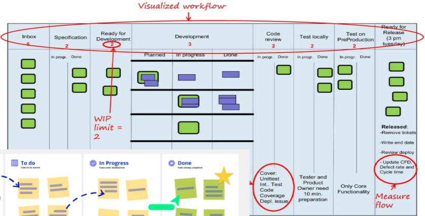

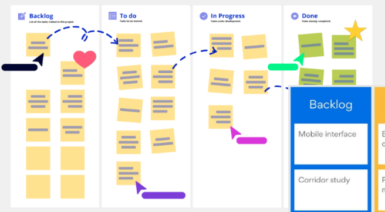

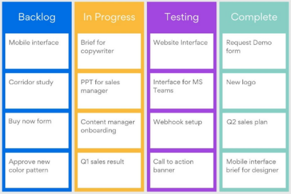

---

<!-- pagina: 12 -->

**Diego Carvalho, Equipe Informática 2 (Diego Carvalho), Equipe Informática 1 (Diego Carvalho) Aula 04** 

**(CONSULPLAN / MPE-MG – 2023)** Na metodologia Kanban, uma técnica de melhoria de <mark>processo incremental e evolutiva, o trabalho das equipes gira em torno de um quadro Kanban – uma ferramenta empregada para visualizar o trabalho e otimizar o fluxo do trabalho. Assinale, a seguir, os nomes de colunas de um quadro Kanban.</mark> 

<mark>a) A fazer; fazendo; e, feito.</mark> 

<mark>b) Planejado; implementado; e, testado.</mark> 

<mark>c) Em execução; finalizado; e, verificado.</mark> 

<mark>d) Analisando; coletando requisitos; e, codificando.</mark> 

###### **<mark>_______________________</mark>** 

**<mark>Comentários:</mark>** <mark>(a) Correto. A estrutura mais comum de um quadro Kanban é composta por colunas como "A fazer", "Fazendo" e "Feito", representando o fluxo básico de trabalho; (b) Errado. Essas colunas podem existir em contextos específicos, mas não representam o modelo mais simples e difundido do Kanban; (c) Errado. Embora sejam possíveis no quadro, não são a forma mais genérica e padrão de representar o fluxo; (d) Errado. Essas colunas são específicas de fases de desenvolvimento, não um modelo</mark> geral do Kanban (Letra A). 

#### Gerenciamento de Gargalos 

No Kanban, gargalos podem surgir em qualquer etapa do processo. Por isso, o gerenciamento contínuo do fluxo é essencial para identificar problemas e encontrar maneiras de otimizar a entrega de valor. Uma das práticas que mais ajudam nessa tarefa é limitar o WIP (Work in Progress). Ao contrário do que alguns imaginam, isso não reduz a visibilidade — pelo contrário. Com menos itens em andamento, fica muito mais fácil perceber onde o trabalho está acumulando e por que certas tarefas não avançam. 

A visualização do fluxo por meio do quadro Kanban também cumpre um papel importante: ela expõe gargalos e obstáculos entre tarefas, permitindo que a equipe atue rapidamente para melhorar a e <mark>fi</mark> ciência, reduzir o acúmulo de atividades e evitar tarefas inacabadas. 

O método ainda incorpora conceitos da Teoria das Restrições, que defende a identificação e a gestão dos pontos mais limitantes do processo como forma de otimizar o desempenho geral. Assim, o Kanban une visibilidade, foco e ajustes constantes para garantir uma entrega contínua e de maior valor. 

**(CEBRASPE / TRF6 – 2025)** No que se refere a processos ágeis, julgue o item que se segue. 

<mark>No Kanban, a implementação de limites de trabalho em progresso visa reduzir o tempo de entrega dos itens, sem impactar outros aspectos, como a identificação de gargalos e a melhoria contínua do fluxo de trabalho.</mark> 

###### **<mark>_______________________</mark>** 

**<mark>Comentários:</mark>** <mark>no Kanban, limitar o WIP não serve apenas para reduzir o tempo de entrega. Essa prática também ajuda a</mark> identificar gargalos, equilibrar a carga de trabalho e promover a melhoria contínua do fluxo (Errado). 

#### Reuniões no Kanban 

Ao contrário do Scrum, o Kanban não exige reuniões diárias ou cerimônias fixas. Isso não significa que elas sejam abolidas — apenas que não são impostas. Cada equipe decide quais encontros fazem sentido e com qual frequência. Uma reunião bastante comum no Kanban é a Internal Team Replenishment Meeting. Nesse encontro, o time decide quais itens serão puxados para o próximo estágio do fluxo, geralmente a partir do backlog ou de um quadro com opções disponíveis. 

Ela costuma ocorrer em uma cadência pré-definida — semanalmente ou sempre que houver necessidade — e tem como objetivo garantir que o time tenha sempre trabalho priorizado e pronto para começar,

---

<!-- pagina: 13 -->

**Diego Carvalho, Equipe Informática 2 (Diego Carvalho), Equipe Informática 1 (Diego Carvalho) Aula 04** 

evitando paradas no fluxo. Durante a reunião, a equipe revisa os itens candidatos, verifica se estão bem detalhados, confirma as prioridades e decide o que será movido para a coluna “Pronto para Iniciar” (Ready). 

Esse é um momento interno, restrito à equipe, sem participação de stakeholders externos. O foco é o alinhamento do próprio time, assegurando um fluxo de trabalho contínuo, previsível e livre de interrupções desnecessárias. 

**(CEBRASPE / SEFAZ-RJ – 2025)** Na metodologia Kanban, a cadência chamada Internal Team <mark>Replenishment Meeting tem como objetivo</mark> 

<mark>a) quantificar os itens de trabalho em determinado momento.</mark> 

<mark>b) observar e acompanhar o fluxo de trabalho do time.</mark> 

<mark>c) selecionar os itens de trabalho que serão feitos a seguir.</mark> 

<mark>d) considerar o delivery rate do time.</mark> 

<mark>e) refletir sobre o modo como o time gerenciou seu trabalho anterior.</mark> 

###### **<mark>_______________________</mark>** 

**<mark>Comentários:</mark>** <mark>(a) Errado. Quantificar itens de trabalho é parte do monitoramento, não o objetivo dessa cadência; (b) Errado. Observar o fluxo está mais ligado a reuniões de acompanhamento e métricas; (c) Correto. A reunião de Internal Team Replenishment no Kanban serve para selecionar e priorizar os próximos itens que entrarão no fluxo de trabalho; (d) Errado. Considerar o delivery rate pode influenciar decisões, mas não é o objetivo central dessa cadência; (e) Errado. Refletir sobre o</mark> trabalho anterior é papel de uma retrospectiva, não dessa reunião (Letra C).

---

<!-- pagina: 14 -->

**Diego Carvalho, Equipe Informática 2 (Diego Carvalho), Equipe Informática 1 (Diego Carvalho) Aula 04** 

## **RESUMO** 

###### **<mark>KANBAN</mark>** 

<mark>O Kanban é um método ágil de gestão de trabalho que utiliza um sistema visual para acompanhar o fluxo das</mark> tarefas e otimizar processos. Baseia-se em um quadro dividido em colunas que representam etapas do fluxo de trabalho, como “A Fazer”, “Em Progresso” e “Concluído”, e em cartões que simbolizam cada item de trabalho. Um princípio central é a limitação de trabalho em progresso (WIP), que ajuda a evitar sobrecarga e a identificar <u>gargalos, promovendo entregas mais contínuas e previsíveis.</u> 

| gargalos, promovendo **CARACTERÍSTICA**| entregas mais contínuas eprevisíveis. **DESCRIÇÃO**|
|---|---|
|**VISUALIZAÇÃO DO** **FLUXO DE** **TRABALHO**|Consiste em representar todas as etapas do processo em um quadro Kanban, usando colunas e cartões para mostrar claramente o status de cada tarefa. Essa visualização dá transparência ao trabalho, facilita a identificação de gargalos e promove alinhamento entre membros da equipe e stakeholders.|
|**LIMITAÇÃO DO** **TRABALHO EM** **PROGRESSO (WIP)**|Define um número máximo de tarefas que podem estar simultaneamente em execução em cada etapa do fluxo. Essa limitação ajuda a evitar sobrecarga, incentiva a conclusão antes de iniciar novas tarefas e revela pontos de estrangulamento, promovendo maior foco,eficiência equalidade nas entregas da equipe.|
|**GERENCIAMENTO** **DO FLUXO**|Refere-se ao acompanhamento contínuo do movimento das tarefas pelo quadro, buscando manter um ritmo constante de trabalho. Envolve monitorar tempos de ciclo, identificar bloqueios e ajustar práticas para otimizar a passagem dos itens, garantindo previsibilidade nas entregas e melhor uso dos recursos disponíveis.|
|**POLÍTICAS** **EXPLÍCITAS**|São regras e critérios documentados que definem como o trabalho é priorizado, movido ou concluído no fluxo. Podem incluir critérios de entrada e saída para cada coluna, definição de responsabilidades ou acordos de qualidade. Tornar as políticas visíveis promove consistência,clareza e alinhamento na execução das atividades.|
|**CICLOS DE** **FEEDBACK E** **MELHORIAS**|Incluem reuniões regulares para revisão de desempenho, análise de métricas e coleta de percepções da equipe. Esses ciclos permitem ajustes contínuos no processo, incentivando a aprendizagem coletiva e o aperfeiçoamento das práticas, garantindo que o fluxo evoluapara atender melhor às demandas e objetivos.|
|**MUDANÇAS** **EVOLUTIVAS**|Envolve implementar melhorias gradualmente, sem mudanças bruscas, permitindo que a equipe se adapte e teste novas práticas em pequena escala antes de adotá-las plenamente. Essa abordagem reduz riscos, aumenta a aceitação interna e promove evolução constante,alinhada ao ritmo e à cultura da organização.|
|**KANBAN X SCRUM**|**DESCRIÇÃO** |
|**ITERAÇÕES**| O Scrum organiza o trabalho em iterações fixas chamadas sprints, com duração definida (geralmente de 1 a 4 semanas). O Kanban, por outro lado, opera com um fluxo contínuo, sem iterações temporais definidas ou prazos fixos para conclusão dos itens. A limitação de WIP não está ligada a sprints, mas a limitar itens em andamento em qualquer momento.|
|**PAPÉIS**|O Scrum possui papéis definidos e obrigatórios, como Product Owner, Scrum Master e Time de Desenvolvimento. No Kanban, não há papéis formais ou obrigatórios como esses, focando mais na visualização e no gerenciamento do fluxo.|
|**EVENTOS**|O Scrum prevê reuniões diárias obrigatórias (Daily Scrum), planejamento de sprint (Sprint Planning), revisão de sprint (Sprint Review) e retrospectiva de sprint (Sprint Retrospective). No Kanban, reuniões não são obrigatórias e são mais flexíveis, podendo ser adaptadas conforme a necessidade da equipe. O Kanban não elimina reuniões, apenas não asprescreve.|
|**BACKLOG**|No Scrum, o backlog pode ser ajustado entre sprints. No Kanban, o backlog pode ser ajustado de forma contínua,não apenas no fim doprojeto.|

---

<!-- pagina: 15 -->

**Diego Carvalho, Equipe Informática 2 (Diego Carvalho), Equipe Informática 1 (Diego Carvalho) Aula 04** 

<mark>No Scrum, não há "limites automáticos de WIP". No Kanban, é possível (e recomendado)</mark> definir limites de WIP para otimizar o fluxo e evitar gargalos, diferindo do Scrum nesse **LIMITES DE WIP** aspecto. 

**INCREMENTOS** 

A definição de incrementos é prática do Scrum. No Kanban, não há incrementos fixos como releases obrigatórios; o trabalho flui de forma contínua. 

###### **<mark>SCRUMBAN</mark>** 

<mark>O Scrumban é um método híbrido de gerenciamento de trabalho que combina a estrutura iterativa e alguns rituais</mark> do Scrum com a flexibilidade e o foco no fluxo contínuo do Kanban. Ele mantém práticas como planejamento e revisão, mas substitui a rigidez dos sprints por um sistema visual com limitação de trabalho em progresso (WIP), permitindo puxar novas tarefas conforme há capacidade disponível. Isso oferece previsibilidade e cadência, típicas do Scrum, aliadas à adaptabilidade do Kanban, sendo ideal para equipes que lidam com demandas variáveis, manutenção contínua ou projetos em que a priorização muda com frequência. 

###### **<mark>MÉTRICAS</mark>** 

###### **<mark>DESCRIÇÃO</mark>** 

<!-- Start of picture text -->
LEAD TIME <!-- End of picture text -->

O lead time mede o tempo total que um item leva desde o início (quando é solicitado) até a entrega (sua conclusão). Essa métrica é crucial para avaliar a previsibilidade e a eficiência do processo, independentemente de iterações fixas como as sprints do Scrum. O lead time não é medido apenas a partir da coluna "Fazendo", mas sim desde o momento em que a tarefa é solicitada até sua finalização. 

<!-- Start of picture text -->
O cycle time mede o tempo desde que um item entra em execução (início do trabalho ativo) até sua conclusão. Diferente do lead time, o cycle time foca no tempo que o item permanece nas etapas de "Fazendo" do quadro Kanban, CYCLE TIME aplicando-se apenas aos itens em andamento ou já finalizados. Essa métrica ajuda a entender a eficiência do processo de execução em si. <!-- End of picture text -->

O cycle time mede o tempo desde que um item entra em execução (início do trabalho ativo) até sua conclusão. Diferente do lead time, o cycle time foca no tempo que o item permanece nas etapas de "Fazendo" do quadro Kanban, aplicando-se apenas aos itens em andamento ou já finalizados. Essa métrica ajuda a entender a eficiência do processo de execução em si.

---

<!-- pagina: 16 -->

**Diego Carvalho, Equipe Informática 2 (Diego Carvalho), Equipe Informática 1 (Diego Carvalho) Aula 04** 

## **RESUMO** 

###### **<mark>KANBAN</mark>** 

<mark>O Kanban é um método ágil de gestão de trabalho que utiliza um sistema visual para acompanhar o fluxo das</mark> tarefas e otimizar processos. Baseia-se em um quadro dividido em colunas que representam etapas do fluxo de trabalho, como “A Fazer”, “Em Progresso” e “Concluído”, e em cartões que simbolizam cada item de trabalho. Um princípio central é a limitação de trabalho em progresso (WIP), que ajuda a evitar sobrecarga e a identificar <u>gargalos, promovendo entregas mais contínuas e previsíveis.</u> 

| gargalos, promovendo **CARACTERÍSTICA**| entregas mais contínuas eprevisíveis. **DESCRIÇÃO**|
|---|---|
|**VISUALIZAÇÃO DO** **FLUXO DE** **TRABALHO**|Consiste em representar todas as etapas do processo em um quadro Kanban, usando colunas e cartões para mostrar claramente o status de cada tarefa. Essa visualização dá transparência ao trabalho, facilita a identificação de gargalos e promove alinhamento entre membros da equipe e stakeholders.|
|**LIMITAÇÃO DO** **TRABALHO EM** **PROGRESSO (WIP)**|Define um número máximo de tarefas que podem estar simultaneamente em execução em cada etapa do fluxo. Essa limitação ajuda a evitar sobrecarga, incentiva a conclusão antes de iniciar novas tarefas e revela pontos de estrangulamento, promovendo maior foco,eficiência equalidade nas entregas da equipe. ==5460==|
|**GERENCIAMENTO** **DO FLUXO**|Refere-se ao acompanhamento contínuo do movimento das tarefas pelo quadro, buscando manter um ritmo constante de trabalho. Envolve monitorar tempos de ciclo, identificar bloqueios e ajustar práticas para otimizar a passagem dos itens, garantindo previsibilidade nas entregas e melhor uso dos recursos disponíveis.|
|**POLÍTICAS** **EXPLÍCITAS**|São regras e critérios documentados que definem como o trabalho é priorizado, movido ou concluído no fluxo. Podem incluir critérios de entrada e saída para cada coluna, definição de responsabilidades ou acordos de qualidade. Tornar as políticas visíveis promove consistência,clareza e alinhamento na execução das atividades.|
|**CICLOS DE** **FEEDBACK E** **MELHORIAS**|Incluem reuniões regulares para revisão de desempenho, análise de métricas e coleta de percepções da equipe. Esses ciclos permitem ajustes contínuos no processo, incentivando a aprendizagem coletiva e o aperfeiçoamento das práticas, garantindo que o fluxo evoluapara atender melhor às demandas e objetivos.|
|**MUDANÇAS** **EVOLUTIVAS**|Envolve implementar melhorias gradualmente, sem mudanças bruscas, permitindo que a equipe se adapte e teste novas práticas em pequena escala antes de adotá-las plenamente. Essa abordagem reduz riscos, aumenta a aceitação interna e promove evolução constante,alinhada ao ritmo e à cultura da organização.|
|**KANBAN X SCRUM**|**DESCRIÇÃO** |
|**ITERAÇÕES**| O Scrum organiza o trabalho em iterações fixas chamadas sprints, com duração definida (geralmente de 1 a 4 semanas). O Kanban, por outro lado, opera com um fluxo contínuo, sem iterações temporais definidas ou prazos fixos para conclusão dos itens. A limitação de WIP não está ligada a sprints, mas a limitar itens em andamento em qualquer momento.|
|**PAPÉIS**|O Scrum possui papéis definidos e obrigatórios, como Product Owner, Scrum Master e Time de Desenvolvimento. No Kanban, não há papéis formais ou obrigatórios como esses, focando mais na visualização e no gerenciamento do fluxo.|
|**EVENTOS**|O Scrum prevê reuniões diárias obrigatórias (Daily Scrum), planejamento de sprint (Sprint Planning), revisão de sprint (Sprint Review) e retrospectiva de sprint (Sprint Retrospective). No Kanban, reuniões não são obrigatórias e são mais flexíveis, podendo ser adaptadas conforme a necessidade da equipe. O Kanban não elimina reuniões, apenas não asprescreve.|
|**BACKLOG**|No Scrum, o backlog pode ser ajustado entre sprints. No Kanban, o backlog pode ser ajustado de forma contínua,não apenas no fim doprojeto.|

---

<!-- pagina: 17 -->

**Diego Carvalho, Equipe Informática 2 (Diego Carvalho), Equipe Informática 1 (Diego Carvalho) Aula 04** 

<mark>No Scrum, não há "limites automáticos de WIP". No Kanban, é possível (e recomendado)</mark> definir limites de WIP para otimizar o fluxo e evitar gargalos, diferindo do Scrum nesse **LIMITES DE WIP** aspecto. 

**INCREMENTOS** 

A definição de incrementos é prática do Scrum. No Kanban, não há incrementos fixos como releases obrigatórios; o trabalho flui de forma contínua. 

###### **<mark>SCRUMBAN</mark>** 

<mark>O Scrumban é um método híbrido de gerenciamento de trabalho que combina a estrutura iterativa e alguns rituais</mark> do Scrum com a flexibilidade e o foco no fluxo contínuo do Kanban. Ele mantém práticas como planejamento e revisão, mas substitui a rigidez dos sprints por um sistema visual com limitação de trabalho em progresso (WIP), permitindo puxar novas tarefas conforme há capacidade disponível. Isso oferece previsibilidade e cadência, típicas do Scrum, aliadas à adaptabilidade do Kanban, sendo ideal para equipes que lidam com demandas variáveis, manutenção contínua ou projetos em que a priorização muda com frequência. 

###### **<mark>MÉTRICAS</mark>** 

###### **<mark>DESCRIÇÃO</mark>** 

<!-- Start of picture text -->
LEAD TIME <!-- End of picture text -->

O lead time mede o tempo total que um item leva desde o início (quando é solicitado) até a entrega (sua conclusão). Essa métrica é crucial para avaliar a previsibilidade e a eficiência do processo, independentemente de iterações fixas como as sprints do Scrum. O lead time não é medido apenas a partir da coluna "Fazendo", mas sim desde o momento em que a tarefa é solicitada até sua finalização. 

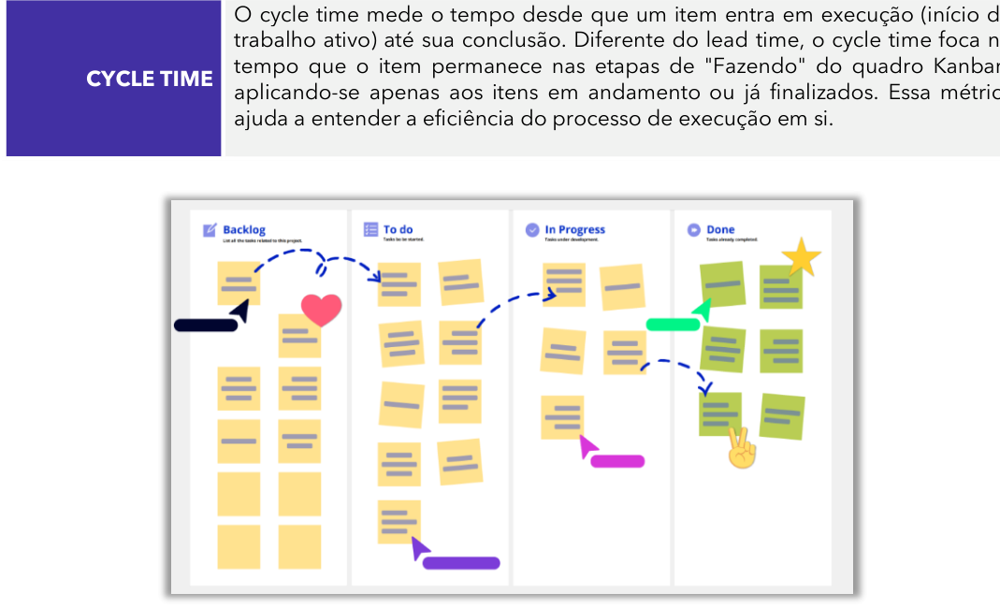

<!-- Start of picture text -->
O cycle time mede o tempo desde que um item entra em execução (início do trabalho ativo) até sua conclusão. Diferente do lead time, o cycle time foca no tempo que o item permanece nas etapas de "Fazendo" do quadro Kanban, CYCLE TIME aplicando-se apenas aos itens em andamento ou já finalizados. Essa métrica ajuda a entender a eficiência do processo de execução em si. <!-- End of picture text -->

O cycle time mede o tempo desde que um item entra em execução (início do trabalho ativo) até sua conclusão. Diferente do lead time, o cycle time foca no tempo que o item permanece nas etapas de "Fazendo" do quadro Kanban, aplicando-se apenas aos itens em andamento ou já finalizados. Essa métrica ajuda a entender a eficiência do processo de execução em si.

---

<!-- pagina: 18 -->

**Diego Carvalho, Equipe Informática 2 (Diego Carvalho), Equipe Informática 1 (Diego Carvalho) Aula 04** 

## **– QUESTÕES COMENTADAS FGV** 

**1. (FGV / TJ-MT - 2024) No método Kanban, uma das práticas centrais ajuda a identificar gargalos e promover a eficiência ao limitar a quantidade de trabalho em progresso. O texto acima se refere à seguinte prática do Kanban:** 

a) dividir o trabalho em iterações fixas. 

b) estabelecer metas rígidas de entrega. 

c) realizar reuniões diárias de acompanhamento. 

d) aumentar o número de colunas no quadro Kanban. 

e) limitar o WIP (Work in Progress). 

###### **Comentários:** 

(a) Errado. Dividir o trabalho em iterações fixas é uma prática mais associada ao Scrum, que usa sprints, não ao Kanban, que é contínuo; 

(b) Errado. Metas rígidas de entrega não fazem parte do Kanban, que busca flexibilidade e fluxo contínuo de trabalho; 

(c) Errado. Reuniões diárias são comuns no Scrum (Daily Scrum), mas no Kanban não são obrigatórias; 

(d) Errado. Aumentar colunas no quadro não necessariamente melhora o fluxo ou reduz gargalos, podendo até aumentar a complexidade visual; 

(e) Correto. Limitar o WIP é prática central no Kanban, pois reduz multitarefa, ajuda a identificar gargalos e melhora o fluxo de trabalho. 

**Gabarito:** Letra E 

**2. (FGV / TRF - 1ª REGIÃO - 2024) O Time de Soluções Inovadoras (TISI) de uma organização está utilizando práticas do Kanban no processo de desenvolvimento de soluções de software. Com o uso do Kanban, o TISI visa a:** 

a) manter um workflow padrão para o processo de inovação; 

b) gerenciar e melhorar o desempenho dos indivíduos do time; 

c) estabelecer uma metodologia de desenvolvimento de soluções de software de modo iterativo; 

d) aplicar um processo para definição de incrementos para desenvolvimento de soluções de software; 

e) utilizar uma abordagem de mudança evolutiva, baseada em feedbacks, para o processo de desenvolvimento de soluções de software.

---

<!-- pagina: 19 -->

**Diego Carvalho, Equipe Informática 2 (Diego Carvalho), Equipe Informática 1 (Diego Carvalho) Aula 04** 

###### **Comentários:** 

(a) Errado. O Kanban não busca apenas manter um workflow padrão, mas sim melhorar continuamente o fluxo de trabalho; 

(b) Errado. O foco do Kanban é no fluxo do trabalho, não no desempenho individual dos membros do time; 

(c) Errado. Desenvolvimento iterativo é mais característico de metodologias como Scrum, não do Kanban; 

(d) Errado. A definição de incrementos é prática do Scrum, não um objetivo principal do Kanban; 

(e) Correto. O Kanban promove mudanças evolutivas, ajustando o processo com base em feedbacks contínuos para melhorar o fluxo e a entrega. 

**Gabarito:** Letra E 

**3. (FGV / TCE-RR - 2025) No contexto da gestão de projetos com metodologias ágeis, como Scrum e Kanban, avalie as afirmativas a seguir.** 

**I. O Scrum é baseado em um fluxo contínuo de tarefas, em que as prioridades são ajustadas dinamicamente durante o projeto, enquanto o Kanban utiliza Sprints com duração fixa para organizar o trabalho em ciclos fechados.** 

**II. O Scrum segue uma estrutura predefinida com cerimônias específicas, como Sprint Planning e Daily Standup, enquanto o Kanban é mais flexível, focando no controle do fluxo de trabalho por meio de limites no Work In Progress (WIP).** 

**III. No Kanban, os papéis de Product Owner e Scrum Master são essenciais para o funcionamento do método, enquanto no Scrum essas funções são opcionais e podem ser combinadas em um único papel.** 

**Está correto o que se afirma em** 

a) I, apenas. b) II, apenas. c) III, apenas. d) I e II, apenas. e) II e III, apenas. 

**Comentários:**

---

<!-- pagina: 20 -->

**Diego Carvalho, Equipe Informática 2 (Diego Carvalho), Equipe Informática 1 (Diego Carvalho) Aula 04** 

(I) Errado. Essa descrição inverte os conceitos: o fluxo contínuo é característico do Kanban, e o uso de sprints fixos pertence ao Scrum; 

(II) Correto. O Scrum possui eventos e papéis definidos, enquanto o Kanban é mais flexível e utiliza limites de WIP para gerenciar o fluxo; 

(III) Errado. No Kanban não há papéis obrigatórios como Product Owner ou Scrum Master; esses são exclusivos do Scrum e são funções essenciais nele. 

**Gabarito:** Letra B 

**4. (FGV / SEFAZ-MT - 2023) Muitas organizações aplicam os princípios e práticas de gestão com Kanban para alcançar os objetivos de seus projetos de desenvolvimento de software. Sobre Kanban, assinale a afirmativa correta.** 

a) Incentiva ciclos anuais de feedbacks porque cadências de reuniões e revisões recorrentes criam muitas interrupções e impactam o tempo de entrega. 

b) É um método de gestão baseado no Kaizen e que valoriza entrega de software funcional completo, sem entregas parciais, trabalhos inacabados e débitos técnico. 

c) Fomenta uma cultura organizacional que privilegia o indivíduo em relação à coletividade, orientada ao cliente e sem compartilhar propósitos e metas. 

d) Pressupõe que o escopo do projeto é sempre estável e o desenvolvimento de software precisa seguir de modo linear para garantir a produtividade. 

e) Permite visualizar o processo e o fluxo de trabalho de projetos, programas e portfólios por meio de um conjunto de quadros interconectados. 

###### **Comentários:** 

(a) Errado. O Kanban recomenda cadências curtas de feedback para promover melhorias contínuas, não ciclos anuais; 

(b) Errado. Embora inspirado no Kaizen, o Kanban permite entregas incrementais e contínuas, não exige apenas software completo; 

(c) Errado. O Kanban incentiva colaboração e alinhamento, não prioriza o indivíduo sobre a equipe; 

(d) Errado. O Kanban é flexível quanto ao escopo e não segue um modelo linear;

---

<!-- pagina: 21 -->

**Diego Carvalho, Equipe Informática 2 (Diego Carvalho), Equipe Informática 1 (Diego Carvalho) Aula 04** 

(e) Correto. Uma das práticas centrais do Kanban é a visualização do fluxo de trabalho, muitas vezes com quadros interconectados, para gerenciar e melhorar processos. 

**Gabarito:** Letra E 

**5. (FGV / TJ-DFT - 2022) A Equipe de Gestão de Dados (EGD) de um órgão público optou por aplicar práticas ágeis em seus projetos. Uma das propostas da EGD é utilizar o sistema de gestão Kanban para observar de forma contínua o fluxo do trabalho, de modo a:** 

a) fixar a duração de um ciclo de entrega; 

b) identificar possíveis obstáculos entre as tarefas; 

c) eliminar os Epics com User Stories complexas do Backlog; 

d) garantir que o quadro Kanban apresente os Backlogs dos projetos em andamento; 

e) permitir que os membros da equipe executem mais de uma tarefa por vez (WIP - work in progress). 

###### **Comentários:** 

(a) Errado. Fixar duração de ciclos é prática do Scrum, não do Kanban, que trabalha com fluxo contínuo; 

(b) Correto. A visualização do fluxo no Kanban ajuda a identificar gargalos e obstáculos entre tarefas, permitindo melhorias; 

(c) Errado. Kanban não exige a exclusão de épicos ou histórias complexas do backlog; 

(d) Errado. O quadro Kanban mostra o fluxo de tarefas, não obrigatoriamente todos os backlogs dos projetos; 

(e) Errado. Limitar o WIP é prática central do Kanban, justamente para evitar que membros assumam muitas tarefas ao mesmo tempo. 

**Gabarito:** Letra B 

**6. (FGV / TJ-RJ - 2024) Diversas empresas têm adotado o Kanban como ferramenta de aumento do fluxo e da produtividade no desenvolvimento de software. Considerando que esta tecnologia requer a adesão a algumas práticas fundamentais, avalie se as afirmativas a seguir são verdadeiras (V) ou falsas (F).** 

**(   ) Os quadros Kanban incorporam o princípio da visualização do trabalho que se baseia na exibição de cartões que correspondem a itens da lista de pendências do produto.**

---

<!-- pagina: 22 -->

**Diego Carvalho, Equipe Informática 2 (Diego Carvalho), Equipe Informática 1 (Diego Carvalho) Aula 04** 

**(   ) Empregando o modelo de Pull a equipe puxa para seu fluxo de trabalho as pendências da lista conforme a sua capacidade se torna disponível.** 

**(   ) A imposição de limite para o número de tarefas que um time possui atualmente corresponde ao WIP (Work In Progress), e traz o benefício de aumentar o foco e, ao mesmo tempo, reduzir a mudança de contexto.** 

**As afirmativas são, respectivamente,** 

a) F – V – F. 

b) V – F – F. 

c) F – F – V. 

d) V – V – F. 

e) V – V – V. 

**Comentários:** 

(V) No Kanban, a visualização do trabalho é feita em um quadro com cartões representando itens do backlog ou tarefas; 

(V) O sistema _pull_ do Kanban faz com que novas tarefas sejam puxadas para o fluxo apenas quando há capacidade disponível; 

(V) Limitar o WIP reduz multitarefa e mudanças de contexto, aumentando o foco e eficiência. 

**Gabarito:** Letra E 

**7. (FGV / TRF - 1ª REGIÃO - 2024) O Departamento de Capacitação (DECAP) é responsável pela gestão do aprimoramento profissional dos colaboradores de uma determinada organização. O DECAP, que planeja, coordena e executa treinamentos, está aplicando Kanban como método de gerenciamento de seu processo de trabalho. O DECAP estabeleceu um Work in Progress Limit (WIP Limit) na gestão de seu processo de negócio visando a:** 

a) associá-lo a práticas ágeis de entrega contínua; 

b) planejar e iniciar mais treinamentos em menos tempo; 

c) criar um equilíbrio entre demanda e capacidade ao longo do tempo; 

d) identificar os treinamentos que ultrapassam o limite estabelecido; 

e) definir o período máximo de tempo que uma etapa do processo deve durar. 

###### **Comentários:**

---

<!-- pagina: 23 -->

**Diego Carvalho, Equipe Informática 2 (Diego Carvalho), Equipe Informática 1 (Diego Carvalho) Aula 04** 

(a) Errado. Embora o Kanban possa se associar à entrega contínua, o WIP Limit não é definido com esse objetivo principal; 

(b) Errado. O limite de WIP visa evitar iniciar muitas atividades ao mesmo tempo, não aumentar o volume iniciado; 

(c) Correto. O WIP Limit equilibra a demanda de trabalho com a capacidade da equipe, evitando sobrecarga e mantendo fluxo estável; 

(d) Errado. Identificar treinamentos que ultrapassam o limite é consequência, não o objetivo principal do WIP Limit; 

(e) Errado. O WIP Limit não define tempo máximo por etapa — isso se relaciona a métricas como _lead time_ ou _cycle time_ . 

**Gabarito:** Letra C 

**8. (FGV / MPE-RJ - 2025) A mensuração da métrica lead time no desenvolvimento de software ganhou notoriedade quando David Anderson, criador do Kanban destacou a importância de coletá-la. Com relação à utilidade de medir o lead time durante o processo de desenvolvimento de software, analise os itens a seguir** 

**I. Analisar a saúde do processo de desenvolvimento considerando que altas dispersões representam algum tipo de gargalo ou aumento no tempo de passagem em alguma das etapas do fluxo de desenvolvimento, por exemplo, nas últimas semanas, o lead time das histórias de desenvolvimento cresceram, pois o ambiente de homologação estava com problemas e os testes eram mais complexos.** 

**II. Identificar casos extremos (outliers) e aprender com o ocorrido, por exemplo, se um bug levou muito mais tempo do que o normal para ser corrigido em decorrência da ausência de clareza sobre o que era de fato o problema a ser resolvido.** 

**III. Para compreender os efeitos que as incertezas e as complexidades não mapeadas podem causar, na forma de variabilidade, no tempo necessário para a conclusão dos trabalhos de um time de desenvolvimento de software.** 

**Está correto o que se afirma em** 

a) I, II e III. b) II e III, apenas. c) I e III, apenas. d) I e II, apenas.

---

<!-- pagina: 24 -->

**Diego Carvalho, Equipe Informática 2 (Diego Carvalho), Equipe Informática 1 (Diego Carvalho) Aula 04** 

e) III, apenas. 

###### **Comentários:** 

(I) Correto. O lead time ajuda a detectar gargalos e problemas em etapas específicas do fluxo; (II) Correto. Casos extremos revelam pontos críticos que podem ser analisados para melhoria; (III) Correto. A análise do lead time permite avaliar impactos de incertezas e complexidades na duração do trabalho. 

**Gabarito:** Letra A 

**9. (FGV / Banestes - 2021) Observe o quadro comparativo a seguir, publicado em sites ligados ao estudo e à investigação de diferentes estratégias/metodologias para implementar um sistema ágil de desenvolvimento ou gestão de projetos.   É correto identificar que X e Y representam,** ==5460== **respectivamente:** 

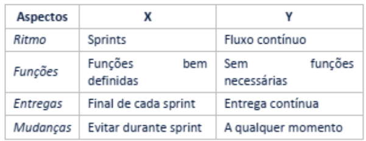

a) Crystal e Scrum; 

b) Extreme Programming e Crystal; 

c) Kanban e Lean; 

d) Lean e Extreme Programming; 

e) Scrum e Kanban. 

###### **Comentários:** 

No quadro, X apresenta características como sprints, funções bem definidas, entregas no final de cada sprint e restrição de mudanças — características do **Scrum** . 

Já Y mostra fluxo contínuo, ausência de funções obrigatórias, entrega contínua e possibilidade de mudanças a qualquer momento — características do **Kanban** . 

**Gabarito:** Letra E

---

<!-- pagina: 25 -->

**Diego Carvalho, Equipe Informática 2 (Diego Carvalho), Equipe Informática 1 (Diego Carvalho) Aula 04** 

- **10.(FGV / SEFAZ-AM - 2022) Maria é líder de uma equipe de desenvolvimento de software. Para priorizar a produtividade e a organização das entregas, ela escolheu adotar um método de gestão visual para controle das tarefas e do fluxo de trabalho baseado na utilização de cartões que descrevem as atividades e um mural dividido em três seções rotuladas da seguinte forma: “para fazer”, “fazendo” e “feito”. Conforme o processo de desenvolvimento avança, os cartões são reposicionados no mural de modo a permitir que a equipe tenha uma dimensão do que está sendo produzido e em que ritmo está sendo produzido. No contexto da Engenharia de Software, é correto afirmar que Maria utilizou o método** 

a) FDD. b) Gantt. c) Kanban. d) Fishbone. 

e) Seis sigma. 

###### **Comentários:** 

O cenário descreve claramente o uso de um quadro visual com cartões e colunas “para fazer”, “fazendo” e “feito”, característico do método Kanban, que organiza e controla o fluxo de trabalho de forma visual. 

**Gabarito:** Letra C 

- **11.(FGV / MPE-MS - 2013) Kanban é um dos métodos ágeis mais recentes e sofreu grande influência do movimento “Lean”, surgido nos anos 1980. São práticas comuns a esse método:** 

a) limitar o WIP (Work In Progress) e uma visualização explícita do fluxo de trabalho. 

b) integração Contínua e gerenciamento de configuração. 

c) limitar o WIP (Work In Progress) e gerenciamento de configuração. 

d) gerenciar o fluxo de trabalho e manter estimativas previamente definidas. 

e) melhoria contínua e nunca limitar o WIP para evitar folgas no sistema de trabalho. 

###### **Comentários:** 

(a) Correto. No Kanban, práticas centrais incluem limitar o WIP para evitar sobrecarga e usar visualização explícita do fluxo para identificar gargalos; 

(b) Errado. Integração contínua é prática técnica de desenvolvimento, não específica do Kanban; 

(c) Errado. Gerenciamento de configuração não é prática central do Kanban; 

- (d) Errado. O Kanban não exige estimativas previamente definidas, mas sim gestão do fluxo;

---

<!-- pagina: 26 -->

**Diego Carvalho, Equipe Informática 2 (Diego Carvalho), Equipe Informática 1 (Diego Carvalho) Aula 04** 

(e) Errado. Limitar o WIP é fundamental no Kanban, e não o contrário. 

**Gabarito:** Letra A 

- **12.(FGV / TJ-GO - 2014) Scrum e Kanban são metodologias de gerenciamento de projetos de software populares entre praticantes do desenvolvimento ágil. Um aspecto de divergência entre as duas metodologias é:** 

a) processo incremental; 

b) processo iterativo; 

c) uso de quadro de tarefas; 

- d) representação do estágio de desenvolvimento de uma tarefa; 

- e) valorização de feedback. 

###### **Comentários:** 

(a) Errado. Ambos podem trabalhar de forma incremental; 

(b) Correto. O Scrum é iterativo, com ciclos fixos (sprints), enquanto o Kanban não trabalha com iterações formais, operando em fluxo contínuo; 

(c) Errado. Tanto Scrum quanto Kanban usam quadro de tarefas; 

- (d) Errado. Ambos podem representar estágios de desenvolvimento de tarefas; 

(e) Errado. O feedback é valorizado nas duas abordagens. 

**Gabarito:** Letra B 

- **13.(FGV / DPE-RO - 2025) Método Kanban é uma metodologia de desenvolvimento ágil. Com relação ao Kanban, analise os itens a seguir.** 

**I. O método foi projetado para maximizar o impacto inicial das mudanças e reduzir a resistência à adoção das mudanças organizações. Adotar o método deve mudar a cultura da organização e ajudar a torná-la mais madura.** 

**II. Quando os analistas implementam o Kanban pela primeira vez eles estão procurando otimizar a criação dos novos processos, alterar a cultura organizacional e substituir os processos existentes por outros que podem fornecer melhorias econômicas dramáticas.**

---

<!-- pagina: 27 -->

**Diego Carvalho, Equipe Informática 2 (Diego Carvalho), Equipe Informática 1 (Diego Carvalho) Aula 04** 

**III. O Kanban acelera a obtenção dos altos níveis de maturidade organizacional e capacidade em áreas de processo de alta maturidade fundamentais tais como Análise Causal e Resolução e Inovação Organizacional e Implantação.** 

**Está correto o que se afirma em** 

a) II e III, apenas. b) I e III, apenas. c) I e II, apenas. d) III, apenas. e) II, apenas. 

###### **Comentários:** 

(I) Errado. O Kanban é projetado para mudanças evolutivas e incrementais, minimizando resistência e preservando processos existentes inicialmente, não para maximizar impacto inicial; 

(II) Errado. A implementação inicial do Kanban não visa substituir processos ou provocar mudanças abruptas, mas melhorar o fluxo a partir do sistema atual; 

(III) Errado. Sendo honesto com vocês, eu acho esse item bastante genérico. O Kanban busca promover melhorias contínuas no fluxo. Isso pode ajudar a acelerar níveis de maturidade? Sim, mas é uma ilação! 

**Gabarito:** Letra D

---

<!-- pagina: 28 -->

**Diego Carvalho, Equipe Informática 2 (Diego Carvalho), Equipe Informática 1 (Diego Carvalho) Aula 04** 

## **– LISTA DE QUESTÕES FGV** 

**1. (FGV / TJ-MT - 2024) No método Kanban, uma das práticas centrais ajuda a identificar gargalos e promover a eficiência ao limitar a quantidade de trabalho em progresso. O texto acima se refere à seguinte prática do Kanban:** 

a) dividir o trabalho em iterações fixas. 

b) estabelecer metas rígidas de entrega. 

c) realizar reuniões diárias de acompanhamento. 

d) aumentar o número de colunas no quadro Kanban. 

e) limitar o WIP (Work in Progress). 

**2. (FGV / TRF - 1ª REGIÃO - 2024) O Time de Soluções Inovadoras (TISI) de uma organização está utilizando práticas do Kanban no processo de desenvolvimento de soluções de software. Com o uso do Kanban, o TISI visa a:** 

a) manter um workflow padrão para o processo de inovação; 

b) gerenciar e melhorar o desempenho dos indivíduos do time; 

c) estabelecer uma metodologia de desenvolvimento de soluções de software de modo iterativo; 

d) aplicar um processo para definição de incrementos para desenvolvimento de soluções de software; 

e) utilizar uma abordagem de mudança evolutiva, baseada em feedbacks, para o processo de desenvolvimento de soluções de software. 

**3. (FGV / TCE-RR - 2025) No contexto da gestão de projetos com metodologias ágeis, como Scrum e Kanban, avalie as afirmativas a seguir.** 

**I. O Scrum é baseado em um fluxo contínuo de tarefas, em que as prioridades são ajustadas dinamicamente durante o projeto, enquanto o Kanban utiliza Sprints com duração fixa para organizar o trabalho em ciclos fechados.** 

**II. O Scrum segue uma estrutura predefinida com cerimônias específicas, como Sprint Planning e Daily Standup, enquanto o Kanban é mais flexível, focando no controle do fluxo de trabalho por meio de limites no Work In Progress (WIP).** 

**III. No Kanban, os papéis de Product Owner e Scrum Master são essenciais para o funcionamento do método, enquanto no Scrum essas funções são opcionais e podem ser combinadas em um único papel.** 

**Está correto o que se afirma em** 

a) I, apenas.

---

<!-- pagina: 29 -->

**Diego Carvalho, Equipe Informática 2 (Diego Carvalho), Equipe Informática 1 (Diego Carvalho) Aula 04** 

b) II, apenas. 

c) III, apenas. 

d) I e II, apenas. 

e) II e III, apenas. 

**4. (FGV / SEFAZ-MT - 2023) Muitas organizações aplicam os princípios e práticas de gestão com Kanban para alcançar os objetivos de seus projetos de desenvolvimento de software. Sobre Kanban, assinale a afirmativa correta.** 

a) Incentiva ciclos anuais de feedbacks porque cadências de reuniões e revisões recorrentes criam muitas interrupções e impactam o tempo de entrega. 

b) É um método de gestão baseado no Kaizen e que valoriza entrega de software funcional completo, sem entregas parciais, trabalhos inacabados e débitos técnico. 

c) Fomenta uma cultura organizacional que privilegia o indivíduo em relação à coletividade, orientada ao cliente e sem compartilhar propósitos e metas. 

d) Pressupõe que o escopo do projeto é sempre estável e o desenvolvimento de software precisa seguir de modo linear para garantir a produtividade. 

e) Permite visualizar o processo e o fluxo de trabalho de projetos, programas e portfólios por meio de um conjunto de quadros interconectados. 

**5. (FGV / TJ-DFT - 2022) A Equipe de Gestão de Dados (EGD) de um órgão público optou por aplicar práticas ágeis em seus projetos. Uma das propostas da EGD é utilizar o sistema de gestão Kanban para observar de forma contínua o fluxo do trabalho, de modo a:** 

a) fixar a duração de um ciclo de entrega; 

b) identificar possíveis obstáculos entre as tarefas; 

c) eliminar os Epics com User Stories complexas do Backlog; 

d) garantir que o quadro Kanban apresente os Backlogs dos projetos em andamento; 

e) permitir que os membros da equipe executem mais de uma tarefa por vez (WIP - work in progress). 

**6. (FGV / TJ-RJ - 2024) Diversas empresas têm adotado o Kanban como ferramenta de aumento do fluxo e da produtividade no desenvolvimento de software. Considerando que esta tecnologia requer a adesão a algumas práticas fundamentais, avalie se as afirmativas a seguir são verdadeiras (V) ou falsas (F).** 

**(   ) Os quadros Kanban incorporam o princípio da visualização do trabalho que se baseia na exibição de cartões que correspondem a itens da lista de pendências do produto.**

---

<!-- pagina: 30 -->

**Diego Carvalho, Equipe Informática 2 (Diego Carvalho), Equipe Informática 1 (Diego Carvalho) Aula 04** 

**(   ) Empregando o modelo de Pull a equipe puxa para seu fluxo de trabalho as pendências da lista conforme a sua capacidade se torna disponível.** 

**(   ) A imposição de limite para o número de tarefas que um time possui atualmente corresponde ao WIP (Work In Progress), e traz o benefício de aumentar o foco e, ao mesmo tempo, reduzir a mudança de contexto.** 

**As afirmativas são, respectivamente,** 

a) F – V – F. 

b) V – F – F. 

c) F – F – V. 

d) V – V – F. 

e) V – V – V. 

**7. (FGV / TRF - 1ª REGIÃO - 2024) O Departamento de Capacitação (DECAP) é responsável pela gestão do aprimoramento profissional dos colaboradores de uma determinada organização. O DECAP, que planeja, coordena e executa treinamentos, está aplicando Kanban como método de gerenciamento de seu processo de trabalho. O DECAP estabeleceu um Work in Progress Limit (WIP Limit) na gestão de seu processo de negócio visando a:** 

a) associá-lo a práticas ágeis de entrega contínua; 

b) planejar e iniciar mais treinamentos em menos tempo; 

c) criar um equilíbrio entre demanda e capacidade ao longo do tempo; 

d) identificar os treinamentos que ultrapassam o limite estabelecido; 

e) definir o período máximo de tempo que uma etapa do processo deve durar. 

**8. (FGV / MPE-RJ - 2025) A mensuração da métrica lead time no desenvolvimento de software ganhou notoriedade quando David Anderson, criador do Kanban destacou a importância de coletá-la. Com relação à utilidade de medir o lead time durante o processo de desenvolvimento de software, analise os itens a seguir** 

**I. Analisar a saúde do processo de desenvolvimento considerando que altas dispersões representam algum tipo de gargalo ou aumento no tempo de passagem em alguma das etapas do fluxo de desenvolvimento, por exemplo, nas últimas semanas, o lead time das histórias de desenvolvimento cresceram, pois o ambiente de homologação estava com problemas e os testes eram mais complexos.** 

**II. Identificar casos extremos (outliers) e aprender com o ocorrido, por exemplo, se um bug levou muito mais tempo do que o normal para ser corrigido em decorrência da ausência de clareza sobre o que era de fato o problema a ser resolvido.**

---

<!-- pagina: 31 -->

**Diego Carvalho, Equipe Informática 2 (Diego Carvalho), Equipe Informática 1 (Diego Carvalho) Aula 04** 

**III. Para compreender os efeitos que as incertezas e as complexidades não mapeadas podem causar, na forma de variabilidade, no tempo necessário para a conclusão dos trabalhos de um time de desenvolvimento de software.** 

**Está correto o que se afirma em** 

a) I, II e III. b) II e III, apenas. c) I e III, apenas. d) I e II, apenas. e) III, apenas. 

**9. (FGV / Banestes - 2021) Observe o quadro comparativo a seguir, publicado em sites ligados ao estudo e à investigação de diferentes estratégias/metodologias para implementar um sistema ágil de desenvolvimento ou gestão de projetos.   É correto identificar que X e Y representam, respectivamente:** 

a) Crystal e Scrum; 

b) Extreme Programming e Crystal; 

c) Kanban e Lean; 

d) Lean e Extreme Programming; 

e) Scrum e Kanban. 

- **10.(FGV / SEFAZ-AM - 2022) Maria é líder de uma equipe de desenvolvimento de software. Para priorizar a produtividade e a organização das entregas, ela escolheu adotar um método de gestão visual para controle das tarefas e do fluxo de trabalho baseado na utilização de cartões que descrevem as atividades e um mural dividido em três seções rotuladas da seguinte forma: “para fazer”, “fazendo” e “feito”. Conforme o processo de desenvolvimento avança, os cartões são reposicionados no mural de modo a permitir que a equipe tenha uma dimensão do que está sendo produzido e em que ritmo está sendo produzido. No contexto da Engenharia de Software, é correto afirmar que Maria utilizou o método** 

a) FDD.

---

<!-- pagina: 32 -->

**Diego Carvalho, Equipe Informática 2 (Diego Carvalho), Equipe Informática 1 (Diego Carvalho) Aula 04** 

b) Gantt. 

c) Kanban. 

d) Fishbone. 

e) Seis sigma. 

- **11.(FGV / MPE-MS - 2013) Kanban é um dos métodos ágeis mais recentes e sofreu grande influência do movimento “Lean”, surgido nos anos 1980. São práticas comuns a esse método:** 

a) limitar o WIP (Work In Progress) e uma visualização explícita do fluxo de trabalho. 

b) integração Contínua e gerenciamento de configuração. 

c) limitar o WIP (Work In Progress) e gerenciamento de configuração. 

d) gerenciar o fluxo de trabalho e manter estimativas previamente definidas. 

e) melhoria contínua e nunca limitar o WIP para evitar folgas no sistema de trabalho. 

- **12.(FGV / TJ-GO - 2014) Scrum e Kanban são metodologias de gerenciamento de projetos de software populares entre praticantes do desenvolvimento ágil. Um aspecto de divergência entre as duas metodologias é:** 

a) processo incremental; 

- b) processo iterativo; 

c) uso de quadro de tarefas; 

d) representação do estágio de desenvolvimento de uma tarefa; e) valorização de feedback. 

- **13.(FGV / DPE-RO - 2025) Método Kanban é uma metodologia de desenvolvimento ágil. Com relação ao Kanban, analise os itens a seguir.** 

**I. O método foi projetado para maximizar o impacto inicial das mudanças e reduzir a resistência à adoção das mudanças organizações. Adotar o método deve mudar a cultura da organização e ajudar a torná-la mais madura.** 

**II. Quando os analistas implementam o Kanban pela primeira vez eles estão procurando otimizar a criação dos novos processos, alterar a cultura organizacional e substituir os processos existentes por outros que podem fornecer melhorias econômicas dramáticas.** 

**III. O Kanban acelera a obtenção dos altos níveis de maturidade organizacional e capacidade em áreas de processo de alta maturidade fundamentais tais como Análise Causal e Resolução e Inovação Organizacional e Implantação.** 

**Está correto o que se afirma em** 

- a) II e III, apenas.

---

<!-- pagina: 33 -->

**Diego Carvalho, Equipe Informática 2 (Diego Carvalho), Equipe Informática 1 (Diego Carvalho) Aula 04** 

b) I e III, apenas. c) I e II, apenas. d) III, apenas. e) II, apenas. 

<!-- Start of picture text -->
==5460== <!-- End of picture text -->

---

<!-- pagina: 34 -->

**Diego Carvalho, Equipe Informática 2 (Diego Carvalho), Equipe Informática 1 (Diego Carvalho) Aula 04** 

## **– GABARITO FGV** 

**1.** LETRA E 

**2.** LETRA E 

**3.** LETRA B 

**4.** LETRA E 

**5.** LETRA B 

**6.** LETRA E 

**7.** LETRA C 

**8.** LETRA A 

**9.** LETRA E 

**10.** LETRA C 

**11.** LETRA A 

**12.** LETRA B 

**13.** LETRA D

---

<!-- pagina: 35 -->

**Diego Carvalho, Equipe Informática 2 (Diego Carvalho), Equipe Informática 1 (Diego Carvalho) Aula 04** 

## **TEST DRIVEN DEVELOPMENT (TDD)** 

### Conceitos Básicos 

<mark>INCIDÊNCIA EM PROVA: média</mark> 

**O Test-Driven Development (TDD) é uma abordagem de desenvolvimento de software em que se intercalam testes e desenvolvimento de código.** Essencialmente, você desenvolve um código de forma incremental, em conjunto com um teste para esse incremento. Você não caminha para o próximo incremento até que o código desenvolvido passe no teste. O desenvolvimento dirigido a testes foi apresentado como parte dos métodos ágeis, como o XP. 

Por outro lado, ele também pode ser utilizado em processos de desenvolvimento dirigido a planos. Trata-se de uma abordagem que **se baseia na repetição de um ciclo de desenvolvimento curto focado em testes unitários** . A ideia fundamental dessa abordagem consiste em escrever o teste, encontrar uma falha nesse mesmo teste e depois refatorá-lo (caso necessário – não é obrigatório). Vamos agora ver as etapas do processo de desenvolvimento dirigido a testes: 

<mark>ETAPA DESCRIÇÃO</mark> Você começa identificando o incremento de funcionalidade necessário. Este, normalmente, deve ser 1 pequeno e implementável em poucas linhas de código. Você escreve um teste para essa funcionalidade e o implementa como um teste automatizado. Isso 2 significa que o teste pode ser executado e relatará se passou ou falhou. Você, então, executa o teste, junto com todos os outros testes implementados. Inicialmente, você não terá 3 implementado a funcionalidade, logo o novo teste falhará. Isso é proposital, pois mostra que o teste acrescenta algo ao conjunto de testes. Você, então, implementa a funcionalidade e executa novamente o teste. Isso pode envolver a refatoração 4 do código existente para melhorá-lo e adicionar um novo código sobre o que já está lá. Depois que todos os testes forem executados com sucesso, você caminha para implementar a próxima 5 parte da funcionalidade. 

**Como o código é desenvolvido em incrementos muito pequenos, você precisa ser capaz de executar todos os testes cada vez que adicionar funcionalidade ou refatorar o programa.** Dessa forma, os testes são embutidos em um programa separado que os executa e invoca o sistema que está sendo testado. Usando essa abordagem, é possível rodar centenas e centenas de testes separados em poucos segundos. 

Um argumento forte a favor do desenvolvimento dirigido a testes é que ele ajuda os programadores a clarear suas ideias sobre o que um segmento de código supostamente deve fazer **. Para escrever um teste, você precisa entender a que ele se destina, e como esse entendimento faz que seja**

---

<!-- pagina: 36 -->

**Diego Carvalho, Equipe Informática 2 (Diego Carvalho), Equipe Informática 1 (Diego Carvalho) Aula 04** 

**mais fácil escrever o código necessário.** Certamente, se você tem conhecimento ou compreensão incompleta, o desenvolvimento dirigido a testes não ajudará. 

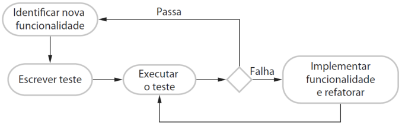

**Se você não sabe o suficiente para escrever os testes, não vai desenvolver o código necessário.** Por exemplo: se seu cálculo envolve divisão, você deve verificar se não está dividindo o número por zero. Se você se esquecer de escrever um teste para isso, então o código para essa verificação nunca será incluído no programa. Além de um melhor entendimento do problema, outros benefícios do desenvolvimento dirigido a testes são: 

<mark>Benefícios Descrição</mark> Em princípio, todo segmento de código que você escreve deve ter pelo menos um teste Cobertura de associado. Assim, você pode ter certeza de que todo o código no sistema foi realmente executado. Cada código é testado enquanto está sendo escrito; assim, os defeitos são código descobertos no início do processo de desenvolvimento. Um conjunto de testes é desenvolvido de forma incremental enquanto um programa é Teste de desenvolvido. Você sempre pode executar testes de regressão para verificar se as mudanças no programa não introduziram novos bugs. regressão <mark>Quando um teste falha, a localização do problema deve ser óbvia. O código recém-escrito</mark> Depuração precisa ser verificado e modificado. Você não precisa usar as ferramentas de depuração para localizar o problema. Alguns relatos de uso de desenvolvimento dirigido a testes sugerem que, simplificada em desenvolvimento dirigido a testes, quase nunca é necessário usar um sistema automatizado de depuração. <mark>Os testes em si mesmos agem como uma forma de documentação que descreve o que o código</mark> Documentação deve estar fazendo. Ler os testes pode tornar mais fácil a compreensão do código. de sistema 

**Um dos benefícios mais importantes de desenvolvimento dirigido a testes é que ele reduz os custos dos testes de regressão.** O teste de regressão envolve a execução de conjuntos de testes que tenham sido executados com sucesso, após as alterações serem feitas em um sistema. Ele também verifica se essas mudanças não introduziram novos bugs no sistema e se o novo código interage com o código existente conforme o esperado. 

**O teste de regressão é muito caro e geralmente impraticável quando um sistema é testado manualmente, pois os custos com tempo e esforço são muito altos.** Em tais situações, você

---

<!-- pagina: 37 -->

**Diego Carvalho, Equipe Informática 2 (Diego Carvalho), Equipe Informática 1 (Diego Carvalho) Aula 04** 

precisa tentar escolher os testes mais relevantes para executar novamente, e é fácil perder testes importantes. No entanto, testes automatizados – fundamentais para o desenvolvimento _test-first_ – reduzem drasticamente os custos com testes de regressão. 

Os testes existentes podem ser executados novamente de forma rápida e barata. **Após se fazer uma mudança para um sistema em desenvolvimento** **_test-first_ , todos os testes existentes devem ser executados com êxito antes de qualquer funcionalidade ser adicionada.** Como um programador, você precisa ter certeza de que a nova funcionalidade não tenha causado ou revelado problemas com o código existente. 

O desenvolvimento dirigido a testes é de maior utilidade no desenvolvimento de softwares novos, em que a funcionalidade seja implementada no novo código ou usando bibliotecas-padrão já testadas. **Se você estiver reusando componentes de código ou sistemas legados grandes, você precisa escrever testes para esses sistemas como um todo.** O desenvolvimento dirigido a testes também pode ser ineficaz em sistemas multi-threaded. 

As _threads_ diferentes podem ser intercalados em tempos diferentes, em execuções diferentes, e isso pode produzir resultados diferentes. Se você usa o desenvolvimento dirigido a testes, ainda precisa de um processo de teste de sistema para validar o sistema, isto é, verificar se atende aos requisitos dos stakeholders. O teste de sistema também testa o desempenho, a confiabilidade, e verifica se o sistema não faz coisas que não deveria, como produzir resultados indesejados etc. 

**O desenvolvimento dirigido a testes revelou-se uma abordagem de sucesso para projetos de pequenas e médias empresas.** Geralmente, os programadores que adotaram essa abordagem estão satisfeitos com ela e acham que é uma maneira mais produtiva de desenvolver softwares. Em alguns experimentos, foi mostrado que essa abordagem gera melhorias na qualidade do código. Bem, agora vamos falar sobre o ciclo vermelho, verde e refatoração. 

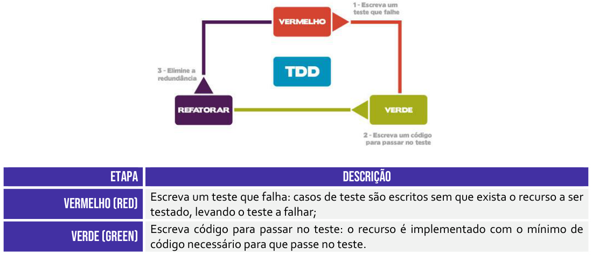

<!-- Start of picture text -->
ETAPA  DESCRIÇÃO Escreva um teste que falha: casos de teste são escritos sem que exista o recurso a ser VERMELHO (RED) testado, levando o teste a falhar; Escreva código para passar no teste: o recurso é implementado com o mínimo de VERDE (GREEN) código necessário para que passe no teste. <!-- End of picture text -->

---

<!-- pagina: 38 -->

**Diego Carvalho, Equipe Informática 2 (Diego Carvalho), Equipe Informática 1 (Diego Carvalho) Aula 04** 

Elimine redundâncias: o código que implementa o recurso é refinado e melhorado, REFATORAR (REFACTOR) sem que seja adicionada novas funcionalidades. 

Vamos lá! Nós sabemos que – para cada parte da aplicação – adiciona-se um teste escrito antes mesmo do desenvolvimento do código em si. _Por quê?_ **Porque eles podem ajudar a reduzir riscos de possíveis problemas no código.** Executamos o teste e ele... falha! Ele deve necessariamente falhar! _Por quê?_ Ora, porque ele é o primeiro teste e você nem criou a funcionalidade ainda, logo ele não irá funcionar! 

Então nós adicionamos uma nova funcionalidade ao sistema apenas para que ele passe no teste e execute novamente (agora ele deve passar no teste). **Então, nós adicionamos um novo teste e rodamos o teste anterior e esse novo teste.** Se algum deles falhar, modifica-se o código da funcionalidade e rodam-se todos os testes novamente, e assim por diante – nós já vimos aquela imagem anterior que mostra como tudo isso funciona... 

_Galera, vocês percebem que o feedback sobre a nova funcionalidade ocorre de maneira bem rápido?_ **Além disso, cria-se um código mais limpo, visto que o código para passar nos testes deve ser bastante simples.** Há mais segurança na correção de eventuais bugs; aumenta-se a produtividade, visto que se perde menos tempo com depuradores; e o código se torna mais flexível, menos acoplado e mais coeso. 

Nós podemos afirmar que, em geral, utilizam-se testes unitários, testes de integração ou testes de aceitação – sendo os dois primeiros os mais comuns. **Algumas ferramentas que podem ser utilizadas para implementar o processo de desenvolvimento orientado a testes:** JUnit, TesteNG, PHPUnit, SimpleTest, NUnit, Jasmine, CUnit, PyUnit, etc. Pessoal, agora um detalhe que nós passamos direto sobre a abordagem de desenvolvimento... 

<mark>O Test Driven Development (TDD) não é uma abordagem para realizar testes – trata-se de uma abordagem para desenvolver softwares. Ela pode eventualmente ser considerada também uma técnica de programação!</mark> 

_Professor, uma curiosidade: isso já caiu em alguma prova discursiva?_ **Sim, galera... o enunciado dessa prova requisitava ao aluno informar as vantagens do emprego do TDD em relação a outras metodologias ágeis.** Poderíamos responder essa pergunta afirmando que o software desenvolvido, em geral, apresenta maior qualidade, na medida em que é implementado direcionado às expectativas do cliente.

---

<!-- pagina: 39 -->

**Diego Carvalho, Equipe Informática 2 (Diego Carvalho), Equipe Informática 1 (Diego Carvalho) Aula 04** 

**Poderíamos dizer também que há a possibilidade de se testar todo o código desenvolvido, o que oferece maior confiabilidade ao sistema.** Por fim, em geral, o código é mais modularizado, flexível e extensível, visto que a metodologia requer que os desenvolvedores imaginem o software como pequenas unidades1 que podem ser reescritas, desenvolvidas e testadas de forma independente e integradas em momento posterior. 

Essa mesma prova perguntava também quais são os princípios da Metodologia Extreme Programming (XP) apoiados pelo TDD. Uma resposta adequada poderia afirmar que o XP apresenta diversas práticas que podem ser relacionadas com o TDD. _Qual é a mais óbvia?_ **A mais óbvia é o** **_Test-First_ (Teste Primeiro), ratificando a característica básica recomendada veementemente pelo desenvolvimento orientado a testes.** 

**O TDD pode apoiar esse princípio por fornecer detalhes para a realização dos testes de unidade e de funcionalidade, que são importantes e necessários.** Ademais, o desenvolvimento orientado a testes apresenta relação intrínseca com a refatoração, tendo em vista que confere ao programador maior segurança para identificar e remover o código duplicado, e permite, assim, a melhoria contínua do programa. Vamos resumir as principais características do TDD: 

<mark>CARACTERÍSTICAS</mark> Descrição do tdd Orientado a O TDD coloca o teste no centro do processo de desenvolvimento, guiando a escrita do código. Cada nova funcionalidade é conduzida por um ou mais testes que definem o comportamento testes esperado. TDD promove a implementação em pequenos passos iterativos. Cada ciclo de desenvolvimento Pequenos passos é curto, envolvendo a escrita de um pequeno teste, o código correspondente e a refatoração. Como os testes são escritos antes do código, TDD naturalmente resulta em uma alta cobertura Alta cobertura de testes automatizados, o que ajuda a detectar regressões e garantir que o código funcione conforme esperado. Feedback O TDD oferece feedback imediato sobre a correção do código. Se um teste falha, o desenvolvedor pode corrigir o problema imediatamente, minimizando o tempo entre a imediato introdução de um erro e sua correção. Documentação <mark>Os testes servem como documentação executável do comportamento do sistema. Eles</mark> descrevem o que o código deve fazer de forma precisa e concisa, e essa “documentação” é viva sempre atualizada porque os testes são executados continuamente. Facilita A prática de TDD promove um design de código mais limpo e modular, já que o desenvolvedor refatoração refatora o código regularmente com a segurança de que os testes irão capturar qualquer erro segura introduzido. Projeto guiado TDD influencia positivamente o design do software, encorajando a criação de código coeso e de baixo acoplamento. Escrever testes primeiro ajuda os desenvolvedores a pensar na interface e por testes na responsabilidade das classes antes de implementá-las. 

> 1 Atenção: apesar de serem tipicamente realizados testes de unidade, não é obrigatória a utilização desse tipo de teste.

---

<!-- pagina: 40 -->

**Diego Carvalho, Equipe Informática 2 (Diego Carvalho), Equipe Informática 1 (Diego Carvalho) Aula 04** 

|Maior qualidade de código|A prática constante de escrever testes e refatorar resulta em um código de maior qualidade, com menos bugs e mais fácil de manter e evoluir.|
|---|---|
|Redução de bugs de produção|Com o TDD, muitos erros são capturados e corrigidos durante o desenvolvimento, o que resulta em uma menor probabilidade de bugs aparecerem em produção.|
|Melhoria na confiança|Como os testes automatizados garantem que o código funciona conforme esperado, os desenvolvedores têm mais confiança em modificar, refatorar ou estender o código sem introduzir novos erros.|
|Aumento da manuteni- bilidade|O código desenvolvido com TDD tende a ser mais modular e de fácil manutenção, uma vez que os testes forçam o desenvolvedor a pensar em como dividir o código em partes bem definidas e testáveis.|
|Asserções de verificação|Cada caso de teste deve incluir asserções que verifiquem se o comportamento do código está conforme o esperado. As asserções são fundamentais para garantir que o teste valide corretamente o comportamento do código. ==5460==|
|Testes de integração|Testes de integração são utilizados para validar recursos complexos, como acesso a dados, onde múltiplos componentes ou sistemas interagem. Esses testes garantem que as partes integradas funcionem corretamentejuntas.|
|Independência dos testes|A independência dos testes é um princípio fundamental. Cada teste deve ser executado isoladamente, sem dependências entre eles. Comentários sobre quais testes foram criados não substituem a necessidade degarantirque os testes não se afetam mutuamente.|

Galera, nós temos também uma variação chamada Acceptance Test-Driven Development (ATDD). **Ele é método ágil de desenvolvimento de software que se baseia na comunicação entre clientes do negócio, desenvolvedores e testadores.** Diferente do Test-Driven Development (TDD), que se concentra em testes unitários, o ATDD se concentra em testes de aceitação que validam se o sistema atende aos critérios de aceitação definidos pelo cliente ou pelo usuário final. 

Ele promove uma estreita colaboração entre todas as partes interessadas (stakeholders). Isso inclui desenvolvedores, testadores, analistas de negócios e clientes que trabalham juntos para definir e escrever os testes de aceitação antes que o desenvolvimento comece. Essa colaboração garante que todos tenham um entendimento comum do que precisa ser construído. Os testes de aceitação servem como uma forma de documentação viva e executável. 

Eles descrevem o comportamento esperado do sistema e podem ser usados para verificar automaticamente se o software atende aos requisitos acordados. Além disso, são diretamente derivados dos requisitos funcionais e não funcionais do sistema. Isso garante que o software entregue esteja em conformidade com as especificações e expectativas do cliente. Outra característica importante é o seu feedback imediato. 

Como os testes são escritos antes do desenvolvimento, o ATDD oferece feedback imediato sobre a conformidade do software com os requisitos do cliente durante o processo de desenvolvimento. Isso permite que problemas e mal-entendidos sejam identificados e corrigidos mais cedo. Ao validar os critérios de aceitação antes de começar a codificar, o ATDD ajuda a reduzir a quantidade de retrabalho causado por mal-entendidos sobre os requisitos.

---

<!-- pagina: 41 -->

**Diego Carvalho, Equipe Informática 2 (Diego Carvalho), Equipe Informática 1 (Diego Carvalho) Aula 04** 

Embora similar ao TDD, o ciclo do ATDD adapta o ciclo Red-Green-Refactor para se concentrar em testes de aceitação. O ciclo pode ser descrito como: 

|ETAPA|DESCRIÇÃO|
|---|---|
|Red|Escrever um teste de aceitação que inicialmente falha, porque a funcionalidade ainda não foi implementada.|
|Green|Implementar o código necessário para fazer o teste passar.|
|refactor|Melhorar o código enquanto se certifica de que todos os testes de aceitação continuam a passar.|

O uso do ATDD resulta em um software de maior qualidade, pois os requisitos do cliente são continuamente validados ao longo do processo de desenvolvimento. A confiança na qualidade do software também é aumentada, pois os testes de aceitação garantem que o sistema se comporta conforme o esperado. A tabela exibida a seguir apresenta as principais características do ATDD e a tabela seguinte nos mostra as diferenças para o TDD: 

|CARACTERÍSTICAS do atdd|Descrição|
|---|---|
|Foco em testes de aceitação|ATDD envolve a escrita de testes de aceitação antes do desenvolvimento, garantindo que os critérios do cliente sejam atendidos.|
|Colaboração entre equipes|Promove a colaboração entre desenvolvedores, testadores e stakeholders para definir os critérios de aceitação.|
|Testes baseados em requisitos|Os testes de aceitação são diretamente derivados dos requisitos funcionais, garantindo que o software entregue esteja alinhado com as expectativas do cliente.|
|Documentação executável|Os testes de aceitação servem como documentação viva e executável, descrevendo o comportamento esperado do sistema.|
|Feedback imediato|Oferece feedback imediato sobre a conformidade do software com os requisitos do cliente durante o desenvolvimento.|
|Ciclo adaptado|Similar ao TDD, mas com foco em garantir que o software atenda aos critérios de aceitação antes de refatorar o código.|
|Engajamento de stakeholders|Incentiva o envolvimento dos stakeholders no processo de desenvolvimento, garantindo que o produto final atenda às suas necessidades.|
|qualidade do produto|Ao focar nos testes de aceitação desde o início, ATDD ajuda a detectar problemas cedo, resultando em um produto de maior qualidade.|
|Redução de retrabalho|Ao validar os critérios de aceitação antes do desenvolvimento, minimiza a necessidade de retrabalho causado por mal-entendidos nos requisitos.|
|validação de requisitos|Ajuda a validar e clarificar os requisitos antes de iniciar o desenvolvimento, garantindo que todos tenham o mesmo entendimento sobre as expectativas.|

---

<!-- pagina: 42 -->

**Diego Carvalho, Equipe Informática 2 (Diego Carvalho), Equipe Informática 1 (Diego Carvalho) Aula 04** 

##### <mark>Tdd (test-driven development) Atdd (acceptance test-driven development)</mark> 

O foco principal do TDD está nos testes unitários. O desenvolvedor escreve pequenos testes automatizados antes de escrever o código correspondente. O objetivo é garantir que cada unidade de código (geralmente uma função ou método) funcione corretamente em um nível granular. Os testes em TDD são geralmente limitados a uma unidade de código individual, como um método ou classe. Eles são escritos pelos desenvolvedores para verificar a correção funcional de pequenas partes do sistema. 

A prática de TDD é geralmente realizada exclusivamente pelos desenvolvedores. O ciclo de escrita de testes, codificação e refatoração é iterado pelos programadores durante o desenvolvimento. 

O objetivo do TDD é criar um código que funcione corretamente desde o nível mais baixo, permitindo um design de software mais limpo, modular e testável. Ele também visa capturar erros no nível mais granular <u>possível.</u> 

Os testes criados durante o TDD atuam como uma forma de documentação técnica do comportamento das unidades de código. Eles ajudam outros desenvolvedores a entender como o código foi <u>projetado para funcionar.</u> O ciclo de TDD (Red-Green-Refactor) é rápido e focado, proporcionando feedback imediato sobre pequenas porções de código. Isso ajuda a manter o desenvolvimento alinhado com o design desejado desde o início. Os testes são escritos pelos desenvolvedores, que também são responsáveis por escrever o código para passar esses testes. 

O ATDD se concentra nos testes de aceitação, que validam o comportamento do sistema em um nível mais alto, assegurando que o software atende aos requisitos e critérios de aceitação definidos pelos stakeholders, incluindo clientes, analistas de negócios e desenvolvedores. 

Os testes de ATDD abrangem o sistema como um todo ou grandes partes dele, focando no comportamento e na interação entre os componentes do sistema. Esses testes validam se a aplicação atende às necessidades e expectativas do usuário final. 

ATDD envolve uma colaboração mais ampla entre desenvolvedores, testadores, analistas de negócios e clientes. Todos trabalham juntos para definir os critérios de aceitação e os testes que garantem que o sistema está alinhado com as expectativas do cliente. 

O objetivo do ATDD é garantir que o sistema como um todo funcione conforme esperado pelos usuários finais e que ele atenda aos requisitos de negócios. ATDD valida que o software satisfaz as necessidades e critérios de aceitação antes de ser considerado "pronto". 

Os testes de aceitação no ATDD servem como documentação executável do sistema. Eles descrevem o comportamento esperado do sistema de uma maneira que é compreensível tanto para técnicos <u>quanto para stakeholders não técnicos.</u> 

O ATDD também oferece feedback, mas em um nível mais alto, garantindo que o software em desenvolvimento está de acordo com os requisitos do usuário. O feedback no ATDD é obtido antes mesmo do início do desenvolvimento real, durante a fase de especificação dos requisitos. Os testes são definidos em colaboração entre desenvolvedores, testadores e stakeholders (como clientes ou analistas de negócios), e podem ser escritos <u>por desenvolvedores ou testadores.</u> 

**Em suma:** TDD é focado em garantir que as pequenas partes do código (unidades) funcionem corretamente, através da escrita de testes unitários antes do desenvolvimento do código correspondente. Ele é mais técnico e orientado para a implementação. ATDD é focado em garantir que o software como um todo atende aos requisitos do cliente, através da escrita de testes de aceitação antes do desenvolvimento. Ele é mais colaborativo e orientado para o negócio.

---

<!-- pagina: 43 -->

**Diego Carvalho, Equipe Informática 2 (Diego Carvalho), Equipe Informática 1 (Diego Carvalho) Aula 04** 

## **– QUESTÕES COMENTADAS DIVERSAS BANCAS** 

**1. (CESGRANRIO / IPEA – 2024)** Uma gerente de testes de software propôs a seu time de desenvolvimento que começasse a aplicar a abordagem Test Driven Development (TDD). É uma das características principais dessa abordagem iniciar o desenvolvimento de testes: 

a) antes de implementar alguma funcionalidade em si. 

b) durante o período de homologação. 

c) após as funcionalidades serem construídas. 

d) quando a primeira leva de funcionalidades planejadas forem codificadas em algum sprint. 

e) pelos testes de interface automatizado, seguidos pelos testes unitários. 

##### **Comentários:** 

(a) Correto. No Test Driven Development (TDD), os testes são escritos antes da implementação das funcionalidades. Isso garante que o código seja desenvolvido para passar nos testes desde o início; 

(b) Errado. O período de homologação ocorre após a implementação e testes iniciais, e não é o foco do TDD, que deve iniciar antes da implementação; 

(c) Errado. Escrever testes após a construção das funcionalidades é a abordagem tradicional de desenvolvimento, não a abordagem TDD; 

(d) Errado. No TDD, os testes são criados antes de qualquer funcionalidade ser codificada, não após uma leva de funcionalidades; 

(e) Errado. A abordagem TDD prioriza a escrita de testes unitários antes da implementação das funcionalidades, não necessariamente começando pelos testes de interface automatizados. 

**Gabarito:** Letra A 

**2. (CESPE / INPI – 2024)** O desenvolvimento dirigido por testes (TDD) é modelado em três estados: vermelho, verde e refatorar. Um exemplo da ação de refatoração é a simulação do comportamento dos componentes que interagem com a unidade de teste que está falhando. 

##### **Comentários:** 

No desenvolvimento dirigido por testes (TDD), os três estados são: vermelho (escrever um teste que falha), verde (escrever o código mínimo necessário para fazer o teste passar) e refatorar (melhorar o código mantendo os testes passando). A simulação do comportamento dos componentes que interagem com a unidade de teste que está falhando é uma prática de criação de

---

<!-- pagina: 44 -->

**Diego Carvalho, Equipe Informática 2 (Diego Carvalho), Equipe Informática 1 (Diego Carvalho) Aula 04** 

mocks ou stubs, usada para isolar a unidade de teste, e não um exemplo de refatoração. Refatoração envolve melhorar a estrutura do código sem alterar seu comportamento externo. 

**Gabarito:** Errado 

**3. (CESPE / CNPq – 2024)** O TDD é uma tendência que enfatiza o projeto de casos de teste antes da criação do código fonte e se caracteriza como parte do modelo ágil de desenvolvimento de software. 

##### **Comentários:** 

Test-Driven Development (TDD) é uma prática que enfatiza a criação de casos de teste antes do desenvolvimento do código-fonte. É uma abordagem iterativa que faz parte das metodologias ágeis de desenvolvimento de software, promovendo um ciclo de feedback rápido e garantindo que o código seja continuamente testado e refinado. 

**Gabarito:** Correto 

**4. (CESPE / CNPq – 2024)** No TDD, o teste deve ser criado com o objetivo de fazer o segmento de código falhar, gerando-se um processo iterativo que permite a submissão de muitas subfunções simultaneamente, o que confere uma agilidade significativa ao processo. 

##### **Comentários:** 

Test-Driven Development (TDD) é uma prática que enfatiza a criação de casos de teste antes do desenvolvimento do código-fonte. É uma abordagem iterativa que faz parte das metodologias ágeis de desenvolvimento de software, promovendo um ciclo de feedback rápido e garantindo que o código seja continuamente testado e refinado. 

**Gabarito:** Errado 

**5. (CESPE / AGER-MT – 2023)** Assinale a opção que corresponde ao método de teste de software adotado, sob a perspectiva do desenvolvedor, a partir de casos de teste do código, escritos em linguagem técnica, para testar as funcionalidades antes da implementação da solução desenvolvida: 

a) unit testing b) TDD 

c) BDD d) ATDD 

e) teste de caixa preta 

##### **Comentários:**

---

<!-- pagina: 45 -->

**Diego Carvalho, Equipe Informática 2 (Diego Carvalho), Equipe Informática 1 (Diego Carvalho) Aula 04** 

(a) Errado. Unit testing (Teste de Unidade) é o teste de unidades individuais do código (como funções ou métodos), mas não necessariamente envolve escrever testes antes da implementação da funcionalidade. 

(b) Correto. TDD (Test-Driven Development) é uma prática de desenvolvimento onde os desenvolvedores escrevem casos de teste antes de implementar a funcionalidade correspondente. Esses testes são escritos em linguagem técnica e guiam a implementação do código. 

(c) Errado. BDD (Behavior-Driven Development) é uma abordagem de desenvolvimento que estende o TDD, focando na colaboração entre desenvolvedores, QA e não técnicos, utilizando uma linguagem natural para descrever o comportamento esperado. 

(d) Errado. ATDD (Acceptance Test-Driven Development) é semelhante ao TDD, mas envolve stakeholders na criação dos testes de aceitação antes do desenvolvimento, focando na validação do comportamento do sistema do ponto de vista do usuário. 

(e) Errado. Teste de caixa preta (Blackbox Testing) é uma técnica de teste que verifica a funcionalidade do software sem se preocupar com a estrutura interna do código, focando apenas nas entradas e saídas. 

**Gabarito:** Letra B 

**6. (CESPE / TC-DF – 2023)** Na etapa de refactor do processo TDD, parte-se do pressuposto de que os testes tenham passado nas fases anteriores, o que permite que o código seja aprimorado sem a preocupação de duplicações de código. 

##### **Comentários:** 

A questão é polêmica, mas a banda justificou o gabarito: 

_“É neste momento que retiramos duplicidade, renomeamos variáveis, extraímos métodos, extraímos classes, extraímos interfaces, usamos algum padrão conhecido, etc. É neste momento que podemos deixar o nosso código simples e claro e o melhor de tudo: Funcional. Temos um teste que indicará qualquer passo errado que podemos dar ao melhorar o código”o._ 

**Gabarito:** Errado 

**7. (CESPE / EMPREL – 2023)** Ao adotar uma prática ágil para a criação de um software, seu desenvolvedor optou pela implementação com qualidade de uma funcionalidade do sistema; para isso, escreveu um caso de teste automatizado, com base nos requisitos especificados, e realizou testes de unidade em uma linguagem similar à usada no desenvolvimento da funcionalidade. Da situação hipotética precedente infere-se que a prática adotada pelo desenvolvedor está associada ao:

---

<!-- pagina: 46 -->

**Diego Carvalho, Equipe Informática 2 (Diego Carvalho), Equipe Informática 1 (Diego Carvalho) Aula 04** 

a) desenvolvimento orientado por comportamento (BDD). 

b) gerenciamento de produtos com Scrum. 

c) desenvolvimento guiado por testes (TDD). 

- d) desenvolvimento guiado por testes de aceitação (ATDD). 

- e) gerenciamento de produtos com Kanban. 

##### **Comentários:** 

(a) Errado. O Desenvolvimento Orientado por Comportamento (BDD) foca em descrever o comportamento esperado do software em uma linguagem que todos os stakeholders possam entender, geralmente com cenários de aceitação claros e exemplos. A questão não menciona o uso de cenários compreensíveis por não técnicos; 

(b) Errado. O Gerenciamento de Produtos com Scrum é uma metodologia ágil para gerenciamento de projetos que utiliza sprints e eventos do Scrum, como reuniões diárias e retrospectivas. Não foca especificamente na criação de testes automatizados antes do desenvolvimento; 

(c) Correto. O Desenvolvimento Guiado por Testes (TDD) é uma prática de desenvolvimento ágil onde os desenvolvedores escrevem testes de unidade antes da implementação do código funcional. O processo inclui a escrita de um teste que inicialmente falha, a implementação do código para passar o teste e a refatoração do código, se necessário. Isso está alinhado com a descrição fornecida; 

(d) Errado. O Desenvolvimento Guiado por Testes de Aceitação (ATDD) envolve escrever testes de aceitação com base em requisitos, geralmente com a participação de clientes e stakeholders. Foca em garantir que a funcionalidade atenda aos requisitos de aceitação. A questão menciona testes de unidade, não de aceitação; 

e) Errado: O Gerenciamento de Produtos com Kanban é uma abordagem ágil que visa melhorar o fluxo de trabalho visualizando e gerenciando tarefas através de um quadro Kanban. Não envolve diretamente a prática de escrita de testes automatizados antes da implementação. 

**Gabarito:** Letra C 

**8. (FGV / SEFAZ-MG – 2023)** Você entrou para um projeto novo, já em andamento, no qual a metodologia que a equipe do projeto segue é a de definir e escrever testes de software a partir das regras de negócio antes mesmo de implementar as funcionalidades propostas. Assinale a opção que indica o nome desse processo de desenvolvimento de software: 

a) DDD b) TDD c) BDD d) XP

---

<!-- pagina: 47 -->

**Diego Carvalho, Equipe Informática 2 (Diego Carvalho), Equipe Informática 1 (Diego Carvalho) Aula 04** 

e) Scrum 

##### **Comentários:** 

(a) Errado. DDD (Domain-Driven Design) é uma abordagem de desenvolvimento que foca em modelar o software de acordo com o domínio do problema, não necessariamente relacionada à escrita de testes antes do desenvolvimento; 

(b) Correto. TDD (Test-Driven Development) é a prática de escrever testes de software antes da implementação das funcionalidades, garantindo que o código seja desenvolvido para passar nos testes; 

(c) Errado. BDD (Behavior-Driven Development) é uma prática semelhante ao TDD, mas foca em descrever o comportamento esperado do software em linguagem natural, geralmente envolvendo colaboração entre desenvolvedores e não-desenvolvedores; 

(d) Errado. XP (Extreme Programming) é uma metodologia ágil que inclui práticas como TDD, mas não é exclusivamente sobre escrever testes antes do desenvolvimento; 

(e) Errado. Scrum é uma metodologia ágil para gerenciamento de projetos, não específica para a prática de escrever testes antes do desenvolvimento. 

**Gabarito:** Letra B 

**9. (FGV / BB – 2023)** O desenvolvimento orientado a testes (TDD) é um processo que se baseia na repetição em ciclos de desenvolvimento curtos. Ele é baseado no conceito test-first oriundo da programação extrema (XP) que incentiva o design simples com alto nível de confiança. O procedimento que conduz este ciclo é denominado: 

a) refatoração vermelho-verde. 

b) documentação executável. 

c) testes da caixa-branca. 

d) testes da caixa-preta. 

e) mocking up. 

##### **Comentários:** 

(a) Correto. Trata-se de uma técnica de desenvolvimento ágil em que um teste falha inicialmente (red), é feito o mínimo de código para passar no teste (green), e, em seguida, o código é refatorado para melhorar a qualidade sem alterar o comportamento externo; 

(b) Errado. Documentação Executável é a prática de criar documentação que também serve como testes automatizados, garantindo que a descrição funcional do software seja verificável e alinhada com o comportamento real do sistema;

---

<!-- pagina: 48 -->

**Diego Carvalho, Equipe Informática 2 (Diego Carvalho), Equipe Informática 1 (Diego Carvalho) Aula 04** 

(c) Errado. Testes de Caixa Branca são testes de software que verificam a lógica interna, a estrutura e o funcionamento do código, permitindo que os testadores utilizem seu conhecimento sobre a implementação para criar casos de teste; 

(d) Errado. Testes de Caixa Preta são testes de software que avaliam a funcionalidade do aplicativo sem examinar seu código-fonte, focando nas entradas e saídas de acordo com as especificações de requisitos; 

(e) Errado. Mocking Up é a prática de criar versões simuladas de componentes ou sistemas para testar funcionalidades isoladamente, permitindo que os desenvolvedores avaliem o comportamento do sistema sem depender de integrações externas. 

<!-- Start of picture text -->
==5460== <!-- End of picture text -->

**Gabarito:** Letra A 

- **10.(FGV / Senado Federal – 2022)** Você foi contratado para liderar uma equipe de DevOps. Um dos objetivos da sua liderança é aumentar a velocidade das entregas e a qualidade de novos recursos das aplicações utilizando o desenvolvimento orientado a testes. Assinale a opção que apresenta a ordem que descreve o ciclo de desenvolvimento orientado a testes. 

a) Refatorar - > Escrever um código funcional 

b) Escrever um caso de teste -> Refatorar 

c) Refatorar - > Escrever um código funcional - > Escrever um caso de teste 

d) Escrever um caso de teste -> Escrever um código funcional -> Refatorar 

- e) Escrever um código funcional -> Escrever um caso de teste -> Refatorar 

**Comentários:** 

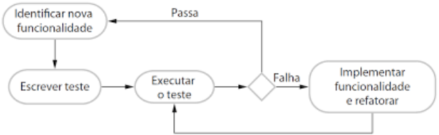

O ciclo de desenvolvimento orientado a testes segue o seguinte ciclo: (1) Identificar nova funcionalidade; (2) **Escrever um teste** ; (3) Executar o teste; (4) **Implementar funcionalidade e refatorar** . 

**Gabarito:** Letra D 

- **11.(CESPE / BANRISUL – 2022)** No processo de TDD, o código é desenvolvido em grandes blocos de requisitos do usuário. Cada iteração resulta em um novo teste, que faz parte um conjunto de testes de regressão executado no final do processo de integração.

---

<!-- pagina: 49 -->

**Diego Carvalho, Equipe Informática 2 (Diego Carvalho), Equipe Informática 1 (Diego Carvalho) Aula 04** 

##### **Comentários:** 

Durante o TDD, o código é desenvolvido em incrementos **pequenos** e nenhum código é escrito enquanto não houver um teste para experimentá-lo. Cada iteração resulta em um ou mais novos testes, os quais são acrescentados a um conjunto de testes de regressão que são executados a cada mudança. Isso é feito para garantir que o novo código não tenha gerado efeitos colaterais que causem erros no código anterior. 

**Gabarito:** Errado 

- **12.(CESPE / BANRISUL – 2022)** O TDD (Test-Driven Development) é uma metodologia que, ao longo do tempo, implica que o aplicativo em desenvolvimento tenha um conjunto abrangente de testes que ofereça confiança no que foi desenvolvido até então. 

##### **Comentários:** 

O TDD é um processo de desenvolvimento de software que incentiva os desenvolvedores a escrever testes antes de escrever código. A ideia por trás deste processo é que os desenvolvedores escrevam testes para cada pequena parte do código que eles escrevem, garantindo que o código funcione corretamente. Estes testes verificam se o código está funcionando como o esperado. O TDD também incentiva o uso de design incremental, onde pequenas partes do código são adicionadas gradualmente, permitindo que os problemas sejam detectados rapidamente e corrigidos. Ao longo do tempo, o TDD cria um conjunto abrangente de testes que fornecem confiança aos desenvolvedores de que o código é robusto e está funcionando como o esperado. 

**Gabarito:** Correto 

**13. (CESPE / BANRISUL – 2022)** O TDD (Test-Driven Development), como atividade da XP, é uma forma disciplinada de organizar o código, alterando-o de modo a aprimorar sua estrutura interna, sem que se altere o comportamento externo do software. 

##### **Comentários:** 

Essa não é a definição de TDD e, sim, Refactoring. O TDD é uma atividade do XP que envolve a escrita de testes antes mesmo de o código ser escrito, para que o desenvolvedor possa ter certeza de que o código que está escrevendo passará nos testes, e portanto que as funcionalidades desejadas estão sendo implementadas. Refatoração, por outro lado, é o processo de reescrever o código existente, para melhorar a sua qualidade, sem alterar a funcionalidade existente. Refatoração inclui a reestruturação do código para torná-lo mais limpo e legível, a remoção de código desnecessário, a simplificação da lógica usada e a correção de erros. 

**Gabarito:** <mark>Errado</mark>

---

<!-- pagina: 50 -->

**Diego Carvalho, Equipe Informática 2 (Diego Carvalho), Equipe Informática 1 (Diego Carvalho) Aula 04** 

- **14.(FGV / SEFAZ-MG – 2023)** Você entrou para um projeto novo, já em andamento, no qual a metodologia que a equipe do projeto segue é a de definir e escrever testes de software a partir das regras de negócio antes mesmo de implementar as funcionalidades propostas. Assinale a opção que indica o nome desse processo de desenvolvimento de software. 

a) DDD 

b) TDD 

c) BDD 

d) XP 

e) Scrum 

##### **Comentários:** 

O TDD é um processo de desenvolvimento de software que incentiva a escrita de testes de software antes da implementação de qualquer código. O processo começa com a escrita de um teste para uma regra de negócio específica. Então, o código é escrito e, finalmente, os testes são executados para garantir que a regra de negócio esteja funcionando corretamente. O TDD é amplamente utilizado porque ajuda a garantir que o código seja testado de forma adequada, permitindo que qualquer problema seja detectado e corrigido antes que o código seja liberado para produção. 

##### **Gabarito:** Letra B 

**15. (FGV / Senado Federal – Análise de Sistemas – 2022)** Durante o processo de construção de software, a metodologia de Desenvolvimento Orientado a Testes é muito aplicada. 

A ordem utilizada na prática do TDD é: 

a) escrever a funcionalidade após escrever os testes unitários e, por fim, refatorar o código implementado. 

b) escrever os testes unitários após escrever a funcionalidade e, por fim, refatorar o código implementado. 

c) escrever a funcionalidade após refatorar o código implementado e por fim escrever os testes unitários. 

d) escrever os testes unitários após escrever a funcionalidade e, por fim, escrever os testes de integração. 

e) escrever os testes de integração após escrever a funcionalidade e, por fim, refatorar o código. 

**Comentários:**

---

<!-- pagina: 51 -->

**Diego Carvalho, Equipe Informática 2 (Diego Carvalho), Equipe Informática 1 (Diego Carvalho) Aula 04** 

Essa é uma questão muito clássica! Basta saber a ordem correta: primeiro, escrevemos os testes unitários; depois, escrevemos a funcionalidade; por fim, refatoramos o código. Em outras palavras, a ordem correta é escrever a funcionalidade após escrever os testes unitários e, por fim, refatora o código implementado. 

**Gabarito:** Letra A 

- **16.(CESPE / SERPRO – 2021)** Em TDD, os testes de um sistema devem ocorrer antes da implementação e ser oportunos, isolados e autoverificáveis. 

##### **Comentários:** 

Os testes devem seguir o modelo FIRST: F (Fast): devem ser rápidos, pois testam apenas uma unidade; I (Isolated): são isolados, testando individualmente as unidades e não sua integração; R (Repeateble): repetição nos testes, com resultados de comportamento constante; S (Selfverifying): autoverificação deve verificar se passou ou se deu como falha o teste; T (Timely): deve ser oportuno, sendo um teste por unidade. 

**Gabarito:** Correto 

**17. (CESPE / INMETRO – 2009)** A rotina diária dos desenvolvedores, ao empregar processos baseados no TDD (Test-Driven Development), é concentrada na elaboração de testes de homologação. 

##### **Comentários:** 

A rotina dos desenvolvedores é concentrada, na verdade, na elaboração de testes unitários e, não, de homologação. Lembrem-se: constrói o teste, constrói a funcionalidade e refatora a funcionalidade. 

**Gabarito:** Errado 

- **18.(CESPE / INPI – 2013)** Usando-se o TDD, as funcionalidades devem estar completas e da forma como serão apresentadas aos seus usuários para que possam ser testadas e consideradas corretas. 

##### **Comentários:** 

|ETAPA|DESCRIÇÃO|
|---|---|
|VERMELHO (RED)|Escreva um teste que falha: casos de teste são escritos sem que exista o recurso a ser testado,levando o teste a falhar;|
|VERDE (GREEN)|Escreva código para passar no teste: o recurso é implementado com o mínimo de código necessárioparaquepasse no teste.|

---

<!-- pagina: 52 -->

**Diego Carvalho, Equipe Informática 2 (Diego Carvalho), Equipe Informática 1 (Diego Carvalho) Aula 04** 

Elimine redundâncias: o código que implementa o recurso é refinado e melhorado, REFATORAR (REFACTOR) sem que seja adicionada novas funcionalidades. 

Pelo contrário, primeiro são feitos os testes e depois desenvolvem-se as funcionalidades. 

**Gabarito:** Errado 

- **19.(CESPE / ANCINE – 2013)** No desenvolvimento de software conforme as diretivas do TDD (TestDriven Development), deve-se elaborar primeiramente os testes e, em seguida, escrever o código necessário para passar pelos testes. 

##### **Comentários:** 

|ETAPA|DESCRIÇÃO|
|---|---|
|VERMELHO (RED)|Escreva um teste que falha: casos de teste são escritos sem que exista o recurso a ser testado,levando o teste a falhar;|
|VERDE (GREEN)|Escreva código para passar no teste: o recurso é implementado com o mínimo de código necessárioparaquepasse no teste.|
|REFATORAR (REFACTOR)|Elimine redundâncias: o código que implementa o recurso é refinado e melhorado, semque seja adicionada novas funcionalidades.|

Perfeito! Primeiro, criam-se os testes, depois cria-se o código. 

**Gabarito:** Correto 

- **20.(CESPE / INMETRO – 2009)** Considerando uma organização na qual a abordagem de Test Driven Development (TDD) esteja implementada, assinale a opção correta. 

a) Nessa organização, ocorre a execução de iterações com ciclo longo, isto é, com duração de alguns meses. 

b) No início de cada iteração, a primeira atividade realizada pela equipe de desenvolvimento é produzir o código que será validado através de testes. 

c) O refactoring é uma das primeiras atividades realizada no início de cada iteração. 

d) Entre as atividades finais de cada iteração, o desenvolvedor escreve casos de teste automatizados, cuja execução verifica se houve a melhoria desejada ou se uma nova funcionalidade foi implementada. 

e) Há coerência e inter-relação com os princípios promovidos pela prática da extreme programming (XP). 

##### **Comentários:**

---

<!-- pagina: 53 -->

**Diego Carvalho, Equipe Informática 2 (Diego Carvalho), Equipe Informática 1 (Diego Carvalho) Aula 04** 

(a) Errado, são ciclos curtos e, não, longos; (b) Errado, são produzidos primeiramente os testes e, depois, os códigos; (c) Errado, a refatoração é a última atividade realizada em uma iteração; (d) Errado, escrever casos de testes é uma das atividades iniciais; (e) Correto, trata-se inclusive de uma das práticas recomendadas pelo XP. 

**Gabarito:** Letra E 

- **21.(CESPE / MPOG – 2013)** Ao realizar o TDD (test-driven development), o programador é conduzido a pensar em decisões de design antes de pensar em código de implementação, o que cria um maior acoplamento, uma vez que seu objetivo é pensar na lógica e nas responsabilidades de cada classe. 

##### **Comentários:** 

Em Engenharia de Software, há dois conceitos importantíssimos: coesão e acoplamento. Quando eu estudava, eu decorava uma frase pequena para entender: " _Coesão é a divisão de responsabilidades e Acoplamento é a dependência entre componentes_ ". Há outra que dizia assim: " _Uma boa arquitetura de software deve ter componentes de projeto com baixo acoplamento e alta coesão_ ". 

O Acoplamento trata do nível de dependência entre módulos ou componentes de um software. _Por que é bom ter baixo acoplamento?_ Porque se os módulos pouco dependem um do outro, modificações de um não afetam os outros, além de não prejudicar o reúso. Se esse princípio não for observado durante a construção da arquitetura de um sistema de software, pode haver problemas sérios de manutenção futura! 

Voltando à questão: se o programador pensa em decisões de design antes de pensar em código de implementação, isso diminui o acoplamento - os componentes ficam menos dependentes, tornando a arquitetura bem mais flexível. 

**Gabarito:** Errado 

- **22.(CESPE / MPU – 2013)** Na metodologia TDD, ou desenvolvimento orientado a testes, cada nova funcionalidade inicia com a criação de um teste, cujo planejamento permite a identificação dos itens e funcionalidades que deverão ser testados, quem são os responsáveis e quais os riscos envolvidos. 

##### **Comentários:** 

Perfeito! Essa metodologia permite um aprendizado maior sobre o problema a ser resolvido, permitindo (não obrigatoriamente) a identificação de itens, funcionalidades, responsáveis e riscos.

---

<!-- pagina: 54 -->

**Diego Carvalho, Equipe Informática 2 (Diego Carvalho), Equipe Informática 1 (Diego Carvalho) Aula 04** 

**Gabarito:** Correto 

**23. (CESPE / STF – 2013)** No TDD, o primeiro passo do desenvolvedor é criar o teste, denominado teste falho, que retornará um erro, para, posteriormente, desenvolver o código e aprimorar a codificação do sistema. 

##### **Comentários:** 

|ETAPA|DESCRIÇÃO|
|---|---|
|VERMELHO (RED)|Escreva um teste que falha: casos de teste são escritos sem que exista o recurso a ser testado,levando o teste a falhar;|
|VERDE (GREEN)|Escreva código para passar no teste: o recurso é implementado com o mínimo de código necessárioparaquepasse no teste.|
|REFATORAR (REFACTOR)|Elimine redundâncias: o código que implementa o recurso é refinado e melhorado, semque seja adicionada novas funcionalidades.|

Perfeito! Cria-se o teste falho, desenvolve-se um código e só então ocorre a refatoração. 

**Gabarito:** Correto 

- **24.(CESPE / TRT17 – 2013)** TDD consiste em uma técnica de desenvolvimento de software com abordagem embasada em perspectiva evolutiva de seu desenvolvimento. Essa abordagem envolve a produção de versões iniciais de um sistema a partir das quais é possível realizar verificações de suas qualidades antes que ele seja construído. 

##### **Comentários:** 

A questão diz que versões iniciais são produzidas e, a partir dessas versões, é possível realizar verificações de suas qualidades antes que ele seja construído. Na verdade, testes são criados inicialmente para verificar sua qualidade e, a partir daí, versões são produzidas. Logo, a questão inverteu os conceitos! 

**Gabarito:** Correto 

**25. (CESPE / AL-RN – 2013)** Um típico ciclo de vida de um projeto em TDD consiste em: 

   - I. Executar os testes novamente e garantir que estes continuem tendo sucesso. 

   - II. Executar os testes para ver se todos estes testes obtiveram êxito. 

   - III. Escrever a aplicação a ser testada. IV. Refatorar (refactoring). 

   - V. Executar todos os possíveis testes e ver a aplicação falhar. 

   - VI. Criar o teste.

---

<!-- pagina: 55 -->

**Diego Carvalho, Equipe Informática 2 (Diego Carvalho), Equipe Informática 1 (Diego Carvalho) Aula 04** 

A ordem correta e cronológica que deve ser seguida para o ciclo de vida do TDD está expressa em: 

a) IV − III − II − V − I − VI. 

b) V − VI − II − I − III − IV. 

c) VI − V − III − II − IV − I. 

d) III − IV − V − VI − I − II. 

e) III − IV − VI − V − I − II. 

##### **Comentários:** 

A ordem correta é: (VI) Criar o teste; (V) Executar todos os possíveis testes e ver a aplicação falhar; (III) Escrever a aplicação a ser testada; (II) Executar os testes para ver se todos estes testes obtiveram êxito; (IV) Refatorar (refactoring); (I) Executar os testes novamente e garantir que estes continuem tendo sucesso. 

**Gabarito:** Letra C 

- **26.(FGV / ALMT – 2013)** Com relação ao desenvolvimento orientado (dirigido) a testes (do Inglês Test Driven Development – TDD), analise as afirmativas a seguir. 

   - I. TDD é uma técnica de desenvolvimento de software iterativa e incremental. 

II. TDD implica escrever o código de teste antes do código de produção, um teste de cada vez, tendo certeza de que o teste falha antes de escrever o código que irá fazê-lo passar. 

III. TDD é uma técnica específica do processo XP (Extreme Programming), portanto, só pode ser utilizada em modelos de processos ágeis de desenvolvimento de software. 

Assinale: 

a) Se somente as afirmativas I e II estiverem corretas. 

b) Se somente as afirmativas I e III estiverem corretas. 

c) Se somente as afirmativas II e III estiverem corretas. 

d) Se somente a afirmativa III estiver correta. 

e) Se somente a afirmativa I estiver correta. 

##### **Comentários:** 

(I) Correto, é iterativo e incremental (lembrando que, em sua imensa maioria, metodologias ágeis são iterativas/incrementais); (II) Correto, escrevem-se os testes antes, fá-lo falhar e só depois escreve-se o código da aplicação; (III) Errado, ele é uma abordagem independente que pode ser utilizado com metodologias ágeis ou tradicionais.

---

<!-- pagina: 56 -->

**Diego Carvalho, Equipe Informática 2 (Diego Carvalho), Equipe Informática 1 (Diego Carvalho) Aula 04** 

**Gabarito:** Letra A 

**27. (FCC / TRT-MG – 2015)** Um analista de TI está participando do desenvolvimento de um software orientado a objetos utilizando a plataforma Java. Na abordagem de desenvolvimento adotada, o código é desenvolvido de forma incremental, em conjunto com o teste para esse incremento, de forma que só se passa para o próximo incremento quando o atual passar no teste. Como o código é desenvolvido em incrementos muito pequenos e são executados testes a cada vez que uma funcionalidade é adicionada ou que o programa é refatorado, foi necessário definir um ambiente de testes automatizados utilizando um framework popular que suporta o teste de programas Java. 

A abordagem de desenvolvimento adotada e o framework de suporte à criação de testes automatizados são, respectivamente, 

- a) Behavior-Driven Development e JTest. 

- b) Extreme Programming e Selenium. 

- c) Test-Driven Development e Jenkins. 

- d) Data-Driven Development and Test e JUnit. 

- e) Test-Driven Development e JUnit. 

##### **Comentários:** 

A abordagem claramente é o TDD e o framework evidentemente é o JUnit (ferramenta de suporte à criação de testes unitários automatizados). Lembrando que: DDD é um modelo de programação em que os próprios dados controlam o fluxo do programa e não a lógica do programa; XP é uma metodologia ágil de gerenciamento de projetos que suporta lançamentos frequentes em curtos ciclos de desenvolvimento para melhorar a qualidade do software e permitir que os desenvolvedores respondam às mudanças nos requisitos dos clientes; BDD é um método de desenvolvimento ágil que encoraja a colaboração entre desenvolvedores; Selenium é uma ferramenta usada para testes funcionais em aplicações web; e JTest é um ramework de análise estática que usa a linguagem Java. 

**Gabarito:** Letra E 

- **28.(CESPE / TRE-PE – 2017)** O desenvolvimento orientado a testes (TDD): 

a) é um conjunto de técnicas que se associam ao XP (extreme programming) para o desenvolvimento incremental do código que se inicia com os testes. 

b) agrega um conjunto de testes de integração para avaliar a interconexão dos componentes do software com as aplicações a ele relacionadas.

---

<!-- pagina: 57 -->

**Diego Carvalho, Equipe Informática 2 (Diego Carvalho), Equipe Informática 1 (Diego Carvalho) Aula 04** 

c) avalia o desempenho do desenvolvimento de sistemas verificando se o volume de acessos/transações está acima da média esperada. 

d) averigua se o sistema atende aos requisitos de desempenho verificando se o volume de acessos/transações mantém-se dentro do esperado. 

e) testa o sistema para verificar se ele foi desenvolvido conforme os padrões e a metodologia estabelecidos nos requisitos do projeto. 

##### **Comentários:** 

(a) Correto. O TDD é uma prática de desenvolvimento ágil, associada ao Extreme Programming 

(XP), em que o código é desenvolvido de forma incremental a partir da criação prévia de testes. 

(b) Errado. Testes de integração avaliam a interação entre componentes, mas não são o foco principal do TDD, que se concentra no desenvolvimento orientado por testes unitários. 

(c) Errado. A avaliação de volume de acessos ou transações refere-se a testes de desempenho, não ao conceito de TDD. 

(d) Errado. Essa descrição também se refere a testes de desempenho, que verificam a resposta do sistema sob carga, não a testes orientados ao desenvolvimento do código. 

(e) Errado. Essa descrição se refere a testes de conformidade ou auditorias de processos, e não ao desenvolvimento orientado a testes. 

**Gabarito:** Letra A 

- **29.(CESPE / STM – 2018)** O TDD (test driven development) parte de um caso de teste que caracteriza uma melhoria desejada ou nova funcionalidade a ser desenvolvida, de modo a confirmar o comportamento correto e possibilitar a evolução ou refatoração do código. 

##### **Comentários:** 

TDD é um método para construir software que enfatiza a criação de testes antes da criação do código-fonte. Logo, faz-se o teste - se não passou, refatora! 

**Gabarito:** Correto 

**30.(CESPE / TRE/PI – 2016)** O TDD (test driven development):

---

<!-- pagina: 58 -->

**Diego Carvalho, Equipe Informática 2 (Diego Carvalho), Equipe Informática 1 (Diego Carvalho) Aula 04** 

a) apresenta como vantagem a leitura das regras de negócio a partir dos testes, e, como desvantagem, a necessidade de mais linhas de códigos que a abordagem tradicional, o que gera um código adicional. 

b) impede que seja aplicada a prática de programação em pares, que é substituída pela interação entre analista de teste, testador e programador. 

c) é um conjunto de técnicas associadas ao eXtremme Programing e a métodos ágeis, sendo, contudo, incompatível com o Refactoring, haja vista o teste ser escrito antes da codificação. 

d) refere-se a uma técnica de programação cujo principal objetivo é escrever um código funcional limpo, a partir de um teste que tenha falhado. 

e) refere-se a uma metodologia de testes em que se devem testar condições, loops e operações; no entanto, por questão de simplicidade, não devem ser testados polimorfismos. 

##### **Comentários:** 

(a) Errado, esse item não faz nenhum sentido em relação ao TDD; (b) Errado, não impede a programação em pares; (c) Errado, ela é totalmente compatível e dependente da refatoração; (d) Correto, ela pode ser vista como uma técnica de programação cujo objetivo é escrever um código funcional limpo a partir de um teste falho; (e) Errado, não se trata de uma metodologia de testes. 

**Gabarito:** Letra D 

**31. (UFRRJ / UFRRJ – 2015)** Os testes de unidade têm papel central na metodologia de implementação dirigida por testes, popularizada pelo processo XP e adotada em outros métodos. Esses testes são criados primeiro, exercitando o contrato de cada operação implementada pelos métodos. Em seguida, o código dos métodos é escrito para cumprir os contratos e, portanto, passar nos testes de unidade. Esse cenário corresponde à abordagem 

a) TDD. b) MDD. c) DDC. d) MDE. e) FDD. 

##### **Comentários:** 

_Testes de unidade têm papel central? Metodologia dirigida a testes? Popularizada pelo XP? Testes são criados primeiro?_ Tudo isso nos remente a... TDD! 

**Gabarito:** Letra A

---

<!-- pagina: 59 -->

**Diego Carvalho, Equipe Informática 2 (Diego Carvalho), Equipe Informática 1 (Diego Carvalho) Aula 04** 

**32. (FCC / TRE-PR – 2017)** Considere o ciclo do Test-Driven Development – TDD. 

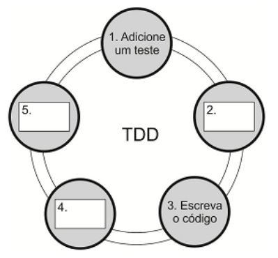

##### A Caixa: 

a) 2. corresponde a “Execute os testes automatizados”. 

b) 4. corresponde a “Refatore o código”. 

c) 5. corresponde a “Execute os testes novamente e observe os resultados”. 

d) 4. corresponde a “Execute os testes automatizados”. 

e) 5. corresponde a “Faça todos os testes passarem”. 

##### **Comentários:** 

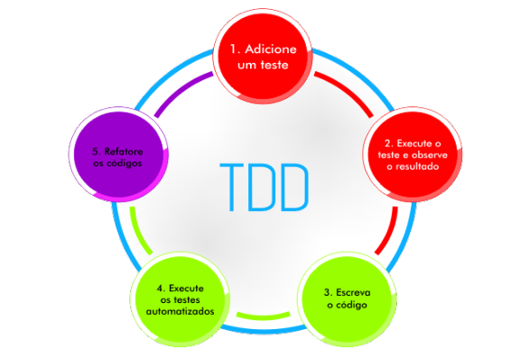

(a) Errado, corresponde a “Execute o teste e observe o resultado”; (b) Errado, corresponde a “Execute os testes automatizados”; (c) Errado, corresponde a “Refatore os códigos”; (d) Correto, corresponde realmente a “Execute os testes automatizados”; (e) Errado, corresponde a “Refatore os códigos”. 

**Gabarito:** Letra D

---

<!-- pagina: 60 -->

**Diego Carvalho, Equipe Informática 2 (Diego Carvalho), Equipe Informática 1 (Diego Carvalho) Aula 04** 

**33. (IESES / TRE-MA – 2015)** A respeito da técnica de testes TDD é correto afirmar que: 

a) Testa o software com base no comportamento esperado. 

b) É uma prática para desenvolvimento de testes unitário que pode utilizar o processo RedGreen-Refactor. 

c) Utiliza-se da estrutura Dado, Quando e Então para montar os testes. 

d) Prega que os testes devem ser realizados sempre após a implementação ser concluída. 

##### **Comentários:** 

(a) Errado, não vejo nada de errado nesse item – ele pode testar o software com base no comportamento esperado! No entanto, a banca considerou o item errado; (b) Correto, ele realmente utiliza o processo RED/GREEN/REFACTOR; (c) Errado, esse item não faz qualquer sentido; (d) Errado, testes são realizados antes de a implementação ser concluída. 

**Gabarito:** Letra B 

**34.(CESPE / TER-RS – 2015)** Projeto para o desenvolvimento de software que utilize TDD deve: 

a) realizar sprints a cada quinzena. 

b) desenvolver pequenos releases. 

c) apresentar grande quantidade de testes unitários de código-fonte previamente desenvolvidos. 

d) apresentar linguagem de programação estruturada. 

e) recomendar a preparação dos testes para que, posteriormente, seja desenvolvido o código. 

##### **Comentários:** 

(a) Errado, não há nenhuma relação entre TDD e Sprints; (b) Errado, são desenvolvidas pequenas unidades e, não, releases; (c) Errado, os testes unitários são escritos iterativamente a medida que o desenvolvimento ocorre; (d) Errado, não há nenhuma relação ou dependência com linguagens de programação; (e) Correto, recomenda-se preparar testes antes do desenvolvimento do código. 

**Gabarito:** Letra E 

**35. (FCC / TRE-AP – 2015)** O TDD − Test Driven Development (Desenvolvimento orientado a teste): 

a) é parte das metodologias ágeis UP − Unified Process e XP − Extreme Programming, tendo sido criado para ser usado em metodologias que respeitam os 4 princípios do Manifesto Ágil. 

b) transforma o desenvolvimento, pois deve-se primeiro implementar o sistema antes de escrever os testes. Os testes são utilizados para facilitar no entendimento do projeto e para clarear o que se deseja em relação ao código.

---

<!-- pagina: 61 -->

**Diego Carvalho, Equipe Informática 2 (Diego Carvalho), Equipe Informática 1 (Diego Carvalho) Aula 04** 

- c) baseia-se em um ciclo simples: escreve-se um código -> cria-se um teste para passar no código -> refatora-se. 

d) propõe a criação de testes que validem o código como um todo para reduzir o tempo de desenvolvimento. 

e) beneficia-se de testes que seguem o modelo FIRST: F (Fast) I (Isolated) R (Repeatable) S (Selfverifying) T (Timely). 

##### **Comentários:** 

|ETAPA|DESCRIÇÃO|
|---|---|
|VERMELHO (RED)|Escreva um teste que falha: casos de teste são escritos sem que exista o recurso a ser testado,levando o teste a falhar;|
|VERDE (GREEN)|Escreva código para passar no teste: o recurso é implementado com o mínimo de código necessárioparaquepasse no teste.|
|REFATORAR (REFACTOR)|Elimine redundâncias: o código que implementa o recurso é refinado e melhorado, semque seja adicionada novas funcionalidades.|

(a) Errado, Unified Process (UP) não é uma metodologia ágil; (b) Errado, devem ser implementados os testes antes do sistema; (c) Errado, cria-se um teste falho > escreve-se o código que passa > refatora-se; (d) Errado, criam-se testes que validam unidades e, não, o código como um todo; (e) Correto, vamos falar um pouquinho sobre isso agora: 

Existe uma representação chamada Modelo FIRST: **F (Fast):** devem ser rápidos, pois testam apenas uma unidade; **I (Isolated):** testes unitários são isolados, testando individualmente as unidades e não sua integração; **R (Repeateble):** repetição nos testes, com resultados de comportamento constante; **S (Self-verifying):** a auto verificação deve verificar se passou ou se deu como falha o teste; **T (Timely):** o teste deve ser oportuno, sendo um teste por unidade. 

**Gabarito:** Letra E 

- **36.(CESPE / TRE-TO – 2017)** O TDD (Test-Driven Development), que vem sendo adotado para testar os projetos de software, 

a) utiliza os testes de caixa preta antes da entrega do software. 

- b) agiliza os testes por amostragem sem compatibilidade retroativa. 

- c) cobre amplamente os testes unitários. 

- d) escreve o teste antes da codificação do software. 

- e) realiza refactoring antes de escrever a aplicação a ser testada. 

##### **Comentários:**

---

<!-- pagina: 62 -->

**Diego Carvalho, Equipe Informática 2 (Diego Carvalho), Equipe Informática 1 (Diego Carvalho) Aula 04** 

Eu já começo discordando do enunciado – ele vem sendo utilizado para desenvolver software utilizando testes, mas não para testar projetos de software. Ignorando a redação da questão, vamos aos comentários: (a) Errado, ele tipicamente utiliza testes de unidade antes da entrega do software; (b) Errado, esse item não faz qualquer sentido; (c) Errado, ele não tem o intuito principal de cobrir amplamente testes unitários; (d) Correto, o teste é escrito antes da codificação do software; (e) Errado, não faz sentido fazer _refactoring_ antes de escrever a aplicação. 

**Gabarito:** Letra D 

**37. (FGV / IBGE – 2016)** O Desenvolvimento Orientado a Testes (TDD) é um método de desenvolvimento criado e disseminado por Kent Beck em seu livro “Test-driven development”. O método define regras, boas práticas e um ciclo de tarefas com 3 etapas: a etapa vermelha, a etapa verde e a etapa de refatoração, ilustrado na imagem abaixo: 

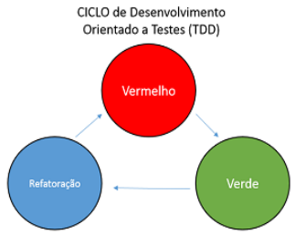

Com relação às regras e boas práticas de TDD e ao seu ciclo, é correto afirmar que: 

a) pode-se escrever testes que não compilam na etapa vermelha; 

b) na etapa verde deve-se escrever código que testa uma funcionalidade a fundo de forma criteriosa e detalhada; 

c) código novo só é escrito se um teste automatizado passar; 

d) a duplicação é tolerada na etapa de refatoração; 

e) é uma boa prática de TDD iniciar o desenvolvimento do código de uma funcionalidade e, logo em seguida, testá-la. 

**Comentários:** 

|ETAPA|DESCRIÇÃO|
|---|---|
|VERMELHO (RED)|Escreva um teste que falha: casos de teste são escritos sem que exista o recurso a ser testado,levando o teste a falhar;|
|VERDE (GREEN)|Escreva código para passar no teste: o recurso é implementado com o mínimo de código necessárioparaquepasse no teste.|
|REFATORAR (REFACTOR)|Elimine redundâncias: o código que implementa o recurso é refinado e melhorado, semque seja adicionada novas funcionalidades.|

---

<!-- pagina: 63 -->

**Diego Carvalho, Equipe Informática 2 (Diego Carvalho), Equipe Informática 1 (Diego Carvalho) Aula 04** 

(a) Correto. Nessa etapa, o objetivo do desenvolvedor é escrever um pequeno teste que não funcione e que talvez nem mesmo compile inicialmente; (b) Errado. Nessa etapa, escreve-se o código que apenas passa no teste, sem necessidade de aprofundamento em detalhes de implementação; (c) Errado. O código novo é escrito para o teste automatizado passar; (d) Errado. Não é tolerada a duplicação, uma vez que o objetivo é eliminar redundâncias e melhorar o código; (e) Errado. Vimos centenas de vezes que o primeiro passo é criar o teste e depois escrever. 

**Gabarito:** Letra A 

- **38.(IADES / EBSERH – 2013)** Assinale a alternativa que não corresponde a uma das fases do processo de desenvolvimento, dirigido a testes (TDD). 

a) Executar o teste, com os outros testes implementados, que rodarão e fornecerão o resultado de que o software está sem problemas. 

b) Escrever o teste para a funcionalidade e implementação. 

c) Realizar a identificação do incremento de funcionalidade. 

d) Implementar a funcionalidade e executar novamente o teste. 

e) Implementar a próxima parte da funcionalidade, após todos os testes terem sido executados, com sucesso 

##### **Comentários:** 

(a) Errado. Na terceira fase, executa-se realmente o teste junto com todos os outros testes implementados. No entanto, inicialmente você não terá implementado a funcionalidade, logo o novo teste falhará; (b) Correto, essa é a segunda fase; (c) Correto, essa é a primeira fase; (d) Correto, essa é a quarta fase; (e) Correto, essa é a quinta fase. 

**Gabarito:** Letra A 

- **39.(PR-4 / UFRJ – 2018)** O ciclo do TDD - Test Driven Development, ou, em português, Desenvolvimento Guiado por Testes consiste em: 

a) implementar teste unitário falho, tornar o teste bem-sucedido e refatorar. 

b) implementar a funcionalidade, executar teste unitário e refatorar. 

c) implementar teste unitário falho, refatorar e tornar o teste bem-sucedido. 

d) implementar a funcionalidade, refatorar e tornar o teste bem-sucedido. 

e) refatorar, executar teste unitário e implementar a funcionalidade. 

##### **Comentários:** 

(a) Correto, as atividades são exatamente essas e nessa ordem; (b) Errado, o teste vem antes da implementação da funcionalidade; (c) Errado, primeiro você torna o teste bem sucedido e depois

---

<!-- pagina: 64 -->

**Diego Carvalho, Equipe Informática 2 (Diego Carvalho), Equipe Informática 1 (Diego Carvalho) Aula 04** 

refatora; (d) Errado, não faz sentido refatorar antes do teste; (e) Errado, não faz sentido refatorar antes do teste. 

**Gabarito:** Letra A 

- **40.(CESPE / STJ – 2015)** Um dos passos executados no ciclo de atividades do processo TDD é a criação de novos testes para as falhas encontradas no código original, sem alteração deste. 

##### **Comentários:** 

Nooooope... testes devem realmente encontrar falhas – o que se altera é o código para passar no teste e, não, o teste em si. 

**Gabarito:** Errado 

- **41.(CS-UFG / AL-GO – 2015)** O desenvolvimento dirigido a testes (TDD, do Inglês Test-Driven Development) é uma abordagem de desenvolvimento de software na qual se intercalam testes e desenvolvimento de código. Uma das características da abordagem TDD é: 

a) a sua utilidade no desenvolvimento de softwares novos. 

- b) o maior custo associado aos testes de regressão. 

- c) a redução da importância da automatização dos testes. 

d) a sua adequação a processos de software sequenciais. 

##### **Comentários:** 

(a) Correto. Ela é mais ideal para o desenvolvimento de softwares novos; (b) Errado, ela reduz custos de testes de regressão; (c) Errado, ela aumenta a importância da automatização de testes; (d) Errado, ela é adequada a processos iterativos – lembrem-se do ciclo de testes, falhas e refatorações. 

**Gabarito:** Letra A 

- **42.(UECE-CEV / FUNCEME – 2018)** Test-driven Development (TDD) é uma abordagem para o desenvolvimento de programas em que se intercalam testes e desenvolvimento de código 

(Sommerville, I. Engenharia de Software, 9a edição, 2011). 

A respeito do TDD, é correto afirmar que: 

a) consiste em um processo iterativo que se inicia escrevendo um código de uma funcionalidade do sistema e, logo em seguida, testa-o para saber se a implementação foi correta. 

b) apesar de útil, não diminui o custo de testes de regressão do sistema. 

c) sua utilização elimina a necessidade de testes de validação do sistema, uma vez que ele já foi testado incrementalmente.

---

<!-- pagina: 65 -->

**Diego Carvalho, Equipe Informática 2 (Diego Carvalho), Equipe Informática 1 (Diego Carvalho) Aula 04** 

d) apesar de ter sido apresentado como parte dos métodos ágeis, também pode ser usado em outros processos de desenvolvimento de software. 

##### **Comentários:** 

(a) Errado, inicia-se escrevendo o teste; (b) Errado, diminui – sim – os custos de testes de regressão; (c) Errado, não elimina em nenhuma hipótese testes de validação/aceitação; (d) Correto, ele pode ser utilizado com métodos ágeis ou tradicionais. 

**Gabarito:** Letra D 

- **43.(FAUGRS / UFRGS – 2018)** ______________ é uma abordagem para o desenvolvimento de programas em que se intercalam testes e desenvolvimento de código. Essencialmente, desenvolve-se um código de forma incremental em conjunto com um teste para este incremento. Não se avança para o próximo incremento até que o código desenvolvido passe no teste. Essa abordagem foi introduzida como parte de métodos ágeis, mas pode ser também usada em processos de desenvolvimento dirigido a planos. Assinale a alternativa que preenche corretamente a lacuna do texto acima. 

   - a) Desenvolvimento Guiado por Testes (TDD) 

   - b) Desenvolvimento em Espiral 

   - c) Engenharia Dirigida a Modelos (MDD) 

   - d) Rational Unified Process (RUP) 

   - e) Teste de Sistema 

##### **Comentários:** 

TDD é uma **<u>abordagem para o desenvolvimento</u>** de programas em que se **<u>intercalam testes e</u>** <u>.</u> **<u>desenvolvimento de código</u>** Essencialmente, desenvolve-se um código de forma incremental em conjunto com um teste para este incremento. Não se avança para o próximo incremento até que o código desenvolvido passe no teste. Essa abordagem foi introduzida como parte de métodos ágeis, mas pode ser também usada em processos de desenvolvimento dirigido a planos. 

**Gabarito:** Letra A 

- **44.(VUNESP / TCE-SP – 2015)** No Desenvolvimento Orientado a Testes (TDD), os casos de teste que definem o recurso a ser implementado devem ser elaborados: 

   - a) assim que o código do teste estiver pronto. 

   - b) antes de o código do recurso ser desenvolvido. 

   - c) após o código do recurso ter sido completamente documentado. 

   - d) simultaneamente com o desenvolvimento do código do recurso. 

   - e) somente se o código do recurso apresentar erros.

---

<!-- pagina: 66 -->

**Diego Carvalho, Equipe Informática 2 (Diego Carvalho), Equipe Informática 1 (Diego Carvalho) Aula 04** 

##### **Comentários:** 

(a) Errado, os casos de testes já devem estar prontos antes do código do teste ser feito; (b) Correto, devem ser elaborados antes de o código do recurso ser desenvolvido; (c) Errado, não existe o conceito de documentação formal, os próprios testes agem como uma forma de documentação que descreve o que o código deve fazer; (d) Errado, as etapas de desenvolvimento do código do recurso e a implementação dos casos de testes ocorrem em etapas distintas e não concomitantes; (e) Errado, casos de testes sempre são implementados porque eles representam a funcionalidade a ser desenvolvida. 

**Gabarito:** Letra B 

- **45.(IBFC / EMBASA – 2017)** No Ciclo de Desenvolvimento do TDD (Test-Driven Development), utiliza-se a estratégia que aplica três palavras-chaves (em inglês), que é denominada: 

a) Red, Green, Refactor 

b) White, Gray, Black 

c) White, Black, Refactor 

d) Green, Yellow, Red 

##### **Comentários:** 

|ETAPA|DESCRIÇÃO|
|---|---|
|VERMELHO (RED)|Escreva um teste que falha: casos de teste são escritos sem que exista o recurso a ser testado,levando o teste a falhar;|
|VERDE (GREEN)|Escreva código para passar no teste: o recurso é implementado com o mínimo de código necessárioparaquepasse no teste.|
|REFATORAR (REFACTOR)|Elimine redundâncias: o código que implementa o recurso é refinado e melhorado, semque seja adicionada novas funcionalidades.|

Trata-se do RED > GREEN > REFACTOR. 

**Gabarito:** Letra A 

**46.(FCC / CREMESP – 2016)** Considere a figura abaixo que apresenta duas abordagens de teste. 

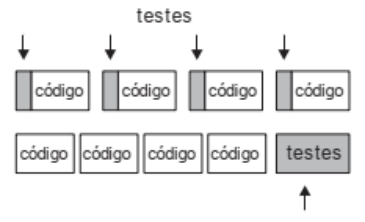

---

<!-- pagina: 67 -->

**Diego Carvalho, Equipe Informática 2 (Diego Carvalho), Equipe Informática 1 (Diego Carvalho) Aula 04** 

A figura: 

- a) ilustra as duas fases do TDD, que correspondem a escrever pequenos testes e testá-los no final. 

- b) mostra o ciclo conhecido como Vermelho-Verde-Refatora. 

- c) apresenta a diferença entre testes automatizados e testes manuais no XP. 

- d) mostra que um desenvolvedor que pratica TDD tem mais feedbacks do que um que escreve testes ao final. 

- e) evidencia que TDD é impraticável, pois o desenvolvedor gasta muito tempo escrevendo código de testes. 

##### **Comentários:** 

_Qual é a diferença entre a abordagem superior e inferior?_ Na parte superior, testes são aplicados individualmente em cada unidade de código. Na parte inferior, todos os códigos foram escritos e, somente depois, foram testados. Logo, existem mais feedbacks na abordagem superior (TDD) do que na abordagem inferior. 

**Gabarito:** Letra D 

- **47.(CESPE / ANATEL – 2014)** Em se tratando de desenvolvimento de softwares dirigidos a testes (TDD), a execução dos testes é realizada antes da implementação da funcionalidade. 

##### **Comentários:** 

Perfeito! A execução dos testes de realmente ocorrem antes da implementação da funcionalidade. 

**Gabarito:** Correto 

- **48.(CESPE / TC-DF – 2014)** No TDD, o refatoramento do código deve ser realizado antes de se escrever a aplicação que deve ser testada. 

##### **Comentários:** 

_Opaaaaa... como você vai refatorar um código que ainda não foi escrito?_ Não faz sentido! 

**Gabarito:** Errado 

- **49.(CESPE / STJ – 2015)** No método de desenvolvimento TDD (Test Driven Development), o desenvolvedor escreve primeiro um caso de teste e, posteriormente, o código. 

##### **Comentários:**

---

<!-- pagina: 68 -->

**Diego Carvalho, Equipe Informática 2 (Diego Carvalho), Equipe Informática 1 (Diego Carvalho) Aula 04** 

Perfeito! Esse é o conceito do _test-first_ , isto é, o desenvolvedor escreve primeiro um caso de teste e, posteriormente, o código. 

**Gabarito:** Correto 

- **50.(CESPE / MPE-PI – 2018)** O TDD possibilita o desenvolvimento de softwares fundamentado em testes. O ciclo de desenvolvimento do TDD segue os seguintes passos: 

   - escrever um teste que inicialmente não passa; 

   - adicionar uma nova funcionalidade do sistema; 

   - fazer o teste passar; 

   - realizar a integração contínua do código; 

   - escrever o próximo teste. 

##### **Comentários:** 

A ordem realmente está correta, no entanto há uma pegadinha: na quarta etapa, realiza-se a refatoração do código e, não, a integração contínua. 

**Gabarito:** Errado 

**51. (FCC / Prefeitura de Teresina-PI – 2016)** O Test Driven Development – TDD é uma das práticas sugeridas na eXtreme Programming − XP, onde o programador escreve o teste antes de escrever o código. O ciclo de desenvolvimento utilizando TDD é mostrado abaixo. 

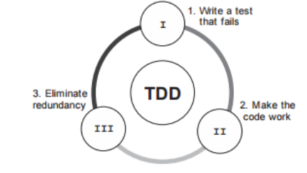

Considere: 

- I. Etapa inicial, onde se escreve um teste que falha, para alguma funcionalidade que ainda será Escrita. 

II. Já com o teste criado, é o momento de executar o teste. 

III. Eliminar códigos redundantes, remover acoplamentos, enfim, identificar pontos de melhoria no código. 

As etapas I, II e III são, respectivamente, 

a) Iniciação, Execução e Controle.

---

<!-- pagina: 69 -->

**Diego Carvalho, Equipe Informática 2 (Diego Carvalho), Equipe Informática 1 (Diego Carvalho) Aula 04** 

b) Red, Green e Refactor. 

c) Iniciação, Atuação e Otimização. 

d) Plan, Do e Check. 

- e) Planejamento, Execução e Melhoria. 

##### **Comentários:** 

|ETAPA|DESCRIÇÃO|
|---|---|
|VERMELHO (RED)|Escreva um teste que falha: casos de teste são escritos sem que exista o recurso a ser testado,levando o teste a falhar;|
|VERDE (GREEN)|Escreva código para passar no teste: o recurso é implementado com o mínimo de código necessárioparaquepasse no teste.|
|REFATORAR (REFACTOR)|Elimine redundâncias: o código que implementa o recurso é refinado e melhorado, semque seja adicionada novas funcionalidades.|

(RED) Etapa inicial, onde se escreve um teste que falha, para alguma funcionalidade que ainda será Escrita; (GREEN) Já com o teste criado, é o momento de executar o teste; (REFACTOR) Eliminar códigos redundantes, remover acoplamentos, enfim, identificar pontos de melhoria no código. 

**Gabarito:** Letra B 

**52. (FAUGRS / BANRISUL – 2018)** Considere as ações abaixo, executadas em desenvolvimento orientado a testes, Test-Driven Design (TDD). 

I - Escrever código de teste. 

II - Verificar se o teste falha. 

III - Escrever código de produção. 

IV - Executar teste até passar (reescrevendo o código de produção, se for necessário, até que o teste passe). 

V - Refatorar código de produção e/ou de teste para melhorá-lo. 

Considerando que se deseja incluir um novo caso de teste, assinale a alternativa que apresenta a sequência de ações que devem obrigatoriamente ocorrer para essa inclusão, segundo o TDD. 

a) I, III e IV. 

b) III, I e IV. c) I, II, III e IV. d) I, III, IV e V. e) I, II, III, IV e V. 

##### **Comentários:**

---

<!-- pagina: 70 -->

**Diego Carvalho, Equipe Informática 2 (Diego Carvalho), Equipe Informática 1 (Diego Carvalho) Aula 04** 

A ordem correta é: (I) Escrever código de teste; (II) Verificar se o teste falha; (III) Escrever código de produção; (IV) Executar teste até passar (reescrevendo o código de produção, se for necessário, até que o teste passe); (V) Errado, essa não é uma ação obrigatória – como apresenta o enunciado. 

**Gabarito:** Letra C 

**53. (FGV / IBGE – 2017)** Test Driven Development (TDD) é uma prática muito utilizada no processo de desenvolvimento de sistemas computacionais. Analise as afirmativas a seguir sobre o uso da prática de TDD: 

I. Tornam os testes de regressão mais demorados porque o desenvolvedor precisará fazer testes manuais várias vezes por dia. 

II. Garante que os requisitos do sistema sejam atendidos porque o desenvolvedor escreverá o código de testes sempre que acabar a implementação do código do sistema. 

III. Ajuda o desenvolvedor a escrever código de qualidade porque ele gastará parte do seu tempo escrevendo código de testes. 

Está correto o que se afirma em: 

a) somente I; 

b) somente II; 

c) somente III; 

d) somente II e III; 

e) I, II e III. 

##### **Comentários:** 

(I) Errado. De acordo com Ian Sommerville, um dos benefícios mais importantes de desenvolvimento dirigido a testes é que ele reduz os custos dos testes de regressão, uma vez que testes automatizados – fundamentais para o desenvolvimento _test-first_ – reduzem drasticamente os custos com testes de regressão; (II) Errado. O desenvolver escreverá o código de testes antes de acabar a implementação do código do sistema; (III) Correto. O TDD realmente ajuda o desenvolvedor a escrever código de qualidade porque ele gastará parte do seu tempo escrevendo código de testes. 

**Gabarito:** Letra C 

- **54.(CESPE / ANATEL – 2014)** Na atividade de TDD (test-driven development), a escrita de teste primeiro define implicitamente tanto uma interface quanto uma especificação do comportamento para a funcionalidade que está sendo desenvolvida, estando, entretanto, a

---

<!-- pagina: 71 -->

**Diego Carvalho, Equipe Informática 2 (Diego Carvalho), Equipe Informática 1 (Diego Carvalho) Aula 04** 

viabilidade do uso dessa abordagem limitada aos processos de desenvolvimento de software que seguem as práticas ágeis. 

##### **Comentários:** 

Opa... a interface deve ser definida explicitamente! Além disso, conforme afirma Ian Sommerville, ele também pode ser utilizado em processos de desenvolvimento dirigido a planos (tradicionais) e, não só, aos ágeis. 

**Gabarito:** Errado 

**55. (CESPE / TRE-MT – 2015)** Considere as seguintes etapas de um processo do tipo desenvolvimento orientado a testes (TDD). 

I Implementar funcionalidade e refatorar. 

II Identificar nova funcionalidade. 

III Executar o teste. 

IV Escrever o teste. 

V Implementar a próxima parte da funcionalidade. 

Assinale a opção que apresenta a sequência correta em que essas etapas devem ser realizadas. 

a) I; IV; III; II; V 

b) IV; III; II; I; V 

c) I; IV; II; III; V 

d) II; IV; III; I; V 

e) IV; II; III; I; V 

##### **Comentários:** 

A ordem correta é: (II) Identificar nova funcionalidade; (IV) Escrever o teste; (III) Executar o teste; (I) Implementar funcionalidade e refatorar; (V) Implementar a próxima parte da funcionalidade. 

**Gabarito:** Letra D 

- **56.(FCC / SEFAZ-SC – 2018)** O Test-Driven Development (TDD) é uma abordagem para o desenvolvimento de programas em que se intercalam testes e desenvolvimento de código. As etapas do processo fundamental de TDD são mostradas abaixo em ordem alfabética: 

   - I. Escrever um teste para a funcionalidade identificada e implementá-lo como um teste automatizado.

---

<!-- pagina: 72 -->

**Diego Carvalho, Equipe Informática 2 (Diego Carvalho), Equipe Informática 1 (Diego Carvalho) Aula 04** 

II. Executar o teste, junto com os demais testes já implementados, sem implementar a nova funcionalidade no código. 

III. Identificar e implementar uma outra funcionalidade, após todos os testes serem executados com sucesso. 

IV. Identificar uma nova funcionalidade pequena para ser incrementada com poucas linhas em um código. 

- V. Implementar a nova funcionalidade no código e reexecutar o teste. 

VI. Refatorar o código com melhorias incrementais até que o teste execute sem erros. 

VII. Revisar a funcionalidade e o teste, caso o código execute sem falhar. 

Considerando o item IV a primeira etapa e o item III a última etapa, a sequência intermediária correta das etapas do processo é: 

a) I − II − VII − V e VI. 

b) I − V − II − VII e VI. 

c) I − VI − V − VII e II. 

d) V − I − II − VII e VI. 

e) V − I − VI − VII e II. 

##### **Comentários:** 

São somente cinco etapas: I. Escrever um teste para a funcionalidade identificada e implementá-lo como um teste automatizado; II. Executar o teste, junto com os demais testes já implementados, sem implementar a nova funcionalidade no código; VII. Revisar a funcionalidade e o teste, caso o código execute sem falhar; V. Implementar a nova funcionalidade no código e reexecutar o teste; VI. Refatorar o código com melhorias incrementais até que o teste execute sem erros. 

**Gabarito:** Letra A

---

<!-- pagina: 73 -->

**Diego Carvalho, Equipe Informática 2 (Diego Carvalho), Equipe Informática 1 (Diego Carvalho) Aula 04** 

## **– LISTA DE QUESTÕES DIVERSAS BANCAS** 

**1. (CESGRANRIO / IPEA – 2024)** Uma gerente de testes de software propôs a seu time de desenvolvimento que começasse a aplicar a abordagem Test Driven Development (TDD). É uma das características principais dessa abordagem iniciar o desenvolvimento de testes: 

a) antes de implementar alguma funcionalidade em si. 

- b) durante o período de homologação. 

- c) após as funcionalidades serem construídas. 

- d) quando a primeira leva de funcionalidades planejadas forem codificadas em algum sprint. 

e) pelos testes de interface automatizado, seguidos pelos testes unitários. 

**2. (CESPE / INPI – 2024)** O desenvolvimento dirigido por testes (TDD) é modelado em três estados: vermelho, verde e refatorar. Um exemplo da ação de refatoração é a simulação do comportamento dos componentes que interagem com a unidade de teste que está falhando. 

**3. (CESPE / CNPq – 2024)** O TDD é uma tendência que enfatiza o projeto de casos de teste antes da criação do código fonte e se caracteriza como parte do modelo ágil de desenvolvimento de software. 

**4. (CESPE / CNPq – 2024)** No TDD, o teste deve ser criado com o objetivo de fazer o segmento de código falhar, gerando-se um processo iterativo que permite a submissão de muitas subfunções simultaneamente, o que confere uma agilidade significativa ao processo. 

**5. (CESPE / AGER-MT – 2023)** Assinale a opção que corresponde ao método de teste de software adotado, sob a perspectiva do desenvolvedor, a partir de casos de teste do código, escritos em linguagem técnica, para testar as funcionalidades antes da implementação da solução desenvolvida: 

a) unit testing 

b) TDD 

c) BDD 

d) ATDD 

e) teste de caixa preta 

**6. (CESPE / TC-DF – 2023)** Na etapa de refactor do processo TDD, parte-se do pressuposto de que os testes tenham passado nas fases anteriores, o que permite que o código seja aprimorado sem a preocupação de duplicações de código. 

**7. (CESPE / EMPREL – 2023)** Ao adotar uma prática ágil para a criação de um software, seu desenvolvedor optou pela implementação com qualidade de uma funcionalidade do sistema; para isso, escreveu um caso de teste automatizado, com base nos requisitos especificados, e realizou testes de unidade em uma linguagem similar à usada no desenvolvimento da

---

<!-- pagina: 74 -->

**Diego Carvalho, Equipe Informática 2 (Diego Carvalho), Equipe Informática 1 (Diego Carvalho) Aula 04** 

funcionalidade. Da situação hipotética precedente infere-se que a prática adotada pelo desenvolvedor está associada ao: 

##### a) desenvolvimento orientado por comportamento (BDD). 

   - b) gerenciamento de produtos com Scrum. 

   - c) desenvolvimento guiado por testes (TDD). 

   - d) desenvolvimento guiado por testes de aceitação (ATDD). 

   - e) gerenciamento de produtos com Kanban. 

**8. (FGV / SEFAZ-MG – 2023)** Você entrou para um projeto novo, já em andamento, no qual a metodologia que a equipe do projeto segue é a de definir e escrever testes de software a partir das regras de negócio antes mesmo de implementar as funcionalidades propostas. Assinale a opção que indica o nome desse processo de desenvolvimento de software: 

a) DDD 

b) TDD 

c) BDD 

d) XP 

e) Scrum 

**9. (FGV / BB – 2023)** O desenvolvimento orientado a testes (TDD) é um processo que se baseia na repetição em ciclos de desenvolvimento curtos. Ele é baseado no conceito test-first oriundo da programação extrema (XP) que incentiva o design simples com alto nível de confiança. O procedimento que conduz este ciclo é denominado: 

a) refatoração vermelho-verde. 

   - b) documentação executável. 

   - c) testes da caixa-branca. 

   - d) testes da caixa-preta. 

   - e) mocking up. 

- **10.(FGV / Senado Federal – 2022)** Você foi contratado para liderar uma equipe de DevOps. Um dos objetivos da sua liderança é aumentar a velocidade das entregas e a qualidade de novos recursos das aplicações utilizando o desenvolvimento orientado a testes. Assinale a opção que apresenta a ordem que descreve o ciclo de desenvolvimento orientado a testes. 

a) Refatorar - > Escrever um código funcional 

b) Escrever um caso de teste -> Refatorar 

c) Refatorar - > Escrever um código funcional - > Escrever um caso de teste 

d) Escrever um caso de teste -> Escrever um código funcional -> Refatorar 

e) Escrever um código funcional -> Escrever um caso de teste -> Refatorar

---

<!-- pagina: 75 -->

**Diego Carvalho, Equipe Informática 2 (Diego Carvalho), Equipe Informática 1 (Diego Carvalho) Aula 04** 

- **11.(CESPE / BANRISUL – 2022)** No processo de TDD, o código é desenvolvido em grandes blocos de requisitos do usuário. Cada iteração resulta em um novo teste, que faz parte um conjunto de testes de regressão executado no final do processo de integração. 

- **12.(CESPE / BANRISUL – 2022)** O TDD (Test-Driven Development) é uma metodologia que, ao longo do tempo, implica que o aplicativo em desenvolvimento tenha um conjunto abrangente de testes que ofereça confiança no que foi desenvolvido até então. 

**13. (CESPE / BANRISUL – 2022)** O TDD (Test-Driven Development), como atividade da XP, é uma forma disciplinada de organizar o código, alterando-o de modo a aprimorar sua estrutura interna, sem que se altere o comportamento externo do software. 

- **14.(FGV / SEFAZ-MG – 2023)** Você entrou para um projeto novo, já em andamento, no qual a metodologia que a equipe do projeto segue é a de definir e escrever testes de software a partir das regras de negócio antes mesmo de implementar as funcionalidades propostas. Assinale a opção que indica o nome desse processo de desenvolvimento de software. 

a) DDD 

b) TDD 

c) BDD 

d) XP 

e) Scrum 

**15. (FGV / Senado Federal – Análise de Sistemas – 2022)** Durante o processo de construção de software, a metodologia de Desenvolvimento Orientado a Testes é muito aplicada. 

A ordem utilizada na prática do TDD é: 

a) escrever a funcionalidade após escrever os testes unitários e, por fim, refatorar o código implementado. 

b) escrever os testes unitários após escrever a funcionalidade e, por fim, refatorar o código implementado. 

c) escrever a funcionalidade após refatorar o código implementado e por fim escrever os testes unitários. 

d) escrever os testes unitários após escrever a funcionalidade e, por fim, escrever os testes de integração. 

e) escrever os testes de integração após escrever a funcionalidade e, por fim, refatorar o código. 

- **16.(CESPE / SERPRO – 2021)** Em TDD, os testes de um sistema devem ocorrer antes da implementação e ser oportunos, isolados e autoverificáveis.

---

<!-- pagina: 76 -->

**Diego Carvalho, Equipe Informática 2 (Diego Carvalho), Equipe Informática 1 (Diego Carvalho) Aula 04** 

**17. (CESPE / INMETRO / 2009)** A rotina diária dos desenvolvedores, ao empregar processos baseados no TDD (Test-Driven Development), é concentrada na elaboração de testes de homologação. 

- **18.(CESPE / INPI / 2013)** Usando-se o TDD, as funcionalidades devem estar completas e da forma como serão apresentadas aos seus usuários para que possam ser testadas e consideradas corretas. 

- **19.(CESPE / ANCINE / 2013)** No desenvolvimento de software conforme as diretivas do TDD (TestDriven Development), deve-se elaborar primeiramente os testes e, em seguida, escrever o código necessário para passar pelos testes. 

- **20.(CESPE / INMETRO / 2009)** Considerando uma organização na qual a abordagem de Test Driven Development (TDD) esteja implementada, assinale a opção correta. 

   - a) Nessa organização, ocorre a execução de iterações com ciclo longo, isto é, com duração de alguns meses. 

b) No início de cada iteração, a primeira atividade realizada pela equipe de desenvolvimento é produzir o código que será validado através de testes. 

c) O refactoring é uma das primeiras atividades realizada no início de cada iteração. 

   - d) Entre as atividades finais de cada iteração, o desenvolvedor escreve casos de teste automatizados, cuja execução verifica se houve a melhoria desejada ou se uma nova funcionalidade foi implementada. 

   - e) Há coerência e inter-relação com os princípios promovidos pela prática da extreme programming (XP). 

- **21.(CESPE / MPOG / 2013)** Ao realizar o TDD (test-driven development), o programador é conduzido a pensar em decisões de design antes de pensar em código de implementação, o que cria um maior acoplamento, uma vez que seu objetivo é pensar na lógica e nas responsabilidades de cada classe. 

- **22.(CESPE / MPU – 2013)** Na metodologia TDD, ou desenvolvimento orientado a testes, cada nova funcionalidade inicia com a criação de um teste, cujo planejamento permite a identificação dos itens e funcionalidades que deverão ser testados, quem são os responsáveis e quais os riscos envolvidos. 

**23. (CESPE / STF – 2013)** No TDD, o primeiro passo do desenvolvedor é criar o teste, denominado teste falho, que retornará um erro, para, posteriormente, desenvolver o código e aprimorar a codificação do sistema.

---

<!-- pagina: 77 -->

**Diego Carvalho, Equipe Informática 2 (Diego Carvalho), Equipe Informática 1 (Diego Carvalho) Aula 04** 

- **24.(CESPE / TRT-17 – 2013)** TDD consiste em uma técnica de desenvolvimento de software com abordagem embasada em perspectiva evolutiva de seu desenvolvimento. Essa abordagem envolve a produção de versões iniciais de um sistema a partir das quais é possível realizar verificações de suas qualidades antes que ele seja construído. 

**25. (CESPE / ALRN – 2013)** Um típico ciclo de vida de um projeto em TDD consiste em: 

   - I. Executar os testes novamente e garantir que estes continuem tendo sucesso. 

   - II. Executar os testes para ver se todos estes testes obtiveram êxito. 

   - III. Escrever a aplicação a ser testada. 

   - IV. Refatorar (refactoring). 

   - V. Executar todos os possíveis testes e ver a aplicação falhar. 

   - VI. Criar o teste. 

A ordem correta e cronológica que deve ser seguida para o ciclo de vida do TDD está expressa em: 

a) IV − III − II − V − I − VI. 

b) V − VI − II − I − III − IV. 

c) VI − V − III − II − IV − I. 

d) III − IV − V − VI − I − II. 

e) III − IV − VI − V − I − II. 

- **26.(FGV / ALMT – 2013)** Com relação ao desenvolvimento orientado (dirigido) a testes (do Inglês Test Driven Development – TDD), analise as afirmativas a seguir. 

   - I. TDD é uma técnica de desenvolvimento de software iterativa e incremental. 

II. TDD implica escrever o código de teste antes do código de produção, um teste de cada vez, tendo certeza de que o teste falha antes de escrever o código que irá fazê-lo passar. 

III. TDD é uma técnica específica do processo XP (Extreme Programming), portanto, só pode ser utilizada em modelos de processos ágeis de desenvolvimento de software. 

Assinale: 

a) Se somente as afirmativas I e II estiverem corretas. 

b) Se somente as afirmativas I e III estiverem corretas. 

c) Se somente as afirmativas II e III estiverem corretas. 

d) Se somente a afirmativa III estiver correta. 

e) Se somente a afirmativa I estiver correta.

---

<!-- pagina: 78 -->

**Diego Carvalho, Equipe Informática 2 (Diego Carvalho), Equipe Informática 1 (Diego Carvalho) Aula 04** 

**27. (FCC / TRT-MG – 2015)** Um analista de TI está participando do desenvolvimento de um software orientado a objetos utilizando a plataforma Java. Na abordagem de desenvolvimento adotada, o código é desenvolvido de forma incremental, em conjunto com o teste para esse incremento, de forma que só se passa para o próximo incremento quando o atual passar no teste. Como o código é desenvolvido em incrementos muito pequenos e são executados testes a cada vez que uma funcionalidade é adicionada ou que o programa é refatorado, foi necessário definir um ambiente de testes automatizados utilizando um framework popular que suporta o teste de programas Java. 

A abordagem de desenvolvimento adotada e o framework de suporte à criação de testes automatizados são, respectivamente, 

a) Behavior-Driven Development e JTest. 

- b) Extreme Programming e Selenium. 

c) Test-Driven Development e Jenkins. 

   - d) Data-Driven Development and Test e JUnit. 

   - e) Test-Driven Development e JUnit. 

- **28.(CESPE / TRE-PE – 2017)** O desenvolvimento orientado a testes (TDD): 

a) é um conjunto de técnicas que se associam ao XP (extreme programming) para o desenvolvimento incremental do código que se inicia com os testes. 

b) agrega um conjunto de testes de integração para avaliar a interconexão dos componentes do software com as aplicações a ele relacionadas. 

c) avalia o desempenho do desenvolvimento de sistemas verificando se o volume de acessos/transações está acima da média esperada. 

d) averigua se o sistema atende aos requisitos de desempenho verificando se o volume de acessos/transações mantém-se dentro do esperado. 

e) testa o sistema para verificar se ele foi desenvolvido conforme os padrões e a metodologia estabelecidos nos requisitos do projeto. 

- **29.(CESPE / STM – 2018)** O TDD (test driven development) parte de um caso de teste que caracteriza uma melhoria desejada ou nova funcionalidade a ser desenvolvida, de modo a confirmar o comportamento correto e possibilitar a evolução ou refatoração do código. 

- **30.(CESPE / TRE/PI – 2016)** O TDD (test driven development): 

a) apresenta como vantagem a leitura das regras de negócio a partir dos testes, e, como desvantagem, a necessidade de mais linhas de códigos que a abordagem tradicional, o que gera um código adicional.

---

<!-- pagina: 79 -->

**Diego Carvalho, Equipe Informática 2 (Diego Carvalho), Equipe Informática 1 (Diego Carvalho) Aula 04** 

b) impede que seja aplicada a prática de programação em pares, que é substituída pela interação entre analista de teste, testador e programador. 

c) é um conjunto de técnicas associadas ao eXtremme Programing e a métodos ágeis, sendo, contudo, incompatível com o Refactoring, haja vista o teste ser escrito antes da codificação. 

d) refere-se a uma técnica de programação cujo principal objetivo é escrever um código funcional limpo, a partir de um teste que tenha falhado. 

e) refere-se a uma metodologia de testes em que se devem testar condições, loops e operações; no entanto, por questão de simplicidade, não devem ser testados polimorfismos. 

**31. (UFRRJ / UFRRJ – 2015)** Os testes de unidade têm papel central na metodologia de implementação dirigida por testes, popularizada pelo processo XP e adotada em outros métodos. Esses testes são criados primeiro, exercitando o contrato de cada operação implementada pelos métodos. Em seguida, o código dos métodos é escrito para cumprir os contratos e, portanto, passar nos testes de unidade. Esse cenário corresponde à abordagem 

a) TDD. 

b) MDD. 

c) DDC. 

d) MDE. 

e) FDD. 

**32. (FCC / TRE-PR – 2017)** Considere o ciclo do Test-Driven Development – TDD. 

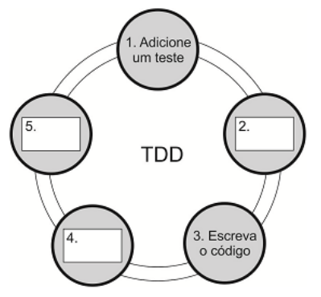

A Caixa: 

a) 2. corresponde a “Execute os testes automatizados”. b) 4. corresponde a “Refatore o código”. 

c) 5. corresponde a “Execute os testes novamente e observe os resultados”.

---

<!-- pagina: 80 -->

**Diego Carvalho, Equipe Informática 2 (Diego Carvalho), Equipe Informática 1 (Diego Carvalho) Aula 04** 

d) 4. corresponde a “Execute os testes automatizados”. 

e) 5. corresponde a “Faça todos os testes passarem”. 

**33. (IESES / TRE/MA – 2015)** A respeito da técnica de testes TDD é correto afirmar que: 

   - a) Testa o software com base no comportamento esperado. 

b) É uma prática para desenvolvimento de testes unitário que pode utilizar o processo RedGreen-Refactor. 

   - c) Utiliza-se da estrutura Dado, Quando e Então para montar os testes. 

   - d) Prega que os testes devem ser realizados sempre após a implementação ser concluída. 

- **34.(CESPE / TRE/RS – 2015)** Projeto para o desenvolvimento de software que utilize TDD deve: 

   - a) realizar sprints a cada quinzena. 

   - b) desenvolver pequenos releases. 

   - c) apresentar grande quantidade de testes unitários de código-fonte previamente desenvolvidos. 

   - d) apresentar linguagem de programação estruturada. 

   - e) recomendar a preparação dos testes para que, posteriormente, seja desenvolvido o código. 

**35. (FCC / TRE/AP – 2015)** O TDD − Test Driven Development (Desenvolvimento orientado a teste): 

a) é parte das metodologias ágeis UP − Unified Process e XP − Extreme Programming, tendo sido criado para ser usado em metodologias que respeitam os 4 princípios do Manifesto Ágil. 

b) transforma o desenvolvimento, pois deve-se primeiro implementar o sistema antes de escrever os testes. Os testes são utilizados para facilitar no entendimento do projeto e para clarear o que se deseja em relação ao código. 

- c) baseia-se em um ciclo simples: escreve-se um código -> cria-se um teste para passar no código -> refatora-se. 

d) propõe a criação de testes que validem o código como um todo para reduzir o tempo de desenvolvimento. 

e) beneficia-se de testes que seguem o modelo FIRST: F (Fast) I (Isolated) R (Repeatable) S (Selfverifying) T (Timely). 

- **36.(CESPE / TRE/TO – 2017)** O TDD (Test-Driven Development), que vem sendo adotado para testar os projetos de software, 

a) utiliza os testes de caixa preta antes da entrega do software. 

b) agiliza os testes por amostragem sem compatibilidade retroativa. 

c) cobre amplamente os testes unitários.

---

<!-- pagina: 81 -->

**Diego Carvalho, Equipe Informática 2 (Diego Carvalho), Equipe Informática 1 (Diego Carvalho) Aula 04** 

d) escreve o teste antes da codificação do software. 

   - e) realiza refactoring antes de escrever a aplicação a ser testada. 

**37. (FGV / IBGE – 2016)** O Desenvolvimento Orientado a Testes (TDD) é um método de desenvolvimento criado e disseminado por Kent Beck em seu livro “Test-driven development”. O método define regras, boas práticas e um ciclo de tarefas com 3 etapas: a etapa vermelha, a etapa verde e a etapa de refatoração, ilustrado na imagem abaixo: 

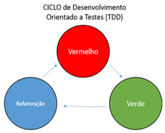

Com relação às regras e boas práticas de TDD e ao seu ciclo, é correto afirmar que: 

a) pode-se escrever testes que não compilam na etapa vermelha; 

b) na etapa verde deve-se escrever código que testa uma funcionalidade a fundo de forma criteriosa e detalhada; 

- c) código novo só é escrito se um teste automatizado passar; 

- d) a duplicação é tolerada na etapa de refatoração; 

e) é uma boa prática de TDD iniciar o desenvolvimento do código de uma funcionalidade e, logo em seguida, testá-la. 

- **38.(IADES / EBSERH – 2013)** Assinale a alternativa que não corresponde a uma das fases do processo de desenvolvimento, dirigido a testes (TDD). 

a) Executar o teste, com os outros testes implementados, que rodarão e fornecerão o resultado de que o software está sem problemas. 

   - b) Escrever o teste para a funcionalidade e implementação. 

   - c) Realizar a identificação do incremento de funcionalidade. 

   - d) Implementar a funcionalidade e executar novamente o teste. 

   - e) Implementar a próxima parte da funcionalidade, após todos os testes terem sido executados, com sucesso 

- **39.(PR-4 UFRJ / UFRJ – 2018)** O ciclo do TDD - Test Driven Development, ou, em português, Desenvolvimento Guiado por Testes consiste em: 

   - a) implementar teste unitário falho, tornar o teste bem-sucedido e refatorar. 

   - b) implementar a funcionalidade, executar teste unitário e refatorar.

---

<!-- pagina: 82 -->

**Diego Carvalho, Equipe Informática 2 (Diego Carvalho), Equipe Informática 1 (Diego Carvalho) Aula 04** 

c) implementar teste unitário falho, refatorar e tornar o teste bem-sucedido. 

d) implementar a funcionalidade, refatorar e tornar o teste bem-sucedido. 

e) refatorar, executar teste unitário e implementar a funcionalidade. 

- **40.(CESPE / STJ – 2015)** Um dos passos executados no ciclo de atividades do processo TDD é a criação de novos testes para as falhas encontradas no código original, sem alteração deste. 

- **41.(CS-UFG / AL-GO – 2015)** O desenvolvimento dirigido a testes (TDD, do Inglês Test-Driven Development) é uma abordagem de desenvolvimento de software na qual se intercalam testes e desenvolvimento de código. Uma das características da abordagem TDD é: 

a) a sua utilidade no desenvolvimento de softwares novos. 

   - b) o maior custo associado aos testes de regressão. 

   - c) a redução da importância da automatização dos testes. 

   - d) a sua adequação a processos de software sequenciais. 

- **42.(UECE-CEV / FUNCEME – 2018)** Test-driven Development (TDD) é uma abordagem para o desenvolvimento de programas em que se intercalam testes e desenvolvimento de código (Sommerville, I. Engenharia de Software, 9a edição, 2011). 

A respeito do TDD, é correto afirmar que: 

   - a) consiste em um processo iterativo que se inicia escrevendo um código de uma funcionalidade do sistema e, logo em seguida, testa-o para saber se a implementação foi correta. 

   - b) apesar de útil, não diminui o custo de testes de regressão do sistema. 

   - c) sua utilização elimina a necessidade de testes de validação do sistema, uma vez que ele já foi testado incrementalmente. 

   - d) apesar de ter sido apresentado como parte dos métodos ágeis, também pode ser usado em outros processos de desenvolvimento de software. 

- **43.(FAUGRS / UFRGS – 2018)** ______________ é uma abordagem para o desenvolvimento de programas em que se intercalam testes e desenvolvimento de código. Essencialmente, desenvolve-se um código de forma incremental em conjunto com um teste para este incremento. Não se avança para o próximo incremento até que o código desenvolvido passe no teste. Essa abordagem foi introduzida como parte de métodos ágeis, mas pode ser também usada em processos de desenvolvimento dirigido a planos. 

Assinale a alternativa que preenche corretamente a lacuna do texto acima. 

- a) Desenvolvimento Guiado por Testes (TDD) 

- b) Desenvolvimento em Espiral 

- c) Engenharia Dirigida a Modelos (MDD) 

- d) Rational Unified Process (RUP) 

- e) Teste de Sistema

---

<!-- pagina: 83 -->

**Diego Carvalho, Equipe Informática 2 (Diego Carvalho), Equipe Informática 1 (Diego Carvalho) Aula 04** 

- **44.(VUNESP / TCE-SP – 2015)** No Desenvolvimento Orientado a Testes (TDD), os casos de teste que definem o recurso a ser implementado devem ser elaborados: 

   - a) assim que o código do teste estiver pronto. 

   - b) antes de o código do recurso ser desenvolvido. 

   - c) após o código do recurso ter sido completamente documentado. 

   - d) simultaneamente com o desenvolvimento do código do recurso. 

   - e) somente se o código do recurso apresentar erros. 

- **45.(IBFC / EMBASA – 2017)** No Ciclo de Desenvolvimento do TDD (Test-Driven Development), utiliza-se a estratégia que aplica três palavras-chaves (em inglês), que é denominada: 

   - a) Red, Green, Refactor 

   - b) White, Gray, Black 

   - c) White, Black, Refactor 

   - d) Green, Yellow, Red 

- **46.(FCC / CREMESP – 2016)** Considere a figura abaixo que apresenta duas abordagens de teste. 

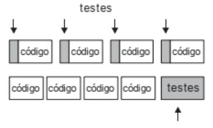

A figura: 

   - a) ilustra as duas fases do TDD, que correspondem a escrever pequenos testes e testá-los no final. 

   - b) mostra o ciclo conhecido como Vermelho-Verde-Refatora. 

   - c) apresenta a diferença entre testes automatizados e testes manuais no XP. 

   - d) mostra que um desenvolvedor que pratica TDD tem mais feedbacks do que um que escreve testes ao final. 

   - e) evidencia que TDD é impraticável, pois o desenvolvedor gasta muito tempo escrevendo código de testes. 

- **47.(CESPE / ANATEL – 2014)** Em se tratando de desenvolvimento de softwares dirigidos a testes (TDD), a execução dos testes é realizada antes da implementação da funcionalidade. 

- **48.(CESPE / TC/DF – 2014)** No TDD, o refatoramento do código deve ser realizado antes de se escrever a aplicação que deve ser testada.

---

<!-- pagina: 84 -->

**Diego Carvalho, Equipe Informática 2 (Diego Carvalho), Equipe Informática 1 (Diego Carvalho) Aula 04** 

- **49.(CESPE / STJ – 2015)** No método de desenvolvimento TDD (Test Driven Development), o desenvolvedor escreve primeiro um caso de teste e, posteriormente, o código. 

- **50.(CESPE / MPE-PI – 2018)** O TDD possibilita o desenvolvimento de softwares fundamentado em testes. O ciclo de desenvolvimento do TDD segue os seguintes passos: 

   - escrever um teste que inicialmente não passa; 

   - adicionar uma nova funcionalidade do sistema; 

   - fazer o teste passar; 

   - realizar a integração contínua do código; 

   - escrever o próximo teste. 

**51. (FCC / Pref. de Teresina/PI – 2016)** O Test Driven Development – TDD é uma das práticas sugeridas na eXtreme Programming − XP, onde o programador escreve o teste antes de escrever o código. O ciclo de desenvolvimento utilizando TDD é mostrado abaixo. 

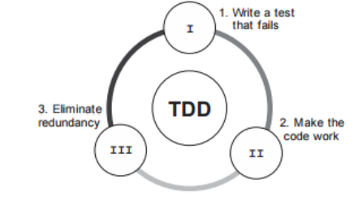

Considere: 

I. Etapa inicial, onde se escreve um teste que falha, para alguma funcionalidade que ainda será Escrita. 

II. Já com o teste criado, é o momento de executar o teste. 

III. Eliminar códigos redundantes, remover acoplamentos, enfim, identificar pontos de melhoria no código. 

As etapas I, II e III são, respectivamente, 

a) Iniciação, Execução e Controle. 

b) Red, Green e Refactor. 

c) Iniciação, Atuação e Otimização. 

d) Plan, Do e Check. 

   - e) Planejamento, Execução e Melhoria. 

**52. (FAUGRS / BANRISUL – 2018)** Considere as ações abaixo, executadas em desenvolvimento orientado a testes, Test-Driven Design (TDD). 

I - Escrever código de teste.

---

<!-- pagina: 85 -->

###### **Diego Carvalho, Equipe Informática 2 (Diego Carvalho), Equipe Informática 1 (Diego Carvalho) Aula 04** 

II - Verificar se o teste falha. 

III - Escrever código de produção. 

IV - Executar teste até passar (reescrevendo o código de produção, se for necessário, até que o teste passe). 

V - Refatorar código de produção e/ou de teste para melhorá-lo. 

Considerando que se deseja incluir um novo caso de teste, assinale a alternativa que apresenta a sequência de ações que devem obrigatoriamente ocorrer para essa inclusão, segundo o TDD. 

a) I, III e IV. 

b) III, I e IV. 

c) I, II, III e IV. d) I, III, IV e V. e) I, II, III, IV e V. 

==5460== 

**53. (FGV / IBGE – 2017)** Test Driven Development (TDD) é uma prática muito utilizada no processo de desenvolvimento de sistemas computacionais. Analise as afirmativas a seguir sobre o uso da prática de TDD: 

   - I. Tornam os testes de regressão mais demorados porque o desenvolvedor precisará fazer testes manuais várias vezes por dia. 

   - II. Garante que os requisitos do sistema sejam atendidos porque o desenvolvedor escreverá o código de testes sempre que acabar a implementação do código do sistema. 

III. Ajuda o desenvolvedor a escrever código de qualidade porque ele gastará parte do seu tempo escrevendo código de testes. 

Está correto o que se afirma em: 

a) somente I; 

- b) somente II; 

c) somente III; 

d) somente II e III; e) I, II e III. 

- **54.(CESPE / ANATEL – 2014)** Na atividade de TDD (test-driven development), a escrita de teste primeiro define implicitamente tanto uma interface quanto uma especificação do comportamento para a funcionalidade que está sendo desenvolvida, estando, entretanto, a viabilidade do uso dessa abordagem limitada aos processos de desenvolvimento de software que seguem as práticas ágeis. 

**55. (CESPE / TRE/MT – 2015)** Considere as seguintes etapas de um processo do tipo desenvolvimento orientado a testes (TDD).

---

<!-- pagina: 86 -->

**Diego Carvalho, Equipe Informática 2 (Diego Carvalho), Equipe Informática 1 (Diego Carvalho) Aula 04** 

I Implementar funcionalidade e refatorar. 

II Identificar nova funcionalidade. 

III Executar o teste. 

IV Escrever o teste. 

V Implementar a próxima parte da funcionalidade. 

Assinale a opção que apresenta a sequência correta em que essas etapas devem ser realizadas. 

a) I; IV; III; II; V 

b) IV; III; II; I; V 

c) I; IV; II; III; V 

d) II; IV; III; I; V 

e) IV; II; III; I; V 

- **56.(FCC / SEFAZ-SC – 2018)** O Test-Driven Development (TDD) é uma abordagem para o desenvolvimento de programas em que se intercalam testes e desenvolvimento de código. As etapas do processo fundamental de TDD são mostradas abaixo em ordem alfabética: 

   - I. Escrever um teste para a funcionalidade identificada e implementá-lo como um teste automatizado. 

II. Executar o teste, junto com os demais testes já implementados, sem implementar a nova funcionalidade no código. 

III. Identificar e implementar uma outra funcionalidade, após todos os testes serem executados com sucesso. 

IV. Identificar uma nova funcionalidade pequena para ser incrementada com poucas linhas em um código. 

- V. Implementar a nova funcionalidade no código e reexecutar o teste. 

- VI. Refatorar o código com melhorias incrementais até que o teste execute sem erros. 

VII. Revisar a funcionalidade e o teste, caso o código execute sem falhar. 

Considerando o item IV a primeira etapa e o item III a última etapa, a sequência intermediária correta das etapas do processo é: 

a) I − II − VII − V e VI. 

b) I − V − II − VII e VI. 

c) I − VI − V − VII e II. 

d) V − I − II − VII e VI.

---

<!-- pagina: 87 -->

**Diego Carvalho, Equipe Informática 2 (Diego Carvalho), Equipe Informática 1 (Diego Carvalho) Aula 04** 

e) V − I − VI − VII e II.

---

<!-- pagina: 88 -->

**Diego Carvalho, Equipe Informática 2 (Diego Carvalho), Equipe Informática 1 (Diego Carvalho) Aula 04** 

|||**GABARITO– DIVERSA**|**SBANCAS**|
|---|---|---|---|
|**1.**|LETRA A|**29.**|CORRETO|
|**2.**|ERRADO|**30.**|LETRA D|
|**3.**|CORRETO|**31.**|LETRA A|
|**4.**|ERRADO|**32.**|LETRA D|
|**5.**|LETRA B|**33.**|LETRA B|
|**6.**|ERRADO|**34.**|LETRA E|
|**7.**|LETRA C|**35.**|LETRA E|
|**8.**|LETRA B|**36.**|LETRA D|
|**9.**|LETRA A|**37.**|LETRA A|
|**10.**|LETRA D|**38.**|LETRA A|
|**11.**|ERRADO|**39.**|LETRA A|
|**12.**|CORRETO|**40.**|ERRADO|
|**13.**|ERRADO|**41.**|LETRA A|
|**14.**|LETRA B|**42.**|LETRA D|
|**15.**|LETRA A|**43.**|LETRA A|
|**16.**|CORRETO|**44.**|LETRA B|
|**17.**|ERRADO|**45.**|LETRA A|
|**18.**|ERRADO|**46.**|LETRA D|
|**19.**|CORRETO|**47.**|CORRETO|
|**20.**|LETRA E|**48.**|ERRADO|
|**21.**|ERRADO|**49.**|CORRETO|
|**22.**|CORRETO|**50.**|ERRADO|
|**23.**|CORRETO|**51.**|LETRA B|
|**24.**|CORRETO|**52.**|LETRA C|
|**25.**|LETRA C|**53.**|LETRA C|
|**26.**|LETRA A|**54.**|ERRADO|
|**27.**|LETRA E|**55.**|LETRA D|
|**28.**|LETRA A|**56.**|LETRA A|

---

<!-- pagina: 89 -->

