---
fonte_pdf: "Eng. Software - Aula 05.pdf"
paginas: 105
conversao: texto-e-imagens
---

<!-- pagina: 2 -->

**Diego Carvalho, Equipe Informática 2 (Diego Carvalho), Equipe Informática 1 (Diego Carvalho) Aula 05** 

# **Índice** 

|............................................................................................................................................. 1) Engenharia de Requisitos - Teoria|................................................. 3|
|---|---|
|............................................................................................................................................. 2) Engenharia de Requisitos - Resumo|................................................. 50|
|............................................................................................................................................. 3) Engenharia de Requisitos - Questões Comentadas - FGV|................................................. 63|
|............................................................................................................................................. 4) Engenharia de Requisitos - Lista de Questões - FGV|................................................. 90|

---

<!-- pagina: 3 -->

**Diego Carvalho, Equipe Informática 2 (Diego Carvalho), Equipe Informática 1 (Diego Carvalho) Aula 05** 

#### **Sumário** 

|Requisitos .............................................................................................................|............................................. 3|
|---|---|
|Conceitos Básicos ............................................................................................|.................................................. 3|
|Classificação de Requisitos .............................................................................|.................................................. 5|
|Classificação quanto ao Nível de Abstração .............................................|.................................................. 5|
|Classificação quanto à Qualidade ..............................................................|.................................................. 7|
|Classificação quanto à Evolução ................................................................|................................................ 10|
|Classificação quanto à Funcionalidade .....................................................|................................................ 12|
|Classificação quanto à Origem ..................................................................|................................................ 16|
|Engenharia de Requisitos ...............................................................................|................................................ 20|
|Estudo de Viabilidade .................................................................................|................................................ 26|
|Elicitação e Análise de Requisitos ..............................................................|................................................ 28|
|Especificação de Requisitos .......................................................................|................................................ 39|
|Validação de Requisitos ..............................................................................|................................................ 41|
|Gerenciamento de Requisitos ....................................................................|................................................ 46|

---

<!-- pagina: 4 -->

**Diego Carvalho, Equipe Informática 2 (Diego Carvalho), Equipe Informática 1 (Diego Carvalho) Aula 05** 

<!-- Start of picture text -->
A PRESENTAÇÃO <!-- End of picture text -->

Fala, pessoal! Tudo bem? 

Nossa aula abordará Engenharia de Requisitos, disciplina extremamente importante dentro da Engenharia de Software e muito cobrada em concursos. Diferentemente de conteúdos baseados apenas em memorização, esse tema exige interpretação, raciocínio lógico e compreensão sobre a relação entre necessidades do negócio e soluções técnicas. Durante os estudos, serão trabalhados conceitos iniciais, elicitação, especificação, validação e gerenciamento dos requisitos envolvidos no desenvolvimento de software. 

Para estudantes que possuem mais tempo disponível, a recomendação principal é estudar todo o material com bastante atenção e profundidade. O ideal é passar cuidadosamente por cada subtópico da teoria, incluindo conteúdos de incidência menor, porque isso fortalece compreensão global da disciplina. Também é importante resolver grande quantidade de exercícios, analisando diferentes estilos de cobrança das bancas. Esse aprofundamento costuma aumentar bastante segurança técnica e desempenho nas questões mais complexas das provas. 

Já o aluno com pouco tempo disponível precisa focar fortemente na relação entre custo e benefício dos tópicos estudados. Nesse cenário, a prioridade deve ficar concentrada na Classificação quanto à Funcionalidade, na Elicitação e Análise de Requisitos e na etapa de Validação, temas que possuem incidência altíssima em concursos. Assuntos com baixa frequência de cobrança, como Estudo de Viabilidade e classificações secundárias, podem ser deixados temporariamente de lado para otimizar melhor a carga horária disponível. 

Prof. Diego Carvalho 

#### **<mark>INSTAGRAM DO PROFESSOR- WWW.INSTAGRAM.COM/PROFESSORDIEGOCARVALHO</mark>** 

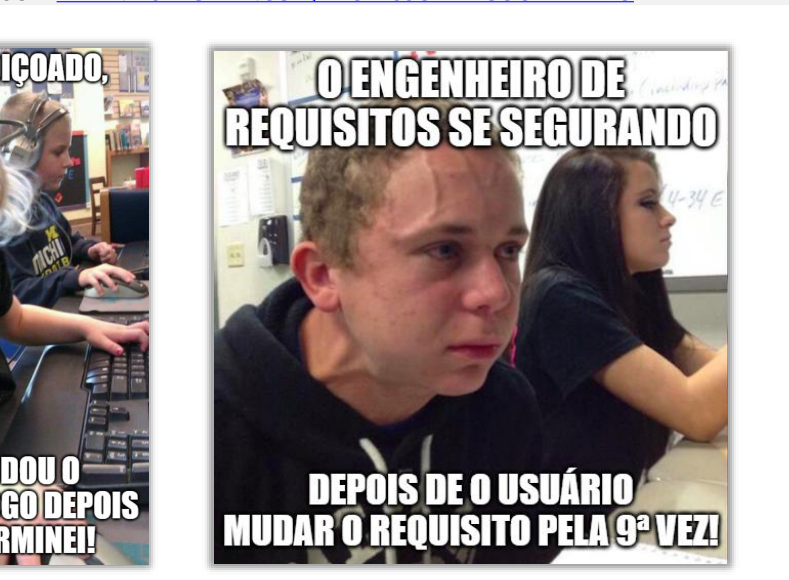

---

<!-- pagina: 5 -->

**Diego Carvalho, Equipe Informática 2 (Diego Carvalho), Equipe Informática 1 (Diego Carvalho) Aula 05** 

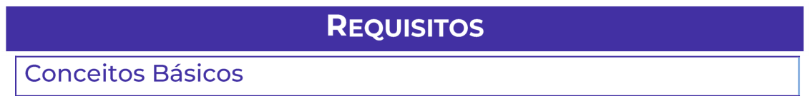

<!-- Start of picture text -->
R EQUISITOS Conceitos Básicos <!-- End of picture text -->

##### **<mark>INCIDÊNCIA EM PROVA: BAIXÍSSIMA</mark>** 

### **<mark>REQUISITO</mark>** 

Condição, capacidade, restrição, comportamento ou atributo de qualidade que um sistema deve possuir para atender necessidades dos usuários e objetivos do negócio. Em outras palavras, requisitos descrevem tanto aquilo que o software deve fazer quanto características importantes sobre como ele deve funcionar, incluindo aspectos como desempenho, segurança, confiabilidade e usabilidade. 

Quando começamos o estudo sobre Engenharia de Requisitos, existe uma pergunta extremamente importante: afinal, o que é um requisito? No cotidiano, requisito é aquilo que se torna necessário para alcançar determinado objetivo. Em outras palavras, trata-se de uma condição, exigência ou capacidade indispensável para que alguma coisa aconteça corretamente. Percebam como convivemos com requisitos o tempo inteiro sem nem perceber. Em universidades, por exemplo, várias disciplinas possuem prérequisitos, isto é, matérias que precisam ser cursadas antes para permitir avanço no fluxo acadêmico. 

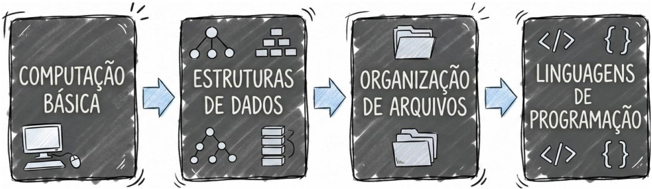

Quando eu cursei Ciência da Computação: para cursar Estrutura de Dados, era obrigatório já ter concluído Computação Básica; depois, para estudar Organização de Arquivos, era necessário já ter cursado Estrutura de Dados. Observem a lógica: uma disciplina funciona como condição necessária para outra. Esse conceito aparece também em concursos, certificações e até em cargos públicos. 

Aqui esse conceito segue um raciocínio parecido, mas aplicado ao desenvolvimento de sistemas. Requisitos representam capacidades, restrições, comportamentos ou atributos de qualidade que um sistema deve possuir para atender necessidades dos usuários e objetivos do negócio. Em outras palavras, requisitos definem aquilo que o software precisa fazer e também características importantes sobre como ele deve funcionar. 

Nesse contexto, normalmente aparecem duas categorias principais: requisitos funcionais e requisitos não funcionais. Os funcionais descrevem serviços e funcionalidades do sistema. Já os não funcionais estão ligados a atributos como desempenho, segurança, disponibilidade, confiabilidade e usabilidade. Essa distinção costuma aparecer bastante em avaliações e discussões relacionadas ao desenvolvimento de software moderno. 

Nos métodos ágeis, tornou-se comum utilizar Histórias de Usuário para representar necessidades do sistema. Elas são descrições curtas escritas sob a perspectiva do usuário final, ajudando equipes a compreender rapidamente objetivos e benefícios esperados. Mesmo assim, histórias de usuário não eliminam totalmente necessidade de documentação adicional. Em sistemas maiores ou mais críticos,

---

<!-- pagina: 6 -->

**Diego Carvalho, Equipe Informática 2 (Diego Carvalho), Equipe Informática 1 (Diego Carvalho) Aula 05** 

ainda podem existir diagramas, regras de negócio, contratos de interface e especificações mais detalhadas para apoiar desenvolvimento e comunicação técnica. 

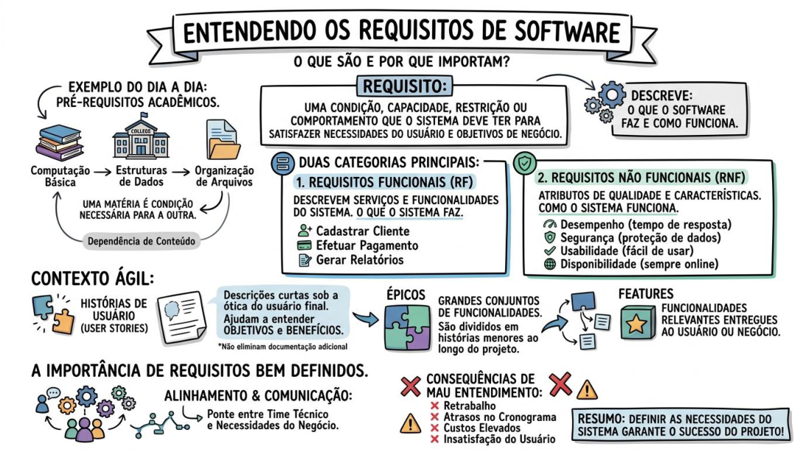

---

<!-- pagina: 7 -->

**Diego Carvalho, Equipe Informática 2 (Diego Carvalho), Equipe Informática 1 (Diego Carvalho) Aula 05** 

<!-- Start of picture text -->
Classificação de Requisitos <!-- End of picture text -->

Existem diversas maneiras diferentes de se classificar requisitos de software! Veremos a seguir algumas dessas classificações: 

<!-- Start of picture text -->
Classificação quanto ao  N <!-- End of picture text -->

<!-- Start of picture text -->
ível de  A <!-- End of picture text -->

<!-- Start of picture text -->
bstração <!-- End of picture text -->

##### **<mark>INCIDÊNCIA EM PROVA: BAIXÍSSIMA</mark>** 

Em Engenharia de Software, abstrair significa focar nos aspectos mais relevantes do problema, deixando detalhes técnicos em segundo plano temporariamente. Quanto maior o nível de abstração, mais geral tende a ser a descrição; quanto menor o nível, mais específica e técnica ela se torna. Ian Sommerville divide essa classificação principalmente em requisitos de usuário e requisitos de sistema. 

## **Requisitos de Usuário** 

Os Requisitos de Usuário possuem descrições mais gerais sobre serviços, restrições e comportamentos esperados do sistema. Normalmente utilizam linguagem natural simples justamente para facilitar comunicação com clientes, gestores e usuários finais. O foco principal está no entendimento do problema de negócio e nas necessidades que o software deve atender. Em geral, usuários não se preocupam com detalhes internos de implementação, mas com resultados, funcionalidades e benefícios oferecidos pelo sistema desenvolvido. 

### **Exemplos:** 

- O sistema deve permitir que o cliente acompanhe o status do pedido pela internet. 

- O sistema deve enviar notificações por e-mail após conclusão da compra. 

- O sistema deve permitir recuperação de senha de forma simples e rápida. 

## **Requisitos de Sistema** 

Os Requisitos de Sistema apresentam descrições mais detalhadas e precisas, servindo como base para implementação, testes e validações técnicas. Nesse caso, o nível de abstração é menor e o detalhamento aumenta significativamente. Roger Pressman destaca que esses requisitos precisam reduzir ambiguidades ao máximo, pois serão utilizados diretamente durante o desenvolvimento do software. Mesmo assim, existe um cuidado importante: requisitos não devem se confundir completamente com decisões internas de arquitetura ou implementação técnica. 

### **Exemplos:** 

- O sistema deve atualizar automaticamente o status do pedido a cada alteração no banco de dados. 

- O sistema deve utilizar autenticação multifator para recuperação de credenciais de acesso. 

- O sistema deve enviar notificações utilizando protocolo SMTP autenticado com criptografia TLS 1.3. 

Essa distinção possui enorme importância prática porque diferentes stakeholders possuem níveis diferentes de conhecimento técnico. Usuários de negócio normalmente se preocupam mais com funcionalidades e regras; já desenvolvedores, arquitetos e testadores precisam de informações mais precisas para construir e validar o sistema adequadamente. Além disso, tanto requisitos de usuário quanto requisitos de sistema devem buscar clareza, consistência e ausência de ambiguidades, reduzindo riscos de retrabalho, atrasos e falhas durante o desenvolvimento.

---

<!-- pagina: 8 -->

**Diego Carvalho, Equipe Informática 2 (Diego Carvalho), Equipe Informática 1 (Diego Carvalho) Aula 05** 

|**QUANTO AO NÍVEL** **DE ABSTRAÇÃO**|**DESCRIÇÃO**|
|---|---|
|**REQUISITOS DE** **USUÁRIO**|Representam descrições mais gerais e menos técnicas sobre serviços, restrições e comportamentos esperados do sistema. São escritos em linguagem natural simples, podendo utilizar exemplos e diagramas, pois procuram facilitar entendimento por clientes, gestores e usuários finais.|
|**REQUISITOS DE** **SISTEMA**|Representam descrições mais detalhadas e técnicas sobre funções, regras, restrições e comportamentos do software. Possuem menor nível de abstração e maior precisão, servindo como base para implementação, testes, validação e manutenção realizados pela equipe técnica.|

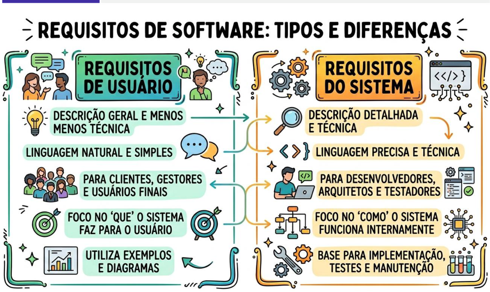

---

<!-- pagina: 9 -->

**Diego Carvalho, Equipe Informática 2 (Diego Carvalho), Equipe Informática 1 (Diego Carvalho) Aula 05** 

<!-- Start of picture text -->
Classificação quanto à  Q <!-- End of picture text -->

<!-- Start of picture text -->
ualidade <!-- End of picture text -->

##### **<mark>INCIDÊNCIA EM PROVA: BAIXÍSSIMA</mark>** 

No contexto de Engenharia de Requisitos, aparece um conceito muito importante chamado QFD (Quality Function Deployment). Segundo Roger Pressman, essa técnica procura transformar a “voz do cliente” em requisitos técnicos do sistema, ajudando equipes a compreender aquilo que realmente gera valor para usuários e negócio. A ideia central do QFD é simples: clientes possuem necessidades, expectativas e percepções diferentes sobre qualidade. 

Algumas características são explicitamente solicitadas; outras são tão óbvias que ninguém lembra de mencionar; e algumas conseguem surpreender positivamente os usuários. Dentro dessa lógica, costumase classificar requisitos em três grupos principais: requisitos normais, requisitos esperados e requisitos fascinantes. Observem que essa classificação possui forte relação com percepção de satisfação do cliente ao utilizar o sistema. 

## **Requisitos Normais** 

Os Requisitos Normais representam funcionalidades e comportamentos explicitamente solicitados pelos usuários durante levantamento de requisitos. Quanto melhor esses requisitos forem atendidos, maior tende a ser satisfação do cliente; quanto pior forem atendidos, maior será insatisfação. Em outras palavras, são requisitos diretamente associados às necessidades declaradas do negócio. 

## **Requisitos Esperados** 

Já os Requisitos Esperados representam características tão fundamentais que muitas vezes o cliente nem pensa em mencioná-las explicitamente. O usuário simplesmente assume que elas existirão. Sua ausência, porém, costuma gerar enorme frustração. Percebam um detalhe extremamente importante: requisitos esperados normalmente possuem forte relação com qualidade básica de funcionamento. 

Questões como confiabilidade, estabilidade, facilidade de uso e comportamento correto frequentemente entram nessa categoria. Segundo Ian Sommerville, usuários muitas vezes possuem dificuldade para expressar necessidades implícitas, justamente porque consideram determinadas capacidades “naturais” ou “óbvias” em um software moderno. 

## **Requisitos Fascinantes** 

Por fim, existem os chamados Requisitos Fascinantes. Esses requisitos representam funcionalidades inesperadas que surpreendem positivamente os usuários e aumentam bastante percepção de valor do produto. O cliente normalmente não solicita explicitamente essas características porque sequer imaginava sua existência; contudo, quando elas aparecem, o sistema se torna muito mais atrativo. 

É importante perceber também que requisitos fascinantes frequentemente surgem a partir de inovação, experiência do usuário, análise de mercado e criatividade da equipe. Eles ajudam bastante na diferenciação competitiva do produto e podem aumentar significativamente satisfação e engajamento dos usuários. 

### **Saiba mais:** 

<mark>Imaginem um aplicativo de delivery de comida. O requisito normal seria algo como: “o sistema deve permitir que o usuário realize pedidos de restaurantes próximos”. Percebam que essa é uma</mark>

---

<!-- pagina: 10 -->

**Diego Carvalho, Equipe Informática 2 (Diego Carvalho), Equipe Informática 1 (Diego Carvalho) Aula 05** 

<mark>funcionalidade básica e explicitamente esperada para o contexto do negócio. O cliente provavelmente mencionaria isso logo nas primeiras reuniões de levantamento de requisitos, pois sem essa funcionalidade o aplicativo praticamente não cumpriria sua finalidade principal.</mark> 

<mark>Já um requisito esperado poderia ser: “o sistema deve informar corretamente o status do pedido e o tempo estimado de entrega”. Observem que muitos usuários talvez nem mencionem explicitamente essa necessidade, porque consideram isso algo óbvio em um aplicativo moderno de delivery. Contudo, se o sistema não mostrar andamento do pedido ou apresentar informações inconsistentes, a insatisfação do cliente provavelmente será muito grande.</mark> 

<mark>Por fim, um requisito fascinante poderia ser: “o sistema deve sugerir automaticamente refeições com base no histórico, clima do dia e preferências alimentares do usuário”. Nesse caso, o cliente talvez nem tenha imaginado solicitar algo assim; porém, quando encontra essa funcionalidade funcionando bem, a percepção de valor do sistema aumenta bastante. É justamente esse tipo de</mark> recurso que costuma diferenciar produtos inovadores no mercado. 

**<mark>QUANTO À</mark> DESCRIÇÃO QUALIDADE** Representam funcionalidades e características explicitamente solicitadas pelos clientes **REQUISITOS** durante levantamento de requisitos. Quanto melhor forem atendidos, maior tende a ser **NORMAIS** satisfação do usuário; contudo, quando são implementados inadequadamente, aumentam significativamente insatisfação e reclamações. Representam características básicas e implícitas do sistema, frequentemente tão óbvias **REQUISITOS** que o cliente nem pensa em mencioná-las. Sua ausência costuma gerar enorme **ESPERADOS** insatisfação, pois usuários esperam naturalmente funcionamento correto, estabilidade, confiabilidade e comportamento adequado do software. Representam funcionalidades inesperadas que surpreendem positivamente os usuários e **REQUISITOS** aumentam percepção de valor do sistema. Normalmente não são solicitados **FASCINANTES** explicitamente pelos clientes; contudo, quando aparecem, tornam o produto mais atrativo, inovador e competitivo no mercado.

---

<!-- pagina: 11 -->

**Diego Carvalho, Equipe Informática 2 (Diego Carvalho), Equipe Informática 1 (Diego Carvalho) Aula 05** 

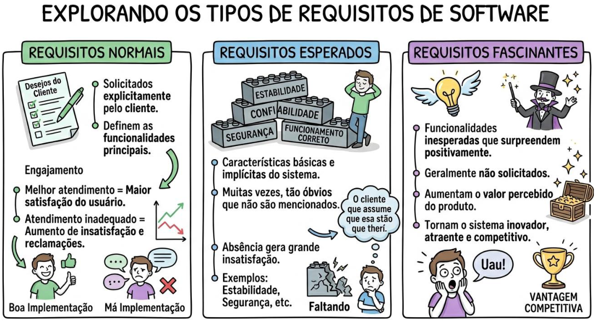

---

<!-- pagina: 12 -->

**Diego Carvalho, Equipe Informática 2 (Diego Carvalho), Equipe Informática 1 (Diego Carvalho) Aula 05** 

<!-- Start of picture text -->
quanto à  E <!-- End of picture text -->

<!-- Start of picture text -->
E volução <!-- End of picture text -->

<!-- Start of picture text -->
Classificação <!-- End of picture text -->

##### **<mark>INCIDÊNCIA EM PROVA: BAIXÍSSIMA</mark>** 

Agora vamos falar sobre a classificação de requisitos quanto à evolução. Ela procura analisar o comportamento dos requisitos ao longo do tempo, observando quais tendem a permanecer relativamente estáveis e quais possuem maior propensão a mudanças. Segundo Ian Sommerville, essa divisão normalmente separa requisitos em: requisitos permanentes e requisitos voláteis. 

## **Requisitos Permanentes** 

Os chamados Requisitos Permanentes, também conhecidos como requisitos estáveis ou duradouros, estão fortemente relacionados à essência do domínio de negócio e às atividades fundamentais da organização. Atenção porque `“` permanente `”` não significa imutável. Em Engenharia de Software, praticamente todo requisito pode mudar em algum momento; contudo, alguns mudam muito mais lentamente do que outros. Esses requisitos costumam permanecer relevantes durante muitos anos porque refletem necessidades centrais da área de atuação do sistema. 

Imaginem um sistema da Bolsa de Valores. Independentemente da tecnologia utilizada ou da versão do software, provavelmente continuarão existindo necessidades relacionadas a operações de compra e venda de ações, registro de cotações, processamento de índices financeiros e acompanhamento do mercado. Observem como essas funcionalidades representam características essenciais do domínio financeiro. Pode existir evolução ao longo do tempo; porém, a natureza principal dessas necessidades tende a permanecer relativamente estável. 

## **Requisitos Voláteis** 

Já os Requisitos Voláteis representam requisitos mais sujeitos a mudanças durante desenvolvimento ou utilização do sistema. Eles normalmente surgem em função de alterações no ambiente organizacional, mudanças tecnológicas, evolução das necessidades dos usuários ou maior compreensão do próprio problema de negócio. Em outras palavras, são requisitos com maior probabilidade de sofrer adaptações frequentes. Sommerville divide esses requisitos voláteis em quatro subclasses principais: mutáveis, emergentes, consequentes e de compatibilidade. 

Os Requisitos Mutáveis se modificam em decorrência de alterações no ambiente em que o sistema opera. Um exemplo extremamente comum ocorre em sistemas tributários brasileiros. Imaginem um software responsável pelo cálculo de impostos e deduções fiscais. Conforme leis tributárias mudam constantemente, o sistema também precisa ser atualizado para refletir novas regras legais. Percebam como o requisito não muda porque equipe errou levantamento inicialmente; ele muda porque ambiente externo sofreu alterações importantes. 

Os Requisitos Emergentes aparecem gradualmente conforme clientes, usuários e desenvolvedores compreendem melhor o sistema durante construção ou utilização prática. Muitas vezes, no início do projeto, o usuário ainda não consegue visualizar todas as suas necessidades de maneira clara. Com avanço do desenvolvimento, novas ideias surgem e necessidades adicionais passam a ser percebidas. Isso acontece bastante em projetos inovadores ou sistemas complexos, nos quais aprendizado contínuo faz parte natural do processo de desenvolvimento. 

Os Requisitos Consequentes surgem como consequência direta da utilização real do sistema no ambiente organizacional. Em outras palavras, o usuário somente percebe determinadas necessidades depois que começa efetivamente a utilizar o software no cotidiano. Imaginem um sistema financeiro que inicialmente apenas exibia cotações de ações. Após algum tempo de uso, usuários percebem necessidade de alertas

---

<!-- pagina: 13 -->

**Diego Carvalho, Equipe Informática 2 (Diego Carvalho), Equipe Informática 1 (Diego Carvalho) Aula 05** 

automáticos para oscilações bruscas do mercado. Observem que o novo requisito apareceu como consequência da experiência prática de utilização. 

Já os Requisitos de Compatibilidade dependem de outros sistemas, dispositivos, componentes ou tecnologias externas. Quando esses elementos sofrem mudanças, o software também precisa se adaptar. Imaginem um sistema bancário que depende de integração com APIs do Banco Central ou compatibilidade com novas versões de sistemas operacionais. Caso essas plataformas mudem protocolos, formatos de comunicação ou mecanismos de autenticação, requisitos do sistema precisarão evoluir para manter interoperabilidade e funcionamento correto do ambiente. 

|**QUANTO À** **EVOLUÇÃO**|**DESCRIÇÃO**|
|---|---|
|**REQUISITOS** **PERMANENTES**|Representam requisitos mais estáveis e duradouros, fortemente ligados às atividades centrais da organização e ao domínio principal da aplicação. Embora possam sofrer mudanças ao longo do tempo, tendem a permanecer relevantes durante muitos anos, pois refletem necessidades essenciais do negócio.|
|**REQUISITOS** **VOLÁTEIS**|Representam requisitos mais sujeitos a mudanças durante desenvolvimento ou utilização do sistema. Normalmente evoluem em função de alterações legais, tecnológicas, organizacionais ou decorrentes da própria experiência dos usuários, exigindo maior adaptação e monitoramento contínuo da equipe.|

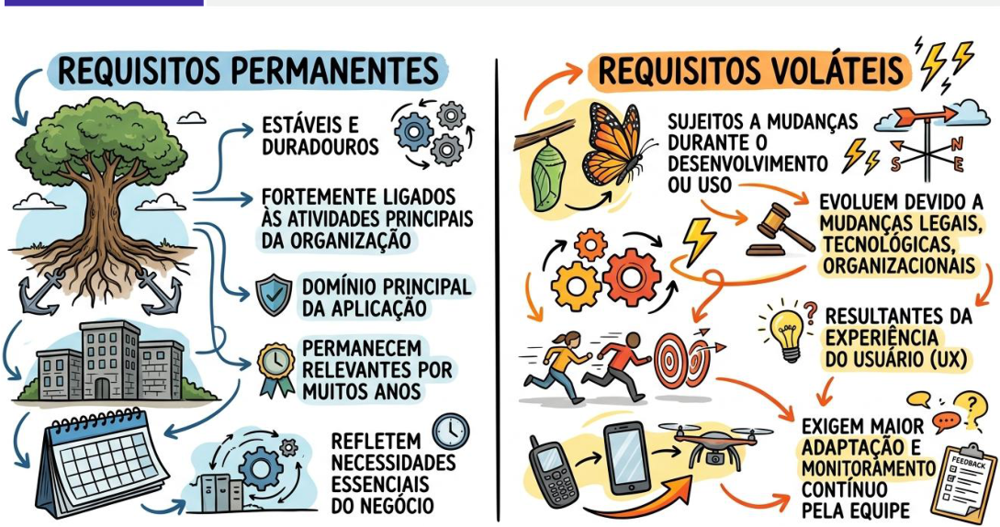

---

<!-- pagina: 14 -->

**Diego Carvalho, Equipe Informática 2 (Diego Carvalho), Equipe Informática 1 (Diego Carvalho) Aula 05** 

<!-- Start of picture text -->
Classificação <!-- End of picture text -->

<!-- Start of picture text -->
quanto à  F <!-- End of picture text -->

<!-- Start of picture text -->
uncionalidade <!-- End of picture text -->

##### **<mark>INCIDÊNCIA EM PROVA: ALTÍSSIMA</mark>** 

Percebam o seguinte: podemos classificar requisitos de diversas maneiras. No entanto, não se discute que a classificação de requisitos quanto a sua funcionalidade é, com total e absoluta certeza, a classificação mais tradicional e mais frequentemente cobrada em provas. Se eu tivesse que apostar em algum assunto para cair na prova, eu apostaria nesse! No entanto, fiquem tranquilos porque é fácil ;) 

## **Requisitos Funcionais** 

Quando estudamos Engenharia de Requisitos, existe uma classificação extremamente importante chamada classificação quanto à funcionalidade. Essa é, sem dúvida, uma das classificações mais tradicionais da área e também uma das mais cobradas em provas de concursos e certificações. Em linhas gerais, ela divide requisitos em requisitos funcionais e requisitos não funcionais. A lógica básica é relativamente simples: requisitos funcionais descrevem serviços, comportamentos e ações que o sistema deve fornecer aos usuários e ao negócio. 

Segundo Ian Sommerville, requisitos funcionais descrevem aquilo que o sistema deve fazer, incluindo serviços oferecidos, reações a determinadas entradas, comportamentos esperados em situações específicas e até restrições sobre ações que o software não deve executar. Em outras palavras, eles representam funcionalidades diretamente relacionadas às operações do sistema. Além disso, requisitos funcionais influenciam fortemente decisões de arquitetura, implementação e testes do software. 

Observem um detalhe importante: requisitos funcionais podem aparecer em diferentes níveis de abstração. Em alguns momentos, eles surgem de maneira mais geral como requisitos de usuário; em outros, aparecem detalhadamente como requisitos de sistema. Em um nível mais abstrato, pode existir algo como: “o sistema deve permitir busca de livros por título”. Já em nível mais técnico, esse comportamento pode incluir regras específicas, validações, exceções, formatos de entrada, mensagens de erro e critérios detalhados de processamento. 

Em geral, requisitos funcionais procuram descrever claramente entradas, saídas, regras de negócio, respostas do sistema e fluxos de operação. Segundo Roger Pressman, uma boa especificação funcional deve buscar completude, clareza e consistência. Isso significa reduzir ambiguidades ao máximo, evitando interpretações diferentes entre clientes, analistas, desenvolvedores e testadores. Afinal, requisitos mal definidos frequentemente geram retrabalho, falhas de implementação e conflitos durante desenvolvimento do projeto. 

Um problema extremamente comum ocorre justamente porque requisitos funcionais muitas vezes são especificados de maneira imprecisa. Em alguns casos, descrições ambíguas permitem interpretações diferentes para mesma funcionalidade. Em outros, requisitos ficam incompletos e deixam de descrever comportamentos importantes do sistema. Também podem existir inconsistências, isto é, situações em que um requisito contradiz outro requisito já definido anteriormente. Esses problemas aparecem com enorme frequência em projetos reais e representam grandes desafios da Engenharia de Requisitos. 

### **Exemplos:** 

Em um sistema de e-mails como o Outlook, um requisito funcional poderia ser: “o sistema deve permitir filtragem de mensagens por assunto e anexos”. Em uma plataforma de vídeos como o YouTube, poderia existir algo como: “o sistema deve suspender vídeos que violem direitos autorais”. Já em um aplicativo de mapas como o Google Maps, um requisito funcional poderia ser: “o sistema deve sugerir endereços semelhantes caso não encontre exatamente o endereço informado pelo usuário”.

---

<!-- pagina: 15 -->

**Diego Carvalho, Equipe Informática 2 (Diego Carvalho), Equipe Informática 1 (Diego Carvalho) Aula 05** 

Percebam como todos esses exemplos descrevem comportamentos concretos esperados do sistema. Eles especificam serviços, ações ou respostas que o software deve fornecer aos usuários. É justamente por isso que requisitos funcionais possuem papel tão importante no desenvolvimento: eles ajudam a transformar necessidades do negócio em funcionalidades reais implementadas pela equipe técnica. Sem requisitos funcionais bem definidos, torna-se extremamente difícil construir sistemas coerentes, validar resultados e garantir alinhamento entre clientes e desenvolvedores. 

## **Requisitos Não-Funcionais** 

Quando estudamos Engenharia de Requisitos, existe uma classificação extremamente importante chamada classificação quanto à funcionalidade. Nesse contexto, os requisitos são normalmente divididos em requisitos funcionais e requisitos não funcionais. Enquanto os requisitos funcionais descrevem serviços e comportamentos que o sistema deve fornecer, os requisitos não funcionais estabelecem restrições, atributos de qualidade e condições sobre as quais o software deve operar. Em muitos projetos, esses requisitos são tão importantes quanto as próprias funcionalidades do sistema. 

Segundo Ian Sommerville, requisitos não funcionais normalmente descrevem propriedades globais do sistema, incluindo aspectos como desempenho, segurança, confiabilidade, disponibilidade, usabilidade e robustez. Em outras palavras, eles não descrevem diretamente funcionalidades específicas do software, mas definem qualidades e restrições que influenciam funcionamento geral da aplicação. Além disso, esses requisitos possuem enorme impacto sobre decisões arquiteturais e escolhas técnicas do projeto. 

Observem um detalhe extremamente importante: muitas vezes usuários percebem mais facilmente falhas em requisitos não funcionais do que problemas funcionais. Imaginem um sistema bancário que executa corretamente todas as operações financeiras, mas demora quarenta segundos para responder cada solicitação. Tecnicamente, funcionalidades existem; contudo, experiência do usuário provavelmente será péssima. Isso mostra como requisitos não funcionais complementam diretamente qualidade percebida do sistema pelos usuários e stakeholders. 

Os requisitos não funcionais podem assumir diferentes formas. Alguns estabelecem metas de desempenho, disponibilidade e capacidade operacional; outros definem restrições organizacionais, padrões tecnológicos ou exigências legais. Em muitos casos, eles acabam influenciando fortemente arquitetura do software. Um requisito de alta disponibilidade, por exemplo, pode exigir balanceamento de carga, redundância de servidores e mecanismos avançados de recuperação de falhas. Já requisitos rigorosos de segurança podem demandar criptografia, autenticação multifator e auditoria detalhada. 

Segundo Roger Pressman, um dos maiores desafios dos requisitos não funcionais envolve sua especificação objetiva. Frases como “o sistema deve ser rápido” ou “o sistema deve ser seguro” são problemáticas porque permitem múltiplas interpretações. Por isso, bons requisitos não funcionais precisam ser verificáveis e mensuráveis. Em vez de dizer apenas que sistema deve ser rápido, seria melhor especificar algo como: “o tempo médio de resposta não deve ultrapassar dois segundos”. 

Outro problema extremamente comum envolve conflitos entre requisitos não funcionais. Imaginem que um cliente deseje desempenho extremamente elevado e, ao mesmo tempo, custo muito baixo de infraestrutura. Muitas vezes esses objetivos entram em conflito, exigindo negociações e equilíbrio entre prioridades do projeto. O mesmo ocorre entre segurança e usabilidade: mecanismos de autenticação muito rígidos podem aumentar proteção do sistema; contudo, também podem dificultar experiência dos usuários durante utilização cotidiana da aplicação. 

### **Exemplos:**

---

<!-- pagina: 16 -->

**Diego Carvalho, Equipe Informática 2 (Diego Carvalho), Equipe Informática 1 (Diego Carvalho) Aula 05** 

Em um aplicativo de mensagens como o WhatsApp, um requisito não funcional poderia ser: “o sistema deve possuir disponibilidade mínima de 99,8%”. Em uma rede social como o Facebook, poderia existir uma restrição organizacional do tipo: “o sistema deve ser desenvolvido utilizando linguagem Java”. Já em um sistema operacional móvel como o Android, um requisito não funcional poderia estabelecer: “o sistema deve operar adequadamente em dispositivos com apenas 1 GB de memória RAM”. 

Percebam como nenhum desses exemplos descreve diretamente funcionalidades específicas como cadastrar usuários, enviar mensagens ou reproduzir vídeos. Em vez disso, eles definem condições, restrições e atributos de qualidade que influenciam comportamento global do software. É justamente por isso que requisitos não funcionais possuem papel tão estratégico em Engenharia de Software moderna: eles ajudam a garantir que o sistema não apenas funcione corretamente, mas também apresente qualidade adequada para utilização real em ambientes complexos e exigentes. 

## **Requisitos de Domínio** 

Quando estudamos Engenharia de Requisitos, existe também uma classificação chamada requisitos de domínio. Segundo Ian Sommerville, esses requisitos derivam diretamente da área de aplicação do sistema e refletem regras, processos, restrições e características específicas do negócio. Em outras palavras, são requisitos fortemente influenciados pelo contexto em que o software será utilizado. Eles podem assumir tanto natureza funcional quanto não funcional, dependendo da necessidade descrita. 

Observem um detalhe importante: requisitos de domínio normalmente aparecem em sistemas especializados, nos quais conhecimento da área de negócio possui enorme relevância. Em sistemas financeiros, médicos, jurídicos, tributários ou aeronáuticos, por exemplo, diversas funcionalidades e restrições derivam diretamente das regras do próprio domínio. Em muitos casos, se esses requisitos não forem corretamente implementados, o sistema pode se tornar inviável para utilização prática ou até deixar de atender exigências regulatórias obrigatórias. 

### **Exemplos:** 

Imaginem um sistema acadêmico utilizado em uma universidade. Um requisito de domínio poderia estabelecer algo como: “o sistema deve calcular nota final do candidato utilizando fórmula específica definida pelo regulamento do programa de pós-graduação”. Observem que essa regra não surgiu aleatoriamente do desenvolvedor; ela deriva diretamente das normas e processos específicos daquele domínio educacional. Em outras palavras, o requisito existe porque o contexto da aplicação exige determinado comportamento especializado. 

Agora pensem em um sistema financeiro utilizado pelo Tesouro Nacional. Poderia existir um requisito estabelecendo: “o sistema deve calcular rentabilidade de títulos públicos indexados ao IPCA conforme regras definidas pela legislação financeira vigente”. Percebam novamente como o requisito depende diretamente do domínio de aplicação. Sem compreender corretamente conceitos financeiros, legislação e regras do mercado, torna-se extremamente difícil desenvolver o sistema adequadamente. 

Outro exemplo interessante aparece em sistemas espaciais e aeronáuticos. Imaginem um software da NASA responsável pelo monitoramento de equipamentos em missões espaciais. Um requisito de domínio poderia definir: “o sistema deve operar integrado a sensores infravermelhos resistentes a elevadas variações de temperatura e radiação”. Observem como características do ambiente espacial acabam impondo restrições extremamente específicas ao sistema desenvolvido. 

Segundo Roger Pressman, um dos maiores desafios dos requisitos de domínio envolve justamente comunicação entre especialistas da área de negócio e equipe técnica. Muitas vezes especialistas dominam profundamente o contexto organizacional e utilizam jargões, siglas e conceitos considerados

---

<!-- pagina: 17 -->

**Diego Carvalho, Equipe Informática 2 (Diego Carvalho), Equipe Informática 1 (Diego Carvalho) Aula 05** 

óbvios dentro do domínio; contudo, essas informações podem ser extremamente difíceis de compreender para analistas e desenvolvedores sem experiência naquela área específica. 

Imaginem um especialista financeiro mencionando termos como duration, marcação a mercado, NTN-B ou curva de juros sem explicações adicionais. Para profissionais do mercado financeiro, isso pode parecer trivial; entretanto, para equipe técnica, detalhes importantes podem ficar implícitos e acabar sendo interpretados incorretamente. É justamente por isso que Engenharia de Requisitos dedica enorme atenção ao entendimento do domínio da aplicação antes da implementação efetiva do software. 

Embora requisitos de domínio não sejam tão cobrados isoladamente quanto requisitos funcionais e não funcionais, eles continuam possuindo enorme importância prática em sistemas complexos e especializados. Afinal, compreender corretamente regras do domínio significa compreender essência do problema que o software precisa resolver. Em muitos projetos modernos, falhas no entendimento do negócio geram problemas muito mais graves do que dificuldades puramente técnicas de implementação ou programação. 

|**QUANTO À** **FUNCIONALIDADE**|**DESCRIÇÃO**|
|---|---|
|**REQUISITOS** **FUNCIONAIS**|Representam serviços, ações e comportamentos que o sistema deve fornecer aos usuários e ao negócio. Descrevem funcionalidades, respostas a entradas, regras de negócio e operações esperadas do software, servindo como base para implementação, testes e validação do sistema desenvolvido.|
|**REQUISITOS NÃO** **FUNCIONAIS**|Representam restrições, atributos de qualidade e condições globais sobre as quais o sistema deve operar. Incluem aspectos como desempenho, segurança, confiabilidade, disponibilidade, usabilidade e restrições tecnológicas, influenciando fortemente arquitetura e decisões técnicas do software.|
|**REQUISITOS DE** **DOMÍNIO**|Representam requisitos derivados diretamente da área de aplicação do sistema, refletindo regras, processos e características específicas do negócio. Podem ser funcionais ou não funcionais e normalmente utilizam conceitos, normas e terminologias próprias do domínio organizacional atendido.|

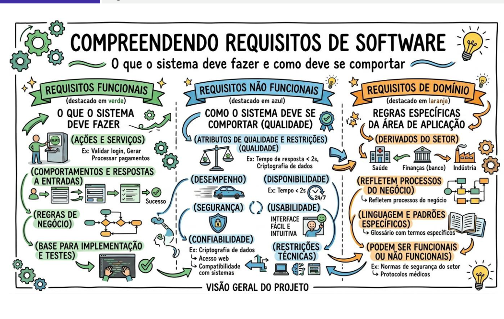

---

<!-- pagina: 18 -->

**Diego Carvalho, Equipe Informática 2 (Diego Carvalho), Equipe Informática 1 (Diego Carvalho) Aula 05** 

<!-- Start of picture text -->
Classificação quanto à  O <!-- End of picture text -->

<!-- Start of picture text -->
rigem <!-- End of picture text -->

##### **<mark>INCIDÊNCIA EM PROVA: ALTA</mark>** 

Agora vamos partir para outra classificação um pouquinho menos importante, mas ainda fundamental! Observem que essa classificação procura identificar de onde surgem determinadas restrições e atributos de qualidade do sistema. Em outras palavras, alguns requisitos derivam diretamente das características do software; outros surgem de políticas organizacionais; e alguns aparecem em função de fatores externos ao projeto. 

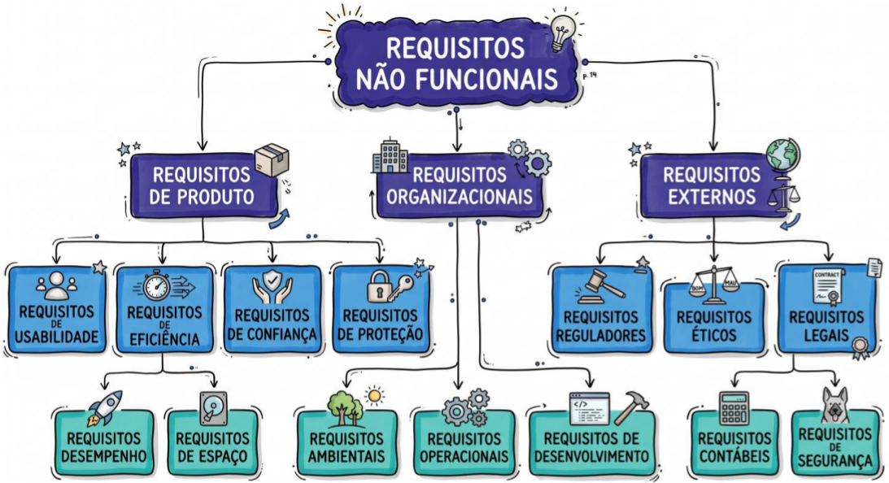

## **Requisitos de Produto** 

Os Requisitos de Produto descrevem propriedades e atributos operacionais que o sistema deve possuir durante funcionamento. Eles normalmente estão relacionados à qualidade percebida do software e influenciam fortemente decisões arquiteturais e técnicas. Entre os exemplos mais comuns estão requisitos de desempenho, confiabilidade, usabilidade, eficiência, disponibilidade e portabilidade. Em muitos casos, esses requisitos acabam sendo tão importantes quanto as funcionalidades propriamente ditas fornecidas pelo sistema. 

Imaginem um aplicativo bancário. Não basta apenas permitir transferências financeiras e consultas de saldo. O sistema também precisa responder rapidamente, permanecer disponível grande parte do tempo e operar com segurança adequada. Um requisito de produto poderia estabelecer algo como: “o tempo médio de resposta das consultas não deve ultrapassar dois segundo”. Observem como esse requisito não descreve funcionalidade específica; ele descreve qualidade operacional do sistema. 

Outro exemplo interessante seria: “o sistema deve operar adequadamente em dispositivos com apenas 1 GB de memória RAM”. Percebam novamente que o foco não está em uma função específica, mas em uma restrição operacional relacionada ao produto. Segundo Roger Pressman, requisitos não funcionais precisam ser especificados de maneira objetiva e verificável, justamente para evitar ambiguidades e interpretações subjetivas durante desenvolvimento e validação do software.

---

<!-- pagina: 19 -->

**Diego Carvalho, Equipe Informática 2 (Diego Carvalho), Equipe Informática 1 (Diego Carvalho) Aula 05** 

## **Requisitos Organizacionais** 

Já os Requisitos Organizacionais derivam de políticas, padrões, processos e decisões internas da organização responsável pelo desenvolvimento ou utilização do sistema. Em outras palavras, são restrições impostas pela empresa, pelo cliente ou pela própria equipe de desenvolvimento. Muitas vezes esses requisitos não surgem diretamente das necessidades do usuário final, mas de padrões corporativos, normas internas ou estratégias tecnológicas definidas pela organização. 

Imaginem uma empresa que determina obrigatoriamente utilização da linguagem Java em todos os seus projetos corporativos. Nesse caso, poderíamos ter um requisito organizacional como: “o sistema deve ser desenvolvido utilizando linguagem Java”. Outros exemplos bastante comuns incluem padrões de documentação, metodologias de desenvolvimento, ferramentas obrigatórias, políticas de versionamento e datas específicas de entrega do produto e da documentação técnica associada ao sistema. 

## **Requisitos Externos** 

Por fim, existem os chamados Requisitos Externos. Esses requisitos derivam de fatores externos ao sistema e ao processo de desenvolvimento. Muitas vezes estão relacionados a legislação, regulamentações, interoperabilidade, contratos, questões éticas e padrões governamentais ou industriais. Observem como sistemas modernos frequentemente precisam interagir com ambientes externos complexos, tornando esses requisitos extremamente importantes para garantir conformidade e aceitação adequada do software. 

Um exemplo clássico envolve requisitos legais relacionados à proteção de dados pessoais. Sistemas que tratam informações sensíveis precisam obedecer legislações como a LGPD no Brasil. Outro exemplo importante envolve interoperabilidade: imagine um sistema bancário que precise se comunicar obrigatoriamente com APIs do Banco Central seguindo protocolos específicos. Nesses casos, o requisito não surgiu da funcionalidade interna do sistema; ele surgiu porque ambiente externo impôs determinadas condições obrigatórias ao software. 

**<mark>QUANTO À</mark> DESCRIÇÃO ORIGEM** Representam atributos e propriedades operacionais que o sistema deve possuir durante **REQUISITOS DE** funcionamento. Incluem aspectos como desempenho, confiabilidade, disponibilidade, **PRODUTO** portabilidade, eficiência e usabilidade, influenciando diretamente qualidade percebida e decisões técnicas do software. Representam restrições derivadas de políticas, padrões e processos internos da **REQUISITOS** organização cliente ou desenvolvedora. Incluem exigências sobre tecnologias utilizadas, **ORGANIZACIO-** metodologias, padrões de documentação, cronogramas, ferramentas e procedimentos **NAIS** obrigatórios durante desenvolvimento do sistema. Representam requisitos impostos por fatores externos ao sistema e ao processo de **REQUISITOS** desenvolvimento. Incluem legislações, regulamentações, padrões governamentais, **EXTERNOS** interoperabilidade com outros sistemas, exigências éticas e restrições contratuais que precisam ser atendidas pelo software.

---

<!-- pagina: 20 -->

**Diego Carvalho, Equipe Informática 2 (Diego Carvalho), Equipe Informática 1 (Diego Carvalho) Aula 05** 

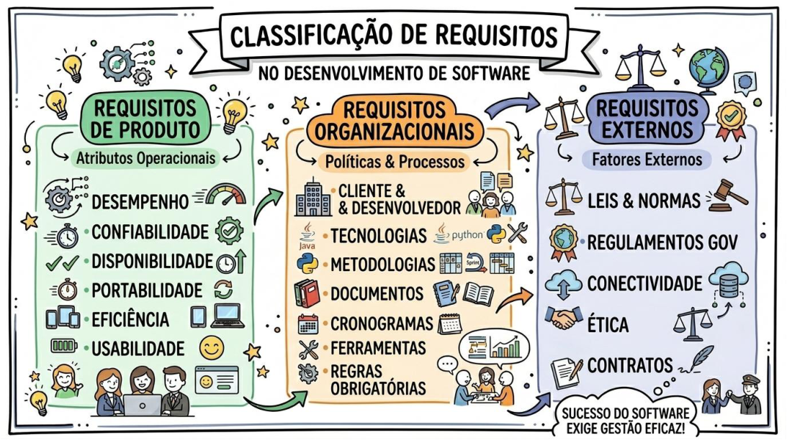

Acabaram as classificações, professor? Infelizmente, não! Cada uma dessas três classificações se divide também em outras subclassificações. Cabe salientar que essa classificação está em conformidade com a 9ª Edição do livro do Ian Sommerville, em que há pequenas diferenças quanto à mesma imagem de edições anteriores. Vamos lá... 

|**REQUISITOS**|**DESCRIÇÃO**|
|---|---|
|**REQUISITOS DE** **USABILIDADE**|Definem características relacionadas à facilidade de aprendizado, compreensão e utilização do sistema pelos usuários. Ex: usuários deverão conseguir realizar operações básicas após no máximo duas horas de treinamento supervisionado.|
|**REQUISITOS DE** **EFICIÊNCIA**|Estabelecem metas relacionadas ao uso eficiente de recursos computacionais, buscando equilíbrio entre desempenho, memória, processamento e capacidade do sistema. Ex: o sistema deverá manter utilização média de CPU abaixo de 60% durante horário de pico.|
|**REQUISITOS DE** **DESEMPENHO**|Definem limites de velocidade, capacidade de processamento, tempo de resposta e quantidade de operações suportadas pelo sistema em funcionamento. Ex: o sistema deverá processar até 800 requisições/segundo sem degradação de desempenho.|
|**REQUISITOS DE** **ESPAÇO**|Estabelecem restrições relacionadas ao uso de armazenamento, memória e demais recursos computacionais necessários para execução do software. Ex: o sistema deverá ocupar no máximo 80 MB de armazenamento interno do dispositivo.|
|**REQUISITOS DE** **CONFIANÇA**|Definem níveis aceitáveis de confiabilidade, disponibilidade e tolerância a falhas, garantindo funcionamento previsível e contínuo do sistema. Ex: o sistema deverá estar disponível em horário comercial com no máximo 5s consecutivos de indisponibilidade.|
|**REQUISITOS DE** **PROTEÇÃO**|Estabelecem mecanismos destinados a proteger dados, contas e recursos do sistema contra acessos indevidos, alterações não autorizadas e manipulações incorretas. Ex: o sistema não deverá permitir alteração de senhas pertencentes a outros usuários.|
|**REQUISITOS** **AMBIENTAIS**|Definem restrições relacionadas ao ambiente físico ou computacional no qual o sistema deverá operar adequadamente. Ex: o sistema deverá funcionar corretamente em ambientes sujeitos a temperaturas entre menos 10 °C e 45 °C.|

---

<!-- pagina: 21 -->

**Diego Carvalho, Equipe Informática 2 (Diego Carvalho), Equipe Informática 1 (Diego Carvalho) Aula 05** 

|**REQUISITOS**|**DESCRIÇÃO**|
|---|---|
|**REQUISITOS** **OPERACIONAIS**|Estabelecem condições necessárias para operação, execução e administração do sistema durante uso cotidiano. Ex: o sistema deverá permitir realização de backup automático diariamente às 23 horas sem interromper serviços ativos.|
|**REQUISITOS DE** **DESENVOLVI-** **MENTO**|Definem padrões, tecnologias, metodologias e práticas obrigatórias durante construção do sistema. Ex: o software deverá ser desenvolvido utilizando linguagem Java e versionamento obrigatório em Git.|
|**REQUISITOS** **REGULADORES**|Estabelecem restrições impostas por órgãos reguladores, normas técnicas ou entidades de supervisão do setor. Ex: o sistema deverá obedecer às normas do Banco Central para armazenamento de transações financeiras.|
|**REQUISITOS** **ÉTICOS**|Definem restrições relacionadas à privacidade, confidencialidade e utilização responsável das informações tratadas pelo sistema. Ex: o sistema não deverá divulgar dados pessoais sem autorização explícita do usuário.|
|**REQUISITOS** **LEGAIS**|Estabelecem exigências derivadas de leis, regulamentações e obrigações jurídicas aplicáveis ao sistema. Ex: o software deverá cumprir integralmente as exigências previstas na LGPD para tratamento de dados pessoais.|
|**REQUISITOS** **CONTÁBEIS**|Definem regras relacionadas ao registro, cálculo e processamento de informações financeiras e contábeis. Ex: o sistema deverá calcular tributos conforme legislação fiscal vigente e normas contábeis oficiais.|
|**REQUISITOS DE** **SEGURANÇA**|Definem mecanismos de autenticação, controle de acesso e prevenção de riscos para proteger sistema e informações contra ameaças e vulnerabilidades. Ex: o sistema deverá utilizar autenticação multifator para acesso administrativo.|

---

<!-- pagina: 22 -->

**Diego Carvalho, Equipe Informática 2 (Diego Carvalho), Equipe Informática 1 (Diego Carvalho) Aula 05** 

**<mark>INCIDÊNCIA EM PROVA: MÉDIA</mark>** 

<!-- Start of picture text -->
Engenharia de Requisitos <!-- End of picture text -->

### **<mark>ENGENHARIA DE REQUISITOS</mark>** 

Área da Engenharia de Software responsável por compreender, levantar, analisar, documentar, validar e gerenciar as necessidades e restrições de um sistema de software. Segundo Ian Sommerville e Roger Pressman, trata-se de um processo sistemático e organizado que procura identificar corretamente aquilo que clientes, usuários e organizações realmente necessitam. Seu principal objetivo é reduzir ambiguidades, conflitos e erros de entendimento, garantindo que o software desenvolvido esteja alinhado às regras de negócio, expectativas dos stakeholders e objetivos do projeto. 

O termo Engenharia de Software ganhou enorme notoriedade a partir da famosa Conferência da OTAN realizada em 1968, evento frequentemente considerado um marco histórico da área. A partir desse momento, surgiu forte preocupação com métodos sistemáticos capazes de tornar desenvolvimento de software mais previsível, organizado e controlado. Dentro desse contexto apareceu também a Engenharia de Requisitos, disciplina responsável por compreender, analisar, documentar, validar e gerenciar necessidades relacionadas aos sistemas de software. 

Segundo Ian Sommerville, a Engenharia de Requisitos pode ser entendida como uma abordagem sistemática voltada à descoberta, análise, documentação, validação e manutenção dos requisitos de um sistema. Em outras palavras, ela reúne processos, técnicas e atividades utilizados para identificar aquilo que usuários e organizações realmente necessitam. Observem um detalhe importante: a palavra “engenharia” já transmite ideia de método formal, repetível, organizado e orientado por processos. 

Quando falamos em Engenharia Civil, Engenharia Mecânica ou Engenharia Elétrica, sempre pensamos em procedimentos estruturados, técnicas padronizadas e atividades planejadas. Em Engenharia de Software ocorre exatamente a mesma lógica. Não basta simplesmente perguntar ao cliente “o que você quer?” e sair programando imediatamente. Existe um conjunto de práticas responsáveis por levantar, analisar, especificar, validar e gerenciar requisitos de maneira sistemática, procurando reduzir ambiguidades e falhas futuras no desenvolvimento. 

Segundo Roger Pressman, Engenharia de Software é uma disciplina muito mais ampla, envolvendo atividades como projeto, arquitetura, implementação, testes, manutenção e gerenciamento do software. Dentro desse universo maior, a Engenharia de Requisitos ocupa papel central porque procura compreender corretamente o problema antes da construção da solução. Afinal, desenvolver um sistema tecnicamente perfeito não adianta muito se ele resolve o problema errado ou atende necessidades equivocadas do cliente. 

Observem que levantamento de requisitos está longe de ser uma tarefa simples. Muitas vezes usuários possuem dificuldade para expressar claramente aquilo que desejam. Em outras situações, diferentes stakeholders apresentam necessidades contraditórias sem perceber. Também ocorre bastante de organizações possuírem processos internos pouco definidos, dificultando compreensão correta das regras de negócio. Tudo isso transforma Engenharia de Requisitos em uma atividade altamente complexa, dependente de comunicação, negociação e entendimento profundo do domínio organizacional. 

Imaginem, por exemplo, uma empresa na qual setor financeiro deseja forte controle de segurança e múltiplas validações; enquanto isso, equipe operacional deseja rapidez máxima e menos etapas de confirmação. Percebam como interesses podem entrar em conflito diretamente. Engenharia de Requisitos procura justamente equilibrar essas necessidades, negociando soluções viáveis e alinhadas

---

<!-- pagina: 23 -->

**Diego Carvalho, Equipe Informática 2 (Diego Carvalho), Equipe Informática 1 (Diego Carvalho) Aula 05** 

aos objetivos organizacionais. Em muitos projetos, grande parte do esforço não está na programação em si, mas na compreensão adequada do problema real. 

Outro ponto extremamente importante envolve volatilidade dos requisitos. Na prática, requisitos mudam constantemente porque organizações evoluem, processos internos se transformam, legislações mudam e usuários passam a compreender melhor suas próprias necessidades ao longo do projeto. Sommerville destaca bastante essa natureza dinâmica dos requisitos. Por isso, Engenharia de Requisitos não se limita apenas ao levantamento inicial; ela também envolve gerenciamento contínuo das mudanças ocorridas durante desenvolvimento e utilização do sistema. 

Existe uma frase extremamente famosa do engenheiro da IBM Fred Brooks que resume muito bem esse cenário: a parte mais difícil da construção de um sistema não é programar, mas decidir exatamente o que deve ser construído. Observem como isso faz sentido. Um erro cometido durante definição dos requisitos pode comprometer profundamente arquitetura, implementação, testes e funcionamento final do software. Em muitos casos, corrigir problemas de requisitos posteriormente custa muito mais caro do que preveni-los desde o início. 

Estudos clássicos de Engenharia de Software mostram que grande parcela das falhas em projetos está relacionada a problemas de requisitos incompletos, inconsistentes ou mal compreendidos. Isso acontece porque requisitos funcionam como base de praticamente todas as demais atividades do desenvolvimento. Quando essa base apresenta falhas, os problemas acabam se propagando ao longo de todo o projeto. Por isso, organizações maduras investem fortemente em elicitação, análise, validação e gerenciamento adequado dos requisitos. 

De modo geral, Engenharia de Requisitos fornece mecanismos para compreender necessidades dos clientes, avaliar viabilidade das soluções, negociar prioridades, reduzir ambiguidades e documentar corretamente aquilo que o sistema deverá realizar. Além disso, ajuda equipes a lidar com mudanças inevitáveis ao longo do projeto. Talvez ela não consiga eliminar completamente todos os problemas existentes em projetos de software; contudo, um processo sólido de Engenharia de Requisitos aumenta bastante chances de construir sistemas úteis, consistentes e alinhados aos objetivos reais do negócio. 

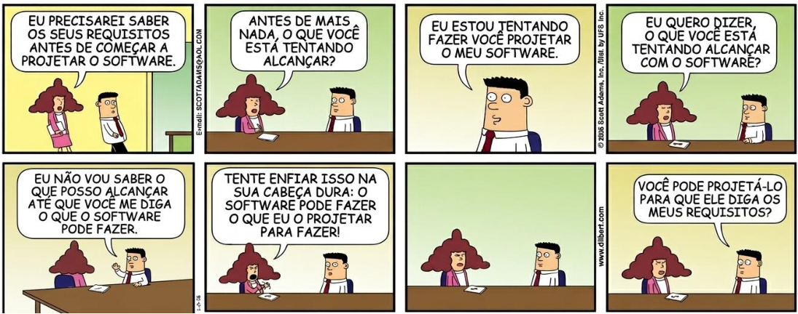

Enfim, chegamos à nossa última pergunta! Quais são as fases do processo de Engenharia de Requisitos? Bem, há duas respostas para essa pergunta! Como assim, professor? É que há uma divergência entre os principais autores. Nós vamos nos aprofundar nas fases do Sommerville, porque ele é o autor mais cobrado em provas nesse quesito, porém não custa nada ver também as fases do Pressman abaixo:

---

<!-- pagina: 24 -->

**Diego Carvalho, Equipe Informática 2 (Diego Carvalho), Equipe Informática 1 (Diego Carvalho) Aula 05** 

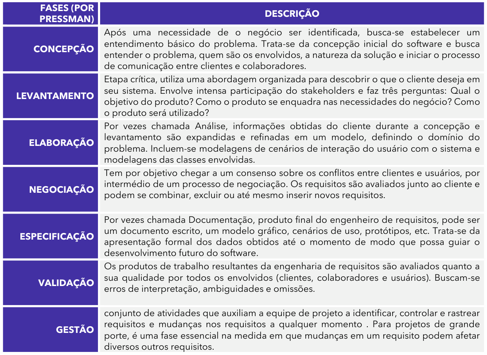

<!-- Start of picture text -->
FASES (POR DESCRIÇÃO PRESSMAN) Após uma necessidade de o negócio ser identificada, busca-se estabelecer um entendimento básico do problema. Trata-se da concepção inicial do software e busca CONCEPÇÃO entender o problema, quem são os envolvidos, a natureza da solução e iniciar o processo de comunicação entre clientes e colaboradores. Etapa crítica, utiliza uma abordagem organizada para descobrir o que o cliente deseja em seu sistema. Envolve intensa participação do stakeholders e faz três perguntas: Qual o LEVANTAMENTO objetivo do produto? Como o produto se enquadra nas necessidades do negócio? Como o produto será utilizado? Por vezes chamada Análise, informações obtidas do cliente durante a concepção e levantamento são expandidas e refinadas em um modelo, definindo o domínio do ELABORAÇÃO problema. Incluem-se modelagens de cenários de interação do usuário com o sistema e modelagens das classes envolvidas. Tem por objetivo chegar a um consenso sobre os conflitos entre clientes e usuários, por intermédio de um processo de negociação. Os requisitos são avaliados junto ao cliente e NEGOCIAÇÃO podem se combinar, excluir ou até mesmo inserir novos requisitos. Por vezes chamada Documentação, produto final do engenheiro de requisitos, pode ser um documento escrito, um modelo gráfico, cenários de uso, protótipos, etc. Trata-se da ESPECIFICAÇÃO apresentação formal dos dados obtidos até o momento de modo que possa guiar o desenvolvimento futuro do software. Os produtos de trabalho resultantes da engenharia de requisitos são avaliados quanto a sua qualidade por todos os envolvidos (clientes, colaboradores e usuários). Buscam-se VALIDAÇÃO erros de interpretação, ambiguidades e omissões. conjunto de atividades que auxiliam a equipe de projeto a identificar, controlar e rastrear requisitos e mudanças nos requisitos a qualquer momento . Para projetos de grande GESTÃO porte, é uma fase essencial na medida em que mudanças em um requisito podem afetar diversos outros requisitos. <!-- End of picture text -->

Podemos dizer, portanto, que na fase de concepção, tenta-se entender o problema a ser resolvido e criase uma concepção do software que resolverá esse problema; na fase de levantamento de requisitos, busca-se descobrir os requisitos que sistema terá; na fase de elaboração, também chamada de análise de requisitos, busca-se expandir e refinar esses requisitos – adicionando mais detalhes; na fase de negociação, busca-se um consenso sobre requisitos contraditórios, diferentes, entre outros. 

Já na fase de especificação de requisitos, também chamada de documentação de requisitos, cria-se o documento de requisitos; na fase de validação de requisitos, realiza-se uma revisão do documento de requisitos e avalia-se a sua qualidade; e, por fim, na fase de gestão, busca-se manter um controle e rastreabilidade dos requisitos do sistema de software. Agora notem que essas são as fases de acordo com Roger Pressman, mas temos uma classificação um pouco diferente de acordo com Ian Sommerville. 

A imagem seguinte representa bem a ideia de que Sommerville costuma detalhar mais atividades específicas, enquanto Pressman trabalha com macroatividades mais amplas e integradas. No entanto, existem pequenas simplificações didáticas: o Estudo de Viabilidade de Sommerville não equivale totalmente à Concepção de Pressman, pois possui foco maior em análise técnica, econômica e organizacional.

---

<!-- pagina: 25 -->

**Diego Carvalho, Equipe Informática 2 (Diego Carvalho), Equipe Informática 1 (Diego Carvalho) Aula 05** 

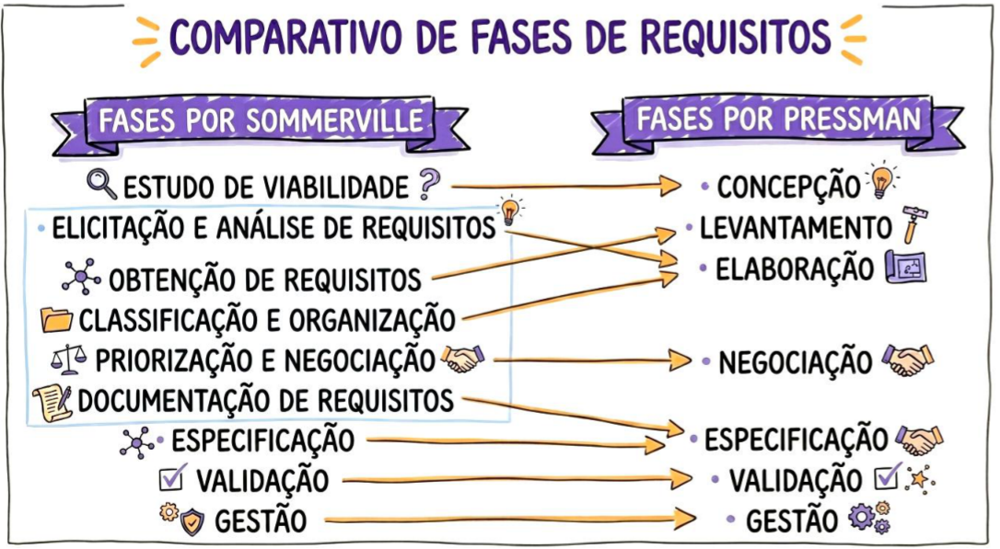

Além disso, Pressman enfatiza bastante que essas atividades não funcionam como processo linear rígido, mas como fluxo iterativo e contínuo. Também vale lembrar que algumas etapas mostradas separadamente em Sommerville aparecem integradas em outras atividades dependendo da edição do livro. De todo modo, é ainda um bom comparativo das fases de acordo com cada autor. 

Quando eu estudava esse assunto, eu criei mnemônicos para decorar as fases de cada autor. Lembrando que quanto mais absurdos forem os mnemônicos, mais fáceis de grudar na cabeça. Ok? 

**FASES POR IAN SOMMERVILLE** 

**FASES POR ROGER PRESSMAN** 

Por fim, é importante destacar o fluxo clássico das atividades da Engenharia de Requisitos apresentado por Ian Sommerville. Observem na imagem seguinte que ela não mostra um processo linear rígido, mas um conjunto de atividades interligadas e retroalimentadas continuamente. Em outras palavras, requisitos não são levantados uma única vez e depois “congelados”. Conforme entendimento do sistema evolui, novas análises, correções e refinamentos vão acontecendo ao longo do projeto.

---

<!-- pagina: 26 -->

**Diego Carvalho, Equipe Informática 2 (Diego Carvalho), Equipe Informática 1 (Diego Carvalho) Aula 05** 

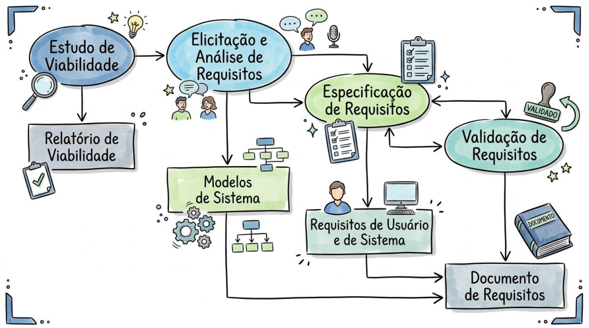

Tudo começa com o Estudo de Viabilidade. Nessa etapa, a equipe procura verificar se o sistema realmente vale a pena do ponto de vista técnico, econômico, operacional e organizacional. O principal resultado produzido aqui é o Relatório de Viabilidade, documento que ajuda a organização a decidir se projeto deve continuar ou não. Observem que antes mesmo de pensar profundamente em requisitos detalhados, existe preocupação inicial em saber se solução é viável dentro das restrições existentes. 

Depois entramos na Elicitação e Análise de Requisitos. Essa é uma das etapas mais importantes da Engenharia de Requisitos. Aqui a equipe conversa com usuários, clientes e stakeholders para descobrir necessidades, regras de negócio, problemas e expectativas relacionadas ao sistema. Durante análise, conflitos são identificados, ambiguidades são resolvidas e requisitos começam a ser organizados. O resultado parcial dessa atividade inclui os chamados Modelos de Sistema, utilizados para representar funcionamento do domínio e comportamento esperado do software. 

### **Saiba mais:** 

<mark>É importante mencionar a técnica de Decomposição Funcional. Trata-se de uma técnica estruturada de análise e elicitação muito utilizada na Engenharia de Software. Em sistemas complexos, é extremamente difícil compreender todas as necessidades de uma única vez. Através da decomposição funcional, o engenheiro de requisitos consegue dividir (ou decompor) grandes processos ou sistemas inteiros em partes menores, funções, submódulos e tarefas mais facilmente gerenciáveis. Essa abordagem descendente (top-down) não só facilita a identificação precisa de novos requisitos em cada subsistema, como também auxilia no mapeamento de dependências</mark> operacionais e na estruturação da arquitetura do software. 

A próxima atividade mostrada é a Especificação de Requisitos. Nessa fase, os requisitos identificados anteriormente passam a ser documentados de maneira mais clara, estruturada e detalhada. Observem

---

<!-- pagina: 27 -->

**Diego Carvalho, Equipe Informática 2 (Diego Carvalho), Equipe Informática 1 (Diego Carvalho) Aula 05** 

que a imagem mostra como especificação recebe informações da elicitação e também retroalimenta outras atividades. Isso acontece porque, enquanto requisitos são escritos, frequentemente surgem dúvidas, inconsistências e necessidades de refinamento. O principal produto dessa etapa são os Requisitos de Usuário e de Sistema documentados formalmente. 

Em seguida aparece a Validação de Requisitos. Aqui a preocupação principal é verificar se requisitos realmente representam aquilo que clientes e usuários desejam. A equipe procura identificar erros, inconsistências, ambiguidades, omissões e conflitos antes do desenvolvimento do software. Observem que existe uma seta retornando da validação para especificação. Isso é extremamente importante, pois mostra que requisitos frequentemente precisam ser corrigidos, ajustados ou refinados após revisões e validações realizadas pelos stakeholders. 

Ao final, todas essas atividades contribuem para produção do Documento de Requisitos. Esse documento consolida requisitos de usuário, requisitos de sistema, modelos e demais informações relevantes levantadas ao longo do processo. Observem também que tanto os Modelos de Sistema quanto os Requisitos de Usuário e Sistema alimentam diretamente esse documento final. Logo, o documento de requisitos funciona como resultado integrado das diversas atividades realizadas durante Engenharia de Requisitos. 

O aspecto mais importante da imagem talvez seja justamente mostrar natureza iterativa do processo. Não existe sequência completamente rígida em que uma atividade termina definitivamente antes da próxima começar. Enquanto requisitos são especificados, novos problemas podem surgir; durante validação, requisitos podem voltar para análise; e modelos podem ser ajustados continuamente. Sommerville enfatiza bastante essa retroalimentação constante porque compreensão do problema amadurece progressivamente ao longo do desenvolvimento do sistema. Agora vamos detalhar tudo... 

|**FASES (POR** **SOMMERVILLE)**|**DESCRIÇÃO**|
|---|---|
|**ESTUDO DE** **VIABILIDADE**|Fase inicial que busca avaliar se o sistema é técnica, econômica, operacional e organizacionalmente viável. Analisa restrições, custos, benefícios, riscos e alinhamento com objetivos do negócio. Ajuda a decidir se o projeto deve continuar, ser ajustado ou até cancelado antes de maiores investimentos.|
|**ELICITAÇÃO E** **ANÁLISE DE** **REQUISITOS**|Etapa responsável por descobrir, compreender, negociar e refinar requisitos junto aos stakeholders. Utiliza entrevistas, workshops, observação, prototipação e outras técnicas para identificar necessidades, regras de negócio, conflitos e prioridades relacionadas ao sistema que será desenvolvido.|
|**ESPECIFICAÇÃO** **DE REQUISITOS**|Fase em que os requisitos levantados são organizados e documentados de forma estruturada. O documento produzido descreve funcionalidades, restrições e características do sistema, servindo como referência para clientes, analistas, desenvolvedores e demais envolvidos no projeto.|
|**VALIDAÇÃO DE** **REQUISITOS**|Processo que verifica se os requisitos estão corretos, consistentes, completos, realistas e alinhados às necessidades dos usuários. Busca identificar ambiguidades, omissões e conflitos antes da implementação, reduzindo retrabalho, custos de correção e problemas futuros no sistema.|
|**GERENCIAMENTO** **DE REQUISITOS**|Processo contínuo responsável por controlar mudanças, manter versões, avaliar impactos e garantir rastreabilidade dos requisitos ao longo do ciclo de vida do sistema. Ajuda a acompanhar evolução das necessidades do negócio e preservar consistência entre requisitos e artefatos do projeto.|

---

<!-- pagina: 28 -->

**Diego Carvalho, Equipe Informática 2 (Diego Carvalho), Equipe Informática 1 (Diego Carvalho) Aula 05** 

<!-- Start of picture text -->
Estudo de Viabilidade <!-- End of picture text -->

##### **<mark>INCIDÊNCIA EM PROVA: MÉDIA</mark>** 

#### **<mark>ESTUDO DE VIABILIDADE</mark>** 

<mark>Etapa inicial da Engenharia de Requisitos e procura analisar se o projeto realmente faz sentido para a</mark> organização. Nesse momento, são avaliados fatores técnicos, financeiros, operacionais e organizacionais relacionados ao sistema proposto. O objetivo principal é identificar riscos, custos, benefícios e limitações antes de iniciar desenvolvimento mais detalhado do software. 

Quando estudamos Engenharia de Requisitos, uma das primeiras atividades importantes do processo é o chamado Estudo de Viabilidade. Segundo Ian Sommerville, essa etapa procura avaliar rapidamente se determinado sistema realmente vale a pena do ponto de vista técnico, econômico, operacional e organizacional. Em outras palavras, antes de investir grandes quantidades de tempo e dinheiro no projeto, a organização tenta descobrir se solução proposta faz sentido e possui chances reais de sucesso. 

Observem que o estudo de viabilidade não deve ser excessivamente longo, complexo ou caro. A ideia principal é realizar uma análise inicial relativamente rápida e com custo reduzido, produzindo informações suficientes para apoiar tomada de decisão da alta gestão. Afinal, não faria muito sentido gastar enormes recursos avaliando um projeto que talvez sequer avance para etapas posteriores do desenvolvimento. Por isso, essa atividade normalmente acontece logo no início da Engenharia de Requisitos. 

Nesse momento surgem diversas perguntas extremamente importantes: o sistema realmente agregará valor ao negócio? Existe retorno financeiro ou operacional justificável? A tecnologia necessária já está disponível? O prazo pretendido é viável? A organização possui recursos suficientes para implementação? Imaginem um sistema capaz de automatizar determinado processo organizacional, mas cujo custo de desenvolvimento seja extremamente elevado diante do benefício financeiro gerado. Nesse caso, talvez projeto simplesmente não seja economicamente interessante. 

Além da análise econômica, o estudo de viabilidade também procura compreender como o sistema apoiará os processos organizacionais existentes. Muitas vezes essa etapa produz um conjunto preliminar de requisitos de negócio, uma visão inicial do sistema e uma descrição geral de como solução proposta poderá contribuir para objetivos da organização. Essas informações servirão posteriormente como base para atividades mais detalhadas de elicitação, análise e especificação dos requisitos do software. 

Segundo Roger Pressman, projetos de software frequentemente fracassam não por problemas de programação, mas porque solução construída não era adequada às necessidades reais do negócio. É justamente por isso que o estudo de viabilidade possui papel tão importante: ele ajuda organização a evitar investimentos inadequados em sistemas inviáveis, desnecessários ou incompatíveis com contexto operacional existente. Em muitos casos, pequenos ajustes nessa etapa evitam enormes prejuízos futuros. 

Ao final dessa atividade, normalmente é produzido um Relatório de Viabilidade. Esse documento apresenta conclusões sobre riscos, custos, benefícios, restrições e possibilidade de implementação do sistema. Com base nessas informações, a alta direção pode tomar famosa decisão de go/no-go, isto é: seguir adiante com projeto, solicitar ajustes ou até cancelar desenvolvimento. Atenção porque uma resposta negativa nem sempre significa encerramento definitivo do projeto; muitas vezes ela apenas indica necessidade de revisão de escopo, orçamento ou tecnologia utilizada. 

De modo geral, o estudo de viabilidade procura responder três grandes perguntas fundamentais. Primeiro: o sistema contribui efetivamente para objetivos organizacionais? Segundo: ele pode ser implementado com tecnologia atual, dentro do prazo e do orçamento disponíveis? Terceiro: existe possibilidade de integração adequada com outros sistemas já utilizados pela organização? Observem

---

<!-- pagina: 29 -->

**Diego Carvalho, Equipe Informática 2 (Diego Carvalho), Equipe Informática 1 (Diego Carvalho) Aula 05** 

que essas perguntas procuram avaliar simultaneamente viabilidade estratégica, técnica, econômica e operacional da solução proposta. 

Na prática, responder corretamente essas questões está longe de ser algo simples. Muitas organizações ainda possuem processos pouco definidos, objetivos mal formalizados ou necessidades conflitantes entre setores diferentes. Por isso, Engenharia de Requisitos utiliza entrevistas, reuniões, questionários e outras técnicas para ajudar stakeholders a compreender melhor seus próprios problemas e expectativas. Em muitos casos, o estudo de viabilidade não apenas avalia uma solução existente; ele também ajuda organização a entender mais claramente aquilo que realmente necessita. 

Durante essa etapa, também é comum investigar questões como: o que acontecerá caso sistema não seja desenvolvido? Quais problemas atuais precisam ser resolvidos? Existem tecnologias novas ou arriscadas envolvidas? O sistema conseguirá interoperar com aplicações já implantadas? Que processos organizacionais serão apoiados pela solução? Observem como essas perguntas ajudam equipe e gestores a enxergar riscos, benefícios e impactos organizacionais antes do início efetivo do desenvolvimento do software. 

Percebam, portanto, que o estudo de viabilidade funciona como mecanismo inicial de redução de riscos dentro da Engenharia de Requisitos. Ele não procura produzir especificações detalhadas nem modelagens complexas do sistema; seu objetivo principal é verificar se existe justificativa real para continuidade do projeto. Em outras palavras, antes de decidir como desenvolver o software, a organização primeiro precisa responder uma pergunta muito mais importante: esse sistema realmente deve ser desenvolvido? 

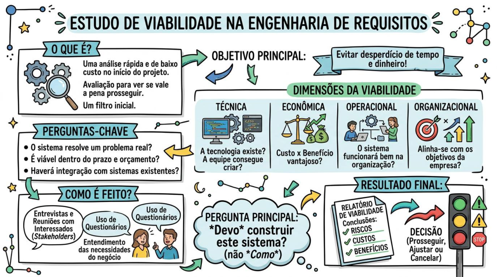

---

<!-- pagina: 30 -->

**Diego Carvalho, Equipe Informática 2 (Diego Carvalho), Equipe Informática 1 (Diego Carvalho) Aula 05** 

<!-- Start of picture text -->
Elicitação <!-- End of picture text -->

<!-- Start of picture text -->
e Análise de Requisitos <!-- End of picture text -->

##### **<mark>INCIDÊNCIA EM PROVA: ALTÍSSIMA</mark>** 

#### **<mark>ESTUDO DE VIABILIDADE</mark>** 

Identificação, compreensão e organização das necessidades dos usuários e do negócio. Nessa etapa, equipes realizam entrevistas, reuniões, observações e outras técnicas para levantar informações importantes sobre o sistema. Além disso, requisitos conflitantes, ambiguidades e restrições precisam ser analisados para reduzir riscos de falhas durante desenvolvimento. 

O verbo elicitar não aparece muito no nosso cotidiano; contudo, dentro da Engenharia de Requisitos ele possui enorme importância. Em termos simples, elicitar significa descobrir, identificar, extrair ou obter informações relacionadas às necessidades do sistema. Segundo Ian Sommerville, essa atividade envolve forte interação entre equipe técnica, clientes, usuários e demais stakeholders para compreender domínio da aplicação, regras de negócio, restrições e expectativas relacionadas ao software que será desenvolvido. 

A fase de Elicitação e Análise de Requisitos procura justamente descobrir aquilo que usuários realmente necessitam. Para isso, engenheiros de requisitos, analistas e demais profissionais utilizam técnicas como entrevistas, reuniões, observação de processos, questionários, workshops, brainstorming, análise documental e prototipação. Observem um detalhe importante: requisitos nem sempre aparecem explicitamente durante as conversas. Muitas vezes eles precisam ser inferidos, deduzidos ou descobertos gradualmente ao longo das interações realizadas com stakeholders. 

Segundo Roger Pressman, um dos maiores desafios da Engenharia de Requisitos está justamente na comunicação entre pessoas técnicas e pessoas de negócio. Quem já trabalhou em projetos reais sabe muito bem disso. Em muitos casos, o cliente explica uma necessidade de determinada maneira; contudo, gerente entende outra, analista interpreta outra e programador implementa algo completamente diferente. Quando problema finalmente chega ao usuário, sistema entregue frequentemente não corresponde à expectativa inicial. Vejam um exemplo a seguir: 

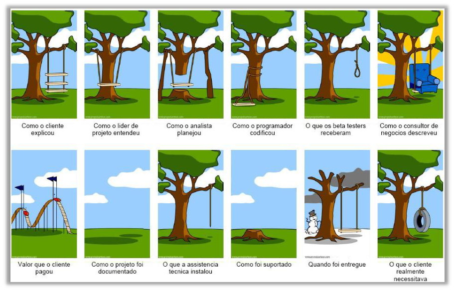

---

<!-- pagina: 31 -->

**Diego Carvalho, Equipe Informática 2 (Diego Carvalho), Equipe Informática 1 (Diego Carvalho) Aula 05** 

Esse cenário acontece porque comunicação humana é naturalmente complexa. Às vezes usuários possuem dificuldade para expressar claramente aquilo que desejam. Em outras situações, diferentes setores da organização possuem visões conflitantes sobre mesmo sistema. Também ocorre bastante de o usuário deixar de mencionar informações importantes porque considera determinados detalhes óbvios demais. O problema é que aquilo que parece evidente para área de negócio nem sempre será evidente para equipe técnica responsável pela implementação do software. 

Além disso, muitos processos organizacionais ainda não estão completamente maduros ou bem definidos. Em alguns casos, a própria organização descobre novas necessidades enquanto conversa sobre o sistema. Observem como isso torna Engenharia de Requisitos uma atividade altamente dinâmica e iterativa. O objetivo da elicitação não é apenas anotar pedidos feitos pelos usuários; ela também procura descobrir requisitos implícitos, identificar inconsistências, resolver ambiguidades e compreender problemas reais enfrentados pela organização. 

Dentro desse contexto, Sommerville destaca quatro atividades extremamente importantes durante elicitação e análise de requisitos: obtenção, classificação e organização, priorização e negociação, além da documentação dos requisitos. Essas atividades não funcionam como etapas rigidamente separadas; na prática, elas acontecem continuamente e se retroalimentam durante desenvolvimento do entendimento sobre o sistema. Conforme novos requisitos surgem, outros podem precisar ser reorganizados, negociados ou refinados. 

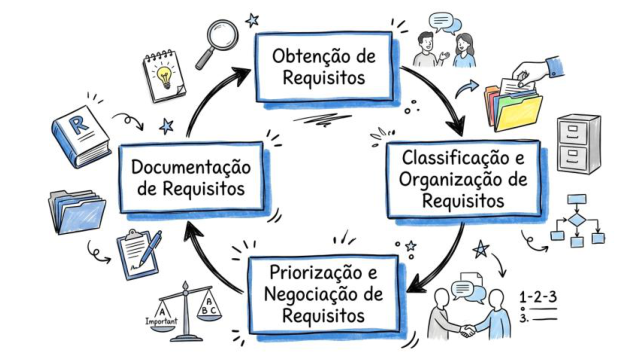

As principais atividades do processo de _elicitação e análise de requisitos_ são: 

- **a. Obtenção de Requisitos:** processo de interação com os stakeholders para coletar requisitos. Os requisitos de domínio também são descobertos durante essa atividade. 

- **b. Classificação e organização de requisitos:** esta atividade envolve a coleção de requisitos não estruturados, agrupa os requisitos relacionados e os organiza em conjuntos coerentes. 

- **c. Priorização e negociação de requisitos:** inevitavelmente, os requisitos serão conflitantes. Assim, busca-se priorizar os requisitos e resolver conflitos por meio da negociação.

---

<!-- pagina: 32 -->

**Diego Carvalho, Equipe Informática 2 (Diego Carvalho), Equipe Informática 1 (Diego Carvalho) Aula 05** 

- **d. Documentação de requisitos:** os requisitos são documentados e colocados na próxima volta da espiral. Podem ser produzidos documentos de requisitos formais ou informais. 

A Obtenção de Requisitos corresponde ao momento de interação direta com stakeholders para descobrir necessidades, restrições e regras do sistema. É nessa atividade que requisitos funcionais, não funcionais e requisitos de domínio começam a aparecer. Observem que nem todos os requisitos são explicitamente declarados pelos usuários. Muitas vezes equipe técnica precisa analisar processos, observar comportamentos e investigar problemas organizacionais para descobrir necessidades importantes que inicialmente não estavam visíveis. 

Depois ocorre a Classificação e Organização dos Requisitos. Nesse momento, requisitos coletados passam a ser agrupados segundo critérios específicos. Equipes podem classificá-los como funcionais ou não funcionais, requisitos de usuário ou sistema, permanentes ou voláteis, entre várias outras possibilidades. Além disso, requisitos relacionados são organizados em conjuntos coerentes, facilitando entendimento do sistema e identificação preliminar de conflitos, ambiguidades, inconsistências e omissões existentes na especificação. 

Em seguida aparece a atividade de Priorização e Negociação de Requisitos. Na prática, diferentes stakeholders frequentemente possuem interesses conflitantes. Um setor deseja maior segurança; outro deseja rapidez; outro quer redução de custos; e outro exige novas funcionalidades. Percebam que dificilmente será possível satisfazer plenamente todas as expectativas ao mesmo tempo. Por isso, a equipe precisa negociar prioridades, avaliar restrições e buscar soluções equilibradas que atendam objetivos mais importantes do projeto. 

Por fim, temos a Documentação de Requisitos. Nessa atividade, requisitos são registrados de maneira organizada, estruturada e compreensível para diferentes públicos envolvidos no projeto. Alguns documentos possuem linguagem mais voltada ao negócio; outros apresentam maior detalhamento técnico para desenvolvedores e testadores. Além disso, documentação não representa algo estático. Conforme entendimento do sistema evolui, requisitos podem ser refinados, ajustados e incorporados às próximas iterações do processo de Engenharia de Requisitos. 

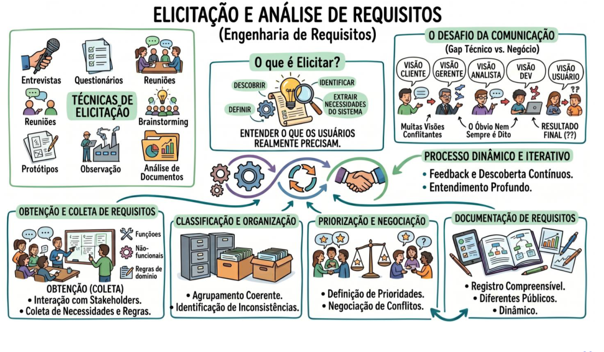

---

<!-- pagina: 33 -->

**Diego Carvalho, Equipe Informática 2 (Diego Carvalho), Equipe Informática 1 (Diego Carvalho) Aula 05** 

Para auxiliar a assegurar uma cobertura ampla dos requisitos de um sistema de software, utilizam-se divesas técnicas. Vejamos as principais: 

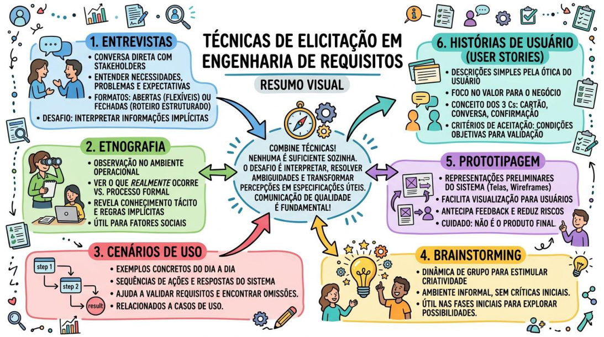

## **Entrevistas** 

Dentro da Engenharia de Requisitos, as entrevistas representam uma das técnicas de elicitação mais tradicionais e utilizadas na prática. Segundo Ian Sommerville, entrevistas permitem que engenheiros de requisitos conversem diretamente com stakeholders para compreender necessidades, problemas, regras de negócio, restrições e expectativas relacionadas ao sistema. Em outras palavras, trata-se de uma técnica voltada à descoberta de informações importantes sobre domínio da aplicação e funcionamento organizacional. 

Durante entrevistas, analistas e engenheiros de requisitos formulam perguntas para clientes, usuários finais, gestores e demais stakeholders envolvidos no projeto. A partir das respostas obtidas, requisitos podem ser identificados, inferidos ou derivados gradualmente. Observem um detalhe extremamente importante: requisitos nem sempre aparecem explicitamente durante conversa. Muitas vezes usuários descrevem problemas, dificuldades e necessidades de maneira indireta; cabe à equipe técnica interpretar corretamente essas informações e transformá-las em requisitos do sistema. 

As entrevistas podem assumir diferentes formatos. Em entrevistas abertas, existe maior liberdade de conversa e menor rigidez na sequência das perguntas. Isso não significa ausência completa de direcionamento; normalmente ainda existe objetivo claro e alguns tópicos previamente definidos para manter foco da discussão. Já entrevistas fechadas utilizam roteiro mais estruturado e perguntas previamente planejadas, permitindo maior padronização das respostas coletadas durante processo de elicitação. 

Na prática, muitas entrevistas acabam utilizando combinação dos dois formatos. O analista inicia com perguntas planejadas, mas determinadas respostas podem levar naturalmente a novos assuntos

---

<!-- pagina: 34 -->

**Diego Carvalho, Equipe Informática 2 (Diego Carvalho), Equipe Informática 1 (Diego Carvalho) Aula 05** 

discutidos de maneira mais livre. Sommerville destaca justamente que discussões totalmente abertas raramente funcionam bem, porque conversa pode perder foco rapidamente. Por isso, mesmo entrevistas mais flexíveis costumam possuir perguntas iniciais responsáveis por orientar entendimento do sistema e manter direcionamento da interação. 

As entrevistas são particularmente úteis para compreender atividades realizadas pelos stakeholders, dificuldades enfrentadas nos sistemas atuais e expectativas relacionadas ao novo software. Além disso, pessoas geralmente gostam de falar sobre próprio trabalho, processos e problemas cotidianos. Quando entrevistador demonstra interesse genuíno e utiliza escuta ativa, stakeholders frequentemente colaboram bastante durante levantamento de requisitos. Isso ajuda equipe técnica a construir visão inicial mais ampla sobre contexto organizacional e domínio do problema. 

Entretanto, entrevistas possuem algumas limitações importantes. Em muitos casos, elas não conseguem capturar completamente conhecimentos implícitos, regras tácitas e aspectos políticos presentes na organização. Questões relacionadas a poder, conflitos internos e restrições organizacionais frequentemente não aparecem claramente durante conversas formais. Além disso, usuários muitas vezes deixam de mencionar informações importantes porque consideram determinados detalhes óbvios demais dentro do contexto do negócio. 

Por essa razão, entrevistas normalmente são complementadas por outras técnicas de elicitação, como observação direta, análise documental, prototipação, workshops e etnografia. Observem como Engenharia de Requisitos procura combinar diferentes estratégias para reduzir riscos de omissões e interpretações incorretas. Uma única técnica raramente consegue capturar toda complexidade existente em sistemas reais, especialmente em organizações grandes ou ambientes altamente especializados. 

Outro ponto extremamente importante envolve qualidade da comunicação durante entrevista. Segundo Roger Pressman, analistas precisam evitar perguntas ambíguas, confirmar entendimento constantemente e registrar corretamente as informações obtidas. Também é importante tomar cuidado com vieses pessoais e interpretações precipitadas. Em muitos casos, pequenas diferenças na forma de perguntar podem influenciar significativamente respostas fornecidas pelos stakeholders. 

Além disso, existem diferentes estratégias para condução das perguntas ao longo da entrevista. Uma técnica bastante conhecida é o modelo Funil: começa com perguntas mais amplas e genéricas, avançando gradualmente para questões mais específicas e detalhadas. Já o modelo Pirâmide realiza caminho oposto, iniciando por perguntas detalhadas e depois expandindo discussão para aspectos mais gerais do problema. Existe ainda o modelo Diamante, que combina características dos dois formatos anteriores. 

Por fim, entrevistas representam ferramenta extremamente importante dentro da Engenharia de Requisitos moderna porque ajudam equipe técnica a compreender necessidades humanas, organizacionais e operacionais relacionadas ao software. Contudo, elicitar requisitos vai muito além de simplesmente `“` fazer perguntas `”` . O verdadeiro desafio está em interpretar corretamente informações obtidas, identificar requisitos implícitos, resolver ambiguidades e transformar percepções dos stakeholders em especificações compreensíveis, consistentes e úteis para desenvolvimento do sistema. 

## **Etnografia** 

A Etnografia representa uma técnica de observação utilizada para compreender como pessoas realmente trabalham dentro de uma organização. Segundo Ian Sommerville, essa abordagem procura inserir o analista no ambiente operacional dos usuários para observar tarefas, interações, rotinas e comportamentos executados diariamente. Em outras palavras, em vez de apenas perguntar como trabalho acontece, a equipe passa a acompanhar diretamente aquilo que realmente ocorre na prática.

---

<!-- pagina: 35 -->

**Diego Carvalho, Equipe Informática 2 (Diego Carvalho), Equipe Informática 1 (Diego Carvalho) Aula 05** 

Observem um detalhe extremamente importante: muitas vezes existe grande diferença entre processo formal documentado pela organização e processo real executado pelas pessoas no cotidiano. Em documentos internos, determinadas atividades podem parecer perfeitamente organizadas e padronizadas; contudo, durante trabalho diário, usuários frequentemente criam atalhos, adaptações e soluções improvisadas para lidar com problemas operacionais. A etnografia procura justamente identificar essas diferenças entre teoria organizacional e prática real. 

Na prática, o analista acompanha usuários durante execução das atividades, observando tarefas, interações entre setores, utilização de ferramentas e dificuldades enfrentadas no ambiente de trabalho. Além disso, realiza registros e anotações sobre comportamento operacional observado ao longo do processo. Observem que essa técnica normalmente exige certo período de convivência e imersão no contexto organizacional, justamente porque muitos detalhes importantes não aparecem em observações rápidas ou superficiais. 

Uma das maiores vantagens da etnografia está na descoberta dos chamados requisitos implícitos ou requisitos tácitos. Muitas pessoas possuem enorme dificuldade para explicar detalhadamente atividades realizadas diariamente. Isso acontece porque determinadas ações já se tornaram tão naturais e automáticas que os próprios usuários deixam de percebê-las conscientemente. Em entrevistas tradicionais, esses detalhes frequentemente não aparecem; contudo, durante observação direta, eles podem se tornar bastante evidentes para equipe de Engenharia de Requisitos. 

Imaginem, por exemplo, um funcionário que sempre consulta uma planilha paralela antes de utilizar determinado sistema corporativo. Talvez ele sequer considere isso importante durante entrevista, porque aquela atividade já faz parte automática de sua rotina diária. Entretanto, para equipe técnica, essa informação pode revelar limitação importante do sistema atual ou até necessidade de nova funcionalidade. Observem como etnografia ajuda bastante a descobrir dependências, exceções operacionais e práticas informais existentes dentro da organização. 

Outro aspecto extremamente relevante envolve fatores sociais e organizacionais. Muitas vezes usuários compreendem perfeitamente próprio trabalho individual; contudo, não enxergam claramente como atividades executadas por outros setores afetam processo organizacional como um todo. Além disso, questões relacionadas a hierarquia, influência, comunicação informal e relações de poder frequentemente permanecem implícitas durante entrevistas convencionais. A observação etnográfica ajuda analista a perceber esses elementos com maior profundidade. 

Segundo Roger Pressman, Engenharia de Requisitos depende fortemente da compreensão adequada do contexto humano e organizacional no qual software será utilizado. Sistemas não operam isoladamente; eles fazem parte de ambientes sociais complexos compostos por pessoas, processos e regras organizacionais. Por isso, compreender apenas funcionalidades técnicas normalmente não é suficiente para construção de soluções realmente úteis e alinhadas às necessidades reais dos usuários. 

Entretanto, a etnografia também possui limitações importantes. Embora seja extremamente poderosa para descoberta de requisitos implícitos e entendimento do ambiente organizacional, ela normalmente não consegue capturar sozinha todos os requisitos necessários ao sistema. Por essa razão, costuma ser utilizada em conjunto com outras técnicas de elicitação, como entrevistas, workshops, questionários, prototipação e análise documental. Engenharia de Requisitos moderna procura justamente combinar diferentes abordagens para obter visão mais completa do problema. 

Outro ponto importante envolve interpretação das observações realizadas. O analista precisa tomar bastante cuidado para não tirar conclusões precipitadas a partir do comportamento observado. Afinal, pessoas podem modificar parcialmente próprio comportamento quando sabem que estão sendo

---

<!-- pagina: 36 -->

**Diego Carvalho, Equipe Informática 2 (Diego Carvalho), Equipe Informática 1 (Diego Carvalho) Aula 05** 

observadas. Além disso, diferentes observadores podem interpretar mesma situação de maneiras distintas. Por isso, registros detalhados, validação das observações e interação contínua com stakeholders continuam sendo fundamentais durante processo etnográfico. 

Percebam, portanto, que a etnografia vai muito além de simplesmente “olhar usuários trabalhando”. Seu verdadeiro objetivo é compreender contexto operacional real no qual sistema será utilizado, identificando práticas informais, necessidades implícitas, dependências organizacionais e dificuldades cotidianas frequentemente invisíveis em técnicas tradicionais de entrevista. Em muitos projetos complexos, especialmente em grandes organizações, essa compreensão aprofundada do ambiente humano pode fazer enorme diferença na qualidade final dos requisitos levantados. 

## **Cenários de Casos de Uso** 

Quando estudamos Engenharia de Requisitos, percebemos rapidamente que usuários costumam ter mais facilidade para relatar exemplos concretos do cotidiano do que produzir descrições abstratas sobre funcionalidades. Nesse contexto surgem os cenários, que representam situações específicas de interação entre usuários e sistema. Essa abordagem facilita bastante compreensão, validação e refinamento dos requisitos do software. 

Um cenário normalmente começa com uma descrição simples da interação e vai sendo refinado gradualmente durante a elicitação. Aos poucos, são acrescentados elementos como sequência de ações, respostas do sistema, regras de negócio, exceções e alternativas de execução. Em geral, cada cenário procura representar uma situação específica de uso; quando existem caminhos alternativos relevantes, novos cenários ou fluxos complementares podem ser criados para aumentar clareza e detalhamento da especificação. 

A elicitação baseada em cenários pode ocorrer tanto formalmente quanto informalmente. Engenheiros de requisitos trabalham em conjunto com stakeholders para identificar exemplos reais de utilização do sistema e documentá-los em diferentes formatos: textos, diagramas, imagens, protótipos, fluxos de eventos e casos de uso. Os casos de uso possuem relação muito próxima com cenários, pois organizam interações entre atores e sistema de maneira mais estruturada e padronizada para análise e documentação. 

### **Saiba mais:** 

<mark>Na elicitação baseada em cenários e na técnica de casos de uso, é fundamental não confundir o indivíduo físico (o usuário) com o perfil sistêmico mapeado. Um ator de casos de uso não equivale a um usuário humano específico, mas sim a um "papel" abstrato exercido na interação com o sistema a ser construído. Portanto, um mesmo usuário real no cotidiano pode desempenhar múltiplos papéis diferentes perante a aplicação, assumindo assim a figura de diferentes atores dependendo</mark> da operação que estiver executando. 

Cenários ajudam a revelar problemas que muitas vezes não aparecem em descrições excessivamente técnicas. Ao analisar situações concretas, usuários conseguem identificar omissões, ambiguidades e inconsistências com maior facilidade. Essa abordagem também possui forte relação com métodos ágeis, como Extreme Programming, porque valoriza colaboração, feedback contínuo e interação próxima com clientes; contudo, cenários já eram amplamente utilizados na Engenharia de Requisitos tradicional antes do surgimento das metodologias ágeis.

---

<!-- pagina: 37 -->

**Diego Carvalho, Equipe Informática 2 (Diego Carvalho), Equipe Informática 1 (Diego Carvalho) Aula 05** 

Outro conceito importante são os Épicos, que representam grandes conjuntos de funcionalidades ainda muito amplos para implementação direta. Esses épicos normalmente são divididos em histórias menores ao longo do projeto. Já as Features correspondem a funcionalidades relevantes entregues ao usuário ou ao negócio. Todos esses conceitos possuem forte relação com comunicação, entendimento do problema e alinhamento entre equipe técnica e necessidades organizacionais. Quando requisitos são mal compreendidos, surgem retrabalho, atrasos, aumento de custos e insatisfação dos usuários. 

## **Brainstorming** 

Quando estudamos técnicas colaborativas de elicitação de requisitos, o brainstorming aparece como uma abordagem bastante utilizada para estimular criatividade e geração de ideias dentro da equipe. A dinâmica normalmente ocorre em grupo e procura criar um ambiente informal no qual os participantes possam sugerir soluções, necessidades, problemas e possibilidades sem receio de críticas imediatas. Durante essa etapa inicial, toda contribuição é registrada, inclusive ideias aparentemente estranhas ou pouco convencionais, porque muitas vezes propostas improváveis acabam inspirando soluções bastante interessantes posteriormente. 

O brainstorming é especialmente útil nas fases iniciais da elicitação, quando ainda existe muita incerteza sobre o problema e é necessário explorar possibilidades. Normalmente existe um facilitador responsável por organizar discussões, incentivar participação equilibrada e posteriormente agrupar, filtrar e priorizar as sugestões levantadas. A técnica valoriza diversidade de perspectivas e colaboração coletiva; contudo, sua eficácia depende bastante do engajamento do grupo e da disponibilidade dos participantes envolvidos. 

## **Prototipação** 

Quando estudamos elicitação de requisitos, a prototipação aparece como uma técnica extremamente útil para ajudar usuários e stakeholders a compreender melhor o sistema que será desenvolvido. A ideia central é construir representações preliminares da aplicação: desenhos, wireframes, telas navegáveis ou até versões parcialmente funcionais. Isso é especialmente importante quando usuários têm dificuldade para expressar necessidades apenas verbalmente, pois visualizar algo concreto facilita bastante identificação, esclarecimento e refinamento dos requisitos do sistema. 

Outro ponto muito importante é que a prototipação permite obter feedback antecipado e detectar problemas ainda nas fases iniciais do projeto, reduzindo riscos, retrabalho e ambiguidades. Além disso, usuários costumam participar mais ativamente do processo porque conseguem enxergar fluxos, telas e comportamentos próximos da aplicação real. Mas atenção para um detalhe importante: protótipos podem gerar falsa impressão de que o sistema já está praticamente pronto, quando muitas vezes representam apenas uma simulação inicial. Também existem diferentes tipos de protótipos: alguns são descartáveis e servem apenas para validação inicial; outros evoluem gradualmente até se aproximarem do produto final. 

## **Histórias de Usuários** 

As histórias de usuário surgiram com bastante força no contexto da Extreme Programming e posteriormente passaram a ser amplamente utilizadas em diversos métodos ágeis. A ideia central é relativamente simples: descrever funcionalidades sob a perspectiva do usuário final, focando aquilo que realmente gera valor para o negócio. Em vez de especificações longas e excessivamente técnicas, procura-se registrar necessidades de forma curta, objetiva e fácil de compreender. Um formato bastante conhecido é: “Como um <papel>, eu quero <objetivo> para <benefício>”. Isso melhora comunicação, colaboração e adaptação contínua dos requisitos.

---

<!-- pagina: 38 -->

**Diego Carvalho, Equipe Informática 2 (Diego Carvalho), Equipe Informática 1 (Diego Carvalho) Aula 05** 

Outro ponto extremamente importante é perceber que histórias de usuário não representam documentação completa e definitiva; elas funcionam mais como lembretes para conversas contínuas entre equipe e stakeholders. Existe até um conceito muito famoso chamado “3 Cs”: Card, Conversation e Confirmation. O cartão registra resumidamente a necessidade; a conversa detalha entendimento e regras do negócio; já a confirmação ocorre por meio dos critérios de aceitação. Esses critérios definem condições objetivas para verificar se a funcionalidade realmente atende às expectativas do usuário. Por isso, precisam ser claros, específicos e verificáveis, servindo como referência tanto para desenvolvimento quanto para testes e validação da solução implementada. 

Na prática, as histórias ajudam bastante quando usuários têm dificuldade para descrever tecnicamente aquilo que desejam no sistema. Em vez de falar diretamente em requisitos complexos, o usuário descreve objetivos, necessidades e resultados esperados no contexto do próprio trabalho. Além disso, as histórias podem ser refinadas iterativamente ao longo do projeto conforme novas informações surgem e prioridades mudam. Isso é muito valorizado em ambientes ágeis, porque requisitos raramente permanecem totalmente estáveis do início ao fim do desenvolvimento. No entanto, Pressman ressalta que sistemas grandes, críticos ou altamente regulados normalmente exigem documentação complementar, regras de negócio mais detalhadas e modelos adicionais de especificação. 

### **Saiba mais:** 

<mark>Para garantir a qualidade, clareza e utilidade na elaboração de Histórias de Usuário, o mercado ágil adota massivamente os critérios do acrônimo INVEST, criado por Bill Wake. Uma boa história de usuário deve ser: Independent (Independente, permitindo seu desenvolvimento sem amarras estritas a outras), Negotiable (Negociável, atuando como um convite à discussão e não como um contrato fechado), Valuable (Valiosa, agregando valor direto ao negócio ou usuário final), Estimable (Estimável, permitindo que a equipe calcule o esforço de implementação), Small (Pequena, de modo que caiba dentro de uma única sprint ou iteração) e Testable (Testável, acompanhada de</mark> critérios de aceitação objetivos que comprovem sua conclusão). 

Os critérios de aceitação possuem papel fundamental nesse processo porque ajudam a delimitar claramente o comportamento esperado da funcionalidade. Eles funcionam praticamente como uma lista de verificação para validar se a história foi implementada corretamente. Mas atenção para um detalhe importante: critérios de aceitação devem permanecer focados diretamente na funcionalidade descrita pela história. Quando começam a introduzir serviços paralelos, módulos independentes ou requisitos muito amplos, pode ser sinal de que novas histórias de usuário precisam ser criadas separadamente. Essa separação melhora organização do backlog, facilita testes e reduz ambiguidades durante desenvolvimento e validação do sistema. 

Por fim, uma história de usuário pode ser vista como a composição de três componentes principais, conhecidos como Três C’s (Cartão, Conversação e Confirmação). Vejamos: 

**<mark>TRÊS C’S DESCRIÇÃO</mark>** O cartão é uma breve descrição da história de usuário escrita em um formato padrão, geralmente em cartões físicos ou em uma ferramenta de gerenciamento de projetos. Ele deve ser conciso, mas suficiente para lembrar a equipe do que se trata a história. Um **CARTÃO** formato comum para escrever histórias de usuário é: "como [tipo de usuário], eu quero [alguma funcionalidade] para [alguma razão/benefício]". Exemplo: "como um cliente, eu quero poder adicionar produtos ao meu carrinho de compras para que eu possa comprálos posteriormente".

---

<!-- pagina: 39 -->

**Diego Carvalho, Equipe Informática 2 (Diego Carvalho), Equipe Informática 1 (Diego Carvalho) Aula 05** 

A conversa refere-se ao diálogo contínuo entre os membros da equipe e os stakeholders (como os clientes ou usuários finais) para esclarecer os detalhes e entender melhor a história de usuário. Essa conversa é crucial para assegurar que todos tenham uma **CONVERSAÇÃO** compreensão comum das necessidades e dos requisitos, permitindo que a equipe desenvolva a funcionalidade de maneira adequada. As conversas podem acontecer durante as reuniões de planejamento, sessões de refinamento do backlog, ou informalmente conforme necessário. A confirmação envolve a definição de critérios de aceitação que especificam as condições que devem ser atendidas para que a história de usuário seja considerada concluída. Esses critérios de aceitação são acordados entre a equipe e os stakeholders e servem como base para testar a funcionalidade e garantir que ela atende aos requisitos especificados. **CONFIRMAÇÃO** 

A confirmação envolve a definição de critérios de aceitação que especificam as condições que devem ser atendidas para que a história de usuário seja considerada concluída. Esses critérios de aceitação são acordados entre a equipe e os stakeholders e servem como base para testar a funcionalidade e garantir que ela atende aos requisitos especificados. Exemplo de critérios de aceitação: "O cliente deve ser capaz de adicionar até 10 itens diferentes ao carrinho. O carrinho deve exibir corretamente o nome, quantidade e preço de cada item. O total do carrinho deve ser atualizado automaticamente quando novos itens são adicionados". 

Essas são as técnicas disparadamente mais cobradas em provas de concursos, mas existem algumas ==5460== outras que caem vez ou outra também. Vejamos: 

**<mark>TÉCNICAS DESCRIÇÃO</mark>** Técnica baseada em formulários com perguntas previamente definidas e distribuídas aos stakeholders. É útil quando existe grande quantidade de participantes e necessidade de **QUESTIONÁRIO** coletar informações padronizadas rapidamente. Possui baixo custo e fácil aplicação; contudo, apresenta pouca interação e aprofundamento. Reunião estruturada e intensiva que reúne usuários, analistas e demais stakeholders para **WORKSHOP DE** discutir, negociar e refinar requisitos. Possui forte caráter colaborativo e costuma utilizar **REQUISITOS** brainstorming, cenários e dinâmicas de grupo. Ajuda bastante na resolução de conflitos e alinhamento de expectativas. Técnica que utiliza análise de normas, contratos, manuais, organogramas, políticas e **LEITURA DE** registros organizacionais para identificar requisitos, regras de negócio e restrições do **DOCUMENTOS** sistema. É muito utilizada em sistemas legados; contudo, documentos podem estar desatualizados ou incompletos. Técnica colaborativa semelhante a workshops estruturados, reunindo usuários, gestores e **JAD (JOINT** desenvolvedores em sessões intensivas de levantamento e negociação de requisitos. O **APPLICATION** facilitador organiza discussões e busca acelerar decisões, reduzir ambiguidades e **DESIGN)** melhorar entendimento do negócio. Consiste no aproveitamento de requisitos, modelos, padrões e soluções já utilizados em **REÚSO DE** projetos anteriores ou domínios semelhantes. Ajuda a reduzir esforço, retrabalho e **REQUISITOS** inconsistências; contudo, exige adaptação cuidadosa ao novo contexto organizacional e às necessidades específicas do sistema. Abordagem em que usuários acompanham continuamente o desenvolvimento do **PARTICIPAÇÃO** sistema, colaborando com validações, revisões e refinamentos de requisitos. É muito **ATIVA DE** valorizada em métodos ágeis porque reduz desalinhamentos e melhora aderência do **USUÁRIOS** produto às necessidades reais do negócio. Técnica também conhecida como dramatização de papéis ou role playing. Os participantes simulam situações reais de uso do sistema para identificar dificuldades, **ENCENAÇÃO** necessidades e fluxos operacionais. Ajuda bastante na descoberta de requisitos implícitos e problemas de interação entre usuários e sistema. **GRUPO FOCAL** Técnica baseada em discussões conduzidas por um moderador com um pequeno grupo de stakeholders. O objetivo é explorar opiniões, <u>percepções e expectativas sobre o</u> 

Técnica baseada em formulários com perguntas previamente definidas e distribuídas aos stakeholders. É útil quando existe grande quantidade de participantes e necessidade de coletar informações padronizadas rapidamente. Possui baixo custo e fácil aplicação; contudo, apresenta pouca interação e aprofundamento.

---

<!-- pagina: 40 -->

**Diego Carvalho, Equipe Informática 2 (Diego Carvalho), Equipe Informática 1 (Diego Carvalho) Aula 05** 

|**TÉCNICAS**|
|---|
|**ANÁLISE DE** **PROTOCOLOS**|
|**VORD**|
|**CARD SORTING**|
|**STORYTELLING**|
|**ARQUEOLOGIA DE** **SISTEMAS**|
|**ANALOGIA/** **METÁFORA**|
|**APRENDIZADO** **(APPRENTICING)**|
|**ANÁLISE DE** **DOMÍNIO**|

**<mark>DESCRIÇÃO</mark>** <mark>sistema. É bastante útil para compreender necessidades subjetivas, problemas</mark> organizacionais e prioridades do negócio. 

Técnica em que usuários executam tarefas reais enquanto verbalizam pensamentos, decisões e dificuldades encontradas durante a atividade. O engenheiro de requisitos observa comportamentos e raciocínios envolvidos no trabalho cotidiano, identificando requisitos implícitos e problemas operacionais. 

Também chamada de Viewpoint Oriented Requirements Definition (VORD)1 , é uma técnica para identificar requisitos a partir das diferentes perspectivas existentes na organização. Cada stakeholder ou grupo possui necessidades próprias; assim, a técnica ajuda a organizar conflitos, responsabilidades e expectativas relacionadas ao sistema. 

Técnica muito utilizada em arquitetura da informação e organização de funcionalidades. Usuários agrupam cartões contendo conceitos, menus ou funcionalidades conforme sua percepção lógica. Ajuda a estruturar navegação, categorização de informações e organização de interfaces do sistema. 

Técnica baseada na construção de narrativas para representar situações, experiências e necessidades dos usuários no contexto do sistema. Ajuda stakeholders a compreender problemas de negócio de maneira mais concreta e humana, facilitando descoberta de requisitos, comunicação e alinhamento entre equipe e clientes. 

Técnica utilizada principalmente em sistemas legados, baseada na análise de códigofonte, bancos de dados, interfaces, relatórios e comportamentos do sistema existente para descobrir requisitos implícitos e regras de negócio não documentadas. É muito útil quando documentação está ausente, incompleta ou desatualizada. 

Técnica que utiliza comparações com objetos, situações ou sistemas conhecidos para facilitar compreensão e comunicação dos requisitos. Ajuda stakeholders a visualizar conceitos abstratos, explicar funcionalidades complexas e alinhar entendimento entre usuários e equipe técnica de maneira mais intuitiva e acessível. 

Técnica em que o engenheiro de requisitos acompanha o usuário como um aprendiz durante execução de atividades reais de trabalho. O objetivo é compreender processos, decisões, dificuldades e práticas cotidianas no ambiente operacional, identificando requisitos implícitos e necessidades que dificilmente surgiriam apenas em entrevistas. 

Técnica foca na identificação, modelagem e especificação de requisitos inerentes a um setor ou domínio de aplicação. Ela é apropriada para revelar não só regras de negócio engessadas, mas requisitos não funcionais fundamentais que muitas vezes permanecem ocultos ou presumidos como "óbvios" em abordagens mais tradicionais de elicitação. 

> 1 Em tradução livre, também chamada de Definição de Requisitos orientada a Pontos de Vista (ou Perspectivas). Diferente da simples leitura ad hoc de documentos, cada revisor da equipe técnica emula ativamente um papel específico do projeto (por exemplo, assumindo intencionalmente a ótica focada de um testador rigoroso, de um designer de banco de dados ou de um usuário final). Ler os artefatos baseando-se estritamente sob essas lentes isoladas ajuda a desnudar requisitos operacionais e funcionais implícitos que a leitura panorâmica normalmente ignora.

---

<!-- pagina: 41 -->

**Diego Carvalho, Equipe Informática 2 (Diego Carvalho), Equipe Informática 1 (Diego Carvalho) Aula 05** 

<!-- Start of picture text -->
Especificação de Requisitos <!-- End of picture text -->

##### **<mark>INCIDÊNCIA EM PROVA: MÉDIA</mark>** 

#### **<mark>ESPECIFICAÇÃO DE REQUISITOS</mark>** 

<mark>Processo de documentar claramente funcionalidades, regras, restrições e características esperadas do sistema.</mark> O objetivo é criar uma descrição suficientemente compreensível para usuários, desenvolvedores, arquitetos e testadores. Dependendo do contexto, podem ser utilizados textos, diagramas, histórias de usuário, modelos e outras formas de representação dos requisitos. 

É nesse momento basicamente que as informações obtidas durante elicitação e análise começam a ser organizadas de maneira estruturada em um documento formal. Esse documento funciona como uma referência central para clientes, analistas, desenvolvedores, gerentes e testadores, ajudando a registrar aquilo que foi acordado sobre o sistema. Em muitos projetos tradicionais, ele também pode assumir caráter contratual, servindo como base para negociação, acompanhamento e validação do produto desenvolvido. 

Normalmente, o documento reúne requisitos de usuário e requisitos de sistema. Os requisitos de usuário costumam ser descritos em linguagem mais simples e compreensível, focando funcionalidades e características externas do sistema sob a perspectiva do negócio. Já os requisitos de sistema adicionam maior detalhamento técnico, explicando como funcionalidades, restrições e comportamentos deverão ser implementados. Dependendo do contexto, podem ser utilizados textos estruturados, tabelas, diagramas, casos de uso, modelos semiformais e até especificações matemáticas formais em sistemas mais críticos ou rigorosos. 

### **Saiba mais:** 

<mark>Além das representações puramente textuais, os modelos gráficos (como diagramas de classes enriquecidos, diagramas de restrições em SysML ou diagramas de objetivos no framework NFR - Non-Functional Requirements) são plenamente capazes de representar requisitos não funcionais e suas interdependências. Tais modelos permitem à equipe visualizar de maneira estruturada como restrições de desempenho, segurança e usabilidade se relacionam, indicando onde existem</mark> conflitos (trade-offs) e como eles impactam o projeto arquitetural do sistema de forma integrada. 

Idealmente, os requisitos deveriam ser claros, completos, consistentes, não ambíguos e fáceis de compreender. Mas olha só um detalhe importante: na prática isso é extremamente difícil de atingir completamente. Diferentes stakeholders podem interpretar o mesmo requisito de maneiras distintas, principalmente em sistemas grandes e complexos. Além disso, conflitos de interesse, mudanças organizacionais e evolução das necessidades do negócio fazem com que requisitos sejam constantemente refinados ao longo do projeto. Por isso, a Engenharia de Requisitos moderna trabalha muito com revisões contínuas, refinamentos iterativos e comunicação frequente entre as partes envolvidas. 

Outro ponto importante é entender a diferença entre especificação e validação. Durante a especificação existe preocupação em escrever requisitos da forma mais clara e organizada possível; contudo, a validação é a atividade que busca verificar efetivamente se os requisitos estão corretos, consistentes, completos e alinhados às necessidades dos stakeholders. Sommerville também destaca bastante a importância da rastreabilidade dentro desse processo, pois um bom documento deve permitir acompanhar relações entre requisitos, objetivos do negócio, decisões de projeto, implementação e testes. Isso reduz retrabalho, melhora controle das mudanças e facilita manutenção futura do sistema.

---

<!-- pagina: 42 -->

**Diego Carvalho, Equipe Informática 2 (Diego Carvalho), Equipe Informática 1 (Diego Carvalho) Aula 05** 

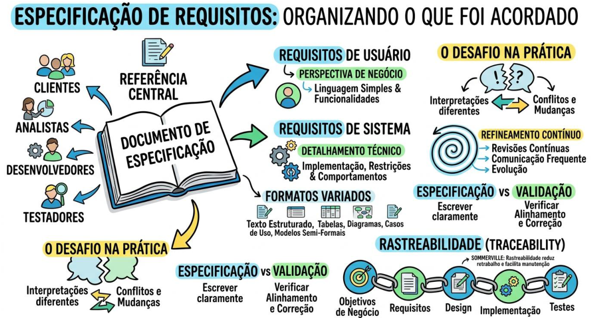

---

<!-- pagina: 43 -->

**Diego Carvalho, Equipe Informática 2 (Diego Carvalho), Equipe Informática 1 (Diego Carvalho) Aula 05** 

<!-- Start of picture text -->
Validação de Requisitos <!-- End of picture text -->

##### **<mark>INCIDÊNCIA EM PROVA: ALTÍSSIMA</mark>** 

#### **<mark>VALIDAÇÃO DE REQUISITOS</mark>** 

Verifica se os requisitos levantados representam corretamente as necessidades dos usuários e objetivos do negócio. Nessa etapa, equipes analisam clareza, consistência, completude e ausência de ambiguidades nos requisitos definidos. O objetivo principal é identificar erros o mais cedo possível, reduzindo retrabalho, atrasos e <u>problemas futuros durante implementação do sistema.</u> 

Quando estudamos Engenharia de Requisitos, a validação aparece como uma etapa extremamente importante porque é justamente nesse momento que os requisitos são analisados para verificar se realmente representam as necessidades do sistema e dos usuários. A validação procura identificar problemas relacionados à consistência, completude, validade, realismo e verificabilidade dos requisitos. Em outras palavras, busca-se descobrir se os requisitos fazem sentido, se não existem conflitos importantes e se aquilo que foi especificado pode realmente ser implementado e testado adequadamente. 

Esse processo possui enorme importância porque erros descobertos tardiamente costumam gerar custos muito maiores de correção. Quando um problema é identificado ainda na fase de requisitos, normalmente basta ajustar documentos, regras ou descrições; contudo, quando o defeito só aparece durante implementação, testes ou operação do sistema, pode ser necessário alterar projeto, código, banco de dados, arquitetura e até funcionalidades já concluídas. É justamente por isso que Pressman enfatiza bastante a ideia de prevenção precoce de defeitos, pois corrigir requisitos antes do desenvolvimento avançar reduz retrabalho, desperdício e impactos no cronograma do projeto. 

Outro ponto muito importante é perceber que validação não é uma atividade puramente técnica. Embora engenheiros de software participem bastante do processo, usuários, clientes, gestores e demais stakeholders também precisam colaborar ativamente. O problema é que validar requisitos exige imaginar o sistema funcionando antes mesmo de ele existir de verdade; e olha só: isso já é difícil até para profissionais experientes da área de tecnologia. Para usuários finais, essa abstração costuma ser ainda mais complicada, principalmente em sistemas grandes, complexos ou muito inovadores. 

Por isso, dificilmente todos os problemas são encontrados logo na primeira validação. Mudanças posteriores acabam sendo praticamente inevitáveis em muitos projetos, especialmente porque requisitos evoluem conforme o entendimento do negócio amadurece. Para reduzir esses riscos, Sommerville destaca diversas técnicas de validação: revisões de requisitos, prototipação, análise de consistência, geração de casos de teste e simulações de uso do sistema. Essas abordagens ajudam a descobrir ambiguidades, omissões e conflitos antes da implementação avançar demais, melhorando qualidade geral do produto e aumentando alinhamento entre equipe técnica e stakeholders. 

Enfim, uma série de técnicas de validação de requisitos pode ser usada, tais como: Revisão de Requisitos, Prototipação e Geração de Casos de Teste. 

## **Revisão de Requisitos (Revisão Técnica)** 

Requisitos são analisados sistematicamente por uma equipe de revisores. Em revisões informais, a equipe pode simplesmente ter uma conversa, envolvendo o maior número possível de representantes dos stakeholders, acerca dos requisitos produzidos. Em revisões formais, a equipe de revisores deve confirmar junto do cliente um conjunto de critérios que todos os requisitos devem cumprir. 

Em uma revisão formal de requisitos, a equipe de desenvolvimento deve 'conduzir' o cliente pelos requisitos de sistema, explicando as implicações de cada um dos requisitos. A revisão ocorre sob quais

---

<!-- pagina: 44 -->

**Diego Carvalho, Equipe Informática 2 (Diego Carvalho), Equipe Informática 1 (Diego Carvalho) Aula 05** 

critérios, Diego? A equipe de revisão deve verificar cada requisito em termos de consistência (para evitar ambiguidade), bem como verificar os requisitos como um todo em termos de completeza. 

Conflitos, contradições, erros e omissões nos requisitos devem ser apontados e registrados formalmente no relatório de revisão. É, portanto, de responsabilidade dos usuários, do adquirente do sistema e do desenvolvedor de sistema negociar uma solução para esses problemas. Os revisores podem verificar a facilidade de verificação e compreensão, rastreabilidade e adaptabilidade dos requisitos. 

Neste planejamento, devem ser preparadas checklists genéricos de revisão que não deverão incidir sobre requisitos individuais, mas sobre as relações entre requisitos, assim como as propriedades de qualidade do documento. Os seguintes atributos devem ser levados em consideração: Compreensibilidade; Redundância; Completude; Consistência; Organização; Conformidade; e Rastreabilidade. 

|**ATRIBUTOS**|**DESCRIÇÃO**|
|---|---|
|**VALIDADE**|Examina se as partes interessadas que contribuíram com o levantamento de requisitos aceitam a especificação final obtida.|
|**CONSISTÊNCIA**|Examina se existem conflitos entre os requisitos identificados.|
|**COMPREENSIBILIDADE**|Examina se os requisitos são compreendidos de forma inequívoca pelas partes interessadas.|
|**COMPLETUDE**|Examina se todas as funcionalidades pretendidas fazem parte da especificação do sistema.|
|**REALISMO**|Examina se, dadas as restrições do projeto (tecnológicas, financeiras e temporais), o sistema especificado é implementável.|
|**VERIFICABILIDADE**|Examina se os requisitos foram descritos de forma que seja possível verificar se foram ou não implementados.|
|**RASTREABILIDADE**|Examina se a origem de cada requisito está claramente identificada.|
|**ADAPTABILIDADE**|Examina se os requisitos podem sofrer alterações sem produzir efeitos em outros requisitos.|
|**CONFORMIDADE COM** **NORMAS**|Examina se a especificação obedece às normas técnicas utilizadas para o desenvolvimento do sistema.|

Ademais, podemos dizer que a Revisão Técnica se divide em Comentários, Inspeções e Walkthroughs. No primeiro caso, os requisitos são repassados e são realizados comentários; no segundo caso, busca-se antecipar a descoberta de falhas, lendo, entendendo o documento e checando por meio de um checklist de modo que não se propaguem para o passo seguinte do processo de software. 

Por fim, os Walkthroughs são realizados através de uma execução passo a passo de um procedimento ou programa (no papel), com a finalidade de encontrar erros. São realizadas simulações da execução por cada revisor, controlada por um testador que durante a reunião disponibiliza um conjunto de casos de teste e monitora os resultados obtidos de cada revisor. _Interessante, não?_ 

De acordo com Stephen R. Schach, de forma superficial, a diferença entre uma inspeção e um walkthrough é que a equipe de inspeção usa uma lista de verificação de questões levantadas para ajudála a encontrar as imperfeições. No entanto, a diferença vai muito além disso! Walkthrough é um processo de duas etapas: preparação, seguida de análise do documento pela equipe. 

Inspeção é um processo de cinco etapas: visão geral, preparação, inspeção, reformulação e acompanhamento; o procedimento a ser seguido em cada etapa é formalizado. Exemplos dessa formalização são a categorização metódica das falhas e o emprego dessas informações na inspeção dos documentos dos fluxos de trabalho seguintes bem como nas inspeções de futuros produtos.

---

<!-- pagina: 45 -->

**Diego Carvalho, Equipe Informática 2 (Diego Carvalho), Equipe Informática 1 (Diego Carvalho) Aula 05** 

### **Saiba mais:** 

<mark>Na atividade de inspeção formal e validação de documentos, destaca-se a técnica de Leitura Baseada em Perspectiva (Perspective-Based Reading - PBR). Criada para superar a falta de sistematização das revisões comuns (onde muitas vezes o revisor lê o documento de forma genérica), a técnica de PBR exige que o revisor adote um papel específico (a "perspectiva", como a de um usuário final, um arquiteto de software ou um testador). A partir de um roteiro metódico, passos específicos e um conjunto de questões focadas naquela visão de "stakeholder", o revisor avalia os cenários do sistema procurando anomalias e erros que apenas aquela perspectiva</mark> conseguiria enxergar. 

## **Prototipação** 

A prototipação aparece como uma técnica extremamente útil porque ajuda usuários e clientes a visualizar o sistema funcionando antes mesmo da implementação definitiva. Em vez de analisar apenas documentos textuais, stakeholders podem interagir com telas, fluxos e funcionalidades simuladas para verificar se os requisitos realmente representam aquilo que esperam do sistema. Isso reduz bastante ambiguidades e facilita identificação precoce de erros, omissões e inconsistências nos requisitos especificados. 

Um detalhe importante é entender que a prototipação pode assumir papéis diferentes dependendo da etapa do processo. Durante a elicitação, o objetivo principal costuma ser descobrir, esclarecer e refinar necessidades dos usuários; já durante a validação, o foco está em confirmar se os requisitos definidos realmente representam aquilo que stakeholders imaginavam para o sistema. Na prática, essas fronteiras nem sempre são totalmente rígidas, porque o protótipo frequentemente acaba ajudando tanto na descoberta quanto na confirmação dos requisitos levantados anteriormente. 

Outro ponto muito relevante é que protótipos diminuem bastante o nível de abstração envolvido na análise de requisitos. Muitos usuários possuem dificuldade para avaliar descrições textuais e imaginar mentalmente o comportamento do sistema; contudo, quando conseguem visualizar telas e interagir com funcionalidades simuladas, a percepção muda completamente. Problemas que passariam despercebidos em documentos acabam sendo identificados rapidamente durante uso do protótipo. Isso melhora comunicação entre equipe técnica e stakeholders, reduz riscos de retrabalho e aumenta alinhamento das expectativas do projeto. 

Mas atenção porque a prototipação também possui limitações importantes. Usuários podem acabar focando excessivamente na aparência visual do sistema e deixar de perceber problemas conceituais ou requisitos ausentes. Além disso, existe um risco clássico destacado por Pressman: desenvolvedores podem sentir tentação de transformar diretamente o protótipo em produto final sem planejamento arquitetural adequado. Sommerville também diferencia protótipos descartáveis e evolutivos: alguns são criados apenas para entendimento e validação; outros evoluem gradualmente até se aproximarem da solução definitiva do sistema. 

### **Saiba mais:** 

<mark>Além de protótipos focados apenas em interface ou validação técnica, projetos modernos e ágeis costumam usar o conceito de MVP (Produto Mínimo Viável - Minimum Viable Product). Diferente de</mark>

---

<!-- pagina: 46 -->

**Diego Carvalho, Equipe Informática 2 (Diego Carvalho), Equipe Informática 1 (Diego Carvalho) Aula 05** 

<mark>um protótipo descartável, o MVP é de fato uma versão funcional da aplicação projetada para conter apenas o conjunto essencial e mínimo de funcionalidades capaz de entregar valor real ao cliente.</mark> 

<mark>Ele funciona como uma ferramenta central de validação empírica de ideias de negócios, permitindo que a organização teste suas hipóteses diretamente no mercado ou com os usuários finais, recolhendo dados valiosos, problemas, oportunidades e feedbacks cruciais antes de dedicar</mark> esforço e investimento a funcionalidades secundárias ou complexas. 

## **Geração de Casos de Teste** 

É importante destacar que os requisitos devem ser testáveis. Se os testes dos requisitos forem criados como parte do processo de validação, eles frequentemente revelarão problemas de requisitos. Se um teste for difícil demais ou impossível de ser projetado, significa geralmente que os requisitos serão difíceis de serem implementados e devem ser reconsiderados para implementação. 

A diferença entre Verificação e Validação de Requisitos é, em geral, ignorada em prova – ambos são chamados apenas de Validação de Requisitos. Caso cobrem, eis a diferença: a Verificação de Requisitos tem o objetivo de descobrir se os requisitos são claros, precisos, completos e consistentes, e tem por objetivo analisar se os modelos construídos estão de acordo com os requisitos definidos. 

Professor, e a validação de requisitos? Ela se ocupa de mostrar que os requisitos realmente definem o sistema que o cliente deseja, isto é, visa assegurar que as necessidades do cliente estão sendo atendidas por tais requisitos. Entenderam um pouco melhor? No entanto, conforme eu disse, é comum que as provas tratem ambos simplesmente como Validação de Requisitos. Durante o processo de validação de requisitos, devem ser realizadas verificações nos requisitos do documento de requisitos: 

**TIPO DE DESCRIÇÃO VERIFICAÇÃO** Estudos e análises podem identificar que funções adicionais e diferentes daquelas **VERIFICAÇÃO DE** levantadas pelos usuários são necessárias. Os sistemas têm diversos stakeholders com **VALIDADE** necessidades diferentes e qualquer conjunto de requisitos é, inevitavelmente, um compromisso. <mark>Os requisitos em um documento não devem ser conflitantes e contraditórios. Isso</mark> **VERIFICAÇÃO DE** significa que não devem existir restrições ou descrições contraditórias para a mesma **CONSISTÊNCIA** função do sistema, porque isso gera problemas sérios de inconsistência. O documento de requisitos deve incluir requisitos que definam todas as funções e as **VERIFICAÇÃO DE** restrições desejadas pelo usuário do sistema. Isso torna o documento de requisitos **COMPLETEZA** bastante verboso e pesado, no entanto é um requisito para alcançar a completeza do requisito. <mark>Usando o conhecimento da tecnologia existente, os requisitos devem ser verificados</mark> **VERIFICAÇÃO DE** quanto a se realmente podem ser implementados. Essas verificações também devem **REALISMO** levar em consideração o orçamento e o prazo para o desenvolvimento do sistema – caiu questão de prova recente sobre isso! Para reduzir o potencial de divergências entre cliente e fornecedor, os requisitos do **FACILIDADE DE** sistema devem sempre ser escritos de modo que sejam verificáveis. Isso significa que **VERIFICAÇÃO** você deve ser capaz de escrever um conjunto de testes que possa demonstrar que o sistema entregue atende a cada requisito especificado. 

O que vocês precisam memorizar sobre a validação de requisitos? Vocês devem saber que se trata de uma etapa para verificar duas coisas: se os requisitos atendem, de fato, às necessidades dos usuários; e

---

<!-- pagina: 47 -->

**Diego Carvalho, Equipe Informática 2 (Diego Carvalho), Equipe Informática 1 (Diego Carvalho) Aula 05** 

se os requisitos são válidos, consistentes, completos, reais, abrangentes, etc. Para isso, existem diversas técnicas que podem ser utilizadas isoladamente ou em conjunto. 

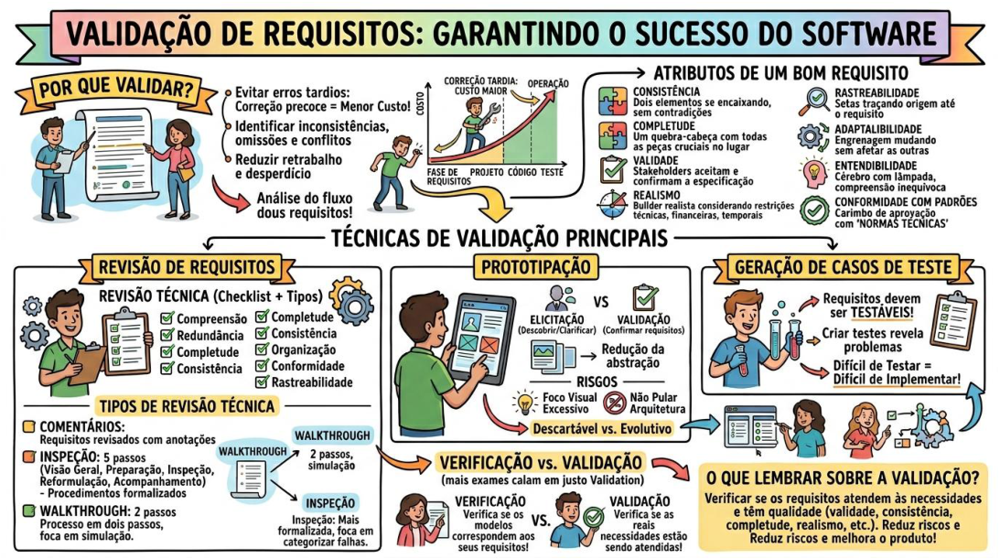

---

<!-- pagina: 48 -->

**Diego Carvalho, Equipe Informática 2 (Diego Carvalho), Equipe Informática 1 (Diego Carvalho) Aula 05** 

<!-- Start of picture text -->
Gerenciamento de Requisitos <!-- End of picture text -->

##### **<mark>INCIDÊNCIA EM PROVA: BAIXÍSSIMA</mark>** 

#### **<mark>GERENCIAMENTO DE REQUISITOS</mark>** 

<mark>Acompanhamento contínuo das mudanças realizadas nos requisitos ao longo do projeto. Como necessidades</mark> do negócio costumam evoluir durante desenvolvimento, torna-se necessário controlar versões, rastrear alterações e manter alinhamento entre requisitos e implementação do sistema. Essa etapa ajuda bastante na adaptação contínua e na redução de impactos causados por mudanças frequentes. 

A ideia central aqui é relativamente simples: requisitos mudam o tempo inteiro, porque necessidades do negócio evoluem, usuários descobrem novas demandas e problemas acabam aparecendo ao longo do projeto. O gerenciamento de requisitos é responsável por controlar mudanças, acompanhar versões, manter rastreabilidade e avaliar impactos causados pelas alterações realizadas no sistema. 

Esse processo normalmente começa quando já existe uma versão inicial dos requisitos documentados; contudo, o planejamento do gerenciamento deve começar ainda durante elicitação e análise. Afinal, mudanças são inevitáveis em praticamente qualquer projeto de software. À medida que equipe e stakeholders entendem melhor o negócio, novos requisitos aparecem, requisitos antigos mudam e conflitos começam a surgir. Por isso, Sommerville destaca bastante a importância de definir políticas de controle de mudanças, procedimentos de aprovação e mecanismos para registrar histórico das alterações realizadas no documento de requisitos. 

Outro ponto extremamente importante envolve rastreabilidade. Basicamente, rastrear requisitos significa conseguir acompanhar relações existentes entre requisitos, stakeholders, decisões de negócio, módulos do sistema, artefatos de projeto e testes. Isso ajuda bastante porque, quando uma mudança é proposta, a equipe consegue analisar quais partes do sistema serão afetadas. Muitas organizações utilizam matrizes de rastreabilidade para representar essas relações; contudo, em sistemas muito grandes, essas matrizes podem se tornar difíceis de manter manualmente, exigindo ferramentas específicas e bancos de dados de requisitos mais sofisticados. 

Na prática, existem diferentes tipos de rastreabilidade: a rastreabilidade horizontal acompanha relações entre requisitos e artefatos dentro de uma mesma fase do ciclo de vida; já a vertical conecta requisitos a elementos produzidos em diferentes etapas do desenvolvimento. Também existem rastreamentos para frente e para trás: alguns ligam requisitos às implementações e testes; outros conectam funcionalidades às suas origens e justificativas de negócio. Pressman ressalta que projetos pequenos normalmente utilizam gerenciamento menos formal; contudo, em sistemas complexos, críticos ou com centenas de requisitos, controle rigoroso de mudanças e rastreabilidade tornam-se absolutamente essenciais. 

### **Saiba mais:** 

<mark>Dentro do Gerenciamento de Requisitos, a rastreabilidade e a gestão de mudanças só são possíveis mediante uma rígida política de identificação. Cada requisito deve ser identificado de forma única e inequívoca (geralmente por meio de um ID exclusivo alfanumérico). Essa identificação garante que o requisito possa ser comparado, localizado, monitorado ao longo de suas diversas versões e perfeitamente vinculado aos casos de teste e artefatos de código, mitigando redundâncias e falhas</mark> no mapeamento. 

Em técnicas baseadas em casos de uso, a ausência de detalhamento de cenários alternativos e fluxos de exceção compromete diretamente a rastreabilidade dos requisitos. Isso ocorre porque os cenários alternativos são responsáveis por mapear desvios e regras de negócio específicas que devem ser testadas

---

<!-- pagina: 49 -->

**Diego Carvalho, Equipe Informática 2 (Diego Carvalho), Equipe Informática 1 (Diego Carvalho) Aula 05** 

e implementadas; sem eles, perde-se o vínculo sistemático e completo entre as necessidades abstratas do usuário, os comportamentos esperados da funcionalidade e os casos de teste correspondentes. 

Na engenharia de software contemporânea, ferramentas automatizadas podem apoiar a gestão através do uso de versionamento semântico dos requisitos e visualização por "análise de impacto baseada em grafos", permitindo rastrear as profundas ramificações e encadeamentos gerados por uma simples alteração. Contudo, apesar dessa vasta instrumentação visual e controle de versões, o julgamento humano não é descartável. Essas técnicas tecnológicas são apoios gerenciais avançados, e de modo algum substituem a necessidade das revisões manuais ou inspeções baseadas na vivência empírica dos stakeholders para aferir coerência lógica de negócio. 

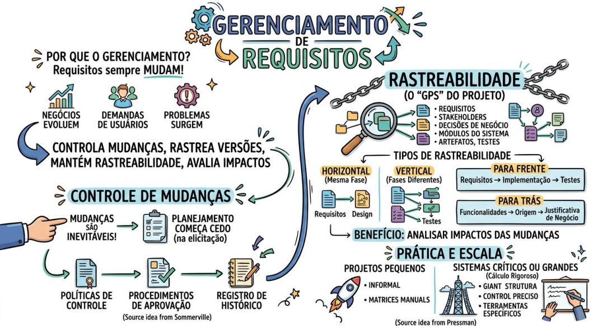

---

<!-- pagina: 50 -->

**Diego Carvalho, Equipe Informática 2 (Diego Carvalho), Equipe Informática 1 (Diego Carvalho) Aula 05** 

<!-- Start of picture text -->
R ESUMO <!-- End of picture text -->

### **<mark>REQUISITO</mark>** 

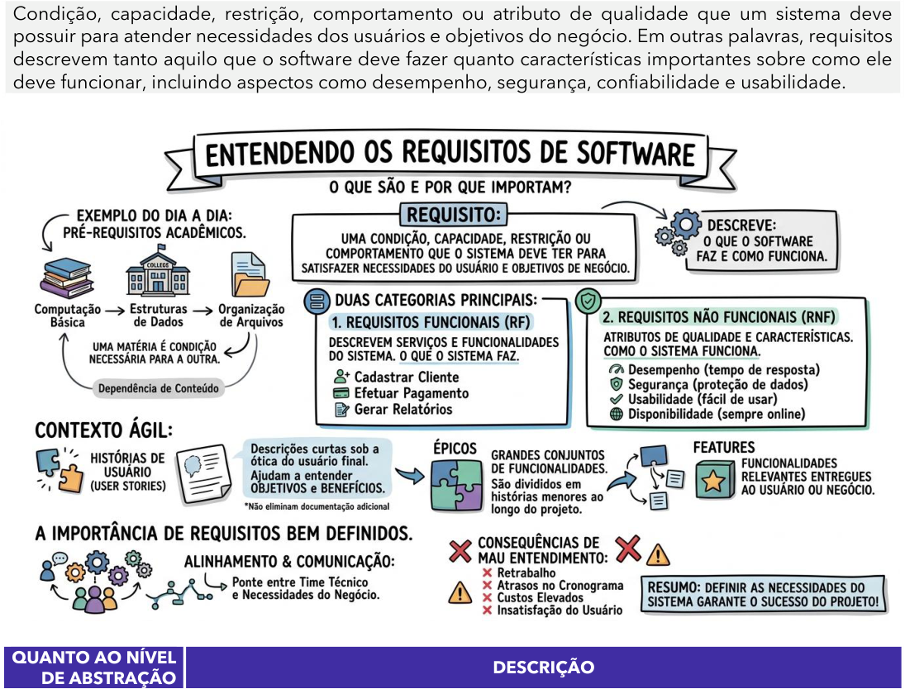

<!-- Start of picture text -->
Condição, capacidade, restrição, comportamento ou atributo de qualidade que um sistema deve possuir para atender necessidades dos usuários e objetivos do negócio. Em outras palavras, requisitos descrevem tanto aquilo que o software deve fazer quanto características importantes sobre como ele deve funcionar, incluindo aspectos como desempenho, segurança, confiabilidade e usabilidade. QUANTO AO NÍVEL DESCRIÇÃO DE ABSTRAÇÃO ÇÃO ÃO <!-- End of picture text -->

**QUANTO AO NÍVEL DESCRIÇÃO DE ABSTRAÇÃO ÇÃO ÃO** Representam descrições mais gerais e menos técnicas sobre serviços, restrições e **REQUISITOS DE** comportamentos esperados do sistema. São escritos em linguagem natural simples, **USUÁRIO** podendo utilizar exemplos e diagramas, pois procuram facilitar entendimento por clientes, gestores e usuários finais. Representam descrições mais detalhadas e técnicas sobre funções, regras, restrições e **REQUISITOS DE** comportamentos do software. Possuem menor nível de abstração e maior precisão, **SISTEMA** servindo como base para implementação, testes, validação e manutenção realizados pela equipe técnica.

---

<!-- pagina: 51 -->

**Diego Carvalho, Equipe Informática 2 (Diego Carvalho), Equipe Informática 1 (Diego Carvalho) Aula 05** 

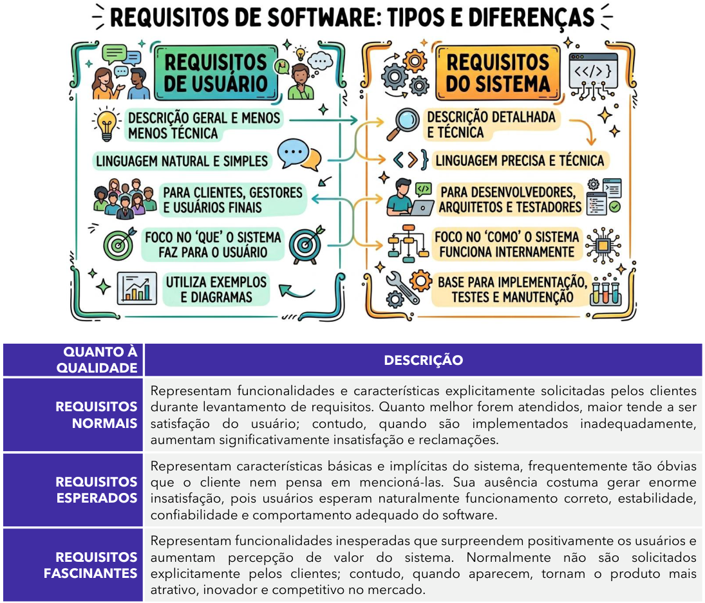

<!-- Start of picture text -->
QUANTO À DESCRIÇÃO QUALIDADE Representam funcionalidades e características explicitamente solicitadas pelos clientes REQUISITOS  durante levantamento de requisitos. Quanto melhor forem atendidos, maior tende a ser NORMAIS  satisfação do usuário; contudo, quando são implementados inadequadamente, aumentam significativamente insatisfação e reclamações. Representam características básicas e implícitas do sistema, frequentemente tão óbvias REQUISITOS  que o cliente nem pensa em mencioná-las. Sua ausência costuma gerar enorme ESPERADOS  insatisfação, pois usuários esperam naturalmente funcionamento correto, estabilidade, confiabilidade e comportamento adequado do software. Representam funcionalidades inesperadas que surpreendem positivamente os usuários e REQUISITOS  aumentam percepção de valor do sistema. Normalmente não são solicitados FASCINANTES  explicitamente pelos clientes; contudo, quando aparecem, tornam o produto mais atrativo, inovador e competitivo no mercado. <!-- End of picture text -->

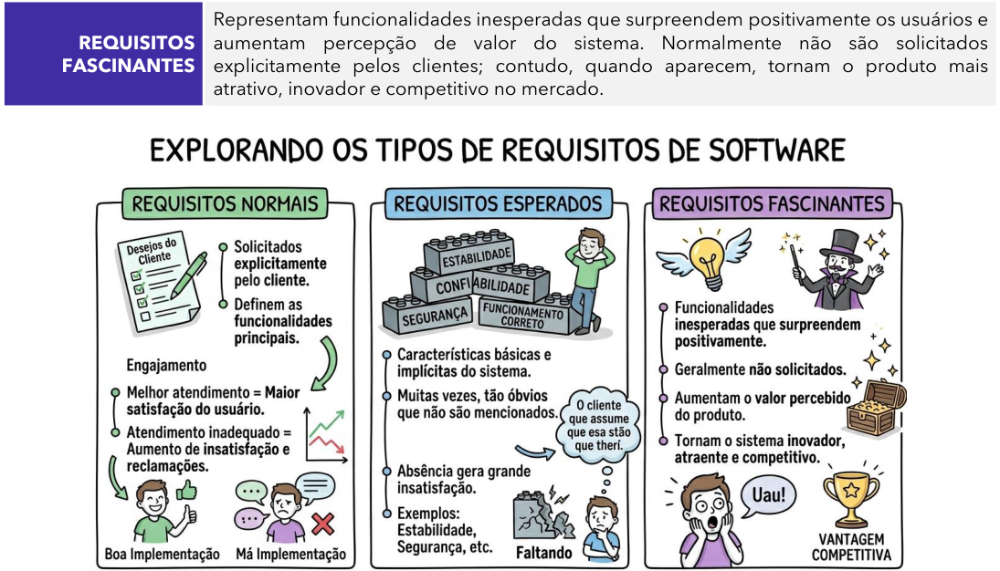

<!-- Start of picture text -->
Representam funcionalidades inesperadas que surpreendem positivamente os usuários e REQUISITOS  aumentam percepção de valor do sistema. Normalmente não são solicitados FASCINANTES  explicitamente pelos clientes; contudo, quando aparecem, tornam o produto mais atrativo, inovador e competitivo no mercado. <!-- End of picture text -->

---

<!-- pagina: 52 -->

**Diego Carvalho, Equipe Informática 2 (Diego Carvalho), Equipe Informática 1 (Diego Carvalho) Aula 05** 

**<mark>QUANTO À</mark> DESCRIÇÃO EVOLUÇÃO** Representam requisitos mais estáveis e duradouros, fortemente ligados às atividades **REQUISITOS** centrais da organização e ao domínio principal da aplicação. Embora possam sofrer **PERMANENTES** mudanças ao longo do tempo, tendem a permanecer relevantes durante muitos anos, pois refletem necessidades essenciais do negócio. Representam requisitos mais sujeitos a mudanças durante desenvolvimento ou utilização **REQUISITOS** do sistema. Normalmente evoluem em função de alterações legais, tecnológicas, **VOLÁTEIS** organizacionais ou decorrentes da própria experiência dos usuários, exigindo maior adaptação e monitoramento contínuo da equipe. 

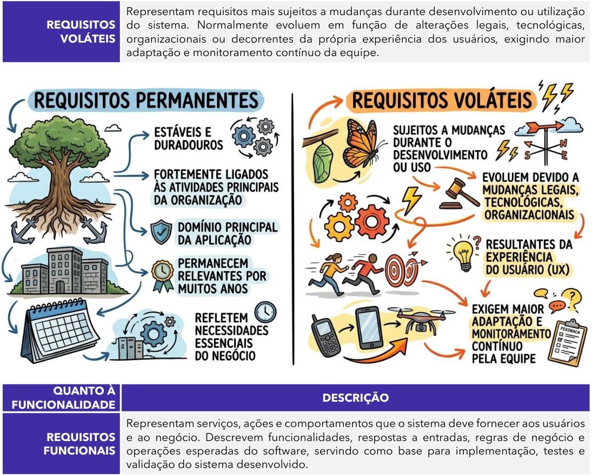

<!-- Start of picture text -->
Representam requisitos mais sujeitos a mudanças durante desenvolvimento ou utilização REQUISITOS  do sistema. Normalmente evoluem em função de alterações legais, tecnológicas, VOLÁTEIS  organizacionais ou decorrentes da própria experiência dos usuários, exigindo maior adaptação e monitoramento contínuo da equipe. QUANTO À DESCRIÇÃO FUNCIONALIDADE Representam serviços, ações e comportamentos que o sistema deve fornecer aos usuários REQUISITOS  e ao negócio. Descrevem funcionalidades, respostas a entradas, regras de negócio e FUNCIONAIS  operações esperadas do software, servindo como base para implementação, testes e validação do sistema desenvolvido. <!-- End of picture text -->

Representam serviços, ações e comportamentos que o sistema deve fornecer aos usuários **REQUISITOS** e ao negócio. Descrevem funcionalidades, respostas a entradas, regras de negócio e **FUNCIONAIS** operações esperadas do software, servindo como base para implementação, testes e validação do sistema desenvolvido. Representam restrições, atributos de qualidade e condições globais sobre as quais o **REQUISITOS NÃO** sistema deve operar. Incluem aspectos como desempenho, segurança, confiabilidade, **FUNCIONAIS** disponibilidade, usabilidade e restrições tecnológicas, influenciando fortemente arquitetura e decisões técnicas do software. Representam requisitos derivados diretamente da área de aplicação do sistema, refletindo **REQUISITOS DE** regras, processos e características específicas do negócio. Podem ser funcionais ou não **DOMÍNIO** funcionais e normalmente utilizam conceitos, normas e terminologias próprias do domínio organizacional atendido.

---

<!-- pagina: 53 -->

**Diego Carvalho, Equipe Informática 2 (Diego Carvalho), Equipe Informática 1 (Diego Carvalho) Aula 05** 

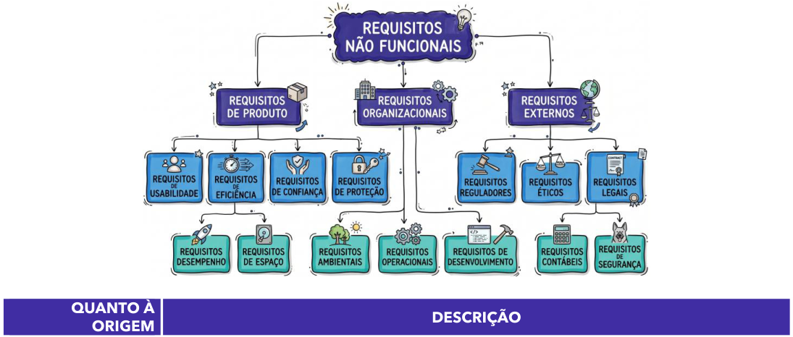

<!-- Start of picture text -->
QUANTO À DESCRIÇÃO ORIGEM <!-- End of picture text -->

**QUANTO À DESCRIÇÃO ORIGEM** Representam atributos e propriedades operacionais que o sistema deve possuir durante **REQUISITOS DE** funcionamento. Incluem aspectos como desempenho, confiabilidade, disponibilidade, **PRODUTO** portabilidade, eficiência e usabilidade, influenciando diretamente qualidade percebida e decisões técnicas do software. Representam restrições derivadas de políticas, padrões e processos internos da **REQUISITOS** organização cliente ou desenvolvedora. Incluem exigências sobre tecnologias utilizadas, **ORGANIZACIO-** metodologias, padrões de documentação, cronogramas, ferramentas e procedimentos **NAIS** obrigatórios durante desenvolvimento do sistema. Representam requisitos impostos por fatores externos ao sistema e ao processo de **REQUISITOS** desenvolvimento. Incluem legislações, regulamentações, padrões governamentais, **EXTERNOS** interoperabilidade com outros sistemas, exigências éticas e restrições contratuais que precisam ser atendidas pelo software. 

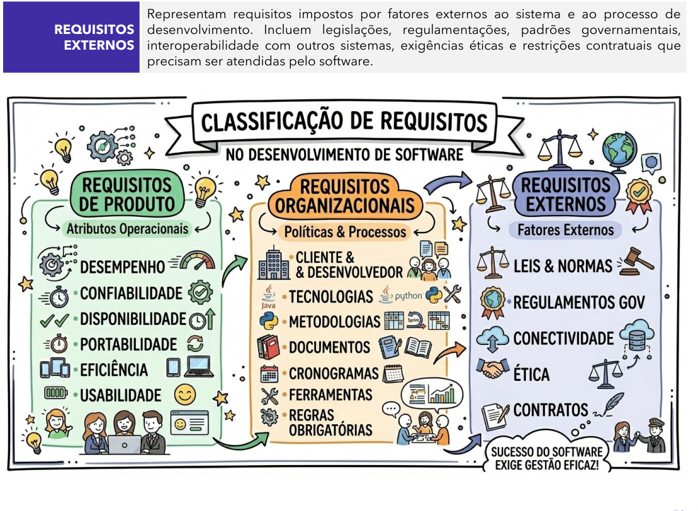

<!-- Start of picture text -->
Representam requisitos impostos por fatores externos ao sistema e ao processo de REQUISITOS  desenvolvimento. Incluem legislações, regulamentações, padrões governamentais, EXTERNOS  interoperabilidade com outros sistemas, exigências éticas e restrições contratuais que precisam ser atendidas pelo software. <!-- End of picture text -->

---

<!-- pagina: 54 -->

**Diego Carvalho, Equipe Informática 2 (Diego Carvalho), Equipe Informática 1 (Diego Carvalho) Aula 05** 

|**REQUISITOS**|**DESCRIÇÃO**|
|---|---|
|**REQUISITOS DE** **USABILIDADE**|Definem características relacionadas à facilidade de aprendizado, compreensão e utilização do sistema pelos usuários. Ex: usuários deverão conseguir realizar operações básicas após no máximo duas horas de treinamento supervisionado.|
|**REQUISITOS DE** **EFICIÊNCIA**|Estabelecem metas relacionadas ao uso eficiente de recursos computacionais, buscando equilíbrio entre desempenho, memória, processamento e capacidade do sistema. Ex: o sistema deverá manter utilização média de CPU abaixo de 60% durante horário de pico.|
|**REQUISITOS DE** **DESEMPENHO**|Definem limites de velocidade, capacidade de processamento, tempo de resposta e quantidade de operações suportadas pelo sistema em funcionamento. Ex: o sistema deverá processar até 800 requisições/segundo sem degradação de desempenho.|
|**REQUISITOS DE** **ESPAÇO**|Estabelecem restrições relacionadas ao uso de armazenamento, memória e demais recursos computacionais necessários para execução do software. Ex: o sistema deverá ocupar no máximo 80 MB de armazenamento interno do dispositivo.|
|**REQUISITOS DE** **CONFIANÇA**|Definem níveis aceitáveis de confiabilidade, disponibilidade e tolerância a falhas, garantindo funcionamento previsível e contínuo do sistema. Ex: o sistema deverá estar disponível em horário comercial com no máximo 5s consecutivos de indisponibilidade.|
|**REQUISITOS DE** **PROTEÇÃO**|Estabelecem mecanismos destinados a proteger dados, contas e recursos do sistema contra acessos indevidos, alterações não autorizadas e manipulações incorretas. Ex: o sistema não deverá permitir alteração de senhas pertencentes a outros usuários.|
|**REQUISITOS** **AMBIENTAIS**|Definem restrições relacionadas ao ambiente físico ou computacional no qual o sistema deverá operar adequadamente. Ex: o sistema deverá funcionar corretamente em ambientes sujeitos a temperaturas entre menos 10 °C e 45 °C.|
|**REQUISITOS** **OPERACIONAIS**|Estabelecem condições necessárias para operação, execução e administração do sistema durante uso cotidiano. Ex: o sistema deverá permitir realização de backup automático diariamente às 23 horas sem interromper serviços ativos.|
|**REQUISITOS DE** **DESENVOLVI-** **MENTO**|Definem padrões, tecnologias, metodologias e práticas obrigatórias durante construção do sistema. Ex: o software deverá ser desenvolvido utilizando linguagem Java e versionamento obrigatório em Git.|
|**REQUISITOS** **REGULADORES**|Estabelecem restrições impostas por órgãos reguladores, normas técnicas ou entidades de supervisão do setor. Ex: o sistema deverá obedecer às normas do Banco Central para armazenamento de transações financeiras.|
|**REQUISITOS** **ÉTICOS**|Definem restrições relacionadas à privacidade, confidencialidade e utilização responsável das informações tratadas pelo sistema. Ex: o sistema não deverá divulgar dados pessoais sem autorização explícita do usuário.|
|**REQUISITOS** **LEGAIS**|Estabelecem exigências derivadas de leis, regulamentações e obrigações jurídicas aplicáveis ao sistema. Ex: o software deverá cumprir integralmente as exigências previstas na LGPD para tratamento de dados pessoais.|
|**REQUISITOS** **CONTÁBEIS**|Definem regras relacionadas ao registro, cálculo e processamento de informações financeiras e contábeis. Ex: o sistema deverá calcular tributos conforme legislação fiscal vigente e normas contábeis oficiais.|
|**REQUISITOS DE** **SEGURANÇA**|Definem mecanismos de autenticação, controle de acesso e prevenção de riscos para proteger sistema e informações contra ameaças e vulnerabilidades. Ex: o sistema deverá utilizar autenticação multifator para acesso administrativo. **ENGENHARIA DE REQUISITOS**|

---

<!-- pagina: 55 -->

**Diego Carvalho, Equipe Informática 2 (Diego Carvalho), Equipe Informática 1 (Diego Carvalho) Aula 05** 

Área da Engenharia de Software responsável por compreender, levantar, analisar, documentar, validar e gerenciar as necessidades e restrições de um sistema de software. Segundo Ian Sommerville e Roger Pressman, trata-se de um processo sistemático e organizado que procura identificar corretamente aquilo que clientes, usuários e organizações realmente necessitam. Seu principal objetivo é reduzir ambiguidades, conflitos e erros de entendimento, garantindo que o software desenvolvido esteja alinhado às regras de negócio, expectativas dos stakeholders e objetivos do projeto. 

**<mark>FASES (POR</mark> PRESSMAN) CONCEPÇÃO LEVANTAMENTO ELABORAÇÃO NEGOCIAÇÃO** 

#### **DESCRIÇÃO** 

Após uma necessidade de o negócio ser identificada, busca-se estabelecer um entendimento básico do problema. Trata-se da concepção inicial do software e busca entender o problema, quem são os envolvidos, a natureza da solução e iniciar o processo de comunicação entre clientes e colaboradores. 

Etapa crítica, utiliza uma abordagem organizada para descobrir o que o cliente deseja em seu sistema. Envolve intensa participação do stakeholders e faz três perguntas: Qual o objetivo do produto? Como o produto se enquadra nas necessidades do negócio? Como o produto será utilizado? 

<mark>Por vezes chamada Análise, informações obtidas do cliente durante a concepção e</mark> levantamento são expandidas e refinadas em um modelo, definindo o domínio do problema. Incluem-se modelagens de cenários de interação do usuário com o sistema e modelagens das classes envolvidas. 

<mark>Tem por objetivo chegar a um consenso sobre os conflitos entre clientes e usuários, por</mark> intermédio de um processo de negociação. Os requisitos são avaliados junto ao cliente e podem se combinar, excluir ou até mesmo inserir novos requisitos. 

Por vezes chamada Documentação, produto final do engenheiro de requisitos, pode ser um documento escrito, um modelo gráfico, cenários de uso, protótipos, etc. Trata-se da apresentação formal dos dados obtidos até o momento de modo que possa guiar o desenvolvimento futuro do software. 

**ESPECIFICAÇÃO VALIDAÇÃO GESTÃO** 

<mark>Os produtos de trabalho resultantes da engenharia de requisitos são avaliados quanto a</mark> sua qualidade por todos os envolvidos (clientes, colaboradores e usuários). Buscam-se erros de interpretação, ambiguidades e omissões. 

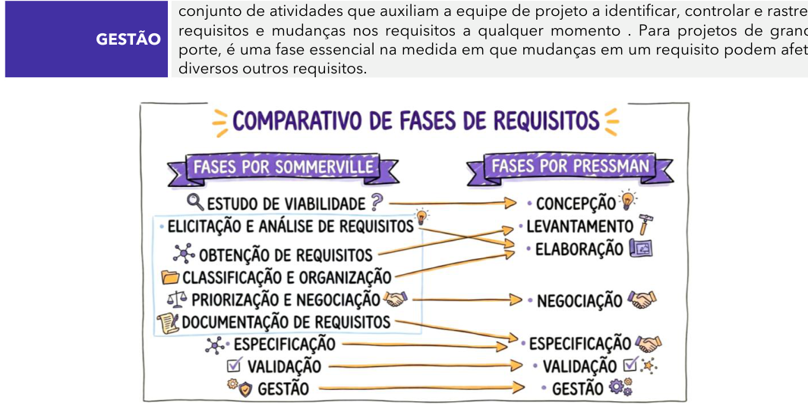

<!-- Start of picture text -->
conjunto de atividades que auxiliam a equipe de projeto a identificar, controlar e rastrear requisitos e mudanças nos requisitos a qualquer momento . Para projetos de grande GESTÃO porte, é uma fase essencial na medida em que mudanças em um requisito podem afetar diversos outros requisitos. quisitos. uisitos. <!-- End of picture text -->

<mark>conjunto de atividades que auxiliam a equipe de projeto a identificar, controlar e rastrear</mark> requisitos e mudanças nos requisitos a qualquer momento . Para projetos de grande porte, é uma fase essencial na medida em que mudanças em um requisito podem afetar diversos outros requisitos. quisitos. uisitos.

---

<!-- pagina: 56 -->

**Diego Carvalho, Equipe Informática 2 (Diego Carvalho), Equipe Informática 1 (Diego Carvalho) Aula 05** 

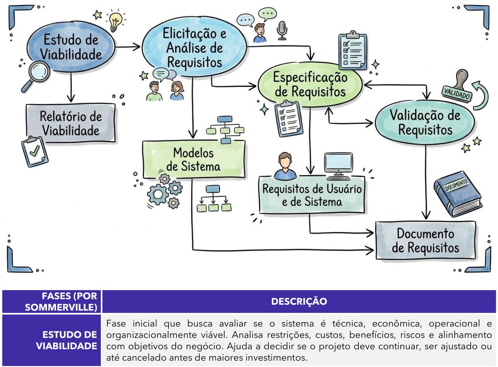

<!-- Start of picture text -->
==5460== FASES (POR DESCRIÇÃO SOMMERVILLE) Fase inicial que busca avaliar se o sistema é técnica, econômica, operacional e ESTUDO DE  organizacionalmente viável. Analisa restrições, custos, benefícios, riscos e alinhamento VIABILIDADE  com objetivos do negócio. Ajuda a decidir se o projeto deve continuar, ser ajustado ou até cancelado antes de maiores investimentos. <!-- End of picture text -->

Fase inicial que busca avaliar se o sistema é técnica, econômica, operacional e **ESTUDO DE** organizacionalmente viável. Analisa restrições, custos, benefícios, riscos e alinhamento **VIABILIDADE** com objetivos do negócio. Ajuda a decidir se o projeto deve continuar, ser ajustado ou até cancelado antes de maiores investimentos. Etapa responsável por descobrir, compreender, negociar e refinar requisitos junto aos **ELICITAÇÃO E** stakeholders. Utiliza entrevistas, workshops, observação, prototipação e outras técnicas **ANÁLISE DE** para identificar necessidades, regras de negócio, conflitos e prioridades relacionadas ao **REQUISITOS** 

Etapa responsável por descobrir, compreender, negociar e refinar requisitos junto aos stakeholders. Utiliza entrevistas, workshops, observação, prototipação e outras técnicas para identificar necessidades, regras de negócio, conflitos e prioridades relacionadas ao sistema que será desenvolvido. 

Fase em que os requisitos levantados são organizados e documentados de forma estruturada. O documento produzido descreve funcionalidades, restrições e características do sistema, servindo como referência para clientes, analistas, desenvolvedores e demais envolvidos no projeto. 

**ESPECIFICAÇÃO DE REQUISITOS** 

Processo que verifica se os requisitos estão corretos, consistentes, completos, realistas e **VALIDAÇÃO DE** alinhados às necessidades dos usuários. Busca identificar ambiguidades, omissões e **REQUISITOS** conflitos antes da implementação, reduzindo retrabalho, custos de correção e problemas futuros no sistema. 

**GERENCIAMENTO DE REQUISITOS** 

Processo contínuo responsável por controlar mudanças, manter versões, avaliar impactos e garantir rastreabilidade dos requisitos ao longo do ciclo de vida do sistema. Ajuda a acompanhar evolução das necessidades do negócio e preservar consistência entre requisitos e artefatos do projeto.

---

<!-- pagina: 57 -->

**Diego Carvalho, Equipe Informática 2 (Diego Carvalho), Equipe Informática 1 (Diego Carvalho) Aula 05** 

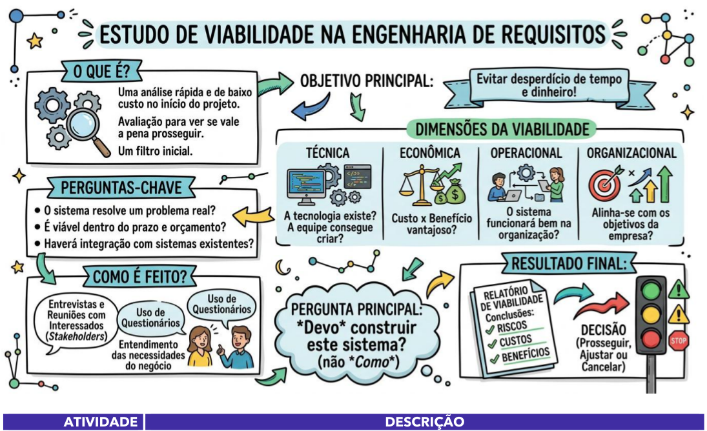

<!-- Start of picture text -->
ATIVIDADE  DESCRIÇÃO ÇÃO ÃO <!-- End of picture text -->

**<mark>ATIVIDADE DESCRIÇÃO ÇÃO ÃO</mark>** Processo de interação com stakeholders para descobrir necessidades, regras de negócio **OBTENÇÃO DE** e expectativas do sistema. Durante essa atividade também podem surgir requisitos de **REQUISITOS** domínio. **<mark>CLASSIFICAÇÃO E</mark>** Atividade que agrupa requisitos relacionados e organiza informações inicialmente **ORGANIZAÇÃO DE** desestruturadas em conjuntos coerentes, facilitando análise e entendimento do sistema. **REQUISITOS** **<mark>PRIORIZAÇÃO E</mark>** Processo voltado à resolução de conflitos entre requisitos e stakeholders, definindo **NEGOCIAÇÃO DE** prioridades conforme valor de negócio, viabilidade e restrições do projeto. **REQUISITOS DOCUMENTAÇÃO** Atividade responsável por registrar requisitos em documentos formais ou informais, **DE REQUISITOS** organizando informações para futuras etapas de análise, validação e desenvolvimento. 

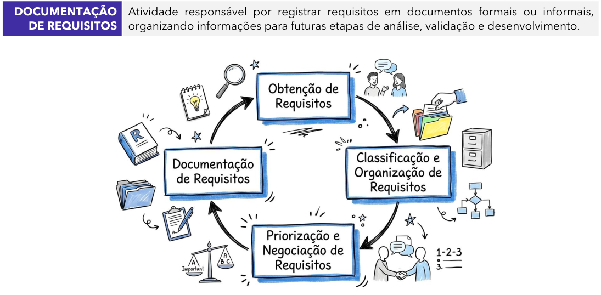

<!-- Start of picture text -->
DOCUMENTAÇÃO  Atividade responsável por registrar requisitos em documentos formais ou informais, DE REQUISITOS  organizando informações para futuras etapas de análise, validação e desenvolvimento. <!-- End of picture text -->

https://t.me/KakashiAssinaturasBot

---

<!-- pagina: 58 -->

**Diego Carvalho, Equipe Informática 2 (Diego Carvalho), Equipe Informática 1 (Diego Carvalho) Aula 05** 

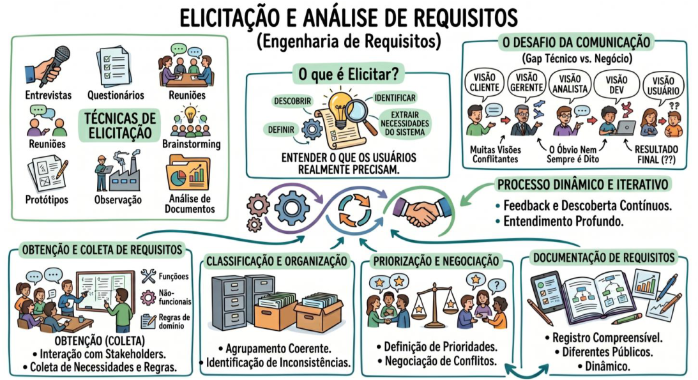

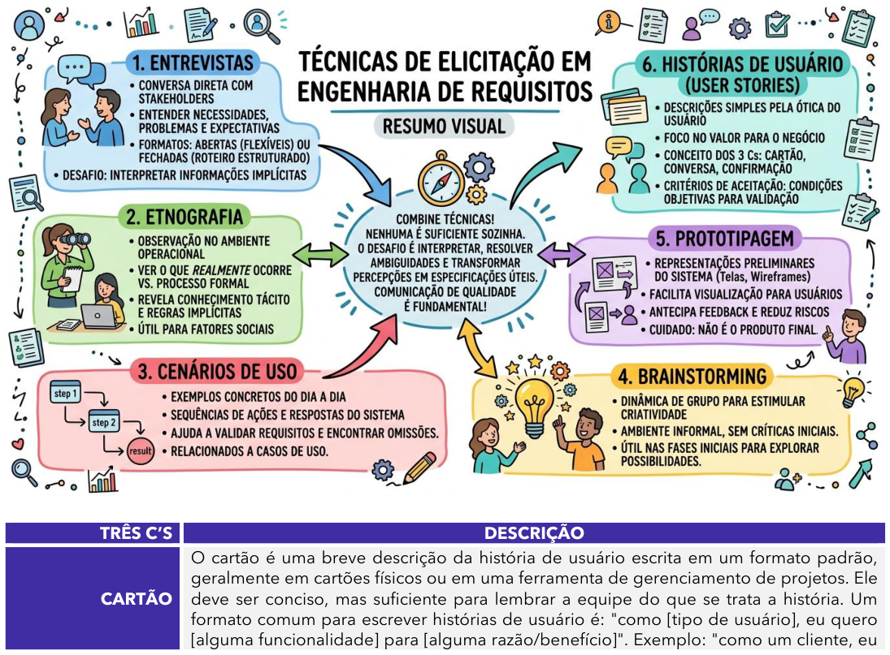

<!-- Start of picture text -->
TRÊS C’S  DESCRIÇÃO O cartão é uma breve descrição da história de usuário escrita em um formato padrão, geralmente em cartões físicos ou em uma ferramenta de gerenciamento de projetos. Ele CARTÃO deve ser conciso, mas suficiente para lembrar a equipe do que se trata a história. Um formato comum para escrever histórias de usuário é: "como [tipo de usuário], eu quero [alguma funcionalidade] para [alguma razão/benefício]". Exemplo: "como um cliente, eu <!-- End of picture text -->

---

<!-- pagina: 59 -->

**Diego Carvalho, Equipe Informática 2 (Diego Carvalho), Equipe Informática 1 (Diego Carvalho) Aula 05** 

<mark>quero poder adicionar produtos ao meu carrinho de compras para que eu possa comprá-</mark> los posteriormente". 

|**CONVERSAÇÃO** **CONFIRMAÇÃO**|
|---|

A conversa refere-se ao diálogo contínuo entre os membros da equipe e os stakeholders (como os clientes ou usuários finais) para esclarecer os detalhes e entender melhor a história de usuário. Essa conversa é crucial para assegurar que todos tenham uma compreensão comum das necessidades e dos requisitos, permitindo que a equipe desenvolva a funcionalidade de maneira adequada. As conversas podem acontecer durante as reuniões de planejamento, sessões de refinamento do backlog, ou informalmente conforme necessário. 

A confirmação envolve a definição de critérios de aceitação que especificam as condições que devem ser atendidas para que a história de usuário seja considerada concluída. Esses critérios de aceitação são acordados entre a equipe e os stakeholders e servem como base para testar a funcionalidade e garantir que ela atende aos requisitos especificados. Exemplo de critérios de aceitação: "O cliente deve ser capaz de adicionar até 10 itens diferentes ao carrinho. O carrinho deve exibir corretamente o nome, quantidade e preço de cada item. O total do carrinho deve ser atualizado automaticamente quando novos itens são adicionados". 

|**TÉCNICAS**|**DESCRIÇÃO**|
|---|---|
|**QUESTIONÁRIO**|Técnica baseada em formulários com perguntas previamente definidas e distribuídas aos stakeholders. É útil quando existe grande quantidade de participantes e necessidade de coletar informações padronizadas rapidamente. Possui baixo custo e fácil aplicação; contudo, apresenta pouca interação e aprofundamento.|
|**WORKSHOP DE** **REQUISITOS**|Reunião estruturada e intensiva que reúne usuários, analistas e demais stakeholders para discutir, negociar e refinar requisitos. Possui forte caráter colaborativo e costuma utilizar brainstorming, cenários e dinâmicas de grupo. Ajuda bastante na resolução de conflitos e alinhamento de expectativas.|
|**LEITURA DE** **DOCUMENTOS**|Técnica que utiliza análise de normas, contratos, manuais, organogramas, políticas e registros organizacionais para identificar requisitos, regras de negócio e restrições do sistema. É muito utilizada em sistemas legados; contudo, documentos podem estar desatualizados ou incompletos.|
|**JAD (JOINT** **APPLICATION** **DESIGN)**|Técnica colaborativa semelhante a workshops estruturados, reunindo usuários, gestores e desenvolvedores em sessões intensivas de levantamento e negociação de requisitos. O facilitador organiza discussões e busca acelerar decisões, reduzir ambiguidades e melhorar entendimento do negócio.|
|**REÚSO DE** **REQUISITOS**|Consiste no aproveitamento de requisitos, modelos, padrões e soluções já utilizados em projetos anteriores ou domínios semelhantes. Ajuda a reduzir esforço, retrabalho e inconsistências; contudo, exige adaptação cuidadosa ao novo contexto organizacional e às necessidades específicas do sistema.|
|**PARTICIPAÇÃO** **ATIVA DE** **USUÁRIOS**|Abordagem em que usuários acompanham continuamente o desenvolvimento do sistema, colaborando com validações, revisões e refinamentos de requisitos. É muito valorizada em métodos ágeis porque reduz desalinhamentos e melhora aderência do produto às necessidades reais do negócio.|
|**ENCENAÇÃO**|Técnica também conhecida como dramatização de papéis ou role playing. Os participantes simulam situações reais de uso do sistema para identificar dificuldades, necessidades e fluxos operacionais. Ajuda bastante na descoberta de requisitos implícitos e problemas de interação entre usuários e sistema.|
|**GRUPO FOCAL**|Técnica baseada em discussões conduzidas por um moderador com um pequeno grupo de stakeholders. O objetivo é explorar opiniões, percepções e expectativas sobre o sistema. É bastante útil para compreender necessidades subjetivas, problemas organizacionais e prioridades do negócio.|

---

<!-- pagina: 60 -->

**Diego Carvalho, Equipe Informática 2 (Diego Carvalho), Equipe Informática 1 (Diego Carvalho) Aula 05** 

**<mark>TÉCNICAS DESCRIÇÃO</mark>** Técnica em que usuários executam tarefas reais enquanto verbalizam pensamentos, **ANÁLISE DE** decisões e dificuldades encontradas durante a atividade. O engenheiro de requisitos **PROTOCOLOS** observa comportamentos e raciocínios envolvidos no trabalho cotidiano, identificando requisitos implícitos e problemas operacionais. Também chamada de Viewpoint Oriented Requirements Definition (VORD), é uma técnica para identificar requisitos a partir das diferentes perspectivas existentes na organização. **VORD** Cada stakeholder ou grupo possui necessidades próprias; assim, a técnica ajuda a organizar conflitos, responsabilidades e expectativas relacionadas ao sistema. Técnica muito utilizada em arquitetura da informação e organização de funcionalidades. Usuários agrupam cartões contendo conceitos, menus ou funcionalidades conforme sua **CARD SORTING** percepção lógica. Ajuda a estruturar navegação, categorização de informações e organização de interfaces do sistema. Técnica baseada na construção de narrativas para representar situações, experiências e necessidades dos usuários no contexto do sistema. Ajuda stakeholders a compreender **STORYTELLING** problemas de negócio de maneira mais concreta e humana, facilitando descoberta de requisitos, comunicação e alinhamento entre equipe e clientes. Técnica utilizada principalmente em sistemas legados, baseada na análise de código- **ARQUEOLOGIA DE** fonte, bancos de dados, interfaces, relatórios e comportamentos do sistema existente para **SISTEMAS** descobrir requisitos implícitos e regras de negócio não documentadas. É muito útil quando documentação está ausente, incompleta ou desatualizada. Técnica que utiliza comparações com objetos, situações ou sistemas conhecidos para **ANALOGIA/** facilitar compreensão e comunicação dos requisitos. Ajuda stakeholders a visualizar **METÁFORA** conceitos abstratos, explicar funcionalidades complexas e alinhar entendimento entre usuários e equipe técnica de maneira mais intuitiva e acessível. Técnica em que o engenheiro de requisitos acompanha o usuário como um aprendiz **APRENDIZADO** durante execução de atividades reais de trabalho. O objetivo é compreender processos, **(APPRENTICING)** decisões, dificuldades e práticas cotidianas no ambiente operacional, identificando requisitos implícitos e necessidades que dificilmente surgiriam apenas em entrevistas. Técnica foca na identificação, modelagem e especificação de requisitos inerentes a um **ANÁLISE DE** setor ou domínio de aplicação. Ela é apropriada para revelar não só regras de negócio **DOMÍNIO** 

Também chamada de Viewpoint Oriented Requirements Definition (VORD), é uma técnica para identificar requisitos a partir das diferentes perspectivas existentes na organização. Cada stakeholder ou grupo possui necessidades próprias; assim, a técnica ajuda a organizar conflitos, responsabilidades e expectativas relacionadas ao sistema. 

Técnica utilizada principalmente em sistemas legados, baseada na análise de códigofonte, bancos de dados, interfaces, relatórios e comportamentos do sistema existente para descobrir requisitos implícitos e regras de negócio não documentadas. É muito útil quando documentação está ausente, incompleta ou desatualizada. 

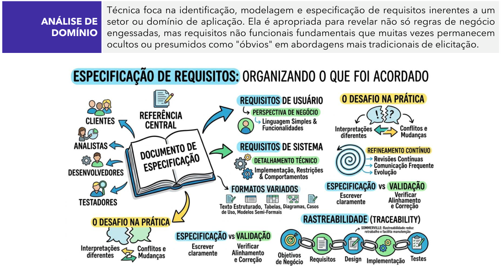

<!-- Start of picture text -->
Técnica foca na identificação, modelagem e especificação de requisitos inerentes a um ANÁLISE DE  setor ou domínio de aplicação. Ela é apropriada para revelar não só regras de negócio DOMÍNIO  engessadas, mas requisitos não funcionais fundamentais que muitas vezes permanecem ocultos ou presumidos como "óbvios" em abordagens mais tradicionais de elicitação. <!-- End of picture text -->

---

<!-- pagina: 61 -->

**Diego Carvalho, Equipe Informática 2 (Diego Carvalho), Equipe Informática 1 (Diego Carvalho) Aula 05** 

|**ATRIBUTOS**|**DESCRIÇÃO**|
|---|---|
|**VALIDADE**|Examina se as partes interessadas que contribuíram com o levantamento de requisitos aceitam a especificação final obtida.|
|**CONSISTÊNCIA**|Examina se existem conflitos entre os requisitos identificados.|
|**COMPREENSIBILIDADE**|Examina se os requisitos são compreendidos de forma inequívoca pelas partes interessadas.|
|**COMPLETUDE**|Examina se todas as funcionalidades pretendidas fazem parte da especificação do sistema.|
|**REALISMO**|Examina se, dadas as restrições do projeto (tecnológicas, financeiras e temporais), o sistema especificado é implementável.|
|**VERIFICABILIDADE**|Examina se os requisitos foram descritos de forma que seja possível verificar se foram ou não implementados.|
|**RASTREABILIDADE**|Examina se a origem de cada requisito está claramente identificada.|
|**ADAPTABILIDADE**|Examina se os requisitos podem sofrer alterações sem produzir efeitos em outros requisitos.|
|**CONFORMIDADE COM** **NORMAS**|Examina se a especificação obedece às normas técnicas utilizadas para o desenvolvimento do sistema.|

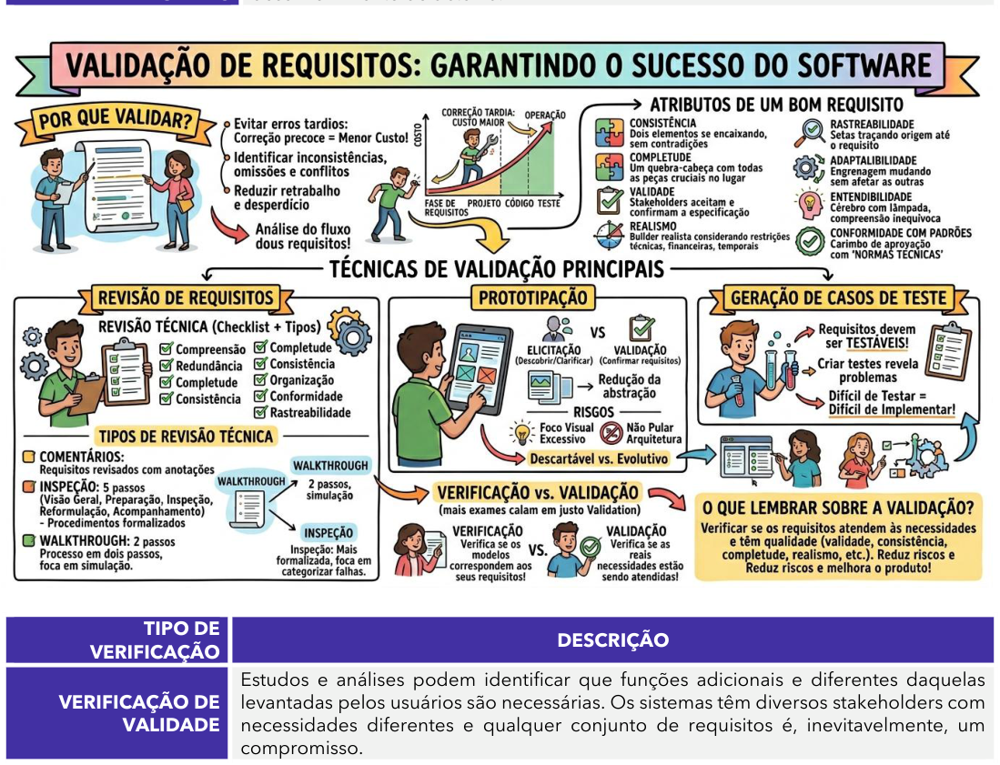

<!-- Start of picture text -->
TIPO DE DESCRIÇÃO VERIFICAÇÃO Estudos e análises podem identificar que funções adicionais e diferentes daquelas VERIFICAÇÃO DE   levantadas pelos usuários são necessárias. Os sistemas têm diversos stakeholders com VALIDADE  necessidades diferentes e qualquer conjunto de requisitos é, inevitavelmente, um compromisso. <!-- End of picture text -->

---

<!-- pagina: 62 -->

**Diego Carvalho, Equipe Informática 2 (Diego Carvalho), Equipe Informática 1 (Diego Carvalho) Aula 05** 

**VERIFICAÇÃO DE CONSISTÊNCIA** 

Os requisitos em um documento não devem ser conflitantes e contraditórios. Isso significa que não devem existir restrições ou descrições contraditórias para a mesma função do sistema, porque isso gera problemas sérios de inconsistência. 

O documento de requisitos deve incluir requisitos que definam todas as funções e as **VERIFICAÇÃO DE** restrições desejadas pelo usuário do sistema. Isso torna o documento de requisitos **COMPLETEZA** bastante verboso e pesado, no entanto é um requisito para alcançar a completeza do <mark>requisito.</mark> Usando o conhecimento da tecnologia existente, os requisitos devem ser verificados **VERIFICAÇÃO DE** quanto a se realmente podem ser implementados. Essas verificações também devem **REALISMO** levar em consideração o orçamento e o prazo para o desenvolvimento do sistema – caiu questão de prova recente sobre isso! <mark>Para reduzir o potencial de divergências entre cliente e fornecedor, os requisitos do</mark> **FACILIDADE DE** sistema devem sempre ser escritos de modo que sejam verificáveis. Isso significa que **VERIFICAÇÃO** você deve ser capaz de escrever um conjunto de testes que possa demonstrar que o <mark>sistema entregue atende a cada requisito especificado. gue atende a cada requisito especificado. ue atende a cada requisito especificado. quisito especificado. uisito especificado. pecificado. ecificado.</mark> 

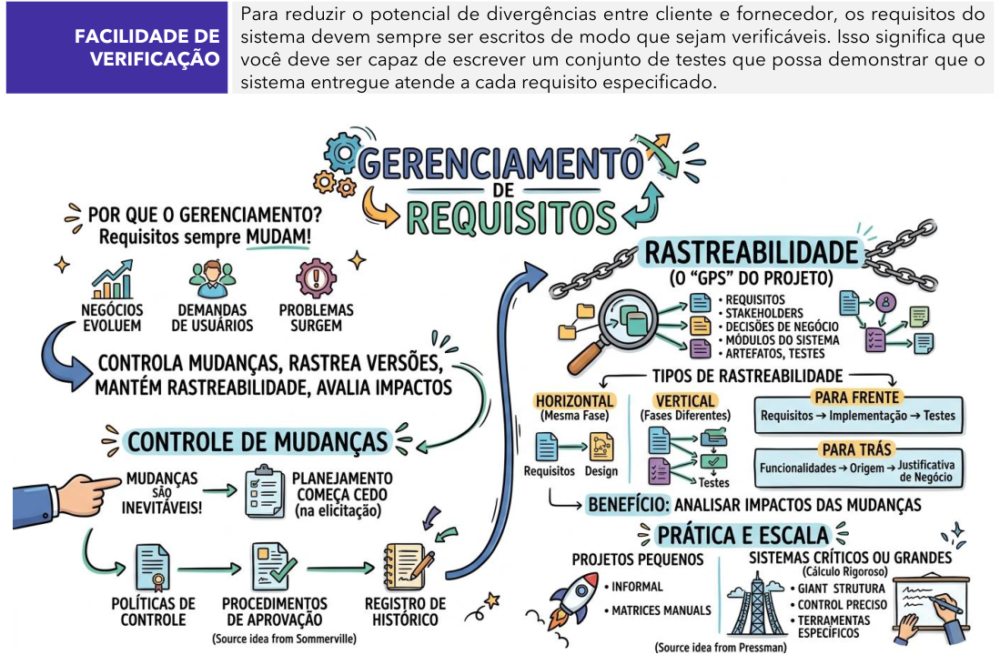

<!-- Start of picture text -->
Para reduzir o potencial de divergências entre cliente e fornecedor, os requisitos do FACILIDADE DE  sistema devem sempre ser escritos de modo que sejam verificáveis. Isso significa que VERIFICAÇÃO  você deve ser capaz de escrever um conjunto de testes que possa demonstrar que o sistema entregue atende a cada requisito especificado. gue atende a cada requisito especificado. ue atende a cada requisito especificado. quisito especificado. uisito especificado. pecificado. ecificado. <!-- End of picture text -->

---

<!-- pagina: 63 -->

**Diego Carvalho, Equipe Informática 2 (Diego Carvalho), Equipe Informática 1 (Diego Carvalho) Aula 05** 

<!-- Start of picture text -->
Q UESTÕES  C OMENTADAS <!-- End of picture text -->

**1. (FGV / TCE-PI - 2025) Acerca da elicitação e validação de requisitos, ao utilizar a técnica de casos de uso, assinale a opção que indica a prática que pode comprometer principalmente a rastreabilidade dos requisitos.** 

a) A construção dos casos de uso baseados somente em entrevistas com os usuários chave. 

b) A ausência de detalhamento de cenários alternativos e exceções nos diagramas de casos de uso. 

- c) A falta de revisão contínua dos casos de uso pelos desenvolvedores após cada iteração do projeto. 

- d) A utilização de uma linguagem de modelagem que seja amplamente compreendida pelos usuários finais. 

- e) A inclusão de detalhes técnicos no fluxograma de casos de uso, visando a implementação direta pelos desenvolvedores. 

**Comentários:** 

(a) Errado. Basear-se em entrevistas com usuários-chave pode limitar a visão, mas não afeta principalmente a ligação entre requisitos e seus desdobramentos. 

(b) Correto. Sem cenários alternativos e exceções, perde-se o vínculo completo entre requisitos, comportamentos e situações tratadas, prejudicando a rastreabilidade. 

(c) Errado. A falta de revisão contínua impacta a qualidade e a atualização dos casos de uso, mas não é o principal fator de perda de rastreabilidade. 

(d) Errado. Usar linguagem amplamente compreendida favorece comunicação e entendimento, não comprometendo a rastreabilidade dos requisitos. 

(e) Errado. Incluir detalhes técnicos pode afetar clareza e abstração, mas não compromete principalmente o rastreamento entre requisitos e casos de uso. 

**Gabarito:** Letra B 

**2. (FGV / SEEC RN - 2025) A professora Gabriela, em um curso de formação continuada para professores de informática, utilizou um exemplo prático de desenvolvimento de um aplicativo**

---

<!-- pagina: 64 -->

**Diego Carvalho, Equipe Informática 2 (Diego Carvalho), Equipe Informática 1 (Diego Carvalho) Aula 05** 

**educacional para explicar as etapas de um modelo de processo de software. Durante a aula, ela destacou a importância da análise de requisitos para evitar problemas no futuro, como a criação de funcionalidades desnecessárias ou incompatíveis com o público-alvo.** 

**Com base nos fundamentos da Engenharia de Software, o principal objetivo da análise de requisitos em um projeto de software educacional é** 

- a) identificar e corrigir erros de correção antes da correção. 

- b) compreender as necessidades dos usuários e definir o que o sistema deve fazer. 

- c) garantir que o software seja entregue dentro do prazo, mesmo com funcionalidades reduzidas. 

- d) criar diagramas técnicos detalhados para orientar os desenvolvedores. 

- e) automatizar o processo de desenvolvimento com ferramentas específicas. 

**Comentários:** 

(a) Errado. Não é esse o foco da análise de requisitos; ela ocorre antes da implementação e busca entender o problema, não corrigir erros de correção. 

(b) Correto. A análise de requisitos serve para levantar, compreender e especificar as necessidades dos usuários, definindo o que o sistema deve fazer. 

(c) Errado. Cumprimento de prazo é meta de gestão do projeto, não o objetivo principal da análise de requisitos. 

(d) Errado. Diagramas podem ser produzidos nessa etapa, mas como apoio; o objetivo central é entender e definir requisitos do sistema. 

(e) Errado. Automatizar o desenvolvimento com ferramentas não corresponde ao propósito principal da análise de requisitos. 

**Gabarito:** Letra B 

**3. (FGV / DPE RO - 2025) A Engenharia de Requisitos garante que o produto final atenda às necessidades dos usuários e stakeholders, correspondendo a uma disciplina fundamental no desenvolvimento de software, focada na definição, documentação e manutenção dos requisitos de um sistema. Existem dois tipos fundamentais de requisitos: os Requisitos Funcionais e os Requisitos Não Funcionais. Com relação aos requisitos, assinale (V) para a afirmativa verdadeira e (F) para a falsa.**

---

<!-- pagina: 65 -->

**Diego Carvalho, Equipe Informática 2 (Diego Carvalho), Equipe Informática 1 (Diego Carvalho) Aula 05** 

**( ) Requisitos Funcionais permitem que as equipes de projeto compreendam o que precisa ser implementado e validado, servindo como orientação clara para o desenvolvimento e teste do sistema.** 

**( ) Os Requisitos Funcionais geralmente têm um grau de criticidade maior do que os Requisitos Não Funcionais isolados.** 

**( ) Enquanto os Requisitos Não Funcionais especificam o modo como essas funções devem ser executadas, os Requisitos Funcionais delineiam as ações que um sistema de software deve realizar.** 

**As afirmativas são, respectivamente,** 

a) F – V – F. 

b) V – V – F. 

c) F – F – F. 

d) V – F – V. 

e) F – V – V. 

**Comentários:** 

(V) Requisitos funcionais descrevem o que o sistema deve fazer e orientam implementação, validação e testes. 

(F) A criticidade não é regra geral superior nos requisitos funcionais, pois depende do contexto e do impacto no sistema. 

(V) Requisitos não funcionais tratam de como as funções devem ocorrer, enquanto os funcionais definem quais ações o sistema executa. 

**Gabarito:** Letra D 

**4. (FGV / ALEAM - 2025) O Analista de Programação está realizando a Validação de Requisitos para o sistema de e-Protocolo. Ele decide utilizar a técnica que envolve a leitura do documento de requisitos, linha por linha, por um grupo de stakeholders e especialistas, para encontrar ambigüidades, omissões ou erros. Esta técnica de Validação de Requisitos é conhecida como:** 

a) Teste de Usabilidade (User Testing). 

- b) Prototipagem Evolutiva. 

- c) Geração de Testes de Aceitação. 

- d) Revisão Formal ou Inspeção (Walkthrough).

---

<!-- pagina: 66 -->

**Diego Carvalho, Equipe Informática 2 (Diego Carvalho), Equipe Informática 1 (Diego Carvalho) Aula 05** 

e) Análise de Risco. 

**Comentários:** 

(a) Errado. Teste de usabilidade avalia a interação do usuário com o sistema, não a leitura detalhada do documento de requisitos por especialistas. 

(b) Errado. Prototipagem evolutiva cria versões do sistema para refinamento, mas não se caracteriza pela análise linha por linha dos requisitos. 

(c) Errado. Geração de testes de aceitação deriva casos de teste dos requisitos, sem foco principal na inspeção coletiva do documento. 

(d) Correto. Revisão formal ou inspeção (walkthrough) consiste justamente na leitura estruturada dos requisitos para identificar ambiguidades, omissões e erros. 

(e) Errado. Análise de risco examina ameaças e impactos do projeto, não a validação textual e minuciosa do documento de requisitos. 

**Gabarito:** Letra D 

**5. (FGV / Câmara Municipal de SP - 2024) Relacione as decisões que devem ser tomadas durante o estágio de gerenciamento de requisitos de software com seus respectivos conceitos.** 

**1. Identificação de requisitos** 

**2. Gerenciamento de mudanças.** 

**3. Políticas de rastreabilidade.** 

**4. Ferramentas de apoio.** 

**( ) O gerenciamento de requisitos envolve o processamento de grandes quantidades de informações sobre os requisitos.** 

**( ) Conjunto de atividades que avaliam o impacto e o custo das mudanças.** 

**( ) Definem os relacionamentos entre cada requisito e entre os requisitos e o projeto de sistema que deve ser registrado.** 

**( ) Cada requisito deve ser identificado de forma única para que possa ser comparado com outros requisitos e usado em avaliações de rastreabilidade.** 

**Assinale a opção que indica a relação correta, na ordem apresentada.**

---

<!-- pagina: 67 -->

**Diego Carvalho, Equipe Informática 2 (Diego Carvalho), Equipe Informática 1 (Diego Carvalho) Aula 05** 

a) 1 – 2 – 4 – 3. 

b) 4 – 3 – 2 – 1. c) 4 – 2 – 3 – 1. d) 2 – 4 – 3 – 1. e) 2 – 1 – 4 – 3 

**Comentários:** 

Ferramentas de apoio lidam com grande volume de informações; mudanças avaliam impacto e custo; rastreabilidade define relacionamentos; identificação dá unicidade ao requisito. 

**Gabarito:** Letra C 

**6. (FGV / Câmara Municipal de Fortaleza - 2024) No contexto de requisitos de software, analise os itens a seguir.** 

**I. “O sistema deve cadastrar um usuário” é um tipo de Requisito Funcional.** 

- **II. “O sistema deve ficar no ar em 99,9% do tempo” é um tipo de Requisito Funcional de Desempenho.** 

- **III. “O sistema deve ser capaz de armazenar dados de 100 mil clientes” é um tipo de Requisito Não-Funcional de Escalabilidade.** 

**Está correto o que se afirma em** 

a) I, apenas. 

b) I e II, apenas. 

c) I e III, apenas. 

d) II e III, apenas. 

e) I, II e III. 

**Comentários:** 

(I) Correto. “Cadastrar um usuário” descreve uma funcionalidade que o sistema deve executar, caracterizando requisito funcional. 

(II) Errado. O item não se enquadra, aqui, como requisito funcional de desempenho, razão pela qual não integra a combinação correta.

---

<!-- pagina: 68 -->

**Diego Carvalho, Equipe Informática 2 (Diego Carvalho), Equipe Informática 1 (Diego Carvalho) Aula 05** 

(III) Correto. A capacidade de armazenar dados de 100 mil clientes expressa uma característica de escalabilidade, ligada a requisito não funcional. 

**Gabarito:** Letra C 

**7. (FGV / ALETO - 2024) Sobre Engenharia de Requisitos, analise as afirmativas a seguir.** 

   - **I. A validação de requisitos é um processo que visa assegurar que os requisitos atendem às necessidades e expectativas dos stakeholders.** 

   - **II. As técnicas de elicitação de requisitos, como brainstorming, entrevistas e prototipagem, são utilizadas para coletar requisitos de forma passiva, sem interação com os stakeholders.** 

**III. A priorização de requisitos ajuda a definir a ordem de importância para o projeto.** 

**Está correto o que se afirma em** 

a) II, apenas. 

b) I e III, apenas. 

c) II e III, apenas. 

d) I e II, apenas. 

e) I, II e III. 

**Comentários:** 

(I) Correto. A validação de requisitos busca confirmar se o que foi levantado realmente atende às necessidades e expectativas das partes interessadas. 

(II) Errado. As técnicas citadas envolvem participação dos stakeholders, mas o item não se alinha ao entendimento adotado pela questão. 

(III) Correto. A priorização organiza os requisitos conforme sua relevância, ajudando a orientar decisões e etapas do projeto. 

**Gabarito:** Letra B 

**8. (FGV / ALETO - 2024) Durante o desenvolvimento de um software de gerenciamento de estoque, a equipe focou nas funcionalidades sem considerar a escalabilidade necessária para o rápido crescimento do varejista. A falta de comunicação com stakeholders e o pouco engajamento dos usuários finais não revelou esse problema. Após a implementação, o software apresentou**

---

<!-- pagina: 69 -->

**Diego Carvalho, Equipe Informática 2 (Diego Carvalho), Equipe Informática 1 (Diego Carvalho) Aula 05** 

### **problemas de desempenho, causando atrasos e insatisfação. Para evitar esse problema é necessário** 

- a) focar exclusivamente no desenvolvimento de funcionalidades adicionais para aumentar a satisfação do cliente no curto prazo. 

- b) limitar o envolvimento dos usuários finais no processo de validação dos requisitos, mas aumentar o envolvimento dos stakeholders para acelerar o desenvolvimento. 

- c) aumentar a dependência em ferramentas automatizadas de validação de requisitos para reduzir a necessidade de feedback direto dos usuários finais. 

- d) utilizar uma abordagem de desenvolvimento waterfall, garantindo que todas as etapas sejam completadas sequencialmente com interação do usuário apenas antes do lançamento. 

- e) implementar um processo de comunicação mais eficaz que inclua revisões frequentes dos requisitos com stakeholders e sessões de feedback com usuários finais para garantir que todos os requisitos sejam devidamente entendidos e documentados. 

**Comentários:** 

(a) Errado. Focar só em novas funcionalidades ignora requisitos não funcionais, como escalabilidade e desempenho, que foram justamente a origem do problema apresentado. 

(b) Errado. Reduzir a participação dos usuários finais prejudica a validação dos requisitos e aumenta o risco de necessidades importantes não serem percebidas. 

(c) Errado. Ferramentas automatizadas ajudam, mas não substituem o diálogo com usuários finais, essencial para captar expectativas reais e requisitos críticos. 

(d) Errado. Restringir a interação do usuário ao início ou fim do processo dificulta ajustes contínuos e pode manter falhas de entendimento até a entrega. 

(e) Correto. Comunicação eficaz, revisões frequentes com stakeholders e feedback dos usuários finais ajudam a identificar requisitos como escalabilidade e desempenho desde cedo. 

**Gabarito:** Letra E 

**9. (FGV / ALETO - 2024) Assinale a ação mais apropriada para realizar uma análise de requisitos de usabilidade eficaz.**

---

<!-- pagina: 70 -->

**Diego Carvalho, Equipe Informática 2 (Diego Carvalho), Equipe Informática 1 (Diego Carvalho) Aula 05** 

- a) Limitar a análise aos requisitos funcionais do sistema para acelerar o desenvolvimento. 

- b) Consultar apenas a equipe de desenvolvimento para definir os requisitos de usabilidade, evitando influências externas. 

- c) Realizar testes de usabilidade apenas nas fases finais de desenvolvimento para ajustes finos. 

- d) Envolver usuários finais e stakeholders no processo de definição de requisitos desde o início do projeto. 

- e) Ignorar as diferenças culturais e de idioma dos usuários finais, focando unicamente na funcionalidade. 

**Comentários:** 

(a) Errado. Restringir a análise à funcionalidade deixa de lado eficiência, satisfação e facilidade de uso, pontos centrais da usabilidade. 

(b) Errado. Ouvir só a equipe técnica empobrece o levantamento, pois requisitos de usabilidade dependem da experiência real de usuários e interessados. 

(c) Errado. Testar apenas no fim reduz a chance de corrigir problemas com baixo custo e enfraquece a definição adequada dos requisitos de usabilidade. 

(d) Correto. Envolver usuários finais e stakeholders desde o início permite identificar necessidades reais, contexto de uso e expectativas com mais precisão. 

(e) Errado. Desconsiderar cultura e idioma compromete acessibilidade, compreensão e adequação da solução ao perfil dos usuários finais. 

**Gabarito:** Letra D 

- **10.(FGV / ALETO - 2024) A prefeitura de uma cidade deseja criar um portal de serviços públicos online para integrar diversos sistemas (como IPTU, iluminação pública etc.) e ser acessível. A esse respeito, analise as afirmativas a seguir e assinale (F) para os requisitos funcionais e (N) para os não-funcionais.** 

**( ) Deve permitir o cadastro de usuários, utilizando documentos pessoais e um método de verificação, além de suportar a autenticação segura para acesso aos serviços personalizados.**

---

<!-- pagina: 71 -->

**Diego Carvalho, Equipe Informática 2 (Diego Carvalho), Equipe Informática 1 (Diego Carvalho) Aula 05** 

**( ) O portal deve apresentar tempos de carregamento rápidos e ser capaz de lidar com um grande número de usuários simultâneos sem degradação** 

**( ) O sistema deve permitir o uso por pessoas com diferentes tipos de deficiência, incluindo leitores de tela e navegação por teclado.** 

**As afirmativas são, segundo a ordem apresentada, corretamente classificadas como** 

a) F – N – N. 

b) F – F – N. 

c) F – N – F. 

d) N – F – N. 

e) N – N – N. 

**Comentários:** 

(F) Define funcionalidades do sistema, como cadastro de usuários e autenticação segura; 

(N) Refere-se ao desempenho do sistema, incluindo velocidade e capacidade de atender muitos usuários; 

(N) Trata de acessibilidade e usabilidade para pessoas com deficiência. 

**Gabarito:** Letra A 

- **11.(FGV / SES MT - 2024) Relacione as técnicas de elicitação e especificação de requisitos às suas respectivas definições:** 

**1. Entrevistas** 

**2. Etnografia** 

**3. Histórias e Cenários** 

**4. Casos de Uso** 

**( ) Identifica os atores envolvidos, as funcionalidades principais, bem como a interação entre atores e funcionalidades do sistema** 

**( ) Identifica características sobre o sistema (ou processo) atual e sobre o sistema que será desenvolvido a partir de questionamento aos stakeholders** 

**( ) Descreve situação de uso do sistema, com informações como: ator(es); pré-condição; fluxo normal; fluxos alternativos; e pós-condição.** 

**( ) Técnica de observação onde o analista (engenheiro de requisitos) se insere na organização do cliente, observa o trabalho no dia a dia e anota as tarefas dos funcionários**

---

<!-- pagina: 72 -->

**Diego Carvalho, Equipe Informática 2 (Diego Carvalho), Equipe Informática 1 (Diego Carvalho) Aula 05** 

**Assinale a opção que indica a relação correta, segundo a ordem apresentada.** 

a) 2, 4, 1 e 3. 

b) 3, 2, 4 e 1. 

c) 1, 3, 2 e 4. 

d) 4, 1, 3 e 2. 

**Comentários:** 

- (1) Correto. Casos de Uso identificam atores, funcionalidades e as interações entre usuários e sistema; 

(2) Correto. Entrevistas coletam informações e necessidades por meio de questionamentos aos stakeholders; 

(3) Correto. Histórias e Cenários descrevem situações de uso, fluxos e condições do sistema; 

- (4) Correto. Etnografia envolve observação direta do ambiente e das atividades dos usuários. 

**Gabarito:** Letra D 

- **12.(FGV / SES MT - 2024) Com relação à Engenharia de Requisitos, analise as afirmativas a seguir e assinale (V) para a verdadeira e (F) para a falsa.** 

**( ) A Engenharia de Requisitos inclui três atividades fundamentais: elicitação (e análise); especificação; e, validação.** 

**( ) Na etapa de classificação e organização, no processo de elicitação e análise de requisitos, o conjunto não estruturado de requisitos é agrupado pelos requisitos relacionados e organizado em grupos coerentes.** 

**( ) Na prática, a Engenharia de Requisitos é um processo iterativo, no qual as atividades são intercaladas** 

**As afirmativas são, respectivamente:** 

a) V, F e F. 

b) F, V e F. 

c) F, F e V. 

d) V, V e V.

---

<!-- pagina: 73 -->

**Diego Carvalho, Equipe Informática 2 (Diego Carvalho), Equipe Informática 1 (Diego Carvalho) Aula 05** 

**Comentários:** 

(V) A Engenharia de Requisitos envolve atividades centrais como elicitação/análise, especificação e validação, que estruturam o entendimento e o registro das necessidades do sistema. 

(V) Na classificação e organização, os requisitos levantados de forma inicial e dispersa são reunidos por afinidade, formando grupos coerentes para facilitar análise e tratamento. 

(V) Na prática, esse processo não ocorre de modo rígido e linear; as atividades se intercalam e se repetem, caracterizando a natureza iterativa da Engenharia de Requisitos. 

**Gabarito:** Letra D 

- **13.(FGV / CVM - 2024) João foi direcionado, pela consultoria na qual trabalha, para um novo cliente, a fim de iniciar a elicitação de requisitos. Após analisar alguns documentos e entrevistar alguns gestores, ele resolveu utilizar a técnica de card sorting, na qual contará com a participação de um grupo de 15 usuários. Após a utilização da técnica, João observou que o card sorting:** 

a) envolve muitos custos e não oferece respostas adequadas em tempo viável; 

b) é voltado exclusivamente para dados quantitativos; 

- c) facilita a definição de arquiteturas complexas e de meios de interoperabilidade necessários; d) ajuda a fornecer informações bem estruturadas; 

- e) permite apenas a execução de forma presencial. 

**Comentários:** 

(a) Errado. A técnica não se destaca por inviabilidade de tempo e custo; sua proposta é organizar percepções dos usuários de modo útil ao levantamento. 

(b) Errado. O card sorting não se limita exclusivamente a dados quantitativos, pois também apoia a compreensão da organização das informações. 

(c) Errado. O foco da técnica não é definir arquiteturas complexas ou interoperabilidade, mas apoiar a estruturação de conteúdos e categorias. 

(d) Correto. O card sorting ajuda a organizar conteúdos e categorias, fornecendo informações bem estruturadas para apoiar a elicitação de requisitos. 

(e) Errado. A técnica não se restringe apenas ao formato presencial, podendo ser aplicada de outras maneiras conforme o contexto.

---

<!-- pagina: 74 -->

**Diego Carvalho, Equipe Informática 2 (Diego Carvalho), Equipe Informática 1 (Diego Carvalho) Aula 05** 

### **Gabarito:** Letra D 

- **14.(FGV / STN - 2024) Na Engenharia de Requisitos, considerando as diversas atividades e técnicas utilizadas para a descoberta, a análise, a especificação e a validação de requisitos em projetos de desenvolvimento de software, avalie as afirmativas a seguir.** 

   - **I. A Elicitação de Requisitos é limitada à coleta de informações através de entrevistas e questionários, excluindo métodos como a observação direta ou a integração no ambiente de trabalho dos stakeholders para entender suas necessidades e processos.** 

   - **II. Histórias de Usuários, como principais instrumentos da Engenharia de Requisitos em Métodos Ágeis de Desenvolvimento, servem exclusivamente para documentar requisitos funcionais de forma detalhada, sem considerar aspectos não-funcionais ou restrições operacionais.** 

   - **III. O conceito de Produto Mínimo Viável (MVP) é empregado para validar a relevância e viabilidade de um produto em mercados desconhecidos ou incertos, focando-se no desenvolvimento de funcionalidades essenciais para testar hipóteses críticas de negócios.** 

**Está correto o que se afirma em** 

a) I, apenas. 

b) III, apenas. 

c) I e II, apenas. 

d) II e III, apenas. 

e) I, II e III. 

**Comentários:** 

(I) Errado. A elicitação de requisitos não se restringe a entrevistas e questionários; também pode envolver observação direta e imersão no contexto dos stakeholders para compreender melhor necessidades e processos. 

(II) Errado. Histórias de usuário não se limitam à descrição detalhada de requisitos funcionais; elas também podem apoiar a compreensão de restrições, prioridades e outros aspectos relevantes do produto. 

(III) Correto. O MVP é usado para testar hipóteses de negócio e validar relevância e viabilidade, com foco nas funcionalidades essenciais em cenários de incerteza. 

**Gabarito:** Letra B

---

<!-- pagina: 75 -->

**Diego Carvalho, Equipe Informática 2 (Diego Carvalho), Equipe Informática 1 (Diego Carvalho) Aula 05** 

- **15.(FGV / STN - 2024) Durante a fase inicial de um projeto de desenvolvimento de software, uma equipe procura empregar uma técnica de elicitação de requisitos que estimule a criatividade e encoraje a participação de todos os stakeholders para gerar um amplo leque de ideias e soluções para problemas potenciais. Essa técnica favorece um ambiente em que todas as sugestões são bem-vindas, sem críticas imediatas, permitindo que a equipe explore possibilidades inovadoras e identifique requisitos que podem não ser evidentes em uma análise inicial.** 

**A técnica descrita é conhecida como** 

a) entrevista. 

b) grupo focal. 

c) observação 

d) brainstorm. 

- e) workshops de requisitos. 

**Comentários:** 

(a) Errado. Entrevista coleta informações de forma direcionada entre analista e participante, mas não tem como foco principal a geração livre e coletiva de ideias. 

(b) Errado. Grupo focal promove discussão entre participantes, porém não se caracteriza pela suspensão de críticas e estímulo amplo à criatividade como na técnica descrita. 

(c) Errado. Observação busca entender processos e comportamentos no ambiente real, sendo útil para descobrir requisitos, mas não para livre geração de ideias. 

(d) Correto. Brainstorm estimula criatividade, participação ampla e acolhimento de sugestões sem críticas imediatas, favorecendo ideias inovadoras e requisitos não evidentes. 

(e) Errado. Workshops de requisitos são reuniões estruturadas para levantar e alinhar requisitos, mas a descrição destaca especificamente a dinâmica típica do brainstorm. 

### **Gabarito:** Letra D 

- **16.(FGV / STN - 2024) Na validação de requisitos de software, acerca das interações entre a Criação de Casos de Teste, Prototipação e Revisão de Requisitos é correto afirmar que** 

   - a) a Prototipação deve ser realizada exclusivamente após a Revisão de Requisitos, pois ajustes nos requisitos não afetam os protótipos já desenvolvidos.

---

<!-- pagina: 76 -->

**Diego Carvalho, Equipe Informática 2 (Diego Carvalho), Equipe Informática 1 (Diego Carvalho) Aula 05** 

- b) Prototipação e Revisão de Requisitos são técnicas complementares que, juntas, fornecem uma base sólida para a Criação de Casos de Teste eficaz. 

- c) a Criação de Casos de Teste e a Prototipação são etapas independentes e não influenciam a Revisão de Requisitos. 

- d) Revisão de Requisitos é uma pré-condição para a Criação de Casos de Teste, mas não tem relação direta com a Prototipação. 

- e) Criação de Casos de Teste substitui a necessidade de Prototipação e Revisão de Requisitos, sendo suficiente para garantir a qualidade do software. 

### **Comentários:** 

(a) Errado. A prototipação não ocorre de forma exclusivamente posterior à revisão; ela pode apoiar o refinamento dos requisitos, e mudanças nos requisitos impactam os protótipos. 

(b) Correto. Prototipação e revisão de requisitos se complementam, pois ajudam a esclarecer necessidades, identificar falhas e dar suporte à criação de casos de teste mais eficazes. 

(c) Errado. Criação de casos de teste e prototipação influenciam a revisão, já que podem revelar ambiguidades, omissões e inconsistências nos requisitos. 

(d) Errado. A revisão de requisitos se relaciona diretamente com a prototipação, pois ambas contribuem para validar entendimento e qualidade dos requisitos. 

(e) Errado. Casos de teste não substituem prototipação nem revisão de requisitos; essas práticas atuam em conjunto para elevar a qualidade do software. 

**Gabarito:** Letra B 

- **17.(FGV / MACAEPREV - 2024) Engenharia de Requisitos é uma disciplina fundamental na Engenharia de Software. Ela envolve a identificação, a análise, a documentação e o gerenciamento dos requisitos de um sistema de software. Esses requisitos definem o que o sistema deve fazer e quais são as suas funcionalidades e restrições. O objetivo principal da engenharia de requisitos é assegurar que o software desenvolvido atenda às necessidades e expectativas dos stakeholders (partes interessadas). Diante do contexto apresentado, a seguinte etapa da Engenharia de Requisitos é essencial para garantir que as necessidades e expectativas dos stakeholders sejam corretamente compreendidas e documentadas:** 

   - a) Implementação de testes automatizados.

---

<!-- pagina: 77 -->

**Diego Carvalho, Equipe Informática 2 (Diego Carvalho), Equipe Informática 1 (Diego Carvalho) Aula 05** 

- b) Análise de viabilidade técnica. 

- c) Elicitação de requisitos. 

- d) Design da arquitetura do sistema. 

- e) Implementação do código-fonte. 

**Comentários:** 

(a) Errado. Testes automatizados pertencem a etapas posteriores do desenvolvimento e não são a fase central para levantar e documentar necessidades dos stakeholders. 

(b) Errado. A viabilidade técnica avalia possibilidade de execução, mas não é a etapa principal de compreensão e registro das necessidades. 

(c) Correto. A elicitação de requisitos é a etapa voltada a identificar, compreender e documentar as necessidades e expectativas das partes interessadas. 

(d) Errado. O design da arquitetura organiza a estrutura do sistema, mas ocorre após o entendimento dos requisitos. 

(e) Errado. A implementação do código-fonte materializa a solução, não sendo a etapa responsável por captar e documentar requisitos. 

**Gabarito:** Letra C 

- **18.(FGV / DATAPREV - 2024) No contexto da Engenharia de Software, o levantamento e a e licitação de requisitos são etapas essenciais para garantir que o sistema atenda às expectativas dos stakeholders. Um time de desenvolvimento está utilizando diferentes técnicas para elicitar requisitos para um novo sistema de gestão de projetos. Para garantir que todos os requisitos críticos sejam corretamente identificados e documentados, deve-se** 

   - a) focar exclusivamente em entrevistas com a alta direção,ignorando os usuários finais. 

   - b) utilizar técnicas de prototipação para permitir que os usuários interajam com um modelo preliminar e forneçam feedbackantes do desenvolvimento completo. 

   - c) implementar imediatamente um MVP sem coletar feedback desta stakeholders, para acelerar o lançamento. 

   - d) reunir todos os requisitos de uma vez no início do projeto e evitar mudanças durante o desenvolvimento.

---

<!-- pagina: 78 -->

**Diego Carvalho, Equipe Informática 2 (Diego Carvalho), Equipe Informática 1 (Diego Carvalho) Aula 05** 

e) deixar que a equipe de desenvolvimento defina os requisitos sem a participação dos stakeholders. 

### **Comentários:** 

(a) Errado. Ouvir só a alta direção limita a visão do sistema e pode deixar de fora necessidades importantes dos usuários finais. 

(b) Correto. A prototipação ajuda a validar requisitos com antecedência, permitindo interação, feedback e ajustes antes do desenvolvimento completo. 

(c) Errado. Lançar um MVP sem ouvir stakeholders aumenta o risco de entregar algo desalinhado com as expectativas do projeto. 

(d) Errado. Requisitos podem evoluir, e impedir mudanças dificulta a adaptação às necessidades reais dos stakeholders. 

(e) Errado. Requisitos devem ser levantados com participação dos stakeholders, não definidos isoladamente pela equipe técnica. 

### **Gabarito:** Letra B 

- **19.(FGV / DATAPREV - 2024) Prototipar é uma parte essencial no desenvolvimento de software, pois permite que as equipes testem ideias com os usuários antes de partirem para o produto. Em um projeto, a equipe de desenvolvimento decide criar um protótipo de alta fidelidade para validar a interface com os usuários antes de seguir adiante. Durante a fase de prototipação, a abordagem correta é** 

   - a) criar o protótipo de alta fidelidade sem envolver os usuários,para ganhar tempo e não se preocupar com feedback inicial. 

   - b) pular a etapa de prototipação e lançar logo o produto final,acelerando o cronograma do projeto. 

   - c) usar o protótipo para testar com os usuários, coletando feedback que ajude a melhorar o design antes de desenvolver o sistema completo. 

   - d) focar só no design visual do protótipo e deixar a navegação e interação para depois. 

   - e) ignorar a experiência dos usuários e concentrar-se apenas nas questões técnicas. 

**Comentários:**

---

<!-- pagina: 79 -->

**Diego Carvalho, Equipe Informática 2 (Diego Carvalho), Equipe Informática 1 (Diego Carvalho) Aula 05** 

(a) Errado. Prototipação existe justamente para validar ideias com usuários; excluí-los elimina o principal benefício dessa etapa. 

(b) Errado. Pular o protótipo aumenta o risco de levar adiante problemas de usabilidade e decisões não validadas. 

(c) Correto. O protótipo de alta fidelidade deve ser usado para testar com usuários e coletar feedback antes do desenvolvimento completo. 

(d) Errado. Além do visual, a prototipação também deve avaliar navegação, fluxo e interação com o sistema. 

(e) Errado. A experiência do usuário é central na prototipação, não podendo ser deixada de lado em favor apenas da técnica. 

**Gabarito:** Letra C 

- **20.(FGV / DATAPREV - 2024) Considerando as afirmativas a seguir, assinale a opção que indica aquelas que descrevem as vantagens da prototipação.** 

   - **I. Prototipação permite que as partes interessadas tenham uma visão clara do produto final antes do início do desenvolvimento.** 

   - **II. A prototipação ajuda a identificar problemas de usabilidade no início do processo de design.** 

   - **III. A prototipação garante que o produto final será desenvolvido sem precisar de ajustes ou correções.** 

   - **IV. A prototipação permite que funcionalidades sejam testadas de forma incremental antes da implementação completa.** 

   - **V. A prototipação elimina a necessidade de revisões ou alterações posteriores no ciclo de desenvolvimento.** 

**Está correto o que se afirma em** 

a) I, III e IV. 

b) II, IV e V. 

- c) I, II e IV. 

d) II, III e V. 

- e) Todas estão corretas.

---

<!-- pagina: 80 -->

**Diego Carvalho, Equipe Informática 2 (Diego Carvalho), Equipe Informática 1 (Diego Carvalho) Aula 05** 

**Comentários:** 

(I) Correto. A prototipação dá às partes interessadas uma visualização antecipada do produto, facilitando alinhamento de expectativas. 

(II) Correto. Protótipos ajudam a perceber cedo falhas de usabilidade e pontos de melhoria, reduzindo retrabalho nas etapas seguintes. 

(III) Errado. A prototipação apoia o desenvolvimento, mas não assegura ausência total de ajustes ou correções no produto final; 

(IV) Correto. Ela permite validar funcionalidades aos poucos, de forma incremental, antes da implementação completa; 

(V) Errado. Revisões e alterações continuam podendo ocorrer no ciclo de desenvolvimento, mesmo com uso de protótipos. 

**Gabarito:** Letra C 

- **21.(FGV / Prefeitura de Cuiabá - 2024) Durante o levantamento de requisitos para um novo sistema de gerenciamento de projetos, uma instituição identificou requisitos conflitantes entre diferentes departamentos. O departamento financeiro quer que o sistema inclua um nível elevado de controle sobre os gastos, enquanto o departamento de operações prefere um sistema mais flexível, com menos restrições.** 

**Sob a visão da engenharia de requisitos, a abordagem mais adequada para resolver esse conflito e garantir que os requisitos sejam claros e completos é** 

- a) priorizar o requisito do departamento financeiro, pois o controle de gastos é essencial em qualquer sistema de gerenciamento de projetos, e as restrições adicionais irão beneficiar a instituição. 

- b) realizar um processo de negociação e análise de trade-offs entre os departamentos para encontrar uma solução que balanceie controle e flexibilidade, documentando as decisões e os compromissos alcançados. 

- c) ignorar o conflito temporariamente e incluir ambos os requisitos no sistema, confiando que a equipe de desenvolvimento decidirá como implementá-los de forma adequada. 

- d) priorizar o requisito do departamento de operações, já que a flexibilidade é mais valorizada pelos usuários finais, e as restrições podem ser adicionadas depois, se necessário.

---

<!-- pagina: 81 -->

**Diego Carvalho, Equipe Informática 2 (Diego Carvalho), Equipe Informática 1 (Diego Carvalho) Aula 05** 

- e) sugerir uma pesquisa entre os usuários finais para decidir quais funcionalidades são mais relevantes, implementando o sistema de acordo com a preferência majoritária. 

### **Comentários:** 

(a) Errado. Priorizar unilateralmente um setor não resolve o conflito de requisitos nem assegura alinhamento entre as partes envolvidas. 

(b) Correto. A negociação com análise de trade-offs é a abordagem adequada para conciliar interesses, esclarecer requisitos e registrar os compromissos definidos. 

(c) Errado. Deixar o conflito em aberto transfere indevidamente a decisão à equipe técnica e compromete a clareza dos requisitos. 

(d) Errado. Favorecer apenas a flexibilidade repete o problema de priorização unilateral, sem tratar o conflito de forma estruturada. 

(e) Errado. A opinião da maioria pode ajudar, mas não substitui a negociação entre stakeholders nem a análise técnica dos impactos. 

**Gabarito:** Letra B 

- **22.(FGV / CGE SC - 2023) A respeito do requisito não funcional, assinale V para a afirmativa verdadeira e F para a falsa.** 

**( ) O sistema deve permitir que os usuários criem e editem seus perfis.** 

**( ) O sistema deve estar disponível na Web e em dispositivos Android.** 

**( ) O sistema deve ter um recurso de pesquisa que permita aos usuários encontrar informações sobre vendas.** 

**( ) O sistema deve estar disponível 99,99% do tempo.** 

**( ) O sistema deve exibir dados de vendas em tempo real.** 

**As afirmativas são, respectivamente,** 

a) V – F – V – F – V. 

b) V – V – V – F – V. 

- c) F – V – F – V – F.

---

<!-- pagina: 82 -->

**Diego Carvalho, Equipe Informática 2 (Diego Carvalho), Equipe Informática 1 (Diego Carvalho) Aula 05** 

d) V – F – V – V – V. 

e) V – F – F – F – V. 

### **Comentários:** 

(F) Criar e editar perfis descreve uma funcionalidade do sistema, sendo requisito funcional; 

(V) Disponibilidade em plataformas Web e Android caracteriza requisito não funcional de portabilidade; 

(F) O recurso de pesquisa representa uma funcionalidade do sistema; 

(V) Disponibilidade de 99,99% refere-se a desempenho e confiabilidade, sendo requisito não funcional; 

(F) Exibir dados de vendas em tempo real descreve uma funcionalidade oferecida pelo sistema. 

**Gabarito:** Letra C 

- **23.(FGV / ALEMA - 2023) A elicitação de requisitos é uma atividade central da engenharia de requisitos. Assinale a técnica de elicitação que extrai informações necessárias para construir um novo sistema a partir do código fonte de um sistema legado.** 

a) arqueologia de sistemas. 

- b) entrevista dos stakeholders. 

- c) leitura baseada em perspectiva. 

- d) mapas mentais. 

- e) observação de campo. 

### **Comentários:** 

(a) Correto. Arqueologia de sistemas busca entender um sistema legado a partir de artefatos existentes, como o código-fonte, para levantar requisitos do novo sistema. 

(b) Errado. Entrevistas coletam informações com stakeholders, não extraem requisitos diretamente do código de um sistema legado. 

(c) Errado. Leitura baseada em perspectiva é técnica de revisão/análise, não de extração de requisitos a partir do código-fonte legado. 

(d) Errado. Mapas mentais ajudam na organização de ideias, mas não têm foco em recuperar requisitos do código de sistemas antigos. 

(e) Errado. Observação de campo analisa o trabalho no ambiente real, não o código-fonte de um sistema legado. 

**Gabarito:** Letra A

---

<!-- pagina: 83 -->

**Diego Carvalho, Equipe Informática 2 (Diego Carvalho), Equipe Informática 1 (Diego Carvalho) Aula 05** 

**24.(FGV / TCE SP - 2023) O sistema SisBRAVO foi desenvolvido aderente ao preconizado na Lei nº 13.709/2018 – Lei Geral de Proteção de Dados (LGPD). O SisBRAVO solicita autorização para coleta de dados pessoais inseridos pelos usuários.** 

**Sendo assim, o SisBRAVO atende requisitos tipificados como:** 

a) externos; 

- b) organizacionais; 

- c) de confiança; 

- d) de confidencialidade; 

e) de adequação funcional. 

**Comentários:** 

(a) Correto. A aderência à LGPD e a solicitação de autorização do usuário decorrem de imposições legais e regulatórias, isto é, de fatores externos ao sistema. 

(b) Errado. Requisitos organizacionais nascem de políticas e processos internos, não de obrigação legal expressa como a LGPD. 

(c) Errado. Requisitos de confiança relacionam-se a atributos como segurança e confiabilidade, mas aqui o foco é a origem externa da exigência. 

(d) Errado. Confidencialidade trata da proteção contra acesso indevido, enquanto o enunciado destaca consentimento e conformidade legal. 

(e) Errado. Adequação funcional refere-se ao atendimento das funções esperadas do software, não à classificação da origem normativa do requisito. 

**Gabarito:** Letra A 

- **25.(FGV / TCE SP - 2023) A Equipe de Sistemas (ES) de um tribunal está trabalhando na especificação de requisitos para o Sistema de Protocolos (SisProt). O representante do cliente solicitou que o SisProt funcione 24 horas por dia, durante todo o ano, e explicou que será tolerada a interrupção do serviço prestado pelo SisProt por, no máximo, 1 hora por mês, seja para manutenções, seja por motivos extra sistema.** 

**O requisito solicitado pelo representante do cliente é categorizado como um requisito de:**

---

<!-- pagina: 84 -->

**Diego Carvalho, Equipe Informática 2 (Diego Carvalho), Equipe Informática 1 (Diego Carvalho) Aula 05** 

a) instabilidade; 

b) confiabilidade; 

c) manutenibilidade; 

d) tempo de resposta; 

- e) responsabilidade (“accountability”). 

### **Comentários:** 

(a) Errado. Instabilidade remete à falta de estabilidade do sistema, não à definição de nível aceitável de indisponibilidade do serviço. 

(b) Correto. O requisito trata da continuidade e da disponibilidade do SisProt, com tolerância máxima de parada, aspecto ligado à confiabilidade. 

(c) Errado. Manutenibilidade diz respeito à facilidade de manter, corrigir ou evoluir o sistema, não ao tempo máximo de interrupção aceito. 

(d) Errado. Tempo de resposta refere-se à rapidez com que o sistema responde às solicitações, e não à sua disponibilidade contínua. 

(e) Errado. Accountability relaciona-se à rastreabilidade e responsabilização por ações, sem vínculo direto com limite mensal de indisponibilidade. 

**Gabarito:** Letra B 

- **26.(FGV / MPE SC - 2022) Um Grupo de Desenvolvimento de Software (GDS) está trabalhando na especificação de requisitos de um novo aplicativo para dispositivos móveis. Como requisitos não funcionais, o cliente solicitou que o aplicativo atenda às cláusulas de proteção e privacidade de dados em consonância com legislações federais em vigor.** 

**Os requisitos não funcionais solicitados pelo cliente devem ser classificados pelo GDS como requisitos:** 

a) externos; 

b) de produto; 

c) de proteção; 

- d) de confiança; 

- e) organizacionais. 

**Comentários:**

---

<!-- pagina: 85 -->

**Diego Carvalho, Equipe Informática 2 (Diego Carvalho), Equipe Informática 1 (Diego Carvalho) Aula 05** 

(a) Correto. Exigências de conformidade com legislações federais decorrem de fatores fora do sistema e da organização de desenvolvimento, sendo classificadas como requisitos externos. 

(b) Errado. Requisitos de produto tratam de características internas de funcionamento ou desempenho, não da imposição legal mencionada. 

(c) Errado. Proteção remete ao tema de segurança e privacidade, mas aqui o critério de classificação adotado é a origem externa da exigência legal. 

(d) Errado. Requisitos de confiança relacionam-se à credibilidade, dependabilidade ou confiabilidade do sistema, o que não é o foco da classificação pedida. 

- (e) Errado. Requisitos organizacionais nascem de normas, processos ou padrões da própria organização, e não de legislações federais vigentes. ==5460== **Gabarito:** Letra A 

- **27.(FGV / TCE TO - 2022) A Equipe de Desenvolvimento de Soluções (EDS) recebeu a solicitação de que um dos campos utilizados para entrada de dados da aplicação Web em construção apresente sugestões de palavras dinamicamente, conforme o usuário for digitando novos caracteres. A EDS recebeu a solicitação de um requisito de:** 

**Gabarito:** Letra A 

a) confiança; 

b) eficiência; 

c) desempenho; 

d) usabilidade; 

- e) desenvolvimento. 

**Comentários:** 

(a) Errado. Confiança está ligada à credibilidade e segurança percebida, não à facilidade de interação com sugestões automáticas. 

(b) Errado. Eficiência envolve uso adequado de recursos e esforço, mas o foco aqui é melhorar a experiência de entrada de dados. 

(c) Errado. Desempenho trata mais da rapidez e resposta do sistema, não da característica funcional de apoio ao usuário. 

(d) Correto. Sugestões dinâmicas durante a digitação facilitam o uso da aplicação, característica típica de usabilidade.

---

<!-- pagina: 86 -->

**Diego Carvalho, Equipe Informática 2 (Diego Carvalho), Equipe Informática 1 (Diego Carvalho) Aula 05** 

(e) Errado. Desenvolvimento refere-se ao processo de criação do sistema, não a um requisito percebido pelo usuário final. 

**Gabarito:** Letra D 

- **28.(FGV / TCE TO - 2022) A Equipe de Tecnologia (ETi) de um tribunal de contas está levantando as necessidades para um novo sistema junto às partes interessadas. Uma das partes interessadas solicitou que o novo sistema seja fácil de usar, como requisito não funcional. Para que o requisito não funcional “fácil de usar” seja objetivamente testado, a ETi deve considerar a métrica:** 

a) eficiência; 

- b) disponibilidade; 

- c) tempo de treinamento; 

- d) taxa de ocorrência de falhas; 

- e) tempo de atualização de tela. 

**Comentários:** 

(a) Errado. Eficiência mede desempenho e uso de recursos, não traduz diretamente o quanto o sistema é fácil de usar. 

(b) Errado. Disponibilidade trata do tempo em que o sistema permanece acessível, não da facilidade de uso pelo usuário. 

(c) Correto. Tempo de treinamento é uma métrica objetiva de usabilidade, pois indica quão rapidamente o usuário aprende a operar o sistema. 

(d) Errado. Taxa de ocorrência de falhas avalia confiabilidade, e não a simplicidade de uso da solução. 

(e) Errado. Tempo de atualização de tela está ligado ao desempenho percebido, mas não mede diretamente a facilidade de uso. 

**Gabarito:** Letra C 

- **29.(FGV / TJ RO - 2021) A especificação de software é o processo de compreensão e definição dos serviços requisitados pelos usuários e stakeholders que o sistema deverá atender. Além disso, a especificação engloba quatro atividades básicas: estudo de viabilidade, elicitação, especificação e validação de requisitos. Durante a elicitação de requisitos, a analista de sistemas Ana fez a imersão no ambiente de trabalho em que o sistema será utilizado e ficou observando o dia a dia**

---

<!-- pagina: 87 -->

**Diego Carvalho, Equipe Informática 2 (Diego Carvalho), Equipe Informática 1 (Diego Carvalho) Aula 05** 

**para compreender os processos operacionais e extrair os requisitos de apoio e implícitos. Nesse caso, Ana utilizou a técnica de:** 

a) prototipação; 

b) etnografia; 

c) entrevistas; 

d) cenários; 

e) casos de uso. 

**Comentários:** 

(a) Errado. Prototipação cria versões preliminares do sistema para refinar requisitos, não se baseando na observação imersiva do ambiente de trabalho. 

(b) Correto. Etnografia envolve imersão no contexto real de uso, com observação do cotidiano para identificar processos, necessidades e requisitos implícitos. 

(c) Errado. Entrevistas coletam informações por perguntas aos envolvidos, sem exigir observação direta e contínua do ambiente. 

(d) Errado. Cenários descrevem situações de uso do sistema, ajudando a entender interações, mas não correspondem à imersão observacional narrada. 

(e) Errado. Casos de uso representam funcionalidades e interações entre atores e sistema, não sendo a técnica de observação do trabalho em campo. 

**Gabarito:** Letra B 

- **30.(FGV / BANESTES - 2021) Uma mudança no processo de abertura de contas de um banco gerou a necessidade de desenvolvimento de novas funcionalidades na aplicação web destinada aos novos clientes. Assim, foi definido que, para pedido de abertura de conta por meio da aplicação web, o novo cliente deve fazer o upload de um conjunto de documentos em formato digital. Marta é a responsável pela triagem de pedidos de novas contas e utiliza um sistema informatizado de uso interno do banco para conferir todos os documentos enviados digitalmente.** 

**No contexto de engenharia de requisitos, a conferência de documentos realizada por Marta, por meio do sistema informatizado de uso interno do banco, representa um requisito:** 

a) analítico; 

b) funcional;

---

<!-- pagina: 88 -->

**Diego Carvalho, Equipe Informática 2 (Diego Carvalho), Equipe Informática 1 (Diego Carvalho) Aula 05** 

c) de proteção; 

d) de produto; 

e) de confiança. 

**Comentários:** 

(a) Errado. “Analítico” não classifica a ação operacional descrita; o foco está em uma função que o sistema deve oferecer no processo de triagem. 

(b) Correto. A conferência de documentos por Marta, via sistema interno, descreve uma funcionalidade esperada do sistema, isto é, algo que ele deve permitir executar. 

(c) Errado. Requisito de proteção se relaciona à segurança e resguardo, não à execução da conferência de documentos no fluxo de negócio. 

(d) Errado. “De produto” é uma classificação mais ampla e não destaca, como no enunciado, a função específica realizada no sistema. 

(e) Errado. “De confiança” remete a aspectos de confiabilidade, não à funcionalidade de conferir documentos enviados digitalmente. 

**Gabarito:** Letra B 

- **31.(FGV / BANESTES - 2021) Os clientes do banco EraDigital podem atualizar seus endereços eletrônicos (e-mail) por meio do aplicativo para dispositivos móveis EraDigApp. No EraDigApp, o cliente se autentica e preenche o campo "Novo e-mail" destinado ao cadastro de um novo endereço eletrônico que permite a entrada de quaisquer caracteres alfanuméricos e em qualquer ordem, ou seja, sem seguir uma regra de formação.** 

**No contexto de engenharia de requisitos, a falta de controle do EraDigApp em relação à entrada de endereços eletrônicos caracteriza falhas na especificação de requisitos de:** 

a) manutenibilidade; 

b) reparabilidade; 

c) usabilidade; 

d) confiabilidade; 

- e) vulnerabilidade. 

**Comentários:**

---

<!-- pagina: 89 -->

**Diego Carvalho, Equipe Informática 2 (Diego Carvalho), Equipe Informática 1 (Diego Carvalho) Aula 05** 

(a) Errado. Manutenibilidade trata da facilidade de alterar e evoluir o sistema, não do controle de entrada de dados pelo usuário. 

(b) Errado. Reparabilidade relaciona-se à capacidade de corrigir falhas, e não à validação do campo de e- mail no uso do aplicativo. 

(c) Correto. A ausência de regra de formação no campo prejudica a interação do usuário com o sistema, caracterizando falha de usabilidade. 

(d) Errado. Confiabilidade envolve funcionamento consistente do sistema, mas o foco aqui está na entrada inadequadamente orientada ao usuário. 

(e) Errado. Vulnerabilidade remete a brechas de segurança, enquanto a questão destaca a falta de controle de preenchimento do campo. 

**Gabarito:** Letra C

---

<!-- pagina: 90 -->

**Diego Carvalho, Equipe Informática 2 (Diego Carvalho), Equipe Informática 1 (Diego Carvalho) Aula 05** 

<!-- Start of picture text -->
L ISTA DE  Q <!-- End of picture text -->

<!-- Start of picture text -->
UESTÕES <!-- End of picture text -->

**1. (FGV / TCE-PI - 2025) Acerca da elicitação e validação de requisitos, ao utilizar a técnica de casos de uso, assinale a opção que indica a prática que pode comprometer principalmente a rastreabilidade dos requisitos.** 

   - a) A construção dos casos de uso baseados somente em entrevistas com os usuários chave. 

   - b) A ausência de detalhamento de cenários alternativos e exceções nos diagramas de casos de uso. 

   - c) A falta de revisão contínua dos casos de uso pelos desenvolvedores após cada iteração do projeto. 

   - d) A utilização de uma linguagem de modelagem que seja amplamente compreendida pelos usuários finais. 

   - e) A inclusão de detalhes técnicos no fluxograma de casos de uso, visando a implementação direta pelos desenvolvedores. 

**2. (FGV / SEEC RN - 2025) A professora Gabriela, em um curso de formação continuada para professores de informática, utilizou um exemplo prático de desenvolvimento de um aplicativo educacional para explicar as etapas de um modelo de processo de software. Durante a aula, ela destacou a importância da análise de requisitos para evitar problemas no futuro, como a criação de funcionalidades desnecessárias ou incompatíveis com o público-alvo.** 

**Com base nos fundamentos da Engenharia de Software, o principal objetivo da análise de requisitos em um projeto de software educacional é** 

   - a) identificar e corrigir erros de correção antes da correção. 

   - b) compreender as necessidades dos usuários e definir o que o sistema deve fazer. 

   - c) garantir que o software seja entregue dentro do prazo, mesmo com funcionalidades reduzidas. d) criar diagramas técnicos detalhados para orientar os desenvolvedores. 

   - e) automatizar o processo de desenvolvimento com ferramentas específicas. 

**3. (FGV / DPE RO - 2025) A Engenharia de Requisitos garante que o produto final atenda às necessidades dos usuários e stakeholders, correspondendo a uma disciplina fundamental no desenvolvimento de software, focada na definição, documentação e manutenção dos requisitos de um sistema. Existem dois tipos fundamentais de requisitos: os Requisitos Funcionais e os Requisitos Não Funcionais. Com relação aos requisitos, assinale (V) para a afirmativa verdadeira e (F) para a falsa.**

---

<!-- pagina: 91 -->

**Diego Carvalho, Equipe Informática 2 (Diego Carvalho), Equipe Informática 1 (Diego Carvalho) Aula 05** 

**( ) Requisitos Funcionais permitem que as equipes de projeto compreendam o que precisa ser implementado e validado, servindo como orientação clara para o desenvolvimento e teste do sistema.** 

**( ) Os Requisitos Funcionais geralmente têm um grau de criticidade maior do que os Requisitos Não Funcionais isolados.** 

**( ) Enquanto os Requisitos Não Funcionais especificam o modo como essas funções devem ser executadas, os Requisitos Funcionais delineiam as ações que um sistema de software deve realizar.** 

**As afirmativas são, respectivamente,** 

a) F – V – F. 

b) V – V – F. 

c) F – F – F. 

d) V – F – V. 

e) F – V – V. 

**4. (FGV / ALEAM - 2025) O Analista de Programação está realizando a Validação de Requisitos para o sistema de e-Protocolo. Ele decide utilizar a técnica que envolve a leitura do documento de requisitos, linha por linha, por um grupo de stakeholders e especialistas, para encontrar ambigüidades, omissões ou erros. Esta técnica de Validação de Requisitos é conhecida como:** 

a) Teste de Usabilidade (User Testing). 

   - b) Prototipagem Evolutiva. 

   - c) Geração de Testes de Aceitação. 

   - d) Revisão Formal ou Inspeção (Walkthrough). 

   - e) Análise de Risco. 

**5. (FGV / Câmara Municipal de SP - 2024) Relacione as decisões que devem ser tomadas durante o estágio de gerenciamento de requisitos de software com seus respectivos conceitos.** 

### **1. Identificação de requisitos** 

**2. Gerenciamento de mudanças.** 

**3. Políticas de rastreabilidade.** 

**4. Ferramentas de apoio.** 

**( ) O gerenciamento de requisitos envolve o processamento de grandes quantidades de informações sobre os requisitos.** 

### **( ) Conjunto de atividades que avaliam o impacto e o custo das mudanças.**

---

<!-- pagina: 92 -->

**Diego Carvalho, Equipe Informática 2 (Diego Carvalho), Equipe Informática 1 (Diego Carvalho) Aula 05** 

**( ) Definem os relacionamentos entre cada requisito e entre os requisitos e o projeto de sistema que deve ser registrado.** 

**( ) Cada requisito deve ser identificado de forma única para que possa ser comparado com outros requisitos e usado em avaliações de rastreabilidade.** 

**Assinale a opção que indica a relação correta, na ordem apresentada.** 

a) 1 – 2 – 4 – 3. 

b) 4 – 3 – 2 – 1. 

c) 4 – 2 – 3 – 1. 

d) 2 – 4 – 3 – 1. 

e) 2 – 1 – 4 – 3 

==5460== 

**6. (FGV / Câmara Municipal de Fortaleza - 2024) No contexto de requisitos de software, analise os itens a seguir.** 

   - **I. “O sistema deve cadastrar um usuário” é um tipo de Requisito Funcional.** 

### **II. “O sistema deve ficar no ar em 99,9% do tempo” é um tipo de Requisito Funcional de Desempenho.** 

- **III. “O sistema deve ser capaz de armazenar dados de 100 mil clientes” é um tipo de Requisito Não-Funcional de Escalabilidade.** 

**Está correto o que se afirma em** 

a) I, apenas. 

b) I e II, apenas. 

c) I e III, apenas. 

d) II e III, apenas. 

e) I, II e III. 

**7. (FGV / ALETO - 2024) Sobre Engenharia de Requisitos, analise as afirmativas a seguir.** 

   - **I. A validação de requisitos é um processo que visa assegurar que os requisitos atendem às necessidades e expectativas dos stakeholders.** 

   - **II. As técnicas de elicitação de requisitos, como brainstorming, entrevistas e prototipagem, são utilizadas para coletar requisitos de forma passiva, sem interação com os stakeholders.**

---

<!-- pagina: 93 -->

**Diego Carvalho, Equipe Informática 2 (Diego Carvalho), Equipe Informática 1 (Diego Carvalho) Aula 05** 

**III. A priorização de requisitos ajuda a definir a ordem de importância para o projeto.** 

**Está correto o que se afirma em** 

a) II, apenas. 

b) I e III, apenas. 

c) II e III, apenas. 

d) I e II, apenas. e) I, II e III. 

**8. (FGV / ALETO - 2024) Durante o desenvolvimento de um software de gerenciamento de estoque, a equipe focou nas funcionalidades sem considerar a escalabilidade necessária para o rápido crescimento do varejista. A falta de comunicação com stakeholders e o pouco engajamento dos usuários finais não revelou esse problema. Após a implementação, o software apresentou problemas de desempenho, causando atrasos e insatisfação. Para evitar esse problema é necessário** 

   - a) focar exclusivamente no desenvolvimento de funcionalidades adicionais para aumentar a satisfação do cliente no curto prazo. 

   - b) limitar o envolvimento dos usuários finais no processo de validação dos requisitos, mas aumentar o envolvimento dos stakeholders para acelerar o desenvolvimento. 

   - c) aumentar a dependência em ferramentas automatizadas de validação de requisitos para reduzir a necessidade de feedback direto dos usuários finais. 

   - d) utilizar uma abordagem de desenvolvimento waterfall, garantindo que todas as etapas sejam completadas sequencialmente com interação do usuário apenas antes do lançamento. 

   - e) implementar um processo de comunicação mais eficaz que inclua revisões frequentes dos requisitos com stakeholders e sessões de feedback com usuários finais para garantir que todos os requisitos sejam devidamente entendidos e documentados. 

**9. (FGV / ALETO - 2024) Assinale a ação mais apropriada para realizar uma análise de requisitos de usabilidade eficaz.** 

   - a) Limitar a análise aos requisitos funcionais do sistema para acelerar o desenvolvimento. 

   - b) Consultar apenas a equipe de desenvolvimento para definir os requisitos de usabilidade, evitando influências externas. 

   - c) Realizar testes de usabilidade apenas nas fases finais de desenvolvimento para ajustes finos.

---

<!-- pagina: 94 -->

**Diego Carvalho, Equipe Informática 2 (Diego Carvalho), Equipe Informática 1 (Diego Carvalho) Aula 05** 

   - d) Envolver usuários finais e stakeholders no processo de definição de requisitos desde o início do projeto. 

   - e) Ignorar as diferenças culturais e de idioma dos usuários finais, focando unicamente na funcionalidade. 

- **10.(FGV / ALETO - 2024) A prefeitura de uma cidade deseja criar um portal de serviços públicos online para integrar diversos sistemas (como IPTU, iluminação pública etc.) e ser acessível. A esse respeito, analise as afirmativas a seguir e assinale (F) para os requisitos funcionais e (N) para os não-funcionais.** 

**( ) Deve permitir o cadastro de usuários, utilizando documentos pessoais e um método de verificação, além de suportar a autenticação segura para acesso aos serviços personalizados.** 

**( ) O portal deve apresentar tempos de carregamento rápidos e ser capaz de lidar com um grande número de usuários simultâneos sem degradação** 

**( ) O sistema deve permitir o uso por pessoas com diferentes tipos de deficiência, incluindo leitores de tela e navegação por teclado.** 

**As afirmativas são, segundo a ordem apresentada, corretamente classificadas como** 

a) F – N – N. 

b) F – F – N. 

c) F – N – F. 

d) N – F – N. 

e) N – N – N. 

- **11.(FGV / SES MT - 2024) Relacione as técnicas de elicitação e especificação de requisitos às suas respectivas definições:** 

### **1. Entrevistas** 

**2. Etnografia** 

**3. Histórias e Cenários** 

**4. Casos de Uso** 

**( ) Identifica os atores envolvidos, as funcionalidades principais, bem como a interação entre atores e funcionalidades do sistema** 

**( ) Identifica características sobre o sistema (ou processo) atual e sobre o sistema que será desenvolvido a partir de questionamento aos stakeholders**

---

<!-- pagina: 95 -->

**Diego Carvalho, Equipe Informática 2 (Diego Carvalho), Equipe Informática 1 (Diego Carvalho) Aula 05** 

**( ) Descreve situação de uso do sistema, com informações como: ator(es); pré-condição; fluxo normal; fluxos alternativos; e pós-condição.** 

**( ) Técnica de observação onde o analista (engenheiro de requisitos) se insere na organização do cliente, observa o trabalho no dia a dia e anota as tarefas dos funcionários** 

**Assinale a opção que indica a relação correta, segundo a ordem apresentada.** 

a) 2, 4, 1 e 3. 

b) 3, 2, 4 e 1. 

c) 1, 3, 2 e 4. 

d) 4, 1, 3 e 2. 

- **12.(FGV / SES MT - 2024) Com relação à Engenharia de Requisitos, analise as afirmativas a seguir e assinale (V) para a verdadeira e (F) para a falsa.** 

**( ) A Engenharia de Requisitos inclui três atividades fundamentais: elicitação (e análise); especificação; e, validação.** 

**( ) Na etapa de classificação e organização, no processo de elicitação e análise de requisitos, o conjunto não estruturado de requisitos é agrupado pelos requisitos relacionados e organizado em grupos coerentes.** 

**( ) Na prática, a Engenharia de Requisitos é um processo iterativo, no qual as atividades são intercaladas** 

**As afirmativas são, respectivamente:** 

a) V, F e F. 

b) F, V e F. 

c) F, F e V. 

d) V, V e V. 

**13.(FGV / CVM - 2024) João foi direcionado, pela consultoria na qual trabalha, para um novo cliente,** 

**a fim de iniciar a elicitação de requisitos. Após analisar alguns documentos e entrevistar alguns gestores, ele resolveu utilizar a técnica de card sorting, na qual contará com a participação de um grupo de 15 usuários. Após a utilização da técnica, João observou que o card sorting:** 

a) envolve muitos custos e não oferece respostas adequadas em tempo viável; 

b) é voltado exclusivamente para dados quantitativos; 

c) facilita a definição de arquiteturas complexas e de meios de interoperabilidade necessários;

---

<!-- pagina: 96 -->

**Diego Carvalho, Equipe Informática 2 (Diego Carvalho), Equipe Informática 1 (Diego Carvalho) Aula 05** 

   - d) ajuda a fornecer informações bem estruturadas; 

   - e) permite apenas a execução de forma presencial. 

- **14.(FGV / STN - 2024) Na Engenharia de Requisitos, considerando as diversas atividades e técnicas utilizadas para a descoberta, a análise, a especificação e a validação de requisitos em projetos de desenvolvimento de software, avalie as afirmativas a seguir.** 

   - **I. A Elicitação de Requisitos é limitada à coleta de informações através de entrevistas e questionários, excluindo métodos como a observação direta ou a integração no ambiente de trabalho dos stakeholders para entender suas necessidades e processos.** 

   - **II. Histórias de Usuários, como principais instrumentos da Engenharia de Requisitos em Métodos Ágeis de Desenvolvimento, servem exclusivamente para documentar requisitos funcionais de forma detalhada, sem considerar aspectos não-funcionais ou restrições operacionais.** 

   - **III. O conceito de Produto Mínimo Viável (MVP) é empregado para validar a relevância e viabilidade de um produto em mercados desconhecidos ou incertos, focando-se no desenvolvimento de funcionalidades essenciais para testar hipóteses críticas de negócios.** 

**Está correto o que se afirma em** 

a) I, apenas. 

b) III, apenas. 

c) I e II, apenas. 

d) II e III, apenas. 

e) I, II e III. 

- **15.(FGV / STN - 2024) Durante a fase inicial de um projeto de desenvolvimento de software, uma equipe procura empregar uma técnica de elicitação de requisitos que estimule a criatividade e encoraje a participação de todos os stakeholders para gerar um amplo leque de ideias e soluções para problemas potenciais. Essa técnica favorece um ambiente em que todas as sugestões são bem-vindas, sem críticas imediatas, permitindo que a equipe explore possibilidades inovadoras e identifique requisitos que podem não ser evidentes em uma análise inicial.** 

**A técnica descrita é conhecida como** 

a) entrevista. 

- b) grupo focal. 

c) observação 

- d) brainstorm. 

- e) workshops de requisitos.

---

<!-- pagina: 97 -->

**Diego Carvalho, Equipe Informática 2 (Diego Carvalho), Equipe Informática 1 (Diego Carvalho) Aula 05** 

- **16.(FGV / STN - 2024) Na validação de requisitos de software, acerca das interações entre a Criação de Casos de Teste, Prototipação e Revisão de Requisitos é correto afirmar que** 

   - a) a Prototipação deve ser realizada exclusivamente após a Revisão de Requisitos, pois ajustes nos requisitos não afetam os protótipos já desenvolvidos. 

   - b) Prototipação e Revisão de Requisitos são técnicas complementares que, juntas, fornecem uma base sólida para a Criação de Casos de Teste eficaz. 

   - c) a Criação de Casos de Teste e a Prototipação são etapas independentes e não influenciam a Revisão de Requisitos. 

   - d) Revisão de Requisitos é uma pré-condição para a Criação de Casos de Teste, mas não tem relação direta com a Prototipação. 

   - e) Criação de Casos de Teste substitui a necessidade de Prototipação e Revisão de Requisitos, sendo suficiente para garantir a qualidade do software. 

- **17.(FGV / MACAEPREV - 2024) Engenharia de Requisitos é uma disciplina fundamental na Engenharia de Software. Ela envolve a identificação, a análise, a documentação e o gerenciamento dos requisitos de um sistema de software. Esses requisitos definem o que o sistema deve fazer e quais são as suas funcionalidades e restrições. O objetivo principal da engenharia de requisitos é assegurar que o software desenvolvido atenda às necessidades e expectativas dos stakeholders (partes interessadas). Diante do contexto apresentado, a seguinte etapa da Engenharia de Requisitos é essencial para garantir que as necessidades e expectativas dos stakeholders sejam corretamente compreendidas e documentadas:** 

   - a) Implementação de testes automatizados. 

   - b) Análise de viabilidade técnica. 

   - c) Elicitação de requisitos. 

   - d) Design da arquitetura do sistema. 

   - e) Implementação do código-fonte. 

- **18.(FGV / DATAPREV - 2024) No contexto da Engenharia de Software, o levantamento e a e licitação de requisitos são etapas essenciais para garantir que o sistema atenda às expectativas dos stakeholders. Um time de desenvolvimento está utilizando diferentes técnicas para elicitar requisitos para um novo sistema de gestão de projetos. Para garantir que todos os requisitos críticos sejam corretamente identificados e documentados, deve-se** 

### a) focar exclusivamente em entrevistas com a alta direção,ignorando os usuários finais.

---

<!-- pagina: 98 -->

**Diego Carvalho, Equipe Informática 2 (Diego Carvalho), Equipe Informática 1 (Diego Carvalho) Aula 05** 

   - b) utilizar técnicas de prototipação para permitir que os usuários interajam com um modelo preliminar e forneçam feedbackantes do desenvolvimento completo. 

   - c) implementar imediatamente um MVP sem coletar feedback desta stakeholders, para acelerar o lançamento. 

   - d) reunir todos os requisitos de uma vez no início do projeto e evitar mudanças durante o desenvolvimento. 

   - e) deixar que a equipe de desenvolvimento defina os requisitos sem a participação dos stakeholders. 

- **19.(FGV / DATAPREV - 2024) Prototipar é uma parte essencial no desenvolvimento de software, pois permite que as equipes testem ideias com os usuários antes de partirem para o produto. Em um projeto, a equipe de desenvolvimento decide criar um protótipo de alta fidelidade para validar a interface com os usuários antes de seguir adiante. Durante a fase de prototipação, a abordagem correta é** 

   - a) criar o protótipo de alta fidelidade sem envolver os usuários,para ganhar tempo e não se preocupar com feedback inicial. 

   - b) pular a etapa de prototipação e lançar logo o produto final,acelerando o cronograma do projeto. 

   - c) usar o protótipo para testar com os usuários, coletando feedback que ajude a melhorar o design antes de desenvolver o sistema completo. 

   - d) focar só no design visual do protótipo e deixar a navegação e interação para depois. 

   - e) ignorar a experiência dos usuários e concentrar-se apenas nas questões técnicas. 

- **20.(FGV / DATAPREV - 2024) Considerando as afirmativas a seguir, assinale a opção que indica aquelas que descrevem as vantagens da prototipação.** 

   - **I. Prototipação permite que as partes interessadas tenham uma visão clara do produto final antes do início do desenvolvimento.** 

   - **II. A prototipação ajuda a identificar problemas de usabilidade no início do processo de design.** 

   - **III. A prototipação garante que o produto final será desenvolvido sem precisar de ajustes ou correções.** 

   - **IV. A prototipação permite que funcionalidades sejam testadas de forma incremental antes da implementação completa.**

---

<!-- pagina: 99 -->

**Diego Carvalho, Equipe Informática 2 (Diego Carvalho), Equipe Informática 1 (Diego Carvalho) Aula 05** 

- **V. A prototipação elimina a necessidade de revisões ou alterações posteriores no ciclo de desenvolvimento.** 

**Está correto o que se afirma em** 

a) I, III e IV. 

b) II, IV e V. 

c) I, II e IV. 

d) II, III e V. 

e) Todas estão corretas. 

- **21.(FGV / Prefeitura de Cuiabá - 2024) Durante o levantamento de requisitos para um novo sistema de gerenciamento de projetos, uma instituição identificou requisitos conflitantes entre diferentes departamentos. O departamento financeiro quer que o sistema inclua um nível elevado de controle sobre os gastos, enquanto o departamento de operações prefere um sistema mais flexível, com menos restrições.** 

**Sob a visão da engenharia de requisitos, a abordagem mais adequada para resolver esse conflito e garantir que os requisitos sejam claros e completos é** 

   - a) priorizar o requisito do departamento financeiro, pois o controle de gastos é essencial em qualquer sistema de gerenciamento de projetos, e as restrições adicionais irão beneficiar a instituição. 

   - b) realizar um processo de negociação e análise de trade-offs entre os departamentos para encontrar uma solução que balanceie controle e flexibilidade, documentando as decisões e os compromissos alcançados. 

   - c) ignorar o conflito temporariamente e incluir ambos os requisitos no sistema, confiando que a equipe de desenvolvimento decidirá como implementá-los de forma adequada. 

   - d) priorizar o requisito do departamento de operações, já que a flexibilidade é mais valorizada pelos usuários finais, e as restrições podem ser adicionadas depois, se necessário. 

   - e) sugerir uma pesquisa entre os usuários finais para decidir quais funcionalidades são mais relevantes, implementando o sistema de acordo com a preferência majoritária. 

- **22.(FGV / CGE SC - 2023) A respeito do requisito não funcional, assinale V para a afirmativa verdadeira e F para a falsa.** 

   - **( ) O sistema deve permitir que os usuários criem e editem seus perfis.**

---

<!-- pagina: 100 -->

**Diego Carvalho, Equipe Informática 2 (Diego Carvalho), Equipe Informática 1 (Diego Carvalho) Aula 05** 

**( ) O sistema deve estar disponível na Web e em dispositivos Android.** 

**( ) O sistema deve ter um recurso de pesquisa que permita aos usuários encontrar informações sobre vendas.** 

**( ) O sistema deve estar disponível 99,99% do tempo.** 

**( ) O sistema deve exibir dados de vendas em tempo real.** 

**As afirmativas são, respectivamente,** 

a) V – F – V – F – V. 

b) V – V – V – F – V. 

c) F – V – F – V – F. 

d) V – F – V – V – V. 

e) V – F – F – F – V. 

- **23.(FGV / ALEMA - 2023) A elicitação de requisitos é uma atividade central da engenharia de requisitos. Assinale a técnica de elicitação que extrai informações necessárias para construir um novo sistema a partir do código fonte de um sistema legado.** 

a) arqueologia de sistemas. 

- b) entrevista dos stakeholders. 

- c) leitura baseada em perspectiva. 

- d) mapas mentais. 

- e) observação de campo. 

**24.(FGV / TCE SP - 2023) O sistema SisBRAVO foi desenvolvido aderente ao preconizado na Lei nº 13.709/2018 – Lei Geral de Proteção de Dados (LGPD). O SisBRAVO solicita autorização para coleta de dados pessoais inseridos pelos usuários.** 

**Sendo assim, o SisBRAVO atende requisitos tipificados como:** 

a) externos; 

- b) organizacionais; 

- c) de confiança; 

- d) de confidencialidade; 

- e) de adequação funcional. 

**25.(FGV / TCE SP - 2023) A Equipe de Sistemas (ES) de um tribunal está trabalhando na especificação de requisitos para o Sistema de Protocolos (SisProt). O representante do cliente solicitou que o SisProt funcione 24 horas por dia, durante todo o ano, e explicou que será tolerada a interrupção**

---

<!-- pagina: 101 -->

**Diego Carvalho, Equipe Informática 2 (Diego Carvalho), Equipe Informática 1 (Diego Carvalho) Aula 05** 

**do serviço prestado pelo SisProt por, no máximo, 1 hora por mês, seja para manutenções, seja por motivos extra sistema.** 

**O requisito solicitado pelo representante do cliente é categorizado como um requisito de:** 

a) instabilidade; 

- b) confiabilidade; 

- c) manutenibilidade; 

- d) tempo de resposta; 

- e) responsabilidade (“accountability”). 

**26.(FGV / MPE SC - 2022) Um Grupo de Desenvolvimento de Software (GDS) está trabalhando na especificação de requisitos de um novo aplicativo para dispositivos móveis. Como requisitos não funcionais, o cliente solicitou que o aplicativo atenda às cláusulas de proteção e privacidade de dados em consonância com legislações federais em vigor.** 

**Os requisitos não funcionais solicitados pelo cliente devem ser classificados pelo GDS como requisitos:** 

- a) externos; 

- b) de produto; 

- c) de proteção; 

- d) de confiança; 

- e) organizacionais. 

**27.(FGV / TCE TO - 2022) A Equipe de Desenvolvimento de Soluções (EDS) recebeu a solicitação de que um dos campos utilizados para entrada de dados da aplicação Web em construção apresente sugestões de palavras dinamicamente, conforme o usuário for digitando novos caracteres. A EDS recebeu a solicitação de um requisito de:** 

- a) confiança; 

- b) eficiência; 

- c) desempenho; 

- d) usabilidade; 

- e) desenvolvimento. 

**28.(FGV / TCE TO - 2022) A Equipe de Tecnologia (ETi) de um tribunal de contas está levantando as necessidades para um novo sistema junto às partes interessadas. Uma das partes interessadas solicitou que o novo sistema seja fácil de usar, como requisito não funcional. Para que o requisito não funcional “fácil de usar” seja objetivamente testado, a ETi deve considerar a métrica:** 

- a) eficiência;

---

<!-- pagina: 102 -->

**Diego Carvalho, Equipe Informática 2 (Diego Carvalho), Equipe Informática 1 (Diego Carvalho) Aula 05** 

   - b) disponibilidade; 

   - c) tempo de treinamento; 

   - d) taxa de ocorrência de falhas; 

   - e) tempo de atualização de tela. 

- **29.(FGV / TJ RO - 2021) A especificação de software é o processo de compreensão e definição dos serviços requisitados pelos usuários e stakeholders que o sistema deverá atender. Além disso, a especificação engloba quatro atividades básicas: estudo de viabilidade, elicitação, especificação e validação de requisitos. Durante a elicitação de requisitos, a analista de sistemas Ana fez a imersão no ambiente de trabalho em que o sistema será utilizado e ficou observando o dia a dia para compreender os processos operacionais e extrair os requisitos de apoio e implícitos. Nesse caso, Ana utilizou a técnica de:** 

a) prototipação; 

b) etnografia; 

   - c) entrevistas; 

   - d) cenários; 

   - e) casos de uso. 

- **30.(FGV / BANESTES - 2021) Uma mudança no processo de abertura de contas de um banco gerou a necessidade de desenvolvimento de novas funcionalidades na aplicação web destinada aos novos clientes. Assim, foi definido que, para pedido de abertura de conta por meio da aplicação web, o novo cliente deve fazer o upload de um conjunto de documentos em formato digital. Marta é a responsável pela triagem de pedidos de novas contas e utiliza um sistema informatizado de uso interno do banco para conferir todos os documentos enviados digitalmente.** 

**No contexto de engenharia de requisitos, a conferência de documentos realizada por Marta, por meio do sistema informatizado de uso interno do banco, representa um requisito:** 

a) analítico; 

- b) funcional; 

- c) de proteção; 

- d) de produto; 

e) de confiança. 

- **31.(FGV / BANESTES - 2021) Os clientes do banco EraDigital podem atualizar seus endereços eletrônicos (e-mail) por meio do aplicativo para dispositivos móveis EraDigApp. No EraDigApp, o cliente se autentica e preenche o campo "Novo e-mail" destinado ao cadastro de um novo endereço eletrônico que permite a entrada de quaisquer caracteres alfanuméricos e em qualquer ordem, ou seja, sem seguir uma regra de formação.**

---

<!-- pagina: 103 -->

**Diego Carvalho, Equipe Informática 2 (Diego Carvalho), Equipe Informática 1 (Diego Carvalho) Aula 05** 

**No contexto de engenharia de requisitos, a falta de controle do EraDigApp em relação à entrada de endereços eletrônicos caracteriza falhas na especificação de requisitos de:** 

- a) manutenibilidade; 

- b) reparabilidade; 

- c) usabilidade; 

- d) confiabilidade; 

- e) vulnerabilidade.

---

<!-- pagina: 104 -->

**Diego Carvalho, Equipe Informática 2 (Diego Carvalho), Equipe Informática 1 (Diego Carvalho) Aula 05** 

<!-- Start of picture text -->
G ABARITO <!-- End of picture text -->

|**1.**|LETRA B|**12.**|LETRA D|**23.**|LETRA A|
|---|---|---|---|---|---|
|**2.**|LETRA B|**13.**|LETRA D|**24.**|LETRA A|
|**3.**|LETRA D|**14.**|LETRA B|**25.**|LETRA B|
|**4.**|LETRA D|**15.**|LETRA D|**26.**|LETRA A|
|**5.**|LETRA C|**16.**|LETRA B|**27.**|LETRA D|
|**6.**|LETRA C|**17.**|LETRA C|**28.**|LETRA C|
|**7.**|LETRA B|**18.**|LETRA B|**29.**|LETRA B|
|**8.**|LETRA E|**19.**|LETRA C|**30.**|LETRA B|
|**9.**|LETRA D|**20.**|LETRA C|**31.**|LETRA C|
|**10.**|LETRA A|**21.**|LETRA B|||
|**11.**|LETRA D|**22.**|LETRA C|||

---

<!-- pagina: 105 -->

