---
fonte_pdf: "Eng. Software - Aula 06.pdf"
paginas: 218
conversao: texto-e-imagens
---

<!-- pagina: 2 -->

**Diego Carvalho, Equipe Informática 2 (Diego Carvalho), Equipe Informática 1 (Diego Carvalho) Aula 06** 

# **Índice** 

|.............................................................................................................................................................................................. 1) Testes de Software - Teoria 3|
|---|
|.............................................................................................................................................................................................. 2) Testes de Software - Resumo 130|
|.............................................................................................................................................................................................. 3) Testes de Software - Questões Comentadas - FGV 156|
|.............................................................................................................................................................................................. 4) Testes de Software - Lista de Questões - FGV 174|
|.............................................................................................................................................................................................. 5) RPA - Teoria 183|
|.............................................................................................................................................................................................. 6) RPA - Resumo 204|
|.............................................................................................................................................................................................. 7) RPA - Questões Comentadas 209|
|.............................................................................................................................................................................................. 8) RPA - Lista de Questões 214|

---

<!-- pagina: 3 -->

**Diego Carvalho, Equipe Informática 2 (Diego Carvalho), Equipe Informática 1 (Diego Carvalho) Aula 06** 

<!-- Start of picture text -->
A PRESENTAÇÃO <!-- End of picture text -->

Essa é uma aula imensa, com muitas páginas de teoria. Por quê? Porque aqui não temos um grande consenso entre os autores. Cada um tem seu entendimento de classificação e tipos de testes – infelizmente é bem bagunçado. A aula é para tentar abarcar tudo de mais importante sobre testes, mas é evidente que alguns assuntos caem pouquíssimo em prova. 

Para o aluno em fase de pré-edital com bastante tempo, o ideal é construir uma base sólida passando por todos os tópicos, pois a teoria é cumulativa e facilita a compreensão global do assunto. Embora assuntos como conceitos básicos, ciclo de problemas e documentação possuam incidência baixíssima, eles constroem o vocabulário necessário para entender temas complexos. O estudo completo exige atenção e certa decoreba em definições teóricas, além do entendimento lógico das abordagens de teste estáticas e dinâmicas. 

Já o aluno no pós-edital precisa focar estritamente no custo-benefício, priorizando os tópicos de incidência alta e altíssima para garantir os pontos essenciais. O foco absoluto deve estar em níveis de teste, cobrindo o teste de unidade e o de integração de forma profunda, pois despencam em provas. Além disso, os testes de regressão e as abordagens de caixa-preta requerem domínio completo. Esses assuntos exigem menos decoreba e mais compreensão prática de como e quando aplicar cada estratégia no software. 

Para maximizar o tempo, esse aluno deve descartar os tópicos com incidência baixíssima, como os testes de usabilidade, portabilidade, documentação, configuração e o ciclo de problemas da ISTQB. O tema geral de testes exige uma leitura atenta para diferenciar jargões técnicos muito parecidos entre si, tornando a aula de dificuldade média. É um conteúdo que mescla decoreba com raciocínio lógico, onde a real compreensão do uso prático das técnicas pesa consideravelmente mais que apenas memorizar ferramentas. 

Prof. Diego Carvalho 

###### **<mark>INSTAGRAM DO PROFESSOR- WWW.INSTAGRAM.COM/PROFESSORDIEGOCARVALHO</mark>** 

---

<!-- pagina: 4 -->

**Diego Carvalho, Equipe Informática 2 (Diego Carvalho), Equipe Informática 1 (Diego Carvalho) Aula 06** 

<!-- Start of picture text -->
T ESTES  D E  S OFTWARE Conceitos Básicos <!-- End of picture text -->

###### **<mark>INCIDÊNCIA EM PROVA: BAIXÍSSIMA</mark>** 

###### **<mark>TESTES DE SOFTWARE</mark>** 

Conjunto de atividades planejadas e sistemáticas destinadas a avaliar um sistema, componente ou produto de software com o objetivo de identificar defeitos, verificar a conformidade com requisitos especificados e aumentar a confiança em sua qualidade. Por meio da execução controlada do software e da análise de seus resultados, os testes permitem verificar se o comportamento observado corresponde ao comportamento esperado, contribuindo para a redução de riscos e para a entrega de soluções mais confiáveis. 

A qualidade de um software não surge por acaso, pois ela depende de mecanismos capazes de fornecer evidências sobre seu comportamento. Uma comparação interessante pode ser feita com os testes de impacto realizados na indústria automobilística. Por que submeter um veículo a colisões controladas antes de colocá-lo no mercado? Porque cada teste permite identificar falhas, avaliar riscos e implementar melhorias. Quanto mais evidências são obtidas por meio desses experimentos, maior tende a ser a confiança na segurança do produto final. 

O mesmo raciocínio é aplicado ao desenvolvimento de software. O que caracteriza, afinal, um teste de software? Em termos gerais, trata-se de um conjunto de atividades destinadas a avaliar a qualidade de um sistema e verificar se ele atende aos requisitos estabelecidos. Em abordagens tradicionais, costumase enfatizar a execução do software para encontrar problemas; entretanto, práticas modernas também incluem atividades estáticas, como revisões e inspeções, que podem identificar defeitos antes mesmo da execução do sistema. 

Entre os objetivos dos testes, destacam-se duas finalidades fundamentais: demonstrar que o software atende ao comportamento esperado e identificar defeitos que provoquem resultados incorretos ou indesejados. Surge então uma dúvida frequente: esses objetivos são alcançados da mesma maneira? Não necessariamente, pois cada um deles conduz a estratégias distintas. Em alguns casos, os testes procuram confirmar o funcionamento correto do sistema; em outros, são elaborados especificamente para expor falhas que possam estar ocultas. 

Essa distinção conduz aos conceitos de teste de validação e teste de defeitos. O que diferencia essas abordagens? No teste de validação, os casos de teste procuram reproduzir situações compatíveis com o uso esperado do sistema, verificando se ele executa corretamente suas funções. Já no teste de defeitos, os cenários são construídos para aumentar a probabilidade de revelar falhas. Por esse motivo, esses casos nem sempre refletem a forma como os usuários utilizam o software em condições normais.

---

<!-- pagina: 5 -->

**Diego Carvalho, Equipe Informática 2 (Diego Carvalho), Equipe Informática 1 (Diego Carvalho) Aula 06** 

Uma questão recorrente envolve os limites da atividade de teste. Seria possível provar que um software está completamente livre de defeitos? A resposta é negativa, porque sempre existe a possibilidade de que algum cenário relevante não tenha sido considerado. Os testes fornecem evidências sobre a presença de problemas, mas não garantem sua inexistência. Essa ideia foi sintetizada por Edsger Dijkstra ao afirmar que os testes podem demonstrar a presença de erros, porém não conseguem demonstrar sua ausência. 

Outro conceito central nesse contexto é a confiabilidade do software. Como ela pode ser entendida? A confiabilidade corresponde à probabilidade de um sistema operar sem falhas em determinado ambiente durante um intervalo de tempo especificado. Trata-se de um atributo particularmente importante porque pode ser estimado com base em dados históricos, resultados de testes e informações coletadas durante a operação do sistema, permitindo avaliações quantitativas sobre seu desempenho esperado. 

Considere um software cuja confiabilidade seja estimada em 0,999 para um período de oito horas de operação. O que esse número representa? Significa que existe uma probabilidade de 99,9% de o sistema funcionar sem falhas durante esse intervalo específico. Em um grande conjunto de execuções equivalentes, espera-se que a maioria delas seja concluída com sucesso. Entretanto, essa interpretação é probabilística e não deve ser entendida como uma garantia de que ocorrerá exatamente uma falha a cada mil execuções. 

A noção de sucesso também varia conforme o objetivo do teste realizado. Quando se busca validar o comportamento do sistema, um teste bem-sucedido é aquele que confirma o funcionamento esperado. Mas o que ocorre nos testes voltados à descoberta de falhas? Nesse caso, o sucesso está associado à capacidade de revelar um defeito ou um comportamento incorreto. Assim, o resultado desejado depende diretamente da finalidade para a qual o teste foi planejado. 

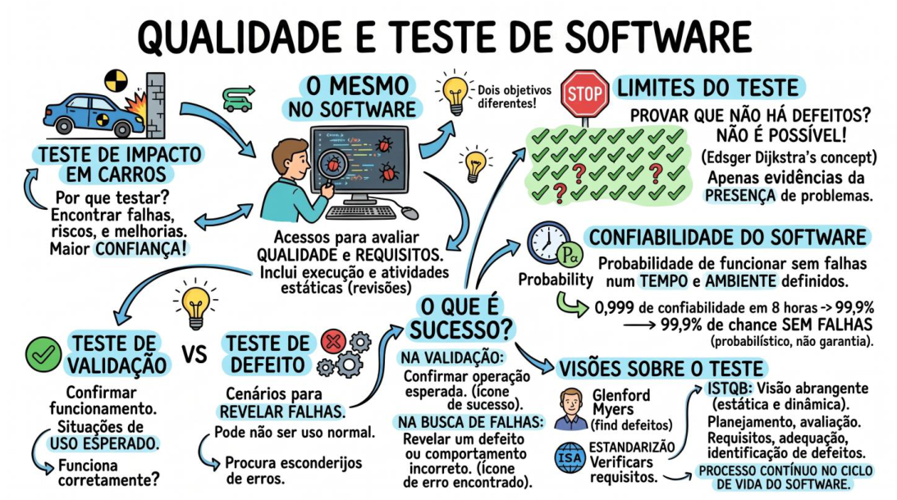

Diversos autores e instituições propuseram definições para teste de software ao longo do tempo. Glenford Myers descreve essa atividade como o processo de executar um software com a intenção de

---

<!-- pagina: 6 -->

**Diego Carvalho, Equipe Informática 2 (Diego Carvalho), Equipe Informática 1 (Diego Carvalho) Aula 06** 

encontrar defeitos. Organizações de padronização, por sua vez, enfatizam a avaliação sistemática de sistemas ou componentes por meios manuais ou automatizados para verificar o atendimento aos requisitos especificados. Embora as formulações variem, todas convergem para a ideia de produzir evidências sobre a qualidade do software. 

O Glossário ISTQB adota uma visão mais abrangente ao incluir atividades estáticas e dinâmicas relacionadas ao planejamento, preparação e avaliação de produtos de software e artefatos associados. Qual é a finalidade dessas atividades? Determinar se os requisitos foram atendidos, verificar a adequação ao propósito pretendido e identificar defeitos que possam comprometer o funcionamento do sistema. Dessa forma, o teste é compreendido como um processo contínuo de avaliação que acompanha diferentes etapas do ciclo de vida do software. 

Após compreender a importância dos testes de software, surge uma questão natural: o que caracteriza um bom teste? A resposta envolve algumas propriedades que aumentam sua capacidade de revelar informações úteis sobre a qualidade do sistema. Nem todo teste possui o mesmo valor, pois alguns conseguem identificar problemas com muito mais eficiência do que outros. Por esse motivo, a elaboração de casos de teste exige planejamento e critérios que orientem a seleção das situações mais relevantes para avaliação. 

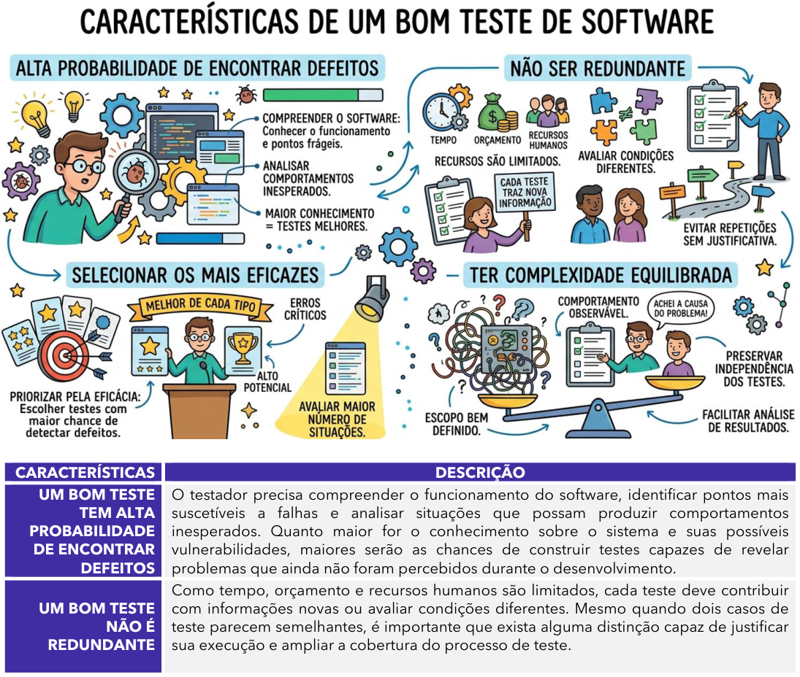

<!-- Start of picture text -->
CARACTERÍSTICAS  DESCRIÇÃO UM BOM TESTE  O testador precisa compreender o funcionamento do software, identificar pontos mais TEM ALTA  suscetíveis a falhas e analisar situações que possam produzir comportamentos PROBABILIDADE  inesperados. Quanto maior for o conhecimento sobre o sistema e suas possíveis DE ENCONTRAR  vulnerabilidades, maiores serão as chances de construir testes capazes de revelar DEFEITOS  problemas que ainda não foram percebidos durante o desenvolvimento. Como tempo, orçamento e recursos humanos são limitados, cada teste deve contribuir UM BOM TESTE  com informações novas ou avaliar condições diferentes. Mesmo quando dois casos de NÃO É   teste parecem semelhantes, é importante que exista alguma distinção capaz de justificar REDUNDANTE  sua execução e ampliar a cobertura do processo de teste. <!-- End of picture text -->

---

<!-- pagina: 7 -->

**Diego Carvalho, Equipe Informática 2 (Diego Carvalho), Equipe Informática 1 (Diego Carvalho) Aula 06** 

As restrições de prazo também influenciam diretamente as decisões do testador. Nesses cenários, torna-se necessário priorizar aqueles que apresentam maior potencial de detecção de defeitos. Entre diversos testes com objetivos semelhantes, costuma ser mais vantajoso selecionar o caso que consegue avaliar uma quantidade maior de situações ou <u>que possui maior capacidade de revelar uma classe relevante de erros. ue possui maior capacidade de revelar uma classe relevante de erros. possui maior capacidade de revelar uma classe relevante de erros. ossui maior capacidade de revelar uma classe relevante de erros. pacidade de revelar uma classe relevante de erros. acidade de revelar uma classe relevante de erros.</u> 

**UM BOM TESTE** cenários, torna-se necessário priorizar aqueles que apresentam maior potencial de **DEVERÁ SER** detecção de defeitos. Entre diversos testes com objetivos semelhantes, costuma ser mais **“O MELHOR DA** vantajoso selecionar o caso que consegue avaliar uma quantidade maior de situações ou **RAÇA”** <u>que possui maior capacidade de revelar uma classe relevante de erros. ue possui maior capacidade de revelar uma classe relevante de erros. possui maior capacidade de revelar uma classe relevante de erros. ossui maior capacidade de revelar uma classe relevante de erros. pacidade de revelar uma classe relevante de erros. acidade de revelar uma classe relevante de erros.</u> **<mark>UM BOM TESTE</mark>** Quando um único caso de teste combina muitas ações, entradas e verificações **NÃO DEVE SER** simultaneamente, a identificação da causa de uma falha pode se tornar mais difícil. Por **NEM MUITO** essa razão, recomenda-se projetar testes com escopo bem definido e comportamento **SIMPLES NEM** facilmente observável, preservando a independência dos casos de teste e facilitando a **MUITO** análise dos resultados obtidos. **COMPLEXO** 

A atividade de teste evoluiu significativamente ao longo das últimas décadas, o que permitiu o surgimento de princípios amplamente aceitos pela Engenharia de Software. Para que servem esses princípios? Eles ajudam a compreender tanto o potencial quanto as limitações dos testes, orientando a definição de estratégias mais eficientes. Em vez de fornecer regras rígidas, esses princípios funcionam como diretrizes construídas a partir da experiência acumulada em inúmeros projetos de software. 

**<mark>PRINCÍPIOS</mark> DESCRIÇÃO FUNDAMENTAIS** Um dos princípios mais conhecidos afirma que os testes demonstram a presença de **TESTES** defeitos, mas não sua ausência. Quando um teste encontra uma falha, existe uma **DEMONSTRAM A** evidência concreta de que o problema está presente. Entretanto, quando nenhum defeito **PRESENÇA DE** é encontrado, não se pode concluir que o software está completamente livre de erros. Os **DEFEITOS...** testes reduzem as incertezas e aumentam a confiança no sistema, mas não fornecem <u>garantias absolutas sobre seu comportamento.</u> 

**TESTES EXAUSTIVOS SÃO IMPOSSÍVEIS...** 

Outro princípio fundamental estabelece que testes exaustivos são inviáveis na maioria dos sistemas reais. Em situações muito simples talvez isso ocorra, mas sistemas reais costumam apresentar uma quantidade tão grande de possibilidades que a avaliação completa se torna impraticável. Por essa razão, os testes são planejados com base em critérios de risco, relevância e probabilidade de ocorrência de falhas. 

**TESTE O MAIS BREVE POSSÍVEL (ANTECIPADO)...** 

**AGRUPEM OS DEFEITOS MAIS SENSÍVEIS...** 

**PARADOXO DO PESTICIDA...** 

<mark>A antecipação das atividades de teste também ocupa papel importante no processo de</mark> desenvolvimento. Em geral, problemas descobertos nas fases iniciais exigem menos esforço para correção do que aqueles encontrados após a implantação do sistema. Além disso, diversas técnicas permitem analisar requisitos, modelos e documentos antes mesmo da implementação, contribuindo para a prevenção de defeitos em etapas <u>posteriores do projeto.</u> 

A experiência prática também mostra que os defeitos costumam se concentrar em determinadas partes do sistema. Essa proporção é apenas uma referência associada ao Princípio de Pareto. O aspecto relevante é perceber que alguns módulos tendem a acumular mais problemas do que outros. Quando essas áreas são identificadas, torna-se possível direcionar os esforços de teste para regiões com maior probabilidade de apresentar falhas. 

Outro conceito bastante cobrado é o paradoxo do pesticida. Com o tempo, eles tendem a perder sua capacidade de revelar novos defeitos, pois os problemas mais evidentes já foram encontrados e corrigidos. Para manter a eficácia do processo de teste, é necessário revisar periodicamente os casos existentes, criar novos cenários e adaptar as estratégias às mudanças ocorridas no software. 

**TESTES DEPENDEM DO CONTEXTO...** 

Os testes também dependem fortemente do contexto em que o sistema será utilizado. Cada domínio apresenta riscos, requisitos e características próprias. Sistemas financeiros costumam exigir elevado rigor em aspectos de segurança e integridade dos dados,

---

<!-- pagina: 8 -->

**Diego Carvalho, Equipe Informática 2 (Diego Carvalho), Equipe Informática 1 (Diego Carvalho) Aula 06** 

enquanto aplicações voltadas à interação social podem demandar maior atenção a desempenho, usabilidade e escalabilidade. 

<!-- Start of picture text -->
O último princípio destaca que a ausência de defeitos conhecidos não garante o sucesso de um software. Um sistema pode apresentar excelente estabilidade técnica e, ainda AUSÊNCIA DE assim, falhar em atender às necessidades dos usuários ou aos objetivos para os quais foi DEFEITOS É UMA desenvolvido. A qualidade de um produto envolve diversos fatores além da simples ILUSÃO identificação de falhas, incluindo a capacidade de resolver adequadamente os problemas que motivaram sua criação. <!-- End of picture text -->

Os testes de software têm como principal finalidade revelar defeitos que possam comprometer o funcionamento de um sistema. Entretanto, a eficiência dessa atividade não depende apenas da qualidade dos casos de teste. Existe outro fator igualmente importante: a facilidade com que o próprio software pode ser testado. Como avaliar essa característica? A Engenharia de Software utiliza o conceito de testabilidade para descrever o grau de facilidade com que um sistema permite a criação, execução e análise de testes. 

A testabilidade influencia diretamente o esforço necessário para identificar defeitos e validar requisitos. Um software pode ser funcional e atender aos objetivos do negócio, mas ainda assim apresentar dificuldades durante os testes. O que torna um sistema mais fácil de testar? Diversas características contribuem para isso, permitindo que problemas sejam encontrados mais rapidamente e que os resultados obtidos sejam analisados com maior precisão. 

**<mark>CARACTERÍSTICAS DESCRIÇÃO</mark>** Grosso modo, podemos dizer que “quanto melhor funciona, mais eficientemente pode ser testado”. Quando o software apresenta comportamento estável e previsível, o testador consegue concentrar sua atenção na verificação dos requisitos e na busca **OPERABILIDADE** por defeitos específicos. Em contrapartida, falhas constantes e comportamentos inesperados podem dificultar a execução dos testes e tornar a análise dos resultados mais trabalhosa.

---

<!-- pagina: 9 -->

**Diego Carvalho, Equipe Informática 2 (Diego Carvalho), Equipe Informática 1 (Diego Carvalho) Aula 06** 

**OBSERVABILIDADE** 

Grosso modo, podemos dizer que “o que você vê é o que você testa”. Quanto mais visíveis forem os estados do sistema, as mensagens de erro, os registros de execução e os resultados produzidos, maior será a capacidade de compreender o comportamento do software durante os testes. Essa visibilidade facilita a identificação de defeitos e reduz o tempo necessário para investigar suas causas. 

**CONTROLABILIDADE** 

**DECOMPONIBILIDADE** 

Grosso modo, podemos dizer que “quanto melhor você pode controlar o software, mais o teste pode ser automatizado e otimizado”. A controlabilidade também exerce papel fundamental no processo de teste. Nessa situação, torna-se mais fácil reproduzir cenários específicos, automatizar procedimentos e repetir testes sempre que necessário. Quanto maior o controle disponível para o testador, maior tende a <mark>ser a eficiência na validação dos comportamentos esperados.</mark> 

Grosso modo, podemos dizer que “controlando o escopo, podemos isolar problemas mais rapidamente e realizar testes mais inteligentes”. Quando o sistema pode ser dividido em partes menores, os problemas tendem a ser isolados com maior rapidez. Essa característica favorece a realização de testes focados em componentes específicos e simplifica a identificação da origem de comportamentos incorretos. 

**SIMPLICIDADE** 

**ESTABILIDADE** 

**COMPREENSIBILIDADE** 

<mark>Grosso modo, podemos dizer que “quanto menos houver a testar, mais rapidamente</mark> podemos testá-lo”. A simplicidade também contribui para aumentar a testabilidade. Não se trata de reduzir funcionalidades ou diminuir a cobertura dos testes, mas de evitar complexidade desnecessária na estrutura e no comportamento do sistema. Quanto mais simples for a solução implementada, menor tende a ser a quantidade de interações difíceis de analisar e validar durante os testes. 

Grosso modo, podemos dizer que “quanto menos modificações, menos interrupções no teste”. A estabilidade representa outra característica relevante. Quando requisitos, interfaces ou componentes sofrem alterações constantes, muitos casos de teste precisam ser revisados ou reconstruídos. Sistemas mais estáveis permitem que os testes permaneçam válidos por períodos maiores, reduzindo retrabalho e aumentando a eficiência do processo de verificação. 

Grosso modo, podemos dizer que “quanto mais informações temos, de forma mais inteligente vamos testar”. Em outras palavras, quanto mais claras forem a arquitetura, as funcionalidades e as regras de negócio, mais facilmente os testadores conseguem elaborar cenários relevantes e identificar possíveis pontos de falha. O conhecimento adequado sobre o software contribui para a construção de estratégias de teste mais <u>precisas e alinhadas aos riscos existentes no sistema.</u> 

**(FGV / TJ MS - 2024)** A testabilidade é um fator importante para o desenvolvimento e a <mark>implementação de um software. Uma característica de um software testável é que os estados do software devem ser visíveis e podem ser consultados durante a execução. Essa característica é chamada de:</mark> 

<mark>a) compreensibilidade; b) controlabilidade; c) estabilidade; d) observabilidade; e) operabilidade.</mark> 

**<mark>_______________________ Comentários:</mark>** <mark>(a) Errado. Compreensibilidade trata da facilidade de entender o software, não da visualização de seus estados em execução. (b) Errado. Controlabilidade relaciona-se à capacidade de controlar entradas e condições de teste, não à consulta dos estados internos. (c) Errado. Estabilidade refere-se à previsibilidade do comportamento diante de mudanças, sem foco na visibilidade dos estados. (d) Correto. Observabilidade é a característica que permite visualizar e consultar os estados do software durante sua execução.</mark> (e) Errado. Operabilidade diz respeito à facilidade de operação e uso do software, não à inspeção de estados internos. (Letra D)

---

<!-- pagina: 10 -->

**Diego Carvalho, Equipe Informática 2 (Diego Carvalho), Equipe Informática 1 (Diego Carvalho) Aula 06** 

**<mark>INCIDÊNCIA EM PROVA: BAIXÍSSIMA</mark>** 

<!-- Start of picture text -->
Processo de Teste <!-- End of picture text -->

<!-- Start of picture text -->
s <!-- End of picture text -->

###### **<mark>PROCESSO DE TESTES</mark>** 

Conjunto organizado de atividades realizadas para planejar, projetar, executar, monitorar e encerrar os testes de software. De acordo com referências como a ISO/IEC/IEEE 29119 e o ISTQB, esse processo normalmente inclui etapas de planejamento, análise, projeto, implementação, execução, avaliação dos resultados e encerramento. Seu objetivo é garantir que os testes sejam conduzidos de forma estruturada, repetível e alinhada aos objetivos do projeto. 

As atividades de teste não são executadas de forma aleatória ou desorganizada. Para garantir que os objetivos de qualidade sejam alcançados, a Engenharia de Software utiliza processos de teste estruturados. O que caracteriza um processo de teste? Trata-se de um conjunto organizado de atividades e subatividades que orientam a condução dos testes ao longo do ciclo de desenvolvimento, definindo como as verificações serão planejadas, executadas e avaliadas. 

A existência de um processo formal permite que as equipes atuem de maneira mais consistente e previsível. Por que isso é importante? Sem uma estrutura definida, atividades relevantes podem ser esquecidas, executadas em momentos inadequados ou realizadas sem critérios claros de avaliação. O processo de teste estabelece diretrizes que auxiliam na tomada de decisões, na definição das responsabilidades e na organização das etapas necessárias para avaliar a qualidade do software. 

Outro aspecto relevante está relacionado ao direcionamento das atividades. O processo serve apenas para indicar qual será a próxima tarefa? Sua função é mais ampla. Além de orientar a sequência das ações, ele define critérios de entrada e saída, artefatos produzidos, objetivos de cada etapa e mecanismos de acompanhamento dos resultados. Dessa forma, a execução dos testes ocorre de maneira sistemática e alinhada aos objetivos do projeto. 

Os processos de teste também podem ser entendidos como conjuntos de boas práticas consolidadas pela experiência da indústria de software. Como essas práticas contribuem para a qualidade do produto? Elas fornecem orientações que ajudam a planejar melhor os testes, selecionar técnicas adequadas e

---

<!-- pagina: 11 -->

**Diego Carvalho, Equipe Informática 2 (Diego Carvalho), Equipe Informática 1 (Diego Carvalho) Aula 06** 

acompanhar os resultados obtidos. Esse conjunto de práticas reduz a dependência de decisões improvisadas e aumenta a consistência das atividades realizadas pela equipe. 

Outro benefício importante envolve o gerenciamento de riscos. De que forma um processo de teste auxilia nessa tarefa? Ao estabelecer mecanismos para identificar, analisar e tratar defeitos, o processo contribui para reduzir a probabilidade de problemas chegarem aos usuários finais. Esses defeitos podem ter origem em requisitos, projeto, implementação, integração, configuração ou outras etapas do desenvolvimento. Por esse motivo, o processo de teste desempenha papel fundamental na redução dos riscos associados tanto ao produto quanto ao próprio projeto de software. Vejamos... 

|**ETAPAS DO** **PROCESSO**|**DESCRIÇÃO**|
|---|---|
|**PLANEJAMENTO**|Nesta etapa, elaboram-se o Projeto de Testes e o Plano de Testes. Ela acompanha todo o processo de teste, por meio de atividades como captação de requisitos, planejamento do projeto,análise de riscos epreparação de ambiente de testes.|
|**PREPARAÇÃO**|Nesta etapa, organiza-se o ambiente de testes (infraestrutura, equipamentos, hardware, software, pessoal capacitado, ferramentas e massa de testes adequadas) para que os testes sejam executados conformeplanejados.|
|**ESPECIFICAÇÃO**|Nesta etapa, temos as atividades de elaborar e revisar casos de testes e roteiros de testes (scripts). Esse último descreve a relação dos casos de testes e a previsão de execução dos testes.|
|**EXECUÇÃO**|Nesta etapa, testes são executados conforme roteiros estabelecidos para os testes. Executa-se sempre que ocorrem mudanças na aplicação e analisam-se os testes executados com sucesso e com defeito – os resultados obtidos são registrados.|
|**ENTREGA**|Nesta etapa, o projeto é finalizado, registra-se toda a documentação e relatam-se todas as incidências relevantes à melhoria do processo em um relatório de conformidades e não-conformidades –por fim,a documentaçãogerada é arquivada.|

Com relação à etapa de planejamento, a análise de riscos em projetos de teste é um elemento crítico e deve seguir metodologias estruturadas. Para definir a cobertura de testes de forma eficaz, a equipe deve levar em conta obrigatoriamente a probabilidade de ocorrência do risco, o seu impacto no funcionamento do sistema e a perda associada (financeira, operacional ou de imagem). O mapeamento e a ponderação dessas métricas permitem que o gerente de testes priorize recursos e cenários nas áreas de maior risco, garantindo uma proteção mais robusta onde a exposição do negócio é mais crítica.

---

<!-- pagina: 12 -->

**Diego Carvalho, Equipe Informática 2 (Diego Carvalho), Equipe Informática 1 (Diego Carvalho) Aula 06** 

**<mark>INCIDÊNCIA EM PROVA: BAIXÍSSIMA</mark>** 

<!-- Start of picture text -->
Ciclo de Problemas <!-- End of picture text -->

Segundo a ISTQB (International Software Testing Qualifications Board), os problemas relacionados à qualidade de software podem ser compreendidos por meio de uma cadeia causal que relaciona os conceitos de erro humano (error), defeito (defect ou bug) e falha (failure). Essa sequência é frequentemente chamada de ciclo de problemas de software, pois descreve como um engano cometido por uma pessoa pode se transformar em um comportamento incorreto observado pelos usuários durante a execução do sistema. 

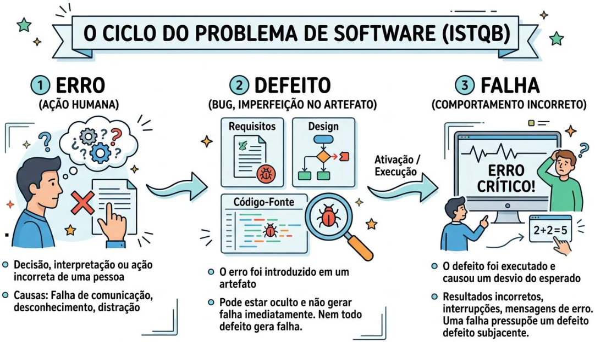

<!-- Start of picture text -->
Erro <!-- End of picture text -->

O primeiro elemento dessa sequência é o erro humano, conhecido como error. O que caracteriza um erro? Trata-se de uma ação, decisão ou interpretação incorreta realizada por algum participante do projeto. Falhas de comunicação, entendimento inadequado dos requisitos, distrações ou limitações de conhecimento técnico figuram entre as causas mais comuns. Nesse estágio, o problema ainda está associado à atividade humana e não necessariamente ao software em si. 

<!-- Start of picture text -->
Defeito <!-- End of picture text -->

Quando um erro é incorporado a um artefato do projeto, surge o defeito, denominado defect. Como ocorre essa transformação? Uma interpretação incorreta pode resultar em um requisito inadequado, um modelo inconsistente ou uma implementação incorreta no código-fonte. O defeito representa a imperfeição presente no artefato produzido. Entretanto, sua existência não significa que o sistema apresentará imediatamente um comportamento incorreto durante a execução.

---

<!-- pagina: 13 -->

**Diego Carvalho, Equipe Informática 2 (Diego Carvalho), Equipe Informática 1 (Diego Carvalho) Aula 06** 

Uma dúvida frequente surge nesse ponto. Se o defeito já existe, por que o problema nem sempre é percebido? Porque muitos defeitos permanecem ocultos até que determinadas condições sejam satisfeitas. Somente quando o defeito é ativado durante a execução do sistema ele tem potencial para produzir efeitos observáveis. Enquanto isso não ocorre, o sistema pode continuar operando aparentemente de forma normal. 

<!-- Start of picture text -->
Falha <!-- End of picture text -->

A etapa final dessa sequência corresponde à falha, conhecida como failure. O que caracteriza uma falha? Ela ocorre quando um defeito é executado ou ativado e provoca um comportamento diferente daquele esperado pelos requisitos ou especificações. Resultados incorretos, interrupções de funcionamento, mensagens de erro e respostas incompatíveis com o comportamento previsto são exemplos de manifestações de falhas observadas pelos usuários ou pelas equipes de teste. 

Uma observação importante para provas: nem todo defeito gera uma falha. Um defeito pode permanecer oculto durante toda a vida útil do sistema se nunca for ativado. Da mesma forma, uma falha observada sempre pressupõe a existência de pelo menos um defeito subjacente que foi executado em determinadas condições. Essa distinção entre erro, defeito e falha é um dos conceitos fundamentais da terminologia da ISTQB. 

|**PROBLEMAS**|**DESCRIÇÃO**|
|---|---|
|**ERRO (ERROR)**|O erro corresponde a uma ação, decisão ou interpretação incorreta realizada por uma pessoa durante alguma atividade do desenvolvimento de software. Pode decorrer de falhas de comunicação, entendimento inadequado dos requisitos, distrações ou limitações de conhecimento técnico. Nesse estágio, o problema ainda está associado ao fator humano e não necessariamente foi incorporado a qualquer artefato do sistema.|
|**DEFEITO (DEFECT)**|O defeito surge quando um erro humano é introduzido em algum artefato do projeto, como requisitos, modelos, documentação ou código-fonte. Trata-se de uma imperfeição existente no produto desenvolvido. Entretanto, sua presença não implica necessariamente a ocorrência imediata de problemas observáveis, pois o defeito pode permanecer oculto até que determinadas condições permitam sua ativação durante a execução.|
|**FALHA (FAILURE)**|A falha ocorre quando um defeito é efetivamente executado ou ativado e produz um comportamento diferente daquele esperado pelos requisitos ou especificações. Ela se manifesta por meio de resultados incorretos, mensagens de erro, interrupções de funcionamento ou respostas inadequadas do sistema. Nem todo defeito gera uma falha, mas toda falha pressupõe a existência de pelo menos um defeito subjacente.|

---

<!-- pagina: 14 -->

**Diego Carvalho, Equipe Informática 2 (Diego Carvalho), Equipe Informática 1 (Diego Carvalho) Aula 06** 

**<mark>INCIDÊNCIA EM PROVA: BAIXÍSSIMA</mark>** 

<!-- Start of picture text -->
Abordagens de Testes <!-- End of picture text -->

As abordagens de teste representam diferentes maneiras de avaliar a qualidade de um software ao longo de seu ciclo de desenvolvimento. A classificação mais tradicional divide os testes em testes estáticos e testes dinâmicos, conforme exista ou não a execução do software durante a atividade de verificação. Ambas as abordagens são complementares e contribuem para a identificação de defeitos em momentos distintos do processo de desenvolvimento. 

<!-- Start of picture text -->
Testes Estáticos <!-- End of picture text -->

Os testes estáticos constituem uma abordagem de avaliação que não depende da execução do software. O que caracteriza esse tipo de atividade? Em vez de observar o comportamento do sistema em funcionamento, a análise concentra-se nos artefatos produzidos durante o desenvolvimento. Requisitos, especificações, diagramas, modelos, casos de teste, definições arquiteturais e código-fonte podem ser examinados para identificar problemas antes que eles se manifestem durante a operação da aplicação. 

Diversos tipos de defeitos podem ser encontrados por meio dessa abordagem. Quais problemas normalmente são identificados? Inconsistências entre documentos, ambiguidades em requisitos, omissões de informações, desvios de padrões estabelecidos e falhas de projeto figuram entre os exemplos mais comuns. Como esses problemas são detectados sem a necessidade de executar o software, a correção tende a ocorrer em etapas mais precoces do desenvolvimento. 

Uma dúvida frequente surge ao analisar os métodos utilizados nesse processo. Como os artefatos são avaliados se o sistema não está em funcionamento? Para isso, empregam-se técnicas específicas de revisão e análise. Revisões informais, walkthroughs, revisões técnicas e inspeções permitem que profissionais examinem os artefatos de forma estruturada, enquanto ferramentas de análise estática automatizada auxiliam na identificação de problemas diretamente no código-fonte e em outros elementos produzidos pela equipe. 

**<mark>TIPO DE REVISÃO DESCRIÇÃO</mark>** É a forma mais simples e menos estruturada de revisão estática. Não possui processo formal, papéis definidos ou critérios rígidos de execução. Normalmente ocorre quando **REVISÃO** uma ou mais pessoas analisam um artefato, como requisitos, diagramas ou código-fonte, **INFORMAL** para identificar defeitos, inconsistências ou oportunidades de melhoria. Seu principal benefício é fornecer feedback rápido com baixo custo e pouca burocracia. Revisão conduzida pelo próprio autor do artefato em que, durante a sessão, o autor apresenta passo a passo o conteúdo produzido, explicando decisões, fluxos e premissas **WALK-** adotadas, enquanto os participantes analisam o material e apontam dúvidas, defeitos ou **THROUGH** sugestões. O foco está no compartilhamento de conhecimento, no aprendizado coletivo e na identificação precoce de problemas em documentos, modelos ou código. É uma revisão mais estruturada realizada por profissionais com conhecimento técnico sobre o artefato analisado. Seu objetivo é avaliar aspectos como correção técnica, **REVISÃO** aderência a padrões, consistência arquitetural e viabilidade da solução proposta. **TÉCNICA** Diferentemente do walk-through, a condução não depende necessariamente do autor do documento, sendo comum a participação de especialistas independentes. É a modalidade mais formal e rigorosa de revisão estática. Possui processo definido, **INSPEÇÃO** papéis específicos (moderador, autor, inspetor e relator), planejamento prévio, listas de 

É a modalidade mais formal e rigorosa de revisão estática. Possui processo definido, papéis específicos (moderador, autor, inspetor e relator), planejamento prévio, listas de verificação e registro sistemático dos defeitos encontrados. Seu <u>principal objetivo é</u>

---

<!-- pagina: 15 -->

**Diego Carvalho, Equipe Informática 2 (Diego Carvalho), Equipe Informática 1 (Diego Carvalho) Aula 06** 

**<mark>TIPO DE REVISÃO</mark>** 

**<mark>DESCRIÇÃO</mark>** <mark>identificar falhas de maneira disciplinada e mensurável, produzindo métricas e evidências</mark> que auxiliam no controle da qualidade dos artefatos analisados. 

Os testes estáticos complementam as atividades de teste realizadas com o sistema em execução. Qual é a principal contribuição dessa abordagem para a qualidade do software? Ao identificar defeitos em documentos, modelos e códigos antes que eles provoquem falhas durante a operação, essas atividades ajudam a reduzir retrabalho e facilitam a correção de problemas em estágios nos quais o custo de modificação tende a ser menor. Por esse motivo, os testes estáticos ocupam papel relevante ao longo de todo o processo de desenvolvimento de software. 

Quando as técnicas estáticas são aplicadas sobre os artefatos de especificação (como documentos de requisitos e diagramas), as revisões técnicas e inspeções humanas apresentam eficácia infinitamente superior às análises automatizadas. Ferramentas de análise estática automatizada são muito eficientes e facilmente implementadas na verificação de sintaxe e regras diretamente no código-fonte, mas apresentam forte limitação de eficácia ao lidar com a semântica, a linguagem natural e a lógica de negócios descrita nos artefatos de especificação humana. 

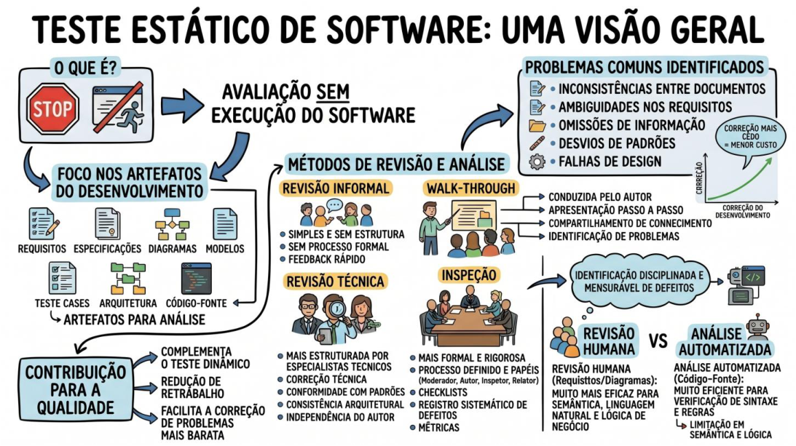

<!-- Start of picture text -->
Testes Dinâmicos <!-- End of picture text -->

Os testes dinâmicos constituem uma abordagem de avaliação baseada na execução do software ou de partes dele. O que diferencia essa modalidade dos testes estáticos? Enquanto os testes estáticos analisam artefatos sem executar o sistema, os testes dinâmicos observam diretamente o comportamento da aplicação durante sua operação. Para isso, são fornecidas entradas, executados cenários de uso ou simuladas determinadas condições de funcionamento, permitindo verificar como o software responde em cada situação.

---

<!-- pagina: 16 -->

**Diego Carvalho, Equipe Informática 2 (Diego Carvalho), Equipe Informática 1 (Diego Carvalho) Aula 06** 

Durante a execução dos testes, diferentes características do sistema podem ser avaliadas. Quais aspectos costumam ser observados? Entre os elementos mais analisados estão as saídas produzidas, os tempos de resposta, o consumo de recursos computacionais, a confiabilidade e o comportamento geral da aplicação diante das condições estabelecidas para o teste. Essas informações permitem comparar os resultados obtidos com aqueles definidos nos requisitos e especificações do sistema. 

Uma dúvida frequente surge ao estudar essa abordagem. Seriam os testes dinâmicos utilizados apenas para verificar funcionalidades? Não. Embora a validação funcional represente uma aplicação importante dessa categoria, os testes dinâmicos também são empregados para avaliar atributos não funcionais. Desempenho, segurança, usabilidade e confiabilidade são exemplos de características que somente podem ser analisadas adequadamente quando o software está em execução. 

Diversas modalidades de teste pertencem a essa categoria. Quais são os exemplos mais comuns? Testes de unidade, integração, sistema e aceitação são amplamente utilizados para verificar diferentes níveis de funcionamento da aplicação. Além deles, testes de desempenho, segurança e usabilidade também são considerados dinâmicos, pois dependem da observação do comportamento do software durante sua execução. Essa característica torna possível avaliar o sistema em condições próximas daquelas encontradas em seu ambiente real de utilização. 

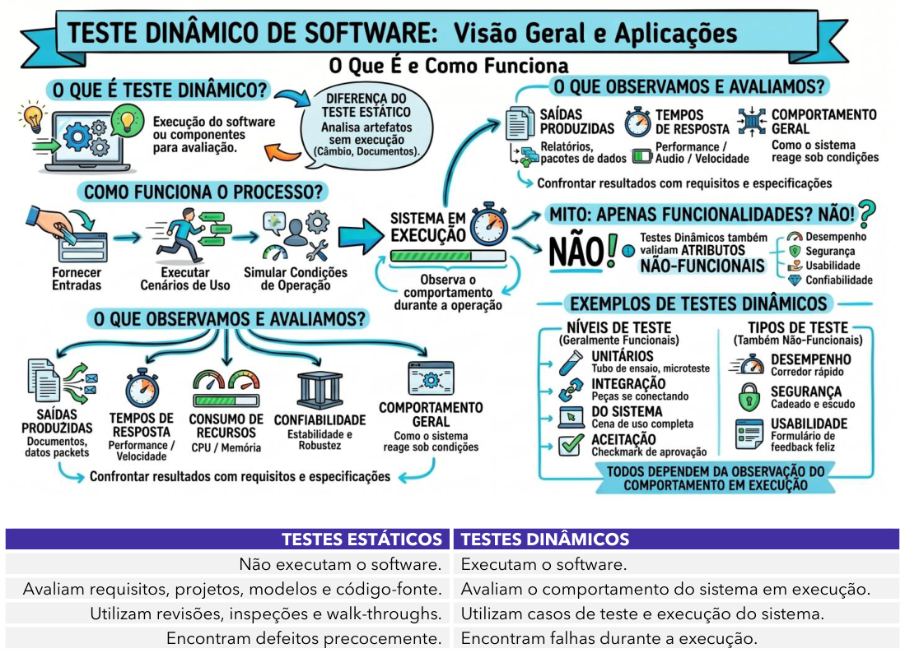

<!-- Start of picture text -->
TESTES ESTÁTICOS  TESTES DINÂMICOS Não executam o software.  Executam o software. Avaliam requisitos, projetos, modelos e código-fonte.  Avaliam o comportamento do sistema em execução. Utilizam revisões, inspeções e walk-throughs.  Utilizam casos de teste e execução do sistema. Encontram defeitos precocemente.  Encontram falhas durante a execução. <!-- End of picture text -->

---

<!-- pagina: 17 -->

**Diego Carvalho, Equipe Informática 2 (Diego Carvalho), Equipe Informática 1 (Diego Carvalho) Aula 06** 

<!-- Start of picture text -->
Documentação de Testes <!-- End of picture text -->

**<mark>INCIDÊNCIA EM PROVA: BAIXÍSSIMA</mark>** 

<!-- Start of picture text -->
Plano de Testes <!-- End of picture text -->

###### **<mark>PLANO DE TESTES</mark>** 

Documento que define o escopo, os objetivos, os recursos, as responsabilidades, os cronogramas, os critérios e as estratégias que orientarão as atividades de teste em um projeto. Ele estabelece quais requisitos serão avaliados, quais tipos de teste serão executados, quais ferramentas serão utilizadas e quais critérios determinarão o sucesso ou encerramento das atividades. Trata-se do principal instrumento de planejamento e controle dos testes. 

Durante a execução do processo de teste são produzidos diversos artefatos que auxiliam no planejamento, na organização e no acompanhamento das atividades. Entre eles, dois se destacam pela relevância: o Plano de Testes e os Casos de Teste. Qual é a finalidade desses documentos? Ambos contribuem para estruturar o esforço de teste, mas cada um desempenha funções específicas dentro do processo de garantia da qualidade do software. 

O Plano de Testes é um documento voltado ao planejamento e ao gerenciamento das atividades de teste. Que tipo de informação costuma estar presente nesse artefato? Normalmente são definidos aspectos como escopo, estratégia de teste, métodos utilizados, cronograma, recursos necessários, ferramentas de apoio, métricas de acompanhamento e critérios de qualidade. Essas informações servem como referência para orientar a condução das atividades ao longo do projeto. 

###### **Saiba mais:** 

<mark>O planejamento deve incluir uma rigorosa Análise de Riscos que direcione a cobertura dos testes. Neste mapeamento, a equipe deve avaliar a Probabilidade de Ocorrência de cada risco e a Perda ou Impacto associado (em valor financeiro, de imagem ou processual) caso ele se concretize no ambiente produtivo. Módulos que oferecem as mais severas conjunções de probabilidade e</mark> impacto recebem maior escopo e prioridade no esforço de teste. 

Por possuir natureza gerencial, o Plano de Testes também estabelece responsabilidades e organiza a execução das atividades previstas. Como garantir que todos saibam o que deve ser feito e em qual momento? O documento contribui justamente para esse alinhamento ao registrar a distribuição das tarefas, os marcos previstos e os critérios que serão utilizados para avaliar o progresso do trabalho. Dessa forma, a equipe dispõe de uma visão estruturada sobre a condução dos testes. 

Outra função importante do Plano de Testes está relacionada à comunicação entre as partes interessadas. Por que documentar formalmente a estratégia adotada? Quando os objetivos, critérios e procedimentos são registrados de forma clara, torna-se mais fácil alinhar expectativas e reduzir interpretações divergentes sobre o processo de teste. Essa documentação também favorece o acompanhamento das atividades e o controle das decisões tomadas ao longo do projeto. 

Uma dúvida comum surge nesse ponto: o Plano de Testes contém os casos de teste que serão executados? Em geral, não. O documento descreve como os testes serão conduzidos, quais estratégias serão utilizadas e quais critérios deverão ser observados. Os casos de teste costumam ser registrados em

---

<!-- pagina: 18 -->

**Diego Carvalho, Equipe Informática 2 (Diego Carvalho), Equipe Informática 1 (Diego Carvalho) Aula 06** 

artefatos específicos, nos quais são detalhadas as entradas, condições de execução, passos e resultados esperados para cada cenário avaliado. 

A estrutura de um Plano de Testes pode variar conforme a organização, a metodologia utilizada e a complexidade do projeto. Todos os planos possuem exatamente o mesmo conteúdo? Não. Em abordagens tradicionais, o documento tende a ser mais detalhado e formal. Já em ambientes ágeis, muitas dessas informações podem ser distribuídas entre diferentes artefatos ou incorporadas ao planejamento das iterações. Independentemente do formato adotado, o objetivo permanece o mesmo: reunir as informações necessárias para planejar, coordenar e acompanhar adequadamente as atividades de teste. 

|**SEÇÕES**|**CONTEÚDO**|
|---|---|
|**INTRODUÇÃO**|Apresenta a identificação do projeto, seus objetivos, o público-alvo do documento e o escopo da solução a ser desenvolvida, fornecendo o contexto necessário para o entendimento do plano de testes.|
|**REQUISITOS**|Descreve, de forma consolidada, os requisitos funcionais e não funcionais que serão objeto de verificação, definindo quais aspectos do sistema deverão ser avaliados durante os testes.|
|**ESTRATÉGIAS E** **FERRAMENTAS**|Detalha os tipos e técnicas de teste a serem empregados, os critérios de entrada e saída, os critérios de encerramento e as ferramentas que apoiarão a execução e o controle dos testes.|
|**EQUIPE E** **INFRAESTRUTURA**|Identifica os recursos humanos e materiais necessários às atividades de teste, incluindo papéis da equipe, ambientes, equipamentos, softwares de apoio e demais recursos utilizados.|
|**CRONOGRAMA DE** **ATIVIDADES**|Define o planejamento temporal das atividades de teste, apresentando marcos, dependências, datas previstas de início e término e os principais entregáveis do processo de testes.|
|**DOCUMENTAÇÃO** **COMPLEMENTAR**|Relaciona os documentos de referência do projeto, como especificações, requisitos, normas, procedimentos e demais artefatos que subsidiam o planejamento e a execução dos testes.|

---

<!-- pagina: 19 -->

**Diego Carvalho, Equipe Informática 2 (Diego Carvalho), Equipe Informática 1 (Diego Carvalho) Aula 06** 

<!-- Start of picture text -->
Casos de Testes <!-- End of picture text -->

###### **<mark>CASOS DE TESTES</mark>** 

Especificações detalhadas que descrevem condições, entradas, ações e resultados esperados utilizados para verificar um requisito ou funcionalidade do sistema. Cada caso de teste representa um cenário específico de validação e serve como guia para a execução dos testes. Normalmente, contém identificador, objetivo, précondições, passos de execução, dados de entrada e resultados esperados, permitindo avaliar se o software está funcionando corretamente. 

Entre os diversos artefatos produzidos durante o processo de teste, o Caso de Teste ocupa posição central. Qual é sua finalidade? Esse artefato descreve as condições, entradas, ações e resultados esperados utilizados para verificar se determinado comportamento do sistema está funcionando corretamente. Ao documentar essas informações de forma estruturada, torna-se possível executar os testes de maneira consistente e reproduzir os mesmos procedimentos sempre que necessário. 

Um Caso de Teste normalmente reúne informações que orientam sua execução e interpretação. Que informações costumam estar presentes nesse documento? Entre os elementos mais comuns estão o identificador do teste, os itens que serão avaliados, os dados de entrada, os resultados esperados, o ambiente de execução, requisitos especiais e possíveis dependências em relação a outros testes. Esses elementos permitem que diferentes pessoas executem o mesmo teste seguindo critérios equivalentes. 

A relação entre Plano de Testes e Caso de Teste costuma gerar dúvidas. Os dois documentos possuem a mesma finalidade? Não. O Plano de Testes descreve a estratégia geral adotada pela equipe, definindo escopo, cronograma, recursos e critérios de acompanhamento. Já o Caso de Teste detalha exatamente o que deverá ser executado para verificar uma funcionalidade específica. Em outras palavras, o plano define a organização do trabalho, enquanto os casos descrevem os procedimentos que serão realizados. 

Para compreender melhor esse conceito, imagine o desenvolvimento de um veículo voador experimental. Após o planejamento das atividades de teste, surge a necessidade de definir como cada funcionalidade será validada. Como verificar se o sistema está operando corretamente? A equipe passa a elaborar Casos de Teste contendo ações específicas e resultados esperados. Cada conjunto de passos representa um cenário destinado a avaliar determinado comportamento do protótipo. 

Considere, por exemplo, um cenário relacionado ao processo de inicialização do veículo. O que deveria acontecer quando o botão de partida é acionado? O resultado esperado pode ser a ativação do motor. Em outro cenário, a desativação do freio de estacionamento deve liberar o sistema de frenagem. Também é possível definir um teste para verificar se o acionamento do acelerador inicia corretamente a sequência de decolagem. Cada uma dessas verificações corresponde a passos documentados que serão executados durante o teste. 

|**ENTRADA/CONDIÇÃO**|**RESULTADO ESPERADO**|
|---|---|
|- Pressionar o botão departida|- Ativação do Motor|
|- Desativar o freio de estacionamento|- Liberar o Sistema de Frenagem|
|- Acionamento do acelerador|- Início da decolagem|

A execução de um Caso de Teste consiste essencialmente em comparar o comportamento observado com o comportamento esperado. O que acontece quando os resultados não coincidem? Nesse momento surge uma evidência de que existe algum problema a ser investigado. Essa divergência pode estar associada a um defeito do software, a uma configuração inadequada do ambiente de teste, a dados incorretos ou até mesmo a inconsistências na especificação. Por esse motivo, a análise dos resultados constitui uma etapa tão importante quanto a própria execução dos testes.

---

<!-- pagina: 20 -->

**Diego Carvalho, Equipe Informática 2 (Diego Carvalho), Equipe Informática 1 (Diego Carvalho) Aula 06** 

Ao observar o processo como um todo, percebe-se que os Casos de Teste funcionam como instruções detalhadas para validar funcionalidades específicas do sistema. Eles transformam requisitos e expectativas em procedimentos verificáveis, permitindo que a equipe avalie objetivamente se o software apresenta o comportamento esperado em cada cenário definido para o processo de teste. 

Os Casos de Teste são utilizados para verificar se funcionalidades específicas do sistema se comportam conforme os requisitos definidos. Como isso acontece na prática? Considere um sistema de cadastro que exige o preenchimento do CPF do usuário. Uma das verificações possíveis consiste em avaliar se o campo apresenta a máscara padrão ###.###.###-##, garantindo que os dados sejam inseridos no formato esperado pela aplicação. 

A validação do formato representa apenas uma parte do processo. Seria suficiente verificar apenas a presença da máscara? Nem sempre. Além do padrão visual, muitos sistemas também verificam a quantidade de dígitos, os caracteres permitidos e até mesmo os dígitos verificadores do CPF. Ainda assim, a validação da máscara constitui um exemplo simples e útil para compreender como os Casos de Teste são construídos e executados. 

Imagine que um usuário tente informar o valor 1234.56.7-7890 em um campo configurado para aceitar apenas o formato padrão. O que deveria acontecer? Caso exista um requisito determinando a obrigatoriedade da máscara, espera-se que o sistema rejeite essa entrada ou solicite sua correção. Se o valor for aceito sem qualquer restrição, haverá uma divergência entre o comportamento esperado e o comportamento observado, situação que deverá ser analisada pela equipe responsável. 

Os Casos de Teste não se limitam à validação de campos. Que outros comportamentos podem ser avaliados? Um teste pode verificar se a máscara do CPF é exibida corretamente quando o formulário é aberto. Outro pode validar o salvamento do cadastro após o preenchimento adequado dos dados obrigatórios. Também é possível testar a navegação entre telas, verificando se o acionamento do botão de retorno conduz o usuário para a página prevista pelo fluxo da aplicação. 

Cada Caso de Teste estabelece ações específicas e resultados esperados que servirão como referência durante a execução. Qual é o papel do testador nesse processo? Sua função consiste em executar os passos definidos, observar o comportamento do sistema e compará-lo com o resultado esperado. Quando ambos coincidem, o requisito avaliado apresenta evidências de funcionamento adequado. Quando existe divergência, surge um indício de problema que deverá ser investigado para determinar sua causa e seu impacto sobre o sistema. 

**(FUNDATEC / PROCERGS - 2023)** Assinale a alternativa que indica corretamente o nome do <mark>documento utilizado em testes de software que descreve em detalhes o teste de uma parte específica do software.</mark> 

<mark>a) Caso de teste. b) Plano de teste. c) Roteiro de teste. d) Relatório de teste. e) Teste unitário.</mark> 

**<mark>_______________________ Comentários:</mark>** <mark>(a) Correto. Caso de teste detalha condições, entradas, ações e resultados esperados para verificar uma parte específica do software. (b) Errado. Plano de teste define escopo, estratégia, recursos e cronograma dos testes, sem detalhar um teste específico. (c) Errado. Roteiro de teste organiza a execução, mas não é o documento principal de descrição detalhada de um caso específico. (d) Errado. Relatório de teste registra resultados obtidos e ocorrências após a execução dos testes. (e) Errado. Teste unitário é um nível/tipo de teste,</mark> não o nome do documento que descreve detalhadamente sua execução. (Letra A)

---

<!-- pagina: 21 -->

**Diego Carvalho, Equipe Informática 2 (Diego Carvalho), Equipe Informática 1 (Diego Carvalho) Aula 06** 

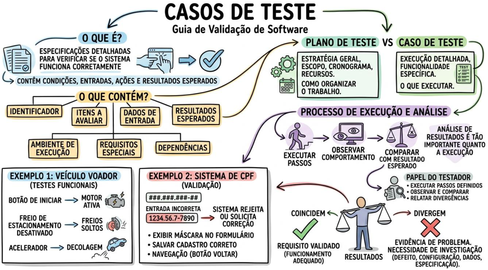

---

<!-- pagina: 22 -->

**Diego Carvalho, Equipe Informática 2 (Diego Carvalho), Equipe Informática 1 (Diego Carvalho) Aula 06** 

<!-- Start of picture text -->
Classificação de Testes <!-- End of picture text -->

À medida que o estudo dos testes de software avança, torna-se necessário organizar os diversos conceitos envolvidos nessa atividade. Como estruturar um assunto que envolve métodos de elaboração, momentos de execução e objetivos distintos? Uma forma bastante utilizada – preconizada pela ISTQB1 – consiste em analisar os testes sob três perspectivas complementares: técnicas de teste, níveis de teste e tipos de teste. Cada uma delas permite observar o processo sob um ângulo diferente, facilitando a compreensão de como os testes são planejados e executados. 

|**CLASSIFICAÇÃO**|**PERGUNTA QUE** **RESPONDE**|**EXEMPLOS**|
|---|---|---|
|**NÍVEIS** **DE TESTE**|Onde o teste está sendo aplicado?|Teste de Unidade, Teste de Integração, Teste de Validação e Teste de Sistema.|
|**TÉCNICAS** **DE TESTE**|Como os casos de teste são projetados?|Teste Caixa-Branca, Teste Caixa-Preta e Teste Caixa-Cinza.|
|**TIPOS** **DE TESTE**|O que está sendo avaliado?|Teste de Desempenho, Teste de Segurança, Teste de Usabilidade, Teste de Regressão, etc.|

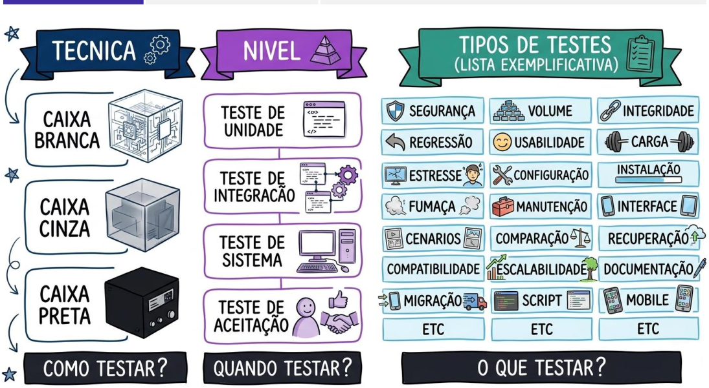

> 1 International Software Testing Qualifications Board.

---

<!-- pagina: 23 -->

**Diego Carvalho, Equipe Informática 2 (Diego Carvalho), Equipe Informática 1 (Diego Carvalho) Aula 06** 

<!-- Start of picture text -->
Estratégia/Níveis de Testes <!-- End of picture text -->

###### **<mark>ESTRATÉGIA/NÍVEIS DE TESTES</mark>** 

Representam a forma organizada de planejar e executar as atividades de verificação ao longo do desenvolvimento de software. Em uma abordagem incremental, os testes evoluem dos componentes individuais para estruturas cada vez mais amplas, permitindo identificar defeitos de maneira progressiva e sistemática. Essa estratégia normalmente compreende quatro níveis principais: Teste de Unidade, Teste de Integração, Teste de Validação e Teste de Sistema. 

A identificação de defeitos não depende apenas da execução de testes isolados. Para que os esforços de verificação produzam resultados consistentes, é necessário definir uma estratégia de teste. O que uma estratégia procura responder? Questões relacionadas ao planejamento das atividades, ao momento adequado para testar, à forma de integração dos componentes e aos critérios utilizados para avaliar a qualidade do software. Sem essa organização, os testes podem se tornar descoordenados, consumir recursos excessivos e deixar defeitos importantes sem detecção. 

A necessidade de uma estratégia estruturada torna-se ainda mais evidente quando se considera a complexidade dos projetos de software. Seria adequado simplesmente executar testes sem qualquer planejamento prévio? Em geral, não. As atividades de teste frequentemente exigem grande quantidade de esforço, recursos e coordenação. Por esse motivo, a Engenharia de Software procura estabelecer processos que orientem a seleção das técnicas, a definição dos objetivos e a organização das verificações realizadas ao longo do desenvolvimento. 

Tradicionalmente, uma estratégia bastante difundida adota uma progressão gradual dos testes. Como essa evolução ocorre? Inicialmente, os esforços concentram-se em componentes individuais ou pequenos conjuntos de componentes. O objetivo é verificar se a lógica implementada está correta e se cada unidade apresenta o comportamento esperado. À medida que essas partes são consideradas adequadas, elas passam a ser combinadas para formar estruturas cada vez maiores até alcançar o sistema completo. 

**(CESGRANRIO / AgeRIO - 2023)** Ao planejar um projeto de sistema seguindo um ciclo de vida <mark>linear, um gerente de projeto resolveu instituir uma estratégia global de teste de software.Considerando-se uma ordem do mais específico para o mais geral, ou seja, terminando-se com o teste de ordem superior, qual a ordem dos testes a serem realizados?</mark> 

<mark>a) Teste de integração, teste de validação, teste de sistema, teste de unidade b) Teste de sistema, teste de validação, teste de unidade, teste de integração c) Teste de validação, teste de integração, teste de unidade, teste de sistema d) Teste de validação, teste de sistema, teste de unidade, teste de integração e) Teste de unidade, teste de integração, teste de validação, teste de sistema</mark> 

**<mark>_______________________ Comentários:</mark>** <mark>(a) Errado. Inicia por integração e termina em unidade, invertendo a progressão do mais específico para o mais geral. (b) Errado. Começa por sistema e só depois unidade, contrariando a sequência evolutiva dos testes no ciclo linear. (c) Errado. Coloca validação antes de integração e unidade, quebrando a ordem esperada de refinamento dos testes. (d) Errado. Também antecipa validação e sistema, deixando unidade e integração para o fim, fora da sequência adequada. (e) Correto. A ordem parte do teste de</mark> unidade, avança para integração, depois validação e termina com sistema, no nível mais abrangente. (Letra E) 

Uma analogia útil pode ser feita com a construção de um motor automotivo. Seria razoável avaliar apenas o veículo completo sem verificar previamente seus componentes principais? A prática mostra que não. Elementos como pistões, válvulas, velas de ignição e virabrequim costumam ser avaliados antes da análise do funcionamento global do motor. Nos testes de software, ocorre raciocínio semelhante, pois componentes individuais são examinados antes da avaliação do comportamento integrado da aplicação.

---

<!-- pagina: 24 -->

**Diego Carvalho, Equipe Informática 2 (Diego Carvalho), Equipe Informática 1 (Diego Carvalho) Aula 06** 

Diversas estratégias foram propostas ao longo da evolução da Engenharia de Software, mas algumas características aparecem com frequência. Entre elas destacam-se a realização de revisões técnicas para identificar defeitos precocemente, a progressão dos testes dos componentes para o sistema completo, a utilização de técnicas adequadas a cada etapa do desenvolvimento e a distinção entre atividades de teste e atividades de depuração. Embora relacionadas, essas atividades possuem objetivos diferentes: o teste procura revelar defeitos; a depuração procura localizar e corrigir suas causas. 

###### **Saiba mais:** 

<mark>Depuração (Debugging) é o processo de identificar, analisar, localizar e corrigir os defeitos (bugs) que causam falhas ou comportamentos incorretos em um software. Ela não ocorre apenas como uma atividade reativa após falhas em testes formais. O debugging tem utilidade direta no desenvolvimento inicial e codificação, auxiliando o desenvolvedor a compreender o fluxo do programa, a inspecionar variáveis em tempo real e a garantir o alinhamento lógico das funcionalidades que estão sendo construídas.</mark> 

<mark>Além disso, é importante destacar que ela possui ampla utilidade e é aplicada constantemente durante o desenvolvimento inicial do software. Os programadores utilizam o debugging para inspecionar o estado do sistema, validar o fluxo de controle linha a linha e compreender o comportamento das variáveis em tempo real, garantindo que a lógica inicial das funcionalidades seja implementada de maneira correta antes mesmo de a aplicação ser submetida a uma esteira</mark> formal de testes automatizados ou manuais. 

**(QUADRIX / CFO - 2025)** A construção de um software começa com seu projeto, fase em que são <mark>definidas sua arquitetura, suas estruturas (programas e dados) e a escola da metodologia a ser adotada. Com base nessa informação, julgue o item seguinte.</mark> 

<mark>O debugging é um processo que só é realizado quando o código falha em passar pelos testes, e não tem utilidade durante o desenvolvimento inicial do software, em que o foco acontece na implementação das funcionalidades.</mark> 

**<mark>_______________________ Comentários:</mark>** <mark>o debugging não se limita a falhas em testes; ele também apoia o desenvolvimento desde o início, ajudando a identificar</mark> erros de lógica, implementação e comportamento durante a construção das funcionalidades. (Errado) 

Uma questão importante envolve o momento em que os testes devem ser executados. Seria melhor esperar que todo o sistema estivesse concluído antes de iniciar as verificações? Essa abordagem apresenta riscos significativos, pois defeitos acumulados tendem a ser mais difíceis de localizar e corrigir. Em contrapartida, testar continuamente cada parte construída permite identificar problemas mais cedo. Entre esses extremos, muitas equipes adotam estratégias incrementais que combinam verificações locais e avaliações mais abrangentes ao longo do desenvolvimento. 

Essa visão incremental costuma ser representada por uma espiral conceitual que relaciona desenvolvimento e testes. Como interpretar esse modelo? Sob a perspectiva do processo de software, o percurso parte de atividades mais abstratas, como engenharia de sistemas e análise de requisitos, passa pelo projeto e chega à implementação. O avanço ocorre em direção a níveis progressivamente menores de abstração, culminando na construção do código-fonte.

---

<!-- pagina: 25 -->

**Diego Carvalho, Equipe Informática 2 (Diego Carvalho), Equipe Informática 1 (Diego Carvalho) Aula 06** 

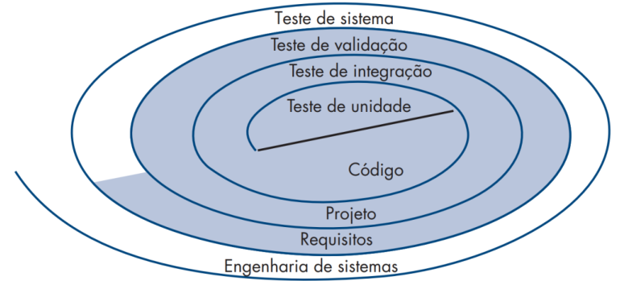

Quando a mesma representação é observada sob a perspectiva dos testes, o percurso segue em direção oposta. O que acontece nesse caso? As verificações começam nos componentes implementados e avançam gradualmente para estruturas mais amplas. Inicialmente são executados os testes de unidade; em seguida, os testes de integração; posteriormente, os testes de validação; por fim, os testes de sistema. A cada etapa, o escopo da avaliação torna-se mais abrangente. 

O teste de unidade concentra-se nos componentes individuais do software. Qual é seu principal objetivo? Verificar se cada unidade funciona corretamente de forma isolada. Nessa etapa, é comum utilizar técnicas voltadas à análise detalhada da lógica implementada e dos caminhos de execução presentes no código. Como o foco está em estruturas específicas do sistema, costuma ser necessário conhecimento aprofundado sobre sua implementação. 

Após a verificação das unidades individuais, surge a necessidade de avaliar as interações entre elas. É nesse contexto que se inserem os testes de integração. Seu objetivo consiste em verificar se os componentes funcionam adequadamente quando combinados, avaliando interfaces, troca de informações e aspectos relacionados à arquitetura da aplicação. Nessa etapa, tanto técnicas baseadas na estrutura interna quanto técnicas orientadas a entradas e saídas podem ser utilizadas. 

Com o sistema integrado, torna-se possível avaliar o atendimento aos requisitos definidos durante o desenvolvimento. O que se procura verificar nesse momento? Os testes de validação analisam se o software satisfaz os requisitos funcionais, comportamentais e de desempenho especificados para o produto. O foco deixa de ser a implementação interna dos componentes e passa a ser o comportamento observado em relação às necessidades estabelecidas para o sistema. 

A etapa mais abrangente corresponde aos testes de sistema. O que diferencia esse nível dos anteriores? O software deixa de ser analisado isoladamente e passa a ser avaliado em conjunto com outros elementos do ambiente operacional, como hardware, bases de dados, sistemas externos e usuários. O objetivo consiste em verificar se todos os componentes interagem corretamente e se o comportamento global esperado é alcançado. 

Alguns autores também agrupam esses níveis em duas categorias mais amplas. Os testes de unidade e integração costumam ser classificados como testes de baixo nível, pois exigem maior proximidade com a estrutura interna do software. Já os testes de validação e sistema são frequentemente classificados como testes de alto nível, uma vez que concentram sua atenção no comportamento observável e nos requisitos do produto. Essa classificação não constitui um padrão universal, mas pode ser útil para compreender as diferentes perspectivas envolvidas na estratégia de testes.

---

<!-- pagina: 26 -->

**Diego Carvalho, Equipe Informática 2 (Diego Carvalho), Equipe Informática 1 (Diego Carvalho) Aula 06** 

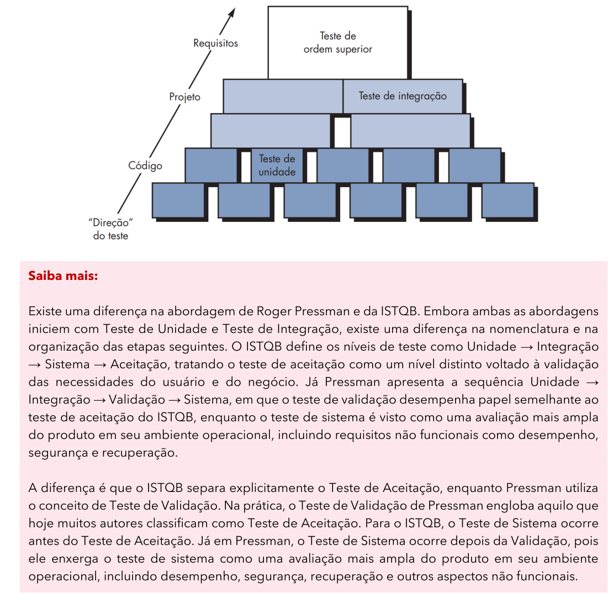

<!-- Start of picture text -->
Saiba mais: Existe uma diferença na abordagem de Roger Pressman e da ISTQB. Embora ambas as abordagens iniciem com Teste de Unidade e Teste de Integração, existe uma diferença na nomenclatura e na → organização das etapas seguintes. O ISTQB define os níveis de teste como Unidade   Integração →  Sistema  →  Aceitação, tratando o teste de aceitação como um nível distinto voltado à validação → das necessidades do usuário e do negócio. Já Pressman apresenta a sequência Unidade → → Integração   Validação   Sistema, em que o teste de validação desempenha papel semelhante ao teste de aceitação do ISTQB, enquanto o teste de sistema é visto como uma avaliação mais ampla do produto em seu ambiente operacional, incluindo requisitos não funcionais como desempenho, segurança e recuperação. A diferença é que o ISTQB separa explicitamente o Teste de Aceitação, enquanto Pressman utiliza o conceito de Teste de Validação. Na prática, o Teste de Validação de Pressman engloba aquilo que hoje muitos autores classificam como Teste de Aceitação. Para o ISTQB, o Teste de Sistema ocorre antes do Teste de Aceitação. Já em Pressman, o Teste de Sistema ocorre depois da Validação, pois ele enxerga o teste de sistema como uma avaliação mais ampla do produto em seu ambiente operacional, incluindo desempenho, segurança, recuperação e outros aspectos não funcionais. <!-- End of picture text -->

---

<!-- pagina: 27 -->

**Diego Carvalho, Equipe Informática 2 (Diego Carvalho), Equipe Informática 1 (Diego Carvalho) Aula 06** 

#### **Teste de Unidade** 

###### **<mark>INCIDÊNCIA EM PROVA: ALTÍSSIMA</mark>** 

###### **<mark>TESTE DE UNIDADE</mark>** 

Nível mais básico de teste e tem como objetivo verificar o funcionamento correto de componentes individuais do software, como funções, métodos, classes ou módulos. Geralmente executado pelos próprios desenvolvedores, esse teste busca identificar defeitos o mais cedo possível, isolando a unidade avaliada de outros componentes por meio de stubs, mocks ou drivers quando necessário. 

Entre os diferentes níveis de teste existentes, o Teste de Unidade (ou Teste de Componente) representa o ponto de partida da estratégia incremental de verificação do software. O que exatamente é testado nessa etapa? O foco está na menor unidade testável do sistema, que pode corresponder a uma função, método, classe, serviço ou módulo específico. O objetivo consiste em verificar se cada componente executa corretamente as responsabilidades para as quais foi desenvolvido, antes de sua integração com outras partes da aplicação. 

Sendo rigoroso, a engenharia de software tradicional faz uma distinção importante entre Testes de Unidade e Testes de Componente. O teste unitário concentra-se na menor unidade de lógica de código, verificando isoladamente o comportamento algorítmico e a funcionalidade direta de métodos ou classes. Em contrapartida, o teste de componente eleva ligeiramente esse escopo para avaliar como os métodos se comunicam em um módulo ou componente encapsulado, tendo como foco principal testar as interfaces desse componente antes de ele ser integrado ao restante do sistema maior. 

O Teste de Unidade concentra-se principalmente na análise do comportamento interno do componente. Que aspectos costumam ser avaliados? A lógica de processamento, as estruturas de dados utilizadas, as entradas recebidas, as saídas produzidas e os mecanismos de tratamento de erros são elementos frequentemente examinados. Como cada unidade é avaliada isoladamente, torna-se mais fácil identificar a origem de eventuais defeitos e corrigir problemas antes que eles se propaguem para níveis superiores de teste. 

**(FGV / Prefeitura de Cuiabá - 2024)** Um software que está sendo desenvolvido por um <mark>determinado grupo de desenvolvedores está na fase de testes. Deseja-se verificar a integridade das funções e classes que compõem o software. O teste adequado para realizar este tipo de verificação é o teste</mark> 

<mark>a) unitário. b) integração. c) de validação. d) de sistema. e) de aceitação.</mark> 

**<mark>_______________________ Comentários:</mark>** <mark>(a) Correto. O teste unitário verifica individualmente funções, métodos e classes, checando sua integridade e funcionamento isolado durante o desenvolvimento. (b) Errado. O teste de integração foca na interação entre módulos, não na verificação isolada de funções e classes. (c) Errado. O teste de validação busca confirmar se o software atende aos requisitos esperados pelo usuário. (d) Errado. O teste de sistema avalia o comportamento do sistema como um todo, de forma integrada. (e) Errado. O teste de aceitação</mark> verifica se o produto está pronto para uso sob a ótica do usuário ou cliente. (Letra A) 

É importante mencionar que o teste unidade apoia-se necessariamente em artefatos que revelam a estrutura interna e técnica da aplicação. Por isso, são utilizados produtos de trabalho como o próprio código-fonte, o projeto detalhado, a programação dos componentes individuais e os modelos de dados estabelecidos. Em contrapartida, artefatos de alto nível gerados nas fases iniciais, como o Documento de Especificação de Requisitos ou Casos de Uso, não são tipicamente empregados como base primária

---

<!-- pagina: 28 -->

**Diego Carvalho, Equipe Informática 2 (Diego Carvalho), Equipe Informática 1 (Diego Carvalho) Aula 06** 

nessa fase. Esses documentos descrevem o comportamento externo e as regras de negócio abstratas, carecendo da granularidade (classes, métodos e fluxos condicionais) que o teste de unidade visa validar. 

Outro aspecto importante envolve a interface do componente. Por que essa verificação é necessária? Toda unidade recebe informações, realiza algum processamento e produz resultados que poderão ser utilizados por outras partes do sistema. Dessa forma, é necessário confirmar que entradas e saídas estejam funcionando adequadamente. Além disso, testes de condições de fronteira e de tratamento de exceções ajudam a verificar o comportamento do componente em situações menos comuns, mas potencialmente críticas. 

###### **Saiba mais:** 

<mark>No contexto da testes de software, temos o conceito de Funções Puras. Trata-se daquela função em que o valor de retorno é determinado única e exclusivamente pelos seus parâmetros de entrada, sem produzir efeitos colaterais ou depender de recursos de infraestrutura externa (como comunicação de rede, arquivos ou bancos de dados). Devido à sua natureza altamente determinística e isolada, a validação pode ser feita conferindo diretamente entradas e saídas sem a necessidade de instanciar componentes da arquiteturagarantindo a verificação da precisão lógica do algoritmo de forma extremamente rápida.</mark> 

<mark>Por que elas são consideradas particularmente adequadas para testes unitários? Como o comportamento é determinístico, torna-se possível prever com precisão o resultado esperado para cada conjunto de entradas. Essa característica permite criar testes simples e objetivos, baseados diretamente na comparação entre os valores fornecidos à função e os resultados retornados.</mark> 

<mark>Outro aspecto importante envolve o isolamento da lógica implementada. É necessário configurar bancos de dados, serviços externos ou componentes complexos para testar uma função pura? Em geral, não. Como a função não depende de recursos externos para executar sua lógica principal, os testes podem ser realizados sem a necessidade de simular dependências por meio de mecanismos</mark> como Mocks ou Stubs. Isso tende a simplificar a preparação do ambiente de teste. 

A cobertura dos caminhos de execução também desempenha papel relevante nessa modalidade de teste. Isso significa que todos os caminhos possíveis precisam ser testados? Nem sempre. Em sistemas reais, a quantidade de combinações pode tornar inviável a cobertura completa. O objetivo prático consiste em atingir uma cobertura suficientemente ampla para aumentar a confiança no componente e elevar a probabilidade de identificação de defeitos relevantes. 

Uma dúvida frequente envolve a definição de componente. O que pode ser considerado uma unidade de teste? Dependendo da arquitetura utilizada, a unidade pode corresponder a um método individual, uma classe completa ou até mesmo um serviço responsável por determinada funcionalidade. Independentemente da forma assumida, o princípio permanece o mesmo: o componente é avaliado isoladamente para verificar se executa corretamente suas responsabilidades específicas. 

Os Testes de Unidade costumam ser elaborados pelos próprios desenvolvedores durante o processo de implementação. Isso significa que eles sempre são criados após a escrita do código? Não necessariamente. Em abordagens como Test-Driven Development, os testes são elaborados antes da implementação propriamente dita. Em ambos os casos, o benefício permanece semelhante: identificar

---

<!-- pagina: 29 -->

**Diego Carvalho, Equipe Informática 2 (Diego Carvalho), Equipe Informática 1 (Diego Carvalho) Aula 06** 

defeitos precocemente, facilitar modificações futuras e reduzir problemas durante as etapas posteriores de integração. 

A realização desses testes também produz efeitos positivos sobre a manutenção do software. Como alterações futuras podem ser realizadas com maior segurança? Quando existe uma suíte consistente de testes de unidade, torna-se possível verificar rapidamente se mudanças introduziram comportamentos incorretos em funcionalidades já existentes. Isso reduz riscos durante a evolução do sistema e aumenta a confiança da equipe ao realizar correções ou implementar novas funcionalidades. 

Uma analogia útil pode ser feita com os componentes de um motor automotivo. Seria adequado montar todo o motor antes de verificar o funcionamento de suas peças principais? Em geral, a avaliação individual de elementos como pistões, válvulas e velas de ignição facilita a identificação de defeitos e reduz problemas durante a montagem. O mesmo raciocínio é aplicado ao software: cada unidade é analisada separadamente antes que o sistema completo seja construído e submetido aos níveis seguintes de teste. 

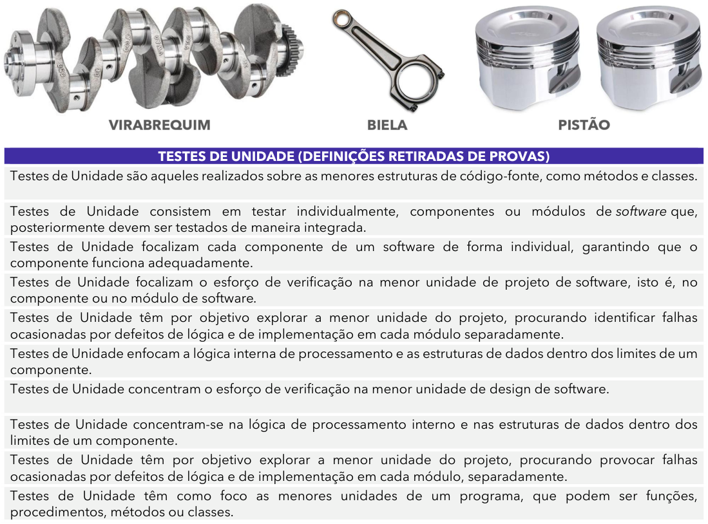

<!-- Start of picture text -->
TESTES DE UNIDADE (DEFINIÇÕES RETIRADAS DE PROVAS) Testes de Unidade são aqueles realizados sobre as menores estruturas de código-fonte, como métodos e classes. Testes de Unidade consistem em testar individualmente, componentes ou módulos de  software  que, posteriormente devem ser testados de maneira integrada. Testes de Unidade focalizam cada componente de um software de forma individual, garantindo que o componente funciona adequadamente. Testes de Unidade focalizam o esforço de verificação na menor unidade de projeto de software, isto é, no componente ou no módulo de software . Testes de Unidade têm por objetivo explorar a menor unidade do projeto, procurando identificar falhas ocasionadas por defeitos de lógica e de implementação em cada módulo separadamente. Testes de Unidade enfocam a lógica interna de processamento e as estruturas de dados dentro dos limites de um componente. Testes de Unidade concentram o esforço de verificação na menor unidade de design de software. Testes de Unidade concentram-se na lógica de processamento interno e nas estruturas de dados dentro dos limites de um componente. Testes de Unidade têm por objetivo explorar a menor unidade do projeto, procurando provocar falhas ocasionadas por defeitos de lógica e de implementação em cada módulo, separadamente. Testes de Unidade têm como foco as menores unidades de um programa, que podem ser funções, procedimentos, métodos ou classes. <!-- End of picture text -->

A elaboração de casos de teste exige critérios que permitam selecionar situações relevantes sem a necessidade de avaliar todas as possibilidades existentes. Como escolher os cenários mais adequados quando o número de combinações pode ser extremamente elevado? Entre as diversas estratégias disponíveis, duas abordagens são particularmente importantes: o teste de partição e os testes baseados em diretrizes. Ambas procuram aumentar a eficiência do processo de teste e elevar a probabilidade de identificação de defeitos.

---

<!-- pagina: 30 -->

**Diego Carvalho, Equipe Informática 2 (Diego Carvalho), Equipe Informática 1 (Diego Carvalho) Aula 06** 

O teste de partição parte da ideia de organizar as entradas em grupos que compartilham características semelhantes. Qual é a vantagem dessa abordagem? Em vez de testar todos os valores possíveis, o testador identifica classes de equivalência, isto é, conjuntos de entradas que tendem a produzir comportamentos equivalentes sob a perspectiva do teste. Após essa classificação, são escolhidos valores representativos de cada grupo, reduzindo significativamente a quantidade de casos de teste necessários. 

Considere um campo que aceita idades entre 18 e 60 anos. Seria necessário testar todas as idades desse intervalo? Em geral, não. O testador pode dividir as entradas em classes distintas, como valores abaixo do limite mínimo, valores válidos dentro da faixa permitida e valores acima do limite máximo. A seleção de representantes de cada classe permite obter boa cobertura com uma quantidade menor de testes, embora não elimine completamente a possibilidade de defeitos dentro de uma determinada categoria. 

Outra estratégia amplamente utilizada baseia-se em diretrizes de teste. De onde surgem essas diretrizes? Elas são construídas a partir da experiência acumulada em projetos anteriores, de padrões recorrentes de falhas e de boas práticas consolidadas pela Engenharia de Software. Ao longo do tempo, observouse que determinados tipos de erros aparecem com frequência em situações específicas, o que permite direcionar os testes para áreas tradicionalmente mais suscetíveis a defeitos. 

Essa abordagem procura aproveitar o conhecimento adquirido pela prática profissional. Como isso auxilia na escolha dos testes? Em vez de selecionar cenários de forma aleatória, o testador utiliza recomendações fundamentadas em experiências anteriores para identificar condições de maior risco. Dessa forma, aumentam-se as chances de encontrar defeitos relevantes com um esforço relativamente reduzido. 

Embora essas duas estratégias sejam bastante importantes, elas não representam as únicas formas de projetar casos de teste. O que as torna especialmente valiosas? Ambas oferecem mecanismos sistemáticos para reduzir a quantidade de testes necessários sem perder de vista o objetivo principal do processo: aumentar a probabilidade de identificar defeitos antes que eles alcancem os usuários finais do sistema. 

https://t.me/KakashiAssinaturasBot

---

<!-- pagina: 31 -->

**Diego Carvalho, Equipe Informática 2 (Diego Carvalho), Equipe Informática 1 (Diego Carvalho) Aula 06** 

###### **Saiba mais:** 

<mark>É importante mencionar que, ao aplicar Testes de Unidade em sistemas Orientados a Objetos (OO), testar meras amostras de operações é insuficiente. Como as classes contêm estado interno, cada objeto sofre mutações ao longo do tempo. Assim, o testador deve simular de forma abrangente todos os eventos e gatilhos que causem alterações nesse estado interno, assegurando que as transições comportamentais da classe funcionem corretamente sob as premissas de seu encapsulamento.</mark> 

<mark>Além disso, existem peculiaridades arquiteturais, como as superclasses e suas respectivas subclasses herdadas. Como comportamentos genéricos são herdados, o teste apenas na superclasse não atende garantias totais de consistência. Uma diretriz essencial demanda que os métodos definidos pelas abstrações maiores devem ser retestados sistematicamente no escopo da subclasse (especializações), já que a combinação de novos atributos pode sobrepujar ou corromper</mark> a mecânica herdada originalmente 

**(FCC / SEFAZ SP - 2026)** Uma transportadora desenvolve um módulo de cálculo de ICMS sobre <mark>frete em seu sistema de gestão em que há uma função pura CalcularICMS(Itens, UForigem, UFdestino) que, a partir dos itens e UFs, devolve apenas os valores de imposto, sem acesso a banco de dados, rede ou arquivos. A equipe deseja automatizar verificações dessa função em diferentes combinações de alíquotas e bases de cálculo. Nesse cenário, o tipo de teste indicado para esse objetivo específico é teste</mark> 

<mark>a) de integração chamando serviços externos da SEFAZ em ambiente de homologação. b) de sistema cobrindo todo o fluxo de emissão do documento fiscal de transporte até a autorização. c) de aceitação com cenários BDD descritos por especialistas fiscais. d) unitário que executa a função CalcularICMS em isolamento, conferindo entradas e saídas. e) de carga aplicando grande volume de documentos simultâneos ao módulo de cálculo.</mark> 

**<mark>_______________________</mark>** 

**<mark>Comentários:</mark>** <mark>(a) Errado. Testes de integração verificam a interação com sistemas externos, o que não é o foco de uma função pura e isolada; (b) Errado. Testes de sistema avaliam o funcionamento completo da aplicação e seus fluxos de negócio; (c) Errado. Testes de aceitação validam requisitos de negócio sob a ótica do usuário ou especialista; (d) Correto. A função é pura, sem dependências externas, permitindo validar diretamente entradas e saídas em isolamento por meio de testes unitários; (e) Errado. Testes de carga medem</mark> desempenho e comportamento sob grande volume de processamento, não a correção lógica da função. (Letra D)

---

<!-- pagina: 32 -->

**Diego Carvalho, Equipe Informática 2 (Diego Carvalho), Equipe Informática 1 (Diego Carvalho) Aula 06** 

#### **Teste de Integração** 

###### **<mark>INCIDÊNCIA EM PROVA: ALTÍSSIMA</mark>** 

###### **<mark>TESTE DE INTEGRAÇÃO</mark>** 

Nível de teste que busca verificar se diferentes componentes ou módulos do sistema interagem corretamente quando combinados. Após a validação individual das unidades, esse nível de teste concentra-se na identificação de defeitos relacionados à troca de dados, interfaces, protocolos de comunicação e dependências entre componentes. Pode ser realizado de forma incremental ou não incremental, utilizando estratégias como topdown, bottom-up ou sanduíche. 

Após a conclusão dos testes de unidade, uma dúvida bastante comum costuma surgir. Se cada componente já foi testado individualmente e apresentou funcionamento correto, por que ainda seria necessário continuar testando? A resposta está no fato de que o comportamento adequado de componentes isolados não garante o funcionamento correto do sistema quando essas partes passam a interagir. Muitas falhas surgem justamente durante a comunicação entre elementos que, separadamente, parecem funcionar sem qualquer problema. 

As interações entre componentes introduzem riscos que não podem ser observados durante os testes de unidade. Que tipos de problemas podem aparecer nesse cenário? Dados podem ser transmitidos incorretamente entre módulos, funcionalidades independentes podem produzir resultados inesperados quando combinadas, estruturas compartilhadas podem apresentar inconsistências e pequenos desvios aceitáveis em componentes isolados podem se acumular e gerar comportamentos inadequados no sistema integrado. 

É nesse contexto que surge o Teste de Integração. Qual é seu objetivo principal? Verificar se componentes previamente testados conseguem trabalhar em conjunto de acordo com a arquitetura definida para o software. O foco deixa de estar na lógica interna de cada módulo e passa a concentrar-se nas interfaces e nas interações existentes entre eles. Em outras palavras, procura-se confirmar que a comunicação entre as partes ocorre de maneira correta e consistente. 

**(CEBRASPE / BDMG - 2025)** Julgue o seguinte item, no que se refere a testes de software. 

<mark>O teste de integração é utilizado para descobrir erros associados a interfaces, a fim de que seja possível a construção de uma estrutura de programa determinada pelo projeto, a partir de componentes testados em unidade.</mark> 

**<mark>_______________________ Comentários:</mark>** <mark>o teste de integração verifica falhas nas interfaces entre módulos e permite montar a estrutura do programa conforme o</mark> projeto, unindo componentes já validados nos testes de unidade. (Correto) 

A forma como os componentes são reunidos também influencia diretamente a eficiência do processo de teste. Seria adequado integrar todos os módulos simultaneamente e testar apenas o sistema completo? Essa estratégia existe e é conhecida como integração Big Bang. Nela, todos os componentes são combinados antes do início dos testes de integração. Embora essa abordagem pareça simples em um primeiro momento, ela costuma dificultar significativamente a identificação da origem dos problemas encontrados. 

O principal desafio da integração Big Bang está relacionado ao diagnóstico dos defeitos. O que acontece quando vários componentes são integrados ao mesmo tempo? Caso um comportamento incorreto seja observado, torna-se mais difícil determinar qual módulo, interface ou interação está causando o problema. Quanto maior o número de componentes envolvidos, maior tende a ser o esforço necessário para localizar e corrigir a origem da falha.

---

<!-- pagina: 33 -->

**Diego Carvalho, Equipe Informática 2 (Diego Carvalho), Equipe Informática 1 (Diego Carvalho) Aula 06** 

Por esse motivo, muitas equipes adotam estratégias de integração incremental. Como essa abordagem funciona? Os componentes são reunidos gradualmente em pequenos grupos e submetidos a testes após cada etapa de integração. Dessa forma, os defeitos tendem a ser identificados mais rapidamente, pois o conjunto de elementos envolvidos em cada teste é menor. Além disso, as interfaces podem ser avaliadas de maneira mais sistemática ao longo do processo. 

Lembram do nosso exemplo do motor automotivo. Após verificar individualmente componentes como pistão, biela e virabrequim, o trabalho está concluído? Ainda não. É necessário confirmar que essas peças funcionam adequadamente quando conectadas umas às outras. O mesmo raciocínio é aplicado ao software. Mesmo que cada componente tenha sido aprovado nos testes de unidade, a validação de sua interação com os demais elementos somente ocorre durante os testes de integração. 

Essa mudança de foco representa a principal diferença entre os dois níveis de teste. Enquanto o teste de unidade procura identificar defeitos dentro dos limites de um componente específico, o teste de integração concentra-se nos problemas que surgem durante a comunicação entre componentes. A combinação dessas duas etapas permite aumentar significativamente a confiança de que o sistema continuará funcionando adequadamente à medida que sua arquitetura é construída e expandida. 

###### **Saiba mais:** 

<mark>Ao contrário dos testes de unidade — que ocorrem em isolamento utilizando dublês (Test Doubles) e, portanto, apresentam comportamento altamente independente e determinístico —, os Testes de Integração lidam com dependências ativas, como sistemas de arquivos, APIs de rede e Bancos de Dados Reais. Por unirem múltiplas partes do ecossistema de software, esses testes são suscetíveis a flutuações e não devem ser considerados determinísticos por natureza.</mark> 

<mark>Além disso, quando a integração envolve operações de escrita e leitura em um banco de dados, é imperativo gerenciar o estado da base para evitar que dados residuais quebrem a independência das suítes de teste. Boas práticas exigem que o banco seja isolado via transações e que seu estado seja garantido não apenas após a execução (limpeza ou teardown), mas também configurado rigorosamente antes de cada teste (setup e povoamento de seeds), impedindo interferências</mark> indesejadas causadas por testes previamente executados. 

###### **<mark>TESTES DE INTEGRAÇÃO (DEFINIÇÕES RETIRADAS DE PROVAS)</mark>** 

<mark>Testes de Integração são caracterizados por testar as interfaces entre os componentes ou interações de diferentes</mark> <u>partes de um sistema.</u> 

<mark>Testes de Integração visam testar as falhas decorrentes da integração dos módulos do sistema.</mark> 

<mark>Testes de Integração são uma técnica sistemática para construir a arquitetura do software, enquanto, ao mesmo</mark> tempo, conduz testes para descobrir erros associados às interfaces. 

<mark>Testes de Integração têm por objetivo construir uma estrutura de programa determinada pelo projeto a partir de</mark> componentes já testados. 

<mark>Testes de Integração são uma técnica utilizada para descobrir erros associados às interfaces na qual, a partir de</mark> componentes testados individualmente, se constrói uma estrutura de programa determinada pelo projeto. 

Testes de Integração verificam o funcionamento em conjunto dos componentes do sistema, se são chamados corretamente e se a transferência de dados acontece no tempo correto, <u>por meio de suas interfaces.</u>

---

<!-- pagina: 34 -->

**Diego Carvalho, Equipe Informática 2 (Diego Carvalho), Equipe Informática 1 (Diego Carvalho) Aula 06** 

<mark>Testes de Integração verificam se os componentes do sistema, juntos, trabalham conforme descrito nas</mark> especificações do sistema e do projeto do programa. 

Testes de Integração são uma técnica sistemática para construir a arquitetura do _software_ enquanto conduz testes <u>para descobrir erros associados às interfaces.</u> 

Por fim, falemos sobre as Estratégias de Integração. Elas definem como módulos, componentes ou subsistemas, previamente validados em testes de unidade, serão combinados durante os testes de integração. Por que essa etapa recebe tanta atenção? Porque o comportamento correto de um componente isolado não garante o funcionamento adequado quando ele passa a interagir com outros elementos do sistema. Durante a integração, torna-se possível verificar a troca de dados, a execução de funcionalidades e o compartilhamento de recursos conforme os requisitos estabelecidos. 

A escolha da estratégia de integração influencia diretamente a condução dos testes. Quais aspectos são afetados por essa decisão? O esforço necessário para executar os testes, a facilidade para identificar a origem de defeitos e os riscos associados ao processo de integração dependem da abordagem adotada. Algumas estratégias favorecem a detecção precoce de problemas específicos; outras simplificam a combinação gradual dos componentes, permitindo maior controle sobre a evolução dos testes. 

Os sistemas de software são construídos a partir de componentes que precisam colaborar entre si para atender aos objetivos do negócio. Surge então uma dúvida frequente: se os testes de unidade foram aprovados, por que realizar testes de integração? A razão é que muitos defeitos somente aparecem quando ocorre interação entre componentes. Interfaces incompatíveis, parâmetros incorretos, dependências mal configuradas e falhas de comunicação costumam permanecer ocultos enquanto cada módulo é avaliado isoladamente. 

Nesse contexto, as estratégias de integração fornecem uma forma estruturada de organizar a combinação progressiva dos componentes. Como essa organização contribui para a qualidade do software? Ao definir uma sequência controlada para a integração, os testes podem ser executados de maneira sistemática, facilitando a identificação de falhas e reduzindo a complexidade da análise dos resultados. Dessa forma, torna-se mais simples verificar se os diversos elementos do sistema operam em conjunto conforme o comportamento esperado. 

**ESTRATÉGIA DE DESCRIÇÃO INTEGRAÇÃO** Nessa estratégia, todos os módulos ou componentes do sistema são integrados simultaneamente após a conclusão dos testes individuais. É uma abordagem simples do **BIG BANG** ponto de vista de planejamento, pois não exige uma sequência gradual de integração. Entretanto, quando defeitos são encontrados, torna-se difícil identificar qual componente ou interação é responsável pelo problema, aumentando o esforço de depuração. A estratégia Top-Down realiza a integração iniciando pelos módulos localizados nos níveis mais altos da arquitetura e avançando gradualmente para os níveis inferiores. Enquanto **TOP-DOWN** determinados componentes ainda não estão disponíveis, utilizam-se stubs para simular seu comportamento. Essa abordagem permite validar precocemente a estrutura geral do sistema e os fluxos principais de processamento, facilitando a avaliação da arquitetura. Nessa estratégia, a integração começa pelos módulos localizados nos níveis mais baixos da arquitetura, que geralmente implementam funções básicas e serviços compartilhados. **BOTTOM-UP** À medida que novos componentes são adicionados, a integração avança em direção aos níveis superiores. Como os módulos chamadores ainda não existem nas fases iniciais, utilizam-se drivers para simular suas chamadas e permitir a execução dos testes. **THREAD-BASED** Integra os componentes de acordo com um fluxo funcional completo, também chamado **TESTING** de thread de execução. Cada thread normalmente representa um caso de uso, <u>processo</u>

---

<!-- pagina: 35 -->

**Diego Carvalho, Equipe Informática 2 (Diego Carvalho), Equipe Informática 1 (Diego Carvalho) Aula 06** 

|**ESTRATÉGIA DE** **INTEGRAÇÃO**|**DESCRIÇÃO**|
|---|---|
|**USE-BASED** **TESTING**|de negócio ou funcionalidade relevante para o usuário. Em vez de seguir estritamente a hierarquia estrutural do sistema, a integração acompanha o caminho percorrido pelos dados e pelas operações, permitindo validar rapidamente funcionalidades completas. Essa estratégia é frequentemente aplicada em sistemas orientados a objetos. Nessa abordagem, os componentes mais independentes são integrados e testados primeiro, servindo de base para a integração posterior dos componentes que dependem deles. O objetivo é reduzir a complexidade do processo de integração, facilitar o isolamento de defeitos e diminuir os riscos associados às dependências entre classes e módulos.|

###### **Saiba mais:** 

<mark>A integração descendente (Top-Down) pode ser conduzida de duas maneiras principais na estrutura do software: primeiro em profundidade (depth-first) ou primeiro em largura (breadth-first). Na abordagem primeiro em profundidade, a integração segue um caminho lógico de controle específico da hierarquia, integrando todos os módulos de um fluxo funcional até a base antes de passar para outra ramificação. Já na abordagem primeiro em largura, todos os módulos diretamente subordinados a um nível de controle superior são integrados paralelamente antes que a equipe desça para o próximo nível hierárquico. Ambas as formas utilizam stubs para os módulos ausentes.</mark> 

<mark>A escolha entre realizar a integração descendente "primeiro em profundidade" ou "primeiro em largura" dependerá das características da arquitetura do projeto. Integrar "primeiro em profundidade" permite à equipe validar um caminho funcional completo (um fluxo de negócio) mais rapidamente, enquanto integrar "primeiro em largura" favorece a verificação da lógica de controle de alto nível de todo o sistema antes de mergulhar nas regras de negócio específicas das camadas</mark> inferiores. 

**(VUNESP / TJ-SP - 2025)** Quando do teste de software, testam-se, inicialmente, os módulos de <mark>forma unitária, para, depois, proceder-se ao teste de integração desses módulos, sendo correto afirmar que a integração do tipo</mark> 

<mark>a) descendente aplica-se exclusivamente a software voltado a folhas de pagamento. b) descendente só é possível na modalidade primeiro em largura. c) ascendente não se aplica a software voltado à automação de processos. d) descendente pode ser feita primeiro em largura ou primeiro em profundidade. e) ascendente deve ser feita em, no máximo, duas fases de integração.</mark> 

**<mark>_______________________</mark>** 

**<mark>Comentários:</mark>** <mark>(a) Errado. Integração descendente não é exclusiva de software de folha de pagamento; trata-se de uma estratégia geral de teste aplicável a diferentes tipos de sistemas. (b) Errado. A integração descendente não se limita à modalidade primeiro em largura, pois há mais de uma forma válida de conduzir essa estratégia. (c) Errado. A integração ascendente pode ser empregada em variados contextos, inclusive em automação de processos, sem essa restrição indicada. (d) Correto. Na integração descendente, os módulos podem ser integrados primeiro em largura ou primeiro em profundidade, conforme a abordagem adotada no teste. (e) Errado. A alternativa está incompleta e não apresenta uma afirmação válida que permita caracterizar corretamente a integração ascendente. (Letra</mark> D)

---

<!-- pagina: 36 -->

**Diego Carvalho, Equipe Informática 2 (Diego Carvalho), Equipe Informática 1 (Diego Carvalho) Aula 06** 

---

<!-- pagina: 37 -->

**Diego Carvalho, Equipe Informática 2 (Diego Carvalho), Equipe Informática 1 (Diego Carvalho) Aula 06** 

#### **Teste de Validação** 

###### **<mark>INCIDÊNCIA EM PROVA: MÉDIA</mark>** 

###### **<mark>TESTE DE VALIDAÇÃO</mark>** 

Nível de teste que busca verificar se o software atende às necessidades e expectativas dos usuários e aos requisitos definidos para o sistema. Seu foco está na pergunta “estamos construindo o produto correto?”. Nessa etapa, são avaliadas funcionalidades, regras de negócio e comportamentos previstos na especificação, normalmente em um ambiente próximo ao de utilização real. 

Após a conclusão dos testes de unidade e integração, o software já possui seus componentes funcionando individualmente e suas principais interfaces verificadas. O trabalho de teste termina nesse momento? Ainda não. Existe uma etapa voltada para responder uma questão fundamental: o sistema realmente atende às necessidades daqueles que irão utilizá-lo? É justamente esse o propósito do Teste de Validação (também chamado de Teste de Aceitação), que procura avaliar o software sob a perspectiva do usuário e do cliente. 

O foco dessa etapa é diferente dos níveis anteriores de teste. O que passa a ser analisado nesse momento? A atenção concentra-se nas funcionalidades, comportamentos e resultados que podem ser percebidos pelos usuários. Em vez de examinar detalhes internos da implementação, busca-se verificar se o sistema entrega aquilo que se espera dele em condições compatíveis com sua utilização real. Por esse motivo, os aspectos mais relevantes são aqueles que influenciam diretamente a experiência e a percepção do usuário. 

Uma dúvida importante surge naturalmente nesse contexto: como determinar se as expectativas dos usuários foram realmente atendidas? Essa avaliação não é feita de forma subjetiva ou arbitrária. Durante o desenvolvimento, normalmente são definidos critérios de validação e critérios de aceitação que estabelecem as condições necessárias para considerar o software adequado ao seu propósito. Esses critérios servem como referência objetiva para avaliar os resultados obtidos durante a validação. 

Os critérios utilizados nessa etapa costumam estar associados à documentação de requisitos. Isso significa que validação e requisitos possuem alguma relação? Sim. Embora a validação seja frequentemente descrita como uma avaliação das necessidades e expectativas dos usuários, essas expectativas geralmente são formalizadas por meio de requisitos, critérios de aceitação e regras de negócio documentadas. Por esse motivo, a literatura frequentemente relaciona o Teste de Validação à conformidade com os requisitos especificados. 

Nesse ponto surgem os chamados testes alfa e beta. Qual é a diferença entre eles? Os testes alfa normalmente são conduzidos em ambiente controlado, com participação da equipe de desenvolvimento ou de testadores designados. Já os testes beta envolvem usuários reais utilizando o sistema em ambientes próximos ou equivalentes ao contexto em que ele será efetivamente empregado. Ambos contribuem para avaliar se o produto atende às expectativas previstas para sua utilização. 

Vocês se lembram do nosso exemplo do motor? Pois é, vamos supor que aquele motor tenha sido encomendado para BMW para ser instalado em um carro da Citröen. Esse é o momento de chamar os funcionários da Citröen e testar o motor na presença deles, e também é o momento de entregar o motor para os próprios funcionários da Citröen testarem se está tudo certo. O teste é também realizado em relação ao que estava especificado nos critérios de validação. 

A distinção entre Verificação e Validação (V&V) também costuma gerar dúvidas frequentes. Como diferenciar esses conceitos? De maneira geral, a verificação procura determinar se o software foi construído corretamente em relação às especificações definidas durante o desenvolvimento. A validação procura determinar se o produto construído atende às necessidades para as quais foi criado. Entretanto,

---

<!-- pagina: 38 -->

**Diego Carvalho, Equipe Informática 2 (Diego Carvalho), Equipe Informática 1 (Diego Carvalho) Aula 06** 

como muitos critérios de validação são documentados nos próprios requisitos, algumas definições também descrevem a validação como uma demonstração de conformidade com os requisitos especificados. 

Essa sobreposição conceitual explica por que determinadas questões de prova associam o Teste de Validação tanto às expectativas dos usuários quanto aos requisitos do sistema. O aspecto mais importante é compreender que o foco da validação está no produto percebido pelo usuário e na confirmação de que o software atende ao propósito para o qual foi desenvolvido. Quando uma questão relaciona validação aos requisitos sem estabelecer comparação direta com a verificação, essa interpretação costuma ser considerada aceitável na literatura e em avaliações da área. 

###### **<mark>TESTES DE VALIDAÇÃO (DEFINIÇÕES RETIRADAS DE PROVAS)</mark>** 

Testes de Validação focalizam ações e saídas, tais como percebidas pelo usuário final. 

Testes de Validação são executados logo após montagem do pacote de software, quando os erros de interface <u>já foram descobertos e corrigidos.</u> 

Testes de Validação têm como principal característica verificar o sistema em relação aos seus requisitos originais e às necessidades atuais do usuário. 

Testes de Validação avaliam o software com respeito aos seus requisitos e detecta falhas nos requisitos e na interface com o usuário. 

Por fim, é importante mencionar que no desenvolvimento de software customizado, ou seja, feito sob medida para um cliente específico, o teste de validação deve garantir contratualmente que o sistema final executa as funções projetadas para seu uso esperado. Para isso, utiliza-se a premissa da Matriz de Rastreabilidade, exigindo que o processo de testes contemple, obrigatoriamente, pelo menos um teste funcional e de validação para cada requisito especificado, atestando formalmente ao cliente que nenhuma necessidade de negócio foi esquecida ou entregue com erro. 

---

<!-- pagina: 39 -->

**Diego Carvalho, Equipe Informática 2 (Diego Carvalho), Equipe Informática 1 (Diego Carvalho) Aula 06** 

**(FCC / SEFAZ PI - 2025)** A equipe de TI de uma Secretaria da Fazenda Estadual pondera sobre <mark>aplicações de testes de software por três abordagens distintas, tais como:</mark> 

<mark>I.Validar se o sistema atende aos requisitos e expectativas do usuário final. Esse teste é geralmente executado pelo cliente ou usuário final para garantir que o sistema está pronto para uso.</mark> 

<mark>II.Verificar como o sistema se comporta sob condições extremas, como alta demanda de usuários ou grandes volumes de dados.</mark> 

<mark>III.Garantir que alterações no código não introduzam novos defeitos em partes já testadas do sistema. Esse teste verifica se funcionalidades previamente testadas continuam funcionando após modificações.</mark> 

<mark>Atendem, correta e respectivamente, às abordagens I, II e III os testes de</mark> 

<mark>a) unidade, integração e segurança.</mark> 

<mark>b) integração, carga e unidade.</mark> 

<mark>c) aceitação, desempenho e integração.</mark> 

<mark>d) controle, segurança e desempenho.</mark> 

<mark>e) aceitação, carga e regressão.</mark> 

**<mark>_______________________ Comentários:</mark>** <mark>(a) Errado. Teste de unidade valida partes isoladas do código; integração verifica interação entre módulos; segurança não corresponde à verificação de alterações após mudanças. (b) Errado. Integração não é executado pelo usuário final para validar requisitos; carga atende ao item II, mas unidade não cobre a checagem de impactos após modificações. (c) Errado. Aceitação atende ao item I e desempenho se relaciona ao item II, porém o item III trata de regressão, não de integração. (d) Errado. Controle não corresponde ao teste feito pelo usuário final; segurança também não avalia comportamento sob alta demanda; desempenho não cobre o item I. (e) Correto. Aceitação valida requisitos com foco no usuário final; carga verifica comportamento sob alta demanda; regressão garante que</mark> mudanças não prejudiquem funcionalidades já testadas. (Letra E)

---

<!-- pagina: 40 -->

**Diego Carvalho, Equipe Informática 2 (Diego Carvalho), Equipe Informática 1 (Diego Carvalho) Aula 06** 

#### **Teste de Sistema** 

###### **<mark>INCIDÊNCIA EM PROVA: MÉDIA</mark>** 

###### **<mark>TESTE DE SISTEMA</mark>** 

Nível de teste que consiste na avaliação do sistema completo e integrado em um ambiente que simula as condições reais de operação. Seu objetivo é verificar se todos os componentes funcionam adequadamente em conjunto e se os requisitos funcionais e não funcionais foram atendidos. Nesse nível, podem ser realizados testes de desempenho, segurança, usabilidade, compatibilidade e confiabilidade. 

Após a conclusão dos testes de unidade, integração e validação, pode surgir a impressão de que o processo de teste está encerrado. Afinal, os componentes funcionam individualmente, as interfaces internas foram verificadas e os requisitos foram avaliados. O que ainda falta testar? A resposta está no fato de que o software raramente opera de forma isolada. Em ambientes reais, ele precisa interagir com diversos elementos que compõem um sistema mais amplo. 

O software representa apenas uma parte de uma solução maior. Com quais elementos ele costuma interagir? Dependendo do contexto, podem existir bancos de dados, dispositivos de hardware, sistemas externos, redes de comunicação, usuários e processos organizacionais participando da operação. Mesmo quando o software apresenta funcionamento adequado em ambientes controlados, problemas podem surgir quando essas interações passam a ocorrer simultaneamente no ambiente real de utilização. 

Essa complexidade introduz um desafio bastante comum em projetos de grande porte. O que acontece quando uma falha é descoberta após a integração completa do sistema? Frequentemente surge a dificuldade de identificar sua origem. O problema está no software, no hardware, nos dados recebidos ou em algum sistema externo? Situações desse tipo podem gerar longos processos de investigação, especialmente quando diferentes equipes são responsáveis pelos componentes envolvidos. 

Para reduzir esse risco, algumas práticas tornam-se particularmente importantes. Como aumentar a capacidade de diagnóstico dos problemas encontrados? Entre as medidas mais comuns estão a criação de cenários que simulam erros provenientes de sistemas externos, a verificação do tratamento de exceções, a documentação detalhada dos resultados obtidos e a participação da equipe de software no planejamento das atividades de teste. Essas ações facilitam a identificação das causas dos defeitos e fornecem evidências úteis durante a análise de incidentes. 

É nesse contexto que se insere o Teste de Sistema. Qual é o seu principal objetivo? Avaliar o comportamento do sistema completo após a integração de todos os elementos necessários para sua operação. O foco deixa de estar nos componentes isolados ou nas interfaces internas do software e passa a concentrar-se no funcionamento global da solução em condições próximas às de uso real. 

Uma dúvida comum envolve a diferença entre Teste de Integração e Teste de Sistema. Os dois verificam integração, então qual é a distinção? O Teste de Integração concentra-se principalmente na comunicação entre componentes do próprio software. Já o Teste de Sistema amplia o escopo da avaliação para o ambiente operacional completo, considerando não apenas as interfaces, mas também o comportamento funcional, o desempenho, a confiabilidade, a segurança e outros atributos relevantes para o sistema como um todo. 

Voltando ao nosso exemplo: depois de verificar as peças individuais do motor, testar sua integração interna e confirmar que o conjunto atende aos requisitos definidos, o trabalho está concluído? Ainda não. É necessário avaliar como o motor se comporta quando conectado ao sistema de transmissão, ao sistema elétrico, ao sistema de arrefecimento, ao sistema de freios e aos demais elementos que participam do funcionamento do veículo.

---

<!-- pagina: 41 -->

**Diego Carvalho, Equipe Informática 2 (Diego Carvalho), Equipe Informática 1 (Diego Carvalho) Aula 06** 

O mesmo raciocínio é aplicado ao desenvolvimento de software. Mesmo que todos os níveis anteriores de teste tenham sido concluídos com sucesso, somente o Teste de Sistema permite verificar se a solução opera adequadamente em seu contexto real de utilização. Essa etapa fornece evidências de que os diversos elementos envolvidos conseguem trabalhar de forma coordenada para produzir o comportamento esperado pelo usuário e pela organização que utilizará o sistema. 

###### **<mark>TESTES DE SISTEMA (DEFINIÇÕES RETIRADAS DE PROVAS)</mark>** 

<mark>Testes de Sistema incluem diversas modalidades de teste, cujo objetivo é testar o sistema computacional como</mark> um todo. 

<mark>Testes de Sistema testam se o sistema cumpre seus requisitos funcionais e não funcionais.</mark> 

Testes de Sistema avaliam o software com respeito ao seu projeto arquitetural e detecta falhas de especificação, desempenho, robustez e segurança. 

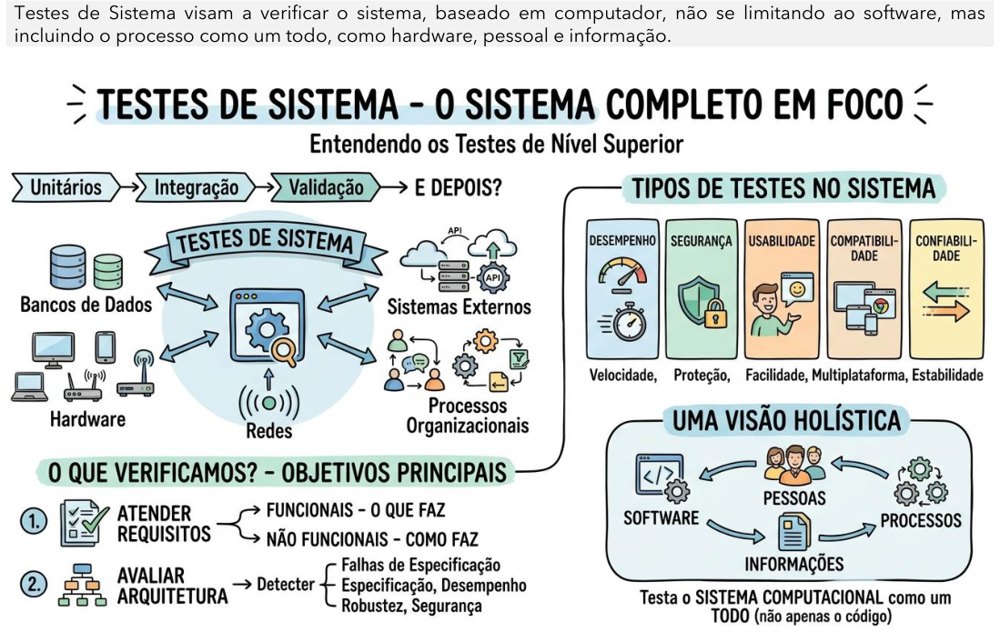

<!-- Start of picture text -->
Testes de Sistema visam a verificar o sistema, baseado em computador, não se limitando ao software, mas incluindo o processo como um todo, como hardware, pessoal e informação. <!-- End of picture text -->

Falemos rapidamente sobre sos Testes Ponta a Ponta (End-to-End Testing ou E2E). Eles constituem uma abordagem utilizada para validar fluxos completos de utilização do sistema. O que caracteriza esse tipo de teste? Seu objetivo consiste em reproduzir cenários semelhantes aos executados pelos usuários finais, permitindo verificar se todas as etapas necessárias para a realização de uma atividade funcionam corretamente quando executadas de forma integrada. 

Durante a execução desses testes, diferentes componentes da aplicação participam do mesmo fluxo operacional. Quais elementos podem estar envolvidos nessa avaliação? Dependendo da arquitetura adotada, podem ser analisadas interfaces de usuário, serviços, APIs, processos de negócio, mecanismos de mensageria e bancos de dados. A intenção é observar se a comunicação entre esses componentes ocorre conforme o comportamento esperado ao longo de todo o processo.

---

<!-- pagina: 42 -->

**Diego Carvalho, Equipe Informática 2 (Diego Carvalho), Equipe Informática 1 (Diego Carvalho) Aula 06** 

Uma dúvida comum surge ao comparar os Testes Ponta a Ponta com outros níveis de teste. Se os componentes já foram avaliados individualmente, por que executar essa abordagem? Porque determinados problemas somente se manifestam quando diversos elementos interagem simultaneamente. Falhas de integração, inconsistências na troca de dados e comportamentos inesperados entre sistemas distintos podem permanecer ocultos durante avaliações mais isoladas. 

Os resultados obtidos fornecem evidências sobre o funcionamento integrado da aplicação. Isso significa que o sistema está livre de falhas? Não. Os testes E2E aumentam a confiança de que fluxos importantes operam adequadamente em cenários próximos aos encontrados pelos usuários, mas não garantem a ausência de defeitos. Seu principal benefício consiste em verificar se os processos de negócio mais relevantes conseguem ser executados de ponta a ponta conforme o comportamento esperado.

---

<!-- pagina: 43 -->

**Diego Carvalho, Equipe Informática 2 (Diego Carvalho), Equipe Informática 1 (Diego Carvalho) Aula 06** 

<!-- Start of picture text -->
Técnicas  d <!-- End of picture text -->

<!-- Start of picture text -->
e Testes <!-- End of picture text -->

###### **<mark>TÉCNICAS DE TESTES</mark>** 

As técnicas de teste correspondem aos métodos utilizados para projetar e executar testes de software, definindo a perspectiva a partir da qual o sistema será avaliado. Elas orientam a criação dos casos de teste e determinam quais aspectos do software serão examinados durante a verificação. Tradicionalmente, as técnicas dividem-se em Caixa-Branca, Caixa-Preta e Caixa-Cinza. Dessa forma, as técnicas de teste permitem avaliar o software sob diferentes perspectivas e aumentar a eficácia na identificação de defeitos. 

#### **Teste Caixa-Branca** 

###### **<mark>INCIDÊNCIA EM PROVA: MÉDIA</mark>** 

###### **<mark>TESTE CAIXA-BRANCA</mark>** 

<mark>Técnica que avalia a estrutura interna do software, considerando seu código-fonte, lógica, fluxos de controle e</mark> caminhos de execução. O projetista dos testes possui conhecimento da implementação e cria casos que exercitam instruções, decisões, condições e caminhos específicos do programa. Métricas como cobertura de instruções e cobertura de decisões são frequentemente utilizadas nesse contexto. 

As técnicas de teste podem ser classificadas de acordo com a forma como os casos de teste são elaborados. O que acontece quando o testador possui acesso à estrutura interna do software? Nesse cenário surge a Técnica Caixa-Branca, também conhecida como Teste Estrutural, Teste Procedimental, Teste orientado à Lógica, Teste Caixa-Clara ou Teste Caixa de Vidro. Todas essas denominações procuram destacar a mesma característica fundamental: a possibilidade de examinar e utilizar informações internas do software durante a elaboração dos testes. 

O foco dessa abordagem está na implementação do sistema. O que exatamente é analisado durante um teste caixa-branca? A atenção recai sobre elementos como caminhos de execução, estruturas condicionais, laços de repetição, fluxos de dados e demais componentes que formam a lógica interna do programa. Como o testador possui conhecimento sobre o código, torna-se possível projetar casos de teste capazes de exercitar partes específicas da implementação. 

---

<!-- pagina: 44 -->

**Diego Carvalho, Equipe Informática 2 (Diego Carvalho), Equipe Informática 1 (Diego Carvalho) Aula 06** 

Uma dúvida comum surge nesse ponto. O objetivo consiste em executar todos os caminhos possíveis do programa? Em teoria, uma cobertura ampla é desejável, mas sistemas reais frequentemente apresentam uma quantidade muito elevada de combinações de execução. Por esse motivo, as técnicas caixa-branca procuram identificar caminhos relevantes que ofereçam boa cobertura da lógica implementada, aumentando a probabilidade de descoberta de defeitos sem exigir a execução de todas as possibilidades existentes. 

**(CEBRASPE / LNA - 2024)** A abordagem que se concentra principalmente em examinar as <mark>estruturas internas ou os funcionamentos de uma aplicação de software é denominada teste de</mark> 

<mark>a) sistema. b) caixa preta. c) caixa branca. d) aceitação. e) caixa cinza.</mark> 

**<mark>_______________________ Comentários:</mark>** <mark>(a) Errado. Teste de sistema avalia o software como um todo, focando o comportamento integrado, não as estruturas internas. (b) Errado. Caixa preta analisa entradas e saídas, sem examinar a lógica interna da aplicação. (c) Correto. Caixa branca concentrase na estrutura interna, no código e no funcionamento detalhado do software. (d) Errado. Teste de aceitação verifica se o sistema atende aos requisitos do usuário ou do negócio. (e) Errado. Caixa cinza combina visões interna e externa, mas não tem foco principal apenas nas</mark> estruturas internas. (Letra C) 

Entre os aspectos frequentemente avaliados estão as decisões lógicas e os laços de repetição. Por que essas estruturas recebem atenção especial? Erros relacionados a condições verdadeiras e falsas, limites de repetições e fluxos alternativos de execução figuram entre as causas mais comuns de defeitos em software. Ao exercitar esses elementos de maneira sistemática, torna-se possível identificar comportamentos incorretos que poderiam permanecer ocultos em testes menos detalhados. Vejamos as principais técnicas: 

<!-- Start of picture text -->
Teste do Caminho Básico <!-- End of picture text -->

A Análise de Caminhos Básicos, conhecida como Basis Path Testing, é uma técnica de teste caixa-branca utilizada para avaliar a estrutura lógica interna de um programa. O que diferencia essa abordagem de outras técnicas estruturais? Seu objetivo consiste em identificar um conjunto de caminhos independentes de execução que representem os diferentes fluxos possíveis de controle existentes no código. A partir dessa análise, são definidos casos de teste capazes de exercitar cada um desses caminhos. 

O conceito de caminho independente ocupa posição central nessa técnica. O que caracteriza um caminho independente de execução? Trata-se de um percurso que introduz pelo menos uma nova combinação de instruções ou decisões ainda não exercitada pelos demais caminhos analisados. Dessa forma, cada novo caminho contribui para ampliar a cobertura dos diferentes comportamentos possíveis da lógica implementada no programa. 

Uma dúvida frequente surge ao estudar essa abordagem. Como determinar quantos caminhos independentes devem ser testados? Para responder a essa questão, utiliza-se a complexidade ciclomática, uma métrica que indica a quantidade mínima de caminhos independentes existentes em determinado módulo ou rotina. Essa informação auxilia na definição do número mínimo de casos de teste necessários para alcançar a cobertura estrutural proposta pela técnica. 

A análise dos caminhos é realizada a partir do fluxo de controle do programa. Quais elementos são considerados durante essa avaliação? Estruturas condicionais, desvios, laços de repetição e demais mecanismos responsáveis por controlar a sequência de execução das instruções são examinados para identificar os diferentes percursos possíveis dentro do código. Essa análise permite compreender como as decisões influenciam o comportamento da aplicação.

---

<!-- pagina: 45 -->

**Diego Carvalho, Equipe Informática 2 (Diego Carvalho), Equipe Informática 1 (Diego Carvalho) Aula 06** 

Os resultados obtidos contribuem para a detecção de defeitos relacionados à lógica interna do software. Que tipos de problema podem ser identificados por meio dessa técnica? Erros em estruturas de decisão, condições incorretas, caminhos não previstos e falhas na lógica de controle figuram entre os exemplos mais comuns. Por esse motivo, a Análise de Caminhos Básicos é frequentemente utilizada para aumentar a cobertura estrutural dos testes e fornecer evidências mais abrangentes sobre o comportamento do código-fonte. 

<!-- Start of picture text -->
Teste de Estruturas de Controle <!-- End of picture text -->

O Teste de Estruturas de Controle corresponde a um conjunto de técnicas de teste caixa-branca destinadas à avaliação dos mecanismos responsáveis por controlar o fluxo de execução de um programa. O que se procura verificar por meio dessa abordagem? O objetivo consiste em analisar se decisões, condições, desvios e estruturas de repetição operam corretamente em diferentes situações, produzindo os comportamentos previstos pela lógica implementada no código. 

As estruturas de controle exercem influência direta sobre a forma como o software executa suas instruções. Por que essas estruturas recebem atenção especial durante os testes? Porque elas determinam quais caminhos serão percorridos pelo programa em resposta a diferentes condições e entradas. Pequenos erros em comandos condicionais ou mecanismos de repetição podem provocar resultados incorretos, comportamentos inesperados ou até impedir a execução adequada de determinadas funcionalidades. 

Uma dúvida comum surge ao estudar essa categoria de testes. O Teste de Estruturas de Controle seria o mesmo que o Teste de Ciclo? Não. O Teste de Ciclo, também conhecido como Loop Testing, constitui apenas uma das técnicas que podem ser utilizadas dentro dessa categoria. Enquanto o Teste de Ciclo concentra-se especificamente na validação de laços de repetição, o Teste de Estruturas de Controle abrange um conjunto mais amplo de mecanismos responsáveis pelo direcionamento do fluxo de execução do programa. 

Diversas técnicas podem ser empregadas para realizar essa avaliação. Quais abordagens costumam fazer parte desse grupo? Teste de Caminhos Básicos, Teste de Condição, Teste de Fluxo de Dados e Teste de Ciclo figuram entre os exemplos mais conhecidos. Embora cada técnica possua objetivos específicos, todas compartilham o propósito de analisar a lógica interna do software e verificar se os diferentes caminhos de execução são tratados de forma correta. 

Os resultados obtidos contribuem para aumentar a confiança na implementação do sistema. Que tipos de defeito podem ser identificados por meio dessas técnicas? Condições incorretas, decisões mal implementadas, caminhos inacessíveis, repetições inadequadas e falhas na lógica de controle figuram entre os problemas frequentemente detectados. Por essa razão, o Teste de Estruturas de Controle ocupa papel importante na avaliação da qualidade interna do código-fonte. 

<!-- Start of picture text -->
Teste de Condição <!-- End of picture text -->

O Teste de Condição, conhecido como Condition Testing, é uma técnica de teste caixa-branca utilizada para analisar as expressões lógicas presentes nas estruturas de decisão de um programa. O que torna essa abordagem relevante? Muitas funcionalidades dependem de condições booleanas para determinar qual caminho de execução será seguido. Por esse motivo, a correção dessas expressões exerce influência direta sobre o comportamento do sistema. 

Durante a aplicação da técnica, as condições são examinadas de forma detalhada. Quais elementos recebem maior atenção nessa análise? Operadores relacionais, operadores lógicos e expressões compostas são avaliados para verificar se produzem os resultados esperados em diferentes cenários. A intenção é confirmar que cada condição contribui corretamente para o funcionamento da estrutura de decisão em que está inserida. 

Uma dúvida frequente surge ao estudar essa abordagem. Seria suficiente verificar apenas o resultado final de uma decisão? Não necessariamente. O Teste de Condição procura analisar tanto as condições individuais quanto suas combinações, pois uma expressão composta pode apresentar problemas mesmo quando o resultado geral parece correto em determinados cenários. Essa análise detalhada aumenta a probabilidade de identificar defeitos ocultos na lógica implementada.

---

<!-- pagina: 46 -->

**Diego Carvalho, Equipe Informática 2 (Diego Carvalho), Equipe Informática 1 (Diego Carvalho) Aula 06** 

Existem diferentes formas de aplicar essa técnica. Como a cobertura pode ser ampliada durante os testes? Dependendo dos objetivos da avaliação, podem ser verificadas condições individuais, decisões completas ou múltiplas combinações de valores lógicos. Essas abordagens permitem examinar o comportamento das expressões sob diferentes perspectivas e aumentar a abrangência da análise realizada. 

Os resultados obtidos contribuem para a identificação de problemas relacionados à lógica de controle do programa. Que tipos de defeito podem ser encontrados? Operadores utilizados incorretamente, condições redundantes, expressões mal construídas e combinações lógicas que produzem resultados inesperados figuram entre os exemplos mais comuns. Por essa razão, o Teste de Condição é frequentemente empregado para aumentar a confiabilidade das decisões implementadas no código-fonte. 

<!-- Start of picture text -->
Teste de Ciclo <!-- End of picture text -->

O Teste de Ciclo, conhecido como Loop Testing, é uma técnica de teste caixa-branca voltada à avaliação das estruturas de repetição presentes em um programa. Por que essas estruturas recebem atenção especial durante os testes? Porque laços de repetição controlam a execução repetida de instruções e exercem influência direta sobre o comportamento do sistema. Pequenos erros nas condições de repetição ou de parada podem provocar resultados incorretos, execuções incompletas ou até ciclos infinitos. 

Durante a aplicação da técnica, diferentes cenários de execução são analisados. Quais situações costumam ser verificadas? Dependendo do tipo de laço utilizado, podem ser avaliados casos envolvendo nenhuma iteração, uma única repetição, múltiplas repetições e quantidades próximas aos limites estabelecidos para o ciclo. Essa análise permite observar como a estrutura se comporta em condições variadas de funcionamento. 

**(QUADRIX / CFO - 2025)** A construção de um software começa com seu projeto, fase em que são <mark>definidas sua arquitetura, suas estruturas (programas e dados) e a escola da metodologia a ser adotada. Com base nessa informação, julgue o item seguinte.</mark> 

<mark>Os testes de loops são importantes para verificar se os loops no código estão funcionando corretamente, testando tanto as condições de entrada quanto as de saída, e assegurando que o loop não caia em um loop infinito ou produza resultados incorretos.</mark> 

**<mark>_______________________ Comentários:</mark>** <mark>Testes de loops validam as condições de entrada e saída das repetições, ajudando a identificar falhas como iterações</mark> indevidas, resultados errados e até laços infinitos no código. (Correto) 

Uma dúvida frequente surge ao estudar esse tipo de teste. Todos os laços podem executar zero iterações? Não. Estruturas como while e for podem não executar nenhuma repetição quando a condição inicial não é satisfeita. Já o comando do-while possui comportamento diferente, pois realiza pelo menos uma execução antes de avaliar sua condição de continuidade. Por essa razão, os cenários de teste precisam considerar as características específicas de cada mecanismo de repetição. 

Os limites de execução também desempenham papel importante nessa avaliação. Por que testar valores próximos aos limites? Muitas falhas surgem justamente em situações de fronteira, quando a quantidade de repetições aproxima-se dos valores mínimos ou máximos esperados. A análise desses cenários auxilia na identificação de erros relacionados às condições de parada, ao controle do contador e à lógica responsável pela continuidade da execução. 

Os resultados obtidos contribuem para aumentar a confiabilidade da lógica implementada. Que tipos de defeito podem ser encontrados por meio dessa técnica? Laços infinitos, encerramentos prematuros, repetições em quantidade incorreta e condições de controle mal definidas figuram entre os problemas mais frequentemente identificados. Por esse motivo, o Teste de Ciclo é amplamente utilizado para validar o comportamento das estruturas de repetição presentes no código-fonte.

---

<!-- pagina: 47 -->

**Diego Carvalho, Equipe Informática 2 (Diego Carvalho), Equipe Informática 1 (Diego Carvalho) Aula 06** 

|**TÉCNICAS CAIXA-** **BRANCA**|**DESCRIÇÃO**|
|---|---|
|**TESTE DO** **CAMINHO BÁSICO**|Técnica de teste caixa-branca que utiliza o fluxo lógico do programa para identificar um conjunto de caminhos independentes de execução. Com base na complexidade ciclomática, são definidos casos de teste capazes de percorrer esses caminhos, proporcionando elevada cobertura estrutural e auxiliando na identificação de defeitos lógicos presentes no código.|
|**TESTE DE** **ESTRUTURAS DE** **CONTROLE**|Também chamado de Teste de Ciclo, constituem um conjunto de técnicas caixa-branca voltadas à validação dos mecanismos que controlam o fluxo de execução do programa. Seu objetivo é verificar se decisões, condições, laços de repetição e demais estruturas de controle se comportam corretamente em diferentes cenários, garantindo que a lógica implementada produza os resultados esperados.|
|**TESTE DE** **CONDIÇÃO**|Técnica caixa-branca que concentra sua análise nas expressões lógicas e condições booleanas utilizadas em estruturas de decisão. O objetivo é verificar se cada condição individual e suas combinações produzem os resultados esperados, identificando erros em operadores relacionais, lógicos e expressões compostas que possam comprometer o fluxo do programa.|
|**TESTE DE CICLO**|Técnica caixa-branca especializada na validação de estruturas de repetição, como comandos for, while e do-while. A técnica busca verificar o comportamento correto dos laços em situações como zero, uma ou múltiplas iterações, bem como em seus limites mínimo e máximo, permitindo identificar falhas relacionadas ao controle da repetição e às condições de parada.|

###### **Saiba mais:** 

<mark>A complexidade ciclomática é uma métrica de software que mede a complexidade lógica de um programa por meio da quantidade de caminhos independentes existentes em seu fluxo de execução, auxiliando na definição do número mínimo de casos de teste necessários para obter uma cobertura estrutural adequada.</mark> 

<mark>Ela fundamenta o Teste de Caminhos Independentes. Neste método estrutural, o foco do desenvolvedor é extrair diferentes trajetórias pelo fluxo de execução onde, a cada novo teste rodado, force a introdução de um conjunto de comandos ou lógicas que não haviam sido</mark> exercitados em testes prévios, objetivando atingir uma malha de cobertura lógica abrangente. 

Vamos voltar ao nosso famoso motor de carro: como identificar a causa de um problema quando existe acesso ao interior do equipamento? O técnico pode examinar diretamente componentes como pistões, bielas e virabrequim, avaliando seu funcionamento individual e sua interação com os demais elementos do motor. O mesmo raciocínio orienta a Técnica Caixa-Branca: o acesso à estrutura interna permite investigar diretamente os mecanismos responsáveis pelo comportamento observado no sistema. 

Essa característica diferencia a abordagem caixa-branca de outras técnicas de teste. Enquanto algumas estratégias concentram-se apenas nas entradas e saídas percebidas externamente, os testes caixa-branca utilizam informações sobre a implementação para construir cenários mais direcionados. Como consequência, tornam-se particularmente úteis para avaliar a qualidade da lógica interna e aumentar a cobertura das estruturas presentes no código-fonte.

---

<!-- pagina: 48 -->

**Diego Carvalho, Equipe Informática 2 (Diego Carvalho), Equipe Informática 1 (Diego Carvalho) Aula 06** 

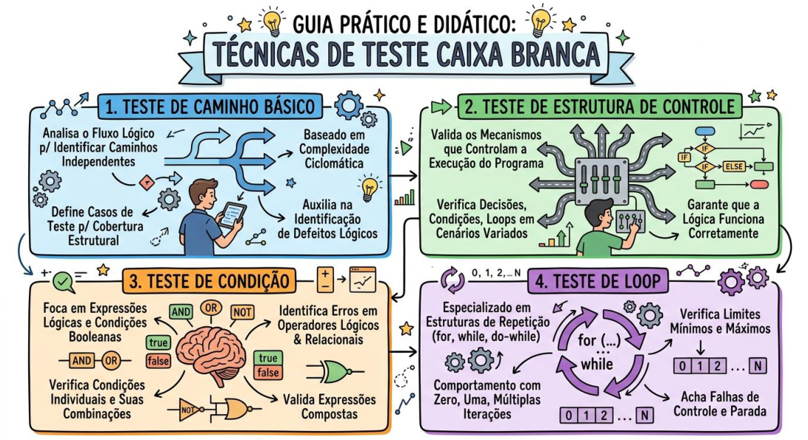

---

<!-- pagina: 49 -->

**Diego Carvalho, Equipe Informática 2 (Diego Carvalho), Equipe Informática 1 (Diego Carvalho) Aula 06** 

#### **Teste Caixa-Preta** 

###### **<mark>INCIDÊNCIA EM PROVA: ALTA</mark>** 

###### **<mark>TESTE CAIXA-PRETA</mark>** 

Técnica que avalia o comportamento externo do software sem considerar sua implementação interna. Os casos de teste são derivados dos requisitos, especificações e regras de negócio, observando apenas entradas e saídas. O objetivo é verificar se o sistema fornece os resultados esperados para diferentes cenários, utilizando técnicas como particionamento de equivalência e análise de valores-limite. 

As técnicas de teste podem ser diferenciadas pelo tipo de informação utilizada para construir os casos de teste. O que acontece quando o testador não possui acesso à implementação interna do software? Nesse cenário surge a Técnica Caixa-Preta, também conhecida como Teste Funcional, Teste Comportamental, Teste orientado a Dados, Teste orientado à Entrada e Saída, ou Teste Caixa-Escura. O elemento comum entre essas denominações é a ausência de dependência em relação ao código-fonte e às estruturas internas da aplicação. 

**(VUNESP / APS - 2024)** Uma das técnicas de teste de software recebe a denominação de teste de <mark>caixa preta, sendo que essa técnica apresenta, especificamente, a seguinte característica:</mark> 

<mark>a) os testes são orientados e dirigidos pelas entradas e saídas dos módulos sob teste, não se entrando em sua estrutura interna.</mark> 

<mark>b) os testes são realizados por meio de um simulador especial denominado Black Box. c) cada teste é reproduzido por pelo menos três vezes, sendo seus resultados comparados. d) os testes verificam a correção dos comandos de desvio existentes internamente ao código. e) a execução de testes para todos os valores possíveis para cada variável presente no programa.</mark> 

**<mark>_______________________ Comentários:</mark>** <mark>(a) Correto. No teste de caixa preta, avaliam-se entradas e saídas do módulo, sem analisar sua estrutura interna ou o código-fonte. (b) Errado. Teste de caixa preta não depende de simulador chamado Black Box; trata-se de uma abordagem de teste. (c) Errado. Repetir testes três vezes e comparar resultados não define essa técnica especificamente. (d) Errado. Verificar comandos de desvio internos é característica ligada à análise estrutural, não à caixa preta. (e) Errado. Testar todos os valores possíveis de cada variável é</mark> inviável na prática e não caracteriza, por si só, a caixa preta. (Letra A) 

O foco dessa abordagem está no comportamento observável do sistema. Como é possível testar um software sem conhecer sua implementação? A resposta está na utilização de requisitos, regras de negócio, especificações funcionais, entradas, saídas e comportamentos esperados. Em vez de examinar algoritmos ou estruturas de controle, o testador verifica se determinadas condições de entrada produzem os resultados previstos pela documentação e pelas necessidades do usuário. 

Essa característica faz com que a técnica seja amplamente utilizada em diferentes níveis de teste. Ela é aplicada apenas nas fases finais do processo? Não. Embora seja bastante comum nos testes de integração, validação e sistema, nada impede sua utilização em outros contextos. O aspecto determinante não é o momento da execução, mas o fato de que os casos de teste são construídos sem depender do conhecimento da estrutura interna do software.

---

<!-- pagina: 50 -->

**Diego Carvalho, Equipe Informática 2 (Diego Carvalho), Equipe Informática 1 (Diego Carvalho) Aula 06** 

Diversos tipos de defeitos podem ser identificados por meio dessa abordagem. Que problemas costumam ser encontrados? Funcionalidades ausentes, comportamentos incorretos, falhas de interface, inconsistências nas regras de negócio e problemas relacionados ao atendimento dos requisitos figuram entre os exemplos mais frequentes. Como a análise é realizada sob a perspectiva do comportamento externo, o interesse principal está naquilo que o sistema faz, e não na forma como foi implementado. Vejamos as principais técnicas: 

<!-- Start of picture text -->
Técnica Baseada em Grafos <!-- End of picture text -->

A Técnica Baseada em Grafos, conhecida como Graph-Based Testing, é uma abordagem de projeto de testes que utiliza representações gráficas para modelar o comportamento e os relacionamentos existentes em um sistema. Como essa modelagem é realizada? Os elementos relevantes são representados por nós, enquanto as conexões entre eles descrevem possíveis transições, dependências ou relacionamentos. Essa estrutura permite visualizar os diferentes caminhos que podem ser percorridos durante a operação da aplicação. 

Os nós presentes no grafo podem assumir diferentes significados dependendo do contexto analisado. O que eles representam na prática? Estados do sistema, eventos, objetos, telas, funcionalidades ou condições de processamento figuram entre os exemplos mais comuns. As conexões estabelecem as relações entre esses elementos e descrevem como o sistema pode evoluir de uma situação para outra ao longo de sua execução. 

Uma dúvida frequente surge ao estudar essa abordagem. Como os casos de teste são obtidos a partir do grafo? Após a construção do modelo, são selecionados caminhos específicos que percorrem diferentes combinações de nós e conexões. Esses percursos servem de base para a definição dos testes, permitindo verificar se as transições previstas ocorrem corretamente e se os relacionamentos entre os elementos produzem os resultados esperados. 

A utilização dessa técnica vai além da simples validação de fluxos. Que tipos de problema podem ser identificados por meio da análise do grafo? Transições inválidas, caminhos inacessíveis, estados que nunca são alcançados e inconsistências nos relacionamentos figuram entre os exemplos mais frequentes. A representação gráfica facilita a visualização dessas situações e contribui para uma avaliação mais abrangente do comportamento do sistema. 

Diversas técnicas de modelagem podem empregar conceitos baseados em grafos. Isso significa que existe apenas uma forma de aplicação dessa abordagem? Não. Diagramas de estados, grafos de causa e efeito, modelos de

---

<!-- pagina: 51 -->

**Diego Carvalho, Equipe Informática 2 (Diego Carvalho), Equipe Informática 1 (Diego Carvalho) Aula 06** 

navegação e outras representações podem ser utilizados para estruturar os testes. Apesar das diferenças entre essas técnicas, todas compartilham a utilização de nós e conexões como mecanismo para representar o comportamento do sistema e orientar a construção dos casos de teste. 

<!-- Start of picture text -->
Técnica de Particionamento de Equivalência <!-- End of picture text -->

O Particionamento de Equivalência é uma técnica de projeto de testes utilizada para reduzir a quantidade de casos de teste necessários sem comprometer a abrangência da avaliação. Como essa redução é possível? A técnica divide o domínio de entrada em classes de equivalência, agrupando valores que se espera produzirem comportamento semelhante perante o sistema. Em vez de testar todos os valores pertencentes a uma mesma classe, seleciona-se apenas um ou alguns representantes para verificar o comportamento esperado. 

A ideia central dessa abordagem está relacionada à semelhança de comportamento entre os dados. Por que testar apenas um representante pode ser suficiente? Porque os valores pertencentes à mesma classe tendem a ser tratados da mesma forma pela lógica da aplicação. Dessa maneira, se um valor representativo produz o resultado esperado, presume-se que os demais elementos daquela classe também apresentarão comportamento equivalente, salvo a existência de defeitos específicos. 

Uma dúvida frequente surge quando os dados possuem casas decimais. Como a técnica é aplicada em domínios compostos por valores reais? O princípio permanece o mesmo. As classes continuam sendo definidas de acordo com os intervalos válidos e inválidos estabelecidos pela regra de negócio. Entretanto, quando existe interesse em analisar valores próximos às fronteiras desses intervalos, normalmente utilizase em conjunto a técnica de Análise de Valor Limite, especializada na avaliação das regiões limítrofes do domínio de entrada. 

Considere um sistema que permite informar percentuais de desconto entre 0,0% e 15,5%, inclusive. Como organizar os testes nesse cenário? Inicialmente, o domínio pode ser dividido em três classes principais: valores inferiores a 0,0%, considerados inválidos; valores entre 0,0% e 15,5%, considerados válidos; e valores superiores a 15,5%, também considerados inválidos. Essa divisão estabelece os grupos de comportamento que serão avaliados durante os testes. 

Após a definição das classes, selecionam-se valores representativos para cada uma delas. Quais valores poderiam ser utilizados nesse exemplo? O valor -0,1% pode representar a classe inválida inferior, 7,25% pode representar a classe válida e 15,6% pode representar a classe inválida superior. Esses representantes permitem avaliar o comportamento esperado de cada classe sem a necessidade de testar individualmente todos os valores pertencentes aos respectivos intervalos. 

Os resultados obtidos demonstram a principal vantagem da técnica. O que se ganha ao utilizar o Particionamento de Equivalência? A quantidade de casos de teste é reduzida de forma significativa, mantendo uma cobertura adequada dos diferentes comportamentos previstos para os dados de entrada. Essa abordagem torna o processo de teste mais eficiente e direciona os esforços para classes de comportamento distintas em vez de repetir verificações sobre valores que tendem a produzir os mesmos resultados. 

A premissa dessa técnica é que todos os valores pertencentes a uma mesma classe de equivalência tendem a produzir comportamentos semelhantes no sistema. Dessa forma, ao testar um representante de cada classe, obtém-se uma boa cobertura dos cenários relevantes com uma quantidade reduzida de casos de teste. O mesmo raciocínio pode ser aplicado a outros tipos de dados não inteiros, como números decimais, datas, horários, valores monetários e até mesmo cadeias de caracteres.

---

<!-- pagina: 52 -->

**Diego Carvalho, Equipe Informática 2 (Diego Carvalho), Equipe Informática 1 (Diego Carvalho) Aula 06** 

<!-- Start of picture text -->
Técnica de Análise de Valor Limite <!-- End of picture text -->

A Análise de Valor Limite, conhecida como Boundary Value Analysis, é uma técnica de projeto de testes baseada na observação de que defeitos frequentemente surgem nas regiões próximas aos limites definidos para os dados de entrada. Por que essas áreas recebem tanta atenção? Porque erros em operadores de comparação, validações de faixa e condições de contorno costumam manifestar-se justamente quando os valores testados se aproximam dos extremos permitidos pela especificação. 

O foco da técnica está nos pontos que delimitam os intervalos de entrada. Quais valores normalmente são selecionados para os testes? Em geral, são avaliados os limites mínimo e máximo definidos pela regra, além dos valores imediatamente inferiores e superiores a essas fronteiras. Essa estratégia permite verificar se o sistema interpreta corretamente as condições de aceitação e rejeição estabelecidas para cada intervalo. 

Uma dúvida frequente surge ao aplicar a técnica em diferentes tipos de dados. Os valores adjacentes são sempre calculados da mesma forma? Não. Em domínios compostos por números inteiros, costuma-se utilizar valores imediatamente acima e abaixo do limite, como limite −1 e limite +1. Em domínios que utilizam números decimais, os valores adjacentes devem respeitar a menor unidade de precisão definida pela regra de negócio, como décimos, centésimos ou outra granularidade adotada pelo sistema. 

A Análise de Valor Limite costuma ser utilizada em conjunto com outra técnica bastante conhecida. Qual é a relação entre ela e o Particionamento de Equivalência? Enquanto o Particionamento de Equivalência divide os dados em classes de comportamento semelhante e seleciona representantes para cada grupo, a Análise de Valor Limite concentra-se especificamente nas regiões de fronteira entre essas classes. As duas abordagens são complementares e frequentemente empregadas em conjunto para aumentar a abrangência dos testes. 

Os resultados obtidos ajudam a identificar defeitos que poderiam passar despercebidos em outras estratégias de teste. Que tipos de problema costumam ser encontrados? Erros em operadores relacionais, falhas na implementação de limites inclusivos ou exclusivos, validações incorretas e condições de contorno mal definidas figuram entre os exemplos mais frequentes. Por essa razão, a Análise de Valor Limite é amplamente utilizada para aumentar a eficácia dos testes baseados em entradas e restrições de faixa. 

<!-- Start of picture text -->
Técnica de Matriz Ortogonal <!-- End of picture text -->

A técnica de Matriz Ortogonal, conhecida como Orthogonal Array Testing, é uma abordagem de projeto de testes utilizada para avaliar sistemas que possuem múltiplos parâmetros e combinações possíveis de entrada. Qual problema essa técnica procura resolver? Em muitos sistemas, a quantidade de combinações cresce rapidamente à medida que novos fatores são adicionados, tornando inviável a execução de todos os testes possíveis. A utilização de matrizes ortogonais permite reduzir esse volume sem eliminar a análise das interações mais relevantes. 

O funcionamento da técnica baseia-se em princípios estatísticos e combinatórios. Como os casos de teste são selecionados? Em vez de gerar todas as combinações possíveis, utilizam-se matrizes previamente estruturadas que definem um conjunto reduzido de cenários representativos. Essas matrizes distribuem as combinações de forma equilibrada entre os diferentes fatores e valores considerados, permitindo uma cobertura eficiente do espaço de teste. 

Uma dúvida frequente surge ao estudar essa abordagem. A redução da quantidade de testes compromete a qualidade da avaliação? Não necessariamente. A técnica foi desenvolvida para maximizar a cobertura das interações entre parâmetros utilizando um número significativamente menor de casos de

---

<!-- pagina: 53 -->

**Diego Carvalho, Equipe Informática 2 (Diego Carvalho), Equipe Informática 1 (Diego Carvalho) Aula 06** 

teste. Embora nem todas as combinações possíveis sejam executadas, a seleção realizada procura preservar a capacidade de identificar defeitos decorrentes das interações mais relevantes entre os fatores analisados. 

Essa abordagem é frequentemente associada aos testes combinatórios. O que isso significa na prática? Significa que a técnica concentra sua atenção nas combinações produzidas pela interação entre diferentes parâmetros de entrada. Em muitos sistemas, os defeitos surgem não por causa de um valor isolado, mas em razão da combinação específica de múltiplos fatores. A Matriz Ortogonal auxilia justamente na investigação desse tipo de situação. 

Os resultados obtidos demonstram a principal vantagem da técnica. Qual benefício ela oferece para o processo de teste? Ao reduzir significativamente a quantidade de casos necessários e manter uma cobertura representativa das interações entre parâmetros, a abordagem contribui para aumentar a eficiência dos testes e otimizar a utilização dos recursos disponíveis, especialmente em sistemas que apresentam um grande número de combinações possíveis de entrada. 

<!-- Start of picture text -->
Técnica da Tabela de Decisão <!-- End of picture text -->

A Tabela de Decisão, conhecida como Decision Table Testing, é uma técnica de projeto de testes utilizada para analisar situações em que o comportamento do sistema depende da combinação de múltiplas condições ou regras de negócio. Em quais cenários essa abordagem costuma ser mais útil? Ela é especialmente adequada quando diferentes combinações de entradas podem produzir resultados distintos, tornando a lógica de decisão mais complexa e difícil de avaliar apenas por meio de descrições textuais. 

**(FUNDATEC / IFC - 2023)** Em relação às técnicas adotadas nos testes de software, quais de fato <mark>podem ser usadas na criação de testes?</mark> 

<mark>a) Tabela de decisão, Particionamento de Equivalência, Análise do valor limite. b) Análise do valor limite, Caso de uso, Técnica da melhor entrada. c) Particionamento de Equivalência, Análise do valor limite, Builder. d) Caso de uso, Builder, Técnica da melhor entrada. e) Particionamento de Equivalência, Técnica da melhor entrada, Caso de Uso.</mark> 

**<mark>_______________________ Comentários:</mark>** <mark>(a) Correto. Tabela de decisão, particionamento de equivalência e análise do valor limite são técnicas clássicas e amplamente usadas na criação de casos de teste. (b) Errado. Embora análise do valor limite e caso de uso possam aparecer em testes, “técnica da melhor entrada” não é técnica consagrada nesse contexto. (c) Errado. Particionamento de equivalência e análise do valor limite são válidos, mas Builder é padrão de projeto, não técnica de teste. (d) Errado. Caso de uso pode apoiar testes, porém Builder não é técnica de teste e “melhor entrada” não compõe esse conjunto. (e) Errado. Particionamento de equivalência é técnica de teste, mas</mark> “técnica da melhor entrada” não é reconhecida como técnica usual de criação de testes. (Letra A) 

O funcionamento da técnica baseia-se na organização estruturada das informações. Como essa representação é construída? As condições que influenciam a decisão são registradas em uma parte da tabela, enquanto as ações ou resultados esperados são registrados em outra. Cada coluna representa uma regra específica, estabelecendo a relação entre determinada combinação de condições e o comportamento que o sistema deve apresentar. 

Uma dúvida frequente surge ao estudar essa abordagem. Todas as combinações possíveis precisam necessariamente ser testadas? Nem sempre. Embora a construção inicial da tabela possa considerar todas as combinações de condições, algumas delas podem ser impossíveis, redundantes ou irrelevantes para o contexto analisado. Após essa avaliação, os casos de teste podem ser selecionados de forma mais eficiente, mantendo a cobertura das situações realmente significativas. 

A técnica oferece benefícios que vão além da simples geração de testes. O que pode ser identificado durante a elaboração da tabela? Regras conflitantes, condições ausentes, ambiguidades nos requisitos e inconsistências na

---

<!-- pagina: 54 -->

**Diego Carvalho, Equipe Informática 2 (Diego Carvalho), Equipe Informática 1 (Diego Carvalho) Aula 06** 

lógica de negócio figuram entre os problemas frequentemente descobertos nesse processo. Dessa forma, a técnica contribui não apenas para os testes, mas também para a melhoria da qualidade das especificações. 

Os resultados obtidos tornam a avaliação de regras complexas mais sistemática e organizada. Qual é a principal vantagem dessa abordagem? A representação tabular facilita a visualização das relações entre condições e resultados, reduzindo a probabilidade de omissão de cenários importantes. Por esse motivo, a Tabela de Decisão é amplamente utilizada em sistemas que possuem grande quantidade de regras de negócio e dependem da combinação de múltiplos critérios para determinar seu comportamento. 

<!-- Start of picture text -->
Técnica de Testes de Casos de Uso <!-- End of picture text -->

O Teste de Casos de Uso, conhecido como Use Case Testing, é uma técnica de projeto de testes baseada nos casos de uso e nos fluxos funcionais definidos durante o levantamento dos requisitos. Qual é o objetivo dessa abordagem? A técnica procura verificar se as funcionalidades implementadas permitem que os usuários realizem as atividades previstas e alcancem os resultados esperados descritos nos processos de negócio. 

Os casos de uso servem como ponto de partida para a construção dos cenários de teste. Como os testes são derivados desses artefatos? A partir da análise dos fluxos descritos para cada caso de uso, são elaborados cenários capazes de reproduzir as interações previstas entre os usuários e o sistema. Essa abordagem permite transformar os requisitos funcionais em casos de teste diretamente relacionados ao comportamento esperado da aplicação. 

Uma dúvida frequente surge ao analisar os elementos avaliados por essa técnica. Apenas o fluxo principal precisa ser testado? Não. Além do fluxo principal, também são considerados os fluxos alternativos e os fluxos de exceção descritos no caso de uso. Essa avaliação amplia a cobertura dos cenários possíveis e permite verificar como o sistema reage diante de diferentes situações previstas pelos requisitos. 

O foco da técnica está na observação do comportamento externo da aplicação. O que isso significa na prática? Significa que a atenção está voltada para as interações entre usuários e funcionalidades, sem a necessidade de analisar a estrutura interna do código ou os mecanismos de implementação utilizados. A preocupação central consiste em verificar se o comportamento percebido pelos usuários corresponde ao que foi especificado nos requisitos. 

Os resultados obtidos auxiliam na validação das funcionalidades sob a perspectiva do negócio. Qual é a principal contribuição dessa abordagem? Ao relacionar diretamente os testes aos objetivos dos usuários e aos processos descritos nos requisitos, a técnica aumenta a confiança de que o sistema atende às necessidades para as quais foi desenvolvido. Por essa razão, o Teste de Casos de Uso é amplamente empregado na validação de requisitos funcionais e na verificação de cenários de interação entre usuários e software. 

**TÉCNICAS CAIXADESCRIÇÃO PRETA** A Técnica Baseada em Grafos modela o sistema por meio de nós e relacionamentos que representam objetos, estados, eventos ou condições de processamento. A partir dessa **BASEADO EM** representação, são definidos caminhos de teste que percorrem diferentes combinações **GRAFOS** de conexões entre os elementos do grafo. Seu objetivo é verificar se as interações ocorrem corretamente e identificar falhas relacionadas aos relacionamentos e fluxos existentes. **PARTICIONAMENTO** O Particionamento de Equivalência consiste em dividir o domínio de entrada em classes **DE EQUIVALÊNCIA** de dados que possuem comportamento semelhante perante o sistema. Em vez de testar todos os valores <u>possíveis, seleciona-se um ou poucos representantes de cada classe</u>

---

<!-- pagina: 55 -->

**Diego Carvalho, Equipe Informática 2 (Diego Carvalho), Equipe Informática 1 (Diego Carvalho) Aula 06** 

|**TÉCNICAS CAIXA-** **PRETA**|**DESCRIÇÃO**|
|---|---|
||válida ou inválida. Essa abordagem reduz a quantidade de casos de teste necessários, evita redundâncias e mantém uma cobertura eficiente dos cenários previstos.|
|**ANÁLISE DE VALOR** **LIMITE**|A Análise de Valor Limite baseia-se na observação de que muitos defeitos ocorrem nas extremidades dos intervalos de entrada. Por esse motivo, os testes concentram-se nos valores mínimos, máximos, imediatamente inferiores e imediatamente superiores aos limites definidos. A técnica complementa o particionamento de equivalência e é especialmente eficaz para detectar erros relacionados a comparações, validações e restrições de faixa.|
|**MATRIZ** **ORTOGONAL**|A técnica de Matriz Ortogonal utiliza princípios estatísticos para selecionar um conjunto reduzido, porém representativo, de combinações de entradas. Em vez de testar todas as possibilidades, os casos são distribuídos uniformemente pelo domínio de teste, permitindo analisar múltiplos fatores simultaneamente. Essa abordagem reduz significativamente o esforço de teste e auxilia na identificação de falhas decorrentes da interação entre parâmetros.|
|**TABELA DE** **DECISÃO**|A Tabela de Decisão é utilizada para modelar situações em que o comportamento do sistema depende da combinação de múltiplas condições ou regras de negócio. A técnica organiza condições e ações em uma estrutura tabular, permitindo identificar de forma sistemática todas as combinações relevantes e seus respectivos resultados esperados. Seu principal benefício é garantir cobertura adequada de cenários complexos e reduzir o risco de omissão de regras durante a elaboração dos casos de teste.|
|**TESTE DE CASOS DE** **USO**|O Teste de Casos de Uso deriva os casos de teste a partir dos casos de uso e dos fluxos funcionais descritos nos requisitos do sistema. A técnica busca validar se o software atende corretamente aos cenários de interação previstos para os usuários, contemplando fluxos principais, alternativos e exceções. Seu foco está na verificação das funcionalidades sob a perspectiva do negócio e na confirmação de que os objetivos dos usuários podem ser alcançados conforme especificado.|

###### **Saiba mais:** 

<mark>Devido à sua natureza baseada em comportamentos pré-documentados pelo negócio, o Teste de Casos de Uso é a abordagem fortemente recomendada em projetos nos quais o time de desenvolvimento não possui domínio do negócio ou experiência prévia com a tecnologia que está sendo construída. Enquanto abordagens como "Error Guessing" e "Testes Exploratórios" dependem intimamente do histórico empírico e da intuição técnica do testador para antecipar falhas ocultas, o Teste de Caso de Uso fornece um roteiro estruturado "passo a passo" do fluxo principal e das ramificações de exceção. Esse formalismo compensa a falta de "malícia técnica" (fator humano) da equipe recém-formada, garantindo uma cobertura de qualidade segura e</mark> previsível sem depender da experiência individual dos engenheiros de teste. 

Vamos voltar novamente ao nosso motor de carro: como verificar seu funcionamento sem desmontá-lo? Mesmo sem acesso aos componentes internos, é possível observar sua resposta à aceleração, à ignição, à troca de combustível ou a outras condições de operação. O mesmo ocorre nos testes caixa-preta. O testador não precisa conhecer a implementação interna para verificar se determinadas entradas produzem os resultados esperados. 

Essa lógica pode ser observada em diversas situações do cotidiano. Quando uma calculadora recebe a operação 3 × 7, é necessário conhecer os algoritmos internos utilizados para realizar o cálculo? Não, basta

---

<!-- pagina: 56 -->

**Diego Carvalho, Equipe Informática 2 (Diego Carvalho), Equipe Informática 1 (Diego Carvalho) Aula 06** 

saber que o resultado esperado é 21. Da mesma forma, os testes caixa-preta concentram-se na relação entre entradas e saídas observáveis, utilizando os requisitos e o comportamento esperado como referência para identificar possíveis defeitos no software. 

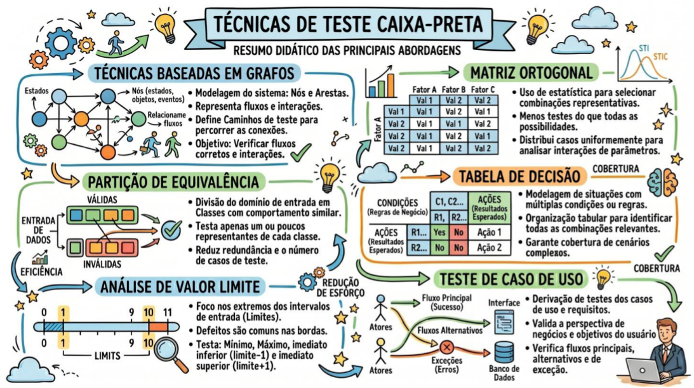

---

<!-- pagina: 57 -->

**Diego Carvalho, Equipe Informática 2 (Diego Carvalho), Equipe Informática 1 (Diego Carvalho) Aula 06** 

#### **Teste Caixa-Cinza** 

###### **<mark>INCIDÊNCIA EM PROVA: BAIXÍSSIMA</mark>** 

###### **<mark>TESTE CAIXA-CINZA</mark>** 

Técnica que combina características das abordagens de caixa-preta e caixa-branca. O testador possui conhecimento parcial da estrutura interna do sistema, utilizando essas informações para projetar casos de teste mais eficazes, mas sem realizar uma análise completa do código. Essa técnica é bastante utilizada em testes de integração, aplicações web e sistemas distribuídos. 

As técnicas Caixa-Branca e Caixa-Preta representam extremos em relação ao conhecimento disponível sobre o sistema. Existe alguma abordagem intermediária entre essas duas perspectivas? Sim. O Teste Caixa-Cinza surge justamente para combinar características de ambas as técnicas, permitindo que o testador utilize informações parciais sobre a estrutura interna do software sem depender de um conhecimento completo da implementação. 

O que diferencia essa abordagem das demais? Enquanto o teste caixa-preta considera apenas entradas, saídas e comportamentos observáveis, o teste caixa-cinza utiliza informações adicionais sobre a arquitetura, estruturas de dados, algoritmos, componentes ou fluxos internos do sistema. Essas informações auxiliam na elaboração dos casos de teste, tornando possível selecionar cenários com maior probabilidade de revelar defeitos relevantes. 

Uma dúvida comum surge nesse ponto. O testador precisa conhecer completamente o código-fonte para realizar testes caixa-cinza? Não. O conhecimento utilizado é normalmente parcial e direcionado. Em muitos casos, basta compreender aspectos específicos da implementação, como a forma de comunicação entre componentes, a organização dos dados ou determinadas características arquiteturais que possam influenciar a elaboração dos testes. 

Esse conhecimento interno pode ser obtido de diferentes maneiras. Seria obrigatória a participação direta dos desenvolvedores? Não necessariamente. Informações úteis podem ser encontradas em diagramas, documentação técnica, especificações arquiteturais ou outros artefatos produzidos durante o desenvolvimento. O aspecto importante é que essas informações sejam utilizadas para orientar a seleção e a construção dos casos de teste. 

Outra característica relevante envolve a forma de execução dos testes. Como os cenários são executados na prática? Embora o planejamento utilize informações internas, a avaliação normalmente ocorre por meio da observação do comportamento externo do sistema. Dessa forma, o testador verifica se determinadas entradas produzem os resultados esperados, mas os cenários foram escolhidos com base em conhecimento adicional sobre a implementação. 

Essa combinação permite explorar situações que talvez não fossem identificadas por uma abordagem exclusivamente caixa-preta. Qual é a principal vantagem disso? O conhecimento parcial da estrutura interna ajuda a direcionar os testes para áreas potencialmente mais críticas do sistema, aumentando a eficiência do processo sem exigir o mesmo nível de detalhamento normalmente associado aos testes caixa-branca. 

Alguns autores relacionam determinadas estratégias de Teste de Integração ao conceito de Caixa-Cinza. Por que essa associação pode ocorrer? Durante a integração, é comum que o testador possua informações sobre interfaces, protocolos de comunicação e mecanismos de interação entre componentes. Entretanto, essa classificação não é universal. Dependendo da técnica utilizada, um Teste de Integração pode assumir características de Caixa-Branca, Caixa-Preta ou Caixa-Cinza.

---

<!-- pagina: 58 -->

**Diego Carvalho, Equipe Informática 2 (Diego Carvalho), Equipe Informática 1 (Diego Carvalho) Aula 06** 

Ao observar as três abordagens em conjunto, percebe-se uma diferença fundamental. Os testes caixabranca utilizam conhecimento detalhado da implementação; os testes caixa-preta concentram-se exclusivamente no comportamento observável; os testes caixa-cinza ocupam uma posição intermediária, aproveitando informações parciais da estrutura interna para construir cenários de teste mais direcionados e potencialmente mais eficazes. 

---

<!-- pagina: 59 -->

**Diego Carvalho, Equipe Informática 2 (Diego Carvalho), Equipe Informática 1 (Diego Carvalho) Aula 06** 

#### **Teste Baseado em Experiência** 

|**INCIDÊNCIA EM PROVA: BAIXÍSSIMA**|
|---|

###### **<mark>TESTE BASEADO EM EXPERIÊNCIA</mark>** 

Abordagem de projeto e execução de testes que utiliza o conhecimento, a intuição, a experiência prévia e o entendimento do domínio de negócio por parte do testador para identificar defeitos e definir casos de teste. Diferentemente das técnicas baseadas em especificações ou na estrutura interna do código, essa abordagem apoia-se na capacidade do profissional de antecipar áreas de maior risco, reconhecer padrões de falhas recorrentes e explorar comportamentos potencialmente problemáticos do sistema. 

O Teste Baseado em Experiência é uma abordagem de projeto e execução de testes que utiliza o conhecimento acumulado pelos testadores para orientar a identificação de defeitos e a definição de cenários de avaliação. O que diferencia essa abordagem de outras técnicas de teste? Em vez de depender exclusivamente de especificações formais ou da análise da estrutura interna do software, ela aproveita a experiência prática dos profissionais e seu entendimento sobre o domínio de negócio para direcionar os esforços de teste. 

O conhecimento adquirido em projetos anteriores exerce papel importante nesse processo. Como essa experiência contribui para a identificação de problemas? Testadores experientes costumam reconhecer padrões de falhas já observados em sistemas semelhantes, compreender áreas historicamente mais propensas a defeitos e identificar situações que merecem atenção especial. Essas percepções ajudam a direcionar os testes para cenários que apresentam maior potencial de risco. 

Uma dúvida frequente surge ao analisar essa abordagem. Os testes são definidos apenas com base na intuição do profissional? Não. Embora a experiência individual seja um elemento importante, as decisões normalmente se apoiam também no conhecimento do sistema, no histórico de defeitos, nas características do domínio de negócio e em informações obtidas ao longo do desenvolvimento. Dessa forma, a abordagem utiliza referências concretas para orientar a seleção dos testes. 

O Teste Baseado em Experiência não corresponde a uma única técnica específica. Quais métodos podem ser classificados nessa categoria? Entre os exemplos mais conhecidos estão o Teste Exploratório, a Adivinhação de Erros (Error Guessing) e os Testes Baseados em Checklist. Apesar das diferenças entre essas técnicas, todas compartilham a utilização do conhecimento e da experiência do testador como elementos importantes para a identificação de defeitos. 

Essa abordagem costuma ser empregada em conjunto com outras estratégias de teste. Qual é sua principal contribuição para a qualidade do software? Ao direcionar a atenção para áreas de maior risco e para situações que nem sempre são contempladas por técnicas mais estruturadas, os testes baseados em experiência ampliam a capacidade de detecção de defeitos e complementam as evidências obtidas por abordagens fundamentadas em especificações ou na estrutura do sistema. Vejamos as principais técnicas: 

|**BASEADAS EM** **EXPERIÊNCIA**|**DESCRIÇÃO**|
|---|---|
|**ERROR GUESSING**|Error Guessing é uma técnica de teste baseada na experiência em que o testador utiliza conhecimento prévio, intuição e histórico de falhas para imaginar onde defeitos provavelmente podem ocorrer. A partir disso, cria casos de teste direcionados a situações críticas, entradas inválidas, combinações incomuns e comportamentos que costumam revelar erros no sistema antes da entrega.|
|**EXPLORATORY** **TESTING**|Exploratory Testing é uma abordagem em que aprendizado, projeto e execução dos testes ocorrem de forma simultânea. O testador explora o sistema, observa seu comportamento,formula hipóteses e ajusta ospróximos testes conforme os resultados|

---

<!-- pagina: 60 -->

**Diego Carvalho, Equipe Informática 2 (Diego Carvalho), Equipe Informática 1 (Diego Carvalho) Aula 06** 

**BASEADAS EM DESCRIÇÃO EXPERIÊNCIA** encontrados. É útil quando há pouca documentação, alto grau de incerteza ou necessidade de descobrir falhas não previstas nos requisitos. Checklist Based Testing é uma técnica em que os testes são guiados por uma lista de verificação previamente elaborada, contendo aspectos, condições, funcionalidades ou **CHECKLIST BASED** riscos que devem ser avaliados. O checklist ajuda a padronizar a execução, evitar **TESTING** esquecimentos e garantir cobertura mínima, sem exigir casos de teste muito detalhados ou totalmente formalizados previamente. 

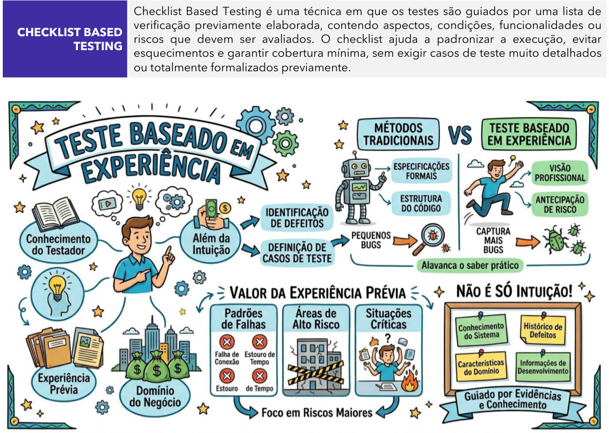

<!-- Start of picture text -->
Checklist Based Testing é uma técnica em que os testes são guiados por uma lista de verificação previamente elaborada, contendo aspectos, condições, funcionalidades ou CHECKLIST BASED riscos que devem ser avaliados. O checklist ajuda a padronizar a execução, evitar TESTING esquecimentos e garantir cobertura mínima, sem exigir casos de teste muito detalhados ou totalmente formalizados previamente. <!-- End of picture text -->

---

<!-- pagina: 61 -->

**Diego Carvalho, Equipe Informática 2 (Diego Carvalho), Equipe Informática 1 (Diego Carvalho) Aula 06** 

<!-- Start of picture text -->
d e Testes <!-- End of picture text -->

###### **<mark>TIPOS DE TESTES</mark>** 

Os tipos de teste representam as diferentes características ou atributos do software que se deseja avaliar durante o processo de verificação e validação. Enquanto os níveis de teste indicam onde os testes são aplicados e as técnicas de teste definem como eles são projetados, os tipos de teste determinam o que está sendo analisado no sistema. Essa classificação permite organizar os esforços de teste de acordo com os objetivos de qualidade estabelecidos para o sistema. 

#### **Teste de Fumaça** 

###### **<mark>INCIDÊNCIA EM PROVA: MÉDIA</mark>** 

###### **<mark>TESTE DE FUMAÇA</mark>** 

<mark>Tipo de teste que consiste em uma verificação rápida e superficial das principais funcionalidades do sistema após</mark> uma nova compilação ou implantação. Seu objetivo é determinar se a versão está suficientemente estável para prosseguir com testes mais detalhados. Caso falhas críticas sejam encontradas nessa etapa, os testes subsequentes normalmente são interrompidos. 

Durante o desenvolvimento de software, novas versões do sistema são geradas constantemente. Como saber se uma nova versão está minimamente pronta para ser submetida a testes mais detalhados? Essa é justamente a função do Teste de Fumaça, também conhecido como Smoke Testing. Seu objetivo consiste em realizar uma verificação rápida das funcionalidades essenciais do sistema para confirmar que a aplicação possui condições mínimas de funcionamento. 

O foco dessa modalidade de teste é bastante específico. Seria necessário validar todos os requisitos da aplicação nesse momento? Não. O propósito não é realizar uma análise completa do software, mas verificar se os principais fluxos de utilização permanecem operacionais. Em outras palavras, procura-se confirmar que as funcionalidades fundamentais continuam funcionando após a geração de uma nova versão do sistema. 

**(CEBRASPE / MPE GO - 2024)** A respeito de DevOps, GIT e testes de software, julgue o item a <mark>seguir.</mark> 

<mark>Caso seja necessário verificar se o software desenvolvido está funcionando conforme o esperado e garantir que suas principais funções não apresentem grandes falhas, na execução rápida de seus principais recursos, indica-se a realização do teste fumaça.</mark> 

**<mark>_______________________ Comentários:</mark>** <mark>O teste de fumaça faz uma verificação rápida das funções principais do software, ajudando a confirmar se ele está</mark> operando como esperado e sem falhas graves iniciais antes de testes mais aprofundados. (Correto) 

Essa abordagem é particularmente útil quando o software sofre alterações frequentes. O que acontece quando novos componentes são incorporados à aplicação ou quando funcionalidades existentes são modificadas? Cada mudança introduz a possibilidade de surgirem defeitos capazes de comprometer o funcionamento básico do sistema. Antes de investir tempo em testes mais aprofundados, torna-se conveniente verificar se a versão produzida apresenta estabilidade suficiente para prosseguir no processo de validação. 

Os problemas encontrados durante essa etapa costumam possuir elevada gravidade. Que tipo de defeito o Teste de Fumaça procura identificar? O principal alvo são os chamados defeitos bloqueadores ou impeditivos, frequentemente denominados showstoppers. Esses defeitos inviabilizam a utilização das

---

<!-- pagina: 62 -->

**Diego Carvalho, Equipe Informática 2 (Diego Carvalho), Equipe Informática 1 (Diego Carvalho) Aula 06** 

funcionalidades essenciais da aplicação e impedem a continuidade das demais atividades de teste até que sejam corrigidos. 

Imagine uma aplicação corporativa cujo fluxo principal depende da autenticação do usuário. O que aconteceria se a funcionalidade de login deixasse de funcionar após uma atualização? Mesmo que todas as demais funcionalidades estivessem corretas, a utilização do sistema ficaria comprometida. Situações desse tipo representam exemplos clássicos de problemas que o Teste de Fumaça procura detectar logo nos primeiros momentos de avaliação de uma nova versão. 

Uma dúvida frequente envolve a profundidade dessa modalidade de teste. O Smoke Testing substitui testes funcionais, testes de regressão ou testes de aceitação? Não. Sua finalidade é muito mais limitada. O objetivo consiste em fornecer uma indicação rápida de que a aplicação está suficientemente estável para receber avaliações mais detalhadas. Caso essa verificação inicial falhe, torna-se pouco produtivo avançar para etapas mais complexas do processo de teste. 

Em ambientes modernos de desenvolvimento, especialmente aqueles que utilizam integração contínua, essa estratégia é amplamente empregada. Por que ela se tornou tão importante? Como novas versões do software são produzidas frequentemente, a execução rápida de um conjunto reduzido de testes permite identificar problemas críticos logo após a geração de cada build. Dessa forma, defeitos graves podem ser corrigidos antes que consumam tempo e esforço em fases posteriores de validação. 

O Teste de Fumaça pode ser entendido como uma verificação preliminar da saúde do sistema. Ele não busca provar que o software está livre de defeitos nem validar exaustivamente suas funcionalidades. Sua função é confirmar que os fluxos essenciais permanecem operacionais e que a versão produzida possui condições mínimas para avançar com segurança para os próximos níveis de teste. 

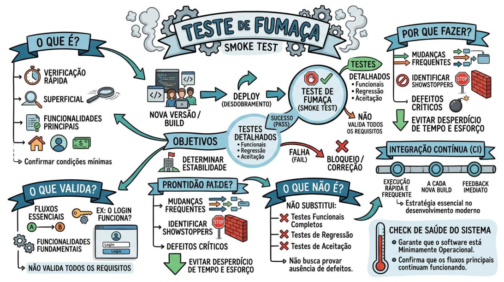

---

<!-- pagina: 63 -->

**Diego Carvalho, Equipe Informática 2 (Diego Carvalho), Equipe Informática 1 (Diego Carvalho) Aula 06** 

#### **Teste de Regressão** 

###### **<mark>INCIDÊNCIA EM PROVA: ALTA</mark>** 

###### **<mark>TESTE DE REGRESSÃO</mark>** 

Tipo de teste que tem como finalidade verificar se alterações realizadas no software, como correções de defeitos ou implementação de novas funcionalidades, não introduziram falhas em funcionalidades que anteriormente funcionavam corretamente. Trata-se de uma atividade fundamental em processos de manutenção e integração contínua, sendo frequentemente automatizada. 

A evolução contínua dos sistemas de software cria um desafio recorrente para as equipes de desenvolvimento. O que acontece quando uma correção ou uma nova funcionalidade é adicionada a um sistema que já estava funcionando adequadamente? Embora a alteração possa resolver um problema específico ou atender a uma nova necessidade, existe o risco de que ela provoque efeitos indesejados em funcionalidades que anteriormente operavam sem falhas. É justamente esse cenário que motiva a realização dos Testes de Regressão. 

Toda modificação realizada em um software possui potencial para gerar impactos além da área diretamente alterada. Por que isso acontece? Componentes de software frequentemente compartilham dados, regras de negócio, interfaces e mecanismos de processamento. Como consequência, uma alteração aparentemente simples pode afetar partes do sistema que não foram modificadas diretamente. Esse tipo de efeito colateral representa uma das principais preocupações durante a evolução de aplicações. 

O Teste de Regressão procura responder uma pergunta fundamental. As mudanças realizadas comprometeram algo que anteriormente funcionava corretamente? Para obter essa resposta, são reaplicados casos de teste já utilizados em versões anteriores do sistema. O objetivo consiste em verificar se funcionalidades previamente validadas continuam apresentando o comportamento esperado após a realização das alterações. 

**(VUNESP / Rio Preto Prev - 2026)** A automação de testes em um ambiente de desenvolvimento <mark>de software traz diversos benefícios, sendo um dos cuidados necessários garantir que novos recursos adicionados ao software não introduzam problemas em funcionalidades pré-existentes, que já haviam sido testadas antes.</mark> 

<mark>O tipo de teste adequado para detectar potenciais problemas dessa natureza é o</mark> 

<mark>a) teste de integração. b) smoke test. c) teste de regressão. d) teste unitário. e) teste de performance.</mark> 

**<mark>_______________________ Comentários:</mark>** <mark>(a) Errado. Teste de integração verifica a interação entre módulos, não é o foco principal para identificar falhas surgidas após mudanças em funcionalidades já validadas. (b) Errado. Smoke test faz uma checagem inicial e superficial das funções principais, sem aprofundar a análise de impactos em recursos antigos. (c) Correto. Teste de regressão é usado para confirmar que novas alterações não provocaram defeitos em funcionalidades que já funcionavam antes. (d) Errado. Teste unitário avalia partes isoladas do código, mas não tem como objetivo central detectar efeitos colaterais em funcionalidades previamente testadas. (e) Errado. Teste de performance mede desempenho, estabilidade e tempo de resposta, não sendo voltado à verificação de falhas em funções antigas após mudanças.</mark> (Letra C)

---

<!-- pagina: 64 -->

**Diego Carvalho, Equipe Informática 2 (Diego Carvalho), Equipe Informática 1 (Diego Carvalho) Aula 06** 

Uma dúvida comum surge nesse contexto. O Teste de Regressão é executado apenas após a correção de defeitos? Não. Qualquer modificação capaz de impactar o comportamento do software pode justificar sua utilização. Novas funcionalidades, melhorias de desempenho, alterações de infraestrutura, mudanças em regras de negócio e atualizações de componentes externos representam exemplos de situações que frequentemente motivam a execução desse tipo de teste. 

A forma de execução também merece atenção. Seria necessário repetir todos os testes existentes sempre que uma alteração fosse realizada? Em sistemas pequenos isso pode ser viável, mas aplicações maiores costumam possuir milhares de casos de teste. Por esse motivo, muitas organizações selecionam conjuntos específicos de testes com base em critérios como risco, impacto e cobertura funcional. O objetivo é maximizar a capacidade de detecção de defeitos sem tornar o processo excessivamente custoso. 

###### **Saiba mais:** 

<mark>Além de critérios como risco, impacto e cobertura funcional, uma estratégia de projeto altamente eficaz para o teste de regressão é selecionar e direcionar os casos de teste considerando as funções principais do software, com foco naquelas que tratam de uma ou mais classes de erros. Ao agrupar e projetar os testes visando as classes de erros já conhecidas ou logicamente esperadas (como falhas de limite, erros de concorrência ou cálculos específicos), a equipe consegue validar com maior precisão se as alterações ou manutenções recentes afetaram negativamente comportamentos previamente homologados. Isso garante que o conjunto de testes de regressão seja adequadamente direcionado e não apenas uma reexecução cega, otimizando o esforço de</mark> controle de qualidade. 

A automação desempenha papel importante nesse cenário. Como executar repetidamente grandes quantidades de testes sem aumentar excessivamente o esforço da equipe? Ferramentas de automação permitem que casos de teste sejam armazenados, executados e comparados automaticamente a cada nova modificação do software. Essa prática é particularmente comum em ambientes que utilizam integração contínua e entrega contínua, nos quais alterações são incorporadas ao sistema com elevada frequência. 

Imagine uma aplicação que já passou por diversas etapas de teste e foi disponibilizada aos usuários. O trabalho de validação termina nesse momento? Não. Sempre que uma nova versão é desenvolvida, surge a necessidade de verificar se as funcionalidades existentes permanecem corretas. Nesse contexto, os Testes de Regressão funcionam como um mecanismo de proteção contra a introdução de novos defeitos em partes do sistema que anteriormente já haviam sido aprovadas. 

Essa característica explica por que o Teste de Regressão é frequentemente considerado um dos tipos de teste mais importantes na prática profissional. Sua finalidade não é validar apenas aquilo que foi modificado, mas também preservar a estabilidade das funcionalidades já existentes. Dessa forma, contribui para que a evolução contínua do software ocorra com menor risco de comprometer comportamentos previamente considerados corretos.

---

<!-- pagina: 65 -->

**Diego Carvalho, Equipe Informática 2 (Diego Carvalho), Equipe Informática 1 (Diego Carvalho) Aula 06** 

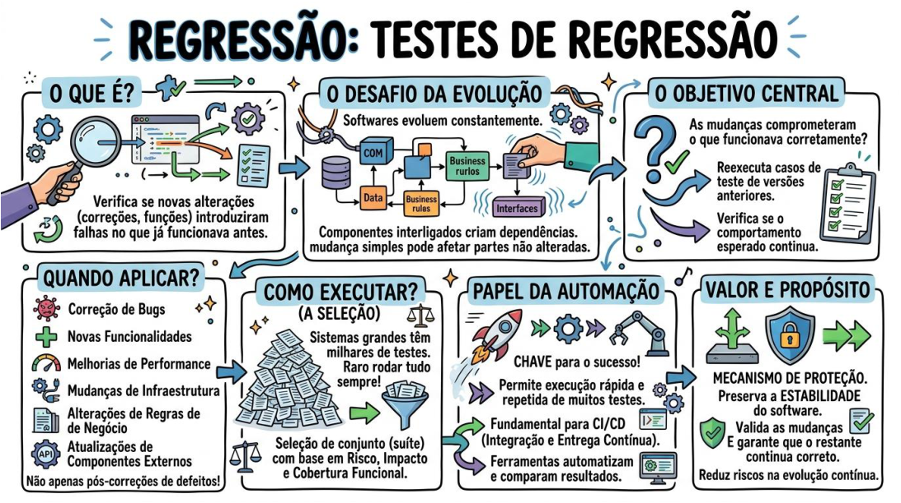

---

<!-- pagina: 66 -->

**Diego Carvalho, Equipe Informática 2 (Diego Carvalho), Equipe Informática 1 (Diego Carvalho) Aula 06** 

#### **Teste de Interface Gráfica (GUI)** 

###### **<mark>INCIDÊNCIA EM PROVA: BAIXÍSSIMA</mark>** 

###### **<mark>TESTE DE INTERFACE GRÁFICA (GUI)</mark>** 

Tipo de teste dinâmico voltado à verificação dos elementos visuais e interativos de uma aplicação, como botões, menus, campos de formulário, ícones, janelas, mensagens e fluxos de navegação. Seu objetivo é garantir que a interface implementada funcione corretamente, apresente comportamento consistente e esteja alinhada aos requisitos funcionais e ao projeto de UX/UI. Durante sua execução, são avaliados aspectos como posicionamento dos componentes, respostas a ações do usuário, validações de entrada, navegação entre telas e exibição <mark>adequada das informações, contribuindo para a qualidade da experiência oferecida ao usuário final.</mark> 

O Teste de Interface Gráfica, conhecido como GUI Testing, é uma modalidade de teste dinâmico voltada à avaliação dos elementos visuais e interativos de uma aplicação. O que se procura verificar nessa abordagem? O objetivo consiste em analisar se componentes como botões, menus, campos de formulário, ícones, janelas e mecanismos de navegação funcionam corretamente e apresentam comportamento compatível com os requisitos definidos para o sistema. 

Durante a execução desses testes, diferentes aspectos da interface são avaliados. Quais características costumam receber maior atenção? Entre os elementos frequentemente analisados estão o posicionamento dos componentes, as respostas às ações realizadas pelo usuário, as validações de entrada, a navegação entre telas e a exibição adequada das informações. Essas verificações permitem identificar problemas que podem comprometer a interação com a aplicação. 

Uma dúvida comum surge ao comparar os testes de interface gráfica com os testes funcionais tradicionais. Ambos não verificam o funcionamento do sistema? Em parte, sim. Entretanto, enquanto muitos testes funcionais concentram-se na lógica de negócio e nos resultados produzidos pela aplicação, os testes de interface gráfica avaliam como essas funcionalidades são apresentadas e acessadas por meio da interface utilizada pelos usuários. 

Outro aspecto importante envolve a relação entre GUI Testing e experiência do usuário. Esse tipo de teste é suficiente para avaliar toda a qualidade da experiência oferecida pela aplicação? Não necessariamente. Os testes de interface gráfica ajudam a verificar se a interface implementada funciona corretamente e apresenta comportamento consistente, mas avaliações mais amplas relacionadas à experiência do usuário costumam envolver também testes de usabilidade e outras técnicas específicas de UX. 

Os resultados obtidos durante essa avaliação contribuem para a qualidade geral da aplicação. Qual é o principal benefício dessa abordagem? A identificação de problemas visuais, inconsistências de comportamento e falhas de interação permite corrigir defeitos que poderiam dificultar a utilização do sistema. Dessa forma, torna-se possível aumentar a confiabilidade da interface e oferecer uma interação mais adequada aos usuários finais. 

É importante destacar que testes de componentes visuais podem assumir naturezas estressoras e imprevisíveis. Embora ferramentas tradicionais de Teste de Interface Gráfica (GUI) verifiquem fluxos de navegação e componentes pré-determinados em tela, suítes modernas de teste de GUI frequentemente incorporam comportamentos e heurísticas do Monkey Testing. 

Na prática, para atestar que toda a interface é completamente à prova de falhas, muitos Testes de GUI injetam sistematicamente eventos caóticos — como toques simultâneos, rolagem frenética, "esmagamento" de botões e toques acidentais em áreas que não possuem interatividade programada. O objetivo é assegurar que elementos de front-end não sofram engasgos (freezes), vazamentos de memória (decorrentes de atualizações visuais muito rápidas) ou quebras de layout diante de um padrão de usuário não convencional.

---

<!-- pagina: 67 -->

**Diego Carvalho, Equipe Informática 2 (Diego Carvalho), Equipe Informática 1 (Diego Carvalho) Aula 06** 

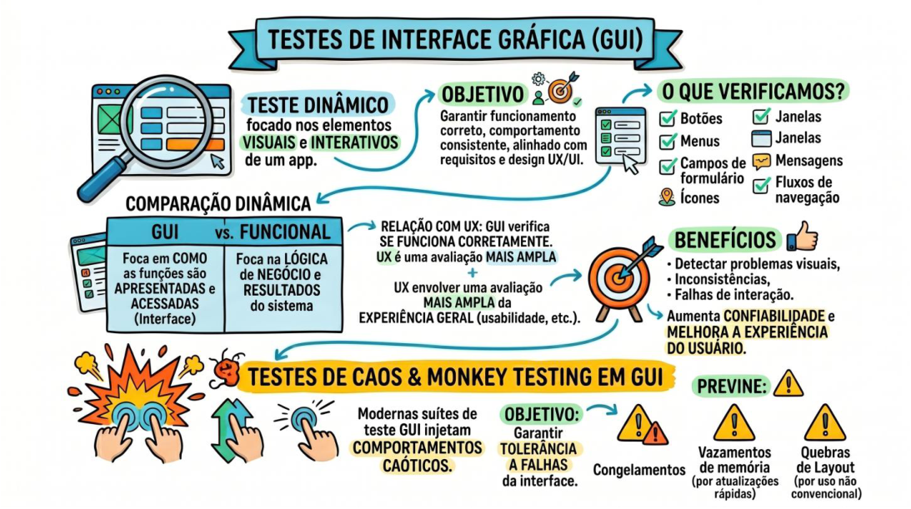

---

<!-- pagina: 68 -->

**Diego Carvalho, Equipe Informática 2 (Diego Carvalho), Equipe Informática 1 (Diego Carvalho) Aula 06** 

#### **Teste de Usabilidade** 

###### **<mark>INCIDÊNCIA EM PROVA: BAIXÍSSIMA</mark>** 

###### **<mark>TESTE DE USABILIDADE</mark>** 

Tipo de teste que busca avaliar a facilidade com que os usuários conseguem aprender, compreender e utilizar um sistema para atingir seus objetivos. São observados aspectos relacionados à experiência do usuário, eficiência, satisfação, acessibilidade e facilidade de aprendizado. Esse tipo de teste ajuda a identificar problemas de interface e interação que podem comprometer a adoção do software. 

Os Testes de Usabilidade avaliam a qualidade da interação entre os usuários e o sistema. Qual é o foco dessa modalidade de teste? Diferentemente dos testes voltados à verificação do funcionamento das funcionalidades, a preocupação está na forma como as pessoas utilizam a aplicação para executar suas tarefas. O objetivo consiste em analisar se a interface permite que os usuários alcancem seus resultados de maneira eficiente, compreensível e adequada às suas necessidades. 

A usabilidade está diretamente relacionada à experiência de utilização do software. Quais aspectos costumam ser observados durante essa avaliação? Entre os elementos mais relevantes estão a facilidade de aprendizado, a clareza das informações apresentadas, a consistência da navegação, a compreensão das funcionalidades e a eficiência na execução das atividades. Esses fatores ajudam a determinar se a interação ocorre de forma intuitiva e compatível com as expectativas dos usuários. 

Uma questão frequentemente levantada envolve a relação entre funcionamento e usabilidade. Um sistema pode estar tecnicamente correto e ainda assim apresentar problemas? Sim. É possível que todas as funcionalidades operem conforme os requisitos especificados e, mesmo assim, os usuários encontrem dificuldades para localizar recursos, interpretar informações ou concluir determinadas tarefas. Por essa razão, a avaliação da usabilidade complementa outras modalidades de teste ao considerar aspectos relacionados ao comportamento humano durante a interação com o sistema. 

Diversos elementos influenciam a qualidade dessa experiência. O que normalmente é analisado pelos avaliadores? Interface gráfica, organização visual das telas, mensagens apresentadas pelo sistema, recursos de ajuda, documentação, materiais de treinamento e mecanismos de acessibilidade figuram entre os aspectos mais observados. Cada um desses componentes pode contribuir para facilitar ou dificultar a utilização da aplicação pelos usuários finais. 

A avaliação da usabilidade também permite identificar qualidades da interface além da simples detecção de problemas. Seria sua finalidade apenas encontrar obstáculos de utilização? Certamente não. Esses testes possibilitam medir atributos como eficiência, satisfação e facilidade de aprendizado, fornecendo informações úteis para aperfeiçoar a interação entre pessoas e software e para orientar decisões relacionadas à evolução da interface. 

Considere duas aplicações que oferecem exatamente as mesmas funcionalidades. O que explica a preferência dos usuários por uma delas? Frequentemente, a diferença está associada à facilidade de uso. Interfaces intuitivas, navegação consistente e comunicação clara tendem a reduzir erros e tornar a execução das tarefas mais simples. Como consequência, a percepção geral sobre a qualidade do sistema costuma ser mais positiva.

---

<!-- pagina: 69 -->

**Diego Carvalho, Equipe Informática 2 (Diego Carvalho), Equipe Informática 1 (Diego Carvalho) Aula 06** 

No contexto da Engenharia de Usabilidade, diferentes abordagens podem ser empregadas para realizar avaliações. Vejamos as principais abordagens: 

|**ABORDAGENS**|**DESCRIÇÃO**|
|---|---|
|**TESTE DE** **USABILIDADE** **TRADICIONAL**|Consiste na execução de tarefas previamente definidas por usuários representativos do público-alvo. O objetivo é avaliar aspectos como eficácia, eficiência, facilidade de aprendizado, ocorrência de erros e satisfação, permitindo identificar problemas de interação e experiência do usuário.|
|**TESTE DE** **USABILIDADE** **EXPLORATÓRIA**|Os participantes exploram o sistema com maior liberdade, sem seguir um roteiro rígido de tarefas. Essa abordagem busca revelar problemas inesperados de navegação, compreensão, organização da interface e comportamento do usuário que dificilmente seriam percebidos em testes mais estruturados.|
|**TESTE DE** **USABILIDADE** **COMPARATIVA**|Compara duas ou mais interfaces, versões ou produtos para determinar qual oferece melhor experiência de uso. Os participantes executam atividades semelhantes em cada alternativa, permitindo avaliar diferenças de desempenho, satisfação, eficiência e preferência dos usuários.|
|**TESTE DE** **USABILIDADE DE** **AVALIAÇÃO**|Tem como objetivo identificar e medir problemas de usabilidade existentes em uma aplicação. Durante o teste, são coletadas métricas como tempo de execução, taxa de sucesso, quantidade de erros e percepção dos usuários, fornecendo uma visão geral da qualidade da experiência oferecida.|
|**TESTE DE** **USABILIDADE DE** **VALIDAÇÃO**|É realizado após correções ou melhorias na interface para verificar se os problemas anteriormente identificados foram eliminados. Também pode ser utilizado para confirmar se metas de usabilidade previamente estabelecidas foram efetivamente alcançadas pelo produto.|
|**TESTE DE** **USABILIDADE** **REMOTA**|O teste é conduzido à distância, permitindo que os participantes utilizem o sistema em seus próprios ambientes. Essa modalidade reduz custos logísticos, amplia o alcance geográfico dos avaliadores e possibilita observar o comportamento dos usuários em condições mais próximas da realidade.|

---

<!-- pagina: 70 -->

**Diego Carvalho, Equipe Informática 2 (Diego Carvalho), Equipe Informática 1 (Diego Carvalho) Aula 06** 

|**ABORDAGENS**|**DESCRIÇÃO**|
|---|---|
|**TESTE** **MODERADO DE** **USABILIDADE**|Um facilitador acompanha a execução do teste, orientando os participantes, esclarecendo dúvidas e realizando perguntas durante as atividades. Essa interação permite obter informações qualitativas mais detalhadas sobre dificuldades, percepções e decisões tomadas pelos usuários.|
|**TESTE NÃO** **MODERADO DE** **USABILIDADE**|Os participantes executam as tarefas sem a presença direta de um avaliador. Todo o processo é conduzido por instruções previamente preparadas e ferramentas de coleta automática, permitindo testar um grande número de usuários com menor custo e maior escalabilidade.|
|**TESTE HALLWAY**|Consiste em realizar avaliações rápidas com pessoas facilmente disponíveis, mesmo que não sejam especialistas ou usuários típicos do sistema. O objetivo é identificar problemas evidentes de usabilidade de forma simples, econômica e em estágios iniciais do desenvolvimento.|
|**TESTE A/B**|Diferentes versões de uma interface são apresentadas a grupos distintos de usuários para comparação objetiva de resultados. A análise considera indicadores como conversão, tempo de execução, engajamento ou satisfação, permitindo selecionar a alternativa mais eficaz.|

---

<!-- pagina: 71 -->

**Diego Carvalho, Equipe Informática 2 (Diego Carvalho), Equipe Informática 1 (Diego Carvalho) Aula 06** 

#### **Monkey Testing** 

###### **<mark>INCIDÊNCIA EM PROVA: BAIXÍSSIMA</mark>** 

###### **<mark>MONKEY TESTING</mark>** 

Tipo de teste dinâmico no qual o sistema é submetido a ações aleatórias, inesperadas ou sem um roteiro predefinido, simulando um usuário que interage de forma caótica com a aplicação. Durante o teste, podem ser realizados cliques repetitivos, inserção de dados inválidos, navegação desordenada entre telas e combinações incomuns de comandos, com o objetivo de identificar travamentos, falhas, exceções não tratadas, vazamentos de recursos e comportamentos anormais. 

O Monkey Testing é uma modalidade de teste dinâmico utilizada para avaliar a robustez do sistema por meio de interações pouco estruturadas ou aleatórias. O que diferencia essa abordagem das demais técnicas de teste? Em vez de seguir um conjunto previamente definido de casos de teste, a aplicação é submetida a sequências imprevisíveis de ações que procuram reproduzir condições incomuns de utilização e combinações de eventos que normalmente não seriam exploradas em testes tradicionais. 

Durante a execução desse tipo de teste, diferentes interações podem ser realizadas de maneira não planejada. Quais ações costumam ser aplicadas? Entre os exemplos mais comuns estão cliques repetitivos, preenchimento de campos com dados inesperados, navegação desordenada entre telas e execução de comandos em sequências pouco usuais. Essas interações permitem observar como o sistema reage quando submetido a situações que não seguem os fluxos previstos de utilização. 

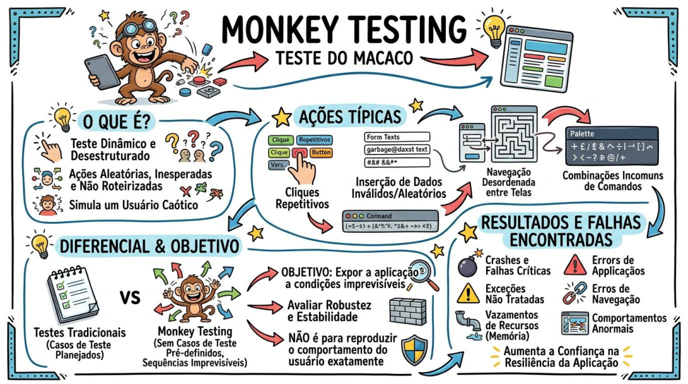

Uma dúvida frequente surge ao analisar essa técnica. O objetivo seria reproduzir exatamente o comportamento dos usuários? Não necessariamente. O propósito principal consiste em expor a aplicação a condições imprevisíveis para identificar fragilidades relacionadas à sua estabilidade e capacidade de tratamento de erros. Dessa forma, tornam-se mais visíveis problemas que poderiam permanecer ocultos em cenários cuidadosamente planejados.

---

<!-- pagina: 72 -->

**Diego Carvalho, Equipe Informática 2 (Diego Carvalho), Equipe Informática 1 (Diego Carvalho) Aula 06** 

Os resultados obtidos ajudam a avaliar a resistência da aplicação diante de eventos inesperados. Que tipos de falha podem ser encontrados? Travamentos, exceções não tratadas, vazamentos de recursos, erros de navegação e comportamentos anormais figuram entre os problemas frequentemente identificados. Por essa razão, o Monkey Testing é utilizado como uma técnica complementar para aumentar a confiança na robustez e na estabilidade do software em condições não convencionais de uso.

---

<!-- pagina: 73 -->

**Diego Carvalho, Equipe Informática 2 (Diego Carvalho), Equipe Informática 1 (Diego Carvalho) Aula 06** 

#### **Teste Alfa e Beta** 

###### **<mark>INCIDÊNCIA EM PROVA: BAIXA</mark>** 

Mesmo após a realização de diversos testes internos, ainda existe uma questão difícil de responder. Os usuários utilizarão o sistema exatamente da forma prevista pela equipe de desenvolvimento? Em muitos casos, não. Usuários podem interpretar instruções de maneira diferente da esperada, combinar informações de formas incomuns ou explorar funcionalidades sob perspectivas que não foram consideradas durante o projeto. Essa realidade explica a importância dos Testes Alfa e Beta dentro do processo de aceitação de software. 

Os testes de aceitação procuram aproximar a avaliação do sistema das condições reais de utilização. Qual é o objetivo dessa aproximação? A intenção consiste em verificar se o produto atende às necessidades dos usuários quando utilizado por pessoas que representam seu público-alvo. Em vez de depender exclusivamente das avaliações realizadas pela equipe de desenvolvimento, o software passa a ser utilizado por indivíduos que interagem com ele de maneira semelhante àquela que ocorrerá após sua implantação. 

Uma das modalidades mais conhecidas é o Teste Alfa. Como ele funciona? Essa etapa ocorre quando o desenvolvimento está próximo da conclusão e envolve a participação de usuários representativos ou clientes em um ambiente controlado. Normalmente, a utilização acontece nas instalações da organização responsável pelo desenvolvimento, permitindo que profissionais da equipe acompanhem a execução dos testes, observem o comportamento dos usuários e registrem eventuais problemas encontrados. 

###### **<mark>TESTE ALFA</mark>** 

Tipo de teste realizado em ambiente controlado pelo próprio desenvolvedor ou fornecedor do software antes de sua liberação para clientes externos. Normalmente envolve usuários internos ou um grupo restrito de participantes e tem como objetivo identificar defeitos, problemas de usabilidade e inconsistências antes da disponibilização pública do produto. 

O ambiente controlado constitui uma das principais características dessa modalidade. Por que isso é importante? Como a equipe responsável pelo produto está próxima dos participantes, torna-se mais fácil observar dificuldades de utilização, esclarecer dúvidas e coletar informações detalhadas sobre os defeitos identificados. Essa proximidade favorece a análise dos problemas e contribui para a realização de ajustes antes da disponibilização do software para um público mais amplo. 

Após essa etapa, costuma-se avançar para os Testes Beta. O que muda nesse momento? O software passa a ser utilizado em ambientes reais de operação, normalmente nas instalações dos próprios usuários ou clientes. Diferentemente do que ocorre no Teste Alfa, a equipe de desenvolvimento não acompanha diretamente todas as atividades realizadas, permitindo que a utilização aconteça em condições mais próximas da realidade operacional. 

###### **<mark>TESTE BETA</mark>** 

Tipo de teste que ocorre após o teste alfa e envolve usuários reais em ambientes de utilização próximos ou idênticos ao ambiente de produção. Seu objetivo é coletar feedback sobre funcionalidades, desempenho e experiência de uso em condições reais, permitindo identificar problemas que não foram detectados nas etapas anteriores. 

Essa mudança de contexto produz benefícios importantes. Que tipo de informação pode ser obtida em um ambiente real? Os usuários passam a interagir com o sistema utilizando seus próprios equipamentos, processos e rotinas de trabalho. Como consequência, podem surgir situações que dificilmente seriam reproduzidas em ambientes controlados. Além da identificação de defeitos, os Testes Beta também

---

<!-- pagina: 74 -->

**Diego Carvalho, Equipe Informática 2 (Diego Carvalho), Equipe Informática 1 (Diego Carvalho) Aula 06** 

permitem avaliar aspectos relacionados à experiência de uso, adequação ao contexto operacional e aceitação do produto. 

Uma dúvida bastante comum envolve a principal diferença entre essas duas modalidades. O que distingue efetivamente o Teste Alfa do Teste Beta? O fator mais importante é o ambiente de execução. O Teste Alfa ocorre em ambiente controlado, normalmente com acompanhamento da organização desenvolvedora. O Teste Beta ocorre em ambiente real de utilização, com menor interferência da equipe responsável pelo produto e maior proximidade das condições que serão encontradas após a implantação definitiva. 

**(VUNESP / EsFCEx - 2024)** Considerando diferentes técnicas de teste de validação de software, <mark>enquadram-se os denominados testes alfa e testes beta, sendo correto que os testes do tipo</mark> 

<mark>a) beta não têm a participação de usuários finais do software. b) alfa aplicam-se exclusivamente a sistemas voltados para a Internet. c) beta não são aplicados a sistemas produzidos com linguagens orientadas a objetos. d) alfa são realizados nas instalações da equipe de desenvolvimento do software. e) alfa são realizados em instalações especiais contratadas junto a terceiros, denominadas AlfaTeste.</mark> 

**<mark>_______________________ Comentários:</mark>** <mark>(a) Errado. Testes beta costumam envolver usuários finais em ambiente mais próximo do uso real, por isso a afirmação contraria essa característica. (b) Errado. Testes alfa não se restringem a sistemas para Internet; podem ser empregados em diferentes tipos de software. (c) Errado. Testes beta não dependem do paradigma da linguagem usada no desenvolvimento, inclusive podendo ocorrer em sistemas orientados a objetos. (d) Correto. Testes alfa são conduzidos nas instalações da própria equipe de desenvolvimento, em ambiente controlado antes da liberação mais ampla. (e) Errado. Não há vínculo necessário com instalações terceirizadas chamadas</mark> “AlfaTeste”; o teste alfa ocorre, em regra, no ambiente do desenvolvedor. (Letra D) 

Essas duas modalidades desempenham papel relevante no processo de aceitação do software. Elas permitem identificar problemas que dificilmente seriam encontrados apenas por desenvolvedores ou testadores e fornecem evidências adicionais de que o sistema está preparado para ser disponibilizado aos usuários finais. Dessa forma, complementam os demais níveis de teste ao incorporar a perspectiva daqueles que efetivamente utilizarão o produto em seu contexto de operação. 

###### **Saiba mais:** 

<mark>Um evento tático na Engenharia de Software no estágio final antes do lançamento final global ocorre por meio do que se convenciona denominar de Soft Launch. Nessa estratégia, muito atrelada ao modelo de Teste Beta, o aplicativo — mesmo funcional ou contendo um nível reduzido de instabilidades ocultas —, não é distribuído a toda a base (e à concorrência global).</mark> 

<mark>A equipe recorta apenas um nicho bastante seleto e geograficamente reduzido de testadores de rua e usuários leigos em produção (que desconhecem plenamente o ambiente real do App). Estes agem sob total ausência de scripts predeterminados para capturar a quebra comportamental, as</mark> anomalias imprevistas em interfaces e bugs de concorrência massivos de acessos randômicos.

---

<!-- pagina: 75 -->

**Diego Carvalho, Equipe Informática 2 (Diego Carvalho), Equipe Informática 1 (Diego Carvalho) Aula 06** 

---

<!-- pagina: 76 -->

**Diego Carvalho, Equipe Informática 2 (Diego Carvalho), Equipe Informática 1 (Diego Carvalho) Aula 06** 

#### **Teste de Compatibilidade** 

###### **<mark>INCIDÊNCIA EM PROVA: BAIXÍSSIMA</mark>** 

###### **<mark>TESTE DE COMPATIBILIDADE</mark>** 

O Teste de Compatibilidade é um tipo de teste que verifica se o software funciona corretamente em diferentes ambientes de hardware, sistemas operacionais, navegadores, dispositivos, bancos de dados ou configurações de rede. Seu objetivo é garantir que a aplicação mantenha comportamento consistente independentemente da <u>plataforma utilizada pelo usuário.</u> 

O desenvolvimento de um software não termina quando suas funcionalidades passam a operar corretamente em um único ambiente. O que acontece quando a aplicação é executada em computadores diferentes, sistemas operacionais distintos ou navegadores variados? Mesmo que o software funcione adequadamente durante o desenvolvimento, diferenças existentes entre os ambientes de execução podem produzir comportamentos inesperados após sua disponibilização aos usuários. Essa preocupação dá origem aos chamados Testes de Compatibilidade. 

Os ambientes tecnológicos apresentam uma grande diversidade de configurações. Quais elementos podem influenciar a execução de uma aplicação? Hardware, sistemas operacionais, navegadores, dispositivos móveis, versões de bibliotecas, configurações de rede e diversos outros componentes podem alterar a forma como o software se comporta. Como consequência, funcionalidades que operam normalmente em determinado ambiente podem apresentar falhas ou limitações em outro. 

Essas diferenças nem sempre produzem problemas graves. Seria toda incompatibilidade capaz de impedir a utilização do sistema? Não. Em alguns casos, os efeitos são pequenos e afetam apenas aspectos secundários da aplicação. Em outros, entretanto, podem surgir falhas significativas, como indisponibilidade de recursos, erros de execução, problemas de apresentação visual ou limitações que comprometem diretamente a utilização do software pelos usuários. 

É justamente para identificar essas situações que o Teste de Compatibilidade é realizado. Qual é seu objetivo principal? Verificar se o sistema consegue operar adequadamente nos diferentes ambientes para os quais foi projetado. A intenção é identificar incompatibilidades antes que a aplicação seja disponibilizada aos usuários, reduzindo riscos associados à diversidade tecnológica encontrada em ambientes reais de utilização. 

Uma dúvida comum envolve os aspectos avaliados durante esse tipo de teste. O foco está apenas na execução das funcionalidades? Não. Embora a verificação funcional seja importante, também podem ser observados elementos relacionados à apresentação visual, integração com componentes externos, comportamento da interface e disponibilidade dos recursos oferecidos pela aplicação. O objetivo é confirmar que a experiência de utilização permanece adequada em diferentes configurações. 

Considere uma aplicação web acessada por milhares de usuários. O que aconteceria se determinadas funcionalidades operassem corretamente em um navegador, mas apresentassem falhas em outro? Situações desse tipo ilustram a importância dos Testes de Compatibilidade. Mesmo com a evolução dos padrões tecnológicos e a maior uniformidade entre navegadores modernos, ainda podem existir diferenças capazes de afetar o comportamento do sistema em ambientes específicos. 

Outro aspecto importante envolve a distinção entre compatibilidade e desempenho. Um problema de lentidão caracteriza necessariamente uma incompatibilidade? Nem sempre. Questões relacionadas a tempo de resposta e utilização de recursos costumam estar mais associadas aos Testes de Desempenho. Entretanto, durante os Testes de Compatibilidade, diferenças entre ambientes podem revelar comportamentos que afetam indiretamente a eficiência da aplicação e merecem investigação adicional.

---

<!-- pagina: 77 -->

**Diego Carvalho, Equipe Informática 2 (Diego Carvalho), Equipe Informática 1 (Diego Carvalho) Aula 06** 

A execução desses testes pode ocorrer de diferentes maneiras. Seria necessário realizar todas as verificações manualmente? Não. Dependendo do contexto, podem ser utilizadas ferramentas de automação capazes de reproduzir cenários em múltiplas plataformas e configurações. Em muitos projetos, combina-se a automação com avaliações manuais para ampliar a cobertura e aumentar a confiabilidade dos resultados obtidos. 

Os Testes de Compatibilidade desempenham papel importante na garantia da qualidade do software porque ajudam a assegurar que a aplicação funcione adequadamente nos ambientes para os quais foi planejada. Ao identificar problemas relacionados a configurações específicas antes da implantação, essa modalidade de teste contribui para reduzir falhas em produção e melhorar a experiência dos usuários em diferentes contextos tecnológicos. 

---

<!-- pagina: 78 -->

**Diego Carvalho, Equipe Informática 2 (Diego Carvalho), Equipe Informática 1 (Diego Carvalho) Aula 06** 

#### **Teste de Configuração** 

###### **<mark>INCIDÊNCIA EM PROVA: BAIXÍSSIMA</mark>** 

###### **<mark>TESTE DE CONFIGURAÇÃO</mark>** 

Tipo de teste não funcional que avalia a capacidade de um software de ser transferido, instalado, adaptado ou executado corretamente em diferentes ambientes de hardware, sistemas operacionais, navegadores, bancos de dados ou plataformas tecnológicas. Seu objetivo é verificar se o sistema mantém seu funcionamento adequado quando utilizado em contextos distintos daqueles para os quais foi originalmente desenvolvido, identificando problemas de compatibilidade, configuração ou dependências específicas. Esse teste contribui para garantir que o software possa ser implantado e operado com o mínimo de esforço em múltiplos ambientes, ampliando sua flexibilidade e alcance de utilização. 

O Teste de Configuração é uma modalidade de teste não funcional utilizada para avaliar o comportamento do software em diferentes combinações de ambientes tecnológicos. O que se procura verificar nessa avaliação? O objetivo consiste em analisar se a aplicação mantém seu funcionamento adequado quando executada em diferentes configurações de hardware, sistemas operacionais, navegadores, dispositivos, bibliotecas e parâmetros de execução. Essa análise ajuda a identificar incompatibilidades e dependências que poderiam comprometer o uso do sistema em determinados ambientes. 

Diversos fatores podem variar entre os cenários avaliados. Quais elementos costumam ser considerados durante os testes? Entre os exemplos mais comuns estão versões distintas de sistemas operacionais, navegadores, bancos de dados, componentes de infraestrutura e recursos de hardware. A comparação dos resultados obtidos em cada configuração permite verificar se o comportamento da aplicação permanece consistente independentemente do ambiente utilizado. 

Uma dúvida frequente surge ao analisar a necessidade dessa abordagem. Se o software funciona corretamente durante o desenvolvimento, por que testá-lo em outras configurações? Porque diferenças presentes no ambiente de execução podem introduzir comportamentos inesperados que não foram observados anteriormente. Dependências específicas, incompatibilidades de versões e limitações de determinados componentes podem afetar o funcionamento do sistema mesmo quando sua implementação está correta. 

---

<!-- pagina: 79 -->

**Diego Carvalho, Equipe Informática 2 (Diego Carvalho), Equipe Informática 1 (Diego Carvalho) Aula 06** 

No desenvolvimento de aplicações móveis, essa modalidade assume importância ainda maior. O que torna esse cenário particularmente desafiador? Existe uma grande diversidade de dispositivos, resoluções de tela, capacidades de processamento, versões de sistemas operacionais e recursos de hardware disponíveis no mercado. Como consequência, uma aplicação pode apresentar comportamentos distintos dependendo do aparelho utilizado pelo usuário. 

Nesses ambientes, o Teste de Configuração permite avaliar como diferentes características dos dispositivos influenciam a operação do software. Quais aspectos podem ser observados? Funcionalidades da aplicação, estabilidade, compatibilidade com sensores, comportamento diante de limitações de recursos e resposta a eventos como perda de conectividade ou interrupções do sistema operacional figuram entre os elementos frequentemente analisados. Essas verificações fornecem evidências sobre a capacidade da aplicação de operar adequadamente em diferentes condições de uso. 

Os resultados obtidos contribuem para reduzir riscos durante a implantação e utilização do software. Qual é a principal contribuição dessa abordagem? A identificação antecipada de incompatibilidades e dependências específicas permite corrigir problemas antes que eles afetem os usuários finais. Dessa forma, torna-se possível ampliar a confiabilidade da aplicação e aumentar sua capacidade de operar de forma consistente em ambientes heterogêneos.

---

<!-- pagina: 80 -->

**Diego Carvalho, Equipe Informática 2 (Diego Carvalho), Equipe Informática 1 (Diego Carvalho) Aula 06** 

#### **Teste de Portabilidade** 

###### **<mark>INCIDÊNCIA EM PROVA: BAIXÍSSIMA</mark>** 

###### **<mark>TESTE DE PORTABILIDADE</mark>** 

Tipo de teste não funcional que avalia a capacidade de um software de ser transferido, instalado, adaptado ou executado corretamente em diferentes ambientes de hardware, sistemas operacionais, navegadores, bancos de dados ou plataformas tecnológicas. Seu objetivo é verificar se o sistema mantém seu funcionamento adequado quando utilizado em contextos distintos daqueles para os quais foi originalmente desenvolvido, identificando problemas de compatibilidade, configuração ou dependências específicas. Esse teste contribui para garantir que o software possa ser implantado e operado com o mínimo de esforço em múltiplos ambientes, ampliando sua flexibilidade e alcance de utilização. 

O Teste de Portabilidade é uma modalidade de teste não funcional utilizada para avaliar a capacidade de um software de operar adequadamente em diferentes ambientes tecnológicos. O que se procura verificar nessa avaliação? O objetivo consiste em analisar se a aplicação pode ser instalada, configurada, adaptada e executada em plataformas distintas sem comprometer seu funcionamento esperado. Essa verificação é importante em sistemas que precisam atender usuários distribuídos em diferentes contextos tecnológicos. 

Diversos elementos podem variar entre os ambientes analisados. Quais fatores costumam ser considerados durante os testes? Sistemas operacionais, navegadores, dispositivos, bancos de dados, versões de bibliotecas, configurações de hardware e plataformas de execução figuram entre os aspectos mais frequentemente avaliados. A análise desses fatores permite identificar incompatibilidades que poderiam impedir ou dificultar a utilização do software em determinados cenários. 

Uma dúvida comum surge ao estudar essa modalidade. Se o sistema funciona corretamente em seu ambiente original, por que avaliar outros contextos? Porque diferenças tecnológicas podem provocar comportamentos inesperados, falhas de instalação, erros de configuração ou incompatibilidades que não se manifestam durante o desenvolvimento. Os testes de portabilidade ajudam a identificar essas limitações antes que o software seja disponibilizado para ambientes distintos. 

---

<!-- pagina: 81 -->

**Diego Carvalho, Equipe Informática 2 (Diego Carvalho), Equipe Informática 1 (Diego Carvalho) Aula 06** 

A portabilidade envolve mais do que a simples execução da aplicação. Quais características também fazem parte desse conceito? Além da capacidade de funcionamento em diferentes plataformas, são frequentemente avaliados aspectos relacionados à facilidade de instalação, adaptação e migração entre ambientes tecnológicos. Essas características contribuem para reduzir o esforço necessário para disponibilizar o software em novos contextos de utilização. 

Os resultados obtidos durante essa avaliação auxiliam na ampliação do alcance da aplicação. Qual é a principal contribuição dos testes de portabilidade? A identificação antecipada de problemas de compatibilidade e dependências específicas permite que ajustes sejam realizados antes da implantação em diferentes ambientes. Com isso, torna-se mais viável disponibilizar o software para um conjunto mais amplo de plataformas e usuários, mantendo níveis adequados de funcionamento e qualidade.

---

<!-- pagina: 82 -->

**Diego Carvalho, Equipe Informática 2 (Diego Carvalho), Equipe Informática 1 (Diego Carvalho) Aula 06** 

#### **Teste de Comparação** 

###### **<mark>INCIDÊNCIA EM PROVA: BAIXÍSSIMA</mark>** 

###### **<mark>TESTE DE COMPARAÇÃO</mark>** 

Tipo de teste que consiste em executar duas ou mais versões de um sistema, ou soluções equivalentes, utilizando os mesmos dados de entrada para comparar seus resultados. Essa abordagem é útil para validar migrações, substituições de sistemas legados ou implementações alternativas, verificando se os comportamentos <u>permanecem consistentes.</u> 

A substituição ou modernização de sistemas representa um desafio frequente em projetos de software. Como garantir que uma nova versão da aplicação continua produzindo os resultados esperados após mudanças de tecnologia, arquitetura ou plataforma? Uma das estratégias utilizadas para responder a essa questão é o Teste de Comparação, também conhecido como Back-to-Back Testing. Seu objetivo consiste em avaliar o comportamento de versões distintas de um mesmo sistema por meio da execução dos mesmos cenários de teste. 

O funcionamento dessa abordagem é relativamente simples. O que acontece durante a execução do teste? As diferentes versões da aplicação recebem exatamente as mesmas entradas e são submetidas às mesmas condições operacionais. Em seguida, os resultados produzidos são comparados para identificar possíveis divergências de comportamento, inconsistências funcionais ou diferenças relevantes entre as implementações analisadas. 

Essa técnica é especialmente útil em processos de migração e modernização. Por que isso ocorre? Muitas organizações substituem sistemas antigos por versões desenvolvidas com tecnologias mais recentes, novas arquiteturas ou diferentes mecanismos de armazenamento de dados. Nesses cenários, torna-se importante verificar se a nova solução preserva os comportamentos esperados ou se as diferenças observadas correspondem a alterações planejadas durante o projeto. 

Uma dúvida comum envolve os resultados da comparação. As duas versões precisam produzir exatamente as mesmas respostas? Nem sempre. Em alguns casos, o objetivo é reproduzir fielmente o comportamento da aplicação anterior. Em outros, a nova versão pode introduzir melhorias ou mudanças deliberadas. Nessa situação, a finalidade do teste passa a ser identificar as diferenças existentes e verificar se elas são compatíveis com os requisitos definidos para a evolução do sistema. 

Além das funcionalidades, outros aspectos também podem ser avaliados. A comparação limita-se apenas às saídas produzidas? Não necessariamente. Dependendo dos objetivos do projeto, podem ser analisados tempos de resposta, consumo de recursos e outros indicadores de desempenho. Entretanto, a comparação funcional costuma representar o foco principal dessa modalidade de teste. 

Ao término da execução, os resultados normalmente são consolidados em relatórios de análise. Qual é a finalidade desses documentos? Eles permitem identificar discrepâncias entre as versões avaliadas, registrar comportamentos divergentes e fornecer subsídios para decidir se as diferenças encontradas são aceitáveis ou se exigem correções antes da implantação da nova solução. 

Uma confusão frequente ocorre entre Teste de Comparação e Teste de Regressão. Como distinguir essas duas abordagens? O Teste de Regressão procura verificar se modificações introduziram defeitos em funcionalidades que anteriormente funcionavam corretamente. Já o Teste de Comparação executa os mesmos cenários em versões diferentes do sistema e analisa os resultados produzidos por cada uma delas. Enquanto a regressão busca detectar efeitos colaterais de alterações, a comparação procura identificar diferenças de comportamento entre implementações distintas.

---

<!-- pagina: 83 -->

**Diego Carvalho, Equipe Informática 2 (Diego Carvalho), Equipe Informática 1 (Diego Carvalho) Aula 06** 

Essa distinção é particularmente importante em avaliações e concursos da área de Engenharia de Software. O elemento central do Teste de Comparação está na execução paralela dos mesmos casos de teste em versões diferentes da aplicação, seguida da análise sistemática dos resultados obtidos. Dessa forma, torna-se possível avaliar com maior segurança o impacto de migrações, reescritas e modernizações de sistemas. 

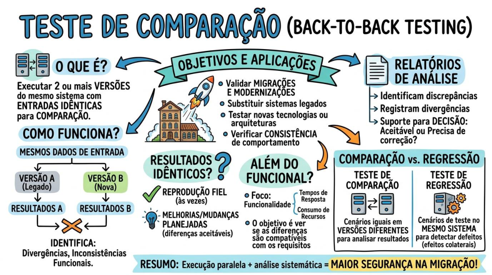

---

<!-- pagina: 84 -->

**Diego Carvalho, Equipe Informática 2 (Diego Carvalho), Equipe Informática 1 (Diego Carvalho) Aula 06** 

#### **Teste de Recuperação** 

###### **<mark>INCIDÊNCIA EM PROVA: BAIXÍSSIMA</mark>** 

###### **<mark>TESTE DE RECUPERAÇÃO</mark>** 

Tipo de teste que avalia a capacidade do sistema de restaurar seu funcionamento normal após falhas, interrupções ou situações de desastre. São simulados eventos como falhas de hardware, perda de comunicação, interrupção de energia ou corrupção de dados, verificando-se a eficácia dos mecanismos de backup, recuperação e continuidade operacional. 

A ocorrência de falhas é uma possibilidade presente em qualquer sistema computacional. O que acontece quando um servidor deixa de responder, um banco de dados sofre uma interrupção ou um componente crítico apresenta defeito? Em muitos casos, o funcionamento do sistema não pode permanecer interrompido por longos períodos. Por esse motivo, a Engenharia de Software dedica atenção especial à capacidade de recuperação das aplicações por meio dos chamados Testes de Recuperação. 

Nem todos os sistemas possuem os mesmos requisitos de disponibilidade. Uma interrupção temporária seria aceitável em qualquer situação? Não necessariamente. Alguns sistemas podem tolerar pequenos períodos de indisponibilidade, enquanto outros precisam continuar operando mesmo diante de falhas ou retornar ao funcionamento em intervalos extremamente curtos. Essa necessidade torna essencial a avaliação dos mecanismos responsáveis pela recuperação do ambiente após eventos inesperados. 

O Teste de Recuperação procura verificar justamente essa capacidade. Como essa avaliação é realizada? São simuladas situações capazes de comprometer a operação normal do software, como falhas de hardware, interrupções de serviços, indisponibilidade de recursos ou erros de processamento. Após a ocorrência dessas falhas, observa-se se o sistema consegue restaurar seu funcionamento de forma adequada e dentro dos limites estabelecidos para sua operação. 

Uma dúvida frequente envolve o objetivo desse tipo de teste. A finalidade seria apenas provocar falhas no sistema? Não. A geração de falhas representa apenas o ponto de partida da avaliação. O foco principal está na análise dos mecanismos de recuperação e na verificação de que o sistema consegue retornar a um estado operacional aceitável após a interrupção. Em outras palavras, o interesse não está na falha em si, mas na capacidade de recuperação demonstrada posteriormente. 

A forma de recuperação pode variar de acordo com a arquitetura da solução. O que acontece quando o próprio sistema realiza a recuperação? Nesses casos, são avaliados mecanismos como reinicialização automática de serviços, detecção de falhas, restauração de dados e retomada das operações. O objetivo é verificar se essas funcionalidades operam corretamente e conseguem restabelecer o ambiente sem necessidade de intervenção humana. 

Existem também cenários em que a recuperação depende da atuação de profissionais responsáveis pela operação do sistema. Como avaliar a eficiência desse processo? Uma das métricas frequentemente utilizadas é o Tempo Médio de Reparo, conhecido pela sigla MTTR (Mean Time To Repair). Essa medida permite verificar quanto tempo é necessário para restaurar o funcionamento da aplicação após a ocorrência de uma falha. Em alguns contextos, também podem ser avaliados indicadores relacionados ao tempo máximo de recuperação e à quantidade aceitável de dados perdidos. 

Considere uma aplicação financeira que processa transações continuamente ao longo do dia. O que ocorreria se uma falha interrompesse seu funcionamento? Além da necessidade de restaurar rapidamente a operação, seria importante verificar se os dados permanecem consistentes e se as transações podem ser retomadas sem comprometer a integridade das informações. Situações como essa

---

<!-- pagina: 85 -->

**Diego Carvalho, Equipe Informática 2 (Diego Carvalho), Equipe Informática 1 (Diego Carvalho) Aula 06** 

ilustram a relevância dos Testes de Recuperação em ambientes nos quais disponibilidade e confiabilidade possuem papel fundamental. 

Essa modalidade de teste contribui diretamente para a avaliação da robustez do sistema. Ao verificar como a aplicação reage diante de falhas e como recupera suas funcionalidades após eventos adversos, os Testes de Recuperação fornecem evidências importantes sobre a capacidade do software de manter a continuidade operacional e atender aos requisitos de disponibilidade definidos para seu ambiente de utilização. 

Por fim, para garantir e aumentar a resiliência de uma aplicação — especialmente ao ser submetida a cenários de alto estresse — a adoção de padrões de arquitetura de software específicos é fundamental. O uso de cache é uma estratégia essencial que armazena dados de acessos frequentes em memória, reduzindo a dependência e a carga sobre bancos de dados ou serviços lentos. 

Já a implementação de mecanismos de fallback garante que, diante de uma falha em um serviço principal (por exemplo, a queda de uma API externa), o sistema seja capaz de fornecer uma resposta alternativa ou um comportamento degradado de forma elegante, mantendo o serviço disponível e minimizando o impacto negativo para o usuário final. 

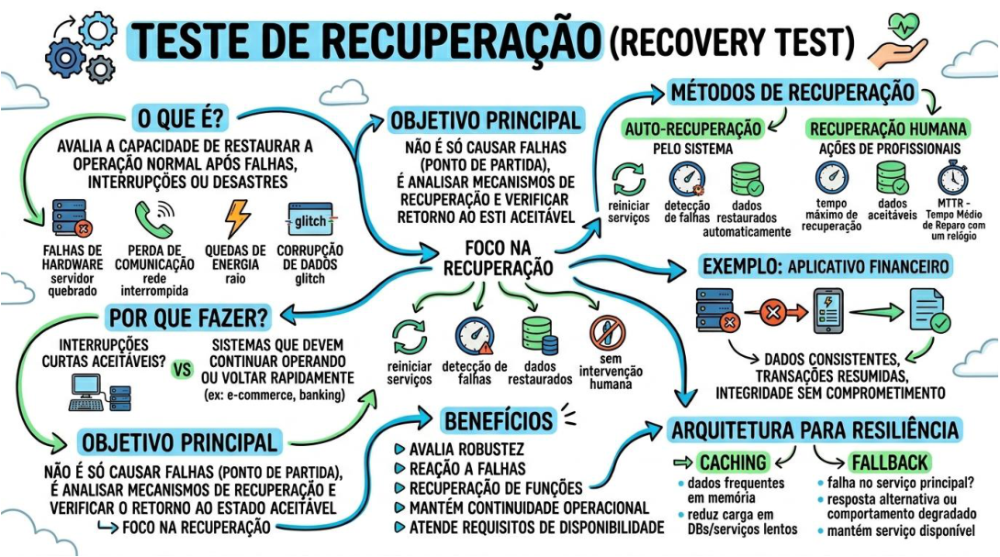

---

<!-- pagina: 86 -->

**Diego Carvalho, Equipe Informática 2 (Diego Carvalho), Equipe Informática 1 (Diego Carvalho) Aula 06** 

#### **Teste de Contrato** 

###### **<mark>INCIDÊNCIA EM PROVA: BAIXÍSSIMA</mark>** 

###### **<mark>TESTE DE CONTRATO</mark>** 

Tipo de teste utilizado para verificar se a comunicação entre sistemas continua aderente ao contrato previamente estabelecido entre consumidores e provedores de serviços. Em vez de avaliar a implementação interna das aplicações, seu foco está na validação das interfaces de integração, incluindo endpoints, métodos, parâmetros, formatos de requisição e resposta, tipos de dados e códigos de retorno. Seu objetivo é identificar incompatibilidades e alterações que possam quebrar a comunicação entre sistemas antes que elas cheguem aos <mark>ambientes de homologação ou produção.</mark> 

A comunicação entre sistemas tornou-se um dos elementos centrais das arquiteturas modernas de software. O que acontece quando uma aplicação depende de informações fornecidas por outra aplicação por meio de uma API? Nessa situação, qualquer alteração realizada por uma das partes pode impactar diretamente os demais sistemas que utilizam essa interface. À medida que o número de integrações aumenta, cresce também a necessidade de garantir que a comunicação permaneça estável durante a evolução das aplicações. 

Para lidar com esse desafio, utiliza-se o conceito de contrato. O que exatamente representa um contrato em uma integração entre sistemas? Trata-se de um acordo formal que define como a comunicação deve ocorrer. Esse acordo especifica endpoints disponíveis, métodos HTTP, parâmetros aceitos, formato das requisições, estrutura das respostas, tipos de dados, códigos de retorno e demais características necessárias para a interação entre consumidores e provedores de serviços. 

A existência desse acordo reduz ambiguidades e facilita a colaboração entre equipes. Por que isso é importante? Quando cada sistema conhece exatamente o formato das mensagens que deve enviar e receber, diminui-se o risco de interpretações divergentes e incompatibilidades durante o desenvolvimento. O contrato passa a funcionar como uma referência comum para implementação, documentação e validação das integrações. 

Uma situação bastante comum ocorre quando um serviço modifica sua API sem considerar os impactos sobre os consumidores. O que pode acontecer nesse cenário? Alterações aparentemente simples, como a mudança do nome de um campo, a modificação de um tipo de dado ou a alteração de um código de resposta, podem provocar falhas em sistemas que dependem daquela interface. Em muitos casos, esses problemas somente são percebidos quando a nova versão já foi disponibilizada em ambientes compartilhados. 

Foi justamente para reduzir esse risco que surgiram os Testes de Contrato. Qual é o objetivo dessa modalidade de teste? A finalidade consiste em verificar se os sistemas continuam respeitando o acordo estabelecido para a comunicação entre eles. Em vez de avaliar a implementação interna das aplicações, esses testes concentram-se na conformidade das interfaces e na compatibilidade entre consumidores e provedores. 

Uma dúvida frequente surge nesse ponto. Os Testes de Contrato substituem os Testes de Integração? Não. Embora ambos estejam relacionados à comunicação entre sistemas, suas finalidades são distintas. Os Testes de Integração verificam se aplicações reais conseguem interagir corretamente quando executadas em conjunto. Já os Testes de Contrato procuram validar se existe compatibilidade entre as interfaces definidas e implementadas, mesmo antes da execução integrada dos sistemas. 

Os contratos costumam ser formalizados por meio de especificações amplamente utilizadas na indústria. Como essas definições são documentadas? Uma das abordagens mais comuns utiliza a especificação OpenAPI, frequentemente manipulada por ferramentas do ecossistema Swagger. Essas definições

---

<!-- pagina: 87 -->

**Diego Carvalho, Equipe Informática 2 (Diego Carvalho), Equipe Informática 1 (Diego Carvalho) Aula 06** 

descrevem de maneira estruturada os recursos disponibilizados pela API e servem como base para validações automatizadas de conformidade. 

Entre as estratégias de validação existentes destaca-se o Provider Contract Testing. O que é verificado nessa abordagem? O foco está no provedor da API. Os testes procuram confirmar que a implementação disponibilizada corresponde ao contrato publicado, verificando elementos como endpoints, parâmetros, formatos de dados e respostas previstas. Dessa forma, alterações incompatíveis podem ser identificadas antes de afetar os consumidores. 

Outra estratégia bastante difundida é o Consumer-Driven Contract Testing, frequentemente conhecido pela sigla CDC. O que muda nessa abordagem? Nesse modelo, os próprios consumidores definem contratos que descrevem as interações das quais dependem. O provedor deve então demonstrar que continua compatível com todos esses contratos. Essa característica é particularmente útil em arquiteturas de microsserviços, nas quais diversos consumidores dependem simultaneamente de uma mesma API. 

Uma das vantagens do CDC está na redução das dependências entre equipes. Seria necessário executar todos os sistemas envolvidos para validar uma integração? Em muitos cenários, não. A validação pode ser realizada a partir dos contratos estabelecidos, permitindo que consumidores e provedores evoluam de forma mais independente. Isso favorece ciclos de entrega mais rápidos e reduz o risco de conflitos durante a integração contínua. 

Os Testes de Contrato tornaram-se especialmente relevantes em ambientes que utilizam microsserviços e práticas de CI/CD. Ao identificar incompatibilidades ainda nas fases iniciais do desenvolvimento, esses testes ajudam a evitar breaking changes, aumentam a confiabilidade das integrações e reduzem a ocorrência de falhas em ambientes de homologação e produção. Dessa forma, contribuem para que a comunicação entre sistemas permaneça consistente mesmo diante da evolução contínua das aplicações. 

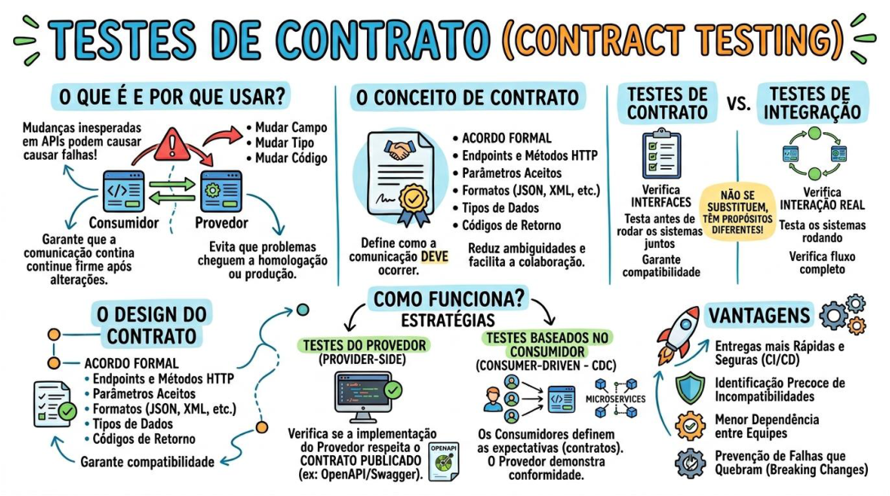

---

<!-- pagina: 88 -->

**Diego Carvalho, Equipe Informática 2 (Diego Carvalho), Equipe Informática 1 (Diego Carvalho) Aula 06** 

#### **Teste de Conformidade** 

###### **<mark>INCIDÊNCIA EM PROVA: BAIXÍSSIMA</mark>** 

###### **<mark>TESTE DE CONFORMIDADE</mark>** 

Também chamado de Compliance Testing, trata-se de um tipo de teste não-funcional que verifica se o software atende e está aderente a padrões corporativos, normas internacionais, regulamentos da indústria ou requisitos legais e governamentais (como LGPD, GDPR, normas ISO, ou padrões de acessibilidade WCAG). Diferente dos testes que validam as regras de negócio intrínsecas ao produto, o teste de conformidade atua como uma auditoria, garantindo que o sistema evite sanções legais e respeite os atributos e diretrizes exigidos pelo mercado <mark>em que será inserido.</mark> 

O Teste de Conformidade, conhecido como Compliance Testing, é uma modalidade de teste não funcional utilizada para verificar se o software atende às normas, regulamentos, políticas e requisitos aplicáveis ao seu contexto de utilização. Qual é o foco principal dessa avaliação? Em vez de analisar diretamente as funcionalidades do sistema, o objetivo consiste em verificar sua aderência a exigências estabelecidas por legislações, órgãos reguladores, contratos, padrões corporativos ou normas técnicas. 

Diversos referenciais podem servir como base para essa análise. Quais tipos de exigência costumam ser avaliados? Dependendo do contexto, podem ser considerados requisitos relacionados à proteção de dados, acessibilidade, qualidade, segurança da informação, governança ou regulamentações específicas de determinados setores. Normas como LGPD, GDPR, ISO e WCAG figuram entre os exemplos mais frequentemente associados a esse tipo de verificação. 

Uma dúvida comum surge ao comparar os testes de conformidade com os testes funcionais. Ambos procuram verificar requisitos do sistema? Sim, porém sob perspectivas diferentes. Os testes funcionais concentram-se no comportamento esperado das funcionalidades, enquanto os testes de conformidade analisam se o software respeita regras, padrões e obrigações que podem ser impostas por organizações, contratos ou regulamentações externas ao produto. 

---

<!-- pagina: 89 -->

**Diego Carvalho, Equipe Informática 2 (Diego Carvalho), Equipe Informática 1 (Diego Carvalho) Aula 06** 

Os resultados obtidos durante essa avaliação auxiliam na gestão de riscos relacionados à utilização do sistema. Qual é a principal contribuição dessa abordagem? A identificação de situações de não conformidade permite que ajustes sejam realizados antes da implantação ou da disponibilização do software. Com isso, a organização reduz a exposição a riscos regulatórios, contratuais e operacionais associados ao descumprimento de requisitos obrigatórios. 

Em muitos contextos, essa atividade apresenta características semelhantes às encontradas em processos de auditoria. Como isso ocorre na prática? As evidências coletadas durante os testes permitem demonstrar o grau de aderência do sistema aos requisitos estabelecidos, fornecendo informações úteis para avaliações internas, auditorias externas e processos de certificação. Dessa forma, torna-se possível verificar se a aplicação atende aos padrões exigidos para sua utilização em determinado ambiente ou setor de mercado. 

<!-- Start of picture text -->
==5460== <!-- End of picture text -->

---

<!-- pagina: 90 -->

**Diego Carvalho, Equipe Informática 2 (Diego Carvalho), Equipe Informática 1 (Diego Carvalho) Aula 06** 

#### **Teste de Lançamento** 

###### **<mark>INCIDÊNCIA EM PROVA: BAIXÍSSIMA</mark>** 

###### **<mark>TESTE DE LANÇAMENTO</mark>** 

Também chamado de Release Testing, são testes realizados em uma versão completa e integrada do software pouco antes de sua disponibilização para os usuários finais. Seu objetivo é verificar se o sistema atende aos requisitos funcionais e não funcionais especificados, avaliando seu comportamento em condições que simulam o ambiente real de operação. Diferentemente dos testes executados pelos desenvolvedores durante a construção do sistema, os testes de lançamento são conduzidos com foco na validação do produto como um todo, buscando identificar defeitos remanescentes, confirmar a estabilidade da versão e fornecer evidências de <u>que o software está apto para ser liberado para produção.</u> 

Os Testes de Lançamento(conhecidos como Release Testing) são realizados sobre uma versão completa e integrada do software que foi preparada para possível disponibilização aos usuários. O que se busca verificar nessa etapa? O objetivo é avaliar se o sistema atende aos requisitos funcionais e não funcionais estabelecidos, observando seu comportamento em condições que representem o ambiente real de operação. Essa avaliação permite analisar o produto em uma situação próxima daquela que será encontrada após sua implantação. 

Uma dúvida comum surge ao comparar essa atividade com os testes realizados ao longo do desenvolvimento. Se o software já foi testado anteriormente, por que executar novos testes? Porque os testes de lançamento possuem um foco diferente. Em vez de avaliar componentes ou funcionalidades de forma isolada, eles examinam o sistema como um produto integrado, considerando a interação entre seus diversos elementos e seu comportamento em cenários mais próximos do uso real. 

Outro aspecto importante está relacionado à preparação para a liberação da versão. Seria suficiente confirmar apenas que as funcionalidades estão operando corretamente? A resposta é negativa, pois também é necessário verificar características como estabilidade, confiabilidade e aderência aos requisitos não funcionais. Dessa forma, os testes de lançamento contribuem para identificar defeitos que

---

<!-- pagina: 91 -->

**Diego Carvalho, Equipe Informática 2 (Diego Carvalho), Equipe Informática 1 (Diego Carvalho) Aula 06** 

permaneceram ocultos em etapas anteriores e que podem comprometer a utilização do sistema em produção. 

Os resultados obtidos nessa atividade fornecem informações relevantes para a decisão de liberar ou não uma determinada versão. De que maneira essas evidências auxiliam esse processo? Ao reunir dados sobre o comportamento do software em sua configuração integrada, torna-se possível avaliar seu nível de prontidão para implantação. Com isso, a organização dispõe de uma base mais consistente para decidir se a versão atende aos critérios necessários para ser disponibilizada aos usuários. 

**(CEBRASPE / FUB - 2025)** A respeito dos processos de desenvolvimento de software cascata e <mark>iterativo, de projeto de software orientado a objetos, de testes e de validação de software, julgue o item a seguir.</mark> 

<mark>O teste de lançamento limita-se à verificação de novas funcionalidades de um release, sem a necessidade de reexecução de testes em funcionalidades já existentes.</mark> 

**<mark>_______________________ Comentários:</mark>** <mark>o teste de lançamento não se restringe só às novas funções; ele também envolve reexecutar testes em funcionalidades</mark> existentes para verificar se o release não afetou o que já funcionava. (Errado)

---

<!-- pagina: 92 -->

**Diego Carvalho, Equipe Informática 2 (Diego Carvalho), Equipe Informática 1 (Diego Carvalho) Aula 06** 

#### **Teste de Desempenho** 

###### **<mark>INCIDÊNCIA EM PROVA: MÉDIA</mark>** 

###### **<mark>TESTE DE DESEMPENHO</mark>** 

Tipo de teste que avalia a capacidade do sistema de responder adequadamente sob determinadas condições de carga e utilização. Seu objetivo é medir atributos como tempo de resposta, throughput, utilização de recursos e escalabilidade. Inclui modalidades como testes de carga, estresse, volume e resistência, permitindo identificar <u>gargalos e limitações da aplicação.</u> 

Os Testes de Desempenho, conhecidos como Performance Testing, constituem uma categoria de testes não funcionais voltada à avaliação do comportamento do sistema sob diferentes condições de utilização. O que se procura analisar nessa modalidade? O foco está em métricas como tempo de resposta, taxa de processamento de transações ou requisições, consumo de recursos computacionais e estabilidade operacional. Essas informações permitem verificar como o software se comporta quando submetido a diferentes níveis de demanda. 

Uma dúvida frequente surge ao comparar os testes de desempenho com os testes funcionais. Se as funcionalidades já operam corretamente, por que realizar essa avaliação? Porque um sistema pode produzir resultados corretos e, ainda assim, apresentar lentidão, instabilidade ou elevado consumo de recursos. Os testes de desempenho analisam características relacionadas à eficiência operacional, verificando se a aplicação consegue manter níveis aceitáveis de funcionamento durante sua utilização. 

**(VUNESP / Câmara Municipal de Campinas - 2024)** Considerando os conceitos de teste de <mark>software, é correto afirmar que o Teste de Desempenho visa, especificamente, a) examinar se o software atende aos requisitos de disponibilidade estabelecidos.</mark> 

<mark>b) constatar se a equipe de desenvolvimento cumpriu com os prazos previamente determinados. c) assegurar o funcionamento do software em diversas plataformas de hardware.</mark> 

<mark>d) verificar se o software atende aos requisitos de usabilidade da interface com o usuário.</mark> 

<mark>e) assegurar que o software possa realizar seu processamento de acordo com a carga pretendida.</mark> 

**<mark>_______________________ Comentários:</mark>** <mark>(a) Errado. Disponibilidade relaciona-se à capacidade de o sistema permanecer acessível, não ao foco específico do teste de desempenho. (b) Errado. Cumprimento de prazos é aspecto de gestão do projeto, sem relação direta com teste de desempenho. (c) Errado. Funcionamento em diferentes hardwares remete mais a compatibilidade e portabilidade do que a desempenho. (d) Errado. Usabilidade avalia a interação do usuário com a interface, não a capacidade de processamento do sistema. (e) Correto. O teste de</mark> desempenho verifica se o software suporta a carga prevista, mantendo processamento adequado e resposta esperada. (Letra E) 

Outro aspecto importante envolve as condições em que os testes são executados. Seriam avaliados apenas cenários de alta carga? Não necessariamente. A avaliação pode abranger desde condições normais de utilização até situações de demanda mais elevada, dependendo dos objetivos definidos para o teste. Dessa forma, torna-se possível compreender como o sistema responde a diferentes volumes de usuários, transações ou operações executadas simultaneamente. 

As métricas observadas durante os testes fornecem informações relevantes para a tomada de decisões. O que representa, por exemplo, o tempo de resposta? Essa métrica indica quanto tempo o sistema leva para concluir uma solicitação. Já a taxa de processamento mede a quantidade de operações executadas em determinado intervalo de tempo, enquanto a utilização de recursos permite avaliar o consumo de elementos como processador, memória e rede durante a execução da aplicação. 

Dentro da área de desempenho existem diferentes abordagens de avaliação. Como essas modalidades se diferenciam? Os Testes de Carga analisam o comportamento do sistema sob volumes de utilização previstos; os Testes de Estresse investigam seu comportamento em condições superiores aos limites esperados; os Testes de Resistência verificam o funcionamento durante períodos prolongados de

---

<!-- pagina: 93 -->

**Diego Carvalho, Equipe Informática 2 (Diego Carvalho), Equipe Informática 1 (Diego Carvalho) Aula 06** 

execução; e os Testes de Volume avaliam o impacto de grandes quantidades de dados sobre o desempenho da aplicação. 

Por esse motivo, os Testes de Desempenho desempenham papel relevante na garantia da qualidade de software. Seu objetivo consiste em verificar se o sistema mantém níveis adequados de eficiência e estabilidade diante das condições para as quais foi projetado. A análise dessas características auxilia na identificação de gargalos, limitações de infraestrutura e problemas de escalabilidade que podem comprometer a experiência dos usuários e a operação da aplicação. 

###### **Saiba mais:** 

<mark>A instrumentação de hardware e software é essencial na condução de Testes de Carga e de Estresse. Por meio de agentes de instrumentação, telemetria e Application Performance Monitoring (APM), torna-se possível medir e monitorar a utilização precisa de CPU, disco, rede e consumo de memória sob diferentes condições operacionais, detalhando gargalos e pontos de falha na arquitetura dos</mark> servidores e da aplicação em níveis que seriam imperceptíveis numa execução convencional. 

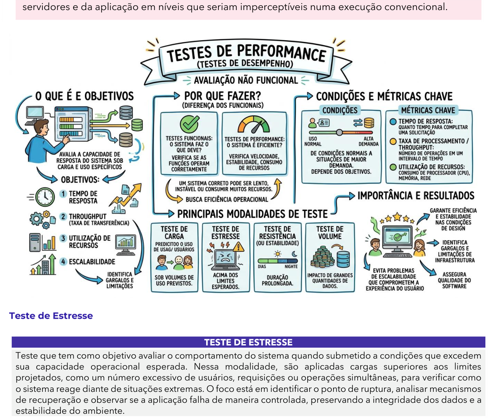

<!-- Start of picture text -->
servidores e da aplicação em níveis que seriam imperceptíveis numa execução convencional. Teste de Estresse TESTE DE ESTRESSE Teste que tem como objetivo avaliar o comportamento do sistema quando submetido a condições que excedem sua capacidade operacional esperada. Nessa modalidade, são aplicadas cargas superiores aos limites projetados, como um número excessivo de usuários, requisições ou operações simultâneas, para verificar como o sistema reage diante de situações extremas. O foco está em identificar o ponto de ruptura, analisar mecanismos de recuperação e observar se a aplicação falha de maneira controlada, preservando a integridade dos dados e a estabilidade do ambiente. <!-- End of picture text -->

---

<!-- pagina: 94 -->

**Diego Carvalho, Equipe Informática 2 (Diego Carvalho), Equipe Informática 1 (Diego Carvalho) Aula 06** 

O Teste de Estresse (conhecido como Stress Testing) é uma modalidade de teste de desempenho utilizada para avaliar o comportamento do sistema em condições que ultrapassam sua capacidade operacional prevista. O que caracteriza esse tipo de avaliação? Durante sua execução, a aplicação é submetida a situações extremas, envolvendo quantidades excessivas de usuários, requisições, operações simultâneas ou até mesmo restrições de recursos computacionais. O objetivo consiste em compreender como o sistema reage quando é levado além dos limites para os quais foi originalmente projetado. 

Uma questão frequentemente surge ao estudar essa técnica. Se o sistema foi desenvolvido para operar dentro de determinados limites, por que testá-lo além deles? Porque falhas podem ocorrer em situações inesperadas, e é importante conhecer o comportamento da aplicação nesses cenários. O teste permite identificar o ponto a partir do qual o desempenho se degrada significativamente ou o sistema deixa de responder adequadamente, fornecendo informações importantes sobre sua robustez operacional. 

**(FGV / MT - 2023)** A estratégia de teste software cujo objetivo principal é verificar como um dado <mark>software se comporta em um cenário que exige recursos computacionais em quantidades, frequência ou volumes anormais é o teste de</mark> 

<mark>a) estresse. b) integração. c) regressão. d) unidade. e) usabilidade.</mark> 

**<mark>_______________________ Comentários:</mark>** <mark>(a) Correto. Teste de estresse avalia o comportamento do software sob condições extremas, com carga, volume ou frequência anormais de uso. (b) Errado. Teste de integração verifica a interação entre módulos, não o desempenho em condições extremas. (c) Errado. Teste de regressão confirma se mudanças não afetaram funcionalidades já existentes. (d) Errado. Teste de unidade analisa partes isoladas do código, como funções ou métodos. (e) Errado. Teste de usabilidade foca na experiência do usuário e na</mark> facilidade de uso do sistema. (Letra A) 

Outro aspecto relevante envolve a forma como o sistema lida com situações críticas. O interesse está apenas em provocar falhas? Não. Além de identificar os limites de funcionamento, busca-se verificar se os mecanismos de recuperação operam corretamente e se a aplicação consegue retornar ao estado normal após a remoção das condições extremas. Essa análise contribui para avaliar a resiliência do sistema diante de eventos excepcionais. 

As informações obtidas durante o teste também ajudam a compreender a qualidade das falhas observadas. O que significa uma falha controlada? Significa que, mesmo diante de condições severas, o sistema apresenta comportamentos previsíveis, como mensagens de erro apropriadas, interrupção gradual de serviços ou mecanismos de proteção que evitam danos maiores. Dessa forma, torna-se possível verificar se a aplicação preserva a integridade dos dados e mantém condições adequadas para sua recuperação após o término da situação de estresse.

---

<!-- pagina: 95 -->

**Diego Carvalho, Equipe Informática 2 (Diego Carvalho), Equipe Informática 1 (Diego Carvalho) Aula 06** 

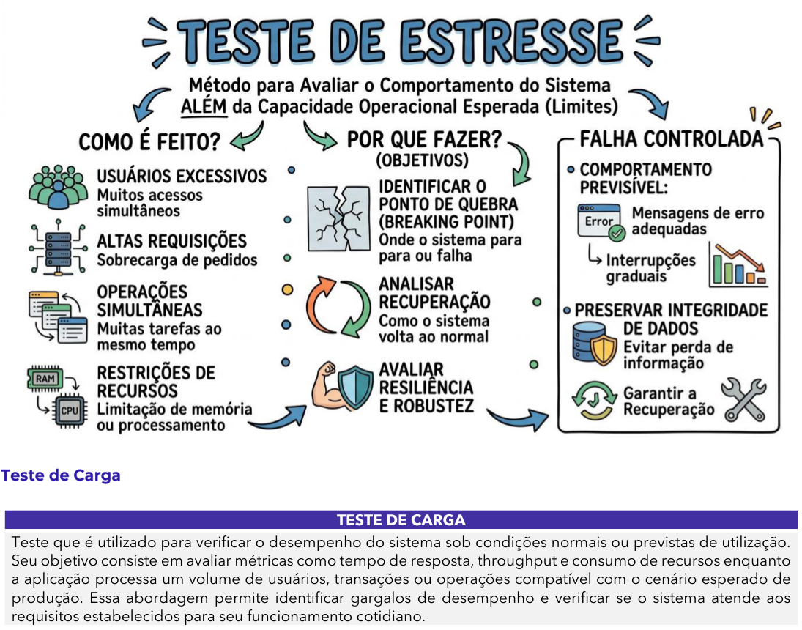

<!-- Start of picture text -->
Teste de Carga TESTE DE CARGA Teste que é utilizado para verificar o desempenho do sistema sob condições normais ou previstas de utilização. Seu objetivo consiste em avaliar métricas como tempo de resposta, throughput e consumo de recursos enquanto a aplicação processa um volume de usuários, transações ou operações compatível com o cenário esperado de produção. Essa abordagem permite identificar gargalos de desempenho e verificar se o sistema atende aos requisitos estabelecidos para seu funcionamento cotidiano. <!-- End of picture text -->

O Teste de Carga (conhecido como Load Testing) é uma modalidade de teste de desempenho utilizada para avaliar o comportamento do sistema sob condições normais ou previstas de utilização. Qual é o propósito dessa avaliação? O objetivo consiste em verificar se a aplicação consegue operar adequadamente quando submetida ao volume de usuários, transações ou requisições esperado para o ambiente de produção. Dessa forma, torna-se possível analisar o desempenho do sistema em cenários compatíveis com sua utilização cotidiana. 

Durante a execução do teste, diversas métricas são observadas para avaliar a qualidade da operação. Quais informações costumam receber maior atenção? Entre os indicadores mais importantes estão o tempo de resposta, a taxa de processamento de operações e o consumo de recursos computacionais, como memória, processador e rede. A análise desses dados permite verificar se o sistema mantém níveis adequados de desempenho enquanto executa suas funções sob a carga prevista. 

**(CESGRANRIO / BANESE - 2025)** Um técnico bancário está aprofundando seus conhecimentos em <mark>testes de software, buscando identificar o mais adequado para avaliar o limite de capacidade do sistema e como ele se comporta sob pressão, considerando, inclusive, seu tempo de resposta e sua escalabilidade. Nesse contexto, o técnico deve utilizar o teste de</mark> 

<mark>a) acessibilidade b) carga</mark>

---

<!-- pagina: 96 -->

**Diego Carvalho, Equipe Informática 2 (Diego Carvalho), Equipe Informática 1 (Diego Carvalho) Aula 06** 

<mark>c) segurança d) usabilidade</mark> 

<mark>e) vulnerabilidade</mark> 

**<mark>_______________________</mark>** 

**<mark>Comentários:</mark>** <mark>(a) Errado. Teste de acessibilidade verifica se o sistema pode ser usado por pessoas com diferentes necessidades, não sua capacidade sob pressão. (b) Correto. Teste de carga avalia comportamento sob volume de uso, tempo de resposta, capacidade e escalabilidade do sistema. (c) Errado. Teste de segurança foca proteção contra acessos indevidos, falhas e riscos, não no limite de capacidade operacional. (d) Errado. Teste de usabilidade analisa facilidade de uso e experiência do usuário, sem foco em desempenho sob alta demanda. (e) Errado. Teste de vulnerabilidade busca identificar brechas e fragilidades de segurança, não medir resposta e</mark> escalabilidade. (Letra B) 

Uma dúvida comum envolve a diferença entre o Teste de Carga e o Teste de Estresse. Ambos avaliam desempenho, mas analisam os mesmos cenários? Não. O Teste de Carga concentra-se nas condições normais de operação para as quais o sistema foi projetado, enquanto o Teste de Estresse busca observar o comportamento da aplicação quando esses limites são ultrapassados. Por essa razão, o foco do Teste de Carga está na validação do desempenho esperado, e não na busca pelo ponto de ruptura do sistema. 

Os resultados obtidos nessa avaliação auxiliam a identificar possíveis limitações antes da implantação da aplicação. Como essas informações contribuem para a qualidade do software? A análise permite localizar gargalos de desempenho, validar requisitos de capacidade e verificar se os níveis de serviço definidos foram atingidos. Com isso, torna-se possível realizar ajustes preventivos e aumentar a confiança de que o sistema atenderá adequadamente às demandas previstas para sua operação em produção. 

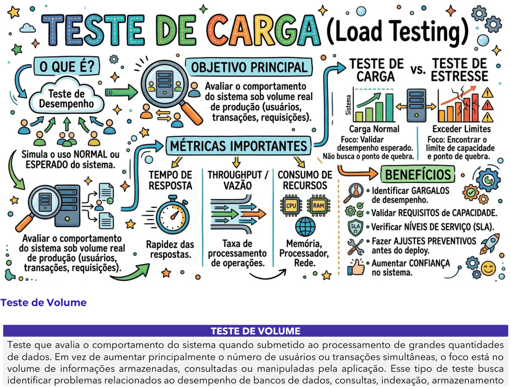

<!-- Start of picture text -->
Teste de  Volume TESTE DE VOLUME Teste que avalia o comportamento do sistema quando submetido ao processamento de grandes quantidades de dados. Em vez de aumentar principalmente o número de usuários ou transações simultâneas, o foco está no volume de informações armazenadas, consultadas ou manipuladas pela aplicação. Esse tipo de teste busca identificar problemas relacionados ao desempenho de bancos de dados, consultas, indexação, armazenamento <!-- End of picture text -->

---

<!-- pagina: 97 -->

**Diego Carvalho, Equipe Informática 2 (Diego Carvalho), Equipe Informática 1 (Diego Carvalho) Aula 06** 

<mark>e processamento de informações, verificando se o sistema continua operando adequadamente à medida que a</mark> <u>quantidade de dados cresce.</u> 

O Teste de Volume (conhecido como Volume Testing) é uma modalidade de teste de desempenho utilizada para avaliar o comportamento do sistema quando submetido ao processamento de grandes quantidades de dados. O que diferencia essa abordagem de outras avaliações de desempenho? O foco principal não está no aumento do número de usuários ou de transações simultâneas, mas na quantidade de informações armazenadas, consultadas ou manipuladas pela aplicação. Dessa forma, torna-se possível analisar os efeitos do crescimento dos dados sobre o funcionamento do sistema. 

Durante a execução desse tipo de teste, o sistema é exposto a volumes de informação significativamente elevados. Quais componentes costumam ser mais afetados por esse crescimento? Bancos de dados, mecanismos de consulta, estruturas de indexação, processos de armazenamento e rotinas de processamento de informações figuram entre os elementos mais frequentemente avaliados. A análise permite verificar se esses componentes continuam operando de maneira adequada quando precisam lidar com grandes massas de dados. 

Uma dúvida comum surge ao comparar o Teste de Volume com o Teste de Carga. Ambos não avaliam desempenho? Sim, mas sob perspectivas diferentes. Enquanto o Teste de Carga concentra-se na quantidade de usuários, requisições ou transações processadas pelo sistema, o Teste de Volume investiga os impactos provocados pelo aumento da quantidade de dados armazenados e manipulados. Por essa razão, cada abordagem busca identificar tipos distintos de limitações e gargalos. 

Os resultados obtidos durante essa avaliação fornecem informações importantes sobre a capacidade de crescimento da aplicação. O que se procura verificar à medida que o volume de dados aumenta? Buscase analisar se o sistema mantém níveis aceitáveis de desempenho, confiabilidade e disponibilidade, além de identificar degradações em consultas, processamento ou armazenamento. Essas informações auxiliam na detecção de problemas que podem surgir apenas quando a aplicação passa a operar com quantidades expressivas de dados acumulados ao longo do tempo. 

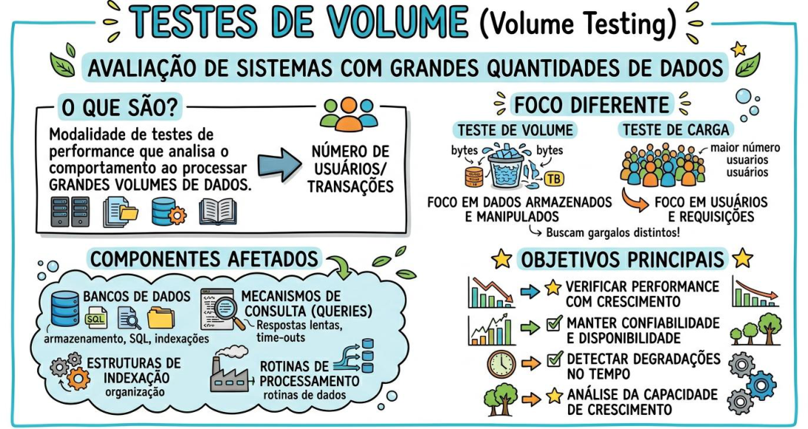

---

<!-- pagina: 98 -->

**Diego Carvalho, Equipe Informática 2 (Diego Carvalho), Equipe Informática 1 (Diego Carvalho) Aula 06** 

<!-- Start of picture text -->
Teste de <!-- End of picture text -->

<!-- Start of picture text -->
Escalabilidade <!-- End of picture text -->

###### **<mark>TESTE DE ESCABILIDADE</mark>** 

<mark>Teste que tem como finalidade verificar a capacidade do sistema de aumentar seu desempenho ou sua</mark> capacidade operacional à medida que recursos adicionais são disponibilizados ou que a demanda cresce. Essa avaliação analisa como a aplicação responde ao aumento gradual de usuários, transações ou dados, observando se a expansão da infraestrutura, como a adição de servidores, memória ou capacidade de processamento, produz ganhos proporcionais de desempenho. O objetivo é determinar até que ponto o sistema consegue crescer de forma eficiente sem degradação significativa de sua operação. 

O Teste de Escalabilidade, conhecido como Scalability Testing, é uma modalidade de teste de desempenho utilizada para avaliar a capacidade do sistema de crescer à medida que a demanda aumenta ou que novos recursos são disponibilizados. O que se procura analisar nessa avaliação? O objetivo consiste em verificar se a aplicação consegue manter níveis adequados de desempenho quando ocorre crescimento gradual no número de usuários, transações ou volumes de dados processados. 

Durante a execução do teste, diferentes cenários de expansão são simulados para observar o comportamento da aplicação. Quais fatores costumam ser ampliados nesse processo? Entre os exemplos mais comuns estão o aumento da capacidade de processamento, da memória disponível, do armazenamento ou da quantidade de servidores utilizados pela infraestrutura. A análise permite verificar se o sistema consegue aproveitar esses recursos adicionais de forma eficiente. 

Uma dúvida frequente envolve a relação entre crescimento de recursos e crescimento de desempenho. O aumento da infraestrutura produz necessariamente ganhos proporcionais? Nem sempre. Em muitos casos, a ampliação dos recursos resulta em melhorias significativas, mas fatores como limitações arquiteturais, gargalos de comunicação ou restrições de software podem reduzir os benefícios esperados. Por esse motivo, o teste busca identificar até que ponto a aplicação consegue transformar recursos adicionais em capacidade operacional efetiva. 

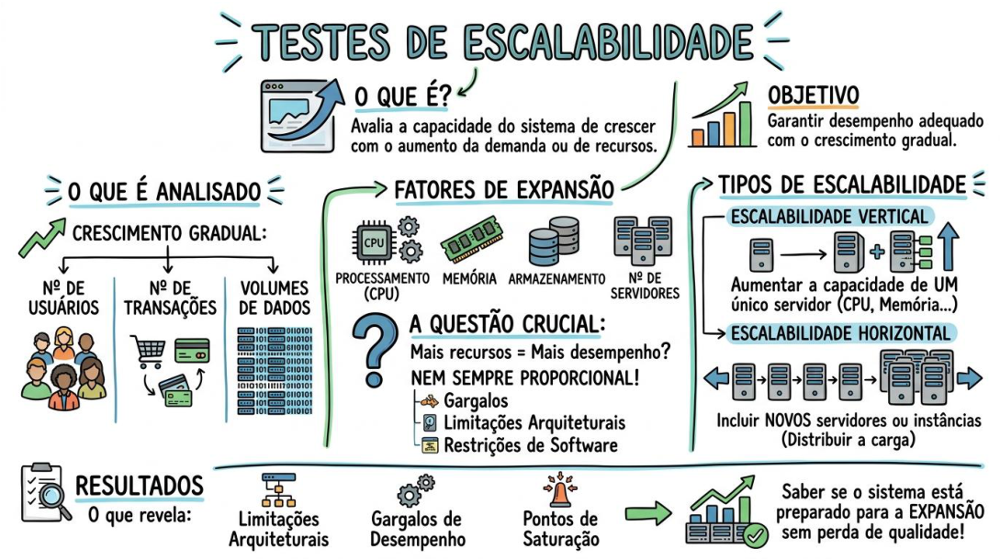

---

<!-- pagina: 99 -->

**Diego Carvalho, Equipe Informática 2 (Diego Carvalho), Equipe Informática 1 (Diego Carvalho) Aula 06** 

A escalabilidade pode ser analisada sob diferentes perspectivas. Como o sistema pode expandir sua capacidade? Em alguns cenários, ocorre a escalabilidade vertical, que consiste no aumento da capacidade de um único servidor por meio da adição de memória, processamento ou outros recursos. Em outros casos, utiliza-se a escalabilidade horizontal, baseada na inclusão de novos servidores ou instâncias para distribuir a carga de trabalho. Ambas as abordagens podem ser avaliadas durante os testes. 

Os resultados obtidos permitem compreender a capacidade de crescimento da aplicação ao longo do tempo. O que essas informações revelam? Elas ajudam a identificar limitações arquiteturais, gargalos de desempenho e pontos em que o aumento da demanda deixa de produzir ganhos satisfatórios. Dessa forma, torna-se possível avaliar se o sistema está preparado para suportar a expansão de sua utilização sem apresentar degradações significativas em sua operação.

---

<!-- pagina: 100 -->

**Diego Carvalho, Equipe Informática 2 (Diego Carvalho), Equipe Informática 1 (Diego Carvalho) Aula 06** 

#### **Teste de Segurança** 

###### **<mark>INCIDÊNCIA EM PROVA: BAIXÍSSIMA</mark>** 

###### **<mark>TESTE DE SEGURANÇA</mark>** 

Tipo de teste que busca avaliar a capacidade do sistema de proteger informações e recursos contra acessos não autorizados, alterações indevidas e outras ameaças. São analisados mecanismos de autenticação, autorização, criptografia, controle de acesso, auditoria e proteção de dados, verificando a aderência aos requisitos de segurança estabelecidos. 

Os Testes de Segurança, conhecidos como Security Testing, constituem uma categoria de testes não funcionais voltada à avaliação dos mecanismos utilizados para proteger informações, recursos e serviços de um sistema. O que se busca verificar nessa modalidade? O objetivo consiste em analisar se a aplicação é capaz de resistir a ameaças como acessos não autorizados, alterações indevidas de dados, vazamento de informações e interrupções causadas por ações maliciosas ou falhas de proteção. 

A segurança de um sistema envolve diferentes atributos que precisam ser preservados durante sua operação. Quais características recebem maior atenção nesses testes? Entre os aspectos mais importantes estão a confidencialidade das informações, a integridade dos dados, a disponibilidade dos serviços, a autenticidade das identidades envolvidas e a rastreabilidade das ações realizadas. A avaliação desses elementos permite verificar se os controles de segurança estão funcionando conforme o esperado. 

Uma dúvida comum surge ao estudar essa modalidade de teste. Seria possível garantir que um sistema está completamente seguro após sua execução? Não. Os testes de segurança permitem identificar vulnerabilidades conhecidas, falhas de configuração e fragilidades exploráveis, mas não podem assegurar a inexistência absoluta de riscos. O propósito da atividade é fornecer evidências sobre o nível de proteção do sistema e reduzir a probabilidade de incidentes relacionados à segurança da informação. 

---

<!-- pagina: 101 -->

**Diego Carvalho, Equipe Informática 2 (Diego Carvalho), Equipe Informática 1 (Diego Carvalho) Aula 06** 

Diversas técnicas podem ser empregadas para realizar essa avaliação. Como os problemas de segurança são identificados? Dependendo dos objetivos do teste, podem ser analisados mecanismos de autenticação, controle de acesso, criptografia, gerenciamento de sessões, proteção de dados e registros de auditoria. Essas verificações ajudam a identificar vulnerabilidades que poderiam ser exploradas para comprometer o funcionamento da aplicação ou o acesso às informações armazenadas. 

Os resultados obtidos durante os testes auxiliam na gestão dos riscos associados ao software. Qual é a principal contribuição dessa atividade? A identificação antecipada de vulnerabilidades permite que correções sejam implementadas antes da disponibilização do sistema ou de novas versões. Dessa forma, torna-se possível fortalecer os mecanismos de proteção existentes e aumentar a confiança na capacidade da aplicação de operar de maneira segura em seu ambiente de utilização. 

<!-- Start of picture text -->
Teste de Vulnerabilidade <!-- End of picture text -->

###### **<mark>TESTE DE VULNERABILIDADE</mark>** 

<mark>Tipo de teste de segurança destinado a identificar, analisar e classificar vulnerabilidades existentes em sistemas,</mark> aplicações, redes ou infraestruturas. Seu objetivo é localizar falhas que possam comprometer a confidencialidade, a integridade ou a disponibilidade das informações, como configurações inadequadas, softwares desatualizados, portas expostas, componentes vulneráveis e erros de implementação. Geralmente, esse teste produz um inventário de vulnerabilidades acompanhado de sua severidade e de recomendações para mitigação, sem necessariamente explorar as falhas encontradas. 

A proteção de sistemas computacionais exige mais do que a simples implementação de mecanismos de segurança. Como identificar pontos fracos antes que eles sejam explorados por agentes malintencionados? Uma das principais estratégias utilizadas para responder a essa questão consiste na realização de Testes de Vulnerabilidade. Essa modalidade de avaliação busca identificar, analisar e classificar fragilidades presentes em sistemas, redes, aplicações e demais ativos tecnológicos. 

O conceito de vulnerabilidade está diretamente relacionado à existência de falhas que podem comprometer a segurança da informação. Que tipos de problemas podem ser encontrados durante esses testes? Configurações inadequadas, softwares desatualizados, erros de implementação, falhas em protocolos de comunicação, permissões excessivas e outras deficiências de segurança figuram entre os exemplos mais comuns. Cada uma dessas situações pode aumentar a exposição do ambiente a ameaças cibernéticas. 

Os Testes de Vulnerabilidade fornecem informações importantes para a gestão de riscos. Qual é a finalidade prática dessa atividade? A intenção consiste em identificar fragilidades antes que elas sejam exploradas em ataques reais, permitindo que a organização adote medidas corretivas de forma preventiva. Dessa maneira, reduz-se a probabilidade de incidentes relacionados a acesso indevido, vazamento de informações ou comprometimento de serviços essenciais. 

A execução desses testes pode ocorrer de diferentes formas. Seria necessário analisar manualmente todos os sistemas da organização? Não. Ferramentas especializadas são amplamente utilizadas para automatizar parte do processo de identificação de vulnerabilidades. Essas soluções auxiliam na descoberta de ativos, no mapeamento de serviços expostos, na detecção de falhas conhecidas e na classificação preliminar dos riscos encontrados. Entretanto, a interpretação dos resultados continua exigindo análise especializada para validar as evidências obtidas e priorizar as ações necessárias. 

O processo de avaliação normalmente segue uma sequência estruturada. Como ele costuma ser realizado? Inicialmente, define-se o escopo da análise e os ativos que serão avaliados. Em seguida, são executadas atividades de descoberta e identificação de vulnerabilidades. Após essa etapa, as falhas

---

<!-- pagina: 102 -->

**Diego Carvalho, Equipe Informática 2 (Diego Carvalho), Equipe Informática 1 (Diego Carvalho) Aula 06** 

encontradas são classificadas de acordo com sua criticidade e impacto potencial. Por fim, os resultados são documentados e acompanhados por recomendações destinadas à mitigação dos riscos identificados. 

Uma dúvida recorrente envolve a diferença entre Testes de Vulnerabilidade e Testes de Intrusão. Ambos procuram encontrar falhas de segurança? Sim, mas suas abordagens são distintas. Os Testes de Vulnerabilidade concentram-se principalmente na identificação e classificação das fragilidades existentes. Já os Testes de Intrusão procuram demonstrar, de forma prática e controlada, se essas vulnerabilidades podem ser efetivamente exploradas para comprometer o sistema. Em outras palavras, a exploração costuma estar mais associada aos Testes de Intrusão do que às avaliações tradicionais de vulnerabilidade. 

A realização periódica dessas avaliações tornou-se especialmente importante devido à constante evolução das ameaças cibernéticas. Por que os testes precisam ser repetidos regularmente? Novas vulnerabilidades são descobertas continuamente, softwares recebem atualizações frequentes e a infraestrutura tecnológica das organizações está em constante transformação. Como consequência, uma avaliação realizada hoje não garante que o ambiente permanecerá seguro no futuro. 

Além da proteção dos ativos tecnológicos, esses testes contribuem para o atendimento de requisitos regulatórios e boas práticas de segurança da informação. Ao fornecer uma visão estruturada das fragilidades existentes e apoiar a priorização das ações corretivas, os Testes de Vulnerabilidade tornamse um instrumento importante para fortalecer a postura de segurança da organização e reduzir sua exposição a riscos cibernéticos. 

<!-- Start of picture text -->
Teste de  Penetração TESTE DE PENETRAÇÃO Tipo de teste de segurança que simula ataques reais contra um sistema para verificar se vulnerabilidades existentes podem ser efetivamente exploradas por um invasor. Diferentemente do teste de vulnerabilidade, seu foco não está apenas em identificar falhas, mas em demonstrar seu impacto prático, avaliando até que ponto um <!-- End of picture text -->

---

<!-- pagina: 103 -->

**Diego Carvalho, Equipe Informática 2 (Diego Carvalho), Equipe Informática 1 (Diego Carvalho) Aula 06** 

<mark>atacante conseguiria obter acesso indevido, elevar privilégios, comprometer dados ou interromper serviços. O</mark> resultado fornece uma visão mais realista do risco associado às vulnerabilidades descobertas. 

O Teste de Penetração (conhecido como Penetration Testing ou Pentest) é uma modalidade de teste de segurança destinada a avaliar se vulnerabilidades existentes podem ser efetivamente exploradas para comprometer um sistema. Qual é a principal característica dessa abordagem? Diferentemente de atividades que apenas identificam falhas, o teste procura simular ataques de forma controlada para verificar até que ponto os mecanismos de proteção conseguem resistir a tentativas reais de exploração. 

Durante sua execução, diferentes vulnerabilidades podem ser analisadas pelos avaliadores. O objetivo seria apenas localizar problemas de segurança? Não. A preocupação central consiste em determinar se as falhas identificadas podem ser utilizadas para obter acesso indevido, elevar privilégios, comprometer informações ou causar impactos relevantes à operação do sistema. Dessa forma, a avaliação fornece uma visão mais concreta dos riscos associados às vulnerabilidades encontradas. 

Ferramentas automatizadas frequentemente participam desse processo. Qual é o papel desses recursos? Elas podem auxiliar na identificação inicial de software desatualizado, configurações inseguras, vulnerabilidades conhecidas e outras fragilidades técnicas. Entretanto, o Teste de Penetração não se limita à varredura automatizada. A atividade normalmente envolve análises complementares e tentativas controladas de exploração para verificar se as vulnerabilidades detectadas representam riscos efetivos para a segurança da aplicação. 

Os resultados obtidos permitem compreender não apenas a existência das falhas, mas também suas possíveis consequências. O que essa avaliação revela sobre a segurança do sistema? Ela fornece evidências sobre a eficácia dos mecanismos de proteção implementados e ajuda a identificar quais vulnerabilidades apresentam maior potencial de impacto. Essas informações auxiliam na definição de prioridades para correção e fortalecimento dos controles de segurança existentes. 

---

<!-- pagina: 104 -->

**Diego Carvalho, Equipe Informática 2 (Diego Carvalho), Equipe Informática 1 (Diego Carvalho) Aula 06** 

A classificação dos testes de penetração em Black Box, White Box e Gray Box está relacionada ao nível de conhecimento prévio disponibilizado aos testadores antes do início da avaliação. No modelo Black Box, os profissionais não recebem informações internas sobre a infraestrutura, aplicações ou credenciais do ambiente. O objetivo é reproduzir a perspectiva de um atacante externo, que precisa identificar alvos, mapear serviços, descobrir vulnerabilidades e explorar falhas sem qualquer conhecimento privilegiado do sistema. 

No extremo oposto está o White Box, em que os pentesters recebem amplo acesso às informações do ambiente, incluindo diagramas de arquitetura, endereços IP, código-fonte, documentação técnica e, em alguns casos, credenciais administrativas. Essa abordagem permite uma análise profunda dos controles de segurança e da superfície de ataque. Por fim, temos o Gray Box – ele fornece apenas parte das informações aos avaliadores, como contas de usuário comuns, documentação limitada ou detalhes parciais da infraestrutura, simulando um atacante que já possui algum nível de acesso ou conhecimento prévio da organização. 

<!-- Start of picture text -->
Teste  Fuzzing <!-- End of picture text -->

###### **<mark>TESTE FUZZING</mark>** 

Tipo de teste de segurança que consiste em submeter o sistema a grandes volumes de entradas inválidas, inesperadas, aleatórias ou malformadas, com o objetivo de provocar comportamentos anormais. Durante sua execução, são enviados dados incorretos, sequências incomuns de caracteres, arquivos corrompidos ou parâmetros fora dos padrões esperados, buscando identificar falhas como travamentos, exceções não tratadas, vazamentos de memória e vulnerabilidades exploráveis. Essa técnica é amplamente utilizada para revelar defeitos difíceis de detectar por meio de testes convencionais. 

A Análise de Vulnerabilidades (conhecida como Vulnerability Assessment) é uma atividade de segurança voltada à identificação, análise e classificação de fragilidades presentes em um sistema. Qual é o propósito dessa avaliação? O objetivo consiste em localizar falhas que possam ser exploradas por agentes maliciosos e determinar o nível de risco associado a cada uma delas. Dessa forma, torna-se possível compreender quais pontos da aplicação exigem maior atenção em termos de proteção. 

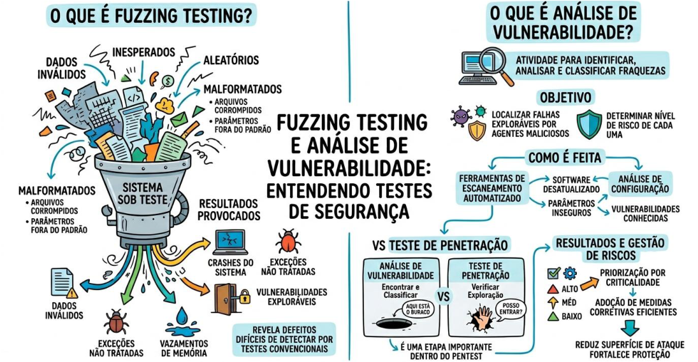

---

<!-- pagina: 105 -->

**Diego Carvalho, Equipe Informática 2 (Diego Carvalho), Equipe Informática 1 (Diego Carvalho) Aula 06** 

Durante a execução dessa atividade, diferentes mecanismos de verificação podem ser utilizados para examinar o ambiente analisado. Como essas fragilidades são identificadas? Em muitos casos, empregamse ferramentas automatizadas de varredura e análise de configurações capazes de detectar software desatualizado, parâmetros inseguros, vulnerabilidades conhecidas e outras condições que possam comprometer a segurança do sistema. Esses recursos permitem realizar avaliações amplas e sistemáticas de forma eficiente. 

Uma dúvida frequente surge ao comparar essa atividade com o Teste de Penetração. Ambas as abordagens procuram encontrar falhas de segurança? Sim, mas possuem objetivos distintos. A Análise de Vulnerabilidades concentra-se na identificação e classificação das fragilidades existentes, enquanto o Teste de Penetração busca verificar se essas vulnerabilidades podem ser efetivamente exploradas para comprometer o sistema. Por essa razão, a análise de vulnerabilidades normalmente representa uma etapa importante dentro de um processo mais amplo de avaliação de segurança. 

Os resultados obtidos fornecem informações relevantes para a gestão dos riscos de segurança. O que se faz com as vulnerabilidades identificadas? Após sua detecção e classificação, as falhas podem ser priorizadas de acordo com sua criticidade, permitindo que as equipes responsáveis adotem medidas corretivas de forma mais eficiente. Essa abordagem auxilia na redução da superfície de ataque do sistema e fortalece os mecanismos de proteção existentes. 

|**TIPOS DE TESTE**|**DESCRIÇÃO**|
|---|---|
|**TESTE DE FUMAÇA** **(SMOKE TEST)**|Conjunto reduzido de verificações executadas após uma nova compilação, instalação ou implantação do sistema. Seu objetivo é confirmar que as funcionalidades essenciais estão operacionais e que o software está apto para testes mais aprofundados.|
|**TESTE DE** **REGRESSÃO**|Consiste na reexecução de casos de teste previamente aprovados após correções, melhorias ou novas funcionalidades. O objetivo é verificar se alterações realizadas no sistema introduziram defeitos em funcionalidades anteriormente corretas.|
|**TESTE DE** **INTERFACE** **GRÁFICA (GUI)**|Avalia os elementos visuais da aplicação, como telas, menus, botões, formulários e mensagens. Busca verificar a consistência da interface, a correta interação dos componentes gráficos e a aderência aos requisitos de apresentação.|
|**TESTE DE** **USABILIDADE**|Analisa a facilidade de utilização do sistema por usuários reais ou representativos. Avalia aspectos como intuitividade, facilidade de aprendizado, eficiência na execução de tarefas, satisfação do usuário e experiência geral de uso.|
|**MONKEY TESTING**|Técnica baseada na execução de ações aleatórias e imprevisíveis sobre o sistema, sem roteiro pré-definido. Seu objetivo é identificar falhas, travamentos e comportamentos inesperados que podem não ser encontrados em testes estruturados.|
|**TESTE ALFA E BETA**|O teste alfa é realizado em ambiente controlado pela equipe de desenvolvimento ou QA. Já o teste beta envolve usuários reais em condições próximas à produção, permitindo validar o produto e coletar feedback antes do lançamento definitivo.|
|**TESTE DE** **COMPATIBILIDADE**|Verifica se o software funciona corretamente em diferentes combinações de sistemas operacionais, navegadores, dispositivos, bancos de dados e ambientes tecnológicos, garantindo uma experiência consistente para todos os usuários.|
|**TESTE DE** **CONFIGURAÇÃO**|Avalia o comportamento da aplicação sob diferentes configurações de hardware, software, rede e infraestrutura. Seu objetivo é identificar incompatibilidades ou falhas relacionadas a parâmetros específicos do ambiente de execução.|
|**TESTE DE** **PORTABILIDADE**|Verifica a capacidade de o software ser instalado, transferido e executado em diferentes plataformas ou ambientes com mínimo esforço de adaptação. Busca garantir flexibilidade e facilidade de migração entre tecnologias.|

---

<!-- pagina: 106 -->

**Diego Carvalho, Equipe Informática 2 (Diego Carvalho), Equipe Informática 1 (Diego Carvalho) Aula 06** 

**<mark>TIPOS DE TESTE</mark>** 

**TESTE DE COMPARAÇÃO** 

**TESTE DE RECUPERAÇÃO** 

**TESTE DE CONTRATO** 

**TESTE DE CONFORMIDADE** 

**TESTE DE LANÇAMENTO** 

**TESTE DE DESEMPENHO** 

**TESTE DE ESTRESSE TESTE DE CARGA** 

**TESTE DE VOLUME** 

**TESTE DE ESCALABILIDADE TESTE DE SEGURANÇA** 

**TESTE DE VULNERABILIDADE TESTE DE PENETRAÇÃO FUZZING** 

###### **<mark>DESCRIÇÃO</mark>** 

Consiste em comparar versões, produtos ou implementações equivalentes utilizando os mesmos cenários de teste. O objetivo é identificar diferenças de comportamento, desempenho, qualidade ou conformidade entre as soluções avaliadas. 

Avalia a capacidade do sistema de recuperar-se após falhas, interrupções, quedas de energia, indisponibilidades ou perda de dados. Verifica a eficácia dos mecanismos de restauração e continuidade operacional da aplicação. 

Utilizado principalmente em APIs e microsserviços, verifica se a comunicação entre componentes segue exatamente os contratos definidos, incluindo formatos de dados, operações disponíveis, parâmetros e respostas esperadas. 

Avalia se o software atende normas técnicas, regulamentações legais, padrões organizacionais e requisitos específicos do setor. É amplamente utilizado em aplicações sujeitas a auditorias e exigências regulatórias. 

Executado próximo à entrada em produção, busca confirmar que o sistema está pronto para uso real. Verifica funcionalidades críticas, infraestrutura, integrações e condições operacionais necessárias para o lançamento. 

Avalia características como tempo de resposta, throughput, utilização de recursos e estabilidade operacional. Seu objetivo é verificar se o sistema mantém níveis adequados de eficiência sob diferentes condições de utilização. 

Submete o sistema a cargas superiores às previstas em operação normal para identificar limites de capacidade, pontos de falha, degradação de desempenho e comportamento diante de condições extremas de utilização. 

Verifica o comportamento do sistema sob volumes de usuários, transações ou requisições compatíveis com a demanda esperada. Avalia desempenho, estabilidade e capacidade de atender aos requisitos operacionais definidos. 

Analisa o impacto de grandes quantidades de dados sobre a aplicação. Avalia armazenamento, processamento, consultas e movimentação de informações para verificar se o sistema continua operando adequadamente. 

Avalia a capacidade de o sistema crescer de forma eficiente diante do aumento de usuários, transações, dados ou recursos computacionais, mantendo desempenho, disponibilidade e estabilidade aceitáveis. 

Examina mecanismos de proteção relacionados à confidencialidade, integridade, disponibilidade, autenticação e autorização. Busca identificar riscos que possam comprometer a segurança da aplicação e de seus dados. 

Consiste na identificação sistemática de fragilidades conhecidas em aplicações, bibliotecas, sistemas operacionais ou configurações. Seu objetivo é descobrir riscos de segurança antes que sejam explorados por atacantes. 

Simula ataques reais realizados por invasores para explorar vulnerabilidades e avaliar a eficácia dos controles de segurança. Permite identificar impactos potenciais e validar mecanismos de proteção existentes. 

Técnica que submete o sistema a grandes volumes de entradas inválidas, inesperadas ou aleatórias. O objetivo é identificar falhas, travamentos, vazamentos de memória e vulnerabilidades difíceis de detectar por meios tradicionais.

---

<!-- pagina: 107 -->

**Diego Carvalho, Equipe Informática 2 (Diego Carvalho), Equipe Informática 1 (Diego Carvalho) Aula 06** 

<!-- Start of picture text -->
Automação de Testes <!-- End of picture text -->

**<mark>INCIDÊNCIA EM PROVA: MÉDIA</mark>** 

###### **<mark>TESTES AUTOMATIZADOS</mark>** 

Os testes automatizados utilizam ferramentas e scripts para executar casos de teste de forma automática, reduzindo o esforço manual e aumentando a repetibilidade das verificações. São amplamente empregados em testes de regressão, integração contínua e entrega contínua, proporcionando maior rapidez na detecção de <mark>defeitos e maior confiabilidade no processo de desenvolvimento.</mark> 

A execução de testes representa uma das atividades mais importantes para garantir a qualidade de um software. Entretanto, o que acontece quando a aplicação cresce e centenas ou milhares de verificações precisam ser repetidas constantemente? Realizar todas essas atividades manualmente pode consumir tempo excessivo e aumentar a probabilidade de erros. Para enfrentar esse desafio, surgem os Testes Automatizados. 

Os Testes Automatizados utilizam programas capazes de executar casos de teste sem intervenção manual constante. Qual é a principal vantagem dessa abordagem? A automação permite que verificações sejam realizadas de forma rápida, repetitiva e padronizada. Como consequência, torna-se possível detectar defeitos com maior frequência e obter retorno mais rápido sobre a qualidade das alterações realizadas no sistema. 

Uma dúvida comum surge nesse contexto. Os Testes Automatizados garantem que o software esteja completamente correto? Não. Eles verificam apenas os comportamentos previstos pelos casos de teste implementados. Se um cenário não foi contemplado na automação, ele também não será validado. Por esse motivo, a eficácia da automação depende diretamente da qualidade e da abrangência dos testes projetados pela equipe. 

A automação pode ser aplicada em diferentes níveis do processo de teste. Quais modalidades costumam ser automatizadas? Testes de unidade, integração, sistema, regressão e aceitação figuram entre os exemplos mais comuns. Cada um desses níveis possui objetivos específicos, mas todos se beneficiam da capacidade de execução frequente proporcionada pelas ferramentas de automação. 

Os benefícios dessa abordagem vão além da simples economia de esforço manual. Por que tantas organizações investem em automação de testes? A execução automática reduz a influência de erros humanos, aumenta a velocidade das validações e permite que verificações sejam realizadas diversas vezes ao longo do desenvolvimento. Isso favorece a identificação precoce de problemas e contribui para a manutenção da qualidade do software durante sua evolução. 

Outra característica importante está relacionada à repetibilidade. O que acontece quando uma nova versão do sistema é disponibilizada? Os mesmos testes podem ser executados novamente, seguindo exatamente os mesmos passos e critérios de validação. Essa consistência torna os resultados mais confiáveis e facilita a identificação de alterações que produziram comportamentos indesejados. 

A automação também desempenha papel relevante em práticas modernas de desenvolvimento. Como garantir que alterações frequentes não comprometam funcionalidades existentes? Em ambientes que utilizam integração contínua e entrega contínua, os testes automatizados são executados constantemente, fornecendo evidências rápidas sobre o impacto das modificações realizadas no código. Essa capacidade permite que defeitos sejam identificados ainda nas fases iniciais do processo de desenvolvimento.

---

<!-- pagina: 108 -->

**Diego Carvalho, Equipe Informática 2 (Diego Carvalho), Equipe Informática 1 (Diego Carvalho) Aula 06** 

Para viabilizar essa estratégia, utilizam-se ferramentas especializadas. Qual é a função dessas ferramentas? Elas auxiliam na criação, execução, monitoramento e gerenciamento dos testes automatizados. Além disso, permitem integrar as validações ao fluxo de desenvolvimento, produzir relatórios e acompanhar a evolução da qualidade do software ao longo do tempo. 

###### **Saiba mais:** 

<mark>Em ecossistemas avançados, os testes automatizados integram recursos de auditoria eletrônica. Essa prática envolve o uso de geradores automáticos de cenários (frequentemente pautados em modelos ou IA) e avaliadores digitais que garantem total rastreabilidade. Eles emitem relatórios imutáveis sobre cada passo da execução, apoiando áreas de compliance e governança a chancelar</mark> a qualidade antes que a versão chegue a ambientes produtivos. 

A escolha de uma ferramenta adequada exige análise cuidadosa. Quais fatores devem ser considerados? Facilidade de utilização, capacidade de manutenção dos testes, compatibilidade com diferentes tecnologias, suporte a múltiplas plataformas, recursos de análise, flexibilidade de integração e custos associados figuram entre os critérios mais relevantes. A decisão deve considerar não apenas os recursos oferecidos, mas também sua adequação às necessidades específicas da organização. 

Os Testes Automatizados tornaram-se um dos pilares do desenvolvimento moderno porque permitem ampliar a frequência e a confiabilidade das validações realizadas sobre o software. Ao automatizar verificações repetitivas e fornecer retorno rápido sobre a qualidade das alterações implementadas, eles contribuem para a construção de aplicações mais estáveis, previsíveis e fáceis de evoluir ao longo do tempo. 

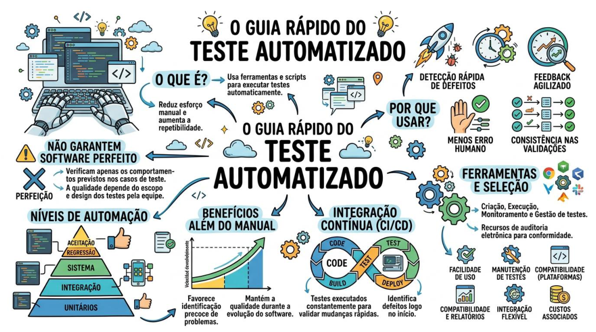

---

<!-- pagina: 109 -->

**Diego Carvalho, Equipe Informática 2 (Diego Carvalho), Equipe Informática 1 (Diego Carvalho) Aula 06** 

<!-- Start of picture text -->
Principais Benefícios <!-- End of picture text -->

Os testes automatizados oferecem diversos benefícios para o desenvolvimento de software. Vejamos os principais na tabela seguinte. 

|**BENEFÍCIOS**|**DESCRIÇÃO**|
|---|---|
|**EXECUÇÃO** **RÁPIDA**|Eles podem ser executados em poucos minutos, mesmo quando envolvem centenas ou milhares de casos de teste. Isso reduz significativamente o tempo necessário para validar alterações no software e fornece feedback rápido para a equipe de desenvolvimento.|
|**REPETIBILIDADE**|Um mesmo conjunto de testes pode ser executado inúmeras vezes sem variações de procedimento ou qualidade, o que garante consistência nos resultados e permite verificar continuamente se o sistema mantém o comportamento esperado após modificações.|
|**REDUÇÃO DE** **ERROS HUMANOS**|Como a execução é realizada por ferramentas, elimina-se a possibilidade de falhas causadas por distração, esquecimento ou interpretação incorreta dos procedimentos de teste. Isso aumenta a confiabilidade das verificações realizadas ao longo do projeto.|
|**DETECÇÃO** **PRECOCE DE** **DEFEITOS**|A automação permite executar testes com frequência durante o desenvolvimento, identificando problemas logo após sua introdução. A descoberta antecipada de defeitos reduz o esforço de correção e evita que falhas se propaguem para etapas posteriores.|
|**SUPORTE AOS** **TESTES DE** **REGRESSÃO**|Sempre que novas funcionalidades são implementadas ou defeitos são corrigidos, os testes automatizados podem ser executados novamente para verificar se mudanças recentes não afetaram funcionalidades que anteriormente operavam corretamente.|
|**MAIOR** **COBERTURA DE** **TESTES**|A automação possibilita executar uma quantidade muito maior de cenários do que seria viável manualmente. Isso aumenta a cobertura funcional e técnica do sistema, elevando a probabilidade de identificação de defeitos e comportamentos inesperados.|
|**INTEGRAÇÃO** **CONTÍNUA E** **ENTREGA** **CONTÍNUA**|Eles são fundamentais em pipelines de CI/CD, permitindo validar automaticamente cada alteração realizada no código. Dessa forma, contribuem para entregas mais frequentes, seguras e confiáveis em ambientes modernos de desenvolvimento.|
|**REDUÇÃO DE** **CUSTOS A LONGO** **PRAZO**|Embora exijam investimento inicial para implementação e manutenção, os testes automatizados reduzem custos operacionais ao diminuir o esforço manual, acelerar validações e evitar defeitos que poderiam gerar impactos significativos em produção.|
|**MAIOR** **CONFIABILIDADE** **DO SOFTWARE**|A execução frequente e padronizada dos testes aumenta a confiança na estabilidade do sistema. Equipes de desenvolvimento, testes e negócios passam a ter evidências objetivas de que os requisitos continuam sendo atendidos ao longo do tempo.|
|**ESCALABILIDADE** **DAS** **VERIFICAÇÕES**|À medida que o sistema cresce, novos testes podem ser adicionados ao conjunto automatizado sem aumentar proporcionalmente o esforço de execução. Isso permite acompanhar a evolução do software mantendo um alto nível de controle de qualidade.|

---

<!-- pagina: 110 -->

**Diego Carvalho, Equipe Informática 2 (Diego Carvalho), Equipe Informática 1 (Diego Carvalho) Aula 06** 

<!-- Start of picture text -->
Manual x Automatizado <!-- End of picture text -->

Os testes manuais são executados diretamente por profissionais que interagem com a aplicação para avaliar seu comportamento. Como essa abordagem funciona na prática? O testador pode seguir procedimentos previamente definidos, executar casos de teste estruturados ou explorar livremente o sistema em busca de comportamentos inesperados. Durante essa atividade, são observados resultados, registradas evidências e identificados defeitos que possam comprometer a qualidade do software. 

Determinados tipos de avaliação dependem fortemente da participação humana. Em quais situações os testes manuais costumam ser mais adequados? Avaliações de usabilidade, experiência do usuário, acessibilidade e testes exploratórios figuram entre os exemplos mais comuns. Nessas atividades, fatores como percepção visual, interpretação de comportamentos, criatividade e julgamento humano exercem papel importante na identificação de problemas que dificilmente seriam detectados apenas por mecanismos automatizados. 

Os testes automatizados seguem uma abordagem diferente. Como as verificações são realizadas nesse caso? Scripts e ferramentas executam automaticamente os cenários definidos e comparam os resultados produzidos pela aplicação com os resultados esperados. Essa característica permite repetir os testes de forma rápida e consistente, tornando a automação especialmente útil em atividades como testes de regressão, integração contínua e validações frequentes de funcionalidades. 

Uma dúvida frequente surge ao comparar as duas abordagens. A automação substitui completamente os testes manuais? Em geral, não. Cada estratégia apresenta vantagens específicas e atende melhor a determinados objetivos. Enquanto os testes automatizados oferecem velocidade, repetibilidade e maior cobertura para tarefas recorrentes, os testes manuais fornecem flexibilidade e capacidade de adaptação diante de situações complexas ou pouco previsíveis. 

Esse equilíbrio torna-se especialmente relevante em ambientes sujeitos a mudanças frequentes na interface do usuário. O que acontece quando telas, menus e componentes visuais são modificados constantemente? Nesses cenários, scripts automatizados podem exigir manutenção frequente, principalmente quando dependem de elementos visuais ou identificadores que mudam regularmente. Esse fenômeno é conhecido como fragilidade dos testes (test fragility) e pode aumentar o esforço necessário para manter a automação funcionando adequadamente. 

Por essa razão, a escolha entre testes manuais e automatizados depende do contexto analisado. Em ambientes com interfaces altamente voláteis, os testes manuais frequentemente apresentam boa relação custo-benefício devido à capacidade de adaptação dos avaliadores. Por outro lado, quando os fluxos estão mais estáveis e são executados repetidamente, a automação tende a proporcionar ganhos significativos de produtividade. Como cada abordagem possui características próprias, a utilização combinada costuma produzir resultados mais eficazes para a garantia da qualidade do software. 

|**CRITÉRIOS**|**TESTE MANUAL**|**TESTE AUTOMATIZADO**|
|---|---|---|
|**VELOCIDADE**|A execução depende da atuação humana em cada etapa do teste. Isso torna o processo mais demorado, especialmente quando há muitos cenários ou repetidas validações.|Os testes são executados automaticamente por ferramentas e scripts, permitindo validar grandes volumes de cenários em pouco tempo e com mínima intervenção humana.|
|**CONFIABILIDADE**|Está sujeito a distrações, interpretações equivocadas e erros operacionais do testador, podendo gerar inconsistências na execução e nos resultados obtidos.|Os mesmos procedimentos são executados de forma padronizada e repetível, reduzindo significativamente a ocorrência de erros|

---

<!-- pagina: 111 -->

**Diego Carvalho, Equipe Informática 2 (Diego Carvalho), Equipe Informática 1 (Diego Carvalho) Aula 06** 

|**CRITÉRIOS**|**TESTE MANUAL**|**TESTE AUTOMATIZADO**|
|---|---|---|
|**MANUTENÇÃO**|Exige esforço contínuo para reexecutar e revisar procedimentos, especialmente quando o sistema cresce e o conjunto de testes se torna mais extenso e complexo.|humanos e aumentando a consistência dos resultados. Requer investimento inicial na criação dos scripts, mas as execuções posteriores demandam pouco esforço, facilitando a manutenção de grandes suítes de testes.|
|**REUSABILIDADE**|Os casos de teste podem ser reaproveitados, porém sua execução depende da atuação manual do testador, limitando a frequência e a escalabilidade das validações.|Os scripts podem ser reutilizados inúmeras vezes com baixo esforço adicional, favorecendo execuções frequentes e ampliando a cobertura dos testes ao longo do projeto.|
|**ESCOPO**|O alcance dos testes é limitado pelo tempo e pelos recursos disponíveis, dificultando a execução de todos os cenários e combinações possíveis de uso.|Permite validar um número muito maior de cenários, incluindo regressões e execuções repetitivas, ampliando significativamente a cobertura e a profundidade dos testes.|
|**CUSTO**|Possui baixo investimento inicial, pois não exige ferramentas especializadas, mas pode gerar custos elevados ao longo do tempo devido ao esforço humano recorrente.|Exige investimento inicial em ferramentas, infraestrutura e desenvolvimento dos scripts, porém tende a reduzir custos operacionais em projetos de longo prazo.|
|**HABILIDADES**|Requer conhecimento funcional do sistema, elaboração de cenários de teste e capacidade de identificar, reproduzir e documentar defeitos encontrados.|Exige conhecimentos de teste e também de programação, frameworks de automação, ferramentas especializadas e manutenção de scripts automatizados.|

---

<!-- pagina: 112 -->

**Diego Carvalho, Equipe Informática 2 (Diego Carvalho), Equipe Informática 1 (Diego Carvalho) Aula 06** 

<!-- Start of picture text -->
Ferramentas de Mercado <!-- End of picture text -->

As ferramentas de automação de testes são softwares utilizados para criar, executar e gerenciar testes de forma automática, reduzindo a necessidade de intervenção manual e aumentando a eficiência do processo de verificação de software. Essas ferramentas permitem registrar ações, desenvolver scripts de teste, comparar resultados obtidos com resultados esperados e gerar relatórios de execução. São amplamente empregadas em testes de unidade, integração, regressão e interface, contribuindo para a execução rápida e repetitiva de grandes conjuntos de testes. Vejamos as principais: 

|**FERRAMENTAS**|**DESCRIÇÃO**|
|---|---|
|**SELENIUM**|Usado para testar aplicativos web, o Selenium é uma ferramenta de código aberto que oferece uma variedade de recursos para automatizar testes, incluindo a gravação de ações do usuário e a execução de testes em diferentes navegadores.|
|**APPIUM**|Utilizado para testar aplicativos móveis, o Appium é uma ferramenta de automação de testes móveis que permite a execução de testes em diferentes dispositivos móveis, como smartphones e tablets.|
|**JMETER**|Uma ferramenta de código aberto usada para testar o desempenho de aplicativos web, o JMeter permite a criação de cenários de teste para simular diferentes volumes de tráfego e medir a resposta do aplicativo.|
|**ROBOT**|Uma ferramenta de automação de testes de código aberto que permite a criação de testes automatizados usando palavras-chave em inglês simples. É utilizado para testar aplicativos web,móveis e de desktop.|
|**JUNIT**|Uma ferramenta de teste de unidade para a linguagem Java. Ele fornece uma série de anotações e assertivas para facilitar a criação de testes automatizados e o desenvolvimento orientado a testes.|

A automação de testes depende fortemente das ferramentas utilizadas durante o processo. Diante da grande quantidade de opções disponíveis no mercado, surge uma dúvida natural: existe uma ferramenta que seja a melhor para todos os projetos? Não. Cada solução foi concebida para atender necessidades específicas e apresenta características que podem ser mais ou menos adequadas dependendo do contexto em que será aplicada. 

A escolha de uma ferramenta de automação deve considerar diversos fatores relacionados ao ambiente de desenvolvimento. Quais aspectos merecem atenção nessa decisão? Tecnologias utilizadas pela aplicação, tipos de testes que serão automatizados, infraestrutura disponível, experiência da equipe e facilidade de manutenção dos scripts representam alguns dos critérios mais relevantes. Uma ferramenta adequada para aplicações web, por exemplo, pode não ser a melhor opção para sistemas embarcados ou aplicações móveis.

---

<!-- pagina: 113 -->

**Diego Carvalho, Equipe Informática 2 (Diego Carvalho), Equipe Informática 1 (Diego Carvalho) Aula 06** 

<!-- Start of picture text -->
Princípios FIRST <!-- End of picture text -->

A simples existência de testes automatizados não garante qualidade. O que acontece quando os testes são lentos, difíceis de manter ou produzem resultados inconsistentes? Em vez de ajudar o desenvolvimento, eles passam a gerar desconfiança e retrabalho. Para evitar esse problema, foram propostos os Princípios FIRST, um conjunto de diretrizes que orienta a construção de testes mais confiáveis, eficientes e fáceis de manter. 

O nome FIRST corresponde a um acrônimo formado por cinco características consideradas desejáveis em testes unitários. Por que essas características são importantes? Porque testes automatizados devem fornecer feedback rápido e confiável sobre o comportamento do software. Quando esses princípios são respeitados, a suíte de testes torna-se mais útil para apoiar a evolução contínua da aplicação. 

**(FUNDATEC / IFC - 2023)** Dentro da área de testes de software, tem-se o conceito de “Testes <mark>Limpos”, o qual dispõe de cinco regras que formam o acrônimo em inglês F.I.R.S.T. Assinale a alternativa que contempla o significado desse acrônimo.</mark> 

<mark>a) Fast, Independent, Recursive, Security, Time. b) First, Injection, Repeatable, Security, Timely. c) First, Independent, Recursive, Self-Validating, Temporary. d) Fast, Independent, Repeatable, Self-Validating, Timely. e) First, Injection, Repeatable, Self-Validating, Temporary.</mark> 

**<mark>_______________________ Comentários:</mark>** <mark>(a) Errado. “Recursive”, “Security” e “Time” não compõem o acrônimo F.I.R.S.T. no contexto de testes limpos. (b) Errado. “Injection” e “Security” não fazem parte da composição do acrônimo, e “First” não corresponde ao F. (c) Errado. Apesar de trazer “Independent” e “Self-Validating”, inclui termos que não integram o acrônimo, como “Recursive” e “Temporary”. (d) Correto. F.I.R.S.T. significa Fast, Independent, Repeatable, Self-Validating e Timely, princípios clássicos de testes limpos. (e) Errado. “Injection” e</mark> “Temporary” não pertencem ao significado do acrônimo F.I.R.S.T., embora haja termos parcialmente compatíveis. (Letra D) 

**<mark>PRINCÍPIOS DESCRIÇÃO</mark>** O primeiro princípio é Fast, que significa Rápido. Por que a velocidade de execução é tão importante? Testes lentos tendem a ser executados com menor frequência, reduzindo seu **FAST** valor durante o desenvolvimento. Quanto mais rapidamente os resultados são produzidos, mais cedo a equipe consegue identificar defeitos e corrigir problemas. Essa característica é especialmente relevante em ambientes que utilizam integração contínua. <mark>O segundo princípio é Isolated ou Independent. O que significa dizer que um teste deve</mark> ser isolado ou independente? Cada teste deve ser capaz de executar sozinho, sem **ISOLATED/** depender da ordem de execução, de dados produzidos por outros testes ou de estados **INDEPENDENT** compartilhados. Quando existe dependência entre testes, uma falha pode desencadear diversos erros secundários e dificultar a identificação da causa real do problema. O terceiro princípio é Repeatable (Repetibilidade). Como confiar em um teste que ora passa, ora falha sem qualquer alteração no código? Um teste deve produzir resultados **REPEATABLE** consistentes sempre que executado nas mesmas condições. Dependências externas instáveis, datas dinâmicas, condições de ambiente ou recursos compartilhados com frequência comprometem essa característica e tornam os resultados pouco confiáveis. <mark>O quarto princípio é Self-Validating. O que ocorre quando alguém precisa analisar</mark> manualmente logs ou resultados para descobrir se o teste passou? Nesse cenário, a **SELF-VALIDATING** automação perde grande parte de seu valor. Um teste deve informar automaticamente se foi aprovado ou reprovado por meio de asserções objetivas. Dessa forma, não existe necessidade de interpretação subjetiva dos resultados produzidos. O quinto princípio é Timely (Oportuno). Quando os testes devem ser criados? A ideia **TIMELY** central consiste em desenvolver os testes no momento adequado, preferencialmente <u>próximos à implementação da funcionalidade que será validada. Em abordagens como</u>

---

<!-- pagina: 114 -->

**Diego Carvalho, Equipe Informática 2 (Diego Carvalho), Equipe Informática 1 (Diego Carvalho) Aula 06** 

<mark>TDD (Test-Driven Development), essa característica é levada ao extremo, pois os testes</mark> são escritos antes mesmo da implementação do código de produção. 

Uma dúvida recorrente envolve a aplicação desses princípios. Eles servem apenas para testes unitários? Embora tenham sido concebidos principalmente para esse contexto, seus benefícios podem ser observados em diversos tipos de testes automatizados. Rapidez, independência, repetibilidade, validação automática e criação no momento adequado são qualidades desejáveis em praticamente qualquer estratégia de teste. 

Os Princípios FIRST representam, portanto, um guia para a construção de suítes de testes mais eficientes e confiáveis. Ao seguir essas diretrizes, as equipes aumentam a qualidade das validações automatizadas e obtêm feedback mais rápido e previsível sobre o comportamento do software ao longo de sua evolução. 

Esses princípios são frequentemente apresentados em conjunto com testes automatizados e práticas modernas de desenvolvimento. Por que essa associação é tão comum? Porque essas diretrizes foram concebidas para orientar a construção de testes que forneçam resultados rápidos, confiáveis e fáceis de interpretar. Em ambientes nos quais a automação desempenha papel central, essas características tornam-se fundamentais para garantir a efetividade das validações realizadas. 

A relação com o TDD costuma receber destaque especial. Isso significa que os Princípios FIRST só podem ser aplicados em projetos que utilizam TDD? Não. Embora sejam amplamente utilizados nesse contexto, seus conceitos podem ser adotados em qualquer estratégia de testes automatizados. O objetivo não está vinculado a uma metodologia específica, mas à construção de testes que apresentem qualidade e utilidade durante o ciclo de desenvolvimento. 

Uma dúvida frequente envolve os benefícios práticos dessas diretrizes. O que muda quando os testes seguem os princípios FIRST? Testes rápidos, independentes, repetíveis, autoavaliáveis e criados no momento adequado tendem a produzir feedback mais confiável para a equipe. Como consequência, defeitos podem ser identificados mais cedo e problemas relacionados à manutenção da suíte de testes tornam-se menos frequentes. 

Essa melhoria na qualidade dos testes produz reflexos importantes no desenvolvimento do software. Como testes melhores podem influenciar a qualidade do código? Quando a equipe possui uma suíte de testes confiável, torna-se mais fácil identificar defeitos, realizar refatorações e evoluir funcionalidades com segurança. A melhoria do código não decorre diretamente dos princípios, mas da confiança e do suporte que uma boa estratégia de testes proporciona ao processo de desenvolvimento. 

Outro aspecto relevante está relacionado à produtividade. Testes lentos, instáveis ou dependentes entre si ajudam a equipe? Pelo contrário. Eles costumam gerar retrabalho, atrasar validações e reduzir a confiança nos resultados obtidos. Os Princípios FIRST procuram justamente evitar esses problemas ao incentivar características que tornam os testes mais previsíveis e eficientes. 

É importante compreender, entretanto, que seguir essas diretrizes não garante automaticamente a qualidade do software. Os princípios resolvem todos os problemas de teste? Não. Eles representam boas práticas para a construção de testes automatizados, mas a eficácia da validação continua dependendo da qualidade dos cenários escolhidos, da cobertura alcançada e da adequação da estratégia de testes adotada pela equipe. 

Por esse motivo, os Princípios FIRST são frequentemente utilizados como referência para avaliar a qualidade de uma suíte de testes. Ao orientar a criação de testes rápidos, independentes, repetíveis,

---

<!-- pagina: 115 -->

**Diego Carvalho, Equipe Informática 2 (Diego Carvalho), Equipe Informática 1 (Diego Carvalho) Aula 06** 

autoavaliáveis e oportunos, essas diretrizes contribuem para tornar a automação mais confiável e mais útil como mecanismo de apoio à evolução contínua do software.

---

<!-- pagina: 116 -->

**Diego Carvalho, Equipe Informática 2 (Diego Carvalho), Equipe Informática 1 (Diego Carvalho) Aula 06** 

**<mark>INCIDÊNCIA EM PROVA: BAIXÍSSIMA</mark>** 

<!-- Start of picture text -->
Testes Ágeis <!-- End of picture text -->

###### **<mark>TESTES ÁGEIS</mark>** 

Os testes ágeis são realizados em conformidade com os princípios e práticas das metodologias ágeis, integrando as atividades de qualidade ao desenvolvimento desde as primeiras etapas do projeto. Nesse contexto, os testes são contínuos, colaborativos e fortemente automatizados, acompanhando ciclos curtos de desenvolvimento e <u><mark>promovendo feedback rápido para a equipe.</mark></u> 

Os processos ágeis transformaram significativamente a forma como os testes são conduzidos durante o desenvolvimento de software. O que acontece quando os testes deixam de ser uma atividade realizada apenas ao final do projeto? Em vez de concentrar a validação em uma fase específica, os métodos ágeis incorporam os testes ao fluxo contínuo de desenvolvimento, permitindo que defeitos sejam identificados e tratados ao longo de toda a construção do produto. 

Essa integração contínua modifica a dinâmica de trabalho das equipes. Quem é responsável pela qualidade do software em um ambiente ágil? A resposta não se limita aos testadores. Desenvolvedores, analistas, Product Owners, especialistas de negócio e demais participantes colaboram continuamente para garantir que as funcionalidades entregues atendam às expectativas definidas para o produto. 

Uma característica marcante dessa abordagem é a busca por feedback rápido. Por que identificar defeitos cedo é tão importante? Quanto mais cedo um problema é descoberto, menor tende a ser o custo de sua correção. Além disso, a identificação precoce reduz retrabalho e permite que a equipe mantenha um ritmo mais consistente de evolução do software ao longo das iterações. 

Os testes em ambientes ágeis frequentemente aparecem associados a práticas bastante conhecidas. Quais são essas práticas? Entre os exemplos mais comuns estão a Integração Contínua, a Entrega Contínua, o Desenvolvimento Orientado a Testes (TDD) e o Desenvolvimento Orientado por Comportamento (BDD). Essas abordagens contribuem para aumentar a frequência das validações e fortalecer a qualidade das entregas realizadas pela equipe. 

Uma dúvida recorrente envolve a obrigatoriedade dessas práticas. Todo projeto ágil precisa utilizar TDD ou BDD? Não. Embora sejam fortemente associadas ao desenvolvimento ágil e tragam benefícios relevantes para a qualidade do software, sua adoção não é um requisito obrigatório. Diferentes equipes podem implementar estratégias distintas de teste e automação, desde que preservem os princípios fundamentais de colaboração, adaptação e feedback contínuo. 

A automação desempenha papel importante nesse contexto. Como validar constantemente novas funcionalidades sem comprometer a velocidade das entregas? Os testes automatizados permitem que verificações sejam executadas repetidamente ao longo do desenvolvimento, fornecendo evidências rápidas sobre o impacto das alterações realizadas. Essa capacidade torna-se especialmente valiosa em ambientes que trabalham com ciclos curtos de entrega. 

Outro aspecto relevante está relacionado à adaptação contínua. O que acontece quando os requisitos mudam durante o projeto? Os processos ágeis reconhecem que mudanças são naturais e procuram incorporá-las de maneira controlada. Como consequência, os testes também precisam evoluir continuamente para refletir as novas necessidades do negócio e garantir que as funcionalidades permaneçam corretas ao longo do tempo. 

Os testes em processos ágeis podem ser entendidos como uma prática integrada ao desenvolvimento e não como uma atividade isolada. Ao promover colaboração constante, feedback frequente, adaptação

---

<!-- pagina: 117 -->

**Diego Carvalho, Equipe Informática 2 (Diego Carvalho), Equipe Informática 1 (Diego Carvalho) Aula 06** 

às mudanças e validação contínua do software, essa abordagem contribui para aumentar a confiabilidade das entregas e apoiar a construção de produtos alinhados às necessidades dos usuários e das organizações. 

###### **Saiba mais:** 

<mark>Em um desenvolvimento ágil robusto, a filosofia de "Testar Tudo Continuamente" estabelece que convém que a automação não se limite apenas ao código-fonte ou regras de negócio da aplicação. Ela deve abarcar cada objeto crítico do ciclo de vida do produto. Isso inclui integrar, dentro da esteira de Integração Contínua (CI), a automação para validação e testes de alterações de esquema e migrations do banco de dados, garantindo que refatorações estruturais em tabelas, chaves ou</mark> views não invalidem o funcionamento das versões do software. 

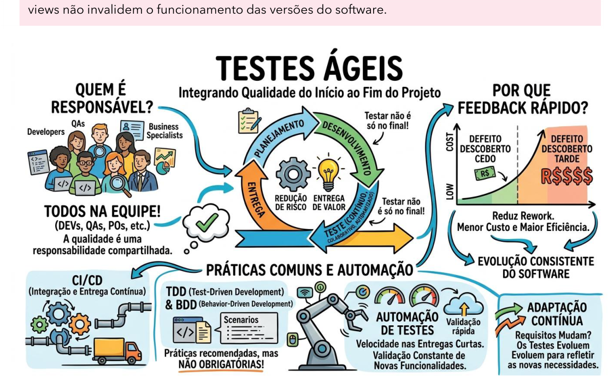

<!-- Start of picture text -->
views não invalidem o funcionamento das versões do software. <!-- End of picture text -->

---

<!-- pagina: 118 -->

**Diego Carvalho, Equipe Informática 2 (Diego Carvalho), Equipe Informática 1 (Diego Carvalho) Aula 06** 

<!-- Start of picture text -->
Principais Características <!-- End of picture text -->

|**CARACTERÍSTICAS**|**DESCRIÇÃO**|
|---|---|
|**TESTES** **CONTÍNUOS**|Os testes são executados continuamente ao longo do desenvolvimento, e não apenas ao final do projeto. Isso permite identificar defeitos precocemente e fornecer feedback rápido para a equipe.|
|**INTEGRAÇÃO AO** **DESENVOLVI-** **MENTO**|As atividades de teste são realizadas em paralelo à implementação das funcionalidades. Testadores, desenvolvedores e analistas colaboram desde o início para garantir a qualidade do produto.|
|**FEEDBACK** **RÁPIDO**| Um dos principais objetivos dos testes ágeis é fornecer informações rápidas sobre problemas e riscos identificados, permitindo correções imediatas e reduzindo retrabalho.|
|**AUTOMAÇÃO DE** **TESTES**|A automação é amplamente utilizada para executar testes de regressão, integração e validação de forma frequente. Isso aumenta a velocidade das verificações e apoia práticas de CI/CD.|
|**COLABORAÇÃO** **ENTRE EQUIPES**|Os testes deixam de ser responsabilidade exclusiva dos testadores e passam a envolver toda a equipe, incluindo desenvolvedores, Product Owners e usuários de negócio.|
|**FOCO NO VALOR** **DE NEGÓCIO**|Os testes são priorizados de acordo com os requisitos e funcionalidades que geram maior valor para o usuário e para o negócio, concentrando esforços nas áreas mais relevantes.|
|**ADAPTAÇÃO ÀS** **MUDANÇAS**|Como os requisitos podem evoluir ao longo do projeto, os testes ágeis são projetados para acompanhar essas mudanças rapidamente, sem comprometer a qualidade do software.|
|**ITERATIVIDADE E** **INCREMEN-** **TALIDADE**|Os testes são realizados a cada sprint ou iteração, validando incrementos funcionais do sistema e permitindo entregas frequentes com maior confiança.|
|**TESTES BASEADOS** **EM HISTÓRIAS DE** **USUÁRIO**|Os cenários de teste são frequentemente derivados das histórias de usuário e dos critérios de aceitação, garantindo alinhamento entre requisitos e validações realizadas.|
|**PREVENÇÃO DE** **DEFEITOS**|Além de identificar falhas, os testes ágeis procuram evitá-las por meio de práticas como revisão de código, programação em pares, TDD e integração contínua.|
|**TDD (TEST-DRIVEN** **DEVELOPMENT)** **BDD (BEHAVIOR-** **DRIVEN** **DEVELOPMENT)**|Os testes são escritos antes da implementação do código. O desenvolvimento ocorre em ciclos curtos nos quais um teste falha, o código é criado e posteriormente refatorado. Foca na descrição do comportamento esperado do sistema utilizando linguagem próxima ao negócio, facilitando a comunicação entre equipes técnicas e não técnicas.|
|**ATDD**|Sigla para Acceptance Test-Driven Development, os testes de aceitação são definidos antes da implementação da funcionalidade, garantindo entendimento compartilhado dos critérios de aceitação entre todos os envolvidos.|
|**INTEGRAÇÃO** **CONTÍNUA (CI)**|As alterações de código são integradas frequentemente ao repositório principal e validadas automaticamente por meio da execução de testes automatizados.|
|**PIRÂMIDE DE** **TESTES**|Estratégia que prioriza grande quantidade de testes de unidade, quantidade moderada de testes de integração e menor quantidade de testes de interface, buscando eficiência e rapidez.|

---

<!-- pagina: 119 -->

**Diego Carvalho, Equipe Informática 2 (Diego Carvalho), Equipe Informática 1 (Diego Carvalho) Aula 06** 

<!-- Start of picture text -->
Quadrantes de Testes Ágeis <!-- End of picture text -->

O modelo dos Quadrantes de Testes Ágeis foi proposto para auxiliar equipes na organização das atividades relacionadas à qualidade do software. Como essa estrutura é organizada? Os testes são distribuídos em quatro quadrantes definidos por duas perspectivas principais: apoio à equipe ou crítica do produto, e orientação ao negócio ou à tecnologia. Essa classificação ajuda a compreender que diferentes tipos de teste atendem a objetivos distintos dentro do processo de desenvolvimento. 

O Quadrante 1 reúne testes orientados à tecnologia que fornecem suporte direto à equipe de desenvolvimento. Quais atividades fazem parte desse grupo? Testes unitários e testes de componentes figuram entre os exemplos mais comuns. Essas verificações costumam ser amplamente automatizadas e têm como finalidade identificar defeitos em partes específicas do sistema logo nas etapas iniciais do desenvolvimento. 

O Quadrante 2 também atua como apoio à equipe, mas possui foco orientado ao negócio. O que se procura avaliar nesse contexto? Nesse grupo encontram-se testes funcionais, testes de aceitação orientados ao negócio, validações derivadas de histórias de usuário e verificações de requisitos. Muitas dessas atividades podem ser automatizadas e ajudam a confirmar que o sistema está sendo desenvolvido de acordo com as necessidades esperadas pelos usuários e pelas áreas de negócio. 

O Quadrante 3 possui orientação ao negócio e exerce o papel de crítica do produto. Por que esse quadrante depende tanto da participação humana? Porque nele estão concentradas atividades que exigem observação, interpretação e julgamento por parte dos avaliadores. Testes exploratórios, avaliações de usabilidade, análise de cenários de negócio e outras verificações focadas na experiência do usuário são exemplos frequentes. Embora ferramentas possam auxiliar algumas tarefas, a avaliação humana continua sendo o elemento central dessa categoria. 

O Quadrante 4 é orientado à tecnologia e também possui caráter de crítica do produto. Quais aspectos são normalmente avaliados nesse grupo? Testes de desempenho, carga, segurança, confiabilidade e

---

<!-- pagina: 120 -->

**Diego Carvalho, Equipe Informática 2 (Diego Carvalho), Equipe Informática 1 (Diego Carvalho) Aula 06** 

outros atributos não funcionais figuram entre os exemplos mais comuns. Essas avaliações costumam utilizar ferramentas especializadas para simular condições específicas de operação e verificar se o sistema mantém níveis adequados de qualidade em diferentes cenários de utilização. 

Ao observar os quatro quadrantes em conjunto, surge uma questão importante. Seria suficiente concentrar os esforços apenas em um deles? Em geral, não. Cada quadrante aborda aspectos distintos da qualidade e contribui para a identificação de diferentes tipos de defeitos e riscos. Por essa razão, o modelo é utilizado como um guia para equilibrar as atividades de teste e promover uma avaliação mais abrangente do produto ao longo do desenvolvimento ágil.

---

<!-- pagina: 121 -->

**Diego Carvalho, Equipe Informática 2 (Diego Carvalho), Equipe Informática 1 (Diego Carvalho) Aula 06** 

<!-- Start of picture text -->
Doubles <!-- End of picture text -->

**<mark>INCIDÊNCIA EM PROVA: MÉDIA</mark>** 

###### **<mark>DOUBLES</mark>** 

Objetos utilizados durante os testes para substituir componentes reais do sistema, permitindo que o comportamento de dependências externas seja controlado e previsível. Seu principal objetivo é isolar a unidade ou componente que está sendo testado, eliminando a necessidade de acessar recursos reais como bancos de dados, serviços web, APIs, sistemas externos ou arquivos. Dessa forma, os testes tornam-se mais rápidos, estáveis e independentes do ambiente de execução. O termo Test Double engloba diferentes tipos de substitutos, como Dummy, Stub, Spy, Mock e Fake, cada um utilizado para simular comportamentos específicos ou verificar interações entre componentes durante a execução dos testes. 

O isolamento de componentes representa um dos princípios mais importantes dos testes automatizados. Como testar adequadamente uma unidade de software quando ela depende de bancos de dados, APIs externas, serviços de pagamento ou outros componentes que não fazem parte da lógica que se deseja validar? Para resolver esse problema, utiliza-se uma família de recursos conhecida como Test Doubles. 

O termo pode parecer estranho à primeira vista. Por que utilizar a palavra double? A ideia é semelhante à de um dublê utilizado em produções cinematográficas. Em vez de utilizar o elemento real durante uma determinada atividade, emprega-se um substituto capaz de desempenhar o papel necessário naquele contexto específico. Nos testes de software, esse substituto assume temporariamente o lugar de uma dependência real da aplicação. 

Essas dependências recebem frequentemente o nome de colaboradores, ou collaborators. O que exatamente caracteriza um colaborador? Trata-se de qualquer componente que participa da execução da funcionalidade em teste. Bancos de dados, serviços externos, APIs, sistemas de autenticação, filas de mensagens e provedores de pagamento representam exemplos comuns de colaboradores encontrados em aplicações modernas. 

Uma dúvida frequente surge nesse momento. Por que não utilizar diretamente as dependências reais durante os testes? Existem diversas razões para evitar essa abordagem. Algumas dependências podem não estar disponíveis no ambiente de teste; outras podem tornar a execução lenta, imprevisível ou custosa. Além disso, determinadas integrações podem produzir efeitos indesejados, como envio de mensagens reais, processamento financeiro ou alteração permanente de dados. 

Considere um sistema responsável por processar pagamentos eletrônicos. Seria adequado executar transações financeiras reais sempre que um teste automatizado fosse executado? Evidentemente não. Nesse cenário, um Test Double pode reproduzir o comportamento esperado do sistema bancário sem realizar qualquer operação financeira efetiva. Dessa forma, o teste permanece seguro, rápido e previsível. 

O principal benefício dessa abordagem está no isolamento da unidade analisada. O que se pretende validar durante um teste unitário? O objetivo é verificar o comportamento do componente sob teste, e não o funcionamento das dependências externas com as quais ele interage. Ao substituir essas dependências por versões controladas, torna-se possível concentrar a avaliação exclusivamente na lógica que se deseja examinar. 

Os Test Doubles não formam uma categoria única e homogênea. Existem diferentes tipos de substitutos para diferentes necessidades? Sim. A literatura normalmente classifica esses recursos em categorias como Dummy, Stub, Mock, Spy e Fake. Cada uma delas apresenta características específicas relacionadas ao comportamento simulado, ao nível de controle exercido sobre a dependência e à forma como as interações são verificadas durante os testes.

---

<!-- pagina: 122 -->

**Diego Carvalho, Equipe Informática 2 (Diego Carvalho), Equipe Informática 1 (Diego Carvalho) Aula 06** 

Essa classificação existe porque diferentes cenários exigem diferentes estratégias de substituição. Em alguns casos, basta fornecer um objeto simples para satisfazer uma dependência. Em outros, torna-se necessário simular respostas específicas, registrar interações ou reproduzir parcialmente o comportamento de um componente real. Por esse motivo, compreender as diferenças entre Dummy, Stub, Mock, Spy e Fake é fundamental para utilizar adequadamente os Test Doubles em ambientes de teste automatizado. 

Ao permitir o isolamento das unidades de software e reduzir a dependência de componentes externos, os Test Doubles contribuem para tornar os testes mais rápidos, previsíveis, seguros e fáceis de manter. Essas características explicam por que seu uso se tornou uma prática amplamente adotada no desenvolvimento moderno de software. 

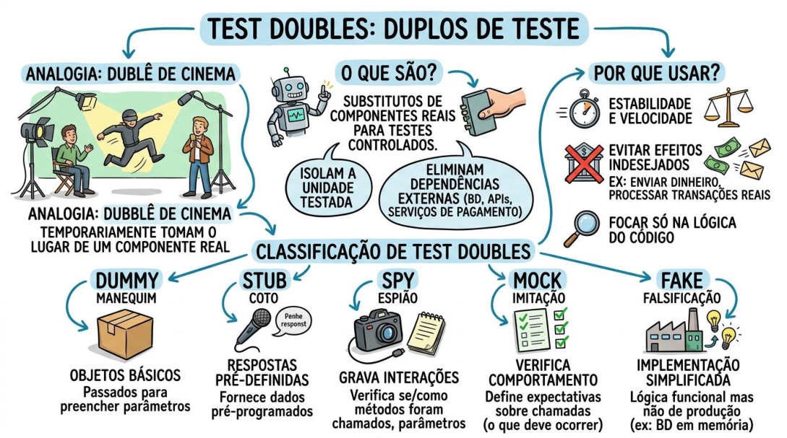

---

<!-- pagina: 123 -->

**Diego Carvalho, Equipe Informática 2 (Diego Carvalho), Equipe Informática 1 (Diego Carvalho) Aula 06** 

<!-- Start of picture text -->
Dummy <!-- End of picture text -->

Entre todos os tipos de Test Doubles, o Dummy representa a forma mais simples de substituição de dependências. Por que seria necessário criar um objeto que praticamente não faz nada? A resposta está relacionada à estrutura do código. Em muitos casos, métodos ou construtores exigem determinados parâmetros para serem executados, mesmo quando essas dependências não possuem qualquer relevância para o comportamento que se deseja testar. 

Imagine uma situação em que uma classe depende de diversos componentes externos. Todos eles precisam participar do teste? Nem sempre. Frequentemente, apenas uma parte dessas dependências está relacionada ao cenário que está sendo validado. As demais continuam sendo exigidas pela assinatura do método ou pelo mecanismo de injeção de dependência, mas não exercem influência sobre o resultado esperado. 

É justamente nesse contexto que surge o Dummy. Qual é sua função? Ele existe apenas para satisfazer uma exigência estrutural do código. O objeto é fornecido ao componente em teste para que a execução possa ocorrer normalmente, mas sua presença não interfere na lógica analisada nem altera o comportamento que está sendo validado. 

Uma dúvida comum aparece nesse momento. O Dummy precisa simular algum comportamento específico? Não. Diferentemente de outros Test Doubles, o Dummy não retorna respostas relevantes, não registra interações e não reproduz funcionalidades da dependência real. Seu papel limita-se a ocupar um espaço que precisa ser preenchido para que o teste seja executado. 

Considere um método que exige um objeto de configuração entre seus parâmetros. E se essa configuração não for utilizada no cenário avaliado? Nesse caso, criar uma implementação completa da dependência seria desnecessário. Um Dummy pode ser fornecido apenas para atender à assinatura exigida pelo código, permitindo que o foco permaneça exclusivamente no comportamento que realmente interessa ao teste. 

Essa característica diferencia o Dummy dos demais tipos de Test Doubles. Enquanto outras categorias procuram simular comportamentos, controlar respostas ou verificar interações, o Dummy não participa efetivamente da execução da lógica analisada. Sua existência tem finalidade puramente estrutural, servindo apenas para viabilizar a execução do teste. 

Por esse motivo, o Dummy é frequentemente descrito como um objeto de preenchimento. Ele está presente porque o código exige sua existência, mas não porque o teste necessita de sua funcionalidade. Essa simplicidade faz dele o tipo mais básico dentro da família dos Test Doubles e o ponto de partida para compreender as demais categorias de substitutos utilizados em testes automatizados.

---

<!-- pagina: 124 -->

**Diego Carvalho, Equipe Informática 2 (Diego Carvalho), Equipe Informática 1 (Diego Carvalho) Aula 06** 

<!-- Start of picture text -->
Stub <!-- End of picture text -->

Um Stub é um componente de teste utilizado para substituir dependências externas durante a execução de testes de software. Qual é o propósito dessa substituição? O objetivo consiste em simular o comportamento de módulos, serviços ou componentes chamados pelo elemento que está sendo avaliado, fornecendo respostas previamente definidas sem executar a lógica real dessas dependências. Dessa forma, torna-se possível controlar o ambiente de teste e reduzir interferências externas nos resultados obtidos. 

Os stubs são empregados em diferentes situações ao longo do desenvolvimento. Quando essa técnica costuma ser utilizada? Em muitos casos, a dependência necessária para o teste ainda não foi implementada, não está disponível ou não deve ser acessada durante a execução. Bancos de dados, APIs externas, sistemas legados e serviços remotos figuram entre os exemplos mais frequentes de componentes que podem ser substituídos por stubs. 

Uma dúvida comum envolve o funcionamento desse mecanismo. Como o Stub simula o comportamento da dependência? Em vez de executar operações reais, ele retorna respostas previamente definidas para cada situação de teste. Isso permite que o componente sob avaliação receba os dados necessários para sua execução sem depender do funcionamento efetivo dos sistemas externos envolvidos. 

Os stubs são frequentemente utilizados para promover o isolamento do componente analisado. Por que esse isolamento é importante? Quando dependências externas participam diretamente dos testes, falhas de infraestrutura, indisponibilidade de serviços ou mudanças em sistemas externos podem influenciar os resultados obtidos. A utilização de stubs reduz essa influência e permite concentrar a avaliação na lógica do componente que está sendo testado. 

Outra questão frequentemente discutida envolve a diferença entre stubs e mocks. Ambos desempenham a mesma função? Não exatamente. Enquanto o Stub tem como principal objetivo fornecer respostas controladas para substituir uma dependência, o Mock também pode verificar se determinadas interações ocorreram conforme o esperado, registrando chamadas e validando comportamentos. Apesar dessa diferença, ambas as técnicas são amplamente utilizadas para apoiar o isolamento e a execução eficiente dos testes. 

**(CEBRASPE / TSE - 2024)** No que concerne à qualidade do código e de sistemas e à abordagem <mark>DevOps, julgue o item subsequente.</mark> 

<mark>Nos testes de software, os stubs, diferentemente dos mocks, são mais apropriados para a verificação do comportamento da aplicação em contraste com a verificação de estado durante um teste unitário</mark> 

**<mark>_______________________ Comentários:</mark>** <mark>Stubs costumam fornecer respostas controladas para apoiar a verificação de estado, enquanto mocks são mais usados</mark> para checar interações e comportamento da aplicação durante o teste unitário. (Errado) 

Os benefícios dessa abordagem tornam-se evidentes durante a execução das atividades de teste. O que se ganha ao utilizar stubs? Os testes tendem a ser mais previsíveis, rápidos e fáceis de reproduzir, pois deixam de depender do comportamento real de componentes externos. Por essa razão, os stubs são amplamente empregados em testes unitários e em diversas estratégias de integração de software.

---

<!-- pagina: 125 -->

**Diego Carvalho, Equipe Informática 2 (Diego Carvalho), Equipe Informática 1 (Diego Carvalho) Aula 06** 

<!-- Start of picture text -->
Mock <!-- End of picture text -->

Entre os diversos tipos de Test Doubles, os Mocks ocupam posição de destaque por permitirem algo além da simples substituição de dependências. O que diferencia um Mock dos demais substitutos utilizados em testes? Sua principal característica é a capacidade de verificar as interações realizadas entre o componente em teste e seus colaboradores. Em outras palavras, não basta apenas simular uma dependência; também é possível confirmar se ela foi utilizada da maneira esperada. 

Essa abordagem é particularmente útil em testes unitários. Por que apenas verificar o resultado final nem sempre é suficiente? Em muitos cenários, o comportamento correto de uma classe depende não apenas dos valores produzidos, mas também das chamadas realizadas para outros componentes. Assim, além de validar o resultado obtido, torna-se importante verificar se determinados métodos foram invocados, quais parâmetros foram utilizados e quantas vezes cada interação ocorreu. 

Os Mocks permitem definir expectativas antes da execução do teste. O que significa estabelecer uma expectativa? O desenvolvedor pode especificar que determinado método deve ser chamado, que certos argumentos devem ser fornecidos ou que uma sequência específica de interações deve ocorrer. Após a execução do teste, essas expectativas são verificadas automaticamente. Caso alguma delas não seja atendida, o teste falha. 

Uma dúvida frequente surge nesse ponto. Os Mocks servem apenas para retornar valores simulados? Não. Embora possam fornecer respostas controladas quando necessário, essa não é sua principal finalidade. O elemento que realmente caracteriza um Mock é a validação das interações. Se o foco estiver apenas na devolução de respostas pré-definidas, outras categorias de Test Doubles, como Stubs, costumam ser mais adequadas. 

Considere uma classe responsável por enviar notificações aos usuários. Como verificar se a mensagem foi realmente enviada para o serviço de notificações? Utilizando um Mock, é possível confirmar que o método responsável pelo envio foi chamado com os parâmetros corretos. Dessa forma, o teste valida não apenas o resultado da operação, mas também a comunicação entre os componentes envolvidos. 

Essa técnica contribui diretamente para o isolamento das unidades de software. Seria necessário utilizar bancos de dados reais, serviços externos ou integrações completas durante o teste? Não. Os Mocks substituem essas dependências e permitem que a validação ocorra em um ambiente totalmente controlado. Como consequência, os testes tornam-se mais rápidos, previsíveis e independentes de fatores externos. 

Outra característica importante está relacionada à compatibilidade com as dependências reais. Como o componente testado consegue interagir com um objeto simulado? Normalmente, o Mock implementa o mesmo contrato esperado pela aplicação, utilizando interfaces, classes abstratas ou outros mecanismos de abstração. Isso permite que ele seja utilizado como substituto sem exigir alterações na lógica do sistema. 

A criação desses objetos é amplamente facilitada por bibliotecas especializadas. Quais ferramentas costumam ser utilizadas? No ecossistema Java, destacam-se soluções como Mockito, EasyMock e JMock. Em plataformas .NET, ferramentas como NMock e TypeMock desempenham papel semelhante. Essas bibliotecas automatizam a criação dos Mocks e simplificam a definição das expectativas utilizadas durante os testes. 

Os Mocks tornaram-se uma das ferramentas mais importantes dos testes automatizados porque permitem verificar não apenas o que o software produz, mas também como ele interage com os demais componentes do sistema. Essa capacidade de validar comportamentos colaborativos faz com que sejam

---

<!-- pagina: 126 -->

**Diego Carvalho, Equipe Informática 2 (Diego Carvalho), Equipe Informática 1 (Diego Carvalho) Aula 06** 

amplamente utilizados em cenários que exigem elevado grau de isolamento e controle durante a execução dos testes.

---

<!-- pagina: 127 -->

**Diego Carvalho, Equipe Informática 2 (Diego Carvalho), Equipe Informática 1 (Diego Carvalho) Aula 06** 

<!-- Start of picture text -->
Spy <!-- End of picture text -->

Entre os diversos tipos de Test Doubles, o Spy possui uma característica bastante particular. Como descobrir exatamente o que aconteceu durante a execução de um teste sem definir antecipadamente todas as expectativas de comportamento? É justamente para responder a essa necessidade que os Spies são utilizados. Sua principal função consiste em observar e registrar as interações realizadas entre componentes ao longo da execução do teste. 

O conceito é relativamente simples. O que faz um Spy na prática? Ele monitora as chamadas realizadas para uma dependência e armazena informações sobre essas interações. Após a execução do teste, tornase possível verificar quais métodos foram invocados, quantas vezes foram executados e quais parâmetros foram utilizados durante cada chamada. 

Essa característica leva a uma dúvida bastante comum. O Spy é a mesma coisa que um Mock? Não. Embora ambos permitam analisar interações entre objetos, suas abordagens são diferentes. Nos Mocks, normalmente são definidas expectativas antes da execução do teste. Nos Spies, o comportamento é observado primeiro e analisado posteriormente. Em outras palavras, o Mock pergunta se determinada interação ocorreu conforme o planejado; o Spy registra o que aconteceu para que essa avaliação seja realizada depois. 

Essa abordagem oferece maior flexibilidade em determinados cenários. Por que registrar as informações para análise posterior pode ser útil? Em algumas situações, o objetivo não é impor regras rígidas sobre a comunicação entre componentes, mas compreender como ela ocorreu durante a execução do teste. O Spy permite capturar essas informações sem interferir significativamente no fluxo normal da aplicação. 

Uma situação típica envolve a necessidade de verificar se determinado serviço foi utilizado corretamente. Como confirmar que uma operação foi executada com os parâmetros esperados? Um Spy pode registrar todas as chamadas realizadas para esse serviço durante o teste. Após a execução, as informações armazenadas são consultadas para verificar se o comportamento observado corresponde ao esperado. 

Outra característica importante é a possibilidade de monitorar objetos que mantêm parte de seu comportamento original. O Spy substitui completamente a dependência real? Nem sempre. Em muitas implementações modernas, ele é criado sobre um objeto existente, permitindo que a lógica original continue sendo executada enquanto as interações são registradas. Dessa forma, o componente mantém seu comportamento normal e, ao mesmo tempo, produz informações úteis para análise posterior. 

Essa capacidade de observação explica a origem do nome Spy. O que justifica essa denominação? Assim como um agente de vigilância registra atividades para análise futura, o Spy acompanha o comportamento dos componentes durante a execução do teste e armazena evidências das interações realizadas. O interesse principal não está em controlar previamente cada ação, mas em observar o que efetivamente aconteceu. 

Os Spies ocupam uma posição intermediária entre simples substitutos de dependências e mecanismos completos de validação de expectativas. Ao registrar informações detalhadas sobre a comunicação entre objetos, eles oferecem uma maneira prática de analisar comportamentos colaborativos e compreender como os componentes interagem durante a execução dos testes automatizados.

---

<!-- pagina: 128 -->

**Diego Carvalho, Equipe Informática 2 (Diego Carvalho), Equipe Informática 1 (Diego Carvalho) Aula 06** 

<!-- Start of picture text -->
Fakes <!-- End of picture text -->

Entre os diversos tipos de Test Doubles, o Fake ocupa uma posição bastante particular. Como substituir uma dependência complexa sem perder completamente seu comportamento funcional? Em muitas situações, simplesmente retornar valores pré-definidos não é suficiente para reproduzir adequadamente o cenário de teste. Nesses casos, utiliza-se um Fake, que fornece uma implementação simplificada, mas funcional, do componente real. 

O que diferencia um Fake dos demais substitutos utilizados em testes? Sua principal característica é a presença de comportamento real. Enquanto alguns Test Doubles apenas fornecem respostas controladas ou registram interações, o Fake implementa parte da lógica da dependência original. Essa implementação, entretanto, é simplificada para tornar os testes mais rápidos, previsíveis e fáceis de executar. 

Essa abordagem é especialmente útil quando a dependência real apresenta dificuldades práticas. Por que utilizar um componente simplificado em vez da implementação verdadeira? Em muitos projetos, determinadas dependências exigem infraestrutura complexa, apresentam baixo desempenho ou dependem de recursos externos que nem sempre estão disponíveis durante os testes. O uso de um Fake permite reproduzir o comportamento essencial desses componentes sem incorporar toda a complexidade existente em produção. 

Um exemplo clássico envolve bancos de dados. Seria necessário utilizar um banco real sempre que um teste automatizado fosse executado? Nem sempre. Um Fake pode implementar as operações de armazenamento e consulta diretamente em memória, reproduzindo o comportamento necessário para os testes sem exigir instalação, configuração ou comunicação com um servidor externo. Dessa forma, o teste permanece rápido e independente da infraestrutura de produção. 

Uma dúvida recorrente surge ao comparar Fakes e Stubs. Ambos não servem para substituir dependências? Sim, mas desempenham papéis diferentes. O Stub normalmente retorna respostas previamente definidas, sem implementar comportamento relevante. O Fake, por sua vez, contém lógica funcional simplificada e é capaz de reproduzir parte do funcionamento real do componente substituído. Essa distinção é fundamental para compreender quando cada abordagem deve ser utilizada. 

Outro ponto importante envolve a classificação dos Test Doubles. O Fake representa uma categoria mais abrangente do que Mocks e Stubs? Não. Na classificação tradicional proposta por Gerard Meszaros, Dummy, Stub, Mock, Spy e Fake constituem categorias distintas dentro da mesma família de substitutos utilizados em testes. Cada uma delas foi criada para atender necessidades específicas de isolamento e validação. 

Considere uma aplicação que depende de um serviço externo de armazenamento de arquivos. O que fazer quando esse serviço não está disponível no ambiente de testes? Um Fake pode reproduzir as operações essenciais de gravação, leitura e remoção de arquivos utilizando estruturas simplificadas em memória. O comportamento principal continua existindo, mas a complexidade operacional é significativamente reduzida. 

Essa capacidade de combinar funcionalidade e simplicidade explica a popularidade dos Fakes em testes automatizados. Ao fornecer implementações reduzidas, porém operacionais, eles permitem validar cenários mais próximos da realidade sem depender integralmente de componentes externos. Como consequência, os testes tornam-se mais rápidos, mais estáveis e mais fáceis de executar em diferentes ambientes de desenvolvimento e integração contínua.

---

<!-- pagina: 129 -->

**Diego Carvalho, Equipe Informática 2 (Diego Carvalho), Equipe Informática 1 (Diego Carvalho) Aula 06** 

**<mark>TIPOS DESCRIÇÃO</mark> DUMMY** não influencia o cenário avaliado. **STUB** 

Um Dummy é um objeto utilizado apenas para preencher parâmetros ou dependências exigidas pelo código durante a execução dos testes. Ele não possui comportamento relevante nem participa efetivamente da lógica testada. Seu único propósito é permitir que o teste seja compilado e executado quando determinado objeto é obrigatório, mas não influencia o cenário avaliado. 

Um Stub é um objeto de teste que substitui uma dependência real e fornece respostas previamente programadas para chamadas específicas. Seu objetivo é controlar o ambiente de teste e isolar o componente avaliado de serviços externos, bancos de dados ou módulos ainda indisponíveis, permitindo verificar o comportamento da unidade testada de forma previsível e reproduzível. 

Um Mock é um objeto simulado que, além de fornecer comportamentos préconfigurados, registra e valida as interações realizadas pelo sistema sob teste. Ele permite verificar se determinados métodos foram chamados, quantas vezes foram executados e com quais parâmetros, sendo amplamente utilizado para validar a comunicação entre componentes durante os testes. 

**MOCK SPY FAKE** 

Um Spy é um tipo de objeto de teste que observa e registra as interações realizadas com uma dependência, preservando parcial ou totalmente seu comportamento original. Diferentemente do Mock, o Spy é normalmente utilizado para coletar informações sobre chamadas efetuadas durante a execução do teste, permitindo posterior verificação sem necessariamente impor expectativas prévias. 

Um Fake é uma implementação simplificada de um componente real, contendo lógica funcional suficiente para ser utilizada durante os testes. Diferentemente de um Stub, ele executa operações reais de forma reduzida, como um banco de dados em memória ou um serviço de armazenamento temporário, proporcionando testes mais realistas sem depender da infraestrutura de produção.

---

<!-- pagina: 130 -->

**Diego Carvalho, Equipe Informática 2 (Diego Carvalho), Equipe Informática 1 (Diego Carvalho) Aula 06** 

<!-- Start of picture text -->
R ESUMO <!-- End of picture text -->

###### **<mark>TESTES DE SOFTWARE</mark>** 

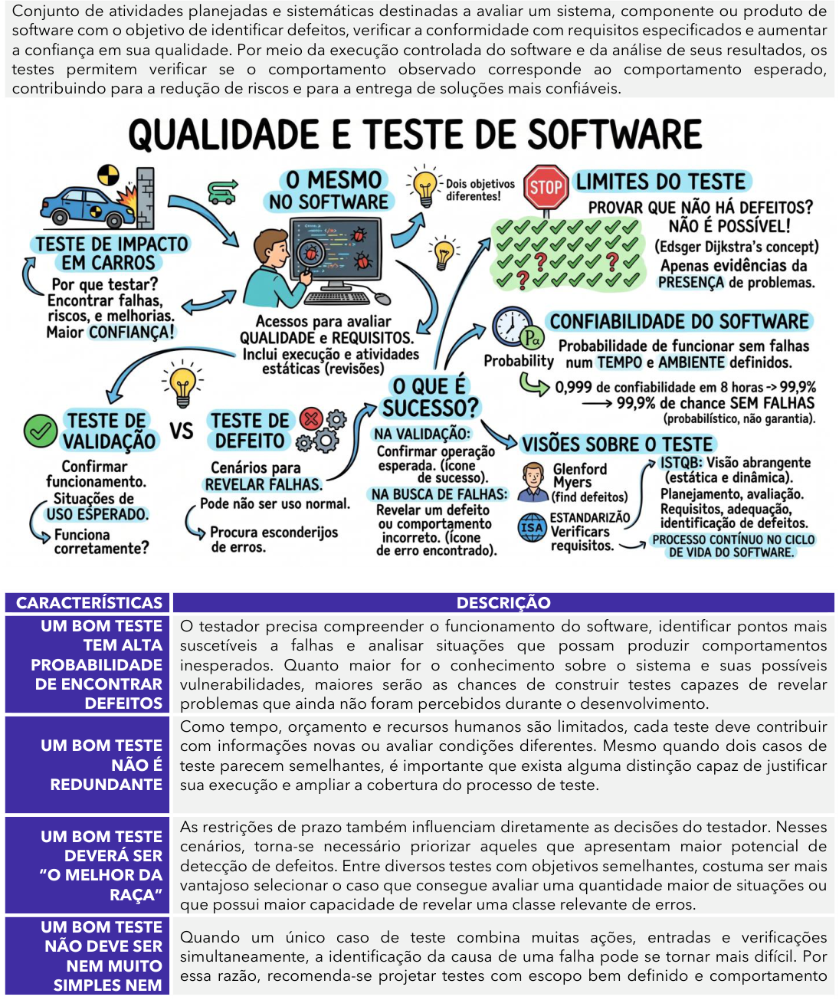

<!-- Start of picture text -->
Conjunto de atividades planejadas e sistemáticas destinadas a avaliar um sistema, componente ou produto de software com o objetivo de identificar defeitos, verificar a conformidade com requisitos especificados e aumentar a confiança em sua qualidade. Por meio da execução controlada do software e da análise de seus resultados, os testes permitem verificar se o comportamento observado corresponde ao comportamento esperado, contribuindo para a redução de riscos e para a entrega de soluções mais confiáveis. CARACTERÍSTICAS  DESCRIÇÃO UM BOM TESTE  O testador precisa compreender o funcionamento do software, identificar pontos mais TEM ALTA  suscetíveis a falhas e analisar situações que possam produzir comportamentos PROBABILIDADE  inesperados. Quanto maior for o conhecimento sobre o sistema e suas possíveis DE ENCONTRAR  vulnerabilidades, maiores serão as chances de construir testes capazes de revelar DEFEITOS  problemas que ainda não foram percebidos durante o desenvolvimento. Como tempo, orçamento e recursos humanos são limitados, cada teste deve contribuir UM BOM TESTE  com informações novas ou avaliar condições diferentes. Mesmo quando dois casos de NÃO É   teste parecem semelhantes, é importante que exista alguma distinção capaz de justificar REDUNDANTE  sua execução e ampliar a cobertura do processo de teste. As restrições de prazo também influenciam diretamente as decisões do testador. Nesses UM BOM TESTE cenários, torna-se necessário priorizar aqueles que apresentam maior potencial de DEVERÁ SER detecção de defeitos. Entre diversos testes com objetivos semelhantes, costuma ser mais “O MELHOR DA vantajoso selecionar o caso que consegue avaliar uma quantidade maior de situações ou RAÇA” que possui maior capacidade de revelar uma classe relevante de erros. UM BOM TESTE Quando um único caso de teste combina muitas ações, entradas e verificações NÃO DEVE SER simultaneamente, a identificação da causa de uma falha pode se tornar mais difícil. Por NEM MUITO essa razão, recomenda-se projetar testes com escopo bem definido e comportamento SIMPLES NEM <!-- End of picture text -->

---

<!-- pagina: 131 -->

**Diego Carvalho, Equipe Informática 2 (Diego Carvalho), Equipe Informática 1 (Diego Carvalho) Aula 06** 

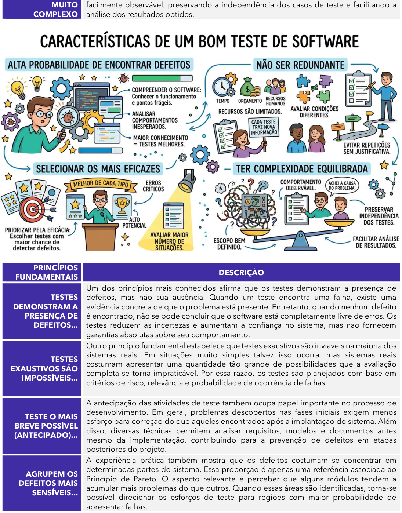

<!-- Start of picture text -->
MUITO  facilmente observável, preservando a independência dos casos de teste e facilitando a COMPLEXO  análise dos resultados obtidos. PRINCÍPIOS DESCRIÇÃO FUNDAMENTAIS Um dos princípios mais conhecidos afirma que os testes demonstram a presença de TESTES  defeitos, mas não sua ausência. Quando um teste encontra uma falha, existe uma DEMONSTRAM A  evidência concreta de que o problema está presente. Entretanto, quando nenhum defeito PRESENÇA DE  é encontrado, não se pode concluir que o software está completamente livre de erros. Os DEFEITOS...  testes reduzem as incertezas e aumentam a confiança no sistema, mas não fornecem garantias absolutas sobre seu comportamento. Outro princípio fundamental estabelece que testes exaustivos são inviáveis na maioria dos sistemas reais. Em situações muito simples talvez isso ocorra, mas sistemas reais TESTES costumam apresentar uma quantidade tão grande de possibilidades que a avaliação EXAUSTIVOS SÃO completa se torna impraticável. Por essa razão, os testes são planejados com base em IMPOSSÍVEIS... critérios de risco, relevância e probabilidade de ocorrência de falhas. A antecipação das atividades de teste também ocupa papel importante no processo de desenvolvimento. Em geral, problemas descobertos nas fases iniciais exigem menos TESTE O MAIS esforço para correção do que aqueles encontrados após a implantação do sistema. Além BREVE POSSÍVEL disso, diversas técnicas permitem analisar requisitos, modelos e documentos antes (ANTECIPADO)... mesmo da implementação, contribuindo para a prevenção de defeitos em etapas posteriores do projeto. A experiência prática também mostra que os defeitos costumam se concentrar em determinadas partes do sistema. Essa proporção é apenas uma referência associada ao AGRUPEM OS Princípio de Pareto. O aspecto relevante é perceber que alguns módulos tendem a DEFEITOS MAIS acumular mais problemas do que outros. Quando essas áreas são identificadas, torna-se SENSÍVEIS... possível direcionar os esforços de teste para regiões com maior probabilidade de apresentar falhas. <!-- End of picture text -->

---

<!-- pagina: 132 -->

**Diego Carvalho, Equipe Informática 2 (Diego Carvalho), Equipe Informática 1 (Diego Carvalho) Aula 06** 

Outro conceito bastante cobrado é o paradoxo do pesticida. Com o tempo, eles tendem a perder sua capacidade de revelar novos defeitos, pois os problemas mais evidentes já foram encontrados e corrigidos. Para manter a eficácia do processo de teste, é necessário revisar periodicamente os casos existentes, criar novos cenários e adaptar as estratégias às mudanças ocorridas no software. 

**PARADOXO DO PESTICIDA...** 

Os testes também dependem fortemente do contexto em que o sistema será utilizado. Cada domínio apresenta riscos, requisitos e características próprias. Sistemas financeiros costumam exigir elevado rigor em aspectos de segurança e integridade dos dados, enquanto aplicações voltadas à interação social podem demandar maior atenção a desempenho, usabilidade e escalabilidade. 

**TESTES DEPENDEM DO CONTEXTO...** 

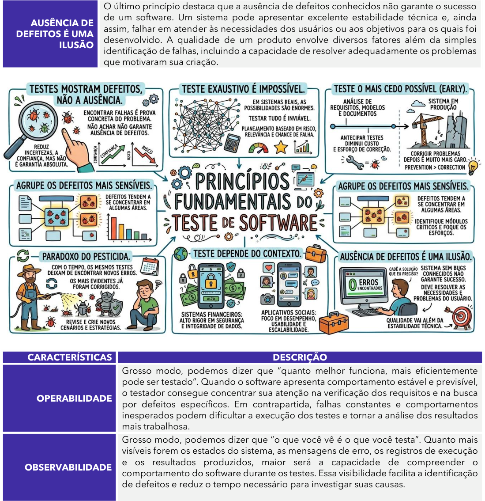

<!-- Start of picture text -->
O último princípio destaca que a ausência de defeitos conhecidos não garante o sucesso de um software. Um sistema pode apresentar excelente estabilidade técnica e, ainda AUSÊNCIA DE assim, falhar em atender às necessidades dos usuários ou aos objetivos para os quais foi DEFEITOS É UMA desenvolvido. A qualidade de um produto envolve diversos fatores além da simples ILUSÃO identificação de falhas, incluindo a capacidade de resolver adequadamente os problemas que motivaram sua criação. CARACTERÍSTICAS  DESCRIÇÃO Grosso modo, podemos dizer que “quanto melhor funciona, mais eficientemente pode ser testado”. Quando o software apresenta comportamento estável e previsível, o testador consegue concentrar sua atenção na verificação dos requisitos e na busca OPERABILIDADE por defeitos específicos. Em contrapartida, falhas constantes e comportamentos inesperados podem dificultar a execução dos testes e tornar a análise dos resultados mais trabalhosa. Grosso modo, podemos dizer que “o que você vê é o que você testa”. Quanto mais visíveis forem os estados do sistema, as mensagens de erro, os registros de execução e os resultados produzidos, maior será a capacidade de compreender o OBSERVABILIDADE comportamento do software durante os testes. Essa visibilidade facilita a identificação de defeitos e reduz o tempo necessário para investigar suas causas. <!-- End of picture text -->

---

<!-- pagina: 133 -->

**Diego Carvalho, Equipe Informática 2 (Diego Carvalho), Equipe Informática 1 (Diego Carvalho) Aula 06** 

**CONTROLABILIDADE** 

**DECOMPONIBILIDADE** 

Grosso modo, podemos dizer que “quanto melhor você pode controlar o software, mais o teste pode ser automatizado e otimizado”. A controlabilidade também exerce papel fundamental no processo de teste. Nessa situação, torna-se mais fácil reproduzir cenários específicos, automatizar procedimentos e repetir testes sempre que necessário. Quanto maior o controle disponível para o testador, maior tende a <mark>ser a eficiência na validação dos comportamentos esperados.</mark> 

Grosso modo, podemos dizer que “controlando o escopo, podemos isolar problemas mais rapidamente e realizar testes mais inteligentes”. Quando o sistema pode ser dividido em partes menores, os problemas tendem a ser isolados com maior rapidez. Essa característica favorece a realização de testes focados em componentes específicos e simplifica a identificação da origem de comportamentos incorretos. 

**SIMPLICIDADE** 

**ESTABILIDADE** 

**COMPREENSIBILIDADE** 

Grosso modo, podemos dizer que “quanto menos houver a testar, mais rapidamente podemos testá-lo”. A simplicidade também contribui para aumentar a testabilidade. Não se trata de reduzir funcionalidades ou diminuir a cobertura dos testes, mas de evitar complexidade desnecessária na estrutura e no comportamento do sistema. Quanto mais simples for a solução implementada, menor tende a ser a quantidade de <mark>interações difíceis de analisar e validar durante os testes.</mark> 

<mark>Grosso modo, podemos dizer que “quanto menos modificações, menos interrupções</mark> no teste”. A estabilidade representa outra característica relevante. Quando requisitos, interfaces ou componentes sofrem alterações constantes, muitos casos de teste precisam ser revisados ou reconstruídos. Sistemas mais estáveis permitem que os testes permaneçam válidos por períodos maiores, reduzindo retrabalho e aumentando a eficiência do processo de verificação. 

Grosso modo, podemos dizer que “quanto mais informações temos, de forma mais inteligente vamos testar”. Em outras palavras, quanto mais claras forem a arquitetura, as funcionalidades e as regras de negócio, mais facilmente os testadores conseguem elaborar cenários relevantes e identificar possíveis pontos de falha. O conhecimento adequado sobre o software contribui para a construção de estratégias de teste mais <u>precisas e alinhadas aos riscos existentes no sistema.</u> 

###### **<mark>PROCESSO DE TESTES</mark>** 

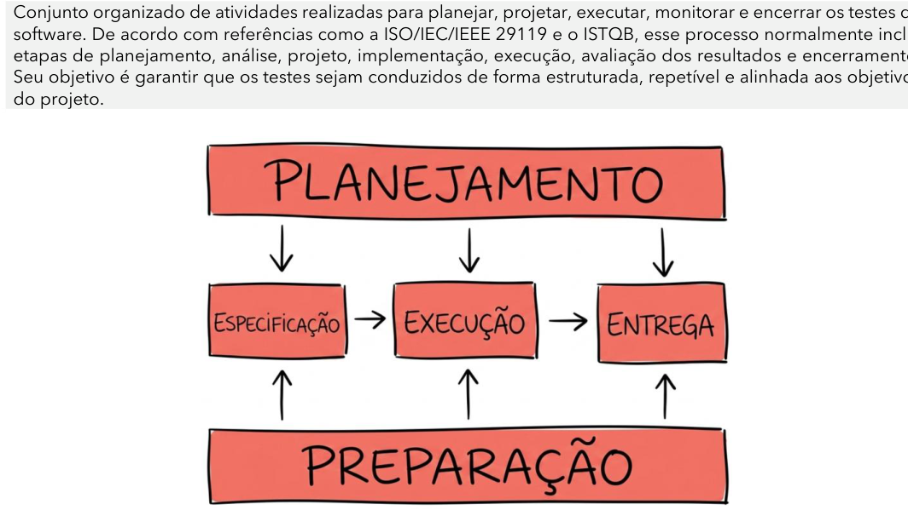

<!-- Start of picture text -->
Conjunto organizado de atividades realizadas para planejar, projetar, executar, monitorar e encerrar os testes de software. De acordo com referências como a ISO/IEC/IEEE 29119 e o ISTQB, esse processo normalmente inclui etapas de planejamento, análise, projeto, implementação, execução, avaliação dos resultados e encerramento. Seu objetivo é garantir que os testes sejam conduzidos de forma estruturada, repetível e alinhada aos objetivos do projeto. projeto. rojeto. jeto. eto. <!-- End of picture text -->

Conjunto organizado de atividades realizadas para planejar, projetar, executar, monitorar e encerrar os testes de software. De acordo com referências como a ISO/IEC/IEEE 29119 e o ISTQB, esse processo normalmente inclui etapas de planejamento, análise, projeto, implementação, execução, avaliação dos resultados e encerramento. Seu objetivo é garantir que os testes sejam conduzidos de forma estruturada, repetível e alinhada aos objetivos do projeto. projeto. rojeto. jeto. eto.

---

<!-- pagina: 134 -->

**Diego Carvalho, Equipe Informática 2 (Diego Carvalho), Equipe Informática 1 (Diego Carvalho) Aula 06** 

|**ETAPAS DO** **PROCESSO**|**DESCRIÇÃO**|
|---|---|
|**PLANEJAMENTO**|Nesta etapa, elaboram-se o Projeto de Testes e o Plano de Testes. Ela acompanha todo o processo de teste, por meio de atividades como captação de requisitos, planejamento do projeto,análise de riscos epreparação de ambiente de testes.|
|**PREPARAÇÃO**|Nesta etapa, organiza-se o ambiente de testes (infraestrutura, equipamentos, hardware, software, pessoal capacitado, ferramentas e massa de testes adequadas) para que os testes sejam executados conformeplanejados.|
|**ESPECIFICAÇÃO**|Nesta etapa, temos as atividades de elaborar e revisar casos de testes e roteiros de testes (scripts). Esse último descreve a relação dos casos de testes e a previsão de execução dos testes.|
|**EXECUÇÃO**|Nesta etapa, testes são executados conforme roteiros estabelecidos para os testes. Executa-se sempre que ocorrem mudanças na aplicação e analisam-se os testes executados com sucesso e com defeito – os resultados obtidos são registrados.|
|**ENTREGA**|Nesta etapa, o projeto é finalizado, registra-se toda a documentação e relatam-se todas as incidências relevantes à melhoria do processo em um relatório de conformidades e não-conformidades –por fim,a documentaçãogerada é arquivada.|

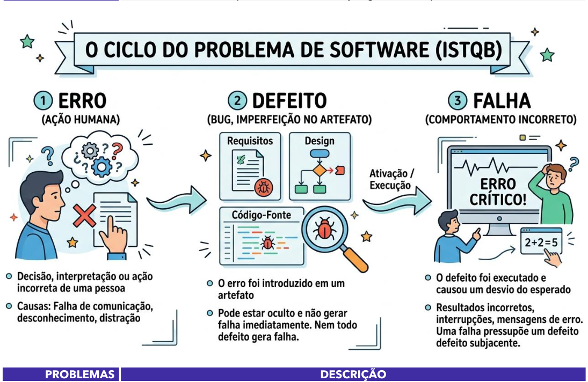

<!-- Start of picture text -->
PROBLEMAS  DESCRIÇÃO ÇÃO ÃO <!-- End of picture text -->

**<mark>PROBLEMAS DESCRIÇÃO ÇÃO ÃO</mark>** O erro corresponde a uma ação, decisão ou interpretação incorreta realizada por uma pessoa durante alguma atividade do desenvolvimento de software. Pode decorrer de **ERRO (ERROR)** falhas de comunicação, entendimento inadequado dos requisitos, distrações ou limitações de conhecimento técnico. Nesse estágio, o problema ainda está associado ao fator humano e não necessariamente foi incorporado a qualquer artefato do sistema. O defeito surge quando um erro humano é introduzido em algum artefato do projeto, **DEFEITO (DEFECT)** como requisitos, modelos, documentação ou código-fonte. Trata-se de uma imperfeição existente no produto desenvolvido. Entretanto, sua presença não implica necessariamente

---

<!-- pagina: 135 -->

**Diego Carvalho, Equipe Informática 2 (Diego Carvalho), Equipe Informática 1 (Diego Carvalho) Aula 06** 

###### **<mark>PROBLEMAS</mark>** 

###### **<mark>DESCRIÇÃO</mark>** 

<mark>a ocorrência imediata de problemas observáveis, pois o defeito pode permanecer oculto</mark> até que determinadas condições permitam sua ativação durante a execução. 

A falha ocorre quando um defeito é efetivamente executado ou ativado e produz um comportamento diferente daquele esperado pelos requisitos ou especificações. Ela se **FALHA (FAILURE)** manifesta por meio de resultados incorretos, mensagens de erro, interrupções de funcionamento ou respostas inadequadas do sistema. Nem todo defeito gera uma falha, mas toda falha pressupõe a existência de pelo menos um defeito subjacente. **<mark>TESTES ESTÁTICOS TESTES DINÂMICOS</mark>** <mark>Não executam o software. Executam o software. Avaliam requisitos,</mark> <u><mark>projetos, modelos e código-fonte.</mark></u> <mark>Avaliam o comportamento do sistema em execução. Utilizam revisões, inspeções e walk-throughs. Utilizam casos de teste e execução do sistema. Encontram defeitos precocemente. Encontram falhas durante a execução.</mark> ==5460== 

<!-- Start of picture text -->
TIPO DE REVISÃO  DESCRIÇÃO ÇÃO ÃO <!-- End of picture text -->

**<mark>TIPO DE REVISÃO DESCRIÇÃO ÇÃO ÃO</mark>** É a forma mais simples e menos estruturada de revisão estática. Não possui processo formal, papéis definidos ou critérios rígidos de execução. Normalmente ocorre quando **REVISÃO** uma ou mais pessoas analisam um artefato, como requisitos, diagramas ou código-fonte, **INFORMAL** para identificar defeitos, inconsistências ou oportunidades de melhoria. Seu principal benefício é fornecer feedback rápido com baixo custo e pouca burocracia. Revisão conduzida pelo próprio autor do artefato em que, durante a sessão, o autor apresenta passo a passo o conteúdo produzido, explicando decisões, fluxos e premissas **WALK-** adotadas, enquanto os participantes analisam o material e apontam dúvidas, defeitos ou **THROUGH** sugestões. O foco está no compartilhamento de conhecimento, no aprendizado coletivo e na identificação precoce de problemas em documentos, modelos ou código. **REVISÃO** É uma revisão mais estruturada realizada por profissionais com conhecimento técnico **TÉCNICA** sobre o artefato analisado. Seu objetivo é avaliar aspectos como correção técnica,

---

<!-- pagina: 136 -->

**Diego Carvalho, Equipe Informática 2 (Diego Carvalho), Equipe Informática 1 (Diego Carvalho) Aula 06** 

**<mark>TIPO DE REVISÃO DESCRIÇÃO</mark>** aderência a padrões, consistência arquitetural e viabilidade da solução proposta. Diferentemente do walk-through, a condução não depende necessariamente do autor do documento, sendo comum a participação de especialistas independentes. É a modalidade mais formal e rigorosa de revisão estática. Possui processo definido, papéis específicos (moderador, autor, inspetor e relator), planejamento prévio, listas de **INSPEÇÃO** verificação e registro sistemático dos defeitos encontrados. Seu principal objetivo é identificar falhas de maneira disciplinada e mensurável, produzindo métricas e evidências que auxiliam no controle da qualidade dos artefatos analisados. 

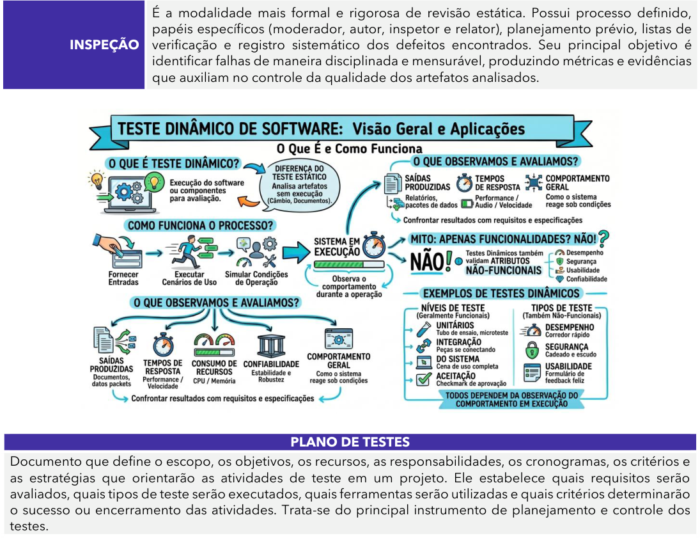

<!-- Start of picture text -->
É a modalidade mais formal e rigorosa de revisão estática. Possui processo definido, papéis específicos (moderador, autor, inspetor e relator), planejamento prévio, listas de INSPEÇÃO   verificação e registro sistemático dos defeitos encontrados. Seu principal objetivo é identificar falhas de maneira disciplinada e mensurável, produzindo métricas e evidências que auxiliam no controle da qualidade dos artefatos analisados. PLANO DE TESTES Documento que define o escopo, os objetivos, os recursos, as responsabilidades, os cronogramas, os critérios e as estratégias que orientarão as atividades de teste em um projeto. Ele estabelece quais requisitos serão avaliados, quais tipos de teste serão executados, quais ferramentas serão utilizadas e quais critérios determinarão o sucesso ou encerramento das atividades. Trata-se do principal instrumento de planejamento e controle dos testes. <!-- End of picture text -->

|**SEÇÕES**|**CONTEÚDO**|
|---|---|
|**INTRODUÇÃO**|Apresenta a identificação do projeto, seus objetivos, o público-alvo do documento e o escopo da solução a ser desenvolvida, fornecendo o contexto necessário para o entendimento do plano de testes.|
|**REQUISITOS**|Descreve, de forma consolidada, os requisitos funcionais e não funcionais que serão objeto de verificação, definindo quais aspectos do sistema deverão ser avaliados durante os testes.|
|**ESTRATÉGIAS E** **FERRAMENTAS**|Detalha os tipos e técnicas de teste a serem empregados, os critérios de entrada e saída, os critérios de encerramento e as ferramentas que apoiarão a execução e o controle dos testes.|
|**EQUIPE E** **INFRAESTRUTURA**|Identifica os recursos humanos e materiais necessários às atividades de teste, incluindo papéis da equipe, ambientes, equipamentos, softwares de apoio e demais recursos utilizados.|

---

<!-- pagina: 137 -->

**Diego Carvalho, Equipe Informática 2 (Diego Carvalho), Equipe Informática 1 (Diego Carvalho) Aula 06** 

**<mark>SEÇÕES CONTEÚDO</mark>** Define o planejamento temporal das atividades de teste, apresentando marcos, **CRONOGRAMA DE** dependências, datas previstas de início e término e os principais entregáveis do processo **ATIVIDADES** de testes. Relaciona os documentos de referência do projeto, como especificações, requisitos, **DOCUMENTAÇÃO** normas, procedimentos e demais artefatos que subsidiam o planejamento e a execução **COMPLEMENTAR** dos testes. 

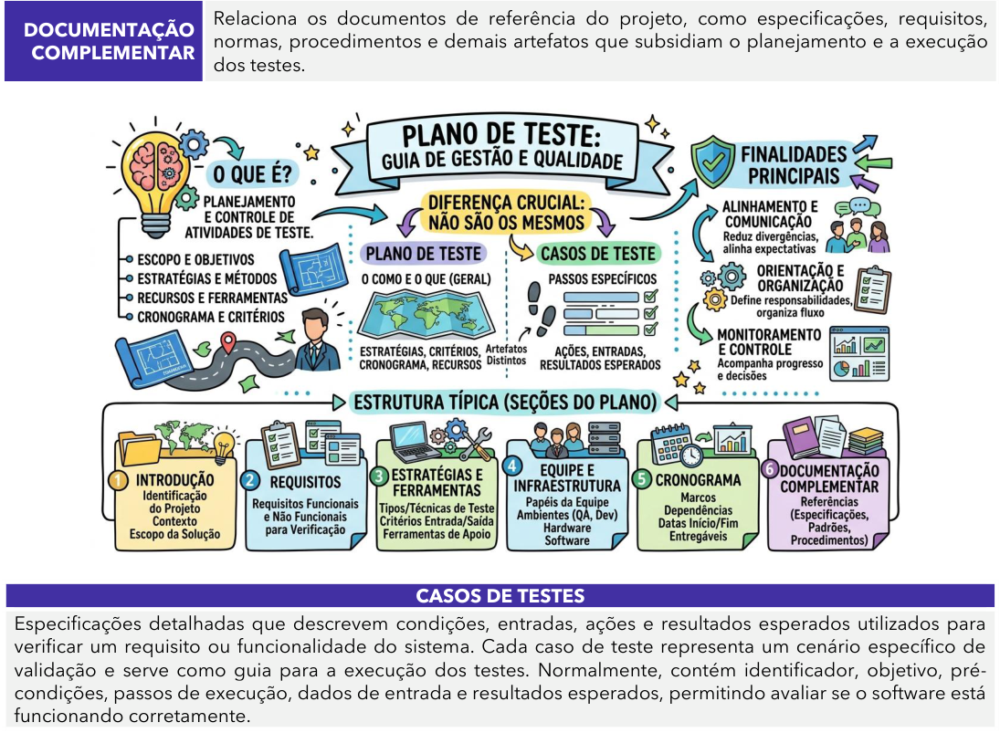

<!-- Start of picture text -->
Relaciona os documentos de referência do projeto, como especificações, requisitos, DOCUMENTAÇÃO normas, procedimentos e demais artefatos que subsidiam o planejamento e a execução COMPLEMENTAR dos testes. CASOS DE TESTES Especificações detalhadas que descrevem condições, entradas, ações e resultados esperados utilizados para verificar um requisito ou funcionalidade do sistema. Cada caso de teste representa um cenário específico de validação e serve como guia para a execução dos testes. Normalmente, contém identificador, objetivo, pré- condições, passos de execução, dados de entrada e resultados esperados, permitindo avaliar se o software está funcionando corretamente. <!-- End of picture text -->

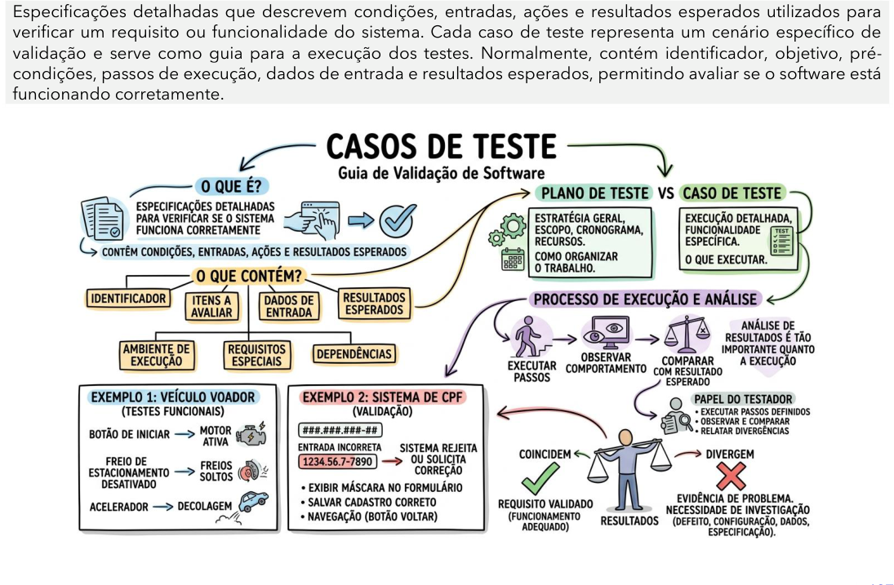

<!-- Start of picture text -->
Especificações detalhadas que descrevem condições, entradas, ações e resultados esperados utilizados para verificar um requisito ou funcionalidade do sistema. Cada caso de teste representa um cenário específico de validação e serve como guia para a execução dos testes. Normalmente, contém identificador, objetivo, pré- condições, passos de execução, dados de entrada e resultados esperados, permitindo avaliar se o software está funcionando corretamente. <!-- End of picture text -->

---

<!-- pagina: 138 -->

**Diego Carvalho, Equipe Informática 2 (Diego Carvalho), Equipe Informática 1 (Diego Carvalho) Aula 06** 

|**CLASSIFICAÇÃO**|**PERGUNTA QUE** **RESPONDE**|**EXEMPLOS**|
|---|---|---|
|**NÍVEIS** **DE TESTE**|Onde o teste está sendo aplicado?|Teste de Unidade, Teste de Integração, Teste de Validação e Teste de Sistema.|
|**TÉCNICAS** **DE TESTE**|Como os casos de teste são projetados?|Teste Caixa-Branca, Teste Caixa-Preta e Teste Caixa-Cinza.|
|**TIPOS** **DE TESTE**|O que está sendo avaliado?|Teste de Desempenho, Teste de Segurança, Teste de Usabilidade, Teste de Regressão, etc.|

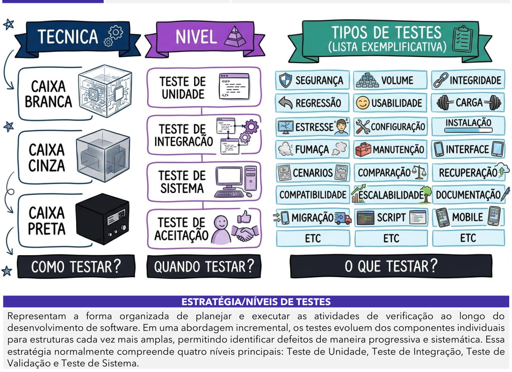

<!-- Start of picture text -->
ESTRATÉGIA/NÍVEIS DE TESTES Representam a forma organizada de planejar e executar as atividades de verificação ao longo do desenvolvimento de software. Em uma abordagem incremental, os testes evoluem dos componentes individuais para estruturas cada vez mais amplas, permitindo identificar defeitos de maneira progressiva e sistemática. Essa estratégia normalmente compreende quatro níveis principais: Teste de Unidade, Teste de Integração, Teste de Validação e Teste de Sistema. ção e Teste de Sistema. ão e Teste de Sistema. <!-- End of picture text -->

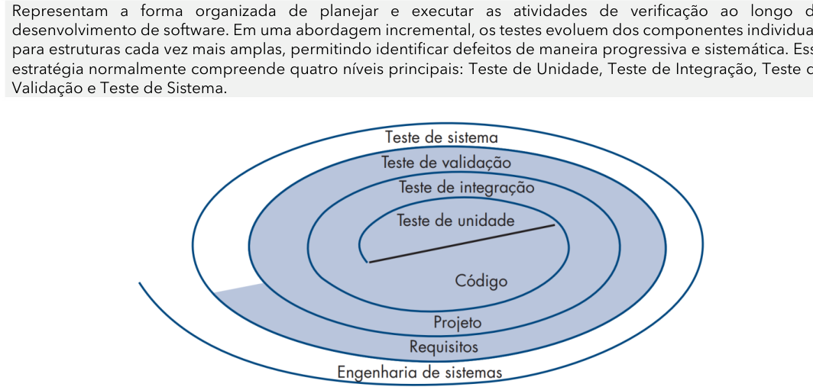

<!-- Start of picture text -->
Representam a forma organizada de planejar e executar as atividades de verificação ao longo do desenvolvimento de software. Em uma abordagem incremental, os testes evoluem dos componentes individuais para estruturas cada vez mais amplas, permitindo identificar defeitos de maneira progressiva e sistemática. Essa estratégia normalmente compreende quatro níveis principais: Teste de Unidade, Teste de Integração, Teste de Validação e Teste de Sistema. ção e Teste de Sistema. ão e Teste de Sistema. <!-- End of picture text -->

---

<!-- pagina: 139 -->

**Diego Carvalho, Equipe Informática 2 (Diego Carvalho), Equipe Informática 1 (Diego Carvalho) Aula 06** 

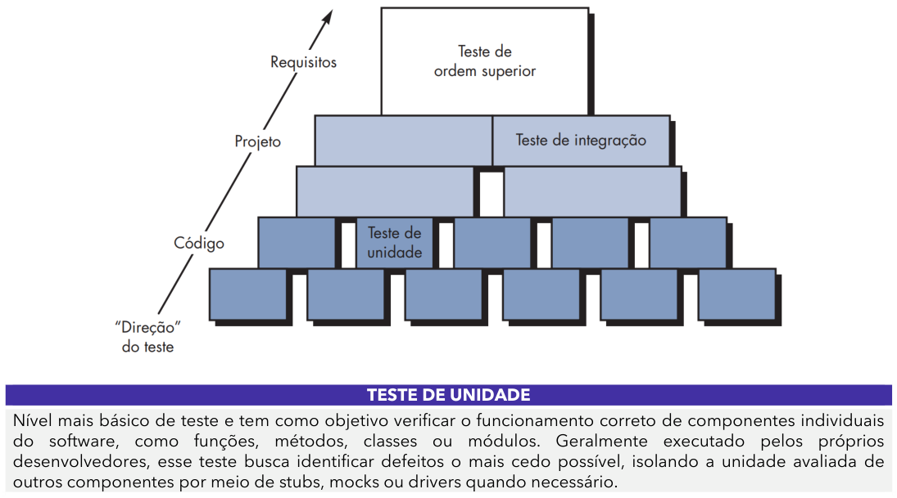

<!-- Start of picture text -->
TESTE DE UNIDADE Nível mais básico de teste e tem como objetivo verificar o funcionamento correto de componentes individuais do software, como funções, métodos, classes ou módulos. Geralmente executado pelos próprios desenvolvedores, esse teste busca identificar defeitos o mais cedo possível, isolando a unidade avaliada de outros componentes por meio de stubs, mocks ou drivers quando necessário. <!-- End of picture text -->

###### **<mark>TESTES DE UNIDADE (DEFINIÇÕES RETIRADAS DE PROVAS)</mark>** 

Testes de Unidade são aqueles realizados sobre as menores estruturas de código-fonte, como métodos e classes. 

Testes de Unidade consistem em testar individualmente, componentes ou módulos de _software_ que, <u>posteriormente devem ser testados de maneira integrada.</u> 

<mark>Testes de Unidade focalizam cada componente de um software de forma individual, garantindo que o</mark> componente funciona adequadamente. 

<mark>Testes de Unidade focalizam o esforço de verificação na menor unidade de projeto de software, isto é, no</mark> componente ou no módulo de software _._ 

<mark>Testes de Unidade têm por objetivo explorar a menor unidade do projeto, procurando identificar falhas</mark> ocasionadas por defeitos de lógica e de implementação em cada módulo separadamente. 

Testes de Unidade enfocam a lógica interna de processamento e as estruturas de dados dentro dos limites de um componente. 

Testes de Unidade concentram o esforço de verificação na menor unidade de design de software. 

Testes de Unidade concentram-se na lógica de processamento interno e nas estruturas de dados dentro dos limites de um componente. 

Testes de Unidade têm por objetivo explorar a menor unidade do projeto, procurando provocar falhas ocasionadas por defeitos de lógica e de implementação em cada módulo, separadamente. 

Testes de Unidade têm como foco as menores unidades de um programa, que podem ser funções, <u>procedimentos, métodos ou classes.</u>

---

<!-- pagina: 140 -->

**Diego Carvalho, Equipe Informática 2 (Diego Carvalho), Equipe Informática 1 (Diego Carvalho) Aula 06** 

<!-- Start of picture text -->
TESTE DE INTEGRAÇÃO Nível de teste que busca verificar se diferentes componentes ou módulos do sistema interagem corretamente quando combinados. Após a validação individual das unidades, esse nível de teste concentra-se na identificação de defeitos relacionados à troca de dados, interfaces, protocolos de comunicação e dependências entre componentes. Pode ser realizado de forma incremental ou não incremental, utilizando estratégias como top- down, bottom-up ou sanduíche. <!-- End of picture text -->

###### **<mark>TESTES DE INTEGRAÇÃO (DEFINIÇÕES RETIRADAS DE PROVAS)</mark>** 

Testes de Integração são caracterizados por testar as interfaces entre os componentes ou interações de diferentes <u>partes de um sistema.</u> 

Testes de Integração visam testar as falhas decorrentes da integração dos módulos do sistema. 

Testes de Integração são uma técnica sistemática para construir a arquitetura do software, enquanto, ao mesmo tempo, conduz testes para descobrir erros associados às interfaces. 

Testes de Integração têm por objetivo construir uma estrutura de programa determinada pelo projeto a partir de componentes já testados. 

Testes de Integração são uma técnica utilizada para descobrir erros associados às interfaces na qual, a partir de componentes testados individualmente, se constrói uma estrutura de programa determinada pelo projeto. 

Testes de Integração verificam o funcionamento em conjunto dos componentes do sistema, se são chamados corretamente e se a transferência de dados acontece no tempo correto, <u>por meio de suas interfaces.</u> 

Testes de Integração verificam se os componentes do sistema, juntos, trabalham conforme descrito nas especificações do sistema e do projeto do programa. 

Testes de Integração são uma técnica sistemática para construir a arquitetura do _software_ enquanto conduz testes <u>para descobrir erros associados às interfaces.</u> 

###### **ESTRATÉGIA DE DESCRIÇÃO INTEGRAÇÃO** 

**BIG BANG** Nessa estratégia, todos os módulos ou componentes do sistema são integrados simultaneamente após a conclusão dos testes individuais. É uma abordagem simples do

---

<!-- pagina: 141 -->

**Diego Carvalho, Equipe Informática 2 (Diego Carvalho), Equipe Informática 1 (Diego Carvalho) Aula 06** 

**ESTRATÉGIA DE INTEGRAÇÃO** 

**TOP-DOWN** 

###### **BOTTOM-UP** 

**THREAD-BASED TESTING** 

###### **DESCRIÇÃO** 

ponto de vista de planejamento, pois não exige uma sequência gradual de integração. Entretanto, quando defeitos são encontrados, torna-se difícil identificar qual componente ou interação é responsável pelo problema, aumentando o esforço de depuração. 

A estratégia Top-Down realiza a integração iniciando pelos módulos localizados nos níveis mais altos da arquitetura e avançando gradualmente para os níveis inferiores. Enquanto determinados componentes ainda não estão disponíveis, utilizam-se stubs para simular seu comportamento. Essa abordagem permite validar precocemente a estrutura geral do sistema e os fluxos principais de processamento, facilitando a avaliação da arquitetura. 

Nessa estratégia, a integração começa pelos módulos localizados nos níveis mais baixos da arquitetura, que geralmente implementam funções básicas e serviços compartilhados. À medida que novos componentes são adicionados, a integração avança em direção aos níveis superiores. Como os módulos chamadores ainda não existem nas fases iniciais, utilizam-se drivers para simular suas chamadas e permitir a execução dos testes. 

Integra os componentes de acordo com um fluxo funcional completo, também chamado de thread de execução. Cada thread normalmente representa um caso de uso, processo de negócio ou funcionalidade relevante para o usuário. Em vez de seguir estritamente a hierarquia estrutural do sistema, a integração acompanha o caminho percorrido pelos dados e pelas operações, permitindo validar rapidamente funcionalidades completas. 

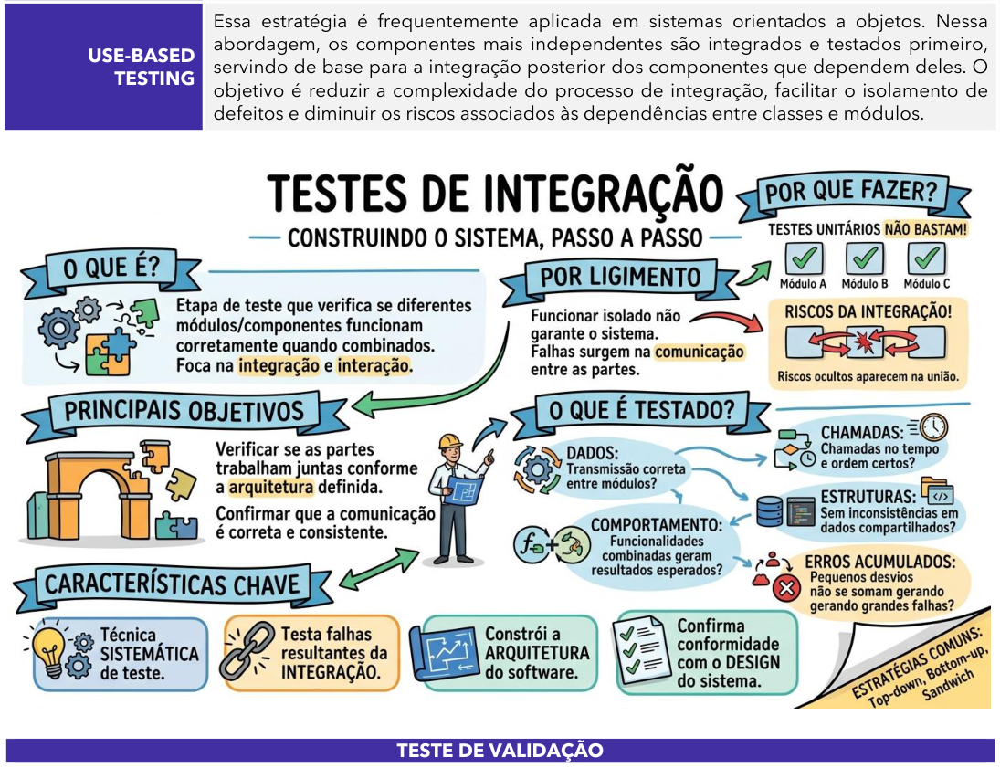

<!-- Start of picture text -->
Essa estratégia é frequentemente aplicada em sistemas orientados a objetos. Nessa abordagem, os componentes mais independentes são integrados e testados primeiro, USE-BASED servindo de base para a integração posterior dos componentes que dependem deles. O TESTING objetivo é reduzir a complexidade do processo de integração, facilitar o isolamento de defeitos e diminuir os riscos associados às dependências entre classes e módulos. TESTE DE VALIDAÇÃO <!-- End of picture text -->

---

<!-- pagina: 142 -->

**Diego Carvalho, Equipe Informática 2 (Diego Carvalho), Equipe Informática 1 (Diego Carvalho) Aula 06** 

Nível de teste que busca verificar se o software atende às necessidades e expectativas dos usuários e aos requisitos definidos para o sistema. Seu foco está na pergunta “estamos construindo o produto correto?”. Nessa etapa, são avaliadas funcionalidades, regras de negócio e comportamentos previstos na especificação, <mark>normalmente em um ambiente próximo ao de utilização real.</mark> 

###### **<mark>TESTES DE VALIDAÇÃO (DEFINIÇÕES RETIRADAS DE PROVAS)</mark>** 

Testes de Validação focalizam ações e saídas, tais como percebidas pelo usuário final. 

Testes de Validação são executados logo após montagem do pacote de software, quando os erros de interface <u><mark>já foram descobertos e corrigidos.</mark></u> 

Testes de Validação têm como principal característica verificar o sistema em relação aos seus requisitos originais <mark>e às necessidades atuais do usuário.</mark> 

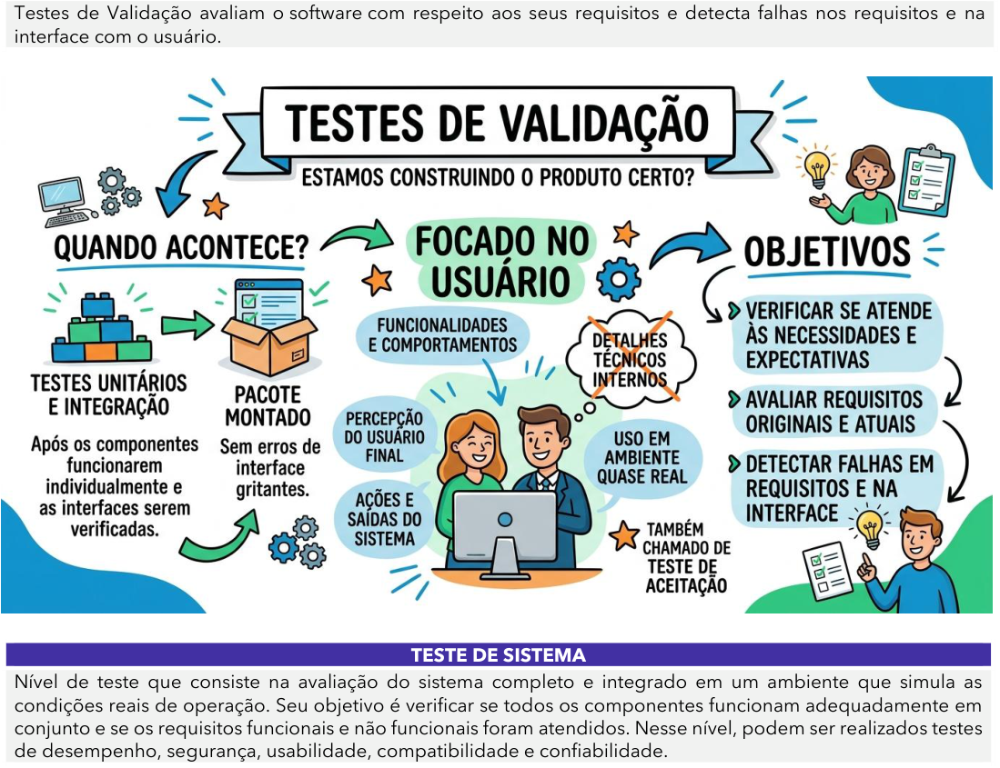

<!-- Start of picture text -->
Testes de Validação avaliam o software com respeito aos seus requisitos e detecta falhas nos requisitos e na interface com o usuário. TESTE DE SISTEMA Nível de teste que consiste na avaliação do sistema completo e integrado em um ambiente que simula as condições reais de operação. Seu objetivo é verificar se todos os componentes funcionam adequadamente em conjunto e se os requisitos funcionais e não funcionais foram atendidos. Nesse nível, podem ser realizados testes de desempenho, segurança, usabilidade, compatibilidade e confiabilidade. <!-- End of picture text -->

###### **<mark>TESTES DE SISTEMA (DEFINIÇÕES RETIRADAS DE PROVAS)</mark>** 

<mark>Testes de Sistema incluem diversas modalidades de teste, cujo objetivo é testar o sistema computacional como</mark> um todo. 

<mark>Testes de Sistema testam se o sistema cumpre seus requisitos funcionais e não funcionais.</mark> 

<mark>Testes de Sistema avaliam o software com respeito ao seu projeto arquitetural e detecta falhas de especificação,</mark> desempenho, robustez e segurança.

---

<!-- pagina: 143 -->

**Diego Carvalho, Equipe Informática 2 (Diego Carvalho), Equipe Informática 1 (Diego Carvalho) Aula 06** 

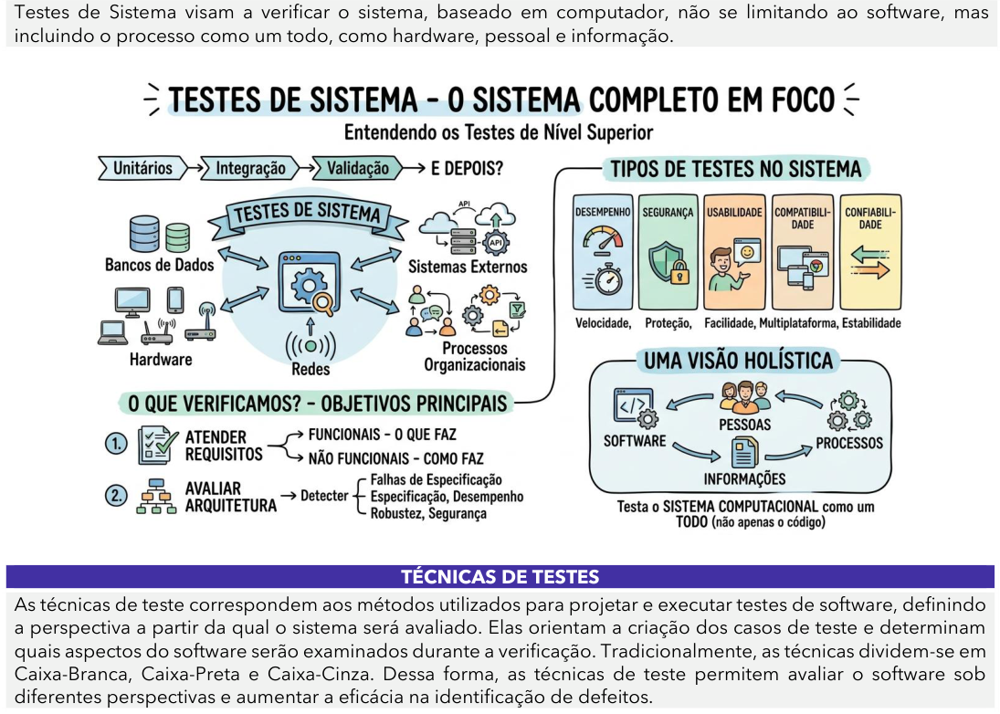

<!-- Start of picture text -->
Testes de Sistema visam a verificar o sistema, baseado em computador, não se limitando ao software, mas incluindo o processo como um todo, como hardware, pessoal e informação. TÉCNICAS DE TESTES As técnicas de teste correspondem aos métodos utilizados para projetar e executar testes de software, definindo a perspectiva a partir da qual o sistema será avaliado. Elas orientam a criação dos casos de teste e determinam quais aspectos do software serão examinados durante a verificação. Tradicionalmente, as técnicas dividem-se em Caixa-Branca, Caixa-Preta e Caixa-Cinza. Dessa forma, as técnicas de teste permitem avaliar o software sob diferentes perspectivas e aumentar a eficácia na identificação de defeitos. <!-- End of picture text -->

###### **<mark>TESTE CAIXA-BRANCA</mark>** 

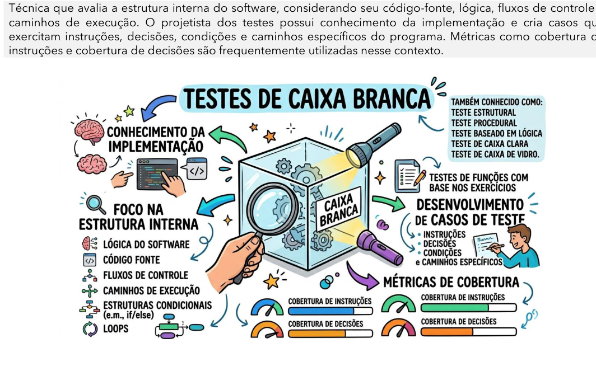

<!-- Start of picture text -->
Técnica que avalia a estrutura interna do software, considerando seu código-fonte, lógica, fluxos de controle e caminhos de execução. O projetista dos testes possui conhecimento da implementação e cria casos que exercitam instruções, decisões, condições e caminhos específicos do programa. Métricas como cobertura de instruções e cobertura de decisões são frequentemente utilizadas nesse contexto. ções e cobertura de decisões são frequentemente utilizadas nesse contexto. ões e cobertura de decisões são frequentemente utilizadas nesse contexto. quentemente utilizadas nesse contexto. uentemente utilizadas nesse contexto. <!-- End of picture text -->

<mark>Técnica que avalia a estrutura interna do software, considerando seu código-fonte, lógica, fluxos de controle e</mark> caminhos de execução. O projetista dos testes possui conhecimento da implementação e cria casos que exercitam instruções, decisões, condições e caminhos específicos do programa. Métricas como cobertura de instruções e cobertura de decisões são frequentemente utilizadas nesse contexto. ções e cobertura de decisões são frequentemente utilizadas nesse contexto. ões e cobertura de decisões são frequentemente utilizadas nesse contexto. quentemente utilizadas nesse contexto. uentemente utilizadas nesse contexto.

---

<!-- pagina: 144 -->

**Diego Carvalho, Equipe Informática 2 (Diego Carvalho), Equipe Informática 1 (Diego Carvalho) Aula 06** 

**<mark>TÉCNICAS CAIXA-</mark> DESCRIÇÃO BRANCA** Técnica de teste caixa-branca que utiliza o fluxo lógico do programa para identificar um conjunto de caminhos independentes de execução. Com base na complexidade **TESTE DO** ciclomática, são definidos casos de teste capazes de percorrer esses caminhos, **CAMINHO BÁSICO** proporcionando elevada cobertura estrutural e auxiliando na identificação de defeitos lógicos presentes no código. Também chamado de Teste de Ciclo, constituem um conjunto de técnicas caixa-branca **TESTE DE** voltadas à validação dos mecanismos que controlam o fluxo de execução do programa. **ESTRUTURAS DE** Seu objetivo é verificar se decisões, condições, laços de repetição e demais estruturas de **CONTROLE** controle se comportam corretamente em diferentes cenários, garantindo que a lógica implementada produza os resultados esperados. Técnica caixa-branca que concentra sua análise nas expressões lógicas e condições booleanas utilizadas em estruturas de decisão. O objetivo é verificar se cada condição **TESTE DE** individual e suas combinações produzem os resultados esperados, identificando erros em **CONDIÇÃO** operadores relacionais, lógicos e expressões compostas que possam comprometer o fluxo do programa. Técnica caixa-branca especializada na validação de estruturas de repetição, como comandos for, while e do-while. A técnica busca verificar o comportamento correto dos **TESTE DE CICLO** 

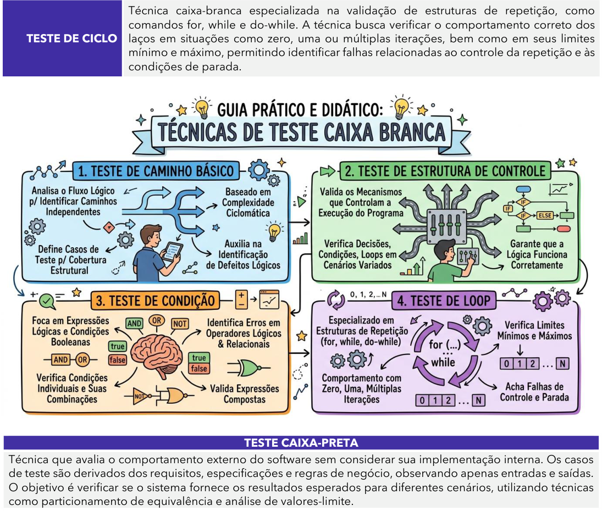

<!-- Start of picture text -->
Técnica caixa-branca especializada na validação de estruturas de repetição, como comandos for, while e do-while. A técnica busca verificar o comportamento correto dos TESTE DE CICLO  laços em situações como zero, uma ou múltiplas iterações, bem como em seus limites mínimo e máximo, permitindo identificar falhas relacionadas ao controle da repetição e às condições de parada. TESTE CAIXA-PRETA Técnica que avalia o comportamento externo do software sem considerar sua implementação interna. Os casos de teste são derivados dos requisitos, especificações e regras de negócio, observando apenas entradas e saídas. O objetivo é verificar se o sistema fornece os resultados esperados para diferentes cenários, utilizando técnicas como particionamento de equivalência e análise de valores-limite. <!-- End of picture text -->

---

<!-- pagina: 145 -->

**Diego Carvalho, Equipe Informática 2 (Diego Carvalho), Equipe Informática 1 (Diego Carvalho) Aula 06** 

<!-- Start of picture text -->
TÉCNICAS CAIXA- DESCRIÇÃO PRETA <!-- End of picture text -->

**<mark>TÉCNICAS CAIXA-</mark> DESCRIÇÃO PRETA** A Técnica Baseada em Grafos modela o sistema por meio de nós e relacionamentos que representam objetos, estados, eventos ou condições de processamento. A partir dessa **BASEADO EM** representação, são definidos caminhos de teste que percorrem diferentes combinações **GRAFOS** de conexões entre os elementos do grafo. Seu objetivo é verificar se as interações ocorrem corretamente e identificar falhas relacionadas aos relacionamentos e fluxos existentes. O Particionamento de Equivalência consiste em dividir o domínio de entrada em classes de dados que possuem comportamento semelhante perante o sistema. Em vez de testar **PARTICIONAMENTO** todos os valores possíveis, seleciona-se um ou poucos representantes de cada classe **DE EQUIVALÊNCIA** válida ou inválida. Essa abordagem reduz a quantidade de casos de teste necessários, evita redundâncias e mantém uma cobertura eficiente dos cenários previstos. A Análise de Valor Limite baseia-se na observação de que muitos defeitos ocorrem nas extremidades dos intervalos de entrada. Por esse motivo, os testes concentram-se nos **ANÁLISE DE VALOR** valores mínimos, máximos, imediatamente inferiores e imediatamente superiores aos **LIMITE** limites definidos. A técnica complementa o particionamento de equivalência e é especialmente eficaz para detectar erros relacionados a comparações, validações e restrições de faixa. A técnica de Matriz Ortogonal utiliza princípios estatísticos para selecionar um conjunto reduzido, porém representativo, de combinações de entradas. Em vez de testar todas as **MATRIZ** possibilidades, os casos são distribuídos uniformemente pelo domínio de teste, **ORTOGONAL** permitindo analisar múltiplos fatores simultaneamente. Essa abordagem reduz significativamente o esforço de teste e auxilia na identificação de falhas decorrentes da interação entre parâmetros. A Tabela de Decisão é utilizada para modelar situações em que o comportamento do **TABELA DE** sistema depende da combinação de múltiplas condições ou regras de negócio. A técnica **DECISÃO** organiza condições e ações em uma estrutura tabular, permitindo identificar de forma sistemática todas as combinações relevantes e seus respectivos resultados esperados.

---

<!-- pagina: 146 -->

**Diego Carvalho, Equipe Informática 2 (Diego Carvalho), Equipe Informática 1 (Diego Carvalho) Aula 06** 

**TÉCNICAS CAIXADESCRIÇÃO PRETA** Seu principal benefício é garantir cobertura adequada de cenários complexos e reduzir o risco de omissão de regras durante a elaboração dos casos de teste. O Teste de Casos de Uso deriva os casos de teste a partir dos casos de uso e dos fluxos funcionais descritos nos requisitos do sistema. A técnica busca validar se o software **TESTE DE CASOS DE** atende corretamente aos cenários de interação previstos para os usuários, contemplando **USO** fluxos principais, alternativos e exceções. Seu foco está na verificação das funcionalidades sob a perspectiva do negócio e na confirmação de que os objetivos dos usuários podem ser alcançados conforme especificado. 

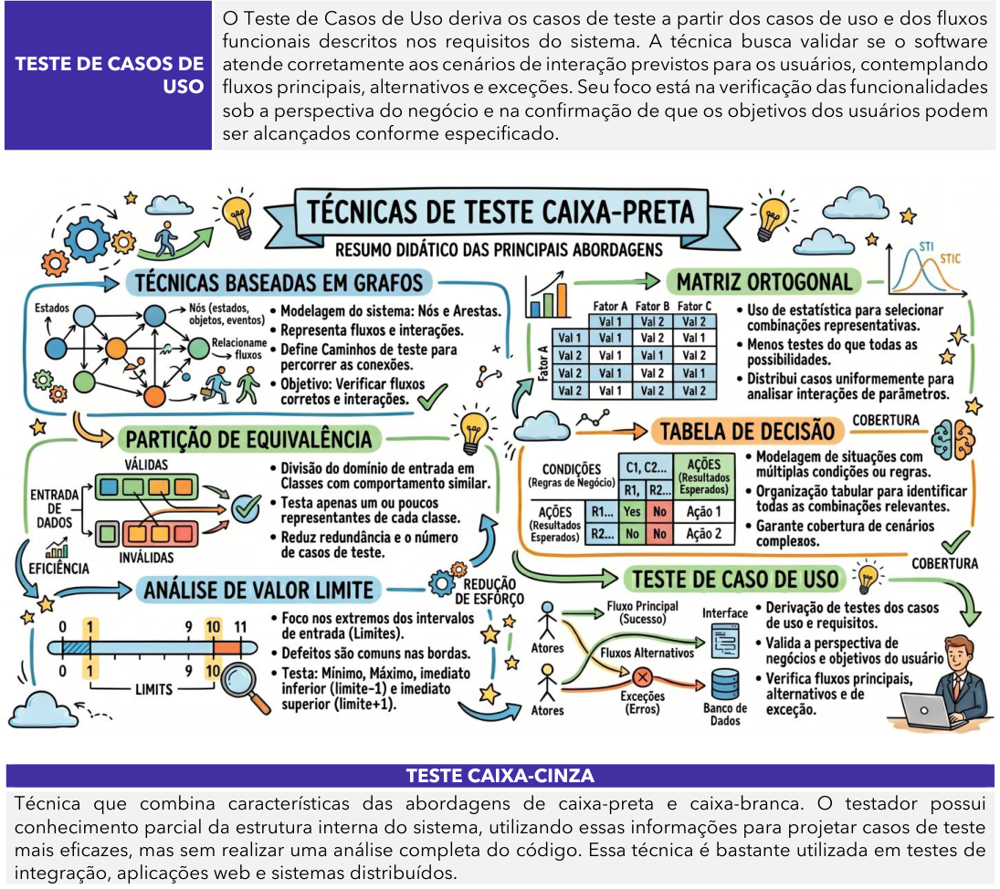

<!-- Start of picture text -->
O Teste de Casos de Uso deriva os casos de teste a partir dos casos de uso e dos fluxos funcionais descritos nos requisitos do sistema. A técnica busca validar se o software TESTE DE CASOS DE  atende corretamente aos cenários de interação previstos para os usuários, contemplando USO  fluxos principais, alternativos e exceções. Seu foco está na verificação das funcionalidades sob a perspectiva do negócio e na confirmação de que os objetivos dos usuários podem ser alcançados conforme especificado. TESTE CAIXA-CINZA Técnica que combina características das abordagens de caixa-preta e caixa-branca. O testador possui conhecimento parcial da estrutura interna do sistema, utilizando essas informações para projetar casos de teste mais eficazes, mas sem realizar uma análise completa do código. Essa técnica é bastante utilizada em testes de integração, aplicações web e sistemas distribuídos. <!-- End of picture text -->

---

<!-- pagina: 147 -->

**Diego Carvalho, Equipe Informática 2 (Diego Carvalho), Equipe Informática 1 (Diego Carvalho) Aula 06** 

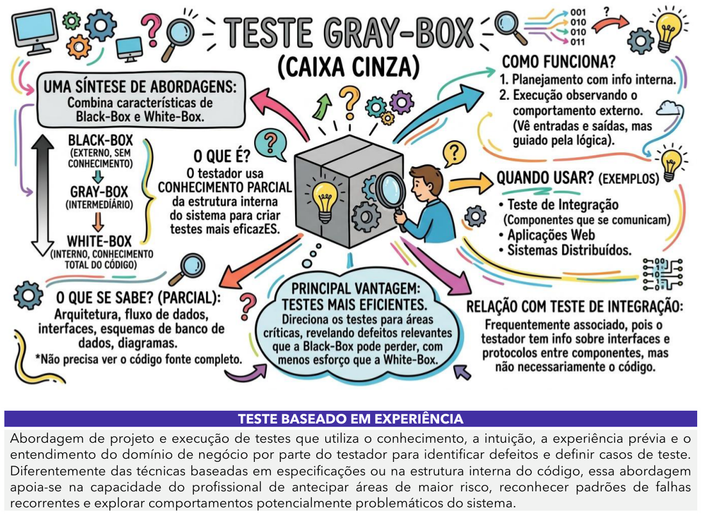

<!-- Start of picture text -->
TESTE BASEADO EM EXPERIÊNCIA Abordagem de projeto e execução de testes que utiliza o conhecimento, a intuição, a experiência prévia e o entendimento do domínio de negócio por parte do testador para identificar defeitos e definir casos de teste. Diferentemente das técnicas baseadas em especificações ou na estrutura interna do código, essa abordagem apoia-se na capacidade do profissional de antecipar áreas de maior risco, reconhecer padrões de falhas recorrentes e explorar comportamentos potencialmente problemáticos do sistema. <!-- End of picture text -->

**BASEADAS EM DESCRIÇÃO EXPERIÊNCIA** Error Guessing é uma técnica de teste baseada na experiência em que o testador utiliza conhecimento prévio, intuição e histórico de falhas para imaginar onde defeitos **ERROR GUESSING** provavelmente podem ocorrer. A partir disso, cria casos de teste direcionados a situações críticas, entradas inválidas, combinações incomuns e comportamentos que costumam revelar erros no sistema antes da entrega. Exploratory Testing é uma abordagem em que aprendizado, projeto e execução dos testes ocorrem de forma simultânea. O testador explora o sistema, observa seu **EXPLORATORY** comportamento, formula hipóteses e ajusta os próximos testes conforme os resultados **TESTING** encontrados. É útil quando há pouca documentação, alto grau de incerteza ou necessidade de descobrir falhas não previstas nos requisitos. Checklist Based Testing é uma técnica em que os testes são guiados por uma lista de verificação previamente elaborada, contendo aspectos, condições, funcionalidades ou **CHECKLIST BASED** riscos que devem ser avaliados. O checklist ajuda a padronizar a execução, evitar **TESTING** esquecimentos e garantir cobertura mínima, sem exigir casos de teste muito detalhados ou totalmente formalizados previamente.

---

<!-- pagina: 148 -->

**Diego Carvalho, Equipe Informática 2 (Diego Carvalho), Equipe Informática 1 (Diego Carvalho) Aula 06** 

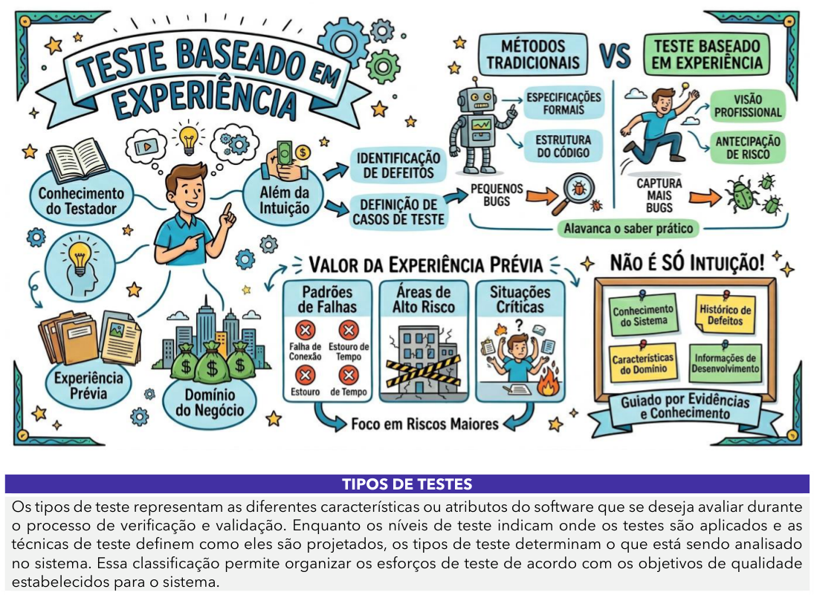

<!-- Start of picture text -->
TIPOS DE TESTES Os tipos de teste representam as diferentes características ou atributos do software que se deseja avaliar durante o processo de verificação e validação. Enquanto os níveis de teste indicam onde os testes são aplicados e as técnicas de teste definem como eles são projetados, os tipos de teste determinam o que está sendo analisado no sistema. Essa classificação permite organizar os esforços de teste de acordo com os objetivos de qualidade estabelecidos para o sistema. <!-- End of picture text -->

|**TIPOS DE TESTE**|**DESCRIÇÃO**|
|---|---|
|**TESTE DE FUMAÇA** **(SMOKE TEST)**|Conjunto reduzido de verificações executadas após uma nova compilação, instalação ou implantação do sistema. Seu objetivo é confirmar que as funcionalidades essenciais estão operacionais e que o software está apto para testes mais aprofundados.|
|**TESTE DE** **REGRESSÃO**|Consiste na reexecução de casos de teste previamente aprovados após correções, melhorias ou novas funcionalidades. O objetivo é verificar se alterações realizadas no sistema introduziram defeitos em funcionalidades anteriormente corretas.|
|**TESTE DE** **INTERFACE** **GRÁFICA (GUI)**|Avalia os elementos visuais da aplicação, como telas, menus, botões, formulários e mensagens. Busca verificar a consistência da interface, a correta interação dos componentes gráficos e a aderência aos requisitos de apresentação.|
|**TESTE DE** **USABILIDADE**|Analisa a facilidade de utilização do sistema por usuários reais ou representativos. Avalia aspectos como intuitividade, facilidade de aprendizado, eficiência na execução de tarefas, satisfação do usuário e experiência geral de uso.|
|**MONKEY TESTING**|Técnica baseada na execução de ações aleatórias e imprevisíveis sobre o sistema, sem roteiro pré-definido. Seu objetivo é identificar falhas, travamentos e comportamentos inesperados que podem não ser encontrados em testes estruturados.|
|**TESTE ALFA E BETA**|O teste alfa é realizado em ambiente controlado pela equipe de desenvolvimento ou QA. Já o teste beta envolve usuários reais em condições próximas à produção, permitindo validar o produto e coletar feedback antes do lançamento definitivo.|

---

<!-- pagina: 149 -->

**Diego Carvalho, Equipe Informática 2 (Diego Carvalho), Equipe Informática 1 (Diego Carvalho) Aula 06** 

**<mark>DESCRIÇÃO ÇÃO ÃO</mark>** Verifica se o software funciona corretamente em diferentes combinações de sistemas operacionais, navegadores, dispositivos, bancos de dados e ambientes tecnológicos, garantindo uma experiência consistente para todos os usuários. 

**<mark>TIPOS DE TESTE DESCRIÇÃO ÇÃO ÃO</mark>** Verifica se o software funciona corretamente em diferentes combinações de sistemas **TESTE DE** operacionais, navegadores, dispositivos, bancos de dados e ambientes tecnológicos, **COMPATIBILIDADE** garantindo uma experiência consistente para todos os usuários. Avalia o comportamento da aplicação sob diferentes configurações de hardware, **TESTE DE** software, rede e infraestrutura. Seu objetivo é identificar incompatibilidades ou falhas **CONFIGURAÇÃO** relacionadas a parâmetros específicos do ambiente de execução. Verifica a capacidade de o software ser instalado, transferido e executado em diferentes **TESTE DE** plataformas ou ambientes com mínimo esforço de adaptação. Busca garantir flexibilidade **PORTABILIDADE** e facilidade de migração entre tecnologias. Consiste em comparar versões, produtos ou implementações equivalentes utilizando os **TESTE DE** mesmos cenários de teste. O objetivo é identificar diferenças de comportamento, **COMPARAÇÃO** desempenho, qualidade ou conformidade entre as soluções avaliadas. Avalia a capacidade do sistema de recuperar-se após falhas, interrupções, quedas de **TESTE DE** energia, indisponibilidades ou perda de dados. Verifica a eficácia dos mecanismos de **RECUPERAÇÃO** restauração e continuidade operacional da aplicação. Utilizado principalmente em APIs e microsserviços, verifica se a comunicação entre **TESTE DE** componentes segue exatamente os contratos definidos, incluindo formatos de dados, **CONTRATO** operações disponíveis, parâmetros e respostas esperadas. 

Avalia se o software atende normas técnicas, regulamentações legais, padrões organizacionais e requisitos específicos do setor. É amplamente utilizado em aplicações sujeitas a auditorias e exigências regulatórias. 

**TESTE DE** organizacionais e requisitos específicos do setor. É amplamente utilizado em aplicações **CONFORMIDADE** sujeitas a auditorias e exigências regulatórias. Executado próximo à entrada em produção, busca confirmar que o sistema está pronto **TESTE DE** para uso real. Verifica funcionalidades críticas, infraestrutura, integrações e condições **LANÇAMENTO** operacionais necessárias para o lançamento. Avalia características como tempo de resposta, throughput, utilização de recursos e **TESTE DE** estabilidade operacional. Seu objetivo é verificar se o sistema mantém níveis adequados **DESEMPENHO** de eficiência sob diferentes condições de utilização. Submete o sistema a cargas superiores às previstas em operação normal para identificar **TESTE DE** limites de capacidade, pontos de falha, degradação de desempenho e comportamento **ESTRESSE** diante de condições extremas de utilização. Verifica o comportamento do sistema sob volumes de usuários, transações ou requisições **TESTE DE CARGA** compatíveis com a demanda esperada. Avalia desempenho, estabilidade e capacidade de atender aos requisitos operacionais definidos. Analisa o impacto de grandes quantidades de dados sobre a aplicação. Avalia **TESTE DE VOLUME** armazenamento, processamento, consultas e movimentação de informações para verificar se o sistema continua operando adequadamente. Avalia a capacidade de o sistema crescer de forma eficiente diante do aumento de **TESTE DE** usuários, transações, dados ou recursos computacionais, mantendo desempenho, **ESCALABILIDADE** disponibilidade e estabilidade aceitáveis. Examina mecanismos de proteção relacionados à confidencialidade, integridade, **TESTE DE** disponibilidade, autenticação e autorização. Busca identificar riscos que possam **SEGURANÇA** comprometer a segurança da aplicação e de seus dados. Consiste na identificação sistemática de fragilidades conhecidas em aplicações, **TESTE DE** bibliotecas, sistemas operacionais ou configurações. Seu objetivo é descobrir riscos de **VULNERABILIDADE** 

Analisa o impacto de grandes quantidades de dados sobre a aplicação. Avalia armazenamento, processamento, consultas e movimentação de informações para verificar se o sistema continua operando adequadamente. 

Consiste na identificação sistemática de fragilidades conhecidas em aplicações, bibliotecas, sistemas operacionais ou configurações. Seu objetivo é descobrir riscos de segurança antes que sejam explorados por atacantes.

---

<!-- pagina: 150 -->

**Diego Carvalho, Equipe Informática 2 (Diego Carvalho), Equipe Informática 1 (Diego Carvalho) Aula 06** 

**<mark>TIPOS DE TESTE DESCRIÇÃO</mark>** Simula ataques reais realizados por invasores para explorar vulnerabilidades e avaliar a **TESTE DE** eficácia dos controles de segurança. Permite identificar impactos potenciais e validar **PENETRAÇÃO** mecanismos de proteção existentes. Técnica que submete o sistema a grandes volumes de entradas inválidas, inesperadas ou **FUZZING** aleatórias. O objetivo é identificar falhas, travamentos, vazamentos de memória e vulnerabilidades difíceis de detectar por meios tradicionais. 

###### **<mark>TESTES AUTOMATIZADOS</mark>** 

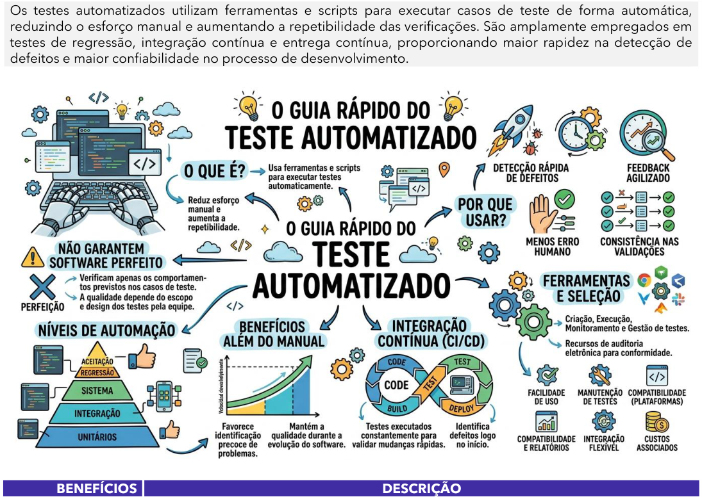

<!-- Start of picture text -->
Os testes automatizados utilizam ferramentas e scripts para executar casos de teste de forma automática, reduzindo o esforço manual e aumentando a repetibilidade das verificações. São amplamente empregados em testes de regressão, integração contínua e entrega contínua, proporcionando maior rapidez na detecção de defeitos e maior confiabilidade no processo de desenvolvimento. BENEFÍCIOS  DESCRIÇÃO ÇÃO ÃO <!-- End of picture text -->

**<mark>BENEFÍCIOS DESCRIÇÃO ÇÃO ÃO</mark>** Eles podem ser executados em poucos minutos, mesmo quando envolvem centenas ou **EXECUÇÃO** milhares de casos de teste. Isso reduz significativamente o tempo necessário para validar **RÁPIDA** alterações no software e fornece feedback rápido para a equipe de desenvolvimento. Um mesmo conjunto de testes pode ser executado inúmeras vezes sem variações de **REPETIBILIDADE** procedimento ou qualidade, o que garante consistência nos resultados e permite verificar continuamente se o sistema mantém o comportamento esperado após modificações. Como a execução é realizada por ferramentas, elimina-se a possibilidade de falhas **REDUÇÃO DE** causadas por distração, esquecimento ou interpretação incorreta dos procedimentos de **ERROS HUMANOS** teste. Isso aumenta a confiabilidade das verificações realizadas ao longo do projeto. **DETECÇÃO** A automação permite executar testes com frequência durante o desenvolvimento, **PRECOCE DE** identificando problemas logo após sua introdução. A descoberta antecipada de defeitos **DEFEITOS** reduz o esforço de correção e evita que falhas se propaguem para etapas posteriores.

---

<!-- pagina: 151 -->

**Diego Carvalho, Equipe Informática 2 (Diego Carvalho), Equipe Informática 1 (Diego Carvalho) Aula 06** 

**<mark>BENEFÍCIOS DESCRIÇÃO</mark> SUPORTE AOS** Sempre que novas funcionalidades são implementadas ou defeitos são corrigidos, os **TESTES DE** testes automatizados podem ser executados novamente para verificar se mudanças **REGRESSÃO** recentes não afetaram funcionalidades que anteriormente operavam corretamente. **MAIOR** A automação possibilita executar uma quantidade muito maior de cenários do que seria **COBERTURA DE** viável manualmente. Isso aumenta a cobertura funcional e técnica do sistema, elevando a **TESTES** probabilidade de identificação de defeitos e comportamentos inesperados. **INTEGRAÇÃO** Eles são fundamentais em pipelines de CI/CD, permitindo validar automaticamente cada **CONTÍNUA E** alteração realizada no código. Dessa forma, contribuem para entregas mais frequentes, **ENTREGA** seguras e confiáveis em ambientes modernos de desenvolvimento. **CONTÍNUA REDUÇÃO DE** Embora exijam investimento inicial para implementação e manutenção, os testes **CUSTOS A LONGO** automatizados reduzem custos operacionais ao diminuir o esforço manual, acelerar **PRAZO** validações e evitar defeitos que poderiam gerar impactos significativos em produção. **MAIOR** A execução frequente e padronizada dos testes aumenta a confiança na estabilidade do **CONFIABILIDADE** sistema. Equipes de desenvolvimento, testes e negócios passam a ter evidências objetivas **DO SOFTWARE** de que os requisitos continuam sendo atendidos ao longo do tempo. **ESCALABILIDADE** À medida que o sistema cresce, novos testes podem ser adicionados ao conjunto **DAS** automatizado sem aumentar proporcionalmente o esforço de execução. Isso permite **VERIFICAÇÕES** acompanhar a evolução do software mantendo um alto nível de controle de qualidade. 

**<mark>CRITÉRIOS TESTE MANUAL</mark>** A execução depende da atuação humana em cada etapa do teste. Isso torna o **VELOCIDADE** processo mais demorado, especialmente quando há muitos cenários ou repetidas validações. Está sujeito a distrações, interpretações equivocadas e erros operacionais do **CONFIABILIDADE** testador, podendo gerar inconsistências na execução e nos resultados obtidos. Exige esforço contínuo para reexecutar e revisar procedimentos, especialmente **MANUTENÇÃO** quando o sistema cresce e o conjunto de testes se torna mais extenso e complexo. Os casos de teste podem ser reaproveitados, porém sua execução **REUSABILIDADE** depende da atuação manual do testador, limitando a frequência e a escalabilidade das validações. O alcance dos testes é limitado pelo tempo e pelos recursos disponíveis, dificultando a **ESCOPO** execução de todos os cenários e combinações possíveis de uso. Possui baixo investimento inicial, pois não exige ferramentas especializadas, mas **CUSTO** pode gerar custos elevados ao longo do tempo devido ao esforço humano recorrente. 

###### **<mark>TESTE MANUAL TESTE AUTOMATIZADO</mark>** 

Os testes são executados automaticamente por ferramentas e scripts, permitindo validar grandes volumes de cenários em pouco tempo e com mínima intervenção humana. 

Os mesmos procedimentos são executados de forma padronizada e repetível, reduzindo significativamente a ocorrência de erros humanos e aumentando a consistência dos resultados. 

Requer investimento inicial na criação dos scripts, mas as execuções posteriores demandam pouco esforço, facilitando a manutenção de grandes suítes de testes. 

Os scripts podem ser reutilizados inúmeras vezes com baixo esforço adicional, favorecendo execuções frequentes e ampliando a cobertura dos testes ao longo do projeto. 

Permite validar um número muito maior de cenários, incluindo regressões e execuções repetitivas, ampliando significativamente a cobertura e a profundidade dos testes. 

Exige investimento inicial em ferramentas, infraestrutura e desenvolvimento dos scripts, porém tende a reduzir custos operacionais em projetos de longo prazo.

---

<!-- pagina: 152 -->

**Diego Carvalho, Equipe Informática 2 (Diego Carvalho), Equipe Informática 1 (Diego Carvalho) Aula 06** 

**<mark>CRITÉRIOS TESTE MANUAL TESTE AUTOMATIZADO</mark>** Requer conhecimento funcional do Exige conhecimentos de teste e também de sistema, elaboração de cenários de teste e programação, frameworks de automação, **HABILIDADES** capacidade de identificar, reproduzir e ferramentas especializadas e manutenção documentar defeitos encontrados. de scripts automatizados. 

|**FERRAMENTAS**|
|---|
|**SELENIUM**|
|**APPIUM**|
|**JMETER**|
|**ROBOT** **JUNIT**|

###### **<mark>DESCRIÇÃO</mark>** 

<mark>Usado para testar aplicativos web, o Selenium é uma ferramenta de código aberto que</mark> oferece uma variedade de recursos para automatizar testes, incluindo a gravação de ações do usuário e a execução de testes em diferentes navegadores. 

Utilizado para testar aplicativos móveis, o Appium é uma ferramenta de automação de testes móveis que permite a execução de testes em diferentes dispositivos móveis, como <mark>smartphones e tablets.</mark> 

Uma ferramenta de código aberto usada para testar o desempenho de aplicativos web, o JMeter permite a criação de cenários de teste para simular diferentes volumes de tráfego e medir a resposta do aplicativo. 

<mark>Uma ferramenta de automação de testes de código aberto que permite a criação de testes</mark> automatizados usando palavras-chave em inglês simples. É utilizado para testar aplicativos web, móveis e de desktop. 

Uma ferramenta de teste de unidade para a linguagem Java. Ele fornece uma série de anotações e assertivas para facilitar a criação de testes automatizados e o desenvolvimento orientado a testes. 

**<mark>PRINCÍPIOS</mark> FAST ISOLATED/ INDEPENDENT REPEATABLE SELF-VALIDATING TIMELY** 

###### **<mark>DESCRIÇÃO</mark>** 

O primeiro princípio é Fast, que significa Rápido. Por que a velocidade de execução é tão importante? Testes lentos tendem a ser executados com menor frequência, reduzindo seu valor durante o desenvolvimento. Quanto mais rapidamente os resultados são produzidos, mais cedo a equipe consegue identificar defeitos e corrigir problemas. Essa característica é especialmente relevante em ambientes que utilizam integração contínua. O segundo princípio é Isolated ou Independent. O que significa dizer que um teste deve ser isolado ou independente? Cada teste deve ser capaz de executar sozinho, sem depender da ordem de execução, de dados produzidos por outros testes ou de estados compartilhados. Quando existe dependência entre testes, uma falha pode desencadear diversos erros secundários e dificultar a identificação da causa real do problema. 

O terceiro princípio é Repeatable (Repetibilidade). Como confiar em um teste que ora passa, ora falha sem qualquer alteração no código? Um teste deve produzir resultados consistentes sempre que executado nas mesmas condições. Dependências externas instáveis, datas dinâmicas, condições de ambiente ou recursos compartilhados com frequência comprometem essa característica e tornam os resultados pouco confiáveis. 

O quarto princípio é Self-Validating. O que ocorre quando alguém precisa analisar manualmente logs ou resultados para descobrir se o teste passou? Nesse cenário, a automação perde grande parte de seu valor. Um teste deve informar automaticamente se foi aprovado ou reprovado por meio de asserções objetivas. Dessa forma, não existe necessidade de interpretação subjetiva dos resultados produzidos. 

O quinto princípio é Timely (Oportuno). Quando os testes devem ser criados? A ideia central consiste em desenvolver os testes no momento adequado, preferencialmente próximos à implementação da funcionalidade que será validada. Em abordagens como TDD (Test-Driven Development), essa característica é levada ao extremo, pois os testes são escritos antes mesmo da implementação do código de produção. 

###### **<mark>TESTES ÁGEIS</mark>** 

Os testes ágeis são realizados em conformidade com os princípios e práticas das metodologias ágeis, integrando as atividades de qualidade ao desenvolvimento desde as primeiras etapas do projeto. Nesse contexto, os testes

---

<!-- pagina: 153 -->

**Diego Carvalho, Equipe Informática 2 (Diego Carvalho), Equipe Informática 1 (Diego Carvalho) Aula 06** 

<!-- Start of picture text -->
são contínuos, colaborativos e fortemente automatizados, acompanhando ciclos curtos de desenvolvimento e promovendo feedback rápido para a equipe. <!-- End of picture text -->

|**CARACTERÍSTICAS**|**DESCRIÇÃO**|
|---|---|
|**TESTES** **CONTÍNUOS**|Os testes são executados continuamente ao longo do desenvolvimento, e não apenas ao final do projeto. Isso permite identificar defeitos precocemente e fornecer feedback rápido para a equipe.|
|**INTEGRAÇÃO AO** **DESENVOLVI-** **MENTO**|As atividades de teste são realizadas em paralelo à implementação das funcionalidades. Testadores, desenvolvedores e analistas colaboram desde o início para garantir a qualidade do produto.|
|**FEEDBACK** **RÁPIDO**|Um dos principais objetivos dos testes ágeis é fornecer informações rápidas sobre problemas e riscos identificados, permitindo correções imediatas e reduzindo retrabalho.|
|**AUTOMAÇÃO DE** **TESTES**|A automação é amplamente utilizada para executar testes de regressão, integração e validação de forma frequente. Isso aumenta a velocidade das verificações e apoia práticas de CI/CD.|
|**COLABORAÇÃO** **ENTRE EQUIPES**|Os testes deixam de ser responsabilidade exclusiva dos testadores e passam a envolver toda a equipe, incluindo desenvolvedores, Product Owners e usuários de negócio.|
|**FOCO NO VALOR** **DE NEGÓCIO**|Os testes são priorizados de acordo com os requisitos e funcionalidades que geram maior valor para o usuário e para o negócio, concentrando esforços nas áreas mais relevantes.|
|**ADAPTAÇÃO ÀS** **MUDANÇAS**|Como os requisitos podem evoluir ao longo do projeto, os testes ágeis são projetados para acompanhar essas mudanças rapidamente, sem comprometer a qualidade do software.|
|**ITERATIVIDADE E** **INCREMEN-** **TALIDADE**|Os testes são realizados a cada sprint ou iteração, validando incrementos funcionais do sistema e permitindo entregas frequentes com maior confiança.|

---

<!-- pagina: 154 -->

**Diego Carvalho, Equipe Informática 2 (Diego Carvalho), Equipe Informática 1 (Diego Carvalho) Aula 06** 

|**CARACTERÍSTICAS**|**DESCRIÇÃO**|
|---|---|
|**TESTES BASEADOS** **EM HISTÓRIAS DE** **USUÁRIO**|Os cenários de teste são frequentemente derivados das histórias de usuário e dos critérios de aceitação, garantindo alinhamento entre requisitos e validações realizadas.|
|**PREVENÇÃO DE** **DEFEITOS**|Além de identificar falhas, os testes ágeis procuram evitá-las por meio de práticas como revisão de código, programação em pares, TDD e integração contínua.|
|**TDD (TEST-DRIVEN** **DEVELOPMENT)**|Os testes são escritos antes da implementação do código. O desenvolvimento ocorre em ciclos curtos nos quais um teste falha, o código é criado e posteriormente refatorado.|
|**BDD (BEHAVIOR-** **DRIVEN** **DEVELOPMENT)**|Foca na descrição do comportamento esperado do sistema utilizando linguagem próxima ao negócio, facilitando a comunicação entre equipes técnicas e não técnicas.|
|**ATDD**|Sigla para Acceptance Test-Driven Development, os testes de aceitação são definidos antes da implementação da funcionalidade, garantindo entendimento compartilhado dos critérios de aceitação entre todos os envolvidos.|
|**INTEGRAÇÃO** **CONTÍNUA (CI)**|As alterações de código são integradas frequentemente ao repositório principal e validadas automaticamente por meio da execução de testes automatizados.|
|**PIRÂMIDE DE** **TESTES**|Estratégia que prioriza grande quantidade de testes de unidade, quantidade moderada de testes de integração e menor quantidade de testes de interface, buscando eficiência e rapidez.|

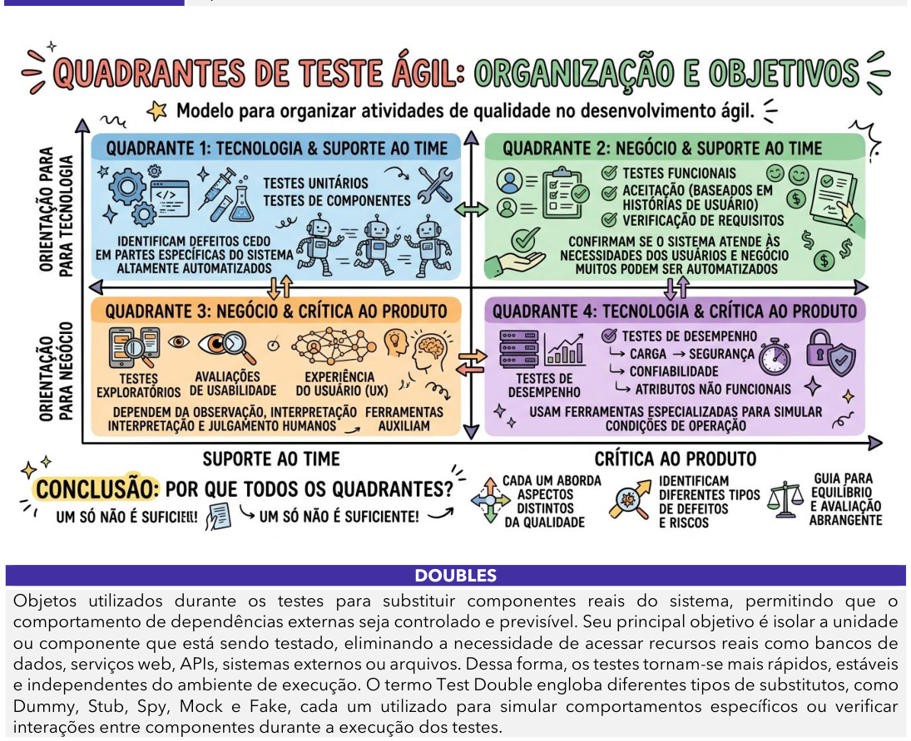

<!-- Start of picture text -->
DOUBLES Objetos utilizados durante os testes para substituir componentes reais do sistema, permitindo que o comportamento de dependências externas seja controlado e previsível. Seu principal objetivo é isolar a unidade ou componente que está sendo testado, eliminando a necessidade de acessar recursos reais como bancos de dados, serviços web, APIs, sistemas externos ou arquivos. Dessa forma, os testes tornam-se mais rápidos, estáveis e independentes do ambiente de execução. O termo Test Double engloba diferentes tipos de substitutos, como Dummy, Stub, Spy, Mock e Fake, cada um utilizado para simular comportamentos específicos ou verificar interações entre componentes durante a execução dos testes. <!-- End of picture text -->

---

<!-- pagina: 155 -->

**Diego Carvalho, Equipe Informática 2 (Diego Carvalho), Equipe Informática 1 (Diego Carvalho) Aula 06** 

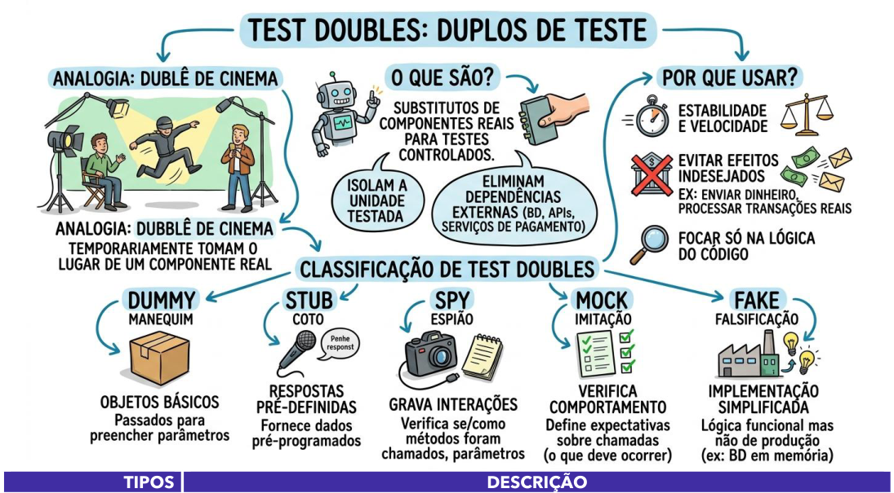

<!-- Start of picture text -->
TIPOS  DESCRIÇÃO <!-- End of picture text -->

**DUMMY** 

**STUB** 

**MOCK SPY FAKE** 

Um Dummy é um objeto utilizado apenas para preencher parâmetros ou dependências exigidas pelo código durante a execução dos testes. Ele não possui comportamento relevante nem participa efetivamente da lógica testada. Seu único propósito é permitir que o teste seja compilado e executado quando determinado objeto é obrigatório, mas não influencia o cenário avaliado. 

Um Stub é um objeto de teste que substitui uma dependência real e fornece respostas previamente programadas para chamadas específicas. Seu objetivo é controlar o ambiente de teste e isolar o componente avaliado de serviços externos, bancos de dados ou módulos ainda indisponíveis, permitindo verificar o comportamento da unidade testada de forma previsível e reproduzível. 

Um Mock é um objeto simulado que, além de fornecer comportamentos préconfigurados, registra e valida as interações realizadas pelo sistema sob teste. Ele permite verificar se determinados métodos foram chamados, quantas vezes foram executados e com quais parâmetros, sendo amplamente utilizado para validar a comunicação entre componentes durante os testes. 

Um Spy é um tipo de objeto de teste que observa e registra as interações realizadas com uma dependência, preservando parcial ou totalmente seu comportamento original. Diferentemente do Mock, o Spy é normalmente utilizado para coletar informações sobre chamadas efetuadas durante a execução do teste, permitindo posterior verificação sem necessariamente impor expectativas prévias. 

Um Fake é uma implementação simplificada de um componente real, contendo lógica funcional suficiente para ser utilizada durante os testes. Diferentemente de um Stub, ele executa operações reais de forma reduzida, como um banco de dados em memória ou um serviço de armazenamento temporário, proporcionando testes mais realistas sem depender da infraestrutura de produção.

---

<!-- pagina: 156 -->

**Diego Carvalho, Equipe Informática 2 (Diego Carvalho), Equipe Informática 1 (Diego Carvalho) Aula 06** 

<!-- Start of picture text -->
Q UESTÕES  C OMENTADAS <!-- End of picture text -->

**1. (FGV / DPE RO - 2025) Os testes de software são essenciais para garantir a qualidade dos códigos gerados. Inicialmente o programador desenvolveu o seguinte código de produção a ser testado:** 

###### **CODIGO-01.py** 

**def celsius_to_fahrenheit(celsius): return (celsius * 9/5) + 32** 

###### **Posteriormente, o programador desenvolveu o código de teste empregando a linguagem Python** 

**import unittest** 

**class** 

**TestTemperatureConversion(unittest.TestCase): def test_celsius_to_fahrenheit(self): self.assertEqual(celsius_to_fahrenheit(0), 32) self.assertEqual(celsius_to_fahrenheit(25), 77) if __name__ == '__main__': unittest.main()** 

**A abordagem do teste utilizado pelo programador se refere a um** 

a) BDD (Behavior-Driven Development). 

- b) TDD (Testdriven development). 

- c) Teste de usabilidade. 

- d) Teste de integração. 

- e) Teste Unitário. 

**Comentários:** 

(a) Errado. BDD foca no comportamento esperado do sistema, geralmente com cenários mais descritivos e orientados ao negócio. 

(b) Errado. TDD é uma metodologia de desenvolvimento guiada por testes, não o tipo de teste em si mostrado no exemplo. 

(c) Errado. Teste de usabilidade avalia a experiência do usuário na interação com o sistema, o que não ocorre nesse código.

---

<!-- pagina: 157 -->

**Diego Carvalho, Equipe Informática 2 (Diego Carvalho), Equipe Informática 1 (Diego Carvalho) Aula 06** 

(d) Errado. Teste de integração verifica a interação entre módulos ou componentes, diferente do caso apresentado. 

(e) Correto. O código testa isoladamente a função celsius_to_fahrenheit com entradas e saídas esperadas, caracterizando teste unitário. 

**Gabarito:** Letra E 

**2. (FGV / ALESC - 2024) Com relação aos testes de software, avalie as afirmativas a seguir e assinale V para a afirmativa verdadeira e F para a falsa.** 

**( ) Testes unitários são aqueles que testam os métodos de uma classe de produção, são feitos de forma automatizada, podem ser executados pressionando um botão e não exigem necessariamente nenhum conhecimento do sistema em geral.** 

**( ) Testes funcionais validam o sistema de software em relação aos requisitos/especificações funcionais, se concentram na simulação do uso real do software e podem ser automatizados como testes de aceitação, por meio de ferramentas como Selenium.** 

**( ) Testes de integração garantem, de modo independente e determinístico, que os componentes em análise realmente produzem o comportamento esperado quando se executa a verificação de partes maiores do sistema que dependem de recursos externos, e, quando envolverem acesso à banco de dados precisam garantir o seu estado somente após sua execução.** 

**As afirmativas são, respectivamente,** 

a) F – F – F. 

b) V – F – F. 

c) V – V – F. 

d) F – V – V. 

e) V – V – V. 

**Comentários:** 

(V) Testes unitários focam unidades isoladas, como métodos de classes, costumam ser automatizados e executados rapidamente, sem exigir visão ampla do sistema. 

(V) Testes funcionais verificam o software conforme requisitos funcionais, simulam o uso real e podem ser automatizados com ferramentas como Selenium.

---

<!-- pagina: 158 -->

**Diego Carvalho, Equipe Informática 2 (Diego Carvalho), Equipe Informática 1 (Diego Carvalho) Aula 06** 

(F) A assertiva atribui aos testes de integração características de independência e determinismo absoluto, além de uma garantia inadequada sobre o estado do banco apenas após a execução. 

**Gabarito:** Letra C 

**3. (FGV / ALEP - 2024) No contexto da Engenharia de Software, os testes de software desempenham um papel consideravelmente importante no âmbito do processo de desenvolvimento. Nesse contexto, os testes de unidade caracterizam-se por** 

a) dependerem do sucesso do teste de integração descendente (top-down). 

- b) representarem validações em componentes que representam programas independentes. 

- c) serem responsáveis pela verificação na menor unidade do componente ou módulo de software. 

- d) substituírem paulatinamente a abordagem de teste por fumaça na verificação do software. 

- e) utilizarem como metodologia de base a abordagem de testes de regressão. 

**Comentários:** 

(a) Errado. Testes de unidade não dependem do êxito do teste de integração top-down; são executados sobre partes isoladas do software. 

(b) Errado. O foco não está em programas independentes, mas em unidades menores, como funções, métodos ou módulos específicos. 

(c) Correto. Testes de unidade verificam a menor parte testável de um componente ou módulo, validando seu funcionamento isoladamente. 

(d) Errado. Teste por fumaça tem finalidade distinta e não é substituído gradualmente pelos testes de unidade na verificação do software. 

(e) Errado. Testes de regressão têm outro objetivo: confirmar que mudanças não afetaram funcionalidades já existentes. 

**Gabarito:** Letra C 

**4. (FGV / TJ MS - 2024) A testabilidade é um fator importante para o desenvolvimento e a implementação de um software. Uma característica de um software testável é que os estados do software devem ser visíveis e podem ser consultados durante a execução.** 

###### **Essa característica é chamada de:**

---

<!-- pagina: 159 -->

**Diego Carvalho, Equipe Informática 2 (Diego Carvalho), Equipe Informática 1 (Diego Carvalho) Aula 06** 

a) compreensibilidade; 

b) controlabilidade; 

c) estabilidade; 

d) observabilidade; 

e) operabilidade. 

###### **Comentários:** 

(a) Errado. Compreensibilidade trata da facilidade de entender o software, não da visualização de seus estados em execução. 

(b) Errado. Controlabilidade relaciona-se à capacidade de controlar entradas e condições de teste, não à consulta dos estados internos. 

(c) Errado. Estabilidade refere-se à previsibilidade do comportamento diante de mudanças, sem foco na visibilidade dos estados. 

(d) Correto. Observabilidade é a característica que permite visualizar e consultar os estados do software durante sua execução. 

(e) Errado. Operabilidade diz respeito à facilidade de operação e uso do software, não à inspeção de estados internos. 

**Gabarito:** Letra D 

**5. (FGV / SES MT - 2024) A excelência no desenvolvimento de software começa com testes meticulosos, assim como a precisão é crucial em uma obra de arte. Diversas técnicas de teste de software existem, cada uma com propósito e abordagem específicos.** 

**Assinale a opção que indica o tipo de teste que assegura que as funcionalidades previamente implementadas não serão afetadas pelas alterações feitas no código.** 

a) Teste Unitário. 

- b) Teste de Integração. 

- c) Teste de Usabilidade. 

- d) Teste de Regressão. 

**Comentários:** 

(a) Errado. Teste unitário verifica partes isoladas do código, mas não tem como foco principal garantir que mudanças não afetem funcionalidades já existentes.

---

<!-- pagina: 160 -->

**Diego Carvalho, Equipe Informática 2 (Diego Carvalho), Equipe Informática 1 (Diego Carvalho) Aula 06** 

(b) Errado. Teste de integração avalia a interação entre módulos, não sendo o mais indicado para confirmar impactos de alterações em funcionalidades anteriores. 

(c) Errado. Teste de usabilidade analisa a experiência do usuário e a facilidade de uso do sistema, sem foco em efeitos de mudanças no código. 

(d) Correto. Teste de regressão é aplicado para assegurar que alterações no código não prejudiquem funcionalidades que já estavam implementadas. 

**Gabarito:** Letra D 

**6. (FGV / SES MT - 2024) Existem várias técnicas de teste de software, cada uma com seus próprios objetivos e métodos específicos. Relacione os testes de software listados a seguir, às suas respectivas definições.** 

###### **1. Teste Funcional** 

**2. Teste de Conformidade** 

**3. Teste de Caixa Preta** 

**4. Teste de Desempenho** 

**( ) Avalia como o sistema se comporta em termos de velocidade, escalabilidade e estabilidade sob diferentes condições de carga.** 

**( ) Testa o software sem conhecimento interno da lógica ou estrutura do código, focando nos requisitos e funcionalidades visíveis.** 

**( ) Verifica se as funções do software estão operando conforme esperado. Isso pode incluir testes de casos de uso, fluxos de trabalho e requisitos funcionais.** 

**( ) Verifica se o software atende a padrões, regulamentos e requisitos legais.** 

**Assinale a opção que indica a relação correta, na ordem apresentada.** 

a) 2 – 4 – 3 – 1. 

b) 2 – 1 – 3 – 4. 

c) 4 – 3 – 1 – 2. 

d) 4 – 2 – 1 – 3. 

**Comentários:**

---

<!-- pagina: 161 -->

**Diego Carvalho, Equipe Informática 2 (Diego Carvalho), Equipe Informática 1 (Diego Carvalho) Aula 06** 

(1ª) 4 – Teste de desempenho avalia velocidade, estabilidade, tempo de resposta, capacidade e escalabilidade sob diferentes cargas; 

(2ª) 3 – Teste de caixa preta analisa entradas e saídas sem considerar a estrutura interna do código; 

(3ª) 1 – Teste funcional verifica se as funcionalidades atendem aos requisitos e comportam-se conforme esperado; 

(4ª) 2 – Teste de conformidade verifica aderência a normas, regulamentos, padrões e exigências legais. 

**Gabarito:** Letra C 

**7. (FGV / TCE-PA - 2024) Algumas vezes chamado de teste alfa, este tipo de teste corresponde à fase final do processo de testes, precedendo a liberação do software para uso operacional.** 

**A aplicação é testada com dados fornecidos pelo cliente, o que pode revelar problemas na definição dos requisitos do sistema, uma vez que o software é provocado de maneira diferente ao usar os dados reais em vez de dados de teste.** 

**A definição acima descreve aspectos a respeito do teste de** 

a) aceitação. 

b) componente. 

c) sistema. 

d) regressão. 

e) unidade. 

**Comentários:** 

(a) Correto. O teste de aceitação ocorre na etapa final, antes da liberação, com dados do cliente e foco em validar se o sistema atende aos requisitos esperados. 

(b) Errado. Teste de componente verifica partes isoladas do sistema, não a validação final com dados reais do cliente. 

(c) Errado. Teste de sistema avalia o sistema como um todo, mas a descrição destaca a etapa final de validação pelo cliente. 

(d) Errado. Teste de regressão busca identificar impactos de mudanças, não caracterizando essa fase final com dados fornecidos pelo cliente.

---

<!-- pagina: 162 -->

**Diego Carvalho, Equipe Informática 2 (Diego Carvalho), Equipe Informática 1 (Diego Carvalho) Aula 06** 

(e) Errado. Teste de unidade examina unidades individuais do código, bem distante da validação final antes do uso operacional. 

**Gabarito:** Letra A 

**8. (FGV / TCE-PA - 2024) Testes de Usabilidade são uma prática fundamental na Engenharia de Usabilidade, focando na observação de como usuários reais interagem com o sistema. Sobre esses testes, é correto afirmar que** 

a) devem sempre ser conduzidos em laboratório especializado. 

- b) métodos heurísticos de avaliação envolvem usuários reais testando a interface. 

- c) testes não moderados são indicados quando é necessária a coleta de dados em grande escala. 

- d) não devem ser executados usando protótipos do sistema. 

- e) testes A/B são utilizados para coletar feedback qualitativo detalhado dos usuários. 

**Comentários:** 

(a) Errado. Testes de usabilidade podem ocorrer em laboratório, remotamente ou em contexto real; não há exigência de ambiente especializado em todos os casos. 

(b) Errado. Avaliação heurística é feita por especialistas com base em princípios de usabilidade, sem depender de usuários reais interagindo com a interface. 

(c) Correto. Testes não moderados permitem alcançar muitos participantes com mais rapidez, sendo úteis quando se busca coleta de dados em grande escala. 

(d) Errado. Protótipos podem, sim, ser usados em testes de usabilidade, inclusive nas fases iniciais, para validar fluxos e identificar problemas cedo. 

(e) Errado. Testes A/B comparam versões para medir desempenho e preferência, não sendo voltados ao feedback qualitativo detalhado dos usuários. 

**Gabarito:** Letra C 

**9. (FGV / TCE-PA - 2024) Testes de usabilidade podem ser classificados em vários tipos, conforme o seu objetivo. O teste de exploração, frequentemente realizado durante o desenvolvimento de uma aplicação web, tem por objetivo** 

   - a) validar a conformidade da aplicação com as Diretrizes de Acessibilidade para Conteúdo Web (WCAG).

---

<!-- pagina: 163 -->

**Diego Carvalho, Equipe Informática 2 (Diego Carvalho), Equipe Informática 1 (Diego Carvalho) Aula 06** 

b) entender como os usuários pensam e determinar como as funcionalidades devem operar. 

- c) escolher qual a solução mais adequada entre duas opções, através de um processo de comparação. 

- d) efetivar o teste exaustivo das funcionalidades, empregando de protótipos de alta fidelidade. 

- e) medir a performance da aplicação em diferentes dispositivos, garantindo sua acessibilidade. 

###### **Comentários:** 

(a) Errado. Essa alternativa trata de teste de acessibilidade e conformidade com WCAG, não do teste de exploração. 

(b) Correto. O teste de exploração busca compreender o raciocínio dos usuários e orientar como as funcionalidades devem funcionar. 

(c) Errado. Comparar duas opções para escolher a melhor se relaciona a testes comparativos, não ao de exploração. 

(d) Errado. Teste exaustivo com protótipos de alta fidelidade remete à validação funcional, não à exploração inicial. 

(e) Errado. Medir desempenho em dispositivos diferentes envolve performance e acessibilidade, fugindo do foco exploratório. 

**Gabarito:** Letra B 

- **10.(FGV / MACAEPREV - 2024) Outra categoria importante dos testes de software são os testes de integração. O propósito dos testes de integração em desenvolvimento de software é** 

   - a) avaliar o desempenho do software em termos de tempo de resposta e escalabilidade sob condições de carga pesada. 

   - b) verificar a conformidade do software com os requisitos e especificações do usuário, geralmente com foco no sistema como um todo. 

   - c) garantir que cada componente ou módulo do software funcione corretamente quando testado isoladamente.

---

<!-- pagina: 164 -->

**Diego Carvalho, Equipe Informática 2 (Diego Carvalho), Equipe Informática 1 (Diego Carvalho) Aula 06** 

- d) testar a interação entre diferentes módulos ou componentes do sistema para assegurar que eles funcionam corretamente em conjunto. 

- e) validar a interface do usuário e a usabilidade do software durante a execução real pelo usuário final. 

**Comentários:** 

(a) Errado. Descreve teste de desempenho, voltado a tempo de resposta e escalabilidade sob carga, não a testes de integração. 

(b) Errado. Refere-se à validação do sistema frente aos requisitos do usuário, com foco mais amplo no sistema como um todo. 

(c) Errado. Trata de teste unitário, que verifica módulos isoladamente, sem analisar a comunicação entre eles. 

(d) Correto. Testes de integração verificam se módulos ou componentes interagem corretamente e funcionam bem em conjunto. 

(e) Errado. Relaciona-se à interface do usuário e à usabilidade, aspecto distinto do objetivo dos testes de integração. 

**Gabarito:** Letra D 

- **11.(FGV / Prefeitura de Cuiabá - 2024) Em certa instituição, a equipe de engenharia de software adota uma abordagem de desenvolvimento incremental, com entregas regulares de novas funcionalidades a cada iteração. A equipe está avaliando a estratégia de teste para garantir a qualidade do sistema em cada fase.** 

**Entre as seguintes práticas elencadas a seguir, a que seria mais eficaz para identificar regressões de software e assegurar que as funcionalidades existentes continuem funcionando corretamente à medida que novas partes do sistema são integradas é:** 

- a) focar principalmente em testes unitários para cada novo módulo desenvolvido, garantindo que cada unidade funcione individualmente, sem precisar verificar a integração com os módulos existentes. 

- b) executar testes de aceitação apenas ao final do desenvolvimento de todas as funcionalidades planejadas, para garantir que o sistema atende aos requisitos do cliente e só então testar a integração.

---

<!-- pagina: 165 -->

**Diego Carvalho, Equipe Informática 2 (Diego Carvalho), Equipe Informática 1 (Diego Carvalho) Aula 06** 

- c) implementar testes de sistema no início de cada iteração para validar o comportamento geral do sistema, sem necessidade de repetir os testes das funcionalidades já implementadas. 

- d) adotar uma abordagem de testes de regressão automatizados, executando um conjunto de testes em cada iteração para verificar que funcionalidades antigas não foram impactadas por novas alterações no sistema. 

- e) conduzir revisões de código manuais antes de cada integração, uma vez que a verificação visual dos desenvolvedores detectará possíveis impactos nas funcionalidades existentes. 

**Comentários:** 

(a) Errado. Testes unitários validam partes isoladas, mas não bastam para detectar impactos das mudanças sobre funcionalidades já integradas. 

(b) Errado. Deixar os testes de aceitação para o fim atrasa a descoberta de falhas e não é a prática mais eficaz para identificar regressões a cada iteração. 

(c) Errado. Testes de sistema no início, sem repetir verificações anteriores, não asseguram que mudanças recentes não tenham afetado funcionalidades existentes. 

(d) Correto. Testes de regressão automatizados, executados em cada iteração, ajudam a confirmar que novas integrações não quebraram comportamentos já funcionando. 

(e) Errado. Revisões manuais são úteis, mas não substituem testes recorrentes e automatizados para verificar regressões de forma confiável. 

**Gabarito:** Letra D 

- **12.(FGV / Prefeitura de Cuiabá - 2024) Um software que está sendo desenvolvido por um determinado grupo de desenvolvedores está na fase de testes. Deseja-se verificar a integridade das funções e classes que compõem o software. O teste adequado para realizar este tipo de verificação é o teste** 

a) unitário. 

b) integração. 

c) de validação. 

d) de sistema. 

e) de aceitação. 

**Comentários:**

---

<!-- pagina: 166 -->

**Diego Carvalho, Equipe Informática 2 (Diego Carvalho), Equipe Informática 1 (Diego Carvalho) Aula 06** 

(a) Correto. O teste unitário verifica individualmente funções, métodos e classes, checando sua integridade e funcionamento isolado durante o desenvolvimento. 

(b) Errado. O teste de integração foca na interação entre módulos, não na verificação isolada de funções e classes. 

(c) Errado. O teste de validação busca confirmar se o software atende aos requisitos esperados pelo usuário. 

(d) Errado. O teste de sistema avalia o comportamento do sistema como um todo, de forma integrada. (e) Errado. O teste de aceitação verifica se o produto está pronto para uso sob a ótica do usuário ou cliente. ==5460== **Gabarito:** Letra A **13.(FGV / CGE SC - 2023) O tipo de teste de software que serve para garantir que todas ou algumas partes de um sistema estão dialogando e funcionando corretamente em conjunto é o teste** 

**Gabarito:** Letra A 

a) de regressão. 

b) de aceitação. 

c) de integração. 

d) de validação. 

e) unitário. 

**Comentários:** 

(a) Errado. Teste de regressão verifica se mudanças no sistema não quebraram funcionalidades já existentes. 

(b) Errado. Teste de aceitação avalia se o sistema atende aos requisitos do usuário ou cliente. 

(c) Correto. Teste de integração verifica se módulos ou partes do sistema interagem corretamente em conjunto. 

(d) Errado. Teste de validação busca confirmar se o software atende ao que foi esperado ou especificado. 

(e) Errado. Teste unitário analisa componentes isolados, não o funcionamento conjunto entre partes do sistema. 

**Gabarito:** Letra C

---

<!-- pagina: 167 -->

**Diego Carvalho, Equipe Informática 2 (Diego Carvalho), Equipe Informática 1 (Diego Carvalho) Aula 06** 

- **14.(FGV / MT - 2023) A estratégia de teste software cujo objetivo principal é verificar como um dado software se comporta em um cenário que exige recursos computacionais em quantidades, frequência ou volumes anormais é o teste de** 

a) estresse. 

- b) integração. 

c) regressão. 

- d) unidade. 

- e) usabilidade. 

**Comentários:** 

(a) Correto. Teste de estresse avalia o comportamento do software sob condições extremas, com carga, volume ou frequência anormais de uso. 

(b) Errado. Teste de integração verifica a interação entre módulos, não o desempenho em condições extremas. 

(c) Errado. Teste de regressão confirma se mudanças não afetaram funcionalidades já existentes. 

(d) Errado. Teste de unidade analisa partes isoladas do código, como funções ou métodos. 

(e) Errado. Teste de usabilidade foca na experiência do usuário e na facilidade de uso do sistema. 

**Gabarito:** Letra A 

- **15.(FGV / CGU - 2022) Uma categoria de testes comumente utilizada é a de Testes Baseados em Experiência (Experience-based Testing). Nas técnicas dessa categoria, fatores como o histórico de funcionamento da aplicação e erros comuns de utilização das tecnologias empregadas – derivados do conhecimento do testador – são utilizados para antecipar a ocorrência de erros, defeitos e falhas. Testes baseados em experiência não costumam ser empregados como abordagem principal em cenários de alto risco, em função da variabilidade de sua eficiência e cobertura.** 

**Considerando um projeto em que o time de desenvolvimento não possua experiência com a tecnologia e o domínio da aplicação, a técnica recomendada para o portfólio de testes desse time é:** 

- a) Teste de Caso de Uso (Use Case Testing);

---

<!-- pagina: 168 -->

**Diego Carvalho, Equipe Informática 2 (Diego Carvalho), Equipe Informática 1 (Diego Carvalho) Aula 06** 

- b) Teste de Hipótese (Statistical Hypothesis Testing); 

- c) Previsão de Erros (Error Guessing); 

- d) Teste Exploratório (Exploratory Testing); 

- e) Teste Baseado em Listas de Verificação (Checklist-based Testing). 

###### **Comentários:** 

(a) Correto. Teste de Caso de Uso é indicado para equipes com pouca experiência, pois deriva cenários a partir dos fluxos de negócio e requisitos, oferecendo maior estrutura e cobertura ao portfólio de testes. 

(b) Errado. Teste de Hipótese tem foco estatístico e não é a técnica mais recomendada para suprir falta de experiência no domínio e na tecnologia. 

(c) Errado. Previsão de Erros depende fortemente da vivência prévia do testador, justamente ausente no cenário apresentado. 

(d) Errado. Teste Exploratório também se apoia bastante no conhecimento e na intuição do testador, o que reduz sua adequação como técnica recomendada nesse caso. 

(e) Errado. Checklist-based Testing ajuda na organização, mas não oferece, por si só, a mesma base estruturada de cenários de negócio fornecida pelos casos de uso. 

**Gabarito:** Letra A 

- **16.(FGV / Sefaz AM - 2022) Sobre os testes de software, analise as afirmativas a seguir.** 

   - **I. Testes de estresse são testes de sistema projetados para confrontar o software com situações anormais as condições previstas de uso.** 

   - **II. Testes de regressão são testes estruturais que forçam o software a falhar de várias maneiras visando identificar os limites operacionais de um sistema.** 

   - **III. Testes de módulo são testes de caixa-preta que visam avaliar a usabilidade da aplicação, determinando até que ponto a interface do software é fácil e intuitiva de utilizar.** 

**Está correto o que se afirma em** 

a) I, apenas. 

- b) II, apenas. 

- c) III, apenas. 

- d) I e II, apenas.

---

<!-- pagina: 169 -->

**Diego Carvalho, Equipe Informática 2 (Diego Carvalho), Equipe Informática 1 (Diego Carvalho) Aula 06** 

e) I, II e III. 

**Comentários:** 

(I) Correto. Testes de estresse submetem o sistema a condições anormais ou extremas, verificando seu comportamento além do uso esperado. 

(II) Errado. A descrição apresentada não corresponde aos testes de regressão, que servem para verificar se mudanças afetaram funcionalidades já existentes. 

(III) Errado. Testes de módulo focam partes específicas do software, não tendo como objetivo principal avaliar usabilidade da interface. 

**Gabarito:** Letra A 

- **17.(FGV / TJDFT - 2022) A analista Ester implementou um teste automatizado de nome ETest para o software TJApp. O ETest avalia se TJApp é capaz de executar seu fluxo de execução principal de forma completa, em um ambiente muito semelhante ao do usuário final.** 

###### **Portanto, o ETest implementado por Ester é do tipo:** 

a) regressão visual; 

b) unitário; 

c) desempenho; 

d) ponta a ponta; 

- e) exploratório. 

**Comentários:** 

(a) Errado. Regressão visual verifica alterações na interface, não a execução completa do fluxo principal em ambiente próximo ao real. 

(b) Errado. Teste unitário foca partes isoladas do sistema, e não o comportamento completo da aplicação. 

(c) Errado. Teste de desempenho mede velocidade, estabilidade e carga, não a jornada funcional completa. 

(d) Correto. Teste ponta a ponta valida o fluxo principal do sistema de forma integrada, em cenário semelhante ao do usuário final.

---

<!-- pagina: 170 -->

**Diego Carvalho, Equipe Informática 2 (Diego Carvalho), Equipe Informática 1 (Diego Carvalho) Aula 06** 

(e) Errado. Teste exploratório é mais livre e investigativo, sem foco necessário em automação do fluxo completo. 

**Gabarito:** Letra D 

- **18.(FGV / MPE SC - 2022) O analista em TI Josué está desenvolvendo o software SApp e implementou o teste K. O teste K consiste em determinar se a função F do código de SApp retorna o resultado esperado C ao receber dois valores A e B.** 

###### **O teste K implementado por Josué é de:** 

a) aceitação; 

b) integração; 

c) ponta a ponta; 

d) unidade; 

e) sanidade. 

**Comentários:** 

(a) Errado. Teste de aceitação valida se o sistema atende às necessidades do usuário, não o retorno isolado de uma função com entradas específicas. 

(b) Errado. Teste de integração verifica a interação entre módulos ou componentes, e não o comportamento individual de uma única função. 

(c) Errado. Teste ponta a ponta avalia o fluxo completo da aplicação em cenário real de uso, algo mais amplo que testar uma função. 

(d) Correto. Teste de unidade foca partes pequenas do código, como uma função, verificando se ela retorna o resultado esperado para dados de entrada definidos. 

(e) Errado. Teste de sanidade faz uma checagem rápida após mudanças, sem o foco específico e isolado de validar uma função como unidade. 

**Gabarito:** Letra D 

- **19.(FGV / SEMSA Manaus - 2022) No que se refere aos testes de software, um dos níveis de teste, conhecido como Unit Testing, tem por objetivo** 

a) testar a adequação do sistema no ambiente de negócios, e avaliar a conveniência de sua liberação.

---

<!-- pagina: 171 -->

**Diego Carvalho, Equipe Informática 2 (Diego Carvalho), Equipe Informática 1 (Diego Carvalho) Aula 06** 

b) testar a compatibilidade com dados de sistemas herdados. 

- c) testar a integração de seções ou partes, explorando as falhas de interação entre partes. 

- d) testar se a conformidade do sistema à luz dos requisitos estabelecidos. 

- e) testar seções ou partes separadamente, usualmente com teste funcionais. 

###### **Comentários:** 

(a) Errado. Refere-se mais à validação no ambiente de negócio e à decisão de liberação, algo ligado a testes de aceitação. 

(b) Errado. Compatibilidade com dados legados não é o foco do Unit Testing, mas de testes específicos de integração ou migração. 

(c) Errado. Explorar falhas na interação entre partes caracteriza teste de integração, não teste unitário. 

(d) Errado. Verificar conformidade do sistema com requisitos remete a testes em nível mais amplo, como sistema ou aceitação. 

(e) Correto. Unit Testing foca partes isoladas do software, testando seções separadamente, em geral de forma funcional e individual. 

**Gabarito:** Letra E 

- **20.(FGV / TCE TO - 2022) O analista de sistemas Carlos está desenvolvendo o software CharlieApp e implementou o teste C. O teste C consiste apenas em determinar se o método A do código de CharlieApp retorna o resultado esperado C ao chamar o método B que realiza uma consulta ao banco de dados de CharlieApp.** 

**Portanto, o teste C implementado por Carlos é de:** 

a) unidade; 

b) aceitação; 

c) ponta a ponta; 

d) exploração; 

e) integração. 

###### **Comentários:** 

(a) Errado. Teste de unidade foca uma parte isolada do código; aqui há interação entre o método A e o método B com consulta ao banco, caracterizando integração.

---

<!-- pagina: 172 -->

**Diego Carvalho, Equipe Informática 2 (Diego Carvalho), Equipe Informática 1 (Diego Carvalho) Aula 06** 

(b) Errado. Teste de aceitação valida se o sistema atende às necessidades do usuário ou do negócio, o que não é o foco do cenário apresentado. 

(c) Errado. Teste ponta a ponta cobre o fluxo completo da aplicação em funcionamento; no caso, o foco está na interação entre componentes específicos. 

(d) Errado. Teste de exploração é mais livre e investigativo, sem roteiro fixo; aqui há verificação objetiva de retorno esperado entre métodos. 

(e) Correto. O teste verifica a interação do método A com o método B, que consulta o banco de dados, avaliando a integração entre componentes. 

**Gabarito:** Letra E 

- **21.(FGV / FunSaúde CE - 2021) No contexto da testagem de software, os testes do tipo Unitário, aplicam-se normalmente** 

a) à aderência a padrões. 

- b) às funções codificadas. 

- c) às interfaces de entrada de dados. 

d) à integração dos componentes. 

- e) aos limites de carga. 

**Comentários:** 

(a) Errado. Aderência a padrões costuma ser verificada em revisões, inspeções ou testes de conformidade, não no foco típico do teste unitário. 

(b) Correto. Testes unitários verificam funções ou métodos codificados de forma isolada, validando o comportamento de pequenas unidades do software. 

(c) Errado. Interfaces de entrada de dados são mais exploradas em testes funcionais e de interface, com foco na interação com o sistema. 

(d) Errado. Integração dos componentes é alvo dos testes de integração, que avaliam a comunicação entre módulos distintos. 

(e) Errado. Limites de carga são analisados em testes de desempenho, estresse ou carga, e não no escopo usual dos testes unitários. 

**Gabarito:** Letra B

---

<!-- pagina: 173 -->

**Diego Carvalho, Equipe Informática 2 (Diego Carvalho), Equipe Informática 1 (Diego Carvalho) Aula 06** 

**22.(FGV / IMBEL - 2021) Com referência às metodologias de teste de software, a técnica que avalia as funcionalidades sem ter contato com o código-fonte, mas apenas com as respostas que o sistema dá a determinadas ações, é conhecida como** 

a) Caixa Branca. 

b) Caixa Cinza. 

c) Caixa Preta. 

d) Regressão. 

- e) Testes não funcionais. 

###### **Comentários:** 

(a) Errado. Caixa Branca envolve conhecimento da estrutura interna e do código, o que contraria o enunciado. 

(b) Errado. Caixa Cinza admite conhecimento parcial da estrutura interna, não se limitando apenas às respostas do sistema. 

(c) Correto. Caixa Preta avalia funcionalidades com base nas entradas e saídas, sem acesso ao código-fonte. 

(d) Errado. Regressão verifica se mudanças afetaram funcionalidades já existentes, não define esse tipo de abordagem. 

(e) Errado. Testes não funcionais analisam desempenho, segurança e usabilidade, não a técnica descrita no enunciado. 

**Gabarito:** Letra C

---

<!-- pagina: 174 -->

**Diego Carvalho, Equipe Informática 2 (Diego Carvalho), Equipe Informática 1 (Diego Carvalho) Aula 06** 

<!-- Start of picture text -->
L ISTA DE  Q <!-- End of picture text -->

<!-- Start of picture text -->
UESTÕES <!-- End of picture text -->

**1. (FGV / DPE RO - 2025) Os testes de software são essenciais para garantir a qualidade dos códigos gerados. Inicialmente o programador desenvolveu o seguinte código de produção a ser testado:** 

**CODIGO-01.py** 

**def celsius_to_fahrenheit(celsius): return (celsius * 9/5) + 32** 

**Posteriormente, o programador desenvolveu o código de teste empregando a linguagem Python** 

**import unittest** 

**class** 

**TestTemperatureConversion(unittest.TestCase): def test_celsius_to_fahrenheit(self): self.assertEqual(celsius_to_fahrenheit(0), 32) self.assertEqual(celsius_to_fahrenheit(25), 77) if __name__ == '__main__': unittest.main()** 

**A abordagem do teste utilizado pelo programador se refere a um** 

a) BDD (Behavior-Driven Development). 

   - b) TDD (Testdriven development). 

   - c) Teste de usabilidade. 

   - d) Teste de integração. 

   - e) Teste Unitário. 

**2. (FGV / ALESC - 2024) Com relação aos testes de software, avalie as afirmativas a seguir e assinale V para a afirmativa verdadeira e F para a falsa.** 

**( ) Testes unitários são aqueles que testam os métodos de uma classe de produção, são feitos de forma automatizada, podem ser executados pressionando um botão e não exigem necessariamente nenhum conhecimento do sistema em geral.** 

**( ) Testes funcionais validam o sistema de software em relação aos requisitos/especificações funcionais, se concentram na simulação do uso real do software e podem ser automatizados como testes de aceitação, por meio de ferramentas como Selenium.**

---

<!-- pagina: 175 -->

**Diego Carvalho, Equipe Informática 2 (Diego Carvalho), Equipe Informática 1 (Diego Carvalho) Aula 06** 

**( ) Testes de integração garantem, de modo independente e determinístico, que os componentes em análise realmente produzem o comportamento esperado quando se executa a verificação de partes maiores do sistema que dependem de recursos externos, e, quando envolverem acesso à banco de dados precisam garantir o seu estado somente após sua execução.** 

**As afirmativas são, respectivamente,** 

a) F – F – F. 

b) V – F – F. 

c) V – V – F. 

d) F – V – V. 

e) V – V – V. 

**3. (FGV / ALEP - 2024) No contexto da Engenharia de Software, os testes de software desempenham um papel consideravelmente importante no âmbito do processo de desenvolvimento. Nesse contexto, os testes de unidade caracterizam-se por** 

   - a) dependerem do sucesso do teste de integração descendente (top-down). 

   - b) representarem validações em componentes que representam programas independentes. 

   - c) serem responsáveis pela verificação na menor unidade do componente ou módulo de software. 

   - d) substituírem paulatinamente a abordagem de teste por fumaça na verificação do software. 

   - e) utilizarem como metodologia de base a abordagem de testes de regressão. 

**4. (FGV / TJ MS - 2024) A testabilidade é um fator importante para o desenvolvimento e a implementação de um software. Uma característica de um software testável é que os estados do software devem ser visíveis e podem ser consultados durante a execução.** 

**Essa característica é chamada de:** 

   - a) compreensibilidade; 

   - b) controlabilidade; 

   - c) estabilidade; 

   - d) observabilidade; 

   - e) operabilidade. 

**5. (FGV / SES MT - 2024) A excelência no desenvolvimento de software começa com testes meticulosos, assim como a precisão é crucial em uma obra de arte. Diversas técnicas de teste de software existem, cada uma com propósito e abordagem específicos.** 

**Assinale a opção que indica o tipo de teste que assegura que as funcionalidades previamente implementadas não serão afetadas pelas alterações feitas no código.**

---

<!-- pagina: 176 -->

**Diego Carvalho, Equipe Informática 2 (Diego Carvalho), Equipe Informática 1 (Diego Carvalho) Aula 06** 

   - a) Teste Unitário. 

   - b) Teste de Integração. 

   - c) Teste de Usabilidade. 

   - d) Teste de Regressão. 

**6. (FGV / SES MT - 2024) Existem várias técnicas de teste de software, cada uma com seus próprios** 

**objetivos e métodos específicos. Relacione os testes de software listados a seguir, às suas respectivas definições.** 

###### **1. Teste Funcional** 

**2. Teste de Conformidade** 

**3. Teste de Caixa Preta** 

**4. Teste de Desempenho** 

**( ) Avalia como o sistema se comporta em termos de velocidade, escalabilidade e estabilidade sob diferentes condições de carga.** 

**( ) Testa o software sem conhecimento interno da lógica ou estrutura do código, focando nos requisitos e funcionalidades visíveis.** 

**( ) Verifica se as funções do software estão operando conforme esperado. Isso pode incluir testes de casos de uso, fluxos de trabalho e requisitos funcionais.** 

**( ) Verifica se o software atende a padrões, regulamentos e requisitos legais.** 

**Assinale a opção que indica a relação correta, na ordem apresentada.** 

a) 2 – 4 – 3 – 1. 

b) 2 – 1 – 3 – 4. 

- c) 4 – 3 – 1 – 2. 

d) 4 – 2 – 1 – 3. 

**7. (FGV / TCE-PA - 2024) Algumas vezes chamado de teste alfa, este tipo de teste corresponde à fase final do processo de testes, precedendo a liberação do software para uso operacional.** 

**A aplicação é testada com dados fornecidos pelo cliente, o que pode revelar problemas na definição dos requisitos do sistema, uma vez que o software é provocado de maneira diferente ao usar os dados reais em vez de dados de teste.** 

**A definição acima descreve aspectos a respeito do teste de** 

- a) aceitação.

---

<!-- pagina: 177 -->

**Diego Carvalho, Equipe Informática 2 (Diego Carvalho), Equipe Informática 1 (Diego Carvalho) Aula 06** 

b) componente. 

- c) sistema. 

d) regressão. 

e) unidade. 

**8. (FGV / TCE-PA - 2024) Testes de Usabilidade são uma prática fundamental na Engenharia de Usabilidade, focando na observação de como usuários reais interagem com o sistema. Sobre esses testes, é correto afirmar que** 

   - a) devem sempre ser conduzidos em laboratório especializado. 

   - b) métodos heurísticos de avaliação envolvem usuários reais testando a interface. 

   - c) testes não moderados são indicados quando é necessária a coleta de dados em grande escala. 

   - d) não devem ser executados usando protótipos do sistema. 

   - e) testes A/B são utilizados para coletar feedback qualitativo detalhado dos usuários. 

**9. (FGV / TCE-PA - 2024) Testes de usabilidade podem ser classificados em vários tipos, conforme o seu objetivo. O teste de exploração, frequentemente realizado durante o desenvolvimento de uma aplicação web, tem por objetivo** 

   - a) validar a conformidade da aplicação com as Diretrizes de Acessibilidade para Conteúdo Web (WCAG). 

   - b) entender como os usuários pensam e determinar como as funcionalidades devem operar. 

   - c) escolher qual a solução mais adequada entre duas opções, através de um processo de comparação. 

   - d) efetivar o teste exaustivo das funcionalidades, empregando de protótipos de alta fidelidade. 

   - e) medir a performance da aplicação em diferentes dispositivos, garantindo sua acessibilidade. 

- **10.(FGV / MACAEPREV - 2024) Outra categoria importante dos testes de software são os testes de integração. O propósito dos testes de integração em desenvolvimento de software é** 

   - a) avaliar o desempenho do software em termos de tempo de resposta e escalabilidade sob condições de carga pesada. 

   - b) verificar a conformidade do software com os requisitos e especificações do usuário, geralmente com foco no sistema como um todo. 

   - c) garantir que cada componente ou módulo do software funcione corretamente quando testado isoladamente.

---

<!-- pagina: 178 -->

**Diego Carvalho, Equipe Informática 2 (Diego Carvalho), Equipe Informática 1 (Diego Carvalho) Aula 06** 

   - d) testar a interação entre diferentes módulos ou componentes do sistema para assegurar que eles funcionam corretamente em conjunto. 

   - e) validar a interface do usuário e a usabilidade do software durante a execução real pelo usuário final. 

- **11.(FGV / Prefeitura de Cuiabá - 2024) Em certa instituição, a equipe de engenharia de software adota uma abordagem de desenvolvimento incremental, com entregas regulares de novas funcionalidades a cada iteração. A equipe está avaliando a estratégia de teste para garantir a qualidade do sistema em cada fase.** 

**Entre as seguintes práticas elencadas a seguir, a que seria mais eficaz para identificar regressões de software e assegurar que as funcionalidades existentes continuem funcionando corretamente à medida que novas partes do sistema são integradas é:** 

   - a) focar principalmente em testes unitários para cada novo módulo desenvolvido, garantindo que cada unidade funcione individualmente, sem precisar verificar a integração com os módulos existentes. 

   - b) executar testes de aceitação apenas ao final do desenvolvimento de todas as funcionalidades planejadas, para garantir que o sistema atende aos requisitos do cliente e só então testar a integração. 

   - c) implementar testes de sistema no início de cada iteração para validar o comportamento geral do sistema, sem necessidade de repetir os testes das funcionalidades já implementadas. 

   - d) adotar uma abordagem de testes de regressão automatizados, executando um conjunto de testes em cada iteração para verificar que funcionalidades antigas não foram impactadas por novas alterações no sistema. 

   - e) conduzir revisões de código manuais antes de cada integração, uma vez que a verificação visual dos desenvolvedores detectará possíveis impactos nas funcionalidades existentes. 

- **12.(FGV / Prefeitura de Cuiabá - 2024) Um software que está sendo desenvolvido por um determinado grupo de desenvolvedores está na fase de testes. Deseja-se verificar a integridade das funções e classes que compõem o software. O teste adequado para realizar este tipo de verificação é o teste** 

   - a) unitário. 

   - b) integração. 

   - c) de validação. 

   - d) de sistema. 

   - e) de aceitação.

---

<!-- pagina: 179 -->

**Diego Carvalho, Equipe Informática 2 (Diego Carvalho), Equipe Informática 1 (Diego Carvalho) Aula 06** 

- **13.(FGV / CGE SC - 2023) O tipo de teste de software que serve para garantir que todas ou algumas partes de um sistema estão dialogando e funcionando corretamente em conjunto é o teste** 

a) de regressão. 

   - b) de aceitação. 

   - c) de integração. 

   - d) de validação. 

   - e) unitário. 

- **14.(FGV / MT - 2023) A estratégia de teste software cujo objetivo principal é verificar como um dado software se comporta em um cenário que exige recursos computacionais em quantidades, frequência ou volumes anormais é o teste de** 

   - a) estresse. 

   - b) integração. 

   - c) regressão. 

   - d) unidade. 

   - e) usabilidade. 

- **15.(FGV / CGU - 2022) Uma categoria de testes comumente utilizada é a de Testes Baseados em Experiência (Experience-based Testing). Nas técnicas dessa categoria, fatores como o histórico de funcionamento da aplicação e erros comuns de utilização das tecnologias empregadas – derivados do conhecimento do testador – são utilizados para antecipar a ocorrência de erros, defeitos e falhas. Testes baseados em experiência não costumam ser empregados como abordagem principal em cenários de alto risco, em função da variabilidade de sua eficiência e cobertura.** 

**Considerando um projeto em que o time de desenvolvimento não possua experiência com a tecnologia e o domínio da aplicação, a técnica recomendada para o portfólio de testes desse time é:** 

   - a) Teste de Caso de Uso (Use Case Testing); 

   - b) Teste de Hipótese (Statistical Hypothesis Testing); 

   - c) Previsão de Erros (Error Guessing); 

   - d) Teste Exploratório (Exploratory Testing); 

   - e) Teste Baseado em Listas de Verificação (Checklist-based Testing). 

- **16.(FGV / Sefaz AM - 2022) Sobre os testes de software, analise as afirmativas a seguir.** 

   - **I. Testes de estresse são testes de sistema projetados para confrontar o software com situações anormais as condições previstas de uso.**

---

<!-- pagina: 180 -->

**Diego Carvalho, Equipe Informática 2 (Diego Carvalho), Equipe Informática 1 (Diego Carvalho) Aula 06** 

- **II. Testes de regressão são testes estruturais que forçam o software a falhar de várias maneiras visando identificar os limites operacionais de um sistema.** 

- **III. Testes de módulo são testes de caixa-preta que visam avaliar a usabilidade da aplicação, determinando até que ponto a interface do software é fácil e intuitiva de utilizar.** 

**Está correto o que se afirma em** 

a) I, apenas. 

b) II, apenas. 

c) III, apenas. 

d) I e II, apenas. 

e) I, II e III. 

- **17.(FGV / TJDFT - 2022) A analista Ester implementou um teste automatizado de nome ETest para o software TJApp. O ETest avalia se TJApp é capaz de executar seu fluxo de execução principal de forma completa, em um ambiente muito semelhante ao do usuário final.** 

###### **Portanto, o ETest implementado por Ester é do tipo:** 

   - a) regressão visual; 

   - b) unitário; 

   - c) desempenho; 

   - d) ponta a ponta; 

   - e) exploratório. 

- **18.(FGV / MPE SC - 2022) O analista em TI Josué está desenvolvendo o software SApp e implementou o teste K. O teste K consiste em determinar se a função F do código de SApp retorna o resultado esperado C ao receber dois valores A e B.** 

**O teste K implementado por Josué é de:** 

a) aceitação; 

b) integração; 

   - c) ponta a ponta; 

   - d) unidade; 

   - e) sanidade. 

- **19.(FGV / SEMSA Manaus - 2022) No que se refere aos testes de software, um dos níveis de teste, conhecido como Unit Testing, tem por objetivo** 

   - a) testar a adequação do sistema no ambiente de negócios, e avaliar a conveniência de sua liberação.

---

<!-- pagina: 181 -->

**Diego Carvalho, Equipe Informática 2 (Diego Carvalho), Equipe Informática 1 (Diego Carvalho) Aula 06** 

   - b) testar a compatibilidade com dados de sistemas herdados. 

   - c) testar a integração de seções ou partes, explorando as falhas de interação entre partes. 

   - d) testar se a conformidade do sistema à luz dos requisitos estabelecidos. 

   - e) testar seções ou partes separadamente, usualmente com teste funcionais. 

- **20.(FGV / TCE TO - 2022) O analista de sistemas Carlos está desenvolvendo o software CharlieApp e implementou o teste C. O teste C consiste apenas em determinar se o método A do código de CharlieApp retorna o resultado esperado C ao chamar o método B que realiza uma consulta ao banco de dados de CharlieApp.** 

**Portanto, o teste C implementado por Carlos é de:** 

   - a) unidade; b) aceitação; ==5460== c) ponta a ponta; 

   - d) exploração; 

   - e) integração. 

- **21.(FGV / FunSaúde CE - 2021) No contexto da testagem de software, os testes do tipo Unitário, aplicam-se normalmente** 

   - a) à aderência a padrões. 

   - b) às funções codificadas. 

   - c) às interfaces de entrada de dados. 

   - d) à integração dos componentes. 

   - e) aos limites de carga. 

**22.(FGV / IMBEL - 2021) Com referência às metodologias de teste de software, a técnica que avalia as funcionalidades sem ter contato com o código-fonte, mas apenas com as respostas que o sistema dá a determinadas ações, é conhecida como** 

- a) Caixa Branca. 

- b) Caixa Cinza. 

- c) Caixa Preta. 

- d) Regressão. 

- e) Testes não funcionais.

---

<!-- pagina: 182 -->

**Diego Carvalho, Equipe Informática 2 (Diego Carvalho), Equipe Informática 1 (Diego Carvalho) Aula 06** 

<!-- Start of picture text -->
G ABARITO <!-- End of picture text -->

|**1.**|LETRA E|**9.**|LETRA B|**17.**|LETRA D|
|---|---|---|---|---|---|
|**2.**|LETRA C|**10.**|LETRA D|**18.**|LETRA D|
|**3.**|LETRA C|**11.**|LETRA D|**19.**|LETRA E|
|**4.**|LETRA D|**12.**|LETRA A|**20.**|LETRA E|
|**5.**|LETRA D|**13.**|LETRA C|**21.**|LETRA B|
|**6.**|LETRA C|**14.**|LETRA A|**22.**|LETRA C|
|**7.**|LETRA A|**15.**|LETRA A|||
|**8.**|LETRA C|**16.**|LETRA A|||

---

<!-- pagina: 183 -->

**Diego Carvalho, Equipe Informática 2 (Diego Carvalho), Equipe Informática 1 (Diego Carvalho) Aula 06** 

# **RPA** 

## Conceitos Básicos 

###### **<mark>INCIDÊNCIA EM PROVA: MÉDIA</mark>** 

RPA (Robot Process Automation é uma tecnologia de automação de processos empresariais que utiliza robôs de software para automatizar tarefas repetitivas, baseadas em regras, normalmente realizadas por humanos. Os bots de RPA podem interagir com sistemas, aplicativos, sites e dados, imitando as ações humanas para executar tarefas como preenchimento de formulários, movimentação de dados entre sistemas, e até mesmo execução de cálculos complexos. 

|**SIGLA**|**DESCRIÇÃO**|
|---|---|
|**ROBOTIC** **(ROBÓTICO)**|Refere-se ao uso de software, ou robôs de software, que são programados para realizar tarefas repetitivas e de rotina de forma automatizada. Esses robôs podem realizar diversas tarefas, desde a captura e entrada de dados até a realização de cálculos e tomadas de decisão,tudo sem a intervenção humana.|
|**PROCESS** **(PROCESSO)**|Refere-se a um conjunto de atividades que são executadas para atingir um objetivo específico. Isso significa que os robôs de software são programados para executar tarefas em uma sequência lógica, seguindo um processo estabelecido, para atingir um objetivo específico.|
|**AUTOMATION** **(AUTOMAÇÃO)**|Refere-se à capacidade de executar tarefas de forma automatizada, sem a necessidade de intervenção humana. A automação é alcançada por meio da programação de robôs de software que executam tarefas rotineiras e repetitivas de forma consistente e precisa,liberando aspessoas outras atividadesque exigem outras habilidades.|

_E como tudo isso funciona?_ O RPA pode imitar a interação humana com a interface de sistemas e aplicativos, como clicar em botões, preencher campos de formulários, abrir e manipular documentos, ou copiar dados de um sistema e colar em outro. Ele opera por meio de fluxos de trabalho programados, onde os robôs seguem instruções específicas, realizadas de maneira automatizada, para concluir processos de negócios. 

###### **Saiba mais:** 

<mark>Imagine que você tem uma fábrica de brinquedos e, na linha de montagem, há várias estações de trabalho. Cada estação tem uma tarefa específica, como colar peças, inserir componentes e embalar os brinquedos. No entanto, os funcionários humanos responsáveis por essas tarefas fazem sempre as mesmas ações, repetidamente, todos os dias. Eles são muito bons nisso, mas, com o tempo, as tarefas se tornam monótonas e demoradas, e pode haver erros humanos.</mark> 

<mark>Agora, imagine que você decide colocar robôs na linha de montagem para fazer essas tarefas repetitivas. Esses robôs de automação (equivalentes ao RPA) são programados para seguir um conjunto específico de instruções para realizar as mesmas tarefas que os humanos faziam, mas sem errar, mais rápido e sem se cansar. Os robôs pegam as peças, as encaixam corretamente, embalam os brinquedos, e até registram a produção em um sistema de controle, tudo de forma automatizada e eficiente.</mark> 

<mark>O RPA é como colocar robôs (bots de software) para executar essas tarefas repetitivas em sistemas de computador. Os robôs não fazem nada fora do que foram programados para fazer, eles seguem regras fixas e são extremamente eficientes para tarefas como preencher</mark>

---

<!-- pagina: 184 -->

**Diego Carvalho, Equipe Informática 2 (Diego Carvalho), Equipe Informática 1 (Diego Carvalho) Aula 06** 

<mark>formulários, mover dados entre sistemas, extrair informações e até responder a e-mails simples.</mark> 

<mark>Podemos resumir da seguinte forma: RPA é como ter robôs na linha de montagem de uma fábrica, mas em um ambiente digital. Ele automatiza tarefas repetitivas e baseadas em regras,</mark> permitindo que as empresas se tornem mais rápidas, eficazes e menos suscetíveis a erros. 

|**CARACTERÍSTICAS**|**DESCRIÇÃO**|
|---|---|
|**AUTOMATIZAÇÃO DE** **TAFEFAS**|É ideal para processos que envolvem tarefas repetitivas e baseadas em regras, como preenchimento de dados ou consulta de informações em sistemas.|
|**INTERAÇÃO COM** **SISTEMAS**|Não exige a alteração de sistemas existentes, ele pode interagir com a interface do usuário (GUI) da mesma forma que uma pessoa faria.|
|**BAIXO CUSTO DE** **IMPLEMENTAÇÃO**|Comparado a outras formas de automação, o RPA pode ser mais rápido e econômico de implementar, pois pode ser utilizado em sistemas legados sem a necessidade de grandes mudanças.|

Existe a automação tradicional e a automação por RPA. A primeira geralmente envolve modificação direta de sistemas ou processos, como a criação de scripts complexos ou integrações de sistemas, onde é necessário modificar os próprios aplicativos ou bancos de dados; já a segunda não requer modificações significativas nos sistemas existentes e, portanto, é mais fácil de implementar. Basicamente, bots de RPA "imitam" ações humanas em interfaces gráficas de sistemas já existentes sem precisar de integração profunda ou programação. 

Eu já cheguei a utilizar RPA em meu trabalho na Secretaria do Tesouro Nacional (STN) porque é realmente muito muito muito útil. No meu caso, a ideia era automatizar o preenchimento de campos de um sistema para realizar pagamentos. Isso era feito manualmente todos os dias por um servidor, que foi substituído por robozinho (e o servidor pôde se focar coisas mais importantes de seu trabalho). 

É claro que também existem desvantagens, como a necessidade de um gerenciamento de projetos eficiente para garantir que os processos sejam automatizados de forma eficaz e eficiente. Além disso, a governança é importante para garantir a segurança dos dados e evitar erros e inconsistências. É importante também ter um monitoramento constante para garantir a continuidade da operação e o desempenho dos robôs de software – para tal, utiliza-se um Control Room (Sala de Controle). _O que é isso, professor?_ 

Trata-se de uma plataforma centralizada que permite a monitoração, gerenciamento e controle das atividades dos robôs de software. Ele é a interface de gerenciamento que permite que os usuários iniciem, parem e gerenciem os processos de automação, além de monitorar o desempenho dos bots e a saúde do sistema de automação. O Control Room permite acessar o painel de controle, agendar tarefas e criar fluxos de automação. 

Além disso, o Control Room também pode fornecer relatórios de atividades dos bots e insights sobre como otimizar a automação e melhorar a eficiência dos processos. Isso permite que os usuários monitorem e gerenciem a automação em tempo real e tomem decisões informadas com base em dados precisos. 

Um outro ponto interessante é que o RPA se destaca por sua flexibilidade ao permitir se conectar a sistemas antigos e também com tecnologias emergentes, como Inteligência Artificial (IA). Essa integração

---

<!-- pagina: 185 -->

**Diego Carvalho, Equipe Informática 2 (Diego Carvalho), Equipe Informática 1 (Diego Carvalho) Aula 06** 

possibilita que as empresas combinem o melhor dos dois mundos: o desempenho comprovado de sistemas legados e a inovação oferecida pelas tecnologias atuais. 

**(FCC / COPERGÁS-PE – 2023)** Robot Process Automation − RPA é uma tecnologia de <mark>software:</mark> 

<mark>a) não invasiva que pode ser implementada rapidamente para acelerar a transformação digital. No entanto, não deve ser utilizada para automatizar workflows que envolvem sistemas legados sem APIs, infraestrutura de desktop virtual (VDI) ou acesso a banco de dados.</mark> 

<mark>b) que pode ser utilizada por funcionários sem formação em TI, pois estes podem desenvolver assistentes robóticos com base no desenvolvimento slow-code/no-code, criando suas próprias automações até para aplicações complexas.</mark> 

<mark>c) cuja implementação inicia-se pela automação de processos grandes e complexos, como sistemas centrais, áreas funcionais e atividades corporativas importantes. É fator crítico de sucesso a união da abordagem zero-top-down com a melhoria contínua dos processos.</mark> 

<mark>d) diversa da Inteligência Artificial (IA), mas recursos avançados de IA, como modelos de Machine Learning (ML), processamento de linguagem natural (NLP) etc, podem ser inseridos em robôs. Os robôs seriam configurados para aplicar modelos de ML para processos e análises automatizados de tomada de decisão, por exemplo.</mark> 

<mark>e) que permite às empresas lidar com automações complexas sem a necessidade de ter uma equipe de TI com desenvolvedores e arquitetos de soluções, uma vez que chatbots automatizados e robôs que compreendam documentos baseados em recursos de machine learning podem ser criados com desenvolvimento no-code.</mark> 

**<mark>_______________________ Comentários:</mark>** 

<mark>(a) Errado. Embora RPA seja uma tecnologia não invasiva e possa ser implementada rapidamente, ela é frequentemente utilizada justamente para automatizar workflows que envolvem sistemas legados, incluindo aqueles sem APIs e que utilizam infraestrutura de desktop virtual (VDI);</mark> 

<mark>(b) Errado. RPA pode ser usada por funcionários sem formação em TI para desenvolver automações simples, mas aplicações complexas geralmente exigem conhecimento técnico avançado e não podem ser realizadas exclusivamente com desenvolvimento no-code ou slow-code;</mark> 

<mark>(c) Errado. A implementação de RPA geralmente começa com a automação de processos menores e mais repetitivos para gerar resultados rápidos e valor imediato, não por processos grandes e complexos. A abordagem top-down mencionada não é a prática recomendada para RPA, que prefere uma abordagem mais incremental;</mark> 

<mark>(d) Correto. RPA é diferente da Inteligência Artificial (IA), mas pode ser complementada por recursos de IA, como Machine Learning (ML) e Processamento de Linguagem Natural (NLP), para criar robôs mais avançados que automatizam processos e análises complexas;</mark> 

<mark>(e) Errado. Embora RPA permita a automação de processos sem exigir uma equipe de TI especializada para tarefas simples, automações complexas ainda requerem envolvimento de desenvolvedores e arquitetos de soluções, especialmente quando</mark> envolve machine learning ou compreensão de documentos (Letra D). 

O RPA é particularmente eficaz na integração com sistemas legados porque interage diretamente com interfaces gráficas. Robôs podem simular ações humanas, como clicar, digitar e navegar em interfaces de usuário (User Interface), sem a necessidade de acesso ao código ou APIs. O RPA também elimina a necessidade de substituição do sistema, isto é, em vez de realizar migrações caras ou arriscadas, ele permite que os sistemas legados continuem operando enquanto automatiza suas interações.

---

<!-- pagina: 186 -->

**Diego Carvalho, Equipe Informática 2 (Diego Carvalho), Equipe Informática 1 (Diego Carvalho) Aula 06** 

Ele também faz a ponte entre sistemas, podendo transferir dados entre sistemas legados e modernos, conectando plataformas que, de outra forma, seriam incompatíveis. Por exemplo: um robô pode acessar dados de um sistema legado de mainframe, processá-los e integrá-los a um sistema moderno de CRM. 

Conforme vimos, ele também se integra com tecnologias emergentes para potencializar a automação. Um robô com OCR (Optical Character Recognition) pode capturar informações de faturas digitalizadas e validá-las usando modelos de IA; também pode aprender a categorizar automaticamente transações financeiras com base em padrões detectados pelo aprendizado de máquina; pode acessar uma API de um sistema de pagamento para processar transações em tempo real; e um robô em nuvem pode processar dados para múltiplos departamentos de uma organização global. 

**(FGV / SEFAZ-AM – 2022)** A respeito do Robotic Process Automation (RPA), assinale a <mark>afirmativa correta.</mark> 

<mark>a) Possui baixa precisão nos resultados.</mark> 

<mark>b) Executa tarefas humanas de rotina.</mark> 

<mark>c) Realiza tarefas desde que envolva cálculos.</mark> 

<mark>d) Necessita de customização para interagir com outros sistemas.</mark> 

<mark>e) Dispensa a utilização de controlroom (sala de controle).</mark> 

**<mark>_______________________</mark>** 

**<mark>Comentários:</mark>** 

- <mark>(a) Errado. O RPA possui alta precisão na execução de tarefas repetitivas e baseadas em regras, justamente por eliminar o erro humano;</mark> 

- <mark>(b) Correto. O RPA é projetado para automatizar tarefas rotineiras e repetitivas normalmente executadas por humanos, como preenchimento de formulários, geração de relatórios, entre outras;</mark> 

- <mark>(c) Errado. O RPA não se limita a tarefas com cálculos — ele pode executar qualquer processo baseado em regras, independentemente de envolver ou não cálculos;</mark> 

- <mark>(d) Errado. Um dos pontos fortes do RPA é interagir com sistemas existentes sem necessidade de customização, imitando as ações humanas na interface do usuário;</mark> 

- <mark>(e) Errado. O uso de um control room (sala de controle) é essencial em ambientes de RPA para orquestração, monitoramento e</mark> gerenciamento dos bots (Letra B). 

**(CEBRASPE / BNB – 2022)** RPA consiste num microcontrolador de 8 bits, com componentes <mark>complementares, para facilitar a programação e a incorporação em outros circuitos.</mark> 

**<mark>_______________________ Comentários:</mark>** <mark>RPA não tem relação com microcontroladores ou arquitetura de hardware. RPA é uma tecnologia de software que permite automatizar tarefas repetitivas em sistemas computacionais, simulando ações humanas na interface de aplicações. Não</mark> envolve necessariamente componentes eletrônicos ou microcontroladores de 8 bits (Errado). 

**(CEBRASPE / AGER-MT – 2023)** Para criar, por meio de bots, uma forma de automatizar <mark>tarefas repetitivas de software, como entrada de dados em formulários, usando-se tecnologias que imitam tarefas de back-office de trabalhadores humanos, uma solução seria a implementação de:</mark> 

<mark>a) MVP (minimum viable product). b) tratamento do débito técnico. c) RPA (robotic process automation). d) técnicas de refatoração de software. e) low code.</mark>

---

<!-- pagina: 187 -->

**Diego Carvalho, Equipe Informática 2 (Diego Carvalho), Equipe Informática 1 (Diego Carvalho) Aula 06** 

###### **<mark>_______________________</mark>** 

**<mark>Comentários:</mark>** 

<mark>(a) Errado. MVP (Minimum Viable Product) refere-se ao desenvolvimento de um produto com as funcionalidades mínimas necessárias para ser lançado, não à automação de tarefas repetitivas;</mark> 

- <mark>(b) Errado. Tratamento do débito técnico envolve resolver problemas no código que foram adiados, mas não se relaciona diretamente com a automação de tarefas;</mark> 

- <mark>(c) Correto. RPA é a tecnologia usada para automatizar tarefas repetitivas de software, como a entrada de dados em formulários, imitando ações humanas em processos de back-office;</mark> 

- <mark>(d) Errado. Refatoração de software consiste em melhorar a estrutura interna do código sem alterar seu comportamento externo, mas não é uma forma de automatizar tarefas repetitivas;</mark> 

- <mark>(e) Errado. Low code é uma abordagem que permite criar aplicações com mínima codificação manual – não é especificamente</mark> voltado para a automação de tarefas repetitivas (Letra C).

---

<!-- pagina: 188 -->

**Diego Carvalho, Equipe Informática 2 (Diego Carvalho), Equipe Informática 1 (Diego Carvalho) Aula 06** 

## Principais Objetivos 

###### **<mark>INCIDÊNCIA EM PROVA: BAIXÍSSIMA</mark>** 

O RPA (Robotic Process Automation) tem como objetivo principal a automação de tarefas repetitivas e baseadas em regras, proporcionando uma série de benefícios para as organizações, como a redução de erros humanos, o aumento da eficiência, a otimização de processos e a melhoria da produtividade. 

Em muitos processos de negócios, especialmente aqueles que envolvem tarefas repetitivas como a entrada de dados ou a preenchimento de formulários, os erros humanos são comuns. Esses erros podem ser causados por fadiga, distração, pressão de tempo, ou simples equívocos. Bots podem realizar essas tarefas de forma precisa e consistente, sem variações, repetindo o processo exatamente como foi programado. Como resultado, erros humanos são reduzidos, o que leva a uma maior qualidade no trabalho executado e menos retrabalho. 

**Exemplo:** em um processo de entrada de dados, onde os funcionários precisam transferir informações de formulários para um sistema, os bots de RPA fazem esse trabalho com 100% de precisão, evitando erros de digitação ou de mapeamento de dados. 

Tarefas repetitivas realizadas manualmente por pessoas tendem a ser lentamente executadas. Isso pode levar a uma diminuição na capacidade de resposta e na eficiência operacional da organização, além de exigir tempo e recursos valiosos. O RPA acelera a execução dessas tarefas, permitindo que as atividades sejam realizadas de forma mais rápida e eficiente. Ao automatizar processos que consomem tempo, as empresas podem reduzir o tempo de ciclo e entregar resultados mais rapidamente. Além disso, os bots de RPA trabalham 24/7, sem a necessidade de pausas, férias ou descanso. 

**Exemplo:** em processos de atendimento ao cliente, o RPA pode ser usado para automatizar o preenchimento de tickets de suporte ou a resolução de consultas simples, reduzindo o tempo de resposta e aumentando a velocidade do atendimento. 

Muitas empresas têm processos longos e repetitivos que não exigem criatividade ou tomada de decisão, como o processamento de transações, geração de relatórios, ou verificação de dados. Esses processos consomem tempo e não agregam valor diretamente ao negócio, mas são necessários para o funcionamento diário. O RPA é ideal para automatizar esses processos repetitivos, permitindo que os colaboradores se concentrem em tarefas de maior valor agregado, como tomada de decisões, interação com clientes, ou estratégias de crescimento. Isso resulta em uma melhor utilização do tempo e recursos humanos da organização. 

**Exemplo:** em uma empresa de contabilidade, processos como conciliação bancária e preenchimento de declarações fiscais podem ser automatizados usando RPA, liberando os contadores para se concentrarem em consultoria financeira ou tarefas mais complexas. 

O aumento de tarefas repetitivas e a sobrecarga de trabalho manual podem levar a baixas taxas de produtividade. Mesmo com funcionários qualificados, muitas vezes as tarefas mais simples acabam ocupando uma quantidade significativa de tempo, deixando menos espaço para atividades mais estratégicas. Ao automatizar processos repetitivos e baseados em regras, o RPA permite que os funcionários se concentrem em tarefas mais analíticas e criativas, como tomada de decisão, estratégias de negócios ou interação com clientes. Isso leva a um aumento geral na produtividade da equipe e da organização como um todo.

---

<!-- pagina: 189 -->

**Diego Carvalho, Equipe Informática 2 (Diego Carvalho), Equipe Informática 1 (Diego Carvalho) Aula 06** 

**Exemplo** : em um call center, o RPA pode ser usado para automatizar o processamento de chamadas simples, permitindo que os operadores se concentrem em questões mais complexas e no atendimento personalizado, melhorando a produtividade do time e a experiência do cliente.

---

<!-- pagina: 190 -->

**Diego Carvalho, Equipe Informática 2 (Diego Carvalho), Equipe Informática 1 (Diego Carvalho) Aula 06** 

## Tipos de RPA 

###### **<mark>INCIDÊNCIA EM PROVA: BAIXÍSSIMA</mark>** 

Existem três tipos principais de RPA, que se distinguem principalmente pela interação com os usuários e pela autonomia do processo de automação. Esses tipos são: 

**<mark>TIPO DE RPA DESCRIÇÃO</mark>** É aquele em que os bots (robôs de software) trabalham junto com os usuários humanos, ou seja, o bot realiza tarefas sob a supervisão ou com a intervenção do ser humano. Esse tipo de RPA é utilizado para processos que envolvem interações **ASSISTIDO** frequentes com os usuários, onde os bots fazem grande parte do trabalho repetitivo, mas os humanos ainda têm algum nível de controle ou acompanhamento do processo. O RPA não assistido, também conhecido como RPA autônomo, é aquele em que os bots realizam as tarefas automaticamente sem a necessidade de interação com os usuários. Os bots de RPA não assistido operam de maneira independente, executando **NÃO ASSISTIDO** processos completos de forma autônoma, e são usados principalmente para processos transacionais, back-office ou atividades repetitivas que não exigem monitoramento constante. Combinação dos modelos RPA Assistido e RPA Não Assistido, onde os bots podem operar de maneira autônoma em algumas partes do processo, enquanto em outras, eles interagem com o usuário ou dependem de supervisão humana. Esse modelo **HÍBRIDO** híbrido é ideal para processos que exigem flexibilidade e que combinam tanto tarefas automáticas quanto aquelas que necessitam de interação humana em certos momentos. 

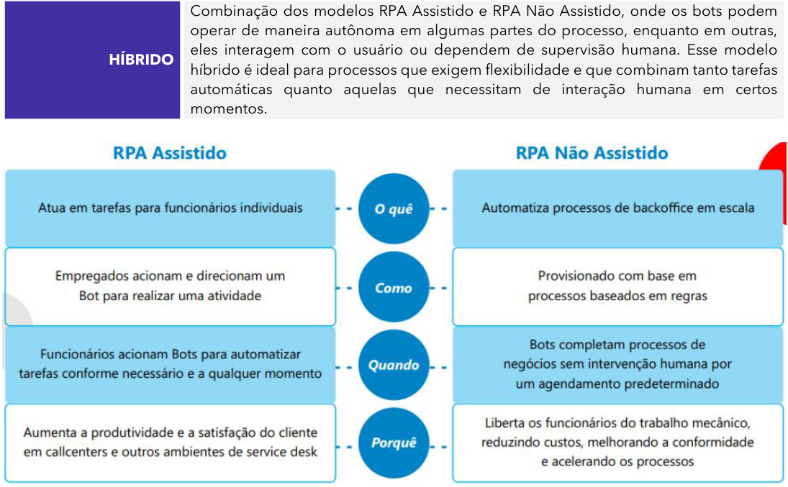

<!-- Start of picture text -->
Combinação dos modelos RPA Assistido e RPA Não Assistido, onde os bots podem operar de maneira autônoma em algumas partes do processo, enquanto em outras, eles interagem com o usuário ou dependem de supervisão humana. Esse modelo HÍBRIDO híbrido é ideal para processos que exigem flexibilidade e que combinam tanto tarefas automáticas quanto aquelas que necessitam de interação humana em certos momentos. <!-- End of picture text -->

|**TIPOS DE RPA** **ASSISTIDO**|**NÃO ASSISTIDO** **HÍBRIDO**|
|---|---|

---

<!-- pagina: 191 -->

**Diego Carvalho, Equipe Informática 2 (Diego Carvalho), Equipe Informática 1 (Diego Carvalho) Aula 06** 

|**INTERAÇÃO COM** **USUÁRIO**|O bot é operado e controlado com a ajuda do usuário.|O bot opera de forma autônoma, sem interação do usuário.|Combina automação autônoma e interação com o usuário em diferentes partes doprocesso.|
|---|---|---|---|
|**EXEMPLO DE USO**|Preenchimento de formulários, suporte em tempo real|Processamento de transações, gestão de back-office|Automação de processos complexos, como atendimento ao cliente e gestão de dados|
|**CONTROLE** **HUMANO**|O usuário tem controle e pode supervisionar o bot|O bot executa processos sem a necessidade de supervisão|O bot pode operar automaticamente, mas em determinados pontos, o usuário intervém ou supervisiona|
|**APLICAÇÕES** **TÍPICAS**|Tarefas que exigem apoio humano, como suporte ao cliente e automação de interface|Processos contínuos, como movimentação de dados ou execução de processos financeiros|Processos que exigem flexibilidade, como fluxos de trabalho que exigem aprovação ou supervisão humana|
|**EXEMPLO DE** **CENÁRIO**|Preenchimento de dados, apoio imediato ao usuário|Processamento de pedidos, automação de registros financeiros|Processamento de pedidos que requerem validação do usuário, gestão de documentos com revisão humana|

**(CESGRANRIO / ELETROBRÁS – 2022)** Uma empresa pública precisa fazer uso de RPA <mark>(Automação de Processos Robotizados) para validar endereços, CNPJs, situação na Receita Federal e consulta ao Serasa relacionados aos fornecedores de produtos, para garantir que as propostas desses fornecedores estejam dentro das bases legais exigidas, em caso de licitações ou similares. Para essa situação, faz-se necessário que seja utilizado um modelo de RPA não assistido. A configuração dessa RPA deve ser de tal modo que haja:</mark> 

<mark>a) acionamento das RPAs via ação humana, mas sem controle posterior do usuário que disparou a RPA, com cada obtenção de dados avisando ao usuário disparador sobre o dado recuperado.</mark> 

<mark>b) execução local dessa RPA em uma estação de trabalho específica, com modo de atividades de front-office, sem intervenção humana, mas programada por temporização.</mark> 

<mark>c) execução local assistida por meio remoto por um supervisor humano, que vai acionar a execução através de um evento de uma máquina externa, controlando passo a passo a obtenção dos dados.</mark> 

<mark>d) manipulação dos dados em segundo plano, em servidores de back-end, sem intervenção humana, sendo essas RPAs acionadas por eventos ou através de execução programada.</mark> 

<mark>e) manipulação de dados em servidores front-end, acionando buscas nas bases de dados necessárias, sem intervenção humana, mas disparadas sem evento auxiliar ou execução programada.</mark> 

**<mark>_______________________</mark>** 

**<mark>Comentários:</mark>**

---

<!-- pagina: 192 -->

**Diego Carvalho, Equipe Informática 2 (Diego Carvalho), Equipe Informática 1 (Diego Carvalho) Aula 06** 

<mark>(a) Errado. Essa descrição remete a um modelo assistido de RPA, pois há acionamento humano e notificação durante o processo, o que não condiz com um RPA não assistido (unattended);</mark> 

<mark>(b) Errado. Apesar de mencionar execução sem intervenção humana, o uso em front-office e em estação local se aproxima mais de RPA assistido, geralmente acionado por usuários;</mark> 

<mark>(c) Errado. Essa alternativa descreve uma execução assistida remotamente, o que também não se encaixa na definição de RPA não assistido;</mark> 

<mark>(d) Correto. O RPA não assistido (unattended) opera em back-end, de forma autônoma e sem necessidade de intervenção humana, podendo ser acionado por eventos ou agendamentos — exatamente o necessário para validações automáticas como CNPJ, Receita Federal e Serasa;</mark> 

<mark>(e) Errado. O uso de servidores front-end não é típico para RPA não assistido. Além disso, a ausência de evento ou programação</mark> para disparo contraria a lógica de automação autônoma baseada em regras (Letra D).

---

<!-- pagina: 193 -->

**Diego Carvalho, Equipe Informática 2 (Diego Carvalho), Equipe Informática 1 (Diego Carvalho) Aula 06** 

## Técnicas de Automatiza ão <u>ç</u> 

###### **<mark>INCIDÊNCIA EM PROVA: BAIXÍSSIMA</mark>** 

As técnicas de automação de tarefas manuais e repetitivas no contexto de Automação Robótica de Processos (RPA) são métodos e abordagens utilizadas para programar robôs de software para replicar ações humanas em sistemas digitais. Essas técnicas são especialmente eficazes para otimizar processos que demandam tempo, apresentam alta repetição e são propensos a erros humanos. Vejamos: 

|**TÉCNICAS**|**DESCRIÇÃO**|**EXEMPLO**|
|---|---|---|
|**GRAVAÇÃO DE** **AÇÕES**|Grava interações do usuário, como cliques e digitação, para replicar as ações.|Gravar o processo de entrada de dados em um ERP.|
|**AUTOMAÇÃO** **BASEADA EM** **REGRAS**|Executa tarefas seguindo lógicas e condições predefinidas. ==5460==|Processar pedidos que atendam critérios específicos.|
|**EXTRAÇÃO DE** **DADOS COM OCR**|Usa tecnologia de OCR para capturar texto de documentos ou imagens.|Extrair informações de notas fiscais digitalizadas.|
|**AUTOMAÇÃO DE** **INTERFACES (UI)**|Interage diretamente com a interface gráfica dos aplicativos, simulando ações humanas.|Navegar e preencher campos em um sistema legado.|
|**INTEGRAÇÃO COM** **APIS**|Conecta-se diretamente a APIs para realizar tarefas sem usar a interface de usuário.|Recuperar dados de uma API de CRM para relatórios.|
|**AUTOMAÇÃO** **BASEADA EM** **ARQUIVOS**|Manipula arquivos como leitura, organização e movimentação.|Organizar arquivos em pastas específicas com base em nomes ou tipos.|
|**AUTOMAÇÃO COM** **IA**|Utiliza inteligência artificial para lidar com tarefas mais complexas e não estruturadas.|Classificar e-mails prioritários em uma caixa de entrada.|
|**INTEGRAÇÃO COM** **PLANILHAS**|Trabalha com planilhas para cálculos, formatações ou extrações de dados.|Consolidar dados de uma planilha e transferi-los para um sistema.|
|**FLUXOS** **MULTISSISTEMA**|Conecta informações e automações entre vários sistemas de forma simultânea.|Atualizar dados em um ERP, enviar notificações por e-mail e registrar informações em estoque.|
|**AGENDAMENTO DE** **TAREFAS**|Configura robôs para executar tarefas em horários específicos ou com base em condições.|Enviar relatórios diários de forma automática às 8h da manhã.|
|**TESTES A/B** **AUTOMATIZADOS**|Compara diferentes fluxos de trabalho ou cenários para identificar o mais eficiente.|Testar dois processos de checkout em um e-commerce.|
|**AUTOMAÇÃO DE E-** **MAILS**|Gerencia envio, recebimento e processamento de e-mails automaticamente.|Responder e-mails automaticamente com base em palavras-chave.|
|**GERAÇÃO DE** **RELATÓRIOS**|Consolida dados e cria relatórios de forma automatizada.|Gerar relatórios financeiros a partir de sistemas contábeis.|

---

<!-- pagina: 194 -->

**Diego Carvalho, Equipe Informática 2 (Diego Carvalho), Equipe Informática 1 (Diego Carvalho) Aula 06** 

|**WORKFLOWS** **BASEADO EM** **EVENTOS**|Inicia tarefas automaticamente com base em eventos ou gatilhos definidos.|Processar pedidos assim que um arquivo for recebido em uma pasta específica.|
|---|---|---|

---

<!-- pagina: 195 -->

**Diego Carvalho, Equipe Informática 2 (Diego Carvalho), Equipe Informática 1 (Diego Carvalho) Aula 06** 

## Inteligência Artificial 

**<mark>INCIDÊNCIA EM PROVA: BAIXÍSSIMA</mark>** 

### Automação Tradicional x Inteligente 

A gente costuma falar de “automação” como se fosse uma coisa só, mas, na prática, existem duas gerações bem diferentes: a automação tradicional e a chamada automação inteligente. A primeira, representada pelo RPA (Robotic Process Automation), é ótima para tarefas repetitivas e bem definidas — aquelas que seguem sempre o mesmo passo a passo: clicar aqui, copiar ali, preencher um formulário, mover um arquivo. Esse tipo de automação brilha em rotinas estáveis, previsíveis, onde nada foge do script. Mas, basta surgir uma exceção, um documento fora do padrão ou uma situação que exija julgamento humano, e o sistema trava. 

É aí que entra a automação inteligente — um salto de geração. Ela combina o RPA com recursos de inteligência artificial, como modelos de linguagem (sim, como o ChatGPT), visão computacional e aprendizado de máquina. Com isso, o “robô que clica” vira algo bem mais sofisticado: um sistema que entende documentos, toma decisões condicionais, interpreta contextos e consegue se adaptar a variações. Em outras palavras, enquanto o RPA segue regras, o IPA (Intelligent Process Automation) entende, analisa e decide. 

Esse avanço permite resolver justamente o que antes parecia impossível de automatizar. A IA entra onde o RPA não dava conta: classifica e-mails, documentos e solicitações automaticamente; sugere caminhos dentro de fluxos de trabalho; interpreta textos longos, imagens, tabelas; e ainda gera conteúdos como minutas, relatórios e respostas com base em dados internos ou instruções simples. Isso abre espaço para automatizar processos que dependiam exclusivamente de leitura e escrita humanas. 

Na prática, essas tecnologias já estão sendo usadas em cenários bem concretos — tanto no setor público quanto no privado. Em órgãos públicos, por exemplo, a automação inteligente tem sido usada para fazer triagem de processos administrativos, ler documentos enviados por cidadãos, gerar minutas padronizadas, fazer uma análise inicial de pareceres e organizar pilhas e mais pilhas de protocolos. Também aparece em chatbots institucionais, no atendimento ao público e na integração com sistemas como SEI, SEED e plataformas de RH. 

Nas empresas privadas, o uso é igualmente variado: onboarding de clientes, leitura e análise de contratos, auditorias, suporte ao setor de RH, processamento de notas fiscais, classificação de chamados de suporte, rotinas financeiras e até atendimento automatizado, tanto interno quanto externo. Em todos esses casos, a IA entra para eliminar gargalos e cortar atividades repetitivas que só consumiam tempo. 

O impacto? Bastante expressivo. Para começar, há um ganho enorme de eficiência: menos horas gastas com tarefas mecânicas. Também se reduz significativamente o número de erros, já que os sistemas são consistentes e conseguem detectar incongruências de forma automática. E tem a escalabilidade — talvez um dos maiores trunfos: uma equipe do mesmo tamanho consegue lidar com muito mais demanda, sem que a qualidade caia.

---

<!-- pagina: 196 -->

**Diego Carvalho, Equipe Informática 2 (Diego Carvalho), Equipe Informática 1 (Diego Carvalho) Aula 06** 

E tem mais: a qualidade da informação melhora bastante. Documentos ficam mais padronizados, relatórios mais claros, análises mais completas e os fluxos administrativos bem menos sujeitos a mal-entendidos. No fim das contas, integrar IA com automação significa deslocar o trabalho humano para áreas mais estratégicas e analíticas. Logo, mais produtividade, sim — mas também um uso muito mais inteligente das capacidades humanas. 

### Automação de Documentos 

Um dos grandes gargalos do trabalho administrativo sempre foi o mesmo: papelada. Formular um documento, preencher, revisar, organizar... e repetir tudo isso centenas de vezes. Agora, imagine lidar com esse mar de papéis, PDFs, formulários e textos longos com a ajuda de uma Inteligência Artificial que realmente entende o que está fazendo. Pois é exatamente isso que a IA tem transformado — e com bastante impacto. 

Hoje, com as tecnologias certas, já é possível interpretar, classificar, extrair e até gerar conteúdo automaticamente, com um nível de precisão que traz não só velocidade, mas também padronização para processos internos. Vamos dar uma olhada, etapa por etapa, no que torna essa automação tão poderosa. 

Não estamos falando só de escanear e salvar como imagem. A chamada “captura inteligente” vai muito além. Utilizando OCR com IA, dá para transformar uma foto borrada de um documento em texto pesquisável, mesmo que ele esteja amassado, manchado ou com fonte difícil de ler. O segredo? A IA consegue identificar não só as palavras, mas também a estrutura do documento: se tem tabela, carimbo, assinatura... tudo isso entra na conta. 

E quando o documento é um formulário? A IA evoluiu muito no reconhecimento tanto de formulários bem estruturados (como notas fiscais ou contracheques), quanto daqueles mais soltos, digamos assim — como uma petição, um requerimento ou um relatório feito por diferentes pessoas, com estilos variados. Em vez de exigir um modelo fixo, a IA entende o conteúdo com base em padrões linguísticos. Isso significa que ela consegue achar onde está a “Justificativa”, o “Objeto”, o “Requerente”, mesmo que essas partes apareçam em lugares diferentes. 

Essa parte é um verdadeiro divisor de águas. A IA hoje consegue identificar automaticamente qual tipo de documento está sendo analisado: é um contrato? Um parecer? Uma nota fiscal? Um relatório? Isso é especialmente útil em instituições públicas, onde centenas (ou milhares) de documentos entram todo mês nos sistemas como o SEI ou ERPs corporativos. Saber o que é cada coisa logo de cara economiza tempo — e muito. 

E tem mais: a IA pode detectar se o documento contém informações sensíveis, como dados pessoais, de saúde, financeiros ou confidenciais. Com isso, dá para aplicar automaticamente políticas de anonimização, encaminhamento específico ou proteção de acesso. Ou seja: além de ajudar na organização, ela já resolve questões de segurança e conformidade. 

Outro pilar central é a chamada extração de informações. Imagine pegar uma pilha de contratos e automaticamente identificar coisas como “Nome da Parte”, “Valor do Contrato”, “Data de Início” e jogar isso numa planilha. Pois é isso que a IA faz — e com precisão cada vez maior. Existem duas formas principais de fazer isso:

---

<!-- pagina: 197 -->

**Diego Carvalho, Equipe Informática 2 (Diego Carvalho), Equipe Informática 1 (Diego Carvalho) Aula 06** 

- Com regras fixas, que funcionam super bem quando o documento tem sempre o mesmo formato. 

- Com modelos de linguagem (LLMs), como o GPT, que são mais flexíveis e conseguem entender o contexto mesmo em textos longos, desorganizados ou com muita variação. 

Esses LLMs são impressionantes. Eles entendem perguntas como “qual é o objeto deste contrato?” e conseguem resumir documentos extensos, identificar partes relevantes e até transformar tudo isso em registros organizados — como tabelas, campos preenchidos ou formulários digitais. E se a IA também puder escrever por você? 

Bom, ela já pode! Se a IA consegue ler e entender documentos, ela também consegue gerar novos com base nessas informações. E não estamos falando só de preencher campos em branco. Ela pode criar minutas completas de contratos, pareceres, despachos, atas, relatórios... tudo adaptado ao estilo institucional da organização. 

Os chamados templates inteligentes fazem parte disso. Eles não apenas inserem dados nos espaços certos, mas também ajustam o texto, reescrevem frases e mantêm a coerência. É como se a IA realmente “redigisse” o documento, entendendo o contexto. Por fim, vem o preenchimento automático 

Esse é um ganho enorme de produtividade. A IA pode consultar sistemas internos, bancos de dados, cadastros, históricos administrativos... e preencher automaticamente nomes, cargos, datas, prazos, valores, bases legais. O resultado? Documentos mais consistentes, com menos erros de digitação e muito menos retrabalho. 

### Workflows Administrativos 

Quando a gente fala em aplicar IA aos processos administrativos, não estamos mais falando apenas de automação no sentido clássico — aquela que executa comandos pré-programados, quase como um robô apertando botões. A coisa evoluiu. Com inteligência artificial, esses workflows passam a ser não só automáticos, mas também interpretativos, proativos e, acima de tudo, inteligentes. Ou seja: além de fazer, a IA entende o que está fazendo. 

#### **Automação de Processos Repetitivos** 

Todo setor administrativo conhece bem aquelas tarefas repetitivas que, apesar de simples, consomem um tempo enorme. Coisas como verificar se um documento está completo, conferir campos obrigatórios, identificar erros, encaminhar para aprovação… isso tudo pode ser automatizado com IA — mas com um nível bem mais sofisticado do que se fazia antes. 

Imagine um sistema que, ao receber um documento, já consegue: verificar se todos os anexos estão lá; validar automaticamente informações como CPF, valores ou datas; identificar inconsistências com base em histórico; e sugerir se o documento deve ser aprovado, complementado ou devolvido. Isso reduz horas de conferência manual e ainda aumenta a padronização, porque a IA segue os mesmos critérios o tempo todo — sem se cansar.

---

<!-- pagina: 198 -->

**Diego Carvalho, Equipe Informática 2 (Diego Carvalho), Equipe Informática 1 (Diego Carvalho) Aula 06** 

E tem mais: o fluxo de processos internos, como protocolos, ordens de serviço e solicitações, também pode ser automatizado com base no conteúdo do próprio documento. Ou seja, não precisa mais depender de alguém “ler e entender” o que é aquilo. A IA já interpreta e envia para o setor certo, na hora certa. 

Ah, e nada de perder prazo ou esquecer tarefas. Modelos de IA conseguem monitorar o andamento dos processos e identificar: prazos que estão prestes a vencer; documentos parados; etapas faltantes no workflow. O sistema envia alertas automáticos para quem precisa agir — o que reduz atrasos e aumenta a transparência. 

#### **Tomada de Decisão assistida por IA** 

Aqui vale a pena reforçar: a IA não toma a decisão final no lugar de ninguém. Mas ela ajuda — e muito. Funciona como um analista super eficiente que lê tudo, analisa dados, cruza informações e oferece recomendações embasadas. Por exemplo: ao receber uma nova solicitação, o sistema pode sugerir qual tipo de procedimento seguir, quais documentos anexar, qual formulário usar, qual setor deve tratar o assunto. Isso reduz erros operacionais e ajuda a manter os atendimentos mais consistentes. 

Outra vantagem é a triagem por prioridade e tipo de demanda. A IA consegue analisar o conteúdo e classificar: Urgência (urgente, normal, baixa), Área envolvida (jurídico, financeiro, RH, TI), Complexidade (simples, intermediária, crítica). Com isso, equipes sobrecarregadas ganham um baita apoio na hora de organizar o que deve ser resolvido primeiro. 

#### **Chatbots Corporativos** 

Aqueles chatbots de antigamente, que pareciam repetidores de FAQ, ficaram para trás. Os novos assistentes conversacionais são realmente inteligentes. Eles entendem perguntas como: “Como faço para pedir reembolso?”, “Qual é o prazo para solicitar férias?”, “Que norma trata de tal procedimento?” Mas não param por aí! 

Se o servidor envia um documento — digamos, um PDF — o chatbot pode: ler o conteúdo, identificar erros ou campos faltando, gerar uma minuta revisada, explicar o que está sendo pedido. Isso acelera processos que antes exigiam leitura cuidadosa e, muitas vezes, análise jurídica ou técnica. 

E tem mais: integrados a sistemas internos (via APIs ou RPA), esses bots não só orientam como executam ações. Podem preencher e enviar formulários, protocolar documentos, atualizar cadastros, disparar notificações… De fato, viram uma ponte entre pessoas e sistemas — e fazem isso em tempo real.

---

<!-- pagina: 199 -->

**Diego Carvalho, Equipe Informática 2 (Diego Carvalho), Equipe Informática 1 (Diego Carvalho) Aula 06** 

## Principais Ferramentas 

**<mark>INCIDÊNCIA EM PROVA: BAIXA</mark>** 

### UiPath 

O UiPath é uma das ferramentas líderes no campo da Automação Robótica de Processos (RPA), sendo amplamente reconhecida por sua interface intuitiva, robustez e capacidade de integração com diversos sistemas. Essa plataforma foi projetada para ajudar empresas a automatizar tarefas repetitivas e manuais, otimizando processos, reduzindo custos e minimizando erros humanos. A automação proporcionada pelo UiPath não apenas aumenta a produtividade das equipes, mas também libera os colaboradores para se concentrarem em atividades mais estratégicas e criativas. 

Uma das principais características do UiPath é sua modularidade, que se reflete em seus três componentes centrais: o UiPath Studio, o UiPath Orchestrator e os UiPath Robots. O UiPath Studio é o ambiente de desenvolvimento onde fluxos de trabalho de automação são criados. Ele oferece uma interface gráfica intuitiva baseada em arrastar e soltar, o que facilita o uso por pessoas sem habilidades avançadas em programação, além de permitir personalizações para desenvolvedores experientes. 

O UiPath Orchestrator, por sua vez, é a ferramenta de gerenciamento, responsável por monitorar, agendar e controlar a execução dos robôs. Já os UiPath Robots são os agentes de software que executam as automações, podendo operar de forma atendida, com interação direta do usuário, ou não atendida, em que os processos são realizados de maneira completamente autônoma. 

O UiPath destaca-se também por sua ampla capacidade de integração, sendo compatível com diversos sistemas, como ERPs (por exemplo, SAP), bancos de dados, navegadores, softwares de e-mail e ferramentas de produtividade, como Excel e Word. Essa integração permite que as empresas conectem suas ferramentas existentes e otimizem processos de ponta a ponta. Além disso, a ferramenta suporta automação em ambientes virtuais e baseados na nuvem, sendo ideal para operações modernas que utilizam sistemas como Citrix e serviços em nuvem. 

Outro diferencial do UiPath é seu compromisso com a segurança e escalabilidade. A plataforma oferece recursos avançados de segurança, como criptografia de dados, gerenciamento seguro de credenciais e controle de acesso baseado em funções. Esses elementos são essenciais para empresas que lidam com dados sensíveis e precisam garantir a conformidade com regulamentações de proteção de dados. 

Além disso, o UiPath permite que as organizações escalem suas automações conforme suas necessidades crescem, tornando-se uma solução flexível para empresas de todos os tamanhos. 

No campo da inovação, o UiPath também incorpora elementos de inteligência artificial (IA) e aprendizado de máquina. Isso permite que ele lide com tarefas mais complexas, como reconhecimento de texto em imagens (OCR), análise preditiva e automação de decisões baseadas em dados. Por meio da integração com algoritmos de IA, o UiPath expande suas possibilidades de aplicação, indo além de tarefas repetitivas para incluir processos que exigem interpretação e análise. 

Entre os benefícios oferecidos pelo UiPath, destacam-se a redução de custos, a minimização de erros e o aumento da produtividade. Ao automatizar tarefas rotineiras, as empresas podem economizar recursos financeiros e humanos, além de garantir maior precisão e consistência nos processos. No entanto, como

---

<!-- pagina: 200 -->

**Diego Carvalho, Equipe Informática 2 (Diego Carvalho), Equipe Informática 1 (Diego Carvalho) Aula 06** 

toda ferramenta, o UiPath também apresenta alguns desafios, como os custos das licenças corporativas, que podem ser elevados para pequenas empresas, e a curva de aprendizado para automações mais avançadas, que requerem algum nível de conhecimento técnico. 

Um exemplo prático de uso do UiPath seria em empresas que processam grandes volumes de faturas. Antes de implementar a automação, um funcionário precisaria baixar as faturas do e-mail, inserir os dados no sistema ERP, verificar inconsistências e arquivá-las manualmente. Com o UiPath, todo esse fluxo pode ser automatizado, desde o download dos e-mails até o arquivamento das faturas, reduzindo significativamente o tempo de processamento e os erros. 

O UiPath é uma ferramenta essencial para organizações que buscam modernizar suas operações e melhorar a eficiência de seus processos. Sua interface amigável, combinada com recursos avançados de automação, integração e segurança, faz dele uma das principais escolhas no mercado de RPA. Com a crescente necessidade de agilidade e produtividade no ambiente corporativo, o UiPath posiciona-se como uma solução indispensável para empresas que desejam se destacar em um mercado cada vez mais competitivo. 

### Automation Anywhere 

O Automation Anywhere é uma das principais ferramentas no campo da Automação Robótica de Processos (RPA), amplamente utilizada para automatizar tarefas repetitivas e rotineiras em empresas de diferentes setores. Desenvolvido com o objetivo de aumentar a eficiência, reduzir custos operacionais e minimizar erros humanos, o Automation Anywhere é uma solução robusta e flexível, que combina facilidade de uso, poder de personalização e recursos avançados de inteligência artificial (IA). 

Uma das características mais notáveis do Automation Anywhere é sua plataforma baseada na nuvem, chamada Automation 360. Essa abordagem oferece uma experiência unificada para criar, gerenciar e monitorar automações, permitindo que as empresas operem seus robôs de maneira escalável e segura, independentemente de onde estejam localizados. A flexibilidade da nuvem também reduz a necessidade de infraestrutura local, tornando a solução mais acessível para empresas de todos os tamanhos. 

O Automation Anywhere é composto por três principais componentes: o Control Room, o Bot Creator e o Bot Runner. O Control Room é o núcleo de gerenciamento centralizado, responsável por administrar bots, gerenciar credenciais e monitorar tarefas em tempo real. O Bot Creator é o ambiente de desenvolvimento, onde os fluxos de trabalho são projetados utilizando uma interface visual amigável e ferramentas de arrastar e soltar. Já o Bot Runner é o componente que executa as automações criadas, funcionando de forma autônoma para realizar as tarefas atribuídas. 

Uma das forças do Automation Anywhere é sua capacidade de integrar-se a diferentes sistemas e aplicativos, como ERPs (por exemplo, SAP e Oracle), CRMs, navegadores, bancos de dados e softwares de produtividade, como o pacote Microsoft Office. Isso possibilita que as empresas automatizem processos de ponta a ponta sem interrupções, conectando diferentes sistemas e departamentos em uma única automação. 

Outro ponto forte é o AARI (Automation Anywhere Robotic Interface), uma interface intuitiva que permite que os usuários interajam diretamente com os bots de maneira simples. Com o AARI, colaboradores que não possuem experiência técnica podem acessar bots para executar tarefas específicas, tornando a automação acessível a toda a força de trabalho.

---

<!-- pagina: 201 -->

**Diego Carvalho, Equipe Informática 2 (Diego Carvalho), Equipe Informática 1 (Diego Carvalho) Aula 06** 

A ferramenta também integra recursos avançados de inteligência artificial e aprendizado de máquina. Esses recursos permitem que o Automation Anywhere realize tarefas mais sofisticadas, como extração de dados de documentos não estruturados utilizando OCR (Reconhecimento Óptico de Caracteres), análise preditiva e tomada de decisão baseada em dados. Além disso, a solução oferece um módulo de análise cognitiva, que melhora continuamente com base em interações e feedback, garantindo automações mais inteligentes e adaptáveis. 

Entre as principais vantagens do Automation Anywhere, destaca-se a sua escalabilidade. Ele permite que empresas comecem com poucas automações e, gradualmente, aumentem o número de bots para atender às demandas crescentes. A plataforma também oferece segurança robusta, com recursos como criptografia de dados, autenticação baseada em funções e conformidade com regulamentações globais de proteção de dados. 

No entanto, como qualquer ferramenta, o Automation Anywhere também apresenta desafios. Um deles é o custo da licença, que pode ser um investimento significativo para pequenas empresas. Além disso, embora sua interface seja amigável, o desenvolvimento de automações mais complexas pode exigir treinamento técnico ou suporte especializado. 

Um exemplo prático de uso do Automation Anywhere seria em um departamento de finanças. Imagine uma empresa que precisa processar centenas de faturas diariamente. Antes da automação, um funcionário precisaria verificar os e-mails, extrair as informações das faturas, inseri-las no sistema ERP e gerar relatórios manuais. Com o Automation Anywhere, um bot pode automatizar todo esse fluxo, desde a captura dos dados até a geração dos relatórios, economizando tempo e reduzindo erros. 

O Automation Anywhere é uma ferramenta essencial para empresas que desejam otimizar seus processos e permanecer competitivas em um mercado cada vez mais orientado pela eficiência e pela inovação. Sua combinação de automação robusta, inteligência artificial avançada e uma plataforma acessível baseada na nuvem faz dele uma solução poderosa para transformar operações empresariais. Com o aumento da demanda por RPA, o Automation Anywhere continua sendo uma escolha de destaque para organizações de todos os tamanhos. 

### Blue Prism 

O Blue Prism é uma das ferramentas pioneiras no campo da Automação Robótica de Processos (RPA), reconhecida por sua robustez, segurança e escalabilidade. Desenvolvida especialmente para empresas que buscam transformar suas operações por meio da automação, o Blue Prism é amplamente utilizado em setores como finanças, saúde, seguros e telecomunicações. Ele se destaca por sua abordagem empresarial, sendo projetado para lidar com operações complexas e de alto volume. 

Uma das principais características do Blue Prism é seu foco em automação empresarial com um alto nível de governança e segurança. A ferramenta utiliza uma arquitetura baseada em servidores, o que permite a execução e o gerenciamento centralizados de seus robôs de software. Isso garante uma operação confiável e escalável, adequada para organizações que precisam atender a altos padrões de conformidade e controle. 

O Blue Prism é conhecido por seu conceito de Digital Workforce, ou "força de trabalho digital". Os robôs criados na plataforma são projetados para atuar como agentes virtuais que replicam as interações

---

<!-- pagina: 202 -->

**Diego Carvalho, Equipe Informática 2 (Diego Carvalho), Equipe Informática 1 (Diego Carvalho) Aula 06** 

humanas em sistemas digitais. Eles podem executar uma ampla variedade de tarefas, desde a entrada de dados e manipulação de arquivos até a geração de relatórios e integração entre sistemas. Esses robôs funcionam de maneira autônoma, 24 horas por dia, proporcionando uma eficiência significativa às operações. 

A interface de desenvolvimento do Blue Prism é o Blue Prism Studio, um ambiente visual onde fluxos de trabalho são criados utilizando diagramas lógicos e ferramentas de arrastar e soltar. Isso torna o desenvolvimento mais acessível para analistas de negócios e desenvolvedores. No entanto, diferentemente de algumas outras ferramentas de RPA, o Blue Prism exige um nível mais alto de treinamento técnico para criar automações complexas, o que pode ser um desafio para iniciantes. 

A plataforma também oferece um forte foco em segurança. Todos os processos automatizados são auditáveis, e as credenciais usadas pelos robôs são armazenadas de forma segura. Além disso, o Blue Prism inclui funcionalidades para controle de acesso baseado em funções, garantindo que apenas usuários autorizados possam modificar ou executar processos automatizados. 

Outra característica importante é a integração robusta do Blue Prism com diversos sistemas e tecnologias. A ferramenta permite automações em aplicativos baseados na web, em sistemas ERP (como SAP e Oracle) e até mesmo em ambientes legados, como mainframes. Além disso, o Blue Prism suporta integração com tecnologias de inteligência artificial (IA) e aprendizado de máquina, ampliando suas capacidades para tarefas mais avançadas, como processamento de linguagem natural (NLP) e análise preditiva. 

O Blue Prism também oferece suporte a automação baseada em regras, sendo ideal para processos bem definidos e estruturados. Por exemplo, ele pode ser usado para automatizar fluxos de trabalho em conformidade regulatória, onde é necessário seguir procedimentos rígidos e consistentes. Essa abordagem garante precisão e reduz os riscos de erros humanos em tarefas críticas. 

Entre os benefícios do Blue Prism, destacam-se sua escalabilidade, confiabilidade e governança avançada. A plataforma foi projetada para atender grandes organizações e permite que as empresas ampliem suas automações de forma eficiente à medida que crescem. Além disso, sua arquitetura baseada em servidores oferece uma operação mais estável e controlada, ideal para ambientes corporativos complexos. 

No entanto, algumas desvantagens também devem ser consideradas. O Blue Prism pode ser mais caro em comparação com outras ferramentas de RPA, o que pode torná-lo menos acessível para pequenas e médias empresas. Além disso, o desenvolvimento de automações pode exigir mais treinamento técnico, o que aumenta o tempo e o custo de implementação. 

Um exemplo prático de uso do Blue Prism seria em um banco que precisa processar milhares de solicitações de empréstimos diariamente. Antes da automação, isso poderia envolver funcionários verificando manualmente documentos, inserindo informações em sistemas diferentes e aprovando transações. Com o Blue Prism, um robô pode automatizar todo o processo, verificando os documentos, validando os dados e registrando as informações nos sistemas do banco de maneira rápida e precisa. 

O Blue Prism é uma ferramenta poderosa para organizações que buscam uma solução robusta, segura e escalável para suas necessidades de automação. Embora exija um investimento maior em treinamento e infraestrutura, ele oferece uma abordagem confiável e controlada para automações empresariais, sendo uma escolha ideal para empresas que lidam com grandes volumes de dados e operações críticas. Seu

---

<!-- pagina: 203 -->

**Diego Carvalho, Equipe Informática 2 (Diego Carvalho), Equipe Informática 1 (Diego Carvalho) Aula 06** 

foco em governança e segurança torna-o particularmente atraente para setores altamente regulamentados, consolidando-o como um líder no mercado de RPA.

---

<!-- pagina: 204 -->

**Diego Carvalho, Equipe Informática 2 (Diego Carvalho), Equipe Informática 1 (Diego Carvalho) Aula 06** 

# **RESUMO** 

###### **<mark>SIGLA</mark>** 

**ROBOTIC (ROBÓTICO) PROCESS (PROCESSO) AUTOMATION (AUTOMAÇÃO)** 

**<mark>TIPO DE RPA</mark> ASSISTIDO NÃO ASSISTIDO HÍBRIDO** 

###### **<mark>DESCRIÇÃO</mark>** 

Refere-se ao uso de software, ou robôs de software, que são programados para realizar tarefas repetitivas e de rotina de forma automatizada. Esses robôs podem realizar diversas tarefas, desde a captura e entrada de dados até a realização de cálculos e tomadas de decisão, tudo sem a intervenção humana. 

Refere-se a um conjunto de atividades que são executadas para atingir um objetivo específico. Isso significa que os robôs de software são programados para executar tarefas em uma sequência lógica, seguindo um processo estabelecido, para atingir um objetivo específico. 

<mark>Refere-se à capacidade de executar tarefas de forma automatizada, sem a</mark> necessidade de intervenção humana. A automação é alcançada por meio da programação de robôs de software que executam tarefas rotineiras e repetitivas de forma consistente e precisa, liberando as pessoas outras atividades que exigem outras habilidades. 

###### **<mark>DESCRIÇÃO</mark>** 

É aquele em que os bots (robôs de software) trabalham junto com os usuários humanos, ou seja, o bot realiza tarefas sob a supervisão ou com a intervenção do ser humano. Esse tipo de RPA é utilizado para processos que envolvem interações frequentes com os usuários, onde os bots fazem grande parte do trabalho repetitivo, mas os humanos ainda têm algum nível de controle ou acompanhamento do processo. 

O RPA não assistido, também conhecido como RPA autônomo, é aquele em que os bots realizam as tarefas automaticamente sem a necessidade de interação com os usuários. Os bots de RPA não assistido operam de maneira independente, executando processos completos de forma autônoma, e são usados principalmente para processos transacionais, back-office ou atividades repetitivas que não exigem monitoramento constante. 

Combinação dos modelos RPA Assistido e RPA Não Assistido, onde os bots podem operar de maneira autônoma em algumas partes do processo, enquanto em outras, eles interagem com o usuário ou dependem de supervisão humana. Esse modelo híbrido é ideal para processos que exigem flexibilidade e que combinam tanto tarefas automáticas quanto aquelas que necessitam de interação humana em certos momentos.

---

<!-- pagina: 205 -->

**Diego Carvalho, Equipe Informática 2 (Diego Carvalho), Equipe Informática 1 (Diego Carvalho) Aula 06** 

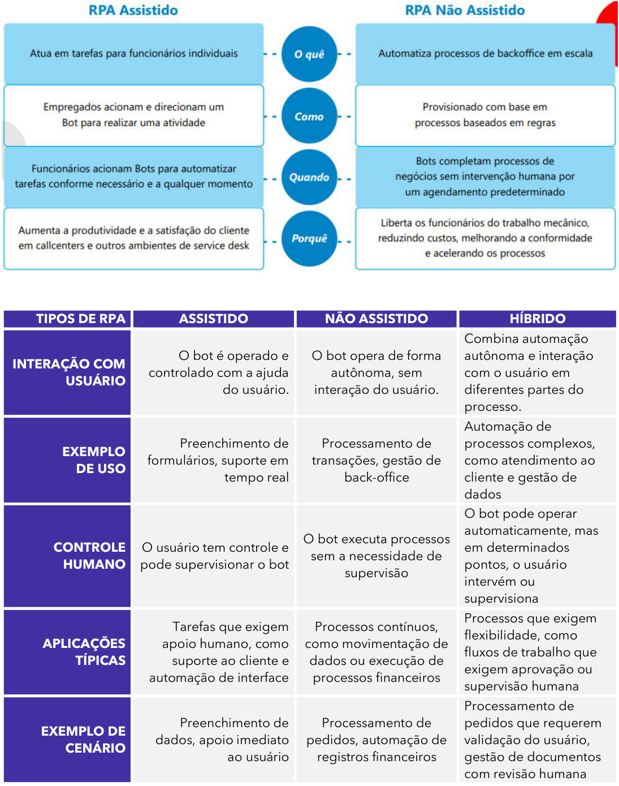

<!-- Start of picture text -->
TIPOS DE RPA  ASSISTIDO  NÃO ASSISTIDO  HÍBRIDO Combina automação O bot é operado e  O bot opera de forma  autônoma e interação INTERAÇÃO COM controlado com a ajuda  autônoma, sem  com o usuário em USUÁRIO do usuário.  interação do usuário.  diferentes partes do processo. Automação de Preenchimento de  Processamento de  processos complexos, EXEMPLO formulários, suporte em  transações, gestão de  como atendimento ao DE USO tempo real  back-office  cliente e gestão de dados O bot pode operar automaticamente, mas O bot executa processos CONTROLE  O usuário tem controle e  em determinados sem a necessidade de HUMANO  pode supervisionar o bot  pontos, o usuário supervisão intervém ou supervisiona Processos que exigem Tarefas que exigem  Processos contínuos, flexibilidade, como APLICAÇÕES  apoio humano, como  como movimentação de fluxos de trabalho que TÍPICAS  suporte ao cliente e  dados ou execução de exigem aprovação ou automação de interface  processos financeiros supervisão humana Processamento de Preenchimento de  Processamento de  pedidos que requerem EXEMPLO DE dados, apoio imediato  pedidos, automação de  validação do usuário, CENÁRIO ao usuário  registros financeiros  gestão de documentos com revisão humana <!-- End of picture text -->

---

<!-- pagina: 206 -->

**Diego Carvalho, Equipe Informática 2 (Diego Carvalho), Equipe Informática 1 (Diego Carvalho) Aula 06** 

|**TÉCNICAS**|**DESCRIÇÃO**|**EXEMPLO**|
|---|---|---|
|**GRAVAÇÃO DE** **AÇÕES**|Grava interações do usuário, como cliques e digitação, para replicar as ações.|Gravar o processo de entrada de dados em um ERP.|
|**AUTOMAÇÃO** **BASEADA EM** **REGRAS**|Executa tarefas seguindo lógicas e condições predefinidas.|Processar pedidos que atendam critérios específicos.|
|**EXTRAÇÃO DE** **DADOS COM OCR**|Usa tecnologia de OCR para capturar texto de documentos ou imagens.|Extrair informações de notas fiscais digitalizadas.|
|**AUTOMAÇÃO DE** **INTERFACES (UI)**|Interage diretamente com a interface gráfica dos aplicativos, simulando ações humanas.|Navegar e preencher campos em um sistema legado.|
|**INTEGRAÇÃO** **COM APIS**|Conecta-se diretamente a APIs para realizar tarefas sem usar a interface de usuário.|Recuperar dados de uma API de CRM para relatórios.|
|**AUTOMAÇÃO** **BASEADA EM** **ARQUIVOS**|Manipula arquivos como leitura, organização e movimentação.|Organizar arquivos em pastas específicas com base em nomes ou tipos.|
|**AUTOMAÇÃO** **COM IA**|Utiliza inteligência artificial para lidar com tarefas mais complexas e não estruturadas.|Classificar e-mails prioritários em uma caixa de entrada.|
|**INTEGRAÇÃO** **COM PLANILHAS**|Trabalha com planilhas para cálculos, formatações ou extrações de dados.|Consolidar dados de uma planilha e transferi-los para um sistema.|
|**FLUXOS** **MULTISSISTEMA**|Conecta informações e automações entre vários sistemas de forma simultânea.|Atualizar dados em um ERP, enviar notificações por e-mail e registrar informações em estoque.|
|**AGENDAMENTO** **DE TAREFAS**|Configura robôs para executar tarefas em horários específicos ou com base em condições.|Enviar relatórios diários de forma automática às 8h da manhã.|
|**TESTES A/B** **AUTOMATIZADOS**|Compara diferentes fluxos de trabalho ou cenários para identificar o mais eficiente.|Testar dois processos de checkout em um e-commerce.|
|**AUTOMAÇÃO DE** **E-MAILS**|Gerencia envio, recebimento e processamento de e-mails automaticamente.|Responder e-mails automaticamente com base em palavras-chave.|
|**GERAÇÃO DE** **RELATÓRIOS**|Consolida dados e cria relatórios de forma automatizada.|Gerar relatórios financeiros a partir de sistemas contábeis.|
|**WORKFLOWS** **BASEADO EM** **EVENTOS**|Inicia tarefas automaticamente com base em eventos ou gatilhos definidos.|Processar pedidos assim que um arquivo for recebido em uma pasta específica.|

---

<!-- pagina: 207 -->

**Diego Carvalho, Equipe Informática 2 (Diego Carvalho), Equipe Informática 1 (Diego Carvalho) Aula 06** 

###### **#ResumoSincerão:** 

###### **<mark>O que é RPA (Robotic Process Automation)?</mark>** 

<mark>É uma tecnologia que automatiza tarefas repetitivas, baseadas em regras, imitando ações humanas em sistemas. Os bots clicam, digitam, copiam, colam e fazem outras maravilhas tediosas sem precisar de café e sem reclamar. Sabe aquele trampo chato de copiar dados de um lugar e colar em outro, preencher planilhas, clicar em 300 botões no mesmo sistema, mandar e-mails padrões? O RPA faz isso sem reclamar, sem pedir aumento, e com menos erros do que um ser humano com sono.</mark> 

###### **<mark>Tríade da Sigla:</mark>** 

<mark>- Robotic: Softwares que imitam tarefas humanas.</mark> 

<mark>- Process: Sequência lógica de atividades para um objetivo. - Automation: Execução sem intervenção humana.</mark> ==5460== **<mark>Como Funciona?</mark>** 

<mark>Os bots interagem com interfaces gráficas (GUIs) como se fossem humanos: clicam, digitam, abrem sistemas, transferem dados. Tudo isso com a delicadeza emocional de uma geladeira.</mark> 

###### **<mark>Características do RPA:</mark>** 

<mark>- Automatiza tarefas repetitivas e baseadas em regras.</mark> 

<mark>- Funciona em sistemas legados sem alterá-los.</mark> 

<mark>- Baixo custo e rápida implementação.</mark> 

<mark>- Imita ações humanas em sistemas, sem mexer no código-fonte.</mark> 

###### **<mark>Diferença entre Automação Tradicional x RPA:</mark>** 

<mark>- Automação tradicional = mexe nos sistemas, envolve código e APIs.</mark> 

<mark>- RPA = simula um humano na frente do computador, mas sem estresse existencial.</mark> 

###### **<mark>Control Room (Sala de Controle):</mark>** 

<mark>É tipo a torre de comando dos bots. Permite iniciar, parar, monitorar e gerenciar robôs e processos, além de gerar relatórios e insights. Também conhecido como “a tela onde o TI fica olhando fixamente com cara séria”.</mark> 

###### **<mark>Benefícios:</mark>** 

<mark>- Redução de erros humanos.</mark> 

<mark>- Aumento da eficiência e produtividade.</mark> 

<mark>- Liberação de humanos para tarefas mais analíticas ou criativas.</mark> 

<mark>- Trabalha 24/7, sem pedir folga ou fazer cara feia.</mark> 

###### **<mark>Integração com Outras Tecnologias:</mark>** 

<mark>- Se dá bem com sistemas legados e com IA, OCR, APIs e nuvem.</mark> 

<mark>- Atua como um diplomata digital entre plataformas incompatíveis.</mark>

---

<!-- pagina: 208 -->

**Diego Carvalho, Equipe Informática 2 (Diego Carvalho), Equipe Informática 1 (Diego Carvalho) Aula 06** 

<mark>- Pode aprender padrões com machine learning e tomar decisões básicas.</mark> 

###### **<mark>Técnicas Utilizadas:</mark>** 

- <mark>Gravação de ações humanas.</mark> 

<mark>- Regras e condições.</mark> 

<mark>- OCR para ler documentos escaneados.</mark> 

<mark>- Manipulação de arquivos, planilhas, e-mails.</mark> 

<mark>- Integrações com APIs e fluxos multissistema.</mark> 

<mark>- Gatilhos baseados em eventos (tipo: “quando cair o arquivo, faz o processo”).</mark> 

<mark>Resumindo o resumo: RPA é o robô de estimação que faz tarefas repetitivas por você, sem reclamar e com precisão suíça. Se você ainda não ama, talvez você seja o tipo de pessoa que</mark> é substituída pelo RPA. Só dizendo

---

<!-- pagina: 209 -->

**Diego Carvalho, Equipe Informática 2 (Diego Carvalho), Equipe Informática 1 (Diego Carvalho) Aula 06** 

# **QUESTÕES COMENTADAS** 

**1. (PROF. DIEGO / INÉDITA – 2025) A principal diferença entre a automação tradicional e o RPA é que o segundo não exige modificações profundas nos sistemas existentes, podendo interagir com interfaces gráficas já operacionais.** 

##### **Comentários:** 

A grande vantagem do RPA em relação à automação tradicional é a sua capacidade de operar sobre interfaces já existentes, simulando ações humanas, o que evita modificações nos sistemas legados. 

**Gabarito:** Correto 

**2. (PROF. DIEGO / INÉDITA – 2025) O RPA assistido é ideal para processos contínuos e autônomos, como o processamento de transações em segundo plano, pois não requer qualquer interação com o usuário humano durante sua execução.** 

##### **Comentários:** 

Essa é uma característica do RPA não assistido. O RPA assistido, por outro lado, envolve a atuação conjunta com o usuário, sendo mais comum em operações de front-office. 

**Gabarito:** Errado 

**3. (PROF. DIEGO / INÉDITA – 2025) Robôs de RPA operam de forma autônoma, mas são incapazes de integrar-se a tecnologias emergentes, como inteligência artificial ou aprendizado de máquina, limitando-se a tarefas puramente mecânicas.** 

##### **Comentários:** 

O RPA pode ser integrado a tecnologias emergentes como IA e Machine Learning, permitindo automações mais complexas, como análise de dados e interpretação de linguagem natural. 

**Gabarito:** Errado 

**4. (PROF. DIEGO / INÉDITA – 2025) Entre os benefícios do RPA estão a execução precisa de tarefas repetitivas, a redução de erros humanos e a liberação de tempo dos funcionários para atividades mais analíticas.** 

##### **Comentários:** 

Esses são justamente alguns dos principais benefícios da implementação do RPA nas organizações, otimizando tempo e produtividade. 

**Gabarito:** Correto

---

<!-- pagina: 210 -->

**Diego Carvalho, Equipe Informática 2 (Diego Carvalho), Equipe Informática 1 (Diego Carvalho) Aula 06** 

**5. (PROF. DIEGO / INÉDITA – 2025) Uma característica do RPA é a necessidade de acesso direto ao banco de dados para realizar as automações, o que torna sua implementação mais complexa em sistemas legados.** 

##### **Comentários:** 

O RPA justamente evita esse tipo de acesso direto. Ele opera simulando a ação humana nas interfaces gráficas, o que facilita sua aplicação em sistemas antigos. 

**Gabarito:** Errado 

**6. (PROF. DIEGO / INÉDITA – 2025) O uso de uma plataforma de Control Room permite o monitoramento, agendamento e gerenciamento centralizado das atividades dos bots,** ==5460== 

**favorecendo o controle e a governança dos processos automatizados.** 

##### **Comentários:** 

Essa é a principal função do Control Room: servir como painel de controle para supervisão e gestão dos bots e fluxos automatizados. 

**Gabarito:** Correto 

**7. (PROF. DIEGO / INÉDITA – 2025) O RPA é utilizado apenas para automatizar tarefas simples, como digitação de dados, e não pode ser aplicado em fluxos complexos que exijam múltiplas interações entre sistemas.** 

##### **Comentários:** 

O RPA pode sim atuar em fluxos complexos e integrados entre múltiplos sistemas, especialmente quando combinado a outras tecnologias ou técnicas de automação. 

**Gabarito:** Errado 

**8. (PROF. DIEGO / INÉDITA – 2025) A automação baseada em OCR permite ao RPA extrair dados de documentos digitalizados, como notas fiscais ou boletos, ampliando suas possibilidades de uso em processos empresariais.** 

##### **Comentários:** 

O uso de OCR é uma das formas mais avançadas de extrair dados de documentos físicos ou digitalizados, sendo comum em aplicações de RPA em áreas como finanças e logística. 

**Gabarito:** Correto 

**9. (PROF. DIEGO / INÉDITA – 2025) Um dos tipos de RPA é o híbrido, que combina elementos de automação assistida e não assistida, permitindo maior flexibilidade na execução de processos que exigem etapas humanas e automáticas.**

---

<!-- pagina: 211 -->

**Diego Carvalho, Equipe Informática 2 (Diego Carvalho), Equipe Informática 1 (Diego Carvalho) Aula 06** 

##### **Comentários:** 

O RPA híbrido é, de fato, a junção dos dois modelos e é ideal para processos que demandam variação entre automação e intervenção humana. 

**Gabarito:** Correto 

**10. (PROF. DIEGO / INÉDITA – 2025) A automação baseada em regras depende de inteligência artificial para decidir qual caminho seguir em fluxos de trabalho, utilizando aprendizado de máquina para adaptar as decisões em tempo real.** 

##### **Comentários:** 

Essa descrição mistura conceitos. A automação baseada em regras segue condições fixas e prédefinidas. A IA é que permite adaptação e aprendizado em tempo real. 

**Gabarito:** Errado 

**11. (PROF. DIEGO / INÉDITA – 2025) Sobre o uso de RPA em ambientes organizacionais, assinale a alternativa correta quanto aos tipos de automação possíveis.** 

a) O RPA assistido é sempre executado em servidores de back-end, sem qualquer contato com o usuário final. 

b) O RPA não assistido é adequado para tarefas que exigem resposta em tempo real ao cliente. 

c) O RPA híbrido permite a execução de processos que combinam etapas automáticas com momentos de interação humana. 

d) O RPA assistido é utilizado exclusivamente em aplicações móveis, especialmente em tarefas de geolocalização. 

e) O RPA não assistido não pode ser programado por agendamento, apenas por gatilhos manuais. 

##### **Comentários:** 

(a) Errado. O RPA assistido atua geralmente no front-end e envolve o usuário; (b) Errado. Tarefas com resposta em tempo real geralmente exigem supervisão, o que se relaciona mais com o modelo assistido; (c) Correto. O RPA híbrido combina elementos de automação assistida e não assistida, oferecendo flexibilidade; (d) Errado. RPA assistido pode atuar em várias plataformas, mas não se limita a aplicações móveis; (e) Errado. O RPA não assistido pode sim ser programado por agendamento. 

**Gabarito:** Letra C

---

<!-- pagina: 212 -->

**Diego Carvalho, Equipe Informática 2 (Diego Carvalho), Equipe Informática 1 (Diego Carvalho) Aula 06** 

**12. (PROF. DIEGO / INÉDITA – 2025) Qual das alternativas a seguir melhor descreve um benefício direto da implementação do RPA em uma organização?** 

a) Redução da dependência de qualquer tipo de supervisão dos processos internos. 

b) Possibilidade de executar tarefas altamente criativas com intervenção mínima. 

c) Eliminação da necessidade de uso de sistemas legados antigos. 

- d) Substituição completa da área de atendimento humano por bots inteligentes. 

- e) Aumento da precisão na execução de tarefas repetitivas e redução de erros humanos. 

##### **Comentários:** 

(a) Errado. Ainda é necessário supervisão e governança, mesmo com RPA; (b) Errado. Tarefas criativas não são o foco do RPA; (c) Errado. O RPA atua justamente sobre sistemas legados sem eliminá-los; (d) Errado. O RPA pode complementar, mas não substituir integralmente áreas de atendimento; (e) Correto. Um dos principais benefícios do RPA é a precisão e redução de erros em tarefas repetitivas. 

**Gabarito:** Letra E 

**13. (PROF. DIEGO / INÉDITA – 2025) Em relação à interação do RPA com outros sistemas, é correto afirmar que:** 

a) O RPA exige que todos os sistemas integrem APIs padronizadas para funcionar corretamente. 

b) Robôs de RPA podem operar mesmo em sistemas sem acesso a banco de dados, simulando ações humanas. 

c) O RPA é limitado a sistemas baseados em nuvem e não pode operar localmente. 

d) Sistemas legados não são compatíveis com automações por RPA devido à sua arquitetura antiga. 

e) O RPA exige, obrigatoriamente, reescrita do código-fonte dos sistemas que deseja automatizar. 

##### **Comentários:** 

(a) Errado. O RPA pode operar mesmo sem APIs, interagindo com a interface gráfica; (b) Correto. O RPA simula ações humanas e pode operar sobre interfaces gráficas sem acesso direto a bancos de dados; (c) Errado. O RPA pode operar em sistemas locais e em nuvem; (d) Errado. Um dos principais usos do RPA é justamente com sistemas legados; (e) Errado. O RPA não requer reescrita de código. 

**Gabarito:** Letra B 

**14. (PROF. DIEGO / INÉDITA – 2025) Sobre o Control Room no contexto do RPA, assinale a alternativa correta:** 

a) É a interface que permite monitorar, agendar e gerenciar a execução dos bots. b) É um tipo de robô que executa as tarefas de back-office automaticamente. c) Trata-se de um hardware que permite acionar bots diretamente do servidor.

---

<!-- pagina: 213 -->

**Diego Carvalho, Equipe Informática 2 (Diego Carvalho), Equipe Informática 1 (Diego Carvalho) Aula 06** 

d) É a metodologia usada para programar bots com IA e machine learning. 

- e) Control Room é o nome de um tipo específico de RPA assistido com foco em relatórios. 

##### **Comentários:** 

(a) Correto. O Control Room centraliza o gerenciamento, monitoramento e agendamento das automações; (b) Errado. Control Room não é um robô, e sim um sistema de gerenciamento; (c) Errado. Não é hardware, mas uma plataforma de software; (d) Errado. Control Room não define metodologia, apenas orquestra processos; (e) Errado. O nome “Control Room” não se refere a um tipo de RPA assistido. 

**Gabarito:** Letra A 

**15. (PROF. DIEGO / INÉDITA – 2025) Qual das opções melhor descreve a característica da automação baseada em OCR utilizada por bots de RPA?** 

a) Capacidade de executar códigos em segundo plano sem acesso à interface do sistema. 

- b) Capacidade de identificar padrões estatísticos em grandes bancos de dados. 

- c) Capacidade de converter imagens e documentos digitalizados em texto utilizável. 

- d) Capacidade de desenvolver softwares com mínima codificação manual. 

- e) Capacidade de monitorar redes de computadores para garantir segurança. 

##### **Comentários:** 

(a) Errado. Isso se refere à automação em segundo plano, não ao OCR; (b) Errado. Isso é característica de análises com IA; (c) Correto. OCR permite que o bot extraia informações de documentos digitalizados, como PDFs ou imagens; (d) Errado. Isso se refere ao conceito de lowcode; (e) Errado. Monitoramento de redes não é papel do OCR. 

**Gabarito:** Letra C

---

<!-- pagina: 214 -->

**Diego Carvalho, Equipe Informática 2 (Diego Carvalho), Equipe Informática 1 (Diego Carvalho) Aula 06** 

# **LISTA DE QUESTÕES COMENTADAS** 

**1. (PROF. DIEGO / INÉDITA – 2025) A principal diferença entre a automação tradicional e o RPA é que o segundo não exige modificações profundas nos sistemas existentes, podendo interagir com interfaces gráficas já operacionais.** 

**2. (PROF. DIEGO / INÉDITA – 2025) O RPA assistido é ideal para processos contínuos e autônomos, como o processamento de transações em segundo plano, pois não requer qualquer interação com o usuário humano durante sua execução.** 

**3. (PROF. DIEGO / INÉDITA – 2025) Robôs de RPA operam de forma autônoma, mas são incapazes de integrar-se a tecnologias emergentes, como inteligência artificial ou aprendizado de máquina, limitando-se a tarefas puramente mecânicas.** 

**4. (PROF. DIEGO / INÉDITA – 2025) Entre os benefícios do RPA estão a execução precisa de tarefas repetitivas, a redução de erros humanos e a liberação de tempo dos funcionários para atividades mais analíticas.** 

**5. (PROF. DIEGO / INÉDITA – 2025) Uma característica do RPA é a necessidade de acesso direto ao banco de dados para realizar as automações, o que torna sua implementação mais complexa em sistemas legados.** 

**6. (PROF. DIEGO / INÉDITA – 2025) O uso de uma plataforma de Control Room permite o monitoramento, agendamento e gerenciamento centralizado das atividades dos bots, favorecendo o controle e a governança dos processos automatizados.** 

**7. (PROF. DIEGO / INÉDITA – 2025) O RPA é utilizado apenas para automatizar tarefas simples, como digitação de dados, e não pode ser aplicado em fluxos complexos que exijam múltiplas interações entre sistemas.** 

**8. (PROF. DIEGO / INÉDITA – 2025) A automação baseada em OCR permite ao RPA extrair dados de documentos digitalizados, como notas fiscais ou boletos, ampliando suas possibilidades de uso em processos empresariais.** 

**9. (PROF. DIEGO / INÉDITA – 2025) Um dos tipos de RPA é o híbrido, que combina elementos de automação assistida e não assistida, permitindo maior flexibilidade na execução de processos que exigem etapas humanas e automáticas.** 

**10. (PROF. DIEGO / INÉDITA – 2025) A automação baseada em regras depende de inteligência artificial para decidir qual caminho seguir em fluxos de trabalho, utilizando aprendizado de máquina para adaptar as decisões em tempo real.** 

**11. (PROF. DIEGO / INÉDITA – 2025) Sobre o uso de RPA em ambientes organizacionais, assinale a alternativa correta quanto aos tipos de automação possíveis.**

---

<!-- pagina: 215 -->

**Diego Carvalho, Equipe Informática 2 (Diego Carvalho), Equipe Informática 1 (Diego Carvalho) Aula 06** 

a) O RPA assistido é sempre executado em servidores de back-end, sem qualquer contato com o usuário final. 

b) O RPA não assistido é adequado para tarefas que exigem resposta em tempo real ao cliente. 

c) O RPA híbrido permite a execução de processos que combinam etapas automáticas com momentos de interação humana. 

d) O RPA assistido é utilizado exclusivamente em aplicações móveis, especialmente em tarefas de geolocalização. 

e) O RPA não assistido não pode ser programado por agendamento, apenas por gatilhos manuais. 

**12. (PROF. DIEGO / INÉDITA – 2025) Qual das alternativas a seguir melhor descreve um benefício direto da implementação do RPA em uma organização?** 

a) Redução da dependência de qualquer tipo de supervisão dos processos internos. 

b) Possibilidade de executar tarefas altamente criativas com intervenção mínima. 

c) Eliminação da necessidade de uso de sistemas legados antigos. 

d) Substituição completa da área de atendimento humano por bots inteligentes. 

e) Aumento da precisão na execução de tarefas repetitivas e redução de erros humanos. 

##### **13. (PROF. DIEGO / INÉDITA – 2025) Em relação à interação do RPA com outros sistemas, é correto afirmar que:** 

a) O RPA exige que todos os sistemas integrem APIs padronizadas para funcionar corretamente. 

b) Robôs de RPA podem operar mesmo em sistemas sem acesso a banco de dados, simulando ações humanas. 

c) O RPA é limitado a sistemas baseados em nuvem e não pode operar localmente. 

d) Sistemas legados não são compatíveis com automações por RPA devido à sua arquitetura antiga. 

e) O RPA exige, obrigatoriamente, reescrita do código-fonte dos sistemas que deseja automatizar. 

**14. (PROF. DIEGO / INÉDITA – 2025) Sobre o Control Room no contexto do RPA, assinale a alternativa correta:** 

a) É a interface que permite monitorar, agendar e gerenciar a execução dos bots. 

b) É um tipo de robô que executa as tarefas de back-office automaticamente. 

c) Trata-se de um hardware que permite acionar bots diretamente do servidor. 

d) É a metodologia usada para programar bots com IA e machine learning. 

e) Control Room é o nome de um tipo específico de RPA assistido com foco em relatórios. 

##### **15. (PROF. DIEGO / INÉDITA – 2025) Qual das opções melhor descreve a característica da automação baseada em OCR utilizada por bots de RPA?**

---

<!-- pagina: 216 -->

**Diego Carvalho, Equipe Informática 2 (Diego Carvalho), Equipe Informática 1 (Diego Carvalho) Aula 06** 

a) Capacidade de executar códigos em segundo plano sem acesso à interface do sistema. 

b) Capacidade de identificar padrões estatísticos em grandes bancos de dados. 

c) Capacidade de converter imagens e documentos digitalizados em texto utilizável. 

d) Capacidade de desenvolver softwares com mínima codificação manual. 

- e) Capacidade de monitorar redes de computadores para garantir segurança. 

<!-- Start of picture text -->
==5460== <!-- End of picture text -->

---

<!-- pagina: 217 -->

**Diego Carvalho, Equipe Informática 2 (Diego Carvalho), Equipe Informática 1 (Diego Carvalho) Aula 06** 

# **GABARITO** 

**1.** CORRETO 

**2.** ERRADO 

**3.** ERRADO 

**4.** CORRETO 

**5.** ERRADO 

**6.** CORRETO 

**7.** ERRADO 

**8.** CORRETO 

**9.** CORRETO 

**10.** ERRADO **11.** LETRA C **12.** LETRA E **13.** LETRA B **14.** LETRA A **15.** LETRA C

---

<!-- pagina: 218 -->

