---
fonte_pdf: "Eng. Software - Aula 07.pdf"
paginas: 118
conversao: texto-e-imagens
---

<!-- pagina: 2 -->

**Diego Carvalho, Equipe Informática 2 (Diego Carvalho), Equipe Informática 1 (Diego Carvalho) Aula 07** 

# **Índice** 

|..................................................................................................................................... 1) Arquitetura Web - Teoria|......................................................... 3|
|---|---|
|..................................................................................................................................... 2) Arquitetura Web - Resumo|......................................................... 72|
|..................................................................................................................................... 3) Arquitetura Web - Questões Comentadas - FGV|......................................................... 90|
|..................................................................................................................................... 4) Arquitetura Web - Lista de Questões - FGV|......................................................... 99|
|..................................................................................................................................... 5) Arquitetura Hexagonal|......................................................... 105|
|..................................................................................................................................... 6) Arquitetura de Microsserviços|......................................................... 113|

---

<!-- pagina: 3 -->

**Diego Carvalho, Equipe Informática 2 (Diego Carvalho), Equipe Informática 1 (Diego Carvalho) Aula 07** 

<!-- Start of picture text -->
A PRESENTAÇÃO <!-- End of picture text -->

Queridos alunos, nessa aula o que realmente importa é entender as Arquiteturas Tradicionais. Tudo que vem antes é apenas para dar uma base conceitual, mas não costuma ser cobrado em profundidade. E tudo que vem depois (Arquiteturas Modernas) não é o foco dessa aula – eu inseri apenas para que vocês possam ter uma visão geral (e mais superficial) sobre outros arquitetura web mais avançadas. 

Para o aluno em fase de pré-edital, o cenário ideal permite a construção de uma base teórica sólida. Você deve estudar o material completo, focando na compreensão de como a arquitetura web evoluiu dos sites estáticos para modelos modernos. Esse conteúdo é bastante conceitual e focado em como os componentes interagem entre si, não sendo pura decoreba. Entender profundamente coesão, acoplamento e o modelo cliente-servidor facilitará o seu aprendizado nas estruturas mais complexas exigidas em avaliações para concursos públicos posteriores. 

Já para o aluno em pós-edital com tempo escasso, a estratégia muda totalmente para focar no custobenefício. A análise das questões revela uma incidência altíssima nas Arquiteturas Tradicionais. Você precisará estudar obrigatoriamente a Arquitetura em Camadas e o padrão MVC, sabendo as funções do Model, View e Controller. Eventualmente, você deve descartar a evolução histórica e os padrões como MVP e MVVM, que possuem baixa incidência na lista, garantindo um estudo focado nos pontos sistematicamente mais cobrados na prova. 

De modo geral, o assunto apresenta um nível de dificuldade acessível e de fácil entendimento, sendo uma aula mais lógica e estrutural do que pura decoreba. As bancas gostam de avaliar se o candidato entende de fato as responsabilidades de cada camada na separação de interesses do sistema. Memorizar as siglas sempre ajuda, mas a resolução dos exercícios exige que o candidato consiga diferenciar na prática quem executa cada operação dentro da arquitetura tradicional solicitada pela banca examinadora, exigindo um ótimo embasamento teórico. 

Prof. Diego Carvalho 

###### **<mark>INSTAGRAM DO PROFESSOR- WWW.INSTAGRAM.COM/PROFESSORDIEGOCARVALHO</mark>** 

---

<!-- pagina: 4 -->

**Diego Carvalho, Equipe Informática 2 (Diego Carvalho), Equipe Informática 1 (Diego Carvalho) Aula 07** 

<!-- Start of picture text -->
A RQUITETURA  W <!-- End of picture text -->

<!-- Start of picture text -->
EB <!-- End of picture text -->

<!-- Start of picture text -->
Conceitos Básicos <!-- End of picture text -->

###### **<mark>ARQUITETURA WEB</mark>** 

Arquitetura Web é o conjunto de princípios, padrões, tecnologias e componentes utilizados para estruturar aplicações que operam sobre a Web. Ela define como clientes, servidores, bancos de dados, APIs e demais elementos interagem para fornecer funcionalidades aos usuários. Seu objetivo é garantir organização, escalabilidade, desempenho, segurança e facilidade de manutenção, servindo como base para o desenvolvimento de sistemas modernos acessados por navegadores, aplicativos móveis e outros clientes conectados à Internet. 

A Arquitetura Web corresponde ao **conjunto de princípios, padrões, tecnologias e decisões estruturais utilizados para projetar e organizar aplicações executadas na Web** . Ela define como os componentes do sistema se comunicam, como os dados são processados e armazenados e quais mecanismos serão utilizados para atender requisitos de desempenho, segurança, escalabilidade, disponibilidade e manutenção. Por que tantas decisões precisam ser tomadas antes mesmo da implementação? Porque **a estrutura escolhida influencia diretamente a capacidade de evolução e operação do sistema** . 

Quando se fala em arquitetura web, o foco não está apenas no código ou nas interfaces visíveis ao usuário. A estrutura envolve navegadores, servidores, bancos de dados, APIs, protocolos de comunicação, mecanismos de autenticação, infraestrutura de hospedagem e integrações com serviços externos. Surge então uma dúvida comum: por que considerar tantos elementos ao mesmo tempo? Porque todos participam da execução da aplicação e contribuem para o funcionamento correto do ambiente como um todo. 

A base da maioria das aplicações web continua sendo o modelo cliente-servidor. Nesse modelo, **um cliente, normalmente um navegador ou aplicativo móvel, envia requisições para um servidor** . O servidor recebe essas solicitações, executa os processamentos necessários e devolve uma resposta apropriada. Embora arquiteturas modernas incluam componentes intermediários, como proxies, caches distribuídos e gateways de API, **a comunicação fundamental continua seguindo essa lógica de solicitação e resposta** . 

O funcionamento desse processo pode ser observado durante o acesso a um site. O usuário informa uma URL e o sistema realiza consultas ao serviço DNS para descobrir o endereço IP associado ao domínio. Em seguida, uma requisição HTTP ou HTTPS é enviada ao servidor. O que acontece depois que essa solicitação chega ao destino? O servidor executa os processamentos necessários, consulta recursos adicionais quando necessário e retorna conteúdos como páginas HTML, arquivos CSS, scripts JavaScript ou dados estruturados em formatos como JSON. 

Uma visão simplificada desse fluxo pode ser representada pela sequência formada pelo usuário, navegador, servidor web, aplicação e banco de dados. Cada elemento possui uma responsabilidade específica dentro da comunicação. Essa divisão facilita o entendimento da arquitetura e permite distribuir funções de maneira mais organizada. Conforme a aplicação cresce, novos componentes podem ser adicionados sem alterar o princípio básico de interação entre cliente e servidor. 

Entre os principais componentes de uma arquitetura web estão o cliente, responsável pela interação com o usuário; o servidor web, que recebe e direciona requisições; o servidor de aplicação, que executa regras de negócio; o banco de dados, que armazena informações; as APIs, que viabilizam integrações; **o cache,**

---

<!-- pagina: 5 -->

**Diego Carvalho, Equipe Informática 2 (Diego Carvalho), Equipe Informática 1 (Diego Carvalho) Aula 07** 

**que reduz acessos repetitivos a recursos mais lentos; e o balanceador de carga, que distribui requisições entre múltiplos servidores** . Seria obrigatório que todos esses componentes existissem separadamente? Nem sempre, pois algumas soluções concentram várias dessas funções em uma única plataforma ou serviço. 

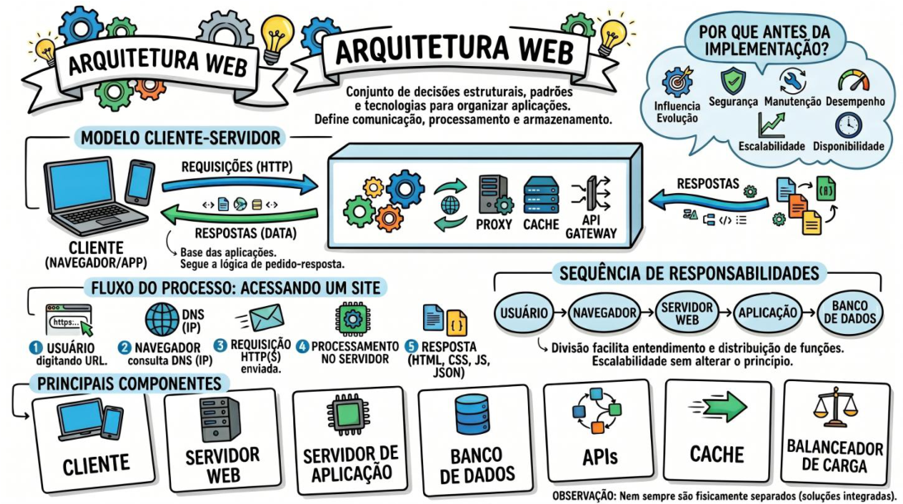

---

<!-- pagina: 6 -->

**Diego Carvalho, Equipe Informática 2 (Diego Carvalho), Equipe Informática 1 (Diego Carvalho) Aula 07** 

<!-- Start of picture text -->
Objetivos da Arquitetura <!-- End of picture text -->

###### **<mark>INCIDÊNCIA EM PROVA: BAIXÍSSIMA</mark>** 

Uma arquitetura web adequada organiza o sistema para que ele atenda às necessidades atuais do negócio e também suporte mudanças futuras. Por que isso importa? Porque sistemas crescem, recebem novas funcionalidades, integram-se a outros serviços e passam a lidar com mais usuários e dados. Sem uma estrutura bem definida, cada alteração tende a aumentar a complexidade, dificultar a manutenção e tornar o software mais vulnerável a falhas. 

A organização do sistema é um dos primeiros objetivos da arquitetura. Ela define como as partes do software se relacionam, quais responsabilidades cada componente assume e como o código deve ser estruturado. Isso **reduz o acoplamento, favorece a reutilização e facilita a manutenção** . Quando cada módulo possui uma função clara, torna-se mais simples corrigir defeitos, evoluir funcionalidades e compreender o comportamento geral da aplicação. 

A escalabilidade indica a capacidade de o sistema lidar com crescimento. Uma aplicação que funciona bem para 100 usuários pode apresentar falhas quando passa a atender 1 milhão. O que muda nesse cenário? Aumentam os acessos simultâneos, o volume de dados e a quantidade de transações por segundo. Por isso, a arquitetura deve prever **estratégias como distribuição de carga, otimização de recursos e expansão da infraestrutura** . 

A manutenibilidade trata da facilidade de modificar o sistema ao longo do tempo. Isso inclui corrigir defeitos, acrescentar funcionalidades e atualizar tecnologias utilizadas. Um sistema bem arquitetado **tende a exigir menos esforço para mudanças, pois suas partes são mais compreensíveis e menos dependentes entre si** . Essa característica reduz custos e diminui o risco de que uma alteração cause efeitos indesejados em outras áreas. 

A reutilização ocorre quando componentes podem ser empregados em diferentes partes do sistema ou em outros projetos. Serviços de autenticação, pagamentos e notificações são exemplos comuns. Faz sentido reescrever tudo a cada nova aplicação? Em geral, não. Quando esses recursos são bem projetados, podem ser reaproveitados com adaptações controladas, o que melhora a consistência técnica e reduz retrabalho. 

A integração permite que a aplicação se comunique com outros sistemas, como bancos, ERPs, aplicativos móveis e plataformas governamentais. Essa comunicação exige padrões bem definidos, tratamento de erros, controle de acesso e compatibilidade entre dados. A arquitetura deve prever esses pontos, pois sistemas web raramente funcionam de forma isolada e frequentemente dependem de serviços externos. 

A segurança precisa ser considerada desde o planejamento da arquitetura. Ela envolve autenticação, autorização, criptografia, controle de acesso e proteção contra ataques. Como proteger um sistema sem prever esses mecanismos? A ausência desse cuidado aumenta a exposição a acessos indevidos, vazamentos de dados e interrupções. Por isso, **segurança deve ser implementada, validada e monitorada durante todo o ciclo de vida da aplicação** . 

A disponibilidade representa a capacidade de manter o sistema acessível mesmo diante de falhas. Para isso, podem ser usados **servidores redundantes, balanceadores de carga e replicação de bancos de dados** . Esses recursos ajudam a reduzir interrupções, mas não eliminam todos os riscos. A arquitetura deve combinar prevenção, monitoramento e recuperação, pois falhas podem ocorrer em infraestrutura, software ou serviços externos.

---

<!-- pagina: 7 -->

**Diego Carvalho, Equipe Informática 2 (Diego Carvalho), Equipe Informática 1 (Diego Carvalho) Aula 07** 

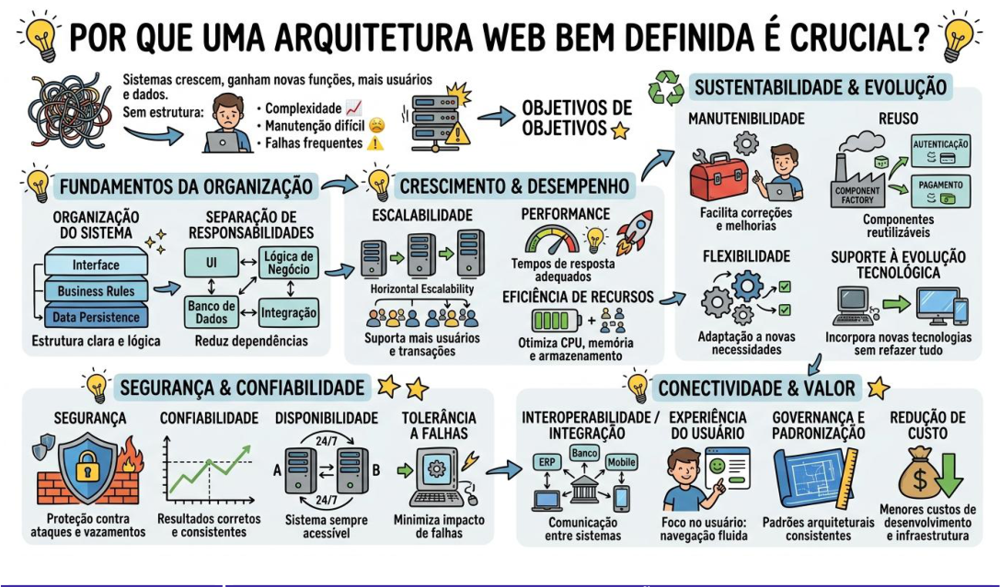

|**OBJETIVOS**|**DESCRIÇÃO**|
|---|---|
|**ORGANIZAÇÃO DO** **SISTEMA** |Estruturar a aplicação em componentes e camadas bem definidas, facilitando o entendimento,desenvolvimento e manutenção do software.|
|**SEPARAÇÃO DE** **RESPONSABILIDADES**|Distribuir funções entre diferentes módulos (interface, regras de negócio, persistência, integração etc.),reduzindo dependências e aumentando aqualidade do código.|
|**ESCALABILIDADE**|Permitir que a aplicação suporte crescimento no número de usuários, transações e volume de dados semperda significativa de desempenho.|
|**DESEMPENHO**|Garantir tempos de resposta adequados por meio da otimização de recursos, uso de cache,balanceamento de carga e outras estratégias arquiteturais.|
|**MANUTENI-** **BILIDADE**|Facilitar correções, melhorias e evolução do sistema ao longo do tempo, reduzindo o custo de manutenção.|
|**REUTILIZAÇÃO**|Possibilitar que componentes, serviços e funcionalidades sejam reutilizados em diferentespartes da aplicação ou em outros sistemas.|
|**SEGURANÇA**|Proteger dados, usuários e recursos contra acessos não autorizados, ataques e vazamentos de informações.|
|**DISPONIBILIDADE**|Garantir que o sistema permaneça acessível e operacional pelo maior tempo possível, mesmo diante de falhas de hardware ou software.|
|**CONFIABILIDADE**|Assegurar que o sistema execute suas funções corretamente e produza resultados consistentes eprevisíveis.|
|**INTEROPERA-** **BILIDADE**|Permitir a integração e comunicação entre sistemas, plataformas, dispositivos e tecnologias diferentes.|
|**FLEXIBILIDADE**|Facilitar adaptações a novas necessidades de negócio, tecnologias emergentes e mudanças de requisitos.|
|**ESCALABILIDADE** **HORIZONTAL**|Possibilitar o aumento da capacidade do sistema por meio da adição de novos servidores ou instâncias.|
|**TOLERÂNCIA A** **FALHAS**|Minimizar impactos de falhas por meio de redundância, replicação e mecanismos de recuperação automática.|
|**EFICIÊNCIA NO USO** **DE RECURSOS**|Utilizar processamento, memória, armazenamento e rede de forma otimizada para reduzir custos operacionais.|

---

<!-- pagina: 8 -->

**Diego Carvalho, Equipe Informática 2 (Diego Carvalho), Equipe Informática 1 (Diego Carvalho) Aula 07** 

|**OBJETIVOS** |**DESCRIÇÃO**|
|---|---|
|**EXPERIÊNCIA DO** **USUÁRIO**|Proporcionar navegação fluida, respostas rápidas, disponibilidade contínua e interfaces adequadas às necessidades dos usuários.|
|**SUSTENTAÇÃO DA** **EVOLUÇÃO** **TECNOLÓGICA**|Permitir a incorporação gradual de novas tecnologias, frameworks e padrões sem exigir a reconstrução completa do sistema.|
|**GOVERNANÇA E** **PADRONIZAÇÃO**|Estabelecer padrões arquiteturais que orientem equipes de desenvolvimento, promovendo consistência equalidade nas soluções.|
|**REDUÇÃO DE** **CUSTOS**|Diminuir custos de desenvolvimento, operação, manutenção e infraestrutura por meio de uma arquitetura eficiente e bemplanejada.|

---

<!-- pagina: 9 -->

**Diego Carvalho, Equipe Informática 2 (Diego Carvalho), Equipe Informática 1 (Diego Carvalho) Aula 07** 

<!-- Start of picture text -->
Qualidades Arquiteturais <!-- End of picture text -->

###### **<mark>INCIDÊNCIA EM PROVA: BAIXÍSSIMA</mark>** 

As qualidades arquiteturais, também chamadas de atributos de qualidade, representam características não funcionais que influenciam diretamente o comportamento de um sistema. Elas ajudam a avaliar se uma solução será capaz de atender às necessidades do negócio não apenas no momento da implantação, mas também durante sua evolução. Por que dois sistemas com as mesmas funcionalidades podem apresentar resultados tão diferentes? Porque os **atributos de qualidade afetam aspectos como desempenho, crescimento, segurança, confiabilidade e facilidade de manutenção** . 

A escalabilidade descreve a capacidade de suportar crescimento sem perda significativa de desempenho. Esse crescimento pode ocorrer de duas formas principais. **Na escalabilidade vertical, são adicionados recursos a uma única máquina, como memória ou processamento. Na escalabilidade horizontal, novos servidores são incorporados ao ambiente para dividir a carga de trabalho** . Qual abordagem é melhor? A resposta depende das restrições técnicas, dos custos envolvidos e dos objetivos de expansão do sistema. 

O desempenho está relacionado à eficiência com que o sistema responde às solicitações dos usuários. Entre os indicadores mais utilizados estão o tempo de resposta, a latência, o throughput, o consumo de CPU e o uso de memória. Surge frequentemente uma dúvida sobre throughput. O que ele mede exatamente? **Esse indicador representa a quantidade de operações ou requisições processadas em determinado intervalo de tempo, enquanto o tempo de resposta mede quanto tempo uma operação leva para ser concluída** . 

A disponibilidade mede o percentual de tempo em que o sistema permanece operacional e acessível. Em ambientes corporativos, costuma-se utilizar métricas expressas em porcentagens anuais. **Uma disponibilidade de 99% permite aproximadamente 3,65 dias de indisponibilidade por ano; 99,9% corresponde a cerca de 8,76 horas; 99,99% representa aproximadamente 52 minutos; e 99,999% reduz esse período para cerca de 5 minutos** . Quanto maior a disponibilidade desejada, maiores tendem a ser os investimentos em infraestrutura e redundância. 

A confiabilidade está associada à capacidade de operar corretamente durante períodos prolongados. Um sistema confiável apresenta comportamento previsível e reduz a ocorrência de falhas inesperadas. Como essa característica pode ser medida? Entre os indicadores mais utilizados estão o **MTBF, que representa o tempo médio entre falhas em sistemas reparáveis, e o MTTF, que indica o tempo médio até a falha em componentes ou sistemas considerados não reparáveis** . 

A segurança envolve mecanismos destinados a proteger informações e recursos contra acessos indevidos, alterações não autorizadas e outras ameaças. Os **pilares clássicos da segurança da informação são confidencialidade, integridade e disponibilidade** . Além deles, muitas arquiteturas também incorporam autenticidade e não repúdio. Essas propriedades ajudam a garantir que os usuários sejam corretamente identificados, que as informações permaneçam íntegras e que determinadas ações possam ser associadas aos seus respectivos responsáveis. 

A modificabilidade representa a facilidade de alterar o sistema sem provocar impactos excessivos em outras partes da solução. Essa característica torna-se especialmente importante em ambientes sujeitos a mudanças frequentes de requisitos. O que favorece uma alta modificabilidade? **Estruturas com baixo acoplamento, alta coesão e forte modularização costumam facilitar a implementação de melhorias, correções e adaptações tecnológicas** ao longo do ciclo de vida do software. 

A interoperabilidade corresponde à capacidade de comunicação entre sistemas distintos. Essa **integração pode ocorrer por meio de tecnologias como APIs REST, serviços SOAP, GraphQL e**

---

<!-- pagina: 10 -->

**Diego Carvalho, Equipe Informática 2 (Diego Carvalho), Equipe Informática 1 (Diego Carvalho) Aula 07** 

**soluções de mensageria** . A troca de informações entre plataformas diferentes exige protocolos, formatos de dados e contratos de comunicação bem definidos. Sem esses elementos, a integração tende a se tornar mais complexa e sujeita a inconsistências. 

A testabilidade refere-se à facilidade de criar, executar e manter testes durante o desenvolvimento e a evolução da aplicação. Sistemas com boa testabilidade permitem identificar defeitos com mais rapidez e validar alterações com menor esforço. Essa característica contribui para ciclos de entrega mais previsíveis e reduz a probabilidade de problemas chegarem aos ambientes de produção. 

A observabilidade representa a capacidade de compreender o comportamento interno de um sistema a partir das informações produzidas durante sua execução. **Logs registram eventos relevantes, métricas fornecem indicadores quantitativos, traces distribuídos permitem acompanhar requisições entre múltiplos serviços** e mecanismos de monitoramento ajudam a identificar anomalias operacionais. Esses recursos fornecem subsídios para diagnóstico, análise de desempenho e investigação de falhas em ambientes complexos. 

|**QUALIDADE** **ARQUITETURAL**|**DESCRIÇÃO**|
|---|---|
|**ESCALABILIDADE** **DESEMPENHO**|Capacidade de um sistema aumentar sua capacidade de processamento, armazenamento ou atendimento de usuários à medida que a demanda cresce. Pode ocorrer por ampliação dos recursos de uma máquina oupela adição de novos servidores. Refere-se à eficiência com que o sistema executa suas funções e responde às solicitações. Envolve aspectos como tempo de resposta, latência, throughput e utilização adequada dos recursos computacionais disponíveis.|
|**DISPONIBILIDADE**|Representa o percentual de tempo em que o sistema permanece operacional e acessível aos usuários. Quanto maior a disponibilidade, menor a ocorrência de interrupções que possam afetar a continuidade dos serviçosprestados.|
|**CONFIABILIDADE**|Capacidade de o sistema executar suas funções corretamente durante longos períodos, produzindo resultados previsíveis e consistentes. Busca minimizar falhas inesperadas e garantir estabilidade operacional contínua.|
|**SEGURANÇA**|Característica voltada à proteção de dados, serviços e recursos contra acessos indevidos, alterações não autorizadas e ataques. Abrange mecanismos de autenticação, autorização, criptografia e auditoria de eventos.|
|**MODIFICA-** **BILIDADE**|Capacidade de realizar alterações, correções ou evoluções no sistema com esforço reduzido e impacto limitado sobre outros componentes. É favorecida por modularização adequada,alta coesão e baixo acoplamento.|
|**INTEROPERA-** **BILIDADE**|Capacidade de diferentes sistemas, plataformas ou aplicações trocarem informações e colaborarem entre si de forma eficiente. Depende da adoção de padrões, protocolos e contratos de comunicação bem definidos.|
|**TESTABILIDADE**|Refere-se à facilidade de criar, executar e manter testes durante o desenvolvimento e a manutenção do software. Sistemas testáveis permitem identificar defeitos rapidamente e validar alterações com menor esforço.|
|**OBSERVABILIDADE**|Capacidade de compreender o comportamento interno do sistema por meio da análise de logs, métricas, traces e monitoramento. Facilita diagnósticos, identificação de falhas e análise de desempenho operacional.|
|**MANUTENIBILIDA** **DE**|Característica que expressa a facilidade de corrigir defeitos, adaptar funcionalidades e evoluir o software ao longo do tempo. Sistemas bem estruturados tendem a apresentar menor custo e esforço de manutenção.|
|**USABILIDADE**|Mede o grau de facilidade com que usuários conseguem aprender, compreender e utilizar o sistema para atingir seus objetivos. Interfaces intuitivas e consistentes contribuem diretamentepara essa característica.|
|**PORTABILIDADE**|Capacidade de executar ou migrar uma aplicação entre diferentes ambientes, sistemas operacionais, plataformas ou provedores com pouco esforço. Reduz dependências tecnológicas excessivas e amplia a flexibilidade.|

---

<!-- pagina: 11 -->

**Diego Carvalho, Equipe Informática 2 (Diego Carvalho), Equipe Informática 1 (Diego Carvalho) Aula 07** 

|**QUALIDADE** **ARQUITETURAL**|**DESCRIÇÃO**|
|---|---|
|**REUSABILIDADE**|Capacidade de reutilizar componentes, módulos, bibliotecas ou serviços em diferentes projetos ou partes da aplicação. Favorece padronização, redução de retrabalho e aumento daprodutividade das equipes.|
|**ELASTICIDADE**|Capacidade de aumentar ou reduzir automaticamente os recursos computacionais disponíveis conforme as variações de demanda. É uma característica amplamente associada a ambientes de computação em nuvem.|
|**TOLERÂNCIA A** **FALHAS**|Capacidade de continuar operando adequadamente mesmo quando ocorrem falhas em componentes, servidores ou conexões de rede. Normalmente depende de mecanismos de redundância e recuperação automática.|
|**RESILIÊNCIA**|Capacidade de resistir a falhas, adaptar-se a situações adversas e recuperar rapidamente sua operação normal. Vai além da tolerância a falhas ao enfatizar a recuperação e continuidade do negócio.|
|**AUDITABILIDADE**|Capacidade de registrar e rastrear ações, alterações e eventos relevantes ocorridos no sistema. Permite investigações, conformidade regulatória, identificação de responsabilidades e reconstrução de ocorrências.|
|**CONSISTÊNCIA**|Capacidade de manter os dados corretos, íntegros e coerentes ao longo do tempo, mesmo em ambientes distribuídos. Garante que diferentes componentes possuam uma visão adequada das informações.|
|**EFICIÊNCIA DE** **RECURSOS**|Capacidade de utilizar processamento, memória, armazenamento e rede de forma otimizada, entregando bons resultados com menor consumo de recursos e melhor aproveitamento da infraestrutura disponível.|

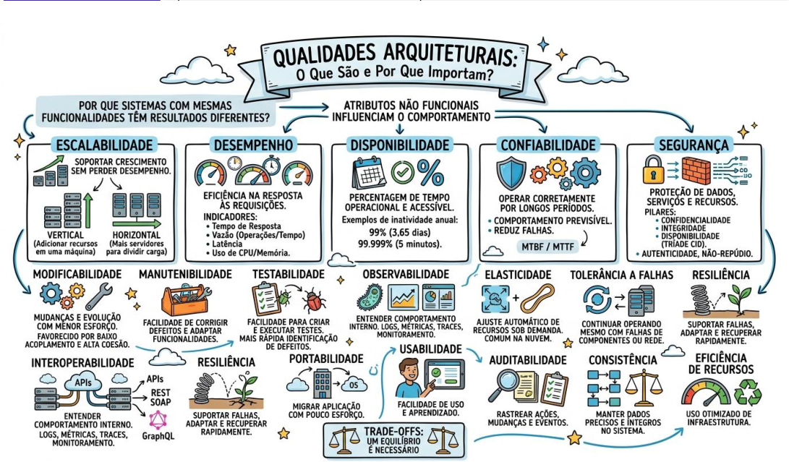

---

<!-- pagina: 12 -->

**Diego Carvalho, Equipe Informática 2 (Diego Carvalho), Equipe Informática 1 (Diego Carvalho) Aula 07** 

<!-- Start of picture text -->
Evolução de <!-- End of picture text -->

<!-- Start of picture text -->
Arquiteturas <!-- End of picture text -->

<!-- Start of picture text -->
Web <!-- End of picture text -->

###### **<mark>INCIDÊNCIA EM PROVA: BAIXÍSSIMA</mark>** 

A arquitetura web passou por diversas transformações ao longo do tempo, acompanhando a evolução da Internet e o crescimento das demandas empresariais. Costuma-se apresentar essa trajetória em etapas para facilitar o entendimento histórico, embora essa divisão em gerações não constitua uma classificação formal adotada universalmente. O objetivo dessa organização é mostrar como novas necessidades de desempenho, integração, escalabilidade e flexibilidade influenciaram o surgimento de diferentes estilos arquiteturais. 

Os primeiros sistemas web eram compostos por sites estáticos, predominantes durante a década de 1990. Nessa fase, as páginas eram formadas principalmente por documentos HTML armazenados diretamente no servidor. O que acontecia quando o usuário acessava um site? O navegador solicitava um arquivo e o servidor simplesmente devolvia seu conteúdo. Como não existiam mecanismos sofisticados de processamento, os dados permaneciam praticamente inalterados entre diferentes acessos. 

Com o aumento da necessidade de interação, surgiram as aplicações dinâmicas. Tecnologias como PHP, ASP, JSP e CGI passaram a gerar conteúdo em tempo real, utilizando informações armazenadas em bancos de dados. Isso permitiu o desenvolvimento das primeiras aplicações corporativas na Web. Em vez de apenas entregar arquivos prontos, os servidores passaram a processar regras de negócio e produzir respostas personalizadas para cada solicitação recebida. 

A expansão dos sistemas empresariais levou à popularização da arquitetura em camadas, frequentemente chamada de Three-Tier Architecture. **Essa abordagem divide a aplicação em apresentação, lógica de negócio e persistência de dados** . Por que realizar essa separação? Porque **cada camada passa a ter responsabilidades específicas, o que facilita manutenção, reutilização e e** **<mark>v</mark> olução do software** . Essa organização continua influenciando diversas arquiteturas utilizadas atualmente. 

Posteriormente ganhou destaque a Arquitetura Orientada a Serviços, conhecida como SOA. Nessa abordagem, **funcionalidades são disponibilizadas como serviços reutilizáveis que podem ser consumidos por diferentes aplicações** . Embora muitas implementações utilizassem SOAP e XML, a arquitetura não se limita a essas tecnologias. Serviços relacionados a clientes, finanças e estoque, por exemplo, podem ser compartilhados entre múltiplos sistemas, reduzindo duplicação de funcionalidades e favorecendo integrações corporativas. 

A popularização das APIs REST ampliou significativamente as possibilidades de integração entre aplicações. **O estilo arquitetural REST foi proposto por Roy Fielding em 2000** , mas sua adoção tornouse mais intensa na década seguinte. O que contribuiu para essa expansão? O crescimento das aplicações web modernas, dos dispositivos móveis e dos serviços distribuídos. A utilização de HTTP e formatos leves como JSON tornou as integrações mais simples e amplamente compatíveis. 

A arquitetura de microsserviços surgiu como uma abordagem que incentiva a divisão do sistema em serviços independentes e especializados. **Funcionalidades como usuários, pedidos, pagamentos, estoque e notificações podem ser executadas de forma separada** . Isso permite escalabilidade e implantação independentes. Apesar disso, os microsserviços não representam uma substituição completa do SOA, pois diversas ideias fundamentais, como desacoplamento e comunicação entre serviços, já estavam presentes na arquitetura orientada a serviços. 

Com a consolidação da computação em nuvem, surgiu o modelo Cloud Native. Nesse contexto, as aplicações são concebidas para aproveitar características específicas dos ambientes de nuvem, como elasticidade, automação e alta disponibilidade. **Tecnologias como containers, Docker, Kubernetes e**

---

<!-- pagina: 13 -->

**Diego Carvalho, Equipe Informática 2 (Diego Carvalho), Equipe Informática 1 (Diego Carvalho) Aula 07** 

**Service Mesh desempenham papel importante nessa abordagem** . Em vez de apenas migrar aplicações tradicionais para a nuvem, busca-se projetar soluções que utilizem adequadamente os recursos oferecidos por essa infraestrutura. 

As arquiteturas serverless e orientadas a eventos representam uma das tendências mais recentes. Nesses modelos, o processamento é acionado pela ocorrência de eventos recebidos por filas, streams ou serviços de mensageria. Surge então uma dúvida frequente: se a arquitetura é chamada de serverless, os servidores deixam de existir? A resposta é negativa. **Os servidores continuam presentes, mas sua administração é abstraída pelo provedor de nuvem** . Dessa forma, os desenvolvedores concentram-se na implementação das funções e regras de negócio, enquanto a infraestrutura é gerenciada automaticamente pela plataforma. 

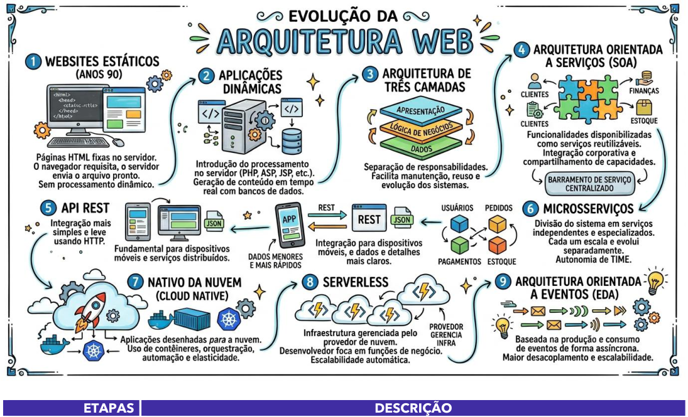

<!-- Start of picture text -->
ETAPAS  DESCRIÇÃO ÇÃO ÃO <!-- End of picture text -->

**<mark>ETAPAS DESCRIÇÃO ÇÃO ÃO</mark>** Predominantes nos anos 1990, eram compostos por páginas HTML armazenadas **SITES ESTÁTICOS** diretamente no servidor. O conteúdo era praticamente fixo e cada solicitação resultava apenas na entrega de arquivos previamente criados, sem processamento significativo. Introduziram processamento no servidor por meio de tecnologias como PHP, ASP, JSP e **APLICAÇÕES** CGI. As páginas passaram a ser geradas em tempo real com base em dados armazenados **DINÂMICAS** em bancos de dados e regras de negócio executadas durante cada requisição. **<mark>ARQUITETURA EM</mark>** <mark>Organizou os sistemas em camadas de apresentação, negócio e dados. Essa separação</mark> **CAMADAS (THREE-** permitiu distribuir responsabilidades de forma mais clara, facilitando manutenção, **TIER)** reutilização de componentes e evolução das aplicações corporativas. **SOA (SERVICE-** Passou a estruturar funcionalidades como serviços reutilizáveis acessíveis por diferentes **ORIENTED** sistemas. Essa abordagem favoreceu integração corporativa, redução de redundâncias e **ARCHITECTURE)** compartilhamento de capacidades de negócio entre aplicações distintas. Popularizaram integrações mais simples e leves utilizando HTTP e formatos como JSON. **APIS REST** Tornaram-se fundamentais para comunicação entre sistemas web, aplicativos móveis e serviços distribuídos, ampliando a interoperabilidade entre plataformas.

---

<!-- pagina: 14 -->

**Diego Carvalho, Equipe Informática 2 (Diego Carvalho), Equipe Informática 1 (Diego Carvalho) Aula 07** 

|**ETAPAS**|**DESCRIÇÃO**|
|---|---|
|**MICROSSERVIÇOS**|Propõem dividir a aplicação em serviços pequenos, independentes e especializados. Cada serviço pode ser desenvolvido, implantado e escalado separadamente, aumentando flexibilidade,autonomia das equipes e capacidade de evolução contínua.|
|**CLOUD NATIVE**|Representa aplicações projetadas especificamente para ambientes de nuvem. Utiliza conceitos como containers, orquestração, automação, elasticidade e alta disponibilidade, explorandoplenamente os recursos oferecidospelosprovedores de nuvem.|
|**SERVERLESS**|Modelo no qual a infraestrutura é administrada pelo provedor de nuvem. O desenvolvedor concentra-se só na implementação das funções de negócio, enquanto escalabilidade, provisionamento egerenciamento dos servidores são automatizados.|
|**EVENT-DRIVEN** **ARCHITECTURE** **(EDA)**|Baseia-se na produção e consumo de eventos para coordenar componentes distribuídos. O processamento ocorre de forma assíncrona, permitindo maior desacoplamento, escalabilidade e capacidade de reação a acontecimentos do ambiente.|

---

<!-- pagina: 15 -->

**Diego Carvalho, Equipe Informática 2 (Diego Carvalho), Equipe Informática 1 (Diego Carvalho) Aula 07** 

**<mark>INCIDÊNCIA EM PROVA: BAIXÍSSIMA</mark>** 

<!-- Start of picture text -->
Coesão  e <!-- End of picture text -->

<!-- Start of picture text -->
Acoplamento <!-- End of picture text -->

###### **<mark>COESÃO E ACOPLAMENTO</mark>** 

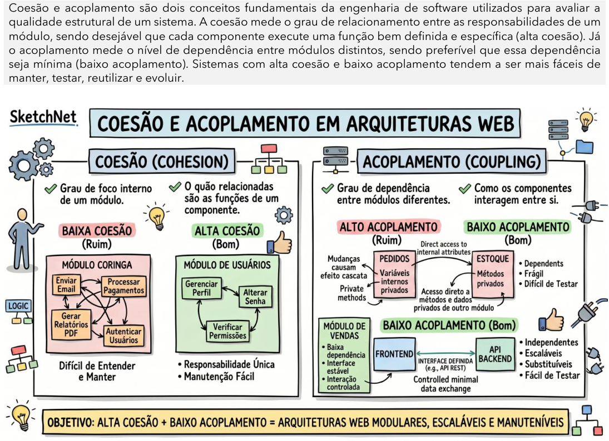

<!-- Start of picture text -->
Coesão e acoplamento são dois conceitos fundamentais da engenharia de software utilizados para avaliar a qualidade estrutural de um sistema. A coesão mede o grau de relacionamento entre as responsabilidades de um módulo, sendo desejável que cada componente execute uma função bem definida e específica (alta coesão). Já o acoplamento mede o nível de dependência entre módulos distintos, sendo preferível que essa dependência seja mínima (baixo acoplamento). Sistemas com alta coesão e baixo acoplamento tendem a ser mais fáceis de manter, testar, reutilizar e evoluir. <!-- End of picture text -->

Coesão e acoplamento estão entre os conceitos mais importantes da Engenharia de Software e da Arquitetura de Software. Grande parte das decisões arquiteturais busca equilibrar esses dois princípios para produzir sistemas mais fáceis de manter e evoluir. Por essa razão, existe uma recomendação amplamente difundida entre arquitetos e desenvolvedores: **uma boa arquitetura deve apresentar alta coesão e baixo acoplamento entre seus componentes** . 

O que significa afirmar que um sistema possui baixo acoplamento? **O acoplamento representa o grau de dependência existente entre módulos, componentes ou classes** . Quando um componente depende excessivamente de outros para funcionar, qualquer alteração pode gerar impactos em diversas partes da aplicação. Em contrapartida, a **redução dessas dependências permite que modificações sejam realizadas com menor risco de propagação de efeitos indesejados** para outros elementos do sistema. 

A coesão está relacionada à organização interna de um módulo. Em vez de medir a relação entre componentes diferentes, ela avalia o quanto as responsabilidades existentes dentro de um mesmo componente estão relacionadas entre si. **Um módulo altamente coeso concentra funcionalidades voltadas para um objetivo específico e bem definido** . Como consequência, torna-se mais simples compreender seu comportamento e realizar sua manutenção.

---

<!-- pagina: 16 -->

**Diego Carvalho, Equipe Informática 2 (Diego Carvalho), Equipe Informática 1 (Diego Carvalho) Aula 07** 

Por que a alta coesão é considerada desejável? Quando um componente possui responsabilidades claramente delimitadas, seu propósito torna-se mais evidente para os desenvolvedores. Além disso, alterações tendem a permanecer restritas ao próprio módulo, reduzindo impactos sobre outras partes da aplicação. Essa característica contribui para a organização do sistema e favorece a construção de componentes mais independentes e especializados. 

Existe também uma relação importante entre coesão e o Princípio da Responsabilidade Única. **Esse princípio estabelece que uma classe ou componente deve possuir apenas uma responsabilidade principal** . Embora não sejam conceitos idênticos, a aplicação desse princípio normalmente conduz ao aumento da coesão, pois reduz a tendência de concentrar funções não relacionadas dentro do mesmo módulo. 

A combinação entre alta coesão e baixo acoplamento constitui um dos objetivos centrais do projeto arquitetural. Enquanto a coesão busca fortalecer a organização interna dos componentes, o acoplamento procura limitar as dependências externas entre eles. Sistemas que equilibram adequadamente esses dois princípios costumam apresentar maior facilidade de manutenção, evolução e adaptação às mudanças que surgem ao longo do ciclo de vida do software. Vejamos na tabela abaixo os vários tipos de acoplamento: 

**<mark>TIPO DE</mark> DESCRIÇÃO ACOPLAMENTO** Ocorre quando um módulo acessa diretamente dados internos, estruturas ou **ACOPLAMENTO** elementos de controle pertencentes a outro módulo. É considerado o tipo mais forte e **POR CONTEÚDO** indesejável de acoplamento, <u>pois cria elevada dependência entre componentes.</u> Surge quando diversos módulos compartilham uma mesma área global de dados. **ACOPLAMENTO** Alterações na estrutura ou no conteúdo dessas informações podem impactar múltiplos **COMUM** componentes, dificultando manutenção, testes e controle de dependências. <mark>Ocorre quando um módulo envia informações que determinam o fluxo de execução</mark> **ACOPLAMENTO** de outro módulo. Nesse cenário, o componente chamado passa a depender de **POR CONTROLE** decisões externas para definir parte de seu comportamento interno. <mark>Caracteriza-se pela troca de dados simples entre módulos por meio de parâmetros</mark> **ACOPLAMENTO** necessários ao processamento. É considerado um dos acoplamentos mais desejáveis, **POR DADOS** <u>pois limita a dependência ao compartilhamento explícito de informações.</u> **<mark>ACOPLAMENTO POR</mark>** <mark>Ocorre quando um módulo invoca procedimentos, funções ou métodos de outro</mark> **CHAMADAS DE** módulo. Embora aumente a dependência entre componentes, é amplamente utilizado **ROTINAS** e frequentemente necessário para viabilizar a colaboração entre partes do sistema. Surge quando um componente utiliza tipos de dados, classes ou estruturas definidos **ACOPLAMENTO POR** por outro componente. Mudanças nessas definições podem exigir modificações em **USO DE TIPOS** todos os módulos que dependem desses tipos compartilhados. **ACOPLAMENTO POR** Ocorre quando um componente incorpora bibliotecas, pacotes, módulos ou arquivos **INCLUSÃO OU** definidos por outro componente. Essa dependência estabelece um vínculo estrutural **IMPORTAÇÃO** <u>que pode propagar impactos decorrentes de alterações futuras.</u> Acontece quando componentes dependem de recursos externos, como bancos de **ACOPLAMENTO** dados, sistemas operacionais, APIs, serviços de terceiros ou infraestrutura. Embora **EXTERNO** necessário, recomenda-se restringi-lo para reduzir impactos e riscos. 

No projeto de sistemas orientados a objetos, a coesão representa o grau de relacionamento entre os atributos e as operações existentes dentro de uma mesma classe ou componente. Um componente é considerado altamente coeso quando seus elementos internos contribuem para um propósito específico e bem definido. Essa característica favorece a organização do software, pois concentra responsabilidades relacionadas em uma única estrutura lógica.

---

<!-- pagina: 17 -->

**Diego Carvalho, Equipe Informática 2 (Diego Carvalho), Equipe Informática 1 (Diego Carvalho) Aula 07** 

Os sistemas orientados a objetos dependem fortemente da comunicação e da colaboração entre seus componentes. Como diferentes partes da aplicação trabalham em conjunto para realizar uma funcionalidade? Classes e objetos trocam informações, solicitam serviços e coordenam atividades continuamente. Essa interação é uma característica natural desse paradigma e desempenha papel fundamental no funcionamento adequado do sistema. 

Entretanto, o aumento das interações também exige atenção. À medida que cresce a quantidade de dependências entre classes, aumenta o número de conexões que precisam ser compreendidas, implementadas e mantidas. Como consequência, tarefas relacionadas ao desenvolvimento, aos testes e à evolução do sistema tendem a tornar-se mais complexas, especialmente quando as dependências não são adequadamente controladas. 

Nesse contexto surge o conceito de acoplamento. O que exatamente ele mede? O acoplamento representa o grau de dependência existente entre classes ou componentes. Quando um componente depende fortemente de diversos outros para funcionar, alterações realizadas em um deles podem produzir impactos em vários pontos da aplicação. Esse cenário aumenta a propagação de mudanças e dificulta a manutenção do software ao longo do tempo. 

Isso significa que classes não devem se comunicar entre si? Não. A comunicação e a colaboração são essenciais em sistemas orientados a objetos. O objetivo não é eliminar as interações, mas evitar dependências excessivas ou desnecessárias. Componentes precisam cooperar para atender aos requisitos da aplicação, porém essa cooperação deve ocorrer de maneira controlada e bem estruturada. 

Por essa razão, uma das recomendações mais importantes da Engenharia de Software consiste em buscar alta coesão e baixo acoplamento. Enquanto a coesão fortalece a organização interna dos componentes, o controle do acoplamento reduz a dependência entre eles. O resultado é uma arquitetura mais simples de compreender, mais fácil de testar e mais preparada para acomodar mudanças futuras sem impactos excessivos sobre o restante do sistema. 

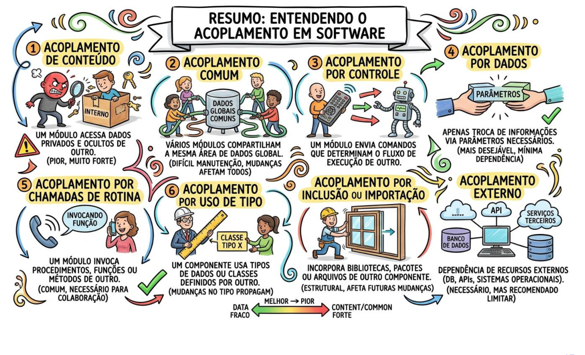

---

<!-- pagina: 18 -->

**Diego Carvalho, Equipe Informática 2 (Diego Carvalho), Equipe Informática 1 (Diego Carvalho) Aula 07**

---

<!-- pagina: 19 -->

**Diego Carvalho, Equipe Informática 2 (Diego Carvalho), Equipe Informática 1 (Diego Carvalho) Aula 07** 

<!-- Start of picture text -->
Modelo Cliente / <!-- End of picture text -->

<!-- Start of picture text -->
Servidor <!-- End of picture text -->

###### **<mark>MODELO CLIENTE/SERVIDOR</mark>** 

O modelo cliente/servidor é um paradigma de arquitetura de sistemas distribuídos no qual as responsabilidades são divididas entre clientes, que solicitam serviços, e servidores, que processam essas solicitações e fornecem respostas. O cliente normalmente é responsável pela interface com o usuário, enquanto o servidor concentra regras de negócio, processamento e acesso a dados. A comunicação ocorre por meio de uma rede utilizando protocolos específicos, como HTTP ou HTTPS. Esse modelo constitui a base da maioria das aplicações web modernas, <u>permitindo centralização de recursos, compartilhamento de serviços e escalabilidade.</u> 

O modelo cliente-servidor constitui a base do funcionamento da maior parte das aplicações web. Nessa arquitetura, a aplicação é organizada em dois papéis principais: cliente e servidor. **O cliente é responsável por interagir com o usuário e solicitar serviços; o servidor recebe as solicitações, processa os dados necessários e retorna uma resposta** . Essa divisão de responsabilidades permite organizar melhor o sistema e distribuir as tarefas de forma eficiente. 

Quando um usuário acessa um site, o que acontece nos bastidores? O navegador atua como cliente e envia uma requisição pela rede utilizando protocolos como HTTP ou HTTPS. Essa solicitação é encaminhada ao servidor, que permanece disponível para receber pedidos de diversos clientes simultaneamente. Após processar a requisição, o servidor gera uma resposta e a envia de volta ao cliente, que apresenta as informações ao usuário. 

A comunicação segue um fluxo relativamente simples. Primeiro, o cliente envia uma requisição ao servidor. Em seguida, o servidor analisa o pedido recebido, executa as operações necessárias e produz uma resposta. Por fim, essa resposta retorna ao cliente. Essa sequência ocorre constantemente durante a navegação na web, desde o carregamento de páginas até operações mais complexas, como autenticação de usuários e processamento de transações. 

Uma dúvida comum surge ao observar uma pesquisa realizada na internet: quem executa efetivamente o processamento? Considere uma busca realizada no Google. O navegador envia a solicitação utilizando HTTPS e a infraestrutura de servidores do Google recebe essa requisição. Após localizar os resultados relevantes, os servidores retornam as informações para o navegador, que exibe a página correspondente ao usuário. 

Entre as principais vantagens desse modelo estão a centralização do processamento, o compartilhamento de recursos e a facilidade de manutenção. Por que essas características são importantes? **Como grande parte do processamento ocorre no servidor, atualizações e correções podem ser realizadas sem a necessidade de modificar cada cliente individualmente** . Além disso, recursos podem ser compartilhados por múltiplos usuários de maneira controlada e eficiente. 

Outro aspecto frequentemente mencionado é a segurança e a escalabilidade. A segurança é favorecida porque dados e regras importantes podem permanecer concentrados nos servidores. Já a escalabilidade permite ampliar a capacidade do sistema por meio da adição de novos servidores e recursos computacionais. Dessa forma, a arquitetura consegue atender quantidades crescentes de usuários e requisições sem alterar o funcionamento básico da comunicação entre cliente e servidor.

---

<!-- pagina: 20 -->

**Diego Carvalho, Equipe Informática 2 (Diego Carvalho), Equipe Informática 1 (Diego Carvalho) Aula 07** 

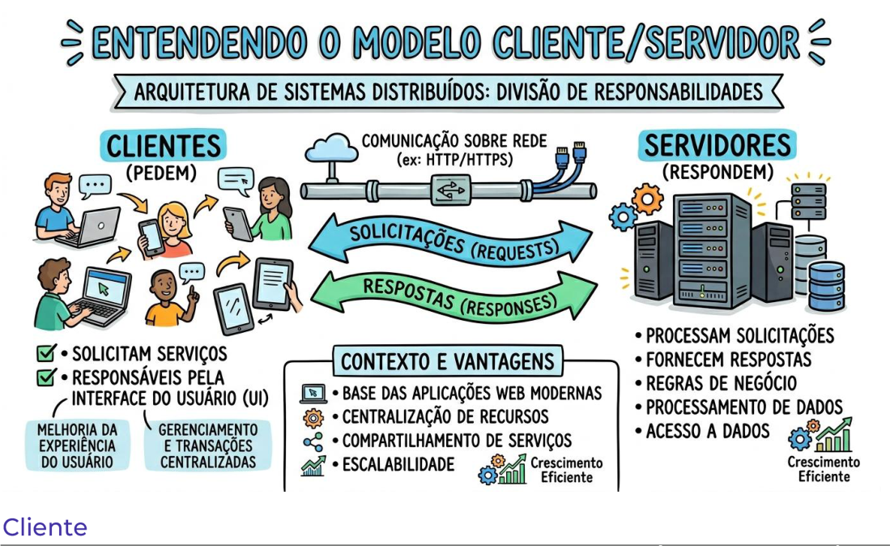

<!-- Start of picture text -->
Cliente <!-- End of picture text -->

**<mark>INCIDÊNCIA EM PROVA: BAIXÍSSIMA</mark>** 

###### **<mark>CLIENTE</mark>** 

O cliente é o componente responsável por interagir diretamente com o usuário e solicitar serviços a um servidor. Sua função principal consiste em capturar ações do usuário, enviar requisições, receber respostas e apresentar informações de forma adequada. Navegadores web, aplicativos móveis e aplicações desktop conectadas à Internet são exemplos de clientes. Em uma arquitetura web, o cliente normalmente executa a camada de apresentação e parte da lógica de interface. 

O cliente é o componente responsável pela interação direta com o usuário dentro do modelo clienteservidor. Suas funções incluem **capturar ações, enviar requisições ao servidor, receber respostas e apresentar informações por meio de interfaces gráficas** . Onde esse componente pode ser encontrado? Em navegadores web, aplicativos móveis, aplicações desktop e até mesmo em sistemas que consomem APIs, pois todos eles solicitam serviços a outro sistema para executar determinadas operações. 

Durante o acesso a um site, o navegador assume o papel de cliente. O usuário informa um endereço, como [www.exemplo.com](http://www.exemplo.com), e o navegador envia uma requisição utilizando protocolos como HTTP ou HTTPS. O que acontece depois que a solicitação é enviada? O servidor recebe o pedido, realiza o processamento necessário e retorna uma resposta. Em seguida, o cliente interpreta os dados recebidos e os apresenta ao usuário de maneira compreensível. 

Entre as responsabilidades do cliente estão a renderização de páginas HTML, a execução de códigos JavaScript, o armazenamento de cookies, o gerenciamento local de identificadores de sessão e a exibição das interfaces utilizadas pelo usuário. Também é comum que o cliente realize **validações iniciais dos dados informados. Essas validações são suficientes para garantir a segurança do sistema? Não. Elas melhoram a experiência do usuário, mas as verificações definitivas devem ocorrer no servidor** .

---

<!-- pagina: 21 -->

**Diego Carvalho, Equipe Informática 2 (Diego Carvalho), Equipe Informática 1 (Diego Carvalho) Aula 07** 

Os clientes podem ser classificados de acordo com a quantidade de processamento realizada localmente. Uma classificação bastante utilizada divide esses sistemas em clientes leves e clientes pesados. O que diferencia essas duas categorias? A resposta está na distribuição das responsabilidades de processamento entre cliente e servidor, aspecto que influencia diretamente o desempenho e o comportamento da aplicação. 

**O cliente leve, conhecido como Thin Client, executa poucas operações localmente e depende fortemente do servidor para processar informações** . Em muitos sistemas web tradicionais, a maior parte das regras e do processamento ocorre no servidor. Como consequência, o cliente atua principalmente como uma interface de acesso aos recursos disponibilizados pela aplicação. 

Já **o cliente pesado, ou Fat Client, realiza uma quantidade significativa de processamento no próprio dispositivo do usuário** . Aplicações desktop, aplicativos móveis complexos e **Single Page Applications, conhecidas como SPAs, são exemplos frequentes dessa abordagem** . Nesses casos, parte considerável da lógica da aplicação é executada localmente, reduzindo a necessidade de processamento contínuo no servidor para determinadas operações. 

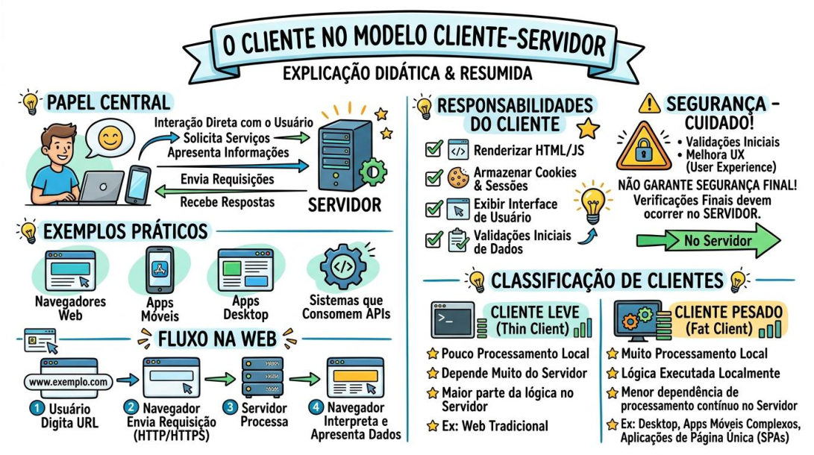

---

<!-- pagina: 22 -->

**Diego Carvalho, Equipe Informática 2 (Diego Carvalho), Equipe Informática 1 (Diego Carvalho) Aula 07** 

**<mark>INCIDÊNCIA EM PROVA: BAIXÍSSIMA</mark>** 

<!-- Start of picture text -->
Servidor <!-- End of picture text -->

###### **<mark>SERVIDOR</mark>** 

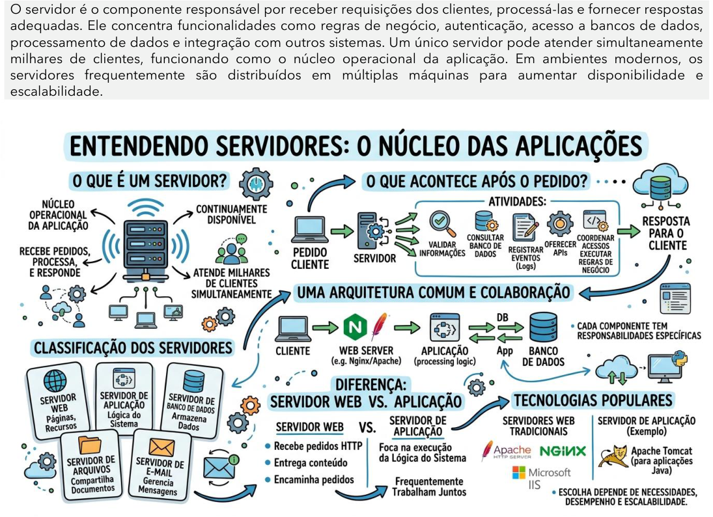

<!-- Start of picture text -->
O servidor é o componente responsável por receber requisições dos clientes, processá-las e fornecer respostas adequadas. Ele concentra funcionalidades como regras de negócio, autenticação, acesso a bancos de dados, processamento de dados e integração com outros sistemas. Um único servidor pode atender simultaneamente milhares de clientes, funcionando como o núcleo operacional da aplicação. Em ambientes modernos, os servidores frequentemente são distribuídos em múltiplas máquinas para aumentar disponibilidade e escalabilidade. <!-- End of picture text -->

O servidor é o componente responsável por disponibilizar serviços aos clientes dentro da arquitetura cliente-servidor. Sua principal característica é permanecer continuamente disponível para receber requisições e responder às solicitações recebidas. Quando um pedido chega, o servidor pode processar informações, consultar recursos necessários e retornar uma resposta adequada. Esse comportamento permite que diversos clientes utilizem os mesmos serviços de forma simultânea. 

Ao receber uma requisição, quais atividades podem ser executadas? Dependendo da aplicação, o servidor pode validar informações, consultar bancos de dados, registrar eventos em logs, disponibilizar APIs e coordenar o acesso a recursos compartilhados. Em muitos sistemas, também participa da execução das regras de negócio definidas pela aplicação. Após concluir o processamento necessário, o resultado é enviado de volta ao cliente que originou a solicitação. 

Uma arquitetura bastante comum inclui diferentes componentes trabalhando em conjunto. Nesse cenário, o cliente envia uma requisição para um servidor web, que encaminha a solicitação para a aplicação responsável pelo processamento. A aplicação pode consultar um banco de dados para obter ou armazenar informações antes de produzir a resposta. Como esses elementos colaboram entre si? Cada componente assume responsabilidades específicas, tornando a solução mais organizada e fácil de administrar.

---

<!-- pagina: 23 -->

**Diego Carvalho, Equipe Informática 2 (Diego Carvalho), Equipe Informática 1 (Diego Carvalho) Aula 07** 

Os servidores podem ser classificados de acordo com a função que desempenham no ambiente computacional. Existem **servidores web responsáveis pela entrega de páginas e recursos, servidores de aplicação voltados à execução da lógica do sistema, servidores de banco de dados destinados ao armazenamento de informações** , servidores de arquivos para compartilhamento de documentos e servidores de e-mail para gerenciamento de mensagens eletrônicas. 

Uma dúvida frequente envolve a diferença entre servidor web e servidor de aplicação. Ambos realizam a mesma tarefa? Não necessariamente. **Um servidor web normalmente recebe requisições HTTP e entrega conteúdos ou encaminha solicitações para outros componentes. Já um servidor de aplicação é especializado na execução da lógica do sistema** . Em muitas arquiteturas modernas, esses dois tipos de servidores trabalham em conjunto para atender às requisições dos usuários. 

Diversas tecnologias amplamente utilizadas desempenham funções relacionadas a servidores. Apache HTTP Server, Nginx e Microsoft IIS são exemplos tradicionais de servidores web. **O Apache Tomcat, por sua vez, é amplamente utilizado como servidor de aplicação e contêiner para aplicações Java** . A escolha da tecnologia depende dos requisitos do sistema, da infraestrutura disponível e das necessidades de desempenho e escalabilidade do ambiente.

---

<!-- pagina: 24 -->

**Diego Carvalho, Equipe Informática 2 (Diego Carvalho), Equipe Informática 1 (Diego Carvalho) Aula 07** 

**<mark>INCIDÊNCIA EM PROVA: BAIXÍSSIMA</mark>** 

<!-- Start of picture text -->
Requisição / <!-- End of picture text -->

<!-- Start of picture text -->
Resposta <!-- End of picture text -->

###### **<mark>REQUISIÇÃO/RESPOSTA</mark>** 

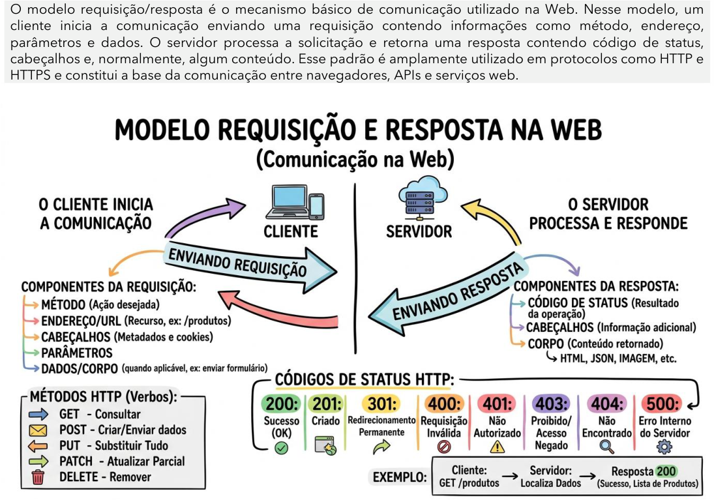

<!-- Start of picture text -->
O modelo requisição/resposta é o mecanismo básico de comunicação utilizado na Web. Nesse modelo, um cliente inicia a comunicação enviando uma requisição contendo informações como método, endereço, parâmetros e dados. O servidor processa a solicitação e retorna uma resposta contendo código de status, cabeçalhos e, normalmente, algum conteúdo. Esse padrão é amplamente utilizado em protocolos como HTTP e HTTPS e constitui a base da comunicação entre navegadores, APIs e serviços web. <!-- End of picture text -->

A comunicação entre cliente e servidor ocorre por meio de um mecanismo baseado em requisições e respostas. Sempre que um usuário interage com uma aplicação web, o cliente envia uma solicitação ao servidor e aguarda um retorno. Esse modelo organiza a troca de informações de forma padronizada e permite que sistemas distribuídos se comuniquem de maneira eficiente por meio dos protocolos da Web. 

O que exatamente é enviado pelo cliente quando uma ação é realizada? A resposta está na requisição HTTP. Essa mensagem normalmente contém informações como o método utilizado, a URL do recurso solicitado, cabeçalhos com dados adicionais, cookies e, em determinadas situações, um corpo contendo informações enviadas ao servidor. Quando um navegador solicita o endereço "/produtos", por exemplo, está pedindo acesso a um recurso específico disponibilizado pela aplicação. 

Os métodos HTTP indicam qual operação o cliente deseja executar sobre determinado recurso. **O método GET é utilizado para consultas; POST é frequentemente empregado para criação ou envio de dados para processamento; PUT realiza a substituição completa de um recurso existente; PATCH executa atualizações parciais; e DELETE solicita a remoção de recursos** . Essa padronização permite que clientes e servidores interpretem corretamente a finalidade de cada solicitação. 

Após receber a requisição, o servidor processa a solicitação e produz uma resposta. O que compõe essa resposta? Normalmente ela contém um código de status, cabeçalhos com informações complementares

---

<!-- pagina: 25 -->

**Diego Carvalho, Equipe Informática 2 (Diego Carvalho), Equipe Informática 1 (Diego Carvalho) Aula 07** 

e um corpo com os dados retornados. Dependendo da aplicação, esse conteúdo pode ser uma página HTML, um documento JSON, uma imagem ou qualquer outro tipo de informação solicitado pelo cliente. 

Os códigos de status HTTP desempenham um papel importante na comunicação. Eles informam o resultado do processamento realizado pelo servidor. **O código 200 indica sucesso na operação; 201 informa que um recurso foi criado; 301 representa um redirecionamento permanente; 400 indica uma requisição inválida; 401 sinaliza que a autenticação é necessária ou inválida; 403 informa que o acesso foi negado; 404 indica que o recurso não foi encontrado; e 500 representa um erro interno do servidor** . 

Como todo esse processo acontece na prática? Considere uma situação em que o cliente envia uma requisição GET para o recurso "/produtos". O servidor recebe a solicitação, localiza as informações correspondentes e devolve uma resposta com código 200, indicando sucesso na operação. Esse ciclo de requisição e resposta ocorre continuamente durante a navegação em aplicações web, permitindo a troca organizada de informações entre clientes e servidores.

---

<!-- pagina: 26 -->

**Diego Carvalho, Equipe Informática 2 (Diego Carvalho), Equipe Informática 1 (Diego Carvalho) Aula 07** 

**<mark>INCIDÊNCIA EM PROVA: BAIXÍSSIMA</mark>** 

<!-- Start of picture text -->
Sessão <!-- End of picture text -->

###### **<mark>SESSÃO</mark>** 

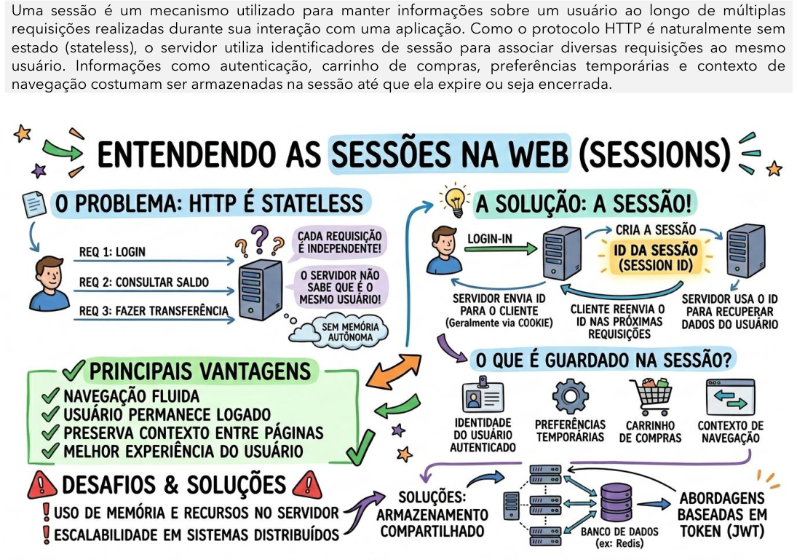

<!-- Start of picture text -->
Uma sessão é um mecanismo utilizado para manter informações sobre um usuário ao longo de múltiplas requisições realizadas durante sua interação com uma aplicação. Como o protocolo HTTP é naturalmente sem estado (stateless), o servidor utiliza identificadores de sessão para associar diversas requisições ao mesmo usuário. Informações como autenticação, carrinho de compras, preferências temporárias e contexto de navegação costumam ser armazenadas na sessão até que ela expire ou seja encerrada. <!-- End of picture text -->

A sessão é um mecanismo utilizado para manter informações de contexto entre múltiplas requisições realizadas por um mesmo usuário. Sua existência está diretamente relacionada a uma característica importante do protocolo HTTP: ele é stateless. Isso significa que **cada requisição é processada de forma independente, sem que o servidor se lembre automaticamente das solicitações anteriores realizadas pelo cliente** . 

O que aconteceria se não existissem sessões? Imagine um usuário que realiza login, consulta seu saldo e, logo depois, efetua uma transferência. Embora essas ações façam parte da mesma navegação, cada requisição chegaria ao servidor como uma solicitação isolada. Sem algum mecanismo de identificação, o servidor não conseguiria associar essas operações ao mesmo usuário de forma automática. 

Para resolver essa limitação, **o servidor cria uma sessão após a autenticação do usuário. Essa sessão recebe um identificador único, conhecido como ID de sessão** . Em seguida, esse identificador é enviado ao cliente, geralmente por meio de um cookie. Nas requisições seguintes, o cliente devolve esse identificador ao servidor, permitindo que os dados associados à sessão sejam recuperados sempre que necessário. 

Quais informações podem ser armazenadas em uma sessão? Dependendo da aplicação, podem ser mantidos dados como identidade do usuário autenticado, perfil de acesso, preferências temporárias e

---

<!-- pagina: 27 -->

**Diego Carvalho, Equipe Informática 2 (Diego Carvalho), Equipe Informática 1 (Diego Carvalho) Aula 07** 

informações de um carrinho de compras. Quando o servidor recebe o ID da sessão, ele localiza os dados correspondentes e restaura o contexto necessário para continuar o processamento da solicitação. 

As sessões oferecem diversas vantagens para aplicações web. Elas permitem manter o usuário autenticado durante a navegação, armazenar informações temporárias e preservar o contexto entre diferentes páginas e funcionalidades. Como resultado, o usuário não precisa fornecer suas credenciais a cada nova interação realizada dentro da aplicação. 

Entretanto, o uso de sessões também apresenta desafios. Como os dados normalmente são armazenados no servidor, há consumo adicional de memória e recursos computacionais. Em ambientes distribuídos, surge outra questão: como garantir que diferentes servidores tenham acesso às mesmas informações de sessão? Para solucionar esse problema, muitas arquiteturas utilizam mecanismos de armazenamento compartilhado ou adotam abordagens baseadas em tokens para facilitar a escalabilidade do sistema.

---

<!-- pagina: 28 -->

**Diego Carvalho, Equipe Informática 2 (Diego Carvalho), Equipe Informática 1 (Diego Carvalho) Aula 07** 

<!-- Start of picture text -->
Cookies <!-- End of picture text -->

###### **<mark>INCIDÊNCIA EM PROVA: BAIXÍSSIMA</mark>** 

###### **<mark>COOKIES</mark>** 

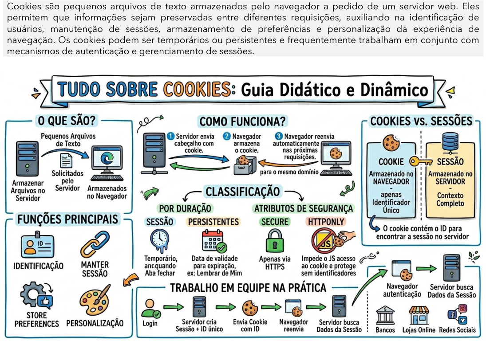

<!-- Start of picture text -->
Cookies são pequenos arquivos de texto armazenados pelo navegador a pedido de um servidor web. Eles permitem que informações sejam preservadas entre diferentes requisições, auxiliando na identificação de usuários, manutenção de sessões, armazenamento de preferências e personalização da experiência de navegação. Os cookies podem ser temporários ou persistentes e frequentemente trabalham em conjunto com mecanismos de autenticação e gerenciamento de sessões. <!-- End of picture text -->

**Cookies são mecanismos utilizados para armazenar pequenas informações no navegador do usuário** , permitindo que determinados dados sejam reutilizados em futuras interações com uma aplicação web. Essas informações podem incluir preferências de interface, identificadores de sessão e outras configurações necessárias para o funcionamento do sistema. Graças aos cookies, aplicações conseguem manter parte do contexto do usuário entre diferentes requisições realizadas ao servidor. 

Como essas informações chegam ao navegador? Quando necessário, o servidor envia um cabeçalho contendo um cookie. O navegador armazena esse dado e passa a enviá-lo automaticamente nas requisições futuras destinadas ao mesmo domínio. Dessa forma, o servidor consegue reconhecer informações previamente associadas ao usuário sem exigir que determinados dados sejam transmitidos manualmente a cada nova interação. 

Os cookies podem ser classificados de acordo com sua finalidade e duração. **Os cookies de sessão normalmente permanecem disponíveis enquanto a sessão de navegação estiver ativa. Já os cookies persistentes possuem uma data de expiração definida** e podem permanecer armazenados por períodos mais longos. Um exemplo bastante comum é a funcionalidade que permite ao usuário ser lembrado em acessos futuros sem a necessidade de configurar novamente determinadas preferências.

---

<!-- pagina: 29 -->

**Diego Carvalho, Equipe Informática 2 (Diego Carvalho), Equipe Informática 1 (Diego Carvalho) Aula 07** 

Além da duração, existem atributos voltados à segurança. **O atributo Secure determina que o cookie seja transmitido apenas por conexões HTTPS. O atributo HttpOnly impede o acesso ao cookie por códigos JavaScript executados no navegador** . Por que isso é importante? Porque reduz a exposição de informações sensíveis em determinados cenários de ataque, especialmente aqueles que tentam capturar identificadores de autenticação armazenados no navegador. 

Uma dúvida recorrente envolve a diferença entre cookies e sessões. Os dois mecanismos desempenham exatamente o mesmo papel? Não. **A sessão normalmente mantém informações de contexto no servidor, enquanto o cookie permanece armazenado no navegador do usuário** . Em muitas aplicações, o cookie contém apenas um identificador que permite ao servidor localizar a sessão correspondente e recuperar os dados associados àquele usuário. 

Na prática, sessões e cookies frequentemente trabalham em conjunto. Após a autenticação, o servidor cria uma sessão e gera um identificador único. Esse identificador é enviado ao navegador por meio de um cookie. Em cada nova requisição, o navegador devolve o cookie ao servidor, que utiliza o identificador recebido para recuperar os dados da sessão. Esse modelo é amplamente empregado em sistemas autenticados, como aplicações bancárias, lojas virtuais, redes sociais e sistemas corporativos.

---

<!-- pagina: 30 -->

**Diego Carvalho, Equipe Informática 2 (Diego Carvalho), Equipe Informática 1 (Diego Carvalho) Aula 07** 

<!-- Start of picture text -->
Protocolos de Comunicação <!-- End of picture text -->

###### **<mark>PROTOCOLOS DE COMUNICAÇÃO</mark>** 

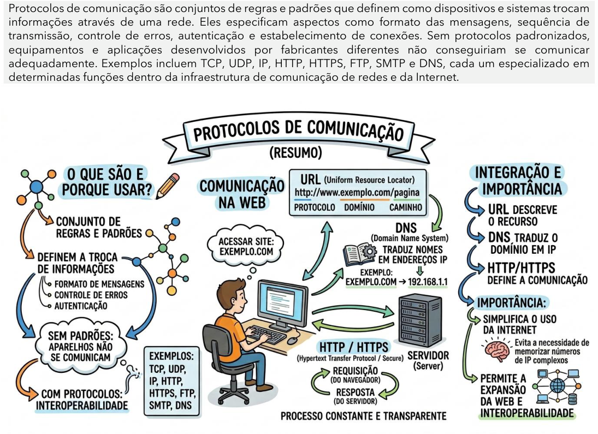

<!-- Start of picture text -->
Protocolos de comunicação são conjuntos de regras e padrões que definem como dispositivos e sistemas trocam informações através de uma rede. Eles especificam aspectos como formato das mensagens, sequência de transmissão, controle de erros, autenticação e estabelecimento de conexões. Sem protocolos padronizados, equipamentos e aplicações desenvolvidos por fabricantes diferentes não conseguiriam se comunicar adequadamente. Exemplos incluem TCP, UDP, IP, HTTP, HTTPS, FTP, SMTP e DNS, cada um especializado em determinadas funções dentro da infraestrutura de comunicação de redes e da Internet. <!-- End of picture text -->

A comunicação na Web depende de protocolos e mecanismos de endereçamento que permitem localizar recursos, identificar servidores e transferir informações entre diferentes sistemas. Entre os elementos mais importantes desse processo estão HTTP, HTTPS, DNS e URL. Cada um possui uma função específica e, em conjunto, tornam possível a navegação em páginas, o consumo de serviços online e a troca de dados entre clientes e servidores. 

Por que um usuário pode acessar um site utilizando um nome como "www.exemplo.com" em vez de memorizar números complexos? A resposta envolve o DNS, responsável por converter nomes de domínio em endereços IP. Como os dispositivos se comunicam utilizando endereços IP, essa conversão é necessária para que o navegador descubra onde o recurso solicitado está localizado na rede. 

Após a resolução do nome, o navegador inicia a comunicação com o servidor correspondente. Para isso, estabelece uma conexão de rede e utiliza protocolos como HTTP ou HTTPS para solicitar recursos. O servidor recebe a requisição, processa a solicitação e devolve uma resposta ao cliente. Esse processo ocorre constantemente durante a navegação, muitas vezes sem que o usuário perceba as etapas envolvidas.

---

<!-- pagina: 31 -->

**Diego Carvalho, Equipe Informática 2 (Diego Carvalho), Equipe Informática 1 (Diego Carvalho) Aula 07** 

Outro elemento essencial é a URL. O que exatamente ela representa? A URL é um identificador que informa onde um recurso está localizado e como ele deve ser acessado. Em geral, ela contém informações como o protocolo utilizado, o domínio e o caminho do recurso desejado. Quando uma URL é informada ao navegador, ela fornece os dados necessários para iniciar todo o processo de localização e comunicação. 

Esses componentes não atuam de forma isolada. O DNS realiza a tradução do domínio para um endereço IP; a URL descreve o recurso que será acessado; e os protocolos HTTP ou HTTPS definem como a comunicação será realizada. A integração entre esses elementos permite que aplicações distribuídas funcionem de maneira transparente para o usuário, simplificando o acesso aos recursos disponíveis na Web. 

Sem esses mecanismos, a utilização da internet seria significativamente mais complexa. Os usuários precisariam conhecer endereços IP dos servidores e as aplicações teriam de lidar diretamente com diversos detalhes de comunicação em rede. A padronização proporcionada por protocolos e mecanismos de endereçamento tornou possível a expansão da Web e a interoperabilidade entre sistemas desenvolvidos em diferentes tecnologias e plataformas. 

<!-- Start of picture text -->
HTTP <!-- End of picture text -->

###### **<mark>INCIDÊNCIA EM PROVA: BAIXÍSSIMA</mark>** 

###### **<mark>HTTP</mark>** 

O HTTP (HyperText Transfer Protocol) é o protocolo de comunicação responsável pela troca de informações na Web. Ele define como clientes e servidores enviam requisições e respostas utilizando métodos como GET, POST, PUT, DELETE e outros. O protocolo é baseado em texto, segue o modelo cliente-servidor e opera originalmente sem criptografia. Sua simplicidade e flexibilidade fizeram dele o principal protocolo utilizado na Internet para comunicação entre aplicações web. 

**HTTP (HyperText Transfer Protocol) é o protocolo responsável pela comunicação entre clientes e servidores na Web** . Embora tenha sido criado inicialmente para transferir documentos HTML, atualmente é utilizado para transmitir diversos tipos de conteúdo, como imagens, vídeos, arquivos, dados em formato JSON e informações disponibilizadas por APIs. Grande parte das interações realizadas durante a navegação depende diretamente desse protocolo. 

Como ocorre essa comunicação na prática? O funcionamento do HTTP segue o modelo de requisição e resposta. O cliente inicia a interação enviando uma requisição ao servidor. Em seguida, o servidor recebe a solicitação, realiza o processamento necessário e retorna uma resposta. Esse ciclo acontece continuamente durante a utilização de aplicações web, desde o carregamento de páginas até operações mais complexas envolvendo autenticação e troca de dados. 

Uma característica fundamental do HTTP é sua natureza stateless. O que isso significa? Significa que **cada requisição é tratada de forma independente, sem que o protocolo mantenha informações sobre solicitações anteriores. Como consequência, o servidor não reconhece automaticamente que duas requisições pertencem ao mesmo usuário** . Para preservar o contexto da navegação, aplicações normalmente utilizam mecanismos complementares, como sessões e cookies. 

O protocolo também segue o modelo cliente-servidor. O cliente é responsável por iniciar a comunicação, enquanto o servidor permanece disponível para receber solicitações e fornecer respostas. Além disso, as mensagens HTTP possuem uma estrutura padronizada composta por elementos como método, endereço do recurso, cabeçalhos e, quando necessário, um corpo contendo dados adicionais enviados ao servidor.

---

<!-- pagina: 32 -->

**Diego Carvalho, Equipe Informática 2 (Diego Carvalho), Equipe Informática 1 (Diego Carvalho) Aula 07** 

Diversos métodos HTTP são utilizados para indicar a operação desejada sobre um recurso. **O método GET é empregado para consultas; POST é amplamente utilizado para envio de dados e criação de recursos; PUT realiza a substituição completa de um recurso existente; PATCH executa alterações parciais; e DELETE solicita sua remoção** . Essa padronização permite que clientes e servidores interpretem corretamente a intenção de cada requisição. 

Outra parte essencial do protocolo envolve os códigos de status retornados pelo servidor. Como saber se uma operação foi concluída com sucesso? Os códigos HTTP fornecem essa informação. **A faixa 2xx indica sucesso; 3xx representa redirecionamentos; 4xx corresponde a problemas relacionados à requisição do cliente; e 5xx sinaliza falhas ocorridas no servidor** . Entre os códigos mais frequentes estão 200, 201, 301, 400, 401, 403, 404 e 500, amplamente utilizados em aplicações web modernas. 

---

<!-- pagina: 33 -->

**Diego Carvalho, Equipe Informática 2 (Diego Carvalho), Equipe Informática 1 (Diego Carvalho) Aula 07** 

<!-- Start of picture text -->
HTTPS <!-- End of picture text -->

###### **<mark>INCIDÊNCIA EM PROVA: BAIXÍSSIMA</mark>** 

###### **<mark>HTTPS</mark>** 

<!-- Start of picture text -->
O HTTPS (HyperText Transfer Protocol Secure) é uma versão segura do HTTP que utiliza criptografia por meio dos protocolos TLS/SSL. Seu objetivo é proteger a confidencialidade, integridade e autenticidade das informações transmitidas entre cliente e servidor. Com HTTPS, dados como senhas, informações financeiras e dados pessoais tornam-se significativamente mais difíceis de serem interceptados ou alterados durante o trânsito pela rede, sendo atualmente o padrão para aplicações web modernas. <!-- End of picture text -->

**HTTPS (HyperText Transfer Protocol Secure) é a versão segura do protocolo HTTP. Seu funcionamento combina os mecanismos de comunicação do HTTP com os recursos de segurança fornecidos pelo TLS** , protocolo responsável pela proteção dos dados transmitidos pela rede. O objetivo é permitir que clientes e servidores troquem informações de forma protegida contra interceptações e alterações indevidas. 

Por que surgiu a necessidade de uma versão segura do HTTP? Em uma comunicação HTTP tradicional, os dados trafegam sem proteção criptográfica. Isso significa que informações transmitidas entre cliente e servidor podem ser visualizadas por terceiros caso a comunicação seja interceptada. Dados como credenciais de acesso, informações pessoais e registros financeiros poderiam ficar expostos durante o trajeto entre os dois extremos da conexão. 

O HTTPS resolve esse problema utilizando criptografia durante a transmissão dos dados. Quando a conexão é estabelecida, cliente e servidor realizam um processo de negociação de segurança por meio do TLS. A partir desse momento, as informações passam a trafegar de forma protegida. Mesmo que alguém consiga capturar os pacotes transmitidos pela rede, o conteúdo não poderá ser compreendido sem os mecanismos criptográficos adequados.

---

<!-- pagina: 34 -->

**Diego Carvalho, Equipe Informática 2 (Diego Carvalho), Equipe Informática 1 (Diego Carvalho) Aula 07** 

A proteção oferecida pelo HTTPS está baseada em três propriedades fundamentais. **A confidencialidade impede o acesso não autorizado aos dados transmitidos. A integridade permite identificar alterações realizadas durante o trânsito das informações. Já a autenticidade possibilita verificar se o servidor apresentado durante a conexão corresponde efetivamente ao domínio que está sendo acessado pelo usuário** . 

Como o navegador consegue confiar na identidade de um servidor? Para isso **são utilizados certificados digitais emitidos por Autoridades Certificadoras** . Quando uma conexão HTTPS é iniciada, o servidor apresenta seu certificado ao navegador. Em seguida, são realizadas verificações relacionadas à validade do certificado, à autoridade emissora e à correspondência com o domínio solicitado. Somente após essas verificações a conexão é considerada confiável. 

As comunicações HTTP e HTTPS também possuem portas tradicionalmente associadas aos seus serviços. **A porta 80 é normalmente utilizada pelo HTTP, enquanto a porta 443 é utilizada pelo HTTPS** . Embora essas sejam as configurações mais comuns, outras portas podem ser empregadas conforme as necessidades do ambiente. Atualmente, o HTTPS tornou-se o padrão predominante para aplicações web, pois oferece um nível de proteção indispensável para a transmissão de informações pela internet.

---

<!-- pagina: 35 -->

**Diego Carvalho, Equipe Informática 2 (Diego Carvalho), Equipe Informática 1 (Diego Carvalho) Aula 07** 

**<mark>INCIDÊNCIA EM PROVA: BAIXÍSSIMA</mark>** 

<!-- Start of picture text -->
DNS <!-- End of picture text -->

###### **<mark>DNS</mark>** 

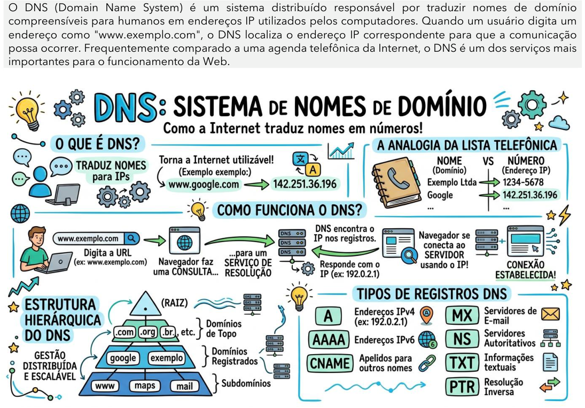

<!-- Start of picture text -->
O DNS (Domain Name System) é um sistema distribuído responsável por traduzir nomes de domínio compreensíveis para humanos em endereços IP utilizados pelos computadores. Quando um usuário digita um endereço como "www.exemplo.com", o DNS localiza o endereço IP correspondente para que a comunicação possa ocorrer. Frequentemente comparado a uma agenda telefônica da Internet, o DNS é um dos serviços mais importantes para o funcionamento da Web. ==5460== <!-- End of picture text -->

**DNS (Domain Name System) é o sistema responsável por traduzir nomes de domínio em endereços IP** . Essa função é essencial porque os dispositivos conectados à rede utilizam endereços IP para se comunicar, enquanto os usuários preferem nomes mais simples e fáceis de memorizar. Graças ao DNS, é possível acessar serviços na internet utilizando endereços amigáveis em vez de sequências numéricas complexas. 

Como um navegador encontra o servidor correto quando o usuário digita um endereço como "[www.google.com](http://www.google.com)"? Antes de iniciar a comunicação, é necessário descobrir qual endereço IP está associado ao domínio solicitado. Para isso, o navegador realiza uma consulta a um serviço de resolução DNS. Após receber a resposta contendo o endereço IP correspondente, torna-se possível estabelecer a conexão com o servidor responsável pelo recurso desejado. 

Uma comparação frequentemente utilizada associa o DNS a uma agenda telefônica. Nessa analogia, o nome de domínio corresponde ao nome de um contato, enquanto o endereço IP desempenha papel semelhante ao número de telefone. Quando o usuário informa um domínio, o sistema consulta sua estrutura de resolução para localizar o endereço IP associado e direcionar corretamente a comunicação para o destino pretendido.

---

<!-- pagina: 36 -->

**Diego Carvalho, Equipe Informática 2 (Diego Carvalho), Equipe Informática 1 (Diego Carvalho) Aula 07** 

**O DNS é organizado de forma hierárquica. No topo encontra-se a raiz, representada pelo ponto final. Logo abaixo estão os domínios de topo, conhecidos como TLDs** , como "com", "org", "gov" e "br". Em seguida aparecem os domínios registrados e seus respectivos subdomínios. O que essa organização proporciona? Ela distribui a responsabilidade pela administração dos nomes e permite que o sistema funcione de forma escalável em nível mundial. 

Diversos tipos de registros são utilizados para armazenar informações dentro do DNS. **Os registros A associam nomes a endereços IPv4, enquanto os registros AAAA realizam a mesma função para IPv6. Os registros CNAME criam aliases para outros nomes, MX definem servidores de correio eletrônico** , NS indicam servidores autoritativos, TXT armazenam informações textuais e PTR são utilizados em consultas de resolução reversa. 

Sem o DNS, a utilização da internet seria significativamente mais complexa. Os usuários precisariam memorizar endereços IP para acessar cada serviço e aplicação. A existência desse sistema permite abstrair os detalhes técnicos do endereçamento e tornar a navegação muito mais simples, ao mesmo tempo em que fornece uma infraestrutura distribuída capaz de localizar recursos em escala global.

---

<!-- pagina: 37 -->

**Diego Carvalho, Equipe Informática 2 (Diego Carvalho), Equipe Informática 1 (Diego Carvalho) Aula 07** 

**<mark>INCIDÊNCIA EM PROVA: BAIXÍSSIMA</mark>** 

<!-- Start of picture text -->
URL <!-- End of picture text -->

###### **<mark>URL</mark>** 

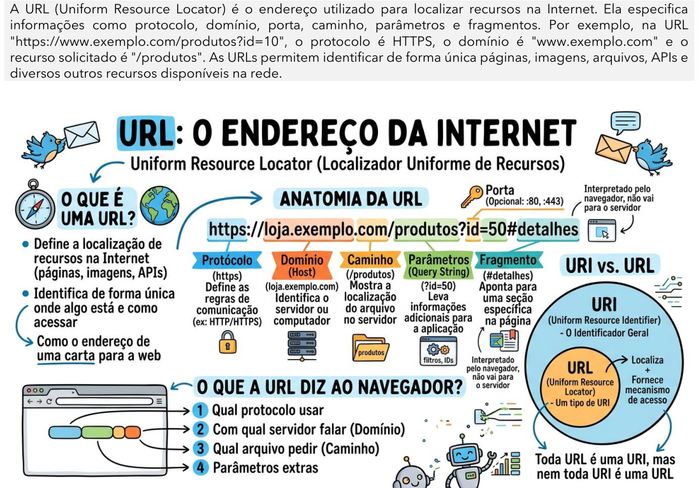

<!-- Start of picture text -->
A URL (Uniform Resource Locator) é o endereço utilizado para localizar recursos na Internet. Ela especifica informações como protocolo, domínio, porta, caminho, parâmetros e fragmentos. Por exemplo, na URL "https://www.exemplo.com/produtos?id=10", o protocolo é HTTPS, o domínio é "www.exemplo.com" e o recurso solicitado é "/produtos". As URLs permitem identificar de forma única páginas, imagens, arquivos, APIs e diversos outros recursos disponíveis na rede. <!-- End of picture text -->

**URL (Uniform Resource Locator) é o mecanismo utilizado para localizar recursos na Web** . Sempre que um usuário acessa uma página, envia uma requisição para uma API ou realiza o download de um arquivo, uma URL é utilizada para indicar onde o recurso está disponível e como ele deve ser acessado. Esse padrão fornece as informações necessárias para que clientes e servidores consigam se comunicar corretamente. 

O que uma URL realmente informa ao navegador? Ela contém dados que permitem identificar o protocolo de comunicação, o host responsável pelo recurso, o caminho que indica sua localização dentro do servidor e, em alguns casos, parâmetros adicionais utilizados pela aplicação. Ao interpretar essas informações, o navegador consegue determinar como estabelecer a comunicação e qual recurso solicitar ao servidor. 

Uma URL é composta por diferentes elementos. **O protocolo define a forma de comunicação, como HTTP ou HTTPS. O host identifica o domínio que será acessado. A porta especifica o serviço utilizado quando necessário. O caminho indica o recurso desejado dentro da aplicação. Já a query string transporta parâmetros adicionais enviados ao servidor** . Cada componente possui uma função específica dentro do processo de localização do recurso.

---

<!-- pagina: 38 -->

**Diego Carvalho, Equipe Informática 2 (Diego Carvalho), Equipe Informática 1 (Diego Carvalho) Aula 07** 

Também é possível encontrar fragmentos em determinadas URLs. Para que servem esses elementos? **Os fragmentos, identificados pelo símbolo "#", normalmente são utilizados para apontar para uma seção específica de uma página ou documento** . Diferentemente de outros componentes da URL, **eles costumam ser interpretados pelo navegador após o carregamento do recurso e geralmente não são enviados ao servidor** durante a requisição. 

Outro tema bastante recorrente envolve a diferença entre URI e URL. Embora os termos sejam frequentemente utilizados como sinônimos, existe uma relação específica entre eles. **A URI é um identificador de recursos de forma geral. Já a URL corresponde a um tipo particular de URI que, além de identificar o recurso, fornece informações suficientes para localizá-lo e acessá-lo por meio de um mecanismo definido** . 

Essa relação explica uma afirmação frequentemente encontrada em provas e concursos: **toda URL é uma URI, mas nem toda URI é uma URL** . As URLs representam um subconjunto das URIs, acrescentando informações de localização e acesso ao recurso identificado. Compreender essa distinção ajuda a interpretar corretamente a terminologia utilizada em padrões, documentações técnicas e questões de avaliação relacionadas à arquitetura da Web.

---

<!-- pagina: 39 -->

**Diego Carvalho, Equipe Informática 2 (Diego Carvalho), Equipe Informática 1 (Diego Carvalho) Aula 07** 

**<mark>INCIDÊNCIA EM PROVA: BAIXÍSSIMA</mark>** 

<!-- Start of picture text -->
HTTP/2 e HTTP/3 <!-- End of picture text -->

###### **<mark>HTTP/2 E HTTP/3</mark>** 

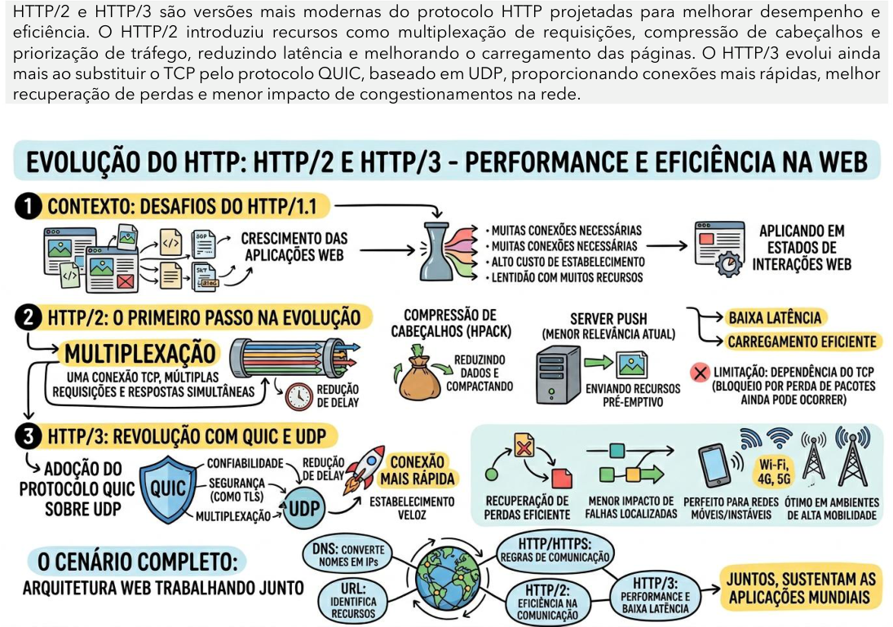

<!-- Start of picture text -->
HTTP/2 e HTTP/3 são versões mais modernas do protocolo HTTP projetadas para melhorar desempenho e eficiência. O HTTP/2 introduziu recursos como multiplexação de requisições, compressão de cabeçalhos e priorização de tráfego, reduzindo latência e melhorando o carregamento das páginas. O HTTP/3 evolui ainda mais ao substituir o TCP pelo protocolo QUIC, baseado em UDP, proporcionando conexões mais rápidas, melhor recuperação de perdas e menor impacto de congestionamentos na rede. <!-- End of picture text -->

O crescimento das aplicações web trouxe desafios que o HTTP/1.1 nem sempre conseguia tratar de forma eficiente. À medida que páginas passaram a carregar imagens, folhas de estilo, scripts e diversos outros recursos simultaneamente, aumentaram também os custos relacionados ao estabelecimento de conexões e ao tempo de resposta. Para enfrentar essas limitações, foi desenvolvido o HTTP/2, uma versão voltada à melhoria do desempenho da comunicação entre clientes e servidores. 

Qual foi a principal inovação introduzida pelo HTTP/2? **A resposta está na multiplexação. Esse mecanismo permite que múltiplas requisições e respostas utilizem a mesma conexão TCP simultaneamente** . Em vez de abrir diversas conexões para transferir arquivos distintos, cliente e servidor conseguem compartilhar uma única conexão para transportar vários fluxos de dados ao mesmo tempo, reduzindo atrasos e melhorando o aproveitamento dos recursos disponíveis. 

Além da multiplexação, o HTTP/2 introduziu a compressão de cabeçalhos, reduzindo a quantidade de dados transmitidos em cada comunicação. Também foi incorporado o recurso conhecido como **Server Push, que permitia ao servidor antecipar o envio de determinados recursos potencialmente necessários ao cliente** . Embora tenha representado uma inovação importante, esse recurso teve adoção limitada na prática e perdeu relevância em implementações modernas da Web.

---

<!-- pagina: 40 -->

**Diego Carvalho, Equipe Informática 2 (Diego Carvalho), Equipe Informática 1 (Diego Carvalho) Aula 07** 

Os benefícios do HTTP/2 incluem menor latência, redução do consumo de banda e carregamento mais eficiente de páginas e aplicações. Entretanto, algumas limitações continuaram presentes porque a comunicação ainda dependia do protocolo TCP. O que isso significa na prática? Problemas relacionados ao gerenciamento de perdas e bloqueios no transporte continuavam afetando o desempenho em determinadas situações, especialmente em redes menos estáveis. 

Para enfrentar essas limitações surgiu o HTTP/3. **Sua principal mudança está na adoção do protocolo QUIC como base de transporte. Enquanto HTTP/1.1 e HTTP/2 operam sobre TCP, o HTTP/3 utiliza QUIC, que funciona sobre UDP** . O QUIC incorpora mecanismos de confiabilidade, controle de congestionamento, segurança e multiplexação diretamente em sua arquitetura, reunindo funcionalidades que anteriormente dependiam da combinação entre TCP e TLS. 

Quais vantagens essa mudança proporciona? **O estabelecimento das conexões torna-se mais rápido, a recuperação diante da perda de pacotes é mais eficiente e o impacto de falhas localizadas é reduzido** . Como consequência, o HTTP/3 apresenta desempenho particularmente favorável em ambientes com mobilidade elevada ou instabilidade de rede, como conexões Wi-Fi, 4G e 5G. Essas características contribuíram para torná-lo uma das principais evoluções da infraestrutura de comunicação da Web moderna. 

DNS, URL, HTTP, HTTPS, HTTP/2 e HTTP/3 desempenham papéis complementares dentro da arquitetura da Web. O DNS converte nomes em endereços IP; a URL identifica recursos; HTTP e HTTPS definem a comunicação entre clientes e servidores; HTTP/2 aprimora a eficiência dessa comunicação; e HTTP/3 introduz mecanismos capazes de reduzir ainda mais a latência e melhorar o desempenho das conexões. Em conjunto, esses elementos sustentam o funcionamento das aplicações web utilizadas diariamente em escala global.

---

<!-- pagina: 41 -->

**Diego Carvalho, Equipe Informática 2 (Diego Carvalho), Equipe Informática 1 (Diego Carvalho) Aula 07** 

<!-- Start of picture text -->
Arquiteturas Tradicionais <!-- End of picture text -->

###### **<mark>ARQUITETURAS TRADICIONAIS</mark>** 

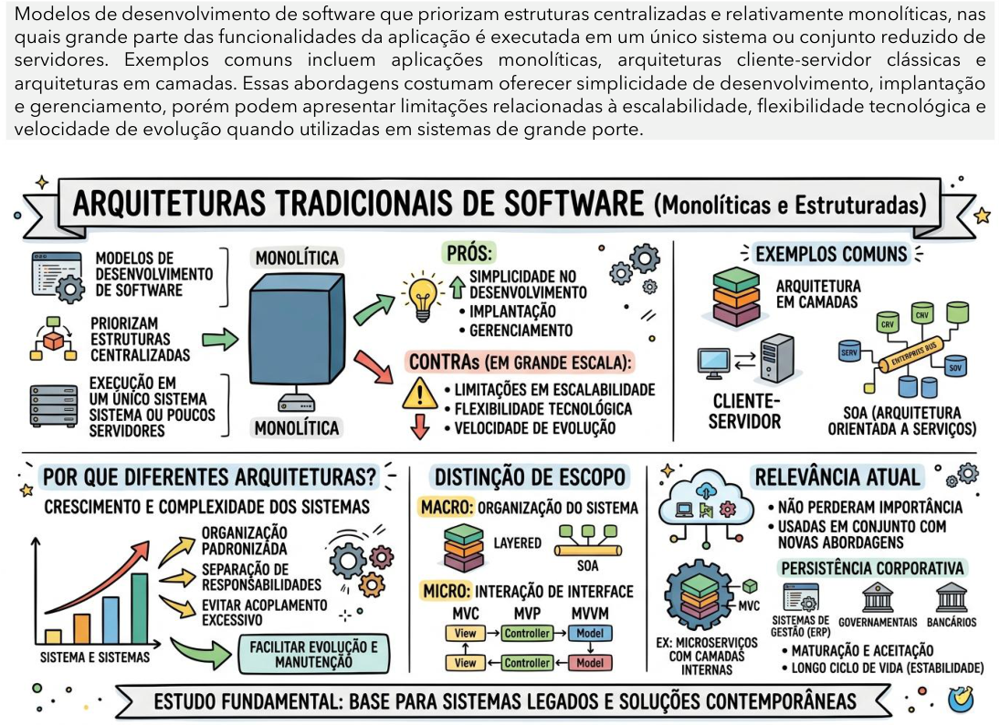

<!-- Start of picture text -->
Modelos de desenvolvimento de software que priorizam estruturas centralizadas e relativamente monolíticas, nas quais grande parte das funcionalidades da aplicação é executada em um único sistema ou conjunto reduzido de servidores. Exemplos comuns incluem aplicações monolíticas, arquiteturas cliente-servidor clássicas e arquiteturas em camadas. Essas abordagens costumam oferecer simplicidade de desenvolvimento, implantação e gerenciamento, porém podem apresentar limitações relacionadas à escalabilidade, flexibilidade tecnológica e velocidade de evolução quando utilizadas em sistemas de grande porte. <!-- End of picture text -->

As arquiteturas tradicionais surgiram para organizar aplicações de maneira estruturada, promovendo a separação de responsabilidades e reduzindo a complexidade dos sistemas. Ao longo da evolução do desenvolvimento de software, diversos padrões foram criados para facilitar a manutenção, o reaproveitamento de componentes e a compreensão do funcionamento das aplicações. Entre os modelos mais conhecidos estão a Arquitetura em Camadas, MVC, MVP, MVVM e SOA. 

Por que diferentes arquiteturas foram desenvolvidas ao longo do tempo? À medida que os sistemas cresceram em tamanho e complexidade, tornou-se necessário estabelecer formas padronizadas de organizar o código e distribuir responsabilidades. Sem uma estrutura definida, funcionalidades, regras de negócio e mecanismos de acesso a dados tenderiam a ficar excessivamente acoplados, dificultando a evolução e a manutenção das aplicações. 

Embora frequentemente sejam estudados em conjunto, esses modelos não possuem exatamente o mesmo propósito. A Arquitetura em Camadas e a SOA definem formas mais amplas de organização dos sistemas. Já MVC, MVP e MVVM são padrões voltados principalmente para estruturar a interação entre interface, dados e lógica de apresentação. Essa distinção ajuda a compreender por que diferentes padrões podem coexistir dentro de uma mesma aplicação.

---

<!-- pagina: 42 -->

**Diego Carvalho, Equipe Informática 2 (Diego Carvalho), Equipe Informática 1 (Diego Carvalho) Aula 07** 

Com o surgimento de conceitos como microsserviços, computação em nuvem e arquiteturas orientadas a eventos, esses modelos perderam importância? A resposta é negativa. Muitas aplicações modernas continuam utilizando arquiteturas tradicionais em conjunto com abordagens mais recentes. É comum encontrar microsserviços organizados internamente em camadas ou utilizando padrões como MVC para estruturar suas interfaces e fluxos de interação. 

A permanência dessas arquiteturas pode ser observada em diversos ambientes corporativos. Sistemas de gestão empresarial, aplicações governamentais, plataformas bancárias e soluções de grande porte frequentemente adotam esses modelos devido à sua maturidade e ampla aceitação na indústria. Além disso, muitas dessas aplicações possuem ciclos de vida longos, o que torna a estabilidade arquitetural um fator importante para sua evolução contínua. 

O estudo dessas arquiteturas continua sendo fundamental para compreender a evolução do desenvolvimento de software. Diversos conceitos presentes em tecnologias modernas derivam de princípios introduzidos por esses modelos. Por essa razão, conhecer arquiteturas tradicionais fornece uma base sólida para entender tanto sistemas legados quanto soluções contemporâneas construídas sobre paradigmas mais recentes. 

###### **Saiba mais:** 

<mark>Para efeito de distinção em provas, é importante reconhecer que existem outras abordagens arquiteturais que diferem diametralmente do modelo em camadas. Um exemplo é a Arquitetura de Repositório (ou Quadro-Negro/Blackboard), na qual os dados são mantidos de forma centralizada num único repositório compartilhado, e diversos subsistemas independentes acessam e modificam esses dados sem se comunicarem diretamente entre si.</mark> 

<mark>Outro modelo notório é a Arquitetura de Duto e Filtro (Pipe and Filter), amplamente aplicada em compiladores e processamento de dados, que estrutura o sistema como uma sequência linear de componentes de processamento independentes (os filtros), em que a saída de um componente serve estritamente como a entrada do próximo através de conectores (os dutos). Reconhecer essas estruturas ajuda a confirmar, por eliminação, que o MVC é estritamente um exemplo da evolução</mark> do padrão de Arquitetura em Camadas. 

<!-- Start of picture text -->
Arquitetura em Camadas <!-- End of picture text -->

###### **<mark>INCIDÊNCIA EM PROVA: ALTÍSSIMA</mark>** 

###### **<mark>ARQUITETURA EM CAMADAS</mark>** 

A Arquitetura em Camadas organiza uma aplicação em níveis especializados, cada um responsável por um conjunto específico de funcionalidades. As camadas mais comuns são apresentação, negócio e dados. Essa separação permite que alterações em uma camada tenham impacto reduzido nas demais, aumentando a manutenibilidade, reutilização e organização do sistema. Trata-se de uma das arquiteturas mais utilizadas em sistemas corporativos devido à sua simplicidade e clareza estrutural. 

###### **A Arquitetura em Camadas, também conhecida como Multi-Tier Architecture ou N-Tier Architecture** , 

é um dos modelos arquiteturais mais tradicionais e amplamente utilizados no desenvolvimento de software. Seu principal objetivo consiste em organizar a aplicação por meio da separação de responsabilidades, evitando que funcionalidades relacionadas à interface, às regras de negócio, ao processamento das operações e ao acesso aos dados fiquem concentradas em um único componente.

---

<!-- pagina: 43 -->

**Diego Carvalho, Equipe Informática 2 (Diego Carvalho), Equipe Informática 1 (Diego Carvalho) Aula 07** 

Essa abordagem tornou-se especialmente popular em sistemas corporativos porque facilita a manutenção, melhora a organização do código e permite que a aplicação evolua de forma mais controlada ao longo do tempo. 

**(QUADRIX / CREMESE - 2025)** A arquitetura de software trata da forma como os componentes de <mark>software são construídos e organizados no sistema. Considerando essa informação, julgue o item seguinte.</mark> 

<mark>A arquitetura em camadas separa responsabilidades em níveis como apresentação, lógica de negócios e acesso a dados, promovendo modularidade.</mark> 

###### **<mark>_______________________</mark>** 

**<mark>Comentários:</mark>** <mark>Na arquitetura em camadas, cada nível cuida de uma responsabilidade, como interface, regras de negócio e dados. Isso</mark> facilita a organização do sistema, a manutenção e o reaproveitamento de partes (Correto). 

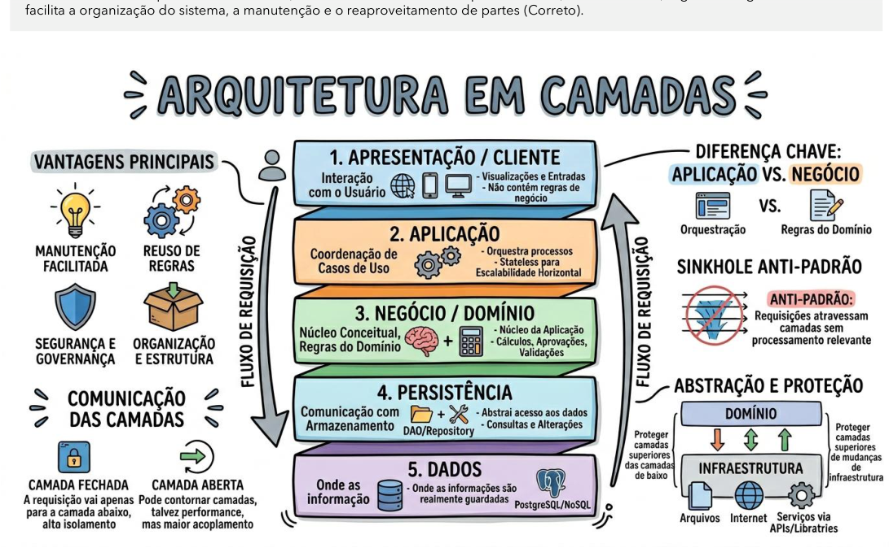

<!-- Start of picture text -->
facilita a organização do sistema, a manutenção e o reaproveitamento de partes (Correto). <!-- End of picture text -->

Por que arquitetos de software dedicam tanta atenção à separação de responsabilidades? Quando diferentes preocupações da aplicação são agrupadas em uma única estrutura, qualquer alteração tende a gerar impactos mais amplos e difíceis de prever. A Arquitetura em Camadas procura resolver esse problema distribuindo responsabilidades em níveis especializados. Dessa forma, cada parte do sistema possui um propósito claramente definido e pode evoluir com menor interferência sobre as demais. 

Como essa divisão é realizada dentro da aplicação? Em vez de centralizar todo o processamento em uma única estrutura, o sistema é segmentado em camadas com funções específicas. De forma geral, **encontram-se camadas responsáveis pela apresentação, pela coordenação dos processos da aplicação, pelas regras de negócio, pelo acesso aos dados e pelo armazenamento das informações** . Cada uma delas contribui para o funcionamento do sistema sem assumir responsabilidades que pertencem às demais.

---

<!-- pagina: 44 -->

**Diego Carvalho, Equipe Informática 2 (Diego Carvalho), Equipe Informática 1 (Diego Carvalho) Aula 07** 

**(CEBRASPE / CAU BR - 2024)** Acerca da arquitetura de sistemas de N camadas e das APIs, julgue <mark>o próximo item.</mark> 

<mark>Na arquitetura de sistemas em N camadas, o sistema é dividido em camadas lógicas, cada uma com uma responsabilidade específica, como apresentação, negócio e dados.</mark> 

**<mark>_______________________ Comentários:</mark>** <mark>Em arquiteturas N camadas, o sistema é organizado em partes lógicas com funções bem definidas, como apresentação,</mark> regras de negócio e acesso a dados, o que facilita manutenção, escalabilidade e organização (Correto). 

Em aplicações construídas segundo esse modelo, existe uma hierarquia lógica bem definida. As camadas mais externas normalmente estão associadas à interação com usuários e à apresentação das informações. À medida que se avança para o interior da arquitetura, surgem componentes responsáveis pela coordenação dos fluxos de processamento, pela aplicação das regras do domínio e pelo acesso aos mecanismos de persistência. Nas camadas mais internas encontram-se os recursos diretamente ligados à infraestrutura e ao armazenamento permanente das informações. 

**A Camada de Apresentação é responsável pela interação entre o sistema e seus usuários. Nela encontram-se páginas web, aplicações móveis, interfaces desktop e demais mecanismos utilizados para exibir informações e receber dados de entrada** . Quando um usuário realiza uma ação, a solicitação é encaminhada para as camadas responsáveis pelo processamento da operação solicitada. Essa camada concentra-se na experiência de interação e na exibição dos resultados produzidos pelo sistema. 

**(CEBRASPE / FUNPRESP-EXE - 2025)** Julgue o item subsecutivo, relativo à arquitetura orientada a <mark>serviços (SOA), à arquitetura distribuída, à especificação de web services e a dispositivos móveis.</mark> 

<mark>A camada de apresentação em aplicativos de dispositivos móveis gerencia fluxos de trabalho, troca de dados e operações, incluindo segurança, cache, log e tratamento de exceções.</mark> 

**<mark>_______________________ Comentários:</mark>** <mark>A camada de apresentação cuida da interface com o usuário. Fluxos de trabalho, troca de dados, segurança, cache, log e</mark> exceções ficam, em geral, em camadas de lógica, serviços ou infraestrutura (Errado). 

O que diferencia a Camada de Apresentação das demais camadas? Sua principal preocupação não está relacionada à execução de regras de negócio nem ao armazenamento de informações. Sua função consiste em receber interações, apresentar dados e encaminhar solicitações. Essa separação permite que **alterações visuais sejam realizadas sem exigir mudanças nas regras que governam o funcionamento do domínio da aplicação** . 

**A Camada de Aplicação tem como principal função coordenar o fluxo das operações** . Ela recebe solicitações originadas na camada de apresentação, executa casos de uso, orquestra processos e determina quais componentes devem participar do atendimento da requisição. Sua responsabilidade não consiste em implementar diretamente as regras do negócio, mas coordenar sua execução de forma organizada e previsível. 

Na Arquitetura em Camadas, **a camada de aplicação é frequentemente projetada com foco em desacoplamento e independência de estado (stateless)** . Isso significa que ela procura evitar o armazenamento permanente do contexto das sessões dos usuários entre diferentes requisições. Quando informações de estado precisam ser mantidas, essa responsabilidade normalmente é transferida para bancos de dados, sistemas de cache distribuído ou mecanismos baseados em tokens.

---

<!-- pagina: 45 -->

**Diego Carvalho, Equipe Informática 2 (Diego Carvalho), Equipe Informática 1 (Diego Carvalho) Aula 07** 

**(CEBRASPE / TRF 6ª Região - 2025)** Acerca da arquitetura de aplicações para ambiente web e de <mark>arquitetura em camadas, julgue o item a seguir.</mark> 

<mark>Na arquitetura em camadas, a camada de aplicação deve ser projetada para suportar estratégias de desacoplamento e independência de estado.</mark> 

**<mark>_______________________ Comentários:</mark>** <mark>Em arquitetura em camadas, a camada de aplicação costuma ser pensada para reduzir acoplamento e evitar dependência</mark> de estado, o que facilita manutenção, escalabilidade e reutilização dos serviços (Correto). 

Por que a característica stateless é tão valorizada? Porque **ela favorece a escalabilidade horizontal da aplicação** . **Como as instâncias não dependem de informações armazenadas localmente em memória, qualquer servidor disponível pode processar uma requisição recebida** . Essa característica simplifica a distribuição de carga e permite aumentar a capacidade do sistema por meio da adição de novas instâncias. 

Uma dúvida bastante comum envolve a distinção entre Camada de Aplicação e Camada de Negócio. Não seriam ambas responsáveis pelo processamento do sistema? Embora exista colaboração entre elas, seus objetivos são diferentes. **A Camada de Aplicação coordena o fluxo das operações e controla a execução dos casos de uso. Já a Camada de Negócio concentra as regras que representam o conhecimento do domínio e determinam como a organização funciona** . 

A Camada de Negócio representa o núcleo conceitual da aplicação. Nela encontram-se **regras relacionadas a cálculos tributários, aprovação de pedidos, concessão de empréstimos, aplicação de descontos, validações de contratos e diversas outras operações que refletem diretamente as necessidades da organização** . Alterar essa camada significa alterar o comportamento do domínio do sistema. 

Por que essa separação entre aplicação e negócio é considerada tão importante? Porque a coordenação de processos e a definição das regras do domínio são preocupações distintas. Quando ambas são misturadas, a manutenção torna-se mais difícil e as responsabilidades deixam de estar claramente delimitadas. A divisão entre essas camadas favorece a organização e reduz o acoplamento interno da aplicação. 

A Camada de Persistência é responsável pela comunicação com os mecanismos de armazenamento. **Componentes como DAOs, Repositories e ferramentas ORM realizam operações de consulta, inserção, atualização e remoção de dados** . Essa camada abstrai os detalhes técnicos de acesso às informações, permitindo que as regras de negócio permaneçam independentes da tecnologia utilizada para persistência. 

Já a Camada de Dados corresponde ao ambiente onde as informações são efetivamente armazenadas. Em muitos sistemas, essa camada é representada por **bancos de dados relacionais como PostgreSQL, Oracle, SQL Server e MySQL** . Entretanto, outras tecnologias de persistência também podem ser utilizadas, incluindo bancos NoSQL, mecanismos de armazenamento distribuído e soluções especializadas para diferentes cenários. 

O que acontece quando uma requisição percorre toda a arquitetura? Uma ação iniciada pelo usuário na interface atravessa a camada de aplicação, aciona as regras de negócio, realiza consultas ou alterações por meio da camada de persistência e acessa os mecanismos de armazenamento quando necessário. Após o processamento, os resultados retornam gradualmente até a camada de apresentação, onde são exibidos ao usuário. Essa organização favorece a previsibilidade e torna mais simples compreender o fluxo interno da aplicação.

---

<!-- pagina: 46 -->

**Diego Carvalho, Equipe Informática 2 (Diego Carvalho), Equipe Informática 1 (Diego Carvalho) Aula 07** 

Uma característica importante das arquiteturas em camadas é a existência de mecanismos de abstração que isolam diferentes níveis do sistema. As camadas superiores trabalham com conceitos relacionados ao domínio da aplicação e à interação com os usuários, enquanto as camadas inferiores concentram detalhes técnicos necessários para a execução das operações. Essa divisão reduz a dependência entre componentes e contribui para uma arquitetura mais organizada e flexível. 

Por que essa separação é considerada tão importante? Um dos principais objetivos da Arquitetura em Camadas consiste em impedir que regras de negócio dependam diretamente de aspectos relacionados à infraestrutura. Dessa forma, componentes responsáveis pelo domínio da aplicação podem concentrarse na resolução dos problemas do negócio sem precisar conhecer detalhes sobre sistemas operacionais, bancos de dados, protocolos de rede ou mecanismos de armazenamento utilizados pela plataforma. 

À medida que avançamos das camadas externas para as camadas internas, observamos uma mudança gradual de responsabilidade. As camadas mais próximas do usuário tratam da apresentação das informações e da recepção das solicitações. Em níveis mais profundos encontram-se componentes voltados à coordenação dos processos, à execução das regras de negócio e ao acesso aos recursos de infraestrutura. Essa organização cria uma cadeia de abstrações que reduz o acoplamento entre diferentes partes do sistema. 

Uma dúvida comum surge nesse ponto: as camadas mais internas comunicam-se diretamente com o sistema operacional? Em muitos casos, elas são as camadas mais próximas dos recursos de infraestrutura e dos serviços disponibilizados pela plataforma de execução. Entretanto, essa comunicação frequentemente ocorre por intermédio de bibliotecas, frameworks, runtimes e APIs especializadas. Em aplicações modernas, raramente as regras da aplicação acessam diretamente os mecanismos internos do sistema operacional. 

Essas camadas mais profundas normalmente concentram responsabilidades relacionadas ao acesso a arquivos, comunicação de rede, utilização de bancos de dados, integração com serviços externos e consumo de recursos disponibilizados pelo ambiente de execução. Como consequência, as camadas superiores permanecem protegidas contra mudanças em tecnologias específicas de infraestrutura. Uma alteração no mecanismo de persistência, por exemplo, tende a produzir impactos menores quando existe uma camada apropriada de abstração. 

Pode-se afirmar, portanto, que as camadas funcionam como barreiras de proteção entre o domínio da aplicação e os detalhes operacionais do ambiente onde ela é executada. Essa estrutura permite que regras de negócio permaneçam relativamente independentes de hardware, sistemas operacionais e tecnologias específicas. Ao concentrar as dependências técnicas em níveis mais internos da arquitetura, torna-se mais simples manter, evoluir e adaptar o sistema a novos requisitos sem comprometer os componentes centrais responsáveis pelo comportamento do negócio. 

**(CEBRASPE / PC DF - 2025)** No que concerne ao padrão MVC (Model-View-Controller) e a sistemas <mark>de N camadas, julgue o item a seguir.</mark> 

<mark>Em aplicações construídas em camadas, as camadas mais internas são conectadas ao sistema operacional, enquanto as camadas mais externas atendem às interfaces dos usuários.</mark> 

**<mark>_______________________ Comentários:</mark>** <mark>Em arquiteturas em camadas, as partes internas ficam mais próximas da infraestrutura e do sistema operacional, enquanto</mark> as externas se voltam à interação com o usuário, como telas e interfaces (Correto).

---

<!-- pagina: 47 -->

**Diego Carvalho, Equipe Informática 2 (Diego Carvalho), Equipe Informática 1 (Diego Carvalho) Aula 07** 

Uma das implementações mais conhecidas desse modelo é **a arquitetura de três camadas, conhecida como Three-Tier Architecture. Ela normalmente é composta por apresentação, aplicação e dados** . Isso significa que toda arquitetura multicamadas possui exatamente três níveis? Não. O conceito de MultiTier é muito mais amplo e permite a existência de quantas camadas forem necessárias para atender às necessidades arquiteturais do sistema. 

###### **Saiba mais:** 

<mark>Nesse contexto de escalabilidade e distribuição, é fundamental compreender a diferença prática entre os conceitos de camadas lógicas (layers) e camadas físicas (tiers). Enquanto as layers representam a organização lógica do código da aplicação (como separar pacotes de classes de negócio das classes de acesso a dados num mesmo software), os tiers referem-se à infraestrutura de implantação do sistema.</mark> 

<mark>Uma das grandes vantagens da arquitetura de múltiplas camadas (multitier architecture) é permitir que as implementações das diferentes camadas operem de forma distribuída, ou seja, executadas em diferentes máquinas ou servidores independentes. Dessa maneira, a aplicação pode perfeitamente estar dividida em 2, 3 ou mais de 3 camadas físicas (por exemplo, um servidor apenas para a interface visual, múltiplos servidores de aplicação para a lógica de negócio e um servidor robusto e dedicado para o banco de dados), isolando o processamento, aumentando a segurança</mark> e facilitando o escalonamento estrutural. 

**(VUNESP / TCM-SP - 2023)** A respeito do conceito de arquitetura de software em múltiplas <mark>camadas (multitier architecture), é correto afirmar que</mark> 

<mark>a) as camadas de interface de usuário e lógica de negócio possuem separação conceitual e independência de implementação, mas suas implementações precisam ser executadas na mesma máquina. A camada de dados pode ser executada em outra máquina.</mark> 

<mark>b) as camadas de lógica de negócio e de dados possuem separação conceitual e independência de implementação, mas suas implementações precisam ser executadas na mesma máquina. A camada de interface de usuário pode ser executada em outra máquina.</mark> 

<mark>c) as implementações das diferentes camadas podem ser executadas em diferentes máquinas, podendo a aplicação estar dividida em mais de 3 camadas.</mark> 

<mark>d) as implementações das diferentes camadas podem ser executadas em diferentes máquinas, mas a arquitetura possibilita, no máximo, 3 camadas.</mark> 

<mark>e) todas as camadas possuem separação conceitual e independência de implementação entre si, e suas implementações precisam ser executadas na mesma máquina.</mark> 

**<mark>_______________________ Comentários:</mark>** <mark>(a) Errado. Em arquiteturas multicamadas, não há exigência de que interface e lógica de negócio executem na mesma máquina; (b) Errado. A lógica de negócio e a camada de dados podem ser implantadas separadamente, sem necessidade de compartilharem a mesma máquina; (c) Correto. As camadas podem ser distribuídas em máquinas distintas e a arquitetura pode possuir mais de três camadas, conforme a necessidade da aplicação; (d) Errado. Não existe limitação arquitetural que restrinja a aplicação a apenas três camadas; (e) Errado. A separação conceitual existe, mas não há obrigatoriedade de execução de todas as camadas na mesma</mark> máquina (Letra C).

---

<!-- pagina: 48 -->

**Diego Carvalho, Equipe Informática 2 (Diego Carvalho), Equipe Informática 1 (Diego Carvalho) Aula 07** 

A arquitetura de três camadas tornou-se extremamente popular em aplicações corporativas porque oferece um equilíbrio entre simplicidade e organização. Durante muitos anos, esse modelo dominou o desenvolvimento de aplicações empresariais, especialmente em ambientes web. Ainda hoje ele continua presente em inúmeros sistemas legados e em diversas soluções modernas. 

Além do modelo tradicional de três camadas, existe também **a arquitetura de quatro camadas, conhecida como 4-Tier Architecture. Nessa configuração, parte das responsabilidades intermediárias é separada em níveis distintos para aumentar a segurança, melhorar a escalabilidade e distribuir melhor o processamento** . Como resultado, surge uma estrutura composta por Camada de Cliente ou Apresentação, Camada Web, Camada de Aplicação ou Negócio e Camada de Dados. 

Qual é o papel específico da Camada Web nesse modelo? **Ela costuma ser responsável pelo tratamento das requisições HTTP, pela entrega de conteúdo estático e pelo gerenciamento das conexões entre clientes e servidores** . Enquanto isso, a Camada de Aplicação permanece dedicada à execução dos processos e das regras de negócio. Essa separação reduz a exposição dos componentes internos e contribui para uma distribuição mais adequada das responsabilidades. 

Entre os benefícios da Arquitetura em Camadas destacam-se a **separação de responsabilidades, a reutilização das regras de negócio, a melhoria da testabilidade, a facilidade de manutenção e o aumento da segurança** . Como o acesso aos dados ocorre de forma controlada, torna-se mais simples implementar mecanismos de proteção e governança das informações. Além disso, a divisão em níveis especializados favorece a compreensão da estrutura do sistema. 

Outro benefício importante está relacionado à reutilização. Como as regras de negócio permanecem separadas das interfaces, diferentes aplicações podem compartilhar os mesmos componentes. Uma aplicação web, um aplicativo móvel e uma API podem utilizar a mesma lógica de domínio sem necessidade de duplicação de código. 

Entretanto, esse modelo não está livre de limitações. Dependendo da forma como é implementado, uma solicitação simples pode atravessar diversas camadas antes de atingir o banco de dados. Esse percurso aumenta a quantidade de chamadas internas e pode introduzir algum custo adicional de processamento. Ainda assim, para muitos sistemas corporativos, os benefícios organizacionais superam amplamente esse custo. 

Embora seja tecnicamente mais comum considerar o MVC como um padrão localizado dentro da camada de apresentação, é frequente encontrar em materiais acadêmicos, arquiteturas tradicionais e provas de concursos públicos uma associação entre MVC e Arquitetura de Três Camadas. Nessa interpretação, os componentes do MVC são mapeados para diferentes níveis da estrutura arquitetural. 

Como ocorre esse mapeamento? A camada de apresentação é associada à View. A camada responsável pelo controle do fluxo da aplicação é relacionada ao Controller. Já a camada vinculada ao domínio e ao acesso aos dados é associada ao Model. Essa equivalência possui valor didático e continua aparecendo em diversos contextos educacionais, embora não represente necessariamente a interpretação arquitetural mais moderna do padrão MVC. 

Além da definição das responsabilidades de cada camada, existe uma decisão arquitetural importante relacionada ao modo como elas podem se comunicar. Essa decisão envolve os conceitos de camada fechada e camada aberta. A escolha influencia diretamente aspectos como isolamento arquitetural, desempenho, acoplamento e facilidade de manutenção. 

O que caracteriza uma camada fechada? Nesse modelo, **uma camada só pode interagir diretamente com a camada imediatamente inferior** . Isso significa que uma solicitação deve percorrer todas as etapas

---

<!-- pagina: 49 -->

**Diego Carvalho, Equipe Informática 2 (Diego Carvalho), Equipe Informática 1 (Diego Carvalho) Aula 07** 

previstas pela arquitetura, respeitando rigorosamente a sequência estabelecida. Essa restrição aumenta o isolamento entre os componentes e fortalece a separação de responsabilidades. 

As camadas fechadas oferecem um maior controle arquitetural porque dificultam atalhos que poderiam comprometer a organização do sistema. Como consequência disso, tornam-se especialmente adequadas para aplicações que priorizam manutenibilidade, rastreabilidade e consistência estrutural ao longo do tempo. 

Entretanto, existem situações em que essa regra pode ser flexibilizada. Surge então o conceito de camada aberta. Nesse modelo, **determinadas requisições podem acessar diretamente camadas mais inferiores sem passar por todas as intermediárias** . Essa estratégia pode reduzir etapas de processamento e melhorar o desempenho de determinados fluxos da aplicação. 

Essa flexibilidade possui algum custo? Sim. Embora possa trazer ganhos de desempenho em cenários específicos, também aumenta as dependências entre componentes e reduz parte do isolamento proporcionado pela arquitetura em camadas. Como resultado, a manutenção pode tornar-se mais complexa caso o uso dessas exceções não seja cuidadosamente controlado. 

Qual abordagem deve ser utilizada? Não existe uma resposta universal. Camadas fechadas favorecem organização, controle e previsibilidade. Camadas abertas podem ser justificadas quando existem requisitos de desempenho que tornam inadequada a passagem obrigatória por todos os níveis intermediários. A escolha depende dos objetivos arquiteturais e dos compromissos considerados aceitáveis para o projeto. 

Outro conceito importante associado a esse modelo é **o antipadrão Sinkhole. Esse problema ocorre quando uma solicitação atravessa várias camadas consecutivas sem que elas executem qualquer processamento significativo** . Em vez de aplicar validações, regras de negócio, transformações ou coordenação relevante, essas camadas apenas encaminham a requisição para o próximo componente da cadeia. 

Por que esse cenário é considerado um antipadrão? Porque a arquitetura passa a introduzir custo operacional sem fornecer benefícios equivalentes. O sistema continua percorrendo múltiplos níveis, mas esses níveis deixam de agregar responsabilidades reais ao processamento. Como consequência, a complexidade aumenta sem produzir ganhos efetivos de organização. 

Isso significa que toda delegação entre camadas caracteriza um Sinkhole? Não. A comunicação entre camadas é uma característica natural desse estilo arquitetural. O problema surge quando uma parcela significativa das requisições atravessa sucessivas camadas que não executam nenhuma atividade relevante. Nesses casos, a estrutura arquitetural deixa de contribuir para a organização do sistema e passa a representar apenas sobrecarga e complexidade adicional. 

**(CEBRASPE / BANRISUL - 2025)** A respeito da arquitetura em camadas, julgue os itens que se <mark>seguem.</mark> 

<mark>I – O conceito de separação das preocupações facilita a criação de funções eficientes e de modelos de responsabilidade dentro da arquitetura.</mark> 

<mark>II – O padrão sinkhole da arquitetura é um antipadrão que ocorre quando as solicitações passam de camada em camada, sem nenhuma lógica de negócio realizada dentro de cada uma das camadas.</mark>

---

<!-- pagina: 50 -->

**Diego Carvalho, Equipe Informática 2 (Diego Carvalho), Equipe Informática 1 (Diego Carvalho) Aula 07** 

<mark>III – Camada aberta significa que as alterações feitas em uma camada da arquitetura normalmente não impactam os componentes nas outras camadas.</mark> 

<mark>IV – A implementabilidade e a testabilidade são muito bem suportadas no estilo da arquitetura em camadas.</mark> 

<mark>a) Apenas o item I está certo.</mark> 

<mark>b) Apenas o item IV está certo.</mark> 

<mark>c) Apenas os itens I e II estão certos.</mark> 

<mark>d) Apenas os itens II e III estão certos.</mark> 

<mark>e) Apenas os itens III e IV estão certos.</mark> 

**<mark>_______________________</mark>** 

**<mark>Comentários:</mark>** <mark>(I) Correto. A separação das preocupações (Separation of Concerns) organiza responsabilidades por camadas, favorecendo modularidade, manutenção e definição clara de funções; (II) Correto. O antipadrão sinkhole ocorre quando as requisições atravessam várias camadas sem que haja processamento ou lógica relevante nelas, gerando sobrecarga desnecessária; (III) Errado. Camada aberta significa que uma camada pode ser acessada diretamente por camadas inferiores, sem obrigatoriedade de passar pela camada intermediária. A afirmação descreve mais um efeito de baixo acoplamento do que o conceito de camada aberta; (IV) Errado. Embora a arquitetura em camadas favoreça manutenção e testes, o gabarito da questão considera incorreto afirmar que essas</mark> características são "muito bem suportadas" no contexto apresentado (Letra C). 

A compreensão desses conceitos permite analisar a Arquitetura em Camadas de forma mais completa. Não se trata apenas de dividir a aplicação em níveis distintos, mas de definir responsabilidades adequadas, estabelecer mecanismos de comunicação coerentes e equilibrar fatores como desempenho, manutenção, escalabilidade e organização. É justamente essa combinação de princípios que explica por que esse modelo continua sendo uma das arquiteturas mais importantes da Engenharia de Software.

---

<!-- pagina: 51 -->

**Diego Carvalho, Equipe Informática 2 (Diego Carvalho), Equipe Informática 1 (Diego Carvalho) Aula 07** 

<!-- Start of picture text -->
Arquitetura <!-- End of picture text -->

<!-- Start of picture text -->
MVC <!-- End of picture text -->

###### **<mark>INCIDÊNCIA EM PROVA: ALTÍSSIMA</mark>** 

###### **<mark>ARQUITETURA MVC</mark>** 

MVC (Model-View-Controller) é um padrão arquitetural que divide a aplicação em três componentes principais. O Model representa os dados e as regras de negócio, a View é responsável pela interface apresentada ao usuário e o Controller atua como intermediário, recebendo entradas do usuário e coordenando as ações necessárias. Essa separação de responsabilidades melhora a organização do código, facilita testes e reduz o acoplamento entre interface e lógica de negócio. 

**MVC (Model-View-Controller) é um padrão arquitetural criado para organizar aplicações por meio da separação de responsabilidades** . Seu objetivo é dividir o sistema em componentes especializados, reduzindo o acoplamento entre interface, lógica de negócio e controle da aplicação. **Proposto por Trygve Reenskaug na década de 1970** , esse modelo tornou-se uma das abordagens mais influentes no desenvolvimento de software e continua presente em diversos frameworks modernos. 

Como o MVC consegue organizar uma aplicação de forma mais estruturada? A resposta está na divisão do sistema em três componentes principais. **O Model representa os dados e as regras de negócio; a View é responsável pela apresentação das informações ao usuário; e o Controller coordena o fluxo da aplicação** . Cada componente possui atribuições específicas, o que facilita a manutenção e reduz a dependência entre diferentes partes do sistema. 

O Model concentra os elementos relacionados ao domínio da aplicação. Nele são definidas estruturas como Cliente, Conta, Pedido e Produto, além das regras que determinam o comportamento desses elementos. Sua responsabilidade inclui validar informações, manipular dados e representar os conceitos centrais do negócio. Em muitas implementações, o Model também interage com mecanismos responsáveis pela persistência dos dados armazenados. 

Na literatura de Engenharia de Software aplicada ao desenvolvimento de aplicações, o Model é frequentemente considerado o núcleo conceitual da arquitetura MVC. Sua função vai muito além do simples armazenamento de dados. Ele concentra informações, estados relevantes do sistema e regras que determinam o comportamento dos elementos centrais do negócio. 

O que significa afirmar que o Model representa o domínio da aplicação? Significa que ele reúne estruturas responsáveis por descrever conceitos fundamentais do sistema, como clientes, contas, pedidos, produtos e demais entidades de negócio. Essas estruturas não existem apenas para armazenar informações. Elas também incorporam comportamentos, restrições e regras que refletem o funcionamento esperado do domínio representado pela aplicação. 

Além de representar os dados, o Model também participa da gestão do estado da aplicação. Como o sistema sabe que um pedido foi aprovado, que uma conta foi bloqueada ou que um produto está indisponível? Essas informações fazem parte do estado lógico dos objetos do domínio. O Model é responsável por manter e atualizar esse estado de acordo com as regras estabelecidas para o funcionamento do negócio. 

No conceito mais puro do padrão MVC, especialmente em aplicações desktop orientadas a objetos, o Model não atua apenas de forma passiva armazenando entidades de negócio. Ele é o componente responsável por manter o estado atual da aplicação. Quando operações executadas pelo sistema modificam dados ou regras lógicas, o estado interno do Model é atualizado. Cabe então ao próprio Model disponibilizar essas informações atualizadas para que a interface reflita corretamente a situação corrente da aplicação.

---

<!-- pagina: 52 -->

**Diego Carvalho, Equipe Informática 2 (Diego Carvalho), Equipe Informática 1 (Diego Carvalho) Aula 07** 

Como ocorre a interação com fontes externas de dados? Em muitas implementações de MVC, o Model está associado aos componentes responsáveis pela persistência das informações. Em arquiteturas mais modernas, entretanto, essa comunicação frequentemente é realizada por mecanismos especializados, como Repositories, DAOs e ferramentas ORM. Independentemente da estratégia adotada, o objetivo permanece o mesmo: manter View e Controller desacoplados das responsabilidades relacionadas ao armazenamento e à recuperação dos dados. 

###### **Saiba mais:** 

<mark>Na prática, é na camada Model que se concentram não apenas as representações das regras de domínio, mas também todas as classes que acessam fisicamente a base de dados, comumente implementadas por meio do padrão DAO (Data Access Object) ou via frameworks de Mapeamento Objeto-Relacional (ORM). Isso significa que qualquer interação com um banco de dados relacional que exija a execução e manipulação de instruções SQL (como SELECT, INSERT, UPDATE e DELETE) pertence exclusivamente às classes do Model. Esse isolamento assegura que nem a View e nem o</mark> Controller precisem conhecer detalhes técnicos ou sintaxes de bancos de dados para funcionar. 

**A View desempenha o papel de interface entre o sistema e o usuário. Sua função é apresentar informações e capturar interações realizadas pelo usuário** . Páginas HTML, telas de aplicativos móveis e interfaces desktop são exemplos típicos desse componente. A View deve concentrar-se na apresentação dos dados, evitando incorporar regras de negócio que pertencem a outras partes da arquitetura. 

**(QUADRIX / PRODAM AM - 2022)** De acordo com o padrão MVC, a camada responsável por exibir <mark>os dados obtidos e tratados para o usuário denomina-se</mark> 

<mark>a) view. b) model. c) controller. d) metadados. e) application.</mark> 

**<mark>_______________________ Comentários:</mark>** <mark>(a) Correto. A View é responsável pela apresentação das informações ao usuário, exibindo os dados processados pela aplicação; (b) Errado. O Model representa os dados e as regras de negócio da aplicação; (c) Errado. O Controller recebe as ações do usuário e coordena a comunicação entre Model e View; (d) Errado. Metadados são dados que descrevem outros dados, não uma camada</mark> do padrão MVC; (e) Errado. Application não corresponde a uma camada do padrão MVC (Letra A). 

Uma característica importante do MVC consiste justamente na separação das responsabilidades relacionadas aos dados e à apresentação. Por que a View não deve manipular diretamente informações do domínio? Porque sua função é apresentar informações ao usuário e capturar interações. **Quando regras de negócio e controle de estado são transferidos para a interface, ocorre uma mistura de responsabilidades que aumenta o acoplamento e dificulta a manutenção** da aplicação. 

**(CEBRASPE / STM - 2025)** No que se refere à integração de sistemas, à arquitetura de software, <mark>aos testes de software e aos bancos de dados, julgue o item subsecutivo.</mark> 

<mark>O padrão MVC (model-view-controller) obriga que a visão (view) execute diretamente as operações de acesso e manipulação dos dados armazenados no banco de dados.</mark> 

**<mark>_______________________</mark>**

---

<!-- pagina: 53 -->

**Diego Carvalho, Equipe Informática 2 (Diego Carvalho), Equipe Informática 1 (Diego Carvalho) Aula 07** 

**<mark>Comentários:</mark>** <mark>no MVC, a view cuida da apresentação. O acesso e a manipulação dos dados ficam, em regra, concentrados no model,</mark> com mediação do controller no fluxo da aplicação (Errado). 

Em aplicações desktop tradicionais, a camada de View é frequentemente composta por classes de interface gráfica associadas a contêineres visuais. Esses contêineres não apenas organizam componentes de tela, como também detectam eventos provenientes de dispositivos de entrada, como mouse e teclado. Embora sejam responsáveis por capturar fisicamente as interações do usuário, sua função não é processar regras de negócio, mas encaminhar os eventos para o Controller apropriado. 

**O Controller atua como intermediário entre a interface e o domínio da aplicação** . Quando uma ação é realizada pelo usuário, o Controller recebe a solicitação, coordena o processamento necessário e interage com o Model para executar as operações apropriadas. Após obter os resultados, ele determina qual View será utilizada para apresentar a resposta. Esse papel de coordenação permite manter separadas as responsabilidades de apresentação e negócio. 

**(FGV / CGE SP - 2025)** O padrão de arquitetura Model-View-Controller (MVC) é amplamente usado <mark>em aplicações web, separando responsabilidades para facilitar a manutenção, a reutilização de código e a testabilidade. Assinale a opção que indica, no MVC, o componente responsável por receber as requisições do usuário, processar a entrada, determinar a lógica de negócio que deve ser executada, interagindo com o Model e, por fim, selecionar a View que deve ser apresentada ao usuário.</mark> 

<mark>a) View. b) Model. c) Controller. d) Repository. e) Service.</mark> 

**<mark>_______________________ Comentários:</mark>** <mark>(a) Errado. A View é responsável pela apresentação dos dados ao usuário, não pelo processamento das requisições; (b) Errado. O Model representa os dados e as regras de negócio da aplicação; (c) Correto. O Controller recebe as requisições do usuário, processa a entrada, interage com o Model e define qual View será apresentada; (d) Errado. Repository é um padrão relacionado ao acesso a dados, não um componente do MVC; (e) Errado. Service pode encapsular regras de negócio, mas não é um dos componentes</mark> centrais do padrão MVC (Letra C). 

Da mesma forma que a View não deve assumir responsabilidades relacionadas ao domínio, o Controller também não deve atuar como repositório das informações da aplicação. Sua responsabilidade principal consiste em coordenar o fluxo das operações. Ao receber uma solicitação, ele aciona os componentes apropriados, coordena o processamento necessário e encaminha os resultados para apresentação. O Controller participa da execução do fluxo, mas não substitui o papel desempenhado pelo Model na representação do domínio. 

A literatura clássica de Engenharia de Software descreve o MVC como uma arquitetura baseada na cooperação entre três componentes fundamentais: Model, View e Controller. Cada um desses elementos possui responsabilidades específicas e bem definidas, permitindo que a aplicação mantenha separadas as preocupações relacionadas aos dados, à apresentação e ao controle das interações. Essa divisão constitui um dos principais motivos para a ampla adoção do padrão ao longo das últimas décadas. 

Como essa cooperação ocorre na prática? O fluxo de funcionamento do MVC normalmente inicia com uma interação do usuário na View. A solicitação é encaminhada ao Controller, que interpreta a ação realizada e determina quais operações devem ser executadas. Para isso, ele aciona os comportamentos apropriados do Model e coordena o processamento necessário. Em seguida, os resultados retornam ao Controller, que seleciona a View adequada para exibição das informações ao usuário.

---

<!-- pagina: 54 -->

**Diego Carvalho, Equipe Informática 2 (Diego Carvalho), Equipe Informática 1 (Diego Carvalho) Aula 07** 

Essa organização proporciona benefícios importantes, como facilidade de manutenção, reutilização de componentes, redução do acoplamento e melhor estruturação do sistema. Como cada elemento possui responsabilidades claramente delimitadas, torna-se possível evoluir partes da aplicação sem necessariamente produzir impactos significativos nas demais. 

Entretanto, o funcionamento do MVC varia conforme o contexto em que ele é utilizado. Embora os princípios fundamentais permaneçam os mesmos, a forma como os componentes interagem pode sofrer adaptações de acordo com a plataforma, a linguagem ou o framework empregado. 

Na formulação clássica do padrão, **frequentemente chamada de MVC Clássico ou Active Model, existe uma relação mais dinâmica entre o Model e a View** . Nesse modelo, o Model não apenas mantém os dados e o estado da aplicação, mas também participa ativamente da comunicação com as interfaces que dependem dessas informações. 

Por que a View precisa acompanhar as mudanças ocorridas no Model? Sempre que o estado do domínio é alterado, a representação exibida ao usuário deve refletir essa mudança. Se um pedido for aprovado, uma conta for bloqueada ou um produto tornar-se indisponível, a interface precisa apresentar imediatamente essa nova situação ao usuário. 

Para viabilizar esse comportamento, **implementações clássicas do MVC frequentemente utilizam o padrão de projeto Observer. Quando ocorre uma alteração relevante no estado do Model, ele notifica os componentes interessados sobre essa mudança** . Ao receber essa notificação, as Views atualizam sua representação visual consultando novamente as informações necessárias. 

Nesse cenário, o Controller não é responsável por propagar alterações para as interfaces. Sua função continua sendo interpretar solicitações, coordenar o fluxo das operações e solicitar modificações apropriadas ao Model. Após a alteração do estado interno do domínio, a responsabilidade pela comunicação dessas mudanças passa a pertencer ao próprio Model. 

Como as Views reagem a essas notificações? Em vez de receber diretamente todos os dados atualizados, elas normalmente utilizam a notificação apenas como um sinal de que o estado do Model mudou. A partir desse evento, cada View consulta novamente o Model para recuperar as informações necessárias e atualizar sua representação visual. Esse mecanismo permite que múltiplas interfaces permaneçam sincronizadas com o mesmo estado de domínio sem que o Model precise conhecer detalhes específicos de apresentação. 

Um equívoco relativamente comum consiste em atribuir o baixo acoplamento do MVC exclusivamente ao mecanismo de notificação entre Model e View. Entretanto, a principal origem desse benefício está na separação clara das responsabilidades atribuídas a cada componente da arquitetura. O desacoplamento existe porque dados, apresentação e controle permanecem isolados em estruturas distintas. 

Por que essa distinção é tão importante? Quando apresentação, regras de negócio e controle das interações permanecem separados, modificações realizadas em uma dessas áreas tendem a produzir menos impactos sobre as demais. A interface pode evoluir sem exigir alterações significativas nas regras do domínio, enquanto mudanças no comportamento do negócio podem ocorrer sem obrigar a reconstrução da camada de apresentação. 

Embora essa descrição corresponda ao MVC clássico encontrado na literatura original, a realidade das aplicações web modernas costuma apresentar algumas diferenças importantes. No ecossistema Web, a arquitetura MVC normalmente assume uma forma mais centralizada em torno do Controller.

---

<!-- pagina: 55 -->

**Diego Carvalho, Equipe Informática 2 (Diego Carvalho), Equipe Informática 1 (Diego Carvalho) Aula 07** 

###### **Em aplicações baseadas no padrão Front Controller, a navegação é predominantemente conduzida** 

**pelo controlador** . Ele recebe a requisição HTTP, interpreta a solicitação, consulta o Model, executa os processos necessários e seleciona qual View será renderizada. Nesse contexto, a View tende a desempenhar um papel mais passivo, limitando-se à apresentação das informações fornecidas pelo controlador. 

Essa diferença explica por que muitos desenvolvedores têm uma percepção distinta do MVC quando trabalham exclusivamente com aplicações web. Enquanto no MVC clássico a View frequentemente consulta diretamente o Model e reage às notificações de mudança de estado, em muitos frameworks web modernos o Controller atua como principal ponto de coordenação da aplicação. 

A rígida separação estrutural proposta pelo MVC também favorece sua integração com outros padrões de projeto. Um exemplo interessante é o padrão comportamental Strategy. Em determinadas arquiteturas, diferentes Controllers podem ser associados a uma mesma View ou substituídos dinamicamente durante a execução. 

Essa flexibilidade permite que a aplicação responda às mesmas interações de maneiras distintas sem exigir modificações na camada de apresentação. Dependendo do contexto, usuários diferentes, perfis distintos ou regras específicas podem fazer com que controladores diferentes sejam utilizados para processar uma mesma interação. 

Outro aspecto frequentemente associado ao MVC é a utilização de mecanismos de Inversão de Controle (IoC) e Injeção de Dependências (Dependency Injection – DI). Muitos desenvolvedores acabam concluindo que esses conceitos fazem parte do próprio padrão MVC. Entretanto, essa associação não é correta. 

O MVC foi concebido para definir responsabilidades entre Model, View e Controller. Já IoC e DI são técnicas de construção de software destinadas a controlar a criação e o fornecimento de dependências entre objetos. Embora sejam amplamente utilizados em conjunto, tratam-se de conceitos independentes. Essa confusão ocorre porque diversos frameworks modernos implementam MVC juntamente com contêineres de IoC. Como resultado, Controllers, Services e outros componentes passam a ser criados, configurados e conectados automaticamente pela infraestrutura da plataforma. 

Essa integração reduz a quantidade de código necessária para configurar a aplicação e simplifica a manutenção do sistema. Ainda assim, é importante compreender que tais recursos pertencem ao framework utilizado e não à definição original do padrão MVC. Em implementações mais tradicionais, a criação e associação dos componentes podem ser realizadas manualmente pelo próprio desenvolvedor. Em plataformas modernas, entretanto, essas tarefas costumam ser delegadas a contêineres especializados responsáveis por gerenciar o ciclo de vida dos objetos da aplicação. 

À medida que um sistema cresce, surge outro desafio recorrente: **os chamados fat controllers. Nessa situação, as classes controladoras passam a acumular responsabilidades excessivas, tornando-se extensas, difíceis de compreender e complicadas de manter** . Em vez de apenas coordenar o fluxo da aplicação, esses controladores começam a concentrar validações, verificações de segurança, autenticação, autorização, geração de logs e diversas outras funções que não pertencem diretamente ao seu propósito principal. Como consequência, o controlador perde coesão e torna-se um ponto de acoplamento excessivo dentro do sistema. 

Para evitar esse problema, arquiteturas modernas costumam introduzir **mecanismos de interceptação, como filtros, interceptadores e middlewares. Esses componentes executam tarefas transversais antes ou depois do processamento realizado pelo Controller** . Dessa forma, autenticação, autorização, controle de acesso, registro de logs, tratamento de exceções e outras preocupações comuns podem ser

---

<!-- pagina: 56 -->

**Diego Carvalho, Equipe Informática 2 (Diego Carvalho), Equipe Informática 1 (Diego Carvalho) Aula 07** 

implementadas de forma centralizada. Com isso, os Controllers permanecem focados em sua responsabilidade original: coordenar a interação entre View e Model e conduzir o fluxo da aplicação. 

Com a ascensão do desenvolvimento moderno para navegadores, bibliotecas e frameworks JavaScript declarativos, como Vue.js, React, Angular e Alpine.js, surgiram novas abordagens para organização das interfaces. Muitas dessas soluções utilizam adaptações do MVC ou padrões relacionados, como MVVM. Apesar das diferenças de implementação, os princípios fundamentais permanecem os mesmos. Continua existindo uma preocupação constante com a separação de responsabilidades, com o isolamento entre apresentação e regras de negócio e com a redução do acoplamento entre os componentes da aplicação. 

Na prática, nenhuma dessas ferramentas transfere ao Controller executado no navegador a responsabilidade de acessar diretamente bancos de dados relacionais ou mecanismos definitivos de persistência. Essas operações continuam pertencendo aos componentes responsáveis pelo domínio e pela lógica de negócio hospedados no ambiente de back-end. 

Essa permanência dos princípios fundamentais ajuda a explicar por que o MVC continua sendo um dos padrões arquiteturais mais importantes da Engenharia de Software. Mesmo após décadas de evolução tecnológica, seus conceitos continuam influenciando a construção de aplicações web, desktop e móveis, servindo como base para diversos frameworks e arquiteturas utilizadas atualmente. 

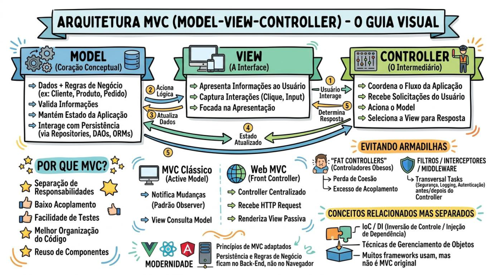

---

<!-- pagina: 57 -->

**Diego Carvalho, Equipe Informática 2 (Diego Carvalho), Equipe Informática 1 (Diego Carvalho) Aula 07** 

**<mark>INCIDÊNCIA EM PROVA: BAIXÍSSIMA</mark>** 

<!-- Start of picture text -->
Arquitetura <!-- End of picture text -->

<!-- Start of picture text -->
MVP <!-- End of picture text -->

###### **<mark>ARQUITETURA MVP</mark>** 

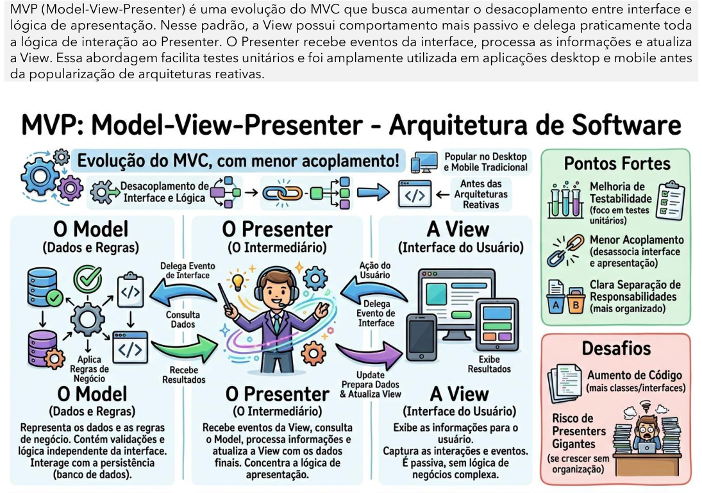

<!-- Start of picture text -->
MVP (Model-View-Presenter) é uma evolução do MVC que busca aumentar o desacoplamento entre interface e lógica de apresentação. Nesse padrão, a View possui comportamento mais passivo e delega praticamente toda a lógica de interação ao Presenter. O Presenter recebe eventos da interface, processa as informações e atualiza a View. Essa abordagem facilita testes unitários e foi amplamente utilizada em aplicações desktop e mobile antes da popularização de arquiteturas reativas. <!-- End of picture text -->

**MVP (Model-View-Presenter) é um padrão arquitetural criado para reduzir o acoplamento entre a interface do usuário e a lógica responsável pela apresentação das informações** . Sua proposta consiste em distribuir responsabilidades de forma mais organizada, tornando a aplicação mais fácil de testar e manter. Esse modelo surgiu como uma alternativa para cenários em que a interação entre componentes de interface exigia maior controle e melhor isolamento das responsabilidades. 

Como essa arquitetura é estruturada? O MVP é composto por três elementos principais: Model, View e Presenter. O Model representa os dados e as regras de negócio da aplicação. A View é responsável pela interface apresentada ao usuário. Já o Presenter atua como intermediário entre os dois componentes, coordenando o fluxo de informações e concentrando a lógica de apresentação necessária para exibir os dados corretamente. 

O Model mantém responsabilidades relacionadas ao domínio da aplicação. Nele encontram-se os dados, as validações e as regras de negócio que definem o comportamento do sistema. Além disso, o Model pode interagir com mecanismos de persistência responsáveis pelo armazenamento das informações. Essa separação permite que a lógica de negócio permaneça independente da tecnologia utilizada na interface do usuário.

---

<!-- pagina: 58 -->

**Diego Carvalho, Equipe Informática 2 (Diego Carvalho), Equipe Informática 1 (Diego Carvalho) Aula 07** 

A View possui uma função mais restrita dentro da arquitetura. O que ela faz exatamente? Sua responsabilidade consiste em exibir informações e capturar eventos gerados pelas interações do usuário. Embora possa conter comportamentos relacionados à própria interface, ela evita incorporar regras de negócio ou decisões complexas de apresentação. Dessa forma, a camada visual permanece mais simples e especializada em sua finalidade principal. 

O Presenter ocupa posição central no funcionamento do padrão. Quando o usuário realiza uma ação, **a View encaminha o evento para o Presenter. Em seguida, o Presenter consulta ou atualiza o Model, processa as informações necessárias e prepara os dados para exibição** . Por fim, a própria View é atualizada com o resultado obtido. Esse fluxo permite que a lógica de apresentação fique concentrada em um componente específico e mais facilmente testável. 

Entre os benefícios do MVP estão a melhoria da testabilidade, a redução do acoplamento entre interface e lógica de apresentação e a organização mais clara das responsabilidades. Entretanto, o padrão também pode aumentar a quantidade de código da aplicação e gerar Presenters muito extensos quando o sistema cresce sem uma divisão adequada das responsabilidades. Por essas características, **o MVP foi amplamente adotado em aplicações desktop, sistemas com interfaces complexas e versões tradicionais do desenvolvimento Android** .

---

<!-- pagina: 59 -->

**Diego Carvalho, Equipe Informática 2 (Diego Carvalho), Equipe Informática 1 (Diego Carvalho) Aula 07** 

**<mark>INCIDÊNCIA EM PROVA: BAIXÍSSIMA</mark>** 

<!-- Start of picture text -->
Arquitetura <!-- End of picture text -->

<!-- Start of picture text -->
MVVM <!-- End of picture text -->

###### **<mark>ARQUITETURA MVVM</mark>** 

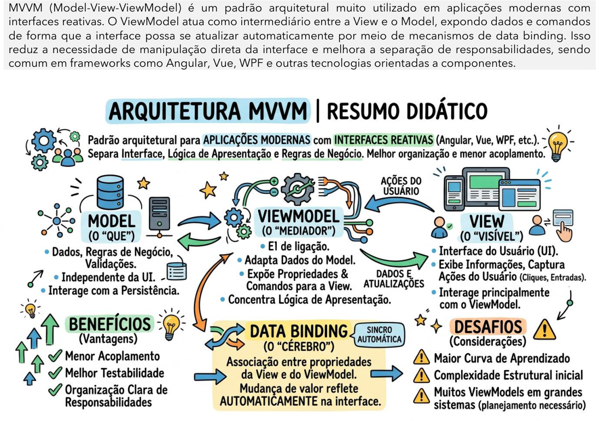

<!-- Start of picture text -->
MVVM (Model-View-ViewModel) é um padrão arquitetural muito utilizado em aplicações modernas com interfaces reativas. O ViewModel atua como intermediário entre a View e o Model, expondo dados e comandos de forma que a interface possa se atualizar automaticamente por meio de mecanismos de data binding. Isso reduz a necessidade de manipulação direta da interface e melhora a separação de responsabilidades, sendo comum em frameworks como Angular, Vue, WPF e outras tecnologias orientadas a componentes. <!-- End of picture text -->

**MVVM (Model-View-ViewModel) é um padrão arquitetural criado para fortalecer a separação entre interface gráfica, lógica de apresentação e regras de negócio. Sua adoção tornou-se especialmente popular em tecnologias da Microsoft, como WPF e Silverlight** , que oferecem mecanismos avançados de vinculação de dados. O objetivo desse modelo é organizar melhor a aplicação e reduzir o acoplamento entre os componentes responsáveis pela interface e pelo processamento das informações. 

Como o MVVM distribui as responsabilidades dentro do sistema? A arquitetura é composta por três elementos principais. O Model representa os dados e as regras de negócio. A View corresponde à interface exibida ao usuário. Entre esses dois componentes encontra-se o ViewModel, responsável por fornecer à View os dados necessários para apresentação e por processar as interações realizadas na interface. 

O Model mantém as responsabilidades relacionadas ao domínio da aplicação. Nele encontram-se os dados, as validações e as regras que determinam o comportamento do sistema. Além disso, pode interagir com mecanismos de persistência para armazenar e recuperar informações. Essa separação permite que as regras de negócio permaneçam independentes da tecnologia utilizada para construção da interface gráfica.

---

<!-- pagina: 60 -->

**Diego Carvalho, Equipe Informática 2 (Diego Carvalho), Equipe Informática 1 (Diego Carvalho) Aula 07** 

A View é responsável pela exibição das informações e pela captura das ações realizadas pelo usuário. Páginas web, aplicativos móveis e aplicações desktop podem desempenhar esse papel. O que diferencia o MVVM de outras abordagens semelhantes? A resposta está no fato de que a View interage principalmente com o ViewModel, reduzindo a necessidade de acesso direto aos dados e às regras mantidas pelo Model. 

**O ViewModel atua como intermediário entre a interface e os dados da aplicação** . Sua função inclui adaptar informações provenientes do Model, disponibilizar propriedades para exibição e processar comandos originados na interface. Dessa forma, a View recebe exatamente os dados necessários para apresentação, enquanto o ViewModel concentra a lógica relacionada ao comportamento visual da aplicação. 

**Uma das características mais conhecidas do MVVM é o Data Binding. Esse mecanismo estabelece uma associação entre propriedades da View e do ViewModel** . O que acontece quando um valor é alterado? Dependendo da implementação utilizada, a atualização pode ser refletida automaticamente na interface, reduzindo a necessidade de código dedicado à sincronização dos dados exibidos. Esse recurso contribui para interfaces mais limpas e fáceis de manter. 

Entre os benefícios do MVVM destacam-se a redução do acoplamento, a melhoria da testabilidade e a organização mais clara das responsabilidades. Entretanto, sua adoção pode exigir maior esforço inicial de aprendizado e aumentar a complexidade estrutural da aplicação. Além disso, sistemas extensos podem acumular um número elevado de ViewModels caso não exista uma estratégia adequada de organização dos componentes.

---

<!-- pagina: 61 -->

**Diego Carvalho, Equipe Informática 2 (Diego Carvalho), Equipe Informática 1 (Diego Carvalho) Aula 07** 

<!-- Start of picture text -->
Arquitetura <!-- End of picture text -->

<!-- Start of picture text -->
SOA <!-- End of picture text -->

###### **<mark>INCIDÊNCIA EM PROVA: BAIXÍSSIMA</mark>** 

###### **<mark>ARQUITETURA SOA</mark>** 

SOA (Service-Oriented Architecture) é um estilo arquitetural baseado na construção de sistemas compostos por serviços independentes que disponibilizam funcionalidades de negócio através de interfaces bem definidas. Esses serviços podem ser reutilizados por diferentes aplicações e frequentemente utilizam protocolos padronizados para comunicação. O principal objetivo da SOA é promover interoperabilidade, reutilização e integração entre sistemas corporativos heterogêneos. 

###### **SOA (Service-Oriented Architecture) é um estilo arquitetural baseado na construção de sistemas** 

**por meio de serviços independentes e reutilizáveis** . Seu principal objetivo é facilitar a integração entre aplicações corporativas, permitindo que funcionalidades sejam compartilhadas entre diferentes sistemas. Em vez de concentrar todas as responsabilidades em uma única aplicação, a arquitetura distribui capacidades específicas em serviços especializados que podem ser acessados por diversos consumidores. 

Como essa abordagem difere de um sistema monolítico tradicional? Em uma aplicação monolítica, grande parte das funcionalidades encontra-se concentrada em uma única estrutura. Na SOA, funcionalidades relacionadas a clientes, finanças, estoque ou recursos humanos podem ser disponibilizadas como serviços independentes. Dessa forma, diferentes aplicações conseguem reutilizar os mesmos recursos sem a necessidade de duplicar implementações ou manter múltiplas versões da mesma lógica de negócio. 

A comunicação entre os componentes da arquitetura envolve alguns elementos importantes. O Service Provider disponibiliza os serviços para consumo. O Service Consumer utiliza os serviços oferecidos. Também podem existir mecanismos de registro que permitem localizar serviços disponíveis no ambiente. Em muitas implementações corporativas, **um Enterprise Service Bus, conhecido como ESB, é utilizado para realizar atividades como roteamento, transformação de mensagens, integração e coordenação da comunicação entre sistemas distintos** . 

Uma das características mais relevantes da SOA é o baixo acoplamento. O que isso significa? Significa que os **consumidores dos serviços precisam conhecer apenas os contratos de comunicação necessários para utilizá-los, sem depender dos detalhes internos de implementação** . Essa característica favorece a interoperabilidade entre sistemas desenvolvidos com tecnologias diferentes e facilita a evolução dos componentes de forma mais independente. 

Diversas tecnologias foram historicamente associadas à arquitetura orientada a serviços. Entre elas estão SOAP, XML, WSDL, UDDI e soluções de ESB. É importante observar que **essas tecnologias representam formas comuns de implementação, mas não definem sozinhas o conceito de SOA** . O princípio fundamental permanece a organização das funcionalidades em serviços reutilizáveis e acessíveis por diferentes aplicações dentro do ambiente corporativo. 

Quais benefícios justificam a adoção dessa arquitetura? A reutilização de funcionalidades, a integração entre sistemas heterogêneos, a padronização da comunicação e a flexibilidade para atender diferentes consumidores estão entre as principais vantagens. Entretanto, também existem desafios relacionados à complexidade arquitetural, à governança dos serviços e à sobrecarga gerada pelas camadas adicionais de comunicação. Por essa razão, a adoção da SOA exige planejamento adequado e uma estratégia consistente de gerenciamento dos serviços disponibilizados. 

Arquitetura em Camadas, MVC, MVP, MVVM e SOA não devem ser vistos como modelos concorrentes ou mutuamente exclusivos. Cada um atua em um contexto diferente e resolve problemas específicos. É

---

<!-- pagina: 62 -->

**Diego Carvalho, Equipe Informática 2 (Diego Carvalho), Equipe Informática 1 (Diego Carvalho) Aula 07** 

comum encontrar aplicações corporativas que utilizam arquitetura em camadas para organizar o sistema, MVC ou MVVM para estruturar a interface e SOA para integrar serviços externos, demonstrando que esses padrões frequentemente coexistem e se complementam dentro de uma mesma solução. 

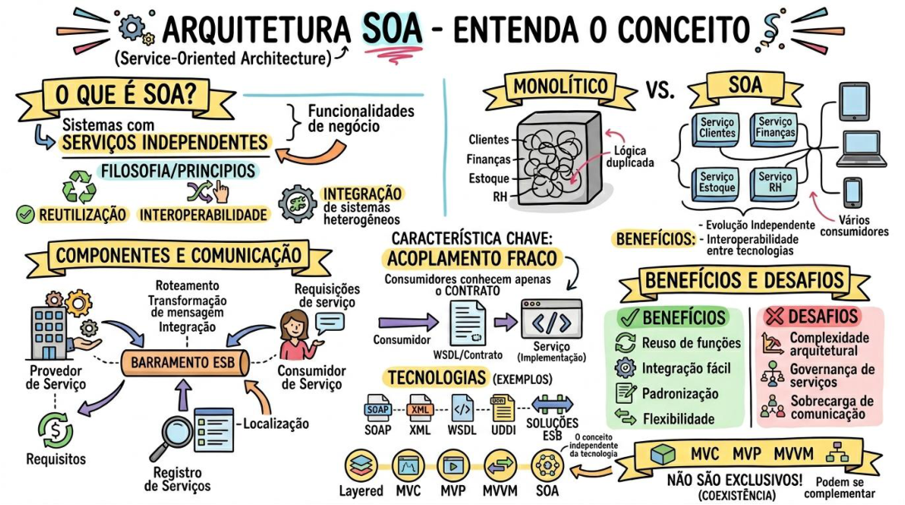

---

<!-- pagina: 63 -->

**Diego Carvalho, Equipe Informática 2 (Diego Carvalho), Equipe Informática 1 (Diego Carvalho) Aula 07** 

<!-- Start of picture text -->
Arquiteturas Modernas <!-- End of picture text -->

###### **<mark>ARQUITETURAS MODERNAS</mark>** 

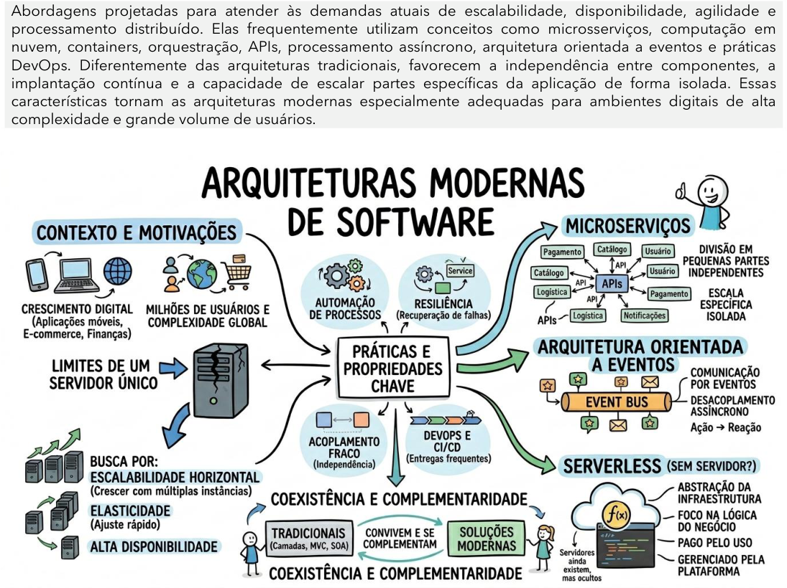

<!-- Start of picture text -->
Abordagens projetadas para atender às demandas atuais de escalabilidade, disponibilidade, agilidade e processamento distribuído. Elas frequentemente utilizam conceitos como microsserviços, computação em nuvem, containers, orquestração, APIs, processamento assíncrono, arquitetura orientada a eventos e práticas DevOps. Diferentemente das arquiteturas tradicionais, favorecem a independência entre componentes, a implantação contínua e a capacidade de escalar partes específicas da aplicação de forma isolada. Essas características tornam as arquiteturas modernas especialmente adequadas para ambientes digitais de alta complexidade e grande volume de usuários. <!-- End of picture text -->

As arquiteturas modernas surgiram em resposta ao crescimento da complexidade dos sistemas digitais. Aplicações utilizadas por milhões de usuários, serviços distribuídos globalmente e ambientes baseados em computação em nuvem passaram a exigir modelos capazes de lidar com grandes volumes de processamento e rápida evolução tecnológica. Nesse cenário, novas abordagens arquiteturais foram desenvolvidas para oferecer maior flexibilidade operacional e melhor capacidade de adaptação às mudanças. 

O que motivou a adoção desses novos modelos? À medida que aplicações móveis, plataformas de comércio eletrônico, serviços financeiros digitais e soluções baseadas em nuvem se expandiram, tornouse necessário construir sistemas capazes de crescer sem depender exclusivamente do aumento da capacidade de um único servidor. Como consequência, características como escalabilidade horizontal, elasticidade e alta disponibilidade passaram a ocupar posição central nas decisões arquiteturais. 

Entre as propriedades mais valorizadas nas arquiteturas modernas estão a resiliência, o baixo acoplamento, a automação de processos e a implantação contínua. Essas características permitem que aplicações sejam atualizadas com maior frequência, recuperem-se mais facilmente de falhas e distribuam suas cargas de trabalho entre múltiplos componentes independentes. Como resultado, os sistemas

---

<!-- pagina: 64 -->

**Diego Carvalho, Equipe Informática 2 (Diego Carvalho), Equipe Informática 1 (Diego Carvalho) Aula 07** 

tornam-se mais preparados para operar em ambientes dinâmicos e sujeitos a variações constantes de demanda. 

Modelos como Microsserviços, Arquitetura Orientada a Eventos e abordagens Cloud Native ganharam destaque justamente por atenderem a esses requisitos. Cada um desses modelos aborda desafios específicos. Microsserviços concentram-se na divisão da aplicação em serviços independentes. Arquiteturas orientadas a eventos priorizam a comunicação baseada em eventos. Já Cloud Native reúne princípios e práticas voltados ao desenvolvimento e à operação de aplicações em ambientes de nuvem. 

Outra abordagem frequentemente associada às arquiteturas modernas é o Serverless. O que esse conceito realmente significa? Apesar do nome, os servidores continuam existindo. A diferença é que sua administração é abstraída do desenvolvedor, permitindo que o foco permaneça na implementação da lógica da aplicação enquanto a infraestrutura é gerenciada pela plataforma utilizada. 

A adoção dessas arquiteturas não implica o abandono dos modelos tradicionais. Arquitetura em Camadas, MVC e SOA continuam amplamente presentes em sistemas corporativos e frequentemente coexistem com abordagens mais recentes. Em muitos casos, uma aplicação moderna utiliza microsserviços para distribuir funcionalidades, arquitetura em camadas para organizar cada serviço e mecanismos orientados a eventos para integração entre componentes, demonstrando que esses modelos podem atuar de forma complementar dentro da mesma solução. 

<!-- Start of picture text -->
Microsserviços <!-- End of picture text -->

###### **<mark>INCIDÊNCIA EM PROVA: BAIXÍSSIMA</mark>** 

###### **<mark>ARQUITETURA DE MICROSSERVIÇOS</mark>** 

A Arquitetura de Microsserviços é uma evolução dos conceitos de SOA que propõe dividir uma aplicação em diversos serviços pequenos, independentes e especializados em capacidades específicas de negócio. Cada microsserviço possui seu próprio ciclo de vida, pode ser desenvolvido por equipes distintas e implantado de forma independente. Essa abordagem favorece escalabilidade, resiliência e agilidade de desenvolvimento, embora aumente a complexidade operacional e de integração. 

**A Arquitetura de Microsserviços é um estilo arquitetural que organiza uma aplicação como um conjunto de serviços independentes, cada um responsável por uma capacidade específica do negócio** . Essa abordagem surgiu para enfrentar limitações observadas em sistemas muito grandes, nos quais todas as funcionalidades são desenvolvidas, implantadas e mantidas dentro de uma única aplicação. Ao dividir responsabilidades, torna-se possível evoluir partes do sistema de forma mais controlada e flexível. 

Como essa arquitetura difere de um sistema monolítico? Em um monólito, funcionalidades como usuários, pedidos, estoque, pagamentos e relatórios compartilham a mesma base de código e normalmente são implantadas em conjunto. À medida que a aplicação cresce, alterações simples podem exigir novas implantações de todo o sistema. Além disso, a escalabilidade costuma afetar a aplicação inteira, mesmo quando apenas uma funcionalidade apresenta aumento significativo de demanda. 

Nos microsserviços, cada capacidade de negócio é implementada em um serviço específico. Um serviço pode ser responsável apenas por pagamentos, outro exclusivamente por estoque e outro por gerenciamento de usuários. Essa divisão favorece a alta coesão, pois cada componente concentra-se em uma responsabilidade bem definida. Como consequência, **equipes diferentes podem trabalhar simultaneamente em serviços distintos com menor interferência entre suas atividades** . 

Uma característica importante desse modelo é a independência operacional. O que isso significa? Significa que **cada serviço pode possuir seu próprio ciclo de desenvolvimento, testes e implantação.**

---

<!-- pagina: 65 -->

**Diego Carvalho, Equipe Informática 2 (Diego Carvalho), Equipe Informática 1 (Diego Carvalho) Aula 07** 

**Em muitas implementações, cada microsserviço também mantém controle sobre seus próprios dados** , reduzindo dependências diretas entre componentes e permitindo maior autonomia na evolução das funcionalidades. 

A comunicação entre microsserviços pode ocorrer de diferentes maneiras. **Em cenários síncronos, são comuns tecnologias como REST e gRPC. Em cenários assíncronos, mecanismos de mensageria e eventos desempenham papel relevante na integração dos serviços** . Essa flexibilidade permite selecionar estratégias de comunicação adequadas às necessidades de cada processo, equilibrando requisitos de desempenho, disponibilidade e desacoplamento. 

Os microsserviços oferecem benefícios como escalabilidade independente, flexibilidade tecnológica e implantações mais isoladas. Entretanto, também introduzem desafios importantes. Como monitorar dezenas ou centenas de serviços distribuídos? Como rastrear requisições que atravessam múltiplos componentes? Questões relacionadas à observabilidade, consistência distribuída, comunicação entre serviços e operação da infraestrutura tornam-se aspectos centrais na adoção desse estilo arquitetural. Por essa razão, **tecnologias como Docker, Kubernetes, Istio e frameworks especializados são frequentemente utilizadas para apoiar a gestão desses ambientes** . 

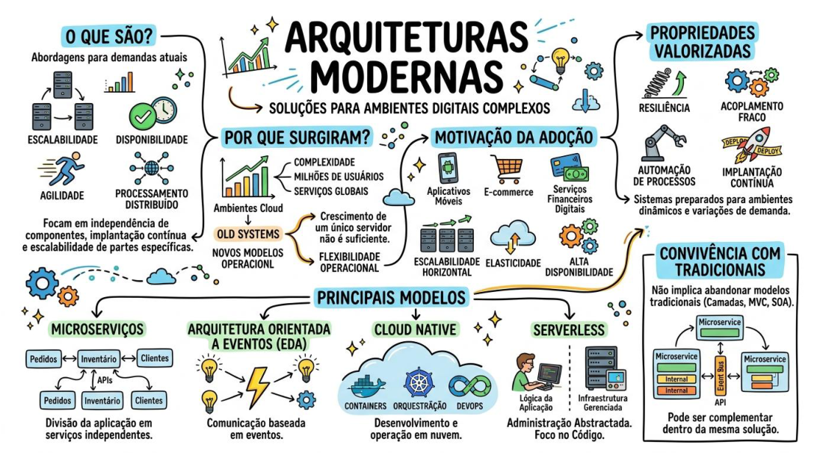

---

<!-- pagina: 66 -->

**Diego Carvalho, Equipe Informática 2 (Diego Carvalho), Equipe Informática 1 (Diego Carvalho) Aula 07** 

**<mark>INCIDÊNCIA EM PROVA: BAIXÍSSIMA</mark>** 

<!-- Start of picture text -->
- Event Driven Architecture <!-- End of picture text -->

###### **<mark>EVENT-DRIVEN ARCHITECTURE</mark>** 

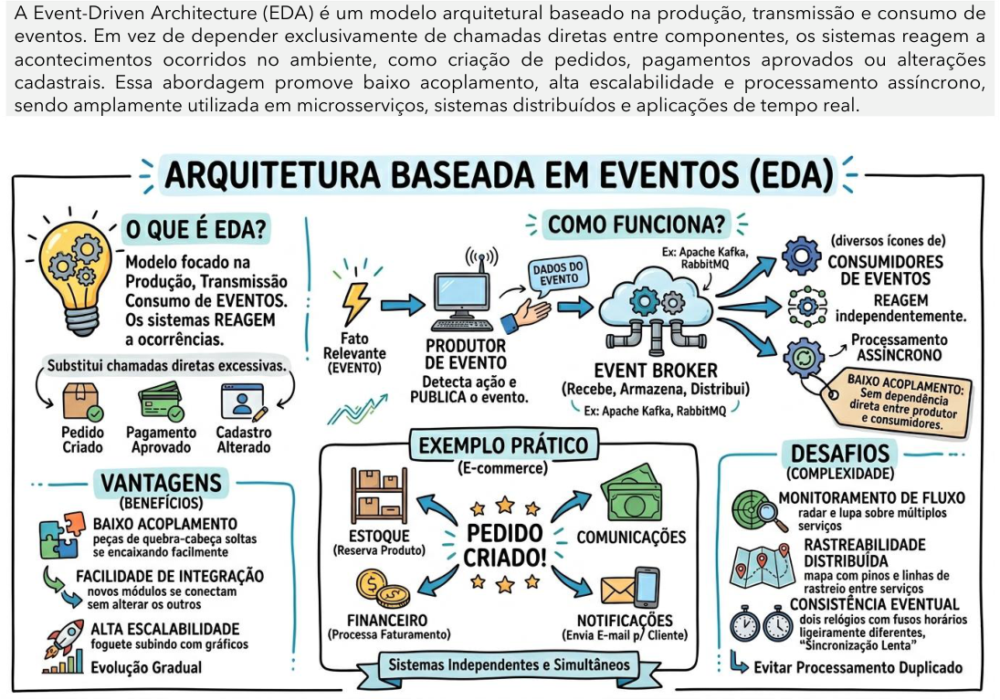

<!-- Start of picture text -->
A Event-Driven Architecture (EDA) é um modelo arquitetural baseado na produção, transmissão e consumo de eventos. Em vez de depender exclusivamente de chamadas diretas entre componentes, os sistemas reagem a acontecimentos ocorridos no ambiente, como criação de pedidos, pagamentos aprovados ou alterações cadastrais. Essa abordagem promove baixo acoplamento, alta escalabilidade e processamento assíncrono, sendo amplamente utilizada em microsserviços, sistemas distribuídos e aplicações de tempo real. <!-- End of picture text -->

A Arquitetura Orientada a Eventos, **conhecida como Event-Driven Architecture ou EDA, é um estilo arquitetural baseado na comunicação por eventos** . **Um evento representa um fato relevante ocorrido dentro do domínio da aplicação** , como a criação de um pedido, a aprovação de um pagamento ou o cadastro de um usuário. Em vez de depender exclusivamente de chamadas diretas entre sistemas, essa abordagem utiliza eventos para informar que determinada ação ocorreu. 

Como os sistemas se comunicam nesse modelo? Quando uma ocorrência relevante acontece, um componente publica um evento descrevendo o fato ocorrido. Esse componente é chamado de produtor de eventos. Em seguida, a informação é disponibilizada para outros componentes interessados, que podem reagir ao acontecimento sem que exista uma dependência direta entre produtor e consumidores. Essa característica reduz o acoplamento entre os diferentes elementos da arquitetura. 

Um dos componentes mais conhecidos nesse contexto é o **broker de eventos. Sua função consiste em receber, armazenar e distribuir eventos para os consumidores apropriados. Tecnologias como Apache Kafka e RabbitMQ são frequentemente utilizadas para desempenhar esse papel** . Embora sejam comuns em implementações modernas, o conceito de arquitetura orientada a eventos é mais amplo e não depende obrigatoriamente de uma solução específica de intermediação.

---

<!-- pagina: 67 -->

**Diego Carvalho, Equipe Informática 2 (Diego Carvalho), Equipe Informática 1 (Diego Carvalho) Aula 07** 

Considere uma plataforma de comércio eletrônico em que um pedido acabou de ser criado. O que acontece após esse evento ser publicado? Diversos serviços podem reagir de forma independente. O sistema de estoque pode reservar produtos, o serviço financeiro pode iniciar procedimentos de faturamento e um componente de notificações pode enviar mensagens ao cliente. Frequentemente esses consumidores processam o mesmo evento em paralelo, sem necessidade de comunicação direta entre si. 

A arquitetura orientada a eventos oferece benefícios importantes, como baixo acoplamento, facilidade de integração e elevada capacidade de escalabilidade. Como os consumidores operam de forma independente, torna-se mais simples adicionar novos componentes capazes de reagir aos eventos já existentes. Essa característica favorece a evolução gradual dos sistemas e a ampliação das funcionalidades sem grandes impactos sobre os produtores dos eventos. 

Entretanto, essa abordagem também apresenta desafios específicos. Como acompanhar o fluxo de uma informação que atravessa diversos serviços distribuídos? Como evitar problemas decorrentes do processamento repetido de um mesmo evento? Além disso, **a sincronização dos dados nem sempre ocorre imediatamente, o que introduz cenários de consistência eventual** . Por essa razão, mecanismos de monitoramento, rastreamento distribuído e gerenciamento de eventos tornam-se elementos importantes em arquiteturas orientadas a eventos.

---

<!-- pagina: 68 -->

**Diego Carvalho, Equipe Informática 2 (Diego Carvalho), Equipe Informática 1 (Diego Carvalho) Aula 07** 

<!-- Start of picture text -->
Cloud Native <!-- End of picture text -->

###### **<mark>INCIDÊNCIA EM PROVA: BAIXÍSSIMA</mark>** 

###### **<mark>CLOUD NATIVE</mark>** 

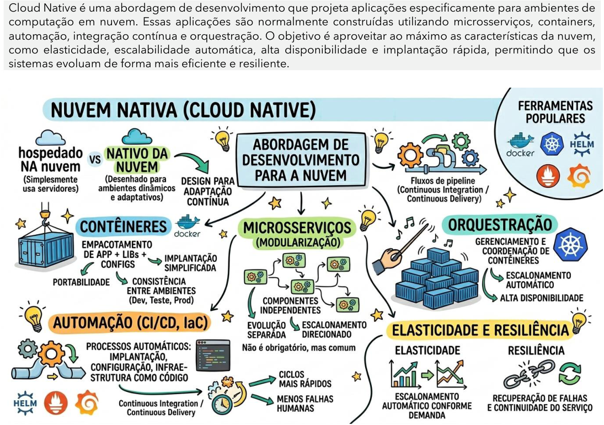

<!-- Start of picture text -->
Cloud Native é uma abordagem de desenvolvimento que projeta aplicações especificamente para ambientes de computação em nuvem. Essas aplicações são normalmente construídas utilizando microsserviços, containers, automação, integração contínua e orquestração. O objetivo é aproveitar ao máximo as características da nuvem, como elasticidade, escalabilidade automática, alta disponibilidade e implantação rápida, permitindo que os sistemas evoluam de forma mais eficiente e resiliente. <!-- End of picture text -->

**Cloud Native é uma abordagem de desenvolvimento e operação de software voltada à construção de aplicações projetadas especificamente para ambientes de computação em nuvem** . Seu objetivo consiste em aproveitar recursos oferecidos pelas plataformas de nuvem para aumentar a capacidade de adaptação, a disponibilidade e a eficiência operacional dos sistemas. Essa abordagem tornou-se cada vez mais relevante à medida que organizações passaram a depender de aplicações distribuídas e sujeitas a grandes variações de demanda. 

O que diferencia uma aplicação Cloud Native de uma aplicação simplesmente hospedada na nuvem? A principal diferença está na forma como ela é concebida. **Aplicações Cloud Native são projetadas para operar em ambientes dinâmicos, aproveitando mecanismos de automação, escalabilidade e recuperação de falhas** . Dessa forma, a arquitetura busca adaptar-se continuamente às condições do ambiente em vez de apenas utilizar servidores localizados em uma infraestrutura de nuvem. 

Um dos conceitos mais associados a essa abordagem envolve o uso de containers. Eles permitem empacotar aplicações juntamente com bibliotecas e configurações necessárias para execução. Como isso contribui para o desenvolvimento? **A utilização de containers favorece a portabilidade entre ambientes e simplifica processos de implantação, reduzindo diferenças entre ambientes de desenvolvimento, testes e produção** .

---

<!-- pagina: 69 -->

**Diego Carvalho, Equipe Informática 2 (Diego Carvalho), Equipe Informática 1 (Diego Carvalho) Aula 07** 

Outro princípio frequentemente encontrado em soluções Cloud Native é a modularização das aplicações. Microsserviços são amplamente utilizados nesse contexto porque facilitam a evolução independente dos componentes e permitem escalabilidade direcionada às partes que realmente necessitam de mais recursos. Entretanto, a adoção de microsserviços não constitui uma exigência para que uma aplicação seja considerada alinhada aos princípios Cloud Native. 

A automação desempenha papel central nessa abordagem. Processos de implantação, configuração e gerenciamento da infraestrutura são frequentemente executados de forma automatizada por meio de **práticas como integração contínua, entrega contínua e infraestrutura como código** . Essa automação reduz atividades manuais repetitivas e contribui para ciclos de entrega mais rápidos e previsíveis. 

Outro aspecto importante envolve elasticidade e resiliência. Como a aplicação reage quando a demanda aumenta ou quando ocorre uma falha? Em ambientes Cloud Native, **recursos podem ser ampliados ou reduzidos automaticamente conforme a necessidade** . Além disso, mecanismos de recuperação e redundância ajudam a manter a continuidade do serviço diante de problemas operacionais. **Tecnologias como Docker, Kubernetes, Helm, Prometheus e Grafana são amplamente utilizadas para apoiar a implementação desses princípios** em ambientes modernos de computação em nuvem.

---

<!-- pagina: 70 -->

**Diego Carvalho, Equipe Informática 2 (Diego Carvalho), Equipe Informática 1 (Diego Carvalho) Aula 07** 

<!-- Start of picture text -->
Serverless <!-- End of picture text -->

###### **<mark>INCIDÊNCIA EM PROVA: BAIXÍSSIMA</mark>** 

###### **<mark>SERVERLESS</mark>** 

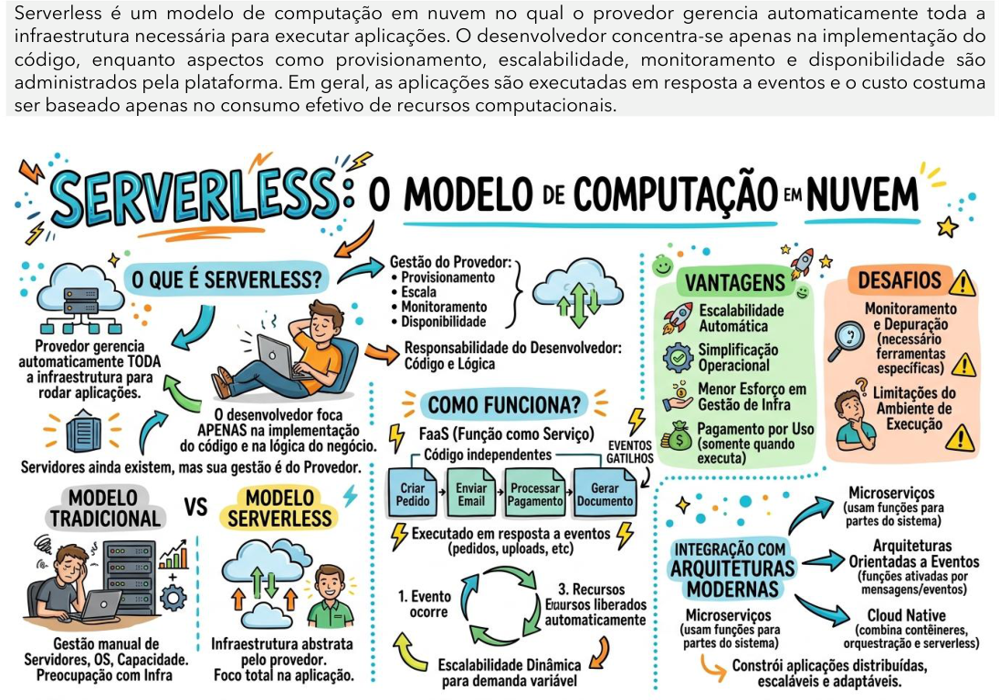

<!-- Start of picture text -->
Serverless é um modelo de computação em nuvem no qual o provedor gerencia automaticamente toda a infraestrutura necessária para executar aplicações. O desenvolvedor concentra-se apenas na implementação do código, enquanto aspectos como provisionamento, escalabilidade, monitoramento e disponibilidade são administrados pela plataforma. Em geral, as aplicações são executadas em resposta a eventos e o custo costuma ser baseado apenas no consumo efetivo de recursos computacionais. <!-- End of picture text -->

**Serverless é um modelo de computação em nuvem que reduz significativamente as responsabilidades relacionadas à administração da infraestrutura. Apesar do nome, os servidores continuam existindo** e executando as aplicações normalmente. A diferença está no fato de que sua configuração, manutenção e gerenciamento ficam sob responsabilidade do provedor de nuvem. Dessa forma, o desenvolvedor pode concentrar seus esforços principalmente na implementação da lógica de negócio. 

O que muda em relação ao modelo tradicional? Em ambientes convencionais, as equipes precisam administrar servidores, sistemas operacionais, capacidade computacional e diversos aspectos operacionais da infraestrutura. No modelo Serverless, essas atividades são amplamente abstraídas pela plataforma. O desenvolvedor fornece o código da aplicação, enquanto o ambiente de execução é provisionado e gerenciado automaticamente conforme a demanda. 

Uma das formas mais conhecidas dessa abordagem é o **Function as a Service, ou FaaS. Nesse modelo, a aplicação é dividida em funções independentes executadas em resposta a eventos específicos** . Operações como criação de pedidos, envio de e-mails, processamento de pagamentos ou geração de documentos podem ser implementadas como funções isoladas. Cada função é acionada apenas quando ocorre o evento correspondente.

---

<!-- pagina: 71 -->

**Diego Carvalho, Equipe Informática 2 (Diego Carvalho), Equipe Informática 1 (Diego Carvalho) Aula 07** 

Como ocorre a execução dessas funções? Normalmente um evento inicia o processamento, a função é carregada pelo ambiente Serverless e a lógica necessária é executada. Após a conclusão da tarefa, os recursos utilizados podem ser liberados automaticamente. Essa característica permite que o ambiente ajuste sua capacidade de forma dinâmica, acompanhando as variações de demanda sem intervenção manual dos responsáveis pela aplicação. 

Entre as principais vantagens desse modelo estão a **escalabilidade automática, a simplificação operacional e a redução do esforço dedicado ao gerenciamento da infraestrutura** . Além disso, muitas plataformas adotam modelos de cobrança baseados no consumo efetivo dos recursos utilizados. Entretanto, a adoção do Serverless também apresenta desafios relacionados ao monitoramento, à depuração e às limitações impostas pelos ambientes de execução disponibilizados pelos provedores. 

Serverless frequentemente aparece em conjunto com outras abordagens modernas. **Microsserviços podem utilizar funções Serverless para implementar partes específicas do sistema. Arquiteturas orientadas a eventos frequentemente empregam funções acionadas por mensagens ou eventos** . Da mesma forma, ambientes Cloud Native podem combinar containers, orquestração, mensageria e recursos Serverless dentro da mesma solução. Essa integração entre diferentes modelos arquiteturais contribui para a construção de aplicações distribuídas, escaláveis e adaptáveis às necessidades dos ambientes modernos de computação em nuvem.

---

<!-- pagina: 72 -->

**Diego Carvalho, Equipe Informática 2 (Diego Carvalho), Equipe Informática 1 (Diego Carvalho) Aula 07** 

<!-- Start of picture text -->
R ESUMO <!-- End of picture text -->

###### **<mark>ARQUITETURA WEB</mark>** 

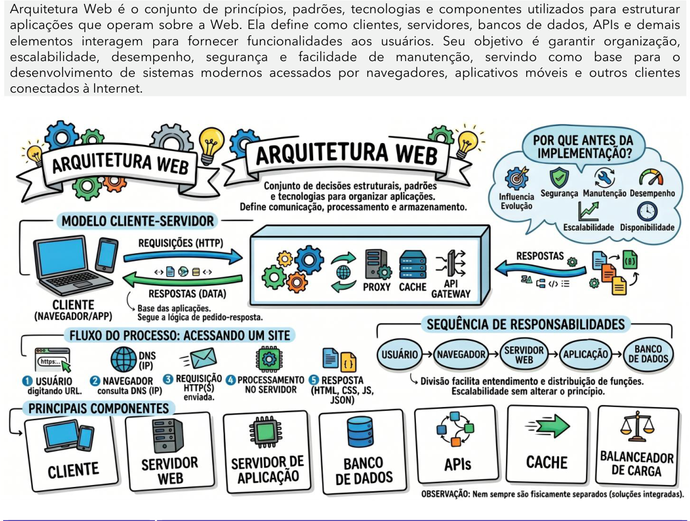

<!-- Start of picture text -->
Arquitetura Web é o conjunto de princípios, padrões, tecnologias e componentes utilizados para estruturar aplicações que operam sobre a Web. Ela define como clientes, servidores, bancos de dados, APIs e demais elementos interagem para fornecer funcionalidades aos usuários. Seu objetivo é garantir organização, escalabilidade, desempenho, segurança e facilidade de manutenção, servindo como base para o desenvolvimento de sistemas modernos acessados por navegadores, aplicativos móveis e outros clientes conectados à Internet. <!-- End of picture text -->

|**OBJETIVOS**|**DESCRIÇÃO**|
|---|---|
|**ORGANIZAÇÃO DO** **SISTEMA**|Estruturar a aplicação em componentes e camadas bem definidas, facilitando o entendimento,desenvolvimento e manutenção do software.|
|**SEPARAÇÃO DE** **RESPONSABILIDADES**|Distribuir funções entre diferentes módulos (interface, regras de negócio, persistência, integração etc.),reduzindo dependências e aumentando aqualidade do código.|
|**ESCALABILIDADE**|Permitir que a aplicação suporte crescimento no número de usuários, transações e volume de dados semperda significativa de desempenho.|
|**DESEMPENHO**|Garantir tempos de resposta adequados por meio da otimização de recursos, uso de cache,balanceamento de carga e outras estratégias arquiteturais.|
|**MANUTENI-** **BILIDADE**|Facilitar correções, melhorias e evolução do sistema ao longo do tempo, reduzindo o custo de manutenção.|
|**REUTILIZAÇÃO**|Possibilitar que componentes, serviços e funcionalidades sejam reutilizados em diferentespartes da aplicação ou em outros sistemas.|
|**SEGURANÇA**|Proteger dados, usuários e recursos contra acessos não autorizados, ataques e vazamentos de informações.|
|**DISPONIBILIDADE**|Garantir que o sistema permaneça acessível e operacional pelo maior tempo possível, mesmo diante de falhas de hardware ou software.|

---

<!-- pagina: 73 -->

**Diego Carvalho, Equipe Informática 2 (Diego Carvalho), Equipe Informática 1 (Diego Carvalho) Aula 07** 

|**OBJETIVOS**|**DESCRIÇÃO**|
|---|---|
|**CONFIABILIDADE**|Assegurar que o sistema execute suas funções corretamente e produza resultados consistentes eprevisíveis.|
|**INTEROPERA-** **BILIDADE**|Permitir a integração e comunicação entre sistemas, plataformas, dispositivos e tecnologias diferentes.|
|**FLEXIBILIDADE**|Facilitar adaptações a novas necessidades de negócio, tecnologias emergentes e mudanças de requisitos.|
|**ESCALABILIDADE** **HORIZONTAL** |Possibilitar o aumento da capacidade do sistema por meio da adição de novos servidores ou instâncias.|
|**TOLERÂNCIA A** **FALHAS**|Minimizar impactos de falhas por meio de redundância, replicação e mecanismos de recuperação automática.|
|**EFICIÊNCIA NO USO** **DE RECURSOS**|Utilizar processamento, memória, armazenamento e rede de forma otimizada para reduzir custos operacionais.|
|**EXPERIÊNCIA DO** **USUÁRIO**|Proporcionar navegação fluida, respostas rápidas, disponibilidade contínua e interfaces adequadas às necessidades dos usuários.|
|**SUSTENTAÇÃO DA** **EVOLUÇÃO** **TECNOLÓGICA**|Permitir a incorporação gradual de novas tecnologias, frameworks e padrões sem exigir a reconstrução completa do sistema.|
|**GOVERNANÇA E** **PADRONIZAÇÃO** |Estabelecer padrões arquiteturais que orientem equipes de desenvolvimento, promovendo consistência equalidade nas soluções.|
|**REDUÇÃO DE** **CUSTOS**|Diminuir custos de desenvolvimento, operação, manutenção e infraestrutura por meio de uma arquitetura eficiente e bemplanejada.|

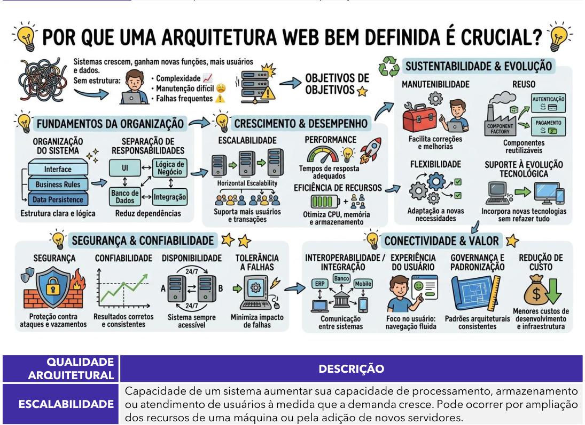

<!-- Start of picture text -->
QUALIDADE DESCRIÇÃO ARQUITETURAL Capacidade de um sistema aumentar sua capacidade de processamento, armazenamento ESCALABILIDADE  ou atendimento de usuários à medida que a demanda cresce. Pode ocorrer por ampliação dos recursos de uma máquina ou pela adição de novos servidores. <!-- End of picture text -->

---

<!-- pagina: 74 -->

**Diego Carvalho, Equipe Informática 2 (Diego Carvalho), Equipe Informática 1 (Diego Carvalho) Aula 07** 

**QUALIDADE DESCRIÇÃO ARQUITETURAL** Refere-se à eficiência com que o sistema executa suas funções e responde às solicitações. **DESEMPENHO** Envolve aspectos como tempo de resposta, latência, throughput e utilização adequada dos recursos computacionais disponíveis. Representa o percentual de tempo em que o sistema permanece operacional e acessível **DISPONIBILIDADE** aos usuários. Quanto maior a disponibilidade, menor a ocorrência de interrupções que <u>possam afetar a continuidade dos serviços prestados.</u> Capacidade de o sistema executar suas funções corretamente durante longos períodos, **CONFIABILIDADE** produzindo resultados previsíveis e consistentes. Busca minimizar falhas inesperadas e <u>garantir estabilidade operacional contínua.</u> Característica voltada à proteção de dados, serviços e recursos contra acessos indevidos, **SEGURANÇA** alterações não autorizadas e ataques. Abrange mecanismos de autenticação, autorização, criptografia e auditoria de eventos. Capacidade de realizar alterações, correções ou evoluções no sistema com esforço **MODIFICA-** reduzido e impacto limitado sobre outros componentes. É favorecida por modularização **BILIDADE** adequada, alta coesão e baixo acoplamento. <mark>Capacidade de diferentes sistemas, plataformas ou aplicações trocarem informações e</mark> **INTEROPERA-** colaborarem entre si de forma eficiente. Depende da adoção de padrões, protocolos e **BILIDADE** contratos de comunicação bem definidos. Refere-se à facilidade de criar, executar e manter testes durante o desenvolvimento e a **TESTABILIDADE** manutenção do software. Sistemas testáveis permitem identificar defeitos rapidamente e validar alterações com menor esforço. <mark>Capacidade de compreender o comportamento interno do sistema por meio da análise</mark> **OBSERVABILIDADE** de logs, métricas, traces e monitoramento. Facilita diagnósticos, identificação de falhas e análise de desempenho operacional. Característica que expressa a facilidade de corrigir defeitos, adaptar funcionalidades e **MANUTENIBILIDA** evoluir o software ao longo do tempo. Sistemas bem estruturados tendem a apresentar **DE** menor custo e esforço de manutenção. Mede o grau de facilidade com que usuários conseguem aprender, compreender e utilizar **USABILIDADE** o sistema para atingir seus objetivos. Interfaces intuitivas e consistentes contribuem diretamente para essa característica. <mark>Capacidade de executar ou migrar uma aplicação entre diferentes ambientes, sistemas</mark> **PORTABILIDADE** operacionais, plataformas ou provedores com pouco esforço. Reduz dependências tecnológicas excessivas e amplia a flexibilidade. Capacidade de reutilizar componentes, módulos, bibliotecas ou serviços em diferentes **REUSABILIDADE** projetos ou partes da aplicação. Favorece padronização, redução de retrabalho e aumento da produtividade das equipes. Capacidade de aumentar ou reduzir automaticamente os recursos computacionais **ELASTICIDADE** disponíveis conforme as variações de demanda. É uma característica amplamente associada a ambientes de computação em nuvem. Capacidade de continuar operando adequadamente mesmo quando ocorrem falhas em **TOLERÂNCIA A** componentes, servidores ou conexões de rede. Normalmente depende de mecanismos **FALHAS** de redundância e recuperação automática. Capacidade de resistir a falhas, adaptar-se a situações adversas e recuperar rapidamente **RESILIÊNCIA** sua operação normal. Vai além da tolerância a falhas ao enfatizar a recuperação e continuidade do negócio. Capacidade de registrar e rastrear ações, alterações e eventos relevantes ocorridos no **AUDITABILIDADE** sistema. Permite investigações, conformidade regulatória, identificação de responsabilidades e reconstrução de ocorrências. Capacidade de manter os dados corretos, íntegros e coerentes ao longo do tempo, **CONSISTÊNCIA** mesmo em ambientes distribuídos. Garante que diferentes componentes possuam uma visão adequada das informações.

---

<!-- pagina: 75 -->

**Diego Carvalho, Equipe Informática 2 (Diego Carvalho), Equipe Informática 1 (Diego Carvalho) Aula 07** 

**QUALIDADE DESCRIÇÃO ARQUITETURAL** Capacidade de utilizar processamento, memória, armazenamento e rede de forma **EFICIÊNCIA DE** otimizada, entregando bons resultados com menor consumo de recursos e melhor **RECURSOS** aproveitamento da infraestrutura disponível. proveitamento da infraestrutura disponível. roveitamento da infraestrutura disponível. ponível. onível. 

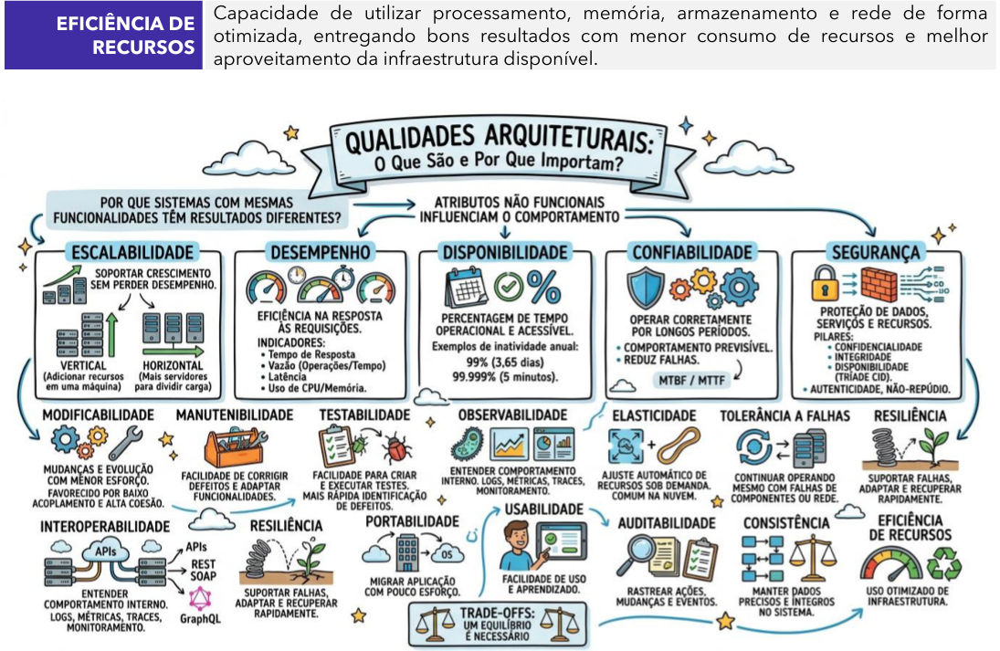

<!-- Start of picture text -->
Capacidade de utilizar processamento, memória, armazenamento e rede de forma EFICIÊNCIA DE otimizada, entregando bons resultados com menor consumo de recursos e melhor RECURSOS aproveitamento da infraestrutura disponível. proveitamento da infraestrutura disponível. roveitamento da infraestrutura disponível. ponível. onível. <!-- End of picture text -->

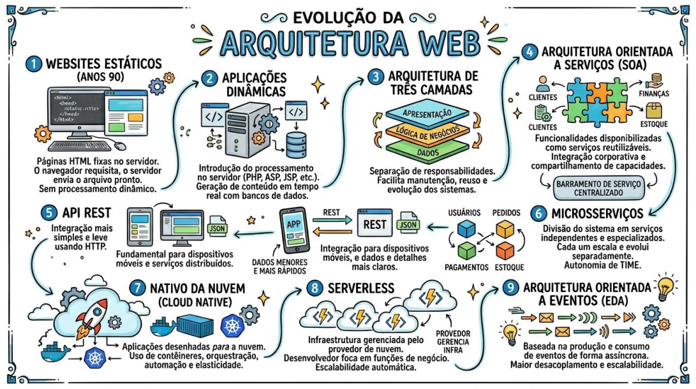

---

<!-- pagina: 76 -->

**Diego Carvalho, Equipe Informática 2 (Diego Carvalho), Equipe Informática 1 (Diego Carvalho) Aula 07** 

**<mark>ETAPAS DESCRIÇÃO</mark>** Predominantes nos anos 1990, eram compostos por páginas HTML armazenadas **SITES ESTÁTICOS** diretamente no servidor. O conteúdo era praticamente fixo e cada solicitação resultava apenas na entrega de arquivos previamente criados, sem processamento significativo. Introduziram processamento no servidor por meio de tecnologias como PHP, ASP, JSP e **APLICAÇÕES** CGI. As páginas passaram a ser geradas em tempo real com base em dados armazenados **DINÂMICAS** em bancos de dados e regras de negócio executadas durante cada requisição. **ARQUITETURA EM** Organizou os sistemas em camadas de apresentação, negócio e dados. Essa separação **CAMADAS (THREE-** permitiu distribuir responsabilidades de forma mais clara, facilitando manutenção, **TIER)** reutilização de componentes e evolução das aplicações corporativas. **SOA (SERVICE-** Passou a estruturar funcionalidades como serviços reutilizáveis acessíveis por diferentes **ORIENTED** sistemas. Essa abordagem favoreceu integração corporativa, redução de redundâncias e **ARCHITECTURE)** compartilhamento de capacidades de negócio entre aplicações distintas. <mark>Popularizaram integrações mais simples e leves utilizando HTTP e formatos como JSON.</mark> **APIS REST** Tornaram-se fundamentais para comunicação entre sistemas web, aplicativos móveis e serviços distribuídos, ampliando a interoperabilidade entre plataformas. <mark>Propõem dividir a aplicação em serviços pequenos, independentes e especializados.</mark> **MICROSSERVIÇOS** Cada serviço pode ser desenvolvido, implantado e escalado separadamente, aumentando flexibilidade, autonomia das equipes e capacidade de evolução contínua. Representa aplicações projetadas especificamente para ambientes de nuvem. Utiliza **CLOUD NATIVE** conceitos como containers, orquestração, automação, elasticidade e alta disponibilidade, explorando plenamente os recursos oferecidos pelos provedores de nuvem. Modelo no qual a infraestrutura é administrada pelo provedor de nuvem. O **SERVERLESS** desenvolvedor concentra-se só na implementação das funções de negócio, enquanto escalabilidade, <u>provisionamento e gerenciamento dos servidores são automatizados.</u> **EVENT-DRIVEN** Baseia-se na produção e consumo de eventos para coordenar componentes distribuídos. **ARCHITECTURE** O processamento ocorre de forma assíncrona, permitindo maior desacoplamento, **<u>(EDA)</u>** escalabilidade e capacidade de reação a acontecimentos do ambiente. 

###### **<mark>COESÃO E ACOPLAMENTO</mark>** 

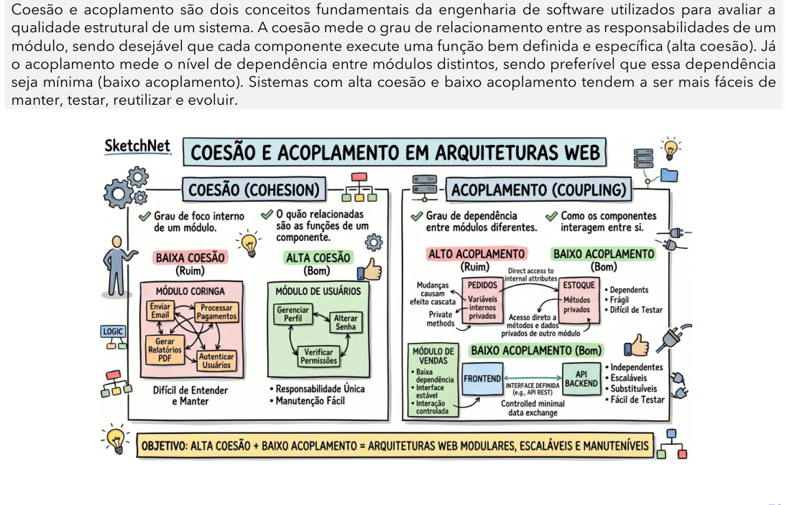

<!-- Start of picture text -->
Coesão e acoplamento são dois conceitos fundamentais da engenharia de software utilizados para avaliar a qualidade estrutural de um sistema. A coesão mede o grau de relacionamento entre as responsabilidades de um módulo, sendo desejável que cada componente execute uma função bem definida e específica (alta coesão). Já o acoplamento mede o nível de dependência entre módulos distintos, sendo preferível que essa dependência seja mínima (baixo acoplamento). Sistemas com alta coesão e baixo acoplamento tendem a ser mais fáceis de manter, testar, reutilizar e evoluir. <!-- End of picture text -->

---

<!-- pagina: 77 -->

**Diego Carvalho, Equipe Informática 2 (Diego Carvalho), Equipe Informática 1 (Diego Carvalho) Aula 07** 

|**TIPO DE** **ACOPLAMENTO**|**DESCRIÇÃO**|
|---|---|
|**ACOPLAMENTO** **POR CONTEÚDO**|Ocorre quando um módulo acessa diretamente dados internos, estruturas ou elementos de controle pertencentes a outro módulo. É considerado o tipo mais forte e indesejável de acoplamento, pois cria elevada dependência entre componentes.|
|**ACOPLAMENTO** **COMUM**|Surge quando diversos módulos compartilham uma mesma área global de dados. Alterações na estrutura ou no conteúdo dessas informações podem impactar múltiplos componentes,dificultando manutenção,testes e controle de dependências.|
|**ACOPLAMENTO** **POR CONTROLE**|Ocorre quando um módulo envia informações que determinam o fluxo de execução de outro módulo. Nesse cenário, o componente chamado passa a depender de decisões externaspara definirparte de seu comportamento interno.|
|**ACOPLAMENTO** **POR DADOS**|Caracteriza-se pela troca de dados simples entre módulos por meio de parâmetros necessários ao processamento. É considerado um dos acoplamentos mais desejáveis, pois limita a dependência ao compartilhamento explícito de informações.|
|**ACOPLAMENTO POR** **CHAMADAS DE** **ROTINAS**|Ocorre quando um módulo invoca procedimentos, funções ou métodos de outro módulo. Embora aumente a dependência entre componentes, é amplamente utilizado e frequentemente necessáriopara viabilizar a colaboração entrepartes do sistema.|
|**ACOPLAMENTO POR** **USO DE TIPOS**|Surge quando um componente utiliza tipos de dados, classes ou estruturas definidos por outro componente. Mudanças nessas definições podem exigir modificações em todos os módulosque dependem desses tipos compartilhados.|
|**ACOPLAMENTO POR** **INCLUSÃO OU** **IMPORTAÇÃO**|Ocorre quando um componente incorpora bibliotecas, pacotes, módulos ou arquivos definidos por outro componente. Essa dependência estabelece um vínculo estrutural quepodepropagar impactos decorrentes de alterações futuras.|
|**ACOPLAMENTO** **EXTERNO**|Acontece quando componentes dependem de recursos externos, como bancos de dados, sistemas operacionais, APIs, serviços de terceiros ou infraestrutura. Embora necessário,recomenda-se restringi-lopara reduzir impactos e riscos.|

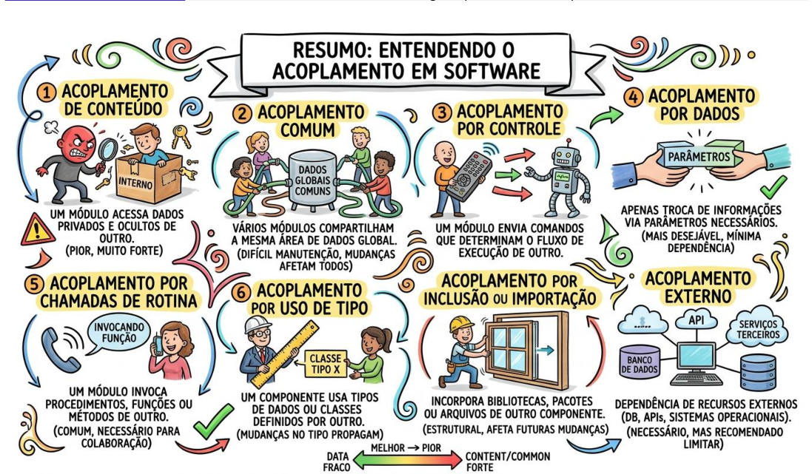

---

<!-- pagina: 78 -->

**Diego Carvalho, Equipe Informática 2 (Diego Carvalho), Equipe Informática 1 (Diego Carvalho) Aula 07** 

###### **<mark>MODELO CLIENTE/SERVIDOR</mark>** 

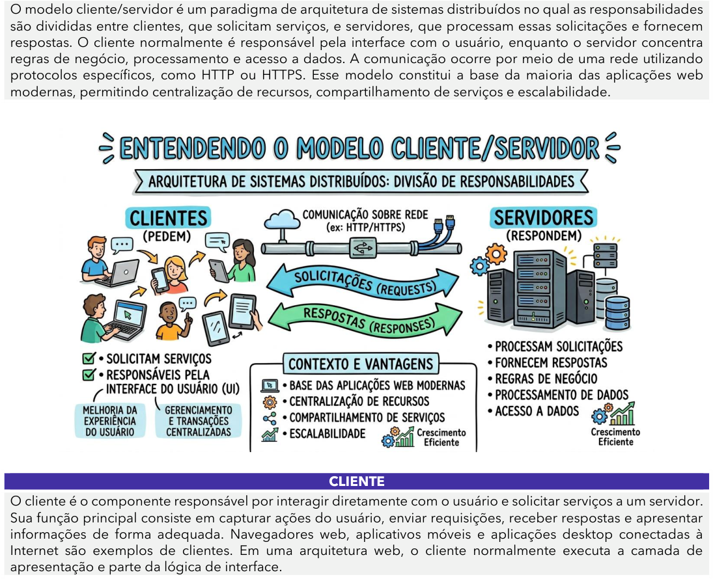

<!-- Start of picture text -->
O modelo cliente/servidor é um paradigma de arquitetura de sistemas distribuídos no qual as responsabilidades são divididas entre clientes, que solicitam serviços, e servidores, que processam essas solicitações e fornecem respostas. O cliente normalmente é responsável pela interface com o usuário, enquanto o servidor concentra regras de negócio, processamento e acesso a dados. A comunicação ocorre por meio de uma rede utilizando protocolos específicos, como HTTP ou HTTPS. Esse modelo constitui a base da maioria das aplicações web modernas, permitindo centralização de recursos, compartilhamento de serviços e escalabilidade. CLIENTE O cliente é o componente responsável por interagir diretamente com o usuário e solicitar serviços a um servidor. Sua função principal consiste em capturar ações do usuário, enviar requisições, receber respostas e apresentar informações de forma adequada. Navegadores web, aplicativos móveis e aplicações desktop conectadas à Internet são exemplos de clientes. Em uma arquitetura web, o cliente normalmente executa a camada de apresentação e parte da lógica de interface. presentação e parte da lógica de interface. resentação e parte da lógica de interface. ção e parte da lógica de interface. ão e parte da lógica de interface. parte da lógica de interface. arte da lógica de interface. gica de interface. ica de interface. <!-- End of picture text -->

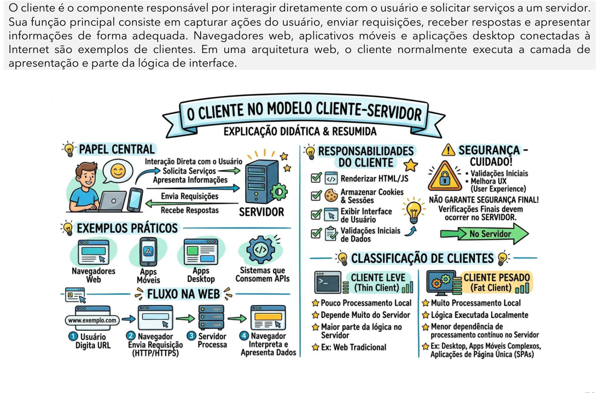

<!-- Start of picture text -->
O cliente é o componente responsável por interagir diretamente com o usuário e solicitar serviços a um servidor. Sua função principal consiste em capturar ações do usuário, enviar requisições, receber respostas e apresentar informações de forma adequada. Navegadores web, aplicativos móveis e aplicações desktop conectadas à Internet são exemplos de clientes. Em uma arquitetura web, o cliente normalmente executa a camada de apresentação e parte da lógica de interface. presentação e parte da lógica de interface. resentação e parte da lógica de interface. ção e parte da lógica de interface. ão e parte da lógica de interface. parte da lógica de interface. arte da lógica de interface. gica de interface. ica de interface. <!-- End of picture text -->

https://t.me/KakashiAssinaturasBot

---

<!-- pagina: 79 -->

**Diego Carvalho, Equipe Informática 2 (Diego Carvalho), Equipe Informática 1 (Diego Carvalho) Aula 07** 

###### **<mark>SERVIDOR</mark>** 

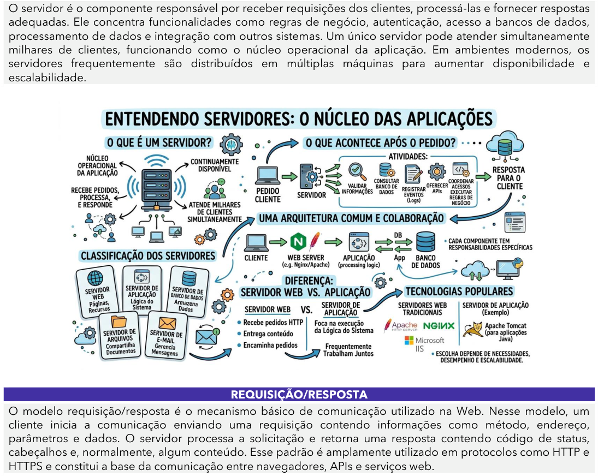

<!-- Start of picture text -->
O servidor é o componente responsável por receber requisições dos clientes, processá-las e fornecer respostas adequadas. Ele concentra funcionalidades como regras de negócio, autenticação, acesso a bancos de dados, processamento de dados e integração com outros sistemas. Um único servidor pode atender simultaneamente milhares de clientes, funcionando como o núcleo operacional da aplicação. Em ambientes modernos, os servidores frequentemente são distribuídos em múltiplas máquinas para aumentar disponibilidade e escalabilidade. REQUISIÇÃO/RESPOSTA O modelo requisição/resposta é o mecanismo básico de comunicação utilizado na Web. Nesse modelo, um cliente inicia a comunicação enviando uma requisição contendo informações como método, endereço, parâmetros e dados. O servidor processa a solicitação e retorna uma resposta contendo código de status, cabeçalhos e, normalmente, algum conteúdo. Esse padrão é amplamente utilizado em protocolos como HTTP e HTTPS e constitui a base da comunicação entre navegadores, APIs e serviços web. ção entre navegadores, APIs e serviços web. ão entre navegadores, APIs e serviços web. gadores, APIs e serviços web. adores, APIs e serviços web. , APIs e serviços web.  APIs e serviços web. ços web. os web. <!-- End of picture text -->

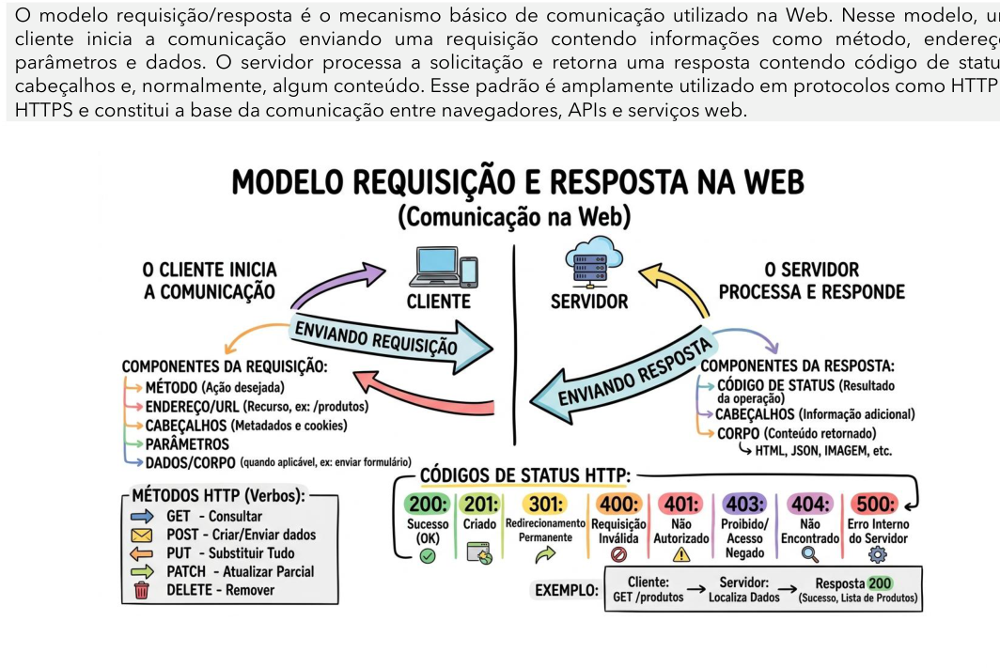

<!-- Start of picture text -->
O modelo requisição/resposta é o mecanismo básico de comunicação utilizado na Web. Nesse modelo, um cliente inicia a comunicação enviando uma requisição contendo informações como método, endereço, parâmetros e dados. O servidor processa a solicitação e retorna uma resposta contendo código de status, cabeçalhos e, normalmente, algum conteúdo. Esse padrão é amplamente utilizado em protocolos como HTTP e HTTPS e constitui a base da comunicação entre navegadores, APIs e serviços web. ção entre navegadores, APIs e serviços web. ão entre navegadores, APIs e serviços web. gadores, APIs e serviços web. adores, APIs e serviços web. , APIs e serviços web.  APIs e serviços web. ços web. os web. <!-- End of picture text -->

---

<!-- pagina: 80 -->

**Diego Carvalho, Equipe Informática 2 (Diego Carvalho), Equipe Informática 1 (Diego Carvalho) Aula 07** 

###### **<mark>SESSÃO</mark>** 

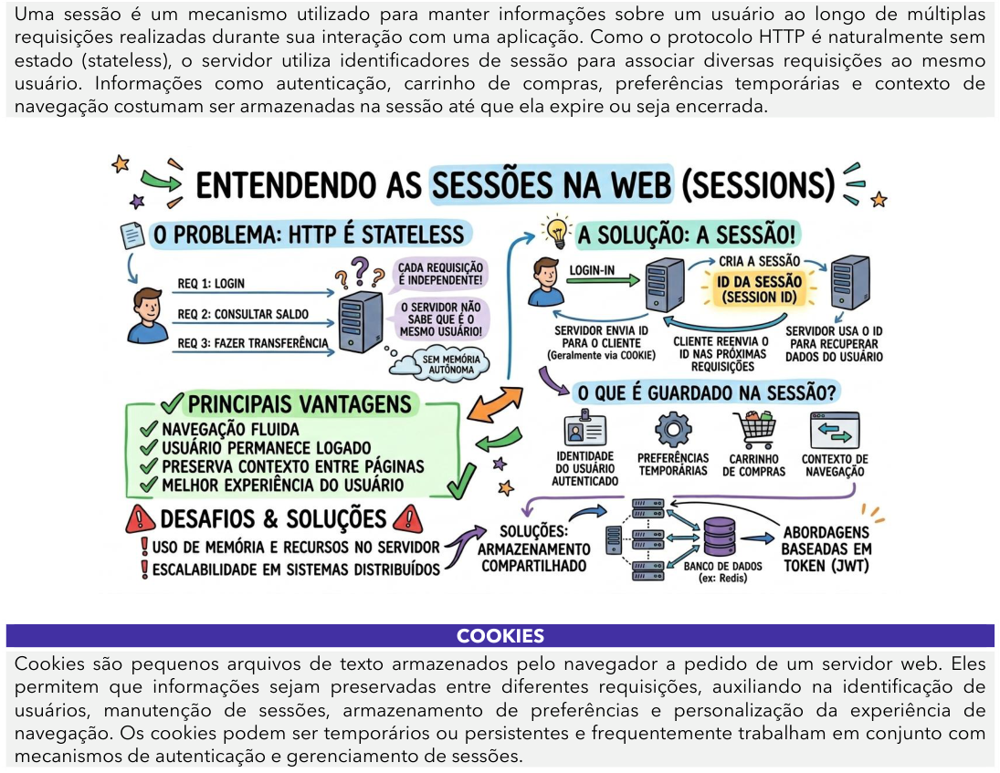

<!-- Start of picture text -->
Uma sessão é um mecanismo utilizado para manter informações sobre um usuário ao longo de múltiplas requisições realizadas durante sua interação com uma aplicação. Como o protocolo HTTP é naturalmente sem estado (stateless), o servidor utiliza identificadores de sessão para associar diversas requisições ao mesmo usuário. Informações como autenticação, carrinho de compras, preferências temporárias e contexto de navegação costumam ser armazenadas na sessão até que ela expire ou seja encerrada. COOKIES Cookies são pequenos arquivos de texto armazenados pelo navegador a pedido de um servidor web. Eles permitem que informações sejam preservadas entre diferentes requisições, auxiliando na identificação de usuários, manutenção de sessões, armazenamento de preferências e personalização da experiência de navegação. Os cookies podem ser temporários ou persistentes e frequentemente trabalham em conjunto com mecanismos de autenticação e gerenciamento de sessões. ção e gerenciamento de sessões. ão e gerenciamento de sessões. gerenciamento de sessões. erenciamento de sessões. <!-- End of picture text -->

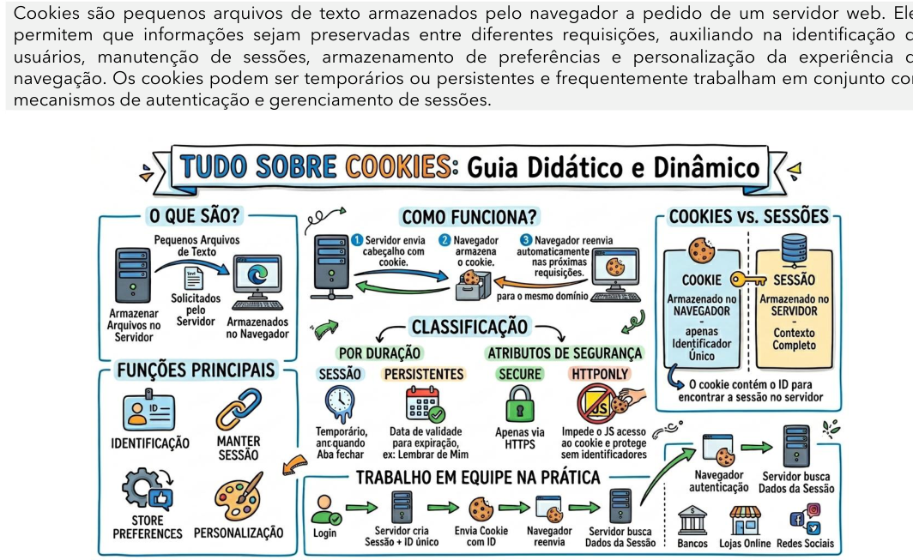

<!-- Start of picture text -->
Cookies são pequenos arquivos de texto armazenados pelo navegador a pedido de um servidor web. Eles permitem que informações sejam preservadas entre diferentes requisições, auxiliando na identificação de usuários, manutenção de sessões, armazenamento de preferências e personalização da experiência de navegação. Os cookies podem ser temporários ou persistentes e frequentemente trabalham em conjunto com mecanismos de autenticação e gerenciamento de sessões. ção e gerenciamento de sessões. ão e gerenciamento de sessões. gerenciamento de sessões. erenciamento de sessões. <!-- End of picture text -->

---

<!-- pagina: 81 -->

**Diego Carvalho, Equipe Informática 2 (Diego Carvalho), Equipe Informática 1 (Diego Carvalho) Aula 07** 

###### **<mark>PROTOCOLOS DE COMUNICAÇÃO</mark>** 

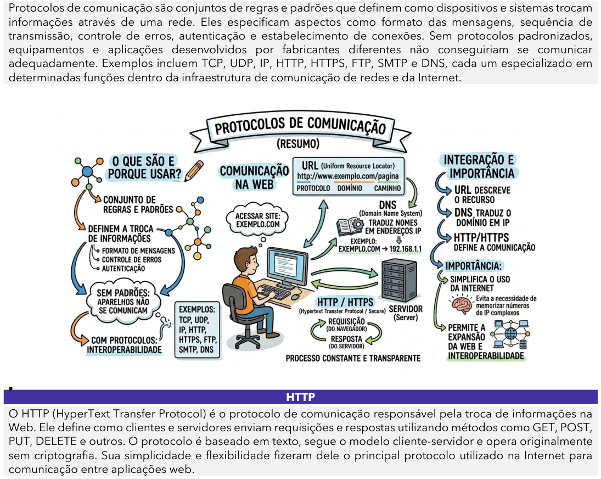

<!-- Start of picture text -->
Protocolos de comunicação são conjuntos de regras e padrões que definem como dispositivos e sistemas trocam informações através de uma rede. Eles especificam aspectos como formato das mensagens, sequência de transmissão, controle de erros, autenticação e estabelecimento de conexões. Sem protocolos padronizados, equipamentos e aplicações desenvolvidos por fabricantes diferentes não conseguiriam se comunicar adequadamente. Exemplos incluem TCP, UDP, IP, HTTP, HTTPS, FTP, SMTP e DNS, cada um especializado em determinadas funções dentro da infraestrutura de comunicação de redes e da Internet. HTTP O HTTP (HyperText Transfer Protocol) é o protocolo de comunicação responsável pela troca de informações na Web. Ele define como clientes e servidores enviam requisições e respostas utilizando métodos como GET, POST, PUT, DELETE e outros. O protocolo é baseado em texto, segue o modelo cliente-servidor e opera originalmente sem criptografia. Sua simplicidade e flexibilidade fizeram dele o principal protocolo utilizado na Internet para comunicação entre aplicações web. ção entre aplicações web. ão entre aplicações web. plicações web. licações web. ções web. ões web. <!-- End of picture text -->

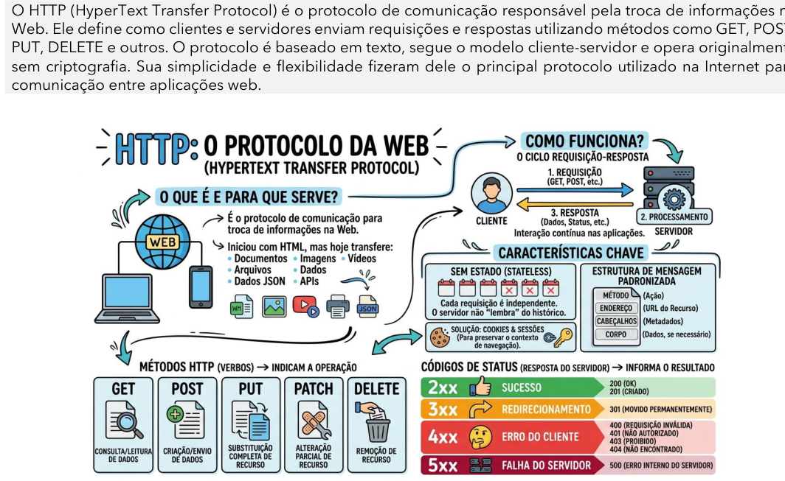

<!-- Start of picture text -->
O HTTP (HyperText Transfer Protocol) é o protocolo de comunicação responsável pela troca de informações na Web. Ele define como clientes e servidores enviam requisições e respostas utilizando métodos como GET, POST, PUT, DELETE e outros. O protocolo é baseado em texto, segue o modelo cliente-servidor e opera originalmente sem criptografia. Sua simplicidade e flexibilidade fizeram dele o principal protocolo utilizado na Internet para comunicação entre aplicações web. ção entre aplicações web. ão entre aplicações web. plicações web. licações web. ções web. ões web. <!-- End of picture text -->

---

<!-- pagina: 82 -->

**Diego Carvalho, Equipe Informática 2 (Diego Carvalho), Equipe Informática 1 (Diego Carvalho) Aula 07** 

###### **<mark>HTTPS</mark>** 

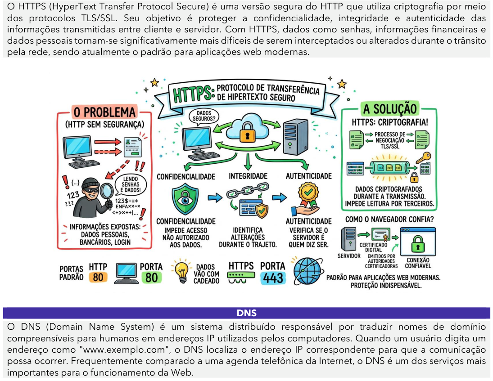

<!-- Start of picture text -->
O HTTPS (HyperText Transfer Protocol Secure) é uma versão segura do HTTP que utiliza criptografia por meio dos protocolos TLS/SSL. Seu objetivo é proteger a confidencialidade, integridade e autenticidade das informações transmitidas entre cliente e servidor. Com HTTPS, dados como senhas, informações financeiras e dados pessoais tornam-se significativamente mais difíceis de serem interceptados ou alterados durante o trânsito pela rede, sendo atualmente o padrão para aplicações web modernas. DNS O DNS (Domain Name System) é um sistema distribuído responsável por traduzir nomes de domínio compreensíveis para humanos em endereços IP utilizados pelos computadores. Quando um usuário digita um endereço como "www.exemplo.com", o DNS localiza o endereço IP correspondente para que a comunicação possa ocorrer. Frequentemente comparado a uma agenda telefônica da Internet, o DNS é um dos serviços mais importantes para o funcionamento da Web. portantes para o funcionamento da Web. ortantes para o funcionamento da Web. para o funcionamento da Web. ara o funcionamento da Web. <!-- End of picture text -->

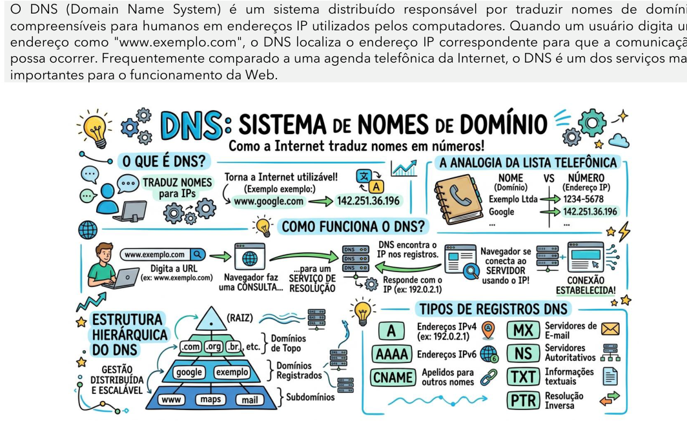

<!-- Start of picture text -->
O DNS (Domain Name System) é um sistema distribuído responsável por traduzir nomes de domínio compreensíveis para humanos em endereços IP utilizados pelos computadores. Quando um usuário digita um endereço como "www.exemplo.com", o DNS localiza o endereço IP correspondente para que a comunicação possa ocorrer. Frequentemente comparado a uma agenda telefônica da Internet, o DNS é um dos serviços mais importantes para o funcionamento da Web. portantes para o funcionamento da Web. ortantes para o funcionamento da Web. para o funcionamento da Web. ara o funcionamento da Web. <!-- End of picture text -->

---

<!-- pagina: 83 -->

**Diego Carvalho, Equipe Informática 2 (Diego Carvalho), Equipe Informática 1 (Diego Carvalho) Aula 07** 

###### **<mark>URL</mark>** 

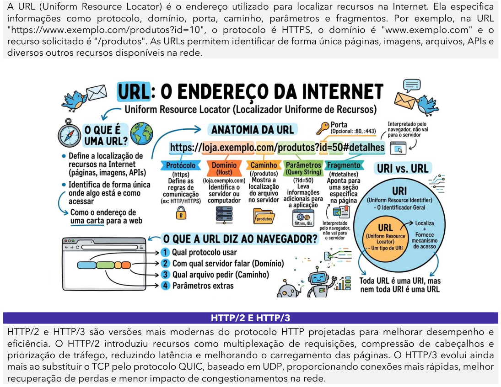

<!-- Start of picture text -->
A URL (Uniform Resource Locator) é o endereço utilizado para localizar recursos na Internet. Ela especifica informações como protocolo, domínio, porta, caminho, parâmetros e fragmentos. Por exemplo, na URL "https://www.exemplo.com/produtos?id=10", o protocolo é HTTPS, o domínio é "www.exemplo.com" e o recurso solicitado é "/produtos". As URLs permitem identificar de forma única páginas, imagens, arquivos, APIs e diversos outros recursos disponíveis na rede. HTTP/2 E HTTP/3 HTTP/2 e HTTP/3 são versões mais modernas do protocolo HTTP projetadas para melhorar desempenho e eficiência. O HTTP/2 introduziu recursos como multiplexação de requisições, compressão de cabeçalhos e priorização de tráfego, reduzindo latência e melhorando o carregamento das páginas. O HTTP/3 evolui ainda mais ao substituir o TCP pelo protocolo QUIC, baseado em UDP, proporcionando conexões mais rápidas, melhor recuperação de perdas e menor impacto de congestionamentos na rede. peração de perdas e menor impacto de congestionamentos na rede. eração de perdas e menor impacto de congestionamentos na rede. ção de perdas e menor impacto de congestionamentos na rede. ão de perdas e menor impacto de congestionamentos na rede. perdas e menor impacto de congestionamentos na rede. erdas e menor impacto de congestionamentos na rede. pacto de congestionamentos na rede. acto de congestionamentos na rede. gestionamentos na rede. estionamentos na rede. <!-- End of picture text -->

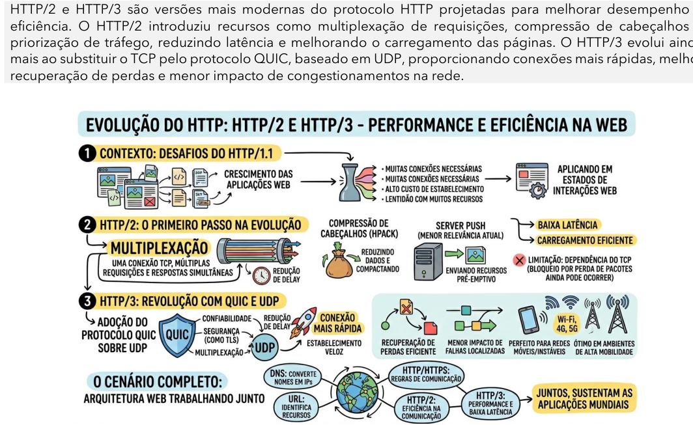

<!-- Start of picture text -->
HTTP/2 e HTTP/3 são versões mais modernas do protocolo HTTP projetadas para melhorar desempenho e eficiência. O HTTP/2 introduziu recursos como multiplexação de requisições, compressão de cabeçalhos e priorização de tráfego, reduzindo latência e melhorando o carregamento das páginas. O HTTP/3 evolui ainda mais ao substituir o TCP pelo protocolo QUIC, baseado em UDP, proporcionando conexões mais rápidas, melhor recuperação de perdas e menor impacto de congestionamentos na rede. peração de perdas e menor impacto de congestionamentos na rede. eração de perdas e menor impacto de congestionamentos na rede. ção de perdas e menor impacto de congestionamentos na rede. ão de perdas e menor impacto de congestionamentos na rede. perdas e menor impacto de congestionamentos na rede. erdas e menor impacto de congestionamentos na rede. pacto de congestionamentos na rede. acto de congestionamentos na rede. gestionamentos na rede. estionamentos na rede. <!-- End of picture text -->

---

<!-- pagina: 84 -->

**Diego Carvalho, Equipe Informática 2 (Diego Carvalho), Equipe Informática 1 (Diego Carvalho) Aula 07** 

###### **<mark>ARQUITETURAS TRADICIONAIS</mark>** 

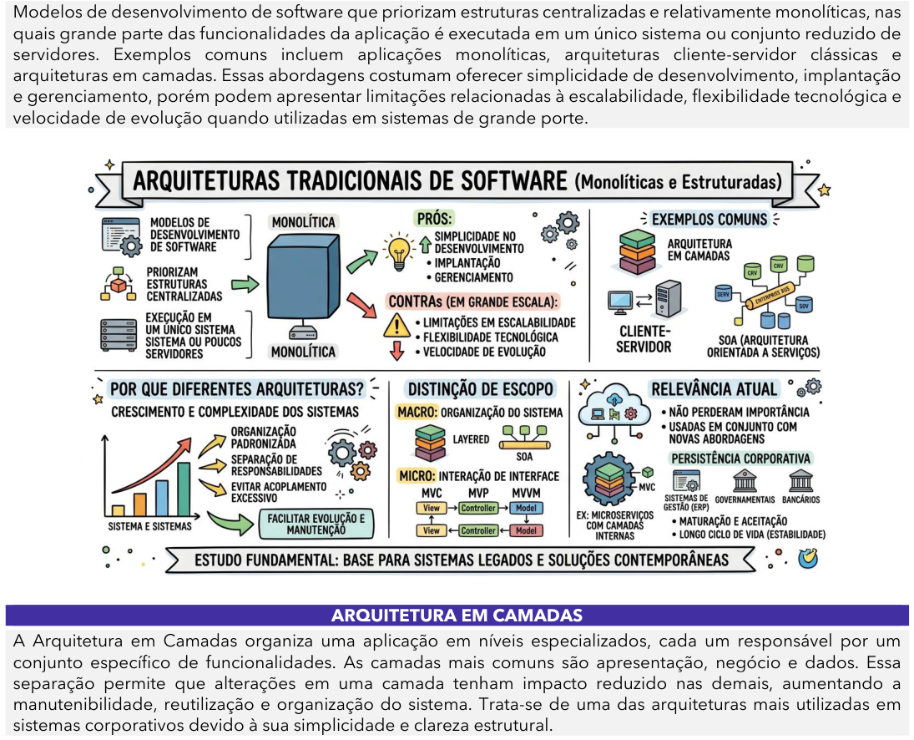

<!-- Start of picture text -->
Modelos de desenvolvimento de software que priorizam estruturas centralizadas e relativamente monolíticas, nas quais grande parte das funcionalidades da aplicação é executada em um único sistema ou conjunto reduzido de servidores. Exemplos comuns incluem aplicações monolíticas, arquiteturas cliente-servidor clássicas e arquiteturas em camadas. Essas abordagens costumam oferecer simplicidade de desenvolvimento, implantação e gerenciamento, porém podem apresentar limitações relacionadas à escalabilidade, flexibilidade tecnológica e velocidade de evolução quando utilizadas em sistemas de grande porte. ARQUITETURA EM CAMADAS A Arquitetura em Camadas organiza uma aplicação em níveis especializados, cada um responsável por um conjunto específico de funcionalidades. As camadas mais comuns são apresentação, negócio e dados. Essa separação permite que alterações em uma camada tenham impacto reduzido nas demais, aumentando a manutenibilidade, reutilização e organização do sistema. Trata-se de uma das arquiteturas mais utilizadas em sistemas corporativos devido à sua simplicidade e clareza estrutural. porativos devido à sua simplicidade e clareza estrutural. orativos devido à sua simplicidade e clareza estrutural. plicidade e clareza estrutural. licidade e clareza estrutural. <!-- End of picture text -->

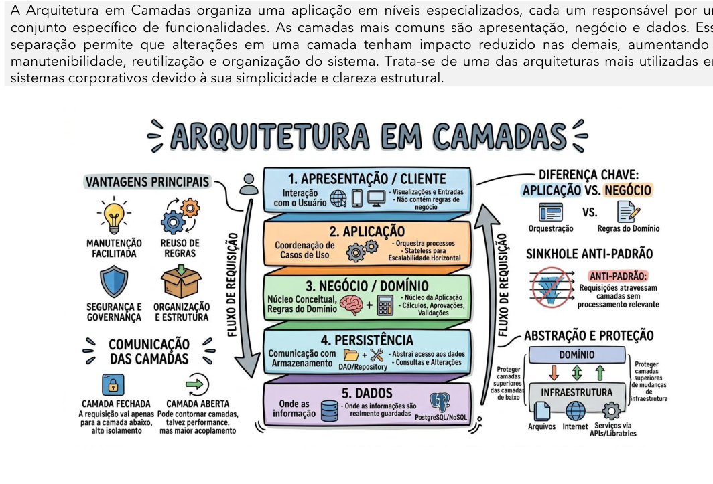

<!-- Start of picture text -->
A Arquitetura em Camadas organiza uma aplicação em níveis especializados, cada um responsável por um conjunto específico de funcionalidades. As camadas mais comuns são apresentação, negócio e dados. Essa separação permite que alterações em uma camada tenham impacto reduzido nas demais, aumentando a manutenibilidade, reutilização e organização do sistema. Trata-se de uma das arquiteturas mais utilizadas em sistemas corporativos devido à sua simplicidade e clareza estrutural. porativos devido à sua simplicidade e clareza estrutural. orativos devido à sua simplicidade e clareza estrutural. plicidade e clareza estrutural. licidade e clareza estrutural. <!-- End of picture text -->

---

<!-- pagina: 85 -->

**Diego Carvalho, Equipe Informática 2 (Diego Carvalho), Equipe Informática 1 (Diego Carvalho) Aula 07** 

###### **<mark>ARQUITETURA MVC</mark>** 

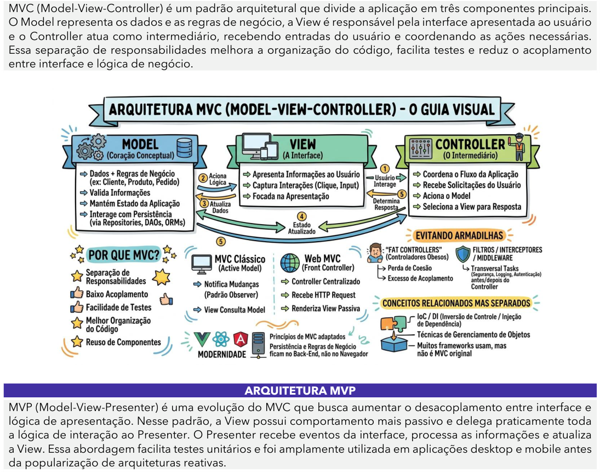

<!-- Start of picture text -->
MVC (Model-View-Controller) é um padrão arquitetural que divide a aplicação em três componentes principais. O Model representa os dados e as regras de negócio, a View é responsável pela interface apresentada ao usuário e o Controller atua como intermediário, recebendo entradas do usuário e coordenando as ações necessárias. Essa separação de responsabilidades melhora a organização do código, facilita testes e reduz o acoplamento entre interface e lógica de negócio. ARQUITETURA MVP MVP (Model-View-Presenter) é uma evolução do MVC que busca aumentar o desacoplamento entre interface e lógica de apresentação. Nesse padrão, a View possui comportamento mais passivo e delega praticamente toda a lógica de interação ao Presenter. O Presenter recebe eventos da interface, processa as informações e atualiza a View. Essa abordagem facilita testes unitários e foi amplamente utilizada em aplicações desktop e mobile antes da popularização de arquiteturas reativas. popularização de arquiteturas reativas. opularização de arquiteturas reativas. pularização de arquiteturas reativas. ularização de arquiteturas reativas. ção de arquiteturas reativas. ão de arquiteturas reativas. quiteturas reativas. uiteturas reativas. <!-- End of picture text -->

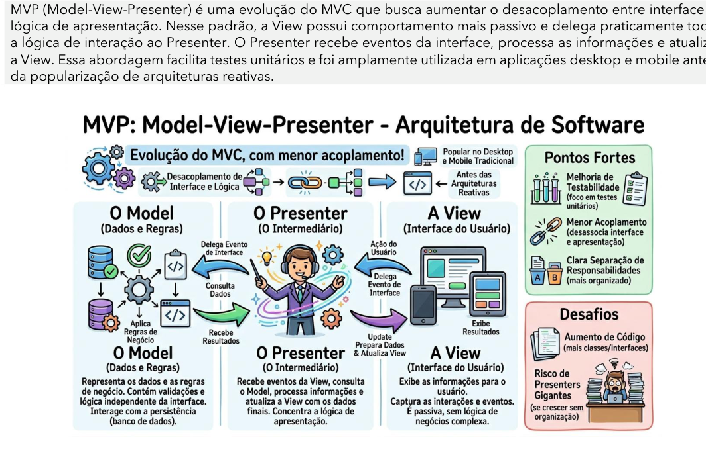

<!-- Start of picture text -->
MVP (Model-View-Presenter) é uma evolução do MVC que busca aumentar o desacoplamento entre interface e lógica de apresentação. Nesse padrão, a View possui comportamento mais passivo e delega praticamente toda a lógica de interação ao Presenter. O Presenter recebe eventos da interface, processa as informações e atualiza a View. Essa abordagem facilita testes unitários e foi amplamente utilizada em aplicações desktop e mobile antes da popularização de arquiteturas reativas. popularização de arquiteturas reativas. opularização de arquiteturas reativas. pularização de arquiteturas reativas. ularização de arquiteturas reativas. ção de arquiteturas reativas. ão de arquiteturas reativas. quiteturas reativas. uiteturas reativas. <!-- End of picture text -->

https://t.me/KakashiAssinaturasBot

---

<!-- pagina: 86 -->

**Diego Carvalho, Equipe Informática 2 (Diego Carvalho), Equipe Informática 1 (Diego Carvalho) Aula 07** 

###### **<mark>ARQUITETURA MVVM</mark>** 

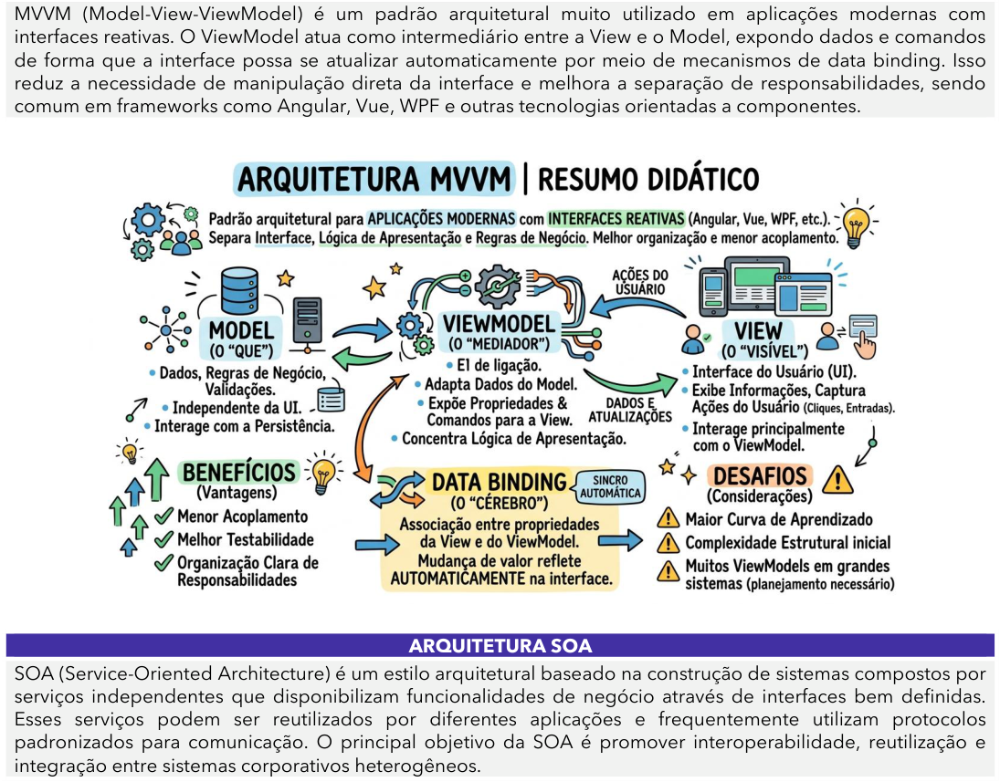

<!-- Start of picture text -->
MVVM (Model-View-ViewModel) é um padrão arquitetural muito utilizado em aplicações modernas com interfaces reativas. O ViewModel atua como intermediário entre a View e o Model, expondo dados e comandos de forma que a interface possa se atualizar automaticamente por meio de mecanismos de data binding. Isso reduz a necessidade de manipulação direta da interface e melhora a separação de responsabilidades, sendo comum em frameworks como Angular, Vue, WPF e outras tecnologias orientadas a componentes. ARQUITETURA SOA SOA (Service-Oriented Architecture) é um estilo arquitetural baseado na construção de sistemas compostos por serviços independentes que disponibilizam funcionalidades de negócio através de interfaces bem definidas. Esses serviços podem ser reutilizados por diferentes aplicações e frequentemente utilizam protocolos padronizados para comunicação. O principal objetivo da SOA é promover interoperabilidade, reutilização e integração entre sistemas corporativos heterogêneos. gração entre sistemas corporativos heterogêneos. ração entre sistemas corporativos heterogêneos. ção entre sistemas corporativos heterogêneos. ão entre sistemas corporativos heterogêneos. porativos heterogêneos. orativos heterogêneos. gêneos. êneos. <!-- End of picture text -->

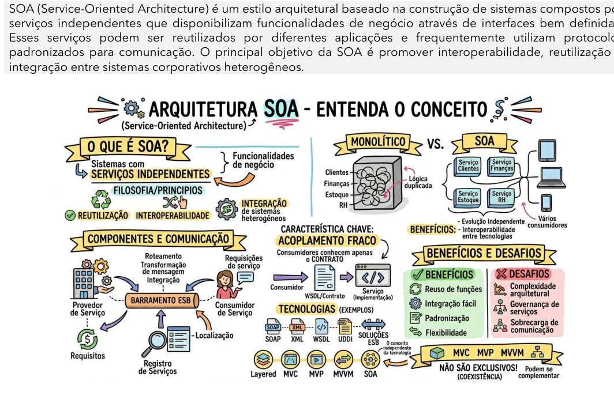

<!-- Start of picture text -->
SOA (Service-Oriented Architecture) é um estilo arquitetural baseado na construção de sistemas compostos por serviços independentes que disponibilizam funcionalidades de negócio através de interfaces bem definidas. Esses serviços podem ser reutilizados por diferentes aplicações e frequentemente utilizam protocolos padronizados para comunicação. O principal objetivo da SOA é promover interoperabilidade, reutilização e integração entre sistemas corporativos heterogêneos. gração entre sistemas corporativos heterogêneos. ração entre sistemas corporativos heterogêneos. ção entre sistemas corporativos heterogêneos. ão entre sistemas corporativos heterogêneos. porativos heterogêneos. orativos heterogêneos. gêneos. êneos. <!-- End of picture text -->

---

<!-- pagina: 87 -->

**Diego Carvalho, Equipe Informática 2 (Diego Carvalho), Equipe Informática 1 (Diego Carvalho) Aula 07** 

###### **<mark>ARQUITETURAS MODERNAS</mark>** 

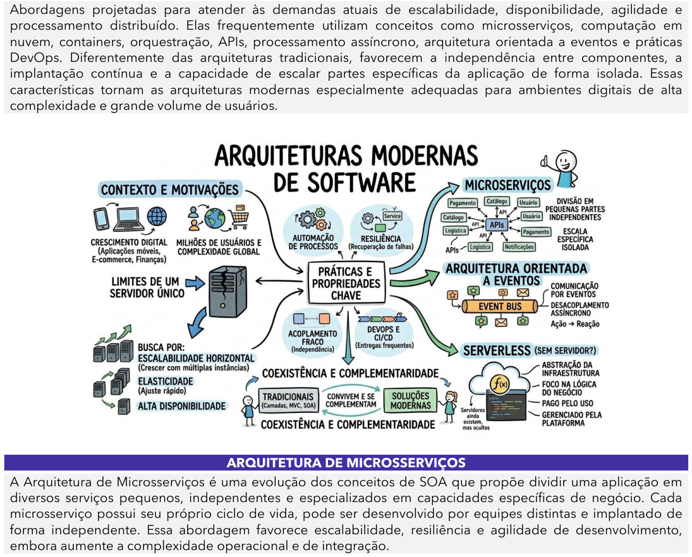

<!-- Start of picture text -->
Abordagens projetadas para atender às demandas atuais de escalabilidade, disponibilidade, agilidade e processamento distribuído. Elas frequentemente utilizam conceitos como microsserviços, computação em nuvem, containers, orquestração, APIs, processamento assíncrono, arquitetura orientada a eventos e práticas DevOps. Diferentemente das arquiteturas tradicionais, favorecem a independência entre componentes, a implantação contínua e a capacidade de escalar partes específicas da aplicação de forma isolada. Essas características tornam as arquiteturas modernas especialmente adequadas para ambientes digitais de alta complexidade e grande volume de usuários. ARQUITETURA DE MICROSSERVIÇOS A Arquitetura de Microsserviços é uma evolução dos conceitos de SOA que propõe dividir uma aplicação em diversos serviços pequenos, independentes e especializados em capacidades específicas de negócio. Cada microsserviço possui seu próprio ciclo de vida, pode ser desenvolvido por equipes distintas e implantado de forma independente. Essa abordagem favorece escalabilidade, resiliência e agilidade de desenvolvimento, embora aumente a complexidade operacional e de integração. plexidade operacional e de integração. lexidade operacional e de integração. peracional e de integração. eracional e de integração. gração. ração. ção. ão. <!-- End of picture text -->

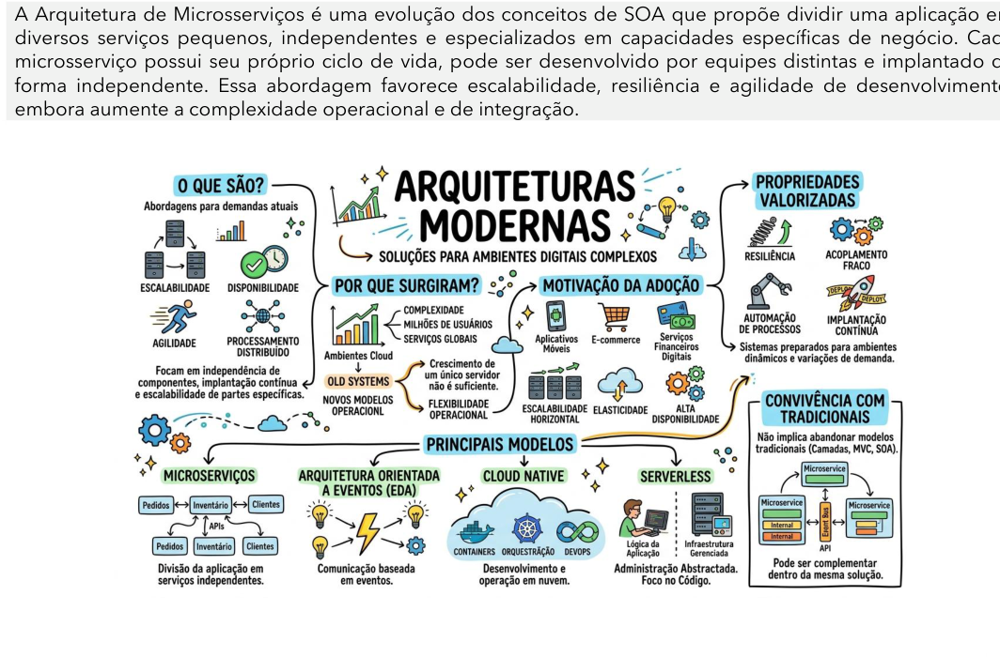

<!-- Start of picture text -->
A Arquitetura de Microsserviços é uma evolução dos conceitos de SOA que propõe dividir uma aplicação em diversos serviços pequenos, independentes e especializados em capacidades específicas de negócio. Cada microsserviço possui seu próprio ciclo de vida, pode ser desenvolvido por equipes distintas e implantado de forma independente. Essa abordagem favorece escalabilidade, resiliência e agilidade de desenvolvimento, embora aumente a complexidade operacional e de integração. plexidade operacional e de integração. lexidade operacional e de integração. peracional e de integração. eracional e de integração. gração. ração. ção. ão. <!-- End of picture text -->

---

<!-- pagina: 88 -->

**Diego Carvalho, Equipe Informática 2 (Diego Carvalho), Equipe Informática 1 (Diego Carvalho) Aula 07** 

###### **<mark>EVENT-DRIVEN ARCHITECTURE</mark>** 

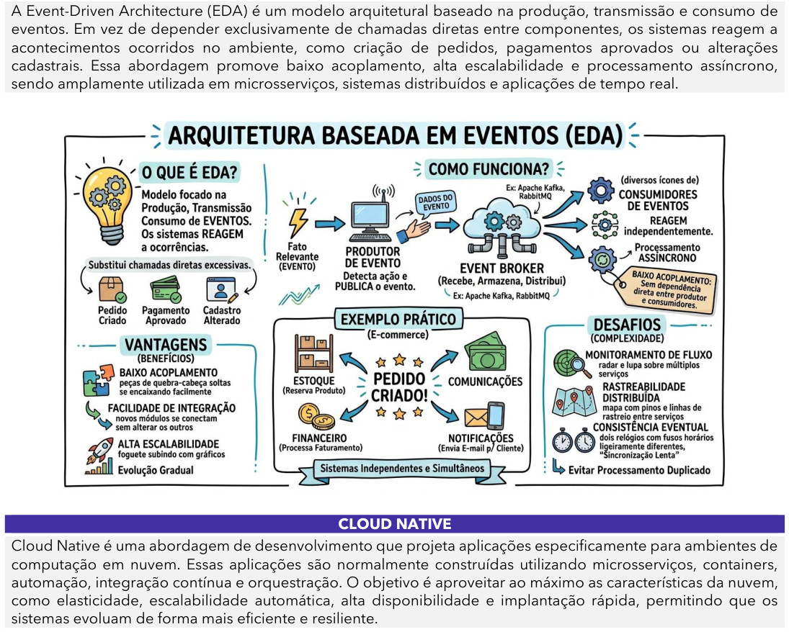

<!-- Start of picture text -->
A Event-Driven Architecture (EDA) é um modelo arquitetural baseado na produção, transmissão e consumo de eventos. Em vez de depender exclusivamente de chamadas diretas entre componentes, os sistemas reagem a acontecimentos ocorridos no ambiente, como criação de pedidos, pagamentos aprovados ou alterações cadastrais. Essa abordagem promove baixo acoplamento, alta escalabilidade e processamento assíncrono, sendo amplamente utilizada em microsserviços, sistemas distribuídos e aplicações de tempo real. ==5460== CLOUD NATIVE Cloud Native é uma abordagem de desenvolvimento que projeta aplicações especificamente para ambientes de computação em nuvem. Essas aplicações são normalmente construídas utilizando microsserviços, containers, automação, integração contínua e orquestração. O objetivo é aproveitar ao máximo as características da nuvem, como elasticidade, escalabilidade automática, alta disponibilidade e implantação rápida, permitindo que os sistemas evoluam de forma mais eficiente e resiliente. <!-- End of picture text -->

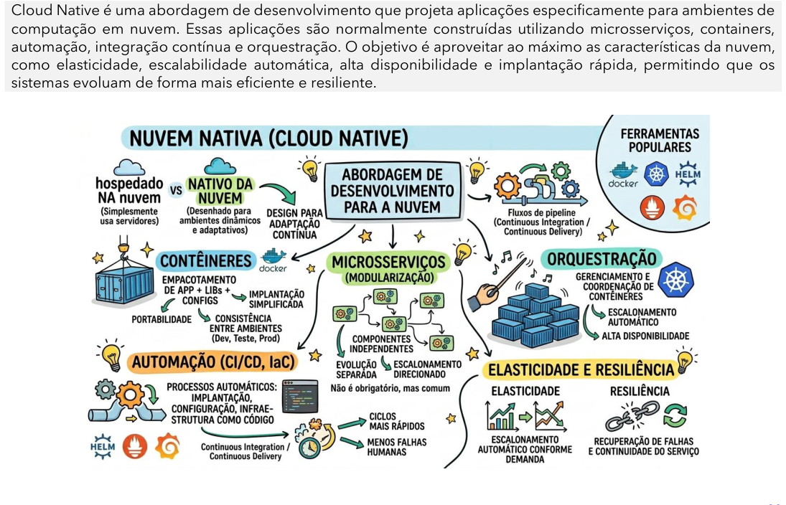

<!-- Start of picture text -->
Cloud Native é uma abordagem de desenvolvimento que projeta aplicações especificamente para ambientes de computação em nuvem. Essas aplicações são normalmente construídas utilizando microsserviços, containers, automação, integração contínua e orquestração. O objetivo é aproveitar ao máximo as características da nuvem, como elasticidade, escalabilidade automática, alta disponibilidade e implantação rápida, permitindo que os sistemas evoluam de forma mais eficiente e resiliente. <!-- End of picture text -->

---

<!-- pagina: 89 -->

**Diego Carvalho, Equipe Informática 2 (Diego Carvalho), Equipe Informática 1 (Diego Carvalho) Aula 07** 

###### **<mark>SERVERLESS</mark>** 

<!-- Start of picture text -->
Serverless é um modelo de computação em nuvem no qual o provedor gerencia automaticamente toda a infraestrutura necessária para executar aplicações. O desenvolvedor concentra-se apenas na implementação do código, enquanto aspectos como provisionamento, escalabilidade, monitoramento e disponibilidade são administrados pela plataforma. Em geral, as aplicações são executadas em resposta a eventos e o custo costuma ser baseado apenas no consumo efetivo de recursos computacionais. <!-- End of picture text -->

---

<!-- pagina: 90 -->

**Diego Carvalho, Equipe Informática 2 (Diego Carvalho), Equipe Informática 1 (Diego Carvalho) Aula 07** 

<!-- Start of picture text -->
Q UESTÕES  C OMENTADAS <!-- End of picture text -->

**1. (FGV / TJ RJ - 2024) Com relação à arquitetura de software em camadas, avalie se as afirmativas a seguir são verdadeiras (V) ou falsas (F).** 

**( ) A arquitetura de software em camadas é uma arquitetura que divide o software em camadas, cada uma com uma responsabilidade específica.** 

**( ) A arquitetura de software em camadas é uma arquitetura que facilita a manutenção e evolução do software, pois cada camada pode ser desenvolvida e mantida independentemente das outras camadas.** 

**( ) A arquitetura de software em camadas é uma arquitetura que é sempre a melhor escolha para qualquer tipo de software.** 

**As afirmativas são, respectivamente,** 

a) V – F – F. 

b) V – V – F. 

c) F – V – F. 

d) F – V – V. 

e) F – F – V. 

**Comentários:** 

(I) Correto. A arquitetura em camadas organiza o sistema em partes com funções específicas, o que favorece separação de responsabilidades. 

(II) Correto. Esse modelo ajuda na manutenção e evolução, pois cada camada pode ser tratada com mais independência e organização. 

(III) Errado. Nem todo software se beneficia igualmente desse padrão; a escolha da arquitetura depende do contexto e das necessidades do sistema. 

**Gabarito:** Letra B 

**2. (FGV / ALETO - 2024) A Prefeitura de Nova Esperança planeja criar um sistema de gestão para aumentar a eficiência dos serviços e a interação cidadã. Ele precisa se aproveitar de um sistema**

---

<!-- pagina: 91 -->

**Diego Carvalho, Equipe Informática 2 (Diego Carvalho), Equipe Informática 1 (Diego Carvalho) Aula 07** 

**de bancos de dados legado. E as regras fiscais serão projetadas futuramente pelos especialistas e legisladores. Sobre a hipótese apresentada, assinale a afirmativa correta.** 

- a) Uma arquitetura de três camadas, permitindo integração imediata com o banco de dados e suportar adição futura das regras dos legisladores. 

- b) Uma arquitetura de três camadas em que a camada central irá interagir com o sistema de banco de dados legado e a primeira camada irá incorporar as regras fiscais. 

- c) Uma arquitetura de duas camadas, sendo a primeira para a nova interface com o usuário e a segunda para interagir com o banco de dados legado. 

- d) Uma arquitetura monolítica de microsserviços para compensar a perda de performance para acesso aos bancos de dados legados. 

- e) Uma arquitetura Web distribuída de 3 camadas em que a última camada irá disponibilizar a interface com o usuário, a segunda constará as regras de negócio e a primeira camada, a de apresentação, irá interagir com os bancos de dados legados. 

**Comentários:** 

(a) Correto. A arquitetura em três camadas separa apresentação, lógica e dados, facilitando integrar o banco legado agora e incluir depois as regras fiscais na camada de negócio. 

(b) Errado. As regras fiscais não ficam na primeira camada, mas na camada de negócio; por isso, a distribuição proposta não é a mais adequada. 

(c) Errado. Em duas camadas, há menor separação de responsabilidades, o que dificulta evoluções futuras, como a inclusão das regras fiscais. 

(d) Errado. “Arquitetura monolítica de microsserviços” mistura conceitos distintos e não atende bem à necessidade de integração organizada com legado e evolução futura. 

(e) Errado. A descrição das camadas está invertida: a interface com o usuário pertence à apresentação, e o acesso ao banco legado não fica na primeira camada. 

**Gabarito:** Letra A 

**3. (FGV / DPE RO - 2025) O padrão arquitetural MVC foi proposto na década de 70 e desde então vem sendo amplamente utilizado no mercado. Com relação às afirmativas sobre o padrão, avalie as afirmativas a seguir e assinale (V) para a afirmativa verdadeira e (F) para a falsa.**

---

<!-- pagina: 92 -->

**Diego Carvalho, Equipe Informática 2 (Diego Carvalho), Equipe Informática 1 (Diego Carvalho) Aula 07** 

**( ) Visão - são as classes responsáveis pela apresentação da interface gráfica do sistema, incluindo janelas, botões, menus, barras de rolagem. A interface gráfica é formada por objetos de visão e contêineres.** 

**( ) Conteiner - são as classes que tratam e interpretam eventos gerados por dispositivos de entrada, como mouse e teclado. Como resultado de tais eventos, contêineres podem solicitar uma alteração no estado do Modelo ou da Visão. Suponha, por exemplo, uma Calculadora. Quando o usuário clica em um botão +, uma classe Controladora deve capturar esse evento e chamar um método do Modelo.** 

**( ) Modelo - são as classes que armazenam os dados manipulados pela aplicação e que têm a ver com o domínio do sistema em construção. Assim, classes de Modelo não têm qualquer conhecimento ou dependência para classes de Visão e Contêineres. Além de dados, classes de Modelo podem conter métodos que alteram o estado dos objetos de domínio.** 

**As afirmativas são, respectivamente,** 

a) V – V – F. 

b) V – F – F. 

c) F – V – F. 

d) F – V – V. 

e) F – F – V. 

**Comentários:** 

(F) A descrição mistura conceitos e não caracteriza adequadamente a afirmativa como verdadeira no contexto cobrado, por isso ela não entra entre as válidas. 

(F) O item atribui ao contêiner um papel de tratamento de eventos que, na lógica apresentada pela questão, não é o considerado correto. 

(V) O modelo representa os dados e regras do domínio, podendo alterar estados sem depender de visão e contêineres. 

**Gabarito:** Letra E 

**4. (FGV / ALEAM - 2025) Em uma aplicação web para o backoffice da Casa, o modelo MVC (ModelView-Controller) é adotado para separar as preocupações do código, promovendo a manutenibilidade e a testabilidade. A principal responsabilidade do Model em uma aplicação MVC clássica, no contexto de uma requisição web é**

---

<!-- pagina: 93 -->

**Diego Carvalho, Equipe Informática 2 (Diego Carvalho), Equipe Informática 1 (Diego Carvalho) Aula 07** 

- a) gerenciar a interação do usuário e receber as entradas para decidir qual ação será executada. 

- b) determinar o formato de apresentação dos dados e exibi-los ao usuário. 

- c) tratar exclusivamente a lógica de segurança e criptografia da sessão do usuário. 

- d) representar a lógica de negócio, persistência de dados e as regras de domínio, sendo totalmente independente da View e do Controller. 

- e) atuar como um gateway de API, roteando as requisições HTTP para os serviços de backend. 

**Comentários:** 

(a) Errado. Essa função é típica do Controller, que recebe entradas e decide o fluxo da aplicação. 

- (b) Errado. Quem define a apresentação e exibe os dados ao usuário é a View, não o Model. 

(c) Errado. Segurança e criptografia podem existir na aplicação, mas não são responsabilidade exclusiva do Model. 

(d) Correto. O Model concentra a lógica de negócio, regras de domínio e persistência, mantendo independência da View e do Controller. 

(e) Errado. Rotear requisições HTTP para serviços de backend é papel ligado à infraestrutura ou ao controlador, não ao Model. 

**Gabarito:** Letra D 

**5. (FGV / CGE SP - 2025) O padrão de arquitetura Model-View-Controller (MVC) é amplamente usado em aplicações web, separando responsabilidades para facilitar a manutenção, a reutilização de código e a testabilidade.** 

**Assinale a opção que indica, no MVC, o componente que é responsável por receber as requisições do usuário, processar a entrada, determinar a lógica de negócio que deve ser executada, interagindo com o Model e, por fim, selecionar a View que deve ser apresentada ao usuário.** 

a) View. 

b) Model. 

c) Controller.

---

<!-- pagina: 94 -->

**Diego Carvalho, Equipe Informática 2 (Diego Carvalho), Equipe Informática 1 (Diego Carvalho) Aula 07** 

d) Repository. 

e) Service. 

###### **Comentários:** 

(a) Errado. A View cuida da apresentação dos dados ao usuário, não de receber requisições e coordenar o fluxo da aplicação. 

(b) Errado. O Model representa os dados e a lógica de negócio, mas não faz o papel de entrada e encaminhamento das ações do usuário. 

(c) Correto. O Controller recebe a requisição, trata a entrada, aciona o Model quando necessário e define qual View será exibida. 

(d) Errado. Repository é um padrão ligado ao acesso a dados, não ao controle do fluxo entre entrada do usuário, Model e View. 

(e) Errado. Service costuma concentrar regras de negócio em algumas arquiteturas, mas não é o componente central do padrão MVC. 

**Gabarito:** Letra C 

**6. (FGV / ALESC - 2024) O MVC (Model-View-Controller) é um padrão de arquitetura de software. Com relação ao Padrão MVC, analise os itens a seguir.** 

   - **I. No MVC, estão presentes três componentes: Model, que representam o negócio; View, que responde pela interface que será apresentada; e, Controller, que integra os componentes model e view, fazendo com que os models possam ser repassados para as views e vice-versa.** 

   - **II. A semântica do MVC envolve um model, vários componentes Controller e apenas uma única View.** 

**III. O Model encapsula o estado do aplicativo e a funcionalidade principal do negócio.** 

**Está correto o que se afirma em** 

a) I, apenas. 

b) I e II, apenas. 

c) I e III, apenas. 

d) II e III, apenas. 

e) I, II e III apenas.

---

<!-- pagina: 95 -->

**Diego Carvalho, Equipe Informática 2 (Diego Carvalho), Equipe Informática 1 (Diego Carvalho) Aula 07** 

###### **Comentários:** 

(I) Correto. O MVC é formado por Model, View e Controller; o Controller faz a mediação entre regra de negócio e interface, permitindo a interação entre esses componentes. 

(II) Errado. No MVC, não se limita a arquitetura a vários Controllers e apenas uma única View; essa descrição restringe indevidamente o padrão. 

(III) Correto. O Model concentra o estado da aplicação e a lógica central do negócio, sendo a parte responsável pelos dados e comportamento do sistema. 

**Gabarito:** Letra C 

<!-- Start of picture text -->
==5460== <!-- End of picture text -->

**7. (FGV / ALEP - 2024) Queremos construir uma aplicação WEB em JAVA em três camadas. Sobre a utilização do padrão de projeto MVC nesta aplicação, assinale a afirmativa correta.** 

   - a) A primeira camada, ou camada de apresentação, e a segunda camada, ou camada de negócios, ambas implementam uma versão do MVC. 

   - b) A camada de apresentação corresponde a View do MVC além de implementar as classes do Model. 

   - c) A camada de apresentação corresponde a View do padrão MVC, o Controler é implementado na segunda camada utilizando o Model que é implementado na terceira camada. 

   - d) A primeira camada corresponde a View do padrão MVC e a terceira camada implementa o Controler e o Model do padrão MVC. 

   - e) A camada de apresentação corresponde ao frontend e o backend corresponde unicamente a View e o Controler do padrão MVC. 

###### **Comentários:** 

(a) Errado. A arquitetura em três camadas não exige que apresentação e negócios implementem, cada uma, uma versão própria do MVC. 

(b) Errado. A camada de apresentação se relaciona com a interface, não sendo a responsável por concentrar também as classes do Model. 

(c) Correto. Na divisão proposta, a apresentação atua como View, o Controller fica na segunda camada e o Model na terceira, separando bem as responsabilidades.

---

<!-- pagina: 96 -->

**Diego Carvalho, Equipe Informática 2 (Diego Carvalho), Equipe Informática 1 (Diego Carvalho) Aula 07** 

(d) Errado. A primeira camada pode representar a View, mas não cabe à terceira reunir Controller e Model ao mesmo tempo. 

(e) Errado. No padrão MVC, a View está ligada à apresentação; não faz sentido atribuir ao backend unicamente View e Controller. 

**Gabarito:** Letra C 

**8. (FGV / INPE - 2024) O padrão MVC (Model-View-Controller) tem como objetivo facilitar a manutenção e a escalabilidade de um software. Com relação ao padrão MVC, analise as afirmativas a seguir.** 

   - **I. A camada Model gerencia o fluxo de dados entre as outras camadas e as interações com o usuário.** 

**II. A camada View gerencia a apresentação e a interface do usuário.** 

**III. A camada Controller contém as regras de negócio, os dados e a lógica da aplicação.** 

**Está correto o que se afirma em** 

a) II, apenas. 

b) III, apenas. 

c) I e II, apenas. 

d) II e III apenas. 

e) I, II e III. 

**Comentários:** 

(I) Errado. A afirmativa atribui ao Model funções de controle do fluxo e interação com o usuário, que não correspondem ao papel dessa camada no MVC. 

(II) Correto. A View é a camada voltada à apresentação das informações e à interface com o usuário, exibindo os dados de forma adequada. 

(III) Errado. A afirmativa concentra no Controller elementos ligados a regras de negócio e dados, o que não corresponde à separação proposta pelo MVC. 

**Gabarito:** Letra A

---

<!-- pagina: 97 -->

**Diego Carvalho, Equipe Informática 2 (Diego Carvalho), Equipe Informática 1 (Diego Carvalho) Aula 07** 

**9. (FGV / EPE - 2024) A arquitetura MVC (Model-View-Controller) sugere a divisão de aplicações em três principais grupos de componentes: Models, Views e Controllers, o que ajuda a atingir a separação de interesses. Em relação aos Controllers, analise as afirmativas a seguir e assinale (V) para a verdadeira e (F) para a falsa.** 

**( ) Atua como ponto de entrada inicial, sendo responsável por escolher os Models que serão empregados na execução bem como qual View será renderizada.** 

**( ) Caso a lógica do Controller esteja muito complexa, é recomendável mover lógica de negócios para fora do mesmo, insira-a no modelo de domínio, por exemplo.** 

**( ) Caso um Controller execute com frequência os mesmos tipos de ações, é uma boa prática mover essas ações comuns para filtros.** 

**As afirmativas são, respectivamente,** 

a) V – F – V. 

b) V – V – F. 

c) F – V – F. 

d) F – F – V. 

e) V – V – V. 

**Comentários:** 

(V) O Controller atua como intermediário da requisição, coordenando o fluxo da aplicação, selecionando os Models necessários e definindo qual View será apresentada; 

(V) Em MVC, lógica de negócios complexa deve ficar fora do Controller, normalmente no modelo de domínio ou em serviços, mantendo o Controller mais enxuto; 

(V) Ações recorrentes, como autenticação, autorização e validações comuns, podem ser centralizadas em filtros, favorecendo reutilização e manutenção. 

**Gabarito:** Letra E 

- **10.(FGV / MACAEPREV - 2024) A arquitetura de software com 3 camadas combinada com o padrão de design MVC (Model-View-Controller) é uma abordagem comum para o desenvolvimento de aplicações que promove a separação de preocupações e a modularidade. Na arquitetura de software com 3 camadas combinada com o padrão de design MVC (Model-View-Controller), em relação à responsabilidade de cada camada é correto afirmar que a camada**

---

<!-- pagina: 98 -->

**Diego Carvalho, Equipe Informática 2 (Diego Carvalho), Equipe Informática 1 (Diego Carvalho) Aula 07** 

- a) de visão (View) gerencia a lógica de negócios, a camada de controlador (Controller) realiza a persistência de dados, e a camada de modelo (Model) exibe a interface ao usuário. 

- b) de modelo (Model) é responsável pela interação com o banco de dados e lógica de negócios, a camada de visão (View) apresenta os dados ao usuário, e a camada de controlador (Controller) gerencia as interações entre a visão e o modelo. 

- c) de controlador (Controller) realiza a persistência de dados, a camada de visão (View) lida com a lógica de negócios e a camada de modelo (Model) exibe a interface ao usuário. 

- d) de visão (View) lida com a lógica de negócios, a camada de modelo (Model) realiza a comunicação com o banco de dados, e a camada de controlador (Controller) exibe os dados ao usuário. 

- e) modelo (Model) gerencia a apresentação dos dados ao usuário, a camada de visão (View) realiza a lógica de negócios, e a camada de controlador (Controller) faz a persistência de dados. 

**Comentários:** 

(a) Errado. A View não cuida da lógica de negócios, o Controller não faz persistência e o Model não exibe interface; as funções estão trocadas. 

(b) Correto. O Model concentra dados e regras de negócio, a View mostra as informações ao usuário e o Controller faz a mediação entre ambos. 

(c) Errado. Persistência não é papel do Controller, lógica de negócios não fica na View e interface não é responsabilidade do Model. 

(d) Errado. A View não trata lógica de negócios, o Model pode se relacionar com dados, mas o Controller não exibe informações ao usuário. 

(e) Errado. Apresentação é papel da View, lógica de negócios fica no Model e persistência não é função típica do Controller. 

**Gabarito:** Letra B

---

<!-- pagina: 99 -->

**Diego Carvalho, Equipe Informática 2 (Diego Carvalho), Equipe Informática 1 (Diego Carvalho) Aula 07** 

<!-- Start of picture text -->
L ISTA DE  Q <!-- End of picture text -->

<!-- Start of picture text -->
UESTÕES <!-- End of picture text -->

**1. (FGV / TJ RJ - 2024) Com relação à arquitetura de software em camadas, avalie se as afirmativas a seguir são verdadeiras (V) ou falsas (F).** 

**( ) A arquitetura de software em camadas é uma arquitetura que divide o software em camadas, cada uma com uma responsabilidade específica.** 

**( ) A arquitetura de software em camadas é uma arquitetura que facilita a manutenção e evolução do software, pois cada camada pode ser desenvolvida e mantida independentemente das outras camadas.** 

**( ) A arquitetura de software em camadas é uma arquitetura que é sempre a melhor escolha para qualquer tipo de software.** 

**As afirmativas são, respectivamente,** 

a) V – F – F. 

b) V – V – F. 

c) F – V – F. 

d) F – V – V. 

e) F – F – V. 

**2. (FGV / ALETO - 2024) A Prefeitura de Nova Esperança planeja criar um sistema de gestão para aumentar a eficiência dos serviços e a interação cidadã. Ele precisa se aproveitar de um sistema de bancos de dados legado. E as regras fiscais serão projetadas futuramente pelos especialistas e legisladores. Sobre a hipótese apresentada, assinale a afirmativa correta.** 

   - a) Uma arquitetura de três camadas, permitindo integração imediata com o banco de dados e suportar adição futura das regras dos legisladores. 

   - b) Uma arquitetura de três camadas em que a camada central irá interagir com o sistema de banco de dados legado e a primeira camada irá incorporar as regras fiscais. 

   - c) Uma arquitetura de duas camadas, sendo a primeira para a nova interface com o usuário e a segunda para interagir com o banco de dados legado. 

   - d) Uma arquitetura monolítica de microsserviços para compensar a perda de performance para acesso aos bancos de dados legados.

---

<!-- pagina: 100 -->

**Diego Carvalho, Equipe Informática 2 (Diego Carvalho), Equipe Informática 1 (Diego Carvalho) Aula 07** 

   - e) Uma arquitetura Web distribuída de 3 camadas em que a última camada irá disponibilizar a interface com o usuário, a segunda constará as regras de negócio e a primeira camada, a de apresentação, irá interagir com os bancos de dados legados. 

**3. (FGV / DPE RO - 2025) O padrão arquitetural MVC foi proposto na década de 70 e desde então vem sendo amplamente utilizado no mercado. Com relação às afirmativas sobre o padrão, avalie as afirmativas a seguir e assinale (V) para a afirmativa verdadeira e (F) para a falsa.** 

**( ) Visão - são as classes responsáveis pela apresentação da interface gráfica do sistema, incluindo janelas, botões, menus, barras de rolagem. A interface gráfica é formada por objetos de visão e contêineres.** 

**( ) Conteiner - são as classes que tratam e interpretam eventos gerados por dispositivos de entrada, como mouse e teclado. Como resultado de tais eventos, contêineres podem solicitar uma alteração no estado do Modelo ou da Visão. Suponha, por exemplo, uma Calculadora. Quando o usuário clica em um botão +, uma classe Controladora deve capturar esse evento e chamar um método do Modelo.** 

**( ) Modelo - são as classes que armazenam os dados manipulados pela aplicação e que têm a ver com o domínio do sistema em construção. Assim, classes de Modelo não têm qualquer conhecimento ou dependência para classes de Visão e Contêineres. Além de dados, classes de Modelo podem conter métodos que alteram o estado dos objetos de domínio.** 

**As afirmativas são, respectivamente,** 

a) V – V – F. 

b) V – F – F. 

c) F – V – F. 

d) F – V – V. 

e) F – F – V. 

**4. (FGV / ALEAM - 2025) Em uma aplicação web para o backoffice da Casa, o modelo MVC (ModelView-Controller) é adotado para separar as preocupações do código, promovendo a manutenibilidade e a testabilidade. A principal responsabilidade do Model em uma aplicação MVC clássica, no contexto de uma requisição web é** 

a) gerenciar a interação do usuário e receber as entradas para decidir qual ação será executada. 

- b) determinar o formato de apresentação dos dados e exibi-los ao usuário. 

- c) tratar exclusivamente a lógica de segurança e criptografia da sessão do usuário.

---

<!-- pagina: 101 -->

**Diego Carvalho, Equipe Informática 2 (Diego Carvalho), Equipe Informática 1 (Diego Carvalho) Aula 07** 

   - d) representar a lógica de negócio, persistência de dados e as regras de domínio, sendo totalmente independente da View e do Controller. 

   - e) atuar como um gateway de API, roteando as requisições HTTP para os serviços de backend. 

**5. (FGV / CGE SP - 2025) O padrão de arquitetura Model-View-Controller (MVC) é amplamente usado em aplicações web, separando responsabilidades para facilitar a manutenção, a reutilização de código e a testabilidade.** 

**Assinale a opção que indica, no MVC, o componente que é responsável por receber as requisições do usuário, processar a entrada, determinar a lógica de negócio que deve ser executada, interagindo com o Model e, por fim, selecionar a View que deve ser apresentada ao usuário.** 

a) View. 

   - b) Model. 

   - c) Controller. 

   - d) Repository. 

   - e) Service. 

**6. (FGV / ALESC - 2024) O MVC (Model-View-Controller) é um padrão de arquitetura de software. Com relação ao Padrão MVC, analise os itens a seguir.** 

- **I. No MVC, estão presentes três componentes: Model, que representam o negócio; View, que responde pela interface que será apresentada; e, Controller, que integra os componentes model e view, fazendo com que os models possam ser repassados para as views e vice-versa.** 

- **II. A semântica do MVC envolve um model, vários componentes Controller e apenas uma única View.** 

**III. O Model encapsula o estado do aplicativo e a funcionalidade principal do negócio.** 

**Está correto o que se afirma em** 

a) I, apenas. 

b) I e II, apenas. 

c) I e III, apenas. 

d) II e III, apenas. 

e) I, II e III apenas. 

**7. (FGV / ALEP - 2024) Queremos construir uma aplicação WEB em JAVA em três camadas. Sobre a utilização do padrão de projeto MVC nesta aplicação, assinale a afirmativa correta.**

---

<!-- pagina: 102 -->

**Diego Carvalho, Equipe Informática 2 (Diego Carvalho), Equipe Informática 1 (Diego Carvalho) Aula 07** 

   - a) A primeira camada, ou camada de apresentação, e a segunda camada, ou camada de negócios, ambas implementam uma versão do MVC. 

   - b) A camada de apresentação corresponde a View do MVC além de implementar as classes do Model. 

   - c) A camada de apresentação corresponde a View do padrão MVC, o Controler é implementado na segunda camada utilizando o Model que é implementado na terceira camada. 

   - d) A primeira camada corresponde a View do padrão MVC e a terceira camada implementa o Controler e o Model do padrão MVC. 

   - e) A camada de apresentação corresponde ao frontend e o backend corresponde unicamente a View e o Controler do padrão MVC. 

**8. (FGV / INPE - 2024) O padrão MVC (Model-View-Controller) tem como objetivo facilitar a manutenção e a escalabilidade de um software. Com relação ao padrão MVC, analise as afirmativas a seguir.** 

   - **I. A camada Model gerencia o fluxo de dados entre as outras camadas e as interações com o usuário.** 

**II. A camada View gerencia a apresentação e a interface do usuário.** 

**III. A camada Controller contém as regras de negócio, os dados e a lógica da aplicação.** 

**Está correto o que se afirma em** 

a) II, apenas. 

b) III, apenas. 

c) I e II, apenas. 

d) II e III apenas. 

e) I, II e III. 

**9. (FGV / EPE - 2024) A arquitetura MVC (Model-View-Controller) sugere a divisão de aplicações em três principais grupos de componentes: Models, Views e Controllers, o que ajuda a atingir a separação de interesses. Em relação aos Controllers, analise as afirmativas a seguir e assinale (V) para a verdadeira e (F) para a falsa.** 

**( ) Atua como ponto de entrada inicial, sendo responsável por escolher os Models que serão empregados na execução bem como qual View será renderizada.**

---

<!-- pagina: 103 -->

**Diego Carvalho, Equipe Informática 2 (Diego Carvalho), Equipe Informática 1 (Diego Carvalho) Aula 07** 

**( ) Caso a lógica do Controller esteja muito complexa, é recomendável mover lógica de negócios para fora do mesmo, insira-a no modelo de domínio, por exemplo.** 

**( ) Caso um Controller execute com frequência os mesmos tipos de ações, é uma boa prática mover essas ações comuns para filtros.** 

**As afirmativas são, respectivamente,** 

a) V – F – V. 

b) V – V – F. 

c) F – V – F. 

- d) F – F – V. 

e) V – V – V. 

==5460== 

- **10.(FGV / MACAEPREV - 2024) A arquitetura de software com 3 camadas combinada com o padrão de design MVC (Model-View-Controller) é uma abordagem comum para o desenvolvimento de aplicações que promove a separação de preocupações e a modularidade. Na arquitetura de software com 3 camadas combinada com o padrão de design MVC (Model-View-Controller), em relação à responsabilidade de cada camada é correto afirmar que a camada** 

   - a) de visão (View) gerencia a lógica de negócios, a camada de controlador (Controller) realiza a persistência de dados, e a camada de modelo (Model) exibe a interface ao usuário. 

   - b) de modelo (Model) é responsável pela interação com o banco de dados e lógica de negócios, a camada de visão (View) apresenta os dados ao usuário, e a camada de controlador (Controller) gerencia as interações entre a visão e o modelo. 

   - c) de controlador (Controller) realiza a persistência de dados, a camada de visão (View) lida com a lógica de negócios e a camada de modelo (Model) exibe a interface ao usuário. 

   - d) de visão (View) lida com a lógica de negócios, a camada de modelo (Model) realiza a comunicação com o banco de dados, e a camada de controlador (Controller) exibe os dados ao usuário. 

   - e) modelo (Model) gerencia a apresentação dos dados ao usuário, a camada de visão (View) realiza a lógica de negócios, e a camada de controlador (Controller) faz a persistência de dados.

---

<!-- pagina: 104 -->

**Diego Carvalho, Equipe Informática 2 (Diego Carvalho), Equipe Informática 1 (Diego Carvalho) Aula 07** 

<!-- Start of picture text -->
G ABARITO <!-- End of picture text -->

|**1.**|LETRA B|**5.**|LETRA C|**9.**|LETRA E|
|---|---|---|---|---|---|
|**2.**|LETRA A|**6.**|LETRA C|**10.**|LETRA B|
|**3.**|LETRA E|**7.**|LETRA C|||
|**4.**|LETRA D|**8.**|LETRA A|||

---

<!-- pagina: 105 -->

**Diego Carvalho, Equipe Informática 2 (Diego Carvalho), Equipe Informática 1 (Diego Carvalho) Aula 07** 

# **ARQUITETURA HEXAGONAL** 

### Conceitos Básicos 

Uma das principais ideias da arquitetura hexagonal é separar o código-fonte de negócio do códigofonte de tecnologia. Ainda assim, não apenas isso, também devemos garantir que o lado da tecnologia dependa do lado do negócio para que este possa evoluir sem nenhuma preocupação sobre qual tecnologia é usada para cumprir os objetivos de negócios. E também devemos ser capazes de alterar o código da tecnologia sem causar danos à sua contraparte comercial. 

Para atingir esses objetivos, devemos determinar um local onde o código de negócios existirá, isolado e protegido de quaisquer preocupações de tecnologia. Isso dará origem à criação do nosso . primeiro hexágono: **Hexágono de Domínio** 

No Hexágono de Domínio, reunimos os elementos responsáveis por descrever os problemas centrais que queremos que nosso software resolva. Entidades e objetos de valor são os principais elementos utilizados nesse hexágono. As entidades representam coisas às quais podemos atribuir uma identidade e os objetos de valor são componentes imutáveis que podemos usar para compor nossas entidades. Tudo isso é bastante baseado no DDD ( _Domain Driven Design_ ). 

Também precisamos de maneiras de usar, processar e orquestrar as regras de negócios provenientes do hexágono de domínio – é isso que faz o **Hexágono de Aplicação** . Ele fica entre os lados de negócios e tecnologia, servindo como intermediário para interagir com ambas as partes. O Hexágono de Aplicação utiliza portas e casos de uso para executar suas funções. 

Já o **Hexágono de Framework** fornece a interface do mundo externo. Esse é o lugar onde temos a oportunidade de determinar como expor os recursos da aplicação – é aqui que definimos endpoints REST/gRPC, por exemplo. E para consumir coisas de fontes externas, usamos o Hexágono de Framework para especificar os mecanismos que buscam dados de bancos de dados, agentes de mensagens ou qualquer outro sistema. 

Na arquitetura hexagonal, materializamos as decisões de tecnologia por meio de adaptadores. O diagrama a seguir fornece uma visão de alto nível da arquitetura:

---

<!-- pagina: 106 -->

**Diego Carvalho, Equipe Informática 2 (Diego Carvalho), Equipe Informática 1 (Diego Carvalho) Aula 07** 

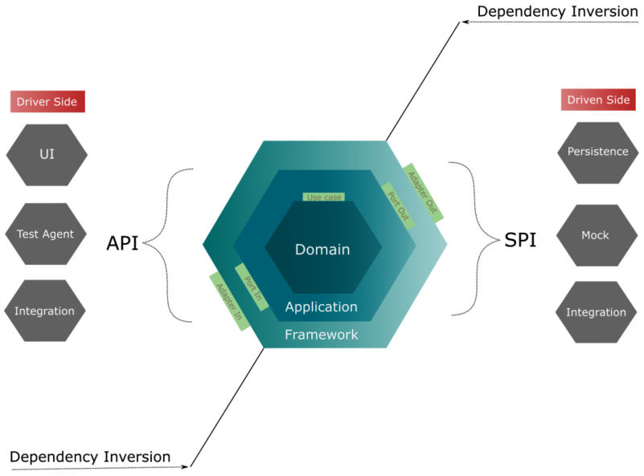

A Arquitetura Hexagonal – também conhecida como Arquitetura de Portas e Adaptadores – é apresentada na imagem anterior. Vamos tentar entendê-la melhor: 

DOMÍNIO 

Este é o núcleo da arquitetura e contém toda a lógica de negócios da aplicação. É a parte mais interna e mais importante do sistema, pois representa as regras e conceitos centrais do domínio que o software está modelando. 

APLICAÇÃO 

Esta camada orquestra as operações do domínio, lidando com a lógica de aplicação (por exemplo, coordenação de casos de uso). Ela não contém lógica de negócios, mas sim a lógica de aplicação que dita a maneira como as interações com o domínio devem ocorrer. 

FRAMEWORK 

<mark>Essa camada lida com aspectos de infraestrutura e funcionalidades de suporte, como frameworks</mark> de persistência, integração com APIs externas, e quaisquer outros aspectos técnicos que não fazem parte do domínio de negócios. 

API 

SPI 

DRIVER SIDE 

Representa as portas de entrada do sistema. Esses pontos de entrada são as interfaces pelas quais outros sistemas ou componentes externos (por exemplo, Interface do Usuário, Agentes de Teste, Integração) interagem com o núcleo da aplicação. A ideia é que o mundo exterior interaja com o sistema através dessas portas, sem acessar diretamente o domínio ou a lógica de aplicação. 

Representa as portas de saída do sistema, onde o núcleo do sistema se conecta com outros componentes externos, como serviços de persistência de dados (bancos de dados), mockings, e outras integrações externas. A interação com esses sistemas externos é feita através de interfaces, <u>permitindo a inversão de dependência e facilitando o teste e substituição de implementações.</u> 

<mark>Refere-se aos componentes externos que dirigem as operações no sistema. Isso inclui a interface do</mark> usuário (UI), agentes de teste, e outros mecanismos de integração que iniciam uma ação no sistema.

---

<!-- pagina: 107 -->

**Diego Carvalho, Equipe Informática 2 (Diego Carvalho), Equipe Informática 1 (Diego Carvalho) Aula 07** 

Refere-se aos componentes externos que são acionados pelo sistema, como a persistência de dados (bancos de dados), mocks, e outros serviços de integração. O sistema dirige essas operações. DRIVEN SIDE A imagem enfatiza a ideia de inversão de dependência, um princípio fundamental no design INVERSÃO DE orientado a objetos. Isso significa que tanto o Driver Side quanto o Driven Side dependem de DEPENDÊNCIA abstrações (interfaces), e não de implementações concretas. Isso torna o sistema flexível, testável e desacoplado das implementações de infraestrutura. São as portas de entrada que permitem a interação com o sistema, frequentemente associadas à PORTA DE API. ENTRADA São as portas de saída usadas pelo sistema para interagir com outros serviços, frequentemente PORTA DE associadas ao SPI. SAÍDA 

Antes de seguir, vamos falar sobre tipos de portas e adaptadores: 

|Tipos de portas|descrição|
|---|---|
|primárias|Interfaces que expõem as funcionalidades principais da aplicação, permitindo que os usuários ou sistemas externos interajam com ela(ex.: Interfacegráfica,CLI,APIs).|
|secundárias|Interfaces através das quais a aplicação interage com sistemas externos (ex.: bancos de dados,serviços externos).|
|Tipos de adaptadores|descrição|
|Primários|Implementações das portas primárias que conectam a aplicação a interfaces de usuário ou APIs.|
|secundários|Implementações das portas secundárias que conectam a aplicação a recursos externos, como bancos de dados ou outros serviços.|

#### Hexágono de Domínio 

O **Hexágono de Domínio** representa um esforço para entender e modelar um problema do mundo real. Suponha que você esteja em um projeto que precise criar um inventário de rede e topologia para uma empresa de telecomunicações. O principal objetivo deste inventário é fornecer uma visão abrangente de todos os recursos que compõem a rede. Dentre esses recursos, temos roteadores, switches, racks, estantes e outros tipos de equipamentos. 

Nosso objetivo aqui é usar o Hexágono de Domínio para modelar o conhecimento necessário para identificar, categorizar e correlacionar esses elementos de rede e topologia em código-fonte, bem como fornecer uma visão lúcida e organizada do inventário desejado. Esse conhecimento deve ser, tanto quanto possível, representado de forma agnóstica em relação à tecnologia.

---

<!-- pagina: 108 -->

**Diego Carvalho, Equipe Informática 2 (Diego Carvalho), Equipe Informática 1 (Diego Carvalho) Aula 07** 

Esta busca não é trivial. Os desenvolvedores envolvidos podem não conhecer empresas de telecomunicações e deixar de lado esse negócio de inventário. É necessário consultar especialistas de domínio ou outros desenvolvedores que já conheçam o problema do domínio. Se nenhum deles estiver disponível, você deve tentar preencher a lacuna de conhecimento consultando livros ou qualquer outro material que ensine sobre o domínio do problema. 

Dentro do Hexágono de Domínio, temos entidades correspondentes a dados e regras críticas de negócios. Eles são críticos porque representam um modelo do problema real. Esse modelo leva algum tempo para evoluir e refletir consistentemente o problema que estamos tentando modelar. Esse é o caso de novos projetos de software em que nem os desenvolvedores nem os especialistas do domínio têm uma visão clara do objetivo do sistema em seus estágios iniciais. 

Em tais cenários, que são particularmente recorrentes em ambientes de _startups_ , é normal e previsível ter um modelo de domínio inicial desajeitado que evolui apenas conforme as ideias de negócios evoluem e são validadas por usuários e especialistas do domínio. É uma situação curiosa onde o modelo de domínio é desconhecido, mesmo para os chamados especialistas de domínio. 

Por outro lado, em cenários onde o domínio do problema existe e está claro nas mentes dos especialistas do domínio, se não conseguirmos compreender esse domínio do problema e como ele se traduz em entidades e outros objetos do domínio, como objetos de valor, construiremos nosso software baseado em suposições fracas ou erradas. Isso pode ser considerado um dos motivos pelos quais qualquer software começa simples e, à medida que sua base de código cresce, acumula dívida técnica e se torna mais difícil de manter. 

Essas suposições fracas podem levar a um código frágil e inexpressivo que pode inicialmente resolver problemas de negócios, mas não está pronto para acomodar mudanças de maneira coesa. Lembre-se de que o hexágono do domínio é composto por qualquer tipo de categoria de objeto que você considere adequado para representar o domínio do problema. Aqui está uma representação baseada apenas em Entidades e Objetos de Valor: 

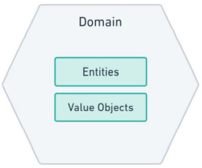

#### Hexágono de Aplicação 

Até agora, discutimos como o hexágono Domínio encapsula regras de negócios com entidades e objetos de valor. Mas há situações em que o software não precisa operar diretamente no nível do Domínio. Algumas operações existem apenas para permitir a automação fornecida pelo software.

---

<!-- pagina: 109 -->

**Diego Carvalho, Equipe Informática 2 (Diego Carvalho), Equipe Informática 1 (Diego Carvalho) Aula 07** 

Essas operações – embora suportem regras de negócios – não existiriam fora do contexto do software. Estamos falando de operações específicas da aplicação. 

O Hexágono de Aplicação é onde lidamos abstratamente com tarefas específicas do aplicativo. Quero dizer abstrato porque ainda não estamos lidando diretamente com questões de tecnologia. Esse hexágono expressa a intenção e os recursos do usuário do software com base nas regras de negócios do Hexágono de Domínio. 

Com base na mesma topologia e cenário de rede de inventário descritos anteriormente, suponha que você precise de uma maneira de consultar roteadores do mesmo tipo. Seria necessário algum tratamento de dados para produzir tais resultados. Seu software precisaria capturar alguma entrada do usuário para consultar os tipos de roteador. Você pode querer usar uma regra de negócios específica para validar a entrada do usuário e outra regra de negócios para verificar os dados obtidos de fontes externas. 

Se nenhuma restrição for violada, seu software fornecerá alguns dados mostrando uma lista de roteadores do mesmo tipo. Podemos agrupar todas essas diferentes tarefas em um caso de uso. O diagrama a seguir descreve a estrutura de alto nível do hexágono do aplicativo com base em casos de uso, portas de entrada e portas de saída: 

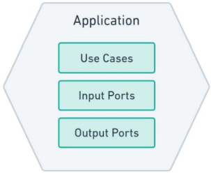

#### Hexágono de Framework 

As coisas parecem bem organizadas com nossas regras críticas de negócios restritas ao Hexágono de Domínio, seguido pelo Hexágono de Aplicação que lida com algumas operações específicas da aplicação por meio de casos de uso, portas de entrada e portas de saída. Agora chega o momento em que precisamos decidir quais tecnologias devem ter permissão para se comunicar com nosso software. 

Essa comunicação pode ocorrer de duas formas, uma conhecida como _Driver_ e outra conhecida como _Driven_ . Para o lado do _Driver_ , usamos adaptadores de entrada, e para o lado do _Driven_ , usamos adaptadores de saída, conforme o diagrama a seguir:

---

<!-- pagina: 110 -->

**Diego Carvalho, Equipe Informática 2 (Diego Carvalho), Equipe Informática 1 (Diego Carvalho) Aula 07** 

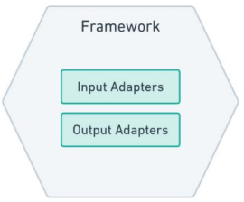

As operações de _Driver_ são as que solicitam ações ao software. Pode ser um usuário com um cliente de linha de comando ou um aplicativo front-end em nome do usuário, por exemplo. Pode haver alguns conjuntos de teste verificando a exatidão das coisas expostas pelo seu software. Ou podem ser apenas outros aplicativos em um grande ecossistema que precisam interagir com alguns recursos de software expostos. 

<!-- Start of picture text -->
==5460== <!-- End of picture text -->

Essa comunicação ocorre por meio de uma API ( _Application Programming Interface_ ) construída sobre os adaptadores de entrada. Essa API define como as entidades externas irão interagir com seu sistema e, em seguida, traduzir sua solicitação para o aplicativo do seu domínio. O termo Driver é usado porque essas entidades externas estão dirigindo o comportamento do sistema. Os adaptadores de entrada podem definir os protocolos de comunicação suportados pelo aplicativo, conforme mostrado aqui: 

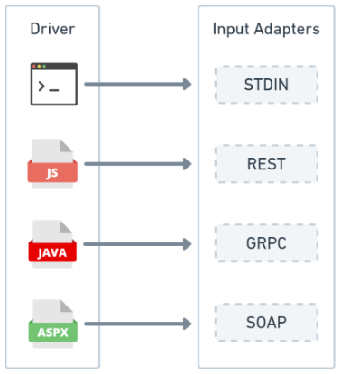

Do outro lado da moeda, nós temos as Operações _Driven_ . Essas operações são acionadas a partir da sua aplicação e vão para o mundo externo para obter dados a fim de atender às necessidades do software. Uma Operação _Driven_ geralmente ocorre em resposta a alguma condução. Como você pode imaginar, a forma como definimos o lado acionado é através de adaptadores de saída. Esses adaptadores devem estar em conformidade com nossas portas de saída ao implementá-los. 

Lembre-se que uma porta de saída nos diz que tipo de dados ela precisa para executar algumas tarefas específicas da aplicação. Cabe ao adaptador de saída descrever como obterá os dados. Vejam um diagrama de adaptadores de saída e Operações _Driven_ :

---

<!-- pagina: 111 -->

**Diego Carvalho, Equipe Informática 2 (Diego Carvalho), Equipe Informática 1 (Diego Carvalho) Aula 07** 

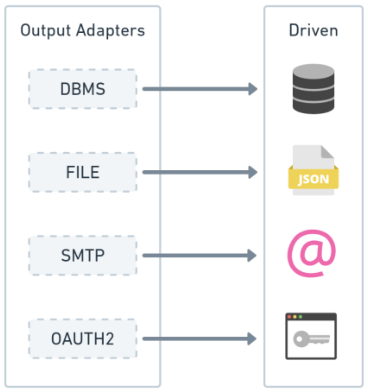

### Principais Vantagens 

Se você busca um padrão que o ajude a padronizar a forma como o software é desenvolvido em sua empresa ou até mesmo em projetos pessoais, a arquitetura hexagonal pode ser utilizada como base para criar essa padronização, influenciando como classes, pacotes e a estrutura de código-fonte como um todo estão organizados. A arquitetura hexagonal ajuda as organizações a estabelecer os princípios fundamentais nos quais o software é estruturado. Vamos ver as principais vantagens... 

#### Tolerância a Mudanças 

As mudanças tecnológicas estão acontecendo em um ritmo acelerado. Novas linguagens de programação e uma infinidade de ferramentas sofisticadas surgem todos os dias. Para vencer a concorrência, muitas vezes, não basta apenas ficar com tecnologias bem estabelecidas e testadas pelo tempo. 

O uso de tecnologia de ponta deixa de ser uma escolha e passa a ser uma necessidade, e se o software não estiver preparado para acomodar tais mudanças, a empresa corre o risco de perder dinheiro e tempo em grandes refatorações porque a arquitetura do software não é tolerante a mudanças. 

Dessa forma, a natureza das portas e adaptadores da arquitetura hexagonal nos dá uma grande vantagem ao fornecer os princípios arquitetônicos para criar aplicativos prontos para incorporar mudanças tecnológicas com menos atrito. 

#### Manutenibilidade 

Se for necessário alterar alguma regra de negócio, você sabe que a única coisa que deve ser alterada é o Hexágono de Domínio. Por outro lado, se precisarmos permitir que um recurso existente seja acionado por um cliente que usa uma determinada tecnologia ou protocolo que ainda não é

---

<!-- pagina: 112 -->

**Diego Carvalho, Equipe Informática 2 (Diego Carvalho), Equipe Informática 1 (Diego Carvalho) Aula 07** 

suportado pela aplicação, basta criar um novo adaptador, o que só podemos fazer no Hexágono de Framework. 

Essa separação de preocupações parece simples, mas quando aplicada como um princípio de arquitetura, ela concede um grau de previsibilidade suficiente para diminuir a sobrecarga mental de compreender as estruturas básicas de software antes de mergulhar profundamente em suas complexidades. O tempo sempre foi um recurso escasso e, se houver uma chance de economizá-lo por meio de uma abordagem de arquitetura que remova algumas barreiras mentais, deve-se ao menos tentar. 

#### Testabilidade 

Um dos objetivos finais da arquitetura hexagonal é permitir que os desenvolvedores testem a aplicação quando suas dependências externas não estiverem presentes, como sua interface de usuário e bancos de dados. Isso não significa, entretanto, que essa arquitetura ignore os testes de integração. Em vez disso, permite uma abordagem de integração mais contínua, dando-nos a flexibilidade necessária para testar a parte mais crítica do código, mesmo na ausência de dependências de tecnologia. 

Avaliando cada um dos elementos que compõem a arquitetura hexagonal e sabendo das vantagens que ela pode trazer aos nossos projetos, estamos agora munidos dos fundamentos para desenvolver aplicações hexagonais. 

**(BANRISUL – 2022)** Em uma arquitetura hexagonal, as classes de domínio independem <mark>das classes de infraestrutura, tecnologias e sistemas externos.</mark> 

##### **<mark>_______________________</mark>** 

**<mark>Comentários:</mark>** <mark>a arquitetura hexagonal é uma abordagem de design de software projetada para promover o encapsulamento de dependências. Ela separa os componentes de um sistema em três hexágonos: o mais interno, que contém funcionalidades do domínio; e outros dois, que contém funcionalidades de infraestrutura (aplicação e framework). O objetivo dessa arquitetura é isolar os requisitos de negócio da infraestrutura de software, permitindo assim que o código de domínio possa ser reutilizado em diferentes ambientes, como aplicações web, serviços da web, aplicativos móveis ou outras plataformas. Ela também torna mais fácil a substituição de infraestruturas ou tecnologias, pois não há dependências entre o domínio e a infraestrutura,</mark> resultando em um código de domínio de alta qualidade e portabilidade (Correto).

---

<!-- pagina: 113 -->

**Diego Carvalho, Equipe Informática 2 (Diego Carvalho), Equipe Informática 1 (Diego Carvalho) Aula 07** 

## **ARQUITETURA DE MICROSSERVIÇOS** 

### Conceitos Básicos 

<mark>INCIDÊNCIA EM PROVA: baixíssima</mark> 

_Imagine que você é JK e está planejando cidade de Brasília/DF. Cada prédio é um serviço que essa cidade precisa oferecer. Você tem um prédio para o serviço de transporte, outro para o serviço de saúde, outro para o serviço de educação, e assim por diante. Em vez de construir um único prédio enorme que abriga todos esses serviços, você decide construir vários prédios menores e interconectá-los com ruas._ 

_Cada prédio é um microsserviço que executa uma tarefa específica, como o serviço de transporte, e pode se comunicar com outros microsserviços para fornecer uma experiência mais completa ao cidadão. Assim como na arquitetura de microsserviços, cada microsserviço é autônomo e independente, executando uma tarefa específica e se comunicando com outros microsserviços por meio de APIs ou outros protocolos de comunicação._ 

_Cada microsserviço pode ser implantado e escalado independentemente, tornando o sistema mais flexível e fácil de manter._ 

A Arquitetura de Microsserviços é uma abordagem para o desenvolvimento de uma aplicação como um conjunto de pequenos serviços, cada um executando em seu próprio processo e se comunicando por meio de mecanismos leves. **Estes serviços são construídos em torno das capacidades do negócio e independentemente implantados por máquinas de implantação totalmente automatizadas** . 

Há um mínimo de gerenciamento centralizado destes serviços, que podem ser escritos em diferentes linguagens de programação e utilizarem diferentes tecnologias de armazenamento de dados. **Para começar a entender mais sobre esse estilo arquitetônico, vamos compará-lo com uma arquitetura monolítica** . _O que é isso, professor?_ É uma aplicação que é construída como uma única unidade lógica. 

**Aplicativos Corporativos são, muitas vezes, construídos em três partes principais** : a interface de usuário do lado do cliente (Ex: Páginas HTML com CSS e JavaScript), um banco de dados (Ex: Tabelas inseridas em um SGBD Relacional) e um Servidor de Aplicação (Ex: JBoss EAP). A aplicação do servidor irá lidar com Requisições HTTP, executar a lógica de domínio, recuperar e atualizar dados do banco de dados e selecionar as Visões HTML para serem enviadas ao browser. 

**Esta aplicação é monolítica, isto é, existe um único executável lógico** . Quaisquer mudanças no sistema envolvem criação e implantação de uma nova versão do aplicativo do lado do servidor. Um servidor monolítico é uma abordagem natural de construir um sistema. Toda a sua lógica para tratar

---

<!-- pagina: 114 -->

**Diego Carvalho, Equipe Informática 2 (Diego Carvalho), Equipe Informática 1 (Diego Carvalho) Aula 07** 

uma requisição é executada em um único processo, o que lhe permite usar os recursos básicos de sua linguagem para dividir a aplicação em classes, funções e namespaces. 

. **Com algum cuidado, você pode executar e testar o aplicativo no laptop de um desenvolvedor** Dessa forma, pode usar um Deployment Pipeline para garantir que as mudanças sejam devidamente testadas e implantadas em produção. Se desejar, pode também executar diversas instâncias por trás de um balanceador de carga. Logo, aplicações monolíticas podem ser bemsucedidas, mas cada vez mais as pessoas estão sentindo frustradas com elas. 

**Ciclos de mudanças são altamente acoplados – uma mudança em uma parte da aplicação requer que um novo build e um novo deploy da aplicação inteira.** Com o tempo, muitas vezes é difícil manter uma boa estrutura modular, tornando complicado manter as alterações que deveriam afetar apenas um módulo dentro de outro módulo. Estas frustrações levaram à arquitetura de ==5460== microsserviços, isto é, construção de aplicações como conjuntos de serviços. 

Esses microsserviços são independentemente implantáveis e escaláveis, sendo que cada serviço fornece um escopo bem definido, mesmo permitindo que diferentes serviços sejam escritos em diferentes linguagens de programação. **Eles também podem ser gerenciados por equipas diferentes** . Vamos dar uma olhada na imagem seguinte: observem que que cada cor representa uma funcionalidade. 

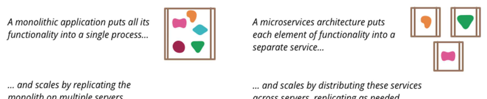

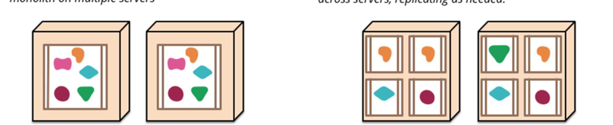

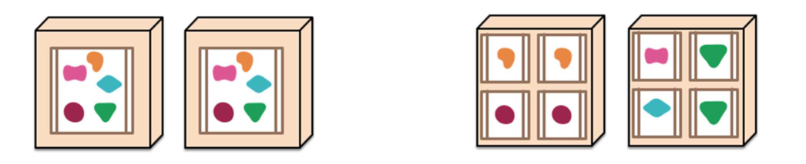

**Na arquitetura monolítica, nós modularizamos diversas funcionalidades; na arquitetura de microsserviços, nós modularizamos cada funcionalidade** . Dessa forma, podemos compor os

---

<!-- pagina: 115 -->

**Diego Carvalho, Equipe Informática 2 (Diego Carvalho), Equipe Informática 1 (Diego Carvalho) Aula 07** 

módulos de diferentes formas de acordo com as suas necessidades. Observem que os módulos à direita são todos diferentes. Martin Fowler afirma que não se pode dizer que há uma definição formal para a arquitetura de microsserviços. 

No entanto, nós podemos tentar descrever o que vemos como características comuns para arquiteturas que se encaixam nesse perfil. Como acontece com qualquer definição que descreve características comuns, nem todas arquiteturas de microsserviços tem todas as características. Vejamos as principais: **(1) Componentização via serviços** – trata-se de uma divisão do software em serviços (e, não, bibliotecas, etc). _Por que, Diego?_ 

Dentre várias razões, serviços podem ser implantados independentemente. Se uma aplicação consiste em um conjunto de bibliotecas em um único processo, uma mudança em apenas um componente resultará no redeploy da aplicação inteira. Utilizando serviços como componentes, em geral, você precisará fazer o deploy apenas do serviço que foi modificado. _Vocês têm noção do tanto que isso é absurdamente eficiente?_ Pois é... 

##### **(2) Organização em torno das capacidades do negócio – trata-se da organização dos recursos** 

**em torno das capacidades e especialidades da organização e não da tecnologia** . Em uma empresa, a área de TI geralmente está organizada de acordo com as especialidades tecnológicas das pessoas. Logo, temos especialistas em front-end, back-end e DBAs – são equipes organizadas de acordo com sua função. A arquitetura de microsserviços funciona de outra forma: 

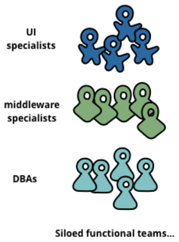

Ela divide os serviços de acordo com as capacidades de negócio e as equipes de acordo com os serviços. Logo, a equipe não será focada em uma tecnologia, mas em um serviço. Uma equipe pode ser formada por um cara do back-end, dois do front-end e três DBAs. **Equipes multidisciplinares** . **agregam muito valor na construção de um serviço, como mostra a imagem a seguir**

---

<!-- pagina: 116 -->

**Diego Carvalho, Equipe Informática 2 (Diego Carvalho), Equipe Informática 1 (Diego Carvalho) Aula 07** 

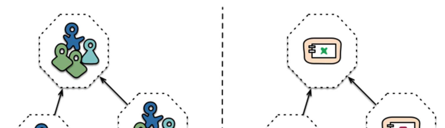

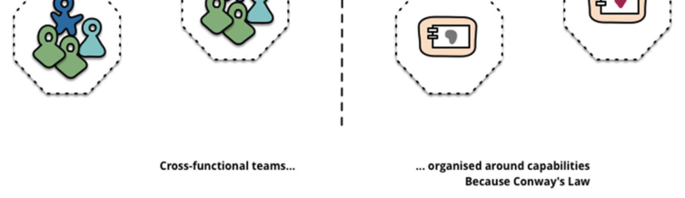

Produtos e, não, projetos – a equipe é totalmente responsável pelo produto e, não, apenas pelo projeto. A maioria das aplicações de desenvolvimento seguem a forma: crie um projeto, desenvolva um software e termine o projeto. **A partir daí, a equipe se desfaz qualquer correção ou manutenção é feita por outra equipe** . A ideia aqui é que uma equipe deve ser ‘dona’ do produto por todo seu ciclo de vida. 

É a ideia de ‘ _You build, you run it_ ’. Em outras palavras, a equipe de desenvolvimento tem total responsabilidade sobre o software já em produção. **Isso cria um contato diário dos desenvolvedores sobre como seus softwares se comportam quando já estão em produção e também aumentam o contato com os usuários** . Vejam que há também uma ligação com a ideia de capacidades de negócio: 

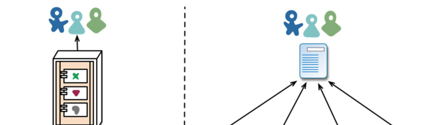

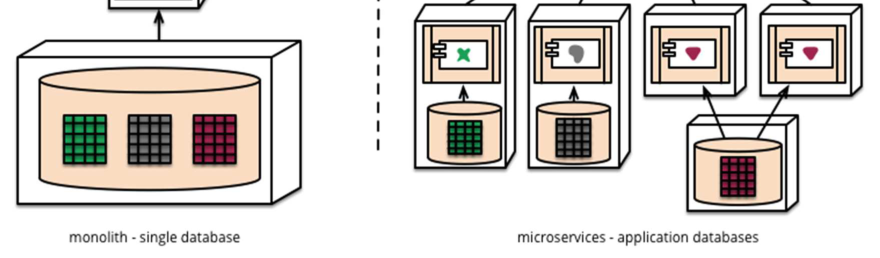

---

<!-- pagina: 117 -->

**Diego Carvalho, Equipe Informática 2 (Diego Carvalho), Equipe Informática 1 (Diego Carvalho) Aula 07** 

Entre outras características da arquitetura de microsserviços, há também o gerenciamento de dados descentralizado, na medida em que eu posso ter um serviço de banco de dados para um ou mais serviços, como mostra a imagem anterior; há também a governança descentralizada, isto é, evita-se uma padronização para todos os serviços, como se eles não tivessem particularidades inerentes. 

Podemos citar também a automatização da infraestrutura, isto é, entrega, integração e publicações contínuas da aplicação em diversos ambientes automaticamente (Produção, Desenvolvimento, Testes, etc). **Por fim, uma característica importante da arquitetura de microsserviços é que se trata de um design preparado para falhas, isto é, as aplicações precisam ser desenhadas de modo que tolerem falhas de serviços.** 

**(STF – 2013)** A arquitetura de microsserviços considera todo o trabalho como um <mark>conjunto de requisições encadeadas executadas que forma uma unidade lógica de processamento no banco de dados. A referida arquitetura deve incluir um conjunto mínimo de operações atômicas para ser executada completamente.</mark> 

**<mark>_______________________</mark>** 

**Comentários:** a questão trata de uma arquitetura monolítica. (Errado). 

**(STJ – 2015)** A arquitetura de microsserviços, abordagem em que o aplicativo é <mark>desenvolvido em uma única unidade contendo pequenos serviços, dependentes entre si, que se comunicam com um ente central denominado biblioteca de componentes, propicia o gerenciamento centralizado desses serviços para automatizar a segurança.</mark> 

**<mark>_______________________</mark>** 

**Comentários:** a abordagem em que o aplicativo é desenvolvido em uma única unidade é a abordagem monolítica (Errado). 

**(BANRISUL – 2022)** Microsserviços representam a fragmentação de uma API em <mark>operações menores, o que facilita a comunicação e otimiza o desenvolvimento de interfaces.</mark> 

**<mark>_______________________</mark>** 

**<mark>Comentários:</mark>** <mark>microsserviços representam uma aplicação construída como um conjunto de serviços menores e independentes que funcionam juntos. Cada serviço executa uma única tarefa e é responsável por uma parte menor da aplicação. São esses serviços que utilizam uma API para se comunicar. Logo, microsserviços representam a fragmentação de uma aplicação como</mark> um conjunto de serviços menores que utilizam uma API (Errado).

---

<!-- pagina: 118 -->

