---
fonte_pdf: "Eng. Software - Aula 08.pdf"
paginas: 119
conversao: texto-e-imagens
---

<!-- pagina: 2 -->

**Diego Carvalho, Equipe Informática 2 (Diego Carvalho), Equipe Informática 1 (Diego Carvalho) Aula 08** 

# **Índice** 

|............. 1) SOA|.............................................................................................................. - Teoria|................................................................... 3|
|---|---|---|
|............. 2) SOA|.............................................................................................................. - Resumo|................................................................... 84|
|............. 3) SOA|.............................................................................................................. - Questões Comentadas - FGV|................................................................... 101|
|............. 4) SOA|.............................................................................................................. - Lista de Questões - FGV|................................................................... 112|

---

<!-- pagina: 3 -->

**Diego Carvalho, Equipe Informática 2 (Diego Carvalho), Equipe Informática 1 (Diego Carvalho) Aula 08** 

<!-- Start of picture text -->
A PRESENTAÇÃO <!-- End of picture text -->

## Queridos alunos, 

A aula de Arquitetura Orientada a Serviços é puramente teórica e conceitual, o que exige boa dose de leitura e memorização. Não se trata de um conteúdo prático de código, mas sim de entender integração, regras contratuais e abstração de negócios. O nível de dificuldade é moderado, pendendo para a decoreba, pois requer muita atenção para não confundir componentes abstratos, frameworks e as várias listas exigidas, como os oitos princípios de design de serviços de Thomas Erl ou a distinção entre orquestração e coreografia. 

Para o aluno em reta final de pós-edital, a estratégia de custo-benefício exige foco absoluto nos tópicos com incidência altíssima e alta. É fundamental dominar os Conceitos Básicos, Objetivos e Benefícios, a Composição e, sobretudo, os Princípios de Design. Deve-se descartar sem medo todos os assuntos de baixíssima cobrança, como Manifesto SOA, Modelos e Versionamento de Serviços, Estratégias de Construção, Maturidade SOA e CORBA, garantindo que o escasso tempo seja investido apenas no que cai. 

Já o aluno em fase de pré-edital, com muito tempo livre, deve utilizar essa vantagem para construir uma base de conhecimento à prova de falhas. Além de consolidar profundamente os temas de maior incidência, ele pode incluir em seu ciclo de estudos os tópicos de média cobrança, como Governança SOA, Padrões SOA e o Modelo Triangular. A leitura atenta dos pontos de incidência baixíssima, como os modelos de maturidade ou as estratégias Top-Down, servirá para aprofundar a visão do todo e evitar surpresas mais difíceis nas provas. 

Prof. Diego Carvalho 

### **<mark>INSTAGRAM DO PROFESSOR- WWW.INSTAGRAM.COM/PROFESSORDIEGOCARVALHO</mark>** 

---

<!-- pagina: 4 -->

**Diego Carvalho, Equipe Informática 2 (Diego Carvalho), Equipe Informática 1 (Diego Carvalho) Aula 08** 

<!-- Start of picture text -->
A RQUITETURA  O <!-- End of picture text -->

<!-- Start of picture text -->
S ERVIÇOS <!-- End of picture text -->

<!-- Start of picture text -->
(SOA) <!-- End of picture text -->

<!-- Start of picture text -->
RIENTADA  A S <!-- End of picture text -->

<!-- Start of picture text -->
Conceitos Básicos <!-- End of picture text -->

#### **<mark>INCIDÊNCIA EM PROVA: ALTÍSSIMA</mark>** 

### **<mark>ARQUITETURA ORIENTADA A SERVIÇOS (SOA)</mark>** 

A Arquitetura Orientada a Serviços (SOA) é um estilo arquitetural que organiza sistemas de software como um conjunto de serviços independentes, reutilizáveis e interoperáveis. Cada serviço encapsula uma funcionalidade de negócio específica e pode ser consumido por diferentes aplicações por meio de contratos padronizados. O principal objetivo da SOA é promover integração, reutilização, flexibilidade e alinhamento entre a tecnologia da informação e os processos de negócio da organização. 

O SOA (Service-Oriented Architecture) fundamenta-se em dois conceitos essenciais: arquitetura e serviço. Em Engenharia de Software, arquitetura corresponde à organização dos componentes relevantes de um sistema e às formas pelas quais eles interagem por meio de interfaces. Já um serviço consiste em um mecanismo que disponibiliza recursos através de uma interface definida, seguindo regras, restrições e políticas previamente estabelecidas. Dessa forma, funcionalidades podem ser oferecidas para diferentes consumidores de maneira padronizada e controlada. 

Ao estudar SOA, surge uma dúvida importante: seria necessário conhecer todos os detalhes internos do provedor para utilizar um serviço? A resposta é não. O consumidor acessa apenas aquilo que é exposto pela interface do serviço, sem necessidade de compreender sua implementação interna. Essa característica permite abstrair a complexidade técnica e favorece a utilização de funcionalidades por diferentes aplicações, independentemente da forma como foram construídas. 

Essa interação entre consumidores e provedores é viabilizada por meio dos contratos de serviço. Os contratos definem quais operações estão disponíveis, quais mensagens podem ser trocadas, quais estruturas de dados devem ser utilizadas e quais regras de comunicação precisam ser respeitadas. Em outras palavras, o contrato estabelece uma linguagem comum que permite que diferentes sistemas interajam de forma previsível e padronizada. 

A existência de contratos bem definidos conduz naturalmente a um dos princípios mais conhecidos da orientação a serviços: o baixo acoplamento. Esse princípio busca reduzir as dependências entre consumidores e provedores, permitindo que cada parte evolua com maior autonomia. Em vez de depender da implementação interna de um serviço, os consumidores dependem apenas do contrato disponibilizado para comunicação. 

Uma dúvida frequente surge nesse ponto: se existe um contrato compartilhado, ainda podemos afirmar que há baixo acoplamento? Sim. O baixo acoplamento não significa ausência total de dependências. Toda comunicação exige algum grau de dependência entre as partes envolvidas. O objetivo da SOA é reduzir dependências relacionadas à lógica interna, às tecnologias empregadas e aos detalhes de implementação, concentrando a integração em contratos estáveis e bem definidos. 

**(CEBRASPE / FUNPRESP-EXE - 2025)** Na arquitetura orientada a serviço, estabelecem-se <mark>interfaces bem definidas entre os componentes do sistema, criando-se um acoplamento forte na camada de contrato de serviço enquanto se mantém um acoplamento fraco na implementação interna dos serviços.</mark> 

**<mark>_______________________</mark>**

---

<!-- pagina: 5 -->

**Diego Carvalho, Equipe Informática 2 (Diego Carvalho), Equipe Informática 1 (Diego Carvalho) Aula 08** 

**<mark>Comentários:</mark>** <mark>Na SOA, os serviços se comunicam por contratos e interfaces bem definidos. Isso "amarra" a interação na camada de serviço, garantindo padronização, enquanto a lógica interna de cada serviço pode mudar com mais liberdade, mantendo baixo</mark> acoplamento na implementação (Correto). 

Por esse motivo, a preservação dos contratos desempenha papel fundamental em arquiteturas orientadas a serviços. Quando um contrato é alterado de maneira incompatível, consumidores que dependem das definições anteriores podem deixar de se comunicar corretamente com o serviço. Dessa forma, mudanças contratuais normalmente exigem planejamento cuidadoso, mecanismos de versionamento e estratégias que minimizem impactos sobre sistemas já integrados. 

É correto afirmar, então, que consumidores e provedores estão fortemente acoplados ao contrato? Essa interpretação pode gerar confusão. Embora exista uma dependência contratual, a literatura especializada procura diferenciar essa situação do conceito clássico de acoplamento forte. Na prática, contratos bem projetados funcionam justamente como um mecanismo para controlar dependências e permitir que alterações internas ocorram sem afetar diretamente os consumidores. 

A utilização de contratos padronizados também é um dos fatores que tornam possível a interoperabilidade entre sistemas heterogêneos. Aplicações desenvolvidas em linguagens distintas, executadas em plataformas diferentes ou pertencentes a organizações distintas podem se comunicar adequadamente desde que respeitem as definições estabelecidas pelo contrato compartilhado. Assim, o contrato atua como um ponto de alinhamento entre as partes sem exigir conhecimento sobre detalhes internos da implementação. 

**(AOCP / UNIRIO - 2026)** Uma instituição federal está modernizando seus sistemas internos para <mark>permitir que diferentes departamentos possam acessar funcionalidades comuns — como consulta de dados cadastrais, verificação de regularidade e geração de relatórios — sem necessidade de duplicar código ou criar soluções isoladas. A equipe de TI decidiu adotar uma arquitetura orientada a serviços (SOA) para facilitar o compartilhamento desses componentes de forma padronizada e interoperável. Considerando os conceitos de SOA, assinale a alternativa que apresenta uma característica compatível com o objetivo descrito.</mark> 

<mark>a) Implantar serviços totalmente acoplados à aplicação consumidora, garantindo que cada sistema tenha sua própria implementação interna.</mark> 

<mark>b) Disponibilizar serviços com contratos bem definidos, permitindo que diferentes sistemas utilizem funcionalidades comuns de forma padronizada e independente da tecnologia utilizada.</mark> 

<mark>c) Exigir que todos os sistemas do órgão utilizem a mesma linguagem de programação para consumir serviços expostos na arquitetura.</mark> 

<mark>d) Criar integrações diretas ponto a ponto entre cada departamento e os serviços necessários, favorecendo interdependências explícitas.</mark> 

<mark>e) Centralizar todo o processamento apenas em um único servidor, tornando desnecessário o uso de camadas de serviço.</mark> 

**<mark>_______________________</mark>** 

> **<mark>Comentários:</mark>** <mark>(a) Errado. Aqui há acoplamento forte e duplicação de implementação, o que vai na contramão da ideia de reaproveitar funcionalidades comuns entre vários sistemas. (b) Correto. Em SOA, os serviços são expostos com contratos bem definidos, o que facilita o reuso, a padronização e a interoperabilidade entre sistemas diferentes. (c) Errado. SOA busca justamente independência tecnológica, então não faz sentido exigir uma única linguagem para todos os sistemas consumidores. (d) Errado. Integrações ponto a ponto aumentam a dependência entre sistemas e dificultam manutenção, evolução e reaproveitamento dos serviços. (e) Errado. SOA não se resume a concentrar tudo em um servidor, mas sim a organizar funcionalidades como serviços reutilizáveis e acessíveis de forma padronizada (Letra</mark> B).

---

<!-- pagina: 6 -->

**Diego Carvalho, Equipe Informática 2 (Diego Carvalho), Equipe Informática 1 (Diego Carvalho) Aula 08** 

A relação entre contratos e baixo acoplamento evidencia um aspecto central da orientação a serviços. A arquitetura não busca eliminar completamente as dependências existentes, mas administrá-las de forma controlada e previsível. Ao concentrar a dependência em contratos estáveis, torna-se possível preservar a autonomia dos serviços e, simultaneamente, garantir a comunicação necessária para a execução dos processos de negócio. 

Uma forma simples de compreender essa ideia consiste em observar o fornecimento de energia elétrica. O consumidor precisa conhecer os processos de geração, transmissão e distribuição da energia para utilizá-la? Em geral, não. Seu interesse está na disponibilidade do serviço contratado e na forma de acessá-lo. Em SOA ocorre algo semelhante: os consumidores interagem com funcionalidades disponibilizadas por meio de interfaces bem definidas, enquanto os detalhes internos permanecem encapsulados pelo provedor do serviço. 

Essa característica favorece outro conceito importante: a reutilização. Como os consumidores não dependem da implementação interna, um mesmo serviço pode ser empregado em cenários distintos daqueles originalmente imaginados por seu criador. Uma funcionalidade desenvolvida para atender determinada necessidade pode posteriormente ser aproveitada por outros sistemas, processos ou departamentos da organização. 

Nesse contexto, Thomas Erl introduz o conceito de serviço agnóstico. Um serviço é considerado agnóstico quando sua lógica não está vinculada a um processo de negócio específico, a uma aplicação específica ou a uma tecnologia proprietária específica. Quanto maior essa independência em relação a contextos particulares, maior tende a ser seu potencial de reutilização em diferentes soluções orientadas a serviços. 

A importância desses conceitos é refletida na própria definição proposta pela OASIS. Segundo essa organização, a Arquitetura Orientada a Serviços é um paradigma voltado à organização e utilização de recursos distribuídos que podem estar sob o controle de diferentes domínios proprietários. Nesse modelo, funcionalidades são disponibilizadas por meio de serviços fracamente acoplados, permitindo maior flexibilidade na integração e evolução dos sistemas. 

Além da reutilização e do baixo acoplamento, Thomas Erl destaca diversas características associadas à orientação a serviços. Entre elas encontram-se a existência de contratos formais, a abstração da lógica interna, a autonomia dos serviços e a capacidade de composição. Esses atributos favorecem a interoperabilidade, simplificam a manutenção e permitem que funcionalidades sejam combinadas para atender diferentes necessidades de negócio sem exigir modificações extensivas em cada serviço individualmente. Abaixo segue uma lista de algumas definições de SOA que eu já encontrei em provas... 

### **<mark>O QUE SOA É...</mark>** 

<mark>Um conjunto de princípios e melhores práticas para implementação e execução de processos de negócio</mark> automatizados em ambientes de tecnologia da informação heterogêneos. 

<mark>Uma forma de aproximar a linguagem do negócio e da tecnologia da informação, facilitando a integração de</mark> ambientes corporativos por meio de serviços. 

<mark>Um meio para organizar as soluções que promove o reúso, o crescimento e a interoperabilidade.</mark> 

<mark>Uma abordagem distribuída (não-monolítica) para integração de arquiteturas baseadas no conceito de serviço.</mark> 

Uma abordagem arquitetural corporativa que permite a criação de serviços de negócio interoperáveis, que <u>podem ser reutilizados e compartilhados entre aplicações e empresas.</u>

---

<!-- pagina: 7 -->

**Diego Carvalho, Equipe Informática 2 (Diego Carvalho), Equipe Informática 1 (Diego Carvalho) Aula 08** 

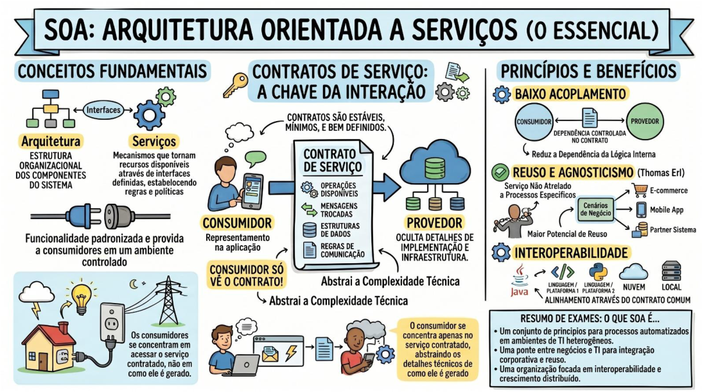

Antes de estudar as tecnologias associadas à Arquitetura Orientada a Serviços, é importante compreender o contexto que motivou o surgimento desse paradigma. O crescimento dos ambientes corporativos de tecnologia da informação levou as organizações a desenvolverem sistemas para atender necessidades específicas e imediatas. Cada nova demanda de negócio normalmente resultava na criação de uma nova aplicação, construída para resolver um problema particular. Qual foi a consequência desse processo ao longo dos anos? Muitas empresas passaram a acumular sistemas desenvolvidos de forma isolada, sem uma visão integrada do ambiente tecnológico como um todo. 

Considere uma situação comum em uma instituição financeira. Um funcionário necessita consultar informações distribuídas em diferentes sistemas para realizar suas atividades. Como atender essa necessidade rapidamente? Uma solução aparentemente simples consiste em desenvolver uma aplicação capaz de acessar múltiplos sistemas, reunir os dados necessários e gerar um relatório consolidado. Inicialmente, essa abordagem parece eficiente, pois resolve uma necessidade concreta do negócio sem exigir mudanças profundas nas aplicações existentes. 

Com o passar do tempo, novas exigências surgem. O relatório precisa ser gerado automaticamente todos os dias, sem intervenção humana. Para atender essa demanda, cria-se um processo automatizado responsável por executar a tarefa periodicamente. Onde está o problema? Cada nova integração ou automação adiciona dependências entre sistemas que originalmente não foram projetados para trabalhar em conjunto. À medida que essas conexões se multiplicam, a complexidade do ambiente tecnológico cresce continuamente. 

Quando esse padrão se repete dezenas ou centenas de vezes, surge um cenário conhecido como Hairball Architecture, ou Arquitetura de Bola de Pelo. O que caracteriza esse ambiente? A existência de inúmeras integrações ponto a ponto, criadas ao longo do tempo para atender necessidades específicas. Como resultado, forma-se uma rede complexa de dependências, na qual compreender os relacionamentos existentes, rastrear impactos e promover mudanças torna-se uma tarefa cada vez mais difícil.

---

<!-- pagina: 8 -->

**Diego Carvalho, Equipe Informática 2 (Diego Carvalho), Equipe Informática 1 (Diego Carvalho) Aula 08** 

**(FGV / ALEGO - 2026)** A ALEGO, em processo de transformação digital e integração de sistemas <mark>legados, decide adotar uma arquitetura SOA para melhorar interoperabilidade e agilidade. Foram levantados pela equipe os seguintes desafios:</mark> 

<mark>I. A integração de diferentes serviços desenvolvidos em diferentes plataformas ou linguagens.</mark> 

<mark>II. A comunicação entre serviços, quando são necessárias múltiplas chamadas para completar uma única operação de negócio.</mark> 

<mark>III. A reutilização de serviços existentes, para permitir que diferentes aplicações acessem os mesmos serviços de negócio.</mark> 

<mark>IV. Enfoque em práticas de compartilhamento, onde os serviços são projetados para serem reutilizados em várias aplicações dentro de uma organização.</mark> 

<mark>Com base nos desafios levantados, está correto o que se afirma em:</mark> 

<mark>a) I e II apenas. b) III e IV apenas. c) I, II e III apenas. d) II apenas. e) I, II, III e IV.</mark> 

**<mark>_______________________ Comentários:</mark>** <mark>(I) Correto. Integrar serviços feitos em plataformas e linguagens diferentes é um desafio clássico em SOA, porque exige padronização e interoperabilidade entre tecnologias distintas. (II) Correto. Quando uma operação de negócio depende de várias chamadas entre serviços, a comunicação fica mais complexa, com impacto em desempenho e orquestração. (III) Errado. A reutilização de serviços existentes é mais uma vantagem e objetivo da SOA do que propriamente um desafio levantado no contexto da questão; (IV) Errado. O compartilhamento e o reuso em várias aplicações representam um princípio da SOA, não um desafio entre os itens</mark> considerados (Letra A). 

As dificuldades tornam-se ainda mais evidentes quando uma aplicação precisa ser atualizada ou substituída. Imagine que um fornecedor anuncie o encerramento do suporte de um sistema crítico. Quais aplicações dependem dele? Quais processos serão afetados pela mudança? Em ambientes excessivamente integrados por conexões diretas, responder a essas perguntas pode ser extremamente complicado, pois muitas dependências foram criadas de forma incremental e sem uma visão arquitetural abrangente. 

Dois problemas costumam se destacar nesse contexto: o alto acoplamento e a redundância de funcionalidades. O que significa alto acoplamento? Significa que diversos sistemas dependem fortemente uns dos outros, dificultando alterações e aumentando o risco de impactos indesejados. Já a redundância ocorre quando funcionalidades semelhantes são implementadas repetidamente em diferentes aplicações. Ambos os problemas elevam custos de desenvolvimento, manutenção e evolução tecnológica. 

Foi justamente diante desses desafios que a Arquitetura Orientada a Serviços ganhou relevância. Seu objetivo consiste em promover maior reutilização de funcionalidades, reduzir dependências excessivas e facilitar a integração entre sistemas. Vale destacar uma dúvida frequente: seria possível adquirir SOA como um produto pronto? Não. SOA não corresponde a um software, ferramenta ou solução comercial específica. Trata-se de um paradigma arquitetural composto por princípios, práticas e padrões utilizados para organizar sistemas de forma mais flexível e sustentável.

---

<!-- pagina: 9 -->

**Diego Carvalho, Equipe Informática 2 (Diego Carvalho), Equipe Informática 1 (Diego Carvalho) Aula 08** 

Essa observação conduz a uma característica fundamental da Arquitetura Orientada a Serviços: sua independência tecnológica. Por que essa característica é tão importante? Porque SOA descreve uma forma de organizar sistemas e recursos de software, sem impor uma plataforma específica de implementação. Em outras palavras, os princípios arquiteturais permanecem válidos independentemente das tecnologias utilizadas para colocá-los em prática. Isso permite que as organizações adotem novas soluções tecnológicas ao longo do tempo sem abandonar os fundamentos da arquitetura orientada a serviços. 

**(FCC / SEFAZ PI - 2025)** Para que diferentes sistemas (com linguagens, plataformas e tecnologias <mark>distintas) interoperem, é necessário um conjunto de padrões abertos e bem definidos. Um deles é a Arquitetura Orientada a Serviços (SOA), que usa:</mark> 

<mark>a) microserviços, para garantir escalabilidade, agilidade e independência entre componentes do sistema, e integração com práticas DevOps.</mark> 

<mark>b) Simple Object Access Protocol (SOAP) para trocar mensagens estruturadas entre sistemas via HTTP (ou outros protocolos), definindo a estrutura da mensagem, não o conteúdo em si.</mark> 

<mark>c) JavaScript Object Notation (JSON) para troca de informações utilizando protocolos HTTP GET, POST, PUT e DELETE.</mark> 

<mark>d) eXtensible Markup Language (XML) para troca de informações entre sistemas, validada com esquemas (CSS), para garantir integridade.</mark> 

<mark>e) o padrão REST ou gRPC para trocar mensagens estruturadas entre sistemas via Mensageria ou handshake entre serviços.</mark> 

**<mark>_______________________</mark>** 

**<mark>Comentários:</mark>** <mark>(a) Errado. Microserviços são um estilo arquitetural mais moderno e relacionado à decomposição de aplicações, mas não são o padrão clássico usado pela SOA para interoperabilidade entre sistemas distintos. (b) Correto. O SOAP é um dos padrões mais associados à SOA, pois permite a troca de mensagens estruturadas entre sistemas diferentes, definindo como essas mensagens são organizadas e transportadas. (c) Errado. JSON é um formato de dados bem comum, mas a alternativa mistura isso com métodos HTTP, que pertencem ao protocolo, não ao padrão central da SOA citado na questão. (d) Errado. XML pode ser usado na troca de dados, mas a alternativa erra ao citar CSS como esquema de validação; em SOA, a ideia central aqui não é essa forma de validação. (e) Errado. REST e gRPC são tecnologias de integração, mas a alternativa traz uma descrição imprecisa ao falar em mensageria ou handshake como base</mark> dessa troca estruturada na SOA pedida (Letra B). 

Muitas pessoas associam imediatamente SOA aos Web Services. Essa associação está correta? Em grande parte, sim, pois os Web Services se tornaram uma das tecnologias mais utilizadas para implementar soluções orientadas a serviços. Entretanto, eles não representam a única possibilidade disponível. Tecnologias como DCOM, CORBA, RPC, DDS e WCF também podem ser empregadas para construir ambientes orientados a serviços. 

**(IDECAN / TJ PI - 2022)** Sobre os conceitos e características de SOA (Arquitetura Orientada a <mark>Serviços), assinale a alternativa correta.</mark> 

<mark>a) Uma diferença entre Web Services e SOA é que o SOA é voltado para dentro da empresa, fornecendo informações ou recursos para toda organização; um pouco mais abrangente podemos falar dos Web Services, que são sites privados para empresas fazer consumo do serviço disponível.</mark> 

<mark>b) O SOA trabalha de forma descentralizada, sendo sempre vários líderes tomando partido e conhecimento da situação, levando soluções e propostas para o conselho, onde escolhe-se a melhor e mais propícia decisão para a organização.</mark>

---

<!-- pagina: 10 -->

**Diego Carvalho, Equipe Informática 2 (Diego Carvalho), Equipe Informática 1 (Diego Carvalho) Aula 08** 

<mark>c) A arquitetura orientada a serviços não se insere em um processo de reorganização dos departamentos de tecnologia da informação das organizações, não permitindo um melhor relacionamento entre as áreas que dão suporte tecnológico à empresa e as áreas responsáveis pelo negócio.</mark> 

<mark>d) A arquitetura orientada a serviços também se relaciona com determinadas políticas e conjuntos de "boas práticas" que pretendem criar um processo para facilitar a tarefa de encontrar, definir e gerenciar os serviços disponibilizados.</mark> 

<mark>e) Um serviço deve funcionar de forma dependente do estado de outros serviços, exceto nos casos de serviços compostos (composite services), e deve possuir uma interface bem definida.</mark> 

**<mark>_______________________ Comentários:</mark>** <mark>(a) Errado. A alternativa mistura os conceitos: SOA não é "voltado para dentro" nesse sentido, e Web Services não são sites privados, mas uma forma de disponibilizar serviços entre sistemas. (b) Errado. Aqui "descentralizada" foi usada num sentido de gestão e liderança, mas SOA trata de organização de serviços de software, não de processo decisório da empresa. (c) Errado. O item nega justamente uma ideia associada ao SOA, que é aproximar tecnologia e negócio por meio de serviços mais organizados e alinhados às necessidades da organização. (d) Errado. Embora fale em boas práticas e gestão de serviços, a alternativa fica genérica e não traz o ponto central cobrado aqui sobre a característica estrutural do serviço em SOA. (e) Correto. Em SOA, o serviço deve ter interface bem definida,</mark> e a exceção citada para serviços compostos acompanha a ideia de composição entre serviços dentro da arquitetura (Letra E). 

Essa distinção é importante porque evita um equívoco bastante comum. SOA corresponde a um paradigma arquitetural, enquanto Web Services, CORBA, RPC, WCF e outras tecnologias representam mecanismos de implementação. Em outras palavras, SOA define os princípios e objetivos da arquitetura, enquanto as tecnologias fornecem os meios necessários para materializar esses princípios em soluções reais. Compreender essa diferença é fundamental para evitar a associação equivocada entre orientação a serviços e uma tecnologia específica. Agora vejamos o que o SOA não é... 

||**O QUE SOA NÃO É...** ||
|---|---|---|
|Não é uma tecnologia.|Não é umproduto.|Não é um web service.|
|Não é umprojeto de TI.|Não é um software.|Não é um framework.|
|Não é uma metodologia.|Não é solução de negócio.|Não é um middleware.|
|Não é um serviço.|Não é uma ferramenta.||

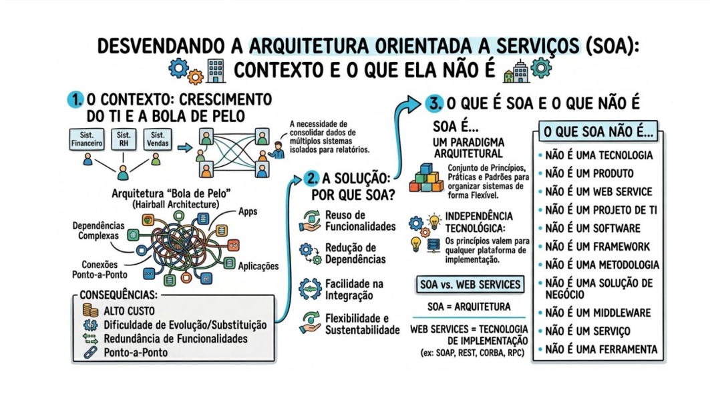

---

<!-- pagina: 11 -->

**Diego Carvalho, Equipe Informática 2 (Diego Carvalho), Equipe Informática 1 (Diego Carvalho) Aula 08** 

O Modelo de Referência para SOA descreve diversos conceitos fundamentais relacionados à utilização de serviços. Entre eles encontram-se elementos que apoiam a descoberta e o uso dos serviços, bem como conceitos que explicam como consumidores e provedores interagem ao longo do tempo. Compreender esses componentes é importante porque eles permitem entender não apenas como um serviço é disponibilizado, mas também como as interações ocorrem e produzem resultados concretos dentro de uma arquitetura orientada a serviços. 

Um dos elementos fundamentais apresentados pelo modelo é a descrição do serviço. Como um consumidor consegue decidir se determinado serviço atende às suas necessidades? A resposta está justamente nas informações fornecidas pela descrição disponibilizada pelo provedor. Ela reúne características relevantes sobre o serviço, facilita sua descoberta e permite que sistemas desenvolvidos em diferentes domínios organizacionais possam interagir de maneira compatível, mesmo quando foram construídos de forma independente. 

Além da descrição, contratos e políticas também desempenham papel importante na utilização dos serviços. Qual a diferença entre eles? Uma política representa uma restrição, condição ou requisito definido por um participante para regular o uso ou a disponibilização de determinado recurso. Já um contrato corresponde a um acordo estabelecido entre duas ou mais partes. Ambos influenciam a utilização dos serviços, mas contratos pressupõem consenso entre os participantes, enquanto políticas podem ser definidas individualmente por uma das partes envolvidas. 

Outro conceito frequentemente cobrado em avaliações é o contexto de execução. O que ele engloba? O contexto de execução corresponde ao conjunto de elementos necessários para viabilizar uma interação de serviço. Isso inclui infraestrutura tecnológica, processos, políticas, acordos e demais componentes que participam da operação. Em vez de representar apenas um caminho de comunicação entre consumidores e provedores, o contexto descreve todo o ambiente operacional que sustenta a interação durante sua execução. 

Uma vez compreendidos os elementos que apoiam a utilização dos serviços, torna-se possível analisar os conceitos relacionados à dinâmica das interações. O Modelo de Referência para SOA destaca três conceitos centrais nesse contexto: visibilidade, interação e efeito no mundo real. Por que esses conceitos são tão importantes? Porque eles explicam como consumidores e provedores conseguem se relacionar, trocar informações e produzir resultados concretos por meio dos serviços disponibilizados. 

O primeiro desses conceitos é a visibilidade. A visibilidade representa a condição que permite que consumidores e provedores interajam. O que precisa existir para que essa visibilidade seja alcançada? O modelo estabelece três pré-condições: consciência, concordância e acessibilidade. Os participantes precisam conhecer a existência uns dos outros, demonstrar disposição para interagir e possuir meios efetivos para realizar essa comunicação. Sem esses elementos, a interação não consegue ocorrer de maneira adequada, mesmo que o serviço esteja tecnicamente disponível. 

Uma vez estabelecida a visibilidade, surge a possibilidade de interação. Como essa interação normalmente acontece? Na maioria dos cenários, por meio da troca de mensagens entre consumidores e provedores. Entretanto, o conceito é mais amplo e não se limita à comunicação baseada em mensagens. Em determinadas situações, a interação pode ocorrer por meio da alteração de recursos compartilhados ou por outros mecanismos que permitam a execução das ações associadas ao serviço. 

Toda interação ocorre com um objetivo específico e produz consequências observáveis. É nesse ponto que surge o conceito de efeito no mundo real. O que exatamente representa esse efeito? Trata-se do resultado gerado pela utilização do serviço. Esse resultado pode assumir diferentes formas, incluindo

---

<!-- pagina: 12 -->

**Diego Carvalho, Equipe Informática 2 (Diego Carvalho), Equipe Informática 1 (Diego Carvalho) Aula 08** 

alterações de estado compartilhado, informações produzidas pela execução do serviço ou impactos concretos em processos de negócio relacionados aos participantes envolvidos. 

Considere um ambiente de comércio eletrônico. Quando um cliente conclui uma compra, quais consequências podem surgir? O estoque pode ser atualizado, o pagamento pode ser registrado e um pedido pode ser criado para processamento. Observe que o interesse não está nos estados internos de cada sistema individualmente, mas nos efeitos compartilhados e observáveis produzidos pela interação entre consumidores, provedores e demais componentes envolvidos no processo. 

Dessa forma, o Modelo de Referência para SOA apresenta uma visão integrada do funcionamento dos serviços. Elementos como descrição, contratos, políticas e contexto de execução fornecem as condições necessárias para que a utilização dos serviços seja possível. A partir dessas bases, a visibilidade permite o estabelecimento do relacionamento entre as partes, a interação viabiliza a troca de informações e o efeito no mundo real representa os resultados concretos produzidos pelo uso dos serviços dentro dos processos de negócio. 

### **<mark>CONCEITOS-CHAVE</mark>** 

- <mark>Visibilidade entre Provedores e Consumidores de serviços</mark> 

<mark>- Interação entre Provedores e Consumidores de serviços</mark> 

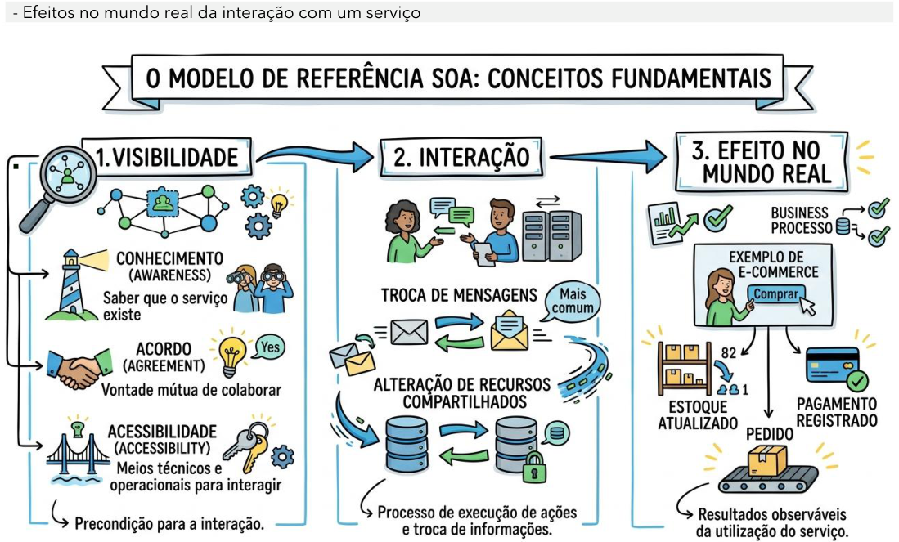

<!-- Start of picture text -->
- Efeitos no mundo real da interação com um serviço <!-- End of picture text -->

---

<!-- pagina: 13 -->

**Diego Carvalho, Equipe Informática 2 (Diego Carvalho), Equipe Informática 1 (Diego Carvalho) Aula 08** 

<!-- Start of picture text -->
Objetivos e Benefícios <!-- End of picture text -->

#### **<mark>INCIDÊNCIA EM PROVA: ALTA</mark>** 

Thomas Erl destaca que a Arquitetura Orientada a Serviços busca alcançar diversos objetivos estratégicos dentro das organizações. Entre os mais importantes estão a interoperabilidade intrínseca, a federação e a diversificação de fornecedores. Por que esses objetivos recebem tanta atenção? Porque eles procuram resolver problemas historicamente presentes em ambientes corporativos, especialmente aqueles relacionados à integração de sistemas, à dependência tecnológica e à dificuldade de evolução das soluções ao longo do tempo. 

**(UNESC / FESPORTE - 2025)** Um arquiteto de software está projetando um sistema complexo para <mark>uma instituição financeira, que precisa integrar diversos serviços e aplicações, como sistemas de contas correntes, investimentos, empréstimos e cartões de crédito. Analise as afirmativas a seguir sobre frameworks de arquitetura e SOA:</mark> 

<mark>I. Um framework de arquitetura fornece um conjunto de componentes, padrões e diretrizes que podem ser reutilizados para o desenvolvimento de diferentes aplicações, garantindo a consistência e a qualidade.</mark> 

<mark>II. A arquitetura SOA define que as funcionalidades do sistema devem ser expostas como serviços independentes e interoperáveis, que podem ser acessados e reutilizados por diferentes aplicações.</mark> 

<mark>III. A utilização de um framework de arquitetura compatível com SOA facilita a implementação de serviços, o gerenciamento de transações, a segurança e o monitoramento do sistema.</mark> 

<mark>IV. O Spring é um framework mais abrangente, que oferece suporte a diversos estilos de arquitetura, incluindo SOA, e fornece recursos para a criação e o consumo de serviços web. O Struts, por outro lado, é mais focado no desenvolvimento de aplicações web MVC e não possui um foco específico em SOA. Está correto o que se afirma em:</mark> 

<mark>a) II e III apenas. b) I e II apenas. c) II, III e IV apenas. d) I, II e III apenas. e) I, II, III e IV.</mark> 

**<mark>_______________________ Comentários:</mark>** <mark>(I) Correto. Framework de arquitetura traz componentes, padrões e diretrizes reutilizáveis, ajudando a padronizar o desenvolvimento e a manter mais consistência e qualidade entre diferentes aplicações. (II) Correto. Na SOA, a ideia central é expor funcionalidades como serviços independentes, interoperáveis e reaproveitáveis, permitindo integração entre vários sistemas e aplicações. (III) Correto. Quando o framework é compatível com SOA, ele ajuda bastante na implementação dos serviços e também em pontos práticos, como transações, segurança e monitoramento; (IV) Correto. O Spring é mais amplo e suporta diferentes estilos arquiteturais, inclusive SOA, além de oferecer recursos para serviços web. Já o Struts é mais voltado ao padrão MVC em aplicações web</mark> (Letra E). 

O primeiro desses objetivos é a interoperabilidade intrínseca. O que torna essa característica tão valiosa? Em muitas organizações, os sistemas foram desenvolvidos em épocas diferentes, utilizando linguagens, plataformas e tecnologias distintas. Como consequência, a troca de informações costuma exigir mecanismos de integração cada vez mais complexos. A orientação a serviços procura minimizar essa dificuldade ao estabelecer padrões que favorecem a comunicação entre componentes, reduzindo o esforço necessário para promover a integração entre sistemas heterogêneos.

---

<!-- pagina: 14 -->

**Diego Carvalho, Equipe Informática 2 (Diego Carvalho), Equipe Informática 1 (Diego Carvalho) Aula 08** 

A interoperabilidade intrínseca não se limita à simples troca de mensagens. Seu propósito é permitir que serviços sejam projetados desde o início para interagir de maneira padronizada com outros serviços. Dessa forma, a capacidade de integração deixa de ser tratada como uma adaptação posterior e passa a fazer parte da própria concepção da solução. Isso contribui para a construção de ambientes mais flexíveis e preparados para incorporar novos sistemas ao longo do tempo. 

Outro objetivo estratégico destacado por Thomas Erl é a federação. O que significa afirmar que um ambiente é federado? Significa que recursos, aplicações e unidades organizacionais podem atuar de forma integrada sem abrir mão de sua autonomia. Cada participante continua responsável pela própria gestão, mas passa a colaborar dentro de um modelo comum de interação. Essa característica é viabilizada por serviços padronizados e passíveis de composição, permitindo que diferentes partes da organização compartilhem funcionalidades de forma coordenada e consistente. 

A federação torna-se especialmente relevante em organizações de grande porte. Imagine uma empresa composta por diversos departamentos ou unidades de negócio. Seria necessário centralizar completamente todos os sistemas para que eles trabalhassem em conjunto? Não. A abordagem federada permite que cada área mantenha seus processos e sistemas específicos, enquanto os serviços fornecem mecanismos padronizados para cooperação, compartilhamento de informações e execução conjunta de atividades quando necessário. 

Ao preservar a autonomia dos participantes e, ao mesmo tempo, possibilitar colaboração estruturada, a federação reduz conflitos entre necessidades locais e objetivos corporativos mais amplos. Assim, a organização consegue promover integração sem exigir a padronização absoluta de todos os processos, sistemas ou tecnologias existentes em cada unidade organizacional. 

O terceiro objetivo destacado por Thomas Erl é a diversificação de fornecedores. Qual problema essa característica procura resolver? Muitas organizações tornam-se excessivamente dependentes de tecnologias, plataformas ou fornecedores específicos. Quando isso acontece, a substituição de soluções pode se tornar cara, complexa ou até inviável. A utilização de serviços padronizados reduz essa dependência, pois facilita a adoção de alternativas compatíveis sem exigir mudanças significativas em toda a arquitetura. 

Sob a perspectiva do consumidor, a diversificação amplia as possibilidades de escolha. Como essa flexibilidade beneficia a organização? Ela permite avaliar diferentes provedores e selecionar aqueles que melhor atendem aos requisitos técnicos, operacionais e de negócio estabelecidos. O objetivo principal não é simplesmente escolher um serviço diferente, mas preservar a liberdade de decisão e reduzir riscos associados à dependência excessiva de um único fornecedor ou tecnologia. 

A diversificação também contribui para aumentar a capacidade de adaptação da organização diante das mudanças do mercado. Caso um fornecedor deixe de oferecer suporte, aumente custos ou deixe de atender aos requisitos necessários, torna-se mais fácil migrar para alternativas compatíveis. Dessa forma, a arquitetura passa a oferecer maior resiliência e independência estratégica. 

Esses três objetivos atuam de maneira complementar dentro da Arquitetura Orientada a Serviços. A interoperabilidade intrínseca facilita a comunicação entre sistemas heterogêneos; a federação permite cooperação sem perda de autonomia; e a diversificação de fornecedores amplia a flexibilidade tecnológica e estratégica da organização. Juntos, esses elementos contribuem para a construção de ambientes mais adaptáveis, integrados e preparados para evoluir diante de novas demandas de negócio e mudanças tecnológicas.

---

<!-- pagina: 15 -->

**Diego Carvalho, Equipe Informática 2 (Diego Carvalho), Equipe Informática 1 (Diego Carvalho) Aula 08** 

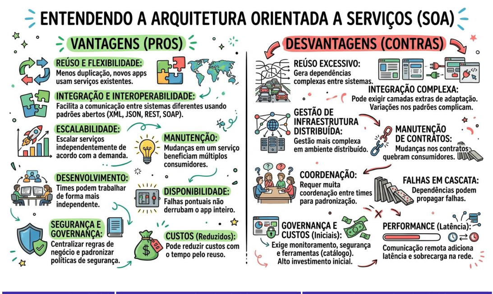

|**ASPECTOS**|**VANTAGENS DO SOA**|**DESVANTAGENS DO SOA**|
|---|---|---|
|**REUTILIZAÇÃO**|Serviços podem ser reutilizados por diferentes aplicações, reduzindo duplicação de funcionalidades.|O excesso de reutilização pode gerar dependências complexas entre sistemas.|
|**INTEGRAÇÃO**|Facilita a comunicação entre sistemas heterogêneos desenvolvidos em diferentes linguagens e plataformas.|A integração pode exigir camadas adicionais de transformação e adaptação de mensagens.|
|**MANUTENÇÃO**|Alterações em um serviço podem beneficiar diversos sistemas consumidores simultaneamente.|Mudanças em contratos de serviço podem impactar múltiplos consumidores.|
|**ESCALABILIDADE**|Serviços podem ser escalados de forma independente conforme a demanda.|A gestão de infraestrutura distribuída torna-se mais complexa.|
|**FLEXIBILIDADE**|Novas aplicações podem consumir serviços já existentes sem necessidade de reimplementação.|A governança dos serviços exige processos rigorosos de controle e versionamento.|
|**DESENVOLVIMENTO**|Equipes podem trabalhar de forma mais independente em serviços distintos.|Exige maior coordenação entre equipes para garantir compatibilidade e padronização.|
|**INTEROPERABILIDADE**|Utiliza padrões abertos (SOAP, XML, REST, JSON, etc), favorecendo a comunicação entre plataformas.|Diferenças de padrões e protocolos podem aumentar a complexidade da integração.|
|**DISPONIBILIDADE**|A falha de um serviço não necessariamente compromete toda a aplicação.|Dependências entre serviços podem provocar falhas em cascata.|
|**DESEMPENHO**|Permite distribuir processamento entre diversos serviços especializados.|A comunicação remota entre serviços adiciona latência e sobrecarga de rede.|

---

<!-- pagina: 16 -->

**Diego Carvalho, Equipe Informática 2 (Diego Carvalho), Equipe Informática 1 (Diego Carvalho) Aula 08** 

|**ASPECTOS**|**VANTAGENS DO SOA**|**DESVANTAGENS DO SOA**|
|---|---|---|
|**GOVERNANÇA**|Possibilita centralizar regras de negócio em serviços compartilhados.|Requer mecanismos de monitoramento, segurança, catálogo e gestão de serviços, aumentando o custo operacional.|
|**SEGURANÇA**|Permite implementar políticas de segurança padronizadas para os serviços.|Amplia a superfície de ataque, exigindo autenticação, autorização e criptografia bem estruturadas.|
|**CUSTOS**|Pode reduzir custos de desenvolvimento por meio do reaproveitamento de serviços.|A implantação inicial costuma demandar investimentos elevados em infraestrutura, ESB, monitoramento e governança.|

---

<!-- pagina: 17 -->

**Diego Carvalho, Equipe Informática 2 (Diego Carvalho), Equipe Informática 1 (Diego Carvalho) Aula 08** 

<!-- Start of picture text -->
Manifesto SOA <!-- End of picture text -->

#### **<mark>INCIDÊNCIA EM PROVA: BAIXÍSSIMA</mark>** 

### **<mark>MANIFESTO SOA</mark>** 

O Manifesto SOA é um conjunto de princípios que orienta a adoção da Arquitetura Orientada a Serviços, enfatizando que aspectos estratégicos e organizacionais devem prevalecer sobre preocupações puramente técnicas. O manifesto valoriza objetivos de negócio, interoperabilidade, compartilhamento de serviços, flexibilidade organizacional e governança eficaz, servindo como um guia para que a implementação da SOA gere benefícios reais para a empresa e não apenas mudanças tecnológicas. 

Os profissionais de tecnologia frequentemente utilizam manifestos para registrar valores e princípios que orientam determinada abordagem de desenvolvimento ou arquitetura. Um exemplo bastante conhecido é o Manifesto Ágil, que estabelece diretrizes para o desenvolvimento de software. Existe algo semelhante no contexto da Arquitetura Orientada a Serviços? Sim. Nesse cenário foi criado o Manifesto SOA, um conjunto de valores destinado a orientar a adoção e a aplicação dos conceitos relacionados aos serviços dentro das organizações. 

O Manifesto SOA busca alinhar aspectos técnicos e objetivos de negócio durante a construção de soluções baseadas em serviços. Por que isso é importante? Porque a simples utilização de serviços não garante que uma arquitetura esteja alinhada aos princípios de SOA. O manifesto procura fornecer diretrizes para que decisões arquiteturais considerem fatores como flexibilidade, interoperabilidade, governança e geração de valor para o negócio, permitindo que a arquitetura atenda tanto às necessidades técnicas quanto às organizacionais. 

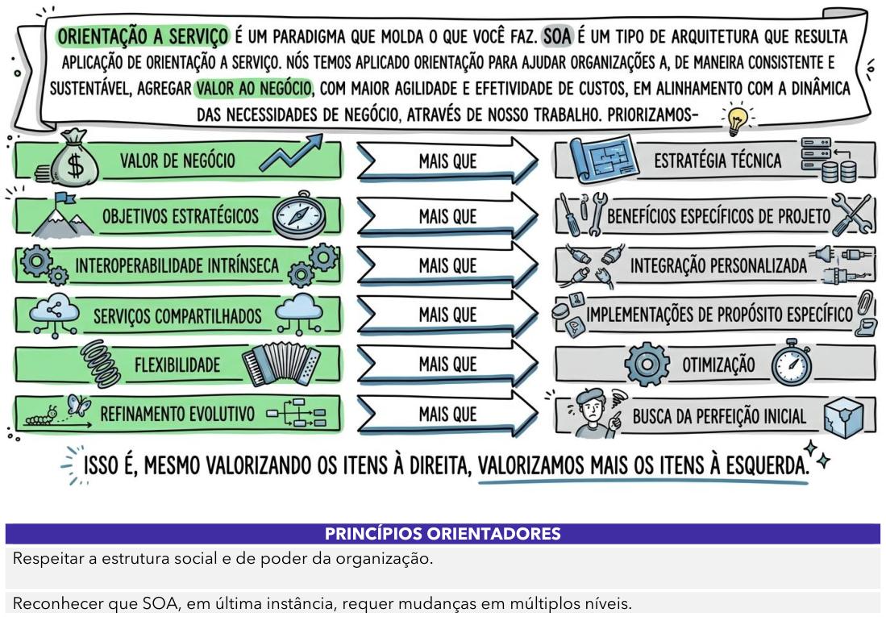

<!-- Start of picture text -->
PRINCÍPIOS ORIENTADORES Respeitar a estrutura social e de poder da organização. Reconhecer que SOA, em última instância, requer mudanças em múltiplos níveis. <!-- End of picture text -->

---

<!-- pagina: 18 -->

**Diego Carvalho, Equipe Informática 2 (Diego Carvalho), Equipe Informática 1 (Diego Carvalho) Aula 08** 

<mark>O escopo da adoção de SOA pode variar.</mark> 

<mark>Manter os esforços gerenciáveis e dentro de limites significativos.</mark> 

<mark>Produtos e padrões, por si só, não proverão uma SOA nem aplicarão os paradigmas de orientação a serviço por</mark> você. 

<mark>SOA pode ser realizada através de uma variedade de tecnologias e padrões.</mark> 

<mark>Estabelecer um conjunto uniforme de padrões e políticas corporativas embasado em padrões da indústria, de</mark> facto, e da comunidade. 

<mark>Buscar uniformidade no exterior e permitir diversidade no interior.</mark> 

<mark>Identificar serviços através da colaboração entre partes interessadas no negócio e na tecnologia.</mark> 

<mark>Maximizar o uso de serviços considerando o escopo de utilização atual e futuro.</mark> 

<mark>Verificar que os serviços satisfaçam os requisitos e objetivos de negócio.</mark> 

Evoluir os serviços e sua organização em resposta ao uso real. 

<mark>Separar os diferentes aspectos de um sistema que mudam com diferentes frequências.</mark> 

<mark>Reduzir dependências implícitas e publicar todas as dependências externas para aumentar a robustez e diminuir</mark> o impacto de mudanças. 

<mark>A cada nível de abstração, organizar cada serviço em torno de uma unidade de funcionalidade coesa e</mark> <u>gerenciável.</u>

---

<!-- pagina: 19 -->

**Diego Carvalho, Equipe Informática 2 (Diego Carvalho), Equipe Informática 1 (Diego Carvalho) Aula 08** 

<!-- Start of picture text -->
Modelos <!-- End of picture text -->

<!-- Start of picture text -->
de Serviços <!-- End of picture text -->

### **<mark>MODELOS DE SERVIÇOS</mark>** 

Modelos de Serviços são representações conceituais que descrevem como os participantes de uma arquitetura orientada a serviços interagem para publicar, descobrir, acessar e consumir serviços. Esses modelos definem os papéis envolvidos — como provedores, consumidores e registros de serviços — bem como os mecanismos de comunicação e descoberta utilizados no ambiente SOA. Ao estabelecer padrões de interação, os modelos de serviços ajudam a organizar a infraestrutura de integração, promovendo interoperabilidade, reutilização, flexibilidade e desacoplamento entre os sistemas participantes da arquitetura. 

Ao estudar a Arquitetura Orientada a Serviços, é comum concentrar a atenção nos serviços, nos provedores e nos consumidores. Entretanto, existe outro aspecto igualmente importante: os modelos que descrevem como esses participantes interagem. Por que esses modelos são necessários? Porque a simples existência de serviços não garante que eles possam ser localizados, acessados e utilizados de maneira organizada. Para isso, é necessário definir mecanismos que orientem a comunicação entre os elementos envolvidos no ambiente orientado a serviços. 

Esses modelos descrevem a forma pela qual provedores, consumidores e mecanismos de registro se relacionam durante a disponibilização e utilização dos serviços. Como um consumidor descobre que determinado serviço existe? Como obtém informações para acessá-lo? Como localiza o provedor responsável? Essas questões são respondidas pelos modelos de interação, descoberta e consumo, que estabelecem os fluxos necessários para que os participantes consigam cooperar de forma padronizada dentro da arquitetura. 

O foco desses modelos está nos mecanismos de comunicação e acesso aos serviços. Em que eles diferem da estrutura arquitetural propriamente dita? Enquanto a arquitetura define princípios, papéis e características que orientam a construção do ambiente orientado a serviços, os modelos de interação descrevem como ocorre a publicação, a localização e a utilização dos serviços disponíveis. Dessa forma, eles complementam a arquitetura ao especificar os processos necessários para conectar aqueles que oferecem serviços àqueles que necessitam utilizá-los. 

Em conjunto, esses modelos de interação, descoberta e consumo representam diferentes estratégias para conectar consumidores e provedores de serviços. Enquanto o modelo End-to-End privilegia simplicidade e desempenho, abordagens como Publish-Find-Bind e Registry-Based Interaction priorizam flexibilidade, reutilização e desacoplamento. A escolha do modelo mais adequado depende das necessidades de integração, escalabilidade, governança e evolução do ambiente corporativo em que a arquitetura SOA está sendo aplicada. 

<!-- Start of picture text -->
- Modelo End to <!-- End of picture text -->

<!-- Start of picture text -->
- End <!-- End of picture text -->

#### **<mark>INCIDÊNCIA EM PROVA: BAIXÍSSIMA</mark>** 

### **<mark>MODELO END-TO-END</mark>** 

O modelo End-to-End descreve a interação direta entre um provedor de serviços e um consumidor de serviços, sem a necessidade de intermediários para descoberta ou mediação. Nesse modelo, o consumidor já conhece previamente a localização e o contrato do serviço que deseja utilizar. Trata-se da forma mais simples de comunicação em ambientes SOA, sendo adequada para cenários controlados e com poucos participantes. 

Entre os modelos de interação utilizados em ambientes orientados a serviços, o mais simples é o modelo End-to-End. O que caracteriza essa abordagem? O consumidor conhece previamente o provedor do serviço e estabelece comunicação diretamente com ele. Todas as informações necessárias para o acesso

---

<!-- pagina: 20 -->

**Diego Carvalho, Equipe Informática 2 (Diego Carvalho), Equipe Informática 1 (Diego Carvalho) Aula 08** 

já estão disponíveis ao consumidor, incluindo endereço, protocolo de comunicação e detalhes relacionados à utilização do serviço. Como resultado, a interação ocorre de forma direta, sem a participação de mecanismos responsáveis por descoberta ou localização. 

Nesse modelo, não existem registros de serviços nem componentes intermediários envolvidos no processo de descoberta. Como o consumidor localiza o serviço desejado? Ele não precisa realizar buscas, pois já conhece previamente o provedor responsável. Essa característica simplifica a comunicação e reduz a quantidade de etapas necessárias para utilização do serviço, tornando o processo mais direto quando comparado a modelos que utilizam mecanismos formais de registro e descoberta. 

A simplicidade do modelo End-to-End oferece algumas vantagens operacionais. Entretanto, quais limitações podem surgir nesse cenário? Como consumidores e provedores mantêm uma relação direta e previamente estabelecida, a flexibilidade tende a ser menor. Alterações em elementos compartilhados da comunicação, como contratos, interfaces, protocolos ou endereços de acesso, podem exigir adaptações nos consumidores que utilizam o serviço. Por esse motivo, embora seja uma abordagem simples e funcional em determinados contextos, ela apresenta restrições quando o ambiente cresce em tamanho, complexidade ou quantidade de serviços disponíveis. 

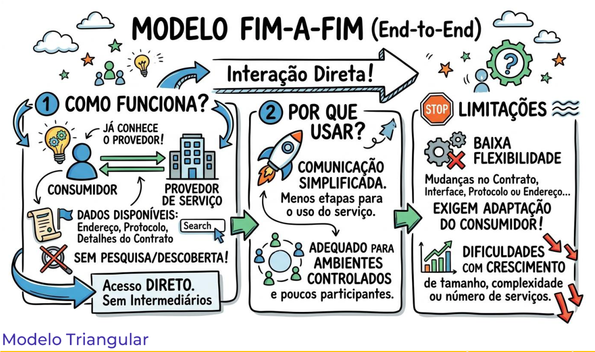

<!-- Start of picture text -->
Modelo Triangular <!-- End of picture text -->

#### **<mark>INCIDÊNCIA EM PROVA: MÉDIA</mark>** 

### **<mark>MODELO TRIANGULAR</mark>** 

<mark>O modelo triangular introduz um terceiro elemento na arquitetura: o registro de serviços. Assim, a interação</mark> ocorre entre três participantes principais — provedor, consumidor e registro — permitindo que os serviços sejam publicados e descobertos dinamicamente. Esse modelo aumenta a flexibilidade e a escalabilidade dos ambientes SOA ao desacoplar consumidores e provedores. 

O modelo Triangular surgiu como uma evolução natural do modelo End-to-End, especialmente em ambientes que passaram a concentrar grande quantidade de serviços e consumidores. Qual problema essa evolução procura resolver? No modelo anterior, os consumidores precisavam conhecer previamente

---

<!-- pagina: 21 -->

**Diego Carvalho, Equipe Informática 2 (Diego Carvalho), Equipe Informática 1 (Diego Carvalho) Aula 08** 

os provedores e suas informações de acesso. À medida que o número de serviços aumenta, manter esse conhecimento torna-se mais difícil. O modelo Triangular introduz um mecanismo específico para organizar e disponibilizar informações sobre os serviços existentes. 

A principal característica desse modelo é a presença de um terceiro participante além do consumidor e do provedor: o registro de serviços. Qual a função desse componente? Ele atua como um catálogo que armazena informações sobre os serviços disponíveis no ambiente. Os provedores publicam descrições de seus serviços nesse registro, permitindo que consumidores realizem consultas para localizar funcionalidades compatíveis com suas necessidades sem depender de conhecimento prévio sobre quem as disponibiliza. 

O processo de utilização ocorre em etapas bem definidas. Como um consumidor encontra o serviço desejado? Inicialmente, ele consulta o registro de serviços em busca de uma funcionalidade específica. Após localizar um serviço adequado, obtém informações necessárias para estabelecer comunicação com o respectivo provedor. A partir desse momento, a interação ocorre diretamente entre consumidor e provedor, enquanto o registro deixa de participar da execução da operação solicitada. 

Uma consequência importante desse modelo é o aumento do desacoplamento entre os participantes. Em que sentido ocorre esse desacoplamento? O consumidor deixa de depender do conhecimento prévio sobre a localização dos serviços, pois essa informação passa a ser fornecida pelo registro. Além disso, a existência de um catálogo centralizado facilita a descoberta de novos serviços e contribui para ambientes mais flexíveis, nos quais provedores e consumidores podem evoluir com menor dependência direta relacionada à localização e à identificação dos recursos disponíveis. 

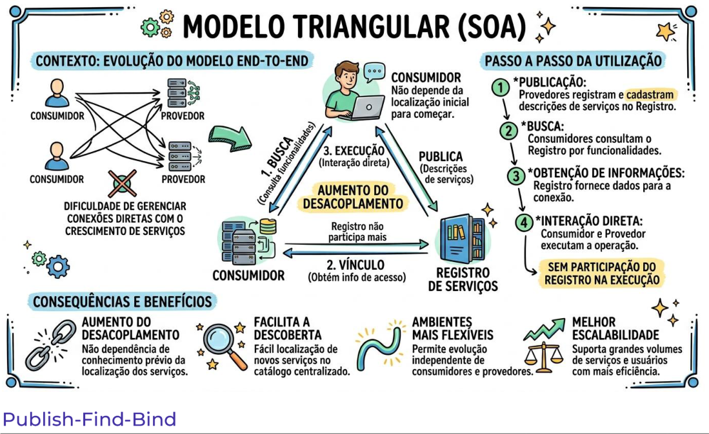

<!-- Start of picture text -->
- - Publish Find Bind <!-- End of picture text -->

**<mark>INCIDÊNCIA EM PROVA: BAIXÍSSIMA</mark>** 

<!-- Start of picture text -->
PUBLISH-FIND-BIND <!-- End of picture text -->

---

<!-- pagina: 22 -->

**Diego Carvalho, Equipe Informática 2 (Diego Carvalho), Equipe Informática 1 (Diego Carvalho) Aula 08** 

Publish-Find-Bind é um padrão clássico de interação em SOA. Inicialmente, o provedor publica informações sobre seus serviços em um registro. Em seguida, o consumidor realiza uma busca para localizar os serviços disponíveis que atendam às suas necessidades. Por fim, após encontrar o serviço desejado, estabelece uma conexão (bind) <u><mark>para consumi-lo. Esse mecanismo favorece reutilização e descoberta dinâmica.</mark></u> 

Entre os modelos de interação associados à Arquitetura Orientada a Serviços, um dos mais conhecidos é o Publish-Find-Bind. Por que esse modelo recebeu tanta relevância ao longo da evolução da SOA? Porque ele estabelece um processo estruturado para publicação, descoberta e utilização de serviços, permitindo que consumidores localizem funcionalidades sem depender de conhecimento prévio sobre os provedores responsáveis por disponibilizá-las. 

O modelo é composto por três etapas principais. O que acontece inicialmente? O provedor de serviços realiza a publicação de informações sobre seus serviços em um registro especializado. Essas informações normalmente incluem descrições das funcionalidades oferecidas, formas de acesso e demais elementos necessários para que potenciais consumidores consigam compreender como utilizar o serviço disponibilizado. 

Após a publicação, entra em cena a etapa de descoberta. Como um consumidor encontra o serviço de que necessita? Ele consulta o registro de serviços em busca de uma funcionalidade compatível com seus requisitos. O registro atua como um catálogo organizado, permitindo localizar serviços disponíveis sem a necessidade de contato prévio com os respectivos provedores. Essa capacidade de descoberta constitui uma das características mais importantes do modelo. 

Uma vez identificado o serviço desejado, ocorre a etapa conhecida como bind. O que significa realizar o bind? Significa estabelecer a associação necessária para utilização do serviço, obtendo informações como localização, contrato e mecanismos de acesso. A partir desse momento, o consumidor passa a se comunicar diretamente com o provedor para executar as operações disponibilizadas pelo serviço encontrado. 

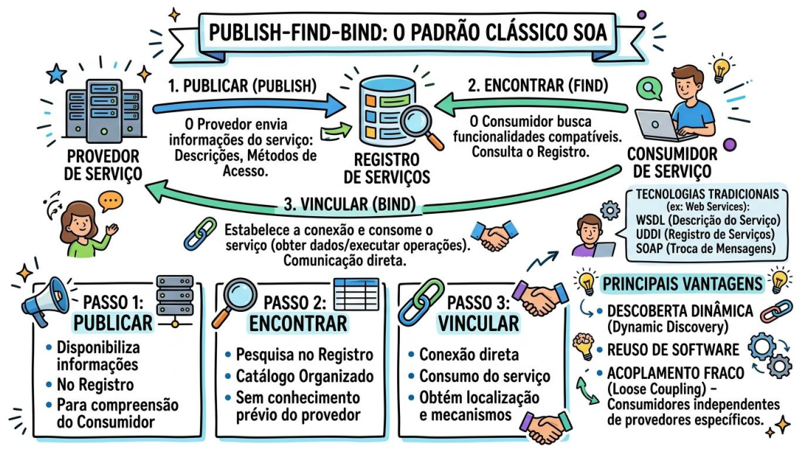

---

<!-- pagina: 23 -->

**Diego Carvalho, Equipe Informática 2 (Diego Carvalho), Equipe Informática 1 (Diego Carvalho) Aula 08** 

Esse modelo tornou-se especialmente popular no contexto da SOA tradicional baseada em Web Services. Como as tecnologias se encaixavam nesse processo? Em muitas implementações, o WSDL era utilizado para descrever os serviços, o UDDI desempenhava o papel de registro e o SOAP era empregado para troca de mensagens entre consumidores e provedores. Essa combinação contribuiu para consolidar o Publish-Find-Bind como uma das representações mais clássicas da interação entre participantes em ambientes orientados a serviços. 

A importância desse modelo vai além das tecnologias utilizadas em sua implementação. O que ele procura demonstrar conceitualmente? Que a publicação, a descoberta e a utilização dos serviços podem ocorrer de maneira organizada e desacoplada. Dessa forma, consumidores conseguem localizar funcionalidades disponíveis sem depender diretamente do conhecimento prévio dos provedores, enquanto os provedores podem disponibilizar seus serviços para um conjunto mais amplo de potenciais consumidores dentro do ambiente orientado a serviços. 

<!-- Start of picture text -->
- Bind Execute <!-- End of picture text -->

<!-- Start of picture text -->
- Find <!-- End of picture text -->

#### **<mark>INCIDÊNCIA EM PROVA: BAIXA</mark>** 

### **<mark>FIND-BIND-EXECUTE</mark>** 

O modelo Find-Bind-Execute descreve a sequência operacional utilizada pelo consumidor de serviços. Primeiro, o consumidor localiza um serviço adequado; em seguida, estabelece uma ligação com ele utilizando seu contrato; por último, executa as operações disponibilizadas pelo serviço. Esse fluxo representa o comportamento típico de consumo em arquiteturas orientadas a serviços. 

O modelo Find-Bind-Execute pode ser entendido como uma variação operacional do modelo PublishFind-Bind. Qual a principal diferença entre eles? Nesse caso, a publicação do serviço não aparece explicitamente no fluxo analisado, pois se considera que essa atividade já foi realizada anteriormente. Assim, a atenção passa a se concentrar nas etapas executadas pelo consumidor durante o processo de utilização do serviço. 

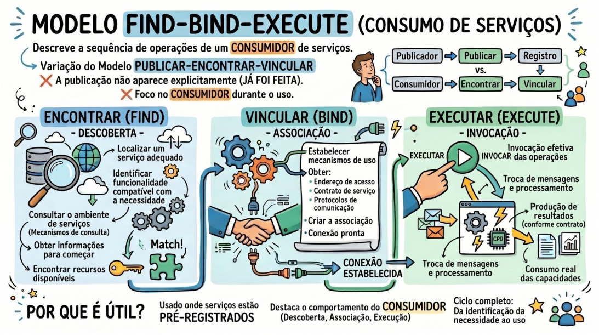

---

<!-- pagina: 24 -->

**Diego Carvalho, Equipe Informática 2 (Diego Carvalho), Equipe Informática 1 (Diego Carvalho) Aula 08** 

**(IBFC / IDAM - 2019)** Leia a frase abaixo referente a arquitetura orientada a serviços: "SOA (Service- <mark>Oriented Architecture) é baseada no paradigma conhecido como '_____ - ______ - ______' a fim de que os serviços possam ser publicados, buscados e consumidos por qualquer sistema." Assinale a alternativa que completa correta e respectivamente as lacunas:</mark> 

<mark>a) Seek/ Research/ Show b) Seek/ Bind/ Show c) Find/ Bind/ Execute d) Find/ Research/ Execute</mark> 

**<mark>_______________________ Comentários:</mark>** <mark>(a) Errado. "Seek/ Research/ Show" não corresponde ao trio clássico usado em SOA para publicação, descoberta e uso de serviços. (b) Errado. "Seek/ Bind/ Show" traz termos que não formam o paradigma consagrado da arquitetura orientada a serviços. (c) Correto. "Find/ Bind/ Execute" representa a lógica de localizar o serviço, fazer a associação e então executá-lo/consumi-lo. (d) Errado.</mark> "Find/ Research/ Execute" mistura termos que não compõem a sequência tradicional adotada em SOA (Letra C). 

A primeira etapa é a descoberta do serviço. Como o consumidor identifica uma funcionalidade capaz de atender sua necessidade? Por meio de mecanismos de consulta disponibilizados pelo ambiente orientado a serviços. O objetivo é localizar um serviço compatível com os requisitos definidos, obtendo informações suficientes para iniciar sua utilização. Nesse momento, o consumidor descobre quais recursos estão disponíveis e quais deles podem atender à demanda existente. 

Após a descoberta ocorre a etapa denominada bind. O que acontece durante essa fase? O consumidor estabelece os mecanismos necessários para utilização do serviço localizado. Isso envolve a obtenção de informações como endereço de acesso, contrato, protocolos de comunicação e demais elementos necessários para a interação. Em outras palavras, cria-se a associação que permitirá ao consumidor utilizar corretamente as funcionalidades disponibilizadas pelo provedor. 

A etapa seguinte é a execução propriamente dita. O que caracteriza o execute? Trata-se da invocação efetiva das operações disponibilizadas pelo serviço. Nesse momento, as mensagens são trocadas, as funcionalidades são processadas e os resultados são produzidos conforme o contrato estabelecido. É nessa fase que ocorre o consumo real das capacidades oferecidas pelo provedor de serviços. 

Esse modelo costuma ser utilizado para representar o fluxo de utilização em ambientes nos quais os serviços já estão previamente registrados e disponíveis para consulta. Por que essa representação é útil? Porque ela destaca o comportamento do consumidor durante o consumo do serviço, enfatizando as atividades de descoberta, associação e execução. Dessa forma, o modelo evidencia o ciclo operacional percorrido desde a identificação de uma necessidade até a utilização efetiva das funcionalidades disponibilizadas pela arquitetura orientada a serviços. 

<!-- Start of picture text -->
- Registry <!-- End of picture text -->

<!-- Start of picture text -->
Based Interaction <!-- End of picture text -->

#### **<mark>INCIDÊNCIA EM PROVA: BAIXÍSSIMA</mark>** 

### **<mark>REGISTRY-BASED INTERACTION</mark>** 

Registry-Based Interaction é uma abordagem em que a comunicação entre consumidores e provedores é facilitada por um repositório central de serviços. Esse registro armazena informações como contratos, políticas, endereços e metadados dos serviços disponíveis. A utilização de um registro centralizado simplifica a descoberta, <u>promove governança e facilita o gerenciamento de ambientes corporativos complexos.</u> 

Em muitos ambientes orientados a serviços, a descoberta e o gerenciamento dos serviços dependem da existência de um registro centralizado. É justamente essa característica que define o modelo conhecido como Registry-Based Interaction. Qual a ideia central dessa abordagem? Utilizar um repositório capaz de

---

<!-- pagina: 25 -->

**Diego Carvalho, Equipe Informática 2 (Diego Carvalho), Equipe Informática 1 (Diego Carvalho) Aula 08** 

concentrar informações relevantes sobre os serviços disponíveis, permitindo que consumidores e provedores interajam de forma mais organizada e menos dependente de conhecimento prévio entre as partes. 

O registro desempenha papel fundamental nesse modelo. Que tipo de informação ele costuma armazenar? Normalmente são mantidas descrições dos serviços, contratos, versões, políticas, metadados e demais informações necessárias para sua identificação e utilização. Dessa forma, o registro funciona como uma fonte central de consulta, permitindo que consumidores localizem serviços adequados às suas necessidades sem depender de comunicação direta com os respectivos provedores durante o processo de descoberta. 

Além de apoiar a localização dos serviços, o registro também contribui para a governança do ambiente orientado a serviços. O que significa governança nesse contexto? Significa manter controle e visibilidade sobre os ativos de software disponibilizados na organização. Ao centralizar informações sobre os serviços existentes, torna-se mais fácil acompanhar versões, identificar dependências, gerenciar contratos e garantir que os recursos disponíveis sejam utilizados de maneira consistente e alinhada às diretrizes estabelecidas pela organização. 

Outro benefício frequentemente associado a essa abordagem está relacionado à reutilização de funcionalidades. Como um registro favorece o reúso? Quando os serviços são catalogados e descritos adequadamente, consumidores conseguem identificar funcionalidades já existentes antes de desenvolver novas soluções. Isso reduz a duplicação de esforços, melhora o aproveitamento dos ativos de software e contribui para a construção de ambientes mais padronizados e sustentáveis ao longo do tempo. 

O modelo também favorece a redução de dependências relacionadas à descoberta dos serviços. Em que sentido ocorre esse desacoplamento? Consumidores deixam de depender do conhecimento prévio sobre a localização dos provedores, pois o registro passa a atuar como ponto central de consulta. Como consequência, novos serviços podem ser adicionados ao ambiente de maneira mais simples, uma vez que basta publicá-los no registro para que se tornem potencialmente acessíveis aos demais participantes do ecossistema orientado a serviços. 

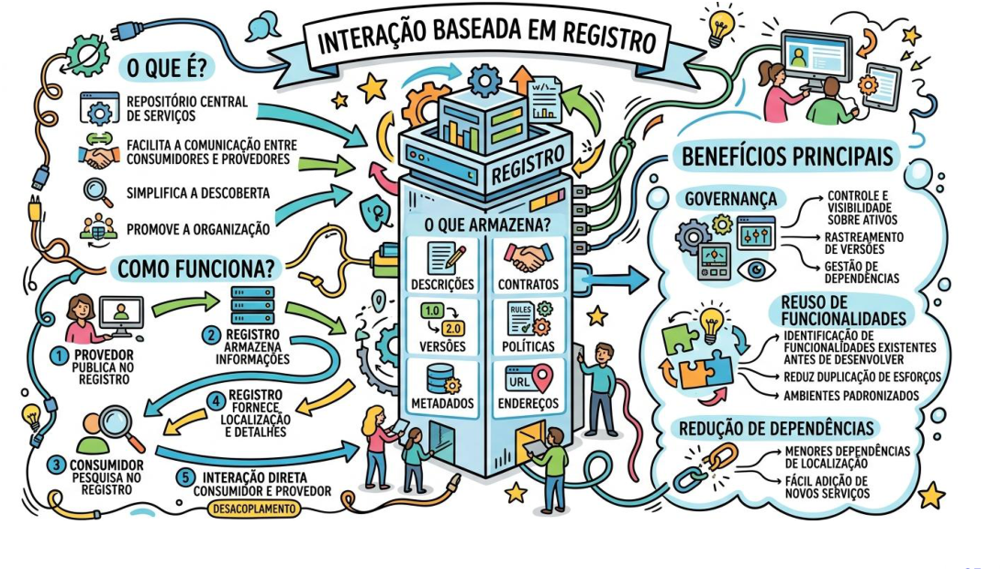

https://t.me/KakashiAssinaturasBot

---

<!-- pagina: 26 -->

**Diego Carvalho, Equipe Informática 2 (Diego Carvalho), Equipe Informática 1 (Diego Carvalho) Aula 08** 

<!-- Start of picture text -->
Estratégias <!-- End of picture text -->

<!-- Start of picture text -->
de Construção <!-- End of picture text -->

**<mark>INCIDÊNCIA EM PROVA: BAIXÍSSIMA</mark>** 

### **<mark>ESTRATÉGIAS DE CONSTRUÇÃO</mark>** 

Diferentes abordagens utilizadas para identificar, projetar e implementar serviços em uma Arquitetura Orientada a Serviços (SOA). Essas estratégias definem o ponto de partida do processo de construção dos serviços, podendo priorizar os objetivos e processos de negócio (Top-Down), o reaproveitamento de sistemas e recursos tecnológicos já existentes (Bottom-Up) ou uma combinação equilibrada entre ambos (Meet-in-the-Middle). A escolha da estratégia influencia diretamente fatores como alinhamento ao negócio, reutilização, custo de implementação, tempo de adoção e qualidade da arquitetura de serviços resultante. 

No contexto da Arquitetura Orientada a Serviços, a identificação dos serviços pode seguir estratégias distintas. Como determinar quais serviços devem ser criados ou disponibilizados pela arquitetura? Essa decisão está diretamente relacionada às abordagens Top-Down e Bottom-Up, que representam diferentes pontos de partida para o processo de modelagem. A escolha entre elas influencia a forma como os serviços são identificados, organizados e alinhados às necessidades da organização. 

Cada abordagem apresenta benefícios e limitações. Qual delas deve ser utilizada? A resposta depende do contexto organizacional. A abordagem Top-Down favorece o alinhamento estratégico e a aderência aos processos de negócio. Já a abordagem Bottom-Up facilita o reúso de recursos existentes e pode reduzir custos de implementação. Em muitos projetos, ambas são utilizadas de forma complementar, combinando a visão orientada ao negócio com o aproveitamento das capacidades tecnológicas já disponíveis na organização. 

<!-- Start of picture text -->
Abordagem Top <!-- End of picture text -->

<!-- Start of picture text -->
- Down <!-- End of picture text -->

#### **<mark>INCIDÊNCIA EM PROVA: BAIXÍSSIMA</mark>** 

### **<mark>ABORDAGEM TOP-DOWN</mark>** 

A abordagem Top-Down inicia a construção da arquitetura a partir dos processos e objetivos de negócio da organização. Primeiramente são identificadas as necessidades do negócio e, posteriormente, são definidos os serviços necessários para suportá-las. Essa estratégia tende a produzir serviços mais alinhados aos processos corporativos e com maior potencial de reutilização. 

A modelagem Top-Down é uma das principais abordagens utilizadas para identificar serviços em uma Arquitetura Orientada a Serviços. Qual é o ponto de partida dessa estratégia? A análise começa pelos objetivos estratégicos, processos de negócio, regras organizacionais e necessidades dos usuários. Antes de pensar em tecnologias, aplicações ou componentes existentes, procura-se compreender quais capacidades a organização necessita para executar suas atividades e atingir seus resultados. 

A partir dessa compreensão, os serviços são identificados e modelados para atender às demandas do negócio. Como ocorre essa definição? Os processos organizacionais são analisados em busca de funcionalidades que possam ser representadas como serviços. Dessa forma, a arquitetura é construída de cima para baixo, partindo da visão de negócio para a definição dos elementos tecnológicos que irão sustentá-la. O foco principal está na criação de serviços que representem capacidades relevantes para a organização. 

## **Saiba mais:**

---

<!-- pagina: 27 -->

**Diego Carvalho, Equipe Informática 2 (Diego Carvalho), Equipe Informática 1 (Diego Carvalho) Aula 08** 

<mark>A modelagem de serviços em SOA frequentemente utiliza diferentes níveis de abstração para representar as capacidades organizacionais e os elementos necessários para implementá-las. Entre essas categorias encontram-se os Business Services e os Functional Services. Qual a razão dessa separação? Ela permite que a arquitetura mantenha uma ligação clara com os objetivos do negócio sem perder a capacidade de representar os elementos necessários para a implementação das soluções tecnológicas.</mark> 

<mark>Os Business Services representam capacidades e funções relevantes para a organização sob uma perspectiva de negócio. Eles descrevem o que a organização realiza e quais serviços oferece aos seus clientes, parceiros ou processos internos. Isso significa que eles existem apenas em diagramas conceituais? Não. Embora sejam definidos a partir de uma visão orientada ao negócio, esses serviços podem ser materializados por implementações concretas e servir como referência para a construção da arquitetura orientada a serviços.</mark> 

<mark>Os Functional Services ocupam uma posição mais próxima da implementação das soluções. Sua finalidade consiste em fornecer funcionalidades específicas que apoiam a execução das capacidades representadas pelos Business Services. Como transformar uma necessidade de negócio em uma solução tecnológica? Frequentemente isso ocorre por meio de Functional Services que encapsulam regras de negócio, operações reutilizáveis e funcionalidades necessárias para suportar os processos organizacionais.</mark> 

<mark>Essa relação entre os dois tipos de serviço não deve ser interpretada como uma oposição entre negócio e tecnologia. Na verdade, ambos atuam de forma complementar. Enquanto os Business Services ajudam a identificar capacidades organizacionais e necessidades do negócio, os Functional Services fornecem mecanismos concretos para implementar essas capacidades. Dessa forma, a arquitetura consegue manter alinhamento estratégico sem perder a visão técnica necessária para o desenvolvimento das soluções.</mark> 

<mark>Por possuírem maior proximidade com a implementação, os Functional Services costumam aparecer com mais frequência em modelos arquiteturais detalhados e em atividades de projeto de sistemas. Isso significa que eles são definidos exclusivamente pela tecnologia? Também não. Embora estejam mais próximos dos componentes de software, sua existência normalmente deriva das necessidades identificadas nos processos e capacidades de negócio que a arquitetura procura atender.</mark> 

<mark>Ao analisar uma arquitetura orientada a serviços, torna-se importante compreender que diferentes níveis de abstração coexistem para atender objetivos distintos. Alguns elementos ajudam a representar capacidades organizacionais; outros descrevem funcionalidades necessárias para implementar essas capacidades. Essa separação contribui para a construção de arquiteturas mais organizadas, facilita a comunicação entre áreas de negócio e tecnologia e favorece a evolução das</mark> soluções ao longo do tempo. 

Uma das características mais valorizadas dessa abordagem é seu alinhamento com os objetivos corporativos. Por que isso acontece? Como os serviços surgem diretamente da análise dos processos de negócio, eles tendem a refletir necessidades reais da organização. Essa característica favorece a criação

---

<!-- pagina: 28 -->

**Diego Carvalho, Equipe Informática 2 (Diego Carvalho), Equipe Informática 1 (Diego Carvalho) Aula 08** 

de serviços mais consistentes, reduz a probabilidade de duplicação de funcionalidades e contribui para que diferentes áreas utilizem capacidades comuns em vez de desenvolver soluções independentes para problemas semelhantes. 

A abordagem Top-Down também costuma facilitar atividades de governança e padronização. Como isso ocorre na prática? A existência de uma visão estratégica desde o início permite estabelecer critérios mais consistentes para identificação, organização e evolução dos serviços. Como consequência, torna-se mais simples manter a arquitetura alinhada aos objetivos organizacionais e promover sua evolução de maneira controlada ao longo do tempo. 

Apesar de seus benefícios, a modelagem Top-Down apresenta alguns desafios. Qual é o principal deles? A necessidade de um esforço significativo de análise e planejamento antes do início da implementação. A compreensão dos processos de negócio, das regras organizacionais e das capacidades desejadas demanda tempo e participação de especialistas de diferentes áreas. Por esse motivo, embora produza serviços fortemente alinhados ao negócio, essa abordagem geralmente requer um investimento inicial maior quando comparada a estratégias que partem diretamente dos recursos tecnológicos já existentes. 

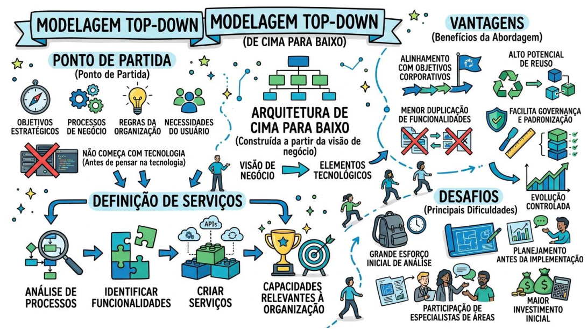

---

<!-- pagina: 29 -->

**Diego Carvalho, Equipe Informática 2 (Diego Carvalho), Equipe Informática 1 (Diego Carvalho) Aula 08** 

<!-- Start of picture text -->
Abordagem <!-- End of picture text -->

<!-- Start of picture text -->
- Bottom <!-- End of picture text -->

<!-- Start of picture text -->
Up <!-- End of picture text -->

#### **<mark>INCIDÊNCIA EM PROVA: BAIXÍSSIMA</mark>** 

### **<mark>ABORDAGEM BOTTOM-UP</mark>** 

Na abordagem Bottom-Up, os serviços são criados a partir de sistemas e funcionalidades já existentes na infraestrutura tecnológica. Componentes legados são encapsulados e expostos como serviços reutilizáveis. Essa estratégia costuma ser mais rápida e econômica, porém pode gerar serviços excessivamente orientados à tecnologia e menos aderentes às necessidades de negócio. 

A modelagem Bottom-Up representa uma estratégia de identificação de serviços baseada nos recursos tecnológicos já existentes na organização. Qual é o ponto de partida dessa abordagem? Em vez de iniciar pelos objetivos estratégicos ou pelos processos de negócio, a análise concentra-se em sistemas legados, aplicações corporativas, módulos de software e componentes que já se encontram em operação. O objetivo consiste em identificar funcionalidades existentes que possam ser reaproveitadas e disponibilizadas como serviços dentro da arquitetura orientada a serviços. 

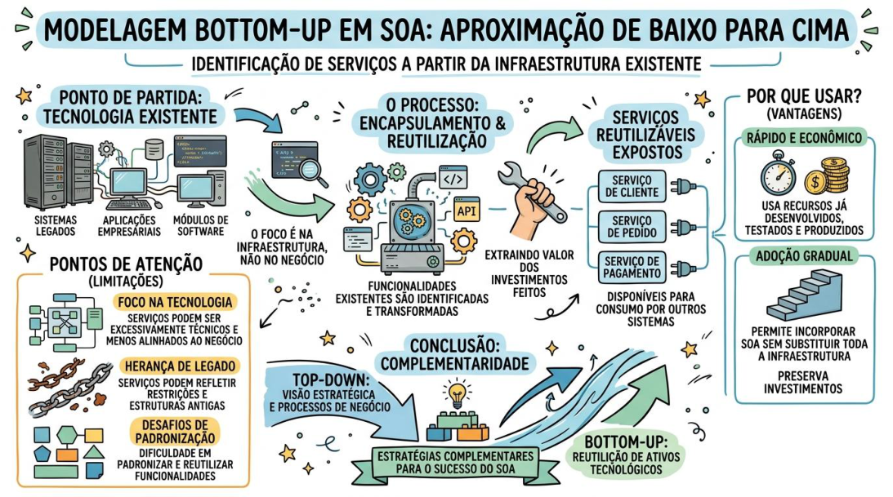

Essa abordagem procura extrair valor dos investimentos tecnológicos já realizados pela organização. Como isso acontece na prática? Funcionalidades implementadas em aplicações existentes são analisadas e encapsuladas por meio de interfaces de serviço, tornando-se acessíveis a outros sistemas e consumidores. Dessa forma, capacidades já disponíveis podem ser reutilizadas sem a necessidade de reconstrução completa das soluções, favorecendo uma adoção mais gradual da orientação a serviços. 

Uma das principais vantagens da modelagem Bottom-Up está relacionada à velocidade de implementação. Por que essa abordagem tende a ser mais rápida? Porque utiliza recursos que já foram desenvolvidos, testados e colocados em produção. Em muitos casos, a organização consegue disponibilizar novos serviços aproveitando componentes existentes, reduzindo parte do esforço associado ao desenvolvimento de funcionalidades completamente novas e acelerando a evolução da arquitetura.

---

<!-- pagina: 30 -->

**Diego Carvalho, Equipe Informática 2 (Diego Carvalho), Equipe Informática 1 (Diego Carvalho) Aula 08** 

A abordagem também costuma ser atrativa em ambientes com grande quantidade de sistemas legados. Como incorporar princípios de SOA sem substituir toda a infraestrutura existente? A modelagem BottomUp oferece justamente esse caminho, permitindo transformar funcionalidades já disponíveis em serviços reutilizáveis. Isso possibilita uma transição gradual para uma arquitetura orientada a serviços, preservando investimentos realizados ao longo dos anos e reduzindo impactos operacionais durante a adoção do novo modelo. 

Apesar dessas vantagens, a abordagem apresenta algumas limitações. Quais desafios podem surgir quando os serviços são derivados diretamente de soluções técnicas existentes? Como a identificação parte da tecnologia e não dos processos de negócio, os serviços podem refletir restrições, estruturas e decisões presentes nos sistemas legados. Como consequência, podem surgir dificuldades relacionadas à padronização, ao potencial de reutilização e ao alinhamento estratégico das funcionalidades disponibilizadas. 

Por esse motivo, a modelagem Bottom-Up costuma ser vista como uma estratégia voltada ao aproveitamento dos ativos tecnológicos existentes. Isso significa que ela deve substituir a abordagem Top-Down? Não necessariamente. Em muitos cenários, ambas são utilizadas de forma complementar. Enquanto a abordagem Top-Down contribui para o alinhamento com os objetivos de negócio, a abordagem Bottom-Up favorece o reúso de capacidades já implementadas, permitindo combinar visão estratégica e aproveitamento dos recursos tecnológicos disponíveis na organização.

---

<!-- pagina: 31 -->

**Diego Carvalho, Equipe Informática 2 (Diego Carvalho), Equipe Informática 1 (Diego Carvalho) Aula 08** 

<!-- Start of picture text -->
- - Abordagem Meet in the <!-- End of picture text -->

<!-- Start of picture text -->
- the Middle <!-- End of picture text -->

#### **<mark>INCIDÊNCIA EM PROVA: BAIXÍSSIMA</mark>** 

### **<mark>ABORDAGEM MEET IN THE MIDDLE</mark>** 

A abordagem Meet-in-the-Middle combina características das estratégias Top-Down e Bottom-Up. Enquanto os requisitos de negócio orientam a definição dos serviços desejados, os recursos tecnológicos existentes são aproveitados sempre que possível. Essa abordagem busca equilibrar alinhamento estratégico e viabilidade técnica, sendo considerada uma das mais utilizadas em projetos SOA corporativos. 

As abordagens Top-Down e Bottom-Up oferecem perspectivas distintas para identificação de serviços em uma Arquitetura Orientada a Serviços. Seria necessário escolher apenas uma delas? Em muitos cenários, não. Diversas organizações adotam uma estratégia intermediária conhecida como Meet-in-the-Middle, cuja proposta consiste em combinar os benefícios das duas abordagens. O objetivo é construir uma arquitetura que permaneça alinhada ao negócio sem desconsiderar os recursos tecnológicos já disponíveis. 

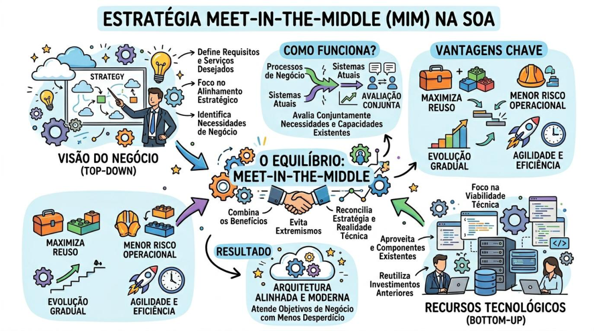

Como essa estratégia funciona na prática? A identificação dos serviços considera tanto os processos de negócio quanto os sistemas, aplicações e componentes existentes na organização. Enquanto a visão orientada ao negócio ajuda a determinar quais capacidades são necessárias para atender aos objetivos corporativos, a análise dos ativos tecnológicos permite identificar funcionalidades já implementadas que podem ser reaproveitadas dentro da arquitetura. 

Uma das principais vantagens dessa abordagem está no equilíbrio entre estratégia e tecnologia. Por que esse equilíbrio é importante? Quando a identificação dos serviços ocorre exclusivamente a partir dos processos de negócio, pode surgir a necessidade de desenvolver grande quantidade de funcionalidades novas. Por outro lado, quando a análise se concentra apenas nos sistemas existentes, os serviços podem refletir limitações técnicas herdadas do ambiente atual. A abordagem Meet-in-the-Middle procura evitar ambos os extremos.

---

<!-- pagina: 32 -->

**Diego Carvalho, Equipe Informática 2 (Diego Carvalho), Equipe Informática 1 (Diego Carvalho) Aula 08** 

O reaproveitamento de ativos tecnológicos continua sendo uma preocupação relevante nesse modelo. Como aproveitar investimentos já realizados sem comprometer os objetivos da arquitetura? A resposta está na avaliação conjunta das necessidades do negócio e das capacidades existentes. Funcionalidades que já atendem adequadamente aos requisitos organizacionais podem ser reutilizadas, enquanto lacunas identificadas durante a análise podem ser preenchidas por novos serviços projetados especificamente para atender às demandas estratégicas. 

Outro benefício frequentemente associado a essa abordagem está relacionado à evolução gradual da arquitetura. Como promover mudanças sem provocar grandes impactos operacionais? Ao combinar serviços derivados de recursos existentes com novos serviços orientados às necessidades do negócio, a organização consegue modernizar seu ambiente de forma progressiva. Isso reduz riscos, preserva investimentos anteriores e facilita a transição para um modelo orientado a serviços mais maduro. 

Por esse motivo, a abordagem Meet-in-the-Middle é frequentemente considerada uma estratégia de equilíbrio. O que ela procura alcançar? A construção de serviços capazes de atender aos objetivos corporativos sem ignorar a realidade tecnológica da organização. Dessa forma, torna-se possível conciliar alinhamento estratégico, reaproveitamento de recursos e evolução arquitetural dentro de uma mesma iniciativa de adoção da Arquitetura Orientada a Serviços.

---

<!-- pagina: 33 -->

**Diego Carvalho, Equipe Informática 2 (Diego Carvalho), Equipe Informática 1 (Diego Carvalho) Aula 08** 

<!-- Start of picture text -->
Modelagem <!-- End of picture text -->

<!-- Start of picture text -->
de Serviços <!-- End of picture text -->

**<mark>INCIDÊNCIA EM PROVA: BAIXÍSSIMA</mark>** 

### **<mark>MODELAGEM DE SERVIÇOS</mark>** 

Modelagem de Serviços é o processo de análise, definição e organização dos serviços que comporão uma Arquitetura Orientada a Serviços (SOA). Seu objetivo é transformar necessidades e processos de negócio em serviços bem estruturados, identificando suas responsabilidades, contratos, interfaces, relacionamentos e formas de interação. A modelagem de serviços abrange atividades como modelagem de negócio, descoberta de serviços, definição de pontos de acesso, composição, monitoramento e gestão de qualidade, buscando garantir <u>que os serviços sejam coesos, reutilizáveis, interoperáveis e alinhados aos objetivos estratégicos da organização.</u> 

Vamos entender como funciona a modelagem de serviços, suas principais etapas, atores e abordagens por meio da imagem apresentada a seguir: 

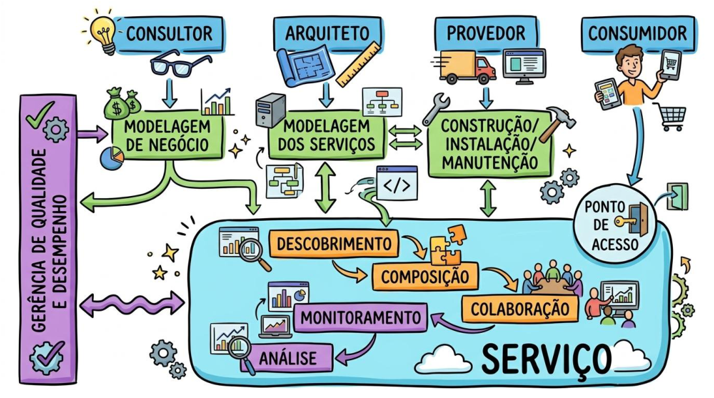

<!-- Start of picture text -->
Modelagem de Negócio <!-- End of picture text -->

A modelagem de negócio constitui a etapa inicial do ciclo de vida dos serviços em uma arquitetura SOA. Nessa fase, analistas e especialistas do domínio identificam processos organizacionais, objetivos estratégicos, regras de negócio e necessidades dos usuários. O propósito é compreender como a organização opera e quais capacidades devem ser disponibilizadas pelos sistemas. Os resultados dessa análise servem como base para a definição dos serviços que serão posteriormente projetados e implementados. 

<!-- Start of picture text -->
Modelagem dos Serviços <!-- End of picture text -->

A modelagem dos serviços transforma os requisitos identificados na modelagem de negócio em serviços concretos que poderão ser disponibilizados pela arquitetura. Nessa etapa são definidos contratos de

---

<!-- pagina: 34 -->

**Diego Carvalho, Equipe Informática 2 (Diego Carvalho), Equipe Informática 1 (Diego Carvalho) Aula 08** 

serviço, interfaces, operações, mensagens, responsabilidades e dependências entre os componentes. O objetivo é criar serviços coesos, reutilizáveis e alinhados aos processos corporativos. Essa atividade é normalmente conduzida por arquitetos de software e especialistas em integração. 

A modelagem orientada a serviços envolve muito mais do que simplesmente identificar processos de negócio. Durante as fases de análise e projeto, torna-se necessário definir quais serviços serão criados, quais responsabilidades cada um assumirá e como ocorrerão suas interações dentro da arquitetura. Como transformar necessidades organizacionais em serviços bem estruturados? Esse processo exige a elaboração de modelos e especificações que permitam compreender o papel de cada serviço antes do início da implementação. 

O ciclo de vida de serviços em SOA costuma ser organizado em etapas que ajudam a transformar necessidades de negócio em soluções tecnológicas estruturadas. Entre essas etapas destacam-se a Análise Orientada a Serviços e o Projeto Orientado a Serviços. Qual a finalidade dessa divisão? Ela permite separar atividades voltadas à compreensão do negócio daquelas relacionadas ao detalhamento arquitetural dos serviços, favorecendo um processo mais organizado de desenvolvimento. 

A Análise Orientada a Serviços concentra-se na identificação de processos, capacidades organizacionais, requisitos e oportunidades de reutilização. Nessa fase, a preocupação principal está em compreender o que o negócio necessita e quais serviços podem atender essas necessidades. Isso significa definir tecnologias ou detalhes de implementação? Não. O foco permanece na compreensão do domínio do problema e na identificação de candidatos a serviços que representem capacidades relevantes para a organização. 

Após a análise, inicia-se o Projeto Orientado a Serviços. É nesse momento que os candidatos identificados anteriormente passam a receber um detalhamento mais aprofundado. Como um serviço identificado durante a análise se transforma em algo que possa ser implementado? Por meio da definição de contratos, interfaces, responsabilidades, políticas, relacionamentos e demais características arquiteturais que orientarão o desenvolvimento da solução. 

Durante o projeto, também são avaliados princípios fundamentais da orientação a serviços. Entre eles destacam-se autonomia, baixo acoplamento, abstração, reutilização e descobribilidade. Esses princípios surgem apenas durante o design? Não exatamente. Muitas decisões relacionadas a eles começam a ser consideradas ainda durante a análise, mas é na fase de projeto que recebem especificação mais detalhada e são incorporadas formalmente à arquitetura proposta. 

A passagem da análise para o projeto não representa uma mudança abrupta entre uma fase puramente conceitual e outra exclusivamente técnica. Na prática, existe uma continuidade entre ambas. A análise fornece os fundamentos relacionados ao negócio, enquanto o projeto transforma essas informações em definições arquiteturais mais detalhadas. Essa evolução gradual contribui para que os serviços sejam construídos de forma alinhada aos objetivos organizacionais e aos princípios da Arquitetura Orientada a Serviços. 

Esses artefatos de modelagem ajudam a documentar aspectos importantes como objetivos, escopo, responsabilidades, dependências e relacionamentos entre serviços. Qual a utilidade dessa documentação? Ela reduz ambiguidades, facilita a comunicação entre equipes e fornece uma visão compartilhada da solução que será construída. Dessa forma, analistas, arquitetos e desenvolvedores conseguem trabalhar com uma compreensão mais consistente dos requisitos e das capacidades esperadas. 

Outro aspecto relevante envolve a definição dos limites de cada serviço. Em uma arquitetura orientada a serviços, nem toda funcionalidade deve ser agrupada em um único componente. Como determinar o que

---

<!-- pagina: 35 -->

**Diego Carvalho, Equipe Informática 2 (Diego Carvalho), Equipe Informática 1 (Diego Carvalho) Aula 08** 

pertence a um serviço e o que deve permanecer separado? A resposta está na análise das capacidades de negócio, das responsabilidades funcionais e das dependências existentes. Essa definição adequada dos limites contribui para a construção de serviços mais coesos e reutilizáveis. 

A modelagem também desempenha papel importante na preparação para futuras atividades de integração e composição. Antes de conectar serviços ou construir processos mais complexos, é necessário compreender como cada elemento se comporta individualmente. Por que essa preocupação surge tão cedo no projeto? Porque decisões tomadas durante a modelagem podem influenciar diretamente a flexibilidade, a manutenção e a capacidade de evolução da arquitetura ao longo do tempo. 

Entre os princípios frequentemente considerados nessa etapa destacam-se autonomia e baixo acoplamento. A autonomia busca garantir que os serviços possuam controle adequado sobre suas responsabilidades e recursos, enquanto o baixo acoplamento procura reduzir dependências excessivas entre os componentes. Esses princípios dependem da existência de um barramento de serviços? Não. Eles fazem parte do próprio processo de design orientado a serviços e devem orientar as decisões arquiteturais independentemente das tecnologias utilizadas na implementação. 

Outro benefício da modelagem está relacionado à descoberta e à reutilização dos serviços. Quando as capacidades e responsabilidades são claramente documentadas, torna-se mais fácil identificar funcionalidades já existentes e evitar a criação de soluções redundantes. Como consequência, a organização consegue aproveitar melhor seus ativos de software e reduzir esforços de desenvolvimento em iniciativas futuras. 

A modelagem orientada a serviços funciona, portanto, como uma atividade de preparação arquitetural que antecede a implementação. Ela permite analisar requisitos, definir responsabilidades, documentar interações e avaliar alternativas de solução antes que decisões técnicas mais detalhadas sejam tomadas. Esse trabalho contribui para a construção de arquiteturas mais organizadas, coerentes e alinhadas aos objetivos de negócio que motivaram a criação dos serviços. 

Uma vez definidos os serviços e suas características arquiteturais, surge a necessidade de representá-los de forma padronizada. A modelagem de arquiteturas orientadas a serviços exige mecanismos capazes de representar conceitos específicos que não estão presentes na UML tradicional. Com o objetivo de atender essa necessidade, a Object Management Group desenvolveu a Service Oriented Architecture Modeling Language, conhecida como SoaML. 

O que torna essa linguagem diferente da UML convencional? O SoaML funciona como um perfil UML especializado, adicionando elementos próprios para representar participantes, contratos e relacionamentos característicos de arquiteturas orientadas a serviços. Por se tratar de um perfil UML, utiliza estereótipos para estender os elementos já existentes na linguagem, permitindo associar significados específicos aos componentes representados nos diagramas. 

Entre esses estereótipos destaca-se o «Consumer». Sua finalidade consiste em identificar elementos que consomem serviços disponibilizados por outros participantes da arquitetura. O que significa consumir um serviço nesse contexto? Significa utilizar funcionalidades oferecidas por um provedor de serviços, estabelecendo uma relação de dependência funcional entre os participantes envolvidos na interação. 

Ao analisar um modelo construído com SoaML, a presença do estereótipo «Consumer» permite compreender rapidamente quais elementos dependem de serviços externos para executar suas atividades. Essa identificação facilita a análise dos relacionamentos existentes entre os participantes da arquitetura e contribui para a compreensão do fluxo de utilização dos serviços. Dessa forma, torna-se mais simples visualizar as responsabilidades atribuídas a cada elemento do sistema.

---

<!-- pagina: 36 -->

**Diego Carvalho, Equipe Informática 2 (Diego Carvalho), Equipe Informática 1 (Diego Carvalho) Aula 08** 

O estereótipo «Consumer» não deve ser entendido apenas como um elemento gráfico inserido em um diagrama. Ele representa um papel desempenhado por determinado participante dentro da arquitetura orientada a serviços. Sempre que um componente, sistema ou aplicação utiliza funcionalidades disponibilizadas por outro participante, esse elemento pode ser modelado como consumidor. Essa representação ajuda a evidenciar dependências, interações e responsabilidades existentes no ambiente modelado. 

Em termos de modelagem técnica e rigorosa segundo o padrão do Object Management Group (OMG), a linguagem SoaML foi construída como um perfil de extensão da própria UML 2. O estereótipo «Consumer», em particular, foi concebido estruturalmente para estender as metaclasses Interface e Class da UML. Isso significa que, nos diagramas de modelagem, um consumidor de serviço pode ser formalmente representado tanto por uma classe quanto por uma interface que especifica necessidades de negócio a serem atendidas por um provedor externo. 

O SoaML inclui diversos outros estereótipos além do «Consumer», permitindo representar provedores de serviços, contratos de serviço, interfaces e participantes. Em conjunto, esses elementos fornecem uma estrutura de modelagem adequada para arquiteturas orientadas a serviços. Como resultado, a organização consegue documentar suas soluções de maneira mais alinhada aos princípios de SOA e facilitar tanto a comunicação quanto a evolução da arquitetura ao longo do tempo. 

Outro aspecto relevante envolve a capacidade de documentar arquiteturas orientadas a serviços de forma padronizada. Por que essa padronização é importante? Em ambientes corporativos complexos, diferentes equipes frequentemente participam da análise, do projeto e da manutenção das soluções. A utilização de um perfil especializado como o SoaML reduz ambiguidades e favorece uma comunicação mais consistente entre profissionais de negócio, arquitetos e desenvolvedores. 

<!-- Start of picture text -->
Construção, Instalação e Manutenção <!-- End of picture text -->

Após a modelagem, inicia-se a fase de construção, instalação e manutenção dos serviços. Nela são realizadas as atividades de desenvolvimento, testes, implantação e configuração da infraestrutura necessária para disponibilizar os serviços aos consumidores. Também fazem parte dessa etapa as correções, atualizações e evoluções futuras dos componentes. Trata-se de um processo contínuo, pois os serviços precisam acompanhar mudanças de negócio, requisitos tecnológicos e novas demandas organizacionais. 

<!-- Start of picture text -->
Descobrimento <!-- End of picture text -->

O descobrimento corresponde ao mecanismo que permite localizar serviços disponíveis no ambiente SOA. Em vez de depender de conhecimento prévio sobre a localização dos serviços, os consumidores podem consultar registros ou catálogos especializados para encontrar funcionalidades compatíveis com suas necessidades. Esse processo favorece o desacoplamento entre consumidores e provedores, aumenta a reutilização e simplifica a integração de novos sistemas ao ecossistema de serviços da organização. 

<!-- Start of picture text -->
Composição <!-- End of picture text -->

A composição consiste na combinação de múltiplos serviços independentes para implementar processos de negócio mais complexos. Em vez de concentrar toda a lógica em um único componente, diferentes serviços especializados colaboram para executar uma atividade completa. Essa abordagem aumenta a reutilização e a flexibilidade da arquitetura, permitindo que novos processos sejam criados por meio da

---

<!-- pagina: 37 -->

**Diego Carvalho, Equipe Informática 2 (Diego Carvalho), Equipe Informática 1 (Diego Carvalho) Aula 08** 

orquestração ou coordenação de serviços já existentes, reduzindo custos de desenvolvimento e manutenção. 

<!-- Start of picture text -->
Colaboração <!-- End of picture text -->

A colaboração representa a interação coordenada entre diversos serviços durante a execução de processos corporativos. Cada serviço desempenha uma função específica e troca informações com os demais participantes para atingir um objetivo comum. Diferentemente da composição, que enfatiza a construção de processos, a colaboração destaca a comunicação e a cooperação entre serviços em tempo de execução. Essa característica favorece o desacoplamento e permite maior flexibilidade na evolução das aplicações. 

<!-- Start of picture text -->
Monitoramento <!-- End of picture text -->

O monitoramento é responsável por acompanhar continuamente o comportamento operacional dos serviços. Essa atividade envolve a coleta de métricas relacionadas a desempenho, disponibilidade, utilização, tempo de resposta, falhas e cumprimento de acordos de nível de serviço. As informações obtidas permitem detectar problemas rapidamente, avaliar a saúde do ambiente e garantir a qualidade dos serviços oferecidos. O monitoramento é um elemento fundamental para a governança e gestão eficiente de arquiteturas SOA. 

Além de mensurar métricas de disponibilidade e desempenho, o Monitoramento de Mensagens exerce um papel tático indispensável na proteção do ambiente de serviços. Ao realizar a inspeção contínua do fluxo de rede e do conteúdo que trafega no barramento (ESB) ou em Gateways, esse recurso permite a identificação imediata de anomalias operacionais, propiciando a detecção e a mitigação ágil de ataques de segurança, como os ataques de Negação de Serviço (DoS e DDoS). Isso garante que instâncias maliciosas sejam bloqueadas antes de esgotarem os recursos computacionais dos provedores legítimos da organização. 

<!-- Start of picture text -->
Análise <!-- End of picture text -->

A análise utiliza os dados produzidos pelo monitoramento para avaliar o funcionamento da arquitetura e identificar oportunidades de melhoria. Por meio dela, é possível detectar gargalos de desempenho, problemas de disponibilidade, falhas recorrentes e desvios em relação aos requisitos estabelecidos. Os resultados obtidos subsidiam decisões técnicas e estratégicas relacionadas à evolução dos serviços, contribuindo para a otimização contínua do ambiente e para o alinhamento entre tecnologia e negócio. 

<!-- Start of picture text -->
Ponto de Acesso <!-- End of picture text -->

O ponto de acesso funciona como a interface por meio da qual os consumidores interagem com os serviços disponibilizados pela arquitetura. Ele pode ser implementado por componentes como gateways de API, barramentos de serviços ou portais de integração. Sua função é centralizar o acesso, aplicar políticas de segurança, realizar controle de tráfego e facilitar a comunicação entre consumidores e provedores. Dessa forma, simplifica a utilização dos serviços e fortalece a governança do ambiente SOA. 

<!-- Start of picture text -->
Gerência de Qualidade e Desempenho <!-- End of picture text -->

A gerência de qualidade e desempenho atua de forma transversal sobre todo o ciclo de vida dos serviços. Seu objetivo é garantir que os serviços atendam aos requisitos de confiabilidade, disponibilidade, desempenho, segurança e conformidade definidos pela organização. Para isso, estabelece métricas,

---

<!-- pagina: 38 -->

**Diego Carvalho, Equipe Informática 2 (Diego Carvalho), Equipe Informática 1 (Diego Carvalho) Aula 08** 

monitora indicadores, acompanha acordos de nível de serviço e promove ações de melhoria contínua. Essa função é essencial para assegurar que a arquitetura permaneça eficiente e alinhada às necessidades do negócio. 

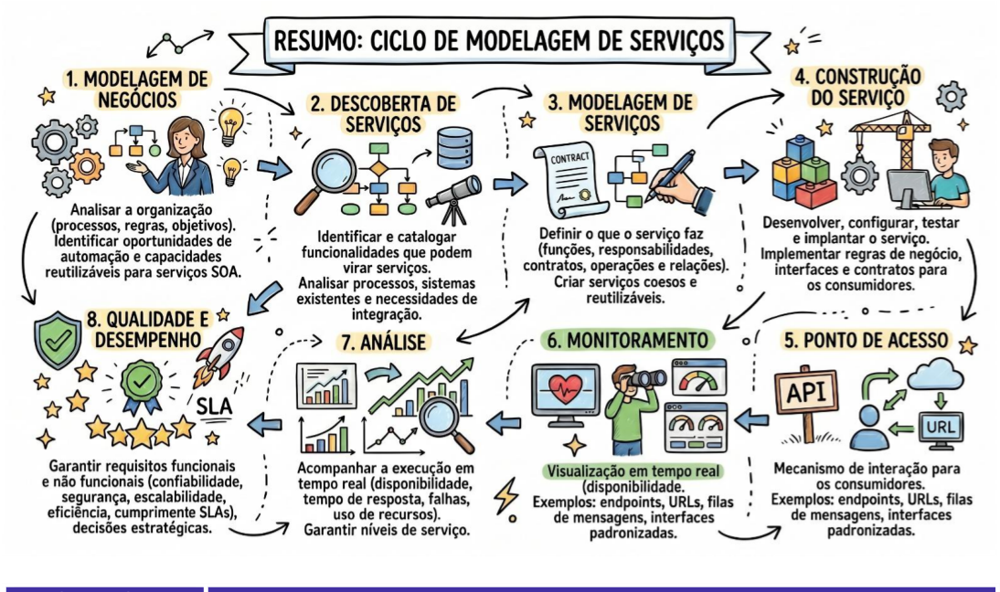

|**MODELAGEM DE** **SERVIÇOS**|**DESCRIÇÃO**|
|---|---|
|**MODELAGEM DE** **NEGÓCIO**|A modelagem de negócio consiste na análise e representação dos processos, atividades, regras e objetivos da organização. Seu propósito é compreender como o negócio funciona para identificar oportunidades de automação e determinar quais capacidades podem ser transformadas em serviços reutilizáveis dentro da arquitetura SOA.|
|**MODELAGEM DOS** **SERVIÇOS**|A modelagem dos serviços corresponde à definição das funcionalidades, responsabilidades, contratos, operações e relacionamentos dos serviços identificados durante a análise de negócio. Essa etapa busca criar serviços coesos, reutilizáveis e alinhados aos requisitos organizacionais e técnicos.|
|**DESCOBRIMENTO**|O descobrimento de serviços é o processo de identificação e catalogação de funcionalidades que podem ser disponibilizadas ou reutilizadas como serviços. Essa atividade pode envolver a análise de processos de negócio, sistemas existentes, requisitos corporativos e oportunidades de integração entre aplicações.|
|**CONSTRUÇÃO**|A construção de serviços envolve o desenvolvimento, configuração, teste e implantação das funcionalidades definidas durante a modelagem. Nessa etapa são implementadas as regras de negócio, interfaces de comunicação, contratos e mecanismos necessários para disponibilizar o serviço aos consumidores.|
|**PONTO DE** **ACESSO**|O ponto de acesso corresponde ao mecanismo pelo qual consumidores conseguem interagir com um serviço. Geralmente é representado por endpoints, URLs, filas de mensagens ou interfaces padronizadas que permitem a troca de informações entre sistemas distribuídos.|
|**MONITORAMENTO**|O monitoramento consiste no acompanhamento contínuo da execução dos serviços em ambiente operacional. São observados aspectos como disponibilidade, tempo de resposta, volume de requisições, falhas e utilização de recursos, permitindo identificar problemas egarantir o cumprimento dos níveis de serviço estabelecidos.|

---

<!-- pagina: 39 -->

**Diego Carvalho, Equipe Informática 2 (Diego Carvalho), Equipe Informática 1 (Diego Carvalho) Aula 08** 

A análise envolve a coleta e interpretação de informações sobre o comportamento dos serviços, seus padrões de utilização e seu impacto nos processos de negócio. Essa **ANÁLISE** atividade fornece subsídios para melhorias arquiteturais, otimização de desempenho e <mark>tomada de decisões estratégicas.</mark> A gestão da qualidade e desempenho busca garantir que os serviços atendam aos **QUALIDADE E** requisitos funcionais e não funcionais definidos pela organização. São avaliados critérios **DESEMPENHO** como confiabilidade, disponibilidade, segurança, escalabilidade, eficiência e <mark>conformidade com acordos de nível de serviço (SLAs).</mark>

---

<!-- pagina: 40 -->

**Diego Carvalho, Equipe Informática 2 (Diego Carvalho), Equipe Informática 1 (Diego Carvalho) Aula 08** 

<!-- Start of picture text -->
Princípios De Design <!-- End of picture text -->

#### **<mark>INCIDÊNCIA EM PROVA: ALTÍSSIMA</mark>** 

### **<mark>PRINCÍPIOS DE DESIGN</mark>** 

Princípios de Design SOA são diretrizes arquiteturais que orientam a criação de serviços de forma consistente, reutilizável e alinhada aos objetivos da Arquitetura Orientada a Serviços. Esses princípios estabelecem características desejáveis para os serviços, como contratos padronizados, baixo acoplamento, abstração, autonomia, reusabilidade, independência de estado, visibilidade e capacidade de composição. Ao serem aplicados durante a modelagem e implementação, contribuem para a construção de soluções mais flexíveis, interoperáveis, escaláveis e fáceis de manter, aumentando o potencial de integração e reutilização dos serviços em diferentes processos e aplicações da organização. 

Ao estudar Arquitetura Orientada a Serviços, alguns autores aparecem com frequência devido à relevância de suas contribuições para a área. Entre eles, Thomas Erl ocupa posição de destaque, pois seus trabalhos ajudaram a consolidar conceitos, práticas e diretrizes amplamente utilizados na modelagem de serviços. Por que suas obras são tão citadas em materiais acadêmicos e profissionais? Porque elas sistematizam princípios que orientam o desenvolvimento de arquiteturas orientadas a serviços de forma consistente e alinhada aos objetivos de negócio. 

Entre as contribuições mais conhecidas de Thomas Erl estão os princípios de design de serviços. O que esses princípios procuram definir? Eles estabelecem diretrizes para a construção de serviços capazes de promover reutilização, flexibilidade, interoperabilidade e facilidade de manutenção. Em vez de descrever tecnologias específicas, esses princípios orientam decisões relacionadas à estrutura lógica dos serviços e à forma como eles devem interagir dentro da arquitetura. 

Esses princípios desempenham papel importante durante a modelagem dos serviços. Como garantir que um serviço possa ser utilizado por diferentes consumidores, evoluir ao longo do tempo e permanecer alinhado aos objetivos da organização? A resposta está na aplicação de práticas que favoreçam baixo acoplamento, contratos bem definidos, autonomia operacional e outras características consideradas fundamentais em ambientes orientados a serviços. Cada princípio aborda um aspecto específico desse conjunto de preocupações arquiteturais. 

A compreensão desses conceitos tornou-se particularmente relevante porque eles servem de referência para diversas iniciativas de adoção de SOA. Além disso, aparecem com frequência em materiais de formação profissional, certificações e avaliações da área de tecnologia da informação. Por esse motivo, o estudo detalhado dos princípios propostos por Thomas Erl constitui etapa importante para compreender não apenas como os serviços são construídos, mas também quais características contribuem para o sucesso de uma arquitetura orientada a serviços. 

A granularidade é um dos conceitos mais importantes no design de serviços e frequentemente gera confusão quando estudada ao lado de princípios como baixo acoplamento e ausência de estado. Embora todos façam parte do universo da Arquitetura Orientada a Serviços, eles tratam de aspectos distintos da arquitetura. Por que essa distinção é importante? Porque cada princípio procura resolver problemas diferentes e influencia decisões arquiteturais específicas durante a modelagem dos serviços. 

**(CEBRASPE / TRT 10ª Região - 2025)** A respeito de arquitetura de software, julgue o item que se <mark>segue. Em SOA, o princípio de granularidade define que os serviços devem ter baixo acoplamento e devem ser stateless.</mark> 

**<mark>_______________________</mark>**

---

<!-- pagina: 41 -->

**Diego Carvalho, Equipe Informática 2 (Diego Carvalho), Equipe Informática 1 (Diego Carvalho) Aula 08** 

**<mark>Comentários:</mark>** <mark>Granularidade, em SOA, está ligada ao tamanho e ao escopo das responsabilidades de um serviço. Já baixo acoplamento</mark> e stateless são outros princípios de projeto. Ou seja, a frase mistura conceitos diferentes como se fossem a mesma coisa (Errado). 

O baixo acoplamento tem como objetivo reduzir as dependências entre os serviços. Quanto menor a dependência, mais fácil se torna modificar, substituir ou evoluir um serviço sem provocar impactos significativos nos demais componentes da solução. Já a ausência de estado procura minimizar a retenção de informações relacionadas a interações anteriores. Dessa forma, o serviço reduz sua dependência de contextos armazenados entre requisições e tende a apresentar maior flexibilidade e escalabilidade. 

**(CEBRASPE / FUNPRESP-EXE - 2025)** Em relação a arquiteturas e tecnologias de sistemas de <mark>informação, julgue o item subsecutivo. Na arquitetura orientada a serviço, promove-se geralmente a criação de serviços altamente especializados, com granularidade fina e com a maximização da reutilização para a maior eficiência do sistema.</mark> 

**<mark>_______________________ Comentários:</mark>** <mark>Em SOA, a ideia não é focar, em geral, serviços excessivamente finos e superespecializados. Normalmente se busca um equilíbrio de granularidade, com serviços mais bem definidos e reutilizáveis, evitando fragmentação excessiva que pode até prejudicar</mark> a eficiência do sistema (Errado). 

Onde a granularidade se encaixa nesse cenário? A granularidade está relacionada à abrangência das funcionalidades disponibilizadas por um serviço ou por uma operação. Em outras palavras, ela procura responder quanto de funcionalidade deve ser agrupado em um determinado serviço. Um serviço deve oferecer uma capacidade ampla ou várias operações menores e mais específicas? Essa é justamente a decisão que envolve a definição da granularidade. 

Uma granularidade inadequada pode gerar consequências importantes para a arquitetura. Serviços excessivamente detalhados podem aumentar a quantidade de chamadas necessárias para executar um processo de negócio, enquanto serviços excessivamente amplos podem reduzir a reutilização e dificultar a manutenção. Por essa razão, a definição da granularidade exige equilíbrio entre eficiência, reutilização e simplicidade arquitetural. 

É comum imaginar que a granularidade esteja relacionada ao gerenciamento de estado ou ao grau de dependência entre serviços. Entretanto, esses conceitos abordam preocupações diferentes. A granularidade concentra-se na definição do escopo funcional dos serviços, enquanto o baixo acoplamento trata das relações de dependência e a ausência de estado aborda a retenção de informações entre interações. Embora possam influenciar-se indiretamente durante o projeto, cada princípio possui objetivos próprios dentro da arquitetura orientada a serviços. 

A escolha da granularidade também influencia atividades como composição, reutilização e governança dos serviços. Como definir a fronteira adequada para cada capacidade disponibilizada? Não existe uma resposta universal. A decisão depende dos processos de negócio envolvidos, dos requisitos da solução e dos objetivos arquiteturais estabelecidos para o ambiente. Por esse motivo, a granularidade costuma ser considerada uma das decisões mais relevantes durante o design de serviços em SOA. 

Nos tópicos seguintes serão analisados os oito princípios clássicos de design de serviços apresentados por Thomas Erl. O que será possível observar ao longo dessa análise? Que cada princípio aborda uma característica específica dos serviços, mas todos atuam de forma complementar para promover maior flexibilidade, reutilização, interoperabilidade e capacidade de evolução dentro de uma Arquitetura Orientada a Serviços.

---

<!-- pagina: 42 -->

**Diego Carvalho, Equipe Informática 2 (Diego Carvalho), Equipe Informática 1 (Diego Carvalho) Aula 08** 

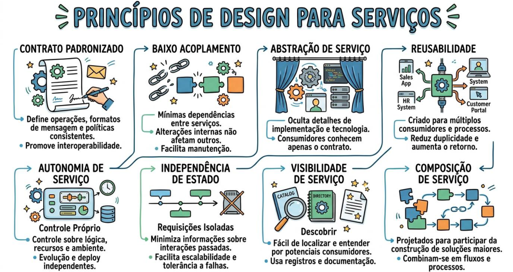

---

<!-- pagina: 43 -->

**Diego Carvalho, Equipe Informática 2 (Diego Carvalho), Equipe Informática 1 (Diego Carvalho) Aula 08** 

<!-- Start of picture text -->
Contrato de Serviço Padronizado ( <!-- End of picture text -->

<!-- Start of picture text -->
Service Contract <!-- End of picture text -->

<!-- Start of picture text -->
) <!-- End of picture text -->

Entre os princípios de design propostos por Thomas Erl, o Contrato de Serviço Padronizado ocupa posição de destaque. O que exatamente representa um contrato de serviço? Trata-se do conjunto de informações que descreve como um serviço pode ser utilizado. Nele são especificadas características como operações disponíveis, formatos de mensagens, políticas, requisitos e demais elementos necessários para que consumidores consigam interagir corretamente com o serviço disponibilizado. 

A existência de contratos, por si só, não é suficiente para atender plenamente aos objetivos da orientação a serviços. Qual característica adicional é exigida por esse princípio? A padronização. Os contratos devem seguir convenções e padrões consistentes em todo o inventário de serviços da organização. Essa uniformidade facilita a compreensão dos serviços, reduz diferenças desnecessárias entre interfaces e contribui para a construção de um ambiente mais previsível e interoperável. 

Os contratos desempenham papel essencial na comunicação entre consumidores e provedores. Como um consumidor consegue descobrir se determinado serviço atende às suas necessidades? Consultando as informações presentes no contrato. É por meio dele que se torna possível compreender quais funcionalidades estão disponíveis, quais dados devem ser fornecidos e quais resultados podem ser esperados. Essa característica contribui diretamente para a visibilidade dos serviços e apoia mecanismos de descoberta e localização dentro da arquitetura. 

Além de descrever funcionalidades, os contratos podem estar associados a informações adicionais relacionadas ao uso dos serviços. Que tipo de informação pode ser incluída nesse contexto? Em muitos ambientes, documentos complementares definem aspectos como níveis de disponibilidade, desempenho esperado, responsabilidades das partes e condições operacionais. Entre esses artefatos destacam-se os acordos de nível de serviço, frequentemente utilizados para formalizar compromissos relacionados à qualidade da prestação do serviço. 

Outro aspecto importante envolve a evolução dos serviços ao longo do tempo. O contrato permanece inalterado durante toda a vida útil do serviço? Em geral, não. À medida que funcionalidades são modificadas, ampliadas ou ajustadas, os contratos precisam refletir essas mudanças. Por esse motivo, o gerenciamento de versões torna-se uma atividade relevante dentro da governança de serviços, pois ajuda a preservar a compatibilidade entre provedores e consumidores e reduz riscos associados à evolução da arquitetura. 

A importância desse princípio está relacionada à capacidade de tornar os serviços compreensíveis e acessíveis para diferentes consumidores. Por que a padronização dos contratos recebe tanta atenção em SOA? Porque ela favorece interoperabilidade, reúso e consistência arquitetural. Quando os serviços seguem padrões comuns de descrição e utilização, torna-se mais simples integrá-los, descobri-los e incorporá-los a novos processos de negócio dentro da organização.

---

<!-- pagina: 44 -->

**Diego Carvalho, Equipe Informática 2 (Diego Carvalho), Equipe Informática 1 (Diego Carvalho) Aula 08** 

<!-- Start of picture text -->
Baixo Acoplamento de Serviços ( <!-- End of picture text -->

<!-- Start of picture text -->
Service Loose Coupling ) <!-- End of picture text -->

<!-- Start of picture text -->
) <!-- End of picture text -->

O princípio do Baixo Acoplamento de Serviços está entre os mais importantes da Arquitetura Orientada a Serviços. O que significa afirmar que um serviço possui baixo acoplamento? Significa que ele apresenta o menor número possível de dependências em relação a outros serviços, sistemas ou componentes externos. Quanto menor for essa dependência, maior tende a ser a flexibilidade da arquitetura, pois alterações realizadas em um serviço produzem menos impactos sobre os demais participantes do ambiente. 

O conceito de acoplamento está diretamente relacionado ao grau de dependência entre componentes. Como interpretar essa relação? Quando o acoplamento é elevado, modificações em um elemento podem exigir adaptações em diversos outros componentes. Por outro lado, quando o acoplamento é reduzido, cada serviço consegue evoluir com maior independência. Essa característica contribui para a manutenção, a escalabilidade e a evolução gradual da arquitetura ao longo do tempo. 

Ao estudar baixo acoplamento, frequentemente surge outro conceito importante: a coesão. Qual a relação entre esses dois atributos? A coesão está associada ao grau de relacionamento entre as responsabilidades atribuídas a um serviço. Um serviço coeso concentra funcionalidades relacionadas a um mesmo propósito de negócio. Quando um único serviço reúne responsabilidades excessivamente distintas, sua manutenção tende a se tornar mais complexa e sua reutilização pode ser prejudicada. 

Imagine um serviço responsável por autenticação de usuários, processamento de pagamentos, emissão de relatórios e gerenciamento de estoque. Essa divisão de responsabilidades seria adequada? Em geral, não. Funções tão distintas costumam indicar baixa coesão e dificultam a evolução da solução. Em arquiteturas orientadas a serviços, procura-se definir responsabilidades claras e bem delimitadas, favorecendo a criação de serviços especializados e mais facilmente reutilizáveis. 

A granularidade de um serviço está relacionada ao escopo e à abrangência das funcionalidades que ele disponibiliza para seus consumidores. Esse conceito procura definir quanto de responsabilidade deve ser atribuído a cada serviço dentro da arquitetura. Por que essa decisão é importante? Porque a forma como as funcionalidades são distribuídas entre os serviços influencia diretamente aspectos como reutilização, desempenho, composição e manutenção da solução ao longo do tempo. 

Os serviços de granularidade fina, conhecidos como fine-grained, concentram-se em funcionalidades específicas e bem delimitadas. Em muitos casos, eles executam operações relativamente simples e retornam conjuntos menores de informações. Qual a principal vantagem dessa abordagem? A especialização tende a favorecer a reutilização em diferentes contextos, pois funcionalidades mais específicas podem ser combinadas para atender necessidades variadas dentro da arquitetura. 

Por outro lado, existem os serviços de granularidade grossa, ou coarse-grained. Esses serviços concentram capacidades mais amplas e frequentemente representam processos ou funcionalidades de negócio mais completas. Em vez de exigir diversas interações para executar determinada atividade, um único serviço pode disponibilizar uma funcionalidade mais abrangente. Essa característica pode simplificar o consumo dos serviços e reduzir a quantidade de comunicações necessárias entre os componentes da solução. 

Seria correto concluir que serviços mais finos são sempre melhores? Não. Embora a especialização possa favorecer a reutilização, o excesso de fragmentação pode aumentar a quantidade de chamadas necessárias para executar um processo de negócio. Como consequência, podem surgir impactos relacionados à latência, ao tráfego de rede e à complexidade da integração entre os serviços. O benefício da reutilização precisa ser analisado em conjunto com os custos operacionais gerados pela arquitetura.

---

<!-- pagina: 45 -->

**Diego Carvalho, Equipe Informática 2 (Diego Carvalho), Equipe Informática 1 (Diego Carvalho) Aula 08** 

Da mesma forma, serviços excessivamente amplos também podem apresentar desvantagens. Quando muitas responsabilidades são agrupadas em um único serviço, a reutilização tende a diminuir e a manutenção pode tornar-se mais complexa. Por esse motivo, a definição da granularidade não deve ser conduzida por extremos. O objetivo não consiste em criar serviços sempre mais finos ou sempre mais amplos, mas em encontrar um equilíbrio adequado para cada contexto organizacional. 

A literatura de SOA frequentemente utiliza a expressão granularidade adequada para destacar essa busca por equilíbrio. Como determinar qual é a melhor granularidade? A resposta depende dos processos de negócio envolvidos, dos requisitos de desempenho, das necessidades de reutilização e das características da arquitetura adotada. A decisão exige análise cuidadosa porque afeta diretamente a capacidade de evolução, integração e manutenção dos serviços ao longo de seu ciclo de vida. 

Embora o objetivo seja reduzir dependências, seria possível alcançar desacoplamento absoluto? Na prática, não. Serviços sempre precisam interagir com outros componentes para atender determinadas necessidades de negócio. O desafio consiste em encontrar um nível adequado de independência que permita flexibilidade sem inviabilizar a comunicação e a colaboração necessárias para execução dos processos organizacionais. 

Historicamente, uma das tecnologias utilizadas para apoiar esse objetivo foi o Enterprise Service Bus, conhecido pela sigla ESB. Qual o papel dessa infraestrutura? O ESB atua como uma camada intermediária responsável por facilitar a comunicação entre serviços distribuídos. Em vez de exigir que cada sistema implemente individualmente mecanismos de integração, o barramento fornece recursos padronizados para troca e mediação de mensagens entre os participantes. 

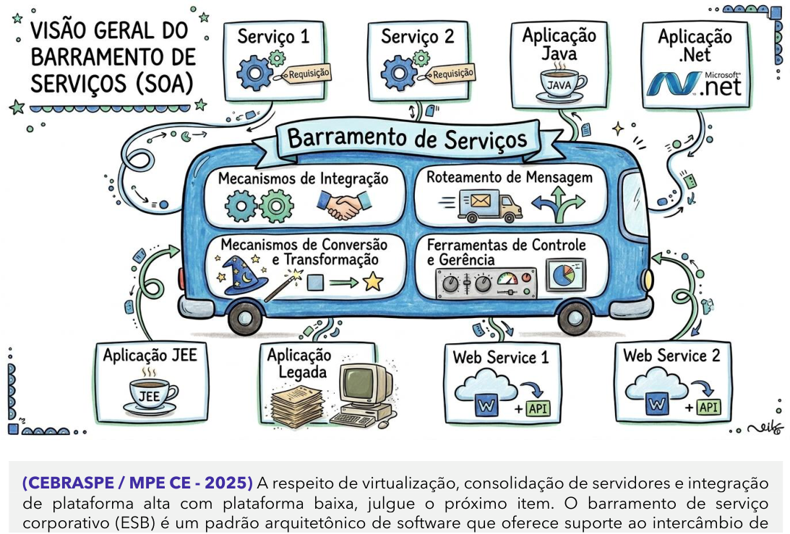

<!-- Start of picture text -->
(CEBRASPE / MPE CE - 2025)  A respeito de virtualização, consolidação de servidores e integração de plataforma alta com plataforma baixa, julgue o próximo item. O barramento de serviço corporativo (ESB) é um padrão arquitetônico de software que oferece suporte ao intercâmbio de <!-- End of picture text -->

---

<!-- pagina: 46 -->

**Diego Carvalho, Equipe Informática 2 (Diego Carvalho), Equipe Informática 1 (Diego Carvalho) Aula 08** 

<mark>dado entre plataforma alta e plataforma baixa, no qual o componente endpoints converte mensagens entre diferentes formatos, protocolos e recursos de logs de mensagens.</mark> 

**<mark>_______________________ Comentários:</mark>** <mark>No ESB, a ideia é integrar sistemas e permitir troca de dados, mas a descrição mistura funções. Endpoints fazem a conexão com os sistemas, enquanto conversão de formatos, protocolos e tratamento de logs envolve outros mecanismos do barramento, não</mark> esse componente de forma isolada (Errado). 

Uma analogia útil consiste em imaginar uma rede de transporte. Como diferentes serviços conseguem trocar informações sem conhecer todos os detalhes uns dos outros? O ESB funciona como um mecanismo de intermediação que recebe, transforma, encaminha e monitora mensagens conforme necessário. Dessa forma, os serviços permanecem focados em suas responsabilidades principais, enquanto aspectos relacionados à integração podem ser tratados pela infraestrutura. 

Entre as capacidades frequentemente associadas a um ESB estão a resolução de descrições de serviços, a transformação de mensagens, o roteamento dinâmico, o tratamento de exceções e o monitoramento das comunicações. Por que esses recursos são relevantes? Porque permitem integrar sistemas desenvolvidos em diferentes plataformas, linguagens, protocolos e tecnologias, reduzindo a complexidade normalmente encontrada em ambientes corporativos heterogêneos. 

O Enterprise Service Bus, conhecido como ESB, é uma das tecnologias tradicionalmente associadas à integração de sistemas em ambientes corporativos. Sua função consiste em facilitar a comunicação entre aplicações desenvolvidas em diferentes tecnologias e executadas em plataformas distintas. Por que essa capacidade é importante? Porque organizações frequentemente possuem sistemas legados, aplicações corporativas, serviços distribuídos e soluções modernas que precisam trocar informações de maneira coordenada e confiável. 

**(FUNDATEC / BRDE - 2023)** Assinale a alternativa que apresenta um componente essencial da <mark>Arquitetura Orientada a Serviços (SOA – Service Oriented Architecture), cujo principal objetivo é simplificar integrações e unir sistemas heterogêneos.</mark> 

<mark>a) COA (Control Oriented Architecture). b) UDDI (Universal Description Discovery and Integration). c) WADL (Web Application Description Language). d) RPA (Robotic Process Automation). e) ESB (Enterprise Service Bus).</mark> 

**<mark>_______________________ Comentários:</mark>** <mark>(a) Errado. COA não é o componente clássico usado na SOA para integrar e conectar serviços entre sistemas diferentes. (b) Errado. UDDI funciona mais como catálogo de serviços, ajudando na descoberta, não como barramento de integração. (c) Errado. WADL é uma linguagem de descrição de aplicações web, não o elemento central de integração da SOA. (d) Errado. RPA automatiza tarefas por robôs de software, mas não é componente essencial da arquitetura SOA. (e) Correto. ESB é o barramento de serviços que</mark> facilita a comunicação, a integração e a interoperabilidade entre sistemas heterogêneos (Letra E). 

O ESB atua como uma camada intermediária de integração, reduzindo a necessidade de conexões diretas entre todos os sistemas participantes. Em vez de cada aplicação precisar conhecer detalhes específicos das demais, a comunicação pode ocorrer por meio do barramento. Como consequência, a arquitetura tende a apresentar menor acoplamento e maior flexibilidade para acomodar mudanças, substituições ou expansões dos sistemas ao longo do tempo. 

Para viabilizar essa comunicação, o ESB utiliza endpoints. O que são endpoints nesse contexto? Eles representam pontos de entrada e saída responsáveis por estabelecer a conexão entre o barramento e as aplicações integradas. Sempre que uma mensagem precisa ser enviada ou recebida, algum endpoint

---

<!-- pagina: 47 -->

**Diego Carvalho, Equipe Informática 2 (Diego Carvalho), Equipe Informática 1 (Diego Carvalho) Aula 08** 

participa desse processo, permitindo que os sistemas interajam com a infraestrutura de integração disponibilizada pelo barramento. 

Uma dúvida comum surge nesse momento: os endpoints realizam toda a lógica de integração? Não necessariamente. Dependendo da arquitetura e do produto utilizado, funcionalidades como roteamento, transformação de mensagens, conversão de protocolos, validação de dados e monitoramento podem ser executadas por diferentes componentes da plataforma de integração. Os endpoints frequentemente atuam como pontos de comunicação, enquanto outras partes da infraestrutura podem assumir responsabilidades adicionais relacionadas ao tratamento das mensagens. 

Outro aspecto importante envolve a mediação das interações entre sistemas heterogêneos. Imagine uma situação em que aplicações utilizam formatos de dados ou protocolos diferentes. Como permitir que elas se comuniquem? O ESB pode fornecer mecanismos capazes de adaptar mensagens, transformar estruturas de dados e encaminhar solicitações para os destinos apropriados. Essa capacidade reduz a necessidade de que cada sistema implemente individualmente toda a lógica de integração. 

Além das transformações e do roteamento, muitas soluções de ESB oferecem recursos de monitoramento, auditoria e rastreamento das mensagens que trafegam pela infraestrutura. Essas funcionalidades ajudam equipes técnicas a acompanhar o comportamento das integrações e identificar problemas operacionais. Como localizar falhas em um ambiente composto por dezenas ou centenas de sistemas integrados? Os mecanismos de monitoramento e rastreabilidade contribuem justamente para responder a essa necessidade. 

Embora o ESB tenha sido amplamente utilizado em arquiteturas SOA clássicas, seu objetivo fundamental permanece relacionado à integração de sistemas heterogêneos. Independentemente das tecnologias envolvidas, a ideia central consiste em fornecer uma infraestrutura capaz de facilitar a comunicação, reduzir dependências diretas entre aplicações e simplificar a implementação de soluções corporativas distribuídas. 

É importante compreender, entretanto, a relação correta entre ESB e SOA. O uso de um barramento de serviços é obrigatório para implementar uma Arquitetura Orientada a Serviços? Não. O ESB representa uma tecnologia de integração que pode apoiar a adoção de SOA, mas não constitui requisito para sua existência. Da mesma forma, um barramento pode ser utilizado em cenários que não adotam orientação a serviços. Por esse motivo, embora sejam frequentemente associados, ESB e SOA representam conceitos distintos e independentes.

---

<!-- pagina: 48 -->

**Diego Carvalho, Equipe Informática 2 (Diego Carvalho), Equipe Informática 1 (Diego Carvalho) Aula 08** 

<!-- Start of picture text -->
Abstração de Serviços ( <!-- End of picture text -->

<!-- Start of picture text -->
Service Abstraction ) <!-- End of picture text -->

<!-- Start of picture text -->
) <!-- End of picture text -->

O princípio da Abstração de Serviços estabelece que os consumidores devem interagir com um serviço sem depender do conhecimento de sua implementação interna. Como compreender essa ideia? Uma analogia bastante útil é a dos testes caixa-preta. Nesse tipo de teste, o interesse está no comportamento observável do sistema, e não nos detalhes do código ou dos mecanismos utilizados internamente. De forma semelhante, consumidores de serviços utilizam funcionalidades disponibilizadas por meio de contratos sem precisar conhecer a lógica interna responsável por sua execução. 

Essa característica proporciona maior liberdade para evolução dos serviços. O que acontece quando a implementação precisa ser modificada? Alterações relacionadas à estrutura interna, otimizações, correções ou refatorações podem ser realizadas sem impactar os consumidores, desde que o contrato e o comportamento acordado permaneçam consistentes. Dessa forma, a arquitetura consegue evoluir ao longo do tempo preservando a compatibilidade com aplicações que dependem dos serviços disponibilizados. 

Uma analogia frequentemente utilizada para ilustrar esse princípio envolve serviços de entrega. Quando uma pessoa contrata uma entrega, ela precisa conhecer os detalhes da logística utilizada? Em geral, não. O interesse está no resultado esperado, que consiste na entrega do item solicitado conforme as condições estabelecidas. A forma como rotas são planejadas, veículos são utilizados ou processos internos são executados permanece sob responsabilidade do provedor do serviço. 

A abstração também influencia diretamente o conteúdo dos contratos de serviço. Quais informações devem ser disponibilizadas aos consumidores? Apenas aquelas necessárias para utilização adequada do serviço. Isso inclui elementos como operações disponíveis, formatos de entrada e saída, políticas aplicáveis e demais informações indispensáveis para a interação. Detalhes internos de implementação, estruturas privadas e decisões técnicas específicas permanecem ocultos aos consumidores. 

Esse princípio exige equilíbrio na definição dos contratos. Por que esse equilíbrio é importante? Um contrato excessivamente detalhado pode expor informações desnecessárias e aumentar o grau de dependência dos consumidores em relação à implementação. Por outro lado, um contrato excessivamente simplificado pode dificultar a utilização adequada do serviço. A abstração procura justamente definir quais informações devem ser expostas e quais devem permanecer encapsuladas dentro dos limites do serviço. 

A principal finalidade desse princípio consiste em proteger a independência da implementação interna dos serviços. Como isso beneficia a arquitetura? Ao ocultar detalhes técnicos e expor apenas informações relevantes para o consumo, os serviços tornam-se mais flexíveis, mais fáceis de manter e menos suscetíveis a impactos causados por mudanças internas. Como consequência, consumidores passam a depender do contrato do serviço, e não das tecnologias ou mecanismos utilizados para implementar suas funcionalidades.

---

<!-- pagina: 49 -->

**Diego Carvalho, Equipe Informática 2 (Diego Carvalho), Equipe Informática 1 (Diego Carvalho) Aula 08** 

<!-- Start of picture text -->
Reusabilidade de Serviços ( <!-- End of picture text -->

<!-- Start of picture text -->
Service Reusability ) <!-- End of picture text -->

<!-- Start of picture text -->
) <!-- End of picture text -->

A Reusabilidade de Serviços é um dos princípios mais importantes da Arquitetura Orientada a Serviços. O que significa afirmar que um serviço é reutilizável? Significa que ele pode ser utilizado em diferentes aplicações, processos de negócio e contextos organizacionais sem necessidade de desenvolvimento específico para cada situação. Em vez de atender exclusivamente uma demanda isolada, o serviço é projetado para disponibilizar capacidades que possam ser aproveitadas por múltiplos consumidores ao longo do tempo. 

A busca pela reutilização está diretamente relacionada à forma como os serviços são modelados. Como aumentar as chances de um serviço ser reaproveitado em diferentes cenários? Uma das estratégias consiste em evitar que sua lógica fique excessivamente vinculada a uma aplicação específica, a uma tecnologia particular ou a um único processo de negócio. Quanto maior for a independência em relação a contextos específicos, maior tende a ser o potencial de utilização do serviço em diferentes projetos e iniciativas organizacionais. 

A reutilização também depende da clareza com que as capacidades do serviço são apresentadas. Como outros consumidores conseguem identificar oportunidades de reaproveitamento? Por meio de contratos bem definidos e suficientemente detalhados para descrever as funcionalidades disponibilizadas. Quando as capacidades do serviço são compreensíveis e facilmente descobertas, torna-se mais simples incorporálo a novos processos e aplicações sem necessidade de criar soluções equivalentes. 

Diversos princípios contribuem para tornar os serviços reutilizáveis. Qual a relação entre reúso e baixo acoplamento? Serviços com menos dependências tendem a ser mais facilmente incorporados em diferentes contextos. Da mesma forma, contratos padronizados, abstração adequada e modelagem orientada a capacidades de negócio favorecem o reaproveitamento das funcionalidades disponibilizadas. A reutilização, portanto, não depende de um único princípio, mas do efeito combinado de diversas decisões arquiteturais. 

Projetar serviços com alto potencial de reúso normalmente exige esforço adicional. Por que isso acontece? Porque é necessário analisar diferentes cenários de utilização, identificar capacidades mais abrangentes e evitar soluções excessivamente específicas. Em muitos casos, o investimento inicial tornase maior quando comparado ao desenvolvimento de uma funcionalidade voltada exclusivamente para uma necessidade imediata. Entretanto, esse esforço busca criar ativos que poderão ser aproveitados repetidamente ao longo do ciclo de vida da arquitetura. 

Sob uma perspectiva estratégica, a reutilização produz benefícios relevantes para a organização. Como esses benefícios se manifestam? A utilização recorrente de serviços reduz a duplicação de funcionalidades, diminui custos de desenvolvimento e acelera a criação de novas soluções. Além disso, favorece a formação de inventários de serviços compostos por capacidades amplamente aproveitáveis, aumentando o retorno obtido a partir dos investimentos realizados na arquitetura orientada a serviços. 

O objetivo desse princípio não consiste simplesmente em criar serviços genéricos. O que se procura alcançar, então? A construção de serviços que representem capacidades úteis, bem definidas e potencialmente aplicáveis em diferentes contextos organizacionais. Quando essa característica é alcançada, os serviços tornam-se ativos valiosos para a organização, contribuindo para maior agilidade, flexibilidade e eficiência no desenvolvimento de soluções baseadas em SOA.

---

<!-- pagina: 50 -->

**Diego Carvalho, Equipe Informática 2 (Diego Carvalho), Equipe Informática 1 (Diego Carvalho) Aula 08** 

<!-- Start of picture text -->
Autonomia de Serviços ( <!-- End of picture text -->

<!-- Start of picture text -->
Service Autonomy ) <!-- End of picture text -->

<!-- Start of picture text -->
) <!-- End of picture text -->

O princípio da Autonomia de Serviços estabelece que um serviço deve possuir o maior grau possível de controle sobre sua lógica e sobre os recursos necessários para sua execução. O que significa, na prática, afirmar que um serviço é autônomo? Significa que ele consegue executar suas responsabilidades com reduzida dependência de fatores externos e com maior domínio sobre os elementos que influenciam seu funcionamento. Quanto maior for esse controle, mais previsível tende a ser o comportamento do serviço. 

A autonomia está diretamente relacionada à capacidade de governar a própria execução. Um serviço totalmente independente de qualquer recurso externo existe na prática? Em geral, não. Muitos serviços dependem de bancos de dados, sistemas externos, filas de mensagens e outros componentes da infraestrutura. O objetivo desse princípio não é eliminar todas as dependências, mas reduzir aquelas que comprometam a estabilidade, a previsibilidade e o controle do serviço sobre suas operações. 

Outro aspecto importante envolve o ambiente de execução. Como a autonomia influencia esse contexto? Serviços mais autônomos tendem a exercer maior controle sobre os recursos utilizados durante sua execução, reduzindo a influência de elementos externos que possam afetar seu funcionamento. Essa característica contribui para um comportamento mais consistente e facilita a administração das operações realizadas pelo serviço ao longo do tempo. 

Uma consequência frequentemente associada à autonomia é o aumento da confiabilidade. Por que isso acontece? Quanto menor for a dependência de recursos externos fora do controle do serviço, menores tendem a ser os riscos de falhas provocadas por fatores alheios à sua lógica principal. Como resultado, o serviço torna-se mais previsível e mais capaz de manter seu funcionamento mesmo diante de alterações ocorridas em outras partes do ambiente tecnológico. 

A autonomia também pode produzir impactos positivos sobre o desempenho. Como isso ocorre? Serviços que dependem menos de interações externas para executar suas funções costumam enfrentar menos pontos de espera e menos possibilidades de interrupção durante o processamento. Isso não significa que todo serviço autônomo será necessariamente mais rápido, mas que a redução de dependências pode contribuir para um comportamento operacional mais eficiente e estável. 

Outro benefício está relacionado à previsibilidade das operações. Como administrar um serviço torna-se mais simples quando ele é autônomo? Porque existe maior controle sobre os fatores que influenciam sua execução. Isso facilita atividades de monitoramento, manutenção, diagnóstico de falhas e planejamento de capacidade, permitindo que o comportamento do serviço seja compreendido e gerenciado com maior precisão. 

A essência desse princípio está na busca por serviços capazes de controlar suas próprias capacidades operacionais. O que se pretende alcançar com isso? Maior confiabilidade, previsibilidade e estabilidade na execução das funcionalidades disponibilizadas. Quanto maior for o domínio do serviço sobre sua lógica e seus recursos, maior tende a ser sua capacidade de operar de forma consistente dentro da Arquitetura Orientada a Serviços.

---

<!-- pagina: 51 -->

**Diego Carvalho, Equipe Informática 2 (Diego Carvalho), Equipe Informática 1 (Diego Carvalho) Aula 08** 

<!-- Start of picture text -->
Independência de Estados de Serviços ( <!-- End of picture text -->

<!-- Start of picture text -->
Service Statelessness ) <!-- End of picture text -->

<!-- Start of picture text -->
) <!-- End of picture text -->

O princípio da Independência de Estados de Serviços estabelece que os serviços devem minimizar a dependência de informações de estado entre diferentes interações. O que significa afirmar que um serviço é stateless? Significa que ele procura processar cada requisição utilizando apenas as informações fornecidas naquele momento, evitando manter dados de contexto ou estado armazenados durante longos períodos entre uma solicitação e outra. 

Essa característica não significa que informações de estado jamais possam existir. Como determinados processos conseguem funcionar sem qualquer armazenamento de dados? Na prática, muitas aplicações precisam registrar informações relacionadas a transações, usuários ou processos de negócio. O objetivo do princípio não é eliminar completamente o estado, mas evitar que ele permaneça retido desnecessariamente dentro do próprio serviço. Quando necessário, essas informações podem ser armazenadas em mecanismos especializados de persistência. 

Um exemplo frequentemente utilizado para ilustrar esse conceito é o protocolo HTTP. Por que ele costuma ser associado à independência de estado? Porque cada requisição enviada ao servidor contém os dados necessários para seu processamento. Após responder à solicitação, o protocolo não exige que o servidor mantenha informações sobre aquela interação específica para atender futuras requisições. Cada nova solicitação pode ser tratada de forma independente das anteriores. 

A redução da dependência de estado produz efeitos importantes sobre a arquitetura. Como a escalabilidade é beneficiada por essa característica? Quando os serviços não precisam manter grandes volumes de informações associadas a conexões ou sessões ativas, torna-se mais simples distribuir requisições entre diferentes instâncias de execução. Isso facilita estratégias de balanceamento de carga e contribui para ambientes capazes de atender maior quantidade de consumidores simultaneamente. 

Outro benefício está relacionado ao uso eficiente dos recursos computacionais. Por que a retenção prolongada de estado pode representar um problema? Porque ela exige que memória, conexões e outros recursos permaneçam reservados durante períodos maiores. Em ambientes distribuídos, nos quais múltiplos serviços operam simultaneamente, essa situação pode aumentar a complexidade da gestão operacional e reduzir a capacidade de resposta da infraestrutura. 

A independência de estado também favorece a previsibilidade do comportamento dos serviços. Como isso acontece? Quando cada requisição é processada de forma relativamente independente, diminuem as chances de problemas decorrentes de estados inconsistentes, sessões perdidas ou dependências temporárias entre diferentes interações. Como consequência, o serviço tende a apresentar comportamento mais estável e mais fácil de administrar ao longo do tempo. 

Esse princípio está intimamente relacionado à otimização da alocação de recursos. O que se busca alcançar por meio dessa abordagem? A utilização mais eficiente da infraestrutura disponível, reduzindo a necessidade de manter recursos comprometidos por longos períodos. Dessa forma, a independência de estado contribui para escalabilidade, desempenho, confiabilidade e melhor aproveitamento dos recursos que sustentam a Arquitetura Orientada a Serviços.

---

<!-- pagina: 52 -->

**Diego Carvalho, Equipe Informática 2 (Diego Carvalho), Equipe Informática 1 (Diego Carvalho) Aula 08** 

<!-- Start of picture text -->
Visibilidade de Serviços ( <!-- End of picture text -->

<!-- Start of picture text -->
Service Discoverability ) <!-- End of picture text -->

<!-- Start of picture text -->
) <!-- End of picture text -->

O princípio da Visibilidade de Serviços, conhecido na literatura como Service Discoverability, estabelece que os serviços devem ser projetados para serem facilmente localizados e compreendidos por potenciais consumidores. Por que essa característica é tão importante em uma Arquitetura Orientada a Serviços? Porque a simples existência de um serviço não garante sua utilização. Para que uma funcionalidade seja reutilizada, os consumidores precisam ser capazes de encontrá-la e compreender claramente quais capacidades ela disponibiliza. 

A relação entre descoberta e reutilização é bastante direta. Como um serviço pode ser reaproveitado se ninguém sabe que ele existe? A capacidade de descoberta procura justamente resolver esse problema. Serviços devem disponibilizar informações suficientes para que consumidores consigam identificar sua finalidade, compreender suas responsabilidades e avaliar sua adequação às necessidades existentes. Quanto mais fácil for localizar e interpretar um serviço, maiores serão as oportunidades de reutilização dentro da organização. 

A descoberta depende fortemente das informações associadas ao serviço. Que tipo de informação contribui para esse processo? Além das definições técnicas presentes nos contratos, é importante disponibilizar descrições claras, classificações adequadas, documentação consistente e metadados que facilitem a compreensão das funcionalidades oferecidas. Esses elementos ajudam consumidores a identificar rapidamente o propósito do serviço sem necessidade de analisar detalhes internos de implementação. 

Esse princípio não se limita à simples localização dos serviços. O que acontece depois que um serviço é encontrado? O consumidor precisa compreender suas capacidades de forma clara e objetiva. Por esse motivo, a descobribilidade envolve tanto a facilidade de localização quanto a qualidade das informações disponibilizadas. Um serviço facilmente encontrado, mas mal documentado, pode continuar apresentando dificuldades para adoção e reutilização. 

A definição dessas informações deve ocorrer durante o processo de modelagem e construção dos serviços. Por que isso é importante? Porque a inclusão tardia de descrições e metadados pode comprometer a qualidade da descoberta e dificultar a padronização das informações disponibilizadas. Quando a preocupação com a descobribilidade está presente desde o início do ciclo de vida do serviço, torna-se mais simples garantir consistência entre documentação, contratos e funcionalidades implementadas. 

Um dos principais benefícios desse princípio está relacionado à redução da redundância de soluções. Como a descoberta contribui para esse objetivo? Quando consumidores conseguem localizar facilmente funcionalidades já existentes, diminui a probabilidade de desenvolvimento de novos serviços para resolver problemas que já possuem solução disponível na organização. Dessa forma, a visibilidade favorece o reúso, reduz esforços duplicados e melhora o aproveitamento dos ativos de software existentes. 

A essência do princípio da Visibilidade de Serviços consiste em tornar as capacidades disponibilizadas facilmente identificáveis e compreensíveis. O que se busca alcançar com essa característica? Um ambiente no qual os serviços possam ser descobertos, avaliados e reutilizados com maior facilidade. Como consequência, a arquitetura tende a apresentar maior agilidade, melhor aproveitamento dos recursos existentes e menor incidência de funcionalidades redundantes dentro do ecossistema orientado a serviços.

---

<!-- pagina: 53 -->

**Diego Carvalho, Equipe Informática 2 (Diego Carvalho), Equipe Informática 1 (Diego Carvalho) Aula 08** 

<!-- Start of picture text -->
Composição de Serviços ( <!-- End of picture text -->

<!-- Start of picture text -->
Service Composability ) <!-- End of picture text -->

<!-- Start of picture text -->
) <!-- End of picture text -->

Serviços são projetados para que atuem como participantes eficazes de uma composição, independentemente do tamanho e da complexidade de composição. Ao discutir os objetivos do princípio da composição de serviços, boa parte dos objetivos de reúso de serviços também são aplicáveis. Isso ocorre porque, muitas vezes, a composição de serviços é uma forma de reutilização de serviços. 

Talvez você se lembre que um dos objetivos que selecionamos para o princípio da reusabilidade era possibilitar a composição de serviços em larga escala. A composição de serviços permite que as capacidades de um serviço sejam combinadas várias vezes com as de outros serviços em novas configurações a fim de resolver problemas diferentes. _Vamos ver um exemplo?_ Os correios disponibilizam um serviço tal que, dado um CEP, retorna um endereço. 

Eles também oferecem outro serviço que – dado um CEP – retorna os tipos de frete e seus valores. Esses serviços isoladamente resolvem problemas específicos. Quando compostos, esses resolvem outros tipos de problemas. Ao estabelecer em uma empresa uma lógica representada por um inventário de serviços altamente reusáveis, fornecemos o meio para que uma grande extensão dos futuros requisitos da automação de negócios seja cumprida por meio da composição de serviços. 

Esse princípio trata de serviços se juntarem e serem acessados para englobar e atender um problema maior. Estas características se relacionam de forma interdependente. Por exemplo: o _baixo acoplamento_ reduz a _alocação de recursos_ ; _contrato padronizado_ forma as bases para o _descobrimento_ ; _alocação de recursos_ reduzida maximiza de _reutilização_ ; _descobrimento_ promove _reutilização_ ; _autonomia_ reduz a _alocação de recursos_ ; _baixo acoplamento_ permite _autonomia_ . 

|**PRINCÍPIOS DE** **DESIGN**|**DESCRIÇÃO**|
|---|---|
|**CONTRATO** **PADRONIZADO**|O princípio do Contrato Padronizado estabelece que os serviços devem expor suas capacidades por meio de contratos bem definidos, consistentes e compreensíveis. Esses contratos descrevem operações, formatos de mensagens, políticas e requisitos de interação, permitindo interoperabilidade entre diferentes sistemas.|
|**BAIXO** **ACOPLAMENTO**|O baixo acoplamento determina que os serviços mantenham o mínimo possível de dependências entre si. Dessa forma, alterações internas em um serviço tendem a produzir impactos reduzidos nos demais componentes da arquitetura, favorecendo manutenção e evolução independente.|
|**ABSTRAÇÃO DE** **SERVIÇOS**|A abstração estabelece que detalhes internos de implementação devem permanecer ocultos aos consumidores. Os usuários do serviço precisam conhecer apenas o contrato e as funcionalidades disponibilizadas, sem depender da lógica interna ou da tecnologia utilizada.|
|**REUSABILIDADE**|A reusabilidade orienta a construção de serviços capazes de atender múltiplos consumidores e diferentes processos de negócio. Quanto maior o potencial de reutilização, menor a duplicação de funcionalidades e maior o retorno sobre os investimentos realizados na arquitetura.|
|**AUTONOMIA DE** **SERVIÇOS**|A autonomia determina que cada serviço possua controle sobre sua própria lógica, recursos e ambiente de execução. Serviços autônomos reduzem dependências externas e aumentam a capacidade de evolução, manutenção e implantação independente.|
|**INDEPENDÊNCIA** **DE ESTADOS**|A independência de estado recomenda que os serviços mantenham o mínimo possível de informações sobre interações anteriores. Essa característica reduz dependências temporais entre requisições, facilita escalabilidade e melhora a tolerância a falhas.|
|**VISIBILIDADE DE** **SERVIÇOS**|O princípio da descoberta estabelece que os serviços devem ser facilmente localizados e compreendidospelospotenciais consumidores. Para isso,utilizam descrições|

---

<!-- pagina: 54 -->

**Diego Carvalho, Equipe Informática 2 (Diego Carvalho), Equipe Informática 1 (Diego Carvalho) Aula 08** 

<mark>padronizadas, registros de serviços e documentação adequada que favorecem sua</mark> reutilização. 

**COMPOSIÇÃO DE SERVIÇOS** 

A composabilidade determina que os serviços sejam projetados para participar facilmente da construção de soluções maiores. Serviços composáveis podem ser combinados em fluxos, processos ou serviços compostos, ampliando sua capacidade de reutilização.

---

<!-- pagina: 55 -->

**Diego Carvalho, Equipe Informática 2 (Diego Carvalho), Equipe Informática 1 (Diego Carvalho) Aula 08** 

<!-- Start of picture text -->
Composição De Serviços <!-- End of picture text -->

#### **<mark>INCIDÊNCIA EM PROVA: ALTA</mark>** 

### **<mark>COMPOSIÇÃO DE SERVIÇOS</mark>** 

A composição de serviços consiste na combinação de múltiplos serviços independentes para formar soluções mais complexas e alinhadas aos processos de negócio. Essa abordagem permite criar funcionalidades avançadas reutilizando capacidades já existentes na arquitetura. 

O princípio da Composição de Serviços torna-se ainda mais relevante quando se analisa a construção de soluções complexas em ambientes orientados a serviços. Como funcionalidades mais abrangentes são implementadas sem concentrar toda a lógica em um único componente? A resposta está na combinação de serviços menores e especializados, capazes de atuar em conjunto para formar serviços ou processos de negócio com maior nível de abstração. Dessa forma, capacidades individuais podem ser organizadas para atender necessidades mais amplas da organização. 

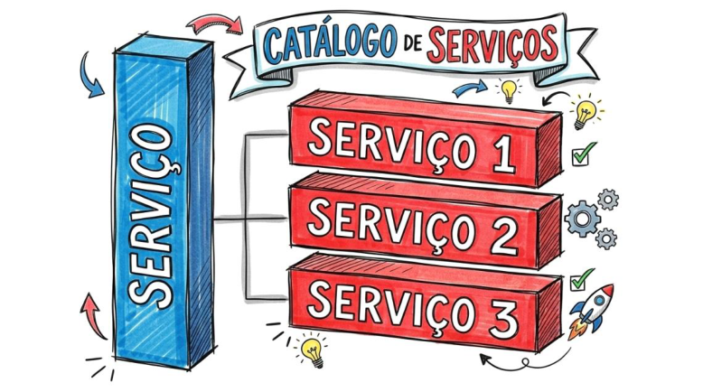

A composição amplia significativamente as possibilidades oferecidas pela Arquitetura Orientada a Serviços. Por que essa característica é tão importante? Porque permite reutilizar serviços existentes em diferentes combinações, criando novas funcionalidades sem a necessidade de desenvolver todos os componentes novamente. Um mesmo serviço pode participar de múltiplos processos de negócio, contribuindo para diferentes soluções conforme as necessidades da organização evoluem ao longo do tempo. 

Outro aspecto relevante envolve a forma como os serviços interagem durante a composição. Essas interações precisam ocorrer sempre da mesma maneira? Não. Dependendo dos requisitos do processo, a comunicação pode ocorrer de forma síncrona, quando um participante aguarda a resposta do outro, ou de forma assíncrona, quando a execução prossegue sem necessidade de resposta imediata. Essa flexibilidade permite adaptar a composição às características específicas de cada cenário de negócio. 

Ao estudar composição, surge frequentemente uma dúvida relacionada ao princípio da Independência de Estados. Se os serviços devem ser stateless, como processos compostos conseguem acompanhar sua execução? A resposta está na distinção entre o estado do serviço e o estado do processo. Os serviços individuais continuam sendo projetados para minimizar a retenção de informações entre requisições. Entretanto, o processo composto pode necessitar de mecanismos capazes de acompanhar o progresso das atividades, registrar etapas concluídas e coordenar a sequência das operações executadas.

---

<!-- pagina: 56 -->

**Diego Carvalho, Equipe Informática 2 (Diego Carvalho), Equipe Informática 1 (Diego Carvalho) Aula 08** 

Isso significa que os serviços deixam de ser stateless quando participam de uma composição? Em geral, não. O estado normalmente é mantido por mecanismos de coordenação, orquestração ou workflow responsáveis por controlar a execução do processo como um todo. Dessa forma, os serviços permanecem focados em suas responsabilidades específicas, enquanto a camada de composição gerencia as informações necessárias para acompanhar o fluxo de execução entre os participantes envolvidos. 

A coordenação dessas interações exige mecanismos especializados. Como garantir que cada serviço seja executado no momento correto e que as informações sejam encaminhadas adequadamente? Para isso, utilizam-se workflows e modelos de coordenação capazes de organizar a sequência das atividades, controlar dependências e administrar o estado do processo composto. Esses mecanismos tornam possível a construção de soluções complexas a partir da colaboração entre múltiplos serviços independentes. 

A composição representa, portanto, uma das principais formas de materializar os benefícios da orientação a serviços. O que ela permite alcançar? A criação de processos mais sofisticados por meio da combinação de capacidades já existentes, preservando reutilização, flexibilidade e modularidade. Como consequência, a arquitetura torna-se mais preparada para acomodar mudanças de negócio e responder a novas demandas sem exigir a reconstrução completa das soluções disponíveis. 

<!-- Start of picture text -->
Orquestração de Serviços <!-- End of picture text -->

### **<mark>ORQUESTRAÇÃO DE SERVIÇOS</mark>** 

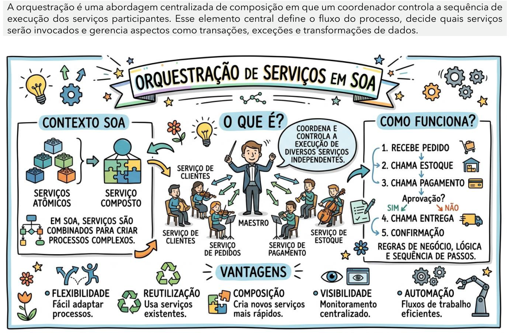

<!-- Start of picture text -->
A orquestração é uma abordagem centralizada de composição em que um coordenador controla a sequência de execução dos serviços participantes. Esse elemento central define o fluxo do processo, decide quais serviços serão invocados e gerencia aspectos como transações, exceções e transformações de dados. <!-- End of picture text -->

---

<!-- pagina: 57 -->

**Diego Carvalho, Equipe Informática 2 (Diego Carvalho), Equipe Informática 1 (Diego Carvalho) Aula 08** 

A orquestração de serviços é um dos principais mecanismos utilizados para implementar composições em uma Arquitetura Orientada a Serviços. O que caracteriza uma orquestração? A existência de um componente central responsável por coordenar a execução de um processo composto. Em vez de cada serviço decidir autonomamente quando e como interagir com os demais participantes, uma entidade central controla o fluxo das atividades, definindo a sequência das operações e administrando a execução do processo de negócio. 

Essa entidade central costuma ser denominada coordenador ou mecanismo de orquestração. Qual é sua responsabilidade? Controlar a interação entre os serviços participantes e garantir que cada etapa do processo seja executada no momento apropriado. O coordenador recebe solicitações, invoca serviços, processa resultados intermediários e determina quais atividades devem ser executadas em seguida, mantendo uma visão completa do fluxo de negócio em execução. 

Uma analogia bastante conhecida ajuda a compreender esse conceito. Como visualizar a função do coordenador? Imagine uma orquestra musical. Os músicos representam os serviços individuais, cada um especializado em uma função específica. A apresentação completa corresponde ao serviço composto ou ao processo de negócio executado. O maestro desempenha o papel do coordenador, determinando quando cada participante deve atuar e garantindo que todas as partes trabalhem de forma sincronizada para alcançar o resultado esperado. 

A principal característica da orquestração é o controle centralizado da lógica do processo. Por que isso é importante? Porque permite que regras de negócio, decisões, tratamentos de exceção e fluxos de execução sejam definidos em um único ponto. Como consequência, torna-se mais simples administrar processos complexos, acompanhar sua execução e implementar mecanismos de controle relacionados a falhas, compensações e transações distribuídas. 

Outro aspecto frequentemente associado à orquestração é o gerenciamento do estado do processo composto. Como acompanhar atividades que envolvem múltiplos serviços e várias etapas de execução? O coordenador mantém as informações necessárias para controlar o andamento do processo, registrando quais etapas foram concluídas, quais ainda precisam ser executadas e quais ações devem ser tomadas em caso de erro ou interrupção. Dessa forma, os serviços individuais podem permanecer focados em suas responsabilidades específicas enquanto a coordenação é realizada centralmente. 

A lógica do processo normalmente permanece sob controle da organização responsável pela orquestração. O que isso significa? Significa que as regras que definem a sequência das atividades, as condições de execução e os critérios de decisão são administrados pelo coordenador do processo. Mesmo quando serviços externos participam da solução, a condução do fluxo permanece centralizada na entidade responsável pela orquestração. 

A essência da orquestração está justamente nessa centralização do controle do processo composto. O que se busca alcançar com essa abordagem? A coordenação organizada de múltiplos serviços, permitindo que capacidades independentes sejam combinadas para executar processos de negócio complexos de maneira previsível, controlada e alinhada aos objetivos da organização. 

No contexto dos Web Services, uma das tecnologias mais associadas a esse modelo é a Web Services Business Process Execution Language, conhecida como WS-BPEL. Qual sua finalidade? Permitir a definição e execução de processos compostos por meio de uma linguagem capaz de representar fluxos de atividades, variáveis, condições, tratamentos de exceção e mecanismos de coordenação entre serviços. Dessa forma, a WS-BPEL tornou-se uma das principais tecnologias utilizadas para implementar orquestrações em ambientes SOA baseados em Web Services.

---

<!-- pagina: 58 -->

**Diego Carvalho, Equipe Informática 2 (Diego Carvalho), Equipe Informática 1 (Diego Carvalho) Aula 08** 

A Web Services Business Process Execution Language, conhecida como WS-BPEL ou simplesmente BPEL, foi criada para permitir a definição e execução de processos de negócio baseados na orquestração de Web Services. Sua estrutura utiliza elementos XML para representar atividades, fluxos de execução, regras de controle e interações entre serviços. Como coordenar diversos serviços para que atuem como parte de um único processo de negócio? A BPEL procura responder a essa necessidade por meio de uma linguagem especializada em orquestração. 

Entre as atividades básicas da linguagem encontra-se o elemento `<receive>`. Sua função consiste em receber mensagens enviadas por participantes externos e, dependendo da configuração do processo, iniciar ou dar continuidade à execução. O que acontece quando uma solicitação chega ao processo BPEL? Normalmente uma atividade de recepção é responsável por capturar essa mensagem e disponibilizá-la para as etapas subsequentes do fluxo definido. 

Após o recebimento das informações, frequentemente surge a necessidade de manipular os dados utilizados pelo processo. Essa tarefa é realizada principalmente por meio do elemento `<assign>`. Essa atividade permite copiar valores entre variáveis, mensagens e estruturas utilizadas pela orquestração. Durante a execução de um fluxo de negócio, informações precisam ser transformadas, reorganizadas ou transferidas entre diferentes partes do processo para que possam ser utilizadas por outras atividades ou serviços participantes. 

Entre todas as atividades básicas, uma das mais importantes é o elemento `<invoke>`. Sua finalidade consiste em realizar chamadas a serviços parceiros definidos na orquestração. Como um processo BPEL consegue utilizar funcionalidades disponibilizadas por outros serviços? O `<invoke>` estabelece essa comunicação, permitindo que solicitações sejam enviadas a participantes externos e que as respostas sejam processadas quando o padrão de interação assim o exigir. 

**(CEBRASPE / DP DF - 2022)** Considere que um sistema deva ser desenvolvido com os seguintes <mark>requisitos:</mark> 

<mark>I arquitetura distribuída;</mark> 

<mark>II componentes de sistema como serviços autônomos;</mark> 

<mark>III plataforma e implementação independentes de linguagem;</mark> 

<mark>IV mecanismos básicos para a troca de informações baseados em XML.</mark> 

<mark>Para atender os requisitos I e IV, é correto utilizar SOA, que, além de ser uma forma de desenvolvimento de sistemas distribuídos por meio de protocolos de web services, possui mecanismos básicos para a troca de informações de serviço (SOAP) e padrões de linguagem da programação (WSBPEL) baseados em XML.</mark> 

**<mark>_______________________ Comentários:</mark>** <mark>SOA atende bem a esse cenário porque organiza o sistema de forma distribuída, com serviços autônomos e interoperáveis. Além disso, SOAP e WSBPEL são padrões ligados a web services e baseados em XML, o que encaixa nos requisitos de troca de</mark> informações e independência tecnológica (Correto). 

Uma dúvida comum envolve o comportamento síncrono ou assíncrono do `<invoke>`. Essa atividade é sempre síncrona? Não. O comportamento depende do padrão de troca de mensagens definido para o serviço parceiro. Em operações do tipo request-response, o processo envia uma solicitação e recebe uma resposta associada à mesma interação. Já em operações unidirecionais, a comunicação pode ocorrer sem que exista uma resposta correspondente dentro do mesmo fluxo de execução. 

Outra atividade importante é o elemento `<reply>`. Após o processamento de uma solicitação, muitas operações exigem o envio de uma resposta ao participante que iniciou a interação. É justamente essa a finalidade do `<reply>`. Em cenários de comunicação do tipo solicitação e resposta, esse elemento

---

<!-- pagina: 59 -->

**Diego Carvalho, Equipe Informática 2 (Diego Carvalho), Equipe Informática 1 (Diego Carvalho) Aula 08** 

permite que o processo retorne os resultados produzidos durante sua execução, concluindo o ciclo de interação entre os participantes envolvidos. 

A combinação dessas atividades permite construir processos de negócio relativamente complexos utilizando uma estrutura padronizada. Receber mensagens, manipular dados, invocar serviços externos e devolver respostas são operações fundamentais em qualquer processo de orquestração. Por essa razão, elementos como `<receive>`, `<assign>`, `<invoke>` e `<reply>` constituem parte essencial da modelagem de processos realizada com a linguagem WS-BPEL. 

Dessa forma, a orquestração oferece um mecanismo centralizado para coordenar serviços independentes e transformá-los em processos de negócio mais amplos. O coordenador administra o fluxo, controla o estado do processo e garante a execução ordenada das atividades, enquanto tecnologias como a WSBPEL fornecem os recursos necessários para implementar essa coordenação de maneira estruturada, previsível e alinhada às necessidades da organização. 

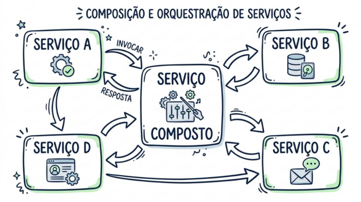

<!-- Start of picture text -->
Coreografia de Serviços <!-- End of picture text -->

### **<mark>COREOGRAFIA DE SERVIÇOS</mark>** 

<mark>A coreografia representa uma abordagem descentralizada de composição de serviços. Não existe um</mark> coordenador central; cada participante conhece previamente seu papel e interage diretamente com os demais seguindo regras previamente definidas. O comportamento global emerge da colaboração entre os serviços envolvidos. 

A coreografia e a orquestração representam duas formas distintas de coordenar serviços em uma Arquitetura Orientada a Serviços. Em uma orquestração, existe um componente central responsável por controlar o fluxo do processo e determinar quando cada serviço deve ser executado. Já na coreografia, não existe um controlador central responsável por coordenar cada etapa da execução. Como os participantes conseguem cooperar sem uma coordenação central? Isso ocorre porque cada serviço segue regras previamente definidas sobre quais mensagens deve enviar, receber e processar, permitindo que as interações aconteçam de maneira distribuída entre os participantes. 

A principal diferença entre coreografia e orquestração está justamente na localização da lógica de coordenação. Em uma orquestração, um processo central controla o fluxo das atividades e decide quando cada serviço deve ser acionado. Já em uma coreografia, cada participante conhece o protocolo de interação relacionado às suas responsabilidades e atua de forma autônoma dentro desse conjunto de regras. Surge então uma dúvida comum: todos os participantes precisam conhecer o processo completo?

---

<!-- pagina: 60 -->

**Diego Carvalho, Equipe Informática 2 (Diego Carvalho), Equipe Informática 1 (Diego Carvalho) Aula 08** 

Não necessariamente, pois cada um deve compreender apenas as interações que lhe dizem respeito e cumprir as regras estabelecidas para a colaboração. 

Outro aspecto importante envolve a troca de mensagens entre os participantes. Em ambientes coreografados, existe grande preocupação com a sequência correta das mensagens e com a sincronização das interações. Por que essa preocupação é tão relevante? Porque a execução adequada do processo depende do cumprimento das regras de comunicação definidas previamente. Caso uma mensagem seja enviada fora da ordem esperada ou em momento inadequado, a colaboração entre os serviços poderá produzir resultados incorretos ou comportamentos não previstos. 

Em uma coreografia, o foco não está no controle interno de um único processo, mas no comportamento observável das interações entre os participantes. Cada serviço conhece suas obrigações dentro da colaboração e reage às mensagens recebidas de acordo com as regras estabelecidas. Dessa forma, a coordenação emerge do comportamento coletivo dos participantes em vez de ser imposta por um controlador central. 

==5460== 

No contexto dos Web Services, foi criada a Web Services Choreography Description Language, conhecida como WS-CDL. Qual era o objetivo dessa linguagem? Sua finalidade era descrever colaborações entre participantes a partir de uma visão global do processo, especificando os comportamentos observáveis esperados durante as interações. A linguagem buscava representar quais participantes estavam envolvidos, quais mensagens seriam trocadas e quais sequências de interação deveriam ser respeitadas para que a colaboração ocorresse corretamente. 

Embora a proposta da WS-CDL tenha sido relevante para o estudo de coreografias de serviços, sua adoção prática no mercado foi relativamente limitada quando comparada a outras tecnologias utilizadas em arquiteturas distribuídas. Ainda assim, seus conceitos contribuíram para a compreensão dos modelos de colaboração distribuída e ajudaram a consolidar a distinção entre coordenação centralizada e coordenação descentralizada em ambientes orientados a serviços. 

Além dos mecanismos de coordenação dos serviços, outro tema frequentemente associado à Arquitetura Orientada a Serviços é a Service Component Architecture, ou SCA. Essa iniciativa foi apoiada por fornecedores como BEA, IBM, Oracle e SAP, que buscavam facilitar o desenvolvimento de soluções orientadas a serviços. O que torna esse modelo interessante? Ele considera que funcionalidades de negócio podem ser disponibilizadas como serviços independentes e posteriormente combinadas para atender necessidades específicas de uma aplicação ou processo corporativo. 

As aplicações desenvolvidas com SCA podem utilizar tanto serviços criados especificamente para uma solução quanto funcionalidades já existentes em outros sistemas. Dessa forma, o reaproveitamento de recursos torna-se parte natural da arquitetura. Em vez de recriar funcionalidades já disponíveis, os desenvolvedores podem reutilizar componentes existentes e combiná-los para construir novas soluções orientadas a serviços. 

Uma questão recorrente é a seguinte: o SCA limita as tecnologias utilizadas pelos componentes? Pelo contrário. O modelo foi concebido para suportar diferentes linguagens de programação, frameworks e ambientes de execução, permitindo maior flexibilidade durante o desenvolvimento. Essa independência tecnológica favorece a integração de componentes desenvolvidos em contextos distintos sem exigir a padronização completa da infraestrutura utilizada pela organização. 

Além da diversidade tecnológica dos componentes, o SCA também contempla diferentes mecanismos de comunicação entre serviços. Entre eles encontram-se Web Services, sistemas de mensageria e Remote Procedure Call, conhecido pela sigla RPC. Essa variedade existe porque ambientes corporativos frequentemente utilizam tecnologias distintas que precisam operar em conjunto. Assim, a arquitetura

---

<!-- pagina: 61 -->

**Diego Carvalho, Equipe Informática 2 (Diego Carvalho), Equipe Informática 1 (Diego Carvalho) Aula 08** 

fornece mecanismos para integrar componentes heterogêneos sem exigir a adoção de uma única tecnologia de comunicação. 

O SCA costuma ser estudado a partir de três aspectos fundamentais: composição, montagem e política. O que cada um deles representa? A composição refere-se à combinação de componentes e serviços para formar uma solução de negócio mais ampla. A montagem define como esses componentes são conectados, configurados e organizados para atuar de maneira integrada. Já a política estabelece requisitos relacionados à segurança e à governança, incluindo restrições de acesso, autenticação, autorização, assinatura digital e outros mecanismos necessários para controlar o uso dos serviços. 

Esses três aspectos atuam de forma complementar dentro do modelo. A composição permite construir soluções a partir de componentes reutilizáveis; a montagem garante que esses componentes sejam integrados adequadamente; e a política define as regras que governam seu funcionamento. Em conjunto, esses elementos ajudam a transformar serviços independentes em soluções corporativas estruturadas, alinhadas aos princípios da Arquitetura Orientada a Serviços. 

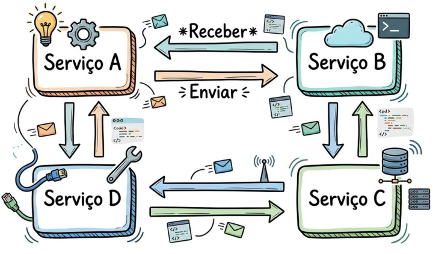

---

<!-- pagina: 62 -->

**Diego Carvalho, Equipe Informática 2 (Diego Carvalho), Equipe Informática 1 (Diego Carvalho) Aula 08** 

<!-- Start of picture text -->
Aspectos Técnicos e Integração <!-- End of picture text -->

<!-- Start of picture text -->
Versionamento de Serviços <!-- End of picture text -->

#### **<mark>INCIDÊNCIA EM PROVA: BAIXÍSSIMA</mark>** 

### **<mark>VERSIONAMENTO DE SERVIÇOS</mark>** 

O versionamento de serviços consiste no gerenciamento controlado das alterações realizadas nos contratos e funcionalidades dos serviços ao longo do tempo. Seu objetivo é permitir evolução contínua sem comprometer consumidores existentes, <u>garantindo compatibilidade e reduzindo impactos causados por mudanças.</u> 

O versionamento de serviços corresponde ao conjunto de práticas utilizadas para gerenciar a evolução dos serviços ao longo de seu ciclo de vida. Em ambientes SOA, diversos projetos costumam ser executados simultaneamente e frequentemente compartilham os mesmos serviços. O que acontece quando novos requisitos surgem durante esses projetos? Nesses casos, os serviços podem precisar ser modificados para atender novas necessidades de negócio, o que pode levar à criação de novas versões destinadas aos consumidores afetados pelas mudanças. 

O compartilhamento de serviços entre diferentes aplicações traz benefícios importantes, mas também introduz desafios. Imagine que um mesmo serviço seja utilizado por vários consumidores. Como atender uma nova necessidade sem prejudicar quem já depende da versão atual? Essa é justamente uma das preocupações centrais do versionamento. Nem toda alteração exige uma nova versão pública, porém mudanças que afetam contratos, estruturas de dados ou comportamentos esperados normalmente demandam mecanismos que preservem a compatibilidade com os consumidores existentes. 

Nos estágios iniciais de um programa SOA, as mudanças costumam ser mais frequentes porque os serviços ainda estão amadurecendo. Por essa razão, torna-se importante adotar práticas preventivas desde o início. Entre elas destacam-se a análise adequada dos requisitos, o projeto cuidadoso dos contratos de serviço e a definição de políticas de governança. Quanto mais bem estruturado for o serviço, menores tendem a ser os impactos provocados por futuras alterações em seus requisitos ou funcionalidades. 

Outro aspecto relevante envolve a gestão dos artefatos associados aos serviços. Onde armazenar contratos, modelos de dados, políticas e informações de dependência? A prática mais recomendada consiste em utilizar repositórios centralizados capazes de fornecer rastreabilidade e controle sobre os artefatos. Além disso, políticas relacionadas à retenção, manutenção e descontinuação de versões ajudam a evitar a proliferação desordenada de serviços e facilitam o gerenciamento do portfólio ao longo do tempo. 

A descoberta de serviços também exerce papel importante no processo de versionamento. Consumidores precisam localizar facilmente informações sobre os serviços disponíveis, incluindo contratos, especificações técnicas e políticas de utilização. Quando existe um mecanismo centralizado de publicação e descoberta, a comunicação entre provedores e consumidores torna-se mais eficiente. Dessa forma, mudanças planejadas e novas versões podem ser divulgadas de maneira controlada e transparente para todos os envolvidos. 

Questões relacionadas a protocolos, APIs, linguagens e plataformas também precisam ser consideradas durante a evolução dos serviços. Como lidar com ambientes heterogêneos sem gerar grandes impactos para os consumidores? A resposta normalmente está na adoção de uma infraestrutura de integração capaz de reduzir acoplamentos e facilitar adaptações. O objetivo é permitir que mudanças sejam absorvidas com o menor impacto possível sobre os sistemas que utilizam os serviços.

---

<!-- pagina: 63 -->

**Diego Carvalho, Equipe Informática 2 (Diego Carvalho), Equipe Informática 1 (Diego Carvalho) Aula 08** 

Nesse contexto, soluções de integração podem contribuir significativamente para a coexistência de múltiplas versões. Recursos como roteamento, transformação e mediação de mensagens permitem direcionar consumidores para versões específicas e adaptar formatos de comunicação quando necessário. Embora essas técnicas facilitem o gerenciamento das mudanças, a convivência entre versões continua exigindo planejamento, governança e monitoramento constantes para evitar problemas de compatibilidade e manutenção. 

As estratégias mais comuns para o versionamento de serviços envolvem três pilares principais. O primeiro consiste em projetar serviços de forma cuidadosa para reduzir alterações disruptivas. O segundo envolve a utilização de repositórios que permitam controlar artefatos, dependências e versões. O terceiro corresponde à adoção de mecanismos eficientes de publicação e descoberta de serviços, permitindo que consumidores tenham acesso rápido e confiável às informações necessárias sobre cada versão disponível. 

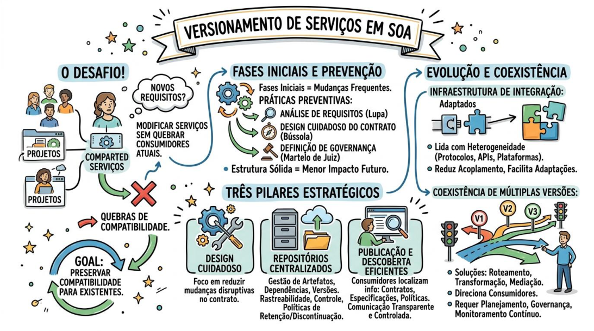

---

<!-- pagina: 64 -->

**Diego Carvalho, Equipe Informática 2 (Diego Carvalho), Equipe Informática 1 (Diego Carvalho) Aula 08** 

<!-- Start of picture text -->
CORBA <!-- End of picture text -->

#### **<mark>INCIDÊNCIA EM PROVA: BAIXÍSSIMA</mark>** 

### **<mark>CORBA</mark>** 

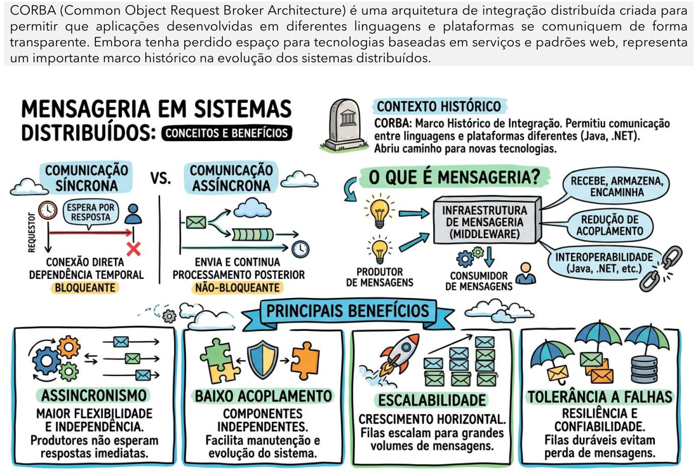

<!-- Start of picture text -->
CORBA (Common Object Request Broker Architecture) é uma arquitetura de integração distribuída criada para permitir que aplicações desenvolvidas em diferentes linguagens e plataformas se comuniquem de forma transparente. Embora tenha perdido espaço para tecnologias baseadas em serviços e padrões web, representa um importante marco histórico na evolução dos sistemas distribuídos. <!-- End of picture text -->

Primeiro, vamos compreender duas formas fundamentais de comunicação presentes em sistemas distribuídos: comunicação síncrona e comunicação assíncrona. Em qualquer ambiente distribuído, diferentes componentes precisam trocar informações para executar suas funções. Como essa comunicação pode ocorrer? As duas abordagens mais comuns diferem principalmente na forma como o emissor e o receptor coordenam suas atividades durante a troca de mensagens. 

Na comunicação síncrona, o componente que realiza uma solicitação normalmente permanece aguardando o processamento e a resposta antes de prosseguir sua execução. Por que isso é considerado síncrono? Porque existe uma dependência temporal entre as partes envolvidas na interação. Enquanto a resposta não é recebida, o solicitante permanece aguardando a conclusão da operação. Esse modelo é bastante comum em chamadas de serviços e em mecanismos tradicionais de invocação remota. 

A comunicação assíncrona segue uma lógica diferente. Nesse modelo, o emissor envia uma mensagem e pode continuar executando suas atividades sem esperar imediatamente pelo resultado do processamento. O receptor trata a mensagem em momento apropriado, de acordo com sua disponibilidade e suas regras de execução. Isso significa que nunca haverá resposta? Não. A resposta pode existir, mas ela não precisa ocorrer durante a mesma interação nem bloquear a continuidade das atividades do componente que enviou a mensagem.

---

<!-- pagina: 65 -->

**Diego Carvalho, Equipe Informática 2 (Diego Carvalho), Equipe Informática 1 (Diego Carvalho) Aula 08** 

É justamente nesse contexto que surge a mensageria. Trata-se de uma abordagem de integração baseada na troca de mensagens entre aplicações, geralmente mediada por uma infraestrutura intermediária especializada. Qual a função dessa infraestrutura? Ela recebe, armazena, encaminha e distribui mensagens entre os participantes da comunicação, permitindo que sistemas diferentes interajam sem depender de conexões diretas e permanentes entre si. 

Em ambientes de mensageria, normalmente existem produtores e consumidores de mensagens. Os produtores geram e enviam mensagens para a infraestrutura de comunicação, enquanto os consumidores recebem essas mensagens e executam o processamento correspondente. Essa separação de responsabilidades permite que aplicações troquem informações sem a necessidade de manter comunicação direta e contínua entre si. 

Dependendo da arquitetura utilizada, as mensagens podem ser encaminhadas para filas ou para tópicos. As filas normalmente estão associadas ao modelo ponto a ponto, no qual uma mensagem é consumida por um dos consumidores disponíveis. Já os tópicos são frequentemente utilizados em cenários de publicação e assinatura, permitindo que múltiplos consumidores recebam a mesma informação sempre que uma nova mensagem for publicada. 

A presença desse intermediário reduz significativamente o acoplamento entre os sistemas integrados. Em vez de cada aplicação precisar conhecer detalhes internos das demais, basta que ela saiba produzir ou consumir mensagens seguindo formatos previamente definidos. Como consequência, alterações realizadas em um sistema tendem a gerar menos impactos sobre os demais participantes da integração, favorecendo a manutenção e a evolução das soluções. 

Outro benefício importante está relacionado à interoperabilidade. Organizações frequentemente utilizam aplicações desenvolvidas em linguagens, plataformas e tecnologias distintas. Como fazer esses sistemas trabalharem em conjunto? A mensageria fornece um mecanismo padronizado de comunicação capaz de conectar ambientes heterogêneos, permitindo que aplicações implementadas, por exemplo, em Java, .NET ou outras tecnologias troquem informações de maneira coordenada. 

Além de reduzir dependências entre aplicações e favorecer a interoperabilidade, a mensageria contribui para a escalabilidade e para a distribuição eficiente da carga de processamento. Quando uma mensagem é enviada para uma fila ou tópico, seu processamento pode ocorrer em momento posterior e até mesmo ser distribuído entre múltiplos consumidores. Essa característica ajuda a reduzir gargalos e permite que o sistema suporte volumes maiores de processamento sem exigir comunicação direta e imediata entre todos os componentes envolvidos. 

Dessa forma, a mensageria representa uma importante aplicação dos conceitos de comunicação assíncrona em sistemas distribuídos. Ao utilizar produtores, consumidores, filas e tópicos mediados por uma infraestrutura especializada, torna-se possível integrar aplicações heterogêneas com menor acoplamento, maior interoperabilidade e melhor capacidade de escalabilidade, características fundamentais em arquiteturas corporativas modernas. Agora vejamos os principais benefícios: 

|**BENEFÍCIOS**|**DESCRIÇÃO**|
|---|---|
|**ASSINCRONICIDADE**|As mensagens podem ser enviadas e processadas de forma assíncrona, ou seja, o produtor de mensagens não precisa esperar pela resposta imediata do consumidor. Isso permite uma maior flexibilidade e escalabilidade no sistema, já que os componentes podem trabalhar de forma independente e não precisam estar ativos simultanemente.|
|**ACOPLAMENTO** **FRACO**|A comunicação por mensagens permite um acoplamento fraco entre os componentes do sistema. Os produtores e consumidores não precisam conhecer detalhes de implementação uns dos outros, pois a comunicação é feitapor meio das mensagens.|

---

<!-- pagina: 66 -->

**Diego Carvalho, Equipe Informática 2 (Diego Carvalho), Equipe Informática 1 (Diego Carvalho) Aula 08** 

<mark>Isso facilita a manutenção e evolução dos sistemas, uma vez que os componentes</mark> <u>podem ser modificados sem afetar diretamente os outros.</u> 

O uso de filas de mensagens permite uma maior escalabilidade horizontal do sistema. Mais produtores e consumidores podem ser adicionados conforme necessário, e as **ESCALABILIDADE** filas podem ser dimensionadas para suportar grandes volumes de mensagens, garantindo um processamento eficiente e distribuído. A mensageria permite a implementação de sistemas resilientes, capazes de lidar com falhas de rede, indisponibilidade temporária de componentes e falhas pontuais. As **TOLERÂNCIA A** mensagens podem ser armazenadas em filas duráveis, garantindo que nenhuma **FALHAS** mensagem seja perdida e possa ser processada posteriormente. 

A mensageria é amplamente utilizada em arquiteturas modernas de software porque permite a comunicação entre aplicações de forma desacoplada e escalável. Entre seus principais usos estão a integração de sistemas, o processamento de eventos em tempo real, a comunicação entre microsserviços e os ambientes distribuídos em nuvem. O que torna essa abordagem tão útil? A possibilidade de trocar informações entre componentes sem exigir dependências diretas entre os sistemas envolvidos, facilitando a evolução e a manutenção das soluções. 

Embora a mensageria seja uma das abordagens mais conhecidas para integração de aplicações, ela não foi a única tecnologia criada para resolver problemas de comunicação em ambientes distribuídos. Ao longo da evolução da computação distribuída, diversas arquiteturas surgiram com o objetivo de permitir que componentes executados em diferentes máquinas pudessem interagir de maneira transparente. Entre essas iniciativas destaca-se o CORBA, sigla para Common Object Request Broker Architecture. 

**(AOCP / DPE MS - 2024)** Durante a migração dos dados e serviços locais para a nuvem, o <mark>engenheiro da computação da Defensoria Pública do Estado de Mato Grosso do Sul optou por utilizar a implementação de SOA. São tecnologias que podem ser usadas para a implementação de SOA:</mark> 

<mark>a) Web Service, Corba, RMI, DCOM e REST. b) Nikias, Web Service, SCR e brancher.</mark> 

<mark>c) Telnet, datacenter, ASP e delay. d) Ristore, Datacom, baseline e normalização. e) UDP, SaaP e deque.</mark> 

**<mark>_______________________ Comentários:</mark>** <mark>(a) Correto. Web Service, CORBA, RMI, DCOM e REST são tecnologias e estilos usados na implementação de SOA, pois viabilizam a comunicação entre serviços de forma distribuída. (b) Errado. A alternativa mistura um termo válido com nomes que não são tecnologias típicas de implementação de SOA, então não atende ao que a questão pede. (c) Errado. Telnet, datacenter, ASP e delay não formam um conjunto de tecnologias voltadas à implementação de SOA. (d) Errado. Os termos listados não correspondem a tecnologias clássicas ou apropriadas para implementar uma arquitetura SOA. (e) Errado. UDP é protocolo de transporte, e os demais termos não</mark> compõem um conjunto de tecnologias usadas para implementação de SOA (Letra A). 

Qual era a proposta principal do CORBA? Permitir que objetos distribuídos em uma rede se comunicassem de forma padronizada, mesmo quando desenvolvidos em linguagens de programação distintas ou executados em plataformas diferentes. O objetivo era reduzir as dificuldades de integração entre ambientes heterogêneos e fornecer uma infraestrutura comum para a construção de sistemas distribuídos. 

O funcionamento geral da arquitetura segue o modelo cliente-servidor. Os clientes realizam solicitações que precisam ser encaminhadas aos objetos distribuídos responsáveis pelo processamento. Entretanto, como um cliente consegue localizar e acessar um objeto que pode estar executando em outro

---

<!-- pagina: 67 -->

**Diego Carvalho, Equipe Informática 2 (Diego Carvalho), Equipe Informática 1 (Diego Carvalho) Aula 08** 

computador? É justamente para resolver essa questão que o CORBA utiliza um componente central denominado Object Request Broker, conhecido pela sigla ORB. 

O ORB atua como intermediário entre clientes e objetos distribuídos. Sua função consiste em localizar os objetos apropriados, encaminhar solicitações, receber respostas e devolver os resultados ao cliente de maneira transparente. Dessa forma, a aplicação cliente não precisa conhecer detalhes relacionados à localização física, ao sistema operacional ou à linguagem utilizada pelo objeto que executará o processamento solicitado. 

Para viabilizar esse mecanismo de localização, o CORBA utiliza referências chamadas Interoperable Object References, ou IORs. Essas referências funcionam como identificadores capazes de informar ao ORB onde determinado objeto pode ser encontrado. Quando uma solicitação precisa ser encaminhada, o ORB utiliza essas informações para localizar o objeto correspondente e estabelecer a comunicação necessária entre as partes envolvidas. 

Além da localização dos objetos, a arquitetura também precisa definir como suas funcionalidades serão descritas para os consumidores. Essa responsabilidade é atribuída à Interface Definition Language, conhecida como IDL. Essa linguagem é utilizada para descrever as interfaces dos objetos distribuídos, especificando operações disponíveis, parâmetros necessários e características das chamadas que podem ser realizadas. 

Qual a vantagem de definir interfaces dessa maneira? A descrição padronizada permite que aplicações desenvolvidas em diferentes linguagens compreendam como interagir com os mesmos objetos distribuídos. Dessa forma, componentes implementados em tecnologias distintas conseguem compartilhar funcionalidades sem depender diretamente dos detalhes internos de implementação de cada participante. 

A IDL costuma ser comparada ao WSDL utilizado em Web Services porque ambos desempenham funções relacionadas à descrição de contratos. Entretanto, eles pertencem a modelos arquiteturais diferentes. Enquanto o WSDL descreve serviços em arquiteturas orientadas a serviços, a IDL foi concebida para representar interfaces de objetos distribuídos dentro da arquitetura CORBA. Apesar das diferenças, ambos procuram fornecer uma descrição formal das funcionalidades disponibilizadas aos consumidores. 

Uma característica marcante do CORBA é sua capacidade de promover interoperabilidade entre diferentes tecnologias. Isso significa que aplicações desenvolvidas em linguagens distintas e executadas em plataformas diferentes podem cooperar utilizando uma infraestrutura comum de comunicação. O CORBA elimina completamente a dependência tecnológica? Não. A arquitetura depende de padrões e implementações específicas do próprio CORBA, mas reduz significativamente as barreiras de integração entre ambientes heterogêneos. 

A combinação entre ORB, IOR e IDL permite que clientes e objetos distribuídos interajam de maneira relativamente transparente. Os clientes realizam solicitações, o ORB localiza os objetos apropriados utilizando as referências disponíveis, as interfaces definidas em IDL orientam a comunicação e os resultados retornam ao solicitante por meio da mesma infraestrutura. Esse conjunto de mecanismos tornou o CORBA uma das principais soluções para sistemas distribuídos durante muitos anos. 

Embora o CORBA tenha desempenhado papel importante na construção de sistemas distribuídos, atualmente ele divide espaço com abordagens mais recentes, como Web Services, APIs REST, mensageria e arquiteturas baseadas em microsserviços. Ainda assim, seus conceitos permanecem relevantes para compreender a evolução das tecnologias de integração e os desafios envolvidos na comunicação entre componentes distribuídos executados em ambientes heterogêneos. Seus componentes são:

---

<!-- pagina: 68 -->

**Diego Carvalho, Equipe Informática 2 (Diego Carvalho), Equipe Informática 1 (Diego Carvalho) Aula 08** 

|**PRINCIPAIS** **COMPONENTES**|**DESCRIÇÃO**|
|---|---|
|**OBJETOS**|São componentes de software que encapsulam a lógica de negócio e oferecem serviços e operações para serem invocados remotamente. Os objetos CORBA são implementados usando uma linguagem de programação suportada pelo CORBA, como C++, Java ou Python, e são registrados em um Serviço de Nomes (Naming Service).|
|**OBJECT REQUEST** **BROKER (ORB)**|É uma infraestrutura de software responsável por facilitar a comunicação entre os objetos CORBA. O ORB atua como intermediário entre os clientes que solicitam serviços e os objetos distribuídos que oferecem esses serviços. Ele lida com a localização do objeto correto, a serialização dos parâmetros da solicitação, o envio da solicitação ao objeto e a entrega da resposta ao cliente.|
|**INTERFACE** **DEFINITION** **LANGUAGE (IDL)**|É uma linguagem neutra de definição de interfaces utilizada para especificar a estrutura e as operações dos objetos CORBA. A IDL permite que desenvolvedores descrevam a interface de um objeto CORBA de forma independente da linguagem de programação usada para implementá-lo. A partir da IDL, é possível gerar código-fonte em diferentes linguagens para a implementação do objeto e a criação dos stubs e skeletons necessáriospara a comunicação CORBA.|

A mensageria é amplamente utilizada em arquiteturas modernas porque permite a comunicação entre aplicações de forma desacoplada e escalável. Entre seus principais usos estão a integração de sistemas, o processamento de eventos em tempo real, a comunicação entre microsserviços e os ambientes distribuídos em nuvem. Por que essa abordagem é tão valorizada? Porque possibilita a troca de informações entre componentes sem criar dependências diretas entre eles, facilitando a manutenção, a evolução das aplicações e a adaptação a novas demandas de negócio. 

Embora a mensageria seja uma solução bastante difundida atualmente, outras tecnologias foram criadas para resolver problemas de integração em sistemas distribuídos. Uma delas é o CORBA, sigla para Common Object Request Broker Architecture. Qual era sua finalidade? Permitir que objetos distribuídos se comunicassem de maneira padronizada, independentemente da linguagem de programação utilizada ou da plataforma em que estivessem executando. Essa proposta buscava reduzir as dificuldades de integração entre ambientes heterogêneos. 

O funcionamento geral do CORBA segue o modelo cliente-servidor. Os clientes realizam invocações remotas de métodos sobre objetos distribuídos, enquanto a infraestrutura da arquitetura coordena toda a comunicação necessária para que essas operações sejam executadas. Após o processamento da solicitação, o resultado é devolvido ao cliente de forma transparente. Como um cliente consegue invocar um método localizado em outro computador sem conhecer detalhes da implementação? Essa é justamente uma das responsabilidades centrais da arquitetura. 

O núcleo do CORBA é o Object Request Broker, conhecido como ORB. Esse componente atua como intermediário entre clientes e objetos distribuídos, sendo responsável por localizar objetos, encaminhar solicitações e retornar resultados. O ORB abstrai a complexidade da comunicação distribuída e fornece mecanismos que tornam a interação transparente para as aplicações. Dessa forma, os clientes podem utilizar funcionalidades remotas sem precisar conhecer detalhes relacionados à localização física ou à implementação dos objetos acessados. 

Para localizar os objetos distribuídos, o CORBA utiliza referências denominadas Interoperable Object References, ou IORs. Essas referências armazenam as informações necessárias para que o ORB encontre o objeto correto e estabeleça a comunicação adequada. Dessa forma, o cliente não precisa conhecer a

---

<!-- pagina: 69 -->

**Diego Carvalho, Equipe Informática 2 (Diego Carvalho), Equipe Informática 1 (Diego Carvalho) Aula 08** 

localização física nem detalhes internos do componente acessado. O que ele precisa saber? Apenas como utilizar a interface disponibilizada pelo objeto remoto. 

Outro elemento essencial da arquitetura é a Interface Definition Language, conhecida como IDL. Essa linguagem é utilizada para descrever as interfaces dos objetos distribuídos, incluindo as operações disponíveis e os parâmetros necessários para cada chamada. Qual a importância dessa descrição formal? Ela permite que aplicações escritas em linguagens diferentes compreendam exatamente como interagir com os mesmos objetos, favorecendo a interoperabilidade entre ambientes heterogêneos. 

A IDL costuma ser comparada ao WSDL utilizado em Web Services porque ambos descrevem contratos de interação. Entretanto, cada um pertence a um modelo arquitetural distinto. Enquanto o WSDL descreve serviços em arquiteturas orientadas a serviços, a IDL foi projetada para definir interfaces de objetos distribuídos no contexto do CORBA. Em ambos os casos, existe o objetivo de estabelecer uma descrição formal que permita a comunicação correta entre produtores e consumidores de funcionalidades. 

Uma característica marcante do CORBA é sua capacidade de promover interoperabilidade entre diferentes linguagens e plataformas. Isso significa que aplicações desenvolvidas em tecnologias distintas podem cooperar utilizando a infraestrutura fornecida pelo ORB e pelos protocolos padronizados da arquitetura. O CORBA elimina completamente as dependências tecnológicas? Não. A arquitetura possui seus próprios padrões e mecanismos, mas reduz significativamente os obstáculos envolvidos na integração entre ambientes heterogêneos. 

A combinação entre ORB, IOR e IDL permite que clientes e objetos distribuídos interajam de maneira relativamente transparente. O ORB coordena a comunicação, os IORs fornecem as informações necessárias para localizar os objetos distribuídos e a IDL descreve formalmente as interfaces utilizadas durante as interações. Juntos, esses elementos formam a base operacional da arquitetura. 

O CORBA desempenhou papel importante na evolução dos sistemas distribuídos e influenciou diversas tecnologias posteriores. Durante muitos anos, foi uma das principais soluções para integração de aplicações corporativas executadas em ambientes heterogêneos. Atualmente, entretanto, a maior parte dos novos projetos adota abordagens como Web Services, APIs REST, mensageria e arquiteturas baseadas em microsserviços para resolver problemas de integração e interoperabilidade. Ainda assim, seus conceitos permanecem relevantes para compreender a evolução das arquiteturas distribuídas modernas.

---

<!-- pagina: 70 -->

**Diego Carvalho, Equipe Informática 2 (Diego Carvalho), Equipe Informática 1 (Diego Carvalho) Aula 08** 

<!-- Start of picture text -->
Governança SOA <!-- End of picture text -->

**<mark>INCIDÊNCIA EM PROVA: MÉDIA</mark>** 

<!-- Start of picture text -->
Modelo s <!-- End of picture text -->

<!-- Start of picture text -->
de Referência <!-- End of picture text -->

#### **<mark>INCIDÊNCIA EM PROVA: BAIXÍSSIMA</mark>** 

### **<mark>MODELOS DE REFERÊNCIA</mark>** 

<mark>Um modelo de referência SOA fornece uma visão conceitual dos principais elementos, relacionamentos e</mark> princípios que compõem uma arquitetura orientada a serviços. Ele estabelece uma linguagem comum para arquitetos, desenvolvedores e gestores, servindo como base para a definição de arquiteturas específicas. 

O SOA Governance Reference Model, conhecido pela sigla SGRM, é um modelo de referência desenvolvido pelo The Open Group para apoiar a implementação da governança em ambientes baseados em Arquitetura Orientada a Serviços. Seu propósito consiste em fornecer uma estrutura conceitual capaz de orientar organizações na definição de mecanismos de controle, tomada de decisão e supervisão. Por que um modelo desse tipo é necessário? Porque a adoção de serviços, por si só, não garante reutilização, interoperabilidade ou alinhamento entre tecnologia e negócio. 

**(FGV / ALE-TO - 2024)** A respeito da Arquitetura Orientada a Serviços (SOA), analise as afirmativas <mark>a seguir.</mark> 

<mark>I. Dentro de uma arquitetura orientada a serviços (SOA), a transferência bancária usando PIX estimula que cada instituição financeira desenvolva seu próprio protocolo de comunicação.</mark> 

<mark>II. O pagamento de boletos utilizando o PIX, inserido em uma SOA, exige mecanismos de segurança robustos.</mark> 

<mark>III. Um problema relevante na implementação de SOA é a gestão de serviços, que pode se tornar complexa necessitando de ferramentas eficientes de governança.</mark> 

<mark>Está correto o que se afirma em:</mark> 

<mark>a) II e III, apenas b) I e III, apenas. c) I e II, apenas. d) III, apenas. e) II, apenas.</mark> 

**<mark>_______________________ Comentários:</mark>** <mark>(I) Errado. Em SOA, a ideia é justamente favorecer integração com padrões e serviços bem definidos, não incentivar cada instituição a criar um protocolo próprio, o que dificultaria a interoperabilidade. (II) Correto. Pagamentos via PIX lidam com dados sensíveis e transações financeiras, então, dentro de uma SOA, mecanismos fortes de segurança são indispensáveis para proteger comunicação e operação. (III) Correto. Um ponto bem importante em SOA é a gestão dos serviços. Como há vários serviços integrados, a governança</mark> pode ficar mais complexa e pedir ferramentas eficientes de controle (Letra A). 

Em ambientes corporativos complexos, diferentes equipes podem desenvolver serviços semelhantes, utilizar padrões distintos ou tomar decisões incompatíveis entre si. Sem coordenação adequada, a arquitetura tende a perder consistência ao longo do tempo. O que o SGRM procura fazer diante desse cenário? Ele oferece uma estrutura de referência que auxilia a organização na criação de processos, políticas e mecanismos capazes de direcionar a evolução da arquitetura de forma controlada e alinhada aos objetivos organizacionais.

---

<!-- pagina: 71 -->

**Diego Carvalho, Equipe Informática 2 (Diego Carvalho), Equipe Informática 1 (Diego Carvalho) Aula 08** 

Um conceito central do modelo está relacionado à própria definição de governança. O SGRM considera que governança envolve direcionamento, supervisão e controle, estabelecendo mecanismos para influenciar decisões e comportamentos dentro do ambiente orientado a serviços. Isso significa executar as atividades operacionais do dia a dia? Não. A responsabilidade da governança está mais associada à definição de diretrizes e critérios de controle do que à execução direta das atividades técnicas e administrativas. 

Essa distinção conduz a uma questão importante: qual a diferença entre governança e gestão? A governança estabelece diretrizes, políticas e mecanismos de supervisão, enquanto a gestão executa as atividades necessárias para colocar essas diretrizes em prática. Embora possuam responsabilidades diferentes, ambas atuam de forma complementar. A governança define o direcionamento estratégico e os controles necessários; a gestão implementa e operacionaliza as decisões dentro do contexto organizacional. 

O modelo também reconhece a importância das pessoas envolvidas no processo de governança. Diversos participantes podem contribuir para a definição de padrões, avaliação de conformidade, aprovação de mudanças e acompanhamento de resultados. Quem são esses participantes? Dependendo da organização, podem existir arquitetos corporativos, gestores de serviços, comitês de governança, patrocinadores executivos e equipes responsáveis por conformidade e auditoria. O SGRM não impõe uma estrutura organizacional única, mas fornece referências para a definição desses papéis. 

Outro elemento relevante envolve as políticas de governança. As políticas estabelecem regras e critérios que orientam a criação, publicação, utilização e evolução dos serviços. Como garantir que diferentes equipes sigam padrões compatíveis entre si? As políticas servem justamente para fornecer esse direcionamento. Elas podem abordar aspectos relacionados à segurança, documentação, versionamento, reutilização, qualidade e conformidade, contribuindo para a consistência da arquitetura ao longo do tempo. 

A governança também depende da capacidade de acompanhar resultados e verificar o cumprimento das diretrizes estabelecidas. Por essa razão, o SGRM enfatiza a utilização de métricas e mecanismos de monitoramento. O que pode ser medido em um ambiente SOA? Entre os exemplos mais comuns estão indicadores de reutilização, disponibilidade, desempenho, conformidade, aderência a padrões arquiteturais e eficiência operacional. Essas informações permitem avaliar a efetividade das práticas adotadas e apoiar processos de melhoria contínua. 

O SOA Governance Reference Model descreve diversos mecanismos que auxiliam a organização a estruturar e operar sua governança em ambientes orientados a serviços. Entre esses mecanismos encontram-se processos relacionados à comunicação, conformidade, monitoramento e tratamento de exceções. Por que esses processos são necessários? Porque a simples definição de políticas não garante que elas sejam compreendidas, aplicadas ou acompanhadas adequadamente ao longo do ciclo de vida dos serviços. 

Um dos processos frequentemente associados à governança é a comunicação. Sua finalidade consiste em disseminar políticas, diretrizes, decisões e informações relevantes para todos os participantes do ambiente. Como garantir que equipes distintas sigam os mesmos padrões e critérios? A resposta passa pela existência de mecanismos que permitam divulgar e manter acessíveis as orientações estabelecidas pela organização. Dessa forma, os participantes conseguem compreender suas responsabilidades e atuar de maneira mais alinhada aos objetivos da governança. 

Outro elemento importante envolve as atividades de revisão e conformidade. Essas atividades procuram verificar se serviços, processos e demais ativos arquiteturais estão aderentes às políticas definidas. Como identificar desvios ou inconsistências dentro de um ambiente orientado a serviços? Auditorias, avaliações

---

<!-- pagina: 72 -->

**Diego Carvalho, Equipe Informática 2 (Diego Carvalho), Equipe Informática 1 (Diego Carvalho) Aula 08** 

de conformidade, monitoramento e análises periódicas podem fornecer informações que auxiliam a organização a detectar problemas e promover correções quando necessário. 

Uma dúvida comum surge quando determinadas políticas não podem ser cumpridas integralmente. O que fazer em situações nas quais uma exigência organizacional entra em conflito com restrições técnicas, operacionais ou de negócio? O SGRM prevê mecanismos formais para tratar essas situações, permitindo que exceções sejam analisadas de forma estruturada em vez de serem tratadas informalmente ou ignoradas pelas equipes responsáveis. 

Nesse contexto destaca-se o processo conhecido como Dispensation Process. Sua finalidade não consiste apenas em registrar uma situação de não conformidade. O processo normalmente envolve justificativa da exceção, avaliação dos riscos envolvidos, análise dos impactos potenciais e tomada de decisão por autoridades responsáveis. Essa abordagem permite que a organização mantenha controle sobre situações excepcionais sem comprometer os mecanismos gerais de governança. 

A existência de um processo formal de dispensa não significa que as políticas deixam de ser importantes. Pelo contrário, ele funciona como um mecanismo complementar para lidar com circunstâncias específicas nas quais a aplicação integral de determinada diretriz não seja viável. Como preservar a governança sem bloquear iniciativas legítimas do negócio? A utilização de exceções controladas permite equilibrar conformidade, gestão de riscos e necessidades operacionais. 

Outro aspecto relevante é a rastreabilidade das decisões. Quando uma exceção é aprovada, torna-se importante documentar os motivos, os riscos assumidos e os responsáveis pela decisão. Por que manter esse histórico? Porque ele fornece transparência, facilita auditorias futuras e permite avaliar se a exceção continua justificável ao longo do tempo ou se medidas corretivas devem ser implementadas para restaurar a conformidade. 

A Governança SOA não se limita à definição de políticas e diretrizes. Para que essas regras produzam efeitos concretos, é necessário que existam mecanismos capazes de verificar seu cumprimento durante a execução dos serviços. Como garantir que consumidores utilizem os serviços de acordo com os padrões estabelecidos pela organização? Essa necessidade conduz ao conceito de Policy Enforcement, responsável pela aplicação efetiva das políticas definidas para o ambiente orientado a serviços. 

O Policy Enforcement pode ser entendido como o conjunto de mecanismos utilizados para verificar e aplicar regras relacionadas ao acesso, à segurança, à conformidade e à utilização dos serviços. Definir políticas é suficiente para garantir que elas sejam respeitadas? Não. As políticas precisam ser monitoradas e aplicadas por componentes capazes de analisar as interações realizadas entre consumidores e provedores de serviços durante a execução das operações. 

Nesse contexto surgem os Policy Enforcement Points, conhecidos pela sigla PEP. Esses componentes atuam interceptando solicitações e verificando se elas atendem aos critérios estabelecidos pelas políticas organizacionais. O que acontece quando uma requisição chega ao ambiente de serviços? Antes de alcançar o serviço de destino, ela pode ser submetida a verificações relacionadas à autenticação, autorização, validação de mensagens, limites de consumo e outras regras definidas pela organização. 

Uma dúvida frequente envolve o local onde os PEPs são implementados. Eles existem apenas em barramentos de serviços? Não. Embora tenham sido amplamente utilizados em arquiteturas SOA baseadas em ESB, os mecanismos de enforcement também podem ser encontrados em gateways de APIs, proxies de segurança, plataformas de integração e outros componentes responsáveis por controlar o acesso aos serviços e aplicar políticas corporativas.

---

<!-- pagina: 73 -->

**Diego Carvalho, Equipe Informática 2 (Diego Carvalho), Equipe Informática 1 (Diego Carvalho) Aula 08** 

As verificações realizadas pelos PEPs podem abranger diferentes aspectos do ambiente tecnológico. Entre eles encontram-se autenticação de usuários, validação de credenciais, restrições de acesso, controle de tráfego, aplicação de cotas de consumo e análise de conformidade das mensagens. Por que tantas verificações são necessárias? Porque os serviços frequentemente são compartilhados por diferentes aplicações, parceiros e consumidores, exigindo mecanismos que garantam uso adequado e alinhado às diretrizes organizacionais. 

Outro aspecto relevante envolve a relação entre enforcement e governança. A governança define as políticas, responsabilidades e critérios de utilização dos serviços. Já os mecanismos de enforcement atuam como instrumentos de execução dessas decisões. Essa distinção é importante porque permite compreender que a governança estabelece as regras, enquanto os componentes de enforcement verificam e aplicam essas regras durante a operação do ambiente. 

As políticas aplicadas por esses mecanismos não são necessariamente permanentes ou imutáveis. Elas podem ser ajustadas para acompanhar mudanças regulatórias, necessidades de negócio ou novas exigências de segurança. Como consequência, a arquitetura mantém flexibilidade para evoluir sem perder o controle sobre a utilização dos serviços e dos recursos compartilhados pela organização. 

A aplicação de políticas contribui para aumentar a segurança, a conformidade e a previsibilidade operacional dos ambientes orientados a serviços. Ao verificar continuamente se as interações estão de acordo com as diretrizes estabelecidas, os mecanismos de enforcement ajudam a reduzir riscos operacionais e a promover uma utilização mais controlada dos serviços disponibilizados pela arquitetura. 

Outro aspecto frequentemente associado ao modelo é o ciclo de vida dos serviços. Desde a identificação de uma necessidade até a eventual desativação de um serviço, diferentes decisões precisam ser tomadas e acompanhadas. A governança executa diretamente todas essas atividades? Não. A execução normalmente pertence aos processos de gestão. A governança atua estabelecendo diretrizes, critérios de aprovação, mecanismos de controle e formas de supervisão que acompanham cada etapa da evolução dos serviços. 

Uma característica importante do SGRM é sua flexibilidade. O modelo não impõe tecnologias específicas nem determina ferramentas obrigatórias para implementação da governança. Em vez disso, oferece uma estrutura conceitual que pode ser adaptada às características de diferentes organizações. Essa abordagem permite que empresas de variados portes e segmentos construam seus próprios mecanismos de governança sem abrir mão dos princípios fundamentais de controle, alinhamento estratégico e conformidade. 

O objetivo final do SGRM é fornecer uma base para que ambientes orientados a serviços sejam administrados de forma consistente e sustentável. Como garantir que os serviços continuem gerando valor para a organização ao longo do tempo? A resposta envolve a combinação de políticas, processos decisórios, mecanismos de supervisão, métricas e responsabilidades claramente definidas. Ao apoiar a criação dessa estrutura de governança, o SGRM contribui para que a arquitetura permaneça alinhada aos objetivos organizacionais e evolua de maneira controlada.

---

<!-- pagina: 74 -->

**Diego Carvalho, Equipe Informática 2 (Diego Carvalho), Equipe Informática 1 (Diego Carvalho) Aula 08** 

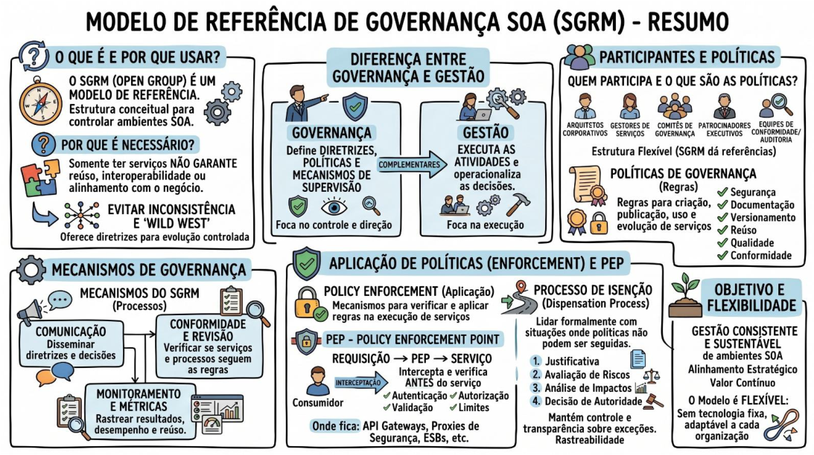

---

<!-- pagina: 75 -->

**Diego Carvalho, Equipe Informática 2 (Diego Carvalho), Equipe Informática 1 (Diego Carvalho) Aula 08** 

<!-- Start of picture text -->
Sistemas de Governança <!-- End of picture text -->

#### **<mark>INCIDÊNCIA EM PROVA: BAIXÍSSIMA</mark>** 

### **<mark>SISTEMAS DE GOVERNANÇA</mark>** 

Os sistemas de governança SOA correspondem ao conjunto de processos, políticas, estruturas organizacionais e mecanismos de controle utilizados para administrar o ciclo de vida dos serviços. Seu objetivo é garantir conformidade, reutilização, <u>qualidade, segurança e alinhamento entre TI e negócio.</u> 

A governança surgiu da necessidade de orientar e controlar a forma como organizações alcançam seus objetivos. Em vez de se concentrar apenas na execução das atividades do dia a dia, ela estabelece mecanismos que direcionam comportamentos, definem responsabilidades e apoiam decisões. Qual é a finalidade desses mecanismos? Garantir que pessoas, processos e recursos atuem de maneira alinhada aos objetivos organizacionais, reduzindo riscos e aumentando a capacidade de controle sobre as operações. 

No contexto da Tecnologia da Informação, a governança amplia essa preocupação para o uso dos recursos tecnológicos. Ela envolve práticas, processos, padrões e estruturas de decisão destinados a assegurar que a tecnologia contribua efetivamente para os objetivos do negócio. Por que tantas organizações investem em governança de TI? Porque decisões relacionadas a sistemas, infraestrutura, segurança e investimentos tecnológicos produzem impactos diretos sobre os resultados organizacionais e precisam ser conduzidas de forma estruturada. 

Outro aspecto importante envolve a definição clara de responsabilidades. Quem deve decidir sobre investimentos, prioridades e políticas tecnológicas? A governança procura responder a essa questão por meio de modelos que distribuem responsabilidades e estabelecem mecanismos de acompanhamento. Além de apoiar a tomada de decisão, ela também contempla atividades de monitoramento, conformidade e avaliação dos resultados obtidos, permitindo verificar se os objetivos definidos estão sendo alcançados. 

Quando aplicada ao gerenciamento de ativos organizacionais, a governança oferece benefícios adicionais. Entre eles destacam-se o controle do ciclo de vida dos ativos, a identificação de dependências, a promoção do reúso e a facilitação de análises de impacto. Como compreender os efeitos de uma mudança sem conhecer as relações existentes entre os ativos? A governança fornece justamente os mecanismos necessários para manter essa visibilidade e apoiar decisões mais seguras. 

A Governança SOA representa a aplicação desses conceitos ao contexto da Arquitetura Orientada a Serviços. Seu objetivo é estabelecer diretrizes e controles para que serviços, contratos, políticas e demais artefatos sejam criados, utilizados e evoluídos de forma consistente. Dessa maneira, a organização consegue manter padrões de qualidade, reduzir riscos associados à integração de sistemas e assegurar que os serviços continuem alinhados às necessidades do negócio. 

Uma dúvida frequente envolve a relação entre Governança SOA e Governança de TI. Seriam iniciativas independentes? Na prática, a Governança SOA funciona como uma especialização da Governança de TI voltada para ambientes orientados a serviços. Ela utiliza princípios semelhantes de controle, monitoramento e alinhamento estratégico, porém direcionados especificamente à gestão dos ativos e processos que compõem a arquitetura de serviços. 

Para apoiar a implementação dessa governança, existe o SOA Governance Reference Model, conhecido pela sigla SGRM. Esse modelo de referência descreve elementos importantes para a estruturação da governança em ambientes SOA, incluindo processos, papéis, responsabilidades, tecnologias e artefatos. O que torna um modelo de referência útil nesse contexto? Ele fornece uma base conceitual que pode ser adaptada às características e necessidades específicas de cada organização.

---

<!-- pagina: 76 -->

**Diego Carvalho, Equipe Informática 2 (Diego Carvalho), Equipe Informática 1 (Diego Carvalho) Aula 08** 

Diversas práticas são frequentemente associadas à Governança SOA. Entre elas destacam-se o alinhamento entre negócio e tecnologia, a utilização de arquiteturas de referência, a gestão de contratos entre provedores e consumidores, o gerenciamento de metadados, a identificação das partes interessadas e a automação de processos de controle. Esses elementos contribuem para a construção de um ambiente de serviços mais organizado, previsível e capaz de sustentar iniciativas de longo prazo dentro da organização. 

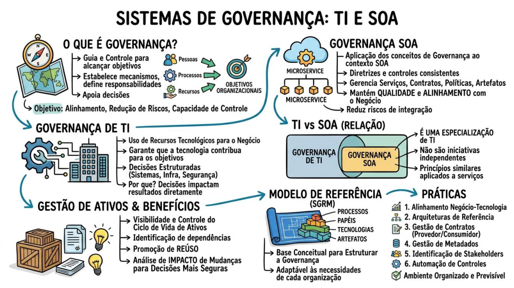

---

<!-- pagina: 77 -->

**Diego Carvalho, Equipe Informática 2 (Diego Carvalho), Equipe Informática 1 (Diego Carvalho) Aula 08** 

<!-- Start of picture text -->
Padrões SOA <!-- End of picture text -->

#### **<mark>INCIDÊNCIA EM PROVA: MÉDIA</mark>** 

### **<mark>PADRÕES SOA</mark>** 

<mark>Os padrões SOA são soluções recorrentes para problemas comuns encontrados na construção e operação de</mark> arquiteturas orientadas a serviços. Esses padrões abrangem aspectos como contratos, composição, segurança, descoberta, integração, <u>governança e gerenciamento, promovendo consistência e boas práticas arquiteturais.</u> 

A Arquitetura Orientada a Serviços não depende apenas da utilização de serviços para alcançar seus objetivos. Para que uma iniciativa SOA produza resultados consistentes, é necessário seguir princípios de design que orientem a construção dos serviços. Por que essa preocupação é importante? Porque soluções orientadas a serviços costumam abranger múltiplos processos de negócio, sistemas distintos e diversas áreas organizacionais, o que aumenta a complexidade da análise, da implementação e da evolução da arquitetura ao longo do tempo. 

Os princípios de design orientado a serviços foram propostos justamente para reduzir essa complexidade e aumentar a qualidade das soluções. Entre os mais conhecidos estão contrato de serviço padronizado, baixo acoplamento, abstração, reusabilidade, autonomia, ausência de estado, descobribilidade e composição de serviços. O que esses princípios buscam alcançar? Eles fornecem diretrizes para que os serviços sejam projetados de forma consistente, favorecendo integração, reutilização e manutenção em diferentes contextos organizacionais. 

A Arquitetura Orientada a Serviços e a Orientação a Objetos são abordagens distintas, mas compartilham diversos princípios fundamentais da engenharia de software. Entre esses princípios destaca-se a separação de responsabilidades, conhecida como Separation of Concerns. Por que esse conceito é tão importante? Porque sistemas complexos tornam-se mais fáceis de compreender, desenvolver e manter quando suas funcionalidades são organizadas em partes menores e com responsabilidades claramente definidas. 

Na Orientação a Objetos, essa organização ocorre por meio de classes e objetos que encapsulam dados e comportamentos relacionados a determinado domínio de responsabilidade. Como evitar que toda a lógica da aplicação fique concentrada em poucos componentes excessivamente complexos? A resposta está na distribuição das responsabilidades entre objetos especializados, cada um desempenhando funções específicas dentro do sistema. 

A Arquitetura Orientada a Serviços adota uma ideia semelhante, porém em um nível de abstração diferente. Em vez de estruturar a solução principalmente por meio de objetos, ela utiliza serviços para representar capacidades de negócio ou funcionalidades relevantes para a organização. O que esses serviços procuram alcançar? Eles disponibilizam funcionalidades por meio de contratos e interfaces bem definidas, permitindo que diferentes consumidores utilizem essas capacidades de maneira relativamente independente. 

Essa semelhança leva muitos profissionais a perceberem uma relação conceitual entre SOA e Orientação a Objetos. Ambas procuram decompor sistemas complexos em componentes menores e mais organizados. Entretanto, os componentes são equivalentes? Não. Objetos e serviços possuem características, escopos e objetivos distintos. Enquanto a Orientação a Objetos normalmente atua no nível da modelagem e implementação do software, a SOA concentra-se na organização e integração de capacidades em um nível arquitetural mais amplo. 

Além da separação de responsabilidades, outros conceitos aproximam as duas abordagens. Abstração, modularidade e reutilização são exemplos frequentemente encontrados tanto em sistemas orientados a objetos quanto em arquiteturas orientadas a serviços. Isso significa que a reutilização surge

---

<!-- pagina: 78 -->

**Diego Carvalho, Equipe Informática 2 (Diego Carvalho), Equipe Informática 1 (Diego Carvalho) Aula 08** 

automaticamente? Não. Ela depende da forma como objetos e serviços são projetados, das responsabilidades atribuídas a cada componente e do contexto em que serão utilizados. 

Outro aspecto relevante envolve a redução da complexidade. Como administrar sistemas compostos por milhares de funcionalidades e inúmeras interações? Tanto a Orientação a Objetos quanto a SOA procuram responder a essa questão por meio da decomposição estrutural. Ao dividir a solução em unidades menores e mais especializadas, torna-se possível facilitar a manutenção, a evolução e o gerenciamento dos componentes que compõem o sistema. 

Apesar das semelhanças, é importante compreender que cada abordagem foi criada para resolver problemas distintos. A Orientação a Objetos fornece mecanismos para estruturar software em termos de classes e objetos, enquanto a SOA busca organizar capacidades e serviços em escala arquitetural. A existência desses pontos em comum não torna uma abordagem dependente da outra, mas ajuda a explicar por que muitos princípios utilizados em SOA são familiares para profissionais que já possuem experiência com desenvolvimento orientado a objetos. 

Um dos aspectos mais valorizados em SOA é a capacidade de reutilizar serviços em múltiplas soluções. Entretanto, essa reutilização somente se torna viável quando os serviços apresentam contratos bem definidos e baixo grau de dependência entre si. Surge então uma dúvida frequente: por que o baixo acoplamento é tão importante? Quanto menor a dependência entre os serviços, menores tendem a ser os impactos provocados por alterações, atualizações ou substituições realizadas ao longo do ciclo de vida da arquitetura. 

Outro princípio relevante é a autonomia dos serviços. Em uma solução distribuída, cada serviço deve possuir controle adequado sobre sua própria lógica e seus recursos internos. Além disso, busca-se minimizar a manutenção de estados entre requisições consecutivas. Isso significa que um serviço nunca poderá armazenar informações? Não necessariamente. O objetivo é reduzir a dependência de estados mantidos entre interações, tornando os serviços mais escaláveis, previsíveis e fáceis de reutilizar em diferentes cenários. 

A aplicação desses princípios contribui para a construção de serviços interoperáveis e preparados para evolução contínua. Como consequência, as organizações conseguem responder com maior rapidez a mudanças nos processos de negócio e nas demandas do mercado. Essa característica possui natureza estratégica, pois permite que a arquitetura permaneça útil mesmo diante de transformações tecnológicas ou organizacionais que ocorram ao longo do tempo. 

Outro ponto frequentemente discutido envolve a independência tecnológica. Soluções orientadas a serviços precisam utilizar uma tecnologia específica ou um único fornecedor? Esse não é o objetivo da abordagem. Os princípios de SOA procuram reduzir dependências desnecessárias e favorecer a interoperabilidade entre plataformas distintas. Embora soluções concretas possam utilizar produtos proprietários, a arquitetura busca preservar a capacidade de integração e evolução sem criar vínculos excessivos com tecnologias específicas. 

As soluções orientadas a serviços também são fortemente direcionadas pelas necessidades do negócio. Isso significa que os serviços devem representar capacidades relevantes para a organização e apoiar seus processos operacionais. Dessa forma, a arquitetura deixa de ser conduzida exclusivamente por decisões tecnológicas e passa a refletir objetivos corporativos. O alinhamento entre tecnologia e negócio torna-se um dos principais fatores para a construção de serviços realmente úteis e sustentáveis. 

Entre as contribuições mais conhecidas de Thomas Erl para a Arquitetura Orientada a Serviços encontrase a classificação de diferentes modelos de serviços. Esses modelos ajudam arquitetos e desenvolvedores a compreender melhor as responsabilidades atribuídas a cada serviço dentro da solução. Por que criar

---

<!-- pagina: 79 -->

**Diego Carvalho, Equipe Informática 2 (Diego Carvalho), Equipe Informática 1 (Diego Carvalho) Aula 08** 

categorias para os serviços? Porque diferentes tipos de funcionalidades apresentam características distintas de reutilização, abrangência e alinhamento com os processos de negócio. 

Um dos modelos mais importantes é o Entity Service. Esse tipo de serviço representa entidades fundamentais do negócio e costuma estar associado a informações corporativas amplamente utilizadas em diferentes processos. O que caracteriza um Entity Service? Sua capacidade de fornecer funcionalidades relacionadas a conceitos relativamente estáveis da organização, como clientes, contratos, produtos, pedidos ou compras. Por atender múltiplos contextos de utilização, esse modelo normalmente apresenta elevado potencial de reutilização. 

Os Entity Services são frequentemente classificados como serviços agnósticos. O que significa essa característica? Significa que eles não são projetados para atender exclusivamente a um processo específico de negócio. Em vez disso, disponibilizam funcionalidades que podem ser aproveitadas por diferentes aplicações e processos organizacionais. Essa independência em relação a fluxos particulares contribui para aumentar a reutilização e reduzir redundâncias dentro da arquitetura. 

Outro modelo bastante conhecido é o Utility Service. Sua função consiste em fornecer capacidades genéricas que podem ser utilizadas por diversos serviços e aplicações. Como evitar a repetição de funcionalidades técnicas em toda a arquitetura? Uma solução consiste em centralizar essas capacidades em serviços utilitários. Exemplos comuns incluem autenticação, criptografia, notificações, auditoria e registro de eventos, funcionalidades que frequentemente são necessárias em múltiplos contextos de negócio. 

Os Utility Services também costumam apresentar elevado potencial de reutilização porque suas responsabilidades não estão diretamente associadas a um domínio específico do negócio. Entretanto, isso significa que eles sempre serão os serviços mais reutilizados da arquitetura? Não necessariamente. O grau de reutilização depende das necessidades da organização e da forma como a arquitetura foi estruturada, embora esses serviços normalmente sejam projetados com forte foco em compartilhamento. 

O terceiro modelo frequentemente estudado é o Task Service. Diferentemente dos serviços agnósticos, ele é criado para executar tarefas ou processos específicos de negócio. Como coordenar atividades que dependem de múltiplos serviços e regras operacionais? Em muitos casos, essa responsabilidade é atribuída aos Task Services. Eles podem atuar como elementos de coordenação, compondo funcionalidades disponibilizadas por outros serviços para atender um objetivo específico. 

Por estarem associados a processos ou fluxos particulares, os Task Services geralmente apresentam menor potencial de reutilização quando comparados aos Entity Services e Utility Services. Isso significa que são menos importantes? De forma alguma. Eles desempenham papel fundamental na implementação das capacidades de negócio, pois transformam funcionalidades reutilizáveis em processos concretos que atendem às necessidades operacionais da organização. 

A combinação desses diferentes modelos permite construir arquiteturas mais organizadas e alinhadas aos princípios da orientação a serviços. Enquanto Entity Services representam conceitos centrais do negócio, Utility Services oferecem funcionalidades genéricas compartilháveis e Task Services coordenam atividades específicas. Em conjunto, esses modelos contribuem para equilibrar reutilização, especialização e alinhamento entre tecnologia e processos organizacionais. 

A composição de serviços completa esse conjunto de princípios ao permitir que funcionalidades independentes sejam combinadas para formar soluções mais amplas. Por que desenvolver tudo novamente se capacidades já existentes podem ser reutilizadas? A composição possibilita aproveitar serviços previamente implementados e integrá-los em novos processos e aplicações. Como resultado, a

---

<!-- pagina: 80 -->

**Diego Carvalho, Equipe Informática 2 (Diego Carvalho), Equipe Informática 1 (Diego Carvalho) Aula 08** 

organização obtém maior flexibilidade para adaptar suas soluções sem precisar reconstruir funcionalidades que já estão disponíveis em seu ecossistema de serviços. 

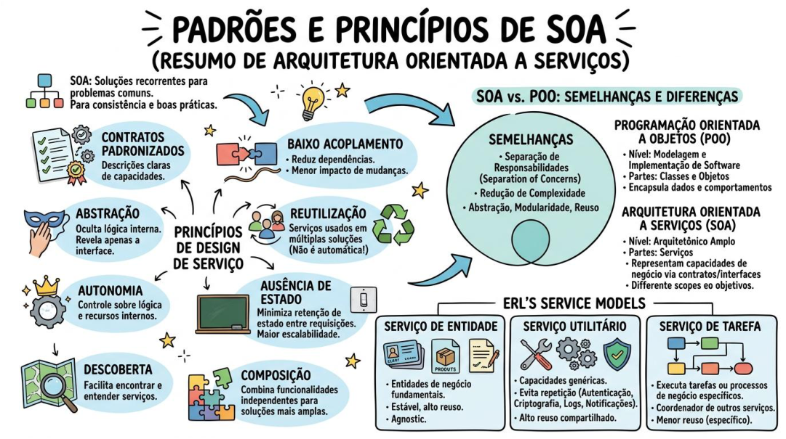

---

<!-- pagina: 81 -->

**Diego Carvalho, Equipe Informática 2 (Diego Carvalho), Equipe Informática 1 (Diego Carvalho) Aula 08** 

<!-- Start of picture text -->
Maturidade SOA <!-- End of picture text -->

**<mark>INCIDÊNCIA EM PROVA: BAIXÍSSIMA</mark>** 

<!-- Start of picture text -->
Modelos de Maturidade <!-- End of picture text -->

### **<mark>MATURIDADE SOA</mark>** 

O Modelo de Maturidade SOA é uma estrutura utilizada para avaliar o nível de adoção e evolução da arquitetura orientada a serviços dentro de uma organização. Normalmente dividido em níveis progressivos, ele permite medir aspectos como reutilização, governança, alinhamento ao negócio, integração e automação, auxiliando no <u>planejamento da evolução arquitetural e na identificação de oportunidades de melhoria contínua.</u> 

O Modelo de Maturidade SOA é utilizado para avaliar o grau de adoção da Arquitetura Orientada a Serviços dentro de uma organização. Seu propósito não se limita a verificar o alinhamento entre tecnologia e negócio, pois também considera aspectos como governança, arquitetura, processos, organização e gerenciamento de serviços. Por que realizar esse tipo de avaliação? Porque a simples implementação de serviços não garante que uma organização esteja utilizando os princípios de SOA de forma estruturada e consistente. 

Entre os modelos mais conhecidos encontra-se o Open Group Service Integration Maturity Model, conhecido pela sigla OSIMM. Esse modelo fornece uma estrutura para analisar o estágio de evolução da organização e identificar oportunidades de melhoria. O que ele procura responder? Basicamente, busca determinar quão preparada a organização está para utilizar serviços de forma integrada, reutilizável e alinhada aos seus objetivos estratégicos. 

Embora existam várias vertentes de avaliação, os modelos clássicos de maturidade SOA em exames costumam ser categorizados de forma ascendente do Nível 1 ao 5 (frequentemente inspirados nos modelos da IBM ou no SIMM original). Nesses frameworks, o Nível 1 representa o desenvolvimento em silos tradicionais; o Nível 2 traz serviços apoiados por soluções de TI simples; o Nível 3 incorpora soluções focadas em serviços isolados e padronizados; e o Nível 4 consolida o uso de "soluções de TI compostas" para a total automação dos processos de negócios (composição e orquestração completas, alinhando a estratégia da TI com a área de negócios). O estágio supremo (como o Nível 5) geralmente aborda os serviços virtualizados e infraestrutura elástica alinhados dinamicamente em tempo real. 

Nos níveis iniciais de maturidade, é comum encontrar ambientes marcados pela fragmentação dos sistemas e pela existência de soluções desenvolvidas de maneira isolada. Cada área tende a atender suas próprias necessidades sem grande preocupação com integração ou compartilhamento de funcionalidades. Quais são as consequências desse cenário? Frequentemente surgem redundâncias, dificuldades de manutenção e limitações para adaptar os sistemas a novas demandas organizacionais. 

À medida que a maturidade evolui, começam a surgir serviços reutilizáveis destinados principalmente à integração entre aplicações. Esses serviços costumam ser criados para resolver necessidades específicas, como compartilhar dados ou disponibilizar funcionalidades anteriormente restritas a determinados sistemas. Embora a reutilização ainda seja limitada e os mecanismos de governança estejam em fase inicial, essa etapa representa um avanço importante porque introduz conceitos fundamentais da orientação a serviços. 

Nos estágios intermediários, a organização passa a adotar uma visão arquitetural mais abrangente. Os serviços deixam de atuar apenas de forma isolada e passam a ser combinados para implementar funcionalidades mais complexas. Como construir soluções mais sofisticadas sem desenvolver tudo novamente? A resposta está na composição de serviços, na orquestração de processos e no

---

<!-- pagina: 82 -->

**Diego Carvalho, Equipe Informática 2 (Diego Carvalho), Equipe Informática 1 (Diego Carvalho) Aula 08** 

aproveitamento de capacidades já existentes. Nesse momento, também se tornam mais comuns os mecanismos formais de catalogação, gerenciamento e governança dos serviços. 

Os níveis mais avançados são caracterizados por um forte alinhamento entre as capacidades tecnológicas e os objetivos organizacionais. Os processos de negócio passam a ser amplamente suportados por serviços reutilizáveis e padronizados, permitindo maior agilidade na construção de novas soluções. Além disso, práticas de governança mais maduras garantem controle sobre contratos, versões, políticas de segurança e indicadores operacionais, contribuindo para uma gestão mais eficiente dos ativos de serviço. 

Em estágios elevados de maturidade, a organização desenvolve maior capacidade de adaptação às mudanças do mercado e às novas necessidades do negócio. Os serviços passam a ser tratados como ativos corporativos estratégicos e podem ser reutilizados em diferentes contextos organizacionais. Isso significa que todas as organizações precisam atingir o nível máximo de maturidade? Não necessariamente. O nível mais adequado depende dos objetivos estratégicos, da complexidade operacional e das necessidades específicas de cada organização. 

Além de servir como instrumento de avaliação, o modelo de maturidade também funciona como um guia para a evolução arquitetural. Ao identificar o estágio atual da organização, torna-se possível estabelecer metas de melhoria, definir prioridades de investimento e planejar iniciativas de transformação de maneira estruturada. Dessa forma, arquitetos, gestores e equipes de tecnologia conseguem conduzir a adoção dos princípios de SOA com maior previsibilidade e melhor aproveitamento dos recursos disponíveis. 

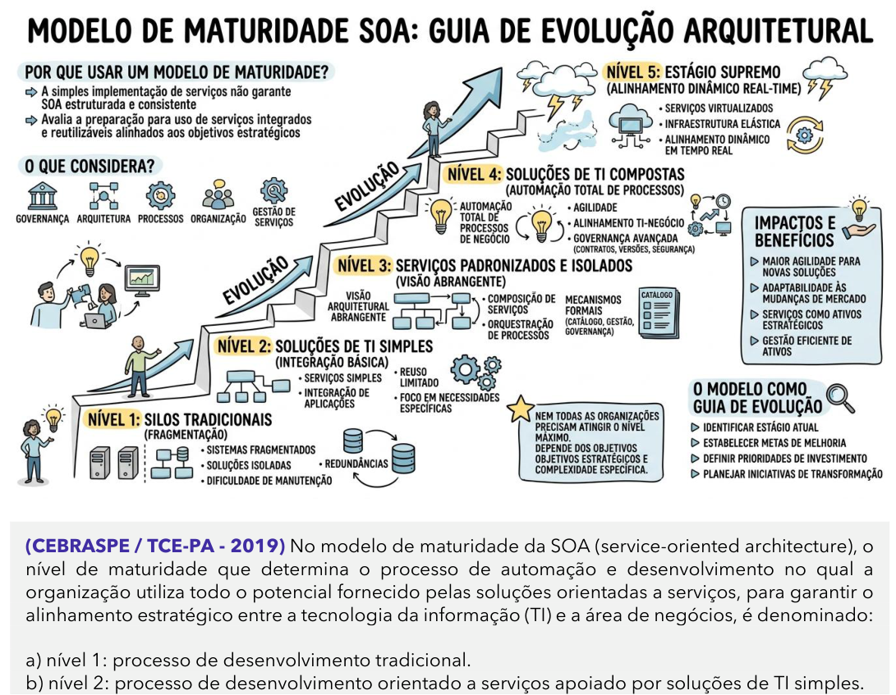

<!-- Start of picture text -->
(CEBRASPE / TCE-PA - 2019)  No modelo de maturidade da SOA (service-oriented architecture), o nível de maturidade que determina o processo de automação e desenvolvimento no qual a organização utiliza todo o potencial fornecido pelas soluções orientadas a serviços, para garantir o alinhamento estratégico entre a tecnologia da informação (TI) e a área de negócios, é denominado: a) nível 1: processo de desenvolvimento tradicional. b) nível 2: processo de desenvolvimento orientado a serviços apoiado por soluções de TI simples. <!-- End of picture text -->

---

<!-- pagina: 83 -->

**Diego Carvalho, Equipe Informática 2 (Diego Carvalho), Equipe Informática 1 (Diego Carvalho) Aula 08** 

## <mark>c) nível 3: processo de desenvolvimento orientado a serviços apoiado por soluções de TI compostas. d) nível 4: processo de automação do negócio pelo uso de soluções de TI compostas. e) nível 5: processo de automação do negócio pelo uso de soluções de TI distribuídas em silos.</mark> 

## **<mark>_______________________</mark>** 

**<mark>Comentários:</mark>** <mark>(a) Errado. Esse nível representa um estágio inicial, ainda preso ao desenvolvimento tradicional, sem explorar de fato os ganhos estratégicos da arquitetura orientada a serviços. (b) Errado. Aqui já existe orientação a serviços, mas com soluções simples, o que ainda não alcança o uso pleno da SOA para alinhar TI e negócio. (c) Errado. As soluções compostas mostram evolução na maturidade, mas ainda não traduzem o estágio máximo de automação do negócio com foco estratégico. (d) Correto. Esse nível envolve automação do negócio com soluções de TI compostas, aproveitando melhor o potencial da SOA para integrar processos e alinhar TI às metas do negócio. (e) Errado. A ideia de silos vai na direção oposta da SOA, que busca integração, reutilização e alinhamento entre áreas e serviços</mark> (Letra D).

---

<!-- pagina: 84 -->

**Diego Carvalho, Equipe Informática 2 (Diego Carvalho), Equipe Informática 1 (Diego Carvalho) Aula 08** 

<!-- Start of picture text -->
R ESUMO <!-- End of picture text -->

### **<mark>ARQUITETURA ORIENTADA A SERVIÇOS (SOA)</mark>** 

A Arquitetura Orientada a Serviços (SOA) é um estilo arquitetural que organiza sistemas de software como um conjunto de serviços independentes, reutilizáveis e interoperáveis. Cada serviço encapsula uma funcionalidade de negócio específica e pode ser consumido por diferentes aplicações por meio de contratos padronizados. O principal objetivo da SOA é promover integração, reutilização, flexibilidade e alinhamento entre a tecnologia da informação e os processos de negócio da organização. 

### **<mark>O QUE SOA É...</mark>** 

<mark>Um conjunto de princípios e melhores práticas para implementação e execução de processos de negócio</mark> automatizados em ambientes de tecnologia da informação heterogêneos. 

<mark>Uma forma de aproximar a linguagem do negócio e da tecnologia da informação, facilitando a integração de ambientes corporativos por meio de serviços.</mark> 

Um meio para organizar as soluções que promove o reúso, o crescimento e a interoperabilidade. 

Uma abordagem distribuída (não-monolítica) para integração de arquiteturas baseadas no conceito de serviço. 

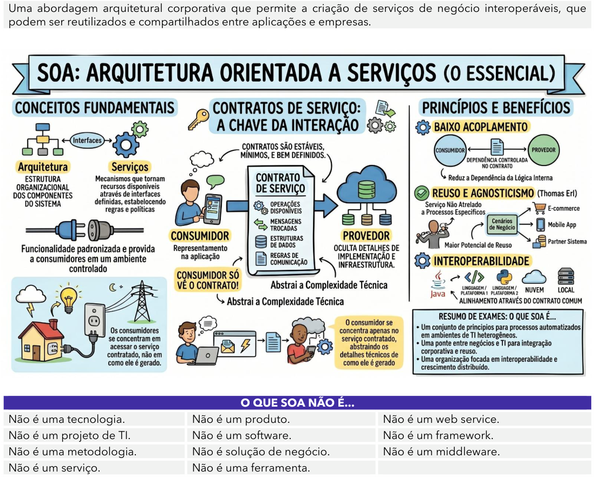

<!-- Start of picture text -->
Uma abordagem arquitetural corporativa que permite a criação de serviços de negócio interoperáveis, que podem ser reutilizados e compartilhados entre aplicações e empresas. O QUE SOA NÃO É... Não é uma tecnologia. Não é um produto.  Não é um web service. Não é um projeto de TI. Não é um software.  Não é um framework. Não é uma metodologia. Não é solução de negócio.  Não é um middleware. Não é um serviço. Não é uma ferramenta. <!-- End of picture text -->

---

<!-- pagina: 85 -->

**Diego Carvalho, Equipe Informática 2 (Diego Carvalho), Equipe Informática 1 (Diego Carvalho) Aula 08** 

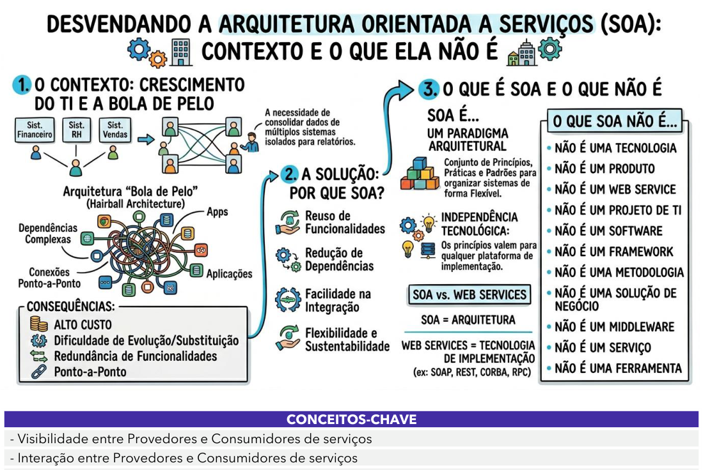

<!-- Start of picture text -->
CONCEITOS-CHAVE - Visibilidade entre Provedores e Consumidores de serviços - Interação entre Provedores e Consumidores de serviços <!-- End of picture text -->

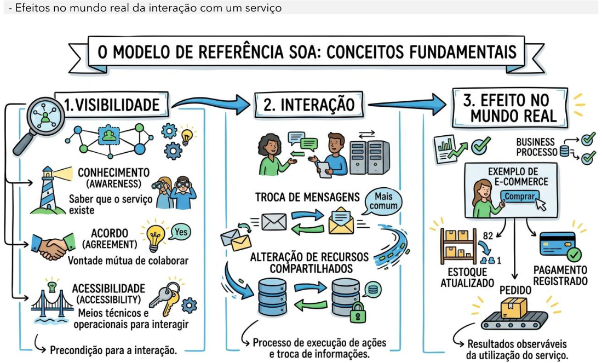

<!-- Start of picture text -->
- Efeitos no mundo real da interação com um serviço <!-- End of picture text -->

https://t.me/KakashiAssinaturasBot

---

<!-- pagina: 86 -->

**Diego Carvalho, Equipe Informática 2 (Diego Carvalho), Equipe Informática 1 (Diego Carvalho) Aula 08** 

|**ASPECTOS**|**VANTAGENS DO SOA**|**DESVANTAGENS DO SOA**|
|---|---|---|
|**REUTILIZAÇÃO**|Serviços podem ser reutilizados por diferentes aplicações, reduzindo duplicação de funcionalidades.|O excesso de reutilização pode gerar dependências complexas entre sistemas.|
|**INTEGRAÇÃO**|Facilita a comunicação entre sistemas heterogêneos desenvolvidos em diferentes linguagens e plataformas.|A integração pode exigir camadas adicionais de transformação e adaptação de mensagens.|
|**MANUTENÇÃO**|Alterações em um serviço podem beneficiar diversos sistemas consumidores simultaneamente.|Mudanças em contratos de serviço podem impactar múltiplos consumidores.|
|**ESCALABILIDADE**|Serviços podem ser escalados de forma independente conforme a demanda.|A gestão de infraestrutura distribuída torna-se mais complexa.|
|**FLEXIBILIDADE**|Novas aplicações podem consumir serviços já existentes sem necessidade de reimplementação.|A governança dos serviços exige processos rigorosos de controle e versionamento.|
|**DESENVOLVIMENTO**|Equipes podem trabalhar de forma mais independente em serviços distintos.|Exige maior coordenação entre equipes para garantir compatibilidade e padronização.|
|**INTEROPERABILIDADE**|Utiliza padrões abertos (SOAP, XML, REST, JSON, etc), favorecendo a comunicação entre plataformas.|Diferenças de padrões e protocolos podem aumentar a complexidade da integração.|
|**DISPONIBILIDADE**|A falha de um serviço não necessariamente compromete toda a aplicação.|Dependências entre serviços podem provocar falhas em cascata.|
|**DESEMPENHO**|Permite distribuir processamento entre diversos serviços especializados.|A comunicação remota entre serviços adiciona latência e sobrecarga de rede.|
|**GOVERNANÇA**|Possibilita centralizar regras de negócio em serviços compartilhados.|Requer mecanismos de monitoramento, segurança, catálogo e gestão de serviços, aumentando o custo operacional.|
|**SEGURANÇA**|Permite implementar políticas de segurança padronizadas para os serviços.|Amplia a superfície de ataque, exigindo autenticação, autorização e criptografia bem estruturadas.|
|**CUSTOS**|Pode reduzir custos de desenvolvimento por meio do reaproveitamento de serviços.|A implantação inicial costuma demandar investimentos elevados em infraestrutura, ESB, monitoramento e governança.|

---

<!-- pagina: 87 -->

**Diego Carvalho, Equipe Informática 2 (Diego Carvalho), Equipe Informática 1 (Diego Carvalho) Aula 08** 

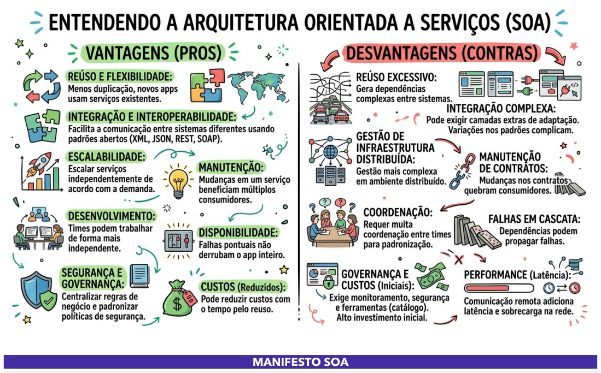

<!-- Start of picture text -->
MANIFESTO SOA <!-- End of picture text -->

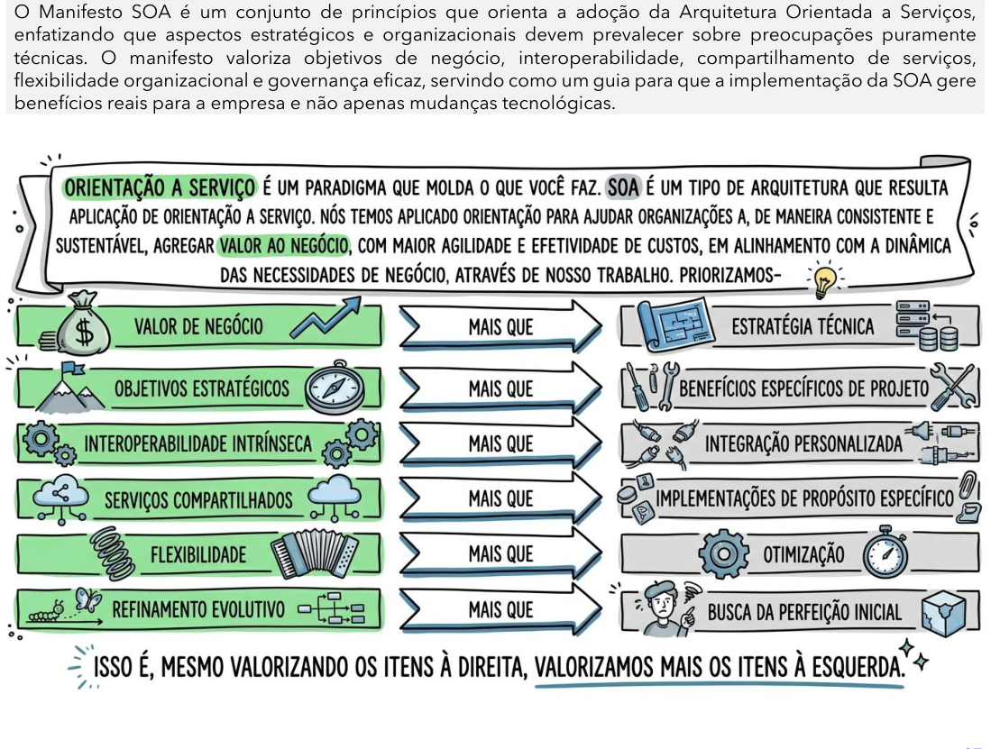

<!-- Start of picture text -->
O Manifesto SOA é um conjunto de princípios que orienta a adoção da Arquitetura Orientada a Serviços, enfatizando que aspectos estratégicos e organizacionais devem prevalecer sobre preocupações puramente técnicas. O manifesto valoriza objetivos de negócio, interoperabilidade, compartilhamento de serviços, flexibilidade organizacional e governança eficaz, servindo como um guia para que a implementação da SOA gere benefícios reais para a empresa e não apenas mudanças tecnológicas. <!-- End of picture text -->

---

<!-- pagina: 88 -->

**Diego Carvalho, Equipe Informática 2 (Diego Carvalho), Equipe Informática 1 (Diego Carvalho) Aula 08** 

### **<mark>PRINCÍPIOS ORIENTADORES</mark>** 

<mark>Respeitar a estrutura social e de poder da organização.</mark> 

<mark>Reconhecer que SOA, em última instância, requer mudanças em múltiplos níveis.</mark> 

<mark>O escopo da adoção de SOA pode variar.</mark> 

<mark>Manter os esforços gerenciáveis e dentro de limites significativos.</mark> 

<mark>Produtos e padrões, por si só, não proverão uma SOA nem aplicarão os paradigmas de orientação a serviço por</mark> você. 

<mark>SOA pode ser realizada através de uma variedade de tecnologias e padrões.</mark> 

<mark>Estabelecer um conjunto uniforme de padrões e políticas corporativas embasado em padrões da indústria, de</mark> facto, e da comunidade. 

<mark>Buscar uniformidade no exterior e permitir diversidade no interior.</mark> 

Identificar serviços através da colaboração entre partes interessadas no negócio e na tecnologia. 

Maximizar o uso de serviços considerando o escopo de utilização atual e futuro. 

Verificar que os serviços satisfaçam os requisitos e objetivos de negócio. 

Evoluir os serviços e sua organização em resposta ao uso real. 

Separar os diferentes aspectos de um sistema que mudam com diferentes frequências. 

Reduzir dependências implícitas e publicar todas as dependências externas para aumentar a robustez e diminuir o impacto de mudanças. 

<mark>A cada nível de abstração, organizar cada serviço em torno de uma unidade de funcionalidade coesa e</mark> <u>gerenciável.</u> 

### **<mark>MODELOS DE SERVIÇOS</mark>** 

<mark>Modelos de Serviços são representações conceituais que descrevem como os participantes de uma arquitetura</mark> orientada a serviços interagem para publicar, descobrir, acessar e consumir serviços. Esses modelos definem os papéis envolvidos — como provedores, consumidores e registros de serviços — bem como os mecanismos de comunicação e descoberta utilizados no ambiente SOA. Ao estabelecer padrões de interação, os modelos de serviços ajudam a organizar a infraestrutura de integração, promovendo interoperabilidade, reutilização, flexibilidade e desacoplamento entre os sistemas participantes da arquitetura. 

### **<mark>MODELO END-TO-END</mark>** 

O modelo End-to-End descreve a interação direta entre um provedor de serviços e um consumidor de serviços, sem a necessidade de intermediários para descoberta ou mediação. Nesse modelo, o consumidor já conhece previamente a localização e o contrato do serviço que deseja utilizar. Trata-se da forma mais simples de comunicação em ambientes SOA, sendo adequada para cenários controlados e com poucos participantes.

---

<!-- pagina: 89 -->

**Diego Carvalho, Equipe Informática 2 (Diego Carvalho), Equipe Informática 1 (Diego Carvalho) Aula 08** 

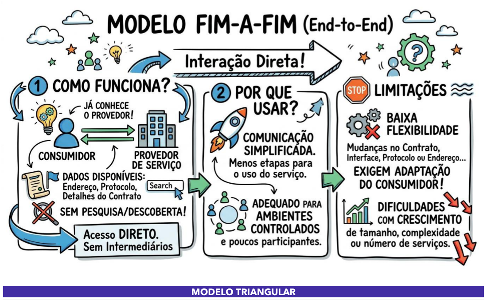

<!-- Start of picture text -->
MODELO TRIANGULAR <!-- End of picture text -->

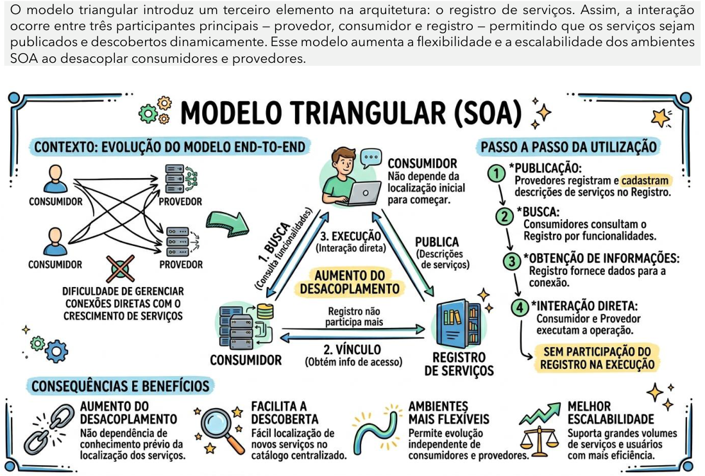

<!-- Start of picture text -->
O modelo triangular introduz um terceiro elemento na arquitetura: o registro de serviços. Assim, a interação ocorre entre três participantes principais — provedor, consumidor e registro — permitindo que os serviços sejam publicados e descobertos dinamicamente. Esse modelo aumenta a flexibilidade e a escalabilidade dos ambientes SOA ao desacoplar consumidores e provedores. <!-- End of picture text -->

https://t.me/KakashiAssinaturasBot

---

<!-- pagina: 90 -->

**Diego Carvalho, Equipe Informática 2 (Diego Carvalho), Equipe Informática 1 (Diego Carvalho) Aula 08** 

### **<mark>PUBLISH-FIND-BIND</mark>** 

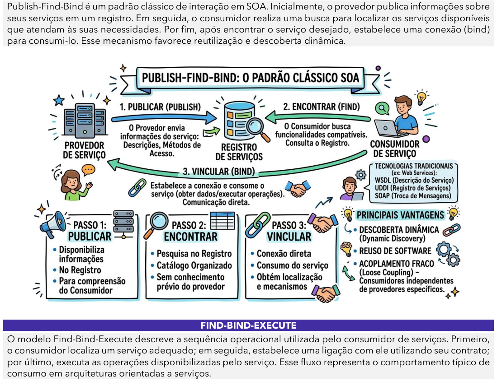

<!-- Start of picture text -->
Publish-Find-Bind é um padrão clássico de interação em SOA. Inicialmente, o provedor publica informações sobre seus serviços em um registro. Em seguida, o consumidor realiza uma busca para localizar os serviços disponíveis que atendam às suas necessidades. Por fim, após encontrar o serviço desejado, estabelece uma conexão (bind) para consumi-lo. Esse mecanismo favorece reutilização e descoberta dinâmica. FIND-BIND-EXECUTE O modelo Find-Bind-Execute descreve a sequência operacional utilizada pelo consumidor de serviços. Primeiro, o consumidor localiza um serviço adequado; em seguida, estabelece uma ligação com ele utilizando seu contrato; por último, executa as operações disponibilizadas pelo serviço. Esse fluxo representa o comportamento típico de consumo em arquiteturas orientadas a serviços. quiteturas orientadas a serviços. uiteturas orientadas a serviços. ços. os. <!-- End of picture text -->

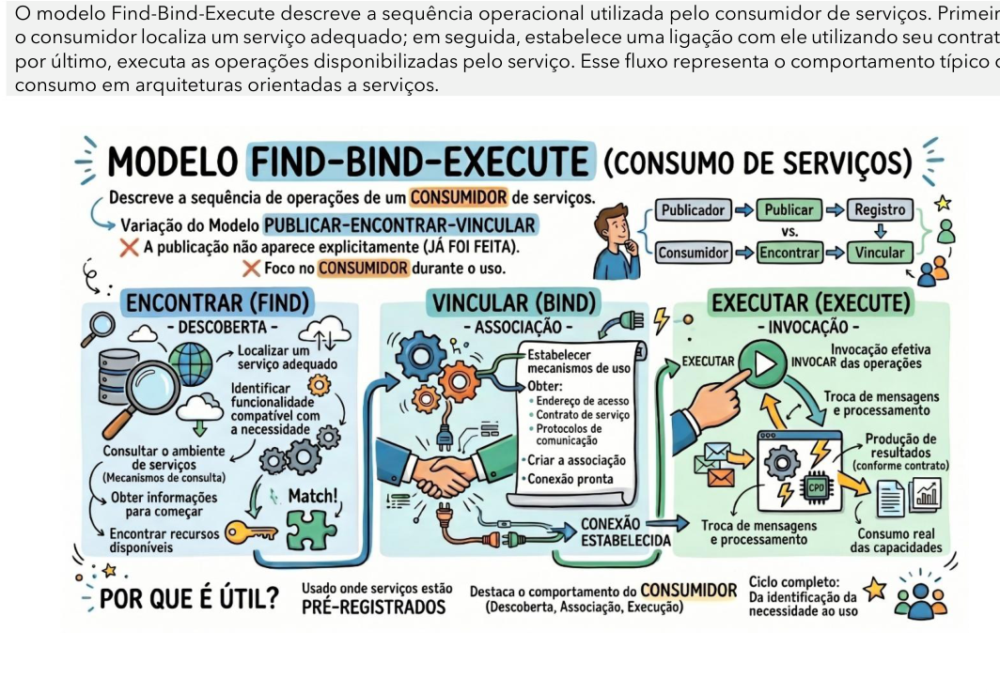

<!-- Start of picture text -->
O modelo Find-Bind-Execute descreve a sequência operacional utilizada pelo consumidor de serviços. Primeiro, o consumidor localiza um serviço adequado; em seguida, estabelece uma ligação com ele utilizando seu contrato; por último, executa as operações disponibilizadas pelo serviço. Esse fluxo representa o comportamento típico de consumo em arquiteturas orientadas a serviços. quiteturas orientadas a serviços. uiteturas orientadas a serviços. ços. os. <!-- End of picture text -->

---

<!-- pagina: 91 -->

**Diego Carvalho, Equipe Informática 2 (Diego Carvalho), Equipe Informática 1 (Diego Carvalho) Aula 08** 

### **<mark>REGISTRY-BASED INTERACTION</mark>** 

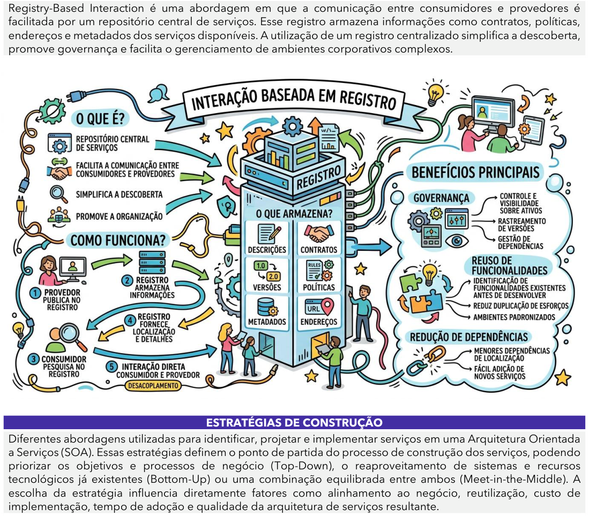

<!-- Start of picture text -->
Registry-Based Interaction é uma abordagem em que a comunicação entre consumidores e provedores é facilitada por um repositório central de serviços. Esse registro armazena informações como contratos, políticas, endereços e metadados dos serviços disponíveis. A utilização de um registro centralizado simplifica a descoberta, promove governança e facilita o gerenciamento de ambientes corporativos complexos. ESTRATÉGIAS DE CONSTRUÇÃO Diferentes abordagens utilizadas para identificar, projetar e implementar serviços em uma Arquitetura Orientada a Serviços (SOA). Essas estratégias definem o ponto de partida do processo de construção dos serviços, podendo priorizar os objetivos e processos de negócio (Top-Down), o reaproveitamento de sistemas e recursos tecnológicos já existentes (Bottom-Up) ou uma combinação equilibrada entre ambos (Meet-in-the-Middle). A escolha da estratégia influencia diretamente fatores como alinhamento ao negócio, reutilização, custo de implementação, tempo de adoção e qualidade da arquitetura de serviços resultante. <!-- End of picture text -->

### **<mark>ABORDAGEM TOP-DOWN</mark>** 

A abordagem Top-Down inicia a construção da arquitetura a partir dos processos e objetivos de negócio da organização. Primeiramente são identificadas as necessidades do negócio e, posteriormente, são definidos os serviços necessários para suportá-las. Essa estratégia tende a produzir serviços mais alinhados aos processos corporativos e com maior potencial de reutilização.

---

<!-- pagina: 92 -->

**Diego Carvalho, Equipe Informática 2 (Diego Carvalho), Equipe Informática 1 (Diego Carvalho) Aula 08** 

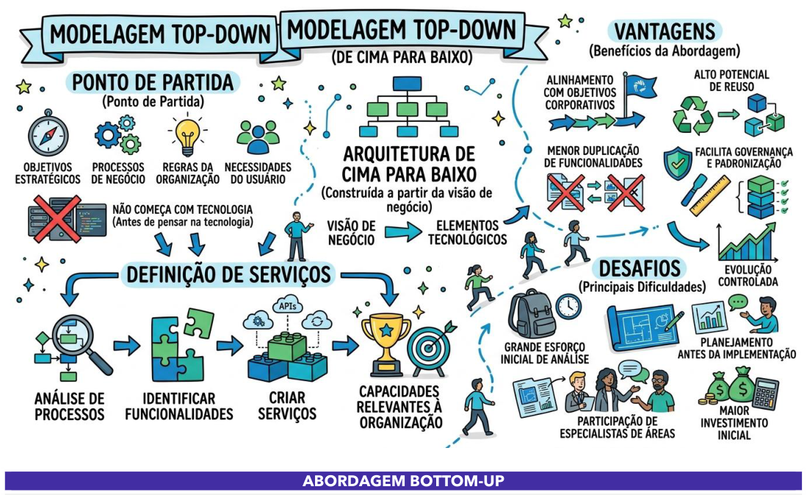

<!-- Start of picture text -->
ABORDAGEM BOTTOM-UP <!-- End of picture text -->

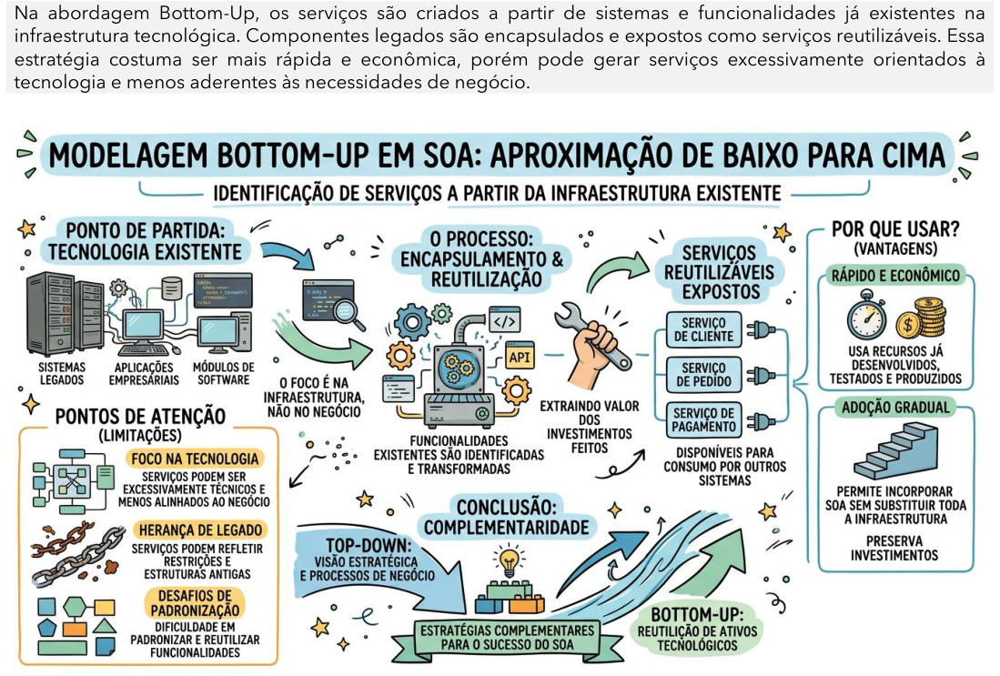

<!-- Start of picture text -->
Na abordagem Bottom-Up, os serviços são criados a partir de sistemas e funcionalidades já existentes na infraestrutura tecnológica. Componentes legados são encapsulados e expostos como serviços reutilizáveis. Essa estratégia costuma ser mais rápida e econômica, porém pode gerar serviços excessivamente orientados à tecnologia e menos aderentes às necessidades de negócio. <!-- End of picture text -->

---

<!-- pagina: 93 -->

**Diego Carvalho, Equipe Informática 2 (Diego Carvalho), Equipe Informática 1 (Diego Carvalho) Aula 08** 

### **<mark>ABORDAGEM MEET IN THE MIDDLE</mark>** 

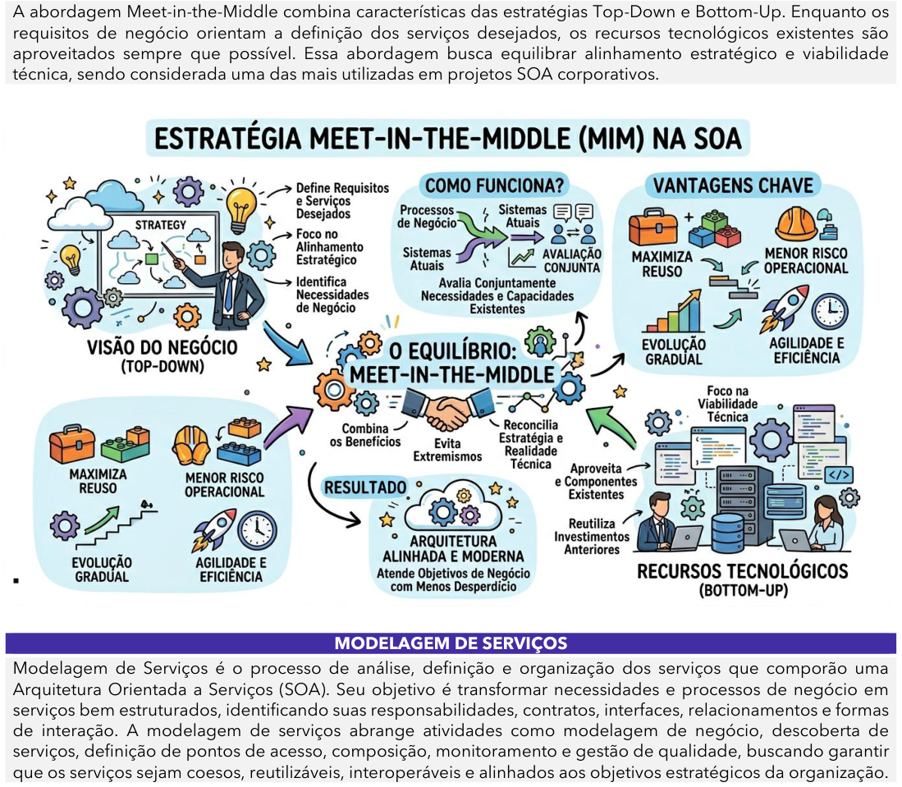

<!-- Start of picture text -->
A abordagem Meet-in-the-Middle combina características das estratégias Top-Down e Bottom-Up. Enquanto os requisitos de negócio orientam a definição dos serviços desejados, os recursos tecnológicos existentes são aproveitados sempre que possível. Essa abordagem busca equilibrar alinhamento estratégico e viabilidade técnica, sendo considerada uma das mais utilizadas em projetos SOA corporativos. ==5460== MODELAGEM DE SERVIÇOS Modelagem de Serviços é o processo de análise, definição e organização dos serviços que comporão uma Arquitetura Orientada a Serviços (SOA). Seu objetivo é transformar necessidades e processos de negócio em serviços bem estruturados, identificando suas responsabilidades, contratos, interfaces, relacionamentos e formas de interação. A modelagem de serviços abrange atividades como modelagem de negócio, descoberta de serviços, definição de pontos de acesso, composição, monitoramento e gestão de qualidade, buscando garantir que os serviços sejam coesos, reutilizáveis, interoperáveis e alinhados aos objetivos estratégicos da organização. <!-- End of picture text -->

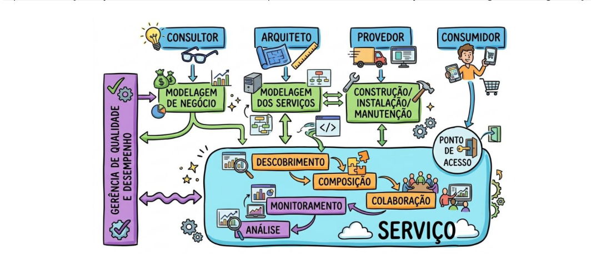

https://t.me/KakashiAssinaturasBot

---

<!-- pagina: 94 -->

**Diego Carvalho, Equipe Informática 2 (Diego Carvalho), Equipe Informática 1 (Diego Carvalho) Aula 08** 

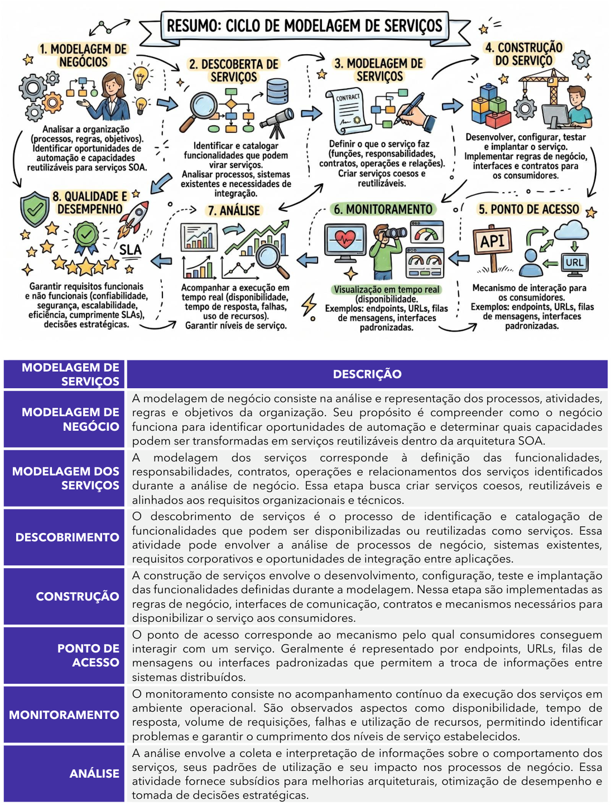

<!-- Start of picture text -->
MODELAGEM DE DESCRIÇÃO SERVIÇOS A modelagem de negócio consiste na análise e representação dos processos, atividades, MODELAGEM DE  regras e objetivos da organização. Seu propósito é compreender como o negócio NEGÓCIO  funciona para identificar oportunidades de automação e determinar quais capacidades podem ser transformadas em serviços reutilizáveis dentro da arquitetura SOA. A  modelagem  dos  serviços  corresponde  à  definição  das  funcionalidades, MODELAGEM DOS  responsabilidades, contratos, operações e relacionamentos dos serviços identificados SERVIÇOS  durante a análise de negócio. Essa etapa busca criar serviços coesos, reutilizáveis e alinhados aos requisitos organizacionais e técnicos. O descobrimento de serviços é o processo de identificação e catalogação de funcionalidades que podem ser disponibilizadas ou reutilizadas como serviços. Essa DESCOBRIMENTO atividade pode envolver a análise de processos de negócio, sistemas existentes, requisitos corporativos e oportunidades de integração entre aplicações. A construção de serviços envolve o desenvolvimento, configuração, teste e implantação das funcionalidades definidas durante a modelagem. Nessa etapa são implementadas as CONSTRUÇÃO regras de negócio, interfaces de comunicação, contratos e mecanismos necessários para disponibilizar o serviço aos consumidores. O ponto de acesso corresponde ao mecanismo pelo qual consumidores conseguem PONTO DE  interagir com um serviço. Geralmente é representado por endpoints, URLs, filas de ACESSO  mensagens ou interfaces padronizadas que permitem a troca de informações entre sistemas distribuídos. O monitoramento consiste no acompanhamento contínuo da execução dos serviços em ambiente operacional. São observados aspectos como disponibilidade, tempo de MONITORAMENTO resposta, volume de requisições, falhas e utilização de recursos, permitindo identificar problemas e garantir o cumprimento dos níveis de serviço estabelecidos. A análise envolve a coleta e interpretação de informações sobre o comportamento dos serviços, seus padrões de utilização e seu impacto nos processos de negócio. Essa ANÁLISE atividade fornece subsídios para melhorias arquiteturais, otimização de desempenho e tomada de decisões estratégicas. <!-- End of picture text -->

---

<!-- pagina: 95 -->

**Diego Carvalho, Equipe Informática 2 (Diego Carvalho), Equipe Informática 1 (Diego Carvalho) Aula 08** 

A gestão da qualidade e desempenho busca garantir que os serviços atendam aos **QUALIDADE E** requisitos funcionais e não funcionais definidos pela organização. São avaliados critérios **DESEMPENHO** como confiabilidade, disponibilidade, segurança, escalabilidade, eficiência e <mark>conformidade com acordos de nível de serviço (SLAs).</mark> 

### **<mark>PRINCÍPIOS DE DESIGN</mark>** 

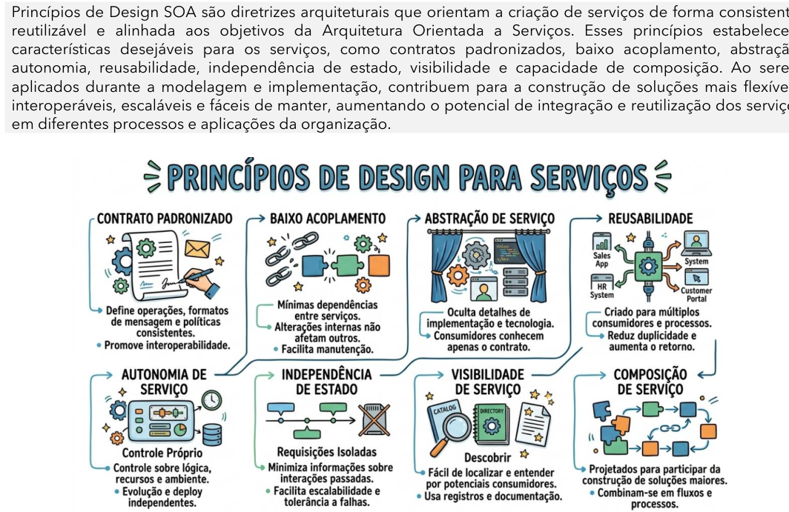

<!-- Start of picture text -->
Princípios de Design SOA são diretrizes arquiteturais que orientam a criação de serviços de forma consistente, reutilizável e alinhada aos objetivos da Arquitetura Orientada a Serviços. Esses princípios estabelecem características desejáveis para os serviços, como contratos padronizados, baixo acoplamento, abstração, autonomia, reusabilidade, independência de estado, visibilidade e capacidade de composição. Ao serem aplicados durante a modelagem e implementação, contribuem para a construção de soluções mais flexíveis, interoperáveis, escaláveis e fáceis de manter, aumentando o potencial de integração e reutilização dos serviços em diferentes processos e aplicações da organização. processos e aplicações da organização. rocessos e aplicações da organização. plicações da organização. licações da organização. ções da organização. ões da organização. ganização. anização. ção. ão. <!-- End of picture text -->

Princípios de Design SOA são diretrizes arquiteturais que orientam a criação de serviços de forma consistente, reutilizável e alinhada aos objetivos da Arquitetura Orientada a Serviços. Esses princípios estabelecem características desejáveis para os serviços, como contratos padronizados, baixo acoplamento, abstração, autonomia, reusabilidade, independência de estado, visibilidade e capacidade de composição. Ao serem aplicados durante a modelagem e implementação, contribuem para a construção de soluções mais flexíveis, interoperáveis, escaláveis e fáceis de manter, aumentando o potencial de integração e reutilização dos serviços em diferentes processos e aplicações da organização. processos e aplicações da organização. rocessos e aplicações da organização. plicações da organização. licações da organização. ções da organização. ões da organização. ganização. anização. ção. ão. 

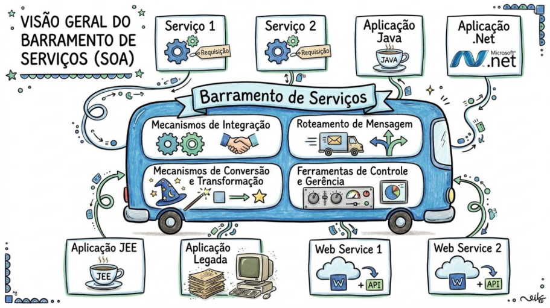

---

<!-- pagina: 96 -->

**Diego Carvalho, Equipe Informática 2 (Diego Carvalho), Equipe Informática 1 (Diego Carvalho) Aula 08** 

|**PRINCÍPIOS DE** **DESIGN**|**DESCRIÇÃO**|
|---|---|
|**CONTRATO** **PADRONIZADO**|O princípio do Contrato Padronizado estabelece que os serviços devem expor suas capacidades por meio de contratos bem definidos, consistentes e compreensíveis. Esses contratos descrevem operações, formatos de mensagens, políticas e requisitos de interação, permitindo interoperabilidade entre diferentes sistemas.|
|**BAIXO** **ACOPLAMENTO**|O baixo acoplamento determina que os serviços mantenham o mínimo possível de dependências entre si. Dessa forma, alterações internas em um serviço tendem a produzir impactos reduzidos nos demais componentes da arquitetura, favorecendo manutenção e evolução independente.|
|**ABSTRAÇÃO DE** **SERVIÇOS**|A abstração estabelece que detalhes internos de implementação devem permanecer ocultos aos consumidores. Os usuários do serviço precisam conhecer apenas o contrato e as funcionalidades disponibilizadas, sem depender da lógica interna ou da tecnologia utilizada.|
|**REUSABILIDADE**|A reusabilidade orienta a construção de serviços capazes de atender múltiplos consumidores e diferentes processos de negócio. Quanto maior o potencial de reutilização, menor a duplicação de funcionalidades e maior o retorno sobre os investimentos realizados na arquitetura.|
|**AUTONOMIA DE** **SERVIÇOS**|A autonomia determina que cada serviço possua controle sobre sua própria lógica, recursos e ambiente de execução. Serviços autônomos reduzem dependências externas e aumentam a capacidade de evolução, manutenção e implantação independente.|
|**INDEPENDÊNCIA** **DE ESTADOS**|A independência de estado recomenda que os serviços mantenham o mínimo possível de informações sobre interações anteriores. Essa característica reduz dependências temporais entre requisições, facilita escalabilidade e melhora a tolerância a falhas.|
|**VISIBILIDADE DE** **SERVIÇOS**|O princípio da descoberta estabelece que os serviços devem ser facilmente localizados e compreendidos pelos potenciais consumidores. Para isso, utilizam descrições padronizadas, registros de serviços e documentação adequada que favorecem sua reutilização.|
|**COMPOSIÇÃO DE** **SERVIÇOS**|A composabilidade determina que os serviços sejam projetados para participar facilmente da construção de soluções maiores. Serviços composáveis podem ser combinados em fluxos, processos ou serviços compostos, ampliando sua capacidade de reutilização.|

### **<mark>COMPOSIÇÃO DE SERVIÇOS</mark>** 

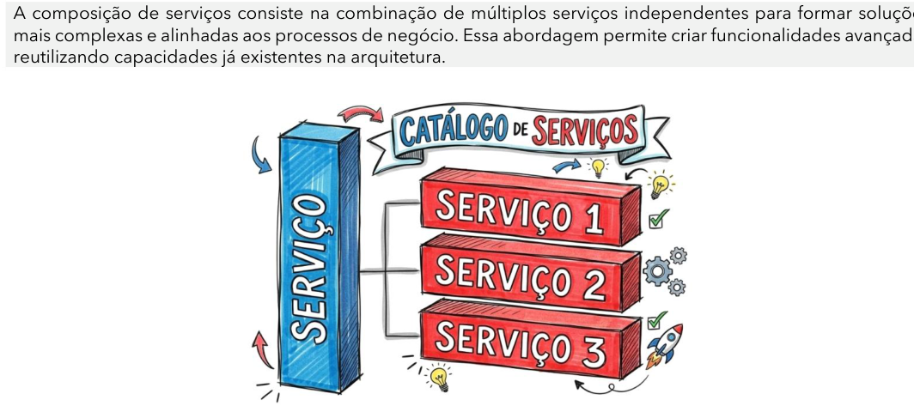

<!-- Start of picture text -->
A composição de serviços consiste na combinação de múltiplos serviços independentes para formar soluções mais complexas e alinhadas aos processos de negócio. Essa abordagem permite criar funcionalidades avançadas reutilizando capacidades já existentes na arquitetura.pacidades já existentes na arquitetura.acidades já existentes na arquitetura.já existentes na arquitetura.á existentes na arquitetura.quitetura.uitetura. <!-- End of picture text -->

A composição de serviços consiste na combinação de múltiplos serviços independentes para formar soluções mais complexas e alinhadas aos processos de negócio. Essa abordagem permite criar funcionalidades avançadas reutilizando capacidades já existentes na arquitetura.pacidades já existentes na arquitetura.acidades já existentes na arquitetura.já existentes na arquitetura.á existentes na arquitetura.quitetura.uitetura.

---

<!-- pagina: 97 -->

**Diego Carvalho, Equipe Informática 2 (Diego Carvalho), Equipe Informática 1 (Diego Carvalho) Aula 08** 

### **<mark>ORQUESTRAÇÃO DE SERVIÇOS</mark>** 

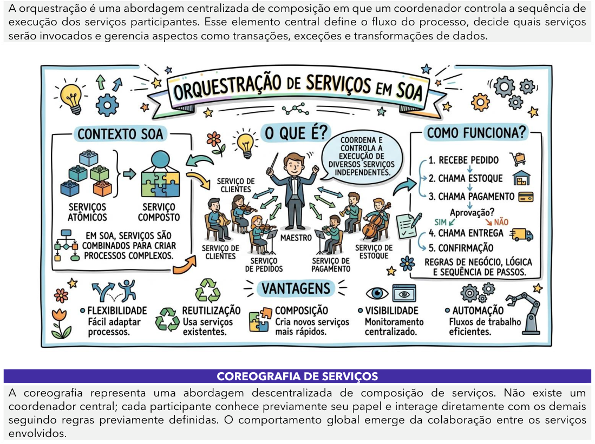

<!-- Start of picture text -->
A orquestração é uma abordagem centralizada de composição em que um coordenador controla a sequência de execução dos serviços participantes. Esse elemento central define o fluxo do processo, decide quais serviços serão invocados e gerencia aspectos como transações, exceções e transformações de dados. COREOGRAFIA DE SERVIÇOS A coreografia representa uma abordagem descentralizada de composição de serviços. Não existe um coordenador central; cada participante conhece previamente seu papel e interage diretamente com os demais seguindo regras previamente definidas. O comportamento global emerge da colaboração entre os serviços envolvidos. <!-- End of picture text -->

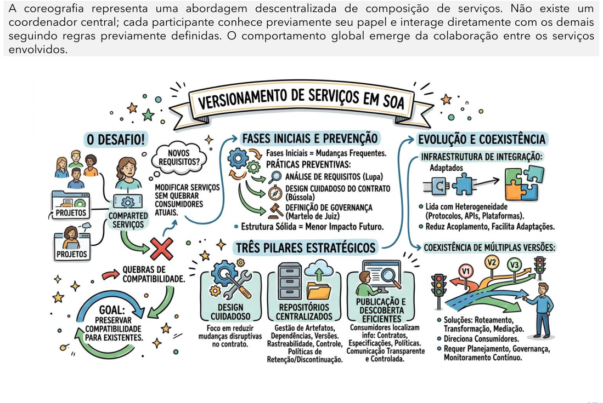

<!-- Start of picture text -->
A coreografia representa uma abordagem descentralizada de composição de serviços. Não existe um coordenador central; cada participante conhece previamente seu papel e interage diretamente com os demais seguindo regras previamente definidas. O comportamento global emerge da colaboração entre os serviços envolvidos. <!-- End of picture text -->

https://t.me/KakashiAssinaturasBot

---

<!-- pagina: 98 -->

**Diego Carvalho, Equipe Informática 2 (Diego Carvalho), Equipe Informática 1 (Diego Carvalho) Aula 08** 

### **<mark>VERSIONAMENTO DE SERVIÇOS</mark>** 

O versionamento de serviços consiste no gerenciamento controlado das alterações realizadas nos contratos e funcionalidades dos serviços ao longo do tempo. Seu objetivo é permitir evolução contínua sem comprometer consumidores existentes, <u>garantindo compatibilidade e reduzindo impactos causados por mudanças.</u> 

### **<mark>CORBA</mark>** 

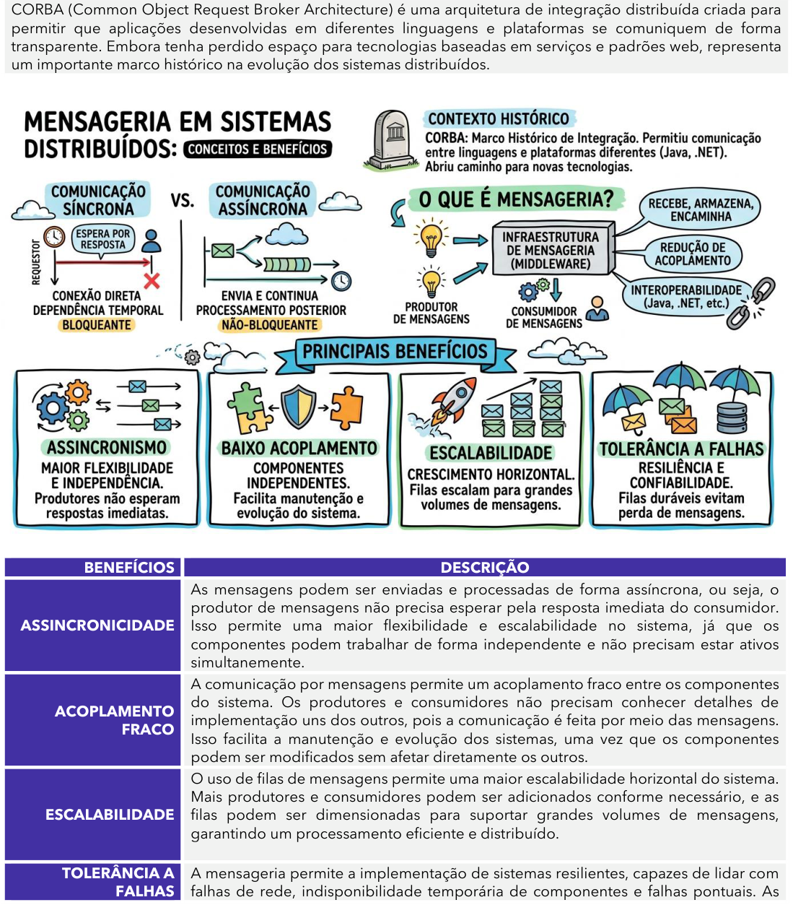

<!-- Start of picture text -->
CORBA (Common Object Request Broker Architecture) é uma arquitetura de integração distribuída criada para permitir que aplicações desenvolvidas em diferentes linguagens e plataformas se comuniquem de forma transparente. Embora tenha perdido espaço para tecnologias baseadas em serviços e padrões web, representa um importante marco histórico na evolução dos sistemas distribuídos. BENEFÍCIOS  DESCRIÇÃO As mensagens podem ser enviadas e processadas de forma assíncrona, ou seja, o produtor de mensagens não precisa esperar pela resposta imediata do consumidor. ASSINCRONICIDADE  Isso permite uma maior flexibilidade e escalabilidade no sistema, já que os componentes podem trabalhar de forma independente e não precisam estar ativos simultanemente. A comunicação por mensagens permite um acoplamento fraco entre os componentes do sistema. Os produtores e consumidores não precisam conhecer detalhes de ACOPLAMENTO implementação uns dos outros, pois a comunicação é feita por meio das mensagens. FRACO Isso facilita a manutenção e evolução dos sistemas, uma vez que os componentes podem ser modificados sem afetar diretamente os outros. O uso de filas de mensagens permite uma maior escalabilidade horizontal do sistema. Mais produtores e consumidores podem ser adicionados conforme necessário, e as ESCALABILIDADE  filas podem ser dimensionadas para suportar grandes volumes de mensagens, garantindo um processamento eficiente e distribuído. TOLERÂNCIA A  A mensageria permite a implementação de sistemas resilientes, capazes de lidar com FALHAS  falhas de rede, indisponibilidade temporária de componentes e falhas  pontuais. As <!-- End of picture text -->

---

<!-- pagina: 99 -->

**Diego Carvalho, Equipe Informática 2 (Diego Carvalho), Equipe Informática 1 (Diego Carvalho) Aula 08** 

mensagens podem ser armazenadas em filas duráveis, garantindo que nenhuma mensagem seja perdida e possa ser processada posteriormente. 

**PRINCIPAIS DESCRIÇÃO COMPONENTES** São componentes de software que encapsulam a lógica de negócio e oferecem serviços e operações para serem invocados remotamente. Os objetos CORBA são implementados usando uma linguagem de programação suportada pelo CORBA, **OBJETOS** como C++, Java ou Python, e são registrados em um Serviço de Nomes (Naming Service). É uma infraestrutura de software responsável por facilitar a comunicação entre os objetos CORBA. O ORB atua como intermediário entre os clientes que solicitam **OBJECT REQUEST** serviços e os objetos distribuídos que oferecem esses serviços. Ele lida com a **BROKER (ORB)** localização do objeto correto, a serialização dos parâmetros da solicitação, o envio da solicitação ao objeto e a entrega da resposta ao cliente. <mark>É uma linguagem neutra de definição de interfaces utilizada para especificar a estrutura</mark> e as operações dos objetos CORBA. A IDL permite que desenvolvedores descrevam a **INTERFACE** interface de um objeto CORBA de forma independente da linguagem de programação **DEFINITION** usada para implementá-lo. A partir da IDL, é possível gerar código-fonte em diferentes **LANGUAGE (IDL)** linguagens para a implementação do objeto e a criação dos stubs e skeletons necessários para a comunicação CORBA. 

### **<mark>MODELOS DE REFERÊNCIA</mark>** 

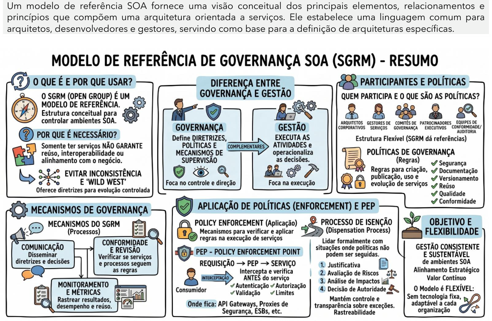

<!-- Start of picture text -->
Um modelo de referência SOA fornece uma visão conceitual dos principais elementos, relacionamentos e princípios que compõem uma arquitetura orientada a serviços. Ele estabelece uma linguagem comum para arquitetos, desenvolvedores e gestores, servindo como base para a definição de arquiteturas específicas. <!-- End of picture text -->

---

<!-- pagina: 100 -->

**Diego Carvalho, Equipe Informática 2 (Diego Carvalho), Equipe Informática 1 (Diego Carvalho) Aula 08** 

### **<mark>SISTEMAS DE GOVERNANÇA</mark>** 

Os sistemas de governança SOA correspondem ao conjunto de processos, políticas, estruturas organizacionais e mecanismos de controle utilizados para administrar o ciclo de vida dos serviços. Seu objetivo é garantir conformidade, reutilização, <u>qualidade, segurança e alinhamento entre TI e negócio.</u> 

### **<mark>PADRÕES SOA</mark>** 

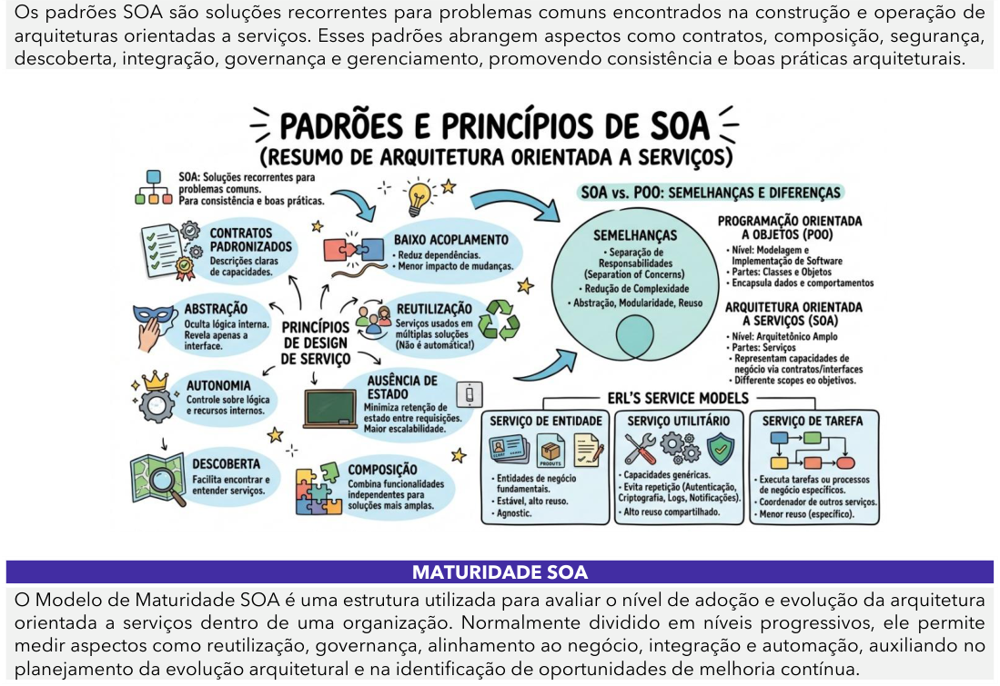

<!-- Start of picture text -->
Os padrões SOA são soluções recorrentes para problemas comuns encontrados na construção e operação de arquiteturas orientadas a serviços. Esses padrões abrangem aspectos como contratos, composição, segurança, descoberta, integração, governança e gerenciamento, promovendo consistência e boas práticas arquiteturais. MATURIDADE SOA O Modelo de Maturidade SOA é uma estrutura utilizada para avaliar o nível de adoção e evolução da arquitetura orientada a serviços dentro de uma organização. Normalmente dividido em níveis progressivos, ele permite medir aspectos como reutilização, governança, alinhamento ao negócio, integração e automação, auxiliando no planejamento da evolução arquitetural e na identificação de oportunidades de melhoria contínua. lanejamento da evolução arquitetural e na identificação de oportunidades de melhoria contínua. jamento da evolução arquitetural e na identificação de oportunidades de melhoria contínua. amento da evolução arquitetural e na identificação de oportunidades de melhoria contínua. ção arquitetural e na identificação de oportunidades de melhoria contínua. ão arquitetural e na identificação de oportunidades de melhoria contínua. quitetural e na identificação de oportunidades de melhoria contínua. uitetural e na identificação de oportunidades de melhoria contínua. ção de oportunidades de melhoria contínua. ão de oportunidades de melhoria contínua. portunidades de melhoria contínua. ortunidades de melhoria contínua. <!-- End of picture text -->

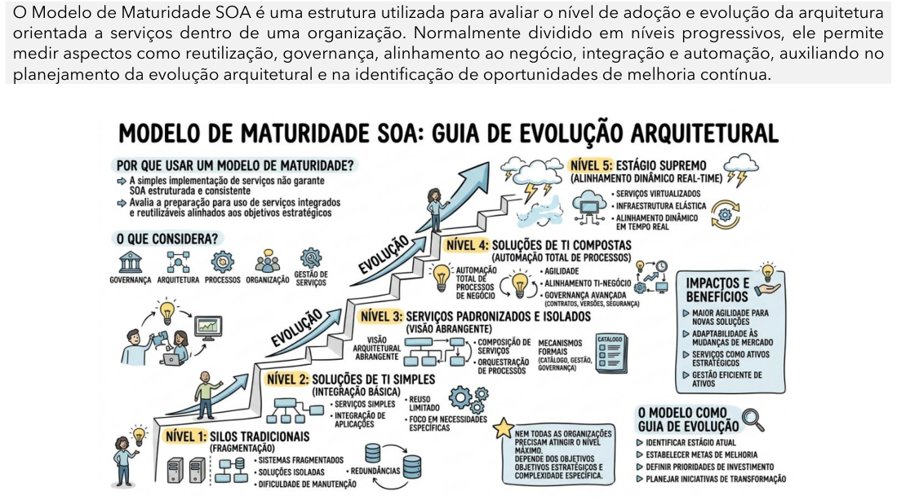

<!-- Start of picture text -->
O Modelo de Maturidade SOA é uma estrutura utilizada para avaliar o nível de adoção e evolução da arquitetura orientada a serviços dentro de uma organização. Normalmente dividido em níveis progressivos, ele permite medir aspectos como reutilização, governança, alinhamento ao negócio, integração e automação, auxiliando no planejamento da evolução arquitetural e na identificação de oportunidades de melhoria contínua. lanejamento da evolução arquitetural e na identificação de oportunidades de melhoria contínua. jamento da evolução arquitetural e na identificação de oportunidades de melhoria contínua. amento da evolução arquitetural e na identificação de oportunidades de melhoria contínua. ção arquitetural e na identificação de oportunidades de melhoria contínua. ão arquitetural e na identificação de oportunidades de melhoria contínua. quitetural e na identificação de oportunidades de melhoria contínua. uitetural e na identificação de oportunidades de melhoria contínua. ção de oportunidades de melhoria contínua. ão de oportunidades de melhoria contínua. portunidades de melhoria contínua. ortunidades de melhoria contínua. <!-- End of picture text -->

---

<!-- pagina: 101 -->

**Diego Carvalho, Equipe Informática 2 (Diego Carvalho), Equipe Informática 1 (Diego Carvalho) Aula 08** 

<!-- Start of picture text -->
Q UESTÕES  C OMENTADAS <!-- End of picture text -->

**1. (FGV / ALEGO - 2026) A ALEGO, em processo de transformação digital e integração de sistemas legados, decide adotar uma arquitetura SOA para melhorar interoperabilidade e agilidade. No entanto enfrenta alguns desafios ao implementar a arquitetura. Foram levantados pela equipe alguns desafios:** 

   - **I. A integração de diferentes serviços, quando esses serviços são desenvolvidos em diferentes plataformas ou linguagens.** 

   - **II. A comunicação entre serviços, quando são necessárias múltiplas chamadas para completar uma única operação de negócio.** 

   - **III. A reutilização de serviços existentes, para permitir que diferentes aplicações acessem os mesmos serviços de negócio.** 

   - **IV. Enfoque em práticas de compartilhamento, onde os serviços são projetados para serem reutilizados em várias aplicações dentro de uma organização.** 

**Com base nos desafios levantados, está correto o que se afirma em** 

a) I e II apenas. 

b) III e IV apenas. 

c) I, II e III apenas. 

d) II apenas. 

e) I, II, III e IV. 

**Comentários:** 

(I) Correto. Integrar serviços feitos em plataformas e linguagens diferentes é um desafio clássico em SOA, porque exige padronização e interoperabilidade entre tecnologias distintas. 

(II) Correto. Quando uma operação de negócio depende de várias chamadas entre serviços, a comunicação fica mais complexa, com impacto em desempenho e orquestração. 

(III) Errado. A reutilização de serviços existentes é mais uma vantagem e objetivo da SOA do que propriamente um desafio levantado no contexto da questão; 

(IV) Errado. O compartilhamento e o reuso em várias aplicações representam um princípio da SOA, não um desafio entre os itens considerados.

---

<!-- pagina: 102 -->

**Diego Carvalho, Equipe Informática 2 (Diego Carvalho), Equipe Informática 1 (Diego Carvalho) Aula 08** 

## **Gabarito:** Letra A 

**2. (FGV / DPE RO - 2025) A arquitetura orientada a serviços é uma abordagem de design de software que se concentra na construção de sistemas de software funcionais, modulares e escaláveis a partir de componentes individuais. Com relação às vantagens dessa arquitetura em comparação com a abordagem monolítica de desenvolvimento de software, analise os itens a seguir.** 

   - **I. Manutenção simplificada - A baixa integração e reutilização de serviços faz com que seja mais seguro desenvolver novas aplicações. Os desenvolvedores precisam sempre criar serviços do zero assim como nas aplicações monolíticas.** 

   - **II. Adaptabilidade - Preserva a compatibilidade de antigas versões dos serviços e facilita o planejamento serviços futuros. Os desenvolvedores podem trazer serviços mais antigos para um ambiente operacional mais novo, até mesmo substituir serviços desatualizados por versões mais recentes que aproveitam hardwares atualizados.** 

   - **III. Escalabilidade - Como os serviços são autossuficientes e independentes podem ser monitorados pela camada de gerenciamento do SOA, se o desempenho de um serviço cair devido ao aumento da demanda, novas instâncias poderão ser iniciadas. As aplicações que utilizam o serviço não saberão sobre as novas instâncias, apenas perceberão que os SLA permanecem aceitáveis.** 

**Está correto o que se afirma em** 

a) I, apenas. 

b) II, apenas. 

c) I e II, apenas. 

d) I e III, apenas. 

e) II e III, apenas. 

**Comentários:** 

(I) Errado. O item contraria a lógica do SOA ao falar em baixa reutilização e criação de serviços sempre do zero. Justamente uma das vantagens dessa arquitetura é reaproveitar serviços e reduzir acoplamento, o que ajuda na manutenção. 

(II) Correto. Aqui a ideia é a flexibilidade do SOA. A preservação de compatibilidade e a possibilidade de evoluir ou substituir serviços facilitam bastante a adaptação do sistema a novos ambientes e tecnologias.

---

<!-- pagina: 103 -->

**Diego Carvalho, Equipe Informática 2 (Diego Carvalho), Equipe Informática 1 (Diego Carvalho) Aula 08** 

(III) Correto. Como os serviços são independentes, dá para escalar de forma mais pontual. Se a demanda cresce, novas instâncias podem ser ativadas sem impactar quem consome o serviço, mantendo o desempenho esperado. 

**Gabarito:** Letra E 

**3. (FGV / CPRM - 2025) Considerando a Arquitetura Orientada a Serviços (SOA), seus componentes e características, assinale a afirmação correta.** 

   - a) WSDL é um formato JSON que especifica como acessar qualquer tipo de serviço. 

   - b) UDDI é um formato XML que inclui os dados que serão transmitidos ou recebidos de um serviço Web. 

   - c) Os 3 principais elementos do formato SOAP são o Cabeçalho, Corpo e Envelope, sendo exclusivamente neste último, onde estão os dados. 

   - d) A independência de outros sistemas da Arquitetura Orientada a Serviços é provida, em grande parte, pelo fraco (baixo) acoplamento. 

   - e) A Arquitetura Orientada a Serviços possui padrões proprietários definidos pelos seus respectivos provedores de serviços de forma a garantir a segurança. 

**Comentários:** 

(a) Errado. WSDL não é JSON; ele descreve serviços Web em XML, mostrando operações, mensagens e formas de acesso. 

(b) Errado. UDDI funciona como diretório de serviços para publicação e descoberta, não como formato com os dados trocados pelo serviço. 

(c) Errado. No SOAP, o Envelope envolve a mensagem, o Header traz metadados e o Body carrega o conteúdo principal, não o Envelope. 

(d) Correto. Em SOA, o baixo acoplamento ajuda bastante na independência entre sistemas, porque os serviços se comunicam com menos dependência interna. 

(e) Errado. SOA se apoia em padrões amplamente adotados para interoperabilidade; a ideia central não é usar padrões proprietários de cada provedor. 

**Gabarito:** Letra D

---

<!-- pagina: 104 -->

**Diego Carvalho, Equipe Informática 2 (Diego Carvalho), Equipe Informática 1 (Diego Carvalho) Aula 08** 

**4. (FGV / ALETO - 2024) A respeito da Arquitetura Orientada a Serviços (SOA), analise as afirmativas a seguir.** 

   - **I. Dentro de uma arquitetura orientada a serviços (SOA), a transferência bancária usando PIX estimula que cada instituição financeira desenvolva seu próprio protocolo de comunicação.** 

   - **II. O pagamento de boletos utilizando o PIX, inserido em uma SOA, exige mecanismos de segurança robustos.** 

   - **III. Um problema relevante na implementação de SOA é a gestão de serviços, que pode se tornar complexa necessitando de ferramentas eficientes de governança.** ==5460== 

   - **Está correto o que se afirma em** a) II e III, apenas 

b) I e III, apenas. 

c) I e II, apenas. 

d) III, apenas. 

e) II, apenas. 

**Comentários:** 

(I) Errado. Em SOA, a ideia é justamente favorecer integração com padrões e serviços bem definidos, não incentivar cada instituição a criar um protocolo próprio, o que dificultaria a interoperabilidade. 

(II) Correto. Pagamentos via PIX lidam com dados sensíveis e transações financeiras, então, dentro de uma SOA, mecanismos fortes de segurança são indispensáveis para proteger comunicação e operação. 

(III) Correto. Um ponto bem importante em SOA é a gestão dos serviços. Como há vários serviços integrados, a governança pode ficar mais complexa e pedir ferramentas eficientes de controle. 

## **Gabarito:** Letra A 

**5. (FGV / SES MT - 2024) Observe a figura a seguir, que representa a estrutura básica do SOA e assinale (V) para a afirmativa verdadeira e (F) para falsa**

---

<!-- pagina: 105 -->

**Diego Carvalho, Equipe Informática 2 (Diego Carvalho), Equipe Informática 1 (Diego Carvalho) Aula 08** 

**( ) Consumidor de Serviço são as aplicações que consultam o Provedor de serviços para invocar os serviços do Registro de Serviços.** 

**( ) O Provedor de Serviço implementa e disponibiliza serviços, publicando suas descrições para que possam ser descobertas e consumidas pelas aplicações.** 

**( ) O Registro de Serviços armazena e disponibiliza as descrições dos serviços publicados.** 

**( ) Na SOA, a separação de assuntos envolve dividir problemas grandes em partes menores, facilitando a decomposição da solução em diferentes componentes específicos.** 

**As afirmativas são, respectivamente,** 

a) F – V – V – V. 

b) V – F – V – F. 

c) F – V – F – V. 

d) V – F – F – F. 

**Comentários:** 

(F) O consumidor de serviço consulta o Registro de Serviços para localizar serviços e depois se liga ao Provedor de Serviço. Ele não invoca serviços do registro; 

(V) O Provedor de Serviço implementa e disponibiliza serviços, publicando suas descrições para descoberta e consumo; 

(V) O Registro de Serviços armazena e disponibiliza as descrições dos serviços publicados pelos provedores; 

(V) A separação de assuntos (Separation of Concerns) promove a divisão de problemas complexos em componentes menores e especializados.

---

<!-- pagina: 106 -->

**Diego Carvalho, Equipe Informática 2 (Diego Carvalho), Equipe Informática 1 (Diego Carvalho) Aula 08** 

## **Gabarito:** Letra A 

**6. (FGV / INPE - 2024) O Projeto Orientado a Serviços (SOA) tem como objetivo facilitar a integração entre diferentes serviços. Sobre o emprego de SOA, assinale a afirmativa correta.** 

   - a) Permite o compartilhamento direto de bancos de dados entre diferentes serviços para reutilização de funcionalidades. 

   - b) Busca elevar o grau de acoplamento entre serviços com o objetivo de garantir compatibilidade. 

   - c) A lógica é abstraída através de interfaces de serviço, de modo a permitir a integração entre sistemas heterogêneos. 

   - d) A segurança é intrinsecamente garantida pela arquitetura, eliminando a necessidade de protocolos de segurança adicionais. 

   - e) Não é compatível com o padrão SOAP, por conta de sua restrição ao uso de XML para formatação de mensagens. 

**Comentários:** 

(a) Errado. Em SOA, a ideia não é compartilhar banco de dados diretamente entre serviços, porque isso aumenta dependência e dificulta a autonomia de cada um. 

(b) Errado. SOA busca justamente reduzir o acoplamento, para que os serviços se comuniquem com mais independência e flexibilidade. 

(c) Correto. Em SOA, a lógica fica exposta por interfaces de serviço, o que facilita a integração entre sistemas diferentes, mesmo com tecnologias distintas. 

(d) Errado. SOA não garante segurança por si só. Na prática, ainda é preciso usar mecanismos e protocolos específicos para proteger a comunicação. 

(e) Errado. SOA é compatível com SOAP, que inclusive foi bastante usado nesse modelo de arquitetura para troca de mensagens entre serviços. 

**Gabarito:** Letra C

---

<!-- pagina: 107 -->

**Diego Carvalho, Equipe Informática 2 (Diego Carvalho), Equipe Informática 1 (Diego Carvalho) Aula 08** 

**7. (FGV / TJ MT - 2024) Um dos estilos de arquitetura de software mais usados nos últimos anos, dadas as suas vantagens em relação aos demais existentes, é a arquitetura orientada a serviços (Service-Oriented Architecture - SOA). A arquitetura orientada a serviços (SOA)** 

   - a) organiza a estrutura de um sistema como um conjunto de serviços independentes que se comunicam por meio de protocolos padrão, como HTTP e SOAP. 

   - b) utiliza uma abordagem na qual os serviços são acoplados de forma estreita para garantir maior controle e interdependência entre as partes do sistema. 

   - c) é uma arquitetura em que todos os serviços são integrados em um sistema monolítico, garantindo alta coesão entre os módulos. 

   - d) exige que todos os serviços sejam implementados na mesma linguagem de programação para garantir consistência no sistema. 

   - e) utiliza a comunicação síncrona entre serviços para manter a consistência e a segurança dos dados transmitidos no sistema. 

**Comentários:** 

(a) Correto. Na SOA, o sistema é dividido em serviços independentes, que conversam entre si por protocolos padrão, como HTTP e SOAP. Isso facilita integração, reutilização e interoperabilidade. 

(b) Errado. SOA busca justamente reduzir o acoplamento entre os serviços, deixando cada parte mais autônoma e flexível para evoluir sem depender tanto das outras. 

(c) Errado. SOA não segue a ideia de sistema monolítico. A proposta é separar funcionalidades em serviços distintos, e não concentrar tudo em um único bloco. 

(d) Errado. Um ponto forte da SOA é permitir serviços feitos em tecnologias e linguagens diferentes, desde que consigam se comunicar por padrões bem definidos. 

(e) Errado. SOA não exige comunicação apenas síncrona. Dependendo do cenário, pode haver comunicação síncrona ou assíncrona entre os serviços. 

**Gabarito:** Letra A 

**8. (FGV / MPE SC - 2022) A adoção da Arquitetura Orientada a Serviços (Service Oriented Architecture - SOA) viabiliza a utilização de vários recursos que proporcionam benefícios aos softwares que suportam as operações de negócios das organizações.**

---

<!-- pagina: 108 -->

**Diego Carvalho, Equipe Informática 2 (Diego Carvalho), Equipe Informática 1 (Diego Carvalho) Aula 08** 

**A detecção de ataques de segurança, como ataques de negação de serviço, é um benefício proporcionado pelo recurso de SOA denominado:** 

- a) Orquestração de Serviços; 

- b) Coreografia de Serviços; 

- c) Monitoramento de Mensagens; 

- d) Virtualização de Serviços; 

- e) Processamento de Eventos Complexos. 

**Comentários:** 

(a) Errado. Orquestração organiza e coordena a execução de serviços em um fluxo, mas não tem como foco principal identificar ataques como negação de serviço. 

(b) Errado. Coreografia trata da interação entre serviços de forma distribuída, definindo como eles se comunicam, e não da detecção de ameaças. 

(c) Correto. Monitoramento de mensagens permite acompanhar o tráfego e o conteúdo das trocas entre serviços, ajudando a perceber padrões anômalos e possíveis ataques. 

(d) Errado. Virtualização de serviços facilita testes, simulações e desacoplamento, mas não é o recurso voltado à detecção de ataques. 

(e) Errado. Processamento de eventos complexos analisa eventos e correlações, mas, no contexto da questão, o recurso associado à detecção é o monitoramento de mensagens. 

**Gabarito:** Letra C 

**9. (FGV / MPE AL - 2018) A Arquitetura Orientada a Serviços (SOA - Service Oriented Architecture) é uma maneira de arquitetar o software na qual as funcionalidades da aplicação são expostas na forma de serviços. Sua implementação segue os princípios de design.** 

**De acordo com os princípios do SOA, ao delegar o controle da lógica encapsulada no serviço para uma classe estranha ao serviço, é ferido o princípio da** 

a) abstração do serviço. 

b) reusabilidade do serviço. 

c) autonomia do serviço. 

- d) composição do serviço. 

- e) baixo acoplamento do serviço.

---

<!-- pagina: 109 -->

**Diego Carvalho, Equipe Informática 2 (Diego Carvalho), Equipe Informática 1 (Diego Carvalho) Aula 08** 

## **Comentários:** 

(a) Errado. Abstração do serviço trata de esconder a lógica interna e expor só o necessário, não do controle dessa lógica por elemento externo. 

(b) Errado. Reusabilidade tem a ver com criar serviços aproveitáveis em vários contextos, não com a delegação de controle para outra classe. 

(c) Correto. Autonomia exige que o serviço controle sua própria lógica e comportamento. Se esse controle vai para uma classe estranha ao serviço, esse princípio é quebrado. 

(d) Errado. Composição diz respeito à combinação de serviços para formar processos maiores, não ao controle interno da lógica encapsulada. 

(e) Errado. Baixo acoplamento busca reduzir dependências entre serviços, mas o ponto central aqui é a perda de controle interno, ligada à autonomia. 

**Gabarito:** Letra C 

- **10.(FGV / IBGE - 2016) SOA é um estilo arquitetônico de software usado para construir soluções empresariais baseadas em serviços Web. São características dos serviços desse estilo:** 

a) encapsulamento e recursividade; 

- b) modularidade e transparência; 

- c) reuso e descoberta dinâmica; 

- d) autonomia e dependência de protocolos Web; 

e) isolamento de responsabilidades e paralelismo de dados. 

## **Comentários:** 

(a) Errado. Encapsulamento é uma ideia comum em software, mas recursividade não é traço típico usado para caracterizar serviços em SOA. 

(b) Errado. Modularidade ajuda a entender SOA, mas transparência não aparece como característica central dos serviços nesse estilo. 

(c) Correto. Em SOA, os serviços são pensados para reuso e podem ser localizados por mecanismos de descoberta dinâmica, o que dá mais flexibilidade.

---

<!-- pagina: 110 -->

**Diego Carvalho, Equipe Informática 2 (Diego Carvalho), Equipe Informática 1 (Diego Carvalho) Aula 08** 

(d) Errado. Autonomia combina com SOA, mas dependência de protocolos Web contraria a ideia de baixo acoplamento e interoperabilidade. 

(e) Errado. Isolamento de responsabilidades até se aproxima do tema, mas paralelismo de dados não é característica típica dos serviços em SOA. 

**Gabarito:** Letra C 

- **11.(FGV / Paulínia - 2016) Para atender seu contexto de negócio, a empresa “Solução & Associados” possui diversas aplicações desenvolvidas em diferentes plataformas e linguagens de programação que precisam se comunicar. Desta forma, a “Solução & Associados” resolveu empregar a Arquitetura Orientada a Serviços (SOA) com a utilização de um barramento de serviços, ou Enterprise Service Bus (ESB).** 

**Assim, a utilização desse barramento** 

a) representa uma infraestrutura baseada em Web Services. 

b) proporciona maior acoplamento entre consumidores e provedores de serviço. 

- c) facilita a criação de novos serviços construídos a partir de agregados de outros serviços. 

- d) regulamenta a forma como os serviços se comunicam e interagem uns com os outros. 

- e) é considerada o dono do serviço que está sendo disponibilizado. 

**Comentários:** 

(a) Errado. O ESB pode até integrar Web Services, mas não se resume a uma infraestrutura baseada neles; ele vai além, conectando serviços e aplicações de naturezas diferentes. 

(b) Errado. A ideia do ESB é justamente reduzir dependências diretas, deixando a comunicação mais desacoplada entre quem consome e quem fornece o serviço. 

(c) Errado. Embora possa apoiar composições, esse não é o ponto central da alternativa. O foco do barramento está em mediar e organizar a comunicação entre serviços. 

(d) Correto. O ESB atua como um barramento que padroniza e organiza como os serviços trocam mensagens e interagem, facilitando a integração entre sistemas distintos. 

(e) Errado. O ESB não é “dono” do serviço. Ele funciona como intermediário na comunicação, sem assumir a propriedade do serviço disponibilizado. 

**Gabarito:** Letra D

---

<!-- pagina: 111 -->

**Diego Carvalho, Equipe Informática 2 (Diego Carvalho), Equipe Informática 1 (Diego Carvalho) Aula 08** 

- **12.(FGV / CODEBA - 2016) O Manifesto SOA, divulgado durante o segundo Simpósio Internacional de Arquitetura Orientada a Serviços (SOA), em 2009, definiu o conjunto de itens, objetivos e princípios orientadores que visam proporcionar um entendimento claro de SOA e Orientação a Serviço.** 

**De acordo com o manifesto, a Orientação a Serviço é um paradigma que molda o que você faz. Já Arquitetura Orientada a Serviço (SOA) é um tipo de arquitetura que resulta da aplicação de orientação a serviço.** 

**Sobre os itens e objetivos definidos pelo Manifesto SOA, assinale a afirmativa correta.** 

a) A estratégia técnica dever ser priorizada em relação ao valor de negócio. 

- b) Os benefícios específicos de projetos devem ser priorizados em relação aos objetivos estratégicos. 

- c) As implementações de propósito específico devem ser priorizadas em relação aos serviços compartilhados. 

- d) A flexibilidade deve ser priorizada em relação à otimização. 

e) A perfeição inicial deve ser priorizada em relação ao refinamento evolutivo. 

**Comentários:** 

(a) Errado. No Manifesto SOA, o foco não é colocar a estratégia técnica acima do valor de negócio; a ideia é que a tecnologia sirva ao negócio. 

(b) Errado. O manifesto valoriza objetivos estratégicos mais amplos, e não ganhos isolados de projetos específicos. 

(c) Errado. A proposta de SOA privilegia reaproveitamento e compartilhamento, não implementações fechadas para um único propósito. 

(d) Correto. O manifesto destaca a flexibilidade como prioridade, porque ela permite adaptação e evolução dos serviços ao longo do tempo. 

(e) Errado. Em SOA, o refinamento evolutivo é mais valorizado do que buscar uma perfeição inicial logo de saída. 

**Gabarito:** Letra D

---

<!-- pagina: 112 -->

**Diego Carvalho, Equipe Informática 2 (Diego Carvalho), Equipe Informática 1 (Diego Carvalho) Aula 08** 

<!-- Start of picture text -->
L ISTA DE  Q <!-- End of picture text -->

<!-- Start of picture text -->
UESTÕES <!-- End of picture text -->

**1. (FGV / ALEGO - 2026) A ALEGO, em processo de transformação digital e integração de sistemas legados, decide adotar uma arquitetura SOA para melhorar interoperabilidade e agilidade. No entanto enfrenta alguns desafios ao implementar a arquitetura. Foram levantados pela equipe alguns desafios:** 

   - **I. A integração de diferentes serviços, quando esses serviços são desenvolvidos em diferentes plataformas ou linguagens.** 

   - **II. A comunicação entre serviços, quando são necessárias múltiplas chamadas para completar uma única operação de negócio.** 

   - **III. A reutilização de serviços existentes, para permitir que diferentes aplicações acessem os mesmos serviços de negócio.** 

   - **IV. Enfoque em práticas de compartilhamento, onde os serviços são projetados para serem reutilizados em várias aplicações dentro de uma organização.** 

**Com base nos desafios levantados, está correto o que se afirma em** 

a) I e II apenas. 

b) III e IV apenas. 

c) I, II e III apenas. 

d) II apenas. 

e) I, II, III e IV. 

**2. (FGV / DPE RO - 2025) A arquitetura orientada a serviços é uma abordagem de design de software que se concentra na construção de sistemas de software funcionais, modulares e escaláveis a partir de componentes individuais. Com relação às vantagens dessa arquitetura em comparação com a abordagem monolítica de desenvolvimento de software, analise os itens a seguir.** 

   - **I. Manutenção simplificada - A baixa integração e reutilização de serviços faz com que seja mais seguro desenvolver novas aplicações. Os desenvolvedores precisam sempre criar serviços do zero assim como nas aplicações monolíticas.** 

   - **II. Adaptabilidade - Preserva a compatibilidade de antigas versões dos serviços e facilita o planejamento serviços futuros. Os desenvolvedores podem trazer serviços mais antigos para**

---

<!-- pagina: 113 -->

**Diego Carvalho, Equipe Informática 2 (Diego Carvalho), Equipe Informática 1 (Diego Carvalho) Aula 08** 

**um ambiente operacional mais novo, até mesmo substituir serviços desatualizados por versões mais recentes que aproveitam hardwares atualizados.** 

- **III. Escalabilidade - Como os serviços são autossuficientes e independentes podem ser monitorados pela camada de gerenciamento do SOA, se o desempenho de um serviço cair devido ao aumento da demanda, novas instâncias poderão ser iniciadas. As aplicações que utilizam o serviço não saberão sobre as novas instâncias, apenas perceberão que os SLA permanecem aceitáveis.** 

**Está correto o que se afirma em** 

a) I, apenas. 

b) II, apenas. 

c) I e II, apenas. 

d) I e III, apenas. 

e) II e III, apenas. 

**3. (FGV / CPRM - 2025) Considerando a Arquitetura Orientada a Serviços (SOA), seus componentes e características, assinale a afirmação correta.** 

   - a) WSDL é um formato JSON que especifica como acessar qualquer tipo de serviço. 

   - b) UDDI é um formato XML que inclui os dados que serão transmitidos ou recebidos de um serviço Web. 

   - c) Os 3 principais elementos do formato SOAP são o Cabeçalho, Corpo e Envelope, sendo exclusivamente neste último, onde estão os dados. 

   - d) A independência de outros sistemas da Arquitetura Orientada a Serviços é provida, em grande parte, pelo fraco (baixo) acoplamento. 

   - e) A Arquitetura Orientada a Serviços possui padrões proprietários definidos pelos seus respectivos provedores de serviços de forma a garantir a segurança. 

**4. (FGV / ALETO - 2024) A respeito da Arquitetura Orientada a Serviços (SOA), analise as afirmativas a seguir.** 

   - **I. Dentro de uma arquitetura orientada a serviços (SOA), a transferência bancária usando PIX estimula que cada instituição financeira desenvolva seu próprio protocolo de comunicação.** 

   - **II. O pagamento de boletos utilizando o PIX, inserido em uma SOA, exige mecanismos de segurança robustos.**

---

<!-- pagina: 114 -->

**Diego Carvalho, Equipe Informática 2 (Diego Carvalho), Equipe Informática 1 (Diego Carvalho) Aula 08** 

## **III. Um problema relevante na implementação de SOA é a gestão de serviços, que pode se tornar complexa necessitando de ferramentas eficientes de governança.** 

**Está correto o que se afirma em** 

a) II e III, apenas 

b) I e III, apenas. 

c) I e II, apenas. 

d) III, apenas. 

e) II, apenas. 

**5. (FGV / SES MT - 2024) Observe a figura a seguir, que representa a estrutura básica do SOA e assinale (V) para a afirmativa verdadeira e (F) para falsa** 

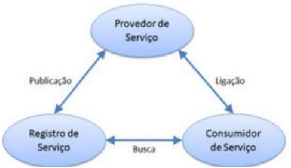

**( ) Consumidor de Serviço são as aplicações que consultam o Provedor de serviços para invocar os serviços do Registro de Serviços.** 

**( ) O Provedor de Serviço implementa e disponibiliza serviços, publicando suas descrições para que possam ser descobertas e consumidas pelas aplicações.** 

**( ) O Registro de Serviços armazena e disponibiliza as descrições dos serviços publicados.** 

**( ) Na SOA, a separação de assuntos envolve dividir problemas grandes em partes menores, facilitando a decomposição da solução em diferentes componentes específicos.** 

**As afirmativas são, respectivamente,** 

a) F – V – V – V. 

b) V – F – V – F. 

c) F – V – F – V. 

d) V – F – F – F.

---

<!-- pagina: 115 -->

**Diego Carvalho, Equipe Informática 2 (Diego Carvalho), Equipe Informática 1 (Diego Carvalho) Aula 08** 

**6. (FGV / INPE - 2024) O Projeto Orientado a Serviços (SOA) tem como objetivo facilitar a integração entre diferentes serviços. Sobre o emprego de SOA, assinale a afirmativa correta.** 

   - a) Permite o compartilhamento direto de bancos de dados entre diferentes serviços para reutilização de funcionalidades. 

   - b) Busca elevar o grau de acoplamento entre serviços com o objetivo de garantir compatibilidade. 

   - c) A lógica é abstraída através de interfaces de serviço, de modo a permitir a integração entre sistemas heterogêneos. 

   - d) A segurança é intrinsecamente garantida pela arquitetura, eliminando a necessidade de protocolos de segurança adicionais. 

   - e) Não é compatível com o padrão SOAP, por conta de sua restrição ao uso de XML para formatação de mensagens. 

**7. (FGV / TJ MT - 2024) Um dos estilos de arquitetura de software mais usados nos últimos anos, dadas as suas vantagens em relação aos demais existentes, é a arquitetura orientada a serviços (Service-Oriented Architecture - SOA). A arquitetura orientada a serviços (SOA)** 

   - a) organiza a estrutura de um sistema como um conjunto de serviços independentes que se comunicam por meio de protocolos padrão, como HTTP e SOAP. 

   - b) utiliza uma abordagem na qual os serviços são acoplados de forma estreita para garantir maior controle e interdependência entre as partes do sistema. 

   - c) é uma arquitetura em que todos os serviços são integrados em um sistema monolítico, garantindo alta coesão entre os módulos. 

   - d) exige que todos os serviços sejam implementados na mesma linguagem de programação para garantir consistência no sistema. 

   - e) utiliza a comunicação síncrona entre serviços para manter a consistência e a segurança dos dados transmitidos no sistema. 

**8. (FGV / MPE SC - 2022) A adoção da Arquitetura Orientada a Serviços (Service Oriented Architecture - SOA) viabiliza a utilização de vários recursos que proporcionam benefícios aos softwares que suportam as operações de negócios das organizações.**

---

<!-- pagina: 116 -->

**Diego Carvalho, Equipe Informática 2 (Diego Carvalho), Equipe Informática 1 (Diego Carvalho) Aula 08** 

**A detecção de ataques de segurança, como ataques de negação de serviço, é um benefício proporcionado pelo recurso de SOA denominado:** 

   - a) Orquestração de Serviços; 

   - b) Coreografia de Serviços; 

   - c) Monitoramento de Mensagens; 

   - d) Virtualização de Serviços; 

   - e) Processamento de Eventos Complexos. 

**9. (FGV / MPE AL - 2018) A Arquitetura Orientada a Serviços (SOA - Service Oriented Architecture) é uma maneira de arquitetar o software na qual as funcionalidades da aplicação são expostas na forma de serviços. Sua implementação segue os princípios de design.** 

**De acordo com os princípios do SOA, ao delegar o controle da lógica encapsulada no serviço** ==5460== **para uma classe estranha ao serviço, é ferido o princípio da** 

   - a) abstração do serviço. 

   - b) reusabilidade do serviço. 

   - c) autonomia do serviço. 

   - d) composição do serviço. 

   - e) baixo acoplamento do serviço. 

- **10.(FGV / IBGE - 2016) SOA é um estilo arquitetônico de software usado para construir soluções empresariais baseadas em serviços Web. São características dos serviços desse estilo:** 

   - a) encapsulamento e recursividade; 

   - b) modularidade e transparência; 

   - c) reuso e descoberta dinâmica; 

   - d) autonomia e dependência de protocolos Web; 

   - e) isolamento de responsabilidades e paralelismo de dados. 

- **11.(FGV / Paulínia - 2016) Para atender seu contexto de negócio, a empresa “Solução & Associados”** 

   - **possui diversas aplicações desenvolvidas em diferentes plataformas e linguagens de programação que precisam se comunicar. Desta forma, a “Solução & Associados” resolveu empregar a Arquitetura Orientada a Serviços (SOA) com a utilização de um barramento de serviços, ou Enterprise Service Bus (ESB).** 

**Assim, a utilização desse barramento** 

- a) representa uma infraestrutura baseada em Web Services. 

- b) proporciona maior acoplamento entre consumidores e provedores de serviço. 

- c) facilita a criação de novos serviços construídos a partir de agregados de outros serviços.

---

<!-- pagina: 117 -->

**Diego Carvalho, Equipe Informática 2 (Diego Carvalho), Equipe Informática 1 (Diego Carvalho) Aula 08** 

   - d) regulamenta a forma como os serviços se comunicam e interagem uns com os outros. e) é considerada o dono do serviço que está sendo disponibilizado. 

- **12.(FGV / CODEBA - 2016) O Manifesto SOA, divulgado durante o segundo Simpósio Internacional de Arquitetura Orientada a Serviços (SOA), em 2009, definiu o conjunto de itens, objetivos e princípios orientadores que visam proporcionar um entendimento claro de SOA e Orientação a Serviço.** 

**De acordo com o manifesto, a Orientação a Serviço é um paradigma que molda o que você faz. Já Arquitetura Orientada a Serviço (SOA) é um tipo de arquitetura que resulta da aplicação de orientação a serviço.** 

**Sobre os itens e objetivos definidos pelo Manifesto SOA, assinale a afirmativa correta.** 

- a) A estratégia técnica dever ser priorizada em relação ao valor de negócio. 

- b) Os benefícios específicos de projetos devem ser priorizados em relação aos objetivos estratégicos. 

- c) As implementações de propósito específico devem ser priorizadas em relação aos serviços compartilhados. 

- d) A flexibilidade deve ser priorizada em relação à otimização. 

- e) A perfeição inicial deve ser priorizada em relação ao refinamento evolutivo.

---

<!-- pagina: 118 -->

**Diego Carvalho, Equipe Informática 2 (Diego Carvalho), Equipe Informática 1 (Diego Carvalho) Aula 08** 

**13.Gabarito 1.** LETRA A **5.** LETRA A **9.** LETRA C **2.** LETRA E **6.** LETRA C **10.** LETRA C **3.** LETRA D **7.** LETRA A **11.** LETRA D **4.** LETRA A **8.** LETRA C **12.** LETRA D

---

<!-- pagina: 119 -->

