---
fonte_pdf: "Eng. Software - Aula 09.pdf"
paginas: 177
conversao: texto-e-imagens
---

<!-- pagina: 2 -->

**Diego Carvalho, Equipe Informática 2 (Diego Carvalho), Equipe Informática 1 (Diego Carvalho) Aula 09** 

# **Índice** 

|...................................................................................................................................<br>1) Web Services - Teoria|...........................................................<br>3|
|---|---|
|...................................................................................................................................<br>2) Web Services - Resumo|...........................................................<br>115|
|...................................................................................................................................<br>3) Web Services - Questões Comentadas - FGV|...........................................................<br>143|
|...................................................................................................................................<br>4) Web Services - Lista de Questões - FGV|...........................................................<br>165|

---

<!-- pagina: 3 -->

**Diego Carvalho, Equipe Informática 2 (Diego Carvalho), Equipe Informática 1 (Diego Carvalho) Aula 09** 


<!-- Start of picture text -->
A PRESENTAÇÃO<br><!-- End of picture text -->

### Queridos alunos, 

Para o aluno em pré-edital com muito tempo disponível, a recomendação é construir uma base teórica robusta sobre os sistemas. Estude todo o conteúdo de Web Services, priorizando os tópicos de incidência altíssima, como conceitos básicos, SOAP, WSDL e REST. Após garantir isso, avance para assuntos de incidência média, como HTTP, JSON e Endpoints. Não descarte tópicos de incidência baixíssima, pois podem ser o diferencial em provas difíceis. 

Para o aluno em pós-edital sem tempo sobrando, o foco principal deve ser estritamente o custo-benefício para a prova. Vá direto aos temas de incidência altíssima: Conceitos de Web Services, Protocolo SOAP, Estrutura de Mensagens, WSDL e os Princípios de REST. Estude também as restrições do REST e a estrutura do formato JSON. Descarte imediatamente o que possui incidência baixíssima, como a família WS-Security, registro UDDI, ferramentas de teste e códigos de status HTTP. 

Sobre a natureza do conteúdo, a aula exige um nível de entendimento misto, equilibrando muito bem a lógica com a memorização. A teoria sobre a integração de sistemas heterogêneos é de fácil compreensão. No entanto, dominar a diferença exata entre os métodos HTTP, as partes do SOAP e os elementos do WSDL demandará um esforço maior de decoreba. A visualização prática dos códigos em XML e JSON ajuda a fixar melhor o assunto, o que reduz a abstração e torna o seu estudo bem mais produtivo e aplicável às provas. 

Prof. Diego Carvalho 


#### **<mark>INSTAGRAM DO PROFESSOR- WWW.INSTAGRAM.COM/PROFESSORDIEGOCARVALHO</mark>** 


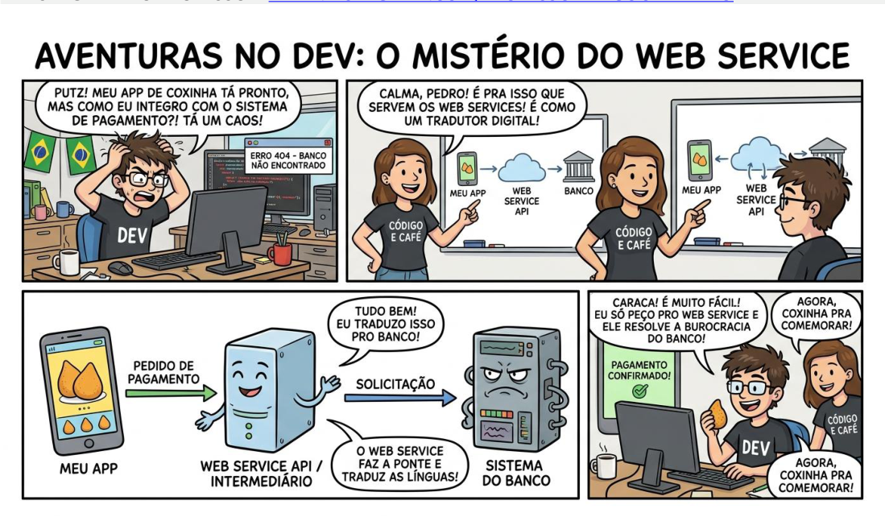

---

<!-- pagina: 4 -->

**Diego Carvalho, Equipe Informática 2 (Diego Carvalho), Equipe Informática 1 (Diego Carvalho) Aula 09** 


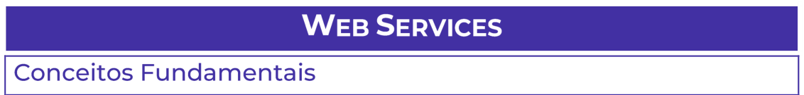


<!-- Start of picture text -->
W EB  S ERVICES<br>Conceitos Fundamentais<br><!-- End of picture text -->

##### **<mark>INCIDÊNCIA EM PROVA: ALTÍSSIMA</mark>** 

O crescimento das organizações levou à adoção de diferentes sistemas para atender áreas específicas, como vendas, finanças, estoque, recursos humanos e atendimento ao cliente. Essa especialização trouxe um novo desafio: como permitir que aplicações distintas compartilhem informações de forma eficiente? Quando não existe integração adequada, os dados permanecem isolados em ambientes diferentes, exigindo transferências manuais. Como consequência, aumentam os custos operacionais e a probabilidade de erros e inconsistências. 

Ao longo dos anos, muitas empresas desenvolveram integrações específicas para conectar aplicações de maneira individual. Por que isso pode se tornar um problema? Inicialmente, essas soluções costumam atender às necessidades do negócio; contudo, a inclusão de novos sistemas aumenta a quantidade de conexões necessárias. Com isso, o ambiente tecnológico torna-se mais complexo, pois surgem dependências que dificultam atualizações, migrações e alterações nas aplicações já existentes. 

A duplicação de informações também representa um desafio relevante nos ambientes corporativos. De onde surgem as divergências entre registros de diferentes sistemas? Quando a troca de dados ocorre de forma limitada ou ineficiente, cada aplicação tende a armazenar sua própria versão das informações. Esse cenário pode gerar inconsistências, dificultar auditorias e comprometer análises utilizadas na tomada de decisões. Além disso, a sincronização manual consome recursos que poderiam ser direcionados para outras atividades. 

A necessidade de superar essas dificuldades impulsionou o desenvolvimento de mecanismos padronizados de integração. Qual a vantagem de utilizar padrões para a comunicação entre sistemas? A padronização simplifica a troca de informações e aumenta a confiabilidade das interações entre aplicações. Dessa forma, diferentes sistemas podem atuar de maneira coordenada e compartilhar dados sem que seja necessário conhecer detalhadamente a implementação interna de cada um deles. 


<!-- Start of picture text -->
Sistemas Heterogêneos<br><!-- End of picture text -->

##### **<mark>INCIDÊNCIA EM PROVA: BAIXÍSSIMA</mark>** 

#### **<mark>SISTEMAS HETEROGÊNEOS</mark>** 

<mark>Sistemas heterogêneos são aplicações desenvolvidas utilizando diferentes linguagens de programação, sistemas</mark> operacionais, bancos de dados, plataformas e tecnologias. Em ambientes corporativos, é comum que sistemas criados em momentos distintos precisem trocar informações, mesmo possuindo arquiteturas bastante diferentes. Os Web Services surgiram justamente para facilitar a comunicação entre esses ambientes heterogêneos, fornecendo mecanismos padronizados que permitem a integração sem exigir que todos os sistemas utilizem as mesmas tecnologias. 

A integração de sistemas corporativos frequentemente enfrenta um obstáculo importante: a heterogeneidade tecnológica. Em uma mesma organização, podem coexistir aplicações desenvolvidas em linguagens como Java, C#, Python e PHP, além de ambientes que utilizam sistemas operacionais e infraestruturas distintas. O que torna essa situação desafiadora? Cada tecnologia possui características próprias de execução e comunicação, o que dificulta a troca direta de informações entre aplicações sem mecanismos específicos de integração.

---

<!-- pagina: 5 -->

**Diego Carvalho, Equipe Informática 2 (Diego Carvalho), Equipe Informática 1 (Diego Carvalho) Aula 09** 

As diferenças não se limitam às linguagens de programação. Os sistemas também podem utilizar tecnologias distintas para armazenar dados, incluindo bancos relacionais, como Oracle, SQL Server e PostgreSQL, e bancos NoSQL, como MongoDB e Cassandra. Como ocorre a troca de informações nesse cenário? Como cada tecnologia adota estruturas e formas de acesso próprias, torna-se necessário utilizar padrões intermediários de comunicação para facilitar o compartilhamento de dados entre ambientes diferentes. 

Outro aspecto bastante comum envolve a convivência entre sistemas legados e aplicações modernas. Muitas organizações ainda dependem de soluções desenvolvidas há décadas, ao mesmo tempo em que incorporam novas tecnologias para atender demandas atuais. Por que esses sistemas precisam se comunicar? Os processos de negócio normalmente atravessam diferentes aplicações, exigindo o compartilhamento contínuo de informações. Sem mecanismos adequados de integração, essa comunicação pode exigir adaptações técnicas complexas e elevar os custos de manutenção. 

As arquiteturas modernas de integração surgiram justamente para lidar com esse cenário diversificado. Em vez de fazer com que cada sistema compreenda detalhes internos dos demais, utiliza-se uma camada padronizada de comunicação. O que essa abordagem proporciona? Aplicações construídas com tecnologias diferentes conseguem trocar informações de forma transparente, pois a complexidade das diferenças tecnológicas é tratada pelos mecanismos de integração, reduzindo dependências entre sistemas e aumentando a flexibilidade do ambiente. 


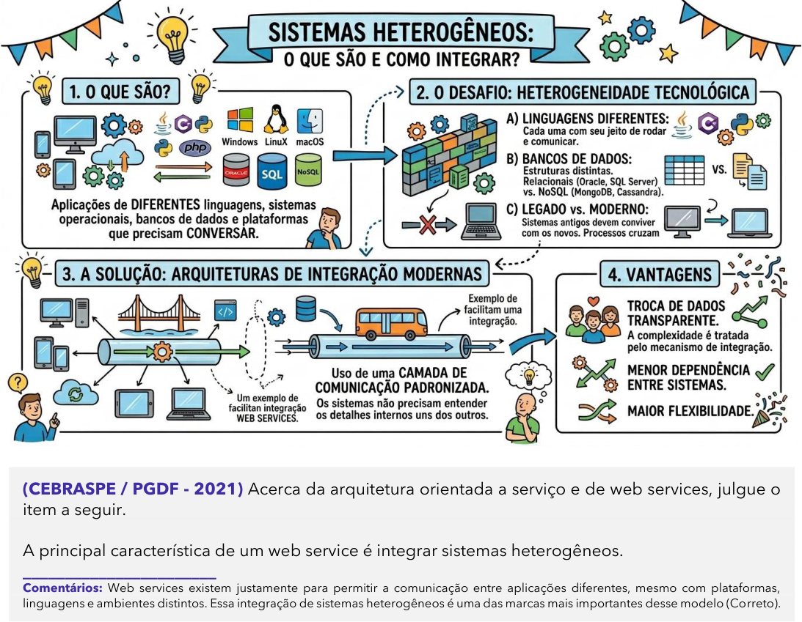


<!-- Start of picture text -->
(CEBRASPE / PGDF - 2021)  Acerca da arquitetura orientada a serviço e de web services, julgue o<br>item a seguir.<br>A principal característica de um web service é integrar sistemas heterogêneos.<br>_______________________<br>Comentários:  Web services existem justamente para permitir a comunicação entre aplicações diferentes, mesmo com plataformas,<br>linguagens e ambientes distintos. Essa integração de sistemas heterogêneos é uma das marcas mais importantes desse modelo (Correto).<br><!-- End of picture text -->

---

<!-- pagina: 6 -->

**Diego Carvalho, Equipe Informática 2 (Diego Carvalho), Equipe Informática 1 (Diego Carvalho) Aula 09** 

**<mark>INCIDÊNCIA EM PROVA: BAIXÍSSIMA</mark>** 


<!-- Start of picture text -->
Interoperabilidade<br><!-- End of picture text -->

#### **<mark>INTEROPERABILIDADE</mark>** 

Interoperabilidade é a capacidade de sistemas distintos comunicarem-se, compartilharem informações e utilizarem serviços mutuamente de forma eficiente. Essa característica é um dos principais objetivos dos Web Services, pois permite que aplicações desenvolvidas por diferentes organizações ou equipes consigam cooperar sem depender de tecnologias específicas. A interoperabilidade é alcançada por meio da adoção de padrões abertos, <u>protocolos amplamente reconhecidos e formatos de dados padronizados.</u> 

A interoperabilidade representa a capacidade de sistemas distintos trocarem informações e utilizarem essas informações de maneira compreensível e útil. Por que a simples transmissão de dados não é suficiente? Quando uma aplicação recebe uma mensagem, ela precisa interpretar corretamente seu conteúdo para executar alguma ação a partir dele. Em ambientes corporativos compostos por múltiplas tecnologias e sistemas distribuídos, essa capacidade tornou-se essencial para garantir a continuidade dos processos de negócio. 

A cooperação entre aplicações desenvolvidas por fornecedores diferentes depende diretamente da interoperabilidade. Como um sistema consegue interagir com outro sem conhecer sua implementação interna? Isso ocorre porque a comunicação é baseada em padrões compartilhados. Dessa forma, uma aplicação pode solicitar informações, executar operações ou receber respostas sem precisar conhecer detalhes sobre a linguagem de programação, a plataforma ou a estrutura interna do sistema com o qual está se comunicando. 


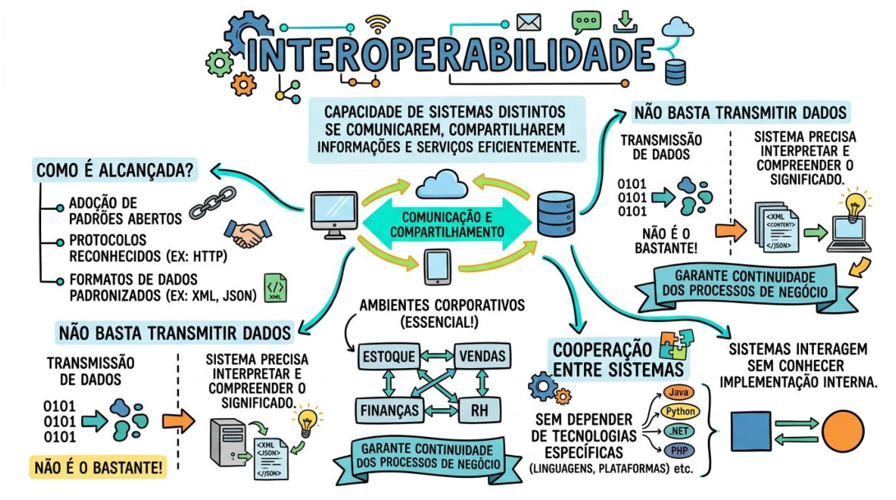


Para tornar essa comunicação possível, utilizam-se protocolos e formatos padronizados. Protocolos como HTTP definem regras para a troca de mensagens, enquanto formatos como XML e JSON organizam os dados transmitidos. Seria suficiente que os sistemas apenas reconhecessem a estrutura dessas mensagens? Nem sempre. Em muitos cenários, também é necessário que as aplicações compartilhem o

---

<!-- pagina: 7 -->

**Diego Carvalho, Equipe Informática 2 (Diego Carvalho), Equipe Informática 1 (Diego Carvalho) Aula 09** 

mesmo entendimento sobre o significado das informações trocadas, evitando interpretações divergentes dos dados recebidos. 

A interoperabilidade está diretamente relacionada à facilidade de integração entre sistemas. Quanto maior sua presença em um ambiente tecnológico, mais simples tende a ser a conexão entre aplicações, o compartilhamento de dados e o reaproveitamento de funcionalidades existentes. Por que esse conceito recebe tanta atenção nas arquiteturas distribuídas? Porque ele reduz barreiras tecnológicas entre sistemas distintos e facilita a construção de soluções capazes de operar de forma coordenada em ambientes heterogêneos.

---

<!-- pagina: 8 -->

**Diego Carvalho, Equipe Informática 2 (Diego Carvalho), Equipe Informática 1 (Diego Carvalho) Aula 09** 


<!-- Start of picture text -->
Serviços Web<br><!-- End of picture text -->

##### **<mark>INCIDÊNCIA EM PROVA: ALTA</mark>** 

#### **<mark>SERVIÇOS WEB</mark>** 


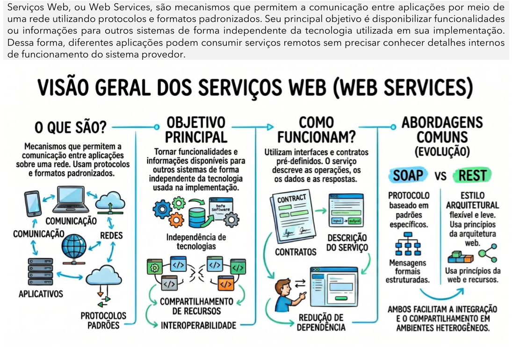


<!-- Start of picture text -->
Serviços Web, ou Web Services, são mecanismos que permitem a comunicação entre aplicações por meio de<br>uma rede utilizando protocolos e formatos padronizados. Seu principal objetivo é disponibilizar funcionalidades<br>ou informações para outros sistemas de forma independente da tecnologia utilizada em sua implementação.<br>Dessa forma, diferentes aplicações podem consumir serviços remotos sem precisar conhecer detalhes internos<br>de funcionamento do sistema provedor.<br>==5460==<br><!-- End of picture text -->

Os Web Services surgiram como uma solução para permitir que aplicações diferentes se comuniquem por meio de redes utilizando padrões amplamente aceitos. Qual é a principal finalidade desse mecanismo? Disponibilizar funcionalidades e informações para outros sistemas de forma padronizada, independentemente das tecnologias utilizadas em sua construção. Com isso, aplicações desenvolvidas de maneira independente conseguem colaborar e compartilhar recursos sem exigir integração direta com seus componentes internos. 

A comunicação por meio de Web Services ocorre através de interfaces e contratos previamente definidos. Como uma aplicação sabe quais operações pode executar em outro sistema? Essas informações são descritas pelo próprio serviço, que estabelece quais dados devem ser enviados e quais respostas podem ser retornadas. Essa abordagem reduz a dependência entre os sistemas envolvidos, pois o consumidor interage com a interface disponibilizada, sem necessidade de acessar a implementação interna do provedor. 

Uma característica central dos Web Services é o desacoplamento entre quem fornece e quem consome o serviço. O que isso significa na prática? O sistema consumidor não precisa conhecer detalhes da linguagem de programação, do banco de dados ou da infraestrutura utilizada pelo provedor. Basta compreender as regras definidas pelo contrato de comunicação. Essa separação facilita alterações internas nos sistemas, pois mudanças na implementação podem ocorrer sem impactar diretamente as aplicações que utilizam o serviço.

---

<!-- pagina: 9 -->

**Diego Carvalho, Equipe Informática 2 (Diego Carvalho), Equipe Informática 1 (Diego Carvalho) Aula 09** 

Ao longo da evolução da integração corporativa, diferentes abordagens foram utilizadas para construir serviços distribuídos acessíveis pela Web. Entre as mais conhecidas estão SOAP e REST. Seriam elas a mesma coisa? Não. SOAP é um protocolo baseado em padrões específicos de comunicação, enquanto REST corresponde a um estilo arquitetural para sistemas distribuídos. Apesar dessas diferenças, ambas as abordagens têm como objetivo facilitar a comunicação entre aplicações, promovendo interoperabilidade e compartilhamento de funcionalidades em ambientes heterogêneos. 

### **Saiba mais:** 

<mark>O desenvolvimento de Web Services SOAP envolve diversos elementos técnicos relacionados à manipulação de mensagens XML, contratos de serviço e protocolos de comunicação. Como evitar que o desenvolvedor precise lidar manualmente com toda essa complexidade? Para resolver esse problema, surgiram frameworks especializados capazes de automatizar grande parte da infraestrutura necessária para publicação e consumo de serviços. Essa abordagem permite que a atenção permaneça concentrada na lógica de negócio, enquanto tarefas repetitivas são executadas pela própria plataforma.</mark> 

<mark>No ambiente Java, uma estratégia bastante comum consiste na utilização de anotações fornecidas pela especificação JAX-WS. O que acontece quando uma classe é marcada com a anotação</mark> ` <mark>@WebService</mark> ` <mark>? Essa informação passa a descrever formalmente que determinado componente deverá ser exposto como um serviço. A partir dessas definições, frameworks especializados conseguem interpretar os metadados presentes no código e gerar automaticamente diversos elementos necessários para a comunicação entre sistemas.</mark> 

<mark>Entre as ferramentas mais conhecidas nesse contexto está o Apache CXF. Qual é o papel desempenhado por esse framework? Além de processar mensagens XML, ele realiza atividades como serialização de objetos, geração de contratos WSDL, publicação de endpoints e gerenciamento da infraestrutura de comunicação SOAP. Dessa forma, a conversão entre objetos Java e mensagens trocadas pela rede ocorre de maneira amplamente transparente para o desenvolvedor.</mark> 

<mark>Essa automação produz ganhos significativos de produtividade e padronização. Em vez de construir manualmente envelopes SOAP, estruturar documentos XML e implementar mecanismos de interoperabilidade, o programador utiliza abstrações fornecidas pelo framework. Como consequência, torna-se mais simples desenvolver serviços compatíveis com os padrões da arquitetura SOAP e garantir a integração entre aplicações construídas em plataformas tecnológicas</mark> distintas. 

**(CEBRASPE / DATAPREV - 2023)** Julgue o item abaixo, relacionado com JavaScript, Web Services <mark>e análise estatística de código-fonte.</mark> 

<mark>Web Service possibilita que recursos sejam disponibilizados para aplicações clientes, mesmo que estejam em sistemas diferentes e usando linguagens distintas.</mark> 

**<mark>_______________________ Comentários:</mark>** <mark>Web Service serve justamente para integrar sistemas diferentes, expondo recursos para aplicações clientes. Na prática,</mark> ele permite a comunicação entre plataformas e linguagens distintas por meio de padrões e protocolos bem definidos (Correto).

---

<!-- pagina: 10 -->

**Diego Carvalho, Equipe Informática 2 (Diego Carvalho), Equipe Informática 1 (Diego Carvalho) Aula 09** 


<!-- Start of picture text -->
Principais Objetivos<br><!-- End of picture text -->

##### **<mark>INCIDÊNCIA EM PROVA: BAIXÍSSIMA</mark>** 

Os Web Services surgiram para solucionar um desafio recorrente das organizações: permitir que sistemas diferentes consigam trocar informações e compartilhar funcionalidades de maneira padronizada. Em ambientes corporativos, é comum que aplicações sejam desenvolvidas com linguagens, plataformas e tecnologias distintas. Como esses sistemas conseguem se comunicar? A resposta está na utilização de padrões de comunicação que definem como as mensagens devem ser estruturadas e transmitidas, permitindo a interoperabilidade entre aplicações sem exigir conhecimento detalhado sobre suas implementações internas. 

Outro aspecto importante envolve o baixo acoplamento entre consumidores e provedores de serviços. Por que isso é relevante? Em sistemas fortemente acoplados, qualquer alteração interna pode provocar impactos em diversas aplicações dependentes. Nos Web Services, a comunicação ocorre por meio de contratos bem definidos, que especificam quais operações estão disponíveis e como elas devem ser utilizadas. Assim, mudanças na implementação interna podem ser realizadas sem afetar os consumidores, desde que a interface disponibilizada continue compatível com o contrato previamente estabelecido. 

A reutilização de funcionalidades também representa um dos objetivos centrais dessa tecnologia. Imagine que diferentes sistemas precisem executar a mesma regra de negócio. Seria necessário implementar essa lógica em cada aplicação? Em muitos casos, não. Os Web Services permitem disponibilizar funcionalidades como serviços compartilhados, que podem ser acessados por múltiplos sistemas. Essa abordagem reduz a duplicação de código, favorece a consistência dos processos e simplifica a manutenção, pois as regras permanecem concentradas em um único local. 

A adoção de Web Services também facilita a evolução tecnológica das organizações e a integração de novos sistemas. Existe alguma vantagem em manter aplicações antigas e modernas trabalhando em conjunto? Sim, porque muitas empresas possuem sistemas legados que continuam desempenhando funções importantes. Por meio dos serviços disponibilizados, essas aplicações podem interagir com soluções mais recentes, possibilitando a automação de processos e a composição de serviços. Por essa razão, os Web Services tornaram-se um elemento fundamental em arquiteturas distribuídas, especialmente em ambientes orientados a serviços. 

|**OBJETIVOS**|**DESCRIÇÃO**|
|---|---|
|**INTEGRAÇÃO DE**<br>**SISTEMAS**|Permitir que aplicações distintas troquem informações e funcionalidades de forma<br>padronizada, independentemente das tecnologias utilizadas em sua implementação.|
|**INTEROPERABILIDADE**|Garantir que sistemas desenvolvidos em diferentes linguagens, plataformas e<br>sistemas operacionais consigam comunicar-se sem adaptações específicas.|
|**COMPARTILHAMENTO**<br>**DE FUNCIONALIDADES**|Disponibilizar operações e recursos para que possam ser reutilizados por múltiplas<br>aplicações, evitando duplicação de esforços e código.|
|**DESACOPLAMENTO**|Reduzir a dependência entre sistemas consumidores e provedores, permitindo<br>alterações internas sem impactar diretamente os demais participantes.|
|**PADRONIZAÇÃO DA**<br>**COMUNICAÇÃO**|Utilizar protocolos, formatos e contratos padronizados para tornar a troca de<br>informações previsível e consistente.|
|**REUTILIZAÇÃO DE**<br>**SERVIÇOS**|Possibilitar que uma mesma funcionalidade seja consumida por diferentes sistemas,<br>departamentos ou organizações.|
|**INTEGRAÇÃO ENTRE**<br>**ORGANIZAÇÕES**|Facilitar a comunicação entre empresas, parceiros, fornecedores e clientes por meio<br>de interfaces bem definidas.|

---

<!-- pagina: 11 -->

**Diego Carvalho, Equipe Informática 2 (Diego Carvalho), Equipe Informática 1 (Diego Carvalho) Aula 09** 

|**OBJETIVOS**|**DESCRIÇÃO**|
|---|---|
|**DISTRIBUIÇÃO DE**<br>**RECURSOS**|Permitir que funcionalidades sejam disponibilizadas remotamente através da rede,<br>sem necessidade de instalação local da aplicação fornecedora.|
|**FLEXIBILIDADE**<br>**TECNOLÓGICA**|Permitir que cada sistema utilize a linguagem, banco de dados ou plataforma mais<br>adequada sem comprometer sua capacidade de integração.|
|**ESCALABILIDADE**|Favorecer a expansão das soluções por meio da distribuição de funcionalidades em<br>serviços independentes que podem ser consumidos por múltiplos clientes.|
|**AUTOMAÇÃO DE**<br>**PROCESSOS**|Possibilitar que sistemas executem processos de negócio automaticamente, sem<br>intervenção manual, por meio da troca de mensagens e chamadas de serviços.|
|**FACILIDADE DE**<br>**MANUTENÇÃO**|Simplificar a evolução dos sistemas ao separar a implementação interna da interface<br>de consumo, reduzindo impactos de alterações futuras.|

---

<!-- pagina: 12 -->

**Diego Carvalho, Equipe Informática 2 (Diego Carvalho), Equipe Informática 1 (Diego Carvalho) Aula 09** 

**<mark>INCIDÊNCIA EM PROVA: BAIXÍSSIMA</mark>** 


<!-- Start of picture text -->
Arquitetura Básica<br><!-- End of picture text -->

#### **<mark>ARQUITETURA BÁSICA</mark>** 

Modelo que organiza a interação entre os participantes envolvidos na disponibilização e no consumo de serviços pela rede. Tradicionalmente, essa arquitetura é composta por três elementos principais: o Service Provider, responsável por disponibilizar o serviço; o Service Consumer, que utiliza as funcionalidades oferecidas; e o Service Registry, que atua como um catálogo para publicação e localização de serviços. A interação entre esses componentes costuma seguir o modelo Publish-Find-Bind, no qual o provedor publica o serviço, o consumidor o localiza e, em seguida, estabelece comunicação com o provedor para utilizar suas operações. 

A arquitetura dos Web Services foi desenvolvida para permitir que aplicações distribuídas consigam se comunicar de maneira padronizada, mesmo quando são construídas com tecnologias diferentes. Em ambientes corporativos, sistemas distintos frequentemente precisam trocar informações e compartilhar funcionalidades. Como essa comunicação pode ocorrer sem exigir que todos utilizem a mesma linguagem ou plataforma? Para atender a essa necessidade, a arquitetura estabelece mecanismos que organizam a disponibilização e o consumo de serviços, favorecendo a interoperabilidade entre aplicações heterogêneas. 

Dentro dessa arquitetura, cada participante possui responsabilidades específicas. Existem sistemas que oferecem serviços e sistemas que utilizam esses serviços. Em alguns modelos clássicos, também podem existir componentes responsáveis por registrar informações sobre os serviços disponíveis. Qual a vantagem dessa separação? Quando cada elemento desempenha uma função bem definida, as integrações tornam-se mais organizadas e flexíveis, pois consumidores e provedores permanecem menos dependentes uns dos outros, facilitando a manutenção e a evolução do ambiente. 

### **Saiba mais:** 

<mark>Ao estudar arquiteturas distribuídas e Web Services, é comum analisar os sistemas sob duas perspectivas complementares: tempo de desenvolvimento e tempo de execução. Por que essa distinção é importante? Porque diferentes atividades e responsabilidades surgem em cada uma dessas fases. Enquanto algumas decisões são tomadas durante o projeto e a implementação da solução, outras estão relacionadas ao comportamento efetivo dos serviços quando a aplicação já está em funcionamento e processando requisições em ambientes reais.</mark> 

<mark>A perspectiva de tempo de execução concentra-se nos elementos que participam da operação diária do sistema. O que acontece quando os serviços começam a trocar informações? Nesse momento entram em cena aspectos como comunicação entre aplicações, transmissão de mensagens, tratamento de falhas de rede, desempenho, disponibilidade e monitoramento. As instâncias dos serviços interagem continuamente, respondendo a eventos e requisições que ocorrem durante o funcionamento normal da arquitetura distribuída.</mark> 

<mark>Já a perspectiva de tempo de desenvolvimento, frequentemente chamada de design time, envolve as definições realizadas antes da implantação do software. Quais elementos precisam ser planejados nessa etapa? Interfaces, contratos de serviço, formatos de mensagens, protocolos de comunicação e regras de integração são exemplos de artefatos definidos previamente. O objetivo</mark>

---

<!-- pagina: 13 -->

**Diego Carvalho, Equipe Informática 2 (Diego Carvalho), Equipe Informática 1 (Diego Carvalho) Aula 09** 

<mark>é garantir que os diferentes componentes consigam interoperar de maneira consistente quando forem colocados em operação.</mark> 

<mark>Essa separação permite organizar melhor as preocupações arquiteturais. Questões relacionadas ao desenho da solução podem ser tratadas independentemente dos desafios operacionais encontrados durante a execução dos serviços. Como consequência, torna-se mais fácil compreender, documentar e evoluir sistemas distribuídos, mantendo uma distinção clara entre as</mark> decisões de projeto e os comportamentos observados em ambiente de produção. 

A comunicação entre as partes ocorre por meio de contratos e mensagens padronizadas. O que o consumidor realmente precisa conhecer para utilizar um serviço? Em vez de acessar detalhes da implementação interna, basta compreender as regras de interação estabelecidas pelo contrato. Em arquiteturas baseadas em SOAP, esse contrato costuma ser descrito formalmente por documentos WSDL. Já em abordagens REST, normalmente são utilizadas documentações que especificam os recursos disponíveis e a forma correta de acessá-los. Essa separação permite que alterações internas sejam realizadas sem impactar diretamente os consumidores. 

Diferentes abordagens podem ser utilizadas na construção de Web Services, sendo SOAP e REST as mais conhecidas. Seriam elas a mesma coisa? Não exatamente. SOAP corresponde a um protocolo de comunicação com padrões bem definidos, enquanto REST representa um estilo arquitetural baseado nos princípios da Web. Apesar dessas diferenças, ambos procuram disponibilizar serviços de forma estruturada e acessível. Em consequência, aplicações distribuídas conseguem compartilhar dados e funcionalidades com menor impacto das diferenças tecnológicas existentes entre os sistemas envolvidos.

---

<!-- pagina: 14 -->

**Diego Carvalho, Equipe Informática 2 (Diego Carvalho), Equipe Informática 1 (Diego Carvalho) Aula 09** 


<!-- Start of picture text -->
Service Provider<br><!-- End of picture text -->

##### **<mark>INCIDÊNCIA EM PROVA: BAIXÍSSIMA</mark>** 

#### **<mark>SERVICE PROVIDER</mark>** 

O Service Provider é a entidade responsável por desenvolver, hospedar e disponibilizar um serviço para consumo. Ele define quais operações podem ser executadas, quais dados devem ser enviados e quais respostas serão retornadas. Em uma arquitetura de Web Services, o provedor atua como a origem dos recursos e funcionalidades oferecidos aos consumidores, garantindo que o serviço permaneça acessível e compatível com o contrato estabelecido. 

O Service Provider, também chamado de provedor de serviços, é o elemento responsável por disponibilizar funcionalidades para outras aplicações. Em uma arquitetura baseada em serviços, cada sistema pode desempenhar uma função específica e compartilhar determinados recursos com outros sistemas. Onde essas funcionalidades ficam disponíveis para consumo? Elas são oferecidas pelo provedor, que recebe solicitações, executa os processamentos necessários e fornece os resultados correspondentes aos consumidores que utilizam o serviço. 


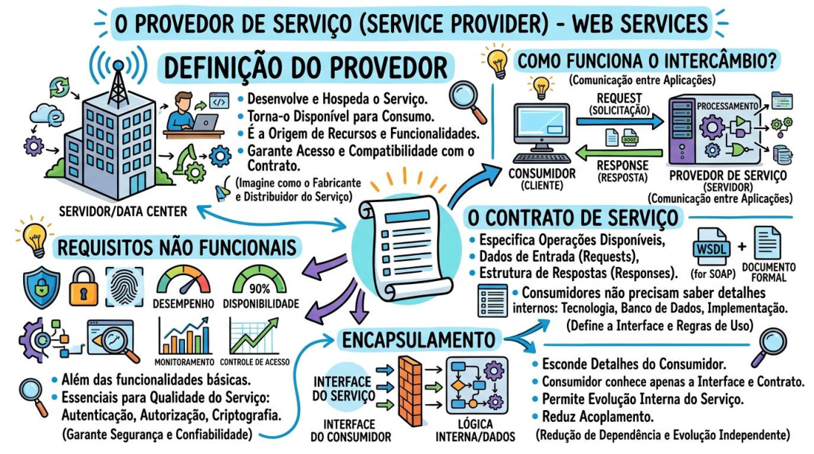


Para que essa comunicação ocorra de maneira organizada, o provedor define um contrato de serviço. O que exatamente esse contrato descreve? Nele são especificadas as operações disponíveis, os dados que devem ser enviados em cada requisição e a estrutura das respostas que serão retornadas. Em arquiteturas SOAP, essa descrição costuma ser formalizada por meio de documentos WSDL. Com isso, os consumidores conseguem utilizar o serviço sem precisar conhecer detalhes sobre a implementação interna, o banco de dados ou a tecnologia empregada pelo provedor. 

Além das funcionalidades oferecidas, o Service Provider também é responsável por diversos requisitos não funcionais. Por que isso é importante? Um serviço pode fornecer corretamente uma operação e ainda assim apresentar problemas se não possuir níveis adequados de disponibilidade, desempenho ou segurança. Por esse motivo, é comum a implementação de mecanismos de autenticação, autorização,

---

<!-- pagina: 15 -->

**Diego Carvalho, Equipe Informática 2 (Diego Carvalho), Equipe Informática 1 (Diego Carvalho) Aula 09** 

criptografia, monitoramento e controle de acesso, garantindo que apenas consumidores autorizados utilizem os recursos disponibilizados. 

Outro conceito fundamental associado ao provedor é o encapsulamento. Ao acessar um serviço, o consumidor precisa conhecer como o processamento interno ocorre? Não. A lógica de negócio, as estruturas de dados e os procedimentos internos permanecem ocultos. O que é disponibilizado ao consumidor corresponde apenas à interface do serviço e às regras definidas em seu contrato. Essa característica reduz o acoplamento entre as aplicações e permite que o serviço evolua internamente sem exigir alterações imediatas nos sistemas que o utilizam.

---

<!-- pagina: 16 -->

**Diego Carvalho, Equipe Informática 2 (Diego Carvalho), Equipe Informática 1 (Diego Carvalho) Aula 09** 


<!-- Start of picture text -->
Service Consumer<br><!-- End of picture text -->

##### **<mark>INCIDÊNCIA EM PROVA: BAIXÍSSIMA</mark>** 

#### **<mark>SERVICE CONSUMER</mark>** 

<mark>O Service Consumer é a aplicação, sistema ou componente que utiliza um serviço disponibilizado por um</mark> provedor. Seu papel consiste em enviar requisições ao serviço, fornecer os dados necessários para a execução das operações e processar as respostas recebidas. O consumidor não precisa conhecer a implementação interna do serviço, bastando compreender o contrato e os protocolos utilizados na comunicação. 

O Service Consumer, também chamado de consumidor de serviços, é o componente responsável por utilizar funcionalidades disponibilizadas por outros sistemas. Em arquiteturas distribuídas, nem toda aplicação precisa implementar internamente todas as capacidades de que necessita. Como uma aplicação pode executar uma funcionalidade que pertence a outro sistema? Para isso, ela envia requisições a um serviço externo e utiliza as respostas recebidas em seus próprios processos. Essa abordagem favorece o reaproveitamento de recursos e reduz a duplicação de funcionalidades. 


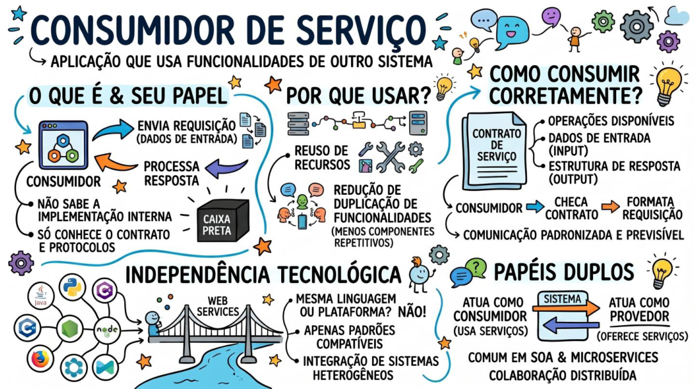


Para consumir um serviço corretamente, o consumidor precisa conhecer as regras de interação definidas pelo provedor. Quais informações são realmente necessárias nesse processo? O contrato do serviço especifica as operações disponíveis, os dados que devem ser enviados e a estrutura das respostas esperadas. Com base nessas definições, o consumidor consegue construir requisições compatíveis e interpretar adequadamente os resultados recebidos. Dessa forma, a comunicação ocorre de maneira previsível e padronizada entre as partes envolvidas. 

Outro aspecto importante é a independência tecnológica proporcionada pelos Web Services. Seria necessário que consumidor e provedor utilizassem a mesma linguagem de programação ou a mesma plataforma? Não. Desde que ambos adotem padrões compatíveis de comunicação, a interação pode ocorrer normalmente. Essa característica permite integrar sistemas desenvolvidos por equipes distintas e construídos com tecnologias diferentes, reduzindo as barreiras normalmente encontradas em ambientes corporativos heterogêneos.

---

<!-- pagina: 17 -->

**Diego Carvalho, Equipe Informática 2 (Diego Carvalho), Equipe Informática 1 (Diego Carvalho) Aula 09** 

Em muitos cenários corporativos, uma aplicação não desempenha apenas um único papel dentro da arquitetura. O que acontece quando um sistema precisa utilizar serviços externos e também disponibilizar funcionalidades próprias? Nesse caso, ele atua simultaneamente como consumidor e provedor de serviços. Essa situação é bastante comum em arquiteturas orientadas a serviços e em ambientes baseados em microsserviços, nos quais diversos sistemas colaboram entre si por meio de múltiplas interações distribuídas.

---

<!-- pagina: 18 -->

**Diego Carvalho, Equipe Informática 2 (Diego Carvalho), Equipe Informática 1 (Diego Carvalho) Aula 09** 


<!-- Start of picture text -->
Service Registry<br><!-- End of picture text -->

##### **<mark>INCIDÊNCIA EM PROVA: BAIXÍSSIMA</mark>** 

#### **<mark>SERVICE REGISTRY</mark>** 

O Service Registry é um mecanismo utilizado para armazenar informações sobre serviços disponíveis em determinado ambiente. Ele funciona como um catálogo onde provedores podem registrar seus serviços e consumidores podem localizá-los quando necessário. Sua finalidade é facilitar a descoberta e reutilização de serviços, reduzindo o acoplamento entre consumidores e provedores e promovendo maior flexibilidade nas integrações. 

O Service Registry, também chamado de registro de serviços, é um componente utilizado para armazenar informações sobre os serviços disponíveis em um ambiente distribuído. Sua função consiste em atuar como um catálogo centralizado, permitindo que aplicações localizem serviços sem depender de configurações previamente conhecidas. Como um consumidor descobre quais serviços estão disponíveis em um ambiente com dezenas ou centenas de aplicações? O registro de serviços foi concebido justamente para facilitar esse processo de localização e consulta. 


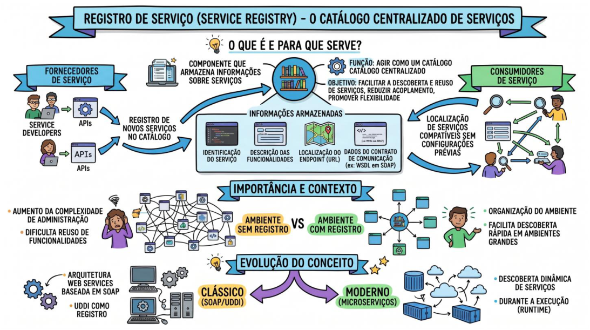


Quando um novo serviço é disponibilizado por um provedor, suas informações podem ser registradas nesse catálogo. Que tipo de informação costuma ser armazenada? Normalmente são registradas a identificação do serviço, a descrição de suas funcionalidades, a localização do endpoint e dados relacionados ao contrato de comunicação. Em arquiteturas SOAP, essas informações frequentemente possuem relação com descrições WSDL. Dessa maneira, consumidores conseguem identificar serviços compatíveis com suas necessidades e obter os dados necessários para utilizá-los corretamente. 

A importância desse mecanismo torna-se mais evidente à medida que o número de aplicações cresce. Imagine um ambiente com grande quantidade de serviços distribuídos entre diversos sistemas. Como localizar rapidamente o serviço adequado sem um ponto central de consulta? A ausência de um mecanismo de descoberta pode aumentar a complexidade da administração e dificultar a reutilização de

---

<!-- pagina: 19 -->

**Diego Carvalho, Equipe Informática 2 (Diego Carvalho), Equipe Informática 1 (Diego Carvalho) Aula 09** 

funcionalidades. O registro contribui para a organização do ambiente porque centraliza informações relevantes sobre os serviços disponíveis. 

O conceito de Service Registry é frequentemente associado ao UDDI, utilizado na arquitetura clássica de Web Services baseada em SOAP. Esse princípio continua sendo utilizado atualmente? Sim, embora as implementações modernas sejam diferentes. Em arquiteturas de microsserviços, mecanismos de service discovery permitem que aplicações registrem e localizem serviços dinamicamente durante a execução. Apesar das diferenças tecnológicas, a finalidade permanece semelhante: facilitar a descoberta e o acesso aos serviços disponíveis no ambiente.

---

<!-- pagina: 20 -->

**Diego Carvalho, Equipe Informática 2 (Diego Carvalho), Equipe Informática 1 (Diego Carvalho) Aula 09** 


<!-- Start of picture text -->
Modelo Triangular<br><!-- End of picture text -->

##### **<mark>INCIDÊNCIA EM PROVA: BAIXÍSSIMA</mark>** 

#### **<mark>MODELO TRIANGULAR</mark>** 

O Modelo Triangular é uma representação clássica da interação entre os participantes de uma arquitetura de Web Services. Ele envolve três elementos principais: Service Provider, Service Consumer e Service Registry. Nesse modelo, o provedor publica informações sobre seus serviços em um registro, o consumidor consulta esse registro para localizar serviços adequados e, posteriormente, estabelece comunicação direta com o provedor para consumir as funcionalidades desejadas. 

O Modelo Triangular é uma representação conceitual utilizada para explicar o funcionamento da arquitetura clássica de Web Services. Sua estrutura é formada por três participantes principais: o provedor de serviços, o consumidor de serviços e o registro de serviços. Por que esse modelo recebeu o nome de triangular? Porque descreve as relações estabelecidas entre esses três elementos e demonstra como ocorre o processo de publicação, descoberta e utilização de funcionalidades distribuídas em um ambiente de integração. 


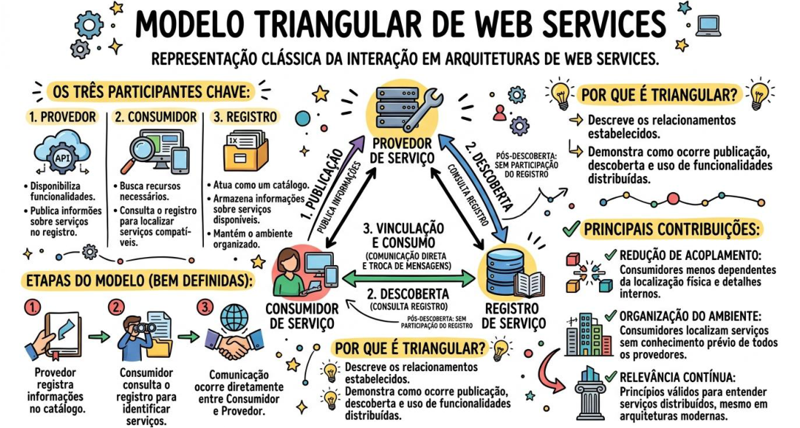


Cada participante desempenha uma responsabilidade específica dentro da arquitetura. O provedor disponibiliza funcionalidades, enquanto o consumidor busca recursos necessários para executar suas operações. Qual é o papel do terceiro elemento? O registro de serviços atua como um catálogo que armazena informações sobre os serviços disponíveis. Dessa forma, o ambiente permanece organizado e os consumidores conseguem localizar serviços adequados sem depender de conhecimento prévio sobre todos os provedores existentes. 

O funcionamento do modelo ocorre em etapas bem definidas. Inicialmente, o provedor registra informações sobre seus serviços no catálogo. Em seguida, o consumidor consulta esse registro para identificar serviços compatíveis com suas necessidades. O registro continua participando da comunicação após a descoberta? Não. Depois que o serviço é localizado, a comunicação passa a ocorrer diretamente entre consumidor e provedor, que trocam mensagens para executar operações e obter os resultados solicitados.

---

<!-- pagina: 21 -->

**Diego Carvalho, Equipe Informática 2 (Diego Carvalho), Equipe Informática 1 (Diego Carvalho) Aula 09** 

Uma das contribuições mais importantes desse modelo está relacionada à redução do acoplamento entre os participantes. Como os consumidores localizam serviços por meio do registro, tornam-se menos dependentes da localização física e dos detalhes internos dos provedores. Embora muitas arquiteturas modernas utilizem mecanismos diferentes dos empregados em ambientes SOAP e UDDI, os princípios representados pelo Modelo Triangular continuam relevantes para compreender como serviços podem ser publicados, descobertos e consumidos de maneira organizada em sistemas distribuídos.

---

<!-- pagina: 22 -->

**Diego Carvalho, Equipe Informática 2 (Diego Carvalho), Equipe Informática 1 (Diego Carvalho) Aula 09** 


<!-- Start of picture text -->
-<br>Modelo Publish Find<br><!-- End of picture text -->


<!-- Start of picture text -->
-<br>Bind<br><!-- End of picture text -->

##### **<mark>INCIDÊNCIA EM PROVA: BAIXÍSSIMA</mark>** 

#### **<mark>MODELO PUBLISH-FIND-BIND</mark>** 

O modelo Publish-Find-Bind descreve o ciclo básico de interação em arquiteturas orientadas a serviços. Inicialmente, o provedor publica informações sobre o serviço em um registro (Publish). Em seguida, o consumidor consulta esse registro para localizar serviços compatíveis com suas necessidades (Find). Por fim, após encontrar o serviço desejado, estabelece uma conexão com o provedor para utilizá-lo (Bind). Esse processo favorece descoberta e reutilização de serviços. 

O modelo Publish-Find-Bind é utilizado para representar o fluxo clássico de interação em arquiteturas de Web Services. Sua estrutura organiza o processo em três etapas fundamentais: publicação, descoberta e utilização de serviços. Por que dividir o funcionamento em etapas distintas? Essa separação permite compreender de forma mais clara como consumidores localizam serviços e como a comunicação efetivamente ocorre após essa descoberta. O modelo é frequentemente apresentado como a representação prática da interação entre provedor, consumidor e registro de serviços. 


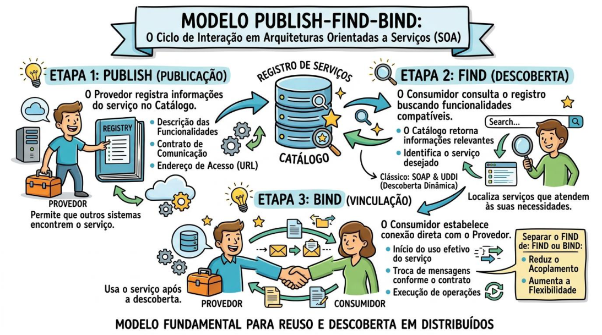


A primeira etapa recebe o nome de Publish e corresponde à publicação do serviço. O que acontece nesse momento? O provedor registra informações em um catálogo de serviços para que outros sistemas possam encontrá-lo posteriormente. Entre os dados normalmente disponibilizados estão a descrição das funcionalidades oferecidas, informações sobre o contrato de comunicação e o endereço utilizado para acesso ao serviço. Dessa forma, os consumidores passam a ter uma fonte organizada de consulta sobre os recursos disponíveis no ambiente. 

A segunda etapa é denominada Find e está relacionada à descoberta de serviços. Como um consumidor encontra o recurso adequado entre diversos serviços existentes? Para isso, ele consulta o registro em busca de funcionalidades compatíveis com sua necessidade. O catálogo retorna informações relevantes sobre os serviços disponíveis, permitindo que o consumidor identifique aquele que pretende utilizar. No

---

<!-- pagina: 23 -->

**Diego Carvalho, Equipe Informática 2 (Diego Carvalho), Equipe Informática 1 (Diego Carvalho) Aula 09** 

modelo clássico baseado em SOAP e UDDI, essa descoberta pode ocorrer de forma dinâmica, embora arquiteturas modernas frequentemente adotem mecanismos alternativos. 

Após a identificação do serviço adequado, ocorre a etapa Bind. O que muda nesse momento? A partir dessa fase, o consumidor estabelece ligação com o provedor e inicia a utilização efetiva do serviço. As mensagens passam a ser trocadas de acordo com as regras definidas pelo contrato de comunicação, permitindo a execução das operações disponibilizadas. Essa separação entre descoberta e utilização constitui um dos aspectos centrais do modelo, pois contribui para a redução do acoplamento e para a flexibilidade dos ambientes distribuídos.

---

<!-- pagina: 24 -->

**Diego Carvalho, Equipe Informática 2 (Diego Carvalho), Equipe Informática 1 (Diego Carvalho) Aula 09** 


<!-- Start of picture text -->
m ponentes Principais<br><!-- End of picture text -->

Os Web Services dependem de diversos elementos para que a comunicação entre aplicações distribuídas ocorra de forma organizada e padronizada. Quando um sistema precisa utilizar funcionalidades disponibilizadas por outro, não basta apenas estabelecer uma conexão. Quais informações devem ser trocadas? Como o serviço pode ser localizado? Quais regras precisam ser seguidas durante a comunicação? Essas questões são respondidas por diferentes elementos arquiteturais que, em conjunto, viabilizam a integração entre sistemas construídos com tecnologias distintas. 

Cada elemento possui uma responsabilidade específica dentro da arquitetura. Alguns estão relacionados à localização dos serviços, outros descrevem as operações disponíveis e há também aqueles responsáveis pelos protocolos, formatos de dados e estruturas das mensagens trocadas. Por que essa divisão é importante? Quando cada responsabilidade permanece bem definida, a comunicação torna-se mais organizada e previsível, facilitando a interoperabilidade entre aplicações desenvolvidas por equipes diferentes e executadas em ambientes tecnológicos variados. 

Outro aspecto relevante está na redução do acoplamento entre consumidores e provedores. Um sistema precisa conhecer todos os detalhes internos do serviço para utilizá-lo? Não. Em geral, basta compreender a interface disponibilizada e as regras estabelecidas para comunicação. Essa separação permite que alterações internas sejam realizadas sem impactar diretamente os consumidores, desde que os contratos e as interfaces permaneçam compatíveis. Como consequência, torna-se mais simples reutilizar funcionalidades e evoluir os sistemas ao longo do tempo. 

Embora SOAP e REST implementem esses conceitos de maneiras diferentes, determinados elementos continuam presentes em praticamente qualquer solução baseada em serviços. Entre eles estão os endpoints, que identificam onde o serviço pode ser acessado; as operações disponibilizadas; as mensagens trocadas entre as partes; os contratos que definem as regras de interação; os protocolos de comunicação; e os formatos utilizados para representar os dados. Esses elementos formam a base necessária para o funcionamento dos Web Services em ambientes distribuídos.

---

<!-- pagina: 25 -->

**Diego Carvalho, Equipe Informática 2 (Diego Carvalho), Equipe Informática 1 (Diego Carvalho) Aula 09** 


<!-- Start of picture text -->
Endpoint<br><!-- End of picture text -->

##### **<mark>INCIDÊNCIA EM PROVA: MÉDIA</mark>** 

#### **<mark>ENDPOINT</mark>** 

Um endpoint é o endereço por meio do qual um serviço pode ser acessado na rede. Normalmente representado por uma URL, ele identifica o ponto de entrada para envio de requisições e recebimento de respostas. Em APIs REST, por exemplo, diferentes endpoints podem representar diferentes recursos do sistema. O endpoint funciona como a interface de acesso utilizada pelos consumidores para interagir com os serviços disponibilizados. 

O endpoint é um dos elementos mais importantes de um Web Service, pois identifica o local onde um serviço pode ser acessado na rede. Em termos práticos, ele corresponde ao ponto de comunicação utilizado pelos consumidores para enviar requisições e receber respostas. Como uma aplicação sabe para onde encaminhar uma solicitação quando deseja utilizar determinada funcionalidade? Essa informação é fornecida pelo endpoint, que normalmente é representado por uma URL associada ao serviço disponibilizado pelo provedor. 


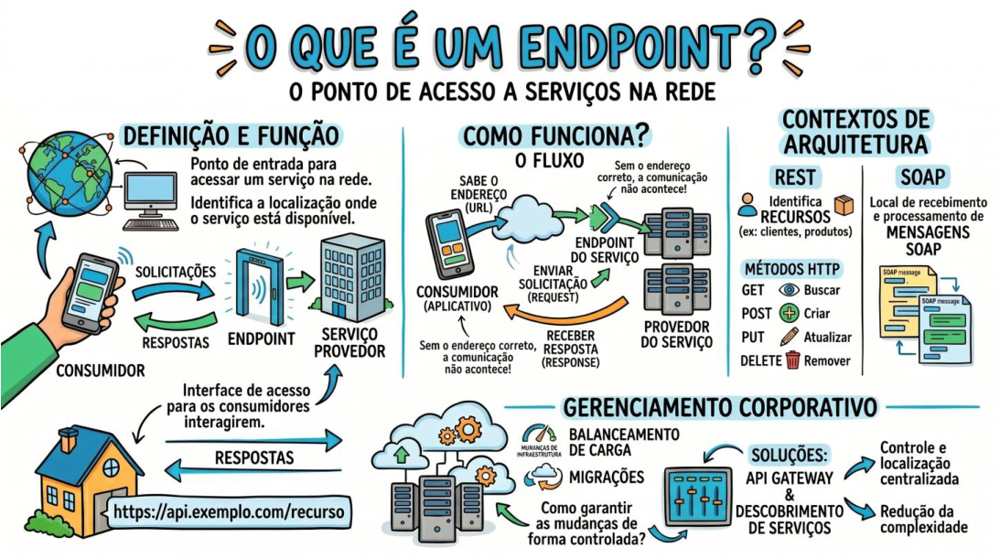


A compreensão desse conceito torna-se mais simples quando se observa sua função dentro da comunicação entre sistemas. Sempre que um consumidor deseja utilizar um serviço, precisa conhecer o endereço correto para estabelecer contato. O que aconteceria se esse endereço fosse desconhecido? Mesmo que o serviço estivesse funcionando perfeitamente, não haveria como encaminhar as requisições ao destino adequado. Por esse motivo, o endpoint desempenha papel fundamental no processo de integração entre aplicações distribuídas. 

A forma como os endpoints são utilizados pode variar de acordo com a arquitetura adotada. Em ambientes REST, eles geralmente identificam recursos ou coleções de recursos, como clientes, produtos ou pedidos. Como as operações são realizadas nesses recursos? Normalmente por meio dos métodos HTTP, como GET, POST, PUT e DELETE. Já em implementações SOAP, o endpoint indica o endereço

---

<!-- pagina: 26 -->

**Diego Carvalho, Equipe Informática 2 (Diego Carvalho), Equipe Informática 1 (Diego Carvalho) Aula 09** 

onde o serviço está preparado para receber e processar mensagens SOAP, permitindo que consumidores estabeleçam comunicação com o provedor. 

A administração dos endpoints também possui relevância em ambientes corporativos. Alterações de infraestrutura, balanceamento de carga e migrações entre servidores podem exigir mudanças nos pontos de acesso dos serviços. Como garantir que essas mudanças ocorram de forma controlada? Muitas organizações utilizam mecanismos de gerenciamento, gateways de APIs e soluções de descoberta de serviços para facilitar a localização e o controle dos endpoints disponíveis, reduzindo a complexidade operacional do ambiente.

---

<!-- pagina: 27 -->

**Diego Carvalho, Equipe Informática 2 (Diego Carvalho), Equipe Informática 1 (Diego Carvalho) Aula 09** 


<!-- Start of picture text -->
Operações<br><!-- End of picture text -->

##### **<mark>INCIDÊNCIA EM PROVA: BAIXA</mark>** 

#### **<mark>OPERAÇÕES</mark>** 

Operações representam as funcionalidades que um Web Service disponibiliza aos seus consumidores. Cada operação define uma ação específica que pode ser executada, como consultar dados, cadastrar informações, atualizar registros ou remover recursos. Em serviços SOAP, as operações são normalmente descritas em contratos WSDL. Em APIs REST, as operações geralmente são associadas aos métodos HTTP, como GET, POST, PUT e DELETE. 

As operações correspondem às funcionalidades que um Web Service disponibiliza para outras aplicações. Sempre que um consumidor interage com um serviço, existe algum objetivo específico por trás dessa comunicação, como consultar informações, cadastrar registros, atualizar dados ou remover recursos. O que exatamente um sistema consegue fazer ao acessar determinado serviço? A resposta está nas operações disponibilizadas, pois são elas que definem as ações que podem ser solicitadas e executadas dentro da aplicação provedora. 


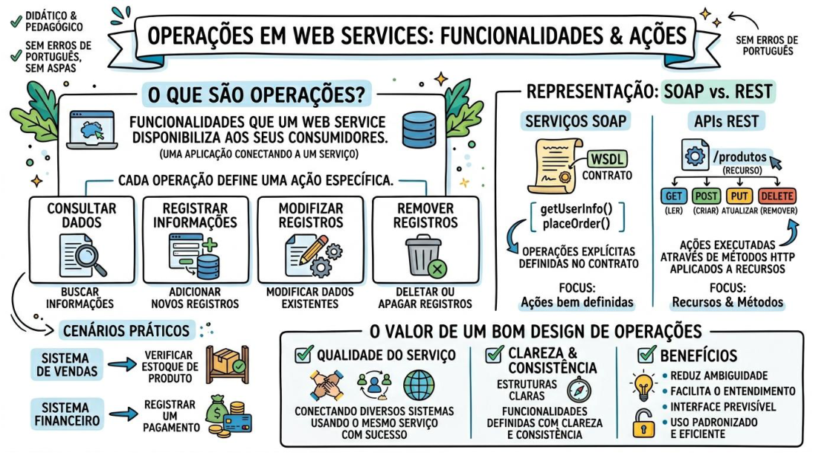


A utilização dessas operações ocorre sempre que um consumidor envia uma requisição ao serviço. Imagine um sistema de vendas que precisa verificar a quantidade disponível de um produto em estoque ou um sistema financeiro que necessita registrar um pagamento. Como essas tarefas são realizadas? Por meio da invocação das operações apropriadas, que recebem os dados necessários para o processamento e retornam informações compatíveis com a solicitação realizada pelo consumidor. 

A forma de representar essas funcionalidades varia de acordo com a arquitetura utilizada. Em ambientes SOAP, as operações são definidas explicitamente no contrato do serviço, geralmente por meio de documentos WSDL. O mesmo acontece em REST? Não exatamente. Em arquiteturas REST, o foco principal está nos recursos disponibilizados pelo serviço, enquanto as ações são normalmente executadas por meio dos métodos HTTP, como GET, POST, PUT e DELETE, aplicados sobre esses recursos.

---

<!-- pagina: 28 -->

**Diego Carvalho, Equipe Informática 2 (Diego Carvalho), Equipe Informática 1 (Diego Carvalho) Aula 09** 

O projeto adequado das operações influencia diretamente a qualidade do serviço disponibilizado. Por que duas aplicações diferentes conseguem utilizar o mesmo serviço sem dificuldades? Porque as funcionalidades oferecidas foram definidas de maneira clara e consistente. Operações bem estruturadas reduzem ambiguidades, facilitam o entendimento por parte dos consumidores e tornam a interface mais previsível, permitindo que diferentes sistemas utilizem os recursos disponíveis de forma padronizada e eficiente.

---

<!-- pagina: 29 -->

**Diego Carvalho, Equipe Informática 2 (Diego Carvalho), Equipe Informática 1 (Diego Carvalho) Aula 09** 


<!-- Start of picture text -->
Mensagens<br><!-- End of picture text -->

##### **<mark>INCIDÊNCIA EM PROVA: BAIXA</mark>** 

#### **<mark>MENSAGENS</mark>** 

Mensagens são as unidades de comunicação trocadas entre consumidores e provedores de serviços. Elas contêm os dados enviados em requisições e respostas, seguindo formatos e estruturas previamente definidos. Em SOAP, as mensagens são organizadas em documentos XML padronizados. Em REST, é comum a utilização de formatos como JSON. As mensagens permitem que informações sejam transmitidas de forma estruturada e compreensível <u>por diferentes sistemas.</u> 

As mensagens constituem o principal mecanismo de comunicação entre consumidores e provedores em uma arquitetura de Web Services. Sempre que uma aplicação deseja utilizar uma funcionalidade disponibilizada por outra, a troca de informações ocorre por meio do envio e do recebimento de mensagens. Como um serviço recebe instruções sobre o que deve executar? As informações necessárias são transportadas nas mensagens, que carregam dados relacionados às operações solicitadas e aos resultados produzidos durante o processamento. 


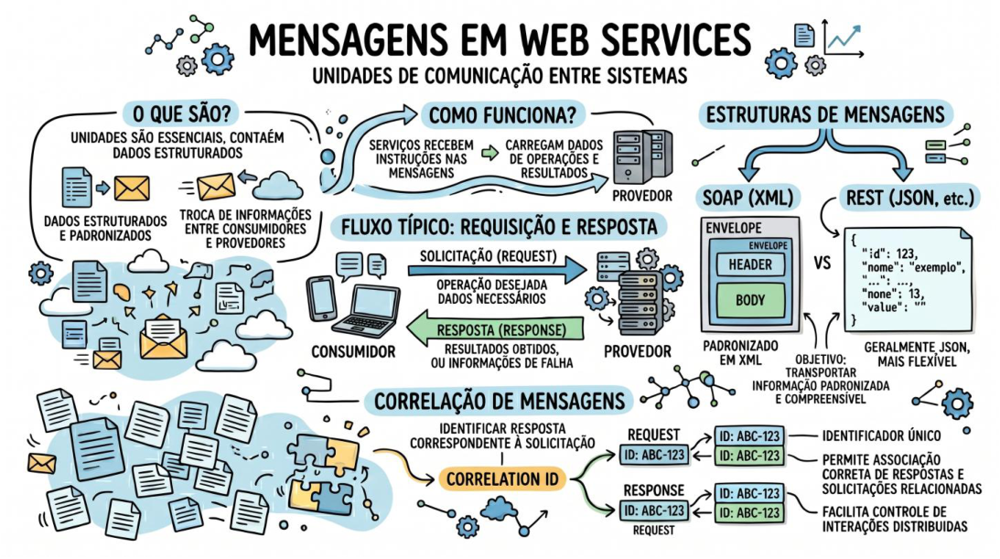


O fluxo de comunicação normalmente envolve dois tipos principais de mensagens: requisições e respostas. A mensagem de requisição contém informações que identificam a operação desejada e os dados necessários para sua execução. O que acontece após o recebimento dessa solicitação? O provedor processa a operação correspondente e retorna uma mensagem de resposta contendo os resultados obtidos ou informações sobre falhas que tenham ocorrido durante o processamento da solicitação. 

A estrutura dessas mensagens varia conforme a tecnologia utilizada. Em arquiteturas SOAP, as mensagens seguem um formato padronizado baseado em XML, organizado em elementos como Envelope, Header e Body. O mesmo modelo é utilizado em REST? Não. Em serviços REST, as mensagens normalmente utilizam formatos como JSON, embora XML e outros formatos também possam ser empregados. Independentemente da tecnologia adotada, o objetivo permanece o mesmo: transportar informações entre sistemas de maneira padronizada e compreensível para ambas as partes.

---

<!-- pagina: 30 -->

**Diego Carvalho, Equipe Informática 2 (Diego Carvalho), Equipe Informática 1 (Diego Carvalho) Aula 09** 

Outro conceito frequentemente associado à troca de mensagens é a correlação de mensagens, conhecida como Message Correlation. Como um sistema identifica qual resposta corresponde a uma determinada solicitação quando várias mensagens estão sendo processadas simultaneamente? Em muitos cenários, especialmente em integrações assíncronas e sistemas baseados em mensageria, utilizase um identificador único denominado Correlation ID. Esse identificador acompanha a comunicação e permite associar corretamente respostas e requisições relacionadas, facilitando o controle das interações distribuídas entre os sistemas.

---

<!-- pagina: 31 -->

**Diego Carvalho, Equipe Informática 2 (Diego Carvalho), Equipe Informática 1 (Diego Carvalho) Aula 09** 


<!-- Start of picture text -->
Contratos<br><!-- End of picture text -->

##### **<mark>INCIDÊNCIA EM PROVA: BAIXA</mark>** 

#### **<mark>CONTRATOS</mark>** 

Contratos são documentos ou especificações que definem as regras de interação entre consumidores e provedores de serviços. Eles descrevem quais operações estão disponíveis, quais parâmetros devem ser fornecidos, quais formatos de dados serão utilizados e quais respostas podem ser esperadas. O contrato atua como um acordo formal de comunicação, permitindo que diferentes sistemas interajam de maneira previsível e <u>padronizada.</u> 

O contrato de serviço é o elemento responsável por definir formalmente como a comunicação entre consumidores e provedores deve ocorrer. Em uma arquitetura distribuída, não basta que um serviço esteja disponível; também é necessário que todos saibam exatamente como utilizá-lo. Que informações precisam ser compartilhadas para que essa interação aconteça corretamente? O contrato estabelece as operações disponíveis, os dados aceitos nas requisições, os formatos das respostas e outras regras que orientam a comunicação entre os sistemas envolvidos. 


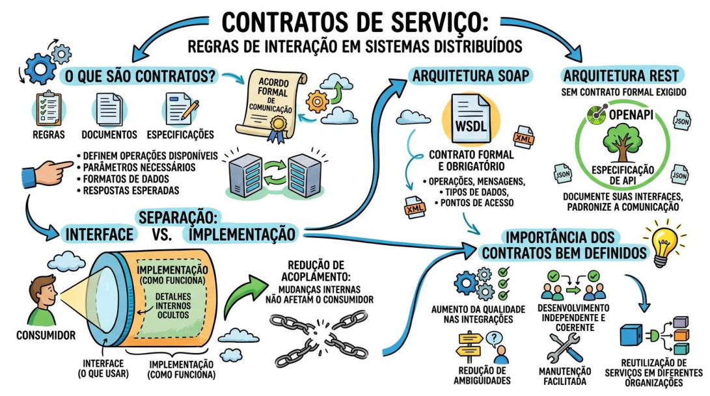


A importância desse elemento está diretamente relacionada à separação entre interface e implementação. Um consumidor precisa conhecer os detalhes internos do serviço para utilizá-lo? Não. Basta compreender as regras definidas no contrato e seguir os padrões estabelecidos para troca de informações. Essa característica reduz o acoplamento entre os sistemas, pois alterações realizadas na implementação interna podem ocorrer sem impactos diretos sobre os consumidores, desde que o contrato permaneça compatível com as expectativas já estabelecidas. 

A forma de representar o contrato varia conforme a tecnologia adotada. Em arquiteturas SOAP, essa definição normalmente é formalizada por meio do WSDL, documento que descreve operações, mensagens, tipos de dados e pontos de acesso do serviço. O mesmo modelo existe obrigatoriamente em REST? Não. Em arquiteturas REST, não há exigência de um contrato formal equivalente, embora

---

<!-- pagina: 32 -->

**Diego Carvalho, Equipe Informática 2 (Diego Carvalho), Equipe Informática 1 (Diego Carvalho) Aula 09** 

especificações como OpenAPI sejam amplamente utilizadas para documentar interfaces e padronizar a comunicação entre consumidores e provedores. 

Contratos bem definidos exercem papel importante na qualidade das integrações. Como equipes diferentes conseguem desenvolver sistemas compatíveis sem conhecer os detalhes das implementações umas das outras? A resposta está na existência de regras claras e compartilhadas. Quando o contrato é consistente e bem documentado, reduzem-se ambiguidades durante o desenvolvimento, facilitam-se processos de manutenção e amplia-se a capacidade de reutilização dos serviços em diferentes aplicações e contextos organizacionais.

---

<!-- pagina: 33 -->

**Diego Carvalho, Equipe Informática 2 (Diego Carvalho), Equipe Informática 1 (Diego Carvalho) Aula 09** 


<!-- Start of picture text -->
Protocolos<br><!-- End of picture text -->

##### **<mark>INCIDÊNCIA EM PROVA: BAIXA</mark>** 

#### **<mark>PROTOCOLOS</mark>** 

Protocolos são conjuntos de regras que definem como a comunicação entre sistemas deve ocorrer. Eles estabelecem procedimentos relacionados ao envio, recebimento, interpretação e tratamento das mensagens trocadas. Nos Web Services, protocolos como HTTP e HTTPS são amplamente utilizados para transportar dados entre consumidores e provedores. A utilização de protocolos padronizados é fundamental para garantir interoperabilidade entre diferentes plataformas. 

Os protocolos são responsáveis por definir as regras que permitem a comunicação entre consumidores e provedores em uma arquitetura de Web Services. Sempre que duas aplicações trocam informações, é necessário que ambas sigam procedimentos compatíveis para envio, recebimento e interpretação das mensagens. Como sistemas desenvolvidos por equipes diferentes conseguem compreender as informações trocadas entre si? Isso ocorre porque os protocolos estabelecem padrões que organizam a comunicação e garantem que as mensagens sejam interpretadas corretamente pelas partes envolvidas. 


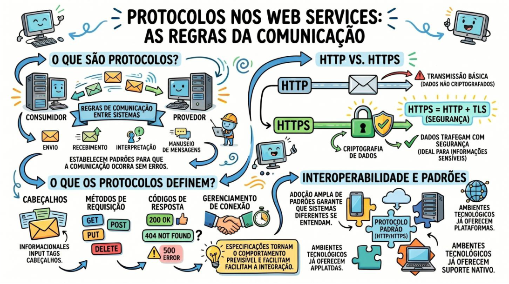


Entre os protocolos mais utilizados nesse contexto estão o HTTP e o HTTPS. Qual é a diferença entre eles? O HTTP fornece os mecanismos básicos para a troca de informações entre aplicações conectadas em rede. Já o HTTPS utiliza o protocolo HTTP em conjunto com recursos de segurança fornecidos pelo TLS, permitindo que os dados trafeguem de forma protegida por criptografia. Essa característica é especialmente importante quando informações sensíveis precisam ser transmitidas entre sistemas. 

Os protocolos também definem diversos aspectos relacionados ao funcionamento da comunicação. Não se trata apenas de transportar mensagens de um ponto a outro. Quais regras adicionais precisam ser estabelecidas? Em protocolos como HTTP e HTTPS, são definidos elementos como cabeçalhos, métodos de requisição, códigos de resposta e mecanismos de gerenciamento de conexões. Essas especificações tornam o comportamento da comunicação previsível e facilitam a integração entre aplicações desenvolvidas com tecnologias distintas.

---

<!-- pagina: 34 -->

**Diego Carvalho, Equipe Informática 2 (Diego Carvalho), Equipe Informática 1 (Diego Carvalho) Aula 09** 

A ampla adoção de protocolos padronizados é um dos fatores que favorecem a interoperabilidade dos Web Services. Por que sistemas construídos em plataformas diferentes conseguem se comunicar com relativa facilidade? Porque a maioria dos ambientes tecnológicos já oferece suporte nativo a protocolos amplamente utilizados. Embora HTTP e HTTPS sejam os mais comuns, outras opções também podem ser empregadas em cenários específicos de integração. Em todos os casos, o objetivo permanece o mesmo: estabelecer uma comunicação consistente e compreensível entre aplicações distribuídas.

---

<!-- pagina: 35 -->

**Diego Carvalho, Equipe Informática 2 (Diego Carvalho), Equipe Informática 1 (Diego Carvalho) Aula 09** 


<!-- Start of picture text -->
Formatos de Dados<br><!-- End of picture text -->

##### **<mark>INCIDÊNCIA EM PROVA: BAIXA</mark>** 

#### **<mark>FORMATOS DE DADOS</mark>** 

Formatos de dados definem a maneira como as informações são estruturadas e representadas durante a comunicação entre sistemas. Nos Web Services, os formatos mais comuns são XML e JSON. Esses padrões permitem organizar informações de maneira consistente, facilitando sua interpretação por aplicações distintas. A escolha do formato influencia aspectos como legibilidade, tamanho das mensagens, desempenho e compatibilidade entre tecnologias. 

Os formatos de dados definem como as informações serão organizadas dentro das mensagens trocadas entre consumidores e provedores de serviços. Sempre que uma aplicação envia ou recebe dados, é necessário que exista uma estrutura previamente conhecida pelas partes envolvidas. Como sistemas desenvolvidos com tecnologias diferentes conseguem interpretar corretamente as mesmas informações? Isso ocorre porque os formatos de dados estabelecem regras de representação que permitem organizar e transmitir o conteúdo de maneira padronizada. 


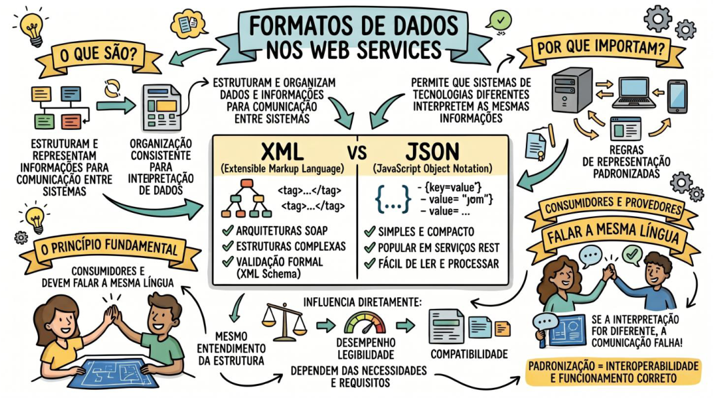


Entre os formatos mais utilizados em Web Services destacam-se XML e JSON. O XML foi amplamente adotado em arquiteturas SOAP devido à sua capacidade de representar estruturas complexas e de oferecer mecanismos formais de validação, como os esquemas XML Schema. O JSON surgiu posteriormente como uma alternativa mais simples e geralmente mais compacta. Por que ele se tornou tão popular em serviços REST? Porque sua estrutura costuma ser mais fácil de ler, processar e transmitir em muitos cenários de integração. 

A escolha do formato influencia diretamente diversos aspectos da comunicação entre sistemas. Todos os formatos apresentam as mesmas características? Não. Alguns produzem mensagens menores, reduzindo o volume de dados transmitidos pela rede. Outros oferecem recursos mais sofisticados para validação e representação de relacionamentos complexos entre informações. A decisão sobre qual formato utilizar

---

<!-- pagina: 36 -->

**Diego Carvalho, Equipe Informática 2 (Diego Carvalho), Equipe Informática 1 (Diego Carvalho) Aula 09** 

depende das necessidades específicas do serviço, das características do ambiente e dos requisitos técnicos envolvidos na integração. 

Independentemente da tecnologia escolhida, existe um princípio que permanece constante: consumidores e provedores precisam compartilhar o mesmo entendimento sobre a estrutura dos dados trocados. O que aconteceria se cada sistema interpretasse uma mensagem de maneira diferente? A comunicação deixaria de ser confiável e os resultados poderiam se tornar inconsistentes. Por essa razão, a padronização dos formatos de dados desempenha papel fundamental na interoperabilidade e no funcionamento adequado dos Web Services.

---

<!-- pagina: 37 -->

**Diego Carvalho, Equipe Informática 2 (Diego Carvalho), Equipe Informática 1 (Diego Carvalho) Aula 09** 


<!-- Start of picture text -->
HTTP/HTTPS<br><!-- End of picture text -->

**<mark>INCIDÊNCIA EM PROVA: MÉDIA</mark>** 

#### **<mark>HTTP/HTTPS</mark>** 

HTTP é o protocolo mais utilizado para transportar mensagens entre consumidores e provedores de serviços na Web. Ele define métodos, cabeçalhos e mecanismos de comunicação que permitem a troca de informações entre aplicações. HTTPS corresponde à versão segura do HTTP, adicionando criptografia por meio de TLS ou SSL. <mark>Dessa forma,</mark> <u><mark>garante confidencialidade, integridade e autenticidade das informações transmitidas pela rede.</mark></u> 

O HTTP, sigla para Hypertext Transfer Protocol, é o protocolo responsável por grande parte da comunicação realizada na Internet. Sempre que um navegador acessa uma página, uma aplicação consulta uma API ou dois sistemas trocam informações pela Web, esse protocolo costuma estar envolvido. Como aplicações executadas em computadores diferentes conseguem solicitar e receber informações de maneira organizada? O HTTP define um conjunto de regras que estabelece como mensagens devem ser enviadas, recebidas e interpretadas durante a comunicação. 


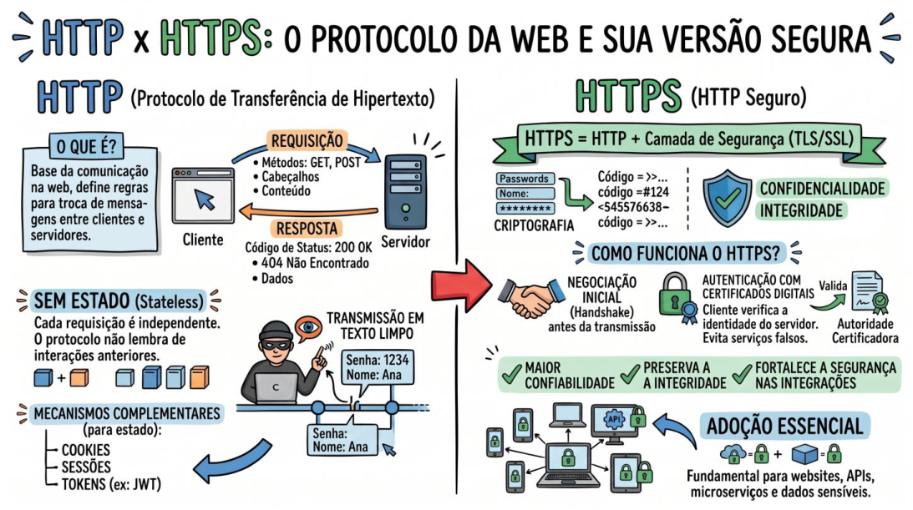


Seu funcionamento baseia-se no modelo requisição-resposta. Nesse processo, o cliente envia uma solicitação indicando o recurso desejado, enquanto o servidor processa o pedido e retorna uma resposta apropriada. Quais informações compõem essa comunicação? As mensagens podem incluir métodos de requisição, cabeçalhos, parâmetros e conteúdos adicionais necessários para a execução da operação solicitada. Essa padronização permite que sistemas desenvolvidos com tecnologias distintas consigam interagir de forma previsível e consistente. 

Uma característica importante do HTTP é seu comportamento stateless. O que isso significa na prática? Cada requisição é tratada de maneira independente, sem que o protocolo mantenha informações sobre interações anteriores. Quando uma aplicação precisa preservar dados entre diferentes solicitações, utiliza mecanismos complementares, como cookies, sessões gerenciadas pela aplicação ou tokens de

---

<!-- pagina: 38 -->

**Diego Carvalho, Equipe Informática 2 (Diego Carvalho), Equipe Informática 1 (Diego Carvalho) Aula 09** 

autenticação. Essa característica contribui para a simplicidade do protocolo e favorece sua escalabilidade em ambientes distribuídos. 

A ampla adoção do HTTP fez com que ele se tornasse a base de sites, APIs, microsserviços e diversas outras soluções conectadas à Internet. Entretanto, surge uma questão importante: como proteger os dados transmitidos durante essa comunicação? Para atender a essa necessidade, foi desenvolvido o HTTPS, que utiliza o protocolo HTTP em conjunto com uma camada de segurança fornecida pelo TLS, responsável por proteger as informações trocadas entre cliente e servidor. 

Antes que os dados sejam efetivamente transmitidos, cliente e servidor realizam um processo de negociação para estabelecer uma conexão segura. Como garantir que terceiros não consigam visualizar o conteúdo trafegado pela rede? Após essa negociação, as informações passam a ser transmitidas de forma criptografada, dificultando significativamente a interceptação e a alteração indevida dos dados durante o percurso entre as partes envolvidas na comunicação. 

Além da proteção dos dados, o HTTPS também oferece mecanismos de autenticação baseados em certificados digitais. Qual a utilidade desses certificados? Eles permitem que o cliente verifique a identidade do servidor com o qual está se comunicando, reduzindo os riscos de ataques que tentam redirecionar usuários para serviços falsos. Essa verificação é especialmente importante em aplicações que manipulam credenciais de acesso, informações pessoais ou dados financeiros sensíveis. 

A adoção do HTTPS tornou-se uma prática essencial no desenvolvimento de aplicações modernas. Navegadores, plataformas e diversos serviços da Internet consideram a utilização de conexões seguras um requisito fundamental. Como consequência, aplicações protegidas por HTTPS tendem a oferecer maior confiabilidade durante a comunicação, preservando a integridade dos dados e fortalecendo a segurança das integrações realizadas pela Web.

---

<!-- pagina: 39 -->

**Diego Carvalho, Equipe Informática 2 (Diego Carvalho), Equipe Informática 1 (Diego Carvalho) Aula 09** 


<!-- Start of picture text -->
Principais Métodos<br><!-- End of picture text -->

##### **<mark>INCIDÊNCIA EM PROVA: BAIXA</mark>** 

#### **<mark>MÉTODOS HTTP</mark>** 

Comandos padronizados definidos pelo protocolo HTTP que indicam a ação que o cliente deseja realizar sobre um recurso disponibilizado por um servidor. Eles funcionam como verbos da comunicação entre aplicações, especificando operações como consulta, criação, atualização ou remoção de informações. Em Web Services e APIs REST, os métodos HTTP desempenham papel fundamental na implementação das operações de negócio, contribuindo para uma comunicação padronizada, <u>previsível e alinhada aos princípios da Web.</u> 

Os métodos HTTP definem as ações que um cliente deseja realizar sobre os recursos disponibilizados por um servidor. Sempre que uma requisição é enviada, não basta informar qual recurso será acessado; também é necessário indicar qual operação deve ser executada. Como o servidor sabe se a intenção é consultar informações, criar registros ou remover dados existentes? Essa informação é fornecida pelo método HTTP utilizado na requisição, que orienta o comportamento esperado durante o processamento. 

Entre os métodos mais utilizados está o GET, responsável pela recuperação de informações. Quando um usuário acessa uma página web ou consulta dados em uma API, normalmente uma requisição desse tipo é executada. Por que o GET é considerado um método seguro? Porque sua finalidade é apenas obter informações, sem modificar o estado dos recursos armazenados no servidor. Essa característica contribui para a previsibilidade da comunicação e favorece mecanismos como cache e otimização de desempenho. 

Outros métodos são utilizados quando existe a necessidade de alterar informações. O POST geralmente é empregado para criar novos recursos ou executar operações específicas. Já o PUT costuma ser utilizado para substituir integralmente o estado de um recurso existente, enquanto o PATCH permite realizar modificações parciais. Existe diferença prática entre atualizar completamente e atualizar parcialmente um recurso? Sim, porque cada abordagem atende a necessidades distintas e influencia a forma como os dados são enviados e processados pelo servidor. 

O método DELETE é utilizado para remover recursos existentes. Além dele, o protocolo HTTP define outros métodos menos frequentes, como HEAD, OPTIONS e TRACE, que atendem a finalidades específicas dentro da comunicação entre sistemas. Como garantir que determinadas operações mantenham um comportamento previsível mesmo quando executadas repetidamente? Surge então o conceito de idempotência, propriedade presente em métodos como GET, PUT e DELETE. Uma operação idempotente produz o mesmo estado final no servidor independentemente de ser executada uma única vez ou repetidas vezes, desde que as condições da requisição permaneçam inalteradas. 

A correta utilização dos métodos HTTP contribui para a construção de interfaces mais consistentes e fáceis de compreender. Quando cada método é empregado de acordo com sua finalidade original, consumidores e provedores passam a compartilhar expectativas claras sobre o comportamento das operações. Essa padronização reduz ambiguidades, facilita integrações entre sistemas distintos e fortalece a interoperabilidade das APIs e dos serviços distribuídos. 

|**MÉTODOS HTTP**|**DESCRIÇÃO**|
|---|---|
|**GET**|Esse método solicita a representação de um recurso específico. Requisições utilizando o<br>método GET devem retornar apenas dados.|
|**HEAD**|Esse método solicita uma resposta de forma idêntica ao método GET, porém sem conter<br>o corpo da resposta.|
|**PUT**|Esse método substitui todas as atuais representações do recurso de destino pela carga de<br>dados da requisição.|
|**POST**|Esse método é utilizado para submeter uma entidade a um recurso específico,<br>frequentemente causando mudança no estado do recurso ou efeitos no servidor.|

---

<!-- pagina: 40 -->

**Diego Carvalho, Equipe Informática 2 (Diego Carvalho), Equipe Informática 1 (Diego Carvalho) Aula 09** 

|**DELETE**|Esse método remove um recurso específico.|
|---|---|
|**TRACE**|Esse método executa um teste de chamada loop-back junto com o caminho para o recurso<br>de destino.|
|**CONNECT**|Esse método estabelece um túnel para o servidor identificado pelo recurso de destino.|
|**OPTIONS**|Esse método é usado para descrever as opções de comunicação com o recurso de<br>destino.|
|**PATCH**|Esse método é utilizado para aplicar modificações parciais em um recurso.|

---

<!-- pagina: 41 -->

**Diego Carvalho, Equipe Informática 2 (Diego Carvalho), Equipe Informática 1 (Diego Carvalho) Aula 09** 


<!-- Start of picture text -->
Códigos de Status<br><!-- End of picture text -->

##### **<mark>INCIDÊNCIA EM PROVA: BAIXÍSSIMA</mark>** 

#### **<mark>CÓDIGOS DE STATUS</mark>** 

<mark>Os códigos de status HTTP são valores numéricos enviados pelo servidor em resposta a uma requisição realizada</mark> por um cliente, indicando o resultado do processamento da solicitação. Esses códigos permitem que aplicações e usuários compreendam se a operação foi executada com sucesso, se houve necessidade de redirecionamento ou se ocorreu algum tipo de erro. 

Os códigos de status HTTP são valores numéricos enviados pelo servidor para indicar o resultado de uma requisição. Sempre que um cliente solicita um recurso ou executa uma operação, o servidor precisa informar o que aconteceu durante o processamento. Como uma aplicação sabe se a solicitação foi concluída corretamente ou se ocorreu algum problema? Essa informação é transmitida por meio dos códigos de status, que seguem um padrão amplamente utilizado em aplicações web, APIs e serviços distribuídos. 

Esses códigos são organizados em categorias identificadas pelo primeiro dígito. O que cada categoria representa? Os códigos da série 1xx correspondem a respostas informativas; os da série 2xx indicam sucesso; os da série 3xx estão relacionados a redirecionamentos; os da série 4xx representam problemas associados à requisição realizada pelo cliente; e os da série 5xx indicam falhas ocorridas no servidor. Essa classificação permite compreender rapidamente a natureza geral da resposta recebida. 

Entre os códigos de sucesso, alguns aparecem com grande frequência no desenvolvimento de APIs. O código 200 OK indica que a requisição foi processada corretamente. Já o código 201 Created informa que um novo recurso foi criado com sucesso, sendo comum em operações de cadastro. Existe também o código 204 No Content. O que o diferencia dos demais? Nesse caso, a operação foi concluída com êxito, mas não há necessidade de retornar conteúdo no corpo da resposta. 

Os códigos de erro também desempenham papel importante na comunicação entre sistemas. Quando uma requisição apresenta problemas de formato ou parâmetros inválidos, é comum o retorno do código 400 Bad Request. Se a autenticação estiver ausente ou inválida, geralmente é utilizado o código 401 Unauthorized. O código 403 Forbidden indica que o cliente foi identificado, mas não possui permissão para acessar o recurso solicitado. Já o código 404 Not Found informa que o recurso não foi localizado, enquanto o código 500 Internal Server Error representa uma falha inesperada ocorrida durante o processamento no servidor. 

A correta interpretação dos códigos de status facilita o desenvolvimento, a manutenção e o diagnóstico de aplicações distribuídas. Por que eles são tão importantes em APIs e Web Services? Porque fornecem uma forma padronizada de comunicação sobre o resultado das operações realizadas. Quando clientes e servidores utilizam adequadamente esses códigos, torna-se mais simples identificar problemas, compreender comportamentos e construir integrações mais confiáveis entre sistemas distintos. 

|**CÓDIGO**|**NOME**|**SIGNIFICADO**|
|---|---|---|
|**100**|Continue|Indica que a parte inicial da requisição foi recebida com sucesso e que o cliente<br>pode continuar enviando o restante dos dados. É utilizado principalmente em<br>comunicações que envolvem grandes volumes de informações.|
|**200**|OK|Indica que a requisição foi processada com sucesso. É o código mais comum em<br>operações HTTP e normalmente acompanha a resposta contendo os dados<br>solicitados pelo cliente.|

---

<!-- pagina: 42 -->

**Diego Carvalho, Equipe Informática 2 (Diego Carvalho), Equipe Informática 1 (Diego Carvalho) Aula 09** 

|**CÓDIGO**|**NOME**|**SIGNIFICADO**|
|---|---|---|
|**201**|Created|Indica que a requisição foi concluída com sucesso e que um novo recurso foi criado<br>no servidor. É frequentemente utilizado em operações realizadas por meio do<br>método POST.|
|**204**|No Content|Indica que a requisição foi processada com sucesso, mas não há conteúdo a ser<br>retornado no corpo da resposta. É comum em operações de atualização ou<br>exclusão.|
|**300**|Multiple<br>Choices|Indica que existem múltiplas representações ou destinos possíveis para o recurso<br>solicitado. O cliente pode escolher qual alternativa deseja utilizar para prosseguir<br>com a requisição.|
|**301**|Moved<br>Permanently|Indica que o recurso solicitado foi movido permanentemente para uma nova URL.<br>Os clientes devem atualizar seus links e passar a utilizar o novo endereço informado<br>pelo servidor.|
|**400**|Bad Request|Indica que a requisição enviada pelo cliente possui erro de sintaxe, parâmetros<br>inválidos ou informações inconsistentes que impedem seu processamento pelo<br>servidor.|
|**401**|Unauthorized|Indica que a autenticação é necessária ou que as credenciais fornecidas são<br>inválidas. O cliente precisa autenticar-se corretamente para acessar o recurso<br>solicitado.|
|**403**|Forbidden|Indica que o servidor compreendeu a requisição, mas o cliente não possui<br>permissão para acessar o recurso solicitado, mesmo estando autenticado.|
|**404**|Not Found|Indica que o recurso solicitado não foi encontrado no servidor. É um dos códigos<br>mais conhecidos da Web e geralmente ocorre quando a URL é inválida ou<br>inexistente.|
|**500**|Internal Server<br>Error|Indica que ocorreu uma falha interna inesperada no servidor durante o<br>processamento da requisição. O problema está no lado do servidor e não na<br>requisição enviada pelo cliente.|


**(FCC / TRT 22ª Região - 2022)** Em um Web Service RESTful, o cliente envia uma mensagem na <mark>forma de HTTP Request e o servidor responde na forma de HTTP Response. Usando esse serviço, um Técnico, ao enviar uma mensagem, recebeu como resposta um código (status ou response code) indicando que o recurso ou página desejada não foi encontrado. O código recebido foi</mark> 

<mark>a) 404. b) 200. c) 412. d) 304. e) 301.</mark> 

**<mark>_______________________ Comentários:</mark>** <mark>(a) Correto. O código HTTP 404 indica justamente que o recurso solicitado não foi encontrado no servidor. (b) Errado. O código 200 indica sucesso na requisição, o recurso foi encontrado e retornado normalmente. (c) Errado. O código 412 se refere a falha em pré-condição da requisição, não à ausência do recurso. (d) Errado. O código 304 indica que o recurso não foi modificado, usado em cache, não que ele não foi encontrado. (e) Errado. O código 301 indica redirecionamento permanente para outro endereço, não ausência</mark> do recurso (Letra A).

---

<!-- pagina: 43 -->

**Diego Carvalho, Equipe Informática 2 (Diego Carvalho), Equipe Informática 1 (Diego Carvalho) Aula 09** 


<!-- Start of picture text -->
Web Services SOAP<br><!-- End of picture text -->


<!-- Start of picture text -->
Conceitos Básicos<br><!-- End of picture text -->

##### **<mark>INCIDÊNCIA EM PROVA: ALTÍSSIMA</mark>** 

#### **<mark>SOAP</mark>** 

SOAP é um protocolo baseado em XML utilizado para troca estruturada de mensagens entre aplicações. Seu principal objetivo é fornecer um padrão rigoroso de comunicação, independente das tecnologias utilizadas pelos sistemas participantes. O SOAP define uma estrutura formal para as mensagens e pode ser complementado por diversas especificações relacionadas à segurança, confiabilidade e transações, sendo amplamente utilizado em ambientes corporativos. 

SOAP, sigla para Simple Object Access Protocol, é um protocolo de comunicação desenvolvido para permitir a troca estruturada de informações entre aplicações distribuídas. Em ambientes corporativos, sistemas construídos com linguagens e plataformas diferentes frequentemente precisam compartilhar dados e funcionalidades. Como garantir que todos consigam se comunicar seguindo as mesmas regras? O SOAP foi criado justamente para estabelecer padrões que permitam essa interoperabilidade de forma consistente e previsível. 

O prestígio inconteste que o vocabulário SOAP detém para amparar transações em escalabilidade e previsibilidade repousa grandemente nos moldes abertos da sua origem. Esse padrão não possui amarras proprietárias sob a licença de uma companhia isolada, pois derivou da recomendação unificadora fomentada centralmente pela W3C (World Wide Web Consortium). Sendo o órgão internacional responsável pelas fundações estruturais padronizadas da Web (como HTML e definições conexas), o envolvimento do Consórcio W3C conferiu as devidas chancelações institucionais de maturidade de documentação no mercado. 

A comunicação ocorre por meio de mensagens estruturadas em XML. Essas mensagens seguem uma organização padronizada denominada envelope SOAP, responsável por definir como as informações devem ser representadas durante a transmissão. Qual a vantagem de utilizar uma estrutura tão rigorosa? Quando consumidores e provedores seguem exatamente o mesmo padrão de mensagens, torna-se possível interpretar os dados corretamente, mesmo que cada sistema tenha sido desenvolvido com tecnologias completamente diferentes. 

Outro aspecto importante está relacionado à natureza do SOAP como protocolo formal. O que diferencia SOAP de REST? Enquanto REST corresponde a um estilo arquitetural que orienta a construção de serviços, o SOAP define regras específicas para estrutura de mensagens, processamento das informações e tratamento de falhas. Essa padronização rigorosa contribuiu para sua ampla adoção em ambientes empresariais que exigem controle detalhado sobre a comunicação entre sistemas distribuídos. 

Ao longo dos anos, o SOAP tornou-se uma das tecnologias mais utilizadas na implementação de Web Services corporativos. Embora muitas aplicações modernas tenham migrado para abordagens mais leves, o protocolo continua presente em diversos ambientes de missão crítica. Por que ele ainda é utilizado? Porque oferece suporte a padrões complementares voltados para segurança, confiabilidade, auditoria e integração entre plataformas heterogêneas, características frequentemente exigidas em grandes organizações. 

A especificação SOAP também define alguns conceitos utilizados para descrever os participantes envolvidos no processamento das mensagens. O que é um SOAP Node? Trata-se de qualquer entidade capaz de receber, processar, encaminhar ou gerar mensagens SOAP durante o fluxo de comunicação.

---

<!-- pagina: 44 -->

**Diego Carvalho, Equipe Informática 2 (Diego Carvalho), Equipe Informática 1 (Diego Carvalho) Aula 09** 

Existe também o conceito de SOAP Application, que corresponde à aplicação responsável pela lógica de negócio que produz ou consome essas mensagens. Esses termos ajudam a compreender como as mensagens percorrem diferentes componentes e como o processamento ocorre dentro de uma arquitetura baseada em SOAP. 


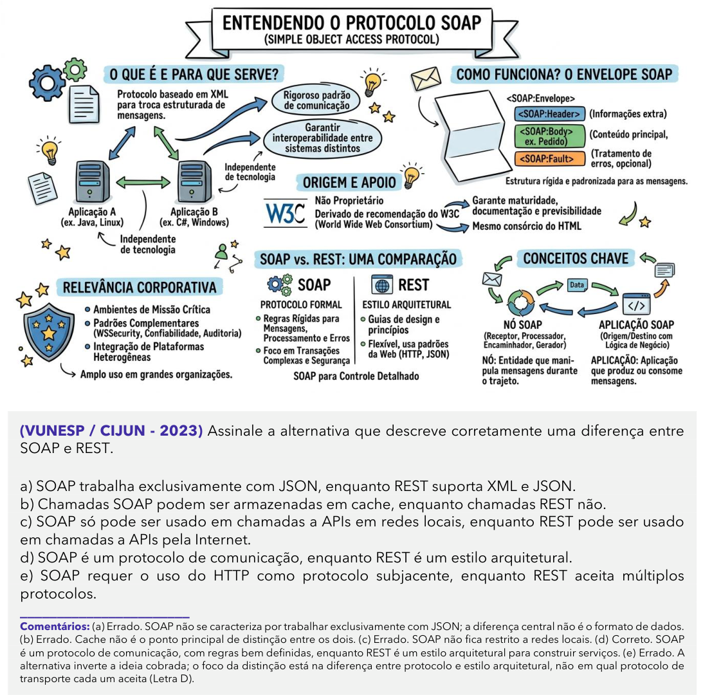


<!-- Start of picture text -->
(VUNESP / CIJUN - 2023)  Assinale a alternativa que descreve corretamente uma diferença entre<br>SOAP e REST.<br>a) SOAP trabalha exclusivamente com JSON, enquanto REST suporta XML e JSON.<br>b) Chamadas SOAP podem ser armazenadas em cache, enquanto chamadas REST não.<br>c) SOAP só pode ser usado em chamadas a APIs em redes locais, enquanto REST pode ser usado<br>em chamadas a APIs pela Internet.<br>d) SOAP é um protocolo de comunicação, enquanto REST é um estilo arquitetural.<br>e) SOAP requer o uso do HTTP como protocolo subjacente, enquanto REST aceita múltiplos<br>protocolos.<br>_______________________<br>Comentários:  (a) Errado. SOAP não se caracteriza por trabalhar exclusivamente com JSON; a diferença central não é o formato de dados.<br>(b) Errado. Cache não é o ponto principal de distinção entre os dois. (c) Errado. SOAP não fica restrito a redes locais. (d) Correto. SOAP<br>é um protocolo de comunicação, com regras bem definidas, enquanto REST é um estilo arquitetural para construir serviços. (e) Errado. A<br>alternativa inverte a ideia cobrada; o foco da distinção está na diferença entre protocolo e estilo arquitetural, não em qual protocolo de<br>transporte cada um aceita (Letra D).<br><!-- End of picture text -->

## **Características** 

Uma das características mais marcantes do SOAP é seu elevado nível de padronização. O protocolo estabelece regras detalhadas para a estrutura das mensagens, para a comunicação entre sistemas e para o tratamento de falhas durante as interações. Qual a importância de definir tantas regras? Em ambientes distribuídos, aplicações desenvolvidas por fornecedores diferentes precisam compartilhar informações

---

<!-- pagina: 45 -->

**Diego Carvalho, Equipe Informática 2 (Diego Carvalho), Equipe Informática 1 (Diego Carvalho) Aula 09** 

de forma consistente. A existência de padrões rigorosos reduz ambiguidades e facilita a interoperabilidade entre sistemas construídos com tecnologias distintas. 

Outro aspecto fundamental está relacionado ao uso do XML como formato de representação das mensagens. Todas as informações transmitidas são organizadas em documentos XML estruturados conforme regras previamente estabelecidas. Por que essa escolha foi importante para a evolução dos Web Services corporativos? O XML oferece recursos avançados para descrição e validação de dados, permitindo representar estruturas complexas de maneira padronizada. Em contrapartida, as mensagens tendem a ser mais extensas e exigem maior processamento quando comparadas a formatos mais compactos. 

O SOAP também se destaca pelo suporte a um conjunto de especificações complementares conhecido como família WS-*. O que essas especificações acrescentam à comunicação? Elas fornecem mecanismos voltados para requisitos corporativos frequentemente encontrados em grandes organizações, incluindo segurança, confiabilidade, autenticação, roteamento de mensagens e suporte a transações distribuídas. Essa capacidade tornou o protocolo particularmente atrativo em cenários que exigem controle rigoroso sobre os processos de integração entre sistemas. 

Outra característica relevante é a independência em relação ao protocolo de transporte utilizado. O SOAP depende exclusivamente do HTTP para funcionar? Não. Embora HTTP e HTTPS sejam as opções mais comuns, as mensagens SOAP também podem ser transportadas por mecanismos como SMTP e JMS. Essa flexibilidade permite adaptar a comunicação às características de diferentes infraestruturas tecnológicas, ampliando as possibilidades de integração em ambientes corporativos com requisitos variados. 

Todavia, ainda que a compatibilidade com múltiplos meios de entrega consista em sua maior promessa elástica teórica, o panorama operacional impõe cautelas na adoção do SOAP sob certos vetores de tráfego. Embora viável, a substituição pelo FTP nos disparos transacionais resulta amiúde em obstruções de pacotes, tendo em vista que firewalls organizacionais e roteadores limitantes interceptam ativamente essas portas não convencionais. Isso consolida o HTTP/HTTPS como a opção preferencial hegemônica que supera trivialmente defesas e camadas corporativas. 

|**CARACTERÍSTICAS**|**DESCRIÇÃO**|
|---|---|
|**ELEVADO NÍVEL DE**<br>**PADRONIZAÇÃO**|O SOAP define regras rigorosas para a estrutura das mensagens, para a comunicação<br>entre sistemas e para o tratamento de erros. Essa padronização reduz ambiguidades e<br>favorece a interoperabilidade entre aplicações desenvolvidas com tecnologias distintas.|
|**BASEADO EM XML**|Todas as mensagens SOAP são representadas em XML. Esse formato permite descrever<br>dados de forma estruturada, padronizada e validável, facilitando a troca de informações<br>entre sistemas heterogêneos.|
|**ESTRUTURA DE**<br>**MENSAGENS**<br>**PADRONIZADA**|As mensagens SOAP seguem uma estrutura bem definida composta por elementos como<br>Envelope, Header, Body e Fault, garantindo consistência na comunicação entre<br>consumidores e provedores.|
|**INTEROPE-**<br>**RABILIDADE**|Por utilizar padrões amplamente reconhecidos, o SOAP permite que aplicações<br>desenvolvidas em diferentes linguagens, plataformas e sistemas operacionais consigam<br>trocar informações de maneira transparente.|
|**SUPORTE À**<br>**FAMÍLIA WS-***|O SOAP pode ser complementado por especificações da família WS-*, que adicionam<br>funcionalidades relacionadas à segurança, autenticação, autorização, confiabilidade,<br>políticas de comunicação e transações distribuídas.|
|**SEGURANÇA**<br>**AVANÇADA**|Por meio do WS-Security e de outros padrões complementares, o SOAP oferece<br>mecanismos robustos de assinatura digital, criptografia, autenticação baseada em tokens<br>e controle de acesso.|

---

<!-- pagina: 46 -->

**Diego Carvalho, Equipe Informática 2 (Diego Carvalho), Equipe Informática 1 (Diego Carvalho) Aula 09** 

|**CARACTERÍSTICAS**|**DESCRIÇÃO**|
|---|---|
|**SUPORTE A**<br>**TRANSAÇÕES**<br>**DISTRIBUÍDAS**|O ecossistema SOAP permite implementar mecanismos de coordenação e controle de<br>transações que envolvem múltiplos sistemas, recurso muito valorizado em ambientes<br>corporativos.|
|**INDEPENDÊNCIA**<br>**DE PLATAFORMA**|O protocolo não depende de linguagens de programação, sistemas operacionais ou<br>tecnologias específicas, permitindo integração entre ambientes heterogêneos.|
|**INDEPENDÊNCIA**<br>**DE TRANSPORTE**|Embora normalmente utilize HTTP ou HTTPS, o SOAP pode ser transportado por outros<br>protocolos e mecanismos, como SMTP e JMS, oferecendo maior flexibilidade arquitetural.|
|**EXTENSIBILIDADE**|A estrutura SOAP permite adicionar novas funcionalidades por meio de cabeçalhos e<br>especificações complementares sem comprometer a compatibilidade com sistemas<br>existentes.|
|**TRATAMENTO**<br>**PADRONIZADO DE**<br>**ERROS**|O elemento Fault fornece um tratamento estruturado e padronizado de informar erros<br>ocorridos durante o processamento das mensagens.|
|**ORIENTAÇÃO A**<br>**CONTRATOS**|O SOAP normalmente utiliza WSDL para descrever formalmente operações, mensagens,<br>tipos de dados e protocolos, estabelecendo contratos claros entre consumidores e<br>provedores.|
|**MAIOR**<br>**VERBOSIDADE**|Como utiliza XML e estruturas detalhadas, as mensagens SOAP costumam ser maiores e<br>mais complexas do que as utilizadas em APIs REST baseadas em JSON.|
|**MAIOR**<br>**SOBRECARGA DE**<br>**PROCESSAMENTO**|A interpretação, validação e processamento de documentos XML geralmente exigem mais<br>recursos computacionais quando comparados a formatos mais leves.|
|**FORTE ADOÇÃO**<br>**CORPORATIVA**|Devido ao suporte a requisitos avançados de segurança, governança e confiabilidade, o<br>SOAP continua sendo amplamente utilizado em integrações bancárias, governamentais e<br>empresariais.|


## **Independência** 

Um dos objetivos mais importantes do SOAP é permitir a interoperabilidade entre aplicações executadas em diferentes plataformas tecnológicas. Em ambientes corporativos, é comum encontrar sistemas desenvolvidos em linguagens distintas, executados em sistemas operacionais variados e mantidos por equipes diferentes. Como aplicações tão diferentes conseguem trocar informações de forma confiável? O SOAP foi projetado para estabelecer padrões comuns de comunicação que reduzem as dificuldades normalmente encontradas em ambientes heterogêneos. 

Essa capacidade não depende de uma linguagem de programação específica. Um sistema desenvolvido em Java pode interagir com outro construído em C#, Python ou diversas outras tecnologias. O que torna essa comunicação possível? A resposta está na adoção de regras padronizadas para estruturação das mensagens, processamento das informações e definição dos contratos de serviço. Quando todos os participantes seguem as mesmas especificações, as diferenças tecnológicas deixam de ser um obstáculo significativo para a integração. 

O XML também desempenha papel importante nesse cenário. Por que esse formato foi amplamente utilizado em arquiteturas SOAP? Como XML é um padrão amplamente reconhecido e suportado por diferentes plataformas, torna-se possível representar dados de maneira consistente entre sistemas distintos. Além disso, recursos de validação e descrição de estruturas complexas contribuem para aumentar a previsibilidade da comunicação e reduzir problemas de interpretação durante a troca de informações.

---

<!-- pagina: 47 -->

**Diego Carvalho, Equipe Informática 2 (Diego Carvalho), Equipe Informática 1 (Diego Carvalho) Aula 09** 

Essa interoperabilidade oferece vantagens importantes para as organizações. Seria necessário reescrever todos os sistemas existentes para adotar uma única tecnologia? Em muitos casos, não. O SOAP permite que aplicações legadas e soluções mais recentes coexistam dentro do mesmo ambiente corporativo. Como resultado, os investimentos já realizados podem ser preservados enquanto novos sistemas são integrados gradualmente por meio de padrões comuns de comunicação e compartilhamento de funcionalidades. 

**(AOCP / ALERN - 2022)** São características do SOAP a independência: 

<mark>a) do tipo de comunicação para o web service e fullstring. b) do protocolo, de linguagem, de plataforma e sistema operacional. c) de portabilidade, de aderência, de TIB e processo. d) de corba e de cabeçalho. e) de envelope, de Architecture e de cardinalidade.</mark> 

**<mark>_______________________ Comentários:</mark>** <mark>(a) Errado. Essa opção traz termos que não representam as independências clássicas do SOAP, como "fullstring", que não faz sentido nesse contexto. (b) Correto. O SOAP se destaca justamente pela independência de protocolo, linguagem, plataforma e sistema operacional, o que facilita a integração entre sistemas diferentes. (c) Errado. Os elementos citados não correspondem às características centrais normalmente associadas ao SOAP. (d) Errado. CORBA e cabeçalho não definem o conjunto de independências que caracteriza o SOAP. (e) Errado. Envelope e cardinalidade são conceitos de outra natureza e não expressam as independências típicas</mark> do SOAP (Letra B). 

## **Padronização** 

A padronização é uma das características mais importantes do SOAP e desempenhou papel fundamental em sua adoção por organizações de grande porte. Em ambientes corporativos, sistemas desenvolvidos por equipes diferentes frequentemente precisam compartilhar informações de maneira consistente. Como garantir que aplicações construídas por fornecedores distintos consigam se comunicar sem conflitos de interpretação? O SOAP foi concebido com base em especificações abertas e amplamente reconhecidas, permitindo que diferentes implementações sigam um conjunto comum de regras. 

Essa padronização está presente em diversos aspectos da comunicação. A estrutura das mensagens, os mecanismos de tratamento de falhas e os recursos de extensão seguem definições formalmente estabelecidas. Qual a vantagem de adotar regras tão detalhadas? Quando consumidores e provedores utilizam os mesmos padrões, a comunicação torna-se mais previsível e os problemas de compatibilidade tendem a ser reduzidos. Essa característica facilita a integração entre sistemas distribuídos que utilizam tecnologias diferentes. 

O ecossistema associado ao SOAP também inclui especificações complementares que ampliam suas capacidades. Como os contratos de serviço são descritos? Como as estruturas de dados podem ser validadas? Como mecanismos avançados de segurança são implementados? Tecnologias como WSDL, XML Schema e WS-Security foram desenvolvidas para atender a essas necessidades. Embora não façam parte do núcleo do protocolo SOAP, elas trabalham em conjunto para fornecer um ambiente de integração mais formalizado e controlado. 

Em projetos corporativos, a existência de padrões bem definidos costuma representar uma vantagem significativa. Equipes de desenvolvimento, fornecedores de software e profissionais de infraestrutura conseguem trabalhar com expectativas claramente estabelecidas ao longo do ciclo de integração. Como consequência, reduzem-se ambiguidades na implementação e aumenta-se a previsibilidade do comportamento dos serviços, fator especialmente relevante em ambientes que exigem estabilidade e controle rigoroso sobre a comunicação entre sistemas.

---

<!-- pagina: 48 -->

**Diego Carvalho, Equipe Informática 2 (Diego Carvalho), Equipe Informática 1 (Diego Carvalho) Aula 09** 

## **Uso corporativo** 

O SOAP conquistou ampla adoção em ambientes corporativos porque foi projetado para atender requisitos frequentemente encontrados em sistemas críticos de negócio. Organizações que atuam em setores como finanças, logística, telecomunicações e governo eletrônico costumam lidar com processos que exigem elevados níveis de segurança, confiabilidade e rastreabilidade. Por que essas características são tão importantes? Porque falhas na comunicação podem gerar impactos significativos em operações que dependem da troca consistente de informações entre múltiplos sistemas distribuídos. 

Outro fator relevante está relacionado ao conjunto de especificações complementares disponíveis no ecossistema SOAP. Como implementar recursos avançados de segurança e integração sem criar soluções proprietárias para cada necessidade? Diversos padrões foram desenvolvidos para atender a requisitos específicos, incluindo autenticação, assinatura digital, criptografia, confiabilidade na entrega de mensagens e coordenação de transações distribuídas. Essa padronização contribuiu para que organizações adotassem soluções compatíveis e amplamente reconhecidas pela indústria. 

A consolidação do SOAP também foi favorecida pelo suporte oferecido por plataformas corporativas. Servidores de aplicação, ferramentas de integração e soluções empresariais passaram a disponibilizar recursos para geração automática de contratos, validação de mensagens e publicação de serviços. Qual a vantagem dessa integração com as ferramentas corporativas? A existência de mecanismos nativos reduz o esforço de implementação e facilita a administração dos serviços ao longo do ciclo de vida das aplicações. 

Em ambientes compostos por grande quantidade de sistemas, surge frequentemente a necessidade de uma camada intermediária responsável por coordenar as integrações. É nesse contexto que aparece o Enterprise Service Bus, conhecido pela sigla ESB. Sua função consiste em facilitar a comunicação entre aplicações por meio de recursos como roteamento de mensagens, transformação de dados e mediação entre diferentes protocolos. Dessa forma, sistemas distintos conseguem trocar informações sem depender diretamente das particularidades tecnológicas uns dos outros. 

Uma das estratégias frequentemente associadas aos ESBs é a utilização de um modelo de dados canônico. Como evitar que cada sistema precise conhecer detalhadamente os formatos utilizados por todos os demais? Nesse modelo, as mensagens são inicialmente convertidas para uma representação padronizada e posteriormente transformadas para o formato exigido pelo sistema de destino. Essa abordagem reduz o acoplamento entre aplicações e simplifica a administração das integrações em ambientes corporativos complexos. 

Mesmo com a popularização de arquiteturas REST e de abordagens modernas baseadas em microsserviços, o SOAP continua presente em diversos cenários empresariais. Por que uma tecnologia criada há tantos anos ainda permanece em utilização? A combinação entre maturidade tecnológica, forte padronização e suporte a requisitos corporativos avançados faz com que muitos sistemas bancários, governamentais, de ERP e outras aplicações críticas continuem utilizando Web Services SOAP como mecanismo de integração.

---

<!-- pagina: 49 -->

**Diego Carvalho, Equipe Informática 2 (Diego Carvalho), Equipe Informática 1 (Diego Carvalho) Aula 09** 


<!-- Start of picture text -->
Estrutura da Mensagem<br><!-- End of picture text -->

##### **<mark>INCIDÊNCIA EM PROVA: ALTÍSSIMA</mark>** 

A comunicação em Web Services SOAP ocorre por meio de mensagens estruturadas em XML. Para que aplicações desenvolvidas em plataformas diferentes consigam interpretar corretamente as informações trocadas, o protocolo estabelece uma estrutura padronizada para todas as mensagens. Quais elementos compõem essa estrutura? Os principais componentes são o Envelope, o Header e o Body. Além deles, quando ocorre alguma falha durante o processamento, pode ser utilizado o elemento Fault, que é inserido dentro do Body para descrever o erro identificado. 

A existência dessa estrutura padronizada é um dos fatores que favorecem a interoperabilidade entre sistemas. Como aplicações desenvolvidas com tecnologias distintas conseguem compreender exatamente o mesmo conteúdo? Isso ocorre porque consumidores e provedores seguem regras comuns para construir e interpretar as mensagens SOAP. Essa organização também facilita a incorporação de funcionalidades adicionais relacionadas à segurança, monitoramento, auditoria, roteamento e outros requisitos frequentemente encontrados em ambientes corporativos. 

O Envelope funciona como o elemento raiz da mensagem e engloba todos os demais componentes. Qual é a função de cada parte dessa estrutura? O Header pode armazenar informações complementares relacionadas ao processamento da mensagem, enquanto o Body contém os dados efetivamente associados à operação solicitada. Caso ocorra algum problema durante o processamento, o elemento Fault pode ser utilizado para informar detalhes sobre a falha. Essa separação de responsabilidades contribui para a organização e a extensibilidade do protocolo. 

Além da estrutura básica das mensagens, diferentes estilos de utilização podem ser adotados em serviços SOAP. Um dos mais conhecidos é o estilo RPC, que procura representar chamadas remotas de operações de forma semelhante à invocação de procedimentos. Existe outra abordagem além dessa? Sim. O estilo Document prioriza a troca de documentos estruturados entre aplicações, concentrando-se nos dados transmitidos em vez da representação de chamadas de métodos. Atualmente, o modelo Document/Literal tornou-se predominante em grande parte das implementações corporativas. 

Outro recurso frequentemente associado ao SOAP envolve o transporte de conteúdos binários e anexos. Como enviar arquivos sem incorporá-los integralmente à estrutura XML da mensagem? Para atender a essa necessidade, foram desenvolvidas soluções como SOAP with Attachments e MTOM. Esses mecanismos permitem transmitir documentos, imagens e outros conteúdos binários de maneira mais eficiente, reduzindo o impacto que a codificação direta desses dados poderia causar sobre o tamanho das mensagens. 

Também existe o conceito de encodingStyle, presente principalmente em versões mais antigas do protocolo. Qual era sua finalidade? Esse atributo permitia indicar regras de serialização utilizadas para representar determinados tipos de dados dentro da mensagem SOAP. Com a popularização das abordagens baseadas em Document/Literal, sua utilização tornou-se menos frequente. Ainda assim, o conceito permanece relevante para compreender a evolução histórica dos mecanismos de representação de dados adotados pelo protocolo. 

**(QUADRIX / PRODAM AM - 2022)** O atributo do elemento Header block que indica quais regras <mark>serão utilizadas para a serialização de partes de uma mensagem SOAP denomina-se</mark> 

<mark>a) role. b) mustUnderstand. c) relay.</mark>

---

<!-- pagina: 50 -->

**Diego Carvalho, Equipe Informática 2 (Diego Carvalho), Equipe Informática 1 (Diego Carvalho) Aula 09** 

### <mark>d) body.</mark> 

### <mark>e) encodingStyle.</mark> 

### **<mark>_______________________</mark>** 

**<mark>Comentários:</mark>** <mark>(a) Errado. role serve para indicar o papel ou destinatário do cabeçalho SOAP, não as regras de serialização da mensagem. (b) Errado. mustUnderstand indica se aquele cabeçalho precisa ser obrigatoriamente compreendido pelo destinatário. (c) Errado. relay está ligado ao encaminhamento de blocos de cabeçalho por nós intermediários, não à serialização. (d) Errado. body é o corpo da mensagem SOAP, não um atributo do Header block. (e) Correto. encodingStyle é o atributo usado para indicar quais regras de</mark> codificação/serialização serão aplicadas a partes da mensagem SOAP (Letra E). 


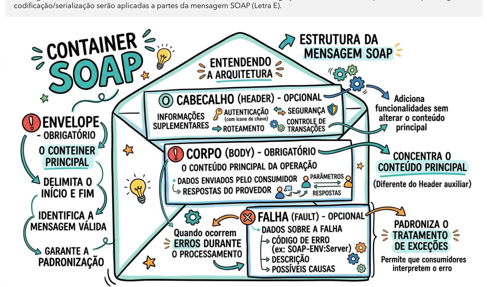


<!-- Start of picture text -->
codificação/serialização serão aplicadas a partes da mensagem SOAP (Letra E).<br><!-- End of picture text -->

## **Envelope** 

O Envelope é o elemento raiz de toda mensagem SOAP e constitui a base da estrutura utilizada pelo protocolo para organizar a comunicação entre sistemas. Sempre que uma mensagem SOAP é enviada ou recebida, ela precisa estar contida dentro desse elemento. Por que ele é considerado tão importante? Porque sua presença identifica formalmente a mensagem como compatível com as especificações do SOAP e estabelece a estrutura que permitirá o processamento correto das informações transportadas. 

Além de delimitar o conteúdo da mensagem, o Envelope também costuma concentrar as declarações de namespaces utilizadas durante a comunicação. Qual a finalidade desses namespaces? Eles permitem que os sistemas distingam os elementos pertencentes ao protocolo SOAP de outros elementos XML que possam existir na mensagem. Essa identificação reduz ambiguidades e contribui para que consumidores e provedores interpretem corretamente cada componente presente na estrutura transmitida. 

Dentro do Envelope encontram-se os demais elementos utilizados pelo protocolo. Quais são esses componentes? O Header pode armazenar informações complementares relacionadas ao processamento da mensagem, como dados de segurança ou roteamento. Já o Body contém as informações efetivamente associadas à operação executada. Quando ocorre uma falha durante o processamento, o elemento Fault pode ser incluído dentro do Body para descrever o problema identificado e fornecer detalhes sobre o erro ocorrido.

---

<!-- pagina: 51 -->

**Diego Carvalho, Equipe Informática 2 (Diego Carvalho), Equipe Informática 1 (Diego Carvalho) Aula 09** 

Uma forma simples de compreender a função do Envelope consiste em observá-lo como a estrutura externa que organiza toda a mensagem SOAP. O que aconteceria se os dados fossem transmitidos sem esse elemento? Os sistemas deixariam de reconhecer formalmente a mensagem como compatível com o protocolo, comprometendo sua interpretação e processamento. Por essa razão, o Envelope é considerado um componente obrigatório e fundamental para o funcionamento da comunicação baseada em SOAP. 

## **Header** 

O Header é um elemento opcional da mensagem SOAP utilizado para transportar informações complementares relacionadas ao processamento da comunicação. Enquanto o Body contém os dados diretamente associados à operação solicitada, o Header é destinado ao armazenamento de metadados que auxiliam na execução de funcionalidades adicionais. Que tipo de informação costuma ser enviada nesse componente? É comum encontrar dados relacionados à autenticação, segurança, monitoramento, roteamento de mensagens e controle de transações. 

Essa separação entre dados de negócio e informações de controle oferece grande flexibilidade para as integrações. Por que incluir esses elementos em uma área separada da mensagem? Dessa forma, recursos adicionais podem ser incorporados sem alterar a estrutura principal das operações disponibilizadas pelo serviço. O consumidor continua enviando e recebendo os mesmos dados de negócio, enquanto mecanismos complementares são tratados de maneira independente por meio do Header. 

Uma característica importante desse elemento é sua capacidade de extensão. Diferentes especificações podem adicionar informações próprias para atender requisitos específicos de um ambiente corporativo. Como implementar recursos avançados de segurança sem modificar todas as mensagens da aplicação? Tecnologias como WS-Security utilizam o Header para transportar certificados digitais, tokens de autenticação, assinaturas digitais e outras informações necessárias para proteger a comunicação entre consumidores e provedores. 

Outro conceito relevante associado ao Header é o atributo `mustUnderstand`. Qual é sua finalidade? Esse atributo pode ser aplicado a elementos específicos do cabeçalho para indicar que eles devem obrigatoriamente ser compreendidos e processados pelo destinatário. Caso um nó SOAP receba uma mensagem contendo um elemento marcado com essa exigência e não consiga interpretá-lo corretamente, não deve simplesmente ignorá-lo. Nessa situação, o processamento da mensagem resulta na geração de uma SOAP Fault, informando que o requisito obrigatório não pôde ser atendido. 

O atributo `mustUnderstand` contribui para aumentar a confiabilidade da comunicação em ambientes distribuídos. Como garantir que informações críticas de segurança ou controle não sejam desconsideradas durante o processamento? Ao marcar determinados elementos como obrigatórios, o emissor estabelece que eles precisam ser reconhecidos pelo destinatário para que a mensagem seja considerada válida. Esse mecanismo reduz riscos de processamento incorreto e fortalece a consistência das integrações baseadas em SOAP. 

## **Body** 

O Body é o elemento da mensagem SOAP responsável por transportar as informações diretamente relacionadas à operação executada. Sempre que um consumidor solicita uma funcionalidade de um serviço, os dados necessários para realizar essa solicitação são normalmente inseridos nesse componente. Onde ficam armazenadas as informações que realmente interessam para a execução da operação? A resposta está no Body, pois ele concentra o conteúdo principal da comunicação entre consumidor e provedor.

---

<!-- pagina: 52 -->

**Diego Carvalho, Equipe Informática 2 (Diego Carvalho), Equipe Informática 1 (Diego Carvalho) Aula 09** 

Quando o serviço processa uma solicitação e gera uma resposta, os resultados também são normalmente enviados por meio desse elemento. Como o consumidor recebe os dados produzidos pela operação solicitada? As informações retornadas pelo serviço são estruturadas dentro do Body da mensagem de resposta, seguindo as definições estabelecidas pelo contrato do serviço. Essa padronização garante que ambas as partes interpretem corretamente os dados trocados durante a comunicação. 

Uma característica importante do Body é seu caráter obrigatório. Seria possível construir uma mensagem SOAP válida sem esse elemento? Não. Diferentemente do Header, que pode ou não estar presente, toda mensagem SOAP deve conter um Body. Isso ocorre porque ele representa a parte da mensagem diretamente relacionada à execução da operação. Sem esse componente, não existiriam dados de negócio para serem processados ou retornados durante a interação entre os sistemas. 

Além de transportar requisições e respostas, o Body também pode ser utilizado para comunicar falhas ocorridas durante o processamento. Como um serviço informa que não conseguiu concluir determinada operação? Nesses casos, o elemento Fault é inserido dentro do próprio Body, fornecendo informações sobre o erro identificado. Essa organização mantém centralizadas as informações relacionadas ao resultado da comunicação, sejam elas respostas válidas ou detalhes sobre problemas encontrados durante a execução da operação. 

## **Fault** 

O Fault é o elemento utilizado pelo protocolo SOAP para representar erros ocorridos durante o processamento de uma mensagem. Nem toda solicitação enviada a um serviço é concluída com sucesso. O que acontece quando uma operação não pode ser executada corretamente? Nesses casos, o serviço pode retornar uma resposta contendo um Fault, cuja finalidade é informar que ocorreu uma falha e fornecer detalhes sobre o problema identificado durante o processamento da requisição. 

As informações presentes nesse elemento auxiliam tanto sistemas consumidores quanto equipes de desenvolvimento na análise da situação. Que tipo de dado pode ser encontrado em um Fault? É comum que a estrutura contenha códigos de erro, descrições textuais e informações adicionais que ajudam a identificar a origem da falha. Com base nesses dados, aplicações podem decidir como reagir ao problema, seja tentando novamente a operação, registrando o incidente ou informando adequadamente o usuário. 

Uma característica importante desse mecanismo está na sua padronização. Como aplicações desenvolvidas em tecnologias diferentes conseguem interpretar erros de maneira consistente? O protocolo SOAP define uma estrutura específica para representação das falhas, permitindo que consumidores reconheçam e processem essas informações de forma previsível. Essa uniformidade simplifica o desenvolvimento de rotinas automáticas de tratamento de exceções e contribui para a interoperabilidade entre sistemas distribuídos. 

O Fault não está presente em todas as mensagens SOAP. Ele aparece apenas quando ocorre algum problema durante a execução da operação solicitada. Onde esse elemento é inserido na estrutura da mensagem? O Fault é transportado dentro do Body e passa a representar a resposta retornada pelo serviço em situações de erro. Dessa forma, ele se torna uma importante fonte de informações para diagnóstico, monitoramento e manutenção das integrações baseadas em Web Services SOAP. 

### **Saiba mais:**

---

<!-- pagina: 53 -->

**Diego Carvalho, Equipe Informática 2 (Diego Carvalho), Equipe Informática 1 (Diego Carvalho) Aula 09** 

<mark>O protocolo SOAP define regras específicas para representar falhas ocorridas durante o processamento de mensagens. Como um serviço informa que uma operação não foi executada com sucesso? Para essa finalidade, utiliza-se o elemento</mark> ` <mark><soap:Fault></mark> ` <mark>, responsável por transportar informações relacionadas ao erro identificado. Esse mecanismo padroniza a comunicação de falhas e permite que aplicações clientes interpretem problemas de forma consistente durante a troca de mensagens.</mark> 

<mark>Ao estudar a estrutura das mensagens SOAP, surge uma dúvida importante. Seria possível incluir vários elementos de erro dentro de uma mesma resposta? Não. A especificação estabelece que o</mark> ` ` ` ` <mark>elemento <soap:Fault> pode aparecer no máximo uma única vez dentro do elemento <Body> . Essa restrição garante que exista apenas uma representação formal da falha associada àquela mensagem, evitando ambiguidades durante o processamento das informações retornadas pelo serviço.</mark> 

<mark>Essa limitação não significa que apenas um detalhe sobre o erro possa ser informado. Como representar informações mais completas sobre uma falha? O próprio elemento</mark> ` <mark><soap:Fault></mark> ` <mark>possui estruturas internas destinadas à descrição do problema, permitindo registrar códigos, mensagens explicativas e detalhes adicionais relacionados ao incidente ocorrido. Dessa forma, informações complementares permanecem organizadas dentro de um único elemento padronizado.</mark> 

<mark>A existência dessa regra contribui para a interoperabilidade entre diferentes plataformas e implementações SOAP. Quando um cliente recebe uma mensagem contendo</mark> ` <mark><soap:Fault></mark> ` <mark>, sabe exatamente onde procurar as informações relacionadas ao erro. Essa previsibilidade simplifica a implementação dos mecanismos de tratamento de exceções e reforça a padronização que</mark> caracteriza os Web Services baseados na arquitetura SOAP. 

**(FCC / TRT 22ª Região - 2022)** Para indicar informações de erro em uma mensagem SOAP, um <mark>Analista utilizou o elemento Fault, que</mark> 

<mark>a) só pode aparecer uma vez em cada mensagem. b) utiliza o subelemento <faultname> para identificar a falha. c) é obrigatório em toda mensagem SOAP. d) é filho do elemento <header>.</mark> 

<mark>e) utiliza o subelemento <faultsource> para indicar a causa da falha.</mark> 

**<mark>_______________________ Comentários:</mark>** <mark>(a) Correto. O elemento Fault na estrutura do SOAP aparece no máximo uma vez por mensagem, concentrando ali as informações de erro. (b) Errado. A identificação da falha não é feita pelo subelemento faultname conforme descrito. (c) Errado. O Fault não precisa estar presente em toda mensagem, apenas quando há erro a informar. (d) Errado. O Fault não é filho do elemento header,</mark> mas sim do Body. (e) Errado. faultsource não é o subelemento padrão de indicação de causa da falha no SOAP (Letra A). 

A utilização padronizada do Fault contribui para aumentar a confiabilidade da comunicação entre aplicações. Como identificar rapidamente a causa de uma falha em um ambiente distribuído composto por diversos sistemas? A existência de uma estrutura comum para representação de erros facilita a análise dos problemas e reduz ambiguidades durante o processo de integração. Esse mecanismo permite que consumidores e provedores compartilhem uma forma consistente de reportar e interpretar falhas ao longo da comunicação.

---

<!-- pagina: 54 -->

**Diego Carvalho, Equipe Informática 2 (Diego Carvalho), Equipe Informática 1 (Diego Carvalho) Aula 09** 

**(FGV / TJ RN - 2023)** No contexto de uma mensagem SOAP, o elemento que NÃO faz parte da <mark>estrutura sintática estabelecida é:</mark> 

<mark>a) Body; b) Credential; c) Envelope; d) Fault; e) Header.</mark> 

**<mark>_______________________ Comentários:</mark>** <mark>(a) Errado. Body é um dos elementos clássicos da mensagem SOAP, usado para carregar o conteúdo principal da comunicação. (b) Correto. Credential não integra a estrutura sintática padrão do SOAP; pode aparecer em soluções específicas, mas não como elemento estrutural básico. (c) Errado. Envelope faz parte da base do SOAP, delimitando e organizando toda a mensagem. (d) Errado. Fault é um elemento previsto no SOAP para indicar erros no processamento da mensagem. (e) Errado. Header também compõe</mark> a estrutura SOAP, reunindo informações adicionais da mensagem (Letra B). 

|**ELEMENTOS**|**SITUAÇÃO**|**DESCRIÇÃO**|
|---|---|---|
|**ENVELOPE**<br>**(ENVELOPE)**|**OBRIGATÓRIO**|O Envelope é o elemento principal de uma mensagem SOAP e funciona<br>como seu contêiner externo. Ele delimita o início e o fim da mensagem e<br>identifica o documento como uma mensagem SOAP válida. Todos os demais<br>componentes, como Header, Body e Fault, ficam contidos dentro do<br>Envelope. Sua presença é obrigatória em qualquer mensagem SOAP e<br>garante apadronização da estrutura de comunicação.|
|**CABEÇALHO**<br>**(HEADER)**|**OPCIONAL**|O Header é uma seção opcional da mensagem SOAP destinada ao transporte<br>de informações complementares relacionadas ao processamento da<br>comunicação. Nele podem ser incluídos dados de autenticação, controle de<br>transações, roteamento, segurança e informações necessárias ao tratamento<br>da mensagem. Como é separado do conteúdo principal, permite adicionar<br>funcionalidades sem alterar os dados efetivos da operação solicitada.|
|**CORPO**<br>**(BODY)**|**OBRIGATÓRIO**|Elemento da mensagem SOAP que contém os dados efetivamente<br>relacionados à operação executada. É nele que são armazenados os<br>parâmetros enviados pelo consumidor e as respostas retornadas pelo<br>provedor. Diferentemente do Header, que possui informações auxiliares, o<br>Body concentra o conteúdo principal da comunicação. Sua presença é<br>obrigatória emqualquer mensagem SOAP válida.|
|**FALHA**<br>**(FAULT)**|**OPCIONAL**|O Fault é um elemento opcional utilizado para representar erros ocorridos<br>durante o processamento de uma mensagem SOAP. Quando presente, ele<br>fornece informações detalhadas sobre a falha, incluindo códigos de erro,<br>descrições e possíveis causas do problema. Esse mecanismo padroniza o<br>tratamento de exceções, permitindo que consumidores interpretem e<br>respondam adequadamente aos erros ocorridos durante a comunicação.|


Por fim, vamos ver como é uma Mensagem SOAP. No exemplo a seguir, temos uma requisição em que é chamado um procedimento chamado retornaNome, que recebe CPF como parâmetro: 

```
POST /InStock HTTP/1.1
Host: www.dre.ufrj.br
Content-Type: application/soap+xml; charset=utf-8
Content-Length: nnn
```

```
<?xmlversion="1.0"?>
```

```
<soap:Envelopexmlns:soap="http://www.w3.org/2001/12/soap-envelope"
soap:encodingStyle="http://www.w3.org/2001/12/soap-encoding"xmlns:tiposns="http://www.w3.org/2001/XMLSchema">
```

```
<soap:Header>
```

```
<m:atenticacaoxmlns:m="http://www.dre.ufrj.br/ws/dre">21423edf69fgs</m:atenticacao>
```

---

<!-- pagina: 55 -->

**Diego Carvalho, Equipe Informática 2 (Diego Carvalho), Equipe Informática 1 (Diego Carvalho) Aula 09** 

```
</soap:Header>
<soap:Body>
<m:retornaNomexmlns:m="http://www.dre.ufrj.br/ws/dre">
<numdretype="tiposns:int">123.456.789-00</numdre>
</m:retornaNome>
</soap:Body>
```

```
</soap:Envelope>
```

Notem que, em verde, temos o envelope; em laranjado, temos o cabeçalho (que adiciona uma funcionalidade de autenticação); e, em azul, temos o corpo (que recebe o CPF). E a resposta: 

```
HTTP/1.1 200 OK
Content-Type: application/soap+xml; charset=utf-8
Content-Length: nnn
```

```
<?xmlversion="1.0"?>
```

```
<soap:Envelopexmlns:soap="http://www.w3.org/2001/12/soap-envelope"soap:encodingStyle="http://www.w3.org/2001/12/soap-
encoding"xmlns:tiposns="http://www.w3.org/2001/XMLSchema">
```

```
<soap:Header>
<m:atenticacaoxmlns:m="http://www.dre.ufrj.br/ws/dre">2kg469fgs</m:atenticacao>
</soap:Header>
```

```
<soap:Body>
<m:retornaNomeResponsexmlns:m="http://www.dre.ufrj.br/ws/dre">
<nometype="tiposns:string">João da Silva</nome>
</m:retornaNomeResponse>
```

```
<soap:Fault>
             </soap:Fault>
</soap:Body>
</soap:Envelope>
```

Notem que a resposta do serviço web retornou o nome João da Silva para o CPF informado como parâmetro. Vejam também que há, em amarelo, o elemento fault vazio, porque não houve falhas. Professor, eu preciso entender esse código em detalhe? Não, pessoal... basta saber a função dos quatro elementos. Vejam que não é difícil identificá-los em uma Mensagem SOAP! Você faz uma requisição e recebe uma resposta como resultado. 

**(FEPESE / FAPESC - 2022)** Analise as afirmativas abaixo sobre a estrutura de mensagens SOAP, no <mark>contexto de serviços web. 1. O envelope SOAP é o elemento raíz em toda mensagem SOAP. 2. Um envelope SOAP contém até dois elementos, um cabeçalho opcional e um corpo mandatório. 3. As informações relacionadas às aplicações que devem ser processadas pelos nós SOAP ao longo do caminho da mensagem devem ser passadas no corpo da mensagem. Assinale a alternativa que indica todas as afirmativas corretas.</mark> 

<mark>a) É correta apenas a afirmativa 2. b) São corretas apenas as afirmativas 1 e 2. c) São corretas apenas as afirmativas 1 e 3. d) São corretas apenas as afirmativas 2 e 3. e) São corretas as afirmativas 1, 2 e 3.</mark> 

**<mark>_______________________ Comentários:</mark>** <mark>(1) Correto. O Envelope é mesmo o elemento raiz da mensagem SOAP, tudo fica dentro dele. (2) Correto. A estrutura básica do SOAP traz um cabeçalho opcional e um corpo obrigatório dentro do envelope. (3) Errado. No SOAP, informações para</mark> processamento pelos nós ao longo do caminho ficam no cabeçalho, não no corpo da mensagem (Letra B).

---

<!-- pagina: 56 -->

**Diego Carvalho, Equipe Informática 2 (Diego Carvalho), Equipe Informática 1 (Diego Carvalho) Aula 09** 


<!-- Start of picture text -->
WSDL<br><!-- End of picture text -->

##### **<mark>INCIDÊNCIA EM PROVA: ALTÍSSIMA</mark>** 

#### **<mark>WSDL</mark>** 

<mark>WSDL (Web Services Description Language) é uma linguagem baseada em XML utilizada para descrever</mark> formalmente um Web Service. Por meio dela, são especificadas operações disponíveis, mensagens suportadas, formatos de dados utilizados, protocolos de comunicação e endereços de acesso. O WSDL funciona como um contrato técnico detalhado que permite a integração automática entre consumidores e provedores. 

WSDL (Web Services Description Language) é uma linguagem baseada em XML utilizada para descrever formalmente um Web Service. Quando um sistema deseja consumir um serviço, precisa compreender exatamente quais funcionalidades estão disponíveis e como elas podem ser acessadas. Como obter essas informações de maneira padronizada? O WSDL foi criado justamente para fornecer uma descrição técnica detalhada do serviço, permitindo que consumidores e provedores compartilhem o mesmo entendimento sobre a comunicação que será estabelecida. 

No ecossistema SOAP, o WSDL desempenha o papel de contrato formal entre as partes envolvidas. O que esse contrato descreve? Nele são especificadas as operações disponibilizadas pelo serviço, as mensagens utilizadas na comunicação, os tipos de dados envolvidos e outras informações necessárias para a interação. Além disso, o documento pode indicar aspectos relacionados aos protocolos utilizados e aos pontos de acesso do serviço. Essa formalização reduz ambiguidades e aumenta a previsibilidade durante os processos de integração. 

Uma das características mais valorizadas do WSDL está relacionada à automação do desenvolvimento. Seria necessário implementar manualmente toda a estrutura de comunicação para consumir um serviço SOAP? Em muitos casos, não. Diversas ferramentas conseguem interpretar o documento WSDL e gerar automaticamente classes, métodos e estruturas de dados compatíveis com o serviço. Essa capacidade reduz o esforço de implementação e diminui a probabilidade de erros na construção dos clientes consumidores. 

A utilização de XML e de padrões amplamente reconhecidos faz com que o WSDL possa ser compreendido por diferentes plataformas tecnológicas. Como aplicações desenvolvidas em linguagens distintas conseguem interpretar exatamente a mesma descrição de serviço? A resposta está na adoção de uma especificação padronizada que pode ser processada por ferramentas de diversos fabricantes. Essa característica fortalece a interoperabilidade e contribui para a integração entre sistemas heterogêneos em ambientes corporativos. 


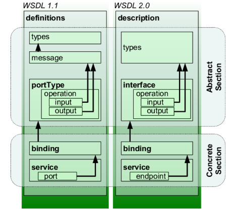

---

<!-- pagina: 57 -->

**Diego Carvalho, Equipe Informática 2 (Diego Carvalho), Equipe Informática 1 (Diego Carvalho) Aula 09** 

O WSDL também desempenha papel importante na manutenção e evolução dos serviços. Quando uma nova aplicação precisa ser integrada ao ambiente, não é necessário analisar a implementação interna do provedor para compreender como a comunicação deve ocorrer. Basta consultar o contrato disponibilizado. Essa separação entre descrição e implementação favorece o desacoplamento entre sistemas e facilita a expansão de arquiteturas baseadas em Web Services SOAP. 


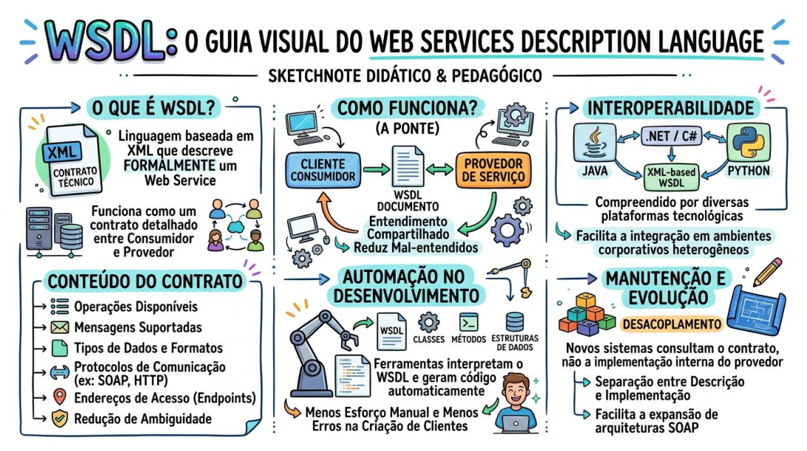


## **Contrato do Serviço** 

#### **<mark>CONTRATO DE SERVIÇO</mark>** 

<mark>O contrato do serviço é a especificação que define como um serviço deve ser utilizado por seus consumidores.</mark> Ele descreve operações, parâmetros, tipos de dados, formatos de mensagens, protocolos e demais regras de comunicação. Seu objetivo é garantir que diferentes aplicações possam interagir corretamente sem necessidade de conhecer detalhes internos da implementação. Em ambientes SOAP, o WSDL costuma representar esse contrato. 

O contrato de serviço corresponde ao conjunto de regras que define como consumidores e provedores devem se comunicar em uma arquitetura baseada em Web Services. Sempre que uma aplicação deseja utilizar um serviço disponibilizado por outra, é necessário que ambas compartilhem o mesmo entendimento sobre a comunicação. Como garantir que sistemas desenvolvidos por equipes diferentes consigam interagir corretamente? Essa função é desempenhada pelo contrato, que estabelece formalmente as condições necessárias para a troca de informações. 

O contrato descreve diversos aspectos da interação entre as partes. Quais informações precisam estar presentes nessa definição? Normalmente são especificadas as operações disponíveis, os dados exigidos em cada requisição, as respostas possíveis e as estruturas utilizadas para representar as informações trocadas. Além disso, podem ser definidos protocolos de comunicação, mecanismos de acesso e outras características necessárias para que o serviço seja consumido de maneira adequada e previsível.

---

<!-- pagina: 58 -->

**Diego Carvalho, Equipe Informática 2 (Diego Carvalho), Equipe Informática 1 (Diego Carvalho) Aula 09** 

Uma das principais vantagens dessa abordagem está relacionada à separação entre interface e implementação. O consumidor precisa conhecer a lógica interna do sistema que oferece o serviço? Não. Basta compreender as regras estabelecidas no contrato e respeitar os formatos definidos para envio e recebimento de mensagens. Essa característica reduz o acoplamento entre as aplicações, pois permite que alterações internas sejam realizadas sem impactar os consumidores, desde que a compatibilidade do contrato seja preservada. 

No contexto dos Web Services SOAP, a descrição formal do contrato normalmente é realizada por meio do WSDL. O que esse documento reúne? Nele são especificadas operações, mensagens, tipos de dados, protocolos utilizados e pontos de acesso do serviço. Em muitos casos, o WSDL também utiliza definições baseadas em XML Schema para descrever detalhadamente as estruturas de dados envolvidas na comunicação. Dessa forma, todas as informações necessárias para consumir o serviço permanecem centralizadas em uma única especificação. 

A existência de contratos bem definidos contribui para a interoperabilidade e para a evolução dos sistemas ao longo do tempo. Como equipes diferentes conseguem desenvolver aplicações compatíveis sem depender de contato constante entre si? A utilização de uma descrição formal compartilhada reduz ambiguidades durante o desenvolvimento e facilita a integração entre soluções construídas com tecnologias distintas. Essa previsibilidade é um dos fatores que tornaram os contratos de serviço um elemento fundamental nas arquiteturas baseadas em SOAP. 

Parte imensurável do sucesso e atrativo mercadológico inicial da abordagem promovida pelo SOAP centrou-se em seu descolamento pragmático diante de ecossistemas maduros pregressos que também promoviam processamento de objetos distribuídos na rede, como o CORBA ou DCOM. Diferentemente destas arquiteturas monolíticas que requisitavam intermédios custosos sob o intermédio constante de componentes avaliadores (Brokers) e gerências onerosas das alocações da memória de instâncias em múltiplos clientes distantes (Distributed Garbage Collection), o protocolo SOAP destituiu o apego a este monitoramento complexo ao preferir a agilidade de simples rotas apátridas baseadas em metadados. 


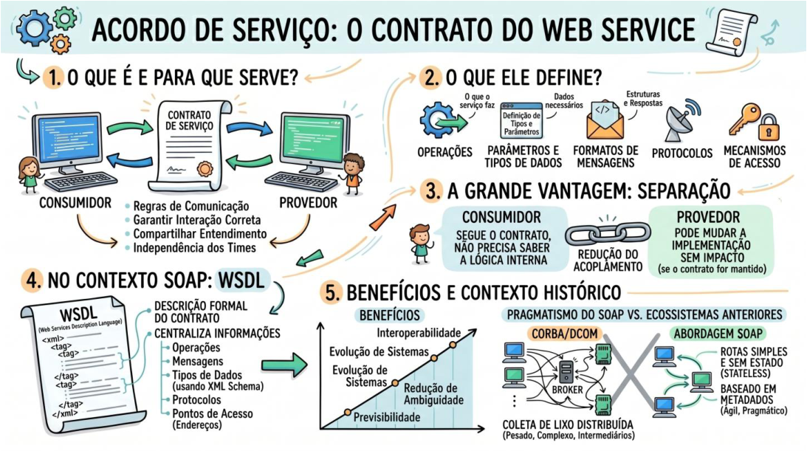

---

<!-- pagina: 59 -->

**Diego Carvalho, Equipe Informática 2 (Diego Carvalho), Equipe Informática 1 (Diego Carvalho) Aula 09** 

## **Estruturas principais** 

A descrição de um Web Service em WSDL é composta por diversos elementos que trabalham em conjunto para definir como a comunicação deve ocorrer. Por que um serviço precisa de tantas definições formais? Porque consumidores e provedores precisam compartilhar exatamente o mesmo entendimento sobre estruturas de dados, operações disponíveis, protocolos utilizados e pontos de acesso. Cada elemento do WSDL possui uma responsabilidade específica dentro dessa descrição, contribuindo para a construção de um contrato completo e padronizado. 

O elemento Types é responsável pela definição dos tipos de dados utilizados durante a comunicação. Como garantir que diferentes aplicações interpretem as informações da mesma forma? Essa função é desempenhada por definições normalmente baseadas em XML Schema, que permitem especificar desde tipos simples até estruturas complexas compostas por múltiplos campos. Já o elemento Message descreve as mensagens trocadas entre consumidor e provedor, definindo formalmente quais informações compõem requisições e respostas associadas às operações do serviço. 

**(FGV / ALEMA - 2023)** Um documento WSDL (versão 1.1) é um arquivo com sintaxe XML, sendo <mark>que os serviços podem ser compostos por diversos elementos. O elemento que representa a definição abstrata dos dados que estão sendo transmitidos se chama</mark> 

<mark>a) data. b) binding. c) stream. d) service. e) message.</mark> 

**<mark>_______________________ Comentários:</mark>** <mark>(a) Errado. "data" não é o elemento usado no WSDL 1.1 para definir, de forma abstrata, o que vai ser transmitido. (b) Errado. "binding" liga a interface abstrata a um protocolo e formato concreto de comunicação, não aos dados em si. (c) Errado. "stream" não é o elemento do WSDL 1.1 voltado à definição abstrata das informações trocadas. (d) Errado. "service" representa o serviço disponibilizado, reunindo endpoints, não a definição abstrata dos dados transmitidos. (e) Correto. "message" é o elemento que descreve,</mark> de forma abstrata, os dados que trafegam entre as partes no serviço (Letra E). 

A interface abstrata do serviço é representada pelo elemento PortType. O que exatamente ele descreve? Sua função consiste em agrupar as operações disponibilizadas pelo serviço e apresentar suas capacidades funcionais sem detalhar protocolos ou mecanismos de acesso. Dentro desse elemento encontram-se as Operations, responsáveis por representar funcionalidades específicas disponibilizadas aos consumidores. Cada operação define quais mensagens participam da comunicação e qual padrão de troca de mensagens será utilizado durante a interação. 

Os padrões de comunicação das operações também fazem parte da descrição formal do serviço. Como uma operação pode trocar mensagens entre consumidor e provedor? No WSDL 1.1 existem quatro modelos clássicos: Request-Response, no qual o consumidor envia uma requisição e recebe uma resposta; One-Way, que define apenas o envio de uma mensagem sem resposta prevista no contrato; Solicit-Response, em que o serviço inicia a interação solicitando informações ao consumidor; e Notification, utilizado quando o serviço envia notificações sem expectativa de retorno. Embora os dois últimos sejam pouco frequentes em implementações modernas, eles fazem parte da especificação. 

Após definir operações e mensagens, torna-se necessário especificar como a comunicação ocorrerá na prática. Essa função é desempenhada pelo elemento Binding. Como transformar uma interface abstrata em uma forma concreta de comunicação? O Binding associa as operações definidas em PortType a detalhes técnicos como protocolo de transporte, formato das mensagens e estilo de comunicação

---

<!-- pagina: 60 -->

**Diego Carvalho, Equipe Informática 2 (Diego Carvalho), Equipe Informática 1 (Diego Carvalho) Aula 09** 

adotado. Em implementações SOAP, é comum encontrar bindings que especificam SOAP sobre HTTP ou SOAP sobre HTTPS. 

Por fim, o elemento Service fornece as informações necessárias para que consumidores localizem efetivamente o serviço na rede. Onde a comunicação deve ser estabelecida? O Service reúne um ou mais ports, cada um associado a um binding específico e a um endereço concreto de acesso. Enquanto Types, Message, PortType, Operation e Binding descrevem aspectos lógicos e técnicos da comunicação, o Service informa onde o serviço está disponível para utilização, completando a estrutura de descrição definida pelo WSDL. 


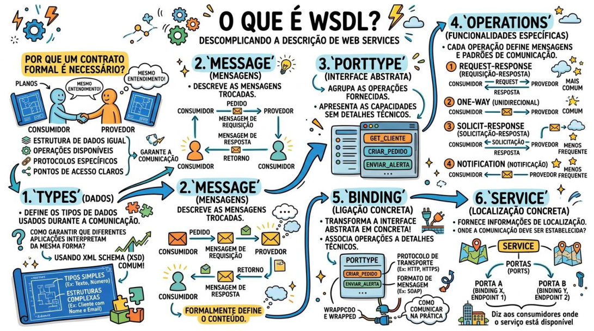

---

<!-- pagina: 61 -->

**Diego Carvalho, Equipe Informática 2 (Diego Carvalho), Equipe Informática 1 (Diego Carvalho) Aula 09** 


<!-- Start of picture text -->
UDDI<br><!-- End of picture text -->

##### **<mark>INCIDÊNCIA EM PROVA: MÉDIA</mark>** 

#### **<mark>UDDI</mark>** 

UDDI (Universal Description, Discovery and Integration) é uma especificação criada para permitir o registro e a localização de Web Services. Ela fornece uma estrutura padronizada para que organizações publiquem informações sobre seus serviços e para que consumidores possam encontrá-los. Embora tenha perdido relevância prática ao longo do tempo, o UDDI continua sendo importante para compreender os modelos clássicos de SOA. 

O UDDI, sigla para Universal Description, Discovery and Integration, foi criado para atuar como um mecanismo de registro e descoberta de serviços em ambientes de Web Services. Em arquiteturas distribuídas, novos serviços podem surgir continuamente e ser disponibilizados por diferentes organizações. Como uma aplicação consegue descobrir quais serviços existem e como acessá-los? O UDDI foi concebido para responder a essa necessidade, fornecendo um catálogo padronizado capaz de armazenar informações sobre serviços disponíveis em um determinado ambiente. 


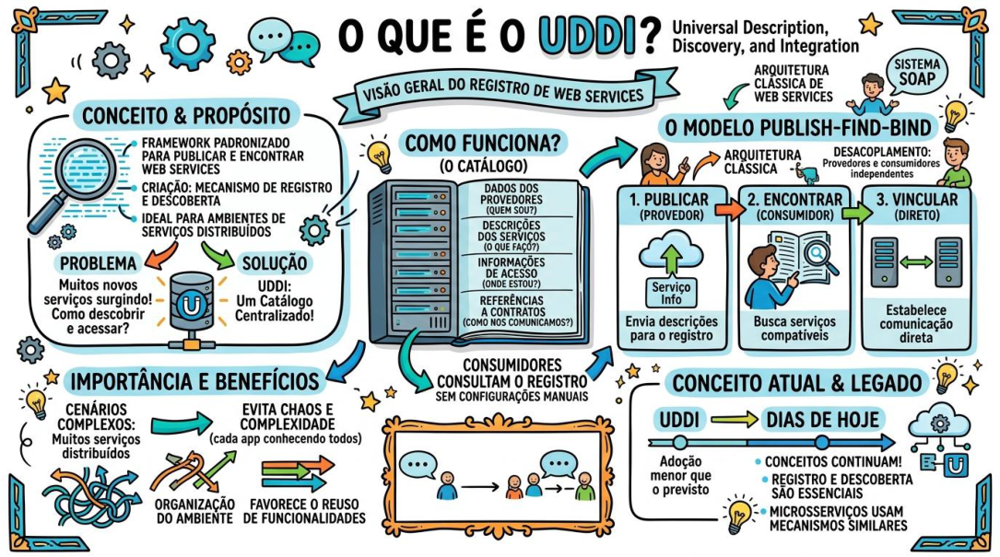


Seu funcionamento pode ser compreendido por meio da ideia de um diretório centralizado. Quais informações eram registradas nesse catálogo? Normalmente eram armazenados dados relacionados aos provedores, descrições dos serviços oferecidos, informações de acesso e referências aos contratos utilizados durante a comunicação. Com isso, consumidores podiam consultar o registro para localizar serviços compatíveis com suas necessidades sem depender exclusivamente de configurações manuais ou conhecimento prévio sobre os sistemas envolvidos. 

O UDDI desempenhava papel importante na arquitetura clássica dos Web Services. Como consumidores e provedores conseguiam permanecer relativamente desacoplados? Em vez de estabelecer conexões previamente configuradas entre todas as aplicações, os serviços podiam ser publicados em um registro central. Os consumidores consultavam esse registro para descobrir serviços disponíveis e, após localizar a opção desejada, estabeleciam comunicação direta com o provedor. Essa abordagem está diretamente

---

<!-- pagina: 62 -->

**Diego Carvalho, Equipe Informática 2 (Diego Carvalho), Equipe Informática 1 (Diego Carvalho) Aula 09** 

associada ao modelo Publish-Find-Bind frequentemente utilizado para explicar o funcionamento dos Web Services SOAP. 

A proposta do UDDI tornou-se especialmente relevante em cenários compostos por grande quantidade de serviços distribuídos. O que aconteceria se cada aplicação precisasse conhecer previamente todos os serviços existentes e seus respectivos endereços? A administração das integrações se tornaria significativamente mais complexa. O registro centralizado ajudava a organizar o ambiente e favorecia a reutilização de funcionalidades disponibilizadas por diferentes sistemas e organizações. 

Embora tenha sido considerado um componente estratégico durante o período de maior expansão dos Web Services SOAP, o UDDI não alcançou o nível de adoção inicialmente previsto. Isso significa que seus conceitos perderam relevância? Não. As ideias de registro, localização e descoberta de serviços continuam presentes em diversas arquiteturas modernas. Muitos ambientes baseados em microsserviços utilizam mecanismos que desempenham funções semelhantes, demonstrando que os princípios introduzidos pelo UDDI continuam influenciando a forma como sistemas distribuídos são integrados atualmente. 

## **Registro de Serviços** 

#### **<mark>REGISTRO DE SERVIÇOS</mark>** 

O registro de serviços é um repositório utilizado para armazenar informações sobre serviços disponíveis em determinado ambiente. Ele contém descrições, endereços de acesso, contratos e metadados que facilitam a localização e utilização dos serviços. Seu principal objetivo é promover descoberta, reutilização e governança dos recursos disponibilizados por diferentes provedores dentro de uma arquitetura orientada a serviços. 

O principal papel do UDDI era atuar como um registro de serviços dentro da arquitetura clássica dos Web Services. Em ambientes compostos por diversas aplicações distribuídas, surge uma questão importante: como localizar os serviços disponíveis sem depender de configurações manuais para cada integração? O UDDI foi concebido para atender a essa necessidade, funcionando como um catálogo centralizado capaz de armazenar informações sobre serviços e disponibilizá-las para consumidores interessados em utilizálos. 

As informações mantidas nesse registro não correspondiam à implementação dos serviços propriamente dita. O que exatamente era armazenado? Normalmente eram registrados dados sobre a organização provedora, descrições funcionais, categorias de classificação, referências a documentos WSDL e informações de acesso. Esses metadados permitiam que consumidores localizassem serviços adequados às suas necessidades e compreendessem como realizar a comunicação de acordo com os contratos disponibilizados pelos provedores. 

A existência de um catálogo centralizado oferecia vantagens importantes para ambientes corporativos complexos. O que aconteceria se cada aplicação precisasse manter manualmente informações sobre todos os serviços existentes? O gerenciamento das integrações se tornaria mais difícil e sujeito a inconsistências. Ao consultar um registro central, os consumidores podiam localizar funcionalidades disponíveis de forma padronizada, favorecendo a reutilização de serviços e reduzindo o esforço necessário para administrar ambientes compostos por grande quantidade de aplicações. 

A especificação UDDI também permitia diferentes estratégias de implantação. Os registros precisavam estar obrigatoriamente disponíveis na Internet pública? Não. Muitas organizações optavam por utilizar registros privados, acessíveis apenas internamente, para facilitar a integração entre departamentos e sistemas corporativos. Também existia a proposta de registros públicos, conhecidos como UDDI Business Registries, que tinham como objetivo permitir a descoberta de serviços entre organizações distintas. Na

---

<!-- pagina: 63 -->

**Diego Carvalho, Equipe Informática 2 (Diego Carvalho), Equipe Informática 1 (Diego Carvalho) Aula 09** 

prática, entretanto, os registros privados tiveram maior relevância do que os modelos públicos originalmente idealizados. 

Embora o UDDI tenha perdido espaço ao longo dos anos, os princípios que motivaram sua criação continuam presentes em arquiteturas modernas. Como sistemas distribuídos localizam serviços em ambientes compostos por centenas de aplicações? Atualmente, diversas plataformas utilizam mecanismos próprios de catálogo e descoberta de serviços. A tecnologia mudou, mas a necessidade de registrar, localizar e gerenciar serviços continua sendo um requisito importante em arquiteturas distribuídas contemporâneas. 


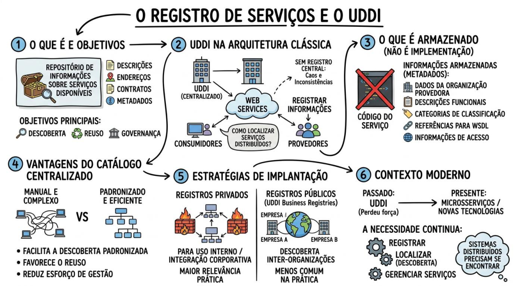


## **Publicação** 

#### **<mark>PUBLICAÇÃO</mark>** 

Publicação é o processo pelo qual um provedor registra informações sobre um serviço em um mecanismo de registro. Durante essa etapa, são disponibilizados dados como descrição, endereço de acesso, contrato e características do serviço. A publicação torna o serviço visível para potenciais consumidores, permitindo que ele seja localizado e utilizado por outras aplicações dentro do ambiente de integração. 

A publicação representa a etapa por meio da qual um provedor registra informações sobre seus serviços em um repositório UDDI. Em uma arquitetura orientada à descoberta de serviços, não basta disponibilizar uma funcionalidade na rede. Como os potenciais consumidores saberão que ela existe? Para resolver essa questão, o provedor realiza o processo de publicação, tornando as informações do serviço acessíveis para consulta dentro do ambiente de integração. Essa etapa corresponde ao primeiro componente do modelo clássico Publish-Find-Bind utilizado nos Web Services. 

Durante esse processo, diferentes tipos de informações podem ser registrados. Quais dados precisam estar disponíveis para que um serviço possa ser localizado e utilizado? Normalmente são cadastradas informações sobre a organização responsável, descrições funcionais, categorias de classificação, dados de contato, endereços de acesso e referências aos documentos WSDL que descrevem formalmente os

---

<!-- pagina: 64 -->

**Diego Carvalho, Equipe Informática 2 (Diego Carvalho), Equipe Informática 1 (Diego Carvalho) Aula 09** 

contratos do serviço. Esses metadados permitem que consumidores compreendam o propósito do serviço e identifiquem a forma correta de utilizá-lo. 

A principal finalidade da publicação é tornar os serviços visíveis dentro do catálogo de integração. O que acontece após o registro ser concluído? O serviço passa a integrar o conjunto de recursos disponíveis para descoberta pelos consumidores. Dessa forma, aplicações interessadas podem localizar funcionalidades já existentes sem depender de conhecimento prévio sobre os sistemas que as disponibilizam. Essa abordagem favorece a reutilização de recursos e reduz a necessidade de desenvolver soluções que já estejam disponíveis no ambiente. 

A proposta original do UDDI buscava criar ecossistemas altamente dinâmicos, nos quais novos serviços pudessem ser registrados continuamente e descobertos de forma padronizada. Esse modelo tornou-se tão comum quanto o inicialmente esperado? Não. Embora a adoção prática tenha sido mais limitada do que as expectativas da época, o princípio permanece relevante. Muitas arquiteturas modernas continuam utilizando mecanismos de registro para permitir que recursos sejam catalogados e posteriormente localizados por aplicações interessadas. 

A etapa de publicação também contribui para a organização e governança dos serviços disponíveis. Como administrar um ambiente composto por dezenas ou centenas de integrações sem um catálogo centralizado? O registro das informações em um repositório estruturado facilita o controle dos recursos existentes e fornece uma visão consolidada das funcionalidades disponíveis. Essa necessidade continua presente em arquiteturas distribuídas contemporâneas, mesmo quando tecnologias diferentes do UDDI são utilizadas para desempenhar esse papel. 


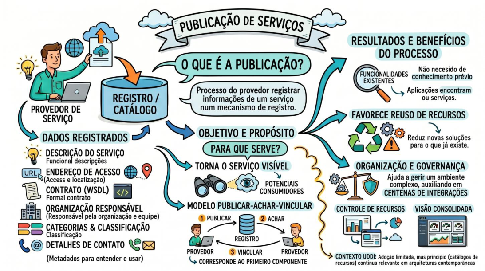


## **Descoberta** 

#### **<mark>DESCOBERTA</mark>** 

Descoberta é o processo de localizar serviços disponíveis em um ambiente distribuído. Normalmente, um consumidor consulta um registro de serviços em busca de funcionalidades que atendam às suas necessidades.

---

<!-- pagina: 65 -->

**Diego Carvalho, Equipe Informática 2 (Diego Carvalho), Equipe Informática 1 (Diego Carvalho) Aula 09** 

A descoberta reduz dependências diretas entre aplicações e facilita a reutilização de recursos existentes, permitindo que novos consumidores encontrem serviços sem necessidade de conhecimento prévio sobre sua <mark>localização.</mark> 

A descoberta corresponde à etapa em que consumidores consultam um registro UDDI para localizar serviços capazes de atender determinadas necessidades. Em ambientes distribuídos compostos por diversos provedores, surge uma questão importante: como encontrar um serviço adequado sem conhecer previamente sua localização ou seus detalhes técnicos? O mecanismo de descoberta foi criado justamente para responder a essa necessidade, permitindo que aplicações pesquisassem um catálogo centralizado em busca de funcionalidades específicas. 


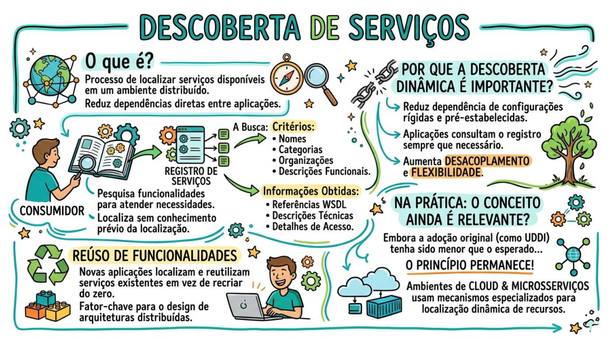


A pesquisa podia ser realizada utilizando diferentes critérios. Quais informações auxiliavam na localização de um serviço? Os consumidores podiam consultar o registro com base em nomes, categorias, organizações responsáveis ou descrições funcionais. Após identificar um serviço compatível, tornavamse disponíveis informações adicionais necessárias para sua utilização, incluindo referências ao documento WSDL, descrições técnicas e detalhes relacionados aos pontos de acesso disponibilizados pelo provedor. 

A proposta da descoberta dinâmica representava um dos pilares da visão original dos Web Services. Por que essa ideia foi considerada tão importante? Porque permitia reduzir a dependência de configurações previamente estabelecidas entre consumidores e provedores. Em vez de manter informações de integração rigidamente definidas, as aplicações poderiam consultar o registro para localizar serviços disponíveis sempre que necessário. Essa abordagem favorecia o desacoplamento entre os participantes e ampliava a flexibilidade dos ambientes distribuídos. 

Na prática, a adoção desse modelo ocorreu de forma mais limitada do que o inicialmente previsto. Isso significa que o conceito perdeu relevância? Não. Embora muitas organizações tenham optado por estratégias mais controladas de integração, os princípios de descoberta de serviços continuam presentes em arquiteturas modernas. Ambientes baseados em nuvem e microsserviços frequentemente utilizam mecanismos especializados para localizar recursos dinamicamente, demonstrando que a necessidade de

---

<!-- pagina: 66 -->

**Diego Carvalho, Equipe Informática 2 (Diego Carvalho), Equipe Informática 1 (Diego Carvalho) Aula 09** 

descoberta permanece importante mesmo em tecnologias bastante diferentes daquelas associadas ao UDDI. 

A etapa de descoberta também contribui para a reutilização de funcionalidades já existentes. O que acontece quando uma nova aplicação precisa executar uma determinada tarefa? Em vez de desenvolver uma solução completamente nova, ela pode localizar serviços previamente disponibilizados por outros sistemas. Essa capacidade de identificar e reutilizar recursos é um dos fatores que motivaram a criação dos registros de serviços e continua influenciando o projeto de arquiteturas distribuídas contemporâneas. 

### **Saiba mais:** 

<mark>Ao estudar UDDI, é importante compreender que sua relevância atual é muito mais histórica e conceitual do que prática. Durante os primeiros anos de popularização dos Web Services SOAP, acreditava-se que registros públicos de serviços se tornariam amplamente utilizados, permitindo que aplicações localizassem e consumissem serviços de forma dinâmica em escala global. Na prática, esse cenário não se concretizou conforme o esperado.</mark> 

<mark>Diversos fatores contribuíram para a redução de sua adoção. A complexidade das implementações, questões relacionadas à governança dos serviços e a evolução de novas abordagens arquiteturais levaram muitas organizações a optar por soluções mais simples. Além disso, o crescimento das APIs REST e de mecanismos modernos de integração reduziu significativamente a utilização dos registros UDDI tradicionais.</mark> 

<mark>Isso não significa que o estudo do UDDI tenha perdido valor. Pelo contrário, ele continua sendo importante para compreender a evolução histórica dos Web Services e conceitos fundamentais como publicação, registro e descoberta de serviços. Muitos princípios presentes no UDDI influenciaram tecnologias posteriores utilizadas em ambientes distribuídos modernos.</mark> 

<mark>Por esse motivo, em concursos, certificações e disciplinas de Arquitetura de Software, o UDDI ainda aparece com frequência. Seu estudo ajuda a compreender o modelo clássico Publish-Find-Bind e a arquitetura original dos Web Services SOAP, mesmo que sua utilização prática atualmente seja relativamente rara quando comparada às soluções contemporâneas de integração e descoberta de</mark> serviços. 

**(IBFC / Prefeitura de Dourados - 2022)** O termo Web Services descreve uma maneira padronizada <mark>de integrar aplicativos baseados na Web usando os padrões abertos tais como: (1) SOAP. (2) WSDL. (3) UDDI. Da relação apresentada:</mark> 

<mark>a) existem somente o 1 e 2 b) existem somente o 1 e 3 c) existem somente o 2 e 3 d) existem todos</mark> 

**<mark>_______________________ Comentários:</mark>** <mark>(a) Errado. SOAP e WSDL são padrões de Web Services, mas UDDI também faz parte do conjunto clássico de tecnologias associadas. (b) Errado. SOAP e UDDI são padrões de Web Services, porém WSDL também é um dos principais componentes. (c) Errado. WSDL e UDDI são padrões de Web Services, mas SOAP também integra esse conjunto. (d) Correto. SOAP, WSDL e UDDI compõem o</mark>

---

<!-- pagina: 67 -->

**Diego Carvalho, Equipe Informática 2 (Diego Carvalho), Equipe Informática 1 (Diego Carvalho) Aula 09** 

<mark>conjunto tradicional de padrões abertos utilizados em Web Services: SOAP para troca de mensagens, WSDL para descrição dos serviços</mark> e UDDI para publicação e descoberta (Letra D).

---

<!-- pagina: 68 -->

**Diego Carvalho, Equipe Informática 2 (Diego Carvalho), Equipe Informática 1 (Diego Carvalho) Aula 09** 


<!-- Start of picture text -->
-<br>WS Security<br><!-- End of picture text -->

##### **<mark>INCIDÊNCIA EM PROVA: BAIXÍSSIMA</mark>** 

#### **<mark>WS-SECURITY</mark>** 

WS-Security é uma especificação da família WS-* criada para adicionar recursos de segurança aos Web Services SOAP. Ela permite incorporar mecanismos como autenticação, assinatura digital, criptografia e utilização de tokens diretamente nas mensagens SOAP. Dessa forma, a proteção acompanha a mensagem independentemente do meio de transporte utilizado, oferecendo níveis elevados de segurança para ambientes corporativos e integrações críticas. 

O WS-Security é uma especificação pertencente ao conjunto de padrões WS-* criada para incorporar mecanismos avançados de segurança aos Web Services baseados em SOAP. Em ambientes corporativos, proteger apenas o canal de comunicação nem sempre é suficiente. Como garantir que a segurança acompanhe a própria mensagem durante todo o seu percurso? Para atender a essa necessidade, o WSSecurity insere informações de proteção diretamente na estrutura da mensagem SOAP, permitindo que os mecanismos de segurança permaneçam associados ao conteúdo independentemente da infraestrutura utilizada para o transporte. 


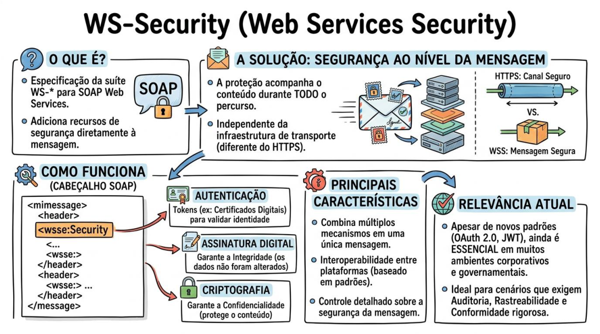


Essa abordagem é conhecida como segurança em nível de mensagem. Qual a diferença em relação ao HTTPS? O HTTPS protege os dados durante sua transmissão entre os participantes da comunicação. Já o WS-Security protege a própria mensagem SOAP, permitindo que determinados elementos continuem assinados ou criptografados mesmo quando passam por intermediários ou diferentes camadas de processamento. Na prática, essas tecnologias não são concorrentes e frequentemente são utilizadas em conjunto para fornecer níveis complementares de proteção. 

Uma das características mais importantes do WS-Security é a possibilidade de combinar múltiplos mecanismos de segurança. Como garantir simultaneamente autenticidade, integridade e confidencialidade? Uma mesma mensagem pode conter assinaturas digitais para verificar se os dados foram alterados, mecanismos de criptografia para proteger o conteúdo e diferentes tipos de tokens para

---

<!-- pagina: 69 -->

**Diego Carvalho, Equipe Informática 2 (Diego Carvalho), Equipe Informática 1 (Diego Carvalho) Aula 09** 

identificar os participantes da comunicação. Essa flexibilidade contribuiu para sua ampla adoção em ambientes corporativos sujeitos a requisitos rigorosos de segurança e conformidade. 

As informações de segurança são normalmente inseridas no cabeçalho SOAP por meio do elemento `wsse:Security`. O que pode ser armazenado nesse espaço? É comum encontrar certificados digitais, assinaturas eletrônicas, tokens de autenticação e outros elementos utilizados para validar a identidade dos participantes e proteger o conteúdo transmitido. Como essas informações seguem padrões amplamente reconhecidos, diferentes plataformas conseguem processá-las de forma consistente, preservando a interoperabilidade característica dos Web Services SOAP. 

Embora muitas arquiteturas modernas utilizem mecanismos como OAuth 2.0, OpenID Connect e JWT para proteger APIs, o WS-Security continua presente em diversos sistemas corporativos e integrações governamentais. Por que essa especificação permanece relevante? Porque oferece recursos voltados para cenários que exigem controle detalhado sobre a segurança das mensagens, auditoria, rastreabilidade e proteção de informações sensíveis. Compreender seu funcionamento ajuda a entender como requisitos avançados de segurança foram incorporados ao ecossistema SOAP e continuam sendo aplicados em diferentes contextos empresariais. 

## **Assinatura Digital** 

Uma das principais funcionalidades do WS-Security é a utilização de assinaturas digitais. A assinatura digital permite verificar a autenticidade da mensagem, garantindo que ela realmente foi enviada pelo emissor declarado. Além disso, ela assegura a integridade dos dados, possibilitando identificar qualquer alteração realizada após a assinatura. Caso uma parte da mensagem seja modificada durante a transmissão, a validação da assinatura falhará, indicando que o conteúdo não é mais confiável para processamento. 

## **Criptografia** 

Outro recurso importante fornecido pelo WS-Security é a criptografia de mensagens. A criptografia permite proteger informações sensíveis contidas no corpo ou em partes específicas da mensagem SOAP, impedindo que terceiros não autorizados visualizem seu conteúdo. Diferentemente do HTTPS, que protege apenas o canal de comunicação, a criptografia aplicada pelo WS-Security permanece associada à mensagem mesmo quando ela é armazenada, encaminhada ou processada por diferentes sistemas intermediários ao longo de sua jornada. 

## **Tokens de Autenticação** 

O WS-Security também oferece suporte a diferentes formas de tokens de autenticação, utilizados para identificar e validar os participantes da comunicação. Entre os exemplos mais comuns estão Username Tokens, certificados digitais X.509, tickets Kerberos e tokens SAML. Esses mecanismos permitem que os sistemas comprovem suas identidades antes de trocar informações sensíveis, reduzindo riscos relacionados a acessos não autorizados e fortalecendo o controle de segurança entre consumidores e provedores de serviços.

---

<!-- pagina: 70 -->

**Diego Carvalho, Equipe Informática 2 (Diego Carvalho), Equipe Informática 1 (Diego Carvalho) Aula 09** 


<!-- Start of picture text -->
-<br>Família WS<br><!-- End of picture text -->


<!-- Start of picture text -->
*<br><!-- End of picture text -->

##### **<mark>INCIDÊNCIA EM PROVA: BAIXÍSSIMA</mark>** 

#### **<mark>FAMÍLIA WS-*</mark>** 

<mark>Conjunto de especificações que complementam o protocolo SOAP, adicionando funcionalidades voltadas às</mark> necessidades de ambientes corporativos. Enquanto o SOAP define a estrutura básica para a troca de mensagens, os padrões da família WS-* oferecem recursos relacionados à segurança, autenticação, autorização, estabelecimento de relações de confiança, definição de políticas, privacidade, confiabilidade e outras capacidades avançadas. Essas especificações foram desenvolvidas para ampliar a interoperabilidade e a governança dos Web Services, tornando o SOAP adequado para integrações empresariais que exigem elevados níveis de padronização, controle e proteção das informações. 

A família WS-* corresponde ao conjunto de especificações criadas para ampliar as capacidades dos Web Services baseados em SOAP. À medida que as integrações corporativas se tornaram mais complexas, surgiu uma necessidade importante: como atender requisitos que vão além da simples troca de mensagens? Para responder a essa demanda, foram desenvolvidos diversos padrões complementares voltados para segurança, autenticação, autorização, privacidade, definição de políticas, confiabilidade e outras funcionalidades frequentemente exigidas em ambientes empresariais. 

Essas especificações não substituem o SOAP, mas atuam em conjunto com ele. Qual a vantagem de utilizar diversos padrões especializados em vez de concentrar todas as funcionalidades em uma única especificação? Essa abordagem permite que cada padrão seja responsável por um conjunto específico de requisitos. Dessa forma, uma organização pode adotar apenas os recursos necessários para seu cenário de integração, mantendo a interoperabilidade e a flexibilidade características do ecossistema SOAP. 

A utilização desses padrões está fortemente associada às arquiteturas orientadas a serviços, conhecidas pela sigla SOA. Quando uma organização decide construir uma arquitetura baseada em serviços, surge uma questão fundamental: de onde esses serviços devem ser definidos? Uma das abordagens mais conhecidas é a Top-Down. Nesse modelo, o trabalho começa pela análise dos processos e objetivos do negócio. A partir dessa compreensão, são identificados os serviços necessários para apoiar as atividades da organização e somente depois ocorre a implementação técnica das soluções. 

Existe também uma estratégia diferente chamada Bottom-Up. O que muda nessa abordagem? Em vez de iniciar pelos processos de negócio, parte-se dos sistemas e funcionalidades já existentes. Componentes previamente implementados podem ser expostos como serviços para que sejam reutilizados por outras aplicações. Essa estratégia costuma aproveitar investimentos realizados em sistemas legados e acelerar a disponibilização de serviços dentro da arquitetura. 

As duas abordagens procuram atender ao mesmo objetivo, mas seguem caminhos distintos. Qual delas é a mais adequada? A resposta depende do contexto organizacional. Enquanto a abordagem Top-Down tende a produzir serviços mais alinhados aos processos de negócio, a abordagem Bottom-Up costuma aproveitar recursos já disponíveis no ambiente tecnológico. Em muitos projetos corporativos, ambas as estratégias são combinadas para equilibrar alinhamento arquitetural e reaproveitamento de ativos existentes. 

## **WS-Policy** 

O WS-Policy é uma especificação utilizada para descrever políticas e requisitos que devem ser observados durante a comunicação entre Web Services. Por meio dele, um serviço pode informar quais protocolos de segurança suporta, quais mecanismos de autenticação exige, quais algoritmos de criptografia aceita e outras condições necessárias para a interação. Dessa forma, consumidores e provedores conseguem

---

<!-- pagina: 71 -->

**Diego Carvalho, Equipe Informática 2 (Diego Carvalho), Equipe Informática 1 (Diego Carvalho) Aula 09** 

negociar automaticamente características de comunicação antes da troca de mensagens. O objetivo principal é garantir compatibilidade entre sistemas e reduzir configurações manuais durante processos de integração. 

## **WS-Trust** 

O WS-Trust é uma especificação responsável por estabelecer e gerenciar relações de confiança entre participantes de um ambiente distribuído. Seu principal papel é definir mecanismos para emissão, validação, renovação e cancelamento de credenciais de segurança utilizadas durante a autenticação. Para isso, introduz o conceito de Security Token Service (STS), um serviço especializado na geração e validação de tokens. Dessa forma, aplicações distintas podem confiar em uma autoridade comum para verificar identidades e permitir acessos seguros a recursos compartilhados. 

## **WS-Federation** 

O WS-Federation é uma especificação voltada para a federação de identidades entre diferentes organizações, domínios ou sistemas. Seu objetivo é permitir que um usuário autenticado em uma determinada entidade possa acessar serviços de outra organização sem a necessidade de criar novas credenciais. Esse modelo simplifica a experiência do usuário e reduz a administração de contas em ambientes complexos. A especificação utiliza mecanismos definidos por padrões como WS-Trust para compartilhar informações de identidade e estabelecer confiança entre os participantes envolvidos. 

## **WS-SecureConversation** 

O WS-SecureConversation foi criado para otimizar a segurança em comunicações que envolvem múltiplas trocas de mensagens entre os mesmos participantes. Em vez de repetir processos completos de autenticação e negociação de chaves a cada requisição, a especificação estabelece um contexto seguro compartilhado entre cliente e servidor. A partir desse contexto, são utilizadas credenciais temporárias para proteger as mensagens subsequentes. Essa abordagem reduz a sobrecarga de processamento e melhora o desempenho sem comprometer a segurança das comunicações. 

## **WS-Authorization** 

O WS-Authorization é uma especificação relacionada ao controle de acesso em Web Services. Seu objetivo é definir mecanismos que permitam determinar quais operações, recursos ou funcionalidades podem ser utilizados por determinado usuário ou aplicação após a autenticação. Enquanto a autenticação responde à pergunta “quem é você?”, a autorização responde “o que você pode fazer?”. Embora não tenha alcançado a mesma adoção de outros padrões da família WS-*, sua proposta contribuiu para o desenvolvimento de soluções voltadas ao gerenciamento de permissões em ambientes distribuídos. 

## **WS-Privacy** 

O WS-Privacy é uma especificação destinada a tratar aspectos relacionados à privacidade das informações trocadas entre Web Services. Seu propósito é permitir que serviços expressem políticas sobre coleta, armazenamento, compartilhamento e utilização de dados pessoais ou sensíveis. Dessa forma, consumidores podem conhecer previamente como suas informações serão tratadas antes de iniciar uma interação. O padrão busca aumentar a transparência e a conformidade com requisitos regulatórios, fortalecendo a confiança entre as partes envolvidas na comunicação. 

## **WS-Encryption**

---

<!-- pagina: 72 -->

**Diego Carvalho, Equipe Informática 2 (Diego Carvalho), Equipe Informática 1 (Diego Carvalho) Aula 09** 

O WS-Encryption é uma especificação voltada para a criptografia de mensagens e elementos presentes em documentos XML utilizados por Web Services SOAP. Seu principal objetivo é garantir a confidencialidade das informações, impedindo que usuários não autorizados tenham acesso ao conteúdo transmitido. A criptografia pode ser aplicada à mensagem inteira ou apenas a partes específicas, conforme a necessidade do sistema. Essa flexibilidade permite proteger dados sensíveis sem comprometer o processamento de elementos que precisam permanecer visíveis para intermediários autorizados. 

## **WS-Signature** 

O WS-Signature é uma especificação responsável pela aplicação de assinaturas digitais em documentos XML utilizados por Web Services. Sua função principal é garantir a integridade e a autenticidade das mensagens trocadas entre consumidores e provedores de serviços. Por meio da assinatura digital, é possível verificar se a mensagem sofreu alterações após sua emissão e confirmar a identidade do remetente. Esse mecanismo desempenha papel fundamental em ambientes corporativos que exigem rastreabilidade, não repúdio e elevados níveis de confiança nas transações realizadas. 


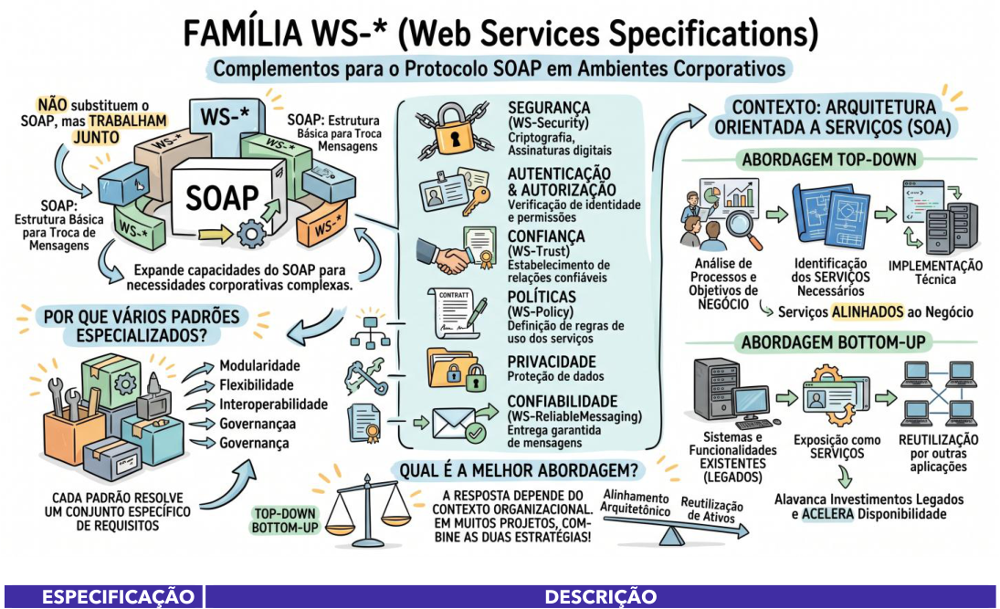


<!-- Start of picture text -->
ESPECIFICAÇÃO ÇÃO ÃO  DESCRIÇÃO ÇÃO ÃO<br><!-- End of picture text -->

**<mark>ESPECIFICAÇÃO ÇÃO ÃO DESCRIÇÃO ÇÃO ÃO</mark>** Define políticas e requisitos que um Web Service deve seguir, como mecanismos de **WS-POLICY** segurança, algoritmos de criptografia e protocolos suportados, permitindo que consumidores conheçam essas exigências antes da comunicação. Estabelece mecanismos para criação, validação, renovação e troca de credenciais de **WS-TRUST** segurança entre sistemas, permitindo que aplicações confiem em uma autoridade responsável pela emissão de tokens de autenticação. Permite o compartilhamento de identidades entre diferentes organizações ou domínios, **WS-FEDERATION** possibilitando que um usuário autenticado em um ambiente acesse serviços de outro sem criar novas credenciais.

---

<!-- pagina: 73 -->

**Diego Carvalho, Equipe Informática 2 (Diego Carvalho), Equipe Informática 1 (Diego Carvalho) Aula 09** 

|**ESPECIFICAÇÃO**|**DESCRIÇÃO**|
|---|---|
|**WS-SECURE**<br>**CONVERSATION**|Cria um contexto seguro para comunicações prolongadas entre cliente e servidor,<br>evitando repetir autenticações e negociações de segurança a cada mensagem, reduzindo<br>custos de processamento.|
|**WS-**<br>**AUTHORIZATION**|Define mecanismos relacionados ao controle de acesso aos serviços, permitindo<br>especificar quais usuários ou aplicações possuem autorização para executar determinadas<br>operações após a autenticação.|
|**WS-PRIVACY**|Estabelece mecanismos para expressar políticas de tratamento de dados pessoais,<br>informando como as informações serão coletadas, armazenadas, compartilhadas e<br>utilizadas durante a comunicação entre serviços.|
|**WS-ENCRYPTION**|Define padrões para criptografar mensagens SOAP ou partes específicas de documentos<br>XML, garantindo confidencialidade das informações mesmo quando a mensagem<br>atravessa diferentes sistemas intermediários.|
|**WS-SIGNATURE**|Especifica o uso de assinaturas digitais em documentos XML, assegurando autenticidade,<br>integridade e não repúdio das mensagens, permitindo detectar alterações realizadas após<br>o envio.|

---

<!-- pagina: 74 -->

**Diego Carvalho, Equipe Informática 2 (Diego Carvalho), Equipe Informática 1 (Diego Carvalho) Aula 09** 


<!-- Start of picture text -->
Web Services REST<br><!-- End of picture text -->


<!-- Start of picture text -->
Conceitos Básicos<br><!-- End of picture text -->

##### **<mark>INCIDÊNCIA EM PROVA: ALTÍSSIMA</mark>** 

#### **<mark>REST</mark>** 

Web Services REST são serviços construídos segundo os princípios da arquitetura REST, utilizando recursos identificados por URIs e operações baseadas nos métodos HTTP. Diferentemente do SOAP, REST não é um protocolo, mas um estilo arquitetural. Sua simplicidade, flexibilidade e eficiência contribuíram para sua ampla adoção em APIs modernas, especialmente em aplicações Web, móveis e ambientes de microsserviços. 

REST (Representational State Transfer) é um estilo arquitetural criado para orientar o desenvolvimento de sistemas distribuídos que utilizam a infraestrutura da Web como meio de comunicação. Muitas pessoas associam REST a um protocolo específico. Essa associação está correta? Não. REST não define mensagens, formatos ou protocolos próprios. Sua proposta consiste em estabelecer princípios arquiteturais que auxiliam na construção de serviços simples, escaláveis e interoperáveis, aproveitando recursos já existentes na própria arquitetura da Web. 

A ideia central dessa abordagem é utilizar mecanismos amplamente difundidos na Internet. Como os sistemas conseguem trocar informações sem depender de estruturas complexas de comunicação? Em arquiteturas REST, recursos são identificados por URLs, operações são realizadas por meio dos métodos HTTP e os resultados das requisições são comunicados utilizando códigos de status padronizados. Essa reutilização dos fundamentos da Web contribui para simplificar a implementação e aumentar a compatibilidade entre diferentes aplicações. 

O foco principal do REST está nos recursos disponibilizados pelo sistema. O que exatamente é um recurso? Trata-se de qualquer informação ou entidade que possa ser identificada e acessada por meio de uma URL, como clientes, produtos, pedidos ou documentos. Os consumidores não manipulam diretamente esses recursos, mas suas representações. Quando uma requisição é realizada, o servidor retorna uma representação do estado atual do recurso, normalmente utilizando formatos como JSON ou XML. 

Atualmente, o JSON tornou-se o formato mais utilizado nas APIs REST. Por que ele ganhou tanta popularidade? Sua estrutura simples facilita a leitura por humanos e o processamento por aplicações, além de gerar mensagens mais compactas quando comparadas a muitas representações equivalentes em XML. Apesar disso, o REST não impõe um formato específico de dados, permitindo que diferentes representações sejam utilizadas conforme os requisitos da aplicação. 

A adoção dos princípios REST transformou significativamente a forma de construir APIs para integração entre sistemas. Como conectar aplicações web, dispositivos móveis, plataformas corporativas e serviços em nuvem de maneira eficiente? A resposta encontrada por grande parte da indústria foi utilizar uma arquitetura alinhada aos fundamentos da própria Web. Essa combinação de simplicidade, escalabilidade e interoperabilidade explica por que REST se tornou uma das abordagens mais difundidas para construção de serviços distribuídos na atualidade. 

**(FGV / DPE RO - 2025)** Uma interface de programação de aplicativos (API) fornece uma maneira <mark>de integrar aplicações e conectar componentes em arquiteturas de microsserviços. Uma API REST (Representational State Transfer)</mark>

---

<!-- pagina: 75 -->

**Diego Carvalho, Equipe Informática 2 (Diego Carvalho), Equipe Informática 1 (Diego Carvalho) Aula 09** 

<mark>a) proporciona conformidade integrada, fazendo com que seja uma opção recomendada para casos empresariais.</mark> 

<mark>b) é um protocolo.</mark> 

<mark>c) possibilita comunicação entre aplicações através de métodos HTTP.</mark> 

<mark>d) é um conjunto de regras e diretrizes sobre como você deve criar uma API DESKTOP. e) implementa a linguagem de descrição de serviços web (WSDL).</mark> 

**<mark>_______________________</mark>** 

**<mark>Comentários:</mark>** <mark>(a) Errado. A ideia de "conformidade integrada" não é uma característica central de APIs REST. (b) Errado. REST não é um protocolo, mas um estilo arquitetural de construção de APIs. (c) Correto. APIs REST permitem a comunicação entre aplicações usando métodos HTTP, como GET, POST, PUT e DELETE. (d) Errado. REST não traz regras para criar API desktop; ele orienta a construção de APIs</mark> para comunicação entre sistemas. (e) Errado. WSDL está ligado a outra abordagem de serviços web, não ao modelo REST (Letra C). 

## **Estilo Arquitetural** 

#### **<mark>ESTILO ARQUITETURAL</mark>** 

Um estilo arquitetural é um conjunto de princípios, restrições e diretrizes que orientam a construção de sistemas de software. Em vez de definir tecnologias específicas, estabelece padrões de organização e interação entre componentes. REST é um exemplo de estilo arquitetural, pois descreve características que devem ser seguidas <u>para que um sistema possa ser considerado aderente aos seus princípios.</u> 

REST é classificado como um estilo arquitetural utilizado no projeto de sistemas distribuídos. O que isso significa na prática? Significa que REST não corresponde a um protocolo, uma linguagem de programação ou uma tecnologia específica. Em vez disso, fornece um conjunto de princípios que orienta a construção da comunicação entre componentes de um sistema. Por essa razão, aplicações podem ser desenvolvidas com diferentes linguagens, plataformas e ferramentas, desde que respeitem as restrições arquiteturais estabelecidas pelo modelo. 

Um dos pilares dessa arquitetura é o conceito de recurso. Quando um cliente deseja acessar uma informação ou executar determinada operação, ele interage com recursos identificados por URIs. Surge então uma dúvida comum: o cliente precisa conhecer a implementação interna do sistema? Não. A interação ocorre apenas por meio dos recursos expostos, o que reduz o acoplamento entre as partes. Em implementações amplamente adotadas, essa comunicação costuma utilizar os métodos do HTTP, como GET, POST, PUT e DELETE, embora os princípios do REST não sejam teoricamente restritos a esse protocolo. 

A separação entre cliente e servidor também ocupa papel central nessa arquitetura. Por que essa divisão é considerada importante? Porque cada componente passa a possuir responsabilidades bem definidas. O cliente concentra a interface e a interação com o usuário; o servidor mantém os dados e executa as regras de negócio. Como consequência, alterações em uma dessas partes tendem a gerar menor impacto sobre a outra, favorecendo manutenção, evolução e reutilização dos componentes ao longo do tempo. 

Além da identificação de recursos, REST incorpora outras restrições arquiteturais relevantes. Quais seriam elas? Entre as mais conhecidas estão a comunicação stateless, a utilização de uma interface uniforme, a possibilidade de cache e a organização em camadas. Essas restrições foram propostas para favorecer propriedades desejáveis em sistemas distribuídos. Dessa forma, o foco da arquitetura não está em definir formatos obrigatórios de mensagens ou mecanismos específicos de implementação, mas em estruturar a comunicação de modo a promover escalabilidade, interoperabilidade, simplicidade e desempenho. 

## **REST x SOAP** 

#### **<mark>REST X SOAP</mark>**

---

<!-- pagina: 76 -->

**Diego Carvalho, Equipe Informática 2 (Diego Carvalho), Equipe Informática 1 (Diego Carvalho) Aula 09** 

REST e SOAP representam abordagens distintas para implementação de Web Services. SOAP é um protocolo formal baseado em XML, com forte padronização e amplo suporte a requisitos corporativos avançados. REST é um estilo arquitetural mais simples e flexível, geralmente associado ao uso de HTTP e JSON. Enquanto SOAP <u><mark>prioriza padronização rigorosa, REST enfatiza simplicidade, desempenho e facilidade de integração.</mark></u> 

REST e SOAP são abordagens utilizadas para viabilizar a comunicação entre sistemas distribuídos, mas possuem características bastante distintas. Em que aspecto essa diferença começa a aparecer? Na própria definição de cada modelo. SOAP é um protocolo formal que estabelece regras específicas para troca de mensagens entre aplicações. REST, por sua vez, é um estilo arquitetural que descreve princípios de projeto, permitindo que diferentes tecnologias sejam utilizadas desde que suas restrições sejam respeitadas. 

As diferenças também podem ser observadas na forma como os dados são representados e transmitidos. Muitos estudantes perguntam por que REST costuma ser associado ao JSON. A razão é que esse formato apresenta estrutura simples e compacta, o que favorece seu uso em aplicações modernas. Entretanto, REST não exige um formato específico de representação. Já o SOAP define mensagens obrigatoriamente baseadas em XML, organizadas em estruturas padronizadas como Envelope, Header e Body. 

Outro aspecto frequentemente discutido envolve a complexidade das implementações. Seria correto afirmar que SOAP oferece mais recursos? Em muitos cenários corporativos, sim. O ecossistema SOAP é complementado por especificações da família WS-*, que fornecem mecanismos voltados à segurança, confiabilidade e transações distribuídas. REST adota uma abordagem diferente, pois procura aproveitar recursos já consolidados da arquitetura da Web, o que frequentemente resulta em soluções mais simples de desenvolver, manter e consumir. 

Diante dessas diferenças, qual abordagem deve ser escolhida? A resposta depende dos requisitos do projeto. APIs voltadas para aplicações web e integrações modernas costumam adotar REST devido à sua flexibilidade e ampla adoção. Por outro lado, ambientes corporativos que exigem contratos rigorosos, padrões formais de comunicação e recursos avançados de integração frequentemente utilizam SOAP. Assim, a decisão deve considerar as necessidades técnicas e operacionais do contexto em que o sistema será utilizado. 


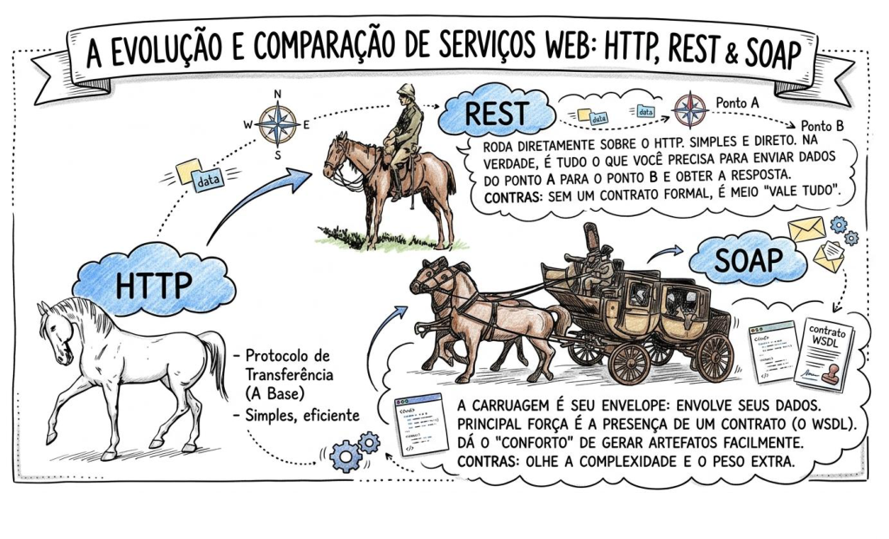

---

<!-- pagina: 77 -->

**Diego Carvalho, Equipe Informática 2 (Diego Carvalho), Equipe Informática 1 (Diego Carvalho) Aula 09** 


<!-- Start of picture text -->
Principais Restrições<br><!-- End of picture text -->

##### **<mark>INCIDÊNCIA EM PROVA: ALTA</mark>** 

REST foi definido por Roy Fielding como um estilo arquitetural para sistemas distribuídos. Ao estudar esse tema, uma dúvida frequente surge: REST é apenas uma forma de utilizar HTTP? A resposta é negativa. O foco do REST está em um conjunto de restrições arquiteturais que orienta a comunicação entre clientes e servidores. Essas restrições foram formuladas a partir da análise das propriedades que tornaram a Web eficiente e escalável, buscando favorecer características como interoperabilidade, desempenho, simplicidade e capacidade de evolução dos sistemas. 

As restrições propostas não surgiram de maneira aleatória. Elas representam decisões arquiteturais destinadas a resolver desafios típicos da comunicação distribuída. Quais são essas restrições? Entre as principais estão Client-Server, Stateless, Cache, Interface Uniforme, Sistema em Camadas e Code on Demand. Esta última possui uma característica particular, pois é considerada opcional na definição original. As demais compõem os elementos essenciais que caracterizam uma arquitetura aderente ao estilo REST. 

Ao conhecer essas restrições, muitos estudantes questionam se toda API que utiliza HTTP pode ser considerada REST. A resposta depende do grau de aderência aos princípios arquiteturais definidos por Fielding. Utilizar HTTP e trocar dados em JSON, por si só, não garante conformidade com REST. Uma arquitetura RESTful deve respeitar as restrições que definem o modelo, especialmente aquelas relacionadas à separação de responsabilidades, ausência de estado nas requisições e padronização das interações entre os componentes. 

Na prática, muitas APIs modernas adotam apenas parte desses princípios. Isso significa que deixam de ser úteis? Não necessariamente. Diversas soluções utilizam conceitos inspirados em REST sem implementar integralmente todas as suas restrições. Entretanto, compreender cada uma delas continua sendo fundamental para entender o significado da arquitetura REST e os benefícios que ela procura alcançar em ambientes distribuídos de grande escala. 

## **Client-Server** 

#### **<mark>CLIENT-SERVER</mark>** 

A restrição Cliente-Servidor estabelece que a interface do usuário e o armazenamento ou processamento de dados devem permanecer separados. O cliente é responsável por solicitar recursos, enquanto o servidor fornece serviços e gerencia informações. Essa separação favorece evolução independente dos componentes, melhora a escalabilidade e reduz dependências entre diferentes partes da aplicação. 

A restrição Client-Server é uma das bases da arquitetura REST e define uma separação clara de responsabilidades entre os participantes da comunicação. O que exatamente deve ser separado? As responsabilidades relacionadas à interface e à experiência do usuário ficam concentradas no cliente, enquanto o armazenamento dos dados, o processamento das informações e as regras de negócio permanecem no servidor. Essa divisão permite que cada componente seja desenvolvido e mantido com maior independência, desde que a interface de comunicação permaneça compatível. 

Uma consequência importante dessa arquitetura é a possibilidade de reutilizar os mesmos recursos em diferentes aplicações. Imagine uma API que disponibiliza informações de clientes ou produtos. Quem pode utilizar esses dados? Um navegador web, um aplicativo móvel, um sistema corporativo ou até mesmo um dispositivo IoT. Todos podem acessar os mesmos recursos fornecidos pelo servidor, embora cada cliente apresente e utilize essas informações de maneira adequada ao seu contexto de funcionamento.

---

<!-- pagina: 78 -->

**Diego Carvalho, Equipe Informática 2 (Diego Carvalho), Equipe Informática 1 (Diego Carvalho) Aula 09** 

Essa separação também influencia diretamente a manutenção dos sistemas. Muitos alunos se perguntam por que alterações em uma aplicação web nem sempre exigem mudanças no servidor. Isso ocorre porque a interface visual e a lógica de apresentação pertencem ao cliente. Da mesma forma, o servidor pode receber otimizações internas, ajustes de desempenho ou alterações na implementação sem impactar os consumidores da API, desde que os contratos de comunicação continuem compatíveis. 

Ao observar essa restrição, fica mais fácil compreender por que ela contribui para o baixo acoplamento. Cada componente passa a desempenhar funções específicas e bem delimitadas, reduzindo dependências desnecessárias entre as partes. Como resultado, os sistemas tendem a se tornar mais organizados, mais fáceis de escalar e mais preparados para incorporar novos clientes ou evoluções tecnológicas ao longo do tempo. 

## **Stateless** 

#### **<mark>STATELESS</mark>** 

<mark>A restrição Stateless determina que cada requisição enviada ao servidor deve conter todas as informações</mark> necessárias para seu processamento. O servidor não deve armazenar contexto ou estado relacionado às interações anteriores do cliente. Essa característica simplifica o gerenciamento das aplicações, melhora a escalabilidade e facilita a distribuição de requisições entre diferentes servidores. 

A restrição Stateless estabelece que cada requisição deve ser autossuficiente para o seu processamento. O que significa uma requisição ser autossuficiente? Significa que todas as informações necessárias para executar a operação precisam acompanhar a própria solicitação. O servidor não deve depender de informações armazenadas sobre interações anteriores com aquele cliente. Assim, cada requisição é analisada de forma independente, sem necessidade de consultar um histórico de comunicação mantido em sessão. 

Essa característica costuma gerar uma dúvida frequente. Se o servidor não mantém estado da sessão, ele também não pode armazenar dados? Pode sim. A restrição Stateless não impede o uso de bancos de dados ou mecanismos de persistência. A exigência refere-se apenas ao estado da interação entre cliente e servidor. Os dados da aplicação continuam sendo armazenados normalmente; o que não deve existir é a dependência de informações de sessão para que uma nova requisição seja compreendida e processada. 

A ausência de estado compartilhado entre requisições traz benefícios importantes para a infraestrutura. Por que essa característica favorece a escalabilidade? Como qualquer servidor pode processar qualquer requisição de forma independente, torna-se mais simples distribuir a carga entre múltiplas instâncias. Além disso, a indisponibilidade de um servidor específico tende a causar menos impacto, pois não existem sessões vinculadas exclusivamente àquela máquina para manter a continuidade da comunicação. 

Em implementações RESTful, informações relacionadas à autenticação, autorização ou contexto da operação normalmente acompanham cada chamada realizada pelo cliente. Tokens de acesso representam um exemplo bastante comum desse mecanismo. Como todas as informações necessárias seguem junto com a requisição, o servidor pode validá-la e processá-la sem depender de estados mantidos entre chamadas. Essa abordagem aumenta o volume de dados transmitidos, mas contribui significativamente para a simplicidade, a confiabilidade e a escalabilidade da arquitetura. 

**(QUADRIX / CFBIO - 2025)** No que diz respeito aos testes de software e à criação de software <mark>backend, utilizando REST/JSON e webservice SOAP, julgue o item a seguir.</mark>

---

<!-- pagina: 79 -->

**Diego Carvalho, Equipe Informática 2 (Diego Carvalho), Equipe Informática 1 (Diego Carvalho) Aula 09** 

<mark>A arquitetura REST requer que todas as operações sejam stateful, armazenando o estado do cliente no servidor para um melhor desempenho.</mark> 

**<mark>_______________________ Comentários:</mark>** <mark>Em REST, a ideia é justamente evitar manter o estado do cliente no servidor entre requisições. Cada chamada deve trazer</mark> as informações necessárias, o que favorece escalabilidade e simplicidade, não o armazenamento stateful no servidor (Errado). 

## **Cache** 

#### **<mark>CACHE</mark>** 

A restrição Cache estabelece que as respostas fornecidas pelos servidores devem indicar se podem ou não ser armazenadas temporariamente pelos clientes ou intermediários. O uso de cache reduz a necessidade de novas requisições para recursos frequentemente acessados, diminuindo o consumo de banda e melhorando o <mark>desempenho geral das aplicações.</mark> 

A restrição Cache foi criada para reduzir a necessidade de consultas repetidas aos servidores. Como isso é possível? A arquitetura permite que determinadas respostas sejam armazenadas temporariamente e reutilizadas em solicitações futuras. Para que isso aconteça de forma segura e previsível, o servidor deve informar explicitamente se uma resposta pode ou não ser armazenada. Dessa maneira, clientes e componentes intermediários conseguem tomar decisões adequadas sobre a reutilização das informações recebidas. 

Quando um recurso é considerado cacheável, surge uma consequência importante para o desempenho do sistema. Em vez de solicitar novamente os mesmos dados ao servidor, o cliente pode utilizar uma cópia armazenada anteriormente. Esse comportamento reduz o tempo de resposta percebido pelo usuário e diminui o tráfego de rede. O benefício torna-se ainda mais evidente em aplicações que disponibilizam informações consultadas com frequência e que não sofrem alterações constantes. 

Uma dúvida comum envolve o controle desse armazenamento temporário. Quem decide quando uma informação pode ser reutilizada? Essa responsabilidade pertence ao servidor. Em implementações baseadas em HTTP, existem mecanismos padronizados que permitem definir regras de cache, incluindo tempo de validade e critérios para atualização dos dados. Assim, o armazenamento não ocorre de forma arbitrária, mas segundo orientações fornecidas pelo próprio recurso que está sendo disponibilizado. 

Além dos ganhos de desempenho, o cache exerce papel importante na escalabilidade dos sistemas distribuídos. Quanto menor for a quantidade de requisições encaminhadas ao servidor, menor será a carga de processamento necessária para atender os usuários. Isso permite que a mesma infraestrutura suporte um volume maior de acessos simultâneos. Por essa razão, a utilização adequada de cache tornouse um dos elementos mais importantes para a eficiência da Web e continua sendo amplamente utilizada nas aplicações atuais. 

## **Interface Uniforme** 

#### **<mark>INTERFACE UNIFORME</mark>** 

<mark>A Interface Uniforme é considerada a principal restrição da arquitetura REST. Ela define que os recursos devem</mark> ser identificados de maneira consistente, acessados por meio de métodos padronizados e representados utilizando formatos adequados. Essa uniformidade simplifica a comunicação entre sistemas e reduz a complexidade das integrações, independentemente das tecnologias utilizadas. 

A Interface Uniforme é considerada a restrição central da arquitetura REST. Por que ela recebe tanta atenção quando comparada às demais restrições? Porque define a forma padronizada pela qual clientes e servidores se comunicam. O objetivo é reduzir a complexidade das integrações e permitir que

---

<!-- pagina: 80 -->

**Diego Carvalho, Equipe Informática 2 (Diego Carvalho), Equipe Informática 1 (Diego Carvalho) Aula 09** 

diferentes sistemas consigam interagir seguindo convenções consistentes. Essa padronização contribui diretamente para a interoperabilidade e para o baixo acoplamento entre os componentes envolvidos na comunicação. 

Um dos pilares dessa restrição é a identificação de recursos. Como um cliente localiza aquilo que deseja acessar? Cada recurso deve possuir um identificador único, normalmente representado por uma URI. A partir desse identificador, o cliente pode solicitar operações sobre o recurso utilizando mecanismos disponibilizados pela interface da aplicação. Em implementações baseadas em HTTP, isso geralmente ocorre por meio de métodos como GET, POST, PUT e DELETE, tornando a comunicação mais previsível e uniforme. 

A Interface Uniforme também estabelece que os clientes interagem com representações dos recursos e não com suas implementações internas. Além disso, as mensagens devem ser autodescritivas, contendo informações suficientes para que possam ser compreendidas adequadamente. Surge então outra questão importante: como o cliente descobre quais ações podem ser executadas a seguir? Na definição original do REST, essa navegação ocorre por meio de hipermídia, princípio conhecido como HATEOAS, no qual as próprias respostas fornecem links e caminhos para novas interações. 

Esses elementos trabalham de forma integrada para criar uma comunicação consistente entre os participantes do sistema. A identificação dos recursos, o uso de representações, as mensagens autodescritivas e a navegação orientada por hipermídia formam os quatro componentes da Interface Uniforme. Em conjunto, eles favorecem a reutilização dos serviços, simplificam integrações e contribuem para as características que tornaram REST uma das arquiteturas mais adotadas em sistemas distribuídos modernos. 

## **Sistema em Camadas** 

#### **<mark>SISTEMA EM CAMADAS</mark>** 

A restrição Sistema em Camadas determina que a arquitetura pode ser composta por múltiplos níveis intermediários entre cliente e servidor. Esses intermediários podem desempenhar funções como balanceamento de carga, cache, autenticação, monitoramento e segurança. O cliente não precisa conhecer a estrutura interna dessas camadas, interagindo apenas com a interface exposta pelo sistema. 

A restrição Sistema em Camadas permite que a comunicação entre cliente e servidor seja organizada por meio de componentes intermediários. O que essa organização procura resolver? Em arquiteturas distribuídas, diferentes responsabilidades precisam ser executadas ao longo do fluxo de comunicação. Em vez de concentrar todas elas em um único componente, a arquitetura pode distribuí-las entre várias camadas. Cada elemento interage apenas com os componentes adjacentes, sem necessidade de conhecer toda a estrutura existente por trás da comunicação. 

Essa característica produz uma consequência interessante. O cliente sabe exatamente com qual servidor está se comunicando? Nem sempre. Em uma arquitetura baseada em camadas, o cliente geralmente não consegue determinar se a resposta foi produzida diretamente pelo servidor final ou por algum componente intermediário. Durante o percurso, a requisição pode atravessar proxies, gateways de API, balanceadores de carga, firewalls ou mecanismos de cache, todos atuando de forma transparente para quem realiza a solicitação. 

A utilização dessas camadas permite distribuir funções específicas ao longo da infraestrutura. Como essa divisão ajuda na prática? Determinados componentes podem assumir responsabilidades relacionadas à autenticação, outros podem executar tarefas de roteamento, monitoramento, controle de tráfego ou otimização de desempenho. Essa especialização reduz a complexidade de cada elemento individual e torna a arquitetura mais organizada, facilitando sua manutenção e evolução ao longo do tempo.

---

<!-- pagina: 81 -->

**Diego Carvalho, Equipe Informática 2 (Diego Carvalho), Equipe Informática 1 (Diego Carvalho) Aula 09** 

Outro benefício importante está relacionado à flexibilidade e à escalabilidade. Novas camadas podem ser adicionadas para atender requisitos específicos sem exigir alterações nos clientes ou nos servidores já existentes. Desde que a interface de comunicação permaneça compatível, a infraestrutura pode evoluir gradualmente, incorporando novos mecanismos de segurança, desempenho ou gerenciamento. Por essa razão, o modelo em camadas tornou-se um componente amplamente utilizado em arquiteturas modernas baseadas em APIs e serviços distribuídos. 

## **Code on Demand** 

#### **<mark>CODE ON DEMAND</mark>** 

Code on Demand é uma restrição opcional da arquitetura REST que permite ao servidor enviar código executável para o cliente quando necessário. Esse código pode ampliar funcionalidades temporariamente sem exigir instalação prévia de novos componentes. Embora seja pouco utilizada em APIs modernas, essa característica <u><mark>pode ser observada em aplicações Web que enviam scripts para execução nos navegadores.</mark></u> 

Code on Demand ocupa uma posição particular entre as restrições da arquitetura REST. O que a torna diferente das demais? Trata-se da única restrição considerada opcional na definição original proposta por Roy Fielding. Sua finalidade é permitir que o servidor envie código executável ao cliente, ampliando temporariamente suas capacidades. Dessa forma, novas funcionalidades podem ser incorporadas dinamicamente durante a execução da aplicação, sem que todas elas precisem estar previamente implementadas no ambiente cliente. 

Para compreender melhor esse conceito, vale observar um exemplo bastante conhecido da Web. O que acontece quando um navegador acessa uma página e recebe scripts para execução local? Nesse cenário, o servidor não transmite apenas dados, mas também código capaz de realizar validações, cálculos e interações na interface. O uso de JavaScript em navegadores representa justamente a aplicação mais comum do princípio de Code on Demand, pois o comportamento do cliente pode ser expandido por meio de instruções recebidas durante a comunicação. 

Essa característica costuma gerar uma dúvida frequente. Uma API que não utiliza Code on Demand deixa de ser RESTful? Não. Como essa restrição é opcional, sua ausência não compromete a aderência ao estilo arquitetural. Desde que as demais restrições obrigatórias sejam respeitadas, a aplicação pode continuar sendo considerada compatível com os princípios do REST. Por essa razão, muitas implementações modernas adotam as demais restrições sem recorrer ao envio de código executável. 

Na prática, a utilização de Code on Demand é menos comum do que a aplicação de restrições como Stateless, Client-Server ou Interface Uniforme. Isso ocorre porque grande parte das APIs atuais tem como objetivo principal fornecer recursos e dados para diferentes consumidores. Mesmo assim, o estudo dessa restrição permanece relevante, pois permite compreender integralmente a proposta arquitetural original e entender como o REST prevê mecanismos para ampliar dinamicamente as capacidades dos clientes quando esse comportamento for desejável.

---

<!-- pagina: 82 -->

**Diego Carvalho, Equipe Informática 2 (Diego Carvalho), Equipe Informática 1 (Diego Carvalho) Aula 09** 


<!-- Start of picture text -->
Recursos e URIs<br><!-- End of picture text -->

##### **<mark>INCIDÊNCIA EM PROVA: BAIXA</mark>** 

#### **<mark>RECURSOS/URI</mark>** 

<mark>Um recurso é qualquer entidade ou informação disponibilizada por um sistema que possa ser identificada,</mark> acessada e manipulada por meio de uma API. Um recurso pode representar objetos do mundo real, como clientes, produtos, pedidos ou usuários, bem como informações ou serviços oferecidos pela aplicação. Já uma URI (Uniform Resource Identifier) é o identificador utilizado para localizar e distinguir um recurso dentro de uma API REST. Geralmente representada por um endereço semelhante a uma URL, a URI indica onde determinado recurso pode ser acessado 

O conceito de recurso está no centro da arquitetura REST. Quando uma API é projetada seguindo esse estilo arquitetural, a atenção é direcionada aos elementos do domínio de negócio que precisam ser disponibilizados aos clientes. O que pode ser considerado um recurso? Clientes, produtos, pedidos, usuários, documentos e qualquer outra informação que possa ser identificada e manipulada por meio da rede. Em vez de organizar a comunicação em torno de operações específicas, REST procura estruturar a interação em torno desses recursos. 

Para que um recurso possa ser acessado, ele precisa possuir um identificador único. Essa identificação é realizada por meio de uma URI, que permite distinguir cada recurso dentro da aplicação. Surge então uma dúvida comum: a URI representa uma ação ou um recurso? Na arquitetura REST, a URI deve representar o recurso. Por esse motivo, endereços como "/clientes" ou "/produtos" são preferíveis a estruturas como "/consultarCliente" ou "/removerProduto", que descrevem ações em vez dos elementos do domínio. 

As operações desejadas são indicadas pelos métodos HTTP. Como o sistema sabe se o cliente deseja consultar, criar, atualizar ou remover informações? A resposta está no método utilizado na requisição. Uma chamada GET para "/clientes" normalmente solicita a consulta da coleção de clientes. Já uma requisição POST para essa mesma URI costuma indicar a criação de um novo registro. A URI permanece associada ao recurso; o comportamento esperado é definido pelo método empregado na comunicação. 

Ao analisar a URI "/clientes", percebe-se que ela representa uma coleção de recursos. O que significa representar uma coleção? Significa que o endereço referencia o conjunto completo de clientes disponível na aplicação. Quando o servidor recebe uma requisição GET para essa URI, normalmente retorna uma lista de registros. Dependendo das regras implementadas, essa resposta pode incluir mecanismos de paginação, filtragem ou ordenação, permitindo recuperar apenas o subconjunto de informações necessário para determinada consulta. 

### **Saiba mais:** 

<mark>Além dos mecanismos tradicionais de filtragem, muitas APIs modernas implementam estratégias para reduzir a quantidade de dados retornados nas respostas. Qual é a motivação para essa preocupação? Em diversos cenários, o cliente necessita apenas de algumas informações específicas de um recurso, mas a API pode acabar transmitindo uma representação muito mais extensa do que o necessário. Para lidar com essa situação, utiliza-se frequentemente uma técnica conhecida como Sparse Fieldsets, cujo objetivo é permitir que o consumidor selecione exatamente quais atributos deseja receber.</mark> 

<mark>Como essa seleção é realizada na prática? Normalmente, o cliente informa os campos desejados por meio de parâmetros enviados na própria requisição, frequentemente utilizando nomes como</mark>

---

<!-- pagina: 83 -->

**Diego Carvalho, Equipe Informática 2 (Diego Carvalho), Equipe Informática 1 (Diego Carvalho) Aula 09** 

<mark>"fields". Ao processar a solicitação, a API monta uma resposta contendo apenas os atributos especificados. Dessa forma, em vez de transmitir todos os dados disponíveis de um recurso, o servidor fornece uma representação reduzida e ajustada às necessidades daquele consumo específico.</mark> 

<mark>Essa abordagem apresenta benefícios importantes relacionados à eficiência da comunicação. Por que transmitir dezenas de atributos quando apenas alguns serão utilizados pela aplicação? Ao limitar o conteúdo retornado, reduz-se o volume de dados trafegados pela rede, o que pode contribuir para respostas mais rápidas e menor consumo de recursos. Esse ganho torna-se particularmente relevante em aplicações móveis, integrações com restrições de banda ou recursos que possuem estruturas extensas e grande quantidade de propriedades.</mark> 

<mark>Ao estudar APIs modernas, é comum associar essa técnica ao problema conhecido como overfetching. O que significa esse termo? Ele descreve situações em que o cliente recebe mais dados do que realmente precisa processar. Os Sparse Fieldsets ajudam a minimizar esse desperdício ao permitir que a própria aplicação consumidora defina quais informações são relevantes para cada contexto. Embora não constituam uma exigência da arquitetura REST, representam uma prática amplamente adotada para aumentar a eficiência e a flexibilidade das</mark> integrações. 

A partir desse ponto surge outra situação bastante comum. Como acessar um cliente específico dentro dessa coleção? Para isso, utiliza-se uma URI que inclua um identificador único do recurso desejado. Um exemplo seria "/clientes/10". Nesse endereço, o valor 10 identifica um cliente individual. Uma requisição GET geralmente retorna os dados desse cliente; uma requisição PUT costuma ser utilizada para atualizar suas informações; já uma requisição DELETE normalmente solicita sua remoção. O recurso permanece o mesmo, enquanto os métodos indicam as operações realizadas sobre ele. 

Esse padrão facilita significativamente a compreensão da estrutura da API. Ao observar uma URI, desenvolvedores conseguem identificar rapidamente se ela representa uma coleção ou um recurso específico. Além disso, a consistência na organização dos endereços reduz ambiguidades e simplifica a integração entre sistemas. A própria leitura da URI fornece pistas importantes sobre o papel daquele recurso dentro da aplicação e sobre a forma adequada de interagir com ele. 

Os identificadores presentes nas URIs também ajudam a representar relacionamentos entre recursos distintos. Considere um sistema que gerencia clientes e pedidos. Como associar um pedido ao cliente responsável? Uma possibilidade é utilizar referências para recursos específicos, como "/clientes/10". Essa abordagem torna os relacionamentos mais explícitos e favorece a organização da arquitetura, pois cada recurso mantém sua própria identidade enquanto permanece conectado aos demais elementos do domínio de negócio.

---

<!-- pagina: 84 -->

**Diego Carvalho, Equipe Informática 2 (Diego Carvalho), Equipe Informática 1 (Diego Carvalho) Aula 09** 


<!-- Start of picture text -->
CRUD x HTTP<br><!-- End of picture text -->

##### **<mark>INCIDÊNCIA EM PROVA: MÉDIA</mark>** 

CRUD representa um conjunto de operações fundamentais utilizadas na manipulação de dados em sistemas de informação. O que significa essa sigla? Ela é formada pelas palavras Create, Read, Update e Delete, que correspondem às ações de criar, consultar, atualizar e remover informações. Em APIs REST, existe uma associação amplamente adotada entre essas operações e os métodos HTTP. Essa relação permite que os recursos sejam manipulados de forma padronizada, aproveitando os mecanismos já definidos pela própria arquitetura da Web. 

A operação Create está relacionada à criação de novos recursos. Como um cliente informa ao servidor que deseja cadastrar um novo elemento? Geralmente por meio de uma requisição POST enviada para a URI da coleção correspondente. Os dados necessários para a criação acompanham a requisição, normalmente em seu corpo. Após processar a solicitação, o servidor costuma retornar o código HTTP 201, indicando que o recurso foi criado com sucesso e passou a existir dentro da aplicação. 

A operação Read é utilizada para recuperar informações já existentes. Qual método HTTP normalmente desempenha essa função? O método GET. Quando uma requisição GET é enviada para "/clientes", por exemplo, o servidor pode retornar uma coleção de clientes. Se a solicitação for direcionada para "/clientes/10", a resposta tende a conter os dados de um recurso específico. Uma característica importante desse método é que ele deve ser utilizado apenas para consultas, sem provocar alterações no estado das informações armazenadas. 

Quando surge a necessidade de modificar dados existentes, entram em cena as operações de atualização. Seria correto utilizar sempre o mesmo método para qualquer tipo de alteração? Nem sempre. O método PUT é tradicionalmente associado à substituição completa da representação de um recurso, enquanto o método PATCH costuma ser empregado para alterações parciais em atributos específicos. Essa distinção permite que a API expresse de forma mais clara a intenção da operação realizada pelo cliente. 

A remoção de recursos corresponde à operação Delete e normalmente utiliza o método HTTP DELETE. Quando uma solicitação desse tipo é enviada para uma URI específica, o servidor avalia a requisição e, caso ela seja permitida, realiza a exclusão do recurso correspondente. Em muitas implementações, a resposta retorna o código HTTP 204, indicando que a operação foi concluída com sucesso e que não existe conteúdo adicional a ser enviado ao cliente. 

**(CEBRASPE / EMBRAPA - 2025)** Considerando os métodos HTTP utilizados em APIs REST, julgue <mark>o item a seguir, a respeito de integração de dados e mecanismos de interoperabilidade.</mark> 

<mark>O método DELETE não é idempotente, pois, a partir da segunda execução, pode gerar respostas inconsistentes do servidor.</mark> 

**<mark>_______________________ Comentários:</mark>** <mark>Em APIs REST, o DELETE é tratado como idempotente porque repetir a mesma requisição não muda o efeito final no recurso: ele continua removido. Mesmo que a resposta do servidor mude nas execuções seguintes, isso não tira a idempotência do</mark> método (Errado). 

A associação entre CRUD e HTTP contribui para a construção de interfaces consistentes e previsíveis. Em vez de criar comandos específicos para cada funcionalidade, a API utiliza os métodos padronizados da Web para expressar operações comuns sobre recursos. Como consequência, desenvolvedores conseguem compreender mais rapidamente o comportamento da aplicação, enquanto diferentes sistemas podem interagir de forma mais simples e interoperável.

---

<!-- pagina: 85 -->

**Diego Carvalho, Equipe Informática 2 (Diego Carvalho), Equipe Informática 1 (Diego Carvalho) Aula 09** 

|**OPERAÇÃO**<br>**CRUD**|**MÉTODO**<br>**HTTP**|**FINALIDADE**|**EXEMPLO DE**<br>**ENDPOINT**|
|---|---|---|---|
|**CREATE**|POST|Criar um novo recurso no servidor.|POST /clientes|
|**READ**|GET|Consultar ou recuperar um ou mais recursos existentes.|GET /clientes/10|
|**UPDATE**|PUT|Atualizar completamente um recurso existente.|PUT /clientes/10|
|**UPDATE**|PATCH|Atualizar parcialmente um recurso existente.|PATCH /clientes/10|
|**DELETE**|DELETE|Remover um recurso existente.|DELETE /clientes/10|


**(AOCP / SANESUL - 2021)** Uma API é um conjunto de requisições que permite a comunicação de <mark>dados entre aplicações. Utilizando-se do protocolo HTTP para operações básicas, é possível utilizar quais requisições para os serviços de criação, leitura, exclusão e atualizações?</mark> 

<mark>a) POST, HEAD, GET e DELETE b) TRACE, PATCH, DELETE e PUT c) TRACE, POST, DELETE e PUT</mark> 

<mark>d) POST, TRACE, DELETE e HEAD</mark> 

<mark>e) POST, GET, DELETE e PUT</mark> 

**<mark>_______________________</mark>** 

**<mark>Comentários:</mark>** <mark>(a) Errado. POST serve para criação, mas HEAD não é usado para leitura de dados no CRUD, e a combinação não cobre corretamente as quatro operações. (b) Errado. TRACE não é método de criação nem leitura no CRUD, embora DELETE e PUT correspondam a exclusão e atualização. (c) Errado. TRACE novamente não se encaixa nas operações básicas do CRUD. (d) Errado. TRACE e HEAD não correspondem às operações centrais de criação, leitura, exclusão e atualização. (e) Correto. POST cria, GET lê, DELETE exclui</mark> e PUT atualiza: a associação clássica das operações CRUD com os métodos HTTP (Letra E).

---

<!-- pagina: 86 -->

**Diego Carvalho, Equipe Informática 2 (Diego Carvalho), Equipe Informática 1 (Diego Carvalho) Aula 09** 


<!-- Start of picture text -->
JSON<br><!-- End of picture text -->

**<mark>INCIDÊNCIA EM PROVA: MÉDIA</mark>** 

#### **<mark>JSON</mark>** 

JSON, sigla para JavaScript Object Notation, é um formato leve de representação de dados amplamente utilizado em APIs REST. Sua estrutura é baseada em pares chave-valor e coleções organizadas em objetos e arrays. Por ser simples, compacto e de fácil interpretação tanto por humanos quanto por máquinas, tornou-se o formato mais <u><mark>popular para troca de informações em aplicações Web modernas.</mark></u> 

JSON, sigla para JavaScript Object Notation, é um dos formatos de intercâmbio de dados mais utilizados em aplicações modernas. Qual característica explica sua ampla adoção? A resposta está na combinação entre simplicidade, legibilidade e facilidade de processamento. Embora tenha surgido a partir da sintaxe do JavaScript, JSON tornou-se um padrão independente dessa linguagem e atualmente pode ser utilizado por praticamente qualquer plataforma ou tecnologia que necessite trocar informações de forma estruturada. 


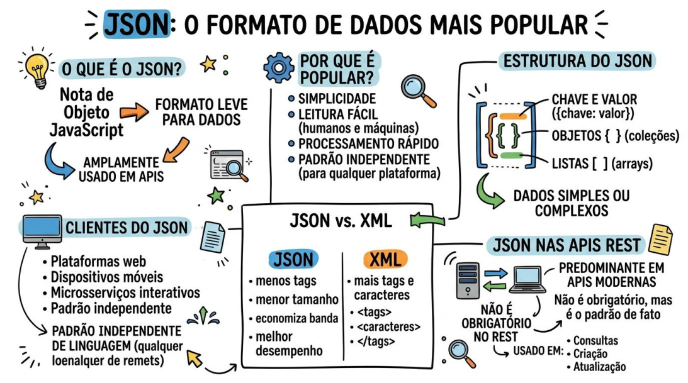


Uma das vantagens mais conhecidas desse formato está relacionada à sua estrutura compacta. Por que JSON costuma ser associado a comunicações mais leves? Em muitos cenários, ele utiliza menos marcações do que formatos como XML, produzindo representações mais concisas dos dados. Como consequência, a quantidade de informações transmitidas pela rede tende a ser menor. Essa característica contribui para reduzir o consumo de banda e pode favorecer o desempenho das aplicações durante a troca de informações entre sistemas. 

Para representar dados, JSON utiliza alguns elementos fundamentais. O que compõe sua estrutura básica? Os principais componentes são objetos, arrays e pares chave-valor. Esses elementos podem ser combinados em diferentes níveis de profundidade, permitindo modelar desde informações bastante simples até estruturas complexas contendo múltiplos relacionamentos. Essa flexibilidade explica por que

---

<!-- pagina: 87 -->

**Diego Carvalho, Equipe Informática 2 (Diego Carvalho), Equipe Informática 1 (Diego Carvalho) Aula 09** 

o formato é utilizado em contextos tão diversos, incluindo aplicações web, dispositivos móveis e sistemas corporativos de grande porte. 

Ao estudar APIs REST, é comum encontrar JSON em praticamente todos os exemplos. Isso significa que REST exige o uso desse formato? Não. A arquitetura REST permite diferentes formas de representação dos recursos. Entretanto, JSON tornou-se a opção predominante devido à sua simplicidade e ampla compatibilidade. Por esse motivo, quando um cliente consulta, cria ou atualiza recursos em uma API moderna, é bastante comum que os dados trafeguem utilizando representações estruturadas nesse formato. 

A estrutura de um documento JSON segue regras simples e bem definidas para organizar informações. Quais são os elementos fundamentais dessa organização? JSON é construído principalmente a partir de objetos, arrays e valores. Esses componentes permitem representar dados de forma hierárquica, criando desde estruturas bastante simples até modelos complexos compostos por diversos níveis de relacionamento. A combinação desses elementos tornou o formato adequado para a troca de informações entre aplicações e serviços distribuídos. 

Os objetos representam um dos componentes mais importantes da estrutura JSON. Como eles são identificados? Objetos são delimitados por chaves e armazenam pares chave-valor. Cada chave é representada como texto e funciona como identificador da informação associada. Os valores podem assumir diferentes formatos, incluindo textos, números, valores booleanos, objetos, arrays ou o valor nulo. Essa flexibilidade permite descrever uma grande variedade de informações utilizando uma sintaxe relativamente compacta. 

Outro elemento essencial é o array. Qual sua função dentro da estrutura JSON? Arrays são utilizados para armazenar coleções ordenadas de valores e são delimitados por colchetes. Esses valores podem ser simples, como números e textos, ou mais complexos, como objetos completos. Graças a essa característica, arrays são frequentemente utilizados para representar listas de clientes, produtos, pedidos ou qualquer conjunto de informações que precise ser agrupado dentro de uma mesma estrutura. 

Uma característica frequentemente destacada no JSON é sua legibilidade. Mesmo quem possui pouca experiência com programação costuma conseguir identificar o significado geral dos dados observando a organização das chaves e dos valores. Essa facilidade contribui para atividades de teste, documentação e integração entre equipes. Além disso, objetos podem conter outros objetos, arrays podem armazenar estruturas completas e diferentes elementos podem ser combinados livremente, permitindo construir modelos de dados complexos sem perder a clareza da representação.

---

<!-- pagina: 88 -->

**Diego Carvalho, Equipe Informática 2 (Diego Carvalho), Equipe Informática 1 (Diego Carvalho) Aula 09** 


<!-- Start of picture text -->
Objetos<br><!-- End of picture text -->

#### **<mark>OBJETOS</mark>** 

Um objeto é a principal estrutura de organização de dados no formato JSON. Ele representa uma coleção de informações relacionadas, armazenadas na forma de pares chave-valor, em que cada chave identifica um atributo e cada valor corresponde ao dado associado. Os objetos são delimitados por chaves ({}) e podem conter diferentes tipos de valores, como números, textos, valores booleanos, arrays ou até mesmo outros objetos, <u>permitindo representar estruturas de dados simples ou complexas.</u> 

O objeto é uma das estruturas mais importantes do JSON e desempenha papel central na organização das informações. O que caracteriza um objeto nesse formato? Trata-se de uma coleção de pares chavevalor utilizada para agrupar dados relacionados dentro de um mesmo contexto. Os objetos são delimitados por chaves e permitem representar informações de maneira organizada e estruturada. Cada chave funciona como identificador de um atributo e, segundo a especificação JSON, é representada como uma string delimitada por aspas duplas. 

Para compreender melhor essa estrutura, imagine a representação de um cliente em uma aplicação. Quais informações poderiam compor esse objeto? Atributos como nome, idade, e-mail e telefone são exemplos comuns. Cada um deles é armazenado como um par chave-valor dentro do objeto. Essa organização mantém os dados relacionados agrupados em uma única estrutura lógica, facilitando tanto a leitura humana quanto o processamento realizado pelas aplicações que consomem essas informações. 

Uma característica particularmente interessante dos objetos JSON é sua capacidade de composição. Como representar informações mais complexas sem perder a organização dos dados? Uma solução consiste em armazenar objetos dentro de outros objetos. Um pedido pode conter informações próprias, como número e data, e também incluir um objeto representando o cliente responsável pela compra. Esse mecanismo permite criar estruturas hierárquicas capazes de descrever relacionamentos de forma clara e consistente. 

A utilização de objetos contribui diretamente para a flexibilidade do JSON. Estruturas simples podem ser representadas com poucos atributos, enquanto modelos mais elaborados podem combinar múltiplos níveis de objetos e outros elementos da linguagem. Essa capacidade de adaptação favorece a troca de informações entre sistemas distintos e facilita a conversão dos dados para estruturas equivalentes existentes em linguagens de programação, tornando o formato amplamente utilizado em APIs e aplicações modernas.

---

<!-- pagina: 89 -->

**Diego Carvalho, Equipe Informática 2 (Diego Carvalho), Equipe Informática 1 (Diego Carvalho) Aula 09** 


<!-- Start of picture text -->
Arrays<br><!-- End of picture text -->

#### **<mark>ARRAYS</mark>** 

<mark>Um array é uma estrutura utilizada no JSON para armazenar uma sequência ordenada de valores. Diferentemente</mark> dos objetos, cujos elementos são identificados por chaves, os itens de um array são acessados por sua posição na lista. Os arrays são delimitados por colchetes ([]) e podem conter valores de diferentes tipos, como números, textos, valores booleanos, objetos e até mesmo outros arrays. 

Arrays são estruturas utilizadas para armazenar coleções ordenadas de valores em documentos JSON. Qual é a principal finalidade desse recurso? Permitir que múltiplas informações sejam agrupadas em uma única estrutura de forma organizada. Os arrays são delimitados por colchetes e podem armazenar diversos tipos de dados, incluindo textos, números, valores booleanos, objetos, outros arrays e o valor nulo. Essa versatilidade torna os arrays um dos elementos mais utilizados na representação de conjuntos de informações. 

Uma situação bastante comum envolve o retorno de listas por APIs. Como representar dezenas ou centenas de clientes em uma única resposta? A solução normalmente consiste na utilização de um array. Cada elemento da coleção pode ser representado por um objeto independente contendo os dados de um cliente, produto ou pedido. Dessa forma, grandes volumes de informações podem ser transmitidos de maneira estruturada e facilmente processados pelas aplicações que consomem esses dados. 

Uma característica importante dos arrays está relacionada à ordem dos elementos armazenados. Por que essa propriedade merece atenção? Porque cada item ocupa uma posição específica dentro da coleção. Isso significa que a sequência dos dados é preservada durante o processamento. Em cenários como históricos de eventos, listas classificadas ou conjuntos de resultados retornados por consultas, a posição de cada elemento pode possuir significado relevante para a aplicação que recebe a informação. 

A combinação entre arrays e objetos amplia consideravelmente o poder de representação do JSON. É possível armazenar objetos completos dentro de arrays e também incluir arrays como atributos de objetos. Essa composição permite modelar estruturas de dados bastante sofisticadas sem a necessidade de mecanismos adicionais. Como resultado, JSON consegue representar desde listas simples até modelos complexos compostos por múltiplos níveis de relacionamento entre informações distintas.

---

<!-- pagina: 90 -->

**Diego Carvalho, Equipe Informática 2 (Diego Carvalho), Equipe Informática 1 (Diego Carvalho) Aula 09** 


<!-- Start of picture text -->
Par<br><!-- End of picture text -->


<!-- Start of picture text -->
V alor<br><!-- End of picture text -->


<!-- Start of picture text -->
-<br>have<br><!-- End of picture text -->

#### **<mark>PARES CHAVE-VALOR</mark>** 

<mark>Os pares chave-valor constituem a forma básica de organização das informações em um objeto JSON. Cada dado</mark> é representado por uma chave, que identifica o atributo, e por um valor, que corresponde à informação armazenada nesse atributo. A chave é sempre escrita como uma cadeia de caracteres entre aspas duplas, seguida <u>por dois-pontos (:) e pelo respectivo valor, que pode ser um número, texto, valor booleano, objeto, array ou null.</u> 

Os pares chave-valor representam o mecanismo fundamental utilizado pelo JSON para organizar informações. Como os dados são identificados dentro desse formato? Cada informação é associada a uma chave, responsável por identificar o atributo, e a um valor, que contém o dado correspondente. As chaves são sempre representadas como strings delimitadas por aspas duplas, enquanto os valores podem assumir diferentes tipos, incluindo textos, números, valores booleanos, objetos, arrays e o valor nulo. 

Para visualizar essa estrutura, imagine a representação de um cliente. Quais informações poderiam ser armazenadas? A chave "nome" pode estar associada ao valor "Maria", enquanto a chave "idade" pode estar vinculada ao valor 30. Nesse modelo, o significado de cada dado não depende de sua posição dentro da estrutura. O próprio identificador utilizado na chave informa qual atributo está sendo representado, tornando a interpretação dos dados mais simples e direta. 

Essa característica contribui para a clareza das informações transmitidas. Por que os pares chave-valor são considerados tão importantes para a legibilidade do JSON? Porque cada valor permanece explicitamente associado ao atributo que representa. Isso reduz ambiguidades durante a leitura e facilita tanto a compreensão humana quanto o processamento realizado pelas aplicações. Em vez de interpretar sequências de dados posicionais, os sistemas podem localizar diretamente as informações desejadas por meio de seus identificadores. 

Ao estudar objetos JSON, percebe-se que eles são formados justamente por conjuntos organizados de pares chave-valor. Os arrays seguem uma lógica diferente, pois armazenam elementos ordenados por posição. Entretanto, é muito comum que esses elementos sejam objetos compostos por pares chavevalor. Por essa razão, compreender esse mecanismo é essencial para entender como o JSON estrutura e organiza informações em aplicações modernas e serviços baseados em APIs. 


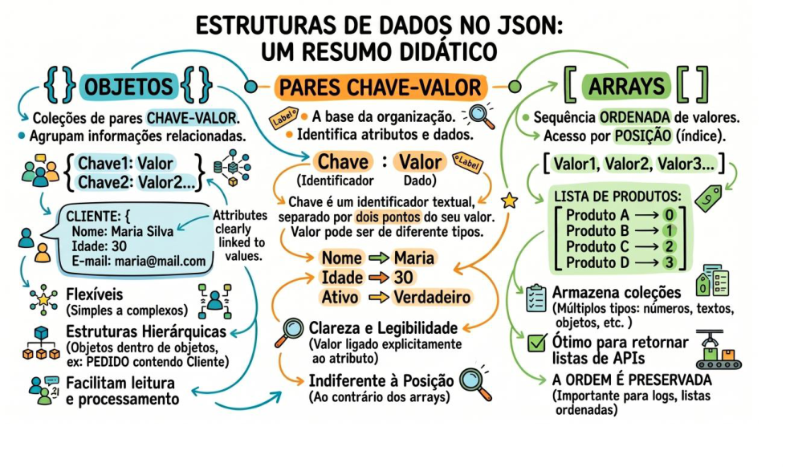

---

<!-- pagina: 91 -->

**Diego Carvalho, Equipe Informática 2 (Diego Carvalho), Equipe Informática 1 (Diego Carvalho) Aula 09** 


<!-- Start of picture text -->
Segurança em Web Services<br><!-- End of picture text -->

##### **<mark>INCIDÊNCIA EM PROVA: BAIXA</mark>** 

A segurança ocupa papel fundamental no funcionamento dos Web Services. Por que esse tema recebe tanta atenção em arquiteturas modernas? Porque esses serviços frequentemente processam e transportam informações sensíveis, incluindo dados pessoais, credenciais de acesso, registros corporativos e informações financeiras. Sem mecanismos adequados de proteção, mensagens podem ser interceptadas, modificadas ou acessadas por entidades não autorizadas. Para reduzir esses riscos, os sistemas adotam controles voltados à confidencialidade, integridade, autenticidade e controle de acesso aos recursos disponibilizados. 

A proteção de um Web Service não depende de um único mecanismo. Como os sistemas conseguem proteger diferentes aspectos da comunicação? Normalmente por meio da combinação de diversas camadas de segurança. Algumas tecnologias atuam protegendo os dados durante a transmissão; outras verificam a identidade dos usuários ou aplicações envolvidas. Existem ainda mecanismos responsáveis por controlar quais recursos podem ser acessados e quais operações cada entidade está autorizada a executar dentro do sistema. 

Ao estudar esse tema, é comum encontrar conceitos como HTTPS, autenticação, autorização, tokens, API Keys e OAuth. Todos eles desempenham a mesma função? Não. HTTPS protege a comunicação durante o transporte dos dados. A autenticação verifica a identidade de quem realiza a requisição. A autorização determina quais ações podem ser executadas após essa identidade ser validada. API Keys geralmente identificam aplicações consumidoras, enquanto tokens transportam informações utilizadas pelos mecanismos de autenticação ou autorização. Já o OAuth foi criado para fornecer autorização delegada de forma padronizada entre diferentes sistemas. 

A escolha das tecnologias de segurança depende das características e dos requisitos da aplicação. Sistemas governamentais, plataformas financeiras, APIs públicas e ambientes corporativos frequentemente apresentam necessidades distintas relacionadas a risco, conformidade regulatória e controle de acesso. Por essa razão, compreender os mecanismos de segurança disponíveis é essencial para projetar integrações confiáveis e proteger adequadamente os recursos disponibilizados por Web Services em ambientes distribuídos modernos. 


<!-- Start of picture text -->
HTTPS<br><!-- End of picture text -->

#### **<mark>HTTPS</mark>** 

Versão segura do protocolo HTTP, utilizada para proteger a comunicação entre clientes e servidores na Internet. Sua principal característica é a utilização dos protocolos TLS ou SSL para criptografar os dados transmitidos, impedindo que informações sensíveis sejam interceptadas ou alteradas por terceiros. Além de garantir a confidencialidade dos dados, o HTTPS também assegura a integridade das mensagens e a autenticidade do servidor por meio de certificados digitais. Em Web Services e APIs REST, seu uso é considerado um requisito fundamental para proteger credenciais, dados pessoais e demais informações trocadas durante a comunicação. 

HTTPS é o principal mecanismo utilizado para proteger a comunicação entre clientes e servidores na Web. O que diferencia esse protocolo do HTTP tradicional? A diferença está na utilização do TLS, sigla para Transport Layer Security. Ao combinar HTTP com os mecanismos de segurança fornecidos pelo TLS, a comunicação passa a ocorrer de forma protegida. Essa proteção reduz significativamente os riscos de interceptação, leitura indevida ou manipulação das informações transmitidas pela rede. 

Uma dúvida bastante comum envolve a proteção dos dados durante a transmissão. Como as informações permanecem protegidas enquanto trafegam pela Internet? Quando a conexão é estabelecida, o TLS

---

<!-- pagina: 92 -->

**Diego Carvalho, Equipe Informática 2 (Diego Carvalho), Equipe Informática 1 (Diego Carvalho) Aula 09** 

realiza procedimentos de segurança que permitem a utilização de mecanismos criptográficos para proteger a sessão de comunicação. Como consequência, mesmo que terceiros consigam capturar o tráfego da rede, não poderão compreender facilmente o conteúdo das mensagens sem possuir as chaves necessárias para sua interpretação. 

Além da confidencialidade, a comunicação segura também precisa garantir que os dados não sejam alterados indevidamente. De que forma isso é verificado? Os mecanismos fornecidos pelo TLS permitem detectar modificações realizadas durante a transmissão. Assim, cliente e servidor conseguem verificar se as informações recebidas permanecem consistentes com aquelas originalmente enviadas. Essa capacidade fortalece a confiança na troca de dados e reduz riscos associados à adulteração das mensagens em trânsito. 

Outro aspecto fundamental está relacionado à autenticação do servidor. Como o cliente pode ter confiança de que está se comunicando com o sistema correto? Essa verificação ocorre por meio de certificados digitais. Os certificados permitem validar a identidade do serviço acessado e ajudam a prevenir ataques nos quais um invasor tenta se passar por uma aplicação legítima. Por reunir mecanismos de confidencialidade, integridade e autenticação, HTTPS tornou-se um requisito praticamente obrigatório em aplicações web, APIs e serviços distribuídos modernos.

---

<!-- pagina: 93 -->

**Diego Carvalho, Equipe Informática 2 (Diego Carvalho), Equipe Informática 1 (Diego Carvalho) Aula 09** 


<!-- Start of picture text -->
Autenticação<br><!-- End of picture text -->

#### **<mark>AUTENTICAÇÃO</mark>** 

Processo responsável por verificar a identidade de um usuário, aplicação ou sistema antes de permitir o acesso a um serviço. Seu objetivo é responder à pergunta "quem está tentando acessar o recurso?". Essa verificação pode ser realizada por meio de diversos mecanismos, como usuário e senha, certificados digitais, tokens ou autenticação multifator. Em Web Services, a autenticação representa a primeira etapa da segurança, garantindo <u>que apenas entidades devidamente identificadas possam iniciar uma comunicação com o serviço.</u> 

A autenticação é o mecanismo utilizado para verificar a identidade de usuários, sistemas ou aplicações que tentam acessar recursos protegidos. Qual problema esse processo procura resolver? Antes de disponibilizar informações ou funcionalidades, o sistema precisa confirmar quem está realizando a solicitação. Essa verificação permite estabelecer confiança entre as partes envolvidas na comunicação e reduz o risco de acessos indevidos a dados ou operações restritas. 

Diversas tecnologias podem ser utilizadas para realizar essa comprovação de identidade. Como um sistema consegue confirmar que uma entidade é realmente quem afirma ser? Entre os mecanismos mais comuns estão usuário e senha, certificados digitais, biometria, autenticação multifator e tokens de acesso. Embora funcionem de maneiras diferentes, todos possuem o mesmo propósito: fornecer evidências suficientes para que a identidade apresentada seja validada pelo sistema responsável pelo controle de acesso. 

Em Web Services e APIs, a autenticação normalmente ocorre antes da execução das operações protegidas. O cliente apresenta credenciais ou algum mecanismo de identificação, e o servidor realiza as verificações necessárias para determinar sua validade. Em muitos ambientes modernos, essa validação pode ocorrer diretamente na aplicação ou ser delegada a serviços especializados de gerenciamento de identidade. Somente após a conclusão desse processo o sistema pode considerar a identidade do solicitante como confiável. 

Um ponto que costuma gerar dúvidas envolve a diferença entre autenticação e autorização. Essas duas atividades representam a mesma coisa? Não. A autenticação procura responder quem está realizando a solicitação. A autorização atua em uma etapa posterior e determina quais recursos ou operações podem ser acessados por aquela identidade já validada. Em outras palavras, primeiro o sistema verifica quem é o solicitante; depois decide quais permissões ele possui dentro do ambiente protegido. 

### **Saiba mais:** 

<mark>O protocolo HTTP disponibiliza um mecanismo padronizado para envio de credenciais por meio do cabeçalho Authorization. Como um cliente informa sua identidade ao acessar um recurso protegido utilizando Basic Authentication? Nesse modelo, o nome de usuário e a senha são concatenados no formato "usuario:senha". Em seguida, essa sequência é codificada utilizando Base64 e incorporada ao cabeçalho da requisição. O servidor recebe essas informações, realiza a decodificação necessária e verifica se as credenciais apresentadas são válidas.</mark> 

<mark>Uma dúvida bastante comum surge ao analisar esse processo. A utilização de Base64 protege as credenciais contra interceptação? Não. Base64 é apenas um mecanismo de codificação utilizado para representar dados em formato textual. Isso significa que qualquer pessoa que tenha acesso ao conteúdo transmitido poderá recuperar as credenciais com relativa facilidade. Portanto, a</mark>

---

<!-- pagina: 94 -->

**Diego Carvalho, Equipe Informática 2 (Diego Carvalho), Equipe Informática 1 (Diego Carvalho) Aula 09** 

<mark>codificação não deve ser confundida com criptografia ou qualquer forma de proteção efetiva das informações enviadas.</mark> 

<mark>Diante dessa limitação, como garantir a segurança da autenticação? A proteção deve ser fornecida pelo canal de comunicação utilizado entre cliente e servidor. Por esse motivo, o Basic Auth é recomendado apenas quando combinado com HTTPS. Nesse cenário, os mecanismos criptográficos fornecidos pelo TLS protegem todo o conteúdo da comunicação, incluindo o cabeçalho Authorization e as credenciais nele transportadas. Sem essa proteção adicional, informações sensíveis poderiam ser expostas durante a transmissão pela rede.</mark> 

<mark>Outro aspecto importante envolve o comportamento do próprio esquema Basic Auth. As credenciais são enviadas apenas uma vez? Normalmente não. Em muitas implementações, o cliente transmite as credenciais em todas as requisições que exigem autenticação. Essa característica reforça ainda mais a necessidade de utilizar HTTPS, pois a exposição repetida das credenciais aumentaria significativamente os riscos de comprometimento caso a comunicação ocorresse sem</mark> proteção adequada.

---

<!-- pagina: 95 -->

**Diego Carvalho, Equipe Informática 2 (Diego Carvalho), Equipe Informática 1 (Diego Carvalho) Aula 09** 


<!-- Start of picture text -->
Autorização<br><!-- End of picture text -->

#### **<mark>AUTORIZAÇÃO</mark>** 

Processo que determina quais recursos ou operações um usuário ou aplicação autenticada está autorizado a acessar. Diferentemente da autenticação, que verifica a identidade do solicitante, a autorização responde à pergunta "o que ele pode fazer?". As permissões podem ser definidas com base em papéis, perfis ou políticas de acesso previamente estabelecidas. Em Web Services e APIs, a autorização impede que usuários realizem operações para as quais não possuem privilégios, contribuindo para a proteção das informações e dos recursos do sistema. 

A autorização é o mecanismo responsável por determinar quais recursos e operações podem ser acessados após a validação da identidade do solicitante. Qual questão esse processo procura responder? Enquanto a autenticação verifica quem está realizando a requisição, a autorização define quais ações essa identidade pode executar dentro do sistema. Dessa forma, o controle de acesso não depende apenas de saber quem é o usuário, mas também das permissões associadas a ele. 

Essa distinção pode ser observada facilmente em aplicações que possuem diferentes perfis de acesso. O fato de dois usuários conseguirem entrar no sistema significa que ambos podem realizar as mesmas operações? Não necessariamente. Um administrador pode possuir permissões para configurar o ambiente, gerenciar usuários e alterar informações sensíveis. Um usuário comum pode ter acesso apenas a consultas ou funcionalidades específicas. A autorização existe justamente para garantir que cada identidade opere dentro dos limites definidos pelas regras de segurança. 

Em APIs e Web Services, essas verificações costumam ocorrer sempre que uma operação protegida é solicitada. Como o sistema decide se determinada ação deve ser permitida? Após identificar o usuário autenticado, a aplicação consulta as permissões, papéis ou políticas de acesso associadas a essa identidade. Caso os privilégios sejam suficientes, a operação é executada. Caso contrário, a requisição é rejeitada, frequentemente com respostas como o código HTTP 403, que indica ausência de autorização para realizar a ação solicitada. 

A importância desse mecanismo torna-se evidente quando se analisa a proteção de informações sensíveis. Uma autenticação robusta garante que a identidade seja conhecida, mas não determina automaticamente quais recursos podem ser acessados. Sem controles adequados de autorização, usuários legítimos poderiam executar operações incompatíveis com suas responsabilidades. Por essa razão, autenticação e autorização são processos complementares e igualmente essenciais para a segurança de sistemas distribuídos e Web Services modernos.

---

<!-- pagina: 96 -->

**Diego Carvalho, Equipe Informática 2 (Diego Carvalho), Equipe Informática 1 (Diego Carvalho) Aula 09** 


<!-- Start of picture text -->
Tokens<br><!-- End of picture text -->

#### **<mark>TOKENS</mark>** 

Os tokens são credenciais digitais utilizadas para representar a identidade de um usuário ou aplicação durante a comunicação com um serviço. Após a autenticação, o servidor normalmente emite um token que deverá acompanhar as requisições subsequentes, evitando a necessidade de reenviar usuário e senha a cada solicitação. Os tokens podem conter informações como identidade, permissões e tempo de validade, sendo amplamente utilizados em APIs REST devido à sua praticidade, escalabilidade e facilidade de integração com diferentes mecanismos de autenticação. 

Tokens são mecanismos amplamente utilizados para representar informações associadas a uma identidade autenticada durante a comunicação entre clientes e serviços. Qual problema eles procuram resolver? Em vez de transmitir usuário e senha a cada requisição, o sistema realiza a autenticação uma única vez e fornece ao cliente uma credencial digital que poderá ser utilizada nas chamadas subsequentes. Essa abordagem reduz a necessidade de expor repetidamente informações sensíveis durante a comunicação. 

Após a autenticação, o cliente passa a incluir o token nas requisições destinadas ao servidor. O que esse token pode conter? Dependendo da tecnologia utilizada, ele pode transportar informações relacionadas à identidade autenticada, permissões, escopos de acesso e período de validade. Em outros modelos, o token pode funcionar apenas como um identificador que será posteriormente validado pelo servidor. Em ambos os casos, o objetivo é permitir que a aplicação reconheça quem está realizando a solicitação sem exigir novas credenciais a cada interação. 

Uma das principais vantagens desse mecanismo está relacionada à segurança e à flexibilidade operacional. Por que os tokens são considerados mais seguros do que o envio constante de senhas? Como as credenciais originais deixam de trafegar repetidamente pela rede, reduz-se a superfície de exposição dessas informações. Além disso, os tokens podem possuir prazo de expiração, limitações de escopo, mecanismos de renovação e até mesmo processos de revogação, permitindo maior controle sobre os acessos concedidos. 

O uso de tokens tornou-se uma prática comum em APIs REST e arquiteturas distribuídas modernas. Entre as tecnologias mais conhecidas está o JSON Web Token, frequentemente identificado pela sigla JWT. Isso significa que todo token é um JWT? Não. JWT representa apenas um formato específico de token, embora seja amplamente adotado em aplicações web e ambientes de microsserviços. Independentemente do formato utilizado, os tokens desempenham papel central nos processos modernos de autenticação e autorização. 

### **Saiba mais:** 

<mark>Após a autenticação, muitas APIs passam a utilizar tokens como mecanismo para controlar o acesso aos recursos protegidos. Como esse token é enviado ao servidor nas requisições subsequentes? A prática mais comum consiste em utilizar o cabeçalho HTTP Authorization. Esse cabeçalho foi criado justamente para transportar informações relacionadas à autenticação e à autorização, permitindo que o cliente apresente sua credencial sempre que desejar acessar funcionalidades protegidas pela aplicação.</mark> 

<mark>Ao analisar requisições modernas, é muito comum encontrar o esquema Bearer associado a esse cabeçalho. O que significa essa indicação? Ela informa ao servidor que o valor enviado corresponde</mark>

---

<!-- pagina: 97 -->

**Diego Carvalho, Equipe Informática 2 (Diego Carvalho), Equipe Informática 1 (Diego Carvalho) Aula 09** 

<mark>a um token de acesso. Nesse modelo, o cabeçalho normalmente assume a forma "Authorization: Bearer token". A palavra Bearer aparece primeiro, seguida por um espaço em branco e pelo valor efetivo do token utilizado para identificação e validação da requisição.</mark> 

<mark>Uma dúvida frequente surge nesse ponto. O valor enviado após Bearer é necessariamente um hash? Não. O conteúdo transportado pode assumir diferentes formatos dependendo da tecnologia adotada. Em alguns cenários, trata-se de um JSON Web Token, conhecido como JWT. Em outros, pode ser um token opaco cujo significado é interpretado exclusivamente pelo servidor. Independentemente do formato, o elemento transmitido é o próprio token de acesso e não obrigatoriamente uma representação hash de suas informações.</mark> 

<mark>O esquema Bearer tornou-se amplamente utilizado em APIs modernas, especialmente em arquiteturas que empregam OAuth e mecanismos baseados em tokens. Por que ele exige cuidados de segurança? Porque a posse de um token válido geralmente é suficiente para acessar os recursos autorizados. Por essa razão, recomenda-se protegê-lo adequadamente durante o armazenamento e a transmissão, normalmente utilizando HTTPS para impedir sua exposição durante a comunicação</mark> entre cliente e servidor.

---

<!-- pagina: 98 -->

**Diego Carvalho, Equipe Informática 2 (Diego Carvalho), Equipe Informática 1 (Diego Carvalho) Aula 09** 


<!-- Start of picture text -->
API Keys<br><!-- End of picture text -->

#### **<mark>API KEYS</mark>** 

As API Keys são identificadores exclusivos utilizados para reconhecer aplicações que consomem um Web Service ou API. Normalmente consistem em uma sequência de caracteres fornecida pelo provedor do serviço e enviada em cada requisição para identificar o cliente responsável pelo acesso. Embora sejam frequentemente utilizadas para controle de uso, monitoramento e limitação de requisições, as API Keys, isoladamente, não oferecem autenticação robusta nem substituem mecanismos mais completos de segurança. Por esse motivo, costumam ser combinadas com HTTPS e outras técnicas de autenticação. 

API Keys são identificadores utilizados para reconhecer aplicações que consomem recursos disponibilizados por uma API. Qual é a finalidade desse mecanismo? Permitir que o provedor do serviço saiba qual aplicação está realizando as requisições e aplique regras relacionadas ao monitoramento, ao controle de consumo e ao acesso aos recursos disponibilizados. Dessa forma, cada cliente consumidor pode ser identificado individualmente durante a comunicação com o serviço. 

Quando uma aplicação deseja utilizar uma API protegida por esse mecanismo, normalmente precisa incluir sua chave em cada requisição realizada. O que acontece quando o servidor recebe essa informação? A chave é validada e associada a um consumidor previamente cadastrado. A partir dessa identificação, o sistema pode registrar métricas de utilização, aplicar limites de requisições e verificar se aquele cliente possui permissão para utilizar determinados recursos oferecidos pela API. 

Uma dúvida bastante comum envolve a diferença entre API Keys e mecanismos tradicionais de autenticação. Uma API Key identifica um usuário específico? Na maioria dos casos, não. O objetivo principal desse recurso é identificar a aplicação consumidora. Quando existe a necessidade de reconhecer indivíduos, controlar permissões detalhadas ou associar operações a usuários específicos, normalmente são utilizados mecanismos adicionais de autenticação e autorização, frequentemente baseados em tokens e sistemas de gerenciamento de identidade. 

Apesar de sua ampla utilização, API Keys possuem limitações importantes do ponto de vista da segurança. Se uma chave for exposta indevidamente, terceiros poderão utilizá-la para realizar requisições em nome da aplicação legítima. Por essa razão, recomenda-se proteger sua transmissão por meio de HTTPS e combiná-la com controles adicionais quando os requisitos de segurança forem mais rigorosos. Em muitas arquiteturas modernas, as API Keys atuam como complemento a mecanismos mais robustos de autenticação e autorização.

---

<!-- pagina: 99 -->

**Diego Carvalho, Equipe Informática 2 (Diego Carvalho), Equipe Informática 1 (Diego Carvalho) Aula 09** 


<!-- Start of picture text -->
O A uth<br><!-- End of picture text -->

#### **<mark>OAUTH</mark>** 

O OAuth é um protocolo de autorização que permite a uma aplicação acessar recursos protegidos em nome de um usuário sem que este precise compartilhar sua senha com terceiros. Em vez das credenciais do usuário, o sistema utiliza tokens de acesso emitidos por um servidor de autorização após o consentimento do proprietário dos dados. Essa abordagem aumenta a segurança e reduz os riscos de exposição de senhas, sendo amplamente empregada em APIs modernas e em serviços que permitem o acesso por meio de contas de plataformas como Google, Microsoft e GitHub. 

OAuth é um protocolo criado para permitir a delegação segura de acesso entre sistemas. Qual problema ele procura resolver? Em muitos cenários, uma aplicação precisa acessar recursos protegidos em nome de um usuário. Solicitar e armazenar a senha desse usuário seria uma abordagem arriscada e pouco prática. OAuth foi desenvolvido justamente para evitar esse compartilhamento direto de credenciais, permitindo que permissões sejam concedidas de forma controlada por meio de mecanismos específicos de autorização. 


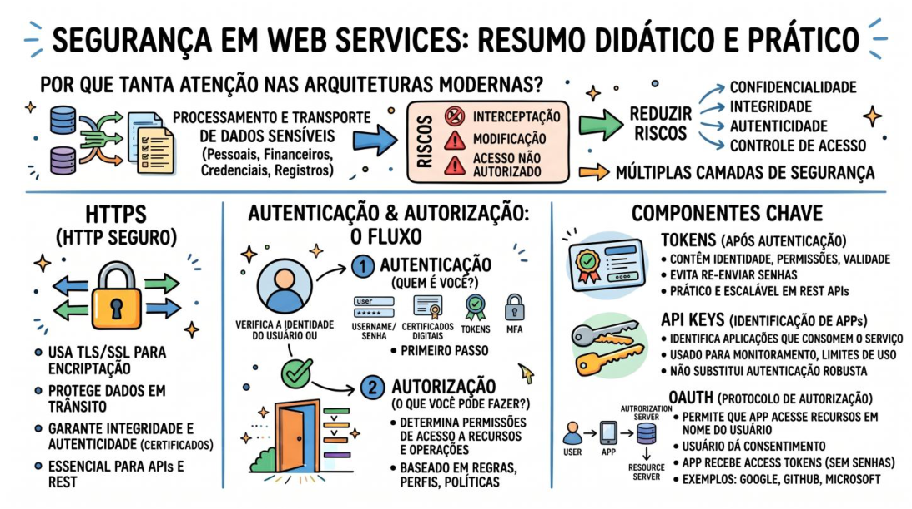


Um exemplo bastante conhecido aparece quando uma aplicação oferece a possibilidade de utilizar uma conta mantida por outro provedor. Como a aplicação consegue obter acesso sem conhecer a senha do usuário? O usuário é redirecionado para um ambiente controlado pelo provedor responsável pela identidade, realiza a autenticação diretamente nesse local e decide quais permissões deseja conceder. Após essa autorização, a aplicação recebe um token que poderá ser utilizado para acessar os recursos permitidos, sem que a senha seja compartilhada durante o processo. 

O funcionamento do OAuth envolve diferentes participantes trabalhando em conjunto. Quem são esses componentes? O proprietário do recurso é o usuário que controla as informações. A aplicação cliente é o sistema que deseja obter acesso. O servidor de autorização é responsável por conceder permissões e emitir tokens. Já o servidor de recursos disponibiliza as informações protegidas. Essa separação de

---

<!-- pagina: 100 -->

**Diego Carvalho, Equipe Informática 2 (Diego Carvalho), Equipe Informática 1 (Diego Carvalho) Aula 09** 

responsabilidades permite conceder acessos limitados e específicos, reduzindo riscos associados à integração entre sistemas distintos. 

Uma dúvida frequente surge ao estudar esse tema. OAuth realiza autenticação ou autorização? Sua finalidade principal é autorização. Em muitos sistemas modernos, especialmente em mecanismos de login federado, OAuth é utilizado em conjunto com protocolos complementares voltados à identificação do usuário, como o OpenID Connect. Independentemente desse uso combinado, OAuth permanece como um dos padrões mais importantes para delegação segura de acesso em APIs, aplicações corporativas, plataformas em nuvem e ambientes distribuídos.

---

<!-- pagina: 101 -->

**Diego Carvalho, Equipe Informática 2 (Diego Carvalho), Equipe Informática 1 (Diego Carvalho) Aula 09** 


<!-- Start of picture text -->
Ferramentas de Teste<br><!-- End of picture text -->

##### **<mark>INCIDÊNCIA EM PROVA: BAIXÍSSIMA</mark>** 

O desenvolvimento de Web Services envolve atividades que vão muito além da implementação das funcionalidades da aplicação. Como verificar se uma API está respondendo corretamente às requisições recebidas? Para atender a essa necessidade, existem ferramentas especializadas que permitem validar requisições, analisar respostas, acompanhar códigos de status e identificar problemas de integração. Esses recursos auxiliam desenvolvedores, analistas e equipes de teste durante todo o ciclo de vida dos serviços distribuídos. 

Uma das principais funções dessas ferramentas é simular o comportamento de clientes consumidores. O que pode ser analisado durante esses testes? É possível enviar requisições personalizadas, examinar respostas detalhadamente, validar cabeçalhos HTTP, verificar formatos de dados e testar mecanismos de autenticação e autorização. Além disso, muitas soluções oferecem recursos para automação de testes e análise de desempenho, reduzindo o tempo necessário para localizar falhas e validar integrações complexas. 

Entre as ferramentas mais conhecidas estão Postman, SoapUI, navegadores web e cURL. Todas elas possuem a mesma finalidade? Embora compartilhem objetivos semelhantes, cada uma apresenta características próprias. O Postman é amplamente utilizado para testes e desenvolvimento de APIs REST. O SoapUI possui forte tradição em ambientes baseados em SOAP, embora também ofereça suporte a REST. Os navegadores podem ser úteis em verificações simples e inspeções de tráfego, enquanto o cURL permite realizar requisições diretamente pela linha de comando de forma rápida e flexível. 

O conhecimento dessas ferramentas é importante tanto em ambientes profissionais quanto em contextos acadêmicos e avaliações técnicas. Ao compreender suas características e aplicações, torna-se mais fácil selecionar a solução adequada para cada cenário de teste e integração. Além disso, questões envolvendo essas ferramentas aparecem com frequência em concursos, certificações e disciplinas relacionadas a Arquitetura Web, APIs e sistemas distribuídos. 


<!-- Start of picture text -->
Postman<br><!-- End of picture text -->

O Postman é uma das ferramentas mais utilizadas para desenvolvimento, teste e validação de APIs. O que explica sua ampla adoção por desenvolvedores e equipes de integração? A principal razão está na disponibilidade de uma interface gráfica que permite criar e executar requisições sem a necessidade de desenvolver aplicações específicas para esse fim. Com poucos passos, é possível configurar métodos HTTP, definir parâmetros, adicionar cabeçalhos e testar o comportamento dos serviços disponibilizados por uma API. 

Durante o desenvolvimento de uma integração, surge frequentemente a necessidade de verificar como o servidor responde a determinadas solicitações. Como realizar essa validação de forma rápida? O Postman permite enviar requisições utilizando métodos como GET, POST, PUT, PATCH e DELETE, além de visualizar respostas estruturadas em formatos como JSON. Também é possível analisar códigos de status, tempos de resposta e informações retornadas pelo servidor, facilitando a identificação de problemas durante a comunicação entre sistemas. 

Outro recurso bastante valorizado está relacionado à organização dos testes. Como manter um conjunto de requisições reutilizável e acessível para toda a equipe? O Postman permite agrupar chamadas em coleções compartilháveis, simplificando a padronização dos processos de validação. Além disso, oferece

---

<!-- pagina: 102 -->

**Diego Carvalho, Equipe Informática 2 (Diego Carvalho), Equipe Informática 1 (Diego Carvalho) Aula 09** 

suporte a variáveis de ambiente, automação de testes por meio de scripts e execução de sequências completas de requisições, ampliando sua utilidade em projetos de diferentes níveis de complexidade. 

Embora seja frequentemente associado a APIs REST, o Postman não se limita a esse cenário. A ferramenta também oferece suporte a outras formas de comunicação utilizadas em arquiteturas modernas. Essa versatilidade, combinada com sua interface intuitiva e seus recursos de automação, contribui para que o Postman seja amplamente adotado em atividades de desenvolvimento, testes, documentação e integração de serviços distribuídos. 


<!-- Start of picture text -->
SoapUI<br><!-- End of picture text -->

O SoapUI é uma ferramenta amplamente utilizada para testes e validação de Web Services, especialmente em ambientes que utilizam serviços SOAP. O que a torna particularmente relevante nesse contexto? Um de seus principais diferenciais é a capacidade de interpretar documentos WSDL e gerar automaticamente as operações, mensagens e estruturas necessárias para a comunicação com o serviço. Essa funcionalidade reduz o esforço manual de configuração e facilita a realização de testes em integrações baseadas em contratos formais. 

Ao trabalhar com um serviço SOAP, uma dificuldade comum consiste em compreender a estrutura exata das mensagens exigidas pelo sistema. Como o SoapUI auxilia nessa tarefa? A ferramenta utiliza as informações presentes no WSDL para identificar operações disponíveis, parâmetros esperados e formatos das mensagens. Com isso, o usuário pode concentrar seus esforços na validação das funcionalidades, sem precisar construir manualmente toda a estrutura de comunicação exigida pelo serviço. 

Embora seja tradicionalmente associado ao universo SOAP, o SoapUI também oferece suporte a APIs REST. Isso significa que a ferramenta está limitada apenas a serviços baseados em XML? Não. Além de criar requisições e analisar respostas REST, ela permite validar contratos, executar testes funcionais e verificar diferentes aspectos do comportamento das aplicações. Essa flexibilidade amplia sua utilidade em ambientes que utilizam múltiplos estilos de integração. 

Outro recurso bastante valorizado está relacionado à automação dos testes. É possível construir cenários envolvendo diversas operações, realizar validações automáticas de conteúdo e executar verificações de desempenho e segurança. Dependendo da edição utilizada, alguns recursos avançados podem variar, mas a proposta permanece a mesma: fornecer um ambiente robusto para garantir a qualidade das integrações. Por essa combinação de recursos e pela forte integração com WSDL, o SoapUI continua sendo uma das ferramentas mais utilizadas em projetos corporativos baseados em Web Services SOAP. 


<!-- Start of picture text -->
Navegador<br><!-- End of picture text -->

O navegador web pode atuar como uma ferramenta simples para testes básicos de Web Services e APIs REST. Em quais situações essa abordagem costuma ser útil? Principalmente quando o objetivo é realizar consultas por meio do método GET. Como os navegadores executam requisições HTTP naturalmente durante a navegação, basta informar a URL desejada para solicitar recursos e visualizar as respostas retornadas pelo servidor. Essa característica torna o navegador uma alternativa rápida para verificações iniciais de funcionamento. 

Ao acessar um endpoint diretamente, o que pode ser observado? Em muitos casos, o navegador exibe respostas em formatos como JSON ou XML, permitindo analisar rapidamente os dados fornecidos pelo serviço. Essa capacidade é útil para confirmar a disponibilidade de uma API, validar conteúdos retornados

---

<!-- pagina: 103 -->

**Diego Carvalho, Equipe Informática 2 (Diego Carvalho), Equipe Informática 1 (Diego Carvalho) Aula 09** 

por determinados recursos ou demonstrar conceitos relacionados à comunicação HTTP em contextos educacionais e de aprendizado. 

Entretanto, existem limitações importantes quando comparadas às ferramentas especializadas de teste. Seria possível utilizar o navegador com a mesma flexibilidade oferecida por soluções como Postman ou SoapUI? Não de forma direta. Métodos como POST, PUT, PATCH e DELETE não podem ser executados pela barra de endereços, e a configuração de cabeçalhos personalizados, autenticação e parâmetros avançados é bastante restrita. Embora as ferramentas de desenvolvedor ofereçam recursos adicionais, elas não substituem completamente plataformas dedicadas a testes de APIs. 

Mesmo com essas limitações, os navegadores continuam desempenhando papel relevante no processo de desenvolvimento. Além da facilidade de acesso, eles disponibilizam ferramentas integradas para inspeção de tráfego, análise de cabeçalhos, monitoramento de respostas e depuração de aplicações web. Por essa razão, permanecem úteis para exploração rápida de APIs públicas, validações preliminares e atividades de demonstração relacionadas à comunicação entre clientes e servidores. 


<!-- Start of picture text -->
cURL<br><!-- End of picture text -->

O cURL é uma ferramenta de linha de comando amplamente utilizada para comunicação com servidores, Web Services e APIs. O que explica sua popularidade entre desenvolvedores, administradores de sistemas e profissionais de DevOps? A principal razão está na possibilidade de enviar requisições diretamente pelo terminal, sem depender de interfaces gráficas. Essa característica torna o cURL uma solução prática para testes, diagnósticos e automação de tarefas relacionadas à comunicação em rede. 

Uma das capacidades mais importantes da ferramenta está em sua flexibilidade de configuração. Como reproduzir diferentes cenários de comunicação utilizando apenas comandos? O cURL permite definir métodos HTTP, configurar cabeçalhos personalizados, enviar dados no corpo das requisições e utilizar mecanismos de autenticação. Por meio de parâmetros específicos, é possível controlar diversos aspectos da interação com o serviço, reproduzindo situações semelhantes às encontradas em aplicações reais ou em ferramentas gráficas especializadas. 

O uso do cURL vai além dos testes realizados manualmente. Em quais contextos essa ferramenta costuma aparecer com frequência? Scripts de automação, pipelines de integração contínua, rotinas de monitoramento e procedimentos de diagnóstico são exemplos bastante comuns. Como está disponível em diferentes sistemas operacionais e pode ser executado diretamente no terminal, o cURL torna-se uma alternativa eficiente para validar conectividade, testar APIs e automatizar operações repetitivas em ambientes de desenvolvimento e produção. 

Embora a utilização da linha de comando possa representar um desafio inicial para alguns usuários, a ferramenta oferece elevado nível de controle sobre as requisições realizadas. Além disso, o ecossistema associado ao cURL inclui a biblioteca libcurl, utilizada por diversas aplicações para implementar comunicação de rede. Por reunir flexibilidade, portabilidade e capacidade de automação, o cURL continua sendo uma das ferramentas mais importantes para análise e teste de serviços distribuídos modernos. 

|**FERRAMENTAS**|**DESCRIÇÃO**|
|---|---|
|**POSTMAN**|Ferramenta amplamente utilizada para desenvolver, testar e documentar APIs e Web<br>Services. Permite enviar requisições HTTP, analisar respostas, automatizar testes e<br>organizar coleções de chamadas.|

---

<!-- pagina: 104 -->

**Diego Carvalho, Equipe Informática 2 (Diego Carvalho), Equipe Informática 1 (Diego Carvalho) Aula 09** 

|**FERRAMENTAS**|**DESCRIÇÃO**|
|---|---|
|**SOAPUI**|Ferramenta voltada principalmente para testes de Web Services SOAP, embora também<br>ofereça suporte a REST. Permite validar contratos WSDL, simular serviços e automatizar<br>cenários de teste.|
|**NAVEGADOR**|O navegador pode ser utilizado para testar requisições HTTP simples, especialmente do<br>tipo GET. É útil para verificar rapidamente endpoints públicos, respostas e códigos de<br>status de serviços Web.|
|**CURL**|Ferramenta de linha de comando utilizada para enviar requisições HTTP e HTTPS. Permite<br>testar APIs, definir cabeçalhos, enviar dados, autenticar usuários e automatizar chamadas<br>em scripts.|

---

<!-- pagina: 105 -->

**Diego Carvalho, Equipe Informática 2 (Diego Carvalho), Equipe Informática 1 (Diego Carvalho) Aula 09** 


<!-- Start of picture text -->
Conceitos Avançados<br><!-- End of picture text -->


<!-- Start of picture text -->
API REST<br><!-- End of picture text -->

##### **<mark>INCIDÊNCIA EM PROVA: MÉDIA</mark>** 

#### **<mark>API REST</mark>** 

Uma API REST é uma interface de programação de aplicações desenvolvida de acordo com os princípios da arquitetura REST, permitindo que diferentes sistemas se comuniquem por meio da Web de forma simples, padronizada e escalável. Em uma API REST, os recursos são identificados por URIs e manipulados utilizando os métodos do protocolo HTTP, como GET, POST, PUT, PATCH e DELETE. As informações trocadas entre cliente e servidor são normalmente representadas no formato JSON, embora outros formatos também possam ser utilizados. Devido à sua simplicidade, flexibilidade e baixo acoplamento, as APIs REST tornaram-se o padrão <u>predominante para integração entre aplicações Web, dispositivos móveis, microsserviços e sistemas distribuídos.</u> 

As APIs REST estão entre os mecanismos mais utilizados para integração de sistemas distribuídos. O que explica essa ampla adoção em aplicações modernas? Sua arquitetura foi concebida para favorecer simplicidade, interoperabilidade e escalabilidade durante a troca de informações entre diferentes sistemas. Baseadas nos princípios definidos por Roy Fielding, essas APIs organizam a comunicação em torno de recursos identificados por URIs, permitindo que aplicações desenvolvidas com tecnologias distintas interajam de forma padronizada. 


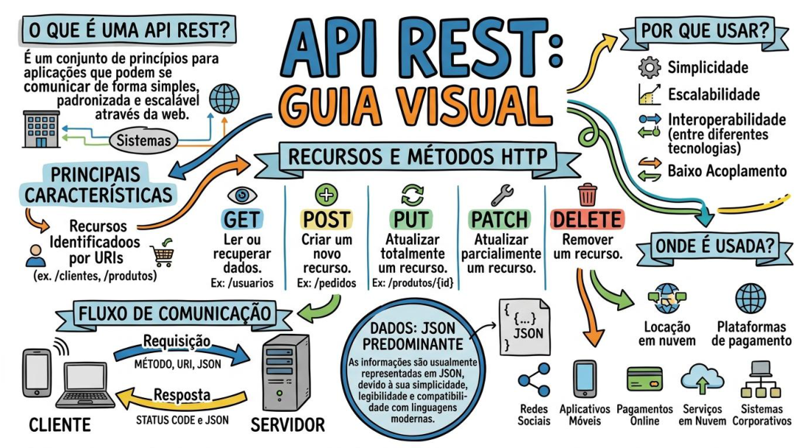


Uma das características mais importantes desse modelo é a orientação a recursos. Como os sistemas interagem em uma API REST? Em vez de executar diretamente comandos ou procedimentos remotos, os clientes acessam recursos que representam elementos do domínio de negócio, como clientes, produtos, pedidos ou usuários. As operações desejadas são indicadas por métodos padronizados, geralmente associados ao protocolo HTTP, como GET, POST, PUT, PATCH e DELETE. Essa abordagem produz interfaces mais previsíveis e alinhadas ao funcionamento da própria Web.

---

<!-- pagina: 106 -->

**Diego Carvalho, Equipe Informática 2 (Diego Carvalho), Equipe Informática 1 (Diego Carvalho) Aula 09** 

Ao analisar uma API REST, é comum observar o uso frequente do formato JSON. Isso significa que REST exige JSON? Não. A arquitetura permite diferentes formas de representação dos recursos. Entretanto, JSON tornou-se o formato predominante devido à sua simplicidade, legibilidade e ampla compatibilidade com linguagens e plataformas modernas. Como consequência, grande parte das APIs atuais utiliza JSON para transportar informações entre clientes e servidores. 

A presença das APIs REST pode ser observada em praticamente todos os segmentos da tecnologia atual. Plataformas de pagamento, sistemas corporativos, aplicações móveis, serviços em nuvem e redes sociais utilizam esse modelo para disponibilizar dados e funcionalidades. Essa popularidade decorre da capacidade de criar interfaces padronizadas e relativamente independentes das tecnologias empregadas em cada extremidade da comunicação, facilitando a integração entre sistemas heterogêneos em ambientes distribuídos.

---

<!-- pagina: 107 -->

**Diego Carvalho, Equipe Informática 2 (Diego Carvalho), Equipe Informática 1 (Diego Carvalho) Aula 09** 


<!-- Start of picture text -->
Microsserviços<br><!-- End of picture text -->

##### **<mark>INCIDÊNCIA EM PROVA: BAIXÍSSIMA</mark>** 

#### **<mark>MICROSSERVIÇOS</mark>** 

<mark>Microsserviços são uma abordagem arquitetural em que uma aplicação é dividida em diversos serviços</mark> pequenos, independentes e especializados, cada um responsável por uma funcionalidade específica do negócio. Esses serviços podem ser desenvolvidos, implantados, escalados e atualizados de forma autônoma, comunicando-se por meio de APIs ou mecanismos de mensageria. Essa arquitetura favorece o desacoplamento, a escalabilidade, a manutenção e a evolução das aplicações, sendo amplamente utilizada em sistemas distribuídos e ambientes de computação em nuvem. 

Microsserviços representam uma abordagem arquitetural utilizada para construir sistemas distribuídos a partir de serviços independentes e especializados. Qual problema essa arquitetura procura resolver? Em aplicações monolíticas, grande parte das funcionalidades costuma estar concentrada em uma única estrutura, o que pode dificultar manutenção, evolução e escalabilidade. A proposta dos microsserviços consiste em dividir o sistema em componentes menores, cada um responsável por uma capacidade específica de negócio, permitindo maior autonomia no desenvolvimento e na gestão das funcionalidades. 


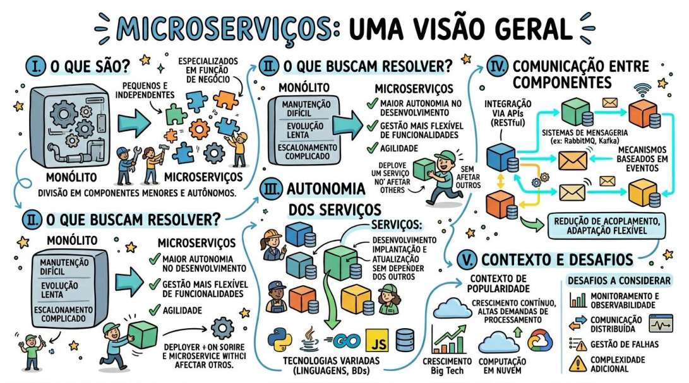


Uma característica marcante dessa abordagem está relacionada à independência dos serviços. O que significa afirmar que um microsserviço possui autonomia? Significa que ele pode ser desenvolvido, implantado e atualizado de forma relativamente independente dos demais componentes. Em muitos cenários, equipes distintas assumem a responsabilidade por serviços específicos. Além disso, diferentes microsserviços podem utilizar linguagens de programação, bancos de dados e tecnologias variadas, desde que consigam se comunicar adequadamente dentro da arquitetura. 

A comunicação entre esses componentes é um aspecto essencial do modelo. Como funcionalidades distribuídas conseguem trabalhar em conjunto para executar processos de negócio mais complexos? A integração normalmente ocorre por meio de APIs, sistemas de mensageria ou mecanismos orientados a eventos. Essa colaboração permite que cada serviço permaneça especializado em sua responsabilidade

---

<!-- pagina: 108 -->

**Diego Carvalho, Equipe Informática 2 (Diego Carvalho), Equipe Informática 1 (Diego Carvalho) Aula 09** 

principal, enquanto participa de fluxos maiores que envolvem múltiplos componentes. Como resultado, o acoplamento tende a ser reduzido e a adaptação a novas demandas torna-se mais flexível. 

A popularização dos microsserviços está fortemente associada ao crescimento da computação em nuvem e das aplicações de grande escala. Empresas de tecnologia adotaram essa arquitetura para lidar com ambientes sujeitos a crescimento contínuo e elevada demanda de processamento. Entretanto, essa abordagem também introduz desafios relacionados ao monitoramento, à observabilidade, à comunicação distribuída e ao gerenciamento de falhas. Por essa razão, a adoção de microsserviços deve considerar não apenas seus benefícios de escalabilidade e flexibilidade, mas também a complexidade adicional que acompanha sistemas distribuídos modernos.

---

<!-- pagina: 109 -->

**Diego Carvalho, Equipe Informática 2 (Diego Carvalho), Equipe Informática 1 (Diego Carvalho) Aula 09** 


<!-- Start of picture text -->
API Gateway<br><!-- End of picture text -->

##### **<mark>INCIDÊNCIA EM PROVA: BAIXÍSSIMA</mark>** 

#### **<mark>API GATEWAY</mark>** 

<mark>O API Gateway é um componente que atua como ponto único de entrada para as requisições destinadas a uma</mark> ou mais APIs ou microsserviços. Em vez de os clientes acessarem diretamente cada serviço, todas as solicitações passam pelo gateway, que pode realizar funções como autenticação, autorização, roteamento, balanceamento de carga, limitação de requisições, transformação de mensagens e monitoramento. Essa abordagem simplifica a comunicação entre clientes e serviços, além de centralizar funcionalidades comuns relacionadas à segurança e à <u>governança das APIs.</u> 

O API Gateway é um componente arquitetural utilizado para centralizar o acesso a APIs e microsserviços. Qual é a principal função desse elemento? Em vez de permitir que os clientes se comuniquem diretamente com diversos serviços internos, todas as requisições são inicialmente encaminhadas ao gateway. A partir desse ponto central, o sistema decide para qual serviço cada solicitação deve ser direcionada. Essa abordagem simplifica a comunicação e reduz a necessidade de os consumidores conhecerem detalhes da arquitetura interna. 


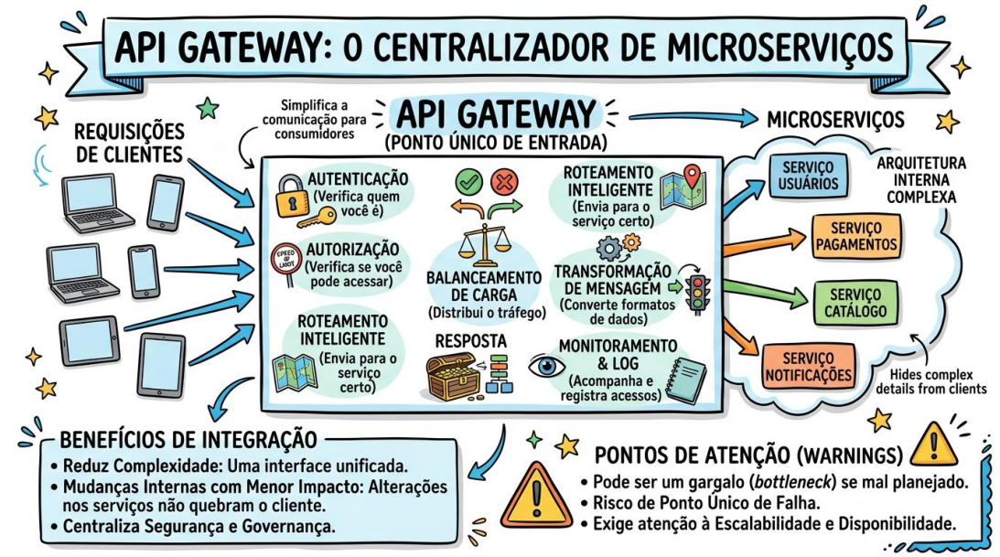


Uma consequência importante desse modelo está relacionada à redução da complexidade das integrações. Como um cliente consegue acessar diversos serviços utilizando apenas um ponto de entrada? O API Gateway fornece uma interface unificada para os consumidores, ocultando a distribuição das funcionalidades entre múltiplos componentes internos. Dessa forma, alterações na estrutura dos microsserviços, mudanças de endereçamento ou reorganizações da infraestrutura podem ocorrer com impacto reduzido sobre as aplicações que utilizam os serviços. 

O roteamento das requisições representa apenas uma parte de suas responsabilidades. Quais outras atividades podem ser executadas por esse componente? É comum que o gateway implemente autenticação, autorização, limitação de taxa de requisições, cache de respostas, balanceamento de carga, monitoramento, geração de logs e transformação de mensagens. Ao concentrar essas funções em uma

---

<!-- pagina: 110 -->

**Diego Carvalho, Equipe Informática 2 (Diego Carvalho), Equipe Informática 1 (Diego Carvalho) Aula 09** 

camada específica, a arquitetura promove maior padronização e reduz a necessidade de replicar os mesmos mecanismos em todos os serviços individuais. 

Em arquiteturas baseadas em microsserviços, o API Gateway frequentemente assume papel estratégico na organização da comunicação. Ele fornece uma visão simplificada do ambiente para os consumidores e ajuda a gerenciar aspectos transversais da infraestrutura. Entretanto, essa centralização também exige cuidados relacionados à disponibilidade e à escalabilidade, pois um gateway mal dimensionado pode se tornar um ponto de concentração de falhas ou um gargalo para o tráfego da aplicação. Por essa razão, seu planejamento é um aspecto importante em arquiteturas distribuídas modernas.

---

<!-- pagina: 111 -->

**Diego Carvalho, Equipe Informática 2 (Diego Carvalho), Equipe Informática 1 (Diego Carvalho) Aula 09** 


<!-- Start of picture text -->
GraphQL<br><!-- End of picture text -->

##### **<mark>INCIDÊNCIA EM PROVA: BAIXÍSSIMA</mark>** 

#### **<mark>GRAPHQL</mark>** 

<mark>O GraphQL é uma linguagem de consulta e um ambiente de execução para APIs que permite ao cliente</mark> especificar exatamente quais dados deseja receber. Diferentemente das APIs REST, que normalmente disponibilizam múltiplos endpoints para diferentes recursos, o GraphQL utiliza um único endpoint por meio do qual o cliente define, em cada requisição, os campos e relacionamentos de interesse. Essa abordagem reduz a transferência de dados desnecessários e torna a comunicação mais flexível, especialmente em aplicações que necessitam consultar informações provenientes de múltiplas fontes. 

GraphQL é uma linguagem de consulta para APIs que permite aos clientes definir exatamente quais informações desejam receber. Qual necessidade motivou o surgimento dessa abordagem? Em muitas APIs tradicionais, os dados retornados pelos endpoints são previamente definidos pelo servidor. Como consequência, uma requisição pode fornecer mais informações do que o necessário ou deixar de incluir dados importantes para determinada operação. GraphQL foi concebido para oferecer maior flexibilidade na obtenção das informações solicitadas pelos consumidores. 


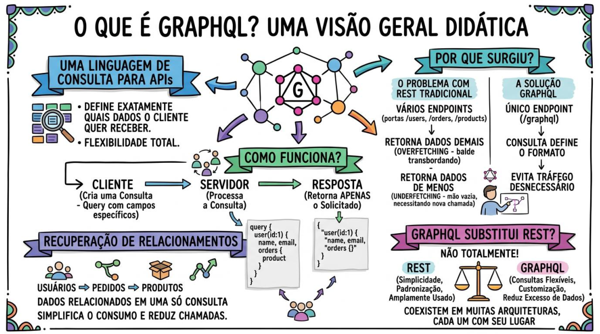


Uma característica frequentemente associada a essa tecnologia é a utilização de um ponto central para processamento das consultas. Como o cliente informa quais dados deseja receber? Em vez de acessar múltiplos endpoints especializados, ele envia uma consulta descrevendo explicitamente os campos necessários. O servidor interpreta essa estrutura e retorna apenas as informações solicitadas. Essa abordagem ajuda a reduzir problemas conhecidos como excesso de dados retornados e necessidade de múltiplas consultas para completar uma operação. 

Outro aspecto relevante envolve a recuperação de informações relacionadas. Seria necessário realizar diversas requisições para obter dados conectados entre si? Em muitos cenários, não. Uma única consulta pode solicitar informações de usuários, pedidos, produtos e outros elementos associados, permitindo que dados distribuídos em diferentes partes do modelo sejam retornados conjuntamente. Essa

---

<!-- pagina: 112 -->

**Diego Carvalho, Equipe Informática 2 (Diego Carvalho), Equipe Informática 1 (Diego Carvalho) Aula 09** 

capacidade simplifica o consumo da API e reduz a quantidade de interações necessárias entre cliente e servidor. 

Apesar da crescente popularidade do GraphQL, as APIs REST continuam amplamente utilizadas em diferentes tipos de sistemas. Isso significa que uma abordagem substitui completamente a outra? Não necessariamente. Em muitas arquiteturas, ambas coexistem e atendem necessidades distintas. GraphQL destaca-se principalmente em cenários que exigem consultas flexíveis e personalizadas, enquanto REST continua sendo uma solução amplamente adotada pela simplicidade de implementação, padronização e alinhamento com os princípios tradicionais da Web.

---

<!-- pagina: 113 -->

**Diego Carvalho, Equipe Informática 2 (Diego Carvalho), Equipe Informática 1 (Diego Carvalho) Aula 09** 


<!-- Start of picture text -->
Webhooks<br><!-- End of picture text -->

##### **<mark>INCIDÊNCIA EM PROVA: BAIXÍSSIMA</mark>** 

#### **<mark>WEBHOOKS</mark>** 

<mark>Os Webhooks são mecanismos que permitem a comunicação automática entre sistemas por meio do envio de</mark> notificações quando determinados eventos ocorrem. Em vez de um sistema consultar repetidamente outro para verificar se houve alguma alteração, o sistema de origem envia uma requisição HTTP para uma URL previamente cadastrada sempre que o evento acontece. Essa comunicação baseada em eventos reduz o número de consultas desnecessárias, melhora a eficiência das integrações e é amplamente utilizada para informar ações como <u>pagamentos concluídos, atualizações de pedidos, envio de mensagens e alterações em cadastros.</u> 

Webhooks são mecanismos de integração orientados a eventos que permitem a comunicação automática entre sistemas. Qual problema essa abordagem procura resolver? Em muitas integrações tradicionais, uma aplicação precisa consultar repetidamente outra aplicação para verificar se ocorreu alguma alteração relevante. Esse modelo pode gerar tráfego desnecessário e aumentar o consumo de recursos. Os webhooks surgem como alternativa ao permitir que o próprio sistema de origem envie notificações sempre que determinados eventos ocorrerem. 

O funcionamento desse mecanismo é relativamente simples. Como um sistema passa a receber notificações automáticas? Inicialmente, ele registra uma URL que será utilizada como destino das mensagens. Em seguida, informa quais eventos deseja acompanhar. Sempre que um desses eventos acontece, o sistema de origem realiza uma requisição HTTP para a URL cadastrada e envia os dados relacionados ao acontecimento. Dessa forma, a comunicação passa a ocorrer de maneira reativa, sem necessidade de consultas constantes por parte do consumidor. 

Esse modelo é amplamente utilizado em diferentes tipos de integração. O que acontece quando um pagamento é aprovado, um pedido muda de status ou um documento é atualizado? Em vez de aguardar que outro sistema realize consultas periódicas, a aplicação responsável pelo evento envia imediatamente uma notificação. Essa característica torna os webhooks particularmente úteis em ambientes distribuídos nos quais a atualização rápida das informações possui importância operacional. 

Ao estudar webhooks, é comum encontrar comparações com a técnica conhecida como polling. Qual é a diferença entre essas abordagens? No polling, o sistema consumidor realiza consultas periódicas para verificar se houve mudanças. Nos webhooks, o fluxo é invertido: a aplicação interessada apenas aguarda a notificação do sistema de origem. Por essa razão, os webhooks são frequentemente descritos como HTTP Callbacks e, em alguns contextos, recebem informalmente a denominação de Reverse APIs. A conhecida analogia "não me ligue, eu te ligo" resume bem essa lógica de funcionamento baseada em eventos e notificações automáticas.

---

<!-- pagina: 114 -->

**Diego Carvalho, Equipe Informática 2 (Diego Carvalho), Equipe Informática 1 (Diego Carvalho) Aula 09** 


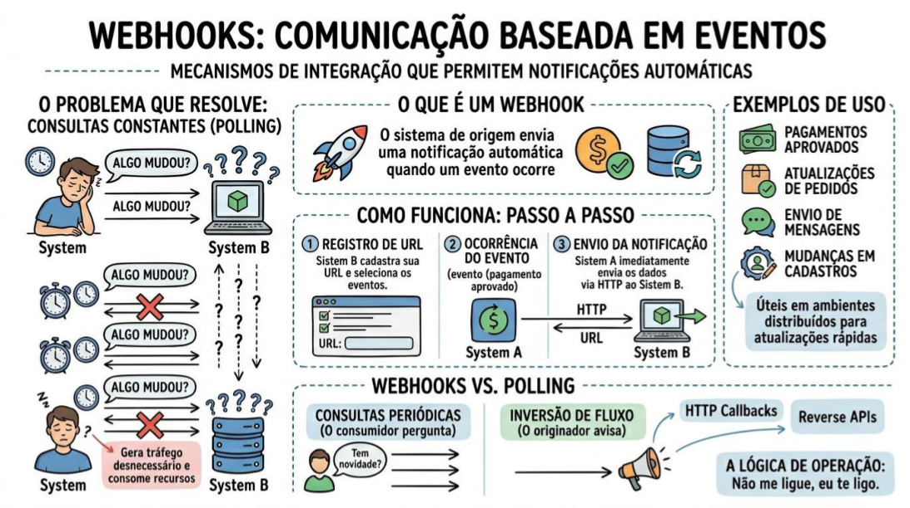

---

<!-- pagina: 115 -->

**Diego Carvalho, Equipe Informática 2 (Diego Carvalho), Equipe Informática 1 (Diego Carvalho) Aula 09** 


<!-- Start of picture text -->
R ESUMO<br><!-- End of picture text -->

#### **<mark>SISTEMAS HETEROGÊNEOS</mark>** 


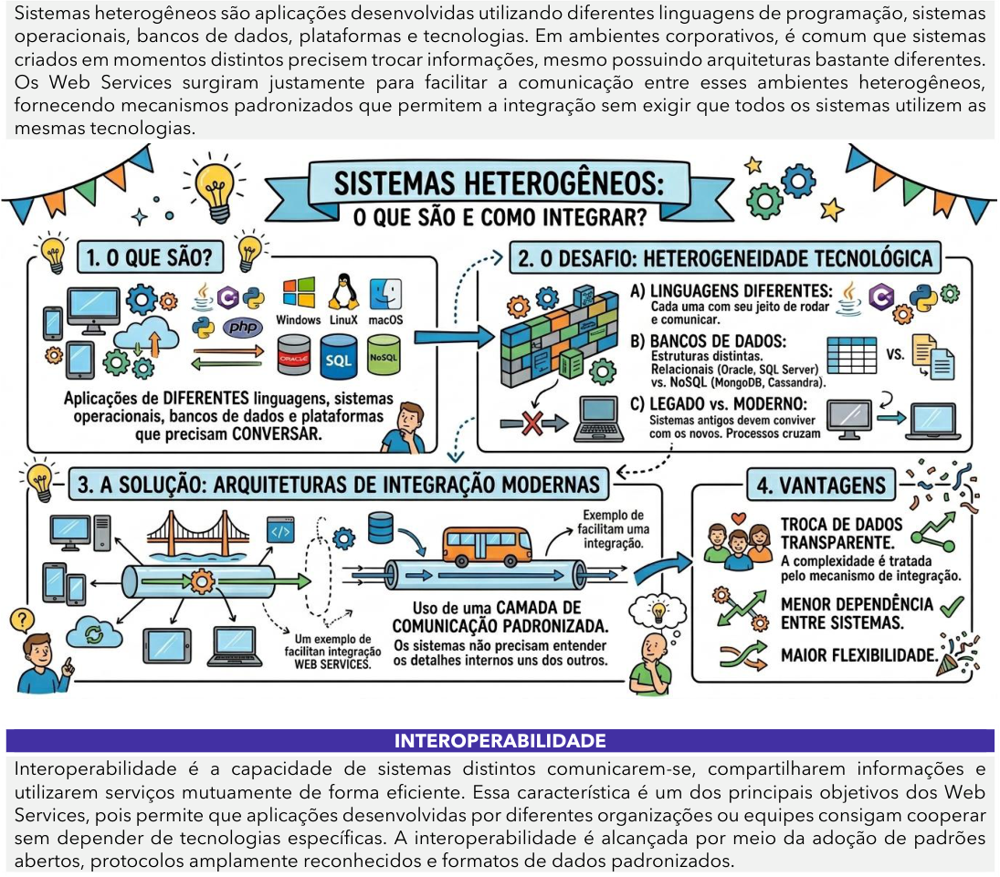


<!-- Start of picture text -->
Sistemas heterogêneos são aplicações desenvolvidas utilizando diferentes linguagens de programação, sistemas<br>operacionais, bancos de dados, plataformas e tecnologias. Em ambientes corporativos, é comum que sistemas<br>criados em momentos distintos precisem trocar informações, mesmo possuindo arquiteturas bastante diferentes.<br>Os Web Services surgiram justamente para facilitar a comunicação entre esses ambientes heterogêneos,<br>fornecendo mecanismos padronizados que permitem a integração sem exigir que todos os sistemas utilizem as<br>mesmas tecnologias.<br>INTEROPERABILIDADE<br>Interoperabilidade é a capacidade de sistemas distintos comunicarem-se, compartilharem informações e<br>utilizarem serviços mutuamente de forma eficiente. Essa característica é um dos principais objetivos dos Web<br>Services, pois permite que aplicações desenvolvidas por diferentes organizações ou equipes consigam cooperar<br>sem depender de tecnologias específicas. A interoperabilidade é alcançada por meio da adoção de padrões<br>abertos, protocolos amplamente reconhecidos e formatos de dados padronizados.<br><!-- End of picture text -->

---

<!-- pagina: 116 -->

**Diego Carvalho, Equipe Informática 2 (Diego Carvalho), Equipe Informática 1 (Diego Carvalho) Aula 09** 


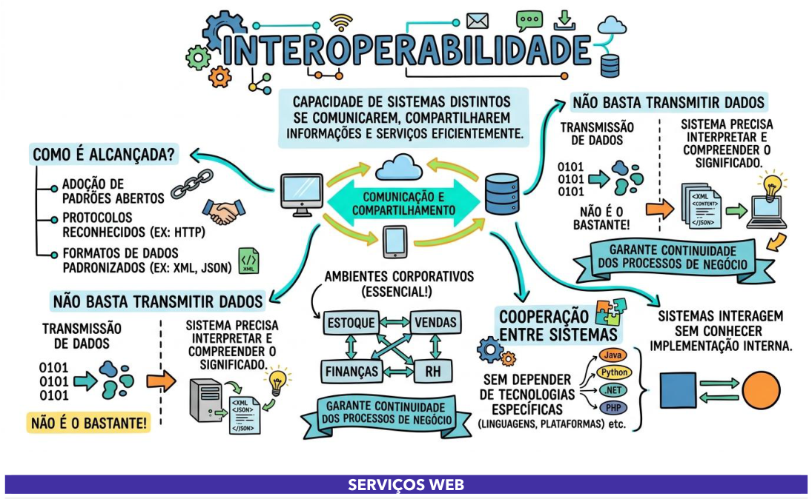


<!-- Start of picture text -->
SERVIÇOS WEB<br><!-- End of picture text -->


<!-- Start of picture text -->
Serviços Web, ou Web Services, são mecanismos que permitem a comunicação entre aplicações por meio de<br>uma rede utilizando protocolos e formatos padronizados. Seu principal objetivo é disponibilizar funcionalidades<br>ou informações para outros sistemas de forma independente da tecnologia utilizada em sua implementação.<br>Dessa forma, diferentes aplicações podem consumir serviços remotos sem precisar conhecer detalhes internos<br>de funcionamento do sistema provedor.<br><!-- End of picture text -->

---

<!-- pagina: 117 -->

**Diego Carvalho, Equipe Informática 2 (Diego Carvalho), Equipe Informática 1 (Diego Carvalho) Aula 09** 


|**OBJETIVOS**|**DESCRIÇÃO**|
|---|---|
|**INTEGRAÇÃO DE**<br>**SISTEMAS**|Permitir que aplicações distintas troquem informações e funcionalidades de forma<br>padronizada, independentemente das tecnologias utilizadas em sua implementação.|
|**INTEROPERABILIDADE**|Garantir que sistemas desenvolvidos em diferentes linguagens, plataformas e<br>sistemas operacionais consigam comunicar-se sem adaptações específicas.|
|**COMPARTILHAMENTO**<br>**DE FUNCIONALIDADES**|Disponibilizar operações e recursos para que possam ser reutilizados por múltiplas<br>aplicações, evitando duplicação de esforços e código.|
|**DESACOPLAMENTO**|Reduzir a dependência entre sistemas consumidores e provedores, permitindo<br>alterações internas sem impactar diretamente os demais participantes.|
|**PADRONIZAÇÃO DA**<br>**COMUNICAÇÃO**|Utilizar protocolos, formatos e contratos padronizados para tornar a troca de<br>informações previsível e consistente.|
|**REUTILIZAÇÃO DE**<br>**SERVIÇOS**|Possibilitar que uma mesma funcionalidade seja consumida por diferentes sistemas,<br>departamentos ou organizações.|
|**INTEGRAÇÃO ENTRE**<br>**ORGANIZAÇÕES**|Facilitar a comunicação entre empresas, parceiros, fornecedores e clientes por meio<br>de interfaces bem definidas.|
|**DISTRIBUIÇÃO DE**<br>**RECURSOS**|Permitir que funcionalidades sejam disponibilizadas remotamente através da rede,<br>sem necessidade de instalação local da aplicação fornecedora.|
|**FLEXIBILIDADE**<br>**TECNOLÓGICA**|Permitir que cada sistema utilize a linguagem, banco de dados ou plataforma mais<br>adequada sem comprometer sua capacidade de integração.|
|**ESCALABILIDADE**|Favorecer a expansão das soluções por meio da distribuição de funcionalidades em<br>serviços independentes que podem ser consumidos por múltiplos clientes.|
|**AUTOMAÇÃO DE**<br>**PROCESSOS**|Possibilitar que sistemas executem processos de negócio automaticamente, sem<br>intervenção manual, por meio da troca de mensagens e chamadas de serviços.|
|**FACILIDADE DE**<br>**MANUTENÇÃO**|Simplificar a evolução dos sistemas ao separar a implementação interna da interface<br>de consumo, reduzindo impactos de alterações futuras.|


#### **<mark>ARQUITETURA BÁSICA</mark>** 

<mark>Modelo que organiza a interação entre os participantes envolvidos na disponibilização e no consumo de serviços</mark> pela rede. Tradicionalmente, essa arquitetura é composta por três elementos principais: o Service Provider, responsável por disponibilizar o serviço; o Service Consumer, que utiliza as funcionalidades oferecidas; e o Service Registry, que atua como um catálogo para publicação e localização de serviços. A interação entre esses componentes costuma seguir o modelo Publish-Find-Bind, no qual o provedor publica o serviço, o consumidor o localiza e, em seguida, estabelece comunicação com o provedor para utilizar suas operações. 

#### **<mark>SERVICE PROVIDER</mark>** 

O Service Provider é a entidade responsável por desenvolver, hospedar e disponibilizar um serviço para consumo. Ele define quais operações podem ser executadas, quais dados devem ser enviados e quais respostas serão retornadas. Em uma arquitetura de Web Services, o provedor atua como a origem dos recursos e funcionalidades oferecidos aos consumidores, garantindo que o serviço permaneça acessível e compatível com o contrato estabelecido.

---

<!-- pagina: 118 -->

**Diego Carvalho, Equipe Informática 2 (Diego Carvalho), Equipe Informática 1 (Diego Carvalho) Aula 09** 


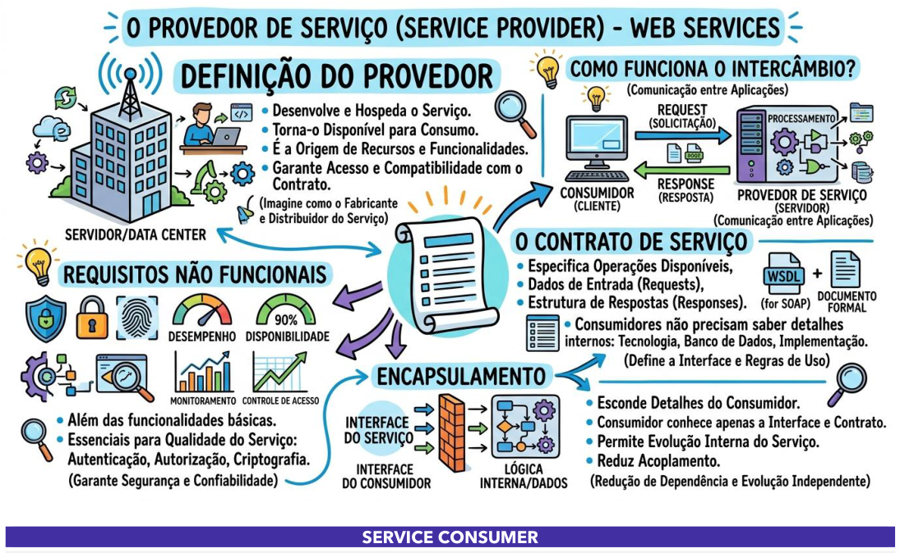


<!-- Start of picture text -->
SERVICE CONSUMER<br><!-- End of picture text -->


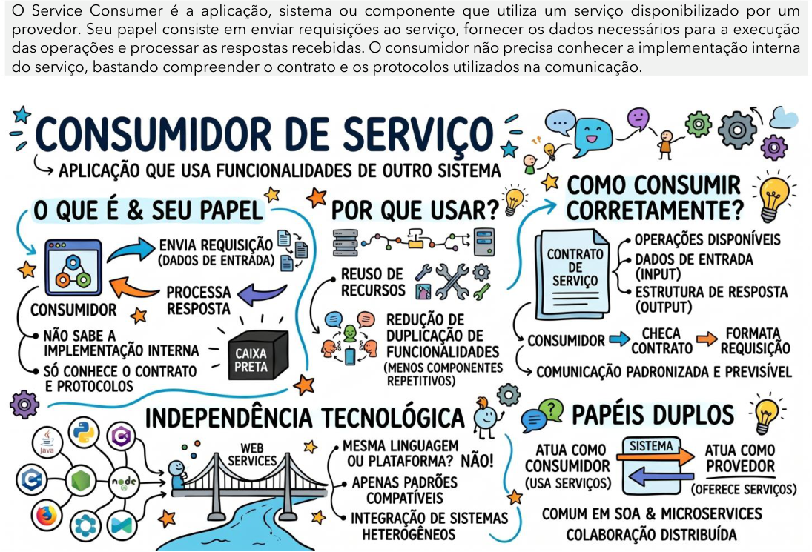


<!-- Start of picture text -->
O Service Consumer é a aplicação, sistema ou componente que utiliza um serviço disponibilizado por um<br>provedor. Seu papel consiste em enviar requisições ao serviço, fornecer os dados necessários para a execução<br>das operações e processar as respostas recebidas. O consumidor não precisa conhecer a implementação interna<br>do serviço, bastando compreender o contrato e os protocolos utilizados na comunicação.<br><!-- End of picture text -->

---

<!-- pagina: 119 -->

**Diego Carvalho, Equipe Informática 2 (Diego Carvalho), Equipe Informática 1 (Diego Carvalho) Aula 09** 

#### **<mark>SERVICE REGISTRY</mark>** 


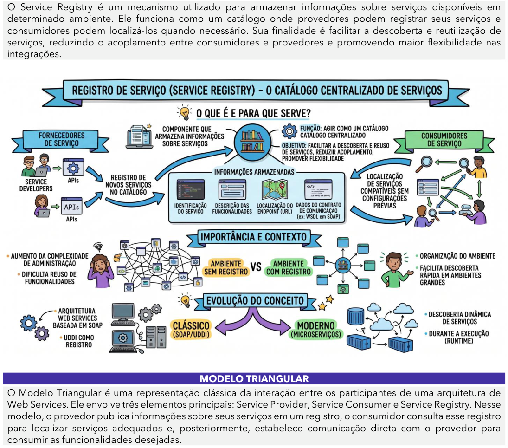


<!-- Start of picture text -->
O Service Registry é um mecanismo utilizado para armazenar informações sobre serviços disponíveis em<br>determinado ambiente. Ele funciona como um catálogo onde provedores podem registrar seus serviços e<br>consumidores podem localizá-los quando necessário. Sua finalidade é facilitar a descoberta e reutilização de<br>serviços, reduzindo o acoplamento entre consumidores e provedores e promovendo maior flexibilidade nas<br>integrações.<br>MODELO TRIANGULAR<br>O Modelo Triangular é uma representação clássica da interação entre os participantes de uma arquitetura de<br>Web Services. Ele envolve três elementos principais: Service Provider, Service Consumer e Service Registry. Nesse<br>modelo, o provedor publica informações sobre seus serviços em um registro, o consumidor consulta esse registro<br>para localizar serviços adequados e, posteriormente, estabelece comunicação direta com o provedor para<br>consumir as funcionalidades desejadas.<br><!-- End of picture text -->

---

<!-- pagina: 120 -->

**Diego Carvalho, Equipe Informática 2 (Diego Carvalho), Equipe Informática 1 (Diego Carvalho) Aula 09** 


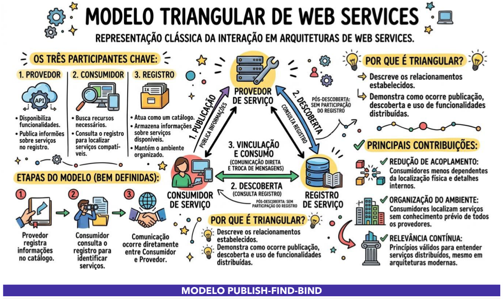


<!-- Start of picture text -->
MODELO PUBLISH-FIND-BIND<br><!-- End of picture text -->


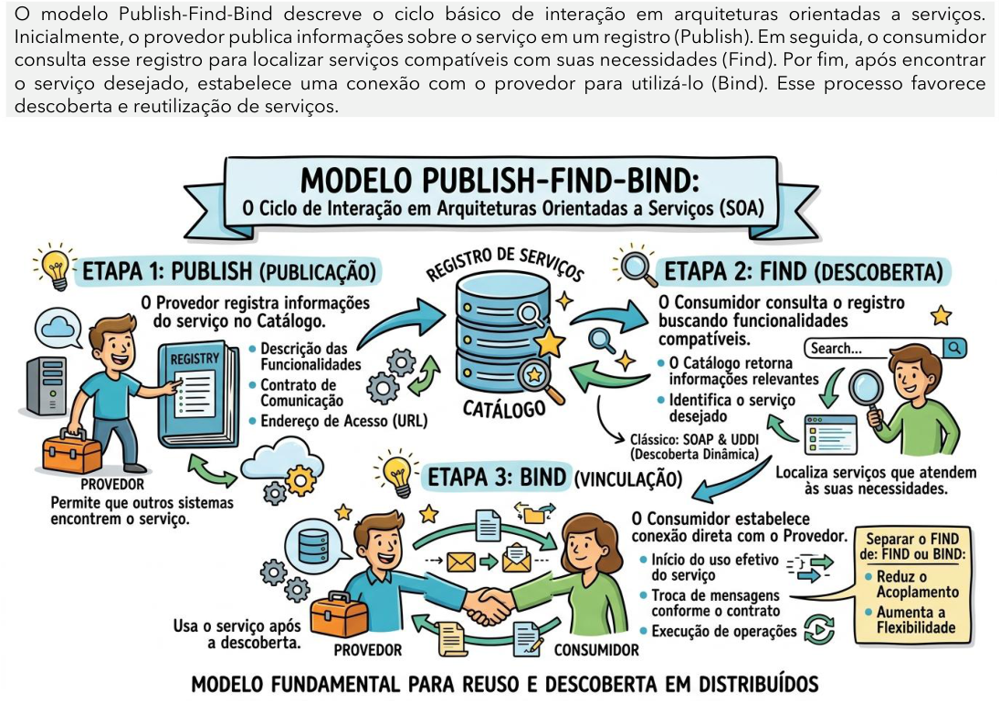


<!-- Start of picture text -->
O modelo Publish-Find-Bind descreve o ciclo básico de interação em arquiteturas orientadas a serviços.<br>Inicialmente, o provedor publica informações sobre o serviço em um registro (Publish). Em seguida, o consumidor<br>consulta esse registro para localizar serviços compatíveis com suas necessidades (Find). Por fim, após encontrar<br>o serviço desejado, estabelece uma conexão com o provedor para utilizá-lo (Bind). Esse processo favorece<br>descoberta e reutilização de serviços.<br><!-- End of picture text -->

---

<!-- pagina: 121 -->

**Diego Carvalho, Equipe Informática 2 (Diego Carvalho), Equipe Informática 1 (Diego Carvalho) Aula 09** 

#### **<mark>ENDPOINT</mark>** 


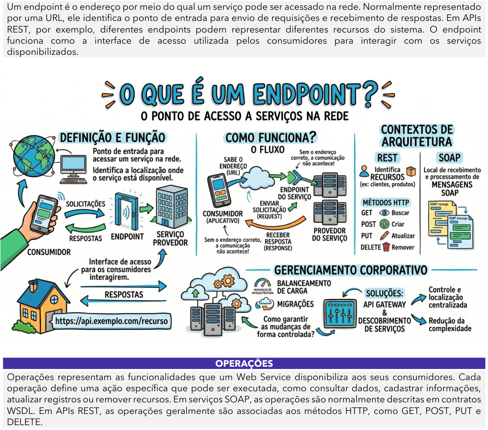


<!-- Start of picture text -->
Um endpoint é o endereço por meio do qual um serviço pode ser acessado na rede. Normalmente representado<br>por uma URL, ele identifica o ponto de entrada para envio de requisições e recebimento de respostas. Em APIs<br>REST, por exemplo, diferentes endpoints podem representar diferentes recursos do sistema. O endpoint<br>funciona como a interface de acesso utilizada pelos consumidores para interagir com os serviços<br>disponibilizados.<br>OPERAÇÕES<br>Operações representam as funcionalidades que um Web Service disponibiliza aos seus consumidores. Cada<br>operação define uma ação específica que pode ser executada, como consultar dados, cadastrar informações,<br>atualizar registros ou remover recursos. Em serviços SOAP, as operações são normalmente descritas em contratos<br>WSDL. Em APIs REST, as operações geralmente são associadas aos métodos HTTP, como GET, POST, PUT e<br>DELETE.<br><!-- End of picture text -->

---

<!-- pagina: 122 -->

**Diego Carvalho, Equipe Informática 2 (Diego Carvalho), Equipe Informática 1 (Diego Carvalho) Aula 09** 


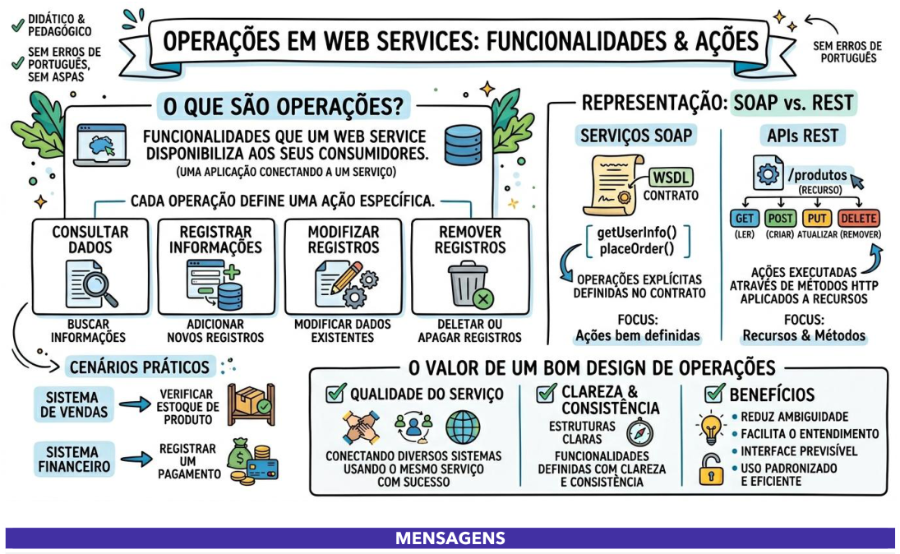


<!-- Start of picture text -->
MENSAGENS<br><!-- End of picture text -->


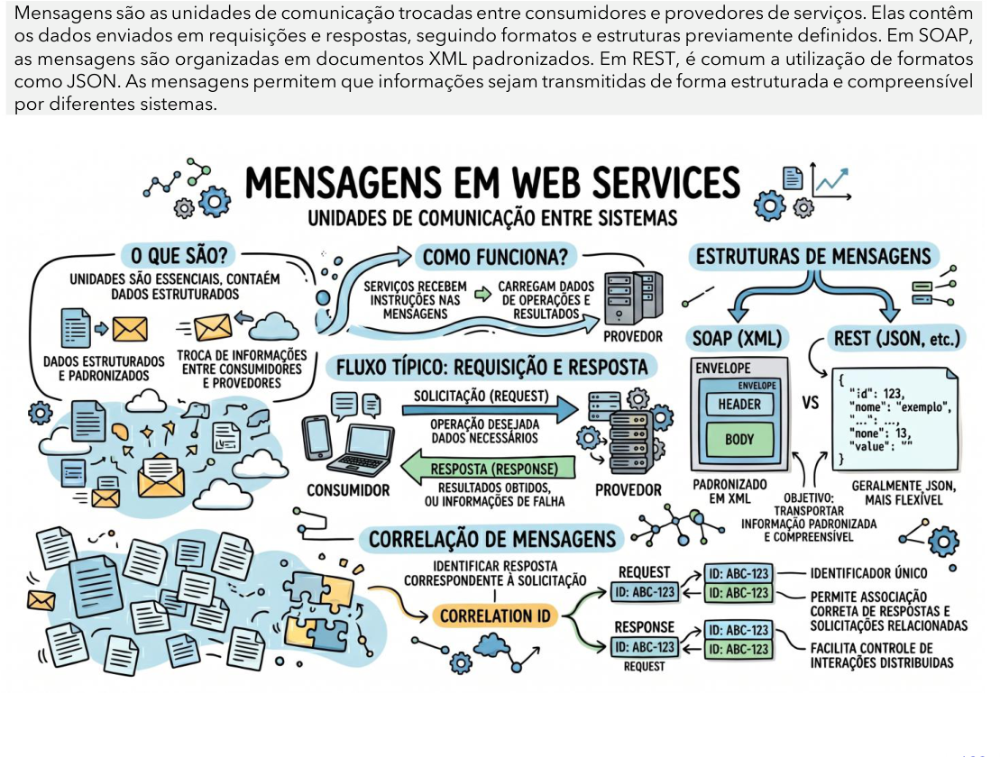


<!-- Start of picture text -->
Mensagens são as unidades de comunicação trocadas entre consumidores e provedores de serviços. Elas contêm<br>os dados enviados em requisições e respostas, seguindo formatos e estruturas previamente definidos. Em SOAP,<br>as mensagens são organizadas em documentos XML padronizados. Em REST, é comum a utilização de formatos<br>como JSON. As mensagens permitem que informações sejam transmitidas de forma estruturada e compreensível<br>por diferentes sistemas.<br><!-- End of picture text -->

---

<!-- pagina: 123 -->

**Diego Carvalho, Equipe Informática 2 (Diego Carvalho), Equipe Informática 1 (Diego Carvalho) Aula 09** 

#### **<mark>CONTRATOS</mark>** 


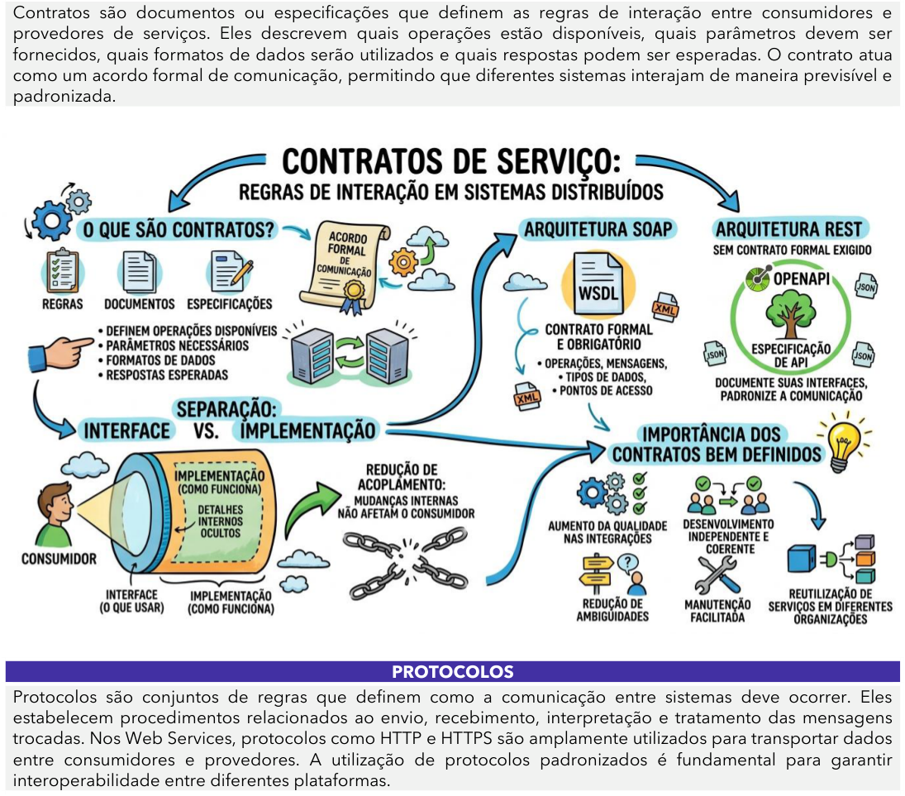


<!-- Start of picture text -->
Contratos são documentos ou especificações que definem as regras de interação entre consumidores e<br>provedores de serviços. Eles descrevem quais operações estão disponíveis, quais parâmetros devem ser<br>fornecidos, quais formatos de dados serão utilizados e quais respostas podem ser esperadas. O contrato atua<br>como um acordo formal de comunicação, permitindo que diferentes sistemas interajam de maneira previsível e<br>padronizada.<br>PROTOCOLOS<br>Protocolos são conjuntos de regras que definem como a comunicação entre sistemas deve ocorrer. Eles<br>estabelecem procedimentos relacionados ao envio, recebimento, interpretação e tratamento das mensagens<br>trocadas. Nos Web Services, protocolos como HTTP e HTTPS são amplamente utilizados para transportar dados<br>entre consumidores e provedores. A utilização de protocolos padronizados é fundamental para garantir<br>interoperabilidade entre diferentes plataformas.<br><!-- End of picture text -->

---

<!-- pagina: 124 -->

**Diego Carvalho, Equipe Informática 2 (Diego Carvalho), Equipe Informática 1 (Diego Carvalho) Aula 09** 


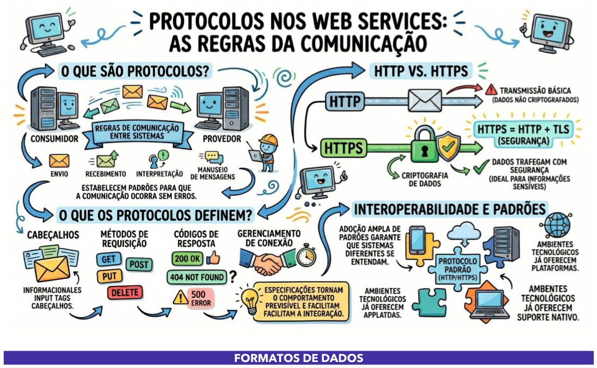


<!-- Start of picture text -->
FORMATOS DE DADOS<br><!-- End of picture text -->


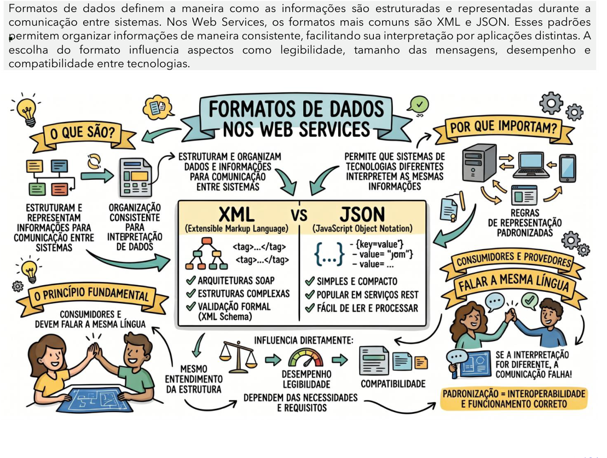


<!-- Start of picture text -->
Formatos de dados definem a maneira como as informações são estruturadas e representadas durante a<br>comunicação entre sistemas. Nos Web Services, os formatos mais comuns são XML e JSON. Esses padrões<br>p ermitem organizar informações de maneira consistente, facilitando sua interpretação por aplicações distintas. A<br>escolha do formato influencia aspectos como legibilidade, tamanho das mensagens, desempenho e<br>compatibilidade entre tecnologias.<br><!-- End of picture text -->

https://t.me/KakashiAssinaturasBot

---

<!-- pagina: 125 -->

**Diego Carvalho, Equipe Informática 2 (Diego Carvalho), Equipe Informática 1 (Diego Carvalho) Aula 09** 

#### **<mark>HTTP/HTTPS</mark>** 


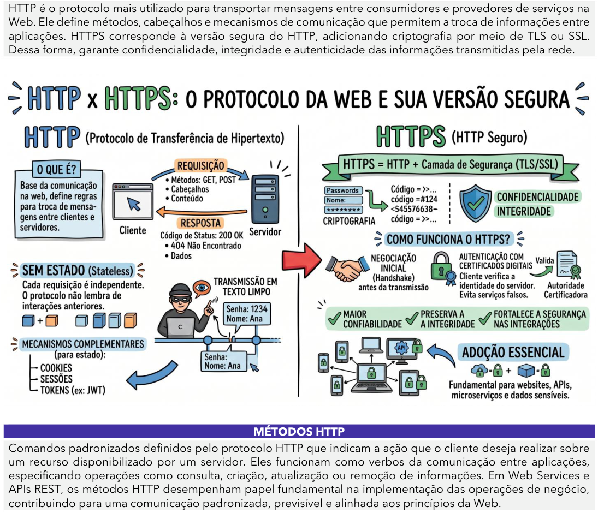


<!-- Start of picture text -->
HTTP é o protocolo mais utilizado para transportar mensagens entre consumidores e provedores de serviços na<br>Web. Ele define métodos, cabeçalhos e mecanismos de comunicação que permitem a troca de informações entre<br>aplicações. HTTPS corresponde à versão segura do HTTP, adicionando criptografia por meio de TLS ou SSL.<br>Dessa forma, garante confidencialidade, integridade e autenticidade das informações transmitidas pela rede.<br>MÉTODOS HTTP<br>Comandos padronizados definidos pelo protocolo HTTP que indicam a ação que o cliente deseja realizar sobre<br>um recurso disponibilizado por um servidor. Eles funcionam como verbos da comunicação entre aplicações,<br>especificando operações como consulta, criação, atualização ou remoção de informações. Em Web Services e<br>APIs REST, os métodos HTTP desempenham papel fundamental na implementação das operações de negócio,<br>contribuindo para uma comunicação padronizada, previsível e alinhada aos princípios da Web.<br><!-- End of picture text -->

|**MÉTODOS HTTP**|**DESCRIÇÃO**|
|---|---|
|**GET**|Esse método solicita a representação de um recurso específico. Requisições utilizando o<br>método GET devem retornar apenas dados.|
|**HEAD**|Esse método solicita uma resposta de forma idêntica ao método GET, porém sem conter<br>o corpo da resposta.|
|**PUT**|Esse método substitui todas as atuais representações do recurso de destino pela carga de<br>dados da requisição.|
|**POST**|Esse método é utilizado para submeter uma entidade a um recurso específico,<br>frequentemente causando mudança no estado do recurso ou efeitos no servidor.|
|**DELETE**|Esse método remove um recurso específico.|
|**TRACE**|Esse método executa um teste de chamada loop-back junto com o caminho para o recurso<br>de destino.|
|**CONNECT**|Esse método estabelece um túnel para o servidor identificado pelo recurso de destino.|

---

<!-- pagina: 126 -->

**Diego Carvalho, Equipe Informática 2 (Diego Carvalho), Equipe Informática 1 (Diego Carvalho) Aula 09** 

|**OPTIONS**|Esse método é usado para descrever as opções de comunicação com o recurso de<br>destino.|
|---|---|
|**PATCH**|Esse método é utilizado para aplicar modificações parciais em um recurso.|


#### **<mark>CÓDIGOS DE STATUS</mark>** 

Os códigos de status HTTP são valores numéricos enviados pelo servidor em resposta a uma requisição realizada por um cliente, indicando o resultado do processamento da solicitação. Esses códigos permitem que aplicações e usuários compreendam se a operação foi executada com sucesso, se houve necessidade de redirecionamento <mark>ou se ocorreu algum tipo de erro.</mark> 

|ou se oco<br>**CÓDIGO**|rreu algum tipo d<br> <br>**NOME**|e erro.<br>**SIGNIFICADO**|
|---|---|---|
|**100**|Continue|Indica que a parte inicial da requisição foi recebida com sucesso e que o cliente<br>pode continuar enviando o restante dos dados. É utilizado principalmente em<br>comunicações que envolvem grandes volumes de informações.|
|**200**|OK|Indica que a requisição foi processada com sucesso. É o código mais comum em<br>operações HTTP e normalmente acompanha a resposta contendo os dados<br>solicitados pelo cliente.|
|**201**|Created|Indica que a requisição foi concluída com sucesso e que um novo recurso foi criado<br>no servidor. É frequentemente utilizado em operações realizadas por meio do<br>método POST.|
|**204**|No Content|Indica que a requisição foi processada com sucesso, mas não há conteúdo a ser<br>retornado no corpo da resposta. É comum em operações de atualização ou<br>exclusão.|
|**300**|Multiple<br>Choices|Indica que existem múltiplas representações ou destinos possíveis para o recurso<br>solicitado. O cliente pode escolher qual alternativa deseja utilizar para prosseguir<br>com a requisição.|
|**301**|Moved<br>Permanently|Indica que o recurso solicitado foi movido permanentemente para uma nova URL.<br>Os clientes devem atualizar seus links e passar a utilizar o novo endereço informado<br>pelo servidor.|
|**400**|Bad Request|Indica que a requisição enviada pelo cliente possui erro de sintaxe, parâmetros<br>inválidos ou informações inconsistentes que impedem seu processamento pelo<br>servidor.|
|**401**|Unauthorized|Indica que a autenticação é necessária ou que as credenciais fornecidas são<br>inválidas. O cliente precisa autenticar-se corretamente para acessar o recurso<br>solicitado.|
|**403**|Forbidden|Indica que o servidor compreendeu a requisição, mas o cliente não possui<br>permissão para acessar o recurso solicitado, mesmo estando autenticado.|
|**404**|Not Found|Indica que o recurso solicitado não foi encontrado no servidor. É um dos códigos<br>mais conhecidos da Web e geralmente ocorre quando a URL é inválida ou<br>inexistente.|
|**500**|Internal Server<br>Error|Indica que ocorreu uma falha interna inesperada no servidor durante o<br>processamento da requisição. O problema está no lado do servidor e não na<br>requisição enviada pelo cliente.|


#### **<mark>SOAP</mark>** 

SOAP é um protocolo baseado em XML utilizado para troca estruturada de mensagens entre aplicações. Seu <u>principal objetivo é fornecer um padrão rigoroso de comunicação, independente das tecnologias utilizadas pelos</u>

---

<!-- pagina: 127 -->

**Diego Carvalho, Equipe Informática 2 (Diego Carvalho), Equipe Informática 1 (Diego Carvalho) Aula 09** 


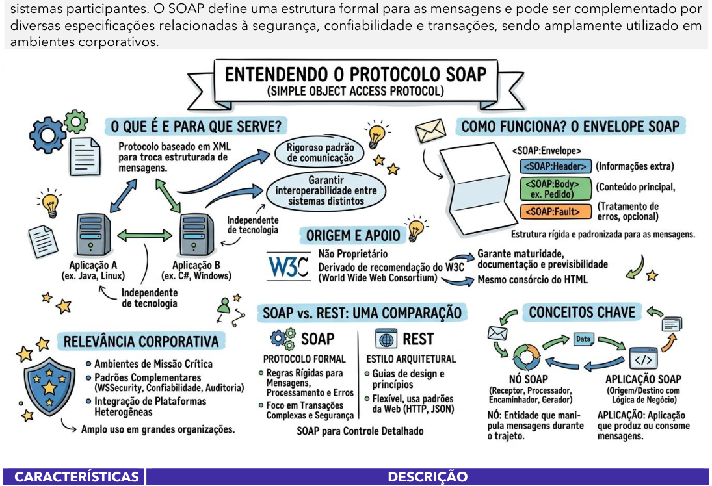


<!-- Start of picture text -->
sistemas participantes. O SOAP define uma estrutura formal para as mensagens e pode ser complementado por<br>diversas especificações relacionadas à segurança, confiabilidade e transações, sendo amplamente utilizado em<br>ambientes corporativos.<br>==5460==<br>CARACTERÍSTICAS  DESCRIÇÃO ÇÃO ÃO<br><!-- End of picture text -->

**<mark>CARACTERÍSTICAS DESCRIÇÃO ÇÃO ÃO</mark>** O SOAP define regras rigorosas para a estrutura das mensagens, para a comunicação **ELEVADO NÍVEL DE** entre sistemas e para o tratamento de erros. Essa padronização reduz ambiguidades e **PADRONIZAÇÃO** favorece a interoperabilidade entre aplicações desenvolvidas com tecnologias distintas. Todas as mensagens SOAP são representadas em XML. Esse formato permite descrever **BASEADO EM XML** dados de forma estruturada, padronizada e validável, facilitando a troca de informações entre sistemas heterogêneos. **ESTRUTURA DE** As mensagens SOAP seguem uma estrutura bem definida composta por elementos como **MENSAGENS** Envelope, Header, Body e Fault, garantindo consistência na comunicação entre **PADRONIZADA** consumidores e provedores. Por utilizar padrões amplamente reconhecidos, o SOAP permite que aplicações **INTEROPE-** desenvolvidas em diferentes linguagens, plataformas e sistemas operacionais consigam **RABILIDADE** trocar informações de maneira transparente. O SOAP pode ser complementado por especificações da família WS-*, que adicionam **SUPORTE À** funcionalidades relacionadas à segurança, autenticação, autorização, confiabilidade, **FAMÍLIA WS-*** políticas de comunicação e transações distribuídas. Por meio do WS-Security e de outros padrões complementares, o SOAP oferece **SEGURANÇA** mecanismos robustos de assinatura digital, criptografia, autenticação baseada em tokens **AVANÇADA** e controle de acesso. **SUPORTE A** O ecossistema SOAP permite implementar mecanismos de coordenação e controle de **TRANSAÇÕES** transações que envolvem múltiplos sistemas, recurso muito valorizado em ambientes **DISTRIBUÍDAS** corporativos.

---

<!-- pagina: 128 -->

**Diego Carvalho, Equipe Informática 2 (Diego Carvalho), Equipe Informática 1 (Diego Carvalho) Aula 09** 

|**CARACTERÍSTICAS**|**DESCRIÇÃO**|
|---|---|
|**INDEPENDÊNCIA**<br>**DE PLATAFORMA**|O protocolo não depende de linguagens de programação, sistemas operacionais ou<br>tecnologias específicas, permitindo integração entre ambientes heterogêneos.|
|**INDEPENDÊNCIA**<br>**DE TRANSPORTE**|Embora normalmente utilize HTTP ou HTTPS, o SOAP pode ser transportado por outros<br>protocolos e mecanismos, como SMTP e JMS, oferecendo maior flexibilidade arquitetural.|
|**EXTENSIBILIDADE**|A estrutura SOAP permite adicionar novas funcionalidades por meio de cabeçalhos e<br>especificações complementares sem comprometer a compatibilidade com sistemas<br>existentes.|
|**TRATAMENTO**<br>**PADRONIZADO DE**<br>**ERROS**|O elemento Fault fornece um tratamento estruturado e padronizado de informar erros<br>ocorridos durante o processamento das mensagens.|
|**ORIENTAÇÃO A**<br>**CONTRATOS**|O SOAP normalmente utiliza WSDL para descrever formalmente operações, mensagens,<br>tipos de dados e protocolos, estabelecendo contratos claros entre consumidores e<br>provedores.|
|**MAIOR**<br>**VERBOSIDADE**|Como utiliza XML e estruturas detalhadas, as mensagens SOAP costumam ser maiores e<br>mais complexas do que as utilizadas em APIs REST baseadas em JSON.|
|**MAIOR**<br>**SOBRECARGA DE**<br>**PROCESSAMENTO**|A interpretação, validação e processamento de documentos XML geralmente exigem mais<br>recursos computacionais quando comparados a formatos mais leves.|
|**FORTE ADOÇÃO**<br>**CORPORATIVA**|Devido ao suporte a requisitos avançados de segurança, governança e confiabilidade, o<br>SOAP continua sendo amplamente utilizado em integrações bancárias, governamentais e<br>empresariais.|


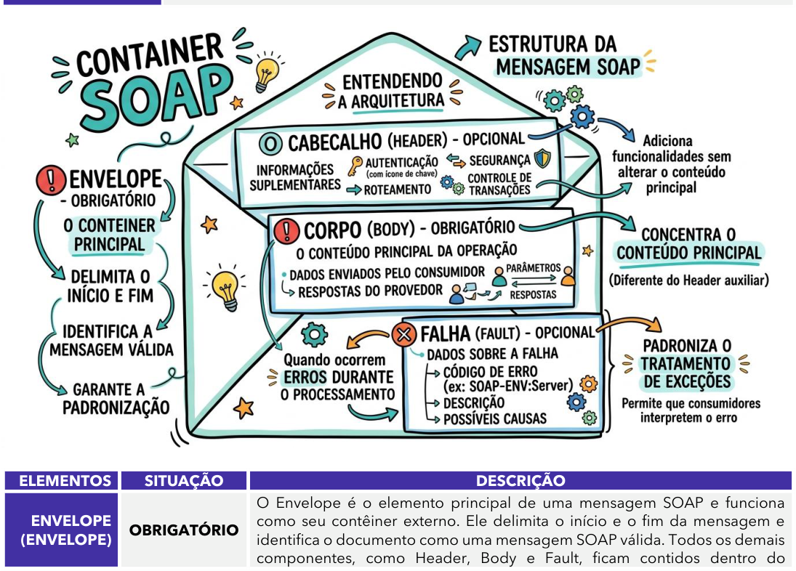


<!-- Start of picture text -->
ELEMENTOS  SITUAÇÃO  DESCRIÇÃO<br>O Envelope é o elemento principal de uma mensagem SOAP e funciona<br>ENVELOPE  como seu contêiner externo. Ele delimita o início e o fim da mensagem e<br>OBRIGATÓRIO<br>(ENVELOPE)  identifica o documento como uma mensagem SOAP válida. Todos os demais<br>componentes, como Header, Body e Fault, ficam contidos dentro do<br><!-- End of picture text -->

---

<!-- pagina: 129 -->

**Diego Carvalho, Equipe Informática 2 (Diego Carvalho), Equipe Informática 1 (Diego Carvalho) Aula 09** 

<mark>Envelope. Sua presença é obrigatória em qualquer mensagem SOAP e</mark> <u>garante a padronização da estrutura de comunicação.</u> O Header é uma seção opcional da mensagem SOAP destinada ao transporte de informações complementares relacionadas ao processamento da **CABEÇALHO** comunicação. Nele podem ser incluídos dados de autenticação, controle de **OPCIONAL (HEADER)** transações, roteamento, segurança e informações necessárias ao tratamento da mensagem. Como é separado do conteúdo principal, permite adicionar <mark>funcionalidades sem alterar os dados efetivos da operação solicitada.</mark> Elemento da mensagem SOAP que contém os dados efetivamente relacionados à operação executada. É nele que são armazenados os **CORPO** parâmetros enviados pelo consumidor e as respostas retornadas pelo **OBRIGATÓRIO (BODY)** provedor. Diferentemente do Header, que possui informações auxiliares, o Body concentra o conteúdo principal da comunicação. Sua presença é <mark>obrigatória em qualquer mensagem SOAP válida.</mark> O Fault é um elemento opcional utilizado para representar erros ocorridos durante o processamento de uma mensagem SOAP. Quando presente, ele **FALHA** fornece informações detalhadas sobre a falha, incluindo códigos de erro, **OPCIONAL (FAULT)** descrições e possíveis causas do problema. Esse mecanismo padroniza o tratamento de exceções, permitindo que consumidores interpretem e <mark>respondam adequadamente aos erros ocorridos durante a comunicação.</mark> 

#### **<mark>WSDL</mark>** 


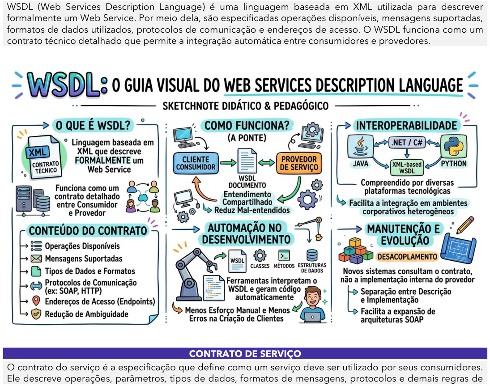


<!-- Start of picture text -->
WSDL (Web Services Description Language) é uma linguagem baseada em XML utilizada para descrever<br>formalmente um Web Service. Por meio dela, são especificadas operações disponíveis, mensagens suportadas,<br>formatos de dados utilizados, protocolos de comunicação e endereços de acesso. O WSDL funciona como um<br>contrato técnico detalhado que permite a integração automática entre consumidores e provedores.<br>CONTRATO DE SERVIÇO<br>O contrato do serviço é a especificação que define como um serviço deve ser utilizado por seus consumidores.<br>Ele descreve operações, parâmetros, tipos de dados, formatos de mensagens, protocolos e demais regras de<br><!-- End of picture text -->

---

<!-- pagina: 130 -->

**Diego Carvalho, Equipe Informática 2 (Diego Carvalho), Equipe Informática 1 (Diego Carvalho) Aula 09** 


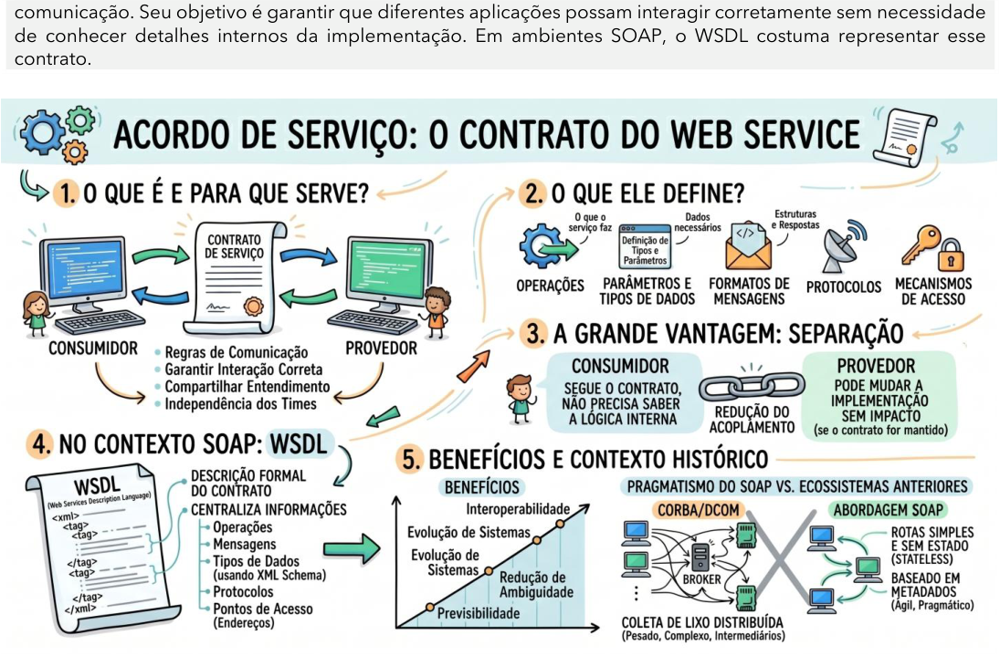


<!-- Start of picture text -->
comunicação. Seu objetivo é garantir que diferentes aplicações possam interagir corretamente sem necessidade<br>de conhecer detalhes internos da implementação. Em ambientes SOAP, o WSDL costuma representar esse<br>contrato.<br><!-- End of picture text -->


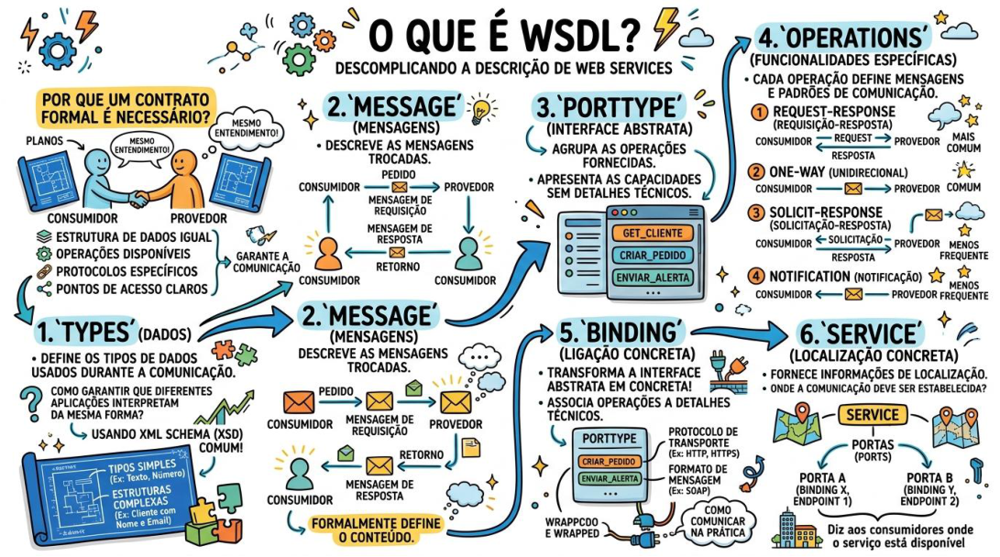

---

<!-- pagina: 131 -->

**Diego Carvalho, Equipe Informática 2 (Diego Carvalho), Equipe Informática 1 (Diego Carvalho) Aula 09** 

#### **<mark>UDDI</mark>** 


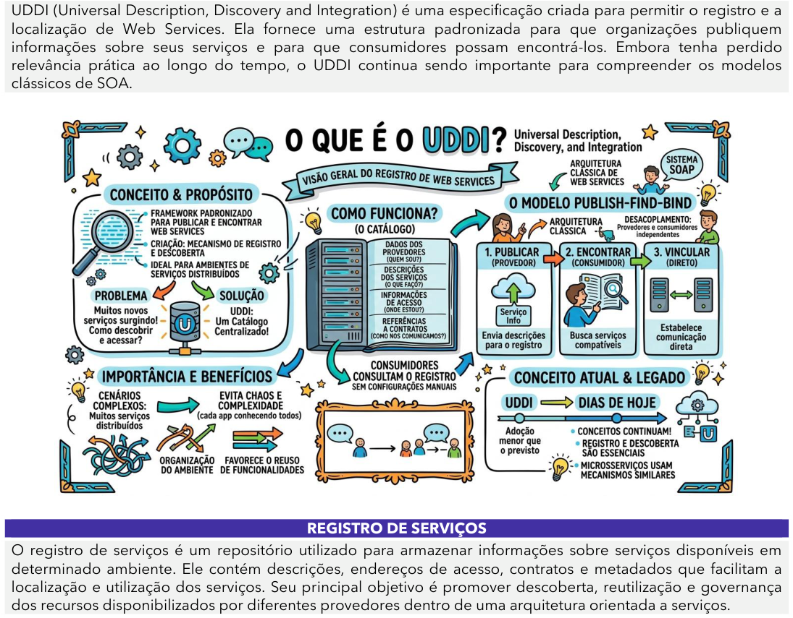


<!-- Start of picture text -->
UDDI (Universal Description, Discovery and Integration) é uma especificação criada para permitir o registro e a<br>localização de Web Services. Ela fornece uma estrutura padronizada para que organizações publiquem<br>informações sobre seus serviços e para que consumidores possam encontrá-los. Embora tenha perdido<br>relevância prática ao longo do tempo, o UDDI continua sendo importante para compreender os modelos<br>clássicos de SOA.<br>REGISTRO DE SERVIÇOS<br>O registro de serviços é um repositório utilizado para armazenar informações sobre serviços disponíveis em<br>determinado ambiente. Ele contém descrições, endereços de acesso, contratos e metadados que facilitam a<br>localização e utilização dos serviços. Seu principal objetivo é promover descoberta, reutilização e governança<br>dos recursos disponibilizados por diferentes provedores dentro de uma arquitetura orientada a serviços. ponibilizados por diferentes provedores dentro de uma arquitetura orientada a serviços. onibilizados por diferentes provedores dentro de uma arquitetura orientada a serviços. por diferentes provedores dentro de uma arquitetura orientada a serviços. or diferentes provedores dentro de uma arquitetura orientada a serviços. provedores dentro de uma arquitetura orientada a serviços. rovedores dentro de uma arquitetura orientada a serviços. quitetura orientada a serviços. uitetura orientada a serviços. ços. os.<br><!-- End of picture text -->


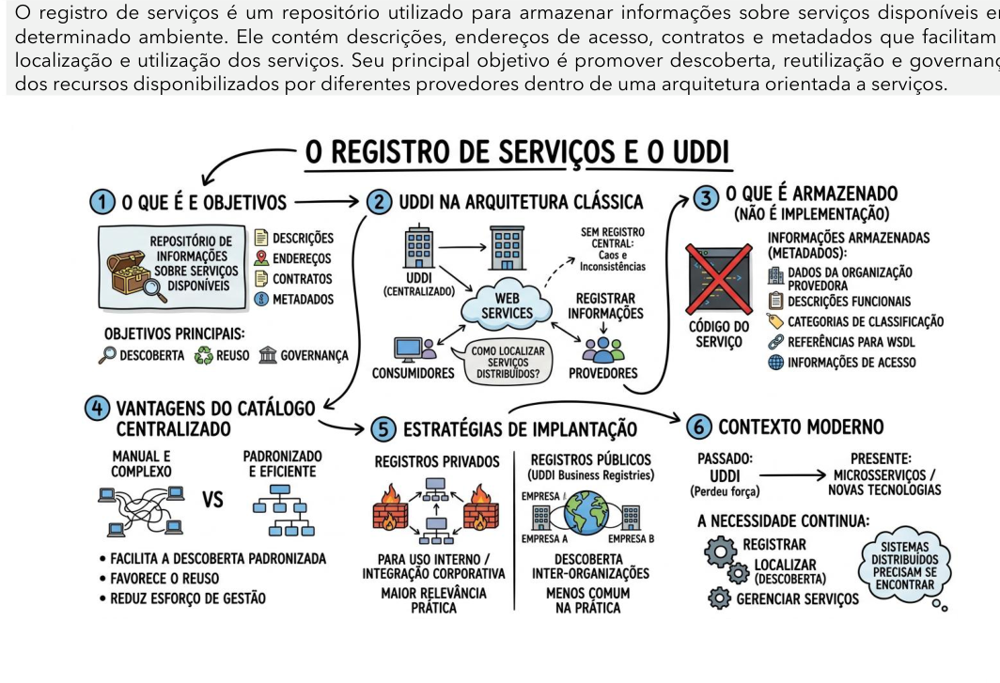


<!-- Start of picture text -->
O registro de serviços é um repositório utilizado para armazenar informações sobre serviços disponíveis em<br>determinado ambiente. Ele contém descrições, endereços de acesso, contratos e metadados que facilitam a<br>localização e utilização dos serviços. Seu principal objetivo é promover descoberta, reutilização e governança<br>dos recursos disponibilizados por diferentes provedores dentro de uma arquitetura orientada a serviços. ponibilizados por diferentes provedores dentro de uma arquitetura orientada a serviços. onibilizados por diferentes provedores dentro de uma arquitetura orientada a serviços. por diferentes provedores dentro de uma arquitetura orientada a serviços. or diferentes provedores dentro de uma arquitetura orientada a serviços. provedores dentro de uma arquitetura orientada a serviços. rovedores dentro de uma arquitetura orientada a serviços. quitetura orientada a serviços. uitetura orientada a serviços. ços. os.<br><!-- End of picture text -->

---

<!-- pagina: 132 -->

**Diego Carvalho, Equipe Informática 2 (Diego Carvalho), Equipe Informática 1 (Diego Carvalho) Aula 09** 

#### **<mark>PUBLICAÇÃO</mark>** 


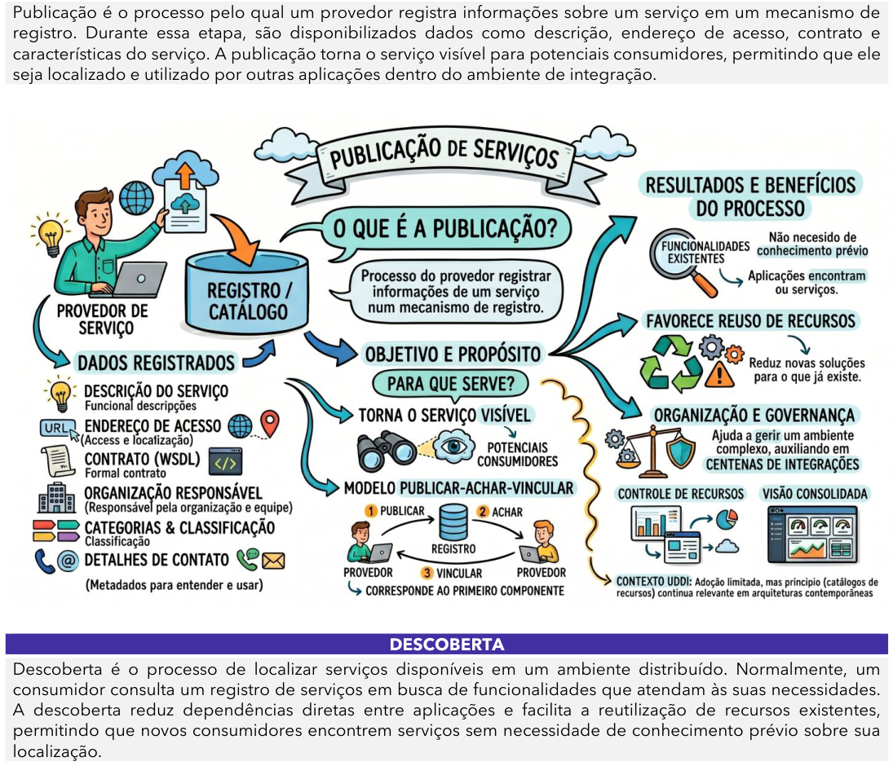


<!-- Start of picture text -->
Publicação é o processo pelo qual um provedor registra informações sobre um serviço em um mecanismo de<br>registro. Durante essa etapa, são disponibilizados dados como descrição, endereço de acesso, contrato e<br>características do serviço. A publicação torna o serviço visível para potenciais consumidores, permitindo que ele<br>seja localizado e utilizado por outras aplicações dentro do ambiente de integração.<br>DESCOBERTA<br>Descoberta é o processo de localizar serviços disponíveis em um ambiente distribuído. Normalmente, um<br>consumidor consulta um registro de serviços em busca de funcionalidades que atendam às suas necessidades.<br>A descoberta reduz dependências diretas entre aplicações e facilita a reutilização de recursos existentes,<br>permitindo que novos consumidores encontrem serviços sem necessidade de conhecimento prévio sobre sua<br>localização.<br><!-- End of picture text -->

---

<!-- pagina: 133 -->

**Diego Carvalho, Equipe Informática 2 (Diego Carvalho), Equipe Informática 1 (Diego Carvalho) Aula 09** 


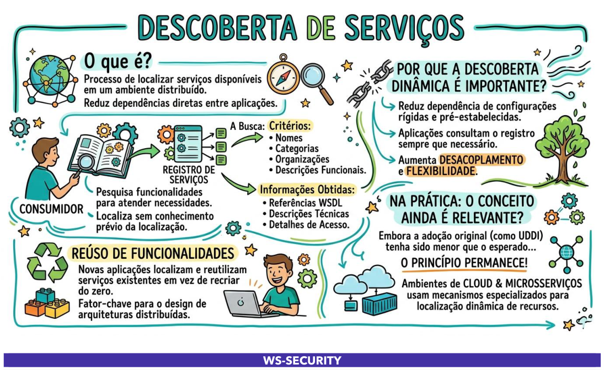


<!-- Start of picture text -->
WS-SECURITY<br><!-- End of picture text -->


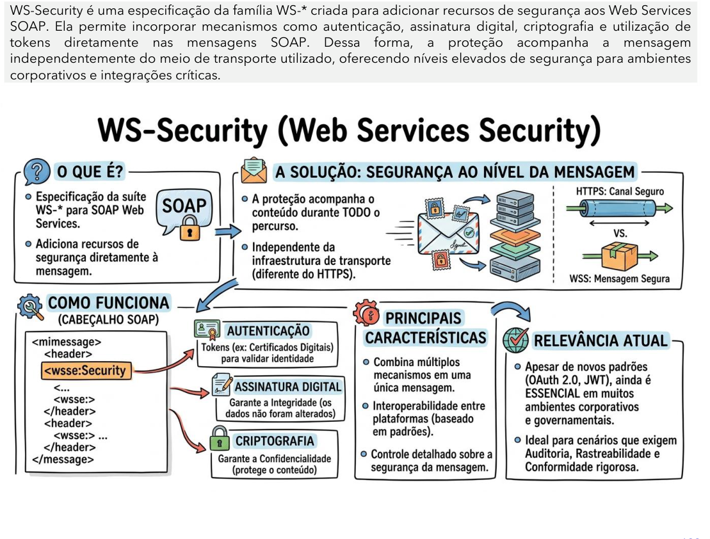


<!-- Start of picture text -->
WS-Security é uma especificação da família WS-* criada para adicionar recursos de segurança aos Web Services<br>SOAP. Ela permite incorporar mecanismos como autenticação, assinatura digital, criptografia e utilização de<br>tokens diretamente nas mensagens SOAP. Dessa forma, a proteção acompanha a mensagem<br>independentemente do meio de transporte utilizado, oferecendo níveis elevados de segurança para ambientes<br>corporativos e integrações críticas.<br><!-- End of picture text -->

---

<!-- pagina: 134 -->

**Diego Carvalho, Equipe Informática 2 (Diego Carvalho), Equipe Informática 1 (Diego Carvalho) Aula 09** 

#### **<mark>FAMÍLIA WS-*</mark>** 


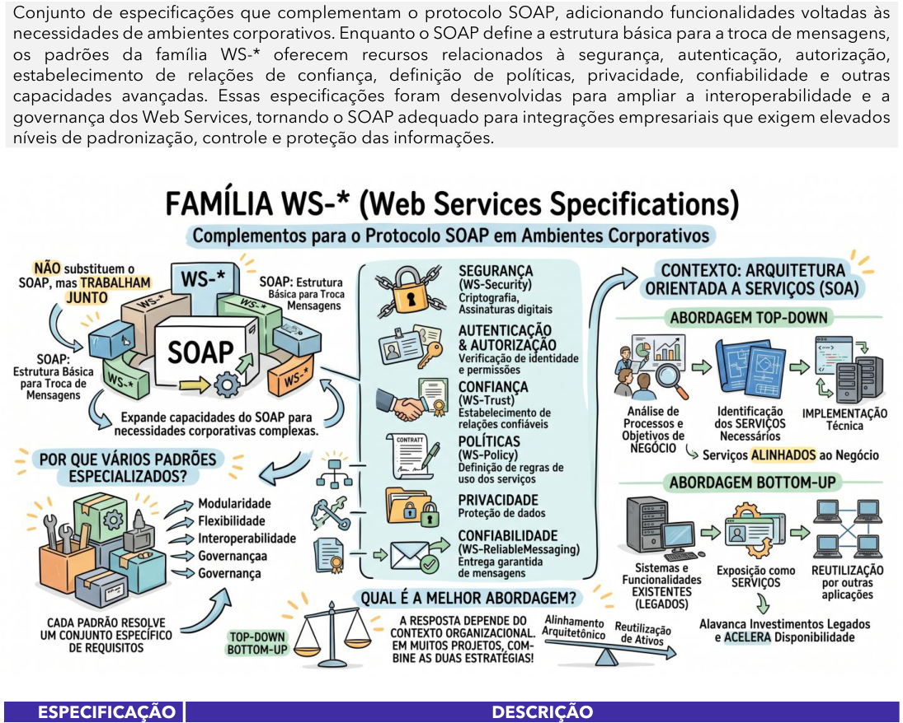


<!-- Start of picture text -->
Conjunto de especificações que complementam o protocolo SOAP, adicionando funcionalidades voltadas às<br>necessidades de ambientes corporativos. Enquanto o SOAP define a estrutura básica para a troca de mensagens,<br>os padrões da família WS-* oferecem recursos relacionados à segurança, autenticação, autorização,<br>estabelecimento de relações de confiança, definição de políticas, privacidade, confiabilidade e outras<br>capacidades avançadas. Essas especificações foram desenvolvidas para ampliar a interoperabilidade e a<br>governança dos Web Services, tornando o SOAP adequado para integrações empresariais que exigem elevados<br>níveis de padronização, controle e proteção das informações.<br>ESPECIFICAÇÃO  DESCRIÇÃO<br><!-- End of picture text -->

Define políticas e requisitos que um Web Service deve seguir, como mecanismos de **WS-POLICY** segurança, algoritmos de criptografia e protocolos suportados, permitindo que consumidores conheçam essas exigências antes da comunicação. 

**WS-TRUST** 

**WS-FEDERATION WS-SECURE CONVERSATION WSAUTHORIZATION** 

Estabelece mecanismos para criação, validação, renovação e troca de credenciais de segurança entre sistemas, permitindo que aplicações confiem em uma autoridade responsável pela emissão de tokens de autenticação. 

Permite o compartilhamento de identidades entre diferentes organizações ou domínios, possibilitando que um usuário autenticado em um ambiente acesse serviços de outro sem criar novas credenciais. 

Cria um contexto seguro para comunicações prolongadas entre cliente e servidor, evitando repetir autenticações e negociações de segurança a cada mensagem, reduzindo custos de processamento. 

Define mecanismos relacionados ao controle de acesso aos serviços, permitindo especificar quais usuários ou aplicações possuem autorização para executar determinadas operações após a autenticação.

---

<!-- pagina: 135 -->

**Diego Carvalho, Equipe Informática 2 (Diego Carvalho), Equipe Informática 1 (Diego Carvalho) Aula 09** 

|**ESPECIFICAÇÃO**|**DESCRIÇÃO**|
|---|---|
|**WS-PRIVACY**|Estabelece mecanismos para expressar políticas de tratamento de dados pessoais,<br>informando como as informações serão coletadas, armazenadas, compartilhadas e<br>utilizadas durante a comunicação entre serviços.|
|**WS-ENCRYPTION**|Define padrões para criptografar mensagens SOAP ou partes específicas de documentos<br>XML, garantindo confidencialidade das informações mesmo quando a mensagem<br>atravessa diferentes sistemas intermediários.|
|**WS-SIGNATURE**|Especifica o uso de assinaturas digitais em documentos XML, assegurando autenticidade,<br>integridade e não repúdio das mensagens, permitindo detectar alterações realizadas após<br>o envio.|


#### **<mark>REST</mark>** 

Web Services REST são serviços construídos segundo os princípios da arquitetura REST, utilizando recursos identificados por URIs e operações baseadas nos métodos HTTP. Diferentemente do SOAP, REST não é um protocolo, mas um estilo arquitetural. Sua simplicidade, flexibilidade e eficiência contribuíram para sua ampla <mark>adoção em APIs modernas, especialmente em aplicações Web, móveis e ambientes de microsserviços.</mark> 

#### **<mark>ESTILO ARQUITETURAL</mark>** 

Um estilo arquitetural é um conjunto de princípios, restrições e diretrizes que orientam a construção de sistemas de software. Em vez de definir tecnologias específicas, estabelece padrões de organização e interação entre componentes. REST é um exemplo de estilo arquitetural, pois descreve características que devem ser seguidas <u>para que um sistema possa ser considerado aderente aos seus princípios.</u> 

#### **<mark>REST X SOAP</mark>** 


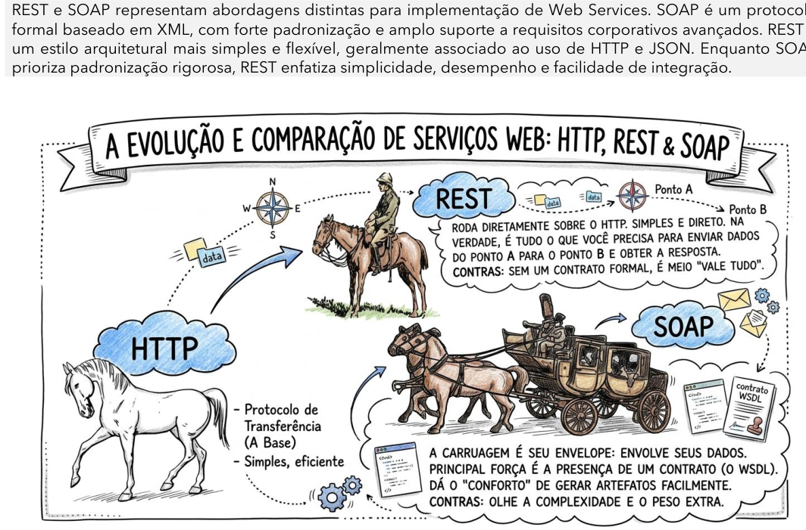


<!-- Start of picture text -->
REST e SOAP representam abordagens distintas para implementação de Web Services. SOAP é um protocolo<br>formal baseado em XML, com forte padronização e amplo suporte a requisitos corporativos avançados. REST é<br>um estilo arquitetural mais simples e flexível, geralmente associado ao uso de HTTP e JSON. Enquanto SOAP<br>prioriza padronização rigorosa, REST enfatiza simplicidade, desempenho e facilidade de integração. rioriza padronização rigorosa, REST enfatiza simplicidade, desempenho e facilidade de integração. padronização rigorosa, REST enfatiza simplicidade, desempenho e facilidade de integração. adronização rigorosa, REST enfatiza simplicidade, desempenho e facilidade de integração. ção rigorosa, REST enfatiza simplicidade, desempenho e facilidade de integração. ão rigorosa, REST enfatiza simplicidade, desempenho e facilidade de integração. gorosa, REST enfatiza simplicidade, desempenho e facilidade de integração. orosa, REST enfatiza simplicidade, desempenho e facilidade de integração. , REST enfatiza simplicidade, desempenho e facilidade de integração.  REST enfatiza simplicidade, desempenho e facilidade de integração. plicidade, desempenho e facilidade de integração. licidade, desempenho e facilidade de integração. , desempenho e facilidade de integração.  desempenho e facilidade de integração. penho e facilidade de integração. enho e facilidade de integração. gração. ração. ção. ão.<br><!-- End of picture text -->

REST e SOAP representam abordagens distintas para implementação de Web Services. SOAP é um protocolo formal baseado em XML, com forte padronização e amplo suporte a requisitos corporativos avançados. REST é um estilo arquitetural mais simples e flexível, geralmente associado ao uso de HTTP e JSON. Enquanto SOAP <u>prioriza padronização rigorosa, REST enfatiza simplicidade, desempenho e facilidade de integração. rioriza padronização rigorosa, REST enfatiza simplicidade, desempenho e facilidade de integração. padronização rigorosa, REST enfatiza simplicidade, desempenho e facilidade de integração. adronização rigorosa, REST enfatiza simplicidade, desempenho e facilidade de integração. ção rigorosa, REST enfatiza simplicidade, desempenho e facilidade de integração. ão rigorosa, REST enfatiza simplicidade, desempenho e facilidade de integração. gorosa, REST enfatiza simplicidade, desempenho e facilidade de integração. orosa, REST enfatiza simplicidade, desempenho e facilidade de integração. , REST enfatiza simplicidade, desempenho e facilidade de integração.  REST enfatiza simplicidade, desempenho e facilidade de integração. plicidade, desempenho e facilidade de integração. licidade, desempenho e facilidade de integração. , desempenho e facilidade de integração.  desempenho e facilidade de integração. penho e facilidade de integração. enho e facilidade de integração. gração. ração. ção. ão.</u>

---

<!-- pagina: 136 -->

**Diego Carvalho, Equipe Informática 2 (Diego Carvalho), Equipe Informática 1 (Diego Carvalho) Aula 09** 

#### **<mark>CLIENT-SERVER</mark>** 

<mark>A restrição Cliente-Servidor estabelece que a interface do usuário e o armazenamento ou processamento de</mark> dados devem permanecer separados. O cliente é responsável por solicitar recursos, enquanto o servidor fornece serviços e gerencia informações. Essa separação favorece evolução independente dos componentes, melhora a escalabilidade e reduz dependências entre diferentes partes da aplicação. 

#### **<mark>STATELESS</mark>** 

A restrição Stateless determina que cada requisição enviada ao servidor deve conter todas as informações necessárias para seu processamento. O servidor não deve armazenar contexto ou estado relacionado às interações anteriores do cliente. Essa característica simplifica o gerenciamento das aplicações, melhora a escalabilidade e facilita a distribuição de requisições entre diferentes servidores. 

#### **<mark>CACHE</mark>** 

<mark>A restrição Cache estabelece que as respostas fornecidas pelos servidores devem indicar se podem ou não ser</mark> armazenadas temporariamente pelos clientes ou intermediários. O uso de cache reduz a necessidade de novas requisições para recursos frequentemente acessados, diminuindo o consumo de banda e melhorando o desempenho geral das aplicações. 

#### **<mark>INTERFACE UNIFORME</mark>** 

A Interface Uniforme é considerada a principal restrição da arquitetura REST. Ela define que os recursos devem ser identificados de maneira consistente, acessados por meio de métodos padronizados e representados utilizando formatos adequados. Essa uniformidade simplifica a comunicação entre sistemas e reduz a complexidade das integrações, independentemente das tecnologias utilizadas. 

#### **<mark>SISTEMA EM CAMADAS</mark>** 

A restrição Sistema em Camadas determina que a arquitetura pode ser composta por múltiplos níveis intermediários entre cliente e servidor. Esses intermediários podem desempenhar funções como balanceamento de carga, cache, autenticação, monitoramento e segurança. O cliente não precisa conhecer a estrutura interna dessas camadas, interagindo apenas com a interface exposta pelo sistema. 

#### **<mark>CODE ON DEMAND</mark>** 

Code on Demand é uma restrição opcional da arquitetura REST que permite ao servidor enviar código executável para o cliente quando necessário. Esse código pode ampliar funcionalidades temporariamente sem exigir instalação prévia de novos componentes. Embora seja pouco utilizada em APIs modernas, essa característica <u>pode ser observada em aplicações Web que enviam scripts para execução nos navegadores.</u> 

#### **<mark>RECURSOS/URI</mark>** 

<mark>Um recurso é qualquer entidade ou informação disponibilizada por um sistema que possa ser identificada,</mark> acessada e manipulada por meio de uma API. Um recurso pode representar objetos do mundo real, como clientes, produtos, pedidos ou usuários, bem como informações ou serviços oferecidos pela aplicação. Já uma URI (Uniform Resource Identifier) é o identificador utilizado para localizar e distinguir um recurso dentro de uma API REST. Geralmente representada por um endereço semelhante a uma URL, a URI indica onde determinado recurso pode ser acessado 

|**OPERAÇÃO**<br>**CRUD**|**MÉTODO**<br>**HTTP**|**FINALIDADE**|**EXEMPLO DE**<br>**ENDPOINT**|
|---|---|---|---|
|**CREATE**|POST|Criar um novo recurso no servidor.|POST /clientes|
|**READ**|GET|Consultar ou recuperar um ou mais recursos existentes.|GET /clientes/10|
|**UPDATE**|PUT|Atualizar completamente um recurso existente.|PUT /clientes/10|
|**UPDATE**|PATCH|Atualizar parcialmente um recurso existente.|PATCH /clientes/10|

---

<!-- pagina: 137 -->

**Diego Carvalho, Equipe Informática 2 (Diego Carvalho), Equipe Informática 1 (Diego Carvalho) Aula 09** 

|**OPERAÇÃO**<br>**CRUD**|**MÉTODO**<br>**HTTP**|**FINALIDADE**|**EXEMPLO DE**<br>**ENDPOINT**|
|---|---|---|---|
|**DELETE**|DELETE|Remover um recurso existente.|DELETE /clientes/10|


#### **<mark>JSON</mark>** 


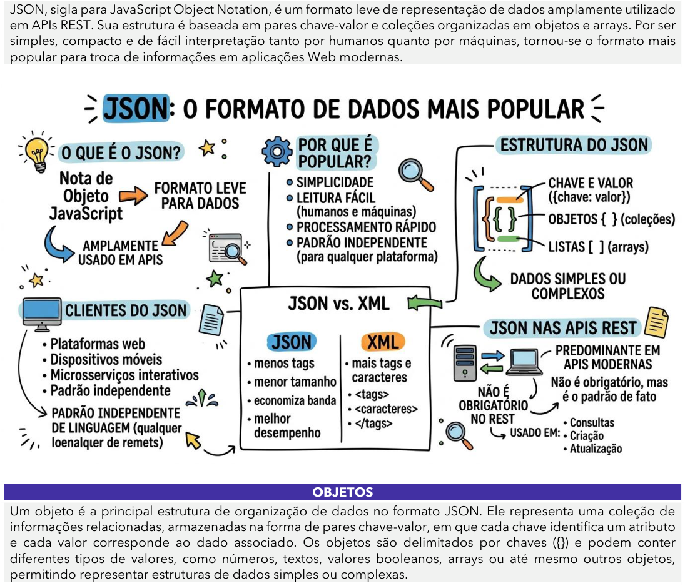


<!-- Start of picture text -->
JSON, sigla para JavaScript Object Notation, é um formato leve de representação de dados amplamente utilizado<br>em APIs REST. Sua estrutura é baseada em pares chave-valor e coleções organizadas em objetos e arrays. Por ser<br>simples, compacto e de fácil interpretação tanto por humanos quanto por máquinas, tornou-se o formato mais<br>popular para troca de informações em aplicações Web modernas.<br>OBJETOS<br>Um objeto é a principal estrutura de organização de dados no formato JSON. Ele representa uma coleção de<br>informações relacionadas, armazenadas na forma de pares chave-valor, em que cada chave identifica um atributo<br>e cada valor corresponde ao dado associado. Os objetos são delimitados por chaves ({}) e podem conter<br>diferentes tipos de valores, como números, textos, valores booleanos, arrays ou até mesmo outros objetos,<br>permitindo representar estruturas de dados simples ou complexas.<br><!-- End of picture text -->

#### **<mark>ARRAYS</mark>** 

Um array é uma estrutura utilizada no JSON para armazenar uma sequência ordenada de valores. Diferentemente dos objetos, cujos elementos são identificados por chaves, os itens de um array são acessados por sua posição na lista. Os arrays são delimitados por colchetes ([]) e podem conter valores de diferentes tipos, como números, textos, valores booleanos, objetos e até mesmo outros arrays. 

#### **<mark>PARES CHAVE-VALOR</mark>** 

Os pares chave-valor constituem a forma básica de organização das informações em um objeto JSON. Cada dado é representado por uma chave, que identifica o atributo, e por um valor, que corresponde à informação armazenada nesse atributo. A chave é sempre escrita como uma cadeia de caracteres entre aspas duplas, seguida <u>por dois-pontos (:) e pelo respectivo valor, que pode ser um número, texto, valor booleano, objeto, array ou null.</u>

---

<!-- pagina: 138 -->

**Diego Carvalho, Equipe Informática 2 (Diego Carvalho), Equipe Informática 1 (Diego Carvalho) Aula 09** 


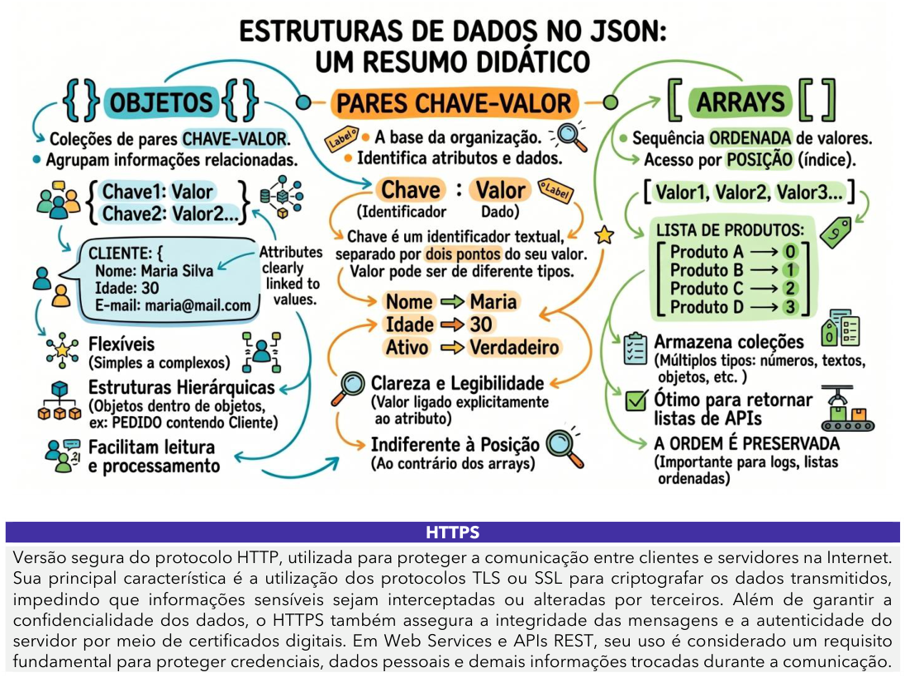


<!-- Start of picture text -->
HTTPS<br>Versão segura do protocolo HTTP, utilizada para proteger a comunicação entre clientes e servidores na Internet.<br>Sua principal característica é a utilização dos protocolos TLS ou SSL para criptografar os dados transmitidos,<br>impedindo que informações sensíveis sejam interceptadas ou alteradas por terceiros. Além de garantir a<br>confidencialidade dos dados, o HTTPS também assegura a integridade das mensagens e a autenticidade do<br>servidor por meio de certificados digitais. Em Web Services e APIs REST, seu uso é considerado um requisito<br>fundamental para proteger credenciais, dados pessoais e demais informações trocadas durante a comunicação.<br><!-- End of picture text -->

#### **<mark>AUTENTICAÇÃO</mark>** 

<mark>Processo responsável por verificar a identidade de um usuário, aplicação ou sistema antes de permitir o acesso</mark> a um serviço. Seu objetivo é responder à pergunta "quem está tentando acessar o recurso?". Essa verificação pode ser realizada por meio de diversos mecanismos, como usuário e senha, certificados digitais, tokens ou autenticação multifator. Em Web Services, a autenticação representa a primeira etapa da segurança, garantindo <u>que apenas entidades devidamente identificadas possam iniciar uma comunicação com o serviço.</u> 

#### **<mark>AUTORIZAÇÃO</mark>** 

Processo que determina quais recursos ou operações um usuário ou aplicação autenticada está autorizado a acessar. Diferentemente da autenticação, que verifica a identidade do solicitante, a autorização responde à pergunta "o que ele pode fazer?". As permissões podem ser definidas com base em papéis, perfis ou políticas de acesso previamente estabelecidas. Em Web Services e APIs, a autorização impede que usuários realizem operações para as quais não possuem privilégios, contribuindo para a proteção das informações e dos recursos do sistema. 

#### **<mark>TOKENS</mark>** 

Os tokens são credenciais digitais utilizadas para representar a identidade de um usuário ou aplicação durante a comunicação com um serviço. Após a autenticação, o servidor normalmente emite um token que deverá acompanhar as requisições subsequentes, evitando a necessidade de reenviar usuário e senha a cada solicitação. Os tokens podem conter informações como identidade, permissões e tempo de validade, sendo amplamente utilizados em APIs REST devido à sua praticidade, escalabilidade e facilidade de integração com diferentes mecanismos de autenticação.

---

<!-- pagina: 139 -->

**Diego Carvalho, Equipe Informática 2 (Diego Carvalho), Equipe Informática 1 (Diego Carvalho) Aula 09** 

#### **<mark>API KEYS</mark>** 

As API Keys são identificadores exclusivos utilizados para reconhecer aplicações que consomem um Web Service ou API. Normalmente consistem em uma sequência de caracteres fornecida pelo provedor do serviço e enviada em cada requisição para identificar o cliente responsável pelo acesso. Embora sejam frequentemente utilizadas para controle de uso, monitoramento e limitação de requisições, as API Keys, isoladamente, não oferecem autenticação robusta nem substituem mecanismos mais completos de segurança. Por esse motivo, costumam ser combinadas com HTTPS e outras técnicas de autenticação. 

#### **<mark>OAUTH</mark>** 


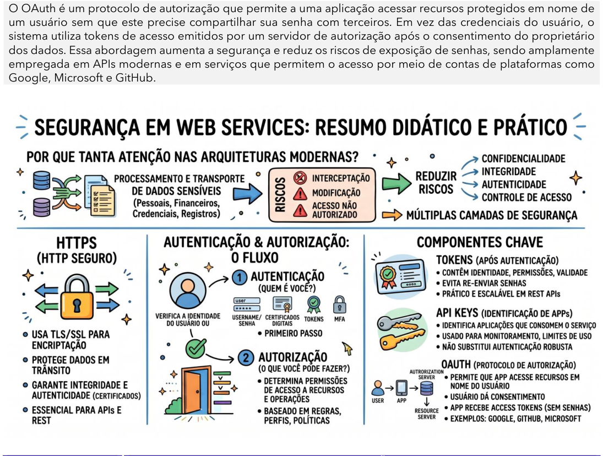


<!-- Start of picture text -->
O OAuth é um protocolo de autorização que permite a uma aplicação acessar recursos protegidos em nome de<br>um usuário sem que este precise compartilhar sua senha com terceiros. Em vez das credenciais do usuário, o<br>sistema utiliza tokens de acesso emitidos por um servidor de autorização após o consentimento do proprietário<br>dos dados. Essa abordagem aumenta a segurança e reduz os riscos de exposição de senhas, sendo amplamente<br>empregada em APIs modernas e em serviços que permitem o acesso por meio de contas de plataformas como<br>Google, Microsoft e GitHub.<br><!-- End of picture text -->

|**FERRAMENTAS**|**DESCRIÇÃO**|
|---|---|
|**POSTMAN**|Ferramenta amplamente utilizada para desenvolver, testar e documentar APIs e Web<br>Services. Permite enviar requisições HTTP, analisar respostas, automatizar testes e<br>organizar coleções de chamadas.|
|**SOAPUI**|Ferramenta voltada principalmente para testes de Web Services SOAP, embora também<br>ofereça suporte a REST. Permite validar contratos WSDL, simular serviços e automatizar<br>cenários de teste.|
|**NAVEGADOR**|O navegador pode ser utilizado para testar requisições HTTP simples, especialmente do<br>tipo GET. É útil para verificar rapidamente endpoints públicos, respostas e códigos de<br>status de serviços Web.|

---

<!-- pagina: 140 -->

**Diego Carvalho, Equipe Informática 2 (Diego Carvalho), Equipe Informática 1 (Diego Carvalho) Aula 09** 

**<mark>FERRAMENTAS DESCRIÇÃO</mark>** Ferramenta de linha de comando utilizada para enviar requisições HTTP e HTTPS. Permite **CURL** testar APIs, definir cabeçalhos, enviar dados, autenticar usuários e automatizar chamadas em scripts. 

#### **<mark>API REST</mark>** 


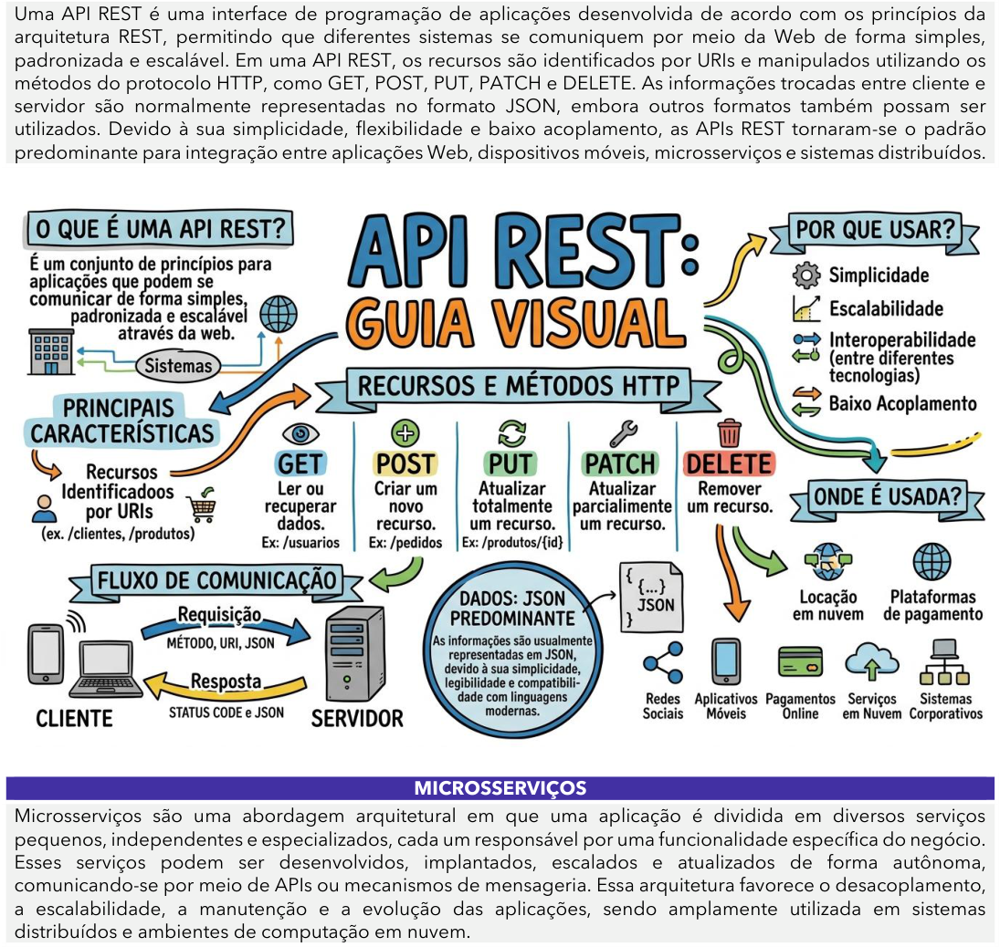


<!-- Start of picture text -->
Uma API REST é uma interface de programação de aplicações desenvolvida de acordo com os princípios da<br>arquitetura REST, permitindo que diferentes sistemas se comuniquem por meio da Web de forma simples,<br>padronizada e escalável. Em uma API REST, os recursos são identificados por URIs e manipulados utilizando os<br>métodos do protocolo HTTP, como GET, POST, PUT, PATCH e DELETE. As informações trocadas entre cliente e<br>servidor são normalmente representadas no formato JSON, embora outros formatos também possam ser<br>utilizados. Devido à sua simplicidade, flexibilidade e baixo acoplamento, as APIs REST tornaram-se o padrão<br>predominante para integração entre aplicações Web, dispositivos móveis, microsserviços e sistemas distribuídos.<br>MICROSSERVIÇOS<br>Microsserviços são uma abordagem arquitetural em que uma aplicação é dividida em diversos serviços<br>pequenos, independentes e especializados, cada um responsável por uma funcionalidade específica do negócio.<br>Esses serviços podem ser desenvolvidos, implantados, escalados e atualizados de forma autônoma,<br>comunicando-se por meio de APIs ou mecanismos de mensageria. Essa arquitetura favorece o desacoplamento,<br>a escalabilidade, a manutenção e a evolução das aplicações, sendo amplamente utilizada em sistemas<br>distribuídos e ambientes de computação em nuvem.<br><!-- End of picture text -->

---

<!-- pagina: 141 -->

**Diego Carvalho, Equipe Informática 2 (Diego Carvalho), Equipe Informática 1 (Diego Carvalho) Aula 09** 


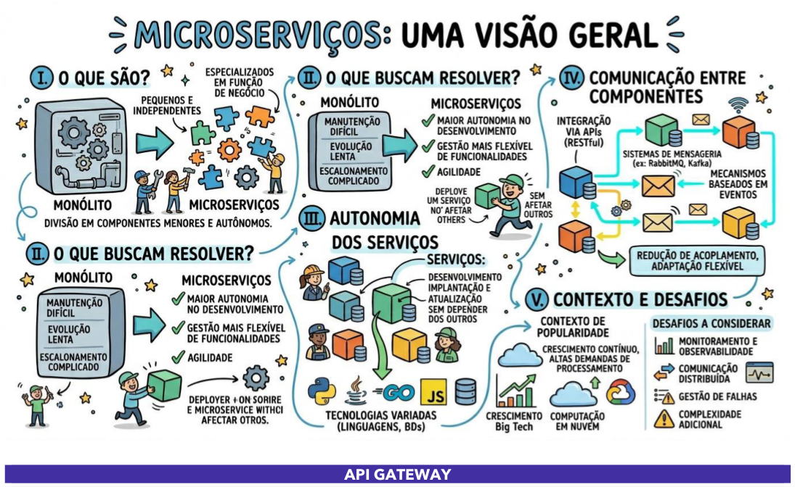


<!-- Start of picture text -->
API GATEWAY<br><!-- End of picture text -->


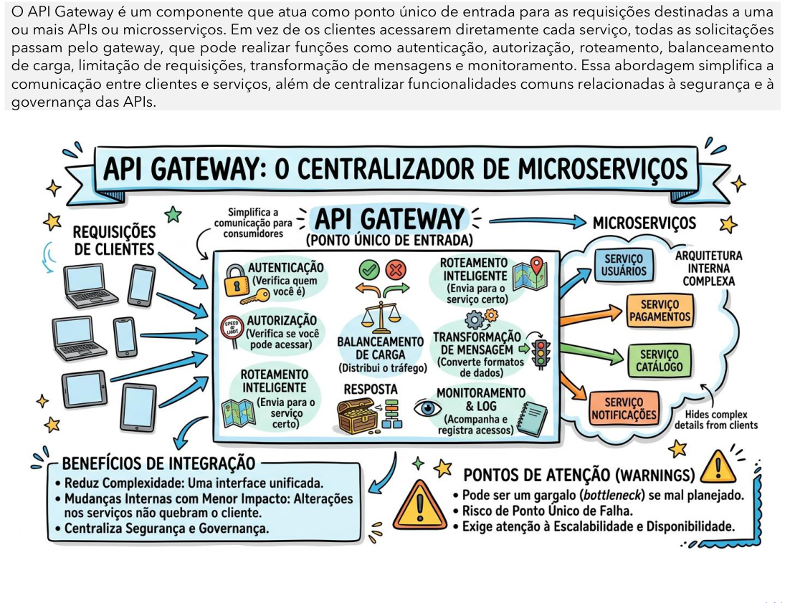


<!-- Start of picture text -->
O API Gateway é um componente que atua como ponto único de entrada para as requisições destinadas a uma<br>ou mais APIs ou microsserviços. Em vez de os clientes acessarem diretamente cada serviço, todas as solicitações<br>passam pelo gateway, que pode realizar funções como autenticação, autorização, roteamento, balanceamento<br>de carga, limitação de requisições, transformação de mensagens e monitoramento. Essa abordagem simplifica a<br>comunicação entre clientes e serviços, além de centralizar funcionalidades comuns relacionadas à segurança e à<br>governança das APIs.<br><!-- End of picture text -->

---

<!-- pagina: 142 -->

**Diego Carvalho, Equipe Informática 2 (Diego Carvalho), Equipe Informática 1 (Diego Carvalho) Aula 09** 

#### **<mark>GRAPHQL</mark>** 


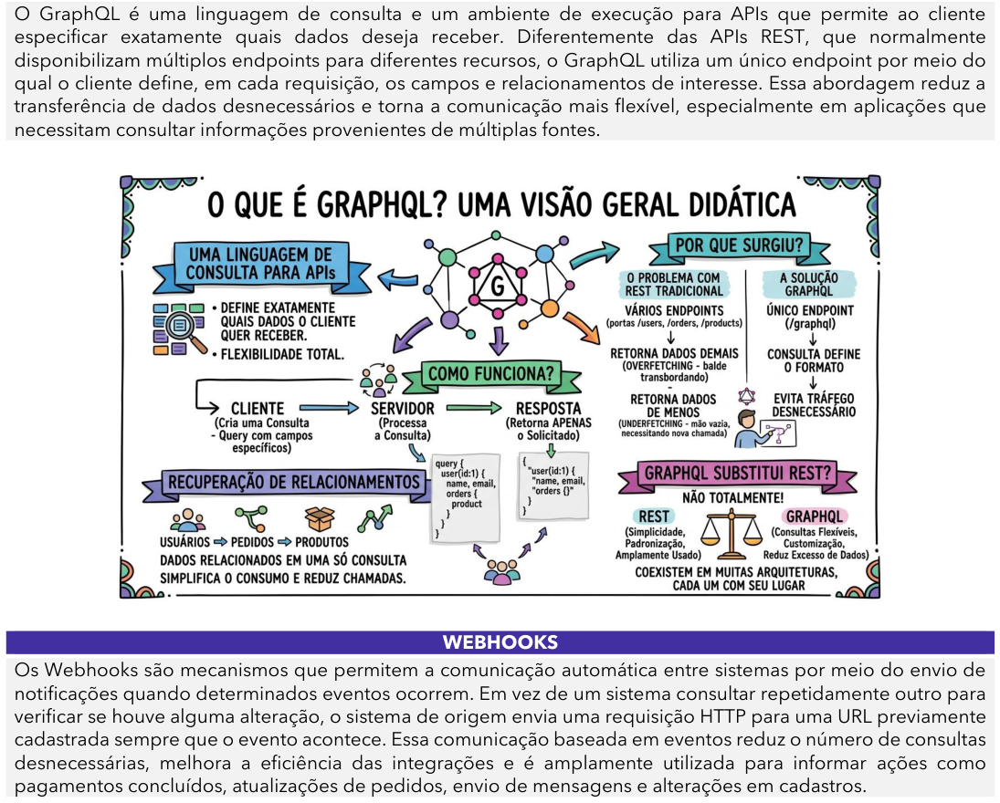


<!-- Start of picture text -->
O GraphQL é uma linguagem de consulta e um ambiente de execução para APIs que permite ao cliente<br>especificar exatamente quais dados deseja receber. Diferentemente das APIs REST, que normalmente<br>disponibilizam múltiplos endpoints para diferentes recursos, o GraphQL utiliza um único endpoint por meio do<br>qual o cliente define, em cada requisição, os campos e relacionamentos de interesse. Essa abordagem reduz a<br>transferência de dados desnecessários e torna a comunicação mais flexível, especialmente em aplicações que<br>necessitam consultar informações provenientes de múltiplas fontes.<br>WEBHOOKS<br>Os Webhooks são mecanismos que permitem a comunicação automática entre sistemas por meio do envio de<br>notificações quando determinados eventos ocorrem. Em vez de um sistema consultar repetidamente outro para<br>verificar se houve alguma alteração, o sistema de origem envia uma requisição HTTP para uma URL previamente<br>cadastrada sempre que o evento acontece. Essa comunicação baseada em eventos reduz o número de consultas<br>desnecessárias, melhora a eficiência das integrações e é amplamente utilizada para informar ações como<br>pagamentos concluídos, atualizações de pedidos, envio de mensagens e alterações em cadastros. agamentos concluídos, atualizações de pedidos, envio de mensagens e alterações em cadastros. gamentos concluídos, atualizações de pedidos, envio de mensagens e alterações em cadastros. amentos concluídos, atualizações de pedidos, envio de mensagens e alterações em cadastros. , atualizações de pedidos, envio de mensagens e alterações em cadastros.  atualizações de pedidos, envio de mensagens e alterações em cadastros. ções de pedidos, envio de mensagens e alterações em cadastros. ões de pedidos, envio de mensagens e alterações em cadastros. pedidos, envio de mensagens e alterações em cadastros. edidos, envio de mensagens e alterações em cadastros. , envio de mensagens e alterações em cadastros.  envio de mensagens e alterações em cadastros. gens e alterações em cadastros. ens e alterações em cadastros. ções em cadastros. ões em cadastros.<br><!-- End of picture text -->


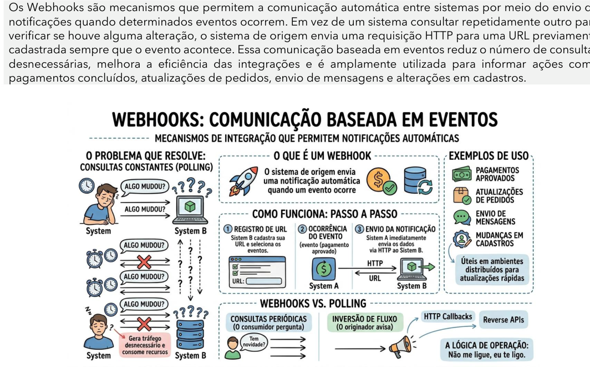


<!-- Start of picture text -->
Os Webhooks são mecanismos que permitem a comunicação automática entre sistemas por meio do envio de<br>notificações quando determinados eventos ocorrem. Em vez de um sistema consultar repetidamente outro para<br>verificar se houve alguma alteração, o sistema de origem envia uma requisição HTTP para uma URL previamente<br>cadastrada sempre que o evento acontece. Essa comunicação baseada em eventos reduz o número de consultas<br>desnecessárias, melhora a eficiência das integrações e é amplamente utilizada para informar ações como<br>pagamentos concluídos, atualizações de pedidos, envio de mensagens e alterações em cadastros. agamentos concluídos, atualizações de pedidos, envio de mensagens e alterações em cadastros. gamentos concluídos, atualizações de pedidos, envio de mensagens e alterações em cadastros. amentos concluídos, atualizações de pedidos, envio de mensagens e alterações em cadastros. , atualizações de pedidos, envio de mensagens e alterações em cadastros.  atualizações de pedidos, envio de mensagens e alterações em cadastros. ções de pedidos, envio de mensagens e alterações em cadastros. ões de pedidos, envio de mensagens e alterações em cadastros. pedidos, envio de mensagens e alterações em cadastros. edidos, envio de mensagens e alterações em cadastros. , envio de mensagens e alterações em cadastros.  envio de mensagens e alterações em cadastros. gens e alterações em cadastros. ens e alterações em cadastros. ções em cadastros. ões em cadastros.<br><!-- End of picture text -->

---

<!-- pagina: 143 -->

**Diego Carvalho, Equipe Informática 2 (Diego Carvalho), Equipe Informática 1 (Diego Carvalho) Aula 09** 


<!-- Start of picture text -->
Q UESTÕES  C OMENTADAS<br><!-- End of picture text -->

**1. (FGV / DPE RO - 2025) Uma interface de programação de aplicativos (API, Application Programming Interface) fornece uma maneira de integrar aplicações e conectar componentes em arquiteturas de microsserviços. Uma API REST (Representational State Transfer, ou transferência de estado representacional)** 

   - a) proporciona conformidade integrada, fazendo com que seja uma opção recomendada para casos empresariais. 

b) é um protocolo. 

c) possibilita comunicação entre aplicações através de métodos HTTP. 

- d) é um conjunto de regras e diretrizes sobre como você deve criar uma API DESKTOP. 

- e) implementa a linguagem de descrição de serviços web (WSDL, Web Services Description Language). 

**Comentários:** 

(a) Errado. A ideia de “conformidade integrada” não é uma característica central de APIs REST, então isso não explica sua adoção em cenários empresariais. 

(b) Errado. REST não é tratado aqui como protocolo, mas como um estilo de construção de APIs. 

(c) Correto. APIs REST permitem a comunicação entre aplicações usando métodos HTTP, como GET, POST, PUT e DELETE. 

(d) Errado. REST não traz regras para criar API desktop; ele orienta a construção de APIs voltadas à comunicação entre sistemas. 

(e) Errado. WSDL está ligado a outra abordagem de serviços web, não ao modelo REST. 

**Gabarito:** Letra C 

**2. (FGV / DPE RS - 2023) Em um ambiente tão heterogêneo como a Internet, elementos de interoperabilidade são fundamentais, e os Web Services são o modelo mais comum para o**

---

<!-- pagina: 144 -->

**Diego Carvalho, Equipe Informática 2 (Diego Carvalho), Equipe Informática 1 (Diego Carvalho) Aula 09** 

### **fornecimento de serviços independentes de plataforma. Uma característica das tecnologias de Web Services é:** 

- a) a criação automática de um cliente Java para Web Services do tipo SOAP é possível em diversas IDEs com o simples fornecimento do endereço do descritor de serviços, que segue a sintaxe OMGIDL; 

- b) o protocolo SOAP garante a transparência para firewalls e independência de plataforma através do uso de comunicação em modo texto no formato JSON; 

- c) ao lidar com um Web Service do tipo RESTful, as operações relacionadas à alteração de dados, de acordo com o padrão estabelecido, devem ser efetuadas via método POST; 

- d) segundo o padrão da arquitetura REST, a obtenção de todas as entidades a partir de um Web Service do tipo RESTful ocorrerá com o acesso ao endereço de base do serviço via método GET do protocolo HTTP; 

- e) por não serem capazes de manter estado, as tecnologias de Web Services não permitem acesso autenticado, trazendo fragilidade em termos de segurança. 

**Comentários:** 

(a) Errado. Em SOAP, o descritor de serviços é o WSDL, não uma sintaxe OMG-IDL; por isso, a ideia central da alternativa foge do padrão mais comum dos Web Services. 

(b) Errado. SOAP trabalha tradicionalmente com mensagens XML. A menção a JSON não caracteriza o protocolo e compromete a justificativa apresentada na opção. 

(c) Errado. Em RESTful, alteração de dados não fica restrita ao POST. O padrão envolve outros métodos HTTP conforme a operação desejada. 

(d) Correto. Na arquitetura REST, consultar uma coleção de recursos costuma ocorrer com requisição GET no endereço base do recurso, para obter as entidades disponibilizadas pelo serviço. 

(e) Errado. Web Services podem adotar mecanismos de autenticação e segurança. O fato de não manterem estado, por si só, não impede acesso autenticado. 

**Gabarito:** Letra D

---

<!-- pagina: 145 -->

**Diego Carvalho, Equipe Informática 2 (Diego Carvalho), Equipe Informática 1 (Diego Carvalho) Aula 09** 

**3. (FGV / ALEMA - 2023) SOA é um padrão de arquitetura de software de baixo acoplamento e baseada em princípios de computação distribuída. Na arquitetura SOA, o UDDI define um padrão para** 

a) renderização de documentos XML em navegadores web. 

- b) ofuscação de informações em banco de dados relacionais. 

- c) transferência de ficheiros entre computadores remotos. 

- d) visibilidade, reutilização e gerenciabilidade de serviços web. 

- e) conversão de endpoints em endereços da camada de enlace. 

### **Comentários:** 

(a) Errado. UDDI não trata de exibição de XML em navegador; isso está mais ligado a tecnologias de apresentação e visualização de documentos. 

(b) Errado. Ofuscação de dados em banco relacional não é função do UDDI, que atua no contexto de serviços web. 

(c) Errado. Transferência de ficheiros entre computadores remotos envolve outros protocolos, não o padrão UDDI. 

(d) Correto. O UDDI funciona como um diretório de serviços, facilitando descoberta, visibilidade, reutilização e gerenciamento de serviços web. 


(e) Errado. UDDI não faz conversão de endpoints para endereços de enlace; isso não tem relação com seu papel na arquitetura SOA. 

**Gabarito:** Letra D 

**4. (FGV / ALEMA - 2023) Os trechos a seguir apontam características dos Web Services, à exceção de um. Assinale-o.** 

a) podem ser utilizados por outras aplicações. 

b) são autocontidos e autodescritos. 

- c) são descobertos na Web por meio do protocolo SOAP. 

d) se comunicam com protocolos abertos. 

- e) têm como bases o HTTP e o XML. 

**Comentários:**

---

<!-- pagina: 146 -->

**Diego Carvalho, Equipe Informática 2 (Diego Carvalho), Equipe Informática 1 (Diego Carvalho) Aula 09** 

(a) Errado. Essa é uma característica típica de Web Services, já que eles são feitos justamente para serem consumidos por outras aplicações. 

(b) Errado. Web Services costumam ser autocontidos e autodescritos, o que facilita seu uso e integração entre sistemas diferentes. 

(c) Correto. O item foge das características pedidas na questão, por isso é o gabarito. A descoberta de serviços não é apresentada aqui como traço geral do funcionamento. 

(d) Errado. A comunicação por protocolos abertos é uma marca importante dos Web Services, favorecendo interoperabilidade entre plataformas. 

(e) Errado. HTTP e XML aparecem como bases clássicas dos Web Services, especialmente nos modelos mais tradicionais de troca de dados. 

**Gabarito:** Letra C 

**5. (FGV / TJDFT - 2022) No âmbito de Web services, analise as afirmativas a seguir sobre a abordagem REST e o uso de tecnologias baseadas em SOAP.** 

   - **I. Uma característica dos serviços Web RESTful é a capacidade de transmitir dados diretamente via HTTP.** 

**II. As mensagens SOAP precisam ser retornadas como documentos XML.** 

**III. Um navegador não pode armazenar em cache uma solicitação concluída por uma API SOAP.** 

**É correto o que se afirma em:** 

a) somente II; 

b) somente I e II; 

c) somente I e III; 

d) somente II e III; 

e) I, II e III. 

**Comentários:** 

(I) Correto. Em REST, a ideia é justamente aproveitar o próprio HTTP para trocar informações de forma direta, usando seus métodos e recursos nativos.

---

<!-- pagina: 147 -->

**Diego Carvalho, Equipe Informática 2 (Diego Carvalho), Equipe Informática 1 (Diego Carvalho) Aula 09** 

(II) Correto. No padrão SOAP, as mensagens seguem estrutura baseada em XML, então o retorno acontece nesse formato de documento. 

(III) Correto. Em APIs SOAP, em regra, não se trabalha com cache no navegador da mesma forma que em requisições HTTP mais diretas, como ocorre em abordagens REST. 

**Gabarito:** Letra E 

**6. (FGV / IMBEL - 2021) No contexto de Web Services e respectivos padrões, analise as afirmativas a seguir.** 

**I. SOAP é um protocolo para troca de mensagens estruturadas baseado em XML.** 

**II. SDL é uma linguagem baseada em HTML para descrever Web Services. III. XML é uma linguagem utilizada para formatar e exibir páginas Web.** 

**Está correto o que se afirma em** 

a) I, somente. 

b) II, somente. 

c) I e III, somente. 

d) II e III, somente. 

e) I, II e III. 

**Comentários:** 

(I) Correto. SOAP é mesmo um padrão/protocolo de troca de mensagens estruturadas e usa XML como base, sendo bem típico no contexto de Web Services. 

(II) Errado. A descrição de Web Services não é feita em HTML. O item cita SDL, mas, para esse contexto, a ideia apresentada não se sustenta. 

(III) Errado. XML não é usado para exibir páginas Web. Ele serve para estruturar e transportar dados, não para apresentação visual. 

**Gabarito:** Letra A 

**7. (FGV / TCE-AM - 2021) Considere as seguintes frases no contexto de Web Services.** 

   - **I. Um documento que descreve um web service.**

---

<!-- pagina: 148 -->

**Diego Carvalho, Equipe Informática 2 (Diego Carvalho), Equipe Informática 1 (Diego Carvalho) Aula 09** 

- **II. Um protocolo de comunicação entre aplicações que rodam em diferentes sistemas operacionais.** 

- **III. Uma forma comum para descrever informações que são lidas e entendidas por aplicações computacionais.** 

**IV. Permite a distribuição de conteúdo atualizado para outros websites.** 

**As frases descrevem, de forma sucinta e na ordem em que aparecem, artefatos conhecidos como:** 

a) RDF, RSS, WSDL, SOAP; 

b) RSS, WSDL, SOAP, RDF; 

c) SOAP, WSDL, RDF, RSS; 

d) UDDI, SOAP, RDF, WSDL; 

e) WSDL, SOAP, RDF, RSS. 

**Comentários:** 

(a) Errado. RDF não é o documento que descreve um web service; além disso, a sequência toda não bate com as definições apresentadas no enunciado. 

(b) Errado. RSS não descreve web service, e WSDL também não é protocolo de comunicação entre aplicações. A ordem dos conceitos ficou trocada. 

(c) Errado. SOAP é protocolo de comunicação, não o documento descritivo do serviço. Já WSDL também não aparece na posição adequada nessa sequência. 

(d) Errado. UDDI está ligado a diretórios de serviços, não à descrição direta do web service pedida no item I. Por isso, a sequência não corresponde ao enunciado. 

(e) Correto. WSDL descreve o web service; SOAP faz a comunicação entre aplicações; RDF descreve informações de modo compreensível por máquinas; RSS permite distribuir conteúdo atualizado. 

### **Gabarito:** Letra E 

**8. (FGV / ALESC - 2024) As tecnologias Standard Object Access Protocol (SOAP) e Representational State Transfer (REST) representam duas maneiras diferentes de conectar aplicativos e definem como as Application Programming Interface (APIs, ou interfaces de programação de aplicações) são criadas, possibilitando a comunicação dos dados entre aplicações web. Considerando as diferenças entre as tecnologias SOAP e REST, pode ser identificado que**

---

<!-- pagina: 149 -->

**Diego Carvalho, Equipe Informática 2 (Diego Carvalho), Equipe Informática 1 (Diego Carvalho) Aula 09** 

- a) SOAP é um protocolo, que oferece implementação mais rígida, e REST é um conjunto de diretrizes, que oferece uma implementação flexível. 

- b) APIs REST são mais pesadas que implementações SOAP, entretanto, são ideais para contextos mais modernos. 

- c) Os serviços web SOAP oferecem segurança integrada e transações em conformidade que atendem a muitas necessidades empresariais, resultando em sistemas leves. 

- d) REST é um conjunto de padronizações que oferece uma implementação rígida. 

- e) SOAP é um protocolo com requisitos flexíveis e dinâmicos, com implementação mais leve que o REST. 

**Comentários:** 

(a) Correto. SOAP é um protocolo com regras bem definidas e estrutura mais rígida; já o REST funciona como um conjunto de diretrizes arquiteturais, dando mais flexibilidade na implementação das APIs. 

(b) Errado. Em geral, REST é mais leve que SOAP, justamente por usar abordagens mais simples e menos verbosas, o que combina melhor com aplicações web modernas. 

(c) Errado. SOAP realmente oferece recursos fortes de segurança e transações, muito usados no meio corporativo, mas isso não resulta em sistemas leves, e sim mais robustos e estruturados. 

(d) Errado. REST não impõe uma implementação rígida. A ideia central dele é justamente oferecer princípios e restrições que permitem soluções mais flexíveis. 

(e) Errado. SOAP não é marcado por flexibilidade e leveza maior que REST. Ele costuma exigir mais estrutura e formalismo, enquanto REST tende a ser mais simples e dinâmico. 

**Gabarito:** Letra A 

**9. (FGV / CVM - 2024) O analista João desenvolveu o web service cvmWS, com base no protocolo Simple Object Access Protocol (SOAP). A fim de otimizar a serialização de um arquivo binário anexo à mensagem SOAP, João implementou em cvmWS a especificação SOAP Message Transmission Optimization Mechanism (MTOM).** 

**Quando a serialização otimizada do MTOM é bem-sucedida, os clientes do cvmWS devem ler o conteúdo do arquivo anexo contido:**

---

<!-- pagina: 150 -->

**Diego Carvalho, Equipe Informática 2 (Diego Carvalho), Equipe Informática 1 (Diego Carvalho) Aula 09** 

- a) dentro do envelope SOAP, no elemento xop; 

- b) fora do envelope SOAP, no corpo da mensagem; 

- c) dentro do envelope SOAP, no elemento binaryData; 

- d) dentro do envelope SOAP, no elemento base64Binary; 

- e) fora do envelope SOAP, em uma mensagem subsequente. 

### **Comentários:** 

(a) Errado. No MTOM, a ideia não é manter o anexo propriamente dito em um elemento interno do envelope SOAP, como xop, mas otimizar seu transporte de outro modo. 

(b) Correto. Com MTOM, o conteúdo binário otimizado fica fora do envelope SOAP, no corpo da mensagem transmitida, o que evita sobrecarga de serialização em Base64. 

(c) Errado. Não há leitura do anexo otimizado em um elemento chamado binaryData dentro do envelope; essa não é a forma adotada pelo MTOM para o conteúdo binário. 

(d) Errado. O uso de base64Binary representa justamente a forma não otimizada de carregar binário no XML, enquanto o MTOM busca evitar esse custo quando consegue otimizar. 

(e) Errado. O anexo otimizado não é lido em uma mensagem posterior; ele segue junto da transmissão da mensagem, só que fora do envelope SOAP. 

**Gabarito:** Letra B 

- **10.(FGV / SEPLAG Niterói - 2024) Um servidor está desenvolvendo um serviço para integração entre sistemas e foi exigido que a camada de transporte utilizasse SMTP. Ele recebeu um arquivo WSDL para orientá-lo sobre como utilizar o serviço. É correto afirmar que se tratava de um serviço do tipo** 

a) XML. 

b) SOAP. 

c) Ajax. 

- d) JSON-RPC. 

- e) REST. 

**Comentários:** 

(a) Errado. XML é uma linguagem de marcação para estruturar dados, não o tipo de serviço em si.

---

<!-- pagina: 151 -->

**Diego Carvalho, Equipe Informática 2 (Diego Carvalho), Equipe Informática 1 (Diego Carvalho) Aula 09** 

(b) Correto. WSDL é usado para descrever serviços SOAP, e esse padrão pode usar SMTP como protocolo de transporte. 

(c) Errado. Ajax é uma técnica de interação assíncrona em aplicações web, não um tipo de serviço descrito por WSDL. 

(d) Errado. JSON-RPC usa JSON para chamadas remotas e não se relaciona, em regra, ao uso de WSDL nesse contexto. 

(e) Errado. REST normalmente não é descrito por WSDL da forma clássica associada aos serviços SOAP. 

**Gabarito:** Letra B 

- **11.(FGV / TJ RN - 2023) No contexto de uma mensagem SOAP, o elemento que NÃO faz parte da estrutura sintática estabelecida é:** 

a) Body; 

b) Credential; 

c) Envelope; 

d) Fault; 

e) Header. 

**Comentários:** 

(a) Errado. Body é um dos elementos clássicos da mensagem SOAP, usado para carregar o conteúdo principal da comunicação. 

(b) Correto. Credential não integra a estrutura sintática padrão do SOAP. Pode até aparecer em soluções específicas, mas não como elemento estrutural básico. 

(c) Errado. Envelope faz parte da base do SOAP, pois delimita e organiza toda a mensagem. 

(d) Errado. Fault é um elemento previsto no SOAP para indicar erros no processamento da mensagem. 

(e) Errado. Header também compõe a estrutura SOAP, reunindo informações adicionais da mensagem. 

**Gabarito:** Letra B

---

<!-- pagina: 152 -->

**Diego Carvalho, Equipe Informática 2 (Diego Carvalho), Equipe Informática 1 (Diego Carvalho) Aula 09** 

- **12.(FGV / TCE SP - 2023) Roberta está desenvolvendo um determinado serviço na rede. Foi exigida a adoção de JMS na camada de transporte, e ela recebeu um arquivo WSDL para instruí-la acerca da utilização do serviço. Roberta logo notou que se tratava de um serviço do tipo:** 

a) REST; 

b) GraphQL; 

c) gRPC; 

d) Web Socket; 

e) SOAP. 

**Comentários:** 

(a) Errado. REST costuma trabalhar com recursos e verbos HTTP, sem depender de WSDL como elemento central de descrição do serviço. 

(b) Errado. GraphQL usa uma abordagem baseada em schema e consultas flexíveis, não sendo identificado pelo uso de WSDL. 

(c) Errado. gRPC é associado a contratos em Protocol Buffers, não a arquivos WSDL para orientar o consumo do serviço. 

(d) Errado. Web Socket é voltado à comunicação persistente e bidirecional, sem essa característica típica de descrição por WSDL. 

(e) Correto. WSDL é uma marca bem clássica de serviços SOAP, pois descreve operações, mensagens e formas de acesso do serviço. 

**Gabarito:** Letra E 

- **13.(FGV / TJDFT - 2022) O DataJud é uma base composta por dados e metadados processuais relativos a todos os processos físicos ou eletrônicos, públicos ou sigilosos dos tribunais. Para alimentar o DataJud via API REST com os metadados dos processos do TJDFT, Pedro recebeu o arquivo1 e enviou o arquivo2, cujos recortes estão ilustrados a seguir.** 

### **Recorte do arquivo1:** 

### **<attribute name="codigoDocumento" type="string"** 

**use="required">** 

### **<annotation>** 

**<documentation> Sequência de caracteres que tornam único o documento descrito sem os separadores característicos.</documentation>**

---

<!-- pagina: 153 -->

**Diego Carvalho, Equipe Informática 2 (Diego Carvalho), Equipe Informática 1 (Diego Carvalho) Aula 09** 

**</annotation> </attribute>** 

**<atribute name="emissorDocumento" type="string" use="required"> <annotation> <documentation> Órgão emissor do documento de identificação.</documentation> </annotation> </attribute> <attribute name="tipoDocumento" type="cnj:modalidadeDocumentoIdentificador" use="required"> <annotation> <documentation>Tipo do documento, conforme emuneração existente no tipo "tipoDocumento". </documentation> </annotation> </attribute>** 

**Recorte do arquivo2: <documento                  codigoDocumento="00104875732" emissorDocumento="SSP" tipoDocumento="NB"/>** 

**Os arquivo1 e arquivo2 utilizados por Pedro são, respectivamente:** 

a) modelo de transmissão ou transferência de dados em XSD e metadados processuais em XML; 

b) metadados processuais em XSD e dados processuais em XML; 

c) Tabelas Processuais Unificadas em XML e conteúdo JSON com o XML processado; 

d) API REST de envio e arquivo XML processado pelo Validador; 

e) template de metadados processuais em XML e dados processuais em XML. 

**Comentários:** 

(a) Correto. O arquivo1 traz a estrutura e as definições dos campos, bem no papel de um modelo XSD; já o arquivo2 corresponde aos metadados processuais enviados em XML pela API REST. 

(b) Errado. Aqui os papéis foram invertidos: o XSD funciona como modelo de validação/estrutura, enquanto o XML é o arquivo com os metadados efetivamente transmitidos. 

(c) Errado. O enunciado fala em alimentação do DataJud via API REST com metadados processuais, não em Tabelas Processuais Unificadas nem em conteúdo JSON com XML processado. 

(d) Errado. API REST não é o arquivo1, e o enunciado também não indica arquivo XML processado por validador como sendo o arquivo2.

---

<!-- pagina: 154 -->

**Diego Carvalho, Equipe Informática 2 (Diego Carvalho), Equipe Informática 1 (Diego Carvalho) Aula 09** 

(e) Errado. O arquivo1 não é um template em XML, mas sim o modelo estrutural dos dados, associado ao XSD; o arquivo2 é que representa os metadados em XML. 

**Gabarito:** Letra A 

- **14.(FGV / TJDFT - 2022) O analista de sistemas Bravo desenvolveu o webservice TJService para o TJDFT sem mecanismos de controle de segurança. A comunicação de TJService ocorre conforme especificações do protocolo SOAP (Simple Object Access Protocol). A fim de proteger a troca de mensagens de TJService, Bravo foi orientado pelo TJDFT a implementar o suporte à autenticação baseada em token.** 

**Os mecanismos de proteção de mensagens SOAP baseados em token que Bravo deve implementar são definidos na especificação Web Services:** 

a) Dynamic Discovery; 

b) Addressing; 

c) Reliable Messaging; 

d) Security; 

e) Make Connection. 

**Comentários:** 

(a) Errado. Dynamic Discovery trata de descoberta dinâmica de serviços, não de proteção de mensagens SOAP com autenticação por token. 

(b) Errado. Addressing serve para endereçamento das mensagens entre serviços, não para implementar mecanismos de autenticação. 

(c) Errado. Reliable Messaging cuida da entrega confiável das mensagens, garantindo envio e recebimento, não da segurança. 

(d) Correto. Security é a especificação voltada à proteção de mensagens SOAP, incluindo autenticação baseada em token. 

(e) Errado. Make Connection está ligado ao estabelecimento/manutenção da comunicação, não aos mecanismos de segurança por token. 

**Gabarito:** Letra D

---

<!-- pagina: 155 -->

**Diego Carvalho, Equipe Informática 2 (Diego Carvalho), Equipe Informática 1 (Diego Carvalho) Aula 09** 

- **15.(FGV / MPE SC - 2022) A analista em TI Isabel está implementando o web service DocService para o MPSC. A comunicação do DocService deve se basear em especificações derivadas do protocolo SOAP (Simple Object Access Protocol) e do framework WS-Security (Web Services Security). Para que DocService possa utilizar contextos de segurança baseados em token entre múltiplas mensagens SOAP, Isabel deve observar diretamente a especificação WS (Web Services):** 

a) BrokeredNotification; 

b) MakeConnection; 

- c) SecureConversation; 

- d) BaseNotification; 

- e) MetadataExchange. 

**Comentários:** 

(a) Errado. BrokeredNotification está ligado a mecanismos de notificação em web services, não ao uso de contexto de segurança com token entre várias mensagens SOAP. 

(b) Errado. MakeConnection trata de aspectos de troca de mensagens e conectividade, não da manutenção de contexto de segurança entre mensagens. 

(c) Correto. SecureConversation é a especificação voltada justamente para estabelecer e reutilizar contextos de segurança baseados em token em múltiplas mensagens SOAP. 

(d) Errado. BaseNotification se relaciona a notificações e eventos, não ao gerenciamento de contexto de segurança em conversas SOAP. 

(e) Errado. MetadataExchange serve para troca de metadados do serviço, como descrições e políticas, e não para contexto de segurança baseado em token. 

**Gabarito:** Letra C 

- **16.(FGV / BANESTES - 2021) Serviços web são comumente utilizados para implementar interoperabilidade entre sistemas de software em arquiteturas de computação distribuída. Sobre as tecnologias que oferecem suporte à Arquitetura Orientada a Serviços (SOA), é correto afirmar que:** 

   - a) mensagens SOAP são documentos JSON, um formato compacto, de padrão aberto independente; 

   - b) uma definição DTD é uma representação gráfica do fluxo de dados através de um serviço web, modelando seus aspectos de negócio;

---

<!-- pagina: 156 -->

**Diego Carvalho, Equipe Informática 2 (Diego Carvalho), Equipe Informática 1 (Diego Carvalho) Aula 09** 

c) WSDL é uma linguagem declarativa usada para realizar transformações sobre a mensagem SOAP; 

- d) SOAP é um protocolo projetado para possibilitar a comunicação entre aplicações, independentemente de sistema operacional e linguagem de programação; 

- e) UDDI é um protocolo de aplicação aberto que especifica os mecanismos de segurança e comunicação cifrada entre serviços web. 

**Comentários:** 

(a) Errado. SOAP trabalha tradicionalmente com mensagens em XML, não com documentos JSON. 

(b) Errado. DTD serve para definir a estrutura de documentos XML, não para representar graficamente fluxo de dados de um serviço. 

(c) Errado. WSDL descreve os serviços web, suas operações e mensagens, mas não é usada para transformar mensagens SOAP. 

(d) Correto. SOAP foi pensado justamente para permitir a troca de mensagens entre aplicações em ambientes diferentes, com independência de plataforma e linguagem. 

(e) Errado. UDDI está ligado à publicação e descoberta de serviços web, não à definição de mecanismos de segurança e comunicação cifrada. 

**Gabarito:** Letra D 

### **17.(FGV / IMBEL - 2021) Analise a estrutura de um script XML a seguir.** 

**<?xml version="1.0"?>** 

**<xxx:Envelope xmlns:xxx="http://www.w3.org/2003/05/xxx-envelope/" xxx:encodingStyle="http://www.w3.org/2003/05/xxx-** 

**encoding"> <xxx:Header>** 

**...** 

**</xxx:Header>** 

**<xxx:Body>** 

**...** 

**<xxx:Fault>** 

**...**

---

<!-- pagina: 157 -->

**Diego Carvalho, Equipe Informática 2 (Diego Carvalho), Equipe Informática 1 (Diego Carvalho) Aula 09** 

### **</xxx:Fault>** 

### **</xxx:Body>** 

**</xxx:Envelope>** 

**No âmbito de Web Services, ainda que o trecho “xxx” oculte os nomes completos de alguns elementos, é possível distinguir o tipo de componente ao qual essa estrutura é aplicada. Assinale-a.** 

a) DOM 

b) RDF 

c) RSS 

d) SOAP 

e) WSDL 

**Comentários:** 

(a) Errado. DOM é um modelo de representação e manipulação de documentos XML/HTML, não uma estrutura típica de mensagem de Web Service. 

(b) Errado. RDF é voltado à descrição de recursos e metadados na Web, com outra finalidade e organização. 

(c) Errado. RSS serve para distribuição de conteúdo, como notícias e atualizações, não para troca estruturada de mensagens de serviços. 

(d) Correto. SOAP usa exatamente uma estrutura XML bem característica para empacotar mensagens em Web Services, o que permite identificar esse componente. 

(e) Errado. WSDL descreve o serviço, suas operações e mensagens, mas não é o envelope XML usado na comunicação em si. 

### **Gabarito:** Letra D 

- **18.(FGV / TJ RJ - 2026) Karina é desenvolvedora e está responsável pela execução da integração do Sistema de Gestão de Documentos Internos (SISDOC) de sua organização com um sistema integrado de informações de processos e documentos disponibilizado por outro órgão público. Para integração, o órgão público disponibilizou um Web Service.** 

**Um dos blocos de informação constantes na descrição do Web Service de que Karina teve conhecimento foi:**

---

<!-- pagina: 158 -->

**Diego Carvalho, Equipe Informática 2 (Diego Carvalho), Equipe Informática 1 (Diego Carvalho) Aula 09** 

a) 

<wsdl:service name="MeuServico"> 

<wsdl:port name="DefPorta" binding="tns:MeuBind"> <soap12:address location="http://meusite:7676/meuApp/meuServico"/> </wsdl:port> </wsdl:service> 

b) 

<wsdl:method name="MeuMetodo"> 

<soap12:method soapAction="urn:MinhaAcaoSoap" soapActionRequired="true"/> ==5460== <wsdl:input> <soap12:body use="string"/> </wsdl:input> </wsdl:method> 

c) 

<message name="operacaoRequestMessage"> 

<wsld:type="request" element="tns:operacaoRequest"/> </message> 

d) 

<xsd:element name="operacaoResponse"> <xsd:simpleContent> <xsd:sequence> <xsd:element name="resultado" type="xsd:string"/> </xsd:sequence> </xsd:simpleContent> </xsd:element> 

e) 

<xsd:targetNamespace="http://www.exemplo.com/servico"> <wsdl:binding name="ExemploBindingSOAP12"> <operation name="operacao"/> </wsdl:binding> </xsd:targetNamespace>

---

<!-- pagina: 159 -->

**Diego Carvalho, Equipe Informática 2 (Diego Carvalho), Equipe Informática 1 (Diego Carvalho) Aula 09** 

### **Comentários:** 

(a) Correto. O trecho apresenta a definição de um serviço WSDL, contendo um port associado a um binding e o endereço (soap12:address) onde o Web Service está disponível; 

(b) Errado. Não existe o elemento wsdl:method no WSDL. As operações são definidas por meio de wsdl:operation; 

(c) Errado. O trecho contém erros de sintaxe e de namespace (wsld:type em vez de elementos válidos do WSDL); 

(d) Errado. A estrutura XML está incorreta, pois xsd:simpleContent não pode conter xsd:sequence dessa forma; 

(e) Errado. xsd:targetNamespace não é um elemento XML válido. Além disso, a estrutura apresentada não segue a definição correta de um binding WSDL. 

**Gabarito:** Letra A 

- **19.(FGV / STN - 2024) Organizações em todo o mundo frequentemente utilizam Web Services e fazem amplo uso de especificações de padrões de interoperabilidade baseados em XML para implementar uma Arquitetura Orientada a Serviços (SOA).** 

**De acordo com esses padrões, a notação XML para descrição de webservices, como acessá-lo e quais operações estão disponíveis é** 

a) SOAP. 

b) REST. 

c) WSDL. 

d) XSLT. 

e) YAML. 

### **Comentários:** 

(a) Errado. SOAP é um protocolo de troca de mensagens em Web Services, não a linguagem usada para descrever o serviço, seu acesso e suas operações. 

(b) Errado. REST é um estilo arquitetural para comunicação entre sistemas, não uma notação XML de descrição formal de Web Services.

---

<!-- pagina: 160 -->

**Diego Carvalho, Equipe Informática 2 (Diego Carvalho), Equipe Informática 1 (Diego Carvalho) Aula 09** 

(c) Correto. WSDL é justamente o padrão em XML usado para descrever Web Services, mostrando como acessá-los e quais operações eles oferecem. 

(d) Errado. XSLT serve para transformar documentos XML em outros formatos ou estruturas, não para descrever serviços Web. 

(e) Errado. YAML é uma linguagem de serialização de dados, mais legível para humanos, mas não é o padrão XML de descrição de Web Services. 

**Gabarito:** Letra C 

- **20.(FGV / ALEMA - 2023) Um documento WSDL (verão 1.1) é um arquivo com sintaxe XML, sendo que os serviços podem ser compostos por diversos elementos. O elemento que representa a definição abstrata dos dados que estão sendo transmitidos se chama** 

a) data. 

b) binding. 

c) stream. 

d) service. 

e) message. 

### **Comentários:** 

(a) Errado. “data” não é o elemento usado no WSDL 1.1 para definir, de forma abstrata, o que vai ser transmitido. 

(b) Errado. “binding” liga a interface abstrata a um protocolo e formato concreto de comunicação, não aos dados em si. 

(c) Errado. “stream” não é o elemento do WSDL 1.1 voltado à definição abstrata das informações trocadas. 

(d) Errado. “service” representa o serviço disponibilizado, reunindo endpoints, e não a definição abstrata dos dados transmitidos. 

(e) Correto. “message” é o elemento que descreve, de forma abstrata, os dados que trafegam entre as partes no serviço. 

**Gabarito:** Letra E

---

<!-- pagina: 161 -->

**Diego Carvalho, Equipe Informática 2 (Diego Carvalho), Equipe Informática 1 (Diego Carvalho) Aula 09** 

- **21.(FGV / TJ SE - 2023) Em um ambiente de Web Services SOAP, a interoperabilidade é garantida pela utilização de XML em todos os níveis da arquitetura. Para descrever os serviços que são oferecidos pelo Web Service SOAP, permitindo a geração automática de stubs através de ferramentas adequadas, deve ser utilizado o artefato:** 

a) XSD; 

b) WADL; 

c) XSS; 

d) CML; 

e) WSDL. 

### **Comentários:** 

(a) Errado. XSD serve para definir a estrutura e os tipos de dados em XML, mas não para descrever, de forma completa, as operações de um Web Service SOAP. 

(b) Errado. WADL é mais associado à descrição de serviços REST, não sendo o artefato clássico usado em SOAP para gerar stubs automaticamente. 

(c) Errado. XSS não é o padrão usado para descrever serviços SOAP. Esse termo aparece em outro contexto, ligado a segurança em aplicações web. 

(d) Errado. CML não é o artefato padrão de descrição de serviços em arquiteturas SOAP para esse tipo de uso. 

(e) Correto. WSDL é o documento usado para descrever os serviços oferecidos por um Web Service SOAP, incluindo operações, mensagens e endpoints, o que permite a geração automática de stubs por ferramentas. 

**Gabarito:** Letra E 

- **22.(FGV / Sefaz AM - 2022) Web Services são frequentemente utilizados para a integração entre sistemas computacionais. A notação XML padrão, utilizada para descrever Web Services, é a** 

a) SOAP. 

b) UDDI. 

c) XPATH. 

d) XSLT. 

e) WSDL. 

**Comentários:**

---

<!-- pagina: 162 -->

**Diego Carvalho, Equipe Informática 2 (Diego Carvalho), Equipe Informática 1 (Diego Carvalho) Aula 09** 

(a) Errado. SOAP é um protocolo de troca de mensagens em Web Services, não a notação usada para descrevê-los. 

(b) Errado. UDDI serve para registro e descoberta de serviços, ou seja, ajuda a localizar Web Services. 

(c) Errado. XPath é usado para navegar e selecionar partes de documentos XML, não para descrever serviços. 

(d) Errado. XSLT transforma documentos XML em outros formatos ou estruturas, não faz a descrição do serviço. 

(e) Correto. WSDL é a linguagem baseada em XML usada para descrever Web Services, definindo operações, mensagens e acesso. 

**Gabarito:** Letra E 

- **23.(FGV / MPE SC - 2022) A Equipe de Sistemas de Software (ESS) de um Ministério Público deseja criar um Web Service para verificação do andamento dos processos a ser reutilizável por diversos usuários e aplicações. Para que o Web Service seja utilizado, a ESS deve incluir na descrição do serviço a:** 

a) definição dos namespaces em WSDL (Web Service Definition Language); 

- b) descrição da assinatura do serviço com as operações, parâmetros e seus tipos; 

- c) especificação de suas características não funcionais, como desempenho e confiança; 

- d) definição da interface de serviço incluindo informações sobre a semântica do serviço; 

- e) especificação do padrão UDDI (Universal Description, Discovery and Integration) como protocolo para troca de mensagens. 

**Comentários:** 

(a) Errado. Namespaces em WSDL ajudam na organização e identificação dos elementos, mas não bastam para viabilizar o uso do serviço por diferentes aplicações. 

(b) Correto. O ponto central da descrição é a assinatura do serviço, com operações, parâmetros e tipos, pois é isso que permite ao consumidor saber como chamar o Web Service.

---

<!-- pagina: 163 -->

**Diego Carvalho, Equipe Informática 2 (Diego Carvalho), Equipe Informática 1 (Diego Carvalho) Aula 09** 

(c) Errado. Características não funcionais podem ser úteis, mas não são o elemento essencial para que o serviço seja efetivamente consumido. 

(d) Errado. Informações semânticas podem complementar a descrição, mas o uso do serviço depende de uma definição objetiva das operações e dos dados envolvidos. 

(e) Errado. UDDI está ligado à descoberta/publicação de serviços, não ao protocolo de troca de mensagens nem ao núcleo da descrição para uso do serviço. 

**Gabarito:** Letra B 

- **24.(FGV / MPE SC - 2022) Observe o seguinte recorte de um documento WSDL. O tipo de operação que pode ser executado pelo serviço descrito é:** 

**<message name="getProcessoRequest">** 

**<part name="processo" type="xs:string"/>** 

**</message>** 

**<message name="getProcessoResponse"> <part name="numero" type="xs:string"/>** 

**</message>** 

**<portType name="ServicoProcesso">** 

**<operation name="getProcesso">** 

**<input message="getProcessoRequest"/> <output message="getProcessoResponse"/>** 

**</operation>** 

**</portType>** 

a) one-way; 

b) request-response; 

c) solicit-response; 

d) notification; 

e) binding. 

**Comentários:** 

(a) Errado. A operação one-way possui apenas mensagem de entrada (input), sem mensagem de saída (output);

---

<!-- pagina: 164 -->

**Diego Carvalho, Equipe Informática 2 (Diego Carvalho), Equipe Informática 1 (Diego Carvalho) Aula 09** 

(b) Correto. A operação request-response recebe uma requisição (input) e retorna uma resposta (output), exatamente como mostrado no trecho WSDL; 

(c) Errado. A operação solicit-response funciona no sentido inverso: o serviço envia uma solicitação e recebe uma resposta; 

(d) Errado. A operação notification possui apenas mensagem de saída (output), sem entrada; 

(e) Errado. Binding não é um tipo de operação, mas um elemento do WSDL que define como o serviço será acessado por um protocolo específico. 

**Gabarito:** Letra B

---

<!-- pagina: 165 -->

**Diego Carvalho, Equipe Informática 2 (Diego Carvalho), Equipe Informática 1 (Diego Carvalho) Aula 09** 


<!-- Start of picture text -->
L ISTA DE  Q<br><!-- End of picture text -->


<!-- Start of picture text -->
UESTÕES<br><!-- End of picture text -->

**1. (FGV / DPE RO - 2025) Uma interface de programação de aplicativos (API, Application Programming Interface) fornece uma maneira de integrar aplicações e conectar componentes em arquiteturas de microsserviços. Uma API REST (Representational State Transfer, ou transferência de estado representacional)** 

   - a) proporciona conformidade integrada, fazendo com que seja uma opção recomendada para casos empresariais. 

   - b) é um protocolo. 

   - c) possibilita comunicação entre aplicações através de métodos HTTP. 

   - d) é um conjunto de regras e diretrizes sobre como você deve criar uma API DESKTOP. 

   - e) implementa a linguagem de descrição de serviços web (WSDL, Web Services Description Language). 

**2. (FGV / DPE RS - 2023) Em um ambiente tão heterogêneo como a Internet, elementos de interoperabilidade são fundamentais, e os Web Services são o modelo mais comum para o fornecimento de serviços independentes de plataforma. Uma característica das tecnologias de Web Services é:** 

   - a) a criação automática de um cliente Java para Web Services do tipo SOAP é possível em diversas IDEs com o simples fornecimento do endereço do descritor de serviços, que segue a sintaxe OMGIDL; 

   - b) o protocolo SOAP garante a transparência para firewalls e independência de plataforma através do uso de comunicação em modo texto no formato JSON; 

   - c) ao lidar com um Web Service do tipo RESTful, as operações relacionadas à alteração de dados, de acordo com o padrão estabelecido, devem ser efetuadas via método POST; 

   - d) segundo o padrão da arquitetura REST, a obtenção de todas as entidades a partir de um Web Service do tipo RESTful ocorrerá com o acesso ao endereço de base do serviço via método GET do protocolo HTTP; 

   - e) por não serem capazes de manter estado, as tecnologias de Web Services não permitem acesso autenticado, trazendo fragilidade em termos de segurança.

---

<!-- pagina: 166 -->

**Diego Carvalho, Equipe Informática 2 (Diego Carvalho), Equipe Informática 1 (Diego Carvalho) Aula 09** 

**3. (FGV / ALEMA - 2023) SOA é um padrão de arquitetura de software de baixo acoplamento e baseada em princípios de computação distribuída. Na arquitetura SOA, o UDDI define um padrão para** 

   - a) renderização de documentos XML em navegadores web. 

   - b) ofuscação de informações em banco de dados relacionais. 

   - c) transferência de ficheiros entre computadores remotos. 

   - d) visibilidade, reutilização e gerenciabilidade de serviços web. 

   - e) conversão de endpoints em endereços da camada de enlace. 

**4. (FGV / ALEMA - 2023) Os trechos a seguir apontam características dos Web Services, à exceção de um. Assinale-o.** 

   - a) podem ser utilizados por outras aplicações. 

   - b) são autocontidos e autodescritos. 

   - c) são descobertos na Web por meio do protocolo SOAP. 

   - d) se comunicam com protocolos abertos. 

   - e) têm como bases o HTTP e o XML. 

**5. (FGV / TJDFT - 2022) No âmbito de Web services, analise as afirmativas a seguir sobre a abordagem REST e o uso de tecnologias baseadas em SOAP.** 

   - **I. Uma característica dos serviços Web RESTful é a capacidade de transmitir dados diretamente via HTTP.** 

**II. As mensagens SOAP precisam ser retornadas como documentos XML.** 

**III. Um navegador não pode armazenar em cache uma solicitação concluída por uma API SOAP.** 

**É correto o que se afirma em:** 

- a) somente II; 

- b) somente I e II; 

- c) somente I e III; 

- d) somente II e III; 

e) I, II e III. 

**6. (FGV / IMBEL - 2021) No contexto de Web Services e respectivos padrões, analise as afirmativas a seguir.** 

   - **I. SOAP é um protocolo para troca de mensagens estruturadas baseado em XML.**

---

<!-- pagina: 167 -->

**Diego Carvalho, Equipe Informática 2 (Diego Carvalho), Equipe Informática 1 (Diego Carvalho) Aula 09** 

**II. SDL é uma linguagem baseada em HTML para descrever Web Services. III. XML é uma linguagem utilizada para formatar e exibir páginas Web.** 

**Está correto o que se afirma em** 

a) I, somente. 

b) II, somente. 

c) I e III, somente. 

d) II e III, somente. 

e) I, II e III. 

**7. (FGV / TCE-AM - 2021) Considere as seguintes frases no contexto de Web Services.** 

### **I. Um documento que descreve um web service.** 

- **II. Um protocolo de comunicação entre aplicações que rodam em diferentes sistemas operacionais.** 

- **III. Uma forma comum para descrever informações que são lidas e entendidas por aplicações computacionais.** 

- **IV. Permite a distribuição de conteúdo atualizado para outros websites.** 


**As frases descrevem, de forma sucinta e na ordem em que aparecem, artefatos conhecidos como:** 

   - a) RDF, RSS, WSDL, SOAP; 

   - b) RSS, WSDL, SOAP, RDF; 

   - c) SOAP, WSDL, RDF, RSS; 

   - d) UDDI, SOAP, RDF, WSDL; 

   - e) WSDL, SOAP, RDF, RSS. 

**8. (FGV / ALESC - 2024) As tecnologias Standard Object Access Protocol (SOAP) e Representational State Transfer (REST) representam duas maneiras diferentes de conectar aplicativos e definem como as Application Programming Interface (APIs, ou interfaces de programação de aplicações) são criadas, possibilitando a comunicação dos dados entre aplicações web. Considerando as diferenças entre as tecnologias SOAP e REST, pode ser identificado que** 

   - a) SOAP é um protocolo, que oferece implementação mais rígida, e REST é um conjunto de diretrizes, que oferece uma implementação flexível. 

   - b) APIs REST são mais pesadas que implementações SOAP, entretanto, são ideais para contextos mais modernos.

---

<!-- pagina: 168 -->

**Diego Carvalho, Equipe Informática 2 (Diego Carvalho), Equipe Informática 1 (Diego Carvalho) Aula 09** 

   - c) Os serviços web SOAP oferecem segurança integrada e transações em conformidade que atendem a muitas necessidades empresariais, resultando em sistemas leves. 

   - d) REST é um conjunto de padronizações que oferece uma implementação rígida. 

   - e) SOAP é um protocolo com requisitos flexíveis e dinâmicos, com implementação mais leve que o REST. 

**9. (FGV / CVM - 2024) O analista João desenvolveu o web service cvmWS, com base no protocolo Simple Object Access Protocol (SOAP). A fim de otimizar a serialização de um arquivo binário anexo à mensagem SOAP, João implementou em cvmWS a especificação SOAP Message Transmission Optimization Mechanism (MTOM).** 

**Quando a serialização otimizada do MTOM é bem-sucedida, os clientes do cvmWS devem ler o conteúdo do arquivo anexo contido:** 

   - a) dentro do envelope SOAP, no elemento xop; 

   - b) fora do envelope SOAP, no corpo da mensagem; 

   - c) dentro do envelope SOAP, no elemento binaryData; 

   - d) dentro do envelope SOAP, no elemento base64Binary; 

   - e) fora do envelope SOAP, em uma mensagem subsequente. 

- **10.(FGV / SEPLAG Niterói - 2024) Um servidor está desenvolvendo um serviço para integração entre sistemas e foi exigido que a camada de transporte utilizasse SMTP. Ele recebeu um arquivo WSDL para orientá-lo sobre como utilizar o serviço. É correto afirmar que se tratava de um serviço do tipo** 

   - a) XML. 

   - b) SOAP. 

   - c) Ajax. 

   - d) JSON-RPC. 

   - e) REST. 

- **11.(FGV / TJ RN - 2023) No contexto de uma mensagem SOAP, o elemento que NÃO faz parte da estrutura sintática estabelecida é:** 

a) Body; 

- b) Credential; 

- c) Envelope; 

- d) Fault; 

- e) Header.

---

<!-- pagina: 169 -->

**Diego Carvalho, Equipe Informática 2 (Diego Carvalho), Equipe Informática 1 (Diego Carvalho) Aula 09** 

- **12.(FGV / TCE SP - 2023) Roberta está desenvolvendo um determinado serviço na rede. Foi exigida a adoção de JMS na camada de transporte, e ela recebeu um arquivo WSDL para instruí-la acerca da utilização do serviço. Roberta logo notou que se tratava de um serviço do tipo:** 

a) REST; 

   - b) GraphQL; 

   - c) gRPC; 

   - d) Web Socket; 

   - e) SOAP. 

- **13.(FGV / TJDFT - 2022) O DataJud é uma base composta por dados e metadados processuais relativos a todos os processos físicos ou eletrônicos, públicos ou sigilosos dos tribunais. Para alimentar o DataJud via API REST com os metadados dos processos do TJDFT, Pedro recebeu o arquivo1 e enviou o arquivo2, cujos recortes estão ilustrados a seguir.** 

### **Recorte do arquivo1:** 

### **<attribute name="codigoDocumento" type="string"** 

**use="required">** 

**<annotation>** 

- **<documentation> Sequência de caracteres que tornam único o documento descrito sem os separadores característicos.</documentation>** 

**</annotation>** 

**</attribute>** 

**<atribute name="emissorDocumento" type="string" use="required">** 

**<annotation>** 

**<documentation> Órgão emissor do documento de identificação.</documentation>** 

**</annotation>** 

**</attribute>** 

**<attribute name="tipoDocumento" type="cnj:modalidadeDocumentoIdentificador"** 

**use="required">** 

**<annotation>** 

**<documentation>Tipo do documento, conforme emuneração existente no tipo "tipoDocumento". </documentation> </annotation> </attribute>** 

**Recorte do arquivo2: <documento                  codigoDocumento="00104875732"** 

|169<br>177|
|---|

---

<!-- pagina: 170 -->

**Diego Carvalho, Equipe Informática 2 (Diego Carvalho), Equipe Informática 1 (Diego Carvalho) Aula 09** 

**emissorDocumento="SSP" tipoDocumento="NB"/>** 

**Os arquivo1 e arquivo2 utilizados por Pedro são, respectivamente:** 

   - a) modelo de transmissão ou transferência de dados em XSD e metadados processuais em XML; 

   - b) metadados processuais em XSD e dados processuais em XML; 

   - c) Tabelas Processuais Unificadas em XML e conteúdo JSON com o XML processado; 

   - d) API REST de envio e arquivo XML processado pelo Validador; 

   - e) template de metadados processuais em XML e dados processuais em XML. 

- **14.(FGV / TJDFT - 2022) O analista de sistemas Bravo desenvolveu o webservice TJService para o TJDFT sem mecanismos de controle de segurança. A comunicação de TJService ocorre conforme especificações do protocolo SOAP (Simple Object Access Protocol). A fim de proteger a troca de mensagens de TJService, Bravo foi orientado pelo TJDFT a implementar o suporte à autenticação baseada em token.** 

**Os mecanismos de proteção de mensagens SOAP baseados em token que Bravo deve implementar são definidos na especificação Web Services:** 

   - a) Dynamic Discovery; 

   - b) Addressing; 

   - c) Reliable Messaging; 

   - d) Security; 

   - e) Make Connection. 

- **15.(FGV / MPE SC - 2022) A analista em TI Isabel está implementando o web service DocService para o MPSC. A comunicação do DocService deve se basear em especificações derivadas do protocolo SOAP (Simple Object Access Protocol) e do framework WS-Security (Web Services Security). Para que DocService possa utilizar contextos de segurança baseados em token entre múltiplas mensagens SOAP, Isabel deve observar diretamente a especificação WS (Web Services):** 

   - a) BrokeredNotification; 

   - b) MakeConnection; 

   - c) SecureConversation; 

   - d) BaseNotification; 

   - e) MetadataExchange. 

- **16.(FGV / BANESTES - 2021) Serviços web são comumente utilizados para implementar interoperabilidade entre sistemas de software em arquiteturas de computação distribuída. Sobre as tecnologias que oferecem suporte à Arquitetura Orientada a Serviços (SOA), é correto afirmar que:**

---

<!-- pagina: 171 -->

**Diego Carvalho, Equipe Informática 2 (Diego Carvalho), Equipe Informática 1 (Diego Carvalho) Aula 09** 

- a) mensagens SOAP são documentos JSON, um formato compacto, de padrão aberto independente; 

- b) uma definição DTD é uma representação gráfica do fluxo de dados através de um serviço web, modelando seus aspectos de negócio; 

- c) WSDL é uma linguagem declarativa usada para realizar transformações sobre a mensagem SOAP; 

- d) SOAP é um protocolo projetado para possibilitar a comunicação entre aplicações, independentemente de sistema operacional e linguagem de programação; 

- e) UDDI é um protocolo de aplicação aberto que especifica os mecanismos de segurança e comunicação cifrada entre serviços web. 

- **(FGV / IMBEL - 2021) Analise a estrutura de um script XML a seguir.** ==5460== **<?xml version="1.0"?> <xxx:Envelope** 

### **17.(FGV / IMBEL - 2021) Analise a estrutura de um script XML a seguir.** ==5460== 

**xmlns:xxx="http://www.w3.org/2003/05/xxx-envelope/"** 

**xxx:encodingStyle="http://www.w3.org/2003/05/xxx-** 

**encoding"> <xxx:Header>** 

**...** 

### **</xxx:Header>** 

**<xxx:Body>** 

**...** 

**<xxx:Fault>** 

**...** 

**</xxx:Fault>** 

### **</xxx:Body>** 

**</xxx:Envelope>** 

**No âmbito de Web Services, ainda que o trecho “xxx” oculte os nomes completos de alguns elementos, é possível distinguir o tipo de componente ao qual essa estrutura é aplicada. Assinale-a.** 

a) DOM 

b) RDF 

c) RSS 

d) SOAP 

- e) WSDL

---

<!-- pagina: 172 -->

**Diego Carvalho, Equipe Informática 2 (Diego Carvalho), Equipe Informática 1 (Diego Carvalho) Aula 09** 

- **18.(FGV / TJ RJ - 2026) Karina é desenvolvedora e está responsável pela execução da integração do Sistema de Gestão de Documentos Internos (SISDOC) de sua organização com um sistema integrado de informações de processos e documentos disponibilizado por outro órgão público. Para integração, o órgão público disponibilizou um Web Service.** 

**Um dos blocos de informação constantes na descrição do Web Service de que Karina teve conhecimento foi:** 

a) 

<wsdl:service name="MeuServico"> 

<wsdl:port name="DefPorta" binding="tns:MeuBind"> <soap12:address location="http://meusite:7676/meuApp/meuServico"/> </wsdl:port> </wsdl:service> 

b) 

<wsdl:method name="MeuMetodo"> 

<soap12:method soapAction="urn:MinhaAcaoSoap" soapActionRequired="true"/> <wsdl:input> <soap12:body use="string"/> </wsdl:input> </wsdl:method> 

c) 

<message name="operacaoRequestMessage"> 

<wsld:type="request" element="tns:operacaoRequest"/> 

</message> 

d) 

<xsd:element name="operacaoResponse"> 

<xsd:simpleContent> <xsd:sequence> <xsd:element name="resultado" type="xsd:string"/> 

</xsd:sequence> </xsd:simpleContent> </xsd:element>

---

<!-- pagina: 173 -->

**Diego Carvalho, Equipe Informática 2 (Diego Carvalho), Equipe Informática 1 (Diego Carvalho) Aula 09** 

e) 

   - <xsd:targetNamespace="http://www.exemplo.com/servico"> 

   - <wsdl:binding name="ExemploBindingSOAP12"> 

   - <operation name="operacao"/> 

   - </wsdl:binding> 

   - </xsd:targetNamespace> 

- **19.(FGV / STN - 2024) Organizações em todo o mundo frequentemente utilizam Web Services e fazem amplo uso de especificações de padrões de interoperabilidade baseados em XML para implementar uma Arquitetura Orientada a Serviços (SOA).** 

**De acordo com esses padrões, a notação XML para descrição de webservices, como acessá-lo e quais operações estão disponíveis é** 

a) SOAP. 

b) REST. 

   - c) WSDL. 

   - d) XSLT. 

   - e) YAML. 

- **20.(FGV / ALEMA - 2023) Um documento WSDL (verão 1.1) é um arquivo com sintaxe XML, sendo** 

**que os serviços podem ser compostos por diversos elementos. O elemento que representa a definição abstrata dos dados que estão sendo transmitidos se chama** 

a) data. 

   - b) binding. 

   - c) stream. 

   - d) service. 

   - e) message. 

- **21.(FGV / TJ SE - 2023) Em um ambiente de Web Services SOAP, a interoperabilidade é garantida pela utilização de XML em todos os níveis da arquitetura. Para descrever os serviços que são oferecidos pelo Web Service SOAP, permitindo a geração automática de stubs através de ferramentas adequadas, deve ser utilizado o artefato:** 

a) XSD; 

- b) WADL; 

c) XSS; 

- d) CML; 

- e) WSDL. 

**DataPrev (Perfil 3: Desenvolvimento de Software) Engenharia de Software - 2026 (Pós-Edital)**

---

<!-- pagina: 174 -->

**Diego Carvalho, Equipe Informática 2 (Diego Carvalho), Equipe Informática 1 (Diego Carvalho) Aula 09** 

- **22.(FGV / Sefaz AM - 2022) Web Services são frequentemente utilizados para a integração entre sistemas computacionais. A notação XML padrão, utilizada para descrever Web Services, é a** 

a) SOAP. 

b) UDDI. 

- c) XPATH. 

d) XSLT. 

   - e) WSDL. 

- **23.(FGV / MPE SC - 2022) A Equipe de Sistemas de Software (ESS) de um Ministério Público deseja criar um Web Service para verificação do andamento dos processos a ser reutilizável por diversos usuários e aplicações. Para que o Web Service seja utilizado, a ESS deve incluir na descrição do serviço a:** 

   - a) definição dos namespaces em WSDL (Web Service Definition Language); 

   - b) descrição da assinatura do serviço com as operações, parâmetros e seus tipos; 

   - c) especificação de suas características não funcionais, como desempenho e confiança; 

   - d) definição da interface de serviço incluindo informações sobre a semântica do serviço; 

   - e) especificação do padrão UDDI (Universal Description, Discovery and Integration) como protocolo para troca de mensagens. 

- **24.(FGV / MPE SC - 2022) Observe o seguinte recorte de um documento WSDL. O tipo de operação que pode ser executado pelo serviço descrito é:** 

### **<message name="getProcessoRequest">** 

**<part name="processo" type="xs:string"/>** 

**</message>** 

**<message name="getProcessoResponse">** 

**<part name="numero" type="xs:string"/>** 

**</message>** 

### **<portType name="ServicoProcesso">** 

**<operation name="getProcesso">** 

**<input message="getProcessoRequest"/>** 

**<output message="getProcessoResponse"/>**

---

<!-- pagina: 175 -->

**Diego Carvalho, Equipe Informática 2 (Diego Carvalho), Equipe Informática 1 (Diego Carvalho) Aula 09** 

### **</operation>** 

### **</portType>** 

a) one-way; 

b) request-response; 

c) solicit-response; 

d) notification; 

- e) binding.

---

<!-- pagina: 176 -->

**Diego Carvalho, Equipe Informática 2 (Diego Carvalho), Equipe Informática 1 (Diego Carvalho) Aula 09** 


<!-- Start of picture text -->
G ABARITO<br><!-- End of picture text -->

|**1.**|LETRA C|**9.**|LETRA B|**17.**|LETRA D|
|---|---|---|---|---|---|
|**2.**|LETRA D|**10.**|LETRA B|**18.**|LETRA A|
|**3.**|LETRA D|**11.**|LETRA B|**19.**|LETRA C|
|**4.**|LETRA C|**12.**|LETRA E|**20.**|LETRA E|
|**5.**|LETRA E|**13.**|LETRA A|**21.**|LETRA E|
|**6.**|LETRA A|**14.**|LETRA D|**22.**|LETRA E|
|**7.**|LETRA E|**15.**|LETRA C|**23.**|LETRA B|
|**8.**|LETRA A|**16.**|LETRA D|**24.**|LETRA B|

---

<!-- pagina: 177 -->


