---
fonte_pdf: "Eng. Software - Aula 10.pdf"
paginas: 92
conversao: texto-e-imagens
---

<!-- pagina: 2 -->

**Diego Carvalho, Equipe Informática 2 (Diego Carvalho), Equipe Informática 1 (Diego Carvalho) Aula 10** 

# **Índice** 

|..............................................................................................................................................................................................<br>1) Métricas de Software - Teoria<br>3|
|---|
|..............................................................................................................................................................................................<br>2) Métricas de Software - Resumo<br>73|
|..............................................................................................................................................................................................<br>3) Métricas de Software - Questões Comentadas - VUNESP<br>87|
|..............................................................................................................................................................................................<br>4) Métricas de Software - Lista de Questões - VUNESP<br>90|

---

<!-- pagina: 3 -->

**Diego Carvalho, Equipe Informática 2 (Diego Carvalho), Equipe Informática 1 (Diego Carvalho) Aula 10** 


<!-- Start of picture text -->
A PRESENTAÇÃO<br><!-- End of picture text -->

A aula de hoje abordará o tema de Métricas de Software, que são medidas quantitativas utilizadas para avaliar características de produtos, processos e projetos computacionais. Não é uma aula com um bom custo/benefício, dado que é uma aula grande que cai pouco em prova (eu recomendaria estudar pelo <u>material simplificado). O assunto mescla conceitos teóricos que exigem compreensão profunda com</u> partes mais decorebas, como fórmulas matemáticas. Compreender a diferença entre medida, medição, métrica e indicador é o ponto de partida fundamental para não se perder na base teórica dessa disciplina. 

Para o aluno que possui um bom tempo disponível, a recomendação é estudar todo o material com calma, pois isso garante uma excelente base de conhecimento. Esse estudante deve focar em entender detalhadamente o Paradigma GQM e as classificações quanto à obtenção e coleta. Além disso, deve analisar cuidadosamente as métricas de produto, processo e projeto, compreendendo as nuances e as métricas estáticas e dinâmicas, o que garantirá um custo-benefício ótimo a longo prazo e o preparará para qualquer variação das bancas. 

Já o aluno sem tempo sobrando precisa otimizar os estudos e focar nas métricas que apresentam a maior incidência e o melhor custo-benefício de retenção. Sendo assim, o que necessariamente precisa ser estudado são as Métricas de Tamanho, consideradas de alta incidência, incluindo pontos de função e contagem de linhas de código. Logo na sequência, o foco deve ser direcionado para as Métricas de Estrutura, de incidência média, priorizando a complexidade ciclomática, o nível de coesão, o acoplamento e o fan-in e fan-out. 

Por fim, o aluno com pressa pode descartar os tópicos de incidência baixíssima para economizar um tempo valioso na sua jornada. Eventualmente, podem ser ignoradas métricas de documentação, como o Índice de Fog, e métricas específicas de qualidade de código, como a dívida técnica e as violações de estilo. As métricas orientadas a objetos, que medem a complexidade das classes, e aquelas focadas estritamente em desempenho também podem ser deixadas de fora se o edital for imenso e o relógio estiver correndo de forma rápida. 

Prof. Diego Carvalho 


#### **<mark>INSTAGRAM DO PROFESSOR- WWW.INSTAGRAM.COM/PROFESSORDIEGOCARVALHO</mark>** 


**DataPrev (Perfil 3: Desenvolvimento de Software) Engenharia de Software - 2026 (Pós-Edital)**

---

<!-- pagina: 4 -->

**Diego Carvalho, Equipe Informática 2 (Diego Carvalho), Equipe Informática 1 (Diego Carvalho) Aula 10** 


<!-- Start of picture text -->
M ÉTRICAS  DE  S OFTWARE<br>Conceitos Básicos<br><!-- End of picture text -->

**<mark>INCIDÊNCIA EM PROVA: BAIXÍSSIMA</mark>** 

#### **<mark>MÉTRICAS DE SOFTWARE</mark>** 

Medidas quantitativas utilizadas para avaliar características de produtos, processos e projetos de software, fornecendo informações objetivas que auxiliam no planejamento, controle, monitoramento e melhoria das atividades de desenvolvimento e manutenção. Por meio dessas métricas, é possível mensurar atributos como tamanho, complexidade, qualidade, produtividade, confiabilidade, desempenho, custo e prazo, transformando dados coletados em informações úteis para a tomada de decisões. 

As métricas de software são medidas quantitativas utilizadas para avaliar características relacionadas a produtos, processos e projetos. Por que a engenharia de software depende tanto dessas medições? Porque muitas decisões importantes exigem informações objetivas. Em vez de depender apenas de percepções ou opiniões, as métricas fornecem dados que permitem acompanhar a evolução dos sistemas, identificar problemas, estimar recursos e verificar se os resultados esperados estão sendo alcançados ao longo do desenvolvimento. 

Essas métricas podem ser aplicadas a diferentes elementos do ciclo de vida do software. Quais são as principais categorias utilizadas? As métricas de produto analisam características do sistema desenvolvido, como tamanho, complexidade, qualidade e desempenho. As métricas de processo avaliam a eficiência das atividades realizadas durante o desenvolvimento e a manutenção. Já as métricas de projeto são empregadas no gerenciamento de iniciativas específicas, acompanhando aspectos como esforço, custo, prazo e valor agregado. 

A utilização dessas medidas contribui diretamente para o planejamento e o controle dos projetos. Como identificar se uma melhoria realmente produziu resultados? A comparação de métricas coletadas em diferentes períodos permite observar tendências e verificar os efeitos das mudanças implementadas. Além disso, os dados obtidos servem de base para estimativas futuras e para a identificação de oportunidades de aperfeiçoamento nos processos de desenvolvimento. 

Entretanto, a interpretação dos resultados exige cuidado e análise contextual. Seria possível avaliar completamente a qualidade de um software por meio de uma única métrica? Não. Cada métrica revela apenas parte da realidade observada e, em muitos casos, fornece indícios indiretos sobre determinados atributos de qualidade. Por esse motivo, costuma-se utilizar um conjunto de métricas complementares, permitindo uma visão mais abrangente dos produtos, dos processos e dos projetos de software. 

Ao longo de décadas, diversos pesquisadores tentaram criar uma única métrica capaz de representar toda a complexidade de um software, mas essa tarefa mostrou-se extremamente difícil. Assim como a qualidade de um carro pode ser avaliada por diferentes aspectos — desempenho, custo, segurança ou design — a complexidade de um software também depende de múltiplos atributos, muitas vezes conflitantes entre si. 

Por esse motivo, não existe uma medida única capaz de capturar completamente esse conceito. Em vez disso, a Engenharia de Software utiliza diversas métricas para avaliar características específicas, como modularidade, acoplamento, coesão e independência funcional. Embora essas métricas não forneçam uma visão absoluta da qualidade, elas oferecem indicadores objetivos e consistentes que auxiliam na avaliação e no controle da qualidade do software desde as fases iniciais de desenvolvimento.

---

<!-- pagina: 5 -->

**Diego Carvalho, Equipe Informática 2 (Diego Carvalho), Equipe Informática 1 (Diego Carvalho) Aula 10** 


<!-- Start of picture text -->
Medida<br><!-- End of picture text -->

A medida é um valor quantitativo atribuído a um atributo específico de um produto, processo ou projeto de software. Ela representa uma observação direta e objetiva de alguma característica que pode ser contada, mensurada ou registrada. Em outras palavras, a medida é o dado bruto obtido a partir da observação de um elemento do software, sem que haja necessariamente qualquer interpretação ou análise mais elaborada sobre seu significado. 

Por exemplo, o número de linhas de código de um programa, a quantidade de defeitos encontrados durante os testes, o número de módulos existentes em um sistema ou o tempo gasto para executar uma determinada tarefa são exemplos de medidas. Esses valores, isoladamente, apenas descrevem uma característica observada; eles ainda não fornecem uma avaliação sobre qualidade, produtividade ou desempenho. 


<!-- Start of picture text -->
Medição<br><!-- End of picture text -->

A medição é o processo utilizado para obter uma medida. Trata-se da atividade sistemática de coletar dados sobre um produto, processo ou projeto de software, seguindo critérios, métodos e procedimentos previamente definidos. Enquanto a medida corresponde ao resultado obtido, a medição corresponde ao ato de produzir esse resultado. 


Por exemplo, quando uma ferramenta analisa o código-fonte para contar automaticamente a quantidade de linhas de código de um sistema, está sendo realizada uma medição. Da mesma forma, registrar o tempo necessário para corrigir um defeito ou contabilizar o número de falhas ocorridas em produção também são atividades de medição. Portanto, a medição é o mecanismo que permite transformar características observáveis em valores numéricos que poderão ser posteriormente analisados. 


<!-- Start of picture text -->
Métrica<br><!-- End of picture text -->

A métrica de software é uma medida ou um conjunto de medidas combinado para fornecer informações mais significativas sobre um atributo do software. Diferentemente da medida simples, a métrica procura representar características relevantes como qualidade, produtividade, confiabilidade, complexidade ou manutenibilidade, permitindo uma avaliação mais completa do sistema ou do processo de desenvolvimento. 

Por exemplo, a densidade de defeitos é uma métrica obtida pela relação entre o número de defeitos encontrados e o tamanho do software (normalmente medido em linhas de código ou pontos de função). Da mesma forma, a complexidade ciclomática, o MTBF (Mean Time Between Failures) e o índice de manutenibilidade são métricas que fornecem uma visão mais rica do software do que simples medidas isoladas. Assim, as métricas transformam dados coletados em informações úteis para a tomada de decisão. 


<!-- Start of picture text -->
Indicador<br><!-- End of picture text -->

O indicador é uma informação derivada da interpretação de uma ou mais métricas, utilizada para apoiar decisões gerenciais e técnicas. Seu objetivo é fornecer uma visão clara do estado de um produto, processo ou projeto, permitindo identificar tendências, problemas, riscos ou oportunidades de melhoria. Enquanto a métrica fornece uma quantificação de determinado atributo, o indicador procura responder se o resultado obtido é satisfatório ou não.

---

<!-- pagina: 6 -->

**Diego Carvalho, Equipe Informática 2 (Diego Carvalho), Equipe Informática 1 (Diego Carvalho) Aula 10** 

Por exemplo, uma equipe pode definir que a densidade de defeitos aceitável seja inferior a dois defeitos por mil linhas de código. A densidade de defeitos é a métrica; já a conclusão de que o sistema está dentro ou fora do padrão estabelecido constitui o indicador. Da mesma forma, um cronograma pode apresentar um índice de desempenho de prazo (SPI) igual a 0,8; a interpretação de que o projeto está atrasado é o indicador. Portanto, indicadores agregam contexto e significado às métricas, tornando-as úteis para o gerenciamento e a tomada de decisões. 


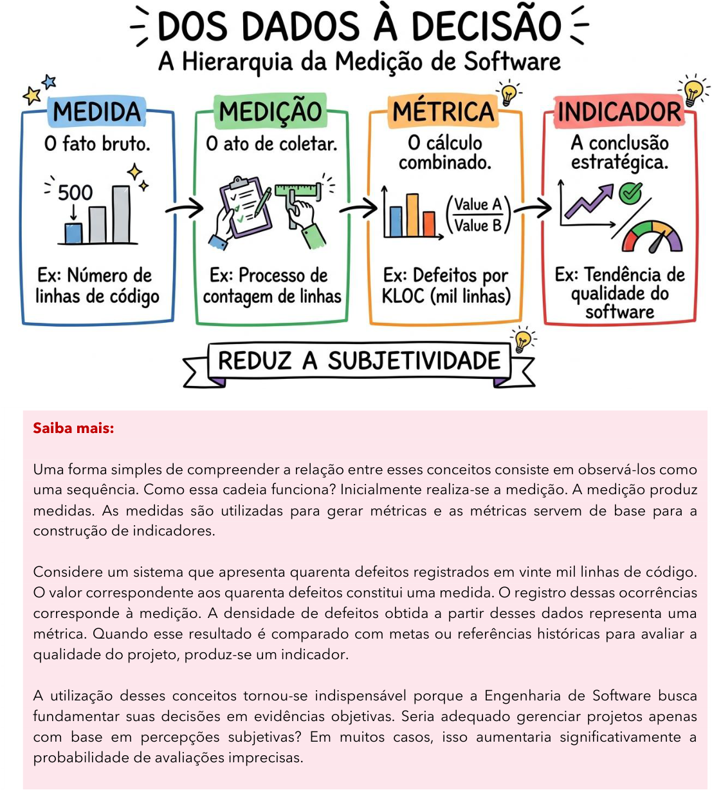


<!-- Start of picture text -->
Saiba mais:<br>Uma forma simples de compreender a relação entre esses conceitos consiste em observá-los como<br>uma sequência. Como essa cadeia funciona? Inicialmente realiza-se a medição. A medição produz<br>medidas. As medidas são utilizadas para gerar métricas e as métricas servem de base para a<br>construção de indicadores.<br>Considere um sistema que apresenta quarenta defeitos registrados em vinte mil linhas de código.<br>O valor correspondente aos quarenta defeitos constitui uma medida. O registro dessas ocorrências<br>corresponde à medição. A densidade de defeitos obtida a partir desses dados representa uma<br>métrica. Quando esse resultado é comparado com metas ou referências históricas para avaliar a<br>qualidade do projeto, produz-se um indicador.<br>A utilização desses conceitos tornou-se indispensável porque a Engenharia de Software busca<br>fundamentar suas decisões em evidências objetivas. Seria adequado gerenciar projetos apenas<br>com base em percepções subjetivas? Em muitos casos, isso aumentaria significativamente a<br>probabilidade de avaliações imprecisas.<br><!-- End of picture text -->

---

<!-- pagina: 7 -->

**Diego Carvalho, Equipe Informática 2 (Diego Carvalho), Equipe Informática 1 (Diego Carvalho) Aula 10** 

<mark>A coleta sistemática de dados permite acompanhar a evolução da qualidade, controlar custos, estimar prazos, monitorar produtividade e identificar riscos de maneira mais consistente. Além disso, nenhuma métrica isolada é capaz de representar todos os atributos de qualidade de um software, razão pela qual as organizações normalmente utilizam conjuntos de métricas voltados para</mark> confiabilidade, eficiência, manutenibilidade, segurança, portabilidade e satisfação dos usuários.

---

<!-- pagina: 8 -->

**Diego Carvalho, Equipe Informática 2 (Diego Carvalho), Equipe Informática 1 (Diego Carvalho) Aula 10** 


<!-- Start of picture text -->
Princípios de Medição<br><!-- End of picture text -->

##### **<mark>INCIDÊNCIA EM PROVA: BAIXÍSSIMA</mark>** 

A utilização de métricas em engenharia de software depende de um processo de medição estruturado e bem definido. Por que a simples coleta de números não é suficiente? Porque os dados somente adquirem significado quando são obtidos, analisados e interpretados dentro de um contexto adequado. Para isso, o processo de medição normalmente envolve cinco atividades principais: formulação, coleta, análise, interpretação e feedback. Essas etapas permitem transformar observações quantitativas em informações úteis para apoiar decisões relacionadas à qualidade e ao gerenciamento do software. 

Além do processo de medição, as próprias métricas precisam ser cuidadosamente definidas. O que torna uma métrica confiável? Entre os aspectos mais importantes estão a utilização de propriedades matemáticas consistentes, a adoção de escalas apropriadas e a capacidade de representar corretamente o atributo que se deseja medir. Dessa forma, espera-se que os valores obtidos variem de maneira coerente com as mudanças observadas nesse atributo, produzindo resultados compreensíveis e relevantes para a análise do software. 

Outro requisito importante é a validação empírica. Como saber se uma métrica realmente mede aquilo que se propõe a medir? Para responder a essa questão, é necessário observar seu comportamento em diferentes contextos de aplicação e verificar se existe relação consistente entre os valores produzidos e o atributo analisado. Esse processo contribui para aumentar a confiança na utilização da métrica como instrumento de apoio à tomada de decisões. 

As atividades de coleta e análise ocupam posição central nesse processo. Seria viável realizar todas essas tarefas manualmente? Em muitos casos, a automação é recomendada porque reduz erros, aumenta a eficiência e facilita a obtenção de grandes volumes de dados. Além disso, técnicas estatísticas podem ser empregadas para investigar relações entre atributos internos do software e características externas de qualidade. Para que os resultados sejam úteis, também é necessário definir critérios claros de interpretação, permitindo análises consistentes e alinhadas aos objetivos de gestão e melhoria contínua da qualidade. 

**(Instituto Mais / Prefeitura de S Parnaíba - 2022)** Existem diversas medidas de garantia de <mark>qualidade fundamentais para o sucesso de qualquer tipo de aplicação de software, dentre elas, uma das mais simples é a medição de software que</mark> 

<mark>a) ajuda na identificação de pontos positivos e falhos da organização, na tomada de decisão baseada em fatos e a prever melhor a entrega de produtos, assim como no ciclo da melhoria de processo.</mark> 

<mark>b) utiliza atributos observáveis, por exemplo, esforço, tamanho e custo e usa métricas indiretas ou derivadas, sendo que, sua aplicação normalmente é realizada em processos já maduros e controlados.</mark> 

<mark>c) envolve a coleta de requisitos em nível do sistema, com uma pequena quantidade de projeto e análise de alto nível.</mark> 

<mark>d) traduz os requisitos do software para um conjunto de representações que podem ser avaliadas quanto à qualidade, antes que a codificação se inicie.</mark> 

**<mark>_______________________</mark>** 

**<mark>Comentários:</mark>** <mark>(a) Correto. Medição de software serve justamente para dar base objetiva à gestão: mostra pontos fortes e fracos, apoia decisões com fatos, melhora estimativas de entrega e alimenta a melhoria contínua dos processos. (b) Errado. A alternativa mistura</mark>

---

<!-- pagina: 9 -->

**Diego Carvalho, Equipe Informática 2 (Diego Carvalho), Equipe Informática 1 (Diego Carvalho) Aula 10** 

<mark>conceitos de métricas e restringe a aplicação a processos maduros, mas a medição de software é mais ampla e útil em diferentes contextos organizacionais. (c) Errado. Aqui o foco está em levantamento de requisitos e análise inicial, não na medição de software como prática de garantia da qualidade. (d) Errado. Esse trecho descreve a atividade de projeto/modelagem do software antes da codificação,</mark> e não a medição de software propriamente dita (Letra A). 


<!-- Start of picture text -->
e não a medição de software propriamente dita (Letra A).<br><!-- End of picture text -->

---

<!-- pagina: 10 -->

**Diego Carvalho, Equipe Informática 2 (Diego Carvalho), Equipe Informática 1 (Diego Carvalho) Aula 10** 


<!-- Start of picture text -->
Paradigma GQM<br><!-- End of picture text -->

##### **<mark>INCIDÊNCIA EM PROVA: BAIXÍSSIMA</mark>** 

O Paradigma Meta/Questão/Métrica (Goal/Question/Metrics – GQM) foi desenvolvido para tornar os programas de medição mais direcionados e úteis. Por que essa abordagem foi proposta? Porque a simples coleta de grandes quantidades de dados não garante informações relevantes para a gestão. O GQM estabelece que toda iniciativa de medição deve começar pela definição de uma meta claramente relacionada a um produto, processo, recurso ou projeto. Somente após a definição dessa meta são determinadas as informações necessárias para avaliar seu alcance. 

A segunda etapa consiste na formulação das questões que orientam a investigação. Qual é a função dessas perguntas? Elas servem para transformar uma meta ampla em aspectos observáveis e verificáveis. Em vez de medir tudo o que está disponível, a abordagem procura identificar exatamente quais informações precisam ser obtidas para avaliar o atributo de interesse. Dessa forma, as perguntas funcionam como uma ponte entre os objetivos organizacionais e os dados que serão coletados. 

Somente após a definição das metas e questões são escolhidas as métricas. Por que essa ordem é importante? Porque ela reduz o risco de coletar informações sem utilidade prática. As métricas passam a ser selecionadas com base em sua capacidade de responder às perguntas formuladas anteriormente. Como consequência, os dados obtidos tornam-se mais relevantes para a análise e mais alinhados às necessidades de decisão da organização. 

O GQM também utiliza um modelo estruturado para a definição de metas. O que precisa ser especificado nessa definição? Normalmente são considerados o objeto analisado, o propósito da análise, o atributo avaliado, o ponto de vista adotado e o contexto em que a medição será realizada. Imagine uma situação em que se deseja avaliar a capacidade de evolução de uma arquitetura de software. Nesse caso, podem ser formuladas questões relacionadas à coesão, ao acoplamento e à complexidade dos componentes. As métricas selecionadas para medir esses atributos fornecerão dados quantitativos capazes de apoiar a avaliação e a tomada de decisões. 


---

<!-- pagina: 11 -->

**Diego Carvalho, Equipe Informática 2 (Diego Carvalho), Equipe Informática 1 (Diego Carvalho) Aula 10** 


<!-- Start of picture text -->
Classificações das Métricas<br><!-- End of picture text -->


<!-- Start of picture text -->
Quanto à Obtenção<br><!-- End of picture text -->

##### **<mark>INCIDÊNCIA EM PROVA: BAIXÍSSIMA</mark>** 

Após compreender os conceitos de medida, medição, métrica e indicador, surge uma nova etapa no estudo da medição de software: a organização das diversas métricas existentes. Por que essa organização é necessária? Porque a Engenharia de Software utiliza métricas para avaliar aspectos muito diferentes de um projeto. Algumas estão voltadas para características do produto desenvolvido, outras analisam processos, produtividade, qualidade do código ou comportamento do sistema durante sua execução. Sem uma estrutura de classificação, a seleção e a interpretação dessas métricas tornam-se mais difíceis. 

A diversidade de métricas reflete a própria complexidade dos projetos de software. O que exatamente pode ser medido? Dependendo do objetivo da análise, pode-se avaliar a qualidade dos requisitos, a estrutura da arquitetura, a produtividade, a ocorrência de defeitos, o desempenho do sistema ou a confiabilidade operacional. Cada uma dessas perspectivas exige métricas apropriadas, construídas para observar características específicas do ambiente de desenvolvimento ou do produto gerado. 

## **Métricas Diretas** 

#### **<mark>MÉTRICAS DIRETAS</mark>** 

As métricas diretas são aquelas obtidas por meio da observação, contagem ou medição direta de atributos do produto ou do processo de software, sem a necessidade de cálculos derivados. Exemplos incluem linhas de código, número de defeitos encontrados, esforço em horas de trabalho e quantidade de módulos. Essas métricas servem como base para o cálculo de métricas mais elaboradas e fornecem informações objetivas sobre características do projeto ou do software. 

As métricas utilizadas na Engenharia de Software podem ser classificadas de diferentes maneiras, e uma das distinções mais importantes envolve as métricas diretas e indiretas. O que caracteriza uma métrica direta? Trata-se de uma medida obtida por observação, contagem ou medição imediata de algum atributo do software, do processo ou do projeto, sem a necessidade de realizar cálculos adicionais ou combinar diferentes informações. Essas métricas representam os dados brutos coletados diretamente da realidade observada e servem como ponto de partida para análises mais elaboradas. 

Por que as métricas diretas são consideradas tão importantes? Porque elas fornecem informações objetivas e de fácil obtenção sobre os elementos avaliados. Em vez de depender de interpretações ou relacionamentos entre múltiplas variáveis, essas métricas registram características observáveis de maneira imediata. Dessa forma, constituem a matéria-prima utilizada na construção de métricas indiretas e indicadores gerenciais voltados ao acompanhamento da qualidade, da produtividade e do desempenho dos projetos. 

Dentre as principais métricas diretas, temos: Linhas de Código (LOC), Número de Módulos, Número de Classes, Número de Atributos, Número de Operações, Comprimento de Identificadores, MTTF, MTTR, Tempo de Resposta, Throughput, Uso de Recursos, Número de Scripts de Cenário, Número de ClassesChave, Número de Classes de Apoio e Número de Subsistemas. 

## **Métricas Indiretas** 

**<mark>MÉTRICAS INDIRETAS</mark>**

---

<!-- pagina: 12 -->

**Diego Carvalho, Equipe Informática 2 (Diego Carvalho), Equipe Informática 1 (Diego Carvalho) Aula 10** 

As métricas indiretas são obtidas a partir da combinação ou do processamento de uma ou mais medidas diretas. Elas procuram representar atributos mais abstratos da qualidade do software, como confiabilidade, produtividade, qualidade ou manutenibilidade. Exemplos incluem densidade de defeitos, Defect Removal Efficiency (DRE), índice de manutenibilidade e produtividade. Em geral, essas métricas fornecem informações mais relevantes para a tomada de decisões gerenciais. 

Nem todas as características relevantes de um software podem ser obtidas por meio de uma simples contagem ou observação direta. Como medir atributos como qualidade, confiabilidade ou manutenibilidade? Para responder a essa necessidade, a Engenharia de Software utiliza métricas indiretas. Essas métricas são construídas a partir da combinação ou interpretação de diferentes medidas básicas e procuram representar características mais complexas do produto, do processo ou do projeto. 

O que diferencia uma métrica indireta de uma métrica direta? Enquanto métricas diretas fornecem dados brutos, como linhas de código, quantidade de defeitos ou tempo de resposta, as métricas indiretas transformam essas informações em indicadores mais significativos. Dessa forma, tornam-se capazes de representar atributos que não podem ser observados imediatamente, oferecendo uma visão mais próxima das necessidades de gestão e avaliação da qualidade. 

**(IESES / FUNDESJ - 2019)** Considerando os tipos de métricas utilizadas na engenharia de software, <mark>assinale a alternativa que contém os tipos corretos:</mark> 

<mark>a) Métricas de produção de codificação e métricas de não conformidade ou erros. b) Métricas absolutas e métricas relativas.</mark> 

<mark>c) Métricas diretas e métricas indiretas.</mark> 

<mark>d) Métricas diretas, métricas indiretas, métricas orientadas a tamanho e, métricas orientadas por função.</mark> 

**<mark>_______________________</mark>** 

**<mark>Comentários:</mark>** <mark>(a) Errado. Essas categorias podem aparecer em contextos específicos de acompanhamento, mas não representam a classificação mais completa e consagrada dos tipos de métricas na engenharia de software. (b) Errado. Métricas absolutas e relativas são formas de expressão de valores, não a tipologia principal cobrada nesse tema. (c) Errado. Métricas diretas e indiretas fazem parte da classificação, mas a alternativa fica incompleta ao omitir as orientadas a tamanho e por função. (d) Correto. Essa alternativa traz o conjunto</mark> de tipos cobrados na engenharia de software: métricas diretas, indiretas, orientadas a tamanho e orientadas por função (Letra D). 

Entre os exemplos mais conhecidos encontram-se: Pontos de Função, Pontos de Casos de Uso, Complexidade Ciclomática, Fan-In/Fan-Out, Coesão, Acoplamento, Densidade de Defeitos, Coberturas de Testes, MTBF, Média de Classes de Apoio, Dívida Técnica, Métricas de Halstead, Razão Comentários/ Código, DRE, Taxa de Retrabalho e Produtividade. 


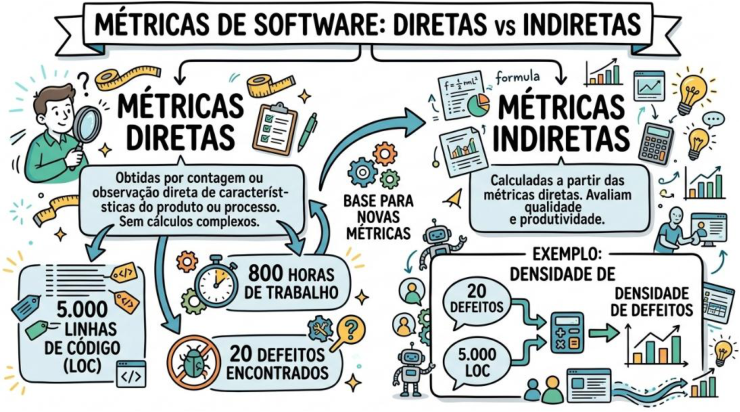

---

<!-- pagina: 13 -->

**Diego Carvalho, Equipe Informática 2 (Diego Carvalho), Equipe Informática 1 (Diego Carvalho) Aula 10** 


<!-- Start of picture text -->
Quanto à Coleta<br><!-- End of picture text -->

##### **<mark>INCIDÊNCIA EM PROVA: BAIXA</mark>** 

Outra forma bastante comum de classificar as métricas de software consiste em analisar o momento em que os dados são coletados, dando origem às chamadas métricas estáticas e métricas dinâmicas. Essa classificação leva em consideração se a avaliação é realizada sem a execução do software ou durante sua execução. Ambas as abordagens são importantes e complementares, pois permitem observar diferentes aspectos da qualidade e do comportamento de um sistema. 

## **Métricas Estáticas** 

#### **<mark>MÉTRICAS ESTÁTICAS</mark>** 

<mark>As métricas estáticas são calculadas sem a execução do software, utilizando informações provenientes do código-</mark> fonte, da documentação ou do projeto. Elas são empregadas para avaliar características estruturais do sistema, como tamanho, complexidade e organização do código. Exemplos incluem linhas de código, complexidade ciclomática, Fan-In/Fan-Out, acoplamento e coesão. 

A avaliação da qualidade de software não depende exclusivamente da execução do sistema. Como identificar problemas antes mesmo que o programa seja colocado em funcionamento? Para essa finalidade, a Engenharia de Software utiliza as métricas estáticas. Essas métricas são obtidas por meio da análise de artefatos produzidos durante o desenvolvimento, como código-fonte, diagramas, modelos e documentação técnica. Como não exigem a execução do software, elas podem ser aplicadas desde as fases iniciais do projeto. 

O que exatamente essas métricas procuram avaliar? Seu objetivo é analisar características internas do sistema, fornecendo informações sobre aspectos estruturais que podem influenciar a qualidade do produto final. Ao examinar elementos como organização do código, distribuição de responsabilidades e dependências entre componentes, torna-se possível identificar potenciais dificuldades de manutenção, compreensão e evolução do software antes mesmo da realização dos testes. 

Uma das principais vantagens das métricas estáticas está relacionada ao momento em que podem ser utilizadas. Seria necessário aguardar a conclusão do software para avaliar sua qualidade? Não. Como essas métricas dependem apenas dos artefatos produzidos durante o desenvolvimento, elas permitem identificar problemas potenciais de forma antecipada. Isso possibilita a realização de correções e melhorias quando os custos de modificação ainda são relativamente baixos. 

As métricas estáticas demonstram que a qualidade pode ser analisada antes mesmo da execução do sistema. Ao fornecer informações sobre tamanho, complexidade, modularidade e dependências estruturais, essas métricas auxiliam equipes técnicas na identificação de riscos e na melhoria contínua da qualidade interna do software, contribuindo para a construção de sistemas mais compreensíveis, manuteníveis e confiáveis. 

Dentre os exemplos mais conhecidos encontram-se: Pontos de Função, Pontos de Casos de Uso, Linhas de Código (LOC), Número de Módulos, Número de Classes, Número de Atributos, Número de Operações, Complexidade Ciclomática, Fan-In/Fan-Out, Coesão, Acoplamento, Índice de Fog, Comprimento de Identificadores, Número de Scripts de Cenário, Número de Classes-Chave, Número de Classes de Apoio, Número Médio de Classes de Apoio por Classe-Chave, Número de Subsistemas, Duplicação de Código, Dívida Técnica, Violações de Estilo e Padrões, Métricas de Halstead e Razão Comentários/Código.

---

<!-- pagina: 14 -->

**Diego Carvalho, Equipe Informática 2 (Diego Carvalho), Equipe Informática 1 (Diego Carvalho) Aula 10** 


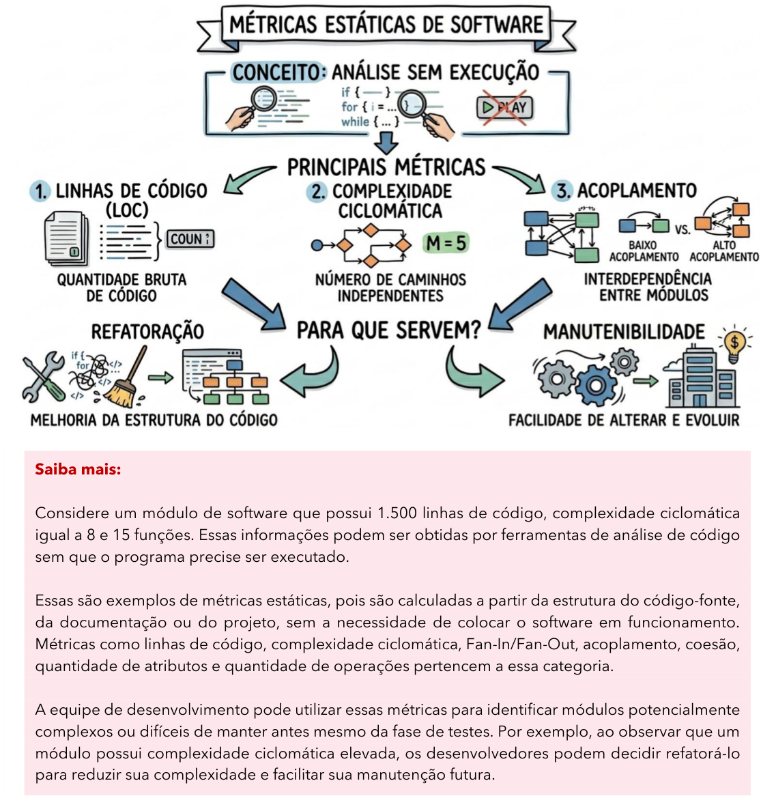


<!-- Start of picture text -->
Saiba mais:<br>Considere um módulo de software que possui 1.500 linhas de código, complexidade ciclomática<br>igual a 8 e 15 funções. Essas informações podem ser obtidas por ferramentas de análise de código<br>sem que o programa precise ser executado.<br>Essas são exemplos de métricas estáticas, pois são calculadas a partir da estrutura do código-fonte,<br>da documentação ou do projeto, sem a necessidade de colocar o software em funcionamento.<br>Métricas como linhas de código, complexidade ciclomática, Fan-In/Fan-Out, acoplamento, coesão,<br>quantidade de atributos e quantidade de operações pertencem a essa categoria.<br>A equipe de desenvolvimento pode utilizar essas métricas para identificar módulos potencialmente<br>complexos ou difíceis de manter antes mesmo da fase de testes. Por exemplo, ao observar que um<br>módulo possui complexidade ciclomática elevada, os desenvolvedores podem decidir refatorá-lo<br>para reduzir sua complexidade e facilitar sua manutenção futura.<br><!-- End of picture text -->

## **Métricas Dinâmicas** 

#### **<mark>MÉTRICAS DINÂMICAS</mark>** 

<mark>As métricas dinâmicas são obtidas basicamente durante a execução do software e refletem seu comportamento</mark> em operação. Elas permitem avaliar aspectos como desempenho, confiabilidade e utilização de recursos computacionais. Exemplos incluem tempo de resposta, disponibilidade, consumo de memória, MTTF, MTBF e MTTR.

---

<!-- pagina: 15 -->

**Diego Carvalho, Equipe Informática 2 (Diego Carvalho), Equipe Informática 1 (Diego Carvalho) Aula 10** 

As métricas dinâmicas permitem avaliar características que somente podem ser observadas quando o software está em funcionamento. Como compreender o comportamento real de um sistema durante sua utilização? Para responder a essa questão, a Engenharia de Software utiliza métricas obtidas durante a execução da aplicação, seja em ambientes de teste, homologação ou produção. Essas medidas fornecem informações sobre desempenho, confiabilidade, disponibilidade e utilização dos recursos computacionais. 

O que diferencia uma métrica dinâmica de uma métrica estática? Enquanto as métricas estáticas analisam artefatos como código-fonte, diagramas e documentação sem executar o sistema, as métricas dinâmicas dependem da observação do software em operação. Dessa forma, elas permitem avaliar como a aplicação realmente se comporta diante das cargas de trabalho, das interações dos usuários e das condições encontradas em ambiente de execução. 

As métricas dinâmicas desempenham papel fundamental na avaliação da qualidade externa do software. Por que essa perspectiva é tão importante? Porque um sistema pode apresentar excelente estrutura interna e, ainda assim, revelar problemas apenas quando entra em operação. Ao analisar o comportamento observado durante a execução, essas métricas fornecem informações valiosas sobre desempenho, confiabilidade e experiência dos usuários, permitindo identificar oportunidades de melhoria que dificilmente seriam percebidas apenas por meio da análise estática dos artefatos do sistema. 

Dentre os exemplos mais conhecidos, temos: Densidade de Defeitos, Cobertura de Instruções, Cobertura de Decisões, Cobertura Funcional, Cobertura Modular, Cobertura de Código, MTTF (Mean Time To Failure), MTBF (Mean Time Between Failures), MTTR (Mean Time To Repair), Tempo de Resposta, Throughput, Uso de Recursos, DRE (Defect Removal Efficiency), Taxa de Retrabalho e Produtividade. 

**(FGV / Prefeitura de Cuiabá - 2024)** A qualidade de um software está diretamente relacionada à <mark>sua eficiência e confiabilidade, bem como a sua complexidade e sua facilidade de manutenção. Os procedimentos utilizados para quantificar a qualidade de um produto são as métricas, que podem ser estáticas ou dinâmicas. Uma métrica dinâmica muito utilizada para medir a qualidade de um software consiste em medir</mark> 

<mark>a) o tempo necessário para inicialização.</mark> 

<mark>b) o tamanho do código de um componente do software.</mark> 

<mark>c) a complexidade ciclomática, ou seja, a complexidade de controle do código do software. d) a profundidade das declarações condicionais aninhadas no código do software. e) o número de funções que chamam outras funções no código do software.</mark> 

**<mark>_______________________</mark>** 

**<mark>Comentários:</mark>** <mark>(a) Correto. Tempo de inicialização é obtido durante a execução do software, sendo exemplo de métrica dinâmica ligada ao desempenho percebido. (b) Errado. Tamanho do código é medido pela estrutura do programa, sem necessidade de executá-lo, caracterizando métrica estática. (c) Errado. Complexidade ciclomática avalia o fluxo de controle do código-fonte, sendo classificada como métrica estática. (d) Errado. Profundidade de condicionais aninhadas é extraída da análise do código, sem execução, logo é métrica estática. (e) Errado. Número de funções que chamam outras funções decorre da estrutura de chamadas do código, também sem</mark> execução, portanto estática (Letra A). 

Atenção: algumas métricas podem aparecer em classificações diferentes dependendo do autor: Densidade de Defeitos, DRE, Taxa de Retrabalho e Produtividade são frequentemente classificadas como métricas de processo e não como estáticas ou dinâmicas de produto; Densidade de Defeitos pode ser considerada dinâmica porque depende da descoberta de defeitos durante testes ou operação; e

---

<!-- pagina: 16 -->

**Diego Carvalho, Equipe Informática 2 (Diego Carvalho), Equipe Informática 1 (Diego Carvalho) Aula 10** 

Produtividade e Taxa de Retrabalho são obtidas a partir da observação da execução do processo de desenvolvimento, sendo normalmente tratadas como dinâmicas. 

### **Saiba mais:** 

<mark>Considere um sistema de comércio eletrônico que foi colocado em funcionamento durante um período de testes. Ao longo de uma semana de operação, observou-se que o sistema apresentou 2 falhas, permaneceu disponível por 99,8% do tempo e respondeu às requisições dos usuários em um tempo médio de 0,8 segundo.</mark> 

<mark>Essas informações são exemplos de métricas dinâmicas, pois só podem ser obtidas quando o software está em execução. Diferentemente das métricas estáticas, que analisam o código-fonte sem executá-lo, as métricas dinâmicas avaliam o comportamento real do sistema durante sua operação.</mark> ==5460== 

<mark>Métricas como MTTF (Tempo Médio até a Falha), MTBF (Tempo Médio entre Falhas), MTTR (Tempo Médio de Reparo), disponibilidade, tempo de resposta, consumo de memória e utilização de CPU são exemplos de métricas dinâmicas. Elas permitem avaliar atributos de qualidade como</mark> confiabilidade, desempenho e eficiência operacional do software em condições reais de uso. 


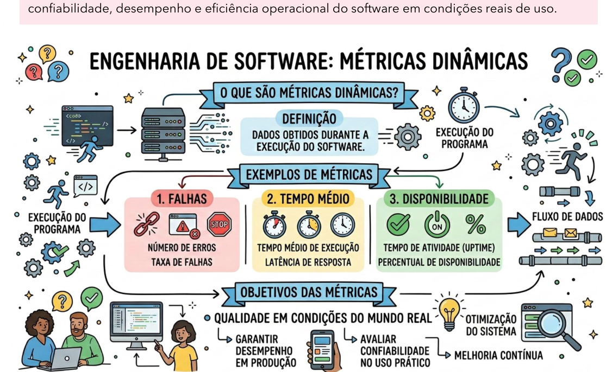


<!-- Start of picture text -->
confiabilidade, desempenho e eficiência operacional do software em condições reais de uso.<br><!-- End of picture text -->

---

<!-- pagina: 17 -->

**Diego Carvalho, Equipe Informática 2 (Diego Carvalho), Equipe Informática 1 (Diego Carvalho) Aula 10** 


<!-- Start of picture text -->
Quanto ao Objeto<br><!-- End of picture text -->

##### **<mark>INCIDÊNCIA EM PROVA: BAIXÍSSIMA</mark>** 

A Engenharia de Software utiliza uma grande variedade de métricas para apoiar a gestão da qualidade e o acompanhamento dos projetos. Como organizar tantas medidas diferentes? Uma das classificações mais tradicionais divide as métricas em três categorias principais: métricas de produto, métricas de processo e métricas de projeto. Cada grupo possui objetivos específicos e fornece informações voltadas para diferentes aspectos do desenvolvimento de software. 

A classificação entre métricas de produto, processo e projeto demonstra que a medição pode apoiar diferentes níveis de gestão. O que cada categoria procura responder? As métricas de produto ajudam a compreender a qualidade dos artefatos produzidos; as métricas de processo avaliam a eficiência das práticas utilizadas pela organização; e as métricas de projeto fornecem informações para controlar e acompanhar a execução de trabalhos específicos. Em conjunto, essas perspectivas permitem transformar dados em conhecimento útil para a melhoria contínua do software e dos processos de desenvolvimento. 

## **Produto** 

As métricas de produto concentram-se nos artefatos produzidos durante o desenvolvimento. O que exatamente elas procuram avaliar? Seu objetivo é medir características observáveis e mensuráveis dos produtos gerados ao longo do projeto, incluindo requisitos, modelos, arquitetura, código-fonte, documentação e testes. Essas métricas ajudam a compreender aspectos relacionados à qualidade, à complexidade, à manutenibilidade, ao desempenho e à confiabilidade do software. 

Por que as métricas de produto são importantes? Porque elas fornecem informações objetivas sobre aquilo que está sendo construído. Ao analisar atributos específicos dos artefatos produzidos, torna-se possível identificar problemas de qualidade ainda durante o desenvolvimento e adotar medidas corretivas antes que esses problemas gerem impactos mais significativos no projeto ou no produto final. Entre as métricas de produto mais importantes, temos: Linhas de Código, Complexidade Ciclomática, Fan-In/Fan-Out, Coesão e Acoplamento, Densidade de Defeitos, Tempo de Resposta, Disponibilidade, Throughput, Uso de Recursos, Profundidade de Aninhamento Condicional, Índice de Precisão e Revocação, MTTF e MTBF. 

## **Processo** 

As métricas de processo analisam uma perspectiva diferente. Em vez de avaliar o software produzido, o que elas procuram medir? Seu foco está nos métodos, atividades e práticas utilizados para desenvolver o sistema. Essas métricas são coletadas ao longo de diversos projetos e permitem identificar tendências relacionadas à produtividade, à qualidade e à eficiência dos processos organizacionais. 

Como essas informações contribuem para a melhoria contínua? Ao acompanhar indicadores históricos, a organização consegue verificar se seus processos estão evoluindo, se a quantidade de defeitos está diminuindo ou se a produtividade das equipes está aumentando. Dessa forma, as métricas de processo fornecem evidências que apoiam iniciativas de aperfeiçoamento e ajudam a tornar o desenvolvimento mais previsível e eficiente. Dentre as métricas de processo mais importantes, temos: MTTR e DRE (Defect Removal Efficency), Cobertura de Testes, Taxa de Detecção de Defeitos, Taxa de Correção de Defeitos, Produtividade, Taxa de Retrabalho, Tempo Médio de Desenvolvimento, entre outros.

---

<!-- pagina: 18 -->

**Diego Carvalho, Equipe Informática 2 (Diego Carvalho), Equipe Informática 1 (Diego Carvalho) Aula 10** 

**(VUNESP / TJM SP - 2021)** Considerando-se as métricas de processo de software, é correto afirmar <mark>que um de seus objetivos é</mark> 

<mark>a) avaliar o estado de um projeto em andamento.</mark> 

<mark>b) obter indicadores que levem ao aperfeiçoamento de processos do software. c) ajustar o fluxo de trabalho das equipes de desenvolvimento. d) avaliar a capacidade da equipe de projeto.</mark> 

<mark>e) detectar áreas problemáticas no projeto.</mark> 

**<mark>_______________________ Comentários:</mark>** <mark>(a) Errado. Avaliar o estado de um projeto em andamento está mais ligado ao acompanhamento do projeto do que ao foco principal das métricas de processo. (b) Correto. Métricas de processo servem justamente para gerar indicadores que ajudem a melhorar e aperfeiçoar os processos de desenvolvimento de software. (c) Errado. Ajustar o fluxo de trabalho pode até ser uma consequência, mas não é o objetivo central das métricas de processo. (d) Errado. Avaliar a capacidade da equipe diz mais respeito a desempenho de pessoas do que à medição e melhoria do processo. (e) Errado. Detectar áreas problemáticas no projeto se relaciona</mark> mais ao controle do projeto, não ao objetivo principal das métricas de processo (Letra B). 

É importante mencionar que a coleta meticulosa de métricas — especialmente o rastreio manual, acompanhamento e registro de defeitos complexos na linha do tempo — introduz gargalos processuais e custos invisíveis. Embora útil para o longo prazo, a implantação densa dessas métricas frequentemente gera conflito com os pilares das metodologias ágeis (Ex: Scrum e XP), as quais desencorajam a manutenção e a medição extenuante de processos intermediários e burocráticos que não reflitam entrega direta de valor para o cliente final. 

## **Projeto** 

As métricas de projeto possuem um propósito mais imediato. O que elas procuram acompanhar? Seu objetivo é avaliar o estado atual de um projeto específico, fornecendo informações sobre cronograma, custos, esforço, produtividade, utilização de recursos e riscos. Essas métricas auxiliam gerentes e equipes na tomada de decisões durante a execução do trabalho e permitem identificar desvios antes que eles comprometam os resultados planejados. 

Seria correto afirmar que essas categorias são completamente independentes? Nem sempre. Algumas métricas podem ser utilizadas sob perspectivas diferentes dependendo do objetivo da análise. O número de defeitos encontrados, por exemplo, pode ser empregado para avaliar a qualidade do produto, monitorar a situação de um projeto ou analisar a eficiência de um processo organizacional. Por esse motivo, a interpretação da métrica depende do contexto em que ela é utilizada. Dentre as métricas de processo mais importantes, temos: Quantidade de Mudanças por Versão, Custo do Projeto, Prazo de Desenvolvimento, Quantidade de Riscos Identificados, Taxa de Cumprimento de Marcos, entre outros. 

|**CATEGORIAS**|**O QUE AVALIA?**|**OBJETIVO PRINCIPAL**|**EXEMPLOS DE MÉTRICAS**|
|---|---|---|---|
|**PRODUTO**|Artefatos produzidos<br>durante o<br>desenvolvimento, como<br>requisitos, modelos,<br>arquitetura, código-<br>fonte, documentação e<br>testes.|Avaliar características<br>do software, como<br>qualidade,<br>complexidade,<br>manutenibilidade,<br>desempenho e<br>confiabilidade.|Linhas de Código (LOC), Complexidade<br>Ciclomática, Fan-In/Fan-Out, Coesão,<br>Acoplamento, Densidade de Defeitos,<br>Tempo de Resposta, Throughput, Uso de<br>Recursos, MTTF, MTBF, Disponibilidade,<br>Índice de Precisão e Revocação.|
|**PROCESSO**|Métodos, atividades e<br>práticas utilizados para<br>desenvolver e manter o<br>software.|Avaliar a eficiência, a<br>qualidade e a<br>produtividade dos<br>processos<br>organizacionais,|DRE (Defect Removal Efficiency), MTTR,<br>Cobertura de Testes, Taxa de Detecção de<br>Defeitos, Taxa de Correção de Defeitos,<br>Produtividade, Taxa de Retrabalho,<br>Tempo Médio de Desenvolvimento.|

---

<!-- pagina: 19 -->

**Diego Carvalho, Equipe Informática 2 (Diego Carvalho), Equipe Informática 1 (Diego Carvalho) Aula 10** 

|**CATEGORIAS**<br>**PROJETO**|**O QUE AVALIA?**<br>Estado e desempenho<br>de um projeto<br>específico em execução.|**OBJETIVO PRINCIPAL**<br>apoiando iniciativas de<br>melhoria contínua.<br>Apoiar o planejamento,<br>monitoramento e<br>controle de<br>cronograma, custos,<br>esforço, recursos e<br>riscos.|**EXEMPLOS DE MÉTRICAS**<br>Quantidade de Mudanças por Versão,<br>Custo do Projeto, Prazo de<br>Desenvolvimento, Quantidade de Riscos<br>Identificados, Taxa de Cumprimento de<br>Marcos, Esforço, Valor Agregado.|
|---|---|---|---|


### **Saiba mais:** 

<mark>Uma forma simples de entender a diferença entre métricas de produto, métricas de processo e métricas de projeto é imaginar uma equipe desenvolvendo um sistema de vendas para uma empresa.</mark> 

<mark>As métricas de produto avaliam características do software que está sendo construído (“Como está o software?”). Elas medem atributos do código-fonte ou do sistema resultante.</mark> 

<mark>Por exemplo, ao analisar um módulo de emissão de notas fiscais, a equipe verifica que ele possui 1.500 linhas de código (LOC), complexidade ciclomática igual a 12 e densidade de defeitos de 0,8 defeito por mil linhas de código. Todas essas informações descrevem o próprio produto de software. Em outras palavras, as métricas de produto respondem à pergunta: "Qual é a qualidade ou complexidade do software?"</mark> 

<mark>As métricas de processo avaliam a eficiência das atividades utilizadas para produzir o software ("Como estamos desenvolvendo o software?"). O foco não é o sistema em si, mas o método de trabalho adotado pela equipe.</mark> 

<mark>Suponha que, durante os testes, tenham sido encontrados 100 defeitos. Desses, 90 foram identificados e corrigidos antes da entrega ao cliente. Nesse caso, a equipe obteve um DRE (Defect Removal Efficiency) de 90%. Outra métrica poderia mostrar que o tempo médio para corrigir um defeito é de 4 horas. Essas medidas ajudam a avaliar a qualidade do processo de desenvolvimento e respondem à pergunta: "Quão eficiente é a forma como produzimos o software?"</mark> 

<mark>As métricas de projeto acompanham aspectos gerenciais relacionados a prazo, custo, esforço e progresso do desenvolvimento ("Como está o andamento do trabalho?").</mark> 

<mark>Imagine que o projeto foi planejado para durar seis meses, com orçamento de R$ 500 mil. Após três meses de trabalho, a equipe concluiu apenas 40% das funcionalidades previstas, embora o cronograma indicasse que 50% já deveriam estar prontas. Além disso, já foram gastos R$ 300 mil do orçamento. Essas informações constituem métricas de projeto porque ajudam os gestores a controlar cronograma, custos e produtividade. Elas respondem à pergunta: "O projeto está</mark> caminhando conforme o planejado?".

---

<!-- pagina: 20 -->

**Diego Carvalho, Equipe Informática 2 (Diego Carvalho), Equipe Informática 1 (Diego Carvalho) Aula 10** 


---

<!-- pagina: 21 -->

**Diego Carvalho, Equipe Informática 2 (Diego Carvalho), Equipe Informática 1 (Diego Carvalho) Aula 10** 


<!-- Start of picture text -->
Métricas de Produto<br><!-- End of picture text -->


<!-- Start of picture text -->
Métricas de Tamanho<br><!-- End of picture text -->

##### **<mark>INCIDÊNCIA EM PROVA: ALTA</mark>** 

As métricas de tamanho procuram quantificar a dimensão de um produto de software por meio de medidas relacionadas à sua extensão funcional ou física. Elas fornecem uma indicação do porte do sistema e servem como base para estimativas de esforço, prazo, custo e produtividade. Entre os exemplos mais comuns estão Linhas de Código (LOC), Pontos de Função, número de módulos, número de classes, número de atributos e número de operações. 

## **Pontos de Função** 

#### **<mark>PONTOS DE FUNÇÃO</mark>** 

<mark>Métrica orientada à funcionalidade utilizada para medir o tamanho de um software com base nas funcionalidades</mark> entregues ao usuário, independentemente da linguagem de programação, da tecnologia ou da forma de implementação adotada. Seu cálculo considera elementos como entradas externas, saídas externas, consultas externas, arquivos lógicos internos e interfaces externas, permitindo quantificar a complexidade funcional do sistema. 

A Análise por Pontos de Função é uma técnica utilizada para medir o tamanho funcional de um software a partir daquilo que o usuário percebe e utiliza. Por que essa abordagem é importante? Porque o objetivo não é avaliar a tecnologia empregada nem a quantidade de código produzida, mas sim as funcionalidades efetivamente disponibilizadas pelo sistema. Dessa forma, a métrica permanece válida mesmo quando diferentes linguagens de programação, plataformas ou arquiteturas são utilizadas para implementar a mesma solução. 

Para realizar essa medição, a metodologia considera cinco tipos de componentes funcionais: Entradas Externas, Saídas Externas, Consultas Externas, Arquivos Lógicos Internos e Arquivos de Interface Externa. O que diferencia esses componentes entre si? Cada um representa uma forma distinta de interação ou armazenamento de informações dentro do sistema. Além disso, a metodologia atribui pesos conforme a complexidade funcional identificada em cada componente, seguindo critérios definidos pelas regras da própria técnica. 

Uma característica relevante dos Pontos de Função é sua independência em relação à implementação técnica. Imagine dois sistemas desenvolvidos em linguagens completamente diferentes. Eles terão o mesmo tamanho? A resposta depende das funcionalidades oferecidas aos usuários. Se ambos atenderem ao mesmo conjunto de requisitos funcionais, a quantidade de Pontos de Função tende a ser semelhante, ainda que o volume de código, a estrutura interna e as tecnologias utilizadas sejam bastante diferentes. 

Essa característica torna a métrica especialmente útil em atividades de planejamento e estimativa. Em que momento ela se torna mais valiosa? Frequentemente nas fases iniciais do projeto, quando ainda não existe software implementado. Como a contagem é baseada nos requisitos funcionais do usuário, tornase possível estimar prazo, custo, esforço e produtividade antes do início da construção do sistema, desde que o escopo funcional já esteja suficientemente definido. 

Por fim, é possível encontrar a métrica de Pontos de Função sendo classificada como uma Métrica de Função ou como uma Métrica de Requisitos.

---

<!-- pagina: 22 -->

**Diego Carvalho, Equipe Informática 2 (Diego Carvalho), Equipe Informática 1 (Diego Carvalho) Aula 10** 


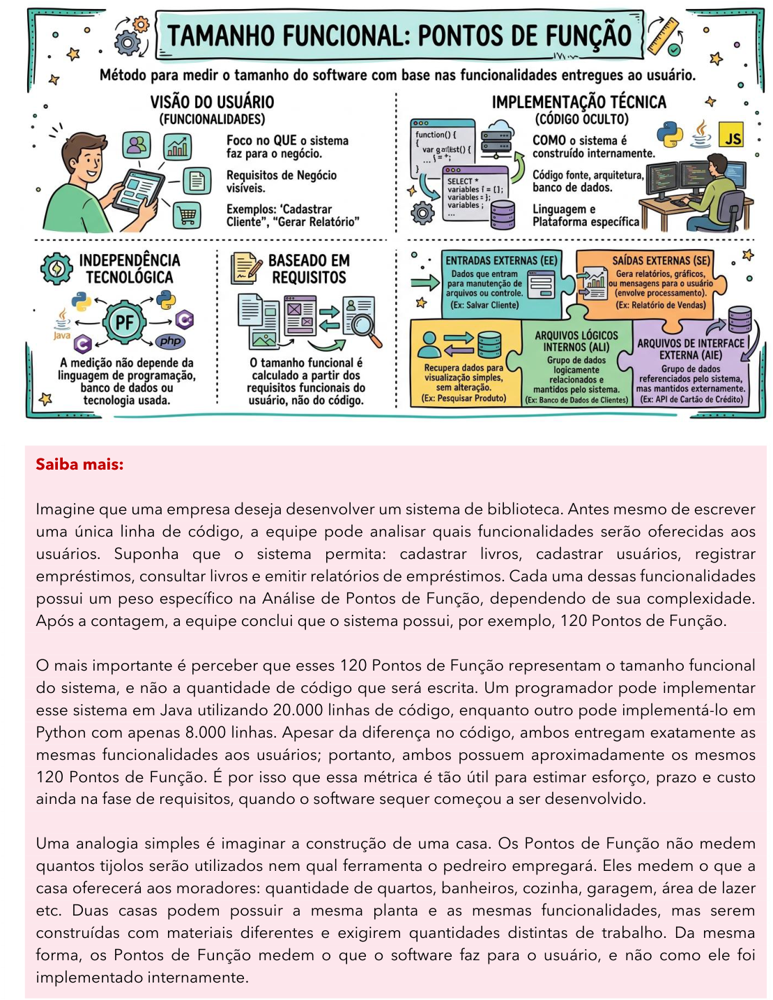


<!-- Start of picture text -->
Saiba mais:<br>Imagine que uma empresa deseja desenvolver um sistema de biblioteca. Antes mesmo de escrever<br>uma única linha de código, a equipe pode analisar quais funcionalidades serão oferecidas aos<br>usuários. Suponha que o sistema permita: cadastrar livros, cadastrar usuários, registrar<br>empréstimos, consultar livros e emitir relatórios de empréstimos. Cada uma dessas funcionalidades<br>possui um peso específico na Análise de Pontos de Função, dependendo de sua complexidade.<br>Após a contagem, a equipe conclui que o sistema possui, por exemplo, 120 Pontos de Função.<br>O mais importante é perceber que esses 120 Pontos de Função representam o tamanho funcional<br>do sistema, e não a quantidade de código que será escrita. Um programador pode implementar<br>esse sistema em Java utilizando 20.000 linhas de código, enquanto outro pode implementá-lo em<br>Python com apenas 8.000 linhas. Apesar da diferença no código, ambos entregam exatamente as<br>mesmas funcionalidades aos usuários; portanto, ambos possuem aproximadamente os mesmos<br>120 Pontos de Função. É por isso que essa métrica é tão útil para estimar esforço, prazo e custo<br>ainda na fase de requisitos, quando o software sequer começou a ser desenvolvido.<br>Uma analogia simples é imaginar a construção de uma casa. Os Pontos de Função não medem<br>quantos tijolos serão utilizados nem qual ferramenta o pedreiro empregará. Eles medem o que a<br>casa oferecerá aos moradores: quantidade de quartos, banheiros, cozinha, garagem, área de lazer<br>etc. Duas casas podem possuir a mesma planta e as mesmas funcionalidades, mas serem<br>construídas com materiais diferentes e exigirem quantidades distintas de trabalho. Da mesma<br>forma, os Pontos de Função medem o que o software faz para o usuário, e não como ele foi<br>implementado internamente.<br><!-- End of picture text -->

---

<!-- pagina: 23 -->

**Diego Carvalho, Equipe Informática 2 (Diego Carvalho), Equipe Informática 1 (Diego Carvalho) Aula 10** 

**(IBADE / Prefeitura de Vila Velha - 2020)** A evolução de um projeto, baseada na visão do usuário <mark>dos objetivos alcançados, é a base para uma métrica chamada:</mark> 

<mark>a) Número de linhas de código.</mark> 

<mark>b) Quantidade de homens/hora.</mark> 

<mark>c) Evolução Sistêmica.</mark> 

<mark>d) Pontos de função.</mark> 

<mark>e) Time Sheet.</mark> 

**<mark>_______________________ Comentários:</mark>** <mark>(a) Errado. Número de linhas de código mede tamanho técnico do software, não a evolução do projeto pela ótica do usuário. (b) Errado. Homens/hora mede esforço de trabalho da equipe, e não os objetivos entregues percebidos pelo usuário. (c) Errado. “Evolução Sistêmica” não é a métrica consagrada para avaliar funcionalidades entregues com foco no usuário. (d) Correto. Pontos de função medem o sistema com base nas funcionalidades percebidas pelo usuário, alinhando-se à evolução do projeto pelos objetivos alcançados. (e) Errado. Time Sheet serve para registrar tempo gasto em atividades, não para medir evolução do projeto sob a visão do</mark> usuário (Letra D). 

## **Pontos de Casos de Uso** 

#### **<mark>PONTOS DE CASOS DE USO</mark>** 

Métrica de tamanho funcional utilizada para estimar o esforço, o custo e o prazo de desenvolvimento de um software a partir de seus casos de uso. Essa técnica considera a quantidade e a complexidade dos atores e dos casos de uso identificados nos requisitos, além de fatores técnicos e ambientais que podem influenciar o projeto, como desempenho, experiência da equipe e restrições tecnológicas. 

Os casos de uso são amplamente utilizados para descrever requisitos sob a perspectiva dos usuários e das necessidades do negócio. Por que eles também despertam interesse como instrumento de medição? Porque são definidos logo nas fases iniciais do desenvolvimento e representam funcionalidades que o sistema deverá oferecer. Essa característica permite que sejam utilizados em atividades de estimativa antes mesmo do início da implementação ou da modelagem detalhada da solução. 

Outra característica importante é sua independência em relação à tecnologia utilizada. O que isso significa? Significa que um caso de uso descreve o comportamento esperado do sistema sem depender da linguagem de programação ou da plataforma escolhida para a implementação. Por essa razão, os casos de uso podem servir como referência para avaliar tamanho funcional e apoiar estimativas de esforço, prazo e recursos necessários para o desenvolvimento. 

Entretanto, a utilização dos casos de uso como medida apresenta algumas limitações. Seria correto assumir que todos possuem o mesmo tamanho? Não. Um caso de uso pode representar uma funcionalidade simples, enquanto outro pode envolver diversos fluxos alternativos, regras de negócio e interações complexas. Como consequência, a simples contagem de casos de uso nem sempre reflete adequadamente o tamanho ou a complexidade de um sistema. 

Essa diferença de granularidade afeta diretamente sua utilização como medida de normalização. Como comparar projetos utilizando apenas a quantidade de casos de uso? Essa comparação pode ser imprecisa quando os casos apresentam níveis de abstração distintos. Por esse motivo, abordagens mais sofisticadas procuram considerar fatores de complexidade associados aos casos de uso, permitindo estimativas mais consistentes e representativas das características reais do software em desenvolvimento. 

Os Pontos de Casos de Uso (Use Case Points – UCP) são uma métrica de tamanho de software utilizada para estimar o esforço, o custo e o prazo de desenvolvimento a partir dos casos de uso definidos nos requisitos do sistema. A técnica considera a quantidade e a complexidade dos atores e dos casos de uso,

---

<!-- pagina: 24 -->

**Diego Carvalho, Equipe Informática 2 (Diego Carvalho), Equipe Informática 1 (Diego Carvalho) Aula 10** 

além de fatores técnicos e ambientais que podem influenciar o projeto, como desempenho, reutilização, experiência da equipe e restrições tecnológicas. 

Dessa forma, os Pontos de Casos de Uso procuram medir o tamanho funcional do software sob a perspectiva das interações entre usuários e sistema, permitindo realizar estimativas ainda nas fases iniciais do desenvolvimento, quando normalmente não existem detalhes suficientes para aplicar métricas baseadas em código-fonte ou implementação. Lembrando que essa métrica também pode ser analisada em uma categoria separada de Métricas de Casos de Uso. 

### **Saiba mais:** 

<mark>Imagine que uma empresa deseja desenvolver um sistema de biblioteca. Durante o levantamento de requisitos, foram identificados três atores principais: Bibliotecário, Aluno e Administrador. Também foram definidos alguns casos de uso, como Cadastrar Livro, Cadastrar Usuário, Realizar Empréstimo, Registrar Devolução e Emitir Relatórios. Antes mesmo da implementação do sistema, a equipe pode utilizar a técnica de Pontos de Casos de Uso (UCP) para estimar o tamanho do projeto. Para isso, são atribuídos pesos aos atores e aos casos de uso de acordo com sua complexidade, obtendo-se uma pontuação inicial que representa o tamanho funcional da aplicação.</mark> 

<mark>Suponha que, após a análise, o sistema obtenha 120 Pontos de Casos de Uso. Com base em dados históricos da organização, sabe-se que cada ponto de caso de uso exige, em média, 20 horas de trabalho. Assim, a equipe pode estimar um esforço aproximado de 2.400 horas (120</mark> <mark>`×` 20) para o desenvolvimento do sistema. Dessa forma, os Pontos de Casos de Uso permitem realizar estimativas de esforço, prazo e custo ainda nas fases iniciais do projeto, quando normalmente existem apenas os requisitos e os diagramas de casos de uso, mas ainda não há modelos detalhados de projeto ou</mark> código-fonte desenvolvido. 


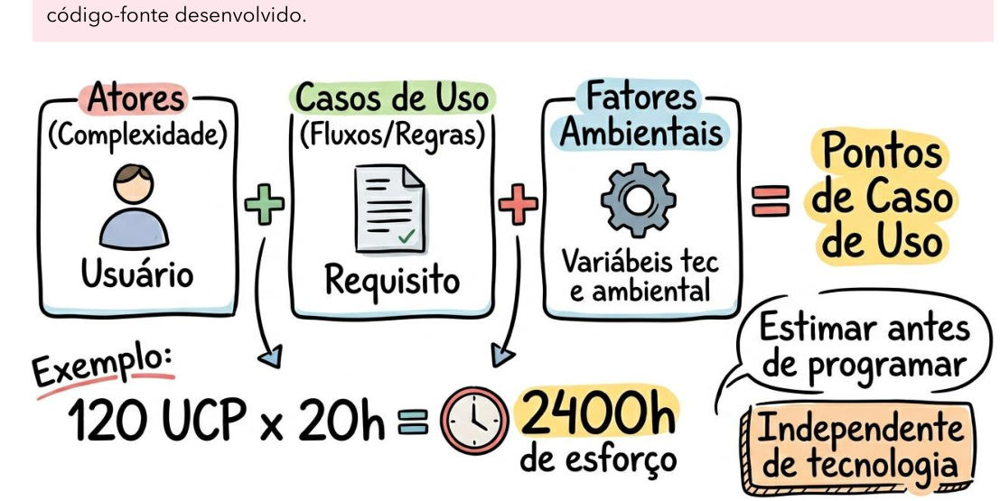


<!-- Start of picture text -->
código-fonte desenvolvido.<br><!-- End of picture text -->

---

<!-- pagina: 25 -->

**Diego Carvalho, Equipe Informática 2 (Diego Carvalho), Equipe Informática 1 (Diego Carvalho) Aula 10** 

## **Linhas de Código** 

#### **<mark>LINHAS DE CÓDIGO</mark>** 

A métrica de Linhas de Código (Lines of Code – LOC) mede o tamanho de um programa por meio da contagem das linhas presentes no código-fonte. Embora não avalie diretamente a qualidade do software, é frequentemente utilizada como indicador de complexidade, esforço de desenvolvimento e propensão a defeitos. Módulos <mark>maiores tendem a demandar mais testes e manutenção.</mark> 

A métrica de Linhas de Código está entre as medidas mais tradicionais da Engenharia de Software. Por que ela se tornou tão popular ao longo dos anos? Porque sua obtenção é relativamente simples e porque praticamente todo projeto de desenvolvimento produz código-fonte que pode ser contabilizado. Além disso, diversos modelos de estimativa utilizam a quantidade de linhas de código como base para cálculos relacionados a esforço, produtividade, custo e qualidade, o que contribuiu para sua ampla adoção na indústria e na literatura especializada. 

**(IBFC / EBSERH-HUUFMA - 2013)** Em métricas de software um termo recorrente é a sigla em inglês <mark>LOC. O principal significado dessa sigla é:</mark> 

<mark>a) medir o tamanho de um programa ou sistema usando o número de linhas de código fonte. b) quantidade de tempo de processamento de CPU para processar o código fonte do sistema. c) o tempo para desenvolver em uma linguagem de programação o padrão de 1000 linhas de código.</mark> 

<mark>d) a quantidade de erros de compilação em 1000 linhas de código fonte.</mark> 

<mark>e) quantidade de código fonte gerado por dois analistas distintos na mesma unidade de tempo.</mark> 

**<mark>_______________________</mark>** 

**<mark>Comentários:</mark>** <mark>(a) Correto. LOC significa Lines of Code e é uma métrica usada para medir o tamanho de um software pela quantidade de linhas de código-fonte. (b) Errado. LOC não mede tempo de CPU nem desempenho de processamento do sistema. (c) Errado. A sigla não se refere ao tempo de desenvolvimento de 1000 linhas em uma linguagem. (d) Errado. LOC também não indica quantidade de erros de compilação por mil linhas de código. (e) Errado. Não tem relação com comparação de produtividade entre analistas na mesma</mark> unidade de tempo (Letra A). 

Os defensores dessa abordagem destacam algumas vantagens importantes. O que torna a LOC atraente para organizações e pesquisadores? Em primeiro lugar, trata-se de uma medida direta, obtida por meio da simples contagem das linhas presentes no código-fonte. Em segundo lugar, existe uma grande quantidade de estudos históricos construídos com base nessa métrica, permitindo comparações e análises de produtividade ao longo do tempo. Essa disponibilidade de dados contribuiu para consolidar a LOC como uma referência clássica na área de métricas de software. 

Apesar dessa popularidade, a utilização da métrica também é alvo de críticas. Qual é uma das limitações mais conhecidas? A forte dependência da linguagem de programação utilizada. Uma mesma funcionalidade pode exigir quantidades bastante diferentes de código quando implementada em linguagens distintas. Dessa forma, comparar diretamente projetos desenvolvidos em tecnologias diferentes pode produzir conclusões equivocadas sobre esforço, produtividade ou complexidade. 

Outro aspecto frequentemente discutido está relacionado à avaliação da produtividade. Seria correto concluir que um desenvolvedor é mais produtivo apenas porque escreveu mais linhas de código? Em muitos casos, não. Soluções bem projetadas costumam resolver problemas com menor quantidade de código, aproveitando abstrações, reutilização e recursos oferecidos pela linguagem. Quando a produtividade é medida exclusivamente por LOC, existe o risco de valorizar implementações maiores em detrimento de soluções mais simples e eficientes.

---

<!-- pagina: 26 -->

**Diego Carvalho, Equipe Informática 2 (Diego Carvalho), Equipe Informática 1 (Diego Carvalho) Aula 10** 

A aplicação da métrica também encontra dificuldades em determinados contextos tecnológicos. Como medir adequadamente sistemas construídos com linguagens declarativas, plataformas low-code ou componentes amplamente reutilizáveis? Nesses cenários, a quantidade de código escrita pode não refletir corretamente a funcionalidade entregue nem o esforço empregado. Por essa razão, muitos especialistas defendem a utilização complementar de métricas orientadas à funcionalidade, como Pontos de Função, especialmente quando se deseja comparar projetos desenvolvidos em tecnologias distintas. 

Outra limitação importante surge durante as fases iniciais do desenvolvimento. Como estimar linhas de código antes que o sistema tenha sido detalhado? Essa tarefa costuma ser difícil porque a quantidade de código depende de decisões arquiteturais, tecnológicas e de implementação que normalmente ainda não foram definidas. Consequentemente, estimativas baseadas em LOC tendem a apresentar maior incerteza quando realizadas nos estágios iniciais do projeto. 

A análise da métrica LOC evidencia uma característica comum às métricas de software. Existe uma métrica capaz de representar completamente a qualidade ou a produtividade de um projeto? Em geral, não. A contagem de linhas de código fornece informações úteis sobre tamanho e pode servir de base para diversos indicadores. Entretanto, sua interpretação deve considerar fatores como linguagem utilizada, contexto do projeto, nível de reutilização e objetivos da medição. Por esse motivo, organizações costumam combinar a LOC com outras métricas para obter avaliações mais abrangentes e equilibradas sobre o software desenvolvido. 

**(SSOA UFBA / UFBA - 2013)** Número de linhas de código é uma ótima medida de produtividade <mark>de software.</mark> 

**<mark>_______________________ Comentários:</mark>** <mark>o número de linhas de código, sozinho, não mede bem produtividade. Dá para escrever muito código e ainda assim gerar solução ruim, complexa ou desnecessária. Produtividade envolve também qualidade, valor entregue, manutenção e eficiência no</mark> desenvolvimento (Errado). 

Vale destacar que as métricas orientadas a tamanho não se limitam puramente ao código compilado (como LOC). Durante as fases iniciais do ciclo de vida, contagens diretas associadas ao "volume" e ao "tamanho do esforço" em artefatos também se enquadram nesta categoria. Um exemplo direto exigido por bancas é o número de defeitos encontrados em uma especificação de requisitos. Essa métrica quantifica fisicamente o "tamanho" da refatoração e da revisão documental necessária antes que a implementação propriamente dita comece. 

### **Saiba mais:** 

<mark>Imaginem um sistema de biblioteca com as seguintes funcionalidades: cadastrar livros; consultar livros; registrar empréstimos; e emitir relatórios de empréstimos.</mark> 

<mark>Na Análise de Pontos de Função, o foco não está em quantas linhas de código serão escritas, mas sim nessas funcionalidades percebidas pelo usuário. Assim, o cadastro de livros pode ser contado como uma Entrada Externa, a consulta de livros como uma Consulta Externa, o relatório como uma Saída Externa e os dados dos livros como um Arquivo Lógico Interno.</mark> 

<mark>Cada um desses componentes recebe uma quantidade de Pontos de Função conforme sua complexidade. Ao final da contagem, suponha que o sistema totalize 50 Pontos de Função. Isso significa que o tamanho funcional do sistema é de 50 PF, independentemente de ele ser</mark>

---

<!-- pagina: 27 -->

**Diego Carvalho, Equipe Informática 2 (Diego Carvalho), Equipe Informática 1 (Diego Carvalho) Aula 10** 

<mark>desenvolvido em Java, Python ou C#. Dessa forma, os Pontos de Função medem o que o sistema</mark> faz para o usuário, e não como ele foi implementado.. 


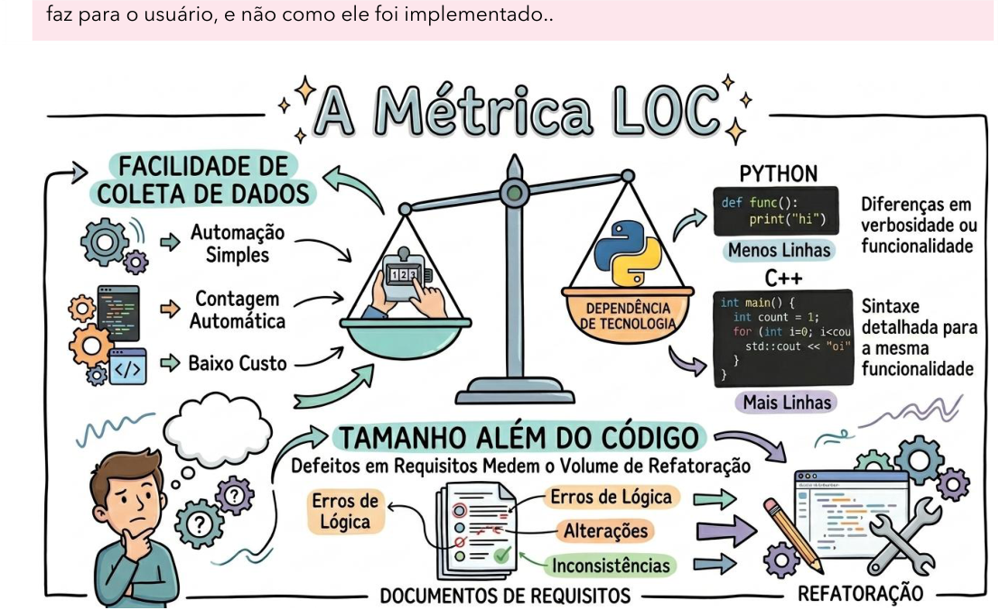


<!-- Start of picture text -->
faz para o usuário, e não como ele foi implementado..<br><!-- End of picture text -->

## **Número de Módulos** 

O número de módulos é uma métrica de tamanho estrutural que representa a quantidade de componentes, unidades ou partes em que um sistema foi dividido. Dependendo da arquitetura utilizada, um módulo pode corresponder a um pacote, subsistema, serviço, biblioteca, componente ou conjunto coeso de funcionalidades. Essa métrica auxilia na avaliação da decomposição do software, fornecendo uma visão geral de sua organização e distribuição funcional. 

Em geral, sistemas muito pequenos tendem a possuir poucos módulos, enquanto sistemas maiores apresentam uma quantidade mais elevada. Entretanto, um número excessivo de módulos pode aumentar a complexidade de integração e comunicação entre componentes, enquanto um número muito reduzido pode indicar baixa modularização e concentração excessiva de responsabilidades. Por isso, essa métrica costuma ser analisada em conjunto com outras, como acoplamento e coesão, para avaliar a qualidade da estrutura do software. 

## **Número de Classes** 

O número de classes é uma métrica de tamanho amplamente utilizada em sistemas orientados a objetos e corresponde à quantidade de classes definidas no projeto ou na implementação do software. As classes representam os principais elementos de modelagem do sistema, encapsulando atributos e operações que descrevem objetos do domínio do problema. Por exemplo, em um sistema acadêmico podem existir classes como Aluno, Professor, Disciplina, Turma e Matrícula. Dessa forma, essa métrica fornece uma indicação do tamanho e da estrutura geral da solução orientada a objetos.

---

<!-- pagina: 28 -->

**Diego Carvalho, Equipe Informática 2 (Diego Carvalho), Equipe Informática 1 (Diego Carvalho) Aula 10** 

A análise do número de classes auxilia na avaliação da decomposição do sistema e da distribuição de responsabilidades entre seus componentes. Um número muito reduzido de classes pode indicar baixa modularização e concentração excessiva de funcionalidades, enquanto uma quantidade excessivamente elevada pode sugerir fragmentação desnecessária ou complexidade excessiva no projeto. Quando analisada em conjunto com métricas como número de atributos, número de operações, acoplamento e coesão, essa métrica contribui para avaliar a qualidade do projeto orientado a objetos, sua manutenibilidade e seu potencial de reutilização. 

## **Número de Atributos** 

O número de atributos é uma métrica amplamente utilizada em projetos orientados a objetos e corresponde à quantidade de dados ou características armazenadas em uma classe. Os atributos representam o estado dos objetos criados a partir dessa classe e descrevem informações relevantes para o domínio do problema. Por exemplo, uma classe Cliente pode possuir atributos como nome, CPF, endereço, telefone e data de nascimento. 

A análise dessa métrica ajuda a identificar classes excessivamente simples ou excessivamente complexas. Classes com poucos atributos podem indicar responsabilidades muito limitadas, enquanto classes com muitos atributos podem sugerir excesso de responsabilidades ou problemas de modelagem. Em conjunto com outras métricas orientadas a objetos, como número de operações, acoplamento e coesão, o número de atributos auxilia na avaliação da qualidade do projeto e da distribuição das responsabilidades entre as classes. 

## **Número de Operações** 

O número de operações corresponde à quantidade de métodos ou funções definidos em uma classe, módulo ou componente de software. Em sistemas orientados a objetos, as operações representam os comportamentos disponibilizados pelos objetos, ou seja, as ações que eles podem executar. Por exemplo, uma classe ContaBancária pode possuir operações como depositar(), sacar(), transferir() e consultarSaldo(). 

Essa métrica é frequentemente utilizada para avaliar a complexidade funcional e a distribuição de responsabilidades dentro de uma classe. Um número muito elevado de operações pode indicar que a classe concentra comportamentos demais, violando princípios de projeto como o da responsabilidade única. Por outro lado, uma quantidade muito pequena de operações pode sugerir que a classe possui pouca relevância funcional. Assim, a análise do número de operações contribui para a avaliação da manutenibilidade, da modularidade e da qualidade geral do projeto orientado a objetos. 

|**MÉTRICAS**|**O QUE MEDE?**|**O QUE PODE INDICAR?**|
|---|---|---|
|**NÚMERO DE**<br>**MÓDULOS**|Quantidade<br>de<br>componentes,<br>pacotes, serviços, subsistemas ou<br>unidades funcionais em que o<br>software foi dividido.|Avalia o grau de modularização do sistema. Poucos<br>módulos<br>podem<br>indicar<br>concentração<br>de<br>responsabilidades; muitos módulos podem aumentar a<br>complexidade de integração.|
|**NÚMERO DE**<br>**CLASSES**|Quantidade de classes definidas<br>em um projeto orientado a objetos.|Indica o tamanho e a decomposição da solução. Poucas<br>classes podem sugerir baixa modularização; muitas classes<br>podem indicar fragmentação excessiva.|
|**NÚMERO DE**<br>**ATRIBUTOS**|Quantidade<br>de<br>dados<br>ou<br>características<br>armazenadas<br>em<br>uma classe.|Auxilia<br>na<br>avaliação<br>da<br>complexidade<br>e<br>das<br>responsabilidades das classes. Muitos atributos podem<br>indicar excesso de responsabilidades; poucos podem<br>sugerir modelagem simplificada demais.|

---

<!-- pagina: 29 -->

**Diego Carvalho, Equipe Informática 2 (Diego Carvalho), Equipe Informática 1 (Diego Carvalho) Aula 10** 

|**MÉTRICAS**|**O QUE MEDE?**|**O QUE PODE INDICAR?**|
|---|---|---|
|**NÚMERO DE**<br>**OPERAÇÕES**|Quantidade<br>de<br>métodos<br>ou<br>funções definidos em uma classe,<br>módulo ou componente.|Permite avaliar a complexidade funcional e a distribuição<br>de comportamentos. Muitas operações podem indicar<br>classes excessivamente complexas; poucas podem indicar<br>baixa relevância funcional.|

---

<!-- pagina: 30 -->

**Diego Carvalho, Equipe Informática 2 (Diego Carvalho), Equipe Informática 1 (Diego Carvalho) Aula 10** 


<!-- Start of picture text -->
Métricas  de<br><!-- End of picture text -->


<!-- Start of picture text -->
Estrutura<br><!-- End of picture text -->

##### **<mark>INCIDÊNCIA EM PROVA: MÉDIA</mark>** 

As métricas estruturais avaliam a organização interna do software, analisando aspectos relacionados à arquitetura, ao projeto e ao código-fonte. Seu objetivo é medir características que influenciam a compreensibilidade, a manutenibilidade e a complexidade do sistema. Exemplos incluem Complexidade Ciclomática, Fan-In/Fan-Out, acoplamento, coesão, número de módulos e outras métricas que descrevem como os componentes do software estão organizados e interagem entre si. 

## **Complexidade Ciclomática** 

#### **<mark>COMPLEXIDADE CICLOMÁTICA</mark>** 

<mark>A Complexidade Ciclomática é uma métrica que mede a complexidade lógica de um programa a partir da</mark> quantidade de caminhos independentes de execução existentes em seu fluxo de controle. Quanto maior seu valor, maior tende a ser o esforço necessário para compreender, testar e manter o código. Essa métrica é amplamente utilizada para estimar a quantidade mínima de casos de teste necessários para cobrir todos os caminhos lógicos do software. 

A Complexidade Ciclomática é uma das métricas mais conhecidas da Engenharia de Software quando o objetivo é avaliar a complexidade lógica de um programa. Por que essa métrica recebe tanta atenção? Porque ela fornece uma estimativa quantitativa da dificuldade associada à compreensão, ao teste e à manutenção do código. Desenvolvida por Thomas McCabe com base na teoria dos grafos, essa métrica tornou-se uma das principais referências para análise estrutural de programas e para o planejamento de testes de software. 

O cálculo da Complexidade Ciclomática pode ser realizado de diferentes formas. Como obter seu valor? Uma possibilidade consiste em analisar o grafo de fluxo de controle do programa e aplicar a fórmula V(G)=E−N+2P, na qual E representa o número de arestas, N corresponde ao número de nós e P indica a quantidade de componentes conectados. Em programas que possuem apenas um componente conectado, situação mais comum na prática, a expressão é simplificada para V(G)=E−N+2. 

Outra forma bastante conhecida de cálculo utiliza a contagem dos caminhos presentes no grafo. O que exatamente está sendo medido? A métrica determina a quantidade de caminhos linearmente independentes existentes no fluxo de controle do programa. Esse valor possui grande importância nos testes estruturais porque indica quantos caminhos independentes precisam ser considerados para compor o conjunto base utilizado no método de teste de caminho básico. 

Em concursos e avaliações acadêmicas, entretanto, costuma-se utilizar uma abordagem mais simples. Como a Complexidade Ciclomática geralmente é calculada nessas situações? A regra mais comum consiste em contar o número de decisões presentes no código e adicionar uma unidade ao resultado. Essa relação pode ser representada por V(G)=D+1, em que D representa a quantidade de estruturas de decisão existentes no programa. 

Uma dúvida recorrente envolve a identificação dessas decisões. Quais estruturas normalmente aumentam a Complexidade Ciclomática? Elementos como if, else if, while, for, do-while, switch, case e catch introduzem novos caminhos de execução e, consequentemente, contribuem para o aumento da métrica. Dependendo da ferramenta utilizada, operadores lógicos compostos também podem influenciar o resultado, pois ampliam as possibilidades de fluxo durante a execução do programa. 

A relação entre Complexidade Ciclomática e testes é um dos aspectos mais importantes desse tema. O que a métrica informa para a equipe de testes? Ela fornece a quantidade de caminhos linearmente independentes que devem ser considerados para compor o conjunto base de testes estruturais. Dessa

---

<!-- pagina: 31 -->

**Diego Carvalho, Equipe Informática 2 (Diego Carvalho), Equipe Informática 1 (Diego Carvalho) Aula 10** 

forma, auxilia na definição de um conjunto mínimo de casos de teste capaz de exercitar esses caminhos independentes e aumentar a cobertura do programa. 

Os efeitos de uma elevada Complexidade Ciclomática costumam ser percebidos ao longo de todo o ciclo de vida do software. O que acontece quando esse valor cresce excessivamente? O código tende a se tornar mais difícil de compreender, mais complexo de testar e mais custoso de manter. Além disso, estruturas excessivamente complexas frequentemente apresentam maior probabilidade de defeitos e maior risco de introdução de erros durante modificações futuras. Por esse motivo, equipes de desenvolvimento utilizam essa métrica para identificar componentes críticos e priorizar atividades de revisão, refatoração e teste. 

A utilização da Complexidade Ciclomática ilustra como métricas podem fornecer informações valiosas sobre a qualidade estrutural do software. Seria possível avaliar a dificuldade de manutenção apenas observando o tamanho do código? Nem sempre. Dois módulos com quantidades semelhantes de linhas podem apresentar níveis de complexidade completamente distintos. A análise da estrutura lógica por meio da Complexidade Ciclomática permite identificar essas diferenças e direcionar esforços para os componentes que apresentam maior risco técnico dentro do sistema. 

**(FGV / ALERO - 2026)** A equipe de Engenharia de Computação precisa avaliar a complexidade de <mark>um módulo de software antes de alocar recursos para sua manutenção. Uma métrica deve ser usada para quantificar o número de caminhos logicamente independentes através do código. Assinale a métrica de software que mede a complexidade da lógica de controle de um programa.</mark> 

<mark>a) Pontos de Função b) Cobertura de Testes c) Métrica de defeitos por KLOC d) Complexidade Ciclomática e) Cobertura de Caminho</mark> 

**<mark>_______________________ Comentários:</mark>** <mark>(a) Errado. Pontos de Função medem o tamanho funcional do software, não a complexidade da lógica de controle; (b) Errado. Cobertura de Testes indica o percentual do software exercitado pelos testes; (c) Errado. Defeitos por KLOC mede densidade de defeitos em relação ao tamanho do código; (d) Correto. A Complexidade Ciclomática, proposta por McCabe, mede o número de caminhos logicamente independentes em um programa, refletindo sua complexidade de controle; (e) Errado. Cobertura de Caminho é</mark> uma métrica de teste que indica quantos caminhos foram exercitados, não a complexidade do código (Letra D). 

### **Saiba mais:** 

<mark>Considere o seguinte trecho de código:</mark> 

```
def verificar_cliente(idade, renda):
    if idade >= 18:
```

```
        if renda >= 3000:
            return "Crédito aprovado"
        else:
            return "Renda insuficiente"
    else:
        return "Menor de idade"
```

---

<!-- pagina: 32 -->

**Diego Carvalho, Equipe Informática 2 (Diego Carvalho), Equipe Informática 1 (Diego Carvalho) Aula 10** 

<mark>Nesse código existem duas estruturas de decisão (if). A Complexidade Ciclomática (CC) pode ser calculada por meio da fórmula: CC = Número de Decisões + 1. Logo, temos que: CC = 2+1 = 3. Isso significa que existem 3 caminhos independentes de execução:</mark> 

<mark>Idade ≥ 18 e renda ≥ 3000 → Crédito aprovado. Idade ≥ 18 e renda < 3000 → Renda insuficiente. Idade < 18 → Menor de idade.</mark> 

<mark>A equipe de testes utiliza essa métrica para determinar a quantidade mínima de casos de teste necessários para cobrir todos os caminhos lógicos do módulo. Como a complexidade ciclomática é igual a 3, serão necessários pelo menos 3 casos de teste para garantir a cobertura de todos os fluxos independentes do programa. Além disso, valores elevados de complexidade ciclomática indicam módulos mais difíceis de compreender, testar e manter, podendo sinalizar a necessidade</mark> de refatoração do código. 


<!-- Start of picture text -->
de refatoração do código.<br><!-- End of picture text -->

---

<!-- pagina: 33 -->

**Diego Carvalho, Equipe Informática 2 (Diego Carvalho), Equipe Informática 1 (Diego Carvalho) Aula 10** 

## **Fan-In/Fan-Out** 

#### **<mark>FAN-IN/FAN-OUT</mark>** 

Fan-In mede o número de módulos ou funções que utilizam um determinado componente, enquanto Fan-Out mede a quantidade de módulos ou funções que são chamados por esse componente. Um Fan-In elevado normalmente indica alto grau de reutilização, enquanto um Fan-Out elevado pode indicar maior complexidade e dependência de outros componentes. Essas métricas ajudam na avaliação da arquitetura e da modularização do sistema. 

As dependências entre componentes exercem grande influência sobre a qualidade estrutural de um sistema. Como avaliar o grau de relacionamento existente entre módulos, funções ou classes? Para essa finalidade, a Engenharia de Software utiliza métricas como Fan-In e Fan-Out. Essas medidas fornecem informações sobre a forma como os componentes interagem e ajudam a identificar características relacionadas à reutilização, ao acoplamento e à complexidade arquitetural do software. 

O Fan-In procura avaliar quantos componentes utilizam determinado módulo. O que essa informação revela? Ela indica o número de elementos que dependem diretamente daquele componente para executar suas atividades. Se um módulo X for utilizado pelos módulos A, B e C, por exemplo, seu Fan-In será igual a três. Quanto maior esse valor, maior tende a ser o grau de reutilização do componente dentro da aplicação. 

**(COSEAC UFF / UFF - 2023)** Existe uma métrica de software que contabiliza o número de funções <mark>ou métodos que chamam outra função ou método. Esta métrica é conhecida como</mark> 

<mark>a) comprimento de código. b) complexidade ciclomática. c) índice Fog. d) profundidade de aninhamento condicional.</mark> 

<mark>e) Fan-in.</mark> 

**<mark>_______________________ Comentários:</mark>** <mark>(a) Errado. Comprimento de código mede tamanho, como linhas ou volume de código, e não quantas funções fazem chamadas a outra função. (b) Errado. Complexidade ciclomática avalia a quantidade de caminhos lógicos no programa, ligada a decisões e desvios, não a chamadas entre métodos. (c) Errado. Índice Fog é uma métrica de legibilidade de texto, usada para medir dificuldade de leitura, sem relação com chamadas entre funções. (d) Errado. Profundidade de aninhamento condicional mede níveis de if, else ou estruturas parecidas, não o número de funções que chamam outra. (e) Correto. Fan-in mede justamente quantas funções ou métodos</mark> chamam uma determinada função, indicando o grau de reutilização ou dependência dela (Letra E). 

Um elevado Fan-In deve ser interpretado como algo positivo ou negativo? A resposta depende do contexto. Em muitos casos, valores altos indicam que o componente oferece funcionalidades úteis e amplamente reutilizadas, desempenhando papel importante na arquitetura. Entretanto, como diversos módulos dependem dele, qualquer alteração realizada nesse componente pode produzir impactos significativos em várias partes do sistema. Por essa razão, componentes com elevado Fan-In costumam exigir maior cuidado durante atividades de manutenção e testes de regressão. 

O Fan-Out analisa a situação sob uma perspectiva diferente. O que exatamente essa métrica mede? Seu objetivo é identificar quantos módulos ou componentes são utilizados por determinado elemento do sistema. Considere um módulo X que depende diretamente dos módulos A, B e C. Nessa situação, o valor de Fan-Out será igual a três, pois existem três dependências necessárias para o funcionamento desse componente. 

**(VUNESP / MPE ES - 2013)** Uma das métricas utilizadas no desenvolvimento de software é <mark>denominada fan-out, que representa o</mark>

---

<!-- pagina: 34 -->

**Diego Carvalho, Equipe Informática 2 (Diego Carvalho), Equipe Informática 1 (Diego Carvalho) Aula 10** 

<mark>a) número de instruções de desvio incondicional do módulo sob medição. b) número de linhas de código do módulo sob medição.</mark> 

<mark>c) número de módulos acionados pelo módulo sob medição. d) tempo máximo de execução do módulo sob medição. e) tempo médio de execução do módulo sob medição</mark> 

### **<mark>_______________________</mark>** 

**<mark>Comentários:</mark>** <mark>(a) Errado. Fan-out não mede quantidade de desvios incondicionais no código, e sim o grau de acionamento entre módulos. (b) Errado. Número de linhas de código é outra métrica, ligada ao tamanho do módulo, não ao fan-out. (c) Correto. Fan-out representa quantos módulos são chamados ou acionados pelo módulo que está sendo analisado. (d) Errado. Tempo máximo de execução está ligado a desempenho, não à métrica fan-out. (e) Errado. Tempo médio de execução também mede desempenho, e não a</mark> quantidade de módulos acionados (Letra C). 

Por que o Fan-Out recebe tanta atenção em avaliações arquiteturais? Porque ele fornece indícios sobre o grau de dependência existente entre os componentes. À medida que o número de dependências aumenta, também tende a crescer a complexidade associada à compreensão, ao teste e à manutenção do módulo. Alterações em qualquer uma das dependências podem exigir ajustes adicionais ou gerar efeitos indiretos sobre o comportamento do componente analisado. 

Seria correto afirmar que um Fan-Out baixo é sempre desejável? Nem sempre. Embora valores excessivamente elevados possam indicar maior acoplamento e complexidade estrutural, a interpretação depende das características da arquitetura adotada. Em determinados contextos, como sistemas distribuídos ou componentes responsáveis pela coordenação de diversos serviços, a existência de múltiplas dependências pode ser uma consequência natural do papel desempenhado pelo módulo dentro da solução. 

A análise conjunta de Fan-In e Fan-Out fornece uma visão mais completa das relações existentes entre os componentes. O que essas métricas permitem identificar? O Fan-In ajuda a localizar elementos amplamente reutilizados e potencialmente críticos para a arquitetura. O Fan-Out auxilia na identificação de módulos com elevado número de dependências e maior complexidade de integração. Em conjunto, essas informações apoiam atividades de revisão arquitetural, análise de impacto, planejamento de testes e melhoria da qualidade estrutural do software. 

Essas métricas também ilustram um princípio importante da Engenharia de Software. Seria suficiente analisar apenas o tamanho ou a quantidade de linhas de código para compreender a qualidade de um sistema? Frequentemente, não. Dois componentes podem possuir tamanhos semelhantes e apresentar níveis muito diferentes de dependência e complexidade arquitetural. O estudo de Fan-In e Fan-Out permite enxergar essas relações internas e compreender melhor como a estrutura do software influencia sua manutenção, evolução e confiabilidade ao longo do tempo. 

### **Saiba mais:** 

<mark>Considere um sistema de vendas composto pelas funções calcular_desconto(), emitir_nota_fiscal(), atualizar_estoque() e processar_venda(). A função responsável por processar uma venda utiliza as demais funções para executar suas tarefas.</mark> 

```
def processar_venda():
calcular_desconto()
emitir_nota_fiscal()
atualizar_estoque()
```

---

<!-- pagina: 35 -->

**Diego Carvalho, Equipe Informática 2 (Diego Carvalho), Equipe Informática 1 (Diego Carvalho) Aula 10** 

<mark>Nesse exemplo, a função processar_venda() realiza chamadas para três outras funções. Dizemos, portanto, que ela possui Fan-Out igual a 3, pois depende diretamente de três módulos distintos para concluir sua execução. Já cada uma das funções chamadas possui Fan-In igual a 1, uma vez que são utilizadas apenas por processar_venda(). Agora imagine que a função calcular_desconto() seja reutilizada em outras partes do sistema.</mark> 

```
def processar_venda():
    calcular_desconto()
```

```
def simular_compra():
    calcular_desconto()
```

```
def gerar_orcamento():
    calcular_desconto()
```

<mark>Nesse novo cenário, a função calcular_desconto() passa a ser chamada por três funções diferentes. Assim, seu Fan-In torna-se igual a 3, indicando um elevado nível de reutilização dentro do sistema.</mark> 


<mark>Essa métrica pode auxiliar a equipe de desenvolvimento na avaliação da estrutura do software. Um Fan-In elevado normalmente sugere que um módulo é amplamente utilizado e desempenha papel importante na aplicação. Por outro lado, alterações nesse módulo podem produzir impactos em diversas partes do sistema. Já um Fan-Out elevado pode indicar maior complexidade, pois o módulo depende de vários outros componentes para realizar suas atividades, aumentando o esforço de manutenção e teste.</mark> 

<mark>No exemplo apresentado, calcular_desconto() possui Fan-In igual a 3, evidenciando seu reaproveitamento por diferentes funcionalidades, enquanto processar_venda() apresenta Fan-Out igual a 3, demonstrando que sua execução depende da coordenação de diversos módulos auxiliares. Esse tipo de análise permite identificar pontos críticos do sistema e apoiar decisões</mark> relacionadas à manutenção e à qualidade do software.

---

<!-- pagina: 36 -->

**Diego Carvalho, Equipe Informática 2 (Diego Carvalho), Equipe Informática 1 (Diego Carvalho) Aula 10** 


---

<!-- pagina: 37 -->

**Diego Carvalho, Equipe Informática 2 (Diego Carvalho), Equipe Informática 1 (Diego Carvalho) Aula 10** 

## **Coesão e Acoplamento** 

#### **<mark>COESÃO E ACOPLAMENTO</mark>** 

Coesão mede o grau de relacionamento entre os elementos internos de um módulo ou classe, enquanto acoplamento mede o nível de dependência entre módulos distintos. Em projetos de software, busca-se obter alta coesão e baixo acoplamento, pois essa combinação favorece a manutenção, a reutilização e a evolução do <mark>sistema. Esses atributos são amplamente utilizados na avaliação da qualidade de projetos orientados a objetos.</mark> 

O acoplamento e a coesão estão entre os conceitos mais importantes da qualidade estrutural de software. Por que esses atributos recebem tanta atenção durante o desenvolvimento? Porque influenciam diretamente a facilidade de manutenção, teste e evolução dos sistemas. A forma como módulos e classes se relacionam internamente e entre si pode tornar um software mais simples de compreender ou transformar pequenas alterações em tarefas complexas e arriscadas. 

O acoplamento está relacionado às dependências existentes entre componentes. O que exatamente essa característica procura medir? Seu objetivo é avaliar o quanto um módulo, classe ou componente depende de outros elementos para executar suas funções. Quando essas dependências são numerosas ou excessivamente fortes, alterações realizadas em um componente podem provocar efeitos inesperados em diversas partes da aplicação. Por esse motivo, níveis elevados de acoplamento costumam aumentar a complexidade da manutenção e dos testes. 

Um baixo nível de acoplamento significa ausência de dependências? Não. Em sistemas reais, algum grau de dependência é inevitável, pois os componentes precisam colaborar para atender aos requisitos da aplicação. O objetivo do projeto de software não é eliminar completamente essas relações, mas evitar dependências desnecessárias e reduzir o impacto que mudanças em um componente podem causar nos demais elementos do sistema. 

A coesão analisa uma perspectiva diferente da qualidade estrutural. O que ela procura avaliar? Essa característica mede o grau de relacionamento existente entre os elementos internos de um componente e o quanto eles contribuem para uma responsabilidade comum. Em uma classe altamente coesa, atributos e métodos trabalham em conjunto para atender a um objetivo claramente definido. Isso torna o comportamento do componente mais previsível e sua finalidade mais fácil de compreender. 

Como identificar componentes com baixa coesão? Normalmente eles concentram responsabilidades distintas e pouco relacionadas entre si. Uma mesma classe pode, por exemplo, realizar cálculos de negócio, acessar banco de dados, gerar relatórios e controlar interfaces de usuário. Quando funções muito diferentes são agrupadas em um único componente, a compreensão e a manutenção tendem a se tornar mais difíceis, além de aumentar a probabilidade de alterações produzirem efeitos colaterais indesejados. 

A relação entre acoplamento e coesão é frequentemente apresentada como um objetivo de projeto. Por que se busca reduzir o acoplamento e aumentar a coesão? Porque componentes independentes e focados em responsabilidades bem definidas tendem a ser mais fáceis de compreender, testar e modificar. Além disso, módulos com alta coesão costumam apresentar maior potencial de reutilização, enquanto baixos níveis de acoplamento reduzem o impacto de mudanças realizadas durante a evolução do sistema. 

Esses conceitos ajudam a compreender que a qualidade estrutural não depende apenas da quantidade de código produzida. Seria possível construir um sistema funcional e ainda assim apresentar problemas de manutenção? Certamente. Um software pode atender corretamente aos requisitos e, ao mesmo tempo, possuir componentes excessivamente dependentes ou responsabilidades mal distribuídas. A

---

<!-- pagina: 38 -->

**Diego Carvalho, Equipe Informática 2 (Diego Carvalho), Equipe Informática 1 (Diego Carvalho) Aula 10** 

análise de acoplamento e coesão permite identificar essas situações e fornece subsídios para decisões arquiteturais que favorecem a evolução sustentável do sistema ao longo do tempo. 

### **Saiba mais:** 

<mark>Considere um sistema de biblioteca. A classe Livro possui apenas atributos e métodos relacionados ao gerenciamento de livros, como título, autor e empréstimo.</mark> 

```
class Livro:
    def emprestar(self):
        pass
    def devolver(self):
        pass
    def consultar_disponibilidade(self):
        pass
```

<mark>Nesse caso, todos os métodos estão relacionados a uma única responsabilidade: o gerenciamento de livros. Dizemos, portanto, que a classe apresenta alta coesão, pois seus elementos trabalham em conjunto para realizar um propósito bem definido. Agora considere uma segunda classe:</mark> 

```
class Livro:
    def emprestar(self):
        pass
    def calcular_folha_pagamento(self):
        pass
    def emitir_nota_fiscal(self):
        pass
```

<mark>Nesse exemplo, a classe mistura funcionalidades relacionadas a empréstimos, recursos humanos e faturamento. Como seus métodos tratam de assuntos distintos e pouco relacionados entre si, a classe apresenta baixa coesão, tornando-se mais difícil de compreender e manter. O acoplamento, por sua vez, mede o grau de dependência entre módulos. Considere o exemplo abaixo:</mark> 

```
class Estoque:
    def atualizar(self):
        pass
class Venda:
    def concluir_venda(self):
        estoque = Estoque()
        estoque.atualizar()
```

<mark>A classe Venda depende diretamente da classe Estoque para realizar suas operações. Dizemos que existe um determinado nível de acoplamento entre essas classes. Quanto mais dependências desse tipo existirem, maior será o acoplamento do sistema.</mark>

---

<!-- pagina: 39 -->

**Diego Carvalho, Equipe Informática 2 (Diego Carvalho), Equipe Informática 1 (Diego Carvalho) Aula 10** 

<mark>Em termos de qualidade de software, o cenário desejável é possuir alta coesão e baixo acoplamento. Classes coesas são mais fáceis de compreender, testar e manter, enquanto um baixo acoplamento reduz o impacto de alterações em um módulo sobre os demais componentes do sistema. Por esse motivo, alta coesão e baixo acoplamento são considerados importantes objetivos</mark> de projeto em sistemas orientados a objetos. 

**(VUNESP / EsFCEx - 2022)** Acoplamento e coesão são dois critérios qualitativos utilizados para <mark>avaliar a independência funcional de um software, sendo correto que</mark> 

<mark>a) um módulo coeso requer pouca interação com outros módulos do software. b) módulos coesos devem ter um máximo de 200 linhas de código de software. c) um módulo coeso deve implementar pelo menos três tarefas do software. d) recomenda-se que o acoplamento entre módulos de software seja alto. e) o acoplamento limita o número de variáveis contidas em um módulo de software.</mark> 

**<mark>_______________________</mark>** 

**<mark>Comentários:</mark>** <mark>(a) Correto. Coesão alta indica que o módulo é bem focado na sua função, o que tende a reduzir a dependência e a interação com outros módulos. (b) Errado. Coesão não é medida por quantidade de linhas de código, mas pela relação funcional entre os elementos do módulo. (c) Errado. Um módulo coeso não precisa executar várias tarefas; na verdade, a ideia é justamente manter foco em uma responsabilidade bem definida. (d) Errado. Em projeto de software, o ideal é baixo acoplamento, para facilitar manutenção, teste e reaproveitamento dos módulos. (e) Errado. Acoplamento trata da dependência entre módulos, não da quantidade de variáveis internas</mark> existentes em cada módulo (Letra A). 


<!-- Start of picture text -->
existentes em cada módulo (Letra A).<br><!-- End of picture text -->

---

<!-- pagina: 40 -->

**Diego Carvalho, Equipe Informática 2 (Diego Carvalho), Equipe Informática 1 (Diego Carvalho) Aula 10** 


<!-- Start of picture text -->
Métricas de Documentação<br><!-- End of picture text -->

##### **<mark>INCIDÊNCIA EM PROVA: BAIXÍSSIMA</mark>** 

As métricas de documentação são utilizadas para avaliar a qualidade, a clareza, a completude e a legibilidade dos artefatos documentais produzidos durante o desenvolvimento de software. Essas métricas ajudam a verificar se a documentação é adequada para apoiar usuários, desenvolvedores e equipes de manutenção. Entre os exemplos estão o Índice de Fog, o número de páginas documentadas, a cobertura da documentação e indicadores relacionados à consistência e atualização dos documentos. 

## **Índice de Fog** 

#### **<mark>ÍNDICE DE FOG</mark>** 

<mark>O Índice de Fog é uma métrica de legibilidade obtida sem a execução do sistema e que permite avaliar a</mark> qualidade interna dos artefatos documentais. Valores elevados podem indicar documentação excessivamente complexa, ambígua ou difícil de manter, enquanto valores menores tendem a refletir textos mais claros, objetivos e acessíveis aos usuários e desenvolvedores. 

A qualidade de software não depende apenas do código-fonte. Como avaliar a qualidade dos documentos produzidos durante o desenvolvimento? Para essa finalidade, podem ser utilizadas métricas voltadas à análise textual, entre elas o Índice de Fog. Essa métrica procura estimar o grau de dificuldade de leitura de um documento, fornecendo informações sobre sua clareza e acessibilidade para os leitores. 

O que exatamente o Índice de Fog analisa? Seu cálculo considera características linguísticas do texto, como o comprimento das frases e a utilização de palavras mais complexas. A partir dessas informações, obtém-se uma estimativa do esforço necessário para compreender o conteúdo apresentado. Quanto maior o valor obtido, maior tende a ser a dificuldade de leitura do documento. 

Por que essa métrica é classificada como estática? Porque sua obtenção não depende da execução do software. O Índice de Fog é calculado diretamente a partir da análise dos artefatos documentais produzidos durante o desenvolvimento, como especificações de requisitos, manuais de usuário, documentação técnica e relatórios de projeto. Dessa forma, ele se enquadra na categoria das métricas estáticas de produto. 

Qual a utilidade prática dessa medida? Documentos excessivamente complexos podem dificultar a comunicação entre equipes, aumentar o esforço de manutenção e tornar mais difícil a compreensão dos requisitos e das decisões de projeto. Ao identificar textos com elevado grau de complexidade, a métrica auxilia na revisão e simplificação da documentação, favorecendo a transferência de conhecimento e a compreensão do sistema. 

Um valor elevado indica necessariamente que o documento está incorreto? Não. O Índice de Fog mede principalmente a dificuldade de leitura e não a correção técnica do conteúdo. Entretanto, documentos excessivamente complexos tendem a ser mais difíceis de compreender e revisar, o que pode aumentar indiretamente o risco de interpretações equivocadas e ambiguidades durante o desenvolvimento. 

Valores reduzidos são sempre desejáveis? Em geral, sim, desde que a simplificação não comprometa a precisão técnica do texto. O objetivo não consiste em produzir documentos excessivamente simplificados, mas em encontrar um equilíbrio entre rigor técnico e clareza de comunicação. Dessa forma, o Índice de Fog contribui para a melhoria da qualidade interna da documentação e para a eficiência da comunicação ao longo do ciclo de vida do software. 

### **Saiba mais:**

---

<!-- pagina: 41 -->

**Diego Carvalho, Equipe Informática 2 (Diego Carvalho), Equipe Informática 1 (Diego Carvalho) Aula 10** 

<mark>Imagine que você é um professor corrigindo redações de alunos. Algumas redações possuem frases curtas, palavras simples e ideias apresentadas de forma direta. Outras utilizam frases longas, termos técnicos e construções complexas. Naturalmente, as primeiras são mais fáceis de entender, enquanto as segundas exigem maior esforço de leitura. O Índice de Fog funciona exatamente como uma nota que indica o quão difícil é ler um texto.</mark> 

<mark>No contexto de software, a "redação" corresponde à documentação do sistema, aos requisitos, aos manuais e até aos comentários presentes no código-fonte. Se esses textos forem excessivamente complexos, os desenvolvedores terão mais dificuldade para compreendê-los, aumentando o risco de erros, retrabalho e interpretações equivocadas. O Índice de Fog ajuda a identificar esse problema ao medir o grau de complexidade da linguagem utilizada.</mark> 

<mark>Assim, da mesma forma que um professor pode sugerir que um aluno simplifique uma redação para torná-la mais clara, uma equipe de desenvolvimento pode utilizar o Índice de Fog para melhorar a qualidade da documentação, tornando-a mais fácil de ler, manter e compartilhar entre os membros</mark> do projeto. 


<!-- Start of picture text -->
do projeto.<br><!-- End of picture text -->

## **Comprimento de Identificadores** 

#### **<mark>COMPRIMENTO DE IDENTIFICADORES</mark>** 

Métrica estática de produto que mede o tamanho médio dos nomes utilizados para identificar elementos do software, como variáveis, constantes, métodos, funções, classes e módulos. Seu objetivo é fornecer indícios sobre a legibilidade e a compreensibilidade do código-fonte, uma vez que identificadores bem escolhidos facilitam a manutenção e o entendimento do sistema por outros desenvolvedores. Nomes excessivamente curtos podem

---

<!-- pagina: 42 -->

**Diego Carvalho, Equipe Informática 2 (Diego Carvalho), Equipe Informática 1 (Diego Carvalho) Aula 10** 

<mark>dificultar a interpretação do propósito dos elementos do programa, enquanto nomes excessivamente longos</mark> <u>podem tornar o código mais difícil de ler e navegar.</u> 

O comprimento de identificadores é uma métrica utilizada para analisar o tamanho dos nomes atribuídos a elementos do software, como variáveis, funções, classes e módulos. Por que observar algo aparentemente simples como o nome de uma variável? Porque esses identificadores funcionam como uma forma de documentação incorporada ao código. Quando são bem escolhidos, ajudam os desenvolvedores a compreender rapidamente o propósito de cada elemento, reduzindo o esforço necessário para leitura e manutenção do sistema. 

Essa métrica é classificada como estática de produto, pois é obtida diretamente a partir do código-fonte, sem que o programa precise ser executado. O que exatamente é medido? Normalmente, considera-se a quantidade de caracteres presente nos identificadores, podendo ser calculada uma média ou outra medida estatística representativa. A análise permite identificar padrões de nomenclatura que podem favorecer ou dificultar a compreensão do software. 

Identificadores muito curtos costumam representar um desafio para a leitura do código, especialmente em sistemas extensos. Afinal, o que se pode inferir apenas pelos nomes x, a1 ou tmp? Em muitos casos, pouca informação é transmitida sobre a finalidade do elemento. Entretanto, isso não significa que todo identificador curto seja inadequado, pois nomes breves podem ser aceitáveis quando seu contexto e propósito são imediatamente compreensíveis para quem realiza a leitura. 

Também é necessário evitar o extremo oposto. Seriam melhores identificadores cada vez mais longos e detalhados? Nem sempre. Nomes excessivamente extensos podem tornar o código visualmente carregado e dificultar a navegação durante o desenvolvimento. Por essa razão, busca-se um equilíbrio entre concisão e capacidade descritiva. A métrica de comprimento de identificadores não determina sozinha a qualidade do software, mas fornece evidências úteis sobre aspectos relacionados à clareza, à manutenibilidade e à documentação interna do código.

---

<!-- pagina: 43 -->

**Diego Carvalho, Equipe Informática 2 (Diego Carvalho), Equipe Informática 1 (Diego Carvalho) Aula 10** 


<!-- Start of picture text -->
Métricas de Qualidade<br><!-- End of picture text -->


<!-- Start of picture text -->
do Software<br><!-- End of picture text -->

##### **<mark>INCIDÊNCIA EM PROVA: BAIXÍSSIMA</mark>** 

As métricas de qualidade medem atributos associados à qualidade do produto de software, permitindo avaliar o grau em que o sistema atende a requisitos funcionais e não funcionais. Essas métricas estão frequentemente relacionadas a características como confiabilidade, eficiência, manutenibilidade, testabilidade e ausência de defeitos. Exemplos incluem Defect Removal Efficiency (DRE), Índice de Manutenibilidade e diversas métricas definidas por modelos de qualidade como a ISO/IEC 25010. 

## **Densidade de Defeitos** 

#### **<mark>DENSIDADE DE DEFEITOS</mark>** 

<mark>A Densidade de Defeitos mede a quantidade de defeitos identificados em relação ao tamanho do software,</mark> normalmente expressa em defeitos por mil linhas de código (KLOC). Essa métrica permite comparar a qualidade de diferentes módulos ou versões independentemente de seu tamanho, sendo amplamente utilizada em <u>programas de garantia da qualidade.</u> 

A Eficiência na Remoção de Defeitos, conhecida pela sigla DRE, é uma métrica utilizada para avaliar a capacidade de um processo de desenvolvimento em identificar e corrigir problemas antes que eles cheguem aos usuários. Por que essa métrica recebe tanta atenção? Porque a correção de falhas tende a ser menos custosa quando ocorre nas fases iniciais do desenvolvimento. Quanto mais cedo um problema é encontrado, menores costumam ser seus impactos sobre prazo, custo e qualidade do software. 

Quando aplicada ao projeto como um todo, a DRE compara os problemas identificados antes da entrega com o total de problemas descobertos antes e depois da disponibilização do sistema. Quando considerada para um projeto como um todo, a DRE é definida da seguinte maneira: DRE = E/(E+D), onde E é o número de erros encontrados antes que o software seja fornecido ao usuário final e D é o número de defeitos depois que o software é entregue. 

O que um valor elevado indica? Significa que a maior parte dos defeitos foi detectada durante o desenvolvimento, reduzindo a probabilidade de que falhas alcancem os usuários finais. Por essa razão, valores próximos de 1 são considerados desejáveis, embora raramente sejam alcançados de forma absoluta em projetos reais. 

A métrica também pode ser utilizada para avaliar atividades específicas do processo de software. Como verificar se uma etapa está sendo eficaz na identificação de erros? A DRE pode ser calculada para cada atividade, medindo quantos problemas foram encontrados naquela etapa em comparação com aqueles que escaparam e só foram detectados posteriormente. Essa abordagem permite identificar pontos do processo que necessitam de melhorias e reforçar práticas de revisão, inspeção e verificação. 

Considere, por exemplo, a atividade de análise de requisitos. O que acontece quando erros não são identificados nesse momento? Eles podem ser propagados para o projeto, para a implementação e para os testes, aumentando o esforço necessário para correção. Ao medir a DRE de cada etapa, torna-se possível avaliar a capacidade de filtragem do processo e verificar se os defeitos estão sendo identificados o mais cedo possível dentro do ciclo de desenvolvimento. 

### **Saiba mais:**

---

<!-- pagina: 44 -->

**Diego Carvalho, Equipe Informática 2 (Diego Carvalho), Equipe Informática 1 (Diego Carvalho) Aula 10** 

<mark>Imagine que, durante o desenvolvimento de um sistema, a equipe encontrou e corrigiu 90 erros por meio de revisões, inspeções e testes. Após a entrega aos usuários, ainda foram identificados 10 defeitos em produção. Nesse caso:</mark> 

### _<mark>DRE = 90/(90+10) = 90/100 = 0,9 = 90%</mark>_ 

<mark>Isso significa que a equipe conseguiu remover 90% dos defeitos potenciais antes da entrega, deixando apenas 10% escaparem para o ambiente de produção.</mark> 

<mark>Uma analogia simples é imaginar uma série de peneiras. Cada etapa da engenharia de software (requisitos, projeto, codificação e testes) funciona como uma peneira que tenta reter erros antes que eles avancem. Quanto mais próxima de 100% for a DRE de uma etapa, mais eficiente ela será em impedir que defeitos escapem para as fases seguintes, reduzindo custos de correção e</mark> aumentando a qualidade final do software. 


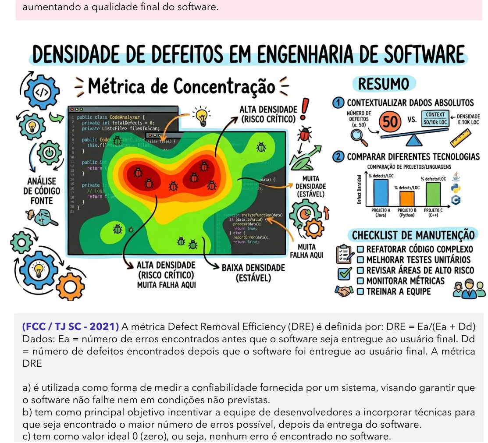


<!-- Start of picture text -->
aumentando a qualidade final do software.<br>(FCC / TJ SC - 2021)  A métrica Defect Removal Efficiency (DRE) é definida por: DRE = Ea/(Ea + Dd)<br>Dados: Ea = número de erros encontrados antes que o software seja entregue ao usuário final. Dd<br>= número de defeitos encontrados depois que o software foi entregue ao usuário final. A métrica<br>DRE<br>a) é utilizada como forma de medir a confiabilidade fornecida por um sistema, visando garantir que<br>o software não falhe nem em condições não previstas.<br>b) tem como principal objetivo incentivar a equipe de desenvolvedores a incorporar técnicas para<br>que seja encontrado o maior número de erros possível, depois da entrega do software.<br>c) tem como valor ideal 0 (zero), ou seja, nenhum erro é encontrado no software.<br><!-- End of picture text -->

---

<!-- pagina: 45 -->

**Diego Carvalho, Equipe Informática 2 (Diego Carvalho), Equipe Informática 1 (Diego Carvalho) Aula 10** 

<mark>d) indica que Dd será maior que 0, quando usada de forma mais realista. À medida que Ea aumenta, é provável que o valor final de Dd diminua e o valor global de DRE comece a se aproximar de 1. e) tem como valor ideal −1 (menos um), ou seja, nenhum defeito é encontrado no software</mark> 

**<mark>_______________________ Comentários:</mark>** <mark>(a) Errado. A DRE mede a eficiência na remoção de defeitos ao longo do processo, não a garantia absoluta de confiabilidade nem ausência de falhas em situações não previstas. (b) Errado. O foco da DRE é reduzir defeitos que escapam para produção, estimulando a detecção antes da entrega, e não depois. (c) Errado. Como a métrica é uma razão entre Ea e Ea + Dd, o cenário ideal se aproxima de 1, não de 0. (d) Correto. Em cenários reais, costuma haver defeitos após a entrega. Se Ea cresce, tende-se a reduzir Dd, fazendo a DRE se aproximar de 1. (e) Errado. Pela própria fórmula, a DRE não assume valor negativo. O melhor resultado é próximo</mark> de 1, indicando alta eficiência na remoção de defeitos (Letra D). 

Embora existam muitas medidas de qualidade de software, a correção, a manutenibilidade, a integridade e a usabilidade fornecem indicadores úteis para a equipe de projeto. 

|**MEDIDAS DE**<br>**QUALIDADE**|**DESCRIÇÃO**|**COMO É MEDIDA**|
|---|---|---|
|**CORREÇÃO**|Representa o grau em que o software<br>executa corretamente as funções para as<br>quais foi desenvolvido, atendendo aos<br>requisitos especificados. A ausência de<br>correção manifesta-se por meio de<br>defeitos identificados pelos usuários após<br>a liberação do sistema.|A medida mais comum é o número de<br>defeitos por KLOC (mil linhas de código),<br>considerando<br>como<br>defeito<br>qualquer<br>ocorrência de não conformidade com os<br>requisitos durante um período de observação,<br>normalmente um ano.|
|**MANUTENI**<br>**BILIDADE**|Refere-se à facilidade com que o software<br>pode<br>ser<br>corrigido,<br>adaptado<br>a<br>mudanças no ambiente ou aprimorado<br>para atender novos requisitos. Como não<br>pode ser medida diretamente, utiliza-se<br>métricas indiretas.|Uma métrica amplamente utilizada é o MTTC<br>(Mean Time To Change), que representa o<br>tempo médio necessário para analisar uma<br>solicitação de mudança, projetar a solução,<br>implementar a alteração, realizar os testes e<br>disponibilizar a nova versão aos usuários.|
|**INTEGRIDADE**|Avalia a capacidade do sistema de resistir<br>a ataques acidentais ou intencionais<br>contra sua segurança. Esse atributo<br>depende da probabilidade de ocorrência<br>de ameaças e da capacidade do sistema<br>de repelir tais ataques.|Utiliza-se a fórmula: Integridade =**Σ**[1 –<br>(Ameaça × (1 – Segurança))], em que_Ameaça_<br>representa a probabilidade de um ataque<br>ocorrer<br>e<br>_Segurança_<br>representa<br>a<br>probabilidade de o sistema repelir esse<br>ataque. Quanto mais próximo de 1, maior a<br>integridade do sistema.|
|**USABILIDADE**|Corresponde ao grau de facilidade de<br>uso do software pelos usuários. Envolve<br>aspectos<br>como<br>facilidade<br>de<br>aprendizado, eficiência de utilização,<br>memorização das operações, prevenção<br>de erros e satisfação do usuário.|Pode ser medida por meio de métricas<br>relacionadas ao tempo de aprendizado, taxa<br>de erros dos usuários, produtividade na<br>execução de tarefas, grau de satisfação obtido<br>em pesquisas e avaliações de experiência do<br>usuário.|

---

<!-- pagina: 46 -->

**Diego Carvalho, Equipe Informática 2 (Diego Carvalho), Equipe Informática 1 (Diego Carvalho) Aula 10** 


<!-- Start of picture text -->
Métricas de Testes<br><!-- End of picture text -->

##### **<mark>INCIDÊNCIA EM PROVA: BAIXÍSSIMA</mark>** 

As métricas de testes avaliam a eficácia e a abrangência das atividades de verificação e validação realizadas durante o desenvolvimento do software. Elas permitem identificar o nível de cobertura obtido pelos testes e a capacidade do processo de detectar defeitos antes da entrega do produto. Entre os exemplos mais conhecidos estão Cobertura de Instruções, Cobertura de Decisões, Cobertura Funcional e Cobertura Modular. 

Essas métricas devem ser interpretadas de forma isolada? Em geral, não. Cada tipo de cobertura analisa uma dimensão específica da qualidade dos testes. Um sistema pode apresentar elevada Cobertura de Instruções e, ao mesmo tempo, possuir funcionalidades importantes que não foram validadas. Da mesma forma, um requisito pode ter sido testado sem que todos os caminhos internos do código tenham sido exercitados. Por esse motivo, organizações costumam utilizar múltiplas métricas de cobertura de maneira complementar. 

A utilização conjunta dessas abordagens demonstra uma preocupação central da Engenharia de Software. Como obter confiança na qualidade de um sistema sem realizar testes exaustivos? A resposta está na combinação de diferentes critérios de cobertura, cada um voltado para um aspecto específico da validação. Dessa forma, torna-se possível identificar lacunas nos testes, direcionar esforços para áreas de maior risco e aumentar gradualmente a confiabilidade do software entregue aos usuários. 

As atividades de teste podem ser analisadas sob diferentes perspectivas. Como verificar se a validação realizada foi realmente abrangente? Para responder a essa questão, a Engenharia de Software utiliza diversas métricas de cobertura. Cada uma delas procura avaliar uma dimensão específica dos testes, permitindo identificar áreas que ainda não foram adequadamente exercitadas e auxiliando na redução dos riscos associados à entrega do software. 

## **Cobertura de Instruções** 

Uma das métricas mais conhecidas é a Cobertura de Instruções. O que ela procura medir? Seu objetivo é verificar o percentual de instruções do código-fonte que foi efetivamente executado durante os testes. Ao identificar comandos que nunca foram alcançados pelos casos de teste, essa métrica ajuda a localizar regiões do sistema que podem conter defeitos ainda não descobertos. Por sua simplicidade e ampla disponibilidade em ferramentas de teste, trata-se de uma das métricas estruturais mais utilizadas na prática. 

## **Cobertura de Decisões** 

A Cobertura de Decisões analisa um aspecto diferente da validação. Por que apenas executar instruções pode não ser suficiente? Porque muitas estruturas de controle apresentam múltiplos caminhos de execução. Essa métrica procura garantir que todos os resultados possíveis das decisões tenham sido exercitados pelos testes. Em uma estrutura condicional, por exemplo, é necessário validar tanto o resultado verdadeiro quanto o resultado falso para que a decisão seja considerada completamente coberta. 

## **Cobertura Funcional** 

Outra perspectiva importante está relacionada aos requisitos do sistema. Como verificar se as funcionalidades especificadas realmente foram testadas? Para essa finalidade utiliza-se a Cobertura Funcional. Essa métrica mede o percentual de funcionalidades, requisitos ou casos de uso que foram

---

<!-- pagina: 47 -->

**Diego Carvalho, Equipe Informática 2 (Diego Carvalho), Equipe Informática 1 (Diego Carvalho) Aula 10** 

efetivamente submetidos à validação. Seu foco não está na estrutura interna do código, mas no comportamento esperado do sistema e no atendimento às necessidades do negócio definidas durante a especificação dos requisitos. 

## **Cobertura Modular** 

A avaliação dos testes também pode considerar a arquitetura da aplicação. O que a Cobertura Modular procura identificar? Essa métrica mede o percentual de módulos, componentes ou subsistemas que receberam algum tipo de validação. Em sistemas de grande porte, diferentes áreas da aplicação podem receber níveis distintos de atenção durante os testes. A Cobertura Modular ajuda a identificar componentes ainda não avaliados e auxilia o planejamento das próximas etapas de verificação. 

**(CETAP / Prefeitura de Óbidos-PA - 2023)** Uma métrica para avaliar a qualidade de um software <mark>mede a porcentagem de código do software que é executada durante os testes. Essa métrica é conhecida como:</mark> 

<mark>a) Taxa de defeitos encontrados em testes. b) Tempo médio entre falhas (MTBF).</mark> 

<mark>c) Taxa de churn de código.</mark> 

<mark>d) Cobertura de código.</mark> 

**<mark>_______________________ Comentários:</mark>** <mark>(a) Errado. Mede a quantidade de defeitos identificados durante a execução dos testes; (b) Errado. MTBF (Mean Time Between Failures) mede a confiabilidade do software, indicando o tempo médio entre falhas; (c) Errado. Taxa de churn de código mede a frequência de alterações no código-fonte; (d) Correto. Cobertura de código mede o percentual de código executado durante os testes,</mark> indicando o grau de exercitação do software pelos casos de teste (Letra D). 


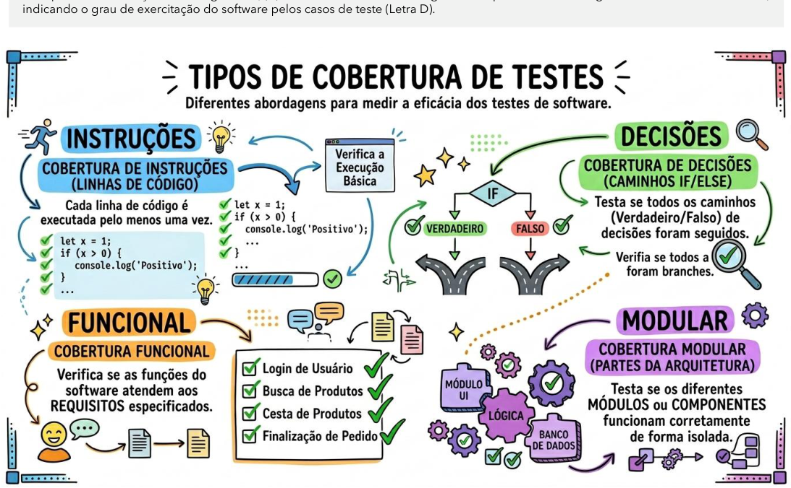


<!-- Start of picture text -->
indicando o grau de exercitação do software pelos casos de teste (Letra D).<br><!-- End of picture text -->

---

<!-- pagina: 48 -->

**Diego Carvalho, Equipe Informática 2 (Diego Carvalho), Equipe Informática 1 (Diego Carvalho) Aula 10** 

|**MÉTRICA**|**O QUE MEDE?**|**FOCO DA**|**AVAL**|**IAÇÃO**|
|---|---|---|---|---|
|**COBERTURA DE**<br>**INSTRUÇÕES**|Percentual de instruções do código-fonte que<br>foram efetivamente executadas durante os testes.|Verificar se os co<br>foram exercitados|mando<br>pelos|s do programa<br>casos de teste.|
|**COBERTURA DE**<br>**DECISÕES**|Percentual de decisões lógicas (condições) cujos<br>resultados possíveis foram testados.|Garantir que os ca<br>falso das estrutura<br>executados.|minh<br>s con|os verdadeiro e<br>dicionais sejam|
|**COBERTURA**<br>**FUNCIONAL**|Percentual de funcionalidades, requisitos ou<br>casos de uso submetidos à validação.|Avaliar se os comp<br>pelo<br>negócio<br> <br>testados.|ortam<br>foram|entos esperados<br> <br>efetivamente|
|**COBERTURA**<br>**MODULAR**|Percentual<br>de<br>módulos,<br>componentes<br>ou<br>subsistemas que receberam testes.|Verificar o grau<br>diferentes partes<br>aplicação.|de<br>da|validação das<br>arquitetura da|

---

<!-- pagina: 49 -->

**Diego Carvalho, Equipe Informática 2 (Diego Carvalho), Equipe Informática 1 (Diego Carvalho) Aula 10** 


<!-- Start of picture text -->
Métricas de Confiabilidade<br><!-- End of picture text -->

##### **<mark>INCIDÊNCIA EM PROVA: BAIXA</mark>** 

As métricas de confiabilidade medem a capacidade do software de operar corretamente durante um determinado período de tempo, sem apresentar falhas ou interrupções. Essas métricas são amplamente utilizadas para avaliar a estabilidade e a disponibilidade de sistemas em produção, fornecendo informações importantes sobre sua robustez operacional. Entre os exemplos mais comuns estão MTTF (Mean Time To Failure), MTBF (Mean Time Between Failures), Disponibilidade e Taxa de Falhas. 

## **MTTF (Mean Time To Failures)** 

#### **<mark>MTTF (MEAN TIME TO FAILURES)</mark>** 

<mark>O MTTF representa o Tempo Médio até a Falha e mede quanto tempo, em média, um sistema opera antes que</mark> ocorra uma falha. Essa métrica é amplamente utilizada para avaliar a confiabilidade de sistemas e componentes. Quanto maior o MTTF, maior tende a ser a capacidade do software de funcionar continuamente sem interrupções. 

Entre essas métricas destaca-se o MTTF (Mean Time To Failures). O que essa medida representa? O MTTF corresponde ao tempo médio de operação até a ocorrência de uma falha. Seu cálculo é realizado dividindo-se o tempo total de funcionamento pelo número de falhas registradas durante o período analisado. Se um sistema operar durante mil horas e apresentar cinco falhas, por exemplo, o resultado será um MTTF de duzentas horas. Isso indica que, em média, o sistema permanece operacional durante esse intervalo antes da ocorrência de uma nova falha. 

O MTTF costuma ser utilizado quando o interesse principal está relacionado à frequência das falhas observadas. Em quais situações essa métrica é mais útil? Ela é frequentemente empregada na avaliação da estabilidade de versões de software, na comparação entre produtos e na análise da evolução da qualidade ao longo do tempo. Valores mais elevados indicam períodos maiores de funcionamento contínuo, sugerindo maior estabilidade operacional. 

## **MTBF (Mean Time Between Failures)** 

#### **<mark>MTBF (MEAN TIME BETWEEN FAILURES)</mark>** 

O MTBF (Mean Time Between Failures) representa o Tempo Médio Entre Falhas e mede o intervalo médio de operação entre uma falha e a próxima em sistemas reparáveis. Trata-se de uma das métricas mais utilizadas para avaliar confiabilidade e disponibilidade. Valores elevados indicam menor frequência de falhas e maior estabilidade operacional. 

Outra métrica amplamente utilizada é o MTBF (Mean Time Between Failures). Qual a diferença em relação ao MTTF? Enquanto o MTTF considera apenas o tempo de operação até a ocorrência de uma falha, o MTBF representa o intervalo médio entre falhas sucessivas em sistemas reparáveis. Essa medida leva em consideração não apenas a ocorrência da falha, mas também o processo de recuperação necessário para restabelecer o funcionamento normal do sistema. 

Em muitos contextos, o MTBF é calculado a partir da soma do MTTF com o MTTR, que representa o Tempo Médio de Reparo. Como essa relação deve ser interpretada? O intervalo entre falhas depende tanto da frequência com que elas ocorrem quanto da velocidade com que o sistema consegue retornar à operação após uma interrupção. Essa relação pode ser expressa por MTBF = MTTF + MTTR. Dessa forma, o MTBF fornece uma visão mais ampla da continuidade operacional do serviço.

---

<!-- pagina: 50 -->

**Diego Carvalho, Equipe Informática 2 (Diego Carvalho), Equipe Informática 1 (Diego Carvalho) Aula 10** 

**(FGV / TJDFT - 2022)** Os analistas de Tecnologia da Informação de uma instituição estão <mark>planejando modernizar o Centro de Dados da organização. Para isso, estão avaliando os indicadores de disponibilidade de sistemas e componentes, pois os indicadores são importantes para cálculos de desempenho e planejamento da manutenção. Um dos componentes em avaliação possui o tempo médio de operação sem falhas de 500 horas e o tempo médio de reparo é de 5 horas. Com base nessas informações, é correto afirmar que:</mark> 

<mark>a) o MTTF é de 5 horas; b) o MTBF é de 100 horas; c) o MTBF é de 500 horas; d) a disponibilidade do componente é de 90%; e) a disponibilidade do componente é de 95%.</mark> 

**<mark>_______________________ Comentários:</mark>** <mark>Sabemos que o MTTF = 500 horas e o MTTR = 5 horas. Logo, temos que: MTBF = MTTF + MTTR = 500 + 5 = 505 horas. Já eliminamos as três primeiras alternativas! Para calcular a disponibilidade, basta fazer: MTTF/MTBF = 500/505 = 0,9901 = 99,01%. Logo, já eliminamos as duas últimas alternativas e não temos resposta para a questão. A questão deveria ser anulada! O enunciado informa que o componente possui tempo médio de operação sem falhas de 500 horas. Essa definição corresponde exatamente ao MTTF, isto é, o tempo médio que o sistema permanece funcionando antes que uma falha ocorra. No entanto, o MTBF não considera apenas o período de funcionamento; ele inclui também o tempo necessário para reparar o componente após a falha. Em outras palavras, o MTBF mede o ciclo completo entre uma falha e a próxima. Dito isso, dizer que o MTBF é de 500 horas significa ignorar as 5 horas de reparo,</mark> considerando apenas o período de operação sem falhas. O valor de 500 horas corresponde ao MTTF, e não ao MTBF (Letra C). 

A análise conjunta dessas métricas oferece informações importantes para a gestão da qualidade. O que pode ser aprendido observando MTTF e MTBF simultaneamente? O MTTF permite compreender a frequência das falhas, enquanto o MTBF fornece uma visão mais abrangente do comportamento operacional do sistema ao longo do tempo. Esses indicadores auxiliam na definição de metas de confiabilidade, no planejamento de manutenção e na avaliação do impacto das falhas sobre os serviços prestados. 

Podemos concluir que métricas de confiabilidade procuram avaliar a capacidade de um software de operar continuamente sem interrupções frequentes. O MTTF mede o tempo médio até a ocorrência de uma falha, enquanto o MTBF representa o tempo médio entre falhas sucessivas em sistemas reparáveis. Quanto maiores forem esses valores, maior tende a ser a estabilidade operacional observada, razão pela qual essas métricas são amplamente utilizadas no monitoramento e na melhoria contínua da qualidade de sistemas computacionais. 

Após compreender métricas como MTTF e MTBF, surge uma nova preocupação relacionada à operação contínua dos sistemas. Como verificar se um serviço está cumprindo os níveis de qualidade acordados com seus usuários? Para essa finalidade, organizações utilizam os chamados Service Level Indicators (SLI). Esses indicadores fornecem medidas objetivas sobre diferentes aspectos do funcionamento do serviço e servem como base para o acompanhamento dos níveis de serviço definidos pela organização. 

Qual a relação entre SLI, SLO e SLA? Embora esses termos sejam frequentemente mencionados em conjunto, eles possuem significados distintos. O SLI (Indicadores de Nível de Serviço) representa a métrica utilizada para realizar a medição. O SLO (Objetivos de Nível de Serviço) corresponde à meta que se deseja alcançar para essa métrica. Já o SLA (Acordos de Nível de Serviço) formaliza contratualmente os compromissos assumidos entre as partes. Dessa forma, os indicadores fornecem os dados necessários para verificar se os objetivos e acordos estabelecidos estão sendo efetivamente cumpridos. 

|**SIGLA**|**NOME**|**O Q**|**UE É?**|**EXEMPLO**|
|---|---|---|---|---|
||Service Level|Métrica<br>utilizada|para<br>medir<br>o|Disponibilidade medida em 99,92%;|
|**SLI**|Indicator (Indicador|desempenho ou a|qualidade de um|tempo médio de resposta de 250|
||de Nível de Serviço)|serviço.||ms.|

---

<!-- pagina: 51 -->

**Diego Carvalho, Equipe Informática 2 (Diego Carvalho), Equipe Informática 1 (Diego Carvalho) Aula 10** 

|**SIGLA**|**NOME**|**O QUE É?**|**EXEMPLO**|
|---|---|---|---|
|**SLO**|Service Level<br>Objective (Objetivo<br>de Nível de Serviço)|Meta estabelecida para um ou mais SLIs.<br>Define o nível de qualidade desejado para<br>o serviço.|Disponibilidade mínima de 99,9% ao<br>mês; tempo de resposta inferior a<br>300 ms em 95% das requisições.|
|**SLA**|Service Level<br>Agreement (Acordo<br>de Nível de Serviço)|Contrato formal entre provedor e cliente<br>que<br>estabelece<br>os<br>SLOs<br>e<br>as<br>consequências caso não sejam cumpridos.|Contrato prevendo disponibilidade<br>de 99,9% e desconto na fatura caso<br>a meta não seja atingida.|


Entre os diversos indicadores utilizados na gestão operacional, a Disponibilidade ocupa posição de destaque. O que essa métrica procura medir? Seu objetivo é determinar o percentual de tempo em que um sistema permanece operacional, acessível e apto a atender solicitações dos usuários. Em ambientes corporativos, essa informação é amplamente utilizada para acompanhar a continuidade dos serviços e avaliar o cumprimento dos níveis de serviço acordados. 

**(FGV / SEPLAG Niterói - 2024)** Os Indicadores de Nível de Serviço (SLIs) são métricas essenciais <mark>para medir a qualidade e o desempenho de um serviço prestado. Assinale a opção que apresenta o indicador mais usado para avaliar a disponibilidade de um sistema em um contrato de SLA.</mark> 

<mark>a) Tempo Médio entre Falhas (MTBF).</mark> 

<mark>b) Tempo Médio para Recuperação (MTTR).</mark> 

<mark>c) Taxa de Erros (Error Rate).</mark> 

<mark>d) Disponibilidade (Uptime).</mark> 

<mark>e) Taxa de Transferência (Throughput).</mark> 

**<mark>_______________________ Comentários:</mark>** <mark>(a) Errado. MTBF mede o tempo médio entre falhas, sendo útil para confiabilidade, mas não é o indicador mais usado para expressar a disponibilidade em SLA. (b) Errado. MTTR indica o tempo médio de recuperação após falhas, ajudando na manutenção, porém não representa diretamente a disponibilidade contratada. (c) Errado. Taxa de erros avalia falhas nas operações ou requisições, mas não é o indicador principal para medir disponibilidade de sistema em SLA. (d) Correto. Disponibilidade (Uptime) é o indicador mais usado para avaliar se o sistema permaneceu acessível e operacional no período acordado no SLA. (e) Errado. Throughput mede volume</mark> de dados ou transações processadas, sendo ligado a desempenho, não à disponibilidade do serviço (Letra D). 

A Disponibilidade é frequentemente associada ao termo Uptime. Esses conceitos são exatamente iguais? Não necessariamente. O termo Uptime costuma representar o tempo efetivo durante o qual o sistema permaneceu em funcionamento. Já a Disponibilidade normalmente corresponde a uma medida percentual calculada com base nos períodos de funcionamento e indisponibilidade observados durante determinado intervalo. Apesar dessa diferença conceitual, os termos são frequentemente utilizados como sinônimos em ambientes operacionais e contratos de suporte. 

Como a Disponibilidade é normalmente calculada? A abordagem mais comum relaciona o tempo em que o serviço permaneceu disponível ao tempo total observado. Essa relação pode ser representada por: Disponibilidade = (Tempo Disponivel/Tempo Total) x 100. O resultado indica o percentual de tempo em que o sistema permaneceu acessível aos usuários durante o período analisado. 

Por que essa métrica recebe tanta atenção em contratos de tecnologia? Porque ela representa uma medida direta da continuidade operacional percebida pelos usuários. Um sistema pode apresentar excelente desempenho e baixa taxa de defeitos, mas ainda assim gerar insatisfação caso permaneça indisponível com frequência. Por essa razão, a Disponibilidade costuma figurar entre os indicadores mais importantes em contratos de hospedagem, computação em nuvem, suporte técnico e operação de serviços digitais. 

A análise da Disponibilidade também demonstra que a qualidade operacional vai além da simples ausência de falhas. Um software confiável é necessariamente um software disponível? Nem sempre. A

---

<!-- pagina: 52 -->

**Diego Carvalho, Equipe Informática 2 (Diego Carvalho), Equipe Informática 1 (Diego Carvalho) Aula 10** 

confiabilidade está relacionada à frequência das falhas e ao tempo de funcionamento correto, enquanto a Disponibilidade considera a capacidade do serviço de permanecer acessível quando necessário. Em conjunto, essas métricas fornecem uma visão mais abrangente do desempenho operacional e da qualidade dos serviços computacionais. 

## **MTTR (Mean Time To Repair)** 

#### **<mark>MTTR (MEAN TIME TO REPAIR)</mark>** 

O MTTR representa o Tempo Médio de Reparo e mede o tempo necessário para corrigir uma falha e restaurar o funcionamento normal do sistema. Essa métrica está diretamente relacionada à manutenibilidade e à capacidade de recuperação do software. Quanto menor o MTTR, mais rapidamente o sistema retorna à operação após uma falha. 

A ocorrência de falhas em sistemas computacionais é uma realidade inevitável em ambientes operacionais. Diante dessa situação, surge uma questão importante: quanto tempo a organização leva para restaurar o serviço após um incidente? Para responder a essa pergunta, utiliza-se o MTTR, sigla para Mean Time To Repair, frequentemente traduzida como Tempo Médio para Reparo. Essa métrica procura medir a rapidez com que a equipe consegue recuperar o funcionamento normal do sistema após a ocorrência de uma falha. 

O que exatamente o MTTR representa? Em termos gerais, ele corresponde ao tempo médio necessário para restaurar um serviço após uma interrupção. Dependendo da metodologia adotada pela organização, essa medição pode incluir atividades como diagnóstico, análise do problema, implementação da correção e retorno do sistema à operação normal. O objetivo central permanece o mesmo: avaliar a eficiência do processo de recuperação. 

Como essa métrica é calculada? A abordagem mais comum consiste em dividir o tempo total gasto nos reparos pela quantidade de incidentes atendidos durante determinado período. Essa relação pode ser representada por: MTTR = Tempo Total de Reparo/Número de Falhas. O resultado obtido indica quanto tempo, em média, é necessário para restaurar o funcionamento do sistema após cada ocorrência. 

Por que o MTTR é considerado uma métrica tão importante para operações de tecnologia? Porque ele fornece uma medida objetiva da capacidade de resposta da organização diante de falhas. Quando o tempo de recuperação é reduzido, os usuários permanecem menos tempo sem acesso aos serviços e os impactos operacionais tendem a ser menores. Consequentemente, a experiência dos usuários e a continuidade dos processos de negócio são menos afetadas por interrupções. 

Um valor reduzido de MTTR significa que o sistema é mais confiável? Não exatamente. Essa é uma confusão bastante comum. A confiabilidade está mais relacionada à frequência com que as falhas ocorrem, aspecto normalmente avaliado por métricas como MTTF e MTBF. O MTTR, por sua vez, está associado à capacidade de recuperação e manutenção. Em outras palavras, ele mede a rapidez com que a organização consegue reagir quando uma falha já ocorreu. 

Existe relação entre MTTR e disponibilidade? Sim. Quanto menor for o tempo necessário para restaurar os serviços, menores tendem a ser os períodos de indisponibilidade. Por essa razão, organizações que buscam elevados níveis de disponibilidade normalmente investem em monitoramento, automação, procedimentos de contingência e processos de suporte capazes de reduzir continuamente o MTTR. 

A evolução dessa métrica também pode revelar informações importantes sobre a maturidade operacional da organização. O que significa observar uma redução consistente do MTTR ao longo do tempo? Em muitos casos, isso indica aprimoramento dos processos de suporte, melhoria dos mecanismos de

---

<!-- pagina: 53 -->

**Diego Carvalho, Equipe Informática 2 (Diego Carvalho), Equipe Informática 1 (Diego Carvalho) Aula 10** 

diagnóstico, maior eficiência das equipes técnicas e aperfeiçoamento das práticas de manutenção. Essas melhorias contribuem para tornar a recuperação dos serviços mais rápida e previsível. 

O MTTR demonstra que a qualidade operacional não depende apenas da prevenção de falhas. Seria suficiente evitar problemas sem possuir capacidade de recuperação eficiente? Em ambientes reais, não. Mesmo sistemas altamente confiáveis podem apresentar incidentes ocasionais. Por esse motivo, além de reduzir a frequência das falhas, as organizações também procuram minimizar o tempo necessário para restaurar os serviços quando interrupções ocorrem. Nesse contexto, o MTTR torna-se um dos principais indicadores da eficiência operacional e da capacidade de resposta da equipe de suporte. 

Por fim, a classificação do MTTR varia conforme o contexto: ele pode ser considerado uma métrica de confiabilidade, pois influencia diretamente o tempo de indisponibilidade do sistema após uma falha; por outro lado, de acordo com a ISO 25010, ele é geralmente tratado como uma métrica de Manutenibilidade, já que avalia a facilidade e a rapidez com que o software pode ser reparado. 

## **MTTF x MTBF x MTTR** 


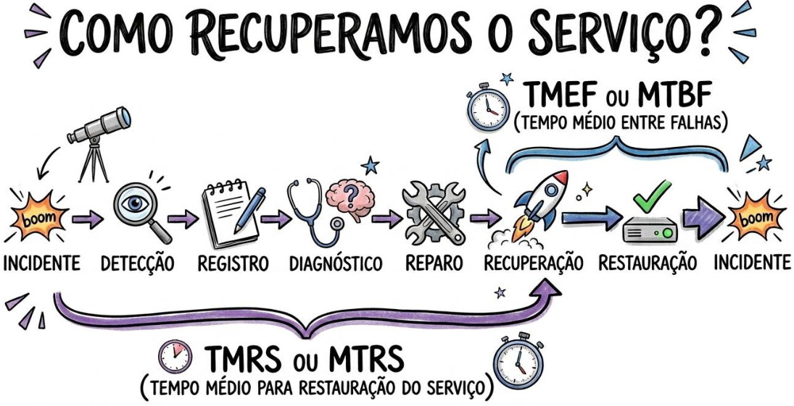


A imagem anterior ajuda a entender o ciclo completo de tratamento de uma falha em um serviço de tecnologia da informação. O processo começa com a ocorrência de um incidente, que provoca uma interrupção ou degradação do serviço. Em seguida, a falha é detectada, registrada formalmente e analisada durante a etapa de diagnóstico, na qual a equipe busca identificar sua causa. Após a identificação do problema, são realizadas as atividades de reparo, seguidas da recuperação e da restauração do serviço, retornando o sistema ao funcionamento normal. 

A imagem também destaca a métrica MTRS (Mean Time to Restore Service), que representa o Tempo Médio para Restauração do Serviço (TMRS). Essa métrica mede todo o período compreendido entre a ocorrência do incidente e a efetiva restauração do serviço aos usuários. Logo, ela engloba não apenas o tempo de reparo, mas também as etapas de detecção, registro, diagnóstico, recuperação e validação da solução. Quanto menor for o TMRS, mais eficiente tende a ser a capacidade da organização em responder e recuperar-se de falhas operacionais.

---

<!-- pagina: 54 -->

**Diego Carvalho, Equipe Informática 2 (Diego Carvalho), Equipe Informática 1 (Diego Carvalho) Aula 10** 

Outro conceito apresentado é o MTBF (Mean Time Between Failures), conhecido como Tempo Médio Entre Falhas (TMEF). Essa métrica mede o intervalo médio entre a ocorrência de duas falhas consecutivas em um sistema. Na imagem, o MTBF corresponde ao período de operação normal compreendido entre a restauração do serviço após uma falha e a ocorrência do próximo incidente. Valores elevados de MTBF indicam que o sistema consegue permanecer funcionando por mais tempo sem interrupções, sugerindo maior confiabilidade operacional. 

**(CEBRASPE / TRT 10ª Região - 2025)** A respeito de conceitos relacionados a alta disponibilidade <mark>e tolerância a falhas, julgue o próximo item. Um serviço com a métrica tempo médio entre falhas (MTBF) de quatro horas, em média, se recupera de falhas nesse período, mas o tempo real pode variar, pois o MTBF é uma média de vários incidentes.</mark> 

**<mark>_______________________ Comentários:</mark>** <mark>MTBF é o tempo médio entre uma falha e outra, ou seja, indica a frequência das falhas ao longo da operação. Não representa o tempo de recuperação do serviço. Quem mede, em média, quanto tempo o sistema leva para voltar é outra métrica, ligada</mark> ao reparo/recuperação (Errado). 

Por fim, a imagem evidencia que a disponibilidade de um serviço depende tanto da rapidez na recuperação quanto da frequência das falhas. Um sistema considerado confiável deve apresentar um MTBF elevado, indicando longos períodos de funcionamento sem incidentes, e um TMRS reduzido, demonstrando capacidade de restaurar rapidamente os serviços quando ocorrem problemas. Dessa forma, essas métricas são amplamente utilizadas em gestão de serviços, operações de TI e monitoramento de infraestrutura para avaliar a qualidade, a estabilidade e a disponibilidade dos sistemas em produção. 

### **Saiba mais:** 

<mark>Imagine que uma empresa de tecnologia possui um banco de dados responsável apenas por validar o login e as permissões de todos os usuários de um aplicativo de streaming. O serviço foi atualizado e entrou em produção após uma janela de manutenção.</mark> 

<mark>O banco de dados operou com estabilidade total, processando milhões de requisições, por exatamente 2.400 horas (cerca de 100 dias). De repente, devido a um vazamento de memória (memory leak) silencioso em uma query mal otimizada, o servidor esgotou a memória RAM e o serviço caiu.</mark> 

<mark>A equipe de Engenharia de Confiabilidade de Sites (SRE) recebeu o alerta, analisou os logs para encontrar a query causadora, reiniciou a instância do banco de dados e aplicou um patch de correção emergencial, levando 6 horas para restabelecer o serviço por completo.</mark> 

|Início do Serviço<br>|Falha            Sistema Restaurado<br>|
|---|---|
||------------------------|-------|---------------------------||
|2.400 h|6 h|
|MTTF|MTTR|


<mark>- MTTF (Mean Time To Failure): tempo que o software do banco de dados permaneceu no ar e funcional antes de travar por falta de memória.</mark> 

### _<mark>MTTF = 2.400 horas</mark>_

---

<!-- pagina: 55 -->

**Diego Carvalho, Equipe Informática 2 (Diego Carvalho), Equipe Informática 1 (Diego Carvalho) Aula 10** 

<mark>MTTR (Mean Time To Repair): tempo gasto pelos engenheiros de software para identificar o memory leak, corrigir o código e reiniciar o banco</mark> 

_<mark>MTTR = 6 horas</mark>_ 

<mark>MTBF (Mean Time Between Failures): ciclo total medido a partir do momento em que o software começou a rodar até o momento em que ele foi corrigido e estava pronto para falhar novamente.</mark> 


<mark>Para entender o impacto desse bug no Acordo de Nível de Serviço (SLA) do sistema de autenticação, calculamos a disponibilidade do software:</mark> 

_Disponibilidade = MTTF/MTBF = 2.400/2.406 = 0,9975 = 99,75%_

---

<!-- pagina: 56 -->

**Diego Carvalho, Equipe Informática 2 (Diego Carvalho), Equipe Informática 1 (Diego Carvalho) Aula 10** 


<!-- Start of picture text -->
Métricas de Desempenho<br><!-- End of picture text -->

##### **<mark>INCIDÊNCIA EM PROVA: BAIXÍSSIMA</mark>** 

As métricas de desempenho avaliam a eficiência com que o software utiliza recursos computacionais para executar suas funções. Elas permitem analisar aspectos relacionados à velocidade de processamento, capacidade de atendimento de usuários e consumo de recursos do ambiente de execução. Exemplos típicos incluem Tempo de Resposta, Throughput (taxa de processamento), Uso de CPU, Consumo de Memória, Utilização de Rede e outras medidas relacionadas à eficiência operacional do sistema. 

## **Tempo de Resposta** 

O tempo de resposta está diretamente relacionado à experiência percebida pelos usuários. O que essa métrica procura medir? Seu objetivo é determinar o intervalo entre a emissão de uma solicitação e a apresentação da resposta pelo sistema. Em aplicações interativas, esse indicador influencia fortemente a percepção de qualidade. Quando uma operação é concluída rapidamente, os usuários tendem a considerar o sistema mais eficiente e responsivo. 

Considere uma aplicação bancária. Como o tempo de resposta pode ser observado nesse contexto? Ao solicitar uma consulta de saldo, por exemplo, existe um intervalo entre o envio da requisição e a exibição das informações na tela. Esse período corresponde ao tempo de resposta da operação. Em geral, quanto menor for esse valor, melhor tende a ser a experiência de utilização proporcionada pelo sistema. 

## **Throughput** 

Outra métrica amplamente utilizada é o throughput, também conhecido como vazão. O que ela procura avaliar? Enquanto o tempo de resposta analisa uma operação individual, o throughput mede a capacidade global do sistema de processar trabalho ao longo do tempo. Dependendo do contexto, essa capacidade pode ser expressa em transações por segundo, requisições por minuto ou qualquer outra unidade compatível com a natureza da aplicação. 

Uma dúvida frequente surge ao comparar essas duas métricas. Tempo de resposta e throughput medem a mesma característica? Não. O tempo de resposta indica a rapidez com que uma solicitação específica é atendida. O throughput, por sua vez, mede o volume total de trabalho que o sistema consegue processar durante determinado período. Embora representem aspectos distintos do desempenho, ambos estão fortemente relacionados e frequentemente influenciam um ao outro. 

## **Uso de Recursos** 

As métricas de utilização de recursos complementam essa análise. O que elas procuram medir? Seu objetivo é avaliar quanto dos recursos computacionais disponíveis está sendo consumido pelo software durante sua execução. Entre os elementos mais monitorados encontram-se o uso de processador, memória, armazenamento e largura de banda de rede. Essas informações ajudam a compreender a eficiência da implementação e a capacidade da infraestrutura de sustentar a carga de trabalho existente. 

Uma utilização elevada de recursos deve ser considerada sempre um problema? Não necessariamente. Utilizações muito baixas podem indicar desperdício de capacidade disponível, enquanto níveis excessivamente altos podem sinalizar saturação e risco de degradação do desempenho. O objetivo normalmente consiste em manter um equilíbrio que permita atender às demandas dos usuários sem comprometer a estabilidade do sistema.

---

<!-- pagina: 57 -->

**Diego Carvalho, Equipe Informática 2 (Diego Carvalho), Equipe Informática 1 (Diego Carvalho) Aula 10** 

Essas métricas tornam-se particularmente importantes quando o número de usuários cresce. O que ocorre quando a demanda aumenta significativamente? Em geral, o throughput exigido tende a crescer, o que provoca maior consumo de processador, memória e recursos de rede. Caso a infraestrutura não consiga acompanhar esse aumento de carga, o tempo de resposta tende a se elevar e a experiência dos usuários pode ser prejudicada. 

|**MÉTRICAS**|**O QUE MEDE?**|**EXEMPLO**|**FOCO DA AVALIAÇÃO**|
|---|---|---|---|
|**TEMPO DE**<br>**RESPOSTA**|Intervalo entre o envio de uma<br>solicitação e a apresentação da<br>resposta pelo sistema.|Tempo<br>necessário<br>para<br>exibir o saldo após uma<br>consulta bancária.|Rapidez de atendimento de<br>uma operação individual e<br>experiência do usuário.|
|**THROUGHPUT**<br>**(VAZÃO)**|Quantidade<br>de<br>trabalho<br>processada pelo sistema em<br>determinado período de tempo.|Número<br>de<br>transações<br>bancárias processadas por<br>segundo ou por minuto.|Capacidade<br>global<br>de<br>processamento do sistema.|
|**USO DE**<br>**RECURSOS**|Percentual<br>de<br>recursos<br>computacionais<br>consumidos<br>durante a execução do software.|Utilização de CPU, memória<br>RAM,<br>armazenamento<br>e<br>largura de banda de rede.|Eficiência da utilização da<br>infraestrutura e capacidade de<br>suportar carga de trabalho.|


### **Saiba mais:** 

<mark>Imagine um sistema de comércio eletrônico durante uma grande promoção. Em determinado momento, 5.000 usuários estão acessando simultaneamente o site para pesquisar produtos e finalizar compras. Os administradores precisam verificar se a infraestrutura consegue suportar essa carga sem comprometer a experiência dos clientes. Para isso, são monitoradas métricas como Tempo de Resposta, Throughput e Uso de Recursos.</mark> 

<mark>Tempo de Resposta:</mark> 

<mark>Suponha que um cliente clique no botão "Finalizar Compra" às 14h00min00s e a confirmação do pedido apareça na tela às 14h00min02s. Nesse caso, o tempo de resposta foi de 2 segundos. Se os usuários perceberem atrasos excessivos, como 10 ou 15 segundos para concluir uma operação simples, a sensação será de lentidão e baixa qualidade do serviço. Assim, essa métrica permite avaliar a rapidez com que o sistema responde a cada solicitação individual realizada pelos usuários.</mark> 

<mark>Throughput:</mark> 

<mark>Durante o mesmo período, os administradores observam que o sistema está processando aproximadamente 1.200 pedidos por minuto. Esse valor representa o throughput da aplicação naquele momento. Diferentemente do tempo de resposta, que analisa uma operação específica, o throughput mede a quantidade total de trabalho que o sistema consegue executar em determinado intervalo de tempo. Se uma melhoria de infraestrutura permitir aumentar a capacidade para 2.000 pedidos por minuto, o throughput terá aumentado, indicando maior capacidade de processamento.</mark> 

<mark>Uso de Recursos:</mark>

---

<!-- pagina: 58 -->

**Diego Carvalho, Equipe Informática 2 (Diego Carvalho), Equipe Informática 1 (Diego Carvalho) Aula 10** 

<mark>Enquanto o sistema atende aos usuários, também são monitorados os recursos computacionais consumidos. Imagine que os servidores estejam utilizando 75% da CPU, 68% da memória RAM e 60% da largura de banda de rede. Esses valores indicam que a infraestrutura está sendo utilizada de forma significativa, mas ainda possui capacidade para absorver aumentos moderados de carga. Caso a utilização da CPU se aproxime de 100% durante períodos prolongados, o sistema poderá apresentar degradação de desempenho e aumento do tempo de resposta.</mark> 

<mark>As três métricas estão diretamente relacionadas. Se a quantidade de usuários aumentar para 10.000 acessos simultâneos, o throughput exigido também aumentará. Como consequência, o consumo de CPU, memória e rede tende a crescer. Se a infraestrutura não for capaz de suportar essa demanda adicional, o tempo de resposta começará a aumentar, fazendo com que os usuários aguardem mais tempo para concluir suas operações. Por esse motivo, tempo de resposta, throughput e uso de recursos são frequentemente analisados em conjunto para avaliar a eficiência e a capacidade de</mark> escalabilidade de um sistema. 


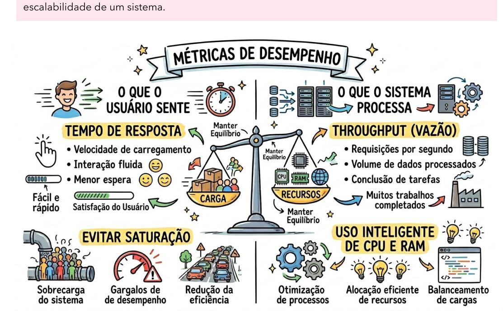


<!-- Start of picture text -->
escalabilidade de um sistema.<br><!-- End of picture text -->

---

<!-- pagina: 59 -->

**Diego Carvalho, Equipe Informática 2 (Diego Carvalho), Equipe Informática 1 (Diego Carvalho) Aula 10** 


<!-- Start of picture text -->
Métricas<br><!-- End of picture text -->


<!-- Start of picture text -->
Orientadas a<br><!-- End of picture text -->


<!-- Start of picture text -->
Objetos<br><!-- End of picture text -->

##### **<mark>INCIDÊNCIA EM PROVA: BAIXÍSSIMA</mark>** 

As Métricas Orientadas a Objetos são medidas quantitativas desenvolvidas especificamente para avaliar a qualidade, a complexidade e o esforço técnico de projetos de software criados sob o paradigma orientado a objetos, suprindo a falta de granularidade das métricas convencionais (como LOC ou PF) para esse tipo de arquitetura. Em vez de focar apenas no detalhe algorítmico isolado, essas métricas analisam características intrínsecas às classes e suas interações, avaliando propriedades estruturais como o tamanho da classe, o encapsulamento, a profundidade das árvores de herança, o grau de acoplamento e a coesão dos métodos. 

## **Número de Scripts de Cenário** 

Um script de cenário, semelhante a um caso de uso, consiste em uma sequência detalhada de passos descrevendo a interação do usuário com a aplicação, formatada no trio: iniciador, ação e participante. O cálculo numérico exato desses scripts exibe correlação direta tanto com o tamanho geral da aplicação quanto com a quantidade de casos de teste que precisarão ser inequivocamente criados e desenvolvidos para exercitar o sistema depois de sua construção. 

## **Número de Classes-Chave** 

As classes-chave são essencialmente os componentes altamente independentes definidos no começo do processo de análise orientada a objetos. Como essas classes fundamentais são essenciais e absolutamente centrais para a compreensão do domínio do problema em si, a sua quantidade constitui uma excelente indicação da quantidade de esforço técnico que será necessário para desenvolver o software e do potencial de reutilização que será aplicado na engenharia do sistema. 

## **Número de Classes de Apoio** 

As classes de apoio são aquelas estruturas requeridas para efetivamente implementar o sistema, mas não estão diretamente ligadas ao domínio do problema. Exemplos clássicos dessas estruturas englobam classes de interface de usuário, acesso e manipulação de bancos de dados e de cálculos. O seu número quantificado fornece uma nítida dimensão da imensa quantidade de esforço e trabalho técnico necessário para programar todo o sistema e do potencial de reutilização do software. 

## **Número Médio de Classes de Apoio para cada Classe-Chave** 

De modo geral, as classes-chave são conhecidas logo no começo do projeto, enquanto as estruturas de apoio são definidas durante a execução. Se esse número médio for conhecido para certo domínio de problema, a estimativa fica imensamente simplificada. Aplicações complexas dotadas de interface gráfica costumam exibir de duas a três vezes mais classes de apoio em relação às chaves, ao passo que aquelas sem interface ficam apenas entre uma e duas vezes. 

## **Número de Subsistemas** 

O subsistema consiste em uma grande agregação de classes individuais concebida e pensada a fim de apoiar ativamente uma determinada função que resulta visível para o usuário final do sistema computacional. Identificar precocemente a quantidade exata desses importantes subsistemas na hierarquia torna excepcionalmente fácil a posterior elaboração de um cronograma adequado, em que todo o complexo esforço de engenharia acaba adequadamente repartido entre todos os profissionais envolvidos.

---

<!-- pagina: 60 -->

**Diego Carvalho, Equipe Informática 2 (Diego Carvalho), Equipe Informática 1 (Diego Carvalho) Aula 10** 

|**MÉTRICAS**|**O QUE MEDE?**|**O QUE INDICA?**|
|---|---|---|
|**NÚMERO DE**<br>**SCRIPTS DE**<br>**CENÁRIO**|Quantidade de cenários ou sequências<br>de interação entre usuários e sistema<br>identificados durante a análise.|Indica o tamanho funcional da aplicação e<br>fornece uma estimativa inicial da quantidade<br>de testes que precisarão ser desenvolvidos.|
|**NÚMERO DE**<br>**CLASSES-CHAVE**|Quantidade de classes fundamentais que<br>representam os principais conceitos do<br>domínio do problema.|Auxilia<br>na<br>estimativa<br>do<br>esforço<br>de<br>desenvolvimento<br>e<br>do<br>potencial<br>de<br>reutilização da solução orientada a objetos.|
|**NÚMERO DE**<br>**CLASSES DE APOIO**|Quantidade<br>de<br>classes<br>auxiliares<br>necessárias para implementar o sistema,<br>como interfaces, acesso a banco de<br>dados e serviços técnicos.|Indica o esforço técnico necessário para<br>implementar a infraestrutura da aplicação.|
|**NÚMERO MÉDIO DE**<br>**CLASSES DE APOIO**<br>**POR CLASSE-CHAVE**|Relação entre a quantidade de classes de<br>apoio e a quantidade de classes-chave.|Auxilia na realização de estimativas em<br>projetos semelhantes e fornece indícios<br>sobre a complexidade da implementação.|
|**NÚMERO DE**<br>**SUBSISTEMAS**|Quantidade de grandes agrupamentos<br>de<br>classes<br>responsáveis<br>por<br>funcionalidades visíveis aos usuários.|Facilita o planejamento do projeto, a<br>distribuição de trabalho entre equipes e a<br>organização da arquitetura do sistema.|


### **Saiba mais:** 

<mark>Imagine que uma empresa está desenvolvendo um sistema de gestão hospitalar. Durante a fase de análise orientada a objetos, os analistas identificam os principais elementos do domínio do problema, como Paciente, Médico, Consulta, Exame e Internação. A partir desse modelo inicial, diversas métricas orientadas a objetos podem ser utilizadas para estimar o tamanho, a complexidade e o esforço necessário para construir o sistema.</mark> 

<mark>Número de Scripts de Cenário:</mark> 

<mark>Durante o levantamento de requisitos, são definidos diversos cenários de interação entre usuários e sistema, como Agendar Consulta, Cancelar Consulta, Registrar Exame, Internar Paciente e Emitir Relatório Médico. Suponha que o projeto possua 40 scripts de cenário. Esse número fornece uma indicação inicial do tamanho funcional da aplicação e da quantidade de testes que provavelmente serão necessários. Quanto maior o número de cenários, maior tende a ser o esforço de implementação, validação e manutenção do sistema.</mark> 

<mark>Número de Classes-Chave:</mark> 

<mark>Na modelagem do domínio, a equipe identifica cinco classes fundamentais: Paciente, Médico, Consulta, Exame e Internação. Essas são as chamadas classes-chave, pois representam os conceitos centrais do negócio hospitalar. O número de classes-chave ajuda a estimar a complexidade do domínio e o esforço necessário para modelar corretamente os objetos mais importantes do sistema. Em geral, quanto maior o número dessas classes, maior tende a ser a complexidade conceitual da aplicação.</mark> 

<mark>Número de Classes de Apoio:</mark>

---

<!-- pagina: 61 -->

**Diego Carvalho, Equipe Informática 2 (Diego Carvalho), Equipe Informática 1 (Diego Carvalho) Aula 10** 

<mark>Além das classes do domínio, são necessárias diversas classes técnicas para implementar a solução, como TelaCadastroPaciente, TelaAgendamento, ConexaoBancoDados, RepositorioPaciente, GeradorRelatorios e ValidadorCPF. Suponha que o sistema possua 15 classes de apoio. Embora essas classes não representem diretamente conceitos do negócio hospitalar, elas são indispensáveis para a implementação da aplicação. Sua quantidade fornece uma indicação do esforço técnico necessário para construir a infraestrutura do sistema.</mark> 

<mark>Número Médio de Classes de Apoio para cada Classe-Chave:</mark> 

<mark>Se o sistema possui 5 classes-chave e 15 classes de apoio, o número médio de classes de apoio por classe-chave será: 15/5 = 3.</mark> 

<mark>Isso significa que, para cada conceito principal do domínio, são necessárias em média três classes auxiliares para implementar funcionalidades, persistência de dados, validações e interfaces. Essa métrica é útil para estimativas, pois permite prever aproximadamente quantas classes adicionais serão necessárias em projetos semelhantes do mesmo domínio.</mark> 

<mark>Número de Subsistemas:</mark> 

<mark>Para organizar melhor a arquitetura, o sistema hospitalar é dividido em quatro subsistemas principais: Cadastro de Pacientes, Agendamento de Consultas, Gestão de Internações e Exames e Diagnósticos. Nesse caso, o número de subsistemas é igual a 4. Essa métrica ajuda os gerentes e arquitetos a distribuir o trabalho entre equipes, planejar cronogramas e controlar a complexidade da solução. Quanto mais claramente os subsistemas estiverem definidos, mais fácil tende a ser a manutenção e evolução do software.</mark> 

<mark>Nesse exemplo, as métricas orientadas a objetos fornecem uma visão quantitativa da estrutura do sistema ainda nas fases iniciais de análise e projeto, permitindo estimar esforço, identificar complexidade e planejar melhor as atividades de desenvolvimento antes mesmo da implementação</mark> do código-fonte.

---

<!-- pagina: 62 -->

**Diego Carvalho, Equipe Informática 2 (Diego Carvalho), Equipe Informática 1 (Diego Carvalho) Aula 10** 


<!-- Start of picture text -->
Métricas de<br><!-- End of picture text -->


<!-- Start of picture text -->
Qualidade<br><!-- End of picture text -->


<!-- Start of picture text -->
de Código<br><!-- End of picture text -->

##### **<mark>INCIDÊNCIA EM PROVA: BAIXÍSSIMA</mark>** 

A qualidade de código-fonte está associada às características que influenciam a facilidade de compreender, modificar, testar e manter um software ao longo do tempo. Por que esse conceito recebe tanta atenção durante o desenvolvimento? Porque sistemas raramente permanecem inalterados após sua entrega. Novas funcionalidades, correções e adaptações são constantemente necessárias, tornando essencial a existência de uma base de código que possa ser evoluída de forma eficiente e segura. 

As métricas de qualidade possuem um propósito diferente das métricas de tamanho e das métricas estruturais. O que exatamente elas procuram avaliar? Enquanto algumas medidas analisam a quantidade de código produzida ou a forma como seus componentes estão organizados, as métricas de qualidade buscam identificar indícios de aderência a boas práticas de desenvolvimento. Essas informações ajudam a avaliar aspectos relacionados à legibilidade, à manutenibilidade, à testabilidade e à capacidade de evolução do sistema, fornecendo suporte para atividades de melhoria contínua do software. 

A principal técnica utilizada para coletar essas métricas é a análise estática: a inspeção do código-fonte sem executá-lo. Por meio de ferramentas automatizadas — como SonarQube, PMD e Checkstyle —, é possível identificar duplicações, violações de padrões, estimativas de dívida técnica e outros indicadores diretamente no código, sem a necessidade de compilação ou execução. Essa abordagem é amplamente utilizada em pipelines de integração contínua, permitindo monitoramento contínuo da qualidade ao longo do desenvolvimento. 

## **Duplicação de Código** 

A duplicação de código ocorre quando trechos idênticos ou muito semelhantes aparecem em diferentes partes de um sistema. Por que essa característica é monitorada por ferramentas de qualidade de software? Porque a repetição de lógica em múltiplos locais tende a aumentar a dificuldade de manutenção e torna mais complexo o processo de evolução do sistema ao longo do tempo. 

Quando uma regra de negócio precisa ser alterada ou um defeito precisa ser corrigido, todas as ocorrências daquele trecho devem ser atualizadas. O que acontece se uma das cópias for esquecida durante a manutenção? Nesse caso, diferentes partes do sistema podem passar a apresentar comportamentos inconsistentes, aumentando o risco de falhas e dificultando a identificação dos problemas posteriormente. 

A medição da duplicação costuma ser expressa como um percentual do total de linhas de código analisadas. Esse percentual representa apenas cópias exatas? Não. Ferramentas de análise estática frequentemente identificam também blocos muito semelhantes que apresentam pequenas diferenças de implementação. Dessa forma, a métrica procura refletir o grau de repetição existente na base de código como um todo. 

A presença de duplicação deve ser eliminada em qualquer situação? Nem sempre. Em alguns contextos, pequenas repetições podem ser consideradas aceitáveis quando a criação de abstrações adicionais tornaria o sistema mais complexo do que o necessário. Ainda assim, níveis elevados de duplicação costumam indicar oportunidades de refatoração e melhoria da manutenibilidade do software. 

## **Dívida Técnica** 

A dívida técnica é um conceito utilizado para representar os custos futuros gerados por decisões tomadas durante o desenvolvimento de software. Por que utilizar o termo "dívida"? Porque determinadas escolhas

---

<!-- pagina: 63 -->

**Diego Carvalho, Equipe Informática 2 (Diego Carvalho), Equipe Informática 1 (Diego Carvalho) Aula 10** 

podem acelerar a entrega de funcionalidades no presente, mas tendem a exigir esforço adicional no futuro. Assim como ocorre em uma dívida financeira, a postergação das correções pode aumentar o trabalho necessário para manter e evoluir o sistema ao longo do tempo. 

A origem da dívida técnica não está limitada à existência de código de baixa qualidade. Que situações também podem gerar esse tipo de problema? Documentação insuficiente, cobertura de testes inadequada, soluções arquiteturais temporárias e simplificações adotadas para atender prazos são exemplos comuns. Em muitos projetos, essas decisões são tomadas conscientemente para atender necessidades imediatas do negócio, mesmo sabendo que poderão exigir ajustes posteriores. 

O crescimento da dívida técnica depende diretamente da evolução do sistema. Ela sempre aumenta com o passar do tempo? Não necessariamente. O impacto tende a ser maior quando as áreas afetadas continuam recebendo alterações frequentes, pois cada modificação passa a exigir mais esforço para compreensão, manutenção e correção. Quanto mais difícil se torna trabalhar sobre uma parte do sistema, maior tende a ser o custo associado àquela dívida. 

Ferramentas de análise estática são frequentemente utilizadas para auxiliar nessa avaliação. Como estimar algo que não pode ser observado diretamente? Soluções como o SonarQube analisam o código-fonte e estimam o esforço necessário para corrigir problemas identificados, normalmente expressando esse valor em horas de trabalho. Essa estimativa não representa a dívida técnica real do projeto de forma absoluta, mas fornece um indicador útil para apoiar atividades de manutenção, planejamento e melhoria da qualidade do software. 

## **Violações de Estilo e Padrões** 

As violações de estilo e padrões correspondem a desvios em relação às convenções de desenvolvimento adotadas por uma equipe ou recomendadas para determinada linguagem de programação. Por que essas convenções são importantes? Porque elas promovem uniformidade na escrita do código, facilitando sua leitura e compreensão por diferentes desenvolvedores. Quando padrões são seguidos de forma consistente, torna-se mais simples revisar, modificar e manter o software ao longo do tempo. 

Essas violações podem assumir diversas formas dentro de um projeto. Que tipos de problemas costumam ser encontrados? Exemplos comuns incluem nomenclatura inconsistente de variáveis, estruturas excessivamente complexas e métodos muito extensos. Alguns desses problemas são classificados como code smells, pois podem indicar dificuldades de manutenção ou oportunidades de melhoria na organização do código. 

O impacto dessas violações nem sempre é perceptível de forma imediata. Se uma ocorrência isolada parece pequena, por que ela merece atenção? Porque o acúmulo gradual de desvios reduz a uniformidade da base de código e aumenta o esforço necessário para compreender seu funcionamento. À medida que o sistema evolui, essa falta de padronização pode dificultar atividades de revisão, correção de defeitos e implementação de novas funcionalidades. 

A identificação dessas ocorrências é frequentemente realizada por ferramentas de análise estática. Como garantir que os padrões definidos pela equipe estejam sendo seguidos? Essas ferramentas verificam automaticamente o código-fonte em busca de desvios em relação às regras estabelecidas, fornecendo relatórios que auxiliam na manutenção da consistência e da qualidade da implementação. Dessa forma, as violações de estilo e padrões tornam-se indicadores úteis para acompanhar a legibilidade e a manutenibilidade do software. 

## **Cobertura de Código**

---

<!-- pagina: 64 -->

**Diego Carvalho, Equipe Informática 2 (Diego Carvalho), Equipe Informática 1 (Diego Carvalho) Aula 10** 

A cobertura de código é uma métrica utilizada para medir quanto da implementação foi executado durante os testes. O que exatamente está sendo medido? Dependendo da técnica adotada, a análise pode considerar linhas de código, métodos, funções, instruções ou ramos de decisão percorridos durante a execução. Essas informações ajudam a identificar áreas do sistema que ainda não foram exercitadas e que podem exigir testes adicionais. 

A cobertura é frequentemente utilizada como indicador da abrangência dos testes. Por que essa métrica é considerada importante? Porque trechos de código que nunca são executados durante os testes possuem maior probabilidade de conter problemas não identificados. Ao aumentar a cobertura, reduzse o risco de existirem partes do sistema que permanecem sem qualquer verificação durante o processo de validação. 

Entretanto, uma cobertura elevada não garante necessariamente a qualidade dos testes. Seria correto concluir que um sistema com 100% de cobertura está livre de defeitos? Não. Um teste pode executar determinado trecho de código sem verificar adequadamente os resultados produzidos. Além disso, diferentes cenários de entrada, condições excepcionais e combinações de dados podem permanecer sem validação, mesmo quando todas as linhas foram executadas. 

Essa limitação existe porque a cobertura mede execução e não eficácia. O que isso significa na prática? Significa que a métrica informa quais partes do software foram percorridas durante os testes, mas não avalia se os testes foram capazes de detectar comportamentos incorretos. Por essa razão, a cobertura de código deve ser analisada em conjunto com outras evidências de qualidade, como a qualidade dos casos de teste, a cobertura de requisitos e os resultados obtidos durante a validação do sistema. 

## **Métricas de Halstead** 

As métricas de Halstead constituem uma das primeiras abordagens quantitativas para analisar programas de computador a partir do próprio código-fonte. Como essas métricas realizam essa análise? A técnica utiliza a contagem de operadores e operandos presentes na implementação, considerando tanto a quantidade de elementos distintos quanto o número total de ocorrências. Essas informações servem como base para o cálculo de diversas métricas derivadas relacionadas à estrutura do software. 

Entre as métricas mais conhecidas estão o volume, a dificuldade e o esforço. O que essas medidas procuram representar? O volume estima a quantidade de informação contida no programa, enquanto a dificuldade procura indicar o grau de esforço cognitivo necessário para compreender sua implementação. A partir dessas medidas, também é possível obter estimativas relacionadas ao esforço exigido para desenvolvimento e manutenção do software. 

Essas métricas podem ser utilizadas para medir diretamente a qualidade do código? Não exatamente. O que elas fornecem são indícios quantitativos sobre características estruturais da implementação. Valores elevados de volume ou dificuldade podem sugerir maior complexidade e potencial aumento do esforço de compreensão, manutenção e evolução do sistema, mas não permitem concluir isoladamente que o código possui boa ou má qualidade. 

Uma das vantagens dessa abordagem está na facilidade de obtenção dos dados. Como realizar essas medições em grandes sistemas? Como os cálculos dependem apenas da análise dos operadores e operandos presentes no código-fonte, ferramentas automatizadas podem coletar essas informações e gerar as métricas de forma objetiva. Isso permite utilizar os resultados como apoio à avaliação da complexidade e da manutenibilidade do software, especialmente quando combinados com outras métricas de qualidade.

---

<!-- pagina: 65 -->

**Diego Carvalho, Equipe Informática 2 (Diego Carvalho), Equipe Informática 1 (Diego Carvalho) Aula 10** 

## **Razão Comentários/Código** 

A razão comentários/código é uma métrica utilizada para avaliar a proporção entre linhas de comentário e linhas de código executável presentes em um sistema. Por que essa medida pode ser útil? Porque ela fornece indícios sobre o nível de documentação incorporado à implementação, permitindo analisar se existem informações suficientes para auxiliar a compreensão do software durante atividades de manutenção e evolução. 

Um valor reduzido significa necessariamente que o código possui baixa qualidade? Não. Em muitos casos, uma implementação bem estruturada, com nomes claros e organização adequada, pode ser compreendida com poucos comentários. Ainda assim, valores muito baixos podem indicar ausência de explicações importantes sobre regras de negócio, decisões arquiteturais ou restrições que não são facilmente percebidas apenas pela leitura do código. 

Da mesma forma, valores elevados não devem ser interpretados automaticamente como um problema. O que pode explicar uma grande quantidade de comentários? Em alguns projetos, requisitos regulatórios, padrões organizacionais ou necessidades específicas de documentação exigem registros detalhados. Em outras situações, o excesso de comentários pode refletir dificuldades de compreensão da implementação ou tentativas de compensar a falta de clareza do próprio código. 

O objetivo dessa métrica não é maximizar nem minimizar a quantidade de comentários. O que se busca, então? Procura-se um equilíbrio em que o código seja suficientemente claro para expressar sua intenção principal, enquanto os comentários são utilizados para registrar decisões, motivações, restrições e informações que não seriam facilmente compreendidas apenas pela análise da implementação. 

|**MÉTRICAS**|**O QUE MEDE?**|**O QUE INDICA?**|
|---|---|---|
|**DUPLICAÇÃO**<br>**DE CÓDIGO**|Percentual de trechos de código<br>idênticos ou muito semelhantes<br>presentes no sistema.|Níveis elevados de repetição aumentam a dificuldade<br>de manutenção e podem gerar inconsistências quando<br>alterações não são replicadas em todas as ocorrências.|
|**DÍVIDA**<br>**TÉCNICA**|Estimativa<br>do<br>esforço<br>futuro<br>necessário para corrigir problemas<br>acumulados no software.|Indica o impacto de decisões técnicas que aceleraram<br>o desenvolvimento no presente, mas que podem<br>aumentar os custos de manutenção e evolução no<br>futuro.|
|**VIOLAÇÕES DE**<br>**ESTILO E**<br>**PADRÕES**|Quantidade de desvios em relação<br>às convenções de codificação e<br>boas<br>práticas<br>adotadas<br>pela<br>equipe.|Reflete o grau de padronização, legibilidade e<br>manutenibilidade da base de código. Um número<br>elevado<br>pode<br>indicar<br>maior<br>dificuldade<br>de<br>compreensão e manutenção.|
|**COBERTURA DE**<br>**CÓDIGO**|Percentual do código-fonte que foi<br>efetivamente executado durante os<br>testes.|Indica a abrangência dos testes e ajuda a identificar<br>áreas da implementação que ainda não foram<br>exercitadas ou validadas.|

---

<!-- pagina: 66 -->

**Diego Carvalho, Equipe Informática 2 (Diego Carvalho), Equipe Informática 1 (Diego Carvalho) Aula 10** 


<!-- Start of picture text -->
Métricas de Processo<br><!-- End of picture text -->

|**INCIDÊNCIA EM PROVA: BAIXÍSSIMA**|
|---|


<!-- Start of picture text -->
DRE (Defect Removal Efficiency)<br><!-- End of picture text -->

#### **<mark>DEFECT REMOVAL EFFICIENCY (DRE)</mark>** 

O Defect Removal Efficiency (DRE) mede a eficiência do processo de desenvolvimento e testes na identificação e remoção de defeitos antes da entrega do software. Seu cálculo compara os defeitos eliminados durante o desenvolvimento com o total de defeitos encontrados antes e após a entrega. Valores elevados indicam maior eficácia das atividades de verificação e validação. 

A Eficiência na Remoção de Defeitos, conhecida pela sigla DRE, está entre as métricas mais importantes utilizadas na gestão da qualidade de software. Por que essa medida recebe tanta atenção? Porque seu objetivo é avaliar a capacidade do processo de desenvolvimento em identificar e eliminar defeitos antes que eles cheguem aos usuários finais. Em outras palavras, a DRE procura medir o quanto as atividades de revisão, inspeção e teste conseguem filtrar problemas antes da entrega do produto. 

Como essa métrica é calculada quando se analisa o projeto como um todo? A DRE relaciona a quantidade de defeitos encontrados antes da entrega com o total de defeitos identificados antes e depois da disponibilização do software. Essa relação pode ser representada por: DRE = E/(E+D). Nessa fórmula, E representa os defeitos encontrados durante o desenvolvimento e D corresponde aos defeitos identificados após a entrega do sistema aos usuários. 

O que o resultado obtido procura indicar? Quanto maior o valor da DRE, maior tende a ser a capacidade do processo de qualidade de detectar problemas antes da implantação. Quando a métrica se aproxima de 1, significa que a maior parte dos defeitos foi removida ainda durante o desenvolvimento. Por outro lado, valores reduzidos indicam que uma quantidade significativa de problemas escapou das atividades de validação e somente foi descoberta após a entrega do produto. 

Seria possível atingir uma DRE igual a 1? Do ponto de vista teórico, sim. Esse resultado indicaria que todos os defeitos foram identificados antes da disponibilização do software e que nenhum problema foi encontrado posteriormente. Entretanto, em projetos reais, essa situação é extremamente rara, pois sempre existe a possibilidade de que determinados defeitos permaneçam ocultos até o uso efetivo do sistema em ambiente operacional. 

A aplicação da DRE não se limita à avaliação do projeto completo. Como analisar a eficiência de uma atividade específica do processo de desenvolvimento? Para essa finalidade, a métrica pode ser utilizada em cada etapa da Engenharia de Software, medindo a capacidade de uma atividade de identificar defeitos antes que eles avancem para a próxima fase. Nesse contexto, utiliza-se a expressão: DREi = Ei/(Ei + Ei+1 ). Nessa fórmula, Ei representa os defeitos encontrados na atividade analisada e Ei+1 corresponde aos defeitos identificados posteriormente, mas que deveriam ter sido detectados naquela etapa. 

Por que essa versão da métrica é tão útil? Porque ela permite avaliar a capacidade de filtragem de cada atividade do processo. Considere uma revisão de requisitos. Se muitos defeitos relacionados aos requisitos forem descobertos apenas durante o projeto ou a implementação, isso pode indicar que a revisão inicial não foi suficientemente eficaz. A DRE ajuda justamente a identificar esse tipo de situação e a direcionar esforços de melhoria para as etapas que apresentam menor eficiência na detecção de defeitos.

---

<!-- pagina: 67 -->

**Diego Carvalho, Equipe Informática 2 (Diego Carvalho), Equipe Informática 1 (Diego Carvalho) Aula 10** 

A análise da DRE evidencia uma preocupação central da Engenharia de Software. O objetivo da qualidade é apenas corrigir defeitos quando eles aparecem? Não. O foco principal consiste em identificar e remover problemas o mais cedo possível, quando os custos de correção ainda são reduzidos. Ao medir a capacidade de cada etapa em impedir que defeitos avancem para fases posteriores, a DRE fornece informações valiosas para o aperfeiçoamento contínuo dos processos e para a melhoria da qualidade dos produtos de software. 

### **Saiba mais:** 

<mark>Considere um projeto de software em que a equipe encontrou e corrigiu 90 defeitos durante as fases de revisão, testes e validação. Após a entrega do sistema aos usuários, foram identificados mais 10 defeitos que não haviam sido detectados anteriormente. A métrica Defect Removal Efficiency (DRE) mede a eficiência do processo de desenvolvimento e testes na remoção de defeitos antes da entrega do software. Seu cálculo é realizado pela fórmula:</mark> 

_<mark>DRE = Defeitos Removidos Antes da Entrega/(Defeitos Removidos Antes da Entrega + Defeitos Encontrados Após a Entrega) x 100 = 90/(90+10) x 100 = 90%.</mark>_ 

<mark>Isso significa que a equipe conseguiu eliminar 90% dos defeitos antes que o software fosse disponibilizado aos usuários. Essa métrica é amplamente utilizada para avaliar a eficácia das atividades de verificação, validação e testes. Quanto maior o valor do DRE, maior a capacidade do processo de desenvolvimento em detectar e corrigir defeitos antes da entrega do produto,</mark> contribuindo para uma melhor qualidade do software. 

**(CEBRASPE / SEFAZ PR - 2026)** Durante a produção de certo projeto de software, a equipe de <mark>qualidade deseja avaliar a eficácia das atividades de garantia e controle de qualidade na detecção de erros antes que se transformem em defeitos entregues ao usuário. Para isso, eles devem calcular uma métrica que reflita a proporção de erros detectados durante o processo em relação ao total de defeitos encontrados. Com base na situação hipotética precedente, assinale a opção que apresenta a métrica que melhor indica a eficiência da equipe em remover erros antes da entrega do software.</mark> 

<mark>a) requirements coverage index b) customer problem reports c) defect removal efficiency d) fault density e) productivity ratio</mark> 

**<mark>_______________________ Comentários:</mark>** <mark>(a) Errado. Requirements Coverage Index mede o grau de cobertura dos requisitos, não a eficiência na remoção de defeitos; (b) Errado. Customer Problem Reports contabiliza problemas reportados pelos usuários após a entrega; (c) Correto. Defect Removal Efficiency (DRE) mede a proporção de defeitos removidos durante o processo de desenvolvimento em relação ao total de defeitos identificados, avaliando a eficácia das atividades de qualidade; (d) Errado. Fault Density mede a quantidade de defeitos por unidade de tamanho do software; (e) Errado. Productivity Ratio está relacionado à produtividade da equipe, não à remoção de defeitos</mark> (Letra C).

---

<!-- pagina: 68 -->

**Diego Carvalho, Equipe Informática 2 (Diego Carvalho), Equipe Informática 1 (Diego Carvalho) Aula 10** 


---

<!-- pagina: 69 -->

**Diego Carvalho, Equipe Informática 2 (Diego Carvalho), Equipe Informática 1 (Diego Carvalho) Aula 10** 


<!-- Start of picture text -->
Taxa de Retrabalho<br><!-- End of picture text -->

A Taxa de Retrabalho é uma métrica utilizada para identificar quanto do esforço de um projeto foi consumido na correção, revisão ou repetição de atividades já consideradas concluídas. Por que essa medida é importante? Porque o retrabalho geralmente representa recursos que precisaram ser investidos novamente em tarefas já executadas. Quando essa taxa é elevada, podem existir indícios de problemas relacionados aos requisitos, à comunicação entre equipes, ao projeto da solução ou à qualidade da implementação realizada anteriormente. 

A métrica costuma ser calculada pela relação entre o esforço gasto em retrabalho e o esforço total empregado em determinado período ou projeto. Uma taxa elevada significa necessariamente que o processo é ruim? Nem sempre. Em ambientes sujeitos a mudanças frequentes de requisitos, parte do retrabalho pode ser consequência natural da adaptação às novas necessidades. Ainda assim, o acompanhamento contínuo dessa medida permite identificar oportunidades de aperfeiçoamento no processo de desenvolvimento. 


<!-- Start of picture text -->
Produtividade<br><!-- End of picture text -->

A Produtividade expressa a relação entre o resultado obtido e os recursos consumidos para produzi-lo. O que isso representa no contexto da engenharia de software? Significa avaliar quanto software foi desenvolvido em comparação ao esforço investido pela equipe. Para isso, podem ser utilizadas medidas de tamanho como Pontos de Função, histórias concluídas ou, em alguns casos, Linhas de Código, enquanto o esforço costuma ser expresso em horas de trabalho ou pessoas-mês. 

Essa métrica é amplamente utilizada em planejamento e estimativas futuras. Como saber se uma equipe está produzindo mais ou menos do que em projetos anteriores? A análise da produtividade permite realizar comparações ao longo do tempo e identificar possíveis melhorias nos processos utilizados. Entretanto, os resultados devem ser interpretados com cautela, pois fatores como complexidade do domínio, experiência da equipe e características do projeto podem influenciar significativamente os valores obtidos. 


<!-- Start of picture text -->
Mudanças por Versão<br><!-- End of picture text -->

A métrica de Mudanças por Versão registra a quantidade de alterações incorporadas em cada nova entrega do software. Essas alterações podem incluir correções de defeitos, adaptações a novos ambientes, melhorias em funcionalidades existentes e inclusão de novos recursos. O que essa informação revela sobre o produto? Ela fornece uma visão da intensidade das modificações realizadas e ajuda a acompanhar o ritmo de evolução do sistema ao longo do tempo. 

Uma quantidade elevada de mudanças deve ser vista como algo positivo ou negativo? A resposta depende do contexto. Um grande número de alterações pode indicar um produto em rápida evolução, mas também pode refletir a necessidade constante de correções e ajustes. Da mesma forma, poucas mudanças podem sugerir estabilidade, embora também possam representar baixa evolução funcional. Por isso, essa métrica costuma ser analisada em conjunto com indicadores como densidade de defeitos, esforço de manutenção e qualidade das entregas realizadas. 

|**MÉTRICAS**||**O QUE MEDE?**||**O QUE INDICA?**|
|---|---|---|---|---|
|**TAXA DE**<br>**RETRABALHO**|Percentual<br>correção,<br>atividades|<br>do<br>esforço<br>gasto<br>revisão ou repetição<br>já realizadas.|na<br>de|Níveis elevados podem indicar problemas de<br>requisitos, comunicação, projeto ou qualidade<br>da implementação.|

---

<!-- pagina: 70 -->

**Diego Carvalho, Equipe Informática 2 (Diego Carvalho), Equipe Informática 1 (Diego Carvalho) Aula 10** 

|**MÉTRICAS**|**O QUE MEDE?**|**O QUE INDICA?**|
|---|---|---|
|**PRODUTIVIDADE**|Relação entre o tamanho do software<br>produzido e o esforço consumido<br>para produzi-lo.|Permite avaliar a eficiência da equipe e apoiar<br>estimativas de prazo, custo e esforço em projetos<br>futuros.|
|**MUDANÇAS POR**<br>**VERSÃO**|Quantidade<br>de<br>alterações<br>incorporadas em cada nova versão do<br>software.|Indica o ritmo de evolução do sistema e o volume<br>de correções, melhorias e novas funcionalidades<br>implementadas.|

---

<!-- pagina: 71 -->

**Diego Carvalho, Equipe Informática 2 (Diego Carvalho), Equipe Informática 1 (Diego Carvalho) Aula 10** 


<!-- Start of picture text -->
Métricas de Projeto<br><!-- End of picture text -->

##### **<mark>INCIDÊNCIA EM PROVA: BAIXÍSSIMA</mark>** 

As métricas de projeto são medidas quantitativas utilizadas para acompanhar, controlar e avaliar o andamento de um projeto de software específico. Diferentemente das métricas de produto, que analisam características do software desenvolvido, e das métricas de processo, que avaliam a eficiência das atividades de desenvolvimento, as métricas de projeto concentram-se na gestão do empreendimento em execução. Seu principal objetivo é fornecer informações objetivas sobre aspectos como esforço, custo, prazo, produtividade, utilização de recursos e riscos, permitindo que gerentes e equipes monitorem o progresso do trabalho e tomem decisões fundamentadas ao longo do ciclo de vida do projeto. 

Essas métricas desempenham papel fundamental no planejamento e no controle das atividades, pois permitem comparar o que foi inicialmente estimado com o que está efetivamente sendo realizado. Por meio delas, é possível identificar atrasos, estouros de orçamento, desvios de produtividade e outros problemas que possam comprometer os resultados esperados. 


<!-- Start of picture text -->
Esforço<br><!-- End of picture text -->

O Esforço representa a quantidade de trabalho necessária para desenvolver, manter ou evoluir um software. Como essa quantidade de trabalho é medida? Normalmente por meio de horas, dias ou pessoas-mês utilizados na execução das atividades do projeto. Essa métrica permite estimar recursos, acompanhar a execução e comparar o que foi planejado com o que realmente foi realizado. Seu uso é fundamental para avaliar a utilização da capacidade da equipe ao longo do desenvolvimento. 

Embora frequentemente apareçam juntos, esforço e prazo não representam o mesmo conceito. Qual é a diferença? O esforço corresponde ao volume de trabalho empregado, enquanto o prazo representa o tempo decorrido para concluir as atividades. Um projeto pode exigir elevado esforço e, ainda assim, possuir prazo reduzido caso haja mais profissionais envolvidos. Por essa razão, ambas as métricas devem ser analisadas de forma complementar durante o gerenciamento do projeto. 


<!-- Start of picture text -->
Custo<br><!-- End of picture text -->

O Custo corresponde aos recursos financeiros necessários para a execução de um projeto de software. O que está incluído nesse valor? Além da mão de obra da equipe, podem ser considerados gastos com ferramentas, infraestrutura, treinamentos, licenças e outros recursos necessários para o desenvolvimento e manutenção da solução. Dessa forma, o custo fornece uma visão econômica do projeto e auxilia na análise de sua viabilidade. 

Ao avaliar a Métrica de Custo de um projeto de software, é importante notar que a estimativa não se restringe apenas à mão de obra direta dos programadores. A literatura tradicional defende que é através dessa métrica que os gerentes consolidam o total de pessoas envolvidas para provisionamento orçamentário pleno. Todo o esforço indireto tem um custo associado, o que engloba categorizar todos os intervenientes do sistema, tais como: burocratas, diretores, membros da comunidade usuária, consultores externos, membros da auditoria técnica, responsáveis pelo controle de qualidade e a equipe de suporte e operações. Dimensionar todos esses atores é o que dá precisão ao custo global do projeto. 

O acompanhamento contínuo dessa métrica permite verificar se os gastos permanecem alinhados ao orçamento estabelecido. Seria suficiente conhecer apenas o valor total investido? Não necessariamente. Também é importante observar como os recursos estão sendo consumidos ao longo do tempo, pois

---

<!-- pagina: 72 -->

**Diego Carvalho, Equipe Informática 2 (Diego Carvalho), Equipe Informática 1 (Diego Carvalho) Aula 10** 

desvios significativos podem indicar a necessidade de ajustes no planejamento ou na alocação dos recursos disponíveis. 


<!-- Start of picture text -->
Prazo<br><!-- End of picture text -->

O Prazo é a métrica utilizada para medir o tempo necessário para concluir atividades, fases ou o projeto como um todo. Por que essa medida recebe tanta atenção em projetos de software? Porque as entregas normalmente precisam ocorrer dentro de datas previamente definidas. O acompanhamento do prazo permite comparar o cronograma planejado com a execução real, identificando atrasos, antecipações e possíveis impactos sobre os objetivos do projeto. 

A análise do prazo também auxilia na gestão de riscos e no controle das entregas. Um atraso sempre significa baixo desempenho da equipe? Nem sempre. Mudanças de requisitos, dependências externas e dificuldades técnicas podem afetar o cronograma mesmo quando a equipe trabalha de forma eficiente. Por isso, o prazo deve ser interpretado em conjunto com outras informações relacionadas ao contexto do projeto. 


<!-- Start of picture text -->
Valor Agregado<br><!-- End of picture text -->

O Valor Agregado é uma métrica utilizada para medir o valor orçado do trabalho efetivamente concluído em determinado momento do projeto. O que isso significa na prática? Significa que a métrica procura responder quanto do trabalho planejado já foi realmente realizado, considerando o orçamento originalmente definido. Dessa forma, ela integra informações de escopo, prazo e custo em uma única visão de desempenho. 

Essa métrica serve de base para diversos indicadores de gerenciamento. Como identificar se o projeto está adiantado ou atrasado, ou se está gastando mais do que o previsto? Para responder a essas questões, o Valor Agregado é combinado com métricas como Valor Planejado e Custo Real, permitindo calcular indicadores como SPI e CPI. Esses índices auxiliam os gestores a identificar desvios e tomar decisões antes que os impactos se tornem mais significativos. 

|**MÉTRICAS**|**O QUE MEDE?**|**O QUE INDICA?**|
|---|---|---|
|**ESFORÇO**|Quantidade<br>de<br>trabalho<br>necessária<br>para<br>desenvolver, manter ou evoluir o software,<br>geralmente medida em horas, dias ou pessoas-<br>mês.|Permite avaliar a carga de trabalho da<br>equipe,<br>comparar<br>estimativas<br>com<br>resultados reais e apoiar o planejamento<br>de recursos.|
|**CUSTO**|Recursos financeiros consumidos pelo projeto,<br>incluindo<br>mão<br>de<br>obra,<br>infraestrutura,<br>ferramentas, treinamentos, licenças e demais<br>despesas.|Auxilia no controle orçamentário, na<br>análise de viabilidade econômica e na<br>identificação de desvios financeiros.|
|**PRAZO**|Tempo necessário para concluir atividades, fases<br>ou o projeto como um todo.|Permite<br>acompanhar<br>o<br>cronograma,<br>identificar atrasos ou antecipações e<br>apoiar a gestão de riscos relacionados às<br>entregas.|
|**VALOR**<br>**AGREGADO**<br>**(EARNED**<br>**VALUE)**|Valor orçado<br>correspondente ao trabalho<br>efetivamente<br>concluído<br>em<br>determinado<br>momento do projeto.|Fornece uma visão integrada de escopo,<br>prazo e custo, servindo de base para<br>indicadores de desempenho como SPI e<br>CPI.|

---

<!-- pagina: 73 -->

**Diego Carvalho, Equipe Informática 2 (Diego Carvalho), Equipe Informática 1 (Diego Carvalho) Aula 10** 


<!-- Start of picture text -->
R ESUMO<br><!-- End of picture text -->

#### **<mark>MÉTRICAS DE SOFTWARE</mark>** 


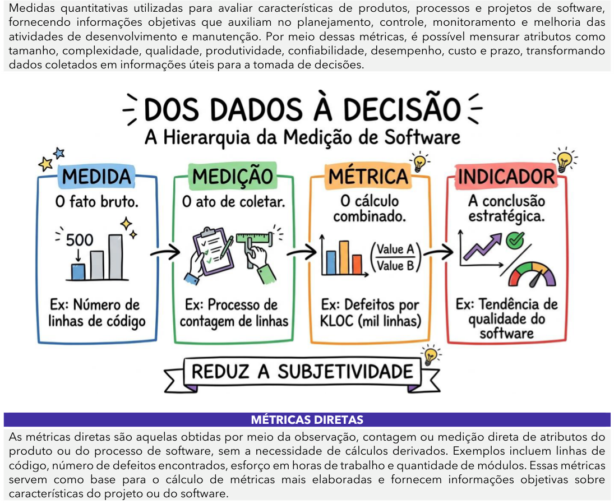


<!-- Start of picture text -->
Medidas quantitativas utilizadas para avaliar características de produtos, processos e projetos de software,<br>fornecendo informações objetivas que auxiliam no planejamento, controle, monitoramento e melhoria das<br>atividades de desenvolvimento e manutenção. Por meio dessas métricas, é possível mensurar atributos como<br>tamanho, complexidade, qualidade, produtividade, confiabilidade, desempenho, custo e prazo, transformando<br>dados coletados em informações úteis para a tomada de decisões.<br>MÉTRICAS DIRETAS<br>As métricas diretas são aquelas obtidas por meio da observação, contagem ou medição direta de atributos do<br>produto ou do processo de software, sem a necessidade de cálculos derivados. Exemplos incluem linhas de<br>código, número de defeitos encontrados, esforço em horas de trabalho e quantidade de módulos. Essas métricas<br>servem como base para o cálculo de métricas mais elaboradas e fornecem informações objetivas sobre<br>características do projeto ou do software.<br><!-- End of picture text -->

#### **<mark>MÉTRICAS INDIRETAS</mark>** 

As métricas indiretas são obtidas a partir da combinação ou do processamento de uma ou mais medidas diretas. Elas procuram representar atributos mais abstratos da qualidade do software, como confiabilidade, produtividade, qualidade ou manutenibilidade. Exemplos incluem densidade de defeitos, Defect Removal Efficiency (DRE), índice de manutenibilidade e produtividade. Em geral, essas métricas fornecem informações mais relevantes para a tomada de decisões gerenciais.

---

<!-- pagina: 74 -->

**Diego Carvalho, Equipe Informática 2 (Diego Carvalho), Equipe Informática 1 (Diego Carvalho) Aula 10** 


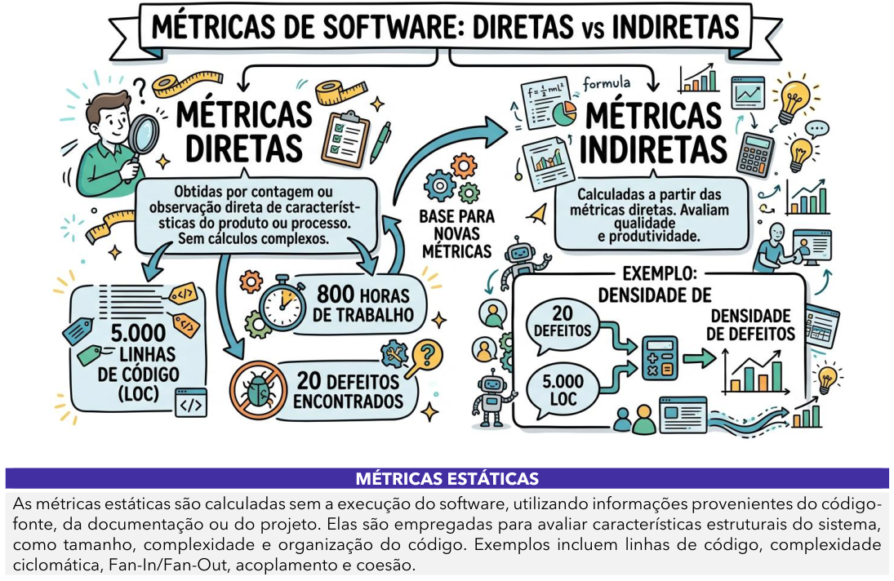


<!-- Start of picture text -->
MÉTRICAS ESTÁTICAS<br>As métricas estáticas são calculadas sem a execução do software, utilizando informações provenientes do código-<br>fonte, da documentação ou do projeto. Elas são empregadas para avaliar características estruturais do sistema,<br>como tamanho, complexidade e organização do código. Exemplos incluem linhas de código, complexidade<br>ciclomática, Fan-In/Fan-Out, acoplamento e coesão. , Fan-In/Fan-Out, acoplamento e coesão.  Fan-In/Fan-Out, acoplamento e coesão. , acoplamento e coesão.  acoplamento e coesão. plamento e coesão. lamento e coesão.<br><!-- End of picture text -->


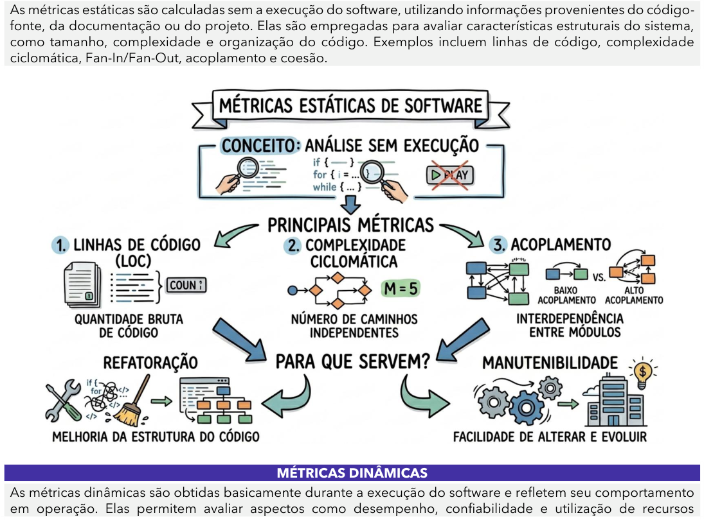


<!-- Start of picture text -->
As métricas estáticas são calculadas sem a execução do software, utilizando informações provenientes do código-<br>fonte, da documentação ou do projeto. Elas são empregadas para avaliar características estruturais do sistema,<br>como tamanho, complexidade e organização do código. Exemplos incluem linhas de código, complexidade<br>ciclomática, Fan-In/Fan-Out, acoplamento e coesão. , Fan-In/Fan-Out, acoplamento e coesão.  Fan-In/Fan-Out, acoplamento e coesão. , acoplamento e coesão.  acoplamento e coesão. plamento e coesão. lamento e coesão.<br>MÉTRICAS DINÂMICAS<br>As métricas dinâmicas são obtidas basicamente durante a execução do software e refletem seu comportamento<br>em operação. Elas  permitem avaliar aspectos como desempenho, confiabilidade e utilização de recursos<br><!-- End of picture text -->

---

<!-- pagina: 75 -->

**Diego Carvalho, Equipe Informática 2 (Diego Carvalho), Equipe Informática 1 (Diego Carvalho) Aula 10** 


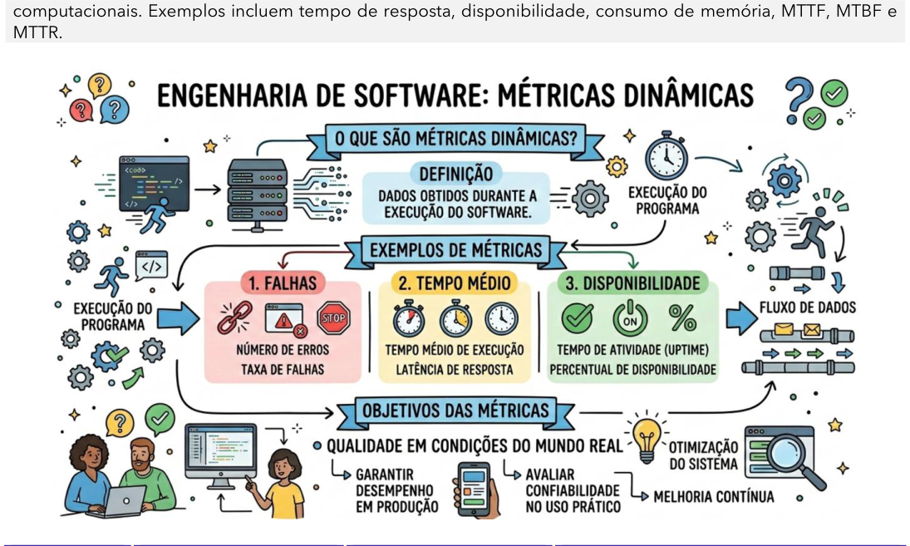


<!-- Start of picture text -->
computacionais. Exemplos incluem tempo de resposta, disponibilidade, consumo de memória, MTTF, MTBF e<br>MTTR.<br><!-- End of picture text -->

|**CATEGORIAS**|**O QUE AVALIA?**|**OBJETIVO PRINCIPAL**|**EXEMPLOS DE MÉTRICAS**|
|---|---|---|---|
|**PRODUTO**|Artefatos produzidos<br>durante o<br>desenvolvimento, como<br>requisitos, modelos,<br>arquitetura, código-<br>fonte, documentação e<br>testes.|Avaliar características<br>do software, como<br>qualidade,<br>complexidade,<br>manutenibilidade,<br>desempenho e<br>confiabilidade.|Linhas de Código (LOC), Complexidade<br>Ciclomática, Fan-In/Fan-Out, Coesão,<br>Acoplamento, Densidade de Defeitos,<br>Tempo de Resposta, Throughput, Uso de<br>Recursos, MTTF, MTBF, Disponibilidade,<br>Índice de Precisão e Revocação.|
|**PROCESSO**|Métodos, atividades e<br>práticas utilizados para<br>desenvolver e manter o<br>software.|Avaliar a eficiência, a<br>qualidade e a<br>produtividade dos<br>processos<br>organizacionais,<br>apoiando iniciativas de<br>melhoria contínua.|DRE (Defect Removal Efficiency), MTTR,<br>Cobertura de Testes, Taxa de Detecção de<br>Defeitos, Taxa de Correção de Defeitos,<br>Produtividade, Taxa de Retrabalho,<br>Tempo Médio de Desenvolvimento.|
|**PROJETO**|Estado e desempenho<br>de um projeto<br>específico em execução.|Apoiar o planejamento,<br>monitoramento e<br>controle de<br>cronograma, custos,<br>esforço, recursos e<br>riscos.|Quantidade de Mudanças por Versão,<br>Custo do Projeto, Prazo de<br>Desenvolvimento, Quantidade de Riscos<br>Identificados, Taxa de Cumprimento de<br>Marcos, Esforço, Valor Agregado.|

---

<!-- pagina: 76 -->

**Diego Carvalho, Equipe Informática 2 (Diego Carvalho), Equipe Informática 1 (Diego Carvalho) Aula 10** 


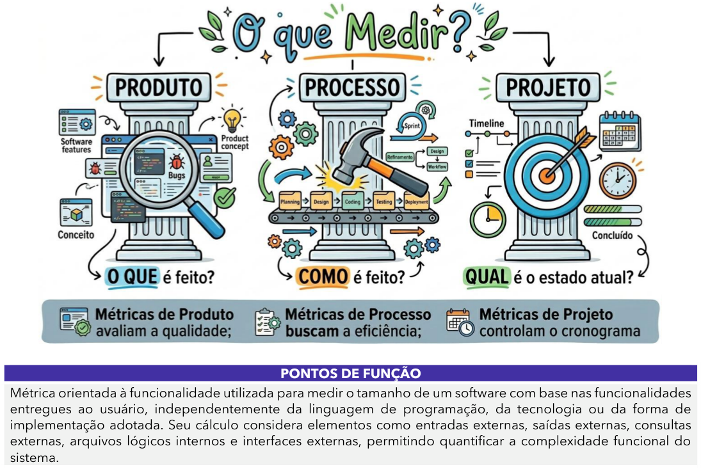


<!-- Start of picture text -->
PONTOS DE FUNÇÃO<br>Métrica orientada à funcionalidade utilizada para medir o tamanho de um software com base nas funcionalidades<br>entregues ao usuário, independentemente da linguagem de programação, da tecnologia ou da forma de<br>implementação adotada. Seu cálculo considera elementos como entradas externas, saídas externas, consultas<br>externas, arquivos lógicos internos e interfaces externas, permitindo quantificar a complexidade funcional do<br>sistema.<br><!-- End of picture text -->


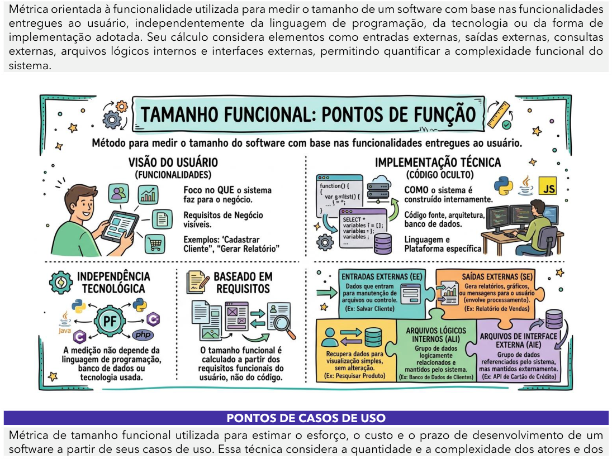


<!-- Start of picture text -->
Métrica orientada à funcionalidade utilizada para medir o tamanho de um software com base nas funcionalidades<br>entregues ao usuário, independentemente da linguagem de programação, da tecnologia ou da forma de<br>implementação adotada. Seu cálculo considera elementos como entradas externas, saídas externas, consultas<br>externas, arquivos lógicos internos e interfaces externas, permitindo quantificar a complexidade funcional do<br>sistema.<br>PONTOS DE CASOS DE USO<br>Métrica de tamanho funcional utilizada para estimar o esforço, o custo e o prazo de desenvolvimento de um<br>software a partir de seus casos de uso. Essa técnica considera a quantidade e a complexidade dos atores e dos<br><!-- End of picture text -->

---

<!-- pagina: 77 -->

**Diego Carvalho, Equipe Informática 2 (Diego Carvalho), Equipe Informática 1 (Diego Carvalho) Aula 10** 


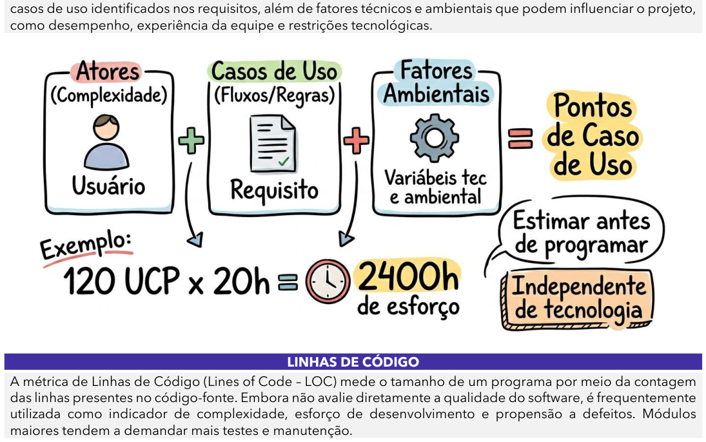


<!-- Start of picture text -->
casos de uso identificados nos requisitos, além de fatores técnicos e ambientais que podem influenciar o projeto,<br>como desempenho, experiência da equipe e restrições tecnológicas.<br>LINHAS DE CÓDIGO<br>A métrica de Linhas de Código (Lines of Code – LOC) mede o tamanho de um programa por meio da contagem<br>das linhas presentes no código-fonte. Embora não avalie diretamente a qualidade do software, é frequentemente<br>utilizada como indicador de complexidade, esforço de desenvolvimento e propensão a defeitos. Módulos<br>maiores tendem a demandar mais testes e manutenção. ção. ão.<br><!-- End of picture text -->


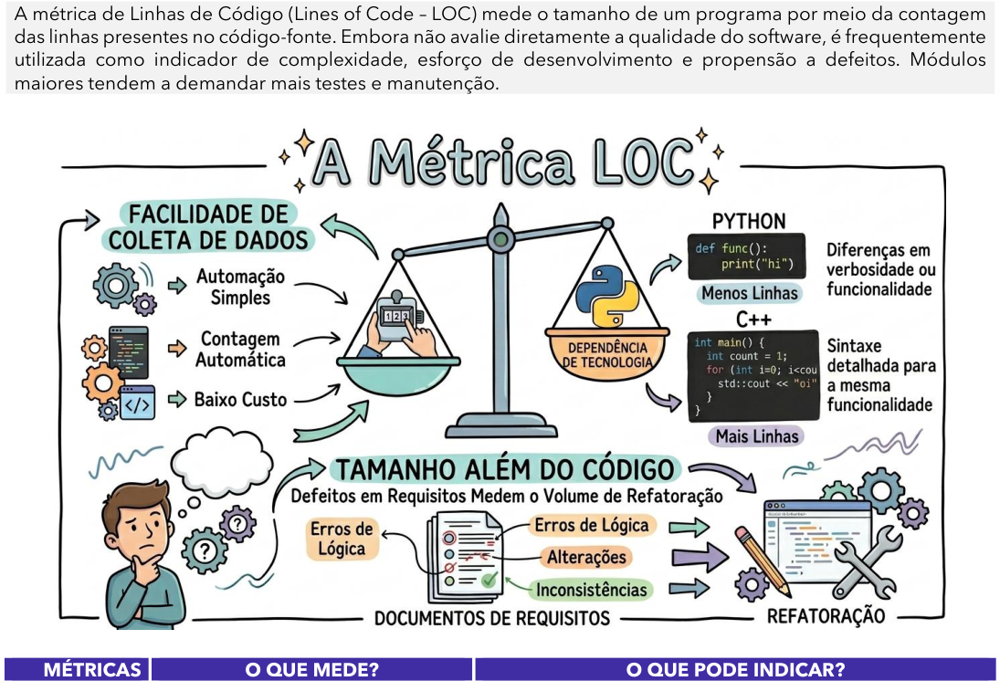


<!-- Start of picture text -->
A métrica de Linhas de Código (Lines of Code – LOC) mede o tamanho de um programa por meio da contagem<br>das linhas presentes no código-fonte. Embora não avalie diretamente a qualidade do software, é frequentemente<br>utilizada como indicador de complexidade, esforço de desenvolvimento e propensão a defeitos. Módulos<br>maiores tendem a demandar mais testes e manutenção. ção. ão.<br>MÉTRICAS  O QUE MEDE?  O QUE PODE INDICAR?<br><!-- End of picture text -->

**<mark>MÉTRICAS O QUE MEDE? O QUE PODE INDICAR?</mark>** Quantidade de componentes, Avalia o grau de modularização do sistema. Poucos **NÚMERO DE** pacotes, serviços, subsistemas ou módulos podem indicar concentração de **MÓDULOS** unidades funcionais em que o responsabilidades; muitos módulos podem aumentar a software foi dividido. complexidade de integração.

---

<!-- pagina: 78 -->

**Diego Carvalho, Equipe Informática 2 (Diego Carvalho), Equipe Informática 1 (Diego Carvalho) Aula 10** 

|**MÉTRICAS**|**O QUE MEDE?**|**O QUE PODE INDICAR?**|
|---|---|---|
|**NÚMERO DE**<br>**CLASSES**|Quantidade de classes definidas<br>em um projeto orientado a objetos.|Indica o tamanho e a decomposição da solução. Poucas<br>classes podem sugerir baixa modularização; muitas classes<br>podem indicar fragmentação excessiva.|
|**NÚMERO DE**<br>**ATRIBUTOS**|Quantidade<br>de<br>dados<br>ou<br>características<br>armazenadas<br>em<br>uma classe.|Auxilia<br>na<br>avaliação<br>da<br>complexidade<br>e<br>das<br>responsabilidades das classes. Muitos atributos podem<br>indicar excesso de responsabilidades; poucos podem<br>sugerir modelagem simplificada demais.|
|**NÚMERO DE**<br>**OPERAÇÕES**|Quantidade<br>de<br>métodos<br>ou<br>funções definidos em uma classe,<br>módulo ou componente.|Permite avaliar a complexidade funcional e a distribuição<br>de comportamentos. Muitas operações podem indicar<br>classes excessivamente complexas; poucas podem indicar<br>baixa relevância funcional.|


#### **<mark>COMPLEXIDADE CICLOMÁTICA</mark>** 


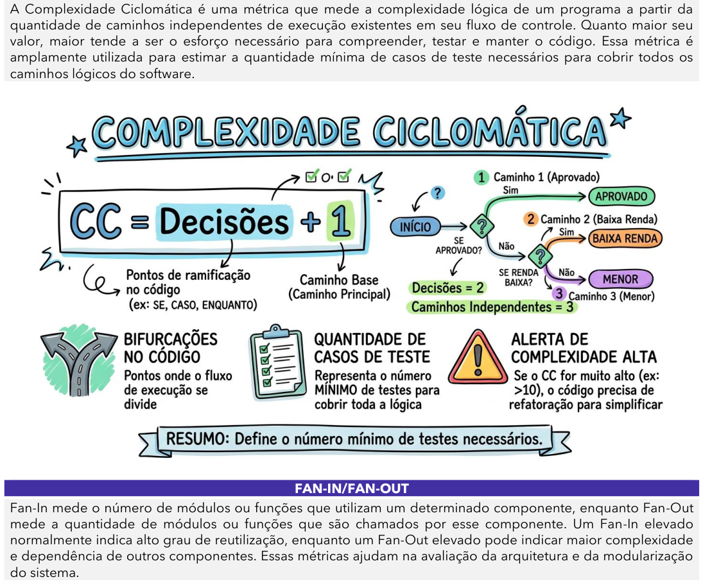


<!-- Start of picture text -->
A Complexidade Ciclomática é uma métrica que mede a complexidade lógica de um programa a partir da<br>quantidade de caminhos independentes de execução existentes em seu fluxo de controle. Quanto maior seu<br>valor, maior tende a ser o esforço necessário para compreender, testar e manter o código. Essa métrica é<br>amplamente utilizada para estimar a quantidade mínima de casos de teste necessários para cobrir todos os<br>caminhos lógicos do software.<br>FAN-IN/FAN-OUT<br>Fan-In mede o número de módulos ou funções que utilizam um determinado componente, enquanto Fan-Out<br>mede a quantidade de módulos ou funções que são chamados por esse componente. Um Fan-In elevado<br>normalmente indica alto grau de reutilização, enquanto um Fan-Out elevado pode indicar maior complexidade<br>e dependência de outros componentes. Essas métricas ajudam na avaliação da arquitetura e da modularização<br>do sistema.<br><!-- End of picture text -->

---

<!-- pagina: 79 -->

**Diego Carvalho, Equipe Informática 2 (Diego Carvalho), Equipe Informática 1 (Diego Carvalho) Aula 10** 


<!-- Start of picture text -->
COESÃO E ACOPLAMENTO<br>Coesão mede o grau de relacionamento entre os elementos internos de um módulo ou classe, enquanto<br>acoplamento mede o nível de dependência entre módulos distintos. Em projetos de software, busca-se obter<br>alta coesão e baixo acoplamento, pois essa combinação favorece a manutenção, a reutilização e a evolução do<br>sistema. Esses atributos são amplamente utilizados na avaliação da qualidade de projetos orientados a objetos. plamente utilizados na avaliação da qualidade de projetos orientados a objetos. lamente utilizados na avaliação da qualidade de projetos orientados a objetos. ção da qualidade de projetos orientados a objetos. ão da qualidade de projetos orientados a objetos. qualidade de projetos orientados a objetos. ualidade de projetos orientados a objetos. projetos orientados a objetos. rojetos orientados a objetos. jetos orientados a objetos. etos orientados a objetos. jetos. etos.<br><!-- End of picture text -->


<!-- Start of picture text -->
Coesão mede o grau de relacionamento entre os elementos internos de um módulo ou classe, enquanto<br>acoplamento mede o nível de dependência entre módulos distintos. Em projetos de software, busca-se obter<br>alta coesão e baixo acoplamento, pois essa combinação favorece a manutenção, a reutilização e a evolução do<br>sistema. Esses atributos são amplamente utilizados na avaliação da qualidade de projetos orientados a objetos. plamente utilizados na avaliação da qualidade de projetos orientados a objetos. lamente utilizados na avaliação da qualidade de projetos orientados a objetos. ção da qualidade de projetos orientados a objetos. ão da qualidade de projetos orientados a objetos. qualidade de projetos orientados a objetos. ualidade de projetos orientados a objetos. projetos orientados a objetos. rojetos orientados a objetos. jetos orientados a objetos. etos orientados a objetos. jetos. etos.<br>ÍNDICE DE FOG<br>O Índice de Fog é uma métrica de legibilidade obtida sem a execução do sistema e que permite avaliar a<br>qualidade interna dos artefatos documentais. Valores elevados podem indicar documentação excessivamente<br><!-- End of picture text -->

---

<!-- pagina: 80 -->

**Diego Carvalho, Equipe Informática 2 (Diego Carvalho), Equipe Informática 1 (Diego Carvalho) Aula 10** 


<!-- Start of picture text -->
complexa, ambígua ou difícil de manter, enquanto valores menores tendem a refletir textos mais claros, objetivos<br>e acessíveis aos usuários e desenvolvedores.<br>COMPRIMENTO DE IDENTIFICADORES<br>Métrica estática de produto que mede o tamanho médio dos nomes utilizados para identificar elementos do<br>software, como variáveis, constantes, métodos, funções, classes e módulos. Seu objetivo é fornecer indícios sobre<br>a legibilidade e a compreensibilidade do código-fonte, uma vez que identificadores bem escolhidos facilitam a<br>manutenção e o entendimento do sistema por outros desenvolvedores. Nomes excessivamente curtos podem<br>dificultar a interpretação do propósito dos elementos do programa, enquanto nomes excessivamente longos<br>podem tornar o código mais difícil de ler e navegar.<br><!-- End of picture text -->

#### **<mark>DENSIDADE DE DEFEITOS</mark>** 

A Densidade de Defeitos mede a quantidade de defeitos identificados em relação ao tamanho do software, normalmente expressa em defeitos por mil linhas de código (KLOC). Essa métrica permite comparar a qualidade de diferentes módulos ou versões independentemente de seu tamanho, sendo amplamente utilizada em <u>programas de garantia da qualidade.</u>

---

<!-- pagina: 81 -->

**Diego Carvalho, Equipe Informática 2 (Diego Carvalho), Equipe Informática 1 (Diego Carvalho) Aula 10** 


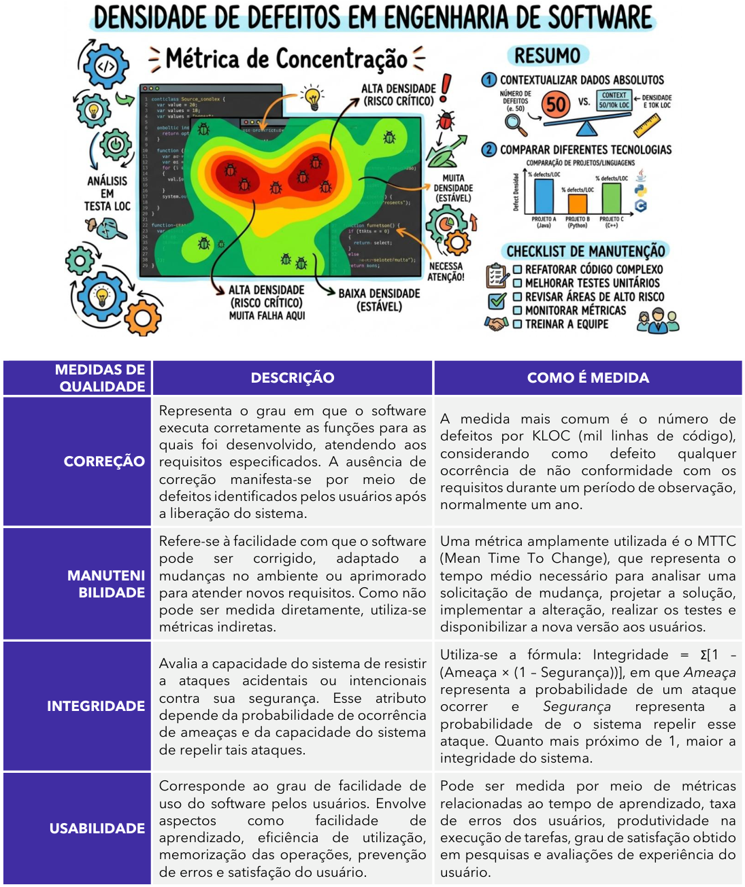


<!-- Start of picture text -->
MEDIDAS DE<br>DESCRIÇÃO  COMO É MEDIDA<br>QUALIDADE<br>Representa o grau em que o software<br>A medida mais comum é o número de<br>executa corretamente as funções para as<br>defeitos por KLOC (mil linhas de código),<br>quais foi desenvolvido, atendendo aos<br>considerando  como  defeito  qualquer<br>CORREÇÃO   requisitos especificados. A ausência de<br>ocorrência de não conformidade com os<br>correção manifesta-se por meio de<br>requisitos durante um período de observação,<br>defeitos identificados pelos usuários após<br>normalmente um ano.<br>a liberação do sistema.<br>Refere-se à facilidade com que o software  Uma métrica amplamente utilizada é o MTTC<br>pode  ser  corrigido,  adaptado  a  (Mean Time To Change), que representa o<br>MANUTENI  mudanças no ambiente ou aprimorado  tempo médio necessário para analisar uma<br>BILIDADE   para atender novos requisitos. Como não  solicitação de mudança, projetar a solução,<br>pode ser medida diretamente, utiliza-se  implementar a alteração, realizar os testes e<br>métricas indiretas.  disponibilizar a nova versão aos usuários.<br>Utiliza-se a fórmula: Integridade =  Σ [1 –<br>Avalia a capacidade do sistema de resistir<br>(Ameaça × (1 – Segurança))], em que  Ameaça<br>a ataques acidentais ou intencionais<br>representa a probabilidade de um ataque<br>contra sua segurança. Esse atributo<br>INTEGRIDADE   ocorrer  e  Segurança representa  a<br>depende da probabilidade de ocorrência<br>probabilidade de o sistema repelir esse<br>de ameaças e da capacidade do sistema<br>ataque. Quanto mais próximo de 1, maior a<br>de repelir tais ataques.<br>integridade do sistema.<br>Corresponde ao grau de facilidade de  Pode ser medida por meio de métricas<br>uso do software pelos usuários. Envolve  relacionadas ao tempo de aprendizado, taxa<br>aspectos  como  facilidade  de  de erros dos usuários, produtividade na<br>USABILIDADE<br>aprendizado, eficiência de utilização,  execução de tarefas, grau de satisfação obtido<br>memorização das operações, prevenção  em pesquisas e avaliações de experiência do<br>de erros e satisfação do usuário.  usuário.<br><!-- End of picture text -->

**<mark>MÉTRICA O QUE MEDE?</mark> COBERTURA DE** Percentual de instruções do código-fonte que **INSTRUÇÕES** foram efetivamente executadas durante os testes. 

#### **<mark>FOCO DA AVALIAÇÃO</mark>** 

Verificar se os comandos do programa foram exercitados pelos casos de teste.

---

<!-- pagina: 82 -->

**Diego Carvalho, Equipe Informática 2 (Diego Carvalho), Equipe Informática 1 (Diego Carvalho) Aula 10** 

|**MÉTRICA**|**O QUE MEDE?**|**FOCO DA**|**AVAL**|**IAÇÃO**|
|---|---|---|---|---|
|**COBERTURA DE**<br>**DECISÕES**|Percentual de decisões lógicas (condições) cujos<br>resultados possíveis foram testados.|Garantir que os ca<br>falso das estrutura<br>executados.|minh<br>s con|os verdadeiro e<br>dicionais sejam|
|**COBERTURA**<br>**FUNCIONAL**|Percentual de funcionalidades, requisitos ou<br>casos de uso submetidos à validação.|Avaliar se os comp<br>pelo<br>negócio<br> <br>testados.|ortam<br>foram|entos esperados<br> <br>efetivamente|
|**COBERTURA**<br>**MODULAR**|Percentual<br>de<br>módulos,<br>componentes<br>ou<br>subsistemas que receberam testes.|Verificar o grau<br>diferentes partes<br>aplicação.|de<br>da|validação das<br>arquitetura da|


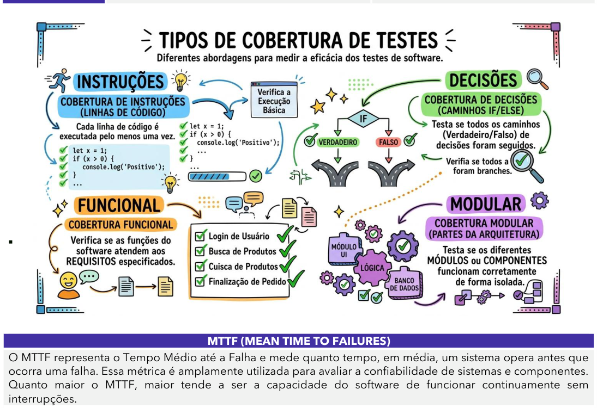


<!-- Start of picture text -->
MTTF (MEAN TIME TO FAILURES)<br>O MTTF representa o Tempo Médio até a Falha e mede quanto tempo, em média, um sistema opera antes que<br>ocorra uma falha. Essa métrica é amplamente utilizada para avaliar a confiabilidade de sistemas e componentes.<br>Quanto maior o MTTF, maior tende a ser a capacidade do software de funcionar continuamente sem<br>interrupções.<br><!-- End of picture text -->

#### **<mark>MTBF (MEAN TIME BETWEEN FAILURES)</mark>** 

O MTBF (Mean Time Between Failures) representa o Tempo Médio Entre Falhas e mede o intervalo médio de operação entre uma falha e a próxima em sistemas reparáveis. Trata-se de uma das métricas mais utilizadas para avaliar confiabilidade e disponibilidade. Valores elevados indicam menor frequência de falhas e maior estabilidade operacional. 

|**SIGLA**|**NOME**|**O QUE É?**|**EXEMPLO**|
|---|---|---|---|
|**SLI**|Service Level<br>Indicator (Indicador<br>de Nível de Serviço)|Métrica<br>utilizada<br>para<br>medir<br>o<br>desempenho ou a qualidade de um<br>serviço.|Disponibilidade medida em 99,92%;<br>tempo médio de resposta de 250<br>ms.|
||Service Level|Meta estabelecida para um ou mais SLIs.|Disponibilidade mínima de 99,9% ao|
|**SLO**|Objective (Objetivo<br>de Nível de Serviço)|Define o nível de qualidade desejado para<br>o serviço.|mês; tempo de resposta inferior a<br>300 ms em 95% das requisições.|

---

<!-- pagina: 83 -->

**Diego Carvalho, Equipe Informática 2 (Diego Carvalho), Equipe Informática 1 (Diego Carvalho) Aula 10** 

|**SIGLA**|**NOME**|**O QUE É?**|**EXEMPLO**|
|---|---|---|---|
||Service Level|Contrato formal entre provedor e cliente|Contrato prevendo disponibilidade|
|**SLA**|Agreement (Acordo|que<br>estabelece<br>os<br>SLOs<br>e<br>as|de 99,9% e desconto na fatura caso|
||de Nível de Serviço)|consequências caso não sejam cumpridos.|a meta não seja atingida.|


#### **<mark>MTTR (MEAN TIME TO REPAIR)</mark>** 


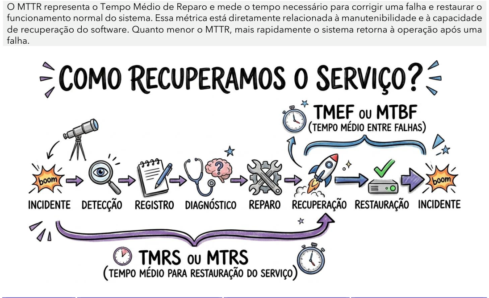


<!-- Start of picture text -->
O MTTR representa o Tempo Médio de Reparo e mede o tempo necessário para corrigir uma falha e restaurar o<br>funcionamento normal do sistema. Essa métrica está diretamente relacionada à manutenibilidade e à capacidade<br>de recuperação do software. Quanto menor o MTTR, mais rapidamente o sistema retorna à operação após uma<br>falha.<br><!-- End of picture text -->

|**MÉTRICAS**|**O QUE MEDE?**|**EXEMPLO**|**FOCO DA AVALIAÇÃO**|
|---|---|---|---|
|**TEMPO DE**<br>**RESPOSTA**|Intervalo entre o envio de uma<br>solicitação e a apresentação da<br>resposta pelo sistema.|Tempo<br>necessário<br>para<br>exibir o saldo após uma<br>consulta bancária.|Rapidez de atendimento de<br>uma operação individual e<br>experiência do usuário.|
|**THROUGHPUT**<br>**(VAZÃO)**|Quantidade<br>de<br>trabalho<br>processada pelo sistema em<br>determinado período de tempo.|Número<br>de<br>transações<br>bancárias processadas por<br>segundo ou por minuto.|Capacidade<br>global<br>de<br>processamento do sistema.|
|**USO DE**<br>**RECURSOS**|Percentual<br>de<br>recursos<br>computacionais<br>consumidos<br>durante a execução do software.|Utilização de CPU, memória<br>RAM,<br>armazenamento<br>e<br>largura de banda de rede.|Eficiência da utilização da<br>infraestrutura e capacidade de<br>suportar carga de trabalho.|

---

<!-- pagina: 84 -->

**Diego Carvalho, Equipe Informática 2 (Diego Carvalho), Equipe Informática 1 (Diego Carvalho) Aula 10** 


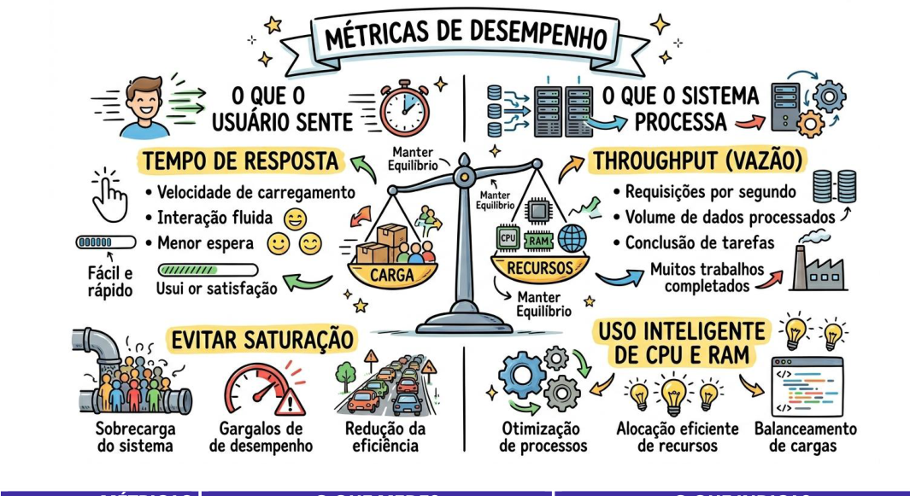


<!-- Start of picture text -->
==5460==<br><!-- End of picture text -->

||==5460==|||
|---|---|---|---|
|**MÉTRICAS**|**O QUE MEDE?**||**O QUE INDICA?**|
|**NÚMERO DE**<br>**SCRIPTS DE**<br>**CENÁRIO**|Quantidade de cenários ou s<br>de interação entre usuários<br>identificados durante a análise.|equências<br>e sistema<br>|Indica o tamanho funcional da aplicação e<br>fornece uma estimativa inicial da quantidade<br>de testes que precisarão ser desenvolvidos.|
|**NÚMERO DE**<br>**CLASSES-CHAVE**|Quantidade de classes fundam<br>representam os principais co<br>domínio do problema.|entais que<br>nceitos do|Auxilia<br>na<br>estimativa<br>do<br>esforço<br>de<br>desenvolvimento<br>e<br>do<br>potencial<br>de<br>reutilização da solução orientada a objetos.|
|**NÚMERO DE**<br>**CLASSES DE APOIO**|Quantidade<br>de<br>classes<br>necessárias para implementar<br>como interfaces, acesso a<br>dados e serviços técnicos.|auxiliares<br>o sistema,<br>banco de|Indica o esforço técnico necessário para<br>implementar a infraestrutura da aplicação.|
|**NÚMERO MÉDIO DE**<br>**CLASSES DE APOIO**<br>**POR CLASSE-CHAVE**|Relação entre a quantidade de<br>apoio e a quantidade de classe|classes de<br>s-chave.|Auxilia na realização de estimativas em<br>projetos semelhantes e fornece indícios<br>sobre a complexidade da implementação.|
|**NÚMERO DE**<br>**SUBSISTEMAS**|Quantidade de grandes agru<br>de<br>classes<br>responsáve<br>funcionalidades visíveis aos usu|pamentos<br>is<br>por<br>ários.|Facilita o planejamento do projeto, a<br>distribuição de trabalho entre equipes e a<br>organização da arquitetura do sistema.|
|**MÉTRICAS**|**O QUE MEDE?**||**O QUE INDICA?**|
|**DUPLICAÇÃO**<br>**DE CÓDIGO**<br>Per<br>idê<br>pre|centual de trechos de código<br>nticos ou muito semelhantes<br>sentes no sistema.|<br> <br>Níveis ele<br>de manut<br>alteraçõe|vados de repetição aumentam a dificuldade<br>enção e podem gerar inconsistências quando<br>s não são replicadas em todas as ocorrências.|
|**DÍVIDA**<br>**TÉCNICA**<br>Esti<br>nec<br>acu|mativa<br>do<br>esforço<br>futuro<br>essário para corrigir problemas<br>mulados no software.|<br> <br>Indica o i<br>o desenv<br>aumentar<br>futuro.|mpacto de decisões técnicas que aceleraram<br>olvimento no presente, mas que podem<br>os custos de manutenção e evolução no|
|**VIOLAÇÕES DE**<br>**ESTILO E**<br>**PADRÕES**<br>Qu<br>às|antidade de desvios em relação<br>convenções de codificação e|<br> <br>Reflete o<br>manuteni|grau de padronização, legibilidade e<br>bilidade da base de código. Um número|

---

<!-- pagina: 85 -->

**Diego Carvalho, Equipe Informática 2 (Diego Carvalho), Equipe Informática 1 (Diego Carvalho) Aula 10** 

|**MÉTRICAS**|**O QUE MEDE?**|**O QUE IN**|**DICA**|**?**|
|---|---|---|---|---|
||boas<br>práticas<br>adotadas<br>pela<br>equipe.|elevado<br>pode<br>indicar<br>compreensão e manutenção|maior<br>.|<br>dificuldade<br>de|
|**COBERTURA DE**<br>**CÓDIGO**|Percentual do código-fonte que foi<br>efetivamente executado durante os<br>testes.|Indica a abrangência dos t<br>áreas da implementação<br>exercitadas ou validadas.|estes e<br>que|ajuda a identificar<br>ainda não foram|


#### **<mark>DEFECT REMOVAL EFFICIENCY (DRE)</mark>** 


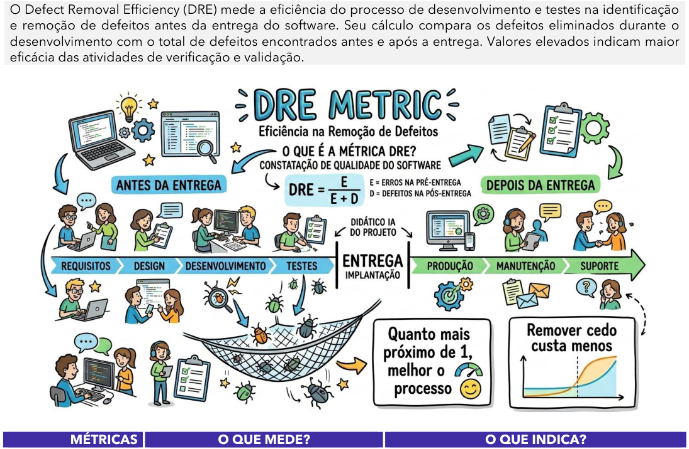


<!-- Start of picture text -->
O Defect Removal Efficiency (DRE) mede a eficiência do processo de desenvolvimento e testes na identificação<br>e remoção de defeitos antes da entrega do software. Seu cálculo compara os defeitos eliminados durante o<br>desenvolvimento com o total de defeitos encontrados antes e após a entrega. Valores elevados indicam maior<br>eficácia das atividades de verificação e validação.<br>MÉTRICAS  O QUE MEDE?  O QUE INDICA?<br><!-- End of picture text -->

**<mark>MÉTRICAS O QUE MEDE? O QUE INDICA?</mark>** Percentual do esforço gasto na Níveis elevados podem indicar problemas de **TAXA DE** correção, revisão ou repetição de requisitos, comunicação, projeto ou qualidade **RETRABALHO** atividades já realizadas. da implementação. Relação entre o tamanho do software Permite avaliar a eficiência da equipe e apoiar **PRODUTIVIDADE** produzido e o esforço consumido estimativas de prazo, custo e esforço em projetos para produzi-lo. futuros. Quantidade de alterações Indica o ritmo de evolução do sistema e o volume **MUDANÇAS POR** incorporadas em cada nova versão do de correções, melhorias e novas funcionalidades **VERSÃO** software. implementadas. 

**<mark>MÉTRICAS O QUE MEDE? O QUE INDICA?</mark>** Quantidade de trabalho necessária para Permite avaliar a carga de trabalho da desenvolver, manter ou evoluir o software, equipe, comparar estimativas com **ESFORÇO** geralmente medida em horas, dias ou pessoasresultados reais e apoiar o planejamento mês. de recursos.

---

<!-- pagina: 86 -->

**Diego Carvalho, Equipe Informática 2 (Diego Carvalho), Equipe Informática 1 (Diego Carvalho) Aula 10** 

|**MÉTRICAS**|**O QUE MEDE?**|**O QUE INDICA?**|
|---|---|---|
|**CUSTO**|Recursos financeiros consumidos pelo projeto,<br>incluindo<br>mão<br>de<br>obra,<br>infraestrutura,<br>ferramentas, treinamentos, licenças e demais<br>despesas.|Auxilia no controle orçamentário, na<br>análise de viabilidade econômica e na<br>identificação de desvios financeiros.|
|**PRAZO**|Tempo necessário para concluir atividades, fases<br>ou o projeto como um todo.|Permite<br>acompanhar<br>o<br>cronograma,<br>identificar atrasos ou antecipações e<br>apoiar a gestão de riscos relacionados às<br>entregas.|
|**VALOR**<br>**AGREGADO**<br>**(EARNED**<br>**VALUE)**|Valor orçado<br>correspondente ao trabalho<br>efetivamente<br>concluído<br>em<br>determinado<br>momento do projeto.|Fornece uma visão integrada de escopo,<br>prazo e custo, servindo de base para<br>indicadores de desempenho como SPI e<br>CPI.|

---

<!-- pagina: 87 -->

**Diego Carvalho, Equipe Informática 2 (Diego Carvalho), Equipe Informática 1 (Diego Carvalho) Aula 10** 


<!-- Start of picture text -->
Q UESTÕES  C OMENTADAS<br><!-- End of picture text -->

**1. (VUNESP / Câmara Municipal de Fernandópolis - 2022) Diversas métricas são comumente utilizadas para quantificar o gerenciamento de falhas de um ambiente computacional. Dentre elas, destacam-se o MTTR, MTBF e MTTF. Um ambiente que possui bom gerenciamento de suas falhas é aquele cujas métricas possuam o seguinte:** 

   - a) Alto MTTR, baixo MTBF e baixo MTTF. 

   - b) Alto MTTR, baixo MTBF e alto MTTF. 

   - c) Alto MTTR, alto MTBF e alto MTTF. 

   - d) Baixo MTTR, baixo MTBF e alto MTTF. 

   - e) Baixo MTTR, baixo MTBF e baixo MTTF. 

### **Comentários:** 

Idealmente, uma organização deve possuir: 

- Baixo Tempo Médio de Reparação (MTTR), de modo que falhas sejam corrigidas rapidamente; 

- Alto Tempo Médio Entre Falhas (MTBF), de modo que ocorram raramente; 

- Alto Tempo Médio Para Falhas (MTTF), de modo que o sistema funcione bastante sem falhar. 

Dito isso, não temos alternativa correta na questão e ela deveria ter sido anulada. 

**Gabarito:** Letra D 

**2. (VUNESP / MPE ES - 2013) Uma das métricas utilizadas no desenvolvimento de software é denominada fan-out, que representa o** 

a) número de instruções de desvio incondicional do módulo sob medição. 

- b) número de linhas de código do módulo sob medição. 

- c) número de módulos acionados pelo módulo sob medição. 

- d) tempo máximo de execução do módulo sob medição. 

- e) tempo médio de execução do módulo sob medição 

### **Comentários:** 

- (a) Errado. Fan-out não mede quantidade de desvios incondicionais no código, e sim o grau de acionamento entre módulos.

---

<!-- pagina: 88 -->

**Diego Carvalho, Equipe Informática 2 (Diego Carvalho), Equipe Informática 1 (Diego Carvalho) Aula 10** 

(b) Errado. Número de linhas de código é outra métrica, ligada ao tamanho do módulo, não ao fan-out. 

(c) Correto. Fan-out representa quantos módulos são chamados ou acionados pelo módulo que está sendo analisado. 

(d) Errado. Tempo máximo de execução está ligado a desempenho, não à métrica fan-out. 

(e) Errado. Tempo médio de execução também mede desempenho, e não a quantidade de módulos acionados. 

**Gabarito:** Letra C 

**3. (VUNESP / EsFCEx - 2022) Acoplamento e coesão são dois critérios qualitativos utilizados para** ==5460== **avaliar a independência funcional de um software, sendo correto que** 

a) um módulo coeso requer pouca interação com outros módulos do software. 

b) módulos coesos devem ter um máximo de 200 linhas de código de software. 

c) um módulo coeso deve implementar pelo menos três tarefas do software. 

d) recomenda-se que o acoplamento entre módulos de software seja alto. 

e) o acoplamento limita o número de variáveis contidas em um módulo de software. 

### **Comentários:** 

(a) Correto. Coesão alta indica que o módulo é bem focado na sua função, o que tende a reduzir a dependência e a interação com outros módulos. 

(b) Errado. Coesão não é medida por quantidade de linhas de código, mas pela relação funcional entre os elementos do módulo. 

(c) Errado. Um módulo coeso não precisa executar várias tarefas; na verdade, a ideia é justamente manter foco em uma responsabilidade bem definida. 

(d) Errado. Em projeto de software, o ideal é baixo acoplamento, para facilitar manutenção, teste e reaproveitamento dos módulos. 

(e) Errado. Acoplamento trata da dependência entre módulos, não da quantidade de variáveis internas existentes em cada módulo. 

**Gabarito:** Letra A

---

<!-- pagina: 89 -->

**Diego Carvalho, Equipe Informática 2 (Diego Carvalho), Equipe Informática 1 (Diego Carvalho) Aula 10** 

**4. (VUNESP / TJM SP - 2021) Considerando-se as métricas de processo de software, é correto afirmar que um de seus objetivos é** 

a) avaliar o estado de um projeto em andamento. 

- b) obter indicadores que levem ao aperfeiçoamento de processos do software. 

- c) ajustar o fluxo de trabalho das equipes de desenvolvimento. 

- d) avaliar a capacidade da equipe de projeto. 

- e) detectar áreas problemáticas no projeto. 

### **Comentários:** 

(a) Errado. Avaliar o estado de um projeto em andamento está mais ligado ao acompanhamento do projeto do que ao foco principal das métricas de processo. 

(b) Correto. Métricas de processo servem justamente para gerar indicadores que ajudem a melhorar e aperfeiçoar os processos de desenvolvimento de software. 

(c) Errado. Ajustar o fluxo de trabalho pode até ser uma consequência, mas não é o objetivo central das métricas de processo. 

(d) Errado. Avaliar a capacidade da equipe diz mais respeito a desempenho de pessoas do que à medição e melhoria do processo. 


(e) Errado. Detectar áreas problemáticas no projeto se relaciona mais ao controle do projeto, não ao objetivo principal das métricas de processo. 

**Gabarito:** Letra B

---

<!-- pagina: 90 -->

**Diego Carvalho, Equipe Informática 2 (Diego Carvalho), Equipe Informática 1 (Diego Carvalho) Aula 10** 


<!-- Start of picture text -->
L ISTA DE  Q<br><!-- End of picture text -->


<!-- Start of picture text -->
UESTÕES<br><!-- End of picture text -->

**1. (VUNESP / Câmara Municipal de Fernandópolis - 2022) Diversas métricas são comumente utilizadas para quantificar o gerenciamento de falhas de um ambiente computacional. Dentre elas, destacam-se o MTTR, MTBF e MTTF. Um ambiente que possui bom gerenciamento de suas falhas é aquele cujas métricas possuam o seguinte:** 

   - a) Alto MTTR, baixo MTBF e baixo MTTF. 

   - b) Alto MTTR, baixo MTBF e alto MTTF. 

   - c) Alto MTTR, alto MTBF e alto MTTF. 

   - d) Baixo MTTR, baixo MTBF e alto MTTF. 

   - e) Baixo MTTR, baixo MTBF e baixo MTTF. 

**2. (VUNESP / MPE ES - 2013) Uma das métricas utilizadas no desenvolvimento de software é denominada fan-out, que representa o** 

   - a) número de instruções de desvio incondicional do módulo sob medição. 

   - b) número de linhas de código do módulo sob medição. 

   - c) número de módulos acionados pelo módulo sob medição. 

   - d) tempo máximo de execução do módulo sob medição. 

   - e) tempo médio de execução do módulo sob medição 

**3. (VUNESP / EsFCEx - 2022) Acoplamento e coesão são dois critérios qualitativos utilizados para avaliar a independência funcional de um software, sendo correto que** 

   - a) um módulo coeso requer pouca interação com outros módulos do software. 

   - b) módulos coesos devem ter um máximo de 200 linhas de código de software. 

   - c) um módulo coeso deve implementar pelo menos três tarefas do software. 

   - d) recomenda-se que o acoplamento entre módulos de software seja alto. 

   - e) o acoplamento limita o número de variáveis contidas em um módulo de software. 

**4. (VUNESP / TJM SP - 2021) Considerando-se as métricas de processo de software, é correto afirmar que um de seus objetivos é** 

   - a) avaliar o estado de um projeto em andamento. 

   - b) obter indicadores que levem ao aperfeiçoamento de processos do software. 

   - c) ajustar o fluxo de trabalho das equipes de desenvolvimento. 

   - d) avaliar a capacidade da equipe de projeto. 

   - e) detectar áreas problemáticas no projeto.

---

<!-- pagina: 91 -->

**Diego Carvalho, Equipe Informática 2 (Diego Carvalho), Equipe Informática 1 (Diego Carvalho) Aula 10** 


<!-- Start of picture text -->
G ABARITO<br><!-- End of picture text -->

**1.** LETRA D **3.** LETRA A **2.** LETRA C **4.** LETRA B 


<!-- Start of picture text -->
==5460==<br><!-- End of picture text -->

---

<!-- pagina: 92 -->


