---
fonte_pdf: "Gestão e Governança de TI - Aula 00.pdf"
paginas: 254
conversao: texto-e-imagens
---

<!-- pagina: 2 -->

**Paolla Ramos Aula 00** 

## **Índice** 

|....................................................................................................................................... 1) # Apresentação Prof Fernando Pedrosa|....................................................... 3|
|---|---|
|....................................................................................................................................... 2) PMBOK 7 - Teoria|....................................................... 4|
|....................................................................................................................................... 3) PMBOK 7 - Mapa Mental|....................................................... 65|
|....................................................................................................................................... 4) PMBOK 7 - Resumo|....................................................... 66|
|....................................................................................................................................... 5) PMBOK 7 - Questões Comentadas - CEBRASPE|....................................................... 71|
|....................................................................................................................................... 6) PMBOK 7 - Lista de Questões - CEBRASPE|....................................................... 93|
|....................................................................................................................................... 7) PMBOK 7 - Questões Comentadas - CESGRANRIO|....................................................... 106|
|....................................................................................................................................... 8) PMBOK 7 - Lista de Questões - CESGRANRIO|....................................................... 107|
|....................................................................................................................................... 9) PMBOK 7 - Questões Comentadas - FCC|....................................................... 108|
|....................................................................................................................................... 10) PMBOK 7 - Lista de Questões - FCC|....................................................... 122|
|....................................................................................................................................... 11) PMBOK 7 - Questões Comentadas - FGV|....................................................... 131|
|....................................................................................................................................... 12) PMBOK 7 - Lista de Questões - FGV|....................................................... 159|
|....................................................................................................................................... 13) PMBOK 7 - Questões Comentadas - FUNDATEC|....................................................... 177|
|....................................................................................................................................... 14) PMBOK 7 - Lista de Questões - FUNDATEC|....................................................... 181|
|....................................................................................................................................... 15) PMBOK 7 - Questões Comentadas - QUADRIX|....................................................... 184|
|....................................................................................................................................... 16) PMBOK 7 - Lista de Questões - QUADRIX|....................................................... 187|
|....................................................................................................................................... 17) PMBOK 7 - Questões Comentadas - VUNESP|....................................................... 189|
|....................................................................................................................................... 18) PMBOK 7 - Lista de Questões - VUNESP|....................................................... 198|
|....................................................................................................................................... 19) PMBOK 7 - Questões Comentadas - Multibancas|....................................................... 203|
|....................................................................................................................................... 20) PMBOK 7 - Lista de Questões - Multibancas|....................................................... 235|

---

<!-- pagina: 4 -->

**Paolla Ramos Aula 00** 

Sumário 

|PMBOK 7ª Edição............................................................................................................................................... 2|
|---|
|Introdução a Gestão de Projetos e PMBOK.................................................................................. 2|
|Padrão, Termos e Conceitos............................................................................................................... 5|
|Sistema de Entrega de Valor.............................................................................................................. 8|
|Princípios.................................................................................................................................................. 10|
|Domínios de Desempenho............................................................................................................... 31|
|Tailoring.................................................................................................................................................... 54|
|Modelos..................................................................................................................................................... 56|
|Métodos.................................................................................................................................................... 57|
|Artefatos................................................................................................................................................... 59|

---

<!-- pagina: 5 -->

**Paolla Ramos Aula 00** 

## **PMBOK 7ª EDIÇÃO** 

**FERNANDO PEDROSA -** **<u>HTTPS://WWW.INSTAGRAM.COM/PROF.FERNANDOPEDROSA</u>** 

### Introdução a Gestão de Projetos e PMBOK 

Olá, Coruja! Vamos falar de **gestão de projetos** ? 

E antes que pense "ah, isso é coisa de administração", já te digo que cai muito em concurso de TI, porque praticamente tudo na área de tecnologia é entregue na forma de projeto. Sistema novo? Projeto. Migração de infraestrutura? Projeto. Implantação de software? Projeto. Então, vamos lá. 

A definição formal diz que gestão de projetos é a **aplicação de conhecimento, habilidades, ferramentas e técnicas para atingir os objetivos de um projeto** . Na prática, isso significa coordenar e controlar uma série de atividades: definir objetivos, planejar, executar, controlar e encerrar o projeto. São essas as etapas que a gestão precisa dar conta. 

Mas o que é um projeto, afinal? 

**Projeto é um esforço temporário empreendido para criar um produto, serviço ou resultado único.** 

Duas palavras nessa definição merecem atenção especial: " **temporário** " e " **único** ". Temporário não significa curto. Significa que **todo projeto tem início e fim definidos** . Pode durar semanas, pode durar anos. O que não pode é ficar aberto para sempre sem uma conclusão prevista. E único quer dizer que **nenhum projeto é igual ao outro** , mesmo que pareçam. Você pode construir dois prédios com a mesma planta, mas o terreno é diferente, a equipe é diferente, o fornecedor pode ser diferente, o momento econômico é diferente. O contexto muda tudo, por isso nenhum projeto é idêntico a outro. 

Gestão de projetos é importante porque, sem ela, as coisas simplesmente saem do controle. Prazos estouram, orçamento vai às alturas, qualidade cai, e ninguém sabe direito o que o outro está fazendo. A gestão de projetos existe justamente para evitar isso: ela garante que os objetivos sejam alcançados dentro do prazo e do orçamento definidos, mantendo o nível de qualidade esperado. Além disso, ela cria uma estrutura de comunicação entre a equipe e todas as partes interessadas, que no mundo de projetos chamamos de _stakeholders_ . Todo mundo sabe o que está acontecendo, o que já foi feito e o que ainda falta. 

E “ **PMBOK** ”? Esse nome aparece em praticamente todo concurso que envolve gestão de projetos, então vale a pena entender de verdade o que é essa publicação.

---

<!-- pagina: 6 -->

**Paolla Ramos Aula 00** 

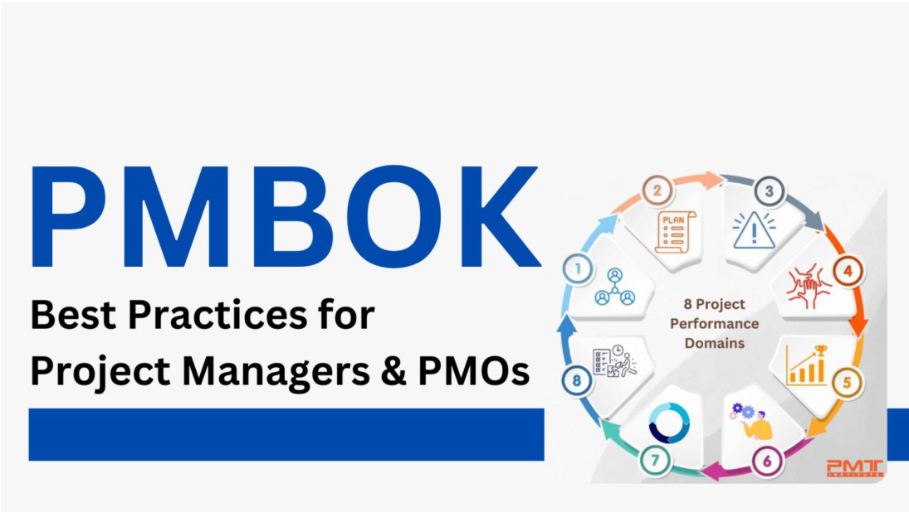

PMBOK significa **Project Management Body of Knowledge** , que em português fica algo como "Corpo de Conhecimento em Gerenciamento de Projetos". Ele é um **conjunto de padrões e melhores práticas para quem trabalha com gestão de projetos** . Quem publica esse guia é o Project Management Institute, o famoso PMI, uma organização internacional sem fins lucrativos dedicada exatamente a essa área. Eles criaram inclusive a certificação PMP, que é uma das mais valorizadas no mercado de TI e gestão. 

Basicamente, o guia descreve um **conjunto de padrões, convenções, processos e práticas** que foram aceitas pela comunidade como as melhores formas de tocar um projeto. A ideia é ajudar o gerente de projetos a administrar tudo de forma mais eficiente, desde o planejamento inicial até o encerramento. E mais, ele não serve só para um tipo de empresa ou setor. **O PMBOK foi pensado para funcionar em diferentes indústrias e contextos** , o que explica por que você o encontra sendo usado em projetos de construção civil, desenvolvimento de software, saúde e por aí vai. 

Até a 6ª edição, o PMBOK estava organizado em torno de 5 grupos de processos (iniciação, planejamento, execução, monitoramento e controle, e encerramento) e 10 áreas de conhecimento. Essa estrutura era bem conhecida, bem cobrada em concurso, e muita gente já tinha decorado. Só que na 7ª edição o guia fez uma virada relevante: saiu do modelo orientado a processos e passou para uma **estrutura baseada em princípios** . Com isso, o foco agora são **12 princípios de gestão de projetos e 8 áreas de desempenho** . É uma mudança de filosofia mesmo, não só de organização. A figura abaixo ilustra bem essa transição entre as duas estruturas.

---

<!-- pagina: 7 -->

**Paolla Ramos Aula 00** 

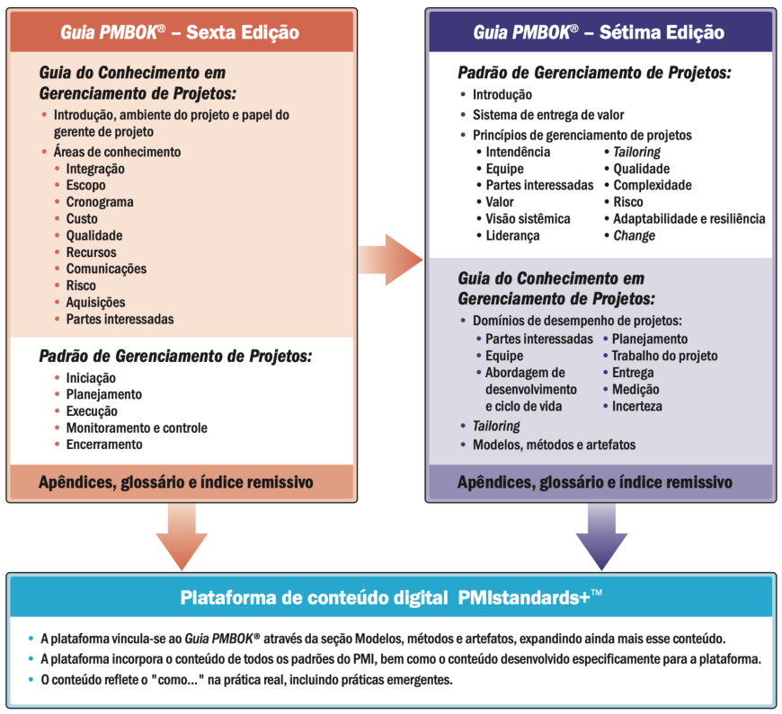

Essas mudanças todas refletem uma tendência clara de flexibilização na gestão de projetos. A ideia é dar ao gerente de projeto mais liberdade para adaptar as melhores práticas à realidade do projeto dele, em vez de seguir à risca um conjunto fixo e engessado de processos. Cada projeto tem suas particularidades, e o PMBOK finalmente abraçou isso de vez. 

E por falar em abraçar, é exatamente isso que o PMBOK 7ª edição faz com as diferentes abordagens de entrega. Ele consegue se adequar ao modelo ágil, ao tradicional, ao híbrido e a outros mais, porque passou a funcionar como um verdadeiro " **guarda-chuva** ": um modelo amplo o suficiente para comportar várias metodologias sob o mesmo teto. Como? Por meio do que a literatura chama de **Tailoring** , que é basicamente a personalização e a adaptação do guia a contextos diferentes. Você pega o que faz sentido para o seu projeto, ajusta o que precisa ajustar e descarta o que não se aplica.

---

<!-- pagina: 8 -->

**Paolla Ramos Aula 00** 

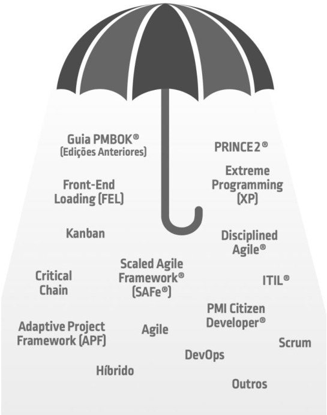

### Padrão, Termos e Conceitos 

Agora, vamos falar do **Padrão PMBOK** . O objetivo dele é de fornecer uma base sólida para que qualquer profissional consiga compreender o que é gerenciamento de projetos e como ele ajuda a alcançar os resultados pretendidos. Mais uma vez vale lembrar que ele não foi feito para um setor específico (não é algo exclusivo de TI!). O PMBOK vale para qualquer indústria, qualquer tamanho de projeto, qualquer localidade, e ainda funciona tanto em abordagens **preditivas** (aquelas mais tradicionais, com etapas bem definidas) quanto em abordagens **adaptativas** (os famosos métodos ágeis). Além disso, o padrão também se preocupa em descrever o ambiente onde os projetos vivem, a governança que os rege, as funções que as pessoas podem exercer e como projetos se relacionam com produtos. 

Antes de entrar nas estruturas específicas do padrão, porém, precisamos alinhar alguns conceitos fundamentais. 

##### **Definições** 

Começando por **Resultado** . 

Em gerenciamento de projetos, **resultado é o produto ou serviço único gerado ao fim do projeto** . O conceito vai além do entregável físico. Resultado também pode ser **qualquer mudança tangível ou intangível que** 

**5**

---

<!-- pagina: 9 -->

**Paolla Ramos Aula 00** 

**derive do projeto** , como um ganho de eficiência nos processos da empresa, uma nova habilidade que a equipe adquiriu durante a execução, ou até uma melhoria no relacionamento com o cliente. 

###### Temos também **Portfólio** . 

Um portfólio é uma **coleção de projetos, programas, subportfólios e operações que são gerenciados em conjunto para atingir objetivos estratégicos da organização** . Os elementos de um portfólio não precisam ser interdependentes nem diretamente relacionados entre si. A lógica que os une não é técnica, é **estratégica** . O que coloca projetos num mesmo portfólio é o fato de todos contribuírem para os mesmos objetivos organizacionais, mesmo que cada um faça isso de forma completamente independente. 

###### A seguir, temos **Programa** . 

Programa não é a mesma coisa que projeto. **Programa é um grupo de projetos relacionados que são** ==5460== **gerenciados de forma coordenada, justamente para obter benefícios e controle que não seriam possíveis se cada projeto fosse tocado de forma isolada** . A palavra-chave aqui é "coordenada". Os projetos dentro de um programa são interdependentes ou correlacionados, ou seja, o que acontece em um impacta o outro. Pense numa empresa que está reformulando todo o seu sistema de tecnologia: ela tem um projeto para migrar o banco de dados, outro para treinar os funcionários, outro para desenvolver o novo software. Cada um desses é um projeto separado, mas todos fazem parte de um programa maior. 

Temos também o **Projeto** , sobre o qual ainda vamos falar muito durante essa aula. Essa definição cai muito em prova, então preste atenção. 

**Projeto é um esforço temporário empreendido para criar um produto, serviço ou resultado único.** 

Duas palavras importam aqui: **temporário e único** . Temporário significa que tem início e fim definidos, não é algo que fica rodando para sempre. Único significa que não é uma operação rotineira, aquela coisa que a empresa faz todo dia no piloto automático. É um conjunto específico de operações para alcançar um objetivo singular. Construir uma ponte é um projeto. Fazer a manutenção dessa ponte todo ano já é operação. 

O **Produto** , por sua vez, é o resultado que sai do esforço do projeto. Pode ser tangível ou intangível. Um bem físico, um serviço, uma melhoria num processo que já existia. Não importa o formato, o que o projeto entrega é o produto. 

E aí entra o **Gerenciamento de Projetos** , que é basicamente a cola que une tudo isso. É a **aplicação de conhecimento, habilidades, ferramentas e técnicas para atender aos requisitos do projeto** . Na prática, isso envolve cinco grandes momentos: iniciar, planejar, executar, controlar e encerrar o trabalho da equipe. Tudo isso com um objetivo de atingir metas específicas, cumprir critérios de sucesso e, claro, fazer isso dentro do tempo estipulado. 

Agora vamos falar sobre os atores principais de qualquer projeto e o que está por trás de tudo isso.

---

<!-- pagina: 10 -->

**Paolla Ramos Aula 00** 

##### **Atores** 

O primeiro deles é o **Gerente de Projeto** . 

É a **pessoa responsável por liderar a equipe que está executando o trabalho** . Se o projeto fosse um filme, o gerente seria o diretor. Ele planeja, executa e supervisiona tudo, do início ao fim. Ele também é quem toma as decisões que vão influenciar diretamente o sucesso (ou o fracasso) do projeto. 

Depois, temos a **Equipe do Projeto** . 

Esse é o **grupo de indivíduos designados para colocar a mão na massa e executar o trabalho de fato** . Não precisa ser uma equipe homogênea. Dependendo do escopo e da natureza do projeto, essa equipe pode reunir profissionais de departamentos completamente diferentes, áreas de especialização distintas, cada um contribuindo com o que sabe de melhor. Um projeto de tecnologia, por exemplo, pode juntar desenvolvedores, analistas de negócio, designers e até pessoal jurídico na mesma equipe. 

**_Saiba Mais:_** _O desenvolvimento de equipes de alto desempenho baseia-se em cinco pilares fundamentais: 1._ **_Visão e Objetivos_** _(direção clara); 2._ **_Papéis e Responsabilidades_** _(quem faz o quê); 3._ **_Operações da Equipe_** _(processos de trabalho); 4._ **_Orientação_** _(alinhamento inicial); e 5._ **_Crescimento_** _(desenvolvimento contínuo de competências). Esses elementos garantem que a equipe não seja apenas um grupo de pessoas, mas uma unidade funcional coesa._ 

E, por fim, temos o **Escritório de Projetos** . O escritório de projetos (PMO, _Project Management Office_ ) é a estrutura organizacional responsável por padronizar, apoiar, monitorar e aprimorar a gestão de projetos dentro de uma instituição, assegurando que métodos, processos, indicadores e práticas sejam aplicados de forma coerente e alinhada aos objetivos estratégicos da organização. Em termos práticos, o PMO atua como um centro de governança e suporte, podendo oferecer orientação metodológica, acompanhamento de prazos, custos e riscos, consolidação de informações para a alta gestão e priorização do portfólio de projetos, com o propósito de aumentar a eficiência, a transparência e a taxa de sucesso das iniciativas organizacionais. 

**_Saiba Mais:_** _O_ **_Escritório de Gerenciamento de Projetos (PMO)_** _está evoluindo de uma estrutura de controle e padronização para uma função de_ **_articulação estratégica_** _. A tendência é que o PMO atue como parceiro de líderes e proprietários de produtos (POs) para maximizar a entrega de valor. Já o_ **_Centro de Excelência Ágil (CoE)_** _foca especificamente em disseminar a mentalidade ágil, realizando coaching e desenvolvendo capacidades iterativas em toda a organização, enquanto o PMO mantém o foco na governança e suporte multimetodológico._ 

##### **Valor** 

No contexto de gerenciamento de projetos, valor é a **percepção do benefício, da utilidade ou da importância daquilo que o projeto entrega** . A palavra-chave aqui é **percepção** . Porque valor não é algo fixo, universal. Ele pode ser medido em qualidade, custo, tempo, escopo, e o que importa mais vai depender de quem está recebendo o resultado. Para um cliente, pode ser a entrega no prazo. Para a organização, pode ser a redução de custo. Para outro stakeholder, pode ser a qualidade do produto final. Cada contexto define o que vale mais.

---

<!-- pagina: 11 -->

**Paolla Ramos Aula 00** 

**(CEBRASPE - 2024 - Profissional de Nível Universitário Júnior (ITAIPU)/Engenheiro Eletricista ou de Produção ou Mecânico) Considerando os conceitos do Guia PMBOK, 7.ª edição, julgue os itens a seguir.** 

**<mark>I No padrão de gerenciamento de projetos, a abordagem de entrega pode ser descritiva, híbrida ou adaptativa.</mark>** 

**<mark>II Para as organizações, a percepção de valor pode ser definida como a capacidade de disponibilizar recursos e funções específicas de um produto.</mark>** 

**<mark>III Programa corresponde a um grupo relacionado de projetos, subprogramas e atividades de programa, que são gerenciados de forma coordenada.</mark>** 

**<mark>IV O resultado pode ser compreendido como a consequência final de um processo ou projeto, podendo incluir produtos ou artefatos.</mark>** 

**<mark>Assinale a opção correta.</mark>** 

<mark>a) Apenas os itens I e II estão certos.</mark> 

<mark>b) Apenas os itens III e IV estão certos.</mark> 

<mark>c) Apenas os itens I, II e III estão certos.</mark> 

<mark>d) Apenas os itens II, III e IV estão certos.</mark> 

<mark>e) Todos os itens estão certos.</mark> 

**<mark>Comentários:</mark>** 

<mark>(I) Errado. O PMBOK 7ª ed. não prevê abordagem "descritiva". As abordagens reconhecidas são preditiva, híbrida e adaptativa; (II) Errado. Essa definição se refere à capacidade de um produto, não à percepção de valor organizacional, que envolve benefícios tangíveis e intangíveis; (III) Correto. O PMBOK define programa exatamente como um grupo relacionado de projetos, subprogramas e atividades gerenciados de forma coordenada para obter benefícios; (IV) Correto. Resultado é a consequência final de um processo ou projeto, podendo incluir produtos, artefatos ou mudanças de estado.</mark> 

Itens corretos: III e IV. **Letra B** . 

### Sistema de Entrega de Valor 

Pessoal, vamos falar agora sobre o **Sistema de Entrega de Valor** . Esse é um conceito que representa uma visão ampla de tudo que contribui para criar e entregar valor por meio de projetos.

---

<!-- pagina: 12 -->

**Paolla Ramos Aula 00** 

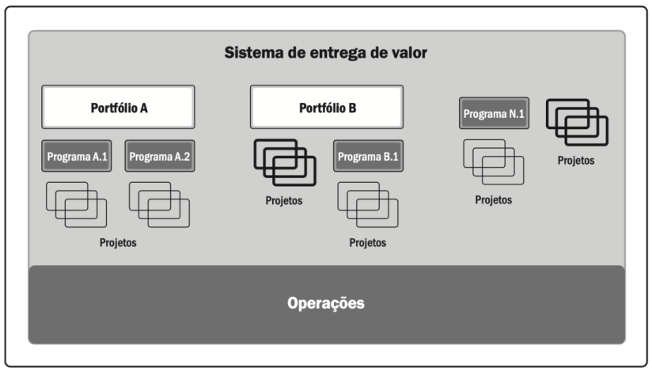

Um projeto não existe no vácuo. Ele está inserido dentro de uma organização, que tem cultura própria, recursos disponíveis, processos estabelecidos e pessoas com interesses diferentes. O Sistema de Entrega de Valor é justamente esse **conjunto de partes que trabalham juntas para garantir duas coisas fundamentais: primeiro, que o projeto esteja alinhado com os objetivos estratégicos da organização; segundo, que os resultados do projeto gerem valor real, seja para a própria organização ou para os clientes finais** . Não adianta entregar um projeto tecnicamente perfeito se ele não serve para nada na prática. Isso não é valor, é desperdício. 

Esse sistema é composto por vários elementos, tais como os stakeholders, o gerente de projeto e a equipe, as práticas e processos de gestão de projetos, os recursos organizacionais e a cultura e o ambiente da organização, entre outros. Cada um desses componentes tem um papel específico, e a ideia é que eles funcionem de forma integrada. 

**Stakeholders (Partes Interessadas)** . Engloba todos que têm algum interesse no projeto. É o cliente, é o usuário final, é a equipe de projeto, são os gerentes, os fornecedores. Basicamente, qualquer pessoa ou grupo que seja afetado pelo projeto ou que possa afetá-lo. São os stakeholders que ajudam a definir e a entender o que "valor" significa naquele contexto específico. Afinal, valor para quem? Para o cliente que vai usar o produto? Para a diretoria que quer resultado financeiro? Para o usuário que precisa de facilidade no dia a dia? Cada um tem uma perspectiva. 

**Práticas e processos de gestão de projetos** . Isso abrange as técnicas, métodos e processos usados para gerenciar o projeto no dia a dia, e boa parte deles está descrita no PMBOK. Mas atenção: não é uma receita de bolo. Esses processos precisam ser selecionados e adaptados conforme as necessidades específicas de cada projeto. O objetivo é sempre otimizar a entrega de valor, não seguir um checklist pelo checklist. 

**Recursos organizacionais** é tudo aquilo que a organização coloca à disposição do projeto para que ele aconteça. Recursos financeiros, humanos, tecnológicos, informações, conhecimento acumulado. Sem esse suporte, o melhor gerente do mundo não vai longe.

---

<!-- pagina: 13 -->

**Paolla Ramos Aula 00** 

E por último, mas não menos importante, a **cultura e o ambiente da organização** . A estrutura organizacional, as normas internas, os valores da empresa, a tolerância ao risco, o apetite por inovação. Tudo isso afeta diretamente como o projeto é conduzido e como o valor é entregue lá na ponta. 

Pessoal, um ponto fundamental aqui é garantir que as informações e os feedbacks circulem de forma coerente entre todos os componentes do sistema. Não adianta a alta administração ter uma estratégia brilhante se ela não chega lá na ponta operacional. E o caminho inverso também importa: o pessoal do operacional precisa mandar de volta o que está funcionando, o que não está, o que o ambiente está exigindo. É uma via de mão dupla. 

A figura a seguir ilustra exatamente isso. Você consegue visualizar a informação descendo da alta administração até os níveis operacionais da empresa e, depois, subindo de volta na forma de feedbacks. Esse fluxo é o que mantém o sistema alinhado com a estratégia e sintonizado com o ambiente ao redor. 

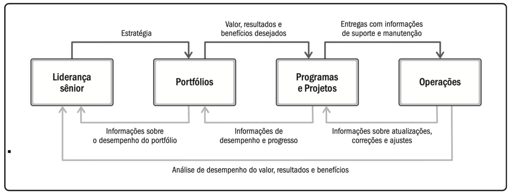

### Princípios 

Agora vamos falar sobre uma das maiores viradas de chave do PMBOK: a **abordagem baseada em princípios** . Isso aqui é uma mudança fundamental em relação às edições anteriores do guia, e vale entender bem o que mudou e por quê. 

Nas versões antigas do PMBOK, a lógica era bem mais **prescritiva** . O guia te dizia o processo, a prática, o passo a passo. Você seguia aquilo quase como uma receita de bolo. A 7ª edição jogou isso fora, pelo menos como centro da proposta. Em vez de te dizer o que fazer em cada situação, ela te entrega um conjunto de **princípios fundamentais** que servem como bússola. A ideia é que esses princípios funcionem como um guia, uma estrutura dentro da qual o gerente de projeto consegue trabalhar com mais flexibilidade e capacidade de adaptação. 

Isso acontece porque, na prática, cada projeto é único. Contextos mudam, equipes mudam, setores mudam. Um gerente tocando um projeto de TI numa startup tem demandas completamente diferentes de alguém

---

<!-- pagina: 14 -->

**Paolla Ramos Aula 00** 

gerenciando uma obra de infraestrutura no setor público. Não faz sentido tentar encaixar tudo num mesmo molde rígido. A abordagem baseada em princípios reconhece exatamente isso e devolve ao gerente de projeto a **liberdade de usar o próprio julgamento profissional e a própria experiência** para decidir como aplicar cada princípio dentro do contexto específico que ele tem na frente. 

É uma abordagem mais madura, também. Pressupõe que o profissional sabe o que está fazendo e precisa de orientação, não de tutela. Não é à toa que esse modelo ganhou força num momento em que metodologias ágeis já estavam consolidadas no mercado, todas elas baseadas exatamente nessa lógica de valores e princípios em vez de processos engessados. 

Na 7ª edição do PMBOK, são apresentados **12 princípios ao todo** , e eles cobrem uma gama bastante ampla de temas. Estamos falando de coisas como fornecimento de valor, consideração dos stakeholders, liderança eficaz, desempenho orientado para resultados, abordagem sistêmica, aprendizagem contínua, entre outros. Vamos estudar cada um deles em detalhe a seguir. 

**(CEBRASPE - 2024 - Analista de Planejamento e Orçamento (MPO)/Tecnologia da Informação/Governança** **<mark>e Gestão de Projetos de TI)</mark>** <mark>Com relação ao arcabouço de gerenciamento de projetos, julgue o item que se</mark> segue. 

<mark>Envolvimento das partes interessadas, ambiente colaborativo, enfoque no valor e tailoring são alguns dos princípios do gerenciamento de projetos segundo o PMBOK7.</mark> 

**<mark>Comentários: Correto</mark>** <mark>. O PMBOK 7ª edição adota 12 princípios de gerenciamento, entre eles: engajamento das partes interessadas, ambiente colaborativo, foco no valor e tailoring (adaptação). A mudança de</mark> processos para princípios é a grande virada da edição.

---

<!-- pagina: 15 -->

**Paolla Ramos Aula 00** 

##### **Princípio #1: SEJA UM ADMINISTRADOR DILIGENTE RESPEITOSO E ATENCIOSO** 

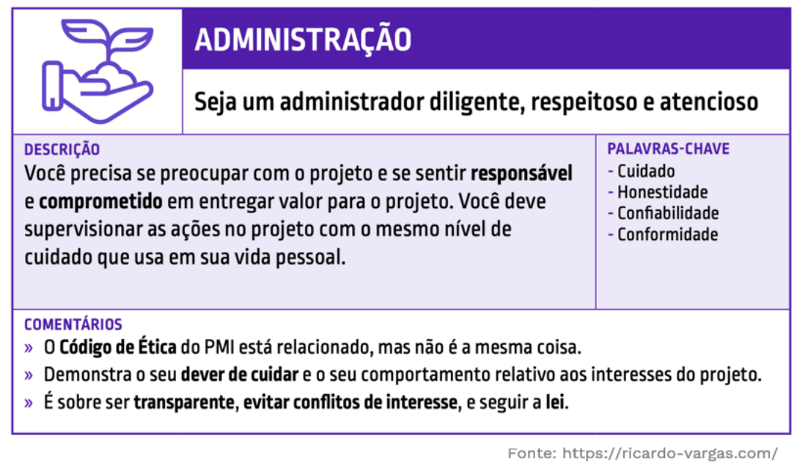

**Administração responsável dos recursos** não se refere apenas a dinheiro. É tempo, talento da equipe, conhecimento técnico acumulado, tecnologia disponível, e vai além disso: inclui também coisas menos tangíveis, como a boa vontade e a confiança dos stakeholders. 

Esse princípio coloca o gerente de projeto no papel de um "administrador diligente". Significa que ele não é dono dos recursos, ele é **guardião deles** . Recebeu algo valioso para cuidar, e vai prestar contas sobre o que fez com isso. 

A primeira responsabilidade que vem dessa postura é o **uso eficiente dos recursos** . O gerente precisa se esforçar para extrair o máximo de valor de tudo o que está disponível no projeto, evitando desperdício, otimizando como os recursos são alocados e buscando sempre formas de melhorar a eficiência. 

A segunda responsabilidade é a **tomada de decisão responsável** . Não basta tomar decisões que levem o projeto ao sucesso. O gerente precisa considerar o impacto dessas decisões sobre a organização como um todo, sobre os stakeholders envolvidos e até sobre o meio ambiente. Uma decisão que entrega o projeto no prazo, mas desgasta a equipe a ponto de adoecer as pessoas, não é uma boa decisão. 

**Transparência e prestação de contas** andam juntas. O gerente precisa ser claro sobre onde o projeto está, como os recursos estão sendo usados, e estar preparado para responder pelos resultados, sejam eles bons ou ruins. Se deu errado, alguém precisa explicar o quê e por quê.

---

<!-- pagina: 16 -->

**Paolla Ramos Aula 00** 

**_Saiba Mais:_** _O_ **_Princípio da Sustentabilidade_** _no gerenciamento de projetos modernos abrange as dimensões ambiental, social e econômica (o Triple Bottom Line). Ele incentiva o uso de recursos renováveis e a minimização da pegada ecológica, garantindo que o projeto não entregue valor apenas hoje, mas que seja viável e responsável para as gerações futuras._ 

**Gestão de riscos** é outro ponto fundamental. O gerente não pode esperar o problema aparecer para agir. Ele precisa identificar, avaliar e gerenciar proativamente tudo aquilo que pode comprometer o sucesso do projeto ou o uso eficiente dos recursos. 

E ainda tem **conformidade com leis e regulamentos** . Todas as atividades do projeto precisam estar alinhadas com as normas aplicáveis, tanto as internas da organização quanto as externas, como legislação e regulamentos do setor. 

##### **Princípio #2: CRIE UM AMBIENTE COLABORATIVO PARA A EQUIPE DO PROJETO** 

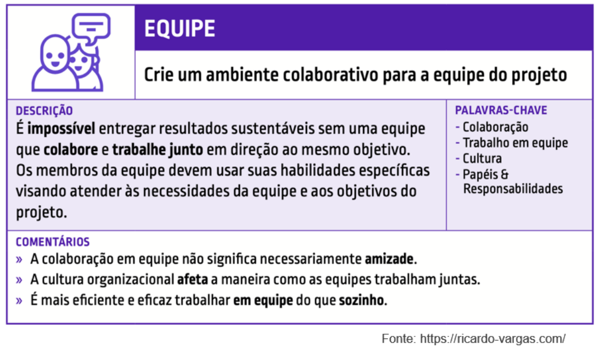

###### **Colaboração** é a chave para a execução bem-sucedida de um projeto. 

Um ambiente de trabalho verdadeiramente colaborativo permite que as equipes compartilhem conhecimento, aprendam umas com as outras, se apoiem mutuamente e trabalhem juntas para alcançar os objetivos do projeto. Em projetos simples, dá para empurrar com a barriga. Mas em projetos complexos, onde cada membro da equipe traz uma especialidade diferente e enxerga o problema de um ângulo diferente, sem colaboração real o negócio desanda. Cada um puxa para o seu lado e o projeto vira um _Frankenstein_ .

---

<!-- pagina: 17 -->

**Paolla Ramos Aula 00** 

Um dos aspectos centrais desse princípio é a **comunicação efetiva** . Colaboração sem comunicação é só um grupo de pessoas no mesmo prédio. A comunicação precisa ser aberta, honesta e eficaz, o que significa que todos os membros da equipe devem se sentir confortáveis para expressar suas ideias, preocupações e opiniões. 

Alguns fatores sustentam uma equipe de verdade. 

O primeiro ponto é **respeito e confiança mútua** . Cada membro precisa sentir que suas contribuições importam e que pode contar com os colegas para cumprir o que foi combinado. Quando alguém sente que seu trabalho não é valorizado ou que o colega não vai entregar, o ambiente inteiro começa a travar. 

Depois vem o “empowerment” ( **empoderamento** ) da equipe. As pessoas precisam ter autonomia para tomar decisões e resolver problemas dentro das suas áreas de especialização. Ninguém aguenta trabalhar num ambiente em que toda pequena decisão precisa subir três níveis hierárquicos para ser aprovada. Isso mata o ritmo e, aos poucos, mata também a motivação. 

Tem também a **promoção do trabalho em equipe** propriamente dita. A ideia aqui é que o foco deve estar nos objetivos compartilhados, não nas metas individuais. E não adianta só falar isso em reunião, tem que estar nas estruturas de recompensa e reconhecimento. Se a empresa premia só quem se destacou individualmente, adivinha o que as pessoas vão fazer? Vão competir entre si, não colaborar. O incentivo precisa refletir o desempenho coletivo para que o discurso de "somos um time" faça algum sentido real. 

Por fim, chagamos às **ferramentas e processos de colaboração** . Estamos falando de plataformas de gestão de projetos, ambientes digitais de trabalho em equipe e técnicas estruturadas de tomada de decisão em grupo. É algo que garante que a comunicação flua, que todo mundo saiba o que está acontecendo e que as decisões sejam tomadas com as pessoas certas na conversa.

---

<!-- pagina: 18 -->

**Paolla Ramos Aula 00** 

##### **Princípio #3: ENVOLVA-SE DE FATO COM AS PARTES INTERESSADAS** 

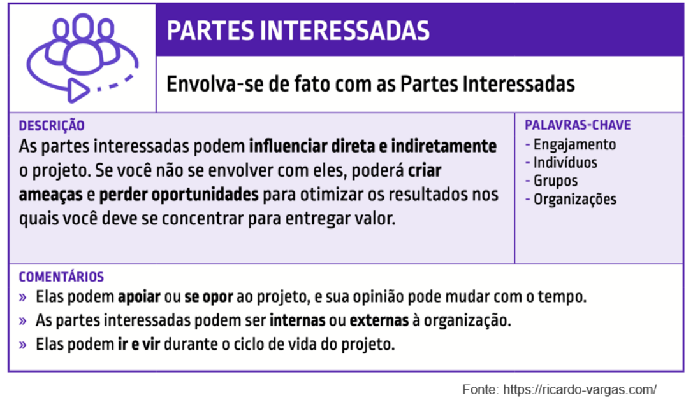

Partes interessadas são **todos que têm algum interesse no projeto ou que serão afetados por ele, de alguma forma** . Pode ser o patrocinador que assina o cheque, o cliente que vai usar o produto final, os membros da própria equipe, os fornecedores, os usuários, e às vezes até a comunidade ao redor. Pense num projeto de construção de uma usina hidrelétrica: a empresa contratante é stakeholder, o governo é stakeholder, e a população ribeirinha que vai ser deslocada também é. 

O primeiro passo nesse processo é **identificar quem são essas partes interessadas** . É preciso garimpar aqueles que são afetados de forma indireta pelo projeto. O vizinho que não pediu para participar, mas vai sentir o impacto, conta, por exemplo. 

Depois de identificar, vem a segunda etapa, que é **entender o que cada um desses stakeholders precisa** , espera e teme. As necessidades e expectativas de um cliente são completamente diferentes das de um fornecedor ou de um membro da equipe técnica. Para chegar a esse entendimento, o gerente de projetos pode lançar mão de uma série de técnicas de coleta de informações, tais como entrevistas individuais, workshops em grupo, pesquisas, questionários. Cada técnica tem seu momento certo de uso, dependendo do perfil do stakeholder e do contexto do projeto. 

Agora vamos falar de três pilares que sustentam o relacionamento com as partes interessadas para lidar com eles no dia a dia do projeto. 

O primeiro pilar é a **comunicação efetiva** . Manter as partes interessadas informadas sobre o status e o progresso do projeto é uma obrigação. A comunicação precisa ser clara, concisa e adaptada às necessidades e preferências de cada parte interessada. Isso significa que você não vai mandar o mesmo relatório técnico

---

<!-- pagina: 19 -->

**Paolla Ramos Aula 00** 

cheio de jargão para o patrocinador executivo que você manda para o time de desenvolvimento. **Cada um recebe a informação no formato que faz sentido para ele** . 

O segundo pilar é o de **engajamento ativo** , que não é só comunicar, é colaborar. É buscar o feedback das partes interessadas, envolvê-las na tomada de decisões sempre que for apropriado. Quando as pessoas participam do processo de decisão, elas tendem a aceitar melhor o resultado, mesmo que nem tudo tenha saído como elas queriam. O engajamento ativo melhora a qualidade das decisões e aumenta a aceitação e o apoio ao projeto. 

O terceiro pilar é a **gestão de conflitos** . Perceba que conflito entre partes interessadas é comum em projetos. Normal, esperado, quase inevitável. O problema não é o conflito em si, é não saber gerenciá-lo. A chave aqui é compreender as diferentes perspectivas antes de sair propondo solução, e então trabalhar para encontrar saídas que atendam às necessidades de todas as partes envolvidas. 

##### **Princípio #4: ENFOQUE NO VALOR** 

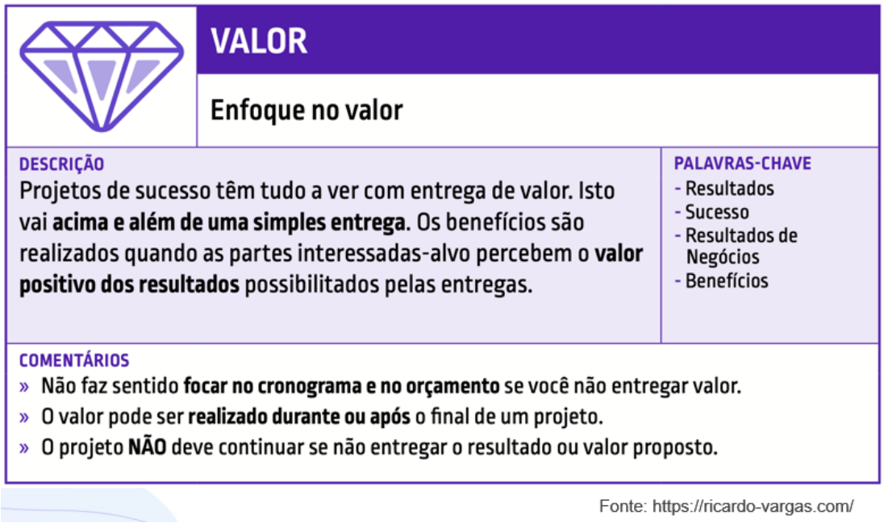

###### A ideia deste princípio é **sempre manter o foco em entregar valor para os stakeholders durante a gestão de um projeto** . 

_Mas o que é "valor" aqui_ ? **Valor não tem uma definição única e engessada** . Depende de quem está do outro lado. Para um stakeholder, valor pode ser algo bem concreto e mensurável, como um produto de alta qualidade ou uma entrega feita dentro do prazo. Para outro, pode ser algo mais subjetivo, como a satisfação do cliente ou a melhoria da reputação da organização no mercado. Ambos são igualmente válidos.

---

<!-- pagina: 20 -->

**Paolla Ramos Aula 00** 

É justamente por isso que a primeira coisa a se fazer quando queremos aplicar esse princípio é entender, de verdade, o que "valor" significa para os stakeholders daquele projeto específico. Não dá para presumir ou achar que você já sabe. Isso exige comunicação ativa e engajamento direto com essas pessoas, ouvindo suas necessidades e expectativas com atenção. Em outras palavras: antes de sair entregando, **descubra o que o outro lado considera uma boa entrega** . 

Depois que o valor foi definido, o trabalho não acabou. Pelo contrário, começa a parte mais trabalhosa: planejar como esse valor vai ser entregue de verdade. Estamos falando do escopo, dos objetivos, do cronograma e dos planos de recursos. Tudo tem que estar alinhado com aquilo que foi decidido como valor. 

Durante a execução, o mesmo raciocínio vale. Cada atividade precisa estar orientada para entregar o valor que foi definido lá no início. Na prática, isso significa priorizar atividades com base no impacto que elas têm sobre esse valor. Não é o que está mais fácil de fazer, não é o que o cliente pediu por último, não é o que a equipe prefere. **É o que move o ponteiro do valor** . As decisões do dia a dia também passam por esse filtro, pois, antes de mudar qualquer coisa, a pergunta é " **qual o impacto disso sobre o valor que estamos entregando** ?". 

_Mas como saber se o valor está sendo entregue de fato_ ? É aí que entra a medição. **É necessário desenvolver métricas de valor e reportar o progresso em relação a essas métricas** regularmente para os stakeholders. Isso garante que todo mundo está olhando para os mesmos números e que eventuais desvios aparecem cedo, não só no encerramento do projeto quando não tem mais o que fazer. 

Por último, tem a **otimização** . O gerente de projeto não pode se acomodar achando que, porque está entregando valor, não tem como melhorar. A busca por otimização é constante. Pode ser uma oportunidade de melhorar a eficiência do processo, de reduzir custos sem sacrificar qualidade, de aumentar a qualidade em si, ou de melhorar a satisfação do cliente. Qualquer um desses caminhos, se bem explorado, eleva o valor entregue. 

**(FCC - 2026 - Analista do Ministério Público de Sergipe/Tecnologia da Informação/Infraestrutura) Um** **<mark>Ministério Público está revisando sua governança de TI para alinhar os projetos de infraestrutura às diretrizes do PMBOK 7ª edição. Durante a implantação de um novo Data Center, a equipe que fará o projeto da infraestrutura precisa garantir que os princípios de entrega de valor e de adaptação contínua</mark> sejam respeitados, considerando a alta criticidade dos serviços.** 

**<mark>Desse contexto, a prática mais alinhada às orientações do PMBOK para assegurar governança eficaz e consistência nos resultados é:</mark>** 

<mark>a) Adotar o princípio de foco em valor e integrar os domínios de desempenho de entregas e planejamento adaptativo, utilizando métricas de disponibilidade e resiliência como critérios de aceitação para cada incremento de infraestrutura.</mark> 

- <mark>b) Centralizar todas as decisões técnicas no gerente de projeto, reduzindo a autonomia da equipe de</mark> 

- <mark>infraestrutura para evitar divergências durante a execução.</mark> 

- <mark>c) Priorizar exclusivamente a documentação detalhada dos processos de instalação, mesmo que isso</mark> 

- <mark>atrase a entrega de serviços críticos, garantindo rastreabilidade total.</mark> 

<mark>d) Definir um cronograma rígido e imutável para as atividades de migração, sem considerar ajustes decorrentes de riscos emergentes ou mudanças de requisitos de segurança, visando agilizar o projeto.</mark>

---

<!-- pagina: 21 -->

**Paolla Ramos Aula 00** 

<mark>e) Concentrar a governança apenas no controle orçamentário, deixando a definição de métricas de desempenho técnico sob responsabilidade exclusiva da área financeira.</mark> 

**<mark>Comentários:</mark>** 

**<mark>(a) Correto</mark>** <mark>. O PMBOK 7ª ed. orienta foco em valor e adaptação contínua. Usar métricas de disponibilidade e resiliência como critérios de aceitação por incremento reflete exatamente os domínios de entregas e planejamento adaptativo; (b) Errado. Centralizar decisões no gerente contradiz o princípio de liderança servidora e autonomia das equipes, pilares do PMBOK 7ª ed.; (c) Errado. Priorizar documentação em detrimento da entrega de valor vai contra o princípio de foco em resultados e benefícios reais ao negócio; (d) Errado. Cronogramas rígidos e imutáveis ignoram o princípio de adaptabilidade e resiliência, essencial diante de riscos emergentes; (e) Errado. Restringir a governança ao controle financeiro ignora os múltiplos</mark> domínios de desempenho do PMBOK, como risco, qualidade e entregas. 

##### **Princípio #5: RECONHEÇA, AVALIE E REAJA ÀS INTERAÇÕES DO SISTEMA** 

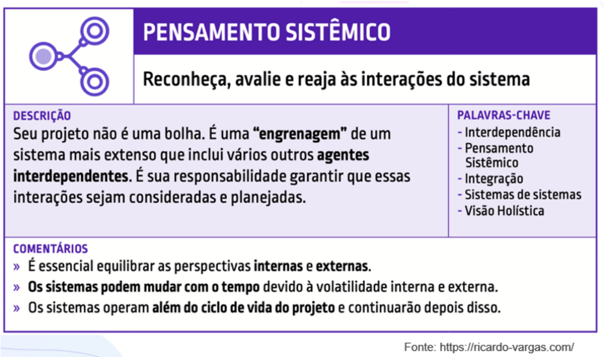

Interações do sistema são **as formas pelas quais os diferentes elementos do projeto (tarefas, processos, pessoas) e o ambiente ao redor (a organização como um todo, o setor de mercado, a economia) se afetam mutuamente** . Um puxa o outro, um influencia o outro. 

E é aí que entra a primeira e principal consideração desse princípio: a **visão sistêmica** . O gerente de projeto precisa enxergar o projeto de forma holística, considerando todas as suas partes e como elas se conectam, tanto entre si quanto com o que está lá fora. Estamos falando de fatores externos que podem chegar de

---

<!-- pagina: 22 -->

**Paolla Ramos Aula 00** 

mansinho e bagunçar tudo, como uma mudança na economia, uma nova tecnologia que surge do nada ou uma regulamentação que o governo resolve publicar bem no meio da execução do seu projeto. 

Por exemplo, imagine que você está gerenciando a construção de um software e a equipe de banco de dados resolve mudar a estrutura de uma tabela. Isso pode quebrar a integração com outro módulo, atrasar o time de testes e, no fim, empurrar a entrega inteira. É uma interação do sistema acontecendo na sua frente. Mudanças na organização (tipo uma reestruturação interna, corte de orçamento, troca de patrocinador) ou no ambiente externo (uma nova legislação, uma crise econômica) também afetam diretamente o projeto. 

Este princípio também trata da **gestão adaptativa** , onde o gerente precisa ser capaz de reagir rápido. Isso pode significar reavaliar as metas do projeto, mudar a ordem de prioridade das tarefas ou até reformular processos inteiros para se encaixar nas novas condições etc. 

E um terceiro elemento que fecha esse ciclo é o **aprendizado e a melhoria contínuos** . Como as interações do sistema mudam ao longo do tempo, o gerente não pode só reagir uma vez e achar que acabou. Ele precisa usar cada experiência como fonte de aprendizado para melhorar as práticas dali para frente. 

##### **Princípio #6: DEMONSTRE COMPORTAMENTOS DE LIDERANÇA** 

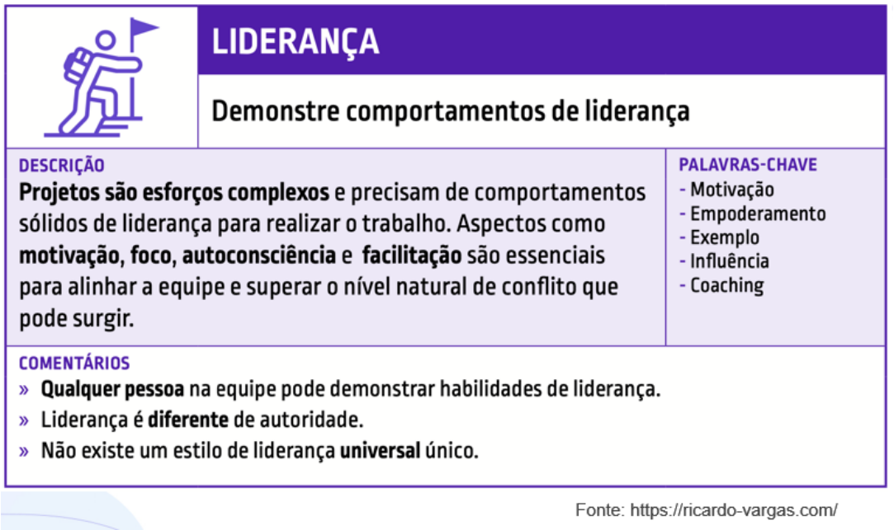

Existe uma diferença entre **gerir e liderar** . O gerente de projeto precisa demonstrar habilidades de liderança eficazes para conduzir a equipe ao sucesso, e isso vai muito além de preencher cronograma e controlar orçamento.

---

<!-- pagina: 23 -->

**Paolla Ramos Aula 00** 

**Gestão e liderança** não são a mesma coisa. Gestão é aquele conjunto de atividades mais estruturadas: planejamento, organização, controle de prazos, alocação de recursos. É essencial, claro. Mas liderar envolve **inspirar pessoas, motivar a equipe nos momentos difíceis, defender a visão do projeto quando todo mundo está cansado e ainda criar um ambiente onde a inovação tem espaço para acontecer** . Dá para ser um excelente gestor e um líder medíocre, por exemplo. 

Aí vem outra questão importante: qual estilo de liderança usar? A **liderança transformacional** , por exemplo, foca em inspirar mudanças e engajar a equipe em torno de uma visão maior. A **liderança servidora** inverte a lógica e coloca o líder como alguém que remove obstáculos para que a equipe possa trabalhar bem. A **autocrática** centraliza as decisões, o que pode ser útil em crises onde não dá tempo de consultar todo mundo. A **democrática** distribui a voz e tende a gerar mais engajamento, mas pode ser mais lenta. O ponto é que líderes eficazes não ficam presos a um único estilo. Eles leem o contexto, entendem o que a equipe e o projeto precisam naquele momento, e ajustam a abordagem. 

O gerente de projeto que quer liderar de verdade precisa dominar um conjunto bem específico de habilidades: **comunicação, tomada de decisão, resolução de conflitos, gestão de mudanças e habilidades interpessoais** . Também entra nessa lista a capacidade de desenvolver e motivar a equipe, promover a colaboração, estimular a inovação e, talvez o ponto mais importante de tudo, **criar uma visão compartilhada do que é o sucesso do projeto** . Isso significa que todo mundo no time precisa entender para onde está indo, não só o líder. 

Por fim, precisamos falar sobre a **liderança ética** . O bom líder não é só aquele que entrega resultado, é aquele que entrega resultado do jeito certo. Isso envolve honestidade, integridade, transparência e respeito pelos outros. Equipes lideradas por pessoas íntegras tendem a funcionar melhor, pois as pessoas confiam mais, se comunicam com mais abertura e não ficam com medo de apontar um problema. A ideia é **dar o exemplo** antes de cobrar o exemplo. 

Uma notícia boa para quem acha que "liderança é dom": não é. **Liderança se desenvolve** . Por meio de treinamento, coaching, experiência prática e aprendizado contínuo, qualquer pessoa pode aprimorar essas habilidades ao longo do tempo. Ninguém nasce sabendo gerenciar conflitos ou tomar decisões sob pressão. Isso se aprende, se treina, se pratica. 

**(CEBRASPE - 2025 - Auditor Fiscal Tributário (SEFAZ SE)/Tecnologia da Informação) De acordo com o** **<mark>PMBOK 7.ª edição, assinale a opção que apresenta o princípio fundamental da gerência de projetos voltado</mark> diretamente a promover a colaboração entre os membros da equipe.** 

<mark>a) foco em resultados mensuráveis</mark> 

<mark>b) adaptação ao contexto organizacional</mark> 

<mark>c) liderança eficaz</mark> 

<mark>d) entrega de valor contínuo</mark> 

<mark>e) construção de relacionamentos eficazes</mark> 

**<mark>Comentários:</mark>** 

(a) Errado. Foco em resultados mensuráveis orienta a entrega de valor, mas não trata diretamente da <mark>colaboração entre membros da equipe; (b) Errado. Adaptação ao contexto organizacional refere-se à</mark>

---

<!-- pagina: 24 -->

**Paolla Ramos Aula 00** 

<mark>adequação do projeto ao ambiente, não à promoção de colaboração interna;</mark> **<mark>(c) Correto</mark>** <mark>. No PMBOK 7.ª ed., liderança eficaz engloba inspirar, motivar e promover a colaboração entre os membros da equipe, sendo o princípio mais diretamente ligado a esse objetivo; (d) Errado. Entrega de valor contínuo foca nos resultados entregues ao longo do projeto, sem ênfase na dinâmica colaborativa da equipe; (e) Errado. Construção de relacionamentos eficazes é relevante, mas não é listada como princípio fundamental no PMBOK 7.ª ed. com</mark> esse nome. 

##### **Princípio #7: FAÇA A ADAPTAÇÃO DE ACORDO COM O CONTEXTO (TAILORING)** 

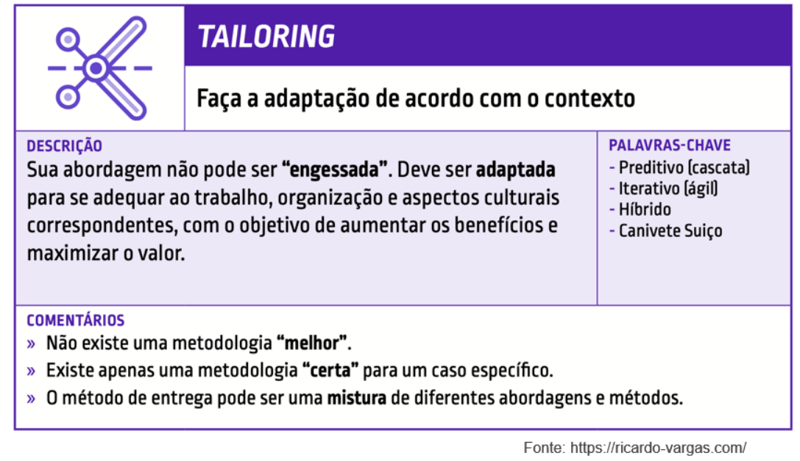

Não existe fórmula mágica para gerenciar projetos. Sabe aquela ideia de que basta aplicar o método certo e tudo vai funcionar? Não é bem assim. O que o PMBOK nos diz é que **cada projeto tem um contexto próprio** , **e o gerente precisa adaptar sua abordagem a esse contexto** . 

O primeiro passo para essa adaptação é **entender o terreno antes de sair escolhendo ferramenta** . O gerente precisa analisar uma série de fatores, como o tipo de projeto, o setor em que a organização atua, a cultura da empresa, como a equipe está estruturada, o que os stakeholders realmente precisam, e quais restrições ou requisitos específicos estão em jogo. Só depois de ter esse diagnóstico na mão é que faz sentido decidir como tocar o projeto. 

O segundo ponto é a **flexibilidade de abordagem** . E aqui é onde mora o perigo, porque tem gerente que vira "fanático" por uma metodologia e tenta encaixar tudo nela, não importa o contexto. O que o princípio pede é o oposto disso: o profissional precisa estar disposto a combinar métodos tradicionais, ágeis, enxutos, ou o que for necessário, dependendo do cenário. Um projeto com requisitos bem definidos e escopo estável, por exemplo, tende a se dar melhor com uma abordagem mais tradicional, aquele planejamento mais detalhado e sequencial. Já um projeto em ambiente de rápida mudança, onde os requisitos vão sendo descobertos ao

---

<!-- pagina: 25 -->

**Paolla Ramos Aula 00** 

longo do caminho, vai se beneficiar muito mais de uma abordagem ágil, com ciclos curtos e entregas frequentes. 

Assim, **as decisões de um projeto precisam ser baseadas no contexto daquele projeto específico** . Do planejamento até o encerramento, passando por toda a execução, cada escolha que o gerente faz deve levar em conta a realidade ao redor. A forma como os riscos são gerenciados, por exemplo, pode ser completamente diferente num projeto de desenvolvimento de software para uma startup do que num projeto de obras para uma prefeitura. A comunicação também muda. O que funciona aqui pode não funcionar ali. 

A adaptação não é algo que você faz uma vez só no começo do projeto e esquece. É um processo contínuo. O contexto de um projeto não é estático. Ele muda, e às vezes muda rápido. Entra uma nova lei, o cliente muda de prioridade, surge um problema técnico que ninguém previa, a equipe perde um membro-chave. O gerente de projetos que estava bem adaptado no mês passado pode precisar revisar toda a abordagem hoje. 

O nome que o PMBOK dá a esse processo de adaptação é “ **Tailoring** ”. "Tailoring" é o processo de **personalização e ajuste das orientações de gerenciamento de projetos para se adequarem a um projeto específico** . Isso é feito considerando-se o ambiente único de cada projeto, as necessidades e expectativas dos stakeholders, a natureza do trabalho do projeto e outros fatores relevantes.

---

<!-- pagina: 26 -->

**Paolla Ramos Aula 00** 

##### **Princípio #8: INCLUA QUALIDADE NOS PROCESSOS E NAS ENTREGAS** 

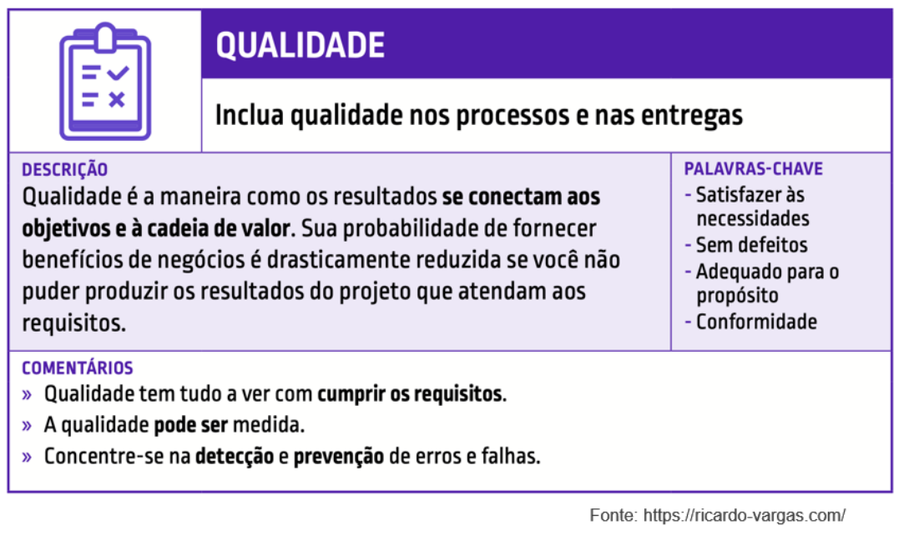

É necessário integrar qualidade em tudo, não só na entrega final. Muita equipe chega no fim do projeto, entrega o produto e só aí percebe que alguma coisa saiu errada no meio do caminho. Esse princípio existe exatamente para evitar isso. 

A primeira coisa que precisa ficar clara é o que "qualidade" significa dentro da gestão de projetos. Qualidade diz respeito ao produto final, ou seja, **se ele realmente atende aos requisitos combinados e às expectativas dos stakeholders** , mas também diz respeito aos **processos usados para construir esse produto** , se eles foram eficientes e eficazes. Percebe? Você pode entregar um produto tecnicamente correto usando um processo completamente torto, e isso é um problema. Antes de sair aplicando qualidade em qualquer coisa, é preciso entender o que esse termo significa especificamente no contexto do seu projeto e para as pessoas envolvidas nele. Qualidade para o cliente de um sistema bancário é diferente de qualidade para o cliente de um aplicativo de delivery. 

Outro ponto fundamental é que qualidade não é assunto para o final do projeto. Ela entra no planejamento **desde o início** ; a equipe precisa definir quais são os padrões de qualidade esperados para as entregas, identificar quais processos de qualidade fazem sentido para aquele projeto e, claro, determinar como essa qualidade vai ser monitorada e controlada ao longo do caminho. Não adianta nada definir padrões excelentes no papel se ninguém vai verificar se eles estão sendo seguidos. 

**_Saiba Mais:_** _A governança eficaz define_ **_limites de tolerância_** _(ex: +/- 10% do orçamento). Quando o desempenho real ultrapassa esses limites, o gerente deve acionar um_ **_Plano de Exceção_** _, que é_

---

<!-- pagina: 27 -->

**Paolla Ramos Aula 00** 

_uma resposta estruturada para informar o patrocinador e implementar ações corretivas drásticas_ _<u>para trazer o projeto de volta aos trilhos ou decidir por sua descontinuidade.</u>_ 

Vamos ressaltar esse ponto: **a qualidade precisa estar presente em todo o projeto, não só no final** . Não adianta nada terminar o projeto, chamar a equipe para uma revisão geral e torcer para que tudo deu certo. Qualidade não se verifica no fim, ela se constrói no meio do caminho. 

Isso se faz incorporando qualidade nos processos, ou seja, usando técnicas consagradas como Lean (aquela abordagem focada em eliminar desperdícios) ou Seis Sigma (que busca reduzir defeitos e variações nos processos). A ideia é buscar melhoria contínua, o tempo todo, aprendendo com os erros que aparecem e também com os acertos. Acertos também ensinam e, se algo funcionou muito bem, você precisa entender por que funcionou para conseguir repetir. 

Tudo isso, claro, precisa ser acompanhado. E é aí que entra o **monitoramento e controle da qualidade** . Ao longo do projeto, você precisa ficar de olho se os padrões de qualidade estão sendo respeitados, e também se há oportunidades de melhorar algo que ainda não está nos conformes. Para isso, usa-se métricas de qualidade (números que mostram se o processo está dentro do esperado), auditorias de qualidade (uma espécie de "inspeção formal" nos processos) e revisões de qualidade, que são análises periódicas para checar se tudo segue no rumo certo. 

E, por fim, tem a entrega. O objetivo final de tudo isso é entregar um produto ou resultado que **atenda, ou até supere, os requisitos e expectativas de qualidade** . Mas atenção: antes de entregar, existe uma verificação final da qualidade, justamente para garantir que nada passou despercebido, e depois disso vem a aceitação formal por parte do cliente ou dos stakeholders. Sem essa aceitação, a entrega não está completa. 

**40. (FGV - 2026 - Analista Judiciário (TJ RJ)/Tecnologia da Informação/Cientista de Dados) No âmbito do** **<mark>Poder Judiciário, a plataforma Sinapses é responsável por gerenciar o treinamento supervisionado,</mark> versionamento e disponibilização de modelos de inteligência artificial.** 

**<mark>O Conselho Nacional de Justiça estabelece que os modelos de inteligência artificial adotados deverão possuir mecanismos de explicabilidade, sempre que tecnicamente possível, de modo que suas decisões e operações sejam compreensíveis e auditáveis pelos operadores judiciais.</mark>** 

**<mark>De acordo com o PMBOK 7ª edição, em projetos analíticos e de aprendizado de máquina, o mecanismo de explicabilidade pode ser orientado pelo princípio:</mark>** 

<mark>a) concentre-se no valor;</mark> 

<mark>b) demonstre comportamentos de liderança;</mark> 

<mark>c) crie qualidade nos processos e nas entregas;</mark> 

<mark>d) reconheça, avalie e reaja às interações do sistema;</mark> 

<mark>e) crie um ambiente colaborativo para a equipe do projeto.</mark> 

**<mark>Comentários:</mark>**

---

<!-- pagina: 28 -->

**Paolla Ramos Aula 00** 

<mark>(a) Errado. "Concentre-se no valor" orienta a priorização de entregas com impacto, mas não aborda diretamente a qualidade técnica e a auditabilidade dos modelos de IA; (b) Errado. Comportamentos de liderança dizem respeito à postura do gestor e da equipe, sem relação direta com explicabilidade de modelos preditivos;</mark> **<mark>(c) Correto</mark>** <mark>. Criar qualidade nos processos e nas entregas engloba garantir que os modelos sejam compreensíveis, rastreáveis e auditáveis — base da explicabilidade exigida pelo CNJ; (d) Errado. Reconhecer e reagir às interações do sistema remete ao pensamento sistêmico e adaptativo, não à garantia de qualidade e transparência das saídas do modelo; (e) Errado. Ambiente colaborativo favorece o trabalho em equipe, mas</mark> não trata da qualidade técnica nem da explicabilidade das decisões geradas por IA. 

##### **Princípio #9: NAVEGUE NA COMPLEXIDADE** 

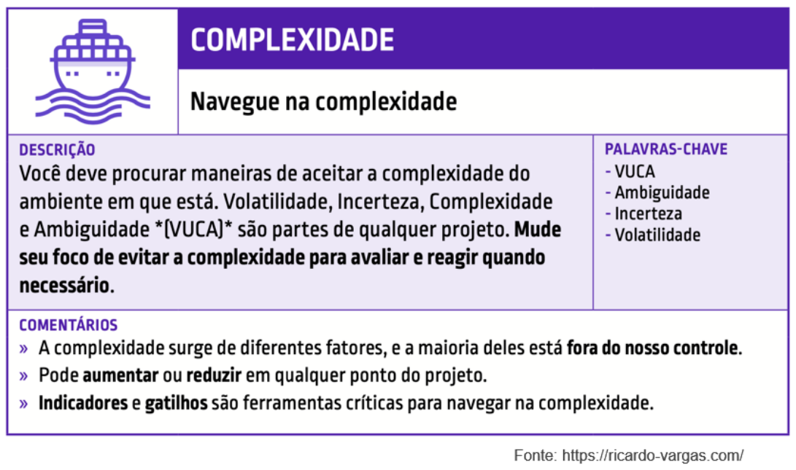

Qualquer projeto de porte considerável ou que envolva algo novo carrega **complexidade** dentro de si. A premissa aqui é que complexidade existe, e ela precisa ser gerenciada com seriedade para o projeto dar certo. 

A complexidade se apresenta em várias formas. Tem a **complexidade técnica** , aquela que envolve a dificuldade da solução em si. Tem a **complexidade organizacional** , que aparece quando muitos times, departamentos ou empresas diferentes precisam trabalhar juntos. Tem a **complexidade ambiental** , relacionada ao contexto externo do projeto, regulações, mercado, concorrência. E tem ainda a **complexidade sociocultural** , que surge quando o projeto envolve grupos humanos com culturas, valores e expectativas diferentes.

---

<!-- pagina: 29 -->

**Paolla Ramos Aula 00** 

Quando você senta para **planejar** um projeto complexo, é necessário usar técnicas de modelagem de complexidade para visualizar e mapear as interações e incertezas do projeto. Significa também reservar recursos e tempo adicionais, porque projetos complexos raramente acontecem dentro do que foi originalmente previsto. E significa, muitas vezes, adotar abordagens de gestão mais flexíveis e adaptativas, em vez de tentar seguir um plano rígido que vai rachar na primeira virada inesperada. 

E por falar em ambientes incertos, entra mais um ponto: **adaptabilidade** . A complexidade, por definição, gera surpresas. Coisas que você não previu aparecem no meio do caminho, as circunstâncias mudam, chega uma informação nova que vira tudo de cabeça para baixo. O gerente que fica paralisado esperando o plano original se cumprir está em apuros. O que funciona mesmo é estar pronto para responder rápido, ser **adaptável** , ajustar a rota e seguir em frente sem drama. 

O último ponto é o **aprendizado contínuo** . A natureza dinâmica da complexidade exige uma cultura em que as pessoas estão sempre adquirindo conhecimentos e habilidades novas, e em que a organização aprende tanto com os acertos quanto com os erros. Empresas que cultivam esse ambiente costumam sair melhor de crises do que aquelas que repetem os mesmos padrões _ad infinitum_ . 

##### **Princípio #10: OTIMIZE AS RESPOSTAS AOS RISCOS** 

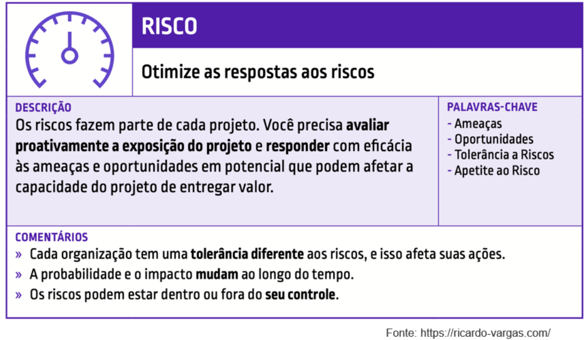

Esse princípio existe por uma razão muito simples: **todo projeto tem riscos** . Identificar, analisar e responder adequadamente a esses riscos é o que aumenta a probabilidade de o projeto chegar ao fim com sucesso. 

Vamos por partes. O primeiro passo é a **identificação dos riscos** .

---

<!-- pagina: 30 -->

**Paolla Ramos Aula 00** 

Antes de qualquer coisa, a equipe precisa se perguntar: o que pode dar errado aqui? Para isso, existem várias abordagens. Uma delas é a **análise SWOT** , aquela matriz que todo mundo já viu pelo menos uma vez na vida, onde você mapeia Forças, Fraquezas, Oportunidades e Ameaças. Outra opção é uma boa e velha sessão de **brainstorming** com a equipe, onde todo mundo joga ideias na mesa sem julgamento. E tem também a revisão de lições aprendidas em projetos anteriores, que é, aliás, uma das fontes mais subestimadas de informação. Afinal, se um determinado risco já derrubou um projeto parecido no passado, faz sentido colocá-lo no radar agora, certo? 

Depois de identificar, vem a **análise dos riscos** . Aqui entendemos qual é a **probabilidade** de ele acontecer e qual seria o **impacto** no projeto caso aconteça. Um risco com chance baixíssima de ocorrer e impacto mínimo não merece a mesma atenção que um risco provável e de alto impacto. Essa análise é o que permite priorizar, ou seja, decidir onde concentrar os esforços de gestão de riscos em vez de tentar cuidar de tudo ao mesmo tempo, o que na prática não funciona. 

Identificar e analisar os riscos é só metade do trabalho. A outra metade é saber o que fazer com eles. É aí que entra o **Plano de Resposta aos Riscos** . Para cada risco mapeado, você precisa definir uma resposta adequada. Essa resposta não é sempre a mesma, porque nem todo risco é igual. 

Basicamente, existem quatro caminhos possíveis. O primeiro é a **aceitação** : quando o risco é tão pequeno, tão improvável ou tão barato de lidar que simplesmente não compensa gastar energia com ele. Você aceita que ele pode acontecer e segue em frente. O segundo é a **mitigação** , que é talvez o mais comum: você toma ações para reduzir a probabilidade de o risco ocorrer, ou para diminuir o impacto caso ele ocorra. O terceiro é a **transferência** , que na prática significa repassar o risco para outra parte. O exemplo clássico é a contratação de um seguro, ou terceirizar uma atividade justamente para que outra empresa assuma a responsabilidade por aquele risco específico. E o quarto é a **evitação** : você muda o plano do projeto para que aquele risco simplesmente deixe de existir. 

###### Ainda sobre análise 

Depois de cada risco analisado, eles precisam ser **monitorados continuamente ao longo de todo o projeto** , porque o ambiente muda. Novos riscos aparecem no meio do caminho, e riscos que pareciam sob controle podem se intensificar. Se um risco de fato ocorrer, o plano de resposta precisa ser acionado imediatamente, e depois você avalia se aquela resposta funcionou como esperado ou se precisa de ajuste. 

Por fim, tem um ponto que muita gente esquece, e que cai bastante em prova: **nem todo risco é ruim** . Dentro da gestão de projetos, **risco é apenas INCERTEZA** , e incerteza pode jogar a seu favor. Um fornecedor que fecha inesperadamente pode abrir espaço para uma negociação melhor com outro. Uma mudança de regulação pode beneficiar justamente o seu produto. Essas situações são chamadas de oportunidades, e elas merecem o mesmo tratamento rigoroso dos riscos negativos: devem ser identificadas, analisadas e respondidas de forma planejada, para que você consiga aproveitá-las antes que a janela feche.

---

<!-- pagina: 31 -->

**Paolla Ramos Aula 00** 

##### **Princípio #11: ADOTE A CAPACIDADE DE ADAPTAÇÃO E RESILIÊNCIA** 

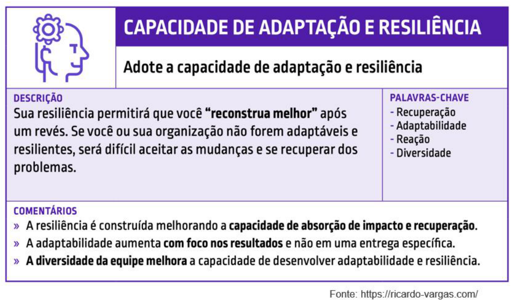

Esse princípio parte da premissa que **projetos enfrentam imprevistos** . Sempre. A questão não é se vai aparecer uma turbulência no caminho, mas quando, e o quanto a equipe está preparada para lidar com isso. Por isso, a **capacidade de se adaptar a mudanças e de se recuperar de dificuldades** é tratada como algo fundamental para o sucesso de qualquer projeto. 

Duas ideias sustentam esse princípio. A primeira é a **adaptabilidade** . Na prática, é a capacidade de mudar ou se ajustar quando algo novo surge, tal como uma informação que contradiz o planejamento original, uma circunstância que mudou lá fora, um desafio que ninguém esperava. No contexto do gerenciamento de projetos, isso pode alterar planos, revisar processos, abandonar práticas que não funcionam mais, ou até redefinir objetivos com base em feedback recebido, resultados observados ou transformações no ambiente do projeto. 

A segunda ideia é a **resiliência** . **Resiliência é a capacidade de se recuperar rapidamente depois de uma dificuldade, um obstáculo ou uma falha** . No gerenciamento de projetos, isso envolve coisas bem concretas: gerenciar riscos de forma eficaz antes que eles se tornem problemas maiores, aprender com os erros em vez de simplesmente culpar alguém, manter uma atitude positiva diante das adversidades, e ter a perseverança necessária para não largar o projeto no meio do caminho quando as coisas ficam difíceis. Equipes resilientes costumam entregar projetos mesmo em condições desfavoráveis, enquanto equipes rígidas travam na primeira crise. 

Um outro ponto é a **cultura de aprendizado contínuo** . Isso significa que a equipe precisa estar genuinamente aberta a novas ideias, a rever abordagens que não funcionaram e, principalmente, a aprender tanto com os

---

<!-- pagina: 32 -->

**Paolla Ramos Aula 00** 

erros quanto com os acertos. Não é aquele clima de "quem errou vai ser cobrado", mas sim um ambiente onde errar faz parte do processo, desde que a lição seja extraída e aplicada. 

Além disso, temos o conceito de **liderança adaptativa** . O gerente de projeto não pode exigir da equipe uma flexibilidade que ele mesmo não demonstra. Se o projeto vira de cabeça para baixo e o gerente entra em colapso, o time sente. A liderança adaptativa e resiliente é justamente o cenário onde o gerente serve de referência, mostra que é possível lidar com a mudança sem desmoronar, promove a abertura ao novo e sustenta a equipe nos momentos mais difíceis. 

Por fim, o último ponto é a **gestão de mudanças** , que é onde tudo isso se torna concreto. Quando uma mudança acontece, ela precisa ser comunicada com clareza, sem rodeios e sem deixar ninguém de fora. Os stakeholders precisam ser envolvidos nas decisões, porque ninguém aceita bem uma mudança que foi jogada no colo sem explicação. Os membros da equipe precisam de suporte real durante a transição, não só de um e-mail avisando que "a partir de segunda as coisas funcionam diferente". 

**(FGV - 2026 - Analista Judiciário (TJ RJ)/Tecnologia da Informação/Analista de Infraestrutura de TIC (e mais** **<mark>5 concursos)) A empresa Y está desenvolvendo uma plataforma de e-commerce para uma empresa de vendas online. Com base nos testes de usabilidade e feedback do usuário, a equipe de desenvolvimento decidiu efetuar alterações nas funcionalidades, sendo que algumas delas resultariam em mudanças no</mark> escopo original.** 

**<mark>Ao levar esse fato ao gerente de projetos, a equipe usou o PMBOK para justificar as alterações com base no princípio do(a):</mark>** 

<mark>a) foco em valor; b) liderança servidora;</mark> 

<mark>c) pensamento sistêmico;</mark> 

<mark>d) adaptação e resiliência;</mark> 

<mark>e) colaboração e engajamento.</mark> 

**<mark>Comentários:</mark>** 

<mark>(a) Errado. O foco em valor trata de maximizar benefícios ao negócio, não de justificar mudanças de escopo decorrentes de feedback; (b) Errado. Liderança servidora refere-se ao estilo de liderança que apoia a equipe, sem relação direta com alterações de escopo; (c) Errado. Pensamento sistêmico considera o projeto como um todo interconectado, mas não fundamenta mudanças baseadas em feedback de usabilidade;</mark> **<mark>(d) Correto</mark>** <mark>. Adaptação e resiliência sustenta a capacidade de ajustar o projeto diante de novas informações — como feedback de usuários — mesmo que isso implique mudanças no escopo; (e) Errado. Colaboração e engajamento envolve trabalho conjunto entre partes interessadas, mas não é o princípio que justifica</mark> alterações de escopo.

---

<!-- pagina: 33 -->

**Paolla Ramos Aula 00** 

##### **Princípio #12: ACEITE A MUDANÇA** 

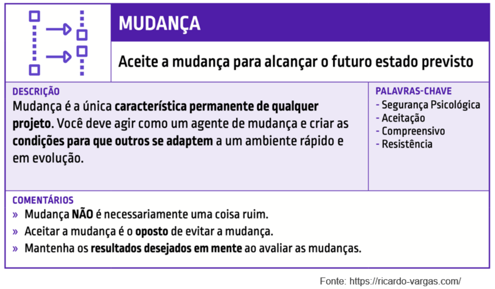

Como último princípio, entenda que **a mudança é inevitável** . Não adianta resistir. Se as circunstâncias mudam, se aparecem informações novas no meio do caminho, ou se os resultados estão desalinhados dos objetivos lá do começo, vai ser necessário mudar de rota para chegar aonde se quer chegar. 

Na teoria, é fácil. O desafio está na prática, e é por isso que existem algumas considerações para lidar com esse princípio. 

Primeiramente, é a **abertura à mudança** . Antes de qualquer processo ou ferramenta, precisa existir uma mentalidade. Tanto o gerente de projeto quanto os membros da equipe precisam estar dispostos a ser flexíveis e adaptáveis. Sem isso, qualquer tentativa de gestão de mudanças vai travar na resistência das pessoas antes mesmo de sair do papel. 

A segunda consideração é a **gestão de mudanças** em si, que vai muito além de simplesmente "aceitar que as coisas mudam". Ela envolve um conjunto de etapas bem definidas: identificar que uma mudança é necessária, avaliar quais são os impactos e os benefícios potenciais dessa mudança, comunicar de forma efetiva para todos os envolvidos o que está acontecendo e por quê, e então implementar e monitorar a mudança para garantir que ela realmente levou o projeto ao estado futuro pretendido. 

Mudança exige aprendizado, e aprendizado exige humildade para ouvir. Isso significa coletar feedback dos stakeholders de forma ativa, não esperar que os problemas apareçam sozinhos. Significa também aprender tanto com os erros quanto com os acertos, e usar esse aprendizado para atualizar práticas e processos.

---

<!-- pagina: 34 -->

**Paolla Ramos Aula 00** 

Agora, aceitar a mudança não quer dizer sair mudando tudo ao bel-prazer. Existe uma armadilha comum aqui, que é a **mudança impulsiva** , aquela que nasce de um susto ou de uma pressão pontual, sem nenhum planejamento por trás. Mudanças assim costumam criar mais problemas do que resolvem. Por isso, qualquer alteração precisa ser feita de forma estratégica, alinhada aos objetivos gerais do projeto. A pergunta que o gerente deve se fazer antes de qualquer decisão é: " **essa mudança nos aproxima ou nos afasta de onde queremos chegar** ?" 

### Domínios de Desempenho 

Domínios de Desempenho são **áreas de foco relacionadas diretamente à eficácia do gerenciamento de projetos** . Eles não são prescritivos. Ou seja, o guia não chega para você e diz "faça exatamente isso, nessa ordem, desse jeito". A ideia é que eles sejam adaptáveis, flexíveis, capazes de funcionar em qualquer tipo de projeto, seja ele preditivo (o famoso modelo cascata), ágil, híbrido ou qualquer outra abordagem que a equipe resolva adotar. 

No total, são **oito Domínios de Desempenho** . Veja o resumo deles: 

1. **Stakeholders (Partes Interessadas)** : Enfatiza a importância de entender e envolver efetivamente os stakeholders durante todo o ciclo de vida do projeto. 

2. **Equipe** : Concentra-se em liderar, gerenciar e apoiar a equipe do projeto, além de criar um ambiente de equipe eficaz e colaborativo. 

3. **Ciclo de Vida do Projeto** : Trata de definir, gerenciar e adaptar o ciclo de vida do projeto, desde o início até a conclusão. 

4. **Planejamento** : Envolve o desenvolvimento de uma abordagem e um plano para entregar os resultados do projeto. 

5. **Trabalho do Projeto** : Aborda todas as atividades relacionadas ao trabalho real, como recursos físicos, contratação e gerenciamento de mudanças. 

6. **Entrega** : Envolve a execução do trabalho do projeto para entregar os resultados definidos. 

7. **Medição** : Inclui o gerenciamento de desempenho e medições do projeto. 

8. **Incerteza** : Trata do gerenciamento de riscos e incertezas do projeto, bem como a resposta a elas. 

Agora que temos o panorama geral, vamos mergulhar em cada domínio de desempenho com mais profundidade. Um detalhe: **muitos conceitos dos domínios de desempenho abaixo já foram abordados nas explicações sobre os Princípios de Gerenciamento de Projetos** . Por isso, irei apresentar as explicações de forma **mais esquematizada e mais objetiva** , beleza? 

Vamos lá.

---

<!-- pagina: 35 -->

**Paolla Ramos Aula 00** 

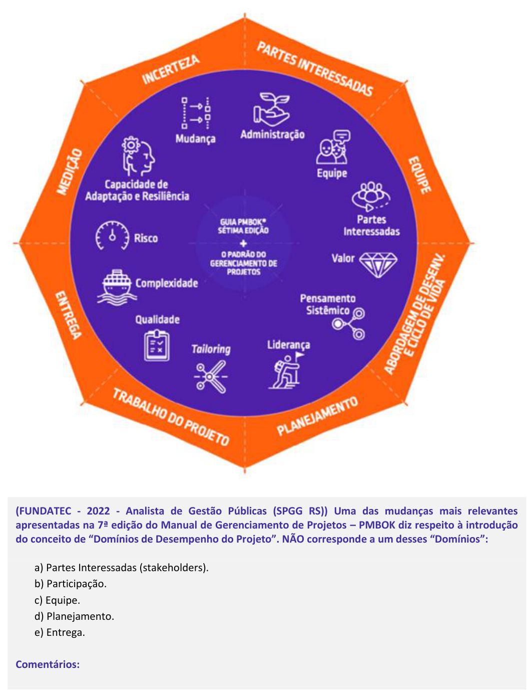

<!-- Start of picture text -->
(FUNDATEC - 2022 - Analista de Gestão Públicas (SPGG RS)) Uma das mudanças mais relevantes apresentadas na 7ª edição do Manual de Gerenciamento de Projetos – PMBOK diz respeito à introdução do conceito de “Domínios de Desempenho do Projeto”. NÃO corresponde a um desses “Domínios”: a) Partes Interessadas (stakeholders). b) Participação. c) Equipe. d) Planejamento. e) Entrega. Comentários: <!-- End of picture text -->

---

<!-- pagina: 36 -->

**Paolla Ramos Aula 00** 

<mark>(a) Errado. Partes Interessadas é um dos oito Domínios de Desempenho do PMBOK 7ª edição;</mark> **<mark>(b) Correto</mark>** <mark>. "Participação" não figura entre os domínios oficiais do PMBOK 7 — portanto, NÃO corresponde a nenhum deles; (c) Errado. Equipe é um dos domínios reconhecidos pelo PMBOK 7ª edição; (d) Errado. Planejamento também integra a lista oficial dos Domínios de Desempenho do PMBOK 7; (e) Errado. Entrega é igualmente</mark> um dos oito Domínios de Desempenho previstos no PMBOK 7. 

##### **Domínio de Desempenho #1: STAKEHOLDERS (PARTES INTERESSADAS)** 

Este domínio foca no envolvimento ativo e contínuo de todas as partes interessadas do projeto. Envolve a identificação de todos os stakeholders, entendendo suas necessidades e expectativas, e garantindo que suas vozes sejam ouvidas e consideradas durante todo o projeto. A gestão eficaz dos stakeholders ajuda a ganhar apoio para o projeto, melhorar a satisfação e aumentar a confiança na equipe de gerenciamento do projeto. 

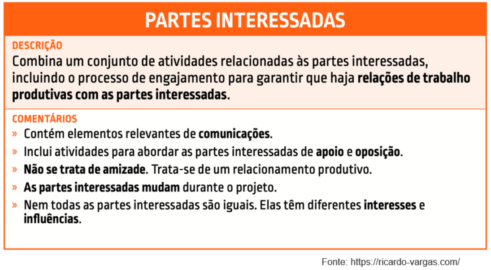

###### **Definições:** 

###### ❏ **Parte interessada** 

- Indivíduo, grupo ou organização que possa afetar, ser afetado, ou sentir-se afetado por uma decisão, 

- atividade, ou resultado de um projeto, programa ou portfólio 

###### ❏ **Análise das partes interessadas** 

- Método de coleta e análise sistemática de informações quantitativas e qualitativas para determinar 

- quais interesses devem ser considerados durante o projeto 

A figura abaixo mostra exemplos de partes interessadas:

---

<!-- pagina: 37 -->

**Paolla Ramos Aula 00** 

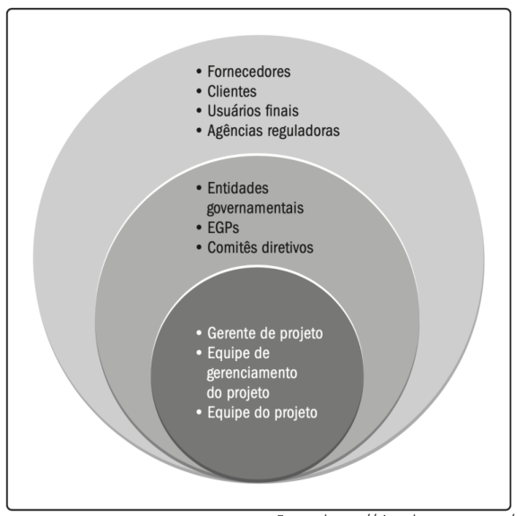

Fonte: https://ricardo-vargas.com/ 

O engajamento das partes interessadas envolve seis atividades principais: identificar, compreender, analisar, priorizar, engajar e monitorar. Veja: 

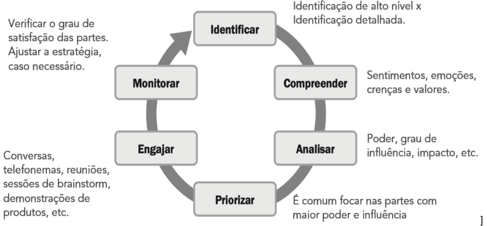

<!-- Start of picture text -->
] <!-- End of picture text -->

###### **Resultados Esperados:** 

- ❏ Relação de trabalho produtiva com as partes interessadas ao longo do projeto 

- ❏ Acordo das partes interessadas com os objetivos do projeto 

- ❏ As partes interessadas beneficiárias do projeto apoiam e estão satisfeitas

---

<!-- pagina: 38 -->

**Paolla Ramos Aula 00** 

As partes interessadas que podem se <u>opor ao projeto ou às suas entregas não afetam negativamente os</u> resultados do projeto. 

**(FGV - 2026 - Analista Judiciário (TJ RJ)/Tecnologia da Informação/Analista de Projetos) Um gerente de** **<mark>projetos tem desenvolvido ações de comunicação para reduzir a resistência dos envolvidos à aceitação de</mark> um novo projeto.** 

**<mark>Segundo a 7ª edição do PMBOK, essa atuação está relacionada ao domínio:</mark>** 

<mark>a) trabalho do projeto;</mark> 

<mark>b) planejamento;</mark> 

<mark>c) stakeholders; d) medição; e) incerteza.</mark> 

**<mark>Comentários:</mark>** 

<mark>(a) Errado. O domínio de trabalho do projeto trata da execução de processos e atividades operacionais, não do engajamento e resistência de pessoas; (b) Errado. O domínio de planejamento foca na organização e estruturação do trabalho, não na gestão de percepções e comportamentos dos envolvidos;</mark> **<mark>(c) Correto</mark>** <mark>. O domínio de stakeholders abrange justamente o engajamento, a comunicação e a redução de resistências dos envolvidos ao projeto; (d) Errado. O domínio de medição lida com avaliação de desempenho e métricas, sem relação direta com ações de comunicação para engajamento; (e) Errado. O domínio de incerteza trata de</mark> riscos e ambiguidades, não de estratégias para reduzir resistência de partes interessadas.

---

<!-- pagina: 39 -->

**Paolla Ramos Aula 00** 

##### **Domínio de Desempenho #2: EQUIPE** 

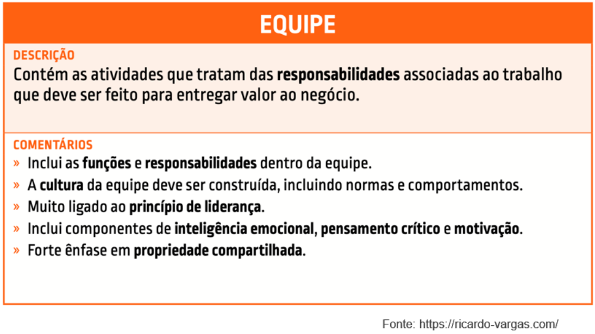

O domínio da equipe se concentra na liderança e gestão da equipe do projeto. Isso envolve a criação de um ambiente de trabalho eficaz e colaborativo, o fornecimento de orientação e apoio e a promoção de uma cultura de aprendizado e melhoria contínua. Uma gestão de equipe eficaz pode levar a um maior envolvimento dos membros da equipe, melhor qualidade do trabalho e maior sucesso do projeto. 

###### **Definições:** 

- **Gerente do projeto** : Pessoa designada pela organização executora para liderar a equipe do projeto, 

- responsável por alcançar os seus objetivos 

- **Equipe de gerenciamento do projeto** : Membros da equipe do projeto diretamente envolvidos nas 

- atividades de gerenciamento do projeto 

- **Equipe do projeto** : Grupo de indivíduos que executa o trabalho do projeto para alcançar seus 

- objetivos 

###### **Estilos de Liderança:** 

Existem diferentes estilos de liderança que podem ser aplicados no domínio de Equipe. O PMBOK destaca dois principais: 

- ❏ **Liderança Centralizada** 

   - A responsabilidade é de um indivíduo específico (geralmente o gerente do projeto) 

   - O Termo de Abertura do Projeto atribui a autoridade 

- ❏ **Liderança Distribuída**

---

<!-- pagina: 40 -->

**Paolla Ramos Aula 00** 

   - Equipes auto-organizadas com responsabilidades compartilhadas 

- Em vez de ter um gerente projeto, alguém da equipe atua como facilitador para remover obstáculos, 

- prevenir desvios e dar oportunidades de melhoria e crescimento 

**_Saiba mais_** _: O_ **_Termo de Abertura do Projeto_** _(Project Charter) é o documento que_ **_autoriza formalmente a existência de um projeto_** _e concede ao gerente de projeto a autoridade para aplicar recursos organizacionais em suas atividades. Ele marca o momento oficial em que o projeto "nasce" dentro da organização._ 

_Entre as informações típicas que constam no documento estão: o propósito e justificativa do projeto, os objetivos e critérios de sucesso, requisitos de alto nível, riscos iniciais, cronograma e orçamento preliminares, além da identificação das partes interessadas principais. É importante destacar que essas informações ainda são_ **_estimativas em alto nível_** _— os detalhamentos virão nos processos de planejamento._ 

_O Termo de Abertura é emitido por alguém_ **_externo ao projeto_** _— geralmente um patrocinador (sponsor), um comitê ou um executivo — justamente para garantir que a autoridade do gerente de projeto tenha respaldo institucional. Sem ele, o gerente pode ter dificuldades para mobilizar equipes e recursos de outras áreas._ 

###### **Comportamentos Desejados:** 

Ao liderar a equipe, o líder deve demonstrar um conjunto de comportamentos esperados, quais sejam: 

- Transparência: Na forma de pensar, nas escolhas e nas informações 

- Integridade: Comportamento ético e honesto 

- Respeito: A diferentes formas de pensar, habilidades e experiências 

- Discurso positivo: Trabalhar para resolver opiniões divergentes 

- Diálogo (ganha-ganha) versus Debate (ganha-perde) 

- Apoio: Ajudar a resolver problemas e remover impedimentos 

- Coragem: Demonstrar coragem para fazer uma sugestão, discordar ou tentar algo novo 

- Comemorar o sucesso: Reconhecer as vitórias, manter a equipe motivada 

###### **Resultados Esperados:** 

- ❏ Propriedade compartilhada: 

   - Todos os membros do projeto conhecem a visão e os objetivos 

- ❏ Equipe de alto desempenho 

   - Uma equipe confiante, colaborativa e que se adapta a diversas situações 

   - Sente-se fortalecida e reconhece o seu valor 

- ❏ Liderança demonstrada por todos os membros da equipe 

   - Os membros apresentam habilidades interpessoais e pensamento crítico 

   - Estilo de liderança adequado ao contexto do projeto

---

<!-- pagina: 41 -->

**Paolla Ramos Aula 00** 

##### **Domínio de Desempenho #3: CICLO DE VIDA DO PROJETO** 

Este domínio trata de definir, gerenciar e adaptar o ciclo de vida do projeto, desde o início até a conclusão. Isso inclui a seleção da abordagem de gerenciamento de projetos mais adequada (por exemplo, preditiva, ágil ou híbrida), o planejamento de todas as fases do projeto e a adaptação do projeto conforme necessário em resposta a mudanças e desafios. 

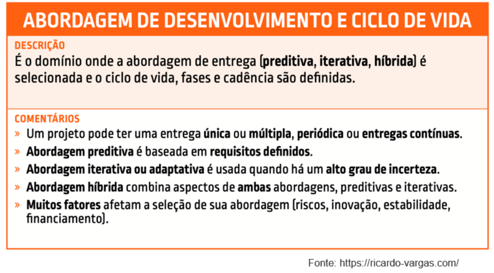

###### **Definições:** 

###### ❏ **Abordagem de desenvolvimento** 

- Um método usado para criar e desenvolver o produto, serviço ou resultado do projeto 

- Métodos preditivos, iterativos, incrementais, adaptativos ou híbridos 

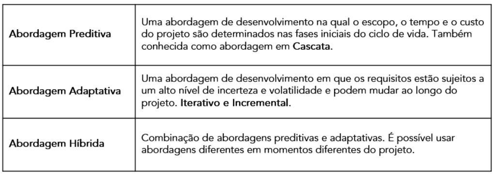

---

<!-- pagina: 42 -->

**Paolla Ramos Aula 00** 

###### ❏ **Cadência** 

- Um ritmo de atividades realizadas ao longo do projeto. Refere-se ao tempo e à frequência de entregas 

- do projeto, tais como: 

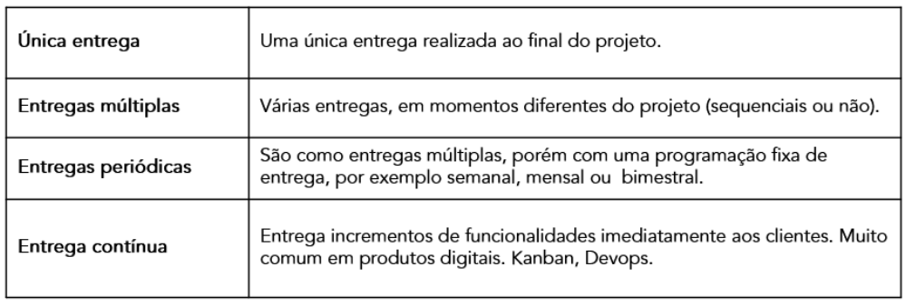

Exemplo de ciclo de vida preditivo: 

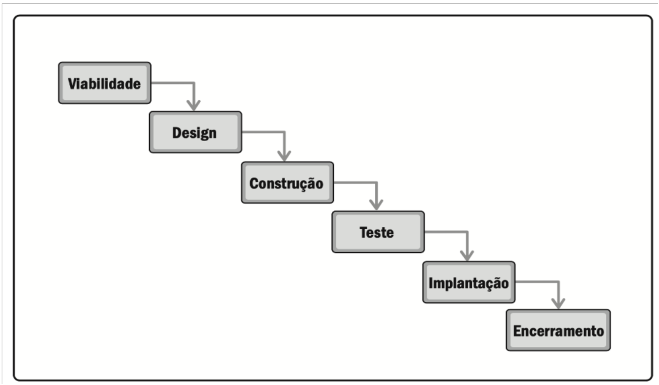

Exemplo de ciclo de vida incremental: 

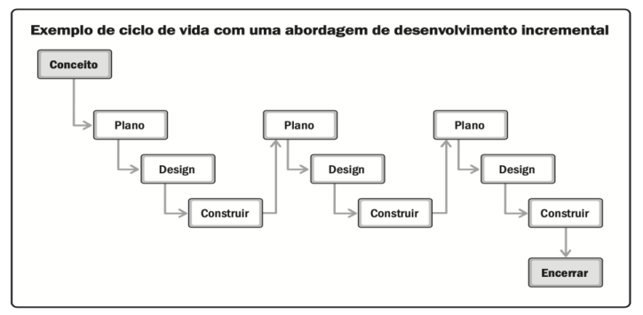

---

<!-- pagina: 43 -->

**Paolla Ramos Aula 00** 

Exemplo de ciclo de vida adaptativo: 

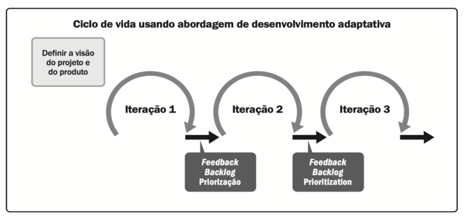

###### ❏ **Fase do projeto** 

   - Coleção de atividades de projeto logicamente relacionadas que culmina na conclusão de uma ou mais 

   - entregas 

- ❏ **Ciclo de Vida do Projeto** 

   - Uma série de fases pelas quais um projeto passa desde seu início até sua conclusão 

###### **Considerações para se escolher uma abordagem:** 

- ❏ Considerando o produto, serviço ou resultado 

   - Grau de inovação, certeza dos requisitos, estabilidade do escopo, facilidade de mudança, segurança, 

   - regulamentos, etc. 

- ❏ Considerando o projeto 

   - Envolvimento das partes interessadas, restrições de cronograma e disponibilidade de recursos 

   - financeiros 

- ❏ Considerando a organização 

   - Rigidez da estrutura, cultura de trabalho, tamanho e localização da equipe, etc. 

**_Saiba Mais:_** _Em abordagens adaptativas, o_ **_Tamanho do Lote_** _é a quantidade de itens de trabalho (como histórias de usuário) selecionada para uma única iteração ou sprint. Ele é fundamental para equilibrar a capacidade da equipe com a demanda, evitando gargalos e garantindo que o_ _<u>fluxo de entrega seja constante e previsível.</u>_ 

###### **Resultados Esperados:** 

- ❏ A abordagem de desenvolvimento é consistente com as entregas do projeto 

- ❏ Existe um ciclo de vida bem definido para o projeto (fases, etapas) 

- ❏ Existe uma cadência (ritmo de entregas) adequada à abordagem de desenvolvimento

---

<!-- pagina: 44 -->

**Paolla Ramos Aula 00** 

##### **Domínio de Desempenho #4: PLANEJAMENTO** 

O domínio do planejamento envolve a elaboração de uma abordagem e um plano para entregar os resultados do projeto. Abrange a definição de objetivos e entregas, a identificação de tarefas e recursos necessários, a estimativa de prazos e custos e a preparação para possíveis riscos e incertezas. 

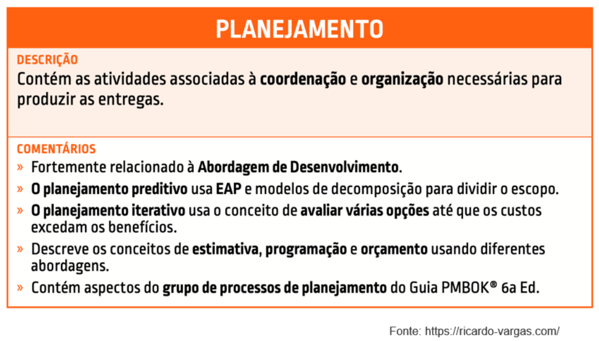

###### **Definições:** 

###### ❏ **Estimativa** 

   - Número de períodos de trabalho que serão necessários para terminar atividades específicas 

   - com recursos estimados 

- ❏ **Exatidão** 

      - Uma avaliação da assertividade da estimativa (obs.: _o quão próximo estou do valor real_ ) 

###### ❏ **Precisão** 

- Refere-se ao grau da exatidão 

- Por exemplo, uma estimativa de dois dias é mais precisa do que “em algum momento desta 

###### semana” 

###### ❏ **Compressão (Crashing)** 

- Método usado para reduzir a duração do cronograma mediante a adição de recursos 

###### ❏ **Paralelismo** 

- Método de compressão de cronograma em que atividades ou fases normalmente sequenciais 

- são executadas em paralelo 

###### ❏ **Orçamento** 

- A estimativa aprovada para o projeto ou qualquer componente de estrutura analítica do 

- projeto (EAP) ou qualquer atividade do cronograma

---

<!-- pagina: 45 -->

**Paolla Ramos Aula 00** 

###### **Variáveis que afetam o planejamento:** 

- **Abordagem de desenvolvimento** : Preditiva (orientada a planos) x Adaptativa (orientada a valor) 

- **Tipo de entrega** : É um projeto de construção (rígido)? Ou de tecnologia (flexível)? 

- **Requisitos organizacionais** : Políticas, procedimentos, processos, regras institucionais 

- **Condições de mercado** : Em ambientes altamente competitivos, é mais vantagem ter um planejamento mais simples, porém com uma velocidade maior de entregas 

- **Restrições legais** : Agências reguladoras e órgãos de controle podem exigir documentos específicos de planejamento ou execução 

###### **Tipos de Estimativa:** 

###### ❏ **Determinística versus Probabilística** 

- Determinística: um único número ou valor (exemplo: “36 meses”) 

- Probabilística: uma média ponderada ou simulação de vários cenários (pessimista, mais provável, otimista) 

###### ❏ **Absoluta versus Relativa** 

- Absoluta: informações específicas com números reais 

- Relativa: comparações dentro de um contexto (exemplo: Planning Poker) 

###### ❏ **Estimativa baseada em fluxo** 

- Determinada pelo “tempo de ciclo” e a “produtividade” 

- _Por exemplo, quantos itens de backlog podem ser entregues em uma sprint de duas semanas_ 

###### **Sobre Cronograma:** 

- ❏ Um cronograma é um modelo para a execução das atividades do projeto, incluindo durações, dependências e outras informações de planejamento 

- ❏ Caso o cronograma esteja atrasado, é possível aplicar Compressão (Crashing) ou Paralelismo para recuperar o tempo perdido 

- ❏ Ao comprimir o cronograma, é importante ter em mente os diferentes tipos de **dependências** 

   - Dependência obrigatória versus Arbitrada (arbitrada = opcional) 

   - Dependência interna (dentro do ambiente do projeto) versus externa (fora do ambiente do projeto) 

###### **Tipos de Cronograma:** 

###### ❏ **Preditivo** 

- Decomposição de escopo -> sequência de atividades -> estimativas (duração, esforço recursos, etc.) -> alocação de pessoas -> cronograma acordado 

###### ❏ **Adaptativo** 

- Visão do Produto ( _roadmap_ ) 

- Iterações e Planejamento incremental 

- Backlog com funcionalidades priorizadas 

- Cadência de entrega com _time-boxes_ 

**_Saiba Mais:_** _A definição da_ **_Visão do Produto_** _ocorre em três fases: 1._ **_Pesquisa/Descoberta_** _(análise de mercado e necessidades); 2._ **_Comunicação_** _(envolvimento das partes interessadas_

---

<!-- pagina: 46 -->

**Paolla Ramos Aula 00** 

_para alinhar a visão conjunta); e 3._ **_Consolidação_** _(tradução da visão em entregas mensuráveis e datas planejadas). Este método garante que o produto final tenha um propósito estratégico claro e compartilhado por todos._ 

###### **Sobre Orçamento:** 

- ❏ O orçamento do projeto deve incluir fundos de reserva de contingência (a famosa “gordura”) para considerar a incerteza 

- ❏ As reservas de contingência são provisionadas para implementar uma resposta ao risco ou para reagir aos eventos de risco 

###### **Resultados Esperados:** 

- ❏ O projeto avança de maneira organizada e coordenada 

- ❏ O tempo gasto no planejamento é apropriado para cada situação 

- ❏ As informações de planejamento são suficientes para o acompanhamento do projeto 

- ❏ Há um processo de adaptação dos planos ao longo do projeto com base em variáveis emergentes 

##### **Domínio de Desempenho #5: TRABALHO DO PROJETO** 

Este domínio se concentra na execução das tarefas e atividades do projeto conforme planejado. Isso envolve a gestão e o controle do trabalho do projeto, a garantia de que o trabalho está alinhado com os objetivos do projeto e a adaptação do trabalho conforme necessário em resposta a feedback, resultados e mudanças. 

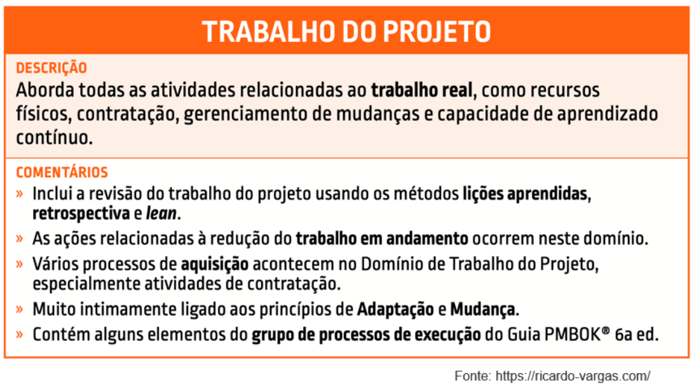

###### **Definições:**

---

<!-- pagina: 47 -->

**Paolla Ramos Aula 00** 

###### ❏ **Documentos de licitação** 

- Documentos utilizados para solicitar informações, cotações ou propostas de potenciais fornecedores 

###### ❏ **Reunião com licitantes** 

- Reunião com fornecedores potenciais para garantir que todos têm um entendimento claro sobre o processo de aquisição 

###### ❏ **Conhecimento explícito** 

- Pode ser traduzido em palavras, números e imagens 

###### ❏ **Conhecimento tácito** 

- Conhecimento implícito, difícil de articular 

###### **Elementos de Trabalho do Projeto:** 

###### ❏ **Processos** 

- Precisam cumprir os requisitos de qualidade, regulamentos, padrões e políticas, além de produzir o resultado desejado 

###### ❏ **Balanceamento de restrições concorrentes** 

- Podem ser de datas, conformidade, orçamento, qualidade, etc. 

- É necessário equilibrar as restrições e, ao mesmo tempo, manter a satisfação das partes interessadas 

###### ❏ **Foco da equipe do projeto** 

- É necessário equilibrar a carga de trabalho e avaliar se os membros da equipe permanecem motivados 

###### ❏ **Comunicações e engajamento** 

- Comunicação formal x informal 

- Comunicação escrita x verbal 

###### ❏ **Gerenciamento de recursos físicos** 

- Eliminar os tempos de espera dos materiais 

- Minimizar a sucata e o desperdício 

- Facilitar um ambiente de trabalho seguro 

###### ❏ **Monitoramento do trabalho e mudanças** 

- Controlar mudanças de escopo, tempo e custo 

###### ❏ **Aprendizagem e melhoria contínua** 

- A equipe se reúne periodicamente para decidir como trabalhar melhor no futuro (lições aprendidas) 

- Além disso, como ela pode melhorar o seu processo nas próximas iterações (retrospectivas) 

**_Saiba Mais:_** _Existem três métodos de comunicação:_ **_Push_** _(enviar informação diretamente),_ **_Interativa_** _(troca em tempo real) e_ **_Pull_** _(ou passiva), onde a informação é colocada em repositórios, portais ou intranets para que o interessado a busque por conta própria. A comunicação Pull é útil para grandes volumes de dados ou públicos vastos, permitindo que as_ _<u>partes interessadas detectem informações conforme sua necessidade.</u>_ 

###### **Sobre Aquisições:** 

- ❏ Muitos projetos envolvem alguma forma de contratação ou aquisição

---

<!-- pagina: 48 -->

**Paolla Ramos Aula 00** 

   - A aquisição pode cobrir tudo, desde materiais, equipamentos, suprimentos até soluções, mão-deobra e serviços 

- ❏ Na maioria dos projetos, o gerente de projetos não tem autoridade para contratar 

   - Ele trabalha com uma equipe experiente em contratações (área administrativa) 

- ❏ O processo de aquisições pode incluir um conjunto de **documentos de licitação** 

###### **Documentos de licitação:** 

- **Solicitação de informações** : Usado para reunir mais informações do mercado antes de enviar documentos de licitação a fornecedores 

- **Solicitação de proposta** : Usado em aquisições complexas, onde o comprador deseja que o fornecedor dê uma solução 

- **Solicitação de orçamento** : Usado quando o preço é o principal fator de decisão e a solução já é conhecida 

###### **Resultados Esperados:** 

- ❏ Desempenho do projeto eficiente e eficaz. 

- ❏ Processos apropriados ao ambiente e o projeto 

- ❏ Comunicação adequada entre as partes interessadas 

- ❏ Gerenciamento eficaz de recursos físicos 

- ❏ Gerenciamento eficaz de aquisições 

- ❏ Controle eficaz de mudanças 

- ❏ Aprendizado contínuo e melhoria de processos 

##### **Domínio de Desempenho #6: ENTREGA** 

Este domínio envolve a entrega dos resultados definidos do projeto aos stakeholders. Isso inclui a garantia de que as entregas atendem aos padrões de qualidade necessários, a gestão da aceitação das entregas pelos stakeholders e a facilitação da transição das entregas para o ambiente operacional ou de negócios.

---

<!-- pagina: 49 -->

**Paolla Ramos Aula 00** 

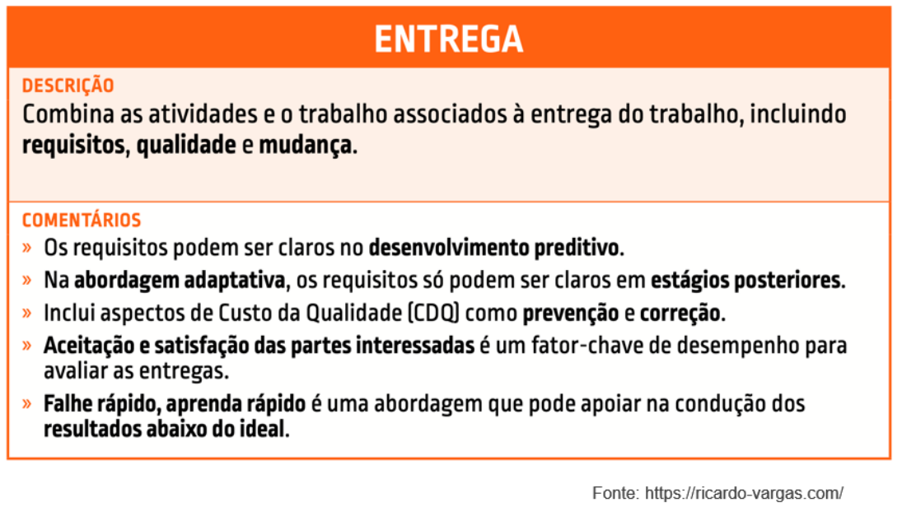

###### **Definições:** 

###### ❏ **Requisito** 

- Condição ou funcionalidade necessária que deve estar presente em um produto, serviço ou resultado para satisfazer uma necessidade de negócio 

###### ❏ **Estrutura analítica do projeto (EAP)** 

- Decomposição hierárquica do escopo total do trabalho a ser executado pela equipe do projeto 

###### ❏ **Definição de pronto (DoD)** 

- Uma lista de verificação de todos os critérios que devem ser atendidos para que uma entrega possa ser considerada pronta para uso do cliente 

###### ❏ **Qualidade** 

- O grau em que um conjunto de características inerentes atende aos requisitos 

###### ❏ **Custo da qualidade (CDQ)** 

- Todos os custos incorridos ao longo da vida útil do produto pelo investimento em: 

**_Saiba mais_** _: A_ **_Estrutura Analítica do Projeto_** _(EAP, ou WBS — Work Breakdown Structure) é uma decomposição hierárquica e visual do_ **_escopo total do projeto_** _, dividindo as entregas em componentes menores e mais gerenciáveis. Em vez de listar tarefas, a EAP organiza_ **_o que será entregue_** _, não como o trabalho será feito._ 

_A lógica da EAP é a do chamado_ **_pacote de trabalho_** _(work package): o nível mais baixo da estrutura, onde o trabalho pode ser estimado, monitorado e controlado de forma confiável. Tudo o que_ **_não está na EAP, não está no projeto_** _— esse é um princípio fundamental do PMBOK para controle de escopo._

---

<!-- pagina: 50 -->

**Paolla Ramos Aula 00** 

_A estrutura pode ser organizada de diferentes formas, dependendo do projeto: por_ **_fases_** _(iniciação, execução, encerramento), por_ **_entregas_** _(software, documentação, infraestrutura) ou por_ **_subprojetos_** _em projetos maiores. O importante é que o nível de decomposição seja suficiente para planejar e controlar, sem excessos que gerem burocracia desnecessária._ 

_A EAP é acompanhada pelo_ **_Dicionário da EAP_** _, documento que detalha cada componente — descrevendo critérios de aceitação, responsável, estimativas de custo e esforço, entre outros._ 

###### **Resultados Esperados:** 

- ❏ O projeto realiza os resultados pretendidos 

- ❏ A equipe do projeto tem uma compreensão clara sobre os requisitos 

- ❏ As partes interessadas aceitam e estão satisfeitas com os resultados do projeto 

**(CEBRASPE - 2024 - Analista de Tecnologia da Informação (TCE AC)/Planejamento de TI)** De acordo com o PMBOK 7.ª edição, julgue o item que se segue. 

<mark>EAP é uma decomposição hierárquica do escopo total do trabalho da equipe de execução, necessária para alcançar os objetivos e entregar os produtos do projeto.</mark> 

**<mark>Comentários: Correto</mark>** <mark>. A EAP (Estrutura Analítica do Projeto) é justamente essa decomposição hierárquica do escopo total do trabalho, organizando as entregas em componentes menores e mais gerenciáveis para</mark> atingir os objetivos do projeto. 

##### **Domínio de Desempenho #7: MEDIÇÃO** 

O domínio de medição foca na coleta, análise e utilização de dados de desempenho do projeto. Isso envolve o monitoramento contínuo do progresso do projeto, a avaliação do desempenho do projeto em relação aos objetivos e planos, e a utilização dos dados para tomar decisões informadas e melhorar o projeto.

---

<!-- pagina: 51 -->

**Paolla Ramos Aula 00** 

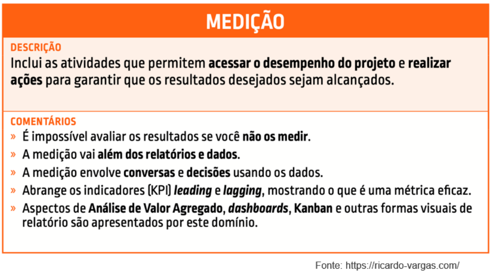

###### **Definições:** 

- **Métrica** : A descrição de um atributo do projeto ou do produto e como medi-lo 

- **Linha de Base** : A versão aprovada de um produto do trabalho, usada como base para comparação com os resultados reais 

- **Painel de controle (Dashboard)** : Um conjunto de tabelas e gráficos que mostram o progresso ou desempenho do projeto 

###### **Indicadores-Chave de Desempenho (KPI's):** 

São medidas quantificáveis usadas para avaliar o sucesso de um projeto, podendo ser de dois tipos: 

- ❏ <u>Indicadores de antecipação (</u> _lead indicators_ ) 

   - Preveem mudanças ou **tendências** no projeto 

- ❏ <u>Indicadores de espera (</u> _lag indicators_ ) 

   - Medem entregas ou eventos do projeto 

   - Fornecem informações **após o fato** 

###### **Métricas SMART:** 

A equipe do projeto deve medir apenas o que é relevante e garantir que as medidas sejam úteis 

Uma métrica útil é SMART: 

- Específica ( _Specific_ ) – está claro o que será medido 

- Significativa ( _Meaningful_ ) – vinculada ao negócio

---

<!-- pagina: 52 -->

**Paolla Ramos Aula 00** 

- Alcançável ( _Achievable_ ) - viável 

- Relevante ( _Relevant_ ) _–_ tem algum valor para tomada de ações 

- Oportuna ( _Timely_ ) – no tempo correto 

**_Saiba Mais:_** _As principais armadilhas de medição incluem o_ **_Efeito Hawthorne_** _, onde o desempenho muda simplesmente porque os indivíduos sabem que estão sendo observados, e as_ **_Métricas de Vaidade_** _, que são indicadores que parecem bons no papel (como número de acessos ou downloads), mas não ajudam na tomada de decisão estratégica. Para mitigá-las, deve-se combinar métricas quantitativas com qualitativas e focar em indicadores acionáveis._ 

###### **Resultados Esperados:** 

- ❏ Existe uma compreensão confiável do status do projeto 

- ❏ Existem dados para a tomada de decisão 

- ❏ Existem ações oportunas e apropriadas para o desempenho do projeto sob controle 

- ❏ As previsões e avaliações são confiáveis 

##### **Domínio de Desempenho #8: INCERTEZA** 

Este domínio aborda a gestão de incertezas e riscos no projeto. Isso envolve a identificação e avaliação de potenciais riscos, a preparação de respostas a esses riscos e a adaptação do projeto em resposta a eventos imprevistos ou mudanças nas condições. A gestão eficaz da incerteza pode reduzir a probabilidade e o impacto de problemas e ajudar a garantir que o projeto atinja seus objetivos, apesar dos desafios. 

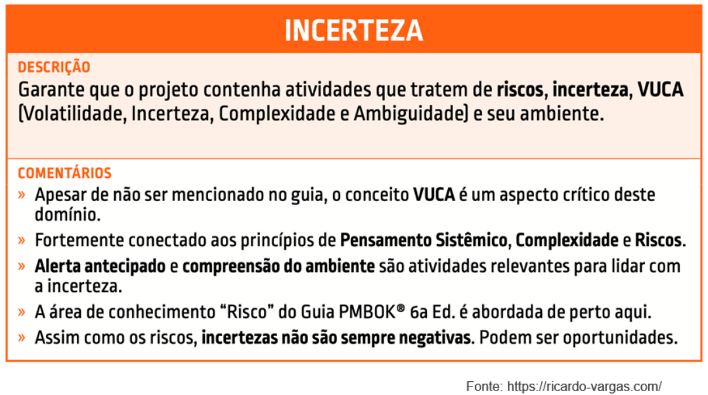

###### **Definições:**

---

<!-- pagina: 53 -->

**Paolla Ramos Aula 00** 

- **Incerteza:** Falta de compreensão ou consciência sobre questões, eventos ou caminhos a serem seguidos. 

- **Ambiguidade:** dificuldade em identificar a causa de eventos ou a melhor opção entre várias possibilidades. 

- **Complexidade:** característica do projeto ou de seu ambiente que indica uma dificuldade de gerenciamento. 

- **Volatilidade:** possibilidade de mudança rápida e imprevisível. 

- **Risco:** evento ou condição incerta que, se ocorrer, provocará um efeito positivo ou negativo em um ou mais objetivos do projeto. 

###### **Formas de lidar com riscos negativos (ameaças):** 

|**Estratégia**|**Definição**|**Exemplo**|
|---|---|---|
|**Prevenir**|Eliminar a ameaça ou proteger o projeto do seu impacto.|O projeto depende de um fornecedor único no exterior, e há risco de atraso na entrega. A equipe decide desenvolver o componente internamente, eliminando completamente a dependência e, com ela, o risco.|
|**Escalar**|Utilizada quando a resposta excede a autoridade do gerente do projeto.|Durante o projeto, identifica-se um risco regulatório que pode inviabilizar o produto em todo o mercado nacional. O gerente escala o risco ao comitê executivo, pois a decisão sobre como agir envolve a estratégia da empresa como um todo.|
|**Transferir**|Passar a responsabilidade de uma ameaça a terceiros.|Um projeto de construção contrata um seguro contra atrasos por condições climáticas ou repassa a responsabilidade de entrega de um módulo crítico a uma empresa terceirizada, por meio de contrato com cláusulas depenalidade.|
|**Mitigar**|Reduzir a probabilidade ou o impacto de uma ameaça.|Há risco de falha em um servidor crítico durante o projeto. A equipe implementa um sistema de backup automático e redundância de infraestrutura. O risco ainda existe, mas suas consequências seriam muito menores.|
|**Aceitar**|Nenhuma ação proativa é tomada.|Um pequeno risco de atraso de 1 dia em uma atividade sem impacto no caminho crítico é registrado no log de riscos, mas a equipe decide não agir preventivamente, pois o custo de resposta superaria o impacto do risco em si.|

###### **Formas de lidar com riscos positivos (oportunidades):** 

|**Estratégia**|**Definição**|**Exemplo**|
|---|---|---|
|**Explorar**|Garantir a ocorrência de uma oportunidade.|Um projeto de desenvolvimento de software identifica a chance de concluir uma funcionalidade antes do prazo e, com isso, lançar o produto antes dos concorrentes. Para garantir essa oportunidade, a equipe aloca seus melhores desenvolvedores para essa entrega específica eprioriza essepacote de trabalho no cronograma.|
|**Escalar**|Utilizada quando a resposta excede a autoridade do gerente do projeto.|Durante o projeto, surge a oportunidade de expandir o produto para um mercado internacional, o que pode aumentar significativamente o retorno esperado. Como essa decisão envolve investimentos elevados e mudança de estratégia corporativa, o gerente do projeto leva o tema à alta administração.|
|**Compartilhar**|Transferir a oportunidade a um terceiro mais bem|**50** Uma empresa de tecnologia percebe a oportunidade de desenvolver uma solução inovadora comgrandepotencial comercial,mas não|

---

<!-- pagina: 54 -->

**Paolla Ramos Aula 00** 

||equipado para capturar ou ampliar seu benefício.|possui toda a expertise necessária. Então, firma parceria com outra empresa especializada, compartilhando a oportunidade para maximizar as chances de sucesso e os benefícios obtidos.|
|---|---|---|
|**Melhorar**|Aumentar a probabilidade ou o impacto de uma oportunidade.|Um projeto identifica que a adoção de uma nova ferramenta pode elevar a produtividade da equipe. Para aumentar a chance de obter esse benefício, o gerente promove treinamentos e realiza uma implantação piloto, ampliando a probabilidade de sucesso e o impactopositivo da oportunidade.|
|**Aceitar**|Nenhuma ação proativa é tomada.|Surge a possibilidade de o projeto receber uma menção positiva espontânea na mídia especializada caso os resultados sejam muito bons. Como isso depende de fatores externos e não justifica investimento específico, a equipe apenas registra a oportunidade e decide aproveitá-la caso aconteça naturalmente.|

Lembrando que a análise de riscos pode ser **qualitativa ou quantitativa** . 

###### <u>Análise qualitativa de riscos</u> 

A **análise qualitativa de riscos** consiste em avaliar os riscos identificados com base em critérios predominantemente subjetivos ou semiquantitativos, como **probabilidade de ocorrência** , **impacto** , **urgência** , **criticidade** , **proximidade** e **nível de exposição** . 

Seu objetivo principal é **priorizar os riscos** , distinguindo aqueles que exigem atenção imediata daqueles que podem ser apenas monitorados. 

Em geral, a análise qualitativa responde a perguntas como: 

- Qual é a chance de esse risco ocorrer? 

- Caso ocorra, qual será o impacto? 

- Esse risco exige tratamento imediato? 

- Ele é baixo, médio, alto ou crítico? 

- Quais riscos devem ser analisados com maior profundidade? 

Um instrumento bastante comum é a **matriz de probabilidade e impacto** , em que se atribuem níveis, por exemplo, de 1 a 5 para a probabilidade e de 1 a 5 para o impacto. A combinação desses fatores gera uma classificação do risco. 

Por exemplo, um risco com probabilidade alta e impacto alto será classificado como prioritário. Já um risco com probabilidade baixa e impacto baixo poderá ser apenas monitorado. 

A análise qualitativa é útil porque é relativamente simples, rápida e aplicável mesmo quando não há dados estatísticos robustos. Por outro lado, ela depende bastante do julgamento dos especialistas, da experiência da equipe e da qualidade dos critérios definidos. Por isso, pode sofrer influência de vieses, percepções individuais e subjetividade. 

###### <u>Análise quantitativa de riscos</u>

---

<!-- pagina: 55 -->

**Paolla Ramos Aula 00** 

A **análise quantitativa de riscos** busca avaliar numericamente os efeitos dos riscos sobre os objetivos do projeto, processo ou organização. Diferentemente da análise qualitativa, que classifica riscos em categorias, a análise quantitativa procura estimar valores mensuráveis, como custo, prazo, perdas esperadas, variação de desempenho ou probabilidade de atingir determinado resultado. 

Ela responde a perguntas como: 

- Qual é a perda financeira esperada? 

- Qual é a probabilidade de o projeto ultrapassar o orçamento? 

- Qual é a chance de o prazo final ser descumprido? 

- Qual será o impacto combinado de vários riscos? 

- Qual alternativa oferece melhor relação entre risco e retorno? 

Um exemplo simples é o cálculo do **valor monetário esperado** : 

Valor Monetário Esperado = Probabilidade × Impacto financeiro 

Se há 20% de chance de um evento causar prejuízo de R$ 100.000,00, o valor monetário esperado desse risco será: 0,20 × R$ 100.000,00 = R$ 20.000,00 

A análise quantitativa é especialmente útil em situações mais complexas, em que há decisões relevantes de investimento, orçamento, prazo, contratação ou estratégia. Ela permite comparar cenários, estimar reservas, avaliar alternativas e apoiar decisões com maior objetividade. 

Entretanto, exige dados mais confiáveis, estimativas numéricas, modelos adequados e maior esforço analítico. Nem todo risco precisa passar por análise quantitativa. Normalmente, ela é aplicada aos riscos mais relevantes, previamente priorizados na análise qualitativa. 

A diferença essencial entre os dois tipos de análise está no **grau de precisão e no tipo de resultado produzido.** 

A **análise qualitativa** classifica e prioriza riscos. Ela costuma dizer que determinado risco é baixo, médio, alto ou crítico. Já a **análise quantitativa** estima numericamente os efeitos dos riscos. Ela pode indicar, por exemplo, que há 35% de chance de o projeto ultrapassar o orçamento em R$ 500.000,00 ou que o prazo final tem 70% de probabilidade de ser cumprido. 

Agora vejamos duas técnicas de análise quantitativa que aparecem em muitos editais, a Simulação de Monte Carlo e Árvores de Decisão. 

###### <u>Simulação de Monte Carlo</u> 

A **Simulação de Monte Carlo** é uma técnica quantitativa usada para avaliar incertezas por meio da geração de múltiplos cenários possíveis. Em vez de trabalhar com um único valor fixo para cada variável, o modelo considera distribuições de probabilidade. 

Por exemplo, em um projeto, determinada atividade pode não ter duração fixa de 10 dias. Ela pode durar:

---

<!-- pagina: 56 -->

**Paolla Ramos Aula 00** 

- 8 dias em um cenário otimista; 

- 10 dias em um cenário mais provável; 

- • 15 dias em um cenário pessimista. 

A Simulação de Monte Carlo executa milhares de combinações possíveis dessas variáveis, gerando uma distribuição de resultados. Assim, em vez de afirmar simplesmente que o projeto terminará em 100 dias, a técnica pode indicar algo como: 

Há 80% de probabilidade de o projeto ser concluído em até 115 dias. 

Essa abordagem é muito útil porque os projetos e processos reais raramente seguem estimativas exatas. Custos, prazos, demandas, produtividade, disponibilidade de recursos e eventos externos costumam variar. A Simulação de Monte Carlo permite enxergar essa variabilidade de forma estruturada. 

Ela pode ser usada, por exemplo, para: 

- estimar a probabilidade de cumprimento de prazo; 

- calcular reservas de contingência; 

- avaliar risco de estouro de orçamento; 

- comparar cenários; 

- mensurar o impacto combinado de várias incertezas. 

A grande vantagem do método é mostrar não apenas um resultado médio, mas uma **faixa provável de resultados** e suas respectivas probabilidades. Isso torna a decisão mais realista. 

###### <u>Análise de Árvore de Decisão</u> 

A **Análise de Árvore de Decisão** é uma técnica usada para comparar alternativas de decisão em contextos de incerteza. Ela representa graficamente diferentes caminhos possíveis, considerando decisões, eventos incertos, probabilidades e resultados esperados. 

A árvore normalmente possui: 

- **nós de decisão** , que representam escolhas possíveis; 

- **nós de chance** , que representam eventos incertos; 

- **ramos** , que indicam alternativas ou resultados; 

- **valores associados** , como custos, ganhos, perdas ou benefícios esperados. 

Um exemplo simples: 

Uma organização precisa decidir se desenvolve internamente um sistema ou se contrata uma solução pronta. Cada alternativa possui custos, riscos e possíveis resultados. A árvore de decisão permite representar essas opções e calcular o valor esperado de cada caminho. 

Suponha que uma alternativa tenha: 

- 60% de chance de gerar benefício de R$ 500.000,00;

---

<!-- pagina: 57 -->

**Paolla Ramos Aula 00** 

- 40% de chance de gerar prejuízo de R$ 100.000,00. 

O valor esperado seria: 

0,60 × R$ 500.000,00 + 0,40 × (-R$ 100.000,00) R$ 300.000,00 - R$ 40.000,00 R$ 260.000,00 

Esse valor pode ser comparado com o valor esperado de outras alternativas. 

###### **Resultados Esperados** 

- ❏ Explorar e responder de forma proativa a incertezas 

- ❏ Capacidade de antecipar ameaças e oportunidades e compreender as suas consequências 

- ❏ Entrega do projeto com pouco ou nenhum impacto negativo de eventos inesperados 

- ❏ Oportunidades realizadas para o melhor desempenho do projeto 

- ❏ Reservas de custo e cronograma são utilizadas de forma eficaz para alcançar os objetivos do projeto 

### Tailoring 

Pessoal, vamos falar de um conceito que o PMBOK 7ª edição coloca em destaque: o **tailoring** , ou adaptação, como também é chamado. **Tailoring é o processo de personalizar e ajustar as orientações de gerenciamento de projetos para que elas se encaixem em um projeto específico** . Isso leva em conta o ambiente único daquele projeto, as necessidades e expectativas dos stakeholders, a natureza do trabalho envolvido e outros fatores relevantes que aparecem pelo caminho. 

Sabemos que não existe uma fórmula mágica que funcione para tudo. Cada projeto é único e, portanto, merece uma abordagem de gerenciamento única também. Quando a organização adapta as orientações ao contexto real do projeto, ela aumenta a eficácia do gerenciamento e melhora as chances de o projeto ser bem-sucedido. 

Uma das áreas mais importantes que pode ser adaptada é justamente a **abordagem de gerenciamento** . Dependendo do projeto, pode ser mais adequado usar uma **abordagem preditiva** (aquele planejamento mais detalhado e sequencial, o famoso cascata), uma **abordagem ágil** , uma abordagem híbrida, ou ainda outra que faça mais sentido para o contexto. O ponto é que a escolha precisa refletir a natureza do trabalho e o ambiente em que o projeto está sendo realizado. Não adianta tentar encaixar o projeto num molde só porque é o molde que a empresa sempre usou. 

Três pilares aparecem sempre nessa discussão sobre Tailoring: comunicação, risco e recursos. 

Quanto à personalização da **comunicação,** um stakeholder técnico precisa de um nível de detalhe completamente diferente de um diretor executivo que só quer saber se o projeto está no prazo e dentro do orçamento. Da mesma forma, um projeto remoto, com equipe distribuída em vários fusos horários, exige

---

<!-- pagina: 58 -->

**Paolla Ramos Aula 00** 

canais e formatos de comunicação bem diferentes de um projeto onde todo mundo trabalha no mesmo andar do escritório. A ideia é **adaptar os métodos e canais ao público e ao ambiente do projeto** . 

Agora, **risco e incerteza** . Quanto mais nebuloso for o cenário do projeto, mais robusta precisa ser a estratégia de gerenciamento de riscos. Um projeto de rotina, bem mapeado, com tecnologia conhecida, não exige o mesmo aparato de um projeto inovador, em território novo, com muitas variáveis desconhecidas. 

E por último, **recursos** . Cada projeto tem um perfil diferente. Alguns demandam muita gente com habilidades muito específicas. Outros exigem poucos profissionais, mas com altíssima senioridade. Tem projeto que consome muito recurso financeiro logo no início e outros que distribuem esse consumo ao longo do tempo. O ponto é que o tipo e a quantidade de recursos precisam ser calibrados de acordo com a realidade daquele projeto, não de acordo com um modelo genérico copiado de algum projeto anterior. 

Veja como isso funciona na prática: 

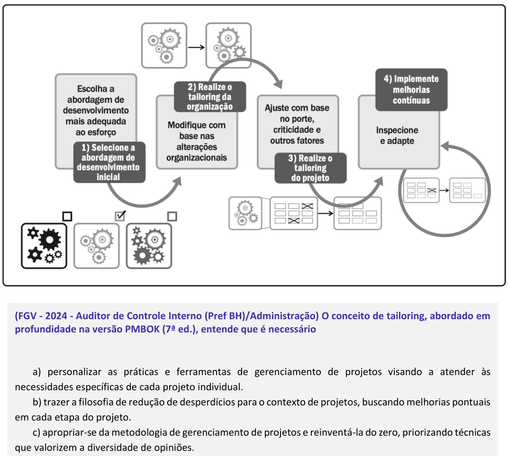

<!-- Start of picture text -->
(FGV - 2024 - Auditor de Controle Interno (Pref BH)/Administração) O conceito de tailoring, abordado em profundidade na versão PMBOK (7ª ed.), entende que é necessário a) personalizar as práticas e ferramentas de gerenciamento de projetos visando a atender às necessidades específicas de cada projeto individual. b) trazer a filosofia de redução de desperdícios para o contexto de projetos, buscando melhorias pontuais em cada etapa do projeto. c) apropriar-se da metodologia de gerenciamento de projetos e reinventá-la do zero, priorizando técnicas que valorizem a diversidade de opiniões. <!-- End of picture text -->

---

<!-- pagina: 59 -->

**Paolla Ramos Aula 00** 

<mark>d) realizar a consolidação integral do ciclo de vida do projeto, permitindo que as ações atinjam cada parte de forma padronizada.</mark> 

**<mark>Comentários:</mark>** 

**<mark>(a) Correto</mark>** <mark>. O tailoring no PMBOK 7ª ed. consiste em adaptar práticas, métodos e ferramentas às características únicas de cada projeto, evitando abordagens genéricas e engessadas; (b) Errado. A redução de desperdícios é um princípio Lean, não o conceito de tailoring abordado pelo PMBOK; (c) Errado. Tailoring não propõe reinventar a metodologia do zero, mas sim ajustá-la de forma contextualizada e intencional; (d) Errado. A padronização integral contradiz a essência do tailoring, que valoriza justamente a personalização e</mark> a flexibilidade. 

### Modelos 

Um **modelo** é uma representação simplificada da realidade. Não é a coisa em si, é uma forma de entender, visualizar ou antecipar como algo funciona. Um **método** é o caminho, o conjunto de passos ou práticas que você segue para chegar a um resultado. E um **artefato** é o produto disso tudo, o que fica no final do processo, seja um documento, um plano, um relatório ou qualquer outro entregável concreto. Esses três elementos trabalham juntos para dar forma e direção ao trabalho do projeto. 

Um modelo pode ser um diagrama, um gráfico, uma tabela, um esquema ou qualquer outro tipo de representação visual ou conceitual. O mundo real é complicado demais para ser analisado como realmente é, então criamos uma versão reduzida, organizada, que nos ajuda a entender, analisar e comunicar os aspectos mais importantes de um projeto. 

Por exemplo, imagine um modelo de processo que ilustra as etapas de um fluxo de negócios, mostrando quem faz o quê e em qual ordem. Ou então a famosa EAP (Estrutura Analítica do Projeto), que pega todas as entregas do projeto e vai quebrando em pedaços menores, até chegar num nível de detalhe que a equipe consiga trabalhar de verdade. Esses dois são exemplos de modelos com propósitos bem diferentes, mas com a mesma função, isto é, tornar o complexo mais compreensível. 

No universo do PMBOK, os modelos são agrupados em cinco grandes categorias. São: **Liderança, Comunicação, Motivação, Mudança e Complexidade** . Cada categoria reúne modelos que ajudam o gerente de projetos a lidar com um aspecto específico do trabalho, como você pode ver na tabela a seguir. 

|**Modelo**|**Descrição**|
|---|---|
||**Modelos de Liderança **|
|**1. Liderança** **Transformacional**|A liderança transformacional se concentra em inspirar e motivar a equipe. Os líderes transformacionais são carismáticos e entusiasmados, e incentivam seus membros da equipe a superarem seus próprios interesses para o bem da equipe ou organização.|
|**2. Liderança** **Situacional**|A liderança situacional sugere que o melhor tipo de liderança depende da situação. Os líderes adaptam seu estilo de liderança com base na maturidade e competência dos membros da equipe e das demandas da situação.|

|**56**|
|---|

---

<!-- pagina: 60 -->

**Paolla Ramos Aula 00** 

||**Modelos de Comunicação** |
|---|---|
|**1. Modelo de** **Shannon e Weaver**|Este é um modelo linear de comunicação que descreve a comunicação como um processo de envio e recebimento de mensagens. Inclui componentes como emissor, codificador, canal, decodificador e receptor. Também considerapotenciais fontes de ruído ou interferência na comunicação.|
|**2. Modelo de Berlo**|Este modelo foca no processo de codificação e decodificação e sugere que a comunicação depende da habilidade, atitude, conhecimento e sistema social do emissor e do receptor.|
||**Modelos de Motivação**|
|**1. Teoria da** **Autodeterminação**|Esta teoria sugere que as pessoas são motivadas para crescer e mudar por três necessidades inatas: competência,autonomia e relacionamento.|
|**2. Teoria da** **Expectativa**|Esta teoria sugere que a motivação é baseada nas expectativas de que um determinado comportamento levará a um determinado resultado e no valor que apessoa atribui a esse resultado.|
||**Modelos de Mudança **|
|**1. Modelo de Lewin**|Este modelo descreve a mudança como um processo de três etapas: descongelamento (preparando a organização para a mudança), mudança (implementando a nova maneira de fazer as coisas) e recongelamento (tornando a nova maneira de fazer as coisas uma parte normal da organização).|
|**2. Modelo de Kotter**|Este é um modelo de oito etapas para a mudança que inclui aumentar a urgência da mudança, formar uma coalizão poderosa para liderar a mudança, criar uma visão para a mudança, comunicar a visão, remover obstáculos, criar vitórias rápidas,construir sobre a mudança e ancorar a mudança na cultura.|
||**Modelos de Complexidade**|
|**1. Modelo Cynefin**|Este modelo categoriza os problemas e sistemas em cinco domínios: simples (ou óbvio), complicado, complexo, caótico e desordem. Sugere diferentes abordagens degerenciamentopara cada domínio.|
|**2. Modelo de Stacey**|Este modelo examina a complexidade de um problema ou projeto com base em dois fatores: o grau de certeza e o grau de acordo entre a equipe e os stakeholders. Os projetos podem cair em uma das quatro áreas do modelo: simples, complicado, complexo ou anárquico. Cada área representa um nível diferente de complexidade e sugere diferentes abordagens para a tomada de decisões e ogerenciamento.|

### Métodos 

**Métodos** são as abordagens e procedimentos que a equipe usa para realizar o trabalho do projeto. Na prática, eles fornecem uma estrutura sistemática para planejar, executar, monitorar e controlar tudo o que acontece ao longo do ciclo de vida do projeto. Sem um método, cada um faz do jeito que achar melhor, e aí o caos é garantido. 

Por exemplo, o método do caminho crítico, que você vai encontrar bastante nos concursos, serve para planejar e gerenciar o cronograma do projeto, identificando quais atividades não podem atrasar sem comprometer o prazo final. Já o método Scrum é aquele usado para gerenciar projetos ágeis, com ciclos curtos de entrega e muita colaboração entre o time. São propostas completamente diferentes, e a escolha do método certo depende de vários fatores, como a natureza do trabalho em si, o ambiente do projeto e as necessidades e preferências dos stakeholders envolvidos.

---

<!-- pagina: 61 -->

**Paolla Ramos Aula 00** 

O PMBOK organiza boa parte dos métodos mais comuns em categorias bem definidas. Três delas aparecem com frequência e merecem atenção especial: **coleta e análise de dados, estimativa, e reuniões e eventos** . A tabela a seguir reúne os principais métodos citados pelo guia dentro de cada uma dessas categorias. 

|**Método**|**Descrição**|
|---|---|
|**M**|**étodos de Coleta e Análise de Dados**|
|**1. Pesquisas/Questionários**|Este método envolve a coleta de dados por meio de questionários que são distribuídos a um grupo específico de pessoas. Os dados coletados são então analisados para identificar tendências e padrões.|
|**2. Entrevistas**|As entrevistas podem ser usadas para coletar dados de um número menor de pessoas. Este método é mais útil quando você precisa de informações detalhadas e emprofundidade.|
|**3. Análise de Documentos**|Este método envolve a revisão de documentos existentes para extrair dados relevantes. Pode ser usado para analisar registros históricos,relatórios, políticas,etc.|
||**Métodos de Estimativa**|
|**1. Estimativa de Cima para Baixo** **(Top-down)**|Neste método, o projeto é estimado como um todo, muitas vezes com base na experiência passada, e essa estimativa global é então divididapelas tarefas individuais.|
|**2. Estimativa de Baixo para Cima** **(Bottom-up)**|Neste método, cada tarefa individual é estimada e as estimativas são somadaspara criar a estimativa doprojeto como um todo.|
|**3. Estimativa Paramétrica**|Este método usa dados de projetos anteriores e parâmetros matemáticospara estimar a duração e o custo de umprojeto.|
||**Métodos de Reuniões e Eventos**|
|**1. Brainstorming**|Este método envolve a geração de ideias em um grupo. O objetivo é promover a livre troca de ideias e encorajar o pensamento criativo.|
|**2. Daily Stand-up/Scrum**|Em uma reunião diária stand-up, a equipe se reúne todos os dias para uma rápida atualização do progresso. Cada membro da equipe fala sobre o que fez no dia anterior, o que planeja fazer no dia seguinte, e quaisquer bloqueios que possam estar enfrentando.|
|**3. Revisão do Sprint**|Em um evento de revisão do sprint, a equipe demonstra o trabalho que concluiu durante o sprint. O objetivo é obter feedback e aprenderpara melhorar os futuros sprints.|

**_Saiba mais_** _: A_ **_estimativa paramétrica_** _é uma técnica de estimativa que utiliza_ **_relações estatísticas entre dados históricos e variáveis do projeto_** _para calcular custos, duração ou quantidade de recursos. Em vez de estimar cada atividade do zero, ela parte de um parâmetro mensurável — como volume, peso, metragem ou quantidade de itens — e aplica um valor unitário conhecido para chegar ao total._ 

_A lógica é simples: se há uma relação comprovada entre uma variável e o esforço ou custo necessário, basta multiplicar. A confiabilidade do resultado depende diretamente da_ **_qualidade dos dados históricos_** _usados como base e de quão bem o parâmetro escolhido representa a realidade do projeto atual._

---

<!-- pagina: 62 -->

**Paolla Ramos Aula 00** 

_Exemplo 1 — Construção civil: Sabe-se, por projetos anteriores, que construir 1 m² de alvenaria custa R$ 2.500. O novo projeto prevê 400 m². A estimativa paramétrica resulta em_ **_R$ 1.000.000_** _para essa entrega._ 

_Exemplo 2 — Desenvolvimento de software: Com base em histórico, a equipe sabe que cada tela de um sistema leva, em média, 16 horas para ser desenvolvida. O novo sistema terá 30 telas. A estimativa de esforço é de_ **_480 horas_** _._ 

_Exemplo 3 — Redação técnica: Uma empresa sabe que a elaboração de cada página de documentação técnica demora 3 horas. Um manual de 50 páginas levará, portanto,_ **_150 horas_** _._ 

_A estimativa paramétrica pode ser aplicada a_ **_uma atividade isolada ou ao projeto inteiro_** _, e pode ser combinada com outras técnicas — como a estimativa análoga — para aumentar a_ _<u>precisão.</u>_ 

### Artefatos 

**Artefato** é qualquer produto gerado ao longo do projeto, seja ele algo que você pode segurar ou não. É documento, código, hardware, software, planos, especificações, relatórios, registros etc. O ponto central é o que esses artefatos fazem pelo projeto: **eles documentam o progresso, comunicam informações aos stakeholders, registram decisões importantes e aprendizados, e, no fim das contas, entregam os resultados concretos do trabalho** . 

A tabela abaixo resume os principais artefatos citados no PMBOK 7: 

|**Artefato**|**Descrição**|
|---|---|
||**De Estratégia** |
|**Business Case**|Proposta de valor do projeto, justificando sua realização com base em benefícios,custos,riscos e alinhamento ao negócio.|
|**Business Model Canvas**|Resumo visual, geralmente de uma página, que apresenta os principais elementos do modelo de negócio relacionados aoprojeto ouproduto.|
|**Termo de abertura do projeto**|Documento que autoriza formalmente o início do projeto e define, em alto nível,objetivos, partes interessadas e autoridade dogerente.|
|**Roadmap**|Cronograma de alto nível que apresenta marcos, entregas e direção geral do projeto ao longo do tempo.|
|**Resumo do projeto**|Síntese de alto nível com metas, entregas, contexto e processos principais do projeto.|
||**Histórico e Registros**|
|**Backlog**|Lista ordenada de tarefas, requisitos, funcionalidades ou entregas pendentes doprojeto.|
|**Registro de premissas**|Documento que reúne fatos considerados verdadeiros para fins de planejamento,aindaquepossam demandar validação futura.|
|**Registro dos riscos**|Registro das ameaças e oportunidades identificadas, com informações como probabilidade,impacto e criticidade.|

|**59**|
|---|

---

<!-- pagina: 63 -->

**Paolla Ramos Aula 00** 

|**Registro das partes interessadas**|Documento que identifica as partes interessadas do projeto e descreve seu papel,interesse,influência e expectativas.|
|---|---|
||**Planos**|
|**Plano de gerenciamento das** **comunicações**|Define como as informações do projeto serão geradas, distribuídas, armazenadas e monitoradas.|
|**Plano de gerenciamento dos** **custos**|Estabelece como os custos serão estimados, orçados, controlados e acompanhados noprojeto.|
|**Plano de gerenciamento das** **aquisições**|Define como serão conduzidas as compras, contratações e relações com fornecedores.|
|**Plano** **de** **gerenciamento** **da** **qualidade**|Estabelece padrões, métricas e procedimentos para garantir que o projeto e suas entregas atendam aos requisitos dequalidade.|
|**Plano de gerenciamento dos** **recursos**|Define como os recursos humanos e físicos serão estimados, alocados, desenvolvidos e controlados.|
|**Plano de gerenciamento dos** **riscos**|Define a abordagem para identificar, analisar, responder, monitorar e controlar os riscos doprojeto.|
|**Plano** **de** **gerenciamento** **do** **escopo **|Estabelece como o escopo será definido, validado e controlado ao longo do projeto.|
|**Plano** **de** **gerenciamento** **do** **cronograma**|Define como o cronograma será elaborado, monitorado e controlado.|
|**Plano de gerenciamento das** **partes interessadas**|Define estratégias para engajar as partes interessadas de forma adequada durante oprojeto.|
|**Plano de iteração**|Detalha o trabalho a ser executado em uma iteração específica, com objetivos, tarefas e entregasprevistas.|
|**Plano de testes**|Define os critérios, procedimentos, responsáveis e cronograma para testar as entregas doprojeto.|
|**Plano de liberações**|Estabelece como e quando as versões, incrementos ou entregas do produto serão disponibilizados.|
||**Gráficos de Hierarquia**|
|**Estrutura analítica** **organizacional**|Representação hierárquica das unidades ou áreas da organização relacionadas aoprojeto.|
|**Estrutura analítica de produto**|Decomposição hierárquica dos componentes e subcomponentes do produto a ser entregue.|
|**Estrutura analítica dos recursos**|Organização hierárquica dos recursos necessários ao projeto, como pessoas, materiais e equipamentos.|
|**Estrutura analítica dos riscos**|Classificação hierárquica das fontes e categorias de riscos doprojeto.|
|**Estrutura analítica do projeto** **(EAP)**|Decomposição hierárquica do escopo do projeto em partes menores e mais gerenciáveis.|
||**Dados e informações visuais**|
|**Gráfico de Burndown/Burnup**|Gráfico que mostra o progresso do trabalho em uma timebox, indicando o que foi concluído e oque ainda falta.|
|**Diagrama de Causa e Efeito**|Ferramenta visual usada para identificar causas potenciais de um problema ou efeito observado.|
|**Fluxograma**|Representação visual do fluxo de trabalho ou das etapas de umprocesso.|
|**Gráfico de Gantt**|Cronograma em formato de barras que mostra atividades, duração, dependências e andamento ao longo do tempo.|
|**Diagrama de Rede de Atividades**|Representação das atividades do projeto e de sua sequência lógica ou dependências.|
|**Matriz** **de** **Responsabilidades** **(RACI)**|**60** Quadro que relaciona atividades e responsáveis, indicando quem executa, aprova,consulta e é informado.|

---

<!-- pagina: 64 -->

**Paolla Ramos Aula 00** 

**Caso de Uso** Representação de como o usuário interage com o sistema ou produto para atingir determinado objetivo. 

**_Saiba mais_** _: O_ **_Gráfico de Gantt_** _é uma ferramenta visual de planejamento e monitoramento de cronograma que representa as atividades do projeto em um_ **_eixo horizontal de tempo_** _. Cada atividade é exibida como uma barra horizontal — o início da barra indica quando a atividade começa, o fim indica quando termina, e o comprimento representa sua duração._ 

_Desenvolvido por Henry Gantt no início do século XX, o gráfico continua sendo uma das ferramentas mais utilizadas no gerenciamento de projetos justamente por sua_ **_leitura intuitiva_** _: com um único olhar, é possível saber quais atividades estão em andamento, quais dependem de outras e se o projeto está dentro do prazo._ 

_Entre as informações que um Gráfico de Gantt moderno pode conter estão as dependências entre atividades (representadas por setas ou linhas de ligação), o percentual de conclusão de cada tarefa, os marcos do projeto (milestones) e a alocação de responsáveis por atividade._

---

<!-- pagina: 65 -->

**Paolla Ramos Aula 00** 

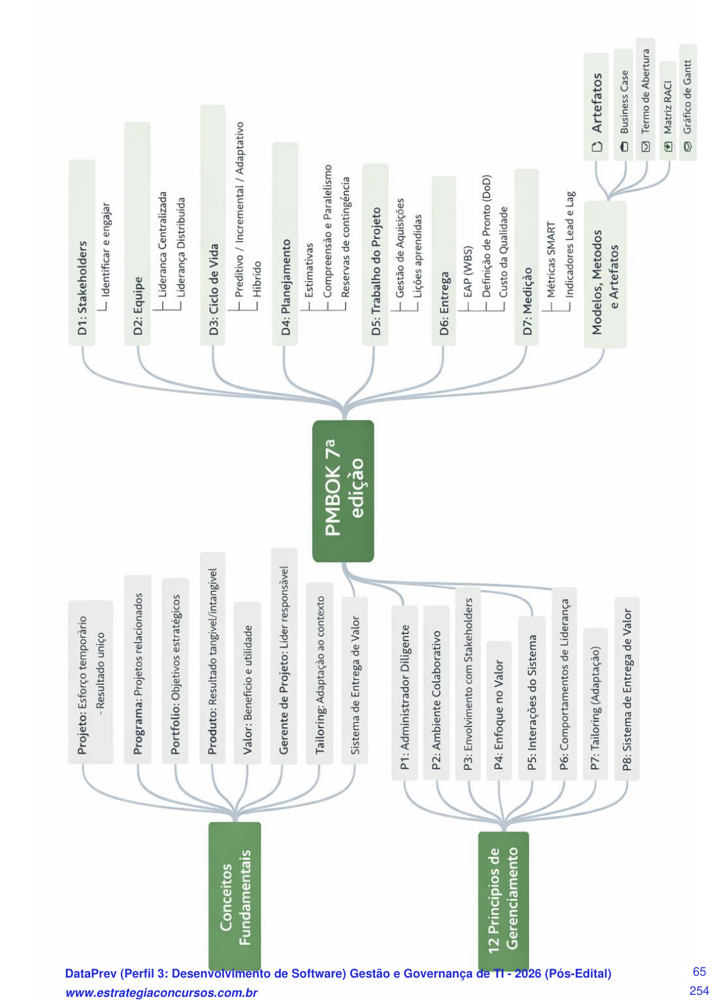

<!-- Start of picture text -->
==5460== DataPrev (Perfil 3: Desenvolvimento de Software) Gestão e Governança de TI - 2026 (Pós-Edital) 65 www.estrategiaconcursos.com.br 254 <!-- End of picture text -->

https://t.me/KakashiAssinaturasBot

---

<!-- pagina: 66 -->

**Paolla Ramos Aula 00** 

## **- RESUMO PMBOK 7** 

###### **FERNANDO PEDROSA - HTTPS://WWW.INSTAGRAM.COM/PROF.FERNANDOPEDROSA** 

### Visão Geral — PMBOK 7ª Edi ão <u>ç</u> 

O PMBOK (Project Management Body of Knowledge), publicado pelo PMI, é um guia de melhores práticas em gerenciamento de projetos. Na 7ª edição, migrou de 5 grupos de processos + 10 áreas de conhecimento para 12 Princípios + 8 Domínios de Desempenho, com foco em flexibilidade e entrega de valor. 

### Conceitos Fundamentais 

#### Definições Essenciais 

**Projeto** : esforço temporário (início e fim definidos) para criar produto, serviço ou resultado **único Programa** : grupo de projetos relacionados gerenciados de forma coordenada para obter benefícios que não seriam possíveis individualmente 

**Portfólio** : coleção de projetos, programas, subportfólios e operações gerenciados como grupo para atingir objetivos **estratégicos** — projetos não precisam ser interdependentes 

**Produto** : resultado tangível ou intangível criado pelo projeto 

**Valor** : percepção de benefício, utilidade ou importância de um resultado — pode ser medido em qualidade, custo, tempo, escopo 

**Gerente de Projeto** : responsável por liderar a equipe e planejar, executar e supervisionar o projeto do início ao fim 

**Tailoring (Adaptação)** : personalização das práticas de GP para o contexto específico de cada projeto 

Projeto = temporário + único. Operação = contínua + repetitiva. Esta distinção é cobrada com frequência. 

#### Sistema de Entrega de Valor 

- Visão abrangente de tudo que contribui para criar e entregar valor via projetos 

- Componentes: **stakeholders** , gerente e equipe, práticas e processos de GP, recursos organizacionais, cultura e ambiente 

- Informações fluem da alta administração até os níveis operacionais e retornam com feedbacks 

- O sistema deve estar alinhado à estratégia organizacional

---

<!-- pagina: 67 -->

**Paolla Ramos Aula 00** 

### Os 12 Princípios de Gerenciamento de Projetos 

- **P1 — Seja um Administrador Diligente** : uso eficiente de recursos, tomada de decisão responsável, transparência, gestão de riscos e conformidade com leis 

- **P2 — Crie Ambiente Colaborativo** : comunicação efetiva, respeito e confiança mútua, empowerment da equipe, ferramentas de colaboração 

- **P3 — Envolva-se com as Partes Interessadas** : identificar, compreender, analisar, priorizar, engajar e monitorar stakeholders 

- **P4 — Enfoque no Valor** : definir, planejar, entregar, medir e otimizar continuamente o valor para stakeholders 

- **P5 — Reconheça as Interações do Sistema** : visão holística, análise de como mudanças em uma parte afetam as demais, gestão adaptativa 

- **P6 — Demonstre Comportamentos de Liderança** : liderança vai além da gestão — inspira, motiva, adapta estilo ao contexto, age com ética 

- **P7 — Faça a Adaptação (Tailoring)** : não existe abordagem única; adaptar métodos ao contexto (preditivo, ágil, híbrido) 

- **P8 — Inclua Qualidade nos Processos e Entregas** : qualidade planejada desde o início, incorporada nos processos, monitorada e controlada continuamente 

- **P9 — Navegue na Complexidade** : compreender tipos de complexidade (técnica, organizacional, ambiental, sociocultural), planejar e ser adaptável 

- **P10 — Otimize as Respostas aos Riscos** : identificar, analisar, responder (prevenir, mitigar, transferir, aceitar, explorar), monitorar continuamente 

- **P11 — Adote Adaptação e Resiliência** : capacidade de ajustar planos e se recuperar de dificuldades; cultura de aprendizado contínuo 

- **P12 — Aceite a Mudança para Alcançar o Futuro Estado Previsto** : abertura à mudança, gestão efetiva de mudanças, feedback e aprendizagem, foco no estado futuro desejado 

Os 12 princípios são ORIENTADORES, não prescritivos. Eles norteiam o julgamento profissional do gerente de projeto em qualquer contexto ou metodologia. 

### Os 8 Domínios de Desempenho 

Os Domínios substituíram os Grupos de Processos como estrutura central do PMBOK 7. São adaptáveis a abordagens preditivas, ágeis e híbridas. 

#### D1 — Stakeholders 

- Identificar, compreender, analisar, priorizar, engajar e monitorar partes interessadas 

- Resultado esperado: relação produtiva, acordo com objetivos, apoio dos beneficiários, neutralização de opositores 

#### D2 — Equipe 

- **Liderança Centralizada** : autoridade de um indivíduo (gerente de projeto), definida pelo Termo de Abertura

---

<!-- pagina: 68 -->

**Paolla Ramos Aula 00** 

- **Liderança Distribuída** : equipes auto-organizadas, facilitador remove obstáculos (modelo ágil) 

- Comportamentos desejados: transparência, integridade, respeito, discurso positivo, apoio, coragem, celebrar sucessos 

- Resultado esperado: propriedade compartilhada, equipe de alto desempenho, liderança por todos os membros 

#### D3 — Ciclo de Vida do Projeto 

- **Preditivo** : escopo definido antecipadamente, fases sequenciais 

- **Incremental** : entregas parciais e funcionais ao longo do projeto 

- **Adaptativo (Ágil)** : requisitos evoluem, entregas em iterações curtas 

- **Híbrido** : combinação de abordagens conforme necessidade 

- Escolha da abordagem considera: produto/serviço, características do projeto e cultura organizacional 

#### D4 — Planejamento 

- **Estimativa Determinística** : valor único (ex.: "36 meses") 

- **Estimativa Probabilística** : média ponderada de cenários (pessimista, mais provável, otimista) 

- **Estimativa Absoluta** : números reais; **Estimativa Relativa** : comparações de contexto (ex.: Planning Poker) 

- **Compressão (Crashing)** : adiciona recursos para reduzir duração 

- **Paralelismo (Fast Tracking)** : atividades sequenciais executadas em paralelo 

- Orçamento deve incluir **reservas de contingência** para lidar com riscos 

- Dependências: obrigatória x arbitrada; interna x externa 

#### D5 — Trabalho do Projeto 

- Execução das tarefas conforme planejado, balanceamento de restrições concorrentes (prazo, custo, qualidade, escopo) 

- Comunicação formal x informal; escrita x verbal 

- Aquisições: gerente de projetos geralmente **não tem autoridade para contratar** — trabalha com área administrativa 

- **Solicitação de Informações (RFI)** : reúne informações do mercado 

- **Solicitação de Proposta (RFP)** : aquisições complexas, fornecedor propõe solução 

- **Solicitação de Orçamento (RFQ)** : preço é fator principal, solução já conhecida 

- Aprendizado contínuo: lições aprendidas e retrospectivas 

#### D6 — Entrega 

- **EAP (Estrutura Analítica do Projeto)** : decomposição hierárquica do escopo total do trabalho 

- **Definição de Pronto (DoD)** : lista de critérios que a entrega deve atender para ser aceita 

- **Custo da Qualidade (CDQ)** : custos de prevenção + avaliação + não conformidade 

- Resultado esperado: entregas que atendem requisitos e são aceitas pelos stakeholders

---

<!-- pagina: 69 -->

**Paolla Ramos Aula 00** 

#### D7 — Medição 

- **Métrica** : descrição de um atributo e como medi-lo 

- **Linha de Base** : versão aprovada do trabalho, usada para comparação com resultados reais 

- **Dashboard** : conjunto de tabelas e gráficos de progresso/desempenho 

- **Lead indicators (antecipação)** : preveem tendências futuras 

- **Lag indicators (espera)** : medem resultados passados 

- Métricas **SMART** : Específica, Significativa, Alcançável, Relevante, Oportuna 

#### D8 — Incerteza 

- **Ambiguidade** : dificuldade em identificar causa de eventos ou melhor opção 

- **Complexidade** : dificuldade de gerenciamento do projeto ou seu ambiente 

- **Volatilidade** : possibilidade de mudança rápida e imprevisível 

- **Risco** : evento incerto que pode ter efeito positivo ou negativo nos objetivos ==5460== 

Respostas a AMEAÇAS (riscos negativos): Prevenir, Escalar, Transferir, Mitigar, Aceitar. Respostas a OPORTUNIDADES (riscos positivos): Explorar, Escalar, Compartilhar, Melhorar, Aceitar. O item "Escalar" aparece nos dois grupos. 

### Modelos, Métodos e Artefatos 

#### Modelos Relevantes 

- **Liderança Transformacional** : inspira e motiva a equipe, líderes carismáticos 

- **Liderança Situacional** : estilo de liderança adapta-se à maturidade e competência da equipe 

- **Shannon e Weaver** : comunicação linear — emissor, codificador, canal, decodificador, receptor, ruído 

- **Modelo de Berlo** : foca em codificação/decodificação, influência de habilidade, atitude e conhecimento 

- **Lewin (Mudança)** : Descongelamento → Mudança → Recongelamento 

- **Kotter (Mudança)** : 8 etapas — urgência, coalizão, visão, comunicação, remoção de obstáculos, vitórias rápidas, consolidação, ancoragem 

- **Cynefin (Complexidade)** : domínios Simples, Complicado, Complexo, Caótico, Desordem 

- **Stacey (Complexidade)** : grau de certeza x grau de acordo — simples, complicado, complexo, anárquico 

#### Métodos Relevantes 

- **Top-down** : projeto estimado como um todo, dividido depois por tarefas 

- **Bottom-up** : cada tarefa estimada individualmente, somadas ao todo 

- **Paramétrica** : usa dados históricos e parâmetros matemáticos 

- **Brainstorming** : geração livre de ideias em grupo 

- **Daily Stand-up** : reunião diária de atualização (ontem, hoje, bloqueios) 

- **Revisão do Sprint** : demonstração do trabalho concluído no sprint para obter feedback

---

<!-- pagina: 70 -->

**Paolla Ramos Aula 00** 

#### Artefatos Relevantes 

- **Business Case** : proposta de valor do projeto 

- **Termo de Abertura** : concebe formalmente o projeto e atribui autoridade ao gerente 

- **Roadmap** : cronograma de alto nível 

- **Backlog** : lista ordenada de tarefas do projeto 

- **Registro de Riscos** : probabilidade, impacto e criticidade dos riscos 

- **EAP/WBS** : decomposição hierárquica do escopo 

- **Gráfico de Burndown/Burnup** : trabalho feito em uma timebox 

- **Diagrama de Causa e Efeito** : rastreia efeito até sua causa raiz 

- **Gráfico de Gantt** : cronograma em formato de barras 

- **Matriz RACI** : responsabilidades — Responsável, Aprovador, Consultado, Informado

---

<!-- pagina: 71 -->

**Paolla Ramos Aula 00** 

## **<mark>Questões Comentadas</mark>** 

###### **1. (CEBRASPE - 2024 - Analista em Ciência e Tecnologia I (CNPq)/Gestão e Governança de Tecnologia** 

**da Informação)** Julgue o item subsequente, relativo ao PMBOK 7.ª edição. 

Enquanto as operações podem apoiar e influenciar diretamente portfólios e projetos, estes podem influenciar uns aos outros, bem como as operações. 

###### **Comentários:** 

Correto. Segundo o PMBOK 7ª ed., operações, portfólios, programas e projetos se inter-relacionam: operações influenciam e apoiam projetos, enquanto projetos e portfólios podem influenciar entre si e também as operações. 

###### **Gabarito:** Correto 

**2. (CEBRASPE - 2024 - Profissional de Nível Universitário Júnior (ITAIPU)/Engenheiro Eletricista ou de Produção ou Mecânico) Considerando os conceitos do Guia PMBOK, 7.ª edição, julgue os itens a seguir.** 

**I No padrão de gerenciamento de projetos, a abordagem de entrega pode ser descritiva, híbrida ou adaptativa.** 

**II Para as organizações, a percepção de valor pode ser definida como a capacidade de disponibilizar recursos e funções específicas de um produto.** 

**III Programa corresponde a um grupo relacionado de projetos, subprogramas e atividades de programa, que são gerenciados de forma coordenada.** 

**IV O resultado pode ser compreendido como a consequência final de um processo ou projeto, podendo incluir produtos ou artefatos.** 

###### **Assinale a opção correta.** 

a) Apenas os itens I e II estão certos. 

- b) Apenas os itens III e IV estão certos. 

- c) Apenas os itens I, II e III estão certos. 

d) Apenas os itens II, III e IV estão certos. 

- e) Todos os itens estão certos.

---

<!-- pagina: 72 -->

**Paolla Ramos Aula 00** 

###### **Comentários:** 

(I) Errado. O PMBOK 7ª ed. não prevê abordagem "descritiva". As abordagens reconhecidas são preditiva, híbrida e adaptativa; (II) Errado. Essa definição se refere à capacidade de um produto, não à percepção de valor organizacional, que envolve benefícios tangíveis e intangíveis; (III) Correto. O PMBOK define programa exatamente como um grupo relacionado de projetos, subprogramas e atividades gerenciados de forma coordenada para obter benefícios; (IV) Correto. Resultado é a consequência final de um processo ou projeto, podendo incluir produtos, artefatos ou mudanças de estado. Itens corretos: III e IV. 

###### **Gabarito:** Letra B 

###### **3. (CEBRASPE - 2024 - Profissional de Nível Universitário Júnior (ITAIPU)/Engenheiro Eletricista ou de Produção ou Mecânico) Com base no Guia PMBOK, 7.ª edição, assinale a opção correta.** 

a) Qualidade inclui a capacidade de satisfazer as necessidades declaradas ou explícitas do cliente, em conformidade com critérios de aceitação e adequação para uso. 

b) Um cronograma é um modelo para a execução das atividades do projeto, incluindo durações, dependências em atividades, bem como outras informações de planejamento. 

c) O artefato da EAP (estrutura analítica do projeto) é comumente utilizado nos domínios de desempenho: planejamento e trabalho do projeto. 

d) As equipes do projeto avaliam a qualidade de uma entrega por meio de revisões e testes. 

e) As atividades e os processos do projeto são avaliados por meio de inspeção e auditorias. 

###### **Comentários:** 

(a) Errado. O PMBOK 7ª ed. define qualidade como satisfação de necessidades declaradas e implícitas, não apenas explícitas — a omissão do termo "implícitas" torna a definição incompleta; (b) Correto. O cronograma é exatamente um modelo de execução das atividades, contemplando durações, dependências e demais informações de planejamento, conforme definição do PMBOK 7ª ed.; (c) Errado. A EAP é artefato associado principalmente ao domínio de planejamento, não sendo listada como ferramenta central do domínio de trabalho do projeto; (d) Errado. No PMBOK 7ª ed., a avaliação da qualidade de entregas é feita por inspeções e testes, enquanto revisões se aplicam a processos — a alternativa mistura os conceitos; (e) Errado. Inspeções e auditorias se aplicam à avaliação da qualidade das entregas, não especificamente das atividades e processos do projeto, invertendo a aplicação correta dos artefatos. 

###### **Gabarito:** Letra B

---

<!-- pagina: 73 -->

**Paolla Ramos Aula 00** 

**4. (CEBRASPE - 2024 - Analista de Planejamento, Gestão e Infraestrutura em Propriedade Industrial (INPI)/Gestão da Tecnologia da Informação/Desenvolvimento e Manutençao de Sistemas (e mais 2 concursos))** Julgue o próximo item, em relação ao PMBOK 7.ª edição. 

Escritório de gerenciamento de projetos é uma estrutura de suporte de entrega de projeto que se concentra em criar equipes de coaching e construir habilidades e capacidades ágeis em toda a empresa. 

###### **Comentários:** 

Errado. A definição apresentada corresponde ao Centro de Excelência Ágil (CoE). O PMO é a estrutura que padroniza processos, facilita o compartilhamento de recursos e fornece suporte à governança dos projetos da organização. 

###### **Gabarito:** Errado 

**5. (CEBRASPE - 2024 - Tecnologista Júnior (CTI)/Inovação e Gestão de Infraestrutura de P&D/Desenvolvimento Tecnológico voltado à Infraestrutura de Tecnologia da Informação e Comunicação)** A respeito dos componentes de entrega de valor do PMBOK 7.ª edição, julgue o item que se segue. 

Portfólios e programas são exemplos de componentes que devem ser utilizados individual ou coletivamente para criar valor. 

###### **Comentários:** 

Correto. No PMBOK 7.ª ed., portfólios e programas são componentes do sistema de entrega de valor que podem ser usados de forma individual ou combinada para gerar valor às organizações e partes interessadas. 

###### **Gabarito:** Correto 

**6. (CEBRASPE - 2024 - Analista de Planejamento e Orçamento (MPO)/Desenvolvimento Institucional)** Julgue o item a seguir, relativos ao gerenciamento de projetos. 

As demandas e tendências atuais do gerenciamento de projetos ocasionaram as seguintes mudanças: a transição de um padrão embasado em processos para um padrão embasado em princípios; a adoção de uma visão de sistemas de gerenciamento de projetos; o reconhecimento da relevância contínua do Guia PMBOK®; e a necessidade de um profissional com perfil menos descritivo e mais pautado em princípios. 

**Comentários:**

---

<!-- pagina: 74 -->

**Paolla Ramos Aula 00** 

Correto. O PMBOK® 7ª edição migrou de processos para princípios, adotou visão sistêmica e manteve a relevância do guia. O profissional moderno deve ser orientado por princípios, não apenas por processos descritivos. 

###### **Gabarito:** Correto 

**7. (CEBRASPE - 2024 - Analista Judiciário (CNJ)/Apoio Especializado/Análise de Sistemas)** Julgue o item a seguir, relativo a gerenciamento de projetos de acordo com o PMBOK 7.ª edição. 

É tendência atual que os escritórios de projetos desempenhem cada vez menos o papel de articuladores junto a líderes, unidades de negócios e proprietários de produtos e passem a focar cada vez mais o desenvolvimento e a entrega de valor e excelência em projetos junto às equipes especializadas. 

###### **Comentários:** 

Errado. Segundo o PMBOK 7.ª ed., a tendência é justamente o oposto: os escritórios de projetos ampliam seu papel de articulação com líderes e unidades de negócio, integrando entrega de valor estratégico — não reduzindo essa função. 

###### **Gabarito:** Errado 

**8. (CEBRASPE - 2024 - Analista de Tecnologia da Informação (TCE AC)/Planejamento de TI)** De acordo com o PMBOK 7.ª edição, julgue o item que se segue. 

EAP é uma decomposição hierárquica do escopo total do trabalho da equipe de execução, necessária para alcançar os objetivos e entregar os produtos do projeto. 

###### **Comentários:** 

Correto. A EAP (Estrutura Analítica do Projeto) é justamente essa decomposição hierárquica do escopo total do trabalho, organizando as entregas em componentes menores e mais gerenciáveis para atingir os objetivos do projeto. 

###### **Gabarito:** Correto 

**9. (CEBRASPE - 2024 - Analista de Tecnologia da Informação (TCE AC)/Planejamento de TI)** De acordo com o PMBOK 7.ª edição, julgue o item que se segue. 

Os grupos de processos são fases do gerenciamento do projeto e devem ser realizados conforme a seguinte sequência: iniciação, planejamento, execução, monitoramento e encerramento. 

###### **Comentários:**

---

<!-- pagina: 75 -->

**Paolla Ramos Aula 00** 

Errado. No PMBOK 7.ª edição, os grupos de processos não são considerados fases do projeto, e sua execução não segue uma sequência rígida — eles podem se sobrepor e interagir de forma iterativa ao longo do ciclo de vida do projeto. 

###### **Gabarito:** Errado 

**10. (CEBRASPE - 2024 - Analista de Sistemas (CAGEPA)/Suporte de TI) Com base no PMBOK 7.ª edição, julgue os itens que se seguem.** 

**I Os projetos devem existir e operar no âmbito de ambientes internos, sem o particionamento de níveis de influência sobre a entrega de valor.** 

**II Os princípios do gerenciamento de projetos têm o mesmo formato do código de ética e conduta profissional e podem ser duplicados.** 

**III Há oito domínios de desempenho de projetos que operam como um sistema integrado, com cada um interdependente dos outros para permitir a entrega bem-sucedida do projeto e dos resultados pretendidos.** 

**IV Tailoring é a adaptação deliberada da abordagem, da governança e dos processos do gerenciamento de projetos para torná-los mais adequados a determinado ambiente e ao trabalho a realizar.** 

###### **Assinale a opção correta.** 

a) Apenas os itens I e II estão certos. 

b) Apenas os itens I e IV estão certos. 

c) Apenas os itens III e IV estão certos. 

d) Apenas os itens II e III estão certos. 

e) Todos os itens estão certos. 

###### **Comentários:** 

(I) Errado. O PMBOK 7ª ed. reconhece que projetos operam em ambientes internos e externos, com múltiplos níveis de influência sobre a entrega de valor; (II) Errado. Os princípios de gerenciamento de projetos não seguem o mesmo formato do código de ética e não devem ser duplicados entre si; (III) Correto. O PMBOK 7ª ed. define exatamente oito domínios de desempenho que funcionam como sistema integrado e interdependente para o sucesso do projeto; (IV) Correto. Tailoring é definido no PMBOK 7ª ed. como a adaptação deliberada da abordagem, governança e processos para adequá-los ao contexto e ao trabalho específico.

---

<!-- pagina: 76 -->

**Paolla Ramos Aula 00** 

Itens corretos: III e IV. 

###### **Gabarito:** Letra C 

**11. (CEBRASPE - 2024 - Analista Judiciário (STJ)/Apoio Especializado/Suporte em Tecnologia da Informação)** Em relação ao gerenciamento de projetos e à modelagem de processos de negócio, julgue o item que se segue. 

Caso um projeto possua um escopo sujeito a mudanças durante a sua execução, é recomendável, segundo o PMBOK, que se utilize uma abordagem de desenvolvimento do tipo preditiva. 

###### **Comentários:** 

Errado. Escopos sujeitos a mudanças pedem abordagens adaptativas (ágeis), não preditivas. A abordagem preditiva é indicada quando o escopo é bem definido e estável desde o início do projeto. 

###### **Gabarito:** Errado 

###### **12. (CEBRASPE - 2023 - Perito Criminal (POLC AL)/Análise de Sistemas, Ciências da Computação,** 

**Informática. Processamento de Dados ou Sistemas da Informação)** Acerca de gerenciamento de projetos (PMBOK 7), gerenciamento de serviços (ITIL v4) e governança de TI (COBIT 2019), julgue o item seguinte. 

Conforme o PMBOK, termo de abertura é o documento que formaliza o projeto, estabelecendo suas premissas e seus objetivos 

###### **Comentários:** 

Correto. O termo de abertura (project charter) é o documento que autoriza formalmente o projeto, registrando premissas, objetivos, restrições e partes interessadas, conferindo ao gerente autoridade para mobilizar recursos. 

###### **Gabarito:** Correto 

###### **13. (CEBRASPE - 2023 - Analista (CNMP)/Tecnologia da Informação e Comunicação/Desenvolvimento** 

**de Sistemas)** Acerca de gerenciamento de projetos, julgue o item subsequente à luz da 7.ª edição do guia PMBOK. 

Na 7.ª edição do guia PMBOK, atividades e resultados são as novas formas de se referir aos processos e saídas. 

###### **Comentários:**

---

<!-- pagina: 77 -->

**Paolla Ramos Aula 00** 

Correto. Na 7.ª edição do PMBOK, a estrutura baseada em processos foi reformulada: "atividades" e "resultados" passaram a substituir os tradicionais "processos" e "saídas", refletindo a abordagem orientada a princípios e domínios de desempenho. 

###### **Gabarito:** Correto 

###### **14. (CEBRASPE - 2023 - Analista (CNMP)/Tecnologia da Informação e Comunicação/Desenvolvimento** 

**de Sistemas)** Acerca de gerenciamento de projetos, julgue o item subsequente à luz da 7.ª edição do guia PMBOK. 

Entre os modelos que representam um processo na 7.ª edição do PMBOK, destacam-se os modelos de comunicação, motivação e mudança. 

###### **Comentários:** 

Correto. O PMBOK 7ª edição apresenta modelos, métodos e artefatos. Entre os modelos de processo, destacam-se os de comunicação, motivação e mudança, usados para orientar decisões e comportamentos ao longo dos projetos. 

###### **Gabarito:** Correto 

###### **15. (CEBRASPE - 2023 - Analista (CNMP)/Tecnologia da Informação e Comunicação/Desenvolvimento** 

**de Sistemas)** Acerca de gerenciamento de projetos, julgue o item subsequente à luz da 7.ª edição do guia PMBOK. 

Analisar os riscos é uma atividade contida no domínio de desempenho da medição. 

###### **Comentários:** 

Errado. Na 7.ª edição do PMBOK, a análise de riscos pertence ao domínio de desempenho de incerteza, não ao de medição. O domínio de medição foca em avaliar o desempenho do projeto por meio de métricas e indicadores. 

###### **Gabarito:** Errado 

###### **16. (CEBRASPE - 2023 - Analista (CNMP)/Tecnologia da Informação e Comunicação/Desenvolvimento** 

**de Sistemas)** Acerca de gerenciamento de projetos, julgue o item subsequente à luz da 7.ª edição do guia PMBOK. 

A composição e a estrutura da equipe do projeto fazem parte do domínio de desempenho das partes interessadas.

---

<!-- pagina: 78 -->

**Paolla Ramos Aula 00** 

###### **Comentários:** 

Errado. Composição e estrutura da equipe pertencem ao domínio de desempenho da Equipe, não ao de Partes Interessadas, que foca em engajamento e comunicação com os stakeholders. 

###### **Gabarito:** Errado 

###### **17. (CEBRASPE - 2023 - Analista (CNMP)/Tecnologia da Informação e Comunicação/Desenvolvimento** 

**de Sistemas)** Acerca de gerenciamento de projetos, julgue o item subsequente à luz da 7.ª edição do guia PMBOK. 

Criar um ambiente colaborativo para as equipes de projeto é um dos princípios do gerenciamento de projetos. 

###### **Comentários:** 

Correto. O PMBOK 7ª edição substituiu os processos por 12 princípios de gerenciamento. Um deles é justamente "criar um ambiente colaborativo para a equipe", promovendo engajamento, confiança e cooperação entre os membros. 

###### **Gabarito:** Correto 

###### **18. (CEBRASPE - 2023 - Analista (MPE RO)/Suporte Computacional) Com base no PMBOK, 7.ª edição, assinale a opção correta.** 

a) Gerenciamento de projetos é a aplicação de conhecimentos, habilidades, ferramentas e técnicas às atividades do projeto a fim de cumprir os requisitos definidos. 

b) Produto está relacionado a atividades gerenciadas de forma coordenada, para a obtenção de benefícios. 

c) Programa são os projetos e as operações gerenciados em grupos para alcançar objetivos estratégicos. 

d) Portfólio é um esforço temporário empreendido para criar um produto, serviço ou resultado único. 

e) Projeto é um artefato produzido e quantificável, que pode ser um item final ou um item componente. 

###### **Comentários:** 

(a) Correto. O PMBOK define gerenciamento de projetos exatamente assim: aplicação de conhecimentos, habilidades, ferramentas e técnicas para cumprir requisitos do projeto; (b) Errado. Essa definição corresponde a programa, não a produto. Produto é um artefato produzido e quantificável; (c) Errado. Essa é a definição de portfólio, que reúne projetos e operações para alcançar objetivos estratégicos; (d) Errado.

---

<!-- pagina: 79 -->

**Paolla Ramos Aula 00** 

Essa é a definição de projeto — esforço temporário para criar algo único —, não de portfólio; (e) Errado. Essa é a definição de produto, não de projeto. Projeto é o esforço temporário para criá-lo. 

###### **Gabarito:** Letra A 

**19. (CEBRASPE - 2022 - Analista de Controle Externo (TCE RJ)/Organizacional/Tecnologia da Informação)** Acerca de ITIL v4 e PMBOK 7, julgue o item a seguir. 

De acordo com o PMBOK 7, os modelos de liderança situacional descrevem maneiras de adaptar o estilo de liderança de alguém para atender às necessidades dos indivíduos e da equipe do projeto. 

###### **Comentários:** 

Correto. O PMBOK 7 aborda modelos de liderança situacional como ferramentas que permitem ao líder adaptar seu estilo conforme o contexto, o nível de maturidade e as necessidades específicas dos membros e da equipe do projeto. 

###### **Gabarito:** Correto 

**20. (CEBRASPE - 2022 - Técnico de Tecnologia da Informação (BANRISUL)/Analista de Transformação Digital)** Nos portfólios ou programas, os projetos são um meio de atingir metas e objetivos organizacionais. Esse alinhamento muitas vezes ocorre no contexto de um plano estratégico. Em relação a esse contexto, julgue o item que se segue. 

No contexto das estratégias organizacionais, o gerenciamento de programas alinha os programas às estratégias organizacionais, por meio da seleção dos portfólios ou projetos corretos, da priorização do trabalho e do fornecimento dos recursos necessários. 

###### **Comentários:** 

Errado. A função descrita — alinhar estratégias por meio da seleção de portfólios/projetos, priorização e alocação de recursos — corresponde ao gerenciamento de portfólios, não ao de programas. 

###### **Gabarito:** Errado 

**21. (CEBRASPE - 2021 - Analista Judiciário (TJ RJ)/Tecnologia da Informação/Analista de Negócios) De acordo com o PMBOK 7, o planejamento organizacional impacta os projetos, que são priorizados com base em riscos, em financiamentos e em outras considerações, a exemplo de projeto, programa e portfólio. A esse respeito, assinale a opção correta.** 

a) Os portfólios são agrupados em um programa que engloba os projetos com objetivos estratégicos.

---

<!-- pagina: 80 -->

**Paolla Ramos Aula 00** 

b) Os projetos individuais estão sempre associados a programas que são gerenciados de forma coordenada para apoiar o portfólio. 

c) Portfólio refere-se a projetos, programas, carteiras subsidiárias e operações gerenciadas como um grupo para atingir os objetivos estratégicos. 

d) Portfólios, programas e projetos são interdependentes, não havendo relação direta entre eles. 

e) Projetos e portfólios são diretamente relacionados ao plano estratégico da organização por meio do seu programa. 

###### **Comentários:** 

(a) Errado. A lógica é inversa: são os projetos e programas que compõem os portfólios, não o contrário; (b) Errado. Projetos individuais podem existir fora de programas, sem necessariamente estarem vinculados a um; (c) Correto. O PMBOK define portfólio exatamente como projetos, programas, carteiras subsidiárias e operações gerenciados em grupo para atingir objetivos estratégicos; (d) Errado. Portfólios, programas e projetos são interdependentes e possuem relações diretas entre si; (e) Errado. A relação com o plano estratégico ocorre diretamente via portfólio, não necessariamente por meio de um programa. 

###### **Gabarito:** Letra C 

**22. (CEBRASPE - 2025 - Gestor de Apoio às Atividades Policiais Civis (PC DF)/Analista de Informática/Banco de Dados (e mais 1 concurso))** Julgue o item a seguir, relativo ao PMBOK 7.ª edição. 

As entregas em projetos podem ocorrer em tempos e frequências diferentes, sendo a entrega contínua aquela em que são entregues incrementos de funcionalidades imediatamente aos clientes por meio de pequenos lotes de trabalho. 

###### **Comentários:** 

Correto. O PMBOK 7ª ed. reconhece diferentes cadências de entrega. A entrega contínua ocorre via pequenos lotes de trabalho que disponibilizam incrementos de funcionalidades diretamente aos clientes de forma imediata e frequente. 

###### **Gabarito:** Correto 

**23. (CEBRASPE - 2025 - Gestor de Apoio às Atividades Policiais Civis (PC DF)/Analista de Informática/Banco de Dados (e mais 1 concurso))** Julgue o item a seguir, relativo ao PMBOK 7.ª edição. 

O ambiente regulatório e as condições de mercado possuem vários níveis de influência sobre a entrega de valor e fazem parte do ambiente interno do projeto. 

###### **Comentários:**

---

<!-- pagina: 81 -->

**Paolla Ramos Aula 00** 

Errado. O ambiente regulatório e as condições de mercado fazem parte do ambiente externo do projeto, não do interno. O PMBOK 7.ª ed. distingue claramente esses contextos ao tratar dos fatores que influenciam a entrega de valor. 

###### **Gabarito:** Errado 

**24. (CEBRASPE - 2025 - Gestor de Apoio às Atividades Policiais Civis (PC DF)/Analista de Informática/Banco de Dados (e mais 1 concurso))** Julgue o item a seguir, relativo ao PMBOK 7.ª edição. 

O valor é o indicador final do sucesso do projeto e, portanto, só pode ser percebido após a conclusão do projeto. 

###### **Comentários:** 

Errado. Pelo PMBOK 7.ª ed., o valor pode ser percebido ao longo do projeto, não apenas ao final. Entregas intermediárias já geram benefícios tangíveis, tornando o valor um elemento contínuo, e não restrito à conclusão. 

###### **Gabarito:** Errado 

###### **25. (CEBRASPE - 2025 - Administrador (FUB))** Julgue o item a seguir, relativo à gestão de projetos. 

Para ser mais confiável, uma avaliação do valor de um projeto deve considerar aspectos como o contexto e o ciclo de vida e, embora o valor seja percebido com o tempo, processos eficazes podem permitir a percepção antecipada de benefícios. 

###### **Comentários:** 

Correto. O PMBOK reconhece que o valor de um projeto é contextual e se manifesta ao longo do ciclo de vida. Processos bem estruturados permitem antecipar a percepção de benefícios, tornando a avaliação mais confiável e estratégica. 

###### **Gabarito:** Correto 

###### **26. (CEBRASPE - 2024 - Profissional de Nível Universitário Júnior (ITAIPU)/Engenheiro Eletricista ou de Produção ou Mecânico) Julgue os itens a seguir, tendo como referência o sistema de entrega de valor apresentado no Guia PMBOK, 7.ª edição.** 

**I Os sistemas de governança fornecem uma estrutura integrada para avaliar mudanças e riscos associados aos componentes de um sistema de entrega de valor.**

---

<!-- pagina: 82 -->

**Paolla Ramos Aula 00** 

**II Para garantir a integridade de um sistema de governança, as operações de projetos estão restritas a programas ou portfólios.** 

**III Os componentes de um sistema de entrega de valor produzem resultados que criam benefícios percebidos pela organização; esses benefícios criam valor, ou seja, a vantagem, a importância ou a utilidade de algo.** 

**IV A coordenação centralizada se baseia na orientação e liderança de um gerente de projeto designado e não admite que equipes de projeto auto-organizadas atuem em partes do trabalho do projeto.** 

###### **Assinale a opção correta.** 

a) Apenas os itens I e II estão certos. 

b) Apenas os itens I e III estão certos. 

c) Apenas os itens I e IV estão certos. 

d) Apenas os itens II, III e IV estão certos. 

e) Todos os itens estão certos. 

###### **Comentários:** 

(I) Correto. Os sistemas de governança integram avaliação de mudanças e riscos nos componentes do sistema de entrega de valor, conforme o PMBOK 7ª ed.; (II) Errado. O PMBOK 7ª ed. não restringe operações de projetos apenas a programas ou portfólios — projetos podem existir de forma independente; (III) Correto. Os componentes geram resultados → benefícios → valor, exatamente como descrito no PMBOK 7ª ed., que define valor como vantagem, importância ou utilidade; (IV) Errado. O PMBOK 7ª ed. reconhece tanto a coordenação centralizada quanto equipes auto-organizadas, que podem coexistir em partes do mesmo projeto. 

Itens corretos: I e III. 

###### **Gabarito:** Letra B 

**27. (CEBRASPE - 2024 - Analista do Ministério Público (MPE GO)/Analista em Informática)** Em relação a modelos de governança de tecnologia da informação, guias e padrões, julgue o item que se segue. 

Em gerenciamento de projetos, a entrega de valor consiste em garantir que os projetos tenham a maior margem de lucro possível. 

###### **Comentários:**

---

<!-- pagina: 83 -->

**Paolla Ramos Aula 00** 

Errado. Entrega de valor em gerenciamento de projetos vai além do lucro: envolve benefícios para stakeholders, alinhamento estratégico e resultados sustentáveis. Reduzir o conceito à margem de lucro é uma visão incompleta e equivocada. 

###### **Gabarito:** Errado 

**28. (CEBRASPE - 2024 - Analista de Tecnologia da Informação (TCE AC)/Planejamento de TI)** Julgue o item a seguir, acerca de gerenciamento de projetos conforme o PMBOK 7.ª edição. 

Considerando-se os componentes de um sistema de entrega de valor, os resultados de projetos consistem nos benefícios que são percebidos pela organização como ganhos. 

###### **Comentários:** 

Correto. No PMBOK 7ª ed., dentro do sistema de entrega de valor, os resultados (outcomes) de projetos representam os benefícios percebidos pela organização, como melhorias em processos, ganhos financeiros ou vantagens competitivas geradas pelas entregas. 

###### **Gabarito:** Correto 

**29. (CEBRASPE - 2024 - Analista de Tecnologia da Informação (TCE AC)/Planejamento de TI)** Julgue o item a seguir, acerca de gerenciamento de projetos conforme o PMBOK 7.ª edição. 

Supervisão, controle e avaliação de valor são os componentes do sistema de entrega de valor. 

###### **Comentários:** 

Errado. No PMBOK 7ª ed., o sistema de entrega de valor é composto por portfólios, programas, projetos, produtos e operações — não por supervisão, controle e avaliação de valor. 

###### **Gabarito:** Errado 

**30. (CEBRASPE - 2024 - Analista Técnico II (SEBRAE)/Desenvolvimento Software) De acordo com o PMBOK, a cadência de entregas refere-se ao tempo e à frequência de entregas do projeto. Quando se enfatiza a entrega de valor e benefícios ao longo do ciclo de vida do produto, sendo entregues imediatamente aos clientes incrementos de funcionalidades, tem-se uma entrega do tipo** 

a) contínua. b) única. c) múltipla. d) periódica.

---

<!-- pagina: 84 -->

**Paolla Ramos Aula 00** 

###### **Comentários:** 

(a) Correto. A entrega contínua enfatiza a geração de valor ao longo do ciclo de vida, com incrementos de funcionalidades entregues imediatamente aos clientes, sem esperar o fim do projeto; (b) Errado. A entrega única ocorre ao final do projeto, em um único momento, sem entregas intermediárias de valor; (c) Errado. A entrega múltipla envolve entregas em momentos distintos, mas não necessariamente com foco em valor contínuo e imediato ao cliente; (d) Errado. A entrega periódica ocorre em intervalos regulares e predefinidos, sem o foco na entrega imediata e contínua de valor descrita no enunciado. 

###### **Gabarito:** Letra A 

**31. (CEBRASPE - 2022 - Especialista Técnico (BNB)/Analista de Sistemas/Infraestrutura e Segurança da Informação)** Julgue o próximo item, relativo a PMBOK 7. 

Os portfólios, programas e projetos — como componentes da entrega de valor de um projeto — influenciam uns aos outros, bem como influenciam as operações, as quais, por sua vez, influenciam outras operações, mas não portfólios ou programas. 

###### **Comentários:** 

Errado. Segundo o PMBOK 7, as operações também influenciam portfólios e programas — a relação é bidirecional entre todos os componentes, incluindo operações, projetos, programas e portfólios. 

###### **Gabarito:** Errado 

**32. (CEBRASPE - 2025 - Analista de Previdência Complementar (FUNPRESP-EXE)/Sistemas e Governança de Tecnologia da Informação)** Em relação à gerência de projetos, julgue o item que se segue. 

Segundo o PMBOK 7.ª edição, a revisão dos processos caracteriza-se essencialmente pelo rastreamento de erros e é realizada concomitantemente ao desenvolvimento das tarefas de entrega do projeto. 

###### **Comentários:** 

Errado. No PMBOK 7.ª ed., revisões de processos avaliam eficiência e melhoria contínua, não se limitam ao rastreamento de erros. Além disso, são realizadas em momentos específicos, não necessariamente em paralelo às entregas. 

###### **Gabarito:** Errado

---

<!-- pagina: 85 -->

**Paolla Ramos Aula 00** 

**33. (CEBRASPE - 2025 - Auditor Fiscal Tributário (SEFAZ SE)/Tecnologia da Informação) De acordo com o PMBOK 7.ª edição, assinale a opção que apresenta o princípio fundamental da gerência de projetos voltado diretamente a promover a colaboração entre os membros da equipe.** 

a) foco em resultados mensuráveis 

b) adaptação ao contexto organizacional 

c) liderança eficaz 

d) entrega de valor contínuo 

e) construção de relacionamentos eficazes 

###### **Comentários:** 

(a) Errado. Foco em resultados mensuráveis orienta a entrega de valor, mas não trata diretamente da colaboração entre membros da equipe; (b) Errado. Adaptação ao contexto organizacional refere-se à adequação do projeto ao ambiente, não à promoção de colaboração interna; (c) Correto. No PMBOK 7.ª ed., liderança eficaz engloba inspirar, motivar e promover a colaboração entre os membros da equipe, sendo o princípio mais diretamente ligado a esse objetivo; (d) Errado. Entrega de valor contínuo foca nos resultados entregues ao longo do projeto, sem ênfase na dinâmica colaborativa da equipe; (e) Errado. Construção de relacionamentos eficazes é relevante, mas não é listada como princípio fundamental no PMBOK 7.ª ed. com esse nome. 

###### **Gabarito:** Letra C 

**34. (CEBRASPE - 2024 - Profissional de Nível Universitário Júnior (ITAIPU)/Engenheiro Eletricista ou de Produção ou Mecânico) Considerando os princípios de gerenciamento de projetos definidos no Guia PMBOK, 7.ª edição, assinale a opção correta.** 

a) A reserva de gerenciamento é uma categoria de reserva destinada ao tratamento de riscos identificados. 

b) O domínio de desempenho da incerteza permite que reservas de custo e cronograma sejam utilizados de forma mais adequada para manter o alinhamento com os objetivos do projeto. 

c) A ameaça apresenta oportunidades e incertezas que as equipes de projeto exploram, avaliam e decidem como lidar. 

d) As estratégias alternativas para tratamento de ameaças incluem escalar, transferir, mitigar e evitar. 

e) No contexto de incerteza, o risco pode ser considerado uma espécie de ameaça. 

###### **Comentários:** 

(a) Errado. A reserva de gerenciamento é destinada a riscos não identificados (desconhecidos). Para riscos identificados, utiliza-se a reserva de contingência; (b) Correto. O domínio de desempenho da incerteza

---

<!-- pagina: 86 -->

**Paolla Ramos Aula 00** 

orienta o uso adequado de reservas de custo e cronograma, mantendo o projeto alinhado aos seus objetivos diante de riscos e variabilidades; (c) Errado. A descrição apresentada corresponde ao conceito de incerteza ou risco, não de ameaça. Ameaça é um risco com impacto negativo potencial; (d) Errado. As estratégias para ameaças incluem escalar, evitar, transferir, mitigar e aceitar — a alternativa omite "aceitar", tornando a lista incompleta; (e) Errado. É o inverso: a ameaça é uma espécie de risco (com impacto negativo), não o contrário. O risco é o conceito mais amplo, podendo ser ameaça ou oportunidade. 

###### **Gabarito:** Letra B 

**35. (CEBRASPE - 2024 - Profissional de Nível Universitário Júnior (ITAIPU)/Engenheiro Eletricista/Sem Especialidade) Conforme o PMBOK 7.ª edição, assinale a opção correspondente ao princípio de gerenciamento de projetos que implica satisfazer as expectativas das partes interessadas, cumprir os requisitos do projeto e do produto e garantir que os processos do projeto sejam apropriados e tão eficazes quanto possível.** 

a) incorporar qualidade em processos e entregáveis 

b) criar um ambiente colaborativo para a equipe do projeto 

c) envolver-se efetivamente com as partes interessadas 

d) focar no valor 

e) reconhecer, avaliar e responder às interações do sistema 

###### **Comentários:** 

(a) Correto. O princípio "incorporar qualidade em processos e entregáveis" abrange satisfazer expectativas das partes interessadas, cumprir requisitos e garantir processos eficazes — alinhado ao conceito de qualidade do PMBOK 7.ª ed.; (b) Errado. Criar ambiente colaborativo refere-se à dinâmica da equipe, não à garantia de qualidade em processos e entregáveis; (c) Errado. Envolver-se com partes interessadas trata da comunicação e engajamento, não da incorporação de qualidade nos processos; (d) Errado. Focar no valor diz respeito à entrega de benefícios ao negócio, não diretamente à qualidade de processos e requisitos; (e) Errado. Reconhecer e responder às interações do sistema refere-se ao pensamento sistêmico, não à qualidade de processos e entregáveis. 

###### **Gabarito:** Letra A 

**36. (CEBRASPE - 2024 - Tecnologista Júnior (CTI)/Inovação e Gestão de Infraestrutura de P&D/Desenvolvimento Tecnológico voltado à Infraestrutura de Tecnologia da Informação e Comunicação)** Acerca dos princípios e valores que o guia PMBOK, em sua 7.ª edição, identifica como importantes para a comunidade de gerenciamento de projetos, julgue o item seguinte.

---

<!-- pagina: 87 -->

**Paolla Ramos Aula 00** 

Embora sejam relevantes preceitos éticos, responsabilidade e respeito não estão entre os valores considerados importantes para a comunidade de gerenciamento de projetos, segundo o referido guia PMBOK. 

###### **Comentários:** 

Errado. O PMBOK 7.ª edição lista explicitamente responsabilidade, respeito, honestidade e imparcialidade como valores fundamentais para a comunidade de gerenciamento de projetos. Ambos os conceitos citados fazem parte do guia. 

###### **Gabarito:** Errado 

**37. (CEBRASPE - 2024 - Tecnologista Júnior (CTI)/Inovação e Gestão de Infraestrutura de P&D/Desenvolvimento Tecnológico voltado à Infraestrutura de Tecnologia da Informação e Comunicação)** Acerca dos princípios e valores que o guia PMBOK, em sua 7.ª edição, identifica como importantes para a comunidade de gerenciamento de projetos, julgue o item seguinte. 

Em uma organização, pode haver a sobreposição entre os princípios gerais de gerenciamento e os princípios de gerenciamento de projetos. 

###### **Comentários:** 

Correto. O PMBOK 7ª ed. reconhece que princípios gerais de gestão e os específicos de projetos podem se sobrepor, pois ambos compartilham valores como ética, responsabilidade e foco em resultados dentro de uma organização. 

###### **Gabarito:** Correto 

**38. (CEBRASPE - 2024 - Tecnologista Júnior (CTI)/Inovação e Gestão de Infraestrutura de P&D/Desenvolvimento Tecnológico voltado à Infraestrutura de Tecnologia da Informação e Comunicação)** No que se refere aos princípios listados no guia PMBOK 7.ª edição, julgue o item subsequente. 

No gerenciamento de projetos, deve-se obedecer aos pesos e à ordem dos princípios definidos no referido guia. 

###### **Comentários:** 

Errado. O PMBOK 7.ª edição deixa claro que os princípios não possuem hierarquia, pesos ou ordem de prioridade entre si. Eles são complementares e devem ser aplicados de forma contextual, conforme as necessidades de cada projeto.

---

<!-- pagina: 88 -->

**Paolla Ramos Aula 00** 

###### **Gabarito:** Errado 

**39. (CEBRASPE - 2024 - Tecnologista Júnior (CTI)/Inovação e Gestão de Infraestrutura de P&D/Desenvolvimento Tecnológico voltado à Infraestrutura de Tecnologia da Informação e Comunicação)** No que se refere aos princípios listados no guia PMBOK 7.ª edição, julgue o item subsequente. 

Demonstrar comportamentos de liderança é um dos princípios do PMBOK, e a liderança deve adaptar-se às necessidades do time. 

###### **Comentários:** 

Correto. O PMBOK 7.ª edição lista "Demonstrar comportamentos de liderança" como um de seus 12 princípios. A liderança eficaz é situacional e deve se adaptar ao contexto e às necessidades do time. ==5460== **Gabarito:** Correto 

**40. (CEBRASPE - 2024 - Analista de Planejamento e Orçamento (MPO)/Tecnologia da Informação/Governança e Gestão de Projetos de TI)** Com relação ao arcabouço de gerenciamento de projetos, julgue o item que se segue. 

Envolvimento das partes interessadas, ambiente colaborativo, enfoque no valor e tailoring são alguns dos princípios do gerenciamento de projetos segundo o PMBOK7. 

**Comentários:** 

Correto. O PMBOK 7ª edição adota 12 princípios de gerenciamento, entre eles: engajamento das partes interessadas, ambiente colaborativo, foco no valor e tailoring (adaptação). A mudança de processos para princípios é a grande virada da edição. 

###### **Gabarito:** Correto 

**41. (CEBRASPE - 2024 - Analista do Ministério Público (MPE GO)/Analista em Informática)** Em relação a modelos de governança de tecnologia da informação, guias e padrões, julgue o item que se segue. 

O PMBOK 7 parte do princípio de que o gerenciamento de projetos deve ser adaptado a mudanças e riscos existentes no contexto da organização, o que é também conhecido como tailoring. 

**Comentários:**

---

<!-- pagina: 89 -->

**Paolla Ramos Aula 00** 

Correto. O PMBOK 7 adota o conceito de tailoring, que consiste em adaptar abordagens, processos e métodos ao contexto específico de cada projeto, considerando mudanças e riscos do ambiente organizacional. 

###### **Gabarito:** Correto 

**42. (CEBRASPE - 2023 - Analista de Processamento (DATAPREV) (e mais 6 concursos))** Julgue o item a seguir, relativo a gerenciamento de projetos, de acordo com o PMBOK 7.ª edição. 

Um dos princípios estipulados pelo PMBOK 7.ª edição é o enfoque no valor, segundo o qual valor é o indicador de sucesso definitivo do projeto; nesse sentido, as equipes podem, para apoiar a percepção de valor dos projetos, alterar o foco das entregas para os resultados pretendidos. 

###### **Comentários:** 

Correto. O PMBOK 7ª ed. traz o "enfoque no valor" como princípio central: valor é o indicador definitivo de sucesso. As equipes podem redirecionar o foco das entregas para os resultados pretendidos, ampliando a percepção de valor do projeto. 

###### **Gabarito:** Correto 

###### **43. (CEBRASPE - 2023 - Analista de Tecnologia da Informação (DATAPREV)/Análise de Negócios de** 

**TI)** Julgue o item a seguir, considerando o PMBOK 7.ª edição. 

Na 7.ª versão do PMBOK, a gestão do projeto é baseada em princípios, em vez de processos, assim a estrutura analítica do projeto (EAP) consiste em uma lista de verificação de todos os critérios que devem ser atendidos no projeto. 

###### **Comentários:** 

Errado. Embora o PMBOK 7ª ed. seja baseado em princípios, a EAP não é lista de verificação de critérios. Ela decompõe hierarquicamente as entregas do projeto, sendo uma ferramenta de escopo, não de checagem. 

###### **Gabarito:** Errado 

**44. (CEBRASPE - 2026 - Agente Fazendário Estadual (SEFAZ PR)/Profissional de Tecnologia da Informação) Durante a execução de um projeto complexo no valor de R$ 10 milhões para a SEFA/PR, um stakeholder da área de negócios solicitou ao gerente de projeto a inclusão de um novo módulo de relatórios que não estava previsto no escopo original.**

---

<!-- pagina: 90 -->

**Paolla Ramos Aula 00** 

###### **Nessa situação hipotética, de acordo com os princípios e domínios de desempenho do guia PMBOK 7.ª edição, a primeira ação do gerente de projeto deve ser** 

a) adicionar a solicitação imediatamente ao backlog do projeto e solicitar à equipe que a priorize na próxima iteração, conforme o princípio definido como adotar a capacidade de adaptação e resiliência. 

b) escalar a solicitação diretamente ao patrocinador (sponsor), pois o domínio de desempenho da entrega o define como o único responsável por autorizar mudanças que afetem o valor. 

c) engajar o stakeholder para entender a necessidade do novo módulo e a maneira como ele contribuiria para os resultados de negócio e a geração de valor pretendidos pelo projeto. 

d) rejeitar a solicitação, pois o PMBOK 7.ª edição prioriza a adesão ao plano inicial para evitar o scope creep e garantir a entrega eficiente. 

e) verificar a abordagem de desenvolvimento que está sendo usada (preditiva, híbrida ou adaptativa), pois apenas as adaptativas permitem mudanças durante a execução. 

###### **Comentários:** 

(a) Errado. Adicionar direto ao backlog sem entender a necessidade seria precipitado e ignora o princípio de engajamento com stakeholders antes de qualquer decisão; (b) Errado. Escalar ao patrocinador como primeiro passo pula etapas essenciais — o gerente deve primeiro compreender a solicitação antes de escalá-la; (c) Correto. O PMBOK 7ª ed. orienta o gerente a engajar stakeholders para entender necessidades e avaliar como contribuem para o valor do projeto antes de qualquer ação; (d) Errado. O PMBOK 7ª ed. não prioriza adesão cega ao plano inicial — pelo contrário, valoriza a adaptação e a entrega de valor como princípios centrais; (e) Errado. A abordagem de desenvolvimento não determina se mudanças são permitidas; projetos preditivos também possuem processos formais para avaliar e aprovar mudanças. 

###### **Gabarito:** Letra C 

**45. (CEBRASPE - 2025 - Gestor de Apoio às Atividades Policiais Civis (PC DF)/Analista de Informática/Banco de Dados (e mais 1 concurso))** Julgue o item a seguir, relativo ao PMBOK 7.ª edição. 

Inserem-se entre os domínios de desempenho de projeto: abordagem de desenvolvimento e ciclo de vida; medição; e incerteza. 

###### **Comentários:** 

Correto. O PMBOK 7.ª edição define 8 domínios de desempenho, entre eles: Abordagem de Desenvolvimento e Ciclo de Vida, Medição e Incerteza — todos citados no item estão corretamente incluídos nessa estrutura. 

###### **Gabarito:** Correto

---

<!-- pagina: 91 -->

**Paolla Ramos Aula 00** 

**46. (CEBRASPE - 2025 - Analista (InoversaSul)/Administrativo/Projetos (e mais 2 concursos))** Julgue o seguinte item, acerca de fundamentos da gestão de projetos de acordo com o PMBOK 7.ª edição. 

Os domínios de desempenho são utilizados para orientar o gerenciamento de projetos, garantindo que todos os aspectos críticos para a entrega de valor sejam considerados. 

###### **Comentários:** 

Correto. No PMBOK 7.ª ed., os 8 domínios de desempenho substituem as áreas de conhecimento e cobrem aspectos críticos do projeto — de stakeholders a entrega de valor — de forma integrada e orientada a resultados. 

###### **Gabarito:** Correto 

**47. (CEBRASPE - 2025 - Analista (InoversaSul)/Administrativo/Projetos (e mais 1 concurso))** Julgue o item a seguir, em relação à elaboração da estrutura analítica do projeto (EAP) conforme o PMBOK 7.ª edição. 

No domínio de desempenho do planejamento, o orçamento pode estar associado a um componente da EAP. 

###### **Comentários:** 

Correto. No PMBOK 7ª ed., o domínio de planejamento prevê que custos e orçamentos podem ser associados a componentes da EAP, permitindo o controle financeiro por entrega ou pacote de trabalho. 

###### **Gabarito:** Correto 

**48. (CEBRASPE - 2025 - Analista (InoversaSul)/Projetos)** Julgue o seguinte item, acerca de fundamentos da gestão de projetos de acordo com o PMBOK 7.ª edição. 

Na avaliação de desempenho estratégico em projetos, utilizam-se objetivos e indicadores -chave de desempenho (KPIs) para garantir que os projetos estejam alinhados comas metas estratégicas da organização e contribuam efetivamente para o cumprimento delas. 

###### **Comentários:** 

Correto. O PMBOK 7.ª ed. reforça o alinhamento estratégico dos projetos. KPIs e OKRs são ferramentas essenciais para medir se os resultados entregues contribuem com os objetivos organizacionais de forma efetiva. 

###### **Gabarito:** Correto

---

<!-- pagina: 92 -->

**Paolla Ramos Aula 00** 

**49. (CEBRASPE - 2025 - Analista Ministerial (MPE CE)/Ciências da Computação)** A respeito de governança e gestão de TI, julgue o item que se segue. 

No PMBOK 7.ª edição, partes interessadas é um dos domínios de desempenho de projetos. 

###### **Comentários:** 

Correto. O PMBOK 7.ª edição organiza a gestão de projetos em 8 domínios de desempenho, sendo "Partes Interessadas" um deles, focando no engajamento e na comunicação com os stakeholders ao longo do projeto. 

###### **Gabarito:** Correto 

**50. (CEBRASPE - 2025 - Auditor Fiscal da Receita Estadual (SEFAZ RJ)) Assinale a opção em que é indicado o grupo de atividades que, relacionadas à área de foco interativa, são críticas para a entrega eficaz dos resultados do projeto, conforme o PMBOK 7.ª edição.** 

a) estrutura analítica do projeto (EAP) 

b) plano de gerenciamento do projeto 

c) mapeamento da cadeia de valor 

d) portfólios e programas 

- e) domínio de desempenho do planejamento 

###### **Comentários:** 

(a) Errado. A EAP é uma ferramenta de decomposição do escopo, não um grupo de atividades da área de foco interativa do PMBOK 7.ª ed.; (b) Errado. O plano de gerenciamento é um artefato do projeto, não um agrupamento de atividades críticas da área interativa; (c) Errado. Mapeamento da cadeia de valor é uma ferramenta Lean/Six Sigma, sem relação direta com as áreas de foco do PMBOK 7.ª ed.; (d) Errado. Portfólios e programas representam níveis de gestão organizacional, não atividades críticas da área de foco interativa; (e) Correto. O domínio de desempenho do planejamento agrupa atividades críticas e interativas essenciais para a entrega eficaz dos resultados do projeto no PMBOK 7.ª ed. 

###### **Gabarito:** Letra E

---

<!-- pagina: 93 -->

**Paolla Ramos Aula 00** 

## **<mark>Lista de Questões</mark>** 

**1. (CEBRASPE - 2024 - Analista em Ciência e Tecnologia I (CNPq)/Gestão e Governança de Tecnologia da Informação)** Julgue o item subsequente, relativo ao PMBOK 7.ª edição. 

Enquanto as operações podem apoiar e influenciar diretamente portfólios e projetos, estes podem influenciar uns aos outros, bem como as operações. 

**2. (CEBRASPE - 2024 - Profissional de Nível Universitário Júnior (ITAIPU)/Engenheiro Eletricista ou de Produção ou Mecânico) Considerando os conceitos do Guia PMBOK, 7.ª edição, julgue os itens a seguir.** 

**I No padrão de gerenciamento de projetos, a abordagem de entrega pode ser descritiva, híbrida ou adaptativa.** 

**II Para as organizações, a percepção de valor pode ser definida como a capacidade de disponibilizar recursos e funções específicas de um produto.** 

**III Programa corresponde a um grupo relacionado de projetos, subprogramas e atividades de programa, que são gerenciados de forma coordenada.** 

**IV O resultado pode ser compreendido como a consequência final de um processo ou projeto, podendo incluir produtos ou artefatos.** 

**Assinale a opção correta.** 

a) Apenas os itens I e II estão certos. 

b) Apenas os itens III e IV estão certos. 

c) Apenas os itens I, II e III estão certos. 

d) Apenas os itens II, III e IV estão certos. 

e) Todos os itens estão certos. 

**3. (CEBRASPE - 2024 - Profissional de Nível Universitário Júnior (ITAIPU)/Engenheiro Eletricista ou de Produção ou Mecânico) Com base no Guia PMBOK, 7.ª edição, assinale a opção correta.** 

a) Qualidade inclui a capacidade de satisfazer as necessidades declaradas ou explícitas do cliente, em conformidade com critérios de aceitação e adequação para uso.

---

<!-- pagina: 94 -->

**Paolla Ramos Aula 00** 

b) Um cronograma é um modelo para a execução das atividades do projeto, incluindo durações, dependências em atividades, bem como outras informações de planejamento. 

c) O artefato da EAP (estrutura analítica do projeto) é comumente utilizado nos domínios de desempenho: planejamento e trabalho do projeto. 

d) As equipes do projeto avaliam a qualidade de uma entrega por meio de revisões e testes. 

e) As atividades e os processos do projeto são avaliados por meio de inspeção e auditorias. 

###### **4. (CEBRASPE - 2024 - Analista de Planejamento, Gestão e Infraestrutura em Propriedade Industrial (INPI)/Gestão da Tecnologia da Informação/Desenvolvimento e Manutençao de Sistemas (e mais 2 concursos))** Julgue o próximo item, em relação ao PMBOK 7.ª edição. 

Escritório de gerenciamento de projetos é uma estrutura de suporte de entrega de projeto que se concentra em criar equipes de coaching e construir habilidades e capacidades ágeis em toda a empresa. 

**5. (CEBRASPE - 2024 - Tecnologista Júnior (CTI)/Inovação e Gestão de Infraestrutura de P&D/Desenvolvimento Tecnológico voltado à Infraestrutura de Tecnologia da Informação e Comunicação)** A respeito dos componentes de entrega de valor do PMBOK 7.ª edição, julgue o item que se segue. 

Portfólios e programas são exemplos de componentes que devem ser utilizados individual ou coletivamente para criar valor. 

###### **6. (CEBRASPE - 2024 - Analista de Planejamento e Orçamento (MPO)/Desenvolvimento Institucional)** 

Julgue o item a seguir, relativos ao gerenciamento de projetos. 

As demandas e tendências atuais do gerenciamento de projetos ocasionaram as seguintes mudanças: a transição de um padrão embasado em processos para um padrão embasado em princípios; a adoção de uma visão de sistemas de gerenciamento de projetos; o reconhecimento da relevância contínua do Guia PMBOK®; e a necessidade de um profissional com perfil menos descritivo e mais pautado em princípios. 

**7. (CEBRASPE - 2024 - Analista Judiciário (CNJ)/Apoio Especializado/Análise de Sistemas)** Julgue o item a seguir, relativo a gerenciamento de projetos de acordo com o PMBOK 7.ª edição. 

É tendência atual que os escritórios de projetos desempenhem cada vez menos o papel de articuladores junto a líderes, unidades de negócios e proprietários de produtos e passem a focar cada vez mais o desenvolvimento e a entrega de valor e excelência em projetos junto às equipes especializadas. 

**8. (CEBRASPE - 2024 - Analista de Tecnologia da Informação (TCE AC)/Planejamento de TI)** De acordo com o PMBOK 7.ª edição, julgue o item que se segue. 

EAP é uma decomposição hierárquica do escopo total do trabalho da equipe de execução, necessária para alcançar os objetivos e entregar os produtos do projeto.

---

<!-- pagina: 95 -->

**Paolla Ramos Aula 00** 

**9. (CEBRASPE - 2024 - Analista de Tecnologia da Informação (TCE AC)/Planejamento de TI)** De acordo com o PMBOK 7.ª edição, julgue o item que se segue. 

Os grupos de processos são fases do gerenciamento do projeto e devem ser realizados conforme a seguinte sequência: iniciação, planejamento, execução, monitoramento e encerramento. 

**10. (CEBRASPE - 2024 - Analista de Sistemas (CAGEPA)/Suporte de TI) Com base no PMBOK 7.ª edição, julgue os itens que se seguem.** 

**I Os projetos devem existir e operar no âmbito de ambientes internos, sem o particionamento de níveis de influência sobre a entrega de valor.** 

**II Os princípios do gerenciamento de projetos têm o mesmo formato do código de ética e conduta profissional e podem ser duplicados.** 

**III Há oito domínios de desempenho de projetos que operam como um sistema integrado, com cada um interdependente dos outros para permitir a entrega bem-sucedida do projeto e dos resultados pretendidos.** 

**IV Tailoring é a adaptação deliberada da abordagem, da governança e dos processos do gerenciamento de projetos para torná-los mais adequados a determinado ambiente e ao trabalho a realizar.** 

###### **Assinale a opção correta.** 

a) Apenas os itens I e II estão certos. 

b) Apenas os itens I e IV estão certos. 

c) Apenas os itens III e IV estão certos. 

d) Apenas os itens II e III estão certos. 

e) Todos os itens estão certos. 

**11. (CEBRASPE - 2024 - Analista Judiciário (STJ)/Apoio Especializado/Suporte em Tecnologia da Informação)** Em relação ao gerenciamento de projetos e à modelagem de processos de negócio, julgue o item que se segue. 

Caso um projeto possua um escopo sujeito a mudanças durante a sua execução, é recomendável, segundo o PMBOK, que se utilize uma abordagem de desenvolvimento do tipo preditiva. 

**12. (CEBRASPE - 2023 - Perito Criminal (POLC AL)/Análise de Sistemas, Ciências da Computação, Informática. Processamento de Dados ou Sistemas da Informação)** Acerca de gerenciamento de

---

<!-- pagina: 96 -->

**Paolla Ramos Aula 00** 

projetos (PMBOK 7), gerenciamento de serviços (ITIL v4) e governança de TI (COBIT 2019), julgue o item seguinte. 

Conforme o PMBOK, termo de abertura é o documento que formaliza o projeto, estabelecendo suas premissas e seus objetivos 

###### **13. (CEBRASPE - 2023 - Analista (CNMP)/Tecnologia da Informação e Comunicação/Desenvolvimento** 

**de Sistemas)** Acerca de gerenciamento de projetos, julgue o item subsequente à luz da 7.ª edição do guia PMBOK. 

Na 7.ª edição do guia PMBOK, atividades e resultados são as novas formas de se referir aos processos e saídas. 

###### **14. (CEBRASPE - 2023 - Analista (CNMP)/Tecnologia da Informação e Comunicação/Desenvolvimento** 

**de Sistemas)** Acerca de gerenciamento de projetos, julgue o item subsequente à luz da 7.ª edição do guia PMBOK. 

Entre os modelos que representam um processo na 7.ª edição do PMBOK, destacam-se os modelos de comunicação, motivação e mudança. 

###### **15. (CEBRASPE - 2023 - Analista (CNMP)/Tecnologia da Informação e Comunicação/Desenvolvimento** 

**de Sistemas)** Acerca de gerenciamento de projetos, julgue o item subsequente à luz da 7.ª edição do guia PMBOK. 

Analisar os riscos é uma atividade contida no domínio de desempenho da medição. 

###### **16. (CEBRASPE - 2023 - Analista (CNMP)/Tecnologia da Informação e Comunicação/Desenvolvimento** 

**de Sistemas)** Acerca de gerenciamento de projetos, julgue o item subsequente à luz da 7.ª edição do guia PMBOK. 

A composição e a estrutura da equipe do projeto fazem parte do domínio de desempenho das partes interessadas. 

###### **17. (CEBRASPE - 2023 - Analista (CNMP)/Tecnologia da Informação e Comunicação/Desenvolvimento** 

**de Sistemas)** Acerca de gerenciamento de projetos, julgue o item subsequente à luz da 7.ª edição do guia PMBOK. 

Criar um ambiente colaborativo para as equipes de projeto é um dos princípios do gerenciamento de projetos. 

**18. (CEBRASPE - 2023 - Analista (MPE RO)/Suporte Computacional) Com base no PMBOK, 7.ª edição, assinale a opção correta.**

---

<!-- pagina: 97 -->

**Paolla Ramos Aula 00** 

a) Gerenciamento de projetos é a aplicação de conhecimentos, habilidades, ferramentas e técnicas às atividades do projeto a fim de cumprir os requisitos definidos. 

b) Produto está relacionado a atividades gerenciadas de forma coordenada, para a obtenção de benefícios. 

c) Programa são os projetos e as operações gerenciados em grupos para alcançar objetivos estratégicos. 

d) Portfólio é um esforço temporário empreendido para criar um produto, serviço ou resultado único. 

e) Projeto é um artefato produzido e quantificável, que pode ser um item final ou um item componente. 

**19. (CEBRASPE - 2022 - Analista de Controle Externo (TCE RJ)/Organizacional/Tecnologia da Informação)** Acerca de ITIL v4 e PMBOK 7, julgue o item a seguir. 

==5460== 

De acordo com o PMBOK 7, os modelos de liderança situacional descrevem maneiras de adaptar o estilo de liderança de alguém para atender às necessidades dos indivíduos e da equipe do projeto. 

###### **20. (CEBRASPE - 2022 - Técnico de Tecnologia da Informação (BANRISUL)/Analista de Transformação** 

**Digital)** Nos portfólios ou programas, os projetos são um meio de atingir metas e objetivos organizacionais. Esse alinhamento muitas vezes ocorre no contexto de um plano estratégico. Em relação a esse contexto, julgue o item que se segue. 

No contexto das estratégias organizacionais, o gerenciamento de programas alinha os programas às estratégias organizacionais, por meio da seleção dos portfólios ou projetos corretos, da priorização do trabalho e do fornecimento dos recursos necessários. 

###### **21. (CEBRASPE - 2021 - Analista Judiciário (TJ RJ)/Tecnologia da Informação/Analista de Negócios) De acordo com o PMBOK 7, o planejamento organizacional impacta os projetos, que são priorizados com base em riscos, em financiamentos e em outras considerações, a exemplo de projeto, programa e portfólio. A esse respeito, assinale a opção correta.** 

a) Os portfólios são agrupados em um programa que engloba os projetos com objetivos estratégicos. 

b) Os projetos individuais estão sempre associados a programas que são gerenciados de forma coordenada para apoiar o portfólio. 

c) Portfólio refere-se a projetos, programas, carteiras subsidiárias e operações gerenciadas como um grupo para atingir os objetivos estratégicos. 

d) Portfólios, programas e projetos são interdependentes, não havendo relação direta entre eles. 

e) Projetos e portfólios são diretamente relacionados ao plano estratégico da organização por meio do seu programa.

---

<!-- pagina: 98 -->

**Paolla Ramos Aula 00** 

**22. (CEBRASPE - 2025 - Gestor de Apoio às Atividades Policiais Civis (PC DF)/Analista de Informática/Banco de Dados (e mais 1 concurso))** Julgue o item a seguir, relativo ao PMBOK 7.ª edição. 

As entregas em projetos podem ocorrer em tempos e frequências diferentes, sendo a entrega contínua aquela em que são entregues incrementos de funcionalidades imediatamente aos clientes por meio de pequenos lotes de trabalho. 

**23. (CEBRASPE - 2025 - Gestor de Apoio às Atividades Policiais Civis (PC DF)/Analista de Informática/Banco de Dados (e mais 1 concurso))** Julgue o item a seguir, relativo ao PMBOK 7.ª edição. 

O ambiente regulatório e as condições de mercado possuem vários níveis de influência sobre a entrega de valor e fazem parte do ambiente interno do projeto. 

**24. (CEBRASPE - 2025 - Gestor de Apoio às Atividades Policiais Civis (PC DF)/Analista de Informática/Banco de Dados (e mais 1 concurso))** Julgue o item a seguir, relativo ao PMBOK 7.ª edição. 

O valor é o indicador final do sucesso do projeto e, portanto, só pode ser percebido após a conclusão do projeto. 

**25. (CEBRASPE - 2025 - Administrador (FUB))** Julgue o item a seguir, relativo à gestão de projetos. 

Para ser mais confiável, uma avaliação do valor de um projeto deve considerar aspectos como o contexto e o ciclo de vida e, embora o valor seja percebido com o tempo, processos eficazes podem permitir a percepção antecipada de benefícios. 

###### **26. (CEBRASPE - 2024 - Profissional de Nível Universitário Júnior (ITAIPU)/Engenheiro Eletricista ou de Produção ou Mecânico) Julgue os itens a seguir, tendo como referência o sistema de entrega de valor apresentado no Guia PMBOK, 7.ª edição.** 

**I Os sistemas de governança fornecem uma estrutura integrada para avaliar mudanças e riscos associados aos componentes de um sistema de entrega de valor.** 

**II Para garantir a integridade de um sistema de governança, as operações de projetos estão restritas a programas ou portfólios.** 

**III Os componentes de um sistema de entrega de valor produzem resultados que criam benefícios percebidos pela organização; esses benefícios criam valor, ou seja, a vantagem, a importância ou a utilidade de algo.**

---

<!-- pagina: 99 -->

**Paolla Ramos Aula 00** 

**IV A coordenação centralizada se baseia na orientação e liderança de um gerente de projeto designado e não admite que equipes de projeto auto-organizadas atuem em partes do trabalho do projeto.** 

###### **Assinale a opção correta.** 

a) Apenas os itens I e II estão certos. 

b) Apenas os itens I e III estão certos. 

c) Apenas os itens I e IV estão certos. 

d) Apenas os itens II, III e IV estão certos. 

e) Todos os itens estão certos. 

###### **27. (CEBRASPE - 2024 - Analista do Ministério Público (MPE GO)/Analista em Informática)** Em relação 

a modelos de governança de tecnologia da informação, guias e padrões, julgue o item que se segue. 

Em gerenciamento de projetos, a entrega de valor consiste em garantir que os projetos tenham a maior margem de lucro possível. 

**28. (CEBRASPE - 2024 - Analista de Tecnologia da Informação (TCE AC)/Planejamento de TI)** Julgue o item a seguir, acerca de gerenciamento de projetos conforme o PMBOK 7.ª edição. 

Considerando-se os componentes de um sistema de entrega de valor, os resultados de projetos consistem nos benefícios que são percebidos pela organização como ganhos. 

**29. (CEBRASPE - 2024 - Analista de Tecnologia da Informação (TCE AC)/Planejamento de TI)** Julgue o item a seguir, acerca de gerenciamento de projetos conforme o PMBOK 7.ª edição. 

Supervisão, controle e avaliação de valor são os componentes do sistema de entrega de valor. 

**30. (CEBRASPE - 2024 - Analista Técnico II (SEBRAE)/Desenvolvimento Software) De acordo com o PMBOK, a cadência de entregas refere-se ao tempo e à frequência de entregas do projeto. Quando se enfatiza a entrega de valor e benefícios ao longo do ciclo de vida do produto, sendo entregues imediatamente aos clientes incrementos de funcionalidades, tem-se uma entrega do tipo** 

a) contínua. b) única. c) múltipla. d) periódica. 

**31. (CEBRASPE - 2022 - Especialista Técnico (BNB)/Analista de Sistemas/Infraestrutura e Segurança da Informação)** Julgue o próximo item, relativo a PMBOK 7.

---

<!-- pagina: 100 -->

**Paolla Ramos Aula 00** 

Os portfólios, programas e projetos — como componentes da entrega de valor de um projeto — influenciam uns aos outros, bem como influenciam as operações, as quais, por sua vez, influenciam outras operações, mas não portfólios ou programas. 

###### **32. (CEBRASPE - 2025 - Analista de Previdência Complementar (FUNPRESP-EXE)/Sistemas e** 

**Governança de Tecnologia da Informação)** Em relação à gerência de projetos, julgue o item que se segue. 

Segundo o PMBOK 7.ª edição, a revisão dos processos caracteriza-se essencialmente pelo rastreamento de erros e é realizada concomitantemente ao desenvolvimento das tarefas de entrega do projeto. 

**33. (CEBRASPE - 2025 - Auditor Fiscal Tributário (SEFAZ SE)/Tecnologia da Informação) De acordo com o PMBOK 7.ª edição, assinale a opção que apresenta o princípio fundamental da gerência de projetos voltado diretamente a promover a colaboração entre os membros da equipe.** 

a) foco em resultados mensuráveis 

b) adaptação ao contexto organizacional 

c) liderança eficaz 

d) entrega de valor contínuo 

e) construção de relacionamentos eficazes 

**34. (CEBRASPE - 2024 - Profissional de Nível Universitário Júnior (ITAIPU)/Engenheiro Eletricista ou de Produção ou Mecânico) Considerando os princípios de gerenciamento de projetos definidos no Guia PMBOK, 7.ª edição, assinale a opção correta.** 

a) A reserva de gerenciamento é uma categoria de reserva destinada ao tratamento de riscos identificados. 

b) O domínio de desempenho da incerteza permite que reservas de custo e cronograma sejam utilizados de forma mais adequada para manter o alinhamento com os objetivos do projeto. 

c) A ameaça apresenta oportunidades e incertezas que as equipes de projeto exploram, avaliam e decidem como lidar. 

d) As estratégias alternativas para tratamento de ameaças incluem escalar, transferir, mitigar e evitar. 

e) No contexto de incerteza, o risco pode ser considerado uma espécie de ameaça. 

**35. (CEBRASPE - 2024 - Profissional de Nível Universitário Júnior (ITAIPU)/Engenheiro Eletricista/Sem Especialidade) Conforme o PMBOK 7.ª edição, assinale a opção correspondente ao princípio de gerenciamento de projetos que implica satisfazer as expectativas das partes interessadas, cumprir os requisitos do projeto e do produto e garantir que os processos do projeto sejam apropriados e tão eficazes quanto possível.**

---

<!-- pagina: 101 -->

**Paolla Ramos Aula 00** 

a) incorporar qualidade em processos e entregáveis 

b) criar um ambiente colaborativo para a equipe do projeto 

c) envolver-se efetivamente com as partes interessadas 

d) focar no valor 

e) reconhecer, avaliar e responder às interações do sistema 

**36. (CEBRASPE - 2024 - Tecnologista Júnior (CTI)/Inovação e Gestão de Infraestrutura de P&D/Desenvolvimento Tecnológico voltado à Infraestrutura de Tecnologia da Informação e Comunicação)** Acerca dos princípios e valores que o guia PMBOK, em sua 7.ª edição, identifica como importantes para a comunidade de gerenciamento de projetos, julgue o item seguinte. 

Embora sejam relevantes preceitos éticos, responsabilidade e respeito não estão entre os valores considerados importantes para a comunidade de gerenciamento de projetos, segundo o referido guia PMBOK. 

**37. (CEBRASPE - 2024 - Tecnologista Júnior (CTI)/Inovação e Gestão de Infraestrutura de P&D/Desenvolvimento Tecnológico voltado à Infraestrutura de Tecnologia da Informação e Comunicação)** Acerca dos princípios e valores que o guia PMBOK, em sua 7.ª edição, identifica como importantes para a comunidade de gerenciamento de projetos, julgue o item seguinte. 

Em uma organização, pode haver a sobreposição entre os princípios gerais de gerenciamento e os princípios de gerenciamento de projetos. 

**38. (CEBRASPE - 2024 - Tecnologista Júnior (CTI)/Inovação e Gestão de Infraestrutura de P&D/Desenvolvimento Tecnológico voltado à Infraestrutura de Tecnologia da Informação e Comunicação)** No que se refere aos princípios listados no guia PMBOK 7.ª edição, julgue o item subsequente. 

No gerenciamento de projetos, deve-se obedecer aos pesos e à ordem dos princípios definidos no referido guia. 

**39. (CEBRASPE - 2024 - Tecnologista Júnior (CTI)/Inovação e Gestão de Infraestrutura de P&D/Desenvolvimento Tecnológico voltado à Infraestrutura de Tecnologia da Informação e Comunicação)** No que se refere aos princípios listados no guia PMBOK 7.ª edição, julgue o item subsequente. 

Demonstrar comportamentos de liderança é um dos princípios do PMBOK, e a liderança deve adaptar-se às necessidades do time.

---

<!-- pagina: 102 -->

**Paolla Ramos Aula 00** 

**40. (CEBRASPE - 2024 - Analista de Planejamento e Orçamento (MPO)/Tecnologia da Informação/Governança e Gestão de Projetos de TI)** Com relação ao arcabouço de gerenciamento de projetos, julgue o item que se segue. 

Envolvimento das partes interessadas, ambiente colaborativo, enfoque no valor e tailoring são alguns dos princípios do gerenciamento de projetos segundo o PMBOK7. 

**41. (CEBRASPE - 2024 - Analista do Ministério Público (MPE GO)/Analista em Informática)** Em relação a modelos de governança de tecnologia da informação, guias e padrões, julgue o item que se segue. 

O PMBOK 7 parte do princípio de que o gerenciamento de projetos deve ser adaptado a mudanças e riscos existentes no contexto da organização, o que é também conhecido como tailoring. 

**42. (CEBRASPE - 2023 - Analista de Processamento (DATAPREV) (e mais 6 concursos))** Julgue o item a seguir, relativo a gerenciamento de projetos, de acordo com o PMBOK 7.ª edição. 

Um dos princípios estipulados pelo PMBOK 7.ª edição é o enfoque no valor, segundo o qual valor é o indicador de sucesso definitivo do projeto; nesse sentido, as equipes podem, para apoiar a percepção de valor dos projetos, alterar o foco das entregas para os resultados pretendidos. 

**43. (CEBRASPE - 2023 - Analista de Tecnologia da Informação (DATAPREV)/Análise de Negócios de TI)** Julgue o item a seguir, considerando o PMBOK 7.ª edição. 

Na 7.ª versão do PMBOK, a gestão do projeto é baseada em princípios, em vez de processos, assim a estrutura analítica do projeto (EAP) consiste em uma lista de verificação de todos os critérios que devem ser atendidos no projeto. 

**44. (CEBRASPE - 2026 - Agente Fazendário Estadual (SEFAZ PR)/Profissional de Tecnologia da Informação) Durante a execução de um projeto complexo no valor de R$ 10 milhões para a SEFA/PR, um stakeholder da área de negócios solicitou ao gerente de projeto a inclusão de um novo módulo de relatórios que não estava previsto no escopo original.** 

**Nessa situação hipotética, de acordo com os princípios e domínios de desempenho do guia PMBOK 7.ª edição, a primeira ação do gerente de projeto deve ser** 

a) adicionar a solicitação imediatamente ao backlog do projeto e solicitar à equipe que a priorize na próxima iteração, conforme o princípio definido como adotar a capacidade de adaptação e resiliência. 

b) escalar a solicitação diretamente ao patrocinador (sponsor), pois o domínio de desempenho da entrega o define como o único responsável por autorizar mudanças que afetem o valor. 

c) engajar o stakeholder para entender a necessidade do novo módulo e a maneira como ele contribuiria para os resultados de negócio e a geração de valor pretendidos pelo projeto.

---

<!-- pagina: 103 -->

**Paolla Ramos Aula 00** 

d) rejeitar a solicitação, pois o PMBOK 7.ª edição prioriza a adesão ao plano inicial para evitar o scope creep e garantir a entrega eficiente. 

e) verificar a abordagem de desenvolvimento que está sendo usada (preditiva, híbrida ou adaptativa), pois apenas as adaptativas permitem mudanças durante a execução. 

**45. (CEBRASPE - 2025 - Gestor de Apoio às Atividades Policiais Civis (PC DF)/Analista de Informática/Banco de Dados (e mais 1 concurso))** Julgue o item a seguir, relativo ao PMBOK 7.ª edição. 

Inserem-se entre os domínios de desempenho de projeto: abordagem de desenvolvimento e ciclo de vida; medição; e incerteza. 

**46. (CEBRASPE - 2025 - Analista (InoversaSul)/Administrativo/Projetos (e mais 2 concursos))** Julgue o seguinte item, acerca de fundamentos da gestão de projetos de acordo com o PMBOK 7.ª edição. 

Os domínios de desempenho são utilizados para orientar o gerenciamento de projetos, garantindo que todos os aspectos críticos para a entrega de valor sejam considerados. 

**47. (CEBRASPE - 2025 - Analista (InoversaSul)/Administrativo/Projetos (e mais 1 concurso))** Julgue o item a seguir, em relação à elaboração da estrutura analítica do projeto (EAP) conforme o PMBOK 7.ª edição. 

No domínio de desempenho do planejamento, o orçamento pode estar associado a um componente da EAP. 

**48. (CEBRASPE - 2025 - Analista (InoversaSul)/Projetos)** Julgue o seguinte item, acerca de fundamentos da gestão de projetos de acordo com o PMBOK 7.ª edição. 

Na avaliação de desempenho estratégico em projetos, utilizam-se objetivos e indicadores -chave de desempenho (KPIs) para garantir que os projetos estejam alinhados comas metas estratégicas da organização e contribuam efetivamente para o cumprimento delas. 

**49. (CEBRASPE - 2025 - Analista Ministerial (MPE CE)/Ciências da Computação)** A respeito de governança e gestão de TI, julgue o item que se segue. 

No PMBOK 7.ª edição, partes interessadas é um dos domínios de desempenho de projetos. 

###### **50. (CEBRASPE - 2025 - Auditor Fiscal da Receita Estadual (SEFAZ RJ)) Assinale a opção em que é indicado o grupo de atividades que, relacionadas à área de foco interativa, são críticas para a entrega eficaz dos resultados do projeto, conforme o PMBOK 7.ª edição.** 

a) estrutura analítica do projeto (EAP)

---

<!-- pagina: 104 -->

**Paolla Ramos Aula 00** 

b) plano de gerenciamento do projeto 

- c) mapeamento da cadeia de valor 

d) portfólios e programas 

e) domínio de desempenho do planejamento 

## **<mark>Gabaritos</mark>** 

1. Correto 

2. Letra B 

3. Letra B 

4. Errado 

5. Correto 

6. Correto 

7. Errado 

8. Correto 

9. Errado 

10. Letra C 

11. Errado 

12. Correto 

13. Correto 

14. Correto 

15. Errado 

16. Errado 

17. Correto 

18. Letra A 

19. Correto 

20. Errado 

21. Letra C 

22. Correto 

23. Errado 

24. Errado 

25. Correto 

26. Letra B 27. Errado 28. Correto 29. Errado 30. Letra A 31. Errado 32. Errado 33. Letra C

---

<!-- pagina: 105 -->

**Paolla Ramos Aula 00** 

34. Letra B 

35. Letra A 

36. Errado 

37. Correto 

38. Errado 

39. Correto 

40. Correto 

41. Correto 

42. Correto 

43. Errado 

44. Letra C 

45. Correto 

46. Correto 

47. Correto 

48. Correto 

49. Correto 

50. Letra E

---

<!-- pagina: 106 -->

**Paolla Ramos Aula 00** 

## **<mark>Questões Comentadas</mark>** 

**1. (CESGRANRIO - 2026 - Arquiteto (CEF) (e mais 5 concursos)) Em um time ágil utilizando Scrum, uma nova Sprint foi iniciada com o objetivo de entregar alguns relatórios importantes para a gestão de contas de um banco comercial. No terceiro dia da Sprint, uma Developer assumiu a tarefa, planejada para quatro horas, de integrar uma consulta a um serviço externo, para a qual precisava de credenciais de autenticação no serviço. Durante o dia, os responsáveis por esse serviço não responderam aos seus pedidos pela credencial, o que estava acertado de ser feito com presteza, em até trinta minutos. Com isso, a tarefa não pôde ser completada no dia.** 

**De acordo com as práticas do Scrum, além de outras ações possíveis, é essencial** 

<!-- Start of picture text -->
==5460== <!-- End of picture text -->

a) ajustar o Product Backlog para incluir o atraso. 

b) devolver a tarefa no fim do dia para o Scrum Master. 

c) identificar o impedimento no próximo Daily Scrum. 

d) informar o Product Owner sobre o problema. 

e) registrar o ocorrido na próxima Sprint Review. 

###### **Comentários:** 

(a) Errado. O Product Backlog registra itens de trabalho futuro, não atrasos operacionais da Sprint em andamento; (b) Errado. No Scrum, tarefas não são "devolvidas" ao Scrum Master — ele facilita, mas não gerencia o trabalho; (c) Correto. O Daily Scrum é o momento ideal para expor impedimentos. Identificar o bloqueio ali permite que o time e o Scrum Master atuem rapidamente para removê-lo; (d) Errado. Informar o PO pode ser útil, mas não é a prática essencial do Scrum para lidar com impedimentos durante a Sprint; (e) Errado. A Sprint Review ocorre ao final da Sprint e serve para inspecionar o incremento — não para tratar impedimentos em curso. 

###### **Gabarito:** Letra C

---

<!-- pagina: 107 -->

**Paolla Ramos Aula 00** 

## **<mark>Lista de Questões</mark>** 

**1. (CESGRANRIO - 2026 - Arquiteto (CEF) (e mais 5 concursos)) Em um time ágil utilizando Scrum, uma nova Sprint foi iniciada com o objetivo de entregar alguns relatórios importantes para a gestão de contas de um banco comercial. No terceiro dia da Sprint, uma Developer assumiu a tarefa, planejada para quatro horas, de integrar uma consulta a um serviço externo, para a qual precisava de credenciais de autenticação no serviço. Durante o dia, os responsáveis por esse serviço não responderam aos seus pedidos pela credencial, o que estava acertado de ser feito com presteza, em até trinta minutos. Com isso, a tarefa não pôde ser completada no dia.** 

**De acordo com as práticas do Scrum, além de outras ações possíveis, é essencial** 

- a) ajustar o Product Backlog para incluir o atraso. 

b) devolver a tarefa no fim do dia para o Scrum Master. 

- c) identificar o impedimento no próximo Daily Scrum. 

d) informar o Product Owner sobre o problema. 

- e) registrar o ocorrido na próxima Sprint Review. 

## **<mark>Gabaritos</mark>** 

1. Letra C

---

<!-- pagina: 108 -->

**Paolla Ramos Aula 00** 

## **<mark>Questões Comentadas</mark>** 

**1. (FCC - 2026 - Analista do Ministério Público de Sergipe/Tecnologia da Informação/Infraestrutura) Um Ministério Público está revisando sua governança de TI para alinhar os projetos de infraestrutura às diretrizes do PMBOK 7ª edição. Durante a implantação de um novo Data Center, a equipe que fará o projeto da infraestrutura precisa garantir que os princípios de entrega de valor e de adaptação contínua sejam respeitados, considerando a alta criticidade dos serviços.** 

**Desse contexto, a prática mais alinhada às orientações do PMBOK para assegurar governança eficaz e consistência nos resultados é:** 

a) Adotar o princípio de foco em valor e integrar os domínios de desempenho de entregas e planejamento adaptativo, utilizando métricas de disponibilidade e resiliência como critérios de aceitação para cada incremento de infraestrutura. 

b) Centralizar todas as decisões técnicas no gerente de projeto, reduzindo a autonomia da equipe de infraestrutura para evitar divergências durante a execução. 

c) Priorizar exclusivamente a documentação detalhada dos processos de instalação, mesmo que isso atrase a entrega de serviços críticos, garantindo rastreabilidade total. 

d) Definir um cronograma rígido e imutável para as atividades de migração, sem considerar ajustes decorrentes de riscos emergentes ou mudanças de requisitos de segurança, visando agilizar o projeto. 

e) Concentrar a governança apenas no controle orçamentário, deixando a definição de métricas de desempenho técnico sob responsabilidade exclusiva da área financeira. 

###### **Comentários:** 

(a) Correto. A alternativa se alinha ao princípio de foco no valor, ao princípio de adaptação ao contexto e aos domínios de desempenho Entrega e Planejamento; (b) Errado. Centralizar decisões no gerente contradiz o princípio de liderança servidora e autonomia das equipes, pilares do PMBOK 7ª ed.; (c) Errado. Priorizar documentação em detrimento da entrega de valor vai contra o princípio de foco em resultados e benefícios reais ao negócio; (d) Errado. Cronogramas rígidos e imutáveis ignoram o princípio de adaptabilidade e resiliência, essencial diante de riscos emergentes; (e) Errado. Restringir a governança ao controle financeiro ignora os múltiplos domínios de desempenho do PMBOK, como risco, qualidade e entregas. 

###### **Gabarito:** Letra A 

**2. (FCC - 2025 - Analista Judiciário (TRF 4ª Região)/Apoio Especializado/Suporte em Tecnologia da Informação) O Conselho Nacional de Justiça (CNJ), hipoteticamente, está liderando um projeto de grande escala para implementar um Sistema de Processo Judicial Eletrônico (PJE) unificado em**

---

<!-- pagina: 109 -->

**Paolla Ramos Aula 00** 

**diversos Tribunais Regionais Federais (TRFs) do país. Dada a complexidade, o número de tribunais envolvidos, as diferentes culturas organizacionais e a necessidade de garantir uma transição suave e eficiente para o novo sistema, de acordo com o PMBOK 7ª edição, o princípio que deve ser priorizado para guiar o planejamento e a execução deste projeto multifacetado é:** 

a) adotar uma abordagem de gerenciamento de riscos proativa, identificando todos os possíveis riscos no início do projeto e desenvolvendo planos de mitigação detalhados para cada um deles. 

b) concentrar-se na criação de um plano de projeto detalhado e abrangente no início, com todas as atividades, cronogramas e recursos definidos para garantir a previsibilidade e o controle. 

c) estabelecer métricas de desempenho rigorosas para cada tribunal e monitorar de perto o progresso em relação a essas métricas para garantir a conformidade e a entrega dentro do prazo. 

d) priorizar a padronização máxima dos processos e da tecnologia em todos os TRFs para garantir a uniformidade e facilitar a manutenção e as atualizações futuras do sistema. 

e) envolver as partes interessadas de forma colaborativa ao longo de todo o ciclo de vida do projeto, buscando entender suas necessidades, gerenciar suas expectativas e garantir que o sistema entregue valor para cada tribunal. 

###### **Comentários:** 

(a) Errado. Gerenciar riscos é importante, mas identificá-los todos no início e criar planos fixos contradiz a natureza adaptativa do PMBOK 7ª edição; (b) Errado. Planos detalhados e rígidos desde o início não refletem os princípios do PMBOK 7, que valoriza adaptabilidade e entrega de valor contínua; (c) Errado. Métricas e conformidade são ferramentas de apoio, não o princípio central que deve guiar um projeto complexo e multifacetado como este; (d) Errado. Padronização máxima ignora as diferentes culturas organizacionais dos TRFs, indo contra a abordagem centrada nas partes interessadas; (e) Correto. O PMBOK 7ª edição prioriza o engajamento colaborativo das partes interessadas ao longo de todo o projeto, garantindo que o sistema entregue valor real a cada tribunal envolvido. 

###### **Gabarito:** Letra E 

**3. (FCC - 2025 - Analista do Tesouro Estadual (SEFAZ PI)/Tecnologia da Informação) Uma Secretaria da Fazenda está implementando um novo sistema de gestão tributária com o objetivo de modernizar a arrecadação e melhorar a eficiência fiscal. O projeto envolve diversas partes interessadas, como contribuintes, servidores públicos e empresas de tecnologia.** 

**Nesse sentido e a fim de garantir o sucesso do projeto, o melhor alinhamento que se pode realizar utilizando os princípios do PMBOK 7ª edição é** 

a) adotar uma abordagem híbrida, combinando elementos preditivos e adaptativos, e priorizar o engajamento contínuo das partes interessadas para garantir a entrega de valor.

---

<!-- pagina: 110 -->

**Paolla Ramos Aula 00** 

b) ignorar as lições aprendidas de projetos anteriores para evitar viés e garantir que o novo sistema seja único e inovador. 

c) focar exclusivamente no cumprimento do cronograma e do orçamento, minimizando as interações com as partes interessadas para evitar atrasos. 

d) adotar uma abordagem preditiva, definindo todos os requisitos e processos no início do projeto e evitando mudanças ao longo do caminho. 

e) priorizar a entrega de um produto mínimo viável (MVP) o mais rápido possível, sem se preocupar com a qualidade ou satisfação das partes interessadas. 

###### **Comentários:** 

(a) Correto. O PMBOK 7ª edição valoriza abordagens híbridas e o engajamento contínuo das partes interessadas, focando na entrega de valor — ideal para projetos complexos com múltiplos stakeholders, como um sistema tributário; (b) Errado. O PMBOK incentiva o uso de lições aprendidas como ativo estratégico. Ignorá-las aumenta riscos e desperdiça conhecimento organizacional acumulado; (c) Errado. Minimizar o engajamento das partes interessadas contraria diretamente os princípios do PMBOK 7ª edição, que coloca esse relacionamento como pilar central do sucesso; (d) Errado. A abordagem exclusivamente preditiva é rígida demais para projetos com múltiplas partes e requisitos evolutivos. O PMBOK 7ª edição não a recomenda como única opção; (e) Errado. Entregar um MVP sem considerar qualidade ou satisfação das partes interessadas viola princípios fundamentais do PMBOK, que equilibra velocidade com valor real entregue. 

###### **Gabarito:** Letra A 

**4. (FCC - 2026 - Especialista em Regulação de Transporte (ARTESP)/Tecnologia da Informação) Uma equipe de especialistas de TI decidiu revisar as métricas aplicadas às equipes de operação, manutenção e atendimento ao usuário de transporte público. O Domínio de Desempenho da Medição do PMBOK 7ª edição lista várias armadilhas associadas à medição.** 

###### **Uma armadilha de medição e uma forma de mitigá-la é indicada em:** 

a) Para lidar com o efeito Hawthorne, a equipe combina a medição de volume de bilhetes processados com métricas de qualidade, como satisfação dos passageiros, evitando que os operadores foquem apenas em quantidade. 

b) Para enfrentar métricas de vaidade, a equipe decide acompanhar exclusivamente o número total de acessos ao sistema de transporte, uma vez que esse dado indica diretamente a eficiência operacional. 

c) Para reduzir a desmoralização, a equipe eleva as metas de desempenho mensal, partindo do princípio de que objetivos mais altos motivam operadores a melhorar e superar os resultados. 

d) Para evitar uso indevido das métricas, a equipe concentra a avaliação em indicadores de curto prazo ao invés dos de longo prazo, considerando que são mais fáceis de controlar e refletem melhor o desempenho imediato desejado.

---

<!-- pagina: 111 -->

**Paolla Ramos Aula 00** 

e) Para minimizar o viés de confirmação, a equipe valida suas conclusões usando os dados que reforçam percepções anteriores já relatadas, tratando divergências como ruídos estatísticos. 

###### **Comentários:** 

(a) Correto. O efeito Hawthorne ocorre quando pessoas mudam o comportamento por saberem que estão sendo observadas. Combinar volume com qualidade equilibra o foco e mitiga esse efeito; (b) Errado. Métricas de vaidade são números impressionantes, mas sem valor real. Acompanhar apenas acessos totais é justamente um exemplo dessa armadilha, não uma solução para ela; (c) Errado. Elevar metas arbitrariamente não reduz a desmoralização — pelo contrário, pode intensificá-la. A mitigação correta envolve metas realistas e alcançáveis; (d) Errado. Focar apenas em indicadores de curto prazo não evita o uso indevido das métricas; pode até distorcer a visão do desempenho real e gerar decisões equivocadas; (e) Errado. Validar conclusões com dados que reforçam percepções anteriores é exatamente a definição de viés de confirmação, não uma forma de mitigá-lo. 

###### **Gabarito:** Letra A 

**5. (FCC - 2025 - Auditor Municipal de Controle Interno (CGM SP)/Correição (e mais 2 concursos)) De acordo com a publicação de referência do Project Management lnstitute, o denominado PMBOK, atualmente em sua 7ª- edição e com previsão de lançamento da 8ª- edição neste ano de 2025, os denominados domínios de desempenho** 

a) consistem nas áreas de competência dos gestores de projetos, avaliadas para fins de obtenção de certificação no âmbito do PMI, entre as quais: liderança, gestão de crise e gerenciamento de escopo. 

b) devem ser determinados a partir do diagnóstico da organização, estabelecendo a correlação entre o grau de desafio do projeto a ser gerenciado e o grau de maturidade da equipe encarregada. 

c) correspondem aos conhecimentos (hard skills) e habilidades comportamentais (soft skills) que os membros de uma equipe encarregada da gestão de projetos devem desenvolver. 

d) substituem as dez áreas de conhecimento presentes na edição anterior e correspondem a oito aspectos de atenção, entre os quais navegando na incerteza e ambiguidade. 

e) são os princípios orientados em torno de três temas principais: entrega de valor, mudanças como instrumento de melhoria e sustentabilidade, assim entendida como redução do uso de insumos. 

###### **Comentários:** 

(a) Errado. Domínios de desempenho não são áreas de competência para certificação; essa descrição não corresponde ao conceito do PMBOK 7ª edição; (b) Errado. Domínios de desempenho não são determinados por diagnóstico organizacional ou correlação entre desafio e maturidade da equipe; (c) Errado. A descrição de hard e soft skills remete ao perfil profissional, não aos domínios de desempenho do PMBOK; (d) Correto. O PMBOK 7ª edição substituiu as dez áreas de conhecimento por oito domínios de desempenho, incluindo "Navegando na Incerteza e Ambiguidade"; (e) Errado. Essa descrição mistura

---

<!-- pagina: 112 -->

**Paolla Ramos Aula 00** 

conceitos de princípios e valores do PMBOK, não correspondendo à definição de domínios de desempenho. 

###### **Gabarito:** Letra D 

**6. (FCC - 2025 - Analista Judiciário (TRT 1ª Região)/Apoio Especializado/Tecnologia da Informação) Uma equipe de TI, atuando em um projeto importante, consultou o guia PMBOK 7ª edição sobre como realizar o balanceamento de restrições concorrentes, como datas de entrega fixas, conformidade com códigos regulatórios, orçamento predeterminado e políticas de qualidade. O guia informou que se deve equilibrar essas restrições variáveis, mantendo-se a satisfação das partes interessadas, o que pode incluir uma reunião com o cliente ou dono do produto para apresentar alternativas e implicações. Além disso, a equipe consultou o guia sobre a forma de aquisição de recursos por licitação. O guia informou que o processo de licitação inclui o desenvolvimento e divulgação de documentos de licitação, reunião com licitantes e seleção de licitantes. Ambas as informações obtidas do guia constam do domínio de desempenho** 

a) da complexidade do projeto. 

b) da medição do projeto. 

c) das partes interessadas. 

d) de trabalho do projeto. 

e) da entrega. 

###### **Comentários:** 

(a) Errado. Complexidade não é domínio de desempenho no PMBOK 7; ela é tratada como princípio. Aspectos relacionados a incerteza, ambiguidade, complexidade, volatilidade e riscos são abordados no domínio de desempenho da Incerteza, mas não correspondem às atividades de aquisição e balanceamento de restrições descritas no enunciado; (b) Errado. O domínio de medição foca em avaliar desempenho e progresso do projeto, não em licitações ou balanceamento de restrições; (c) Errado. O domínio das partes interessadas trata do engajamento e comunicação com stakeholders, não de processos de aquisição; (d) Correto. O domínio de trabalho do projeto abrange atividades operacionais como balanceamento de restrições concorrentes e processos de aquisição por licitação; (e) Errado. O domínio da entrega foca nos resultados e requisitos do projeto, não nos processos de trabalho e aquisição descritos. 

###### **Gabarito:** Letra D 

**7. (FCC - 2025 - Agente de Tributos da Fazenda Estadual (SEFAZ PI)/Tecnologia da Informação) Uma Secretaria da Fazenda está monitorando o desempenho de projetos públicos por meio das diretrizes do PMBOK 7ª edição, especificamente na solução de problemas de desempenho. Para garantir que os projetos permaneçam dentro dos limites aceitáveis, foram definidos limites de orçamento em +10% e -20% da taxa de gastos prevista. Caso o gasto real ultrapasse o limite superior, um plano de**

---

<!-- pagina: 113 -->

**Paolla Ramos Aula 00** 

**ação deve ser acionado para corrigir a situação. Com base no PMBOK 7ª edição, a abordagem mais adequada para responder a um cenário em que os gastos reais de um projeto público excedem a tolerância superior é:** 

a) Revisar a taxa de gastos apenas no encerramento do projeto, permitindo que as variações de orçamento ocorram livremente ao longo da execução e avaliando as consequências posteriormente. 

b) Reajustar os limites de variação do orçamento para acomodar os novos gastos, garantindo que o projeto continue sem necessidade de ajustes no planejamento. 

c) Solicitar a interrupção temporária das atividades do projeto até que o orçamento real retorne à faixa estabelecida, assegurando o cumprimento das diretrizes financeiras da Secretaria. 

d) Acionar o plano de exceção previamente definido para lidar com variações de orçamento que ultrapassem os limites aceitáveis, implementando ações corretivas para alinhar os gastos ao planejamento. 

e) Transferir os recursos financeiros de outros projetos com orçamento abaixo da média, equilibrando ==5460== os custos globais sem necessidade de revisão no escopo ou no planejamento inicial. 

###### **Comentários:** 

(a) Errado. Aguardar o encerramento para revisar gastos ignora o controle contínuo preconizado pelo PMBOK 7ª ed., que exige respostas tempestivas às variações; (b) Errado. Reajustar os limites apenas para acomodar desvios não é uma ação corretiva — é simplesmente ignorar o problema disfarçado de solução; (c) Errado. Interromper atividades não é a resposta padrão do PMBOK para variações orçamentárias; isso causaria impactos desnecessários ao projeto; (d) Correto. O PMBOK 7ª ed. orienta que, ao ultrapassar os limites de tolerância definidos, o plano de exceção deve ser acionado com ações corretivas para realinhar o desempenho ao planejamento; (e) Errado. Transferir recursos de outros projetos sem revisão de escopo ou planejamento é uma prática inadequada e não contemplada como resposta estruturada pelo PMBOK. 

###### **Gabarito:** Letra D 

**8. (FCC - 2025 - Analista do Tesouro Estadual (SEFAZ PI)/Tecnologia da Informação) Considerando as orientações do PMBOK 7ª edição, a fim de garantir que projetos da área pública (órgãos governamentais) tragam benefícios reais à sociedade, bem como a transparência e a prestação de contas, o domínio de desempenho e o princípio mais adequados são, correta e respectivamente,** 

a) Controle de orçamento e Evitar mudanças ao longo do projeto. 

b) Execução rigorosa de contratos e Priorizar apenas o custo como métrica principal. 

c) Planejamento detalhado e Reduzir a burocracia ao mínimo. 

d) Desempenho organizacional e Garantir que o projeto seja concluído rapidamente. 

e) Entrega de valor e Engajar as partes interessadas. 

###### **Comentários:**

---

<!-- pagina: 114 -->

**Paolla Ramos Aula 00** 

(a) Errado. Controlar orçamento e evitar mudanças são práticas rígidas que não refletem os princípios ágeis e orientados a valor do PMBOK 7ª edição; (b) Errado. Priorizar apenas custo ignora benefícios sociais e o engajamento das partes interessadas, contrariando a visão holística do PMBOK 7; (c) Errado. Reduzir burocracia ao mínimo pode comprometer a transparência e a prestação de contas, essenciais no setor público; (d) Errado. Velocidade de conclusão não é o foco central do PMBOK 7, que prioriza entrega de valor e não apenas rapidez; (e) O domínio de desempenho mais relacionado é Entrega, pois trata da entrega de escopo e qualidade que gerem resultados esperados. O princípio mais adequado é Engajar-se efetivamente com as partes interessadas, pois favorece transparência, alinhamento de expectativas e prestação de contas. 

###### **Gabarito:** Letra E 

**9. (FCC - 2025 - Auditor Fiscal da Fazenda Estadual (SEFAZ PI)/Tecnologia da Informação) Uma equipe de um órgão público está desenvolvendo um projeto usando as orientações no âmbito do Domínio de Desempenho do Trabalho do Projeto do PMBOK 7ª edição e, para tanto, se refere à produção lean que** 

a) ajuda as equipes de projeto a determinar se devem continuar com a tarefa atual ou passar para a próxima atividade para otimizar a entrega de valor. 

b) é usada para escopos complexos ou complicados, em que conste, no Termo de Referência, o que o comprador deseja que o fornecedor dê uma solução. 

c) ajuda as equipes de projeto a determinar se devem continuar com a tarefa atual ou passar para a próxima atividade para otimizar a entrega de valor. 

d) é usada para reunir mais informações do mercado antes de enviar documentos de licitação a um conjunto de fornecedores selecionados. 

e) usa técnicas como mapeamento da cadeia de valor para medir a proporção de atividades que agregam valor e atividades que não agregam valor. 

###### **Comentários:** 

(a) Errado. Essa descrição corresponde ao conceito de WIP (Work in Progress) ou técnicas de fluxo, não à produção lean em si; (b) Errado. Esse conceito se refere à contratação baseada em desempenho ou escopo aberto, sem relação com lean; (c) Errado. Repetição da alternativa (a), igualmente incorreta para definir produção lean; (d) Errado. Essa descrição remete a RFI (Request for Information), instrumento de pesquisa de mercado pré-licitação; (e) Correto. A produção lean utiliza o mapeamento da cadeia de valor para identificar e reduzir desperdícios, medindo a proporção entre atividades que agregam e as que não agregam valor. 

###### **Gabarito:** Letra E

---

<!-- pagina: 115 -->

**Paolla Ramos Aula 00** 

###### **10. (FCC - 2024 - Analista Judiciário (TRT 7ª Região)/Apoio Especializado/Tecnologia da Informação) De acordo com o PMBOK 7ª edição, os domínios de desempenho de projetos** 

a) possuem 8 fatores de design e cada um deles descreve um determinado tópico, domínio ou questão de projeto que pode ser abordado por uma coleção de objetivos e seus componentes. Os 8 fatores são: Partes interessadas, Equipe de Desenvolvimento, Ciclo de vida; Planejamento; Execução; Entrega; Monitoramento; Revisão. 

b) são executados sequencialmente ao longo do projeto, para garantir que o valor seja entregue, independentemente da periodicidade: de forma frequente, periódica ou no final do projeto. 

c) são compostos por fatores de design, que funcionam de forma interativa, inter-relacionada e interdependente e trabalham em unissono para alcançar os resultados desejados do projeto. 

d) relacionam-se de forma diferente conforme cada projeto, mas estão presentes em todos eles. As atividades específicas realizadas em cada um dos 8 domínios de desempenho são determinadas pelo contexto da organização, o projeto, as entregas, a equipe do projeto, as partes interessadas e outros fatores. 

e) possuem as mesmas áreas de foco do COBIT 2019. Cada uma delas deve ser tratada como esforços isolados, porque não podem se sobrepor. 

###### **Comentários:** 

(a) Errado. Os domínios de desempenho do PMBOK 7ª ed. não são chamados de "fatores de design"; além disso, a lista apresentada mistura conceitos incorretamente; (b) Errado. Os domínios não são executados de forma sequencial — eles operam de maneira interativa e simultânea ao longo do projeto; (c) Errado. A descrição de "fatores de design" não corresponde aos domínios de desempenho; o PMBOK 7ª ed. não usa essa terminologia para defini-los; (d) Correto. Os 8 domínios estão presentes em todos os projetos, mas se manifestam de forma diferente conforme o contexto da organização, equipe, entregas e partes interessadas; (e) Errado. Os domínios de desempenho do PMBOK 7ª ed. não se equiparam às áreas de foco do COBIT 2019, e os domínios não devem ser tratados como esforços isolados. 

###### **Gabarito:** Letra D 

**11. (FCC - 2024 - Auditor Fiscal Tributário (Pref J Guararapes)) O processo de tailoring é conduzido pelos princípios orientadores do gerenciamento de projetos, da cultura e dos valores organizacionais. Segundo o guia PMBOK 7ª edição, tailoring é a** 

a) execução de todas as atividades de gerenciamento de projetos de forma idêntica, independentemente do tipo ou escopo do projeto. 

b) adaptação deliberada da abordagem. da governança e dos processos do gerenciamento de projetos para torná-los mais adequados a determinado ambiente e ao trabalho a realizar.

---

<!-- pagina: 116 -->

**Paolla Ramos Aula 00** 

c) aplicação estrita e inalterada das melhores práticas de gerenciamento de projetos independentemente do contexto especifico do projeto. 

d) substituição das metodologias de gerenciamento de projetos tradicionais por novas abordagens independentes da natureza do projeto. 

e) implementação de um conjunto fixo de processos de gerenciamento de projetos para garantir a consistência em todos os projetos. 

###### **Comentários:** 

(a) Errado. Executar atividades de forma idêntica ignora as particularidades de cada projeto, o que é o oposto do conceito de tailoring; (b) Correto. O PMBOK 7ª ed. define tailoring como a adaptação deliberada da abordagem, governança e processos para adequá-los ao contexto e ao trabalho específico do projeto; (c) Errado. A aplicação estrita e inalterada de práticas contradiz a essência do tailoring, que pressupõe flexibilidade e adaptação; (d) Errado. Tailoring não se trata de substituir metodologias, mas de ajustá-las conforme a necessidade do ambiente e do projeto; (e) Errado. Um conjunto fixo de processos representa rigidez, enquanto o tailoring busca justamente o oposto: personalização e adequação contextual. 

###### **Gabarito:** Letra B 

**12. (FCC - 2024 - Analista de Processos Organizacionais (BAHIAGÁS)/Tecnologia da Informação/Sistemas) O padrão de gerenciamento de projetos do guia PMBOK 7a edição contempla, como um dos seus princípios de gerenciamento de projetos, o Tailoring, que é** 

a) um modelo, documento, saída ou entrega do projeto que sempre estão em sincronia e alinhados com os demais projetos. 

b) a realização de reuniões periódicas como suporte e ajuda para garantir que todos se mantenham motivados e no caminho certo. 

c) a estratégia do pensamento para explicar um processo, framework ou uma experiência. Dessa forma, mediante a explicação, todos os processos poderão estar sincronizados à medida que forem implementados. 

d) o meio de alcançar um resultado, saída ou entrega do projeto. Todos os projetos estarão alinhados quando existir governança. 

e) a adaptação deliberada da abordagem, da governança e dos processos do gerenciamento de projetos para torná-los mais adequados a determinado ambiente e ao trabalho a realizar. 

###### **Comentários:** 

(a) Errado. Descreve algo relacionado a artefatos ou entregas sincronizadas, não o conceito de Tailoring; (b) Errado. Reuniões periódicas de motivação remetem a práticas ágeis de acompanhamento, não ao Tailoring; (c) Errado. Explicar processos e frameworks é uma abordagem de modelagem conceitual,

---

<!-- pagina: 117 -->

**Paolla Ramos Aula 00** 

distante do Tailoring; (d) Errado. Relacionar resultados e governança de forma genérica não define o princípio de Tailoring; (e) Correto. O Tailoring é exatamente a adaptação deliberada da abordagem, governança e processos para adequá-los ao contexto específico do projeto e ao ambiente em que ele ocorre — como define o PMBOK 7ª edição. 

###### **Gabarito:** Letra E 

**13. (FCC - 2024 - Analista Governamental (SEPLAN PI)/Tecnologia da Informação) A Secretaria de Estado reconhece que os projetos existem em ambientes que podem influenciá-los. Em decorrência disso, referiu-se só do guia PMBoK 7ª adição (padrão de gerenciamento de projetos), para obter orientações de procedimento. Verificou, então, que antes do tailoring, o ambiente do projeto precisa ser analisado e compreendido. Em geral, o processo de tailoring tem início** 

a) com a escolha e obtenção dos recursos de desenvolvimento e entrega, deixando-os disponíveis para a equipe se adaptar e iniciar a execução do projeto. 

b) no seguinte ciclo de desenvolvimento, quando então a equipe de projetos está madura o suficiente para elaborar as adaptações necessárias. 

c) com o kickoff do projeto, passando por sua aprovação, adaptação e então iniciar seu desenvolvimento. 

d) com a escolha das abordagens de desenvolvimento e entrega deixando-as adaptadas para a organização, para o projeto e, então, implementar a sua melhoria continua. 

e) com o o kickoff do projeto, realizando um ciclo de pelo menos duas revisões, adaptar e desenvolver o projeto e entregá-lo o mais próximo do escopo, prazo e custo acordados. 

###### **Comentários:** 

(a) Errado. O tailoring não começa pela obtenção de recursos; recursos são consequência das escolhas de abordagem, não o ponto de partida do processo; (b) Errado. O tailoring não aguarda a maturidade da equipe em ciclos posteriores; ele ocorre antes da execução, não depois; (c) Errado. O kickoff não é o ponto de início do tailoring segundo o PMBoK 7ª edição; a adaptação precede a execução formal; (d) Correto. Segundo o PMBoK 7ª edição, o tailoring começa com a escolha das abordagens de desenvolvimento e entrega, adaptando-as à organização e ao projeto, evoluindo para melhoria contínua; (e) Errado. O kickoff e ciclos de revisão não definem o início do tailoring; além disso, a descrição mistura conceitos de execução com adaptação de forma incorreta. 

###### **Gabarito:** Letra D 

**14. (FCC - 2026 - Analista do Ministério Público de Sergipe/Tecnologia da Informação/Desenvolvimento) Em um projeto do Ministério Público para desenvolver um novo sistema de controle de audiências virtuais, a equipe de analistas avalia qual abordagem de desenvolvimento deve ser adotada.**

---

<!-- pagina: 118 -->

**Paolla Ramos Aula 00** 

###### **Considerando as variáveis associadas à natureza do produto, serviço ou resultado, conforme descrito no PMBOK 7ª edição, quando:** 

a) o produto pode ser desenvolvido e entregue em partes, permitindo ciclos incrementais e iterativos de aprendizado, a adoção de uma abordagem adaptativa é a mais indicada. 

b) os ambientes estão sujeitos a uma supervisão regulatória significativa, uma abordagem adaptativa é a mais indicada, devido à documentação exigida. 

c) o escopo é estável, as entregas possuem alto grau de inovação e a equipe de projeto é inexperiente, a adoção de uma abordagem preditiva é a mais indicada, pois reduz a exposição a mudanças. 

d) os requisitos são incertos, voláteis ou complexos e se espera que evoluam ao longo do projeto, a adoção de uma abordagem preditiva é a mais indicada. 

e) os requisitos de segurança são rigorosos, a adoção de uma abordagem adaptativa é a mais indicada, pois é necessário um planejamento inicial significativo para garantir que os requisitos sejam criados, integrados e testados. 

###### **Comentários:** 

(a) Correto. Quando o produto pode ser entregue em partes, abordagens adaptativas são ideais, pois permitem ciclos iterativos e incrementais, com aprendizado contínuo ao longo do projeto; (b) Errado. Ambientes com forte supervisão regulatória tendem a exigir abordagens preditivas, dada a necessidade de documentação rigorosa e controle formal dos processos; (c) Errado. Alto grau de inovação e equipe inexperiente favorecem abordagens adaptativas, que permitem ajustes graduais, não preditivas, que pressupõem requisitos estáveis e bem definidos; (d) Errado. Requisitos incertos, voláteis ou complexos indicam justamente o uso de abordagem adaptativa, que acomoda mudanças — não a preditiva, que exige estabilidade; (e) Errado. Requisitos rigorosos de segurança e necessidade de planejamento inicial significativo apontam para abordagem preditiva, não adaptativa, conforme o PMBOK 7ª edição. 

###### **Gabarito:** Letra A 

**15. (FCC - 2025 - Analista (Pref SP)/Planejamento e Desenvolvimento Organizacional/Tecnologia da Informação e Comunicação) Considere que a Prefeitura de São Paulo esteja enfrentando desafios para implementar projetos em áreas diversas, cada uma com requisitos distintos em termos de flexibilidade, previsibilidade e colaboração. Um Analista ficou encarregado de analisar os projetos e indicar a metodologia mais adequada. Assim, para o projeto de** 

a) digitalização do atendimento de saúde, combinando a modernização de equipamentos hospitalares (com cronogramas fixos) e a criação de um portal interativo para os cidadãos, que requer ajustes frequentes com base no feedback dos usuários, ele indicou a metodologia híbrida Agile-Waterfall, que

---

<!-- pagina: 119 -->

**Paolla Ramos Aula 00** 

permite combinar a estrutura de fases do Waterfall para equipamentos com a flexibilidade do Agile para o portal. 

b) implantação de painéis inteligentes de monitoramento urbano em tempo real, que exigem desenvolvimento rápido e alta interação entre equipes multidisciplinares, ele indicou a metodologia Disciplined Agite Deploy (DAD), que permite reduzir desperdícios, fornece alta adaptabilidade no desenvolvimento e utiliza a métrica cycle time, que mede o tempo total desde o início até a entrega de uma tarefa, ajudando a identificar gargalos no projeto. 

c) implantação de um sistema de gestão tributária com um cronograma rígido, alto grau de regulamentação e entrega única no final, ele indicou o Scrum, por permitir mudanças incrementais no Sprint Backlog durante cada Sprint, caso haja ajustes no controle regulatório. 

d) revitalização de infraestrutura viária, incluindo a construção de pontes e viadutos, com etapas claramente definidas e necessidade de alta previsibilidade, ele indicou o Lean, uma vez que o Architecture Owner pode garantir que as decisões arquitetônicas suportem os objetivos do negócio e sejam sustentáveis ao longo das etapas de construção. 

e) desenvolvimento de um aplicativo de transporte público, com entregas frequentes e foco em priorizar mudanças contínuas para atender às demandas dos cidadãos, ele indicou o Waterfall, por sua capacidade de prever todas as etapas e evitar mudanças durante o desenvolvimento. 

###### **Comentários:** 

(a) Correto. A metodologia híbrida Agile-Waterfall é ideal para projetos com componentes distintos: Waterfall garante previsibilidade para modernização de equipamentos hospitalares, enquanto o Agile permite ajustes contínuos no portal interativo com base no feedback dos cidadãos; (b) Errado. O DAD não é especificamente associado à métrica cycle time nem é a escolha mais precisa para painéis de monitoramento urbano em tempo real com equipes multidisciplinares — além de haver imprecisões na descrição da metodologia; (c) Errado. O Scrum é uma metodologia ágil, inadequada para projetos com cronograma rígido, alto grau de regulamentação e entrega única. O Waterfall seria mais apropriado para esse perfil; (d) Errado. O Lean não é indicado para obras de infraestrutura viária com etapas fixas e alta previsibilidade. Além disso, o papel de Architecture Owner pertence ao SAFe/DAD, não ao Lean; (e) Errado. O Waterfall é inflexível e inadequado para aplicativos que demandam entregas frequentes e mudanças contínuas. O Agile ou Scrum seriam as escolhas naturais para esse cenário. 

###### **Gabarito:** Letra A 

**16. (FCC - 2025 - Agente de Tributos da Fazenda Estadual (SEFAZ PI)/Tecnologia da Informação) Uma Secretaria da Fazenda está aprimorando o planejamento e o controle de métricas de projeto para monitorar o desempenho das iniciativas governamentais. A melhor abordagem para o controle de métricas em um projeto que precisa combinar previsibilidade e adaptação contínua é:** 

a) Utilizar métricas qualitativas baseadas no feedback dos stakeholders, como o Continuous Flow Diagram (CFD), pois a satisfação dos envolvidos é o principal fator que determina o sucesso do projeto.

---

<!-- pagina: 120 -->

**Paolla Ramos Aula 00** 

b) Utilizar o Índice de Desempenho Para Término (IDPT) do Valor Agregado (EVM - Earned Value Metrics) para medir o valor do déficit ou superávit orçamentário, pois essa métrica permite avaliar o cronograma e os custos continuamente. 

c) Focar na métrica Velocity, pois o aumento da velocidade ao longo dos sprints é suficiente para indicar a evolução contínua positiva do projeto. Como é uma métrica de previsão, quanto menos interações no ciclo ágil, mais precisa fica a previsão. 

d) Priorizar a medição de Lead Time e Circle Time para garantir previsibilidade e continuidade no fluxo de trabalho. Como essas métricas cobrem aspectos críticos, como custo, escopo e satisfação dos stakeholders, são ideais para um projeto governamental. 

e) Combinar métricas de controle tradicionais, como Schedule Performance Index (SPI) e Cost Performance Index (CPI), com métricas ágeis, como Throughput e Flow Efficiency, para obter uma visão equilibrada entre previsibilidade e adaptação contínua. 

###### **Comentários:** 

(a) Errado. O CFD é uma ferramenta visual de fluxo, não uma métrica qualitativa. Além disso, satisfação dos stakeholders sozinha não determina o sucesso do projeto; (b) Errado. O IDPT mede a eficiência necessária para atingir o orçamento final, não o déficit/superávit. Também não avalia cronograma diretamente; (c) Errado. Velocity sozinha não garante evolução positiva. Mais iterações, não menos, aumentam a precisão das previsões ágeis; (d) Errado. Lead Time e Cycle Time não cobrem custo, escopo ou satisfação dos stakeholders. A afirmação extrapola o escopo dessas métricas; (e) Correto. Combinar SPI e CPI (controle tradicional) com Throughput e Flow Efficiency (agilidade) oferece visão equilibrada entre previsibilidade e adaptação contínua — ideal para projetos que exigem os dois mundos. 

###### **Gabarito:** Letra E 

**17. (FCC - 2025 - Agente de Tributos da Fazenda Estadual (SEFAZ PI)/Tecnologia da Informação) Uma Secretaria da Fazenda utiliza metodologias ágeis para melhorar a eficiência dos seus projetos, implementando iterações curtas e incrementais. Durante as avaliações de cada iteração, a equipe precisa garantir que os aprendizados sejam incorporados para melhorar o desempenho nas próximas fases. A abordagem mais adequada para planejar e avaliar as iterações em um projeto ágil na Secretaria é:** 

a) Criar um processo Agile baseado em fluxo intermitente, de forma a liberar valor para o cliente em períodos programados dentro do sprint backlog, ajustando o tamanho do lote de trabalho às iterações planejadas. 

b) Aumentar a duração das reuniões diárias (daily stand-ups) para melhorar a avaliação do desempenho da iteração, pois essas reuniões são cruciais para revisar o que pode ser melhorado no sprint como um todo. 

c) Conduzir retrospectivas ao final de cada iteração para identificar pontos de melhoria, analisar os desafios enfrentados e ajustar processos e práticas para aumentar a eficiência nas próximas entregas.

---

<!-- pagina: 121 -->

**Paolla Ramos Aula 00** 

d) Utilizar um backlog fixo para cada iteração, garantindo que os itens planejados inicialmente sejam entregues dentro dos prazos, evitando mudanças que possam comprometer o escopo do projeto. 

e) Priorizar a entrega de funcionalidades com maior valor agregado, mudando a ordem e a realização das cerimônias de avaliação da iteração, de acordo com as necessidades do projeto. 

###### **Comentários:** 

(a) Errado. Fluxo intermitente e liberação programada de valor não descrevem a abordagem ágil de avaliação iterativa — confundem conceitos de Kanban com Scrum de forma inadequada; (b) Errado. Aumentar a duração das dailies contraria o princípio ágil de reuniões curtas e focadas. Elas servem para sincronização diária, não para revisar o sprint inteiro; (c) Correto. As retrospectivas são a cerimônia ágil dedicada à melhoria contínua: a equipe reflete sobre o que funcionou, o que falhou e como evoluir nas próximas iterações; (d) Errado. Backlog fixo e resistência a mudanças contradizem a essência ágil, que valoriza a adaptação contínua às necessidades do projeto e do cliente; (e) Errado. Alterar a ordem das cerimônias conforme conveniência compromete a estrutura ágil. As cerimônias têm papéis definidos e não devem ser reorganizadas arbitrariamente. 

###### **Gabarito:** Letra C

---

<!-- pagina: 122 -->

**Paolla Ramos Aula 00** 

## **<mark>Lista de Questões</mark>** 

**1. (FCC - 2026 - Analista do Ministério Público de Sergipe/Tecnologia da Informação/Infraestrutura) Um Ministério Público está revisando sua governança de TI para alinhar os projetos de infraestrutura às diretrizes do PMBOK 7ª edição. Durante a implantação de um novo Data Center, a equipe que fará o projeto da infraestrutura precisa garantir que os princípios de entrega de valor e de adaptação contínua sejam respeitados, considerando a alta criticidade dos serviços.** 

**Desse contexto, a prática mais alinhada às orientações do PMBOK para assegurar governança eficaz e consistência nos resultados é:** 

a) Adotar o princípio de foco em valor e integrar os domínios de desempenho de entregas e planejamento adaptativo, utilizando métricas de disponibilidade e resiliência como critérios de aceitação para cada incremento de infraestrutura. 

b) Centralizar todas as decisões técnicas no gerente de projeto, reduzindo a autonomia da equipe de infraestrutura para evitar divergências durante a execução. 

c) Priorizar exclusivamente a documentação detalhada dos processos de instalação, mesmo que isso atrase a entrega de serviços críticos, garantindo rastreabilidade total. 

d) Definir um cronograma rígido e imutável para as atividades de migração, sem considerar ajustes decorrentes de riscos emergentes ou mudanças de requisitos de segurança, visando agilizar o projeto. 

e) Concentrar a governança apenas no controle orçamentário, deixando a definição de métricas de desempenho técnico sob responsabilidade exclusiva da área financeira. 

**2. (FCC - 2025 - Analista Judiciário (TRF 4ª Região)/Apoio Especializado/Suporte em Tecnologia da Informação) O Conselho Nacional de Justiça (CNJ), hipoteticamente, está liderando um projeto de grande escala para implementar um Sistema de Processo Judicial Eletrônico (PJE) unificado em diversos Tribunais Regionais Federais (TRFs) do país. Dada a complexidade, o número de tribunais envolvidos, as diferentes culturas organizacionais e a necessidade de garantir uma transição suave e eficiente para o novo sistema, de acordo com o PMBOK 7ª edição, o princípio que deve ser priorizado para guiar o planejamento e a execução deste projeto multifacetado é:** 

a) adotar uma abordagem de gerenciamento de riscos proativa, identificando todos os possíveis riscos no início do projeto e desenvolvendo planos de mitigação detalhados para cada um deles. 

b) concentrar-se na criação de um plano de projeto detalhado e abrangente no início, com todas as atividades, cronogramas e recursos definidos para garantir a previsibilidade e o controle. 

c) estabelecer métricas de desempenho rigorosas para cada tribunal e monitorar de perto o progresso em relação a essas métricas para garantir a conformidade e a entrega dentro do prazo.

---

<!-- pagina: 123 -->

**Paolla Ramos Aula 00** 

d) priorizar a padronização máxima dos processos e da tecnologia em todos os TRFs para garantir a uniformidade e facilitar a manutenção e as atualizações futuras do sistema. 

e) envolver as partes interessadas de forma colaborativa ao longo de todo o ciclo de vida do projeto, buscando entender suas necessidades, gerenciar suas expectativas e garantir que o sistema entregue valor para cada tribunal. 

**3. (FCC - 2025 - Analista do Tesouro Estadual (SEFAZ PI)/Tecnologia da Informação) Uma Secretaria da Fazenda está implementando um novo sistema de gestão tributária com o objetivo de modernizar a arrecadação e melhorar a eficiência fiscal. O projeto envolve diversas partes interessadas, como contribuintes, servidores públicos e empresas de tecnologia.** 

**Nesse sentido e a fim de garantir o sucesso do projeto, o melhor alinhamento que se pode realizar utilizando os princípios do PMBOK 7ª edição é** 

a) adotar uma abordagem híbrida, combinando elementos preditivos e adaptativos, e priorizar o engajamento contínuo das partes interessadas para garantir a entrega de valor. 

b) ignorar as lições aprendidas de projetos anteriores para evitar viés e garantir que o novo sistema seja único e inovador. 

c) focar exclusivamente no cumprimento do cronograma e do orçamento, minimizando as interações com as partes interessadas para evitar atrasos. 

d) adotar uma abordagem preditiva, definindo todos os requisitos e processos no início do projeto e evitando mudanças ao longo do caminho. 

e) priorizar a entrega de um produto mínimo viável (MVP) o mais rápido possível, sem se preocupar com a qualidade ou satisfação das partes interessadas. 

**4. (FCC - 2026 - Especialista em Regulação de Transporte (ARTESP)/Tecnologia da Informação) Uma equipe de especialistas de TI decidiu revisar as métricas aplicadas às equipes de operação, manutenção e atendimento ao usuário de transporte público. O Domínio de Desempenho da Medição do PMBOK 7ª edição lista várias armadilhas associadas à medição.** 

###### **Uma armadilha de medição e uma forma de mitigá-la é indicada em:** 

a) Para lidar com o efeito Hawthorne, a equipe combina a medição de volume de bilhetes processados com métricas de qualidade, como satisfação dos passageiros, evitando que os operadores foquem apenas em quantidade. 

b) Para enfrentar métricas de vaidade, a equipe decide acompanhar exclusivamente o número total de acessos ao sistema de transporte, uma vez que esse dado indica diretamente a eficiência operacional. 

c) Para reduzir a desmoralização, a equipe eleva as metas de desempenho mensal, partindo do princípio de que objetivos mais altos motivam operadores a melhorar e superar os resultados.

---

<!-- pagina: 124 -->

**Paolla Ramos Aula 00** 

d) Para evitar uso indevido das métricas, a equipe concentra a avaliação em indicadores de curto prazo ao invés dos de longo prazo, considerando que são mais fáceis de controlar e refletem melhor o desempenho imediato desejado. 

e) Para minimizar o viés de confirmação, a equipe valida suas conclusões usando os dados que reforçam percepções anteriores já relatadas, tratando divergências como ruídos estatísticos. 

**5. (FCC - 2025 - Auditor Municipal de Controle Interno (CGM SP)/Correição (e mais 2 concursos)) De acordo com a publicação de referência do Project Management lnstitute, o denominado PMBOK, atualmente em sua 7ª- edição e com previsão de lançamento da 8ª- edição neste ano de 2025, os denominados domínios de desempenho** 

a) consistem nas áreas de competência dos gestores de projetos, avaliadas para fins de obtenção de certificação no âmbito do PMI, entre as quais: liderança, gestão de crise e gerenciamento de escopo. 

b) devem ser determinados a partir do diagnóstico da organização, estabelecendo a correlação entre o grau de desafio do projeto a ser gerenciado e o grau de maturidade da equipe encarregada. 

c) correspondem aos conhecimentos (hard skills) e habilidades comportamentais (soft skills) que os membros de uma equipe encarregada da gestão de projetos devem desenvolver. 

d) substituem as dez áreas de conhecimento presentes na edição anterior e correspondem a oito aspectos de atenção, entre os quais navegando na incerteza e ambiguidade. 

e) são os princípios orientados em torno de três temas principais: entrega de valor, mudanças como instrumento de melhoria e sustentabilidade, assim entendida como redução do uso de insumos. 

**6. (FCC - 2025 - Analista Judiciário (TRT 1ª Região)/Apoio Especializado/Tecnologia da Informação) Uma equipe de TI, atuando em um projeto importante, consultou o guia PMBOK 7ª edição sobre como realizar o balanceamento de restrições concorrentes, como datas de entrega fixas, conformidade com códigos regulatórios, orçamento predeterminado e políticas de qualidade. O guia informou que se deve equilibrar essas restrições variáveis, mantendo-se a satisfação das partes interessadas, o que pode incluir uma reunião com o cliente ou dono do produto para apresentar alternativas e implicações. Além disso, a equipe consultou o guia sobre a forma de aquisição de recursos por licitação. O guia informou que o processo de licitação inclui o desenvolvimento e divulgação de documentos de licitação, reunião com licitantes e seleção de licitantes. Ambas as informações obtidas do guia constam do domínio de desempenho** 

a) da complexidade do projeto. 

b) da medição do projeto. c) das partes interessadas. 

d) de trabalho do projeto. 

e) da entrega.

---

<!-- pagina: 125 -->

**Paolla Ramos Aula 00** 

**7. (FCC - 2025 - Agente de Tributos da Fazenda Estadual (SEFAZ PI)/Tecnologia da Informação) Uma Secretaria da Fazenda está monitorando o desempenho de projetos públicos por meio das diretrizes do PMBOK 7ª edição, especificamente na solução de problemas de desempenho. Para garantir que os projetos permaneçam dentro dos limites aceitáveis, foram definidos limites de orçamento em +10% e -20% da taxa de gastos prevista. Caso o gasto real ultrapasse o limite superior, um plano de ação deve ser acionado para corrigir a situação. Com base no PMBOK 7ª edição, a abordagem mais adequada para responder a um cenário em que os gastos reais de um projeto público excedem a tolerância superior é:** 

a) Revisar a taxa de gastos apenas no encerramento do projeto, permitindo que as variações de orçamento ocorram livremente ao longo da execução e avaliando as consequências posteriormente. 

b) Reajustar os limites de variação do orçamento para acomodar os novos gastos, garantindo que o projeto continue sem necessidade de ajustes no planejamento. 

c) Solicitar a interrupção temporária das atividades do projeto até que o orçamento real retorne à faixa estabelecida, assegurando o cumprimento das diretrizes financeiras da Secretaria. 

d) Acionar o plano de exceção previamente definido para lidar com variações de orçamento que ultrapassem os limites aceitáveis, implementando ações corretivas para alinhar os gastos ao planejamento. 

e) Transferir os recursos financeiros de outros projetos com orçamento abaixo da média, equilibrando os custos globais sem necessidade de revisão no escopo ou no planejamento inicial. 

**8. (FCC - 2025 - Analista do Tesouro Estadual (SEFAZ PI)/Tecnologia da Informação) Considerando as orientações do PMBOK 7ª edição, a fim de garantir que projetos da área pública (órgãos governamentais) tragam benefícios reais à sociedade, bem como a transparência e a prestação de contas, o domínio de desempenho e o princípio mais adequados são, correta e respectivamente,** 

a) Controle de orçamento e Evitar mudanças ao longo do projeto. 

b) Execução rigorosa de contratos e Priorizar apenas o custo como métrica principal. 

c) Planejamento detalhado e Reduzir a burocracia ao mínimo. 

d) Desempenho organizacional e Garantir que o projeto seja concluído rapidamente. 

e) Entrega de valor e Engajar as partes interessadas. 

**9. (FCC - 2025 - Auditor Fiscal da Fazenda Estadual (SEFAZ PI)/Tecnologia da Informação) Uma equipe de um órgão público está desenvolvendo um projeto usando as orientações no âmbito do Domínio de Desempenho do Trabalho do Projeto do PMBOK 7ª edição e, para tanto, se refere à produção lean que** 

a) ajuda as equipes de projeto a determinar se devem continuar com a tarefa atual ou passar para a próxima atividade para otimizar a entrega de valor.

---

<!-- pagina: 126 -->

**Paolla Ramos Aula 00** 

b) é usada para escopos complexos ou complicados, em que conste, no Termo de Referência, o que o comprador deseja que o fornecedor dê uma solução. 

c) ajuda as equipes de projeto a determinar se devem continuar com a tarefa atual ou passar para a próxima atividade para otimizar a entrega de valor. 

d) é usada para reunir mais informações do mercado antes de enviar documentos de licitação a um conjunto de fornecedores selecionados. 

e) usa técnicas como mapeamento da cadeia de valor para medir a proporção de atividades que agregam valor e atividades que não agregam valor. 

**10. (FCC - 2024 - Analista Judiciário (TRT 7ª Região)/Apoio Especializado/Tecnologia da Informação) De acordo com o PMBOK 7ª edição, os domínios de desempenho de projetos** 

a) possuem 8 fatores de design e cada um deles descreve um determinado tópico, domínio ou questão de projeto que pode ser abordado por uma coleção de objetivos e seus componentes. Os 8 fatores são: Partes interessadas, Equipe de Desenvolvimento, Ciclo de vida; Planejamento; Execução; Entrega; Monitoramento; Revisão. 

b) são executados sequencialmente ao longo do projeto, para garantir que o valor seja entregue, independentemente da periodicidade: de forma frequente, periódica ou no final do projeto. 

c) são compostos por fatores de design, que funcionam de forma interativa, inter-relacionada e interdependente e trabalham em unissono para alcançar os resultados desejados do projeto. 

d) relacionam-se de forma diferente conforme cada projeto, mas estão presentes em todos eles. As atividades específicas realizadas em cada um dos 8 domínios de desempenho são determinadas pelo contexto da organização, o projeto, as entregas, a equipe do projeto, as partes interessadas e outros fatores. 

e) possuem as mesmas áreas de foco do COBIT 2019. Cada uma delas deve ser tratada como esforços isolados, porque não podem se sobrepor. 

**11. (FCC - 2024 - Auditor Fiscal Tributário (Pref J Guararapes)) O processo de tailoring é conduzido pelos princípios orientadores do gerenciamento de projetos, da cultura e dos valores organizacionais. Segundo o guia PMBOK 7ª edição, tailoring é a** 

a) execução de todas as atividades de gerenciamento de projetos de forma idêntica, independentemente do tipo ou escopo do projeto. 

b) adaptação deliberada da abordagem. da governança e dos processos do gerenciamento de projetos para torná-los mais adequados a determinado ambiente e ao trabalho a realizar. 

c) aplicação estrita e inalterada das melhores práticas de gerenciamento de projetos independentemente do contexto especifico do projeto. 

d) substituição das metodologias de gerenciamento de projetos tradicionais por novas abordagens independentes da natureza do projeto.

---

<!-- pagina: 127 -->

**Paolla Ramos Aula 00** 

e) implementação de um conjunto fixo de processos de gerenciamento de projetos para garantir a consistência em todos os projetos. 

**12. (FCC - 2024 - Analista de Processos Organizacionais (BAHIAGÁS)/Tecnologia da Informação/Sistemas) O padrão de gerenciamento de projetos do guia PMBOK 7a edição contempla, como um dos seus princípios de gerenciamento de projetos, o Tailoring, que é** 

a) um modelo, documento, saída ou entrega do projeto que sempre estão em sincronia e alinhados com os demais projetos. 

b) a realização de reuniões periódicas como suporte e ajuda para garantir que todos se mantenham motivados e no caminho certo. 

c) a estratégia do pensamento para explicar um processo, framework ou uma experiência. Dessa forma, mediante a explicação, todos os processos poderão estar sincronizados à medida que forem implementados. 

d) o meio de alcançar um resultado, saída ou entrega do projeto. Todos os projetos estarão alinhados quando existir governança. 

e) a adaptação deliberada da abordagem, da governança e dos processos do gerenciamento de projetos para torná-los mais adequados a determinado ambiente e ao trabalho a realizar. 

**13. (FCC - 2024 - Analista Governamental (SEPLAN PI)/Tecnologia da Informação) A Secretaria de Estado reconhece que os projetos existem em ambientes que podem influenciá-los. Em decorrência disso, referiu-se só do guia PMBoK 7ª adição (padrão de gerenciamento de projetos), para obter orientações de procedimento. Verificou, então, que antes do tailoring, o ambiente do projeto precisa ser analisado e compreendido. Em geral, o processo de tailoring tem início** 

a) com a escolha e obtenção dos recursos de desenvolvimento e entrega, deixando-os disponíveis para a equipe se adaptar e iniciar a execução do projeto. 

b) no seguinte ciclo de desenvolvimento, quando então a equipe de projetos está madura o suficiente para elaborar as adaptações necessárias. 

c) com o kickoff do projeto, passando por sua aprovação, adaptação e então iniciar seu desenvolvimento. 

d) com a escolha das abordagens de desenvolvimento e entrega deixando-as adaptadas para a organização, para o projeto e, então, implementar a sua melhoria continua. 

e) com o o kickoff do projeto, realizando um ciclo de pelo menos duas revisões, adaptar e desenvolver o projeto e entregá-lo o mais próximo do escopo, prazo e custo acordados. 

**14. (FCC - 2026 - Analista do Ministério Público de Sergipe/Tecnologia da Informação/Desenvolvimento) Em um projeto do Ministério Público para desenvolver um novo sistema de controle de audiências virtuais, a equipe de analistas avalia qual abordagem de desenvolvimento deve ser adotada.**

---

<!-- pagina: 128 -->

**Paolla Ramos Aula 00** 

**Considerando as variáveis associadas à natureza do produto, serviço ou resultado, conforme descrito no PMBOK 7ª edição, quando:** 

a) o produto pode ser desenvolvido e entregue em partes, permitindo ciclos incrementais e iterativos de aprendizado, a adoção de uma abordagem adaptativa é a mais indicada. 

b) os ambientes estão sujeitos a uma supervisão regulatória significativa, uma abordagem adaptativa é a mais indicada, devido à documentação exigida. 

c) o escopo é estável, as entregas possuem alto grau de inovação e a equipe de projeto é inexperiente, a adoção de uma abordagem preditiva é a mais indicada, pois reduz a exposição a mudanças. 

d) os requisitos são incertos, voláteis ou complexos e se espera que evoluam ao longo do projeto, a adoção de uma abordagem preditiva é a mais indicada. 

e) os requisitos de segurança são rigorosos, a adoção de uma abordagem adaptativa é a mais indicada, ==5460== pois é necessário um planejamento inicial significativo para garantir que os requisitos sejam criados, integrados e testados. 

**15. (FCC - 2025 - Analista (Pref SP)/Planejamento e Desenvolvimento Organizacional/Tecnologia da Informação e Comunicação) Considere que a Prefeitura de São Paulo esteja enfrentando desafios para implementar projetos em áreas diversas, cada uma com requisitos distintos em termos de flexibilidade, previsibilidade e colaboração. Um Analista ficou encarregado de analisar os projetos e indicar a metodologia mais adequada. Assim, para o projeto de** 

a) digitalização do atendimento de saúde, combinando a modernização de equipamentos hospitalares (com cronogramas fixos) e a criação de um portal interativo para os cidadãos, que requer ajustes frequentes com base no feedback dos usuários, ele indicou a metodologia híbrida Agile-Waterfall, que permite combinar a estrutura de fases do Waterfall para equipamentos com a flexibilidade do Agile para o portal. 

b) implantação de painéis inteligentes de monitoramento urbano em tempo real, que exigem desenvolvimento rápido e alta interação entre equipes multidisciplinares, ele indicou a metodologia Disciplined Agite Deploy (DAD), que permite reduzir desperdícios, fornece alta adaptabilidade no desenvolvimento e utiliza a métrica cycle time, que mede o tempo total desde o início até a entrega de uma tarefa, ajudando a identificar gargalos no projeto. 

c) implantação de um sistema de gestão tributária com um cronograma rígido, alto grau de regulamentação e entrega única no final, ele indicou o Scrum, por permitir mudanças incrementais no Sprint Backlog durante cada Sprint, caso haja ajustes no controle regulatório. 

d) revitalização de infraestrutura viária, incluindo a construção de pontes e viadutos, com etapas claramente definidas e necessidade de alta previsibilidade, ele indicou o Lean, uma vez que o Architecture Owner pode garantir que as decisões arquitetônicas suportem os objetivos do negócio e sejam sustentáveis ao longo das etapas de construção.

---

<!-- pagina: 129 -->

**Paolla Ramos Aula 00** 

e) desenvolvimento de um aplicativo de transporte público, com entregas frequentes e foco em priorizar mudanças contínuas para atender às demandas dos cidadãos, ele indicou o Waterfall, por sua capacidade de prever todas as etapas e evitar mudanças durante o desenvolvimento. 

**16. (FCC - 2025 - Agente de Tributos da Fazenda Estadual (SEFAZ PI)/Tecnologia da Informação) Uma Secretaria da Fazenda está aprimorando o planejamento e o controle de métricas de projeto para monitorar o desempenho das iniciativas governamentais. A melhor abordagem para o controle de métricas em um projeto que precisa combinar previsibilidade e adaptação contínua é:** 

a) Utilizar métricas qualitativas baseadas no feedback dos stakeholders, como o Continuous Flow Diagram (CFD), pois a satisfação dos envolvidos é o principal fator que determina o sucesso do projeto. 

b) Utilizar o Índice de Desempenho Para Término (IDPT) do Valor Agregado (EVM - Earned Value Metrics) para medir o valor do déficit ou superávit orçamentário, pois essa métrica permite avaliar o cronograma e os custos continuamente. 

c) Focar na métrica Velocity, pois o aumento da velocidade ao longo dos sprints é suficiente para indicar a evolução contínua positiva do projeto. Como é uma métrica de previsão, quanto menos interações no ciclo ágil, mais precisa fica a previsão. 

d) Priorizar a medição de Lead Time e Circle Time para garantir previsibilidade e continuidade no fluxo de trabalho. Como essas métricas cobrem aspectos críticos, como custo, escopo e satisfação dos stakeholders, são ideais para um projeto governamental. 

e) Combinar métricas de controle tradicionais, como Schedule Performance Index (SPI) e Cost Performance Index (CPI), com métricas ágeis, como Throughput e Flow Efficiency, para obter uma visão equilibrada entre previsibilidade e adaptação contínua. 

**17. (FCC - 2025 - Agente de Tributos da Fazenda Estadual (SEFAZ PI)/Tecnologia da Informação) Uma Secretaria da Fazenda utiliza metodologias ágeis para melhorar a eficiência dos seus projetos, implementando iterações curtas e incrementais. Durante as avaliações de cada iteração, a equipe precisa garantir que os aprendizados sejam incorporados para melhorar o desempenho nas próximas fases. A abordagem mais adequada para planejar e avaliar as iterações em um projeto ágil na Secretaria é:** 

a) Criar um processo Agile baseado em fluxo intermitente, de forma a liberar valor para o cliente em períodos programados dentro do sprint backlog, ajustando o tamanho do lote de trabalho às iterações planejadas. 

b) Aumentar a duração das reuniões diárias (daily stand-ups) para melhorar a avaliação do desempenho da iteração, pois essas reuniões são cruciais para revisar o que pode ser melhorado no sprint como um todo. 

c) Conduzir retrospectivas ao final de cada iteração para identificar pontos de melhoria, analisar os desafios enfrentados e ajustar processos e práticas para aumentar a eficiência nas próximas entregas.

---

<!-- pagina: 130 -->

**Paolla Ramos Aula 00** 

d) Utilizar um backlog fixo para cada iteração, garantindo que os itens planejados inicialmente sejam entregues dentro dos prazos, evitando mudanças que possam comprometer o escopo do projeto. 

e) Priorizar a entrega de funcionalidades com maior valor agregado, mudando a ordem e a realização das cerimônias de avaliação da iteração, de acordo com as necessidades do projeto. 

## **<mark>Gabaritos</mark>** 

1. Letra A 

2. Letra E 

3. Letra A 

4. Letra A 

5. Letra D 

6. Letra D 

7. Letra D 

8. Letra E 

9. Letra E 

10. Letra D 

11. Letra B 

12. Letra E 

13. Letra D 

14. Letra A 

15. Letra A 

16. Letra E 

17. Letra C

---

<!-- pagina: 131 -->

**Paolla Ramos Aula 00** 

## **<mark>Questões Comentadas</mark>** 

**1. (FGV - 2024 - Analista da Comissão de Valores Mobiliários (CVM)/Ciência de Dados/Perfil 7) Em termos de recursos humanos, os projetos possuem gerentes, equipes de gerenciamento e as equipes de projeto, com as pessoas efetivamente alocadas às atividades ao longo do ciclo de vida do projeto. Independentemente de como as atividades de gerenciamento são estruturadas, existem aspectos comuns de desenvolvimento que são relevantes para a maioria das equipes de projeto. Tais aspectos incluem:** 

a) atribuição de tarefas; monitoramento e controle; avaliação de desempenho; lições aprendidas; b) liderança; trabalho em equipe; negociação; solução de conflitos; 

c) visão e objetivos; papéis e responsabilidades; operações da equipe do projeto; orientação; e crescimento; 

d) visão e objetivos; valor do projeto; benefícios esperados; crescimento pessoal; 

e) papéis e responsabilidades; atribuições de atividades do projeto; execução das atividades; gestão do conhecimento. 

###### **Comentários:** 

(a) Errado. Atribuição de tarefas e monitoramento são processos operacionais, não aspectos comuns de desenvolvimento de equipes de projeto; (b) Errado. Liderança e negociação são habilidades interpessoais, mas não compõem o conjunto completo dos aspectos comuns de desenvolvimento descritos no PMBOK; (c) Correto. Visão, objetivos, papéis, responsabilidades, operações da equipe, orientação e crescimento são os aspectos comuns de desenvolvimento relevantes para equipes de projeto; (d) Errado. Valor do projeto e benefícios esperados são elementos do business case, não aspectos de desenvolvimento de equipes; (e) Errado. Atribuições de atividades e execução são elementos do escopo operacional, não dos aspectos de desenvolvimento de equipes. 

###### **Gabarito:** Letra C 

**2. (FGV - 2024 - Analista Judiciário (TRF 1ª Região)/Apoio Especializado/Análise de Dados) O analista Luís foi designado gerente de um projeto de grande complexidade do TRF1. O projeto tem como característica que a entrega total do seu valor ocorrerá somente no final de sua execução. O patrocinador do projeto orientou que o gerente execute cada domínio de desempenho do projeto de forma sequencial, a fim de melhor organizar e controlar as atividades de cada uma de suas áreas.** 

**Nesse contexto, com relação aos domínios de desempenho de projetos, Luís deve:**

---

<!-- pagina: 132 -->

**Paolla Ramos Aula 00** 

a) diminuir a complexidade do projeto, retirando domínios de desempenho desnecessários à sua execução; 

b) inserir novos domínios no planejamento, aumentando a organização e controle propostos pelo patrocinador; 

c) criar grupos de trabalho específicos para cada domínio de desempenho, acelerando a execução das atividades; 

d) executar os domínios de desempenho simultaneamente, permitindo a sua operação como um sistema interligado; 

e) planejar a execução de cada um dos domínios de forma sequencial, realizando o projeto como determinado pelo patrocinador. 

###### **Comentários:** 

(a) Errado. O PMBOK não prevê a remoção de domínios de desempenho; todos são essenciais e interdependentes, independentemente da complexidade do projeto; (b) Errado. Os domínios de desempenho são fixos no PMBOK 7ª edição — não há previsão de inserção de novos domínios pelo gerente; (c) Errado. Criar grupos isolados por domínio contraria a natureza integrada e sistêmica dos domínios de desempenho; (d) Correto. O PMBOK 7ª edição estabelece que os domínios de desempenho operam simultaneamente e de forma integrada, funcionando como um sistema interligado ao longo do projeto; (e) Errado. A execução sequencial dos domínios contraria o guia PMBOK, que orienta sua operação simultânea e contínua durante todo o ciclo de vida do projeto. 

###### **Gabarito:** Letra D 

**3. (FGV - 2026 - Analista Legislativo (ALEGO)/Analista de Gerenciamento de Projetos de TI) Um departamento estratégico da Assembleia Legislativa do Estado de Goiás, ao conduzir projetos de modernização administrativa e tecnológica, identificou falhas nos processos de planejamento e controle, as quais resultaram em retrabalho e conflitos entre as áreas envolvidas, evidenciando a necessidade de fortalecer a aplicação dos princípios de gerenciamento de projetos para aprimorar os resultados e o alinhamento estratégico institucional. Dos seguintes princípios para o gerenciamento de projetos apresentados a seguir, assinale o fundamental para garantir um ambiente colaborativo e a entrega de valor em um projeto.** 

a) Fazer uso exclusivo da abordagem preditiva, independente das necessidades do projeto. b) Desconsiderar o feedback das partes interessadas ao longo do ciclo de vida do projeto. c) Promover a transparência e o respeito nas interações com a equipe e partes interessadas. d) Evitar adaptações no plano do projeto, mesmo diante de mudanças significativas no contexto. e) Priorizar a conformidade com processos internos em detrimento da obtenção de resultados de valor. 

###### **Comentários:**

---

<!-- pagina: 133 -->

**Paolla Ramos Aula 00** 

(a) Errado. Usar exclusivamente a abordagem preditiva ignora a flexibilidade necessária para adaptar projetos às suas reais necessidades; (b) Errado. Desconsiderar o feedback das partes interessadas compromete o alinhamento e a entrega de valor ao longo do projeto; (c) Correto. Transparência e respeito nas interações são pilares fundamentais para um ambiente colaborativo e para a entrega de valor consistente; (d) Errado. Evitar adaptações diante de mudanças significativas prejudica o desempenho e a relevância do projeto no contexto real; (e) Errado. Priorizar processos internos em detrimento de resultados de valor contraria a essência do gerenciamento eficaz de projetos. 

###### **Gabarito:** Letra C 

**4. (FGV - 2026 - Analista Judiciário (TJ RJ)/Tecnologia da Informação/Analista de Infraestrutura de TIC (e mais 5 concursos)) A empresa Y está desenvolvendo uma plataforma de e-commerce para uma empresa de vendas online. Com base nos testes de usabilidade e feedback do usuário, a equipe de desenvolvimento decidiu efetuar alterações nas funcionalidades, sendo que algumas delas resultariam em mudanças no escopo original.** 

**Ao levar esse fato ao gerente de projetos, a equipe usou o PMBOK para justificar as alterações com base no princípio do(a):** 

a) foco em valor; 

b) liderança servidora; 

c) pensamento sistêmico; 

d) adaptação e resiliência; 

e) colaboração e engajamento. 

###### **Comentários:** 

(a) Errado. O foco em valor trata de maximizar benefícios ao negócio, não de justificar mudanças de escopo decorrentes de feedback; (b) Errado. Liderança servidora refere-se ao estilo de liderança que apoia a equipe, sem relação direta com alterações de escopo; (c) Errado. Pensamento sistêmico considera o projeto como um todo interconectado, mas não fundamenta mudanças baseadas em feedback de usabilidade; (d) Correto. Adaptação e resiliência sustenta a capacidade de ajustar o projeto diante de novas informações — como feedback de usuários — mesmo que isso implique mudanças no escopo; (e) Errado. Colaboração e engajamento envolve trabalho conjunto entre partes interessadas, mas não é o princípio que justifica alterações de escopo. 

###### **Gabarito:** Letra D 

**5. (FGV - 2026 - Analista Legislativo (ALEGO)/Analista de Gerenciamento de Projetos de TI) A equipe de especialistas em gestão de projetos e sustentabilidade planeja um projeto de infraestrutura urbana sustentável e busca aplicar os princípios de sustentabilidade do PMBOK 7a Edição na geração**

---

<!-- pagina: 134 -->

**Paolla Ramos Aula 00** 

**de benefícios institucionais, assegurando, simultaneamente, a entrega de resultados dentro dos prazos e do orçamento estabelecidos.** 

**Nesse cenário, a respeito do princípio de sustentabilidade, indique a afirmativa que melhor descreve este princípio.** 

a) A sustentabilidade no gerenciamento de projetos se resume à conformidade com regulamentos de saúde e segurança ocupacional, sem envolver outras dimensões. 

b) O princípio de sustentabilidade enfatiza a importância de compartilhar informações de forma clara e acessível, permitindo que todos os membros da equipe compreendam processos e decisões. 

c) O princípio de sustentabilidade incentiva o uso de recursos naturais renováveis, minimizando a pegada ecológica dos projetos. 

d) A sustentabilidade só deve ser considerada durante a execução do projeto, e não durante o planejamento ou encerramento. 

e) O princípio de sustentabilidade no PMBOK® se concentra exclusivamente em práticas de desperdício zero e neutralidade de carbono, ignorando a responsabilidade social. 

###### **Comentários:** 

(a) Errado. A sustentabilidade no PMBOK vai muito além de saúde e segurança ocupacional, abrangendo dimensões ambientais, sociais e econômicas de forma integrada; (b) Errado. Compartilhar informações com clareza está relacionado ao princípio de transparência, não ao de sustentabilidade; (c) Correto. O princípio de sustentabilidade incentiva o uso responsável de recursos renováveis, buscando reduzir os impactos ambientais ao longo de todo o ciclo de vida do projeto; (d) Errado. A sustentabilidade deve ser considerada em todas as fases do projeto — planejamento, execução e encerramento —, não apenas na execução; (e) Errado. O princípio não se limita a desperdício zero e carbono neutro; ele também contempla responsabilidade social e equilíbrio entre as dimensões do desenvolvimento sustentável. 

###### **Gabarito:** Letra C 

**6. (FGV - 2026 - Analista Legislativo (ALEGO)/Analista de Gerenciamento de Projetos de TI) Um gerente de projetos da ALEGO busca revisar projetos estratégicos sob sua responsabilidade e avaliar se os princípios do PMBOK 7a edição estão sendo corretamente compreendidos e aplicados, com o objetivo de otimizar decisões, o uso de recursos e a entrega de resultados de interesse social.** 

**Relacione o princípio do PMBOK com seu foco principal.** 

- **1 – Responsabilidade** 

###### **2 – Respeito**

---

<!-- pagina: 135 -->

**Paolla Ramos Aula 00** 

###### **3 – Equidade** 

###### **4 – Honestidade** 

**( ) Foca em tratar todos os membros da equipe e partes interessadas com dignidade e consideração, valorizando suas contribuições.** 

**( ) Envolve o dever de agir de forma ética e cumprir obrigações, mantendo integridade nas ações e decisões.** 

**( ) Enfatiza a importância de ser transparente e ético nas comunicações e ações, construção de confiança através da veracidade.** 

**( ) Centra-se em garantir que todos sejam tratados de forma justa e imparcial, considerando as necessidades de cada parte interessada.** 

**Assinale a opção que indica a relação correta na ordem apresentada.** 

a) 2 – 1 – 4 – 3. b) 1 – 2 – 3 – 4. c) 4 – 2 – 1 – 3. d) 1 – 2 – 4 – 3. e) 2 – 1 – 3 – 4. 

**Comentários:** 

(a) Correto. A sequência 2–1–4–3 associa: Respeito (dignidade/consideração), Responsabilidade (ética/obrigações), Honestidade (transparência/veracidade) e Equidade (tratamento justo/imparcial); (b) Errado. A sequência 1–2–3–4 inverte os papéis de Responsabilidade e Respeito, além de não corresponder corretamente aos focos descritos; (c) Errado. A sequência 4–2–1–3 atribui Honestidade ao primeiro item, que trata de dignidade — característica do Respeito, não da Honestidade; (d) Errado. A sequência 1–2–4–3 confunde Responsabilidade com o foco em dignidade, que pertence ao princípio do Respeito; (e) Errado. A sequência 2–1–3–4 troca os focos de Equidade e Honestidade, invertendo os dois últimos princípios da relação correta. 

###### **Gabarito:** Letra A 

**7. (FGV - 2026 - Analista Judiciário (TJ RJ)/Tecnologia da Informação/Cientista de Dados) No âmbito do Poder Judiciário, a plataforma Sinapses é responsável por gerenciar o treinamento supervisionado, versionamento e disponibilização de modelos de inteligência artificial.**

---

<!-- pagina: 136 -->

**Paolla Ramos Aula 00** 

**O Conselho Nacional de Justiça estabelece que os modelos de inteligência artificial adotados deverão possuir mecanismos de explicabilidade, sempre que tecnicamente possível, de modo que suas decisões e operações sejam compreensíveis e auditáveis pelos operadores judiciais.** 

**De acordo com o PMBOK 7ª edição, em projetos analíticos e de aprendizado de máquina, o mecanismo de explicabilidade pode ser orientado pelo princípio:** 

a) concentre-se no valor; 

b) demonstre comportamentos de liderança; 

c) crie qualidade nos processos e nas entregas; 

d) reconheça, avalie e reaja às interações do sistema; 

e) crie um ambiente colaborativo para a equipe do projeto. 

###### **Comentários:** 

(a) Errado. "Concentre-se no valor" orienta a priorização de entregas com impacto, mas não aborda diretamente a qualidade técnica e a auditabilidade dos modelos de IA; (b) Errado. Comportamentos de liderança dizem respeito à postura do gestor e da equipe, sem relação direta com explicabilidade de modelos preditivos; (c) Correto. Criar qualidade nos processos e nas entregas engloba garantir que os modelos sejam compreensíveis, rastreáveis e auditáveis — base da explicabilidade exigida pelo CNJ; (d) Errado. Reconhecer e reagir às interações do sistema remete ao pensamento sistêmico e adaptativo, não à garantia de qualidade e transparência das saídas do modelo; (e) Errado. Ambiente colaborativo favorece o trabalho em equipe, mas não trata da qualidade técnica nem da explicabilidade das decisões geradas por IA. 

###### **Gabarito:** Letra C 

**8. (FGV - 2025 - Analista de Procuradoria (PGM RJ)/Gestão) De acordo com o PMBOK (7ª edição), a gestão de projetos passou a ser orientada por princípios fundamentais, que se traduzem em comportamentos esperados dos profissionais envolvidos, independentemente da abordagem ou metodologia adotada. Esses princípios têm como objetivo orientar a atuação dos responsáveis pelo projeto para que a entrega ocorra da forma mais adequada possível a cada circunstância.** 

**Com base no exposto, sobre os princípios da gestão de projetos, é correto afirmar que:** 

a) o princípio da “Visão sistêmica” prioriza a manutenção do foco e o engajamento no valor, considerado o principal componente de longo prazo a ser alcançado no projeto. 

b) o princípio do “Tailoring” recomenda a adaptação deliberada da abordagem de acordo com o contexto, considerando a unicidade de cada projeto.

---

<!-- pagina: 137 -->

**Paolla Ramos Aula 00** 

c) o princípio do “Risco” defende aceitação da mudança para o alcance do estado futuro previsto, por meio de uma transição livre de imprevistos ou desvios insuperáveis. 

d) o princípio da “Equipe” assegura uma postura diligente e respeitosa, por parte do administrador, com os seus subordinados, assegurando confiabilidade nas decisões do projeto. 

e) o princípio das “Partes interessadas” incentiva o trabalho em harmonia com a complexidade das interações, com as incertezas e com as ambiguidades do projeto. 

###### **Comentários:** 

(a) Errado. Esse princípio trata da visão holística do projeto como um sistema, não do foco em valor de longo prazo — isso se aproxima mais do princípio de "Foco no valor"; (b) Correto. O princípio do Tailoring orienta a adaptação deliberada da abordagem ao contexto específico de cada projeto, reconhecendo sua unicidade e evitando soluções genéricas; (c) Errado. O princípio relacionado à mudança trata de facilitar transições, mas não garante ausência de imprevistos — o princípio do "Risco" foca em identificar, avaliar e ==5460== responder a incertezas; (d) Errado. O princípio da "Equipe" promove um ambiente colaborativo e de alto desempenho, mas não se limita à relação hierárquica entre administrador e subordinados; (e) Errado. Essa descrição se aproxima mais do princípio da "Complexidade" ou "Sistemas", não do princípio das "Partes interessadas", que foca em engajar stakeholders de forma eficaz. 

###### **Gabarito:** Letra B 

**9. (FGV - 2025 - Servidor Público Federal (CNU)/Bloco Temático 5/Administração) Durante a reforma de um equipamento urbano no Município do Rio de Janeiro, o gerente de projetos percebeu que diferentes grupos da comunidade faziam sucessivas solicitações de novos equipamentos, eventos e ajustes estéticos. Essas mudanças constantes vinham pressionando prazos e orçamento, gerando discussões sobre quais solicitações realmente agregariam benefícios duradouros ao parque e à população.** 

**Para lidar adequadamente com essa situação, de acordo com as boas práticas do PMI, o gerente de projetos deve priorizar o princípio de:** 

a) foco no valor; 

b) adaptação ao contexto; 

c) inclusão de qualidade nos processos e entregas; 

d) otimização das respostas a riscos identificados; 

e) navegação pela complexidade do ambiente externo. 

###### **Comentários:** 

(a) Correto. O princípio de foco no valor orienta o gerente a avaliar se cada mudança realmente gera benefício duradouro, evitando desperdício de prazo e orçamento com solicitações que não agregam valor

---

<!-- pagina: 138 -->

**Paolla Ramos Aula 00** 

real ao projeto; (b) Errado. Adaptação ao contexto trata de ajustar abordagens ao ambiente do projeto, não de filtrar solicitações com base em valor gerado; (c) Errado. Inclusão de qualidade refere-se a padrões e conformidade nas entregas, não à priorização de mudanças por benefício gerado; (d) Errado. Otimização de respostas a riscos foca em ameaças e oportunidades identificadas, não na avaliação de valor das solicitações da comunidade; (e) Errado. Navegação pela complexidade trata de lidar com incertezas do ambiente externo, não de priorizar mudanças com base em valor entregue. 

###### **Gabarito:** Letra A 

**10. (FGV - 2024 - Analista de Políticas Públicas e Gestão Governamental (SEPLAG Niterói)/Gestão Governamental) O Guia dos Conhecimentos sobre a Gestão de Projetos (Guide to the Project Management Body of Knowledge – PMBOK Guide©) oferece diretrizes e melhores práticas para gerentes de projetos, abrangendo conceitos, processos e ferramentas essenciais para a execução de projetos.** 

###### **Assinale a opção que apresenta dois princípios essenciais na gestão de projetos.** 

a) Administração & governança (stewardship) e liderança. 

b) Planejamento e entrega. 

c) Equipe e ciclo de vida. 

d) Medição e adaptação (tailoring). 

e) Incerteza e riscos. 

###### **Comentários:** 

(a) Correto. O PMBOK 7ª edição lista 12 princípios de gerenciamento de projetos, entre eles stewardship (administração responsável) e liderança, ambos reconhecidos como pilares fundamentais da gestão; (b) Errado. Planejamento e entrega são domínios de desempenho, não princípios essenciais listados no PMBOK; (c) Errado. Equipe e ciclo de vida também se enquadram como domínios de desempenho, e não como princípios de gestão de projetos; (d) Errado. Medição é um domínio de desempenho, enquanto Tailoring é um princípio do PMBOK 7 e também uma seção dedicada do guia. A alternativa está errada porque não apresenta dois princípios, mas sim um domínio e um princípio; (e) Errado. Incerteza e riscos compõem outro domínio de desempenho, não sendo classificados como princípios essenciais no guia. 

###### **Gabarito:** Letra A 

**11. (FGV - 2026 - Analista Judiciário (TJ RJ)/Tecnologia da Informação/Analista de Projetos) Um gerente de projetos tem desenvolvido ações de comunicação para reduzir a resistência dos envolvidos à aceitação de um novo projeto.**

---

<!-- pagina: 139 -->

**Paolla Ramos Aula 00** 

###### **Segundo a 7ª edição do PMBOK, essa atuação está relacionada ao domínio:** 

a) trabalho do projeto; 

b) planejamento; 

c) stakeholders; 

d) medição; 

e) incerteza. 

###### **Comentários:** 

(a) Errado. O domínio de trabalho do projeto trata da execução de processos e atividades operacionais, não do engajamento e resistência de pessoas; (b) Errado. O domínio de planejamento foca na organização e estruturação do trabalho, não na gestão de percepções e comportamentos dos envolvidos; (c) Correto. O domínio de stakeholders abrange justamente o engajamento, a comunicação e a redução de resistências dos envolvidos ao projeto; (d) Errado. O domínio de medição lida com avaliação de desempenho e métricas, sem relação direta com ações de comunicação para engajamento; (e) Errado. O domínio de incerteza trata de riscos e ambiguidades, não de estratégias para reduzir resistência de partes interessadas. 

###### **Gabarito:** Letra C 

###### **12. (FGV - 2024 - Residente (TJ RJ)/Tecnologia da Informação) No Guia PMBOK (7ª edição) são estabelecidos Domínios de Desempenho de Projetos em substituição às áreas do conhecimento.** 

###### **Assinale a afirmativa que, alinhada com o PMBOK 7, colabora com a gestão eficaz de projetos de TI.** 

a) Introduz a separação de diferenciação entre o padrão ANSI e o Guia. 

b) Apresenta doze princípios do gerenciamento de projetos e oito domínios de desempenho do projeto que são essenciais para a entrega eficaz dos resultados do projeto. 

c) Inaugura referência em exemplos ao conteúdo “ágil”. 

d) Elenca dez domínios de desempenho do projeto que representam um grupo de atividades relacionadas, essenciais para a entrega eficaz dos resultados do projeto. 

e) A evolução representa uma mudança de padrão baseado em princípios para outro, baseado em processo, o que implica em uma abordagem diferente para tratos os vários aspectos do gerenciamento de projetos. 

###### **Comentários:** 

(a) Errado. A separação entre padrão ANSI e Guia não é o diferencial central do PMBOK 7 para a gestão eficaz de projetos; (b) Correto. O PMBOK 7 apresenta doze princípios de gerenciamento e oito domínios de desempenho, estrutura essencial para entregas eficazes em projetos de TI; (c) Errado. Embora o PMBOK 7 incorpore abordagens ágeis, isso não representa sua principal contribuição para a gestão de projetos; (d)

---

<!-- pagina: 140 -->

**Paolla Ramos Aula 00** 

Errado. O número correto é oito domínios de desempenho, não dez, conforme estabelecido pelo PMBOK 7; (e) Errado. A evolução do PMBOK 7 vai na direção oposta: de baseado em processos para baseado em princípios, não o contrário. 

###### **Gabarito:** Letra B 

**13. (FGV - 2024 - Consultor Técnico Legislativo (CM SP)/Informática) De acordo com o PMBOK 7, oito domínios de desempenho de projetos compõem um sistema integrado para viabilizar os resultados pretendidos e a entrega bem-sucedida do projeto.** 

**Relacione os domínios de desempenho abaixo com seus resultados:** 

###### **1. Partes** 

###### **2. Equipe** 

###### **3. Planejamento** 

###### **4. Trabalho do projeto** 

**( ) As informações de planejamento são suficientes para gerenciar as expectativas das partes interessadas.** 

**( ) Relação de trabalho produtiva com as partes interessadas ao longo do projeto.** 

**( ) Os processos do projeto são apropriados para o projeto e o ambiente.** 

###### **( ) Propriedade compartilhada.** 

**Assinale a opção que indica a relação correta na ordem apresentada.** 

a) 3 – 1 – 4 – 2. 

b) 4 – 2 – 1 – 3. 

c) 2 – 3 – 4 – 1. 

d) 3 – 1 – 2 – 4. 

e) 1 – 4 – 3 – 2. 

###### **Comentários:** 

→ (a) Correto. "Informações suficientes para gerenciar expectativas" Planejamento (3); "Relação produtiva → → com partes interessadas" Partes (1); "Processos apropriados" Trabalho do projeto (4); "Propriedade

---

<!-- pagina: 141 -->

**Paolla Ramos Aula 00** 

→ compartilhada" Equipe (2). Sequência: 3–1–4–2; (b) Errado. A sequência 4–2–1–3 inverte os domínios, associando incorretamente Trabalho do projeto ao gerenciamento de expectativas; (c) Errado. A sequência 2–3–4–1 atribui o domínio Equipe ao gerenciamento de expectativas, o que não corresponde ao PMBOK 7; (d) Errado. A sequência 3–1–2–4 erra ao associar Equipe aos processos do projeto e Trabalho do projeto à propriedade compartilhada; (e) Errado. A sequência 1–4–3–2 confunde os domínios Partes e Planejamento nos dois primeiros resultados. 

###### **Gabarito:** Letra A 

**14. (FGV - 2024 - Analista Legislativo (CM Fortaleza)/Analista de Informática) O PMBOK 7 incorporou mudanças significativas em sua estrutura ao introduzir um novo conceito que representa um grupo de atividades interligadas e cruciais para o sucesso do projeto.** 

**Este conceito substitui as tradicionais Áreas de Conhecimento e oferece uma visão holística da gestão de projetos.** 

###### **Assinale a opção que corresponde a essa nova estrutura.** 

a) Pilares do Ciclo de Vida. 

b) Domínios de Desempenho do Projeto. 

c) Biblioteca de Ferramentas. 

d) Blocos de Construção. 

e) Eixos de Atuação. 

###### **Comentários:** 

(a) Errado. "Pilares do Ciclo de Vida" não é uma estrutura definida no PMBOK 7 para substituir as Áreas de Conhecimento; (b) Correto. Os Domínios de Desempenho do Projeto são a nova estrutura do PMBOK 7, substituindo as Áreas de Conhecimento com uma visão holística e integrada; (c) Errado. "Biblioteca de Ferramentas" não representa nenhuma estrutura organizacional central do PMBOK 7; (d) Errado. "Blocos de Construção" não é o termo adotado pelo PMBOK 7 para organizar as atividades de gestão de projetos; (e) Errado. "Eixos de Atuação" é um termo genérico que não corresponde a nenhuma estrutura oficial do PMBOK 7. 

###### **Gabarito:** Letra B 

**15. (FGV - 2024 - Analista da Comissão de Valores Mobiliários (CVM)/Gestão/Perfil 5) O Guia PMBOK identifica oito domínios de desempenho, definindo os como “um grupo de atividades relacionadas, que são críticas para a entrega eficaz dos resultados do projeto”. Os domínios de desempenho de projetos são áreas de foco interativas, inter relacionadas e interdependentes que trabalham em uníssono para alcançar os resultados desejados.**

---

<!-- pagina: 142 -->

**Paolla Ramos Aula 00** 

**Nesse sentido, o subconjunto correto, com alguns dos “domínios de desempenho” usados no gerenciamento de projetos, é:** 

a) cronograma; orçamento; definição do escopo; 

b) rede do projeto; caminho crítico; valor agregado; 

c) competências técnicas; competências comportamentais; competências gerenciais; 

d) trabalho do projeto; entrega; medição; 

- e) termo de abertura; termo de entrega; termo de encerramento. 

###### **Comentários:** 

(a) Errado. Cronograma, orçamento e definição do escopo são componentes do planejamento, não domínios de desempenho do PMBOK 7ª edição; (b) Errado. Rede do projeto, caminho crítico e valor agregado são técnicas e ferramentas de gerenciamento, não domínios de desempenho; (c) Errado. Competências técnicas, comportamentais e gerenciais compõem o Triângulo de Talentos do PMI, não os domínios de desempenho do PMBOK; (d) Correto. "Trabalho do projeto", "entrega" e "medição" fazem parte dos oito domínios de desempenho definidos no Guia PMBOK 7ª edição; (e) Errado. Termo de abertura, entrega e encerramento são documentos do projeto, não domínios de desempenho. 

###### **Gabarito:** Letra D 

**16. (FGV - 2024 - Auditor de Controle Externo (TCE-PA)/Administrativa/Ciência de Dados (e mais 5 concursos)) Segundo o Guia PMBOK 7a edição, um domínio de desempenho do projeto é um grupo de atividades relacionadas, que são críticas para a entrega eficaz dos resultados do projeto. São áreas de foco interativas, inter-relacionadas e interdependentes, que trabalham em coesão para alcançar os resultados do projeto.** 

###### **Nesse contexto, os oito domínios de desempenho abordados no Guia PMBOK, 7ª ed. são** 

a) das Partes Interessadas; do Escopo; do Cronograma; do Planejamento; da Abordagem de Desenvolvimento e Ciclo de Vida; dos Riscos; da Qualidade; dos Custos. 

b) do Escopo; do Cronograma; dos Custos; da Qualidade; dos Recursos; das Comunicações; dos Riscos; das Aquisições. 

c) das Partes Interessadas; da Equipe; da Abordagem de Desenvolvimento e Ciclo de Vida; do Planejamento; do Trabalho do Projeto; da Entrega; da Medição; da Incerteza. 

d) do Escopo; do Cronograma; dos Custos; da Qualidade; dos Recursos; das Comunicações; dos Riscos; das Partes Interessadas. 

e) da Colaboração; da Empatia; do Foco no Valor; do Pensamento Sistêmico; da Liderança; da Qualidade; dos Riscos; da Adaptabilidade e Resiliência.

---

<!-- pagina: 143 -->

**Paolla Ramos Aula 00** 

###### **Comentários:** 

(a) Errado. Mistura domínios do PMBOK 7ª ed. com áreas de conhecimento da 6ª ed., como Escopo, Cronograma e Custos como domínios separados; (b) Errado. Lista as áreas de conhecimento da 6ª edição do PMBOK, não os domínios de desempenho da 7ª edição; (c) Correto. Os oito domínios de desempenho do PMBOK 7ª ed. são exatamente: Partes Interessadas, Equipe, Abordagem de Desenvolvimento e Ciclo de Vida, Planejamento, Trabalho do Projeto, Entrega, Medição e Incerteza; (d) Errado. Assim como a alternativa B, traz as áreas de conhecimento da edição anterior, apenas acrescentando Partes Interessadas; (e) Errado. Apresenta princípios e valores do gerenciamento ágil, não os domínios de desempenho definidos pelo PMBOK 7ª ed. 

###### **Gabarito:** Letra C 

**17. (FGV - 2024 - Técnico Judiciário (TRF 1ª Região)/Apoio Especializado/Tecnologia da Informação) Na fase final de um projeto, o patrocinador informa ao gerente que as entregas não estão atendendo às expectativas no que se refere tanto ao escopo quanto à qualidade. Ele ainda destaca que isso ocorreu devido à não incorporação das mudanças necessárias durante a execução do projeto. O gerente avalia a reclamação do patrocinador à luz do resultado desejado para o domínio do desempenho da entrega previsto no PMBOK, 7ª edição.** 

###### **Após avaliar a reclamação do patrocinador, o gerente conclui que ela é:** 

a) improcedente, pois a finalidade do projeto á o atendimento aos requisitos definidos; 

b) improcedente, pois o projeto foi executado dentro do custo e do cronograma planejados incialmente; 

c) procedente, porém é desnecessária, pois o projeto tem como resultado desejado a execução da linha de base de escopo; 

d) improcedente, pois o projeto tem como resultado desejado a entrega de todos os benefícios que foram iniciados e planejados inicialmente; 

e) procedente, pois o projeto tem como um dos resultados desejados que as parte interessadas aceitem e estejam satisfeitas com os seus resultados. 

###### **Comentários:** 

(a) Errado. O PMBOK 7ª ed. vai além dos requisitos definidos: o foco está na satisfação das partes interessadas, não apenas no cumprimento formal do escopo; (b) Errado. Custo e cronograma não são os únicos critérios de sucesso; entregas que não satisfazem o patrocinador indicam falha no domínio de desempenho; (c) Errado. Executar a linha de base de escopo não é o resultado desejado isolado; o PMBOK 7ª ed. prioriza valor e satisfação das partes interessadas; (d) Errado. O resultado desejado não se limita aos benefícios planejados inicialmente; mudanças necessárias devem ser incorporadas para garantir satisfação;

---

<!-- pagina: 144 -->

**Paolla Ramos Aula 00** 

(e) Correto. O domínio de desempenho da entrega prevê que as partes interessadas aceitem e estejam satisfeitas com os resultados — reclamação do patrocinador torna a queixa procedente. 

###### **Gabarito:** Letra E 

**18. (FGV - 2024 - Analista de Processamento (DATAPREV)) Em 2023, a construção do Telescópio Gigante de Magalhães (GMT) enfrentou desafios devido a divergências entre as partes interessadas sobre os objetivos científicos e o cronograma do projeto, gerando conflitos e atrasos.** 

**Para resolver essa situação, o gerente de projetos do GMT deveria concentrar seus esforços no** 

a) Domínio das Partes Interessadas. 

b) Domínio da Equipe. 

c) Domínio do Planejamento. 

d) Domínio da Medição. 

e) Domínio da Entrega. 

###### **Comentários:** 

(a) Correto. O Domínio das Partes Interessadas foca em engajar e alinhar expectativas dos envolvidos. Divergências sobre objetivos e cronograma exigem gestão ativa dessas relações; (b) Errado. O Domínio da Equipe trata do desenvolvimento e liderança do time interno, não de conflitos entre partes interessadas externas; (c) Errado. O Domínio do Planejamento aborda a organização do trabalho, mas não é o foco principal quando o problema é de alinhamento entre stakeholders; (d) Errado. O Domínio da Medição lida com métricas e desempenho do projeto, não com a gestão de conflitos entre partes interessadas; (e) Errado. O Domínio da Entrega trata de garantir que o valor seja produzido, mas não resolve diretamente divergências entre os envolvidos. 

###### **Gabarito:** Letra A 

**19. (FGV - 2025 - Analista do Ministério Público (MPE RJ)/Administrativa/Tecnologia da Informação) Segundo o PMBOK 7, tailoring é a adaptação deliberada da abordagem, da governança e dos processos do gerenciamento de projetos para torná-los mais adequados a determinado ambiente e ao trabalho a realizar. Ele envolve conhecer o contexto, as metas e o ambiente operacional do projeto.** 

**Nesse contexto, avalie se as seguintes ações devem ser realizadas e assinale (V) para a verdadeira ou (F) para a falsa.** 

###### **( ) Entregar o quanto antes e minimizar os custos do projeto.**

---

<!-- pagina: 145 -->

**Paolla Ramos Aula 00** 

###### **( ) Otimizar o valor entregue e criar entregas e resultados de alta qualidade.** 

**( ) Satisfazer as várias especificações das partes interessadas e manter-se alinhado aos requisitos do projeto inicial.** 

**As ações são, respectivamente,** 

a) V – F – V. 

b) F – V – V. 

c) V – F – F. 

d) F – F – V. 

e) V – V – F. 

###### **Comentários:** 

(a) Errado. A sequência V–F–V não corresponde ao gabarito, pois a terceira ação é falsa segundo o PMBOK 7; (b) Errado. A sequência F–V–V indica a terceira ação como verdadeira, o que contraria o gabarito oficial; (c) Errado. A sequência V–F–F erra logo na primeira ação, classificando-a como verdadeira indevidamente; (d) Errado. A sequência F–F–V erra na terceira ação, que deve ser classificada como falsa; (e) Correto. Segundo o PMBOK 7, o tailoring visa otimizar valor e qualidade (V), mas entregar o quanto antes minimizando custos (V) e manter-se rigidamente ao escopo inicial (F) não refletem seus objetivos centrais, pois o tailoring pressupõe adaptação contínua, não engessamento aos requisitos originais. 

###### **Gabarito:** Letra E 

**20. (FGV - 2025 - Analista da Defensoria Pública (DPE RO)/Administração) Em determinado projeto, os membros da equipe demonstram insegurança sobre como proceder ou executar corretamente suas tarefas, o que começa a comprometer o andamento das entregas.** 

**Com base nos princípios de Tailoring previstos no PMBOK – 7ª edição, é considerada uma ação adequada para lidar com essa situação:** 

a) Adicionar mais ciclos de verificação de feedback e novas etapas de garantia da qualidade. 

b) Explorar as causas raiz para descobrir se há falhas relativas aos processos ou às atividades do projeto. 

c) ente simplificar as decisões de aprovação, reduzindo o número de pessoas autorizadas a tomar decisões até determinados limites de valor. 

d) Adicionar mais etapas de orientação, treinamento e verificação. 

e) Utilizar técnicas como mapeamento da cadeia de valor e quadros Kanban para visualizar o trabalho, identificando questões e propondo soluções.

---

<!-- pagina: 146 -->

**Paolla Ramos Aula 00** 

###### **Comentários:** 

(a) Correto. Quando a equipe demonstra insegurança na execução, adicionar ciclos de feedback e etapas de garantia da qualidade ajuda a monitorar o desempenho e corrigir desvios, alinhando-se ao Tailoring do PMBOK 7ª ed.; (b) Errado. Investigar causas raiz é uma ação diagnóstica, não uma resposta direta à insegurança operacional da equipe no contexto de Tailoring; (c) Errado. Simplificar aprovações trata de governança e autonomia decisória, não da insegurança da equipe na execução das tarefas; (d) Errado. Embora orientação e treinamento pareçam intuitivos, essa alternativa não representa a ação mais adequada segundo o Tailoring para o cenário descrito; (e) Errado. Kanban e mapeamento de cadeia de valor são ferramentas de visualização de fluxo, voltadas à eficiência de processos, não à insegurança da equipe. 

###### **Gabarito:** Letra A 

###### **21. (FGV - 2024 - Auditor de Controle Interno (Pref BH)/Administração) O conceito de tailoring, abordado em profundidade na versão PMBOK (7ª ed.), entende que é necessário** 

a) personalizar as práticas e ferramentas de gerenciamento de projetos visando a atender às necessidades específicas de cada projeto individual. 

b) trazer a filosofia de redução de desperdícios para o contexto de projetos, buscando melhorias pontuais em cada etapa do projeto. 

c) apropriar-se da metodologia de gerenciamento de projetos e reinventá-la do zero, priorizando técnicas que valorizem a diversidade de opiniões. 

d) realizar a consolidação integral do ciclo de vida do projeto, permitindo que as ações atinjam cada parte de forma padronizada. 

###### **Comentários:** 

(a) Correto. O tailoring no PMBOK 7ª ed. consiste em adaptar práticas, métodos e ferramentas às características únicas de cada projeto, evitando abordagens genéricas e engessadas; (b) Errado. A redução de desperdícios é um princípio Lean, não o conceito de tailoring abordado pelo PMBOK; (c) Errado. Tailoring não propõe reinventar a metodologia do zero, mas sim ajustá-la de forma contextualizada e intencional; (d) Errado. A padronização integral contradiz a essência do tailoring, que valoriza justamente a personalização e a flexibilidade. 

###### **Gabarito:** Letra A 

**22. (FGV - 2024 - Auditor Federal de Finanças e Controle (STN)/Tecnologia da Informação/Transformação Digital) De acordo com o PMBOK 7ª Edição, tailoring é**

---

<!-- pagina: 147 -->

**Paolla Ramos Aula 00** 

a) a administração diligente dos recursos da organização que compreende o uso apropriado de autoridade, prestação de contas e responsabilidade nas posições de liderança. 

b) o conjunto de parâmetros de comportamento e normas de trabalho estabelecidos pela equipe do projeto e mantidos pelo comprometimento pessoal e da equipe do projeto. 

c) o procedimento de proteção e segurança que visa limitar o acesso, estabelecer níveis de confidencialidade, proteger dados e segredos proprietários. 

d) a etapa relacionada à percepção e manutenção de benefícios, subsequente às entregas do projeto, mas antes do encerramento formal do projeto. 

e) a adaptação deliberada da abordagem, da governança e dos processos de gerenciamento de projetos para torná-los mais adequados a determinado ambiente e ao trabalho a realizar. 

###### **Comentários:** 

(a) Errado. Essa definição corresponde à governança organizacional, que trata de autoridade e responsabilidade na liderança, não ao tailoring; (b) Errado. Esse conceito descreve as normas de equipe (team norms), relacionadas ao comportamento e comprometimento do grupo; (c) Errado. Trata-se de práticas de segurança da informação, como controle de acesso e confidencialidade, sem relação com tailoring; (d) Errado. Essa descrição remete à realização de benefícios (benefits realization), etapa posterior às entregas do projeto; (e) Correto. O PMBOK 7ª Edição define tailoring exatamente como a adaptação deliberada da abordagem, governança e processos para adequá-los ao contexto e às necessidades específicas do projeto. 

###### **Gabarito:** Letra E 

**23. (FGV - 2024 - Analista de Processamento (DATAPREV)) Imagine que você está liderando um projeto onde o cliente frequentemente altera suas solicitações e requisitos. De acordo com o Guia PMBOK 7ª Edição, o princípio que garante a estabilidade do projeto, apesar das incertezas, é chamado de** 

a) Foco no valor. 

b) Liderar com empatia. 

c) Manter o plano original a todo custo, garantindo que o escopo inicial seja cumprido rigorosamente. d) Otimizar a resposta ao risco. 

e) Adaptar-se ao contexto. 

###### **Comentários:** 

(a) Errado. Foco no valor trata de maximizar entregas com benefício real, mas não é o princípio que garante estabilidade diante de mudanças constantes de requisitos; (b) Errado. Liderar com empatia é um princípio voltado ao relacionamento humano e à liderança, não à gestão de incertezas e variações de escopo; (c) Errado. Manter o plano original a todo custo contradiz a filosofia do PMBOK 7ª Edição, que valoriza

---

<!-- pagina: 148 -->

**Paolla Ramos Aula 00** 

flexibilidade e adaptação em vez de rigidez; (d) Errado. Otimizar a resposta ao risco foca na gestão de ameaças e oportunidades, não na capacidade de se ajustar a mudanças frequentes do cliente; (e) Correto. Adaptar-se ao contexto é o princípio que permite ao projeto manter sua estabilidade e relevância mesmo diante de incertezas e alterações constantes de requisitos. 

###### **Gabarito:** Letra E 

**24. (FGV - 2024 - Analista de Tecnologia da Informação (DATAPREV)/Gestão de Serviços de TIC) Uma empresa iniciou um projeto de TI e está seguindo as orientações do guia PMBOK versão 7 na gerência desse projeto. No momento, eles estão trabalhando na adaptação deliberada da abordagem, da governança e dos processos do gerenciamento de projetos, de modo a torná-los mais adequados a determinado ambiente e ao trabalho a ser realizado. Esse processo acima descrito é o** 

a) agreement. 

b) delivery. 

c) deployment. 

d) sustainability. 

e) tailoring. 

###### **Comentários:** 

(a) Errado. Agreement refere-se a acordos e contratos, não à adaptação de processos de gerenciamento; (b) Errado. Delivery diz respeito à entrega de valor, não à personalização da abordagem do projeto; (c) Errado. Deployment está relacionado à implantação de soluções, sem relação com adaptação metodológica; (d) Errado. Sustainability trata de sustentabilidade, não de ajuste de processos e governança do projeto; (e) Correto. Tailoring é exatamente o processo de adaptar deliberadamente a abordagem, a governança e os processos do gerenciamento de projetos ao contexto específico do trabalho, conforme o PMBOK 7. 

###### **Gabarito:** Letra E 

**25. (FGV - 2026 - Analista Legislativo (ALEGO)/Analista de Gerenciamento de Projetos de TI) Princípios Lean representam uma filosofia de negócios, não apenas um conjunto de ferramentas ou um método para melhoria. Com relação ao emprego de Lean Project Management, analise os itens a seguir:** 

**I. Busca fornecer o que é necessário, quando é necessário, com a quantidade mínima de materiais, equipamentos, mão de obra e espaço.**

---

<!-- pagina: 149 -->

**Paolla Ramos Aula 00** 

###### **II. Visa minimização de desperdícios, manutenção de custos e aumento da produtividade dentro de uma empresa, deixando operações mais enxutas, sem prejudicar a qualidade da solução final.** 

**III. Os cinco pilares base do lean thinking, correspondem a: ‘value identification’, ‘value stream mapping’, ‘flow’, ‘push’ e ‘continuously improve’.** 

###### **Está correto o que se afirma em** 

a) I, apenas. b) I e II, apenas. c) I e III apenas. d) II e III, apenas. e) I, II e III 

###### **Comentários:** 

(I) Correto. O Lean busca entregar exatamente o necessário, no momento certo, com o mínimo de recursos 

— eliminando excessos e otimizando o uso de materiais, mão de obra e espaço; (II) Errado. A afirmativa fala em "manutenção de custos", mas o Lean visa a redução de custos, não apenas sua manutenção. O item distorce um princípio central da filosofia; (III) Errado. O quarto pilar do Lean Thinking é 'pull' (puxar), não 'push' (empurrar). O sistema pull é justamente o oposto do push, sendo essencial para evitar superprodução. 

Itens corretos: I, apenas. 

###### **Gabarito:** Letra A 

**26. (FGV - 2026 - Analista Judiciário (TJ RJ)/Tecnologia da Informação/Analista de Inteligência Artificial) O Assistente de Inteligência Artificial Generativa (ASSIS) é um assistente jurídico desenvolvido para apoiar magistrados na elaboração de decisões e minutas de sentenças para processos judiciais de 1ª instância.** 

**Utilizando modelos de linguagem generativa, o assistente é capaz de gerar automaticamente minutas de decisões e sentenças, além de responder perguntas relacionadas ao conteúdo dos processos.** 

**Além disso, a tecnologia empregada poderá evoluir com o tempo, incorporando novos conhecimentos e tendências do direito.** 

**No cenário descrito, o princípio do PMBOK 7ª edição que se destaca como aplicável é:** 

###### a) pensamento sistêmico;

---

<!-- pagina: 150 -->

**Paolla Ramos Aula 00** 

b) qualidade nos processos; 

c) ser um administrador zeloso; 

d) comportamento de liderança; 

e) criar um ambiente colaborativo. 

###### **Comentários:** 

(a) Correto. O pensamento sistêmico considera como as partes de um sistema se interconectam e evoluem — o ASSIS integra IA, direito e processos judiciais em constante adaptação, refletindo exatamente essa visão holística do PMBOK 7ª ed.; (b) Errado. Qualidade nos processos foca em padrões e conformidade, mas não captura a ideia de evolução contínua e integração sistêmica descrita no cenário; (c) Errado. Ser um administrador zeloso trata da responsabilidade ética e sustentável com recursos e partes interessadas, não da integração tecnológica evolutiva do ASSIS; (d) Errado. Comportamento de liderança refere-se a habilidades interpessoais e influência em equipes, o que não se aplica diretamente ao contexto tecnológico descrito; (e) Errado. Criar um ambiente colaborativo envolve engajamento entre pessoas e equipes, mas não abrange a visão de sistema integrado e em evolução que o ASSIS representa. 

###### **Gabarito:** Letra A 

**27. (FGV - 2026 - Analista Judiciário (TJ RJ)/Tecnologia da Informação/Analista de Projetos) Uma equipe de gestão de qualidade em projetos (GQP) foi designada para trabalhar no planejamento de um novo projeto corporativo de um órgão público.** 

**Como a metodologia de gestão de projetos utilizada será do tipo tradicional, o planejamento da qualidade será feito antes de sua execução e a GQP deverá:** 

a) planejar custos do projeto; 

b) gerenciar o escopo do projeto; 

c) gerenciar prazos e cronogramas; 

d) planejar auditorias e métodos de teste; 

e) tomar decisões estratégicas de negócios. 

###### **Comentários:** 

(a) Errado. Planejar custos é responsabilidade da gestão financeira do projeto, não da equipe de qualidade; (b) Errado. Gerenciar escopo compete ao gerente de projetos, não à equipe de qualidade; (c) Errado. Prazos e cronogramas são atribuições do gerenciamento de tempo do projeto; (d) Correto. A GQP atua planejando auditorias e métodos de teste para garantir a qualidade antes da execução; (e) Errado. Decisões estratégicas de negócios cabem à alta gestão, não à equipe de qualidade. 

###### **Gabarito:** Letra D

---

<!-- pagina: 151 -->

**Paolla Ramos Aula 00** 

**28. (FGV - 2025 - Pedagogo (EBSERH)) Considerando a ferramenta Project Model Canvas de administração de projetos, relacione os elementos listados a seguir com suas respectivas definições.** 

###### **1. Justificativas** 

###### **2. Objetivos** 

###### **3. Marcos** 

###### **4. Restrições** 

**( ) Resultados que o projeto busca alcançar, expressos de forma clara, mensurável e alinhada à estratégia organizacional.** 

**( ) Condições que afetam a execução do projeto, como orçamento, prazos, recursos e regulamentações.** 

**( ) Eventos ao longo do projeto que sinalizam seu progresso e garantem o cumprimento do cronograma.** 

**( ) Razões que explicam a necessidade do projeto, evidenciando problemas ou oportunidades que motivam sua criação.** 

**Assinale a opção que indica a relação correta na ordem apresentada.** 

a) 1 – 3 – 2 – 4. 

b) 1 – 4 – 2 – 3. 

c) 4 – 2 – 3 – 1. 

d) 2 – 4 – 3 – 1. 

e) 4 – 3 – 2 – 1. 

###### **Comentários:** 

(a) Errado. A sequência 1–3–2–4 não corresponde corretamente às definições apresentadas no enunciado; (b) Errado. A sequência 1–4–2–3 inverte os elementos Marcos e Restrições, gerando associações incorretas; (c) Errado. A sequência 4–2–3–1 não respeita a ordem das definições descritas no enunciado; (d) Correto. Objetivos (2) definem resultados mensuráveis; Restrições (4) limitam a execução; Marcos (3) sinalizam progresso; Justificativas (1) explicam a necessidade do projeto; (e) Errado. A sequência 4–3–2–1 troca as posições de Objetivos e Restrições, tornando a relação incorreta.

---

<!-- pagina: 152 -->

**Paolla Ramos Aula 00** 

###### **Gabarito:** Letra D 

**29. (FGV - 2025 - Analista do Ministério Público da União/Tecnologia da Informação e Comunicação/Suporte e Infraestrutura) A gerente de projetos Lúcia está organizando as tarefas de um grande projeto do MPU que envolve diversas pessoas e muitas entregas.** 

**De acordo com o PMBOK 7ª Edição, a lista ordenada de tarefas do projeto a serem executadas de forma priorizada que Lúcia deve usar é:** 

a) backlog; b) roadmap; 

c) benchmarking; 

d) caminho crítico; 

e) Estrutura Analítica do Projeto (EAP). 

###### **Comentários:** 

(a) Correto. O backlog é uma lista ordenada e priorizada de tarefas ou entregas do projeto, amplamente reconhecida no PMBOK 7ª Edição como ferramenta de organização do trabalho a ser realizado; (b) Errado. O roadmap é um cronograma visual de alto nível que mostra marcos e direções estratégicas, não uma lista priorizada de tarefas; (c) Errado. Benchmarking é uma técnica de comparação com referências externas, sem relação com a priorização de tarefas do projeto; (d) Errado. O caminho crítico identifica a sequência de atividades que determina a duração mínima do projeto, não uma lista priorizada de tarefas; (e) Errado. A EAP decompõe hierarquicamente as entregas do projeto, mas não representa uma lista ordenada por prioridade de execução. 

###### **Gabarito:** Letra A 

**30. (FGV - 2025 - Especialista em Políticas Públicas e Gestão Governamental (SEAD SE)) Gestão de projetos significa planejar, organizar, coordenar, liderar e controlar recursos para concretizar o objetivo do projeto.** 

###### **Assinale a opção que apresenta uma característica da gestão ágil de projetos.** 

a) Ênfase em planejamento detalhado e de longo prazo, com definição rígida de requisitos desde o início do projeto. 

b) Organização do trabalho em grandes equipes centralizadas e com baixa flexibilidade de adaptação às mudanças. 

c) Desenvolvimento do produto final em uma única entrega após a finalização de todos os requisitos do projeto.

---

<!-- pagina: 153 -->

**Paolla Ramos Aula 00** 

d) Planejamento de curto prazo, com ciclos de trabalho curtos e entrega gradual de funcionalidades específicas. 

e) Redução do número de interações com o cliente para garantir maior controle técnico sobre o projeto. 

###### **Comentários:** 

(a) Errado. Planejamento rígido e de longo prazo é característica do modelo tradicional (cascata), não da gestão ágil; (b) Errado. A gestão ágil valoriza equipes pequenas, autônomas e altamente adaptáveis a mudanças; (c) Errado. Entrega única ao final é típica do modelo waterfall — o oposto da abordagem ágil; (d) Correto. A gestão ágil opera com ciclos curtos (sprints), planejamento incremental e entregas graduais de valor ao cliente; (e) Errado. A gestão ágil incentiva interações frequentes com o cliente, tornando-o parte ativa do processo. 

###### **Gabarito:** Letra D 

**31. (FGV - 2025 - Analista de Gestão (TCE-PE)/Administração) A gestão ágil de projetos tem se consolidado como uma alternativa às abordagens tradicionais, especialmente em contextos de alta incerteza e necessidade de resposta rápida às mudanças. Trata-se de um modelo de gestão caracterizado por princípios e práticas específicos.** 

**Com base nessa concepção, assinale a opção que caracteriza corretamente um aspecto da gestão ágil de projetos.** 

a) Projetos com baixa variabilidade de requisitos e alta padronização de processos são os mais indicados para adoção dessa abordagem. 

b) Planejamento detalhado de longo prazo, visando à redução de riscos associados à entrega parcial de produtos, é privilegiado na gestão ágil de projetos. 

c) Equipes auto-organizadas são desestimuladas na gestão ágil, já que a tomada de decisão centralizada assegura maior controle dos prazos e dos produtos. 

d) Entregas incrementais de valor por meio de interações frequentes com o cliente, especialmente em contextos de mudança contínua, são favorecidos pela gestão ágil. 

e) Definição rígida de requisitos no início do projeto, de modo a evitar mudanças durante o desenvolvimento e assegurar previsibilidade no cronograma, são um pressuposto da gestão ágil. 

###### **Comentários:** 

(a) Errado. A gestão ágil é indicada justamente para contextos de alta variabilidade e incerteza, não para ambientes padronizados e previsíveis; (b) Errado. O planejamento de longo prazo detalhado é característica das abordagens tradicionais (cascata), não da gestão ágil; (c) Errado. Equipes autoorganizadas são um pilar central da gestão ágil — a autonomia das equipes é incentivada, não suprimida;

---

<!-- pagina: 154 -->

**Paolla Ramos Aula 00** 

(d) Correto. Entregas incrementais e iterativas, com envolvimento contínuo do cliente e adaptação às mudanças, são a essência da gestão ágil de projetos; (e) Errado. A definição rígida de requisitos desde o início é característica do modelo tradicional. A gestão ágil abraça mudanças ao longo do desenvolvimento. 

###### **Gabarito:** Letra D 

**32. (FGV - 2025 - Servidor Público Federal (CNU)/Bloco Temático 3/Ciência e Tecnologia) Um instituto de pesquisa está desenvolvendo um projeto de inovação na área de energia sustentável que possui alto grau de incerteza técnica e depende de financiamento público a fundo perdido. Durante a fase de execução, a equipe identifica que uma das hipóteses científicas não se confirmou, exigindo redirecionamento de recursos e revisão do cronograma.** 

**Considerando as diretrizes estratégicas de gestão da inovação, a melhor estratégia para realinhar o projeto sem comprometer seus objetivos principais é:** 

a) a interrupção imediata do projeto e a busca por novos recursos de fomento, uma vez que o escopo original foi invalidado; 

b) a manutenção do plano original e ajuste no cronograma, de forma a cumprir os objetivos definidos no edital, por meio do qual a pesquisa foi financiada; 

c) a utilização de uma ferramenta de gestão, como o Gráfico de Gantt, para redesenhar o planejamento financeiro e redefinir o nível de maturidade tecnológica; 

d) a aplicação de uma abordagem de gestão ágil, como o Scrum, dividindo o trabalho em etapas curtas para testar rapidamente novas hipóteses e ajustar o planejamento; 

e) a transferência da responsabilidade para um parceiro industrial, terceirizando o desenvolvimento da tecnologia, devido a sua maior competência no desenvolvimento de tecnologias com aplicação industrial. 

###### **Comentários:** 

(a) Errado. Interromper o projeto imediatamente seria uma resposta desproporcional; a incerteza técnica é inerente à pesquisa e não justifica o abandono dos objetivos; (b) Errado. Manter o plano original ignorando que uma hipótese foi refutada é inflexível e pode comprometer toda a pesquisa; (c) Errado. O Gráfico de Gantt é uma ferramenta de cronograma, não de redesenho financeiro ou de maturidade tecnológica — há confusão de finalidades aqui; (d) Correto. A abordagem ágil, como o Scrum, é ideal para ambientes de alta incerteza: ciclos curtos permitem testar hipóteses rapidamente, ajustar rotas e manter os objetivos centrais do projeto; (e) Errado. Transferir a responsabilidade a um parceiro industrial não resolve o problema técnico interno e pode desvirtuar a natureza pública e científica do projeto. 

###### **Gabarito:** Letra D

---

<!-- pagina: 155 -->

**Paolla Ramos Aula 00** 

**33. (FGV - 2024 - Residente (TJ RJ)/Tecnologia da Informação) A gestão de projetos é referida como um dos pilares da Governança de TI e tem o PMBOK 7, do Project Management Institute (PMI), como um guia norteador.** 

**Considerando os artefatos que resultam em informações visuais, relacione os diagramas definidos no PMBOK 7 e suas respectivas definições.** 

###### **1. Diagrama de afinidades** 

**2. Diagrama de causa e efeito** 

###### **3. Diagrama de influência** 

###### **4. Diagrama de dispersão** 

**( ) Representação visual que ajuda a rastrear um efeito indesejável até sua causa raiz.** 

**( ) Representação visual que mostra o relacionamento entre duas variáveis.** 

**( ) Representação visual com grandes quantidades de ideias, classificadas em grupos, para revisão e análise.** 

**( ) Representação visual de situações que mostram ordem dos eventos por tempo e outras relações entre variáveis e resultados.** 

**Assinale a opção que indica a relação correta, na ordem apresentada.** 

a) 2 – 4 – 1 – 3. b) 1 – 3 – 4 – 2. 

c) 4 – 2 – 3 – 1. 

d) 2 – 1 – 3 – 4. 

e) 3 – 4 – 1 – 2. 

**Comentários:** 

(a) Correto. Causa e efeito rastreia causas raízes; dispersão mostra relação entre duas variáveis; afinidades agrupa ideias; influência mostra ordem de eventos e relações entre variáveis e resultados; (b) Errado. A sequência inverte os diagramas, associando afinidades e influência de forma incorreta às definições apresentadas; (c) Errado. Atribui dispersão à primeira definição e causa e efeito à segunda, invertendo as associações corretas; (d) Errado. Coloca afinidades na segunda posição, quando essa definição

---

<!-- pagina: 156 -->

**Paolla Ramos Aula 00** 

corresponde ao diagrama de dispersão; (e) Errado. Associa influência à primeira definição e dispersão à segunda, contrariando as definições do PMBOK 7. 

###### **Gabarito:** Letra A 

**34. (FGV - 2024 - Analista de Gestão Corporativa (EPE)/Administração Geral/Governança Corporativa) As metodologias ágeis são abordagens de desenvolvimento que ganharam amplo reconhecimento nos últimos anos, revolucionando a atividade de gerenciamento de projetos. Nesse contexto, em 2001, foi elaborado o manifesto ágil, declaração que sistematizou os princípios e valores dessas metodologias, auxiliando na sua ampla popularização.** 

**Com relação ao manifesto ágil, analise as afirmativas a seguir.** 

**I. Até mesmo modificações ocorridas tardiamente no desenvolvimento são consideradas positivas para o projeto. II. Os melhores requisitos e designs no desenvolvimento surgem de trabalhos realizados por equipes auto organizáveis. III. Entregar uma documentação detalhada e completa é mais valioso que entregar um produto meramente funcional. IV. A comunicação com o cliente se limita à fase inicial e na entrega do produto, minimizando ruídos** 

**Está correto o que se afirma em** 

a) I e II, apenas. 

b) II e III, apenas. c) III e IV, apenas. d) I e IV, apenas. 

e) II e IV, apenas. 

###### **Comentários:** 

(I) Correto. O Manifesto Ágil valoriza mudanças tardias como vantagem competitiva, pois permitem adaptar o produto às reais necessidades do cliente ao longo do tempo; (II) Correto. Equipes auto-organizáveis são princípio central do Manifesto Ágil, pois geram os melhores requisitos, arquiteturas e designs de forma colaborativa; (III) Errado. O Manifesto Ágil prioriza software funcionando sobre documentação abrangente — o oposto do que a afirmativa defende; (IV) Errado. O Manifesto Ágil preconiza colaboração contínua com o cliente durante todo o projeto, não apenas no início e na entrega. Itens corretos: I e II. 

###### **Gabarito:** Letra A 

**35. (FGV - 2024 - Analista de Tecnologia da Informação (DATAPREV)/Análise de Negócios de TI) Nos últimos tempos, grandes empresas como a PlayStation Network têm adotado práticas ágeis para**

---

<!-- pagina: 157 -->

**Paolla Ramos Aula 00** 

**melhorar a coordenação e aumentar a eficiência no desenvolvimento de novos produtos. Em vez de seguir um planejamento rígido, a PlayStation passou a usar ciclos curtos de desenvolvimento, com equipes trabalhando juntas para revisar e ajustar o projeto ao longo do caminho.** 

**Assinale a opção que indica um dos princípios que melhor reflete essa abordagem de Gestão Ágil de Projetos.** 

a) As decisões de projeto devem ser todas centralizadas no nível executivo para evitar mudanças inesperadas no meio do caminho. 

b) É ideal planejar todo o projeto de uma vez só no início, assim não há necessidade de revisões constantes. 

c) Usar ciclos curtos e entregas frequentes, envolvendo as pessoas interessadas para ajustar o projeto com base em feedback constante. 

d) Manter as equipes isoladas até concluírem suas tarefas, para evitar distrações e mudanças de escopo. 

e) As metas só devem ser revisadas no final do projeto, quando tudo já estiver implementado. 

**Comentários:** 

(a) Errado. Centralizar decisões no nível executivo vai contra a agilidade, que valoriza equipes autônomas e descentralizadas; (b) Errado. Planejar tudo de uma vez no início é característica do modelo cascata, não da gestão ágil; (c) Correto. Ciclos curtos, entregas frequentes e feedback contínuo são pilares centrais da abordagem ágil de projetos; (d) Errado. Isolar equipes contradiz a colaboração contínua pregada pelo manifesto ágil; (e) Errado. Revisar metas apenas no final elimina a essência iterativa e adaptativa da gestão ágil. 

###### **Gabarito:** Letra C 

**36. (FGV - 2024 - Analista de Tecnologia da Informação (DATAPREV)/Desenvolvimento de software) No contexto do gerenciamento de projetos, uma abordagem Ágil Híbrida é caracterizada por** 

a) utilizar exclusivamente metodologias ágeis em todos os aspectos do projeto. 

b) combinar práticas ágeis com métodos tradicionais de gerenciamento de projetos para atender às necessidades específicas da equipe e do projeto. 

c) adotar apenas as cerimônias do Scrum, sem considerar outros métodos. 

d) implementar um plano fixo e detalhado antes de iniciar o projeto, sem revisões. 

e) focar unicamente na documentação, ignorando a interação com a equipe. 

**Comentários:**

---

<!-- pagina: 158 -->

**Paolla Ramos Aula 00** 

(a) Errado. A abordagem híbrida não é exclusivamente ágil — ela justamente combina diferentes metodologias conforme a necessidade; (b) Correto. O modelo híbrido une práticas ágeis e tradicionais, adaptando-se às particularidades da equipe e do projeto; (c) Errado. Adotar apenas cerimônias do Scrum caracteriza uma abordagem Scrum pura, não híbrida; (d) Errado. Planos fixos e sem revisões remetem ao modelo Waterfall, oposto à flexibilidade do modelo híbrido; (e) Errado. Focar só em documentação ignora um dos pilares ágeis: valorizar a interação entre pessoas acima de processos. 

###### **Gabarito:** Letra B

---

<!-- pagina: 159 -->

**Paolla Ramos Aula 00** 

## **<mark>Lista de Questões</mark>** 

**1. (FGV - 2024 - Analista da Comissão de Valores Mobiliários (CVM)/Ciência de Dados/Perfil 7) Em termos de recursos humanos, os projetos possuem gerentes, equipes de gerenciamento e as equipes de projeto, com as pessoas efetivamente alocadas às atividades ao longo do ciclo de vida do projeto. Independentemente de como as atividades de gerenciamento são estruturadas, existem aspectos comuns de desenvolvimento que são relevantes para a maioria das equipes de projeto. Tais aspectos incluem:** 

a) atribuição de tarefas; monitoramento e controle; avaliação de desempenho; lições aprendidas; 

b) liderança; trabalho em equipe; negociação; solução de conflitos; 

c) visão e objetivos; papéis e responsabilidades; operações da equipe do projeto; orientação; e crescimento; 

d) visão e objetivos; valor do projeto; benefícios esperados; crescimento pessoal; 

e) papéis e responsabilidades; atribuições de atividades do projeto; execução das atividades; gestão do conhecimento. 

**2. (FGV - 2024 - Analista Judiciário (TRF 1ª Região)/Apoio Especializado/Análise de Dados) O analista Luís foi designado gerente de um projeto de grande complexidade do TRF1. O projeto tem como característica que a entrega total do seu valor ocorrerá somente no final de sua execução. O patrocinador do projeto orientou que o gerente execute cada domínio de desempenho do projeto de forma sequencial, a fim de melhor organizar e controlar as atividades de cada uma de suas áreas.** 

**Nesse contexto, com relação aos domínios de desempenho de projetos, Luís deve:** 

a) diminuir a complexidade do projeto, retirando domínios de desempenho desnecessários à sua execução; 

b) inserir novos domínios no planejamento, aumentando a organização e controle propostos pelo patrocinador; 

c) criar grupos de trabalho específicos para cada domínio de desempenho, acelerando a execução das atividades; 

d) executar os domínios de desempenho simultaneamente, permitindo a sua operação como um sistema interligado; 

e) planejar a execução de cada um dos domínios de forma sequencial, realizando o projeto como determinado pelo patrocinador. 

**3. (FGV - 2026 - Analista Legislativo (ALEGO)/Analista de Gerenciamento de Projetos de TI) Um departamento estratégico da Assembleia Legislativa do Estado de Goiás, ao conduzir projetos de**

---

<!-- pagina: 160 -->

**Paolla Ramos Aula 00** 

**modernização administrativa e tecnológica, identificou falhas nos processos de planejamento e controle, as quais resultaram em retrabalho e conflitos entre as áreas envolvidas, evidenciando a necessidade de fortalecer a aplicação dos princípios de gerenciamento de projetos para aprimorar os resultados e o alinhamento estratégico institucional. Dos seguintes princípios para o gerenciamento de projetos apresentados a seguir, assinale o fundamental para garantir um ambiente colaborativo e a entrega de valor em um projeto.** 

a) Fazer uso exclusivo da abordagem preditiva, independente das necessidades do projeto. b) Desconsiderar o feedback das partes interessadas ao longo do ciclo de vida do projeto. c) Promover a transparência e o respeito nas interações com a equipe e partes interessadas. d) Evitar adaptações no plano do projeto, mesmo diante de mudanças significativas no contexto. 

e) Priorizar a conformidade com processos internos em detrimento da obtenção de resultados de valor. 

**4. (FGV - 2026 - Analista Judiciário (TJ RJ)/Tecnologia da Informação/Analista de Infraestrutura de TIC (e mais 5 concursos)) A empresa Y está desenvolvendo uma plataforma de e-commerce para uma empresa de vendas online. Com base nos testes de usabilidade e feedback do usuário, a equipe de desenvolvimento decidiu efetuar alterações nas funcionalidades, sendo que algumas delas resultariam em mudanças no escopo original.** 

**Ao levar esse fato ao gerente de projetos, a equipe usou o PMBOK para justificar as alterações com base no princípio do(a):** 

a) foco em valor; 

b) liderança servidora; 

c) pensamento sistêmico; 

d) adaptação e resiliência; 

e) colaboração e engajamento. 

**5. (FGV - 2026 - Analista Legislativo (ALEGO)/Analista de Gerenciamento de Projetos de TI) A equipe de especialistas em gestão de projetos e sustentabilidade planeja um projeto de infraestrutura urbana sustentável e busca aplicar os princípios de sustentabilidade do PMBOK 7a Edição na geração de benefícios institucionais, assegurando, simultaneamente, a entrega de resultados dentro dos prazos e do orçamento estabelecidos.** 

**Nesse cenário, a respeito do princípio de sustentabilidade, indique a afirmativa que melhor descreve este princípio.** 

a) A sustentabilidade no gerenciamento de projetos se resume à conformidade com regulamentos de saúde e segurança ocupacional, sem envolver outras dimensões.

---

<!-- pagina: 161 -->

**Paolla Ramos Aula 00** 

b) O princípio de sustentabilidade enfatiza a importância de compartilhar informações de forma clara e acessível, permitindo que todos os membros da equipe compreendam processos e decisões. 

c) O princípio de sustentabilidade incentiva o uso de recursos naturais renováveis, minimizando a pegada ecológica dos projetos. 

d) A sustentabilidade só deve ser considerada durante a execução do projeto, e não durante o planejamento ou encerramento. 

e) O princípio de sustentabilidade no PMBOK® se concentra exclusivamente em práticas de desperdício zero e neutralidade de carbono, ignorando a responsabilidade social. 

**6. (FGV - 2026 - Analista Legislativo (ALEGO)/Analista de Gerenciamento de Projetos de TI) Um gerente de projetos da ALEGO busca revisar projetos estratégicos sob sua responsabilidade e avaliar se os princípios do PMBOK 7a edição estão sendo corretamente compreendidos e aplicados, com o objetivo de otimizar decisões, o uso de recursos e a entrega de resultados de interesse social.** 

**Relacione o princípio do PMBOK com seu foco principal.** 

**1 – Responsabilidade** 

**2 – Respeito** 

**3 – Equidade** 

###### **4 – Honestidade** 

**( ) Foca em tratar todos os membros da equipe e partes interessadas com dignidade e consideração, valorizando suas contribuições.** 

**( ) Envolve o dever de agir de forma ética e cumprir obrigações, mantendo integridade nas ações e decisões.** 

**( ) Enfatiza a importância de ser transparente e ético nas comunicações e ações, construção de confiança através da veracidade.** 

**( ) Centra-se em garantir que todos sejam tratados de forma justa e imparcial, considerando as necessidades de cada parte interessada.** 

**Assinale a opção que indica a relação correta na ordem apresentada.** 

a) 2 – 1 – 4 – 3. b) 1 – 2 – 3 – 4. c) 4 – 2 – 1 – 3.

---

<!-- pagina: 162 -->

**Paolla Ramos Aula 00** 

d) 1 – 2 – 4 – 3. e) 2 – 1 – 3 – 4. 

**7. (FGV - 2026 - Analista Judiciário (TJ RJ)/Tecnologia da Informação/Cientista de Dados) No âmbito do Poder Judiciário, a plataforma Sinapses é responsável por gerenciar o treinamento supervisionado, versionamento e disponibilização de modelos de inteligência artificial.** 

**O Conselho Nacional de Justiça estabelece que os modelos de inteligência artificial adotados deverão possuir mecanismos de explicabilidade, sempre que tecnicamente possível, de modo que suas decisões e operações sejam compreensíveis e auditáveis pelos operadores judiciais.** 

**De acordo com o PMBOK 7ª edição, em projetos analíticos e de aprendizado de máquina, o mecanismo de explicabilidade pode ser orientado pelo princípio:** 

a) concentre-se no valor; 

b) demonstre comportamentos de liderança; 

c) crie qualidade nos processos e nas entregas; 

d) reconheça, avalie e reaja às interações do sistema; 

e) crie um ambiente colaborativo para a equipe do projeto. 

**8. (FGV - 2025 - Analista de Procuradoria (PGM RJ)/Gestão) De acordo com o PMBOK (7ª edição), a gestão de projetos passou a ser orientada por princípios fundamentais, que se traduzem em comportamentos esperados dos profissionais envolvidos, independentemente da abordagem ou metodologia adotada. Esses princípios têm como objetivo orientar a atuação dos responsáveis pelo projeto para que a entrega ocorra da forma mais adequada possível a cada circunstância.** 

**Com base no exposto, sobre os princípios da gestão de projetos, é correto afirmar que:** 

a) o princípio da “Visão sistêmica” prioriza a manutenção do foco e o engajamento no valor, considerado o principal componente de longo prazo a ser alcançado no projeto. 

b) o princípio do “Tailoring” recomenda a adaptação deliberada da abordagem de acordo com o contexto, considerando a unicidade de cada projeto. 

c) o princípio do “Risco” defende aceitação da mudança para o alcance do estado futuro previsto, por meio de uma transição livre de imprevistos ou desvios insuperáveis. 

d) o princípio da “Equipe” assegura uma postura diligente e respeitosa, por parte do administrador, com os seus subordinados, assegurando confiabilidade nas decisões do projeto. 

e) o princípio das “Partes interessadas” incentiva o trabalho em harmonia com a complexidade das interações, com as incertezas e com as ambiguidades do projeto.

---

<!-- pagina: 163 -->

**Paolla Ramos Aula 00** 

**9. (FGV - 2025 - Servidor Público Federal (CNU)/Bloco Temático 5/Administração) Durante a reforma de um equipamento urbano no Município do Rio de Janeiro, o gerente de projetos percebeu que diferentes grupos da comunidade faziam sucessivas solicitações de novos equipamentos, eventos e ajustes estéticos. Essas mudanças constantes vinham pressionando prazos e orçamento, gerando discussões sobre quais solicitações realmente agregariam benefícios duradouros ao parque e à população.** 

**Para lidar adequadamente com essa situação, de acordo com as boas práticas do PMI, o gerente de projetos deve priorizar o princípio de:** 

- a) foco no valor; 

- b) adaptação ao contexto; 

- c) inclusão de qualidade nos processos e entregas; 

- d) otimização das respostas a riscos identificados; 

- e) navegação pela complexidade do ambiente externo. 

**10. (FGV - 2024 - Analista de Políticas Públicas e Gestão Governamental (SEPLAG Niterói)/Gestão Governamental) O Guia dos Conhecimentos sobre a Gestão de Projetos (Guide to the Project Management Body of Knowledge – PMBOK Guide©) oferece diretrizes e melhores práticas para gerentes de projetos, abrangendo conceitos, processos e ferramentas essenciais para a execução de projetos.** 

###### **Assinale a opção que apresenta dois princípios essenciais na gestão de projetos.** 

- a) Administração & governança (stewardship) e liderança. 

b) Planejamento e entrega. 

c) Equipe e ciclo de vida. 

- d) Medição e adaptação (tailoring). 

- e) Incerteza e riscos. 

**11. (FGV - 2026 - Analista Judiciário (TJ RJ)/Tecnologia da Informação/Analista de Projetos) Um gerente de projetos tem desenvolvido ações de comunicação para reduzir a resistência dos envolvidos à aceitação de um novo projeto.** 

###### **Segundo a 7ª edição do PMBOK, essa atuação está relacionada ao domínio:** 

a) trabalho do projeto; 

b) planejamento; 

- c) stakeholders;

---

<!-- pagina: 164 -->

**Paolla Ramos Aula 00** 

d) medição; 

e) incerteza. 

###### **12. (FGV - 2024 - Residente (TJ RJ)/Tecnologia da Informação) No Guia PMBOK (7ª edição) são estabelecidos Domínios de Desempenho de Projetos em substituição às áreas do conhecimento.** 

###### **Assinale a afirmativa que, alinhada com o PMBOK 7, colabora com a gestão eficaz de projetos de TI.** 

a) Introduz a separação de diferenciação entre o padrão ANSI e o Guia. 

b) Apresenta doze princípios do gerenciamento de projetos e oito domínios de desempenho do projeto que são essenciais para a entrega eficaz dos resultados do projeto. 

c) Inaugura referência em exemplos ao conteúdo “ágil”. 

d) Elenca dez domínios de desempenho do projeto que representam um grupo de atividades relacionadas, essenciais para a entrega eficaz dos resultados do projeto. 

e) A evolução representa uma mudança de padrão baseado em princípios para outro, baseado em processo, o que implica em uma abordagem diferente para tratos os vários aspectos do gerenciamento de projetos. 

**13. (FGV - 2024 - Consultor Técnico Legislativo (CM SP)/Informática) De acordo com o PMBOK 7, oito domínios de desempenho de projetos compõem um sistema integrado para viabilizar os resultados pretendidos e a entrega bem-sucedida do projeto.** 

**Relacione os domínios de desempenho abaixo com seus resultados:** 

###### **1. Partes** 

###### **2. Equipe** 

###### **3. Planejamento** 

###### **4. Trabalho do projeto** 

**( ) As informações de planejamento são suficientes para gerenciar as expectativas das partes interessadas.** 

###### **( ) Relação de trabalho produtiva com as partes interessadas ao longo do projeto.** 

###### **( ) Os processos do projeto são apropriados para o projeto e o ambiente.** 

###### **( ) Propriedade compartilhada.**

---

<!-- pagina: 165 -->

**Paolla Ramos Aula 00** 

**Assinale a opção que indica a relação correta na ordem apresentada.** 

a) 3 – 1 – 4 – 2. b) 4 – 2 – 1 – 3. c) 2 – 3 – 4 – 1. d) 3 – 1 – 2 – 4. e) 1 – 4 – 3 – 2. 

**14. (FGV - 2024 - Analista Legislativo (CM Fortaleza)/Analista de Informática) O PMBOK 7 incorporou mudanças significativas em sua estrutura ao introduzir um novo conceito que representa um grupo de atividades interligadas e cruciais para o sucesso do projeto.** 

**Este conceito substitui as tradicionais Áreas de Conhecimento e oferece uma visão holística da gestão de projetos.** 

**Assinale a opção que corresponde a essa nova estrutura.** 

a) Pilares do Ciclo de Vida. 

b) Domínios de Desempenho do Projeto. 

c) Biblioteca de Ferramentas. 

d) Blocos de Construção. 

e) Eixos de Atuação. 

**15. (FGV - 2024 - Analista da Comissão de Valores Mobiliários (CVM)/Gestão/Perfil 5) O Guia PMBOK** 

**identifica oito domínios de desempenho, definindo os como “um grupo de atividades relacionadas, que são críticas para a entrega eficaz dos resultados do projeto”. Os domínios de desempenho de projetos são áreas de foco interativas, inter relacionadas e interdependentes que trabalham em uníssono para alcançar os resultados desejados.** 

**Nesse sentido, o subconjunto correto, com alguns dos “domínios de desempenho” usados no gerenciamento de projetos, é:** 

a) cronograma; orçamento; definição do escopo; 

b) rede do projeto; caminho crítico; valor agregado; 

c) competências técnicas; competências comportamentais; competências gerenciais; 

d) trabalho do projeto; entrega; medição; 

e) termo de abertura; termo de entrega; termo de encerramento.

---

<!-- pagina: 166 -->

**Paolla Ramos Aula 00** 

**16. (FGV - 2024 - Auditor de Controle Externo (TCE-PA)/Administrativa/Ciência de Dados (e mais 5 concursos)) Segundo o Guia PMBOK 7a edição, um domínio de desempenho do projeto é um grupo de atividades relacionadas, que são críticas para a entrega eficaz dos resultados do projeto. São áreas de foco interativas, inter-relacionadas e interdependentes, que trabalham em coesão para alcançar os resultados do projeto.** 

###### **Nesse contexto, os oito domínios de desempenho abordados no Guia PMBOK, 7ª ed. são** 

a) das Partes Interessadas; do Escopo; do Cronograma; do Planejamento; da Abordagem de Desenvolvimento e Ciclo de Vida; dos Riscos; da Qualidade; dos Custos. 

b) do Escopo; do Cronograma; dos Custos; da Qualidade; dos Recursos; das Comunicações; dos Riscos; das Aquisições. 

c) das Partes Interessadas; da Equipe; da Abordagem de Desenvolvimento e Ciclo de Vida; do Planejamento; do Trabalho do Projeto; da Entrega; da Medição; da Incerteza. 

d) do Escopo; do Cronograma; dos Custos; da Qualidade; dos Recursos; das Comunicações; dos Riscos; das Partes Interessadas. 

e) da Colaboração; da Empatia; do Foco no Valor; do Pensamento Sistêmico; da Liderança; da Qualidade; dos Riscos; da Adaptabilidade e Resiliência. 

**17. (FGV - 2024 - Técnico Judiciário (TRF 1ª Região)/Apoio Especializado/Tecnologia da Informação) Na fase final de um projeto, o patrocinador informa ao gerente que as entregas não estão atendendo às expectativas no que se refere tanto ao escopo quanto à qualidade. Ele ainda destaca que isso ocorreu devido à não incorporação das mudanças necessárias durante a execução do projeto. O gerente avalia a reclamação do patrocinador à luz do resultado desejado para o domínio do desempenho da entrega previsto no PMBOK, 7ª edição.** 

**Após avaliar a reclamação do patrocinador, o gerente conclui que ela é:** 

a) improcedente, pois a finalidade do projeto á o atendimento aos requisitos definidos; 

b) improcedente, pois o projeto foi executado dentro do custo e do cronograma planejados incialmente; 

c) procedente, porém é desnecessária, pois o projeto tem como resultado desejado a execução da linha de base de escopo; 

d) improcedente, pois o projeto tem como resultado desejado a entrega de todos os benefícios que foram iniciados e planejados inicialmente; 

e) procedente, pois o projeto tem como um dos resultados desejados que as parte interessadas aceitem e estejam satisfeitas com os seus resultados.

---

<!-- pagina: 167 -->

**Paolla Ramos Aula 00** 

**18. (FGV - 2024 - Analista de Processamento (DATAPREV)) Em 2023, a construção do Telescópio Gigante de Magalhães (GMT) enfrentou desafios devido a divergências entre as partes interessadas sobre os objetivos científicos e o cronograma do projeto, gerando conflitos e atrasos.** 

**Para resolver essa situação, o gerente de projetos do GMT deveria concentrar seus esforços no** 

a) Domínio das Partes Interessadas. 

b) Domínio da Equipe. 

c) Domínio do Planejamento. 

d) Domínio da Medição. 

e) Domínio da Entrega. 

**19. (FGV - 2025 - Analista do Ministério Público (MPE RJ)/Administrativa/Tecnologia da Informação) Segundo o PMBOK 7, tailoring é a adaptação deliberada da abordagem, da governança e dos processos do gerenciamento de projetos para torná-los mais adequados a determinado ambiente e ao trabalho a realizar. Ele envolve conhecer o contexto, as metas e o ambiente operacional do projeto.** 

**Nesse contexto, avalie se as seguintes ações devem ser realizadas e assinale (V) para a verdadeira ou (F) para a falsa.** 

###### **( ) Entregar o quanto antes e minimizar os custos do projeto.** 

###### **( ) Otimizar o valor entregue e criar entregas e resultados de alta qualidade.** 

**( ) Satisfazer as várias especificações das partes interessadas e manter-se alinhado aos requisitos do projeto inicial.** 

###### **As ações são, respectivamente,** 

a) V – F – V. b) F – V – V. c) V – F – F. d) F – F – V. e) V – V – F. 

**20. (FGV - 2025 - Analista da Defensoria Pública (DPE RO)/Administração) Em determinado projeto, os membros da equipe demonstram insegurança sobre como proceder ou executar corretamente suas tarefas, o que começa a comprometer o andamento das entregas.**

---

<!-- pagina: 168 -->

**Paolla Ramos Aula 00** 

**Com base nos princípios de Tailoring previstos no PMBOK – 7ª edição, é considerada uma ação adequada para lidar com essa situação:** 

a) Adicionar mais ciclos de verificação de feedback e novas etapas de garantia da qualidade. 

b) Explorar as causas raiz para descobrir se há falhas relativas aos processos ou às atividades do projeto. 

c) ente simplificar as decisões de aprovação, reduzindo o número de pessoas autorizadas a tomar decisões até determinados limites de valor. 

d) Adicionar mais etapas de orientação, treinamento e verificação. 

e) Utilizar técnicas como mapeamento da cadeia de valor e quadros Kanban para visualizar o trabalho, identificando questões e propondo soluções. 

###### **21. (FGV - 2024 - Auditor de Controle Interno (Pref BH)/Administração) O conceito de tailoring, abordado em profundidade na versão PMBOK (7ª ed.), entende que é necessário** 

a) personalizar as práticas e ferramentas de gerenciamento de projetos visando a atender às necessidades específicas de cada projeto individual. 

b) trazer a filosofia de redução de desperdícios para o contexto de projetos, buscando melhorias pontuais em cada etapa do projeto. 

c) apropriar-se da metodologia de gerenciamento de projetos e reinventá-la do zero, priorizando técnicas que valorizem a diversidade de opiniões. 

d) realizar a consolidação integral do ciclo de vida do projeto, permitindo que as ações atinjam cada parte de forma padronizada. 

**22. (FGV - 2024 - Auditor Federal de Finanças e Controle (STN)/Tecnologia da Informação/Transformação Digital) De acordo com o PMBOK 7ª Edição, tailoring é** 

a) a administração diligente dos recursos da organização que compreende o uso apropriado de autoridade, prestação de contas e responsabilidade nas posições de liderança. 

b) o conjunto de parâmetros de comportamento e normas de trabalho estabelecidos pela equipe do projeto e mantidos pelo comprometimento pessoal e da equipe do projeto. 

c) o procedimento de proteção e segurança que visa limitar o acesso, estabelecer níveis de confidencialidade, proteger dados e segredos proprietários. 

d) a etapa relacionada à percepção e manutenção de benefícios, subsequente às entregas do projeto, mas antes do encerramento formal do projeto. 

e) a adaptação deliberada da abordagem, da governança e dos processos de gerenciamento de projetos para torná-los mais adequados a determinado ambiente e ao trabalho a realizar. 

###### **23. (FGV - 2024 - Analista de Processamento (DATAPREV)) Imagine que você está liderando um projeto onde o cliente frequentemente altera suas solicitações e requisitos. De acordo com o Guia**

---

<!-- pagina: 169 -->

**Paolla Ramos Aula 00** 

**PMBOK 7ª Edição, o princípio que garante a estabilidade do projeto, apesar das incertezas, é chamado de** 

a) Foco no valor. 

b) Liderar com empatia. 

c) Manter o plano original a todo custo, garantindo que o escopo inicial seja cumprido rigorosamente. d) Otimizar a resposta ao risco. 

e) Adaptar-se ao contexto. 

**24. (FGV - 2024 - Analista de Tecnologia da Informação (DATAPREV)/Gestão de Serviços de TIC) Uma empresa iniciou um projeto de TI e está seguindo as orientações do guia PMBOK versão 7 na gerência desse projeto. No momento, eles estão trabalhando na adaptação deliberada da abordagem, da governança e dos processos do gerenciamento de projetos, de modo a torná-los mais adequados a determinado ambiente e ao trabalho a ser realizado. Esse processo acima descrito é o** 

a) agreement. 

b) delivery. 

c) deployment. 

d) sustainability. 

e) tailoring. 

**25. (FGV - 2026 - Analista Legislativo (ALEGO)/Analista de Gerenciamento de Projetos de TI) Princípios Lean representam uma filosofia de negócios, não apenas um conjunto de ferramentas ou um método para melhoria. Com relação ao emprego de Lean Project Management, analise os itens a seguir:** 

**I. Busca fornecer o que é necessário, quando é necessário, com a quantidade mínima de materiais, equipamentos, mão de obra e espaço.** 

**II. Visa minimização de desperdícios, manutenção de custos e aumento da produtividade dentro de uma empresa, deixando operações mais enxutas, sem prejudicar a qualidade da solução final.** 

**III. Os cinco pilares base do lean thinking, correspondem a: ‘value identification’, ‘value stream mapping’, ‘flow’, ‘push’ e ‘continuously improve’.** 

**Está correto o que se afirma em** 

a) I, apenas. 

b) I e II, apenas.

---

<!-- pagina: 170 -->

**Paolla Ramos Aula 00** 

c) I e III apenas. 

d) II e III, apenas. e) I, II e III 

**26. (FGV - 2026 - Analista Judiciário (TJ RJ)/Tecnologia da Informação/Analista de Inteligência Artificial) O Assistente de Inteligência Artificial Generativa (ASSIS) é um assistente jurídico desenvolvido para apoiar magistrados na elaboração de decisões e minutas de sentenças para processos judiciais de 1ª instância.** 

**Utilizando modelos de linguagem generativa, o assistente é capaz de gerar automaticamente minutas de decisões e sentenças, além de responder perguntas relacionadas ao conteúdo dos processos.** 

==5460== 

**Além disso, a tecnologia empregada poderá evoluir com o tempo, incorporando novos conhecimentos e tendências do direito.** 

**No cenário descrito, o princípio do PMBOK 7ª edição que se destaca como aplicável é:** 

a) pensamento sistêmico; 

b) qualidade nos processos; 

c) ser um administrador zeloso; 

d) comportamento de liderança; 

e) criar um ambiente colaborativo. 

**27. (FGV - 2026 - Analista Judiciário (TJ RJ)/Tecnologia da Informação/Analista de Projetos) Uma equipe de gestão de qualidade em projetos (GQP) foi designada para trabalhar no planejamento de um novo projeto corporativo de um órgão público.** 

**Como a metodologia de gestão de projetos utilizada será do tipo tradicional, o planejamento da qualidade será feito antes de sua execução e a GQP deverá:** 

a) planejar custos do projeto; 

b) gerenciar o escopo do projeto; 

c) gerenciar prazos e cronogramas; 

d) planejar auditorias e métodos de teste; 

e) tomar decisões estratégicas de negócios. 

**28. (FGV - 2025 - Pedagogo (EBSERH)) Considerando a ferramenta Project Model Canvas de administração de projetos, relacione os elementos listados a seguir com suas respectivas definições.**

---

<!-- pagina: 171 -->

**Paolla Ramos Aula 00** 

###### **1. Justificativas** 

###### **2. Objetivos** 

###### **3. Marcos** 

###### **4. Restrições** 

**( ) Resultados que o projeto busca alcançar, expressos de forma clara, mensurável e alinhada à estratégia organizacional.** 

**( ) Condições que afetam a execução do projeto, como orçamento, prazos, recursos e regulamentações.** 

**( ) Eventos ao longo do projeto que sinalizam seu progresso e garantem o cumprimento do cronograma.** 

**( ) Razões que explicam a necessidade do projeto, evidenciando problemas ou oportunidades que motivam sua criação.** 

**Assinale a opção que indica a relação correta na ordem apresentada.** 

a) 1 – 3 – 2 – 4. 

b) 1 – 4 – 2 – 3. 

c) 4 – 2 – 3 – 1. 

d) 2 – 4 – 3 – 1. 

e) 4 – 3 – 2 – 1. 

**29. (FGV - 2025 - Analista do Ministério Público da União/Tecnologia da Informação e Comunicação/Suporte e Infraestrutura) A gerente de projetos Lúcia está organizando as tarefas de um grande projeto do MPU que envolve diversas pessoas e muitas entregas.** 

**De acordo com o PMBOK 7ª Edição, a lista ordenada de tarefas do projeto a serem executadas de forma priorizada que Lúcia deve usar é:** 

a) backlog; 

b) roadmap; 

c) benchmarking; 

d) caminho crítico; 

e) Estrutura Analítica do Projeto (EAP).

---

<!-- pagina: 172 -->

**Paolla Ramos Aula 00** 

**30. (FGV - 2025 - Especialista em Políticas Públicas e Gestão Governamental (SEAD SE)) Gestão de projetos significa planejar, organizar, coordenar, liderar e controlar recursos para concretizar o objetivo do projeto.** 

###### **Assinale a opção que apresenta uma característica da gestão ágil de projetos.** 

a) Ênfase em planejamento detalhado e de longo prazo, com definição rígida de requisitos desde o início do projeto. 

b) Organização do trabalho em grandes equipes centralizadas e com baixa flexibilidade de adaptação às mudanças. 

c) Desenvolvimento do produto final em uma única entrega após a finalização de todos os requisitos do projeto. 

d) Planejamento de curto prazo, com ciclos de trabalho curtos e entrega gradual de funcionalidades específicas. 

e) Redução do número de interações com o cliente para garantir maior controle técnico sobre o projeto. 

**31. (FGV - 2025 - Analista de Gestão (TCE-PE)/Administração) A gestão ágil de projetos tem se consolidado como uma alternativa às abordagens tradicionais, especialmente em contextos de alta incerteza e necessidade de resposta rápida às mudanças. Trata-se de um modelo de gestão caracterizado por princípios e práticas específicos.** 

**Com base nessa concepção, assinale a opção que caracteriza corretamente um aspecto da gestão ágil de projetos.** 

a) Projetos com baixa variabilidade de requisitos e alta padronização de processos são os mais indicados para adoção dessa abordagem. 

b) Planejamento detalhado de longo prazo, visando à redução de riscos associados à entrega parcial de produtos, é privilegiado na gestão ágil de projetos. 

c) Equipes auto-organizadas são desestimuladas na gestão ágil, já que a tomada de decisão centralizada assegura maior controle dos prazos e dos produtos. 

d) Entregas incrementais de valor por meio de interações frequentes com o cliente, especialmente em contextos de mudança contínua, são favorecidos pela gestão ágil. 

e) Definição rígida de requisitos no início do projeto, de modo a evitar mudanças durante o desenvolvimento e assegurar previsibilidade no cronograma, são um pressuposto da gestão ágil. 

**32. (FGV - 2025 - Servidor Público Federal (CNU)/Bloco Temático 3/Ciência e Tecnologia) Um instituto de pesquisa está desenvolvendo um projeto de inovação na área de energia sustentável que possui alto grau de incerteza técnica e depende de financiamento público a fundo perdido. Durante a**

---

<!-- pagina: 173 -->

**Paolla Ramos Aula 00** 

**fase de execução, a equipe identifica que uma das hipóteses científicas não se confirmou, exigindo redirecionamento de recursos e revisão do cronograma.** 

**Considerando as diretrizes estratégicas de gestão da inovação, a melhor estratégia para realinhar o projeto sem comprometer seus objetivos principais é:** 

a) a interrupção imediata do projeto e a busca por novos recursos de fomento, uma vez que o escopo original foi invalidado; 

b) a manutenção do plano original e ajuste no cronograma, de forma a cumprir os objetivos definidos no edital, por meio do qual a pesquisa foi financiada; 

c) a utilização de uma ferramenta de gestão, como o Gráfico de Gantt, para redesenhar o planejamento financeiro e redefinir o nível de maturidade tecnológica; 

d) a aplicação de uma abordagem de gestão ágil, como o Scrum, dividindo o trabalho em etapas curtas para testar rapidamente novas hipóteses e ajustar o planejamento; 

e) a transferência da responsabilidade para um parceiro industrial, terceirizando o desenvolvimento da tecnologia, devido a sua maior competência no desenvolvimento de tecnologias com aplicação industrial. 

**33. (FGV - 2024 - Residente (TJ RJ)/Tecnologia da Informação) A gestão de projetos é referida como um dos pilares da Governança de TI e tem o PMBOK 7, do Project Management Institute (PMI), como um guia norteador.** 

**Considerando os artefatos que resultam em informações visuais, relacione os diagramas definidos no PMBOK 7 e suas respectivas definições.** 

###### **1. Diagrama de afinidades** 

###### **2. Diagrama de causa e efeito** 

###### **3. Diagrama de influência** 

###### **4. Diagrama de dispersão** 

- **( ) Representação visual que ajuda a rastrear um efeito indesejável até sua causa raiz.** 

###### **( ) Representação visual que mostra o relacionamento entre duas variáveis.** 

**( ) Representação visual com grandes quantidades de ideias, classificadas em grupos, para revisão e análise.**

---

<!-- pagina: 174 -->

**Paolla Ramos Aula 00** 

**( ) Representação visual de situações que mostram ordem dos eventos por tempo e outras relações entre variáveis e resultados.** 

**Assinale a opção que indica a relação correta, na ordem apresentada.** 

a) 2 – 4 – 1 – 3. b) 1 – 3 – 4 – 2. c) 4 – 2 – 3 – 1. d) 2 – 1 – 3 – 4. e) 3 – 4 – 1 – 2. 

**34. (FGV - 2024 - Analista de Gestão Corporativa (EPE)/Administração Geral/Governança Corporativa) As metodologias ágeis são abordagens de desenvolvimento que ganharam amplo reconhecimento nos últimos anos, revolucionando a atividade de gerenciamento de projetos. Nesse contexto, em 2001, foi elaborado o manifesto ágil, declaração que sistematizou os princípios e valores dessas metodologias, auxiliando na sua ampla popularização.** 

**Com relação ao manifesto ágil, analise as afirmativas a seguir.** 

**I. Até mesmo modificações ocorridas tardiamente no desenvolvimento são consideradas positivas para o projeto. II. Os melhores requisitos e designs no desenvolvimento surgem de trabalhos realizados por equipes auto organizáveis. III. Entregar uma documentação detalhada e completa é mais valioso que entregar um produto meramente funcional. IV. A comunicação com o cliente se limita à fase inicial e na entrega do produto, minimizando ruídos** 

**Está correto o que se afirma em** 

a) I e II, apenas. b) II e III, apenas. c) III e IV, apenas. d) I e IV, apenas. e) II e IV, apenas. 

**35. (FGV - 2024 - Analista de Tecnologia da Informação (DATAPREV)/Análise de Negócios de TI) Nos últimos tempos, grandes empresas como a PlayStation Network têm adotado práticas ágeis para melhorar a coordenação e aumentar a eficiência no desenvolvimento de novos produtos. Em vez de seguir um planejamento rígido, a PlayStation passou a usar ciclos curtos de desenvolvimento, com equipes trabalhando juntas para revisar e ajustar o projeto ao longo do caminho.**

---

<!-- pagina: 175 -->

**Paolla Ramos Aula 00** 

###### **Assinale a opção que indica um dos princípios que melhor reflete essa abordagem de Gestão Ágil de Projetos.** 

a) As decisões de projeto devem ser todas centralizadas no nível executivo para evitar mudanças inesperadas no meio do caminho. 

b) É ideal planejar todo o projeto de uma vez só no início, assim não há necessidade de revisões constantes. 

c) Usar ciclos curtos e entregas frequentes, envolvendo as pessoas interessadas para ajustar o projeto com base em feedback constante. 

d) Manter as equipes isoladas até concluírem suas tarefas, para evitar distrações e mudanças de escopo. 

e) As metas só devem ser revisadas no final do projeto, quando tudo já estiver implementado. 

###### **36. (FGV - 2024 - Analista de Tecnologia da Informação (DATAPREV)/Desenvolvimento de software) No contexto do gerenciamento de projetos, uma abordagem Ágil Híbrida é caracterizada por** 

a) utilizar exclusivamente metodologias ágeis em todos os aspectos do projeto. 

b) combinar práticas ágeis com métodos tradicionais de gerenciamento de projetos para atender às necessidades específicas da equipe e do projeto. 

c) adotar apenas as cerimônias do Scrum, sem considerar outros métodos. 

d) implementar um plano fixo e detalhado antes de iniciar o projeto, sem revisões. 

e) focar unicamente na documentação, ignorando a interação com a equipe. 

## **<mark>Gabaritos</mark>** 

1. Letra C 

2. Letra D 

3. Letra C 

4. Letra D 

5. Letra C 

6. Letra A 

7. Letra C 

8. Letra B 

9. Letra A 

10. Letra A 

11. Letra C 

12. Letra B 

13. Letra A 

14. Letra B 

15. Letra D

---

<!-- pagina: 176 -->

**Paolla Ramos Aula 00** 

16. Letra C 

17. Letra E 

18. Letra A 

19. Letra E 

20. Letra A 

21. Letra A 

22. Letra E 

23. Letra E 

24. Letra E 

25. Letra A 

26. Letra A 

27. Letra D 

28. Letra D 

29. Letra A 

30. Letra D 

31. Letra D 

32. Letra D 

33. Letra A 

34. Letra A 

35. Letra C 

36. Letra B

---

<!-- pagina: 177 -->

**Paolla Ramos Aula 00** 

## **<mark>Questões Comentadas</mark>** 

**1. (FUNDATEC - 2025 - Auditor Fiscal da Receita Municipal (Pref Porto Alegre)) A sétima edição do PMBOK propõe uma abordagem flexível e orientada a princípios para o gerenciamento de projetos, destacando domínios de desempenho em vez de estabelecer processos rígidos. É correto afirmar que essa edição do PMBOK:** 

a) Define os processos de forma fixa, dificultando a utilização de metodologias ágeis. 

b) Elimina a necessidade de monitoramento e controle de projetos, delegando essa função exclusivamente ao cliente. 

c) Concentra-se em 10 áreas de conhecimento específicas, seguindo o padrão empregado nas edições anteriores do PMBOK. 

d) Promove a flexibilidade, incentivando as organizações a adaptar os domínios de desempenho às necessidades específicas de seus projetos. 

e) Substitui completamente as práticas tradicionais de gerenciamento de projetos por práticas exclusivas de gerenciamento ágil. 

###### **Comentários:** 

(a) Errado. O PMBOK 7ª edição faz o oposto: abandona processos fixos e adota princípios flexíveis, sendo compatível com metodologias ágeis; (b) Errado. O monitoramento e controle continuam sendo responsabilidade da equipe de projeto — não há delegação exclusiva ao cliente; (c) Errado. As 10 áreas de conhecimento eram marca das edições anteriores. O PMBOK 7 substituiu esse modelo por 8 domínios de desempenho; (d) Correto. O PMBOK 7 é orientado a princípios e domínios de desempenho, promovendo flexibilidade para que cada organização adapte sua abordagem ao contexto do projeto; (e) Errado. O PMBOK 7 não elimina práticas tradicionais — ele integra abordagens preditivas, ágeis e híbridas, sem exclusividade para nenhuma delas. 

###### **Gabarito:** Letra D 

**2. (FUNDATEC - 2022 - Analista de Gestão Públicas (SPGG RS)) Uma das mudanças mais relevantes apresentadas na 7ª edição do Manual de Gerenciamento de Projetos – PMBOK diz respeito à introdução do conceito de “Domínios de Desempenho do Projeto”. NÃO corresponde a um desses “Domínios”:** 

a) Partes Interessadas (stakeholders). 

b) Participação. 

c) Equipe.

---

<!-- pagina: 178 -->

**Paolla Ramos Aula 00** 

d) Planejamento. e) Entrega. 

###### **Comentários:** 

(a) Errado. Partes Interessadas é um dos oito Domínios de Desempenho do PMBOK 7ª edição; (b) Correto. "Participação" não figura entre os domínios oficiais do PMBOK 7 — portanto, NÃO corresponde a nenhum deles; (c) Errado. Equipe é um dos domínios reconhecidos pelo PMBOK 7ª edição; (d) Errado. Planejamento também integra a lista oficial dos Domínios de Desempenho do PMBOK 7; (e) Errado. Entrega é igualmente um dos oito Domínios de Desempenho previstos no PMBOK 7. 

###### **Gabarito:** Letra B 

**3. (FUNDATEC - 2023 - Analista em Computação (PROCERGS)/Gerenciamento de Projetos na Área** ==5460== **Operacional) O conceito de ____________ ou ____________ tem o sentido de fazer “sob medida”, ou seja, escolher os processos necessários para cada projeto.** 

**Assinale a alternativa que preenche, correta e respectivamente, as lacunas do trecho acima.** 

a) construção – execução 

b) adaptação – Tailoring 

c) resumir – escolher 

d) concentração – adaptação 

e) padronização – normatização 

###### **Comentários:** 

(a) Errado. "Construção" e "execução" não remetem ao conceito de personalização de processos por projeto; (b) Correto. "Adaptação" e "Tailoring" são termos equivalentes no gerenciamento de projetos, referindo-se à customização dos processos conforme as necessidades específicas de cada projeto; (c) Errado. "Resumir" e "escolher" são verbos genéricos que não representam o conceito técnico em questão; (d) Errado. "Concentração" não é um termo reconhecido no contexto de personalização de processos em projetos; (e) Errado. "Padronização" e "normatização" têm sentido oposto ao de "sob medida", pois indicam uniformização. 

###### **Gabarito:** Letra B 

###### **4. (FUNDATEC - 2025 - Administrador (IF Sertão PE)) Uma organização pretende implementar projetos com uso de metodologias ágeis, visando melhorar a sua capacidade de resposta às mudanças. O foco dessa ação é o desenvolvimento de equipes enxutas, com estímulo à criatividade, colaboração entre clientes e participantes do projeto, e rapidez na geração de soluções funcionais.**

---

<!-- pagina: 179 -->

**Paolla Ramos Aula 00** 

**Um framework adequado a esse gerenciamento ágil de projetos, que divide o projeto em ciclos, com um tempo fixo, e tem sua execução de atividades em formato iterativo e incremental, faz parte de qual abordagem?** 

a) Scrum. 

b) Lean. 

c) Design thinking. 

d) Matriz GUT. 

e) Kanban. 

###### **Comentários:** 

(a) Correto. O Scrum é um framework ágil que organiza o trabalho em Sprints — ciclos de tempo fixo — com entregas iterativas e incrementais, promovendo colaboração, criatividade e equipes enxutas; (b) Errado. O Lean é uma filosofia de eliminação de desperdícios, não um framework de gerenciamento ágil com ciclos iterativos e incrementais; (c) Errado. O Design Thinking é uma abordagem criativa voltada à resolução de problemas centrada no usuário, sem estrutura de ciclos fixos como o Scrum; (d) Errado. A Matriz GUT é uma ferramenta de priorização de problemas com base em Gravidade, Urgência e Tendência, sem relação com metodologias ágeis; (e) Errado. O Kanban é um método visual de gestão de fluxo de trabalho, mas não estrutura o projeto em ciclos de tempo fixo como o Scrum. 

###### **Gabarito:** Letra A 

**5. (FUNDATEC - 2025 - Analista de Projetos (BRDE)/Engenharia (Civil, Elétrica ou Mecânica)) Em relação ao contexto do gerenciamento de projetos, analise as assertivas a seguir:** 

**I. O método tradicional (cascata) organiza as fases de forma sequencial, com baixo grau de flexibilidade para mudanças após o início da execução.** 

**II. O método ágil (Scrum, Kanban, etc.) valoriza ciclos iterativos, entregas incrementais e maior adaptação a mudanças durante o projeto.** 

**III. Os métodos tradicional e ágil podem ser combinados em abordagens híbridas, ajustando-se às necessidades específicas de cada projeto.** 

###### **Quais estão corretas?** 

a) Apenas I. b) Apenas II. 

c) Apenas III.

---

<!-- pagina: 180 -->

**Paolla Ramos Aula 00** 

d) Apenas II e III. e) I, II e III. 

###### **Comentários:** 

(I) Correto. O modelo cascata é sequencial e linear, tornando mudanças tardias custosas e difíceis de implementar após o início da execução; (II) Correto. Métodos e abordagens ágeis valorizam entregas incrementais, feedback frequente e adaptação a mudanças. No Scrum, isso ocorre por meio de sprints; no Kanban, por meio da gestão visual do fluxo, limitação do trabalho em progresso e melhoria contínua; (III) Correto. Abordagens híbridas combinam o planejamento estruturado do modelo tradicional com a flexibilidade ágil, atendendo projetos de natureza mista. Itens corretos: I, II e III. 

###### **Gabarito:** Letra E

---

<!-- pagina: 181 -->

**Paolla Ramos Aula 00** 

## **<mark>Lista de Questões</mark>** 

**1. (FUNDATEC - 2025 - Auditor Fiscal da Receita Municipal (Pref Porto Alegre)) A sétima edição do PMBOK propõe uma abordagem flexível e orientada a princípios para o gerenciamento de projetos, destacando domínios de desempenho em vez de estabelecer processos rígidos. É correto afirmar que essa edição do PMBOK:** 

a) Define os processos de forma fixa, dificultando a utilização de metodologias ágeis. 

b) Elimina a necessidade de monitoramento e controle de projetos, delegando essa função exclusivamente ao cliente. 

c) Concentra-se em 10 áreas de conhecimento específicas, seguindo o padrão empregado nas edições anteriores do PMBOK. 

d) Promove a flexibilidade, incentivando as organizações a adaptar os domínios de desempenho às necessidades específicas de seus projetos. 

e) Substitui completamente as práticas tradicionais de gerenciamento de projetos por práticas exclusivas de gerenciamento ágil. 

**2. (FUNDATEC - 2022 - Analista de Gestão Públicas (SPGG RS)) Uma das mudanças mais relevantes apresentadas na 7ª edição do Manual de Gerenciamento de Projetos – PMBOK diz respeito à introdução do conceito de “Domínios de Desempenho do Projeto”. NÃO corresponde a um desses “Domínios”:** 

a) Partes Interessadas (stakeholders). 

b) Participação. 

c) Equipe. 

d) Planejamento. 

e) Entrega. 

**3. (FUNDATEC - 2023 - Analista em Computação (PROCERGS)/Gerenciamento de Projetos na Área Operacional) O conceito de ____________ ou ____________ tem o sentido de fazer “sob medida”, ou seja, escolher os processos necessários para cada projeto.** 

**Assinale a alternativa que preenche, correta e respectivamente, as lacunas do trecho acima.** 

a) construção – execução 

b) adaptação – Tailoring 

- c) resumir – escolher

---

<!-- pagina: 182 -->

**Paolla Ramos Aula 00** 

d) concentração – adaptação 

e) padronização – normatização 

**4. (FUNDATEC - 2025 - Administrador (IF Sertão PE)) Uma organização pretende implementar projetos com uso de metodologias ágeis, visando melhorar a sua capacidade de resposta às mudanças. O foco dessa ação é o desenvolvimento de equipes enxutas, com estímulo à criatividade, colaboração entre clientes e participantes do projeto, e rapidez na geração de soluções funcionais. Um framework adequado a esse gerenciamento ágil de projetos, que divide o projeto em ciclos, com um tempo fixo, e tem sua execução de atividades em formato iterativo e incremental, faz parte de qual abordagem?** 

a) Scrum. b) Lean. ==5460== c) Design thinking. 

d) Matriz GUT. 

e) Kanban. 

**5. (FUNDATEC - 2025 - Analista de Projetos (BRDE)/Engenharia (Civil, Elétrica ou Mecânica)) Em relação ao contexto do gerenciamento de projetos, analise as assertivas a seguir:** 

**I. O método tradicional (cascata) organiza as fases de forma sequencial, com baixo grau de flexibilidade para mudanças após o início da execução.** 

**II. O método ágil (Scrum, Kanban, etc.) valoriza ciclos iterativos, entregas incrementais e maior adaptação a mudanças durante o projeto.** 

**III. Os métodos tradicional e ágil podem ser combinados em abordagens híbridas, ajustando-se às necessidades específicas de cada projeto.** 

###### **Quais estão corretas?** 

a) Apenas I. b) Apenas II. c) Apenas III. d) Apenas II e III. e) I, II e III. 

## **<mark>Gabaritos</mark>**

---

<!-- pagina: 183 -->

**Paolla Ramos Aula 00** 

1. Letra D 

2. Letra B 

3. Letra B 

4. Letra A 

5. Letra E 

---

<!-- pagina: 184 -->

**Paolla Ramos Aula 00** 

## **<mark>Questões Comentadas</mark>** 

**1. (QUADRIX - 2025 - Analista (CRO SP)/Desenvolvimento de Sistemas de Informação (e mais 2 concursos))** Acerca da UML (Unified Modeling Language), do gerenciamento de projetos com PMBOK 7ª edição e do acordo de nível de serviço (SLA), julgue o item a seguir. 

No PMBOK 7ª edição, os princípios são considerados universais e aplicáveis, independentemente da abordagem de desenvolvimento escolhida, como preditiva, ágil ou híbrida. 

###### **Comentários:** 

Correto. O PMBOK 7ª edição adotou princípios flexíveis e universais, válidos para qualquer abordagem — preditiva, ágil ou híbrida — substituindo os processos rígidos das edições anteriores por diretrizes adaptáveis ao contexto do projeto. 

###### **Gabarito:** Correto 

**2. (QUADRIX - 2025 - Agente Fiscal (CRM MS))** Quanto à gestão de projetos, julgue o item a seguir. 

Há diversos métodos de gestão de projetos. Os métodos preditivos são aqueles que enfatizam o desenvolvimento e a entrega dos produtos, em detrimento de documentação e planejamento exaustivo. 

###### **Comentários:** 

Errado. Quem enfatiza entrega de produtos em detrimento de documentação são os métodos ágeis. Os métodos preditivos fazem o oposto: priorizam planejamento detalhado e documentação antes da execução. 

###### **Gabarito:** Errado 

**3. (QUADRIX - 2025 - Analista (CRC SP)/Administrativo)** Quanto às principais características dos modelos de gestão de projetos, julgue o item a seguir. 

Executar o trabalho em Sprints é uma prática do método cascata (Waterfall) de gestão de projetos. 

###### **Comentários:** 

Errado. Sprints são ciclos curtos e iterativos típicos do Scrum/Agile. O método Waterfall segue fases sequenciais e lineares — sem iterações — como requisitos, design, implementação, testes e entrega.

---

<!-- pagina: 185 -->

**Paolla Ramos Aula 00** 

###### **Gabarito:** Errado 

**4. (QUADRIX - 2025 - Analista (CRC SP)/Desenvolvimento)** A governança de TI é fundamental para uma operação segura e confiável de TI. Com base nessa informação, julgue o item a seguir. 

O uso de metodologias ágeis elimina a necessidade de planejamento, já que tudo é definido durante o projeto. 

###### **Comentários:** 

Errado. Metodologias ágeis não eliminam o planejamento — elas o adaptam. O planejamento ocorre de forma contínua e iterativa, com revisões a cada ciclo (sprint), garantindo alinhamento estratégico ao longo de todo o projeto. 

<!-- Start of picture text -->
==5460== <!-- End of picture text -->

###### **Gabarito:** Errado 

**5. (QUADRIX - 2025 - Agente de Fiscalização (CONRERP 2 (SP PR))) Uma das abordagens de gestão de projetos visa à entrega contínua de partes do produto final, utilizando ciclos curtos, priorização de entregas e planejamento mínimo. Esse modelo valoriza a comunicação direta entre envolvidos e reduz o excesso de documentação, sendo especialmente útil em contextos com mudanças frequentes. A partir dessa informação, assinale a opção que apresenta a abordagem descrita.** 

a) gestão experimental 

b) métodos preditivos 

c) Kanban 

d) métodos ágeis 

e) gestão simplificada de projetos 

###### **Comentários:** 

(a) Errado. "Gestão experimental" não é uma abordagem consolidada em gerenciamento de projetos que descreva ciclos curtos e entregas contínuas; (b) Errado. Métodos preditivos (como o cascata) seguem planejamento detalhado e sequencial, o oposto do descrito no enunciado; (c) Errado. Kanban é uma ferramenta visual de fluxo de trabalho, não uma abordagem completa de gestão de projetos com ciclos e priorização; (d) Correto. Os métodos ágeis pregam entregas contínuas, ciclos curtos (sprints), comunicação direta e documentação enxuta, exatamente como descrito; (e) Errado. "Gestão simplificada de projetos" não corresponde a uma metodologia reconhecida com as características apresentadas no enunciado. 

###### **Gabarito:** Letra D

---

<!-- pagina: 186 -->

**Paolla Ramos Aula 00** 

**6. (QUADRIX - 2024 - Assistente Administrativo (CREF 9)) Existem diversos métodos de gestão de projetos, cada um deles tem suas particularidades. Com base nessa informação, assinale a alternativa que apresenta o método cujo enfoque está na gestão do ciclo de vida do desenvolvimento do produto.** 

a) Kanban 

b) Método preditivo 

c) Gestão simplificada de projetos 

d) Método Ágil 

e) Gestão de projetos experimentais 

###### **Comentários:** 

(a) Errado. O Kanban é um método visual de gestão de fluxo de trabalho, focado em limitar tarefas em andamento, não no ciclo de vida do produto; (b) Errado. O método preditivo (cascata) planeja tudo antecipadamente, com escopo fixo, sem foco no ciclo de vida do desenvolvimento do produto; (c) Errado. A gestão simplificada reduz a complexidade dos processos, mas não tem como enfoque principal o ciclo de vida do desenvolvimento do produto; (d) Correto. O Método Ágil é centrado no ciclo de vida do desenvolvimento do produto, com entregas iterativas e incrementais que acompanham sua evolução; (e) Errado. A gestão de projetos experimentais lida com incertezas e testes, sem o enfoque específico no ciclo de vida do desenvolvimento do produto. 

###### **Gabarito:** Letra D

---

<!-- pagina: 187 -->

**Paolla Ramos Aula 00** 

## **<mark>Lista de Questões</mark>** 

**1. (QUADRIX - 2025 - Analista (CRO SP)/Desenvolvimento de Sistemas de Informação (e mais 2 concursos))** Acerca da UML (Unified Modeling Language), do gerenciamento de projetos com PMBOK 7ª edição e do acordo de nível de serviço (SLA), julgue o item a seguir. 

No PMBOK 7ª edição, os princípios são considerados universais e aplicáveis, independentemente da abordagem de desenvolvimento escolhida, como preditiva, ágil ou híbrida. 

###### **2. (QUADRIX - 2025 - Agente Fiscal (CRM MS))** Quanto à gestão de projetos, julgue o item a seguir. 

Há diversos métodos de gestão de projetos. Os métodos preditivos são aqueles que enfatizam o desenvolvimento e a entrega dos produtos, em detrimento de documentação e planejamento exaustivo. ==5460== 

**3. (QUADRIX - 2025 - Analista (CRC SP)/Administrativo)** Quanto às principais características dos modelos de gestão de projetos, julgue o item a seguir. 

Executar o trabalho em Sprints é uma prática do método cascata (Waterfall) de gestão de projetos. 

**4. (QUADRIX - 2025 - Analista (CRC SP)/Desenvolvimento)** A governança de TI é fundamental para uma operação segura e confiável de TI. Com base nessa informação, julgue o item a seguir. 

O uso de metodologias ágeis elimina a necessidade de planejamento, já que tudo é definido durante o projeto. 

**5. (QUADRIX - 2025 - Agente de Fiscalização (CONRERP 2 (SP PR))) Uma das abordagens de gestão de projetos visa à entrega contínua de partes do produto final, utilizando ciclos curtos, priorização de entregas e planejamento mínimo. Esse modelo valoriza a comunicação direta entre envolvidos e reduz o excesso de documentação, sendo especialmente útil em contextos com mudanças frequentes. A partir dessa informação, assinale a opção que apresenta a abordagem descrita.** 

a) gestão experimental 

b) métodos preditivos 

c) Kanban 

d) métodos ágeis 

e) gestão simplificada de projetos 

**6. (QUADRIX - 2024 - Assistente Administrativo (CREF 9)) Existem diversos métodos de gestão de projetos, cada um deles tem suas particularidades. Com base nessa informação, assinale a alternativa**

---

<!-- pagina: 188 -->

**Paolla Ramos Aula 00** 

**que apresenta o método cujo enfoque está na gestão do ciclo de vida do desenvolvimento do produto.** 

a) Kanban 

- b) Método preditivo 

- c) Gestão simplificada de projetos 

- d) Método Ágil 

- e) Gestão de projetos experimentais 

## **<mark>Gabaritos</mark>** 

1. Correto 

2. Errado 

3. Errado 

4. Errado 

5. Letra D 

6. Letra D

---

<!-- pagina: 189 -->

**Paolla Ramos Aula 00** 

## **<mark>Questões Comentadas</mark>** 

###### **1. (VUNESP - 2022 - Administrador (PRODESAN)) Assinale a alternativa que está corretamente relacionada à gestão de projetos.** 

a) Realização de esforços permanentes para criar um produto, serviço ou resultado único. 

b) A edição atual do PMBOK está estruturada em princípios em detrimento de processos. 

c) Área de conhecimento padroniza os processos de governança relacionados a projetos e facilita o compartilhamento de recursos, metodologias, ferramentas e técnicas. 

d) Escritório de gerenciamento de projetos é definido por seus requisitos de conhecimentos e descrito em termos dos processos que o compõem: suas práticas, entradas, saídas, ferramentas e técnicas. 

e) Suas áreas de conhecimento são seis: integração, escopo, cronograma, custos, riscos e partes interessadas. 

###### **Comentários:** 

(a) Errado. Projetos são esforços temporários, não permanentes. Esforços permanentes caracterizam operações contínuas; (b) Correto. O PMBOK 7ª edição migrou de uma abordagem baseada em processos para uma estrutura orientada a princípios; (c) Errado. Essa descrição corresponde ao Escritório de Gerenciamento de Projetos (PMO), não a uma área de conhecimento; (d) Errado. Essa definição se aplica às áreas de conhecimento, não ao Escritório de Gerenciamento de Projetos; (e) Errado. A 7ª edição do PMBOK não estrutura o gerenciamento de projetos em seis áreas de conhecimento, nem mantém as áreas de conhecimento como eixo central. As dez áreas de conhecimento pertenciam ao PMBOK 6ª edição; no PMBOK 7, a estrutura passa a enfatizar 12 princípios e 8 domínios de desempenho. 

###### **Gabarito:** Letra B 

###### **2. (VUNESP - 2025 - Analista Técnico Científico (MPE SP)/Pedagogo) Assinale a alternativa que apresenta corretamente princípios contemporâneos do gerenciamento de projetos.** 

a) Reconheça, avalie e reaja às interações do sistema, com base no pensamento sistêmico, que considera componentes interativos e interdependentes que funcionam como um todo unificado. 

b) Navegue pela simplicidade, com base no pensamento racionalista, que considera que as variáveis em operação são limitadas e devem ser organizadas com critérios lógico-matemáticos. 

c) Faça, promova e compartilhe a uniformização dos contextos, com base na otimização da economia de escala, que considera que diferentes projetos devem seguir uma mesma metodologia, funcionando de modo padronizado.

---

<!-- pagina: 190 -->

**Paolla Ramos Aula 00** 

d) Adote a capacidade de resistência, com base na manutenção do planejamento, que considera que os projetos devem manter os planos e os compromissos assumidos nas fases iniciais, persistindo na trilha planejada frente a fatores novos ou imprevistos. 

e) Enfoque nos custos, com base na estratégia de economia de recursos, que considera que a melhor forma de gerar valor é evitar a geração de custos, priorizando o critério financeiro. 

###### **Comentários:** 

(a) Correto. O pensamento sistêmico é um princípio contemporâneo do gerenciamento de projetos (PMBOK 7ª ed.), que orienta reconhecer e reagir às interações entre componentes interdependentes que formam um todo unificado; (b) Errado. O gerenciamento contemporâneo não se baseia em pensamento racionalista com variáveis limitadas; pelo contrário, reconhece a complexidade e a incerteza dos ambientes de projeto; (c) Errado. A padronização uniforme entre projetos contraria os princípios modernos, que valorizam a adaptação ao contexto e a personalização das abordagens metodológicas; (d) Errado. Resistir a fatores imprevistos mantendo o plano original contradiz princípios como adaptabilidade e resiliência, que incentivam ajustes diante de mudanças; (e) Errado. Focar exclusivamente em custos é uma visão reducionista. Os princípios contemporâneos priorizam a entrega de valor, não apenas a contenção de despesas financeiras. 

###### **Gabarito:** Letra A 

**3. (VUNESP - 2024 - Arquiteto Pleno (SPTrans)) Ao listar fatores associados a equipes de alto desempenho, o Guia PMBOK™ 7 descreve, dentre outros, capacidades de (i) adequar sua maneira de trabalhar ao ambiente e à situação e (ii) quando ocorrem problemas ou falhas, recuperar-se rapidamente. Na terminologia daquele guia, tais características correspondem, respectivamente, aos fatores denominados** 

a) confiança e robustez. 

b) confiança e resiliência. 

c) flexibilidade e robustez. 

d) adaptabilidade e resiliência. 

e) adaptabilidade e flexibilidade. 

###### **Comentários:** 

(a) Errado. "Confiança" não corresponde à capacidade de se adaptar ao ambiente; e "robustez" não descreve recuperação rápida após falhas; (b) Errado. "Confiança" não é o termo usado pelo PMBOK™ 7 para descrever adequação ao ambiente e à situação; (c) Errado. "Flexibilidade" e "robustez" não são os termos que o PMBOK™ 7 associa a essas duas características específicas; (d) Correto. O PMBOK™ 7 usa "adaptabilidade" para adequar-se ao ambiente e "resiliência" para a recuperação rápida diante de

---

<!-- pagina: 191 -->

**Paolla Ramos Aula 00** 

problemas; (e) Errado. "Flexibilidade" não substitui "adaptabilidade" no contexto do PMBOK™ 7, e não abrange a ideia de recuperação após falhas. 

###### **Gabarito:** Letra D 

**4. (VUNESP - 2023 - Analista (EPC)/Sistemas) O PMBOK 7a edição estabelece 12 princípios de gerenciamento de projetos, sendo que um deles estabelece precisamente:** 

a) contrate os melhores profissionais. 

b) crie qualidade nos processos e nas entregas. 

c) evite propor alterações no gerenciamento do projeto. 

d) seja severo com falhas cometidas pela equipe. 

e) corte todos os investimentos desnecessários. 

###### **Comentários:** 

(a) Errado. Contratar os melhores profissionais não é um dos 12 princípios do PMBOK 7ª edição; (b) Correto. "Criar qualidade nos processos e nas entregas" é um dos 12 princípios oficiais do PMBOK 7ª edição; (c) Errado. O PMBOK não orienta evitar alterações; pelo contrário, adaptabilidade é valorizada; (d) Errado. Severidade com falhas contradiz os princípios de liderança e colaboração do PMBOK; (e) Errado. Cortar investimentos não figura entre os princípios de gerenciamento do PMBOK 7ª edição. 

###### **Gabarito:** Letra B 

**5. (VUNESP - 2024 - Analista de Tecnologia da Informação (Pref Santo André)/Sistemas) O PMBOK 7ª edição estabelece oito domínios de desempenho, contendo atividades relacionadas a projetos.** 

###### **Dois desses domínios são:** 

a) Equipe e Especificação. 

b) Incerteza e Testes. 

c) Medição e Entrega. 

d) Planejamento e Desenvolvimento. 

e) Partes Interessadas e Orçamento. 

###### **Comentários:** 

(a) Errado. "Especificação" não é um dos oito domínios de desempenho definidos pelo PMBOK 7ª edição; (b) Errado. "Testes" não figura entre os domínios de desempenho do PMBOK 7ª edição; (c) Correto. Medição e Entrega são dois dos oito domínios de desempenho oficialmente definidos pelo PMBOK 7ª

---

<!-- pagina: 192 -->

**Paolla Ramos Aula 00** 

edição; (d) Errado. "Desenvolvimento" isolado não compõe os domínios; o correto seria "Abordagem de Desenvolvimento e Ciclo de Vida"; (e) Errado. "Orçamento" não é um domínio de desempenho; o domínio correto relacionado a pessoas externas é "Partes Interessadas", mas Orçamento não existe como domínio. 

###### **Gabarito:** Letra C 

**6. (VUNESP - 2024 - Especialista Portuário (APS)/Analista de Sistemas) O PMBOK 7ª edição estabelece oito domínios de desempenho de projetos, sendo, especificamente, dois desses domínios:** 

a) histórico e entrega. 

b) alinhamento e equipe. 

c) autonomia e partes interessadas. 

==5460== d) planejamento e medição. 

e) complexidade e incerteza. 

###### **Comentários:** 

(a) Errado. "Histórico" não é um domínio de desempenho previsto no PMBOK 7ª edição; (b) Errado. "Alinhamento" não figura entre os oito domínios de desempenho do PMBOK 7ª edição; (c) Errado. "Autonomia" não é reconhecido como domínio de desempenho no PMBOK 7ª edição; (d) Correto. Planejamento e Medição são dois dos oito domínios de desempenho oficialmente definidos pelo PMBOK 7ª edição; (e) Errado. A alternativa E está errada porque “Complexidade” não é domínio de desempenho no PMBOK 7; é tratada como princípio. “Incerteza”, por outro lado, é sim um dos oito domínios de desempenho. Portanto, a dupla “Complexidade e Incerteza” não contém dois domínios oficiais, embora contenha um domínio real. 

###### **Gabarito:** Letra D 

**7. (VUNESP - 2024 - Analista (SAAE Aparecida)/Tecnologia da Informação) O PMBOK 7a edição define oito domínios ligados ao desempenho de projetos, sendo, especificamente, dois desses domínios:** 

a) Partes Interessadas e Governança. 

b) Entrega e Ambiente. 

c) Medição e Responsabilidade. 

d) Planejamento e Incerteza. 

e) Equipe e Conformidade. 

###### **Comentários:**

---

<!-- pagina: 193 -->

**Paolla Ramos Aula 00** 

(a) Errado. Embora "Partes Interessadas" seja um domínio real do PMBOK 7ª ed., "Governança" não compõe a lista oficial dos oito domínios; (b) Errado. "Entrega" é um domínio válido, mas "Ambiente" não figura entre os oito domínios definidos pelo PMBOK 7ª edição; (c) Errado. "Medição" é um domínio existente, porém "Responsabilidade" não integra os oito domínios de desempenho do PMBOK 7ª ed.; (d) Correto. "Planejamento" e "Incerteza" são dois dos oito domínios de desempenho definidos pelo PMBOK 7ª edição; (e) Errado. "Equipe" é um domínio válido, mas "Conformidade" não está entre os oito domínios de desempenho previstos no PMBOK 7ª ed. 

###### **Gabarito:** Letra D 

###### **8. (VUNESP - 2023 - Analista (EPC)/Sistemas) O PMBOK 7a edição estabelece 8 domínios de desempenho de projetos, sendo correto que dois desses domínios são denominados desempenho de** 

a) Trabalho do Projeto e de Orçamento. 

b) Medição e de Inspeção. 

c) Entrega e de Manutenção. 

d) Equipe e de Incerteza. 

e) Planejamento e de Teste. 

###### **Comentários:** 

(a) Errado. "Orçamento" não é um dos 8 domínios do PMBOK 7ª ed. — ele trata de aspectos financeiros, mas não figura como domínio independente; (b) Errado. "Inspeção" não compõe os domínios de desempenho do PMBOK 7ª ed., que adota uma abordagem mais ampla e orientada a resultados; (c) Errado. "Manutenção" não é um domínio de desempenho previsto no PMBOK 7ª ed., que foca em entregas de valor, não em sustentação operacional; (d) Correto. "Equipe" e "Incerteza" são dois dos 8 domínios de desempenho oficiais do PMBOK 7ª ed., ao lado de Partes Interessadas, Planejamento, entre outros; (e) Errado. "Teste" não integra os domínios do PMBOK 7ª ed. — embora "Planejamento" seja um domínio real, a combinação com "Teste" torna a alternativa incorreta. 

###### **Gabarito:** Letra D 

**9. (VUNESP - 2023 - Auditor Fiscal Tributário Municipal (Pref SP)/Tecnologia da Informação) O PMBOK 7ª edição define um determinado número de domínios de desempenho, sendo correto afirmar que** 

a) entrega não é um desses domínios. 

b) um desses domínios é a satisfação do cliente. 

c) há 8 desses domínios definidos.

---

<!-- pagina: 194 -->

**Paolla Ramos Aula 00** 

d) incerteza não é um desses domínios. e) um desses domínios é o orçamento. 

###### **Comentários:** 

(a) Errado. "Entrega" é sim um dos domínios de desempenho definidos pelo PMBOK 7ª edição; (b) Errado. "Satisfação do cliente" não figura como um domínio de desempenho no PMBOK 7ª edição; (c) Correto. O PMBOK 7ª edição define exatamente 8 domínios de desempenho: Stakeholders, Equipe, Abordagem de Desenvolvimento e Ciclo de Vida, Planejamento, Trabalho do Projeto, Entrega, Medição e Incerteza; (d) Errado. "Incerteza" é um dos 8 domínios de desempenho previstos no PMBOK 7ª edição; (e) Errado. "Orçamento" não é um domínio de desempenho; o PMBOK 7ª edição não o lista entre os oito domínios definidos. 

###### **Gabarito:** Letra C 

**10. (VUNESP - 2024 - Curso de Formação de Oficiais do Quadro Complementar (EsFCEx)/Administração/CA CFO-QC 2025) Na gestão de projetos, a capacidade de adaptação ou customização, a exemplo das necessidades específicas de determinado projeto, diz respeito ao seguinte conceito:** 

a) roadmap. 

b) benchmarking. 

c) waterfall. d) tailoring. e) agile. 

###### **Comentários:** 

(a) Errado. Roadmap é um mapa de planejamento estratégico que indica etapas e metas ao longo do tempo, não se relaciona com adaptação às necessidades específicas de um projeto; (b) Errado. Benchmarking é a prática de comparar processos e desempenhos com referências do mercado, não trata de customização de metodologias; (c) Errado. Waterfall é uma metodologia sequencial de gestão de projetos, com fases fixas e pouca flexibilidade para adaptações; (d) Correto. Tailoring é exatamente o conceito de adaptação ou customização de métodos, processos e práticas às necessidades específicas de um projeto; (e) Errado. Agile é uma abordagem iterativa e flexível de gestão, mas não define especificamente o ato de customizar processos para um projeto. 

###### **Gabarito:** Letra D 

**11. (VUNESP - 2023 - Curso de Formação de Oficiais do Quadro Complementar (EsFCEx)/Administração/CA CFO-QC 2024) A 7ª edição do Guia PMBoK traz inovações significativas**

---

<!-- pagina: 195 -->

**Paolla Ramos Aula 00** 

**com relação às seis edições anteriores, visando manter sua relevância frente às complexidades sociais. Entre essas inovações, um dos conceitos que ganha destaque na gestão de projetos refere-se à adaptação de acordo com o contexto, que diz respeito** 

a) ao pensamento sistêmico. 

b) à volatilidade, incerteza, complexidade e ambiguidade (VUCA). 

c) ao método iterativo. 

d) ao tailoring. 

e) aos domínios de desempenho. 

###### **Comentários:** 

(a) Errado. Pensamento sistêmico é uma abordagem de análise holística, mas não representa o conceito de adaptação ao contexto na 7ª edição do PMBoK; (b) Errado. VUCA descreve o ambiente de incertezas e mudanças, mas não é o conceito que trata da adaptação metodológica ao contexto do projeto; (c) Errado. O método iterativo refere-se a ciclos repetitivos de desenvolvimento, não à personalização da abordagem conforme o contexto; (d) Correto. O tailoring é exatamente o conceito de adaptar processos, métodos e artefatos ao contexto específico de cada projeto, ganhando destaque na 7ª edição do PMBoK; (e) Errado. Os domínios de desempenho são áreas de foco na gestão de projetos, mas não se referem à adaptação contextual em si. 

###### **Gabarito:** Letra D 

**12. (VUNESP - 2025 - Analista (ARES-PCJ)/Ouvidora) Em situações nas quais os requisitos de um projeto podem ser definidos, coletados e analisados em seu início, a abordagem preditiva é recomendada, sendo também conhecida como abordagem** 

a) em cascata. b) ágil. c) canvas. d) scrum. e) kanban. 

###### **Comentários:** 

(a) Correto. A abordagem preditiva, também chamada de cascata (waterfall), define escopo, prazo e custo no início do projeto, seguindo fases sequenciais e bem delimitadas; (b) Errado. A abordagem ágil é iterativa e incremental, indicada para projetos com requisitos incertos ou que mudam ao longo do tempo; (c) Errado. Canvas é uma ferramenta de planejamento visual (como o Business Model Canvas), não uma abordagem de gerenciamento de projetos; (d) Errado. Scrum é um framework ágil baseado em sprints,

---

<!-- pagina: 196 -->

**Paolla Ramos Aula 00** 

voltado a ambientes com alta incerteza e mudanças frequentes; (e) Errado. Kanban é um método visual de gestão de fluxo de trabalho, associado à abordagem ágil, não à preditiva. 

###### **Gabarito:** Letra A 

**13. (VUNESP - 2024 - Curso de Formação de Oficiais do Quadro Complementar (EsFCEx)/Administração/CA CFO-QC 2025) Durante a gestão de um projeto, a equipe responsável ordenou, por meio de uma lista, as tarefas do projeto a serem priorizadas na execução, de acordo com o conceito de** 

a) backlog. b) story map. c) fallback plan. 

d) baseline. 

e) throughput chart. 

###### **Comentários:** 

(a) Correto. O backlog é uma lista ordenada de tarefas ou funcionalidades priorizadas para execução em um projeto, muito usado em metodologias ágeis como o Scrum; (b) Errado. Story map é uma técnica visual para organizar histórias de usuário, não uma lista de priorização de tarefas; (c) Errado. Fallback plan é um plano de contingência para situações de falha, sem relação com priorização de tarefas; (d) Errado. Baseline é uma referência de escopo, custo ou cronograma aprovada, usada para comparação e controle do projeto; (e) Errado. Throughput chart é um gráfico que mede a quantidade de itens concluídos por período, não uma lista de priorização. 

###### **Gabarito:** Letra A 

**14. (VUNESP - 2024 - Agente Administrativo (Pref Vista A do Alto)) Em um projeto público, cada repetição de ciclos permite um entendimento melhor da equipe de projeto e, consequentemente, um refinamento maior de um serviço novo que vem sendo desenvolvido para a população. Essa abordagem insere-se no ciclo de projetos** 

a) tradicional. b) iterativo. c) preditivo. d) em cascata. e) orientado ao planejamento. 

###### **Comentários:**

---

<!-- pagina: 197 -->

**Paolla Ramos Aula 00** 

(a) Errado. O ciclo tradicional é sinônimo de abordagem preditiva e em cascata, sem repetição de ciclos para refinamento; (b) Correto. No ciclo iterativo, o projeto avança por repetições sucessivas, permitindo aprendizado contínuo e refinamento progressivo do produto ou serviço; (c) Errado. O ciclo preditivo define escopo, prazo e custo no início, sem prever repetições para ajustes ao longo do caminho; (d) Errado. O modelo em cascata é linear e sequencial — cada fase só começa após a anterior ser concluída, sem retorno para refinamento; (e) Errado. A abordagem orientada ao planejamento prioriza a definição antecipada do projeto, não a repetição de ciclos para melhoria contínua. 

###### **Gabarito:** Letra B

---

<!-- pagina: 198 -->

**Paolla Ramos Aula 00** 

## **<mark>Lista de Questões</mark>** 

###### **1. (VUNESP - 2022 - Administrador (PRODESAN)) Assinale a alternativa que está corretamente relacionada à gestão de projetos.** 

a) Realização de esforços permanentes para criar um produto, serviço ou resultado único. 

b) A edição atual do PMBOK está estruturada em princípios em detrimento de processos. 

c) Área de conhecimento padroniza os processos de governança relacionados a projetos e facilita o compartilhamento de recursos, metodologias, ferramentas e técnicas. 

d) Escritório de gerenciamento de projetos é definido por seus requisitos de conhecimentos e descrito em termos dos processos que o compõem: suas práticas, entradas, saídas, ferramentas e técnicas. 

e) Suas áreas de conhecimento são seis: integração, escopo, cronograma, custos, riscos e partes interessadas. 

###### **2. (VUNESP - 2025 - Analista Técnico Científico (MPE SP)/Pedagogo) Assinale a alternativa que apresenta corretamente princípios contemporâneos do gerenciamento de projetos.** 

a) Reconheça, avalie e reaja às interações do sistema, com base no pensamento sistêmico, que considera componentes interativos e interdependentes que funcionam como um todo unificado. 

b) Navegue pela simplicidade, com base no pensamento racionalista, que considera que as variáveis em operação são limitadas e devem ser organizadas com critérios lógico-matemáticos. 

c) Faça, promova e compartilhe a uniformização dos contextos, com base na otimização da economia de escala, que considera que diferentes projetos devem seguir uma mesma metodologia, funcionando de modo padronizado. 

d) Adote a capacidade de resistência, com base na manutenção do planejamento, que considera que os projetos devem manter os planos e os compromissos assumidos nas fases iniciais, persistindo na trilha planejada frente a fatores novos ou imprevistos. 

e) Enfoque nos custos, com base na estratégia de economia de recursos, que considera que a melhor forma de gerar valor é evitar a geração de custos, priorizando o critério financeiro. 

**3. (VUNESP - 2024 - Arquiteto Pleno (SPTrans)) Ao listar fatores associados a equipes de alto desempenho, o Guia PMBOK™ 7 descreve, dentre outros, capacidades de (i) adequar sua maneira de trabalhar ao ambiente e à situação e (ii) quando ocorrem problemas ou falhas, recuperar-se rapidamente. Na terminologia daquele guia, tais características correspondem, respectivamente, aos fatores denominados** 

a) confiança e robustez.

---

<!-- pagina: 199 -->

**Paolla Ramos Aula 00** 

b) confiança e resiliência. 

c) flexibilidade e robustez. 

d) adaptabilidade e resiliência. 

e) adaptabilidade e flexibilidade. 

**4. (VUNESP - 2023 - Analista (EPC)/Sistemas) O PMBOK 7a edição estabelece 12 princípios de gerenciamento de projetos, sendo que um deles estabelece precisamente:** 

a) contrate os melhores profissionais. 

b) crie qualidade nos processos e nas entregas. 

c) evite propor alterações no gerenciamento do projeto. 

d) seja severo com falhas cometidas pela equipe. 

e) corte todos os investimentos desnecessários. 

**5. (VUNESP - 2024 - Analista de Tecnologia da Informação (Pref Santo André)/Sistemas) O PMBOK 7ª edição estabelece oito domínios de desempenho, contendo atividades relacionadas a projetos.** 

###### **Dois desses domínios são:** 

a) Equipe e Especificação. 

b) Incerteza e Testes. 

c) Medição e Entrega. 

d) Planejamento e Desenvolvimento. 

e) Partes Interessadas e Orçamento. 

**6. (VUNESP - 2024 - Especialista Portuário (APS)/Analista de Sistemas) O PMBOK 7ª edição estabelece oito domínios de desempenho de projetos, sendo, especificamente, dois desses domínios:** 

a) histórico e entrega. 

b) alinhamento e equipe. 

c) autonomia e partes interessadas. 

d) planejamento e medição. 

- e) complexidade e incerteza. 

**7. (VUNESP - 2024 - Analista (SAAE Aparecida)/Tecnologia da Informação) O PMBOK 7a edição define oito domínios ligados ao desempenho de projetos, sendo, especificamente, dois desses domínios:**

---

<!-- pagina: 200 -->

**Paolla Ramos Aula 00** 

a) Partes Interessadas e Governança. 

b) Entrega e Ambiente. 

c) Medição e Responsabilidade. 

d) Planejamento e Incerteza. 

e) Equipe e Conformidade. 

**8. (VUNESP - 2023 - Analista (EPC)/Sistemas) O PMBOK 7a edição estabelece 8 domínios de desempenho de projetos, sendo correto que dois desses domínios são denominados desempenho de** 

a) Trabalho do Projeto e de Orçamento. 

b) Medição e de Inspeção. 

c) Entrega e de Manutenção. ==5460== 

d) Equipe e de Incerteza. 

e) Planejamento e de Teste. 

**9. (VUNESP - 2023 - Auditor Fiscal Tributário Municipal (Pref SP)/Tecnologia da Informação) O PMBOK 7ª edição define um determinado número de domínios de desempenho, sendo correto afirmar que** 

a) entrega não é um desses domínios. 

b) um desses domínios é a satisfação do cliente. 

c) há 8 desses domínios definidos. 

d) incerteza não é um desses domínios. 

e) um desses domínios é o orçamento. 

**10. (VUNESP - 2024 - Curso de Formação de Oficiais do Quadro Complementar (EsFCEx)/Administração/CA CFO-QC 2025) Na gestão de projetos, a capacidade de adaptação ou customização, a exemplo das necessidades específicas de determinado projeto, diz respeito ao seguinte conceito:** 

a) roadmap. b) benchmarking. c) waterfall. d) tailoring. e) agile. 

**11. (VUNESP - 2023 - Curso de Formação de Oficiais do Quadro Complementar (EsFCEx)/Administração/CA CFO-QC 2024) A 7ª edição do Guia PMBoK traz inovações significativas**

---

<!-- pagina: 201 -->

**Paolla Ramos Aula 00** 

**com relação às seis edições anteriores, visando manter sua relevância frente às complexidades sociais. Entre essas inovações, um dos conceitos que ganha destaque na gestão de projetos refere-se à adaptação de acordo com o contexto, que diz respeito** 

a) ao pensamento sistêmico. 

b) à volatilidade, incerteza, complexidade e ambiguidade (VUCA). 

c) ao método iterativo. 

d) ao tailoring. 

e) aos domínios de desempenho. 

**12. (VUNESP - 2025 - Analista (ARES-PCJ)/Ouvidora) Em situações nas quais os requisitos de um projeto podem ser definidos, coletados e analisados em seu início, a abordagem preditiva é recomendada, sendo também conhecida como abordagem** 

a) em cascata. b) ágil. c) canvas. d) scrum. e) kanban. 

**13. (VUNESP - 2024 - Curso de Formação de Oficiais do Quadro Complementar (EsFCEx)/Administração/CA CFO-QC 2025) Durante a gestão de um projeto, a equipe responsável ordenou, por meio de uma lista, as tarefas do projeto a serem priorizadas na execução, de acordo com o conceito de** 

a) backlog. b) story map. c) fallback plan. d) baseline. e) throughput chart. 

**14. (VUNESP - 2024 - Agente Administrativo (Pref Vista A do Alto)) Em um projeto público, cada repetição de ciclos permite um entendimento melhor da equipe de projeto e, consequentemente, um refinamento maior de um serviço novo que vem sendo desenvolvido para a população. Essa abordagem insere-se no ciclo de projetos** 

a) tradicional. b) iterativo.

---

<!-- pagina: 202 -->

**Paolla Ramos Aula 00** 

c) preditivo. d) em cascata. 

e) orientado ao planejamento. 

## **<mark>Gabaritos</mark>** 

1. Letra B 

2. Letra A 

3. Letra D 

4. Letra B 

5. Letra C 

6. Letra D 

7. Letra D 

8. Letra D 

9. Letra C 

10. Letra D 

11. Letra D 

12. Letra A 

13. Letra A 

14. Letra B

---

<!-- pagina: 203 -->

**Paolla Ramos Aula 00** 

## **<mark>Questões Comentadas</mark>** 

###### **1. (CEBRASPE - 2024 - Analista em Ciência e Tecnologia I (CNPq)/Gestão e Governança de Tecnologia** 

**da Informação)** Julgue o item subsequente, relativo ao PMBOK 7.ª edição. 

Enquanto as operações podem apoiar e influenciar diretamente portfólios e projetos, estes podem influenciar uns aos outros, bem como as operações. 

###### **Comentários:** 

Correto. Segundo o PMBOK 7ª ed., operações, portfólios, programas e projetos se inter-relacionam: operações influenciam e apoiam projetos, enquanto projetos e portfólios podem influenciar entre si e também as operações. 

###### **Gabarito:** Correto 

**2. (CEBRASPE - 2024 - Profissional de Nível Universitário Júnior (ITAIPU)/Engenheiro Eletricista ou de Produção ou Mecânico) Considerando os conceitos do Guia PMBOK, 7.ª edição, julgue os itens a seguir.** 

**I No padrão de gerenciamento de projetos, a abordagem de entrega pode ser descritiva, híbrida ou adaptativa.** 

**II Para as organizações, a percepção de valor pode ser definida como a capacidade de disponibilizar recursos e funções específicas de um produto.** 

**III Programa corresponde a um grupo relacionado de projetos, subprogramas e atividades de programa, que são gerenciados de forma coordenada.** 

**IV O resultado pode ser compreendido como a consequência final de um processo ou projeto, podendo incluir produtos ou artefatos.** 

###### **Assinale a opção correta.** 

a) Apenas os itens I e II estão certos. 

- b) Apenas os itens III e IV estão certos. 

- c) Apenas os itens I, II e III estão certos. 

d) Apenas os itens II, III e IV estão certos. 

- e) Todos os itens estão certos.

---

<!-- pagina: 204 -->

**Paolla Ramos Aula 00** 

###### **Comentários:** 

(I) Errado. O PMBOK 7ª ed. não prevê abordagem "descritiva". As abordagens reconhecidas são preditiva, híbrida e adaptativa; (II) Errado. Essa definição se refere à capacidade de um produto, não à percepção de valor organizacional, que envolve benefícios tangíveis e intangíveis; (III) Correto. O PMBOK define programa exatamente como um grupo relacionado de projetos, subprogramas e atividades gerenciados de forma coordenada para obter benefícios; (IV) Correto. Resultado é a consequência final de um processo ou projeto, podendo incluir produtos, artefatos ou mudanças de estado. Itens corretos: III e IV. 

###### **Gabarito:** Letra B 

###### **3. (CEBRASPE - 2024 - Profissional de Nível Universitário Júnior (ITAIPU)/Engenheiro Eletricista ou de Produção ou Mecânico) Com base no Guia PMBOK, 7.ª edição, assinale a opção correta.** 

a) Qualidade inclui a capacidade de satisfazer as necessidades declaradas ou explícitas do cliente, em conformidade com critérios de aceitação e adequação para uso. 

b) Um cronograma é um modelo para a execução das atividades do projeto, incluindo durações, dependências em atividades, bem como outras informações de planejamento. 

c) O artefato da EAP (estrutura analítica do projeto) é comumente utilizado nos domínios de desempenho: planejamento e trabalho do projeto. 

d) As equipes do projeto avaliam a qualidade de uma entrega por meio de revisões e testes. 

e) As atividades e os processos do projeto são avaliados por meio de inspeção e auditorias. 

###### **Comentários:** 

(a) Errado. O PMBOK 7ª ed. define qualidade como satisfação de necessidades declaradas e implícitas, não apenas explícitas — a omissão do termo "implícitas" torna a definição incompleta; (b) Correto. O cronograma é exatamente um modelo de execução das atividades, contemplando durações, dependências e demais informações de planejamento, conforme definição do PMBOK 7ª ed.; (c) Errado. A EAP é artefato associado principalmente ao domínio de planejamento, não sendo listada como ferramenta central do domínio de trabalho do projeto; (d) Errado. No PMBOK 7ª ed., a avaliação da qualidade de entregas é feita por inspeções e testes, enquanto revisões se aplicam a processos — a alternativa mistura os conceitos; (e) Errado. Inspeções e auditorias se aplicam à avaliação da qualidade das entregas, não especificamente das atividades e processos do projeto, invertendo a aplicação correta dos artefatos. 

###### **Gabarito:** Letra B

---

<!-- pagina: 205 -->

**Paolla Ramos Aula 00** 

**4. (CEBRASPE - 2024 - Analista de Planejamento, Gestão e Infraestrutura em Propriedade Industrial (INPI)/Gestão da Tecnologia da Informação/Desenvolvimento e Manutençao de Sistemas (e mais 2 concursos))** Julgue o próximo item, em relação ao PMBOK 7.ª edição. 

Escritório de gerenciamento de projetos é uma estrutura de suporte de entrega de projeto que se concentra em criar equipes de coaching e construir habilidades e capacidades ágeis em toda a empresa. 

###### **Comentários:** 

Errado. A definição apresentada corresponde ao Centro de Excelência Ágil (CoE). O PMO é a estrutura que padroniza processos, facilita o compartilhamento de recursos e fornece suporte à governança dos projetos da organização. 

###### **Gabarito:** Errado 

**5. (CEBRASPE - 2024 - Tecnologista Júnior (CTI)/Inovação e Gestão de Infraestrutura de P&D/Desenvolvimento Tecnológico voltado à Infraestrutura de Tecnologia da Informação e Comunicação)** A respeito dos componentes de entrega de valor do PMBOK 7.ª edição, julgue o item que se segue. 

Portfólios e programas são exemplos de componentes que devem ser utilizados individual ou coletivamente para criar valor. 

###### **Comentários:** 

Correto. No PMBOK 7.ª ed., portfólios e programas são componentes do sistema de entrega de valor que podem ser usados de forma individual ou combinada para gerar valor às organizações e partes interessadas. 

###### **Gabarito:** Correto 

**6. (CEBRASPE - 2024 - Analista de Planejamento e Orçamento (MPO)/Desenvolvimento Institucional)** Julgue o item a seguir, relativos ao gerenciamento de projetos. 

As demandas e tendências atuais do gerenciamento de projetos ocasionaram as seguintes mudanças: a transição de um padrão embasado em processos para um padrão embasado em princípios; a adoção de uma visão de sistemas de gerenciamento de projetos; o reconhecimento da relevância contínua do Guia PMBOK®; e a necessidade de um profissional com perfil menos descritivo e mais pautado em princípios. 

**Comentários:**

---

<!-- pagina: 206 -->

**Paolla Ramos Aula 00** 

Correto. O PMBOK® 7ª edição migrou de processos para princípios, adotou visão sistêmica e manteve a relevância do guia. O profissional moderno deve ser orientado por princípios, não apenas por processos descritivos. 

###### **Gabarito:** Correto 

**7. (CEBRASPE - 2024 - Analista Judiciário (CNJ)/Apoio Especializado/Análise de Sistemas)** Julgue o item a seguir, relativo a gerenciamento de projetos de acordo com o PMBOK 7.ª edição. 

É tendência atual que os escritórios de projetos desempenhem cada vez menos o papel de articuladores junto a líderes, unidades de negócios e proprietários de produtos e passem a focar cada vez mais o desenvolvimento e a entrega de valor e excelência em projetos junto às equipes especializadas. 

###### **Comentários:** 

Errado. Segundo o PMBOK 7.ª ed., a tendência é justamente o oposto: os escritórios de projetos ampliam seu papel de articulação com líderes e unidades de negócio, integrando entrega de valor estratégico — não reduzindo essa função. 

###### **Gabarito:** Errado 

**8. (CEBRASPE - 2024 - Analista de Tecnologia da Informação (TCE AC)/Planejamento de TI)** De acordo com o PMBOK 7.ª edição, julgue o item que se segue. 

EAP é uma decomposição hierárquica do escopo total do trabalho da equipe de execução, necessária para alcançar os objetivos e entregar os produtos do projeto. 

###### **Comentários:** 

Correto. A EAP (Estrutura Analítica do Projeto) é justamente essa decomposição hierárquica do escopo total do trabalho, organizando as entregas em componentes menores e mais gerenciáveis para atingir os objetivos do projeto. 

###### **Gabarito:** Correto 

**9. (CEBRASPE - 2024 - Analista de Tecnologia da Informação (TCE AC)/Planejamento de TI)** De acordo com o PMBOK 7.ª edição, julgue o item que se segue. 

Os grupos de processos são fases do gerenciamento do projeto e devem ser realizados conforme a seguinte sequência: iniciação, planejamento, execução, monitoramento e encerramento. 

###### **Comentários:**

---

<!-- pagina: 207 -->

**Paolla Ramos Aula 00** 

Errado. No PMBOK 7.ª edição, os grupos de processos não são considerados fases do projeto, e sua execução não segue uma sequência rígida — eles podem se sobrepor e interagir de forma iterativa ao longo do ciclo de vida do projeto. 

###### **Gabarito:** Errado 

**10. (CEBRASPE - 2024 - Analista de Sistemas (CAGEPA)/Suporte de TI) Com base no PMBOK 7.ª edição, julgue os itens que se seguem.** 

**I Os projetos devem existir e operar no âmbito de ambientes internos, sem o particionamento de níveis de influência sobre a entrega de valor.** 

**II Os princípios do gerenciamento de projetos têm o mesmo formato do código de ética e conduta profissional e podem ser duplicados.** 

**III Há oito domínios de desempenho de projetos que operam como um sistema integrado, com cada um interdependente dos outros para permitir a entrega bem-sucedida do projeto e dos resultados pretendidos.** 

**IV Tailoring é a adaptação deliberada da abordagem, da governança e dos processos do gerenciamento de projetos para torná-los mais adequados a determinado ambiente e ao trabalho a realizar.** 

###### **Assinale a opção correta.** 

a) Apenas os itens I e II estão certos. 

b) Apenas os itens I e IV estão certos. 

c) Apenas os itens III e IV estão certos. 

d) Apenas os itens II e III estão certos. 

e) Todos os itens estão certos. 

###### **Comentários:** 

(I) Errado. O PMBOK 7ª ed. reconhece que projetos operam em ambientes internos e externos, com múltiplos níveis de influência sobre a entrega de valor; (II) Errado. Os princípios de gerenciamento de projetos não seguem o mesmo formato do código de ética e não devem ser duplicados entre si; (III) Correto. O PMBOK 7ª ed. define exatamente oito domínios de desempenho que funcionam como sistema integrado e interdependente para o sucesso do projeto; (IV) Correto. Tailoring é definido no PMBOK 7ª ed. como a adaptação deliberada da abordagem, governança e processos para adequá-los ao contexto e ao trabalho específico.

---

<!-- pagina: 208 -->

**Paolla Ramos Aula 00** 

Itens corretos: III e IV. 

###### **Gabarito:** Letra C 

**11. (CESGRANRIO - 2026 - Arquiteto (CEF) (e mais 5 concursos)) Em um time ágil utilizando Scrum, uma nova Sprint foi iniciada com o objetivo de entregar alguns relatórios importantes para a gestão de contas de um banco comercial. No terceiro dia da Sprint, uma Developer assumiu a tarefa, planejada para quatro horas, de integrar uma consulta a um serviço externo, para a qual precisava de credenciais de autenticação no serviço. Durante o dia, os responsáveis por esse serviço não responderam aos seus pedidos pela credencial, o que estava acertado de ser feito com presteza, em até trinta minutos. Com isso, a tarefa não pôde ser completada no dia.** 

**De acordo com as práticas do Scrum, além de outras ações possíveis, é essencial** 

a) ajustar o Product Backlog para incluir o atraso. 

b) devolver a tarefa no fim do dia para o Scrum Master. 

c) identificar o impedimento no próximo Daily Scrum. 

d) informar o Product Owner sobre o problema. 

e) registrar o ocorrido na próxima Sprint Review. 

###### **Comentários:** 

(a) Errado. O Product Backlog registra itens de trabalho futuro, não atrasos operacionais da Sprint em andamento; (b) Errado. No Scrum, tarefas não são "devolvidas" ao Scrum Master — ele facilita, mas não gerencia o trabalho; (c) Correto. O Daily Scrum é o momento ideal para expor impedimentos. Identificar o bloqueio ali permite que o time e o Scrum Master atuem rapidamente para removê-lo; (d) Errado. Informar o PO pode ser útil, mas não é a prática essencial do Scrum para lidar com impedimentos durante a Sprint; (e) Errado. A Sprint Review ocorre ao final da Sprint e serve para inspecionar o incremento — não para tratar impedimentos em curso. 

###### **Gabarito:** Letra C 

**12. (FCC - 2026 - Analista do Ministério Público de Sergipe/Tecnologia da Informação/Infraestrutura) Um Ministério Público está revisando sua governança de TI para alinhar os projetos de infraestrutura às diretrizes do PMBOK 7ª edição. Durante a implantação de um novo Data Center, a equipe que fará o projeto da infraestrutura precisa garantir que os princípios de entrega de valor e de adaptação contínua sejam respeitados, considerando a alta criticidade dos serviços.** 

**Desse contexto, a prática mais alinhada às orientações do PMBOK para assegurar governança eficaz e consistência nos resultados é:**

---

<!-- pagina: 209 -->

**Paolla Ramos Aula 00** 

a) Adotar o princípio de foco em valor e integrar os domínios de desempenho de entregas e planejamento adaptativo, utilizando métricas de disponibilidade e resiliência como critérios de aceitação para cada incremento de infraestrutura. 

b) Centralizar todas as decisões técnicas no gerente de projeto, reduzindo a autonomia da equipe de infraestrutura para evitar divergências durante a execução. 

c) Priorizar exclusivamente a documentação detalhada dos processos de instalação, mesmo que isso atrase a entrega de serviços críticos, garantindo rastreabilidade total. 

d) Definir um cronograma rígido e imutável para as atividades de migração, sem considerar ajustes decorrentes de riscos emergentes ou mudanças de requisitos de segurança, visando agilizar o projeto. 

e) Concentrar a governança apenas no controle orçamentário, deixando a definição de métricas de desempenho técnico sob responsabilidade exclusiva da área financeira. 

###### **Comentários:** 

(a) Correto. a alternativa se alinha ao princípio de foco no valor, ao princípio de adaptação ao contexto e aos domínios de desempenho Entrega e Planejamento; (b) Errado. Centralizar decisões no gerente contradiz o princípio de liderança servidora e autonomia das equipes, pilares do PMBOK 7ª ed.; (c) Errado. Priorizar documentação em detrimento da entrega de valor vai contra o princípio de foco em resultados e benefícios reais ao negócio; (d) Errado. Cronogramas rígidos e imutáveis ignoram o princípio de adaptabilidade e resiliência, essencial diante de riscos emergentes; (e) Errado. Restringir a governança ao controle financeiro ignora os múltiplos domínios de desempenho do PMBOK, como risco, qualidade e entregas. 

###### **Gabarito:** Letra A 

**13. (FCC - 2025 - Analista Judiciário (TRF 4ª Região)/Apoio Especializado/Suporte em Tecnologia da Informação) O Conselho Nacional de Justiça (CNJ), hipoteticamente, está liderando um projeto de grande escala para implementar um Sistema de Processo Judicial Eletrônico (PJE) unificado em diversos Tribunais Regionais Federais (TRFs) do país. Dada a complexidade, o número de tribunais envolvidos, as diferentes culturas organizacionais e a necessidade de garantir uma transição suave e eficiente para o novo sistema, de acordo com o PMBOK 7ª edição, o princípio que deve ser priorizado para guiar o planejamento e a execução deste projeto multifacetado é:** 

a) adotar uma abordagem de gerenciamento de riscos proativa, identificando todos os possíveis riscos no início do projeto e desenvolvendo planos de mitigação detalhados para cada um deles. 

b) concentrar-se na criação de um plano de projeto detalhado e abrangente no início, com todas as atividades, cronogramas e recursos definidos para garantir a previsibilidade e o controle. 

c) estabelecer métricas de desempenho rigorosas para cada tribunal e monitorar de perto o progresso em relação a essas métricas para garantir a conformidade e a entrega dentro do prazo.

---

<!-- pagina: 210 -->

**Paolla Ramos Aula 00** 

d) priorizar a padronização máxima dos processos e da tecnologia em todos os TRFs para garantir a uniformidade e facilitar a manutenção e as atualizações futuras do sistema. 

e) envolver as partes interessadas de forma colaborativa ao longo de todo o ciclo de vida do projeto, buscando entender suas necessidades, gerenciar suas expectativas e garantir que o sistema entregue valor para cada tribunal. 

###### **Comentários:** 

(a) Errado. Gerenciar riscos é importante, mas identificá-los todos no início e criar planos fixos contradiz a natureza adaptativa do PMBOK 7ª edição; (b) Errado. Planos detalhados e rígidos desde o início não refletem os princípios do PMBOK 7, que valoriza adaptabilidade e entrega de valor contínua; (c) Errado. Métricas e conformidade são ferramentas de apoio, não o princípio central que deve guiar um projeto complexo e multifacetado como este; (d) Errado. Padronização máxima ignora as diferentes culturas organizacionais dos TRFs, indo contra a abordagem centrada nas partes interessadas; (e) Correto. O PMBOK 7ª edição prioriza o engajamento colaborativo das partes interessadas ao longo de todo o projeto, garantindo que o sistema entregue valor real a cada tribunal envolvido. 

###### **Gabarito:** Letra E 

**14. (FCC - 2025 - Analista do Tesouro Estadual (SEFAZ PI)/Tecnologia da Informação) Uma Secretaria da Fazenda está implementando um novo sistema de gestão tributária com o objetivo de modernizar a arrecadação e melhorar a eficiência fiscal. O projeto envolve diversas partes interessadas, como contribuintes, servidores públicos e empresas de tecnologia.** 

**Nesse sentido e a fim de garantir o sucesso do projeto, o melhor alinhamento que se pode realizar utilizando os princípios do PMBOK 7ª edição é** 

a) adotar uma abordagem híbrida, combinando elementos preditivos e adaptativos, e priorizar o engajamento contínuo das partes interessadas para garantir a entrega de valor. 

b) ignorar as lições aprendidas de projetos anteriores para evitar viés e garantir que o novo sistema seja único e inovador. 

c) focar exclusivamente no cumprimento do cronograma e do orçamento, minimizando as interações com as partes interessadas para evitar atrasos. 

d) adotar uma abordagem preditiva, definindo todos os requisitos e processos no início do projeto e evitando mudanças ao longo do caminho. 

e) priorizar a entrega de um produto mínimo viável (MVP) o mais rápido possível, sem se preocupar com a qualidade ou satisfação das partes interessadas. 

###### **Comentários:**

---

<!-- pagina: 211 -->

**Paolla Ramos Aula 00** 

(a) Correto. O PMBOK 7ª edição valoriza abordagens híbridas e o engajamento contínuo das partes interessadas, focando na entrega de valor — ideal para projetos complexos com múltiplos stakeholders, como um sistema tributário; (b) Errado. O PMBOK incentiva o uso de lições aprendidas como ativo estratégico. Ignorá-las aumenta riscos e desperdiça conhecimento organizacional acumulado; (c) Errado. Minimizar o engajamento das partes interessadas contraria diretamente os princípios do PMBOK 7ª edição, que coloca esse relacionamento como pilar central do sucesso; (d) Errado. A abordagem exclusivamente preditiva é rígida demais para projetos com múltiplas partes e requisitos evolutivos. O PMBOK 7ª edição não a recomenda como única opção; (e) Errado. Entregar um MVP sem considerar qualidade ou satisfação das partes interessadas viola princípios fundamentais do PMBOK, que equilibra velocidade com valor real entregue. 

###### **Gabarito:** Letra A 

**15. (FCC - 2026 - Especialista em Regulação de Transporte (ARTESP)/Tecnologia da Informação) Uma equipe de especialistas de TI decidiu revisar as métricas aplicadas às equipes de operação, manutenção e atendimento ao usuário de transporte público. O Domínio de Desempenho da Medição do PMBOK 7ª edição lista várias armadilhas associadas à medição.** 

###### **Uma armadilha de medição e uma forma de mitigá-la é indicada em:** 

a) Para lidar com o efeito Hawthorne, a equipe combina a medição de volume de bilhetes processados com métricas de qualidade, como satisfação dos passageiros, evitando que os operadores foquem apenas em quantidade. 

b) Para enfrentar métricas de vaidade, a equipe decide acompanhar exclusivamente o número total de acessos ao sistema de transporte, uma vez que esse dado indica diretamente a eficiência operacional. 

c) Para reduzir a desmoralização, a equipe eleva as metas de desempenho mensal, partindo do princípio de que objetivos mais altos motivam operadores a melhorar e superar os resultados. 

d) Para evitar uso indevido das métricas, a equipe concentra a avaliação em indicadores de curto prazo ao invés dos de longo prazo, considerando que são mais fáceis de controlar e refletem melhor o desempenho imediato desejado. 

e) Para minimizar o viés de confirmação, a equipe valida suas conclusões usando os dados que reforçam percepções anteriores já relatadas, tratando divergências como ruídos estatísticos. 

###### **Comentários:** 

(a) Correto. O efeito Hawthorne ocorre quando pessoas mudam o comportamento por saberem que estão sendo observadas. Combinar volume com qualidade equilibra o foco e mitiga esse efeito; (b) Errado. Métricas de vaidade são números impressionantes, mas sem valor real. Acompanhar apenas acessos totais é justamente um exemplo dessa armadilha, não uma solução para ela; (c) Errado. Elevar metas arbitrariamente não reduz a desmoralização — pelo contrário, pode intensificá-la. A mitigação correta envolve metas realistas e alcançáveis; (d) Errado. Focar apenas em indicadores de curto prazo não evita o

---

<!-- pagina: 212 -->

**Paolla Ramos Aula 00** 

uso indevido das métricas; pode até distorcer a visão do desempenho real e gerar decisões equivocadas; (e) Errado. Validar conclusões com dados que reforçam percepções anteriores é exatamente a definição de viés de confirmação, não uma forma de mitigá-lo. 

###### **Gabarito:** Letra A 

**16. (FCC - 2025 - Auditor Municipal de Controle Interno (CGM SP)/Correição (e mais 2 concursos)) De acordo com a publicação de referência do Project Management lnstitute, o denominado PMBOK, atualmente em sua 7ª- edição e com previsão de lançamento da 8ª- edição neste ano de 2025, os denominados domínios de desempenho** 

a) consistem nas áreas de competência dos gestores de projetos, avaliadas para fins de obtenção de certificação no âmbito do PMI, entre as quais: liderança, gestão de crise e gerenciamento de escopo. 

b) devem ser determinados a partir do diagnóstico da organização, estabelecendo a correlação entre o grau de desafio do projeto a ser gerenciado e o grau de maturidade da equipe encarregada. 

c) correspondem aos conhecimentos (hard skills) e habilidades comportamentais (soft skills) que os membros de uma equipe encarregada da gestão de projetos devem desenvolver. 

d) substituem as dez áreas de conhecimento presentes na edição anterior e correspondem a oito aspectos de atenção, entre os quais navegando na incerteza e ambiguidade. 

e) são os princípios orientados em torno de três temas principais: entrega de valor, mudanças como instrumento de melhoria e sustentabilidade, assim entendida como redução do uso de insumos. 

###### **Comentários:** 

(a) Errado. Domínios de desempenho não são áreas de competência para certificação; essa descrição não corresponde ao conceito do PMBOK 7ª edição; (b) Errado. Domínios de desempenho não são determinados por diagnóstico organizacional ou correlação entre desafio e maturidade da equipe; (c) Errado. A descrição de hard e soft skills remete ao perfil profissional, não aos domínios de desempenho do PMBOK; (d) Correto. O PMBOK 7ª edição substituiu as dez áreas de conhecimento por oito domínios de desempenho, incluindo "Navegando na Incerteza e Ambiguidade"; (e) Errado. Essa descrição mistura conceitos de princípios e valores do PMBOK, não correspondendo à definição de domínios de desempenho. 

###### **Gabarito:** Letra D 

**17. (FCC - 2025 - Analista Judiciário (TRT 1ª Região)/Apoio Especializado/Tecnologia da Informação) Uma equipe de TI, atuando em um projeto importante, consultou o guia PMBOK 7ª edição sobre como realizar o balanceamento de restrições concorrentes, como datas de entrega fixas, conformidade com códigos regulatórios, orçamento predeterminado e políticas de qualidade. O guia informou que se deve equilibrar essas restrições variáveis, mantendo-se a satisfação das partes interessadas, o que pode incluir uma reunião com o cliente ou dono do produto para apresentar**

---

<!-- pagina: 213 -->

**Paolla Ramos Aula 00** 

**alternativas e implicações. Além disso, a equipe consultou o guia sobre a forma de aquisição de recursos por licitação. O guia informou que o processo de licitação inclui o desenvolvimento e divulgação de documentos de licitação, reunião com licitantes e seleção de licitantes. Ambas as informações obtidas do guia constam do domínio de desempenho** 

a) da complexidade do projeto. 

b) da medição do projeto. 

c) das partes interessadas. 

d) de trabalho do projeto. 

e) da entrega. 

###### **Comentários:** 

(a) Errado. Errado. Complexidade não é domínio de desempenho no PMBOK 7; ela é tratada como princípio. Aspectos ligados a incerteza, ambiguidade, complexidade, volatilidade e riscos são abordados no domínio de desempenho da Incerteza, mas não correspondem às atividades de aquisição e balanceamento de restrições descritas no enunciado; (b) Errado. O domínio de medição foca em avaliar desempenho e progresso do projeto, não em licitações ou balanceamento de restrições; (c) Errado. O domínio das partes interessadas trata do engajamento e comunicação com stakeholders, não de processos de aquisição; (d) Correto. O domínio de trabalho do projeto abrange atividades operacionais como balanceamento de restrições concorrentes e processos de aquisição por licitação; (e) Errado. O domínio da entrega foca nos resultados e requisitos do projeto, não nos processos de trabalho e aquisição descritos. 

###### **Gabarito:** Letra D 

**18. (FCC - 2025 - Agente de Tributos da Fazenda Estadual (SEFAZ PI)/Tecnologia da Informação) Uma Secretaria da Fazenda está monitorando o desempenho de projetos públicos por meio das diretrizes do PMBOK 7ª edição, especificamente na solução de problemas de desempenho. Para garantir que os projetos permaneçam dentro dos limites aceitáveis, foram definidos limites de orçamento em +10% e -20% da taxa de gastos prevista. Caso o gasto real ultrapasse o limite superior, um plano de ação deve ser acionado para corrigir a situação. Com base no PMBOK 7ª edição, a abordagem mais adequada para responder a um cenário em que os gastos reais de um projeto público excedem a tolerância superior é:** 

a) Revisar a taxa de gastos apenas no encerramento do projeto, permitindo que as variações de orçamento ocorram livremente ao longo da execução e avaliando as consequências posteriormente. 

b) Reajustar os limites de variação do orçamento para acomodar os novos gastos, garantindo que o projeto continue sem necessidade de ajustes no planejamento. 

c) Solicitar a interrupção temporária das atividades do projeto até que o orçamento real retorne à faixa estabelecida, assegurando o cumprimento das diretrizes financeiras da Secretaria.

---

<!-- pagina: 214 -->

**Paolla Ramos Aula 00** 

d) Acionar o plano de exceção previamente definido para lidar com variações de orçamento que ultrapassem os limites aceitáveis, implementando ações corretivas para alinhar os gastos ao planejamento. 

e) Transferir os recursos financeiros de outros projetos com orçamento abaixo da média, equilibrando os custos globais sem necessidade de revisão no escopo ou no planejamento inicial. 

###### **Comentários:** 

(a) Errado. Aguardar o encerramento para revisar gastos ignora o controle contínuo preconizado pelo PMBOK 7ª ed., que exige respostas tempestivas às variações; (b) Errado. Reajustar os limites apenas para acomodar desvios não é uma ação corretiva — é simplesmente ignorar o problema disfarçado de solução; (c) Errado. Interromper atividades não é a resposta padrão do PMBOK para variações orçamentárias; isso causaria impactos desnecessários ao projeto; (d) Correto. O PMBOK 7ª ed. orienta que, ao ultrapassar os limites de tolerância definidos, o plano de exceção deve ser acionado com ações corretivas para realinhar o desempenho ao planejamento; (e) Errado. Transferir recursos de outros projetos sem revisão de escopo ou planejamento é uma prática inadequada e não contemplada como resposta estruturada pelo PMBOK. 

###### **Gabarito:** Letra D 

**19. (FCC - 2025 - Analista do Tesouro Estadual (SEFAZ PI)/Tecnologia da Informação) Considerando as orientações do PMBOK 7ª edição, a fim de garantir que projetos da área pública (órgãos governamentais) tragam benefícios reais à sociedade, bem como a transparência e a prestação de contas, o domínio de desempenho e o princípio mais adequados são, correta e respectivamente,** 

a) Controle de orçamento e Evitar mudanças ao longo do projeto. 

b) Execução rigorosa de contratos e Priorizar apenas o custo como métrica principal. 

c) Planejamento detalhado e Reduzir a burocracia ao mínimo. 

d) Desempenho organizacional e Garantir que o projeto seja concluído rapidamente. 

e) Entrega de valor e Engajar as partes interessadas. 

###### **Comentários:** 

(a) Errado. Controlar orçamento e evitar mudanças são práticas rígidas que não refletem os princípios ágeis e orientados a valor do PMBOK 7ª edição; (b) Errado. Priorizar apenas custo ignora benefícios sociais e o engajamento das partes interessadas, contrariando a visão holística do PMBOK 7; (c) Errado. Reduzir burocracia ao mínimo pode comprometer a transparência e a prestação de contas, essenciais no setor público; (d) Errado. Velocidade de conclusão não é o foco central do PMBOK 7, que prioriza entrega de valor e não apenas rapidez; (e) Correto. O domínio de desempenho mais relacionado é Entrega, pois trata da entrega de escopo e qualidade que gerem resultados esperados. O princípio mais adequado é Engajarse efetivamente com as partes interessadas, pois favorece transparência, alinhamento de expectativas e prestação de contas.

---

<!-- pagina: 215 -->

**Paolla Ramos Aula 00** 

###### **Gabarito:** Letra E 

**20. (FCC - 2025 - Auditor Fiscal da Fazenda Estadual (SEFAZ PI)/Tecnologia da Informação) Uma equipe de um órgão público está desenvolvendo um projeto usando as orientações no âmbito do Domínio de Desempenho do Trabalho do Projeto do PMBOK 7ª edição e, para tanto, se refere à produção lean que** 

a) ajuda as equipes de projeto a determinar se devem continuar com a tarefa atual ou passar para a próxima atividade para otimizar a entrega de valor. 

b) é usada para escopos complexos ou complicados, em que conste, no Termo de Referência, o que o comprador deseja que o fornecedor dê uma solução. 

c) ajuda as equipes de projeto a determinar se devem continuar com a tarefa atual ou passar para a próxima atividade para otimizar a entrega de valor. 

d) é usada para reunir mais informações do mercado antes de enviar documentos de licitação a um conjunto de fornecedores selecionados. 

e) usa técnicas como mapeamento da cadeia de valor para medir a proporção de atividades que agregam valor e atividades que não agregam valor. 

###### **Comentários:** 

(a) Errado. Essa descrição corresponde ao conceito de WIP (Work in Progress) ou técnicas de fluxo, não à produção lean em si; (b) Errado. Esse conceito se refere à contratação baseada em desempenho ou escopo aberto, sem relação com lean; (c) Errado. Repetição da alternativa (a), igualmente incorreta para definir produção lean; (d) Errado. Essa descrição remete a RFI (Request for Information), instrumento de pesquisa de mercado pré-licitação; (e) Correto. A produção lean utiliza o mapeamento da cadeia de valor para identificar e reduzir desperdícios, medindo a proporção entre atividades que agregam e as que não agregam valor. 

###### **Gabarito:** Letra E 

**21. (FCC - 2024 - Analista Judiciário (TRT 7ª Região)/Apoio Especializado/Tecnologia da Informação) De acordo com o PMBOK 7ª edição, os domínios de desempenho de projetos** 

a) possuem 8 fatores de design e cada um deles descreve um determinado tópico, domínio ou questão de projeto que pode ser abordado por uma coleção de objetivos e seus componentes. Os 8 fatores são: Partes interessadas, Equipe de Desenvolvimento, Ciclo de vida; Planejamento; Execução; Entrega; Monitoramento; Revisão. 

b) são executados sequencialmente ao longo do projeto, para garantir que o valor seja entregue, independentemente da periodicidade: de forma frequente, periódica ou no final do projeto.

---

<!-- pagina: 216 -->

**Paolla Ramos Aula 00** 

c) são compostos por fatores de design, que funcionam de forma interativa, inter-relacionada e interdependente e trabalham em unissono para alcançar os resultados desejados do projeto. 

d) relacionam-se de forma diferente conforme cada projeto, mas estão presentes em todos eles. As atividades específicas realizadas em cada um dos 8 domínios de desempenho são determinadas pelo contexto da organização, o projeto, as entregas, a equipe do projeto, as partes interessadas e outros fatores. 

e) possuem as mesmas áreas de foco do COBIT 2019. Cada uma delas deve ser tratada como esforços isolados, porque não podem se sobrepor. 

###### **Comentários:** 

(a) Errado. Os domínios de desempenho do PMBOK 7ª ed. não são chamados de "fatores de design"; além disso, a lista apresentada mistura conceitos incorretamente; (b) Errado. Os domínios não são executados de forma sequencial — eles operam de maneira interativa e simultânea ao longo do projeto; (c) Errado. A descrição de "fatores de design" não corresponde aos domínios de desempenho; o PMBOK 7ª ed. não usa essa terminologia para defini-los; (d) Correto. Os 8 domínios estão presentes em todos os projetos, mas se manifestam de forma diferente conforme o contexto da organização, equipe, entregas e partes interessadas; (e) Errado. Os domínios de desempenho do PMBOK 7ª ed. não se equiparam às áreas de foco do COBIT 2019, e os domínios não devem ser tratados como esforços isolados. 

###### **Gabarito:** Letra D 

**22. (FGV - 2024 - Analista da Comissão de Valores Mobiliários (CVM)/Ciência de Dados/Perfil 7) Em termos de recursos humanos, os projetos possuem gerentes, equipes de gerenciamento e as equipes de projeto, com as pessoas efetivamente alocadas às atividades ao longo do ciclo de vida do projeto. Independentemente de como as atividades de gerenciamento são estruturadas, existem aspectos comuns de desenvolvimento que são relevantes para a maioria das equipes de projeto. Tais aspectos incluem:** 

a) atribuição de tarefas; monitoramento e controle; avaliação de desempenho; lições aprendidas; b) liderança; trabalho em equipe; negociação; solução de conflitos; 

c) visão e objetivos; papéis e responsabilidades; operações da equipe do projeto; orientação; e crescimento; 

d) visão e objetivos; valor do projeto; benefícios esperados; crescimento pessoal; 

e) papéis e responsabilidades; atribuições de atividades do projeto; execução das atividades; gestão do conhecimento. 

###### **Comentários:** 

(a) Errado. Atribuição de tarefas e monitoramento são processos operacionais, não aspectos comuns de desenvolvimento de equipes de projeto; (b) Errado. Liderança e negociação são habilidades interpessoais,

---

<!-- pagina: 217 -->

**Paolla Ramos Aula 00** 

mas não compõem o conjunto completo dos aspectos comuns de desenvolvimento descritos no PMBOK; (c) Correto. Visão, objetivos, papéis, responsabilidades, operações da equipe, orientação e crescimento são os aspectos comuns de desenvolvimento relevantes para equipes de projeto; (d) Errado. Valor do projeto e benefícios esperados são elementos do business case, não aspectos de desenvolvimento de equipes; (e) Errado. Atribuições de atividades e execução são elementos do escopo operacional, não dos aspectos de desenvolvimento de equipes. 

###### **Gabarito:** Letra C 

**23. (FGV - 2024 - Analista Judiciário (TRF 1ª Região)/Apoio Especializado/Análise de Dados) O analista Luís foi designado gerente de um projeto de grande complexidade do TRF1. O projeto tem como característica que a entrega total do seu valor ocorrerá somente no final de sua execução. O patrocinador do projeto orientou que o gerente execute cada domínio de desempenho do projeto de forma sequencial, a fim de melhor organizar e controlar as atividades de cada uma de suas áreas.** 

###### **Nesse contexto, com relação aos domínios de desempenho de projetos, Luís deve:** 

a) diminuir a complexidade do projeto, retirando domínios de desempenho desnecessários à sua execução; 

b) inserir novos domínios no planejamento, aumentando a organização e controle propostos pelo patrocinador; 

c) criar grupos de trabalho específicos para cada domínio de desempenho, acelerando a execução das atividades; 

d) executar os domínios de desempenho simultaneamente, permitindo a sua operação como um sistema interligado; 

e) planejar a execução de cada um dos domínios de forma sequencial, realizando o projeto como determinado pelo patrocinador. 

###### **Comentários:** 

(a) Errado. O PMBOK não prevê a remoção de domínios de desempenho; todos são essenciais e interdependentes, independentemente da complexidade do projeto; (b) Errado. Os domínios de desempenho são fixos no PMBOK 7ª edição — não há previsão de inserção de novos domínios pelo gerente; (c) Errado. Criar grupos isolados por domínio contraria a natureza integrada e sistêmica dos domínios de desempenho; (d) Correto. O PMBOK 7ª edição estabelece que os domínios de desempenho operam simultaneamente e de forma integrada, funcionando como um sistema interligado ao longo do projeto; (e) Errado. A execução sequencial dos domínios contraria o guia PMBOK, que orienta sua operação simultânea e contínua durante todo o ciclo de vida do projeto. 

###### **Gabarito:** Letra D

---

<!-- pagina: 218 -->

**Paolla Ramos Aula 00** 

**24. (FGV - 2026 - Analista Legislativo (ALEGO)/Analista de Gerenciamento de Projetos de TI) Um departamento estratégico da Assembleia Legislativa do Estado de Goiás, ao conduzir projetos de modernização administrativa e tecnológica, identificou falhas nos processos de planejamento e controle, as quais resultaram em retrabalho e conflitos entre as áreas envolvidas, evidenciando a necessidade de fortalecer a aplicação dos princípios de gerenciamento de projetos para aprimorar os resultados e o alinhamento estratégico institucional. Dos seguintes princípios para o gerenciamento de projetos apresentados a seguir, assinale o fundamental para garantir um ambiente colaborativo e a entrega de valor em um projeto.** 

a) Fazer uso exclusivo da abordagem preditiva, independente das necessidades do projeto. 

b) Desconsiderar o feedback das partes interessadas ao longo do ciclo de vida do projeto. 

c) Promover a transparência e o respeito nas interações com a equipe e partes interessadas. 

d) Evitar adaptações no plano do projeto, mesmo diante de mudanças significativas no contexto. 

e) Priorizar a conformidade com processos internos em detrimento da obtenção de resultados de valor. 

###### **Comentários:** 

(a) Errado. Usar exclusivamente a abordagem preditiva ignora a flexibilidade necessária para adaptar projetos às suas reais necessidades; (b) Errado. Desconsiderar o feedback das partes interessadas compromete o alinhamento e a entrega de valor ao longo do projeto; (c) Correto. Transparência e respeito nas interações são pilares fundamentais para um ambiente colaborativo e para a entrega de valor consistente; (d) Errado. Evitar adaptações diante de mudanças significativas prejudica o desempenho e a relevância do projeto no contexto real; (e) Errado. Priorizar processos internos em detrimento de resultados de valor contraria a essência do gerenciamento eficaz de projetos. 

###### **Gabarito:** Letra C 

**25. (FGV - 2026 - Analista Judiciário (TJ RJ)/Tecnologia da Informação/Analista de Infraestrutura de TIC (e mais 5 concursos)) A empresa Y está desenvolvendo uma plataforma de e-commerce para uma empresa de vendas online. Com base nos testes de usabilidade e feedback do usuário, a equipe de desenvolvimento decidiu efetuar alterações nas funcionalidades, sendo que algumas delas resultariam em mudanças no escopo original.** 

**Ao levar esse fato ao gerente de projetos, a equipe usou o PMBOK para justificar as alterações com base no princípio do(a):** 

a) foco em valor; 

b) liderança servidora; 

c) pensamento sistêmico; 

d) adaptação e resiliência;

---

<!-- pagina: 219 -->

**Paolla Ramos Aula 00** 

e) colaboração e engajamento. 

###### **Comentários:** 

(a) Errado. O foco em valor trata de maximizar benefícios ao negócio, não de justificar mudanças de escopo decorrentes de feedback; (b) Errado. Liderança servidora refere-se ao estilo de liderança que apoia a equipe, sem relação direta com alterações de escopo; (c) Errado. Pensamento sistêmico considera o projeto como um todo interconectado, mas não fundamenta mudanças baseadas em feedback de usabilidade; (d) Correto. Adaptação e resiliência sustenta a capacidade de ajustar o projeto diante de novas informações — como feedback de usuários — mesmo que isso implique mudanças no escopo; (e) Errado. Colaboração e engajamento envolve trabalho conjunto entre partes interessadas, mas não é o princípio que justifica alterações de escopo. 

###### **Gabarito:** Letra D 

**26. (FGV - 2026 - Analista Legislativo (ALEGO)/Analista de Gerenciamento de Projetos de TI) A equipe de especialistas em gestão de projetos e sustentabilidade planeja um projeto de infraestrutura urbana sustentável e busca aplicar os princípios de sustentabilidade do PMBOK 7a Edição na geração de benefícios institucionais, assegurando, simultaneamente, a entrega de resultados dentro dos prazos e do orçamento estabelecidos.** 

**Nesse cenário, a respeito do princípio de sustentabilidade, indique a afirmativa que melhor descreve este princípio.** 

a) A sustentabilidade no gerenciamento de projetos se resume à conformidade com regulamentos de saúde e segurança ocupacional, sem envolver outras dimensões. 

b) O princípio de sustentabilidade enfatiza a importância de compartilhar informações de forma clara e acessível, permitindo que todos os membros da equipe compreendam processos e decisões. 

c) O princípio de sustentabilidade incentiva o uso de recursos naturais renováveis, minimizando a pegada ecológica dos projetos. 

d) A sustentabilidade só deve ser considerada durante a execução do projeto, e não durante o planejamento ou encerramento. 

e) O princípio de sustentabilidade no PMBOK® se concentra exclusivamente em práticas de desperdício zero e neutralidade de carbono, ignorando a responsabilidade social. 

###### **Comentários:** 

(a) Errado. A sustentabilidade no PMBOK vai muito além de saúde e segurança ocupacional, abrangendo dimensões ambientais, sociais e econômicas de forma integrada; (b) Errado. Compartilhar informações com clareza está relacionado ao princípio de transparência, não ao de sustentabilidade; (c) Correto. O princípio de sustentabilidade incentiva o uso responsável de recursos renováveis, buscando reduzir os

---

<!-- pagina: 220 -->

**Paolla Ramos Aula 00** 

impactos ambientais ao longo de todo o ciclo de vida do projeto; (d) Errado. A sustentabilidade deve ser considerada em todas as fases do projeto — planejamento, execução e encerramento —, não apenas na execução; (e) Errado. O princípio não se limita a desperdício zero e carbono neutro; ele também contempla responsabilidade social e equilíbrio entre as dimensões do desenvolvimento sustentável. 

###### **Gabarito:** Letra C 

**27. (FGV - 2026 - Analista Legislativo (ALEGO)/Analista de Gerenciamento de Projetos de TI) Um gerente de projetos da ALEGO busca revisar projetos estratégicos sob sua responsabilidade e avaliar se os princípios do PMBOK 7a edição estão sendo corretamente compreendidos e aplicados, com o objetivo de otimizar decisões, o uso de recursos e a entrega de resultados de interesse social.** 

**Relacione o princípio do PMBOK com seu foco principal.** 

###### **1 – Responsabilidade** 

###### **2 – Respeito** 

**3 – Equidade** 

###### **4 – Honestidade** 

**( ) Foca em tratar todos os membros da equipe e partes interessadas com dignidade e consideração, valorizando suas contribuições.** 

**( ) Envolve o dever de agir de forma ética e cumprir obrigações, mantendo integridade nas ações e decisões.** 

**( ) Enfatiza a importância de ser transparente e ético nas comunicações e ações, construção de confiança através da veracidade.** 

**( ) Centra-se em garantir que todos sejam tratados de forma justa e imparcial, considerando as necessidades de cada parte interessada.** 

**Assinale a opção que indica a relação correta na ordem apresentada.** 

a) 2 – 1 – 4 – 3. b) 1 – 2 – 3 – 4. c) 4 – 2 – 1 – 3. d) 1 – 2 – 4 – 3. e) 2 – 1 – 3 – 4.

---

<!-- pagina: 221 -->

**Paolla Ramos Aula 00** 

###### **Comentários:** 

(a) Correto. A sequência 2–1–4–3 associa: Respeito (dignidade/consideração), Responsabilidade (ética/obrigações), Honestidade (transparência/veracidade) e Equidade (tratamento justo/imparcial); (b) Errado. A sequência 1–2–3–4 inverte os papéis de Responsabilidade e Respeito, além de não corresponder corretamente aos focos descritos; (c) Errado. A sequência 4–2–1–3 atribui Honestidade ao primeiro item, que trata de dignidade — característica do Respeito, não da Honestidade; (d) Errado. A sequência 1–2–4–3 confunde Responsabilidade com o foco em dignidade, que pertence ao princípio do Respeito; (e) Errado. A sequência 2–1–3–4 troca os focos de Equidade e Honestidade, invertendo os dois últimos princípios da relação correta. 

###### **Gabarito:** Letra A 

**28. (FGV - 2026 - Analista Judiciário (TJ RJ)/Tecnologia da Informação/Cientista de Dados) No âmbito do Poder Judiciário, a plataforma Sinapses é responsável por gerenciar o treinamento supervisionado, versionamento e disponibilização de modelos de inteligência artificial.** 

**O Conselho Nacional de Justiça estabelece que os modelos de inteligência artificial adotados deverão possuir mecanismos de explicabilidade, sempre que tecnicamente possível, de modo que suas decisões e operações sejam compreensíveis e auditáveis pelos operadores judiciais.** 

**De acordo com o PMBOK 7ª edição, em projetos analíticos e de aprendizado de máquina, o mecanismo de explicabilidade pode ser orientado pelo princípio:** 

a) concentre-se no valor; 

b) demonstre comportamentos de liderança; 

c) crie qualidade nos processos e nas entregas; 

d) reconheça, avalie e reaja às interações do sistema; 

e) crie um ambiente colaborativo para a equipe do projeto. 

###### **Comentários:** 

(a) Errado. "Concentre-se no valor" orienta a priorização de entregas com impacto, mas não aborda diretamente a qualidade técnica e a auditabilidade dos modelos de IA; (b) Errado. Comportamentos de liderança dizem respeito à postura do gestor e da equipe, sem relação direta com explicabilidade de modelos preditivos; (c) Correto. Criar qualidade nos processos e nas entregas engloba garantir que os modelos sejam compreensíveis, rastreáveis e auditáveis — base da explicabilidade exigida pelo CNJ; (d) Errado. Reconhecer e reagir às interações do sistema remete ao pensamento sistêmico e adaptativo, não à garantia de qualidade e transparência das saídas do modelo; (e) Errado. Ambiente colaborativo favorece o

---

<!-- pagina: 222 -->

**Paolla Ramos Aula 00** 

trabalho em equipe, mas não trata da qualidade técnica nem da explicabilidade das decisões geradas por IA. 

###### **Gabarito:** Letra C 

**29. (FGV - 2025 - Analista de Procuradoria (PGM RJ)/Gestão) De acordo com o PMBOK (7ª edição), a gestão de projetos passou a ser orientada por princípios fundamentais, que se traduzem em comportamentos esperados dos profissionais envolvidos, independentemente da abordagem ou metodologia adotada. Esses princípios têm como objetivo orientar a atuação dos responsáveis pelo projeto para que a entrega ocorra da forma mais adequada possível a cada circunstância.** 

###### **Com base no exposto, sobre os princípios da gestão de projetos, é correto afirmar que:** 

<!-- Start of picture text -->
==5460== <!-- End of picture text -->

a) o princípio da “Visão sistêmica” prioriza a manutenção do foco e o engajamento no valor, considerado o principal componente de longo prazo a ser alcançado no projeto. 

b) o princípio do “Tailoring” recomenda a adaptação deliberada da abordagem de acordo com o contexto, considerando a unicidade de cada projeto. 

c) o princípio do “Risco” defende aceitação da mudança para o alcance do estado futuro previsto, por meio de uma transição livre de imprevistos ou desvios insuperáveis. 

d) o princípio da “Equipe” assegura uma postura diligente e respeitosa, por parte do administrador, com os seus subordinados, assegurando confiabilidade nas decisões do projeto. 

e) o princípio das “Partes interessadas” incentiva o trabalho em harmonia com a complexidade das interações, com as incertezas e com as ambiguidades do projeto. 

###### **Comentários:** 

(a) Errado. Esse princípio trata da visão holística do projeto como um sistema, não do foco em valor de longo prazo — isso se aproxima mais do princípio de "Foco no valor"; (b) Correto. O princípio do Tailoring orienta a adaptação deliberada da abordagem ao contexto específico de cada projeto, reconhecendo sua unicidade e evitando soluções genéricas; (c) Errado. O princípio relacionado à mudança trata de facilitar transições, mas não garante ausência de imprevistos — o princípio do "Risco" foca em identificar, avaliar e responder a incertezas; (d) Errado. O princípio da "Equipe" promove um ambiente colaborativo e de alto desempenho, mas não se limita à relação hierárquica entre administrador e subordinados; (e) Errado. Essa descrição se aproxima mais do princípio da "Complexidade" ou "Sistemas", não do princípio das "Partes interessadas", que foca em engajar stakeholders de forma eficaz. 

###### **Gabarito:** Letra B 

**30. (FGV - 2025 - Servidor Público Federal (CNU)/Bloco Temático 5/Administração) Durante a reforma de um equipamento urbano no Município do Rio de Janeiro, o gerente de projetos percebeu que diferentes grupos da comunidade faziam sucessivas solicitações de novos equipamentos,**

---

<!-- pagina: 223 -->

**Paolla Ramos Aula 00** 

**eventos e ajustes estéticos. Essas mudanças constantes vinham pressionando prazos e orçamento, gerando discussões sobre quais solicitações realmente agregariam benefícios duradouros ao parque e à população.** 

**Para lidar adequadamente com essa situação, de acordo com as boas práticas do PMI, o gerente de projetos deve priorizar o princípio de:** 

a) foco no valor; 

b) adaptação ao contexto; 

c) inclusão de qualidade nos processos e entregas; 

d) otimização das respostas a riscos identificados; 

e) navegação pela complexidade do ambiente externo. 

###### **Comentários:** 

(a) Correto. O princípio de foco no valor orienta o gerente a avaliar se cada mudança realmente gera benefício duradouro, evitando desperdício de prazo e orçamento com solicitações que não agregam valor real ao projeto; (b) Errado. Adaptação ao contexto trata de ajustar abordagens ao ambiente do projeto, não de filtrar solicitações com base em valor gerado; (c) Errado. Inclusão de qualidade refere-se a padrões e conformidade nas entregas, não à priorização de mudanças por benefício gerado; (d) Errado. Otimização de respostas a riscos foca em ameaças e oportunidades identificadas, não na avaliação de valor das solicitações da comunidade; (e) Errado. Navegação pela complexidade trata de lidar com incertezas do ambiente externo, não de priorizar mudanças com base em valor entregue. 

###### **Gabarito:** Letra A 

**31. (FUNDATEC - 2025 - Auditor Fiscal da Receita Municipal (Pref Porto Alegre)) A sétima edição do PMBOK propõe uma abordagem flexível e orientada a princípios para o gerenciamento de projetos, destacando domínios de desempenho em vez de estabelecer processos rígidos. É correto afirmar que essa edição do PMBOK:** 

a) Define os processos de forma fixa, dificultando a utilização de metodologias ágeis. 

b) Elimina a necessidade de monitoramento e controle de projetos, delegando essa função exclusivamente ao cliente. 

c) Concentra-se em 10 áreas de conhecimento específicas, seguindo o padrão empregado nas edições anteriores do PMBOK. 

d) Promove a flexibilidade, incentivando as organizações a adaptar os domínios de desempenho às necessidades específicas de seus projetos. 

e) Substitui completamente as práticas tradicionais de gerenciamento de projetos por práticas exclusivas de gerenciamento ágil.

---

<!-- pagina: 224 -->

**Paolla Ramos Aula 00** 

###### **Comentários:** 

(a) Errado. O PMBOK 7ª edição faz o oposto: abandona processos fixos e adota princípios flexíveis, sendo compatível com metodologias ágeis; (b) Errado. O monitoramento e controle continuam sendo responsabilidade da equipe de projeto — não há delegação exclusiva ao cliente; (c) Errado. As 10 áreas de conhecimento eram marca das edições anteriores. O PMBOK 7 substituiu esse modelo por 8 domínios de desempenho; (d) Correto. O PMBOK 7 é orientado a princípios e domínios de desempenho, promovendo flexibilidade para que cada organização adapte sua abordagem ao contexto do projeto; (e) Errado. O PMBOK 7 não elimina práticas tradicionais — ele integra abordagens preditivas, ágeis e híbridas, sem exclusividade para nenhuma delas. 

###### **Gabarito:** Letra D 

**32. (FUNDATEC - 2022 - Analista de Gestão Públicas (SPGG RS)) Uma das mudanças mais relevantes apresentadas na 7ª edição do Manual de Gerenciamento de Projetos – PMBOK diz respeito à introdução do conceito de “Domínios de Desempenho do Projeto”. NÃO corresponde a um desses “Domínios”:** 

a) Partes Interessadas (stakeholders). 

b) Participação. 

c) Equipe. 

d) Planejamento. 

e) Entrega. 

###### **Comentários:** 

(a) Errado. Partes Interessadas é um dos oito Domínios de Desempenho do PMBOK 7ª edição; (b) Correto. "Participação" não figura entre os domínios oficiais do PMBOK 7 — portanto, NÃO corresponde a nenhum deles; (c) Errado. Equipe é um dos domínios reconhecidos pelo PMBOK 7ª edição; (d) Errado. Planejamento também integra a lista oficial dos Domínios de Desempenho do PMBOK 7; (e) Errado. Entrega é igualmente um dos oito Domínios de Desempenho previstos no PMBOK 7. 

###### **Gabarito:** Letra B 

###### **33. (FUNDATEC - 2023 - Analista em Computação (PROCERGS)/Gerenciamento de Projetos na Área Operacional) O conceito de ____________ ou ____________ tem o sentido de fazer “sob medida”, ou seja, escolher os processos necessários para cada projeto.** 

###### **Assinale a alternativa que preenche, correta e respectivamente, as lacunas do trecho acima.**

---

<!-- pagina: 225 -->

**Paolla Ramos Aula 00** 

a) construção – execução 

b) adaptação – Tailoring 

c) resumir – escolher 

d) concentração – adaptação 

e) padronização – normatização 

###### **Comentários:** 

(a) Errado. "Construção" e "execução" não remetem ao conceito de personalização de processos por projeto; (b) Correto. "Adaptação" e "Tailoring" são termos equivalentes no gerenciamento de projetos, referindo-se à customização dos processos conforme as necessidades específicas de cada projeto; (c) Errado. "Resumir" e "escolher" são verbos genéricos que não representam o conceito técnico em questão; (d) Errado. "Concentração" não é um termo reconhecido no contexto de personalização de processos em projetos; (e) Errado. "Padronização" e "normatização" têm sentido oposto ao de "sob medida", pois indicam uniformização. 

###### **Gabarito:** Letra B 

**34. (FUNDATEC - 2025 - Administrador (IF Sertão PE)) Uma organização pretende implementar projetos com uso de metodologias ágeis, visando melhorar a sua capacidade de resposta às mudanças. O foco dessa ação é o desenvolvimento de equipes enxutas, com estímulo à criatividade, colaboração entre clientes e participantes do projeto, e rapidez na geração de soluções funcionais. Um framework adequado a esse gerenciamento ágil de projetos, que divide o projeto em ciclos, com um tempo fixo, e tem sua execução de atividades em formato iterativo e incremental, faz parte de qual abordagem?** 

a) Scrum. b) Lean. 

c) Design thinking. 

d) Matriz GUT. 

e) Kanban. 

###### **Comentários:** 

(a) Correto. O Scrum é um framework ágil que organiza o trabalho em Sprints — ciclos de tempo fixo — com entregas iterativas e incrementais, promovendo colaboração, criatividade e equipes enxutas; (b) Errado. O Lean é uma filosofia de eliminação de desperdícios, não um framework de gerenciamento ágil com ciclos iterativos e incrementais; (c) Errado. O Design Thinking é uma abordagem criativa voltada à resolução de problemas centrada no usuário, sem estrutura de ciclos fixos como o Scrum; (d) Errado. A Matriz GUT é uma ferramenta de priorização de problemas com base em Gravidade, Urgência e Tendência, sem relação com

---

<!-- pagina: 226 -->

**Paolla Ramos Aula 00** 

metodologias ágeis; (e) Errado. O Kanban é um método visual de gestão de fluxo de trabalho, mas não estrutura o projeto em ciclos de tempo fixo como o Scrum. 

###### **Gabarito:** Letra A 

**35. (FUNDATEC - 2025 - Analista de Projetos (BRDE)/Engenharia (Civil, Elétrica ou Mecânica)) Em relação ao contexto do gerenciamento de projetos, analise as assertivas a seguir:** 

**I. O método tradicional (cascata) organiza as fases de forma sequencial, com baixo grau de flexibilidade para mudanças após o início da execução.** 

**II. O método ágil (Scrum, Kanban, etc.) valoriza ciclos iterativos, entregas incrementais e maior adaptação a mudanças durante o projeto.** 

**III. Os métodos tradicional e ágil podem ser combinados em abordagens híbridas, ajustando-se às necessidades específicas de cada projeto.** 

###### **Quais estão corretas?** 

a) Apenas I. 

b) Apenas II. 

c) Apenas III. 

d) Apenas II e III. e) I, II e III. 

###### **Comentários:** 

(I) Correto. O modelo cascata é sequencial e linear, tornando mudanças tardias custosas e difíceis de implementar após o início da execução; (II) Correto. Métodos e abordagens ágeis valorizam entregas incrementais, feedback frequente e adaptação a mudanças. No Scrum, isso ocorre por meio de sprints; no Kanban, por meio da gestão visual do fluxo, limitação do trabalho em progresso e melhoria contínua; (III) Correto. Abordagens híbridas combinam o planejamento estruturado do modelo tradicional com a flexibilidade ágil, atendendo projetos de natureza mista. Itens corretos: I, II e III. 

###### **Gabarito:** Letra E 

**36. (QUADRIX - 2025 - Analista (CRO SP)/Desenvolvimento de Sistemas de Informação (e mais 2 concursos))** Acerca da UML (Unified Modeling Language), do gerenciamento de projetos com PMBOK 7ª edição e do acordo de nível de serviço (SLA), julgue o item a seguir.

---

<!-- pagina: 227 -->

**Paolla Ramos Aula 00** 

No PMBOK 7ª edição, os princípios são considerados universais e aplicáveis, independentemente da abordagem de desenvolvimento escolhida, como preditiva, ágil ou híbrida. 

###### **Comentários:** 

Correto. O PMBOK 7ª edição adotou princípios flexíveis e universais, válidos para qualquer abordagem — preditiva, ágil ou híbrida — substituindo os processos rígidos das edições anteriores por diretrizes adaptáveis ao contexto do projeto. 

###### **Gabarito:** Correto 

###### **37. (QUADRIX - 2025 - Agente Fiscal (CRM MS))** Quanto à gestão de projetos, julgue o item a seguir. 

Há diversos métodos de gestão de projetos. Os métodos preditivos são aqueles que enfatizam o desenvolvimento e a entrega dos produtos, em detrimento de documentação e planejamento exaustivo. 

###### **Comentários:** 

Errado. Quem enfatiza entrega de produtos em detrimento de documentação são os métodos ágeis. Os métodos preditivos fazem o oposto: priorizam planejamento detalhado e documentação antes da execução. 

###### **Gabarito:** Errado 

**38. (QUADRIX - 2025 - Analista (CRC SP)/Administrativo)** Quanto às principais características dos modelos de gestão de projetos, julgue o item a seguir. 

Executar o trabalho em Sprints é uma prática do método cascata (Waterfall) de gestão de projetos. 

###### **Comentários:** 

Errado. Sprints são ciclos curtos e iterativos típicos do Scrum/Agile. O método Waterfall segue fases sequenciais e lineares — sem iterações — como requisitos, design, implementação, testes e entrega. 

###### **Gabarito:** Errado 

**39. (QUADRIX - 2025 - Analista (CRC SP)/Desenvolvimento)** A governança de TI é fundamental para uma operação segura e confiável de TI. Com base nessa informação, julgue o item a seguir. 

O uso de metodologias ágeis elimina a necessidade de planejamento, já que tudo é definido durante o projeto.

---

<!-- pagina: 228 -->

**Paolla Ramos Aula 00** 

###### **Comentários:** 

Errado. Metodologias ágeis não eliminam o planejamento — elas o adaptam. O planejamento ocorre de forma contínua e iterativa, com revisões a cada ciclo (sprint), garantindo alinhamento estratégico ao longo de todo o projeto. 

###### **Gabarito:** Errado 

**40. (QUADRIX - 2025 - Agente de Fiscalização (CONRERP 2 (SP PR))) Uma das abordagens de gestão de projetos visa à entrega contínua de partes do produto final, utilizando ciclos curtos, priorização de entregas e planejamento mínimo. Esse modelo valoriza a comunicação direta entre envolvidos e reduz o excesso de documentação, sendo especialmente útil em contextos com mudanças frequentes. A partir dessa informação, assinale a opção que apresenta a abordagem descrita.** 

a) gestão experimental 

b) métodos preditivos 

c) Kanban 

d) métodos ágeis 

e) gestão simplificada de projetos 

###### **Comentários:** 

(a) Errado. "Gestão experimental" não é uma abordagem consolidada em gerenciamento de projetos que descreva ciclos curtos e entregas contínuas; (b) Errado. Métodos preditivos (como o cascata) seguem planejamento detalhado e sequencial, o oposto do descrito no enunciado; (c) Errado. Kanban é uma ferramenta visual de fluxo de trabalho, não uma abordagem completa de gestão de projetos com ciclos e priorização; (d) Correto. Os métodos ágeis pregam entregas contínuas, ciclos curtos (sprints), comunicação direta e documentação enxuta, exatamente como descrito; (e) Errado. "Gestão simplificada de projetos" não corresponde a uma metodologia reconhecida com as características apresentadas no enunciado. 

###### **Gabarito:** Letra D 

**41. (QUADRIX - 2024 - Assistente Administrativo (CREF 9)) Existem diversos métodos de gestão de projetos, cada um deles tem suas particularidades. Com base nessa informação, assinale a alternativa que apresenta o método cujo enfoque está na gestão do ciclo de vida do desenvolvimento do produto.** 

a) Kanban 

b) Método preditivo 

c) Gestão simplificada de projetos

---

<!-- pagina: 229 -->

**Paolla Ramos Aula 00** 

d) Método Ágil 

e) Gestão de projetos experimentais 

###### **Comentários:** 

(a) Errado. O Kanban é um método visual de gestão de fluxo de trabalho, focado em limitar tarefas em andamento, não no ciclo de vida do produto; (b) Errado. O método preditivo (cascata) planeja tudo antecipadamente, com escopo fixo, sem foco no ciclo de vida do desenvolvimento do produto; (c) Errado. A gestão simplificada reduz a complexidade dos processos, mas não tem como enfoque principal o ciclo de vida do desenvolvimento do produto; (d) Correto. O Método Ágil é centrado no ciclo de vida do desenvolvimento do produto, com entregas iterativas e incrementais que acompanham sua evolução; (e) Errado. A gestão de projetos experimentais lida com incertezas e testes, sem o enfoque específico no ciclo de vida do desenvolvimento do produto. 

###### **Gabarito:** Letra D 

###### **42. (VUNESP - 2022 - Administrador (PRODESAN)) Assinale a alternativa que está corretamente relacionada à gestão de projetos.** 

a) Realização de esforços permanentes para criar um produto, serviço ou resultado único. 

b) A edição atual do PMBOK está estruturada em princípios em detrimento de processos. 

c) Área de conhecimento padroniza os processos de governança relacionados a projetos e facilita o compartilhamento de recursos, metodologias, ferramentas e técnicas. 

d) Escritório de gerenciamento de projetos é definido por seus requisitos de conhecimentos e descrito em termos dos processos que o compõem: suas práticas, entradas, saídas, ferramentas e técnicas. 

e) Suas áreas de conhecimento são seis: integração, escopo, cronograma, custos, riscos e partes interessadas. 

###### **Comentários:** 

(a) Errado. Projetos são esforços temporários, não permanentes. Esforços permanentes caracterizam operações contínuas; (b) Correto. O PMBOK 7ª edição migrou de uma abordagem baseada em processos para uma estrutura orientada a princípios; (c) Errado. Essa descrição corresponde ao Escritório de Gerenciamento de Projetos (PMO), não a uma área de conhecimento; (d) Errado. Essa definição se aplica às áreas de conhecimento, não ao Escritório de Gerenciamento de Projetos; (e) Errado. A alternativa E está errada porque a 7ª edição do PMBOK não estrutura o gerenciamento de projetos em seis áreas de conhecimento, nem mantém as áreas de conhecimento como eixo central. As dez áreas de conhecimento pertenciam ao PMBOK 6ª edição; no PMBOK 7, a estrutura passa a enfatizar 12 princípios e 8 domínios de desempenho. 

###### **Gabarito:** Letra B

---

<!-- pagina: 230 -->

**Paolla Ramos Aula 00** 

###### **43. (VUNESP - 2025 - Analista Técnico Científico (MPE SP)/Pedagogo) Assinale a alternativa que apresenta corretamente princípios contemporâneos do gerenciamento de projetos.** 

a) Reconheça, avalie e reaja às interações do sistema, com base no pensamento sistêmico, que considera componentes interativos e interdependentes que funcionam como um todo unificado. 

b) Navegue pela simplicidade, com base no pensamento racionalista, que considera que as variáveis em operação são limitadas e devem ser organizadas com critérios lógico-matemáticos. 

c) Faça, promova e compartilhe a uniformização dos contextos, com base na otimização da economia de escala, que considera que diferentes projetos devem seguir uma mesma metodologia, funcionando de modo padronizado. 

d) Adote a capacidade de resistência, com base na manutenção do planejamento, que considera que os projetos devem manter os planos e os compromissos assumidos nas fases iniciais, persistindo na trilha planejada frente a fatores novos ou imprevistos. 

e) Enfoque nos custos, com base na estratégia de economia de recursos, que considera que a melhor forma de gerar valor é evitar a geração de custos, priorizando o critério financeiro. 

###### **Comentários:** 

(a) Correto. O pensamento sistêmico é um princípio contemporâneo do gerenciamento de projetos (PMBOK 7ª ed.), que orienta reconhecer e reagir às interações entre componentes interdependentes que formam um todo unificado; (b) Errado. O gerenciamento contemporâneo não se baseia em pensamento racionalista com variáveis limitadas; pelo contrário, reconhece a complexidade e a incerteza dos ambientes de projeto; (c) Errado. A padronização uniforme entre projetos contraria os princípios modernos, que valorizam a adaptação ao contexto e a personalização das abordagens metodológicas; (d) Errado. Resistir a fatores imprevistos mantendo o plano original contradiz princípios como adaptabilidade e resiliência, que incentivam ajustes diante de mudanças; (e) Errado. Focar exclusivamente em custos é uma visão reducionista. Os princípios contemporâneos priorizam a entrega de valor, não apenas a contenção de despesas financeiras. 

###### **Gabarito:** Letra A 

**44. (VUNESP - 2024 - Arquiteto Pleno (SPTrans)) Ao listar fatores associados a equipes de alto desempenho, o Guia PMBOK™ 7 descreve, dentre outros, capacidades de (i) adequar sua maneira de trabalhar ao ambiente e à situação e (ii) quando ocorrem problemas ou falhas, recuperar-se rapidamente. Na terminologia daquele guia, tais características correspondem, respectivamente, aos fatores denominados** 

a) confiança e robustez. 

b) confiança e resiliência.

---

<!-- pagina: 231 -->

**Paolla Ramos Aula 00** 

c) flexibilidade e robustez. 

d) adaptabilidade e resiliência. 

e) adaptabilidade e flexibilidade. 

###### **Comentários:** 

(a) Errado. "Confiança" não corresponde à capacidade de se adaptar ao ambiente; e "robustez" não descreve recuperação rápida após falhas; (b) Errado. "Confiança" não é o termo usado pelo PMBOK™ 7 para descrever adequação ao ambiente e à situação; (c) Errado. "Flexibilidade" e "robustez" não são os termos que o PMBOK™ 7 associa a essas duas características específicas; (d) Correto. O PMBOK™ 7 usa "adaptabilidade" para adequar-se ao ambiente e "resiliência" para a recuperação rápida diante de problemas; (e) Errado. "Flexibilidade" não substitui "adaptabilidade" no contexto do PMBOK™ 7, e não abrange a ideia de recuperação após falhas. 

###### **Gabarito:** Letra D 

**45. (VUNESP - 2023 - Analista (EPC)/Sistemas) O PMBOK 7a edição estabelece 12 princípios de gerenciamento de projetos, sendo que um deles estabelece precisamente:** 

a) contrate os melhores profissionais. 

b) crie qualidade nos processos e nas entregas. 

c) evite propor alterações no gerenciamento do projeto. 

d) seja severo com falhas cometidas pela equipe. 

e) corte todos os investimentos desnecessários. 

###### **Comentários:** 

(a) Errado. Contratar os melhores profissionais não é um dos 12 princípios do PMBOK 7ª edição; (b) Correto. "Criar qualidade nos processos e nas entregas" é um dos 12 princípios oficiais do PMBOK 7ª edição; (c) Errado. O PMBOK não orienta evitar alterações; pelo contrário, adaptabilidade é valorizada; (d) Errado. Severidade com falhas contradiz os princípios de liderança e colaboração do PMBOK; (e) Errado. Cortar investimentos não figura entre os princípios de gerenciamento do PMBOK 7ª edição. 

###### **Gabarito:** Letra B 

**46. (VUNESP - 2024 - Analista de Tecnologia da Informação (Pref Santo André)/Sistemas) O PMBOK 7ª edição estabelece oito domínios de desempenho, contendo atividades relacionadas a projetos.** 

###### **Dois desses domínios são:**

---

<!-- pagina: 232 -->

**Paolla Ramos Aula 00** 

a) Equipe e Especificação. 

b) Incerteza e Testes. 

c) Medição e Entrega. 

d) Planejamento e Desenvolvimento. 

e) Partes Interessadas e Orçamento. 

###### **Comentários:** 

(a) Errado. "Especificação" não é um dos oito domínios de desempenho definidos pelo PMBOK 7ª edição; (b) Errado. "Testes" não figura entre os domínios de desempenho do PMBOK 7ª edição; (c) Correto. Medição e Entrega são dois dos oito domínios de desempenho oficialmente definidos pelo PMBOK 7ª edição; (d) Errado. "Desenvolvimento" isolado não compõe os domínios; o correto seria "Abordagem de Desenvolvimento e Ciclo de Vida"; (e) Errado. "Orçamento" não é um domínio de desempenho; o domínio correto relacionado a pessoas externas é "Partes Interessadas", mas Orçamento não existe como domínio. 

###### **Gabarito:** Letra C 

**47. (VUNESP - 2024 - Especialista Portuário (APS)/Analista de Sistemas) O PMBOK 7ª edição estabelece oito domínios de desempenho de projetos, sendo, especificamente, dois desses domínios:** 

a) histórico e entrega. 

b) alinhamento e equipe. 

c) autonomia e partes interessadas. 

d) planejamento e medição. 

e) complexidade e incerteza. 

###### **Comentários:** 

(a) Errado. "Histórico" não é um domínio de desempenho previsto no PMBOK 7ª edição; (b) Errado. "Alinhamento" não figura entre os oito domínios de desempenho do PMBOK 7ª edição; (c) Errado. "Autonomia" não é reconhecido como domínio de desempenho no PMBOK 7ª edição; (d) Correto. Planejamento e Medição são dois dos oito domínios de desempenho oficialmente definidos pelo PMBOK 7ª edição; (e) Errado. A alternativa E está errada porque “Complexidade” não é domínio de desempenho no PMBOK 7; é tratada como princípio. “Incerteza”, por outro lado, é sim um dos oito domínios de desempenho. Portanto, a dupla “Complexidade e Incerteza” não contém dois domínios oficiais, embora contenha um domínio real. 

###### **Gabarito:** Letra D

---

<!-- pagina: 233 -->

**Paolla Ramos Aula 00** 

**48. (VUNESP - 2024 - Analista (SAAE Aparecida)/Tecnologia da Informação) O PMBOK 7a edição define oito domínios ligados ao desempenho de projetos, sendo, especificamente, dois desses domínios:** 

a) Partes Interessadas e Governança. 

b) Entrega e Ambiente. 

c) Medição e Responsabilidade. 

d) Planejamento e Incerteza. 

e) Equipe e Conformidade. 

###### **Comentários:** 

(a) Errado. Embora "Partes Interessadas" seja um domínio real do PMBOK 7ª ed., "Governança" não compõe a lista oficial dos oito domínios; (b) Errado. "Entrega" é um domínio válido, mas "Ambiente" não figura entre os oito domínios definidos pelo PMBOK 7ª edição; (c) Errado. "Medição" é um domínio existente, porém "Responsabilidade" não integra os oito domínios de desempenho do PMBOK 7ª ed.; (d) Correto. "Planejamento" e "Incerteza" são dois dos oito domínios de desempenho definidos pelo PMBOK 7ª edição; (e) Errado. "Equipe" é um domínio válido, mas "Conformidade" não está entre os oito domínios de desempenho previstos no PMBOK 7ª ed. 

###### **Gabarito:** Letra D 

**49. (VUNESP - 2023 - Analista (EPC)/Sistemas) O PMBOK 7a edição estabelece 8 domínios de desempenho de projetos, sendo correto que dois desses domínios são denominados desempenho de** 

a) Trabalho do Projeto e de Orçamento. 

b) Medição e de Inspeção. 

c) Entrega e de Manutenção. 

d) Equipe e de Incerteza. 

e) Planejamento e de Teste. 

###### **Comentários:** 

(a) Errado. "Orçamento" não é um dos 8 domínios do PMBOK 7ª ed. — ele trata de aspectos financeiros, mas não figura como domínio independente; (b) Errado. "Inspeção" não compõe os domínios de desempenho do PMBOK 7ª ed., que adota uma abordagem mais ampla e orientada a resultados; (c) Errado. "Manutenção" não é um domínio de desempenho previsto no PMBOK 7ª ed., que foca em entregas de valor, não em sustentação operacional; (d) Correto. "Equipe" e "Incerteza" são dois dos 8 domínios de desempenho oficiais do PMBOK 7ª ed., ao lado de Partes Interessadas, Planejamento, entre outros; (e)

---

<!-- pagina: 234 -->

**Paolla Ramos Aula 00** 

Errado. "Teste" não integra os domínios do PMBOK 7ª ed. — embora "Planejamento" seja um domínio real, a combinação com "Teste" torna a alternativa incorreta. 

###### **Gabarito:** Letra D 

**50. (VUNESP - 2023 - Auditor Fiscal Tributário Municipal (Pref SP)/Tecnologia da Informação) O PMBOK 7ª edição define um determinado número de domínios de desempenho, sendo correto afirmar que** 

a) entrega não é um desses domínios. 

b) um desses domínios é a satisfação do cliente. 

c) há 8 desses domínios definidos. 

d) incerteza não é um desses domínios. 

e) um desses domínios é o orçamento. 

###### **Comentários:** 

(a) Errado. "Entrega" é sim um dos domínios de desempenho definidos pelo PMBOK 7ª edição; (b) Errado. "Satisfação do cliente" não figura como um domínio de desempenho no PMBOK 7ª edição; (c) Correto. O PMBOK 7ª edição define exatamente 8 domínios de desempenho: Stakeholders, Equipe, Abordagem de Desenvolvimento e Ciclo de Vida, Planejamento, Trabalho do Projeto, Entrega, Medição e Incerteza; (d) Errado. "Incerteza" é um dos 8 domínios de desempenho previstos no PMBOK 7ª edição; (e) Errado. "Orçamento" não é um domínio de desempenho; o PMBOK 7ª edição não o lista entre os oito domínios definidos. 

###### **Gabarito:** Letra C

---

<!-- pagina: 235 -->

**Paolla Ramos Aula 00** 

## **<mark>Lista de Questões</mark>** 

**1. (CEBRASPE - 2024 - Analista em Ciência e Tecnologia I (CNPq)/Gestão e Governança de Tecnologia da Informação)** Julgue o item subsequente, relativo ao PMBOK 7.ª edição. 

Enquanto as operações podem apoiar e influenciar diretamente portfólios e projetos, estes podem influenciar uns aos outros, bem como as operações. 

**2. (CEBRASPE - 2024 - Profissional de Nível Universitário Júnior (ITAIPU)/Engenheiro Eletricista ou de Produção ou Mecânico) Considerando os conceitos do Guia PMBOK, 7.ª edição, julgue os itens a seguir.** 

**I No padrão de gerenciamento de projetos, a abordagem de entrega pode ser descritiva, híbrida ou adaptativa.** 

**II Para as organizações, a percepção de valor pode ser definida como a capacidade de disponibilizar recursos e funções específicas de um produto.** 

**III Programa corresponde a um grupo relacionado de projetos, subprogramas e atividades de programa, que são gerenciados de forma coordenada.** 

**IV O resultado pode ser compreendido como a consequência final de um processo ou projeto, podendo incluir produtos ou artefatos.** 

**Assinale a opção correta.** 

a) Apenas os itens I e II estão certos. 

b) Apenas os itens III e IV estão certos. 

c) Apenas os itens I, II e III estão certos. 

d) Apenas os itens II, III e IV estão certos. 

e) Todos os itens estão certos. 

**3. (CEBRASPE - 2024 - Profissional de Nível Universitário Júnior (ITAIPU)/Engenheiro Eletricista ou de Produção ou Mecânico) Com base no Guia PMBOK, 7.ª edição, assinale a opção correta.** 

a) Qualidade inclui a capacidade de satisfazer as necessidades declaradas ou explícitas do cliente, em conformidade com critérios de aceitação e adequação para uso.

---

<!-- pagina: 236 -->

**Paolla Ramos Aula 00** 

b) Um cronograma é um modelo para a execução das atividades do projeto, incluindo durações, dependências em atividades, bem como outras informações de planejamento. 

c) O artefato da EAP (estrutura analítica do projeto) é comumente utilizado nos domínios de desempenho: planejamento e trabalho do projeto. 

d) As equipes do projeto avaliam a qualidade de uma entrega por meio de revisões e testes. 

e) As atividades e os processos do projeto são avaliados por meio de inspeção e auditorias. 

###### **4. (CEBRASPE - 2024 - Analista de Planejamento, Gestão e Infraestrutura em Propriedade Industrial (INPI)/Gestão da Tecnologia da Informação/Desenvolvimento e Manutençao de Sistemas (e mais 2 concursos))** Julgue o próximo item, em relação ao PMBOK 7.ª edição. 

Escritório de gerenciamento de projetos é uma estrutura de suporte de entrega de projeto que se concentra em criar equipes de coaching e construir habilidades e capacidades ágeis em toda a empresa. 

**5. (CEBRASPE - 2024 - Tecnologista Júnior (CTI)/Inovação e Gestão de Infraestrutura de P&D/Desenvolvimento Tecnológico voltado à Infraestrutura de Tecnologia da Informação e Comunicação)** A respeito dos componentes de entrega de valor do PMBOK 7.ª edição, julgue o item que se segue. 

Portfólios e programas são exemplos de componentes que devem ser utilizados individual ou coletivamente para criar valor. 

###### **6. (CEBRASPE - 2024 - Analista de Planejamento e Orçamento (MPO)/Desenvolvimento Institucional)** 

Julgue o item a seguir, relativos ao gerenciamento de projetos. 

As demandas e tendências atuais do gerenciamento de projetos ocasionaram as seguintes mudanças: a transição de um padrão embasado em processos para um padrão embasado em princípios; a adoção de uma visão de sistemas de gerenciamento de projetos; o reconhecimento da relevância contínua do Guia PMBOK®; e a necessidade de um profissional com perfil menos descritivo e mais pautado em princípios. 

**7. (CEBRASPE - 2024 - Analista Judiciário (CNJ)/Apoio Especializado/Análise de Sistemas)** Julgue o item a seguir, relativo a gerenciamento de projetos de acordo com o PMBOK 7.ª edição. 

É tendência atual que os escritórios de projetos desempenhem cada vez menos o papel de articuladores junto a líderes, unidades de negócios e proprietários de produtos e passem a focar cada vez mais o desenvolvimento e a entrega de valor e excelência em projetos junto às equipes especializadas. 

**8. (CEBRASPE - 2024 - Analista de Tecnologia da Informação (TCE AC)/Planejamento de TI)** De acordo com o PMBOK 7.ª edição, julgue o item que se segue. 

EAP é uma decomposição hierárquica do escopo total do trabalho da equipe de execução, necessária para alcançar os objetivos e entregar os produtos do projeto.

---

<!-- pagina: 237 -->

**Paolla Ramos Aula 00** 

**9. (CEBRASPE - 2024 - Analista de Tecnologia da Informação (TCE AC)/Planejamento de TI)** De acordo com o PMBOK 7.ª edição, julgue o item que se segue. 

Os grupos de processos são fases do gerenciamento do projeto e devem ser realizados conforme a seguinte sequência: iniciação, planejamento, execução, monitoramento e encerramento. 

**10. (CEBRASPE - 2024 - Analista de Sistemas (CAGEPA)/Suporte de TI) Com base no PMBOK 7.ª edição, julgue os itens que se seguem.** 

**I Os projetos devem existir e operar no âmbito de ambientes internos, sem o particionamento de níveis de influência sobre a entrega de valor.** 

**II Os princípios do gerenciamento de projetos têm o mesmo formato do código de ética e conduta profissional e podem ser duplicados.** 

**III Há oito domínios de desempenho de projetos que operam como um sistema integrado, com cada um interdependente dos outros para permitir a entrega bem-sucedida do projeto e dos resultados pretendidos.** 

**IV Tailoring é a adaptação deliberada da abordagem, da governança e dos processos do gerenciamento de projetos para torná-los mais adequados a determinado ambiente e ao trabalho a realizar.** 

###### **Assinale a opção correta.** 

a) Apenas os itens I e II estão certos. 

b) Apenas os itens I e IV estão certos. 

c) Apenas os itens III e IV estão certos. 

d) Apenas os itens II e III estão certos. 

e) Todos os itens estão certos. 

**11. (CESGRANRIO - 2026 - Arquiteto (CEF) (e mais 5 concursos)) Em um time ágil utilizando Scrum, uma nova Sprint foi iniciada com o objetivo de entregar alguns relatórios importantes para a gestão de contas de um banco comercial. No terceiro dia da Sprint, uma Developer assumiu a tarefa, planejada para quatro horas, de integrar uma consulta a um serviço externo, para a qual precisava de credenciais de autenticação no serviço. Durante o dia, os responsáveis por esse serviço não responderam aos seus pedidos pela credencial, o que estava acertado de ser feito com presteza, em até trinta minutos. Com isso, a tarefa não pôde ser completada no dia.**

---

<!-- pagina: 238 -->

**Paolla Ramos Aula 00** 

**De acordo com as práticas do Scrum, além de outras ações possíveis, é essencial** 

a) ajustar o Product Backlog para incluir o atraso. 

b) devolver a tarefa no fim do dia para o Scrum Master. 

c) identificar o impedimento no próximo Daily Scrum. 

d) informar o Product Owner sobre o problema. 

e) registrar o ocorrido na próxima Sprint Review. 

**12. (FCC - 2026 - Analista do Ministério Público de Sergipe/Tecnologia da Informação/Infraestrutura) Um Ministério Público está revisando sua governança de TI para alinhar os projetos de infraestrutura às diretrizes do PMBOK 7ª edição. Durante a implantação de um novo Data Center, a equipe que fará o projeto da infraestrutura precisa garantir que os princípios de entrega de valor e de adaptação contínua sejam respeitados, considerando a alta criticidade dos serviços.** 

<!-- Start of picture text -->
==5460== <!-- End of picture text -->

**Desse contexto, a prática mais alinhada às orientações do PMBOK para assegurar governança eficaz e consistência nos resultados é:** 

a) Adotar o princípio de foco em valor e integrar os domínios de desempenho de entregas e planejamento adaptativo, utilizando métricas de disponibilidade e resiliência como critérios de aceitação para cada incremento de infraestrutura. 

b) Centralizar todas as decisões técnicas no gerente de projeto, reduzindo a autonomia da equipe de infraestrutura para evitar divergências durante a execução. 

c) Priorizar exclusivamente a documentação detalhada dos processos de instalação, mesmo que isso atrase a entrega de serviços críticos, garantindo rastreabilidade total. 

d) Definir um cronograma rígido e imutável para as atividades de migração, sem considerar ajustes decorrentes de riscos emergentes ou mudanças de requisitos de segurança, visando agilizar o projeto. 

e) Concentrar a governança apenas no controle orçamentário, deixando a definição de métricas de desempenho técnico sob responsabilidade exclusiva da área financeira. 

**13. (FCC - 2025 - Analista Judiciário (TRF 4ª Região)/Apoio Especializado/Suporte em Tecnologia da Informação) O Conselho Nacional de Justiça (CNJ), hipoteticamente, está liderando um projeto de grande escala para implementar um Sistema de Processo Judicial Eletrônico (PJE) unificado em diversos Tribunais Regionais Federais (TRFs) do país. Dada a complexidade, o número de tribunais envolvidos, as diferentes culturas organizacionais e a necessidade de garantir uma transição suave e eficiente para o novo sistema, de acordo com o PMBOK 7ª edição, o princípio que deve ser priorizado para guiar o planejamento e a execução deste projeto multifacetado é:** 

a) adotar uma abordagem de gerenciamento de riscos proativa, identificando todos os possíveis riscos no início do projeto e desenvolvendo planos de mitigação detalhados para cada um deles.

---

<!-- pagina: 239 -->

**Paolla Ramos Aula 00** 

b) concentrar-se na criação de um plano de projeto detalhado e abrangente no início, com todas as atividades, cronogramas e recursos definidos para garantir a previsibilidade e o controle. 

c) estabelecer métricas de desempenho rigorosas para cada tribunal e monitorar de perto o progresso em relação a essas métricas para garantir a conformidade e a entrega dentro do prazo. 

d) priorizar a padronização máxima dos processos e da tecnologia em todos os TRFs para garantir a uniformidade e facilitar a manutenção e as atualizações futuras do sistema. 

e) envolver as partes interessadas de forma colaborativa ao longo de todo o ciclo de vida do projeto, buscando entender suas necessidades, gerenciar suas expectativas e garantir que o sistema entregue valor para cada tribunal. 

**14. (FCC - 2025 - Analista do Tesouro Estadual (SEFAZ PI)/Tecnologia da Informação) Uma Secretaria da Fazenda está implementando um novo sistema de gestão tributária com o objetivo de modernizar a arrecadação e melhorar a eficiência fiscal. O projeto envolve diversas partes interessadas, como contribuintes, servidores públicos e empresas de tecnologia.** 

**Nesse sentido e a fim de garantir o sucesso do projeto, o melhor alinhamento que se pode realizar utilizando os princípios do PMBOK 7ª edição é** 

a) adotar uma abordagem híbrida, combinando elementos preditivos e adaptativos, e priorizar o engajamento contínuo das partes interessadas para garantir a entrega de valor. 

b) ignorar as lições aprendidas de projetos anteriores para evitar viés e garantir que o novo sistema seja único e inovador. 

c) focar exclusivamente no cumprimento do cronograma e do orçamento, minimizando as interações com as partes interessadas para evitar atrasos. 

d) adotar uma abordagem preditiva, definindo todos os requisitos e processos no início do projeto e evitando mudanças ao longo do caminho. 

e) priorizar a entrega de um produto mínimo viável (MVP) o mais rápido possível, sem se preocupar com a qualidade ou satisfação das partes interessadas. 

**15. (FCC - 2026 - Especialista em Regulação de Transporte (ARTESP)/Tecnologia da Informação) Uma equipe de especialistas de TI decidiu revisar as métricas aplicadas às equipes de operação, manutenção e atendimento ao usuário de transporte público. O Domínio de Desempenho da Medição do PMBOK 7ª edição lista várias armadilhas associadas à medição.** 

###### **Uma armadilha de medição e uma forma de mitigá-la é indicada em:** 

a) Para lidar com o efeito Hawthorne, a equipe combina a medição de volume de bilhetes processados com métricas de qualidade, como satisfação dos passageiros, evitando que os operadores foquem apenas em quantidade.

---

<!-- pagina: 240 -->

**Paolla Ramos Aula 00** 

b) Para enfrentar métricas de vaidade, a equipe decide acompanhar exclusivamente o número total de acessos ao sistema de transporte, uma vez que esse dado indica diretamente a eficiência operacional. 

c) Para reduzir a desmoralização, a equipe eleva as metas de desempenho mensal, partindo do princípio de que objetivos mais altos motivam operadores a melhorar e superar os resultados. 

d) Para evitar uso indevido das métricas, a equipe concentra a avaliação em indicadores de curto prazo ao invés dos de longo prazo, considerando que são mais fáceis de controlar e refletem melhor o desempenho imediato desejado. 

e) Para minimizar o viés de confirmação, a equipe valida suas conclusões usando os dados que reforçam percepções anteriores já relatadas, tratando divergências como ruídos estatísticos. 

**16. (FCC - 2025 - Auditor Municipal de Controle Interno (CGM SP)/Correição (e mais 2 concursos)) De acordo com a publicação de referência do Project Management lnstitute, o denominado PMBOK, atualmente em sua 7ª- edição e com previsão de lançamento da 8ª- edição neste ano de 2025, os denominados domínios de desempenho** 

a) consistem nas áreas de competência dos gestores de projetos, avaliadas para fins de obtenção de certificação no âmbito do PMI, entre as quais: liderança, gestão de crise e gerenciamento de escopo. 

b) devem ser determinados a partir do diagnóstico da organização, estabelecendo a correlação entre o grau de desafio do projeto a ser gerenciado e o grau de maturidade da equipe encarregada. 

c) correspondem aos conhecimentos (hard skills) e habilidades comportamentais (soft skills) que os membros de uma equipe encarregada da gestão de projetos devem desenvolver. 

d) substituem as dez áreas de conhecimento presentes na edição anterior e correspondem a oito aspectos de atenção, entre os quais navegando na incerteza e ambiguidade. 

e) são os princípios orientados em torno de três temas principais: entrega de valor, mudanças como instrumento de melhoria e sustentabilidade, assim entendida como redução do uso de insumos. 

**17. (FCC - 2025 - Analista Judiciário (TRT 1ª Região)/Apoio Especializado/Tecnologia da Informação) Uma equipe de TI, atuando em um projeto importante, consultou o guia PMBOK 7ª edição sobre como realizar o balanceamento de restrições concorrentes, como datas de entrega fixas, conformidade com códigos regulatórios, orçamento predeterminado e políticas de qualidade. O guia informou que se deve equilibrar essas restrições variáveis, mantendo-se a satisfação das partes interessadas, o que pode incluir uma reunião com o cliente ou dono do produto para apresentar alternativas e implicações. Além disso, a equipe consultou o guia sobre a forma de aquisição de recursos por licitação. O guia informou que o processo de licitação inclui o desenvolvimento e divulgação de documentos de licitação, reunião com licitantes e seleção de licitantes. Ambas as informações obtidas do guia constam do domínio de desempenho** 

a) da complexidade do projeto. b) da medição do projeto. 

c) das partes interessadas.

---

<!-- pagina: 241 -->

**Paolla Ramos Aula 00** 

d) de trabalho do projeto. 

e) da entrega. 

**18. (FCC - 2025 - Agente de Tributos da Fazenda Estadual (SEFAZ PI)/Tecnologia da Informação) Uma Secretaria da Fazenda está monitorando o desempenho de projetos públicos por meio das diretrizes do PMBOK 7ª edição, especificamente na solução de problemas de desempenho. Para garantir que os projetos permaneçam dentro dos limites aceitáveis, foram definidos limites de orçamento em +10% e -20% da taxa de gastos prevista. Caso o gasto real ultrapasse o limite superior, um plano de ação deve ser acionado para corrigir a situação. Com base no PMBOK 7ª edição, a abordagem mais adequada para responder a um cenário em que os gastos reais de um projeto público excedem a tolerância superior é:** 

a) Revisar a taxa de gastos apenas no encerramento do projeto, permitindo que as variações de orçamento ocorram livremente ao longo da execução e avaliando as consequências posteriormente. 

b) Reajustar os limites de variação do orçamento para acomodar os novos gastos, garantindo que o projeto continue sem necessidade de ajustes no planejamento. 

c) Solicitar a interrupção temporária das atividades do projeto até que o orçamento real retorne à faixa estabelecida, assegurando o cumprimento das diretrizes financeiras da Secretaria. 

d) Acionar o plano de exceção previamente definido para lidar com variações de orçamento que ultrapassem os limites aceitáveis, implementando ações corretivas para alinhar os gastos ao planejamento. 

e) Transferir os recursos financeiros de outros projetos com orçamento abaixo da média, equilibrando os custos globais sem necessidade de revisão no escopo ou no planejamento inicial. 

**19. (FCC - 2025 - Analista do Tesouro Estadual (SEFAZ PI)/Tecnologia da Informação) Considerando as orientações do PMBOK 7ª edição, a fim de garantir que projetos da área pública (órgãos governamentais) tragam benefícios reais à sociedade, bem como a transparência e a prestação de contas, o domínio de desempenho e o princípio mais adequados são, correta e respectivamente,** 

a) Controle de orçamento e Evitar mudanças ao longo do projeto. 

b) Execução rigorosa de contratos e Priorizar apenas o custo como métrica principal. 

c) Planejamento detalhado e Reduzir a burocracia ao mínimo. 

d) Desempenho organizacional e Garantir que o projeto seja concluído rapidamente. 

e) Entrega de valor e Engajar as partes interessadas. 

**20. (FCC - 2025 - Auditor Fiscal da Fazenda Estadual (SEFAZ PI)/Tecnologia da Informação) Uma equipe de um órgão público está desenvolvendo um projeto usando as orientações no âmbito do Domínio de Desempenho do Trabalho do Projeto do PMBOK 7ª edição e, para tanto, se refere à produção lean que**

---

<!-- pagina: 242 -->

**Paolla Ramos Aula 00** 

a) ajuda as equipes de projeto a determinar se devem continuar com a tarefa atual ou passar para a próxima atividade para otimizar a entrega de valor. 

b) é usada para escopos complexos ou complicados, em que conste, no Termo de Referência, o que o comprador deseja que o fornecedor dê uma solução. 

c) ajuda as equipes de projeto a determinar se devem continuar com a tarefa atual ou passar para a próxima atividade para otimizar a entrega de valor. 

d) é usada para reunir mais informações do mercado antes de enviar documentos de licitação a um conjunto de fornecedores selecionados. 

e) usa técnicas como mapeamento da cadeia de valor para medir a proporção de atividades que agregam valor e atividades que não agregam valor. 

**21. (FCC - 2024 - Analista Judiciário (TRT 7ª Região)/Apoio Especializado/Tecnologia da Informação) De acordo com o PMBOK 7ª edição, os domínios de desempenho de projetos** 

a) possuem 8 fatores de design e cada um deles descreve um determinado tópico, domínio ou questão de projeto que pode ser abordado por uma coleção de objetivos e seus componentes. Os 8 fatores são: Partes interessadas, Equipe de Desenvolvimento, Ciclo de vida; Planejamento; Execução; Entrega; Monitoramento; Revisão. 

b) são executados sequencialmente ao longo do projeto, para garantir que o valor seja entregue, independentemente da periodicidade: de forma frequente, periódica ou no final do projeto. 

c) são compostos por fatores de design, que funcionam de forma interativa, inter-relacionada e interdependente e trabalham em unissono para alcançar os resultados desejados do projeto. 

d) relacionam-se de forma diferente conforme cada projeto, mas estão presentes em todos eles. As atividades específicas realizadas em cada um dos 8 domínios de desempenho são determinadas pelo contexto da organização, o projeto, as entregas, a equipe do projeto, as partes interessadas e outros fatores. 

e) possuem as mesmas áreas de foco do COBIT 2019. Cada uma delas deve ser tratada como esforços isolados, porque não podem se sobrepor. 

**22. (FGV - 2024 - Analista da Comissão de Valores Mobiliários (CVM)/Ciência de Dados/Perfil 7) Em termos de recursos humanos, os projetos possuem gerentes, equipes de gerenciamento e as equipes de projeto, com as pessoas efetivamente alocadas às atividades ao longo do ciclo de vida do projeto. Independentemente de como as atividades de gerenciamento são estruturadas, existem aspectos comuns de desenvolvimento que são relevantes para a maioria das equipes de projeto. Tais aspectos incluem:** 

a) atribuição de tarefas; monitoramento e controle; avaliação de desempenho; lições aprendidas; b) liderança; trabalho em equipe; negociação; solução de conflitos; 

c) visão e objetivos; papéis e responsabilidades; operações da equipe do projeto; orientação; e crescimento;

---

<!-- pagina: 243 -->

**Paolla Ramos Aula 00** 

d) visão e objetivos; valor do projeto; benefícios esperados; crescimento pessoal; 

e) papéis e responsabilidades; atribuições de atividades do projeto; execução das atividades; gestão do conhecimento. 

**23. (FGV - 2024 - Analista Judiciário (TRF 1ª Região)/Apoio Especializado/Análise de Dados) O analista Luís foi designado gerente de um projeto de grande complexidade do TRF1. O projeto tem como característica que a entrega total do seu valor ocorrerá somente no final de sua execução. O patrocinador do projeto orientou que o gerente execute cada domínio de desempenho do projeto de forma sequencial, a fim de melhor organizar e controlar as atividades de cada uma de suas áreas.** 

**Nesse contexto, com relação aos domínios de desempenho de projetos, Luís deve:** 

a) diminuir a complexidade do projeto, retirando domínios de desempenho desnecessários à sua execução; 

b) inserir novos domínios no planejamento, aumentando a organização e controle propostos pelo patrocinador; 

c) criar grupos de trabalho específicos para cada domínio de desempenho, acelerando a execução das atividades; 

d) executar os domínios de desempenho simultaneamente, permitindo a sua operação como um sistema interligado; 

e) planejar a execução de cada um dos domínios de forma sequencial, realizando o projeto como determinado pelo patrocinador. 

**24. (FGV - 2026 - Analista Legislativo (ALEGO)/Analista de Gerenciamento de Projetos de TI) Um departamento estratégico da Assembleia Legislativa do Estado de Goiás, ao conduzir projetos de modernização administrativa e tecnológica, identificou falhas nos processos de planejamento e controle, as quais resultaram em retrabalho e conflitos entre as áreas envolvidas, evidenciando a necessidade de fortalecer a aplicação dos princípios de gerenciamento de projetos para aprimorar os resultados e o alinhamento estratégico institucional. Dos seguintes princípios para o gerenciamento de projetos apresentados a seguir, assinale o fundamental para garantir um ambiente colaborativo e a entrega de valor em um projeto.** 

a) Fazer uso exclusivo da abordagem preditiva, independente das necessidades do projeto. b) Desconsiderar o feedback das partes interessadas ao longo do ciclo de vida do projeto. 

c) Promover a transparência e o respeito nas interações com a equipe e partes interessadas. 

d) Evitar adaptações no plano do projeto, mesmo diante de mudanças significativas no contexto. 

e) Priorizar a conformidade com processos internos em detrimento da obtenção de resultados de valor. 

**25. (FGV - 2026 - Analista Judiciário (TJ RJ)/Tecnologia da Informação/Analista de Infraestrutura de TIC (e mais 5 concursos)) A empresa Y está desenvolvendo uma plataforma de e-commerce para uma**

---

<!-- pagina: 244 -->

**Paolla Ramos Aula 00** 

**empresa de vendas online. Com base nos testes de usabilidade e feedback do usuário, a equipe de desenvolvimento decidiu efetuar alterações nas funcionalidades, sendo que algumas delas resultariam em mudanças no escopo original.** 

**Ao levar esse fato ao gerente de projetos, a equipe usou o PMBOK para justificar as alterações com base no princípio do(a):** 

a) foco em valor; 

b) liderança servidora; 

c) pensamento sistêmico; 

d) adaptação e resiliência; 

e) colaboração e engajamento. 

**26. (FGV - 2026 - Analista Legislativo (ALEGO)/Analista de Gerenciamento de Projetos de TI) A equipe de especialistas em gestão de projetos e sustentabilidade planeja um projeto de infraestrutura urbana sustentável e busca aplicar os princípios de sustentabilidade do PMBOK 7a Edição na geração de benefícios institucionais, assegurando, simultaneamente, a entrega de resultados dentro dos prazos e do orçamento estabelecidos.** 

**Nesse cenário, a respeito do princípio de sustentabilidade, indique a afirmativa que melhor descreve este princípio.** 

a) A sustentabilidade no gerenciamento de projetos se resume à conformidade com regulamentos de saúde e segurança ocupacional, sem envolver outras dimensões. 

b) O princípio de sustentabilidade enfatiza a importância de compartilhar informações de forma clara e acessível, permitindo que todos os membros da equipe compreendam processos e decisões. 

c) O princípio de sustentabilidade incentiva o uso de recursos naturais renováveis, minimizando a pegada ecológica dos projetos. 

d) A sustentabilidade só deve ser considerada durante a execução do projeto, e não durante o planejamento ou encerramento. 

e) O princípio de sustentabilidade no PMBOK® se concentra exclusivamente em práticas de desperdício zero e neutralidade de carbono, ignorando a responsabilidade social. 

**27. (FGV - 2026 - Analista Legislativo (ALEGO)/Analista de Gerenciamento de Projetos de TI) Um gerente de projetos da ALEGO busca revisar projetos estratégicos sob sua responsabilidade e avaliar se os princípios do PMBOK 7a edição estão sendo corretamente compreendidos e aplicados, com o objetivo de otimizar decisões, o uso de recursos e a entrega de resultados de interesse social.** 

**Relacione o princípio do PMBOK com seu foco principal.**

---

<!-- pagina: 245 -->

**Paolla Ramos Aula 00** 

###### **1 – Responsabilidade** 

###### **2 – Respeito** 

###### **3 – Equidade** 

###### **4 – Honestidade** 

**( ) Foca em tratar todos os membros da equipe e partes interessadas com dignidade e consideração, valorizando suas contribuições.** 

**( ) Envolve o dever de agir de forma ética e cumprir obrigações, mantendo integridade nas ações e decisões.** 

**( ) Enfatiza a importância de ser transparente e ético nas comunicações e ações, construção de confiança através da veracidade.** 

**( ) Centra-se em garantir que todos sejam tratados de forma justa e imparcial, considerando as necessidades de cada parte interessada.** 

**Assinale a opção que indica a relação correta na ordem apresentada.** 

a) 2 – 1 – 4 – 3. b) 1 – 2 – 3 – 4. c) 4 – 2 – 1 – 3. d) 1 – 2 – 4 – 3. e) 2 – 1 – 3 – 4. 

**28. (FGV - 2026 - Analista Judiciário (TJ RJ)/Tecnologia da Informação/Cientista de Dados) No âmbito do Poder Judiciário, a plataforma Sinapses é responsável por gerenciar o treinamento supervisionado, versionamento e disponibilização de modelos de inteligência artificial.** 

**O Conselho Nacional de Justiça estabelece que os modelos de inteligência artificial adotados deverão possuir mecanismos de explicabilidade, sempre que tecnicamente possível, de modo que suas decisões e operações sejam compreensíveis e auditáveis pelos operadores judiciais.** 

**De acordo com o PMBOK 7ª edição, em projetos analíticos e de aprendizado de máquina, o mecanismo de explicabilidade pode ser orientado pelo princípio:** 

a) concentre-se no valor;

---

<!-- pagina: 246 -->

**Paolla Ramos Aula 00** 

b) demonstre comportamentos de liderança; 

c) crie qualidade nos processos e nas entregas; 

d) reconheça, avalie e reaja às interações do sistema; 

e) crie um ambiente colaborativo para a equipe do projeto. 

**29. (FGV - 2025 - Analista de Procuradoria (PGM RJ)/Gestão) De acordo com o PMBOK (7ª edição), a gestão de projetos passou a ser orientada por princípios fundamentais, que se traduzem em comportamentos esperados dos profissionais envolvidos, independentemente da abordagem ou metodologia adotada. Esses princípios têm como objetivo orientar a atuação dos responsáveis pelo projeto para que a entrega ocorra da forma mais adequada possível a cada circunstância.** 

###### **Com base no exposto, sobre os princípios da gestão de projetos, é correto afirmar que:** 

a) o princípio da “Visão sistêmica” prioriza a manutenção do foco e o engajamento no valor, considerado o principal componente de longo prazo a ser alcançado no projeto. 

b) o princípio do “Tailoring” recomenda a adaptação deliberada da abordagem de acordo com o contexto, considerando a unicidade de cada projeto. 

c) o princípio do “Risco” defende aceitação da mudança para o alcance do estado futuro previsto, por meio de uma transição livre de imprevistos ou desvios insuperáveis. 

d) o princípio da “Equipe” assegura uma postura diligente e respeitosa, por parte do administrador, com os seus subordinados, assegurando confiabilidade nas decisões do projeto. 

e) o princípio das “Partes interessadas” incentiva o trabalho em harmonia com a complexidade das interações, com as incertezas e com as ambiguidades do projeto. 

**30. (FGV - 2025 - Servidor Público Federal (CNU)/Bloco Temático 5/Administração) Durante a reforma de um equipamento urbano no Município do Rio de Janeiro, o gerente de projetos percebeu que diferentes grupos da comunidade faziam sucessivas solicitações de novos equipamentos, eventos e ajustes estéticos. Essas mudanças constantes vinham pressionando prazos e orçamento, gerando discussões sobre quais solicitações realmente agregariam benefícios duradouros ao parque e à população.** 

**Para lidar adequadamente com essa situação, de acordo com as boas práticas do PMI, o gerente de projetos deve priorizar o princípio de:** 

- a) foco no valor; 

b) adaptação ao contexto; 

c) inclusão de qualidade nos processos e entregas; 

d) otimização das respostas a riscos identificados; 

- e) navegação pela complexidade do ambiente externo.

---

<!-- pagina: 247 -->

**Paolla Ramos Aula 00** 

**31. (FUNDATEC - 2025 - Auditor Fiscal da Receita Municipal (Pref Porto Alegre)) A sétima edição do PMBOK propõe uma abordagem flexível e orientada a princípios para o gerenciamento de projetos, destacando domínios de desempenho em vez de estabelecer processos rígidos. É correto afirmar que essa edição do PMBOK:** 

a) Define os processos de forma fixa, dificultando a utilização de metodologias ágeis. 

b) Elimina a necessidade de monitoramento e controle de projetos, delegando essa função exclusivamente ao cliente. 

c) Concentra-se em 10 áreas de conhecimento específicas, seguindo o padrão empregado nas edições anteriores do PMBOK. 

d) Promove a flexibilidade, incentivando as organizações a adaptar os domínios de desempenho às necessidades específicas de seus projetos. 

e) Substitui completamente as práticas tradicionais de gerenciamento de projetos por práticas exclusivas de gerenciamento ágil. 

**32. (FUNDATEC - 2022 - Analista de Gestão Públicas (SPGG RS)) Uma das mudanças mais relevantes apresentadas na 7ª edição do Manual de Gerenciamento de Projetos – PMBOK diz respeito à introdução do conceito de “Domínios de Desempenho do Projeto”. NÃO corresponde a um desses “Domínios”:** 

a) Partes Interessadas (stakeholders). 

b) Participação. 

c) Equipe. 

d) Planejamento. 

e) Entrega. 

**33. (FUNDATEC - 2023 - Analista em Computação (PROCERGS)/Gerenciamento de Projetos na Área Operacional) O conceito de ____________ ou ____________ tem o sentido de fazer “sob medida”, ou seja, escolher os processos necessários para cada projeto.** 

###### **Assinale a alternativa que preenche, correta e respectivamente, as lacunas do trecho acima.** 

a) construção – execução 

b) adaptação – Tailoring 

c) resumir – escolher 

d) concentração – adaptação 

- e) padronização – normatização

---

<!-- pagina: 248 -->

**Paolla Ramos Aula 00** 

**34. (FUNDATEC - 2025 - Administrador (IF Sertão PE)) Uma organização pretende implementar projetos com uso de metodologias ágeis, visando melhorar a sua capacidade de resposta às mudanças. O foco dessa ação é o desenvolvimento de equipes enxutas, com estímulo à criatividade, colaboração entre clientes e participantes do projeto, e rapidez na geração de soluções funcionais. Um framework adequado a esse gerenciamento ágil de projetos, que divide o projeto em ciclos, com um tempo fixo, e tem sua execução de atividades em formato iterativo e incremental, faz parte de qual abordagem?** 

a) Scrum. 

b) Lean. 

c) Design thinking. 

d) Matriz GUT. 

e) Kanban. 

**35. (FUNDATEC - 2025 - Analista de Projetos (BRDE)/Engenharia (Civil, Elétrica ou Mecânica)) Em relação ao contexto do gerenciamento de projetos, analise as assertivas a seguir:** 

**I. O método tradicional (cascata) organiza as fases de forma sequencial, com baixo grau de flexibilidade para mudanças após o início da execução.** 

**II. O método ágil (Scrum, Kanban, etc.) valoriza ciclos iterativos, entregas incrementais e maior adaptação a mudanças durante o projeto.** 

**III. Os métodos tradicional e ágil podem ser combinados em abordagens híbridas, ajustando-se às necessidades específicas de cada projeto.** 

**Quais estão corretas?** 

a) Apenas I. 

b) Apenas II. 

c) Apenas III. 

d) Apenas II e III. e) I, II e III. 

**36. (QUADRIX - 2025 - Analista (CRO SP)/Desenvolvimento de Sistemas de Informação (e mais 2 concursos))** Acerca da UML (Unified Modeling Language), do gerenciamento de projetos com PMBOK 7ª edição e do acordo de nível de serviço (SLA), julgue o item a seguir. 

No PMBOK 7ª edição, os princípios são considerados universais e aplicáveis, independentemente da abordagem de desenvolvimento escolhida, como preditiva, ágil ou híbrida.

---

<!-- pagina: 249 -->

**Paolla Ramos Aula 00** 

###### **37. (QUADRIX - 2025 - Agente Fiscal (CRM MS))** Quanto à gestão de projetos, julgue o item a seguir. 

Há diversos métodos de gestão de projetos. Os métodos preditivos são aqueles que enfatizam o desenvolvimento e a entrega dos produtos, em detrimento de documentação e planejamento exaustivo. 

**38. (QUADRIX - 2025 - Analista (CRC SP)/Administrativo)** Quanto às principais características dos modelos de gestão de projetos, julgue o item a seguir. 

Executar o trabalho em Sprints é uma prática do método cascata (Waterfall) de gestão de projetos. 

**39. (QUADRIX - 2025 - Analista (CRC SP)/Desenvolvimento)** A governança de TI é fundamental para uma operação segura e confiável de TI. Com base nessa informação, julgue o item a seguir. 

O uso de metodologias ágeis elimina a necessidade de planejamento, já que tudo é definido durante o projeto. 

**40. (QUADRIX - 2025 - Agente de Fiscalização (CONRERP 2 (SP PR))) Uma das abordagens de gestão de projetos visa à entrega contínua de partes do produto final, utilizando ciclos curtos, priorização de entregas e planejamento mínimo. Esse modelo valoriza a comunicação direta entre envolvidos e reduz o excesso de documentação, sendo especialmente útil em contextos com mudanças frequentes. A partir dessa informação, assinale a opção que apresenta a abordagem descrita.** 

a) gestão experimental 

b) métodos preditivos 

c) Kanban 

d) métodos ágeis 

e) gestão simplificada de projetos 

**41. (QUADRIX - 2024 - Assistente Administrativo (CREF 9)) Existem diversos métodos de gestão de projetos, cada um deles tem suas particularidades. Com base nessa informação, assinale a alternativa que apresenta o método cujo enfoque está na gestão do ciclo de vida do desenvolvimento do produto.** 

a) Kanban 

b) Método preditivo 

c) Gestão simplificada de projetos 

d) Método Ágil 

e) Gestão de projetos experimentais

---

<!-- pagina: 250 -->

**Paolla Ramos Aula 00** 

###### **42. (VUNESP - 2022 - Administrador (PRODESAN)) Assinale a alternativa que está corretamente relacionada à gestão de projetos.** 

a) Realização de esforços permanentes para criar um produto, serviço ou resultado único. 

b) A edição atual do PMBOK está estruturada em princípios em detrimento de processos. 

c) Área de conhecimento padroniza os processos de governança relacionados a projetos e facilita o compartilhamento de recursos, metodologias, ferramentas e técnicas. 

d) Escritório de gerenciamento de projetos é definido por seus requisitos de conhecimentos e descrito em termos dos processos que o compõem: suas práticas, entradas, saídas, ferramentas e técnicas. 

e) Suas áreas de conhecimento são seis: integração, escopo, cronograma, custos, riscos e partes interessadas. 

###### **43. (VUNESP - 2025 - Analista Técnico Científico (MPE SP)/Pedagogo) Assinale a alternativa que apresenta corretamente princípios contemporâneos do gerenciamento de projetos.** 

a) Reconheça, avalie e reaja às interações do sistema, com base no pensamento sistêmico, que considera componentes interativos e interdependentes que funcionam como um todo unificado. 

b) Navegue pela simplicidade, com base no pensamento racionalista, que considera que as variáveis em operação são limitadas e devem ser organizadas com critérios lógico-matemáticos. 

c) Faça, promova e compartilhe a uniformização dos contextos, com base na otimização da economia de escala, que considera que diferentes projetos devem seguir uma mesma metodologia, funcionando de modo padronizado. 

d) Adote a capacidade de resistência, com base na manutenção do planejamento, que considera que os projetos devem manter os planos e os compromissos assumidos nas fases iniciais, persistindo na trilha planejada frente a fatores novos ou imprevistos. 

e) Enfoque nos custos, com base na estratégia de economia de recursos, que considera que a melhor forma de gerar valor é evitar a geração de custos, priorizando o critério financeiro. 

**44. (VUNESP - 2024 - Arquiteto Pleno (SPTrans)) Ao listar fatores associados a equipes de alto desempenho, o Guia PMBOK™ 7 descreve, dentre outros, capacidades de (i) adequar sua maneira de trabalhar ao ambiente e à situação e (ii) quando ocorrem problemas ou falhas, recuperar-se rapidamente. Na terminologia daquele guia, tais características correspondem, respectivamente, aos fatores denominados** 

a) confiança e robustez. 

b) confiança e resiliência. 

c) flexibilidade e robustez. 

d) adaptabilidade e resiliência. 

e) adaptabilidade e flexibilidade.

---

<!-- pagina: 251 -->

**Paolla Ramos Aula 00** 

###### **45. (VUNESP - 2023 - Analista (EPC)/Sistemas) O PMBOK 7a edição estabelece 12 princípios de gerenciamento de projetos, sendo que um deles estabelece precisamente:** 

a) contrate os melhores profissionais. 

b) crie qualidade nos processos e nas entregas. 

c) evite propor alterações no gerenciamento do projeto. 

d) seja severo com falhas cometidas pela equipe. 

- e) corte todos os investimentos desnecessários. 

**46. (VUNESP - 2024 - Analista de Tecnologia da Informação (Pref Santo André)/Sistemas) O PMBOK 7ª edição estabelece oito domínios de desempenho, contendo atividades relacionadas a projetos.** 

###### **Dois desses domínios são:** 

a) Equipe e Especificação. 

b) Incerteza e Testes. 

c) Medição e Entrega. 

d) Planejamento e Desenvolvimento. 

e) Partes Interessadas e Orçamento. 

**47. (VUNESP - 2024 - Especialista Portuário (APS)/Analista de Sistemas) O PMBOK 7ª edição estabelece oito domínios de desempenho de projetos, sendo, especificamente, dois desses domínios:** 

a) histórico e entrega. 

b) alinhamento e equipe. 

c) autonomia e partes interessadas. 

d) planejamento e medição. 

e) complexidade e incerteza. 

**48. (VUNESP - 2024 - Analista (SAAE Aparecida)/Tecnologia da Informação) O PMBOK 7a edição define oito domínios ligados ao desempenho de projetos, sendo, especificamente, dois desses domínios:** 

a) Partes Interessadas e Governança. 

b) Entrega e Ambiente. 

- c) Medição e Responsabilidade.

---

<!-- pagina: 252 -->

**Paolla Ramos Aula 00** 

d) Planejamento e Incerteza. 

e) Equipe e Conformidade. 

**49. (VUNESP - 2023 - Analista (EPC)/Sistemas) O PMBOK 7a edição estabelece 8 domínios de desempenho de projetos, sendo correto que dois desses domínios são denominados desempenho de** 

a) Trabalho do Projeto e de Orçamento. 

b) Medição e de Inspeção. 

- c) Entrega e de Manutenção. 

- d) Equipe e de Incerteza. 

- e) Planejamento e de Teste. 

**50. (VUNESP - 2023 - Auditor Fiscal Tributário Municipal (Pref SP)/Tecnologia da Informação) O PMBOK 7ª edição define um determinado número de domínios de desempenho, sendo correto afirmar que** 

a) entrega não é um desses domínios. 

- b) um desses domínios é a satisfação do cliente. 

- c) há 8 desses domínios definidos. 

- d) incerteza não é um desses domínios. 

- e) um desses domínios é o orçamento. 

## **<mark>Gabaritos</mark>** 

1. Correto 

2. Letra B 

3. Letra B 

4. Errado 

5. Correto 

6. Correto 

7. Errado 

8. Correto 

9. Errado 

10. Letra C 

11. Letra C 

12. Letra A 

13. Letra E 

14. Letra A 

https://t.me/KakashiAssinaturasBot

---

<!-- pagina: 253 -->

**Paolla Ramos Aula 00** 

15. Letra A 

16. Letra D 

17. Letra D 

18. Letra D 

19. Letra E 

20. Letra E 

21. Letra D 

22. Letra C 

23. Letra D 24. Letra C 25. Letra D 26. Letra C 

27. Letra A 

28. Letra C 

29. Letra B 30. Letra A 31. Letra D 32. Letra B 33. Letra B 34. Letra A 

35. Letra E 36. Correto 37. Errado 38. Errado 39. Errado 40. Letra D 41. Letra D 42. Letra B 43. Letra A 44. Letra D 45. Letra B 46. Letra C 47. Letra D 48. Letra D 49. Letra D 50. Letra C

---

<!-- pagina: 254 -->

