---
fonte_pdf: "Gestão e Governança de TI - Aula 01.pdf"
paginas: 124
conversao: texto-e-imagens
---

<!-- pagina: 2 -->

**Paolla Ramos Aula 01** 

# **Índice** 

|............................................................................................................................ 1) ITIL 4 - Teoria|.................................................................. 3|
|---|---|
|............................................................................................................................ 2) ITIL 4 - Mapa Mental|.................................................................. 58|
|............................................................................................................................ 3) ITIL 4 - Resumo|.................................................................. 61|
|............................................................................................................................ 4) ITIL 4 - Questões Comentadas - FGV|.................................................................. 68|
|............................................................................................................................ 5) ITIL 4 - Lista de Questões - FGV|.................................................................. 103|

---

<!-- pagina: 3 -->

**Paolla Ramos Aula 01** 

Sumário 

|ITIL 4................................................................................................................................................................... 2|
|---|
|Introdução....................................................................................................................................................... 2|
|Definições........................................................................................................................................................ 5|
|Modelo de Quatro Dimensões........................................................................................................................ 7|
|Sistema  de Valor de Serviço (SVS).............................................................................................................. 11|
|Práticas de Gerenciamento........................................................................................................................... 17|
|Práticas de Gerenciamento Geral................................................................................................................ 18|
|Práticas de Gerenciamento de Serviços....................................................................................................... 32|
|Práticas Técnicas........................................................................................................................................... 52|

---

<!-- pagina: 4 -->

**Paolla Ramos Aula 01** 

# **ITIL 4** 

**FERNANDO PEDROSA -** **<u>HTTPS://WWW.INSTAGRAM.COM/PROF.FERNANDOPEDROSA</u>** 

## Introdu ão <u>ç</u> 

Olá, Coruja! Vamos falar de **ITIL?** 

O nome completo da sigla é **Information Technology Infrastructure Library** , e ele é um **conjunto de boas práticas para o gerenciamento de serviços de TI** , o famoso **ITSM** ( _IT Service Management_ ), cujo foco é alinhar o que a TI entrega com o que o negócio realmente precisa. 

ITIL (se pronuncia “ _eye-til_ ”) foi desenvolvida nos anos 1980 pelo próprio governo do Reino Unido, que percebeu que precisava de um padrão para organizar a **entrega e o suporte de serviços de TI** . Desde então, o _framework_ foi adotado no mundo inteiro e se tornou o padrão _de facto_ da área. 

**_Saiba Mais:_** _Enquanto a ITIL é um guia de boas práticas com exames que certificam a proficiência de pessoas físicas (Níveis Foundation, Specialist, etc.), as normas ISO (como a ISO/IEC 20000) estabelecem requisitos auditáveis para que uma_ **_empresa_** _(pessoa jurídica) receba um selo de conformidade. Assim, você pode ser um profissional "ITIL Certified", mas trabalha em uma empresa "ISO 20000 Certified"._ 

Um dos benefícios mais importantes da ITIL é o **melhor alinhamento com os negócios** . Quando a TI trabalha seguindo as práticas da ITIL, ela passa a garantir que os serviços oferecidos estejam de fato conectados às necessidades e aos objetivos da empresa. Esse alinhamento promove uma compreensão mais profunda do papel crítico que a TI desempenha no sucesso do negócio. A TI deixa de ser vista como um custo ou um "departamento de conserto de computador" e passa a ser reconhecida como peça estratégica da organização.

---

<!-- pagina: 5 -->

**Paolla Ramos Aula 01** 

Em seguida, temos o ganho de **melhoria contínua da qualidade do serviço.** ITIL fornece um conjunto de práticas estruturadas que, quando aplicadas, permitem revisar e aprimorar os serviços de TI de forma sistemática. É um processo deliberado, com ciclos de avaliação e ajuste. O resultado direto disso é a satisfação do cliente aumentando gradualmente ao longo do tempo. 

Tem também a questão da **gestão eficaz de riscos** . ITIL ajuda a organização a identificar antecipadamente os riscos associados aos seus serviços de TI e, mais importante, a gerenciar esses riscos antes que eles virem problema de verdade. Quando uma interrupção acontece mesmo assim, a organização já tem processos definidos para se recuperar rapidamente. 

Outro benefício é a **redução de custos** . A lógica é que, ao implementar as práticas de gerenciamento de serviços da ITIL, a organização começa a enxergar onde está desperdiçando recursos. Processos redundantes, retrabalho desnecessário, ferramentas subutilizadas. Uma vez identificados esses pontos de desperdício, dá para agir com medidas específicas para cortar gastos sem comprometer a qualidade. 

Por fim, ITIL contribui para estabelecer um **ambiente de TI estável e previsível** . Isso significa que a TI deixa de ser aquela área que todo mundo teme porque "pode cair a qualquer momento" e passa a ser um pilar confiável de suporte ao negócio. As práticas da ITIL (são 34 no total) preparam a TI para antecipar mudanças no ambiente de negócios e responder a elas com agilidade, o que melhora diretamente a capacidade da área de TI de sustentar as metas estratégicas da organização. 

Agora, é importante lembrar que, quando a ITIL 4 chegou, ela não veio sozinha. A estrutura evoluiu justamente para se integrar melhor com outras práticas que já estavam ganhando força no mercado, como **DevOps** , **Agile** e **Lean** . Essas três abordagens são amplamente utilizadas hoje em dia, e ficaria estranho um _framework_ de gestão de serviços de TI ignorar completamente o que está acontecendo ao redor. Então a ITIL 4 abraçou esse mundo novo em vez de brigar com ele. 

Vale a pena darmos uma olhada no breve histórico do modelo para entendermos melhor sua evolução até a versão atual.

---

<!-- pagina: 6 -->

**Paolla Ramos Aula 01** 

#### **Histórico** 

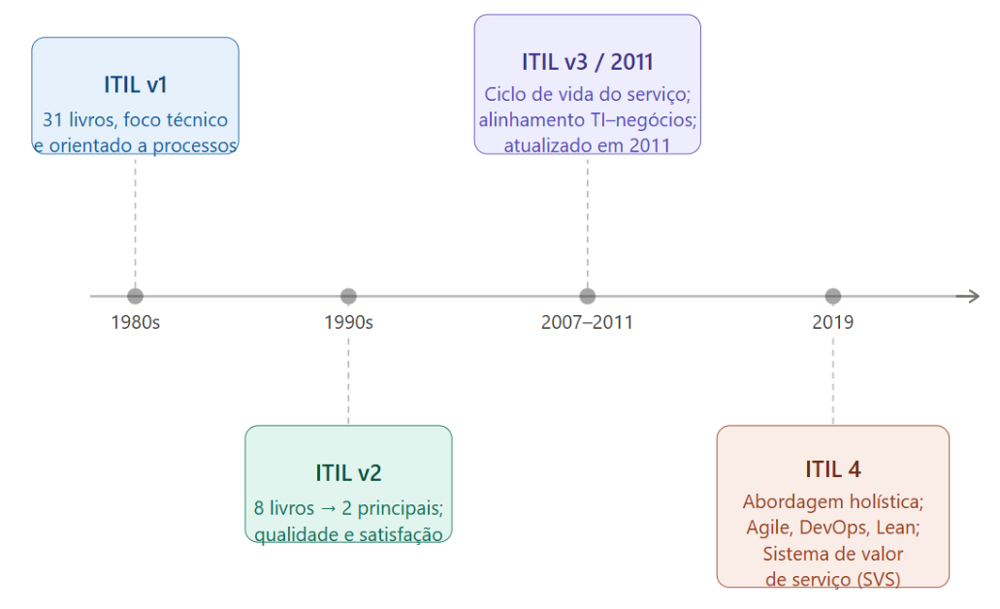

Tudo começa nos anos 1980, quando o governo do Reino Unido resolveu criar um conjunto de boas práticas para organizar os serviços de TI que ele mesmo consumia. Nascia aí a **ITIL v1** . Eram 31 livros cobrindo praticamente tudo o que envolvia o provisionamento de serviços de TI. Era uma abordagem bem técnica, muito orientada a processos, sem muita preocupação com o lado do negócio. Funcionou como um ponto de partida, mas era pesado demais para qualquer organização absorver de verdade. 

Aí chegam os anos 1990 e alguém, com razão, percebeu que 31 livros era coisa demais. A **ITIL v2** veio justamente para resolver isso: todo aquele material foi consolidado em 8 livros e, depois, condensado ainda mais em dois volumes principais, que eram o **Suporte a Serviços** e a **Entrega de Serviços** . O foco também mudou um pouco, pois a v2 começou a olhar mais para a qualidade do serviço de TI e para a satisfação do cliente, saindo um pouco daquela visão puramente técnica da versão anterior. 

Em 2007 chegou o **ITIL v3** , que trouxe uma mudança conceitual importante: o **Ciclo de Vida do Serviço** . A ideia central era justamente integrar TI com o negócio, fazer com que a tecnologia não ficasse num mundo paralelo, mas estivesse alinhada com os objetivos da organização. Em 2011, essa versão recebeu uma atualização para clarear algumas estruturas e conceitos que estavam gerando dúvida, e por isso você vai ver referências tanto a "ITIL v3" quanto a " **ITIL 2011** " falando da mesma coisa, no fundo. 

**_Saiba Mais_** _: A ITIL v3 (2007/2011) era estruturada em cinco volumes principais que seguiam a lógica de ciclo de vida:_ **_Estratégia de Serviço, Desenho de Serviço, Transição de Serviço, Operação de Serviço e Melhoria Contínua de Serviço_** _._

---

<!-- pagina: 7 -->

**Paolla Ramos Aula 01** 

_Embora a ITIL 4 tenha evoluído para práticas e o SVS, esses nomes ainda aparecem em provas para testar o conhecimento histórico e a base conceitual do framework._ 

Chegamos na versão mais recente da ITIL 4, lançada em 2019. Foi uma reformulação significativa na forma de pensar o gerenciamento de serviços de TI. A grande virada aqui é que a ITIL 4 abandona aquela visão mais engessada de processos específicos e adota uma abordagem holística, centrada num conceito chamado **sistema de valor de serviço** . Em vez de perguntar "qual processo devo seguir?", a pergunta passa a ser "como o serviço gera valor de ponta a ponta?". 

Outro ponto importante é que a ITIL 4 para de ignorar o que estava acontecendo lá fora. Sabe o Ágil, Devops e Lean? A versão anterior convivia mal com essas metodologias, e isso gerava um atrito enorme nas organizações que tentavam usar tudo junto. O framework veio justamente para resolver isso, reconhecendo e integrando essas práticas emergentes dentro do seu próprio modelo. 

A versão também trouxe novidades conceituais bem concretas: o **Modelo de Serviço de Valor** , a **Cadeia de Valor de Serviço** e as **quatro dimensões do gerenciamento de serviços** . Cada um desses elementos ajuda a enxergar o serviço de TI de ângulos diferentes, garantindo que nenhuma parte do quebra-cabeça fique de fora. 

## Defini ões <u>ç</u> 

Antes de entrar nas estruturas específicas do modelo, vale a pena parar um segundo e alinhar alguns termos fundamentais da ITIL. 

O primeiro é **Melhor Prática** . Melhor prática se refere aos métodos de trabalho que já foram comprovados na prática e que entregam resultados superiores quando comparados a outras abordagens. A própria ITIL 4 é um exemplo disso, pois ela é considerada uma **melhor prática no gerenciamento de serviços de TI** justamente porque as orientações que ela traz foram amplamente testadas e aprovadas em inúmeras organizações ao redor do mundo. É algo que funcionou de verdade, em escala. 

Agora, **Serviço** . Essa definição vai aparecer na sua prova, pode apostar. 

Serviço, segundo a ITIL, é o **meio que permite a cocriação de valor ao facilitar a obtenção dos resultados que os clientes desejam, sem que eles precisem gerenciar os custos e riscos específicos** envolvidos nisso. Repare no detalhe: **cocriação de valor** . O cliente não recebe valor pronto, passivamente. Ele participa desse processo. E o grande benefício do serviço é justamente tirar do cliente o peso de lidar com a complexidade por trás daquele resultado. 

**_Saiba Mais_** _: Uma_ **_Oferta de Serviço_** _é um pacote que combina mercadorias (que têm a propriedade transferida ao cliente, como um notebook), acesso a recursos (o cliente usa mas não possui, como licença de software em nuvem) e ações de serviço (tarefas executadas pelo provedor, como suporte técnico). Essa combinação visa facilitar a obtenção de valor pelo consumidor de forma personalizada._

---

<!-- pagina: 8 -->

**Paolla Ramos Aula 01** 

**(CEBRASPE - 2025 - Auditor Público Externo (TCE-RS)/Tecnologia da Informação)** Julgue o próximo item, <mark>relativos a gerenciamento de projetos e de serviços e governança de TI.</mark> 

<mark>O produto, conforme definição presente na ITIL 4, é um meio de permitir a cocriação de valor, o que ajuda os clientes a alcançarem seus objetivos sem que precisem gerenciar custos e riscos.</mark> 

**<mark>Comentários:</mark>** 

<mark>Errado. Na ITIL 4, a definição descrita corresponde a</mark> **<mark>serviço</mark>** <mark>, não a produto. Produto é uma configuração de</mark> recursos criada pela organização para oferecer valor. São conceitos distintos dentro do framework. 

Em seguida, temos **Gerenciamento de Serviço** . Gerenciamento de serviço é uma disciplina, uma área de conhecimento estruturada, que garante que os serviços de TI estejam alinhados com as necessidades do negócio e que sustentem os processos principais da organização. Na prática, isso envolve uma série de atividades, tais como projetar, criar, entregar, suportar e melhorar continuamente os serviços. É um ciclo inteiro, do projeto à melhoria contínua. 

**_Saiba Mais_** _: É fundamental não confundir as entregas:_ 

**_Output_** _é o produto ou serviço gerado (ex: um novo sistema de vendas instalado), enquanto_ **_Outcome_** _é o resultado pretendido por uma parte interessada possibilitado por essas saídas (ex: aumento de 20% na velocidade de faturamento). O provedor entrega outputs, mas o cliente busca os outcomes._ 

Temos também a definição de **Valor.** Valor é a **percepção de benefício** , **utilidade** , **importância ou relevância** que um serviço tem para quem está usando. Percepção! Isso muda bastante, porque o mesmo serviço pode ter um valor enorme para um cliente e quase nenhum para outro. E esse valor pode ser **tangível** , algo que dá para medir, ou **intangível** , aquela sensação de que o serviço resolve sua vida mesmo sem você conseguir colocar número nisso. 

Agora, como esse valor é criado? É aí que entra um dos conceitos mais importantes da ITIL 4, a **cocriação de valor** . A versão anterior da ITIL trabalhava com uma ideia mais simples, onde o provedor cria o serviço e entrega para o cliente. A ITIL 4 quebra essa lógica. Ela diz que o valor não é criado pelo provedor e simplesmente empurrado para o cliente como se fosse uma caixa no balcão. O valor é construído em conjunto, numa colaboração ativa entre as duas partes. O cliente participa do design do serviço, dá feedback, ajuda a personalizar a solução para a sua realidade. Sem essa participação, o que o provedor entrega pode até ser tecnicamente impecável e ainda assim não gerar valor nenhum para quem está do outro lado. 

Desmembrando o valor um pouco mais, ITIL define duas dimensões que juntas compõem o que um serviço entrega: a **Utilidade** e a **Garantia** . 

A Utilidade é o "o que o serviço faz". É a funcionalidade em si, a capacidade que o serviço tem de atender a uma necessidade do cliente ou de remover uma restrição que travava o trabalho dele. Garantia tem a ver com "como o serviço é entregue". De nada adianta um serviço funcionar perfeitamente no papel se ele cai toda hora, se é lento, se não é seguro ou se some justamente quando você mais precisa. A garantia diz

---

<!-- pagina: 9 -->

**Paolla Ramos Aula 01** 

respeito à **disponibilidade** , à **confiabilidade** , à **segurança** e à **continuidade do serviço** , tudo aquilo que foi prometido ao cliente. 

**(CEBRASPE - 2024 - Analista (APEX)/Operações e Segurança de Tecnologia da Informação e** **<mark>Comunicação/Infraestrutura/Perfil 4) No ITIL, o conceito afeto à prática de gerenciamento de nível de serviço descreve o que o serviço faz, podendo ser usado para determinar se um serviço é adequado ao propósito. Esse conceito é conhecido como</mark>** 

<mark>a) nível de serviço. b) garantia. c) utilidade.</mark> 

<mark>d) acordo de nível de serviço.</mark> 

**<mark>Comentários:</mark>** 

<mark>(a) Errado. Nível de serviço refere-se a métricas e metas acordadas, não ao que o serviço faz em si; (b) Errado. Garantia diz respeito a como o serviço é entregue — disponibilidade, capacidade, segurança — não ao seu propósito;</mark> **<mark>(c) Correto</mark>** <mark>. Utilidade descreve o que o serviço faz e determina se ele é adequado ao propósito; (d) Errado. Acordo de nível de serviço é um documento formal entre partes, não um conceito que define a</mark> função do serviço. 

##### A tabela abaixo resume esses conceitos: 

|**Conceito**|**Definição**|
|---|---|
|**Melhor Prática (Best** **Practice)**|Conjunto de métodos e abordagens comprovadamente eficazes na prática, capazes de gerar resultados superiores em diferentes organizações. A ITIL 4 é um exemplo clássico.|
|**Serviço (Service)**|Meio que possibilita a**cocriação de valor**, permitindo ao cliente alcançar resultados desejados semgerenciar diretamente custos e riscos.|
|**Gerenciamento de Serviço** **(Service Management)**|Disciplina responsável por projetar, criar, entregar, suportar e melhorar continuamente serviços, garantindo alinhamento com o negócio.|
|**Valor (Value)**|Percepção de benefício, utilidade ou relevância de um serviço para o cliente, podendo variar conforme o contexto e a experiência do usuário.|
|**Cocriação de Valor (Co-** **creation of Value)**|Processo colaborativo no qual provedor e cliente participam conjuntamente da construção do valor, por meio de interação e adaptação contínua.|
|**Utilidade (Utility)**|Representa o**“o que o serviço faz”**— sua funcionalidade e capacidade de atender necessidades ou remover restrições(fit forpurpose).|
|**Garantia (Warranty)**|Representa o**“como o serviço é entregue”**— envolve disponibilidade, confiabilidade,segurança e continuidade(fit for use).|

## Modelo de Quatro Dimensões 

Pessoal, agora vamos falar sobre um dos conceitos centrais da ITIL 4, o **modelo de quatro dimensões** . 

Antes de sair gerenciando serviços de TI no piloto automático,  ITIL te obriga a dar um passo atrás e perguntar: _será que estou olhando para tudo que importa_ ? É exatamente para isso que esse modelo existe.

---

<!-- pagina: 10 -->

**Paolla Ramos Aula 01** 

Ele funciona como um guia que garante uma **visão holística** e equilibrada na hora de projetar, desenvolver e gerenciar serviços de TI. 

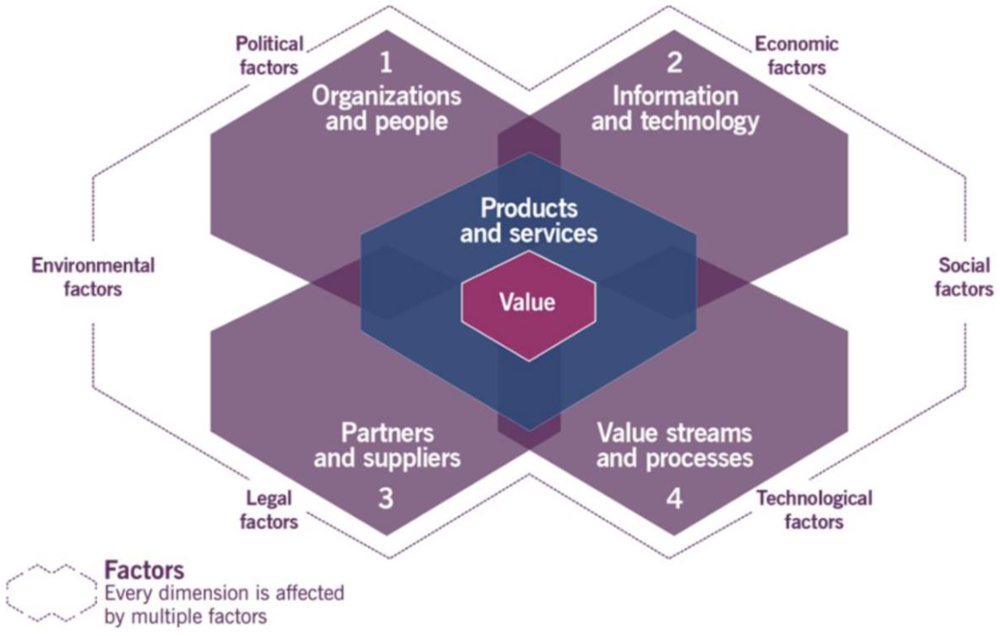

A primeira dessas quatro dimensões é chamada de **Organizações e Pessoas** . 

Essa dimensão coloca o holofote nas pessoas e nas estruturas organizacionais que sustentam o gerenciamento de serviços de TI. Isso significa desenvolver uma **cultura organizacional** positiva, capacitar os funcionários de verdade e definir com clareza quem faz o quê. **Papéis e responsabilidades** bem definidos evitam aquela situação clássica em que todo mundo achava que o outro estava resolvendo o problema. Além disso, essa dimensão reforça a necessidade de garantir que as pessoas tenham as **habilidades certas e a capacidade adequada** para executar seu trabalho de forma efetiva. 

A próxima dimensão é a de **Informação e Tecnologia** . 

Essa dimensão trata de tudo que envolve **informações, conhecimentos e tecnologias** necessários para gerenciar serviços de TI. De um lado você tem a informação, que é o combustível para tomar boas decisões. Do outro, você tem a tecnologia, que é a infraestrutura, as aplicações e as ferramentas que tornam os serviços possíveis. Sem informação de qualidade, as decisões ficam no achismo. Sem tecnologia adequada, os serviços simplesmente não saem do papel. E ainda tem um terceiro ponto importante, que é a necessidade de proteger e gerenciar tudo isso direito. 

Dentro dessa dimensão, um tema que aparece com frequência é a **computação em nuvem** .

---

<!-- pagina: 11 -->

**Paolla Ramos Aula 01** 

##### A definição formal é a seguinte: a **_computação em nuvem é um modelo que permite acesso por rede e sob demanda a um conjunto compartilhado de recursos configuráveis de computação, que podem ser rapidamente fornecidos com o mínimo de esforço de gerenciamento ou de interação do provedor_** _._ 

Sabe quando você abre o Google Drive e seus arquivos estão lá, de qualquer dispositivo, sem você precisar instalar nada nem ligar para ninguém? Isso é nuvem funcionando. Você acessou, sob demanda, um recurso compartilhado, com praticamente zero de interação com quem fornece o serviço. 

Pessoal, nossa aula não é sobre computação em nuvem, mas vale a pena ver suas principais características: 

|**Conceito**|**Definição**|
|---|---|
|**Disponibilidade sob demanda** **(On-demand self-service)**|Capacidade do usuário de provisionar recursos computacionais (como processamento e armazenamento) de forma autônoma, sem necessidade de interaçãohumana como provedor.|
|**Acesso amplo à rede (Broad** **network access)**|Recursos disponíveis por meio da rede, acessados via mecanismos padronizados, permitindo uso em diferentes dispositivos como celulares, tablets e computadores.|
|**Compartilhamento de recursos** **(Resource pooling)**|Recursos computacionais do provedor são agrupados para atender múltiplos clientes simultaneamente, no modelo multi-tenant, com isolamento lógico entre eles.|
|**Elasticidade rápida (Rapid** **elasticity)**|Capacidade de expandir ou reduzir recursos de forma rápida e, geralmente, automática, conforme a variação da demanda.|
|**Serviço mensurado (Measured** **service)**|Uso dos recursos é monitorado, controlado e mensurado, permitindo cobrança baseada no consumo (pay-per-use) e transparência para provedor e cliente.|

##### A terceira dimensão é a de **Parceiros e Fornecedores** . 

Poucas organizações no mundo moderno conseguem operar de forma completamente isolada. Por exemplo, quando você usa um aplicativo de banco, por exemplo, quantas empresas diferentes estão envolvidas nos bastidores? Tem a empresa de hospedagem em nuvem, tem o fornecedor do sistema de autenticação, tem a processadora de pagamentos, tem o provedor de SMS para mandar o código de verificação. É uma cadeia enorme. E se qualquer elo dessa cadeia falhar, o usuário culpa o banco, não o fornecedor lá do meio. 

É exatamente por isso que essa dimensão existe. Ela trata de como trabalhar de forma efetiva com **parceiros externos** e **fornecedores** para garantir que os serviços sejam entregues de maneira eficaz e consistente. 

Aqui são consideradas as **relações entre organizações** , conforme detalhado na tabela a seguir. 

|**Tipo**|**Saídas**|**Responsabilidade** **pelas saídas**|**Responsabilidade** **por atingir os** **resultados**|**Nível de** **formalidade**|**Exemplos**|
|---|---|---|---|---|---|
|**Suprimento** **de Bens**|Bens|Fornecedor|Cliente|Contrato formal de suprimento|Compra de telefones e computadores|

---

<!-- pagina: 12 -->

**Paolla Ramos Aula 01** 

|**Entrega de** **Serviço**|Serviço entregue|**Provedor**|Cliente|Acordos formais e alguns casos flexíveis|Cloud Computing (IaaS, PaaS)|
|---|---|---|---|---|---|
|**Parceria de** **Serviço**|Cocriação de Valor|Compartilhado entre Provedor e Cliente|Compartilhado entre Provedor e Cliente|Metas compartilhadas, acordos genéricos, casos flexíveis|Recepção de novos funcionários (RH + TI)|

Por fim, temos a quarta dimensão: **Fluxos de Valor** e **Processos** . 

Essa dimensão olha para dentro da organização e pergunta: _como a gente realmente entrega o serviço_ ? Quais são os passos, quem faz o quê, em que ordem? É aqui que entram os **processos** , os **procedimentos** e, principalmente, os chamados **fluxos de valor** . 

Um fluxo de valor é uma **série de passos que a organização segue para criar e entregar produtos e serviços aos seus consumidores** . Por exemplo, desde o momento em que alguém identifica uma necessidade até a hora em que o serviço chega na mão do usuário, existe um caminho. Esse caminho, com todas as etapas envolvidas, é o **fluxo de valor** . 

E o “processo”? 

Processo é uma **série de atividades inter-relacionadas que transforma entradas em saídas** . Ou seja, você coloca algo de um lado, passa por uma sequência de ações bem definidas, e obtém um resultado do outro lado. Dois pontos importantes aqui: os processos definem uma sequência de ações e suas dependências (o que precisa acontecer antes do quê), e geralmente são detalhados na forma de procedimentos ou práticas, que são basicamente os "manuais" de como executar cada coisa. 

A diferença entre os dois conceitos vale a pena fixar. O fluxo de valor é a visão de ponta a ponta, do começo ao fim da jornada de criação e entrega. O processo é uma engrenagem específica dentro esse fluxo, com entradas, saídas e atividades bem mapeadas. Os dois andam juntos. 

**(FGV - 2024 - Técnico Judiciário (TRF 1ª Região)/Apoio Especializado/Tecnologia da Informação) O TRF1** **<mark>deseja implementar a ITIL 4 para gerenciamento dos serviços de TI. A ITIL 4 trouxe uma nova abordagem</mark> ao gerenciamento de serviços, representada na forma de dimensões.** 

**<mark>Assim, duas das dimensões da ITIL 4 são:</mark>** 

<mark>a) informação e tecnologia; e parceiros e fornecedores;</mark> 

<mark>b) organizações e pessoas; e cadeia de suprimentos e logística; c) recursos financeiros e econômicos; e sustentabilidade e meio ambiente; d) fluxos de valor e processos; e comunicação e marketing;</mark> 

<mark>e) sistemas e infraestrutura; e cadeia de serviços e produtos.</mark>

---

<!-- pagina: 13 -->

**Paolla Ramos Aula 01** 

**<mark>Comentários:</mark>** 

**<mark>(a) Correto</mark>** <mark>. A ITIL 4 define quatro dimensões: organizações e pessoas; informação e tecnologia; parceiros e fornecedores; e fluxos de valor e processos. As duas citadas nesta alternativa são dimensões oficiais; (b) Errado. "Cadeia de suprimentos e logística" não é uma das quatro dimensões da ITIL 4; (c) Errado. "Recursos financeiros e econômicos" e "sustentabilidade e meio ambiente" não constam entre as dimensões da ITIL 4; (d) Errado. "Fluxos de valor e processos" é uma dimensão real, mas "comunicação e marketing" não existe na ITIL 4; (e) Errado. "Sistemas e infraestrutura" e "cadeia de serviços e produtos" não fazem parte das</mark> dimensões oficiais da ITIL 4. 

## Sistema  de Valor de Serviço (SVS) 

Vamos falar sobre o **Sistema de Valor de Serviço** , o famoso SVS da ITIL 4. **O SVS descreve como todos os componentes e atividades de uma organização trabalham juntos para criar valor por meio de produtos e serviços** . É o "grande quadro" que mostra como as peças se encaixam. 

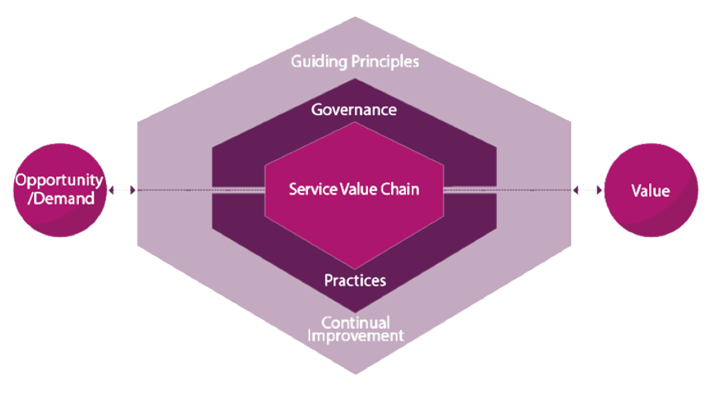

A entrada do SVS são duas coisas: **Oportunidade** e **Demanda** . A saída é a criação de **Valor. Nem toda oportunidade precisa ser aproveitada, e nem toda demanda precisa ser atendida.** A organização avalia cada situação com base em múltiplos fatores antes de decidir agir. 

Além dessas entradas e saídas, o SVS é composto por um conjunto de componentes internos que vamos destrinchar a seguir.

---

<!-- pagina: 14 -->

**Paolla Ramos Aula 01** 

#### **Princípios Orientadores** 

Um **princípio orientador** é uma recomendação que a organização carrega em todas as circunstâncias, independentemente de mudanças nos objetivos, nas estratégias, no tipo de trabalho que está sendo feito ou na estrutura de gerenciamento. Ou seja: veio lá de cima, mas fica com você o tempo todo, em qualquer situação. 

ITIL 4 trabalha com sete desses **princípios orientadores** . Cada um com uma função e uma lógica própria, como detalhado na tabela abaixo: 

|**Princípio**|**Descrição**|
|---|---|
|**Foque em valor**|Tudo que a organização precisa mapear para criar valor para as partes interessadas. Engloba muitasperspectivas,incluindo a experiência de clientes e usuários.|
|**Comece onde você está**|Não comece “do zero” sem antes considerar o que pode ser aproveitado na organização. O estado atual deve ser investigado e completamente entendido.|
|**Progrida iterativamente** **com feedback**|Não faça tudo ao mesmo tempo. Organize o trabalho em seções menores e mais facilmentegerenciáveis. Utilize feedback em cada etapa doprocesso.|
|**Colabore e promova a** **visibilidade**|Trabalhar em parceria produz melhores resultados e sucesso de longo prazo. O trabalho deve ser transparente e as informações devem ser o mais visíveispossível.|
|**Pense e trabalhe de** **forma holística**|Considere o serviço como um todo, e não apenas suas partes isoladas. Integre tecnologia, informações, pessoas, organizações, parceiros, acordos (tudo deve ser coordenado).|
|**Mantenha a simplicidade** **epraticidade**|Se um processo, serviço, ação ou métrica não produzir nenhum valor, elimine-o. Use o menor número depassospossívelpara completar uma tarefa.|
|**Otimize e automatize**|Recursos de todos os tipos, principalmente de RH, devem ser usados da melhor forma. Elimine tudoque for desperdício e use a tecnologia semprequepossível.|

**(CEBRASPE - 2025 - Analista Judiciário (TRF 6ª Região)/Apoio Especializado/Governança e Gestão de** **<mark>Tecnologia da Informação)</mark>** <mark>Em relação aos modelos e às referências de governança da tecnologia da</mark> informação, julgue o item a seguir. 

<mark>Otimizar e automatizar é um dos princípios orientadores do ITIL v4.</mark> 

**<mark>Comentários:</mark>** 

<mark>Correto. O ITIL v4 define sete princípios orientadores, sendo "Otimizar e automatizar" um deles. Esse princípio incentiva o uso de automação para maximizar o valor das atividades, reduzindo esforço manual e</mark> aumentando a eficiência dos serviços. 

#### **Governança** 

**Governança** é mais um elemento dentro do SVS. **Ela é o meio pelo qual uma organização é dirigida e controlada** . Por exemplo, toda empresa precisa de alguém que dê a direção, que defina as regras do jogo e que garanta que todo mundo está jogando conforme o combinado.

---

<!-- pagina: 15 -->

**Paolla Ramos Aula 01** 

Governança também é responsável por garantir que as ações e os investimentos da organização estejam alinhados com os **objetivos estratégicos** dela. Não adianta a área de TI fazer um projeto brilhante se ele não tem nada a ver com o que a empresa quer alcançar. Além disso, ela cuida para que **riscos** e **recursos** sejam gerenciados de forma efetiva, estabelecendo **políticas** e **diretrizes** claras e criando mecanismos para monitorar e ajustar o desempenho sempre que necessário. 

Segundo a ITIL 4, Governança se apoia em três atividades principais. 

A primeira é **avaliar** (do inglês, evaluate), que é quando a organização analisa sua situação atual, entende o contexto em que está inserida e verifica se os objetivos fazem sentido. A segunda é **dirigir** (direct), que consiste em definir a direção, estabelecer as políticas e garantir que as decisões tomadas estejam alinhadas com a **estratégia** . E a terceira é **monitorar** (monitor), que é acompanhar o desempenho, verificar se o que foi planejado está sendo executado de fato e tomar ações corretivas quando algo sai dos trilhos. 

Vale destacar que a Governança pode ir muito além dessas três atividades principais, podendo envolver uma série de outras iniciativas e processos que variam de organização para organização, dependendo do setor, do tamanho da empresa e da maturidade da gestão. ITIL reconhece isso e não tenta engessar o conceito, justamente porque governança não é uma receita de bolo, é um conjunto de princípios que cada organização adapta à sua realidade. 

Também vale a pena falar sobre o papel do **conselho de administração** dentro de uma organização. A primeira grande função é estabelecer a **direção estratégica e as políticas da organização** . Significa que o conselho é quem decide para onde a empresa vai. É quem traça o rumo de longo prazo, quem define os grandes valores que vão guiar as decisões internas. 

A segunda função é definir as **expectativas de desempenho** . Aqui o conselho estabelece o que espera de cada área, de cada gestor, de cada processo. É como se ele dissesse: "olha, queremos chegar aqui, e esses são os números que nos indicam se estamos no caminho certo". 

Terceira função: **monitorar e avaliar o desempenho** . O conselho precisa verificar se o que foi planejado está sendo executado, se os **indicadores** estão sendo atingidos, se a organização está evoluindo na direção que foi determinada lá no primeiro passo. É um ciclo, percebe? Você define, cobra e acompanha. 

Por fim, a quarta função é **gerenciar riscos** . Toda organização está exposta a ameaças, sejam elas financeiras, operacionais, regulatórias ou reputacionais. O conselho tem a responsabilidade de identificar esses riscos, avaliar a gravidade de cada um e garantir que existem mecanismos para mitigá-los antes que virem um problema de verdade. 

Quando falamos em **conformidade** , estamos dizendo que a organização precisa seguir as regras do jogo, sejam elas leis nacionais, regulamentos internacionais ou normas do setor. No Brasil, por exemplo, a LGPD entrou em cena justamente para isso, para obrigar empresas a tratarem os dados pessoais dos cidadãos de forma adequada, sob pena de multas pesadas. 

Já a **responsabilidade** e a **transparência** têm a ver com algo mais profundo, que é saber quem responde pelo quê dentro da organização quando o assunto é dado. Quem autorizou aquela coleta? Quem tem acesso a essa base? Quem tomou a decisão de compartilhar aquela informação com terceiros? A **transparência** entra

---

<!-- pagina: 16 -->

**Paolla Ramos Aula 01** 

como o outro lado da moeda: não basta saber internamente quem faz o quê, é preciso ser capaz de explicar isso para reguladores, parceiros e, quando necessário, para o público. 

#### **Cadeia de Valor de Serviço** 

Agora vamos falar sobre a **Cadeia de Valor de Serviço** , que em inglês aparece como **Service Value Chain** , ou simplesmente **SVC** . Trata-se de um **modelo operacional que descreve quais são as atividades-chave que uma organização precisa executar para responder à demanda e, com isso, criar valor por meio da entrega de serviços** . Em outras palavras, é o mapa do caminho que o serviço percorre desde a necessidade até a **entrega de valor** de verdade. 

Esse modelo é composto por seis atividades principais, e é sobre elas que vamos nos aprofundar a seguir. 

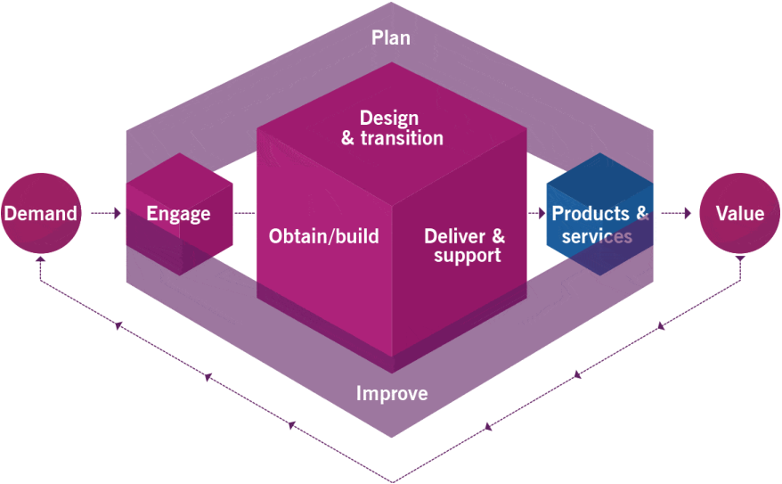

##### **1. Engajar (Engage)** 

É a atividade responsável pela **interação com stakeholders** . 

- Garante entendimento das **necessidades, expectativas e percepções** 

- Promove **transparência e relacionamento contínuo** 

- Inclui comunicação com clientes, usuários, fornecedores e parceiros 

É aqui que você **ouve o cliente** , entende a demanda e mantém o alinhamento ao longo do tempo. 

##### **2. Planejar (Plan)** 

##### Define a **direção estratégica e tática** . 

- Alinha visão, estado atual e objetivos futuros

---

<!-- pagina: 17 -->

**Paolla Ramos Aula 01** 

- Orienta decisões sobre **produtos e serviços** 

- Integra estratégia com execução 

É a atividade que responde: _para onde estamos indo e como vamos chegar lá?_ 

##### **3. Projeto e Transição (Design & Transition)** 

Cuida da **qualidade daquilo que será entregue** . 

- Define especificações (arquitetura, requisitos, processos) 

- Garante aderência a **qualidade, custo e prazo** 

- Prepara serviços para entrada em operação 

Aqui ocorre o “desenho” do serviço e sua preparação para o mundo real. 

##### **4. Obter/Construir (Obtain/Build)** 

Responsável por **materializar o serviço** . 

- Desenvolve software 

- Adquire infraestrutura 

- Constrói componentes e soluções 

É a execução técnica: transformar planejamento em algo concreto. 

##### **5. Entregar e Suportar (Deliver & Support)** 

Garante que o serviço funcione **no dia a dia** . 

- Entrega serviços conforme níveis acordados (SLAs) 

- Realiza suporte aos usuários 

- Mantém operação estável 

É a operação contínua — onde o valor é efetivamente percebido pelo usuário. 

##### **6. Melhorar (Improve)** 

Atividade transversal e contínua. 

- Identifica oportunidades de melhoria 

- Usa métricas e feedback 

- Promove evolução constante dos serviços 

Não é uma etapa final, ela acontece o tempo todo, em todas as outras atividades, de maneira contínua. 

**_Saiba Mais_** _: As práticas de gerenciamento não operam no vácuo; elas contribuem de forma diferente para cada atividade da Cadeia de Valor de Serviço (SVC). O Gerenciamento de Problemas, por exemplo, tem sua_

---

<!-- pagina: 18 -->

**Paolla Ramos Aula 01** 

_maior contribuição em Entregar e Suportar (resolvendo causas de incidentes ativos) e em Melhorar (identificando tendências para evitar falhas futuras), tendo papel menor ou nulo em atividades como Projeto e Transição ou Obter/Construir._ 

##### Veja o modelo de melhoria contínua da ITIL: 

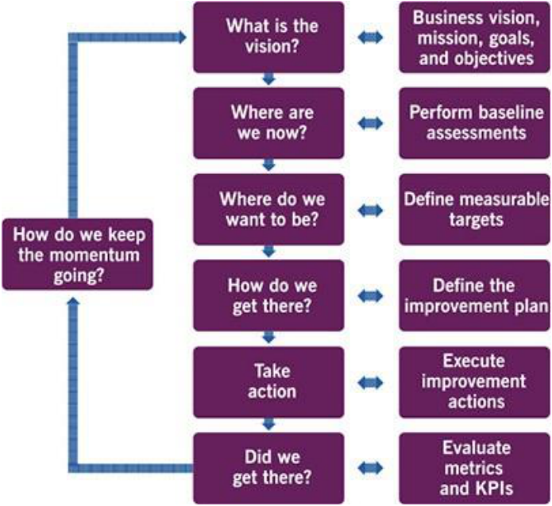

**(CEBRASPE - 2025 - Analista Judiciário (TRF 6ª Região)/Apoio Especializado/Governança e Gestão de** **<mark>Tecnologia da Informação)</mark>** <mark>Em relação aos modelos e às referências de governança da tecnologia da</mark> informação, julgue o item a seguir. 

<mark>A cadeia de valor de serviço do ITIL v4 é formada pelas práticas, pelos princípios orientadores, pela governança e pela melhoria contínua.</mark> 

**<mark>Comentários:</mark>** 

<mark>Errado. A cadeia de valor de serviço do ITIL v4 é composta por seis atividades: planejar, melhorar, engajar, desenhar e fazer a transição, obter/construir e entregar e suportar — não pelas práticas, princípios ou</mark> governança.

---

<!-- pagina: 19 -->

**Paolla Ramos Aula 01** 

## Práticas de Gerenciamento 

Vamos falar sobre práticas de gerenciamento na ITIL 4. Elas são os recursos e atividades organizacionais que os profissionais usam no dia a dia para realizar seu trabalho. Cada prática, na verdade, é um conjunto de recursos organizacionais desenhados para executar um trabalho específico ou atingir um objetivo. E, dentro da ITIL 4, essas práticas são divididas em três categorias. 

A primeira categoria é a das **Práticas de Gerenciamento Geral** . 

São práticas adotadas e adaptadas pela organização para atender às suas necessidades, independentemente do domínio específico em que ela atua. Ou seja, **não são exclusivas de TI** . Qualquer departamento de uma empresa pode usar essas práticas: o RH, o financeiro, a área comercial. Gerenciamento de projetos, gerenciamento de riscos, gerenciamento de recursos humanos, gerenciamento de relacionamento com o cliente etc. Perceba que nenhum desses exemplos é exclusividade da TI. São práticas mais amplas, que a organização inteira pode absorver e adaptar conforme sua realidade. 

A segunda categoria é a das **Práticas de Gerenciamento de Serviço** . Aqui o foco já é bem mais específico. Essas práticas são próprias do domínio do gerenciamento de serviços e existem justamente para orientar como uma organização entrega e suporta serviços para seus clientes. Entram nomes que você vai encontrar muito em provas: gerenciamento de incidentes, gerenciamento de problemas, gerenciamento de níveis de serviço, gerenciamento de mudanças. Tudo voltado para a operação e entrega de serviços de TI de forma estruturada. 

O terceiro e último grupo de práticas é o de **Práticas de Gerenciamento Técnico** . São práticas voltadas para tecnologia de verdade, aquelas que vivem no dia a dia das equipes técnicas que colocam a mão na massa para projetar, desenvolver, implantar e operar soluções tecnológicas. 

O framework cita três: desenvolvimento de software, gerenciamento de infraestrutura e gerenciamento de implantação. Por exemplo, desde o momento em que um sistema começa a ser criado, passando pela configuração dos servidores que vão sustentá-lo, até o processo de jogar tudo isso em produção sem quebrar nada, estamos falando de gerenciamento técnico. É o chão de fábrica da TI, por assim dizer. 

A imagem abaixo mostra todas as práticas da ITIL 4. Vale a pena olhar com calma para ter essa fotografia mental de como tudo se organiza dentro do framework.

---

<!-- pagina: 20 -->

**Paolla Ramos Aula 01** 

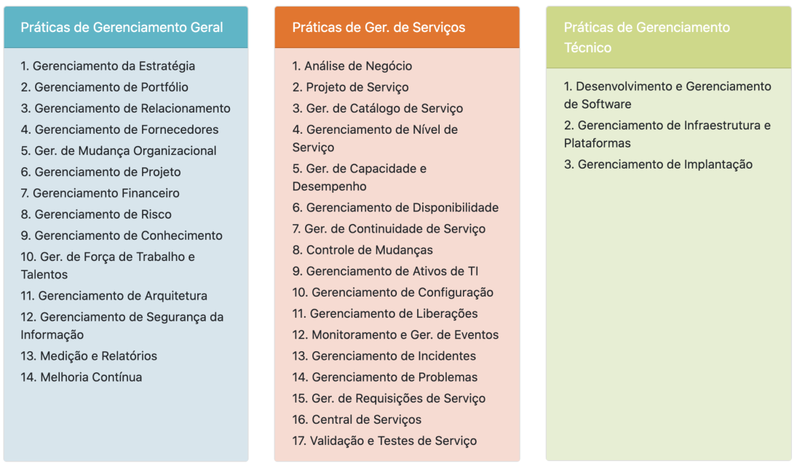

## Práticas de Gerenciamento Geral 

#### **Gerenciamento da Estratégia** 

O propósito da prática de gerenciamento da estratégia é **definir os objetivos da organização e estabelecer os cursos de ação e a alocação de recursos necessários para alcançá-los** . Ela define a direção organizacional, orienta esforços, estabelece prioridades e fornece consistência frente ao ambiente. 

Pessoal, essa prática é o ponto de partida de tudo. Antes de qualquer serviço, antes de qualquer **projeto** , a organização precisa saber para onde está indo. 

_Mas o que essa prática faz na vida real_ ? Ela cuida de analisar o ambiente para identificar oportunidades, identificar as restrições que estão travando a organização e pensar em como removê-las, definir **missão** , **visão** , **perspectiva** e **posição** , decidir quais produtos e serviços serão oferecidos ao mercado, e garantir que a estratégia acompanha as mudanças no ambiente interno e externo. 

Percebam que esse último ponto é fundamental. O ambiente muda, os concorrentes mudam, a tecnologia muda. Quem não revisa a estratégia fica para trás. 

##### **Pontos-Chave:** 

- Propósito: definir objetivos e cursos de ação da organização.

---

<!-- pagina: 21 -->

**Paolla Ramos Aula 01** 

- Atividades centrais: analisar ambiente, identificar restrições, definir missão/visão, decidir oferta de produtos/serviços, revisar continuamente. 

- Estratégia é dinâmica, não estática. Envolve direção, prioridades e alocação de recursos. 

#### **Gerenciamento de Portfólio** 

O propósito da prática de gerenciamento de portfólio é **garantir que a organização tenha a combinação adequada de programas, projetos, produtos e serviços para executar sua estratégia** dentro das restrições de financiamento e recursos. 

A estratégia diz "para onde ir", e o portfólio diz "com o que vamos chegar lá". A organização não pode abraçar o mundo. Tem orçamento limitado, tem gente limitada, tem tempo limitado. O gerenciamento de portfólio existe para garantir que a combinação de iniciativas faz sentido dentro dessas restrições. 

É importante lembrar que o portfólio não é uma coisa só. Ele se desdobra em três tipos. **Portfólio de Produtos e Serviços** , **Portfólio de Projetos** e **Portfólio de Clientes** . Cada um com sua lógica e decisões. A ideia é que a organização olhe para o conjunto todo e consiga dizer "sim, faz sentido estarmos investindo nisso tudo ao mesmo tempo". 

|**Tipo **|**Descrição**|
|---|---|
|**Portfólio de** **Produtos/Serviços**|• O conjunto completo de produtos e/ou serviços gerenciados pela organização e de parceiros ou fornecedores • Inclui produtos e serviços em desenvolvimento|
|**Portfólio de Projetos**|• Usado para gerenciar e coordenar projetos que foram autorizados dentro de restrições de custo, prazo e escopo • Garante que não há projeto duplicado|
|**Portfólio de Clientes**|• Registra todos os clientes da organização que recebem produtos ou serviços • Mantido pela prática de Gerenciamento de Relacionamento|

##### **Pontos-Chave:** 

- Propósito: garantir a combinação certa de programas, projetos, produtos e serviços. 

- Três tipos de portfólio: Produtos/Serviços, Projetos, Clientes. 

- Portfólio é sobre EQUILÍBRIO dentro de restrições de custo e recursos. 

**(CEBRASPE - 2024 - Analista (APEX)/Operações e Segurança de Tecnologia da Informação e** **<mark>Comunicação/Infraestrutura/Perfil 4) Assinale a opção em que é apresentada a prática do ITIL 4, cujo objetivo é garantir que a organização tenha a combinação certa de programas, projetos, produtos e</mark> serviços para executar a estratégia da organização dentro de suas restrições de recursos.** 

<mark>a) gerenciamento de estratégia</mark>

---

<!-- pagina: 22 -->

**Paolla Ramos Aula 01** 

<mark>b) gerenciamento de capacidade e desempenho</mark> 

<mark>c) gerenciamento de portfólio</mark> 

<mark>d) gerenciamento de implantação</mark> 

**<mark>Comentários:</mark>** 

<mark>(a) Errado. O gerenciamento de estratégia define a direção da organização, mas não trata da combinação de programas, projetos e serviços dentro de restrições de recursos; (b) Errado. O gerenciamento de capacidade e desempenho foca em garantir que os serviços atendam aos níveis de desempenho acordados, não na seleção estratégica de portfólio;</mark> **<mark>(c) Correto</mark>** <mark>. O gerenciamento de portfólio garante que a organização tenha a combinação certa de programas, projetos, produtos e serviços para executar sua estratégia dentro das restrições de recursos disponíveis; (d) Errado. O gerenciamento de implantação trata da movimentação de componentes para ambientes de produção, sem relação com a composição estratégica do portfólio</mark> organizacional. 

#### **Gerenciamento de Relacionamento** 

O propósito da prática de gerenciamento de relacionamento é **estabelecer e nutrir vínculos entre a organização e suas partes interessadas nos níveis estratégico e tático** . Inclui identificação, análise, monitoramento e melhoria contínua desses relacionamentos. 

Essa prática é sobre pessoas. Sobre manter a ponte entre a organização e quem importa para ela: **clientes** , **usuários** , **parceiros** , **patrocinadores** , todo mundo que tem algum interesse no que a organização faz. 

Gerenciamento de relacionamento assegura que as necessidades dos stakeholders são conhecidas, que os serviços são priorizados corretamente, que existe alta satisfação de clientes, que reclamações em nível tático ou estratégico são gerenciadas, e que conflitos entre stakeholders são mediados de forma apropriada. Percebam que estamos falando de um trabalho constante de identificação, monitoramento e melhoria. 

Agora, atenção a um ponto que gera confusão em prova: essa prática atua nos níveis **estratégico e tático** . Não operacional. Se a questão falar em "nível operacional" para o gerenciamento de relacionamento, desconfiem. 

##### **Pontos-Chave:** 

- Propósito: estabelecer e nutrir vínculos com stakeholders nos níveis estratégico e tático. 

- Assegura: necessidades conhecidas, priorização correta, satisfação alta, reclamações gerenciadas, conflitos mediados. 

- Atua nos níveis ESTRATÉGICO e TÁTICO (não operacional). 

**_Saiba Mais:_** _O gerenciamento de relacionamento de serviço vai além do simples contato comercial. Ele engloba as atividades conjuntas realizadas entre o provedor e o consumidor (cocriação). Isso inclui a provisão de serviços, o consumo e o gerenciamento contínuo da relação para garantir que a oferta acordada continue entregando o valor esperado por ambas as partes._

---

<!-- pagina: 23 -->

**Paolla Ramos Aula 01** 

**(CEBRASPE - 2024 - Técnico (CAGEPA)/Informática) Segundo o que preconiza o ITIL v4, assinale a opção que define a cooperação entre um prestador de serviços e um consumidor de serviços.** 

<mark>a) manutenção de serviço</mark> 

<mark>b) relacionamento de assinatura</mark> 

<mark>c) relacionamento de serviço</mark> 

<mark>d) serviço assinado</mark> 

<mark>e) relacionamento de manutenção</mark> 

**<mark>Comentários:</mark>** 

(a) Errado. "Manutenção de serviço" não é um conceito do ITIL v4 que descreve a cooperação entre prestador <mark>e consumidor; (b) Errado. "Relacionamento de assinatura" não é uma terminologia reconhecida no ITIL v4 para esse tipo de cooperação;</mark> **<mark>(c) Correto</mark>** <mark>. No ITIL v4, o "relacionamento de serviço" define exatamente a cooperação entre prestador e consumidor, abrangendo provisão, consumo e gestão conjunta; (d) Errado. "Serviço assinado" não corresponde a nenhum conceito oficial do ITIL v4 para descrever essa relação; (e) Errado. "Relacionamento de manutenção" também não integra o vocabulário do ITIL v4 para definir a</mark> cooperação entre as partes envolvidas. 

#### **Gerenciamento de Fornecedores** 

O propósito da prática de gerenciamento de fornecedores é **garantir que os fornecedores e seus desempenhos sejam gerenciados adequadamente, permitindo a entrega contínua de produtos e serviços de qualidade** , além de promover relações colaborativas que gerem valor e reduzam riscos. 

Veja: nenhuma organização faz tudo sozinha. Sempre há fornecedores na jogada, seja para infraestrutura, software, consultoria, o que for. E o ponto aqui é que existem diferentes tipos de relação com fornecedores. Tem aquele fornecedor que você compra commodity, tipo material de escritório, onde a relação é puramente transacional. E tem o **fornecedor-chave** , aquele que se parar, o seu serviço para junto. Com esse segundo tipo, a ITIL diz que a organização precisa criar relacionamentos mais próximos e colaborativos justamente para reduzir o risco de falha. Faz sentido, não faz? Quanto mais crítico o fornecedor, mais perto dele você precisa estar. 

**_Saiba Mais:_** _No gerenciamento de fornecedores, diante de desvios de performance como atrasos, a ITIL preconiza uma abordagem colaborativa inicial. Antes de aplicar multas ou rescisões, recomenda-se realizar uma reunião de alinhamento para identificar impedimentos técnicos ou operacionais, buscando corrigir o rumo da parceria e preservar o valor do serviço que depende desse fornecedor._ 

Além disso, há diferentes tipos de "sourcing", ou seja, o modelo de entrega de fornecedores na parceria com a organização. Veja: 

|**Tipo de Relação**|**Descrição**|
|---|---|
|**Insourcing**|• Produtos e serviços são entregues internamente pela organização|

---

<!-- pagina: 24 -->

**Paolla Ramos Aula 01** 

|**Outsourcing**|• Produtos e serviços são entregues por um fornecedor externo|
|---|---|
|**Single Source ou Partnership** **(Parceria)**|• Aquisição de produtos ou serviços de um único fornecedor • Tem como vantagem confiabilidade e cooperação|
|**Multi-Sourcing**|• Aquisição de produtos ou serviços de vários fornecedores independentes • Tem como vantagem a especialização (escolher o melhor fornecedor dentre várias opções)|

##### **Pontos-Chave:** 

- Propósito: gerenciar desempenho de fornecedores e promover colaboração. 

- Existem diferentes tipos de relação (de transacional a parceria estratégica). 

- Fornecedores-chave exigem relacionamento mais próximo para REDUZIR RISCO DE FALHA. 

#### **Gerenciamento de Mudança Organizacional** 

O propósito da prática de gerenciamento de mudança organizacional é **garantir que as mudanças na organização sejam implementadas de forma suave e bem-sucedida** , e que benefícios duradouros sejam alcançados por meio da gestão dos aspectos humanos dessas mudanças. 

O foco aqui é inteiramente nos **aspectos humanos** . Quando uma empresa troca de sistema, por exemplo, o problema raramente é técnico. O problema é que as pessoas resistem, não foram treinadas, não entendem por que a mudança está acontecendo. A prática de mudança organizacional existe para lidar exatamente com isso: remover resistências, eliminar impactos adversos e prover treinamento e conscientização. 

E aqui vai o alerta mais importante desse tópico. Não confundam **"Mudança Organizacional"** com **"Controle de Mudanças"** . São práticas completamente diferentes. Mudança Organizacional foca em pessoas: resistência, cultura, treinamento. Controle de Mudanças foca em serviços de TI: autorização, avaliação de risco, agendamento. A banca adora misturar as duas para ver se o candidato cai. 

Veja as atividades dessa prática: 

|**Atividade**|**Ajuda a entregar...**|
|---|---|
|**Criar um senso de urgência**|• Objetivos relevantes e claros, participantes engajados|
|**Gerenciar partes interessadas**|• Participantes fortes e comprometidos|

---

<!-- pagina: 25 -->

**Paolla Ramos Aula 01** 

|**Gerenciar Patrocinadores** **Comunicação**|• Liderança forte e comprometida • Participantes informados e preparados|
|---|---|

##### **Pontos-Chave:** 

- Propósito: implementar mudanças com sucesso duradouro gerenciando os aspectos HUMANOS. 

- 3 ações centrais: remover resistências, eliminar impactos adversos, prover treinamento e conscientização. 

- Mudança Organizacional = PESSOAS. Controle de Mudanças = SERVIÇOS/TI. Nunca confunda. 

#### **Gerenciamento de Projeto** 

O propósito da prática de gerenciamento de projetos é **garantir que todos os projetos da organização sejam entregues com sucesso** . Isso é alcançado por meio do planejamento, delegação, monitoramento e controle de todos os aspectos do projeto, mantendo a motivação das pessoas envolvidas. 

ITIL reconhece dois modos de gerenciar projeto: **Cascata** e **Ágil** . Quando usar cada um? 

O modo **Cascata** funciona bem quando os requisitos são bem conhecidos e a estabilidade é mais importante que a velocidade. Pense numa obra de engenharia civil, onde tudo precisa estar especificado antes de começar. Já o modo **Ágil** funciona melhor quando os requisitos são incertos e a velocidade de entrega é mais importante que especificações muito precisas. Pense numa startup lançando um app: melhor lançar rápido e ir ajustando do que passar dois anos definindo requisitos. 

**Cascata** é para cenários certos e estáveis. **Ágil** é para cenários incertos e velozes. 

##### **Pontos-Chave:** 

- Propósito: entregar projetos com sucesso via planejamento, delegação, monitoramento e controle. 

- Dois modos: Cascata (requisitos claros, estabilidade) e Ágil (requisitos incertos, velocidade). 

- Cascata = estabilidade sobre velocidade. Ágil = velocidade sobre precisão. 

**(CEBRASPE - 2024 - Analista em Ciência e Tecnologia (CAPES)/Informática)** Com relação ao ITIL 4, julgue o item seguinte. 

<mark>Conforme o ITIL 4, a prática de gerenciamento de projetos visa garantir que todos os projetos da organização sejam entregues com sucesso, objetivo alcançado a partir do planejamento, da delegação e do monitoramento dos aspectos do projeto.</mark> 

**<mark>Comentários:</mark>**

---

<!-- pagina: 26 -->

**Paolla Ramos Aula 01** 

<mark>Correto. No ITIL 4, o gerenciamento de projetos busca garantir o sucesso dos projetos organizacionais por meio de planejamento, delegação e monitoramento — assegurando que metas sejam atingidas dentro do</mark> prazo, custo e qualidade esperados. 

#### **Gerenciamento Financeiro** 

O propósito da prática de gerenciamento financeiro de serviços é **apoiar as estratégias e planos da organização, garantindo que os recursos financeiros e investimentos sejam utilizados de forma eficaz** . 

ITIL é bem pragmática e diz que "dinheiro é a linguagem comum que possibilita a organização conversar com seus stakeholders". Qualquer decisão de TI precisa fazer sentido financeiro, senão não é aprovada. 

Essa prática aborda três atividades: **orçamentação** , **contabilização** e **cobrança** . Orçamentação é planejar quanto vai gastar. Contabilização é registrar quanto de fato gastou. Cobrança é garantir que quem usa o serviço pague por ele (quando aplicável). 

Gravem essa trinca: O, C, C. 

|**Atividade**|**Descrição**|
|---|---|
|**Orçamentação**|• Foca em prever e controlar as receitas e despesas dentro de uma organização. Palavra-chave: estimativas|
|**Contabilização**|• Acompanha como o dinheiro está sendo gasto, comparando o previsto com o realizado. Palavra-chave: monitoramento|
|**Cobrança**|• Realiza o faturamento junto aos consumidores (geralmente externos). É uma atividade opcional (apenas para quem visa ao lucro)|

##### **Pontos-Chave:** 

- Propósito: apoiar estratégias garantindo uso eficaz de recursos financeiros. 

- 3 atividades: Orçamentação, Contabilização, Cobrança (O-C-C). 

- "Dinheiro é a linguagem comum" com os stakeholders. 

**(FCC - 2025 - Agente de Tributos da Fazenda Estadual (SEFAZ PI)/Tecnologia da Informação) Uma Secretaria da Fazenda precisa aprimorar sua gestão financeira, considerando os seguintes aspectos:** 

**<mark>- Monitoramento de custos previstos e reais para garantir transparência e controle financeiro.</mark>** 

**<mark>- Definição de modelos orçamentários baseados na demanda dos serviços, assegurando financiamento adequado.</mark>**

---

<!-- pagina: 27 -->

**Paolla Ramos Aula 01** 

**<mark>- Implementação de um sistema de cobrança para recuperação de custos em serviços específicos.</mark>** 

- **<mark>Alinhamento da gestão financeira às estratégias da Secretaria e à governança de portfólio.</mark>** 

- **<mark>Ajustes periódicos no orçamento conforme variações da demanda e políticas públicas.</mark>** 

**<mark>A abordagem correta para estruturar a Gestão Financeira de Serviços da Secretaria, com base na prática de mesmo nome da ITIL v4, é:</mark>** 

- <mark>a) Evitar a análise contínua dos gastos, para garantir a estabilidade orçamentária e melhorar a alocação</mark> 

- <mark>de recursos, assegurando que os serviços permaneçam financeiramente equilibrados.</mark> 

- <mark>b) Categorizar as atividades nos três pilares: orçamento/custos, contabilidade e cobrança, garantindo</mark> 

- <mark>uma visão integrada da gestão financeira.</mark> 

- <mark>c) Priorizar a cobrança, pois a sustentabilidade financeira depende essencialmente da recuperação de</mark> 

- <mark>custos.</mark> 

- <mark>d) Centralizar a gestão orçamentária no planejamento estratégico, tornando a contabilidade e a cobrança</mark> 

- <mark>como pilares secundários de gestão.</mark> 

- <mark>e) Manter orçamentos fixos para garantir previsibilidade e evitar os ajustes frequentes para garantir que</mark> 

- <mark>os recursos sejam utilizados de forma eficiente.</mark> 

**<mark>Comentários:</mark>** 

(a) Errado. Evitar análise contínua de gastos contradiz os princípios da ITIL v4, que exige monitoramento <mark>constante para garantir controle e transparência financeira;</mark> **<mark>(b) Correto</mark>** <mark>. A prática de Gestão Financeira de Serviços da ITIL v4 estrutura-se nos três pilares: orçamento/custos, contabilidade e cobrança, promovendo visão integrada e alinhada à estratégia; (c) Errado. A cobrança é apenas um dos pilares da gestão financeira na ITIL v4, não o elemento central ou prioritário da prática; (d) Errado. Na ITIL v4, contabilidade e cobrança não são secundárias — os três pilares têm igual relevância para uma gestão financeira equilibrada; (e) Errado. Orçamentos fixos contradizem a ITIL v4, que prevê ajustes periódicos conforme variações de demanda e</mark> políticas públicas. 

#### **Gerenciamento de Risco** 

O propósito da prática de gerenciamento de risco é **garantir que a organização compreenda e trate os riscos de forma eficaz** . A gestão de riscos é essencial para a sustentabilidade organizacional e a geração de valor para os clientes, sendo parte integrante de todas as atividades organizacionais. 

Risco é um **possível evento que pode causar perdas ou danos, ou dificultar o atingimento de objetivos** . Mas risco também pode ser apenas uma incerteza com probabilidade de resultados positivos ou negativos. Risco na ITIL **não é necessariamente algo ruim** . Pode representar uma oportunidade. Se a questão disser que risco é "sempre negativo", está errada.

---

<!-- pagina: 28 -->

**Paolla Ramos Aula 01** 

_E o que fazer com os riscos_ ? Três etapas: **identificar** , **avaliar** e **tratar** . Primeiro você descobre o que pode dar errado (ou certo). Depois mede a probabilidade e o impacto. Depois decide o que fazer: aceitar, mitigar, transferir ou evitar. 

|**Atividade**|**Descrição**|
|---|---|
|**Identificar**|• As incertezas devem ser identificadas e descritas, para entender o seu significado|
|**Avaliar**|• Estimar probabilidade, impacto e tendência de cada risco|
|**Tratar**|• Planejar respostas aos riscos, implementar e monitorar as ações|

##### **Pontos-Chave:** 

- Propósito: compreender e tratar riscos de forma eficaz. 

- Risco = incerteza, podendo ser POSITIVO ou negativo. 

- Três etapas: Identificar, Avaliar, Tratar. 

- Risco NÃO é apenas negativo. Pode representar oportunidade. 

**(CEBRASPE - 2025 - Analista Judiciário (TRF 6ª Região)/Apoio Especializado/Governança e Gestão de** **<mark>Tecnologia da Informação)</mark>** <mark>Em relação aos modelos e às referências de governança da tecnologia da</mark> informação, julgue o item a seguir. 

<mark>No gerenciamento de riscos, que é uma das práticas de gerenciamento de serviços do ITIL, os riscos são devidamente identificados e tratados.</mark> 

**<mark>Comentários:</mark>** 

<mark>Errado. No ITIL 4, o gerenciamento de riscos não é classificado como uma prática de gerenciamento de serviços, mas sim como uma prática geral de gerenciamento. A afirmativa erra ao categorizar incorretamente</mark> essa prática. 

#### **Gerenciamento de Conhecimento** 

O propósito da prática de gerenciamento de conhecimento é **manter e melhorar o uso eficaz, eficiente e conveniente da informação e do conhecimento em toda a organização** . 

Essa prática visa a garantir que as pessoas certas tenham a informação certa, no formato correto, no nível adequado e no tempo exato. Por exemplo, quantas vezes a gente vê um técnico gastando horas para resolver algo que outro colega já resolveu mês passado, só porque ninguém documentou?

---

<!-- pagina: 29 -->

**Paolla Ramos Aula 01** 

Existem dois eixos de tipo de conhecimento: 

O primeiro é **Formal versus Informal** . Formal é algo padronizado na organização, já o informal tem mais a ver com o "boca a boca". 

O segundo é **Tácito versus Explícito** . O tácito é aquele conhecimento que está na cabeça da pessoa, é fruto de experiência, difícil de documentar. O explícito é aquele que já está documentado, registrado, acessível. O grande desafio do gerenciamento de conhecimento é justamente transformar tácito em explícito, tirar da cabeça das pessoas e colocar em algum lugar onde todos possam acessar. 

##### **Pontos-Chave:** 

- Propósito: garantir informação certa, formato correto, nível adequado, tempo exato. 

- 2 eixos de classificação: Formal x Informal, Tácito x Explícito. 

- Tácito = na cabeça (experiência). Explícito = documentado (acessível). O desafio é transformar tácito em explícito. 

**(CEBRASPE - 2025 - Analista (EMBRAPA)/Gestão da Informação/Engenharia de Infraestrutura e Tecnologia da Informação)** Acerca de governança e gestão de TI, julgue o item a seguir. 

<mark>O gerenciamento do conhecimento é tratado tanto no ITIL 4 quanto no COBIT 2019: no primeiro, como prática que visa a manter e aprimorar o uso conveniente da informação no âmbito de uma organização; no segundo, como processo que visa a fornecer o conhecimento para apoiar o gerenciamento da TI corporativa nas tomadas de decisões.</mark> 

**<mark>Comentários:</mark>** 

<mark>Correto. O ITIL 4 trata o gerenciamento do conhecimento como prática de manutenção e uso eficaz da informação. Já o COBIT 2019 o aborda como processo de suporte ao conhecimento para decisões de TI</mark> corporativa. 

#### **Gerenciamento de Força de Trabalho e Talentos** 

O propósito da prática de gerenciamento de força de trabalho e talentos é **assegurar que a organização tenha as pessoas certas, com as competências adequadas, nas funções corretas** . Inclui planejamento, recrutamento, integração, desenvolvimento, avaliação de desempenho e sucessão. 

Pessoal, essa é a prática de RH da ITIL, para simplificar. Ela cuida de todo o ciclo de vida do colaborador dentro da organização: planejamento, recrutamento, treinamento, avaliação de desempenho e planejamento de sucessão. Não adianta ter processos perfeitos e tecnologia de ponta se você não tem as pessoas certas nos lugares certos. Pessoas são o ativo mais importante de qualquer organização, e essa prática existe para garantir isso. 

Veja as atividades desta prática:

---

<!-- pagina: 30 -->

**Paolla Ramos Aula 01** 

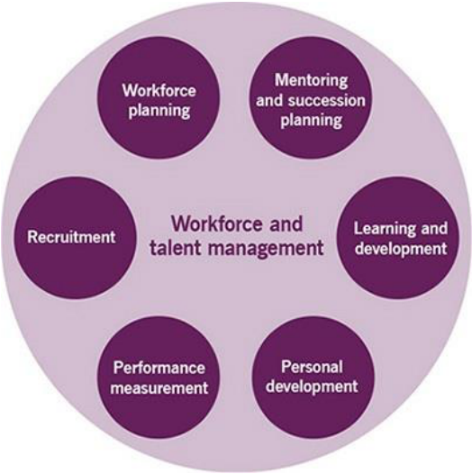

##### **Pontos-Chave:** 

- Propósito: pessoas certas, competências adequadas, funções corretas. 

- Cobre o ciclo completo: planejamento, recrutamento, treinamento, avaliação, sucessão. 

- É a dimensão "pessoas" da ITIL. 

**(CEBRASPE - 2024 - Técnico Ministerial (MPE TO)/Especializado/Técnico em informática)** A respeito do ITIL v4, julgue o item seguinte. 

<mark>O gerenciamento do talento e da força de trabalho constitui prática de gerenciamento técnico.</mark> 

**<mark>Comentários:</mark>** 

<mark>Errado. No ITIL v4, o gerenciamento do talento e da força de trabalho é classificado como prática de</mark> gerenciamento geral, não técnico. 

#### **Gerenciamento de Arquitetura** 

O propósito da prática de gerenciamento de arquitetura é **fornecer uma compreensão de todos os elementos que compõem a organização e de como eles se inter-relacionam** , permitindo o alcance eficaz dos objetivos atuais e futuros. Fornece princípios, padrões e ferramentas para gerenciar mudanças complexas de forma estruturada e ágil. 

Pessoal, essa prática é sobre enxergar a organização como um todo e entender como as peças se encaixam. ITIL define cinco tipos de arquitetura: **Arquitetura de Negócio** , **Arquitetura de Serviços** , **Arquitetura de**

---

<!-- pagina: 31 -->

**Paolla Ramos Aula 01** 

**Sistemas de Informação** , **Arquitetura de Tecnologia** e **Arquitetura de Ambiente** . Cada uma olha para uma camada diferente da organização. 

Para memorizar os cinco tipos, pensem na sigla **N-S-SI-T-A** : **Negócio** , **Serviços** , **Sistemas de Informação** , **Tecnologia** , **Ambiente** . 

A tabela abaixo resume os tipos de arquitetura: 

|**Tipo**|**Descrição**|
|---|---|
|**Negócio**|• Estratégias e visão (onde a organização quer chegar)|
|**Serviço**|• Lista de todos os serviços que a organização oferece|
|**Sistemas de Informação e Dados**|• Mostra como recursos de informação e dados são gerenciados|
|**Tecnologia**|• Infraestrutura de Hardware e software|
|**Ambiente**|• Fatores externos que impactam a organização|

##### **Pontos-Chave:** 

- Propósito: entender todos os elementos da organização e seus inter-relacionamentos. 

- 5 tipos de arquitetura: Negócio, Serviços, Sistemas de Informação, Tecnologia, Ambiente (N-S-SI-T-A). 

- Gravem os 5 tipos. Costumam aparecer em questões de associação. 

**(FCC - 2024 - Analista Governamental (SEAD PI)/Tecnologia da Informação) A gestão de arquitetura como prática da ITIL v.4** 

- <mark>a) visa construir, testar e fornecer os serviços novos e alterados que preenchem os requisitos acordados</mark> 

- <mark>ao atingir os objetivos pretendidos. Garante a satisfação de todas as partes interessadas da organização.</mark> 

<mark>b) auxilia na gestão de recursos como armazenamento, redes, servidores, software, hardware e itens de configuração usados pelos clientes. Também inclui os edifícios e instalações que a organização usa para executar sua infraestrutura de TI.</mark> 

- <mark>c) garante que a organização tenha a combinação certa de produtos, serviços e processos para atingir</mark> 

- <mark>seus objetivos empresariais, com o investimento disponível e as limitações de recursos.</mark> 

- <mark>d) oferece uma compreensão de como os diferentes elementos de uma organização estão inter-</mark> 

- <mark>relacionados e trabalham para atingir os objetivos empresariais. É fundamental nas atividades de planejamento, melhoramento, desenho e transição da cadeia de valor.</mark>

---

<!-- pagina: 32 -->

**Paolla Ramos Aula 01** 

<mark>e) garante que os melhores níveis possíveis de qualidade e disponibilidade de serviço sejam mantidos em todos os momentos. Visa restaurar o funcionamento normal do serviço, o mais rápido possível, além de minimizar o impacto adverso causa do por incidentes nas operações empresariais.</mark> 

**<mark>Comentários:</mark>** 

<mark>(a) Errado. Descreve a prática de Projeto de Serviço, focada em construir e entregar serviços novos ou alterados, não em arquitetura; (b) Errado. Refere-se à prática de Gestão de Infraestrutura e Plataforma, que cuida de recursos físicos e lógicos de TI; (c) Errado. Aproxima-se da prática de Gestão de Portfólio, que equilibra produtos, serviços e investimentos para atingir objetivos;</mark> **<mark>(d) Correto</mark>** <mark>. A Gestão de Arquitetura oferece visão integrada dos elementos organizacionais e suas inter-relações, sendo essencial no planejamento, melhoria, desenho e transição da cadeia de valor de serviços; (e) Errado. Descreve a prática</mark> de Gestão de Incidentes, voltada à restauração rápida dos serviços e minimização de impactos operacionais. 

#### **Gerenciamento de Segurança da Informação** 

O propósito da prática de gerenciamento de segurança da informação é proteger as informações necessárias para a condução dos negócios, incluindo a gestão de riscos relacionados à **confidencialidade** , **integridade** e **disponibilidade** , além de aspectos como **autenticação** e **não repúdio** . 

Segurança da informação é um tema que só cresce em importância, e a ITIL trata dele com bastante objetividade. O ponto de partida é a famosa tríade **CID** : **Confidencialidade** , **Integridade** e **Disponibilidade** . Mas ITIL vai além e inclui **autenticação** e **não repúdio** . 

A segurança é alcançada por meio de **políticas** , **processos** , **comportamentos** , **gestão de riscos** e **controles** . E aqui entra um conceito muito cobrado: o equilíbrio entre três pilares. **Prevenção** , que é garantir que o incidente de segurança não ocorra. **Detecção** , que é identificar incidentes que não foram prevenidos. E **Correção** , que é recuperar-se após a ocorrência. Nenhuma organização consegue ser 100% preventiva, então precisa investir nos três pilares de forma equilibrada. 

##### **Pontos-Chave:** 

- Propósito: proteger informações, gerenciar riscos de CID (Confidencialidade, Integridade, Disponibilidade) + autenticação e não repúdio. 

- 3 pilares de equilíbrio: Prevenção, Detecção, Correção (P-D-C). 

- segurança não é só prevenção. É o equilíbrio entre prevenir, detectar e corrigir. 

**(CEBRASPE - 2024 - Analista de Planejamento e Orçamento (MPO)/Tecnologia da Informação/Governança e Gestão de Projetos de TI)** Acerca dos conceitos básicos sobre o ITIL, julgue o seguinte item. 

<mark>No ITIL, a proteção dos aspectos essenciais de segurança da informação, confidencialidade, integridade e disponibilidade ocorre no âmbito do processo de gerenciamento de acesso.</mark> 

**<mark>Comentários:</mark>**

---

<!-- pagina: 33 -->

**Paolla Ramos Aula 01** 

<mark>Errado. No ITIL, a proteção da confidencialidade, integridade e disponibilidade é responsabilidade do Gerenciamento de Segurança da Informação, não do Gerenciamento de Acesso, que trata apenas do controle</mark> de direitos de uso dos serviços. 

#### **Medição e Relatórios** 

O propósito da prática de medição e relatórios é **apoiar a tomada de decisão e a melhoria contínua, reduzindo a incerteza por meio da coleta e análise contextualizada de dados relevantes sobre serviços, práticas, pessoas, fornecedores e a organização** . 

Essa prática é sobre ter dados concretos para tomar decisões. Sem medir, você está no escuro. Os dados podem vir de vários lugares: produtos, serviços, práticas, equipes, indivíduos, parceiros, fornecedores. 

Dois conceitos importantes aqui. O primeiro é o **Fator Crítico de Sucesso (CSF)** . Isso é uma precondição necessária para atingir os resultados esperados. O segundo é o **KPI** , **Indicador Chave de Desempenho** . É uma métrica importante para avaliar a probabilidade de se atingir esse resultado. Qual a diferença prática? O CSF é "o que precisa acontecer". O KPI é "como a gente mede se está acontecendo". Por exemplo, se o CSF é "ter alta disponibilidade do serviço", o KPI pode ser "99,9% de uptime mensal". 

##### **Pontos-Chave:** 

- Propósito: apoiar tomada de decisão e melhoria contínua reduzindo incerteza. 

- CSF = precondição necessária para resultados (o que precisa acontecer). 

- KPI = métrica para avaliar probabilidade de atingir resultados (como medir). 

- CSF e KPI são diferentes. CSF é pré-requisito, KPI é métrica. 

#### **Melhoria Contínua** 

O propósito da prática de melhoria contínua é **alinhar práticas e serviços às necessidades do negócio por meio de melhorias constantes em produtos, serviços e demais elementos envolvidos** . 

Essa é uma das práticas mais transversais da ITIL, pois ela permeia tudo. Não importa se estamos falando de produtos, serviços, práticas ou qualquer outro elemento do gerenciamento de serviços: sempre dá para melhorar. 

As atividades típicas incluem identificar oportunidades de melhoria, fazer um plano para implementação, medir e avaliar os resultados, e coordenar atividades de melhoria na organização. Percebam que é um ciclo: identificar, planejar, executar, medir. 

##### **Pontos-Chave:** 

- Propósito: alinhar práticas e serviços às necessidades do negócio em constante mudança. 

- Ciclo: identificar oportunidades, planejar, medir resultados, coordenar. 

- Abrange TUDO (produtos, serviços, práticas, qualquer elemento). É contínua, não pontual.

---

<!-- pagina: 34 -->

**Paolla Ramos Aula 01** 

**(CEBRASPE - 2024 - Analista de Sistemas (CAGEPA)/Suporte de TI) O sistema de valor de serviço (SVS) do** **<mark>ITIL v4 descreve como todos os componentes e as atividades da organização trabalham juntos como um sistema para possibilitar a geração de valor. Entre os componentes inclusos no SVS, aquele cuja atividade recorrente é executada em todos os níveis para garantir que o desempenho da organização atenda às</mark> expectativas das partes interessadas é denominado** 

<mark>a) cadeia de valor de serviços.</mark> 

<mark>b) práticas. c) governança.</mark> 

<mark>d) princípios orientadores.</mark> 

<mark>e) melhoria contínua.</mark> 

**<mark>Comentários:</mark>** 

<mark>(a) Errado. A cadeia de valor de serviços é o conjunto de atividades interconectadas para criar valor, não o componente focado em garantir desempenho contínuo; (b) Errado. As práticas são conjuntos de recursos organizacionais para realizar trabalho, sem foco específico em monitorar desempenho em todos os níveis; (c) Errado. A governança direciona e controla a organização, mas não é o componente recorrente voltado ao acompanhamento contínuo de desempenho; (d) Errado. Os princípios orientadores guiam decisões e ações, mas não representam a atividade recorrente de verificação de desempenho organizacional;</mark> **<mark>(e) Correto</mark>** <mark>. A melhoria contínua é executada em todos os níveis da organização de forma recorrente, garantindo que o</mark> desempenho atenda às expectativas das partes interessadas. 

## Práticas de Gerenciamento de Servi os <u>ç</u> 

#### **Análise de Negócio** 

O propósito da prática de análise de negócio é **analisar o negócio, identificar necessidades e recomendar soluções** que gerem valor para as partes interessadas. 

Essa prática é a ponte entre o que o negócio precisa e o que a TI pode entregar. Ela permite comunicar necessidades (requisitos) de maneira compreensível, expressar razões para mudanças e descrever soluções que permitem a criação de valor. 

**Requisitos de Utilidade** são tipicamente funcionais, definidos pelo cliente, e únicos para um determinado produto. É o "o que o serviço faz". 

**Requisitos de Garantia** são tipicamente não funcionais e geralmente atrelados a **critérios de aceitação** . É o "como o serviço funciona bem". 

Por exemplo, se você pede um sistema de vendas (utilidade), espera que ele funcione 99% do tempo e aguente 500 usuários simultâneos (garantia). Um define a funcionalidade, o outro define a qualidade.

---

<!-- pagina: 35 -->

**Paolla Ramos Aula 01** 

##### **Pontos-Chave:** 

- Propósito: analisar necessidades de negócio e recomendar soluções que criem valor. 

- Requisitos de Utilidade = funcionais, definidos pelo cliente ("o que faz"). 

- Requisitos de Garantia = não funcionais, critérios de aceitação ("como funciona bem"). 

- Utilidade e Garantia são complementares. Serviço bom precisa dos dois. 

**(FGV - 2024 - Analista de Gestão Corporativa (EPE)/Tecnologia da Informação/Infraestrutura e Segurança)** **<mark>O ITIL V4 introduziu um conjunto de práticas de gerenciamento de serviços que substituiu os processos do</mark> ITIL V3, proporcionando uma abordagem mais holística e flexível para a gestão de serviços.** 

**<mark>Tais práticas estão divididas em três categorias principais: Práticas de Gerenciamento Geral, Práticas de Gerenciamento de Serviço e Práticas de Gerenciamento Técnico.</mark>** 

**<mark>Assinale a opção que apresenta uma prática de gerenciamento de serviços.</mark>** 

<mark>a) Gestão de estratégia.</mark> 

<mark>b) Medição e relatório.</mark> 

<mark>c) Gestão de riscos</mark> 

<mark>d) Gerenciamento de implantação.</mark> 

<mark>e) Análise do negócio.</mark> 

**<mark>Comentários:</mark>** 

<mark>(a) Errado. Gestão de estratégia é classificada como prática de Gerenciamento Geral no ITIL V4; (b) Errado. Medição e relatório também pertence às práticas de Gerenciamento Geral; (c) Errado. Gestão de riscos integra as práticas de Gerenciamento Geral, não de serviço; (d) Errado. Gerenciamento de implantação é uma prática de Gerenciamento Técnico;</mark> **<mark>(e) Correto</mark>** <mark>. Análise do negócio é classificada como prática de</mark> Gerenciamento de Serviço no ITIL V4. 

#### **Projeto de Serviço** 

O propósito da prática de projeto de serviço é **projetar produtos e serviços adequados à finalidade e ao uso** , considerando pessoas, parceiros, tecnologia e a interação com clientes. 

Essa prática cuida de planejar como o serviço vai funcionar antes de ele existir. E o planejamento inclui pessoas, parceiros e fornecedores, informação, comunicação e tecnologias. 

Um detalhe que vale destacar é que ITIL menciona o **Design Thinking** como uma das principais técnicas utilizadas no projeto de um novo serviço. Para quem não conhece, Design Thinking é uma abordagem centrada no usuário, que parte da empatia para entender o problema antes de sair projetando soluções. É a lógica de "primeiro entenda a dor, depois proponha o remédio".

---

<!-- pagina: 36 -->

**Paolla Ramos Aula 01** 

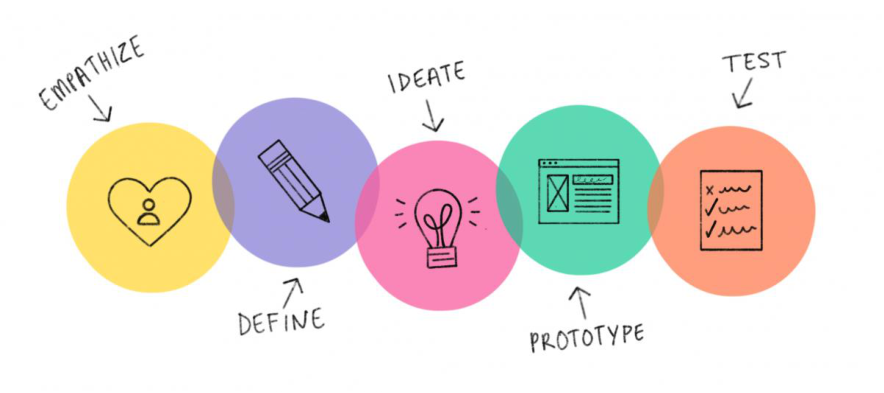

##### **Pontos-Chave:** 

- Propósito: projetar serviços adequados ao propósito e ao uso. 

- Planejamento abrange: pessoas, parceiros, informação, comunicação, tecnologias. 

- Design Thinking é técnica destacada pela ITIL para projeto de serviço. 

**(CEBRASPE - 2024 - Analista (APEX)/Operações e Segurança de Tecnologia da Informação e** **<mark>Comunicação/Infraestrutura/Perfil 4) No ITIL 4, um pacote de design de serviço, afeto à prática de design</mark> de serviço,** 

<mark>a) define um conjunto de atividades inter-relacionadas que transformam entradas em saídas, de acordo com o desenho e requisito do serviço.</mark> 

<mark>b) define todos os aspectos de um serviço de TI e seus requisitos em cada estágio de seu ciclo de vida.</mark> 

<mark>c) é a soma das interações funcionais e emocionais com um serviço e provedor de serviços conforme percebido por um usuário.</mark> 

<mark>d) é usado por designers de produtos e serviços para resolver problemas complexos e encontrar soluções práticas que atendam às necessidades da organização.</mark> 

**<mark>Comentários:</mark>** 

<mark>(a) Errado. Essa definição descreve um processo, não um pacote de design de serviço — trata de transformação de entradas em saídas, o que é característico de fluxos de trabalho;</mark> **<mark>(b) Correto</mark>** <mark>. O pacote de design de serviço documenta todos os aspectos de um serviço de TI e seus requisitos ao longo de cada estágio do ciclo de vida, servindo como referência completa para sua implementação; (c) Errado. Essa alternativa descreve a experiência do usuário (UX), que envolve percepções emocionais e funcionais — conceito distinto do pacote de design de serviço; (d) Errado. A descrição remete ao pensamento de design (design thinking),</mark> uma abordagem criativa para resolução de problemas, não ao pacote de design de serviço do ITIL 4.

---

<!-- pagina: 37 -->

**Paolla Ramos Aula 01** 

#### **Gerenciamento de Catálogo de Serviço** 

O propósito da prática de gerenciamento de catálogo de serviço é **fornecer uma fonte única de informações consistentes sobre todos os serviços e suas ofertas** . 

Pensem no catálogo de serviço como o cardápio de um restaurante. O cliente abre e vê o que está disponível para consumo. A lista de serviços do catálogo representa aqueles que estão disponíveis aos clientes, e esse é um ponto crucial: o catálogo é um **subconjunto** do **portfólio de serviços** . O portfólio tem tudo, inclusive serviços em desenvolvimento e aposentados. O catálogo tem só o que está no ar, pronto para uso. 

A forma do catálogo pode variar, podendo ser documento, portal, ferramenta dedicada etc. Ele deve ser flexível quanto aos detalhes e atributos que apresenta, de acordo com cada público. O gerente de TI vê uma coisa, o usuário final vê outra. São visões personalizadas do mesmo catálogo. 

Essas são possíveis visões personalizadas do catálogo: 

|**Visão**|**Descrição**|
|---|---|
|**Usuário**|• Serviços que podem ser requisitados diretamente pelo usuário|
|**Cliente**|• Níveis de serviço, parâmetros financeiros, desempenho de serviço|
|**TI para TI**|• Tecnologias, segurança da informação e detalhes técnicos|

##### **Pontos-Chave:** 

- Propósito: fonte única e consistente de informação sobre serviços disponíveis. 

- Catálogo = subconjunto do Portfólio (só serviços disponíveis ao cliente). 

- Pode ter diferentes formatos e visões personalizadas por público. 

- Catálogo (disponíveis) diferente de Portfólio (todos). Cai bastante. 

**(FGV - 2026 - Analista Judiciário (TJ RJ)/Tecnologia da Informação/Analista de Gestão de TIC) Durante a** **<mark>inclusão de um novo serviço de tecnologia da informação (TI) no catálogo de serviços de uma organização, verificou se a necessidade de realizar o saneamento das informações existentes, de modo a mantê-las</mark> consistentes e íntegras para os usuários da área de negócios.** 

**<mark>São informações essenciais para a área de negócios no catálogo de serviços:</mark>** 

<mark>a) serviços experimentais;</mark> 

<mark>b) serviços em desenvolvimento;</mark> 

<mark>c) atividades operacionais internas;</mark> 

<mark>d) processos de solicitação do serviço;</mark>

---

<!-- pagina: 38 -->

**Paolla Ramos Aula 01** 

<mark>e) informações técnicas detalhadas de infraestrutura.</mark> 

**<mark>Comentários:</mark>** 

<mark>(a) Errado. Serviços experimentais não fazem parte do catálogo oficial voltado ao negócio, pois ainda não estão validados para uso; (b) Errado. Serviços em desenvolvimento ainda não estão disponíveis, portanto não integram o catálogo ativo para a área de negócios; (c) Errado. Atividades operacionais internas são de interesse da TI, não informações essenciais para os usuários de negócio;</mark> **<mark>(d) Correto</mark>** <mark>. Os processos de solicitação do serviço são exatamente o que a área de negócios precisa saber: como acionar, solicitar e utilizar os serviços disponíveis; (e) Errado. Detalhes técnicos de infraestrutura são relevantes para a TI, mas não para</mark> os usuários de negócio, que precisam de informações funcionais. 

#### **Gerenciamento de Nível de Serviço** 

O propósito da prática de gerenciamento de nível de serviço é **definir metas claras baseadas no negócio e garantir que os serviços sejam monitorados e gerenciados conforme essas metas.** 

Aqui estamos falando de expectativa versus realidade. O **Nível de Serviço** é uma métrica que define a qualidade de serviço esperada. E o **SLA** , **Acordo de Nível de Serviço** , é o documento que formaliza isso entre o provedor e o cliente. É o contrato que diz "vou te entregar isso com essa qualidade". 

**_Saiba Mais:_** _No gerenciamento de nível de serviço moderno, utiliza-se a tríade: SLI (indicador técnico, como tempo de resposta em milissegundos), SLO (meta interna desejada, como 95% das requisições dentro do tempo) e SLA (acordo formal com consequências financeiras ou contratuais caso o SLO não seja atingido). O SLI mede o que acontece, o SLO define o que queremos, e o SLA define o que prometemos formalmente._ 

Mas como saber se o SLA está sendo cumprido? A ITIL sugere quatro tipos de métricas de acompanhamento. **Engajamento de Clientes** , como tempo de uso e taxa de retorno. **Satisfação de Clientes** , que é a percepção direta de quem usa. **Métricas Operacionais** , como disponibilidade, tempo para resolver incidentes e tempo de processamento. E **Métricas de Negócio** , que medem o quão efetivo o serviço está sendo para o negócio como um todo. Percebam que não basta medir só o técnico. ITIL quer que você meça a experiência completa. 

**_Saiba Mais:_** _O SLA é o acordo externo com o cliente. Para garanti-lo, o provedor precisa de acordos internos entre seus departamentos, chamados de OLA (Acordo de Nível Operacional). Se o SLA promete resolver um erro em 4 horas, o OLA entre a TI e o Banco de Dados pode prever que o BD responda em 1 hora, servindo de base para o cumprimento da promessa final ao cliente._ 

##### **Pontos-Chave:** 

- Propósito: definir metas de negócio para níveis de serviço e garantir que sejam monitoradas. 

- Nível de Serviço = métrica de qualidade esperada. SLA = acordo documentado. 

- 4 tipos de métricas: Engajamento, Satisfação, Operacionais, de Negócio. 

- SLA não é só métrica técnica. Inclui visão de negócio e experiência do cliente.

---

<!-- pagina: 39 -->

**Paolla Ramos Aula 01** 

**(FGV - 2025 - Auditor de Controle Externo (TCE RR)/Tecnologia da Informação/Análise de Dados) Considere** **<mark>uma instituição de grande porte que recentemente implementou uma plataforma de atendimento ao</mark> cliente para suportar operações em múltiplos canais (e-mail, telefone, chat e redes sociais).** 

**<mark>Durante a implantação, foram observadas inconsistências nos processos de suporte entre as diferentes equipes, resultando em respostas lentas e falta de padronização no atendimento ao cliente. Agora, a instituição quer padronizar esses processos e melhorar o tempo de resposta.</mark>** 

**<mark>Nesse cenário, a prática do ITIL 4 mais adequada para identificar os gargalos e alinhar as práticas entre as equipes para melhorar a eficiência é o</mark>** 

<mark>a) Gerenciamento de Incidentes, pois ele foca na resolução rápida de interrupções, garantindo a restauração do serviço o mais rápido possível e alinhando os processos de suporte para minimizar os tempos de inatividade.</mark> 

<mark>b) Gerenciamento de Problemas, já que ele ajuda a investigar e eliminar a causa raiz dos problemas, o que permitiria identificar e corrigir as inconsistências entre as diferentes equipes de atendimento.</mark> 

<mark>c) Gerenciamento de Nível de Serviço (SLM), pois ele define os acordos de nível de serviço (SLAs) para todas as equipes, assegurando que cada canal de atendimento atenda aos padrões e ao tempo de resposta esperados pelos clientes.</mark> 

<mark>d) Gerenciamento da Cadeia de Valor e Melhoria Contínua, uma vez que ela permite identificar gargalos nos fluxos de valor e implementar ajustes necessários para padronizar o atendimento e aumentar a eficiência entre as equipes.</mark> 

<mark>e) Gerenciamento de Relacionamento, pois ele se concentra em gerenciar as expectativas dos clientes e garantir que as diferentes equipes de suporte compreendam claramente as necessidades dos clientes e estejam alinhadas para oferecer um atendimento uniforme.</mark> 

**<mark>Comentários:</mark>** 

<mark>(a) Errado. O Gerenciamento de Incidentes foca na restauração rápida de serviços interrompidos, não na padronização de processos entre equipes ou na identificação de gargalos operacionais; (b) Errado. O Gerenciamento de Problemas investiga causas raiz de falhas recorrentes, mas não é a prática mais adequada para alinhar padrões de atendimento entre múltiplos canais;</mark> **<mark>(c) Correto</mark>** <mark>. O SLM define SLAs claros para cada canal de atendimento, garantindo que todas as equipes operem com os mesmos padrões de tempo de resposta e qualidade esperados pelos clientes; (d) Errado. Embora útil para identificar gargalos, essa abordagem não é a prática primária do ITIL 4 para padronizar níveis de serviço entre equipes de atendimento multicanal; (e) Errado. O Gerenciamento de Relacionamento cuida das expectativas dos clientes, mas não</mark> estabelece os parâmetros operacionais necessários para padronizar o atendimento entre equipes. 

#### **Gerenciamento de Capacidade e Desempenho** 

O propósito da prática de capacidade e desempenho é **garantir que os serviços atendam à demanda atual e futura com desempenho adequado e custo eficiente** .

---

<!-- pagina: 40 -->

**Paolla Ramos Aula 01** 

Essa prática é sobre garantir que o serviço aguenta o tranco. Tanto hoje quanto amanhã. Se a demanda cresce e a capacidade não acompanha, o serviço degrada. Se a capacidade é excessiva, está jogando dinheiro fora. 

A definição de desempenho aqui é ampla: é uma medida do que é alcançado ou entregue por um **sistema** , **pessoa** , **equipe** , **prática** ou **serviço** . Ou seja, envolve qualquer elemento que entrega resultado. 

##### **Pontos-Chave:** 

- Propósito: serviços atendem demanda atual e futura com desempenho adequado e custo eficiente. 

- Desempenho = medida do que é alcançado por sistema, pessoa, equipe, prática ou serviço. 

- Capacidade olha para o FUTURO, não só para o presente. 

Veja as atividades do Gerenciamento de Capacidade: 

|**Atividade**|**Descrição**|
|---|---|
|**Análise** **da** **Capacidade** **e** **Desempenho do Serviço**|• Pesquisa e monitoramento sobre a capacidade atual • Modelagem da capacidade e desempenho|
|**Planejamento da Capacidade e** **Desempenho do Serviço**|• Análise de requisitos da capacidade • Planejamento de recursos e previsão de demanda • Planejamento da melhoria de desempenho|

**(CEBRASPE - 2024 - Tecnologista Júnior (CTI)/Inovação e Gestão de Infraestrutura de** **<mark>P&D/Desenvolvimento Tecnológico voltado à Infraestrutura de Tecnologia da Informação e Comunicação)</mark>** Com relação à biblioteca ITIL julgue o item a seguir. 

<mark>O gerenciamento da capacidade garante que a provisão das capacidades de processamento e de armazenamento da TI acompanhe as crescentes demandas do negócio de forma efetiva e no prazo adequado.</mark> 

**<mark>Comentários:</mark>** 

<mark>Correto. O gerenciamento de capacidade no ITIL assegura que os recursos de TI — processamento e armazenamento — estejam disponíveis no momento certo, acompanhando as demandas do negócio de</mark> forma eficiente e oportuna.

---

<!-- pagina: 41 -->

**Paolla Ramos Aula 01** 

#### **Gerenciamento de Disponibilidade** 

O propósito da prática de gerenciamento de disponibilidade é **garantir que os serviços entreguem os níveis acordados de disponibilidade** . 

Pessoal, disponibilidade é a habilidade de um serviço de TI ou item de configuração de **desempenhar sua função quando requerido** . Gravem essa definição porque ela aparece nas provas exatamente assim. O ponto principal é o "quando requerido". Não adianta o serviço funcionar de madrugada se o usuário precisa dele durante o horário comercial e ele cai justamente nesse período. 

Veja duas métricas importantes desta prática: 

|**Métrica**|**Descrição**|
|---|---|
|**MTBF – Mean Time Between** **Failures**|• “Tempo médio entre falhas” • A frequência de falhas do serviço|
|**MTRS – Mean Time To Restore** **Service**|• “Tempo médio para restaurar o serviço” • O quão rápido o serviço se recupera após uma falha|

##### **Pontos-Chave:** 

- Propósito: garantir níveis acordados de disponibilidade. 

- Disponibilidade = habilidade de desempenhar sua função QUANDO REQUERIDO. 

- Foco no "quando requerido", não apenas "funcionando em algum momento". 

**(CEBRASPE - 2024 - Analista Judiciário (TSE)/Apoio Especializado/Tecnologia da Informação/"Unificado")** No que concerne ao gerenciamento de serviços conforme o ITIL v4, julgue o item a seguir. 

<mark>O objetivo da prática de gerenciamento de disponibilidade é garantir que os serviços entreguem os níveis acordados, sendo utilizada a métrica tempo médio entre falhas (MTBF) para mensurar a rapidez com que o serviço é restaurado após uma falha</mark> 

**<mark>Comentários:</mark>** 

<mark>Errado. O MTBF mede o tempo entre falhas (disponibilidade), não a velocidade de restauração. A métrica que mede a rapidez de recuperação após falha é o MTTR (Mean Time to Restore). A questão confundiu os</mark> conceitos.

---

<!-- pagina: 42 -->

**Paolla Ramos Aula 01** 

#### **Gerenciamento de Continuidade de Serviço** 

O propósito da prática de continuidade de serviço é **assegurar níveis adequados de disponibilidade e desempenho em situações de desastre, promovendo resiliência organizacional** . 

Aqui estamos falando de cenário de catástrofe. A definição de **desastre** na ITIL é: um evento súbito, não <u>planejado, que causa grande dano ou perda à organização e resulta na falha em prover funções críticas de negócio durante um período de tempo. Pense num incêndio no datacenter, numa enchente que alaga o</u> escritório, num ataque cibernético massivo. 

Agora, atenção a uma distinção clássica de prova. **Disponibilidade** cuida da operação normal do dia a dia. **Continuidade** cuida de situações de desastre. São práticas complementares, mas com escopos completamente diferentes. Se a questão falar em "operação normal", é Disponibilidade. Se falar em "desastre" ou "evento catastrófico", é Continuidade. 

Veja algumas definições importantes do Gerenciamento de Continuidade: 

|**Termo**|**Definição**|
|---|---|
|**Recovery time objective (RTO)**|• O tempo máximo em que um serviço deve ser recuperado|
|**Recovery point objective (RPO)**|• O ponto até o qual as informações devem ser recuperadas|
|**Plano de recuperação de desastre**|• Detalha como uma organização vai se recuperar de um desastre e retornar às condições normais|
|**Análise de Impacto no Negócio**|• Identifica as Funções Vitais de Negócio e suas dependências|

##### **Pontos-Chave:** 

- Propósito: manter disponibilidade e desempenho em caso de DESASTRE. 

- Desastre = evento súbito, não planejado, que causa falha em funções críticas. 

- Disponibilidade = dia a dia. Continuidade = desastre. Não confunda. 

**(FCC - 2025 - Analista (Pref SP)/Planejamento e Desenvolvimento Organizacional/Tecnologia da** **<mark>Informação e Comunicação) Uma Analista de uma Prefeitura Municipal constatou que o órgão necessitava assegurar a continuidade dos serviços durante e após um evento disruptivo e que isso deveria ser assegurado por meio da aplicação de práticas de Gerenciamento de Continuidade do Serviço (Service</mark> Continuity Management) do ITIL V4, cuja relação com os SLAs estabelecidos são:**

---

<!-- pagina: 43 -->

**Paolla Ramos Aula 01** 

<mark>a) definir e implementar SLAs em situações de contingência, como tempos de recuperação após falhas e níveis mínimos de serviço; e planejar estratégias para manter os compromissos estabelecidos nos SLAs mesmo em situações adversas.</mark> 

<mark>b) monitorar os níveis de desempenho estabelecidos nos SLAs, como tempo de resposta máximo para transações ou acessos a sistemas; e prever demandas futuras e ajustar recursos para cumprir os SLAs acordados.</mark> 

<mark>c) monitorar e revisar o desempenho do serviço em relação aos SLAs acordados; manter um catálogo de serviços atualizado, incluindo as definições de SLAs; e estabelecer SLAs claros, mensuráveis e alinhados às necessidades de negócio.</mark> 

<mark>d) garantir que os tempos de resposta e resolução definidos nos SLAs sejam cumpridos; e priorizar incidentes com base nos acordos estabelecidos com o cliente, como tempo de resolução crítica versus não crítica.</mark> 

<mark>e) monitorar e garantir que os serviços estejam disponíveis conforme definido nos SLAs, como uma disponibilidade de 99,9% durante horário comercial; e realizar análises para identificar áreas de melhoria relacionadas à disponibilidade.</mark> 

**<mark>Comentários:</mark>** 

**(a) Correto** . O Gerenciamento de Continuidade do Serviço foca em manter e recuperar serviços em situações <mark>adversas, definindo SLAs de contingência com tempos de recuperação e níveis mínimos aceitáveis de serviço; (b) Errado. Monitorar desempenho e prever demandas são atribuições do Gerenciamento de Capacidade e Desempenho, não da Continuidade do Serviço; (c) Errado. Monitorar SLAs, manter catálogo e alinhar acordos às necessidades do negócio são responsabilidades do Gerenciamento de Nível de Serviço; (d) Errado. Garantir tempos de resposta e priorizar incidentes conforme SLAs é papel do Gerenciamento de Incidentes, não da Continuidade; (e) Errado. Monitorar disponibilidade conforme SLAs e identificar melhorias são atribuições</mark> do Gerenciamento de Disponibilidade. 

#### **Controle de Mudanças** 

O propósito da prática de controle de mudanças é **maximizar mudanças bem-sucedidas por meio da avaliação de riscos, autorização e gestão do cronograma de mudanças** . 

Toda vez que alguém quer mexer em algo que pode afetar um serviço, essa prática entra em cena. A definição de mudança é: **adição, modificação ou remoção de qualquer coisa que possa ter efeito direto ou indireto em um serviço** . Ou seja, não precisa ser uma mudança grande. Se tem potencial de impacto, precisa ser controlada através de gerenciamento de mudança. 

O controle se dá por três atividades: **avaliação de riscos, autorização de mudanças e agendamento de mudanças** . Percebam que o objetivo não é impedir mudanças, mas sim maximizar o número de mudanças de sucesso. 

Lembrem-se: essa prática foca em **serviços e infraestrutura de TI** . Quem foca em pessoas é a **Mudança Organizacional** . 

Existem basicamente três tipos de mudança:

---

<!-- pagina: 44 -->

**Paolla Ramos Aula 01** 

|**Tipo**|**Descrição**|
|---|---|
|**Mudança Padrão**|• Mudança de baixo risco e pré-autorizadas|
|**Mudança Normal**|• Mudança que precisa ser agendada, avaliada e autorizada de acordo com um processo formal • O nível de autorização varia de acordo com o risco da mudança|
|**Mudança Emergencial**|• Mudança que precisa ser implementada o mais rápido possível • Algumas etapas podem ser ignoradas|

##### **Pontos-Chave:** 

- Propósito: maximizar mudanças bem-sucedidas via avaliação de risco, autorização e agendamento. 

- Mudança = adição, modificação ou remoção com efeito direto ou indireto em serviço. 

- 3 atividades: avaliação de riscos, autorização, agendamento. 

- objetivo é MAXIMIZAR sucesso, não IMPEDIR mudanças. Foco em TI, não em pessoas. 

**(FGV - 2026 - Analista Judiciário (TJ RJ)/Tecnologia da Informação/Analista de Gestão de TIC) A consulta à** **<mark>matriz de compatibilidade de versões hardware e software, antes de uma atualização de versão de sistema operacional, é essencial para garantir a manutenção da disponibilidade dos serviços, do desempenho e da garantia de suporte do fabricante, e a utilização de versões homologadas é uma boa prática diretamente</mark> relacionada ao gerenciamento de:** 

<mark>a) riscos; b) mudanças; c) requisições; d) incidentes; e) configuração.</mark> 

**<mark>Comentários:</mark>** 

<mark>(a) Errado. Gerenciamento de riscos foca em identificar e mitigar ameaças, não em controlar versões homologadas de software e hardware;</mark> **<mark>(b) Correto</mark>** <mark>. Consultar matrizes de compatibilidade e usar versões homologadas são práticas do gerenciamento de mudanças, que avalia impactos antes de alterações no ambiente; (c) Errado. Gerenciamento de requisições trata de solicitações de serviço rotineiras, sem relação direta com controle de versões e compatibilidade; (d) Errado. Gerenciamento de incidentes atua na restauração de serviços após falhas, não na prevenção por meio de homologação de versões; (e) Errado. Gerenciamento de configuração registra e controla itens de configuração, mas a prática de homologação de</mark> versões pertence ao escopo de mudanças.

---

<!-- pagina: 45 -->

**Paolla Ramos Aula 01** 

#### **Gerenciamento de Ativos de TI** 

O propósito da prática de gerenciamento de ativos de TI é **gerenciar o ciclo de vida dos ativos para maximizar valor, controlar custos, gerenciar riscos e apoiar decisões** . 

Importante lembrar que **ativo de TI é qualquer componente que tem valor financeiro e pode contribuir para a entrega de um produto ou serviço** . Pode ser um servidor, um notebook, uma licença de software, qualquer coisa com valor financeiro intrínseco. 

É importante, também, que você saiba a diferença entre **Gerenciamento de Ativos** e **Gerenciamento de Configuração** . 

O gerenciamento de configuração lida com a **BDGC** , um banco de dados de **itens de configuração** que estão instalados, com atributos como tipo, dono, versão e status. Já o gerenciamento de ativos é mais amplo, porque cobre todo o ciclo de vida, desde a requisição até a aposentadoria, envolvendo valor financeiro, garantias e contratos. Todo item de configuração pode ser um ativo, mas nem todo ativo está na BDGC. A chave é: ativo tem **valor financeiro** . Item de configuração tem relação de dependência com o serviço. 

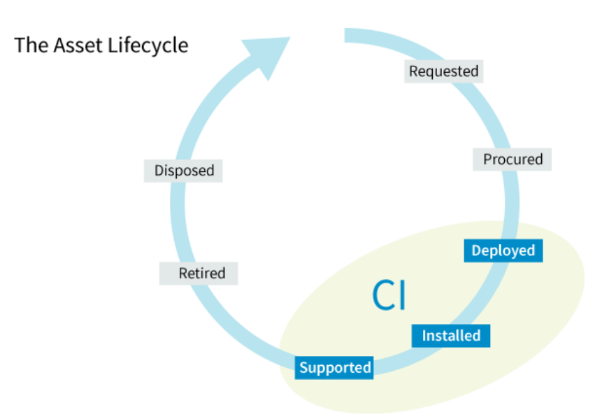

##### **Pontos-Chave:** 

- Propósito: gerenciar ciclo de vida dos ativos para maximizar valor e controlar custos. 

- Ativo de TI = componente com VALOR FINANCEIRO que contribui para entrega de serviço. 

- Ciclo completo: compra, reuso, manutenção, aposentadoria. 

- Ativos (ciclo de vida, valor financeiro) diferente de Configuração (BDGC, relacionamentos). Cai muito.

---

<!-- pagina: 46 -->

**Paolla Ramos Aula 01** 

#### **Gerenciamento de Configuração** 

O propósito da prática de gerenciamento de configuração é **garantir informações precisas e confiáveis sobre a configuração dos serviços e seus itens de configuração relacionados** . 

Essa prática é sobre saber exatamente o que você tem, como está configurado e como se relaciona com o resto. O **Item de Configuração (IC)** é qualquer componente que precise ser gerenciado para entregar um serviço de TI. E o **Sistema de Configuração** é o conjunto de ferramentas, dados e informação que suporta essa gestão. 

As atividades típicas formam um ciclo bem lógico: identificar itens de configuração, atualizar dados quando o item é implantado, verificar se os registros estão corretos e auditar aplicações e infraestrutura para encontrar itens não documentados. Essa última é fundamental: a **auditoria** existe para pegar aquele servidor que alguém instalou sem avisar ninguém, aquela aplicação que ninguém sabe quem colocou em produção. 

##### **Pontos-Chave:** 

- Propósito: garantir informações precisas e confiáveis sobre configuração de serviços e ICs. 

- IC = componente gerenciado para entregar serviço. Sistema de Configuração = ferramentas + dados de suporte. 

- 4 atividades: identificar, atualizar, verificar, auditar. 

- Auditoria busca itens NÃO DOCUMENTADOS. Configuração cuida de RELACIONAMENTOS entre ICs. 

**_Saiba Mais:_** _Um CMS/CMDB atualizado é vital para as fases de liberação, pois permite que a equipe mapeie todas as dependências técnicas antes de qualquer alteração. Ao entender como os componentes se conectam, o risco de "efeito dominó" é reduzido, garantindo que novas funcionalidades não quebrem serviços existentes, o que minimiza drasticamente as falhas logo após a entrada em produção._ 

#### **Gerenciamento de Liberações** 

O propósito da prática de gerenciamento de liberações é **disponibilizar serviços e funcionalidades novos ou modificados para uso** . 

**Liberação** é uma versão de um serviço ou item de configuração (ou vários itens) que foi disponibilizada para uso. Liberações podem ocorrer em diferentes contextos: no modelo Tradicional/Cascata ou no modelo Ágil/DevOps. 

Agora, atenção a uma distinção que cai demais: **Liberação** versus **Implantação** . 

**Liberação** é sobre disponibilizar funcionalidades para uso, o foco é no serviço e na funcionalidade. **Implantação** é sobre mover componentes para o ambiente, o foco é técnico e de infraestrutura. Uma empresa pode implantar código em produção ( **implantação** ) mas só liberar a funcionalidade para os usuários uma semana depois ( **liberação** ). São etapas diferentes. 

Veja as liberações em ambientes Cascata e Ágil. No ambiente Cascata, vai “tudo de uma vez”. Já no ambiente Ágil/Devops, os deploys são menores e mais incrementais.

---

<!-- pagina: 47 -->

**Paolla Ramos Aula 01** 

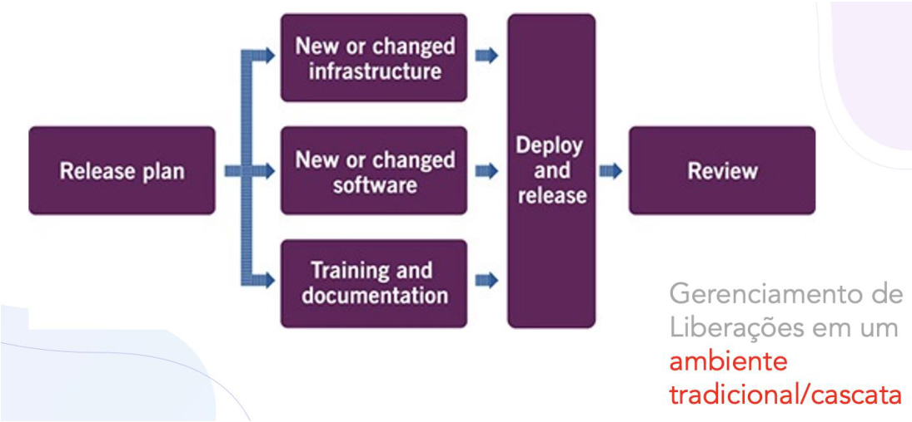

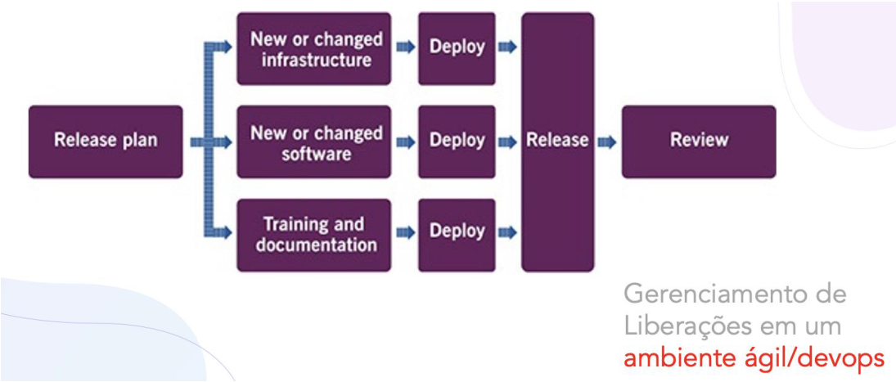

##### **Pontos-Chave:** 

- Propósito: disponibilizar para uso serviços e funcionalidades novos ou modificados. 

- Liberação = versão disponibilizada para uso. Pode ser em contexto Cascata ou Ágil/DevOps. 

- Liberação = DISPONIBILIZAR funcionalidade. Implantação = MOVER componentes. São diferentes. 

**(CEBRASPE - 2024 - Analista de Tecnologia da Informação (TCE AC)/Projetos de TI)** Considerando o modelo ITIL v4, julgue o item que se segue. 

<mark>A prática de disponibilizar para uso serviços novos ou alterados faz parte do processo de gerenciamento de liberação.</mark>

---

<!-- pagina: 48 -->

**Paolla Ramos Aula 01** 

**<mark>Comentários:</mark>** 

<mark>Correto. No ITIL v4, o gerenciamento de liberação é responsável por disponibilizar serviços novos ou alterados para uso em produção, garantindo que estejam prontos e acessíveis aos usuários conforme</mark> planejado. 

#### **Monitoramento e Gerenciamento de Eventos** 

O propósito da prática de monitoramento e gerenciamento de eventos é **observar serviços e componentes, registrar eventos e responder adequadamente a situações relevantes** . 

Evento, na linguagem da ITIL, é **qualquer mudança de estado que tem significado para um serviço** ou item de configuração. Não é só quando algo dá errado. Um disco atingindo 80% de capacidade é um evento. Um backup completado com sucesso é um evento. Um serviço ficando offline é um evento. Cada um com um tipo e uma severidade diferente. 

Esses eventos normalmente são reconhecidos por meio de notificações automáticas e ferramentas de monitoramento. A ideia é que a organização não fique esperando o usuário ligar para reclamar. Ela detecta o problema (ou a tendência de problema) antes que alguém sinta o impacto. 

Existem basicamente três tipos de eventos: 

|**Tipo**|**Descrição**|
|---|---|
|**Informação**|• Normalmente não precisam de uma ação imediata ao serem identificados • São úteis para análise de dados posterior|
|**Alerta**|• Permitem que uma ação seja tomada antes de um impacto negativo|
|**Exceção**|• Indicam uma brecha em alguma norma ou acordo de nível de serviço • Necessitam de ação imediata, mesmo que os impactos ainda não tenham ocorrido|

##### **Pontos-Chave:** 

- Propósito: observar serviços e componentes, registrar e responder a eventos. 

- Evento = qualquer mudança de estado com SIGNIFICADO para serviço ou IC. 

- Eventos podem ser positivos, negativos ou informativos. 

- Evento não é sinônimo de problema. É qualquer mudança de estado relevante.

---

<!-- pagina: 49 -->

**Paolla Ramos Aula 01** 

#### **Gerenciamento de Incidentes** 

O propósito da prática de gerenciamento de incidentes é **minimizar impactos negativos restaurando rapidamente a operação normal dos serviços** . 

**Incidente é uma interrupção não planejada ou redução na qualidade de um serviço** . A rede caiu? Incidente. O sistema está lento? Incidente. O e-mail parou de enviar? Incidente. Podem ter diferentes tipos, tais como incidente normal, incidente grave, incidente de segurança, entre outros. 

A ITIL define uma cadeia de resolução, do mais simples ao mais complexo. Primeiro, os próprios usuários usando autoajuda. Depois, a Central de Serviços no **primeiro nível** . Em seguida, os Especialistas de Suporte no **segundo e terceiro nível** . Depois, fornecedores e terceirizados. Em alguns casos, pode ser necessária uma **equipe mista** com vários representantes. E em casos extremos, pode ser necessário ativar o plano de recuperação de desastres. 

Agora, a distinção mais importante dessa área: **Incidente** foca no EFEITO (restaurar rápido). **Problema** foca na CAUSA (investigar a raiz). 

Lembre-se, também, que a priorização de um incidente deve levar em conta basicamente dois aspectos: **impacto e urgência** . 

##### **Pontos-Chave:** 

- Propósito: minimizar impacto restaurando a operação normal rapidamente. 

- Incidente = interrupção NÃO PLANEJADA ou redução na qualidade. 

- Cadeia de resolução: autoajuda, Central de Serviços (1o nível), Especialistas (2o/3o), Fornecedores, equipe mista, plano de desastres. 

- Incidente = EFEITO (restaurar). Problema = CAUSA (investigar). Sempre cai. 

**(FGV - 2026 - Analista Judiciário (TJ RJ)/Tecnologia da Informação/Analista de Gestão de TIC) Ao** **<mark>reorganizar a sua central de serviços de tecnologia da informação (TI), um órgão identificou os ativos e serviços que requerem monitoramento e definiu estratégias para restauração dos serviços em caso de</mark> incidentes.** 

**<mark>Para priorizar o gerenciamento dos incidentes, o órgão deve considerar:</mark>** 

<mark>a) a reincidência do incidente;</mark> 

<mark>b) o impacto e a urgência do incidente;</mark> 

<mark>c) o tempo médio para reparo do incidente;</mark> 

<mark>d) o modelo do incidente, contendo os prazos de tratamento e escalonamento;</mark> 

<mark>e) o registro do incidente pelo usuário, contendo o horário exato da ocorrência.</mark> 

**<mark>Comentários:</mark>** 

(a) Errado. A reincidência pode ser um dado relevante, mas não é o critério principal para priorizar o <mark>gerenciamento de incidentes;</mark> **<mark>(b) Correto</mark>** <mark>. Segundo as boas práticas de ITSM (como o ITIL), a prioridade de</mark>

---

<!-- pagina: 50 -->

**Paolla Ramos Aula 01** 

<mark>um incidente é definida pela combinação de impacto e urgência; (c) Errado. O tempo médio para reparo (MTTR) é uma métrica de desempenho, não um critério de priorização de incidentes; (d) Errado. O modelo de incidente orienta o tratamento, mas não é o fator que define a prioridade de atendimento; (e) Errado. O</mark> horário de registro é um dado de rastreabilidade, sem relação direta com a priorização do incidente 

#### **Gerenciamento de Problemas** 

O propósito da prática de gerenciamento de problemas é **reduzir a probabilidade e o impacto de incidentes, identificando causas e gerenciando erros conhecidos** . 

Pessoal, enquanto o gerenciamento de incidentes apaga o fogo, o gerenciamento de problemas investiga o que causou o fogo. Além disso, gerencia **soluções de contorno** (workarounds) e **erros conhecidos** . 

Erro conhecido é quando a causa raiz do problema já foi identificada, mas a correção definitiva ainda não foi ==5460== aplicada. Você sabe o que está errado, documentou uma solução temporária, e está trabalhando na correção permanente. Essa distinção entre problema (causa ainda desconhecida), erro conhecido (causa identificada, correção pendente) e incidente (o sintoma que o usuário sente) é o tripé que sustenta as questões de prova sobre esse tema. 

Importante notar que o Gerenciamento de Problemas tem 3 fases: identificação do problema, controle do problema e controle do erro. Veja na figura abaixo: 

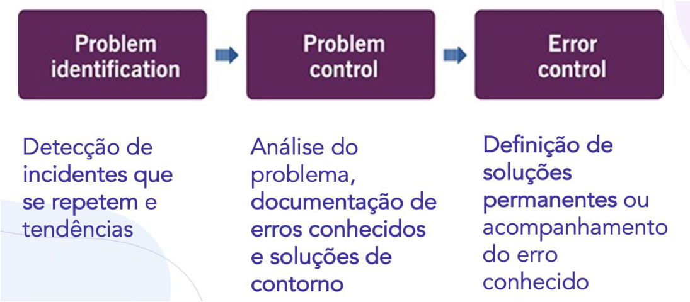

**_Saiba mais:_** _O fluxo operacional do gerenciamento de problemas é estruturado para garantir que nenhuma falha seja negligenciada. Ele inicia com a identificação (via tendências de incidentes ou análise proativa), segue para o registro e classificação (essencial para priorização), avança para a investigação e diagnóstico (onde se busca a causa raiz e define-se o workaround) e termina com a resolução e encerramento,_ _<u>garantindo que o erro seja removido e a base de conhecimento atualizada.</u>_ 

##### **Pontos-Chave:**

---

<!-- pagina: 51 -->

**Paolla Ramos Aula 01** 

- Propósito: reduzir probabilidade e impacto de incidentes identificando causas raiz. 

- Gerencia soluções de contorno e erros conhecidos. 

- Tripé: Incidente (sintoma), Problema (causa desconhecida), Erro Conhecido (causa identificada, sem correção definitiva). 

- Problema investiga a CAUSA. Incidente trata o EFEITO. Erro Conhecido = causa achada, correção pendente. 

**(FGV - 2026 - Analista Judiciário (TJ RJ)/Tecnologia da Informação/Analista de Gestão de TIC) Cristina, que** **<mark>trabalha como chefe de departamento de infraestrutura, tem recebido reclamações sobre diversos incidentes relacionados à lentidão do sistema de gestão. A equipe responsável realiza uma investigação e descobre que um estagiário estava executando consultas simultâneas no banco de dados, deixando-o</mark> sobrecarregado.** 

**<mark>Essa situação não foi identificada inicialmente, antes de o serviço entrar em operação, e se tornou um risco para os serviços ativos, o qual, segundo o ITIL 4 Foundation, deve ser abordado pelo gerenciamento de:</mark>** 

<mark>a) incidentes; b) ativo de TI; c) problemas; d) mudanças; e) capacidades.</mark> 

**<mark>Comentários:</mark>** 

<mark>(a) Errado. O gerenciamento de incidentes trata de restaurar o serviço rapidamente, não de investigar causas subjacentes como consultas mal planejadas; (b) Errado. O gerenciamento de ativos de TI foca no ciclo de vida dos ativos, não na análise de causas de degradação de desempenho;</mark> **<mark>(c) Correto</mark>** <mark>. O gerenciamento de problemas atua na identificação da causa raiz de incidentes recorrentes ou não identificados previamente, como as consultas simultâneas que sobrecarregaram o banco; (d) Errado. O gerenciamento de mudanças lida com alterações controladas no ambiente, não com a investigação de causas de incidentes; (e) Errado. O gerenciamento de capacidades planeja recursos futuros, mas não é o responsável por tratar riscos ativos</mark> oriundos de causas raiz identificadas. 

#### **Gerenciamento de Requisições de Serviço** 

O propósito da prática de gerenciamento de requisições de serviço é **atender solicitações dos usuários de forma eficiente e amigável** . 

Requisição de serviço é uma solicitação de um usuário, ou seu representante, que inicia uma ação considerada como **parte normal do serviço** . Não é algo que deu errado. É algo que o usuário precisa e que já está previsto no catálogo. 

Exemplos práticos que ajudam a fixar: gerar um relatório, trocar um cartucho de tinta, requisitar uma informação (como salvar um documento, por exemplo), requisitar um equipamento como fone ou computador, pedir acesso a um recurso como pasta ou diretório, e até feedback, reclamação ou elogios.

---

<!-- pagina: 52 -->

**Paolla Ramos Aula 01** 

A chave para prova é distinguir requisição de incidente. **Requisição** é algo NORMAL, previsto, pré-definido. **Incidente** é algo ANORMAL, não planejado. Se o usuário pede para instalar um software que está no catálogo, é requisição. Se o software parou de funcionar sozinho, é incidente. 

##### **Pontos-Chave:** 

- Propósito: atender solicitações dos usuários de forma eficiente e amigável. 

- Requisição = ação NORMAL, pré-definida, parte do serviço. 

- Exemplos: gerar relatório, trocar cartucho, pedir acesso, requisitar equipamento, feedback. 

- Requisição = previsto/normal. Incidente = não planejado/anormal. 

**(CEBRASPE - 2024 - Analista em Ciência e Tecnologia (CAPES)/Informática)** Com relação ao ITIL 4, julgue o item seguinte. 

<mark>Uma solicitação de usuário à central de serviços, por exemplo, é um processo que é tratado pela prática de gerenciamento de requisições de serviço do ITIL 4, que lida com todas as requisições de serviço, as quais são parte normal da prestação de serviço.</mark> 

**<mark>Comentários:</mark>** 

<mark>Correto. No ITIL 4, a prática de gerenciamento de requisições de serviço trata solicitações dos usuários à central de serviços. Essas requisições são parte normal da prestação de serviço, não sendo classificadas como</mark> incidentes ou problemas. 

#### **Central de Serviços (Service Desk)** 

O propósito da prática de central de serviços é **atuar como ponto único de contato entre usuários e o provedor de serviços, capturando demandas** . 

Central de Serviços é a porta de entrada do usuário. É o **ponto único de contato** para incidentes e requisições de serviço. Gravem essa expressão: " **ponto único de contato** ". Ela aparece em toda questão sobre Central de Serviços. 

Essa comunicação pode acontecer por diversos canais, tais como telefone, chat, e-mail, portal online, aplicações mobile, redes sociais e outros. A tendência atual é ser multicanal e cada vez mais automatizada, mas o conceito fundamental permanece, ou seja, um lugar só para o usuário recorrer quando precisa de algo.

---

<!-- pagina: 53 -->

**Paolla Ramos Aula 01** 

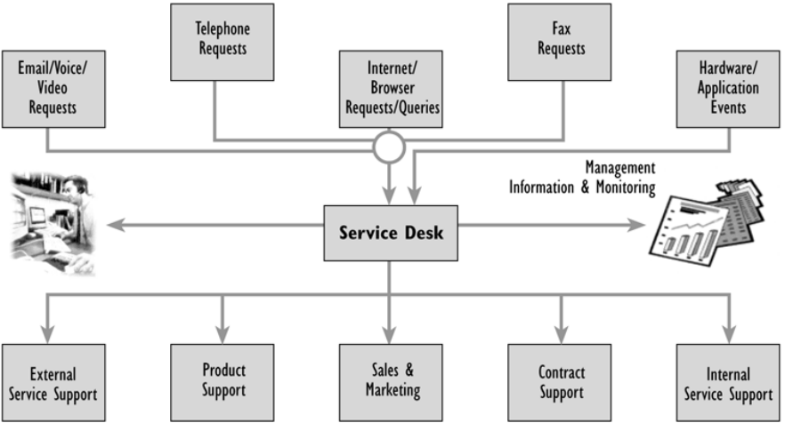

Na ITIL, o **escalonamento** na central de serviços é o mecanismo utilizado quando uma solicitação, incidente ou dúvida não pode ser resolvida no primeiro contato, exigindo o **envolvimento de outro nível de suporte ou de autoridade com maior capacidade técnica ou decisória** . Esse processo pode ocorrer de forma funcional, quando a demanda é encaminhada a especialistas mais capacitados para tratá-la, ou hierárquica, quando há necessidade de acionar níveis superiores de gestão em razão da gravidade, urgência ou impacto do caso. Em ambos os casos, o objetivo é assegurar que a requisição receba tratamento adequado dentro dos prazos acordados, evitando atrasos, reduzindo prejuízos ao negócio e mantendo o usuário informado sobre o andamento da solução. 

##### **Pontos-Chave:** 

- Propósito: PONTO ÚNICO de contato entre usuários e provedor de serviços. 

- Captura demandas de: incidentes e requisições de serviço. 

- Canais: telefone, chat, e-mail, portal, app mobile, redes sociais. 

- "ponto único de contato" é a expressão-chave. Sempre multicanal. 

**_Saiba Mais:_** _A Central de Serviços (Service Desk) tem forte atuação operacional e tática, engajando usuários e apoiando a entrega. No entanto, ela possui envolvimento nulo na atividade de Planejar da SVC, que é restrita ao nível estratégico da organização para definir diretrizes e políticas de longo prazo, onde o_ _<u>feedback do usuário ainda não é o insumo primário.</u>_ 

**(FGV - 2025 - Analista do Ministério Público da União/Tecnologia da Informação e Comunicação/Suporte** **<mark>e Infraestrutura) O analista Mário está utilizando a Biblioteca ITIL para melhorar a prestação de serviços</mark> de tecnologia da informação do MPU, começando pelo atendimento ao usuário.** 

**<mark>De acordo com a Biblioteca ITIL versão 4, para que haja um ponto de comunicação entre o provedor de serviço e todos os seus usuários, deve-se implementar um service:</mark>** 

<mark>a) desk; b) request;</mark>

---

<!-- pagina: 54 -->

**Paolla Ramos Aula 01** 

<mark>c) portfolio; d) value system (SVS); e) level agreement (SLA).</mark> 

**<mark>Comentários:</mark>** 

**<mark>(a) Correto</mark>** <mark>. O Service Desk é o ponto central de comunicação entre o provedor de serviços e os usuários, sendo responsável por registrar, tratar e escalar demandas; (b) Errado. Service Request refere-se a solicitações formais de serviço, não a um ponto de contato centralizado; (c) Errado. Service Portfolio é o conjunto de serviços gerenciados pelo provedor, não um canal de comunicação com usuários; (d) Errado. O SVS (Service Value System) representa o sistema de valor de serviços do ITIL 4, não um ponto de atendimento; (e) Errado. SLA (Service Level Agreement) é um acordo de nível de serviço, não um canal de comunicação</mark> com usuários. 

#### **Validação e Testes de Serviço** 

O propósito da prática de validação e testes de serviço **é garantir que serviços atendam aos requisitos definidos por meio de testes adequados** . 

Aqui temos dois conceitos que parecem iguais mas não são. **Validação de Serviço** foca em estabelecer critérios de aceitação, tanto de utilidade quanto de garantia, e refere-se às condições que devem ser realizadas em ambiente de produção. É a pergunta "isso está certo para o cliente?". **Teste de Serviço** é aplicado em ambientes, plataformas ou serviços como um todo, e pode ser de diversos tipos técnicos: teste de unidade, regressão, integração, sistema, entre outros. É a pergunta "isso funciona tecnicamente?". 

Uma coisa é validar que o serviço atende à necessidade do negócio. Outra é testar se ele não quebra sob **carga** . As duas são necessárias. 

##### **Pontos-Chave:** 

- Propósito: garantir que serviços novos ou modificados atendem aos requisitos. 

- Validação = critérios de aceitação (utilidade + garantia), foco no CLIENTE e ambiente de produção. 

- Teste = verificação técnica (unidade, regressão, integração, sistema), foco TÉCNICO. 

- Validação = "certo para o cliente?" Teste = "funciona tecnicamente?" 

## Práticas Técnicas 

#### **Desenvolvimento e Gerenciamento de Software** 

O propósito da prática de desenvolvimento e gerenciamento de software **é garantir que aplicações atendam às necessidades dos stakeholders em termos de funcionalidade, confiabilidade e conformidade** .

---

<!-- pagina: 55 -->

**Paolla Ramos Aula 01** 

Essa prática garante que as aplicações atendem às necessidades em cinco dimensões: funcionalidade, confiabilidade, manutenibilidade, conformidade e auditabilidade. Não basta funcionar. Precisa ser confiável, fácil de manter, estar em conformidade com regulações e ser auditável. 

As atividades típicas cobrem o ciclo completo de desenvolvimento: arquitetura de solução, modelagem, desenvolvimento, testes (unidade, integração, sistema), gerenciamento de repositórios de código, criação de pacotes de implantação e controle de versão. É o ciclo de vida do software de ponta a ponta. 

##### **Pontos-Chave:** 

- Propósito: aplicações que atendam necessidades de stakeholders. 

- 5 dimensões: Funcionalidade, Confiabilidade, Manutenibilidade, Conformidade, Auditabilidade. 

- Atividades: arquitetura, modelagem, desenvolvimento, testes, repositórios, pacotes, controle de versão. 

- Não é só "funcionar". São 5 dimensões de qualidade. 

**(CEBRASPE - 2025 - Analista Judiciário (TRT 10ª Região)/Apoio Especializado/Tecnologia da Informação)** Julgue o item a seguir, de acordo com a ITIL v4. 

<mark>O gerenciamento e desenvolvimento de software é uma prática geral que visa assegurar que as aplicações atendam aos requisitos de funcionalidade, confiabilidade e conformidade, servindo tanto a usuários internos quanto a externos.</mark> 

**<mark>Comentários:</mark>** 

Errado. Na ITIL v4, o gerenciamento e desenvolvimento de software é classificado como uma prática técnica, não geral. Práticas gerais têm escopo mais amplo e transversal, enquanto essa é específica do domínio 

#### **Gerenciamento de Infraestrutura e Plataformas** 

O propósito da prática de gerenciamento de infraestrutura e plataformas é **supervisionar os recursos tecnológicos utilizados pela organização, incluindo soluções internas e externas** . 

Quando a ITIL fala em infraestrutura de TI, está falando de recursos físicos ou virtuais de tecnologia. Servidor, storage, hardware, rede, middleware etc. Tudo que sustenta os serviços por baixo do capô. E essa prática também inclui soluções de terceiros, como serviços em nuvem, por exemplo, incluindo tudo que a organização usa para rodar seus serviços, venha de onde vier. 

##### **Pontos-Chave:** 

- Propósito: supervisionar recursos tecnológicos (internos e externos). 

- Infraestrutura de TI = recursos físicos ou virtuais: servidores, storage, rede, hardware, middleware. 

- Inclui soluções de TERCEIROS (ex: nuvem). Não é só infraestrutura própria.

---

<!-- pagina: 56 -->

**Paolla Ramos Aula 01** 

**(FGV - 2026 - Analista Judiciário (TJ RJ)/Tecnologia da Informação/Analista de Sistemas) Patrícia é uma** **<mark>gestora iniciante nas práticas de gerenciamento do ITIL. Com o intuito de atingir os objetivos de sua</mark> organização, ela está identificando o propósito de cada prática de gerenciamento.** 

**<mark>Patrícia identificou que o propósito da prática de gerenciamento de infraestrutura e plataforma é:</mark>** 

<mark>a) reduzir a probabilidade e o impacto de incidentes na prestação dos serviços;</mark> 

<mark>b) projetar produtos e serviços entregues pela organização e seu ecossistema;</mark> 

<mark>c) atuar como ponto de contato para o provedor de serviços em relação aos usuários;</mark> 

<mark>d) mover hardware e software, novos ou modificados, para ambientes de produção;</mark> 

<mark>e) permitir o monitoramento das soluções tecnológicas disponíveis para a organização.</mark> 

**<mark>Comentários:</mark>** 

<mark>(a) Errado. Reduzir probabilidade e impacto de incidentes é o propósito da prática de gerenciamento de problemas, não de infraestrutura e plataforma; (b) Errado. Projetar produtos e serviços corresponde à prática de design de serviço, focada na arquitetura e planejamento das entregas; (c) Errado. Atuar como ponto de contato para usuários é o papel da prática de central de serviços (service desk), não de infraestrutura; (d) Errado. Mover hardware e software para produção é o propósito da prática de gerenciamento de implantação (deployment management);</mark> **<mark>(e) Correto</mark>** <mark>. O propósito da prática de gerenciamento de infraestrutura e plataforma é justamente permitir o monitoramento das soluções tecnológicas disponíveis para a organização, garantindo visibilidade e controle sobre os recursos tecnológicos que sustentam os</mark> serviços. 

#### **Gerenciamento de Implantação** 

O propósito da prática de gerenciamento de implantação é **mover componentes novos ou modificados para ambientes de produção ou teste** . 

Pessoal, essa é a prática que coloca as coisas no lugar. Implantar hardware, software e documentação em ambiente de produção, ou em outros ambientes como testes e preparação (staging). É o **ato concreto de mover componentes de um lugar para outro** . 

E para fechar, já falamos isso, mas não costuma relembrar: **Liberação** é disponibilizar funcionalidades para uso (foco no serviço, no que o cliente enxerga). **Implantação** é mover componentes para ambientes (foco técnico, operacional). Uma empresa pode implantar o código na sexta e só liberar a funcionalidade para os usuários na segunda. São momentos diferentes de um mesmo fluxo. 

Veja os tipos de implantação: 

**Tipo Descrição**

---

<!-- pagina: 57 -->

**Paolla Ramos Aula 01** 

|**Phased**|• Os componentes são implantados por fases, em apenas parte do ambiente de produção|
|---|---|
|**Big Bang**|• Os componentes são implantados em todos os alvos de uma única vez|
|**Continuous**|• Os componentes são integrados, testados e implantados sempre que necessário|
|**Pull**|• Os componentes são disponibilizados em um repositório e os usuários fazem o download quando escolherem|

##### **Pontos-Chave:** 

- Propósito: mover componentes novos ou modificados para ambientes (produção, teste, staging). 

- Componentes: hardware, software, documentação. 

- Implantação = MOVER componentes (técnico). Liberação = DISPONIBILIZAR funcionalidades (negócio). Distinção clássica.

---

<!-- pagina: 58 -->

**Paolla Ramos Aula 01** 

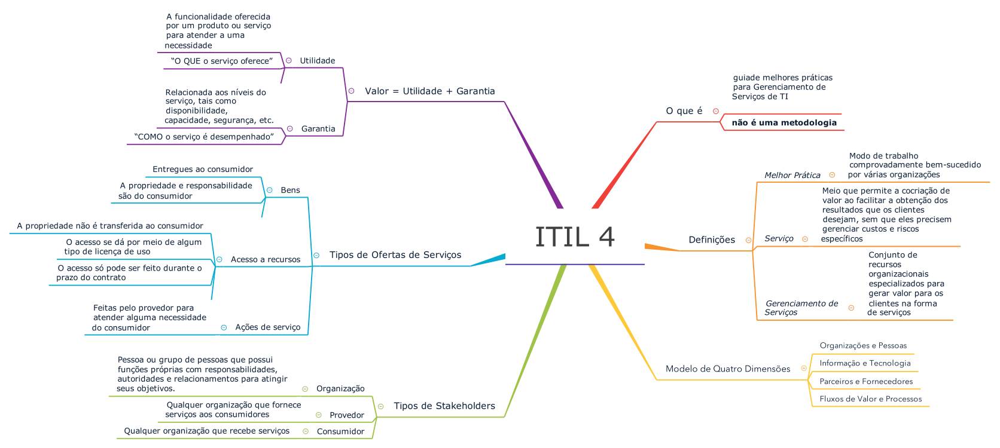

---

<!-- pagina: 59 -->

**Paolla Ramos Aula 01** 

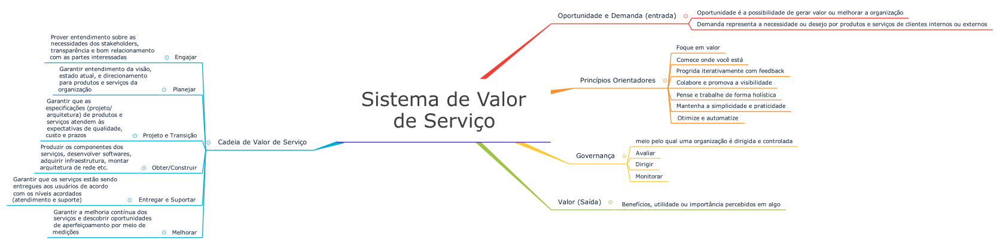

<!-- Start of picture text -->
==5460== <!-- End of picture text -->

---

<!-- pagina: 60 -->

**Paolla Ramos Aula 01** 

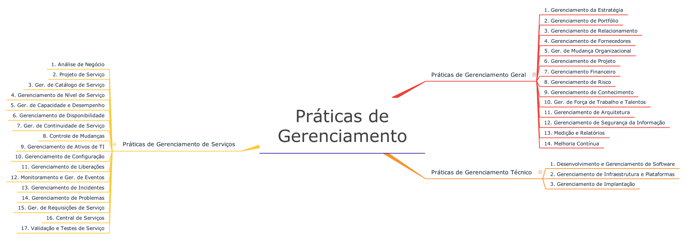

---

<!-- pagina: 61 -->

**Paolla Ramos Aula 01** 

# **- RESUMO ITIL 4** 

##### **FERNANDO PEDROSA - HTTPS://WWW.INSTAGRAM.COM/PROF.FERNANDOPEDROSA** 

## Visão Geral — ITIL 4 

ITIL (Information Technology Infrastructure Library) é um conjunto de melhores práticas para o Gerenciamento de Serviços de TI (ITSM), com foco em alinhar serviços de TI às necessidades do negócio. A versão atual, ITIL 4, foi lançada em 2019 e integra práticas como Agile, DevOps e Lean. 

### Histórico das Versões 

**ITIL v1** (anos 1980): 31 livros, orientação técnica e a processos, desenvolvida pelo governo do Reino Unido 

**ITIL v2** (anos 1990): condensada em 2 livros principais — Suporte a Serviços e Entrega de Serviços **ITIL v3 / 2007** : introduziu o Ciclo de Vida do Serviço; atualizada em 2011 

**ITIL 4** (2019): abordagem holística, baseada no Sistema de Valor de Serviço (SVS), Modelo de 4 Dimensões e Cadeia de Valor de Serviço 

### Benefícios 

- Melhor alinhamento entre TI e negócio 

- Melhoria da qualidade do serviço e satisfação do cliente 

- Gestão eficaz de riscos e recuperação de interrupções 

- Redução de custos por eliminação de desperdícios 

- Ambiente de TI estável e previsível 

## Defini ões Fundamentais <u>ç</u> 

**Serviço** : meio que permite a **cocriação de valor** ao facilitar os resultados que os clientes desejam, sem que eles precisem gerenciar custos e riscos específicos. 

- **Valor** : percepção de benefício, utilidade ou relevância — pode ser tangível ou intangível, varia por cliente 

- **Utilidade** : "o que o serviço faz" — funcionalidade que atende a uma necessidade ou remove uma restrição — determina se o serviço é **apto para o propósito.** 

- **Garantia** : "como o serviço é entregue" — disponibilidade, confiabilidade, segurança e continuidade — determina se o serviço é **apto para o uso.** 

- **Cocriação de Valor** : valor é criado em colaboração ativa entre provedor e cliente, não apenas entregue pelo provedor

---

<!-- pagina: 62 -->

**Paolla Ramos Aula 01** 

- **Gerenciamento de Serviço** : conjunto de habilidades organizacionais especializadas para entregar valor na forma de serviços 

- **Melhor Prática** : método comprovado que gera resultados superiores, usado como referência 

PEGADINHA: Utilidade = apto para PROPÓSITO. Garantia = apto para USO. As bancas invertem esses conceitos com frequência. 

## Modelo de Quatro Dimensões 

Garante visão **holística e equilibrada** no gerenciamento de serviços. Ignorar qualquer dimensão pode levar a serviços ineficazes ou impedir a entrega de valor real. 

### 1. Organizações e Pessoas 

<!-- Start of picture text -->
==5460== <!-- End of picture text -->

- Cultura organizacional, estrutura, papéis e responsabilidades 

- Habilidades, competências e capacitação dos funcionários 

- Foco em garantir que as pessoas executem seu trabalho efetivamente 

### 2. Informação e Tecnologia 

- Informações e conhecimentos necessários para tomada de decisão 

- Infraestrutura, aplicações e ferramentas para habilitar e suportar serviços 

- Proteção e gestão adequada de informações e tecnologia 

- Inclui o tema **computação em nuvem** : acesso sob demanda, via rede, a recursos compartilhados configuráveis 

- Características da nuvem: self-service, acesso por rede, gerenciamento compartilhado de recursos, elasticidade rápida e mensuração de serviços 

### 3. Parceiros e Fornecedores 

- Considera relações com organizações externas essenciais para entrega de valor 

- Organizações raramente operam de forma isolada 

- Envolve trabalhar efetivamente com parceiros para garantir entrega consistente 

### 4. Fluxos de Valor e Processos 

- **Fluxo de Valor** : série de passos para criar e entregar produtos e serviços aos consumidores 

- **Processo** : série de atividades inter-relacionadas que transforma entradas em saídas, definindo sequência de ações e dependências 

- Foco no processo de ponta a ponta: criação, entrega e melhoria de serviços

---

<!-- pagina: 63 -->

**Paolla Ramos Aula 01** 

## Sistema de Valor de Serviço (SVS) 

O SVS descreve como todos os componentes e atividades da organização trabalham juntos para facilitar a criação de valor. **Entrada** : Oportunidade e Demanda. **Saída** : Valor. Nem toda oportunidade deve ser explorada, nem toda demanda deve ser atendida. 

### Componentes do SVS 

- Princípios Orientadores 

- Governança 

- Cadeia de Valor de Serviço (SVC) 

- Práticas de Gerenciamento 

- Melhoria Contínua 

## Princípios Orientadores 

São 7 princípios que orientam a organização em TODAS as circunstâncias, independentemente de mudanças em objetivos, estratégias ou estrutura de gestão. 

**1. Foque em Valor** : tudo deve contribuir para o valor ao cliente; atividades que não contribuem devem ser questionadas 

**2. Comece onde você está** : avalie o estado atual antes de mudar; não reinvente o que já funciona 

**3. Progrida iterativamente com feedback** : mudanças em etapas gerenciáveis; use feedback para aprender e melhorar 

**4. Colabore e promova a visibilidade** : inclua todas as partes relevantes; transparência na tomada de decisões 

**5. Pense e trabalhe de forma holística** : todas as partes da organização são interdependentes; considere o impacto no todo 

**6. Mantenha a simplicidade e praticidade** : prefira soluções simples; elimine o que não agrega valor 

**7. Otimize e automatize** : automatize tarefas rotineiras, mas **otimize o processo antes de automatizar** 

PEGADINHA: O princípio 7 exige otimização ANTES da automação. Automatizar processos ineficazes apenas acelera os erros. 

## Governança 

Governança é o meio pelo qual a organização é **dirigida e controlada** , garantindo alinhamento com estratégia e políticas. É componente crítico do SVS.

---

<!-- pagina: 64 -->

**Paolla Ramos Aula 01** 

Três Atividades Principais da Governança 

- **Dirigir** : estabelecer direção estratégica e políticas; definir expectativas de desempenho 

- **Monitorar** : acompanhar o desempenho e avaliar resultados 

- **Avaliar** : garantir conformidade, gestão de riscos e responsabilidade 

- Outras atividades práticas: definir expectativas, assegurar conformidade legal, garantir transparência e responsabilidade 

## Cadeia de Valor de Serviço (SVC) 

A SVC é o modelo operacional central do SVS. Descreve 6 atividades-chave para responder à demanda e criar valor. As atividades podem ser combinadas em diferentes sequências conforme o tipo de serviço. 

- **Planejar** : criação e manutenção de planos de utilização de recursos para atingir objetivos 

- **Melhorar** : identificação e implementação de melhorias em serviços e práticas 

- **Engajar** : envolvimento com partes interessadas para entender necessidades e construir relacionamentos 

- **Projetar e Transicionar** : desenho e implementação de mudanças e melhorias, transitando para o ambiente operacional 

- **Obter/Construir** : aquisição ou construção dos recursos necessários para fornecer serviços 

- **Entregar e Suportar** : efetiva entrega do serviço ao usuário e suporte contínuo, incluindo resolução de incidentes 

## Melhoria Contínua 

A melhoria contínua está presente em três níveis no ITIL 4: no **modelo de melhoria contínua** (7 etapas), na **atividade "Melhorar"** da SVC e na **prática de Melhoria Contínua** (uma das 14 práticas gerais). 

### Sete Etapas do Modelo de Melhoria Contínua 

- 1. Qual é a visão? 

- 2. Onde estamos agora? 

- 3. Onde queremos estar? 

- 4. Como chegamos lá? 

- 5. Tome uma atitude 

- 6. Conseguimos chegar lá? 

- 7. Como mantemos o momentum?

---

<!-- pagina: 65 -->

**Paolla Ramos Aula 01** 

## Práticas de Gerenciamento 

Prática é um "conjunto de recursos organizacionais (pessoas, tecnologia, processos, etc.) destinado a executar um trabalho ou atingir um objetivo". São divididas em **3 categorias** : Gerenciamento Geral (14), Gerenciamento de Serviço (17) e Gerenciamento Técnico (3). Total: 34 práticas. 

### Práticas de Gerenciamento Geral (14 práticas) 

|**Prática**|**Descrição**|
|---|---|
|**Gerenciamento da estratégia**|**Definição e manutenção da direção estratégica e propósito da** **organização, normalmente pelo nível de gestão mais alto.**|
|**Gerenciamento da segurança da** **informação**|**Envolve a proteção das informações da organização contra uma** **série de ameaças, garantindo a continuidade do negócio,** **minimizando os riscos do negócio, maximizando o retorno sobre os** **investimentos e as oportunidades de negócio.**|
|**Gerenciamento de fornecedor**|**Garante que os fornecedores e os serviços que eles fornecem** **sejam gerenciados para suportar os prestadores de serviços de TI e** **os objetivos de negócios da organização.**|
|**Gerenciamento de mudança** **organizacional**|**Garante que as mudanças na organização sejam efetivamente** **gerenciadas e que a comunicação seja eficaz.**|
|**Gerenciamento de projetos**|**Envolve planejar e gerenciar projetos para garantir que sejam** **entregues de forma eficaz e eficiente.**|
|**Gerenciamento de** **relacionamento**|**Envolve identificar, analisar, gerenciar e monitorar as relações com** **as partes interessadas para atender às necessidades e expectativas** **do negócio.**|
|**Gerenciamento de riscos**|**Envolve identificar, avaliar e controlar riscos para garantir que a** **organização atinja seus objetivos.**|
|**Gerenciamento de talento e** **força de trabalho**|**Garante que a organização tenha as pessoas certas, com as** **habilidades e competências adequadas, para atender às suas** **necessidades de negócio.**|
|**Gerenciamento do** **conhecimento**|**Envolve a garantia de que o conhecimento necessário para a** **gestão de serviços é identificado, criado, atualizado, disponível e** **usado.**|
|**Gerenciamento do portfólio**|**Gerencia o portfólio de serviços de uma organização para garantir** **que continue a atender às necessidades do negócio.**|
|**Gerenciamento financeiro dos** **serviços**|**Envolve gerenciar os custos e a contabilidade dos serviços de TI** **para garantir que a organização obtenha valor dos serviços** **prestados.**|
|**Gestão da arquitetura**|**Garante que a organização tenha uma arquitetura definida e** **gerenciada que suporte seus objetivos de negócio.**|
|**Medição e reporte**|**Envolve coletar, analisar e relatar dados para apoiar a tomada de** **decisões, fornecer informações para os interessados e melhorar a** **eficácia e eficiência.**|

---

<!-- pagina: 66 -->

**Paolla Ramos Aula 01** 

|**Melhoria contínua**|**Envolve a identificação e implementação de melhorias nos**|
|---|---|
||**serviços, práticas de gerenciamento de serviço e outros aspectos**|
||**da organização.**|

### Práticas de Gerenciamento de Serviço (17 práticas) 

|**Prática**|**Descrição**|
|---|---|
|**Análise de negócio**|**Envolve a análise de negócios e processos para entender as** **necessidades dos clientes e identificar oportunidades para** **melhorias nos serviços.**|
|**Central de serviço**|**É o ponto de contato único entre o provedor de serviço e os** **usuários. Responsável por lidar com incidentes, requisições e** **fornecer uma interface para outros processos de TI.**|
|**Desenho de serviço**|**É o processo de desenhar novos serviços de TI ou fazer mudanças** **significativas nos serviços existentes.**|
|**Gerenciamento de ativos de TI**|**Responsável por garantir que os ativos necessários para entregar** **os serviços estão devidamente contabilizados e em bom estado.**|
|**Gerenciamento de capacidade e** **desempenho**|**Envolve garantir que os serviços e a infraestrutura de TI têm a** **capacidade e o desempenho necessários para atender aos** **requisitos acordados a um custo justificável.**|
|**Gerenciamento do catálogo de** **serviços**|**Responsável por criar e manter um catálogo de serviços** **disponíveis para o cliente, incluindo detalhes sobre como** **solicitar os serviços e quais níveis de serviço podem ser** **esperados.**|
|**Gerenciamento de configuração de** **serviço**|**Envolve o gerenciamento de todas as informações de** **configuração relacionadas a um serviço, incluindo as relações** **entre os itens de configuração.**|
|**Gerenciamento de continuidade de** **serviço**|**Envolve planejar e gerenciar a continuidade dos serviços para** **garantir que possam ser restaurados em caso de interrupção.**|
|**Gerenciamento de disponibilidade**|**Garante que todos os aspectos da disponibilidade de serviço** **sejam gerenciados e que todos os serviços de TI possam atender** **aos níveis de disponibilidade acordados.**|
|**Gerenciamento de incidente**|**Lida com a restauração rápida de serviços normais para** **minimizar o impacto nos negócios após um incidente.**|
|**Gerenciamento de liberação**|**Responsável por planejar, programar e controlar a** **movimentação de releases para ambientes de teste e ao vivo.**|
|**Gerenciamento de nível de serviço**|**Garante que todos os serviços de TI atendam aos níveis de** **serviço acordados com os clientes.**|
|**Gerenciamento de problema**|**Trata da gestão do ciclo de vida de todos os problemas. Seu** **objetivo primário é prevenir incidentes antes que ocorram, ou** **seja, tratar a causa-raiz de incidentes.**|
|**Gerenciamento de requisição de** **serviço**|**Lidar com solicitações de usuários para serviços, informações,** **acesso ou outros auxílios.**|
|**Controle de mudanças**|**Aborda as mudanças nos serviços, avaliando, autorizando e** **coordenando a implementação.**|

---

<!-- pagina: 67 -->

**Paolla Ramos Aula 01** 

|**Monitoramento e gerenciamento** **de evento**|**Envolve a constante monitoração e controle de um serviço de TI** **para detectar eventos e fazer sentido deles.**|
|---|---|
|**Validação e teste de serviço**|**Assegura que os produtos ou serviços atendam aos requisitos e** **estão prontos para entrega.**|

### Práticas de Gerenciamento Técnico (3 práticas) 

|**Prática**|**Descrição**|
|---|---|
|**Desenvolvimento e** **gerenciamento de software**|**Responsável pela construção, teste e implantação de aplicações** **que atendem às necessidades do negócio. Isso pode envolver** **trabalho de desenvolvimento interno, terceirização, aquisição de** **software ou uma combinação destes.**|
|**Gerenciamento de implantação**|**Cobre a mudança organizada e a entrega de novos ou alterados** **componentes de hardware, software, documentação, processos** **ou qualquer outro componente necessário para a operação dos** **serviços de TI.**|
|**Gerenciamento de infraestrutura** **e plataforma**|**Trata da supervisão da infraestrutura de TI e plataforma - como** **servidores, armazenamento, sistemas operacionais e plataformas** **de software como um todo - para garantir que funcionem de** **forma eficiente e eficaz, e atendam às necessidades do negócio.**|

---

<!-- pagina: 68 -->

**Paolla Ramos Aula 01** 

# **<mark>Questões Comentadas</mark>** 

**1. (FGV - 2026 - Analista Judiciário (TJ RJ)/Tecnologia da Informação/Analista de Gestão de TIC) Cristina, que trabalha como chefe de departamento de infraestrutura, tem recebido reclamações sobre diversos incidentes relacionados à lentidão do sistema de gestão. A equipe responsável realiza uma investigação e descobre que um estagiário estava executando consultas simultâneas no banco de dados, deixando-o sobrecarregado.** 

**Essa situação não foi identificada inicialmente, antes de o serviço entrar em operação, e se tornou um risco para os serviços ativos, o qual, segundo o ITIL 4 Foundation, deve ser abordado pelo gerenciamento de:** 

a) incidentes; 

b) ativo de TI; 

c) problemas; 

d) mudanças; 

e) capacidades. 

**Comentários:** 

(a) Errado. O gerenciamento de incidentes trata de restaurar o serviço rapidamente, não de investigar causas subjacentes como consultas mal planejadas; (b) Errado. O gerenciamento de ativos de TI foca no ciclo de vida dos ativos, não na análise de causas de degradação de desempenho; (c) Correto. O gerenciamento de problemas atua na identificação da causa raiz de incidentes recorrentes ou não identificados previamente, como as consultas simultâneas que sobrecarregaram o banco; (d) Errado. O gerenciamento de mudanças lida com alterações controladas no ambiente, não com a investigação de causas de incidentes; (e) Errado. O gerenciamento de capacidades planeja recursos futuros, mas não é o responsável por tratar riscos ativos oriundos de causas raiz identificadas. 

###### **Gabarito:** Letra C 

**2. (FGV - 2026 - Analista Judiciário (TJ RJ)/Tecnologia da Informação/Analista de Gestão de TIC) Durante a inclusão de um novo serviço de tecnologia da informação (TI) no catálogo de serviços de uma organização, verificou se a necessidade de realizar o saneamento das informações existentes, de modo a mantê-las consistentes e íntegras para os usuários da área de negócios.** 

**São informações essenciais para a área de negócios no catálogo de serviços:** 

a) serviços experimentais; 

b) serviços em desenvolvimento; 

c) atividades operacionais internas; 

- d) processos de solicitação do serviço;

---

<!-- pagina: 69 -->

**Paolla Ramos Aula 01** 

###### e) informações técnicas detalhadas de infraestrutura. 

###### **Comentários:** 

(a) Errado. Serviços experimentais não fazem parte do catálogo oficial voltado ao negócio, pois ainda não estão validados para uso; (b) Errado. Serviços em desenvolvimento ainda não estão disponíveis, portanto não integram o catálogo ativo para a área de negócios; (c) Errado. Atividades operacionais internas são de interesse da TI, não informações essenciais para os usuários de negócio; (d) Correto. Os processos de solicitação do serviço são exatamente o que a área de negócios precisa saber: como acionar, solicitar e utilizar os serviços disponíveis; (e) Errado. Detalhes técnicos de infraestrutura são relevantes para a TI, mas não para os usuários de negócio, que precisam de informações funcionais. 

###### **Gabarito:** Letra D 

**3. (FGV - 2026 - Analista Judiciário (TJ RJ)/Tecnologia da Informação/Analista de Gestão de TIC) Ao reorganizar a sua central de serviços de tecnologia da informação (TI), um órgão identificou os ativos e serviços que requerem monitoramento e definiu estratégias para restauração dos serviços em caso de incidentes.** 

**Para priorizar o gerenciamento dos incidentes, o órgão deve considerar:** 

a) a reincidência do incidente; 

b) o impacto e a urgência do incidente; 

c) o tempo médio para reparo do incidente; 

d) o modelo do incidente, contendo os prazos de tratamento e escalonamento; 

e) o registro do incidente pelo usuário, contendo o horário exato da ocorrência. 

###### **Comentários:** 

(a) Errado. A reincidência pode ser um dado relevante, mas não é o critério principal para priorizar o gerenciamento de incidentes; (b) Correto. Segundo as boas práticas de ITSM (como o ITIL), a prioridade de um incidente é definida pela combinação de impacto e urgência; (c) Errado. O tempo médio para reparo (MTTR) é uma métrica de desempenho, não um critério de priorização de incidentes; (d) Errado. O modelo de incidente orienta o tratamento, mas não é o fator que define a prioridade de atendimento; (e) Errado. O horário de registro é um dado de rastreabilidade, sem relação direta com a priorização do incidente. 

###### **Gabarito:** Letra B 

**4. (FGV - 2026 - Analista Judiciário (TJ RJ)/Tecnologia da Informação/Analista de Gestão de TIC) A consulta à matriz de compatibilidade de versões hardware e software, antes de uma atualização de versão de sistema operacional, é essencial para garantir a manutenção da disponibilidade dos serviços, do**

---

<!-- pagina: 70 -->

**Paolla Ramos Aula 01** 

**desempenho e da garantia de suporte do fabricante, e a utilização de versões homologadas é uma boa prática diretamente relacionada ao gerenciamento de:** 

a) riscos; 

b) mudanças; 

c) requisições; 

d) incidentes; 

e) configuração. 

**Comentários:** 

(a) Errado. Gerenciamento de riscos foca em identificar e mitigar ameaças, não em controlar versões homologadas de software e hardware; (b) Correto. Consultar matrizes de compatibilidade e usar versões homologadas são práticas do gerenciamento de mudanças, que avalia impactos antes de alterações no ambiente; (c) Errado. Gerenciamento de requisições trata de solicitações de serviço rotineiras, sem relação direta com controle de versões e compatibilidade; (d) Errado. Gerenciamento de incidentes atua na restauração de serviços após falhas, não na prevenção por meio de homologação de versões; (e) Errado. Gerenciamento de configuração registra e controla itens de configuração, mas a prática de homologação de versões pertence ao escopo de mudanças. 

**Gabarito:** Letra B 

**5. (FGV - 2026 - Analista Judiciário (TJ RJ)/Tecnologia da Informação/Analista de Gestão de TIC) Um órgão está implantando o gerenciamento de problemas e distribuiu as equipes nas quatro atividades primárias do processo, cuja sequência correta é:** 

a) identificação → registro do erro e avaliação → registro da solução → fechamento do erro e problema associado; 

b) identificação → registro do problema e classificação → investigação e diagnóstico → resolução e encerramento do problema; 

c) identificação → registro do incidente e classificação → investigação e diagnóstico → solução e fechamento do incidente; 

d) identificação → registro do problema e avaliação da reincidência → registro da solução → resolução e encerramento do problema; 

e) identificação → registro do incidente recorrente e classificação em problema → investigação e diagnóstico → solução e fechamento do problema. 

###### **Comentários:** 

(a) Errado. A sequência mistura termos de gerenciamento de erros conhecidos, não refletindo as quatro atividades primárias do gerenciamento de problemas; (b) Correto. As quatro atividades primárias do gerenciamento de problemas são: identificação, registro e classificação, investigação e diagnóstico, e resolução e encerramento; (c)

---

<!-- pagina: 71 -->

**Paolla Ramos Aula 01** 

Errado. A alternativa descreve o fluxo do gerenciamento de incidentes, não de problemas — os termos "incidente" e "fechamento do incidente" entregam a confusão; (d) Errado. Insere "avaliação da reincidência" como etapa, o que não corresponde às atividades primárias definidas para o processo de gerenciamento de problemas; (e) Errado. Embora mencione "problema" ao final, a sequência parte de incidente recorrente, descaracterizando o fluxo correto do processo de gerenciamento de problemas. 

###### **Gabarito:** Letra B 

**6. (FGV - 2026 - Analista Judiciário (TJ RJ)/Tecnologia da Informação/Analista de Gestão de TIC) Um CMS/CMDB (Configuration Management System / Configuration Management Database) adequadamente mantido é fundamental para que seja utilizado como a base de informação para o gerenciamento de implantação e liberação de serviço, pois:** 

- a) apoia a redução de falhas pós implementação; 

b) permite avaliar riscos com base em dependências reais; 

c) ajuda a avaliar riscos de indisponibilidade por falhas de itens de configuração; 

d) permite encontrar itens de configuração que apresentam falhas recorrentes; 

e) ajuda a identificar rapidamente o item de configuração afetado durante uma atualização. 

###### **Comentários:** 

(a) Correto. Um CMDB bem mantido registra dependências e histórico dos ICs, permitindo identificar riscos antes da implantação e reduzir falhas pós-implementação, que é o principal benefício no contexto de liberação de serviços; (b) Errado. Avaliar riscos com base em dependências reais é uma capacidade do CMDB, mas não é o foco central no gerenciamento de implantação e liberação descrito na questão; (c) Errado. Avaliar riscos de indisponibilidade é relevante, porém trata-se de um benefício mais associado ao gerenciamento de disponibilidade do que ao processo de liberação em si; (d) Errado. Identificar ICs com falhas recorrentes está mais ligado ao gerenciamento de problemas do que ao gerenciamento de implantação e liberação de serviço; (e) Errado. Identificar rapidamente o IC afetado durante uma atualização é útil, mas remete mais ao gerenciamento de incidentes do que ao processo de liberação. 

###### **Gabarito:** Letra A 

**7. (FGV - 2026 - Analista Judiciário (TJ RJ)/Tecnologia da Informação/Analista de Infraestrutura de TIC) A equipe de tecnologia da informação (TI) de uma empresa identificou a necessidade de atualizar o sistema de e-mails corporativo para uma nova versão, com o objetivo de melhorar a segurança, corrigir falhas e adicionar novas funcionalidades. Antes de realizar a implementação, a equipe seguiu um processo estruturado: realizaram testes em ambiente de homologação, avaliaram os riscos técnicos e operacionais da mudança, documentaram os impactos esperados e submeteram a proposta à aprovação formal do Comitê de Mudanças.**

---

<!-- pagina: 72 -->

**Paolla Ramos Aula 01** 

**No ITIL 4, as práticas adotadas pela empresa podem ser relacionadas com o gerenciamento de:** 

a) problemas; 

b) mudanças; c) incidentes; 

d) configuração; 

e) continuidade de serviços. 

###### **Comentários:** 

(a) Errado. O gerenciamento de problemas foca em identificar causas-raiz de incidentes recorrentes, não em planejar e aprovar atualizações de sistemas; (b) Correto. Testes em homologação, avaliação de riscos, documentação de impactos e aprovação formal pelo Comitê de Mudanças são pilares do gerenciamento de mudanças no ITIL 4; (c) Errado. O gerenciamento de incidentes trata da restauração rápida de serviços interrompidos, não de atualizações planejadas e estruturadas; (d) Errado. O gerenciamento de configuração cuida do inventário e controle de ativos de TI, sem envolver aprovação de mudanças ou testes de homologação; (e) Errado. A continuidade de serviços visa garantir a operação em situações de desastre, não gerenciar o ciclo de vida de atualizações planejadas. 

###### **Gabarito:** Letra B 

**8. (FGV - 2026 - Analista Judiciário (TJ RJ)/Tecnologia da Informação/Analista de Infraestrutura de TIC) Uma empresa de e-commerce definiu como SLI (Service Level Indicator) o tempo médio de resposta da API de checkout. O SLO (Service Level Objective) estabelecido foi de 95% das requisições respondidas em até 300 ms, e o SLA (Service Level Agreement), firmado com clientes corporativos, prevê compensação financeira caso o tempo médio ultrapasse 500 ms em mais de 2% das requisições mensais. Em um mês, 94% das requisições ficaram abaixo de 300 ms e 3% ultrapassaram 500 ms.** 

**Logo, a empresa de e-commerce descreveu corretamente, em seu relatório de gestão, que:** 

a) o SLI foi atendido, pois o tempo médio geral ficou abaixo de 500 ms; 

b) o SLA não se aplica, pois trata apenas de disponibilidade e não de latência; 

c) o SLO foi cumprido, já que apenas 6% das requisições ficaram acima de 300 ms; 

d) nenhum dos parâmetros foi violado, pois o tempo médio geral foi aceitável; 

e) o SLA foi violado, pois mais de 2% das requisições ultrapassaram 500 ms. 

###### **Comentários:** 

(a) Errado. O SLI é o indicador medido (tempo de resposta), não uma meta a ser "atendida". A alternativa confunde SLI com SLO/SLA; (b) Errado. O SLA pode abranger latência, disponibilidade ou qualquer métrica acordada entre as partes — não se limita à disponibilidade; (c) Errado. O SLO exigia 95% das requisições abaixo de 300 ms, mas apenas 94% ficaram nesse limite. O SLO foi violado, não cumprido; (d) Errado. O SLA foi violado com 3% das

---

<!-- pagina: 73 -->

**Paolla Ramos Aula 01** 

requisições acima de 500 ms, superando o limite de 2% previsto no contrato; (e) Correto. O SLA previa compensação se mais de 2% das requisições ultrapassassem 500 ms. Com 3% nessa condição, o limite contratual foi descumprido e a empresa deve compensação financeira aos clientes corporativos. 

###### **Gabarito:** Letra E 

**9. (FGV - 2026 - Analista Judiciário (TJ RJ)/Tecnologia da Informação/Analista de Inteligência Artificial) O ciclo de vida de sistemas de inteligência artificial (IA) descreve a evolução e etapas de um sistema de IA, desde o início de seu desenvolvimento até a sua desativação.** 

**A atividade de processar dados é iniciada na fase anterior ao treinamento do modelo, ou seja, durante a formação da base de dados de treinamento e teste, e percorre o ciclo de vida dos sistemas de IA.** 

**Considerando as práticas de gerenciamento de serviços do ITIL 4, a que se alinha diretamente à atividade de processar dados é o gerenciamento de:** 

a) liberação; 

b) incidentes; 

c) disponibilidade; 

d) catálogo de serviços; 

e) validação e testes de serviço. 

###### **Comentários:** 

(a) Errado. O gerenciamento de liberação trata da disponibilização de versões de serviços em produção, sem relação direta com o processamento de dados ao longo do ciclo de vida da IA; (b) Errado. O gerenciamento de incidentes foca na restauração de serviços após falhas, não no processamento e validação de dados em etapas do ciclo de vida da IA; (c) Errado. O gerenciamento de disponibilidade garante que serviços estejam acessíveis quando necessário, mas não se alinha ao processamento de dados nas fases do ciclo de IA; (d) Errado. O gerenciamento de catálogo de serviços organiza e documenta serviços oferecidos, sem correspondência com o processamento de dados no ciclo de vida da IA; (e) Correto. A alternativa E é a mais compatível entre as opções, pois a prática de Validação e Testes de Serviço pode apoiar a verificação de que um serviço ou solução baseada em IA atende aos requisitos definidos. Contudo, o processamento de dados em si não é atribuição específica dessa prática no ITIL 4. 

###### **Gabarito:** Letra E 

**10. (FGV - 2026 - Analista Judiciário (TJ RJ)/Tecnologia da Informação/Analista de Sistemas) Patrícia é uma gestora iniciante nas práticas de gerenciamento do ITIL. Com o intuito de atingir os objetivos de sua organização, ela está identificando o propósito de cada prática de gerenciamento.** 

**Patrícia identificou que o propósito da prática de gerenciamento de infraestrutura e plataforma é:**

---

<!-- pagina: 74 -->

**Paolla Ramos Aula 01** 

a) reduzir a probabilidade e o impacto de incidentes na prestação dos serviços; 

b) projetar produtos e serviços entregues pela organização e seu ecossistema; 

c) atuar como ponto de contato para o provedor de serviços em relação aos usuários; 

d) mover hardware e software, novos ou modificados, para ambientes de produção; 

e) permitir o monitoramento das soluções tecnológicas disponíveis para a organização. 

###### **Comentários:** 

(a) Errado. Reduzir probabilidade e impacto de incidentes é o propósito da prática de gerenciamento de problemas, não de infraestrutura e plataforma; (b) Errado. Projetar produtos e serviços corresponde à prática de design de serviço, focada na arquitetura e planejamento das entregas; (c) Errado. Atuar como ponto de contato para usuários é o papel da prática de central de serviços (service desk), não de infraestrutura; (d) Errado. Mover hardware e software para produção é o propósito da prática de gerenciamento de implantação (deployment management); (e) Correto. O propósito da prática de gerenciamento de infraestrutura e plataforma é justamente permitir o monitoramento das soluções tecnológicas disponíveis para a organização, garantindo visibilidade e controle sobre os recursos tecnológicos que sustentam os serviços. 

###### **Gabarito:** Letra E 

**11. (FGV - 2026 - Analista Judiciário (TJ RJ)/Tecnologia da Informação/Cientista de Dados) De acordo com a Pesquisa IA no Poder Judiciário 2024, realizada pelo Conselho Nacional de Justiça (CNJ) em parceria com o Programa das Nações Unidas para o Desenvolvimento (PNUD), o desenvolvimento de soluções de IA tornou-se uma realidade dentro dos tribunais e conselhos do Poder Judiciário, em grande parte para superar desafios do cotidiano de trabalho, em especial por meio da automação de dados.** 

**A integração de práticas do ITIL 4 para automação de dados contribui para:** 

a) a criação de valor para as partes interessadas; 

b) a governança e gestão de informações e tecnologias corporativas; 

c) a compreensão do gerenciamento de projetos e do modo como ele facilita os resultados pretendidos; 

d) a contextualização e fornecimento de serviços de tecnologia da informação de forma adaptável, rápida e transparente; 

e) a definição dos fatores de desenho que devem ser considerados pela empresa para construir um sistema de governança mais adequado. 

###### **Comentários:** 

(a) Errado. Criar valor para partes interessadas é um princípio geral do ITIL 4, não o foco específico da integração com automação de dados; (b) Errado. Governança e gestão corporativa de TI descrevem o escopo do COBIT, não a contribuição prática do ITIL 4 na automação; (c) Errado. Gerenciamento de projetos e seus resultados é domínio do PMBOK ou PRINCE2, não da integração ITIL 4 com automação; (d) Correto. O ITIL 4 orienta a entrega de serviços

---

<!-- pagina: 75 -->

**Paolla Ramos Aula 01** 

de TI de forma adaptável, ágil e transparente, características essenciais quando se integra automação de dados ao cotidiano dos tribunais; (e) Errado. Fatores de desenho para sistemas de governança remetem ao COBIT 2019, não às práticas do ITIL 4 voltadas à automação. 

###### **Gabarito:** Letra D 

**12. (FGV - 2025 - Auditor de Controle Externo (TCE-PI)/Tecnologia da Informação/Infraestrutura e Segurança (e mais 1 concurso)) Sobre as práticas ITIL, analise as afirmativas a seguir.** 

**I. As práticas ITIL são aplicáveis em organizações de todos os portes, pequenas, médias ou grandes, públicas ou privadas.** 

**II. As práticas ITIL são flexíveis no sentido de que, de acordo com as necessidades e com o nível de maturidade da organização, podem ser customizadas e implantadas.** 

**III. Para implantar o ITIL é necessário ter sistemas e plataformas tecnológicas específicas.** 

**Está correto o que se afirma em** 

a) I, apenas. b) I e II, apenas. c) II e III, apenas. d) I e III, apenas. e) I, II e III. 

**Comentários:** 

(I) Correto. O ITIL é um framework adaptável a organizações de qualquer porte ou natureza — pública, privada, pequena ou grande; (II) Correto. A flexibilidade é uma das marcas do ITIL: cada organização adota e customiza as práticas conforme sua maturidade e necessidades; (III) Errado. O ITIL não exige plataformas ou sistemas tecnológicos específicos — é um conjunto de boas práticas independente de tecnologia. Itens corretos: I e II. 

###### **Gabarito:** Letra B 

**13. (FGV - 2025 - Auditor de Controle Externo (TCE-PI)/Tecnologia da Informação/Infraestrutura e Segurança (e mais 1 concurso)) Sobre as práticas ITIL, analise as afirmativas a seguir.** 

**I. O Sistema de Valor de Serviço (SVS) representa como os vários componentes e atividades da organização trabalham juntos para facilitar a criação de valor por meio de serviços de TI.**

---

<!-- pagina: 76 -->

**Paolla Ramos Aula 01** 

**II. A cadeia de valor do serviço e a melhoria contínua não fazem parte do Sistema de Valor do Serviço (SVS).** 

**III. A cadeia de valor do serviço inclui seis atividades que levam à criação de produtos e serviços e, por sua vez, valor.** 

**Está correto o que se afirma em** 

a) I, apenas. b) I e II, apenas. c) I e III, apenas. d) II e III, apenas. e) I, II e III. 

**Comentários:** 

(I) Correto. O SVS descreve como componentes e atividades da organização se integram para criar valor por meio de serviços de TI, sendo o conceito central do ITIL 4; (II) Errado. A cadeia de valor do serviço e a melhoria contínua são componentes essenciais do SVS, não estão fora dele; (III) Correto. A cadeia de valor do serviço é composta por seis atividades — planejar, melhorar, engajar, desenhar e transicionar, obter/construir e entregar e suportar. Itens corretos: I e III. 

**Gabarito:** Letra C 

**14. (FGV - 2025 - Auditor de Controle Externo (TCE RR)/Tecnologia da Informação/Análise de Dados) Considere uma instituição de grande porte que recentemente implementou uma plataforma de atendimento ao cliente para suportar operações em múltiplos canais (e-mail, telefone, chat e redes sociais).** 

**Durante a implantação, foram observadas inconsistências nos processos de suporte entre as diferentes equipes, resultando em respostas lentas e falta de padronização no atendimento ao cliente. Agora, a instituição quer padronizar esses processos e melhorar o tempo de resposta.** 

**Nesse cenário, a prática do ITIL 4 mais adequada para identificar os gargalos e alinhar as práticas entre as equipes para melhorar a eficiência é o** 

a) Gerenciamento de Incidentes, pois ele foca na resolução rápida de interrupções, garantindo a restauração do serviço o mais rápido possível e alinhando os processos de suporte para minimizar os tempos de inatividade. 

b) Gerenciamento de Problemas, já que ele ajuda a investigar e eliminar a causa raiz dos problemas, o que permitiria identificar e corrigir as inconsistências entre as diferentes equipes de atendimento. 

c) Gerenciamento de Nível de Serviço (SLM), pois ele define os acordos de nível de serviço (SLAs) para todas as equipes, assegurando que cada canal de atendimento atenda aos padrões e ao tempo de resposta esperados pelos clientes.

---

<!-- pagina: 77 -->

**Paolla Ramos Aula 01** 

d) Gerenciamento da Cadeia de Valor e Melhoria Contínua, uma vez que ela permite identificar gargalos nos fluxos de valor e implementar ajustes necessários para padronizar o atendimento e aumentar a eficiência entre as equipes. 

e) Gerenciamento de Relacionamento, pois ele se concentra em gerenciar as expectativas dos clientes e garantir que as diferentes equipes de suporte compreendam claramente as necessidades dos clientes e estejam alinhadas para oferecer um atendimento uniforme. 

###### **Comentários:** 

(a) Errado. O Gerenciamento de Incidentes foca na restauração rápida de serviços interrompidos, não na padronização de processos entre equipes ou na identificação de gargalos operacionais; (b) Errado. O Gerenciamento de Problemas investiga causas raiz de falhas recorrentes, mas não é a prática mais adequada para alinhar padrões de atendimento entre múltiplos canais; (c) Correto. O SLM define SLAs claros para cada canal de atendimento, garantindo que todas as equipes operem com os mesmos padrões de tempo de resposta e qualidade esperados pelos clientes; (d) Errado. Embora útil para identificar gargalos, essa abordagem não é a prática primária do ITIL 4 para padronizar níveis de serviço entre equipes de atendimento multicanal; (e) Errado. O Gerenciamento de Relacionamento cuida das expectativas dos clientes, mas não estabelece os parâmetros operacionais necessários para padronizar o atendimento entre equipes. 

###### **Gabarito:** Letra C 

**15. (FGV - 2025 - Perito Criminal (PC MG)/Área II) A ITIL v4 é um framework amplamente utilizado para a gestão de serviços de TI, fornecendo orientações para alinhar as práticas de TI às necessidades de negócios. Um dos pilares da ITIL v4 é o conceito de Sistema de Valor do Serviço (SVS). Assinale a opção que descreve corretamente um dos componentes principais do SVS.** 

a) Governança, que assegura que as ações de TI estejam em conformidade com os requisitos legais, mas não interfere na criação de valor. 

b) Cadeia de Valor do Serviço, que organiza atividades e interações necessárias para transformar a demanda em valor para o cliente. 

c) Práticas de gerenciamento, que definem exclusivamente os processos operacionais para equipes técnicas. 

d) Melhoria Contínua, que estabelece um conjunto fixo de regras para alcançar a excelência nos serviços, sem espaço para adaptações. 

e) Princípios orientadores, que representam os serviços disponíveis no catálogo para os consumidores finais. 

###### **Comentários:** 

(a) Errado. A Governança no SVS não se limita a conformidade legal — ela direciona e controla todas as ações para garantir a criação de valor; (b) Correto. A Cadeia de Valor do Serviço é o coração do SVS: organiza atividades interligadas que transformam demanda e oportunidades em valor real para o cliente; (c) Errado. As Práticas de gerenciamento não são exclusivas de equipes técnicas — abrangem gestão geral, técnica e de serviços de forma ampla; (d) Errado. A Melhoria Contínua é justamente o oposto: é flexível e adaptável, sem regras fixas, promovendo

---

<!-- pagina: 78 -->

**Paolla Ramos Aula 01** 

evolução constante dos serviços; (e) Errado. Os Princípios orientadores são recomendações universais que guiam decisões e ações — não representam catálogos de serviços. 

###### **Gabarito:** Letra B 

**16. (FGV - 2025 - Analista de Tecnologia da Informação (EBSERH)) ITIL visa garantir uma gestão eficaz de processos e uma boa experiência para os clientes. As dimensões de gerenciamento de serviços do ITL são importantes para a entrega de valor ao cliente e para a gestão de serviços de TI.** 

**Relacione as quatro dimensões elencadas a seguir às suas respectivas aplicações.** 

###### **1. Organizações e pessoas.** 

**2. Informação e tecnologias.** ==5460== 

###### **3. Parceiros e fornecedores.** 

**4. Fluxos de valor e processos.** 

**( ) Essa dimensão trata do modo como as informações são trocadas entre diferentes serviços e componentes. A arquitetura de informação dos serviços precisa ser bem compreendida e continuamente otimizada, levando em consideração critérios como disponibilidade, confiabilidade, acessibilidade, pontualidade, precisão e relevância das informações fornecidas aos usuários e trocadas entre serviços.** 

**( ) Essa dimensão é aplicável tanto ao ITIL service value system (SVS), quanto a produtos e serviços específicos. Em ambos os contextos, ela define as atividades, controles e procedimentos necessários para atingir os objetivos acordados.** 

**( ) Essa dimensão trata do modo como as relações entre organizações podem envolver vários níveis de integração e formalidade. Ela pode variar de contratos formais com clara separação de responsabilidades, até parcerias flexíveis nas quais as partes compartilham objetivos e riscos e colaboram para alcançar os resultados desejados.** 

**( ) Essa dimensão abrange funções e responsabilidades, organização formal estruturas, cultura e pessoal e competências necessários, todos relacionados à criação, entrega, e melhoria de um serviço.** 

**A relação correta, na ordem apresentada, é:** 

a) 3 – 4 – 1 – 2. b) 2 – 4 – 3 – 1. c) 3 – 2 – 4 – 1. d) 4 – 1 – 2 – 3.

---

<!-- pagina: 79 -->

**Paolla Ramos Aula 01** 

e) 1 – 3 – 4 – 2. 

###### **Comentários:** 

O primeiro item afirma que a dimensão trata do modo como as informações são trocadas entre diferentes serviços e componentes, mencionando aspectos como **arquitetura da informação** , disponibilidade, confiabilidade, acessibilidade, precisão e relevância das informações. Esses elementos estão diretamente relacionados à dimensão **Informação e tecnologias** . Essa dimensão envolve as informações necessárias para o gerenciamento dos serviços, bem como as tecnologias usadas para criar, entregar e melhorar esses serviços. Por isso, o primeiro parêntese corresponde ao número **2** . 

O segundo item menciona atividades, controles e procedimentos necessários para atingir objetivos acordados, tanto no contexto do **sistema de valor de serviço da ITIL — SVS** quanto em produtos e serviços específicos. Essa descrição corresponde à dimensão **Fluxos de valor e processos** , pois ela trata justamente de como o trabalho é organizado, coordenado e executado para gerar valor. Os processos definem atividades, entradas, saídas, controles e responsabilidades, enquanto os fluxos de valor mostram a sequência de etapas necessárias para entregar produtos e serviços. Assim, o segundo parêntese corresponde ao número **4** . 

O terceiro item fala das relações entre organizações, que podem variar desde contratos formais com clara separação de responsabilidades até parcerias mais flexíveis, com compartilhamento de objetivos, riscos e resultados. Essa é a dimensão **Parceiros e fornecedores** , pois ela examina como a organização se relaciona com outras entidades envolvidas na criação, entrega, suporte e melhoria dos serviços. Logo, o terceiro parêntese corresponde ao número **3** . 

Por fim, o quarto item aborda funções, responsabilidades, estruturas organizacionais formais, cultura, pessoas e competências necessárias à criação, entrega e melhoria de um serviço. Essa é a descrição típica da dimensão **Organizações e pessoas** , que considera não apenas a estrutura formal da organização, mas também aspectos humanos, culturais, comportamentais e de capacitação. Portanto, o quarto parêntese corresponde ao número **1** . 

Assim, a associação correta é: 

**Informação e tecnologias – 2 Fluxos de valor e processos – 4 Parceiros e fornecedores – 3 Organizações e pessoas – 1** 

**Gabarito:** Letra B 

**17. (FGV - 2025 - Analista do Ministério Público da União/Tecnologia da Informação e Comunicação/Suporte e Infraestrutura) O analista Mário está utilizando a Biblioteca ITIL para melhorar a prestação de serviços de tecnologia da informação do MPU, começando pelo atendimento ao usuário.**

---

<!-- pagina: 80 -->

**Paolla Ramos Aula 01** 

**De acordo com a Biblioteca ITIL versão 4, para que haja um ponto de comunicação entre o provedor de serviço e todos os seus usuários, deve-se implementar um service:** 

a) desk; b) request; c) portfolio; d) value system (SVS); e) level agreement (SLA). 

**Comentários:** 

(a) Correto. O Service Desk é o ponto central de comunicação entre o provedor de serviços e os usuários, sendo responsável por registrar, tratar e escalar demandas; (b) Errado. Service Request refere-se a solicitações formais de serviço, não a um ponto de contato centralizado; (c) Errado. Service Portfolio é o conjunto de serviços gerenciados pelo provedor, não um canal de comunicação com usuários; (d) Errado. O SVS (Service Value System) representa o sistema de valor de serviços do ITIL 4, não um ponto de atendimento; (e) Errado. SLA (Service Level Agreement) é um acordo de nível de serviço, não um canal de comunicação com usuários. 

**Gabarito:** Letra A 

**18. (FGV - 2025 - Auditor de Controle Externo (TCE-PE)/Auditoria de Tecnologia da Informação) O ITIL 4 é um conjunto de boas práticas para gestão de serviços de TI, focado em entregar valor ao negócio.** 

**No ITIL 4, a prática de 'Gestão de Incidentes' no Service Desk tem como objetivo principal:** 

a) documentar detalhadamente falhas para análise posterior. 

b) restaurar o serviço normal o mais rápido possível. 

c) escalar incidentes complexos às equipes especializadas. 

d) verificar o cumprimento de SLAs após a resolução. 

e) classificar incidentes com base no impacto para o negócio. 

**Comentários:** 

(a) Errado. Documentar falhas é uma atividade de suporte, não o objetivo principal da Gestão de Incidentes; (b) Correto. O foco central da prática é restaurar o serviço o mais rápido possível, minimizando o impacto ao negócio; (c) Errado. Escalar incidentes é uma atividade do processo, mas não representa seu objetivo principal; (d) Errado. Verificar SLAs é responsabilidade da Gestão de Nível de Serviço, não da Gestão de Incidentes; (e) Errado. Classificar incidentes é uma etapa do fluxo, mas não define o propósito central da prática. 

###### **Gabarito:** Letra B

---

<!-- pagina: 81 -->

**Paolla Ramos Aula 01** 

**19. (FGV - 2025 - Analista em Geociências (CPRM)/Análise e Desenvolvimento de Sistemas) No SVS (Service Value System) da ITIL, cada componente possui um papel específico.** 

**O componente que representa um conjunto de atividades interconectadas que a organização executa para entregar um produto ou serviço valioso aos seus consumidores é chamado** 

a) Princípios orientadores. 

b) Governança. 

- c) Cadeia de valor de serviço. 

d) Práticas. 

- e) Melhoria contínua. 

**Comentários:** 

(a) Errado. Princípios orientadores são recomendações que guiam decisões e ações, não um conjunto de atividades para entrega de valor; (b) Errado. Governança trata de direção e controle organizacional, não de atividades interconectadas de entrega de serviços; (c) Correto. A Cadeia de Valor de Serviço é exatamente o modelo operacional do SVS que define as atividades interconectadas para criar e entregar valor aos consumidores; (d) Errado. Práticas são conjuntos de recursos organizacionais para execução de trabalhos, não o fluxo de atividades de entrega; (e) Errado. Melhoria contínua é um componente voltado ao aprimoramento incremental, não à entrega direta de produtos e serviços. 

###### **Gabarito:** Letra C 

**20. (FGV - 2024 - Consultor Técnico Legislativo (CM SP)/Informática) O ITIL 4 é um framework de gerenciamento de serviços de TI que fornece uma abordagem holística para o gerenciamento de serviços de TI.** 

**Com relação aos princípios do ITIL 4, assinale (V) para a afirmativa verdadeira e (F) para a falsa.** 

- **( ) Colaboração de valor: tudo que é feito deve entregar valor ao negócio.** 

- **( ) Comece onde você está: tome em conta a situação atual e evolua progressivamente.** 

- **( ) Progresso iterativo com feedback: abrace a mudança e aprenda com o feedback.** 

**As afirmativas são respectivamente,** 

a) F – V – V. b) V – F – V. c) V – V – F.

---

<!-- pagina: 82 -->

**Paolla Ramos Aula 01** 

d) V – V – V. e) F – F – V. 

**Comentários:** 

(a) Correto. O primeiro princípio está errado: o nome correto é "Foco no valor", não "Colaboração de valor". Os demais estão corretos: "Comece onde você está" e "Progresso iterativo com feedback" são princípios válidos do ITIL 4; (b) Errado. Marca o primeiro item como verdadeiro, mas "Colaboração de valor" não é um princípio do ITIL 4 — o correto é "Foco no valor"; (c) Errado. Marca o terceiro item como falso, mas "Progresso iterativo com feedback" é de fato um princípio legítimo do ITIL 4; (d) Errado. Considera todos verdadeiros, ignorando o erro no nome do primeiro princípio; (e) Errado. Marca o segundo item como falso, mas "Comece onde você está" é um princípio genuíno do ITIL 4. 

**Gabarito:** Letra A 

**21. (FGV - 2024 - Consultor Técnico Legislativo (CM SP)/Informática) Com relação a ITIL 4, assinale V para a afirmativa verdadeira e F para a falsa.** 

**( ) O Sistema de valor de serviço (SVS) representa como os componentes e atividades da organização trabalham juntos para criar valor por meio de serviços habilitados para TI.** 

**( ) O modelo de quatro dimensões fornece orientação sobre os vários aspectos relacionados à gestão de serviços de TI.** 

**( ) As quatro dimensões de gestão de serviços são os aspectos relevantes para a gestão de serviços que devem ser considerados ao planejar e fornecer serviços de qualidade.** 

**As afirmativas são, respectivamente,** 

a) V – V – F. b) V – V – V. c) V – F – F. d) F – V – V. e) V – F – V. 

**Comentários:** 

A primeira afirmativa é verdadeira. O **Sistema de Valor de Serviço — SVS** representa como os componentes e atividades da organização trabalham em conjunto para facilitar a criação de valor por meio de serviços. Na ITIL 4, a ideia central é que a organização não entrega valor isoladamente, mas participa de um sistema composto por princípios orientadores, governança, cadeia de valor de serviço, práticas e melhoria contínua. Esses elementos se integram para transformar demandas e oportunidades em valor para as partes interessadas.

---

<!-- pagina: 83 -->

**Paolla Ramos Aula 01** 

A segunda afirmativa também é verdadeira. O **modelo de quatro dimensões** fornece orientação sobre os diversos aspectos que devem ser considerados na gestão de serviços. A ITIL 4 deixa claro que a gestão de serviços não depende apenas de processos ou tecnologia. Ela também exige atenção a pessoas, estruturas organizacionais, parceiros, fornecedores, fluxos de trabalho, informações e tecnologias. Portanto, o modelo serve justamente para evitar uma visão limitada ou excessivamente técnica da gestão de serviços de TI. 

A terceira afirmativa é igualmente verdadeira. As **quatro dimensões da gestão de serviços** representam aspectos relevantes que devem ser considerados ao planejar, desenhar, entregar, operar e melhorar serviços de qualidade. Essas dimensões são: **organizações e pessoas** , **informação e tecnologia** , **parceiros e fornecedores** e **fluxos de valor e processos** . A consideração equilibrada dessas dimensões contribui para que os serviços sejam adequados às necessidades dos usuários, sustentáveis para a organização e capazes de gerar valor. 

###### **Gabarito:** Letra B 

**22. (FGV - 2024 - Técnico Judiciário (TJ AP)/Apoio Especializado/Técnico de Informática) De acordo com a ITIL v4, a atividade da cadeia de valor na qual NÃO há envolvimento da central de serviços é:** 

a) engajar; 

b) planejar; 

c) melhorar; 

d) obter/construir; 

e) desenho e transição. 

###### **Comentários:** 

(a) Errado. A central de serviços participa do engajamento, sendo ponto de contato direto com usuários e partes interessadas; (b) Correto. Na atividade de planejar, o foco está na direção estratégica e governança — a central de serviços não tem envolvimento nessa etapa; (c) Errado. A central de serviços contribui com a melhoria ao registrar feedbacks e identificar oportunidades de aprimoramento; (d) Errado. A central de serviços pode interagir no processo de obter/construir ao comunicar necessidades e requisitos; (e) Errado. No desenho e transição, a central de serviços participa ao apoiar mudanças e comunicar impactos aos usuários. 

###### **Gabarito:** Letra B 

**23. (FGV - 2024 - Analista Legislativo III (ALESC)/Analista de Sistemas) A Information Technology Infrastructure Library (ITIL, ou Biblioteca de Infraestrutura de Tecnologia da Informação) é uma ferramenta de gestão de TI que auxilia as organizações a alcançarem a eficácia e eficiência nos seus serviços, por meio de uma estrutura prática e flexível para o gerenciamento de serviços.** 

**Com relação a ITIL (4a versão), analise os itens a seguir.**

---

<!-- pagina: 84 -->

**Paolla Ramos Aula 01** 

**I. As práticas da ITIL podem ser adotadas e adaptadas para todos os tipos de organização e serviços.** 

**II. A ITIL 4 tem como estrutura principal o Service Value System (SVS, ou Sistema de Valor de Serviço), que tem como principal característica possibilitar a criação e a cocriação de valor.** 

**III. A ITIL compila melhores práticas estabelecendo cinco dimensões do gerenciamento de serviço, a partir das quais cada componente do SVS deve ser considerado.** 

**Está correto o que se afirma em** 

a) I, II e III. b) I e II, apenas. c) I e III, apenas. d) II e III, apenas. e) III, apenas. 

**Comentários:** 

(I) Correto. A ITIL 4 foi projetada para ser universal e adaptável, podendo ser aplicada em qualquer tipo de organização e serviço; (II) Correto. O SVS é o coração da ITIL 4, estruturado justamente para viabilizar a criação e a cocriação de valor de forma colaborativa; (III) Errado. A ITIL 4 define quatro dimensões do gerenciamento de serviço, não cinco. O item erra ao mencionar "cinco dimensões". Itens corretos: I e II. 

**Gabarito:** Letra B 

**24. (FGV - 2024 - Técnico de Nível Superior (TJ MS)/Analista de Sistemas Computacionais/Analista de Governança) A implementação eficaz do ITIL 4 requer uma compreensão abrangente dos componentes do Sistema de Valor de Serviço (SVS). Esses componentes formam a estrutura fundamental para organizações que buscam melhorar seus serviços de TI e proporcionar valor aos seus clientes.** 

**O componente do SVS descrito como "um conjunto de atividades interconectadas que uma organização realiza para entregar um produto ou serviço de valor aos seus consumidores e facilitar a realização de valor" é o de:** 

a) governança; 

b) princípios orientadores; 

c) melhoria contínua; 

d) práticas; 

e) cadeia de valor de serviço. 

**Comentários:**

---

<!-- pagina: 85 -->

**Paolla Ramos Aula 01** 

(a) Errado. Governança refere-se ao sistema de direção e controle da organização, não a atividades interconectadas para entrega de valor; (b) Errado. Princípios orientadores são recomendações que guiam decisões, não um conjunto de atividades para entrega de serviços; (c) Errado. Melhoria contínua é um componente voltado ao aprimoramento iterativo, não à descrição de fluxo de entrega de valor; (d) Errado. Práticas são conjuntos de recursos organizacionais para execução de trabalho, mas não descrevem o fluxo interconectado de entrega; (e) Correto. A Cadeia de Valor de Serviço é exatamente o conjunto de atividades interconectadas que a organização realiza para entregar produtos e serviços de valor aos consumidores. 

###### **Gabarito:** Letra E 

**25. (FGV - 2024 - Técnico de Nível Superior (TJ MS)/Analista de Sistemas Computacionais/Analista de Governança) Considere que o Tribunal de Justiça está implementando as práticas do ITIL 4 visando a melhorar o gerenciamento de serviços de TI e garantir alinhamento com os objetivos de negócios. Nesse contexto, a governança organizacional desempenha um papel fundamental na supervisão e orientação das atividades de gerenciamento de serviços.** 

**De acordo com o ITIL 4, são consideradas atividades realizadas no âmbito da governança organizacional:** 

a) desenvolvimento de produtos e serviços, monitoramento de concorrência e definição de preços; 

b) avaliação da organização e sua estratégia, direção da preparação e implementação da estratégia organizacional e monitoramento do desempenho da organização; 

c) avaliação de desempenho de funcionários, implementação de treinamentos e promoções; 

d) desenvolvimento de parcerias comerciais, expansão de mercado e análise de lucratividade; 

e) realização de auditorias internas, conformidade com regulamentos governamentais e elaboração de relatórios financeiros. 

###### **Comentários:** 

(a) Errado. Desenvolvimento de produtos, monitoramento de concorrência e definição de preços são atividades de gestão comercial, não de governança organizacional no ITIL 4; (b) Correto. O ITIL 4 define governança como o conjunto de atividades de avaliar, dirigir e monitorar — exatamente o que descreve esta alternativa; (c) Errado. Avaliação de funcionários, treinamentos e promoções pertencem à gestão de pessoas/RH, sem relação com governança organizacional no ITIL 4; (d) Errado. Parcerias comerciais, expansão de mercado e lucratividade são temas de estratégia de negócios, não de governança organizacional conforme o ITIL 4; (e) Errado. Auditorias, conformidade e relatórios financeiros são práticas de controle interno e compliance, distintas das atividades de governança definidas pelo ITIL 4. 

###### **Gabarito:** Letra B 

**26. (FGV - 2024 - Técnico de Nível Superior (TJ MS)/Analista de Sistemas Computacionais/Analista de Suporte de TI) Amanda trabalha em uma prestadora de serviços de Tecnologia da Informação (TI). Com o**

---

<!-- pagina: 86 -->

**Paolla Ramos Aula 01** 

**objetivo de avaliar se o serviço prestado facilitará a criação de valor para os clientes, ela deverá verificar se o serviço deve apoiar o desempenho do consumidor ou remover restrições do consumidor. Outro fator a ser avaliado é se o serviço é adequado ao uso, cumprindo todas as condições definidas e acordadas.** 

**Segundo o ITIL V4 utilizado pela empresa de Amanda, os conceitos a serem avaliados por ela deverão ser:** 

a) resultados e garantias; 

b) custo e risco; 

c) resultados e custo; 

d) risco e utilidade; 

e) utilidade e garantia. 

###### **Comentários:** 

(a) Errado. "Resultados" não é o conceito que avalia se o serviço é adequado ao uso ou apoia o desempenho do consumidor no ITIL V4; (b) Errado. Custo e risco são fatores que o provedor de serviços ajuda a gerenciar, mas não descrevem os conceitos avaliados por Amanda; (c) Errado. Custo refere-se a recursos financeiros, e resultado é consequência do serviço — nenhum dos dois corresponde ao par correto aqui; (d) Errado. Risco é um elemento relevante no ITIL V4, mas não forma o par conceitual que descreve o cenário apresentado; (e) Correto. Utilidade refere-se ao suporte ao desempenho ou remoção de restrições do consumidor ("adequado ao propósito"), enquanto garantia assegura que o serviço cumpre as condições acordadas ("adequado ao uso") — exatamente o que Amanda precisa avaliar. 

**Gabarito:** Letra E 

**27. (FGV - 2024 - Analista da Comissão de Valores Mobiliários (CVM)/Tecnologia da Informação/Sistemas e Desenvolvimento/Perfil 8) O analista Juca quer implementar o Sistema de Valor de Serviço (SVS) da ITIL 4. Para tanto, ele deve observar o componente que representa as recomendações que guiam as organizações em todas as circunstâncias, independente de mudanças em suas metas, estratégias, tipo de trabalho ou estrutura gerencial. Portanto, Juca deve observar o seguinte componente:** 

a) governança; 

b) cadeia de valor de serviço; 

c) práticas; 

d) princípios orientadores; 

e) fluxos de valor. 

**Comentários:** 

(a) Errado. Governança define direção e controle, mas não representa recomendações universais independentes de contexto; (b) Errado. A cadeia de valor de serviço é um modelo operacional para criação de valor, não um conjunto

---

<!-- pagina: 87 -->

**Paolla Ramos Aula 01** 

de recomendações orientadoras; (c) Errado. Práticas são conjuntos de recursos organizacionais para execução de trabalhos, não guias universais de orientação; (d) Correto. Os princípios orientadores são recomendações universais da ITIL 4 que guiam organizações em qualquer circunstância, independentemente de mudanças em metas, estratégias ou estrutura; (e) Errado. Fluxos de valor representam sequências de atividades para entrega de produtos/serviços, sem caráter de recomendação universal. 

###### **Gabarito:** Letra D 

**28. (FGV - 2024 - Analista da Comissão de Valores Mobiliários (CVM)/Tecnologia da Informação/Sistemas e Desenvolvimento/Perfil 8) As dimensões descritas na ITIL 4 proporcionam uma abordagem holística no gerenciamento de serviços, oferecendo uma visão abrangente para a organização.** 

**A dimensão em que são definidas as atividades, a sequência de trabalho e os controles e procedimentos necessários para a entrega de produtos e serviços é a de:** 

a) clientes e práticas; 

b) organizações e pessoas; 

c) informação e tecnologia; 

d) parceiros e fornecedores; 

e) fluxos de valor e processos. 

###### **Comentários:** 

(a) Errado. "Clientes e práticas" não é uma das quatro dimensões da ITIL 4; (b) Errado. A dimensão Organizações e Pessoas trata de papéis, responsabilidades e cultura organizacional; (c) Errado. Informação e Tecnologia aborda dados, ferramentas e sistemas que suportam os serviços; (d) Errado. Parceiros e Fornecedores foca nas relações externas e contratos de terceiros; (e) Correto. Fluxos de Valor e Processos define atividades, sequências, controles e procedimentos para entregar produtos e serviços com eficiência. 

###### **Gabarito:** Letra E 

**29. (FGV - 2024 - Analista da Comissão de Valores Mobiliários (CVM)/Tecnologia da Informação/Sistemas e Desenvolvimento/Perfil 8) Ao examinar o relatório de atendimentos do último semestre, o analista Luiz verificou que um mesmo incidente ocorre semanalmente no seu departamento. Apesar de o serviço ter sido normalizado em todos os incidentes, o analista resolveu investigar sua causa raiz e propor uma solução definitiva. A prática de gerenciamento de serviços, prevista no ITIL 4, que Luiz está realizando é o gerenciamento de:** 

a) incidentes; b) problemas; 

c) continuidade de serviço;

---

<!-- pagina: 88 -->

**Paolla Ramos Aula 01** 

d) requisição de serviço; e) ativos de TI. 

###### **Comentários:** 

(a) Errado. O gerenciamento de incidentes foca em restaurar o serviço rapidamente, não em investigar causas raiz; (b) Correto. O gerenciamento de problemas busca identificar e eliminar a causa raiz de incidentes recorrentes, exatamente o que Luiz está fazendo; (c) Errado. A continuidade de serviço trata da recuperação em situações de desastre, não da análise de incidentes repetitivos; (d) Errado. O gerenciamento de requisição lida com solicitações de usuários, não com investigação de falhas recorrentes; (e) Errado. O gerenciamento de ativos de TI controla recursos tecnológicos, sem relação direta com análise de causa raiz de incidentes. 

###### **Gabarito:** Letra B 

**30. (FGV - 2024 - Analista da Comissão de Valores Mobiliários (CVM)/Tecnologia da Informação/Infraestrutura e Segurança/Perfil 9) A Comissão de Valores Mobiliários iniciou um processo licitatório para a implantação de um sistema de callcenter. A empresa X foi a vencedora e, conforme edital publicado, deverá seguir o modelo ITIL v4 na implementação do serviço. De forma a seguir a cadeia de valor preconizada no ITIL, a empresa elaborou um conjunto de atividades interconectadas para a entrega do serviço. Durante uma reunião de acompanhamento, a empresa identificou problemas em seu conjunto de atividades e, com isso, concluiu que não poderia entregar o serviço em funcionamento na data prevista. Tal fato poderia acarretar perda de timing de mercado. Com o objetivo de adequar o conjunto de atividades e manter a entrega no prazo, a empresa X deverá atuar na atividade de:** 

a) engajamento; 

b) desenho e transição; 

c) obtenção e construção; 

d) entrega e suporte; 

e) planejamento. 

###### **Comentários:** 

(a) Errado. Engajamento foca na interação com stakeholders e na compreensão de suas necessidades, não na correção de atividades de entrega; (b) Correto. Desenho e transição garante que serviços atendam às expectativas de qualidade, custo e prazo — exatamente o que a empresa X precisa ajustar para cumprir a entrega; (c) Errado. Obtenção e construção trata da aquisição de componentes do serviço, não da adequação do conjunto de atividades para manutenção do prazo; (d) Errado. Entrega e suporte cuida da operação do serviço já em funcionamento, não da fase de adequação pré-entrega; (e) Errado. Planejamento define a direção estratégica geral, mas não atua diretamente na correção de atividades para garantir o prazo de entrega. 

###### **Gabarito:** Letra B

---

<!-- pagina: 89 -->

**Paolla Ramos Aula 01** 

**31. (FGV - 2024 - Analista da Comissão de Valores Mobiliários (CVM)/Tecnologia da Informação/Infraestrutura e Segurança/Perfil 9) Amanda é funcionária da Comissão de Valores Mobiliários (CVM) e está criando um novo produto por ordem da chefia. A CVM preconiza a utilização do ITIL V4 em seus projetos. Amanda notou que, dentro da prática de gerenciamento de serviços, precisava efetuar o gerenciamento do catálogo de serviços. Dentre as atividades das práticas existentes, Amanda deverá:** 

a) garantir que informações precisas e confiáveis sobre a configuração de serviços estejam disponíveis quando e onde forem necessárias; 

b) assegurar que a disponibilidade e o desempenho de um serviço sejam mantidos em níveis suficientes no caso de um desastre; 

c) definir metas claras de negócios para níveis de serviço e garantir que a entrega de serviços seja avaliada, monitorada e gerenciada adequadamente em relação a essas metas; 

d) oferecer suporte à qualidade acordada de um serviço, manipulando todas as requisições de serviço predefinidas e iniciadas pelo usuário de maneira eficaz e amigável; 

e) fornecer uma única fonte de informações consistentes sobre todos os serviços e ofertas de serviços e garantir que eles estejam disponíveis para o público relevante. 

###### **Comentários:** 

(a) Errado. Essa atividade descreve o gerenciamento de configuração de serviços, não o catálogo de serviços; (b) Errado. Manter serviços em caso de desastre é responsabilidade do gerenciamento de continuidade de serviços; (c) Errado. Definir metas e monitorar níveis de serviço é papel do gerenciamento de nível de serviço (SLM); (d) Errado. Suporte a requisições de usuários de forma eficaz é atribuição do gerenciamento de requisições de serviço; (e) Correto. O gerenciamento do catálogo de serviços tem exatamente esse papel: ser a fonte única e confiável de informações sobre todos os serviços e ofertas disponíveis ao público relevante. 

###### **Gabarito:** Letra E 

**32. (FGV - 2024 - Analista da Comissão de Valores Mobiliários (CVM)/Tecnologia da Informação/Infraestrutura e Segurança/Perfil 9) Na empresa T, Davi está implementando o gerenciamento de serviços com base no ITIL versão 4. O Sistema de Valor de Serviços (SVS) representa o modo como os vários componentes e atividades da organização trabalham juntos para facilitar a criação de valor através dos serviços de TI implementados. Davi está executando práticas gerais de gestão adotadas e adaptadas para atendimento à gestão de domínios gerais. Ele busca garantir que a organização tenha a combinação certa de programas, projetos, produtos e serviços para executar a estratégia da organização dentro de suas restrições de recursos. Davi está implementando a prática de gerenciamento de:** 

a) portfólio; b) projeto; c) relacionamento;

---

<!-- pagina: 90 -->

**Paolla Ramos Aula 01** 

d) risco; 

e) estratégia. 

###### **Comentários:** 

(a) Correto. O gerenciamento de portfólio garante que a organização tenha a combinação certa de programas, projetos, produtos e serviços alinhados à estratégia dentro das restrições de recursos; (b) Errado. O gerenciamento de projeto foca na entrega de mudanças específicas, não na combinação estratégica de iniciativas e serviços; (c) Errado. O gerenciamento de relacionamento trata das conexões entre a organização e suas partes interessadas, não da seleção de portfólio; (d) Errado. O gerenciamento de risco identifica e trata ameaças e oportunidades, sem focar na composição estratégica de serviços e projetos; (e) Errado. O gerenciamento de estratégia define a direção organizacional, mas não gerencia a combinação de programas e projetos para executá-la. 

###### **Gabarito:** Letra A 

**33. (FGV - 2024 - Auditor Federal de Finanças e Controle (STN)/Tecnologia da Informação/Operação e Infraestrutura) O ITIL 4 apresenta uma abordagem integrada e holística para a gestão de serviços, combinando práticas modernas com tradicionais. Ele destaca componentes cruciais como 'Organizações e Pessoas', 'Informações e Tecnologia', 'Parceiros e Fornecedores', além de 'Fluxos de Valor e Processos'.** 

**Assinale o modelo que incorpora esses componentes.** 

a) Ciclo de Vida do Serviço. 

b) Sistema de Valor de Serviço. 

c) Práticas de Gestão do ITIL. 

d) Quatro Dimensões da Gestão de Serviços. 

e) Princípios Orientadores do ITIL. 

###### **Comentários:** 

(a) Errado. O Ciclo de Vida do Serviço é um conceito do ITIL v3, não do ITIL 4, e não organiza os componentes citados; (b) Errado. O Sistema de Valor de Serviço (SVS) é um modelo mais amplo do ITIL 4, mas não é o que agrupa especificamente esses quatro componentes; (c) Errado. As Práticas de Gestão são um conjunto de atividades e recursos, não o modelo que estrutura as dimensões descritas; (d) Correto. As Quatro Dimensões da Gestão de Serviços do ITIL 4 englobam exatamente: Organizações e Pessoas, Informações e Tecnologia, Parceiros e Fornecedores, e Fluxos de Valor e Processos; (e) Errado. Os Princípios Orientadores são guias de decisão e comportamento, não um modelo de dimensões organizacionais. 

###### **Gabarito:** Letra D 

**34. (FGV - 2024 - Auditor Federal de Finanças e Controle (STN)/Tecnologia da Informação/Operação e Infraestrutura) Durante a fase de planejamento para uma atualização significativa da infraestrutura de TI,**

---

<!-- pagina: 91 -->

**Paolla Ramos Aula 01** 

**a empresa XPTO enfrenta o desafio de otimizar o uso de seus recursos existentes e maximizar o valor das suas práticas de gestão de serviços de TI acumuladas ao longo dos anos. Considerando as diversas ferramentas e métodos implementados previamente, com resultados variados em termos de eficácia, é essencial alinhar essa atualização com os princípios do ITIL 4. Uma avaliação cuidadosa das práticas em vigor é necessária para determinar a abordagem mais apropriada para alcançar a melhoria desejada.** 

**Nesse contexto, o seguinte princípio do ITIL 4 deve ser aplicado:** 

a) Comece Onde Você Está 

b) Progrida Iterativamente com Feedback 

c) Foque no Valor 

d) Colabore e Promova Visibilidade 

e) Pense e Trabalhe de Forma Holística 

###### **Comentários:** 

(a) Correto. "Comece Onde Você Está" orienta avaliar o que já existe antes de criar algo novo, aproveitando ferramentas e práticas acumuladas — exatamente o que a XPTO precisa ao planejar sua atualização; (b) Errado. Progredir iterativamente com feedback trata de evoluir em ciclos com retorno contínuo, mas não é o foco principal quando se avalia o estado atual da infraestrutura; (c) Errado. Focar no valor é essencial no ITIL 4, mas o cenário pede uma avaliação do que já existe, não uma análise de entrega de valor ao cliente; (d) Errado. Colaborar e promover visibilidade envolve comunicação entre equipes, mas não aborda diretamente o reaproveitamento de práticas e recursos existentes; (e) Errado. Pensar e trabalhar de forma holística considera o sistema como um todo, mas o princípio mais adequado ao contexto de avaliação do legado é outro. 

**Gabarito:** Letra A 

**35. (FGV - 2024 - Auditor Federal de Finanças e Controle (STN)/Tecnologia da Informação/Operação e Infraestrutura) No contexto do ITIL v4, o Sistema de Valor de Serviço (SVS) desempenha um papel crucial na facilitação da cocriação de valor através da gestão de produtos, serviços e relações.** 

**Considerando os componentes e as funções do SVS, analise as afirmações a seguir.** 

**I. Uma das principais funções do SVS é a Cadeia de Valor de Serviço, que transforma demandas em valor por meio de um conjunto de atividades interconectadas.** 

**II. Práticas de ITIL, tais como Gerenciamento de Problema e Gerenciamento de Mudança, operam independentemente do SVS, não influenciando nem sendo influenciadas pela estratégia global de serviço.** 

**III. O SVS promove a utilização da Governança exclusivamente como um mecanismo de controle, distanciando-se das práticas operacionais e do gerenciamento cotidiano dos serviços de TI.**

---

<!-- pagina: 92 -->

**Paolla Ramos Aula 01** 

###### **Está correto o que se afirma em** 

a) I, apenas. b) II, apenas. c) III, apenas. d) I e II, apenas. e) I, II e III. 

**Comentários:** 

(I) Correto. A Cadeia de Valor de Serviço é um componente central do SVS no ITIL v4, transformando demandas e oportunidades em valor por meio de atividades interconectadas e flexíveis; (II) Errado. As práticas do ITIL, como Gerenciamento de Problema e de Mudança, estão integradas ao SVS e são diretamente influenciadas pela estratégia global de serviço; (III) Errado. A Governança no SVS não é exclusivamente um mecanismo de controle isolado — ela se integra às práticas operacionais e ao gerenciamento cotidiano dos serviços. Itens corretos: I, apenas. 

**Gabarito:** Letra A 

**36. (FGV - 2024 - Auditor Federal de Finanças e Controle (STN)/Tecnologia da Informação/Operação e Infraestrutura) Analise as seguintes afirmações relativas ao Gerenciamento de Incidentes de acordo com os princípios do ITIL.** 

**I. A priorização de incidentes é um processo dinâmico que depende unicamente da severidade do impacto no negócio, sem considerar a urgência relacionada à resolução do incidente.** 

**II. A categorização apropriada de incidentes, durante sua identificação inicial, é fundamental para direcionar o incidente à equipe de resolução mais apropriada e para facilitar a análise de tendências de incidentes ao longo do tempo.** 

**III. O uso de uma base de conhecimento atualizada e acessível é recomendado para apoiar a resolução de incidentes, permitindo que as equipes de suporte encontrem soluções conhecidas ou procedimentos de trabalho padrão de forma mais eficiente.** 

**Está correto o que se afirma em** 

a) I, apenas. b) II, apenas. c) I e II, apenas. d) II e III, apenas. e) I, II e III.

---

<!-- pagina: 93 -->

**Paolla Ramos Aula 01** 

###### **Comentários:** 

(I) Errado. A priorização de incidentes no ITIL considera tanto o impacto no negócio quanto a urgência da resolução — não apenas a severidade isolada; (II) Correto. A categorização correta desde o início direciona o incidente à equipe certa e viabiliza análises de tendências ao longo do tempo; (III) Correto. O ITIL recomenda o uso de bases de conhecimento atualizadas para agilizar a resolução, permitindo acesso a soluções conhecidas e procedimentos padrão. 

Itens corretos: II e III. 

###### **Gabarito:** Letra D 

**37. (FGV - 2024 - Auditor Federal de Finanças e Controle (STN)/Tecnologia da Informação/Operação e Infraestrutura) Considerando a progressiva integração entre as práticas de ITIL e os serviços baseados em computação em nuvem, analise as estratégias a seguir e assinale a que se alinha corretamente aos princípios do ITIL para enfrentar os desafios específicos da computação em nuvem.** 

a) Direcionar esforços para a automação total dos processos de gerenciamento de serviços, minimizando a intervenção manual e, consequentemente, a relevância do gerenciamento de incidentes e problemas no contexto da nuvem. 

b) Ajustar o Gerenciamento de Capacidade para garantir escalabilidade e flexibilidade dos recursos de IaaS, respondendo eficientemente às demandas flutuantes dos clientes e otimizando o desempenho dos serviços. 

c) Segregar o gerenciamento de IaaS das demais práticas do ITIL para prevenir potenciais interferências operacionais, mantendo a eficiência das operações em ambientes de nuvem altamente dinâmicos. 

d) Priorizar o Gerenciamento de Demanda em detrimento do Gerenciamento de Relacionamento com o Cliente, concentrando-se em análises de uso para direcionar a alocação e entrega de recursos de IaaS, refletindo a transição para uma gestão baseada em consumo. 

e) Centralizar o armazenamento de dados, visando simplificar a administração do Gerenciamento de Configuração e Ativos de Serviço, alinhando práticas tradicionais de ITIL à estrutura distribuída da computação em nuvem. 

###### **Comentários:** 

(a) Errado. Minimizar o gerenciamento de incidentes e problemas contraria o ITIL, que valoriza a melhoria contínua e a resposta estruturada a falhas, inclusive em ambientes de nuvem; (b) Correto. Ajustar o Gerenciamento de Capacidade para garantir escalabilidade e flexibilidade em IaaS é totalmente alinhado ao ITIL, que preconiza a entrega de valor com eficiência e adaptação às demandas do negócio; (c) Errado. Segregar o IaaS das demais práticas do ITIL vai contra a integração holística que o framework propõe — isolar processos gera lacunas operacionais; (d) Errado. O ITIL não recomenda priorizar uma prática em detrimento de outra; o Gerenciamento de Relacionamento com o Cliente é essencial e complementar ao de Demanda; (e) Errado. Centralizar dados para simplificar o Gerenciamento de Configuração ignora a natureza distribuída da nuvem, criando conflito com a realidade dos ambientes modernos.

---

<!-- pagina: 94 -->

**Paolla Ramos Aula 01** 

###### **Gabarito:** Letra B 

**38. (FGV - 2024 - Auditor Federal de Finanças e Controle (STN)/Tecnologia da Informação/Transformação Digital) No ITIL 4, os relatórios de desempenho de serviço para clientes é um resultado chave da atividade da cadeia de valor de serviço denominada** 

a) design. 

b) build. 

c) engage. 

d) support. 

e) transition. 

###### **Comentários:** 

(a) Errado. A atividade "design" foca na criação de soluções e arquiteturas, não na geração de relatórios de desempenho para clientes; (b) Errado. "Build" trata da construção e desenvolvimento de componentes de serviço, sem foco em relatórios ao cliente; (c) Correto. "Engage" é responsável pelo relacionamento com clientes e partes interessadas, sendo os relatórios de desempenho um resultado chave dessa atividade; (d) Errado. "Support" lida com incidentes e problemas operacionais, não com a entrega de relatórios de desempenho ao cliente; (e) Errado. "Transition" cuida da implantação de mudanças e novos serviços, não da comunicação de desempenho aos clientes. 

###### **Gabarito:** Letra C 

**39. (FGV - 2024 - Auditor Federal de Finanças e Controle (STN)/Tecnologia da Informação/Transformação Digital) Entre as dimensões do gerenciamento de serviços introduzidas pelo ITIL 4 listadas a seguir, assinale a que abrange funções, responsabilidades, sistemas de autoridade e comunicação de modo a apoiar a estratégia global e modelo operacional.** 

a) Fluxos de valor e processos. 

b) Informação e tecnologia. 

c) Organizações e pessoas. 

d) Parceiros e fornecedores. 

e) Social e ambiental. 

###### **Comentários:** 

(a) Errado. Fluxos de valor e processos tratam de como as atividades são organizadas para entregar valor, não de estruturas de autoridade e comunicação; (b) Errado. Informação e tecnologia foca nos dados e ferramentas que suportam os serviços, não em funções ou responsabilidades organizacionais; (c) Correto. Organizações e pessoas abrange funções, responsabilidades, sistemas de autoridade e comunicação para apoiar a estratégia e o modelo

---

<!-- pagina: 95 -->

**Paolla Ramos Aula 01** 

operacional; (d) Errado. Parceiros e fornecedores trata das relações externas e contratos com terceiros, não da estrutura interna de autoridade; (e) Errado. Social e ambiental não é uma das quatro dimensões oficiais do ITIL 4 — as dimensões são Organizações e Pessoas, Informação e Tecnologia, Parceiros e Fornecedores, e Fluxos de Valor e Processos. 

###### **Gabarito:** Letra C 

**40. (FGV - 2024 - Analista de Gestão Corporativa (EPE)/Tecnologia da Informação/Infraestrutura e Segurança) O ITIL V4 introduziu um conjunto de práticas de gerenciamento de serviços que substituiu os processos do ITIL V3, proporcionando uma abordagem mais holística e flexível para a gestão de serviços.** 

**Tais práticas estão divididas em três categorias principais: Práticas de Gerenciamento Geral, Práticas de Gerenciamento de Serviço e Práticas de Gerenciamento Técnico.** 

**Assinale a opção que apresenta uma prática de gerenciamento de serviços.** 

a) Gestão de estratégia. 

b) Medição e relatório. 

c) Gestão de riscos 

d) Gerenciamento de implantação. 

e) Análise do negócio. 

###### **Comentários:** 

(a) Errado. Gestão de estratégia é classificada como prática de Gerenciamento Geral no ITIL V4; (b) Errado. Medição e relatório também pertence às práticas de Gerenciamento Geral; (c) Errado. Gestão de riscos integra as práticas de Gerenciamento Geral, não de serviço; (d) Errado. Gerenciamento de implantação é uma prática de Gerenciamento Técnico; (e) Correto. Análise do negócio é classificada como prática de Gerenciamento de Serviço no ITIL V4. 

###### **Gabarito:** Letra E 

**41. (FGV - 2024 - Analista de Gestão Corporativa (EPE)/Tecnologia da Informação/Infraestrutura e Segurança) No contexto das práticas de gerenciamento de serviços, assinale a opção que apresenta a prática que tem como propósito principal reduzir a probabilidade e o impacto de incidentes, identificando as causas reais e potenciais dos incidentes, e gerenciando soluções de contorno e erros conhecidos.** 

a) Gerenciamento de incidentes. 

b) Controle de mudanças. 

c) Gerenciamento de problemas. 

d) Monitoramento e gerenciamento de eventos.

---

<!-- pagina: 96 -->

**Paolla Ramos Aula 01** 

###### e) Gerenciamento de lançamentos. 

###### **Comentários:** 

(a) Errado. O Gerenciamento de Incidentes foca em restaurar o serviço rapidamente, não em investigar causas raiz ou gerenciar erros conhecidos; (b) Errado. O Controle de Mudanças trata da avaliação e autorização de alterações, sem relação direta com causas de incidentes; (c) Correto. O Gerenciamento de Problemas tem exatamente esse propósito: reduzir probabilidade e impacto de incidentes investigando causas raiz e gerenciando erros conhecidos; (d) Errado. Monitoramento e Gerenciamento de Eventos detecta e registra eventos na infraestrutura, sem foco em análise de causas ou erros conhecidos; (e) Errado. Gerenciamento de Lançamentos cuida da disponibilização de serviços e funcionalidades novas ou alteradas, não da investigação de problemas. 

###### **Gabarito:** Letra C 

**42. (FGV - 2024 - Analista Judiciário (TRF 1ª Região)/Apoio Especializado/Governança e Gestão de Tecnologia da Informação) A analista Cristina, responsável pelo departamento de TI do TRF1, trabalha para garantir que todos os sistemas operacionais suportem eficientemente as operações diárias. Durante um projeto de migração de dados para a nuvem, um dos servidores principais enfrentou um risco significativo de falha devido a problemas de conectividade. Cristina, preocupada com o impacto potencial nas operações da instituição, precisou tomar medidas rápidas para mitigar esse risco.** 

**De acordo com a ITIL 4, o papel do prestador de serviços em relação aos riscos impostos ao consumidor é:** 

a) minimizar os custos operacionais do consumidor; 

b) reduzir ativamente os riscos provenientes do serviço para o consumidor; 

c) limitar a participação do consumidor na definição dos requisitos do serviço; 

d) contribuir com o gerenciamento das informações pertinentes e comunicação ao consumidor; 

e) comunicar claramente os fatores críticos de sucesso (FCS) e as restrições que se aplicam ao serviço. 

###### **Comentários:** 

(a) Errado. Minimizar custos operacionais do consumidor não é o papel do prestador em relação aos riscos — isso diz respeito à eficiência financeira, não à gestão de riscos; (b) Correto. Pela ITIL 4, o prestador de serviços deve reduzir ativamente os riscos impostos ao consumidor, sendo essa uma das responsabilidades centrais na proposta de valor do serviço; (c) Errado. Limitar a participação do consumidor contraria os princípios da ITIL 4, que valoriza a cocriação de valor e o engajamento ativo do consumidor; (d) Errado. Contribuir com o gerenciamento de informações é relevante, mas não representa o papel principal do prestador frente aos riscos impostos ao consumidor; (e) Errado. Comunicar FCS e restrições é uma boa prática de transparência, mas não define o papel do prestador especificamente em relação à mitigação de riscos ao consumidor. 

###### **Gabarito:** Letra B

---

<!-- pagina: 97 -->

**Paolla Ramos Aula 01** 

**43. (FGV - 2024 - Analista Judiciário (TRF 1ª Região)/Apoio Especializado/Governança e Gestão de Tecnologia da Informação) Como parte de um projeto estratégico, o analista Diego foi designado para desenvolver a oferta de serviços de TI do TRF1.** 

**Diego elaborou uma apresentação para mostrar à sua equipe, na qual incluiu a definição de oferta de serviços de acordo com a ITIL 4, que é:** 

a) a quantidade de serviços disponíveis para uso em um determinado mercado; 

b) a descrição de um ou mais serviços destinados a atender às necessidades de um grupo específico de consumidores; 

c) a disponibilidade de recursos físicos e financeiros para expandir um negócio de serviços; 

d) a estratégia de precificação utilizada para atrair consumidores para um serviço específico; 

e) o nível de satisfação dos clientes após a utilização de um serviço prestado. 

###### **Comentários:** 

(a) Errado. Quantidade de serviços disponíveis no mercado não define oferta de serviços na ITIL 4; (b) Correto. A ITIL 4 define oferta de serviços como a descrição de um ou mais serviços voltados a atender necessidades de um grupo específico de consumidores; (c) Errado. Disponibilidade de recursos físicos e financeiros refere-se à capacidade organizacional, não à oferta de serviços; (d) Errado. Estratégia de precificação é um elemento de gestão financeira, não a definição de oferta de serviços; (e) Errado. Satisfação do cliente é um indicador de desempenho, não a definição de oferta de serviços. 

###### **Gabarito:** Letra B 

**44. (FGV - 2024 - Analista Judiciário (TRF 1ª Região)/Apoio Especializado/Suporte em Tecnologia da Informação) O analista Alexandre é um dos responsáveis pelo desenvolvimento de um novo serviço de suporte técnico remoto no TRF1. Alexandre e sua equipe estão analisando a melhor forma de implementar o serviço em operação.** 

**Analisando os conceitos de gerenciamento de serviços de acordo com a ITIL 4, eles identificaram que a descrição formal de um ou mais serviços, projetados para atender às necessidades de um grupo de consumidores-alvo, podendo incluir mercadorias, acesso a recursos e ações de serviço, é conhecida como:** 

a) garantia de serviços; 

b) portfólio de serviços; 

c) prática de serviços; 

d) oferta de serviços; 

e) marketing de serviços. 

**Comentários:**

---

<!-- pagina: 98 -->

**Paolla Ramos Aula 01** 

(a) Errado. Garantia de serviço refere-se à segurança de que o serviço atenderá aos requisitos acordados, não à descrição formal de serviços para consumidores-alvo; (b) Errado. Portfólio de serviços é o conjunto completo de serviços gerenciados por um provedor, não a descrição formal de uma oferta específica; (c) Errado. Prática de serviço é um conjunto de recursos organizacionais para realizar um trabalho, não uma descrição formal de serviços para grupos de consumidores; (d) Correto. Na ITIL 4, oferta de serviços é exatamente a descrição formal de um ou mais serviços, projetados para atender a um grupo de consumidores-alvo, podendo incluir mercadorias, acesso a recursos e ações de serviço; (e) Errado. Marketing de serviços não é um conceito formal da ITIL 4, estando fora do escopo do gerenciamento de serviços descrito pelo framework. 

###### **Gabarito:** Letra D 

**45. (FGV - 2024 - Analista Judiciário (TRF 1ª Região)/Apoio Especializado/Suporte em Tecnologia da Informação) De acordo com a ITIL 4, para criar valor, uma organização deve fazer mais do que simplesmente fornecer um serviço. Deve também cooperar com os consumidores nas relações de serviço. Assim, existem interações entre prestador de serviços e consumidores para criação de valor.** 

###### **O gerenciamento de relacionamento de serviços:** 

a) são as atividades conjuntas realizadas por um prestador de serviços e um consumidor de serviços para garantir a cocriação contínua de valor com base em ofertas de serviços acordadas e disponíveis; 

b) é a cooperação entre um provedor de serviços e um consumidor de serviços, incluindo a prestação de serviços e o consumo de serviço; 

c) são ações implementadas por uma terceira parte, que elabora os relatórios de desempenho dos serviços prestados, assim como as sugestões dadas pelo consumidor para melhoria dos serviços; 

d) é uma das práticas realizadas pelo prestador de serviço, para garantir a cocriação contínua de valor com base no feedback dado pelo consumidor sobre o desempenho dos serviços prestados; 

e) inclui as ações implementadas para melhoria do relacionamento entre fornecedores e consumidores. 

###### **Comentários:** 

(a) Correto. O gerenciamento de relacionamento de serviços envolve atividades conjuntas entre prestador e consumidor para garantir a cocriação contínua de valor com base em ofertas acordadas e disponíveis, conforme a ITIL 4; (b) Errado. Essa definição se aproxima do conceito de "relação de serviço", não de gerenciamento de relacionamento de serviços; (c) Errado. A ITIL 4 não atribui o gerenciamento de relacionamento a uma terceira parte. O conceito envolve prestador e consumidor diretamente; (d) Errado. O gerenciamento de relacionamento não é uma prática exclusiva do prestador, mas uma atividade conjunta entre as partes envolvidas; (e) Errado. A definição é genérica demais e não captura a essência da cocriação de valor prevista na ITIL 4 para esse conceito. 

###### **Gabarito:** Letra A

---

<!-- pagina: 99 -->

**Paolla Ramos Aula 01** 

**46. (FGV - 2024 - Técnico Judiciário (TRF 1ª Região)/Apoio Especializado/Desenvolvimento de Sistemas da Informação) Durante uma negociação para prestação de serviços de hospedagem na nuvem, o cliente demonstrou dúvidas sobre a garantia do serviço apresentada pelo prestador.** 

**De acordo com a ITIL 4, a garantia:** 

a) assegura que um serviço atenda aos requisitos acordados; 

b) se concentra na segurança física e lógica dos serviços prestados; 

- c) é simplesmente a capacidade de reparo de um serviço indisponível; 

d) exige que um serviço esteja disponível continuamente para os consumidores; 

e) pode ser resumida como “o que o serviço faz” e pode ser usada para determinar se um serviço é “adequado à finalidade”. 

**Comentários:** 

(a) Correto. Pela ITIL 4, garantia é a segurança de que um serviço atenderá aos requisitos acordados — condições de disponibilidade, capacidade, continuidade e segurança definidas no acordo; (b) Errado. A garantia não se limita à segurança física e lógica; ela abrange um conjunto mais amplo de condições acordadas entre prestador e consumidor; (c) Errado. Capacidade de reparo é um conceito relacionado à confiabilidade, não à definição de garantia na ITIL 4; (d) Errado. A garantia não exige disponibilidade contínua absoluta, mas sim o cumprimento dos níveis de disponibilidade previamente acordados; (e) Errado. "O que o serviço faz" e "adequado à finalidade" descrevem o conceito de utilidade na ITIL 4, não o de garantia. 

###### **Gabarito:** Letra A 

**47. (FGV - 2024 - Técnico Judiciário (TRF 1ª Região)/Apoio Especializado/Suporte Técnico) Após a implantação de um novo sistema de gerenciamento de projetos no TRF1, problemas de integração surgiram, afetando a capacidade dos usuários de acessar dados essenciais para os projetos. João, técnico que atua no suporte de TI no Tribunal, trabalhou incansavelmente junto a sua equipe para resolver esses problemas, garantindo que os serviços de TI fossem entregues em conformidade com as expectativas dos usuários e alinhados com as especificações acordadas.** 

**A atividade na cadeia de valor ITIL 4 que tem como objetivo garantir que os serviços sejam entregues e apoiados de acordo com as especificações acordadas e as expectativas das partes interessadas é a de:** 

a) planejamento e gerenciamento de portfólio; 

b) gerenciamento de incidentes; 

- c) entrega e suporte; 

- d) gerenciamento de mudanças; 

- e) monitoramento e melhoria contínua. 

**Comentários:**

---

<!-- pagina: 100 -->

**Paolla Ramos Aula 01** 

(a) Errado. Planejamento e gerenciamento de portfólio focam na priorização e alocação de recursos, não na entrega operacional dos serviços; (b) Errado. Gerenciamento de incidentes trata da restauração de serviços após falhas, sendo uma prática específica, não uma atividade da cadeia de valor; (c) Correto. "Entrega e suporte" é exatamente a atividade da cadeia de valor ITIL 4 responsável por garantir que os serviços sejam entregues e apoiados conforme as especificações acordadas e expectativas das partes interessadas; (d) Errado. Gerenciamento de mudanças controla alterações no ambiente de TI, sem foco direto na entrega e suporte contínuo dos serviços; (e) Errado. Monitoramento e melhoria contínua visam avaliar e aprimorar desempenho, não garantir a entrega conforme especificações acordadas. 

###### **Gabarito:** Letra C 

**48. (FGV - 2024 - Técnico Judiciário (TRF 1ª Região)/Apoio Especializado/Suporte Técnico) O técnico de TI Paulo está participando da contratação do serviço de banco de dados em nuvem privada para o TRF1.** 

**Segundo a ITIL 4, os custos envolvidos nas relações de serviço são os custos:** 

a) fixos e os custos variáveis; 

b) de investimento e os custos de operação; 

c) de aquisição e os custos de utilização da rede; 

d) do fornecimento do serviço e os custos de treinamento de pessoal; 

e) retirados do consumidor pelo serviço e os custos impostos ao consumidor pelo serviço. 

###### **Comentários:** 

(a) Errado. Custos fixos e variáveis são categorias contábeis genéricas, não a classificação adotada pela ITIL 4 para relações de serviço; (b) Errado. CAPEX e OPEX são conceitos financeiros amplos, não a forma como a ITIL 4 estrutura os custos nas relações de serviço; (c) Errado. Custos de aquisição e de utilização de rede não compõem a classificação específica da ITIL 4 para relações de serviço; (d) Errado. Fornecimento do serviço e treinamento de pessoal são elementos operacionais, mas não representam a divisão conceitual da ITIL 4; (e) Correto. Pela ITIL 4, nas relações de serviço os custos se dividem em: os retirados do consumidor (o que ele deixa de gastar) e os impostos ao consumidor (o que ele passa a gastar). 

###### **Gabarito:** Letra E 

**49. (FGV - 2024 - Técnico Judiciário (TRF 1ª Região)/Apoio Especializado/Tecnologia da Informação) O TRF1 deseja implementar a ITIL 4 para gerenciamento dos serviços de TI. A ITIL 4 trouxe uma nova abordagem ao gerenciamento de serviços, representada na forma de dimensões.** 

**Assim, duas das dimensões da ITIL 4 são:**

---

<!-- pagina: 101 -->

**Paolla Ramos Aula 01** 

a) informação e tecnologia; e parceiros e fornecedores; 

b) organizações e pessoas; e cadeia de suprimentos e logística; 

c) recursos financeiros e econômicos; e sustentabilidade e meio ambiente; 

d) fluxos de valor e processos; e comunicação e marketing; 

e) sistemas e infraestrutura; e cadeia de serviços e produtos. 

###### **Comentários:** 

(a) Correto. A ITIL 4 define quatro dimensões: organizações e pessoas; informação e tecnologia; parceiros e fornecedores; e fluxos de valor e processos. As duas citadas nesta alternativa são dimensões oficiais; (b) Errado. "Cadeia de suprimentos e logística" não é uma das quatro dimensões da ITIL 4; (c) Errado. "Recursos financeiros e econômicos" e "sustentabilidade e meio ambiente" não constam entre as dimensões da ITIL 4; (d) Errado. "Fluxos de valor e processos" é uma dimensão real, mas "comunicação e marketing" não existe na ITIL 4; (e) Errado. "Sistemas e infraestrutura" e "cadeia de serviços e produtos" não fazem parte das dimensões oficiais da ITIL 4. 

###### **Gabarito:** Letra A 

**50. (FGV - 2024 - Analista de Tecnologia da Informação (DATAPREV)/Gestão de Serviços de TIC) Uma empresa de TI, aplicando ITIL 4 para gerência de serviços, está trabalhando com princípios de valor relativo à colaboração e promoção de visibilidade. Diante do exposto, é correto afirmar que** 

a) deve-se trabalhar com informação e confiança, evitando-se agendas ocultas e compartilhando a maior quantidade de dados possíveis. 

b) deve-se considerar as estruturas legadas e o que já está disponível para ser aproveitado, evitando-se atitudes de “começar do zero.” 

c) os resultados serão entregues a clientes internos e externos através do gerenciamento eficaz e eficiente da informação e das pessoas. 

d) será eliminado tudo o que é realmente um desperdício, sendo que a proposta é utilizar tecnologia eficiente para alcançar esse objetivo. 

e) todo trabalho será separado e organizado em seções menores e gerenciáveis, para poderem ser executadas e concluídas em tempo hábil. 

###### **Comentários:** 

(a) Correto. Colaboração e visibilidade no ITIL 4 exigem transparência: compartilhar informações, construir confiança e eliminar agendas ocultas para que todas as partes trabalhem alinhadas; (b) Errado. Esse conceito reflete o princípio "comece onde você está", que trata de aproveitar o que já existe — não o de colaboração e visibilidade; (c) Errado. A entrega de resultados a clientes internos e externos está mais ligada ao princípio de "foco no valor", não ao de colaboração e visibilidade; (d) Errado. Eliminar desperdícios remete ao princípio "otimize e automatize", que busca eficiência operacional — distinto do princípio em questão; (e) Errado. Dividir o trabalho em partes menores e gerenciáveis corresponde ao princípio "pense e trabalhe holisticamente" ou "progrida iterativamente com feedback".

---

<!-- pagina: 102 -->

**Paolla Ramos Aula 01** 

###### **Gabarito:** Letra A

---

<!-- pagina: 103 -->

**Paolla Ramos Aula 01** 

# **<mark>Lista de Questões</mark>** 

**1. (FGV - 2026 - Analista Judiciário (TJ RJ)/Tecnologia da Informação/Analista de Gestão de TIC) Cristina, que trabalha como chefe de departamento de infraestrutura, tem recebido reclamações sobre diversos incidentes relacionados à lentidão do sistema de gestão. A equipe responsável realiza uma investigação e descobre que um estagiário estava executando consultas simultâneas no banco de dados, deixando-o sobrecarregado.** 

**Essa situação não foi identificada inicialmente, antes de o serviço entrar em operação, e se tornou um risco para os serviços ativos, o qual, segundo o ITIL 4 Foundation, deve ser abordado pelo gerenciamento de:** 

a) incidentes; 

b) ativo de TI; 

c) problemas; 

d) mudanças; 

e) capacidades. 

**2. (FGV - 2026 - Analista Judiciário (TJ RJ)/Tecnologia da Informação/Analista de Gestão de TIC) Durante a inclusão de um novo serviço de tecnologia da informação (TI) no catálogo de serviços de uma organização, verificou se a necessidade de realizar o saneamento das informações existentes, de modo a mantê-las consistentes e íntegras para os usuários da área de negócios.** 

**São informações essenciais para a área de negócios no catálogo de serviços:** 

a) serviços experimentais; 

b) serviços em desenvolvimento; 

c) atividades operacionais internas; 

d) processos de solicitação do serviço; 

e) informações técnicas detalhadas de infraestrutura. 

**3. (FGV - 2026 - Analista Judiciário (TJ RJ)/Tecnologia da Informação/Analista de Gestão de TIC) Ao reorganizar a sua central de serviços de tecnologia da informação (TI), um órgão identificou os ativos e serviços que requerem monitoramento e definiu estratégias para restauração dos serviços em caso de incidentes.** 

**Para priorizar o gerenciamento dos incidentes, o órgão deve considerar:** 

a) a reincidência do incidente; 

- b) o impacto e a urgência do incidente;

---

<!-- pagina: 104 -->

**Paolla Ramos Aula 01** 

c) o tempo médio para reparo do incidente; 

d) o modelo do incidente, contendo os prazos de tratamento e escalonamento; 

e) o registro do incidente pelo usuário, contendo o horário exato da ocorrência. 

**4. (FGV - 2026 - Analista Judiciário (TJ RJ)/Tecnologia da Informação/Analista de Gestão de TIC) A consulta à matriz de compatibilidade de versões hardware e software, antes de uma atualização de versão de sistema operacional, é essencial para garantir a manutenção da disponibilidade dos serviços, do desempenho e da garantia de suporte do fabricante, e a utilização de versões homologadas é uma boa prática diretamente relacionada ao gerenciamento de:** 

a) riscos; 

b) mudanças; 

c) requisições; 

d) incidentes; 

e) configuração. 

**5. (FGV - 2026 - Analista Judiciário (TJ RJ)/Tecnologia da Informação/Analista de Gestão de TIC) Um órgão está implantando o gerenciamento de problemas e distribuiu as equipes nas quatro atividades primárias do processo, cuja sequência correta é:** 

a) identificação → registro do erro e avaliação → registro da solução → fechamento do erro e problema associado; 

b) identificação → registro do problema e classificação → investigação e diagnóstico → resolução e encerramento do problema; 

c) identificação → registro do incidente e classificação → investigação e diagnóstico → solução e fechamento do incidente; 

d) identificação → registro do problema e avaliação da reincidência → registro da solução → resolução e encerramento do problema; 

e) identificação → registro do incidente recorrente e classificação em problema → investigação e diagnóstico → solução e fechamento do problema. 

**6. (FGV - 2026 - Analista Judiciário (TJ RJ)/Tecnologia da Informação/Analista de Gestão de TIC) Um CMS/CMDB (Configuration Management System / Configuration Management Database) adequadamente mantido é fundamental para que seja utilizado como a base de informação para o gerenciamento de implantação e liberação de serviço, pois:** 

a) apoia a redução de falhas pós implementação; 

b) permite avaliar riscos com base em dependências reais; 

c) ajuda a avaliar riscos de indisponibilidade por falhas de itens de configuração; 

d) permite encontrar itens de configuração que apresentam falhas recorrentes;

---

<!-- pagina: 105 -->

**Paolla Ramos Aula 01** 

###### e) ajuda a identificar rapidamente o item de configuração afetado durante uma atualização. 

**7. (FGV - 2026 - Analista Judiciário (TJ RJ)/Tecnologia da Informação/Analista de Infraestrutura de TIC) A equipe de tecnologia da informação (TI) de uma empresa identificou a necessidade de atualizar o sistema de e-mails corporativo para uma nova versão, com o objetivo de melhorar a segurança, corrigir falhas e adicionar novas funcionalidades. Antes de realizar a implementação, a equipe seguiu um processo estruturado: realizaram testes em ambiente de homologação, avaliaram os riscos técnicos e operacionais da mudança, documentaram os impactos esperados e submeteram a proposta à aprovação formal do Comitê de Mudanças.** 

**No ITIL 4, as práticas adotadas pela empresa podem ser relacionadas com o gerenciamento de:** 

a) problemas; 

b) mudanças; 

c) incidentes; 

d) configuração; 

e) continuidade de serviços. 

**8. (FGV - 2026 - Analista Judiciário (TJ RJ)/Tecnologia da Informação/Analista de Infraestrutura de TIC) Uma empresa de e-commerce definiu como SLI (Service Level Indicator) o tempo médio de resposta da API de checkout. O SLO (Service Level Objective) estabelecido foi de 95% das requisições respondidas em até 300 ms, e o SLA (Service Level Agreement), firmado com clientes corporativos, prevê compensação financeira caso o tempo médio ultrapasse 500 ms em mais de 2% das requisições mensais. Em um mês, 94% das requisições ficaram abaixo de 300 ms e 3% ultrapassaram 500 ms.** 

**Logo, a empresa de e-commerce descreveu corretamente, em seu relatório de gestão, que:** 

a) o SLI foi atendido, pois o tempo médio geral ficou abaixo de 500 ms; 

b) o SLA não se aplica, pois trata apenas de disponibilidade e não de latência; 

c) o SLO foi cumprido, já que apenas 6% das requisições ficaram acima de 300 ms; 

d) nenhum dos parâmetros foi violado, pois o tempo médio geral foi aceitável; 

e) o SLA foi violado, pois mais de 2% das requisições ultrapassaram 500 ms. 

**9. (FGV - 2026 - Analista Judiciário (TJ RJ)/Tecnologia da Informação/Analista de Inteligência Artificial) O ciclo de vida de sistemas de inteligência artificial (IA) descreve a evolução e etapas de um sistema de IA, desde o início de seu desenvolvimento até a sua desativação.** 

**A atividade de processar dados é iniciada na fase anterior ao treinamento do modelo, ou seja, durante a formação da base de dados de treinamento e teste, e percorre o ciclo de vida dos sistemas de IA.**

---

<!-- pagina: 106 -->

**Paolla Ramos Aula 01** 

**Considerando as práticas de gerenciamento de serviços do ITIL 4, a que se alinha diretamente à atividade de processar dados é o gerenciamento de:** 

a) liberação; 

b) incidentes; 

c) disponibilidade; 

- d) catálogo de serviços; 

e) validação e testes de serviço. 

**10. (FGV - 2026 - Analista Judiciário (TJ RJ)/Tecnologia da Informação/Analista de Sistemas) Patrícia é uma gestora iniciante nas práticas de gerenciamento do ITIL. Com o intuito de atingir os objetivos de sua organização, ela está identificando o propósito de cada prática de gerenciamento.** 

**Patrícia identificou que o propósito da prática de gerenciamento de infraestrutura e plataforma é:** 

a) reduzir a probabilidade e o impacto de incidentes na prestação dos serviços; 

b) projetar produtos e serviços entregues pela organização e seu ecossistema; 

c) atuar como ponto de contato para o provedor de serviços em relação aos usuários; 

d) mover hardware e software, novos ou modificados, para ambientes de produção; 

e) permitir o monitoramento das soluções tecnológicas disponíveis para a organização. 

**11. (FGV - 2026 - Analista Judiciário (TJ RJ)/Tecnologia da Informação/Cientista de Dados) De acordo com a Pesquisa IA no Poder Judiciário 2024, realizada pelo Conselho Nacional de Justiça (CNJ) em parceria com o Programa das Nações Unidas para o Desenvolvimento (PNUD), o desenvolvimento de soluções de IA tornou-se uma realidade dentro dos tribunais e conselhos do Poder Judiciário, em grande parte para superar desafios do cotidiano de trabalho, em especial por meio da automação de dados.** 

**A integração de práticas do ITIL 4 para automação de dados contribui para:** 

a) a criação de valor para as partes interessadas; 

b) a governança e gestão de informações e tecnologias corporativas; 

c) a compreensão do gerenciamento de projetos e do modo como ele facilita os resultados pretendidos; 

d) a contextualização e fornecimento de serviços de tecnologia da informação de forma adaptável, rápida e transparente; 

e) a definição dos fatores de desenho que devem ser considerados pela empresa para construir um sistema de governança mais adequado. 

**12. (FGV - 2025 - Auditor de Controle Externo (TCE-PI)/Tecnologia da Informação/Infraestrutura e Segurança (e mais 1 concurso)) Sobre as práticas ITIL, analise as afirmativas a seguir.**

---

<!-- pagina: 107 -->

**Paolla Ramos Aula 01** 

**I. As práticas ITIL são aplicáveis em organizações de todos os portes, pequenas, médias ou grandes, públicas ou privadas.** 

**II. As práticas ITIL são flexíveis no sentido de que, de acordo com as necessidades e com o nível de maturidade da organização, podem ser customizadas e implantadas.** 

**III. Para implantar o ITIL é necessário ter sistemas e plataformas tecnológicas específicas.** 

**Está correto o que se afirma em** 

a) I, apenas. b) I e II, apenas. c) II e III, apenas. d) I e III, apenas. e) I, II e III. 

**13. (FGV - 2025 - Auditor de Controle Externo (TCE-PI)/Tecnologia da Informação/Infraestrutura e Segurança (e mais 1 concurso)) Sobre as práticas ITIL, analise as afirmativas a seguir.** 

**I. O Sistema de Valor de Serviço (SVS) representa como os vários componentes e atividades da organização trabalham juntos para facilitar a criação de valor por meio de serviços de TI.** 

**II. A cadeia de valor do serviço e a melhoria contínua não fazem parte do Sistema de Valor do Serviço (SVS).** 

**III. A cadeia de valor do serviço inclui seis atividades que levam à criação de produtos e serviços e, por sua vez, valor.** 

**Está correto o que se afirma em** 

a) I, apenas. b) I e II, apenas. c) I e III, apenas. d) II e III, apenas. e) I, II e III. 

**14. (FGV - 2025 - Auditor de Controle Externo (TCE RR)/Tecnologia da Informação/Análise de Dados) Considere uma instituição de grande porte que recentemente implementou uma plataforma de atendimento ao cliente para suportar operações em múltiplos canais (e-mail, telefone, chat e redes sociais).**

---

<!-- pagina: 108 -->

**Paolla Ramos Aula 01** 

**Durante a implantação, foram observadas inconsistências nos processos de suporte entre as diferentes equipes, resultando em respostas lentas e falta de padronização no atendimento ao cliente. Agora, a instituição quer padronizar esses processos e melhorar o tempo de resposta.** 

**Nesse cenário, a prática do ITIL 4 mais adequada para identificar os gargalos e alinhar as práticas entre as equipes para melhorar a eficiência é o** 

a) Gerenciamento de Incidentes, pois ele foca na resolução rápida de interrupções, garantindo a restauração do serviço o mais rápido possível e alinhando os processos de suporte para minimizar os tempos de inatividade. 

b) Gerenciamento de Problemas, já que ele ajuda a investigar e eliminar a causa raiz dos problemas, o que permitiria identificar e corrigir as inconsistências entre as diferentes equipes de atendimento. 

c) Gerenciamento de Nível de Serviço (SLM), pois ele define os acordos de nível de serviço (SLAs) para todas as equipes, assegurando que cada canal de atendimento atenda aos padrões e ao tempo de resposta esperados pelos clientes. 

d) Gerenciamento da Cadeia de Valor e Melhoria Contínua, uma vez que ela permite identificar gargalos nos fluxos de valor e implementar ajustes necessários para padronizar o atendimento e aumentar a eficiência entre as equipes. 

e) Gerenciamento de Relacionamento, pois ele se concentra em gerenciar as expectativas dos clientes e garantir que as diferentes equipes de suporte compreendam claramente as necessidades dos clientes e estejam alinhadas para oferecer um atendimento uniforme. 

**15. (FGV - 2025 - Perito Criminal (PC MG)/Área II) A ITIL v4 é um framework amplamente utilizado para a gestão de serviços de TI, fornecendo orientações para alinhar as práticas de TI às necessidades de negócios. Um dos pilares da ITIL v4 é o conceito de Sistema de Valor do Serviço (SVS). Assinale a opção que descreve corretamente um dos componentes principais do SVS.** 

a) Governança, que assegura que as ações de TI estejam em conformidade com os requisitos legais, mas não interfere na criação de valor. 

b) Cadeia de Valor do Serviço, que organiza atividades e interações necessárias para transformar a demanda em valor para o cliente. 

c) Práticas de gerenciamento, que definem exclusivamente os processos operacionais para equipes técnicas. 

d) Melhoria Contínua, que estabelece um conjunto fixo de regras para alcançar a excelência nos serviços, sem espaço para adaptações. 

e) Princípios orientadores, que representam os serviços disponíveis no catálogo para os consumidores finais. 

**16. (FGV - 2025 - Analista de Tecnologia da Informação (EBSERH)) ITIL visa garantir uma gestão eficaz de processos e uma boa experiência para os clientes. As dimensões de gerenciamento de serviços do ITL são importantes para a entrega de valor ao cliente e para a gestão de serviços de TI.** 

**Relacione as quatro dimensões elencadas a seguir às suas respectivas aplicações.**

---

<!-- pagina: 109 -->

**Paolla Ramos Aula 01** 

###### **1. Organizações e pessoas.** 

**2. Informação e tecnologias.** 

**3. Parceiros e fornecedores.** 

###### **4. Fluxos de valor e processos.** 

**( ) Essa dimensão trata do modo como as informações são trocadas entre diferentes serviços e componentes. A arquitetura de informação dos serviços precisa ser bem compreendida e continuamente otimizada, levando em consideração critérios como disponibilidade, confiabilidade, acessibilidade, pontualidade, precisão e relevância das informações fornecidas aos usuários e trocadas entre serviços.** 

**( ) Essa dimensão é aplicável tanto ao ITIL service value system (SVS), quanto a produtos e serviços específicos. Em ambos os contextos, ela define as atividades, controles e procedimentos necessários para atingir os objetivos acordados.** 

**( ) Essa dimensão trata do modo como as relações entre organizações podem envolver vários níveis de integração e formalidade. Ela pode variar de contratos formais com clara separação de responsabilidades, até parcerias flexíveis nas quais as partes compartilham objetivos e riscos e colaboram para alcançar os resultados desejados.** 

**( ) Essa dimensão abrange funções e responsabilidades, organização formal estruturas, cultura e pessoal e competências necessários, todos relacionados à criação, entrega, e melhoria de um serviço.** 

**A relação correta, na ordem apresentada, é:** 

a) 3 – 4 – 1 – 2. b) 2 – 4 – 3 – 1. c) 3 – 2 – 4 – 1. d) 4 – 1 – 2 – 3. e) 1 – 3 – 4 – 2. 

**17. (FGV - 2025 - Analista do Ministério Público da União/Tecnologia da Informação e Comunicação/Suporte e Infraestrutura) O analista Mário está utilizando a Biblioteca ITIL para melhorar a prestação de serviços de tecnologia da informação do MPU, começando pelo atendimento ao usuário.** 

**De acordo com a Biblioteca ITIL versão 4, para que haja um ponto de comunicação entre o provedor de serviço e todos os seus usuários, deve-se implementar um service:** 

a) desk; b) request;

---

<!-- pagina: 110 -->

**Paolla Ramos Aula 01** 

c) portfolio; 

d) value system (SVS); 

e) level agreement (SLA). 

**18. (FGV - 2025 - Auditor de Controle Externo (TCE-PE)/Auditoria de Tecnologia da Informação) O ITIL 4 é um conjunto de boas práticas para gestão de serviços de TI, focado em entregar valor ao negócio.** 

**No ITIL 4, a prática de 'Gestão de Incidentes' no Service Desk tem como objetivo principal:** 

a) documentar detalhadamente falhas para análise posterior. 

b) restaurar o serviço normal o mais rápido possível. 

c) escalar incidentes complexos às equipes especializadas. 

d) verificar o cumprimento de SLAs após a resolução. 

- e) classificar incidentes com base no impacto para o negócio. 

**19. (FGV - 2025 - Analista em Geociências (CPRM)/Análise e Desenvolvimento de Sistemas) No SVS (Service Value System) da ITIL, cada componente possui um papel específico.** 

**O componente que representa um conjunto de atividades interconectadas que a organização executa para entregar um produto ou serviço valioso aos seus consumidores é chamado** 

a) Princípios orientadores. 

b) Governança. 

c) Cadeia de valor de serviço. 

d) Práticas. 

e) Melhoria contínua. 

**20. (FGV - 2024 - Consultor Técnico Legislativo (CM SP)/Informática) O ITIL 4 é um framework de gerenciamento de serviços de TI que fornece uma abordagem holística para o gerenciamento de serviços de TI.** 

**Com relação aos princípios do ITIL 4, assinale (V) para a afirmativa verdadeira e (F) para a falsa.** 

**( ) Colaboração de valor: tudo que é feito deve entregar valor ao negócio.** 

- **( ) Comece onde você está: tome em conta a situação atual e evolua progressivamente.** 

- **( ) Progresso iterativo com feedback: abrace a mudança e aprenda com o feedback.** 

**As afirmativas são respectivamente,**

---

<!-- pagina: 111 -->

**Paolla Ramos Aula 01** 

a) F – V – V. 

b) V – F – V. 

c) V – V – F. 

d) V – V – V. 

e) F – F – V. 

**21. (FGV - 2024 - Consultor Técnico Legislativo (CM SP)/Informática) Com relação a ITIL 4, assinale V para a afirmativa verdadeira e F para a falsa.** 

**( ) O Sistema de valor de serviço (SVS) representa como os componentes e atividades da organização trabalham juntos para criar valor por meio de serviços habilitados para TI.** 

**( ) O modelo de quatro dimensões fornece orientação sobre os vários aspectos relacionados à gestão de serviços de TI.** 

**( ) As quatro dimensões de gestão de serviços são os aspectos relevantes para a gestão de serviços que devem ser considerados ao planejar e fornecer serviços de qualidade.** 

**As afirmativas são, respectivamente,** 

a) V – V – F. b) V – V – V. c) V – F – F. d) F – V – V. 

e) V – F – V. 

**22. (FGV - 2024 - Técnico Judiciário (TJ AP)/Apoio Especializado/Técnico de Informática) De acordo com a ITIL v4, a atividade da cadeia de valor na qual NÃO há envolvimento da central de serviços é:** 

a) engajar; b) planejar; c) melhorar; d) obter/construir; 

e) desenho e transição. 

**23. (FGV - 2024 - Analista Legislativo III (ALESC)/Analista de Sistemas) A Information Technology Infrastructure Library (ITIL, ou Biblioteca de Infraestrutura de Tecnologia da Informação) é uma ferramenta de gestão de TI que auxilia as organizações a alcançarem a eficácia e eficiência nos seus serviços, por meio de uma estrutura prática e flexível para o gerenciamento de serviços.**

---

<!-- pagina: 112 -->

**Paolla Ramos Aula 01** 

**Com relação a ITIL (4a versão), analise os itens a seguir.** 

**I. As práticas da ITIL podem ser adotadas e adaptadas para todos os tipos de organização e serviços.** 

**II. A ITIL 4 tem como estrutura principal o Service Value System (SVS, ou Sistema de Valor de Serviço), que tem como principal característica possibilitar a criação e a cocriação de valor.** 

**III. A ITIL compila melhores práticas estabelecendo cinco dimensões do gerenciamento de serviço, a partir das quais cada componente do SVS deve ser considerado.** 

**Está correto o que se afirma em** 

a) I, II e III. b) I e II, apenas. ==5460== c) I e III, apenas. d) II e III, apenas. e) III, apenas. 

**24. (FGV - 2024 - Técnico de Nível Superior (TJ MS)/Analista de Sistemas Computacionais/Analista de Governança) A implementação eficaz do ITIL 4 requer uma compreensão abrangente dos componentes do Sistema de Valor de Serviço (SVS). Esses componentes formam a estrutura fundamental para organizações que buscam melhorar seus serviços de TI e proporcionar valor aos seus clientes.** 

**O componente do SVS descrito como "um conjunto de atividades interconectadas que uma organização realiza para entregar um produto ou serviço de valor aos seus consumidores e facilitar a realização de valor" é o de:** 

a) governança; b) princípios orientadores; c) melhoria contínua; d) práticas; 

e) cadeia de valor de serviço. 

**25. (FGV - 2024 - Técnico de Nível Superior (TJ MS)/Analista de Sistemas Computacionais/Analista de Governança) Considere que o Tribunal de Justiça está implementando as práticas do ITIL 4 visando a melhorar o gerenciamento de serviços de TI e garantir alinhamento com os objetivos de negócios. Nesse contexto, a governança organizacional desempenha um papel fundamental na supervisão e orientação das atividades de gerenciamento de serviços.** 

**De acordo com o ITIL 4, são consideradas atividades realizadas no âmbito da governança organizacional:**

---

<!-- pagina: 113 -->

**Paolla Ramos Aula 01** 

a) desenvolvimento de produtos e serviços, monitoramento de concorrência e definição de preços; 

b) avaliação da organização e sua estratégia, direção da preparação e implementação da estratégia organizacional e monitoramento do desempenho da organização; 

c) avaliação de desempenho de funcionários, implementação de treinamentos e promoções; 

d) desenvolvimento de parcerias comerciais, expansão de mercado e análise de lucratividade; 

e) realização de auditorias internas, conformidade com regulamentos governamentais e elaboração de relatórios financeiros. 

**26. (FGV - 2024 - Técnico de Nível Superior (TJ MS)/Analista de Sistemas Computacionais/Analista de Suporte de TI) Amanda trabalha em uma prestadora de serviços de Tecnologia da Informação (TI). Com o objetivo de avaliar se o serviço prestado facilitará a criação de valor para os clientes, ela deverá verificar se o serviço deve apoiar o desempenho do consumidor ou remover restrições do consumidor. Outro fator a ser avaliado é se o serviço é adequado ao uso, cumprindo todas as condições definidas e acordadas.** 

**Segundo o ITIL V4 utilizado pela empresa de Amanda, os conceitos a serem avaliados por ela deverão ser:** 

a) resultados e garantias; 

b) custo e risco; 

c) resultados e custo; 

d) risco e utilidade; 

e) utilidade e garantia. 

**27. (FGV - 2024 - Analista da Comissão de Valores Mobiliários (CVM)/Tecnologia da Informação/Sistemas e Desenvolvimento/Perfil 8) O analista Juca quer implementar o Sistema de Valor de Serviço (SVS) da ITIL 4. Para tanto, ele deve observar o componente que representa as recomendações que guiam as organizações em todas as circunstâncias, independente de mudanças em suas metas, estratégias, tipo de trabalho ou estrutura gerencial. Portanto, Juca deve observar o seguinte componente:** 

a) governança; 

b) cadeia de valor de serviço; 

c) práticas; 

d) princípios orientadores; 

e) fluxos de valor. 

**28. (FGV - 2024 - Analista da Comissão de Valores Mobiliários (CVM)/Tecnologia da Informação/Sistemas e Desenvolvimento/Perfil 8) As dimensões descritas na ITIL 4 proporcionam uma abordagem holística no gerenciamento de serviços, oferecendo uma visão abrangente para a organização.**

---

<!-- pagina: 114 -->

**Paolla Ramos Aula 01** 

**A dimensão em que são definidas as atividades, a sequência de trabalho e os controles e procedimentos necessários para a entrega de produtos e serviços é a de:** 

a) clientes e práticas; 

b) organizações e pessoas; 

c) informação e tecnologia; 

d) parceiros e fornecedores; 

e) fluxos de valor e processos. 

**29. (FGV - 2024 - Analista da Comissão de Valores Mobiliários (CVM)/Tecnologia da Informação/Sistemas e Desenvolvimento/Perfil 8) Ao examinar o relatório de atendimentos do último semestre, o analista Luiz verificou que um mesmo incidente ocorre semanalmente no seu departamento. Apesar de o serviço ter sido normalizado em todos os incidentes, o analista resolveu investigar sua causa raiz e propor uma solução definitiva. A prática de gerenciamento de serviços, prevista no ITIL 4, que Luiz está realizando é o gerenciamento de:** 

a) incidentes; 

b) problemas; 

c) continuidade de serviço; 

d) requisição de serviço; 

e) ativos de TI. 

**30. (FGV - 2024 - Analista da Comissão de Valores Mobiliários (CVM)/Tecnologia da Informação/Infraestrutura e Segurança/Perfil 9) A Comissão de Valores Mobiliários iniciou um processo licitatório para a implantação de um sistema de callcenter. A empresa X foi a vencedora e, conforme edital publicado, deverá seguir o modelo ITIL v4 na implementação do serviço. De forma a seguir a cadeia de valor preconizada no ITIL, a empresa elaborou um conjunto de atividades interconectadas para a entrega do serviço. Durante uma reunião de acompanhamento, a empresa identificou problemas em seu conjunto de atividades e, com isso, concluiu que não poderia entregar o serviço em funcionamento na data prevista. Tal fato poderia acarretar perda de timing de mercado. Com o objetivo de adequar o conjunto de atividades e manter a entrega no prazo, a empresa X deverá atuar na atividade de:** 

a) engajamento; 

b) desenho e transição; 

c) obtenção e construção; d) entrega e suporte; 

e) planejamento. 

**31. (FGV - 2024 - Analista da Comissão de Valores Mobiliários (CVM)/Tecnologia da Informação/Infraestrutura e Segurança/Perfil 9) Amanda é funcionária da Comissão de Valores Mobiliários (CVM) e está criando um novo produto por ordem da chefia. A CVM preconiza a utilização do**

---

<!-- pagina: 115 -->

**Paolla Ramos Aula 01** 

**ITIL V4 em seus projetos. Amanda notou que, dentro da prática de gerenciamento de serviços, precisava efetuar o gerenciamento do catálogo de serviços. Dentre as atividades das práticas existentes, Amanda deverá:** 

a) garantir que informações precisas e confiáveis sobre a configuração de serviços estejam disponíveis quando e onde forem necessárias; 

b) assegurar que a disponibilidade e o desempenho de um serviço sejam mantidos em níveis suficientes no caso de um desastre; 

c) definir metas claras de negócios para níveis de serviço e garantir que a entrega de serviços seja avaliada, monitorada e gerenciada adequadamente em relação a essas metas; 

d) oferecer suporte à qualidade acordada de um serviço, manipulando todas as requisições de serviço predefinidas e iniciadas pelo usuário de maneira eficaz e amigável; 

e) fornecer uma única fonte de informações consistentes sobre todos os serviços e ofertas de serviços e garantir que eles estejam disponíveis para o público relevante. 

**32. (FGV - 2024 - Analista da Comissão de Valores Mobiliários (CVM)/Tecnologia da Informação/Infraestrutura e Segurança/Perfil 9) Na empresa T, Davi está implementando o gerenciamento de serviços com base no ITIL versão 4. O Sistema de Valor de Serviços (SVS) representa o modo como os vários componentes e atividades da organização trabalham juntos para facilitar a criação de valor através dos serviços de TI implementados. Davi está executando práticas gerais de gestão adotadas e adaptadas para atendimento à gestão de domínios gerais. Ele busca garantir que a organização tenha a combinação certa de programas, projetos, produtos e serviços para executar a estratégia da organização dentro de suas restrições de recursos. Davi está implementando a prática de gerenciamento de:** 

a) portfólio; 

b) projeto; 

c) relacionamento; 

d) risco; 

e) estratégia. 

**33. (FGV - 2024 - Auditor Federal de Finanças e Controle (STN)/Tecnologia da Informação/Operação e Infraestrutura) O ITIL 4 apresenta uma abordagem integrada e holística para a gestão de serviços, combinando práticas modernas com tradicionais. Ele destaca componentes cruciais como 'Organizações e Pessoas', 'Informações e Tecnologia', 'Parceiros e Fornecedores', além de 'Fluxos de Valor e Processos'.** 

###### **Assinale o modelo que incorpora esses componentes.** 

a) Ciclo de Vida do Serviço. 

b) Sistema de Valor de Serviço. 

c) Práticas de Gestão do ITIL.

---

<!-- pagina: 116 -->

**Paolla Ramos Aula 01** 

###### d) Quatro Dimensões da Gestão de Serviços. 

- e) Princípios Orientadores do ITIL. 

**34. (FGV - 2024 - Auditor Federal de Finanças e Controle (STN)/Tecnologia da Informação/Operação e Infraestrutura) Durante a fase de planejamento para uma atualização significativa da infraestrutura de TI, a empresa XPTO enfrenta o desafio de otimizar o uso de seus recursos existentes e maximizar o valor das suas práticas de gestão de serviços de TI acumuladas ao longo dos anos. Considerando as diversas ferramentas e métodos implementados previamente, com resultados variados em termos de eficácia, é essencial alinhar essa atualização com os princípios do ITIL 4. Uma avaliação cuidadosa das práticas em vigor é necessária para determinar a abordagem mais apropriada para alcançar a melhoria desejada.** 

**Nesse contexto, o seguinte princípio do ITIL 4 deve ser aplicado:** 

a) Comece Onde Você Está 

b) Progrida Iterativamente com Feedback 

c) Foque no Valor 

d) Colabore e Promova Visibilidade 

e) Pense e Trabalhe de Forma Holística 

**35. (FGV - 2024 - Auditor Federal de Finanças e Controle (STN)/Tecnologia da Informação/Operação e Infraestrutura) No contexto do ITIL v4, o Sistema de Valor de Serviço (SVS) desempenha um papel crucial na facilitação da cocriação de valor através da gestão de produtos, serviços e relações.** 

**Considerando os componentes e as funções do SVS, analise as afirmações a seguir.** 

**I. Uma das principais funções do SVS é a Cadeia de Valor de Serviço, que transforma demandas em valor por meio de um conjunto de atividades interconectadas.** 

**II. Práticas de ITIL, tais como Gerenciamento de Problema e Gerenciamento de Mudança, operam independentemente do SVS, não influenciando nem sendo influenciadas pela estratégia global de serviço.** 

**III. O SVS promove a utilização da Governança exclusivamente como um mecanismo de controle, distanciando-se das práticas operacionais e do gerenciamento cotidiano dos serviços de TI.** 

**Está correto o que se afirma em** 

a) I, apenas. b) II, apenas. c) III, apenas. d) I e II, apenas. e) I, II e III.

---

<!-- pagina: 117 -->

**Paolla Ramos Aula 01** 

**36. (FGV - 2024 - Auditor Federal de Finanças e Controle (STN)/Tecnologia da Informação/Operação e Infraestrutura) Analise as seguintes afirmações relativas ao Gerenciamento de Incidentes de acordo com os princípios do ITIL.** 

**I. A priorização de incidentes é um processo dinâmico que depende unicamente da severidade do impacto no negócio, sem considerar a urgência relacionada à resolução do incidente.** 

**II. A categorização apropriada de incidentes, durante sua identificação inicial, é fundamental para direcionar o incidente à equipe de resolução mais apropriada e para facilitar a análise de tendências de incidentes ao longo do tempo.** 

**III. O uso de uma base de conhecimento atualizada e acessível é recomendado para apoiar a resolução de incidentes, permitindo que as equipes de suporte encontrem soluções conhecidas ou procedimentos de trabalho padrão de forma mais eficiente.** 

**Está correto o que se afirma em** 

a) I, apenas. b) II, apenas. c) I e II, apenas. d) II e III, apenas. e) I, II e III. 

**37. (FGV - 2024 - Auditor Federal de Finanças e Controle (STN)/Tecnologia da Informação/Operação e Infraestrutura) Considerando a progressiva integração entre as práticas de ITIL e os serviços baseados em computação em nuvem, analise as estratégias a seguir e assinale a que se alinha corretamente aos princípios do ITIL para enfrentar os desafios específicos da computação em nuvem.** 

a) Direcionar esforços para a automação total dos processos de gerenciamento de serviços, minimizando a intervenção manual e, consequentemente, a relevância do gerenciamento de incidentes e problemas no contexto da nuvem. 

b) Ajustar o Gerenciamento de Capacidade para garantir escalabilidade e flexibilidade dos recursos de IaaS, respondendo eficientemente às demandas flutuantes dos clientes e otimizando o desempenho dos serviços. 

c) Segregar o gerenciamento de IaaS das demais práticas do ITIL para prevenir potenciais interferências operacionais, mantendo a eficiência das operações em ambientes de nuvem altamente dinâmicos. 

d) Priorizar o Gerenciamento de Demanda em detrimento do Gerenciamento de Relacionamento com o Cliente, concentrando-se em análises de uso para direcionar a alocação e entrega de recursos de IaaS, refletindo a transição para uma gestão baseada em consumo.

---

<!-- pagina: 118 -->

**Paolla Ramos Aula 01** 

e) Centralizar o armazenamento de dados, visando simplificar a administração do Gerenciamento de Configuração e Ativos de Serviço, alinhando práticas tradicionais de ITIL à estrutura distribuída da computação em nuvem. 

**38. (FGV - 2024 - Auditor Federal de Finanças e Controle (STN)/Tecnologia da Informação/Transformação Digital) No ITIL 4, os relatórios de desempenho de serviço para clientes é um resultado chave da atividade da cadeia de valor de serviço denominada** 

a) design. b) build. c) engage. d) support. e) transition. 

**39. (FGV - 2024 - Auditor Federal de Finanças e Controle (STN)/Tecnologia da Informação/Transformação Digital) Entre as dimensões do gerenciamento de serviços introduzidas pelo ITIL 4 listadas a seguir, assinale a que abrange funções, responsabilidades, sistemas de autoridade e comunicação de modo a apoiar a estratégia global e modelo operacional.** 

a) Fluxos de valor e processos. 

b) Informação e tecnologia. 

c) Organizações e pessoas. 

d) Parceiros e fornecedores. 

e) Social e ambiental. 

**40. (FGV - 2024 - Analista de Gestão Corporativa (EPE)/Tecnologia da Informação/Infraestrutura e Segurança) O ITIL V4 introduziu um conjunto de práticas de gerenciamento de serviços que substituiu os processos do ITIL V3, proporcionando uma abordagem mais holística e flexível para a gestão de serviços.** 

**Tais práticas estão divididas em três categorias principais: Práticas de Gerenciamento Geral, Práticas de Gerenciamento de Serviço e Práticas de Gerenciamento Técnico.** 

**Assinale a opção que apresenta uma prática de gerenciamento de serviços.** 

a) Gestão de estratégia. 

b) Medição e relatório. 

c) Gestão de riscos 

d) Gerenciamento de implantação. 

e) Análise do negócio.

---

<!-- pagina: 119 -->

**Paolla Ramos Aula 01** 

**41. (FGV - 2024 - Analista de Gestão Corporativa (EPE)/Tecnologia da Informação/Infraestrutura e Segurança) No contexto das práticas de gerenciamento de serviços, assinale a opção que apresenta a prática que tem como propósito principal reduzir a probabilidade e o impacto de incidentes, identificando as causas reais e potenciais dos incidentes, e gerenciando soluções de contorno e erros conhecidos.** 

a) Gerenciamento de incidentes. 

- b) Controle de mudanças. 

- c) Gerenciamento de problemas. 

- d) Monitoramento e gerenciamento de eventos. 

- e) Gerenciamento de lançamentos. 

**42. (FGV - 2024 - Analista Judiciário (TRF 1ª Região)/Apoio Especializado/Governança e Gestão de Tecnologia da Informação) A analista Cristina, responsável pelo departamento de TI do TRF1, trabalha para garantir que todos os sistemas operacionais suportem eficientemente as operações diárias. Durante um projeto de migração de dados para a nuvem, um dos servidores principais enfrentou um risco significativo de falha devido a problemas de conectividade. Cristina, preocupada com o impacto potencial nas operações da instituição, precisou tomar medidas rápidas para mitigar esse risco.** 

**De acordo com a ITIL 4, o papel do prestador de serviços em relação aos riscos impostos ao consumidor é:** 

a) minimizar os custos operacionais do consumidor; 

b) reduzir ativamente os riscos provenientes do serviço para o consumidor; 

c) limitar a participação do consumidor na definição dos requisitos do serviço; 

d) contribuir com o gerenciamento das informações pertinentes e comunicação ao consumidor; 

- e) comunicar claramente os fatores críticos de sucesso (FCS) e as restrições que se aplicam ao serviço. 

**43. (FGV - 2024 - Analista Judiciário (TRF 1ª Região)/Apoio Especializado/Governança e Gestão de Tecnologia da Informação) Como parte de um projeto estratégico, o analista Diego foi designado para desenvolver a oferta de serviços de TI do TRF1.** 

**Diego elaborou uma apresentação para mostrar à sua equipe, na qual incluiu a definição de oferta de serviços de acordo com a ITIL 4, que é:** 

a) a quantidade de serviços disponíveis para uso em um determinado mercado; 

b) a descrição de um ou mais serviços destinados a atender às necessidades de um grupo específico de consumidores; 

c) a disponibilidade de recursos físicos e financeiros para expandir um negócio de serviços; 

d) a estratégia de precificação utilizada para atrair consumidores para um serviço específico; 

e) o nível de satisfação dos clientes após a utilização de um serviço prestado.

---

<!-- pagina: 120 -->

**Paolla Ramos Aula 01** 

**44. (FGV - 2024 - Analista Judiciário (TRF 1ª Região)/Apoio Especializado/Suporte em Tecnologia da Informação) O analista Alexandre é um dos responsáveis pelo desenvolvimento de um novo serviço de suporte técnico remoto no TRF1. Alexandre e sua equipe estão analisando a melhor forma de implementar o serviço em operação.** 

**Analisando os conceitos de gerenciamento de serviços de acordo com a ITIL 4, eles identificaram que a descrição formal de um ou mais serviços, projetados para atender às necessidades de um grupo de consumidores-alvo, podendo incluir mercadorias, acesso a recursos e ações de serviço, é conhecida como:** 

a) garantia de serviços; 

b) portfólio de serviços; 

c) prática de serviços; 

d) oferta de serviços; 

e) marketing de serviços. 

**45. (FGV - 2024 - Analista Judiciário (TRF 1ª Região)/Apoio Especializado/Suporte em Tecnologia da Informação) De acordo com a ITIL 4, para criar valor, uma organização deve fazer mais do que simplesmente fornecer um serviço. Deve também cooperar com os consumidores nas relações de serviço. Assim, existem interações entre prestador de serviços e consumidores para criação de valor.** 

**O gerenciamento de relacionamento de serviços:** 

a) são as atividades conjuntas realizadas por um prestador de serviços e um consumidor de serviços para garantir a cocriação contínua de valor com base em ofertas de serviços acordadas e disponíveis; 

b) é a cooperação entre um provedor de serviços e um consumidor de serviços, incluindo a prestação de serviços e o consumo de serviço; 

c) são ações implementadas por uma terceira parte, que elabora os relatórios de desempenho dos serviços prestados, assim como as sugestões dadas pelo consumidor para melhoria dos serviços; 

d) é uma das práticas realizadas pelo prestador de serviço, para garantir a cocriação contínua de valor com base no feedback dado pelo consumidor sobre o desempenho dos serviços prestados; 

e) inclui as ações implementadas para melhoria do relacionamento entre fornecedores e consumidores. 

**46. (FGV - 2024 - Técnico Judiciário (TRF 1ª Região)/Apoio Especializado/Desenvolvimento de Sistemas da Informação) Durante uma negociação para prestação de serviços de hospedagem na nuvem, o cliente demonstrou dúvidas sobre a garantia do serviço apresentada pelo prestador.** 

**De acordo com a ITIL 4, a garantia:** 

a) assegura que um serviço atenda aos requisitos acordados; 

b) se concentra na segurança física e lógica dos serviços prestados;

---

<!-- pagina: 121 -->

**Paolla Ramos Aula 01** 

c) é simplesmente a capacidade de reparo de um serviço indisponível; 

d) exige que um serviço esteja disponível continuamente para os consumidores; 

e) pode ser resumida como “o que o serviço faz” e pode ser usada para determinar se um serviço é “adequado à finalidade”. 

**47. (FGV - 2024 - Técnico Judiciário (TRF 1ª Região)/Apoio Especializado/Suporte Técnico) Após a implantação de um novo sistema de gerenciamento de projetos no TRF1, problemas de integração surgiram, afetando a capacidade dos usuários de acessar dados essenciais para os projetos. João, técnico que atua no suporte de TI no Tribunal, trabalhou incansavelmente junto a sua equipe para resolver esses problemas, garantindo que os serviços de TI fossem entregues em conformidade com as expectativas dos usuários e alinhados com as especificações acordadas.** 

**A atividade na cadeia de valor ITIL 4 que tem como objetivo garantir que os serviços sejam entregues e apoiados de acordo com as especificações acordadas e as expectativas das partes interessadas é a de:** 

a) planejamento e gerenciamento de portfólio; 

b) gerenciamento de incidentes; 

c) entrega e suporte; 

d) gerenciamento de mudanças; 

e) monitoramento e melhoria contínua. 

**48. (FGV - 2024 - Técnico Judiciário (TRF 1ª Região)/Apoio Especializado/Suporte Técnico) O técnico de TI Paulo está participando da contratação do serviço de banco de dados em nuvem privada para o TRF1.** 

**Segundo a ITIL 4, os custos envolvidos nas relações de serviço são os custos:** 

a) fixos e os custos variáveis; 

b) de investimento e os custos de operação; 

c) de aquisição e os custos de utilização da rede; 

d) do fornecimento do serviço e os custos de treinamento de pessoal; 

e) retirados do consumidor pelo serviço e os custos impostos ao consumidor pelo serviço. 

**49. (FGV - 2024 - Técnico Judiciário (TRF 1ª Região)/Apoio Especializado/Tecnologia da Informação) O TRF1 deseja implementar a ITIL 4 para gerenciamento dos serviços de TI. A ITIL 4 trouxe uma nova abordagem ao gerenciamento de serviços, representada na forma de dimensões.** 

**Assim, duas das dimensões da ITIL 4 são:** 

a) informação e tecnologia; e parceiros e fornecedores; 

- b) organizações e pessoas; e cadeia de suprimentos e logística;

---

<!-- pagina: 122 -->

**Paolla Ramos Aula 01** 

c) recursos financeiros e econômicos; e sustentabilidade e meio ambiente; 

d) fluxos de valor e processos; e comunicação e marketing; 

e) sistemas e infraestrutura; e cadeia de serviços e produtos. 

**50. (FGV - 2024 - Analista de Tecnologia da Informação (DATAPREV)/Gestão de Serviços de TIC) Uma empresa de TI, aplicando ITIL 4 para gerência de serviços, está trabalhando com princípios de valor relativo à colaboração e promoção de visibilidade. Diante do exposto, é correto afirmar que** 

a) deve-se trabalhar com informação e confiança, evitando-se agendas ocultas e compartilhando a maior quantidade de dados possíveis. 

b) deve-se considerar as estruturas legadas e o que já está disponível para ser aproveitado, evitando-se atitudes de “começar do zero.” 

c) os resultados serão entregues a clientes internos e externos através do gerenciamento eficaz e eficiente da informação e das pessoas. 

d) será eliminado tudo o que é realmente um desperdício, sendo que a proposta é utilizar tecnologia eficiente para alcançar esse objetivo. 

e) todo trabalho será separado e organizado em seções menores e gerenciáveis, para poderem ser executadas e concluídas em tempo hábil. 

# **<mark>Gabaritos</mark>** 

1. Letra C 

2. Letra D 

3. Letra B 

4. Letra B 

5. Letra B 

6. Letra A 

7. Letra B 

8. Letra E 

9. Letra E 

10. Letra E 

11. Letra D 

12. Letra B 

13. Letra C 

14. Letra C 

15. Letra B 

16. Letra B 

17. Letra A 

18. Letra B 

19. Letra C

---

<!-- pagina: 123 -->

**Paolla Ramos Aula 01** 

20. Letra A 21. Letra B 

22. Letra B 23. Letra B 24. Letra E 25. Letra B 26. Letra E 27. Letra D 28. Letra E 29. Letra B 30. Letra B 31. Letra E 32. Letra A 33. Letra D 34. Letra A 35. Letra A 36. Letra D 37. Letra B 38. Letra C 39. Letra C 40. Letra E 41. Letra C 42. Letra B 43. Letra B 44. Letra D 45. Letra A 46. Letra A 47. Letra C 48. Letra E 49. Letra A 50. Letra A

---

<!-- pagina: 124 -->

