---
fonte_pdf: "Gestão e Governança de TI - Aula 02.pdf"
paginas: 112
conversao: texto-e-imagens
---

<!-- pagina: 2 -->

**Paolla Ramos Aula 02** 

# **Índice** 

|.............................................................................................................................................................................................. 1) COBIT 2019 - Teoria 3|
|---|
|.............................................................................................................................................................................................. 2) COBIT 2019 - Mapa Mental 49|
|.............................................................................................................................................................................................. 3) COBIT 2019 - Resumo 52|
|.............................................................................................................................................................................................. 4) COBIT 2019 - Questões Comentadas - FGV 60|
|.............................................................................................................................................................................................. 5) COBIT 2019 - Lista de Questões - FGV 92|

---

<!-- pagina: 3 -->

**Paolla Ramos Aula 02** 

Sumário 

|COBIT 2019........................................................................................................................................................ 2|
|---|
|Introdução....................................................................................................................................................... 2|
|Definições........................................................................................................................................................ 5|
|Público-Alvo.................................................................................................................................................... 7|
|Governança versus Gerenciamento.............................................................................................................. 10|
|Princípios....................................................................................................................................................... 12|
|Cascata de Objetivos................................................................................................................................... 15|
|Componentes do Sistema de Governança.................................................................................................... 18|
|Áreas Focais.................................................................................................................................................. 19|
|Fatores de Projeto (Design Factors).............................................................................................................. 21|
|Objetivos de Governança e Gerenciamento................................................................................................ 27|
|Avaliar, Dirigir e Monitorar.......................................................................................................................... 30|
|Alinhar, Planejar e Organizar...................................................................................................................... 31|
|Construir, Adquirir e Implementar................................................................................................................. 35|
|Entregar, Suportar e Servir........................................................................................................................... 38|
|Monitorar, Avaliar e Analisar....................................................................................................................... 40|
|Gerenciamento de Desempenho................................................................................................................... 41|
|Projetando um Sistema de Governança........................................................................................................ 45|

---

<!-- pagina: 4 -->

**Paolla Ramos Aula 02** 

# **COBIT 2019** 

**FERNANDO PEDROSA -** **<u>HTTPS://WWW.INSTAGRAM.COM/PROF.FERNANDOPEDROSA</u>** 

## Introdu ão <u>ç</u> 

Olá, Coruja! Vamos falar sobre **COBIT?** 

O nome completo do framework é **Control Objectives for Information and Related Technologies** , e quem está por trás dessa estrutura é a **ISACA** , sigla para **Information Systems Audit and Control Association** . A ISACA é uma associação internacional de profissionais de TI, com foco em governança, controle, gerenciamento de risco, auditoria e segurança cibernética. 

COBIT é uma **estrutura de governança e gestão de TI** . Pense assim: as organizações precisam de referências, de um mapa, para saber se estão usando a tecnologia da forma certa, com os controles certos, alinhada aos objetivos do negócio. O COBIT é esse mapa. 

A primeira versão apareceu em 1996, com um objetivo bem específico: servir como conjunto de ferramentas de referência para **auditores de TI** . O foco era fornecer **controles de TI** para ajudar na conformidade e na melhoria dos processos. 

Depois veio o **COBIT 4** , lançado em 2005, e o framework cresceu. A estrutura deu um salto importante nessa versão, expandindo o foco para a gestão de TI de forma mais ampla. Foi aqui que o COBIT começou a tratar de **governança de TI** de verdade, incorporando conceitos de gerenciamento estratégico e, principalmente, **alinhamento da TI com os objetivos do negócio** . Antes, o COBIT era coisa de auditor; a partir daí, virou pauta de gestor. 

O próximo grande salto veio em 2012, com o **COBIT 5** . Essa versão fez algo que as anteriores não tinham feito: unificou. A ISACA tinha criado ao longo dos anos outros frameworks complementares, como o **Val IT 2.0** (focado em valor de TI) e o **Risk IT** (focado em risco). O COBIT 5 juntou tudo isso, consolidando o COBIT 4.1, o Val IT 2.0 e o Risk IT em uma única estrutura coesa. E foi além, incorporando também a governança de informações da empresa como um todo. 

**_Saiba mais:_** _O framework COBIT 2019 se integra perfeitamente a outras normas globais. A ISO/IEC 38500 estabelece seis princípios para a boa governança: Responsabilidade, Estratégia, Aquisição, Desempenho, Conformidade e Comportamento Humano. O princípio da Responsabilidade determina que todos na organização devem entender e aceitar suas atribuições. Já o COSO (Committee of Sponsoring Organizations) foca em controles internos e gestão de riscos, enfatizando que a responsabilidade pelos riscos não é de um departamento isolado (como Auditoria ou Segurança), mas de toda a organização, sob a supervisão da alta administração._ 

Finalmente chegamos ao **COBIT 2019** , que é a versão mais recente do framework. Em relação ao COBIT 5, essa versão trouxe uma série de novidades relevantes. O modelo de desempenho ficou mais sofisticado, as

---

<!-- pagina: 5 -->

**Paolla Ramos Aula 02** 

orientações sobre como personalizar a estrutura para atender às necessidades específicas de cada organização ficaram mais ricas, e a flexibilidade para adotar novas tendências e práticas de TI aumentou bastante. 

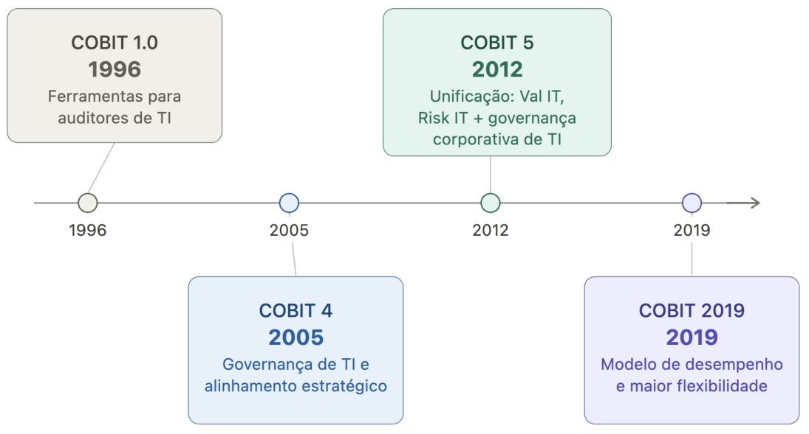

_Mas por que o COBIT existe, afinal_ ? O objetivo de sempre foi ajudar as organizações a gerenciarem e governarem suas informações e ativos tecnológicos de forma mais eficaz. A ideia é que a organização consiga alcançar seus **objetivos de negócio e de TI** ao mesmo tempo em que minimiza os riscos associados ao uso da tecnologia. Essa combinação (atingir objetivos e reduzir riscos) é exatamente o coração da governança de TI. 

O COBIT é especialmente útil para gerentes de TI, líderes empresariais, auditores de TI e qualquer pessoa que esteja envolvida com governança, controle ou gerenciamento de tecnologia da informação. Ou seja, não é um framework só para o pessoal técnico do servidor. Ele fala com o gestor, fala com o auditor, fala com o executivo. Isso é justamente o que diferencia o COBIT de muitos outros frameworks por aí, que acabam sendo muito nichados em uma área só. 

#### **Gestão versus Governança** 

Pessoal, agora que vocês sabem que COBIT lida com Gestão e Governança, vamos falar de algo que aparece em quase toda prova de concurso de TI e que muita gente ainda confunde: **governança e gestão de TI NÃO são a mesma coisa** . 

A tecnologia avançou muito rápido. Hoje qualquer empresa, seja uma padaria de bairro ou uma multinacional, depende de sistemas digitais para funcionar. Isso trouxe benefícios enormes, todo mundo sabe. Mas junto com esses benefícios vieram riscos, complexidades e a necessidade de alguém colocar ordem na casa. É exatamente aí que entram a **governança** e a **gestão de TI** .

---

<!-- pagina: 6 -->

**Paolla Ramos Aula 02** 

##### Vamos começar pela **governança** . 

Governança é o **conjunto de políticas e procedimentos que garantem que a TI de uma organização seja usada e gerenciada de acordo com as necessidades do negócio, as metas e os valores da empresa** . Repare que a governança de TI não é uma coisa puramente técnica. Ela envolve pessoas, processos e estruturas organizacionais. O objetivo dela é garantir que a TI entregue valor real ao negócio e que os riscos associados à tecnologia sejam minimizados. Pense nela como o nível estratégico, o "para onde vamos e por quê". 

Enquanto a governança cuida da estratégia e das políticas, a **Gestão cuida do dia a dia, da execução** . É ela que trata do planejamento de recursos, do desenvolvimento de projetos, da manutenção dos sistemas e do suporte ao usuário. Se a governança aponta o destino, a gestão é quem dirige o carro. Governança é estratégia e política, Gestão é implementação e administração cotidiana. 

O ponto central de tudo isso é garantir que a TI esteja **alinhada com os objetivos de negócio** da organização. Tem muita empresa por aí onde a TI virou um departamento isolado, que faz as coisas do próprio jeito, sem conversar com o restante da organização. O resultado é que a TI vira um custo, um obstáculo e ninguém quer isso. A ideia é que a tecnologia apoie e facilite o que a empresa quer alcançar, não que atrapalhe. 

Outro ponto fundamental é o **gerenciamento de riscos** . Riscos existem e precisam ser encarados de frente. A governança e a gestão de TI entram justamente para identificar o que pode dar errado, avaliar o tamanho do estrago potencial e tomar medidas para mitigar esses problemas antes que eles virem manchete de jornal. 

Tem também a questão da **conformidade** . As organizações vivem dentro de um mar de **leis** , **regulamentos** e **normas** , e boa parte deles exige que os ativos de TI sejam usados de forma adequada e protegidos corretamente. Pense na LGPD, nas normas do Banco Central para instituições financeiras, nas exigências de auditoria. A governança de TI ajuda a garantir que a organização não vai cair em infração por descuido ou por falta de controle interno. 

E por fim, mas não menos importante, tem a **melhoria de desempenho** . De nada adianta ter uma área de TI funcionando se você não consegue medir se ela está indo bem ou mal. A governança e a gestão de TI fornecem um conjunto de ferramentas e métricas para avaliar a eficiência dos processos, a qualidade dos serviços entregados e a satisfação de quem usa tudo isso no dia a dia. Sem essa visibilidade, você está navegando no escuro. 

#### **Mudanças no COBIT 2019** 

Vamos falar sobre o que mudou do COBIT 5 para o COBIT 2019, porque isso ainda cai bastante em prova e as diferenças são bem específicas. 

A primeira grande mudança é que o COBIT 2019 foi projetado para ser **mais flexível e adaptável** . A estrutura passou a ser considerada "aberta", o que significa que ela pode ser atualizada e expandida com muito mais facilidade e velocidade do que antes, sempre que surgem novas tendências e práticas de governança de TI. Antes era tudo mais engessado. Agora, a ideia é que o framework consiga acompanhar o ritmo do mercado sem precisar esperar uma nova versão inteira para incorporar mudanças.

---

<!-- pagina: 7 -->

**Paolla Ramos Aula 02** 

O segundo ponto é o foco em governança. O COBIT 5 já incorporava a governança de TI, isso é verdade. Mas o COBIT 2019 vai além e aumenta ainda mais esse foco, colocando a governança como um diferenciadorchave em relação à gestão. 

Além disso, algo muito importante: os **objetivos de governança e gestão** . O COBIT 2019 trouxe um conjunto de **40 objetivos** que substituem os processos do COBIT 5. Não são mais chamados de "processos", são "objetivos de governança e gestão". Esses 40 objetivos cobrem um espectro bastante amplo, desde a governança corporativa de TI até a gestão operacional do dia a dia. 

Outra grande mudança é o novo **modelo de desempenho de capacidade de processo** . O COBIT 2019 reformulou a forma como uma organização mede o quanto seus processos de TI estão maduros. A visão ficou mais detalhada, mais granular, como a gente diz na área. Na prática, isso significa que a empresa consegue enxergar com muito mais precisão onde está acertando e onde está errando nos seus processos. Antes, a avaliação era mais genérica. Agora, dá para mergulhar fundo em cada ponto. 

Houve também uma revisão das metas de alinhamento e das metas de gerenciamento de desempenho. Essas metas foram ajustadas justamente para conversar melhor com outras estruturas globais que o mercado já usa. Estamos falando de ITIL, CMMI, ISO 31000, COSO, entre outras. 

Ainda, o COBIT 2019 também chegou com novos **guias de design** e **implementação** . Isso foi um avanço bastante prático. Em vez de deixar a organização se virar para adaptar o framework à sua realidade, o modelo passou a oferecer uma estrutura orientando como fazer isso em diferentes contextos organizacionais. Cada empresa tem seu tamanho, seu setor, seus riscos específicos, e esses guias ajudam a moldar a aplicação do COBIT para cada situação. 

Por fim, e esse é um ponto que diferencia bastante o COBIT 2019 das versões anteriores: ele foi desenhado para receber **atualizações de forma contínua e regular** . As versões antigas saíam, ficavam ali por anos sem grandes revisões, e o mundo da TI mudava enquanto isso. O COBIT 2019 veio com a proposta de acompanhar esse ritmo acelerado de **transformação tecnológica** , sendo atualizado com muito mais frequência. 

## Defini ões <u>ç</u> 

Primeiramente, o COBIT 2019 é um **framework** , ou seja, um **conjunto estruturado de boas práticas e diretrizes voltado para a gestão e a governança empresarial de Informação e Tecnologia, o famoso I&T** . Por exemplo, toda organização que depende de tecnologia (e hoje em dia qual não depende?) precisa de alguma forma de controlar, organizar e tomar decisões sobre essa tecnologia. O COBIT 2019 existe exatamente para isso. 

O framework também estabelece quais são os **componentes** necessários para construir e sustentar um sistema de governança dentro da empresa. Quer dizer, ele não apenas diz "você precisa governar sua TI", ele te mostra as peças do quebra-cabeça e como encaixá-las. 

Tem outro ponto importante que costuma cair em prova que é o conceito de **"fatores de projeto"** . O COBIT 2019 os define como um **conjunto de fatores que a organização precisa levar em conta na hora de montar** 

**5**

---

<!-- pagina: 8 -->

**Paolla Ramos Aula 02** 

**a governança do jeito dela** . Cada empresa tem um tamanho diferente, um setor diferente, um nível de maturidade diferente. Não faz sentido usar a mesma configuração para uma startup de dez pessoas e para um banco com milhares de funcionários. **Os fatores de projeto existem justamente para guiar essa personalização, essa governança sob medida.** 

**_Saiba mais_** _: Os Fatores de Design influenciam o sistema de governança de três formas principais: 1. Priorização de Objetivos: determinam quais dos 40 objetivos de governança e gestão são mais críticos; 2. Variações de Componentes: sugerem a necessidade de componentes específicos (ex: uma estrutura organizacional diferente para uma empresa que usa nuvem); e 3. Necessidade de Áreas de Foco: indicam se a empresa deve dar atenção especial a temas como Segurança Cibernética ou DevOps._ 

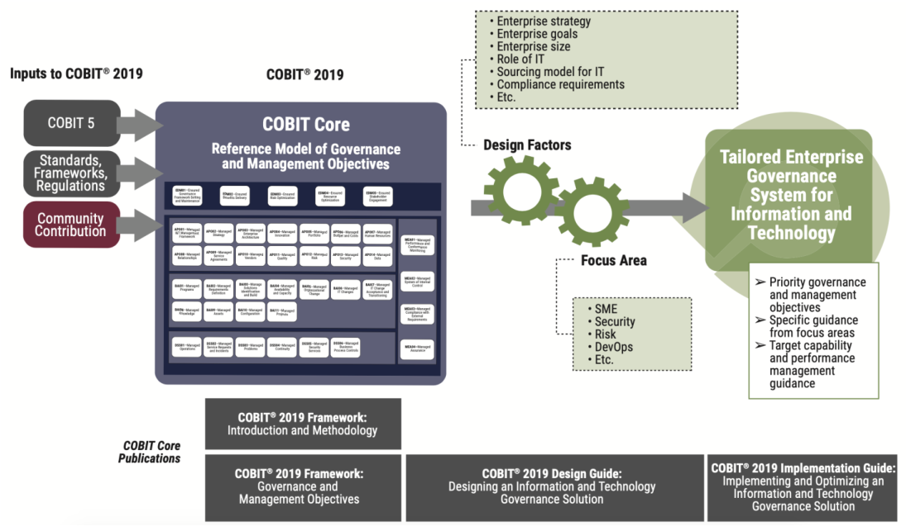

Agora, antes de avançar, vale a pena bater nesse ponto que muita gente confunde na hora da prova: o que o COBIT **não é** . 

Primeiro: o COBIT **não é uma descrição completa de todo o ambiente de TI** de uma organização. Ele não vai mapear cada detalhe da sua infraestrutura, cada servidor, cada configuração. Não é isso que ele faz. 

Segundo: ele **não é um framework de processos de negócio** . Ou seja, ele não foi criado para organizar como a empresa vende, compra ou atende cliente. Isso é outra conversa, de outras metodologias. 

Terceiro: ele também **não é um framework tecnológico** , no sentido técnico da palavra. Não espere encontrar no COBIT um guia de como configurar um firewall ou montar uma rede. Não tem nada disso lá. 

O COBIT cuida da **governança e gestão de TI** , e ponto. Ele não substitui as ferramentas técnicas, não substitui os frameworks de negócio e não entrega um retrato completo do seu ambiente tecnológico. Quem tenta

---

<!-- pagina: 9 -->

**Paolla Ramos Aula 02** 

usar o COBIT como se fosse tudo isso acaba se frustrando, e quem cai numa questão de prova sem saber disso acaba marcando a resposta errada. 

**(FGV - 2026 - Analista Judiciário (TJ RJ)/Tecnologia da Informação/Analista de Sistemas) Ana está buscando** **<mark>melhorar algumas práticas de governança e gestão da organização na qual trabalha e tem estudado o</mark> COBIT® 2019.** 

**<mark>A aplicação do COBIT® 2019 em uma organização, como um framework para governança e gerenciamento</mark> de informação e tecnologia, visa a:** 

a) gerenciar os recursos e ativos tecnológicos da organização; 

b) descrever o ambiente de tecnologia da informação da organização; 

c) delinear o custo da tecnologia da informação para a organização; 

d) definir os componentes para construir e sustentar um sistema de governança; 

e) definir a estratégia de tecnologia da informação mais adequada para organização. 

**Comentários:** 

<mark>(a) Errado. Gerenciar recursos tecnológicos é uma atividade operacional, não o propósito central do COBIT® 2019 como framework de governança; (b) Errado. Descrever o ambiente de TI é uma atividade de diagnóstico, não o objetivo do COBIT® 2019; (c) Errado. Delinear custos de TI é uma função financeira/contábil, fora do escopo principal do COBIT® 2019;</mark> **<mark>(d) Correto</mark>** <mark>. O COBIT® 2019 tem como propósito central fornecer os componentes necessários para construir e sustentar um sistema de governança e gerenciamento de TI nas organizações; (e) Errado. Definir estratégia de TI é papel do planejamento</mark> estratégico organizacional, não do COBIT® 2019 em si. 

## Público-Alvo 

Galera, o COBIT 2019 foi pensado para atender dois grupos de pessoas bem distintos: os **stakeholders internos** e os **stakeholders externos** . O framework não entrega a mesma coisa para todo mundo, ele agrega valor de formas diferentes dependendo de quem está usando. 

Para o **público interno** , o COBIT serve como um guia de trabalho do dia a dia. Ele ajuda a entender quais decisões de TI precisam ser tomadas, quem é responsável por cada coisa, como estruturar os processos de governança e gestão, e como conectar os objetivos da área de tecnologia com os objetivos do negócio como um todo. É o tipo de valor que aparece dentro de casa, na organização. 

Veja como o COBIT ajuda o público-alvo interno:

---

<!-- pagina: 10 -->

**Paolla Ramos Aula 02** 

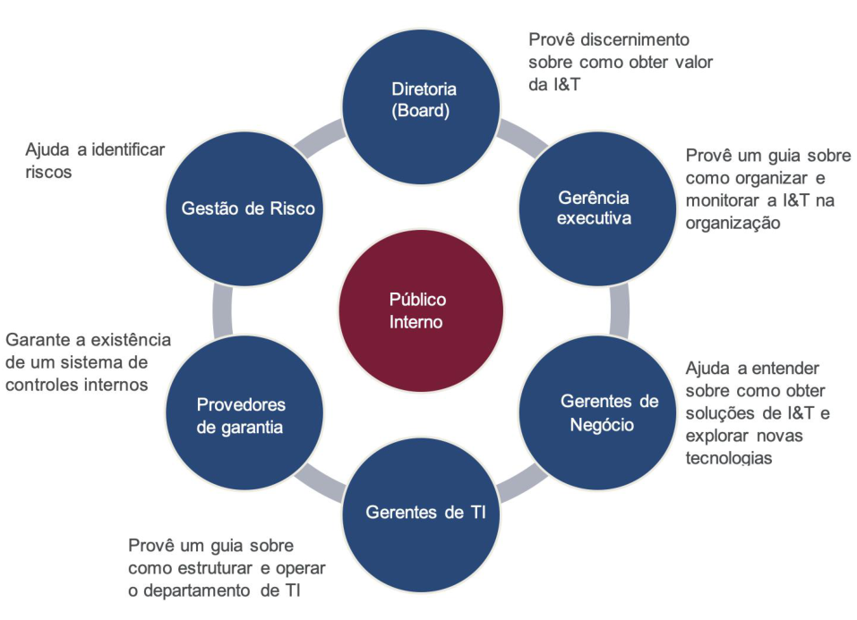

Já para o **público externo** , o COBIT funciona mais como um sinal de confiança. Auditores, reguladores, clientes, parceiros de negócio e qualquer outra parte interessada de fora da empresa podem usar o framework como referência para avaliar se a organização está gerenciando TI de forma responsável, transparente e em conformidade com boas práticas reconhecidas internacionalmente. É o valor que aparece para quem olha de fora para dentro. 

Veja como o COBIT ajuda o público-alvo externo:

---

<!-- pagina: 11 -->

**Paolla Ramos Aula 02** 

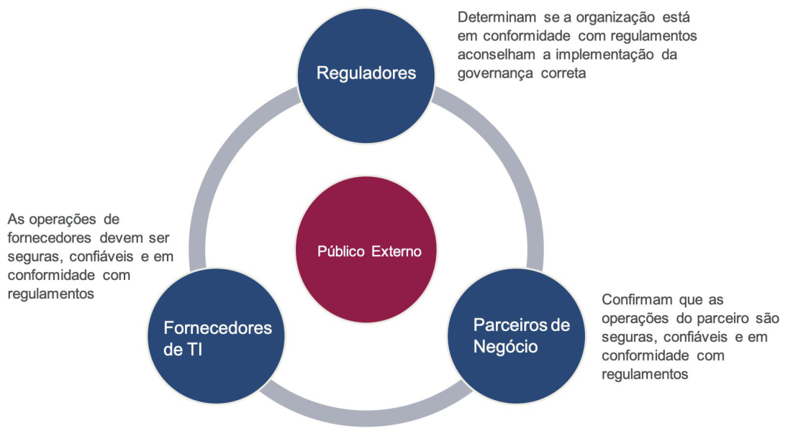

**(FCC - 2025 - Auditor Governamental (CGE PI)/Tecnologia da Informação) Uma startup em rápido** **<mark>crescimento quer adotar o framework COBIT 2019 para estruturar seu modelo de governança de TI. Durante uma reunião, o CTO sugere que a estrutura seja centrada apenas no departamento de TI, por acreditar que os assuntos de governança não devem envolver outras áreas. Já o CEO argumenta que a abordagem do COBIT deve abranger toda a empresa, e não apenas a TI. Com base nesse cenário e no COBIT</mark> 2019, é correto afirmar que o framework:** 

<mark>a) se aplica exclusivamente às decisões operacionais do setor de tecnologia, sob responsabilidade da</mark> gestão. 

b) define como decisões técnicas devem ser tomadas, mas não abrange outras áreas da empresa. 

<mark>c) deve ser aplicado à Information and Technology (I&T) em toda a empresa, não se restringindo ao</mark> departamento de TI. 

d) é voltado à gestão de TI e não interfere na estrutura geral de governança corporativa. 

<mark>e) visa substituir modelos de governança corporativa existentes, padronizando práticas de gestão,</mark> governança e serviços. 

**Comentários:** 

<mark>(a) Errado. O COBIT 2019 não se limita a decisões operacionais de TI; sua abrangência vai muito além do setor técnico; (b) Errado. O framework não se restringe a decisões técnicas — ele abrange toda a organização de forma integrada;</mark> **<mark>(c) Correto</mark>** <mark>. O COBIT 2019 é explícito ao afirmar que deve ser aplicado à I&T em toda a</mark>

---

<!-- pagina: 12 -->

**Paolla Ramos Aula 02** 

<mark>empresa, não apenas ao departamento de TI. O CEO está certo; (d) Errado. O COBIT 2019 integra governança de TI à governança corporativa, influenciando a estrutura organizacional como um todo; (e) Errado. O COBIT</mark> não substitui modelos de governança existentes — ele é complementar a eles, como ITIL e ISO 27001. 

## Governan a versus Gerenciamento <u>ç</u> 

Pessoal, vamos retomar e detalhar melhor aquela diferença que falamos anteriormente entre **Governança** e **Gerenciamento (ou Gestão)** . Os dois falam de TI, os dois envolvem decisões sobre tecnologia, mas os focos são completamente diferentes. 

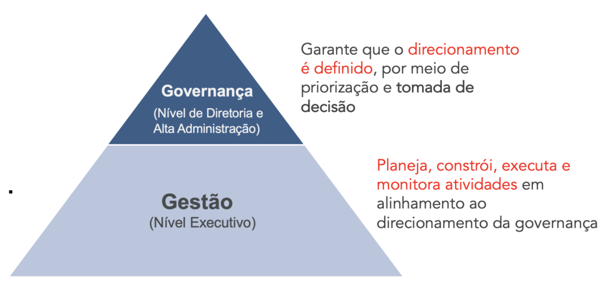

Vamos começar pela **Governança de TI** . 

Ela é o **conjunto de práticas que garante que a tecnologia da informação de uma empresa suporte e permita o alcance dos objetivos estratégicos do negócio** . Trata-se de direção estratégica, monitoramento de desempenho e mitigação de riscos. Quem faz isso é a **alta administração** e o **conselho de administração** . É lá no topo da hierarquia que a Governança acontece. São esses caras que definem os objetivos a serem alcançados, determinam os recursos necessários e monitoram se as coisas estão saindo conforme o planejado. 

Já a **Gestão de TI** é o nível do "colocar a mão na massa". É o processo pelo qual todos os recursos de TI da organização são gerenciados de acordo com as necessidades e prioridades do negócio. A Gestão cuida do planejamento estratégico e tático, da organização e implementação dos recursos de TI, e do monitoramento e ajuste da performance no dia a dia. Ela também é responsável por implementar as políticas e procedimentos que foram estabelecidos lá pela Governança. Ou seja, a Governança define o caminho, e a Gestão segue esse caminho e executa.

---

<!-- pagina: 13 -->

**Paolla Ramos Aula 02** 

Uma forma simples de fixar: a Governança pergunta "para onde vamos e por quê?". A Gestão pergunta "como fazemos isso acontecer?". COBIT separa os dois claramente. 

Segundo o COBIT, quando a Governança de TI é implementada corretamente, ela gera três benefícios centrais: **criação de valor** , **otimização de riscos** e **otimização de recursos** . A tabela baixo detalha cada um: 

|**Benefício**|**Explicação**|
|---|---|
|**Criação de** **valor**|A governança garante que a TI seja usada de forma eficaz para entregar valor real ao negócio. Não basta ter tecnologia de ponta se ela não estiver alinhada aos objetivos da organização. Esse alinhamento permite que a TI apoie a estratégia da empresa e também ajude a identificar oportunidades de investimento com melhor retorno possível, isto é, onde vale a pena investir e onde não vale.|
|**Otimização** **de riscos**|Toda organização que depende de TI convive com riscos técnicos, estratégicos e regulatórios. A governança atua na identificação, avaliação e gestão desses riscos. Otimizar riscos não significa eliminá-los, pois isso seria impossível, mas equilibrá-los com as oportunidades e mantê-los dentro dos níveis aceitáveis definidospela organização.|
|**Otimização** **de recursos**|A governança proporciona uma visão clara do desempenho da TI, permitindo que a organização utilize seus recursos de forma mais eficiente. Isso envolve melhorar processos, gerenciar ativos de TI com cuidado e direcionar os investimentospara as áreasque realmentegeram valor.|

**(CEBRASPE - 2024 - Analista Técnico II (SEBRAE)/Governança TI) Julgue os itens subsequentes, no que se refere a governança e gestão no modelo COBIT.** 

**<mark>I A governança garante que as necessidades, condições e opções das partes interessadas sejam avaliadas</mark> a fim de determinar objetivos corporativos acordados e equilibrados.** 

**II A governança geral é de responsabilidade da diretoria executiva sob a liderança do diretor executivo.** 

**<mark>III A gestão é responsável pelo planejamento, desenvolvimento, execução e monitoramento das atividades</mark> em consonância com a direção definida pelo órgão de governança.** 

**Assinale a opção correta.** 

a) Apenas os itens I e II estão certos. 

b) Apenas os itens I e III estão certos. 

c) Apenas os itens II e III estão certos. 

d) Todos os itens estão certos. 

**Comentários:** 

<mark>O Item II está errado porque a Governança é de responsabilidade da Alta Administração. A diretoria executiva</mark> é responsável pela Gestão..

---

<!-- pagina: 14 -->

**Paolla Ramos Aula 02** 

## Princípios 

O COBIT 2019 foi construído sobre dois conjuntos de princípios. De um lado, você tem o que eu chamo de "camada conceitual", que trata dos princípios para um **Framework de Governança** . Esses princípios funcionam como a base teórica, o alicerce que você pode usar para construir um sistema de governança do zero. Do outro lado, você tem a "camada pragmática", mais voltada para a prática, com princípios que descrevem os requisitos de um **Sistema de Governança** já em funcionamento. 

Repare na diferença entre as duas camadas, porque ela costuma cair em prova. O conjunto conceitual fala sobre o framework em si, ou seja, as ideias que sustentam a estrutura. O conjunto pragmático fala sobre o sistema de governança, ou seja, o que esse sistema precisa ter para funcionar de verdade. Vamos ver cada um deles em detalhe a seguir. 

#### **Princípios do FRAMEWORK de Governança** 

O framework de governança do COBIT é baseado em três princípios: modelo conceitual, aberto e flexível e alinhamento a grandes padrões. 

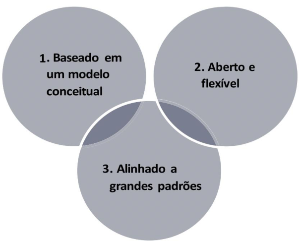

**Modelo Conceitual** significa que o COBIT não é uma simples lista de verificação do tipo "fez isso, passou para o próximo". É uma **estrutura teórica** , uma base de pensamento, que pode ser aplicada em contextos completamente diferentes. Esse modelo conceitual oferece uma **visão holística** e integrada da governança de TI, o que quer dizer que ele enxerga tudo junto, de forma conectada: processos, objetivos, práticas e informações formam um conjunto de componentes inter-relacionados, não partes soltas que você aplica de forma independente. 

É exatamente essa visão integrada que permite às organizações entender como diferentes aspectos da governança e da gestão de TI se relacionam entre si. E, mais importante ainda, essa base conceitual é o que 

**12**

---

<!-- pagina: 15 -->

**Paolla Ramos Aula 02** 

torna possível customizar a estrutura conforme as necessidades e os objetivos específicos de cada organização. 

Sobre ser **aberto e flexível** , o COBIT 2019 foi desenhado para funcionar em organizações dos mais variados tipos. Pequenas empresas, grandes corporações, órgãos governamentais, empresas do setor financeiro, do setor de saúde, de qualquer setor. Ele se adapta e não impõe uma receita única para todo mundo seguir igualzinho. Pelo contrário, a ideia é que cada organização pegue a estrutura e molde ela à sua realidade, ao seu porte, ao seu contexto cultural. 

E tem mais, por ser aberto, o COBIT consegue se alinhar e se integrar com outras normas e práticas de gestão que já existem no mercado. Ele convive bem com ISO, ITIL, frameworks de segurança e outros padrões, o que permite uma abordagem mais coerente e unificada, em vez de cada framework brigando por espaço dentro da organização. 

Por fim, outro ponto importante do é o fato de ele estar **alinhado a outros grandes padrões e práticas internacionais de governança e gestão de TI** . 

Estamos falando de nomes que você provavelmente já ouviu: ITIL, ISO 27001, PMBOK. Mas atenção: esse alinhamento não significa que o COBIT copia ou replica esses outros padrões. Ele complementa e se integra com eles, funcionando como uma **estrutura abrangente** que conversa com tudo isso ao mesmo tempo. 

Isso é importante porque nenhuma organização grande usa só um padrão. Elas misturam ITIL para gestão de serviços, ISO 27001 para segurança da informação, PMBOK para gerenciamento de projetos, e por aí vai. Sem algo que una essas abordagens, você tem ilhas de boas práticas que não se falam. O COBIT entra justamente para unificar e coordenar esse conjunto todo, evitando que cada área da TI trabalhe no seu próprio mundo. 

#### **Princípios do SISTEMA de Governança** 

O Sistema de Governança tem seis princípios, veja abaixo: 

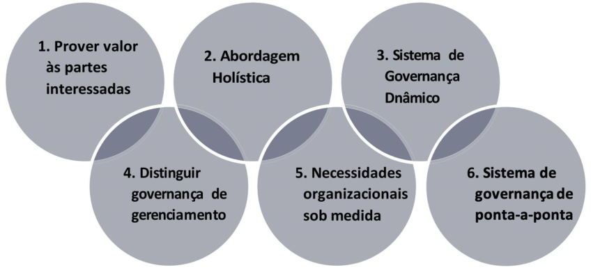

**Prover valor às partes interessadas** já começa com uma sacada importante do COBIT 2019, porque ele não está falando só de deixar o dono da empresa feliz. Quando o framework fala em "partes interessadas", ele

---

<!-- pagina: 16 -->

**Paolla Ramos Aula 02** 

está sendo bem abrangente: clientes, funcionários, fornecedores, reguladores, a comunidade ao redor. Todo mundo que de alguma forma é afetado pelas decisões de TI da organização entra nessa conta. A ideia é que a governança de TI precisa entender o que cada um desses grupos precisa e, mais do que isso, garantir que os resultados gerados estejam alinhados com essas necessidades. Não adianta ter uma TI tecnicamente impecável se ela não está entregando valor real para quem importa. 

**Abordagem holística** significa olhar para o todo, não para as partes isoladas. O COBIT 2019 reconhece que a governança de TI é um sistema complexo, e os elementos que compõem esse sistema são bem variados, tais como processos, estruturas organizacionais, informações, culturas, comportamentos. Tudo isso está interligado. O framework, então, incentiva as organizações a resistirem à tentação de enxergar a governança como um conjunto de caixinhas separadas, onde cada área cuida do seu pedaço sem olhar para o lado. Esse tipo de visão fragmentada é justamente o que gera inconsistências, retrabalho e decisões que fazem sentido numa ponta mas causam problema na outra. A abordagem holística existe para evitar exatamente isso. 

**Sistema de Governança Dinâmico** é onde a governança de TI não é algo que você configura uma vez e esquece, como se fosse uma impressora antiga que ninguém mexe mais. Ela precisa se mover, se ajustar, evoluir. O ambiente de negócios muda, a tecnologia muda, as necessidades da organização mudam, e a governança tem que acompanhar esse ritmo. O COBIT 2019 foi justamente desenhado para dar essa flexibilidade, onde ele fornece uma estrutura que permite às organizações refinarem e ajustarem suas práticas de governança continuamente, conforme as circunstâncias vão mudando. 

Depois, temos o princípio de distinção entre **Governança** e **Gerenciamento** . Já falamos sobre isso durante nossa aula. Governança é o andar de cima: é onde se define a **direção estratégica** , onde as decisões de alto nível são tomadas, onde se estabelece para onde a organização quer ir. Gerenciamento, por sua vez, é o chão de fábrica: é a **execução** dessas direções no dia a dia, é colocar em prática o que foi decidido lá em cima. 

**Necessidades Organizacionais Sob Medida** . A ideia aqui é que não existe uma organização igual à outra. Uma startup de tecnologia tem desafios completamente diferentes de um banco tradicional, que por sua vez é diferente de uma prefeitura do interior. Setor, tamanho, cultura, maturidade, tudo isso muda. E o COBIT reconhece isso. Por isso ele foi construído como uma estrutura flexível e adaptável, que pode (e deve) ser personalizada para cada realidade. 

Por fim, temos o princípio de **Sistema de Governança de Ponta a Ponta** . Sabe quando a governança de TI fica presa dentro do departamento de TI, como se fosse um assunto só dos técnicos? Pois é, o COBIT diz que isso está errado. A governança precisa atravessar a organização inteira, do topo ao chão de fábrica, conectando a estratégia de negócios lá em cima com a execução operacional lá embaixo. Todos os níveis, todas as funções, todos os departamentos entram no jogo. O COBIT oferece justamente essa estrutura de integração, garantindo que a TI não viva numa bolha isolada, mas que esteja alinhada com os objetivos do negócio de ponta a ponta, do planejamento estratégico até a entrega do serviço. 

**(FGV - 2026 - Analista Judiciário (TJ RJ)/Tecnologia da Informação/Analista de Gestão de TIC) O COBIT®** **<mark>2019 foi desenvolvido com base em dois conjuntos de princípios: princípios que descrevem os requisitos essenciais de um sistema de governança para informação e tecnologia corporativas e princípios para uma</mark> estrutura de governança que pode ser usada para construir um sistema de governança.**

---

<!-- pagina: 17 -->

**Paolla Ramos Aula 02** 

**Sobre os princípios do COBIT® 2019, é correto afirmar que:** 

<mark>a) um sistema de governança deve empregar indistintamente atividades e estruturas de governança e</mark> gestão; 

<mark>b) um sistema de governança deve abranger especificamente a função de tecnologia da informação, em</mark> que o processamento de informações da empresa é realizado; 

<mark>c) cada empresa precisa de um sistema de governança para satisfazer suas necessidades internas,</mark> independentemente do valor agregado pelo uso da tecnologia da informação; 

<mark>d) um sistema de governança de tecnologia da informação corporativa é constituído a partir de</mark> componentes homogêneos e específicos que interagem ocasionalmente; 

<mark>e) um sistema de governança deve ser adaptado às necessidades da empresa, usando um conjunto de fatores de desenho como parâmetros para personalizar e priorizar os componentes do sistema de</mark> governança. 

**Comentários:** 

<mark>(a) Errado. O COBIT 2019 distingue claramente as atividades de governança das de gestão — elas têm propósitos diferentes e não devem ser tratadas de forma indistinta; (b) Errado. O sistema de governança deve abranger toda a informação corporativa, não apenas a função de TI isoladamente; (c) Errado. O sistema de governança considera o valor agregado pelo uso da tecnologia, sendo esse um fator central, não ignorado; (d) Errado. Os componentes do sistema de governança são diversos e interagem de forma contínua, não ocasional;</mark> **<mark>(e) Correto</mark>** <mark>. O COBIT 2019 prevê que o sistema de governança seja personalizado com base em</mark> fatores de desenho, adaptando componentes às necessidades específicas de cada empresa. 

## Cascata de Objetivos 

Dentro do COBIT 2019 existe um mecanismo chamado **Cascata de Objetivos** , e ele é um dos conceitos mais cobrados sobre esse framework. Por exemplo, como a TI de uma empresa consegue, na prática, estar alinhada com o que a organização realmente quer? Como o pessoal de infraestrutura, de sistemas, de segurança da informação sabe que está trabalhando na direção certa? É exatamente para isso que serve a Cascata de Objetivos, pois ela conecta as necessidades das partes interessadas com as metas estratégicas da empresa, e daí desce até os objetivos de governança e gerenciamento de TI. 

A cascata tem quatro níveis:

---

<!-- pagina: 18 -->

**Paolla Ramos Aula 02** 

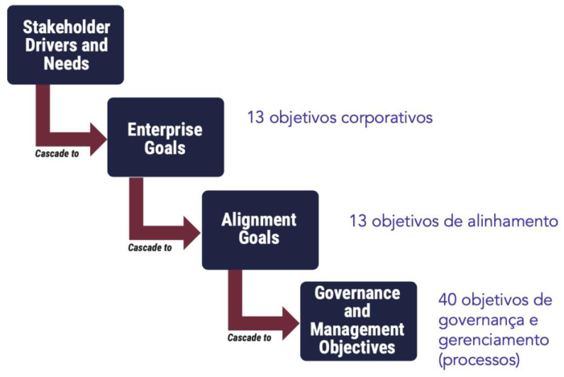

##### O primeiro nível é o das **Necessidades das Partes Interessadas** . 

Estamos falando do nível mais alto da cadeia. **Parte interessada** é todo mundo que tem algum interesse na organização: proprietários, funcionários, clientes, fornecedores, reguladores, a comunidade ao redor. _E o que cada um quer_ ? Depende. O acionista quer retorno financeiro. O cliente quer um serviço confiável e seguro. O regulador quer conformidade com as leis. A comunidade pode querer que a empresa não cause danos ambientais. São necessidades variadas, às vezes até conflitantes, e o COBIT reconhece isso. 

##### O segundo nível é o dos **Objetivos Corporativos** , também chamados de **Objetivos Empresariais** . 

Aqui a organização pega aquelas necessidades das partes interessadas e transforma em **metas estratégicas** concretas. Crescimento de receita, eficiência operacional, satisfação do cliente, conformidade regulatória, esse tipo de coisa. São os objetivos que definem para onde a empresa está indo e o que ela precisa alcançar. Por exemplo, se os acionistas querem crescimento e os clientes querem qualidade, os objetivos corporativos vão capturar isso em forma de **metas mensuráveis** e **direcionamentos estratégicos** claros. 

**_Saiba mais:_** _O COBIT 2019 define 13 Metas Organizacionais genéricas, agrupadas pelo Balanced Scorecard (BSC): Financeira (ex: Gerenciamento de riscos de negócio); Cliente (ex: Cultura de serviço orientada ao cliente); Interna (ex: Otimização da funcionalidade de processos); e Aprendizado e Crescimento (ex: Programas de transformação digital). Essas metas servem para que a organização escolha quais são prioritárias para o seu contexto, servindo de entrada para a cascata de objetivos que definirá as_ _<u>prioridades de TI.</u>_ 

##### Agora chegamos ao terceiro nível da cascata: os **Objetivos de Alinhamento** . 

É aqui que a coisa começa a ficar mais concreta, porque esse nível faz justamente a ponte entre os objetivos corporativos lá em cima e o que a área de TI precisa fazer para dar conta do recado. Em outras palavras, ele identifica quais objetivos de TI são necessários para apoiar e alcançar o que a empresa definiu como meta. Pode ser a melhoria da infraestrutura de TI, a implementação de novas tecnologias, o reforço da segurança da informação, a melhoria do suporte ao cliente... a lista varia conforme o contexto de cada organização.

---

<!-- pagina: 19 -->

**Paolla Ramos Aula 02** 

##### E então chegamos ao último nível: os **Objetivos de Governança e Gerenciamento** . 

Esse é o nível mais baixo da cascata, mas não menos importante. Pelo contrário, é aqui que tudo se materializa. Com base nos objetivos de alinhamento definidos antes, esse nível estabelece as metas e atividades específicas para que a governança e a gestão de TI funcionem de verdade no dia a dia. Estamos falando de coisas como o desenvolvimento de políticas de TI, a implementação de processos de gestão de risco, a condução de auditorias de TI, entre outros. É o "como fazer" da história. **Lembre-se que são 40 objetivos de governança e gerenciamento.** 

Juntando tudo, a Cascata de Objetivos funciona como um **mecanismo de tradução** : ela pega as necessidades das partes interessadas, que muitas vezes são abstratas e estratégicas, e vai desdobrando em ações concretas e mensuráveis, nível por nível, até chegar em algo que a equipe de TI consegue efetivamente executar. 

**(CEBRASPE - 2024 - Analista de Planejamento, Gestão e Infraestrutura em Propriedade Industrial** **<mark>(INPI)/Gestão da Tecnologia da Informação/Desenvolvimento e Manutençao de Sistemas (e mais 2</mark> concursos))** Julgue o item subsequente, relativo a COBIT 2019 e ITIL v4. 

<mark>Considerando a figura a seguir que descreve a cascata de objetivos do COBIT 2019, é correto afirmar que #1</mark> está mais relacionado a motivadores e necessidades das partes interessadas do que à estratégia empresarial 

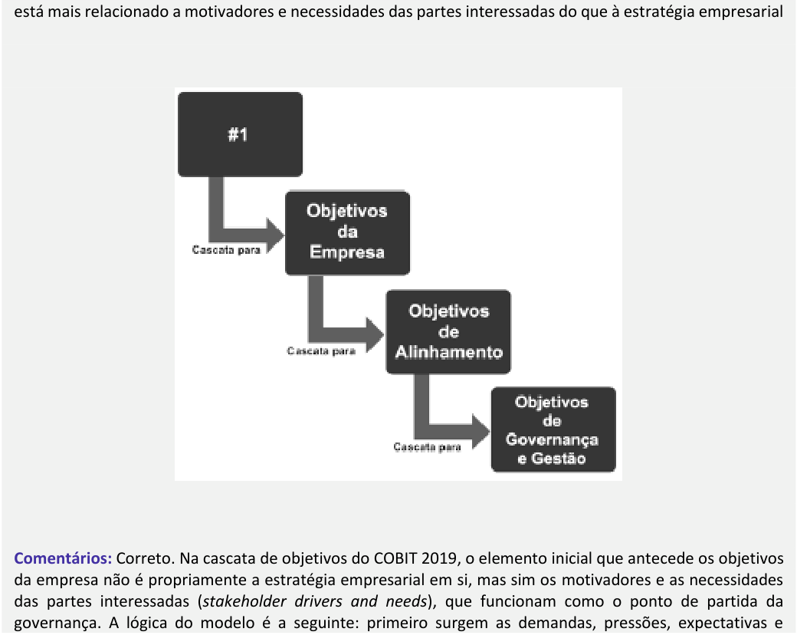

<!-- Start of picture text -->
está mais relacionado a motivadores e necessidades das partes interessadas do que à estratégia empresarial Comentários:  Correto. Na cascata de objetivos do COBIT 2019, o elemento inicial que antecede os objetivos da empresa não é propriamente a estratégia empresarial em si, mas sim os motivadores e as necessidades das partes interessadas ( stakeholder drivers and needs ), que funcionam como o ponto de partida da governança. A lógica do modelo é a seguinte: primeiro surgem as demandas, pressões, expectativas e <!-- End of picture text -->

---

<!-- pagina: 20 -->

**Paolla Ramos Aula 02** 

<mark>necessidades dos stakeholders; em seguida, essas demandas são traduzidas em objetivos da empresa; depois, desdobram-se em objetivos de alinhamento; e, por fim, em objetivos de governança e gestão. Assim, o bloco #1, por estar antes dos objetivos da empresa na figura, está mesmo mais relacionado aos motivadores e necessidades das partes interessadas do que à própria estratégia empresarial, que já aparece</mark> como uma tradução organizacional dessas necessidades. 

## a Componentes do Sistema de Governanç 

Para que uma organização consiga atingir seus objetivos de governança, ela precisa montar e usar um conjunto de **componentes** que sejam adequados à sua realidade. Não existe uma receita universal pronta, cada organização personaliza o que vai usar. Esses componentes são os fatores que contribuem para que o sistema de governança de Informação e Tecnologia (I&T) funcione bem dentro da organização. 

**_Saiba Mais:_** _Para o COBIT 2019, a informação só é útil se possuir qualidade. Os critérios são divididos em categorias: Qualidade Intrínseca (Acurácia, Objetividade, Credibilidade); Qualidade Contextual (Relevância, Completude, Valor Agregado); e Acessibilidade/Segurança. A Objetividade refere-se ao grau em que a informação é imparcial, livre de preconceitos e baseada em fatos, garantindo que o processo decisório não seja contaminado por interpretações distorcidas._ 

São sete componentes ao total, quais sejam: 

|**Componente**|**Descrição**|
|---|---|
|**Processos**|Um conjunto de práticas e atividades para atingir um determinado objetivo ou produzir um resultado específico.|
|**Estruturas Organizacionais**|Entidades,comitês, gruposque tomam decisões na organização.|
|**Princípios, Políticas e** **Frameworks**|Traduzem comportamentos desejados em ações do dia a dia.|
|**Informação**|Inclui toda informaçãoque éproduzida e utilizada na organização.|
|**Cultura, Ética e** **Comportamento**|Incluindo os indivíduos e a própria organização.|
|**Pessoas, Habilidades e** **Competências**|São necessários para a boa tomada de decisão e execução de atividades.|
|**Serviços, Infraestrutura e** **Aplicações**|Tecnologias que realizam o processamento da informação.|

**(CEBRASPE - 2024 - Analista em Ciência e Tecnologia I (CNPq)/Gestão e Governança de Tecnologia da Informação)** No que se refere ao COBIT 2019, julgue o item seguinte. 

<mark>Conforme o COBIT 2019, os habilitadores interagem entre si para criar uma forma abrangente e holística de</mark> governança que contribua para um sistema de governança. 

**<mark>Comentários:</mark>** <mark>Errado. No COBIT 2019, o termo correto é componentes de governança, não "habilitadores" — conceito que pertence ao COBIT 5. São esses componentes que interagem de forma holística para</mark> sustentar o sistema de governança.

---

<!-- pagina: 21 -->

**Paolla Ramos Aula 02** 

## Áreas Focais 

Áreas Focais são categorias específicas, organizacionais, setoriais ou operacionais, que têm impacto direto na forma como a governança e a gestão de TI são conduzidas. É como se o COBIT dissesse: "Olha, o framework funciona no geral, mas algumas situações merecem uma atenção especial, com **orientações mais detalhadas para aquele contexto** ." 

Alguns exemplos de contexto: segurança, privacidade, gerenciamento de projetos,  gerenciamento de riscos... a lista é longa e pode crescer conforme a necessidade da organização ou do setor. O ponto é que as Áreas Focais não substituem o COBIT, elas complementam, oferecendo um olhar mais aprofundado para situações específicas. 

Ou seja, áreas focais são **recortes temáticos** que permitem aplicar o framework com ênfase em um contexto específico. Em vez de olhar a governança e a gestão de I&T apenas de forma genérica, a área focal destaca quais componentes, objetivos e práticas merecem maior atenção em determinado cenário. 

Veja alguns exemplos (outras podem surgir no futuro): 

#### **COBIT para pequenas e médias empresas** 

Essa área focal adapta o COBIT à realidade de organizações de menor porte, que normalmente possuem menos pessoas, menos orçamento, menor formalização de processos e forte acúmulo de funções. 

A ideia não é aplicar todo o COBIT com o mesmo grau de profundidade de uma grande corporação, mas sim usar o framework de forma **proporcional e pragmática** . Em pequenas e médias empresas, é comum que um mesmo profissional acumule papéis de gestão, operação, segurança e suporte. Por isso, a governança precisa ser mais simples, objetiva e sustentável. 

Na prática, essa área focal busca: 

- priorizar os processos e objetivos mais críticos; 

- reduzir burocracia desnecessária; 

- formalizar apenas o que realmente agrega controle e clareza; 

- melhorar decisões sobre tecnologia, riscos, fornecedores e segurança sem exigir estruturas complexas. 

#### **Segurança da Informação** 

Essa área focal direciona o uso do COBIT para a proteção da informação e dos ativos tecnológicos da organização. 

O foco está em garantir que a segurança da informação seja tratada não apenas como questão técnica, mas como tema de governança. Isso envolve definir responsabilidades, políticas, controles, monitoramento, resposta a incidentes e alinhamento com o apetite de risco da organização.

---

<!-- pagina: 22 -->

**Paolla Ramos Aula 02** 

Ela abrange preocupações como: 

- confidencialidade, integridade e disponibilidade da informação; 

- gestão de acessos; 

- prevenção e tratamento de incidentes; 

- definição de políticas de segurança; 

- conformidade com exigências legais e regulatórias; 

- conscientização das pessoas. 

A lógica do COBIT é mostrar que segurança não depende só de firewall, antivírus ou criptografia. Ela depende também de processos bem definidos, papéis claros, cultura organizacional e monitoramento contínuo. 

#### **Gerenciamento de Riscos** 

==5460== Essa área focal concentra a aplicação do COBIT na identificação, avaliação, tratamento e monitoramento dos riscos relacionados a I&T. 

O ponto principal é assegurar que os riscos de tecnologia sejam tratados como parte do risco corporativo, e não de forma isolada. Isso inclui riscos de indisponibilidade, falhas de segurança, projetos malsucedidos, dependência de fornecedores, não conformidade regulatória, perda de dados, entre outros. 

Essa área focal busca: 

- identificar riscos relevantes de I&T; 

- avaliar probabilidade e impacto; 

- alinhar a gestão de riscos ao apetite e à tolerância ao risco da organização; 

- definir respostas adequadas, como mitigar, aceitar, transferir ou evitar; 

- acompanhar continuamente os riscos e os controles. 

Em termos práticos, ela ajuda a responder perguntas como: 

- quais riscos de tecnologia podem comprometer os objetivos do negócio? 

- quais deles são aceitáveis? 

- onde vale a pena investir em controles? 

- como acompanhar se o risco está aumentando ou diminuindo? 

#### **DevOps** 

Essa área focal aplica o COBIT ao contexto de desenvolvimento e operação integrados, com ênfase em agilidade, colaboração e entrega contínua de valor. 

O DevOps procura aproximar equipes de desenvolvimento, operações, testes, segurança e negócio para reduzir atritos e acelerar entregas com qualidade. Quando o COBIT é usado nesse cenário, ele ajuda a garantir que essa agilidade não aconteça sem controle. 

O foco, aqui, é equilibrar:

---

<!-- pagina: 23 -->

**Paolla Ramos Aula 02** 

- rapidez na entrega; 

- estabilidade dos serviços; 

- qualidade das mudanças; 

- segurança; 

- rastreabilidade; 

- responsabilidade clara. 

Na prática, essa área focal envolve temas como: 

- automação de testes e implantações; 

- integração e entrega contínuas; 

- gestão de mudanças mais ágil; 

- monitoramento contínuo; 

- colaboração entre áreas; 

- feedback rápido; 

- incorporação de controles de governança sem travar a inovação. 

**(CEBRASPE - 2025 - Analista Judiciário (TRF 6ª Região)/Apoio Especializado/Governança e Gestão de** **<mark>Tecnologia da Informação)</mark>** <mark>Em relação aos modelos e às referências de governança da tecnologia da</mark> informação, julgue o item a seguir. 

O COBIT 2019 tem, entre outras, a privacidade de dados e a segurança cibernética como áreas de foco. 

**<mark>Comentários:</mark>** <mark>Correto. O COBIT 2019 introduziu áreas de foco (</mark> _<mark>focus areas</mark>_ <mark>) como privacidade de dados e segurança cibernética, permitindo adaptar a governança de TI a contextos e necessidades específicas das</mark> organizações. 

## Fatores de Projeto (Design Factors) 

Pessoal, vamos falar sobre os **Fatores de Projeto** do COBIT 2019. Eles são elementos, tanto organizacionais quanto operacionais, que **influenciam como uma empresa vai selecionar e implementar suas práticas de governança e gerenciamento de TI** . Em outras palavras, são as condições específicas de cada organização que moldam o design do sistema de governança de TI. Cada empresa tem o seu contexto, e o COBIT 2019 reconhece isso. 

No total, são 11 **Fatores de Projeto** . Vamos ver cada um deles. 

O primeiro é a **Estratégia Organizacional** . Esse fator diz respeito à **direção estratégica** da organização como um todo, ou seja, a visão, a missão, os objetivos e os planos estratégicos que a TI precisa apoiar. Por exemplo, se a empresa decidiu virar uma plataforma digital nos próximos três anos, a governança de TI não pode estar desenhada para um ambiente onde tecnologia é só suporte. Ela precisa refletir essa ambição.

---

<!-- pagina: 24 -->

**Paolla Ramos Aula 02** 

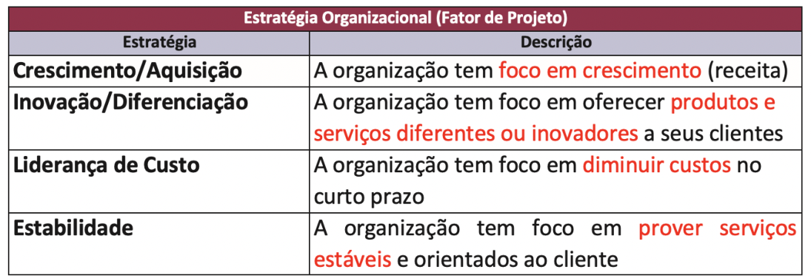

O segundo fator são os **Objetivos Corporativos** . Estamos falando dos objetivos específicos que a organização quer bater, seja crescimento de receita, eficiência operacional, satisfação do cliente, entre outros. A governança e a gestão de TI precisam estar alinhadas a essas metas. 

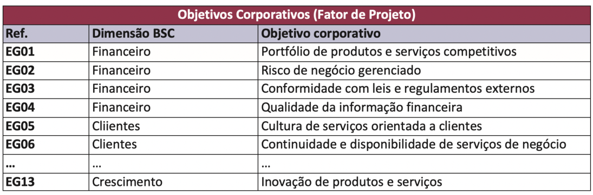

O terceiro fator é o **Perfil de Risco** . Toda organização tem um apetite por risco, ou seja, uma quantidade e um tipo de risco que ela está disposta a aceitar. Uma empresa mais conservadora vai investir pesado em controles de TI e adotar práticas de segurança bem rígidas. Outra, mais arrojada, pode tolerar certos riscos em troca de agilidade ou custo menor. Esse perfil influencia diretamente como a gestão de risco de TI é conduzida e onde o dinheiro vai ser investido.

---

<!-- pagina: 25 -->

**Paolla Ramos Aula 02** 

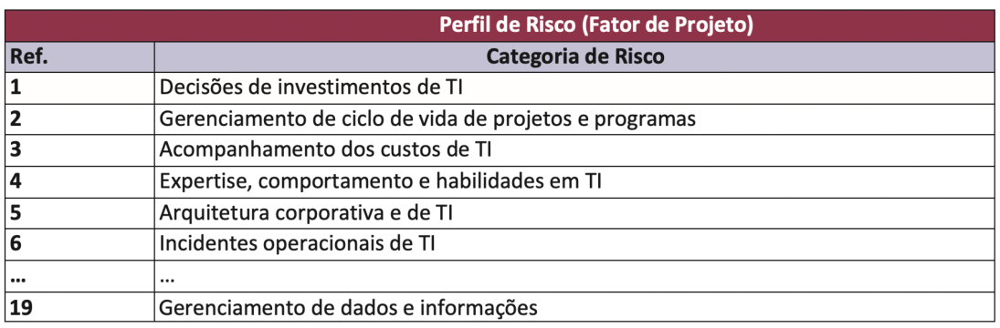

O quarto fator é  o de **Questões Relacionadas à Tecnologia e Informação** . Esse item é mais simples de entender: são os problemas reais que a organização está enfrentando no dia a dia tecnológico. Sistema legado que ninguém mais dá suporte, dados de má qualidade que geram relatórios errados, vulnerabilidades de segurança que ninguém fechou ainda. Sabe aquele banco que ainda roda em COBOL dos anos 80? Entra aqui. 

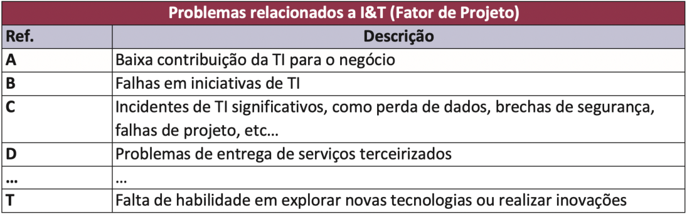

O quinto fator é o **Panorama de Ameaças** . A organização não existe num vácuo, ela está exposta a um ambiente cheio de ameaças. Ameaças cibernéticas, como ransomware e phishing. Ameaças competitivas, como um concorrente que lançou um produto que tornou o seu obsoleto. Ameaças regulatórias, como uma nova lei que vai exigir mudanças inteiras na infraestrutura. Esse panorama todo molda as decisões de segurança e de gestão de risco. 

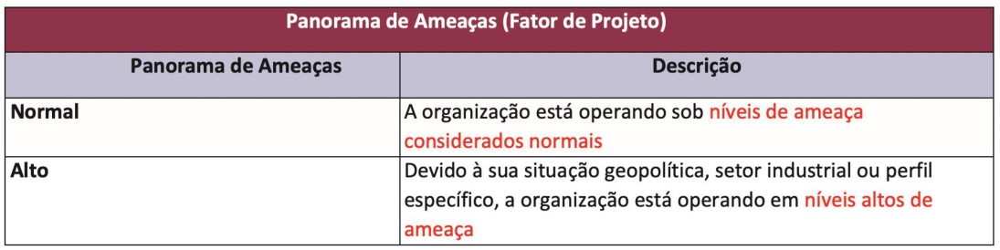

---

<!-- pagina: 26 -->

**Paolla Ramos Aula 02** 

O sexto fator é o de **Requisitos de Conformidade** . Aqui entram as leis, regulamentos e padrões que a organização é obrigada a seguir. No Brasil, a LGPD é um exemplo claro que impõe requisitos de privacidade afetando diretamente como os dados são tratados e protegidos. Além disso, pode ser uma norma de segurança setorial, uma exigência de auditoria financeira, um padrão internacional como a ISO 27001. Conformidade não é opcional e descumprir pode gerar multa, processo e, dependendo do setor, até interdição. Por isso esse requisito entra como fator central na definição das práticas de TI. 

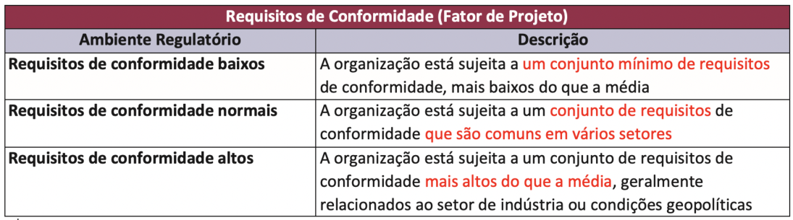

O sétimo fator é o **Papel da TI** . Em algumas organizações, a TI está lá só para manter o servidor ligado, resolver problema de impressora e garantir que o e-mail não caia. Isso é um papel operacional, de suporte. Em outras organizações, a TI senta na mesa das decisões estratégicas, participa do planejamento, lidera projetos de inovação e puxa a transformação digital. São realidades completamente diferentes. 

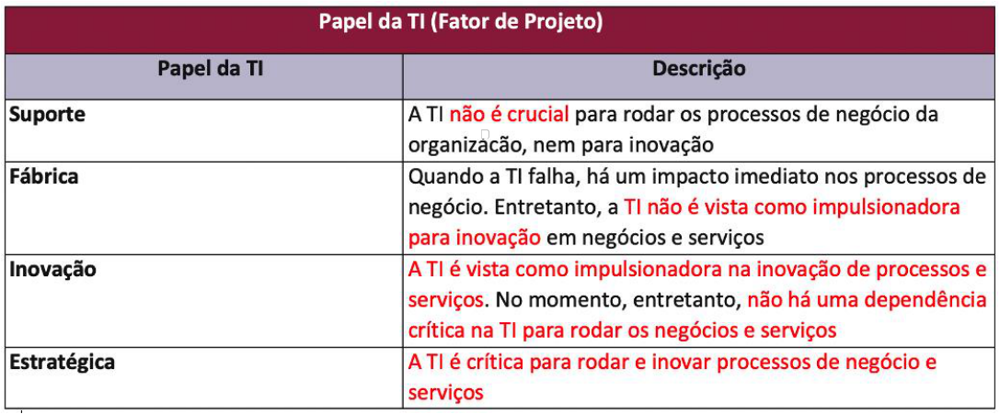

O oitavo fator é **Modelo de Sourcing** , que em bom português significa como a organização obtém seus recursos de TI. Ela mantém tudo dentro de casa, com equipe própria? Terceiriza parte dos serviços? Usa cloud computing e paga só pelo que consome? Mistura tudo isso? Cada escolha tem implicações de custo, controle, segurança e agilidade. Não existe resposta certa universal aqui. Depende do tamanho da empresa, do setor, do orçamento e da estratégia.

---

<!-- pagina: 27 -->

**Paolla Ramos Aula 02** 

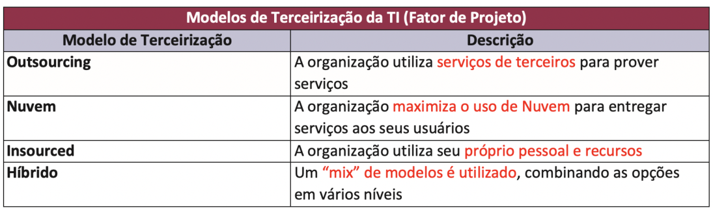

O nono fator é o de **Métodos de implementação da TI** , que se referem a como a organização coloca novas tecnologias e projetos em prática. É aqui que entram nomes como Agile, DevOps e Waterfall. Uma empresa que adota Agile trabalha em ciclos curtos, com entregas frequentes e muita adaptação ao longo do caminho. Uma empresa que usa Waterfall planeja tudo antecipadamente, em fases bem definidas e sequenciais, como uma cascata. O DevOps, por sua vez, une desenvolvimento e operações para acelerar entregas com mais qualidade. A escolha do método impacta diretamente a velocidade, o custo e o sucesso dos projetos. 

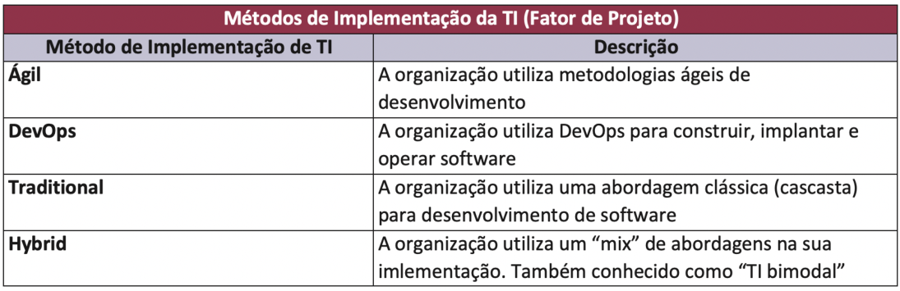

O décimo fator é o de **Estratégia de adoção de tecnologias** , que trata de como a organização decide incorporar novidades como **cloud computing** , **inteligência artificial** , **Big Data** e afins. Tem empresa que é “ _early adopter”_ , ou seja, entra na frente, aceita o risco e testa tudo que aparece. Tem empresa que prefere esperar a tecnologia amadurecer para só então adotar. Essa postura influencia diretamente o ritmo e a profundidade da transformação digital. Uma organização conservadora vai transformar mais devagar. Uma organização arrojada vai transformar mais rápido, mas também vai errar mais pelo caminho. Nenhuma das duas posições é errada por princípio. O que importa é que essa escolha seja consciente e alinhada à estratégia do negócio.

---

<!-- pagina: 28 -->

**Paolla Ramos Aula 02** 

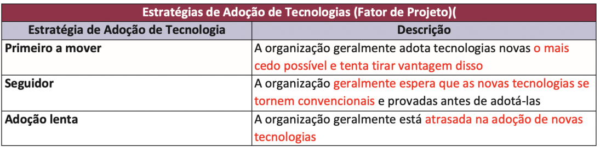

Por fim, o décimo primeiro fator é o de **Tamanho da empresa** . O tamanho de uma organização pode ser medido de várias formas, pelo número de funcionários, pela receita que ela gera, pelo volume de ativos que ela possui, entre outros indicadores. Quanto maior a empresa, maior tende a ser a escala e a complexidade de tudo que envolve governança e gestão de TI. Uma multinacional com cinquenta mil funcionários precisa de estruturas, processos e controles completamente diferentes dos de uma empresa com trinta pessoas. 

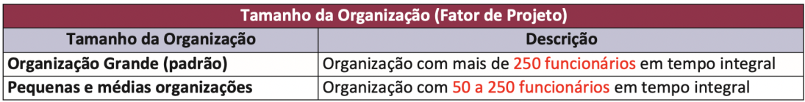

**(CEBRASPE - 2024 - Analista de Sistemas (CAGEPA)/Suporte de TI) No COBIT 2019, os fatores de desenho** **<mark>podem influenciar o projeto do sistema de governança de uma organização e conduzi-lo com sucesso no uso estratégico de TI. Um dos elementos desses fatores, que permite a identificação dos pontos de dor da</mark> organização, inclusive definindo níveis de severidade para cada um dos pontos de dor, é denominado** 

a) perfil de risco da organização. 

b) modelo de provimento de TI. 

c) cenário de ameaças. 

d) requisitos de conformidade. 

e) problemas relacionados à TI. 

**<mark>Comentários:</mark>** <mark>(a) Errado. O perfil de risco trata da exposição da organização a riscos, não da identificação de pontos de dor com níveis de severidade; (b) Errado. O modelo de provimento de TI define como os serviços de TI são fornecidos, não mapeia pontos de dor organizacionais; (c) Errado. O cenário de ameaças descreve o ambiente externo de riscos e ameaças, sem foco em pontos de dor internos; (d) Errado. Requisitos de conformidade tratam de obrigações regulatórias e legais, não da identificação de pontos de dor;</mark> **<mark>(e) Correto</mark>** <mark>. Os problemas relacionados à TI são o fator de desenho do COBIT 2019 que permite identificar os pontos de</mark> dor da organização, atribuindo níveis de severidade a cada um deles.

---

<!-- pagina: 29 -->

**Paolla Ramos Aula 02** 

## Objetivos de Governança e Gerenciamento 

Pessoal, vamos falar sobre os **Objetivos de Governança e Gerenciamento** no **COBIT** . Pense neles como uma bússola: eles fornecem uma estrutura clara para definir prioridades e estabelecer estratégias dentro da governança de TI. Cada objetivo de governança ou gerenciamento sempre se relaciona a um **processo (geralmente com o mesmo nome)** e a outros componentes que trabalham juntos para que aquele objetivo seja, de fato, atingido. 

A diretoria e a gerência executiva ficam com os processos de governança, enquanto a gerência do meio, aquela camada intermediária da empresa, fica responsável pelos processos de gerenciamento. Cada um no seu quadrado, cada um prestando contas pela sua parte. 

No total, são 40 objetivos de governança e gerenciamento, distribuídos entre **cinco domínios** . E esses domínios não foram escolhidos aleatoriamente. Eles derivam diretamente dos princípios de governança de TI, o que garante a coerência do modelo. Veja: 

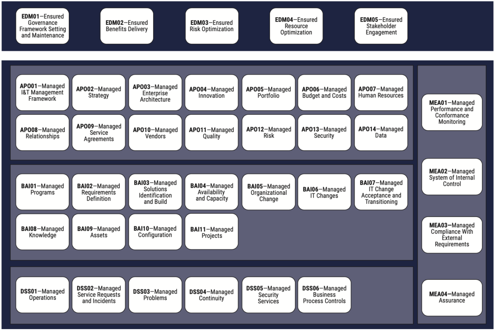

O primeiro domínio, e **o único exclusivamente de Governança, é o EDM** , que em inglês significa **Evaluate, Direct and Monitor** , ou seja, Avaliar, Dirigir e Monitorar. Ele existe para garantir duas coisas fundamentais: que a estratégia de TI da organização esteja alinhada com os objetivos do negócio e que exista uma apropriação clara dos processos de TI para que esses objetivos sejam alcançados. Em outras palavras, é o domínio que olha lá de cima e pergunta "estamos indo na direção certa?.

---

<!-- pagina: 30 -->

**Paolla Ramos Aula 02** 

O próximo é o de **APO** , que vem de **Alinhar, Planejar e Organizar** . Antes de sair executando qualquer coisa em TI, alguém precisa sentar e perguntar "para onde estamos indo?" É exatamente isso que o APO faz. Ele cuida do planejamento da estratégia de TI, da organização da infraestrutura e, principalmente, do alinhamento entre os objetivos de TI e os objetivos do negócio. 

O terceiro domínio é o **BAI (Build, Acquire and Implement)** , de **Construir, Adquirir e Implementar** . Aqui é onde a mão vai à massa. Depois que o planejamento está feito, precisa colocar as soluções de TI no ar, seja desenvolvendo internamente, seja contratando algo do mercado externo. O BAI também abrange a implementação de mudanças e a manutenção do que já existe. Isso garante que o que já está rodando continue funcionando bem. 

O quarto é o **DSS (Deliver, Serve and Support)** , **Entregar, Servir e Suportar** . Se o BAI constrói, o DSS entrega. Esse domínio é o responsável pela entrega efetiva dos serviços de TI no dia a dia, garantindo que eles realmente atendam às necessidades dos usuários e da organização. É o domínio mais "a" dos quatro, aquele que o usuário final mais sente na pele quando funciona bem, e também quando funciona mal. 

Por fim, o último é o **MEA (Monitor, Evaluate and Assess)** , de **Monitorar, Avaliar e Analisar** . Esse domínio fica de olho no desempenho dos serviços e processos de TI e avalia se os resultados estão batendo com os objetivos que foram estabelecidos lá atrás, no planejamento. É o domínio do controle, da verificação, do "estamos no caminho certo?". 

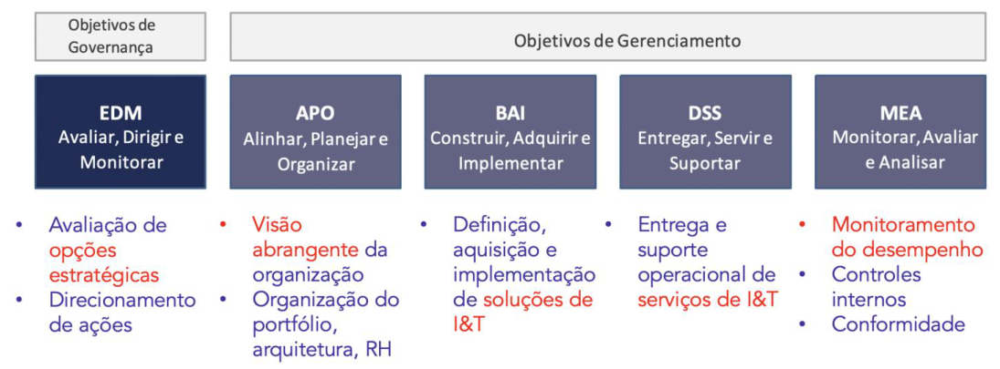

A partir de agora, vamos estudar os 40 objetivos de governança e gerenciamento do COBIT. Cada um deles tem a estrutura abaixo, mas vamos olhar apenas para a descrição e propósito, pois costumam ser suficientes para as questões de prova (o PDF oficial com todos eles tem mais de 200 páginas!):

---

<!-- pagina: 31 -->

**Paolla Ramos Aula 02** 

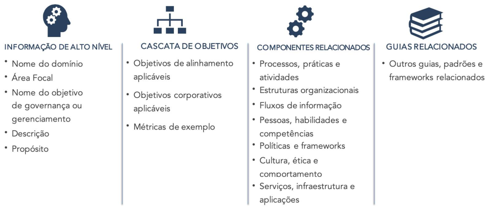

**(FGV - 2025 - Auditor de Controle Externo (TCE-PI)/Tecnologia da Informação/Infraestrutura e Segurança** **<mark>(e mais 1 concurso)) De acordo com o framework COBIT 2019, a governança de TI é a responsável por definir a direção estratégica e supervisionar a gestão, enquanto a gestão desempenha um papel fundamental na execução das atividades planejadas pela governança. As áreas de atuação da governança</mark> e gestão são conhecidas como domínios.** 

**O domínio da governança abrange as atividades de** 

a) planejar, fazer e agir. 

b) avaliar, dirigir e monitorar. 

c) monitorar, avaliar e analisar. 

d) elaborar, gerenciar e avaliar. 

e) construir, adquirir e implementar. 

**<mark>Comentários:</mark>** <mark>(a) Errado. "Planejar, fazer e agir" não corresponde aos domínios do COBIT 2019, sendo mais associado a ciclos de melhoria contínua como o PDCA;</mark> **<mark>(b) Correto</mark>** <mark>. No COBIT 2019, o domínio de governança é o EDM — Evaluate, Direct and Monitor (Avaliar, Dirigir e Monitorar); (c) Errado. "Monitorar, avaliar e analisar" remete ao domínio MEA, que pertence à gestão, não à governança; (d) Errado. "Elaborar, gerenciar e avaliar" não representa nenhum domínio oficial definido pelo COBIT 2019; (e) Errado. "Construir, adquirir</mark> e implementar" corresponde ao domínio BAI, que também é da gestão, não da governança.

---

<!-- pagina: 32 -->

**Paolla Ramos Aula 02** 

## Avaliar, Dirigir e Monitorar 

#### **EDM01 — Estrutura de governança assegurada** 

**Descrição:** Analisar e articular os requisitos para a governança de I&T da empresa. Colocar em prática e manter componentes de governança com clareza de autoridade e responsabilidades para atingir a missão, metas e objetivos da empresa. 

**Propósito:** Proporcionar uma abordagem consistente, integrada e alinhada com a abordagem de governança da organização. As decisões relacionadas a I&T devem ser tomadas em conformidade com as estratégias e os objetivos da organização, de modo que o valor desejado seja realizado. Para isso, deve-se assegurar que os processos relacionados a I&T sejam supervisionados de forma eficaz e transparente; que a conformidade com requisitos legais, contratuais e regulatórios seja confirmada; e que os requisitos de governança aplicáveis aos membros do conselho sejam atendidos. 

#### **EDM02 — Entrega de benefícios assegurada** 

**Descrição:** Otimizar o valor para o negócio a partir de investimentos em processos de negócio, serviços de I&T e ativos de I&T. 

**Propósito:** Assegurar valor ótimo a partir de iniciativas, serviços e ativos viabilizados por I&T; entrega de soluções e serviços com boa relação custo-benefício; e uma visão confiável e precisa dos custos e dos benefícios prováveis, de modo que as necessidades do negócio sejam apoiadas de forma eficaz e eficiente. 

#### **EDM03 — Otimização de riscos assegurada** 

**Descrição:** Garantir que o apetite e a tolerância ao risco da empresa sejam compreendidos, articulados e comunicados, e que o risco ao valor da empresa relacionado ao uso de I&T seja identificado e gerenciado. 

**Propósito:** Assegurar que o risco empresarial relacionado a I&T não exceda o apetite e a tolerância a riscos da organização, que o impacto do risco de I&T sobre o valor da organização seja identificado e gerenciado, e que o potencial de falhas de conformidade seja minimizado. 

#### **EDM04 — Otimização de recursos assegurada** 

**Descrição:** Garantir que recursos adequados e suficientes relacionados a negócios e I&T (pessoas, processos e tecnologia) estejam disponíveis para apoiar os objetivos da empresa de forma eficaz e com custo ideal. 

**Propósito:** Assegurar que as necessidades de recursos da organização sejam atendidas da melhor maneira possível, que os custos de I&T sejam otimizados e que haja maior probabilidade de realização de benefícios e prontidão para mudanças futuras.

---

<!-- pagina: 33 -->

**Paolla Ramos Aula 02** 

#### **EDM05 — Engajamento das partes interessadas assegurado** 

**Descrição:** Garantir que as partes interessadas sejam identificadas e engajadas no sistema de governança de I&T e que a medição e o reporte de desempenho e conformidade de I&T da empresa sejam transparentes, com as partes interessadas aprovando as metas e métricas e as ações corretivas necessárias. 

**Propósito:** Assegurar que as partes interessadas apoiem a estratégia e o roteiro de I&T, que a comunicação com elas seja eficaz e tempestiva, e que a base para relatórios seja estabelecida para elevar o desempenho. Identificar áreas de melhoria e confirmar que os objetivos e as estratégias relacionados a I&T estejam alinhados com a estratégia da organização. [H2] Alinhar, Planejar e Organizar. 

**(FCC - 2024 - Analista de Processos Organizacionais (BAHIAGÁS)/Tecnologia da Informação/Sistemas) Os** **<mark>objetivos de governança do COBIT 2019 estão agrupados no domínio Avaliar, Dirigir = Monitorar (EDM — Evaluate, Direct, and Monitor). Nesse domínio, os órgãos de governança avaliam as opções estratégicas, direcionam o corpo gerencial na execução das opções estratégicas e monitoram o cumprimento da</mark> estratégia. Um desses objetivos é** 

a) gerenciar controles dos processos de negócios. 

b) garantir o valor dos ativos. 

c) gerenciar os bens de capital. 

d) monitorar o desempenho e a privacidade. 

e) garantir a realização de benefícios. 

**<mark>Comentários:</mark>** <mark>(a) Errado. "Gerenciar controles dos processos de negócios" pertence ao domínio de gestão (APO/BAI), não ao domínio de governança EDM; (b) Errado. "Garantir o valor dos ativos" não corresponde a nenhum objetivo oficial do domínio EDM no COBIT 2019; (c) Errado. "Gerenciar os bens de capital" é um objetivo de gestão, não de governança, estando fora do escopo do domínio EDM; (d) Errado. "Monitorar o desempenho e a privacidade" não é um dos objetivos listados no domínio EDM do COBIT 2019;</mark> **<mark>(e) Correto</mark>** <mark>. "Garantir a realização de benefícios" (EDM02) é um dos objetivos oficiais do domínio EDM, focado em</mark> assegurar que os investimentos em TI gerem valor para a organização. 

## Alinhar, Planejar e Organizar 

**APO01 — Estrutura de gestão de I&T gerenciada** 

**Descrição:** Projetar o sistema de gestão para a I&T da empresa com base nas metas da empresa e outros fatores de design. Com base nesse projeto, implementar todos os componentes necessários do sistema de gestão.

---

<!-- pagina: 34 -->

**Paolla Ramos Aula 02** 

**Propósito:** Implementar uma abordagem de gestão consistente para que os requisitos de governança da organização sejam atendidos, abrangendo componentes como processos de gestão; estruturas organizacionais; papéis e responsabilidades; atividades confiáveis e repetíveis; itens de informação; políticas e procedimentos; habilidades e competências; cultura e comportamento; e serviços, infraestrutura e aplicações. 

#### **APO02 — Estratégia gerenciada** 

**Descrição:** Fornecer uma visão holística do ambiente atual de negócios e I&T, a direção futura e as iniciativas necessárias para migrar para o ambiente futuro desejado. Garantir que o nível desejado de digitalização seja integral à direção futura e à estratégia de I&T. 

**Propósito:** Apoiar a estratégia de transformação digital da organização e entregar o valor desejado por meio de um roteiro de mudanças incrementais. Utilizar uma abordagem holística de I&T, garantindo que cada iniciativa esteja claramente conectada a uma estratégia mais ampla. Viabilizar mudanças em todos os aspectos da organização, desde canais e processos até dados, cultura, competências, modelo operacional e incentivos. 

#### **APO03 — Arquitetura corporativa gerenciada** 

**Descrição:** Estabelecer uma arquitetura comum que consista em camadas de arquitetura de processos de negócio, informações, dados, aplicativos e tecnologia. Criar modelos e práticas que descrevam as arquiteturas de linha de base e de destino, em linha com a estratégia da empresa e de I&T. 

**Propósito:** Representar os diferentes blocos que compõem a organização e seus inter-relacionamentos, bem como os princípios que orientam seu desenho e sua evolução ao longo do tempo, de modo a viabilizar uma entrega padronizada, responsiva e eficiente dos objetivos operacionais e estratégicos. 

**APO04 — Inovação gerenciada** 

**Descrição:** Manter a consciência sobre I&T e tendências de serviços relacionados e monitorar tendências de tecnologias emergentes. Identificar proativamente oportunidades de inovação e planejar como se beneficiar da inovação em relação às necessidades de negócios e à estratégia de I&T definida. 

**Propósito:** Alcançar vantagem competitiva, inovação de negócios, melhoria da experiência do cliente e melhoria da eficácia e da eficiência operacional por meio da exploração de desenvolvimentos em I&T e tecnologias emergentes. 

**APO05 — Portfólio gerenciado** 

**Descrição:** Executar a direção estratégica definida para investimentos em linha com a visão da arquitetura corporativa e o roteiro de I&T. Avaliar, priorizar e equilibrar programas e serviços, gerenciando a demanda dentro das restrições de recursos e financiamento. 

**Propósito:** Otimizar o desempenho do portfólio geral de programas em resposta ao desempenho individual de programas, produtos e serviços, bem como às mudanças nas prioridades e demandas da organização.

---

<!-- pagina: 35 -->

**Paolla Ramos Aula 02** 

#### **APO06 — Orçamento e custos gerenciados** 

**Descrição:** Gerenciar as atividades financeiras relacionadas à I&T nas funções de negócios e TI, abrangendo orçamento, gestão de custos e benefícios e priorização de gastos por meio do uso de práticas formais de orçamento e um sistema justo e equitativo de alocação de custos para a empresa. 

**Propósito:** Promover uma parceria entre TI e as partes interessadas da organização para possibilitar o uso eficaz e eficiente dos recursos relacionados a I&T e fornecer transparência e responsabilização quanto ao custo e ao valor de negócio de soluções e serviços. Permitir que a organização tome decisões informadas a respeito do uso de soluções e serviços de I&T. 

#### **APO07 — Recursos humanos gerenciados** 

**Descrição:** Fornecer uma abordagem estruturada para garantir o recrutamento/aquisição, planejamento, avaliação e desenvolvimento ideal de recursos humanos (internos e externos). 

**Propósito:** Otimizar as capacidades de recursos humanos para atender aos objetivos da organização. 

#### **APO08 — Relacionamentos gerenciados** 

**Descrição:** Gerenciar relacionamentos com as partes interessadas do negócio de forma formalizada e transparente, que garanta confiança mútua e um foco combinado na consecução dos objetivos estratégicos dentro das restrições de orçamentos e tolerância ao risco. 

**Propósito:** Promover o conhecimento, as habilidades e os comportamentos adequados para gerar melhores resultados, maior confiança, confiança mútua e uso eficaz dos recursos, estimulando um relacionamento produtivo com as partes interessadas do negócio. 

**APO09 — Acordos de serviço gerenciados** 

**Descrição:** Alinhar produtos e serviços baseados em I&T e níveis de serviço com as necessidades e expectativas da empresa, incluindo identificação, especificação, design, publicação, acordo e monitoramento de produtos e serviços de I&T, níveis de serviço e indicadores de desempenho. 

**Propósito:** Assegurar que os produtos, serviços e níveis de serviço de I&T atendam às necessidades atuais e futuras da organização. 

#### **APO10 — Fornecedores gerenciados** 

**Descrição:** Gerenciar produtos e serviços relacionados a I&T fornecidos por todos os tipos de fornecedores para atender aos requisitos da empresa. Isso inclui a busca e seleção de fornecedores, gestão de relacionamentos, gestão de contratos e revisão e monitoramento do desempenho do fornecedor. 

**Propósito:** Otimizar as capacidades disponíveis de I&T para apoiar a estratégia e o roteiro de I&T, minimizar o risco associado a fornecedores com desempenho insatisfatório ou em desconformidade e assegurar preços competitivos.

---

<!-- pagina: 36 -->

**Paolla Ramos Aula 02** 

#### **APO11 — Qualidade gerenciada** 

**Descrição:** Definir e comunicar requisitos de qualidade em todos os processos, procedimentos e resultados empresariais relacionados. Habilitar controles, monitoramento contínuo e o uso de práticas e padrões comprovados em esforços de melhoria contínua e eficiência. 

**Propósito:** Assegurar a entrega consistente de soluções e serviços de tecnologia para atender aos requisitos de qualidade da organização e satisfazer as necessidades das partes interessadas. 

#### **APO12 — Riscos gerenciados** 

**Descrição:** Identificar, avaliar e reduzir continuamente os riscos relacionados à I&T dentro dos níveis de tolerância definidos pela gestão executiva da empresa. 

**Propósito:** Integrar a gestão do risco empresarial relacionado a I&T à gestão global de riscos corporativos (ERM), equilibrando os custos e os benefícios da gestão desses riscos. 

#### **APO13 — Segurança gerenciada** 

**Descrição:** Definir, operar e monitorar um sistema de gestão de segurança da informação. 

**Propósito:** Manter o impacto e a ocorrência de incidentes de segurança da informação dentro dos níveis de apetite a risco da organização. 

#### **APO14 — Dados gerenciados** 

**Descrição:** Alcançar e sustentar a gestão eficaz dos ativos de dados da empresa ao longo do ciclo de vida dos dados, desde a criação até a entrega, manutenção e arquivamento. 

**Propósito:** Assegurar a utilização eficaz dos ativos de dados críticos para alcançar as metas e os objetivos da organização. 

**(FGV - 2024 - Analista Judiciário (TJ MT)/Tecnologia da Informação) Na versão mais recente do COBIT, os** **<mark>processos são organizados em domínios que ajudam a estruturar as atividades de governança e gestão de TI. O seguinte processo pertence ao domínio “Alinhar, Planejar e Organizar” e é essencial para assegurar</mark> que os projetos e investimentos em TI estejam alinhados aos objetivos estratégicos da organização ao** 

<mark>a) gerenciar o portfólio de TI, assegurando que os investimentos e projetos estejam alinhados com as</mark> metas estratégicas e que contribuam para a geração de valor. 

<mark>b) avaliar o desempenho dos fornecedores de TI para garantir que os serviços prestados estejam de</mark> acordo com as expectativas organizacionais. 

<mark>c) desenvolver e implementar novas soluções tecnológicas que suportem os processos de negócio da</mark> organização. 

d) fornecer suporte e resolver incidentes técnicos de forma a minimizar o impacto nas operações diárias.

---

<!-- pagina: 37 -->

**Paolla Ramos Aula 02** 

<mark>e) avaliar continuamente o desempenho das soluções de TI e garantir a conformidade com padrões de</mark> qualidade internos. 

**<mark>Comentários: (a) Correto</mark>** <mark>. No domínio "Alinhar, Planejar e Organizar" do COBIT, gerenciar o portfólio de TI garante que investimentos e projetos estejam alinhados às metas estratégicas, gerando valor para a organização; (b) Errado. Avaliar desempenho de fornecedores está relacionado à gestão de relacionamentos e contratos, pertencente a outro domínio do COBIT; (c) Errado. Desenvolver e implementar soluções tecnológicas é característica do domínio "Construir, Adquirir e Implementar", não do APO; (d) Errado. Suporte e resolução de incidentes técnicos pertencem ao domínio "Entregar, Serviços e Suporte" (DSS) do COBIT; (e) Errado. Avaliar desempenho e conformidade de soluções de TI está associado ao domínio</mark> "Monitorar, Avaliar e Analisar" (MEA). 

## Construir, Adquirir e Implementar 

#### **BAI01 — Programas gerenciados** 

**Descrição:** Gerenciar todos os programas do portfólio de investimentos em alinhamento com a estratégia da empresa e de forma coordenada, com base em uma abordagem padrão de gestão de programas. 

**Propósito:** Realizar o valor de negócio desejado e reduzir o risco de atrasos inesperados, custos e erosão de valor. Para isso, melhorar a comunicação com a área de negócio e os usuários finais, bem como seu envolvimento; assegurar o valor e a qualidade das entregas dos programas e o acompanhamento dos projetos dentro deles; e maximizar a contribuição do programa para o portfólio de investimentos. 

#### **BAI02 — Definição de requisitos gerenciada** 

**Descrição:** Identificar soluções e analisar requisitos antes da aquisição ou criação para garantir que estejam alinhados com os requisitos estratégicos da empresa que abrangem processos de negócio, aplicativos, informações/dados, infraestrutura e serviços. 

**Propósito:** Criar soluções ótimas que atendam às necessidades da organização, minimizando os riscos. 

#### **BAI03 — Identificação e construção de soluções gerenciadas** 

**Descrição:** Estabelecer e manter produtos e serviços identificados (tecnologia, processos de negócio e fluxos de trabalho) em linha com os requisitos da empresa, abrangendo design, desenvolvimento, aquisição/terceirização e parceria com fornecedores. 

**Propósito:** Assegurar a entrega ágil e escalável de produtos e serviços digitais. Estabelecer soluções oportunas e economicamente viáveis — em tecnologia, processos de negócio e fluxos de trabalho — capazes de apoiar os objetivos estratégicos e operacionais da organização.

---

<!-- pagina: 38 -->

**Paolla Ramos Aula 02** 

**BAI04 — Disponibilidade e capacidade gerenciadas** 

**Descrição:** Equilibrar as necessidades atuais e futuras de disponibilidade, desempenho e capacidade com o fornecimento de serviços de custo eficaz. 

**Propósito:** Manter a disponibilidade dos serviços, a gestão eficiente dos recursos e a otimização do desempenho dos sistemas por meio da previsão de requisitos futuros de desempenho e capacidade. 

#### **BAI05 — Mudança organizacional gerenciada** 

**Descrição:** Maximizar a probabilidade de implementar com sucesso mudanças organizacionais sustentáveis em toda a empresa, de forma rápida e com risco reduzido. 

**Propósito:** Preparar e comprometer as partes interessadas para a mudança no negócio e reduzir o risco de fracasso. 

**BAI06 — Mudanças de TI gerenciadas** 

**Descrição:** Gerenciar todas as mudanças de maneira controlada, incluindo mudanças padrão e manutenção de emergência relacionadas a processos de negócio, aplicativos e infraestrutura. 

**Propósito:** Permitir a entrega rápida e confiável de mudanças ao negócio. Mitigar o risco de impacto negativo sobre a estabilidade ou a integridade do ambiente alterado. 

**BAI07 — Aceitação e transição de mudanças de TI gerenciadas** 

**Descrição:** Aceitar formalmente e tornar operacionais novas soluções. Incluir planejamento de implementação, conversão de sistemas e dados, testes de aceitação, comunicação, preparação de liberação, promoção para produção e revisão pós-implementação. 

**Propósito:** Implementar soluções com segurança e em conformidade com as expectativas e os resultados acordados. 

**BAI08 — Conhecimento gerenciado** 

**Descrição:** Manter a disponibilidade de informações de gestão e conhecimentos relevantes, atuais, validados e confiáveis para apoiar todas as atividades do processo e facilitar a tomada de decisão relacionada à governança e gestão da I&T corporativa. 

**Propósito:** Fornecer o conhecimento e as informações gerenciais necessários para apoiar todos os colaboradores na governança e gestão de I&T corporativa e permitir a tomada de decisão informada. 

**BAI09 — Ativos gerenciados** 

**Descrição:** Gerenciar ativos de I&T ao longo de seu ciclo de vida para garantir que seu uso entregue valor a um custo ideal, que permaneçam operacionais e que sejam contabilizados e protegidos fisicamente.

---

<!-- pagina: 39 -->

**Paolla Ramos Aula 02** 

**Propósito:** Controlar todos os ativos de I&T e otimizar o valor proporcionado por seu uso. 

#### **BAI10 — Configuração gerenciada** 

**Descrição:** Definir e manter descrições e relacionamentos entre recursos e capacidades essenciais necessários para entregar serviços habilitados por I&T. 

**Propósito:** Fornecer informações suficientes sobre os ativos de serviço para possibilitar sua gestão eficaz. Avaliar o impacto das mudanças e tratar incidentes de serviço. 

**BAI11 — Projetos gerenciados** 

**Descrição:** Gerenciar todos os projetos iniciados na empresa em alinhamento com a estratégia corporativa e de forma coordenada, com base na abordagem padrão de gestão de projetos. 

**Propósito:** Alcançar os resultados definidos do projeto e reduzir o risco de atrasos inesperados, custos e erosão de valor por meio da melhoria da comunicação com a área de negócio e os usuários finais, bem como de seu envolvimento. Assegurar o valor e a qualidade das entregas do projeto e maximizar sua contribuição para os programas definidos e para o portfólio de investimentos. [H2] Entregar, Suportar e Servir. 

**(FGV - 2025 - Analista do Ministério Público da União/Tecnologia da Informação e** **<mark>Comunicação/Desenvolvimento de Sistemas) O framework COBIT 2019 faz uma distinção clara entre governança e gestão. O domínio BAI – Build, Acquire and Implement (Construir, Adquirir e Implementar) trata da definição, aquisição e implementação de soluções de Informação e Tecnologia (I&T) e sua</mark> integração em processos de negócios.** 

**<mark>Uma prática de gerenciamento aderente aos objetivos de gerenciamento do domínio BAI pode ser</mark> executada pela(s) atividade(s):** 

a) compreender a visão, direção e estratégia da organização, bem como seu contexto e desafios atuais; 

<mark>b) estabelecer uma função responsável por gerenciar atividades que dão suporte aos objetivos de</mark> gerenciamento de dados; 

<mark>c) desenvolver e manter procedimentos operacionais e atividades relacionadas para dar suporte a todos</mark> os serviços prestados; 

<mark>d) criar um plano de inovação que inclua grau de tolerância a riscos, com orçamento proposto para</mark> iniciativas de inovação e objetivos de inovação; 

<mark>e) especificar e priorizar informações, requisitos funcionais e técnicos, com base na experiência do</mark> usuário e nos requisitos confirmados das partes interessadas. 

**<mark>Comentários:</mark>** <mark>(a) Errado. Compreender visão e estratégia organizacional é uma prática do domínio APO (Align, Plan and Organise), não do BAI; (b) Errado. Estabelecer função responsável por gerenciar dados remete ao domínio APO, voltado à organização e ao alinhamento estratégico; (c) Errado. Desenvolver procedimentos operacionais para suporte a serviços está mais alinhado ao domínio DSS (Deliver, Service and Support); (d) Errado. Criar plano de inovação com tolerância a riscos e orçamento é característica do domínio</mark>

---

<!-- pagina: 40 -->

**Paolla Ramos Aula 02** 

<mark>APO, ligado ao planejamento estratégico;</mark> **<mark>(e) Correto</mark>** <mark>. Especificar e priorizar requisitos funcionais, técnicos e de experiência do usuário é atividade típica do BAI, que trata da construção e aquisição de soluções de I&T</mark> com base nas necessidades das partes interessadas. 

## Entregar, Suportar e Servir 

#### **DSS01 — Operações gerenciadas** 

**Descrição:** Coordenar e executar as atividades e procedimentos operacionais necessários para entregar serviços de I&T internos e terceirizados. 

**Propósito:** Entregar os resultados operacionais de produtos e serviços de I&T conforme planejado. 

#### **DSS02 — Solicitações de serviço e incidentes gerenciados** 

**Descrição:** Fornecer resposta oportuna e eficaz às solicitações dos usuários e resolução de todos os tipos de incidentes. Restaurar o serviço normal; registrar e atender às solicitações dos usuários; e investigar e escalar incidentes. 

**Propósito:** Alcançar maior produtividade e minimizar interrupções por meio da rápida resolução de dúvidas dos usuários e incidentes. Avaliar o impacto das mudanças e lidar com incidentes de serviço. Atender às solicitações dos usuários e restaurar o serviço em resposta a incidentes. 

#### **DSS03 — Problemas gerenciados** 

**Descrição:** Identificar e classificar problemas e suas causas raiz. Fornecer resolução oportuna para evitar incidentes recorrentes e fornecer recomendações para melhorias. 

**Propósito:** Aumentar a disponibilidade, melhorar os níveis de serviço, reduzir custos e elevar a conveniência e a satisfação do cliente mediante a redução do número de problemas operacionais, além de identificar causas-raiz como parte da resolução de problemas. 

#### **DSS04 — Continuidade gerenciada** 

**Descrição:** Estabelecer e manter um plano para permitir que as organizações de negócios e TI respondam a incidentes e se adaptem rapidamente a interrupções. 

**Propósito:** Adaptar-se rapidamente, dar continuidade às operações do negócio e manter a disponibilidade de recursos e informações em nível aceitável para a organização em caso de interrupção significativa, como ameaças, oportunidades ou demandas.

---

<!-- pagina: 41 -->

**Paolla Ramos Aula 02** 

**DSS05 — Serviços de segurança gerenciados** 

**Descrição:** Proteger as informações da empresa para manter o nível de risco de segurança da informação aceitável para a empresa, de acordo com a política de segurança. 

**Propósito:** Minimizar o impacto para o negócio decorrente de vulnerabilidades e incidentes operacionais de segurança da informação. 

**DSS06 — Controles de processos de negócio gerenciados** 

**Descrição:** Definir e manter controles de processos de negócio adequados para garantir que as informações relacionadas e processadas por processos de negócio internos ou terceirizados satisfaçam todos os requisitos de controle de informações relevantes. 

**Propósito:** Manter a integridade das informações e a segurança dos ativos de informação tratados nos processos de negócio da organização ou em sua operação terceirizada. [H2] Monitorar, Avaliar e Analisar. 

**(FCC - 2025 - Analista Judiciário (TRF 4ª Região)/Apoio Especializado/Suporte em Tecnologia da** **<mark>Informação) Um Tribunal está implementando um novo sistema de Inteligência Artificial (IA) para auxiliar na análise de jurisprudência e na redação de minutas de decisões. Dada a criticidade do sistema para a eficiência do trabalho dos magistrados e a necessidade de garantir a segurança e a confiabilidade dos dados processados pela IA, a área de TI decidiu adotar o COBIT 2019 como framework de governança e gerenciamento, porque dentre seus objetivos de gerenciamento, o que melhor se alinha com a necessidade de assegurar que a infraestrutura de TI (hardware, software, rede) que suporta que o sistema</mark> de IA esteja disponível, confiável e com capacidade adequada para atender às demandas operacionais é o** 

a) EDM04 Garantir a Otimização de Recursos. 

b) APO06 Gerenciar Orçamento e Custos. 

c) BAl03 Gerenciar Soluções de Negócios, Sistemas e Arquivos de Dados. 

d) DSS01 Gerenciar Operações. 

e) MEA01 Monitorar e Avaliar o Desempenho e a Conformidade. 

**<mark>Comentários:</mark>** <mark>(a) Errado. EDM04 foca na otimização do uso de recursos de TI em nível estratégico, não na operação e disponibilidade da infraestrutura; (b) Errado. APO06 trata do planejamento financeiro e controle de custos de TI, sem relação direta com disponibilidade e capacidade operacional; (c) Errado. BAI03 abrange o desenvolvimento e implantação de soluções e sistemas, não a gestão contínua da infraestrutura em operação;</mark> **<mark>(d) Correto</mark>** <mark>. DSS01 gerencia as operações de TI, garantindo que hardware, software e rede estejam disponíveis, confiáveis e com capacidade adequada para suportar sistemas críticos como o de IA; (e) Errado. MEA01 monitora e avalia desempenho e conformidade, sendo uma função de controle, não de garantia</mark> operacional da infraestrutura.

---

<!-- pagina: 42 -->

**Paolla Ramos Aula 02** 

## Monitorar, Avaliar e Analisar 

#### **MEA01 — Monitoramento de desempenho e conformidade gerenciado** 

**Descrição:** Coletar, validar e avaliar metas e métricas empresariais e de alinhamento. Monitorar se os processos e práticas estão performando de acordo com as metas e métricas de desempenho e conformidade acordadas. 

**Propósito:** Proporcionar transparência quanto ao desempenho e à conformidade e impulsionar o alcance dos objetivos. 

**MEA02 — Sistema de controles internos gerenciado** 

**Descrição:** Monitorar e avaliar continuamente o ambiente de controle, incluindo autoavaliações e autoconhecimento. Permitir que a gestão identifique deficiências e ineficiências de controle e inicie ações de melhoria. 

**Propósito:** Proporcionar transparência às principais partes interessadas quanto à adequação do sistema de controles internos e, assim, fornecer confiança nas operações, confiança no alcance dos objetivos organizacionais e compreensão adequada do risco residual. 

**MEA03 — Conformidade com requisitos externos gerenciada** 

**Descrição:** Avaliar se os processos de I&T e os processos de negócio apoiados por I&T estão em conformidade com as leis, regulamentos e requisitos contratuais. 

**Propósito:** Assegurar que a organização esteja em conformidade com todos os requisitos externos aplicáveis. 

**MEA04 — Garantia gerenciada** 

**Descrição:** Planejar, definir o escopo e executar iniciativas de auditoria para cumprir requisitos internos, leis, regulamentos e objetivos estratégicos. 

**Propósito:** Permitir que a organização desenhe e desenvolva iniciativas de assurance de forma eficiente e eficaz, fornecendo diretrizes sobre planejamento, escopo, execução e acompanhamento de avaliações de assurance, com base em um roteiro fundamentado em abordagens amplamente aceitas. 

**(FGV - 2025 - Auditor de Controle Externo (TCE RR)/Tecnologia da Informação/Análise de Dados) Uma** **<mark>instituição financeira que está enfrentando dificuldades para manter a conformidade com novas</mark> regulamentações de segurança de dados e privacidade.** 

**<mark>Durante uma auditoria, foi identificado que a organização não possui uma estrutura clara de responsabilização para as atividades de controle de TI, e muitas dessas atividades não estão sendo monitoradas ou revisadas periodicamente. Isso resultou em processos de conformidade inconsistentes e</mark> em vulnerabilidades de segurança nos sistemas.**

---

<!-- pagina: 43 -->

**Paolla Ramos Aula 02** 

**<mark>Com base nos princípios do COBIT 2019, a melhor iniciativa para resolver esses problemas de conformidade</mark> e melhorar o monitoramento dos controles é** 

<mark>a) implementar o processo “EDM01 - Garantir a Definição e Manutenção do Sistema de Governança”, pois ele estabelece os elementos essenciais da governança, garantindo que a empresa tenha uma estrutura</mark> de governança robusta para supervisão das atividades de TI. 

<mark>b) aplicar o processo “MEA01 - Monitorar, Avaliar e Medir o Desempenho e a Conformidade”, pois ele fornece diretrizes para monitorar as atividades de conformidade, garantir a implementação de controles e</mark> detectar falhas nos processos de governança. 

<mark>c) priorizar o processo “APO13 - Gerenciamento de Segurança da Informação”, já que ele foca na criação de uma política de segurança robusta, que garantiria a implementação de controles para proteger os dados</mark> e atender às regulamentações de conformidade. 

<mark>d) priorizar o “EDM03 - Garantir Otimização de Riscos”, uma vez que ele identifica e analisa os riscos relacionados à segurança de TI e fornece diretrizes para tratar riscos associados à falta de controle e</mark> monitoramento. 

<mark>e) desenvolver o “BAI06 - Gerenciar Mudanças”, pois ele garante que todas as mudanças sejam controladas e auditáveis, o que ajuda a assegurar a conformidade com os padrões de segurança e</mark> privacidade. 

**<mark>Comentários:</mark>** <mark>(a) Errado. O EDM01 trata da estrutura de governança em si, mas não é o processo mais indicado para monitorar conformidade e detectar falhas operacionais nos controles de TI;</mark> **<mark>(b) Correto</mark>** <mark>. O MEA01 é voltado exatamente para monitorar, avaliar e medir desempenho e conformidade, identificando falhas nos controles e garantindo rastreabilidade das atividades de TI; (c) Errado. O APO13 foca em políticas de segurança da informação, mas não abrange o monitoramento contínuo de conformidade e a responsabilização estrutural dos controles; (d) Errado. O EDM03 trata da otimização de riscos em nível estratégico, não do monitoramento operacional das atividades de conformidade e controle de TI; (e) Errado. O BAI06 gerencia mudanças nos sistemas, o que contribui para auditabilidade, mas não resolve a falta de</mark> monitoramento e responsabilização dos controles de conformidade. 

## Gerenciamento de Desempenho 

Gerenciamento de desempenho responde a seguinte pergunta: **o sistema de governança está funcionando bem?** E, se não está, o que precisa melhorar para chegar aonde a gente quer? 

Para que essa gestão de desempenho funcione de verdade, o COBIT recomenda seguir alguns princípios básicos. O primeiro é que o modelo deve ser **simples de usar e entender** , porque de nada adianta um framework sofisticado que ninguém consegue aplicar no dia a dia. O segundo é que precisa ser **possível medir o desempenho não só dos processos, mas também de outros componentes relevantes,** como estruturas organizacionais e informações. 

**_Saiba mais:_** _o COBIT 2019 utiliza uma matriz de responsabilidades para definir quem deve ser consultado ou responsabilizado. Entre os papéis-chave estão o CIO (Chief Information Officer), responsável por_

---

<!-- pagina: 44 -->

**Paolla Ramos Aula 02** 

_garantir a clareza na gestão e operação da TI; o CEO, que lidera a gestão executiva; e o Conselho de Administração, que detém a responsabilidade final pela governança. Entender essas funções é vital para_ _<u>que a prestação de contas (accountability) não se perca entre as camadas técnicas e executivas.</u>_ 

O modelo precisa entregar resultados confiáveis e relevantes. Precisa ser flexível o suficiente para funcionar em diferentes tipos de organização, cada uma com suas próprias prioridades. E precisa suportar diferentes modalidades de avaliação, desde autoavaliações até avaliações formais e estruturadas. 

Um ponto importante que merece destaque: o modelo de Capacidade e Maturidade do COBIT **não foi inventado do zero** . Ele está alinhado ao **CMMI 2.0** e, na verdade, vai além disso. Estende esse modelo. Ou seja, quem já conhece o CMMI vai encontrar uma base familiar no COBIT, só que com camadas adicionais pensadas para o contexto de governança de TI. 

#### **Capacidade e Maturidade** 

**Capacidade** , no contexto de gerenciamento de desempenho, é uma medida de quão bem a organização consegue executar seus processos de TI para alcançar o que precisa alcançar. Para medir isso, o COBIT trabalha com os chamados **níveis de capacidade** , que descrevem diferentes graus de sofisticação e eficácia na implementação desses processos. Quanto mais alto o nível, mais maduro, estruturado e eficiente é o processo. 

O COBIT 2019 define exatamente **seis níveis de capacidade** , numerados do zero ao cinco. Cada nível representa um estágio diferente de desenvolvimento, partindo de um cenário onde o processo praticamente não existe até chegar a um processo totalmente otimizado e automatizado. Veja como funciona cada um deles. 

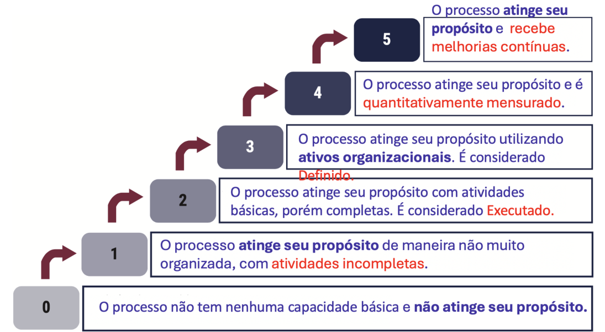

---

<!-- pagina: 45 -->

**Paolla Ramos Aula 02** 

O **Nível 0** é chamado de **Incompleto** . Aqui, o processo simplesmente não está implementado ou não consegue atingir seus objetivos. É o ponto de partida, e não é um bom lugar para estar. 

O **Nível 1** é o **Realizado** . O processo existe e atinge seu propósito, mas de forma básica. Não há muita estrutura, não há muita documentação. As coisas acontecem, mas dependem muito de quem está executando. 

O **Nível 2** é o **Gerenciado** . Aqui já há planejamento, monitoramento e ajustes. O processo é executado de forma controlada, com prazos e responsabilidades definidos. Começa a aparecer uma gestão de verdade. 

O **Nível 3** é o **Estabelecido** . O processo agora está documentado, padronizado e segue um modelo definido pela organização. Não depende mais do conhecimento individual de uma pessoa. Está institucionalizado. 

O **Nível 4** é o **Previsível** . O processo opera dentro de limites definidos e seus resultados são medidos quantitativamente. A organização não só executa bem como consegue prever como o processo vai se comportar. 

O **Nível 5** , por fim, é o **Otimizado** . É o topo. O processo é continuamente melhorado com base em dados e inovação. A organização está sempre buscando formas de evoluir, de forma sistemática e automatizada. 

Já a **Maturidade** é um conceito parecido com o de capacidade, mas com um escopo bem maior. Enquanto a capacidade foca em um processo específico, a maturidade olha para a organização inteira, ou para o que chamamos de **Área Focal** , que é um conjunto de componentes de uma determinada área temática. Pode ser DevOps, Segurança da Informação, Gestão de Riscos, entre outras. A pergunta que a maturidade responde é: "Quão bem essa organização, como um todo, governa e gerencia sua TI?" 

Um **modelo de maturidade** , então, descreve a evolução progressiva de uma organização em termos de eficácia, previsibilidade e controle sobre suas práticas de TI. Pense numa escala crescente. No começo, a organização age no improviso, apagando incêndio. Com o tempo, vai amadurecendo, documentando processos, medindo resultados, melhorando continuamente. Cada degrau dessa escada é um nível de maturidade. 

Veja os níveis de maturidade:

---

<!-- pagina: 46 -->

**Paolla Ramos Aula 02** 

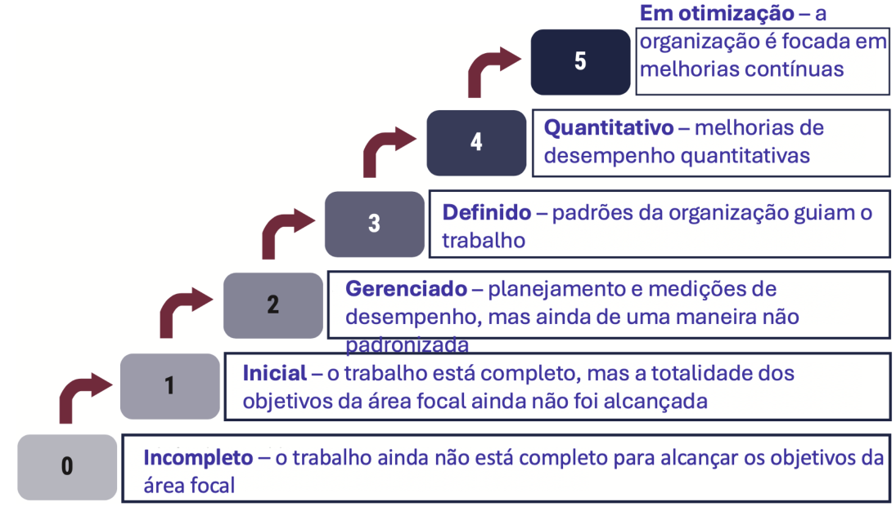

Tanto a avaliação de capacidade quanto a de maturidade servem para o mesmo fim prático: identificar onde a organização está falhando, definir metas de melhoria e acompanhar o progresso ao longo do tempo. É uma ferramenta de gestão. A ideia é que, ao conhecer seus pontos fracos com precisão, a organização consiga extrair mais valor das suas atividades de TI e, não menos importante, alinhar melhor a área de tecnologia com os objetivos reais do negócio. 

**(FCC - 2024 - Auditor Fiscal Tributário (Pref J Guararapes)) Uma organização que utiliza o Cobit 2019 atingiu** **<mark>um nível em que os padrões empresariais são aplicados de forma consistente em toda a empresa para orientar suas áreas de foco em governança e gestão. Eles estão agora buscando avançar para um nível em que a melhoria de desempenho é medida em termos numéricos. O nível de maturidade atual da</mark> organização e o próximo nível que ela busca atingir são, respectivamente,** 

a) 3 - Deflned e 4 - Quantitative. 

b) 1 - lnitial e 2 - Managed. 

c) 5 - Managed e 6 - Quantitative. 

d) 2 - Managed e 3 - Defined. 

e) 4 - Quantítative e 5 - Optímizing. 

**<mark>Comentários: (a) Correto</mark>** <mark>. No COBIT 2019, o nível 3 - Defined aplica padrões consistentes em toda a empresa. O nível 4 - Quantitative avança para medição numérica de desempenho, exatamente o descrito; (b) Errado. O nível 1 - Initial representa processos imprevisíveis e reativos, sem consistência. O nível 2 - Managed indica gestão básica por projeto, sem padronização empresarial; (c) Errado. O COBIT 2019 não possui um nível 6. A</mark>

---

<!-- pagina: 47 -->

**Paolla Ramos Aula 02** 

<mark>escala vai de 0 a 5, tornando essa alternativa inválida; (d) Errado. O nível 2 - Managed refere-se à gestão por projeto, não à aplicação consistente de padrões em toda a empresa; (e) Errado. O nível 4 - Quantitative já envolve medição numérica. O nível 5 – Optimizing foca em melhoria contínua, não na medição inicial de</mark> desempenho. 

## a Projetando um Sistema de Governanç 

Pessoal, para finalizar, vamos falar sobre como o COBIT orienta a construção de um **sistema de governança** eficiente. Ele sugere passos bem definidos e cada um deles tem um motivo claro de existir. Vamos ver quais são. 

O primeiro passo é **entender o contexto e a estratégia** da organização. A ideia é que, antes de construir qualquer coisa, você precisa saber onde está e para onde quer ir. Isso significa entender o propósito da organização, seus objetivos estratégicos, o que as partes interessadas esperam e, claro, o ambiente regulatório e de mercado em que ela está inserida. 

Depois de entender esse contexto todo, vem o segundo passo: **determinar o escopo inicial** do **sistema de governança** . Aqui você vai definir o que entra e o que fica de fora, pelo menos nesse primeiro momento. Isso inclui mapear os principais processos, estruturas e funções de governança que vão compor o sistema, além de estabelecer os indicadores de desempenho que serão usados para monitorar se o sistema está funcionando como deveria. É basicamente a planta baixa do que vai ser construído. 

O terceiro passo é **refinar esse escopo** . E por que refinar? Porque o escopo inicial é uma primeira aproximação, e a realidade sempre traz nuances que precisam ser consideradas. Nessa etapa, o COBIT propõe que você avalie os fatores de projeto, como o tamanho da organização, a complexidade do ambiente de TI, o modelo de sourcing adotado, entre outros. Com base nessa avaliação, você ajusta o escopo para que o sistema de governança realmente atenda às necessidades específicas daquela organização, e não de uma organização genérica imaginária. Uma grande empresa com TI terceirizada vai precisar de um recorte de governança muito diferente de uma empresa menor com tudo feito internamente. 

Chegamos ao passo final: **concluir o projeto do sistema de governança** . Esse último passo envolve confirmar o escopo do que foi planejado, definir claramente quem é responsável pelo quê dentro da governança e implementar os mecanismos de monitoramento que vão monitorar e ajustar o sistema ao longo do tempo. Porque, sim, um sistema de governança não é algo que você monta uma vez e esquece. Ele precisa de acompanhamento, de revisão, de ajuste quando a realidade mudar.

---

<!-- pagina: 48 -->

**Paolla Ramos Aula 02** 

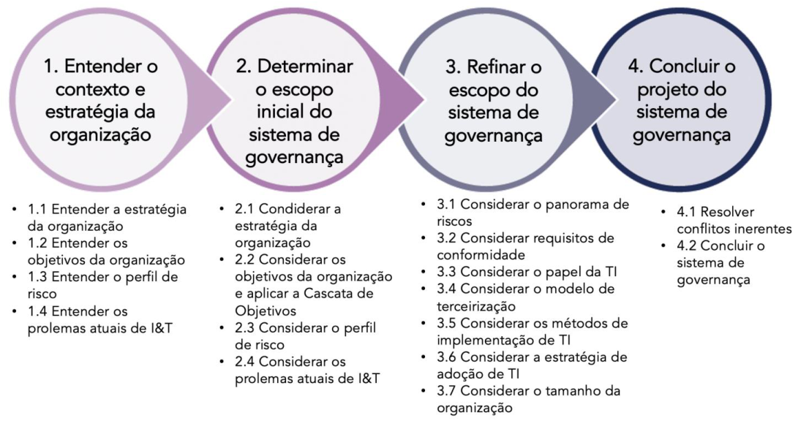

---

<!-- pagina: 49 -->

**Paolla Ramos Aula 02** 

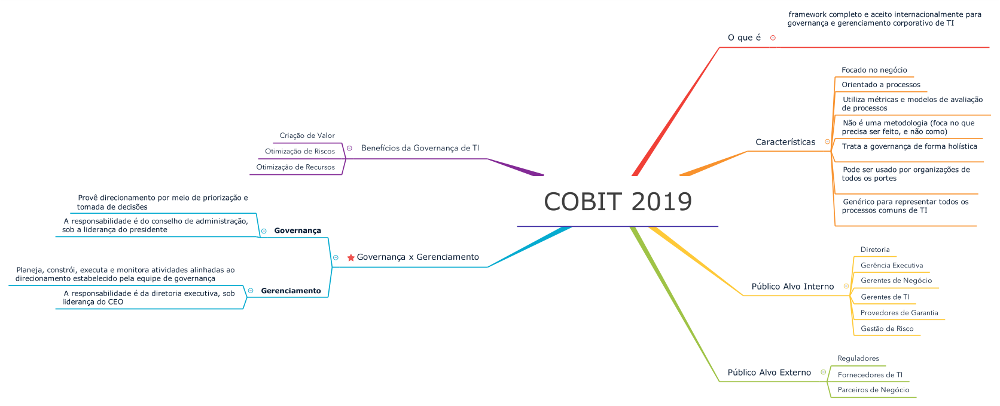

---

<!-- pagina: 50 -->

**Paolla Ramos Aula 02** 

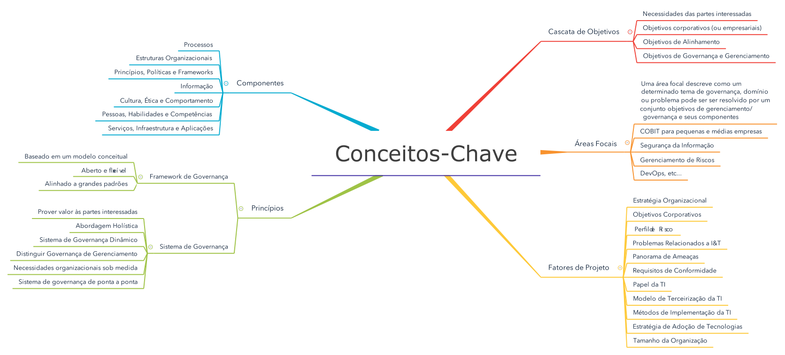

<!-- Start of picture text -->
==5460== <!-- End of picture text -->

---

<!-- pagina: 51 -->

**Paolla Ramos Aula 02** 

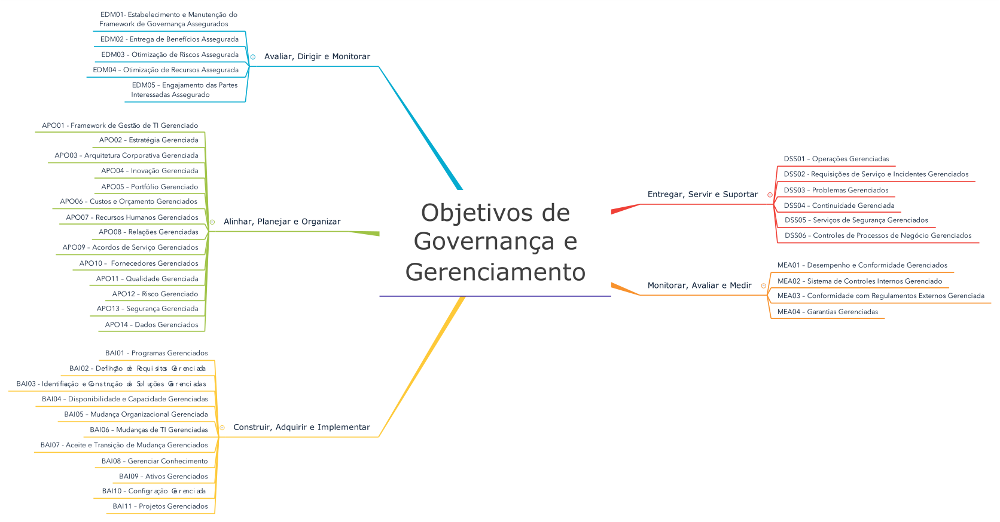

---

<!-- pagina: 52 -->

**Paolla Ramos Aula 02** 

# **- RESUMO COBIT 2019** 

**FERNANDO PEDROSA - HTTPS://WWW.INSTAGRAM.COM/PROF.FERNANDOPEDROSA** 

## Visão Geral do COBIT 2019 

COBIT (Control Objectives for Information and Related Technologies) é um **framework de gestão e governança empresarial de Informação & Tecnologia (I&T)** , desenvolvido pela **ISACA** . Sua versão atual é o **COBIT 2019.** 

### Evolução Histórica 

**1996** — COBIT 1.0: foco em auditoria de TI 

**2005** — COBIT 4: expansão para gestão e governança de TI 

**2012** — COBIT 5: unificou COBIT 4.1 + Val IT 2.0 + Risk IT 

**2019** — COBIT 2019: modelo mais flexível, 40 objetivos, novo modelo de desempenho 

### O que o COBIT 2019 É e NÃO É 

- **É** : framework para construir e sustentar um sistema de governança de I&T 

- **É** : flexível, aberto, permite adição de novos guias e áreas focais 

- **NÃO é** : descrição completa do ambiente de TI da organização 

- **NÃO é** : framework de processos de negócio nem framework técnico 

- **NÃO é** : prescritivo quanto a decisões tecnológicas — apenas descreve **o que** deve ser decidido e **por quem** 

PEGADINHA DE PROVA: O COBIT **não prescreve** decisões tecnológicas específicas. Ele define objetivos e responsabilidades, não soluções técnicas. 

## Governan a versus Gerenciamento <u>ç</u> 

### Distinção Fundamental 

- **Governança** : define direção estratégica, monitora desempenho, mitiga riscos — responsabilidade da **alta administração e conselho** 

- **Gerenciamento** : implementa políticas, executa no dia a dia — responsabilidade da **gerência média e executiva** 

- No COBIT, o domínio **EDM** é o único de Governança; os demais (APO, BAI, DSS, MEA) são de **Gerenciamento**

---

<!-- pagina: 53 -->

**Paolla Ramos Aula 02** 

Três Benefícios da Governança Implementada Corretamente 

- **Realização de Benefícios (Criação de Valor)** : manter/aumentar valor de investimentos de TI; eliminar iniciativas sem retorno 

- **Otimização de Riscos** : preservar o valor gerado; equilibrar riscos com oportunidades dentro de níveis aceitáveis 

- **Otimização de Recursos** : garantir disponibilidade de recursos para planos estratégicos; fornecer infraestrutura econômica de I&T 

Os três pilares da governança no COBIT: **Criação de Valor + Otimização de Riscos + Otimização de Recursos** . 

## Princípios do COBIT 2019 

### Princípios do Framework de Governança (Conceituais) 

- **Baseado em Modelo Conceitual** : visão holística e integrada, não apenas checklist 

- **Aberto e Flexível** : adaptável a diferentes tipos, tamanhos e contextos organizacionais 

- **Alinhado a Grandes Padrões** : complementa ITIL, ISO 27001, PMBOK, CMMI, ISO 31000, COSO 

Princípios do Sistema de Governança (Pragmáticos) 

- **Prover Valor às Partes Interessadas** : atender necessidades de proprietários, clientes, funcionários, reguladores e comunidade 

- **Abordagem Holística** : governança como sistema de componentes inter-relacionados 

- **Sistema de Governança Dinâmico** : adaptável às mudanças do ambiente de negócios e tecnológico 

- **Distinguir Governança de Gerenciamento** : funções e responsabilidades diferentes e complementares 

- **Necessidades Organizacionais Sob Medida** : cada organização é única; a governança deve ser personalizada 

- **Sistema de Governança de Ponta-a-Ponta** : integrado em todos os níveis e funções da organização 

## Cascata de Objetivos 

A Cascata de Objetivos traduz as **necessidades das partes interessadas** em ações concretas e mensuráveis, garantindo alinhamento entre TI e estratégia de negócios. 

### Quatro Níveis da Cascata (do mais alto ao mais específico) 

**1. Necessidades das Partes Interessadas** : entrega de valor, conformidade, proteção da informação 

**2. Objetivos Corporativos (Empresariais)** : crescimento de receita, eficiência operacional, satisfação do cliente

---

<!-- pagina: 54 -->

**Paolla Ramos Aula 02** 

**3. Objetivos de Alinhamento** : objetivos de TI necessários para apoiar os objetivos corporativos 

**4. Objetivos de Governança e Gerenciamento** : metas específicas de governança/gestão de TI (políticas, auditorias, gestão de risco) 

## a Componentes do Sistema de Governanç 

- **Processos** : procedimentos para garantir governança efetiva (gestão de risco, mudanças, incidentes) 

- **Estruturas Organizacionais** : papel do conselho, gestores de TI, partes interessadas 

- **Princípios, Políticas e Frameworks** : princípios de governança, políticas de segurança, frameworks como o COBIT 

- **Informação** : dados de desempenho, riscos, conformidade 

- **Cultura, Ética e Comportamento** : cultura de responsabilidade, inovação, integridade 

- **Pessoas, Habilidades e Competências** : habilidades técnicas, liderança, gestão de risco 

- **Serviços, Infraestrutura e Aplicações** : serviços de nuvem, redes, software de gestão 

São **7 tipos de componentes** do sistema de governança. Os componentes interagem entre si de forma holística. 

## Fatores de Projeto (Design Factors) 

São **11 fatores** que influenciam o **design personalizado** do sistema de governança de TI para cada organização. 

**1. Estratégia Organizacional** : visão, missão e objetivos estratégicos que a TI deve apoiar 

**2. Objetivos Corporativos** : metas específicas (crescimento, eficiência, satisfação) 

**3. Perfil de Risco** : quantidade e tipo de risco que a organização aceita 

**4. Questões de Tecnologia e Informação** : obsolescência, qualidade de dados, problemas de segurança 

**5. Panorama de Ameaças** : ameaças cibernéticas, competitivas, regulatórias 

**6. Requisitos de Conformidade** : leis, regulamentos e padrões aplicáveis 

**7. Papel da TI** : suporte operacional até impulsionador de inovação e transformação digital 

**8. Modelo de Sourcing** : recursos internos, terceirizados, cloud computing 

**9. Métodos de Implementação de TI** : Agile, DevOps, Waterfall 

**10. Estratégia de Adoção de Tecnologias** : cloud, IA, Big Data 

**11. Tamanho da Empresa** : influencia escala e complexidade da governança 

## Objetivos de Governança e Gerenciamento 

O COBIT 2019 possui **40 objetivos** distribuídos em **5 domínios** . Cada objetivo se relaciona a um processo e outros componentes. A **diretoria/gerência executiva** responde pelos processos de **governança** ; a **gerência média** responde pelos processos de **gerenciamento** .

---

<!-- pagina: 55 -->

**Paolla Ramos Aula 02** 

### Os Cinco Domínios 

- **EDM — Avaliar, Dirigir e Monitorar** : único domínio de **Governança** ; alinha estratégia de TI com objetivos de negócios 

- **APO — Alinhar, Planejar e Organizar** : Gerenciamento; planeja a estratégia de TI e alinha objetivos 

- **BAI — Construir, Adquirir e Implementar** : Gerenciamento; implementa soluções de TI (build ou buy) e gerencia mudanças 

- **DSS — Entregar, Servir e Suportar** : Gerenciamento; entrega efetiva de serviços de TI aos usuários 

- **MEA — Monitorar, Avaliar e Analisar** : Gerenciamento; monitora desempenho e avalia atingimento de objetivos 

PEGADINHA: **EDM é o único domínio de Governança** . Todos os outros (APO, BAI, DSS, MEA) são domínios de **Gerenciamento** . 

## Áreas Focais 

Áreas Focais são categorias específicas (organizacionais, setoriais ou operacionais) que oferecem orientação adicional sobre como aplicar o COBIT em contextos particulares. 

**Segurança e Privacidade de Informações** : controles de segurança, gestão de riscos, conformidade com leis de privacidade 

**Gerenciamento de Projetos** : planejamento, controle e recursos de projetos de TI **Gerenciamento de Riscos** : identificação, avaliação e comunicação de riscos 

**Gerenciamento de Fornecedores** : seleção, contratos, SLAs e riscos de fornecedores 

## Gerenciamento de Desempenho 

### Princípios do Gerenciamento de Desempenho 

Deve ser **simples** de usar e entender 

Deve permitir **medir desempenho** de processos e outros componentes (estruturas, informação, etc.) Deve prover resultados **confiáveis e relevantes** 

Deve ser **flexível** para diferentes tipos de organização 

Deve suportar diferentes tipos de avaliação: desde **autoavaliações** até **avaliações formais** 

O modelo de Capacidade e Maturidade do COBIT 2019 está **alinhado e estende o modelo CMMI 2.0** . 

### Capacidade (nível de processo individual) 

Mede quão bem a organização alcança seus objetivos em processos específicos 

**6 níveis** : do Nível 0 (ausência de prática) ao Nível 5 (prática otimizada e automatizada)

---

<!-- pagina: 56 -->

**Paolla Ramos Aula 02** 

### Maturidade (avaliação ampla da organização ou Área Focal) 

Avaliação mais ampla da eficácia da governança em toda a organização ou em uma área temática (ex.: DevOps, Segurança, Risco) 

Descreve evolução progressiva em termos de eficácia, previsibilidade e controle 

**Capacidade** = nível de um processo individual (0 a 5). **Maturidade** = avaliação geral da organização ou Área Focal. São conceitos distintos, mas complementares. 

## Pontos Críticos para Prova 

COBIT 2019 tem **40 objetivos** em **5 domínios** ; COBIT 5 tinha processos (não objetivos). Essa é uma diferença-chave entre as versões. 

<!-- Start of picture text -->
==5460== <!-- End of picture text -->

- COBIT **NÃO** é framework técnico nem prescreve decisões tecnológicas 

- **EDM** = único domínio de Governança; responsabilidade da alta administração 

- **APO, BAI, DSS, MEA** = domínios de Gerenciamento; responsabilidade da gerência 

- Cascata: Necessidades das Partes Interessadas → Objetivos Corporativos → Objetivos de Alinhamento → Objetivos de Governança e Gerenciamento 

- São **11 Fatores de Projeto** e **7 tipos de Componentes** do sistema de governança 

- Benefícios da governança: **Criação de Valor + Otimização de Riscos + Otimização de Recursos** 

- COBIT 2019 se alinha a: ITIL, CMMI, ISO 27001, ISO 31000, COSO, PMBOK 

## Objetivos de Governança e Gerenciamento 

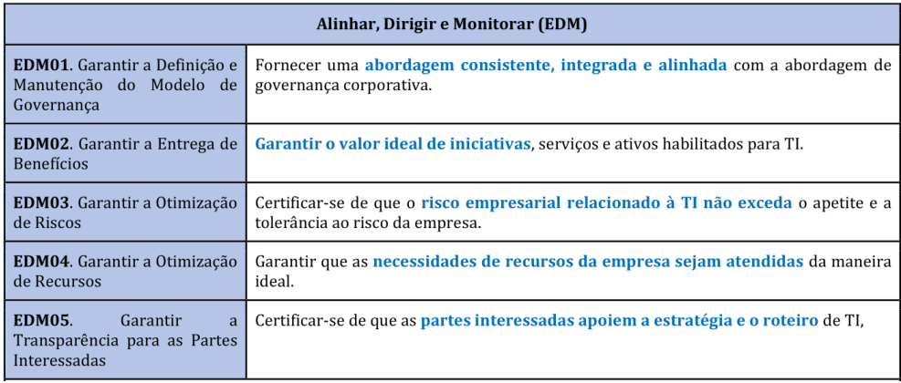

---

<!-- pagina: 57 -->

**Paolla Ramos Aula 02** 

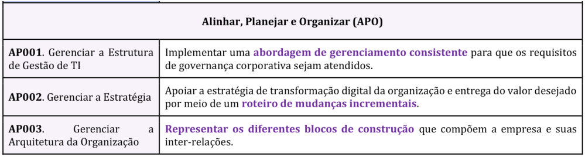

---

<!-- pagina: 58 -->

**Paolla Ramos Aula 02** 

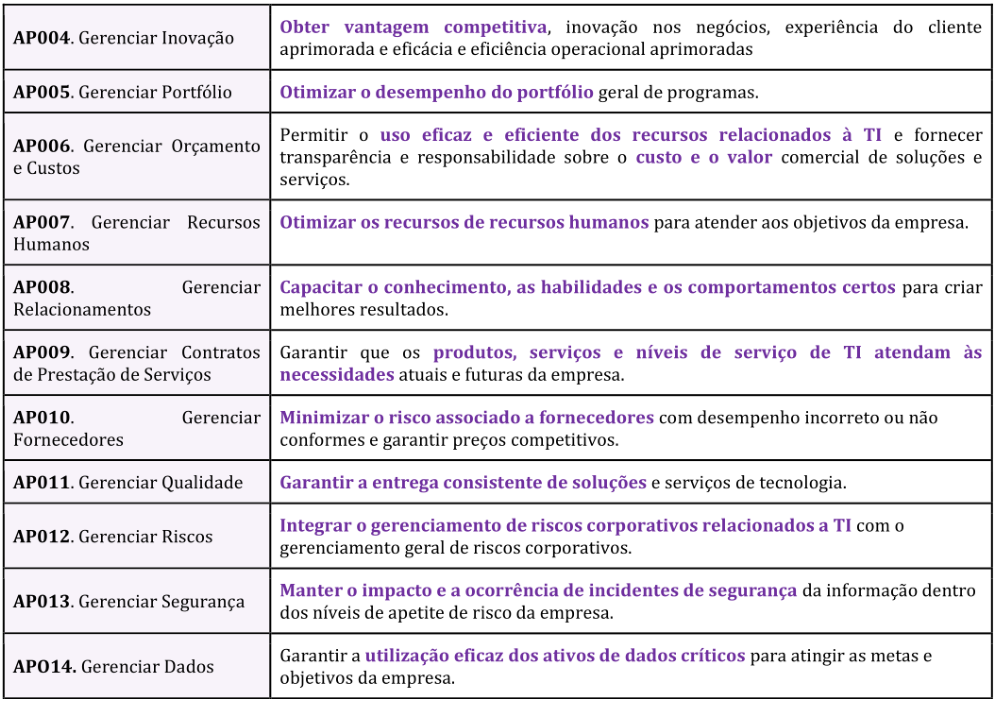

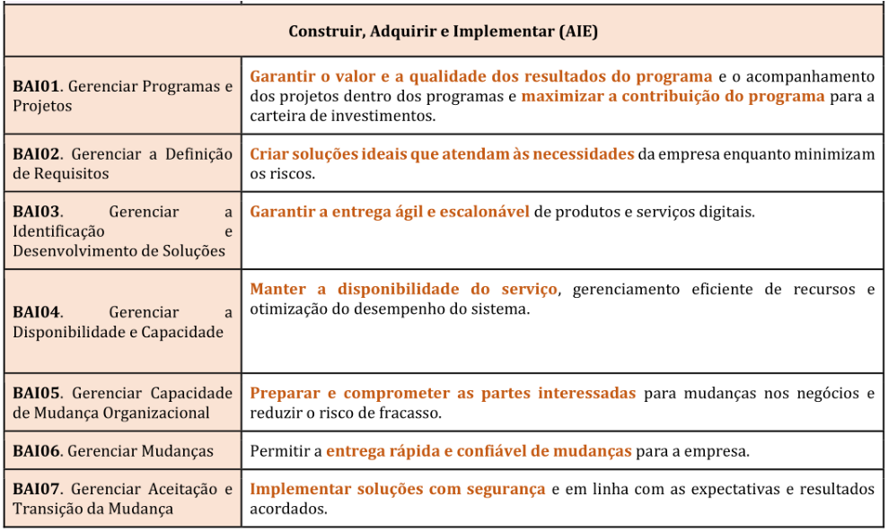

---

<!-- pagina: 59 -->

**Paolla Ramos Aula 02** 

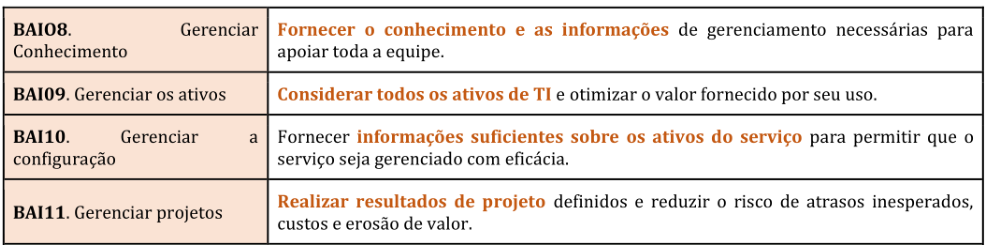

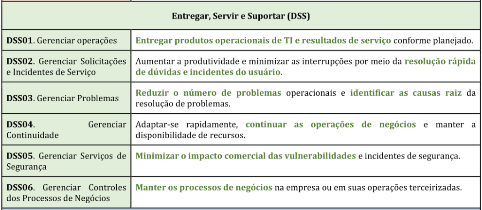

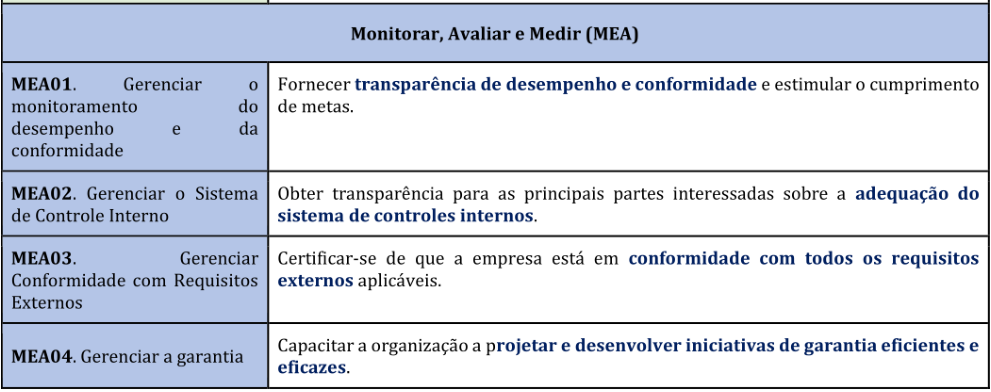

---

<!-- pagina: 60 -->

**Paolla Ramos Aula 02** 

# **<mark>Questões Comentadas</mark>** 

**1. (FGV - 2026 - Analista Judiciário (TJ RJ)/Tecnologia da Informação/Analista de Gestão de TIC) O COBIT® 2019 foi desenvolvido com base em dois conjuntos de princípios: princípios que descrevem os requisitos essenciais de um sistema de governança para informação e tecnologia corporativas e princípios para uma estrutura de governança que pode ser usada para construir um sistema de governança.** 

###### **Sobre os princípios do COBIT® 2019, é correto afirmar que:** 

a) um sistema de governança deve empregar indistintamente atividades e estruturas de governança e gestão; 

b) um sistema de governança deve abranger especificamente a função de tecnologia da informação, em que o processamento de informações da empresa é realizado; 

c) cada empresa precisa de um sistema de governança para satisfazer suas necessidades internas, independentemente do valor agregado pelo uso da tecnologia da informação; 

d) um sistema de governança de tecnologia da informação corporativa é constituído a partir de componentes homogêneos e específicos que interagem ocasionalmente; 

e) um sistema de governança deve ser adaptado às necessidades da empresa, usando um conjunto de fatores de desenho como parâmetros para personalizar e priorizar os componentes do sistema de governança. 

###### **Comentários:** 

(a) Errado. O COBIT 2019 distingue claramente as atividades de governança das de gestão — elas têm propósitos diferentes e não devem ser tratadas de forma indistinta; (b) Errado. O sistema de governança deve abranger toda a informação corporativa, não apenas a função de TI isoladamente; (c) Errado. O sistema de governança considera o valor agregado pelo uso da tecnologia, sendo esse um fator central, não ignorado; (d) Errado. Os componentes do sistema de governança são diversos e interagem de forma contínua, não ocasional; (e) Correto. O COBIT 2019 prevê que o sistema de governança seja personalizado com base em fatores de desenho, adaptando componentes às necessidades específicas de cada empresa. 

###### **Gabarito:** Letra E 

**2. (FGV - 2026 - Analista Judiciário (TJ RJ)/Tecnologia da Informação/Analista de Gestão de TIC) O Guia de Implementação do COBIT® 2019 enfatiza uma visão corporativa da governança de tecnologia da informação. A governança e a gestão da tecnologia da informação corporativa devem, portanto, ser implementadas como parte integrante da governança corporativa.**

---

<!-- pagina: 61 -->

**Paolla Ramos Aula 02** 

**Sobre as fases que compõem a abordagem de implementação do COBIT®, é correto afirmar que a fase:** 

a) “onde queremos chegar” prioriza projetos complexos que provavelmente trarão o maior benefício; 

b) “onde estamos agora” indica que a gestão precisa conhecer sua capacidade atual e onde podem existir deficiências; 

c) “o que precisa ser feito” define projetos apoiados por justificativas de tecnologia da informação e um plano de riscos para implementação; 

d) “como mantemos o ritmo” revisa o sucesso parcial da iniciativa, identifica requisitos iniciais de governança ou gestão e reforça a necessidade de manutenção do processo estabelecido; 

e) “como chegaremos lá” prevê a implementação das soluções propostas por meio de práticas robustas a curto prazo e o estabelecimento de medidas e sistemas de monitoramento para garantir o alinhamento com a tecnologia da informação e a mensuração do desempenho. 

###### **Comentários:** 

(a) Errado. A fase "onde queremos chegar" foca em definir metas de melhoria alcançáveis, não necessariamente os projetos mais complexos; (b) Correto. A fase "onde estamos agora" exige que a gestão avalie sua capacidade atual e identifique lacunas e deficiências existentes; (c) Errado. A fase "o que precisa ser feito" trata da definição de melhorias e soluções, não de justificativas de TI com plano de riscos; (d) Errado. A fase "como mantemos o ritmo" foca na sustentabilidade das melhorias já implementadas, não na revisão de requisitos iniciais; (e) Errado. A fase "como chegaremos lá" planeja a implementação das soluções, mas não se limita ao curto prazo nem ao alinhamento exclusivo com TI. 

###### **Gabarito:** Letra B 

**3. (FGV - 2026 - Analista Judiciário (TJ RJ)/Tecnologia da Informação/Analista de Inteligência Artificial) O sistema de inteligência artificial (IA) é um sistema baseado em máquina que, para objetivos explícitos ou implícitos, infere, a partir das entradas que recebe, como gerar saídas tais como predição, conteúdo, recomendações ou decisões que podem influenciar ambientes físicos ou virtuais.** 

###### **Aplicam-se os princípios do COBIT® 2019 na governança de sistemas de IA quando:** 

a) o sistema de governança abrange a empresa de ponta a ponta, focando na função de tecnologia da informação para atingir seus objetivos; 

b) se utiliza a abordagem holística, empregando-se um conjunto de fatores de desenho como parâmetros para personalizar e priorizar os componentes do sistema de governança; 

c) um sistema de governança é dinâmico. Isso significa que, cada vez que um ou mais fatores de projeto forem alterados, o impacto dessas mudanças será desprezado;

---

<!-- pagina: 62 -->

**Paolla Ramos Aula 02** 

d) se busca o equilíbrio entre benefícios, riscos (éticos, legais, de segurança e reputação) e recursos (dados, custo de computação, licenças) para fornecer valor às partes interessadas; 

e) um sistema de governança é adaptado às necessidades da empresa, por ser construído a partir de certos componentes que podem ser de diferentes tipos e que trabalham juntos de forma holística. 

###### **Comentários:** 

(a) Errado. O COBIT 2019 abrange a empresa de ponta a ponta, mas não se limita à função de TI — ele vai além disso, cobrindo toda a governança corporativa de informação e tecnologia; (b) Errado. Embora a abordagem holística e os fatores de design sejam conceitos do COBIT 2019, essa alternativa não conecta adequadamente esses elementos à governança de sistemas de IA; (c) Errado. O COBIT 2019 prevê exatamente o oposto: mudanças nos fatores de projeto devem ser consideradas e seu impacto, avaliado — não desprezado; (d) Correto. O COBIT 2019 orienta a busca pelo equilíbrio entre benefícios, riscos e recursos para gerar valor às partes interessadas — princípio que se aplica diretamente à governança de IA, com seus riscos éticos, legais e reputacionais; (e) Errado. Embora descreva corretamente a adaptabilidade do COBIT 2019, a alternativa não relaciona esse princípio à governança de sistemas de IA de forma específica, tornando-a incompleta para o contexto da questão. 

###### **Gabarito:** Letra D 

**4. (FGV - 2026 - Analista Judiciário (TJ RJ)/Tecnologia da Informação/Analista de Sistemas) Ana está buscando melhorar algumas práticas de governança e gestão da organização na qual trabalha e tem estudado o COBIT® 2019.** 

**A aplicação do COBIT® 2019 em uma organização, como um framework para governança e gerenciamento de informação e tecnologia, visa a:** 

a) gerenciar os recursos e ativos tecnológicos da organização; 

b) descrever o ambiente de tecnologia da informação da organização; 

c) delinear o custo da tecnologia da informação para a organização; 

d) definir os componentes para construir e sustentar um sistema de governança; 

e) definir a estratégia de tecnologia da informação mais adequada para organização. 

###### **Comentários:** 

(a) Errado. Gerenciar recursos tecnológicos é uma atividade operacional, não o propósito central do COBIT® 2019 como framework de governança; (b) Errado. Descrever o ambiente de TI é uma atividade de diagnóstico, não o objetivo do COBIT® 2019; (c) Errado. Delinear custos de TI é uma função financeira/contábil, fora do escopo principal do COBIT® 2019; (d) Correto. O COBIT® 2019 tem como propósito central fornecer os componentes necessários para construir e sustentar um sistema de

---

<!-- pagina: 63 -->

**Paolla Ramos Aula 02** 

governança e gerenciamento de TI nas organizações; (e) Errado. Definir estratégia de TI é papel do planejamento estratégico organizacional, não do COBIT® 2019 em si. 

###### **Gabarito:** Letra D 

**5. (FGV - 2026 - Analista Judiciário (TJ RJ)/Tecnologia da Informação/Cientista de Dados) A assessoria de inteligência artificial do Tribunal de Justiça do Estado do Rio de Janeiro quer criar um assistente jurídico, utilizando modelos de inteligência artificial generativa, para apoiar juízes na elaboração de decisões e minutas de sentenças para processos judiciais.** 

**De acordo com os princípios do COBIT® 2019, para garantir a qualidade dos dados analíticos, um sistema de governança deve:** 

a) ser estático, para assegurar a completude dos dados; 

b) unificar as atividades e estruturas de governança e gestão para assegurar a segurança dos dados; 

c) ser adaptado às necessidades da área de tecnologia da informação para assegurar a relevância dos dados; 

d) ser construído a partir de vários componentes que podem ser de diferentes tipos e que funcionam juntos de forma holística; 

e) abranger as funções da área de tecnologia da informação, onde a informação é processada, para assegurar a completude dos dados. 

###### **Comentários:** 

(a) Errado. O COBIT 2019 não preconiza sistemas estáticos; a governança deve ser dinâmica e adaptável às mudanças do contexto organizacional; (b) Errado. O COBIT 2019 distingue claramente governança de gestão, não as unifica — cada uma tem objetivos e estruturas próprias; (c) Errado. O sistema de governança não se limita à área de TI; ele abrange toda a organização, indo além das necessidades tecnológicas isoladas; (d) Correto. O COBIT 2019 estabelece que um sistema de governança é composto por múltiplos componentes de diferentes tipos — princípios, processos, estruturas, cultura — que atuam de forma holística e integrada; (e) Errado. Restringir a governança às funções de TI contraria o COBIT 2019, que adota uma visão corporativa ampla, não limitada ao processamento técnico da informação. 

###### **Gabarito:** Letra D 

**6. (FGV - 2025 - Auditor de Controle Externo (TCE-PI)/Tecnologia da Informação/Infraestrutura e Segurança (e mais 1 concurso)) De acordo com o framework COBIT 2019, a governança de TI é a responsável por definir a direção estratégica e supervisionar a gestão, enquanto a gestão desempenha um papel fundamental na execução das atividades planejadas pela governança. As áreas de atuação da governança e gestão são conhecidas como domínios.**

---

<!-- pagina: 64 -->

**Paolla Ramos Aula 02** 

###### **O domínio da governança abrange as atividades de** 

a) planejar, fazer e agir. 

b) avaliar, dirigir e monitorar. 

c) monitorar, avaliar e analisar. 

d) elaborar, gerenciar e avaliar. 

e) construir, adquirir e implementar. 

###### **Comentários:** 

(a) Errado. "Planejar, fazer e agir" não corresponde aos domínios do COBIT 2019, sendo mais associado a ciclos de melhoria contínua como o PDCA; (b) Correto. No COBIT 2019, o domínio de governança é o EDM — Evaluate, Direct and Monitor (Avaliar, Dirigir e Monitorar); (c) Errado. "Monitorar, avaliar e analisar" remete ao domínio MEA, que pertence à gestão, não à governança; (d) Errado. "Elaborar, gerenciar e avaliar" não representa nenhum domínio oficial definido pelo COBIT 2019; (e) Errado. "Construir, adquirir e implementar" corresponde ao domínio BAI, que também é da gestão, não da governança. 

###### **Gabarito:** Letra B 

**7. (FGV - 2025 - Auditor de Controle Externo (TCE RR)/Tecnologia da Informação/Análise de Dados) Uma instituição financeira que está enfrentando dificuldades para manter a conformidade com novas regulamentações de segurança de dados e privacidade.** 

**Durante uma auditoria, foi identificado que a organização não possui uma estrutura clara de responsabilização para as atividades de controle de TI, e muitas dessas atividades não estão sendo monitoradas ou revisadas periodicamente. Isso resultou em processos de conformidade inconsistentes e em vulnerabilidades de segurança nos sistemas.** 

**Com base nos princípios do COBIT 2019, a melhor iniciativa para resolver esses problemas de conformidade e melhorar o monitoramento dos controles é** 

a) implementar o processo “EDM01 - Garantir a Definição e Manutenção do Sistema de Governança”, pois ele estabelece os elementos essenciais da governança, garantindo que a empresa tenha uma estrutura de governança robusta para supervisão das atividades de TI. 

b) aplicar o processo “MEA01 - Monitorar, Avaliar e Medir o Desempenho e a Conformidade”, pois ele fornece diretrizes para monitorar as atividades de conformidade, garantir a implementação de controles e detectar falhas nos processos de governança. 

c) priorizar o processo “APO13 - Gerenciamento de Segurança da Informação”, já que ele foca na criação de uma política de segurança robusta, que garantiria a implementação de controles para proteger os dados e atender às regulamentações de conformidade.

---

<!-- pagina: 65 -->

**Paolla Ramos Aula 02** 

d) priorizar o “EDM03 - Garantir Otimização de Riscos”, uma vez que ele identifica e analisa os riscos relacionados à segurança de TI e fornece diretrizes para tratar riscos associados à falta de controle e monitoramento. 

e) desenvolver o “BAI06 - Gerenciar Mudanças”, pois ele garante que todas as mudanças sejam controladas e auditáveis, o que ajuda a assegurar a conformidade com os padrões de segurança e privacidade. 

###### **Comentários:** 

(a) Errado. O EDM01 trata da estrutura de governança em si, mas não é o processo mais indicado para monitorar conformidade e detectar falhas operacionais nos controles de TI; (b) Correto. O MEA01 é voltado exatamente para monitorar, avaliar e medir desempenho e conformidade, identificando falhas nos controles e garantindo rastreabilidade das atividades de TI; (c) Errado. O APO13 foca em políticas de segurança da informação, mas não abrange o monitoramento contínuo de conformidade e a responsabilização estrutural dos controles; (d) Errado. O EDM03 trata da otimização de riscos em nível estratégico, não do monitoramento operacional das atividades de conformidade e controle de TI; (e) Errado. O BAI06 gerencia mudanças nos sistemas, o que contribui para auditabilidade, mas não resolve a falta de monitoramento e responsabilização dos controles de conformidade. 

###### **Gabarito:** Letra B 

**8. (FGV - 2025 - Perito Criminal (PC MG)/Área II) O modelo COBIT 2019 é um framework amplamente utilizado para implementar boas práticas na governança e gestão de TI. Ele define uma série de processos essenciais que auxiliam as organizações a alinhar suas estratégias e operações de TI com seus objetivos corporativos. Assinale a opção que indica o processo do COBIT 2019 responsável por garantir que as necessidades da organização sejam identificadas e alinhadas às iniciativas e planos estratégicos de TI.** 

a) Gerenciamento de Riscos (Manage Risks). 

b) Gerenciamento de Desempenho (Monitor, Evaluate, and Assess - MEA). 

c) Planejamento e Organização (Align, Plan, and Organize - APO). 

d) Aquisição e Implementação (Build, Acquire, and Implement - BAI). 

e) Gerenciamento de Recursos (Manage Services). 

###### **Comentários:** 

(a) Errado. Gerenciamento de Riscos foca na identificação e mitigação de riscos, não no alinhamento estratégico entre TI e objetivos corporativos; (b) Errado. O domínio MEA é voltado ao monitoramento e avaliação de desempenho, não ao planejamento estratégico; (c) Correto. O domínio APO (Align, Plan, and Organize) é justamente responsável por identificar as necessidades da organização e alinhá-las às iniciativas e planos estratégicos de TI; (d) Errado. O domínio BAI trata da construção, aquisição e implementação de

---

<!-- pagina: 66 -->

**Paolla Ramos Aula 02** 

soluções, não do planejamento estratégico; (e) Errado. Gerenciamento de Recursos lida com a administração de serviços e ativos, sem foco no alinhamento estratégico organizacional. 

###### **Gabarito:** Letra C 

**9. (FGV - 2025 - Técnico Judiciário (TRT 24ª Região)/Apoio Especializado/Tecnologia da Informação) No COBIT 2019, há uma série de objetivos de governança e gestão, cada um com um propósito específico dentro de sua abrangência.** 

**Entre os objetivos de governança e gestão apresentados a seguir, assinale aquele que possui o propósito de promover uma parceria entre as partes interessadas em Informação e Tecnologia (I&T) para permitir o uso efetivo e eficiente dos recursos relacionados à Tecnologia da Informação (TI), fornecer transparência e prestação de contas do custo e valor das soluções que habilitam negócios e habilitar a organização a tomar decisões sobre o uso de soluções e serviços de I&T.** 

a) Contratos de serviços gerenciados. 

b) Programas gerenciados. 

c) Projetos gerenciados. 

d) Orçamento e custos gerenciados. 

e) Problemas gerenciados. 

###### **Comentários:** 

(a) Errado. Contratos de serviços gerenciados tratam da gestão de acordos com fornecedores externos, sem foco em transparência de custos e valor para decisões internas; (b) Errado. Programas gerenciados lidam com a coordenação de iniciativas estratégicas, não com a prestação de contas sobre custos e valor de soluções de I&T; (c) Errado. Projetos gerenciados focam na entrega de resultados dentro de escopo, prazo e custo, sem o propósito de promover parceria e transparência financeira de I&T; (d) Correto. Orçamento e custos gerenciados promovem a parceria entre partes interessadas em I&T, garantindo transparência, prestação de contas e suporte à tomada de decisão sobre uso de soluções e serviços; (e) Errado. Problemas gerenciados visam identificar e resolver causas-raiz de incidentes recorrentes, sem relação com gestão de custos ou valor de I&T. 

###### **Gabarito:** Letra D 

**10. (FGV - 2025 - Analista do Ministério Público da União/Tecnologia da Informação e Comunicação/Desenvolvimento de Sistemas) O framework COBIT 2019 faz uma distinção clara entre governança e gestão. O domínio BAI – Build, Acquire and Implement (Construir, Adquirir e Implementar) trata da definição, aquisição e implementação de soluções de Informação e Tecnologia (I&T) e sua integração em processos de negócios.**

---

<!-- pagina: 67 -->

**Paolla Ramos Aula 02** 

**Uma prática de gerenciamento aderente aos objetivos de gerenciamento do domínio BAI pode ser executada pela(s) atividade(s):** 

a) compreender a visão, direção e estratégia da organização, bem como seu contexto e desafios atuais; 

b) estabelecer uma função responsável por gerenciar atividades que dão suporte aos objetivos de gerenciamento de dados; 

c) desenvolver e manter procedimentos operacionais e atividades relacionadas para dar suporte a todos os serviços prestados; 

d) criar um plano de inovação que inclua grau de tolerância a riscos, com orçamento proposto para iniciativas de inovação e objetivos de inovação; 

e) especificar e priorizar informações, requisitos funcionais e técnicos, com base na experiência do usuário e nos requisitos confirmados das partes interessadas. 

###### **Comentários:** 

(a) Errado. Compreender visão e estratégia organizacional é uma prática do domínio APO (Align, Plan and Organise), não do BAI; (b) Errado. Estabelecer função responsável por gerenciar dados remete ao domínio APO, voltado à organização e ao alinhamento estratégico; (c) Errado. Desenvolver procedimentos operacionais para suporte a serviços está mais alinhado ao domínio DSS (Deliver, Service and Support); (d) Errado. Criar plano de inovação com tolerância a riscos e orçamento é característica do domínio APO, ligado ao planejamento estratégico; (e) Correto. Especificar e priorizar requisitos funcionais, técnicos e de experiência do usuário é atividade típica do BAI, que trata da construção e aquisição de soluções de I&T com base nas necessidades das partes interessadas. 

###### **Gabarito:** Letra E 

**11. (FGV - 2025 - Analista de Gestão (AgSUS)/Tecnologia da Informação) Como um desdobramento da governança corporativa, a Governança de Tecnologia da Informação (TI) é um sistema de diretrizes, processos e estruturas organizacionais que visa garantir que o uso destas tecnologias agregue valor ao negócio, enquanto gerencia os riscos e o uso de recursos.** 

**Avalie as afirmativas relacionadas ao emprego dos frameworks e modelos de governança e assinale (V) para verdadeira e (F) para falsa.** 

**( ) O COBIT 2019 (Control Objectives for Information and Related Technologies) se baseia em princípios como a separação entre governança e gestão e também foca em gerir e controlar a TI por meio da implementação obrigatória do banco de dados de gerenciamento de configuração (CMDB), enquanto a norma ISO/IEC 38500:2024 estabelece foco na responsabilidade do conselho de administração para assegurar que a TI contribua para o sucesso do negócio.**

---

<!-- pagina: 68 -->

**Paolla Ramos Aula 02** 

**( ) O ITIL 4 (Information Technology Infrastructure Library) estabelece um conjunto de práticas para a gestão e operação de serviços de TI, enquanto a norma ISO/IEC 38500:2024 não se aprofunda nestas questões e trata de oferecer para a alta gestão princípios para a tomada de decisão e supervisão quanto a governança corporativa de TI.** 

**( ) O COBIT 2019 fornece um modelo de governança e controle detalhando o que deve ser feito para serem seguidos os princípios apontados para a alta gestão pela ISO/IEC 38500:2024, enquanto o ITIL 4 mostra como executar a gestão dos serviços de TI.** 

###### **As afirmativas são, respectivamente,** 

a) V - F - F. b) F - F - F. c) V - V - F. d) F - V - V. e) V - F - V. 

###### **Comentários:** 

(I) Falso. O COBIT 2019 não exige implementação obrigatória de CMDB — isso não é um princípio do framework. A parte sobre a ISO/IEC 38500 está correta, mas a afirmativa como um todo é falsa; (II) Verdadeiro. O ITIL 4 foca em práticas operacionais de serviços de TI, enquanto a ISO/IEC 38500:2024 atua em nível estratégico, oferecendo princípios de governança para a alta gestão; (III) Verdadeiro. O COBIT 2019 detalha o "o quê" da governança alinhado à ISO/IEC 38500, e o ITIL 4 complementa com o "como" na execução dos serviços de TI. 

###### **Gabarito:** Letra D 

**12. (FGV - 2024 - Residente (TJ RJ)/Tecnologia da Informação) O COBIT é um framework criado pela ISACA (Information Systems Audit and Control Association) para gerenciamento de TI que tem sido usado por empresas para desenvolver, organizar e implementar estratégias de gestão de informação e governança.** 

**O COBIT 4.1 foi aperfeiçoado pelo desenvolvimento no final de 2012 do COBIT 5, que foi atualizado pelo COBIT 2019.** 

###### **Considerando as versões do framework COBIT, é correto afirmar que** 

a) o COBIT 2019 ampliou o acompanhamento do cenário de risco de negócios de tecnologia, excluiu a representação de componentes e impôs limite ao quantitativo de áreas de foco que podem ser incorporadas.

---

<!-- pagina: 69 -->

**Paolla Ramos Aula 02** 

b) o modelo de maturidade do COBIT 4.1 foi substituído pelo modelo de capacidade de processo do COBIT 5, que foi aperfeiçoado no COBIT 2019. 

c) os seis princípios de governança do COBIT 5 foram mantidos no COBIT 2019. 

d) o conceito de fator de desenho (ou fator de design), que estava presente dentre os princípios do framework de governança no COBIT 5, foi aperfeiçoado no COBIT 2019 para incorporar o conceito de desenho da solução de governança de tecnologia e informação. 

e) o número total de processos presentes no COBIT 5 foi mantido no COBIT 2019, entretanto, houve mudanças em nomenclaturas e componente. 

###### **Comentários:** 

(a) Errado. O COBIT 2019 não excluiu a representação de componentes nem impôs limite às áreas de foco 

— pelo contrário, ampliou a flexibilidade do framework; (b) Correto. O modelo de maturidade do COBIT 4.1 foi de fato substituído pelo modelo de capacidade de processo no COBIT 5, e esse modelo foi ==5460== aperfeiçoado no COBIT 2019; (c) Errado. O COBIT 5 possuía cinco princípios, não seis, e o COBIT 2019 os revisou, introduzindo um novo conjunto de seis princípios distintos; (d) Errado. O conceito de fator de desenho não estava presente nos princípios do COBIT 5; ele foi introduzido como novidade no COBIT 2019; (e) Errado. O COBIT 2019 alterou o número total de processos em relação ao COBIT 5, passando de 37 para 40 processos, além de mudanças em nomenclaturas. 

###### **Gabarito:** Letra B 

**13. (FGV - 2024 - Residente (TJ RJ)/Tecnologia da Informação) Na área de tecnologia de informação estabeleceu-se um conjunto de normas e práticas nas organizações denominado Governança de TI.** 

**Sobre os frameworks COBIT (Control Objectives for Information and related Technology), ITIL (Information Technology Infrastructure Library) e ISO/IEC 27001, assinale a afirmativa correta.** 

a) A norma ISO 27001 é especializada na gestão de segurança da informação exclusivamente do ambiente interno de TI das organizações. 

b) O ITIL define um conjunto de práticas detalhadas para se fazer um bom gerenciamento de tecnologias e infraestrutura. 

c) O COBIT é um framework de gerenciamento de TI usado por empresas para desenvolver, organizar e implementar estratégias de gestão de informação e governança. 

d) O ITIL 4 estabelece "o que" são os objetivos de governança e o COBIT 2019 estabelece o "como fazer" a entrega de serviços de TI. 

e) O COBIT e ITIL representam dois métodos equivalentes de se alcançar o mesmo objetivo. 

###### **Comentários:**

---

<!-- pagina: 70 -->

**Paolla Ramos Aula 02** 

(a) Errado. A ISO 27001 não se limita ao ambiente interno de TI; ela abrange a gestão de segurança da informação de forma ampla, incluindo processos, pessoas e tecnologia; (b) Errado. O ITIL foca em boas práticas para gerenciamento de serviços de TI, não especificamente em tecnologias e infraestrutura de forma detalhada; (c) Correto. O COBIT é justamente o framework voltado à governança e gestão de TI, auxiliando organizações a desenvolver, organizar e implementar estratégias de informação; (d) Errado. A lógica está invertida: é o COBIT que define "o quê" da governança, enquanto o ITIL orienta o "como fazer" na entrega de serviços; (e) Errado. COBIT e ITIL têm focos distintos — governança e serviços, respectivamente — e são complementares, não equivalentes. 

###### **Gabarito:** Letra C 

**14. (FGV - 2024 - Analista Legislativo (CM Fortaleza)/Analista de Informática) O COBIT 2019 introduziu uma série de mudanças estruturais, como o conceito de Áreas de Foco (Focus Areas) e Fatores de Desenho (Design Factors).** 

**Nesse contexto, analise as afirmativas a seguir.** 

**I. O COBIT 2019 elimina a necessidade de conformidade regulatória e legal dentro das Áreas de Foco, concentrando-se apenas na otimização de processos e inovação tecnológica.** 

**II. Entre os Fatores de Desenho do COBIT 2019, encontram-se o perfil de risco, metas corporativas e requisitos de conformidade.** 

**III. As Áreas de Foco no COBIT 2019 são temas específicos, identificados para ajudar as organizações a abordar aspectos particulares de governança e gestão de TI que são críticos para o sucesso empresarial.** 

**Está correto o que se afirma em** 

a) I, apenas. b) II, apenas. c) I e II, apenas. d) II e III, apenas. e) I, II e III. 

###### **Comentários:** 

(I) Errado. O COBIT 2019 não elimina a conformidade regulatória — ela permanece como elemento essencial, inclusive sendo contemplada nos próprios Fatores de Desenho; (II) Correto. Perfil de risco, metas corporativas e requisitos de conformidade estão entre os Fatores de Desenho que orientam a

---

<!-- pagina: 71 -->

**Paolla Ramos Aula 02** 

personalização do sistema de governança; (III) Correto. As Áreas de Foco são temas específicos que auxiliam organizações a tratar aspectos críticos de governança e gestão de TI de forma direcionada. Itens corretos: II e III. 

###### **Gabarito:** Letra D 

**15. (FGV - 2024 - Técnico de Nível Superior (TJ MS)/Analista de Sistemas Computacionais/Analista de Governança) Para a adequada implementação do COBIT 2019, é essencial entender seus conceitos e componentes fundamentais.** 

**O componente do sistema de governança fundamental para traduzir o comportamento desejado em orientações práticas para a gestão do dia a dia é o seguinte:** 

a) princípios, políticas e procedimentos; 

b) estruturas organizacionais; 

c) cultura, ética e comportamento; 

d) informação; 

e) pessoas, habilidades e competências. 

###### **Comentários:** 

(a) Correto. Princípios, políticas e procedimentos traduzem o comportamento desejado em orientações práticas e aplicáveis no dia a dia da gestão, sendo o componente que operacionaliza a governança no COBIT 2019; (b) Errado. Estruturas organizacionais definem responsabilidades e papéis, mas não são o componente que traduz comportamentos em orientações práticas de gestão; (c) Errado. Cultura, ética e comportamento representam valores e atitudes desejados, mas não se traduzem diretamente em orientações práticas para o dia a dia; (d) Errado. Informação é um componente essencial para decisões, mas não é o responsável por converter comportamentos desejados em diretrizes operacionais; (e) Errado. Pessoas, habilidades e competências tratam das capacidades humanas necessárias, mas não têm o papel de traduzir comportamentos em orientações práticas. 

###### **Gabarito:** Letra A 

**16. (FGV - 2024 - Técnico de Nível Superior (TJ MS)/Analista de Sistemas Computacionais/Analista de Suporte de TI) O framework COBIT 2019 define os componentes para construir e manter um sistema de governança e gerenciamento de informações e tecnologias relacionadas.** 

**Nesse sentido, com base no COBIT 2019 Core Model, os objetivos de:**

---

<!-- pagina: 72 -->

**Paolla Ramos Aula 02** 

a) governança MEA (Monitor, Evaluate e Assess) estão relacionados aos processos de otimização da entrega de benefícios, auditorias interna e externa da organização; 

b) gerenciamento APO (Align, Plan and Organize) estão relacionados à gestão de inovação, orçamento, custos, qualidade e dados; 

c) governança BAI (Build, Acquire and Implement) estão relacionados aos requisitos, dados, programas, projetos e mudanças em TI; 

d) governança DSS (Deliver, Service and Support) estão relacionados ao custo dos controles de incidentes e manutenção dos sistemas de segurança; 

e) gerenciamento de TI corporativa estão relacionados ao mapeamento de todo ambiente computacional (hardware e software) da organização. 

###### **Comentários:** 

(a) Errado. MEA é domínio de gerenciamento, não de governança, e foca em monitorar, avaliar e auditar desempenho e conformidade — não em otimização de entrega de benefícios; (b) Correto. O domínio APO (Align, Plan and Organize) abrange objetivos de gerenciamento como inovação, orçamento, custos, qualidade e dados, alinhando TI à estratégia organizacional; (c) Errado. BAI (Build, Acquire and Implement) é domínio de gerenciamento, não de governança, e trata de construção, aquisição e implementação de soluções; (d) Errado. DSS (Deliver, Service and Support) também é domínio de gerenciamento, voltado à entrega de serviços e suporte operacional, não à governança; (e) Errado. O gerenciamento de TI corporativa no COBIT não se limita ao mapeamento de hardware e software — abrange estratégia, processos e alinhamento com o negócio. 

###### **Gabarito:** Letra B 

**17. (FGV - 2024 - Analista da Comissão de Valores Mobiliários (CVM)/Tecnologia da Informação/Infraestrutura e Segurança/Perfil 9) Um analista da CVM reforçou para sua equipe que os fatores de desempenho impactam de diferentes maneiras a adaptação do sistema de governança de uma organização. O COBIT 2019 distingue três tipos diferentes de impacto, que são:** 

a) conformidade, prioridade e necessidade de áreas de foco específicas; 

b) prioridade, componentes variantes e necessidade de áreas de foco específicas; 

c) prioridade, serviços de segurança gerenciados e componentes variantes; 

d) conformidade, componentes variantes e serviços de segurança gerenciados; 

e) serviços de segurança gerenciados, conformidade e necessidade de áreas de foco específicas. 

###### **Comentários:** 

(a) Errado. "Conformidade" não está entre os três tipos de impacto definidos pelo COBIT 2019 para fatores de desempenho; (b) Correto. O COBIT 2019 define que os fatores de desempenho impactam por meio de prioridade, componentes variantes e necessidade de áreas de foco específicas; (c) Errado. "Serviços de

---

<!-- pagina: 73 -->

**Paolla Ramos Aula 02** 

segurança gerenciados" não é um tipo de impacto reconhecido pelo COBIT 2019 nesse contexto; (d) Errado. A combinação de conformidade e serviços de segurança gerenciados não corresponde à classificação do COBIT 2019; (e) Errado. Nenhum dos três elementos listados compõe corretamente os tipos de impacto dos fatores de desempenho no COBIT 2019. 

###### **Gabarito:** Letra B 

**18. (FGV - 2024 - Auditor Federal de Finanças e Controle (STN)/Tecnologia da Informação/Transformação Digital) O COBIT 2019 tem como princípio que um sistema de governança deve** 

a) cobrir a empresa de ponta a ponta e focar apenas nas funções de TI. 

b) ser viável, estático, estável e blindado às mudanças dos fatores de design. 

c) satisfazer as metas de venda da empresa em detrimento dos riscos. 

d) tratar dados como um produto residual para maximizar o valor aos stakeholder. e) distinguir claramente entre atividades de governança e gestão. 

###### **Comentários:** 

(a) Errado. O COBIT 2019 abrange a empresa de ponta a ponta, mas não se limita às funções de TI — cobre toda a organização; (b) Errado. O sistema de governança deve ser dinâmico e adaptável aos fatores de design, não estático ou blindado a mudanças; (c) Errado. O COBIT não prioriza metas de venda em detrimento de riscos; o equilíbrio entre valor e risco é central no framework; (d) Errado. Dados são ativos estratégicos no COBIT 2019, não produtos residuais — tratá-los assim contraria os princípios do framework; (e) Correto. Um dos princípios centrais do COBIT 2019 é a separação clara entre governança (avaliar, dirigir e monitorar) e gestão (planejar, construir, executar e monitorar). 

###### **Gabarito:** Letra E 

**19. (FGV - 2024 - Auditor Federal de Finanças e Controle (STN)/Tecnologia da Informação/Transformação Digital) O COBIT 2019 define níveis de maturidade como uma medida de desempenho das áreas de foco em governança de TI. O menor nível de maturidade a partir do qual já se observa que os padrões corporativos fornecem orientação para toda a empresa é o** 

a) nível 1 - inicial. 

b) nível 2 - gerenciado. c) nível 3 - definido. 

d) nível 4 - quantitativo. e) nível 5 - otimização.

---

<!-- pagina: 74 -->

**Paolla Ramos Aula 02** 

###### **Comentários:** 

(a) Errado. No nível 1 (Inicial), os processos são ad hoc e reativos, sem padrões corporativos que orientem a empresa como um todo; (b) Errado. No nível 2 (Gerenciado), há algum planejamento, mas os padrões ainda operam de forma localizada, sem abrangência corporativa; (c) Correto. No nível 3 (Definido), os padrões corporativos já fornecem orientação para toda a empresa, sendo o menor nível em que isso ocorre; (d) Errado. O nível 4 (Quantitativo) vai além, incorporando métricas e medições, mas não é o menor nível com orientação corporativa; (e) Errado. O nível 5 (Otimização) representa a maturidade máxima, com melhoria contínua, estando bem acima do limiar pedido. 

###### **Gabarito:** Letra C 

**20. (FGV - 2024 - Auditor de Controle Externo (TCE-PA)/Administrativa/Ciência de Dados (e mais 5 concursos)) Conjuntos de boas práticas, diretrizes e ferramentas de governança e gestão de TI são mapeados por meio de frameworks para auxiliar a implantação de tais instrumentos nas empresas. Um dos principais frameworks na indústria é o COBIT 2019.** 

###### **O principal objetivo do framework COBIT 2019 na governança e gestão de TI é** 

a) estabelecer padrões internacionais para desenvolvimento de software. 

b) fornecer metodologias para análise de mercado de TI. 

c) definir diretrizes para a gestão e controle de tecnologia da informação. 

d) implementar práticas para otimização de infraestrutura de rede. 

e) padronizar processos para conformidade fiscal em TI. 

###### **Comentários:** 

(a) Errado. O COBIT 2019 não estabelece padrões para desenvolvimento de software; esse é o foco de frameworks como CMMI ou normas ISO/IEC; (b) Errado. Análise de mercado de TI não é o escopo do COBIT 2019, que foca em governança e gestão interna; (c) Correto. O COBIT 2019 fornece diretrizes para governança e gestão de TI, ajudando organizações a alinhar TI aos objetivos de negócio com controle e responsabilidade; (d) Errado. Otimização de infraestrutura de rede é tema de frameworks específicos, como ITIL ou normas de redes, não do COBIT 2019; (e) Errado. Conformidade fiscal é domínio contábiltributário, fora do escopo do COBIT 2019, que trata de governança corporativa de TI. 

###### **Gabarito:** Letra C 

**21. (FGV - 2024 - Analista Judiciário (TRF 1ª Região)/Apoio Especializado/Análise de Dados) Os objetivos de governança e gestão do COBIT 2019® são agrupados em domínios.**

---

<!-- pagina: 75 -->

**Paolla Ramos Aula 02** 

**O objetivo de gestão do COBIT que aborda o monitoramento de desempenho e a conformidade da informação e tecnologia com metas internas de desempenho, objetivos de controle interno e requisitos externos está corretamente identificado em:** 

a) monitorar, avaliar e analisar (monitor, evaluate and assess - MEA); 

b) avaliar, dirigir e monitorar (evaluate, direct and monitor -EDM); 

c) alinhar, planejar e organizar (align, plan and organize - APO); 

d) entregar, servir e suportar (deliver, service and support - DSS); 

e) construir, adquirir e implementar (build, acquire and implement - BAI). 

###### **Comentários:** 

(a) Correto. O domínio MEA é responsável por monitorar desempenho, avaliar conformidade com metas internas e requisitos externos — exatamente o que a questão descreve; (b) Errado. EDM é um domínio de governança, não de gestão, focado em avaliar e dirigir decisões estratégicas de TI; (c) Errado. APO trata do alinhamento estratégico e planejamento de TI, não do monitoramento de conformidade e desempenho; (d) Errado. DSS foca na entrega de serviços e suporte operacional, sem ênfase em monitoramento de conformidade; (e) Errado. BAI abrange a construção e implementação de soluções, não o acompanhamento de metas e requisitos externos. 

###### **Gabarito:** Letra A 

**22. (FGV - 2024 - Analista Judiciário (TRF 1ª Região)/Apoio Especializado/Governança e Gestão de Tecnologia da Informação) O framework COBIT® 2019 estabelece que um sistema corporativo de governança para informação e tecnologia deve ser construído a partir de vários componentes que podem ser de diferentes tipos e trabalhar juntos.** 

**Esse princípio do sistema de governança do COBIT é o(a):** 

a) abordagem holística; 

b) valor das partes interessadas; 

c) governança distinta da gestão; 

d) sistema dinâmico de governança; 

e) sistema de governança de ponta a ponta. 

###### **Comentários:** 

(a) Correto. A abordagem holística reconhece que o sistema de governança é composto por diferentes tipos de componentes que atuam de forma integrada e interdependente para alcançar os objetivos da organização; (b) Errado. O valor das partes interessadas trata da geração de benefícios para os stakeholders, não da composição por múltiplos componentes integrados; (c) Errado. Governança distinta

---

<!-- pagina: 76 -->

**Paolla Ramos Aula 02** 

da gestão refere-se à separação de papéis e responsabilidades entre governar e gerenciar, não à estrutura de componentes; (d) Errado. O sistema dinâmico de governança aborda a adaptação do modelo a fatores de design variáveis, não a integração de componentes de diferentes tipos; (e) Errado. O sistema de ponta a ponta trata da cobertura de toda a organização, incluindo todas as funções e processos de TI, mas não descreve a composição por múltiplos componentes. 

###### **Gabarito:** Letra A 

**23. (FGV - 2024 - Analista Judiciário (TRF 1ª Região)/Apoio Especializado/Governança e Gestão de Tecnologia da Informação) O modelo central do COBIT® 2019 (Core Model) estabelece objetivos de governança e de gestão.** 

**Segundo o COBIT, quando o TRF1 avalia as opções estratégicas, direciona a alta gerência e monitora o alcance da estratégia, atua de acordo com o seguinte objetivo de governança:** 

a) alinhar, planejar e organizar (align, plan and organize - APO); 

b) entregar, servir e suportar (deliver, service and support - DSS); 

c) avaliar, dirigir e monitorar (evaluate, direct and monitor - EDM); 

d) monitorar, avaliar e analisar (monitor, evaluate and assess -MEA); 

e) construir, adquirir e implementar (build, acquire and implement - BAI). 

###### **Comentários:** 

(a) Errado. APO trata do alinhamento e planejamento operacional, não da avaliação estratégica e monitoramento de alto nível; (b) Errado. DSS foca na entrega de serviços e suporte operacional, distante das funções de governança estratégica; (c) Correto. EDM é o domínio de governança do COBIT que cobre exatamente avaliar opções, dirigir a alta gerência e monitorar resultados estratégicos; (d) Errado. MEA é um domínio de gestão voltado ao monitoramento de desempenho e conformidade, não à governança estratégica; (e) Errado. BAI abrange a construção e aquisição de soluções, sem relação com a avaliação e direção estratégica de governança. 

###### **Gabarito:** Letra C 

**24. (FGV - 2024 - Analista Judiciário (TRF 1ª Região)/Apoio Especializado/Suporte em Tecnologia da Informação) Os princípios de governança do COBIT 2019® descrevem os principais requisitos de um sistema de governança para informações e tecnologia da organização.** 

###### **O princípio “sistema de governança dinâmico” determina que um sistema de governança deve:** 

a) atender às necessidades das partes interessadas;

---

<!-- pagina: 77 -->

**Paolla Ramos Aula 02** 

b) distinguir claramente entre as atividades e estruturas de governança e gestão; 

c) ser construído a partir de vários componentes, que podem ser de diferentes tipos e que trabalham juntos; 

d) ser capaz de considerar os impactos da alteração de um ou mais fatores de desenho no sistema de governança; 

e) ser adaptado para as necessidades da organização usando um conjunto de fatores de desenho como parâmetros para adaptar e priorizar os componentes do sistema de governança. 

###### **Comentários:** 

(a) Errado. Atender às necessidades das partes interessadas corresponde ao princípio "orientado às necessidades das partes interessadas", não ao dinâmico; (b) Errado. Distinguir governança de gestão é o princípio "governança distinta da gestão", que trata da separação de responsabilidades; (c) Errado. Ser construído a partir de vários componentes refere-se ao princípio "sistema de governança holístico", que aborda a integração de elementos; (d) Correto. O princípio "sistema de governança dinâmico" determina que, ao mudar fatores de desenho, o sistema deve ser capaz de refletir essas mudanças e se adaptar; (e) Errado. Adaptar o sistema usando fatores de desenho como parâmetros corresponde ao princípio "adaptado às necessidades da organização", não ao dinâmico. 

###### **Gabarito:** Letra D 

**25. (FGV - 2024 - Técnico Judiciário (TRF 1ª Região)/Apoio Especializado/Desenvolvimento de Sistemas da Informação) O TRF1 está buscando melhores práticas para potencializar a governança de TI da instituição. Ao se analisar os componentes de um sistema de governança do COBIT, é possível verificar que um desses componentes é conhecido por ser frequentemente subestimado como fator de sucesso das atividades de governança e gestão.** 

###### **Esse componente é o de:** 

a) estruturas organizacionais; 

b) processos internos; 

c) informação; 

d) cultura, ética e comportamento; 

e) pessoas, habilidades e competências. 

###### **Comentários:** 

(a) Errado. Estruturas organizacionais são componentes formais e visíveis, não costumam ser subestimadas no contexto da governança de TI; (b) Errado. Processos internos recebem atenção central nas iniciativas de governança, sendo amplamente documentados e monitorados; (c) Errado. A informação é reconhecida como ativo estratégico e raramente é negligenciada nas discussões de governança; (d) Correto. O COBIT

---

<!-- pagina: 78 -->

**Paolla Ramos Aula 02** 

destaca que cultura, ética e comportamento são frequentemente subestimados, apesar de serem decisivos para o sucesso da governança e gestão de TI; (e) Errado. Pessoas, habilidades e competências são valorizadas nas práticas de gestão, não sendo tipicamente apontadas como o componente mais negligenciado. 

###### **Gabarito:** Letra D 

**26. (FGV - 2024 - Técnico Judiciário (TRF 1ª Região)/Apoio Especializado/Tecnologia da Informação) O TRF1 está avaliando as melhores práticas para implantação da governança de TI da instituição.** 

**Ao se analisarem os princípios para um sistema de governança do COBIT 2019, verificou-se que um sistema de governança deve:** 

a) não apenas focar na função de TI, mas em todo o processamento de informações que a organização coloca em prática para alcançar seus objetivos; 

b) ser adaptado às necessidades de cada colaborador, com a utilização de um conjunto de fatores de desenho como parâmetros para personalizar e priorizar os componentes do sistema de governança; 

c) integrar as atividades de governança e gestão e estruturas de governança e gestão, de forma a tornálas um único elemento; 

d) ser construído a partir de uma série de componentes que podem ser de diferentes tipos e que trabalham isoladamente; 

e) ser inflexível, o que significa que os fatores de desenho, depois de definidos, são inalteráveis. 

###### **Comentários:** 

(a) Correto. O COBIT 2019 estabelece que a governança deve abranger toda a informação da organização, não se limitando à TI. O foco é amplo: qualquer processamento de dados que suporte os objetivos institucionais; (b) Errado. O sistema de governança é adaptado às necessidades da organização, não de cada colaborador individualmente. Os fatores de desenho personalizam o sistema como um todo; (c) Errado. O COBIT 2019 distingue claramente governança e gestão como elementos separados, com papéis, estruturas e atividades distintas — não os unifica em um único elemento; (d) Errado. Os componentes do sistema de governança trabalham de forma integrada e interdependente, não isoladamente. A sinergia entre eles é essencial para o funcionamento do modelo; (e) Errado. O COBIT 2019 preza pela flexibilidade. Os fatores de desenho podem e devem ser revistos conforme a organização evolui, tornando o sistema adaptável às mudanças do contexto. 

###### **Gabarito:** Letra A 

**27. (FGV - 2024 - Analista Judiciário (TJ RR)/Gestão e Governança de Tecnologia da Informação) O COBIT 2019 é um framework de governança e gestão de Tecnologia da Informação (TI) que fornece um conjunto de princípios, práticas e ferramentas para ajudar as organizações a alcançarem seus**

---

<!-- pagina: 79 -->

**Paolla Ramos Aula 02** 

**objetivos estratégicos por meio do gerenciamento eficaz da informação e tecnologia. Ele se concentra em garantir que a TI esteja alinhada com as metas da empresa, gerando valor e gerenciando riscos de forma eficiente.** 

**Entre os domínios que agrupam os objetivos da gestão no COBIT 2019 listados a seguir, assinale aquele que foca em como os objetivos estratégicos são traduzidos em planos táticos e operacionais, garantindo o alinhamento entre TI e os objetivos do negócio.** 

a) Alinhar, Planejar e Organizar (APO -Align, Plan, and Organize). 

b) Construir, Adquirir e Implantar (BAI -Buid, Acquire, and Implement). 

c) Entregar, Prestar Serviço e Dar e Suporte (DSS - Deliver, Service, and Support). 

d) Monitorar, Avaliar e Melhorar (MEA -Monitor, Evaluate, and Assess). 

e) Construir, Adquirir e Melhorar (BEA – Bild, Evaluate and Assess). 

###### **Comentários:** 

(a) Correto. O domínio APO foca em traduzir objetivos estratégicos em planos táticos e operacionais, garantindo o alinhamento entre TI e negócio — exatamente o que a questão descreve; (b) Errado. O BAI trata da construção, aquisição e implantação de soluções, não do planejamento estratégico-tático; (c) Errado. O DSS concentra-se na entrega de serviços e suporte operacional, não no alinhamento estratégico; (d) Errado. O MEA foca em monitoramento, avaliação e melhoria contínua dos processos, não no planejamento; (e) Errado. "BEA – Build, Evaluate and Assess" não é um domínio real do COBIT 2019, sendo uma alternativa fictícia. 

###### **Gabarito:** Letra A 

**28. (FGV - 2024 - Analista Judiciário (TJ RR)/Gestão e Governança de Tecnologia da Informação) No COBIT 2019, há 40 objetivos de governança e gestão, cada um com um propósito específico dentro de sua abrangência.** 

**Entre os objetivos de governança e gestão apresentados abaixo, assinale aquele que tem o propósito de alcançar os resultados definidos do projeto reduzindo o risco de atrasos inesperados e custos, melhorando as comunicações e envolvimento de empresas e usuários finais, garantindo o valor e a qualidade das entregas do projeto e maximizando a sua contribuição para os programas e investimentos definidos portfólio.** 

a) Risco gerenciado. 

b) Programas gerenciados. 

c) Projetos gerenciados. 

d) Orçamento e Custos gerenciados.

---

<!-- pagina: 80 -->

**Paolla Ramos Aula 02** 

e) Problemas gerenciados. 

###### **Comentários:** 

(a) Errado. "Risco gerenciado" foca na identificação e mitigação de riscos organizacionais, não no gerenciamento de entregas e comunicações de projetos específicos; (b) Errado. "Programas gerenciados" trata da coordenação de múltiplos projetos relacionados, com escopo mais amplo que o gerenciamento individual de projetos; (c) Correto. "Projetos gerenciados" tem exatamente o propósito descrito: reduzir atrasos, controlar custos, engajar usuários e maximizar o valor das entregas no portfólio; (d) Errado. "Orçamento e Custos gerenciados" concentra-se na gestão financeira e alocação de recursos, sem abranger comunicações e entregas de projetos; (e) Errado. "Problemas gerenciados" trata da resolução de incidentes e falhas operacionais, sendo distinto do gerenciamento de projetos e suas entregas. 

###### **Gabarito:** Letra C 

**29. (FGV - 2024 - Analista de Tecnologia da Informação (DATAPREV)/Análise de Negócios de TI) Em um mundo cada vez mais digital, a segurança e a eficiência das operações de TI tornaram-se cruciais para qualquer empresa. Não é à toa que vimos, nos últimos anos, grandes players do mercado, como instituições financeiras na Geórgia e a gigante de TI Wipro, adotarem frameworks como o COBIT 2019 e o ITIL v4.** 

**Enquanto as instituições financeiras da Geórgia buscaram no COBIT uma forma de se blindar contra as ameaças cibernéticas e se alinhar às regulamentações do Banco Nacional, a Wipro viu no ITIL v4 a chave para turbinar seu atendimento ao cliente, agilizando a resolução de problemas e aumentando a satisfação.** 

**Diante desses cases de sucesso, assinale a opção que descreve corretamente o uso desses frameworks.** 

a) O COBIT 2019 foi a ferramenta escolhida para lidar com incidentes de TI em tempo real, enquanto o ITIL v4 entrou em cena para garantir que tudo estivesse dentro das normas de segurança. 

b) A Wipro apostou no ITIL v4 para resolver problemas de TI com mais rapidez, e as instituições financeiras da Geórgia usaram o COBIT 2019 para se manterem em dia com as regulamentações e a segurança cibernética. 

c) Tanto o COBIT 2019 quanto o ITIL v4 foram usados pelas duas empresas, sem distinção clara entre suas funções, para gerenciar as operações e garantir que tudo estivesse de acordo com as leis. 

d) O COBIT 2019 tem seu foco principal nos serviços operacionais de TI, enquanto o ITIL v4 é mais voltado para a governança de TI em um nível mais estratégico. 

e) O ITIL v4 foi a escolha para acompanhar o desempenho dos fornecedores de TI, e o COBIT 2019 ficou responsável pelo suporte operacional nas duas empresas.

---

<!-- pagina: 81 -->

**Paolla Ramos Aula 02** 

###### **Comentários:** 

(a) Errado. Os papéis estão invertidos: o COBIT é voltado à governança e conformidade, não ao gerenciamento de incidentes em tempo real, que é domínio do ITIL; (b) Correto. A Wipro usou o ITIL v4 para agilizar a resolução de problemas, enquanto as instituições financeiras da Geórgia adotaram o COBIT 2019 para conformidade regulatória e segurança cibernética; (c) Errado. Os frameworks têm funções distintas e bem definidas — COBIT para governança e ITIL para gerenciamento de serviços — e não foram usados de forma indistinta; (d) Errado. É justamente o contrário: o ITIL v4 foca nos serviços operacionais de TI, enquanto o COBIT 2019 atua no nível estratégico de governança; (e) Errado. O ITIL v4 não é focado em acompanhamento de fornecedores, e o COBIT não é responsável pelo suporte operacional — essa descrição inverte as funções de ambos. 

###### **Gabarito:** Letra B 

**30. (FGV - 2024 - Analista de Tecnologia da Informação (DATAPREV)/Gestão de Serviços de TIC) Aplicando o COBIT 2019 em uma empresa de TI, procurou-se estabelecer os critérios bem definidos, associados ao domínio de gerenciamento, o que inclui trabalhar também com** 

a) avaliação, planificação e direção. 

b) análise, integração e entrega. 

c) entrega, serviço e suporte. 

d) integração, serviço e planificação. 

e) suporte, direção e abordagem. 

###### **Comentários:** 

(a) Errado. "Avaliação, planificação e direção" não compõem o domínio de gerenciamento do COBIT 2019; (b) Errado. "Análise, integração e entrega" não corresponde a nenhum domínio reconhecido no COBIT 2019; (c) Correto. No COBIT 2019, o domínio de gerenciamento inclui "Entrega, Serviço e Suporte" (DSS), voltado à execução operacional dos serviços de TI; (d) Errado. "Integração, serviço e planificação" mistura termos que não formam um domínio válido no COBIT 2019; (e) Errado. "Suporte, direção e abordagem" não representa nenhum domínio definido na estrutura do COBIT 2019. 

###### **Gabarito:** Letra C 

**31. (FGV - 2024 - Analista de Políticas Públicas e Gestão Governamental (SEPLAG Niterói)/Gestão de Tecnologia da Informação e Comunicação) De acordo com o COBIT 2019, um framework de governança de TI bem elaborado deve atender a três princípios básicos. Com relação aos princípios de governança de TI, analise as afirmativas a seguir.**

---

<!-- pagina: 82 -->

**Paolla Ramos Aula 02** 

**I. O framework de governança dever ser norteado pelos padrões e normas mais relevantes da área de TI.** 

**II. O framework deve ser baseado em um modelo empírico, listando os componentes de governança de TI já existentes e o relacionamento entre eles.** 

**III. O framework de governança deve ser fechado. O incremento de conteúdo e de novas estratégias para resolver questões novas são incorporados em um novo framework.** 

###### **Está correto o que se afirma em** 

a) I, apenas. b) II, apenas. c) I e II, apenas. d) II e III, apenas. e) I, II e III. 

###### **Comentários:** 

(I) Correto. O COBIT 2019 estabelece que o framework deve ser alinhado aos principais padrões e normas de TI, garantindo coerência com referências reconhecidas do setor; (II) Errado. O COBIT 2019 não se baseia em modelo meramente empírico e descritivo; ele é estruturado com base em princípios e objetivos de governança orientados a resultados; (III) Errado. O COBIT 2019 é um framework aberto e dinâmico, projetado para incorporar novos conteúdos e estratégias sem a necessidade de substituição por um novo framework. 

Itens corretos: I, apenas. 

###### **Gabarito:** Letra A 

**32. (FGV - 2024 - Auditor Fiscal Tributário da Receita Municipal (Pref Cuiabá)/Tecnologia da Informação) Analise as afirmativas a seguir sobre a estrutura de governança COBIT 2019:** 

**I. Integra o alinhamento estratégico como um dos componentes principais dos objetivos de governança e gestão.** 

**II. Recomenda que a gestão de risco seja abordada apenas após a implementação de todos os processos de governança e gestão para evitar sobrecarga operacional.** 

**III. Fornece diretrizes que permitem que a gestão de risco seja personalizada por meio dos fatores de design, adaptando a estrutura de governança aos níveis específicos de risco e às necessidades de governança da organização.**

---

<!-- pagina: 83 -->

**Paolla Ramos Aula 02** 

###### **Está correto o que se afirma em** 

a) I, apenas. b) I e III, apenas. c) I e II, apenas. d) II e III, apenas. e) I, II e III. 

###### **Comentários:** 

(I) Correto. O COBIT 2019 integra o alinhamento estratégico como componente central dos objetivos de governança e gestão, conectando TI às metas do negócio; (II) Errado. O COBIT 2019 não recomenda postergar a gestão de risco — ela é tratada de forma contínua e integrada, não sequencial; (III) Correto. Os fatores de design do COBIT 2019 permitem personalizar a estrutura de governança, incluindo a adaptação da gestão de risco ao perfil e necessidades da organização. Itens corretos: I e III. 

###### **Gabarito:** Letra B 

**33. (FGV - 2024 - Auditor Fiscal Tributário da Receita Municipal (Pref Cuiabá)/Tecnologia da Informação) O COBIT é um framework que visa garantir que a governança e o gerenciamento de TI estejam alinhados com os objetivos estratégicos da organização, maximizando o valor e minimizando riscos associados aos recursos de tecnologia.** 

**Nos COBIT 5 e COBIT 2019 os domínios são claramente definidos entre as funções de governança e de gestão de TI. Com base no exposto, indique qual dos seguintes domínios é especificamente classificado como parte da governança de TI.** 

a) Alinhar, Planejar e Organizar. 

b) Construir, Adquirir e Implementar. 

c) Entregar, Servir e Suportar. 

d) Monitorar, Avaliar e Analisar. 

e) Avaliar, Dirigir e Monitorar. 

###### **Comentários:** 

(a) Errado. "Alinhar, Planejar e Organizar" pertence ao domínio de gestão no COBIT, não à governança; (b) Errado. "Construir, Adquirir e Implementar" é um domínio de gestão, voltado à execução de soluções de TI; (c) Errado. "Entregar, Servir e Suportar" também integra os domínios de gestão, focado na operação dos serviços; (d) Errado. "Monitorar, Avaliar e Analisar" é igualmente um domínio de gestão, não de

---

<!-- pagina: 84 -->

**Paolla Ramos Aula 02** 

governança; (e) Correto. "Avaliar, Dirigir e Monitorar" (EDM) é o único domínio classificado como governança no COBIT 5 e COBIT 2019, responsável por orientar e supervisionar a TI em nível estratégico. 

###### **Gabarito:** Letra E 

**34. (FGV - 2024 - Analista Judiciário (TJ MT)/Tecnologia da Informação) Na versão mais recente do COBIT, os processos são organizados em domínios que ajudam a estruturar as atividades de governança e gestão de TI. O seguinte processo pertence ao domínio “Alinhar, Planejar e Organizar” e é essencial para assegurar que os projetos e investimentos em TI estejam alinhados aos objetivos estratégicos da organização ao** 

a) gerenciar o portfólio de TI, assegurando que os investimentos e projetos estejam alinhados com as metas estratégicas e que contribuam para a geração de valor. 

b) avaliar o desempenho dos fornecedores de TI para garantir que os serviços prestados estejam de acordo com as expectativas organizacionais. 

c) desenvolver e implementar novas soluções tecnológicas que suportem os processos de negócio da organização. 

d) fornecer suporte e resolver incidentes técnicos de forma a minimizar o impacto nas operações diárias. 

e) avaliar continuamente o desempenho das soluções de TI e garantir a conformidade com padrões de qualidade internos. 

###### **Comentários:** 

(a) Correto. No domínio "Alinhar, Planejar e Organizar" do COBIT, gerenciar o portfólio de TI garante que investimentos e projetos estejam alinhados às metas estratégicas, gerando valor para a organização; (b) Errado. Avaliar o desempenho de fornecedores está relacionado ao objetivo APO10 — Terceiros Gerenciados, que também pertence ao domínio APO. Contudo, não é o processo mais diretamente associado ao alinhamento de projetos e investimentos de TI aos objetivos estratégicos, função mais relacionada ao APO05 — Portfólio Gerenciado.; (c) Errado. Desenvolver e implementar soluções tecnológicas é característica do domínio "Construir, Adquirir e Implementar", não do APO; (d) Errado. Suporte e resolução de incidentes técnicos pertencem ao domínio "Entregar, Serviços e Suporte" (DSS) do COBIT; (e) Errado. Avaliar desempenho e conformidade de soluções de TI está associado ao domínio "Monitorar, Avaliar e Analisar" (MEA). 

###### **Gabarito:** Letra A 

**35. (FGV - 2023 - Auditor do Estado (CGE SC)/Ciências da Computação) A Prefeitura Municipal de São Paulo precisa implementar uma nova plataforma de atendimento ao cidadão, que permita aos habitantes da cidade fazer denúncias e solicitações de serviços públicos de maneira mais fácil e eficiente. No entanto, a Prefeitura precisa garantir que a plataforma esteja de acordo com a Lei de**

---

<!-- pagina: 85 -->

**Paolla Ramos Aula 02** 

**Acesso à Informação (LAI) e com as normas da Controladoria-Geral do Município (CGM), que exigem transparência, integridade e proteção de dados.** 

**Para atender a essas exigências, a Prefeitura decide utilizar o COBIT 2019 como um framework de governança e gestão de TI. Em particular, a Prefeitura adapta os processos e práticas recomendados pelo COBIT 2019 para atender às demandas específicas da plataforma de atendimento ao cidadão, incluindo a necessidade de coletar, armazenar e distribuir informações de maneira segura e transparente. Além disso, a Prefeitura desenvolve um sistema de gerenciamento de riscos de TI com base no COBIT 2019 para identificar e gerenciar os riscos associados às atividades de TI relacionadas à plataforma de atendimento ao cidadão.** 

**Com a ajuda do COBIT 2019, a Prefeitura consegue implementar a plataforma de atendimento ao cidadão de maneira a atender às exigências de transparência, integridade e proteção de dados da LAI e da CGP, garantindo assim que a plataforma esteja de acordo com as leis e regulamentos relevantes.** 

**Outra prática, recomendada pelo COBIT 2019, que pode ser usada para atender às demandas de transparência, integridade e proteção de dados exigidas pelas referidas leis é** 

a) implementar uma política de privacidade e segurança de dados que seja de acordo com a LAI e a CGM. 

b) desenvolver um sistema de gerenciamento de mudanças de TI para garantir que as alterações na plataforma de atendimento ao cidadão sejam documentadas e avaliadas. 

c) estabelecer uma equipe de segurança de TI responsável por garantir que a plataforma esteja protegida contra ameaças cibernéticas. 

d) realizar testes de penetração periódicos para identificar vulnerabilidades na plataforma de atendimento ao cidadão. 

e) adotar medidas de segurança adicionais, como criptografia de dados e autenticação de usuários, para proteger a plataforma contra acesso não autorizado. 

###### **Comentários:** 

(a) Errado. Implementar política de privacidade é uma boa prática, mas não é a recomendação específica do COBIT 2019 destacada para identificar vulnerabilidades na plataforma; (b) Errado. O gerenciamento de mudanças é relevante, porém foca em controle de alterações, não na identificação ativa de falhas de segurança na plataforma; (c) Errado. Estabelecer equipe de segurança é importante, mas representa uma estrutura organizacional, não uma prática de verificação de vulnerabilidades recomendada pelo COBIT 2019; (d) Correto. Testes de penetração periódicos são recomendados pelo COBIT 2019 para identificar vulnerabilidades, garantindo transparência, integridade e proteção de dados exigidas pela LAI e CGM; (e) Errado. Criptografia e autenticação são medidas protetivas complementares, mas não substituem a prática de identificação ativa de vulnerabilidades por meio de testes de penetração.

---

<!-- pagina: 86 -->

**Paolla Ramos Aula 02** 

###### **Gabarito:** Letra D 

**36. (FGV - 2023 - Auditor do Estado (CGE SC)/Ciências da Computação) O gerenciamento do desempenho é uma parte essencial de um sistema de governança e gestão. Esses sistemas tipicamente incluem conceitos como nível de capacidade e nível de maturidade, e oferecem métodos ou princípios de avaliação.** 

###### **O Framework COBIT 2019** 

a) oferece um modelo próprio que estende e está alinhado com o CMMI Development. 

b) oferece um modelo próprio que estende e está alinhado com o TOGAF 9.2 e o SAFe. 

c) oferece um modelo próprio, o COBIT Performance Management (CPM), desenvolvido de forma independente e em uso desde a versão COBIT 5. 

d) não oferece um modelo de avaliação próprio, mas recomenda a utilização do TOGAF 9.2. 

e) não oferece um modelo de avaliação próprio, mas recomenda a utilização do SFIA V6. 

###### **Comentários:** 

(a) Correto. O COBIT 2019 oferece um modelo próprio de gerenciamento de desempenho que estende e está alinhado com o CMMI Development, integrando conceitos de níveis de capacidade e maturidade; (b) Errado. O COBIT 2019 não se alinha ao TOGAF 9.2 nem ao SAFe para fins de gerenciamento de desempenho; (c) Errado. O CPM não foi desenvolvido de forma independente nem está em uso desde o COBIT 5 nesses termos; (d) Errado. O COBIT 2019 possui modelo próprio de avaliação e não recomenda o TOGAF 9.2 para essa finalidade; (e) Errado. O COBIT 2019 não indica o SFIA V6 como substituto para seu modelo de gerenciamento de desempenho. 

###### **Gabarito:** Letra A 

**37. (FGV - 2023 - Auditor do Estado (CGE SC)/Ciências da Computação) Duas das metas organizacionais (Enterprise Goals) mais relevantes na auditoria de sistemas são a EG03, Conformidade com Leis e Regulamentos Externos (Compliance with external laws and regulations), e a EG11, Conformidade com as Políticas Internas (Compliance with internal policies).** 

**Dos objetivos de governança e gerenciamento (Governance and Management Objectives) a seguir, assinale o que auxilia diretamente na realização de uma destas metas.** 

a) Objetivo de Governança EDM04 (Ensured Resource Optimization), por exemplo, na forma da métrica "Níveis de Satisfação da Diretoria Executiva com as Capacidades dos Processos do Negócio."

---

<!-- pagina: 87 -->

**Paolla Ramos Aula 02** 

b) Objetivo de Gestão APO07 (Managed Human Resources), por exemplo, na forma da métrica "Produtividade da Força de Trabalho em Relação à Referência" 

c) Objetivo de Gestão APO01 (Managed I&T Management Framework), por exemplo, na forma da métrica "Percentual das Partes Interessadas que Conhece as Políticas" 

d) Objetivo de Governança EDM03 (Ensured Risk Optimization), por exemplo, na forma da métrica "Frequência de Atualização do Perfil de Risco da Organização" 

e) Objetivo de Gestão APO04 (Managed Innovation), por exemplo, na forma da métrica "Percentual de Políticas Apoiadas por Práticas de Trabalho" 

###### **Comentários:** 

(a) Errado. EDM04 foca na otimização de recursos; a métrica de satisfação da diretoria não se relaciona diretamente com conformidade legal ou de políticas internas; (b) Errado. APO07 trata da gestão de pessoas; produtividade da força de trabalho não apoia diretamente metas de conformidade com leis ou regulamentos; (c) Errado. APO01 gerencia o framework de TI; embora tangencialmente relacionado, o percentual de partes interessadas que conhece políticas não é o foco central de conformidade; (d) Correto. EDM03 trata da otimização de riscos, e a frequência de atualização do perfil de risco auxilia diretamente na conformidade com leis externas (EG03) e políticas internas (EG11), garantindo que a organização monitore e responda a riscos regulatórios continuamente; (e) Errado. APO04 é voltado à inovação; mesmo que mencione políticas, seu foco não é garantir conformidade regulatória ou interna. 

###### **Gabarito:** Letra D 

**38. (FGV - 2023 - Técnico de Gestão Administrativa (ALEMA)/Analista de Sistemas) De acordo com o COBIT 2019, considera-se um Fator de Design que pode influenciar na adequação do sistema de governança de uma empresa:** 

a) computação em nuvem. 

b) cultura e comportamento. 

c) estrutura organizacional. 

d) pessoas e competências. 

e) perfil de risco. 

###### **Comentários:** 

(a) Errado. Computação em nuvem é uma tecnologia, não um Fator de Design reconhecido pelo COBIT 2019 para adequação do sistema de governança; (b) Errado. Cultura e comportamento é um dos Habilitadores/Componentes de Governança no COBIT, mas não se enquadra como Fator de Design; (c) Errado. Estrutura organizacional também é classificada como componente de governança, e não como Fator de Design no COBIT 2019; (d) Errado. Pessoas e competências integram os componentes do sistema de governança, mas não figuram entre os Fatores de Design definidos pelo COBIT 2019; (e) Correto. O

---

<!-- pagina: 88 -->

**Paolla Ramos Aula 02** 

perfil de risco é um dos Fatores de Design reconhecidos pelo COBIT 2019, pois influencia diretamente na adequação e priorização do sistema de governança da empresa. 

###### **Gabarito:** Letra E 

**39. (FGV - 2022 - Gestor de Tecnologia da Informação da Fazenda Estadual (Sefaz AM)) O COBIT®2019 descreve um modelo corporativo para a governança e gestão de TI.** 

**Segundo este modelo de referência, os objetivos de governança estão agrupados no domínio** 

a) avaliar, dirigir e monitorar. 

b) alinhar, planejar e organizar. 

c) construir, adquirir e implementar. 

d) entregar, serviços e suporte. 

e) implementar, testar e corrigir. 

###### **Comentários:** 

(a) Correto. No COBIT 2019, os objetivos de governança pertencem ao domínio "Avaliar, Dirigir e Monitorar" (EDM), responsável por avaliar opções, dirigir a TI e monitorar resultados; (b) Errado. "Alinhar, Planejar e Organizar" é um domínio de gestão, não de governança, presente no COBIT 5; (c) Errado. "Construir, Adquirir e Implementar" também é domínio de gestão, voltado à entrega de soluções de TI; (d) Errado. "Entregar, Serviços e Suporte" é domínio de gestão, focado na operação e suporte dos serviços de TI; (e) Errado. "Implementar, Testar e Corrigir" não corresponde a nenhum domínio oficial do COBIT 2019. 

###### **Gabarito:** Letra A 

**40. (FGV - 2022 - Analista Judiciário (TJDFT)/Apoio Especializado/Análise de Sistemas) A equipe de desenvolvimento (ED) de um órgão da administração pública gerencia, implementa, entrega e faz manutenção de novas soluções de software para uso dos diversos setores do órgão. A ED, alinhada ao Framework COBIT ® 2019, definiu e segue um acordo de nível de serviço específico para atender demandas de correções e de melhorias das soluções de software entregues.** 

**Sendo assim, a prática do objetivo de governança e gestão do Framework COBIT ® 2019 utilizada pela ED é o:** 

a) APO03 - Arquitetura corporativa gerenciada (Managed Enterprise Architecture); 

b) APO04 - Inovação gerenciada (Managed Innovation); 

c) APO05 - Portfólio gerenciado (Managed Portfolio); 

d) APO08 –Relacionamentos gerenciados (Managed Relationships);

---

<!-- pagina: 89 -->

**Paolla Ramos Aula 02** 

e) APO09 - Contratos de serviços gerenciados (Managed Service Agreements). 

###### **Comentários:** 

(a) Errado. APO03 trata da arquitetura corporativa, não de acordos de nível de serviço para manutenção de soluções; (b) Errado. APO04 foca em inovação tecnológica, sem relação direta com SLAs de correções e melhorias; (c) Errado. APO05 gerencia portfólio de investimentos, não contratos de serviço entre equipes e setores; (d) Errado. APO08 cuida do relacionamento entre TI e negócio, mas não define acordos de nível de serviço; (e) Correto. APO09 trata exatamente de acordos de nível de serviço (SLAs), alinhando expectativas entre a ED e os setores atendidos quanto a correções e melhorias. 

###### **Gabarito:** Letra E 

**41. (FGV - 2022 - Analista Judiciário (TJDFT)/Apoio Especializado/Segurança da Informação) De acordo com os princípios que norteiam o COBIT 2019, um sistema de governança de tecnologia de informação empresarial deve:** 

a) unificar as estruturas de governança e gestão para evitar responsabilidades divididas entre diferentes colaboradores; 

b) concentrar-se apenas nas funções de TI para garantir que cumpram seus deveres e atendam as áreas de negócio; 

c) ser estático e imutável, visto que mudanças na estratégia tecnológica da empresa são previsíveis; 

d) satisfazer as necessidades dos stakeholders e gerar valor a partir do uso da informação e da tecnologia; 

e) seguir as práticas do framework de referência, sem modificações em função de peculiaridades de cada empresa. 

###### **Comentários:** 

(a) Errado. O COBIT 2019 distingue governança de gestão, com responsabilidades separadas e complementares, não unificadas; (b) Errado. O framework abrange toda a empresa, não apenas a área de TI, integrando negócios e tecnologia; (c) Errado. O COBIT 2019 é dinâmico e adaptável, reconhecendo que o ambiente corporativo e tecnológico muda constantemente; (d) Correto. Um dos princípios centrais do COBIT 2019 é justamente satisfazer as necessidades dos stakeholders e gerar valor por meio do uso da informação e da tecnologia; (e) Errado. O COBIT 2019 incentiva a personalização do framework conforme o contexto e as peculiaridades de cada organização. 

###### **Gabarito:** Letra D 

###### **42. (FGV - 2022 - Auditor de Controle Externo (TCE TO)/Tecnologia da Informação) De acordo com o Framework COBIT 2019, a gestão de desempenho é essencial para um sistema de governança, como**

---

<!-- pagina: 90 -->

**Paolla Ramos Aula 02** 

**a gestão de desempenho dos itens de informação, que pode ser medida de acordo com critérios de qualidade.** 

**O critério de qualidade da informação que avalia o quão a informação é imparcial e sem preconceitos é:** 

a) acurácia; 

b) relevância; 

c) reputação; 

d) objetividade; 

e) consistência. 

###### **Comentários:** 

(a) Errado. Acurácia refere-se à correção e precisão da informação, não à ausência de viés ou parcialidade; (b) Errado. Relevância avalia se a informação é pertinente ao contexto, sem relação com imparcialidade; (c) Errado. Reputação diz respeito à credibilidade da fonte da informação, não à neutralidade do conteúdo; (d) Correto. Objetividade é o critério que avalia se a informação é imparcial e livre de preconceitos, conforme o COBIT 2019; (e) Errado. Consistência verifica se a informação é coerente ao longo do tempo e entre fontes, não sua imparcialidade. 

###### **Gabarito:** Letra D 

**43. (FGV - 2022 - Analista Judiciário (TRT 13ª Região)/Apoio Especializado/Tecnologia da Informação) O COBIT 2019 é um framework utilizado em muitas organizações. Sobre este framework, é correto afirmar que** 

a) é uma estrutura para organizar os processos de negócios do ambiente de TI. 

b) descreve as ferramentas tecnológicas indispensáveis para construir e manter software com qualidade. 

c) indica as certificações de sustentabilidade necessárias para demonstrar que a empresa respeita as questões ambientais. 

d) prescreve as decisões técnicas e administrativas que devem implementadas no departamento de TI. 

e) define os componentes para construir e sustentar um sistema de governança e gestão da informação. 

###### **Comentários:** 

(a) Errado. O COBIT não organiza processos de negócios em geral — seu foco é governança e gestão de TI, não a estruturação ampla do ambiente corporativo; (b) Errado. O COBIT não descreve ferramentas tecnológicas para desenvolvimento de software; isso é mais alinhado a frameworks como CMMI ou normas

---

<!-- pagina: 91 -->

**Paolla Ramos Aula 02** 

ISO de qualidade; (c) Errado. Certificações de sustentabilidade ambiental estão fora do escopo do COBIT, que trata de governança de TI, não de questões ecológicas; (d) Errado. O COBIT não prescreve decisões técnicas específicas; ele fornece princípios e componentes orientadores, sem caráter prescritivo rígido; (e) Correto. O COBIT 2019 define componentes — como processos, estruturas organizacionais e princípios — para construir e sustentar um sistema de governança e gestão da informação e tecnologia corporativa. 

###### **Gabarito:** Letra E 

**44. (FGV - 2022 - Perito Criminal (PCA AP)/Ciência da Computação e Analista de sistema) No COBIT 2019 os objetivos de governança e gestão estão agrupados em domínios. De acordo com este framework, é correto afirmar que o domínio BAI (Buid, Acquire, and Implement) fornece orientação sobre como** 

a) adquirir e implementar soluções de TI e integrá-las nos processos de negócio. 

b) gerenciar os incidentes de serviços e implementar os controles de segurança. 

c) monitorar o atingimento das metas de desempenho de TI e de conformidade de organização. d) planejar os investimentos, gerenciar os riscos e medir a qualidade de execução dos processos de TI. e) gerenciar a estratégia e administrar os investimentos de negócio habilitados por TI. 

###### **Comentários:** 

(a) Correto. O domínio BAI (Build, Acquire and Implement) trata justamente da aquisição e implementação de soluções de TI, integrando-as aos processos de negócio da organização; (b) Errado. Gerenciar incidentes e controles de segurança é responsabilidade do domínio DSS (Deliver, Service and Support); (c) Errado. Monitorar metas de desempenho e conformidade é atribuição do domínio MEA (Monitor, Evaluate and Assess); (d) Errado. Planejamento de investimentos e gestão de riscos pertencem ao domínio APO (Align, Plan and Organise); (e) Errado. Gerenciar estratégia e investimentos habilitados por TI também é escopo do domínio APO, não do BAI. 

###### **Gabarito:** Letra A

---

<!-- pagina: 92 -->

**Paolla Ramos Aula 02** 

# **<mark>Lista de Questões</mark>** 

**1. (FGV - 2026 - Analista Judiciário (TJ RJ)/Tecnologia da Informação/Analista de Gestão de TIC) O COBIT® 2019 foi desenvolvido com base em dois conjuntos de princípios: princípios que descrevem os requisitos essenciais de um sistema de governança para informação e tecnologia corporativas e princípios para uma estrutura de governança que pode ser usada para construir um sistema de governança.** 

###### **Sobre os princípios do COBIT® 2019, é correto afirmar que:** 

a) um sistema de governança deve empregar indistintamente atividades e estruturas de governança e gestão; 

b) um sistema de governança deve abranger especificamente a função de tecnologia da informação, em que o processamento de informações da empresa é realizado; 

c) cada empresa precisa de um sistema de governança para satisfazer suas necessidades internas, independentemente do valor agregado pelo uso da tecnologia da informação; 

d) um sistema de governança de tecnologia da informação corporativa é constituído a partir de componentes homogêneos e específicos que interagem ocasionalmente; 

e) um sistema de governança deve ser adaptado às necessidades da empresa, usando um conjunto de fatores de desenho como parâmetros para personalizar e priorizar os componentes do sistema de governança. 

**2. (FGV - 2026 - Analista Judiciário (TJ RJ)/Tecnologia da Informação/Analista de Gestão de TIC) O Guia de Implementação do COBIT® 2019 enfatiza uma visão corporativa da governança de tecnologia da informação. A governança e a gestão da tecnologia da informação corporativa devem, portanto, ser implementadas como parte integrante da governança corporativa.** 

**Sobre as fases que compõem a abordagem de implementação do COBIT®, é correto afirmar que a fase:** 

a) “onde queremos chegar” prioriza projetos complexos que provavelmente trarão o maior benefício; 

b) “onde estamos agora” indica que a gestão precisa conhecer sua capacidade atual e onde podem existir deficiências; 

c) “o que precisa ser feito” define projetos apoiados por justificativas de tecnologia da informação e um plano de riscos para implementação; 

d) “como mantemos o ritmo” revisa o sucesso parcial da iniciativa, identifica requisitos iniciais de governança ou gestão e reforça a necessidade de manutenção do processo estabelecido;

---

<!-- pagina: 93 -->

**Paolla Ramos Aula 02** 

e) “como chegaremos lá” prevê a implementação das soluções propostas por meio de práticas robustas a curto prazo e o estabelecimento de medidas e sistemas de monitoramento para garantir o alinhamento com a tecnologia da informação e a mensuração do desempenho. 

**3. (FGV - 2026 - Analista Judiciário (TJ RJ)/Tecnologia da Informação/Analista de Inteligência Artificial) O sistema de inteligência artificial (IA) é um sistema baseado em máquina que, para objetivos explícitos ou implícitos, infere, a partir das entradas que recebe, como gerar saídas tais como predição, conteúdo, recomendações ou decisões que podem influenciar ambientes físicos ou virtuais.** 

###### **Aplicam-se os princípios do COBIT® 2019 na governança de sistemas de IA quando:** 

a) o sistema de governança abrange a empresa de ponta a ponta, focando na função de tecnologia da informação para atingir seus objetivos; 

b) se utiliza a abordagem holística, empregando-se um conjunto de fatores de desenho como parâmetros para personalizar e priorizar os componentes do sistema de governança; 

c) um sistema de governança é dinâmico. Isso significa que, cada vez que um ou mais fatores de projeto forem alterados, o impacto dessas mudanças será desprezado; 

d) se busca o equilíbrio entre benefícios, riscos (éticos, legais, de segurança e reputação) e recursos (dados, custo de computação, licenças) para fornecer valor às partes interessadas; 

e) um sistema de governança é adaptado às necessidades da empresa, por ser construído a partir de certos componentes que podem ser de diferentes tipos e que trabalham juntos de forma holística. 

**4. (FGV - 2026 - Analista Judiciário (TJ RJ)/Tecnologia da Informação/Analista de Sistemas) Ana está buscando melhorar algumas práticas de governança e gestão da organização na qual trabalha e tem estudado o COBIT® 2019.** 

**A aplicação do COBIT® 2019 em uma organização, como um framework para governança e gerenciamento de informação e tecnologia, visa a:** 

a) gerenciar os recursos e ativos tecnológicos da organização; 

b) descrever o ambiente de tecnologia da informação da organização; 

c) delinear o custo da tecnologia da informação para a organização; 

d) definir os componentes para construir e sustentar um sistema de governança; 

e) definir a estratégia de tecnologia da informação mais adequada para organização. 

**5. (FGV - 2026 - Analista Judiciário (TJ RJ)/Tecnologia da Informação/Cientista de Dados) A assessoria de inteligência artificial do Tribunal de Justiça do Estado do Rio de Janeiro quer criar um assistente jurídico, utilizando modelos de inteligência artificial generativa, para apoiar juízes na elaboração de decisões e minutas de sentenças para processos judiciais.**

---

<!-- pagina: 94 -->

**Paolla Ramos Aula 02** 

**De acordo com os princípios do COBIT® 2019, para garantir a qualidade dos dados analíticos, um sistema de governança deve:** 

a) ser estático, para assegurar a completude dos dados; 

b) unificar as atividades e estruturas de governança e gestão para assegurar a segurança dos dados; 

c) ser adaptado às necessidades da área de tecnologia da informação para assegurar a relevância dos dados; 

d) ser construído a partir de vários componentes que podem ser de diferentes tipos e que funcionam juntos de forma holística; 

e) abranger as funções da área de tecnologia da informação, onde a informação é processada, para assegurar a completude dos dados. 

==5460== 

**6. (FGV - 2025 - Auditor de Controle Externo (TCE-PI)/Tecnologia da Informação/Infraestrutura e Segurança (e mais 1 concurso)) De acordo com o framework COBIT 2019, a governança de TI é a responsável por definir a direção estratégica e supervisionar a gestão, enquanto a gestão desempenha um papel fundamental na execução das atividades planejadas pela governança. As áreas de atuação da governança e gestão são conhecidas como domínios.** 

###### **O domínio da governança abrange as atividades de** 

a) planejar, fazer e agir. 

b) avaliar, dirigir e monitorar. 

c) monitorar, avaliar e analisar. 

d) elaborar, gerenciar e avaliar. 

e) construir, adquirir e implementar. 

**7. (FGV - 2025 - Auditor de Controle Externo (TCE RR)/Tecnologia da Informação/Análise de Dados) Uma instituição financeira que está enfrentando dificuldades para manter a conformidade com novas regulamentações de segurança de dados e privacidade.** 

**Durante uma auditoria, foi identificado que a organização não possui uma estrutura clara de responsabilização para as atividades de controle de TI, e muitas dessas atividades não estão sendo monitoradas ou revisadas periodicamente. Isso resultou em processos de conformidade inconsistentes e em vulnerabilidades de segurança nos sistemas.** 

**Com base nos princípios do COBIT 2019, a melhor iniciativa para resolver esses problemas de conformidade e melhorar o monitoramento dos controles é**

---

<!-- pagina: 95 -->

**Paolla Ramos Aula 02** 

a) implementar o processo “EDM01 - Garantir a Definição e Manutenção do Sistema de Governança”, pois ele estabelece os elementos essenciais da governança, garantindo que a empresa tenha uma estrutura de governança robusta para supervisão das atividades de TI. 

b) aplicar o processo “MEA01 - Monitorar, Avaliar e Medir o Desempenho e a Conformidade”, pois ele fornece diretrizes para monitorar as atividades de conformidade, garantir a implementação de controles e detectar falhas nos processos de governança. 

c) priorizar o processo “APO13 - Gerenciamento de Segurança da Informação”, já que ele foca na criação de uma política de segurança robusta, que garantiria a implementação de controles para proteger os dados e atender às regulamentações de conformidade. 

d) priorizar o “EDM03 - Garantir Otimização de Riscos”, uma vez que ele identifica e analisa os riscos relacionados à segurança de TI e fornece diretrizes para tratar riscos associados à falta de controle e monitoramento. 

e) desenvolver o “BAI06 - Gerenciar Mudanças”, pois ele garante que todas as mudanças sejam controladas e auditáveis, o que ajuda a assegurar a conformidade com os padrões de segurança e privacidade. 

**8. (FGV - 2025 - Perito Criminal (PC MG)/Área II) O modelo COBIT 2019 é um framework amplamente utilizado para implementar boas práticas na governança e gestão de TI. Ele define uma série de processos essenciais que auxiliam as organizações a alinhar suas estratégias e operações de TI com seus objetivos corporativos. Assinale a opção que indica o processo do COBIT 2019 responsável por garantir que as necessidades da organização sejam identificadas e alinhadas às iniciativas e planos estratégicos de TI.** 

a) Gerenciamento de Riscos (Manage Risks). 

b) Gerenciamento de Desempenho (Monitor, Evaluate, and Assess - MEA). 

c) Planejamento e Organização (Align, Plan, and Organize - APO). 

d) Aquisição e Implementação (Build, Acquire, and Implement - BAI). 

e) Gerenciamento de Recursos (Manage Services). 

**9. (FGV - 2025 - Técnico Judiciário (TRT 24ª Região)/Apoio Especializado/Tecnologia da Informação) No COBIT 2019, há uma série de objetivos de governança e gestão, cada um com um propósito específico dentro de sua abrangência.** 

**Entre os objetivos de governança e gestão apresentados a seguir, assinale aquele que possui o propósito de promover uma parceria entre as partes interessadas em Informação e Tecnologia (I&T) para permitir o uso efetivo e eficiente dos recursos relacionados à Tecnologia da Informação (TI), fornecer transparência e prestação de contas do custo e valor das soluções que habilitam negócios e habilitar a organização a tomar decisões sobre o uso de soluções e serviços de I&T.** 

a) Contratos de serviços gerenciados.

---

<!-- pagina: 96 -->

**Paolla Ramos Aula 02** 

b) Programas gerenciados. 

c) Projetos gerenciados. 

d) Orçamento e custos gerenciados. 

e) Problemas gerenciados. 

**10. (FGV - 2025 - Analista do Ministério Público da União/Tecnologia da Informação e Comunicação/Desenvolvimento de Sistemas) O framework COBIT 2019 faz uma distinção clara entre governança e gestão. O domínio BAI – Build, Acquire and Implement (Construir, Adquirir e Implementar) trata da definição, aquisição e implementação de soluções de Informação e Tecnologia (I&T) e sua integração em processos de negócios.** 

**Uma prática de gerenciamento aderente aos objetivos de gerenciamento do domínio BAI pode ser executada pela(s) atividade(s):** 

a) compreender a visão, direção e estratégia da organização, bem como seu contexto e desafios atuais; 

b) estabelecer uma função responsável por gerenciar atividades que dão suporte aos objetivos de gerenciamento de dados; 

c) desenvolver e manter procedimentos operacionais e atividades relacionadas para dar suporte a todos os serviços prestados; 

d) criar um plano de inovação que inclua grau de tolerância a riscos, com orçamento proposto para iniciativas de inovação e objetivos de inovação; 

e) especificar e priorizar informações, requisitos funcionais e técnicos, com base na experiência do usuário e nos requisitos confirmados das partes interessadas. 

**11. (FGV - 2025 - Analista de Gestão (AgSUS)/Tecnologia da Informação) Como um desdobramento da governança corporativa, a Governança de Tecnologia da Informação (TI) é um sistema de diretrizes, processos e estruturas organizacionais que visa garantir que o uso destas tecnologias agregue valor ao negócio, enquanto gerencia os riscos e o uso de recursos.** 

**Avalie as afirmativas relacionadas ao emprego dos frameworks e modelos de governança e assinale (V) para verdadeira e (F) para falsa.** 

**( ) O COBIT 2019 (Control Objectives for Information and Related Technologies) se baseia em princípios como a separação entre governança e gestão e também foca em gerir e controlar a TI por meio da implementação obrigatória do banco de dados de gerenciamento de configuração (CMDB), enquanto a norma ISO/IEC 38500:2024 estabelece foco na responsabilidade do conselho de administração para assegurar que a TI contribua para o sucesso do negócio.** 

**( ) O ITIL 4 (Information Technology Infrastructure Library) estabelece um conjunto de práticas para a gestão e operação de serviços de TI, enquanto a norma ISO/IEC 38500:2024 não se aprofunda nestas**

---

<!-- pagina: 97 -->

**Paolla Ramos Aula 02** 

**questões e trata de oferecer para a alta gestão princípios para a tomada de decisão e supervisão quanto a governança corporativa de TI.** 

**( ) O COBIT 2019 fornece um modelo de governança e controle detalhando o que deve ser feito para serem seguidos os princípios apontados para a alta gestão pela ISO/IEC 38500:2024, enquanto o ITIL 4 mostra como executar a gestão dos serviços de TI.** 

**As afirmativas são, respectivamente,** 

a) V - F - F. b) F - F - F. c) V - V - F. d) F - V - V. e) V - F - V. 

**12. (FGV - 2024 - Residente (TJ RJ)/Tecnologia da Informação) O COBIT é um framework criado pela ISACA (Information Systems Audit and Control Association) para gerenciamento de TI que tem sido usado por empresas para desenvolver, organizar e implementar estratégias de gestão de informação e governança.** 

**O COBIT 4.1 foi aperfeiçoado pelo desenvolvimento no final de 2012 do COBIT 5, que foi atualizado pelo COBIT 2019.** 

###### **Considerando as versões do framework COBIT, é correto afirmar que** 

a) o COBIT 2019 ampliou o acompanhamento do cenário de risco de negócios de tecnologia, excluiu a representação de componentes e impôs limite ao quantitativo de áreas de foco que podem ser incorporadas. 

b) o modelo de maturidade do COBIT 4.1 foi substituído pelo modelo de capacidade de processo do COBIT 5, que foi aperfeiçoado no COBIT 2019. 

c) os seis princípios de governança do COBIT 5 foram mantidos no COBIT 2019. 

d) o conceito de fator de desenho (ou fator de design), que estava presente dentre os princípios do framework de governança no COBIT 5, foi aperfeiçoado no COBIT 2019 para incorporar o conceito de desenho da solução de governança de tecnologia e informação. 

e) o número total de processos presentes no COBIT 5 foi mantido no COBIT 2019, entretanto, houve mudanças em nomenclaturas e componente. 

###### **13. (FGV - 2024 - Residente (TJ RJ)/Tecnologia da Informação) Na área de tecnologia de informação estabeleceu-se um conjunto de normas e práticas nas organizações denominado Governança de TI.**

---

<!-- pagina: 98 -->

**Paolla Ramos Aula 02** 

**Sobre os frameworks COBIT (Control Objectives for Information and related Technology), ITIL (Information Technology Infrastructure Library) e ISO/IEC 27001, assinale a afirmativa correta.** 

a) A norma ISO 27001 é especializada na gestão de segurança da informação exclusivamente do ambiente interno de TI das organizações. 

b) O ITIL define um conjunto de práticas detalhadas para se fazer um bom gerenciamento de tecnologias e infraestrutura. 

c) O COBIT é um framework de gerenciamento de TI usado por empresas para desenvolver, organizar e implementar estratégias de gestão de informação e governança. 

d) O ITIL 4 estabelece "o que" são os objetivos de governança e o COBIT 2019 estabelece o "como fazer" a entrega de serviços de TI. 

e) O COBIT e ITIL representam dois métodos equivalentes de se alcançar o mesmo objetivo. 

**14. (FGV - 2024 - Analista Legislativo (CM Fortaleza)/Analista de Informática) O COBIT 2019 introduziu uma série de mudanças estruturais, como o conceito de Áreas de Foco (Focus Areas) e Fatores de Desenho (Design Factors).** 

**Nesse contexto, analise as afirmativas a seguir.** 

**I. O COBIT 2019 elimina a necessidade de conformidade regulatória e legal dentro das Áreas de Foco, concentrando-se apenas na otimização de processos e inovação tecnológica.** 

**II. Entre os Fatores de Desenho do COBIT 2019, encontram-se o perfil de risco, metas corporativas e requisitos de conformidade.** 

**III. As Áreas de Foco no COBIT 2019 são temas específicos, identificados para ajudar as organizações a abordar aspectos particulares de governança e gestão de TI que são críticos para o sucesso empresarial.** 

**Está correto o que se afirma em** 

a) I, apenas. b) II, apenas. c) I e II, apenas. d) II e III, apenas. e) I, II e III. 

**15. (FGV - 2024 - Técnico de Nível Superior (TJ MS)/Analista de Sistemas Computacionais/Analista de Governança) Para a adequada implementação do COBIT 2019, é essencial entender seus conceitos e componentes fundamentais.**

---

<!-- pagina: 99 -->

**Paolla Ramos Aula 02** 

**O componente do sistema de governança fundamental para traduzir o comportamento desejado em orientações práticas para a gestão do dia a dia é o seguinte:** 

a) princípios, políticas e procedimentos; 

- b) estruturas organizacionais; 

c) cultura, ética e comportamento; 

d) informação; 

- e) pessoas, habilidades e competências. 

**16. (FGV - 2024 - Técnico de Nível Superior (TJ MS)/Analista de Sistemas Computacionais/Analista de Suporte de TI) O framework COBIT 2019 define os componentes para construir e manter um sistema de governança e gerenciamento de informações e tecnologias relacionadas.** 

###### **Nesse sentido, com base no COBIT 2019 Core Model, os objetivos de:** 

a) governança MEA (Monitor, Evaluate e Assess) estão relacionados aos processos de otimização da entrega de benefícios, auditorias interna e externa da organização; 

b) gerenciamento APO (Align, Plan and Organize) estão relacionados à gestão de inovação, orçamento, custos, qualidade e dados; 

c) governança BAI (Build, Acquire and Implement) estão relacionados aos requisitos, dados, programas, projetos e mudanças em TI; 

d) governança DSS (Deliver, Service and Support) estão relacionados ao custo dos controles de incidentes e manutenção dos sistemas de segurança; 

e) gerenciamento de TI corporativa estão relacionados ao mapeamento de todo ambiente computacional (hardware e software) da organização. 

**17. (FGV - 2024 - Analista da Comissão de Valores Mobiliários (CVM)/Tecnologia da Informação/Infraestrutura e Segurança/Perfil 9) Um analista da CVM reforçou para sua equipe que os fatores de desempenho impactam de diferentes maneiras a adaptação do sistema de governança de uma organização. O COBIT 2019 distingue três tipos diferentes de impacto, que são:** 

a) conformidade, prioridade e necessidade de áreas de foco específicas; 

b) prioridade, componentes variantes e necessidade de áreas de foco específicas; 

c) prioridade, serviços de segurança gerenciados e componentes variantes; 

d) conformidade, componentes variantes e serviços de segurança gerenciados; 

e) serviços de segurança gerenciados, conformidade e necessidade de áreas de foco específicas.

---

<!-- pagina: 100 -->

**Paolla Ramos Aula 02** 

**18. (FGV - 2024 - Auditor Federal de Finanças e Controle (STN)/Tecnologia da Informação/Transformação Digital) O COBIT 2019 tem como princípio que um sistema de governança deve** 

a) cobrir a empresa de ponta a ponta e focar apenas nas funções de TI. 

b) ser viável, estático, estável e blindado às mudanças dos fatores de design. 

- c) satisfazer as metas de venda da empresa em detrimento dos riscos. 

d) tratar dados como um produto residual para maximizar o valor aos stakeholder. 

e) distinguir claramente entre atividades de governança e gestão. 

**19. (FGV - 2024 - Auditor Federal de Finanças e Controle (STN)/Tecnologia da Informação/Transformação Digital) O COBIT 2019 define níveis de maturidade como uma medida de desempenho das áreas de foco em governança de TI. O menor nível de maturidade a partir do qual já se observa que os padrões corporativos fornecem orientação para toda a empresa é o** 

a) nível 1 - inicial. 

b) nível 2 - gerenciado. 

c) nível 3 - definido. 

d) nível 4 - quantitativo. 

e) nível 5 - otimização. 

**20. (FGV - 2024 - Auditor de Controle Externo (TCE-PA)/Administrativa/Ciência de Dados (e mais 5 concursos)) Conjuntos de boas práticas, diretrizes e ferramentas de governança e gestão de TI são mapeados por meio de frameworks para auxiliar a implantação de tais instrumentos nas empresas. Um dos principais frameworks na indústria é o COBIT 2019.** 

###### **O principal objetivo do framework COBIT 2019 na governança e gestão de TI é** 

a) estabelecer padrões internacionais para desenvolvimento de software. 

b) fornecer metodologias para análise de mercado de TI. 

c) definir diretrizes para a gestão e controle de tecnologia da informação. 

d) implementar práticas para otimização de infraestrutura de rede. 

- e) padronizar processos para conformidade fiscal em TI. 

**21. (FGV - 2024 - Analista Judiciário (TRF 1ª Região)/Apoio Especializado/Análise de Dados) Os objetivos de governança e gestão do COBIT 2019® são agrupados em domínios.**

---

<!-- pagina: 101 -->

**Paolla Ramos Aula 02** 

**O objetivo de gestão do COBIT que aborda o monitoramento de desempenho e a conformidade da informação e tecnologia com metas internas de desempenho, objetivos de controle interno e requisitos externos está corretamente identificado em:** 

a) monitorar, avaliar e analisar (monitor, evaluate and assess - MEA); 

b) avaliar, dirigir e monitorar (evaluate, direct and monitor -EDM); 

c) alinhar, planejar e organizar (align, plan and organize - APO); 

d) entregar, servir e suportar (deliver, service and support - DSS); 

e) construir, adquirir e implementar (build, acquire and implement - BAI). 

**22. (FGV - 2024 - Analista Judiciário (TRF 1ª Região)/Apoio Especializado/Governança e Gestão de Tecnologia da Informação) O framework COBIT® 2019 estabelece que um sistema corporativo de governança para informação e tecnologia deve ser construído a partir de vários componentes que podem ser de diferentes tipos e trabalhar juntos.** 

**Esse princípio do sistema de governança do COBIT é o(a):** 

a) abordagem holística; 

b) valor das partes interessadas; 

c) governança distinta da gestão; 

d) sistema dinâmico de governança; 

e) sistema de governança de ponta a ponta. 

**23. (FGV - 2024 - Analista Judiciário (TRF 1ª Região)/Apoio Especializado/Governança e Gestão de Tecnologia da Informação) O modelo central do COBIT® 2019 (Core Model) estabelece objetivos de governança e de gestão.** 

**Segundo o COBIT, quando o TRF1 avalia as opções estratégicas, direciona a alta gerência e monitora o alcance da estratégia, atua de acordo com o seguinte objetivo de governança:** 

a) alinhar, planejar e organizar (align, plan and organize - APO); 

b) entregar, servir e suportar (deliver, service and support - DSS); 

c) avaliar, dirigir e monitorar (evaluate, direct and monitor - EDM); 

d) monitorar, avaliar e analisar (monitor, evaluate and assess -MEA); 

e) construir, adquirir e implementar (build, acquire and implement - BAI). 

**24. (FGV - 2024 - Analista Judiciário (TRF 1ª Região)/Apoio Especializado/Suporte em Tecnologia da Informação) Os princípios de governança do COBIT 2019® descrevem os principais requisitos de um sistema de governança para informações e tecnologia da organização.**

---

<!-- pagina: 102 -->

**Paolla Ramos Aula 02** 

###### **O princípio “sistema de governança dinâmico” determina que um sistema de governança deve:** 

a) atender às necessidades das partes interessadas; 

b) distinguir claramente entre as atividades e estruturas de governança e gestão; 

c) ser construído a partir de vários componentes, que podem ser de diferentes tipos e que trabalham juntos; 

d) ser capaz de considerar os impactos da alteração de um ou mais fatores de desenho no sistema de governança; 

e) ser adaptado para as necessidades da organização usando um conjunto de fatores de desenho como parâmetros para adaptar e priorizar os componentes do sistema de governança. 

**25. (FGV - 2024 - Técnico Judiciário (TRF 1ª Região)/Apoio Especializado/Desenvolvimento de Sistemas da Informação) O TRF1 está buscando melhores práticas para potencializar a governança de TI da instituição. Ao se analisar os componentes de um sistema de governança do COBIT, é possível verificar que um desses componentes é conhecido por ser frequentemente subestimado como fator de sucesso das atividades de governança e gestão.** 

###### **Esse componente é o de:** 

a) estruturas organizacionais; 

b) processos internos; 

c) informação; 

d) cultura, ética e comportamento; 

e) pessoas, habilidades e competências. 

**26. (FGV - 2024 - Técnico Judiciário (TRF 1ª Região)/Apoio Especializado/Tecnologia da Informação) O TRF1 está avaliando as melhores práticas para implantação da governança de TI da instituição.** 

**Ao se analisarem os princípios para um sistema de governança do COBIT 2019, verificou-se que um sistema de governança deve:** 

a) não apenas focar na função de TI, mas em todo o processamento de informações que a organização coloca em prática para alcançar seus objetivos; 

b) ser adaptado às necessidades de cada colaborador, com a utilização de um conjunto de fatores de desenho como parâmetros para personalizar e priorizar os componentes do sistema de governança; 

c) integrar as atividades de governança e gestão e estruturas de governança e gestão, de forma a tornálas um único elemento; 

d) ser construído a partir de uma série de componentes que podem ser de diferentes tipos e que trabalham isoladamente;

---

<!-- pagina: 103 -->

**Paolla Ramos Aula 02** 

e) ser inflexível, o que significa que os fatores de desenho, depois de definidos, são inalteráveis. 

**27. (FGV - 2024 - Analista Judiciário (TJ RR)/Gestão e Governança de Tecnologia da Informação) O COBIT 2019 é um framework de governança e gestão de Tecnologia da Informação (TI) que fornece um conjunto de princípios, práticas e ferramentas para ajudar as organizações a alcançarem seus objetivos estratégicos por meio do gerenciamento eficaz da informação e tecnologia. Ele se concentra em garantir que a TI esteja alinhada com as metas da empresa, gerando valor e gerenciando riscos de forma eficiente.** 

**Entre os domínios que agrupam os objetivos da gestão no COBIT 2019 listados a seguir, assinale aquele que foca em como os objetivos estratégicos são traduzidos em planos táticos e operacionais, garantindo o alinhamento entre TI e os objetivos do negócio.** 

a) Alinhar, Planejar e Organizar (APO -Align, Plan, and Organize). 

b) Construir, Adquirir e Implantar (BAI -Buid, Acquire, and Implement). 

c) Entregar, Prestar Serviço e Dar e Suporte (DSS - Deliver, Service, and Support). 

d) Monitorar, Avaliar e Melhorar (MEA -Monitor, Evaluate, and Assess). 

e) Construir, Adquirir e Melhorar (BEA – Bild, Evaluate and Assess). 

**28. (FGV - 2024 - Analista Judiciário (TJ RR)/Gestão e Governança de Tecnologia da Informação) No COBIT 2019, há 40 objetivos de governança e gestão, cada um com um propósito específico dentro de sua abrangência.** 

**Entre os objetivos de governança e gestão apresentados abaixo, assinale aquele que tem o propósito de alcançar os resultados definidos do projeto reduzindo o risco de atrasos inesperados e custos, melhorando as comunicações e envolvimento de empresas e usuários finais, garantindo o valor e a qualidade das entregas do projeto e maximizando a sua contribuição para os programas e investimentos definidos portfólio.** 

a) Risco gerenciado. 

b) Programas gerenciados. 

c) Projetos gerenciados. 

d) Orçamento e Custos gerenciados. 

e) Problemas gerenciados. 

**29. (FGV - 2024 - Analista de Tecnologia da Informação (DATAPREV)/Análise de Negócios de TI) Em um mundo cada vez mais digital, a segurança e a eficiência das operações de TI tornaram-se cruciais para qualquer empresa. Não é à toa que vimos, nos últimos anos, grandes players do mercado, como instituições financeiras na Geórgia e a gigante de TI Wipro, adotarem frameworks como o COBIT 2019 e o ITIL v4.**

---

<!-- pagina: 104 -->

**Paolla Ramos Aula 02** 

**Enquanto as instituições financeiras da Geórgia buscaram no COBIT uma forma de se blindar contra as ameaças cibernéticas e se alinhar às regulamentações do Banco Nacional, a Wipro viu no ITIL v4 a chave para turbinar seu atendimento ao cliente, agilizando a resolução de problemas e aumentando a satisfação.** 

**Diante desses cases de sucesso, assinale a opção que descreve corretamente o uso desses frameworks.** 

a) O COBIT 2019 foi a ferramenta escolhida para lidar com incidentes de TI em tempo real, enquanto o ITIL v4 entrou em cena para garantir que tudo estivesse dentro das normas de segurança. 

b) A Wipro apostou no ITIL v4 para resolver problemas de TI com mais rapidez, e as instituições financeiras da Geórgia usaram o COBIT 2019 para se manterem em dia com as regulamentações e a segurança cibernética. 

c) Tanto o COBIT 2019 quanto o ITIL v4 foram usados pelas duas empresas, sem distinção clara entre suas funções, para gerenciar as operações e garantir que tudo estivesse de acordo com as leis. 

d) O COBIT 2019 tem seu foco principal nos serviços operacionais de TI, enquanto o ITIL v4 é mais voltado para a governança de TI em um nível mais estratégico. 

e) O ITIL v4 foi a escolha para acompanhar o desempenho dos fornecedores de TI, e o COBIT 2019 ficou responsável pelo suporte operacional nas duas empresas. 

**30. (FGV - 2024 - Analista de Tecnologia da Informação (DATAPREV)/Gestão de Serviços de TIC) Aplicando o COBIT 2019 em uma empresa de TI, procurou-se estabelecer os critérios bem definidos, associados ao domínio de gerenciamento, o que inclui trabalhar também com** 

a) avaliação, planificação e direção. 

b) análise, integração e entrega. 

c) entrega, serviço e suporte. 

d) integração, serviço e planificação. 

e) suporte, direção e abordagem. 

**31. (FGV - 2024 - Analista de Políticas Públicas e Gestão Governamental (SEPLAG Niterói)/Gestão de Tecnologia da Informação e Comunicação) De acordo com o COBIT 2019, um framework de governança de TI bem elaborado deve atender a três princípios básicos. Com relação aos princípios de governança de TI, analise as afirmativas a seguir.** 

**I. O framework de governança dever ser norteado pelos padrões e normas mais relevantes da área de TI.**

---

<!-- pagina: 105 -->

**Paolla Ramos Aula 02** 

**II. O framework deve ser baseado em um modelo empírico, listando os componentes de governança de TI já existentes e o relacionamento entre eles.** 

**III. O framework de governança deve ser fechado. O incremento de conteúdo e de novas estratégias para resolver questões novas são incorporados em um novo framework.** 

**Está correto o que se afirma em** 

a) I, apenas. b) II, apenas. c) I e II, apenas. d) II e III, apenas. e) I, II e III. 

###### **32. (FGV - 2024 - Auditor Fiscal Tributário da Receita Municipal (Pref Cuiabá)/Tecnologia da Informação) Analise as afirmativas a seguir sobre a estrutura de governança COBIT 2019:** 

**I. Integra o alinhamento estratégico como um dos componentes principais dos objetivos de governança e gestão.** 

**II. Recomenda que a gestão de risco seja abordada apenas após a implementação de todos os processos de governança e gestão para evitar sobrecarga operacional.** 

**III. Fornece diretrizes que permitem que a gestão de risco seja personalizada por meio dos fatores de design, adaptando a estrutura de governança aos níveis específicos de risco e às necessidades de governança da organização.** 

**Está correto o que se afirma em** 

a) I, apenas. b) I e III, apenas. c) I e II, apenas. d) II e III, apenas. e) I, II e III. 

**33. (FGV - 2024 - Auditor Fiscal Tributário da Receita Municipal (Pref Cuiabá)/Tecnologia da Informação) O COBIT é um framework que visa garantir que a governança e o gerenciamento de TI estejam alinhados com os objetivos estratégicos da organização, maximizando o valor e minimizando riscos associados aos recursos de tecnologia.**

---

<!-- pagina: 106 -->

**Paolla Ramos Aula 02** 

**Nos COBIT 5 e COBIT 2019 os domínios são claramente definidos entre as funções de governança e de gestão de TI. Com base no exposto, indique qual dos seguintes domínios é especificamente classificado como parte da governança de TI.** 

a) Alinhar, Planejar e Organizar. 

b) Construir, Adquirir e Implementar. 

c) Entregar, Servir e Suportar. 

d) Monitorar, Avaliar e Analisar. 

e) Avaliar, Dirigir e Monitorar. 

**34. (FGV - 2024 - Analista Judiciário (TJ MT)/Tecnologia da Informação) Na versão mais recente do COBIT, os processos são organizados em domínios que ajudam a estruturar as atividades de governança e gestão de TI. O seguinte processo pertence ao domínio “Alinhar, Planejar e Organizar” e é essencial para assegurar que os projetos e investimentos em TI estejam alinhados aos objetivos estratégicos da organização ao** 

a) gerenciar o portfólio de TI, assegurando que os investimentos e projetos estejam alinhados com as metas estratégicas e que contribuam para a geração de valor. 

b) avaliar o desempenho dos fornecedores de TI para garantir que os serviços prestados estejam de acordo com as expectativas organizacionais. 

c) desenvolver e implementar novas soluções tecnológicas que suportem os processos de negócio da organização. 

d) fornecer suporte e resolver incidentes técnicos de forma a minimizar o impacto nas operações diárias. 

e) avaliar continuamente o desempenho das soluções de TI e garantir a conformidade com padrões de qualidade internos. 

**35. (FGV - 2023 - Auditor do Estado (CGE SC)/Ciências da Computação) A Prefeitura Municipal de São Paulo precisa implementar uma nova plataforma de atendimento ao cidadão, que permita aos habitantes da cidade fazer denúncias e solicitações de serviços públicos de maneira mais fácil e eficiente. No entanto, a Prefeitura precisa garantir que a plataforma esteja de acordo com a Lei de Acesso à Informação (LAI) e com as normas da Controladoria-Geral do Município (CGM), que exigem transparência, integridade e proteção de dados.** 

**Para atender a essas exigências, a Prefeitura decide utilizar o COBIT 2019 como um framework de governança e gestão de TI. Em particular, a Prefeitura adapta os processos e práticas recomendados pelo COBIT 2019 para atender às demandas específicas da plataforma de atendimento ao cidadão, incluindo a necessidade de coletar, armazenar e distribuir informações de maneira segura e transparente. Além disso, a Prefeitura desenvolve um sistema de gerenciamento de riscos de TI com**

---

<!-- pagina: 107 -->

**Paolla Ramos Aula 02** 

**base no COBIT 2019 para identificar e gerenciar os riscos associados às atividades de TI relacionadas à plataforma de atendimento ao cidadão.** 

**Com a ajuda do COBIT 2019, a Prefeitura consegue implementar a plataforma de atendimento ao cidadão de maneira a atender às exigências de transparência, integridade e proteção de dados da LAI e da CGP, garantindo assim que a plataforma esteja de acordo com as leis e regulamentos relevantes.** 

**Outra prática, recomendada pelo COBIT 2019, que pode ser usada para atender às demandas de transparência, integridade e proteção de dados exigidas pelas referidas leis é** 

a) implementar uma política de privacidade e segurança de dados que seja de acordo com a LAI e a CGM. 

b) desenvolver um sistema de gerenciamento de mudanças de TI para garantir que as alterações na plataforma de atendimento ao cidadão sejam documentadas e avaliadas. 

c) estabelecer uma equipe de segurança de TI responsável por garantir que a plataforma esteja protegida contra ameaças cibernéticas. 

d) realizar testes de penetração periódicos para identificar vulnerabilidades na plataforma de atendimento ao cidadão. 

e) adotar medidas de segurança adicionais, como criptografia de dados e autenticação de usuários, para proteger a plataforma contra acesso não autorizado. 

**36. (FGV - 2023 - Auditor do Estado (CGE SC)/Ciências da Computação) O gerenciamento do desempenho é uma parte essencial de um sistema de governança e gestão. Esses sistemas tipicamente incluem conceitos como nível de capacidade e nível de maturidade, e oferecem métodos ou princípios de avaliação.** 

###### **O Framework COBIT 2019** 

a) oferece um modelo próprio que estende e está alinhado com o CMMI Development. 

b) oferece um modelo próprio que estende e está alinhado com o TOGAF 9.2 e o SAFe. 

c) oferece um modelo próprio, o COBIT Performance Management (CPM), desenvolvido de forma independente e em uso desde a versão COBIT 5. 

d) não oferece um modelo de avaliação próprio, mas recomenda a utilização do TOGAF 9.2. 

e) não oferece um modelo de avaliação próprio, mas recomenda a utilização do SFIA V6. 

**37. (FGV - 2023 - Auditor do Estado (CGE SC)/Ciências da Computação) Duas das metas organizacionais (Enterprise Goals) mais relevantes na auditoria de sistemas são a EG03, Conformidade com Leis e Regulamentos Externos (Compliance with external laws and regulations), e a EG11, Conformidade com as Políticas Internas (Compliance with internal policies).**

---

<!-- pagina: 108 -->

**Paolla Ramos Aula 02** 

**Dos objetivos de governança e gerenciamento (Governance and Management Objectives) a seguir, assinale o que auxilia diretamente na realização de uma destas metas.** 

a) Objetivo de Governança EDM04 (Ensured Resource Optimization), por exemplo, na forma da métrica "Níveis de Satisfação da Diretoria Executiva com as Capacidades dos Processos do Negócio." 

b) Objetivo de Gestão APO07 (Managed Human Resources), por exemplo, na forma da métrica "Produtividade da Força de Trabalho em Relação à Referência" 

c) Objetivo de Gestão APO01 (Managed I&T Management Framework), por exemplo, na forma da métrica "Percentual das Partes Interessadas que Conhece as Políticas" 

d) Objetivo de Governança EDM03 (Ensured Risk Optimization), por exemplo, na forma da métrica "Frequência de Atualização do Perfil de Risco da Organização" 

e) Objetivo de Gestão APO04 (Managed Innovation), por exemplo, na forma da métrica "Percentual de Políticas Apoiadas por Práticas de Trabalho" 

**38. (FGV - 2023 - Técnico de Gestão Administrativa (ALEMA)/Analista de Sistemas) De acordo com o COBIT 2019, considera-se um Fator de Design que pode influenciar na adequação do sistema de governança de uma empresa:** 

a) computação em nuvem. 

b) cultura e comportamento. 

c) estrutura organizacional. 

d) pessoas e competências. 

e) perfil de risco. 

**39. (FGV - 2022 - Gestor de Tecnologia da Informação da Fazenda Estadual (Sefaz AM)) O COBIT®2019 descreve um modelo corporativo para a governança e gestão de TI.** 

**Segundo este modelo de referência, os objetivos de governança estão agrupados no domínio** 

a) avaliar, dirigir e monitorar. 

b) alinhar, planejar e organizar. 

c) construir, adquirir e implementar. 

d) entregar, serviços e suporte. 

e) implementar, testar e corrigir. 

**40. (FGV - 2022 - Analista Judiciário (TJDFT)/Apoio Especializado/Análise de Sistemas) A equipe de desenvolvimento (ED) de um órgão da administração pública gerencia, implementa, entrega e faz manutenção de novas soluções de software para uso dos diversos setores do órgão. A ED, alinhada**

---

<!-- pagina: 109 -->

**Paolla Ramos Aula 02** 

**ao Framework COBIT ® 2019, definiu e segue um acordo de nível de serviço específico para atender demandas de correções e de melhorias das soluções de software entregues.** 

**Sendo assim, a prática do objetivo de governança e gestão do Framework COBIT ® 2019 utilizada pela ED é o:** 

a) APO03 - Arquitetura corporativa gerenciada (Managed Enterprise Architecture); 

b) APO04 - Inovação gerenciada (Managed Innovation); 

c) APO05 - Portfólio gerenciado (Managed Portfolio); 

d) APO08 –Relacionamentos gerenciados (Managed Relationships); 

e) APO09 - Contratos de serviços gerenciados (Managed Service Agreements). 

**41. (FGV - 2022 - Analista Judiciário (TJDFT)/Apoio Especializado/Segurança da Informação) De acordo com os princípios que norteiam o COBIT 2019, um sistema de governança de tecnologia de informação empresarial deve:** 

a) unificar as estruturas de governança e gestão para evitar responsabilidades divididas entre diferentes colaboradores; 

b) concentrar-se apenas nas funções de TI para garantir que cumpram seus deveres e atendam as áreas de negócio; 

c) ser estático e imutável, visto que mudanças na estratégia tecnológica da empresa são previsíveis; 

d) satisfazer as necessidades dos stakeholders e gerar valor a partir do uso da informação e da tecnologia; 

e) seguir as práticas do framework de referência, sem modificações em função de peculiaridades de cada empresa. 

**42. (FGV - 2022 - Auditor de Controle Externo (TCE TO)/Tecnologia da Informação) De acordo com o Framework COBIT 2019, a gestão de desempenho é essencial para um sistema de governança, como a gestão de desempenho dos itens de informação, que pode ser medida de acordo com critérios de qualidade.** 

**O critério de qualidade da informação que avalia o quão a informação é imparcial e sem preconceitos é:** 

a) acurácia; 

b) relevância; 

c) reputação; 

d) objetividade; 

e) consistência.

---

<!-- pagina: 110 -->

**Paolla Ramos Aula 02** 

**43. (FGV - 2022 - Analista Judiciário (TRT 13ª Região)/Apoio Especializado/Tecnologia da Informação) O COBIT 2019 é um framework utilizado em muitas organizações. Sobre este framework, é correto afirmar que** 

a) é uma estrutura para organizar os processos de negócios do ambiente de TI. 

b) descreve as ferramentas tecnológicas indispensáveis para construir e manter software com qualidade. 

c) indica as certificações de sustentabilidade necessárias para demonstrar que a empresa respeita as questões ambientais. 

d) prescreve as decisões técnicas e administrativas que devem implementadas no departamento de TI. 

e) define os componentes para construir e sustentar um sistema de governança e gestão da informação. 

**44. (FGV - 2022 - Perito Criminal (PCA AP)/Ciência da Computação e Analista de sistema) No COBIT 2019 os objetivos de governança e gestão estão agrupados em domínios. De acordo com este framework, é correto afirmar que o domínio BAI (Buid, Acquire, and Implement) fornece orientação sobre como** 

a) adquirir e implementar soluções de TI e integrá-las nos processos de negócio. 

b) gerenciar os incidentes de serviços e implementar os controles de segurança. 

c) monitorar o atingimento das metas de desempenho de TI e de conformidade de organização. 

d) planejar os investimentos, gerenciar os riscos e medir a qualidade de execução dos processos de TI. e) gerenciar a estratégia e administrar os investimentos de negócio habilitados por TI. 

# **<mark>Gabaritos</mark>** 

1. Letra E 

2. Letra B 

3. Letra D 

4. Letra D 

5. Letra D 

6. Letra B 

7. Letra B 

8. Letra C 

9. Letra D 

10. Letra E 

11. Letra D 

12. Letra B

---

<!-- pagina: 111 -->

**Paolla Ramos Aula 02** 

13. Letra C 14. Letra D 

15. Letra A 

16. Letra B 

17. Letra B 18. Letra E 19. Letra C 20. Letra C 21. Letra A 22. Letra A 23. Letra C 24. Letra D 

25. Letra D 26. Letra A 27. Letra A 28. Letra C 29. Letra B 30. Letra C 31. Letra A 32. Letra B 33. Letra E 34. Letra A 35. Letra D 36. Letra A 37. Letra D 38. Letra E 39. Letra A 40. Letra E 41. Letra D 42. Letra D 43. Letra E 44. Letra A

---

<!-- pagina: 112 -->

