---
fonte_pdf: "Gestão e Governança de TI - Aula 03.pdf"
paginas: 87
conversao: texto-e-imagens
---

<!-- pagina: 2 -->

**Paolla Ramos Aula 03** 

# **Índice** 

|............................................................................................................................. 1) BPM - Teoria|................................................................. 3|
|---|---|
|............................................................................................................................. 2) BPM - Mapa Mental|................................................................. 50|
|............................................................................................................................. 3) BPM - Resumo|................................................................. 51|
|............................................................................................................................. 4) BPM - Questões Comentadas - FGV|................................................................. 56|
|............................................................................................................................. 5) BPM - Lista de Questões - FGV|................................................................. 75|

---

<!-- pagina: 3 -->

**Paolla Ramos Aula 03** 

Sumário 

|BPM – Gerenciamento de Processos de Negócio............................................................................................... 2|
|---|
|Introdução................................................................................................................................................. 2|
|Gerenciamento de Processos de Negócio.................................................................................... 7|
|Modelagem de Processos.................................................................................................................. 16|
|Análise de Processos........................................................................................................................... 26|
|Desenho de Processos........................................................................................................................ 34|
|Gerenciamento de Desempenho de Processos....................................................................... 37|
|Transformação de Processos............................................................................................................ 39|
|Organização do Gerenciamento de Processos......................................................................... 43|
|Gerenciamento Corporativo de Processos................................................................................. 44|
|Tecnologias de BPM............................................................................................................................ 46|

---

<!-- pagina: 4 -->

**Paolla Ramos Aula 03** 

# **– BPM GERENCIAMENTO DE PROCESSOS DE NEGÓCIO** 

**FERNANDO PEDROSA -** **<u>HTTPS://WWW.INSTAGRAM.COM/PROF.FERNANDOPEDROSA</u>** 

## Introdu ão <u>ç</u> 

Olá, Coruja! Vamos falar de BPM? 

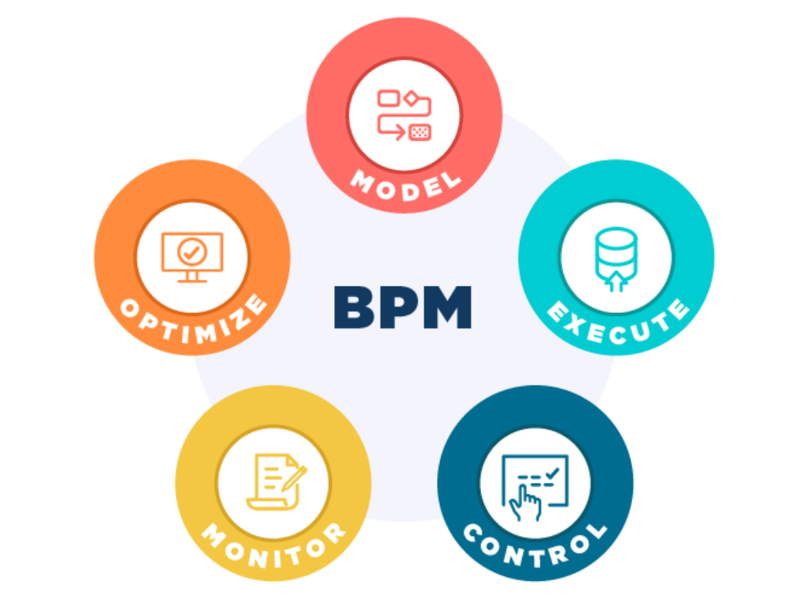

**Business Process Management** , ou Gestão de Processos de Negócio, é uma disciplina que mistura três mundos ao mesmo tempo: gestão, tecnologia da informação e ciências de processo. O objetivo é melhorar a eficiência e a eficácia dos processos que uma organização executa no dia a dia. 

Na prática, BPM é a arte de **analisar, projetar, executar, monitorar e otimizar processos de negócio** . É pegar tudo o que a empresa faz, olhar com cuidado e perguntar: _isso aqui está funcionando bem_ ? _Dá para melhorar_ ? E aí agir.

---

<!-- pagina: 5 -->

**Paolla Ramos Aula 03** 

Agora, o que entra no conceito de " **processo de negócio** "? Um processo pode ser formal e bem estruturado, tipo o processo de faturamento de uma empresa, aquele fluxo certinho com etapas definidas, aprovações e documentos. Mas pode ser também algo mais informal e flexível, como responder um e-mail de um cliente. Isso também é um processo, e também pode ser gerenciado. 

Por exemplo, uma empresa de telecomunicações, dessas grandes operadoras de celular que todo mundo conhece. O atendimento ao cliente é um sempre um caos histórico nesse setor. É reclamação no Procon, fila no 0800, chamado sem resposta etc. BPM entra justamente para organizar esse processo: a empresa implementa um sistema de gerenciamento de tickets (aqueles números de protocolo que registram cada solicitação), padroniza como os atendentes devem agir em cada situação e cria fluxos de trabalho automatizados para resolver os problemas mais comuns sem precisar de intervenção humana a cada passo. O resultado prático é atender mais rápido, aumentar a satisfação do cliente e reduzir os custos operacionais. Menos retrabalho, menos tempo perdido, menos dinheiro jogado fora. 

Outro cenário clássico é a gestão da cadeia de fornecimento em uma empresa de varejo. Por exemplo, uma rede de supermercados ou uma grande loja de eletrodomésticos. Aqui, o desafio é garantir que o produto certo esteja na prateleira certa na hora certa, sem sobrar nem faltar. BPM ajuda a **mapear os processos atuais** , **identificar os gargalos** (aqueles pontos onde tudo emperra) e **implementar melhorias** concretas. Um exemplo direto é a adoção de um sistema de gestão de estoque em tempo real, que monitora os níveis de produto e dispara as ordens de compra de forma automática e otimizada. Isso reduz custos com excesso de estoque, evita ruptura de prateleira e melhora a eficiência operacional de forma geral. 

Por último, um exemplo que muita gente não associa imediatamente a BPM é o recrutamento e seleção em empresas de RH. O processo de contratar alguém envolve várias etapas, vários responsáveis e muita chance de informação se perder no caminho. Com BPM, o RH cria um **fluxo de trabalho padronizado** para todo o processo seletivo, implementa um sistema de rastreamento de candidatos e automatiza tarefas repetitivas, como a triagem inicial de currículos. O impacto é direto, pois a empresa contrata mais rápido, com menos esforço manual e com uma qualidade maior nos candidatos que chegam às etapas finais. 

#### **Origens e Evolução do BPM** 

Pessoal, antes de mergulhar de cabeça no que é BPM hoje, vale a pena entender de onde essa história toda veio. Ela começa bem antes do que a maioria das pessoas imagina.

---

<!-- pagina: 6 -->

**Paolla Ramos Aula 03** 

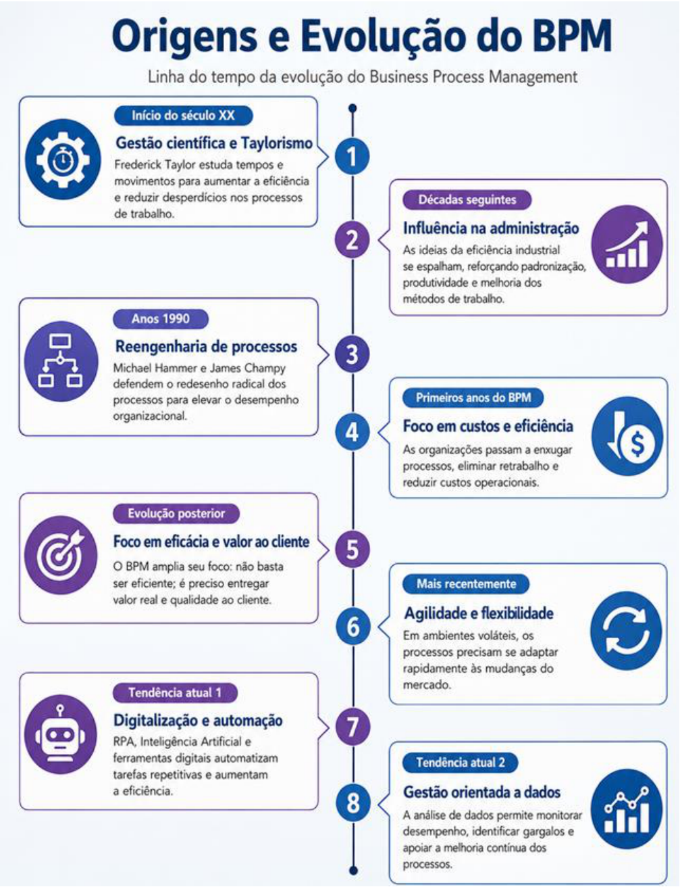

A origem do Business Process Management pode ser rastreada até os **primeiros métodos de gestão científica** lá no início do século 20. O nome principal dessa época é **Frederick Taylor** , um engenheiro

---

<!-- pagina: 7 -->

**Paolla Ramos Aula 03** 

americano que ficou obcecado em melhorar a eficiência industrial estudando e reformulando os processos de trabalho. Taylor cronometrava tarefas, analisava movimentos, eliminava desperdícios. Esse movimento ficou conhecido como **Taylorismo** e influenciou décadas de administração depois dele. 

Mas foi nos anos 1990 que o termo "Business Process Management" começou a aparecer com força no vocabulário corporativo. Isso coincidiu com um movimento bastante famoso na época, que foi a **reengenharia de processos de negócios** , encabeçada por Michael Hammer e James Champy. A ideia deles era de pegar um processo de negócio, jogar fora e **redesenhá-lo do zero** , se necessário. O foco era melhorar eficiência e eficácia por meio de uma análise profunda e uma reformulação completa. 

Nos primeiros anos, o BPM tinha como objetivo cortar custos e ganhar eficiência. As empresas olhavam para dentro, identificavam os processos ineficientes e tratavam de eliminá-los ou enxugá-los. Era uma mentalidade de "menos é mais", ou seja, menos etapas, menos retrabalho, menos desperdício. 

Com o tempo, porém, essa visão foi se ampliando. A concorrência cresceu em praticamente todos os setores, e simplesmente ser eficiente já não bastava para se destacar. As organizações precisavam entregar valor real para o cliente, e aí o BPM passou a incorporar também a ideia de **eficácia do processo** . Não era mais só sobre fazer rápido e barato, mas sobre fazer bem-feito e de forma que fizesse diferença para quem estava do outro lado. 

Mais recentemente, o BPM começou a incorporar conceitos de **agilidade e flexibilidade** . Afinal de contas, vivemos em um ambiente de negócios cada vez mais volátil e incerto, e as organizações estão percebendo que precisam ser capazes de adaptar rapidamente seus processos às mudanças nas condições do mercado. Por conta desse cenário, surgiram algumas tendências atuais dentro do BPM que vale muito a pena conhecer. 

##### <u>Tendências</u> 

A primeira delas é a **Digitalização e Automação de Processos** . Tecnologias como o **RPA** (Robotic Process Automation), a **Inteligência Artificial** e outras ferramentas digitais que permitem automatizar tarefas repetitivas e tornar os processos muito mais eficientes. Por exemplo, em vez de um funcionário copiar dados de um sistema para outro manualmente o dia todo, um robô de software faz isso em segundos, sem erro. 

A segunda tendência é a **Gestão de Processos Orientada a Dados** , ou Data-Driven Process Management. A ideia é usar análise de dados para identificar oportunidades de melhoria dentro dos processos e, ao mesmo tempo, monitorar o desempenho deles de forma contínua. São os dados mostrando onde o processo está travando, onde está demorando mais do que deveria, onde está custando mais caro. 

A terceira tendência é a **Integração de Processos** . À medida que as empresas ficam mais complexas, com departamentos diferentes, sistemas legados, plataformas novas e fornecedores espalhados por aí, surge um problema clássico: cada área faz a sua parte, mas ninguém conversa direito com ninguém. O resultado é retrabalho, informação duplicada, atraso. A integração de processos entra exatamente para resolver isso, **conectando** o que acontece em diferentes partes da organização e garantindo que os sistemas de TI envolvidos falem a mesma língua. Quando essa integração funciona bem, os processos fluem, sem solavancos no meio do caminho. 

A última tendência que vale a pena comentar é a **Experiência do Cliente** , ou Customer Experience. As empresas perceberam que o cliente não enxerga departamentos, não enxerga sistemas, não enxerga 

**5**

---

<!-- pagina: 8 -->

**Paolla Ramos Aula 03** 

organograma. Ele enxerga a **experiência** que teve. Se o processo interno é confuso, burocrático ou lento, isso aparece lá na ponta, na hora em que o cliente tenta resolver alguma coisa. Por isso que tantas organizações estão revisando seus processos com uma pergunta diferente na cabeça: não mais "como isso funciona para nós?", mas " **como isso funciona para quem está do outro lado** ?". O objetivo passa a ser alinhar e otimizar os processos de negócio às necessidades reais do cliente, e não só às conveniências internas da empresa. 

#### **BPM CBOK** 

Dentro do universo de BPM, existe um documento que você precisa conhecer: o BPM CBOK, sigla para **Business Process Management Common Body of Knowledge** . Pense nele como a "bíblia" do BPM. É um **guia detalhado que organiza todo o conhecimento da área em nove grandes blocos temáticos** : 

1. Modelagem de processos 

2. Análise de processos 

3. Desenho de processos 

4. Gerenciamento de desempenho de processos 

5. Transformação de processos 

6. Organização de gestão de processos 

7. Processos corporativos 

8. Tecnologias de processos 

9. Práticas de gestão de processos 

O BPM CBOK fornece uma estrutura consistente para quem quer entender BPM de verdade, reunindo **técnicas, metodologias e boas práticas em um único lugar** . Quem estuda o guia sai de lá com muito mais clareza sobre como implementar gestão de processos em uma organização de forma efetiva. 

Tem outro papel importante que o CBOK cumpre, que é de **padronizar a profissão** . Cria uma linguagem comum para todo mundo que trabalha com BPM. Ele é amplamente usado como base para treinamentos, programas de educação corporativa e até certificações profissionais na área. Quando duas pessoas de empresas diferentes falam sobre "transformação de processos", elas estão falando da mesma coisa e isso só funciona porque existe um guia como o CBOK estabelecendo esse vocabulário. 

Por conta de tudo isso, vamos usar justamente a estrutura do CBOK para organizar o conteúdo daqui para frente. Ele será nosso mapa. 

Veja a estrutura básica do BPM CBOK que vamos seguir:

---

<!-- pagina: 9 -->

**Paolla Ramos Aula 03** 

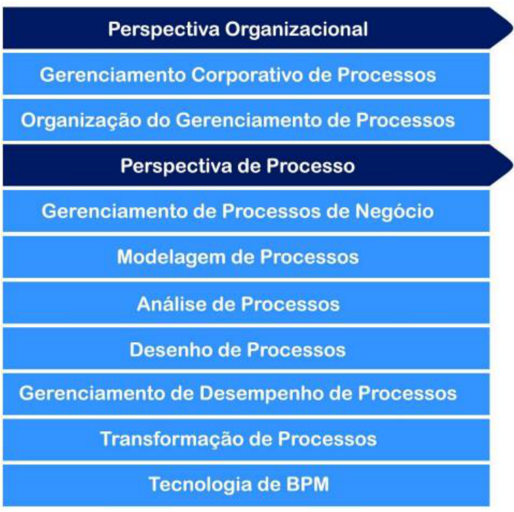

## Gerenciamento de Processos de Negócio 

#### **Conceitos** 

O primeiro conceito é o de **Processo de Negócio** . 

No contexto de BPM, um processo de negócio é um **conjunto ordenado de atividades coordenadas para alcançar um objetivo específico dentro de uma organização** . Repare nessa palavra "ordenado"”: não é qualquer amontoado de tarefas jogadas juntas, tem uma sequência, uma lógica. Essas atividades interligadas **transformam entradas (materiais, informações, o que for) em saídas** , que podem ser produtos ou serviços. Por exemplo, o processo de contratação de novos funcionários, o processo de fabricação de um produto ou o processo de atendimento ao cliente. São coisas que acontecem dentro de qualquer empresa, todo dia, e que seguem um fluxo definido. 

Agora, dentro desse processo maior, você pode ter um **Subprocesso** . A ideia é que é uma **parte do processo principal que pode ser executada de forma independente** para atingir um objetivo específico dentro do objetivo geral. Continuando no exemplo da contratação, o "processo de entrevista" não é o processo todo,

---

<!-- pagina: 10 -->

**Paolla Ramos Aula 03** 

mas é uma etapa que tem começo, meio e fim próprios. Isso é um subprocesso. Ele existe dentro do processo maior, mas funciona com uma certa autonomia. 

Outro termo é **Função de Negócio** . Não confunda com processo. A função de negócio é uma **área de responsabilidade** dentro da organização, um departamento ou atividade que cuida de uma parte específica do objetivo geral da empresa. Recursos Humanos, Finanças, Produção, Vendas, Atendimento ao Cliente etc., tudo isso são funções de negócio. Enquanto o processo descreve o fluxo de atividades, a função descreve **quem é responsável pelo quê** . São conceitos complementares, mas distintos. 

**(FUNDATEC - 2026 - Analista de Sistemas (CREF 2)) Segundo a disciplina de Gerenciamento de Processos** **<mark>de Negócio (Business Process Management – BPM), o trabalho que entrega valor para os clientes ou apoia/gerencia outros processos, podendo ser de ponta a ponta, interfuncional ou até mesmo</mark> interorganizacional, corresponde ao conceito de:** 

<mark>a) Processo de negócio.</mark> 

<mark>b) Fluxo corporativo.</mark> 

<mark>c) Instância de processo.</mark> 

<mark>d) Projeto integrado.</mark> 

<mark>e) Função de negócio.</mark> 

**<mark>Comentários:</mark>** 

<mark>(a) Correto. Processo de negócio é exatamente isso: um trabalho que entrega valor ao cliente, podendo cruzar áreas internas ou até organizações diferentes — o famoso "ponta a ponta"; (b) Errado. Fluxo corporativo não é um conceito formal do BPM para definir esse tipo de trabalho; (c) Errado. Instância de processo é uma execução específica de um processo, não o conceito em si; (d) Errado. Projeto integrado tem caráter temporário e pontual, diferente de um processo contínuo de negócio; (e) Errado. Função de negócio representa uma capacidade ou área organizacional, não o fluxo de trabalho que entrega valor.</mark> 

**Gabarito:** Letra A 

#### **Diferentes Granularidades** 

Vamos falar sobre os quatro conceitos básicos de granularidade em BPM do maior para o menor: atividade -> tarefa -> cenário ->  passo. 

**Atividade** é um **conjunto de tarefas relacionadas que são executadas dentro de um processo** ou subprocesso. Por exemplo, no processo de atendimento ao cliente, "responder a uma consulta do cliente" é uma atividade. 

**Tarefa** é uma **unidade individual de trabalho** dentro dessa atividade. Continuando o exemplo, "verificar o status do pedido de um cliente" é uma tarefa. Perceba a diferença de escala, a atividade é o conjunto, a tarefa é um dos elementos dentro dele. Uma atividade, portanto, é composta por várias tarefas.

---

<!-- pagina: 11 -->

**Paolla Ramos Aula 03** 

**Cenário** é um pouco diferente dos outros três porque ele não descreve uma unidade de trabalho, e sim um caminho específico dentro do processo. É uma **sequência de eventos ou atividades que se encadeia sob determinadas condições** . No mesmo processo de atendimento ao cliente, "como lidar com um cliente insatisfeito" seria um cenário. 

**Passo** , por fim, é a **menor unidade indivisível de um processo** , não dá para quebrar mais do que isso. Ele descreve uma ação específica e pontual, como "verificar a disponibilidade do produto no estoque", que seria um passo dentro da tarefa de verificar o status do pedido. 

Então a hierarquia fica clara, ou seja, o processo tem atividades, as atividades têm tarefas, as tarefas têm passos. O cenário, por sua vez, é o recorte de um caminho que esse processo pode seguir dependendo das condições encontradas no meio do caminho.

---

<!-- pagina: 12 -->

**Paolla Ramos Aula 03** 

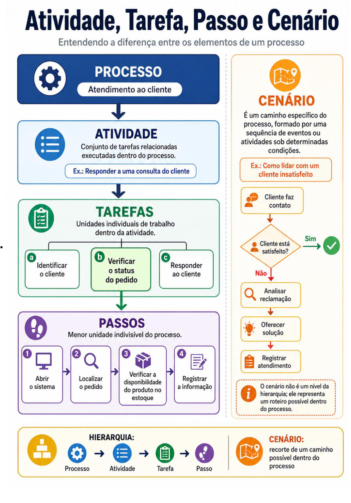

**DataPrev (Perfil 3: Desenvolvimento de Software) Gestão e Governança de TI - 2026 (Pós-Edital)** **_www.estrategiaconcursos.com.br_**

---

<!-- pagina: 13 -->

**Paolla Ramos Aula 03** 

#### **Tipos de Processos** 

Dentro do BPM, os processos são organizados em três grandes categorias: processo primário, processo de suporte e processos de gerenciamento. 

O **Processo Primário** é o coração do negócio. Também chamado de processo central ou processo de negócio principal, ele é aquele que **gera valor diretamente para o cliente** ou para o produto final. É o que a empresa faz de essencial, o que está amarrado à missão e aos objetivos da organização. É justamente o que o cliente enxerga e experimenta no dia a dia. Pense numa montadora de carros: o desenvolvimento do produto, a fabricação, o marketing e as vendas são todos processos primários. O cliente não vê o RH da empresa, mas vê o carro saindo da linha de produção e chegando até ele. 

Já o **Processo de Suporte** existe para garantir que os processos primários funcionem bem. O cliente raramente interage com eles diretamente, às vezes nem sabe que existem, mas sem eles tudo travaria. Recursos humanos, tecnologia da informação, contabilidade, aquisições, tudo isso é suporte. Não agrega valor **diretamente** ao produto final, mas **sustenta** quem agrega. 

Por fim, temos o **Processo de Gerenciamento** . Esse é o que governa tudo. Ele **supervisiona** tanto os processos primários quanto os de suporte, garantindo que a organização inteira caminhe de acordo com a política e a estratégia definidas. A ênfase é em **visão geral, melhoria contínua e controle** . Planejamento estratégico, definição de orçamentos, gerenciamento de desempenho, controle de qualidade etc. são exemplos clássicos. Em outras palavras, é o processo que olha de cima e pergunta: " _está tudo indo na direção certa_ ?". 

##### **_Saiba Mais:_** 

_O_ **_Business Model Canvas_** _é uma ferramenta de gestão estratégica que permite descrever o modelo de negócio em nove blocos. No contexto de processos, as_ **_Atividades Principais_** _são fundamentais, pois descrevem as ações mais importantes que uma organização deve realizar para que seu modelo de negócio funcione e para que a_ **_Proposta de Valor_** _seja entregue aos_ **_Segmentos de Clientes_** _. Elas se diferenciam dos Recursos Principais, que representam os ativos necessários para a operação._ 

A tabela a seguir resume os três tipos de processos: 

|**Tipo de Processo**|**Definição**|**Exemplos**|
|---|---|---|
|**Processo** **Primário**|Processos que agregam valor diretamente ao cliente ou ao produto final e estão diretamente ligados à missão principal e aos objetivos da empresa.|Desenvolvimento de produtos, fabricação, marketing, vendas.|
|**Processo de** **Suporte**|Processos que ajudam ou facilitam os processos primários, garantindo que eles sejam realizados de maneira eficaz e eficiente.|Recursos Humanos, Tecnologia da Informação, Contabilidade, Aquisições.|

---

<!-- pagina: 14 -->

**Paolla Ramos Aula 03** 

|**Processo de**|Processos que governam as atividades da|Planejamento estratégico, definição de|
|---|---|---|
|**Gerenciamento**|organização e garantem que os processos primários e de suporte sejam conduzidos de acordo com a política e a estratégia da organização.|orçamentos, gerenciamento de desempenho, controle de qualidade.|

**(FGV - 2024 - Analista de Tecnologia da Informação (DATAPREV)/Análise de Negócios de TI) Com a** **<mark>crescente adoção das práticas de ESG (Ambiental, Social e Governança) pelas empresas brasileiras em 2023, muitas organizações estão revisando seus processos internos para atender aos novos padrões de sustentabilidade e responsabilidade social. Durante reuniões sobre essa transição, tem surgido a dúvida sobre a diferença entre processos primários, de suporte e de gerenciamento no contexto do</mark> Gerenciamento de Processos de Negócio (BPM).** 

**<mark>Assinale a opção que descreve corretamente a diferença entre esses processos.</mark>** 

<mark>a) Processos primários são aqueles que afetam diretamente os fornecedores, mas não têm impacto nos clientes.</mark> 

<mark>b) Processos de suporte são responsáveis por criar valor direto para o cliente final, enquanto os processos primários são usados apenas internamente.</mark> 

<mark>c) Processos de gerenciamento têm a função de controlar e monitorar os processos primários e de suporte, garantindo que tudo funcione corretamente na organização.</mark> 

<mark>d) Processos primários cuidam principalmente da infraestrutura de TI da empresa.</mark> 

<mark>e) Processos de suporte têm como foco principal entregar produtos ou serviços diretamente ao cliente final.</mark> 

**<mark>Comentários:</mark>** 

<mark>(a) Errado. Processos primários criam valor diretamente para o cliente final, não apenas para fornecedores. Essa definição está invertida e incompleta; (b) Errado. Quem cria valor direto para o cliente são os processos primários, não os de suporte. A alternativa troca os papéis dos dois; (c) Correto. Processos de gerenciamento são exatamente isso: controlam e monitoram tanto os processos primários quanto os de suporte, garantindo que a organização funcione de forma alinhada e eficiente; (d) Errado. Processos primários não se limitam à infraestrutura de TI. Eles representam as atividades centrais que entregam valor ao cliente; (e) Errado. Entregar produtos ou serviços ao cliente é papel dos processos primários. Os de suporte existem para dar apoio interno à operação.</mark> 

**Gabarito:** Letra C 

#### **Definições de BPM** 

Existem várias definições de BPM que caem em prova, e é importante que você saiba cada uma delas. É importante saber o que é BPM (e o que não é!). Vamos lá.

---

<!-- pagina: 15 -->

**Paolla Ramos Aula 03** 

##### **BPM é uma disciplina gerencial** 

BPM é um **conjunto de conhecimentos voltados a princípios e práticas de administração** , com o objetivo de orientar os recursos de uma organização em direção a objetivos definidos. **É uma disciplina de gestão, não uma ferramenta técnica** , não um software, não um método específico de trabalho. 

##### **BPM não é uma prescrição de estrutura de trabalho, metodologia ou conjunto de ferramentas** 

Isso aqui é pegadinha clássica de prova. A banca vai te oferecer uma alternativa dizendo que BPM é uma metodologia, ou que BPM é um conjunto de ferramentas, e você tem que saber que não é. BPM é algo mais amplo do que isso, é uma disciplina gerencial que pode fazer uso de metodologias e ferramentas, mas não se confunde com elas. 

Ou seja, o BPM não é uma receita de bolo. Não existe uma combinação única, um pacote fechado de ferramentas, metodologias e estruturas de trabalho que funcione igual para todo mundo. Cada organização vai montar o seu próprio jeito de trabalhar com BPM, usando os elementos que fazem sentido para a sua realidade. A combinação exata vai ser diferente de empresa para empresa. 

##### **Bpm é uma capacidade básica interna** 

**BPM é uma capacidade básica interna da organização** . Mas o que é capacidade nesse contexto? É uma coleção de métodos, pessoas e tecnologias que, de forma integrada, oferecem valor para alcançar os objetivos estratégicos e entregar resultados para os clientes e partes interessadas. Repare que os três elementos precisam estar juntos. Não adianta ter a melhor tecnologia do mercado se as pessoas não sabem usá-la, ou ter pessoas excelentes sem método nenhum. A capacidade existe quando esses três pilares funcionam de forma integrada. 

O grande objetivo do BPM, no fim das contas, é entregar valor para o cliente. Tudo que o BPM faz, desde o mapeamento de processos até a automação de tarefas, deve estar apontado para essa direção de gerar valor real para quem está do outro lado. 

##### **BPM visa entregar valor para o cliente** 

Independentemente do tipo de organização, seja ela pública ou privada, grande ou pequena, o objetivo principal é sempre **gerar valor para o cliente por meio dos seus produtos e serviços** . É  justamente esse princípio que deve guiar absolutamente todos os objetivos da organização. 

##### **BPM trata o trabalho ponta a ponta e a orquestração das atividades ao longo das funções de negócio**

---

<!-- pagina: 16 -->

**Paolla Ramos Aula 03** 

BPM trata o trabalho **de ponta a ponta, desde o início até a entrega final, e cuida da orquestração das atividades ao longo das funções de negócio** . BPM não olha para um departamento isolado, ele enxerga o **fluxo completo do trabalho** cruzando áreas, setores e responsabilidades diferentes. 

É exatamente isso que diferencia a gestão por processos de negócio da gestão por funções. **Na gestão por funções, cada área cuida do seu pedaço** e ponto final. Na gestão por processos, o olhar é horizontal, acompanhando o trabalho de onde ele começa até onde ele termina. Na prática, a maioria das organizações precisa dos dois modelos trabalhando juntos para extrair o máximo benefício. 

##### **BPM trata o que, onde, quando, por que, como e por quem o trabalho é realizado** 

BPM trata o quê, onde, quando, por quê, como e por quem o trabalho é realizado. Ou seja, não é uma ferramenta parcial. É uma **abordagem completa** , que cobre todas as dimensões de um processo, desde a tarefa mais simples até a decisão mais estratégica. 

##### **Os meios pelos quais os processos de negócio são definidos e representados devem ser adequados à finalidade e aptos para uso** 

O que precisamos saber sobre um processo para dizer que realmente o entendemos? A resposta vem em forma de perguntas. Quando o trabalho é feito? Quais insumos são necessários para executá-lo? Que entregáveis são produzidos ao final? Onde ele acontece? Por que ele existe? Quem se beneficia com ele? E como, afinal, ele é desenvolvido na prática? Se você consegue responder a tudo isso, parabéns, você tem um processo bem definido. Se alguma dessas respostas está faltando, tem coisa incompleta aí. 

Por isso que os meios pelos quais os processos de negócio são definidos e representados precisam ser **adequados à finalidade e aptos para uso.** Não basta desenhar um fluxograma bonito ou preencher um documento extenso se, no fim das contas, ninguém consegue extrair dali as informações essenciais. A definição do processo tem que conter, de forma clara e estruturada, exatamente aquelas respostas que acabamos de listar: **o quê, onde, quando, quem, por quê e como** . E, além de conter essas informações, precisa estruturá-las de maneira eficiente, porque informação mal organizada é quase tão ruim quanto informação ausente. 

##### **Processos de negócio devem ser gerenciados em um ciclo contínuo para manter sua integridade e permitir a transformação.** 

Processos de negócio devem ser gerenciados em um **ciclo contínuo** . Não é uma coisa que você faz uma vez, arquiva numa gaveta e esquece. A ideia de ciclo contínuo existe justamente para manter a integridade do processo ao longo do tempo e, ao mesmo tempo, permitir a transformação quando o negócio muda, quando surgem novas tecnologias, quando a regulação se atualiza ou quando simplesmente o processo deixa de funcionar bem. Sem esse ciclo, o processo envelhece, perde aderência à realidade e vira aquele manual que todo mundo ignora.

---

<!-- pagina: 17 -->

**Paolla Ramos Aula 03** 

BPM exige comprometimento permanente e contínuo da organização com seus processos. Isso significa que todas as etapas estão sempre em jogo: planejamento, análise, desenho, implementação, monitoramento, controle e refinamento. 

##### **As capacidades são desenvolvidas ao longo de uma curva de maturidade de processos de negócio** 

E para sustentar esse ciclo, a organização precisa investir em **capacidades de negócio** . Capacidade é o **conjunto de habilidades especializadas que a organização desenvolve para conseguir executar seus processos de forma eficaz** . É preciso ter gente preparada, ferramentas adequadas e conhecimento acumulado para colocá-lo em prática. 

As capacidades vão sendo construídas ao longo de uma curva de maturidade de processos de negócio. Ou seja, a organização começa num nível mais básico e, conforme investe, aprende e melhora, vai subindo essa curva gradualmente. Assim como uma pessoa, a organização amadurece com o tempo, com experiência e com esforço deliberado. 

##### **A implementação de BPM requer novos papéis e responsabilidades.** 

Implementar BPM **exige novos papéis e responsabilidades dentro da organização** . Porque o BPM trabalha com uma visão **interfuncional** , ou seja, ele enxerga os processos de ponta a ponta, atravessando departamentos, cruzando fronteiras entre áreas que normalmente não conversam entre si. Essa natureza interfuncional cria uma demanda natural por **papéis especializados** que simplesmente não existiam antes. Alguém precisa ser o dono do processo, alguém precisa coordenar essa visão ampla que vai do início ao fim, independente de qual setor está envolvido. Surgem responsabilidades novas que precisam ser assumidas por alguém. 

##### **A tecnologia desempenha papel de apoio e não de liderança na implementação de BPM.** 

Um conceito que a banca adora inverter para te derrubar: a tecnologia, no contexto do BPM, desempenha **papel de apoio** , não de liderança. Muita organização erra exatamente aqui. Sai comprando ferramenta, contratando software de automação, implantando sistema novo, e acha que está fazendo BPM, mas não está. A tecnologia é um recurso que **sustenta** a iniciativa, não o motor que a conduz. Quem lidera a implementação de BPM são as **pessoas, os processos redesenhados e a estratégia de negócio** . A ferramenta tecnológica entra depois, para dar suporte ao que já foi pensado e estruturado. 

##### **A implementação de BPM é uma decisão estratégica e requer patrocínio da liderança executiva.** 

Implementar BPM de verdade, de forma ampla e consistente dentro de uma organização, não é decisão de um gerente de nível médio, é uma decisão estratégica. Isso significa que ela precisa nascer lá de cima, com o comprometimento da **liderança executiva** , e descer por todos os níveis da organização. Sem esse patrocínio de cima, o projeto fica na base do "a gente tenta fazer isso internamente aqui no nosso setor" e

---

<!-- pagina: 18 -->

**Paolla Ramos Aula 03** 

nunca vira cultura organizacional de verdade. Por isso que tantas iniciativas de BPM morrem na praia, porque começam sem o respaldo de quem tem poder de decisão e orçamento para sustentar a mudança. 

##### **Processos de negócio intensivos em conhecimento devem ser identificados e tratados adequadamente** 

Por fim, um último ponto que não pode passar batido: dentro de qualquer organização, existem os chamados **processos de negócio intensivos em conhecimento** . São processos que dependem fortemente do julgamento humano, da experiência, da interpretação de contexto, e não apenas de regras fixas e passos predefinidos. Um processo de triagem médica, uma análise jurídica, uma negociação comercial complexa, esses são exemplos que vivem nessa categoria. Eles precisam ser identificados separadamente e tratados de forma adequada, porque não adianta tentar encaixá-los num modelo rígido de automação como se fossem processos simples e repetitivos. 

**(CEBRASPE - 2025 - Auditor Fiscal da Receita Estadual (SEFAZ RJ)) O BPM (business process management) representa** 

<mark>a) um registro de todos os processos de uma organização.</mark> 

<mark>b) uma atividade burocrática feita pela área de qualidade das organizações.</mark> 

<mark>c) uma iniciativa contínua para documentação incessante de processos.</mark> 

<mark>d) uma disciplina estruturada de gestão conduzida por pessoas engajadas.</mark> 

<mark>e) um trabalho criado para o atendimento a normas com vistas à obtenção de certificações de qualidade.</mark> 

**<mark>Comentários:</mark>** 

<mark>(a) Errado. BPM não é apenas um registro estático de processos — vai muito além disso, envolvendo gestão ativa e contínua; (b) Errado. BPM não é uma atividade burocrática restrita à área de qualidade. É uma disciplina ampla que envolve toda a organização; (c) Errado. BPM não se resume a documentar processos sem parar. Documentação é só uma parte de algo muito maior; (d) Correto. BPM é exatamente isso: uma disciplina estruturada de gestão, conduzida por pessoas engajadas, que busca melhorar continuamente os processos organizacionais; (e) Errado. BPM não nasce da necessidade de atender normas ou obter certificações. Seu foco é a melhoria real dos processos, não o cumprimento formal de requisitos.</mark> 

**Gabarito:** Letra D 

## Modelagem de Processos 

Seguindo as atividades do BPM CBOK, vamos falar de modelagem de processos. Em essência, é a atividade de **representar graficamente os processos de negócio** de uma organização para que eles possam ser compreendidos e analisados. Por exemplo, em vez de alguém te explicar verbalmente como um processo funciona, você tem um diagrama na sua frente mostrando tudo, passo a passo. Esse mapeamento, ou **diagramação** como também se chama, costuma ser feito por meio de **fluxogramas** , de diagramas **BPMN**

---

<!-- pagina: 19 -->

**Paolla Ramos Aula 03** 

(Business Process Model and Notation), entre outros formatos. Aparecem nessas representações gráficas tarefas, responsáveis, entradas, saídas, decisões, eventos e a ordem em que as atividades acontecem. 

A modelagem de processos atende a vários propósitos importantes, e vale a pena detalhar cada um deles. 

O primeiro é a **compreensão** . Quando você desenha um processo, as pessoas da organização conseguem enxergar como ele funciona, quem está envolvido em cada etapa e o que é necessário para executá-la. Isso é útil para novos funcionários, por exemplo. Imagine chegar em uma empresa e, em vez de ouvir uma explicação confusa de vinte minutos, receber um diagrama claro mostrando exatamente o que você precisa fazer e em que ordem, o que é muito mais eficiente. 

O segundo propósito é a **comunicação** . Modelos de processo funcionam como uma linguagem comum entre departamentos e equipes diferentes. Sem essa representação padronizada, é muito fácil que o time de vendas entenda um processo de um jeito e o time financeiro entenda de outro, gerando retrabalho e conflito. Com o modelo em mãos, todo mundo parte do mesmo ponto, com uma compreensão clara e consistente de como as coisas devem ser feitas. 

Quando você coloca um processo no papel, seja num diagrama, seja num fluxograma, seja em qualquer outra forma visual, algo interessante acontece: fica muito mais fácil enxergar o que está errado. Aquele gargalo que sempre atrasava a entrega, aquela tarefa duplicada que dois departamentos faziam sem saber um do outro, aquele passo que ninguém sabe dizer por que existe mas todo mundo continua fazendo, tudo isso aparece. Por isso que a modelagem de processos quase sempre é o **ponto de partida** em qualquer iniciativa séria de melhoria. 

Além disso, esses modelos cumprem outro papel muito prático, pois eles viram **documentação** . A empresa cresce, as pessoas mudam, o funcionário que sabia tudo de cabeça vai embora, e o processo precisa continuar funcionando do mesmo jeito. Com a modelagem bem-feita, isso é possível, porque o conhecimento não fica só na cabeça de alguém, ele fica registrado. Em setores altamente regulamentados, isso deixa de ser conveniência e passa a ser obrigação. Bancos, farmacêuticas, operadoras de saúde, empresas aéreas, entre outros, podem ser exigidas por auditores e órgãos reguladores a comprovar que seus processos estão em conformidade com determinados padrões e regulamentos. 

#### **Diagramas, Mapas e Modelos** 

O BPM/CBOK trata Diagramas, Mapas e Modelos como coisas distintas, mas na prática as pessoas os confundem o tempo todo, usando um pelo outro como se fossem sinônimos, mas não são. 

**Diagrama** é aquela representação enxuta, quase um rascunho estruturado, que mostra as etapas de um processo em sequência. A ideia aqui não é detalhar tudo, é dar uma visão rápida. Você olha e entende o fluxo geral em poucos segundos, e, por isso mesmo, diagramas não carregam muita informação, não mostram todas as complexidades do que acontece no mundo real. São úteis quando você precisa de uma compreensão imediata do processo ou quer identificar, de forma preliminar, onde estão os gargalos e as oportunidades de melhoria. 

<u>Exemplo de um Diagrama de Processos:</u>

---

<!-- pagina: 20 -->

**Paolla Ramos Aula 03** 

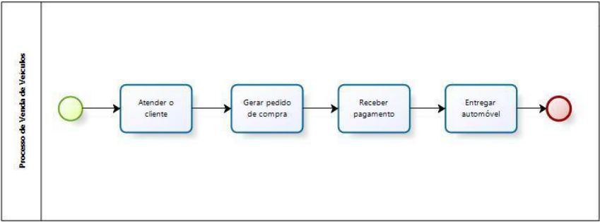

**Mapa** é mais detalhado, mais rico. Ele não se contenta em mostrar "passo 1, passo 2, passo 3". Ele traz quem faz o quê, quais são as entradas e saídas de cada etapa, onde acontecem as decisões, quais são os papéis e responsabilidades envolvidos. É como se o diagrama fosse o esqueleto e o mapa fosse o corpo inteiro, com músculos, nervos e tudo mais. Mapas de processos são os preferidos para treinar equipes novas, fazer análises mais aprofundadas de como um processo realmente funciona e planejar projetos de melhoria. Quando você precisa entender de verdade o processo, e não só ter uma ideia geral dele, você recorre ao mapa. 

##### <u>Exemplo de um Mapa de Processos:</u> 

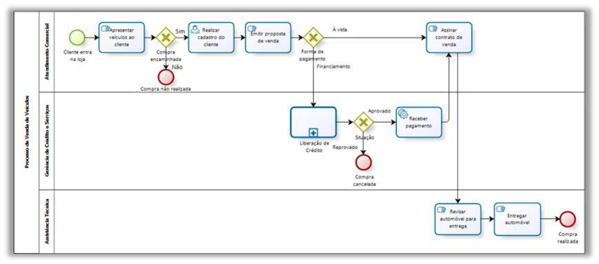

E, por fim, temos os **Modelos de processos** , que são o nível mais detalhado e preciso dessa história toda. 

O que diferencia um modelo de processo das outras representações é que ele não se limita a mostrar o fluxo. Ele carrega junto tudo aquilo que você precisaria para realmente entender, analisar ou até automatizar um processo. Estamos falando de regras de negócio, métricas de desempenho, detalhes dos sistemas de informação envolvidos e por aí vai. É como se o mapa de processos fosse a planta baixa de uma casa e o modelo fosse o projeto completo de engenharia, com especificações de materiais, cálculo estrutural, instalações elétricas e hidráulicas. A casa é a mesma, mas o nível de detalhe é completamente diferente.

---

<!-- pagina: 21 -->

**Paolla Ramos Aula 03** 

Para construir esses modelos, usam-se notações padronizadas, sendo a mais conhecida delas o **BPMN** , sigla para **Business Process Model and Notation** . BPMN virou o padrão da indústria, porque ele oferece uma linguagem visual comum que qualquer analista de processos no mundo consegue ler e interpretar. E com esse nível de detalhe todo, os modelos se tornam ferramentas úteis para simulações, para análises aprofundadas e, principalmente, para automatizar processos por meio dos chamados BPMS, os Business Process Management Systems, que são os sistemas especializados em gerenciar e executar processos de negócio de ponta a ponta. 

##### <u>Exemplo de um Modelo de Processos:</u> 

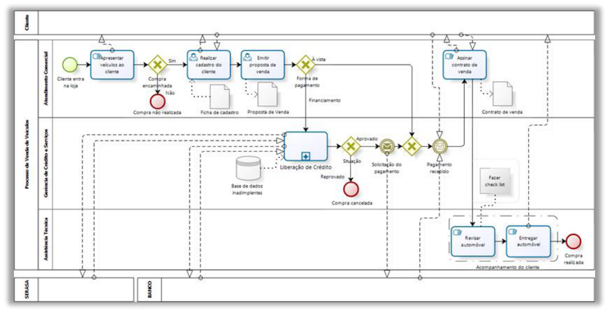

A tabela a seguir resume bem a diferença entre as três representações que estudamos até aqui. 

||**Diagramas de** **Processos**|**Mapas de Processos**|**Modelos de Processos**|
|---|---|---|---|
|**Definição**|Representações simplificadas que ilustram as etapas sequenciais de um processo.|Mais detalhados que os diagramas, incluem informações sobre papéis e responsabilidades, entradas e saídas, decisões e outras informações relevantes.|As representações mais detalhadas e precisas de um processo, incluindo todos os detalhes encontrados em um mapa de processo, além de informações adicionais como regras de negócio, métricas de desempenho, detalhes de sistemas de informação,etc.|
|**Nível de** **detalhe**|Baixo|Médio|Alto|
|**Uso comum**|Compreensão rápida de um processo, identificação de áreas de melhoria.|Treinamento de equipe, análise de processo, planejamento de projetos de melhoria de processos.|Simulações, análises detalhadas, automatização de processos.|

---

<!-- pagina: 22 -->

**Paolla Ramos Aula 03** 

|**Exemplo**|Fluxograma|Mapa de processo detalhado que mostra a sequência de|Modelo BPMN que inclui detalhes adicionais como regras de negócio e|
|---|---|---|---|
|||atividades, responsáveis e decisões.|métricas de desempenho.|

#### **Notações Gráficas** 

Uma notação gráfica é basicamente um **conjunto de símbolos e regras usadas para representar visualmente um processo de negócios** . Em vez de escrever um texto descrevendo cada etapa de um processo, você usa figuras, setas e formas padronizadas para montar um diagrama que qualquer pessoa consegue entender. E esse é o ponto: essas notações existem justamente para que processos sejam **compreendidos e compartilhados com facilidade entre todos os envolvidos** , os famosos stakeholders, que podem ser desde o analista de TI até o diretor da empresa. 

Existem várias notações disponíveis no mercado, cada uma com sua proposta. Mas, sendo honesto com vocês, a única que realmente vale aprofundar para fins de concurso é a **BPMN** , e ela vai ganhar uma aula inteira própria. Por enquanto, o que precisamos é ter uma visão geral das principais notações gráficas usadas para representar processos, que é exatamente o que a tabela a seguir traz. 

|**Notação**|**Descrição**|
|---|---|
|**BPMN (Business** **Process Model and** **Notation)**|BPMN é uma notação padrão para modelagem de processos de negócios. Ela é projetada para ser compreensível por todos os stakeholders de negócios e permite a representação de processos complexos, incluindo eventos, atividades, gateways (decisões) e fluxos de sequência.|
|**Fluxograma**|Um fluxograma é uma das formas mais simples e antigas de notação de processos. Ele usa formas geométricas para representar diferentes tipos de etapas de um processo e setas para indicar a sequência de etapas.|
|**EPC (Event-Driven** **Process Chain)**|EPC é uma notação de processos que é particularmente popular na Alemanha e que foi desenvolvida como parte do framework de processos SAP. Ela inclui eventos, funções, processos e conectores de controle.|
|**UML (Unified** **Modeling Language)**|UML é uma notação de modelagem amplamente usada em engenharia de software. Embora não seja específica para processos de negócios, seu diagrama de atividades pode ser usadopara modelarprocessos de negócios.|
|**IDEF (Integrated** **DEFinition)**|IDEF é uma família de notações de modelagem desenvolvida pelo Departamento de Defesa dos EUA. IDEF0 e IDEF3 são usados para modelagem de processos. Eles se concentram na representação de funções e seus relacionamentos.|
|**VSM (Value Stream** **Mapping)**|VSM é uma notação de processo usada em Lean Manufacturing para representar o fluxo de materiais e informações necessárias para levar um produto do início ao fim. Ela destaca onde o valor é adicionado noprocesso e onde ocorrem desperdícios.|

#### **Abordagens Especializadas** 

Abordagens especializadas são **métodos e técnicas específicas usados para representar, analisar e melhorar os processos de negócios** . A palavra-chave aqui é "especializadas" porque cada uma delas foi pensada para um contexto ou necessidade particular. Uma pode focar no fluxo de valor, outra nas relações entre os elementos do processo, outra na dinâmica do sistema como um todo.

---

<!-- pagina: 23 -->

**Paolla Ramos Aula 03** 

Veja que  essas abordagens **não** reinventam a roda. Na maioria das vezes, elas se baseiam ou complementam aquelas notações de modelagem mais gerais que você já conhece, como BPMN ou UML. O que elas fazem é trazer ferramentas e perspectivas adicionais, ou um olhar mais especializado para situações em que a notação genérica não é suficiente. 

##### **Cadeia de Valor de Porter** 

Um dos exemplos mais clássicos dessas abordagens é a **Cadeia de Valor** . O conceito foi popularizado por Michael Porter no livro "Competitive Advantage", de 1985, e até hoje é referência em gestão e análise de processos. A ideia central é dividir as atividades de uma organização em dois grandes grupos: as **atividades primárias e as atividades de suporte** . Esse modelo sobreviveu décadas inteiras e ainda aparece em prova de concurso. 

**Atividades primárias** são aquelas diretamente envolvidas em criar e entregar o produto ou serviço para o cliente. Por exemplo logística, operações, marketing, vendas. É o coração do negócio, o que o cliente vê e sente. Do outro lado, temos as **atividades de suporte** , que não entregam valor diretamente ao cliente, mas ajudam a melhorar a eficácia ou eficiência de tudo que acontece no primeiro grupo. Aquisições, desenvolvimento de tecnologia, gestão de recursos humanos, infraestrutura da empresa. São os bastidores que mantêm o negócio acontecendo. 

A lógica da Cadeia de Valor é, então, analisar e otimizar essas atividades para que uma organização consiga criar um diferencial competitivo. 

Na prática, uma Cadeia de Valor é representada como um fluxo contínuo da esquerda para a direita. Você visualiza os processos em sequência, descrevendo os subprocessos que contribuem diretamente para produzir valor ao cliente final. É uma leitura linear, intuitiva, que facilita enxergar onde cada peça se encaixa. 

Veja um exemplo: 

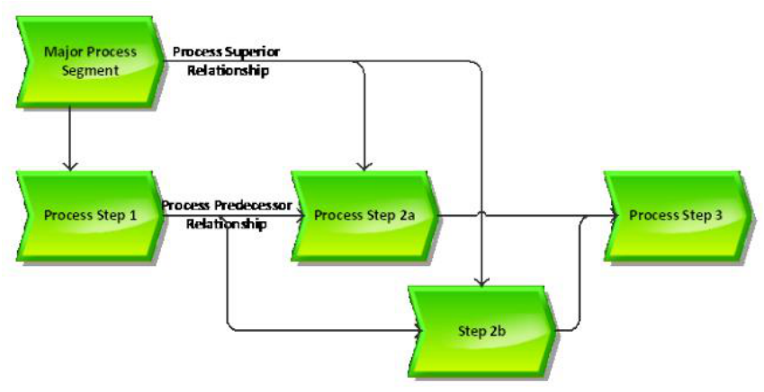

---

<!-- pagina: 24 -->

**Paolla Ramos Aula 03** 

**(CEBRASPE - 2024 - Analista Técnico II (SEBRAE)/Governança TI) Assinale a opção que apresenta a** **<mark>ferramenta que, utilizada para modelagem corporativa, demonstra, por meio de um fluxo simples e</mark> contínuo, os processos que contribuem para produzir valor para os clientes de uma organização.** 

<mark>a) diagrama de processos</mark> 

<mark>b) mapa mental</mark> 

<mark>c) value streaming mapping</mark> 

<mark>d) cadeia de valor</mark> 

**<mark>Comentários:</mark>** 

<mark>(a) Errado. O diagrama de processos detalha etapas e fluxos de um processo específico, mas não é a ferramenta voltada para demonstrar a criação de valor de forma ampla e corporativa; (b) Errado. Mapa mental é uma ferramenta de organização de ideias e brainstorming, sem foco em modelagem de valor para o cliente; (c) Errado. O Value Stream Mapping (VSM) é uma ferramenta do Lean focada em identificar desperdícios no fluxo de produção, não exatamente na modelagem corporativa de valor; (d) Correto. A cadeia de valor, proposta por Porter, é a ferramenta de modelagem corporativa que representa, de forma simples e contínua, as atividades que contribuem para gerar valor ao cliente.</mark> 

**Gabarito:** Letra D 

##### **SIPOC** 

Uma outra abordagem é o diagrama **SIPOC** . Ele coloca na mesma página todos os elementos-chave de um processo, de forma visual e fácil de entender. SIPOC é uma sigla em inglês, cada letra representa uma parte do diagrama: S de Suppliers (Fornecedores), I de Inputs (Entradas), P de Process (Processo), O de Outputs (Saídas) e C de Customers (Clientes). 

Na prática, serve para duas coisas principais: definir com clareza o escopo de um processo e entender como cada componente se relaciona com os outros. Sabe aquela situação em que ninguém sabe exatamente onde o processo começa, onde termina, ou quem é responsável pelo quê? O SIPOC existe justamente para acabar com essa confusão. 

Imagine um processo de atendimento ao cliente. Quem são os **fornecedores** nesse contexto? Os vendedores, que repassam informações sobre vendas. Qual é a **entrada** do processo? Os pedidos de serviço que chegam. O **processo** em si? A resolução de problemas. A **saída** ? As respostas a esses pedidos de serviço. E os **clientes** , ou seja, quem recebe o resultado final? Os próprios clientes que abriram o chamado. Percebe como o diagrama força você a pensar no processo de ponta a ponta, sem pular etapas? 

Esse diagrama é quase sempre o primeiro passo numa análise de processos. Antes de sair medindo, otimizando ou automatizando qualquer coisa, você precisa entender o que está acontecendo. O SIPOC coloca o processo inteiro na sua frente, do fornecedor até o cliente final, numa estrutura que qualquer pessoa consegue ler e discutir.

---

<!-- pagina: 25 -->

**Paolla Ramos Aula 03** 

|**SUPPLIER**|**INPUT**|**PROCESS**|**OUTPUT**|**CUSTOMER**|
|---|---|---|---|---|
|- Setor de Coleta - Setor de Triagem|- Material coletado na rua e doações - Mão de Obra|- Triagem|- Material separado|- Setor de Pesagem|
|- Setor de Triagem - Setor de Pesagem|- Material separado - Mão de Obra - Balança|- Pesagem|- Material pesado|- Setor de Prensagem e Enfardamento|
|- Setor de pesagem - Setor de prensagem|- Material pesado - Mão de Obra - Prensa|- Prensamento e Enfardamento|- Material enfardado|- Setor de Expedição|
|- Setor de Prensagem e Enfardamento - Setor de Expedição|- Material Enfardado - Mão de Obra - Caminhão|- Expedição|- Material enfardado no caminhão|- Cliente final|

##### **Dinâmica de Sistemas** 

Dinâmica de Sistemas é uma abordagem para **entender o comportamento de sistemas complexos ao longo do tempo** . Perceba bem: "ao longo do tempo". Porque a grande sacada aqui não é tirar uma fotografia de um processo, mas sim gravar um filme. A Dinâmica de Sistemas lida com flutuações internas e externas, os famosos **feedbacks** , que vão afetando os resultados de um sistema conforme ele opera. Na modelagem de processos, ela serve exatamente para entender como os diferentes componentes de um processo se influenciam mutuamente e como isso impacta o desempenho do processo com o passar do tempo. 

Pense num exemplo simples de fábrica. A demanda pelo produto aumenta, então a empresa acelera a produção para dar conta. Até aí, tudo certo. Mas esse aumento na produção gera maior desgaste nas máquinas e, lá na frente, isso resulta em queda na qualidade ou na velocidade de fabricação. Ou seja, a própria resposta ao problema acabou criando um novo problema. Isso é o feedback em ação, e é exatamente o tipo de comportamento que a Dinâmica de Sistemas consegue capturar, porque ela enxerga essas relações de causa e efeito que se desenrolam no tempo. 

Um detalhe importante para não errar em prova: essa abordagem é mais indicada para modelar uma **organização completa** ou uma linha de negócio inteira, não para detalhar fluxos de trabalho operacionais de baixo nível. Quando o escopo é grande e cheio de variáveis que se retroalimentam, a Dinâmica de Sistemas entra em campo. Para mapear o passo a passo de um processo específico e detalhado, outras técnicas cumprem melhor esse papel.

---

<!-- pagina: 26 -->

**Paolla Ramos Aula 03** 

#### **Direcionamento de Abordagens** 

Quando a gente vai modelar um sistema, seja um sistema de software, seja um processo de negócio, surge uma pergunta praticamente inevitável: por onde eu começo? Você parte do detalhe e vai subindo? Começa pelo alto e vai descendo? Ou ataca pelo meio? Cada uma dessas escolhas tem nome, e cada uma carrega vantagens e armadilhas que você precisa conhecer. 

Existem basicamente três abordagens: Top-Down, Bottom-Up e Middle-Out.

---

<!-- pagina: 27 -->

**Paolla Ramos Aula 03** 

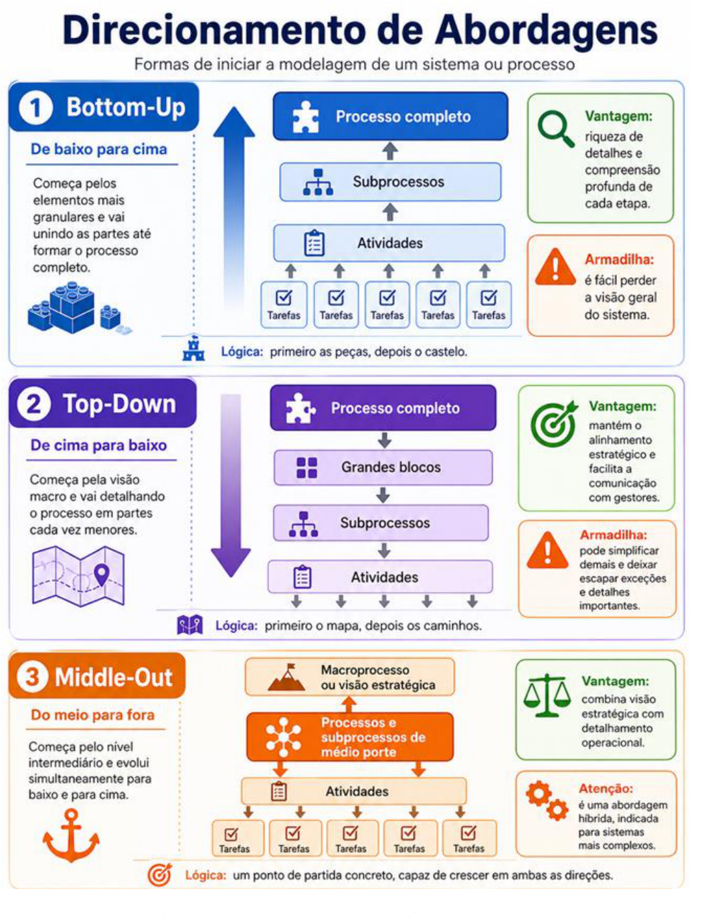

A primeira abordagem é a **Bottom-Up** , que em bom português significa "de baixo para cima". **A ideia aqui é começar pelo nível mais granular possível** : as tarefas individuais, as atividades específicas, os pequenos

---

<!-- pagina: 28 -->

**Paolla Ramos Aula 03** 

blocos que compõem o processo. Você modela cada pedacinho com cuidado e só depois vai juntando esses pedaços para formar subprocessos maiores, e aí sim chega ao processo completo. A grande força dessa abordagem é exatamente essa riqueza de detalhe, pois você entende o fluxo interno do processo, a lógica de funcionamento, as nuances de cada etapa. 

O problema? É fácil se perder. Quem fica olhando só para as peças pode acabar esquecendo para que serve o castelo. Manter uma visão geral do sistema enquanto você está afundado nos detalhes é difícil. 

A segunda abordagem é a **Top-Down** , que vai no sentido contrário: "de cima para baixo". Você começa com a grande fotografia do sistema, uma visão macro do processo inteiro, e vai quebrando isso em pedaços menores progressivamente. **Primeiro os grandes blocos, depois os subprocessos, depois as atividades individuais** . 

O benefício é que você nunca perde de vista o objetivo estratégico. A modelagem fica alinhada com o que a organização realmente quer alcançar, e é muito mais fácil comunicar o modelo para gestores e tomadores de decisão, que pensam exatamente nessa linguagem. 

A desvantagem, porém, é que quem começa pelo topo tende a simplificar demais. Detalhes importantes, variações de processo, exceções do dia a dia, tudo isso pode escapar quando você está olhando o mapa de cima. 

A terceira abordagem, a **Middle-Out** , é a mais interessante de explicar porque ela assume que as duas anteriores, sozinhas, não dão conta do recado quando o sistema é realmente complexo. Como o nome sugere, você começa pelo nível intermediário, ou seja, os processos e subprocessos de médio porte. A partir daí, **o trabalho acontece em duas direções ao mesmo tempo** . Para baixo, você vai detalhando no estilo bottom-up. Para cima, você vai integrando no estilo top-down. É uma abordagem híbrida, e ela aparece com frequência em projetos grandes, onde nem a visão estratégica pura nem o mergulho nos detalhes são suficientes por si sós. O ponto de partida no meio serve como uma espécie de âncora, algo concreto o suficiente para trabalhar, mas aberto o suficiente para crescer em qualquer direção que o projeto exigir. 

Em última análise, a escolha da abordagem vai depender do contexto. Não existe uma fórmula universal. Você precisa olhar para a complexidade do sistema que está modelando, entender quais são os objetivos daquela modelagem e verificar quais informações estão disponíveis para trabalhar. Esses três fatores juntos é que vão ditar o caminho a seguir. 

## Análise de Processos 

Dentro do contexto do CBOK, a **análise de processos** tem um objetivo bem claro: entender como o processo está se saindo hoje e encontrar brechas para melhorar a eficiência e a eficácia. Esse retrato do estado atual, de como as coisas realmente estão funcionando agora, tem um nome técnico: **análise AS-IS** . Em português, você pode chamar de "como-é" ou "como-está". 

A análise segue algumas etapas principais.

---

<!-- pagina: 29 -->

**Paolla Ramos Aula 03** 

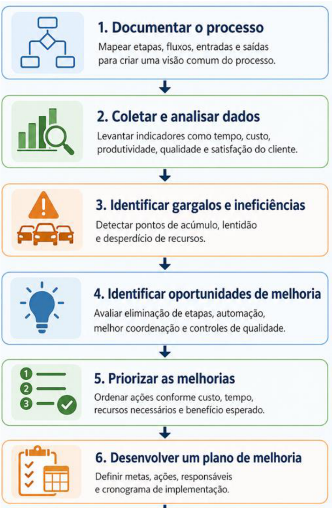

A primeira é **documentar o processo** . A ideia é criar um mapa ou diagrama que registre tudo, cada etapa, cada fluxo, cada entrada e cada saída do processo. Sem essa documentação, cada pessoa da equipe pode ter uma visão diferente de como o processo funciona, e aí ninguém está falando a mesma língua. O mapa cria uma compreensão comum entre todos os envolvidos, um ponto de partida que todo mundo enxerga igual.

---

<!-- pagina: 30 -->

**Paolla Ramos Aula 03** 

A segunda etapa é coletar e **analisar dados** . Não adianta só desenhar o processo no papel, é preciso olhar para os números. Quais números? Tempo de ciclo, custo, produtividade, qualidade, satisfação do cliente, entre outros. Esses dados são coletados justamente para revelar o que o olho nu não percebe, onde estão os gargalos, quais áreas estão com problema, quais têm espaço para melhorar e quais podem ser as causas raiz dessas dificuldades. A análise dos dados transforma uma impressão vaga de que "algo não está funcionando bem" em evidência concreta de onde agir. 

##### **_Saiba Mais:_** 

_A_ **_Análise de Pareto_** _(princípio 80/20) é uma técnica quantitativa essencial para priorizar problemas, permitindo identificar quais poucas causas são responsáveis pela maioria dos efeitos negativos no processo._ 

_Diferente do_ **_Brainstorming_** _, que é uma técnica qualitativa baseada na percepção e criatividade dos envolvidos, o Pareto oferece uma visão baseada em dados reais e históricos, sendo mais indicado para uma análise objetiva da realidade operacional e identificação de gargalos críticos._ 

Terceiro passo: identificar **gargalos e ineficiências** . Essas duas palavras aparecem juntas o tempo todo no BPM, então vale a pena entender a diferença. **Gargalo** é aquele ponto do processo em que tudo emperra, onde o fluxo diminui a velocidade, onde as atividades se acumulam esperando para avançar. **Ineficiência** é um conceito um pouco mais amplo, é quando os recursos disponíveis, seja tempo, dinheiro ou pessoas, não estão sendo aproveitados da melhor forma possível. Na prática, todo gargalo gera ineficiência, mas nem toda ineficiência é necessariamente um gargalo. 

Quarto passo: **identificar oportunidades de melhoria** . E é aqui que a análise começa a render frutos de verdade. Com o processo mapeado e os problemas identificados, você consegue enxergar o que pode ser feito de forma diferente. Isso pode significar eliminar uma etapa que simplesmente não agrega valor nenhum, automatizar uma tarefa que hoje é feita manualmente, melhorar a comunicação e a coordenação entre etapas que dependem umas das outras, ou ainda implementar controles de qualidade mais eficazes em pontos críticos do processo. Repare que as possibilidades são variadas, e a análise é o que vai indicar qual delas faz mais sentido em cada situação. 

Quinto passo: **priorizar as melhorias** . A lista de melhorias possíveis quase sempre é maior do que a capacidade de implementar tudo ao mesmo tempo. Não dá para sair executando tudo de uma vez. É preciso estabelecer uma ordem de prioridade levando em conta alguns critérios bem objetivos: qual é o custo envolvido? Quanto tempo vai levar? Quais recursos serão necessários? E qual é o benefício esperado ao final? Melhorias com alto impacto e boa viabilidade sobem naturalmente para o topo da lista. As que exigem muito investimento e entregam pouco retorno ficam para depois, ou simplesmente saem da lista. 

Sexto passo: **desenvolver um plano de melhoria** . Identificou, analisou, priorizou, agora formaliza. Esse plano precisa ter clareza em quatro elementos fundamentais: metas bem definidas, que digam o que se quer alcançar; ações específicas, que descrevam o que vai ser feito e como; responsabilidades atribuídas, indicando quem é o dono de cada ação; e um cronograma realista, com prazos para cada etapa da implementação.

---

<!-- pagina: 31 -->

**Paolla Ramos Aula 03** 

**(FGV - 2026 - Analista Judiciário (TJ RJ)/Tecnologia da Informação/Analista de Negócios) O Gerenciamento** **<mark>de Processos de Negócio (BPM) propicia a implantação de melhorias em processos e seu gerenciamento, a fim de se obterem benefícios relacionados, dentre os quais a elevação da qualidade dos serviços</mark> prestados pelo Poder Judiciário.** 

**<mark>De acordo com o CBOK 4.0, o ciclo de Gerenciamento de Processos de Negócio é composto por etapas que, a depender da demanda, podem ser suprimidas ou executadas individualmente.</mark>** 

**<mark>A avaliação de como os processos de negócio estão operando para, a partir do entendimento comum de seu estado atual, identificar possíveis melhorias para atender aos objetivos do negócio com efetividade ocorre no(a):</mark>** 

<mark>a) análise de processos;</mark> 

<mark>b) desenho de processo;</mark> 

<mark>c) modelagem de processos;</mark> 

<mark>d) transformação de processos;</mark> 

<mark>e) gerenciamento do desempenho do processo.</mark> 

**<mark>Comentários:</mark>** 

<mark>(a) Correto. A análise de processos é justamente a etapa em que você "olha" para como os processos estão funcionando hoje, entende o estado atual e identifica oportunidades de melhoria para atingir os objetivos do negócio com efetividade; (b) Errado. O desenho de processo trata da criação ou redesenho de como o processo deve funcionar, não da avaliação do estado atual; (c) Errado. A modelagem é a representação visual/documentação dos processos, não a etapa de avaliação e identificação de melhorias; (d) Errado. A transformação de processos envolve a implementação das mudanças, não a análise diagnóstica do que precisa melhorar; (e) Errado. O gerenciamento do desempenho foca no monitoramento contínuo de indicadores, não na avaliação qualitativa do estado atual para identificar melhorias.</mark> 

**Gabarito:** Letra A 

#### **Técnicas de Compreensão do Negócio** 

Pessoal, quando estamos fazendo uma Análise de Processos, não basta mapear o que acontece dentro da empresa. É preciso entender de verdade o negócio, e para isso existem algumas técnicas que nos ajudam a enxergar o cenário com mais clareza. Vamos falar sobre as três principais. 

A primeira é o **Benchmarking** . Aqui, você **compara o desempenho dos seus processos com o de organizações do mesmo segmento que já fazem isso bem** . É literalmente aprender com quem está à frente. O esquema é estudar as melhores práticas do mercado para entender o que define um processo de excelência. As informações vêm de pesquisas em publicações especializadas, sites, eventos do setor, entre outras fontes. Ou seja, o esquema é reconhecer que alguém faz melhor e tirar lição disso.

---

<!-- pagina: 32 -->

**Paolla Ramos Aula 03** 

A segunda técnica é a **Análise SWOT** , muito famosa e presente em praticamente qualquer curso de gestão. O nome vem do inglês: Strengths (Forças), Weaknesses (Fraquezas), Opportunities (Oportunidades) e Threats (Ameaças). Ela serve para comparar a organização com seus concorrentes diretos, cruzando uma visão interna com uma visão externa. A visão interna são as forças e fraquezas, ou seja, o que a empresa tem de bom e o que ainda precisa melhorar. A visão externa são as oportunidades e ameaças que vêm do ambiente ao redor, coisas que a empresa não controla, mas precisa observar. Essa técnica é especialmente útil quando a situação é complexa e o tempo para análise é curto. 

A terceira é a identificação de **Melhores Práticas** , que tem um diferencial interessante em relação ao Benchmarking. Enquanto o Benchmarking olha para empresas do mesmo segmento, aqui o movimento é o oposto: você busca processos semelhantes em outros setores completamente diferentes. Por quê? Porque existe um fenômeno chamado "síndrome do pensamento de grupo", que acontece quando uma organização só olha para dentro do próprio segmento e acaba repetindo os mesmos vícios do mercado sem perceber. Buscar referências fora da bolha, seja estudando empresas de outros setores, seja usando modelos de referência já consolidados, ajuda a trazer perspectivas novas que jamais surgiriam olhando só para o espelho. 

#### **Métodos de Obtenção da Informação** 

Pessoal, quando falamos de análise de informações, o objetivo é **reunir o máximo possível de informações relevantes sobre o processo e o ambiente de negócio** . Na prática, existem métodos específicos de levantamento, e cada um tem suas características. 

**Pesquisa** é o método de buscar informações em qualquer documentação ou registro que já existe sobre o processo. Pode ser documentação escrita, transações, registros de auditoria, diagramas. Se tem algo anotado em algum lugar, a pesquisa vai atrás disso. 

**Entrevista** você vai direto à fonte: conversa com as pessoas que participam das atividades ou que, de alguma forma, estão associadas ao processo. É um método muito útil, mas tem um ponto de atenção importante. Muitas vezes, só com as entrevistas, você não consegue identificar todas as atividades do processo. As pessoas tendem a lembrar do que fazem de forma consciente e esquecem etapas que já viraram automáticas no dia a dia. 

Há, também, o **Workshop Estruturado** . É uma reunião focada e facilitada, na qual especialistas no assunto e as partes interessadas se sentam juntos para criar modelos de forma interativa. Ninguém simplesmente responde perguntas, como na entrevista, todo mundo constrói o entendimento junto, em tempo real. Esse formato costuma ser muito eficaz para capturar uma visão mais completa do processo, já que reúne múltiplas perspectivas ao mesmo tempo. 

Já a **Observação direta** é exatamente o que o nome diz: o analista vai até onde o trabalho acontece e fica de olho. É útil porque tem coisa que as pessoas simplesmente não contam em entrevista, não por má vontade, mas porque virou automático. A pessoa nem lembra mais que faz aquele ajuste no meio do processo, aquele atalho improvisado que todo mundo usa mas que nunca está documentado em lugar nenhum. A observação direta pega isso.

---

<!-- pagina: 33 -->

**Paolla Ramos Aula 03** 

Agora, tem uma variação ainda mais profunda dessa técnica: em vez de só observar, o analista coloca a mão na massa e **executa a tarefa junto** . Aprender fazendo, não apenas olhando. O nível de compreensão da tarefa vai a outro patamar. 

Chegando próximo ao fim, temos a **análise de vídeo** . Aqui, as ações do executor são gravadas, e depois ele é convidado a assistir à própria gravação e narrar o que está acontecendo em cada etapa. Ver a si mesmo fazendo algo ativa uma memória diferente da que é usada quando alguém simplesmente pergunta "como você faz isso?". A narração posterior sobre o vídeo acaba revelando informações adicionais que dificilmente surgiriam de outro jeito. 

E, por fim, temos a **Simulação de Atividades** , onde a ideia é reproduzir, de formas variadas, as atividades que fazem parte de um determinado processo, testando como elas se comportam em diferentes cenários antes de qualquer decisão concreta. 

**(FGV - 2024 - Analista de Tecnologia da Informação (DATAPREV)/Análise de Negócios de TI) Uma empresa** **<mark>global com várias unidades de negócios está atualmente em processo de fusão. A fusão fez com que os processos se tornassem fragmentados, os sistemas se tornassem incompatíveis e a cultura organizacional ficasse desalinhada. Você foi recentemente nomeado Analista de Negócios Sênior para assumir a função de liderança na harmonização de processos e iniciativa de sistemas. Considerando esse cenário intrincado,</mark> a forma menos apropriada de trabalhar é** 

<mark>a) a entrevista estruturada: Conduza entrevistas individuais específicas com as principais partes interessadas em cada unidade de negócios para compreender seus processos, os desafios e o que esperam da harmonização.</mark> 

<mark>b) o workshop colaborativo: Planeje workshops conjuntos em todos os locais de indivíduos para mapear os processos atuais e identificar onde estão os problemas, e desenvolver ainda mais soluções comuns que funcionem para todos.</mark> 

<mark>c) a documentação e análise do sistema: Revise a documentação atual disponível (políticas, procedimentos e fluxogramas) e sistemas legados para entender o que já está em uso, o quedaria suporte à identificação de melhorias e integrações.</mark> 

<mark>d) a prototipagem rápida: Gere protótipos de novos processos e interfaces de sistema com os usuários para que o feedback chegue rapidamente e faça os ajustes necessários.</mark> 

<mark>e) a implementação big bang: Faça todas as mudanças de uma vez, sem um plano de gerenciamento de mudanças ou comunicação aos funcionários.</mark> 

**<mark>Comentários:</mark>** 

<mark>(a) Errado. Entrevistas estruturadas são ótimas nesse contexto! Ouvir cada parte interessada individualmente ajuda a entender as dores específicas de cada unidade de negócio antes de propor qualquer mudança; (b) Errado. Workshops colaborativos são muito bem-vindos em fusões. Reunir pessoas de diferentes unidades para mapear processos e construir soluções juntas é exatamente o tipo de abordagem que gera alinhamento;</mark> 

<mark>(c) Errado. Revisar documentações e sistemas legados é um passo essencial. Sem entender o que já existe, fica impossível identificar o que precisa ser integrado ou melhorado;</mark>

---

<!-- pagina: 34 -->

**Paolla Ramos Aula 03** 

<mark>(d) Errado. Prototipagem rápida é uma abordagem inteligente, pois permite testar ideias com os usuários reais e ajustar antes de implementar de vez, reduzindo riscos;</mark> 

<mark>(e) Correto. A implementação "big bang" — jogar tudo de uma vez sem plano de gestão de mudanças nem comunicação — é a pior escolha possível num cenário de fusão complexa. Sem preparar as pessoas e os processos gradualmente, o risco de caos e resistência é enorme.</mark> 

**Gabarito:** Letra E 

#### **Atividades e Conceitos comuns na Análise de Processos** 

Apesar de existirem várias metodologias para análise de processos, algumas atividades e conceitos aparecem em praticamente todas elas. Vamos falar de cada um. 

O primeiro é o **handoff** . No contexto do CBOK, handoff é a transferência de controle ou responsabilidade de uma etapa do processo para a próxima. Por exemplo, você termina sua parte e "passa o bastão" para outra pessoa ou setor. Os handoffs são pontos críticos em muitos processos justamente porque é nesses momentos de transição que costumam aparecer **atrasos, erros e mal-entendidos** . 

O segundo conceito são as **Regras de Negócio** . Regras de negócio são simplesmente declarações que definem ou restringem algum aspecto de um negócio, com o objetivo de influenciar como ele se comporta. No gerenciamento de processos, essas regras definem as condições de decisão dentro de um processo. Por exemplo: "se o pedido for acima de R$ 500, exige aprovação do gerente". Isso é uma regra de negócio. 

O terceiro é a **Análise de Capacidade** . Aqui a pergunta é “esse processo aguenta a demanda que vai chegar”? A análise de capacidade é exatamente isso, o processo de **determinar se um sistema ou processo consegue atender ao volume de trabalho exigido** . Envolve calcular quanta carga aquele processo suporta e identificar onde estão os gargalos, ou seja, as limitações de recursos que podem travar tudo. 

O quarto conceito é o **Gargalo** . Sabe quando você está numa fila de banco e tem cinco caixas, mas só dois estão abertos? Aqueles dois caixas abertos são o gargalo. Tecnicamente, **gargalo é o ponto dentro de um processo que limita a capacidade geral desse processo** . Ele surge por três razões principais: capacidade insuficiente, algum recurso que está escasso, ou uma etapa que simplesmente não foi bem desenhada e acaba sendo ineficiente. 

O quinto conceito é **Variação** . Por exemplo, se você pedisse uma pizza e ela chegasse exatamente em 30 minutos hoje, em 28 amanhã e em 45 depois de amanhã, você estaria vendo variação na prática. Variação é justamente essa **flutuação no desempenho de um processo ao longo do tempo** . Os causadores são muitos, tais como: mudanças na demanda, qualidade diferente das matérias-primas que entram no processo, desempenho humano que oscila de um dia para o outro, entre outros fatores. Todo processo tem alguma variação; a questão é controlar para que ela não fuja do aceitável. 

Já o **Custo** é a **medida dos recursos consumidos por um processo, seja tempo, dinheiro ou esforço** . No gerenciamento de processos, reduzir custos é quase sempre um dos objetivos centrais. É por isso que as empresas mapeiam processos, pois elas querem enxergar onde estão gastando mais do que deveriam.

---

<!-- pagina: 35 -->

**Paolla Ramos Aula 03** 

##### **_Saiba Mais:_** 

_De acordo com o BPM CBOK 4.0, o_ **_Custo de Recurso_** _é definido como a medida do valor monetário associado aos recursos (humanos ou não humanos) especificamente necessários para concluir um processo. Ele difere do custo total do processo por focar no consumo individual de insumos e mão de obra durante a execução, sendo uma métrica fundamental para a análise de eficiência e_ _<u>para a precificação correta de produtos e serviços</u>_ 

Sétimo conceito, **envolvimento humano** . Esse conceito descreve o papel que as pessoas desempenham dentro de um processo, que pode variar muito. Em uma extremidade, temos processos totalmente automatizados, onde a intervenção humana é mínima ou praticamente inexistente. Na outra extremidade, temos processos manuais, que dependem quase que inteiramente do esforço e da atenção das pessoas. A maioria dos processos reais fica em algum ponto entre esses dois extremos, combinando automação com trabalho humano. 

Oitavo conceito, **Controle de Processos** . Trata-se do conjunto de atividades voltadas para monitorar e gerenciar o desempenho de um processo. Por exemplo, de que adianta você desenhar um processo lindo no papel se, na prática, ninguém acompanha se ele está funcionando como deveria? É exatamente aí que entra o controle. Na prática, envolve o uso de métricas e indicadores de desempenho, o famoso **feedback de loop** , ajustes no próprio processo e diversas outras atividades, tudo para garantir que o processo esteja entregando o que se esperava dele. 

Por fim, **Sistemas de Informação** . No contexto do CBOK, esse termo tem um significado bem específico: são os **sistemas que dão suporte à execução e ao gerenciamento dos processos de negócio** . É uma categoria que abrange ferramentas bastante conhecidas no mercado, tais como: BPMS (sistemas de gestão de processos de negócio), CRM (sistemas de gestão de relacionamento com o cliente) e ERP (sistemas de planejamento de recursos empresariais), entre outros. Essas ferramentas coletam informações, processam essas informações e as distribuem para quem precisa delas.

---

<!-- pagina: 36 -->

**Paolla Ramos Aula 03** 

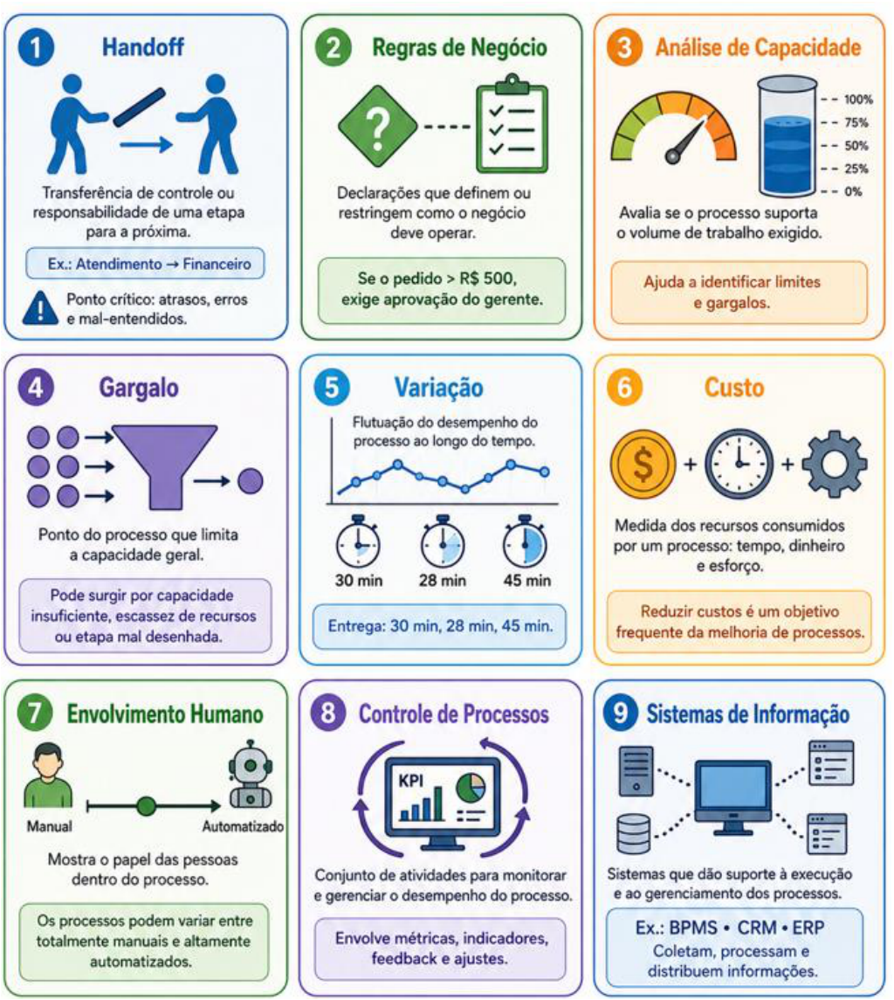

## Desenho de Processos 

Pessoal, agora vamos falar sobre a etapa de **Desenho de Processos** , que o CBOK chama de "Process Design". A ideia aqui é planejar e estruturar um processo de negócios de forma que ele atinja metas de desempenho específicas. O desenho parte sempre da análise AS-IS, ou seja, da fotografia do processo atual, com todos os

---

<!-- pagina: 37 -->

**Paolla Ramos Aula 03** 

seus problemas e gargalos. A partir daí, **o objetivo é criar o processo TO-BE (que em português fica "COMOSERÁ"), aquele estado futuro melhorado** , mais eficiente, mais eficaz e mais adaptável às mudanças. 

##### **_Saiba Mais:_** 

_Os princípios de desenho de processos orientam a criação de fluxos mais enxutos e eficazes. Entre os principais, destacam-se:_ **_desenhar em torno de atividades que agregam valor_** _(foco no que o cliente percebe),_ **_capturar a informação uma vez e na fonte_** _(evitar redundância de dados), e_ **_providenciar um único ponto de contato para o cliente_** _(reduzir a fragmentação do atendimento)._ 

_Além disso, o redesenho deve sempre preceder a automação, garantindo que não se automatize um processo ineficiente_ 

Quais são as principais atividades dessa etapa? 

**Definir os objetivos do processo** . Você precisa saber o que quer alcançar antes de estruturar qualquer coisa. Esses objetivos podem ser variados, tais como melhorar a eficiência operacional, reduzir erros, aumentar a satisfação do cliente, cortar custos, entre outros. Sem isso definido, o processo desenhado pode ser bonito no papel e inútil na prática. 

**Projetar a estrutura do processo em si** . Aqui, você vai planejar o fluxo de trabalho, definir cada etapa do processo, mapear as interações entre essas etapas e identificar os pontos de decisão, aqueles momentos em que o processo pode seguir por caminhos diferentes dependendo de uma condição. Para isso, existem ferramentas consagradas no mercado. A mais conhecida é o BPM, como já falamos anteriormente. Além dela, entram em cena os fluxogramas tradicionais e os diagramas de atividades UML (Unified Modeling Language). Cada uma tem suas características, mas todas servem ao mesmo propósito, que é tornar o processo visível, compreensível e comunicável para todos os envolvidos. 

**Definir as regras do processo** . Por exemplo, de que adianta mapear tudo bonitinho se não ficou claro o que acontece quando as coisas fogem do roteiro? As regras do processo são exatamente isso, isto é, as condições que definem como cada parte do processo deve se comportar em cada situação. Aqui entram três tipos de regra. Primeiro, as regras de decisão, que determinam qual caminho o processo vai seguir dependendo de uma condição. Segundo, as regras para tratamento de exceções, que definem o que fazer quando algo dá errado ou sai do fluxo esperado. E terceiro, as regras de coordenação, que organizam como as diferentes partes do processo se comunicam e se sincronizam entre si. 

**Projeto das interfaces do processo** . Interfaces são os pontos de contato, ou seja, os momentos em que o processo precisa conversar com outro processo, com um sistema externo ou com algum ator de fora. E olha, isso não é detalhe pequeno não. Uma interface mal planejada é porta aberta para falha de comunicação, dado perdido, retrabalho. O desenho das interfaces envolve planejar exatamente como essas interações vão ocorrer e, mais importante, como gerenciar as dependências que surgem daí. Se o seu processo depende de uma resposta de outro sistema para continuar, isso precisa estar previsto e coordenado desde o projeto. 

Por fim, tem o **Planejamento da implementação do processo** . Essa etapa cobre três frentes principais. A primeira é a escolha das tecnologias e ferramentas que vão sustentar o processo, seja um sistema de BPM,

---

<!-- pagina: 38 -->

**Paolla Ramos Aula 03** 

uma plataforma de automação ou qualquer outra solução adequada ao contexto. A segunda é o planejamento do treinamento para quem vai operar o processo, porque de nada adianta a ferramenta certa nas mãos de quem não sabe usá-la. E a terceira é o cronograma de implementação, com prazos, marcos e responsáveis definidos. 

#### **Desenho do Estado Futuro  de um Processo (TO-BE)** 

Para projetar o estado futuro de um processo, o profissional precisa seguir uma sequência bastante lógica. Começa pela **escolha da ferramenta de modelagem** que vai usar. Depois, **lista as sugestões de mudanças** , pondera cada uma delas e prioriza o que de fato vai sair do papel. Essas mudanças podem envolver processos inteiros, subprocessos, funções específicas ou atividades isoladas. 

Uma vez definidas as áreas funcionais que vão ser modificadas, vem uma decisão importante: qual é o tamanho da mudança? Porque tem uma diferença enorme entre fazer ajustes pontuais e incrementais num processo que já existe e promover uma reformulação em larga escala, sistêmica mesmo, que mexe com tudo. Essa escolha impacta diretamente o esforço, o custo e o prazo do projeto, então não é uma decisão que se toma de qualquer jeito. 

Com isso definido, o profissional desenha o novo processo, o famoso **TO-BE** . Lembre-se que o AS-IS é como o processo está hoje e o TO-BE é como ele **deve ficar** . Desenhado o novo processo, a etapa seguinte são as simulações e otimizações operacionais. O objetivo aqui é verificar, antes de colocar tudo em produção, se o processo realmente atende às regras de negócio de forma eficiente. É o famoso "teste antes de lançar". 

##### **_Saiba Mais:_** 

_O modelo_ **_TO-RUN_** _representa a fase operacionalizada do processo, servindo como uma ponte entre o desenho futuro (TO-BE) e a execução real sustentada. Enquanto o TO-BE foca no ideal otimizado, o TO-RUN inclui as práticas de monitoramento, controle de desempenho e documentação de transição necessárias para que o processo opere continuamente de forma estável e sob controle,_ _<u>garantindo que as melhorias planejadas sejam mantidas no dia a dia.</u>_ 

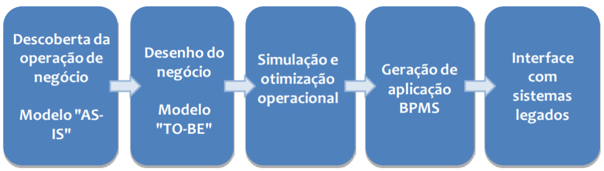

Depois disso vem a geração de aplicação BPMS. O BPMS, que significa Business Process Management Suite (ou System), é um conjunto de sistemas responsável por automatizar a gestão dos processos de negócio. Não é uma ferramenta só, é um conjunto delas trabalhando de forma integrada.

---

<!-- pagina: 39 -->

**Paolla Ramos Aula 03** 

Por fim, são criadas as interfaces para dados e para os sistemas legados, que são aqueles sistemas mais antigos que a organização já usava antes e que precisam conversar com o novo processo. 

**(FCPC - 2025 - Analista de Tecnologia da Informação (UFC)/Governança de TI) No Gerenciamento de Processos de Negócio (BPM), a modelagem do estado futuro de processos é conhecida como:** 

<mark>a) AS-IS b) TO-BE c) WILL-BE d) HOW-FUTURE</mark> 

**<mark>Comentários:</mark>** 

<mark>(a) Errado. AS-IS representa o estado atual do processo — como ele é hoje, antes de qualquer melhoria; (b) Correto. TO-BE é exatamente o modelo do estado futuro desejado, mostrando como o processo deve funcionar após as melhorias; (c) Errado. WILL-BE não é um termo reconhecido no BPM para modelagem de processos; (d) Errado. HOW-FUTURE também não existe como conceito oficial dentro do BPM.</mark> 

**Gabarito:** Letra B 

## Gerenciamento de Desempenho de Processos 

A ideia do Gerenciamento de Desempenho de Processos  é **acompanhar, medir e ajustar o desempenho de um processo de negócios** para garantir que ele esteja funcionando de forma eficaz e eficiente, ou seja, alcançando os objetivos para os quais foi criado. 

Como nas outras etapas do BPM CBOK, aqui temos várias atividades, veja: 

|**Atividade**|**Ideia central**|**Exemplos/ foco**|
|---|---|---|
|**Definir métricas de** **desempenho**|Estabelecer o que será medido|Tempo de ciclo, custo por transação, taxa de erro,satisfação do cliente.|
|**Coletar dados de** **desempenho**|Registrar informações sobre oprocesso|Coleta manual por planilhas ou coleta automatizadapor sistemas de informação.|
|**Analisar dados de** **desempenho**|Identificar padrões, tendências eproblemas|Comparação com metas, análise histórica, identificação de áreas críticas.|
|**Tomar decisões com base** **nos dados**|Usar evidências para orientar ações|Corrigir problemas, aproveitar oportunidades de eficiência ou aumentar a eficácia doprocesso.|
|**Melhorar o processo**|Transformar decisões em açõespráticas|Reorganizar etapas, redefinir responsabilidades, automatizar tarefas ou realizar treinamentos.|
|**Monitorar** **continuamente o** **desempenho**|Acompanhar o processo de forma permanente|Ciclo contínuo de avaliação, ajuste e melhoria.|

|**37**|
|---|

---

<!-- pagina: 40 -->

**Paolla Ramos Aula 03** 

#### **Conceitos-Chave de Gerenciamento de Desempenho de Processos** 

Vamos entender os principais conceitos que o CBOK usa na seção de Gerenciamento de Desempenho de Processos. 

**Medição** . No contexto do Gerenciamento de Desempenho de Processos, medição é o ato de coletar dados, tanto quantitativos quanto qualitativos, sobre como um processo está se saindo. Esses dados vêm de várias fontes, tais como sistemas de informação, observações diretas, feedback dos próprios usuários do processo. 

Já a **Medida** é o resultado disso. É uma quantidade específica que você coletou para avaliar algum aspecto do processo. Tempo de ciclo, custo de uma transação, número de erros ocorridos, essas são medidas. São valores brutos, concretos, que você extraiu lá da realidade do processo. 

Agora, a **Métrica** vai um passo além. Uma métrica é uma medida padronizada, muitas vezes construída a partir de várias medidas combinadas, e usada para comparar desempenho, seja ao longo do tempo, seja entre processos diferentes. Sabe quando você quer saber se o processo melhorou no último trimestre, ou se a filial de São Paulo performa melhor que a do Rio? É a métrica que te permite fazer essa comparação de forma consistente. Exemplos: eficiência (custo por transação), eficácia (porcentagem de transações concluídas corretamente na primeira tentativa) e qualidade (taxa de erros). 

Depois temos **Indicador** . Um indicador é uma métrica, ou uma combinação de métricas, usada para te dar uma visão de como um processo está se saindo. A ideia é monitorar o desempenho em relação a metas ou benchmarks e identificar o que precisa melhorar. Exemplos incluem a satisfação do cliente, a eficiência operacional etc. 

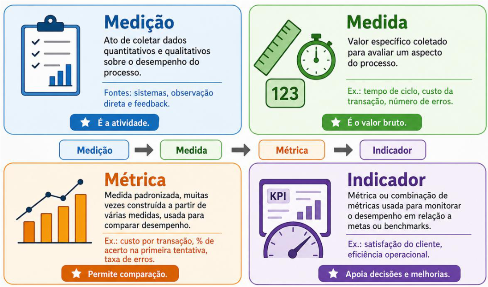

---

<!-- pagina: 41 -->

**Paolla Ramos Aula 03** 

##### **_Saiba Mais:_** 

_Os indicadores de desempenho podem ser classificados em dois tipos temporais: os_ **_Indicadores de Resultado (Lagging Indicators)_** _medem o efeito de ações passadas (ex: faturamento mensal) e não permitem alterar o resultado que já ocorreu._ 

_Já os_ **_Indicadores Direcionadores (Leading Indicators)_** _monitoram as causas ou atividades que influenciam os resultados futuros (ex: número de novas propostas enviadas), permitindo que os_ _<u>gestores ajam preventivamente para garantir que as metas finais sejam atingidas.</u>_ 

Por fim, temos **Maturidade de** processo. Esse conceito responde à pergunta: “o quanto a organização consegue gerenciar e melhorar seus processos de forma consistente e previsível”? Esse tema virou a base de modelos famosos como o CMMI e o MPS.BR. Esses modelos organizam a maturidade em níveis, que vão desde processos iniciais e completamente caóticos até processos altamente otimizados, gerenciados com rigor e em constante melhoria. A avaliação da maturidade serve para identificar onde a organização está forte, onde está fraca e o que priorizar no plano de melhoria. 

Por exemplo, veja os níveis de maturidade do CMMI versão 1.2: 

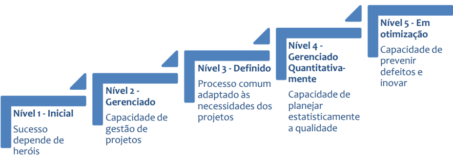

## Transforma ão de Processos <u>ç</u> 

Transformação de Processos do CBOK é sobre **repensar e redesenhar o processo completamente, do zero** . Mudanças significativas, radicais mesmo, com o objetivo de alcançar melhorias substanciais no desempenho. 

A primeira grande atividade dessa etapa é **identificar a necessidade de transformação** . Geralmente essa necessidade ocorre em dois cenários. O primeiro é quando o processo atual está claramente falhando em atingir suas metas de desempenho. O segundo cenário é quando o ambiente de negócios muda tanto que o processo existente se torna obsoleto ou ineficaz, seja por conta de novas tecnologias surgindo no mercado, seja por mudanças nas demandas dos clientes. Por exemplo, um processo desenhado nos anos 90 dificilmente sobrevive intacto num mundo digitalizado. Em algum momento, ele precisa ser mais do que ajustado. Ele precisa ser **transformado** .

---

<!-- pagina: 42 -->

**Paolla Ramos Aula 03** 

A segunda atividade central é **definir a visão de transformação** . A visão precisa ser uma declaração clara e inspiradora do que a organização espera alcançar com a transformação. Isso inclui metas específicas de desempenho e, claro, os benefícios esperados, tanto para a própria organização quanto para seus clientes e demais partes interessadas. 

Chegando na terceira etapa, temos o **redesenho do processo transformado** . Aqui é onde a coisa fica séria de verdade, porque estamos, muitas vezes, jogando fora o que existia e construindo do zero. O objetivo é desenhar um processo novo que seja compatível com a visão de transformação que foi definida lá atrás. Isso envolve mudanças na forma como as atividades são organizadas e coordenadas entre si, a adoção de novas tecnologias, e uma revisão completa de como as informações circulam e são usadas dentro do processo. 

Depois de desenhado, vem a **implementação** . É aqui que o novo processo sai do papel e entra na rotina das pessoas. Para isso funcionar, é preciso treinar quem vai operar o processo, configurar os sistemas de informação que vão dar suporte a ele, e fazer uma gestão de mudança cuidadosa. Esse último ponto é mais importante do que parece. De nada adianta um processo lindo no papel se as pessoas que vão trabalhar com ele ainda estão perdidas, resistentes ou simplesmente não foram preparadas para trabalhar de uma forma nova. A implementação cuida de garantir que a organização, como um todo, esteja pronta. 

Por fim, temos a **avaliação do desempenho do processo transformado** . Implementou? Ótimo, mas não acabou. É essencial medir se o novo processo está, de fato, entregando o que foi prometido lá na fase de visão. Essa avaliação serve para confirmar que as metas de transformação foram atingidas e, ao mesmo tempo, para identificar problemas que possam ter surgido na prática ou oportunidades de melhoria que não eram visíveis antes. 

#### **Iniciativas de Melhorias de Processo** 

Muita gente confunde BPM com iniciativas de melhoria de processos, e é importante deixar isso claro logo de cara. Iniciativas de melhoria de processos tratam de ajustes pontuais, melhorias específicas, projetos com começo, meio e fim que culminam numa lista de mudanças a implementar. Só que adotar uma dessas abordagens não significa que a organização está praticando BPM de verdade. São coisas relacionadas, mas não a mesma coisa. 

Vejamos as principais abordagens que aparecem nesse contexto. 

A primeira é o **Lean** . Essa filosofia de gerenciamento nasceu na indústria automobilística japonesa, mais precisamente dentro da Toyota, e o foco dela é **eliminar desperdício** . Desperdício de tempo de espera, de inventário excessivo, de movimentação desnecessária, de sobreprodução, de defeitos. A lógica é criar o máximo de valor para o cliente usando o mínimo de recursos possível. Por isso que Lean saiu das linhas de montagem japonesas e foi parar em hospitais, bancos, startups e até repartições públicas pelo mundo inteiro. As ferramentas mais conhecidas do Lean incluem o mapeamento do fluxo de valor, o trabalho padronizado, a produção puxada e o famoso Kaizen, que é justamente essa ideia de melhoria contínua e incremental no dia a dia. 

Depois temos o **Six Sigma** . Essa aqui nasceu na Motorola e tem um perfil bem mais analítico, orientado a dados. A proposta do Six Sigma é **reduzir a variação nos processos para chegar o mais perto possível de zero defeitos** . Um “defeito” nesse contexto é qualquer resultado de processo que não atenda às

---

<!-- pagina: 43 -->

**Paolla Ramos Aula 03** 

especificações do cliente. O coração da metodologia é o ciclo DMAIC, que passa por cinco etapas: Definir, Medir, Analisar, Melhorar (Improve) e Controlar. Além do DMAIC, o Six Sigma usa gráficos de controle, diagramas de causa e efeito e análise de regressão. É uma abordagem bastante rigorosa, com certificações em níveis, os famosos "belts", e que exige bastante domínio estatístico de quem a aplica. 

Por fim, temos o **TQM** , sigla para Total Quality Management, ou Gestão da Qualidade Total. O TQM tem uma visão mais ampla do que as anteriores: a ideia é disseminar a consciência de qualidade por toda a organização, em todos os níveis, em todos os processos. A filosofia é que todo mundo é responsável pela qualidade, não só o departamento de controle de qualidade. As ferramentas típicas do TQM incluem círculos de qualidade, gerenciamento por objetivos, controle estatístico de processos e o ciclo PDCA, aquele clássico Plan, Do, Check, Act que aparece em muitos outros contextos também. 

**(CEBRASPE - 2024 - Analista Técnico II (SEBRAE)/Governança TI) Uma das abordagens de melhoria contínua** **<mark>de processos é utilizada para eliminar defeitos do produto ou serviço, com base em dados e fatos</mark> estatísticos em qualquer processo, desde a manufatura até o transacional. Trata-se** 

<mark>a) da abordagem six sigma.</mark> 

<mark>b) da abordagem lean.</mark> 

<mark>c) da reengenharia de processos.</mark> 

<mark>d) do gerenciamento de qualidade total.</mark> 

**<mark>Comentários:</mark>** 

<mark>(a) Correto. O Six Sigma é exatamente isso: uma abordagem focada em eliminar defeitos usando dados e estatística. O nome vem do símbolo estatístico sigma (σ), e o objetivo é reduzir variações nos processos — tanto na manufatura quanto em serviços; (b) Errado. O Lean foca em eliminar desperdícios e otimizar o fluxo de valor, não necessariamente em defeitos com base estatística; (c) Errado. A reengenharia de processos propõe uma redesenho radical dos processos, não uma melhoria contínua baseada em dados estatísticos; (d) Errado. O TQM (Gerenciamento de Qualidade Total) é uma filosofia ampla de qualidade, mas não tem o foco estatístico e específico em defeitos que caracteriza o Six Sigma.</mark> 

**Gabarito:** Letra A 

#### **Redesenho e Reengenharia de Processos** 

Primeiro ponto importante: redesenho de processos não é a mesma coisa que melhoria de processos. A diferença está na perspectiva. Enquanto a melhoria busca identificar e implementar ajustes incrementais em pontos específicos, o redesenho olha para o processo como um todo, de forma holística. Já a reengenharia de processos vai além dos dois, combinando redesenho e melhoria, mas num nível muito mais profundo. 

Segundo o CBOK, redesenho de processos é um **conjunto de mudanças incrementais e evolutivas aplicadas a um processo que já existe** , com o objetivo de melhorar seu desempenho ou sua eficiência. Repare que a palavra-chave aqui é "incremental". Não se joga tudo fora e começa do zero, você pega o processo atual e

---

<!-- pagina: 44 -->

**Paolla Ramos Aula 03** 

vai ajustando: reorganiza tarefas, introduz novas ferramentas ou tecnologias, muda a forma como as informações circulam dentro daquele processo. 

Esse trabalho começa por uma análise detalhada do processo atual e do seu desempenho. Você estuda o que está acontecendo de verdade hoje, identifica os gargalos, os pontos de desperdício, as etapas que poderiam ser mais eficientes, e aí propõe mudanças específicas e direcionadas. 

Agora, quanto a **reengenharia de processos** , a história é outra. 

A reengenharia é sobre questionar se o processo atual vale a pena continuar existindo. A ideia é **fazer uma revisão fundamental, repensar tudo desde a base, e então redesenhar completamente o processo** para alcançar melhorias dramáticas, não incrementais. Estamos falando de ganhos expressivos em custo, qualidade, velocidade e nível de serviço. Não 10% melhor. Pense em duas, três, quatro vezes melhor. 

==5460== E aí está o ponto que distingue a reengenharia do simples redesenho: **enquanto o redesenho parte do processo existente e o aprimora, a reengenharia descarta esse processo. Joga fora. Começa do zero** . A pergunta não é "como fazemos isso melhor?", mas sim "por que fazemos isso dessa forma?". 

A reengenharia costuma ser disruptiva. Ela mexe com estruturas, com cargos, com fluxos de trabalho inteiros, e exige uma mudança de mentalidade que precisa atravessar toda a organização, do operacional ao estratégico. Isso gera resistência, gera desconforto, e muitos projetos de reengenharia fracassam justamente por subestimar esse impacto humano e cultural. 

Resumindo a diferença: redesenho é escala menor, mudança no processo existente, melhoria gradual. Reengenharia é escala total, reconstrução do zero, transformação radical. 

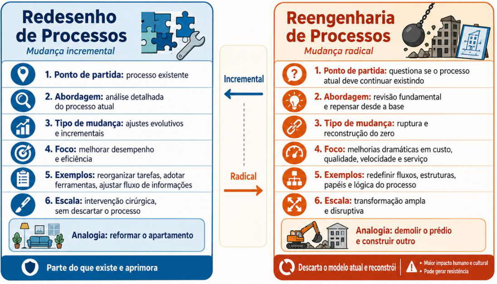

**42**

---

<!-- pagina: 45 -->

**Paolla Ramos Aula 03** 

**(FGV - 2025 - Analista Legislativo (ALEAM)/Analista de Sistemas) Em um ciclo típico de Gestão de Processos** **<mark>de Negócio (BPM), as atividades de mapeamento, análise e melhoria de processos seguem uma sequência</mark> lógica. A sequência lógica mais comum para o ciclo de redesenho e melhoria de um processo é** 

<mark>a) Simulação do TO-BE -> Análise do AS-IS -> Implementação do AS-IS -> Mapeamento do TO-BE.</mark> 

<mark>b) Definição de Indicadores -> Mapeamento do TO-BE -> Mapeamento do AS-IS -> Implementação.</mark> 

<mark>c) Mapeamento do AS-IS -> Análise do AS-IS -> Desenho do TO-BE -> Simulação/Validação do TO-BE. d) Desenho do TO-BE -> Mapeamento do AS-IS -> Análise do AS-IS -> Monitoramento.</mark> 

<mark>e) Implementação -> Mapeamento do TO-BE -> Análise do TO-BE -> Mapeamento do AS-IS.</mark> 

**<mark>Comentários:</mark>** 

<mark>(a) Errado. A sequência está toda embaralhada — começa pela simulação do TO-BE antes mesmo de entender o processo atual. Não faz sentido simular algo que ainda não foi mapeado nem analisado; (b) Errado. Aqui os indicadores vêm antes do mapeamento do processo atual, e o AS-IS aparece depois do TO-BE, invertendo a lógica natural do ciclo BPM; (c) Correto. Essa é a sequência clássica do BPM: primeiro você mapeia como o processo funciona hoje (AS-IS), depois analisa os problemas, em seguida desenha como ele deveria ser (TOBE) e, por fim, simula/valida antes de implementar; (d) Errado. Começa pelo desenho do TO-BE sem nem conhecer o processo atual. É como propor uma solução sem entender o problema; (e) Errado. Começa pela implementação, que é justamente a etapa final do ciclo. Tudo está de cabeça para baixo aqui.</mark> 

**Gabarito:** Letra C 

## Organização do Gerenciamento de Processos 

Pessoal, chegamos agora à etapa de Organização do Gerenciamento de Processos. Na prática, ela trata do **estabelecimento e do gerenciamento de toda a infraestrutura necessária para que o gerenciamento de processos de negócios realmente funcione dentro de uma organização** . 

A primeira grande atividade aqui é o estabelecimento do chamado **BPM Office** , ou **Escritório de Processos** . Pense nele como o time central de tudo isso. É esse grupo que vai coordenar os esforços de gerenciamento de processos em toda a organização, garantindo que uma área não faça uma coisa completamente diferente do que a outra está fazendo. Ele faz isso estabelecendo padrões e diretrizes, oferecendo treinamento e suporte às equipes, e facilitando a comunicação e a colaboração entre as diferentes partes da empresa. Esse escritório costuma ser um dos primeiros elementos a ser criado quando uma organização decide levar BPM a sério. 

A segunda atividade é o **desenvolvimento de competências de BPM** . Significa identificar quais habilidades e conhecimentos as pessoas precisam ter para colocar o gerenciamento de processos em prática de forma efetiva. Esse conjunto de competências é bem amplo. Tem o lado técnico, como a capacidade de modelar e analisar processos, e tem o lado humano também, como habilidades de liderança e de gestão de mudanças.

---

<!-- pagina: 46 -->

**Paolla Ramos Aula 03** 

O terceiro ponto fala sobre **estabelecer uma cultura de gerenciamento de processos** . O objetivo é criar uma mentalidade orientada para processos em toda a organização, do estagiário ao diretor. Isso envolve promover valores como melhoria contínua, foco no cliente e colaboração entre as diferentes áreas da empresa. 

Já o quarto ponto trata da **implementação de tecnologia de BPM** . Trata-se de selecionar e colocar em funcionamento as ferramentas de software que vão dar suporte a todo esse gerenciamento de processos. O leque é amplo: são sistemas de modelagem de processos, sistemas de automação de processos e sistemas de monitoramento de processos. Cada um cumpre um papel diferente, desde desenhar o processo no papel até fazê-lo rodar sozinho e depois acompanhar se está funcionando como esperado. 

O quinto ponto fecha o **gerenciamento da mudança** . Sabe quando uma empresa reestrutura seus processos e, semanas depois, todo mundo continua fazendo do jeito antigo? Então, é exatamente isso que esse ponto tenta evitar. O gerenciamento de mudança de processos abrange a resistência que as pessoas naturalmente têm a qualquer alteração na rotina, a comunicação clara e eficaz sobre o que vai mudar e por que, e a garantia de que as mudanças não ficam só no papel, mas são de fato implementadas e consolidadas no dia a dia da organização. 

## Gerenciamento Corporativo de Processos 

Pessoal, estamos quase no final da nossa aula e vamos falar sobre o **Gerenciamento Corporativo de Processos** , que em inglês aparece como Enterprise Process Management, ou simplesmente EPM. Trata-se de coordenar e integrar os processos de negócios de toda a organização para que eles funcionem juntos, em harmonia, em direção aos objetivos estratégicos da empresa. 

Vamos às suas principais atividades. 

A primeira é o **Desenvolvimento de uma Estratégia de Processo** . Antes de sair melhorando processo por processo, a organização precisa ter uma visão clara de onde quer chegar. Isso significa definir objetivos de desempenho para os processos, identificar onde existem oportunidades reais de melhoria e estabelecer prioridades. Nem tudo pode ser feito de uma vez, e a estratégia é justamente o que diz o que vem primeiro, o que vem depois, e por quê. 

A segunda atividade é o **Desenho da Arquitetura de Processo** . Aqui a ideia é mapear e organizar todos os processos da organização dentro de uma estrutura coesa, que faça sentido como um todo. Envolve definir os processos de alto nível e os subprocessos que existem dentro deles, identificar as relações e dependências entre esses processos (porque um processo raramente vive isolado, ele sempre afeta ou depende de outro), e ainda definir responsabilidades e regras de governança. Ou seja, quem cuida de quê, como as decisões são tomadas e quem responde por cada parte do processo. 

Outro ponto é o **alinhamento de processos com a estratégia da organização** . Pense numa empresa que quer crescer no mercado digital, mas cujos processos internos ainda são todos manuais e lentos. Há um desalinhamento claro. Esse tópico envolve justamente garantir que os processos de negócio e as atividades de gerenciamento estejam sincronizados com a estratégia e os objetivos gerais da organização. Na prática, 

**44**

---

<!-- pagina: 47 -->

**Paolla Ramos Aula 03** 

isso significa ligar as medidas de desempenho dos processos aos indicadores-chave da organização, os famosos KPIs, e garantir que cada esforço de melhoria contribua de verdade para onde a empresa quer chegar. 

**(FGV - 2026 - Analista Judiciário (TJ RJ)/Tecnologia da Informação/Cientista de Dados) O gestor de processos do TJRJ precisa de uma interface de monitoramento que mostre as seguintes informações:** 

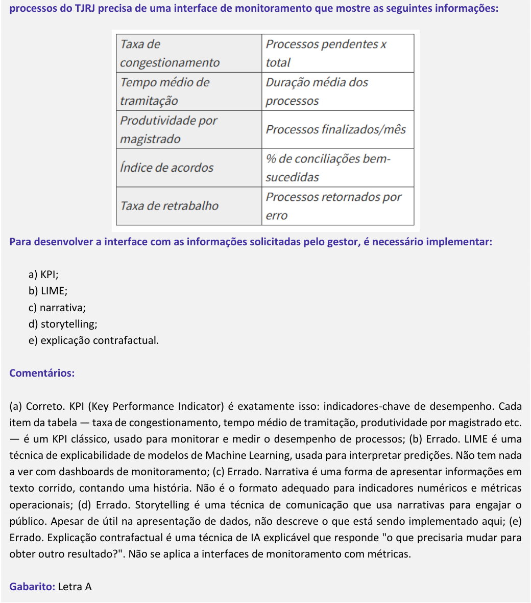

<!-- Start of picture text -->
processos do TJRJ precisa de uma interface de monitoramento que mostre as seguintes informações: Para desenvolver a interface com as informações solicitadas pelo gestor, é necessário implementar: a) KPI; b) LIME; c) narrativa; d) storytelling; e) explicação contrafactual. Comentários: (a) Correto. KPI (Key Performance Indicator) é exatamente isso: indicadores-chave de desempenho. Cada item da tabela — taxa de congestionamento, tempo médio de tramitação, produtividade por magistrado etc. — é um KPI clássico, usado para monitorar e medir o desempenho de processos; (b) Errado. LIME é uma técnica de explicabilidade de modelos de Machine Learning, usada para interpretar predições. Não tem nada a ver com dashboards de monitoramento; (c) Errado. Narrativa é uma forma de apresentar informações em texto corrido, contando uma história. Não é o formato adequado para indicadores numéricos e métricas operacionais; (d) Errado. Storytelling é uma técnica de comunicação que usa narrativas para engajar o público. Apesar de útil na apresentação de dados, não descreve o que está sendo implementado aqui; (e) Errado. Explicação contrafactual é uma técnica de IA explicável que responde "o que precisaria mudar para obter outro resultado?". Não se aplica a interfaces de monitoramento com métricas. Gabarito:  Letra A <!-- End of picture text -->

---

<!-- pagina: 48 -->

**Paolla Ramos Aula 03** 

Tem também a questão da **coordenação e integração de processos** . Dentro de uma organização grande, os processos não vivem em ilhas isoladas. Eles se conectam, se cruzam e dependem uns dos outros. Quando o setor de vendas fecha um pedido, o setor de logística precisa ser acionado, o financeiro precisa registrar, o estoque precisa ser atualizado. Tudo isso envolve o que chamamos de interfaces e handoffs, ou seja, os momentos em que uma atividade passa de uma mão para outra. Esse aspecto contempla a coordenação das atividades de melhoria entre diferentes áreas e a integração dos sistemas de informação que suportam esses processos. 

Por fim, temos o **monitoramento e a melhoria contínua de processos** . Esse é o motor que mantém tudo funcionando bem ao longo do tempo. O monitoramento contínuo do desempenho dos processos é fundamental para permitir identificar onde as coisas estão saindo do trilho e apontar oportunidades de melhoria antes que o problema vire uma crise. É exatamente esse espírito que está por trás de metodologias como o PDCA, por exemplo. 

**(FGV - 2026 - Analista Judiciário (TJ RJ)/Tecnologia da Informação/Analista de Gestão de TIC) O gestor de** **<mark>tecnologia da informação de um órgão está identificando os processos da organização para aplicação de melhorias contínuas a fim de agregar mais valor para os clientes. Dentre as situações identificadas, a</mark> melhoria contínua deve ser aplicada em:** 

<mark>a) processos repetitivos;</mark> 

<mark>b) projetos de curta duração;</mark> 

<mark>c) ambientes instáveis ou em crise;</mark> 

<mark>d) processos sem dados confiáveis;</mark> 

<mark>e) serviços a serem descontinuados.</mark> 

**<mark>Comentários:</mark>** 

<mark>(a) Correto. Melhoria contínua faz sentido em processos repetitivos, pois eles se repetem ao longo do tempo e cada ciclo é uma oportunidade de ajuste e ganho de valor. É exatamente aí que vale o esforço de melhorar; (b) Errado. Projetos de curta duração têm começo, meio e fim definidos — não há repetição suficiente para justificar um ciclo de melhoria contínua; (c) Errado. Em ambientes instáveis ou em crise, a prioridade é estabilizar a situação. Melhoria contínua pressupõe um processo minimamente estável para ser aprimorado; (d) Errado. Sem dados confiáveis, não dá pra medir nem monitorar o processo — e sem isso, qualquer tentativa de melhoria contínua fica no escuro; (e) Errado. Não faz sentido investir em melhorar algo que vai ser descontinuado. O esforço seria desperdiçado.</mark> 

**Gabarito:** Letra A 

## Tecnologias de BPM 

Processos de negócio podem ser colocados em prática de formas bem diferentes. Às vezes é o próprio ser humano fazendo tudo na mão, às vezes é uma máquina física, tipo uma prensa de perfuração ou uma esteira

---

<!-- pagina: 49 -->

**Paolla Ramos Aula 03** 

transportadora numa linha de produção. E às vezes é um sistema de informação, como uma aplicação de software ou um motor de fluxo de trabalho, que assume o comando. Na prática, muitos processos misturam os três. Para gerenciar tudo isso, existem tecnologias específicas. Veja a seguir as principais delas. 

|**Tecnologia**|**Descrição**|
|---|---|
|**BUSINESS PROCESS** **ANALYSIS (BPA)**|Ferramentas de Análise de Processos de Negócios (BPA) são usadas para a modelagem e análise de processos de negócios. Elas permitem a visualização de processos de negócios, a simulação de diferentes cenários e a identificação de potenciais gargalos e oportunidades de melhoria.|
|**ENTERPRISE** **ARCHITECTURE (EA)**|A Arquitetura Empresarial (EA) é uma abordagem holística para o gerenciamento da complexidade organizacional por meio de uma visão estratégica e um roadmap de implementação. As ferramentas de EA são usadas para mapear, analisar e gerenciar a arquitetura de negócios, de informações, de aplicativos e de tecnologia de uma organização.|
|**ENTERPRISE CONTENT** **MANAGEMENT (ECM)**|É uma combinação estratégica de métodos, ferramentas e tecnologias usadas para capturar, gerenciar, armazenar, preservar e entregar conteúdo e documentos relacionados aos processos organizacionais. Sua principal função no BPM é transformar conteúdos desestruturados (como e-mails, contratos e imagens) em informações valiosas e acessíveis, automatizando o ciclo de vida do conteúdo para suportar a tomada de decisão e a conformidade.|
|**BUSINESS RULES** **MANAGEMENT** **SYSTEMS (BRMS)**|Os Sistemas de Gerenciamento de Regras de Negócios (BRMS) são usados para definir, implementar e gerenciar as regras de negócios que governam os processos de negócios. Eles permitem a separação de regras de negócios da lógica do aplicativo, facilitando a mudança e ogerenciamento de regras.|
|**BUSINESS PROCESS** **MANAGEMENT SUITE** **(BPMS)**|Um conjunto de gerenciamento de processos de negócios (BPMS) é uma solução integrada que suporta todo o ciclo de vida do gerenciamento de processos de negócios, desde o design e a modelagem até a execução,monitoramento e otimização.|
|**BUSINESS ACTIVITY** **MONITORING (BAM)**|O monitoramento de atividades de negócios (BAM) envolve o uso de tecnologias para monitorar em tempo real os processos e atividades de negócios, para fornecer insights em tempo real e facilitar a tomada de decisões.|
|**SOA – SERVICE** **ORIENTED** **ARCHITECTURE**|A Arquitetura Orientada a Serviços (SOA) é uma abordagem de design de sistemas de TI que envolve a organização de funcionalidades como serviços interoperáveis. Isso facilita a integração e a coordenação de diferentes sistemas e aplicativos.|
|**EAI – ENTERPRISE** **APPLICATION** **INTERGRATION**|A Integração de Aplicações Empresariais (EAI) é uma abordagem para a integração de sistemas e aplicativos de TI em toda a organização, para permitir que eles trabalhem juntos de forma eficaz.|
|**REPOSITORY**|Um repositório no contexto do BPM é um local centralizado para armazenar e gerenciar artefatos de processos, como modelos de processos, regras de negócios, metadados de processos e outros dados relacionados aprocessos.|
|**MINERAÇÃO DE** **PROCESSOS**|Técnica que utiliza logs de eventos (rastros digitais deixados pelos sistemas de TI) para descobrir, monitorar e melhorar processos reais. Ela permite confrontar o processo "como ele realmente acontece" com o modelo idealizado, sendo uma ferramenta poderosa para garantir o alinhamento estratégico, pois revela desvios, gargalos e ineficiências com precisão baseada em dados reais da operação, indo além do mapeamento tradicionalpor entrevistas.|

---

<!-- pagina: 50 -->

**Paolla Ramos Aula 03** 

==5460== **DataPrev (Perfil 3: Desenvolvimento de Software) Gestão e Governança de TI - 2026 (Pós-Edital)** **_www.estrategiaconcursos.com.br_** 

|50 87|
|---|

https://t.me/KakashiAssinaturasBot

---

<!-- pagina: 51 -->

**Paolla Ramos Aula 03** 

# **– RESUMO BPM** 

##### **FERNANDO PEDROSA - HTTPS://WWW.INSTAGRAM.COM/PROF.FERNANDOPEDROSA** 

## Visão Geral — BPM (Business Process Management) 

**BPM** é uma disciplina gerencial que combina gestão, TI e ciências de processo para analisar, projetar, executar, monitorar e otimizar processos de negócio, com foco em entregar valor ao cliente. 

O **CBOK** (Business Process Management Common Body of Knowledge) é o guia de referência do BPM, estruturado em 9 áreas de conhecimento: modelagem, análise, desenho, gerenciamento de desempenho, transformação, organização da gestão, processos corporativos, tecnologias e práticas de gestão. 

## Conceitos Fundamentais 

### Hierarquia de Elementos do Processo 

- **Processo de Negócio** : conjunto ordenado de atividades que transforma entradas em saídas para alcançar um objetivo 

- **Subprocesso** : parte executável independentemente dentro de um processo maior 

- **Função de Negócio** : área de responsabilidade (ex.: RH, Finanças, Vendas) 

- **Atividade** : conjunto de tarefas relacionadas dentro de um processo 

- **Tarefa** : unidade individual de trabalho dentro de uma atividade 

- **Passo** : menor unidade indivisível de um processo 

- **Cenário** : caminho específico através de um processo sob certas condições 

### Tipos de Processos 

- **Processo Primário** : agrega valor diretamente ao cliente; ligado à missão da empresa (ex.: fabricação, vendas, marketing) 

- **Processo de Suporte** : facilita os primários, invisível ao cliente (ex.: RH, TI, Contabilidade, Aquisições) 

- **Processo de Gerenciamento** : governa e supervisiona os demais (ex.: planejamento estratégico, controle de qualidade, orçamento) 

**Pegadinha de prova** : Processo de Suporte NÃO agrega valor diretamente ao cliente, mas é essencial para que os Processos Primários funcionem. Processo de Gerenciamento governa — não executa.

---

<!-- pagina: 52 -->

**Paolla Ramos Aula 03** 

### Definições e Princípios do BPM (alto índice de cobrança) 

- BPM **é** uma disciplina gerencial — não é metodologia ou conjunto fixo de ferramentas 

- BPM trata o trabalho **ponta a ponta** , diferenciando-se da gestão por funções 

- BPM deve ser gerenciado em **ciclo contínuo** : planejamento → análise → desenho → implementação → monitoramento → refinamento 

- A tecnologia desempenha papel de **apoio** , não de liderança 

- Implementação de BPM é **decisão estratégica** e requer patrocínio da liderança executiva 

- BPM requer **novos papéis e responsabilidades** interfuncionais 

- Capacidades são desenvolvidas ao longo de uma **curva de maturidade** 

## Modelagem de Processos 

### Diagramas, Mapas e Modelos 

- **Diagrama** : representação simplificada, baixo nível de detalhe — uso: compreensão rápida (ex.: fluxograma simples) 

- **Mapa** : nível médio de detalhe, inclui papéis, responsabilidades, entradas/saídas e decisões — uso: treinamento e análise 

- **Modelo** : maior nível de detalhe, inclui regras de negócio, métricas, sistemas de informação — uso: simulações e automação via BPMS 

Ordem crescente de detalhe: **Diagrama < Mapa < Modelo** . Modelos usam notações padrão como BPMN. 

### Principais Notações Gráficas 

- **BPMN** : padrão principal para modelagem; inclui eventos, atividades, gateways e fluxos de sequência 

- **Fluxograma** : mais simples e antigo; formas geométricas + setas 

- **EPC** (Event-Driven Process Chain): popular na Alemanha; base SAP 

- **UML** : notação de engenharia de software; diagrama de atividades para processos 

- **IDEF** : desenvolvido pelo Departamento de Defesa dos EUA; IDEF0 e IDEF3 para processos 

- **VSM** (Value Stream Mapping): usado em Lean Manufacturing; foca em fluxo de valor e desperdícios 

### Abordagens Especializadas 

- **Cadeia de Valor** (Porter): divide atividades em primárias e de suporte; fluxo da esquerda para direita representando criação de valor 

- **SIPOC** : Suppliers, Inputs, Process, Outputs, Customers — define escopo e relações do processo; usado no Six Sigma 

- **Dinâmica de Sistemas** : modela comportamento de sistemas complexos ao longo do tempo com feedbacks; usada para modelar organizações inteiras

---

<!-- pagina: 53 -->

**Paolla Ramos Aula 03** 

### Direcionamento de Abordagens 

- **Bottom-Up** : começa nas tarefas individuais e agrega para processos maiores; bom para detalhes, ruim para visão geral 

- **Top-Down** : começa com visão geral e detalha subprocessos; bom para alinhamento estratégico 

- **Middle-Out** : abordagem híbrida; equilibra detalhe e visão geral; indicada para sistemas complexos 

## Análise de Processos (AS-IS) 

**Análise AS-IS** = entendimento do estado ATUAL do processo. **Desenho TO-BE** = estado FUTURO desejado. Essa distinção é frequentemente cobrada em prova. 

### Etapas da Análise de Processos 

<!-- Start of picture text -->
==5460== <!-- End of picture text -->

1. Documentar o processo (mapa/diagrama) 

2. Coletar e analisar dados (tempo de ciclo, custo, qualidade, satisfação) 

3. Identificar gargalos e ineficiências 

4. Identificar oportunidades de melhoria 

5. Priorizar melhorias (impacto x viabilidade) 

6. Desenvolver plano de melhoria com metas, ações, responsáveis e cronograma 

### Técnicas de Compreensão do Negócio 

- **Benchmarking** : comparação com processos semelhantes de outras organizações do mesmo segmento 

- **Análise SWOT** : Forças, Fraquezas, Oportunidades e Ameaças — visão interna + externa 

- **Melhores Práticas** : identifica processos similares em outros segmentos, evitando o "pensamento de grupo" 

### Métodos de Levantamento de Informações 

- **Pesquisa** : documentação, registros, diagramas existentes 

- **Entrevista** : ouve participantes; nem sempre identifica todas as atividades 

- **Workshop Estruturado** : reunião facilitada com especialistas; modelagem interativa 

- **Conferência via Web** : similar à entrevista, mais barata; funciona melhor com menos pessoas 

- **Observação Direta** : documenta detalhes não descobertos por entrevistas 

- **Fazer em vez de observar** : compreensão mais profunda pela execução real 

- **Análise de Vídeo** : registro + narração posterior pelo executor 

- **Simulação de Atividades** : simulação de diversas formas diferentes 

### Conceitos Comuns na Análise 

- **Handoff** : transferência de controle entre etapas — ponto crítico de atrasos e erros 

- **Regras de Negócio** : definem condições de decisão dentro do processo 

- **Gargalo** : ponto que limita a capacidade geral do processo

---

<!-- pagina: 54 -->

**Paolla Ramos Aula 03** 

- **Variação** : flutuação no desempenho ao longo do tempo 

- **Análise de Capacidade** : determina quanto de carga de trabalho o processo suporta 

## Desenho de Processos (TO-BE) 

### Fundamentos do Desenho 

- **Entendimento do estado atual** : mudanças devem partir do AS-IS; não se começa do zero ignorando o passado 

- **Cultura organizacional** : fatores culturais podem gerar consequências não intencionais 

- **Natureza da mudança** : escopo interfuncional = mudança estratégica de longo prazo; escopo específico = mudança centrada em fluxo de trabalho 

- **Gerenciar o desenho** : usar lições aprendidas e definir metodologia padronizada 

- **Níveis de modelo** : Nível 1 (visão interfuncional) → Nível 2 (subprocessos) → Nível 3 (áreas funcionais) → Nível 4 (atividades) → Nível 5 (tarefas) 

### Processo TO-BE — Passos 

1. Escolher ferramenta de modelagem 

2. Listar, ponderar e priorizar mudanças em processos, subprocessos e atividades 

3. Decidir nível da mudança: incremental ou sistêmica em larga escala 

4. Desenhar novo processo (TO-BE) 

5. Realizar simulações e otimizações operacionais 

6. Gerar aplicação BPMS (automação) 

7. Criar interfaces para dados e sistemas legados 

## Gerenciamento de Desempenho de Processos 

### Conceitos-Chave (frequentemente cobrados) 

- **Medição** : coleta de dados quantitativos e qualitativos sobre o desempenho 

- **Medida** : quantidade específica coletada (ex.: tempo de ciclo, número de erros) 

- **Métrica** : medida padronizada para comparação ao longo do tempo ou entre processos (ex.: custo por transação, taxa de erros) 

- **Indicador (KPI)** : métrica ou combinação de métricas para monitorar desempenho em relação a metas 

- **Maturidade de Processo** : capacidade da organização de gerenciar processos de forma consistente e previsível; associada ao **CMMI** e ao **BPMM** 

Hierarquia: **Medida** (dado bruto) → **Métrica** (medida padronizada) → **Indicador/KPI** (visão de desempenho para decisão). Não confundir os três termos.

---

<!-- pagina: 55 -->

**Paolla Ramos Aula 03** 

## Transforma ão de Processos <u>ç</u> 

### Abordagens de Melhoria 

- **Lean** : redução de desperdícios; origem na Toyota; ferramentas: VSM, Kaizen, produção puxada 

- **Six Sigma** : redução de variação e defeitos; origem na Motorola; ciclo **DMAIC** (Definir, Medir, Analisar, Melhorar, Controlar) 

- **TQM** (Total Quality Management): melhoria contínua e incremental da qualidade em toda a organização; ciclo **PDCA** (Plan, Do, Check, Act) 

### Redesenho x Reengenharia 

- **Redesenho** : mudanças incrementais e evolutivas no processo existente; otimiza etapas atuais; menor impacto organizacional 

- **Reengenharia** : revisão fundamental e redesenho completo — descarta o processo atual e começa do zero; mudanças radicais e disruptivas; busca melhorias dramáticas em custo, qualidade, velocidade e serviço 

**Reengenharia** = radical, do zero, disruptiva. **Redesenho** = incremental, melhora o existente. **BPM** NÃO se confunde com iniciativas isoladas de melhoria — BPM é comprometimento contínuo e abrangente. 

## Tecnologias de BPM 

- **BPA** (Business Process Analysis): modelagem, simulação e identificação de gargalos 

- **EA** (Enterprise Architecture): visão holística de negócio, informação, aplicativos e tecnologia 

- **BRMS** (Business Rules Management Systems): define e gerencia regras de negócio separadas da lógica do aplicativo 

- **BPMS** (Business Process Management Suite): solução integrada para todo o ciclo de vida do BPM (design → execução → monitoramento → otimização) 

- **BAM** (Business Activity Monitoring): monitoramento em tempo real de processos e atividades 

- **SOA** (Service Oriented Architecture): organiza funcionalidades como serviços interoperáveis; facilita integração de sistemas 

- **EAI** (Enterprise Application Integration): integra sistemas e aplicativos de TI em toda a organização 

- **Repository** : armazena centralizadamente modelos, regras, metadados e artefatos de processos

---

<!-- pagina: 56 -->

**Paolla Ramos Aula 03** 

# **<mark>Questões Comentadas</mark>** 

**1. (FGV - 2026 - Analista Judiciário (TJ RJ)/Tecnologia da Informação/Analista de Gestão de TIC) O gestor de tecnologia da informação de um órgão está identificando os processos da organização para aplicação de melhorias contínuas a fim de agregar mais valor para os clientes. Dentre as situações identificadas, a melhoria contínua deve ser aplicada em:** 

a) processos repetitivos; 

b) projetos de curta duração; 

c) ambientes instáveis ou em crise; 

d) processos sem dados confiáveis; 

e) serviços a serem descontinuados. 

###### **Comentários:** 

(a) Correto. Melhoria contínua faz sentido em processos repetitivos, pois eles se repetem ao longo do tempo e cada ciclo é uma oportunidade de ajuste e ganho de valor. É exatamente aí que vale o esforço de melhorar; (b) Errado. Projetos de curta duração têm começo, meio e fim definidos — não há repetição suficiente para justificar um ciclo de melhoria contínua; (c) Errado. Em ambientes instáveis ou em crise, a prioridade é estabilizar a situação. Melhoria contínua pressupõe um processo minimamente estável para ser aprimorado; (d) Errado. Sem dados confiáveis, não dá pra medir nem monitorar o processo — e sem isso, qualquer tentativa de melhoria contínua fica no escuro; (e) Errado. Não faz sentido investir em melhorar algo que vai ser descontinuado. O esforço seria desperdiçado. 

###### **Gabarito:** Letra A 

**2. (FGV - 2026 - Analista Judiciário (TJ RJ)/Tecnologia da Informação/Analista de Negócios) O Gerenciamento de Processos de Negócio (BPM) propicia a implantação de melhorias em processos e seu gerenciamento, a fim de se obterem benefícios relacionados, dentre os quais a elevação da qualidade dos serviços prestados pelo Poder Judiciário.** 

**De acordo com o CBOK 4.0, o ciclo de Gerenciamento de Processos de Negócio é composto por etapas que, a depender da demanda, podem ser suprimidas ou executadas individualmente.** 

**A avaliação de como os processos de negócio estão operando para, a partir do entendimento comum de seu estado atual, identificar possíveis melhorias para atender aos objetivos do negócio com efetividade ocorre no(a):**

---

<!-- pagina: 57 -->

**Paolla Ramos Aula 03** 

a) análise de processos; 

b) desenho de processo; 

c) modelagem de processos; 

d) transformação de processos; 

e) gerenciamento do desempenho do processo. 

###### **Comentários:** 

(a) Correto. A análise de processos é justamente a etapa em que você "olha" para como os processos estão funcionando hoje, entende o estado atual e identifica oportunidades de melhoria para atingir os objetivos do negócio com efetividade; (b) Errado. O desenho de processo trata da criação ou redesenho de como o processo deve funcionar, não da avaliação do estado atual; (c) Errado. A modelagem é a representação visual/documentação dos processos, não a etapa de avaliação e identificação de melhorias; (d) Errado. A transformação de processos envolve a implementação das mudanças, não a análise diagnóstica do que precisa melhorar; (e) Errado. O gerenciamento do desempenho foca no monitoramento contínuo de indicadores, não na avaliação qualitativa do estado atual para identificar melhorias. 

###### **Gabarito:** Letra A 

**3. (FGV - 2026 - Analista Judiciário (TJ RJ)/Tecnologia da Informação/Analista de Negócios) De acordo com o BPM CBOK 4.0, o desenho de processos é a criação de especificações para processos de negócio novos e modificados.** 

**Os princípios do desenho de processos representam os principais conceitos envolvidos na maioria dos projetos de redesenho de processos.** 

**O princípio do desenho de processo que orienta que se estude o fluxograma AS-IS do processo, para determinar exatamente onde as atividades de agregação de valor são executadas, é o seguinte:** 

a) reduza o tamanho do lote; 

b) redesenhe, depois automatize; 

c) providencie um único ponto de contato; 

d) capture a informação uma vez e compartilhe-a; 

e) desenhe em torno de atividades que agregam valor. 

###### **Comentários:** 

(a) Errado. Reduzir o tamanho do lote é um princípio voltado à agilidade e fluxo contínuo, não à identificação de onde o valor é gerado no processo; (b) Errado. Esse princípio trata da ordem correta entre redesenho e automação, sem foco em mapear atividades de valor; (c) Errado. Providenciar um único ponto de contato está relacionado à experiência do cliente e simplificação do atendimento, não à análise de valor;

---

<!-- pagina: 58 -->

**Paolla Ramos Aula 03** 

(d) Errado. Capturar a informação uma vez e compartilhá-la é sobre eficiência no uso de dados, evitando retrabalho informacional; (e) Correto. Esse princípio orienta justamente a analisar o fluxo AS-IS para identificar onde, de fato, ocorre agregação de valor — e é a partir daí que o redesenho deve ser construído. 

###### **Gabarito:** Letra E 

**4. (FGV - 2026 - Analista Judiciário (TJ RJ)/Tecnologia da Informação/Analista de Negócios) Uma organização pública está atuando na sua transformação digital com relação à gestão de processos. De forma a melhorar a eficiência de seus fluxos de trabalho, decidiu-se implantar um Escritório de Processos.** 

###### **Uma das responsabilidades consideradas pela organização pública foi:** 

a) o controle do orçamento das áreas administrativas e financeiras; 

b) a execução direta dos processos operacionais das áreas finalísticas; 

c) o gerenciamento dos projetos de tecnologia da informação, exclusivamente; 

d) o monitoramento, a padronização e a promoção da melhoria contínua dos processos organizacionais; 

e) a centralização de todas as decisões estratégicas da organização, substituindo o planejamento institucional. 

###### **Comentários:** 

(a) Errado. Controlar orçamento de áreas administrativas e financeiras é papel da gestão financeira, não do Escritório de Processos; (b) Errado. O Escritório de Processos não executa diretamente os processos — ele apoia, orienta e melhora. Quem executa são as próprias áreas; (c) Errado. Gerenciar projetos de TI exclusivamente é função de um Escritório de Projetos (PMO), não de um Escritório de Processos; (d) Correto. Essa é exatamente a missão do Escritório de Processos: monitorar, padronizar e promover a melhoria contínua dos processos organizacionais, garantindo eficiência e alinhamento estratégico; (e) Errado. Centralizar decisões estratégicas e substituir o planejamento institucional vai muito além do escopo de um Escritório de Processos — isso seria uma distorção completa do seu papel. 

###### **Gabarito:** Letra D 

**5. (FGV - 2026 - Analista Judiciário (TJ RJ)/Tecnologia da Informação/Cientista de Dados) O gestor de processos do TJRJ precisa de uma interface de monitoramento que mostre as seguintes informações:**

---

<!-- pagina: 59 -->

**Paolla Ramos Aula 03** 

**Para desenvolver a interface com as informações solicitadas pelo gestor, é necessário implementar:** 

a) KPI; 

b) LIME; 

c) narrativa; 

d) storytelling; 

e) explicação contrafactual. 

###### **Comentários:** 

(a) Correto. KPI (Key Performance Indicator) é exatamente isso: indicadores-chave de desempenho. Cada item da tabela — taxa de congestionamento, tempo médio de tramitação, produtividade por magistrado etc. — é um KPI clássico, usado para monitorar e medir o desempenho de processos; (b) Errado. LIME é uma técnica de explicabilidade de modelos de Machine Learning, usada para interpretar predições. Não tem nada a ver com dashboards de monitoramento; (c) Errado. Narrativa é uma forma de apresentar informações em texto corrido, contando uma história. Não é o formato adequado para indicadores numéricos e métricas operacionais; (d) Errado. Storytelling é uma técnica de comunicação que usa narrativas para engajar o público. Apesar de útil na apresentação de dados, não descreve o que está sendo implementado aqui; (e) Errado. Explicação contrafactual é uma técnica de IA explicável que responde "o que precisaria mudar para obter outro resultado?". Não se aplica a interfaces de monitoramento com métricas. 

###### **Gabarito:** Letra A 

**6. (FGV - 2025 - Auditor de Controle Externo (TCE-PI)/Tecnologia da Informação/Sistemas, Engenharia de Dados e Ciência de Dados) Em relação ao gerenciamento de processos de negócios, analise as afirmativas a seguir.**

---

<!-- pagina: 60 -->

**Paolla Ramos Aula 03** 

###### **I. A automação dos processos implica eliminação de gargalos e fluxos de trabalho ineficientes.** 

**II. Estabelecer indicadores de desempenho baseados nas metas de longo prazo da organização implica dificuldade para otimizar os processos.** 

**III. Para uma visão mais próxima da realidade operacional, a análise de Pareto é mais indicada que brainstorming com colaboradores.** 

###### **É correto o que se afirma em** 

a) II, apenas. b) III, apenas. c) I e II, apenas. d) I e III, apenas. ==5460== e) II e III, apenas. 

###### **Comentários:** 

(I) Errado. A automação por si só não garante a eliminação de gargalos — se o processo já é ineficiente, automatizá-lo pode até perpetuar os problemas. Antes de automatizar, é preciso mapear e corrigir as falhas; 

(II) Errado. Indicadores baseados em metas de longo prazo, na verdade, ajudam a orientar a otimização dos processos, e não dificultam. Eles dão direção estratégica para as melhorias; 

(III) Correto. A análise de Pareto permite identificar, com base em dados reais, quais problemas causam a maior parte dos impactos negativos — isso dá uma visão mais objetiva e próxima da realidade operacional do que o brainstorming, que é mais subjetivo. 

Itens corretos: III, apenas. 

###### **Gabarito:** Letra B 

**7. (FGV - 2025 - Analista da Defensoria Pública (DPE RO)/Analista de Sistemas) A modelagem de processos de negócio, também conhecida como Business Process Modeling (BPM), é uma metodologia que representa os processos de uma empresa.** 

**Com relação ao BPM, analise os itens a seguir.** 

**I. É uma metodologia voltada para administrar todo o ciclo de vida dos processos, desde a concepção, a modelagem e simulação, passando pela execução e alcançando o monitoramento e controle dos processos**

---

<!-- pagina: 61 -->

**Paolla Ramos Aula 03** 

**II. O propósito da modelagem é criar uma representação parcial e estimada do funcionamento do processo.** 

**III. O principal orientador do BPM é o Guia ‘Corpo Comum de Conhecimento em Gerenciamento de Processos de Negócio’ (ou BPM CBOK, Business Process Management Common Body of Knowledge).** 

**Está correto o que se afirma em** 

a) III apenas. 

b) I e II, apenas. 

c) II e III, apenas. 

d) I e III, apenas. 

e) I, II e III. 

###### **Comentários:** 

(I) Correto. O BPM é justamente isso: uma abordagem que cobre o ciclo de vida completo dos processos, da concepção ao monitoramento, passando por modelagem, simulação e execução; 

(II) Errado. A modelagem não busca uma representação "parcial e estimada" — pelo contrário, o objetivo é criar uma representação fiel e completa do funcionamento do processo; 

(III) Correto. O BPM CBOK é o principal guia de referência do BPM, funcionando como um "corpo de conhecimento" que orienta as práticas da área, assim como o PMBOK faz para gerenciamento de projetos. Itens corretos: I e III. 

###### **Gabarito:** Letra D 

**8. (FGV - 2025 - Analista da Defensoria Pública (DPE RO)/Analista de Sistemas) A modelagem de processos de negócio é uma prática essencial para compreender e aprimorar as operações de uma organização. Dentro desse contexto, os modelos AS-IS desempenham um papel fundamental ao representar o estado atual dos processos, permitindo uma análise detalhada e a identificação de oportunidades de melhoria.** 

###### **O principal objetivo de um modelo AS-IS na modelagem de processos de negócio é** 

a) monitorar continuamente o processo após melhorias. 

b) analisar os indicadores de desempenho do processo. 

c) identificar falhas e ineficiências no processo atual. 

d) descrever o estado futuro desejado do processo. 

e) implementar melhorias no processo. 

###### **Comentários:**

---

<!-- pagina: 62 -->

**Paolla Ramos Aula 03** 

(a) Errado. Monitorar o processo após melhorias é uma etapa posterior, não o foco do AS-IS, que olha para o que já existe; (b) Errado. Analisar indicadores de desempenho pode até acontecer junto, mas não é o objetivo principal do modelo AS-IS; (c) Correto. O AS-IS serve exatamente para mapear como o processo funciona hoje, expondo falhas e ineficiências que precisam ser corrigidas; (d) Errado. Descrever o estado futuro é papel do modelo TO-BE, que vem depois do AS-IS; (e) Errado. Implementar melhorias é uma etapa de execução, não de modelagem do estado atual. 

###### **Gabarito:** Letra C 

**9. (FGV - 2025 - Analista da Defensoria Pública (DPE RO)/Analista de Sistemas) A análise e a simulação de processos de negócio são fundamentais para compreender, avaliar e aprimorar a eficiência operacional de uma organização.** 

**A técnica que busca identificar as causas fundamentais de problemas ou falhas dentro de um processo é** 

a) simulação de eventos discretos. 

b) simulação de Monte Carlo. 

c) análise de séries temporais. 

d) análise de valor agregado. 

e) análise de causa raiz. 

###### **Comentários:** 

(a) Errado. A simulação de eventos discretos modela o comportamento de sistemas ao longo do tempo com eventos pontuais — não foca em identificar causas de problemas; (b) Errado. Monte Carlo usa aleatoriedade para simular cenários e estimar probabilidades, mas não busca a causa raiz de falhas; (c) Errado. Análise de séries temporais observa padrões em dados ao longo do tempo — é mais voltada à previsão do que ao diagnóstico de causas; (d) Errado. Análise de valor agregado mede desempenho de projetos comparando custo e prazo — não investiga origens de problemas; (e) Correto. A análise de causa raiz é exatamente a técnica voltada a investigar e identificar a origem fundamental de problemas ou falhas em processos, indo além dos sintomas. 

###### **Gabarito:** Letra E 

**10. (FGV - 2025 - Analista de Gestão (AgSUS)/Tecnologia da Informação) Dois analistas de processos da AgSUS estavam estudando o tema “gerenciamento de desempenho de processos” presente CBOK 3.0, uma literatura clássica na área de gestão de processos. Ambos concordam que gerenciar um negócio por processo requer que medidas, métricas e indicadores de desempenho estejam**

---

<!-- pagina: 63 -->

**Paolla Ramos Aula 03** 

**disponíveis para monitorar os processos de forma que estes atendam às metas. Analise as afirmações feitas pelos analistas a seguir.** 

**I. O analista 1 afirma que a definição do termo “gerenciamento de desempenho de processos” é usada para indicar o gerenciamento tanto em nível de fluxo de processos (intrafuncional) quanto em nível de fluxo de trabalho (interfuncional).** 

**II. O analista 2 afirma que a definição se aplica de modos distintos aos fluxos de processos e de trabalho. No nível dos fluxos de trabalho o foco dever ser no movimento físico de trabalho de uma atividade para a próxima e nos locais onde os problemas ocorrem.** 

**III. O analista 1 afirma que no nível dos fluxos de processos, o foco é no movimento de trabalho entre as áreas funcionais e no que é entregue para a próxima área na sequência do trabalho ou do fluxo de processos.** 

**IV. O analista 2 afirma que apesar das diferenças as medições devem ser consistentes em termos de tempo, custo, capacidade e desempenho. O que as diferencia é o contexto e como a informação pode ser aplicada para melhorar a operação.** 

###### **Está correto o que se afirma em** 

a) I e II, apenas. b) I e III, apenas. c) III e IV, apenas. d) I, II e III, apenas. e) II, III e IV, apenas. 

###### **Comentários:** 

(I) Errado. O analista 1 inverteu os conceitos! No CBOK 3.0, o nível intrafuncional corresponde ao fluxo de trabalho, e o interfuncional ao fluxo de processos — e não o contrário como ele afirmou; (II) Correto. Exatamente isso! No nível de fluxo de trabalho, o foco é no movimento físico das atividades e em onde os problemas aparecem no dia a dia operacional; (III) Correto. No fluxo de processos, a visão é mais ampla: o que importa é o movimento entre áreas funcionais e o que é entregue para a próxima etapa da cadeia; (IV) Correto. Apesar das diferenças de contexto, as medições seguem os mesmos pilares — tempo, custo, capacidade e desempenho — e o que muda é como a informação é usada para melhorar a operação. Itens corretos: II, III e IV. 

###### **Gabarito:** Letra E

---

<!-- pagina: 64 -->

**Paolla Ramos Aula 03** 

**11. (FGV - 2025 - Analista Legislativo (ALEAM)/Analista de Sistemas) Em um projeto de melhoria de processos na área de TI da Assembleia, o Analista de Sistemas precisa iniciar o trabalho com uma compreensão clara e detalhada da forma como o processo de Atendimento de Chamados de Suporte é executado atualmente. Essa é uma etapa importante para identificar ineficiências, gargalos e desvios da norma. Qual técnica de mapeamento de processos é a mais adequada para descrever o processo exatamente como ele se encontra no momento atual da organização?** 

a) Modelo TO-BE (To Be). 

b) Modelo BPMN (Business Process Model and Notation). 

c) Modelo Futuro. 

d) Modelo AS-IS (As Is). 

e) Simulação de Processos. 

###### **Comentários:** 

(a) Errado. O modelo To-Be representa o processo como ele deve ser no futuro, após melhorias. Não serve para mapear a situação atual; (b) Errado. BPMN é uma notação gráfica para representar processos, não uma técnica que define se o foco é no estado atual ou futuro; (c) Errado. O Modelo Futuro é sinônimo do To-Be — foca no que se deseja alcançar, não no que existe hoje; (d) Correto. O modelo As-Is é exatamente isso: mapeia o processo como ele é hoje, permitindo identificar gargalos, ineficiências e desvios antes de propor melhorias; (e) Errado. Simulação de Processos é uma técnica para testar cenários, não para documentar a situação atual de um processo. 

###### **Gabarito:** Letra D 

**12. (FGV - 2025 - Analista Legislativo (ALEAM)/Analista de Sistemas) Após a análise do Modelo AS-IS e a identificação de gargalos no processo de aquisição de licenças de software (AS-IS), a equipe de Analista de Sistemas está focada em desenhar o Modelo TO-BE. O principal objetivo da criação do Modelo TO-BE em um projeto de melhoria de processos é** 

a) documentar o processo exatamente como ele ocorre no momento. 

b) validar a notação gráfica utilizada (ex: BPMN). 

c) representar o processo redesenhado e otimizado, incorporando as melhorias propostas. 

d) coletar dados para a simulação do processo atual, apenas. 

e) servir como o primeiro passo para o mapeamento, antes mesmo do Modelo AS-IS. 

###### **Comentários:** 

(a) Errado. Documentar o processo como ele ocorre atualmente é justamente o papel do Modelo AS-IS, não do TO-BE; (b) Errado. Validar a notação gráfica como BPMN é uma preocupação técnica de modelagem,

---

<!-- pagina: 65 -->

**Paolla Ramos Aula 03** 

não o objetivo principal do TO-BE; (c) Correto. O TO-BE representa o processo futuro, já otimizado, com as melhorias identificadas a partir da análise do AS-IS — é o "como queremos que fique"; (d) Errado. Coletar dados para simulação do processo atual é uma atividade ligada ao AS-IS, não ao TO-BE; (e) Errado. É o contrário: o AS-IS vem primeiro, mapeando o processo atual, e só depois se desenha o TO-BE. 

###### **Gabarito:** Letra C 

**13. (FGV - 2025 - Analista Legislativo (ALEAM)/Analista de Sistemas) A equipe de melhoria de processos decidiu utilizar a técnica de Simulação para analisar o novo Modelo TO-BE do Processo de Votação Eletrônica de Projetos de Lei antes de sua implementação. A principal vantagem da utilização da Simulação de Processos antes da implementação de um novo Modelo TO-BE é** 

a) garantir que o modelo AS-IS esteja perfeitamente documentado em BPMN. 

b) assegurar que os recursos de TI serão imediatamente liberados. 

c) reduzir a necessidade de definição de Indicadores de Desempenho (KPIs). 

d) testar o comportamento do novo processo sob diferentes cenários e cargas de trabalho sem afetar a operação real. 

e) eliminar a necessidade de documentação do Modelo AS-IS. 

###### **Comentários:** 

(a) Errado. Documentar o modelo AS-IS é uma etapa anterior e separada — a simulação foca no TO-BE, não em garantir documentação do estado atual; (b) Errado. A simulação não tem relação com liberação de recursos de TI — esse é um processo administrativo/operacional independente; (c) Errado. Na verdade, os KPIs são essenciais na simulação, pois é por meio deles que se avalia o desempenho do processo simulado; (d) Correto. Essa é exatamente a grande vantagem da simulação: você consegue testar o processo em diferentes cenários e volumes de trabalho sem mexer na operação real, evitando riscos e retrabalho; (e) Errado. A simulação não elimina a necessidade do AS-IS — pelo contrário, entender o estado atual é fundamental para modelar e simular o futuro. 

###### **Gabarito:** Letra D 

**14. (FGV - 2025 - Analista Legislativo (ALEAM)/Analista de Sistemas) Em um ciclo típico de Gestão de Processos de Negócio (BPM), as atividades de mapeamento, análise e melhoria de processos seguem uma sequência lógica. A sequência lógica mais comum para o ciclo de redesenho e melhoria de um processo é** 

a) Simulação do TO-BE -> Análise do AS-IS -> Implementação do AS-IS -> Mapeamento do TO-BE. b) Definição de Indicadores -> Mapeamento do TO-BE -> Mapeamento do AS-IS -> Implementação. c) Mapeamento do AS-IS -> Análise do AS-IS -> Desenho do TO-BE -> Simulação/Validação do TO-BE.

---

<!-- pagina: 66 -->

**Paolla Ramos Aula 03** 

d) Desenho do TO-BE -> Mapeamento do AS-IS -> Análise do AS-IS -> Monitoramento. e) Implementação -> Mapeamento do TO-BE -> Análise do TO-BE -> Mapeamento do AS-IS. 

###### **Comentários:** 

(a) Errado. A sequência está toda embaralhada — começa pela simulação do TO-BE antes mesmo de entender o processo atual. Não faz sentido simular algo que ainda não foi mapeado nem analisado; (b) Errado. Aqui os indicadores vêm antes do mapeamento do processo atual, e o AS-IS aparece depois do TO-BE, invertendo a lógica natural do ciclo BPM; (c) Correto. Essa é a sequência clássica do BPM: primeiro você mapeia como o processo funciona hoje (AS-IS), depois analisa os problemas, em seguida desenha como ele deveria ser (TO-BE) e, por fim, simula/valida antes de implementar; (d) Errado. Começa pelo desenho do TO-BE sem nem conhecer o processo atual. É como propor uma solução sem entender o problema; (e) Errado. Começa pela implementação, que é justamente a etapa final do ciclo. Tudo está de cabeça para baixo aqui. 

**Gabarito:** Letra C 

**15. (FGV - 2024 - Auditor de Controle Interno (Pref BH)/Ciência da Computação) A Gestão de Processos de Negócio (BPM, Business Process Management) promove a melhoria contínua de processos de negócio, integrando a estratégia da organização com as expectativas e as necessidades dos clientes.** 

**Considerando os conceitos principais do BPM, analise as afirmativas a seguir e assinale (V) para a verdadeira e (F) para a falsa.** 

**( ) O Mapeamento de Processos visa a identificar os processos de negócio e mapear os detalhes do funcionamento da organização, enquanto a Padronização de Processos busca a criação de uma sequência lógica de atividades, para que todos executem o trabalho da mesma forma.** 

**( ) AS-IS/TO-BE são fases do BPM, em que a primeira busca a transformação dos processos de negócio focalizando na identificação dos pontos fracos no processo e identificação do que pode ser melhorado e, a segunda, busca o mapeamento dos processos da organização, servindo para apresentar as correções indicadas previamente e uma definição futura do processo organizacional considerando as necessidades dos clientes, as melhores práticas e os objetivos estratégicos.** 

**( ) O projeto de melhoria de processo (AS-IS/TO-BE) pode empregar diversas técnicas e metodologias, dentre elas destaca-se o Design Thinking, que se refere à metodologia que mostra exatamente o que é preciso fazer e o que é necessário para executar cada uma das cinco etapas, realizadas em dias sequenciais.** 

**As afirmativas são, respectivamente,**

---

<!-- pagina: 67 -->

**Paolla Ramos Aula 03** 

a) F – V – F. 

b) V – F – F. 

c) F – F – V. 

d) V – V – V. 

###### **Comentários:** 

(a) Errado. A sequência F – V – F não bate com o gabarito, pois a primeira afirmativa é verdadeira; (b) Correto. V – F – F é o gabarito. A primeira é verdadeira: Mapeamento identifica processos e Padronização cria sequência lógica. A segunda inverte AS-IS e TO-BE. A terceira erra ao descrever Design Thinking como receita de 5 etapas em dias sequenciais; (c) Errado. F – F – V indicaria a terceira como verdadeira, mas ela descreve Design Thinking de forma incorreta; (d) Errado. Não são todas verdadeiras — a segunda e a terceira afirmativas contêm erros conceituais relevantes. 

###### **Gabarito:** Letra B 

**16. (FGV - 2024 - Analista Legislativo (ALETO)/Análise de Sistema) Um analista de processos é encarregado de revisar e otimizar os procedimentos operacionais de uma empresa. Ele identificou uma oportunidade significativa de melhoria que, no entanto, implicaria na redução do número de empregados.** 

###### **Nesse caso, a conduta mais apropriada do analista é** 

a) proceder com a recomendação da otimização sem consultar os impactos humanos, priorizando exclusivamente os ganhos de eficiência. 

b) ignorar a oportunidade de melhoria para evitar conflitos internos e possíveis demissões, mantendo a situação atual. 

c) avaliar cuidadosamente as possíveis consequências da implementação, buscando alternativas que possam realocar ou requalificar os empregados afetados. 

d) comunicar a descoberta exclusivamente à alta direção, deixando a decisão de implementação e gestão das consequências a seu critério. 

e) propor a otimização como uma medida temporária, revertendo-a caso haja insatisfação significativa entre os empregados. 

###### **Comentários:** 

(a) Errado. Ignorar os impactos humanos e focar só na eficiência vai contra os princípios éticos da análise de processos. O analista tem responsabilidade com todas as partes envolvidas; (b) Errado. Ignorar uma oportunidade de melhoria só pra evitar conflito não é uma postura profissional adequada. O papel do analista é justamente identificar e propor melhorias; (c) Correto. Essa é a conduta mais equilibrada e ética!

---

<!-- pagina: 68 -->

**Paolla Ramos Aula 03** 

O analista avalia os impactos, propõe a melhoria e ainda busca alternativas para minimizar os danos aos trabalhadores, como requalificação ou realocação; (d) Errado. Repassar tudo pra alta direção sem análise prévia dos impactos é omissão de responsabilidade. O analista deve apresentar um diagnóstico completo, não só a descoberta crua; (e) Errado. Propor algo como "temporário" sem critério técnico claro é uma solução frágil e sem fundamento. Decisões de otimização precisam de planejamento sólido, não de reversões baseadas em insatisfação. 

###### **Gabarito:** Letra C 

**17. (FGV - 2024 - Auditor Federal de Finanças e Controle (STN)/Tecnologia da Informação/Transformação Digital) No contexto do Corpo de Conhecimento de Análise de Negócios - Guia BABOK®, a área de conhecimento que tem como uma de suas tarefas planejar o engajamento de stakeholders é a de** 

a) Planejamento e Monitoramento da Análise de Negócios. 

b) Análise de Requisitos. 

c) Elicitação e Colaboração. 

d) Gerenciamento do Ciclo de Vida de Requisitos. 

e) Análise de Estratégia. 

###### **Comentários:** 

(a) Correto. No BABOK®, a área de Planejamento e Monitoramento da Análise de Negócios é justamente a responsável por organizar como o trabalho de análise vai acontecer — e isso inclui planejar o engajamento dos stakeholders, definindo quem são, como se comunicar e como envolvê-los; (b) Errado. Análise de Requisitos foca em estruturar e organizar os requisitos levantados, não em planejar o engajamento de stakeholders; (c) Errado. Elicitação e Colaboração trata de como obter informações dos stakeholders, mas não é onde se planeja o engajamento deles; (d) Errado. Gerenciamento do Ciclo de Vida de Requisitos cuida da rastreabilidade e manutenção dos requisitos ao longo do projeto, sem foco no planejamento de stakeholders; (e) Errado. Análise de Estratégia se preocupa com o contexto do negócio e a definição de necessidades estratégicas, não com o planejamento de engajamento. 

###### **Gabarito:** Letra A 

**18. (FGV - 2024 - Auditor Federal de Finanças e Controle (STN)/Tecnologia da Informação/Transformação Digital) Considerando a área de conhecimento de "Elicitação e Colaboração", conforme descrito no Guia BABOK® V3, analise as afirmações a seguir acerca de suas tarefas:**

---

<!-- pagina: 69 -->

**Paolla Ramos Aula 03** 

**I. A "Preparação para a Elicitação" envolve a seleção de técnicas de elicitação adequadas e o planejamento de materiais e recursos de apoio, garantindo que os stakeholders estejam prontos e informados sobre as atividades de elicitação a serem realizadas.** 

**II. Na tarefa "Confirmar os Resultados da Elicitação", o analista de negócios deve verificar as informações coletadas durante as sessões de elicitação para assegurar sua precisão e consistência com outras informações coletadas anteriormente.** 

**III. "Comunicar a Informação de Análise de Negócios" envolve garantir que os stakeholders tenham uma compreensão compartilhada das informações de análise de negócios, utilizando os meios de comunicação mais eficazes baseados nas preferências dos stakeholders e na complexidade das informações.** 

###### **Está correto o que se afirma em** 

a) I, apenas. b) III, apenas. c) I e II, apenas. d) II e III, apenas. e) I, II e III. 

###### **Comentários:** 

(I) Correto. A Preparação para Elicitação envolve justamente isso: escolher as técnicas certas, preparar os materiais e garantir que os stakeholders saibam o que vai acontecer antes das atividades começarem; (II) Correto. Confirmar os Resultados da Elicitação é exatamente essa etapa de checar se o que foi coletado está preciso e consistente com outras informações já levantadas anteriormente; (III) Correto. Comunicar a Informação de Análise de Negócios trata de garantir entendimento compartilhado entre os stakeholders, usando os meios mais adequados conforme as preferências deles e a complexidade do conteúdo. Itens corretos: I, II e III. 

###### **Gabarito:** Letra E 

**19. (FGV - 2024 - Analista Judiciário (TJ RR)/Desenvolvimento de Sistemas) A abordagem BPM (Business Process Management) busca melhorar e otimizar processos de negócios, aumentando eficiência e desempenho organizacional.** 

###### **Nesse contexto, é correto afirmar que** 

a) a análise AS IS tem como função avaliar o estado atual do negócio, sendo parte da fase de modelagem, enquanto a análise TO BE, sendo aplicada ao futuro, é executada na fase de monitoramento.

---

<!-- pagina: 70 -->

**Paolla Ramos Aula 03** 

b) o Diagrama de Casos de Uso se concentra em representar a interação entre atores e casos de uso, organizando as responsabilidades em raias. 

c) KPI's (Key Performance Indicators) são utilizados para medir diversos aspectos de desempenho de maneira estritamente quantitativa. 

d) BPMS buscam integrar completamente o ambiente operacional de uma organização, abrangendo seus processos, pessoas e informações de forma coesa. 

e) A taxonomia em portais corporativos é responsável pela criação automática de workflows, classificando tarefas hierarquicamente com base na estrutura organizacional. 

###### **Comentários:** 

(a) Errado. A análise AS IS e TO BE fazem parte da fase de modelagem, não de monitoramento. Separar o TO BE para o monitoramento não faz sentido dentro do BPM; (b) Errado. O Diagrama de Casos de Uso não organiza responsabilidades em raias — isso é coisa do Diagrama de Raias (Swimlane). Casos de uso focam nas interações entre atores e funcionalidades; (c) Errado. KPIs não são estritamente quantitativos. Existem indicadores qualitativos também, como satisfação do cliente ou nível de maturidade de processos; (d) Correto. O BPMS (Business Process Management Suite) é justamente uma plataforma que integra processos, pessoas e informações, conectando o ambiente operacional de forma coesa e centralizada; (e) Errado. Taxonomia em portais corporativos é sobre organização e classificação de conteúdo, não sobre criação automática de workflows. Isso são coisas bem diferentes. 

###### **Gabarito:** Letra D 

**20. (FGV - 2024 - Analista Judiciário (TJ RR)/Desenvolvimento de Sistemas (e mais 1 concurso)) Mais do que uma simples abordagem operacional, a gestão de processos constitui uma ferramenta importante para líderes de variados níveis hierárquicos, fornecendo subsídios para a tomada de decisão e a implantação de melhorias impactantes em diversos setores das instituições e na geração de valor público.** 

###### **Nesse contexto, assinale a afirmativa correta acerca de gestão de processos.** 

a) Cadeia de valor encontra-se em um nível intermediário na estratégia de uma organização. 

b) Uma tarefa é um conjunto de atividades e comportamentos executados por pessoas ou máquinas cujo objetivo é alcançar um ou mais resultados organizacionais. 

c) O Ciclo BPM possui etapas como: planejar, analisar, desenhar, implantar e monitorar os processos. 

d) Processos de suporte são associados às atividades-fim da organização ou diretamente envolvidos no atendimento às necessidades dos seus usuários finais. 

e) Um processo é uma agregação de tarefas necessárias para entregar uma parte específica e definível de um produto ou serviço. 

###### **Comentários:**

---

<!-- pagina: 71 -->

**Paolla Ramos Aula 03** 

(a) Errado. A cadeia de valor não está num nível intermediário — ela representa a visão macro da organização, ligada diretamente ao nível estratégico mais alto; 

(b) Errado. Essa definição se encaixa melhor em "processo", não em "tarefa". A tarefa é uma unidade menor de trabalho, não um conjunto de atividades com foco em resultados organizacionais amplos; 

(c) Correto. O Ciclo BPM (Business Process Management) passa exatamente por essas etapas: planejar, analisar, desenhar, implantar e monitorar. É o coração da gestão de processos na prática; 

(d) Errado. Quem está associado às atividades-fim e ao atendimento direto ao usuário final são os processos primários, não os de suporte. Os de suporte, como o nome diz, apoiam os demais; 

(e) Errado. Essa definição descreve melhor uma "atividade", não um processo. O processo é algo mais amplo, que envolve um conjunto de atividades interligadas com um objetivo maior. 

###### **Gabarito:** Letra C 

**21. (FGV - 2024 - Analista de Tecnologia da Informação (DATAPREV)/Análise de Negócios de TI) Uma empresa global com várias unidades de negócios está atualmente em processo de fusão. A fusão fez com que os processos se tornassem fragmentados, os sistemas se tornassem incompatíveis e a cultura organizacional ficasse desalinhada. Você foi recentemente nomeado Analista de Negócios Sênior para assumir a função de liderança na harmonização de processos e iniciativa de sistemas. Considerando esse cenário intrincado, a forma menos apropriada de trabalhar é** 

a) a entrevista estruturada: Conduza entrevistas individuais específicas com as principais partes interessadas em cada unidade de negócios para compreender seus processos, os desafios e o que esperam da harmonização. 

b) o workshop colaborativo: Planeje workshops conjuntos em todos os locais de indivíduos para mapear os processos atuais e identificar onde estão os problemas, e desenvolver ainda mais soluções comuns que funcionem para todos. 

c) a documentação e análise do sistema: Revise a documentação atual disponível (políticas, procedimentos e fluxogramas) e sistemas legados para entender o que já está em uso, o quedaria suporte à identificação de melhorias e integrações. 

d) a prototipagem rápida: Gere protótipos de novos processos e interfaces de sistema com os usuários para que o feedback chegue rapidamente e faça os ajustes necessários. 

e) a implementação big bang: Faça todas as mudanças de uma vez, sem um plano de gerenciamento de mudanças ou comunicação aos funcionários. 

###### **Comentários:** 

(a) Errado. Entrevistas estruturadas são ótimas nesse contexto! Ouvir cada parte interessada individualmente ajuda a entender as dores específicas de cada unidade de negócio antes de propor qualquer mudança;

---

<!-- pagina: 72 -->

**Paolla Ramos Aula 03** 

(b) Errado. Workshops colaborativos são muito bem-vindos em fusões. Reunir pessoas de diferentes unidades para mapear processos e construir soluções juntas é exatamente o tipo de abordagem que gera alinhamento; 

(c) Errado. Revisar documentações e sistemas legados é um passo essencial. Sem entender o que já existe, fica impossível identificar o que precisa ser integrado ou melhorado; 

(d) Errado. Prototipagem rápida é uma abordagem inteligente, pois permite testar ideias com os usuários reais e ajustar antes de implementar de vez, reduzindo riscos; 

(e) Correto. A implementação "big bang" — jogar tudo de uma vez sem plano de gestão de mudanças nem comunicação — é a pior escolha possível num cenário de fusão complexa. Sem preparar as pessoas e os processos gradualmente, o risco de caos e resistência é enorme. 

###### **Gabarito:** Letra E 

**22. (FGV - 2024 - Analista de Tecnologia da Informação (DATAPREV)/Análise de Negócios de TI) Quando falamos em gestão de processos de negócios, entender conceitos- chave é essencial para melhorar e transformar esses processos. Assinale a opção que reflete corretamente o uso de tecnologias de BPM para otimizar o desempenho de uma organização.** 

a) Modelar processos deve ser feito apenas por consultores externos, sem o envolvimento das equipes. b) A análise de processos se concentra exclusivamente em eliminar atividades sem valor, sem buscar melhorias no fluxo de trabalho. 

c) O desenho de processos deve ignorar o processo atual e criar um modelo novo sem considerar o que está em vigor. 

d) A transformação de processos é separada do gerenciamento de desempenho, ocorrendo somente em casos de falhas graves. 

e) Tecnologias de BPM são usadas para monitorar o desempenho, automatizar tarefas repetitivas e facilitar análises contínuas dos processos. 

###### **Comentários:** 

(a) Errado. Modelar processos sem envolver as equipes internas é uma má prática — quem conhece o processo de verdade são as pessoas que trabalham nele; (b) Errado. A análise de processos vai além de eliminar atividades sem valor; ela busca melhorias no fluxo como um todo; (c) Errado. Ignorar o processo atual é um erro clássico — o desenho precisa considerar o que já existe para propor melhorias realistas; (d) Errado. Transformação e gerenciamento de desempenho andam juntos no BPM, não são separados nem restritos a situações de crise; (e) Correto. As tecnologias de BPM servem exatamente para isso: monitorar desempenho, automatizar tarefas repetitivas e permitir análises contínuas, tornando os processos mais eficientes e ágeis. 

###### **Gabarito:** Letra E

---

<!-- pagina: 73 -->

**Paolla Ramos Aula 03** 

**23. (FGV - 2024 - Analista de Tecnologia da Informação (DATAPREV)/Análise de Negócios de TI) Com a crescente adoção das práticas de ESG (Ambiental, Social e Governança) pelas empresas brasileiras em 2023, muitas organizações estão revisando seus processos internos para atender aos novos padrões de sustentabilidade e responsabilidade social. Durante reuniões sobre essa transição, tem surgido a dúvida sobre a diferença entre processos primários, de suporte e de gerenciamento no contexto do Gerenciamento de Processos de Negócio (BPM).** 

###### **Assinale a opção que descreve corretamente a diferença entre esses processos.** 

a) Processos primários são aqueles que afetam diretamente os fornecedores, mas não têm impacto nos clientes. 

b) Processos de suporte são responsáveis por criar valor direto para o cliente final, enquanto os processos primários são usados apenas internamente. 

c) Processos de gerenciamento têm a função de controlar e monitorar os processos primários e de suporte, garantindo que tudo funcione corretamente na organização. 

d) Processos primários cuidam principalmente da infraestrutura de TI da empresa. 

e) Processos de suporte têm como foco principal entregar produtos ou serviços diretamente ao cliente final. 

###### **Comentários:** 

(a) Errado. Processos primários criam valor diretamente para o cliente final, não apenas para fornecedores. Essa definição está invertida e incompleta; (b) Errado. Quem cria valor direto para o cliente são os processos primários, não os de suporte. A alternativa troca os papéis dos dois; (c) Correto. Processos de gerenciamento são exatamente isso: controlam e monitoram tanto os processos primários quanto os de suporte, garantindo que a organização funcione de forma alinhada e eficiente; (d) Errado. Processos primários não se limitam à infraestrutura de TI. Eles representam as atividades centrais que entregam valor ao cliente; (e) Errado. Entregar produtos ou serviços ao cliente é papel dos processos primários. Os de suporte existem para dar apoio interno à operação. 

###### **Gabarito:** Letra C 

**24. (FGV - 2024 - Auditor Fiscal Tributário da Receita Municipal (Pref Cuiabá)/Tecnologia da Informação) Em um projeto de transformação organizacional, uma equipe de melhoria de processos está usando técnicas de mapeamento para identificar gargalos e propor soluções de otimização. Após mapear o processo atual no modelo AS-IS, a equipe propõe mudanças para alcançar o estado ideal (TO-BE). Para garantir uma transição eficaz, o próximo passo adequado para evitar falhas na implementação e apoiar a operação contínua é**

---

<!-- pagina: 74 -->

**Paolla Ramos Aula 03** 

a) refinar o modelo TO-BE para que corresponda exatamente ao modelo AS-IS, facilitando a aceitação dos colaboradores. 

b) documentar todas as etapas de transição entre AS-IS e TO-BE e implementar um modelo TO-RUN que inclua práticas de monitoramento e controle de desempenho. 

c) desenvolver imediatamente o modelo TO-RUN baseado no AS-IS, uma vez que ele reflete o processo real e será mais fácil de implementar. 

d) realizar treinamentos com os colaboradores utilizando o modelo AS-IS para garantir a compreensão das práticas atuais antes de implementar o TO-BE. 

e) identificar os indicadores de desempenho para o modelo TO-BE e realizar a implementação sem a necessidade de um modelo TO-RUN. 

###### **Comentários:** 

(a) Errado. Refinar o TO-BE para que seja igual ao AS-IS derrota o propósito da transformação — você estaria voltando ao ponto de partida, sem nenhuma melhoria real; 

(b) Correto. Documentar a transição entre AS-IS e TO-BE e criar um modelo TO-RUN é exatamente o que garante que o processo novo funcione no dia a dia, com monitoramento e controle contínuos; 

(c) Errado. Basear o TO-RUN no AS-IS ignora as melhorias propostas no TO-BE — seria como operar o processo antigo com outro nome; 

(d) Errado. Treinar no AS-IS pode ajudar no entendimento do contexto, mas não é o próximo passo adequado para garantir a transição e a operação contínua do novo processo; 

(e) Errado. Definir indicadores é importante, mas pular o TO-RUN deixa a operação sem um guia de monitoramento e controle — aumentando o risco de falhas na implementação. 

###### **Gabarito:** Letra B

---

<!-- pagina: 75 -->

**Paolla Ramos Aula 03** 

# **<mark>Lista de Questões</mark>** 

**1. (FGV - 2026 - Analista Judiciário (TJ RJ)/Tecnologia da Informação/Analista de Gestão de TIC) O gestor de tecnologia da informação de um órgão está identificando os processos da organização para aplicação de melhorias contínuas a fim de agregar mais valor para os clientes. Dentre as situações identificadas, a melhoria contínua deve ser aplicada em:** 

a) processos repetitivos; 

b) projetos de curta duração; 

c) ambientes instáveis ou em crise; 

d) processos sem dados confiáveis; 

e) serviços a serem descontinuados. 

**2. (FGV - 2026 - Analista Judiciário (TJ RJ)/Tecnologia da Informação/Analista de Negócios) O Gerenciamento de Processos de Negócio (BPM) propicia a implantação de melhorias em processos e seu gerenciamento, a fim de se obterem benefícios relacionados, dentre os quais a elevação da qualidade dos serviços prestados pelo Poder Judiciário.** 

**De acordo com o CBOK 4.0, o ciclo de Gerenciamento de Processos de Negócio é composto por etapas que, a depender da demanda, podem ser suprimidas ou executadas individualmente.** 

**A avaliação de como os processos de negócio estão operando para, a partir do entendimento comum de seu estado atual, identificar possíveis melhorias para atender aos objetivos do negócio com efetividade ocorre no(a):** 

a) análise de processos; 

b) desenho de processo; 

c) modelagem de processos; 

d) transformação de processos; 

e) gerenciamento do desempenho do processo. 

**3. (FGV - 2026 - Analista Judiciário (TJ RJ)/Tecnologia da Informação/Analista de Negócios) De acordo com o BPM CBOK 4.0, o desenho de processos é a criação de especificações para processos de negócio novos e modificados.** 

**Os princípios do desenho de processos representam os principais conceitos envolvidos na maioria dos projetos de redesenho de processos.**

---

<!-- pagina: 76 -->

**Paolla Ramos Aula 03** 

**O princípio do desenho de processo que orienta que se estude o fluxograma AS-IS do processo, para determinar exatamente onde as atividades de agregação de valor são executadas, é o seguinte:** 

a) reduza o tamanho do lote; 

b) redesenhe, depois automatize; 

c) providencie um único ponto de contato; 

d) capture a informação uma vez e compartilhe-a; 

e) desenhe em torno de atividades que agregam valor. 

**4. (FGV - 2026 - Analista Judiciário (TJ RJ)/Tecnologia da Informação/Analista de Negócios) Uma organização pública está atuando na sua transformação digital com relação à gestão de processos. De forma a melhorar a eficiência de seus fluxos de trabalho, decidiu-se implantar um Escritório de Processos.** 

###### **Uma das responsabilidades consideradas pela organização pública foi:** 

a) o controle do orçamento das áreas administrativas e financeiras; 

b) a execução direta dos processos operacionais das áreas finalísticas; 

c) o gerenciamento dos projetos de tecnologia da informação, exclusivamente; 

d) o monitoramento, a padronização e a promoção da melhoria contínua dos processos organizacionais; 

e) a centralização de todas as decisões estratégicas da organização, substituindo o planejamento institucional. 

**5. (FGV - 2026 - Analista Judiciário (TJ RJ)/Tecnologia da Informação/Cientista de Dados) O gestor de processos do TJRJ precisa de uma interface de monitoramento que mostre as seguintes informações:** 

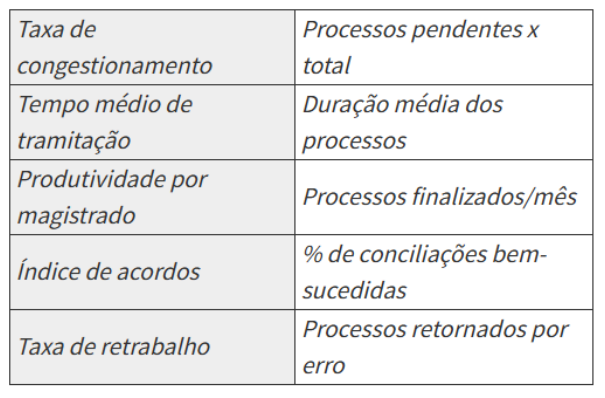

---

<!-- pagina: 77 -->

**Paolla Ramos Aula 03** 

**Para desenvolver a interface com as informações solicitadas pelo gestor, é necessário implementar:** 

a) KPI; 

b) LIME; c) narrativa; 

d) storytelling; 

e) explicação contrafactual. 

**6. (FGV - 2025 - Auditor de Controle Externo (TCE-PI)/Tecnologia da Informação/Sistemas, Engenharia de Dados e Ciência de Dados) Em relação ao gerenciamento de processos de negócios, analise as afirmativas a seguir.** 

**I. A automação dos processos implica eliminação de gargalos e fluxos de trabalho ineficientes.** 

**II. Estabelecer indicadores de desempenho baseados nas metas de longo prazo da organização implica dificuldade para otimizar os processos.** 

**III. Para uma visão mais próxima da realidade operacional, a análise de Pareto é mais indicada que brainstorming com colaboradores.** 

**É correto o que se afirma em** 

a) II, apenas. b) III, apenas. c) I e II, apenas. d) I e III, apenas. e) II e III, apenas. 

**7. (FGV - 2025 - Analista da Defensoria Pública (DPE RO)/Analista de Sistemas) A modelagem de processos de negócio, também conhecida como Business Process Modeling (BPM), é uma metodologia que representa os processos de uma empresa.** 

**Com relação ao BPM, analise os itens a seguir.** 

**I. É uma metodologia voltada para administrar todo o ciclo de vida dos processos, desde a concepção, a modelagem e simulação, passando pela execução e alcançando o monitoramento e controle dos processos** 

**II. O propósito da modelagem é criar uma representação parcial e estimada do funcionamento do processo.**

---

<!-- pagina: 78 -->

**Paolla Ramos Aula 03** 

**III. O principal orientador do BPM é o Guia ‘Corpo Comum de Conhecimento em Gerenciamento de Processos de Negócio’ (ou BPM CBOK, Business Process Management Common Body of Knowledge).** 

**Está correto o que se afirma em** 

a) III apenas. b) I e II, apenas. c) II e III, apenas. d) I e III, apenas. e) I, II e III. 

**8. (FGV - 2025 - Analista da Defensoria Pública (DPE RO)/Analista de Sistemas) A modelagem de processos de negócio é uma prática essencial para compreender e aprimorar as operações de uma organização. Dentro desse contexto, os modelos AS-IS desempenham um papel fundamental ao representar o estado atual dos processos, permitindo uma análise detalhada e a identificação de oportunidades de melhoria.** 

**O principal objetivo de um modelo AS-IS na modelagem de processos de negócio é** 

a) monitorar continuamente o processo após melhorias. 

b) analisar os indicadores de desempenho do processo. 

c) identificar falhas e ineficiências no processo atual. 

d) descrever o estado futuro desejado do processo. 

e) implementar melhorias no processo. 

**9. (FGV - 2025 - Analista da Defensoria Pública (DPE RO)/Analista de Sistemas) A análise e a simulação de processos de negócio são fundamentais para compreender, avaliar e aprimorar a eficiência operacional de uma organização.** 

**A técnica que busca identificar as causas fundamentais de problemas ou falhas dentro de um processo é** 

a) simulação de eventos discretos. 

b) simulação de Monte Carlo. 

c) análise de séries temporais. 

d) análise de valor agregado. 

e) análise de causa raiz.

---

<!-- pagina: 79 -->

**Paolla Ramos Aula 03** 

**10. (FGV - 2025 - Analista de Gestão (AgSUS)/Tecnologia da Informação) Dois analistas de processos da AgSUS estavam estudando o tema “gerenciamento de desempenho de processos” presente CBOK 3.0, uma literatura clássica na área de gestão de processos. Ambos concordam que gerenciar um negócio por processo requer que medidas, métricas e indicadores de desempenho estejam disponíveis para monitorar os processos de forma que estes atendam às metas. Analise as afirmações feitas pelos analistas a seguir.** 

**I. O analista 1 afirma que a definição do termo “gerenciamento de desempenho de processos” é usada para indicar o gerenciamento tanto em nível de fluxo de processos (intrafuncional) quanto em nível de fluxo de trabalho (interfuncional).** 

**II. O analista 2 afirma que a definição se aplica de modos distintos aos fluxos de processos e de trabalho. No nível dos fluxos de trabalho o foco dever ser no movimento físico de trabalho de uma** ==5460== **atividade para a próxima e nos locais onde os problemas ocorrem.** 

**III. O analista 1 afirma que no nível dos fluxos de processos, o foco é no movimento de trabalho entre as áreas funcionais e no que é entregue para a próxima área na sequência do trabalho ou do fluxo de processos.** 

**IV. O analista 2 afirma que apesar das diferenças as medições devem ser consistentes em termos de tempo, custo, capacidade e desempenho. O que as diferencia é o contexto e como a informação pode ser aplicada para melhorar a operação.** 

###### **Está correto o que se afirma em** 

a) I e II, apenas. b) I e III, apenas. c) III e IV, apenas. d) I, II e III, apenas. e) II, III e IV, apenas. 

**11. (FGV - 2025 - Analista Legislativo (ALEAM)/Analista de Sistemas) Em um projeto de melhoria de processos na área de TI da Assembleia, o Analista de Sistemas precisa iniciar o trabalho com uma compreensão clara e detalhada da forma como o processo de Atendimento de Chamados de Suporte é executado atualmente. Essa é uma etapa importante para identificar ineficiências, gargalos e desvios da norma. Qual técnica de mapeamento de processos é a mais adequada para descrever o processo exatamente como ele se encontra no momento atual da organização?** 

###### a) Modelo TO-BE (To Be). 

b) Modelo BPMN (Business Process Model and Notation).

---

<!-- pagina: 80 -->

**Paolla Ramos Aula 03** 

c) Modelo Futuro. 

d) Modelo AS-IS (As Is). 

- e) Simulação de Processos. 

**12. (FGV - 2025 - Analista Legislativo (ALEAM)/Analista de Sistemas) Após a análise do Modelo AS-IS e a identificação de gargalos no processo de aquisição de licenças de software (AS-IS), a equipe de Analista de Sistemas está focada em desenhar o Modelo TO-BE. O principal objetivo da criação do Modelo TO-BE em um projeto de melhoria de processos é** 

a) documentar o processo exatamente como ele ocorre no momento. 

b) validar a notação gráfica utilizada (ex: BPMN). 

c) representar o processo redesenhado e otimizado, incorporando as melhorias propostas. 

d) coletar dados para a simulação do processo atual, apenas. 

e) servir como o primeiro passo para o mapeamento, antes mesmo do Modelo AS-IS. 

**13. (FGV - 2025 - Analista Legislativo (ALEAM)/Analista de Sistemas) A equipe de melhoria de processos decidiu utilizar a técnica de Simulação para analisar o novo Modelo TO-BE do Processo de Votação Eletrônica de Projetos de Lei antes de sua implementação. A principal vantagem da utilização da Simulação de Processos antes da implementação de um novo Modelo TO-BE é** 

a) garantir que o modelo AS-IS esteja perfeitamente documentado em BPMN. 

b) assegurar que os recursos de TI serão imediatamente liberados. 

c) reduzir a necessidade de definição de Indicadores de Desempenho (KPIs). 

d) testar o comportamento do novo processo sob diferentes cenários e cargas de trabalho sem afetar a operação real. 

e) eliminar a necessidade de documentação do Modelo AS-IS. 

**14. (FGV - 2025 - Analista Legislativo (ALEAM)/Analista de Sistemas) Em um ciclo típico de Gestão de Processos de Negócio (BPM), as atividades de mapeamento, análise e melhoria de processos seguem uma sequência lógica. A sequência lógica mais comum para o ciclo de redesenho e melhoria de um processo é** 

a) Simulação do TO-BE -> Análise do AS-IS -> Implementação do AS-IS -> Mapeamento do TO-BE. b) Definição de Indicadores -> Mapeamento do TO-BE -> Mapeamento do AS-IS -> Implementação. c) Mapeamento do AS-IS -> Análise do AS-IS -> Desenho do TO-BE -> Simulação/Validação do TO-BE. d) Desenho do TO-BE -> Mapeamento do AS-IS -> Análise do AS-IS -> Monitoramento. 

e) Implementação -> Mapeamento do TO-BE -> Análise do TO-BE -> Mapeamento do AS-IS.

---

<!-- pagina: 81 -->

**Paolla Ramos Aula 03** 

**15. (FGV - 2024 - Auditor de Controle Interno (Pref BH)/Ciência da Computação) A Gestão de Processos de Negócio (BPM, Business Process Management) promove a melhoria contínua de processos de negócio, integrando a estratégia da organização com as expectativas e as necessidades dos clientes.** 

**Considerando os conceitos principais do BPM, analise as afirmativas a seguir e assinale (V) para a verdadeira e (F) para a falsa.** 

**( ) O Mapeamento de Processos visa a identificar os processos de negócio e mapear os detalhes do funcionamento da organização, enquanto a Padronização de Processos busca a criação de uma sequência lógica de atividades, para que todos executem o trabalho da mesma forma.** 

**( ) AS-IS/TO-BE são fases do BPM, em que a primeira busca a transformação dos processos de negócio focalizando na identificação dos pontos fracos no processo e identificação do que pode ser melhorado e, a segunda, busca o mapeamento dos processos da organização, servindo para apresentar as correções indicadas previamente e uma definição futura do processo organizacional considerando as necessidades dos clientes, as melhores práticas e os objetivos estratégicos.** 

**( ) O projeto de melhoria de processo (AS-IS/TO-BE) pode empregar diversas técnicas e metodologias, dentre elas destaca-se o Design Thinking, que se refere à metodologia que mostra exatamente o que é preciso fazer e o que é necessário para executar cada uma das cinco etapas, realizadas em dias sequenciais.** 

**As afirmativas são, respectivamente,** 

a) F – V – F. 

b) V – F – F. c) F – F – V. d) V – V – V. 

**16. (FGV - 2024 - Analista Legislativo (ALETO)/Análise de Sistema) Um analista de processos é encarregado de revisar e otimizar os procedimentos operacionais de uma empresa. Ele identificou uma oportunidade significativa de melhoria que, no entanto, implicaria na redução do número de empregados.** 

###### **Nesse caso, a conduta mais apropriada do analista é** 

a) proceder com a recomendação da otimização sem consultar os impactos humanos, priorizando exclusivamente os ganhos de eficiência.

---

<!-- pagina: 82 -->

**Paolla Ramos Aula 03** 

b) ignorar a oportunidade de melhoria para evitar conflitos internos e possíveis demissões, mantendo a situação atual. 

c) avaliar cuidadosamente as possíveis consequências da implementação, buscando alternativas que possam realocar ou requalificar os empregados afetados. 

d) comunicar a descoberta exclusivamente à alta direção, deixando a decisão de implementação e gestão das consequências a seu critério. 

e) propor a otimização como uma medida temporária, revertendo-a caso haja insatisfação significativa entre os empregados. 

**17. (FGV - 2024 - Auditor Federal de Finanças e Controle (STN)/Tecnologia da Informação/Transformação Digital) No contexto do Corpo de Conhecimento de Análise de Negócios - Guia BABOK®, a área de conhecimento que tem como uma de suas tarefas planejar o engajamento de stakeholders é a de** 

a) Planejamento e Monitoramento da Análise de Negócios. 

b) Análise de Requisitos. 

c) Elicitação e Colaboração. 

d) Gerenciamento do Ciclo de Vida de Requisitos. 

e) Análise de Estratégia. 

**18. (FGV - 2024 - Auditor Federal de Finanças e Controle (STN)/Tecnologia da Informação/Transformação Digital) Considerando a área de conhecimento de "Elicitação e Colaboração", conforme descrito no Guia BABOK® V3, analise as afirmações a seguir acerca de suas tarefas:** 

**I. A "Preparação para a Elicitação" envolve a seleção de técnicas de elicitação adequadas e o planejamento de materiais e recursos de apoio, garantindo que os stakeholders estejam prontos e informados sobre as atividades de elicitação a serem realizadas.** 

**II. Na tarefa "Confirmar os Resultados da Elicitação", o analista de negócios deve verificar as informações coletadas durante as sessões de elicitação para assegurar sua precisão e consistência com outras informações coletadas anteriormente.** 

**III. "Comunicar a Informação de Análise de Negócios" envolve garantir que os stakeholders tenham uma compreensão compartilhada das informações de análise de negócios, utilizando os meios de comunicação mais eficazes baseados nas preferências dos stakeholders e na complexidade das informações.** 

**Está correto o que se afirma em**

---

<!-- pagina: 83 -->

**Paolla Ramos Aula 03** 

a) I, apenas. b) III, apenas. c) I e II, apenas. 

d) II e III, apenas. e) I, II e III. 

**19. (FGV - 2024 - Analista Judiciário (TJ RR)/Desenvolvimento de Sistemas) A abordagem BPM (Business Process Management) busca melhorar e otimizar processos de negócios, aumentando eficiência e desempenho organizacional.** 

###### **Nesse contexto, é correto afirmar que** 

a) a análise AS IS tem como função avaliar o estado atual do negócio, sendo parte da fase de modelagem, enquanto a análise TO BE, sendo aplicada ao futuro, é executada na fase de monitoramento. 

b) o Diagrama de Casos de Uso se concentra em representar a interação entre atores e casos de uso, organizando as responsabilidades em raias. 

c) KPI's (Key Performance Indicators) são utilizados para medir diversos aspectos de desempenho de maneira estritamente quantitativa. 

d) BPMS buscam integrar completamente o ambiente operacional de uma organização, abrangendo seus processos, pessoas e informações de forma coesa. 

e) A taxonomia em portais corporativos é responsável pela criação automática de workflows, classificando tarefas hierarquicamente com base na estrutura organizacional. 

**20. (FGV - 2024 - Analista Judiciário (TJ RR)/Desenvolvimento de Sistemas (e mais 1 concurso)) Mais do que uma simples abordagem operacional, a gestão de processos constitui uma ferramenta importante para líderes de variados níveis hierárquicos, fornecendo subsídios para a tomada de decisão e a implantação de melhorias impactantes em diversos setores das instituições e na geração de valor público.** 

###### **Nesse contexto, assinale a afirmativa correta acerca de gestão de processos.** 

a) Cadeia de valor encontra-se em um nível intermediário na estratégia de uma organização. 

b) Uma tarefa é um conjunto de atividades e comportamentos executados por pessoas ou máquinas cujo objetivo é alcançar um ou mais resultados organizacionais. 

c) O Ciclo BPM possui etapas como: planejar, analisar, desenhar, implantar e monitorar os processos. 

d) Processos de suporte são associados às atividades-fim da organização ou diretamente envolvidos no atendimento às necessidades dos seus usuários finais. 

e) Um processo é uma agregação de tarefas necessárias para entregar uma parte específica e definível de um produto ou serviço.

---

<!-- pagina: 84 -->

**Paolla Ramos Aula 03** 

**21. (FGV - 2024 - Analista de Tecnologia da Informação (DATAPREV)/Análise de Negócios de TI) Uma empresa global com várias unidades de negócios está atualmente em processo de fusão. A fusão fez com que os processos se tornassem fragmentados, os sistemas se tornassem incompatíveis e a cultura organizacional ficasse desalinhada. Você foi recentemente nomeado Analista de Negócios Sênior para assumir a função de liderança na harmonização de processos e iniciativa de sistemas. Considerando esse cenário intrincado, a forma menos apropriada de trabalhar é** 

a) a entrevista estruturada: Conduza entrevistas individuais específicas com as principais partes interessadas em cada unidade de negócios para compreender seus processos, os desafios e o que esperam da harmonização. 

b) o workshop colaborativo: Planeje workshops conjuntos em todos os locais de indivíduos para mapear os processos atuais e identificar onde estão os problemas, e desenvolver ainda mais soluções comuns que funcionem para todos. 

c) a documentação e análise do sistema: Revise a documentação atual disponível (políticas, procedimentos e fluxogramas) e sistemas legados para entender o que já está em uso, o quedaria suporte à identificação de melhorias e integrações. 

d) a prototipagem rápida: Gere protótipos de novos processos e interfaces de sistema com os usuários para que o feedback chegue rapidamente e faça os ajustes necessários. 

e) a implementação big bang: Faça todas as mudanças de uma vez, sem um plano de gerenciamento de mudanças ou comunicação aos funcionários. 

**22. (FGV - 2024 - Analista de Tecnologia da Informação (DATAPREV)/Análise de Negócios de TI) Quando falamos em gestão de processos de negócios, entender conceitos- chave é essencial para melhorar e transformar esses processos. Assinale a opção que reflete corretamente o uso de tecnologias de BPM para otimizar o desempenho de uma organização.** 

a) Modelar processos deve ser feito apenas por consultores externos, sem o envolvimento das equipes. b) A análise de processos se concentra exclusivamente em eliminar atividades sem valor, sem buscar melhorias no fluxo de trabalho. 

c) O desenho de processos deve ignorar o processo atual e criar um modelo novo sem considerar o que está em vigor. 

d) A transformação de processos é separada do gerenciamento de desempenho, ocorrendo somente em casos de falhas graves. 

e) Tecnologias de BPM são usadas para monitorar o desempenho, automatizar tarefas repetitivas e facilitar análises contínuas dos processos. 

**23. (FGV - 2024 - Analista de Tecnologia da Informação (DATAPREV)/Análise de Negócios de TI) Com a crescente adoção das práticas de ESG (Ambiental, Social e Governança) pelas empresas brasileiras em 2023, muitas organizações estão revisando seus processos internos para atender aos novos padrões de sustentabilidade e responsabilidade social. Durante reuniões sobre essa transição, tem**

---

<!-- pagina: 85 -->

**Paolla Ramos Aula 03** 

**surgido a dúvida sobre a diferença entre processos primários, de suporte e de gerenciamento no contexto do Gerenciamento de Processos de Negócio (BPM).** 

###### **Assinale a opção que descreve corretamente a diferença entre esses processos.** 

a) Processos primários são aqueles que afetam diretamente os fornecedores, mas não têm impacto nos clientes. 

b) Processos de suporte são responsáveis por criar valor direto para o cliente final, enquanto os processos primários são usados apenas internamente. 

c) Processos de gerenciamento têm a função de controlar e monitorar os processos primários e de suporte, garantindo que tudo funcione corretamente na organização. 

d) Processos primários cuidam principalmente da infraestrutura de TI da empresa. 

e) Processos de suporte têm como foco principal entregar produtos ou serviços diretamente ao cliente final. 

**24. (FGV - 2024 - Auditor Fiscal Tributário da Receita Municipal (Pref Cuiabá)/Tecnologia da Informação) Em um projeto de transformação organizacional, uma equipe de melhoria de processos está usando técnicas de mapeamento para identificar gargalos e propor soluções de otimização. Após mapear o processo atual no modelo AS-IS, a equipe propõe mudanças para alcançar o estado ideal (TO-BE). Para garantir uma transição eficaz, o próximo passo adequado para evitar falhas na implementação e apoiar a operação contínua é** 

a) refinar o modelo TO-BE para que corresponda exatamente ao modelo AS-IS, facilitando a aceitação dos colaboradores. 

b) documentar todas as etapas de transição entre AS-IS e TO-BE e implementar um modelo TO-RUN que inclua práticas de monitoramento e controle de desempenho. 

c) desenvolver imediatamente o modelo TO-RUN baseado no AS-IS, uma vez que ele reflete o processo real e será mais fácil de implementar. 

d) realizar treinamentos com os colaboradores utilizando o modelo AS-IS para garantir a compreensão das práticas atuais antes de implementar o TO-BE. 

e) identificar os indicadores de desempenho para o modelo TO-BE e realizar a implementação sem a necessidade de um modelo TO-RUN. 

# **<mark>Gabaritos</mark>** 

1. Letra A 

2. Letra A 

3. Letra E

---

<!-- pagina: 86 -->

**Paolla Ramos Aula 03** 

4. Letra D 

5. Letra A 

6. Letra B 

7. Letra D 

8. Letra C 

9. Letra E 

10. Letra E 

11. Letra D 

12. Letra C 

13. Letra D 

14. Letra C 

15. Letra B 

16. Letra C 

17. Letra A 

18. Letra E 

19. Letra D 

20. Letra C 

21. Letra E 

22. Letra E 

23. Letra C 

24. Letra B

---

<!-- pagina: 87 -->

