---
fonte_pdf: "Gestão e Governança de TI - Aula 04.pdf"
paginas: 100
conversao: texto-e-imagens
---

<!-- pagina: 2 -->

**Paolla Ramos Aula 04** 

# **Índice** 

|.............................................................................................................................. 1) BPMN - Teoria|................................................................ 3|
|---|---|
|.............................................................................................................................. 2) BPMN - Mapa Mental|................................................................ 50|
|.............................................................................................................................. 3) BPMN - Resumo|................................................................ 51|
|.............................................................................................................................. 4) BPMN - Questões Comentadas - FGV|................................................................ 56|
|.............................................................................................................................. 5) BPMN - Lista de Questões - FGV|................................................................ 83|

---

<!-- pagina: 3 -->

**Paolla Ramos Aula 04** 

Sumário 

|BPMN.................................................................................................................................................................. 2|
|---|
|Introdução................................................................................................................................................. 2|
|Objetos de Fluxo.................................................................................................................................... 12|
|Objetos de Dados.................................................................................................................................. 25|
|Objetos de Conexão............................................................................................................................. 28|
|Partições................................................................................................................................................... 31|
|Artefatos................................................................................................................................................... 34|
|Anexo: Bizagi Modeler......................................................................................................................... 37|

---

<!-- pagina: 4 -->

**Paolla Ramos Aula 04** 

# **BPMN** 

**FERNANDO PEDROSA -** **<u>HTTPS://WWW.INSTAGRAM.COM/PROF.FERNANDOPEDROSA</u>** 

## Introdu ão <u>ç</u> 

Olá, Coruja, vamos falar de BPMN? 

O nome completo é **Business Process Model and Notation** , que em português fica algo como Modelo e Notação de Processos de Negócios. É um **padrão gráfico para modelar processos de negócios em um diagrama de fluxo de trabalho** . Por exemplo, sempre que uma empresa quer mapear como um processo funciona, do início ao fim, ela precisa de uma linguagem visual padronizada para isso e o BPMN é exatamente ==5460== essa linguagem. 

Quem criou foi a BPMI, a Business Process Management Initiative. Hoje, quem mantém o padrão é a OMG, a Object Management Group, que também cuida de outros padrões famosos no mundo de tecnologia e modelagem, como o UML. 

BPMN foi desenhado para ser compreendido por **todo mundo** que tem interesse em um processo de negócio. E quando falo todo mundo, é literalmente isso. O analista de negócios que cria e refina os processos usa o BPMN. O técnico responsável por implementar a tecnologia que vai executar esses processos também usa. E o gerente que fica de olho no andamento das operações, monitorando e gerenciando tudo, também consegue ler um diagrama BPMN sem ter que estudar programação. Essa capacidade de servir a públicos tão diferentes ao mesmo tempo é um dos grandes trunfos da notação. 

BPMN evoluiu ao longo do tempo. A primeira versão, o **BPMN 1.0** , foi lançada em 2004 pela própria BPMI. Nesse começo, o padrão já entregava um conjunto básico de notações gráficas para a modelagem de processos de negócios, o suficiente para estabelecer uma linguagem comum entre os profissionais da área. 

Depois, em 2007, a OMG, que tinha assumido o controle da BPMI, lançou o **BPMN 1.1** . Nada revolucionário, foram pequenas atualizações e correções de erros em relação à versão 1.0. Dois anos depois, em 2009, veio o **BPMN 1.2** , que seguiu a mesma linha, trazendo mais atualizações e correções de erros. Ou seja, de 2004 a 2009, o padrão foi sendo lapidado aos poucos, consertando o que não funcionava tão bem. 

Chegamos em 2011, e, aí sim, a notação cresce. O **BPMN 2.0** foi uma atualização de verdade, grande. Antes, BPMN servia basicamente para modelar processos de negócios. Com a versão 2.0, o escopo foi expandido para incluir também a **orquestração** de processos. Orquestração é quando você tem um processo central que **coordena e controla as atividades dos demais** , como um maestro regendo uma orquestra. Além disso, o BPMN 2.0 introduziu novos elementos de modelagem e trouxe algo bastante relevante, que é a capacidade de modelar a interação entre processos de negócios independentes. Essa interação tem um nome técnico específico, que você precisa guardar para a prova: **coreografia** . É exatamente isso, processos independentes conversando entre si, sem que nenhum dos dois seja o "chefe" do outro.

---

<!-- pagina: 5 -->

**Paolla Ramos Aula 04** 

Depois disso, em 2013, foi lançado o **BPMN 2.0.1** , que não trouxe novidades conceituais, mas sim correções de erros e esclarecimentos sobre a versão anterior. Versão de manutenção, digamos assim. 

Por fim, tivemos **BPMN 2.0.2** , lançada em 2014. Ela não trouxe grandes revoluções, mas foi importante justamente por isso, porque resolveu erros pontuais e deixou mais claro o que estava mal explicado na versão anterior, a BPMN 2.0. 

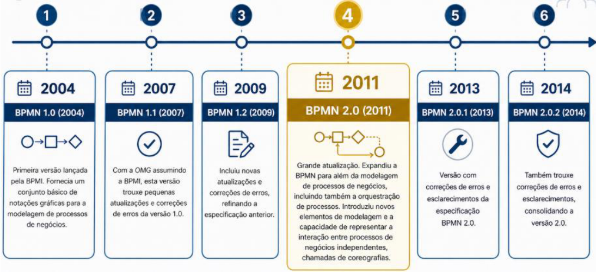

Agora, vamos ver algumas definições e vantagens do BPMN já caíram em prova. 

**Comunicação clara** . Um processo de negócio normalmente envolve gente muito diferente na mesma sala: analista de negócios, gerente, desenvolvedor, às vezes até o próprio cliente. Cada um fala um "idioma" diferente. O BPMN oferece uma **notação padronizada** , visual, que qualquer um dessas pessoas consegue entender sem precisar de um dicionário técnico. O resultado é que todo mundo fica alinhado sobre como aquele processo deve funcionar, sem ruído, sem interpretação errada. 

**Documentação de processos** . Com BPMN, a empresa consegue registrar seus processos de negócio de forma clara e objetiva. Por exemplo, quantas vezes uma empresa sabe o que faz, mas não sabe explicar como faz? BPMN serve tanto para treinar novos funcionários quanto para ajudar a própria organização a enxergar seus processos de um ângulo mais crítico, entendendo onde cada coisa acontece e por quê. 

**_Saiba Mais:_** _Na gestão de processos de negócio (BPM), a modelagem é dividida em dois estágios fundamentais: o_ **_AS-IS_** _, que representa a situação atual e real do processo, permitindo a identificação de gargalos e redundâncias; e o_ **_TO-BE_** _, que é o modelo do processo redesenhado e otimizado. O objetivo do TO-BE é servir como guia para a implementação de melhorias e novas tecnologias,_ _<u>garantindo que o processo futuro elimine as falhas detectadas na fase anterior.</u>_ 

**Melhoria de processos** . Quando você coloca um processo no papel, visualmente, usando o BPMN, fica muito mais fácil identificar aquelas áreas problemáticas, os famosos gargalos, os pontos onde tudo trava ou se

---

<!-- pagina: 6 -->

**Paolla Ramos Aula 04** 

repete sem necessidade. É difícil melhorar o que você não consegue enxergar. O diagrama te dá esse olhar de fora. 

**Facilita a automação** . E aqui tem um detalhe que muita gente não sabe: o BPMN não é só uma linguagem de modelagem, ele também funciona como **linguagem de execução** . Isso quer dizer, na prática, que um diagrama feito em BPMN pode ser convertido diretamente em código executável. Ou seja, o processo desenhado vira um processo rodando de verdade, de forma automatizada. 

**Padrão da indústria** . Não é uma ferramenta de nicho, adotada por uma empresa ou outra. É amplamente reconhecida como o padrão para modelagem de processos de negócio no mercado global. Isso leva à consequência que existe uma tonelada de material disponível para quem quer aprender, e praticamente todas as ferramentas de software da área oferecem suporte a ele. Você aprende uma vez e aplica em qualquer lugar. 

**_Saiba Mais:_** _Embora BPMN seja padrão da indústria, existem outras ferramentas auxiliares na modelagem de processos._ 

_O_ **_Value Stream Mapping (VSM)_** _é uma ferramenta originária do pensamento Lean, focada na identificação de desperdícios e no fluxo de valor de forma macro e simplificada. Enquanto o VSM prioriza a visão do tempo de ciclo e valor agregado para o cliente, o_ **_BPMN_** _oferece uma gramática muito mais robusta para detalhar a lógica de controle, eventos técnicos e interações complexas entre múltiplos participantes._ 

**Flexibilidade** . A notação foi pensada para dar conta de praticamente qualquer processo de negócio que você possa imaginar, seja ele simples como um pedido de compra interno, seja ele complexo como o fluxo de aprovação de um contrato multinacional com dezenas de etapas e participantes. Não importa o tamanho nem o grau de complexidade, o BPMN consegue modelar. Essa é justamente uma das razões pelas quais ele se tornou o padrão mais adotado no mercado para esse tipo de trabalho. 

Veja a tabela com algumas definições de BPMN que já caíram em prova: 

#### **<mark>DEFINIÇÕES de BPMN</mark>** 

|Trata-se da ferramenta responsável por fornecer uma ponte padrão entre o design de processos de negócio e a implementação do processo.|
|---|
|Trata-se de uma técnica utilizada para a representação gráfica de processos de negócios e fluxos de processos e de informação, resultando em um mapa de processos.|
|Trata-se de um corpo de princípios, métodos e ferramentas para desenhar, analisar, executar e monitorar processos de negócio.|
|Trata-se de uma especificação criada para prover notação gráfica e para representar processos de negócios em forma de diagrama.|
|Trata-se de uma linguagem para representação e diagramação dos processos de negócio das organizações.|
|Trata-se de um conjunto de tarefas representadas por ícones e interligadas por símbolos de fluxograma para facilitar o entendimento de um processo de negócio.|
|Trata-se de uma ferramenta que registra um conjunto de notações utilizadas para o mapeamento de processos.|

---

<!-- pagina: 7 -->

**Paolla Ramos Aula 04** 

Trata-se de uma linguagem que pode ser utilizada para modelar processos internos de uma organização sem considerar detalhes necessários a torná-los executáveis. 

Trata-se de uma das notações mais difundidas pela OMG como padrão para a modelagem de processos e que possui recursos sofisticados. 

Trata-se de uma notação comum para que as pessoas relacionadas com os processos possam expressá-los graficamente de uma forma clara, padronizada e completa. 

Trata-se de uma notação padrão para o desenho de fluxogramas em processos de negócios. Na prática, é um conjunto de regras e convenções que determinam como os fluxogramas devem ser desenhados. 

Trata-se de uma notação gráfica, especificada pelo _Object Management Group_ , que oferece uma gramática de símbolos para mapear, de maneira padrão, processos de negócio de uma organização. 

Trata-se de um padrão cuja notação apresenta um conjunto robusto de símbolos para modelagem de diferentes aspectos de processos de negócio. Trata-se de uma notação própria de modelagem que permite representar e comunicar mais facilmente diferentes aspectos de processos de negócio por se utilizar de um conjunto padronizado de símbolos e regras. 

**(FCPC - 2025 - Analista de Tecnologia da Informação (UFC)/Governança de TI) Assinale a alternativa que** **<mark>nomeia a notação desenvolvida com o objetivo específico de criar um padrão para Modelagem de</mark> Processos de Negócios.** 

<mark>a) BPMN. b) BPM. c) VPN. d) BPS.</mark> 

**<mark>Comentários:</mark>** 

<mark>(a) Correto. BPMN (Business Process Model and Notation) é justamente a notação criada com o objetivo específico de padronizar a modelagem de processos de negócios, sendo amplamente adotada no mercado; (b) Errado. BPM (Business Process Management) é uma disciplina/abordagem de gestão de processos, não uma notação de modelagem; (c) Errado. VPN (Virtual Private Network) é uma tecnologia de redes, sem nenhuma relação com modelagem de processos; (d) Errado. BPS não é uma notação reconhecida para modelagem de processos de negócios.</mark> 

**Gabarito:** Letra A 

#### **Orquestração** 

Orquestração é a forma como as atividades de negócio são **organizadas e coordenadas para atingir um objetivo específico** . Pense numa orquestra musical mesmo, onde cada instrumento entra na hora certa, na ordem certa. Aqui é a mesma lógica, só que com atividades de negócio. A orquestração define a **ordem em que as coisas acontecem e as condições que precisam ser atendidas** para cada atividade ser executada.

---

<!-- pagina: 8 -->

**Paolla Ramos Aula 04** 

Agora, dentro do BPMN, existem dois tipos principais de processos que você precisa conhecer: os processos privados (também chamados de processos internos) e os processos públicos (também chamados de processos de colaboração). Cada um tem sua aplicação e suas características, então vamos por partes. 

**Processos privados** são aqueles que acontecem dentro de uma única organização e não ficam visíveis para ninguém de fora. Sabe aquele fluxo interno de aprovação de férias de uma empresa? Ou o processo de triagem de currículos pelo RH? São exatamente esse tipo de coisa. Ninguém lá fora precisa saber como aquilo funciona por dentro. No diagrama BPMN, um processo privado é representado dentro de um único pool, que é basicamente aquela caixa que delimita o processo. Dentro desse pool, as atividades ficam organizadas em raias, e cada raia representa uma função ou responsabilidade diferente dentro da organização, como o setor financeiro, o jurídico, a diretoria, e por aí vai. 

E o que a orquestração de um processo privado envolve, na prática? Quatro coisas fundamentais. Primeiro, a **sequência das atividades** , ou seja, quem faz o quê e em que ordem. Segundo, as **regras de negócio** que governam o fluxo, que são as condições que determinam como o processo se comporta em cada situação. Terceiro, os **eventos** , que são os gatilhos capazes de iniciar, interromper ou encerrar o processo. E quarto, os **gateways** , que são os elementos responsáveis por controlar o fluxo, decidindo quais caminhos o processo vai seguir dependendo das condições encontradas. São esses quatro elementos juntos que fazem a orquestração de um processo privado funcionar de verdade. 

Veja este exemplo de um processo privado: 

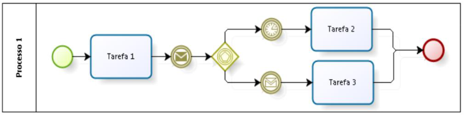

E quanto a **processos públicos** , também chamados de processos de colaboração? Diferente do processo privado, que vive dentro de uma única organização, o processo público **envolve mais de uma organização ao mesmo tempo** . Pense em uma loja virtual que recebe um pedido, aciona uma transportadora e ainda se comunica com o banco para confirmar o pagamento. São três organizações distintas, cada uma com seus próprios processos internos, mas que precisam trocar informações entre si para que tudo funcione. 

No diagrama BPMN, isso é representado por várias **pools** , cada uma representando uma organização diferente. Essas organizações se comunicam por meio das chamadas **linhas de mensagem** , que conectam uma pool à outra e representam exatamente essa troca de informações entre os participantes do processo. 

Veja este exemplo de processos públicos:

---

<!-- pagina: 9 -->

**Paolla Ramos Aula 04** 

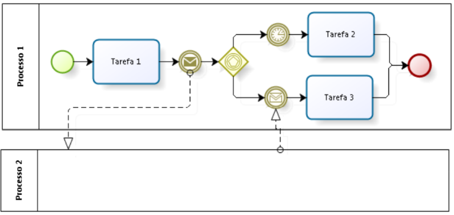

Aí entra um conceito importante: a orquestração desse processo público. Orquestrar, nesse contexto, significa **definir como as atividades são coordenadas entre as diferentes organizações envolvidas** . É preciso definir quais mensagens são trocadas, em que ordem essas mensagens são enviadas e quais são as condições que disparam cada envio. Por exemplo, o banco só envia a confirmação de pagamento depois que a loja envia a solicitação de cobrança. A transportadora só recebe o aviso de despacho depois que o banco confirma. Existe uma sequência, existe uma lógica, e é exatamente isso que a orquestração descreve. 

Nos dois casos, o que está em jogo é a orquestração de processos em BPMN, que é basicamente a definição de como as atividades de negócio são organizadas e coordenadas para atingir um objetivo. A grande diferença entre os processos privados e os públicos está em onde essa orquestração acontece: se ela ocorre **dentro de uma única organização** , estamos diante de um **processo privado** ; se ela envolve **mais de uma organização ao mesmo tempo, o processo é público** . 

#### **Coreografia** 

Muita gente mistura coreografia com orquestração, então vale a pena bater nessa tecla aqui. 

A **coreografia** é usada para modelar a **troca de mensagens entre duas ou mais entidades em um processo de negócios** . _Mas qual é a diferença em relação à orquestração_ ? A orquestração se preocupa com a sequência de atividades dentro de uma entidade, aquele fluxo interno, passo a passo. Já a coreografia olha **para fora** , para a forma como as entidades conversam entre si, como elas interagem. São perspectivas diferentes sobre o mesmo processo. 

No diagrama, a coreografia ganha um tipo especial de representação visual, chamado de **Diagrama de Coreografia** . Nele, as interações entre as entidades aparecem como atividades de coreografia, desenhadas na forma de círculos. Cada um desses círculos representa uma troca de mensagens entre duas entidades. 

Veja esse exemplo:

---

<!-- pagina: 10 -->

**Paolla Ramos Aula 04** 

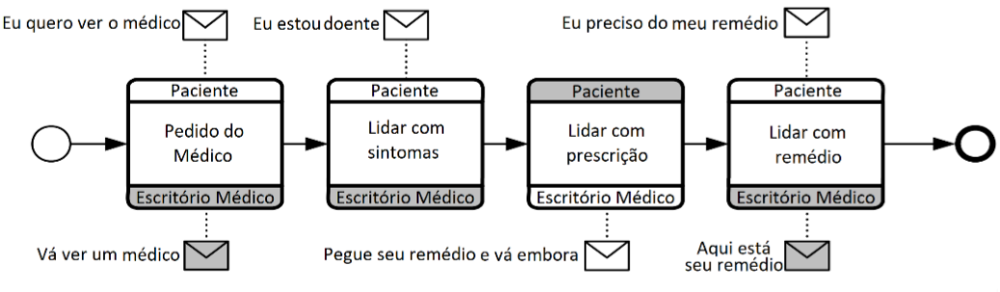

As entidades que participam dessa troca são chamadas de **participantes** , e elas aparecem como retângulos posicionados ao redor do perímetro do diagrama. As mensagens que circulam entre essas atividades são representadas pelas **linhas de mensagem** que conectam as atividades de coreografia. Cada linha dessas diz: "olha, aqui tem uma informação saindo de um lado e chegando no outro." 

Por exemplo, tem situações em que o que mais importa num processo de negócio não é o que cada participante faz internamente, mas sim a troca de mensagens entre eles. Quem manda o quê, para quem, em que ordem. É exatamente aí que entra a coreografia. Ela serve para modelar esse tipo de processo, aonde a comunicação entre as entidades é o ponto central. Com ela, você consegue visualizar a sequência dessas interações e entender como a informação flui de um lado para o outro ao longo do processo. 

#### **Colaborações** 

Uma **Colaboração** , também conhecida como Processo Global, é um tipo de diagrama que mostra as **interações entre dois ou mais processos de negócios** . Cada um desses processos é representado visualmente como uma "piscina" (pool, em inglês). Cada piscina é independente e pode representar um processo interno de uma empresa, um departamento separado ou até uma organização completamente diferente. É basicamente aquela ideia de "cada um no seu quadrado", só que os quadrados precisam se comunicar para as coisas funcionarem. 

_E por que usar uma Colaboração_ ? Porque às vezes um processo sozinho não conta a história toda. Imagine o fluxo de uma compra online: tem o processo do cliente fazendo o pedido, o processo da loja processando o pagamento, e talvez ainda o processo da transportadora cuidando da entrega. Cada um desses é uma piscina separada. A Colaboração é o diagrama que coloca essas três piscinas na mesma tela e mostra como elas se conversam para atingir um objetivo comum, que no caso é entregar o produto na mão do cliente. 

Dentro de uma Colaboração, é possível usar praticamente tudo que o BPMN oferece, tais como eventos de início e fim, atividades, gateways, entre outros elementos. Mas o que é exclusivo desse tipo de diagrama, o que dá sentido a ele, são as **linhas de mensagem** . Essas linhas representam a comunicação entre as piscinas, ou seja, a troca de informação entre os processos. Uma linha de mensagem pode indicar, por exemplo, uma solicitação saindo de um processo e chegando em outro, e depois uma resposta retornando ao processo de origem. Por isso Colaboração também é conhecida como Processo Global porque ele registra a visão completa de como os processos se encaixam, incluindo quem fala com quem, o que é enviado e o que volta como resposta. 

Veja este exemplo de uma colaboração:

---

<!-- pagina: 11 -->

**Paolla Ramos Aula 04** 

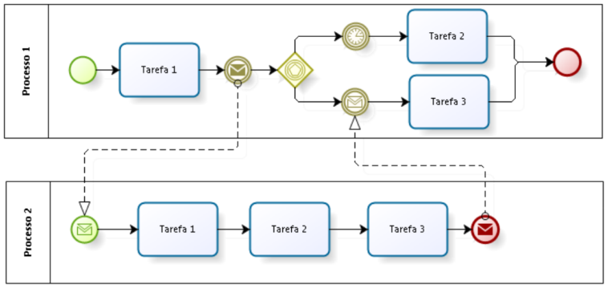

Além de mostrar quem conversa com quem, diagramas de colaboração ajudam a identificar onde a coordenação entre processos é necessária. Ou seja, onde um processo depende do outro para funcionar, ou onde existem pontos de interação que precisam ser bem gerenciados para que tudo flua sem travar. Dependências escondidas, por exemplo, são um baita problema em projetos de TI. 

**(CEBRASPE - 2025 - Analista Judiciário (TRF 6ª Região)/Apoio Especializado/Análise de Sistemas de** **<mark>Informação)</mark>** <mark>Julgue o item a seguir, relativo a processos de negócio BPMN (Business Process Model and</mark> Notation). 

<mark>O BPMN fornece às organizações a capacidade de entender seus procedimentos e fluxo de processos internos por meio de notação gráfica, permitindo a elas comunicar esses procedimentos de forma padronizada por meio, por exemplo, de colaborações (collaborations), processos de orquestração (orchestration processes) ou coreografias (choreographies).</mark> 

**<mark>Comentários:</mark>** 

**<mark>Correto</mark>** <mark>. O BPMN foi criado justamente pra isso: dar uma linguagem visual padronizada pros processos de negócio. Ele suporta três formas principais de representação — colaborações (entre participantes), orquestrações (fluxo interno de um processo) e coreografias (interações entre partes) — permitindo</mark> comunicação clara e uniforme entre as organizações. 

#### **Visão Geral de Elementos Básicos de BPMN** 

Pessoal, vamos falar sobre os elementos que compõem o BPMN. Quando você abre um diagrama BPMN pela primeira vez, parece um monte de forminhas coloridas sem sentido. Mas tem uma lógica por trás disso tudo, e ela é bem-organizada. Esses elementos gráficos se dividem em quatro categorias principais: **Objetos de Fluxo, Conectores, Swimlanes (que também chamamos de Partições) e Artefatos** . Cada categoria tem um papel específico na representação do processo. Vamos começar pela mais importante. 

**_Saiba Mais:_** _Formalmente, um modelo BPMN pode ser descrito como um grafo direcionado_ **_P = (N, E, tipo)_** _. O conjunto_ **_N_** _representa os nós do modelo e corresponde à união disjunta entre atividades (_ **_Nₐ_** _), eventos (_ **_Nₑ_** _) e gateways (_ **_N_** 𝗀 _). O conjunto_ **_E_** _representa as arestas do grafo, isto_

---

<!-- pagina: 12 -->

**Paolla Ramos Aula 04** 

_é, as conexões entre os nós, podendo ser entendido como um subconjunto de_ **_N × N_** _, responsável por definir a direção do fluxo de controle. A função_ **_tipo_** _associa cada gateway a uma semântica específica, como_ **_XOR_** _ou_ **_AND_** _, determinando o comportamento lógico daquele ponto do_ _<u>processo, seja de bifurcação, seja de junção.</u>_ 

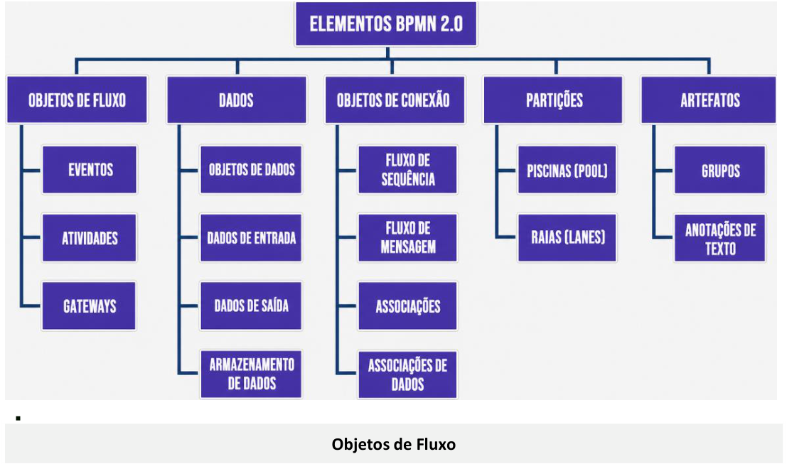

<!-- Start of picture text -->
Objetos de Fluxo <!-- End of picture text -->

Os **Objetos de Fluxo** são o coração do diagrama. São eles que definem como o processo se comporta, o que acontece, em que ordem, e onde tudo começa e termina. Dentro dessa categoria, temos três tipos de elementos. 

**Eventos** , representados por círculos. Um evento é algo que acontece durante o curso do processo. Não é uma ação que alguém executa, é uma ocorrência que dispara algo ou que resulta de algo. Por exemplo, você recebe um e-mail de pedido de compra, esse recebimento é um evento. Ele afeta o fluxo do processo porque, a partir daí, outras coisas precisam acontecer. Os eventos têm, em geral, um gatilho (aquilo que os provoca) ou um resultado (aquilo que eles geram), e existem três tipos: o **evento de início** , que marca onde o processo começa; o **evento intermediário** , que ocorre no meio do caminho e pode interromper ou desviar o fluxo; e o **evento de fim** , que sinaliza o encerramento do processo. 

O segundo elemento são as **Atividades** , representadas por retângulos com cantos arredondados. Se o evento é algo que acontece, a atividade é **algo que alguém faz** . É o trabalho em si, a execução dentro do processo. As atividades se dividem em **tarefas e subprocessos** . A tarefa é atômica, ou seja, não se divide mais, é a unidade mínima de trabalho. Já o subprocesso é uma atividade que pode ser aberta e decomposta em outras atividades internas. É como uma caixa fechada que, quando você abre, revela um processo inteiro lá dentro.

---

<!-- pagina: 13 -->

**Paolla Ramos Aula 04** 

Por fim, temos os portões, que em BPMN aparecem com o nome de **Gateways** . Visualmente, eles são aqueles losangos que você vê no diagrama. A função deles é controlar o fluxo do processo. Quando o caminho precisa se dividir, é o gateway que decide para onde vai. Quando caminhos separados precisam se encontrar novamente, é o gateway que une tudo. Decisões, bifurcações, fusões, junções de caminho, tudo isso passa por esses losangos. 

##### **Objetos de Conexão** 

Objetos de Conexão são os elementos responsáveis por **ligar um objeto de fluxo ao outro** , mostrando como as coisas se encadeiam dentro do processo. Existem dois tipos principais aqui. 

O primeiro é o **Fluxo de Sequência** . Ele é representado por uma linha sólida com uma seta sólida na ponta. A função dele é mostrar a ordem em que as atividades vão acontecer, ou seja, o caminho que o processo percorre de uma etapa para a outra. 

O segundo é o **Fluxo de Mensagem** . Aqui a representação é uma linha pontilhada com uma seta de linha aberta e o propósito também é diferente. Esse conector não está mostrando sequência de atividades, está mostrando a troca de informações entre dois participantes distintos. Ou seja, quando um participante envia algo e outro recebe, o que liga esses dois é o Fluxo de Mensagem. É como se fosse a representação visual de uma comunicação acontecendo entre partes do processo, não dentro de uma mesma parte. 

##### **Partições** 

**Swimlanes** . São elementos usados para **organizar e categorizar as atividades dentro do diagrama** . Pense numa piscina olímpica, com suas raias marcadas no fundo. É exatamente essa a metáfora que o BPMN usa aqui. 

Dentro dos swimlanes, temos dois elementos principais. As **Piscinas** (Pools) representam os participantes maiores do processo, tipo uma organização inteira, uma empresa parceira ou um departamento autônomo. É o contorno grande, o espaço delimitado que diz "esse processo acontece aqui, entre esses atores". Já as **Raias** (Lanes) são subdivisões dentro de uma piscina. Sabe quando você tem um processo que envolve o financeiro, o RH e a TI ao mesmo tempo? Cada um desses setores fica na sua raia, organizando as atividades por função ou responsabilidade. Assim fica claro quem faz o quê, sem misturar tudo num bloco só. 

##### **Artefatos** 

Artefatos não representam fluxo, não representam participante, não disparam evento nenhum. O papel deles é mais discreto, que é **fornecer informações adicionais sobre o processo** . São **elementos de apoio** , de contexto, que ajudam quem está lendo o diagrama a entender detalhes que não caberiam dentro de uma tarefa ou de um gateway. 

##### **Objetos de Dados**

---

<!-- pagina: 14 -->

**Paolla Ramos Aula 04** 

**Objetos de Dados** . Por exemplo, toda atividade dentro de um processo ou produz alguma coisa ou consome alguma coisa. Esse "alguma coisa" é justamente o objeto de dado. Pode ser um formulário preenchido, um relatório gerado, um arquivo enviado. Se uma atividade precisa de uma entrada ou gera uma saída de informação, você representa isso no diagrama como um objeto de dado. 

Já o **grupo** tem uma função mais organizacional. Imagina que você tem um diagrama grande, com várias atividades espalhadas, e quer deixar claro que um certo conjunto delas forma uma etapa lógica dentro do processo, sem necessariamente criar uma subdivisão formal. O grupo serve exatamente para documentar esse agrupamento visualmente, deixar o diagrama mais legível e comunicar a quem está lendo que aquelas atividades pertencem a um mesmo bloco. 

Por fim, a **anotação** é a mais simples de entender. É literalmente um campo de texto livre que você adiciona ao diagrama para explicar algo que o elemento gráfico por si só não dá conta de comunicar. Precisa fazer uma observação sobre uma regra de negócio? Quer alertar sobre uma exceção? Coloca uma anotação ali do lado. Ela não muda o comportamento do processo, só enriquece a documentação. 

##### **Pessoal, nas próximas seções vamos detalhar cada um desses elementos, um por um. Calma que a gente chega lá.** 

Só um aviso rápido antes de continuar: a maioria dos diagramas que aparecem nesta aula foram criados com um software chamado Bizagi, que é uma das ferramentas mais usadas no mercado justamente para montar diagramas BPMN. Se você quiser baixar e praticar por conta própria, o endereço é esse aqui: https://www.bizagi.com/pt/produtos/bpm-suite/modeler. Vale muito a pena explorar, porque BPMN é uma daquelas coisas que ficam muito mais claras quando você coloca a mão na massa. 

**_Saiba Mais:_** _A interoperabilidade de BPMN entre diferentes ferramentas de modelagem (como Bizagi, Camunda ou Visio) é garantida pelo_ **_BPMN DI (Diagram Interchange)_** _. Esse padrão utiliza a linguagem_ **_XML (Extensible Markup Language)_** _para descrever não apenas a lógica do processo, mas também as coordenadas geográficas, tamanhos e cores dos elementos gráficos no diagrama, permitindo que um arquivo exportado em uma ferramenta seja aberto em outra sem_ _<u>perda de informações visuais.</u>_ 

## Objetos de Fluxo 

Vamos falar em detalhes sobre os **Elementos de Fluxo** , que são o coração de um diagrama BPMN. São eles que dão vida ao processo, mostram o que acontece, quando acontece e como o fluxo se comporta ao longo do caminho. Esses elementos se dividem em três grandes categorias, que são **Eventos, Atividades e Gateways** . 

#### **Eventos** 

Sabe aqueles círculos que aparecem nos diagramas de processo? Cada círculo representa um **evento** , que é basicamente qualquer coisa que acontece durante a execução de um processo de negócio. Eles influenciam

---

<!-- pagina: 15 -->

**Paolla Ramos Aula 04** 

o fluxo do processo. Todo evento pode ter um gatilho, ou seja, uma causa que o dispara, ou um resultado, que é o impacto que ele gera no processo a partir dali. 

A tabela a seguir resume os tipos de eventos: 

|**TIPO DE EVENTO**|**REPRESENTAÇÃO**|**DESCRIÇÃO**|
|---|---|---|
|EVENTO INICIAL (START EVENT)||Marcam o ponto onde o processo inicia e são representados por um círculo de linha simples. É recomendável que todo o processo tenha um evento de início para facilitar a leitura do diagrama, possibilitando a quem lê identificar por onde começa o fluxo de atividades.|
|EVENTO INTERMEDIÁRIO (INTERMEDIATE EVENT)||Marcam a ocorrência de eventos no decorrer do processo no qual é previsto quem fato ocorrerá e são representados por um círculo com borda dupla. Em geral, são conectados ao processo por meio de conectores de fluxo de sequência, dando o contexto de que ocorrem durante o processo.|
|EVENTO FINAL (END EVENT)||Marcam o ponto onde o processo termina e são representados por um círculo de linha grossa. É recomendável que todo o processo tenha ao menos um evento de fim. É possível – entretanto – simbolizar términos diferentes para o processo usando mais de um evento de fim.|
|EXEMPLO DE EVENTO INICIAL|EXEMPLO DE EVENTO INTERMEDIÁRIO|EXEMPLO DE EVENTO FINAL|

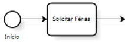

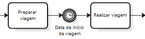

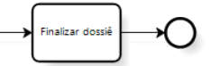

O primeiro é o **Evento de Início** . Visualmente, ele é um círculo de traço fino, aquele mais simples, e a função dele é exatamente o que o nome diz, que é **marcar onde o processo começa** , ou onde um caminho específico dentro do processo arranca. Mas atenção, ele não começa sozinho. Um Evento de Início é disparado por algum **gatilho** , que pode ser uma mensagem recebida, um temporizador, um erro, um sinal, entre outros. 

O segundo tipo é o **Evento Intermediário** . Esse aqui já tem uma aparência diferente: é um círculo duplo, com dois traços concêntricos. Ele aparece no meio do processo, depois que o processo já começou, mas antes de chegar ao fim. Ele serve para representar **situações que acontecem no caminho** , como o envio ou recebimento de mensagens, a definição de prazos, a ocorrência de erros e outros acontecimentos que merecem ser mapeados explicitamente no diagrama. Em vez de deixar esses momentos invisíveis dentro de uma tarefa genérica, o BPMN te dá esse elemento justamente para tornar o fluxo mais legível e preciso. 

E então temos os **Eventos de Fim** . Eles são representados por um círculo com borda grossa e indicam onde um processo, ou um caminho específico dentro dele, chega ao seu término. “Terminar" não é sempre a mesma coisa: um evento de fim pode encerrar o fluxo enviando uma mensagem, lançando um sinal, ou até sinalizando que algo deu errado, ou seja, terminando em erro. Cada situação de encerramento tem sua própria representação.

---

<!-- pagina: 16 -->

**Paolla Ramos Aula 04** 

##### **_Saiba Mais:_** 

**_Eventos de Borda (Boundary Events)_** _são anexados ao limite de uma atividade (como uma tarefa ou subprocesso). Eles podem ser_ **_Interruptivos_** _(linha contínua), que encerram a atividade atual para seguir um novo fluxo, ou_ **_Não-Interruptivos_** _(linha tracejada), que iniciam um fluxo paralelo sem parar a execução da tarefa original. O_ **_Evento de Erro_** _de borda é sempre interruptivo, sendo usado para capturar exceções técnicas ou de negócio, enquanto o_ **_Evento de Escalonamento_** _pode ser usado para notificar níveis superiores sem necessariamente interromper o trabalho em curso._ 

Agora, cada tipo de evento, seja de início, intermediário ou de fim, pode ter diferentes subtipos. Um evento de início, por exemplo, pode ser disparado por uma mensagem recebida, por um temporizador que marca um horário específico, ou até por um erro que ocorreu em algum ponto do sistema. O subtipo muda conforme a causa que dispara o evento ou o resultado que ele produz. 

Falando em causa: isso tem nome técnico em BPMN. Chama-se **trigger** , ou **gatilho** em português. É basicamente o motivo que faz aquele evento acontecer. Um evento pode ter vários gatilhos possíveis, e a especificação do BPMN lista bastante coisa nesse sentido. Mensagem, temporizador, erro, sinal, condição, entre outros. 

Veja a imagem para ter essa referência:

---

<!-- pagina: 17 -->

**Paolla Ramos Aula 04** 

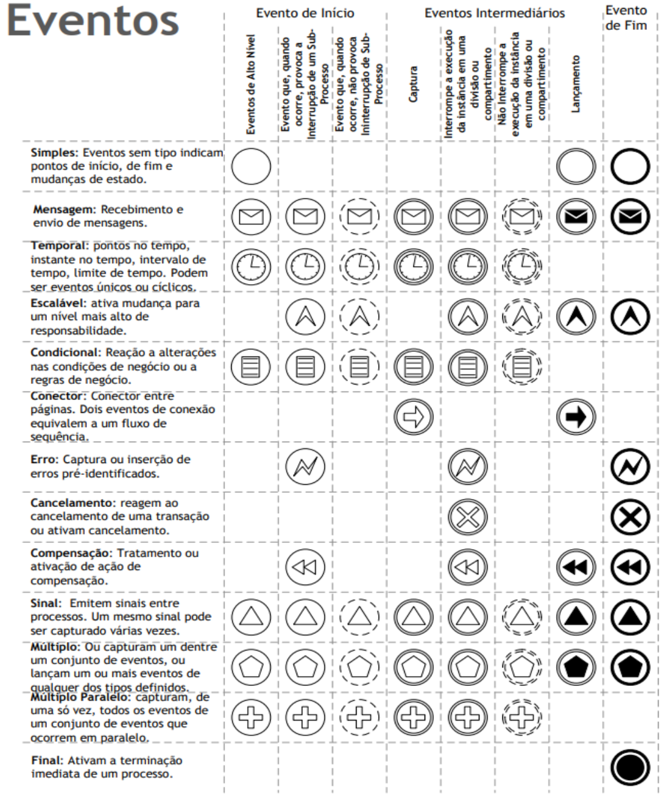

Esses gatilhos eventualmente podem aparecer em prova, mas são muitos. Tentar decorar todos eles de uma vez é péssimo custo-benefício. Não vale a pena o esforço comparado ao que isso representa na pontuação.

---

<!-- pagina: 18 -->

**Paolla Ramos Aula 04** 

Então use a imagem como referência, tenha uma visão geral do que existe, e foque energia no que realmente pesa mais na avaliação. 

**(Instituto Verbena - 2024 - Analista Judiciário (TJ AC)/Analista de Monitoramento de TI) No contexto do** **<mark>Business Process Model and Notation (BPMN), a principal diferença entre os tipos de eventos "evento de</mark> mensagem" (message event) e "evento de sinal" (signal event) é descrita em:** 

<mark>a) o evento de mensagem é um tipo de evento intermediário que desencadeia a execução de uma atividade externa ao processo, enquanto o evento de sinal é um tipo de evento de início que inicia o próprio processo.</mark> 

<mark>b) o evento de mensagem é utilizado para iniciar ou encerrar um processo, enquanto o evento de sinal é usado para representar trocas de mensagens entre participantes que representam os papéis envolvidos no processo.</mark> 

<mark>c) o evento de mensagem é usado para representar comunicação entre processos, enquanto o evento de sinal é utilizado para indicar mudanças de estado ou condições dentro do próprio processo.</mark> 

<mark>d) o evento de mensagem é usado para indicar a conclusão de uma atividade em um processo, enquanto o evento de sinal é utilizado para notificar eventos que ocorrem fora do contexto do processo.</mark> 

**<mark>Comentários:</mark>** 

<mark>(a) Errado. O evento de mensagem não se limita a eventos intermediários externos — ele pode ser de início, intermediário ou fim. Além disso, o evento de sinal também não é exclusivamente de início; (b) Errado. Quem representa trocas de mensagens entre participantes são justamente os eventos de mensagem, não os de sinal. A descrição das funções está invertida aqui; (c) Correto. Essa é a distinção central: o evento de mensagem lida com comunicação entre processos distintos (ou participantes), enquanto o evento de sinal representa mudanças de estado ou condições que podem ocorrer dentro do próprio processo; (d) Errado. O evento de mensagem não serve apenas para indicar conclusão de atividade, e o evento de sinal não se restringe a notificar eventos externos ao processo.</mark> 

**Gabarito:** Letra C 

#### **Atividades** 

Atividade representa **trabalho sendo realizado** . Visualmente, você vai reconhecê-las fácil, porque aparecem como retângulos com os cantos arredondados. Dentro dessa categoria de atividades, existem dois tipos principais: **Tarefas e Subprocessos.** 

##### **Tarefas** 

Uma tarefa é uma **unidade de trabalho atômica** , ou seja, indivisível dentro do contexto do processo. Isso quer dizer que, no nível de detalhe do seu diagrama, a tarefa é a menor unidade de trabalho possível. Não tem como quebrar ela em pedaços menores ali naquele nível. Pense num processo de vendas, por exemplo:

---

<!-- pagina: 19 -->

**Paolla Ramos Aula 04** 

"Aprovar Pedido" ou "Enviar Fatura" seriam tarefas típicas. São ações pontuais, com começo e fim bem definidos. 

O BPMN define vários tipos de tarefas, cada um representando uma natureza diferente de execução. 

A **tarefa de usuário** é aquela realizada por uma pessoa, um ser humano de verdade interagindo com o sistema. A **tarefa de serviço** é executada automaticamente por um serviço web ou aplicativo, sem intervenção humana. Já a **tarefa de script** é rodada por um script ou programa de computador, também de forma automática. E tem ainda a **tarefa manual** , que é aquela feita completamente à mão, fora de qualquer sistema. Cada tipo desses tem uma representação visual própria no diagrama, justamente para deixar claro quem ou o que está executando aquele trabalho, veja: 

|TIPO DE TAREFA|REPRESENTAÇÃO|DESCRIÇÃO|
|---|---|---|
|Tarefa  Abstrata||É o tipo de atividade mais frequentemente usado durante os estágios iniciais do desenvolvimento do processo.|
|Tarefa De Serviço||É uma atividade que ocorre automaticamente, sem necessidade de intervenção humana.|
|Tarefa De Recebimento||É uma atividade de recebimento de mensagem. Tem característica similar ao evento intermediário de recebimento de mensagem.|
|Tarefa De Envio||É uma atividade de envio de mensagem. Tem característica similar ao evento intermediário de envio de mensagem.|
|Tarefa De Usuário||É utilizada quando a atividade é executada por uma pessoa com o auxílio/por intermédio de um sistema.|
|Tarefa De Execução  De Script||É utilizado quando na execução da atividade existe um roteiro a ser seguido (_checklist_).|
|Tarefa Manual||É uma atividade que é executada por uma pessoa, sem qualquer intervenção de sistema.|
|Tarefa de Regra de Negócio||Propicia um mecanismo para o processo enviar informações a um Business Rules Engine (Motor de Regras de Negócio) e obter o resultado do cálculo que o motor de regras pode prover.|

##### **Subprocessos** 

Subprocesso é um **processo dentro de um processo** . Você tem uma atividade que, quando você abre, revela um nível mais detalhado de atividades lá dentro. Visualmente, ele é representado por um retângulo

---

<!-- pagina: 20 -->

**Paolla Ramos Aula 04** 

arredondado (igual às tarefas normais), mas com um pequeno símbolo de "mais" no canto inferior central. Esse detalhe é o que diferencia um subprocesso de uma tarefa comum na notação. 

Agora, o ponto mais importante sobre subprocessos é que eles podem aparecer de duas formas diferentes no diagrama. Na forma **colapsada** , você vê só o retângulo com aquele símbolo [+] na base, e o que está dentro fica oculto (o diagrama não mostra as atividades internas). Já na forma **expandida** , o conteúdo aparece todo ali, dentro do próprio retângulo, mostrando cada atividade interna do subprocesso. 

_Por que isso existe_ ? Pense em um processo de negócio complexo, com dezenas de atividades encadeadas. Se você jogasse tudo em um único diagrama, viraria uma teia impossível de ler. O subprocesso colapsado resolve esse problema, pois você representa aquele bloco inteiro como uma única caixa com [+], mantendo o diagrama principal limpo e legível. Quando alguém precisar entender o que acontece ali dentro, aí sim você expande. É uma forma inteligente de controlar o nível de detalhe que o leitor precisa ver em cada momento. 

Dentro dos subprocessos ainda temos duas variações importantes que aparecem bastante em prova: **o subprocesso de evento e o subprocesso transacional** . 

O **subprocesso de evento** não é iniciado pelo fluxo normal do processo, mas sim por um gatilho de evento. Ou seja, algo acontece lá fora, um evento é disparado, e é isso que acorda esse subprocesso e coloca ele em ação. Ele fica ali, dormindo, esperando o gatilho certo chegar. 

Já o **subprocesso transacional** tem uma característica diferente. Ele carrega um comportamento transacional, o que significa que o sistema consegue controlar o que acontece com ele em situações de erro. Pensa como uma transação bancária: ou tudo dá certo e o processo segue, ou algo falha e você precisa desfazer o que foi feito, tratar o erro, compensar. É essa lógica que o subprocesso transacional traz para o BPMN, permitindo um gerenciamento de erros muito mais controlado. 

Veja os principais tipos: 

<mark>TIPO DE SUBPROCESSO REPRESENTAÇÃO DESCRIÇÃO</mark> Subprocesso Herda todas as características do processo em que está inserido. Não pode conter piscinas ( _pools_ ) ou raias ( _lanes_ ). Incorporado Subprocesso Reutilizável É uma referência ao diagrama de outro processo, indicando que está sendo reutilizado no fluxo em que está inserido. <mark>Subprocesso Eventual</mark> Representa um conjunto lógico de atividades que pode ou não acontecer durante a execução de um processo e cujo início não está vinculado à sequência de atividades do fluxo, mas à ocorrência de um evento. Subprocesso Conjunto de atividades logicamente relacionadas que devem ser realizadas em uma única transação (por exemplo, uma Transacional operação bancária). 

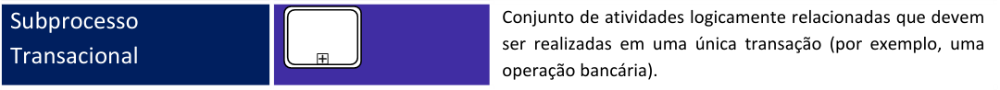

<!-- Start of picture text -->
Subprocesso  Conjunto de atividades logicamente relacionadas que devem ser realizadas em uma única transação (por exemplo, uma Transacional operação bancária). <!-- End of picture text -->

---

<!-- pagina: 21 -->

**Paolla Ramos Aula 04** 

#### **Desvios (Gateways)** 

Agora vamos falar de **Gateways** , que são um dos tipos mais importantes de objetos de fluxo dentro do BPMN. Visualmente, você os reconhece na hora: são aquelas **formas de losango** que aparecem no diagrama. A função deles é controlar o fluxo do processo, agindo como **pontos de decisão** , ou seja, desvios que determinam qual caminho o processo vai seguir dependendo das condições que estiverem em jogo. 

Por exemplo, imagine um processo de aprovação de crédito em um banco. Em algum momento, alguém precisa decidir se o cliente foi aprovado ou não, e a partir daí o processo segue por caminhos completamente diferentes. É exatamente aí que entra o Gateway. Ele pode fazer duas coisas distintas: **dividir um fluxo único em vários caminhos, o que chamamos de divergência, ou reunir vários caminhos de volta em um só, o que chamamos de convergência** . **Bifurcação** e **fusão** , em outras palavras. Sem esses elementos, seria praticamente impossível modelar qualquer processo do mundo real, já que processos reais estão cheios de condições, exceções e ramificações. 

Agora, não existe um único tipo de Gateway. Cada tipo tem um comportamento específico, e o BPMN define vários deles. O primeiro, e provavelmente o mais comum, é o **Gateway Exclusivo** . Ele representa um ponto de decisão onde apenas um dos caminhos de saída pode ser seguido, nunca mais de um ao mesmo tempo. É o famoso "ou isso ou aquilo". Visualmente, ele aparece como um losango com um "X" dentro. Pense no caixa eletrônico que pergunta se você quer consultar saldo, sacar ou pagar uma conta: só uma dessas opções vai ser executada por vez. 

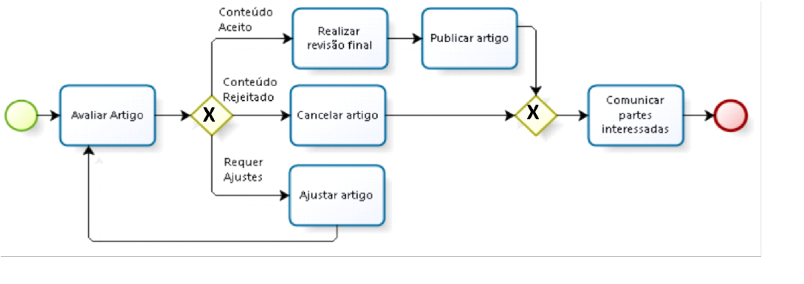

Em seguida, temos o **Gateway Inclusivo** . Diferente do exclusivo, que só deixa um caminho passar, o inclusivo abre a possibilidade de um ou mais caminhos serem seguidos ao mesmo tempo. Por exemplo, a condição pode ser satisfeita por várias saídas ao mesmo tempo, e o processo toma todas elas que forem verdadeiras. Visualmente, ele aparece como um losango com um círculo dentro, o que ajuda a não confundir com os outros.

---

<!-- pagina: 22 -->

**Paolla Ramos Aula 04** 

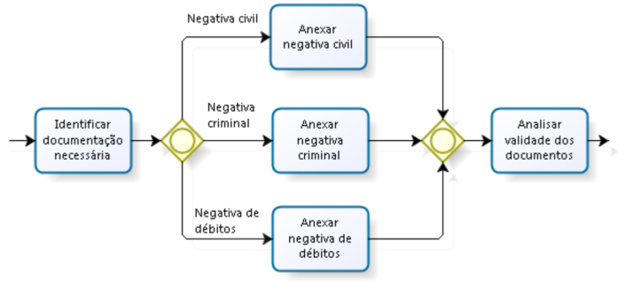

Já o **Gateway Paralelo** é aquele que não tem nenhum critério de decisão envolvido. Aqui não existe "se isso, então aquilo". O que ele faz é simples: ativa todos os caminhos de saída ao mesmo tempo, sem exceção, e depois espera todos eles terminarem antes de seguir em frente. Por isso o nome "paralelo", porque os fluxos correm em paralelo, simultaneamente. Ele é representado por um losango com um sinal de mais dentro, aquele símbolo "+" que visualmente já passa essa ideia de adição, de somar caminhos. 

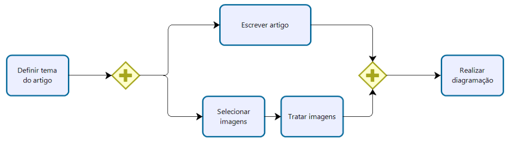

O **Gateway Baseado em Evento** é um pouco diferente dos outros porque quem decide o próximo passo não é uma condição de dados, mas sim um evento externo. Sabe quando o processo fica "esperando" para ver o que acontece primeiro, se chega um e-mail, se expira um prazo, se o cliente responde? É exatamente isso. O fluxo fica suspenso até que algum desses eventos ocorra, e aí o caminho correspondente é ativado. Na notação, ele aparece como um losango com um círculo de evento dentro, o que já sinaliza essa dependência de evento.

---

<!-- pagina: 23 -->

**Paolla Ramos Aula 04** 

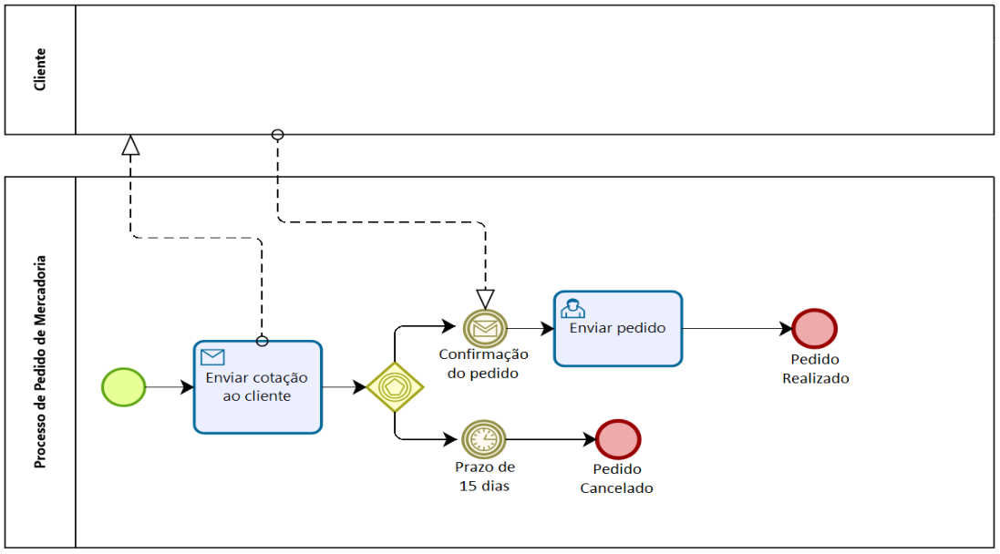

Por fim, o **Gateway Complexo** é o que eu costumo chamar de "o último recurso". Ele existe para os casos em que as regras de controle de fluxo são tão específicas e incomuns que nenhum dos outros gateways, nem o exclusivo, nem o inclusivo, nem o paralelo, conseguem representar direitinho. É um tipo especial, justamente porque cobre aquelas situações fora do padrão. Na prática, você raramente vai ver ele sendo usado, porque quando aparece, é sinal de que o processo tem uma lógica bastante particular. 

O Gateway Complexo é representado por um losango com um asterisco dentro, aquele símbolo de "estrela" mesmo. Ele existe para os casos em que os outros gateways simplesmente não dão conta do recado, porque a lógica de decisão é elaborada demais para caber num "ou um, ou outro" ou num "todos ao mesmo tempo". 

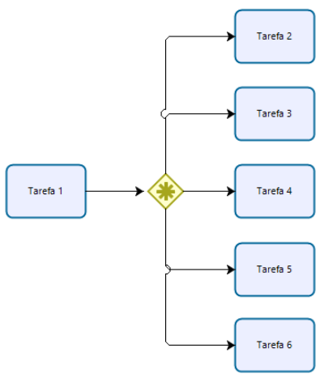

**DataPrev (Perfil 3: Desenvolvimento de Software) Gestão e Governança de TI - 2026 (Pós-Edital)** **_www.estrategiaconcursos.com.br_**

---

<!-- pagina: 24 -->

**Paolla Ramos Aula 04** 

Pensa bem numa situação assim: o fluxo do processo precisa seguir um caminho se uma condição for verdadeira, seguir um segundo caminho se uma outra condição for verdadeira, seguir os dois caminhos ao mesmo tempo se ambas as condições forem verdadeiras, e ainda desviar para um terceiro caminho se nenhuma das condições se confirmar. Tente modelar isso com um gateway simples. Não rola. É exatamente para esse tipo de cenário que o Gateway Complexo foi criado, permitindo definir condições elaboradas tanto para divergir o fluxo (dividir em caminhos) quanto para convergir (juntar os caminhos de volta). 

**_Saiba Mais:_** _Um_ **_Token_** _é um conceito teórico que representa uma instância de execução de um processo. Ele "navega" pelos conectores de sequência: ao chegar em um gateway paralelo (fork), o token é multiplicado; ao chegar em um gateway exclusivo, apenas um token segue adiante. Se um processo não possui evento de início definido, a especificação BPMN dita que todos os objetos de fluxo sem conectores de entrada recebem um token simultaneamente no início da execução,_ _<u>gerando fluxos paralelos automáticos.</u>_ 

A tabela a seguir resume os principais tipos de Gateways: 

<mark>TIPO DE GATEWAY REPRESENTAÇÃO DESCRIÇÃO</mark> GATEWAY EXCLUSIVO Trata-se de um ponto de ramificação que, após avaliar condições, apenas um caminho pode ser ativado. Pode ser representado com o losango vazio ou marcado. GATEWAY INCLUSIVO Trata-se de um ponto de ramificação que, após avaliar condições, um ou mais caminhos podem ser ativados em diversas combinações diferentes. GATEWAY PARALELO Trata-se da divisão de um fluxo em dois ou mais que serão executados paralelamente. Todos os caminhos que saem deste gateway são executados. GATEWAY COMPLEXO Trata-se de um elemento que modela um comportamento complexo de ramificação ou convergência específico. GATEWAY BASEADO EM EVENTO Trata-se de um elemento que indicam que a continuação do processo depende de algum evento específico. 

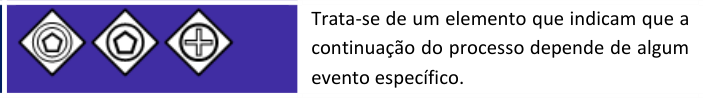

<!-- Start of picture text -->
Trata-se de um elemento que indicam que a continuação do processo depende de algum evento específico. <!-- End of picture text -->

**(FGV - 2026 - Analista Judiciário (TJ RJ)/Tecnologia da Informação/Analista de Negócios) O analista de** **<mark>negócios Pedro está modelando os processos do seu departamento e verificou que há diversas atividades</mark> que podem ser executadas em paralelo, otimizando tempo.** 

**<mark>Para modelar atividades que ocorrem ao mesmo tempo, dividindo e depois sincronizando os fluxos paralelos, Pedro deve utilizar o gateway:</mark>**

---

<!-- pagina: 25 -->

**Paolla Ramos Aula 04** 

a) b) 

c) d) e) 

**<mark>Comentários:</mark>** 

<mark>(a) Errado. O losango vazio representa um gateway genérico/indefinido, não indicando especificamente paralelismo entre atividades;</mark> 

<mark>(b) Errado. O losango com “X” representa o gateway exclusivo, usado para escolher apenas um caminho entre alternativas possíveis;</mark> 

<mark>(c) Errado. O losango com círculo representa o gateway inclusivo, no qual um ou mais caminhos podem ser executados, mas não necessariamente todos em paralelo;</mark> 

<mark>(d) Correto. O losango com sinal de “+” representa o gateway paralelo, usado para dividir o fluxo em atividades simultâneas e depois sincronizá-las;</mark> 

<mark>(e) Errado. O símbolo apresentado não corresponde ao gateway paralelo, mas a outro tipo de gateway/evento complexo, não sendo o adequado para execução simultânea obrigatória.</mark> 

**<mark>Gabarito:</mark>** <mark>Letra D</mark> 

**(FGV - 2026 - Analista Judiciário (TJ RJ)/Tecnologia da Informação/Analista de Projetos) Observe o diagrama BPMN a seguir.** 

---

<!-- pagina: 26 -->

**Paolla Ramos Aula 04** 

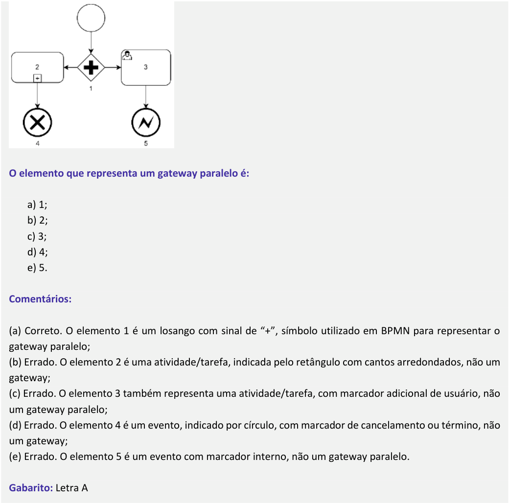

<!-- Start of picture text -->
O elemento que representa um gateway paralelo é: a) 1; b) 2; c) 3; d) 4; e) 5. Comentários: (a) Correto. O elemento 1 é um losango com sinal de “+”, símbolo utilizado em BPMN para representar o gateway paralelo; (b) Errado. O elemento 2 é uma atividade/tarefa, indicada pelo retângulo com cantos arredondados, não um gateway; (c) Errado. O elemento 3 também representa uma atividade/tarefa, com marcador adicional de usuário, não um gateway paralelo; (d) Errado. O elemento 4 é um evento, indicado por círculo, com marcador de cancelamento ou término, não um gateway; (e) Errado. O elemento 5 é um evento com marcador interno, não um gateway paralelo. Gabarito:  Letra A <!-- End of picture text -->

**(FGV - 2025 - Analista do Ministério Público da União/Tecnologia da Informação e** **<mark>Comunicação/Desenvolvimento de Sistemas) Maria utilizou a notação BPMN para modelar o processo de</mark> negócio do departamento DEPTO1 da organização ORG_A, conforme figura abaixo.** 

---

<!-- pagina: 27 -->

**Paolla Ramos Aula 04** 

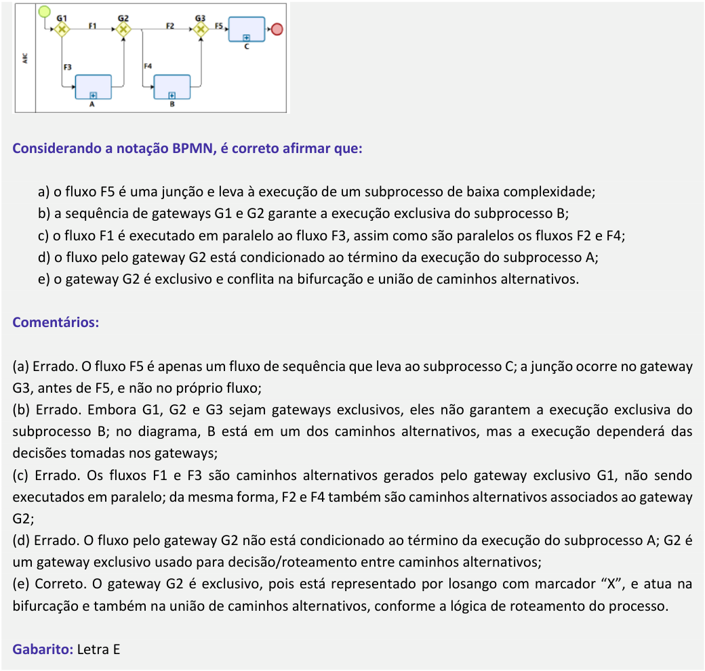

<!-- Start of picture text -->
Considerando a notação BPMN, é correto afirmar que: a) o fluxo F5 é uma junção e leva à execução de um subprocesso de baixa complexidade; b) a sequência de gateways G1 e G2 garante a execução exclusiva do subprocesso B; c) o fluxo F1 é executado em paralelo ao fluxo F3, assim como são paralelos os fluxos F2 e F4; d) o fluxo pelo gateway G2 está condicionado ao término da execução do subprocesso A; e) o gateway G2 é exclusivo e conflita na bifurcação e união de caminhos alternativos. Comentários: (a) Errado. O fluxo F5 é apenas um fluxo de sequência que leva ao subprocesso C; a junção ocorre no gateway G3, antes de F5, e não no próprio fluxo; (b) Errado. Embora G1, G2 e G3 sejam gateways exclusivos, eles não garantem a execução exclusiva do subprocesso B; no diagrama, B está em um dos caminhos alternativos, mas a execução dependerá das decisões tomadas nos gateways; (c) Errado. Os fluxos F1 e F3 são caminhos alternativos gerados pelo gateway exclusivo G1, não sendo executados em paralelo; da mesma forma, F2 e F4 também são caminhos alternativos associados ao gateway G2; (d) Errado. O fluxo pelo gateway G2 não está condicionado ao término da execução do subprocesso A; G2 é um gateway exclusivo usado para decisão/roteamento entre caminhos alternativos; (e) Correto. O gateway G2 é exclusivo, pois está representado por losango com marcador “X”, e atua na bifurcação e também na união de caminhos alternativos, conforme a lógica de roteamento do processo. Gabarito:  Letra E <!-- End of picture text -->

## Objetos de Dados 

**Objetos de Dados** representam as informações que circulam pelo processo. São aquelas folhas de papel com o cantinho dobrado que você vê nos diagramas. 

Esses objetos podem se conectar a atividades, eventos e gateways. Quando estão ligados a uma atividade, indicam que aquela tarefa precisa de certos dados para acontecer ou que ela produz algum dado como resultado. Quando se ligam a um evento, mostram que aquele evento consome ou gera informação. E quando aparecem perto de um gateway, sinalizam que a decisão tomada ali depende de algum dado específico.

---

<!-- pagina: 28 -->

**Paolla Ramos Aula 04** 

Pense num processo de pedido de vendas, por exemplo. Nesse cenário, um Objeto de Dados pode representar o pedido do cliente em si. Ele nasce quando a atividade "Receber Pedido" é executada e, logo depois, é consumido pela atividade "Processar Pedido". Ou seja, o objeto vai passando de mão em mão dentro do processo, e o diagrama deixa isso explícito. 

Objetos de Dados podem ter **estados** . Esses estados aparecem representados por texto sublinhado dentro ou ao lado do ícone. Voltando ao exemplo do pedido: o mesmo objeto pode assumir o estado "Pedido Recebido" logo que chega, passar para "Pedido Processado" depois que a equipe analisa, e finalmente virar "Pedido Enviado" quando o produto sai para entrega. É a mesma informação evoluindo ao longo do processo, e o BPMN permite registrar isso. 

Os objetos de dados existem para representar o que acontece com os dados dentro de um processo. Eles mostram o fluxo, o movimento, a participação dos dados numa atividade. Não é função deles detalhar como esses dados estão estruturados por baixo dos panos. Para isso, você usaria uma ferramenta de modelagem de dados, que é um recurso totalmente diferente, com um propósito diferente. 

**_Saiba Mais:_** _Embora o_ **_Objeto de Dados_** _(informação volátil) seja representado pela página com canto dobrado, o_ **_Data Store_** _(persistência) é representado por um cilindro. Em questões de prova, é comum o termo "Objeto de Dados" ser usado de forma genérica para abranger ambos, mas o candidato deve identificar o cilindro especificamente como um local onde o processo pode ler ou escrever informações de forma persistente, como bancos de dados ou arquivos físicos._ 

Dito isso, vamos ver os principais tipos que existem: 

|TIPO|ÍCONE|DESCRIÇÃO|
|---|---|---|
|Objetos de Dados (Data Objects)||Trata-se de um elemento que representa um conjunto de informações no contexto de um processo, atividade ou troca de mãos (_handoff_) através do fluxo de sequência – é representado por uma página com a ponta dobrada.|
|Dados de Entrada (Data Input)||Trata-se de um elemento que representa um evento externo ao processo que pode ser lido por uma atividade.|
|Dados de Saída (Data Output)||Trata-se de um elemento que representa uma variável disponível como resultado da execução de um processo completo.|

---

<!-- pagina: 29 -->

**Paolla Ramos Aula 04** 

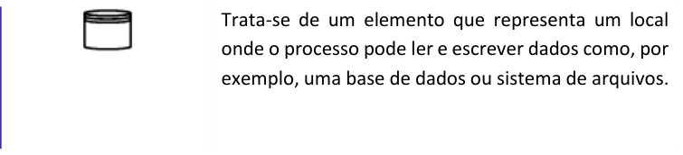

<!-- Start of picture text -->
Trata-se de um elemento que representa um local onde o processo pode ler e escrever dados como, por exemplo, uma base de dados ou sistema de arquivos. <!-- End of picture text -->

Armazenamento de Dados Trata-se de um elemento que representa um local onde o processo pode ler e escrever dados como, por (Data Store) exemplo, uma base de dados ou sistema de arquivos. 

**(FGV - 2026 - Analista Judiciário (TJ RJ)/Tecnologia da Informação/Analista de Projetos) Juliana está mapeando os processos do seu departamento que contêm muitas atividades com transações de dados.** 

**<mark>Para representar uma entrada de dados de uma tarefa, utilizando o BPMN, Juliana deve utilizar:</mark>** 

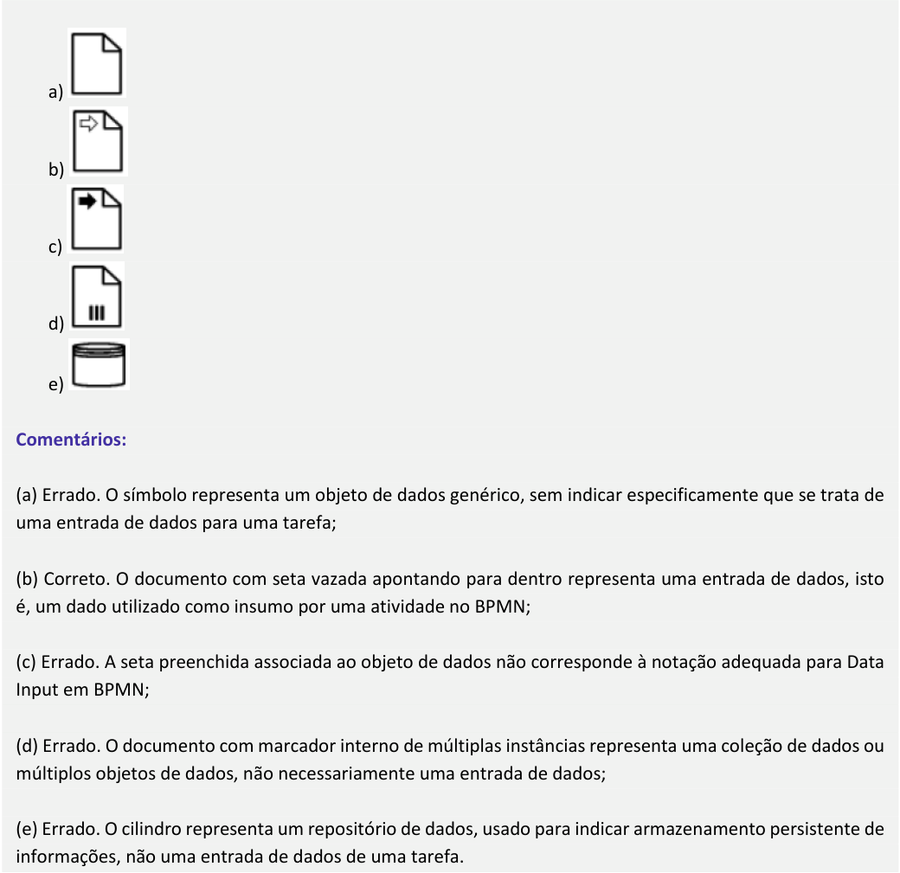

<!-- Start of picture text -->
a) b) c) d) e) Comentários: (a) Errado. O símbolo representa um objeto de dados genérico, sem indicar especificamente que se trata de uma entrada de dados para uma tarefa; (b) Correto. O documento com seta vazada apontando para dentro representa uma entrada de dados, isto é, um dado utilizado como insumo por uma atividade no BPMN; (c) Errado. A seta preenchida associada ao objeto de dados não corresponde à notação adequada para Data Input em BPMN; (d) Errado. O documento com marcador interno de múltiplas instâncias representa uma coleção de dados ou múltiplos objetos de dados, não necessariamente uma entrada de dados; (e) Errado. O cilindro representa um repositório de dados, usado para indicar armazenamento persistente de informações, não uma entrada de dados de uma tarefa. <!-- End of picture text -->

---

<!-- pagina: 30 -->

**Paolla Ramos Aula 04** 

**Gabarito:** Letra B 

## Objetos de Conexão 

Objetos de Conexão têm como função **conectar os diferentes elementos de um diagrama de processo** . É por meio deles que você representa tanto o fluxo de controle quanto o fluxo de informações entre os elementos do processo. Existem três tipos principais que precisamos conhecer: **Fluxo de Sequência, Fluxo de Mensagem e Associações** . 

**Fluxo de Sequência** . Visualmente, ele é representado por uma linha sólida com uma seta sólida na ponta. É ele quem define a ordem em que as atividades vão acontecer dentro do processo. De que adianta você ter um diagrama cheio de tarefas, eventos e gateways desenhados se ninguém sabe qual vem antes e qual vem depois? É o Fluxo de Sequência que resolve isso. Ele conecta Atividades, Eventos e Gateways justamente para deixar claro o caminho que o processo vai percorrer, o chamado fluxo de controle. 

Em um processo de negócio, **todos os elementos de fluxo precisam estar conectados entre si por meio de um conector de sequência, seguindo a ordem em que devem ser executados** . Não pode sobrar elemento solto no diagrama. Se tem uma atividade ali, ela precisa estar ligada à anterior e à próxima. Sem exceção. 

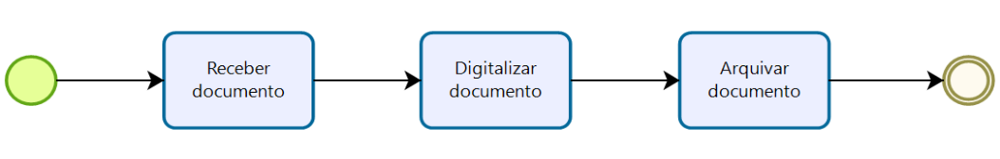

O **Fluxo de Mensagem** é representado por uma linha pontilhada com uma seta de linha aberta na ponta. Ela existe para mostrar a passagem de informações entre dois participantes que estão preparados para enviar e receber essa informação. 

Por exemplo, você tem dois departamentos diferentes numa empresa, cada um representado pela sua própria Piscina no diagrama. Como você mostra que eles estão se comunicando? É aí que entra o Fluxo de Mensagem. Ele aparece normalmente nos Diagramas de Colaboração exatamente para representar essa troca entre Piscinas distintas, ou seja, entre partes que pertencem a processos diferentes.

---

<!-- pagina: 31 -->

**Paolla Ramos Aula 04** 

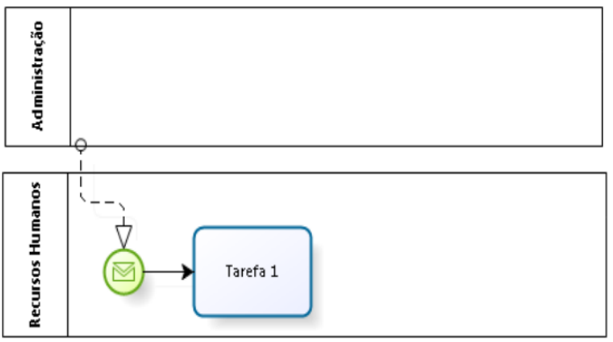

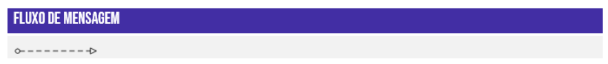

Já as **Associações** têm uma função diferente, embora visualmente sejam parecidas. Elas também aparecem como uma linha pontilhada, mas com uma seta aberta na ponta, e podem ter seta em uma ponta só ou nas duas, dependendo do caso. A ideia aqui não é mostrar comunicação entre participantes, mas sim conectar informações adicionais a elementos do fluxo. Por exemplo, você tem uma Atividade no seu diagrama e quer indicar que ela usa um determinado Objeto de Dados, ou quer anexar uma Anotação de Texto explicando algum detalhe daquela etapa. 

A Associação é o elemento que faz essa ligação. Ela não representa fluxo de processos nem troca entre participantes, representa apenas um **vínculo de contexto** , uma forma de dizer "esse dado aqui pertence a essa atividade ali". 

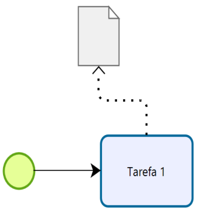

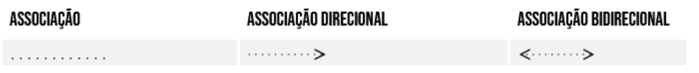

---

<!-- pagina: 32 -->

**Paolla Ramos Aula 04** 

Existe um tipo específico de associação que é a **Associação de Dados** . Sabe quando uma atividade precisa de uma informação para acontecer, ou quando ela gera algum dado como resultado? É exatamente isso que a Associação de Dados representa visualmente no diagrama. 

Na prática, ela serve para conectar Objetos de Dados e Armazenamentos de Dados aos chamados Objetos de Fluxo, que são as Atividades, os Eventos e os Gateways. É o elemento que mostra de onde vêm os dados que alimentam um processo e para onde vão os dados que ele produz. Graficamente, você identifica uma Associação de Dados pela linha sólida com uma seta de linha aberta na ponta, diferente das outras notações do BPMN. 

Resumindo: toda vez que você precisar indicar no seu diagrama que uma atividade consome ou gera algum dado, é a Associação de Dados que vai fazer essa ligação. 

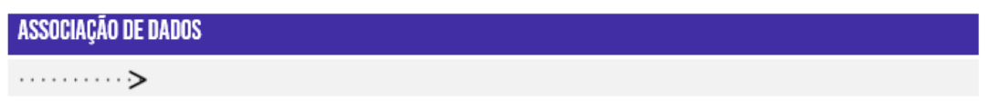

**(FGV - 2026 - Analista Judiciário (TJ RJ)/Tecnologia da Informação/Analista de Negócios) A analista de** **<mark>negócios Manuela está modelando os processos do seu departamento, que é intensivo em atividades com</mark> entrada e saída de dados.** 

**<mark>De acordo com o BPMN, a representação do fluxo de mensagem entre uma Tarefa e um Objeto de Dados que Manuela deve utilizar é:</mark>** 

|a) b) |
|---|
|c) |
|d) e)|

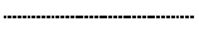

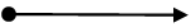

**<mark>Comentários:</mark>** 

<mark>(a) Errado. A linha contínua com seta representa fluxo de sequência, usado para indicar a ordem de execução das atividades, não a associação entre tarefa e objeto de dados;</mark> 

<mark>(b) Errado. A linha tracejada com círculo na origem e seta vazada é usada para fluxo de mensagem, não para conectar uma tarefa a um objeto de dados;</mark> 

<mark>(c) Errado. A linha pontilhada sem seta não representa adequadamente o fluxo ou associação direcional entre uma tarefa e um objeto de dados;</mark> 

<mark>(d) Correto. A linha pontilhada com seta representa a associação de dados, usada em BPMN para indicar a entrada ou saída de dados entre uma atividade e um objeto de dados;</mark> 

<mark>(e) Errado. A linha contínua com círculo preenchido na origem e seta representa outro tipo de conector, não sendo a notação adequada para associação entre tarefa e objeto de dados.</mark>

---

<!-- pagina: 33 -->

**Paolla Ramos Aula 04** 

**Gabarito:** Letra D 

## Parti ões <u>ç</u> 

**Partições** são usadas para **organizar e categorizar os elementos de um diagrama de processo** . Visualmente, elas aparecem como retângulos que contêm outros elementos dentro de si. Existem dois tipos principais: **Piscinas** e **Raias** . 

Começando pelas **Piscinas** , que em inglês você vai ver como Pools. Piscina é a **representação de um participante em um processo** . Por exemplo, cada Piscina é uma "pessoa" ou uma "organização" que realiza atividades dentro do diagrama. Uma empresa, um cliente, um banco, um fornecedor, cada um ocupa a sua própria Piscina. 

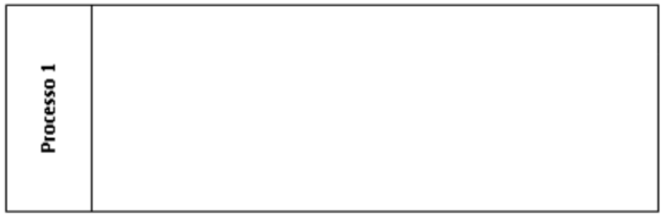

Cada Piscina é um espaço **independente** . Isso significa que ela **não pode compartilhar Fluxos de Sequência com outra Piscina** . Os fluxos de sequência ficam dentro de cada Piscina. O que pode existir entre Piscinas é outro tipo de conexão, que já vamos ver. Além disso, as Piscinas são usadas para representar processos de negócios de alto nível e podem conter Raias dentro delas (o que também vamos detalhar em seguida). 

Agora, quando você tem um diagrama com mais de uma Piscina, isso recebe um nome específico: **Diagrama de Colaboração** . Nesse tipo de diagrama, cada Piscina representa um processo de negócios diferente, e a comunicação entre esses processos se dá por meio de linhas de mensagem conectando as Piscinas. Não é fluxo de sequência, é **mensagem** . 

As **Raias** são chamadas de Lanes em inglês. Se a Piscina é o grande container que representa um participante do processo, a Raia é a **divisão interna** dessa Piscina. É como se você pegasse aquela piscina olímpica e marcasse as raias no fundo, separando cada nadador. Cada Raia **organiza e categoriza as atividades** de acordo com funções ou responsabilidades específicas dentro daquele participante. 

Um exemplo clássico para entender isso na prática: imagine um processo de pedido de vendas. Você tem uma Piscina chamada "Empresa X" e, dentro dela, três Raias separadas: "Vendas", "Faturamento" e "Logística". Cada uma dessas Raias vai conter exatamente as atividades que são responsabilidade daquela função. O pessoal de Vendas cuida de uma parte, o Faturamento cuida de outra, a Logística de outra. Tudo dentro da mesma Piscina, mas cada um no seu espaço.

---

<!-- pagina: 34 -->

**Paolla Ramos Aula 04** 

E tem mais: as Raias podem ser **aninhadas** , ou seja, uma Raia pode conter outras Raias dentro dela para representar subfunções. Isso quer dizer que, se a função "Vendas" for grande o suficiente para justificar uma subdivisão, você pode quebrar essa Raia em "Vendas Internas" e "Vendas Externas", cada uma com suas próprias atividades. Isso é útil porque processos do mundo real são complexos, e às vezes uma função tem tantas responsabilidades distintas que faz todo sentido detalhar esse nível a mais no diagrama. 

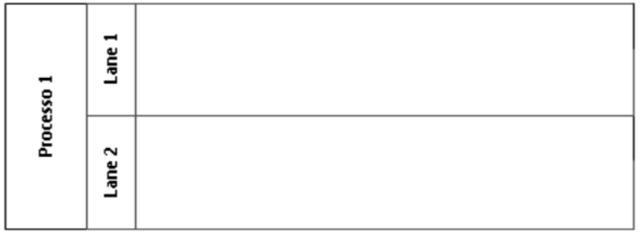

Veja um diagrama de colaboração com pools e lanes: 

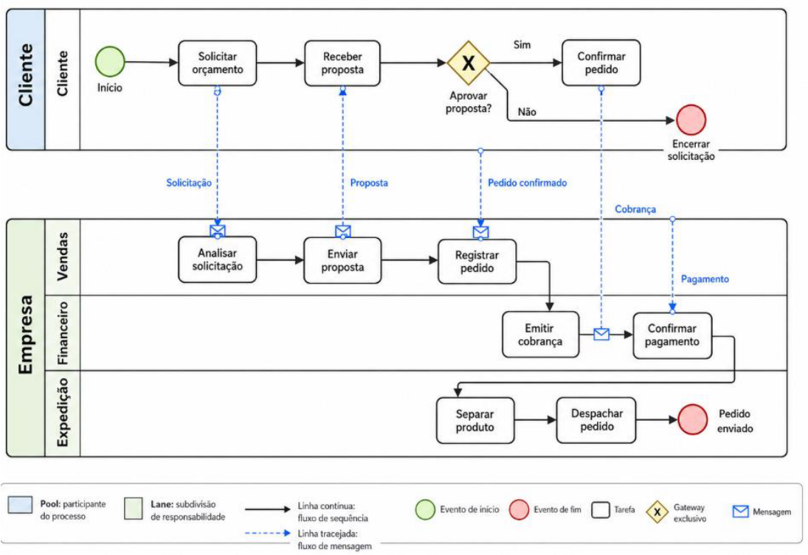

---

<!-- pagina: 35 -->

**Paolla Ramos Aula 04** 

**(FGV - 2026 - Analista Judiciário (TJ RJ)/Tecnologia da Informação/Analista de Gestão de TIC) O analista** **<mark>Paulo está modelando as atividades realizadas por cada um de seus colaboradores visando a organizá-las</mark> e categorizá-las, ilustrando as responsabilidades de cada um no processo de negócio do seu departamento.** 

**<mark>Para isso, empregando o BPMN, Paulo deve utilizar:</mark>** 

<mark>a) raias;</mark> 

<mark>b) associações; c) transações;</mark> 

<mark>d) coreografias;</mark> 

<mark>e) subprocessos.</mark> 

**<mark>Comentários:</mark>** 

<mark>(a) Correto. As raias (swim lanes) no BPMN são justamente o elemento usado para organizar e separar as responsabilidades de cada participante dentro de um processo. Cada colaborador fica na sua "faixa", deixando claro quem faz o quê; (b) Errado. Associações servem para conectar artefatos (como anotações) a elementos do fluxo, não para representar responsabilidades; (c) Errado. Transações são um tipo especial de subprocesso com comportamento de confirmação/cancelamento, sem relação com organização de responsabilidades; (d) Errado. Coreografias modelam a interação entre participantes, focando na troca de mensagens, não na organização interna de atividades; (e) Errado. Subprocessos agrupam atividades dentro de um processo maior, mas não têm a função de categorizar responsabilidades por colaborador.</mark> 

**<mark>Gabarito:</mark>** <mark>Letra A</mark> 

**(FGV - 2026 - Analista Judiciário (TJ RJ)/Tecnologia da Informação/Analista de Negócios) Em gestão de** **<mark>processos de negócio, handoff (transferências/passagens) é qualquer ponto em um processo em que o trabalho ou a informação passa de um sistema, pessoa, ou grupo para outro, o que pode gerar atrasos ou desconexões no processo e distorções ou perdas de informações. Uma das formas de otimizar um processo é simplificar e limitar as transferências quando possível, incluindo a automatização dos handoffs através</mark> da tecnologia.** 

**<mark>No BPMN, para explicitar os handoffs em um processo deve-se modelar um(a):</mark>** 

<mark>a) token; b) swimlane; c) manual task; d) atomic activity; e) adhoc subprocess.</mark> 

**<mark>Comentários:</mark>** 

<mark>(a) Errado. O token é um conceito abstrato do BPMN que representa o fluxo de execução passando pelos elementos — ele não representa visualmente a transferência entre participantes; (b) Correto. A swimlane (piscina/raia) é exatamente o elemento usado para representar os handoffs! Quando o fluxo cruza de uma</mark>

---

<!-- pagina: 36 -->

**Paolla Ramos Aula 04** 

<mark>raia para outra, fica explícito que houve uma transferência de responsabilidade entre pessoas, sistemas ou grupos; (c) Errado. A manual task representa uma tarefa feita manualmente, sem automação — mas não explicita, por si só, a transferência entre participantes; (d) Errado. Atomic activity é uma atividade indivisível no processo, sem relação direta com a representação de handoffs entre participantes; (e) Errado. O adhoc subprocess é um subprocesso cujas atividades não seguem uma ordem predefinida — não tem relação com a explicitação de transferências entre participantes.</mark> 

**Gabarito:** Letra B 

## Artefatos 

Por fim, vamos falar agora sobre os **artefatos** em BPMN. Artefatos existem para **fornecer informações adicionais** que ajudam a entender o processo. Eles não afetam nem o fluxo de sequência nem o fluxo de mensagens. Ou seja, são elementos **puramente explicativos** , de apoio visual e documental. Em BPMN, existem dois tipos de artefatos: **Grupos** e **Anotações** . 

Visualmente, um **Grupo** é representado por uma linha retangular pontilhada que envolve diferentes atividades e eventos no diagrama. Imagine que você está modelando um processo longo e cheio de etapas, e quer deixar claro quais delas estão relacionadas a um requisito regulatório específico ou a um objetivo de negócio comum. Você não quer criar uma nova raia, não quer mudar o fluxo, só quer dizer: "olha, essas atividades aqui estão conectadas por algum motivo". Grupo serve para isso. 

O ponto mais importante sobre os Grupos é que eles **não afetam em nada o fluxo do processo** . Nenhuma restrição é adicionada, nenhuma lógica muda. É uma ferramenta puramente de documentação, que existe para organizar o diagrama visualmente e tornar a leitura mais fácil para quem precisa entender o processo. Pense neles como um marcador de texto numa apostila, em que você não muda o conteúdo, só chama atenção para o que importa. 

**Anotações** são aqueles elementos que aparecem no diagrama como um retângulo de linha pontilhada conectado por uma linha a algum outro elemento. Sabe quando você está lendo um processo desenhado em BPMN e se pergunta "mas por que essa atividade existe aqui?" ou "como exatamente esse gateway decide qual caminho tomar?" É justamente para responder essas perguntas que a Anotação existe. Você a usa para adicionar informações textuais ao diagrama, seja para explicar o propósito de uma atividade, para detalhar melhor um evento ou para esclarecer a lógica por trás de um gateway. 

Assim como os Grupos, as Anotações **não interferem em absolutamente nada no fluxo do processo** . Elas são puramente uma ferramenta de documentação. O processo continua exatamente igual com ou sem elas ali. A diferença é que, com uma boa anotação, qualquer pessoa que olhar para aquele diagrama vai entender o que está acontecendo, sem precisar ir perguntar para quem o desenhou. 

**(FGV - 2025 - Analista de Tecnologia da Informação (EBSERH)) BPMN 2.0 é uma linguagem gráfica** **<mark>padronizada para representar processos de negócios que podem ser facilmente compreensíveis por todos</mark>**

---

<!-- pagina: 37 -->

**Paolla Ramos Aula 04** 

**<mark>os usuários, desde o nível empresarial que criam os rascunhos iniciais dos processos, aos desenvolvedores</mark> técnicos responsáveis pela implementação da tecnologia que executará esses processos.** 

**<mark>Com base no BPMN 2.0, relacione os elementos de modelagem elencados a seguir às suas respectivas representações gráficas.</mark>** 

**<mark>1. Fluxo de mensagem  2. Objeto de Dados 3. Lane 4. Gateway</mark>** 

**( ) ( ) ( ) ( )** 

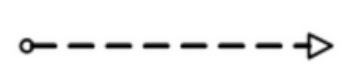

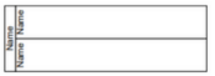

**<mark>A relação correta, na ordem apresentada, é</mark>** 

<mark>a) 4 – 2 – 1 – 3. b) 1 – 3 – 4 – 2. c) 3 – 4 – 1 – 2. d) 4 – 1 – 3 – 2. e) 2 – 4 – 3 – 1.</mark> 

**<mark>Comentários:</mark>** 

<mark>Na ordem apresentada, o losango representa gateway; a linha tracejada com seta vazada representa fluxo de mensagem; o retângulo dividido em faixas representa lane; e o documento representa objeto de dados;</mark> 

**Gabarito:** Letra D 

Veja a seguir um exemplo com grupos e anotações de texto aplicados juntos num diagrama:

---

<!-- pagina: 38 -->

**Paolla Ramos Aula 04** 

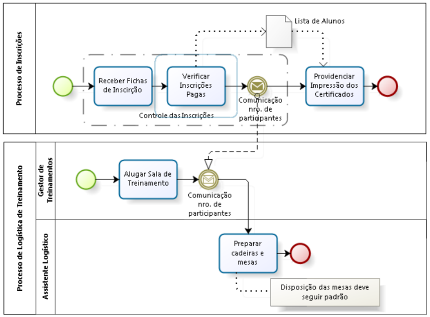

A imagem a seguir resume todos os elementos da nossa aula:

---

<!-- pagina: 39 -->

**Paolla Ramos Aula 04** 

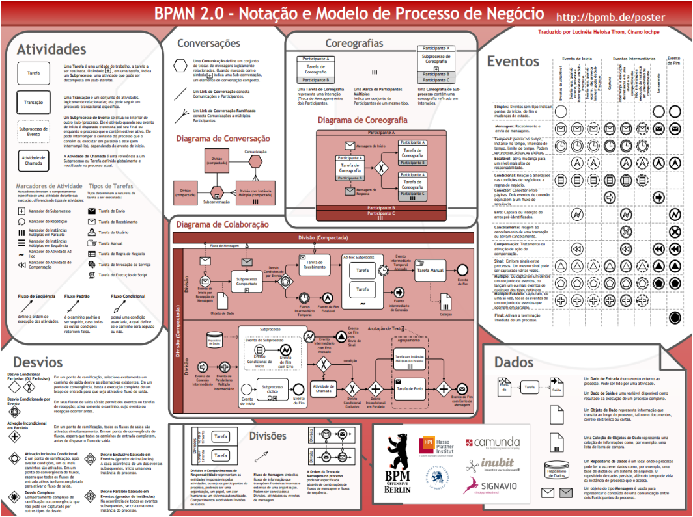

## Anexo: Bizagi Modeler 

Vamos falar agora de uma ferramenta específica que aparece bastante quando o assunto é modelagem de processos: o **Bizagi** . Lembra que lá no comecinho da aula eu comentei que a maioria dos diagramas que você viu até aqui foram desenhados nessa ferramenta? Pois é, chegou a hora de olhar para ela com mais carinho. 

Antes de qualquer coisa, preciso cravar uma distinção que confunde muita gente. **BPMN é uma notação** , ou seja, uma linguagem, um conjunto de regras gráficas. Já o **Bizagi é uma ferramenta** , um software que você instala no computador para desenhar diagramas usando essa notação. É a mesma diferença que existe entre o português, que é a língua, e o Microsoft Word, que é o programa onde você escreve. Quando a prova tentar te dizer que "Bizagi é uma notação de modelagem", já pode marcar como errado na hora. Bizagi é a ferramenta, BPMN é a notação, e o Bizagi adota o BPMN como padrão. 

E aproveito para reforçar outra coisa, porque a banca adora essa pegadinha: Bizagi não é técnica de criatividade em grupo, isso é brainstorming; não é técnica de levantamento de requisitos, isso é entrevista, etnografia, prototipação; e muito menos é um tipo de requisição HTTP. Pode parecer 

**37**

---

<!-- pagina: 40 -->

**Paolla Ramos Aula 04** 

bobagem, mas é comum aparecer a palavra "Bizagi" jogada no meio de uma lista de coisas que não têm nada a ver, só para testar se você sabe o que ela de fato é: uma **ferramenta de modelagem** de processos de negócio. 

#### **O que é o Bizagi** 

Bizagi é uma plataforma criada justamente para apoiar organizações que trabalham com a abordagem de processos. Na prática, ela cobre todo o ciclo de vida de um processo, desde o desenho inicial no papel até a automação e o monitoramento da execução no dia a dia da empresa. 

A plataforma se divide em duas frentes. 

A primeira é o **Bizagi Modeler** , que é a ferramenta gratuita voltada para **modelar e documentar** processos. É com ele que você desenha o fluxograma, organiza as atividades, descreve cada etapa e gera a documentação do processo. É também o protagonista da maioria das questões de concurso, geralmente citado com a versão específica, como "Bizagi Modeler 3.1, em português" ou "Bizagi Process Modeler 2.9". 

A segunda frente é a suíte de automação, que envolve o **Bizagi Studio** e o servidor de automação. Aqui o processo deixa de ser só um desenho e passa a rodar de verdade, com formulários, banco de dados e regras executando automaticamente. Por isso o Bizagi é classificado como uma ferramenta de **BPMS** (Business Process Management Suite, ou sistema de gestão de processos de negócio), e não apenas como um editor de diagramas. 

Uma coisa que você precisa guardar é que o Bizagi Modeler usa o **BPMN** como padrão de modelagem, na sua versão 2.0. Toda aquela simbologia que estudamos ao longo da aula, os eventos, as atividades, os gateways, as raias, está disponível na paleta do Bizagi exatamente porque ele segue esse padrão. 

Vale lembrar também que o Bizagi não é a única ferramenta do mercado. Ele costuma aparecer ao lado de concorrentes como **Bonita** (Bonita BPM), **Orquestra** , **jBPM** , **Camunda** , **Aris** e o velho **Microsoft Visio** . Todas elas, de um jeito ou de outro, servem para modelar processos de negócio. O Bizagi só é, talvez, o nome mais lembrado por aqui, por ser gratuito, em português e bem fácil de usar. 

#### **A paleta de elementos** 

Quando você abre o Bizagi Modeler, do lado da tela fica a chamada **paleta de elementos** , que é de onde você arrasta as formas para montar o diagrama. E como o Bizagi segue o BPMN, essa paleta traz justamente os elementos da notação que já conhecemos: **eventos** (início, intermediário e fim), **atividades** (tarefas e subprocessos), **gateways** , além das **raias e pools** e dos **artefatos** . 

O que está na paleta são elementos válidos da notação. Então "Tarefa", "Início", "Gateway", "Subprocesso" e "Raia" estão lá. Por outro lado, palavras que parecem plausíveis mas não correspondem a elementos da notação, como "Saída" ou "Gatilho", costumam ser pegadinhas de prova. "Saída" não é um elemento autônomo da paleta, e o que encerra o fluxo é o evento de **fim** , não uma "saída".

---

<!-- pagina: 41 -->

**Paolla Ramos Aula 04** 

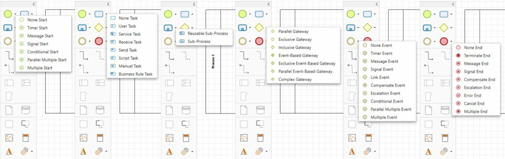

#### **Tipos de tarefa** 

Dentro das atividades, a tarefa é o elemento mais básico, aquela caixinha de cantos arredondados que representa um trabalho a ser feito. Mas o Bizagi, seguindo o BPMN, permite especificar **que tipo de tarefa** é aquela, e isso aparece como um pequeno ícone no canto superior esquerdo da caixa. Saber identificar cada ícone é algo que é cobrado com frequência, então vamos aos principais. 

A **tarefa de usuário** é aquela que exige interação humana com apoio de um sistema, como uma pessoa preenchendo um formulário ou aprovando uma solicitação na tela. A **tarefa manual** também é feita por uma pessoa, mas sem o apoio de nenhum software, é o trabalho braçal, físico, como separar documentos numa mesa. A **tarefa de serviço** é o oposto: ela é automática, executada por um sistema ou serviço web, sem ninguém apertando botão. A **tarefa de script** roda um pequeno trecho de código automaticamente dentro do próprio motor de processos. As **tarefas de envio e de recebimento** cuidam, respectivamente, de mandar e de aguardar mensagens. E ainda existe a **tarefa de regra de negócio** , usada quando a atividade consiste em aplicar um conjunto de regras para chegar a um resultado. 

Além do tipo, uma tarefa pode receber marcadores que mudam o comportamento dela. O marcador de **múltiplas instâncias** , por exemplo, indica que aquela atividade se repete várias vezes, em paralelo ou em sequência. Então quando a questão fala em algo como "tarefa de usuário com execuções múltiplas", ela está combinando o tipo (usuário) com um marcador (múltiplas instâncias). 

Veja as tarefas completas:

---

<!-- pagina: 42 -->

**Paolla Ramos Aula 04** 

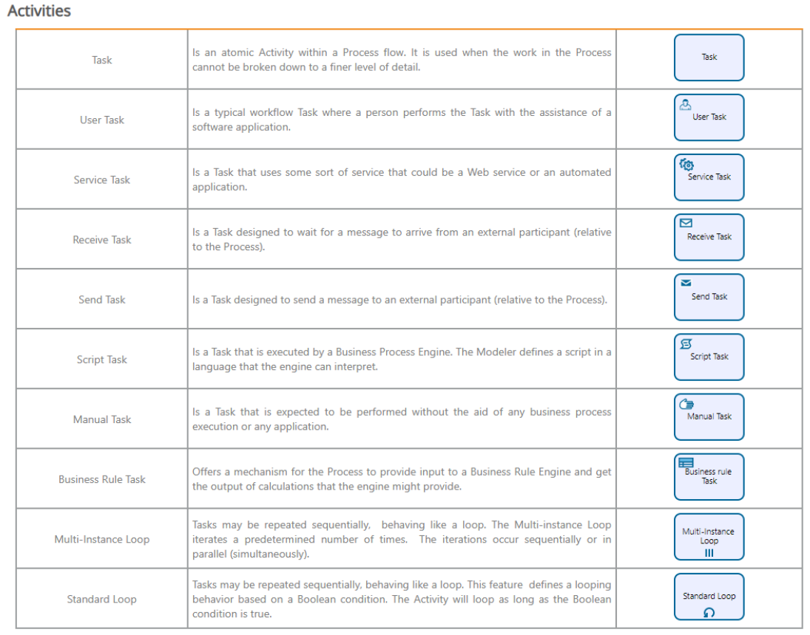

#### **Gateways** 

Os gateways, aqueles losangos que controlam o fluxo, também têm variações no Bizagi, e cada uma tem um comportamento bem diferente. 

O **gateway exclusivo** , que carrega um X por dentro, representa uma decisão em que apenas **um** caminho será seguido. As condições são avaliadas e o fluxo segue por uma única saída, aquela cuja condição foi satisfeita. É o famoso "ou um, ou outro", em que as condições são mutuamente exclusivas. Sempre que a questão descreve um ponto de decisão do tipo aprovar ou rejeitar um documento, está falando de um gateway exclusivo. 

O **gateway paralelo** , marcado com um sinal de mais, é diferente. Ele não avalia condição nenhuma. A função dele é simplesmente disparar **todos** os caminhos de saída ao mesmo tempo, em paralelo. Por isso, quando a banca disser que o gateway paralelo "escolhe um caminho com base em uma condição", está errado, porque escolha condicional é coisa do exclusivo, não do paralelo. 

O **gateway inclusivo** , com um círculo por dentro, é o meio-termo. Ele avalia várias condições e libera **todos** os caminhos cujas condições forem verdadeiras, podendo ser um, dois ou todos. Aqui as 

**40**

---

<!-- pagina: 43 -->

**Paolla Ramos Aula 04** 

condições não precisam ser mutuamente exclusivas, mais de uma pode ser verdadeira ao mesmo tempo. Por fim, há o **gateway complexo** , reservado para situações de controle mais elaboradas, que não se encaixam nos casos anteriores. 

Veja os gateways completos: 

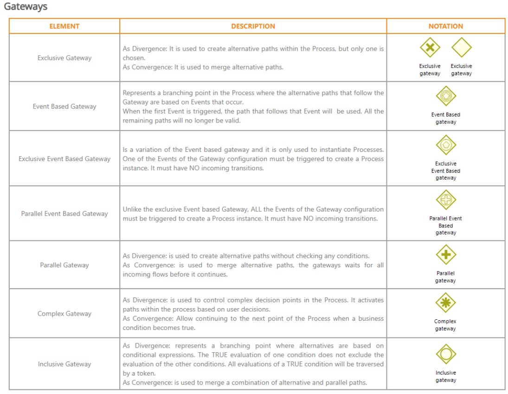

#### **Eventos** 

Os eventos são representados por círculos e indicam algo que acontece durante o processo. A divisão básica você já conhece: **evento de início** (círculo de linha fina), **evento intermediário** (círculo de linha dupla) e **evento de fim** (círculo de linha grossa). O que o Bizagi, seguindo o BPMN, acrescenta é o **tipo** de cada evento, sinalizado por um símbolo desenhado dentro do círculo. 

Um evento de **mensagem** traz o desenho de um envelope. Um evento de **temporizador** (timer) mostra um reloginho e é usado quando algo depende do tempo, como esperar três dias. O evento de **erro** carrega um raio e indica que algo deu errado no fluxo. Cuidado com a pegadinha clássica: um evento de fim do tipo erro não significa "terminou com sucesso", muito pelo contrário, ele sinaliza que o processo terminou por causa de um problema. Há ainda o evento de **vínculo** (link), representado por uma seta,

---

<!-- pagina: 44 -->

**Paolla Ramos Aula 04** 

usado para conectar partes do diagrama sem precisar puxar uma linha de uma ponta à outra da tela; o evento **condicional** , ligado a uma regra que precisa ser satisfeita; e o evento **múltiplo** , que reúne mais de um gatilho possível. 

Veja os eventos de início e fim: 

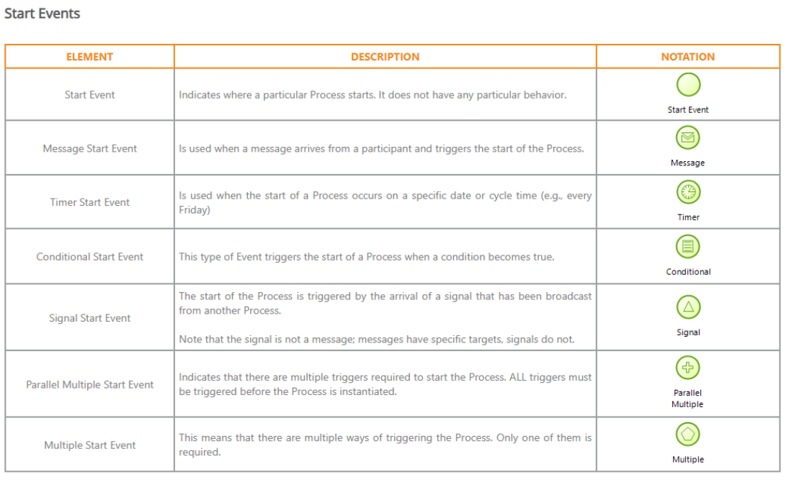

---

<!-- pagina: 45 -->

**Paolla Ramos Aula 04** 

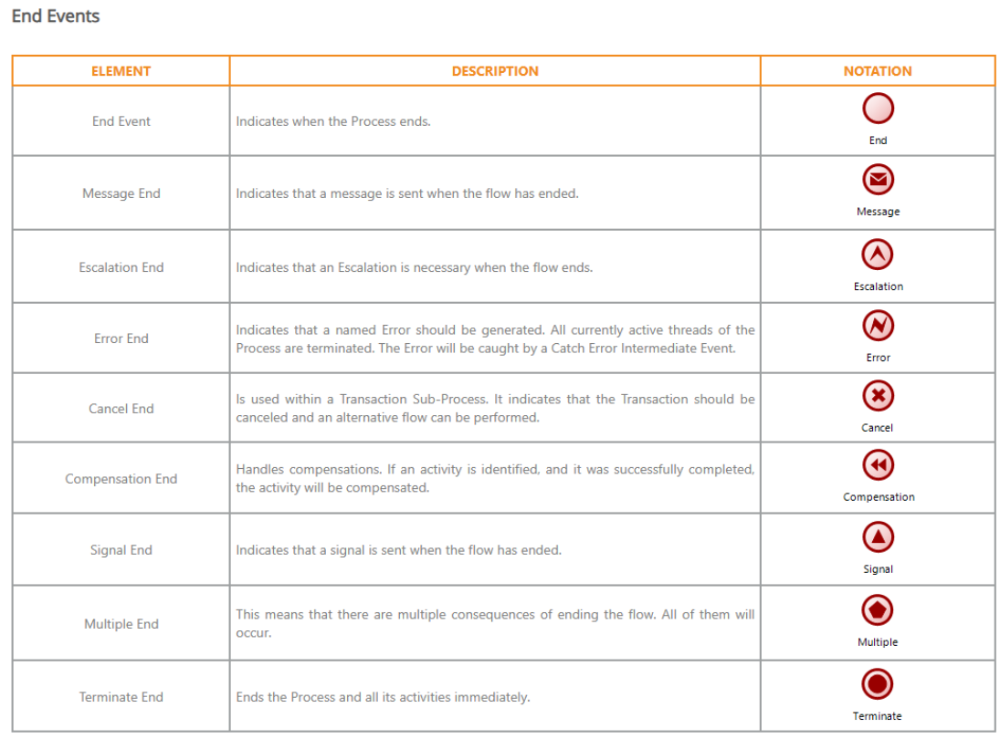

#### **Pools, raias e fases** 

Para organizar quem faz o quê, o Bizagi traz três elementos que andam juntos. 

A **pool** , ou piscina, representa um **participante** do processo, normalmente uma organização inteira ou uma entidade completa. Quando você precisa mostrar duas empresas conversando, desenha duas pools. Dentro de uma pool, ficam as **raias** (lanes), que subdividem as responsabilidades **dentro daquela mesma organização** , como o setor financeiro, o jurídico e a diretoria. Veja que a relação é essa: a pool é a organização, e as raias são os papéis internos dela. Se a questão inverter isso, dizendo que a raia representa organizações distintas e a pool subdivide responsabilidades internas, está trocando os conceitos e a alternativa fica errada. 

Há ainda as **fases** , ou milestones, que dividem o diagrama no sentido vertical, marcando etapas ou estágios do processo ao longo do tempo, como "análise", "aprovação" e "execução". Enquanto a raia responde "quem faz", a fase responde "em que momento". 

E para a comunicação entre participantes, o elemento certo é o **fluxo de mensagem** , aquela linha tracejada que liga uma pool à outra e representa a troca de informações entre entidades. Não confunda com o **fluxo de sequência** , que é a linha cheia e mostra apenas a ordem das atividades dentro de um mesmo participante.

---

<!-- pagina: 46 -->

**Paolla Ramos Aula 04** 

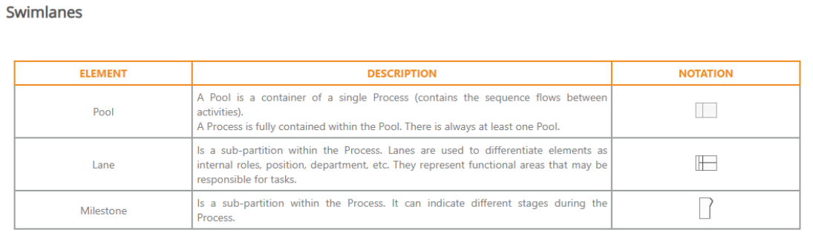

#### **Subprocessos** 

O subprocesso é uma atividade que, por dentro, esconde um fluxo inteiro de outras atividades. Ele aparece como uma caixa com um sinal de mais, indicando que dá para "expandir" e ver o detalhamento lá dentro. Serve justamente para decompor um processo grande em partes menores e até reaproveitar trechos que se repetem. 

O Bizagi trabalha com alguns tipos de subprocesso que vale a pena conhecer. 

O **subprocesso ad hoc** é aquele em que as atividades ficam **soltas** , sem um fluxo sequencial rígido obrigatório entre elas. A ideia é que o executor faça as tarefas na ordem que fizer mais sentido, sem um caminho fixo amarrando uma na outra. Já o **subprocesso múltiplo** representa uma atividade que se repete sobre um conjunto de itens, uma **collection** . A configuração desse comportamento é feita no assistente (wizard) do processo, e a definição da coleção passa pela edição do modelo de dados, onde se cria a chamada collection via Xpath. Além disso, ao acessar as **Opções Avançadas** de um subprocesso, o usuário consegue configurar diferentes casos de negócio; sem entrar nessas opções, valem as configurações básicas, padrão da ferramenta. 

#### **Mineração de processos (Process Mining)** 

Uma funcionalidade mais moderna que o Bizagi oferece é a **mineração de processos** , ou Process Mining. A ideia é que, em vez de você desenhar o processo na mão, baseado só em manuais ou na memória dos funcionários, a ferramenta reconstrói o fluxo **a partir de como ele realmente aconteceu** . Para isso, o Bizagi importa os **logs** de execução dos sistemas da organização e, a partir desses registros de eventos, gera o diagrama do processo refletindo o que de fato foi executado, e não apenas o que estava no papel. Os formatos de log aceitos para essa importação são o **XES** (Extensible Event Stream) e o **CSV** .

---

<!-- pagina: 47 -->

**Paolla Ramos Aula 04** 

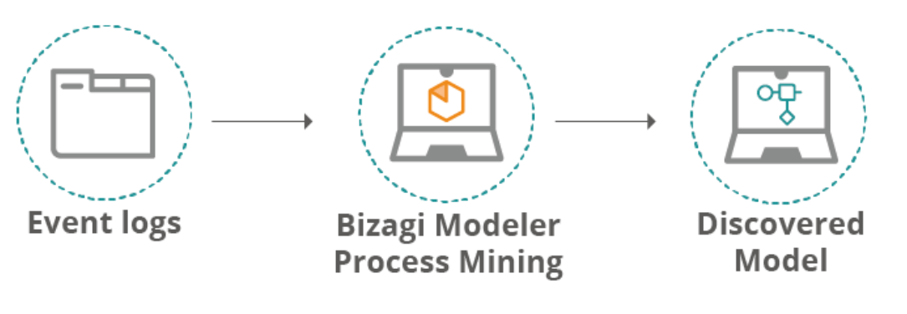

#### **Documentação e publicação** 

Além de desenhar o fluxo, o Bizagi Modeler é muito usado para **documentar** o processo de forma padronizada, gerando manuais e relatórios prontos para compartilhar. Tudo isso fica concentrado na guia **Publicar** . 

Pela guia Publicar, você consegue exportar a documentação do processo em vários formatos. Os mais cobrados, na versão 4.0, são **Word** , **PDF** , **Excel** , **Web** , **SharePoint** e **Wiki** . Repare que se trata de formatos de documentação e de ambientes de divulgação, não de outros editores de diagrama. Por isso, quando a questão coloca o **Visio** no meio das opções da guia Publicar, ele é justamente o intruso, porque o Visio não está nessa lista. 

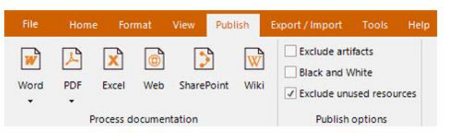

Existe ainda a exportação do próprio diagrama. O Bizagi permite salvar o desenho como imagem, no formato **PNG** , e exportar o modelo em **XPDL** , um formato de intercâmbio que permite levar o processo de uma ferramenta para outra. Vale lembrar, por fim, que essa portabilidade entre ferramentas diferentes só é possível porque o BPMN define um padrão de troca de diagramas, o BPMN DI, baseado em XML, que carrega não apenas a lógica do processo, mas também as posições, os tamanhos e as cores de cada elemento na tela. 

#### **Bizagi na automação de processos** 

Para fechar, vale entender o Bizagi para além do desenho. Quando uma organização quer realmente **automatizar** um processo, ela usa a suíte completa, e aí o diagrama feito no Modeler é só o ponto de partida. A partir dele, define-se o **modelo de dados** do processo, que organiza as informações que vão circular; criam-se os **formulários** associados a cada atividade, que servem para padronizar a entrada

---

<!-- pagina: 48 -->

**Paolla Ramos Aula 04** 

de dados pelas pessoas; configuram-se as **regras de negócio** , que determinam as decisões e validações automáticas; e atribuem-se as **responsabilidades** , dizendo quem executa cada tarefa. 

É por causa desse conjunto que o Bizagi consegue tratar o ciclo completo do processo, do modelo conceitual à execução monitorada. E é também por isso que, em provas de gestão por processos, ele aparece tanto como apoio à fase de redesenho, ajudando a desenhar o fluxo otimizado e a tratar a lista de desconexões do processo, quanto como plataforma de automação propriamente dita. 

**(Instituto AOCP - 2024 - Especialista (MGI)/Análise de Processos de Negócios/PSS) No Bizagi Modeler, a** **<mark>modelagem de processos geralmente é realizada por analistas de negócios com base em múltiplas fontes de informações, como guias de procedimentos internos ou experiência de funcionários seniores. Através da mineração de processos (Process Mining) é possível visualizar todas as formas possíveis de realizar um processo, tanto as teóricas quanto as reais, refletindo um quadro completo das atividades tal como foram</mark> efetivamente executadas.** 

**<mark>Dentro do Bizagi, a mineração de processos é uma funcionalidade em que é possível</mark>** 

<mark>a) acessar as propriedades dos elementos gateway, relacionados às tomadas de decisão, e importar as validações de regras de negócio do código-fonte dos Sistemas Empresariais da Organização, nos formatos JAVA, CS (C Sharp) e JS (Javascript).</mark> 

<mark>b) analisar as propriedades de cada elemento do processo e importar sua descrição de logs de arquivos dos Sistemas Empresariais da Organização, podendo ser nas extensões XML (Extensible Markup Language) ou TXT (Text).</mark> 

<mark>c) importar os logs dos Sistemas Empresariais para a geração do diagrama de processos, podendo ser nos formatos XES (Extensible Event Stream) e CSV (Comma Separated Value).</mark> 

<mark>d) adicionar links da Web descrevendo os elementos de cada processo, permitindo que, ao passar o mouse sobre o elemento, seja possível visualizar a descrição de cada item do processo proveniente da tag <description /> do HTML da página.</mark> 

<mark>e) exportar as expressões de validação dos elementos gateway em formato de linguagem de programação, para serem utilizadas diretamente no código-fonte dos Sistemas Empresariais da organização, nos formatos JAVA, CS (C Sharp) e JS (Javascript).</mark> 

**<mark>Comentários:</mark>** 

<mark>(a) Errado. Essa opção fala de gateway e importação de regras de negócio em linguagens de programação, o que não corresponde à ideia de mineração de processos no Bizagi, que trabalha com dados de execução do processo; (b) Errado. Aqui há menção a propriedades dos elementos e descrição de logs, mas o foco da mineração não é detalhar elemento por elemento e sim reconstruir o fluxo a partir dos registros de eventos; (c) Correto. É isso mesmo: a mineração de processos no Bizagi permite importar logs dos sistemas para gerar o diagrama do processo, usando formatos como XES e CSV, com base na execução real; (d) Errado. Adicionar links da web e mostrar descrição ao passar o mouse é algo ligado à documentação ou navegação do modelo, não à funcionalidade de Process Mining; (e) Errado. Exportar expressões de validação para código-fonte trata de integração ou desenvolvimento, não da mineração de processos, que se baseia em logs para descobrir como o processo ocorreu.</mark>

---

<!-- pagina: 49 -->

**Paolla Ramos Aula 04** 

**<mark>Gabarito:</mark>** <mark>Letra C</mark> 

**<mark>(Instituto AOCP - 2024 - Especialista (MGI)/Análise de Processos de Negócios/PSS) Além de criar o desenho do fluxo de atividades de um processo, o Bizagi Modeler permite a criação de documentos de registros, juntamente com sua padronização.</mark>** 

**<mark>Assinale a alternativa que apresenta os formatos suportados para exportação e que podem ser visualizados na guia Publicar da versão 4.0 do Bizagi Modeler.</mark>** 

<mark>a) Word, PDF, Excel, Web, SharePoint e Wiki.</mark> 

<mark>b) Apenas Word e PDF.</mark> 

<mark>c) Apenas Word, PDF, Excel, Web.</mark> 

<mark>d) Excel, PDF, JPG, XML e JSON</mark> 

<mark>e) Excel, PDF, ODS, XML, JSON e YAML.</mark> 

**<mark>Comentários:</mark>** 

<mark>(a) Correto. Na guia Publicar do Bizagi Modeler 4.0, aparecem opções de exportação e publicação como Word, PDF, Excel, Web, SharePoint e Wiki, cobrindo documentação, planilhas e ambientes de divulgação do processo; (b) Errado. A alternativa reduz demais os formatos disponíveis, deixando de fora opções de publicação e exportação previstas na ferramenta; (c) Errado. Embora traga formatos válidos, a lista fica incompleta porque não inclui SharePoint e Wiki, que também aparecem na guia Publicar; (d) Errado. JPG, XML e JSON não correspondem ao conjunto indicado na guia Publicar dessa versão, então a alternativa foge do que a questão pede; (e) Errado. ODS, XML, JSON e YAML não fazem parte da relação apresentada na guia Publicar do Bizagi Modeler 4.0 segundo o enunciado.</mark> 

**Gabarito:** Letra A

---

<!-- pagina: 50 -->

**Paolla Ramos Aula 04** 

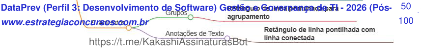

<!-- Start of picture text -->
DataPrev (Perfil 3: Desenvolvimento de Software) Gestão e Governança de TI - 2026 (Pós -Edital) 50 www.estrategiaconcursos.com.br 100 https://t.me/KakashiAssinaturasBot <!-- End of picture text -->

---

<!-- pagina: 51 -->

**Paolla Ramos Aula 04** 

# **– RESUMO BPMN** 

##### **FERNANDO PEDROSA - HTTPS://WWW.INSTAGRAM.COM/PROF.FERNANDOPEDROSA** 

## Visão Geral — BPMN 

**BPMN** (Business Process Model and Notation) é um padrão gráfico para modelagem de processos de negócios, desenvolvido pela **BPMI** e atualmente mantido pela **OMG** (Object Management Group). Fornece uma ponte entre o design de processos e sua implementação. 

- Versão atual relevante: **BPMN 2.0 (2011)** — expandiu para orquestração e coreografias; 2.0.1 (2013) e 2.0.2 (2014) trouxeram correções 

- BPMN 1.0 lançado em 2004 pela BPMI; versões 1.1 e 1.2 trouxeram atualizações e correções 

- Compreendida por analistas de negócios, técnicos e gerentes — linguagem universal de processos 

- Pode modelar processos internos **sem** necessidade de torná-los executáveis, mas também suporta execução automatizada 

PEGADINHA: BPMN é especificada pela **OMG** , não pela BPMI (que apenas a criou). A OMG também mantém UML. 

## Tipos de Processos e Diagramas 

### Processos Privados (Internos) 

- Ocorrem dentro de uma **única organização** 

- Representados em um **único Pool** , com raias para funções internas 

- A orquestração define sequência, regras, eventos e gateways 

### Processos Públicos (Colaboração) 

- Envolvem mais de uma organização 

- Representados por múltiplos Pools com linhas de mensagem entre eles 

- A orquestração define coordenação entre organizações distintas 

### Coreografia 

- Modela a **troca de mensagens** entre duas ou mais entidades 

- Foco na **interação entre entidades** , não na sequência interna de atividades 

- Diagrama próprio: atividades de coreografia representadas como círculos; participantes como retângulos ao redor do perímetro

---

<!-- pagina: 52 -->

**Paolla Ramos Aula 04** 

### Colaboração (Processo Global) 

- Mostra interações entre dois ou mais processos representados como Pools 

- Linhas de mensagem representam comunicação entre os processos 

- Inclui eventos, atividades, gateways e outros elementos BPMN 

DISTINÇÃO CRÍTICA: **Orquestração** = coordenação de atividades dentro de uma entidade. **Coreografia** = troca de mensagens entre entidades. **Colaboração** = diagrama que mostra múltiplos processos/pools interagindo. 

## Estrutura Geral dos Elementos BPMN 2.0 

- **Objetos de Fluxo** : Eventos, Atividades, Gateways 

- **Dados** : Objetos de Dados, Dados de Entrada, Dados de Saída, Armazenamento de Dados 

- **Objetos de Conexão** : Fluxo de Sequência, Fluxo de Mensagem, Associações, Associações de Dados 

- **Partições** : Piscinas (Pools), Raias (Lanes) 

- **Artefatos** : Grupos, Anotações de Texto 

## Objetos de Fluxo 

### Eventos 

- Representados por **círculos** — indicam algo que "acontece" no processo 

- **Evento de Início** : círculo de linha simples (fina) — marca onde o processo começa 

- **Evento Intermediário** : círculo com **borda dupla** — ocorre durante o processo 

- **Evento de Fim** : círculo de linha **grossa** — marca onde o processo termina 

- Eventos possuem **gatilhos (triggers)** : mensagem, temporizador, erro, sinal, entre outros 

MEMORIZE: Início = linha simples / Intermediário = borda dupla / Fim = linha grossa. Cobrado frequentemente em prova com representações visuais. 

### Atividades 

- Representadas por retângulos com cantos arredondados 

- Dividem-se em Tarefas (atômicas, indivisíveis) e Subprocessos (decomponíveis) 

### Tipos de Tarefas 

- **Abstrata** : tipo mais usado nos estágios iniciais do desenvolvimento 

- **De Serviço** : ocorre automaticamente, sem intervenção humana 

- **De Recebimento** : recebimento de mensagem (similar ao evento intermediário de recebimento) 

- **De Envio** : envio de mensagem (similar ao evento intermediário de envio) 

- **De Usuário** : executada por pessoa com auxílio de sistema

---

<!-- pagina: 53 -->

**Paolla Ramos Aula 04** 

- **De Script** : existe um roteiro/checklist a ser seguido 

- **Manual** : executada por pessoa sem qualquer intervenção de sistema 

- **De Regra de Negócio** : envia informações a um Motor de Regras de Negócio e obtém resultado 

### Tipos de Subprocessos 

- **Incorporado** : herda características do processo pai; não pode conter pools ou lanes 

- **Reutilizável** : referência a outro processo, indicando reuso no fluxo 

- **Eventual** : conjunto de atividades que pode ou não ocorrer; início vinculado a um evento, não à sequência 

- **Transacional** : conjunto de atividades que deve ser realizado em uma única transação (ex.: operação bancária) 

- Subprocessos podem ser **colapsados** (símbolo [+] na base, detalhes ocultos) ou **expandidos** (atividades internas visíveis) 

### Gateways (Desvios) 

Representados por **losangos** — controlam divergência e convergência do fluxo 

TABELA-RESUMO DE GATEWAYS — cobrada diretamente em prova: 

- **Exclusivo** (X): apenas **um** caminho é ativado após avaliação de condições 

- **Inclusivo** (O): **um ou mais** caminhos podem ser ativados em combinações diversas 

- **Paralelo** (+): **todos** os caminhos de saída são executados simultaneamente 

- **Baseado em Evento** (círculo de evento interno): continuação depende de **evento específico** 

- **Complexo** (*): modela comportamento complexo de ramificação não representável pelos demais tipos 

PEGADINHA: Gateway **Exclusivo** = somente 1 caminho. Gateway **Inclusivo** = 1 ou mais 

caminhos. Gateway **Paralelo** = TODOS os caminhos. Não confundir inclusivo com paralelo. 

## Dados 

### Tipos de Objetos de Dados 

- **Objeto de Dados** (Data Object): representa conjunto de informações no contexto do processo — ícone de página com ponta dobrada 

- **Dados de Entrada** (Data Input): evento externo ao processo que pode ser lido por uma atividade 

- **Dados de Saída** (Data Output): variável disponível como resultado da execução de um processo completo 

- **Armazenamento de Dados** (Data Store): local onde o processo lê e escreve dados (ex.: banco de dados, sistema de arquivos) 

- Objetos de Dados podem ter **estados** representados por sublinhados (ex.: "Pedido Recebido", "Pedido Processado")

---

<!-- pagina: 54 -->

**Paolla Ramos Aula 04** 

Objetos de dados representam **o que acontece com os dados** no processo — não modelam a estrutura detalhada dos dados. 

## Objetos de Conexão 

### Fluxo de Sequência 

- Linha sólida com seta sólida 

- Mostra a ordem em que as atividades ocorrerão 

- Conecta Atividades, Eventos e Gateways dentro de um mesmo Pool 

- Variações: Fluxo Condicional (condição avaliada) e Fluxo Padrão (caminho default) 

### Fluxo de Mensagem 

<!-- Start of picture text -->
==5460== <!-- End of picture text -->

- Linha pontilhada com seta de linha aberta 

- Mostra passagem de informações entre dois participantes (entre Pools distintos) 

- Usado em Diagramas de Colaboração 

### Associações 

- **Linha pontilhada com seta aberta** (simples, direcional ou bidirecional) 

- Associa informações adicionais (Objetos de Dados, Anotações) a Objetos de Fluxo 

### Associações de Dados 

- Linha sólida com seta de linha aberta 

- Conecta Objetos de Dados e Armazenamentos de Dados a Objetos de Fluxo 

- Mostram onde dados são necessários ou produzidos por Atividades, Eventos ou Gateways 

DISTINÇÃO VISUAL: Fluxo de Sequência = linha **sólida** , seta **sólida** . Fluxo de Mensagem = linha **pontilhada** , seta **aberta** . Associação = linha **pontilhada** , seta **aberta** (conecta artefatos). Associação de Dados = linha **sólida** , seta **aberta** . 

## Parti ões <u>ç</u> 

### Piscinas (Pools) 

- Representam um **participante** (pessoa ou organização) em um processo 

- São espaços independentes: **não compartilham Fluxos de Sequência** entre si 

- A comunicação entre Pools ocorre via **Fluxo de Mensagem** 

- Podem conter Raias internas

---

<!-- pagina: 55 -->

**Paolla Ramos Aula 04** 

### Raias (Lanes) 

- **Subpartes de uma Piscina** — organizam atividades por funções ou responsabilidades 

- Podem ser **aninhadas** para representar subfunções (ex.: "Vendas Internas" dentro de "Vendas") 

- Não são processos independentes — pertencem ao Pool que as contém 

REGRA: Fluxo de Sequência circula **dentro** do Pool (entre Lanes). Fluxo de Mensagem conecta **Pools diferentes** . Nunca um Fluxo de Sequência cruza Pools. 

## Artefatos 

### Grupos 

- Representados por **retângulo de linha pontilhada** agrupando atividades e eventos 

- Usados para destacar partes do diagrama sem adicionar restrições ao processo 

- **Não afetam o fluxo** — são puramente ferramentas de documentação 

- Úteis para agrupar atividades relacionadas a um objetivo ou requisito regulatório 

### Anotações de Texto 

- Representadas por retângulo de linha pontilhada com linha conectada ao elemento 

- Adicionam informações textuais explicativas ao diagrama 

- Não afetam o fluxo — são puramente ferramentas de documentação 

Tanto Grupos quanto Anotações são artefatos puramente documentais — não interferem na lógica ou no fluxo do processo.

---

<!-- pagina: 56 -->

**Paolla Ramos Aula 04** 

# **<mark>Questões Comentadas</mark>** 

**1. (FGV - 2026 - Analista Judiciário (TJ RJ)/Tecnologia da Informação/Analista de Gestão de TIC) O analista Paulo está modelando as atividades realizadas por cada um de seus colaboradores visando a organizá-las e categorizá-las, ilustrando as responsabilidades de cada um no processo de negócio do seu departamento.** 

**Para isso, empregando o BPMN, Paulo deve utilizar:** 

a) raias; 

b) associações; 

c) transações; 

d) coreografias; 

e) subprocessos. 

###### **Comentários:** 

(a) Correto. As raias (swim lanes) no BPMN são justamente o elemento usado pra organizar e separar as responsabilidades de cada participante dentro de um processo. Cada colaborador fica na sua "faixa", deixando claro quem faz o quê; (b) Errado. Associações servem pra conectar artefatos (como anotações) a elementos do fluxo, não pra representar responsabilidades; (c) Errado. Transações são um tipo especial de subprocesso com comportamento de confirmação/cancelamento, sem relação com organização de responsabilidades; (d) Errado. Coreografias modelam a interação entre participantes, focando na troca de mensagens, não na organização interna de atividades; (e) Errado. Subprocessos agrupam atividades dentro de um processo maior, mas não têm a função de categorizar responsabilidades por colaborador. 

###### **Gabarito:** Letra A 

**2. (FGV - 2026 - Analista Judiciário (TJ RJ)/Tecnologia da Informação/Analista de Gestão de TIC) O analista Antônio precisa otimizar os processos da sua diretoria, pois haverá corte de pessoal. Para isso, ele modelou os processos atuais e identificou gargalos e atividades redundantes.** 

**Para contornar os problemas identificados, Antônio, na sequência, redesenhou o processo modelando:** 

a) um AS-IS; b) um TO-BE; c) um trigger;

---

<!-- pagina: 57 -->

**Paolla Ramos Aula 04** 

d) um compensation flow; 

e) indicadores de desempenho. 

###### **Comentários:** 

(a) Errado. O AS-IS representa o processo atual, como ele é hoje. O Antônio já fez essa parte quando modelou os processos existentes e identificou os gargalos; (b) Correto. O TO-BE é exatamente o modelo do processo futuro, redesenhado para corrigir os problemas encontrados. É o "como queremos que fique"; (c) Errado. Trigger é um evento que dispara o início de um processo, não tem nada a ver com redesenho; (d) Errado. Compensation flow lida com desfazer ações em caso de erro em fluxos, não com redesenho de processos; (e) Errado. Indicadores de desempenho medem resultados, mas não representam o redesenho do processo em si. 

###### **Gabarito:** Letra B 

**3. (FGV - 2026 - Analista Judiciário (TJ RJ)/Tecnologia da Informação/Analista de Negócios) Em gestão de processos de negócio, handoff (transferências/passagens) é qualquer ponto em um processo em que o trabalho ou a informação passa de um sistema, pessoa, ou grupo para outro, o que pode gerar atrasos ou desconexões no processo e distorções ou perdas de informações. Uma das formas de otimizar um processo é simplificar e limitar as transferências quando possível, incluindo a automatização dos handoffs através da tecnologia.** 

###### **No BPMN, para explicitar os handoffs em um processo deve-se modelar um(a):** 

a) token; 

b) swimlane; 

c) manual task; 

d) atomic activity; 

e) adhoc subprocess. 

###### **Comentários:** 

(a) Errado. O token é um conceito abstrato do BPMN que representa o fluxo de execução passando pelos elementos — ele não representa visualmente a transferência entre participantes; (b) Correto. A swimlane (piscina/raia) é exatamente o elemento usado para representar os handoffs! Quando o fluxo cruza de uma raia para outra, fica explícito que houve uma transferência de responsabilidade entre pessoas, sistemas ou grupos; (c) Errado. A manual task representa uma tarefa feita manualmente, sem automação — mas não explicita, por si só, a transferência entre participantes; (d) Errado. Atomic activity é uma atividade indivisível no processo, sem relação direta com a representação de handoffs entre participantes; (e) Errado. O adhoc subprocess é um subprocesso cujas atividades não seguem uma ordem predefinida — não tem relação com a explicitação de transferências entre participantes.

---

<!-- pagina: 58 -->

**Paolla Ramos Aula 04** 

###### **Gabarito:** Letra B 

**4. (FGV - 2026 - Analista Judiciário (TJ RJ)/Tecnologia da Informação/Analista de Negócios) O analista de negócios Pedro está modelando os processos do seu departamento e verificou que há diversas atividades que podem ser executadas em paralelo, otimizando tempo.** 

**Para modelar atividades que ocorrem ao mesmo tempo, dividindo e depois sincronizando os fluxos paralelos, Pedro deve utilizar o gateway:** 

<!-- Start of picture text -->
a) <!-- End of picture text -->

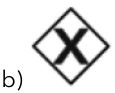

<!-- Start of picture text -->
b) <!-- End of picture text -->

<!-- Start of picture text -->
c) <!-- End of picture text -->

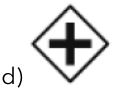

<!-- Start of picture text -->
d) <!-- End of picture text -->

###### **Comentários:** 

(a) Errado. O losango vazio representa um gateway genérico/indefinido, não indicando especificamente paralelismo entre atividades; 

(b) Errado. O losango com “X” representa o gateway exclusivo, usado para escolher apenas um caminho entre alternativas possíveis; 

(c) Errado. O losango com círculo representa o gateway inclusivo, no qual um ou mais caminhos podem ser executados, mas não necessariamente todos em paralelo; 

(d) Correto. O losango com sinal de “+” representa o gateway paralelo, usado para dividir o fluxo em atividades simultâneas e depois sincronizá-las; 

(e) Errado. O símbolo apresentado não corresponde ao gateway paralelo, mas a outro tipo de gateway/evento complexo, não sendo o adequado para execução simultânea obrigatória. 

###### **Gabarito:** Letra D

---

<!-- pagina: 59 -->

**Paolla Ramos Aula 04** 

**5. (FGV - 2026 - Analista Judiciário (TJ RJ)/Tecnologia da Informação/Analista de Negócios) Observe a seguir o recorte de um diagrama BPMN utilizado para modelar algumas das atividades envolvidas durante a distribuição de processo judicial.** 

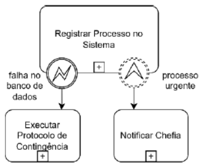

**Os eventos utilizados para representar a falha no banco de dados e o processo urgente, respectivamente, são:** 

a) Throw – Link Intermediate Event e Throw – Message Intermediate Event; 

b) Throw – Escalation Intermediate Event e Catch – Message Intermediate Event; 

c) Catch – Parallel Multiple Intermediate Event e Non-interrupting Boundary – Catch – Multiple Intermediate Event; 

d) Boundary – Catch – Cancel Intermediate Event e Non-interrupting – Boundary – Conditional Intermediate Event; 

e) Boundary – Catch – Error Intermediate Event e Non-interrupting – Boundary – Catch – Escalation Intermediate Event. 

###### **Comentários:** 

(a) Errado. O evento de falha no banco de dados está anexado à borda da atividade, caracterizando um evento de borda, e não um evento intermediário de link; além disso, o processo urgente não é representado por evento de mensagem; 

(b) Errado. A falha no banco de dados não é um evento de escalonamento, mas sim um evento de erro; já o processo urgente não está representado como evento de mensagem; 

(c) Errado. A falha no banco de dados não usa marcador de múltiplos eventos paralelos; além disso, o evento de processo urgente possui marcador de escalonamento, e não de múltiplos eventos; 

(d) Errado. A falha no banco de dados não é evento de cancelamento, pois o símbolo exibido corresponde a erro; o processo urgente também não é evento condicional, mas sim de escalonamento; 

(e) Correto. A falha no banco de dados é representada por um evento de borda de erro, anexado à atividade e com comportamento interruptivo; o processo urgente é representado por um evento de borda não interruptivo de escalonamento, indicado pela borda tracejada e pelo marcador de escalonamento.

---

<!-- pagina: 60 -->

**Paolla Ramos Aula 04** 

###### **Gabarito:** Letra E 

**6. (FGV - 2026 - Analista Judiciário (TJ RJ)/Tecnologia da Informação/Analista de Negócios) A analista de negócios Manuela está modelando os processos do seu departamento, que é intensivo em atividades com entrada e saída de dados.** 

**De acordo com o BPMN, a representação do fluxo de mensagem entre uma Tarefa e um Objeto de Dados que Manuela deve utilizar é:** 

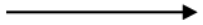

|a) b)|
|---|
|c) d) e)|

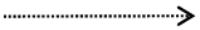

**Comentários:** 

(a) Errado. A linha contínua com seta representa fluxo de sequência, usado para indicar a ordem de execução das atividades, não a associação entre tarefa e objeto de dados; 

(b) Errado. A linha tracejada com círculo na origem e seta vazada é usada para fluxo de mensagem, não para conectar uma tarefa a um objeto de dados; 

(c) Errado. A linha pontilhada sem seta não representa adequadamente o fluxo ou associação direcional entre uma tarefa e um objeto de dados; 

(d) Correto. A linha pontilhada com seta representa a associação de dados, usada em BPMN para indicar a entrada ou saída de dados entre uma atividade e um objeto de dados; 

(e) Errado. A linha contínua com círculo preenchido na origem e seta representa outro tipo de conector, não sendo a notação adequada para associação entre tarefa e objeto de dados. 

###### **Gabarito:** Letra D 

**7. (FGV - 2026 - Analista Judiciário (TJ RJ)/Tecnologia da Informação/Analista de Projetos) Observe o diagrama BPMN a seguir.**

---

<!-- pagina: 61 -->

**Paolla Ramos Aula 04** 

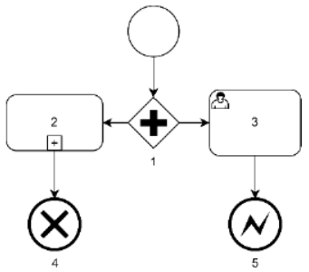

**O elemento que representa um gateway paralelo é:** 

a) 1; b) 2; c) 3; d) 4; e) 5. 

**Comentários:** 

(a) Correto. O elemento 1 é um losango com sinal de “+”, símbolo utilizado em BPMN para representar o gateway paralelo; 

(b) Errado. O elemento 2 é uma atividade/tarefa, indicada pelo retângulo com cantos arredondados, não um gateway; 

(c) Errado. O elemento 3 também representa uma atividade/tarefa, com marcador adicional de usuário, não um gateway paralelo; 

(d) Errado. O elemento 4 é um evento, indicado por círculo, com marcador de cancelamento ou término, não um gateway; 

(e) Errado. O elemento 5 é um evento com marcador interno, não um gateway paralelo. 

###### **Gabarito:** Letra A 

**8. (FGV - 2026 - Analista Judiciário (TJ RJ)/Tecnologia da Informação/Analista de Projetos) Juliana está mapeando os processos do seu departamento que contêm muitas atividades com transações de dados.** 

**Para representar uma entrada de dados de uma tarefa, utilizando o BPMN, Juliana deve utilizar:** 

a)

---

<!-- pagina: 62 -->

**Paolla Ramos Aula 04** 

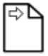

b) c) d) e) 

###### **Comentários:** 

(a) Errado. O símbolo representa um objeto de dados genérico, sem indicar especificamente que se trata de uma entrada de dados para uma tarefa; 

(b) Correto. O documento com seta vazada apontando para dentro representa uma entrada de dados, isto é, um dado utilizado como insumo por uma atividade no BPMN; 

(c) Errado. A seta preenchida associada ao objeto de dados não corresponde à notação adequada para Data Input em BPMN; 

(d) Errado. O documento com marcador interno de múltiplas instâncias representa uma coleção de dados ou múltiplos objetos de dados, não necessariamente uma entrada de dados; 

(e) Errado. O cilindro representa um repositório de dados, usado para indicar armazenamento persistente de informações, não uma entrada de dados de uma tarefa. 

###### **Gabarito:** Letra B 

**9. (FGV - 2026 - Analista Judiciário (TJ RJ)/Tecnologia da Informação/Analista de Projetos) Ana precisa modelar um processo em que o caminho do fluxo é dividido em dois ou mais caminhos que são executados em paralelo dentro do processo, permitindo que várias atividades sejam executadas simultaneamente, em vez de sequencialmente.** 

**Para isso, utilizando a notação BPMN, Ana deve usar um:** 

a) fork; 

b) join; c) pool;

---

<!-- pagina: 63 -->

**Paolla Ramos Aula 04** 

d) merge; e) swimlane. 

###### **Comentários:** 

(a) Correto. O fork é o gateway de paralelismo no BPMN que divide o fluxo em dois ou mais caminhos executados simultaneamente. É representado pelo gateway paralelo (símbolo "+"), permitindo que atividades rodem em paralelo, que é exatamente o que Ana precisa; (b) Errado. O join é o oposto: ele une caminhos paralelos, sincronizando os fluxos antes de continuar. Serve para aguardar a conclusão de todas as ramificações; (c) Errado. O pool é um contêiner que representa um participante do processo (como uma organização ou sistema). Não tem relação com divisão de fluxos paralelos; (d) Errado. O merge combina múltiplos caminhos alternativos em um só, sem sincronização. É usado após gateways exclusivos, não para paralelismo; (e) Errado. O swimlane é uma subdivisão dentro de um pool que representa responsabilidades ou papéis. Organiza visualmente o processo, mas não controla o fluxo de execução. 

###### **Gabarito:** Letra A 

**10. (FGV - 2025 - Analista de Tecnologia da Informação (EBSERH)) BPMN 2.0 é uma linguagem gráfica padronizada para representar processos de negócios que podem ser facilmente compreensíveis por todos os usuários, desde o nível empresarial que criam os rascunhos iniciais dos processos, aos desenvolvedores técnicos responsáveis pela implementação dos tecnologia que executará esses processos.** 

**Com base no BPMN 2.0, relacione os elementos de modelagem elencados a seguir às suas respectivas representações gráficas.** 

**1. Fluxo de mensagem  2. Objeto de Dados 3. Lane 4. Gateway** 

**( )** 

**( )** 

**( )** 

**( )**

---

<!-- pagina: 64 -->

**Paolla Ramos Aula 04** 

###### **A relação correta, na ordem apresentada, é** 

a) 4 – 2 – 1 – 3. b) 1 – 3 – 4 – 2. c) 3 – 4 – 1 – 2. d) 4 – 1 – 3 – 2. e) 2 – 4 – 3 – 1. 

**Comentários:** 

Na ordem apresentada, o losango representa gateway; a linha tracejada com seta vazada representa fluxo de mensagem; o retângulo dividido em faixas representa lane; e o documento representa objeto de dados; 

###### **Gabarito:** Letra D 

**11. (FGV - 2025 - Analista do Ministério Público da União/Tecnologia da Informação e Comunicação/Desenvolvimento de Sistemas) Joana, gestora de processos de negócio, é responsável por otimizar os processos do MPU.** 

**Com base no CBOK 4.0, na primeira fase do seu trabalho, Joana definiu a seguinte tarefa:** 

**• identificar interfaces entre processos em que o trabalho ou a informação passam de um departamento para outro, o que pode gerar atrasos na execução do processo, além de distorções ou perdas de informações.** 

###### **Para executar essa tarefa, Joana deve identificar:** 

a) as atividades manuais, para transformá-las em atividades automáticas, visando a otimizar e agilizar a execução das tarefas; 

b) os repositórios de processos de negócio, para catalogar as tarefas manuais e repetitivas dos departamentos; 

c) handoffs utilizando swim lanes, para modelar as interfaces entre os departamentos; 

d) as atividades atômicas, limitando as transferências de informação entre departamentos quando possível; 

e) Key Performance Indicator (KPI), para avaliar as tarefas que mais atrasam, causam distorções e perdas de informações. 

###### **Comentários:**

---

<!-- pagina: 65 -->

**Paolla Ramos Aula 04** 

(a) Errado. Transformar atividades manuais em automáticas é uma ação de melhoria/automação, não de identificação de interfaces entre departamentos; (b) Errado. Repositórios de processos servem para catalogar e documentar processos, mas não são o foco quando se quer mapear onde o trabalho passa de um setor para outro; (c) Correto. No CBOK 4.0, handoffs são exatamente os pontos de transferência de trabalho ou informação entre departamentos, e as swim lanes são a ferramenta de modelagem usada para visualizar essas interfaces — perfeito para o que Joana precisa fazer; (d) Errado. Atividades atômicas se referem ao menor nível de decomposição de uma tarefa, o que não tem relação direta com identificar interfaces entre departamentos; (e) Errado. KPIs são indicadores de desempenho usados para medir e monitorar resultados, não para identificar interfaces e pontos de transferência entre processos. 

###### **Gabarito:** Letra C 

**12. (FGV - 2025 - Analista do Ministério Público da União/Tecnologia da Informação e Comunicação/Desenvolvimento de Sistemas) Maria utilizou a notação BPMN para modelar o processo de negócio do departamento DEPTO1 da organização ORG_A, conforme figura abaixo.** 

###### **Considerando a notação BPMN, é correto afirmar que:** 

a) o fluxo F5 é uma junção e leva à execução de um subprocesso de baixa complexidade; b) a sequência de gateways G1 e G2 garante a execução exclusiva do subprocesso B; c) o fluxo F1 é executado em paralelo ao fluxo F3, assim como são paralelos os fluxos F2 e F4; d) o fluxo pelo gateway G2 está condicionado ao término da execução do subprocesso A; e) o gateway G2 é exclusivo e conflita na bifurcação e união de caminhos alternativos. 

###### **Comentários:** 

(a) Errado. O fluxo F5 é apenas um fluxo de sequência que leva ao subprocesso C; a junção ocorre no gateway G3, antes de F5, e não no próprio fluxo; 

(b) Errado. Embora G1, G2 e G3 sejam gateways exclusivos, eles não garantem a execução exclusiva do subprocesso B; no diagrama, B está em um dos caminhos alternativos, mas a execução dependerá das decisões tomadas nos gateways; 

(c) Errado. Os fluxos F1 e F3 são caminhos alternativos gerados pelo gateway exclusivo G1, não sendo executados em paralelo; da mesma forma, F2 e F4 também são caminhos alternativos associados ao gateway G2;

---

<!-- pagina: 66 -->

**Paolla Ramos Aula 04** 

(d) Errado. O fluxo pelo gateway G2 não está condicionado ao término da execução do subprocesso A; G2 é um gateway exclusivo usado para decisão/roteamento entre caminhos alternativos; 

(e) Correto. O gateway G2 é exclusivo, pois está representado por losango com marcador “X”, e atua na bifurcação e também na união de caminhos alternativos, conforme a lógica de roteamento do processo. 

###### **Gabarito:** Letra E 

==5460== **13. (FGV - 2025 - Analista do Ministério Público (MPE RJ)/Administrativa/Tecnologia da Informação) Analise a figura a seguir** 

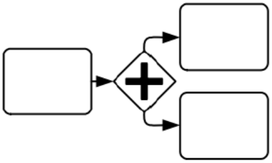

**Considerando que a figura é um elemento do modelo BPMN estendido (versão 2.0), ela representa um** 

a) Transaction. b) Event. c) Loop. d) Fork. e) Join. 

**Comentários:**

---

<!-- pagina: 67 -->

**Paolla Ramos Aula 04** 

(a) Errado. Transaction é um tipo de subprocesso em BPMN, normalmente representado por uma atividade com borda dupla, não pelo losango com sinal de “+” dividindo fluxos; 

(b) Errado. Event é representado por círculos, podendo ser de início, intermediário ou fim, e não pelo elemento exibido na figura; 

(c) Errado. Loop é um marcador de repetição associado a uma atividade, geralmente indicado por uma seta circular, não por um gateway com sinal de “+”; 

(d) Correto. A figura representa um fork, pois o gateway paralelo divide o fluxo de entrada em dois fluxos de saída que podem ser executados simultaneamente; 

(e) Errado. Join também utiliza gateway paralelo, mas serve para sincronizar fluxos que chegam ao gateway; na figura, há um fluxo de entrada e dois fluxos de saída, caracterizando divisão, não junção. 

###### **Gabarito:** Letra D 

**14. (FGV - 2025 - Analista da Defensoria Pública (DPE RO)/Analista de Sistemas) Uma notação padrão para os casos de modelagem de processos de negócio é o Modelo e Notação de Processos de Negócio (ou BPMN, Business Process Model and Notation; anteriormente conhecido como Notação de Modelagem de Processos de Negócio, ou Business Process Modeling Notation).** 

**Com relação ao BPMN, assinale (V) para a afirmativa verdadeira e (F) para a falsa.** 

**( ) Foi desenvolvido originalmente pela Business Process Management Initiative (BPMI) como uma notação exclusiva textual e precisa para documentar processos de negócios.** 

**( ) Corresponde a uma maneira padronizada de demonstrar processos completos que ocorrem em um negócio.** 

**( ) O BPMN permite que os stakeholders visualizem os setores e facilita a otimização dos fluxos de trabalho.** 

**As afirmativas são, respectivamente,** 

a) V – F – F. b) V – V – F. 

c) F – V – F. 

d) F – F – V. 

e) V – F – V. 

**Comentários:**

---

<!-- pagina: 68 -->

**Paolla Ramos Aula 04** 

(I) Falso. O BPMN não foi criado como uma notação exclusivamente textual — pelo contrário, ele é essencialmente gráfico/visual, usando símbolos e diagramas para representar processos; (II) Verdadeiro. Essa é justamente a proposta central do BPMN: oferecer uma forma padronizada de representar, de ponta a ponta, os processos que acontecem dentro de uma organização; (III) Falso. Embora o BPMN ajude na visualização de fluxos, a afirmativa generaliza demais ao dizer que ele "permite visualizar os setores", o que não é uma característica central ou precisa da notação. 

Sequência correta: F – V – F. 

###### **Gabarito:** Letra C 

**15. (FGV - 2025 - Analista de Gestão (AgSUS)/Tecnologia da Informação) BPMN é amplamente usado para a modelagem de processos de negócio da AgSUS. Segundo o BPMN 2.0, o elemento gráfico que um analista deverá utilizar para indicar um objeto de dados é o** 

a) círculo tracejado. 

b) envelope fechado. 

c) losango com linhas duplas. 

d) cone tridimensional com bordas destacadas. 

e) retângulo com canto superior direito dobrado. 

###### **Comentários:** 

(a) Errado. O círculo tracejado não representa objeto de dados no BPMN 2. Eventos intermediários são representados por círculo de borda dupla, enquanto bordas tracejadas indicam comportamento não interruptivo em situações específicas previstas pela BPMN. (b) Errado. O envelope fechado é associado a eventos de mensagem, não a objetos de dados; (c) Errado. O losango com linhas duplas representa um gateway complexo, não objeto de dados; (d) Errado. Cone tridimensional não é um elemento padrão do BPMN 2.0; (e) Correto. No BPMN 2.0, o objeto de dados é representado por um retângulo com o canto superior direito dobrado, parecendo uma folha de papel com a "orelhinha" dobrada — bem intuitivo para representar um documento ou dado no processo. 

###### **Gabarito:** Letra E 

**16. (FGV - 2025 - Analista de Gestão (AgSUS)/Tecnologia da Informação) Os elementos estruturais da BPMN 2.0 permitem que um analista visualize e diferencie facilmente as seções de um diagrama BPMN. Os tipos básicos de submodelos que podem estar presentes em um modelo BPMN são respectivamente** 

a) processos e conversações, apenas. 

b) processos públicos e privados, apenas.

---

<!-- pagina: 69 -->

**Paolla Ramos Aula 04** 

c) conversações, coreografias e catálogos apenas. d) catálogos, conversões e orquestrações apenas. 

e) processos, coreografias e colaborações, apenas. 

###### **Comentários:** 

(a) Errado. Processos e conversações sozinhos não cobrem todos os submodelos básicos da BPMN 2.0, faltando as coreografias e colaborações; (b) Errado. Processos públicos e privados são subtipos de processos, não os três submodelos básicos da especificação; (c) Errado. "Catálogos" não existe como submodelo na BPMN 2.0, tornando essa alternativa inválida; (d) Errado. "Catálogos", "conversões" e "orquestrações" não são termos reconhecidos como submodelos básicos na BPMN 2.0; (e) Correto. A especificação BPMN 2.0 define exatamente três submodelos básicos: Processos (orquestração de atividades), Coreografias (interação entre participantes) e Colaborações (combinação de processos e coreografias). 

###### **Gabarito:** Letra E 

**17. (FGV - 2025 - Analista Legislativo (ALEAM)/Analista de Sistemas) A equipe de Análise de Sistemas decidiu utilizar a notação BPMN (Business Process Model and Notation) para padronizar a modelagem dos processos legislativos e administrativos da casa. A notação fornece um conjunto de símbolos e regras que facilitam a comunicação e o entendimento do fluxo de trabalho. O elemento da notação BPMN utilizado para representar uma atividade que não pode ser decomposta em um nível mais detalhado dentro do modelo em foco, indicando uma tarefa atômica é o(a)** 

a) Subprocesso (Colapsado) 

b) Tarefa (Retângulo de cantos arredondados) 

c) Evento (Circular) 

d) Gateway (Losango) 

e) Piscina (Pool) 

###### **Comentários:** 

(a) Errado. O Subprocesso Colapsado representa uma atividade que pode ser expandida e detalhada — ou seja, ela esconde etapas internas. É o oposto de atômica; (b) Correto. A Tarefa, representada pelo retângulo de cantos arredondados, é justamente o elemento atômico do BPMN — ela não se divide em partes menores dentro do modelo em foco; (c) Errado. O Evento circular representa algo que acontece no processo (início, fim, intermediário), não uma atividade a ser executada; (d) Errado. O Gateway em losango é usado para controlar o fluxo, indicando decisões, paralelismos ou convergências — não representa atividades; (e) Errado. A Piscina (Pool) é um contêiner que agrupa raias e participantes do processo, sendo um elemento organizacional, não uma atividade.

---

<!-- pagina: 70 -->

**Paolla Ramos Aula 04** 

###### **Gabarito:** Letra B 

**18. (FGV - 2025 - Auditor Estadual de Controle (CGE SP)/Tecnologia da Informação) Em um projeto de transformação digital, o analista está usando a notação BPMN 2.0 para mapear o fluxo de "aprovação de crédito". O processo envolve um sistema automatizado que checa dados do cliente (atividade 1) e, dependendo do score, o processo pode ser finalizado (crédito aprovado) ou encaminhado para análise manual (atividade 2). Se a análise manual for concluída, o processo retorna a um ponto onde o cliente é notificado do resultado.** 

**Indique o elemento da notação BPMN que deve ser usado para representar o ponto no fluxo em que o processo se divide com base no resultado do score (encaminhando para análise manual ou finalizando a aprovação) e o elemento que deve ser usado para permitir que o fluxo retorne após a análise manual, aguardando um evento (como a notificação) para prosseguir.** 

a) Pool para a divisão e Swimlane para o retorno. 

b) Sub-processo para a divisão e Data Object para o retorno. 

c) Gateway Exclusivo (XOR) para a divisão e Task (Tarefa) para o retorno. 

d) Gateway Paralelo (AND) para a divisão e Gateway Inclusivo (OR) para o retorno. 

e) Gateway Exclusivo (XOR) para a divisão e Intermediate Catching Event (Evento Intermediário de Captura) para o retorno. 

###### **Comentários:** 

(a) Errado. Pool e Swimlane são elementos de organização de participantes no processo, não servem para dividir fluxos ou aguardar eventos; (b) Errado. Sub-processo agrupa atividades e Data Object representa dados — nenhum dos dois serve para divisão condicional ou espera de evento; (c) Errado. O Gateway XOR está certo para a divisão, mas a Task é só uma atividade de trabalho, não um mecanismo de espera por evento; (d) Errado. O Gateway Paralelo (AND) dispara todos os caminhos ao mesmo tempo, sem condição — não serve para uma escolha baseada em score; (e) Correto. O Gateway Exclusivo (XOR) divide o fluxo escolhendo apenas um caminho com base no score. Já o Intermediate Catching Event é exatamente o elemento usado para pausar o fluxo e aguardar que um evento externo (como a notificação ao cliente) ocorra antes de continuar. 

###### **Gabarito:** Letra E 

**19. (FGV - 2024 - Analista em Gestão Municipal (Pref SJC)/Tecnologia da Informação) Na notação BPMN, os objetos de conexão permitem conectar objetos de fluxo entre si ou conectar a informações complementares. Existem diversos tipos diferentes de objeto de conexão.** 

**A representação gráfica do objeto de conexão do tipo fluxo de sequência é**

---

<!-- pagina: 71 -->

**Paolla Ramos Aula 04** 

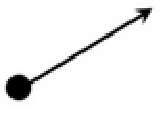

a) b) c) 

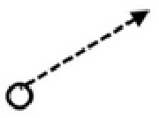

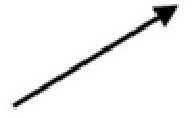

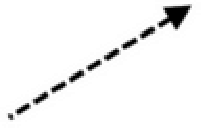

d) 

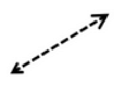

e) 

###### **Comentários:** 

(a) Errado. A linha contínua com círculo preenchido na origem não representa o fluxo de sequência em BPMN; 

(b) Errado. A linha tracejada com círculo na origem representa fluxo de mensagem, não fluxo de sequência; (c) Correto. O fluxo de sequência é representado por uma linha contínua com seta preenchida, usada para indicar a ordem de execução dos elementos do processo; 

(d) Errado. A linha tracejada com seta preenchida não corresponde ao fluxo de sequência, pois fluxos de sequência usam linha contínua; 

(e) Errado. A linha tracejada com seta vazada nas extremidades não representa o fluxo de sequência; aproxima-se mais de notações de mensagem/associação, mas não da sequência de execução do processo. 

###### **Gabarito:** Letra C 

**20. (FGV - 2024 - Analista em Gestão Municipal (Pref SJC)/Tecnologia da Informação) Considere a modelagem de processos usando BPMN. Seja C um conjunto de construções de fluxo de controle.**

---

<!-- pagina: 72 -->

**Paolla Ramos Aula 04** 

**P = (N,E, tipo) é um modelo de processo se consistir em um conjunto N de nós e um conjunto E de arestas.** 

**Nesse caso, avalie se as afirmativas a seguir são falsas (F) ou verdadeiras (V).** 

**( ) N = NA** ∩ **NE** ∩ **NG, onde NA é um conjunto de modelos de atividades, NE é um conjunto de modelos de eventos e NG é um conjunto de modelos de gateway. Esses conjuntos são mutuamente disjunto.** 

**( ) E é um conjunto de arestas direcionadas entre nós, tal que E** ⊆ **N × N, representando controle de fluxo.** 

**→ ( ) tipo : NG C atribui a cada modelo de gateway uma construção de fluxo de controle.** 

**As afirmativas são, respectivamente,** 

a) F – F – F. b) F – F – V. 

c) F – V – V. 

d) V – F – V. 

e) V – V – V. 

###### **Comentários:** 

(I) Falso. O conjunto N deveria ser a união (∪) dos conjuntos NA, NE e NG, e não a interseção (∩). Se fossem disjuntos e usássemos interseção, o resultado seria vazio. A parte sobre serem mutuamente disjuntos está certa, mas o operador errado invalida a afirmativa; (II) Verdadeiro. Essa é a definição correta: E é um conjunto de arestas direcionadas entre nós, subconjunto do produto cartesiano N × N, representando o fluxo de controle entre os elementos do processo; (III) Verdadeiro. A função tipo mapeia cada gateway para uma construção de fluxo de controle do conjunto C, o que faz todo sentido, já que são os gateways que definem o comportamento do fluxo (XOR, AND, OR etc.). 

Itens verdadeiros: II e III → Letra C (F – V – V). 

###### **Gabarito:** Letra C 

**21. (FGV - 2024 - Auditor de Contas Públicas (CGE PB)/Auditoria de Tecnologia da Informação) Júnior elaborou o seguinte diagrama utilizando a notação BMPN 2.0 e apresentou para o seu chefe Carlos.**

---

<!-- pagina: 73 -->

**Paolla Ramos Aula 04** 

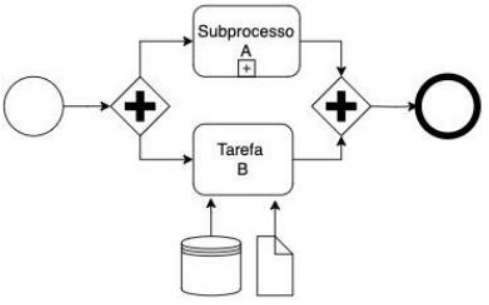

###### **Ao analisar o diagrama elaborado por Júnior, Carlos observou o seguinte erro de notação:** 

a) uma tarefa deve conter apenas uma entrada de dados e não duas como, por exemplo, objeto de dados e armazém de dados; 

b) os caminhos paralelos de um fluxo devem conter atividades do mesmo tipo, apenas subprocessos ou apenas tarefas; 

c) o evento de fim de processo deve ser representado por um círculo duplo e não por um círculo simples com linha grossa; 

d) a associação de dados de entrada de uma tarefa deve ser representada por uma seta com linha pontilhada e não por uma seta com uma linha contínua; 

e) a sincronização de caminhos paralelos de um fluxo deve ser representada por apenas um gateway com sinal de multiplicação no centro do losango. 

###### **Comentários:** 

(a) Errado. Uma tarefa pode estar associada a mais de um elemento de dados, como objeto de dados e armazenamento de dados; esse não é, por si só, erro de notação; 

(b) Errado. Caminhos paralelos não precisam conter atividades do mesmo tipo; um fluxo paralelo pode conduzir a subprocessos, tarefas ou outros elementos válidos de BPMN; 

(c) Errado. O evento de fim é representado por um círculo com borda grossa, como aparece no diagrama; círculo duplo corresponde a evento intermediário; 

(d) Correto. A associação de dados entre uma tarefa e um objeto de dados deve ser representada por linha pontilhada, não por fluxo de sequência com linha contínua; 

(e) Errado. A sincronização de caminhos paralelos é representada pelo gateway paralelo, isto é, pelo losango com sinal de “+”; esse símbolo está adequado para junção/sincronização de fluxos paralelos. 

###### **Gabarito:** Letra D 

**22. (FGV - 2024 - Analista Judiciário (TJ AP)/Apoio Especializado/Controle Interno) Os analistas responsáveis pelo desenho de processos numa organização costumam utilizar o BPMN para a notação gráfica, onde cada figura é responsável por simbolizar algo referente ao processo. Ao**

---

<!-- pagina: 74 -->

**Paolla Ramos Aula 04** 

**mapear um processo em uma organização pública, um analista precisava representar caminhos alternativos ou paralelos e não sabia qual figura utilizar.** 

###### **Um especialista no assunto deverá recomendar o uso de um(a):** 

a) círculo; 

b) losango; 

c) quadrado; 

d) retângulo; 

e) seta. 

###### **Comentários:** 

(a) Errado. O círculo no BPMN representa eventos (início, intermediário ou fim do processo), não caminhos alternativos; (b) Correto. O losango é o gateway no BPMN — exatamente a figura usada para representar caminhos alternativos (exclusivos) ou paralelos no fluxo do processo; (c) Errado. O quadrado não é uma figura padrão do BPMN para representar elementos de fluxo; (d) Errado. O retângulo representa tarefas ou subprocessos no BPMN, não decisões ou ramificações; (e) Errado. A seta representa o fluxo de sequência entre os elementos, ou seja, a conexão entre eles, não os caminhos em si. 

###### **Gabarito:** Letra B 

###### **23. (FGV - 2024 - Analista Legislativo (ALETO)/Análise de Sistema) Em um diagrama de modelagem de processos de negócio utilizando a notação BPMN (Business Process Model and Notation), assinale a principal função das Swimlanes.** 

a) Indicar diferentes tipos de eventos que ocorrem dentro do processo. 

b) Representar as variáveis que serão manipuladas durante o processo. 

c) Dividir o diagrama em seções para representar diferentes entidades ou papéis responsáveis por partes específicas do processo. 

d) Mostrar a sequência temporal das atividades de forma cronológica. 

e) Detalhar os recursos tecnológicos utilizados em cada etapa do processo. 

###### **Comentários:** 

(a) Errado. Eventos em BPMN são representados por círculos (início, intermediário, fim), não por Swimlanes; (b) Errado. Variáveis e dados são representados por objetos de dados, não por Swimlanes; (c) Correto. As Swimlanes funcionam como "raias" que dividem o diagrama em faixas, cada uma representando um participante, papel ou departamento responsável por determinadas atividades do processo; (d) Errado. A

---

<!-- pagina: 75 -->

**Paolla Ramos Aula 04** 

sequência temporal é mostrada pelos fluxos de sequência (setas), não pelas Swimlanes; (e) Errado. Recursos tecnológicos não são o foco das Swimlanes, que tratam de responsabilidades e papéis. 

###### **Gabarito:** Letra C 

**24. (FGV - 2024 - Analista Judiciário (TRF 1ª Região)/Apoio Especializado/Análise de Sistemas de Informação) Cintia elaborou um diagrama BPMN representando diversas atividades que ocorrem em repetição (loopings). Com isso, o diagrama apresenta longas linhas de sequência de fluxos que se cruzam.** 

**Para evitar essas longas linhas ao representar repetições em fluxo normal, o tipo de evento intermediário (Intermediate Event Types) que Cintia deve usar é:** 

a) link; 

b) signal; 

c) message; 

d) escalation; 

e) parallel multiple. 

###### **Comentários:** 

(a) Correto. O evento intermediário do tipo link é justamente o que resolve esse problema! Ele funciona como um "teletransporte" no diagrama: você coloca um link de saída em um ponto e um link de entrada em outro, evitando aquelas setas longas e cruzadas que poluem o fluxo visual; (b) Errado. O evento signal serve para enviar ou capturar sinais entre processos diferentes, não para simplificar repetições dentro de um mesmo fluxo; (c) Errado. O evento message lida com troca de mensagens entre participantes distintos, não tem relação com a representação de loopings no diagrama; (d) Errado. O evento escalation é usado para escalar situações dentro de subprocessos, como acionar um nível hierárquico superior — nada a ver com loopings; (e) Errado. O parallel multiple indica que múltiplos eventos devem ocorrer simultaneamente, sendo um tipo de gatilho composto, não uma solução para cruzamento de fluxos. 

###### **Gabarito:** Letra A 

**25. (FGV - 2024 - Analista Judiciário (TRF 1ª Região)/Apoio Especializado/Governança e Gestão de Tecnologia da Informação) Gabriela está usando a notação BPMN 2.0 (Business Process Model and**

---

<!-- pagina: 76 -->

**Paolla Ramos Aula 04** 

**Notation) para modelar os processos de negócio que serão atendidos por um novo sistema de informação. Observe o diagrama criado por ela.** 

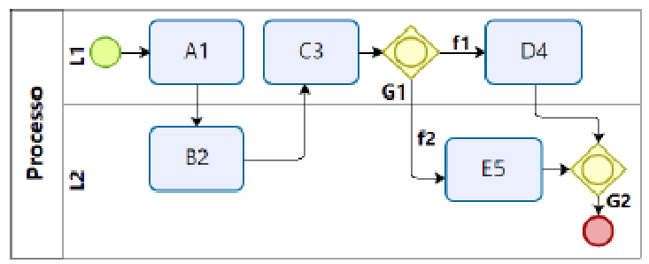

###### **Gabriela utilizou o elemento gateway "G1" para:** 

a) criar caminhos alternativos, sem paralelismos, dentro de um fluxo de processo; 

b) indicar que cada fluxo de sequência receberá um token sem depender da avaliação da condição; 

c) capturar a ocorrência de eventos que determinarão a execução dos fluxos de sequência; 

d) determinar que o fluxo a ser percorrido está condicionado ao recebimento de uma mensagem; 

e) criar caminhos alternativos, mas também paralelos, quando mais de uma expressão for avaliada como verdadeira. 

###### **Comentários:** 

(a) Errado. Criar caminhos alternativos sem paralelismo é função do gateway exclusivo, enquanto G1 é um gateway inclusivo, pois possui círculo em seu interior; 

(b) Errado. A ativação de todos os fluxos de sequência sem avaliação de condição é característica do gateway paralelo, representado pelo sinal de “+”; 

(c) Errado. Capturar eventos que determinam a continuidade do fluxo é função do gateway baseado em eventos, não do gateway inclusivo indicado em G1; 

(d) Errado. Condicionar o fluxo ao recebimento de uma mensagem envolve evento ou gateway baseado em evento, e não o gateway inclusivo apresentado; 

(e) Correto. G1 é um gateway inclusivo, usado para criar caminhos alternativos que também podem ser executados em paralelo quando mais de uma condição for verdadeira. 

###### **Gabarito:** Letra E 

###### **26. (FGV - 2024 - Técnico Judiciário (TRF 1ª Região)/Apoio Especializado/Desenvolvimento de Sistemas da Informação) Os processos de negócio são compostos por diversos fluxos de atividades**

---

<!-- pagina: 77 -->

**Paolla Ramos Aula 04** 

**que podem ser executados em paralelo, otimizando o tempo para finalizar um determinado processo. Para isso, os fluxos podem ser divididos (split) ou fundidos (merge).** 

**No BPMN 2.0, para representar a divisão ou a fusão de fluxos de atividades, deve-se usar um:** 

a) pool; b) event; 

c) gateway; 

d) sub-process; e) swimlane. 

###### **Comentários:** 

(a) Errado. O pool representa um participante do processo (como uma empresa ou sistema), não serve para dividir ou fundir fluxos; (b) Errado. Os events (eventos) marcam o início, fim ou algo que acontece durante o processo, mas não controlam divisão de fluxos; (c) Correto. O gateway é exatamente o elemento do BPMN usado para dividir (split) ou fundir (merge) fluxos — seja de forma exclusiva, paralela ou inclusiva; (d) Errado. O sub-process agrupa atividades em um bloco menor dentro do processo, mas não tem a função de dividir ou fundir fluxos; (e) Errado. O swimlane é uma faixa que organiza responsabilidades dentro de um pool, sem qualquer relação com controle de fluxo. 

###### **Gabarito:** Letra C 

**27. (FGV - 2024 - Técnico Judiciário (TRF 1ª Região)/Apoio Especializado/Desenvolvimento de Sistemas da Informação) Observe o seguinte diálogo entre analistas do TRF1:** 

**Flávio: “Vamos usar o BPMN para modelar o fluxo de dados (Data Flow) do ambiente analítico de dados do Tribunal”.** 

**Junior: “O BPMN não é utilizado para isso! Um Diagrama BPMN não é um Diagrama de Fluxo de Dados”, e sim um diagrama usado para modelar as atividades de um processo.** 

**Flávio: “É sim, ele tem representações de objetos de dados de vários tipos, como: Data Object, Store e Collection! Podemos usar artefatos para representar os processos de expurgo de dados”.** 

**Junior: “Esses tipos de objetos podem ser conectados via um fluxo de mensagens que é representado por linhas contínuas com um losango na ponta”.** 

###### **Sobre o diálogo, é correto afirmar que:**

---

<!-- pagina: 78 -->

**Paolla Ramos Aula 04** 

a) Junior está certo, pois o BPMN deve ser usado para modelar as atividades de um processo e não um fluxo de dados; 

b) Flávio citou corretamente os tipos de objetos de dados do BPMN e acertou ao dizer que o BPMN serve para modelar o fluxo de dados; 

c) Junior está correto ao afirmar que o fluxo de mensagens é representado por linhas contínuas com um losango na ponta; 

d) os artefatos do BPMN podem ser usados para representar subprocessos, conforme afirmado por Flávio; 

e) Junior está correto ao afirmar que os objetos de dados podem ser conectados via um fluxo de mensagens. 

###### **Comentários:** 

(a) Correto. Junior tem razão: BPMN é uma notação para modelar processos de negócio, não fluxos de dados. DFD (Data Flow Diagram) é a ferramenta certa pra isso. Apesar de o BPMN ter objetos de dados, seu foco é nas atividades e no fluxo de sequência do processo; (b) Errado. Flávio até citou alguns objetos de dados do BPMN corretamente, mas errou ao dizer que o BPMN serve para modelar fluxo de dados — esse não é o propósito da notação; (c) Errado. O fluxo de mensagens no BPMN é representado por linhas tracejadas com um círculo na origem e uma seta na ponta, não por linhas contínuas com losango; (d) Errado. Flávio falou em usar artefatos para representar processos de expurgo, não subprocessos. Além disso, artefatos no BPMN servem para anotações e agrupamentos, não para modelar subprocessos; (e) Errado. Objetos de dados no BPMN são conectados por associações (linhas pontilhadas), não por fluxo de mensagens — que é reservado para comunicação entre pools distintos. 

###### **Gabarito:** Letra A 

**28. (FGV - 2024 - Analista de Processamento (DATAPREV)) Elon Musk tem se envolvido em algumas polêmicas após a aquisição do Twitter e a mudança do nome da plataforma para X. Ele é reconhecido por sua constante busca por inovação e eficiência. Recentemente, ele destacou a importância de entender cada passo da produção de um foguete reutilizável na sua empresa SpaceX.** 

**Diante da necessidade de visualizar e gerenciar esse fluxo de trabalho complexo, o conceito de gestão de processos e modelagem que melhor captura as diversas atividades, decisões e interações na produção do foguete é chamado** 

a) Análise SWOT. 

b) Diagrama de Ishikawa. 

c) Matriz GUT. 

d) Modelagem BPMN. 

e) 5W2H.

---

<!-- pagina: 79 -->

**Paolla Ramos Aula 04** 

###### **Comentários:** 

(a) Errado. A Análise SWOT serve pra mapear forças, fraquezas, oportunidades e ameaças de um negócio — não pra modelar fluxos de trabalho e processos; (b) Errado. O Diagrama de Ishikawa (ou espinha de peixe) é usado pra identificar causas de problemas, não pra representar etapas e decisões de um processo produtivo; (c) Errado. A Matriz GUT é uma ferramenta de priorização de problemas com base em gravidade, urgência e tendência — bem diferente de modelar processos; (d) Correto. O BPMN (Business Process Model and Notation) é justamente o padrão criado pra modelar processos de negócio, representando atividades, decisões, fluxos e interações de forma visual e estruturada — perfeito pra mapear a produção de um foguete; (e) Errado. O 5W2H é um plano de ação que responde perguntas como "o quê", "quem", "quando" etc. — útil pra planejar tarefas, mas não pra modelar processos complexos. 

###### **Gabarito:** Letra D 

**29. (FGV - 2024 - Analista de Tecnologia da Informação (DATAPREV)/Análise de Negócios de TI) Imagine que você está no meio de um projeto, modelando um processo de negócios com BPMN (Business Process Model and Notation). Até agora, tudo está fluindo bem, mas então surge um ponto importante: uma decisão precisa ser tomada com base em certas condições. Nesse momento, você precisa saber qual símbolo usar para representar essa bifurcação no fluxo. O elemento correto para isso é** 

a) Pool. b) Event. c) Gateway. d) Data Object. e) Lane. 

###### **Comentários:** 

(a) Errado. Pool representa um participante do processo (como uma empresa ou sistema), não serve pra indicar decisões ou bifurcações no fluxo; (b) Errado. Event (evento) marca o início, fim ou algo que acontece durante o processo, mas não é usado pra representar uma escolha entre caminhos; (c) Correto. Gateway é exatamente o elemento usado pra representar decisões e bifurcações no fluxo. Quando o processo precisa "escolher um caminho" com base em condições, é o Gateway que entra em cena; (d) Errado. Data Object representa dados ou documentos que fazem parte do processo, sem nenhuma relação com controle de fluxo ou decisões; (e) Errado. Lane é uma subdivisão dentro de um Pool, usada pra organizar responsabilidades entre participantes, não pra modelar decisões. 

###### **Gabarito:** Letra C

---

<!-- pagina: 80 -->

**Paolla Ramos Aula 04** 

**30. (FGV - 2024 - Analista de Tecnologia da Informação (DATAPREV)/Gestão de Serviços de TIC) Em um determinado diagrama BPMN, criado por uma equipe de TI de uma empresa pública, ao se mapear eventos, necessitou-se usar um símbolo para apresentar o desencadeamento do processo, facilitando processos intermediários ou também para finalizar o processo. Esse símbolo é o de** 

a) cancelamento. 

b) cronômetro. 

c) encaminhamento. 

d) mensagem. 

e) múltiplo. 

###### **Comentários:** 

(a) Errado. O evento de cancelamento é usado apenas em contextos específicos, como subprocessos de transação, e não serve para desencadear, intermediar e finalizar processos de forma geral; (b) Errado. O cronômetro é um evento ligado a tempo/prazo, usado para disparar ou aguardar um intervalo, mas não cobre os três papéis descritos na questão; (c) Errado. Encaminhamento (escalation) trata do redirecionamento de situações para níveis superiores, não sendo o símbolo mais versátil para início, meio e fim; (d) Correto. O evento de mensagem pode atuar como disparador do processo (início), como evento intermediário e também como evento de fim, sendo exatamente o símbolo que cobre os três papéis descritos; (e) Errado. O evento múltiplo indica que há várias condições possíveis, mas não é o símbolo que melhor representa essa versatilidade de início, intermediário e fim descrita no enunciado. 

###### **Gabarito:** Letra D 

**31. (FGV - 2024 - Analista de Políticas Públicas e Gestão Governamental (SEPLAG Niterói)/Gestão de Tecnologia da Informação e Comunicação) No Business Process Model and Notation 2.0 (BPMN 2.0), diferentes símbolos representam componentes variados de um processo de negócio.** 

**Assinale a opção que descreve corretamente a funcionalidade dos elementos de decisão na notação BPMN 2.0.** 

a) Os elementos de decisão são representados por retângulos e indicam o término do processo. 

b) Os elementos de decisão são representados por círculos e indicam o início de um processo. 

c) Os elementos de decisão são representados por setas e conectam diferentes etapas do processo. 

d) Os elementos de decisão servem apenas para agrupar tarefas relacionadas e não influenciam o fluxo do processo. 

e) Os elementos de decisão são representados por losangos e direcionam o fluxo do processo com base em condições específicas.

---

<!-- pagina: 81 -->

**Paolla Ramos Aula 04** 

###### **Comentários:** 

(a) Errado. Retângulos no BPMN representam tarefas/atividades, não decisões. E o término do processo é indicado por um evento de fim (círculo com borda grossa); (b) Errado. Círculos representam eventos — início, intermediário ou fim. Não são usados para decisões; (c) Errado. Setas são os fluxos de sequência, ou seja, as conexões entre os elementos. Não representam decisões; (d) Errado. Agrupamento de tarefas é função dos "Grupos" ou "Subprocessos". Elementos de decisão influenciam diretamente o fluxo; (e) Correto. Os gateways (losangos) são os elementos de decisão no BPMN 2.0. Eles avaliam condições e direcionam o fluxo para caminhos diferentes dependendo do resultado. 

###### **Gabarito:** Letra E 

**32. (FGV - 2024 - Auditor Fiscal Tributário da Receita Municipal (Pref Cuiabá)/Tecnologia da Informação) Analise as afirmativas a seguir, sobre a modelagem de processos utilizando Business Process Modelling and Notation (BPMN).** 

**I. Deve-se tentar sempre utilizar o máximo de detalhes possíveis no diagrama para garantir que todos os aspectos do processo sejam visualizados.** 

**II. Ao modelar processos complexos, é recomendado dividir o diagrama em subprocessos para facilitar a visualização e o entendimento do fluxo.** 

**III. É uma boa prática definir pontos de decisão com gateways para representar alternativas e condições no fluxo do processo, garantindo que as ramificações sejam claras e consistentes.** 

**Está correto o que se afirma em** 

a) I, apenas. b) I e III, apenas. c) I e II, apenas. d) II e III, apenas. e) I, II e III. 

###### **Comentários:** 

(I) Errado. Usar o máximo de detalhes possíveis não é uma boa prática em BPMN. Diagramas muito carregados ficam difíceis de ler e entender. O ideal é equilibrar clareza e completude, mostrando só o que é necessário para o nível de abstração desejado; 

(II) Correto. Dividir processos complexos em subprocessos é exatamente o que se recomenda em BPMN. Isso facilita a leitura, o entendimento e a manutenção do diagrama, sem sobrecarregar o fluxo principal com detalhes desnecessários;

---

<!-- pagina: 82 -->

**Paolla Ramos Aula 04** 

(III) Correto. Gateways são elementos fundamentais em BPMN justamente para representar pontos de decisão, ramificações e condições. Usá-los corretamente garante que o fluxo seja claro e que as alternativas fiquem bem definidas para quem lê o diagrama. Itens corretos: II e III. 

###### **Gabarito:** Letra D

---

<!-- pagina: 83 -->

**Paolla Ramos Aula 04** 

# **<mark>Lista de Questões</mark>** 

**1. (FGV - 2026 - Analista Judiciário (TJ RJ)/Tecnologia da Informação/Analista de Gestão de TIC) O analista Paulo está modelando as atividades realizadas por cada um de seus colaboradores visando a organizá-las e categorizá-las, ilustrando as responsabilidades de cada um no processo de negócio do seu departamento.** 

**Para isso, empregando o BPMN, Paulo deve utilizar:** 

a) raias; 

b) associações; 

c) transações; 

d) coreografias; 

e) subprocessos. 

**2. (FGV - 2026 - Analista Judiciário (TJ RJ)/Tecnologia da Informação/Analista de Gestão de TIC) O analista Antônio precisa otimizar os processos da sua diretoria, pois haverá corte de pessoal. Para isso, ele modelou os processos atuais e identificou gargalos e atividades redundantes.** 

**Para contornar os problemas identificados, Antônio, na sequência, redesenhou o processo modelando:** 

a) um AS-IS; b) um TO-BE; 

c) um trigger; 

d) um compensation flow; 

e) indicadores de desempenho. 

**3. (FGV - 2026 - Analista Judiciário (TJ RJ)/Tecnologia da Informação/Analista de Negócios) Em gestão de processos de negócio, handoff (transferências/passagens) é qualquer ponto em um processo em que o trabalho ou a informação passa de um sistema, pessoa, ou grupo para outro, o que pode gerar atrasos ou desconexões no processo e distorções ou perdas de informações. Uma das formas de otimizar um processo é simplificar e limitar as transferências quando possível, incluindo a automatização dos handoffs através da tecnologia.** 

**No BPMN, para explicitar os handoffs em um processo deve-se modelar um(a):**

---

<!-- pagina: 84 -->

**Paolla Ramos Aula 04** 

a) token; 

b) swimlane; 

c) manual task; 

d) atomic activity; 

e) adhoc subprocess. 

**4. (FGV - 2026 - Analista Judiciário (TJ RJ)/Tecnologia da Informação/Analista de Negócios) O analista de negócios Pedro está modelando os processos do seu departamento e verificou que há diversas atividades que podem ser executadas em paralelo, otimizando tempo.** 

**Para modelar atividades que ocorrem ao mesmo tempo, dividindo e depois sincronizando os fluxos paralelos, Pedro deve utilizar o gateway:** 

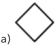

<!-- Start of picture text -->
a) <!-- End of picture text -->

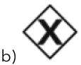

<!-- Start of picture text -->
b) <!-- End of picture text -->

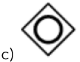

<!-- Start of picture text -->
c) <!-- End of picture text -->

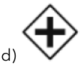

<!-- Start of picture text -->
d) <!-- End of picture text -->

**5. (FGV - 2026 - Analista Judiciário (TJ RJ)/Tecnologia da Informação/Analista de Negócios) Observe a seguir o recorte de um diagrama BPMN utilizado para modelar algumas das atividades envolvidas durante a distribuição de processo judicial.**

---

<!-- pagina: 85 -->

**Paolla Ramos Aula 04** 

**Os eventos utilizados para representar a falha no banco de dados e o processo urgente, respectivamente, são:** 

a) Throw – Link Intermediate Event e Throw – Message Intermediate Event; 

b) Throw – Escalation Intermediate Event e Catch – Message Intermediate Event; 

c) Catch – Parallel Multiple Intermediate Event e Non-interrupting Boundary – Catch – Multiple Intermediate Event; 

d) Boundary – Catch – Cancel Intermediate Event e Non-interrupting – Boundary – Conditional Intermediate Event; 

e) Boundary – Catch – Error Intermediate Event e Non-interrupting – Boundary – Catch – Escalation Intermediate Event. 

**6. (FGV - 2026 - Analista Judiciário (TJ RJ)/Tecnologia da Informação/Analista de Negócios) A analista de negócios Manuela está modelando os processos do seu departamento, que é intensivo em atividades com entrada e saída de dados.** 

**De acordo com o BPMN, a representação do fluxo de mensagem entre uma Tarefa e um Objeto de Dados que Manuela deve utilizar é:** 

a) b) c) d) e) 

**7. (FGV - 2026 - Analista Judiciário (TJ RJ)/Tecnologia da Informação/Analista de Projetos) Observe o diagrama BPMN a seguir.**

---

<!-- pagina: 86 -->

**Paolla Ramos Aula 04** 

**O elemento que representa um gateway paralelo é:** 

a) 1; b) 2; c) 3; d) 4; e) 5. 

**8. (FGV - 2026 - Analista Judiciário (TJ RJ)/Tecnologia da Informação/Analista de Projetos) Juliana está mapeando os processos do seu departamento que contêm muitas atividades com transações de dados.** 

**Para representar uma entrada de dados de uma tarefa, utilizando o BPMN, Juliana deve utilizar:** 

a) 

b) c) d) e) 

**9. (FGV - 2026 - Analista Judiciário (TJ RJ)/Tecnologia da Informação/Analista de Projetos) Ana precisa modelar um processo em que o caminho do fluxo é dividido em dois ou mais caminhos que**

---

<!-- pagina: 87 -->

**Paolla Ramos Aula 04** 

**são executados em paralelo dentro do processo, permitindo que várias atividades sejam executadas simultaneamente, em vez de sequencialmente.** 

**Para isso, utilizando a notação BPMN, Ana deve usar um:** 

a) fork; b) join; c) pool; d) merge; e) swimlane. 

**10. (FGV - 2025 - Analista de Tecnologia da Informação (EBSERH)) BPMN 2.0 é uma linguagem gráfica padronizada para representar processos de negócios que podem ser facilmente compreensíveis por todos os usuários, desde o nível empresarial que criam os rascunhos iniciais dos processos, aos desenvolvedores técnicos responsáveis pela implementação dos tecnologia que executará esses processos.** 

**Com base no BPMN 2.0, relacione os elementos de modelagem elencados a seguir às suas respectivas representações gráficas.** 

**1. Fluxo de mensagem  2. Objeto de Dados 3. Lane 4. Gateway** 

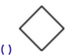

<!-- Start of picture text -->
( ) <!-- End of picture text -->

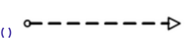

<!-- Start of picture text -->
( ) <!-- End of picture text -->

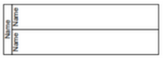

**( )** 

**( )** 

**A relação correta, na ordem apresentada, é** 

a) 4 – 2 – 1 – 3. b) 1 – 3 – 4 – 2.

---

<!-- pagina: 88 -->

**Paolla Ramos Aula 04** 

c) 3 – 4 – 1 – 2. 

d) 4 – 1 – 3 – 2. e) 2 – 4 – 3 – 1. 

**11. (FGV - 2025 - Analista do Ministério Público da União/Tecnologia da Informação e Comunicação/Desenvolvimento de Sistemas) Joana, gestora de processos de negócio, é responsável por otimizar os processos do MPU.** 

**Com base no CBOK 4.0, na primeira fase do seu trabalho, Joana definiu a seguinte tarefa:** 

**• identificar interfaces entre processos em que o trabalho ou a informação passam de um departamento para outro, o que pode gerar atrasos na execução do processo, além de distorções ou perdas de informações.** 

###### **Para executar essa tarefa, Joana deve identificar:** 

a) as atividades manuais, para transformá-las em atividades automáticas, visando a otimizar e agilizar a execução das tarefas; 

b) os repositórios de processos de negócio, para catalogar as tarefas manuais e repetitivas dos departamentos; 

c) handoffs utilizando swim lanes, para modelar as interfaces entre os departamentos; 

d) as atividades atômicas, limitando as transferências de informação entre departamentos quando possível; 

e) Key Performance Indicator (KPI), para avaliar as tarefas que mais atrasam, causam distorções e perdas de informações. 

**12. (FGV - 2025 - Analista do Ministério Público da União/Tecnologia da Informação e Comunicação/Desenvolvimento de Sistemas) Maria utilizou a notação BPMN para modelar o processo de negócio do departamento DEPTO1 da organização ORG_A, conforme figura abaixo.** 

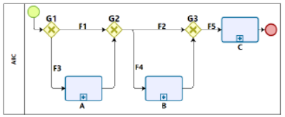

###### **Considerando a notação BPMN, é correto afirmar que:** 

a) o fluxo F5 é uma junção e leva à execução de um subprocesso de baixa complexidade; b) a sequência de gateways G1 e G2 garante a execução exclusiva do subprocesso B;

---

<!-- pagina: 89 -->

**Paolla Ramos Aula 04** 

c) o fluxo F1 é executado em paralelo ao fluxo F3, assim como são paralelos os fluxos F2 e F4; d) o fluxo pelo gateway G2 está condicionado ao término da execução do subprocesso A; e) o gateway G2 é exclusivo e conflita na bifurcação e união de caminhos alternativos. 

**13. (FGV - 2025 - Analista do Ministério Público (MPE RJ)/Administrativa/Tecnologia da Informação) Analise a figura a seguir** 

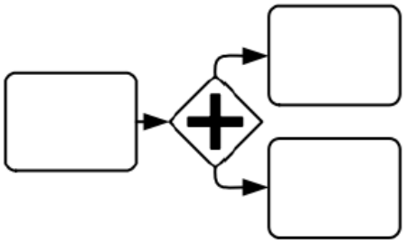

**Considerando que a figura é um elemento do modelo BPMN estendido (versão 2.0), ela representa um** 

a) Transaction. 

b) Event. c) Loop. d) Fork. e) Join. 

**14. (FGV - 2025 - Analista da Defensoria Pública (DPE RO)/Analista de Sistemas) Uma notação padrão para os casos de modelagem de processos de negócio é o Modelo e Notação de Processos de Negócio (ou BPMN, Business Process Model and Notation; anteriormente conhecido como Notação de Modelagem de Processos de Negócio, ou Business Process Modeling Notation).** 

**Com relação ao BPMN, assinale (V) para a afirmativa verdadeira e (F) para a falsa.** 

**( ) Foi desenvolvido originalmente pela Business Process Management Initiative (BPMI) como uma notação exclusiva textual e precisa para documentar processos de negócios.** 

**( ) Corresponde a uma maneira padronizada de demonstrar processos completos que ocorrem em um negócio.**

---

<!-- pagina: 90 -->

**Paolla Ramos Aula 04** 

**( ) O BPMN permite que os stakeholders visualizem os setores e facilita a otimização dos fluxos de trabalho.** 

**As afirmativas são, respectivamente,** 

a) V – F – F. 

b) V – V – F. c) F – V – F. d) F – F – V. e) V – F – V. 

**15. (FGV - 2025 - Analista de Gestão (AgSUS)/Tecnologia da Informação) BPMN é amplamente usado para a modelagem de processos de negócio da AgSUS. Segundo o BPMN 2.0, o elemento gráfico que um analista deverá utilizar para indicar um objeto de dados é o** 

a) círculo tracejado. 

b) envelope fechado. c) losango com linhas duplas. 

d) cone tridimensional com bordas destacadas. 

e) retângulo com canto superior direito dobrado. 

**16. (FGV - 2025 - Analista de Gestão (AgSUS)/Tecnologia da Informação) Os elementos estruturais da BPMN 2.0 permitem que um analista visualize e diferencie facilmente as seções de um diagrama BPMN. Os tipos básicos de submodelos que podem estar presentes em um modelo BPMN são respectivamente** 

a) processos e conversações, apenas. 

b) processos públicos e privados, apenas. 

c) conversações, coreografias e catálogos apenas. 

d) catálogos, conversões e orquestrações apenas. 

e) processos, coreografias e colaborações, apenas. 

**17. (FGV - 2025 - Analista Legislativo (ALEAM)/Analista de Sistemas) A equipe de Análise de Sistemas decidiu utilizar a notação BPMN (Business Process Model and Notation) para padronizar a modelagem dos processos legislativos e administrativos da casa. A notação fornece um conjunto de símbolos e regras que facilitam a comunicação e o entendimento do fluxo de trabalho. O elemento da notação BPMN utilizado para representar uma atividade que não pode ser decomposta em um nível mais detalhado dentro do modelo em foco, indicando uma tarefa atômica é o(a)**

---

<!-- pagina: 91 -->

**Paolla Ramos Aula 04** 

a) Subprocesso (Colapsado) 

b) Tarefa (Retângulo de cantos arredondados) 

c) Evento (Circular) 

d) Gateway (Losango) 

e) Piscina (Pool) 

**18. (FGV - 2025 - Auditor Estadual de Controle (CGE SP)/Tecnologia da Informação) Em um projeto de transformação digital, o analista está usando a notação BPMN 2.0 para mapear o fluxo de "aprovação de crédito". O processo envolve um sistema automatizado que checa dados do cliente (atividade 1) e, dependendo do score, o processo pode ser finalizado (crédito aprovado) ou encaminhado para análise manual (atividade 2). Se a análise manual for concluída, o processo retorna a um ponto onde o cliente é notificado do resultado.** 

**Indique o elemento da notação BPMN que deve ser usado para representar o ponto no fluxo em que o processo se divide com base no resultado do score (encaminhando para análise manual ou finalizando a aprovação) e o elemento que deve ser usado para permitir que o fluxo retorne após a análise manual, aguardando um evento (como a notificação) para prosseguir.** 

a) Pool para a divisão e Swimlane para o retorno. 

b) Sub-processo para a divisão e Data Object para o retorno. 

c) Gateway Exclusivo (XOR) para a divisão e Task (Tarefa) para o retorno. 

d) Gateway Paralelo (AND) para a divisão e Gateway Inclusivo (OR) para o retorno. 

e) Gateway Exclusivo (XOR) para a divisão e Intermediate Catching Event (Evento Intermediário de Captura) para o retorno. 

**19. (FGV - 2024 - Analista em Gestão Municipal (Pref SJC)/Tecnologia da Informação) Na notação BPMN, os objetos de conexão permitem conectar objetos de fluxo entre si ou conectar a informações complementares. Existem diversos tipos diferentes de objeto de conexão.** 

**A representação gráfica do objeto de conexão do tipo fluxo de sequência é** 

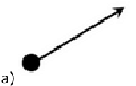

<!-- Start of picture text -->
a) <!-- End of picture text -->

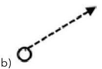

<!-- Start of picture text -->
b) <!-- End of picture text -->

---

<!-- pagina: 92 -->

**Paolla Ramos Aula 04** 

c) d) 

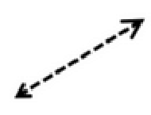

==5460== 

**20. (FGV - 2024 - Analista em Gestão Municipal (Pref SJC)/Tecnologia da Informação) Considere a modelagem de processos usando BPMN. Seja C um conjunto de construções de fluxo de controle.** 

**P = (N,E, tipo) é um modelo de processo se consistir em um conjunto N de nós e um conjunto E de arestas.** 

**Nesse caso, avalie se as afirmativas a seguir são falsas (F) ou verdadeiras (V).** 

**( ) N = NA** ∩ **NE** ∩ **NG, onde NA é um conjunto de modelos de atividades, NE é um conjunto de modelos de eventos e NG é um conjunto de modelos de gateway. Esses conjuntos são mutuamente disjunto.** 

**( ) E é um conjunto de arestas direcionadas entre nós, tal que E** ⊆ **N × N, representando controle de fluxo.** 

**→ ( ) tipo : NG C atribui a cada modelo de gateway uma construção de fluxo de controle.** 

**As afirmativas são, respectivamente,** 

a) F – F – F. b) F – F – V. c) F – V – V. d) V – F – V. e) V – V – V. 

**21. (FGV - 2024 - Auditor de Contas Públicas (CGE PB)/Auditoria de Tecnologia da Informação) Júnior elaborou o seguinte diagrama utilizando a notação BMPN 2.0 e apresentou para o seu chefe Carlos.**

---

<!-- pagina: 93 -->

**Paolla Ramos Aula 04** 

**Ao analisar o diagrama elaborado por Júnior, Carlos observou o seguinte erro de notação:** 

a) uma tarefa deve conter apenas uma entrada de dados e não duas como, por exemplo, objeto de dados e armazém de dados; 

b) os caminhos paralelos de um fluxo devem conter atividades do mesmo tipo, apenas subprocessos ou apenas tarefas; 

c) o evento de fim de processo deve ser representado por um círculo duplo e não por um círculo simples com linha grossa; 

d) a associação de dados de entrada de uma tarefa deve ser representada por uma seta com linha pontilhada e não por uma seta com uma linha contínua; 

e) a sincronização de caminhos paralelos de um fluxo deve ser representada por apenas um gateway com sinal de multiplicação no centro do losango. 

**22. (FGV - 2024 - Analista Judiciário (TJ AP)/Apoio Especializado/Controle Interno) Os analistas responsáveis pelo desenho de processos numa organização costumam utilizar o BPMN para a notação gráfica, onde cada figura é responsável por simbolizar algo referente ao processo. Ao mapear um processo em uma organização pública, um analista precisava representar caminhos alternativos ou paralelos e não sabia qual figura utilizar.** 

**Um especialista no assunto deverá recomendar o uso de um(a):** 

a) círculo; 

b) losango; c) quadrado; d) retângulo; e) seta.

---

<!-- pagina: 94 -->

**Paolla Ramos Aula 04** 

**23. (FGV - 2024 - Analista Legislativo (ALETO)/Análise de Sistema) Em um diagrama de modelagem de processos de negócio utilizando a notação BPMN (Business Process Model and Notation), assinale a principal função das Swimlanes.** 

   - a) Indicar diferentes tipos de eventos que ocorrem dentro do processo. 

   - b) Representar as variáveis que serão manipuladas durante o processo. 

- c) Dividir o diagrama em seções para representar diferentes entidades ou papéis responsáveis por 

- partes específicas do processo. 

   - d) Mostrar a sequência temporal das atividades de forma cronológica. 

   - e) Detalhar os recursos tecnológicos utilizados em cada etapa do processo. 

**24. (FGV - 2024 - Analista Judiciário (TRF 1ª Região)/Apoio Especializado/Análise de Sistemas de Informação) Cintia elaborou um diagrama BPMN representando diversas atividades que ocorrem em repetição (loopings). Com isso, o diagrama apresenta longas linhas de sequência de fluxos que se cruzam.** 

**Para evitar essas longas linhas ao representar repetições em fluxo normal, o tipo de evento intermediário (Intermediate Event Types) que Cintia deve usar é:** 

a) link; 

b) signal; 

c) message; 

d) escalation; 

- e) parallel multiple. 

**25. (FGV - 2024 - Analista Judiciário (TRF 1ª Região)/Apoio Especializado/Governança e Gestão de Tecnologia da Informação) Gabriela está usando a notação BPMN 2.0 (Business Process Model and Notation) para modelar os processos de negócio que serão atendidos por um novo sistema de informação. Observe o diagrama criado por ela.**

---

<!-- pagina: 95 -->

**Paolla Ramos Aula 04** 

**Gabriela utilizou o elemento gateway "G1" para:** 

a) criar caminhos alternativos, sem paralelismos, dentro de um fluxo de processo; 

b) indicar que cada fluxo de sequência receberá um token sem depender da avaliação da condição; c) capturar a ocorrência de eventos que determinarão a execução dos fluxos de sequência; 

d) determinar que o fluxo a ser percorrido está condicionado ao recebimento de uma mensagem; 

e) criar caminhos alternativos, mas também paralelos, quando mais de uma expressão for avaliada como verdadeira. 

**26. (FGV - 2024 - Técnico Judiciário (TRF 1ª Região)/Apoio Especializado/Desenvolvimento de Sistemas da Informação) Os processos de negócio são compostos por diversos fluxos de atividades que podem ser executados em paralelo, otimizando o tempo para finalizar um determinado processo. Para isso, os fluxos podem ser divididos (split) ou fundidos (merge).** 

**No BPMN 2.0, para representar a divisão ou a fusão de fluxos de atividades, deve-se usar um:** 

a) pool; b) event; 

c) gateway; d) sub-process; e) swimlane. 

**27. (FGV - 2024 - Técnico Judiciário (TRF 1ª Região)/Apoio Especializado/Desenvolvimento de Sistemas da Informação) Observe o seguinte diálogo entre analistas do TRF1:** 

**Flávio: “Vamos usar o BPMN para modelar o fluxo de dados (Data Flow) do ambiente analítico de dados do Tribunal”.**

---

<!-- pagina: 96 -->

**Paolla Ramos Aula 04** 

**Junior: “O BPMN não é utilizado para isso! Um Diagrama BPMN não é um Diagrama de Fluxo de Dados”, e sim um diagrama usado para modelar as atividades de um processo.** 

**Flávio: “É sim, ele tem representações de objetos de dados de vários tipos, como: Data Object, Store e Collection! Podemos usar artefatos para representar os processos de expurgo de dados”.** 

**Junior: “Esses tipos de objetos podem ser conectados via um fluxo de mensagens que é representado por linhas contínuas com um losango na ponta”.** 

###### **Sobre o diálogo, é correto afirmar que:** 

a) Junior está certo, pois o BPMN deve ser usado para modelar as atividades de um processo e não um fluxo de dados; 

b) Flávio citou corretamente os tipos de objetos de dados do BPMN e acertou ao dizer que o BPMN serve para modelar o fluxo de dados; 

c) Junior está correto ao afirmar que o fluxo de mensagens é representado por linhas contínuas com um losango na ponta; 

d) os artefatos do BPMN podem ser usados para representar subprocessos, conforme afirmado por Flávio; 

e) Junior está correto ao afirmar que os objetos de dados podem ser conectados via um fluxo de mensagens. 

**28. (FGV - 2024 - Analista de Processamento (DATAPREV)) Elon Musk tem se envolvido em algumas polêmicas após a aquisição do Twitter e a mudança do nome da plataforma para X. Ele é reconhecido por sua constante busca por inovação e eficiência. Recentemente, ele destacou a importância de entender cada passo da produção de um foguete reutilizável na sua empresa SpaceX.** 

**Diante da necessidade de visualizar e gerenciar esse fluxo de trabalho complexo, o conceito de gestão de processos e modelagem que melhor captura as diversas atividades, decisões e interações na produção do foguete é chamado** 

a) Análise SWOT. 

b) Diagrama de Ishikawa. 

c) Matriz GUT. 

d) Modelagem BPMN. 

e) 5W2H. 

**29. (FGV - 2024 - Analista de Tecnologia da Informação (DATAPREV)/Análise de Negócios de TI) Imagine que você está no meio de um projeto, modelando um processo de negócios com BPMN (Business Process Model and Notation). Até agora, tudo está fluindo bem, mas então surge um ponto importante: uma decisão precisa ser tomada com base em certas condições. Nesse momento, você**

---

<!-- pagina: 97 -->

**Paolla Ramos Aula 04** 

**precisa saber qual símbolo usar para representar essa bifurcação no fluxo. O elemento correto para isso é** 

a) Pool. b) Event. c) Gateway. d) Data Object. e) Lane. 

**30. (FGV - 2024 - Analista de Tecnologia da Informação (DATAPREV)/Gestão de Serviços de TIC) Em um determinado diagrama BPMN, criado por uma equipe de TI de uma empresa pública, ao se mapear eventos, necessitou-se usar um símbolo para apresentar o desencadeamento do processo, facilitando processos intermediários ou também para finalizar o processo. Esse símbolo é o de** 

a) cancelamento. 

b) cronômetro. 

c) encaminhamento. 

d) mensagem. e) múltiplo. 

**31. (FGV - 2024 - Analista de Políticas Públicas e Gestão Governamental (SEPLAG Niterói)/Gestão de Tecnologia da Informação e Comunicação) No Business Process Model and Notation 2.0 (BPMN 2.0), diferentes símbolos representam componentes variados de um processo de negócio.** 

**Assinale a opção que descreve corretamente a funcionalidade dos elementos de decisão na notação BPMN 2.0.** 

a) Os elementos de decisão são representados por retângulos e indicam o término do processo. b) Os elementos de decisão são representados por círculos e indicam o início de um processo. 

c) Os elementos de decisão são representados por setas e conectam diferentes etapas do processo. 

d) Os elementos de decisão servem apenas para agrupar tarefas relacionadas e não influenciam o fluxo do processo. 

e) Os elementos de decisão são representados por losangos e direcionam o fluxo do processo com base em condições específicas. 

**32. (FGV - 2024 - Auditor Fiscal Tributário da Receita Municipal (Pref Cuiabá)/Tecnologia da Informação) Analise as afirmativas a seguir, sobre a modelagem de processos utilizando Business Process Modelling and Notation (BPMN).**

---

<!-- pagina: 98 -->

**Paolla Ramos Aula 04** 

**I. Deve-se tentar sempre utilizar o máximo de detalhes possíveis no diagrama para garantir que todos os aspectos do processo sejam visualizados.** 

**II. Ao modelar processos complexos, é recomendado dividir o diagrama em subprocessos para facilitar a visualização e o entendimento do fluxo.** 

**III. É uma boa prática definir pontos de decisão com gateways para representar alternativas e condições no fluxo do processo, garantindo que as ramificações sejam claras e consistentes.** 

**Está correto o que se afirma em** 

a) I, apenas. 

b) I e III, apenas. 

c) I e II, apenas. d) II e III, apenas. 

e) I, II e III. 

# **<mark>Gabaritos</mark>** 

1. Letra A 

2. Letra B 

3. Letra B 

4. Letra D 

5. Letra E 

6. Letra D 

7. Letra A 

8. Letra B 

9. Letra A 10. Letra D 

11. Letra C 

12. Letra E 

13. Letra D 

14. Letra C 

15. Letra E 

16. Letra E 

17. Letra B 

18. Letra E 

19. Letra C 

20. Letra C

---

<!-- pagina: 99 -->

**Paolla Ramos Aula 04** 

21. Letra D 

22. Letra B 

23. Letra C 

24. Letra A 

25. Letra E 

26. Letra C 

27. Letra A 

28. Letra D 

29. Letra C 

30. Letra D 

31. Letra E 

32. Letra D

---

<!-- pagina: 100 -->

