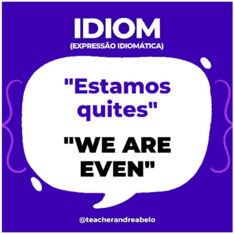
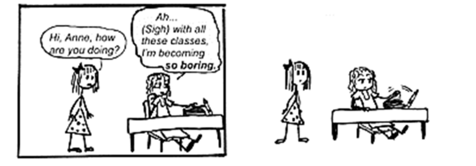
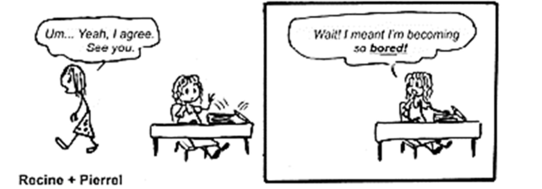
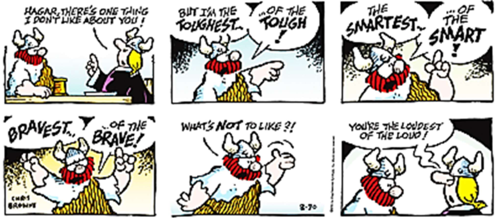
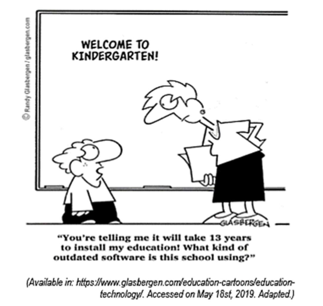
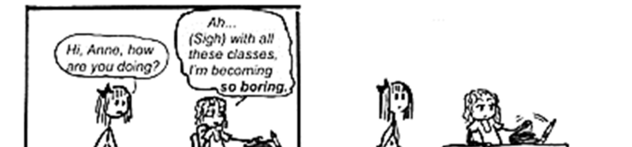
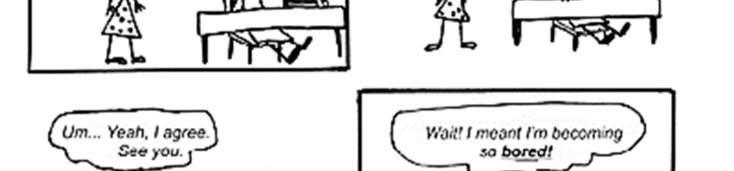
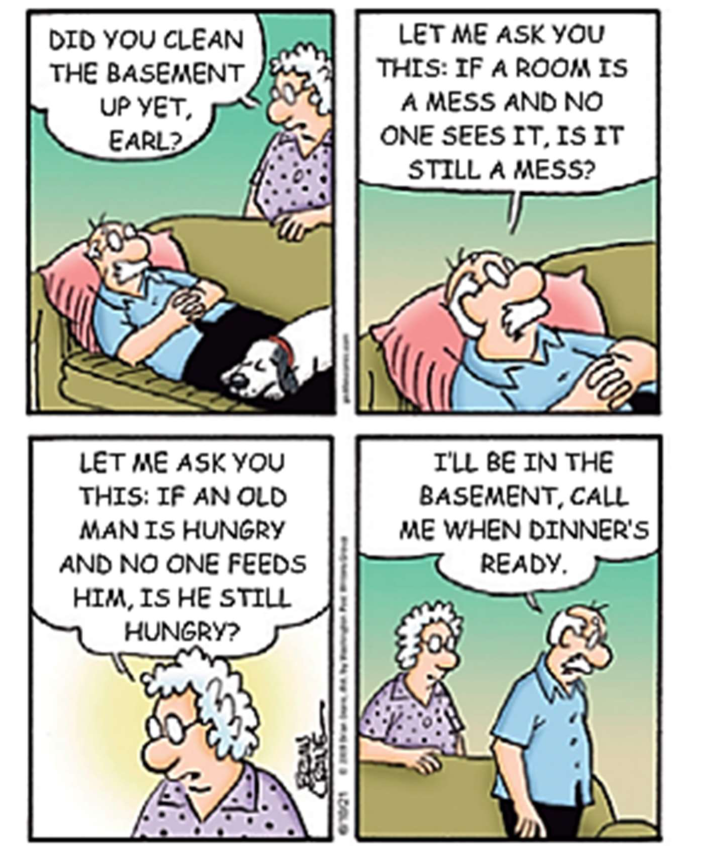
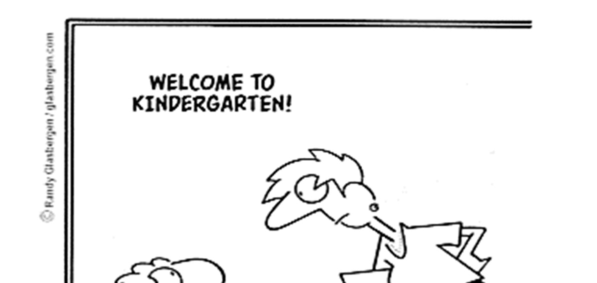
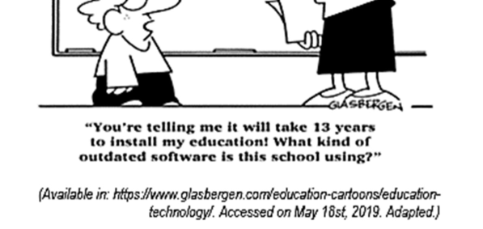

---
fonte_pdf: "Inglês - Aula 00.pdf"
paginas: 98
conversao: texto-e-imagens
---

<!-- pagina: 2 -->

**Andrea Belo Aula 00 - English General Presentation** 

### SUMÁRIO 

|APRESENTAÇÃO------------------------------------------------------------------------------------------------------------- 2|
|---|
|METODOLOGIA-------------------------------------------------------------------------------------------------------------- 3|
|PLANEJAMENTO DAS AULAS---------------------------------------------------------------------------------------------- 4|
|INTRODUÇÃO ÀS TÉCNICAS DE LEITURA-------------------------------------------------------------------------------- 7|
|SKIMMING----------------------------------------------------------------------------------------------------------------- 8|
|SCANNING---------------------------------------------------------------------------------------------------------------- 8|
|COGNATOS E FALSOS COGNATOS------------------------------------------------------------------------------------- 9|
|INTRODUÇÃO À GRAMÁTICA------------------------------------------------------------------------------------------- 10|
|INTRODUÇÃO AOS TEMPOS VERBAIS--------------------------------------------------------------------------------- 11|
|COMO INTERPRETAR IMAGENS----------------------------------------------------------------------------------------- 13|
|EXPRESSÕES IDIOMÁTICAS---------------------------------------------------------------------------------------------- 14|
|QUESTÕES------------------------------------------------------------------------------------------------------------------ 15|
|GABARITO------------------------------------------------------------------------------------------------------------------ 41|
|QUESTÕES COMENTADAS----------------------------------------------------------------------------------------------- 41|
|CONSIDERAÇÕES FINAIS------------------------------------------------------------------------------------------------- 94|
|REFERÊNCIAS--------------------------------------------------------------------------------------------------------------- 95|

---

<!-- pagina: 3 -->

**Andrea Belo Aula 00 - English General Presentation** 

# APRESENTA ÃO <u>Ç</u> 

Hello, dear student!!! Welcome to the success! 

Bem-vindo ao sucesso? Isso mesmo. Com esse curso de Inglês do Estratégia Concursos, a disciplina de língua inglesa será um diferencial para seus estudos. 

Isso porque preparei esse material usando toda minha experiência e background para desenvolver as melhores aulas que você possa ter. 

O meu nome é Andrea Belo e minha formação acadêmica é composta por: 

- graduação em Letras pela Universidade Federal de Goiás (UFG/GO); 

- pós-graduação em Linguística Aplicada à Língua Inglesa pela PUC/SP; 

- pós-graduação em Educação para idiomas pela Cambridge University, na Inglaterra; 

- especialização em Didática e Prática em língua inglesa pelo LAL/Londres, escola conveniada à Oxford University, na Inglaterra; 

- especialização Higher Education Teaching Certificate pela NYU – New York University, em N.Y./EUA; 

- certificação Cambridge nos exames FCE, CAE e CPE pela escola de idiomas Cultura Inglesa; 

- certificação MBA em English Studies – Language program pela FUB – Freie Universität Berlin, em Berlim/Alemanha; 

- certificação em Bilingual Education, curso CIP – Cultural Immersion Program, em Fort Myers, Flórida/EUA; 

Além da formação acadêmica, viajei e morei em oito diferentes países, participei de seminários e workshops em cada país, buscando fluência sempre. Sou também tradutora e intérprete habilitada e vou ajudá-lo a realizar a prova de Inglês, fazendo o papel de facilitadora, para que você consiga sua aprovação com esse material, que é prático e intenso, porém eficaz. Desenvolvi, para você, uma maneira de transformar essa disciplina em algo atrativo e eficaz. 

Siga as redes sociais como complementos de estudos e... let’s go! 

---

<!-- pagina: 4 -->

**Andrea Belo Aula 00 - English General Presentation** 

# METODOLOGIA 

Você certamente está pensando: “Que metodologia faz com que inglês seja mais simples do que eu imagino? Como?” 

O método que uso nesse material permitirá que você consiga realizar sua prova de Inglês com segurança. 

Há termos gramaticais no índice das aulas, mas a gramática é explicada contextualizada, conforme você precisa, com prática de exercícios em diferentes graus de dificuldade, desde básicos até avançados, com técnicas de leitura essenciais e muito mais. 

Com uso de metodologias interdisciplinares e um método dinâmico, vou esclarecer suas dúvidas, com explicações detalhadas. 

O segredo de sua aprovação está na segurança total de como resolver cada exercício com eficácia, como faremos juntos. 

E a maneira como eu explico o conteúdo, conectando diferentes tópicos gramaticais, que geralmente são ensinados separadamente, será um método único, exclusivo e que vai garantir o seu sucesso na prova de Inglês. 

Outro aspecto muito importante, inclusive, um de nossos diferenciais, é que, você terá acesso a muitas questões, teoria com macetes, esquemas, exemplos variados e muito mais. 

Então, use bem o tempo que antecede a prova para estudar com um material eficaz em mãos. Estude, sempre. Leia artigos e reportagens de jornais importantes, notícias internacionais, textos de revistas que são comuns fontes na elaboração das questões de Inglês. 

Passe suas horas de estudo “afiando” sua mente com nossas aulas de Inglês e seu constante estudo dia após dia. Resolva provas anteriores. Faça simulados. Use o banco de questões. Leia muito. 

Toda oportunidade que encontrar para ler e pesquisar as fontes usadas nessas provas, será uma chance a mais de ser aprovado. Faça todo esforço necessário para alcançar sua meta!

---

<!-- pagina: 5 -->

**Andrea Belo Aula 00 - English General Presentation** 

# PLANEJAMENTO DAS AULAS 

|AULAS|CONTEÚDO|
|---|---|
|Aula 00: English General presentation|Introdução: às técnicas de leitura Scanning e Skimming; à importância dos tempos verbais em inglês; ao uso dos falsos cognatos; aos termos gramaticais essenciais; ao uso de expressões idiomáticas e às formas de interpretar imagens.|
|Aula 01: Reading Techniques, Cognates and Idioms|Scanning; Skimming; Cognates (Cognatos), False Cognates (Falsos Cognatos) Idioms (expressões idiomáticas).|
|Aula 02: Verbs in texts|Verb To be (Verbo To be); Simple Present (Presente Simples); Simple Past (Passado Simples); Future Will x  Going to (Futuro com Will x Going to); Gerund (Gerúndio); Present Continuous (Presente Contínuo); Past Continuous (Passado Contínuo); Present Perfect (Presente Perfeito); Past Perfect (Passado Perfeito); Future Perfect (Futuro Perfeito); Present Perfect Continuous (Presente Perfeito Contínuo); Past Perfect Continuous (Passado Perfeito Contínuo);|

---

<!-- pagina: 6 -->

**Andrea Belo Aula 00 - English General Presentation** 

||Future Perfect Continuous (Futuro Perfeito Contínuo); Modal Verbs (Verbos Modais); Imperative Tenses (Imperativo) e Phrasal Verbs (Verbos Frasais).|
|---|---|
|Aula 03: Articles and Nouns in the texts|Definite Articles (Artigos definidos); Indefinite Articles (Artigos indefinidos); Nouns (Substantivos);|
||Common Noun (Substantivo Comum); Proper Noun (Substantivo Próprio)|
||Compound Noun (Substantivo Composto);|
||Abstract and Concrete Nouns (Substantivos Abstratos e Concretos); Collective Nouns. (Substantivos Coletivos);|
||Countable and Uncountable Nouns (Substantivos Contáveis e Incontáveis); Plural (Regular e Irregular); Numbers (Números) e|
||Prefixes and Sufixes (Prefixos e Sufixos).|
|Aula 04: Adjectives and Adverbs |Adjectives (Adjetivos);|
|in the texts|Comparative (Grau Comparativo);|
||Superlative (Grau Superlativo); Adverbs (Advérbios);|
||Adverbs of Manner (Advérbios de Modo);|
||Adverbs of Frequency (Advérbios de Frequência); Adverbs of Time (Advérbios de Tempo); Adverbs of Place (Advérbios de Lugar) e Adverbs of Intensity (Advérbios de Intensidade).|

---

<!-- pagina: 7 -->

**Andrea Belo Aula 00 - English General Presentation** 

Aula 05: Pronouns, Prepositions Pronouns (Pronomes); and Conjunctions in the texts Personal Pronouns (Pronomes Pessoais); Possessive Pronouns (Pronomes Possessivos); Subject Pronouns (Pronomes Sujeitos); Object Pronouns (Pronomes Objeto); Adjective Pronouns (Pronomes Adjetivos); Reflexive Pronouns (Pronomes Reflexivos); Demonstrative Pronouns (Pronomes Demonstrativos); Indefinite Pronouns (Pronomes Indefinidos); Interrogative Pronouns (Pronomes Interrogativos); Prepositions (Preposições) e Conjunctions (Conjunções). Aula 06: Direct Speech, Reported Direct Speech (Discurso Direto); Speech and Passive Voice Reported Speech (Discurso Indireto); Active Voice (Voz Ativa) e Passive Voice (Voz Passiva). Aula 07: If Clauses and Quantifiers Conditionals (Orações Condicionais); Zero Conditional; First Conditional; Second Conditional; Third Conditional e Quantifiers (Determinantes/Quantificadores).

---

<!-- pagina: 8 -->

**Andrea Belo Aula 00 - English General Presentation** 

# INTRODUÇÃO ÀS TÉCNICAS DE LEITURA 

No momento da sua prova, quando você for resolver a prova de Inglês, você terá que fazer uma leitura rápida de cada texto, para identificar a ideia central acerca daquele assunto ou encontrar termos específicos que ajudem a compreender do que se trata. 

Fazer isso, com propriedade, até chegar à resposta da questão, é aplicar as técnicas Skimming e Scanning . 

No decorrer das aulas do nosso curso, haverá uma aula exclusiva com detalhes sobre como usar bem essas técnicas, com vários textos e com outras dicas valiosas para garantir sua aprovação. Mas, vamos, agora, falar brevemente dessas técnicas nessa aula de apresentação. 

Como a própria tradução do verbo skim – deslizar os olhos, folhear, desnatar – é exatamente isso que você vai fazer – passar os olhos pelo texto sem interrupções, mesmo não entendendo todas as palavras, apenas procurando do que se trata o texto. É simplesmente focar nas informações necessárias para responder questões que abrangem o texto, como veremos agora. 

O verbo scan , escanear, é examinar detalhadamente, codificar a mensagem das frases, selecionar o vocabulário necessário, encontrar detalhes relevantes à resposta. Veja algumas características dessas técnicas: 

### SKIMMING 

- FAST READING 

- CONCENTRATION/FOCUS 

- GENERAL TEXT IDEA 

- TEXT GOALS 

- SUBJECT INFORMATION 

### SCANNING 

- VOCABULARY SELECTIVITY 

- KEEP AN EYE ON THE TEXT 

- COGNATS: HELPERS 

- SPECIFIC DETAILS 

- VISUAL CONTACT 

E, se você prestar atenção no contexto e quebrar o hábito de querer traduzir palavra por palavra, essas técnicas levarão você à resposta com agilidade e sem tradução. Na verdade, traduzir um texto, no momento da prova, ocupa seu tempo e atrasa a resolução dos exercícios. 

Mesmo se você tem Inglês fluente, o ato de traduzir os textos leva tempo enquanto usar as técnicas aqui ensinadas, poupam seu tempo para resolver todas as questões da prova e aprender palavras novas e saber Inglês com a metodologia que uso. Você vai ver. 

Vamos aos detalhes de cada umas das técnicas citadas acima.

---

<!-- pagina: 9 -->

**Andrea Belo Aula 00 - English General Presentation** 

## SKIMMING 

Uma boa compreensão do texto que você está lendo, depende da sua capacidade de fazer deduções, ligar ideias e identificar palavras que determinam o assunto. 

E, o que realmente importa a você, é realmente conseguir encontrar as respostas da sua prova e certificar-se dessas respostas, garantindo boa pontuação na prova de Inglês. 

O Skimming é a leitura dinâmica para destacar os aspectos principais do texto, sem se preocupar com os detalhes. Vejamos um exemplo para você experimentar a técnica Skimming , primeiramente em português e, em seguida, em inglês para testar sua capacidade: 

Três onças pintadas foram vistas na <u>kapinete</u> ontem. Estavam se escondendo de possíveis promubinos com suas armas. Os promubinos não desistiram de trevenar e passaram a noite em claro com lanternas e espingardas de prontidão. Se tivessem <u>abstoque , não matavam animais em</u> extinção e sim, protegeriam nossa fauna e flora. 

- Onde as onças foram vistas? 

- Quem são os possíveis <u>promubinos ?</u> 

- O que fizeram ao invés de desistir? 

Lendo apenas uma vez, você entendeu esse texto? A história fez sentido, mesmo com palavras desconhecidas ao fazer uma leitura rápida? Você provavelmente atribuiu sentidos às palavras novas (Kapinete: floresta; promubinos: caçadores; trevenar: procurar; abstoque: consciência) . 

Esse é o SKIMMING , é a “chave da questão” em língua inglesa – atribuir significado aos vocábulos que você não sabe. É conectando ideias e deduzindo o assunto, que se chega ao sentido geral e coloca você no caminho da resposta. 

## SCANNING 

No momento de resolver a prova de Inglês, você também terá que fazer uma leitura para procurar uma palavra-chave. Um termo, um tempo verbal, algo sobre o título, sobre a fonte de referência etc. 

Daí você vai praticar a outra técnica, chamada Scanning , que também exploraremos com detalhes na aula 01, desse curso e agora, veremos algumas considerações para uma introdução à técnica. Scanning é ter como objetivo achar algo característico, singular, exclusivo para responder uma determinada questão. Vejamos o uso de Scanning :

---

<!-- pagina: 10 -->

**Andrea Belo Aula 00 - English General Presentation** 

Três onças pintadas foram vistas na <u>kapinete</u> ontem. Estavam se escondendo de possíveis promubinos com suas armas. Os promubinos não desistiram de trevenar e passaram a noite em claro com lanternas e espingardas de prontidão. Se tivessem <u>abstoque , não matavam animais em</u> extinção e sim, protegeriam nossa fauna e flora. 

- Onde as onças foram vistas? 

- Quem são os possíveis <u>promubinos ?</u> 

- O que fizeram ao invés de desistir? 

Suponhamos que a pergunta fosse: O que as onças estavam fazendo? 

Você teria que voltar ao texto, ler mais uma vez para conferir e se certificar, mesmo que se lembrasse do contexto. 

Ao praticar o Scanning , você leu a informação contida no local em que está exatamente o que você precisa. Vamos à nossa questão. Na frase: “Três onças pintadas foram vistas na kapinete ontem. Estavam se escondendo de possíveis promubinos com suas armas.” , já iríamos encontrar a resposta desejada. Não é mesmo? A técnica leva você às respostas. 

Em textos, em imagens ou qualquer forma de leitura, sempre há “vestígios” que nos levam a perceber sobre o que estamos lendo. São indicativos do assunto com palavras particulares. 

Agora, vamos falar um pouco dos falsos cognatos, para não cometer erros na hora da resolução de exercícios na sua prova. 

# COGNATOS E FALSOS COGNATOS 

Vamos falar agora sobre Falsos Cognatos . Primeiramente, vamos entender o que é um Cognato em inglês. 

Palavras cognatas são aquelas que se assemelham a palavras em português. E, essas semelhanças ortográficas, ajudam você a fazer suas leituras. 

Veja alguns exemplos para animar você, já que muitas vezes, os cognatos te ajudarão a resolver questões: 

CAMERA TELEPHONE SALAD BLOUSE CÂMERA TELEFONE SALADA BLUSA 

False Cognates ou False Friends , aparecem muito nas provas e são palavras que se diferem completamente no significado, apesar de serem similares na ortografia. Eu diria que são tricky

---

<!-- pagina: 11 -->

**Andrea Belo Aula 00 - English General Presentation** 

words – palavras “enganosas”, “pegadinhas”, pois você acha que é algo quando o significado é muito diferente do que parece ser. 

Em nosso curso, sempre há questões em que aparecem, além de falsos cognatos, palavras repetidas com objetivo específico, marcas tipográficas, dentre outras particularidades que exigem atenção na hora da leitura, como veremos na aula 01 com mais detalhes. 

É essencial entender por que os falsos cognatos são, um dos sinais mais importantes para resolver sua prova. Vejamos outros exemplos: 

ACTUALLY = de fato/na verdade (não é atualmente, que seria NOWADAYS) 

FABRIC = tecido (não é fábrica, que seria FACTORY) 

PREJUDICE = preconceito (não é prejudicial, que seria HARMFUL) 

COLLEGE = faculdade (não é escola, que seria SCHOOL) 

PRETEND = fingir (não é pretender, que seria TO INTEND) 

Agora vamos ver um pouco da introdução à gramática de uma forma mais prática. 

# INTRODU ÃO À GRAMÁTICA <u>Ç</u> 

A gramática está presente de várias formas nas questões de Inglês na prova. Na maioria das vezes, ela vem contextualizada. 

Outras vezes, pergunta-se exatamente o termo gramatical, testando seus conhecimentos. Ou então, são oferecidas opções de escolha de tópicos da gramática que podem ser substituídos por outros, entre inúmeros exercícios. 

Saber a gramática, além de ler e interpretar o texto, é um dos critérios decisivos para que você tenha êxito. Pensando assim, elaborei explicações objetivas, com o intuito de ajudar você a resolver a prova de Inglês. E, ao se deparar com tópicos gramaticais mais complexos, seus estudos exigirão cuidado, atenção e esforço em grandes doses, certo? 

No planejamento do nosso curso e na montagem do cronograma, tive a preocupação de inserir conteúdos que você precisa para estar seguro quanto à gramática. 

É importante, primeiramente, saber o que há para estudar da matéria de Inglês a partir do edital e separei, todos os tópicos presumíveis para a prova. 

Vou dar um exemplo básico da gramática com a prática. Quer ver? Se você vai elogiar alguém, usando o adjetivo “brilhante” para dizer que você considera a pessoa com essa característica, a frase seria, em português: “Que pessoa brilhante!” .

---

<!-- pagina: 12 -->

**Andrea Belo Aula 00 - English General Presentation** 

Curiosamente, em inglês, não é assim. No momento do elogio, o adjetivo , que é a qualidade usada para, nesse caso, elogiar, vem antes do substantivo e, desde antes, você já sabe se será um elogio ou crítica por exemplo. Como? Veja: “What a brilliant person!” . Viu? A frase começa com “What a brilliant …” já manifestando o elogio antes mesmo de falar quem. Se forem várias pessoas em uma mesma sala, por exemplo, já se sabe que alguém ali é brilhante. 

Desta forma, em sua prova, não precisa de pensar que as palavras em inglês são “bagunçadas, não tem ordem específica, é difícil...”. Nada disso. Tudo tem uma explicação e, a cada aula, vou esclarecer e demonstrar com exemplos e com exercícios, que a gramática pode ser prática, sim! 

EM PORTUGUÊS: Que pessoa elegante! > adjetivo após o substantivo “pessoa” 

EM INGLÊS: What an elegant person! > adjetivo antes do substantivo “person” 

A gramática em inglês, na hora dos estudos, é considerada algo que dificulta pela quantidade de regras. Porém, vou simplificar e tornar sua compreensão possível e eficaz. Vamos focar nos verbos, advérbios, adjetivos e termos gramaticais em geral sempre de maneira contextualizada, assim como expliquei o uso do adjetivo acima a você. 

Em seguida, praticaremos ao máximo a leitura de textos, permitindo você a treinar o que está aprendendo. Pouco a pouco, vamos avançar para temas mais complexos da gramática para aprender a analisar a semântica, a sintaxe e a morfologia, também contextualizadas. 

Estudaremos classificação, estrutura e a formação de palavras em inglês, tipos de orações, funções dos termos dentro dos textos, levando você a interpretar e responder o que se pede. E, com exercícios de fixação, logo você estará confiante e otimista em relação à prova de Inglês. 

# INTRODUÇÃO AOS TEMPOS VERBAIS 

O tempo verbal de forma natural? Como? Que audácia! Sim, mas você verá que é possível estudar os verbos em inglês com os esclarecimentos aqui oferecidos já que o objetivo aqui é que você possa identificar os verbos com o propósito de acertar as questões interpretando os textos. 

Concordo que é necessário paciência para estudar tempos verbais, mas dominá-los é essencial para se destacar nos estudos e chegar à aprovação. Tenha em mente que o conhecimento dos verbos entre outros conteúdos aqui explorados, irá trazer a você enormes benefícios. 

Para expressar uma ação no presente, em português, cada sujeito usado (eu, ela, os homens etc.) há uma terminação diferente. Usando o verbo trabalhar , que faz parte dos verbos da primeira conjugação – terminados em -ar , como olhar, falar etc. – e a raiz do verbo trabalhar , a parte que não muda, é trabalh- , certo?

---

<!-- pagina: 13 -->

**Andrea Belo Aula 00 - English General Presentation** 

” ” Então, “Eu trabalh o , termina com a letra -o . E, “Ela trabalh a , termina com a letra -a . Os homens trabalh am , termina em -am . Portanto, são várias terminações para expressar a ação (verbo) apenas no tempo presente em português. 

Em inglês, não é complicado assim. O verbo fica igual para todo e qualquer sujeito, adicionando apenas a letra -s , -es ou -ies quando o sujeito é singular, ou seja, quando uma única pessoa pratica a ação.  Vejamos com a ajuda de um esquema: 

|EM PORTUGUÊS:|EM INGLÊS:|
|---|---|
|Eu trabalho|I work|
|Tu trabalhas|You work|
|Ele/Ela trabalha|He/She/It works|
|Nós trabalhamos|We work|
|Vós trabalhais|You work|
|Eles trabalham|They work|

Eu gostaria de saber, primeiramente, se você percebeu que o verbo trabalhar (to work) conjugado no tempo presente é bem mais fácil do que em português? Não é? Para cada 6 diferentes terminações no fim dos verbos em português, há apenas 2 variações em inglês – o verbo “to work” escrito normalmente para os todos os sujeitos exceto singular representado por He/She/It , que acrescentamos -s no verbo – He works, She works, It works , como no esquema acima. 

Por exemplo, o verbo trabalhar no passado, é “worked” qualquer sujeito. Veja abaixo: 

|EM PORTUGUÊS:|EM INGLÊS:|
|---|---|
|Eu trabalhei|I worked|
|Tu trabalhaste|You worked|
|Ele/Ela trabalhou|He/She/It worked|
|Nós trabalhamos|We worked|
|Vós trabalhais|You worked|
|Eles trabalharam|They worked|

- Mas teacher, já ouvi dizer que há inúmeros verbos irregulares. Com fica?

---

<!-- pagina: 14 -->

**Andrea Belo Aula 00 - English General Presentation** 

- Bom, é isso mesmo. Existem verbos irregulares na língua inglesa. Mas, não se assuste. Eles são minoria, algo em torno de 15% a 20%. Ou seja, dominando os verbos regulares, você já terá a capacidade de se expressar de forma escrita ou falada com a maioria dos verbos da língua inglesa. 

Por exemplo, o verbo escrever, “write” , que, ao invés de adicionar -ed no final, como a maioria dos verbos em inglês, troca-se uma das letras, por ser irregular (teremos uma aula dedicada exclusivamente aos tempos verbais, com detalhes de como lidar com as regras), escrevese “wrote” para qualquer sujeito. Veja outro esquema para ficar ainda mais claro: 

|EM PORTUGUÊS:|EM INGLÊS:|
|---|---|
|Eu escrevi|I wrote|
|Tu escreveste|You wrote|
|Ele/Ela escreveu|He/She/It wrote|
|Nós escrevemos|We wrote|
|Vós escreveis|You wrote|
|Eles escreveram|They wrote|

Viu como é simples? E, com naturalidade, você responderá às questões da prova com segurança, elaborar os parágrafos solicitados e responder o que for solicitado. 

Bom, no próximo capítulo continuarei com as dicas sobre como que podemos transformar a disciplina inglês em algo simples, falando de expressões idiomáticas , vamos lá? 

# COMO INTERPRETAR IMAGENS 

Agora vamos começar a falar de formas viáveis de interpretar imagens. Claro que a maioria das provas não trazem imagens – charges, quadrinhos, pinturas, gráficos, fotografias, tirinhas, anúncios de produto, propagandas diversas – mas podem aparecer gráficos ou algumas já citadas e você ser pego de surpresa. 

Imagens nunca estão na prova simplesmente para ilustrar, mas, para trazer informações significativas. Sendo então, indispensável que você também tenha um conhecimento prévio sobre temas relevantes e conhecimentos gerais. 

Você tem que fazer perguntas para construir uma leitura crítica e inteligente.

---

<!-- pagina: 15 -->

**Andrea Belo Aula 00 - English General Presentation** 

No momento de resolver uma questão com imagens, você precisa, antes de tudo, saber o tipo de ilustração e observar os detalhes da imagem e o texto vinculado a ela, como vimos no exemplo anterior e veremos em inúmeros outros em nossas aulas. 

As imagens permitem e trazem consigo atributos, traços únicos que tornam o texto vinculado a ela, abrangente e repleto de mensagens subliminares. 

Você deve aproximar conteúdos e encaixá-los em seus conhecimentos. Vou sempre fazer referência a assuntos diversos por meio de exercícios, para você aprimorar suas leituras de imagens de qualquer categoria. 

# EXPRESSÕES IDIOMÁTICAS 

Em inglês, as expressões idiomáticas são chamadas de “Idiom” . É um grupo de palavras com um significado que não há como deduzir a partir das palavras individuais, restritas, literais. É expressar-se de modo peculiar a alguém. 

As expressões idiomáticas (idioms) , aparecem com naturalidade e enriquecem a comunicação textual. São destituídas de tradução e consideradas variações da língua, pois revelam traços culturais de um povo, de um grupo. 

Nos idioms , o significado não corresponde ao que as palavras individuais sugerem pois trazem consigo metáforas. 

O mistério para entender expressões idiomáticas em inglês é não traduzir as palavras e sim, se familiarizar com elas na medida que se estuda e pratica exercícios. 

Por exemplo, se você quer dizer: “um passarinho verde me contou que ...” , a expressão idiomática correta é “I heard it through the grapevine that ...” , que significaria, palavra por palavra, “Eu ouvi isso através de um boato ...” , pois “grapevine” , apesar de ser “videira” , em português, também possui como possível tradução o termo “boato” . 

Veja mais alguns exemplos de expressões idiomáticas enquanto a aula com outros idioms está por vir. 

---

<!-- pagina: 16 -->

**Andrea Belo Aula 00 - English General Presentation** 

As expressões idiomáticas acima, estão na aula com o tema “Idioms” e as devidas explicações de cada uma das expressões. Além disso, há também dicas nas minhas redes sociais como complemento de estudos. 

Agora, vamos aos exercícios para praticar tudo que foi estudado. Preparado? Serão questões inéditas, exercícios exclusivos das provas anteriores de diferentes instituições para você estar apto, bem treinado e “afiado” no dia da sua prova. Let’s go! 

# QUESTÕES 

Esse é momento em que vamos praticar tudo o que vimos nessa Aula 00 . Serão questões para preparar você e colaborar com a sua aprovação. 

01. (FGV/2022 – RECEITA FEDERAL) 

#### Global commerce 

Driverless vehicles whizz across five new berths at Tuas Mega Port, which sits on a swathe of largely reclaimed land at the western tip of Singapore. Unmanned cranes loom overhead, circled by camera-fitted drones. The berths are the first of 21 due by 2027. When it is completed in 2040,

---

<!-- pagina: 17 -->

**Andrea Belo Aula 00 - English General Presentation** 

the complex will be the largest container port on Earth, boasts PSA International, its Singaporean owner. 

Tuas is a vision of the future on two fronts. It illustrates how port operators the world over are deploying clever technologies to meet the demand for their services in the face of obstacles to the development of new facilities, from lack of space to environmental concerns. More fundamentally, the city-state’s investment, with construction costs estimated at $15bn, is part of a wave of huge bets by the broader logistics industry on the rising importance of Asia, and South-East Asia in particular. The IMF expects the region’s five largest economies—Indonesia, Malaysia, Singapore, the Philippines and Thailand—to be the fastest-growing bloc in the world by trade volumes between 2022 and 2027. The result is that the map of global commerce and the blueprints for its critical nodes are being simultaneously redrawn. 

From: The Economist, January 14, 2023, pp. 57-58 

The sentence “Driverless vehicles whizz across” (1st paragraph) introduces a sense of 

- (A) speed. 

- (B) height. 

- (C) weight. 

- (D) depth. 

- (E) size. 

#### 02. (FGV/2022 – RECEITA FEDERAL) 

The word “swathe” (1st paragraph) can also be used elsewhere in the relation to 

- (A) lather. 

- (B) cloth. 

- (C) foam. 

- (D) tide. 

- (E) fire. 

#### 03. (FGV/2022 – RECEITA FEDERAL) 

#### Adding ethics to public finance 

#### Evolutionary moral psychologists point the way to garnering broader support for fiscal policies 

Policy decisions on taxation and public expenditures intrinsically reflect moral choices. How much of your hard-earned money is it fair for the state to collect through taxes? Should the rich pay

---

<!-- pagina: 18 -->

**Andrea Belo Aula 00 - English General Presentation** 

more? Should the state provide basic public services such as education and health care for free to all citizens? And so on. 

Economists and public finance practitioners have traditionally focused on economic efficiency. When considering distributional issues, they have generally steered clear of moral considerations, perhaps fearing these could be seen as subjective. However, recent work by evolutionary moral psychologists suggests that policies can be better designed and muster broader support if policymakers consider the full range of moral perspectives on public finance. A few pioneering empirical applications of this approach in the field of economics have shown promise. 

For the most part, economists have customarily analyzed redistribution in a way that requires users to provide their own preferences with regard to inequality: Tell economists how much you care about inequality, and they can tell you how much redistribution is appropriate through the tax and benefit system. People (or families or households) have usually been considered as individuals, and the only relevant characteristics for these exercises have been their incomes, wealth, or spending potential. 

There are two — understandable but not fully satisfactory — reasons for this approach. First, economists often wish to be viewed as objective social scientists. Second, most public finance scholars have been educated in a tradition steeped in values of societies that are WEIRD (Western, Educated, Industrialized, Rich, and Democratic). In this context, individuals are at the center of the analysis, and morality is fundamentally about the golden rule — treat other people the way that you would want them to treat you, regardless of who those people are. These are crucial but ultimately insufficient perspectives on how humans make moral choices. 

Evolutionary moral psychologists during the past couple of decades have shown that, faced with a moral dilemma, humans decide quickly what seems right or wrong based on instinct and later justify their decision through more deliberate reasoning. Based on evidence presented by these researchers, our instincts in the moral domain evolved as a way of fostering cooperation within a group, to help ensure survival. This modern perspective harks back to two moral philosophers of the Scottish Enlightenment — David Hume and Adam Smith — who noted that sentiments are integral to people’s views on right and wrong. But most later philosophers in the Western tradition sought to base morality on reason alone. 

Moral psychologists have recently shown that many people draw on moral perspectives that go well beyond the golden rule. Community, authority, divinity, purity, loyalty, and sanctity are important considerations not only in many non-Western countries, but also among politically influential segments of the population in advanced economies, as emphasized by proponents of moral foundations theory. 

Regardless of whether one agrees with those broader moral perspectives, familiarity with them makes it easier to understand the underlying motivations for various groups’ positions in debates on public policies. Such understanding may help in the design of policies that can muster support from a wide range of groups with differing moral values. 

Adapted from: https://www.imf.org/en/Publications/fandd/issues/2022/03/Addingethics-to-public-finance-Mauro

---

<!-- pagina: 19 -->

**Andrea Belo Aula 00 - English General Presentation** 

The adjective in “is it fair for the state to collect through taxes” (1st paragraph) is equivalent in meaning to 

- (A) bewildering. 

- (B) befuddling. 

- (C) bemusing. 

- (D) beguiling. 

- (E) befitting. 

#### 04. (FGV/2022 – RECEITA FEDERAL) 

Based on the text, mark the statements below as TRUE (T) or FALSE (F). 

I. The planning of fiscal strategies is impervious to moral considerations. 

II. Traditional public finance education based on the golden rule is wanting as regards moral choices. 

III. Since the 18th century, philosophers have been on the same page as regards moral dilemmas. 

The statements are, respectively, 

- (A) T – F – T. 

- (B) F – F – T. 

- (C) F – T – F. 

- (D) F – T – T. 

- (E) T – F – F. 

#### 05. (CEBRASPE/2022 – TRT – 8ª Região [PA e AP]) 

The European Commission has publicized new liability rules on digital products and artificial intelligence (AI) in order to protect consumers from harm, including in cases where cybersecurity vulnerabilities fail to be addressed. The two proposals the Commission adopted on September 28th, 2022 will modernize the existing rules on the strict liability of manufacturers for defective products, from smart technology to pharmaceuticals. 

Additionally, the Commission proposes – for the first time, it says – a targeted harmonization of national liability rules for AI, making it easier for victims of AI-related damage to get compensation. This will be adopted in line with the Commission’s 2021 AI Act proposal. The liability rules allow compensation for damages when products like robots, drones or smart-home systems are made unsafe by software updates, AI or digital services that are needed to operate the product, as well as when manufacturers fail to address cybersecurity vulnerabilities.

---

<!-- pagina: 20 -->

**Andrea Belo Aula 00 - English General Presentation** 

Explaining how the new rules shift the focus in such litigations, John Buyers, head of AI at Osborne Clarke, said “there is a very intentional interplay between the AI Act and the proposed new presumptions on liability, linking non-compliance with the EU's planned regulatory regime with increased exposure to damages actions. Instead of having to prove that the AI system caused the harm suffered, claimants who can prove noncompliance with the Act (or certain other regulatory requirements) will benefit from a presumption that their damages case is proven. The focus will then shift to the defendant to show that its system is not the cause of the harm suffered.” 

However, one challenge Buyers points out is the need for claimants to get hold of the defendant's regulatory compliance documentation to inform their claims. In addition, Buyers said that the AI Act is not expected to become law before late 2023, with a period for compliance after that — which will likely be 2 years, but this is still being debated. 

Internet: <www.infosecurity-magazine.com> (adapted). 

According to text, it is correct to infer that 

(A) it is the first time the European Commission has publicized liability rules on digital products and AI. 

(B) the new liability rules also encompass products which are not digital or AI-related. 

(C) the rules on the liability of manufacturers for faulty goods are possibly not lenient. 

(D) the European Commission has come up with a proposal to compensate consumers who damaged their products themselves. 

(E) the compensation proposed by the European Commission only applies to the products which came with a manufacturing defect. 

06. (CEBRASPE/2022 – TRT – 8ª Região [PA e AP]) 

It can be inferred from the third paragraph of text that 

(A) consumers will have a hard time proving that the AI system caused harm to the product they had previously bought. 

(B) claimants will be granted compensation for any reason. 

(C) consumers will not be compensated unless they can prove that it was the AI system that caused the harm suffered. 

(D) claimants will now have to prove both that there was an AIrelated problem with their products and that the defendant failed to comply with the AI Act. 

(E) the new rules will make it possible for claimants to get compensation even if they do not directly prove that the AI system caused the harm suffered.

---

<!-- pagina: 21 -->

**Andrea Belo Aula 00 - English General Presentation** 

#### 07. (CEBRASPE/2022 – TRT – 8ª Região [PA e AP]) 

As technology advances, the car industry has developed new ways to improve user experience. One of these ways includes using artificial intelligence to make cars self driving. A self-driving car (also known as an autonomous car or driverless car) is a vehicle that uses a different number of sensors, radars, cameras, and artificial intelligence to travel to destinations without needing a human driver. Many companies have already started to manufacture self-driving cars, which are put through many tests to ensure they are eligible to be on the road without making any errors. To qualify as fully autonomous, a car must navigate routes to predetermined destinations without any human intervention. 

Artificial intelligence powers self-driving vehicle frameworks. Self-driving vehicle engineers utilize a great deal of information from image recognition systems, AI and neural networks to assemble frameworks that can drive self-sufficiently. The neural networks distinguish patterns in the data, which is fed to the AI calculations. That data include images from cameras for self-driving vehicles. The neural networks figure out how to recognize traffic lights, trees, pedestrians, road signs, and different parts of any random driving environment. 

As an example, Google has started to develop self-driving cars, which use a mix of sensors, light detectors, and other technology, like GPS and cameras. All the input data are combined and the artificial system predicts what those objects might do next. This whole process happens in a matter of milliseconds. Similar to any human driver, the more experience these systems gain, the better they become at driving. The more data it deals with in its deep learning algorithms, the more choices it will make and the faster those choices will be. 

Internet: <www.eescorporation.com> (adapted). 

From the excerpt “The more data it deals with in its deep learning algorithms, the more choices it will make and the faster those choices will be” (last paragraph of text), it can be concluded that 

(A) if a self-driving car deals with more data in its deep learning algorithms, it will make more but slower choices. 

(B) the speed at which self-driving cars make choices is mostly affected by the number of dates on which these vehicles are put to use. 

(C) the large amount of data available in deep learning algorithms can undermine the quality of the choices made by self-driving cars. 

(D) self-driving cars will have more data in its deep learning algorithms if they make faster choices. (E) the technology in self-driving cars will make more and faster choices as it deals with more data in its deep learning algorithms.

---

<!-- pagina: 22 -->

**Andrea Belo Aula 00 - English General Presentation** 

#### 08. (BANCA/ANO – INSTITUIÇÃO) 

The main purpose of the second paragraph of text is to explain 

(A) why AI is important to make autonomous cars more powerful. 

(B) how self-driving cars work through artificial intelligence. 

(C) how AI helps to recognize elements like traffic signs, trees, and any other random changes in the driving environment. 

(D) what kinds of networks are used to feed the AI calculations. 

(E) how crucial images captured by cameras are for autonomous vehicles. 

09. (IBFC/2022 – TJ-MG) 

#### Crimes 

Certain types of people cannot be charged with committing a crime. It may appear that they have committed a crime. However, for a variety of reasons their behavior will not be considered a crime in the courts of law. First, insane people cannot commit a crime. These people do not understand their behavior. They may not understand right from wrong. Next, those taking drugs prescribed by a doctor might be excused from committing a crime. If the drugs affect their minds, the court will excuse them. Finally, children under a certain age cannot be held responsible for committing a crime. 

Utilizando-se das técnicas de leitura instrumental, mais especificamente da técnica skimming, ou seja, uma leitura rápida e superficial, leia o texto “Crimes” e assinale a alternativa que realmente identifica o assunto geral tratado pelo autor do texto. 

(A) O autor discute os crimes de uma maneira geral e superficial. 

(B) O autor afirma que todos os indivíduos são criminosos. 

(C) O autor expõe que os indivíduos mentalmente insanos não são capazes de cometer crimes. 

(D) O autor declara que alguns indivíduos não podem ser acusados de cometer crimes. 

- (E) O autor remonta casos de crimes e as complicações legais dos criminosos. 

#### 10. (IBFC/2022 – TJ-MG) 

Utilizando-se das técnicas de leitura instrumental, especificamente da técnica scanning, a qual consiste em uma leitura atenta e precisa. Analise o excerto a seguir: “They may not understand right from wrong”. Assinale, dentre as alternativas abaixo, a que está mais próxima em significado.

---

<!-- pagina: 23 -->

**Andrea Belo Aula 00 - English General Presentation** 

(A) Eles talvez não compreendam o que é certo. 

- (B) Eles talvez não consigam compreender o que é errado. 

- (C) Eles não conseguem distinguir o certo do errado. 

- (D) Eles não conseguem entender que só devem fazer o certo. 

- (E) Eles podem compreender o que é certo e o que é errado, mas não têm essa vontade. 

#### 11. (IBFC/2022 – TJ-MG) 

A partir das técnicas de leitura instrumental, atenha-se à compreensão e à interpretação do texto “Crimes”, analise as afirmativas a seguir e dê valores de Verdadeiro (V) e Falso (F). 

(   ) O autor afirma que certos tipos de indivíduos não podem ser acusados de cometer um crime. 

(  ) O autor expõe que todos os indivíduos com comportamentos criminosos poderão ser julgados nos tribunais. 

(  ) Ainda segundo o autor, os indivíduos mentalmente insanos não podem ser acusados de cometer um crime. 

(  ) O autor reitera que embora insanos, os indivíduos conseguem entender e avaliar o seu próprio comportamento. 

Assinale a alternativa que apresenta a sequência correta de cima para baixo. 

(A) F - V - F - V 

(B) V - F - V - F 

- (C) F - F - V - V 

- (D) V - V - F - F 

- (E) V - V - V - V 

#### 12. (IBFC/2022 – TJ-MG) 

As palavras denominadas de cognatas vêm do latim cognatus que significa referente a parente. Especificamente, refere-se a uma palavra que deriva da mesma família de línguas ou tronco linguístico (Dicio.com., 2020). As palavras cognatas ou os cognatos são muito importantes, pois, a proximidade morfológica com a língua portuguesa auxilia na compreensão do texto em língua inglesa e na aprendizagem de palavras, ainda, desconhecidas. 

A partir do acima explicado, assinale a sequência de palavras cognatas retiradas do texto Crimes.

---

<!-- pagina: 24 -->

**Andrea Belo Aula 00 - English General Presentation** 

#### (A) crime, types; understand 

- (B) courts, wrong, commit 

- (C) insane; crime, responsible 

- (D) children; age; cannot 

- (E) right, law, courts 

#### 13. (FCC/2022 – TJ-CE) 

BYOD (Bring Your Own Device) refers to the policy of allowing employees to supply their own computing devices for use at work. Employers save money by eliminating hardware purchasing and maintenance overhead, and employees enjoy the freedom of choice to use whichever mobile phone, tablet or laptop that best meets their preferences. 

For example, a user may have a Windows PC for work and a MacBook for a personal laptop. The keyboard shortcuts for each platform are slightly different, making it easy to mangle copy-paste functions in word processors and spreadsheets. Using the same BYOD MacBook for work and personal computing eliminates these switchover errors. 

Even for non-SaaS organizations, user error typically represents a third of all data loss, second only to hardware failure. The reduction in user error gained from BYOD policies is present regardless of whether an employee is creating a document in Google Apps or Microsoft Word. 

There has yet been no rigorous study of the change in rates of user error before and after adopting BYOD policies. Nonetheless, it’s safe to assume that some level of user error is reduced by familiarity and comfort with BYOD devices. 

YOD can’t make your data invulnerable, but combined with good security policies, regular user training and effective data backup, it can make a noticeable difference in the availability and integrity of your company data. 

(Disponível em: https://www.wired.com ) 

According to the text, Bring Your Own Device (BYOD) policies: 

- (A) Benefit organizations with poor security and access policies. 

- (B) Eliminate the necessity of user training and data backup. 

- (C) Increase the risk of data loss and hardware malfunction. 

- (D) Reduce user mistakes caused by using different platforms. 

- (E) Demand users to create documents in Google Apps.

---

<!-- pagina: 25 -->

**Andrea Belo Aula 00 - English General Presentation** 

#### 14. (FCC/2022 – TJ-CE) 

Considere a ilustração abaixo. 

(Adapted from comicsenglish.com ) 

No primeiro quadrinho, “(Sigh)” indica que a personagem Anne está 

A) apreensiva. 

B) entediada. 

C) enraivecida. 

D) esperançosa. 

E) motivada. 

#### 15. (FCC/2022 – TJ-CE) 

Before cloud computing came into existence, companies were required to download applications or programs on their physical PCs or on-premises servers to be able to use them. For any organization, building and managing its own IT infrastructure or data centers is a huge challenge. Even for those who own their own data centers, allocating a large number of IT administrators and resources is a struggle. 

The introduction of cloud computing was a paradigm shift in the history of the technology industry. Rather than creating and managing their own IT infrastructure and paying for servers, power and real estate, etc., cloud computing allows businesses to rent computing resources from cloud

---

<!-- pagina: 26 -->

**Andrea Belo Aula 00 - English General Presentation** 

service providers. This helps businesses avoid paying heavy upfront costs and the complexity of managing their own data centers. By renting cloud services, companies pay only for what they use such as computing resources and disk space. This allows companies to anticipate costs with greater accuracy. 

Since cloud service providers do the heavy lifting of managing and maintaining the IT infrastructure, it saves a lot of time, effort and money for businesses. The cloud also gives organizations the ability to seamlessly upscale or downscale their computing infrastructure as and when needed. Compared to the traditional on-premises data center model, the cloud offers easy access to data from anywhere and on any device with internet connectivity, thereby enabling effective collaboration and enhanced productivity. 

(Adaptado de: MCDERMOTT, Matt. Cloud Computing: Benefits, Disadvantages & Types of Cloud Computing Services . Disponível em: https://www.business2community.com) 

Depreende-se do texto que a computação em nuvem 

(A) dificulta o acesso a dados armazenados nos servidores de uma organização, na medida em que exige a presença física do usuário. 

(B) beneficia os usuários da comunidade acadêmica, apesar de ter sido planejada para a aplicação no universo corporativo. 

(C) reduz os custos, uma vez que os usuários só precisam pagar pelo que utilizarem, como, por exemplo, espaço em disco, quando e onde precisarem. 

(D) permite que os usuários planejem antecipadamente o que precisarão usar, pois podem reservar com antecedência os recursos necessários. 

(E) é um modelo de infraestrutura eficiente, contudo demanda muito esforço, tempo e dinheiro para ser implantado. 

#### 16. (FCC/2022 – TJ-CE) 

No trecho For any organization, building and managing its own IT infrastructure or data centers is a huge challenge (1º parágrafo), o segmento sublinhado tem sentido equivalente, em português, a 

(A) criar e administrar. 

(B) construir e distribuir. 

(C) local e gerência. 

(D) elaborar e gerir. 

(E) desenvolvimento e coordenação.

---

<!-- pagina: 27 -->

**Andrea Belo Aula 00 - English General Presentation** 

#### 17. (VUNESP/2021 – PM-SP) 

Leia a tirinha Pickles de Brian Crane. 

(www.gocomics.com) 

A leitura dos dois últimos quadrinhos da tirinha permite inferir que a mulher é uma pessoa 

(A) negligente. 

- (B) imparcial. 

- (C) persuasiva. 

- (D) condescendente. 

- (E) submissa. 

#### 18. (VUNESP/2021 – PM-SP) 

While plastic refuse littering beaches and oceans draws high-profile attention, the Food and Agriculture Organization’s (FAO) Assessment of agricultural plastics and their sustainability: a call for action suggests that the land we use to grow our food is contaminated with even larger quantities of plastic pollutants. “Soils are one of the main receptors of agricultural plastics and are known to contain larger quantities of microplastics than oceans”, FAO Deputy DirectorGeneral Maria Helena Semedo said in the report’s foreword.

---

<!-- pagina: 28 -->

**Andrea Belo Aula 00 - English General Presentation** 

According to data collated by FAO experts, agricultural value chains each year use 12.5 million tonnes of plastic products while another 37.3 million are used in food packaging. Crop production and livestock accounted for 10.2 million tonnes per year collectively, followed by fisheries and aquaculture with 2.1 million, and forestry with 0.2 million tonnes. Asia was estimated to be the largest user of plastics in agricultural production, accounting for almost half of global usage. Moreover, without viable alternatives, plastic demand in agriculture is only set to increase. As the demand for agricultural plastic continues surge, Ms. Semedo underscored the need to better monitor the quantities that “leak into the environment from agriculture”. 

Since their widespread introduction in the 1950s, plastics have become ubiquitous. In agriculture, plastic products greatly help productivity, such as in covering soil to reduce weeds; nets to protect and boost plant growth, extend cropping seasons and increase yields; and tree guards, which protect young plants and trees from animals and help provide a growth-enhancing microclimate. However, of the estimated 6.3 billion tonnes of plastics produced before 2015, almost 80 per cent had never been properly disposed of. While the effects of large plastic items on marine fauna have been well documented, the impacts unleashed during their disintegration potentially affect entire ecosystems. 

(https://news.un.org, 07.12.2021. Adaptado.) 

An idea of contrast may be found in the following excerpt from the text: 

- (A) “As the demand for agricultural plastic continues surge” (2nd paragraph) 

- (B) “However, of the estimated 6.3 billion tonnes of plastics produced before 2015” (3rd paragraph) 

- (C) “Assessment of agricultural plastics and their sustainability: a call for action” (1st paragraph) 

- (D) “Asia was estimated to be the largest user of plastics in agricultural production” (2nd paragraph) 

- (E) “Since their widespread introduction in the 1950s” (3rd paragraph) 

19. (VUNESP/2021 – PM-SP) 

The excerpt from the second paragraph “‘leak into the environment from agriculture’” refers most specifically to 

(A) “forestry”. 

- (B) “Crop production and livestock”. 

- (C) “plastic products”. 

- (D) “fisheries and aquaculture”. 

- (E) “data collated”.

---

<!-- pagina: 29 -->

**Andrea Belo Aula 00 - English General Presentation** 

#### 20. (VUNESP/2021 – PM-SP) 

The text intends to 

A) identify innovative alternatives to the plastic used in agriculture. 

B) show that plastic pollution has become pervasive in agricultural soils. 

C) review existing knowledge about agricultural waste management. 

D) describe a set of good farm practices to reuse plastic used in agriculture. 

E) propose possible directions for further research on plastic use reduction. 

#### 21. (CESGRANRIO/2021 – BANCO DO BRASIL) 

COVID-19 Economy: Expert insights on what you need to know 

As we practice social distancing and businesses struggle to adapt, it’s no secret the unique challenges of Covid-19 are profoundly shaping our economic climate. U.S. Bank financial industry and regulatory affairs expert Robert Schell explains what you need to know in this uncertain time. 

#### • Don’t panic while things are “on pause” 

Imagine clicking the pause button on your favorite TV show. Whether you stopped to make dinner or put kids to bed, hitting pause gives you time to tackle what matters most. Today’s economy is similar. While we prioritize health and safety, typical activities like driving to work, eating at restaurants, traveling and attending sporting events are on hold. This widespread social distancing takes a toll on our economy, putting strain on businesses and individuals alike. 

Keep your financial habits as normal as possible during this time. Make online purchases, order takeout, pay bills and buy groceries. These everyday purchases put money back into the economy and prevent it from dipping further into a recession. 

#### • Low interest rates could help make ends meet 

In March, the Federal Reserve cut rates drastically to boost economic activity and make borrowing more affordable. For you, this means interest rates are low for credit cards, loans and lines of credit, and even fixed-rate mortgages. Consider taking advantage of these low rates if you need extra help paying your bills, keeping your business running or withstanding a period of unemployment. 

#### • Spend on small businesses 

Looking to make a positive impact? Supporting small businesses is an easy and powerful way to help. You can order takeout, tip generously or donate to your local brick-and-mortar retail store, if they provide that option. Your support makes a big impact for struggling business owners. 

- Prior economic strength may help us bounce back

---

<!-- pagina: 30 -->

**Andrea Belo Aula 00 - English General Presentation** 

The thriving economy of 2019 isn’t just a distant, bittersweet memory. When our health is no longer at risk and social distancing mandates begin to diminish, we’ll slowly start to rebuild. The stability, low unemployment rate and upward-trending market we experienced prior to Covid-19 puts us in a good position to kick-start economic activity and rebound more quickly. 

Available at <https://www.usbank.com/fi nancialiq/ manage-your--household/personal-finance/covid-economy-expert-insights.html>. Retrieved on: Jul. 20, 2021. Adapted. 

In the 1 ˢᵗ paragraph, in the fragment “it’s no secret the unique challenges of Covid-19 are profoundly shaping our economic climate”, the expression it’s no secret (that) means 

(A) it’s common knowledge. 

- (B) it’s never been said before. 

- (C) it’s partially true. 

- (D) it’s a bad idea. 

- (E) it’s an important revelation. 

#### 22. (CESGRANRIO/2021 – BANCO DO BRASIL) 

The main purpose of the text is to 

- (A) share ideas on how people can cope with the challenges brought by the pandemic. 

- (B) teach people how to practice social distancing while shopping at local businesses. 

(C) encourage people to take loans in order to make donations to brick-and-mortar retail stores. 

(D) let people know that health concerns are not as important as taking care of one’s finances. 

(E) suggest that people should engage in diversified activities instead of watching too much TV. 

#### 23. (CESGRANRIO/2021 – BANCO DO BRASIL) 

U.S. Finds No Evidence of Alien Technology in Flying Objects, but can’t rule it out, either 

WASHINGTON — American intelligence officials have found no evidence that aerial phenomena observed by Navy pilots in recent years are alien spacecraft, but they still cannot explain the unusual movements that have mystified scientists and the military. 

The report determines that a vast majority of more than 120 incidents over the past two decades did not originate from any American military or other advanced US government technology, the officials said. That determination would appear to eliminate the possibility that Navy pilots who reported seeing unexplained aircraft might have encountered programs the government meant to keep secret.

---

<!-- pagina: 31 -->

**Andrea Belo Aula 00 - English General Presentation** 

But that is about the only conclusive finding in the classified intelligence report, the officials said. And while a forthcoming unclassified version, expected to be released to Congress by June 25, will present few other firm conclusions, senior officials briefed on the intelligence conceded that the very ambiguity of the findings meant the government could not definitively rule out theories that the phenomena observed by military pilots might be alien spacecraft. 

Americans’ long-running fascination with UFOs has intensified in recent weeks in anticipation of the release of the government report. Former President Barack Obama encouraged the interest when he gave an interview last month about the incidents on “The Late Late Show with James Corden” on CBS. 

“What is true, and I’m really being serious here,” Mr. Obama said, “is that there is film and records of objects in the skies that we don’t know exactly what they are.’’ 

The report concedes that much about the observed phenomena remains difficult to explain, including their acceleration, as well as ability to change direction and submerge. One possible explanation — that the phenomena could be weather balloons or other research balloons — does not hold up in all cases, the officials said, because of changes in wind speed at the times of some of the interactions. 

Many of the more than 120 incidents examined in the report are from Navy personnel, officials said. The report also examined incidents involving foreign militaries over the last two decades. Intelligence officials believe that at least some of the aerial phenomena could have been experimental technology from a rival power, most likely Russia or China. 

One senior official said without hesitation that U.S. officials knew it was not American technology. He said there was worry among intelligence and military officials that China or Russia could be experimenting with hypersonic technology. 

He and other officials spoke about the classified findings in the report on the condition of anonymity. 

Available at: <https://www.nytimes.com/2021/06/03/us/politics/ufos-sighting-alien-spacecraft-pentagon.html>. Retrieved on: July 7, 2021. 

After reading the last paragraph of the text “He and other officials spoke about the classified findings in the report on the condition of anonymity”, one can infer that the officials 

(A) kept secrets. 

- (B) hid their names. 

- (C) invented stories. 

- (D) omitted the truth. 

- (E) said who they were.

---

<!-- pagina: 32 -->

**Andrea Belo Aula 00 - English General Presentation** 

#### 24. (CESGRANRIO/2021 – BANCO DO BRASIL) 

In the 7 ᵗʰ paragraph of the text, in the fragment “Intelligence officials believe that at least some of the aerial phenomena could have been experimental technology from a rival power, most likely Russia or China”, the report’s authors express 

- (A) strong desire 

- (B) irrefutable fact 

- (C) equivocal probability 

- (D) reasonable possibility 

- (E) unrealistic hypothesis 

#### 25. (INSTITUTO AOCP/2020 – PREFEITURA MUNICIPAL DE BETIM-MG) 

The character Helga, Hagar’s wife, says there is one characteristic of her husband she is not fond of. What characteristic is that? 

- (A) She thinks he makes too much noise. 

- (B) She thinks he needs to speak louder. 

- (C) She thinks he is a very intelligent Viking. 

- (D) She thinks he is a very brave Viking. 

- (E) She thinks he doesn’t help her in the house.

---

<!-- pagina: 33 -->

**Andrea Belo Aula 00 - English General Presentation** 

26. (INSTITUTO AOCP/2020 – PREFEITURA MUNICIPAL DE BETIM-MG) Hagar thinks very highly of him. Mark the option which contains all the compliments he makes about himself. 

- (A) He believes he is insensitive, intelligent and naive. 

- (B) He wants to be tough, smart and brave. 

- (C) He tends to be boring, jealous and loud. 

- (D) He imagines he is rugged, unintelligent and fearless. 

- (E) He thinks he is strong, bright and courageous. 

27. (INSTITUTO AOCP/2020 – PREFEITURA MUNICIPAL DE BETIM-MG) 

Five ways to get a better bedtime routine 

by Amy Sedghi 

Getting to sleep can be a <u>struggle , but blackout blinds and to-do lists can help – as can reserving</u> the bedroom for sex and shut-eye 

An eye mask will block out light. 

#### 1. Go to bed at regular times 

Going to sleep and waking up at regular times – even on weekends – will strengthen your body clock, says Dr Lizzie Hill, a clinical sleep physiologist and a spokeswoman for the British Sleep Society. Regular mealtimes are also an important cue for your circadian rhythm. Avoid exercise too close to bedtime, as it can cause restlessness and an elevated body temperature, says Samantha Briscoe, a senior physiologist at the Sleep Centre at London Bridge hospital. 

#### 2. Protect the bedroom 

Preserve the bedroom as a place for sleep (and sex): there is evidence that the brain forms a strong association with sleep there. A temperature of 16- 18C (60-64F) is thought to be ideal for most, according to the Sleep Council, an awareness and support organisation. Blackout blinds or an eye mask can help block out light, while keeping electronic devices out of the bedroom is highly recommended. If you struggle to fall asleep after more than 25 minutes, Matthew Walker – a sleep expert and a professor of neuroscience and psychology at the University of California, Berkeley – suggests getting up and going to read under a dim light in another room. Once sleepy, you can return to bed.7

---

<!-- pagina: 34 -->

**Andrea Belo Aula 00 - English General Presentation** 

#### 3. Get ahead on the next day 

Your night-time routine is an opportunity to make mornings run a little smoother: choose your clothes for the next day when you reach for your pyjamas or pack your bag while brushing your teeth. Martin Hagger, a professor of health psychology at the University of California, Merced, has stressed how routines are linked to the formation of healthy habits. 

#### 4. Wind down 

Reading a book can help slow breathing and relax muscles, while yoga stretches or even a gentle walk can reduce anxiety, says Briscoe. A warm bath or shower can also help you relax: researchers at the University of Texas at Austin found that bathing in water of 40-42.5C one to two hours before bedtime was associated with better sleep. 

#### 5. Write down your worries 

“If your mind is buzzing from the day, try keeping a journal or worry book,” suggests Hill. The NHS also recommends writing to-do lists for the next day in order to organise thoughts and clear the mind. “If you experience difficulty with sleep over the longer term, consider whether there may be an underlying medical condition,” says Hill. A sleep diary could help you identify any patterns. 

(https://www.theguardian.com/lifeandstyle/2019/oct/04/five-ways-toget- a-better-bedtime-routine. Access: 08/01/2020) 

What is TEXT III mainly about? 

(A) It talks about people who have trouble getting to sleep. 

- (B) It gives the reader tips on how to have a healthier sleep. 

(C) It explains the benefits of sleeping eight hours a night. 

- (D) It highlights the best room temperature for a perfect night sleep. 

- (E) It advices people to sleep in dark rooms using eye masks. 

#### 28. (INSTITUTO AOCP/2020 – PREFEITURA MUNICIPAL DE BETIM-MG) 

The text talks about ways to get a better bedtime routine. Mark the option which is INCORRECT concerning such routines. 

A) One should always sleep at night, never during the day. 

B) One should go to sleep almost always at the same time every day. 

C) One should leave electronic devices such as mobile phones outside of the bedroom. 

D) One could try to organize things such as bags and clothes to wear the next day before going to bed. 

E) One could avoid doing physical activities close to the time of going to bed. 

https://t.me/KakashiAssinaturasBot

---

<!-- pagina: 35 -->

**Andrea Belo Aula 00 - English General Presentation** 

#### 29. (ESAF/2015 – ESCOLA DE ADMINISTRAÇÃO FAZENDÁRIA) 

#### Small, cold, and absurdly far away, Pluto has always been selfi sh with its secrets. 

#### THE X – FILES 

It wouldn´t be the fi rst time Pluto has confounded expectations. In 2006, the year New Horizons was launched, Pluto vanished from the list of planets and reappeared as a “dwarf planet.” That, of course, had more to do with astronomers on Earth than any celestial sleight of hand, but the truth is, Pluto has been a tough world to crack since before it was discovered. 

By the turn of the century, the hunt for that missing planet had gathered momentum: Whoever found it would earn the shiny distinction of discovering the first new planet in more than 50 years. Calling the rogue world “Planet X,”, Boston aristocrat Percival Lowell – perhaps best known for claiming to have spotted irrigation canals on the surface of Mars – vigorously took up the search. Lowell had built his own observatory in Flagstaff, Arizona, and in 1905 it became the epicenter of the search for Planet X, with Lowell calculating and recalculating its probable position and borrowing equipment for the hunt. 

But Lowell died in 1916, without knowing that Planet X really existed. 

Fast-forward to 1930. Late one February afternoon, 24-year-old Clyde Tombaugh was parked in his spot at Lowell Observatory. A transplant from the farm fields of Kansas, Tombaugh had been assigned the task of searching for Lowell`s elusive planet. He had no formal training in astronomy but had developed a skill for building telescopes, sometimes from old car parts and other improbable items. 

(Source: National Geographic Magazine – July 2015 - http://ngm.nationalgeographic.com/ print/2015/07/ pluto/drake-text (adapted)) 

#### In the first paragraph, the expression “sleight of hand” means 

- (A) a dwarf planet. 

- (B) a tricky calculus. 

- (C) deceiving in a clever way. 

- (D) predictions of planetary motion. 

- (E) Pluto`s reappearance. 

#### 30. (ESAF/2015 – ESCOLA DE ADMINISTRAÇÃO FAZENDÁRIA) 

#### The United Nations`s (UN`s) Third International 

#### Conference on Financing for Development in Addis Ababa 

The Addis Ababa Conference brings together governments, businesses and civil society to mobilize the resources needed to implement the UN`s Sustainable Development Goals (SDGs -

---

<!-- pagina: 36 -->

**Andrea Belo Aula 00 - English General Presentation** 

the foundation of the post- 2015 development agenda) and a new global climate agreement, both of which are due later this year. The Addis Conference is an opportunity for policymakers to turn rhetoric into action, by agreeing on the funding and fi nancial tools that can put the SDGs within reach. 

The good news is that many of the solutions, technologies, and skills needed to achieve these global goals already exist. One important factor is the transition from cash to digital payments. There is growing evidence that digitizing payments boosts transactional effi ciency, reduces costs, improves transparency and accountability, unlocks domestic resources, and drives fi nancial inclusion in the places that need it most. 

In Mexico, the government trimmed its spending on wages, pensions, and social welfare by 3.3% annually, or nearly US$1.3bn, by centralizing and digitizing its payments; 

In India, a McKinsey study estimates savings for the government of over US$22bn annually through automated payments that help reduce transaction costs and fraud. 

Not only can digital payments deliver major cost savings in straightened fiscal times, they also offer governments a rare boost on the revenue side of national ledgers. By bringing more people and businesses into the formal economy, digital payments can vastly expand a country`s tax base, providing new funds to invest in the drivers of productivity and growth. 

The financial exclusion of so many people and businesses – all potential sources of economic growth – makes no sense, particularly at a time when growth is now slowing in much of the developing world. Figures like these also demonstrate why drafts on the Addis Accord prepared in advance of the conference repeatedly call for greater financial inclusion, including for women and SME (Small and Medium Sized Enterprises). 

The Economist (Source: http://www.economistinsights.com/ technologyinnovation/opinion/cashing-out - adapted) 

According to the text 

(A) people and businesses are thought to be sources of economic growth. 

(B) economic growth is now what it used to be in the past. 

(C) drafts of the Addis Accord prepared beforehand did not consider financial inclusion of some possibilities (women and SMEs). 

(D) excluding people and businesses from economic growth is something to be expected and praised. 

(E) two billion individuals are excluded from financial services.

---

<!-- pagina: 37 -->

**Andrea Belo Aula 00 - English General Presentation** 

31. (ESAF/2015 – ESCOLA DE ADMINISTRAÇÃO FAZENDÁRIA) 

Text 2 above states that 

(A) digitising payments in Mexico boosted its spending on wages, pension and social welfare, thus causing a crisis in their economy. 

(B) the transition from cash to digital payments is one of the solutions to achieve the goals posed by the Third International Conference on Financing for Development. 

(C) digital payments reduce the revenue of national ledgers and lock domestic resources. 

- (D) digital payments are a drawback to the formal economy. 

- (E) fraud is more likely to happen in countries that have adopted digital systems. 

32. (ESAF/2015 – ESCOLA DE ADMINISTRAÇÃO FAZENDÁRIA) 

#### The good oil boys club 

It should have been a day of high excitement. A public auction on July 15th marked the end of a 77-year monopoly on oil exploration and production by Pemex, Mexico`s state-owned oil company, and ushered in a new era of foreign investment in Mexican oil that until a few years ago was considered unimaginable. 

The Mexican government had hoped that its firstever auction of shallow-water exploration blocks in the Gulf of Mexico would successfully launch the modernisation of its energy industry. In the run-up to the bidding, Mexico had sought to be as accommodating as its historic dislike for foreign oil companies allowed it to be. Juan Carlos Zepeda, head of the National Hydrocarbons Commission, the regulator, had put a premium on transparency, saying there was “zero room” for favouritism. 

When prices of Mexican crude were above $100 a barrel last year (now they are around $50), the government had spoken optimistically of a bonanza. It had predicted that four to six blocks would be sold, based on international norms. 

It did not turn out that way. The results fell well short of the government’s hopes and underscore how residual resource nationalism continues to plague the Latin American oil industry. Only two of 14 exploration blocks were awarded, both going to the same Mexican-led trio of energy fi rms. Offi cials blamed the disappointing outcome on the sagging international oil market, but their own insecurity about appearing to sell the country’s oil too cheap may also have been to blame, according to industry experts. On the day of the auction, the fi nance ministry set minimum-bid requirements that some considered onerously high; bids for four blocks were disqualifi ed because they failed to reach the offi cial floor. 

(Source: http://www.economist.com/news/business/21657827-latinamericas-oil-fi rms-need-more-foreign-capital-historic-auctionmexico-shows)

---

<!-- pagina: 38 -->

**Andrea Belo Aula 00 - English General Presentation** 

In the sentence “The results fell well short of the government`s hopes. The expression “fell well <u>short of” means that</u> 

- (A) at the auction only four to six exploration blocks were sold. 

- (B) the international oil market was to blame for that. 

- (C) ministry set bid requirements which were considered under the finance valued. 

- (D) the results underscore how resource nationalism plagues Mexican oil industry. 

- (E) the results were discouraging. 

#### 33. (IDECAN/2022 – PM-MS) 

Two friends meet after many years. 

- I got married, separated, and we have already shared the assets. 

- What about the children? 

- The judge decided that they would stay with the one who received the most assets. 

- So they stayed with their mother? 

- No, they stayed with our lawyer. 

The excerpt that reveals humor is: 

- (A) “What about the children?” 

- (B) “The judge decided that they would...” 

- (C) “No, they stayed with our lawyer.” 

- (D) “So they stayed with their mother?” 

- (E) “I got married, separated, and we have already shared the assets” 

#### 34. (IDECAN/2022 – PM-MS) 

'Singing' goat causes giggling fits at Worcester Cathedral service 

<u>A goat stole the show during a cathedral's animal blessing service by "singing" along to the organ music.</u> 

Two-year-old Pablo's "bah-rilliant" performance at Worcester Cathedral's annual event has made him a social media star. 

His vocals led to fits of giggles by staff from Atwell Farm Park near Redditch and cathedral choir members. 

"I think when he was bleating it was all echoing back at him. He was having a lovely time," farm staff said. 

The video of Pablo and his alpaca friends Minstrel and Barnaby was shared by the cathedral on TikTok has since had 1.6m views and 240,000 likes.

---

<!-- pagina: 39 -->

**Andrea Belo Aula 00 - English General Presentation** 

The service was filmed by the BBC's Songs of Praise programme, but it is not clear whether Pablo's exploits will make the final edit. 

(https://www.bbc.com/news/uk-england-hereford-worcester-63131251) 

What means “giggling fits”? 

- (A) What people think about the “Singer gout” 

- (B) The video that was filmed by BBC 

- (C) People’s laughter 

- (D) A religious music show 

- (E) The high level of views of the video on Tik Tok 

#### 35. (IDECAN/2022 – PM-MS) 

What means “Cathedral service” in this situation? 

A) The properties that belongs to the church. 

B) The people who lives around the Worcester Cathedral that filmed the video of Pablo and his akphaca and put on the internet. 

C) A religious ritual. 

D) The people who follows Tik Tok’s videos of Pablo and his Alphaca. 

E) The high amount of people that follows Tik Tok’s videos. 

#### 36. (IDECAN/2019 – IF-PB) 

---

<!-- pagina: 40 -->

**Andrea Belo Aula 00 - English General Presentation** 

What is the main idea of the comic strip? 

A) Criticize the inefficiency of the outdated education system. 

B) Show how children are impatient to acquire knowledge because they quickly get information through the internet. 

C) Question the length of time a student needs to have an education. 

D) Emphasize the importance of technology in kindergarten as a way to aid learning. 

E) Show how today's kids are smarter and do not need much time to be educated and so they just need to use the internet. 

#### 37. (IADES/2019 – INSTITUTO RIO BRANCO) 

On any person who desires such queer prizes, New York will bestow the gift of loneliness and the gift of privacy. It is this largess that accounts for the presence within the city’s walls of a considerable section of the population; for the residents of Manhattan are to a large extent strangers who have pulled up stakes somewhere and come to town, seeking sanctuary or fulfillment or some greater or lesser grail. The capacity to make such dubious gifts is a mysterious quality of New York. It can destroy an individual, or it can fulfill him, depending a good deal on luck. No one should come to New York to live unless he is willing to be lucky. 

#### […] 

There are roughly three New Yorks. There is, first, the New York of the man or woman who was born here, who takes the city for granted and accepts its size and its turbulence as natural and inevitable. Second, there is the New York of the commuter—the city that is devoured by locusts each day and spat out each night. Third, there is the New York of the person who was born somewhere else and came to New York in quest of something. Of these three trembling cities the greatest is the last—the city of final destination, the city that is a goal. It is this third city that accounts for New York’s high-strung disposition, its poetical deportment, its dedication to the arts, and its incomparable achievements. Commuters give the city its tidal restlessness; natives give it solidity and continuity; but the settlers give it passion. And whether it is a farmer arriving from Italy to set up a small grocery store in a slum, or a young girl arriving from a small town in Mississippi to escape the indignity of being observed by her neighbors, or a boy arriving from the Corn Belt with a manuscript in his suitcase and a pain in his heart, it makes no difference: each embraces New York with the intense excitement of first love, each absorbs New York with the fresh eyes of an adventurer, each generates heat and light to dwarf the Consolidated Edison Company. 

White, E.B. (1999) Here is New York. New York: The Little Book Room, with adaptations.

---

<!-- pagina: 41 -->

**Andrea Belo Aula 00 - English General Presentation** 

Mark the following items as right (C) or wrong (E) in summarizing the views of the author of the text. 

A young girl arriving in New York from a small town in Mississippi will embrace New York with the intense excitement of first love, even though she will now suffer the indignity of being observed by her neighbors. 

(    ) Certo. 

(    ) Errado. 

#### 38. (IADES/2019 – INSTITUTO RIO BRANCO) 

Mark the following items as right (C) or wrong (E) in summarizing the views of the author of the text. 

The influx of people from other places is eroding New York’s unique character. 

(    ) Certo. 

- (    ) Errado. 

#### 39. (IADES/2019 – INSTITUTO RIO BRANCO) 

Mark the following items as right (C) or wrong (E) in summarizing the views of the author of the text. 

While Native Americans gave New York solidity and continuity, European settlers gave it passion. 

(    ) Certo. 

(    ) Errado. 

#### 40. (IADES/2019 – INSTITUTO RIO BRANCO) 

Mark the following items as right (C) or wrong (E) in summarizing the views of the author of the text. 

Loneliness and privacy are unambiguously valuable gifts. 

(    ) Certo. 

- (    ) Errado.

---

<!-- pagina: 42 -->

**Andrea Belo Aula 00 - English General Presentation** 

# GABARITO 

|01 – A|02 – B|03 – E|04 – C|05 – C|
|---|---|---|---|---|
|06 – E|07 – E|08 – B|09 – D|10 – C|
|11 – B|12 – C|13 – D|14 – B|15 – C|
|16 – A|17 – C|18 – B|19 – C|20 – B|
|21 – A|22 – A|23 – B|24 – D|25 – A|
|26 – E|27 – B|28 – A|29 – C|30 – A|
|31 – B|32 – E|33 – C|34 – C|35 – C|
|36 – A|37 – Errado|38 – Errado|39 – Errado|40 – Errado|

# QUESTÕES COMENTADAS 

01. (FGV/2022 – RECEITA FEDERAL) 

#### Global commerce 

Driverless vehicles whizz across five new berths at Tuas Mega Port, which sits on a swathe of largely reclaimed land at the western tip of Singapore. Unmanned cranes loom overhead, circled by camera-fitted drones. The berths are the first of 21 due by 2027. When it is completed in 2040, the complex will be the largest container port on Earth, boasts PSA International, its Singaporean owner.

---

<!-- pagina: 43 -->

**Andrea Belo Aula 00 - English General Presentation** 

Tuas is a vision of the future on two fronts. It illustrates how port operators the world over are deploying clever technologies to meet the demand for their services in the face of obstacles to the development of new facilities, from lack of space to environmental concerns. More fundamentally, the city-state’s investment, with construction costs estimated at $15bn, is part of a wave of huge bets by the broader logistics industry on the rising importance of Asia, and South-East Asia in particular. The IMF expects the region’s five largest economies—Indonesia, Malaysia, Singapore, the Philippines and Thailand—to be the fastest-growing bloc in the world by trade volumes between 2022 and 2027. The result is that the map of global commerce and the blueprints for its critical nodes are being simultaneously redrawn. 

From: The Economist, January 14, 2023, pp. 57-58 

The sentence “Driverless vehicles whizz across” (1st paragraph) introduces a sense of 

(A) speed. 

- (B) height. 

- (C) weight. 

- (D) depth. 

- (E) size. 

GABARITO: A 

Comentários: A questão requer que você indique qual ideia é indicada pela frase “Driverless vehicles whizz across”. 

O verbo to whizz é comumente traduzido por " zumbir ". Todavia, mesmo em português, o "zumbido" é associado a tumulto/movimento rápido, a depender do contexto. 

Na frase destacada, temos a informação de que veículos autônomos (sem motorista) <u>zumbem em meio a/entre os cinco novos ancoradouros do Porto Tuas Mega, podendo expressar duas ideias:</u> de som/barulho ou de velocidade . 

Dentre as alternativas, temos apenas um desses sentidos: o de <u>velocidade .</u> 

Portanto, o gabarito é a alternativa "A", speed (velocidade) . 

Veja o significado das demais alternativas: 

- height (altura); 

- weight (peso); 

- depth (profundidade); 

- size (tamanho).

---

<!-- pagina: 44 -->

**Andrea Belo Aula 00 - English General Presentation** 

#### 02. (FGV/2022 – RECEITA FEDERAL) 

The word “swathe” (1st paragraph) can also be used elsewhere in the relation to 

- (A) lather. 

- (B) cloth. 

- (C) foam. 

- (D) tide. 

- (E) fire. 

GABARITO: B 

Comentários: A questão requer que você indique a que outro termo, em um outro contexto, a palavra “ swathe ” (1º parágrafo) também pode ser usada. 

No texto, o substantivo swathe é usado com o sentido de " faixa ", para se referir à faixa de terra <u>recuperada.</u> 

Todavia, o termo também pode ser usado para se referir a <u>bandagens ou faixas de tecido , mais comumente chamadas de " tiras</u> ". 

Portanto, o gabarito é a alternativa "B", cloth (tecido) . 

Veja o significado das demais alternativas: 

- lather (espuma); 

- foam (espuma); 

- tide (maré); 

- fire (fogo). 

#### 03. (FGV/2022 – RECEITA FEDERAL) 

Adding ethics to public finance 

#### Evolutionary moral psychologists point the way to garnering broader support for fiscal policies 

Policy decisions on taxation and public expenditures intrinsically reflect moral choices. How much of your hard-earned money is it fair for the state to collect through taxes? Should the rich pay more? Should the state provide basic public services such as education and health care for free to all citizens? And so on. 

Economists and public finance practitioners have traditionally focused on economic efficiency. When considering distributional issues, they have generally steered clear of moral considerations, perhaps fearing these could be seen as subjective. However, recent work by evolutionary moral psychologists suggests that policies can be better designed and muster broader support if

---

<!-- pagina: 45 -->

**Andrea Belo Aula 00 - English General Presentation** 

policymakers consider the full range of moral perspectives on public finance. A few pioneering empirical applications of this approach in the field of economics have shown promise. 

For the most part, economists have customarily analyzed redistribution in a way that requires users to provide their own preferences with regard to inequality: Tell economists how much you care about inequality, and they can tell you how much redistribution is appropriate through the tax and benefit system. People (or families or households) have usually been considered as individuals, and the only relevant characteristics for these exercises have been their incomes, wealth, or spending potential. 

There are two — understandable but not fully satisfactory — reasons for this approach. First, economists often wish to be viewed as objective social scientists. Second, most public finance scholars have been educated in a tradition steeped in values of societies that are WEIRD (Western, Educated, Industrialized, Rich, and Democratic). In this context, individuals are at the center of the analysis, and morality is fundamentally about the golden rule — treat other people the way that you would want them to treat you, regardless of who those people are. These are crucial but ultimately insufficient perspectives on how humans make moral choices. 

Evolutionary moral psychologists during the past couple of decades have shown that, faced with a moral dilemma, humans decide quickly what seems right or wrong based on instinct and later justify their decision through more deliberate reasoning. Based on evidence presented by these researchers, our instincts in the moral domain evolved as a way of fostering cooperation within a group, to help ensure survival. This modern perspective harks back to two moral philosophers of the Scottish Enlightenment — David Hume and Adam Smith — who noted that sentiments are integral to people’s views on right and wrong. But most later philosophers in the Western tradition sought to base morality on reason alone. 

Moral psychologists have recently shown that many people draw on moral perspectives that go well beyond the golden rule. Community, authority, divinity, purity, loyalty, and sanctity are important considerations not only in many non-Western countries, but also among politically influential segments of the population in advanced economies, as emphasized by proponents of moral foundations theory. 

Regardless of whether one agrees with those broader moral perspectives, familiarity with them makes it easier to understand the underlying motivations for various groups’ positions in debates on public policies. Such understanding may help in the design of policies that can muster support from a wide range of groups with differing moral values. 

Adapted from: https://www.imf.org/en/Publications/fandd/issues/2022/03/Addingethics-to-public-finance-Mauro

---

<!-- pagina: 46 -->

**Andrea Belo Aula 00 - English General Presentation** 

The adjective in “is it fair for the state to collect through taxes” (1st paragraph) is equivalent in meaning to 

- (A) bewildering. 

- (B) befuddling. 

- (C) bemusing. 

- (D) beguiling. 

- (E) befitting. 

GABARITO: E 

Comentários: A questão requer que você indique que outro termo é equivalente ao adjetivo do trecho “is it fair for the state to collect through taxes” (1º parágrafo). 

No trecho em destaque na questão, temos um único adjetivo, fair (= justo/cabível) , usado quando o autor questiona quanto do seu dinheiro é justo/adequado que o Estado retenha em impostos. 

Dentre as alternativas dadas, temos um único adjetivo que apresenta sentido similar, podendo ser traduzido por adequado/cabível: befitting . 

Nele temos o verbo to befit (= ser apropriado/adequado a); e nesse verbo, temos o verbo original to fit (= caber/servir), o que pode te ajudar a compreender o adjetivo deles derivado. 

Assim, temos que o adjetivo fair (justo/cabível) corresponde, em significado, ao adjetivo befitting (cabível/adequado) . 

Portanto, o gabarito é a alternativa "E" . 

Veja o significado dos adjetivos das demais alternativas: 

- bewildering (desnorteador); 

- befuddling (desconcertante); 

- bemusing (desconcertante); 

- beguiling (sedutor). 

#### 04. (FGV/2022 – RECEITA FEDERAL) 

Based on the text, mark the statements below as TRUE (T) or FALSE (F). 

I. The planning of fiscal strategies is impervious to moral considerations. 

II. Traditional public finance education based on the golden rule is wanting as regards moral choices. 

III. Since the 18th century, philosophers have been on the same page as regards moral dilemmas. 

The statements are, respectively,

---

<!-- pagina: 47 -->

**Andrea Belo Aula 00 - English General Presentation** 

(A) T – F – T. 

(B) F – F – T. 

(C) F – T – F. 

(D) F – T – T. 

(E) T – F – F. 

#### GABARITO: C 

Comentários: A questão requer que você classifique os itens abaixo como "verdadeiro" (T – true) ou "falso" (F - false), de acordo com o texto acima, e, em seguida, marque a alternativa que contém a sequência correta. 

I. O planejamento de estratégias fiscais é imune a considerações morais. FALSO . 

Já na primeira frase do texto, temos a informação de que as decisões políticas envolvendo <u>assuntos fiscais refletem escolhas morais.</u> 

Desse modo, não se pode afirmar que o planejamento de estratégias fiscais <u>não leva em</u> consideração aspectos morais . Logo, o item I é falso . 

II. A educação tradicional em finanças públicas baseada na regra de ouro é deficiente no que diz respeito às escolhas morais. VERDADEIRO . 

No quarto parágrafo do texto, o autor explica que a educação de muitos estudiosos em finanças públicas seguiu um determinado padrão, colocando o indivíduo no centro da análise e <u>relacionando a moralidade ao tratamento desejável para si próprio.</u> 

Em seguida, temos a informação de que essa forma de educação, considerando as perspectivas <u>mencionadas, promove uma análise insuficiente de como os indivíduos fazem suas escolhas morais.</u> 

Assim, temos que, de fato, <u>a educação tradicional em finanças públicas é ineficiente no que tange</u> às escolhas morais . Logo, o item é verdadeiro . 

III. Desde o século 18, os filósofos têm concordado no que diz respeito aos dilemas morais. FALSO . 

De acordo com o 5º parágrafo do texto, a perspectiva de que o homem considera primeiro seus instintos e, apenas posteriormente, a razão na tomada de decisões morais foi defendida por <u>psicólogos morais evolucionistas nas últimas décadas.</u> 

Tal perspectiva retoma, segundo o autor, dois filósofos escoceses que atribuíam essas decisões <u>integralmente aos sentimentos .</u> 

Todavia, em seguida, ele informa que filósofos posteriores vinculavam a tomada de decisões <u>exclusivamente à razão , divergindo dos posicionamentos anteriores.</u> 

Desse modo, uma vez que filósofos posteriores apresentaram posicionamento divergente , não se <u>pode afirmar que, desde o século XVIII, eles têm concordado no que diz respeito aos dilemas</u> morais . Logo, o item III é falso . 

Assim, temos que a sequência correta é falso – verdadeiro – falso (F – T – F) . 

Portanto, o gabarito é a alternativa "C" .

---

<!-- pagina: 48 -->

**Andrea Belo Aula 00 - English General Presentation** 

#### 05. (CEBRASPE/2022 – TRT – 8ª Região [PA e AP]) 

The European Commission has publicized new liability rules on digital products and artificial intelligence (AI) in order to protect consumers from harm, including in cases where cybersecurity vulnerabilities fail to be addressed. The two proposals the Commission adopted on September 28th, 2022 will modernize the existing rules on the strict liability of manufacturers for defective products, from smart technology to pharmaceuticals. 

Additionally, the Commission proposes – for the first time, it says – a targeted harmonization of national liability rules for AI, making it easier for victims of AI-related damage to get compensation. This will be adopted in line with the Commission’s 2021 AI Act proposal. The liability rules allow compensation for damages when products like robots, drones or smart-home systems are made unsafe by software updates, AI or digital services that are needed to operate the product, as well as when manufacturers fail to address cybersecurity vulnerabilities. 

Explaining how the new rules shift the focus in such litigations, John Buyers, head of AI at Osborne Clarke, said “there is a very intentional interplay between the AI Act and the proposed new presumptions on liability, linking non-compliance with the EU's planned regulatory regime with increased exposure to damages actions. Instead of having to prove that the AI system caused the harm suffered, claimants who can prove noncompliance with the Act (or certain other regulatory requirements) will benefit from a presumption that their damages case is proven. The focus will then shift to the defendant to show that its system is not the cause of the harm suffered.” 

However, one challenge Buyers points out is the need for claimants to get hold of the defendant's regulatory compliance documentation to inform their claims. In addition, Buyers said that the AI Act is not expected to become law before late 2023, with a period for compliance after that — which will likely be 2 years, but this is still being debated. 

Internet: <www.infosecurity-magazine.com> (adapted). 

According to text, it is correct to infer that 

(A) it is the first time the European Commission has publicized liability rules on digital products and AI. 

(B) the new liability rules also encompass products which are not digital or AI-related. 

(C) the rules on the liability of manufacturers for faulty goods are possibly not lenient. 

(D) the European Commission has come up with a proposal to compensate consumers who damaged their products themselves. 

(E) the compensation proposed by the European Commission only applies to the products which came with a manufacturing defect. 

#### GABARITO: C 

Comentários: A questão requer que você indique o que é correto afirmar de acordo com o texto.

---

<!-- pagina: 49 -->

**Andrea Belo Aula 00 - English General Presentation** 

it is the first time the European Commission has publicized liability rules on digital products and AI. 

#### INCORRETA . 

(é a primeira vez que a Comissão Europeia publica regras de responsabilidade sobre produtos digitais e IA.) 

No primeiro parágrafo do texto, o autor explica que as duas propostas adotadas pela Comissão modernizarão as regras que já existem sobre o tema. 

Assim, como as regras já estabelecidas serão modernizadas , conclui-se que <u>essa não é a primeira vez que tais regras são publicadas .</u> 

Portanto, a alternativa está incorreta . 

the new liability rules also encompass products which are not digital or AI-related. 

#### INCORRETA . 

(as novas regras de responsabilidade também abrangem produtos que não são digitais ou relacionados à IA.) 

De acordo com a primeira frase do texto, as novas regras de responsabilidade se limitam aos <u>produtos digitais e à inteligência artificial, para proteger os consumidores de danos.</u> 

Assim, <u>não se pode afirmar que as novas regras abrangem outros produtos, que não sejam digitais ou relacionados à IA .</u> 

Portanto, a alternativa está incorreta . 

the rules on the liability of manufacturers for faulty goods are possibly not lenient. 

#### CORRETA . 

(as regras sobre a responsabilidade dos fabricantes por produtos defeituosos possivelmente não são lenientes.) 

No terceiro parágrafo do texto, o autor expõe a opinião do chefe de inteligência artificial da Osborne Clarke, que destaca que as novas regras aumentam a exposição dos fabricantes a ações <u>indenizatórias.</u> 

Em seguida, ele explica o porquê dessa maior exposição, indicando a maior facilidade dos consumidores de comprovar o dano sofrido, bastando a ele comprovar a não conformidade do fabricante com a lei. 

Assim, observe que Buyers tenta evidenciar um <u>maior peso das novas regras adotadas pela</u> Comissão para os fabricantes , destacando sua intolerância para com o descumprimento das normas por estes. 

Assim, de fato, <u>não se pode afirmar que as novas regras são lenientes/indulgentes .</u> 

Portanto, a alternativa está correta .

---

<!-- pagina: 50 -->

**Andrea Belo Aula 00 - English General Presentation** 

the European Commission has come up with a proposal to compensate consumers who damaged their products themselves. 

#### INCORRETA . 

(a Comissão Europeia apresentou uma proposta para compensar os consumidores que danificaram seus próprios produtos.) 

No segundo parágrafo do texto, temos a informação de que a proposta da Comissão facilitou a obtenção de indenização por vítimas de danos relacionados à inteligência artificial. 

<u>Em nenhum momento menciona-se a compensação por consumidores que provocaram os próprios danos .</u> 

Portanto, a alternativa está incorreta . 

the compensation proposed by the European Commission only applies to the products which came with a manufacturing defect. 

#### INCORRETA . 

(a compensação proposta pela Comissão Europeia só se aplica aos produtos que vieram com defeito de fabricação.) 

Segundo o autor, no segundo parágrafo do texto, as regras de responsabilidade adotadas pela Comissão Europeia também se aplicam, para além dos defeitos de fabricação, <u>a duas outras situações :</u> 

- insegurança causada por atualizações de software; 

- vulnerabilidades de segurança cibernética. 

Desse modo, <u>não se pode afirmar que a compensação proposta se aplica apenas a defeitos de fabricação dos produtos digitais e de IA .</u> 

Portanto, a alternativa está incorreta . 

06. (CEBRASPE/2022 – TRT – 8ª Região [PA e AP]) 

It can be inferred from the third paragraph of text that 

(A) consumers will have a hard time proving that the AI system caused harm to the product they had previously bought. 

(B) claimants will be granted compensation for any reason. 

(C) consumers will not be compensated unless they can prove that it was the AI system that caused the harm suffered. 

(D) claimants will now have to prove both that there was an AIrelated problem with their products and that the defendant failed to comply with the AI Act.

---

<!-- pagina: 51 -->

**Andrea Belo Aula 00 - English General Presentation** 

(E) the new rules will make it possible for claimants to get compensation even if they do not directly prove that the AI system caused the harm suffered. 

GABARITO: E 

Comentários: A questão requer que você indique o que se pode inferir a partir do terceiro parágrafo do texto. 

O texto aborda a criação de novas regras de responsabilidade para empresas que oferecem dispositivos de inteligência artificial, em especial no que tange às vulnerabilidades provocadas por falhas de segurança cibernética. 

Nesse contexto, no terceiro parágrafo, o autor destaca o posicionamento do chefe de IA na Osborne Clarke, que pontua que a nova Lei sobre IA aumenta a exposição a ações indenizatórias, uma vez que muda o foco da responsabilidade para as não conformidades ante o novo texto legal. 

Em seguida, ele explica o que de fato implica essa mudança: em vez de comprovar que o sistema de IA causou o dano, <u>o reclamante poderá provar o descumprimento da Lei pela empresa de IA, o que será suficiente para a presunção do dano sofrido .</u> 

Com isso em mente, perceba que, de acordo com o terceiro parágrafo do texto, as novas regras <u>permitirão que os reclamantes consigam obter uma indenização ainda que não comprovem diretamente o dano sofrido.</u> 

Tal informação corresponde ao que é indicado na alternativa "E", as novas regras permitirão que os reclamantes obtenham indenização, mesmo que não provem diretamente que o sistema de IA causou o dano sofrido . 

Portanto, o gabarito é a alternativa "E" . 

Veja o significado e o erro das demais alternativas: 

- os consumidores ~~terão dificuldade em provar~~ que o sistema de IA causou danos ao produto que haviam comprado anteriormente; 

- os reclamantes receberão uma compensação ~~por qualquer motivo;~~ 

- os consumidores ~~não~~ serão indenizados, a menos que possam provar que foi o sistema de IA que causou o dano sofrido; 

- os reclamantes agora terão que provar ~~que houve um problema relacionado à IA com seus produtos~~ e que o réu não cumpriu a Lei da IA. 

07. (CEBRASPE/2022 – TRT – 8ª Região [PA e AP]) 

As technology advances, the car industry has developed new ways to improve user experience. One of these ways includes using artificial intelligence to make cars self driving. A self-driving car (also known as an autonomous car or driverless car) is a vehicle that uses a different number of sensors, radars, cameras, and artificial intelligence to travel to destinations without needing a

---

<!-- pagina: 52 -->

**Andrea Belo Aula 00 - English General Presentation** 

human driver. Many companies have already started to manufacture self-driving cars, which are put through many tests to ensure they are eligible to be on the road without making any errors. To qualify as fully autonomous, a car must navigate routes to predetermined destinations without any human intervention. 

Artificial intelligence powers self-driving vehicle frameworks. Self-driving vehicle engineers utilize a great deal of information from image recognition systems, AI and neural networks to assemble frameworks that can drive self-sufficiently. The neural networks distinguish patterns in the data, which is fed to the AI calculations. That data include images from cameras for self-driving vehicles. The neural networks figure out how to recognize traffic lights, trees, pedestrians, road signs, and different parts of any random driving environment. 

As an example, Google has started to develop self-driving cars, which use a mix of sensors, light detectors, and other technology, like GPS and cameras. All the input data are combined and the artificial system predicts what those objects might do next. This whole process happens in a matter of milliseconds. Similar to any human driver, the more experience these systems gain, the better they become at driving. The more data it deals with in its deep learning algorithms, the more choices it will make and the faster those choices will be. 

Internet: <www.eescorporation.com> (adapted). 

From the excerpt “The more data it deals with in its deep learning algorithms, the more choices it will make and the faster those choices will be” (last paragraph of text), it can be concluded that 

(A) if a self-driving car deals with more data in its deep learning algorithms, it will make more but slower choices. 

(B) the speed at which self-driving cars make choices is mostly affected by the number of dates on which these vehicles are put to use. 

(C) the large amount of data available in deep learning algorithms can undermine the quality of the choices made by self-driving cars. 

(D) self-driving cars will have more data in its deep learning algorithms if they make faster choices. 

(E) the technology in self-driving cars will make more and faster choices as it deals with more data in its deep learning algorithms. 

GABARITO: E 

Comentários: A questão requer que você aponte o que pode se concluir a partir do trecho "The more data it deals with in its deep learning algorithms, the more choices it will make and the faster those choices will be”. 

No último parágrafo, o autor informa que o Google começou a desenvolver carros autônomos, com sensores e outros tipos de tecnologia.

---

<!-- pagina: 53 -->

**Andrea Belo Aula 00 - English General Presentation** 

Em seguida, no trecho destacado na questão, acrescenta que a quantidade e a velocidade das <u>decisões se tornam melhores à medida que o sistema lida com mais dados em seus algoritmos de aprendizado profundo.</u> 

Observe que essa informação está contida em apenas uma das alternativas, que traz os mesmos dados em outras palavras: a tecnologia em carros autônomos fará mais escolhas e mais rápidas, pois lida com mais dados em seus algoritmos de aprendizado profundo . 

Portanto, o gabarito é a alternativa "E" . 

Veja o significado e o erro das demais alternativas: 

- se um carro autônomo lidar com mais dados em seus algoritmos de aprendizado profundo, ele fará mais escolhas, ~~porém mais lentas;~~ 

- a velocidade com que os carros autônomos fazem escolhas é afetada principalmente pelo ~~número de datas em que esses veículos são colocados em uso;~~ 

- a grande quantidade de dados disponíveis em algoritmos de aprendizagem profunda pode ~~prejudicar~~ a qualidade das escolhas feitas pelos carros autônomos; 

- carros autônomos terão mais dados em seus algoritmos de aprendizado profundo ~~se fizerem escolhas mais rápidas.~~ 

#### 08. (BANCA/ANO – INSTITUIÇÃO) 

The main purpose of the second paragraph of text is to explain 

(A) why AI is important to make autonomous cars more powerful. 

(B) how self-driving cars work through artificial intelligence. 

(C) how AI helps to recognize elements like traffic signs, trees, and any other random changes in the driving environment. 

(D) what kinds of networks are used to feed the AI calculations. 

(E) how crucial images captured by cameras are for autonomous vehicles. 

GABARITO: B 

Comentários: O principal objetivo do segundo parágrafo do texto é explicar determinado tema. A questão requer que você indique que assunto é esse. 

Nesse parágrafo, o autor explica que a inteligência artificial aperfeiçoa/capacita os veículos autônomos, e exemplifica alguns dos instrumentos de IA utilizados nessa função, como sistemas de reconhecimento de imagem, IA e redes neurais. 

Em seguida, ele explica como esses instrumentos atuam no veículo, indicando, por exemplo, que as redes neurais distinguem padrões nos dados, permitindo o reconhecimento de semáforos,

---

<!-- pagina: 54 -->

**Andrea Belo Aula 00 - English General Presentation** 

<u>árvores, pedestres, sinais de trânsito e diferentes partes de qualquer ambiente de condução aleatório.</u> 

Desse modo, pode-se afirmar que o segundo parágrafo se dedica a explicar de que modo os carros autônomos funcionam por meio da inteligência artificial . 

Portanto, o gabarito é a alternativa "B", how self-driving cars work through artificial intelligence (como os carros autônomos funcionam por meio da inteligência artificial) . 

Veja o significado das demais alternativas, que não correspondem à ideia central do segundo parágrafo: 

- por que a IA é importante para tornar os carros autônomos mais poderosos; 

- como a IA ajuda a reconhecer elementos como sinais de trânsito, árvores e quaisquer outras mudanças aleatórias no ambiente de direção; 

- que tipos de redes são usadas para alimentar os cálculos de IA; 

- como as imagens capturadas por câmeras são cruciais para veículos autônomos. 

09. (IBFC/2022 – TJ-MG) 

#### Crimes 

Certain types of people cannot be charged with committing a crime. It may appear that they have committed a crime. However, for a variety of reasons their behavior will not be considered a crime in the courts of law. First, insane people cannot commit a crime. These people do not understand their behavior. They may not understand right from wrong. Next, those taking drugs prescribed by a doctor might be excused from committing a crime. If the drugs affect their minds, the court will excuse them. Finally, children under a certain age cannot be held responsible for committing a crime. 

Utilizando-se das técnicas de leitura instrumental, mais especificamente da técnica skimming, ou seja, uma leitura rápida e superficial, leia o texto “Crimes” e assinale a alternativa que realmente identifica o assunto geral tratado pelo autor do texto. 

- (A) O autor discute os crimes de uma maneira geral e superficial. 

- (B) O autor afirma que todos os indivíduos são criminosos. 

- (C) O autor expõe que os indivíduos mentalmente insanos não são capazes de cometer crimes. 

- (D) O autor declara que alguns indivíduos não podem ser acusados de cometer crimes. 

- (E) O autor remonta casos de crimes e as complicações legais dos criminosos. 

GABARITO: D

---

<!-- pagina: 55 -->

**Andrea Belo Aula 00 - English General Presentation** 

Comentários: A questão requer que, utilizando a técnica de leitura instrumental skimming, você indique a alternativa que identifica o assunto geral tratado pelo autor no texto. 

A estratégia skimming, equivalente em português a "ler por alto" ou "folhear", e é uma técnica que permite observarmos o texto como um todo, para detectar o assunto geral, sem nos <u>preocuparmos com os detalhes.</u> 

Utilizando essa técnica na leitura do texto dado, você deverá perceber, primeiramente, que o título indica o assunto mais amplo tratado no texto: crimes . 

Em seguida, analisando apenas a primeira frase do texto, temos outra informação importante: <u>a alegação do autor de que alguns tipos de pessoas não podem ser acusadas de cometer crimes .</u> 

Em uma rápida leitura superficial nas frases seguintes, você irá observar que o autor especifica quem são essas pessoas, enumerando três grupos que não podem ser condenados por crimes. 

Assim, após uma leitura dinâmica do texto, perceba que o assunto geral tratado pelo autor é o fato de que <u>alguns indivíduos não podem ser acusados de cometer crimes .</u> 

Portanto, o gabarito é a alternativa "D", o autor declara que alguns indivíduos não podem ser acusados de cometer crimes . 

Veja o erro das demais alternativas: 

- O autor discute os crimes de uma maneira geral e superficial; 

- O autor afirma que todos os indivíduos são criminosos; 

- O autor expõe que os indivíduos mentalmente insanos não são capazes de cometer crimes; 

- O autor remonta casos de crimes e as complicações legais dos criminosos. 

#### 10. (IBFC/2022 – TJ-MG) 

Utilizando-se das técnicas de leitura instrumental, especificamente da técnica scanning, a qual consiste em uma leitura atenta e precisa. Analise o excerto a seguir: “They may not understand right from wrong”. Assinale, dentre as alternativas abaixo, a que está mais próxima em significado. 

(A) Eles talvez não compreendam o que é certo. 

(B) Eles talvez não consigam compreender o que é errado. 

- (C) Eles não conseguem distinguir o certo do errado. 

- (D) Eles não conseguem entender que só devem fazer o certo. 

- (E) Eles podem compreender o que é certo e o que é errado, mas não têm essa vontade. GABARITO: C

---

<!-- pagina: 56 -->

**Andrea Belo Aula 00 - English General Presentation** 

Comentários: A questão requer que, utilizando a técnica de leitura instrumental denominada scanning, você indique a alternativa que contém o significado mais próximo do trecho “They may not understand right from wrong”. 

Analisando o significado do trecho destacado, observe que temos o uso do modal may , que indica possibilidade. Assim, uma tradução mais precisa deveria indicar que eles podem não <u>distinguir o certo do errado.</u> 

Todavia, a alternativa mais próxima dessa ideia considera a tradução do modal may como habilidade , indicando que eles não conseguem distinguir o certo do errado. <u>Como a questão requer a indicação da alternativa mais próxima (e não exata/precisa) do significado do trecho, é essa a nossa resposta.</u> 

Portanto, o gabarito é a alternativa "C", "Eles não conseguem distinguir o certo do errado" . 

<!-- Start of picture text -->
==5460== <!-- End of picture text -->

Veja o significado das demais alternativas: 

- Eles talvez não compreendam o que é certo; 

- Eles talvez não consigam compreender o que é errado; 

- Eles não conseguem entender que só devem fazer o certo; 

- Eles podem compreender o que é certo e o que é errado, mas não têm essa vontade. 

11. (IBFC/2022 – TJ-MG) 

A partir das técnicas de leitura instrumental, atenha-se à compreensão e à interpretação do texto “Crimes”, analise as afirmativas a seguir e dê valores de Verdadeiro (V) e Falso (F). 

(   ) O autor afirma que certos tipos de indivíduos não podem ser acusados de cometer um crime. 

(  ) O autor expõe que todos os indivíduos com comportamentos criminosos poderão ser julgados nos tribunais. 

(  ) Ainda segundo o autor, os indivíduos mentalmente insanos não podem ser acusados de cometer um crime. 

(  ) O autor reitera que embora insanos, os indivíduos conseguem entender e avaliar o seu próprio comportamento. 

Assinale a alternativa que apresenta a sequência correta de cima para baixo. 

- (A) F - V - F - V 

- (B) V - F - V - F 

- (C) F - F - V - V 

- (D) V - V - F - F 

- (E) V - V - V - V 

GABARITO: B

---

<!-- pagina: 57 -->

**Andrea Belo Aula 00 - English General Presentation** 

Comentários: A questão requer que você classifique os itens abaixo como "verdadeiro" (V) ou "falso" (F), de acordo com o texto acima, e, em seguida, marque a alternativa que contém a sequência correta. 

- (V) O autor afirma que certos tipos de indivíduos não podem ser acusados de cometer um crime. 

VERDADEIRO . 

Tal informação é apresentada já na primeira frase do texto, em que o autor afirma que <u>alguns tipos de pessoas não podem ser acusadas de cometer um crime .</u> 

Logo, o item é <u>verdadeiro .</u> 

(F) O autor expõe que todos os indivíduos com comportamentos criminosos poderão ser julgados nos tribunais. 

FALSO . 

Nas primeiras frases do texto, o autor explica que, com determinados tipos de indivíduos, pode até parecer que eles tenham cometido um crime, mas que, por diversos fatores, tais <u>comportamentos supostamente criminosos não serão considerados um crime nos tribunais .</u> 

Assim, o item é <u>falso .</u> 

- (V) Ainda segundo o autor, os indivíduos mentalmente insanos não podem ser acusados de cometer um crime. 

#### VERDADEIRO . 

Segundo o autor, pessoas consideradas insanas não podem cometer um crime, uma vez que <u>não entendem seu próprio comportamento .</u> 

Assim, de fato, o item é <u>verdadeiro .</u> 

(F) O autor reitera que embora insanos, os indivíduos conseguem entender e avaliar o seu próprio comportamento. 

#### FALSO . 

Segundo o texto, as pessoas consideradas insanas não podem cometer crimes <u>justamente por não terem discernimento acerca de seu próprio comportamento .</u> 

Desse modo, o item é <u>falso .</u> 

Assim, temos que a sequência correta é V - F - V - F . 

Portanto, o gabarito é a alternativa "B" . 

#### 12. (IBFC/2022 – TJ-MG) 

As palavras denominadas de cognatas vêm do latim cognatus que significa referente a parente. Especificamente, refere-se a uma palavra que deriva da mesma família de línguas ou tronco

---

<!-- pagina: 58 -->

**Andrea Belo Aula 00 - English General Presentation** 

linguístico (Dicio.com., 2020). As palavras cognatas ou os cognatos são muito importantes, pois, a proximidade morfológica com a língua portuguesa auxilia na compreensão do texto em língua inglesa e na aprendizagem de palavras, ainda, desconhecidas. 

A partir do acima explicado, assinale a sequência de palavras cognatas retiradas do texto Crimes. 

- (A) crime, types; understand 

- (B) courts, wrong, commit 

- (C) insane; crime, responsible 

- (D) children; age; cannot 

- (E) right, law, courts 

#### GABARITO: C 

Comentários: A questão apresenta a definição de cognatos e requer que você assinale em que alternativa temos uma sequência de palavras cognatas retiradas do texto Crimes. 

Perceba que, analisando as alternativas atentamente, em algumas delas, temos palavras tipicamente "inglesas/americanas", cujas grafias não remetem a nenhum termo em português, tal como " understand " (= entender), " wrong " (= errado), " children " (= crianças) ou right (= certo). 

<u>Em apenas uma delas todos os três termos têm escrita similar em português e inglês, sendo, portanto, classificados como cognatos :</u> 

- insane > insano; 

- crime > crime; 

- responsible > responsável. 

Portanto, o gabarito é a alternativa "C" . 

Veja o significado das demais alternativas, em que não temos exclusivamente palavras cognatas: 

- crime, types; understand (crime, tipos; entender) 

- courts, wrong, commit (tribunais, errado, cometer) 

- children; age; cannot (crianças; idade; não pode) 

- right, law, courts (certo, lei, tribunais) 

#### 13. (FCC/2022 – TJ-CE) 

BYOD (Bring Your Own Device) refers to the policy of allowing employees to supply their own computing devices for use at work. Employers save money by eliminating hardware purchasing and maintenance overhead, and employees enjoy the freedom of choice to use whichever mobile phone, tablet or laptop that best meets their preferences.

---

<!-- pagina: 59 -->

**Andrea Belo Aula 00 - English General Presentation** 

For example, a user may have a Windows PC for work and a MacBook for a personal laptop. The keyboard shortcuts for each platform are slightly different, making it easy to mangle copy-paste functions in word processors and spreadsheets. Using the same BYOD MacBook for work and personal computing eliminates these switchover errors. 

Even for non-SaaS organizations, user error typically represents a third of all data loss, second only to hardware failure. The reduction in user error gained from BYOD policies is present regardless of whether an employee is creating a document in Google Apps or Microsoft Word. 

There has yet been no rigorous study of the change in rates of user error before and after adopting BYOD policies. Nonetheless, it’s safe to assume that some level of user error is reduced by familiarity and comfort with BYOD devices. 

YOD can’t make your data invulnerable, but combined with good security policies, regular user training and effective data backup, it can make a noticeable difference in the availability and integrity of your company data. 

(Disponível em: https://www.wired.com ) 

According to the text, Bring Your Own Device (BYOD) policies: 

- (A) Benefit organizations with poor security and access policies. 

- (B) Eliminate the necessity of user training and data backup. 

- (C) Increase the risk of data loss and hardware malfunction. 

- (D) Reduce user mistakes caused by using different platforms. 

- (E) Demand users to create documents in Google Apps. 

GABARITO: D 

Comentários: A questão requer que você indique o que se pode afirmar sobre as políticas do Bring Your Own Device (BYOD), de acordo com o texto. 

Benefit organizations with poor security and access policies. 

INCORRETA . 

beneficiam organizações com políticas de segurança e acesso precárias. 

Ao contrário disso, o texto aponta, no último parágrafo, que a eficiência do BYOD é notável quando combinada com boas políticas de segurança, e que, sozinho, e ele não consegue transformar seus dados em invulneráveis. 

Assim, não se pode dizer que as políticas do BYOD beneficiam empresas com políticas de segurança precárias . 

Portanto, a alternativa está incorreta . 

Eliminate the necessity of user training and data backup.

---

<!-- pagina: 60 -->

**Andrea Belo Aula 00 - English General Presentation** 

#### INCORRETA . 

eliminam a necessidade de treinamento de usuários e backup de dados. 

No último parágrafo do texto temos a informação de que o BYOD faz a diferença na integridade dos dados de uma empresa quando combinado com treinamento regular de usuários e backup de <u>dados.</u> 

Assim, não se pode dizer que o uso do BYOD torna desnecessário o treinamento dos usuários e a realização de backups . 

Portanto, a alternativa está incorreta . 

Increase the risk of data loss and hardware malfunction. 

INCORRETA . 

aumentam o risco de perda de dados e de mau funcionamento de hardware. 

Segundo o texto, um terço das perdas de dados ocorre por erro dos usuários. 

No terceiro parágrafo, temos a informação de que o uso do BYOD reduz os erros dos usuários , e, consequentemente, as perdas de dados decorrentes desses erros . 

Portanto, a alternativa está incorreta . 

Reduce user mistakes caused by using different platforms. 

CORRETA . 

reduzem os erros dos usuários decorrentes do uso de diferentes plataformas. 

De acordo com o segundo parágrafo do texto, as diferenças presentes na utilização de diferentes plataformas, como o sistema operacional do MacBook e o Windows, <u>são reduzidas pelo uso do BYOD, que elimina esses erros de transição .</u> 

Perceba que a assertiva traz precisamente essa informação. 

Portanto, a alternativa está correta . 

emand users to create documents in Google Apps. 

INCORRETA . 

requerem que os usuários criem documentos em aplicativos do Google. 

Segundo o texto, a redução de erros promovida pelo uso do BYOD independe da utilização de aplicativos do Google ou do editor de textos Microsoft Word. 

Assim, não se pode dizer que as políticas do BYOD requerem que o usuário utilize os aplicativos <u>do Google.</u> 

Portanto, a alternativa está incorreta .

---

<!-- pagina: 61 -->

**Andrea Belo Aula 00 - English General Presentation** 

#### 14. (FCC/2022 – TJ-CE) 

Considere a ilustração abaixo. 

(Adapted from comicsenglish.com ) 

No primeiro quadrinho, “(Sigh)” indica que a personagem Anne está 

A) apreensiva. 

B) entediada. 

C) enraivecida. 

D) esperançosa. 

E) motivada. 

GABARITO: B 

Comentários: Esta questão trabalha com interpretação de tirinha e língua inglesa. 

O termo " sigh " advém de uma onomatopeia, reproduzindo o som de um suspiro. Sendo assim, pode se referir à ação de suspirar ou ao próprio substantivo "suspiro". 

Observando o primeiro quadrinho, notamos que a personagem menciona que está se tornando <u>entediante, logo após o emprego do termo "</u> sigh ". 

Sendo assim, a expressão " sigh " indica que a personagem está entediada .

---

<!-- pagina: 62 -->

**Andrea Belo Aula 00 - English General Presentation** 

#### 15. (FCC/2022 – TJ-CE) 

Before cloud computing came into existence, companies were required to download applications or programs on their physical PCs or on-premises servers to be able to use them. For any organization, building and managing its own IT infrastructure or data centers is a huge challenge. Even for those who own their own data centers, allocating a large number of IT administrators and resources is a struggle. 

The introduction of cloud computing was a paradigm shift in the history of the technology industry. Rather than creating and managing their own IT infrastructure and paying for servers, power and real estate, etc., cloud computing allows businesses to rent computing resources from cloud service providers. This helps businesses avoid paying heavy upfront costs and the complexity of managing their own data centers. By renting cloud services, companies pay only for what they use such as computing resources and disk space. This allows companies to anticipate costs with greater accuracy. 

Since cloud service providers do the heavy lifting of managing and maintaining the IT infrastructure, it saves a lot of time, effort and money for businesses. The cloud also gives organizations the ability to seamlessly upscale or downscale their computing infrastructure as and when needed. Compared to the traditional on-premises data center model, the cloud offers easy access to data from anywhere and on any device with internet connectivity, thereby enabling effective collaboration and enhanced productivity. 

(Adaptado de: MCDERMOTT, Matt. Cloud Computing: Benefits, Disadvantages & Types of Cloud Computing Services . Disponível em: https://www.business2community.com) 

Depreende-se do texto que a computação em nuvem 

(A) dificulta o acesso a dados armazenados nos servidores de uma organização, na medida em que exige a presença física do usuário. 

(B) beneficia os usuários da comunidade acadêmica, apesar de ter sido planejada para a aplicação no universo corporativo. 

(C) reduz os custos, uma vez que os usuários só precisam pagar pelo que utilizarem, como, por exemplo, espaço em disco, quando e onde precisarem. 

(D) permite que os usuários planejem antecipadamente o que precisarão usar, pois podem reservar com antecedência os recursos necessários. 

(E) é um modelo de infraestrutura eficiente, contudo demanda muito esforço, tempo e dinheiro para ser implantado. 

#### GABARITO: C 

Comentários: A questão exigia que o candidato usasse seus conhecimentos e habilidades em compreensão textual. 

É válido sabermos a diferença entre compreensão e interpretação textual.

---

<!-- pagina: 63 -->

**Andrea Belo Aula 00 - English General Presentation** 

> O primeiro caso, compreensão, é a habilidade que se tem para analisar e decodificar o que se está realmente escrito em um texto. 

> Por outro lado, interpretação textual está relacionado às conclusões que podemos chegar ao conectar as ideias do texto com a realidade. 

dificulta o acesso a dados armazenados nos servidores de uma organização, na medida em que exige a presença física do usuário. 

#### ERRADO. 

Não há que se falar em dificultar o acesso, mas sim em facilitar . Observe que o texto inicia-se com a informação de que " Antes da computação em nuvem existir, as empresas eram obrigadas a baixar aplicativos ou programas em seus PCs físicos ou servidores locais para poder usá-los." 

Ou seja, com a computação em nuvem não há mais essa necessidade . 

Portanto, incorreta a alternativa. 

beneficia os usuários da comunidade acadêmica, apesar de ter sido planejada para a aplicação no universo corporativo. 

#### ERRADO. 

O texto foca nos benefícios para o mundo corporativo , não fala sobre a comunidade acadêmica. 

"(...) permite que as empresas aluguem (...) ajuda as empresas a evitar (...) as empresas pagam apenas pelo que usam (...) permite que as empresas antecipem (...)" 

Assim sendo, trata-se de extrapolação . 

Portanto, incorreta a alternativa. 

reduz os custos, uma vez que os usuários só precisam pagar pelo que utilizarem, como, por exemplo, espaço em disco, quando e onde precisarem. 

#### CERTO. 

É exatamente isso: as empresas pagam apenas pelo que usam , o que permite uma redução nos <u>custos.</u> 

"Ao alugar serviços em nuvem, as empresas pagam apenas pelo que usam , como recursos de computação e espaço em disco. (...) isso economiza muito tempo, esforço e dinheiro para as empresas." 

Portanto, correta a alternativa. 

permite que os usuários planejem antecipadamente o que precisarão usar, pois podem reservar com antecedência os recursos necessários. 

#### ERRADO. 

O texto não fala em “usuários”, mas sim em "empresas".

---

<!-- pagina: 64 -->

**Andrea Belo Aula 00 - English General Presentation** 

A computação em nuvem permite essa escalabilidade para as empresas . 

"Isso permite que as empresas antecipem custos com maior precisão. (...) A nuvem também oferece às organizações a capacidade de aumentar ou diminuir a escala de sua infraestrutura de computação conforme e quando necessário." 

Portanto, incorreta a alternativa. 

é um modelo de infraestrutura eficiente, contudo demanda muito esforço, tempo e dinheiro para ser implantado. 

#### ERRADO. 

Na verdade, é exatamente o contrário: a nuvem faz o trabalho pesado de gerenciar e manter a infraestrutura de TI, o que permite uma maior economia de tempo, esforço e dinheiro para as organizações. 

"Como os provedores de serviços em nuvem fazem o trabalho pesado de gerenciar e manter a infraestrutura de TI, isso economiza muito tempo, esforço e dinheiro para as empresas ." 

Portanto, incorreta a alternativa. 

#### 16. (FCC/2022 – TJ-CE) 

No trecho For any organization, building and managing its own IT infrastructure or data centers is a huge challenge (1º parágrafo), o segmento sublinhado tem sentido equivalente, em português, a 

- (A) criar e administrar. 

- (B) construir e distribuir. 

- (C) local e gerência. 

- (D) elaborar e gerir. 

- (E) desenvolvimento e coordenação. 

#### GABARITO: A 

Comentários: A questão requer que você indique qual é o sentido do segmento sublinhado no trecho "For any organization, building and managing its own IT infrastructure or data centers is a huge challenge". 

O verbo to build significa " criar/construir ", enquanto to manage equivale a " administrar/gerenciar ". 

No trecho dado na questão, os verbos tem precisamente seu significado literal, indicando a <u>criação/construção e a administração/gerenciamento</u> da infraestrutura de TI pelas próprias empresas. 

Portanto, o gabarito é a alternativa "A", criar e administrar.

---

<!-- pagina: 65 -->

**Andrea Belo Aula 00 - English General Presentation** 

#### 17. (VUNESP/2021 – PM-SP) 

Leia a tirinha Pickles de Brian Crane. 

(www.gocomics.com) 

A leitura dos dois últimos quadrinhos da tirinha permite inferir que a mulher é uma pessoa 

(A) negligente. 

- (B) imparcial. 

- (C) persuasiva. 

- (D) condescendente. 

- (E) submissa. 

#### GABARITO: C 

Comentários: No primeiro quadrinho apresentado, podemos ver que a mulher pergunta para o homem se ele limpou o porão mais cedo.

---

<!-- pagina: 66 -->

**Andrea Belo Aula 00 - English General Presentation** 

Já no segundo quadrinho, o homem diz: "Deixe-me perguntar isso: se um quarto está uma bagunça e ninguém o vê, ainda está uma bagunça?". A pergunta feita tem a intenção de convencer a mulher de que não é necessário fazer a limpeza do porão, visto que ninguém vai ver o lugar bagunçado. 

Desse modo, no terceiro quadrinho, a mulher pergunta: "se um homem velho está com fome, e ninguém o alimenta, ele ainda terá fome?". 

Nessa fala, podemos ver que a mulher faz uma analogia com a pergunta feita pelo homem, a fim <u>de convencê-lo de que é necessário realizar a limpeza do porão, visto que continuará bagunçado</u> mesmo que ninguém o veja. 

O quarto quadrinho mostra que o homem compreende e se convence de ir limpar o porão, indicando que a mulher foi persuasiva na sua fala e assim conseguiu convencê-lo. 

Desse modo, podemos concluir que a alternativa C é a resposta certa. 

#### 18. (VUNESP/2021 – PM-SP) 

While plastic refuse littering beaches and oceans draws high-profile attention, the Food and Agriculture Organization’s (FAO) Assessment of agricultural plastics and their sustainability: a call for action suggests that the land we use to grow our food is contaminated with even larger quantities of plastic pollutants. “Soils are one of the main receptors of agricultural plastics and are known to contain larger quantities of microplastics than oceans”, FAO Deputy DirectorGeneral Maria Helena Semedo said in the report’s foreword. 

According to data collated by FAO experts, agricultural value chains each year use 12.5 million tonnes of plastic products while another 37.3 million are used in food packaging. Crop production and livestock accounted for 10.2 million tonnes per year collectively, followed by fisheries and aquaculture with 2.1 million, and forestry with 0.2 million tonnes. Asia was estimated to be the largest user of plastics in agricultural production, accounting for almost half of global usage. Moreover, without viable alternatives, plastic demand in agriculture is only set to increase. As the demand for agricultural plastic continues surge, Ms. Semedo underscored the need to better monitor the quantities that “leak into the environment from agriculture”. 

Since their widespread introduction in the 1950s, plastics have become ubiquitous. In agriculture, plastic products greatly help productivity, such as in covering soil to reduce weeds; nets to protect and boost plant growth, extend cropping seasons and increase yields; and tree guards, which protect young plants and trees from animals and help provide a growth-enhancing microclimate. However, of the estimated 6.3 billion tonnes of plastics produced before 2015, almost 80 per cent had never been properly disposed of. While the effects of large plastic items on marine fauna have been well documented, the impacts unleashed during their disintegration potentially affect entire ecosystems. 

(https://news.un.org, 07.12.2021. Adaptado.)

---

<!-- pagina: 67 -->

**Andrea Belo Aula 00 - English General Presentation** 

An idea of contrast may be found in the following excerpt from the text: 

- (A) “As the demand for agricultural plastic continues surge” (2nd paragraph) 

- (B) “However, of the estimated 6.3 billion tonnes of plastics produced before 2015” (3rd paragraph) 

- (C) “Assessment of agricultural plastics and their sustainability: a call for action” (1st paragraph) 

- (D) “Asia was estimated to be the largest user of plastics in agricultural production” (2nd paragraph) 

- (E) “Since their widespread introduction in the 1950s” (3rd paragraph) 

#### GABARITO: B 

Comentários: Na língua inglesa, existem alguns termos que são utilizados com a finalidade de introduzir uma ideia de contraste. Um desses termos é "however". Geralmente, o termo fica no <u>início da frase e é seguido por uma vírgula. Vejamos um exemplo retirado do texto:</u> 

"In agriculture, plastic products greatly help productivity, such as in covering soil to reduce weeds; nets to protect and boost plant growth, extend cropping seasons and increase yields; and tree guards, which protect young plants and trees from animals and help provide a growth-enhancing microclimate. However, of the estimated 6.3 billion tonnes of plastics produced before 2015, almost 80 per cent had never been properly disposed of." 

Tradução: "Na agricultura, os produtos plásticos ajudam muito a produtividade, como na cobertura do solo para reduzir as ervas daninhas; redes para proteger e estimular o crescimento das plantas, prolongar as safras e aumentar os rendimentos; e guardas de árvores, que protegem plantas e árvores jovens de animais e ajudam a fornecer um microclima que aumenta o crescimento. No entanto, dos estimados 6,3 bilhões de toneladas de plásticos produzidos antes de 2015, quase 80% nunca foram descartados adequadamente." 

Assim, podemos ver que "however" é uma conjunção adversativa que pode ser utilizada para <u>indicar uma ideia oposta ao que foi dito anteriormente. Além desse termo, podemos</u> utilizar “Nevertheless” e “Nonetheless” para a mesma função, indicar uma ideia de contraste. Desse modo, podemos concluir que a única alternativa que apresenta um termo que indica <u>oposição é a</u> letra B. 

#### 19. (VUNESP/2021 – PM-SP) 

The excerpt from the second paragraph “‘leak into the environment from agriculture’” refers most specifically to 

- (A) “forestry”. 

- (B) “Crop production and livestock”. 

- (C) “plastic products”. 

- (D) “fisheries and aquaculture”. 

- (E) “data collated”.

---

<!-- pagina: 68 -->

**Andrea Belo Aula 00 - English General Presentation** 

#### GABARITO: C 

Comentários: O texto apresentado pelo enunciado fala sobre um apelo informando que a terra <u>utilizada para cultivar nossos alimentos está contaminada com quantidades ainda maiores de poluentes plásticos. Desse modo, é visto que as cadeias de valor agrícola usam a cada ano 12,5</u> milhões de toneladas de produtos plásticos, enquanto outros 37,3 milhões são usados em embalagens de alimentos. 

Assim, de acordo com o aumento da demanda por plástico agrícola, Semedo ressaltou a necessidade de monitorar melhor as quantidades que “vazam da agricultura para o meio <u>ambiente”.</u> 

Podemos inferir que de acordo com o assunto abordado, a frase exposta pelo enunciado se refere especificamente aos produtos plásticos que acabam vazando da agricultura para o meio <u>ambiente.</u> 

Desse modo, podemos concluir que a alternativa C (produtos plásticos) é a resposta certa. 

#### 20. (VUNESP/2021 – PM-SP) 

#### The text intends to 

A) identify innovative alternatives to the plastic used in agriculture. 

B) show that plastic pollution has become pervasive in agricultural soils. 

C) review existing knowledge about agricultural waste management. 

D) describe a set of good farm practices to reuse plastic used in agriculture. 

E) propose possible directions for further research on plastic use reduction. 

GABARITO: B 

Comentários: A questão nos pergunta qual é a <u>intenção</u> do texto. 

dentify innovative alternatives to the plastic used in agriculture. 

ERRADO. 

A alternativa afirma que a intenção do texto é identificar alternativas inovadoras ao plástico usado na agricultura. Porém, o texto está muito mais voltado para <u>informar</u> aspectos históricos e os problemas ocasionados pela utilização do plástico , e não para possíveis soluções ou <u>alternativas . Portanto, esta afirmação é falsa.</u> 

show that plastic pollution has become pervasive in agricultural soils. 

#### CERTO. 

A alternativa afirma que a intenção do texto é mostrar que a poluição plástica se tornou <u>generalizada em solos agrícolas. De fato, a leitura do texto nos permite concluir que o objetivo do</u>

---

<!-- pagina: 69 -->

**Andrea Belo Aula 00 - English General Presentation** 

autor é informar sobre a poluição plástica na agricultura, nos solos agrícolas. Vejamos um trecho chave: 

- "[...] 'Soils are one of the main receptors of agricultural plastics and are known to contain larger quantities of microplastics than oceans”. ([...] 'Os solos são um dos principais receptores de <u>plásticos agrícolas e são conhecidos por conterem maiores quantidades de microplásticos do que</u> os oceanos') 

Portanto, esta afirmação é verdadeira, e esta é a alternativa correta. 

review existing knowledge about agricultural waste management. 

#### ERRADO. 

A alternativa afirma que a intenção do texto é rever o conhecimento existente sobre a gestão de <u>resíduos agrícolas. Bom, apesar de citar o descarte inadequado dos plásticos, não é possível</u> afirmar que é essa a intenção do texto, pois o autor não pretende revisar o conhecimento sobre essa gestão. O objetivo do autor é muito mais <u>informativo, sobre a presença abundante do</u> plástico na agricultura , bem como dos efeitos nocivos disto no solo agrícola. 

A necessidade de melhor monitoramento do descarte do plástico foi citada por Ms. Semedo, no segundo parágrafo, mas não se trata do objetivo central do texto. 

describe a set of good farm practices to reuse plastic used in agriculture. 

ERRADO. 

A alternativa afirma que a intenção do texto é descrever um conjunto de boas práticas agrícolas para reutilizar o plástico usado na agricultura. Porém, isso está incorreto, porque em momento <u>algum o autor apresenta soluções ou alternativas , do que seriam boas práticas para o descarte</u> adequado, apenas informa a situação da utilização do plástico na agricultura. 

propose possible directions for further research on plastic use reduction. 

#### ERRADO. 

A alternativa afirma que a intenção do texto é propor possíveis direções para futuras pesquisas sobre a redução do uso de plástico. Esta afirmação é falsa, porque <u>o autor do texto não faz qualquer tipo de proposta neste sentido .</u> 

#### 21. (CESGRANRIO/2021 – BANCO DO BRASIL) 

COVID-19 Economy: Expert insights on what you need to know 

As we practice social distancing and businesses struggle to adapt, it’s no secret the unique challenges of Covid-19 are profoundly shaping our economic climate. U.S. Bank financial industry and regulatory affairs expert Robert Schell explains what you need to know in this uncertain time. 

• Don’t panic while things are “on pause”

---

<!-- pagina: 70 -->

**Andrea Belo Aula 00 - English General Presentation** 

Imagine clicking the pause button on your favorite TV show. Whether you stopped to make dinner or put kids to bed, hitting pause gives you time to tackle what matters most. Today’s economy is similar. While we prioritize health and safety, typical activities like driving to work, eating at restaurants, traveling and attending sporting events are on hold. This widespread social distancing takes a toll on our economy, putting strain on businesses and individuals alike. 

Keep your financial habits as normal as possible during this time. Make online purchases, order takeout, pay bills and buy groceries. These everyday purchases put money back into the economy and prevent it from dipping further into a recession. 

- Low interest rates could help make ends meet 

In March, the Federal Reserve cut rates drastically to boost economic activity and make borrowing more affordable. For you, this means interest rates are low for credit cards, loans and lines of credit, and even fixed-rate mortgages. Consider taking advantage of these low rates if you need extra help paying your bills, keeping your business running or withstanding a period of unemployment. 

#### • Spend on small businesses 

Looking to make a positive impact? Supporting small businesses is an easy and powerful way to help. You can order takeout, tip generously or donate to your local brick-and-mortar retail store, if they provide that option. Your support makes a big impact for struggling business owners. 

- Prior economic strength may help us bounce back 

The thriving economy of 2019 isn’t just a distant, bittersweet memory. When our health is no longer at risk and social distancing mandates begin to diminish, we’ll slowly start to rebuild. The stability, low unemployment rate and upward-trending market we experienced prior to Covid-19 puts us in a good position to kick-start economic activity and rebound more quickly. 

Available at <https://www.usbank.com/fi nancialiq/ manage-your--household/personal-finance/covid-economy-expert-insights.html>. Retrieved on: Jul. 20, 2021. Adapted. 

In the 1 ˢᵗ paragraph, in the fragment “it’s no secret the unique challenges of Covid-19 are profoundly shaping our economic climate”, the expression it’s no secret (that) means 

- (A) it’s common knowledge. 

- (B) it’s never been said before. 

- (C) it’s partially true. 

- (D) it’s a bad idea. 

- (E) it’s an important revelation. 

#### GABARITO: A 

Comentários: A questão requer que você indique, com base no trecho “it’s no secret the unique challenges of Covid-19 are profoundly shaping our economic climate”, do 1º parágrafo, o que significa a expressão "it's no secret".

---

<!-- pagina: 71 -->

**Andrea Belo Aula 00 - English General Presentation** 

Em uma tradução literal, temos que it's no secret corresponde, em português, a " não é segredo que ", expressando a ideia de algo que é de conhecimento comum. 

Dentre as alternativas, apenas " <u>it's common knowledge</u> " expressa a mesma ideia, tendo por " " <u>significado é de conhecimento comum que/é sabido que .</u> 

Portanto, o gabarito é a alternativa "A" . 

Veja o significado das demais alternativas, que expressam ideias totalmente diversas da expressão dada na questão: 

- nunca foi dito antes que; 

- é parcialmente verdade que; 

- é uma má ideia que; 

- é uma importante revelação que. 

#### 22. (CESGRANRIO/2021 – BANCO DO BRASIL) 

The main purpose of the text is to 

(A) share ideas on how people can cope with the challenges brought by the pandemic. 

(B) teach people how to practice social distancing while shopping at local businesses. 

(C) encourage people to take loans in order to make donations to brick-and-mortar retail stores. 

(D) let people know that health concerns are not as important as taking care of one’s finances. 

(E) suggest that people should engage in diversified activities instead of watching too much TV. GABARITO: A 

Comentários: A questão requer que você indique qual é o objetivo principal do texto. 

O texto tem início pontuando o impacto da pandemia nas finanças das pessoas e empresas. 

Em seguida, o autor traz algumas dicas de um especialista em finanças para mitigar esses impactos no cotidiano, tais como manter seus hábitos financeiros normalmente, tirar proveito das baixas taxas de juros, etc. 

Observe que o texto apresenta soluções/ideias para lidar com a pandemia do COVID-19. 

Dentre as alternativas, a que mais se aproxima dessa ideia é share ideas on how people can cope with the challenges brought by the pandemic (compartilhar ideias sobre como as pessoas podem lidar com os desafios trazidos pela pandemia). 

Portanto, o gabarito é a alternativa "A" . 

Veja o significado das demais alternativas, que não tem a ver com o propósito do texto: 

- ensinar as pessoas a praticar o distanciamento social ao fazer compras em empresas locais;

---

<!-- pagina: 72 -->

**Andrea Belo Aula 00 - English General Presentation** 

- incentivar as pessoas a tomar empréstimos para fazer doações para lojas físicas; 

- deixar as pessoas saberem que as preocupações com a saúde não são tão importantes quanto cuidar das finanças; 

- sugerir que as pessoas deveriam se engajar em atividades diversificadas ao invés de assistir muita TV. 

#### 23. (CESGRANRIO/2021 – BANCO DO BRASIL) 

U.S. Finds No Evidence of Alien Technology in Flying Objects, but can’t rule it out, either 

WASHINGTON — American intelligence officials have found no evidence that aerial phenomena observed by Navy pilots in recent years are alien spacecraft, but they still cannot explain the unusual movements that have mystified scientists and the military. 

The report determines that a vast majority of more than 120 incidents over the past two decades did not originate from any American military or other advanced US government technology, the officials said. That determination would appear to eliminate the possibility that Navy pilots who reported seeing unexplained aircraft might have encountered programs the government meant to keep secret. 

But that is about the only conclusive finding in the classified intelligence report, the officials said. And while a forthcoming unclassified version, expected to be released to Congress by June 25, will present few other firm conclusions, senior officials briefed on the intelligence conceded that the very ambiguity of the findings meant the government could not definitively rule out theories that the phenomena observed by military pilots might be alien spacecraft. 

Americans’ long-running fascination with UFOs has intensified in recent weeks in anticipation of the release of the government report. Former President Barack Obama encouraged the interest when he gave an interview last month about the incidents on “The Late Late Show with James Corden” on CBS. 

“What is true, and I’m really being serious here,” Mr. Obama said, “is that there is film and records of objects in the skies that we don’t know exactly what they are.’’ 

The report concedes that much about the observed phenomena remains difficult to explain, including their acceleration, as well as ability to change direction and submerge. One possible explanation — that the phenomena could be weather balloons or other research balloons — does not hold up in all cases, the officials said, because of changes in wind speed at the times of some of the interactions. 

Many of the more than 120 incidents examined in the report are from Navy personnel, officials said. The report also examined incidents involving foreign militaries over the last two decades. Intelligence officials believe that at least some of the aerial phenomena could have been experimental technology from a rival power, most likely Russia or China.

---

<!-- pagina: 73 -->

**Andrea Belo Aula 00 - English General Presentation** 

One senior official said without hesitation that U.S. officials knew it was not American technology. He said there was worry among intelligence and military officials that China or Russia could be experimenting with hypersonic technology. 

He and other officials spoke about the classified findings in the report on the condition of anonymity. 

Available at: <https://www.nytimes.com/2021/06/03/us/politics/ufos-sighting-alien-spacecraft-pentagon.html>. Retrieved on: July 7, 2021. 

After reading the last paragraph of the text “He and other officials spoke about the classified findings in the report on the condition of anonymity”, one can infer that the officials 

- (A) kept secrets. 

- (B) hid their names. 

- (C) invented stories. 

- (D) omitted the truth. 

- (E) said who they were. 

#### GABARITO: B 

Comentários: A questão requer que você aponte o que é possível inferir acerca dos oficiais/das autoridades no trecho “He and other officials spoke about the classified findings in the report on the condition of anonymity”. 

Na frase em questão, o autor destaca que um Oficial Sênior e outras autoridades falaram, <u>na condição de anonimato , sobre informações sigilosas.</u> 

Uma vez que estar sob anonimato significa <u>não revelar sua identidade , a única alternativa possível</u> é a "B": [the Officials] hid their names ([Os Oficiais/as autoridades] omitiram seus nomes) . 

Portanto, o gabarito é a alternativa "B" . 

Veja o significado das demais alternativas: 

- mantiveram segredos; 

- inventaram histórias; 

- omitiram a verdade; 

- disseram quem eles eram. 

#### 24. (CESGRANRIO/2021 – BANCO DO BRASIL) 

In the 7 ᵗʰ paragraph of the text, in the fragment “Intelligence officials believe that at least some of the aerial phenomena could have been experimental technology from a rival power, most likely Russia or China”, the report’s authors express

---

<!-- pagina: 74 -->

**Andrea Belo Aula 00 - English General Presentation** 

- (A) strong desire 

- (B) irrefutable fact 

- (C) equivocal probability 

- (D) reasonable possibility 

- (E) unrealistic hypothesis 

GABARITO: D 

Comentários: A questão requer que você indique o que os autores do relatório expressam, no 7º parágrafo do texto, no trecho “Intelligence officials believe that at least some of the aerial phenomena could have been experimental technology from a rival power, most likely Russia or China”. 

Inicialmente, perceba que, no trecho em questão, temos o verbo modal could , na oração que reporta em que acreditam as autoridades da inteligência. 

Os verbos modais são uma classe de verbos que funcionam como auxiliares dos verbos principais, alterando ou completando o sentido destes, sendo os mais comuns: 

- Can : expressa a ideia de permissão, habilidade ou possibilidade; 

- Could : expressa pedido/permissão, habilidade ou hipótese no tempo passado; 

- May : expressa pedido/permissão (mais formal) ou possibilidade; 

- Might : expressa possibilidade remota; 

- Must : expressa obrigação, proibição ou dedução; 

- Should : expressa conselho, sugestão; 

- Will : expressa ação no futuro; 

- Would : expressa desejo, pedido ou hipótese; 

No trecho em destaque na questão, temos uma hipótese/possibilidade , expressa pelo uso do modal could : a de que alguns fenômenos aéreos tenham sido tecnologia experimental de outro país. 

Portanto, o gabarito é a alternativa "D" , reasonable possibility (possibilidade razoável) . 

Veja o significado e o erro das demais alternativas: 

- forte ~~desejo~~ ; 

- ~~fato~~ irrefutável; 

- probabilidade ~~equivocada;~~ 

- hipótese ~~não realista.~~

---

<!-- pagina: 75 -->

**Andrea Belo Aula 00 - English General Presentation** 

25. (INSTITUTO AOCP/2020 – PREFEITURA MUNICIPAL DE BETIM-MG) 

The character Helga, Hagar’s wife, says there is one characteristic of her husband she is not fond of. What characteristic is that? 

- (A) She thinks he makes too much noise. 

- (B) She thinks he needs to speak louder. 

- (C) She thinks he is a very intelligent Viking. 

- (D) She thinks he is a very brave Viking. 

- (E) She thinks he doesn’t help her in the house. 

GABARITO: A 

Comentários: A questão nos diz o seguinte: A personagem Helga, esposa de Hagar, diz que há uma característica de seu marido que ela não gosta. Nos é perguntado então que característica é essa. 

Helga não gosta do fato de Hagar fazer <u>muito barulho</u> (ela diz no último quadrinho "Você é o mais barulhento dos barulhentos." ), e a única alternativa que concorda com isso é a alternativa A : She thinks he makes too much noise . (Ela acha que ele faz barulho demais ). 

A alternativa B está incorreta por dizer que ela acha que ele deve falar mais alto. As alternativas C e D trazem qualidades (inteligente e corajoso) atribuídas pelo próprio Hagar, e a alternativa E fala sobre ajudar em casa, e isto não foi abordado no quadrinho. 

#### 26. (INSTITUTO AOCP/2020 – PREFEITURA MUNICIPAL DE BETIM-MG) 

Hagar thinks very highly of him. Mark the option which contains all the compliments he makes about himself.

---

<!-- pagina: 76 -->

**Andrea Belo Aula 00 - English General Presentation** 

- (A) He believes he is insensitive, intelligent and naive. 

- (B) He wants to be tough, smart and brave. 

- (C) He tends to be boring, jealous and loud. 

- (D) He imagines he is rugged, unintelligent and fearless. 

- (E) He thinks he is strong, bright and courageous. 

GABARITO: E 

Comentários: A questão nos pede para identificar a alternativa que contém todos os elogios que Hagar fez a si mesmo. Nas alternativas não temos as palavras iguais às usadas por Hagar no quadrinho, então devemos escolher os sinônimos adequados. 

Nos quadrinhos Hagar se define como resistente , inteligente e corajoso . 

He believes he is insensitive, intelligent and naive. 

ERRADO. 

A alternativa diz que ele acredita ser insensível, inteligente e ingênuo. 

Neste caso, o único atributo presente no quadrinho é intelligent, que é sinônimo de smart, e por isso a alternativa está incorreta. 

He wants to be tough, smart and brave. 

#### ERRADO. 

A alternativa diz que ele quer ser forte, inteligente e corajoso. 

Na verdade, ele não diz que <u>quer ser assim, ele afirma categoricamente que já possui tais</u> qualidades, então a alternativa se encontra errada por esse motivo. 

He tends to be boring, jealous and loud. 

#### ERRADO. 

A alternativa diz que ele tende a ser chato, ciumento e barulhento. 

As características auto atribuídas por Hagar foram tough (resistente, duro), smart (inteligente) e brave (bravo, corajoso). Nada a ver, portanto, com o apresentado pela alternativa. 

He imagines he is rugged, unintelligent and fearless. 

#### ERRADO. 

A alternativa afirma que ele imagina que é rude, pouco inteligente e destemido. 

A única das características que concordam com o exposto nos quadrinho é fearless (destemido), pois esse é um sinônimo de "brave" . 

He thinks he is strong, bright and courageous. 

#### CERTO.

---

<!-- pagina: 77 -->

**Andrea Belo Aula 00 - English General Presentation** 

A alternativa diz que ele se acha forte, brilhante (esperto) e corajoso. 

"Tough" (duro, resistente) é sinônimo de "strong" , ambos significando "forte". "Bright" é sinônimo de "smart" , quando associados à inteligência. "Courageous" é sinônimo de "brave" , ambos significando "corajoso". Portanto, a alternativa está correta. 

27. (INSTITUTO AOCP/2020 – PREFEITURA MUNICIPAL DE BETIM-MG) xxxxxxxxxxxx 

Five ways to get a better bedtime routine 

by Amy Sedghi 

Getting to sleep can be a <u>struggle , but blackout blinds and to-do lists can help – as can reserving</u> the bedroom for sex and shut-eye 

An eye mask will block out light. 

#### 1. Go to bed at regular times 

Going to sleep and waking up at regular times – even on weekends – will strengthen your body clock, says Dr Lizzie Hill, a clinical sleep physiologist and a spokeswoman for the British Sleep Society. Regular mealtimes are also an important cue for your circadian rhythm. Avoid exercise too close to bedtime, as it can cause restlessness and an elevated body temperature, says Samantha Briscoe, a senior physiologist at the Sleep Centre at London Bridge hospital. 

#### 2. Protect the bedroom 

Preserve the bedroom as a place for sleep (and sex): there is evidence that the brain forms a strong association with sleep there. A temperature of 16- 18C (60-64F) is thought to be ideal for most, according to the Sleep Council, an awareness and support organisation. Blackout blinds or an eye mask can help block out light, while keeping electronic devices out of the bedroom is highly recommended. If you struggle to fall asleep after more than 25 minutes, Matthew Walker – a sleep expert and a professor of neuroscience and psychology at the University of California, Berkeley – suggests getting up and going to read under a dim light in another room. Once sleepy, you can return to bed.7 

#### 3. Get ahead on the next day 

Your night-time routine is an opportunity to make mornings run a little smoother: choose your clothes for the next day when you reach for your pyjamas or pack your bag while brushing your teeth. Martin Hagger, a professor of health psychology at the University of California, Merced, has stressed how routines are linked to the formation of healthy habits.

---

<!-- pagina: 78 -->

**Andrea Belo Aula 00 - English General Presentation** 

#### 4. Wind down 

Reading a book can help slow breathing and relax muscles, while yoga stretches or even a gentle walk can reduce anxiety, says Briscoe. A warm bath or shower can also help you relax: researchers at the University of Texas at Austin found that bathing in water of 40-42.5C one to two hours before bedtime was associated with better sleep. 

#### 5. Write down your worries 

“If your mind is buzzing from the day, try keeping a journal or worry book,” suggests Hill. The NHS also recommends writing to-do lists for the next day in order to organise thoughts and clear the mind. “If you experience difficulty with sleep over the longer term, consider whether there may be an underlying medical condition,” says Hill. A sleep diary could help you identify any patterns. 

(https://www.theguardian.com/lifeandstyle/2019/oct/04/five-ways-toget- a-better-bedtime-routine. Access: 08/01/2020) 

What is TEXT III mainly about? 

(A) It talks about people who have trouble getting to sleep. 

(B) It gives the reader tips on how to have a healthier sleep. 

(C) It explains the benefits of sleeping eight hours a night. 

(D) It highlights the best room temperature for a perfect night sleep. 

(E) It advices people to sleep in dark rooms using eye masks. 

GABARITO: B 

Comentários: O enunciado pergunta sobre o que o TEXTO III fala principalmente. 

O texto, intitulado e traduzido como "Cinco maneiras de obter uma rotina de hora de dormir melhor por Amy Sedghi", fala sobre algumas dicas para que o leitor durma de forma efetiva. Uma das dicas fala sobre os benefícios de se dormir e acordar em horários regulares, mesmo nos finais de semana. Essa prática vai fortalecer seu relógio biológico. 

Analisando o texto, podemos concluir que o mesmo fala principalmente dicas ao leitor sobre como ter um sono mais saudável, discorrendo sobre os benefícios de cada prática. 

Desse modo, podemos concluir que a letra B é a alternativa certa. 

#### 28. (INSTITUTO AOCP/2020 – PREFEITURA MUNICIPAL DE BETIM-MG) 

The text talks about ways to get a better bedtime routine. Mark the option which is INCORRECT concerning such routines.

---

<!-- pagina: 79 -->

**Andrea Belo Aula 00 - English General Presentation** 

A) One should always sleep at night, never during the day. 

B) One should go to sleep almost always at the same time every day. 

C) One should leave electronic devices such as mobile phones outside of the bedroom. 

D) One could try to organize things such as bags and clothes to wear the next day before going to bed. 

E) One could avoid doing physical activities close to the time of going to bed. 

GABARITO: A 

Comentários: A questão diz que o texto fala sobre maneiras de conseguir uma melhor rotina na hora de dormir, e nos pede para marcar a opção <u>incorreta</u> no que se refere a tais rotinas. 

One should always sleep at night, never during the day. 

ERRADO. 

Esta alternativa diz que deve-se dormir sempre à noite, nunca durante o dia. 

- No texto não existe tal informação. Em momento algum é dito que deve <u>se dormir sempre à noite,</u> e não durante o dia, ou qualquer coisa semelhante. 

Como a questão pede a opção <u>incorreta , esta é a alternativa a ser marcada.</u> 

One should go to sleep almost always at the same time every day. 

CERTO. 

A alternativa diz que deve-se dormir quase sempre no mesmo horário todos os dias. 

O texto é composto por "5 maneiras de conseguir uma melhor rotina de sono", e na primeira dessas maneiras, o autor fala que <u>dormir e acordar em horários regulares fortalece o relógio biológico .</u> 

Portanto, o que está presente na alternativa concorda com o que diz o texto, por isso a mesma encontra-se certa, mas não deve ser marcada, pois a questão pede a opção <u>incorreta .</u> 

One should leave electronic devices such as mobile phones outside of the bedroom. 

CERTO. 

A alternativa diz que deve-se deixar dispositivos eletrônicos, como telefones celulares, fora do quarto. 

Na segunda maneira para adquirir uma melhor rotina de sono, o texto traz que <u>manter aparelhos eletrônicos fora do quarto é altamente recomendado .</u> 

O que está presente na alternativa concorda com o que diz o texto, por isso a mesma encontrase correta, porém não deve ser marcada, pois a questão pede a opção <u>incorreta .</u> 

One could try to organize things such as bags and clothes to wear the next day before going to bed.

---

<!-- pagina: 80 -->

**Andrea Belo Aula 00 - English General Presentation** 

#### CERTO. 

Esta alternativa diz que pode-se tentar organizar coisas como bolsas e roupas para vestir no dia seguinte antes de ir para a cama. 

A terceira maneira fala sobre como a rotina noturna pode tornar a manhã posterior um pouco mais tranquila, e para isso o autor sugere escolher as roupas para o dia seguinte ao pegar o pijama ou <u>arrumar a bolsa</u> enquanto escova os dentes. 

A alternativa concorda com o que está presente no texto, portanto. Mas a questão pede a <u>incorreta , e por isso esta alternativa não deve ser marcada.</u> 

One could avoid doing physical activities close to the time of going to bed. 

#### CERTO. 

A alternativa diz que deve-se evitar fazer atividades físicas perto da hora de dormir. 

Na primeira maneira, o texto traz a seguinte dica: " <u>Evite exercícios muito perto da hora de dormir ,</u> pois pode causar inquietação e elevação da temperatura corporal [...]". 

O que está presente na alternativa concorda com o que diz o texto, por isso a mesma encontrase correta, porém não deve ser marcada, já que a questão pede a opção <u>incorreta .</u> 

#### 29. (ESAF/2015 – ESCOLA DE ADMINISTRAÇÃO FAZENDÁRIA) 

Small, cold, and absurdly far away, Pluto has always been selfi sh with its secrets. 

THE X – FILES 

It wouldn´t be the fi rst time Pluto has confounded expectations. In 2006, the year New Horizons was launched, Pluto vanished from the list of planets and reappeared as a “dwarf planet.” That, of course, had more to do with astronomers on Earth than any celestial sleight of hand, but the truth is, Pluto has been a tough world to crack since before it was discovered. 

By the turn of the century, the hunt for that missing planet had gathered momentum: Whoever found it would earn the shiny distinction of discovering the first new planet in more than 50 years. Calling the rogue world “Planet X,”, Boston aristocrat Percival Lowell – perhaps best known for claiming to have spotted irrigation canals on the surface of Mars – vigorously took up the search. Lowell had built his own observatory in Flagstaff, Arizona, and in 1905 it became the epicenter of the search for Planet X, with Lowell calculating and recalculating its probable position and borrowing equipment for the hunt. 

But Lowell died in 1916, without knowing that Planet X really existed. 

Fast-forward to 1930. Late one February afternoon, 24-year-old Clyde Tombaugh was parked in his spot at Lowell Observatory. A transplant from the farm fields of Kansas, Tombaugh had been assigned the task of searching for Lowell`s elusive planet. He had no formal training in astronomy

---

<!-- pagina: 81 -->

**Andrea Belo Aula 00 - English General Presentation** 

but had developed a skill for building telescopes, sometimes from old car parts and other improbable items. 

(Source: National Geographic Magazine – July 2015 - http://ngm.nationalgeographic.com/ print/2015/07/ pluto/drake-text (adapted)) 

#### In the first paragraph, the expression “sleight of hand” means 

- (A) a dwarf planet. 

- (B) a tricky calculus. 

- (C) deceiving in a clever way. 

- (D) predictions of planetary motion. 

- (E) Pluto`s reappearance. 

GABARITO: C 

Comentários: A questão requer que você indique o significado da expressão “sleight of hand” no primeiro parágrafo do texto. 

No texto, a expressão é usada no trecho em que o autor fala sobre o período em que Plutão "desapareceu" como planeta. Ele explica que isso se deu devido à classificação atribuída pelos astrônomos, e não por algum <u>truque praticado pelos astros.</u> 

A expressão sleight of hand é usada precisamente para indicar esse " truque " ou " artimanha " celestial que não ocorreu. 

Assim, temos qua a expressão significa enganar/ludibriar de maneira inteligente , o que corresponde à alternativa "C" ( deceiving in a clever way ). 

Portanto, o gabarito é a alternativa "C" . 

Veja o significado das demais alternativas: 

- a dwarf planet (um planeta anão); 

- a tricky calculus (um cálculo complicado); 

- predictions of planetary motion (previsões do movimento planetário); 

- Pluto`s reappearance (o reaparecimento de Plutão). 

30. (ESAF/2015 – ESCOLA DE ADMINISTRAÇÃO FAZENDÁRIA) 

#### The United Nations`s (UN`s) Third International 

#### Conference on Financing for Development in Addis Ababa 

The Addis Ababa Conference brings together governments, businesses and civil society to mobilize the resources needed to implement the UN`s Sustainable Development Goals (SDGs -

---

<!-- pagina: 82 -->

**Andrea Belo Aula 00 - English General Presentation** 

the foundation of the post- 2015 development agenda) and a new global climate agreement, both of which are due later this year. The Addis Conference is an opportunity for policymakers to turn rhetoric into action, by agreeing on the funding and financial tools that can put the SDGs within reach. 

The good news is that many of the solutions, technologies, and skills needed to achieve these global goals already exist. One important factor is the transition from cash to digital payments. There is growing evidence that digitizing payments boosts transactional effi ciency, reduces costs, improves transparency and accountability, unlocks domestic resources, and drives fi nancial inclusion in the places that need it most. 

In Mexico, the government trimmed its spending on wages, pensions, and social welfare by 3.3% annually, or nearly US$1.3bn, by centralizing and digitizing its payments; 

In India, a McKinsey study estimates savings for the government of over US$22bn annually through automated payments that help reduce transaction costs and fraud. 

Not only can digital payments deliver major cost savings in straightened fiscal times, they also offer governments a rare boost on the revenue side of national ledgers. By bringing more people and businesses into the formal economy, digital payments can vastly expand a country`s tax base, providing new funds to invest in the drivers of productivity and growth. 

The financial exclusion of so many people and businesses – all potential sources of economic growth – makes no sense, particularly at a time when growth is now slowing in much of the developing world. Figures like these also demonstrate why drafts on the Addis Accord prepared in advance of the conference repeatedly call for greater financial inclusion, including for women and SME (Small and Medium Sized Enterprises). 

The Economist (Source: http://www.economistinsights.com/ technologyinnovation/opinion/cashing-out - adapted) 

#### According to the text 

(A) people and businesses are thought to be sources of economic growth. 

(B) economic growth is now what it used to be in the past. 

(C) drafts of the Addis Accord prepared beforehand did not consider financial inclusion of some possibilities (women and SMEs). 

(D) excluding people and businesses from economic growth is something to be expected and praised. 

(E) two billion individuals are excluded from financial services. 

#### GABARITO: A 

Comentários: A questão pede que você marque o que se pode afirmar, de acordo com o texto. people and businesses are thought to be sources of economic growth.

---

<!-- pagina: 83 -->

**Andrea Belo Aula 00 - English General Presentation** 

#### CORRETA . 

pessoas e empresas/negócios são consideradas fontes de crescimento econômico. 

O último parágrafo do texto explica que não há logica na exclusão financeira das pessoas e de empresas e acrescenta um aposto sobre elas: ambas são fontes potenciais de crescimento <u>econômico.</u> 

Portanto, a alternativa está correta . 

economic growth is now what it used to be in the past. 

INCORRETA . 

o crescimento econômico é agora o que costumava ser no passado. 

No último parágrafo, o autor diz que o crescimento está, hoje, desacelerando. 

Desse modo, não se pode dizer que ele é <u>igual ao que costumava ser no passado.</u> 

Portanto, a alternativa está incorreta . 

drafts of the Addis Accord prepared beforehand did not consider financial inclusion of some possibilities (women and SMEs). 

#### INCORRETA . 

os rascunhos do Acordo de Addis preparados de antemão não contemplavam a inclusão financeira de algumas possibilidades (mulheres e pequenas e médias empresas). 

Segundo o texto, em seu último parágrafo, os rascunhos do Acordo de fato contemplavam as mulheres e as pequenas e médias empresas . 

Assim, não é possível dizer que tal Acordo não incluía tais grupos. 

Portanto, a alternativa está incorreta . 

excluding people and businesses from economic growth is something to be expected and praised. 

INCORRETA . 

excluir pessoas e empresas do crescimento econômico é algo esperado e elogiado. 

Em oposição ao que diz a assertiva, o texto aponta que essa exclusão de pessoas e empresas do <u>crescimento econômico não faz sentido .</u> 

Desse modo, tem-se que tal exclusão não é algo esperado e elogiado, mas sim questionado/contestado . 

Portanto, a alternativa está incorreta . 

two billion individuals are excluded from financial services. 

#### INCORRETA . 

dois bilhões de indivíduos estão excluídos dos serviços financeiros.

---

<!-- pagina: 84 -->

**Andrea Belo Aula 00 - English General Presentation** 

O autor do texto não quantifica aqueles excluídos dos serviços financeiros, apenas diz que são "tantas pessoas". 

Portanto, a alternativa está incorreta . 

31. (ESAF/2015 – ESCOLA DE ADMINISTRAÇÃO FAZENDÁRIA) 

Text 2 above states that 

(A) digitising payments in Mexico boosted its spending on wages, pension and social welfare, thus causing a crisis in their economy. 

(B) the transition from cash to digital payments is one of the solutions to achieve the goals posed by the Third International Conference on Financing for Development. 

(C) digital payments reduce the revenue of national ledgers and lock domestic resources. 

(D) digital payments are a drawback to the formal economy. 

(E) fraud is more likely to happen in countries that have adopted digital systems. 

GABARITO: B 

Comentários: A questão pede que você indique o é possível afirmar, considerando o texto. 

digitising payments in Mexico boosted its spending on wages, pension and social welfare, thus causing a crisis in their economy. 

INCORRETA . 

a digitalização de pagamentos no México impulsionou seus gastos com salários, pensões e assistência social, causando uma crise em sua economia. 

O terceiro parágrafo do texto aponta que os pagamentos digitais permitiram uma <u>redução</u> de gastos ao México, no que concerne a salários, pensões e assistência social. 

Assim, é incorreto dizer que a digitalização dos pagamentos impulsionou ou aumentou os gastos <u>do país.</u> 

Portanto, a alternativa está incorreta . 

the transition from cash to digital payments is one of the solutions to achieve the goals posed by the Third International Conference on Financing for Development. 

CORRETA . 

a transição dos pagamentos em dinheiro para os digitais é uma das soluções para atingir os objetivos propostos pela Terceira Conferência Internacional sobre Financiamento para o Desenvolvimento. 

O primeiro parágrafo do texto indica que as ferramentas financeiras podem auxiliar no <u>atingimento dos objetivos da Conferência.</u>

---

<!-- pagina: 85 -->

**Andrea Belo Aula 00 - English General Presentation** 

Na sequência, o autor explica que tais ferramentas já existem, e que um importante fator nessa <u>busca por atingir os objetivos são os pagamentos digitais.</u> 

Assim, de fato, temos que essa transição para os pagamentos digitais é uma das soluções dadas no texto para atingir os objetivos da conferência. 

Portanto, a alternativa está correta . 

digital payments reduce the revenue of national ledgers and lock domestic resources. 

INCORRETA . 

os pagamentos digitais reduzem a receita das transações e bloqueiam os recursos domésticos. 

Contrariamente ao que diz a assertiva, o texto nos indica que os pagamentos digitais <u>podem aumentar a receita, com a redução de custos aos governos.</u> 

Além disso, na frase seguinte, o autor afirma que tal forma de pagamentos <u>libera recursos domésticos, em vez de bloqueá-los, como diz a assertiva.</u> 

Portanto, a alternativa está incorreta . 

digital payments are a drawback to the formal economy. 

INCORRETA . 

os pagamentos digitais são uma desvantagem para a economia formal. 

O texto nos informa que os pagamentos digitais são uma forma de trazer mais pessoas para a economia formal e que, com isso, pode-se aumentar a arrecadação tributária no país. 

Uma vez que esse aumento de arrecadação é favorável ao país, não se pode dizer que os <u>pagamentos digitais são uma desvantagem para a economia formal.</u> 

Portanto, a alternativa está incorreta . 

fraud is more likely to happen in countries that have adopted digital systems. 

INCORRETA . 

a fraude é mais provável de acontecer em países que adotaram sistemas digitais. 

No quarto parágrafo, ao explicar o que ocorreu na Índia com a adoção dos pagamentos digitais, o autor explica que <u>eles reduziram as fraudes .</u> 

Desse modo, não se pode dizer que as fraudes são mais prováveis nos países que utilizam sistemas <u>digitais; pelo contrário, são menos prováveis.</u> 

Portanto, a alternativa está incorreta .

---

<!-- pagina: 86 -->

**Andrea Belo Aula 00 - English General Presentation** 

#### 32. (ESAF/2015 – ESCOLA DE ADMINISTRAÇÃO FAZENDÁRIA) 

#### The good oil boys club 

It should have been a day of high excitement. A public auction on July 15th marked the end of a 77-year monopoly on oil exploration and production by Pemex, Mexico`s state-owned oil company, and ushered in a new era of foreign investment in Mexican oil that until a few years ago was considered unimaginable. 

The Mexican government had hoped that its firstever auction of shallow-water exploration blocks in the Gulf of Mexico would successfully launch the modernisation of its energy industry. In the run-up to the bidding, Mexico had sought to be as accommodating as its historic dislike for foreign oil companies allowed it to be. Juan Carlos Zepeda, head of the National Hydrocarbons Commission, the regulator, had put a premium on transparency, saying there was “zero room” for favouritism. 

When prices of Mexican crude were above $100 a barrel last year (now they are around $50), the government had spoken optimistically of a bonanza. It had predicted that four to six blocks would be sold, based on international norms. 

It did not turn out that way. The results fell well short of the government’s hopes and underscore how residual resource nationalism continues to plague the Latin American oil industry. Only two of 14 exploration blocks were awarded, both going to the same Mexican-led trio of energy fi rms. Offi cials blamed the disappointing outcome on the sagging international oil market, but their own insecurity about appearing to sell the country’s oil too cheap may also have been to blame, according to industry experts. On the day of the auction, the fi nance ministry set minimum-bid requirements that some considered onerously high; bids for four blocks were disqualifi ed because they failed to reach the offi cial floor. 

(Source: http://www.economist.com/news/business/21657827-latinamericas-oil-fi rms-need-more-foreign-capital-historic-auctionmexico-shows) 

In the sentence “The results fell well short of the government`s hopes. The expression “fell well <u>short of” means that</u> 

- (A) at the auction only four to six exploration blocks were sold. 

- (B) the international oil market was to blame for that. 

- (C) ministry set bid requirements which were considered under the finance valued. 

- (D) the results underscore how resource nationalism plagues Mexican oil industry. 

- (E) the results were discouraging. 

#### GABARITO: E 

Comentários: A questão requer que você indique o significado da expressão "fell well short of” na frase “The results fell well short of the government`s hopes".

---

<!-- pagina: 87 -->

**Andrea Belo Aula 00 - English General Presentation** 

A expressão por si só tem por significado " não alcançar/estar aquém de ". Mas você pode analisar o contexto em que ela aparece para deduzir seu significado. 

No trecho em questão, o autor informa que havia um pensamento otimista do governo em relação aos lucros sobre o petróleo mexicano. Em seguida, ele diz que <u>não foi bem assim que aconteceu .</u> 

Daí, você pode deduzir que os resultados não alcançaram tais expectativas, ficando abaixo do esperado, aquém do esperado, o que corresponde precisamente ao significado da expressão. 

Portanto, o gabarito é a alternativa "E" , the results were discouraging (os resultados foram desanimadores) . 

Veja o significado das demais alternativas: 

- no leilão foram vendidos apenas quatro a seis blocos exploratórios; 

- o mercado internacional de petróleo foi o culpado por isso; 

- O Ministério estabeleceu requisitos de licitação que foram considerados sob o financiamento avaliado; 

- os resultados ressaltam como o nacionalismo de recursos aflige a indústria petrolífera mexicana. 

#### 33. (IDECAN/2022 – PM-MS) 

Two friends meet after many years. 

- I got married, separated, and we have already shared the assets. 

- What about the children? 

- The judge decided that they would stay with the one who received the most assets. 

- So they stayed with their mother? 

- No, they stayed with our lawyer. 

The excerpt that reveals humor is: 

- (A) “What about the children?” 

- (B) “The judge decided that they would...” 

- (C) “No, they stayed with our lawyer.” 

- (D) “So they stayed with their mother?” 

- (E) “I got married, separated, and we have already shared the assets” 

GABARITO: C 

Comentários: A questão requer que você indique qual trecho da história acima revela um efeito de humor.

---

<!-- pagina: 88 -->

**Andrea Belo Aula 00 - English General Presentation** 

No texto, dois amigos se encontram depois de muitos anos, e um deles informa ao outro que se separou recentemente. 

Em resposta, ele é questionado acerca de quem ficou com as crianças, e explica que <u>o juiz decidiu que elas deveriam ficar com quem recebeu a maior parte dos bens.</u> 

Automaticamente, o amigo deduz que essa pessoa é a mãe das crianças, o que logo é corrigido pelo primeiro interlocutor: <u>ele diz que as crianças ficaram com o advogado do casal .</u> 

Observe que a situação inusitada gera um efeito de humor na tirinha, a partir de sua última frase, 

usada como crítica ao custo do serviço prestado pelo advogado. 

Portanto, o gabarito é a alternativa "C", “No, they stayed with our lawyer.” (Não, elas ficaram com nosso advogado) . 

Veja o significado das demais alternativas: 

- “What about the children?” (E as crianças?); 

- “The judge decided that they would...” (O juiz decidiu que eles iriam...); 

- “So they stayed with their mother?” (Então eles ficaram com a mãe?); 

- “I got married, separated, and we have already shared the assets” (Casei, me separei e já dividimos os bens). 

#### 34. (IDECAN/2022 – PM-MS) 

'Singing' goat causes giggling fits at Worcester Cathedral service 

<u>A goat stole the show during a cathedral's animal blessing service by "singing" along to the organ music.</u> 

Two-year-old Pablo's "bah-rilliant" performance at Worcester Cathedral's annual event has made him a social media star. 

His vocals led to fits of giggles by staff from Atwell Farm Park near Redditch and cathedral choir members. 

"I think when he was bleating it was all echoing back at him. He was having a lovely time," farm staff said. 

The video of Pablo and his alpaca friends Minstrel and Barnaby was shared by the cathedral on TikTok has since had 1.6m views and 240,000 likes. 

The service was filmed by the BBC's Songs of Praise programme, but it is not clear whether Pablo's exploits will make the final edit. 

(https://www.bbc.com/news/uk-england-hereford-worcester-63131251)

---

<!-- pagina: 89 -->

**Andrea Belo Aula 00 - English General Presentation** 

What means “giggling fits”? 

- (A) What people think about the “Singer gout” 

- (B) The video that was filmed by BBC 

- (C) People’s laughter 

- (D) A religious music show 

- (E) The high level of views of the video on Tik Tok 

GABARITO: C 

Comentários: A questão requer que você indique o significado de “giggling fits”, usado no texto de referência da questão. 

O texto é, na verdade, uma notícia, que tem como manchete uma cabra "cantora" que <u>provocou risos no serviço religioso da Catedral de Worcester.</u> 

Para indicar esse fato inusitado, o autor utiliza a expressão " giggling fits ", que tem por significado " ataques de risos/risadinhas ". 

<u>A única alternativa que associa tal significado à expressão é People’s laughter (as risadas das pessoas) .</u> 

Portanto, o gabarito é a alternativa "C" . 

Veja o significado das demais alternativas: 

- O que as pessoas pensam sobre a "cabra cantora"; 

- O vídeo que foi filmado pela BBC; 

- Um show de música religiosa; 

- O alto nível de visualizações do vídeo no Tik Tok. 

#### 35. (IDECAN/2022 – PM-MS) 

What means “Cathedral service” in this situation? 

A) The properties that belongs to the church. 

B) The people who lives around the Worcester Cathedral that filmed the video of Pablo and his akphaca and put on the internet. 

C) A religious ritual. 

D) The people who follows Tik Tok’s videos of Pablo and his Alphaca. 

E) The high amount of people that follows Tik Tok’s videos. 

GABARITO: C

---

<!-- pagina: 90 -->

**Andrea Belo Aula 00 - English General Presentation** 

Comentários: A questão requer que você indique o que significa “Cathedral service” na situação relatada no texto. 

No título do texto, nós temos a informação de que uma "cabra cantora" provocou risos no serviço religioso da Catedral de Worcester. 

Em seguida, o autor explica que a cena inusitada ocorreu durante um serviço prestado pela <u>Catedral de Worcester: a bênção dos animais .</u> 

Desse modo, perceba que, no texto, <u>Cathedral service é usado para se referir a um ritual religioso, a bênção dos animais realizada pela Catedral de Worcester .</u> 

Portanto, o gabarito é a alternativa "C". 

Veja o significado das demais alternativas: 

- as propriedades que pertencem à igreja; 

- as pessoas que moram perto da Catedral de Worcester, que filmaram o vídeo de Pablo e sua alpaca e colocaram na internet; 

- a galera que acompanha os vídeos do Tik Tok do Pablo e sua alpaca; 

- a grande quantidade de pessoas que acompanham os vídeos do Tik Tok. 

#### 36. (IDECAN/2019 – IF-PB) 

---

<!-- pagina: 91 -->

**Andrea Belo Aula 00 - English General Presentation** 

What is the main idea of the comic strip? 

A) Criticize the inefficiency of the outdated education system. 

B) Show how children are impatient to acquire knowledge because they quickly get information through the internet. 

C) Question the length of time a student needs to have an education. 

D) Emphasize the importance of technology in kindergarten as a way to aid learning. 

E) Show how today's kids are smarter and do not need much time to be educated and so they just need to use the internet. 

#### GABARITO: A 

Comentários: Ao analisar a tirinha, alguns elementos são notáveis. A fala da criança "You're telling me it all will take 13 years to install my education! What kind of outdated software is this school using?" ( Você está me dizendo que levará 13 anos para instalar minha educação! Que tipo de software desatualizado esta escola está usando?") 

Num contexto geral, existe um interesse do aluno sobre o futuro e, claramente, existe uma ironia envolvendo a tecnologia tão avançada no decorrer dos anos e quanto tempo a escola leva para educar o aluno. A tirinha não deixa claro qual seria a solução disso tudo, porém chama a atenção para o leito perceber que existe algo errado, que afeta o sistema de ensino, deixando-o ineficiente. 

O linguajar do aluno ao usar a palavra "to install" e "software" nos permite afirmar que ele possui afinidade com a tecnologia. Dessa forma, como uma criança aprende tão cedo sobre tecnologia e leva tanto tempo para aprender no sistema educacional e, em tese, existe tantas deficiências? 

#### 37. (IADES/2019 – INSTITUTO RIO BRANCO) 

On any person who desires such queer prizes, New York will bestow the gift of loneliness and the gift of privacy. It is this largess that accounts for the presence within the city’s walls of a considerable section of the population; for the residents of Manhattan are to a large extent strangers who have pulled up stakes somewhere and come to town, seeking sanctuary or fulfillment or some greater or lesser grail. The capacity to make such dubious gifts is a mysterious quality of New York. It can destroy an individual, or it can fulfill him, depending a good deal on luck. No one should come to New York to live unless he is willing to be lucky. 

#### […] 

There are roughly three New Yorks. There is, first, the New York of the man or woman who was born here, who takes the city for granted and accepts its size and its turbulence as natural and inevitable. Second, there is the New York of the commuter—the city that is devoured by locusts each day and spat out each night. Third, there is the New York of the person who was born somewhere else and came to New York in quest of something. Of these three trembling cities the

---

<!-- pagina: 92 -->

**Andrea Belo Aula 00 - English General Presentation** 

greatest is the last—the city of final destination, the city that is a goal. It is this third city that accounts for New York’s high-strung disposition, its poetical deportment, its dedication to the arts, and its incomparable achievements. Commuters give the city its tidal restlessness; natives give it solidity and continuity; but the settlers give it passion. And whether it is a farmer arriving from Italy to set up a small grocery store in a slum, or a young girl arriving from a small town in Mississippi to escape the indignity of being observed by her neighbors, or a boy arriving from the Corn Belt with a manuscript in his suitcase and a pain in his heart, it makes no difference: each embraces New York with the intense excitement of first love, each absorbs New York with the fresh eyes of an adventurer, each generates heat and light to dwarf the Consolidated Edison Company. 

White, E.B. (1999) Here is New York. New York: The Little Book Room, with adaptations. 

Mark the following items as right (C) or wrong (E) in summarizing the views of the author of the text. 

A young girl arriving in New York from a small town in Mississippi will embrace New York with the intense excitement of first love, even though she will now suffer the indignity of being observed by her neighbors. 

(    ) Certo. 

(    ) Errado. 

#### GABARITO: Errado 

Comentários: A questão nos pede para julgar como certa ou errada a afirmação que diz que, "Uma jovem que chega a Nova York de uma pequena cidade no Mississippi vai abraçar Nova York com a intensa emoção do primeiro amor, embora agora vá sofrer a indignidade de ser observada pelos vizinhos." 

De fato o autor do texto diz que uma jovem vinda do Mississipi vai abraçar Nova York com a emoção intensa do primeiro amor, porém o texto diz que a mesma chega à Nova York para justamente escapar da indignidade de ser observada pelos vizinhos em sua antiga cidade, dando a entender que isto é algo que não ocorre em Nova York. 

Assim sendo, a afirmação da questão está incorreta. 

#### 38. (IADES/2019 – INSTITUTO RIO BRANCO) 

Mark the following items as right (C) or wrong (E) in summarizing the views of the author of the text. 

The influx of people from other places is eroding New York’s unique character. 

(    ) Certo. 

(    ) Errado.

---

<!-- pagina: 93 -->

**Andrea Belo Aula 00 - English General Presentation** 

#### GABARITO: Errado 

Comentários: No texto, pode-se encontrar algumas sentenças-chave que resumem e simbolizam o sentido geral do texto e opinião do autor. Seguem algumas, junto com sua tradução. 

1. "Third, there is the New York of the person who was born somewhere else and came to New York in quest of something. Of these three trembling cities the greatest is the last ." 

"Em terceiro lugar, há a Nova Iorque da pessoa que nasceu em algum outro lugar e veio para Nova Iorque buscando, à procura de algo. Destas três vibrantes cidade, a maior é a última " 

2. Commuters give the city its tidal restlessness; natives give it solidity and continuity; but the settlers give it passion 

Tradução livre: Trabalhadores dão à cidade sua inquietude, que varia conforme a maré; Nativos dão a ela solidez e continuidade; mas estrangeiros dão a ela paixão. 

Essas e outras sentenças mostram que o autor enxerga os estrangeiros como parte da cidade . Parte essa que complementa as outras duas partes do texto, e portanto, não descaracteriza a cidade, mas age como parte fundamental de sua diversa identidade. 

#### 39. (IADES/2019 – INSTITUTO RIO BRANCO) 

Mark the following items as right (C) or wrong (E) in summarizing the views of the author of the text. 

While Native Americans gave New York solidity and continuity, European settlers gave it passion. 

(    ) Certo. 

(    ) Errado. 

#### GABARITO: Errado 

Comentários: Os " Natives Americans " são os índios , os primeiros habitantes dos Estados Unidos como um todo. 

Os " European settlers " são os colonizadores europeus . Os que primeiro imigraram para os Estados Unidos e o fundaram. 

Não é a esses personagens históricos que o texto se refere, mas aos nativos contemporâneos e aos que vão fixar raízes atualmente em Nova Iorque. 

#### 40. (IADES/2019 – INSTITUTO RIO BRANCO) 

Mark the following items as right (C) or wrong (E) in summarizing the views of the author of the text. 

Loneliness and privacy are unambiguously valuable gifts.

---

<!-- pagina: 94 -->

**Andrea Belo Aula 00 - English General Presentation** 

(    ) Certo. 

(    ) Errado. 

#### GABARITO: Errado 

Comentários: O início do texto diz "On any person who desires such queer prizes", portanto, há pessoas que podem não querer esses "gifts" 

Além disso, o trecho "The capacity to make such dubious gifts is a mysterious quality of New York" mostra que o autor considera esses presentes "dubious" .

---

<!-- pagina: 95 -->

**Andrea Belo Aula 00 - English General Presentation** 

# CONSIDERAÇÕES FINAIS 

Parabéns pela nossa primeira aula concluída, um passo a mais até a sua aprovação! 

Eu sei que a prova exige que você saiba muitas estruturas, vocábulos e interpretação de textos em inglês. Mas, dia após dia, você vai se acostumando com o ritmo das aulas, que preparei de maneira equilibrada para cada conteúdo a ser estudado. E, adaptando-se às aulas dinâmicas aqui apresentadas, você ficará cada vez mais confiante e seguro dos seus resultados. Vai dar certo e levará à sua aprovação! 

Outro detalhe importante para seu sucesso nos estudos, é fazer listas de vocabulário das palavras que você achou difíceis a cada aula, em cada exercício, a fim de reescrevê-las e então, recordá-las nos momentos de pausa entre as aulas. 

Minha sugestão é que você faça a leitura dessas palavras consideradas “novas” para vê-las novamente. Isso te ajudará nas questões em que esses vocábulos reaparecem. Acontece muito com a classe dos verbos, por exemplo. 

A cada lista de exercício resolvida ou mesmo a cada exercício que você faça, perceberá como fica mais fácil identificar um verbo já visto no tempo passado ou particípio. É sua conquista de etapas e que tornará você, um candidato mais bem preparado e confiante para realizar uma excelente prova. 

É importante lembrar também do nosso Fórum de Dúvidas , exclusivo do Estratégia Concursos . Será minha forma de responder o que mais você precise saber para que os conteúdos fiquem ainda mais claros em seus estudos, certo? 

---

<!-- pagina: 96 -->

**Andrea Belo Aula 00 - English General Presentation** 

# REFERÊNCIAS 

BARRETO, Tania Pedroza; GARRIDO, Maria Line; SILVA, João Antenor de C., Inglês Instrumental. Leitura e compreensão de textos. Salvador, Ba UFBA, 1995, p. 64. 

BROWN. H. Douglas. Principles of Language Learning and Teaching. Prentice Hall International, 1988. 

COMPEDELLI, Samira Yousseff. Português, Literatura, Produção de texto & Gramática – São Paulo: Ed. Saraiva, 2002. 

COSTEIRA, Adriana Araújo de M. Reading Comprehension Skills. João Pessoa/PB: ETFP, 1998. 

CRYSTAL David. Cambridge University Press 1997. The Cambridge Encyclopedia of Language. Cambridge University Press 1997 

FREEMAN. Diane Larsen. MURCIA. Marianne Celce. The Grammar Book, 1999. 

DYE, Joan., FRANFORT, Nancy. Spectrum II, III A Communicative Course in English. USA, Prentice Hall, 1994. 

FAVERO, Maria de Lourdes Albuquerque (org.). Dicionário de educadores no Brasil: da colônia aos dias atuais. Rio de Janeiro: UFRJ, MEC, INEP, 1999. 

FRANKPORT, Nancy & Dye Hoab. Spectrum II, III Prentice Hall Regents Englewood Cliffs, New Jersy, 1994. 

GADELHA, Isabel Maria B. Inglês Instrumental: Leitura, Conscientização e Prática. Teresina: EDUFFI, 2000. 

GUANDALINI, Eiter Otávio. Técnicas de Leitura em Inglês: ESP – English For Specific Purposes: estágio 1. São Paulo: Texto novo, 2002. 

GRELLET, Françoise. Developing Reading Skills. Cambridge University Press, 1995 

HOLAENDER, Arnon & Sanders Sidney. A complete English Course. São Paulo. Ed. Moderna, 1995. 

HUTCHINSON, Tom & WATERS, Alan. English for Specific Purposes. Cambridge: Cambridge University Press, 1996 

KRASHEN. Stephen D. Second Language Acquisition and Second Language Learning, PrenticeHall International, 1988. 

LAENG, Mauro. Dicionário de pedagogia. Lisboa: Dom Quixote, 1973. 

LEFFA, Vilson J. Metodologia do ensino de línguas. In: BOHN, H.; VANDRESEN, P.  (org.). Tópicos de linguística aplicada: o ensino de línguas estrangeiras. Florianópolis: Editora da UFSC, 1988. p. 211-231. 

LIBERATO, Wilson. Compact English Book Inglês Ensino Médio. São Paulo: FTD, Vol. Único, 1998

---

<!-- pagina: 97 -->

**Andrea Belo Aula 00 - English General Presentation** 

Mc ARTHUR. The Oxford Companion to the English Language. Oxford University Press 1992 Fromkin. Victoria. An Introduction to Language 

MARQUES, Amadeu. Inglês Série Brasil. ed. Atica. São Paulo: 2004. Vol. Único. 

MURPHY, Raymond: Essencial Grammar in Use Oxford. New York Ed. Oxford University, 1997. 

OLIVEIRA, Luciano Amaral. English For Tourism Students. Inglês para Estudantes de Turismo: São Paulo, Rocca, 2001. 

OLIVEIRA, Sara Rejane de F. Estratégias de leitura para Inglês Instrumental. Brasília: UNB, 1994. 

PAULINO, Berenice F. et all. Leitura em textos em Inglês – Uma Abordagem Instrumental. Belo Horizonte: Ed. Dos Autores, 1992. 

PEREIRA, Edilberto Coelho. Inglês Instrumental. Teresina: ETFPI, 1998. 

RODGES, Theodore. Jack C. Richards. Approaches and Methods in Language Teaching. Cambridge University Press, 2001. 

RODMAN Robert. Harcourt Brace 1993. English as a Global Language 

SILVA, João Antenor de C., GARRIDO, Maria Lina, BARRETO, Tânia Pedrosa. Inglês Instrumental: Leitura e Compreensão de Textos. Salvador: Centro Editorial e Didático, UFBA. 1994 

SOARES, Moacir Bretãs. Dicionário de legislação do ensino. 19.ed. Rio de Janeiro: FGV, 1981. 

SOUZA, Adriana Srade F. Leitura em Língua Inglesa: Uma abordagem Instrumental. São Paulo: Disal, 2005. 

TUCK, Michael. Oxford Dictionary of Computing for Learners of English. Oxford: Oxford University Press, 1996. 

TOTIS, Verônica Pakrauskas. Língua Inglesa: leitura. São Paulo: Cortez, 1991. 

Livros eletrônicos: 

Dicionário Houaiss da Língua Portuguesa, Editora Objetiva, 2001. 

MOURÃO, Janaína Pereira. "Skimming x Scanning"; Brasil Escola. Disponível em 

<https://brasilescola.uol.com.br/ingles/skimming-x-scanning.htm>. Acesso em 20 de março de 2019. 

www.newsweek.com – Acesso em 18 de março de 2019. 

http://www.galaor.com.br/tecnicas-de-leitura/ – Acesso em 19 de março de 2019. 

Expressões Idiomáticas (continuação)" em Só Língua Inglesa. Virtuous Tecnologia da Informação,2008-2019. Consultado em 03/04/2019 às 22:09. Disponível na Internet em http://www.solinguainglesa.com.br/conteudo/Expressoes5.php

---

<!-- pagina: 98 -->

