---
fonte_pdf: "Inglês - Aula 01.pdf"
paginas: 117
conversao: texto-e-imagens
---

<!-- pagina: 2 -->

**Andrea Belo Aula 01 - Reading Techniques, Cognates and Idioms** 

### **SUMÁRIO** 

|INTRODUÇÃO---------------------------------------------------------------------------------------------------------------- 2|
|---|
|SKIMMING: COMPREENDER E SOLUCIONAR---------------------------------------------------------------------------- 3|
|SCANNING: INVESTIGAR E RESPONDER--------------------------------------------------------------------------------- 6|
|SCANNING E SKIMMING EM PEQUENOS TEXTOS------------------------------------------------------------------- 12|
|SCANNING E SKIMMING EM TEXTOS LONGOS--------------------------------------------------------------------- 13|
|COGNATES AND FALSE COGNATES----------------------------------------------------------------------------------- 14|
|FALSOS COGNATOS E SEUS SIGNIFICADOS---------------------------------------------------------------------- 15|
|IDIOMS---------------------------------------------------------------------------------------------------------------------- 19|
|IDIOMS IN YOUR TEST------------------------------------------------------------------------------------------------- 27|
|QUESTÕES------------------------------------------------------------------------------------------------------------------ 32|
|GABARITO------------------------------------------------------------------------------------------------------------------ 61|
|QUESTÕES COMENTADAS----------------------------------------------------------------------------------------------- 62|
|CONSIDERAÇÕES FINAIS------------------------------------------------------------------------------------------------ 113|
|REFERÊNCIAS-------------------------------------------------------------------------------------------------------------- 114|

---

<!-- pagina: 3 -->

**Andrea Belo Aula 01 - Reading Techniques, Cognates and Idioms** 

# **INTRODUÇÃO** 

Foi apresentada, junto ao cronograma de estudos, de forma sintetizada, uma introdução às técnicas Skimming e Scanning . Estudamos e praticamos exercícios fazendo leituras dinâmicas e rápidas, com o objetivo de se concentrar em palavras chaves, em ideias. 

Recordando, Scanning , é a “varredura” do texto. É ler com atenção a primeira página de um jornal, procurar uma palavra particular dentro de um texto, pesquisar na internet um artigo sobre determinado assunto em busca de informações específicas, necessárias naquele momento, entre outros. Lembra-se, que na primeira aula do curso, eu usei textos com palavras “inventadas” e você precisou ler ao redor do texto para tentar descobrir quais palavras eram? Você “escaneou”, inferiu significado para saber tais palavras. 

Durante as leituras dos textos presentes na sua prova, você fará um rastreamento, procurará algo que realmente interessa e seguir selecionando partes essenciais dos textos até encontrar a informação desejada. Você pode voltar no texto time after time com o foco no que precisa para responder aos exercícios. Concentre-se que vai dar certo! E isso que vamos estudar com profundidade nessa aula. 

Em complemento ao Scanning , vimos, anteriormente, de forma compactada, que a técnica Skimming é uma estratégia que ajuda você a ler o texto mais rápido também. Dessa vez, prestando atenção no que leu em cada parágrafo, em cada linha, vocábulos e termos que, juntos, oferecem sentido ao que estamos olhando. 

Por exemplo, quando você espera para ser atendidos em um consultório médico e fica folheando aleatoriamente uma revista, você está usando a técnica do Skimming , absorvendo o assunto, do que se trata o que está lendo, certo? 

Em ambas as técnicas que usaremos bastante agora, você vai, naturalmente e, na sequência das nossas aulas, obter a ideia geral de cada texto, identificar o assunto e prever informações essenciais ao texto. 

No momento da prova, você vai ler cuidadosamente todos os parágrafos, percebendo a função e razão de haver certas palavras destacadas, ou em caixa alta, em negrito ou em itálico etc. 

Você deve estar atento aos detalhes dos textos, mas não se esquecer, é claro, que são colaboradores diretos da sua aprovação os seus conhecimentos gerais, curiosidade ao que está acontecendo atualmente em nosso país e no mundo e seu estudo constante de todas as disciplinas que abrangem os conteúdos da prova de variados concursos no Brasil inteiro. 

Vamos dar continuidade ao uso das técnicas, que certamente, serão valiosas e você também deve estudar vários cognatos e falsos cognatos, que podem aparecer em sua prova. 

Come on! Vamos resolver mais exercícios com diferentes tipos de questões e aprimorar seu vocabulário com cognatos e falsos cognatos e, é claro, com a prática que te fará, day after day, sentir-se mais preparado e confiante – o (a) melhor candidato (a)!

---

<!-- pagina: 4 -->

**Andrea Belo Aula 01 - Reading Techniques, Cognates and Idioms** 

# **SKIMMING: COMPREENDER E SOLUCIONAR** 

Skimming é uma estratégia que exige observação das informações visuais que acompanham o texto (palavras destacadas, título, subtítulo, autor, fonte, data, layout do texto, tabelas, fotos, referências) , enfim, aquela “leitura por cima”, para explorar ao máximo as informações importantes presentes e perceber a ideia geral do texto . 

Deve-se, porém, lembrar-se de que essa estratégia, assim como qualquer outra, só funciona se você estiver concentrado durante a leitura. Isso porque, além das informações ali contidas, resumirem o texto, cada palavra em destaque é uma dica do assunto e, muitas vezes, é a própria resposta solicitada. 

Skimming , ao começar a ler seu texto, vai proporcionar a você, a compreensão geral – general comprehension – sobre qual assunto o texto discorre com dicas visuais de fácil percepção a um futuro aluno concursado, não é verdade? 

Veja um esquema com as principais funções da técnica Skimming : 

- ESTRATÉGIA DE LEITURA DE EXAMINAÇÃO 

- CAPTAR IDEIAS PRINCIPAIS 

- OBSERVAÇÃO GERAL SEM DETER-SE EM UM PONTO ESPECÍFICO 

- RECONHECER DICAS SOBRE O ASSUNTO 

- RECONHECER DICAS SOBRE O ASSUNTO 

- NÃO LER TEXTO TODO E SIM, EXPLORAR A LEITURA EM GERAL 

- INVESTIGAÇÃO DA IDEIA CENTRAL DO TEXTO 

Para praticar a técnica de Skimming em um texto, que poderia ser, por exemplo, o artigo abaixo, retirado do jornal The Guardian , observe a questão e os comentários, primeiramente em Português para entender perfeitamente a técnica e para que você saiba como encontrar a resposta da questão: 

Shock! Horror! Do you know how much time you spend on your phone? 

Writer Adrienne Matei spends two hours and 20 minutes a day on her phone – which might seem fine, until you realize it amounts to 35 full days a year. What’s your number? 

Before beginning to write this article, I spent 20 minutes doing, if I’m honest, sort of nothing on my phone. Prior to that, I checked emails, read the news and browsed social media in bed. My phone is usually within arm’s reach, which seems to me fairly typical of everyone, old and young, who includes a phone in their essential trifecta of belongings, alongside their keys and wallet. 

https://www.theguardian.com/lifeandstyle/2019/aug/21/cellphone–screen–time–average–habits

---

<!-- pagina: 5 -->

**Andrea Belo Aula 01 - Reading Techniques, Cognates and Idioms** 

(QUESTÃO INÉDITA) De acordo com o início do texto: 

- A) é perguntado se calculamos o tempo que passamos na internet. 

- B) pede-se para refletirmos sobre o uso da tecnologia em nossas vidas. 

- C) a pergunta é uma contatação do uso do celular da escritora Adrienne Matei. 

- D) a pergunta feita é uma reflexão sobre o tempo gasto no celular. 

- E) pergunta-se o número exato de horas que passamos usando o celular. 

Bom, no início do texto, praticando Skimming e Scanning , já eliminamos as alternativas A e B, que afirmam calcular o tempo na internet e tecnologia (e o texto é especificamente sobre uso de telefone celular e não sobre internet ou tecnologia de forma geral). 

A alternativa C, não tem relação com o que é perguntado: “Do you know how much time you spend on your phone?” (Você sabe quanto tempo passa em seu telefone?), já que é uma pergunta direcionada ao leitor e não sobre a escritora mencionada. 

E a alternativa E, afirma que se pergunta número exato de horas, mas não há nada de exato na pergunta e sim uma reflexão de quanto tempo se passa no celular, direcionada, como eu disse, ao leitor. 

A alternativa D é a que contempla, de forma correta essa reflexão: tempo que você, leitor, passa em seu telefone. Alternativa correta, por análise geral – Skimming de informações. A pergunta é, de fato, uma reflexão e está colocando o leitor a pensar o tempo que passa em seu celular. 

Em cada exercício do nosso material, estamos fazendo uma análise cuidadosa e completa. Isso vai te oferecer condições seguras para o dia da sua prova. 

Independente do concurso escolhido, você precisará encontrar uma forma de ler e responder as questões para ser aprovado (a). Todo exercício é preparo! E você vai praticar muito essas técnicas no decorrer das aulas, na parte de exercícios, no banco de questões, em nossos simulados etc. 

Fique atento aos “vestígios” que aparecem, são colaboradores direto do seu acerto nas questões, junto às técnicas, que vamos treinar em toda essa aula. É importante que você saiba como selecionar o que lê, onde focar sua atenção no momento de procurar uma informação específica e essencial à questão. 

Podemos excluir algumas opções de resposta a partir de análises. E podemos, também, excluir alternativas com informações “inventadas”, ou seja, inexistentes no texto, que são colocadas dentre as alternativas de resposta para gerar dúvida. 

Eu costumo nomear essas armadilhas de tricky words , ou seja, pegadinhas. Algumas bancas as utilizam com o intuito de confundir o candidato, mas, preparando-se bem e estudando com dedicação, nenhuma “pegadinha” vai atrapalhar você e sim, você vai encontrá-la e saber o que fazer.

---

<!-- pagina: 6 -->

**Andrea Belo Aula 01 - Reading Techniques, Cognates and Idioms** 

Vamos analisar muitos textos e, com a prática de vários exercícios na teoria e nas questões comentadas, você ficará apto (a) a desenvolver futuras respostas e saber procurar as palavras que te ajudarão, saberá ler o que essencial diante de textos longos ou curtos, saberá, enfim, o caminho para que a prova de Inglês se torne possível – será o seu diferencial. 

Fique atento(a)! Yes, pay attention and let’s go!

---

<!-- pagina: 7 -->

**Andrea Belo Aula 01 - Reading Techniques, Cognates and Idioms** 

# **SCANNING: INVESTIGAR E RESPONDER** 

Ler textos presentes na prova exige concentração, capacidade interpretativa e muita, muita atenção. E, você já sabe que, usando Scanning facilita sua compreensão, encontrando as palavras– chave, que serão “guia” para encontrar a resposta da questão. 

Alguns autores, além de escrever sobre Scanning, chamam essa técnica de Selectivity, por ser uma forma de leitura seletiva, já que selecionamos os trechos onde se deseja encontrar aquela determinada informação. 

O que realmente importa não é o nome da técnica, mas, se você está analisando, em suas leituras, as palavras cognatas, o vocabulário essencial e o que mais for questionado nos enunciados das questões, levando à compreensão mais eficiente. 

Na hora de sua prova, a escolha da estratégia de leitura deve estar de acordo com o objetivo de cada questão e suas possíveis alternativas. 

No decorrer das aulas, inúmeras questões serão solucionadas, todas elas detalhadamente, com ênfase nas melhores formas de encontrar respostas, usando e chegar à sua aprovação. 

Escolhendo o Scanning, você sabe exatamente o que está procurando: informações específicas. Veja um esquema com as principais funções da técnica Scanning: 

- ESTRATÉGIA DE LEITURA SELETIVA 

- FAZER A "VARREDURA" DO TEXTO EM QUESTÃO 

- ATENTAR-SE EM PALAVRAS, FRASES E TERMOS IMPORTANTES 

- BUSCAR INFORMAÇÕES OBJETIVAMENTE 

- NÃO LER TEXTO TODO E SIM, ENCONTRAR RESPOSTAS ESPECÍFICAS À PERGUNTA 

- CONECTAR PALAVRAS PROCURADAS COM O ENUNCIADO DA PERGUNTA 

Scanning é, muitas vezes, chamado de “leitura de passar os olhos” porque você vai justamente obter as informações fazendo uma rápida visualização. Você está em busca de algo específico, que poderá facilitar o caminho até a resposta daquele exercício. 

Vejamos agora, exemplo de questão que poderia ser da sua prova, explorando Scanning: 

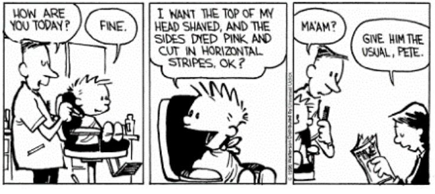

---

<!-- pagina: 8 -->

**Andrea Belo Aula 01 - Reading Techniques, Cognates and Idioms** 

(QUESTÃO INÉDITA) A opção correta sobre o texto é: 

- A) O texto trata de uma brincadeira na hora do corte de cabelo. 

- B) O barbeiro não quer cortar o cabelo de Calvin. 

- C) Adultos decidem como crianças devem cortar seus cabelos. 

- D) As crianças, como Calvin, não sabem qual é o corte ideal para a idade delas. 

- E) O texto trata do corte de cabelo de Calvin, decidido pela sua mãe. 

Apenas com a técnica Scanning, você “bate os olhos” e percebe que é um corte de cabelo, Calvin sugere algo, mas a decisão final é da sua mãe, certo? Então, você já acertaria a questão só com a busca de palavras específicas, tais como “I want ...”, sobre o que Calvin quer do corte de cabelo e a mãe: “the usual “– sem traduzir, mas, escaneando termos importantes. 

Na letra A , fala de brincadeira, o que não é visto na análise de palavras–chave. Falsa. 

Quanto à letra B , temos a afirmação de o barbeiro não quer cortar o cabelo de Calvin, mas não vemos isso no texto, nem lendo e escaneando palavra por palavra. Falsa. 

A letra C é falsa porque afirma algo geral e vimos, pela “varredura” do texto, que se trata de Calvin e sua mãe e não de todos os adultos, como sugerido. Falsa. 

A letra D está errada também. Podemos perceber que se trata de Calvin e não de todas as crianças, como foi generalizado na letra D. Falsa. 

A resposta correta é a letra E , pois, foi possível perceber com Scanning, como analisamos no início da resposta. 

Sua meta é a aprovação e então, temos um caminho a percorrer juntos. E, vejamos mais comprovações dessas técnicas através de teoria e outros exemplos. 

Já comprovamos que existem várias formas de facilitar a leitura em diferentes situações da sua prova. 

Identificar palavras ou ideias, procurar um verbo, um adjetivo, uma afirmação, uma negação, entre outras informações essenciais na hora de resolver a prova.  O melhor candidato – você – deve aprender a usar técnicas e, junto aos seus conhecimentos, chegar ao seu propósito = a sua aprovação. 

Skimming e Scanning são expressões do Inglês equivalentes a: ler superficialmente e ler rapidamente, respectivamente. Essas técnicas, como vimos anteriormente, ajudam você a obter mais rapidamente a informação dos textos, como eu disse em outros capítulos, não sendo necessário ler cada palavra contida em seu contexto. 

Você vai fazer perguntas ao texto: O que se espera desse texto? Quais são as partes importantes? Que locais posso reconhecer? (se há imagem vinculada) Qual é o assunto central? Que palavras ajudam a reconhecer do que se trata sua leitura? 

E assim, percorrer o caminho ideal para chegar a conclusões, que certamente, levarão você à aprovação. O objetivo de compreender os textos vai depender diretamente da sua capacidade

---

<!-- pagina: 9 -->

**Andrea Belo Aula 01 - Reading Techniques, Cognates and Idioms** 

em relacionar ideias, estabelecer referências e fazer deduções lógicas para buscar respostas às questões. 

Para isso, você deve deixar de lado aquele hábito de ler palavra por palavra, lembrar tudo o que sabe sobre o assunto e prestar atenção ao contexto em que as questões estão inseridas. 

Usando o mesmo texto, que respondemos uma pergunta usando a técnica Skimming, vamos agora usar Scanning junto ao Scanning e, resolver outra questão, como se fosse de uma prova: 

Shock! Horror! Do you know how much time you spend on your phone? 

Writer Adrienne Matei spends two hours and 20 minutes a day on her phone – which might seem fine, until you realize it amounts to 35 full days a year. What’s your number? 

Before beginning to write this article, I spent 20 minutes doing, if I’m honest, sort of nothing on my phone. Prior to that, I checked emails, read the news and browsed social media in bed. My phone is usually within arm’s reach, which seems to me fairly typical of everyone, old and young, who includes a phone in their essential trifecta of belongings, alongside their keys and wallet. 

https://www.theguardian.com/lifeandstyle/2019/aug/21/cellphone–screen–time–average–habits 

Em cada exercício do nosso material, estamos fazendo uma análise cuidadosa e completa. Isso vai te oferecer condições seguras para o dia da sua prova. Veja analisando Scanning: 

(QUESTÃO INÉDITA) Na frase do texto “... until you realize <u>it</u> ”, o termo sublinhado se refere a: 

- A) ao tempo gasto com o aparelho celular 

- B) ao verbo realize, que aparece antes do termo it. 

- C) aos 20 minutos, antes mencionados. 

- D) ao celular de Adrienne Matei. 

- E) aos 35 dias ao telefone. 

Bom, escaneando a frase em que o pronome “it” aparece, percebemos, de acordo com regaras gramaticais existentes, que é, de fato, um pronome que se refere a palavras no singular. 

“IT” é o pronome específico de substituição de um objeto ou um animal, por exemplo. Assim, já eliminamos as alternativas C e E , que afirmam que “it” se refere a algo no plural: minutos e dias. 

A alternativa A , é, até agora, a melhor opção, pois “until you realize <u>it</u> ”, é até você perceber isso , provavelmente, isso seja o tempo gasto com o celular, mas, continuemos a analisar as alternativas.

---

<!-- pagina: 10 -->

**Andrea Belo Aula 01 - Reading Techniques, Cognates and Idioms** 

E a alternativa B , afirma que “it” se refere a um verbo, mas, como vimos quando falei a tradução da frase “até você perceber isso”, é notável que it não está conectado com o verbo e sim com o tempo gasto com o celular. 

A alternativa D afirma que se refere ao celular de Adrienne, mas, a pergunta é para o leitor, você, e não a escritora. Assim, a melhor opção realmente é a letra A, que afirma que “it” se refere ao tempo: exatamente o que o pronome quer dizer. 

Viu como Scanning e o Skimming funcionam? Você vai direto ao ponto, no local em que a palavra está e o que deve substituí–la ou encaixar seja qual for a pergunta da prova. 

Muitas pessoas consideram Scanning e Skimming como técnicas preciosas e verdadeiras estratégias de leitura, já que você consegue ler um grande volume de informação com prática, consegue observar o texto rapidamente, detectar o assunto, localizar informações específicas. Agora, vejamos um esquema em que há informações sobre as técnicas que vimos e aplicamos nos exercícios. Vamos lá. 

#### **SOLUÇÃO DA QUESTÃO: APROVAÇÃO** 

- Identificação de palavras conhecidas e pouca importância àquelas desconhecidas: leitura seletiva. 

- Atenção aos assuntos ligados à atualidade em nosso país e no mundo. 

- Enriquecimento de vocabulário com exercícios variados. 

- Estudo constante para sentir-se preparado e capaz de responder as provas. 

- Técnicas Scanning e Skimming: chegar mais rápido à resposta da questão. 

#### Esquema aprovado? Vamos lá? Let’s keep going! 

E qual a finalidade das técnicas de leitura além de ajudar na leitura dos textos? Há mais funções? Outras informações sobre as técnicas que devo saber? Vamos lá. 

As estratégias de leitura que estamos usando nessa aula, têm a finalidade de viabilizar a sua leitura sem que, necessariamente, você aprenda todas as palavras que existem em inglês. 

Seu vocabulário vai se estender, day after day, se você estiver lendo da forma que estou explicando e mostrando a você através dos exercícios da de provas anteriores, aqui resolvidos e comentados em detalhes.  O caminho do sucesso é o estudo contínuo e persistência em aprender. 

Há curiosidades sobre as técnicas que estamos utilizando? Sim! 

Quando pesquisamos sobre preparar-se para provas de mestrado e doutorado, bem como especializações que exigem proficiência em inglês, além das provas de várias instituições, a sugestão e verdadeira instrução é sempre ler textos utilizando das técnicas Scanning e Skimming. Por quê?

---

<!-- pagina: 11 -->

**Andrea Belo Aula 01 - Reading Techniques, Cognates and Idioms** 

A resposta só pode ser uma: com essas técnicas, conseguimos ler textos com agilidade e qualidade, já que a assimilação é rápida.  A principal vantagem dessas técnicas é que são um tipo de leitura dinâmica e ensinam você a reconhecer vocábulos inseridos dentro da frase. 

E, reconhecer “dados” incorporados ao texto, é o grande segredo. Assim, você enxerga e compreende o assunto através dos blocos de palavras juntas. Seus olhos fazem “paradas” tão rápidas que não se percebe. 

Uma fonte muito usada nas provas são as tirinhas do “Hagar, The Terrible” – Hagar, o horrível. São curtas, críticas e cheias de assuntos interessantes para as questões. 

Escolhi essa tirinha de “Hagar, o Horrível”, por ser um exemplo de fonte explorada com assuntos explorados em muitas disciplinas. As tirinhas ajudam a ter uma visão ampla de algo com teor crítico, às vezes sarcástico, propositalmente preparadas para análise mesmo. 

Vamos olhar para a história, fazer uma leitura com os olhos rapidamente, tentar entender a essência e extrair o que se compreende com as palavras que chamam a atenção. 

#### Questão Inédita Teacher Andrea Belo – identificação do assunto/interpretação. 

Veja a sugestão de perguntas da forma como você deve iniciar a resolução. 

Qual é o assunto que você consegue perceber através da leitura da tirinha do Hagar? Quem são os personagens? Sobre o que conversam? Como são as reações deles? 

Tente responder comprovando com Scanning e Skimming e veja como fica fácil. 

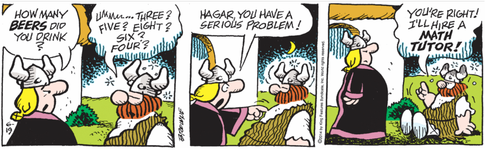

https://nebusresearch.files.wordpress.com/2014/06/chris–browne_hagar–the–horrible_19–june–2014.gif 

Você deve “ler” os quadrinhos. As expressões faciais. As reações. Os movimentos. Tudo são indicadores do assunto. É primordial que você leia a figura ou um texto como se estivesse desvendando um mistério, decifrando um código. 

No quadrinho em questão, quando você vê a palavra “beer” no primeiro quadrinho, pronunciada pela esposa, percebe que ela não está muito satisfeita provavelmente porque Hagar está bêbado (percebemos pelas estrelinhas ao redor da cabeça dele).

---

<!-- pagina: 12 -->

**Andrea Belo Aula 01 - Reading Techniques, Cognates and Idioms** 

Como resposta, Hagar pronuncia números indicando que não sabe quantas cervejas bebeu. A expressão que contém palavras cognatas, “serious problem”, que a mulher dele diz, mostra que ela está irritada, pois aponta o dedo, demonstração de nervosismo, raiva, fúria. 

Ele, “sem noção” do que diz e, perceptivelmente alcoolizado (inclusive com as estrelinhas ao redor da cabeça), responde com as palavras “math tutor”, que podemos deduzir uma manifestação de que ele revela não saber matemática e, assim, precisa de um tutor, um professor de matemática. 

Conseguiu identificar o assunto? Encontrou palavras que facilitaram? As “chaves” da resolução são as técnicas e atenção! 

Bom, essa “leitura rápida” foi feita em segundos. Isso que você está aprendendo e deve fazer, em todas as questões da sua prova. Vamos para o próximo capítulo. Mas antes, deixo aqui um esquema representativo a seguir. 

#### **INTERPRETAÇÃO DE TEXTOS NAS PROVAS** 

- “Ler” as expressões faciais dos personagens. 

- “Ler” os movimentos dos personagens. 

- “Ler” os detalhes ao redor dos textos. 

- “Ler” em conexão ao que você sabe, seu backgroung. 

- “Ler” as palavras essenciais: palavras–chave. 

- “Ler” o ambiente/local apresentado na questão. 

- “Ler” termos em detaque, como **negrito** , _itálico_ e CAIXA ALTA. 

- “Ler” as rferências, tais como datas e fonte. 

- “Ler” e abusar das palavras cognatas – grandes facilitadoras. 

- “Ler” e identificar os falsos cognatos disfarçados – estudá–los. 

- “Ler” o título, os enunciados, os comandos – achar o que se pede. 

- “Ler” e fazer deduções relacionadas ao assunto. 

Vejamos outros textos com o uso do Scanning e Skimming .

---

<!-- pagina: 13 -->

**Andrea Belo Aula 01 - Reading Techniques, Cognates and Idioms** 

# **SCANNING E SKIMMING EM PEQUENOS TEXTOS** 

Após utilizarmos as técnicas necessárias com análise de detalhes fundamentais, o caminho da aprovação está fácil, percebeu? Como você está se saindo? 

Você já deve ter notado que usar Skimming e Scanning é basicamente fazer uma leitura rápida, mas, não estou falando de velocidade, e sim de atingir os objetivos esperados. 

Até porque, posteriormente, você pode voltar ao texto – quantas vezes quiser – e retomar informações sobre o que você procura. 

Estamos, em cada exercício, identificando o que é essencial para ter uma noção geral do que se trata o texto. É uma construção de conhecimento, com foco ao que realmente interessa, economizando tempo e resolvendo as questões da prova facilmente. 

Nesse capítulo, vou exemplificar o uso dessas técnicas juntas em textos pequenos e posteriormente, em textos mais longos. Veja essas frases: 

Após exames, pessoas com níveis alterados de glicemia, a comprovação de ringope é imediata. Além de necessitar o uso de insulina, é obrigatório evitar o consumo de <u>lagofe, para não agravar mais ainda as</u> condições do paciente, que pode fatalmente <u>sabafar, se não tomar os</u> devidos cuidados com a saúde. 

Sendo uma questão, você conseguiria ler as palavras que inventei – ringope, lagofe e sabafar – substituindo–as, de forma automática, pelos termos corretos à compreensão do parágrafo acima e responder qual é o assunto? Sim, diabetes. E ringope é diabetes, lagofe – açúcar, sabafar – falecer, não é? 

Você percebeu que não demorou tanto tempo para identificar as palavras inventadas e, o melhor, compreendeu o parágrafo inteiro por dois motivos: você aprendeu a ler de forma dinâmica, dando importância às palavras peculiares, aquelas que indicam o assunto e/ou o que precisa saber sobre tal assunto. 

E porque o uso das técnicas estudadas em conexão ao vocabulário aprendido a cada exercício resolvido, proporciona autoconfiança, garantia da sua aprovação. 

A falta de vocabulário é considerada uma das causas para o atraso na leitura. Porém, durante seus estudos, você percebe que as palavras desconhecidas, não devem ser encaradas como empecilho, mas desafios: você vai procurar o sentido entre as palavras.

---

<!-- pagina: 14 -->

**Andrea Belo Aula 01 - Reading Techniques, Cognates and Idioms** 

# **SCANNING E SKIMMING EM TEXTOS LONGOS** 

A partir de diferentes formas que facilitam suas leituras, você já precisa ter em mente que vai conseguir ler, utilizando as técnicas estudadas para compreender o texto ou parte dele – parte essencial para encontrar o que se pede. 

E, acelerando sua leitura pouco a pouco, tanto em textos curtos ou em textos maiores, o tipo de varredura feita pelos seus olhos fará com que seu cérebro responda aos estímulos que você enviou. 

E, dessa forma, dando–lhes significados, que ajudam a encontrar as respostas certas. 

Você estará, no decorrer das aulas, ressaltando o que é mais ou o que é menos interessante em cada texto. O que é mais ou menos relevante. E assim, caminhar para as soluções das questões. 

A leitura dos textos, apesar de muitas vezes apresentarem um conteúdo longo e repleto de palavras desconhecidas, ficará viável. 

Isso porque, com o uso de técnicas, vinculadas às análises cautelosas e com muita atenção que se deve ter antes de responder uma questão, mesmo se for simples. 

Pode ser, inclusive, que você considere simples demais e, no teor de cada pergunta, a interpretação exija de você um cuidado ainda maior. É necessário muita atenção e o bom uso das técnicas ensinadas. Don’t forget it! 

Vejamos questões inéditas em continuação à resolução de possíveis questões. 

Agora, com as questões inéditas e com as questões de anos anteriores, que vamos solucionar e comentar, uma a uma. 

Aqui, teremos exemplos de textos curtos, longos, imagens, tirinhas, entre outros, analisando cada possibilidade de exercício que já estiveram ou podem estar presentes em sua prova. 

Vamos explorar, nessa aula, bastante exercícios de escrita, como é cobrado na prova, para aproveitar as técnicas de Scanning e Skimming aqui aprendidas. 

Mas, como eu disse, as técnicas são excelentes para a prática da leitura rápida, dinâmica, com agilidade e sabedoria para, no dia da sua prova, você gabaritar a prova de Inglês. Come on! 

Quanto mais exercícios você praticar, mais apto (a) estará para responder com segurança as questões da sua prova. E, nas respostas comentadas, assim como também em nosso banco de questões, há muitos textos longos, de diferentes provas, diferentes fontes (Guardian, Economist, New York Times, BBC News, Time, Newsweek, Scientific American, Washington Post, National Geographic, entre outros), que te ajudarão a testar os conhecimento e responder bastante questões similares às das provas de concurso.

---

<!-- pagina: 15 -->

**Andrea Belo Aula 01 - Reading Techniques, Cognates and Idioms** 

# **COGNATES AND FALSE COGNATES** 

Eu falei para você, na aula de introdução, a importância de conhecer os falsos cognatos já que, cognatos, pela semelhança com nossa língua, ajudam na leitura, enquanto os falsos cognatos, podem atrapalhar quando não se sabe o que realmente significa. 

O termo cognato se refere a palavras que têm a mesma origem. Por exemplo, novembro (português) e November (em inglês) são cognatos. 

É normal que as pessoas usem o termo “falsos cognatos” quando se referem a palavras que são escritas ou faladas de forma parecida e, portanto, nos fazem pensar que as duas palavras têm o mesmo significado, mas não têm. E aparecem muito nas provas. 

Um dos exemplos mais comuns de falsos cognatos, que confundem a mente das pessoas, é o caso das placas escritas “push” e “pull”. Isso porque, “push”, em inglês, se assemelha ao verbo puxar como “puxe”, em português, mas o significado de “push” é empurrar. 

Podemos, inclusive, ver pessoas puxando a porta ao invés de empurrar, não é mesmo? 

Apesar de bastante utilizado, este termo não é o mais adequado de todos. Cognatos se referem, de fato, à origem das palavras, e ao pensar em falsos cognatos não estamos pensando na origem, e sim nos seus significados em duas línguas diferentes. 

E, claro que duas palavras podem ter a mesma origem, mas por diversos acontecimentos ao longo do tempo estas palavras acabaram adquirindo significados diferentes. 

Um termo também comum e melhor para expressar os falsos cognatos é “false friends”, ou falsos amigos. Veja um exemplo: 

<!-- Start of picture text -->
Nessa imagem, por exemplo, se for para ler ou escrever que a mulher está com uma roupa elegante, diríamos: “The woman is elegant because of her apparel.” Eu sei que o falso cognato  apparel  lembra a palavra aparelho e não parece nada com vestimenta, mas vestimenta é a tradução de apparel. <!-- End of picture text -->

Os falsos cognatos, também chamados de falsos amigos são, muitas vezes, considerados inimigos na hora dos estudos. 

Mas você não deve se apegar aos detalhes, não vai parar sua leitura a cada vírgula e sim, usará Skimming e Scanning – ler com os olhos para compreender o assunto e “escanear” as informações necessárias e solicitadas nas questões, como eu já te disse antes.

---

<!-- pagina: 16 -->

**Andrea Belo Aula 01 - Reading Techniques, Cognates and Idioms** 

Você vai precisar de uma lista com os falsos cognatos mais comuns em provas. Vou mostrar, então, uma lista com diversos outros casos que enganam pessoas, para você não se confundir e sim, aprimorar seus conhecimentos. 

Vamos nos preparar bem. Agora, vejamos alguns exemplos de falsos cognatos na lista que preparei para você, com muitos presentes em provas anteriores diversas. 

|**FALSOS COGNATOS E SEUS SIGNIFICADOS** Abstract – resumo Abstrato – conceptual Actually – na verdade, de fato Atualmente – These days, nowadays Accent – sotaque Assento – seat Adept– especialista, bom conhecedor Adepto – supporter Agenda – pauta diária Agenda – appointment book|
|---|
|Alias – pseudônimo Aliás – By the way Alms – esmola Almas – souls|
|Animus – hostilidade, inimizade Animado – Excited Annotate – observar Anotar – to take note, to write down|
|Application – registro, inscrição Aplicação – investment|
|Appointment – compromisso profissional Apontamento – note|
|Appreciation – gratidão, reconhecimento Apreciação – judgement|
|Argument (n) – discussão Argumento – reasoning, point Arm – braço Arma – gun|
|Army – exército Arma – gun   |
|Assist – ajudar, dar assistência Assistir – Watch Attend – assistir, participar de Atender – to help; to answer; to see Audience – plateia, público Audiencia – court appearance|
|Balcony – sacada Balcão – counter Baton – cassetete Batom – lipstick|
|Barracks – quartel Barraca – tent|
|Bond – vínculo, elo Bonde – trolley car|
|Bonnet – touca, capô de carro Boné – cap|
|Braces – aparelho dental Braços – arms|
|Candid – sincero Cândido – innocent, naive Carton – caixa de papelão Cartão – card Cartoon – desenho animado Cartão – card Chef – cozinheiro, mestre cuca Chefe – boss Cigar – charuto Cigarro – cigarette College – faculdade Colégio – school Commodity – artigo, mercadoria Comodidade – comfort|

---

<!-- pagina: 17 -->

**Andrea Belo Aula 01 - Reading Techniques, Cognates and Idioms** 

Compromise – entrar em acordo Compromisso – appointment; date Content – conteúdo Contente – glad, happy Convict – réu Convicto – Sure Costume – fantasia (roupa) Costume – custom, habit Cup – xícara Copo – glass Curse – maldição, xingamento. Curso – course Dessert – sobremesa Deserto – desert Data – dados Data – date Dependable – confiável Dependente – Dependant Devolve – transferir Devolver – return, give back, refund Discussion – debate, opiniões Discussão – argument Diversion – desvio, trajeto Diversão – fun Educated – bom nível de escolaridade Educado – well–mannered, polite Enroll – registrar-se inscrever-se Enrolar – to roll Expiation – penitência, castigo Espiar – To spy Exquisite – belo, refinado Esquisito – strange, odd Expert – especialista Esperto – clever, smart Fabric – tecido Fábrica – factory Fate – destino Fato – fact File – arquivo Fila – line Gracious – benéfico Gracioso – graceful Gratuity – gorjeta Gratuito – For free, gratuit Gravy – molho, caldo Grave – Serious Grip – agarrar firme Gripe – cold, flu Heydey – apogeu Ei, dia – Hey day Hazard – risco, arriscar Azar – bad luck Hostage – refém Hóspede – guest Idiom – expressão idiomática Idioma – language Injury – ferida, ferimento Injuria – insult, offence Intend – pretender, ter intenção Entender – understand Intoxication – embriaguez, drogas Intoxicação – poisoning Jest – zombo, brincadeira Gesto – gesture Lecture – palestra, aula Leitura – reading Legend – lenda Legenda – subtitle Library – biblioteca Livraria – book shop Lunch – almoço Lanche – snack Luxury – luxo Luxúria – lust Magazine – revista Magazine – department store Mayor – prefeito Maior – bigger Mate – colega, companheiro Matar – to kill

---

<!-- pagina: 18 -->

**Andrea Belo Aula 01 - Reading Techniques, Cognates and Idioms** 

Moisture – umidade Mistura – mix, mixture Notice – notar, perceber-se Notícia – news Novel – romance Novela – soap opera Office – escritório Official – officer Oration – discurso (formal) Oração – prayer Orchard – pomar Orquídea – Orchid Parents – pais Parentes – relatives Pasta – massa, macarrão Pasta – briefcase Physician – médico Físico – physicist Phony – impostor Telephone – Phone, telephone Policy – Apólice, política (ideal político) Polícia – Police Pork – carne de porco Porco – pig Port – porto Porta – door Prate – tagarelar, falar muito Prato – plate, dish Preservative – conservante Preservative – condom Pretend – fingir Pretender – to intend, to plan Procure – conseguir, adquirir Procurar – to look for Pull – puxar Pular – to jump Push – empurrar Puxar – to pull Realize – perceber, notar Realizar – make come true, to carry out Recipient – recebedor Recipiente – container Reclaim – recuperar Reclamar – complain Record – gravar Recordar, lembrar – remember, remind Refrigerant – uma substância Refrigerante – soft drink, soda Resume – retomar, reiniciar Resumir – sumarize Retired – aposentado Retirado – removed Senior – idoso Senhor – gentleman, sir Sensible – sensato Sensível – sensitive Service – atendimento Serviço – job Sort – tipo, espécie Sorte – luck, fate Stranger – desconhecido Estrangeiro – foreigner Stupid – burro Estúpido – impolite, rude Supper – jantar, ceia Super – super Support – apoiar Suportar (tolerar) – can stand Sympathetic – compreensivo Simpático – nice Tax – imposto Taxa – rate; fee Tent – barraca Tentar – to try Thicket – moita, mato fechado Ticket, bilhete – ticket Toss – arremessar Tosse – cough Turn – vez, volta, virar, girar Turno – shift; round

---

<!-- pagina: 19 -->

**Andrea Belo Aula 01 - Reading Techniques, Cognates and Idioms** 

Ultimately – em última análise Ultimamente – Lately Valorous – corajoso, destemido Valoroso, de valor, valuable Vicious – defeituoso, impuro Viciado – addicted Vine – videira Vinho – wine 

Meu conselho para você é o seguinte: leia a lista, estude bastante, sempre. 

Quanto mais você ler artigos jornalísticos, reportagens, textos em geral usados como fonte para elaboração das provas, junto ao material aqui desenvolvido, mais preparado você vai estar.

---

<!-- pagina: 20 -->

**Andrea Belo Aula 01 - Reading Techniques, Cognates and Idioms** 

# **IDIOMS** 

Eu gosto sempre de dizer que aprender uma língua é muito mais do aprender um conjunto de palavras. Esse é um dos motivos pelos quais, quando se estuda Inglês, é tão importante abandonar a vontade que se tem de traduzir tudo o que lê. Até porque eu já ofereci técnicas que ajudam você a entender o “todo” sem precisar traduzir de fato. 

Um exemplo importante, que comprova o quanto a tradução pode atrapalhar você, é justamente o exemplo das expressões idiomáticas, que possuem sentido diferente do sentido das palavras analisadas individualmente. 

É correto afirmar que, uma expressão idiomática aparece quando uma frase assume significado diferente daquele que as palavras teriam, se fossem analisadas isoladamente. 

As provas se utilizam de artigos, notícias dos mais diversos tipos e, as expressões idiomáticas se encontram, tanto no linguajar diário quanto no noticiário, nos anúncios de jornais, no rádio, na TV, em textos de cunho político, científico, em filmes, em músicas, na literatura, enfim, podem estar presentes em suas leituras no dia da sua prova. 

As expressões idiomáticas são uma parte importante da comunicação formal ou informal, escrita ou falada, e, o motivo que leva um falante ou um escritor, um autor de um texto a usar uma expressão idiomática é o desejo de acrescentar, na interpretação daquela frase, algo que a linguagem convencional não poderia suprir. 

Também chamadas de provérbios, as expressões idiomáticas surgem com frequência e, muitas vezes, é divertido comparamos as expressões de língua inglesa àquelas em nosso idioma. 

Aprender a utilizar expressões idiomáticas é importante e, no seu caso, mais importante ainda é aprendê–las e identificá–las nos textos da prova, pois você estará garantindo acertar certas questões, que poucas pessoas acertariam quando envolve termos dessa natureza. 

Uma expressão idiomática tem por função enriquecer a frase, ela pode reforçar ideias, pode enfatizar um sentimento de alguém e pode, ainda, diminuir, amenizar o impacto que algum termo possa causar, seja com humor ou com ironia. As expressões idiomáticas expressam ideias de diferentes maneiras dentro de cada contexto. 

Vale afirmar que, pelo sentido exclusivo que possuem, não há, para as expressões idiomáticas, um significado concreto, como a maioria dos vocábulos que há em nosso vocabulário. 

Para que as expressões sejam estudadas com eficácia, é necessário considerar o contexto em que são produzidas, já que sempre estão associadas a situações que se relacionam à valores culturais, conforme já expliquei.  Vamos estudá–las agora?  Come on! 

Alguns desses IDIOMS , são expressões idiomáticas que usam, em sua estrutura, palavras similares às que usamos em nossas expressões em Português. 

Bom, na maioria das vezes, as expressões são compostas por palavras diferentes e, quando tentamos traduzir, fica totalmente sem sentido.

---

<!-- pagina: 21 -->

**Andrea Belo Aula 01 - Reading Techniques, Cognates and Idioms** 

Por exemplo, desejar boa sorte a alguém, antes de uma apresentação, além de “Good luck”, podemos também dizer “break a leg”, a expressão idiomática que tem esse sentido. Se você traduzir, significa “quebrar uma perna”, mas, é muito usado com essa intenção de salientar que você deseja boa sorte. 

Entre as expressões que assemelham à nossa língua, estão alguns exemplos: 

A expressão “Antes tarde do que nunca”, usa as palavras “tarde” e “nunca”, o que facilita para você se lembrar. A palavra “antes”, em Inglês, que é “ before ”, não é usada no início da frase, mas, a tradução de “ Better late than never ” – “Melhor tarde do que nunca” proporciona a dedução equivalente: “Antes tarde do que nunca”. 

A expressão “De uma vez por todas”, usa o termo “por todas”, ( for all ), o que também facilita para você fazer a conexão. “ Once ” é uma vez, mas, ligando as ideias, “Uma vez por todas” nos leva a compreender que se trata “De uma vez por todos(as).

---

<!-- pagina: 22 -->

**Andrea Belo Aula 01 - Reading Techniques, Cognates and Idioms** 

A expressão “Para um bom entendedor, meia palavra basta”, o idiom é quase igual escrito em outra ordem: “ A word to the wise is enough ” – “Uma palavra para um sábio é suficiente”. Expressão boa para se lembrar, caso apareça em sua prova. 

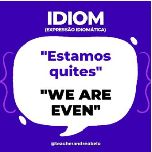

Para compreender bem a expressão “Estamos quites”, é preciso saber como se fala “par ou ímpar” em Inglês – “ Even or odd ”. Assim, a expressão é formada pela palavra “ par ” do par ou ímpar, como se fosse “Estamos pares”. Interessante, não é? 

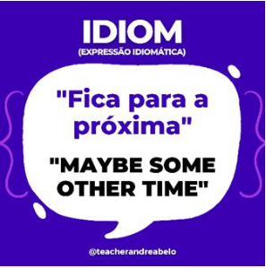

A expressão “Fica para a próxima”, em Inglês, não usa as mesmas palavras, mas usa termos que equivalem ao mesmo sentido: “ Maybe some other time ” significa Talvez alguma outra hora” e por isso também é uma expressão mais simples de ser interpretada.

---

<!-- pagina: 23 -->

**Andrea Belo Aula 01 - Reading Techniques, Cognates and Idioms** 

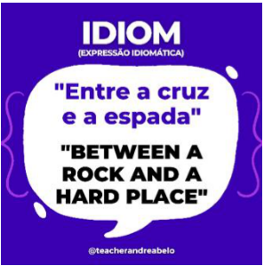

A expressão “Entre a cruz e a espada”, usa a preposição “between”, (entre duas coisas), já que entre muitos, seria a preposição “ among ”. Apesar disso, em Português, temos as palavras cruz e espada. Em Inglês, a expressão se compões com as palavras rocha ( rock ) e um lugar duro, como uma parede ( hard place ). Diferente, não é? 

Na expressão “Pavio curto”, há outras palavras para representar o que seria um pavio curto, alguém que explode fácil, se enfurece rapidamente: um temperamento curto – short temper . Também poderia ser traduzido como pouca disposição, já que a palavra “ temper ” pode ser temperamento, disposição, humor. 

A expressão “Quem não arrisca não petisca”, em Inglês, significa nada arriscado, nada ganho – “ Nothing ventured, nothing gained ”. E assim, apesar de estranha a tradução, representa que, se não for arriscado, não se obtém o que se deseja.

---

<!-- pagina: 24 -->

**Andrea Belo Aula 01 - Reading Techniques, Cognates and Idioms** 

Na expressão “É hora de encarar os fatos”, usa-se a palavra música no lugar dos fatos, que seria “ facts ” e assim, fica: é hora de encarar a música. 

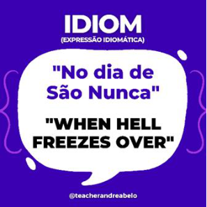

A expressão “No dia de São Nunca”, ou seja, um dia que não vai acontecer, algo que não vai acontecer, em Inglês, é quando o inferno congelar – “ when hell freezes over”. Acredita-se que o inferno seja um lugar quente e com bastante fogo e por isso, seria difícil congelar onde há fogo, assim como fazer algo no dia de São Nunca, que não existe. 

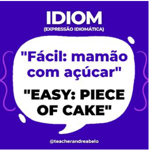

A expressão “mamão com açúcar”, em Inglês, é um “pedaço de bolo” – piece of cake, representando algo muito fácil de fazer, uma tarefa muito fácil de realizar.

---

<!-- pagina: 25 -->

**Andrea Belo Aula 01 - Reading Techniques, Cognates and Idioms** 

A expressão “Uma vez na vida, outra na morte”, para representar que algo é feito raramente ou quase nunca, em Inglês, é uma das mais diferentes de todas: “ Once in a blue moon ”, que traduzida, seria “uma vez na lua azul”. Isso porque, o efeito “lua azul” é raro de se observar e só ocorre uma vez a cada dois anos e meio. O termo é usado para descrever um acontecimento incomum. 

A expressão “Chorar o leite derramado”, usa a palavra “leite”, ( milk ), mas diz chorar (verbo cry ) o leite derramado ( spiled ), como se a pessoa ficasse tão triste que desperdiçou, que chorou. Viu como essas diferenças culturais são interessantes? 

A expressão “Acordar com o pé esquerdo” tem o verbo “acordar/levantar”, ( get up ), mas não é com o pé esquerdo e sim “do lado errado da cama ( wrong side of the bed ), querendo dizer que a pessoa dormiu do lado em que não está acostumada e pode ter acordado de mau humor por isso. Daí, se equivale a acordar com o pé esquerdo.

---

<!-- pagina: 26 -->

**Andrea Belo Aula 01 - Reading Techniques, Cognates and Idioms** 

A expressão “Cada macaco no seu galho”, em Inglês, “ Every Jack to his trade ”, significa “Cada Jack em seu comércio”, ou seja, cada pessoa em sua função, cada um encaixado naquilo que sabe fazer. Interessante saber que em Português usa-se o macaco e em Inglês o nome de uma pessoa: Jack. 

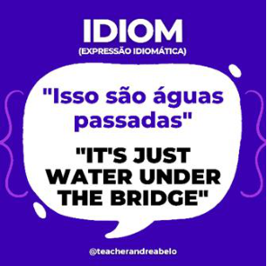

Para dizer “Isso são águas passadas”, para expressar algo que ficou no passado, que ‘não vale a pena falar sobre’, que ‘é melhor ser esquecido’, em Inglês, se diz são “apenas águas embaixo da ponte”: just water under the bridge ”, significando algo que foi levado pela correnteza, que deveria ter sido deixado para trás. 

A expressão “varar a noite” ou, algumas pessoas dizem “virar a noite” ou então “passar a noite em claro, demonstrando que alguém não dormiu, seja para trabalhar ou fazer qualquer atividade realizada durante toda a noite, é queimar o óleo da meia–noite: “ burn the midnight oil ” – porque antigamente, usava-se lamparinas, reservatórios com um líquido combustível, no qual se mergulhava um pavio que traspassava uma rodela de madeira para acender e gerar luz.

---

<!-- pagina: 27 -->

**Andrea Belo Aula 01 - Reading Techniques, Cognates and Idioms** 

Agora, veremos outras expressões que, são realmente totalmente diferentes na tradução, nas palavras usadas, no sentido e, de difícil dedução do que possa ser, mas, caso esteja em sua prova, você estudou e aprimorou seu vocabulário. Armazene as informações, ok? Attention!!! 

Essas expressões idiomáticas que veremos agora são muito interessantes. São, as que mais representam uma determinada cultura local, costumes e vocabulário utilizado por falantes da língua inglesa em cada país em que vivem. 

Para a expressão “Vire essa boca pra lá”, em Inglês, há duas frases: morda sua língua – “ bite your tongue ” e suma com esse pensamento/desapareça com essa ideia, algo assim: “ perish your thought ”. 

A expressão “Dia sim, dia não” também é expressa de forma bem diferente, já que “ Every other day ” significa “cada outro dia” literalmente. Isso porque, em Inglês, para dizer, por exemplo, de 15 em 15 dias, se diz “ every 15 days ” – então o “ every ” é utilizado nessas expressões de tempo.

---

<!-- pagina: 28 -->

**Andrea Belo Aula 01 - Reading Techniques, Cognates and Idioms** 

A expressão “Beco sem saída” – It’s a catch 22, teve origem baseada no famoso livro “Catch–22” (1961), de Joseph Heller, em que escreveu sobre a Segunda Guerra, relatando que os pilotos enfrentavam um dilema: Alegar insanidade ou não para recusar as missões de bombardeio, de acordo com o regulamento 22: “THERE IS A CATCH: "An airman would have to be crazy to fly more missions, and if he was crazy he would be unfit to fly. Yet, if an airman would refuse to fly more missions, this would indicate that he is sane, which would mean that he would be fit to fly the missions". Eis o impasse: Um piloto considerado louco, insano, estava inapto para voar nas missões de bombardeio, mas, se recusasse as missões com sanidade, teria que, obrigatoriamente, realizá–las. 

## **IDIOMS IN YOUR TEST** 

#### Expressões que já apareceram em provas anteriores de concursos 

Veremos agora várias expressões idiomáticas que já apareceram em textos de provas de anos anteriores, destacadas e comentadas para aprimorar seus estudos. 

E, além de expressões idiomáticas propriamente ditas, mostrarei também termos que, se tornaram, de certa forma, tipos de expressões, derivações de verbos e outras classificações gramaticais, que não são gírias e sim, adaptações da língua, formando locuções frasais. 

Em uma prova, por exemplo, apareceu a expressão idiomática “ walking in another’s shoes ”, cuja tradução literal é “andar no sapato do outro” e equivale à expressão “ colocar-se no lugar do outro ” em Português, idiom que já esteve presente em outras provas de vestibulares variados, observe: 

THURSDAY, DECEMBER 16, 2010. Newsweek Article: Bullying and Empathy (Kate Altman, M.S.) 

---

<!-- pagina: 29 -->

**Andrea Belo Aula 01 - Reading Techniques, Cognates and Idioms** 

The effective _______ of such programs is unclear at this point, and experts are divided on whether it makes more sense to offer the programs to young children (elementary school age) or older children (middle school age) (both, is probably the answer). High school kids are simply difficult to reach logistically, since they all have different schedules all day. Unsurprisingly, some experts have found that the most important component to empathy training is to include the parents. 

In assessing these programs and the broader issues of empathy–training and bullying, there are multiple factors to consider and no clear answers. First of all, empathy is one of the most difficult and least–understood skills we can develop – adults and kids alike. Empathy is the process of viewing and understanding the world through another’s experience, and it is often confused with sympathy, which is, essentially, compassion and lacks the “walking in another’s shoes” component (which is not to say it is not an admirable trait, it’s just different from empathy). Developmentally, children may not be able to truly understand and practice empathy until they are closer to the pre– teen years, but introducing the concept early and often is a good primer for its later development. 

Another big question to consider: are programs focused on empathy simply band–aids on much larger, more systemic problems? Why are kids bullying other kids in the first place? What family issues, societal issues, educational issues, are contributing to the need/urge to humiliate and attack other children for some sort of personal gain and satisfaction? My guess is that for many kids, participating in a brief (or even a few brief) empathy–skills seminars simply is not enough, and will not get at the root(s) of the problem(s), no matter how young they are when the programs begin. 

Newsweek offers an article on how schools are using empathy–training programs in an effort to reduce bullying in schools: http://www.newsweek.com/2010/12/15/canschools–teach–kids–not–to–bully.html 

#### WALK IN ANOTHER’S SHOES 

O texto está falando sobre bullying e, na linha em que há a expressão idiomática, “...compassion and lacks the walking in another’s shoes component...”, diz que uma das coisas que estão faltando é o componente “colocar-se no lugar do outro”. 

Agora, veremos o índice da revista Time, explorado em muitas provas, com a expressão “make a <u>comeback”, que, ao invés de ser “fazer um retorno”, como parece, é “dar a volta por cima”, que</u> também pode aparecer. 

No lugar em que a expressão está encaixada, que diz: “Charles Dickens is making a comeback – as a fictional character”, demonstra que, o artigo da página 52 será sobre o personagem dando a volta por cima, veja:

---

<!-- pagina: 30 -->

**Andrea Belo Aula 01 - Reading Techniques, Cognates and Idioms** 

#### MAKE A COMEBACK 

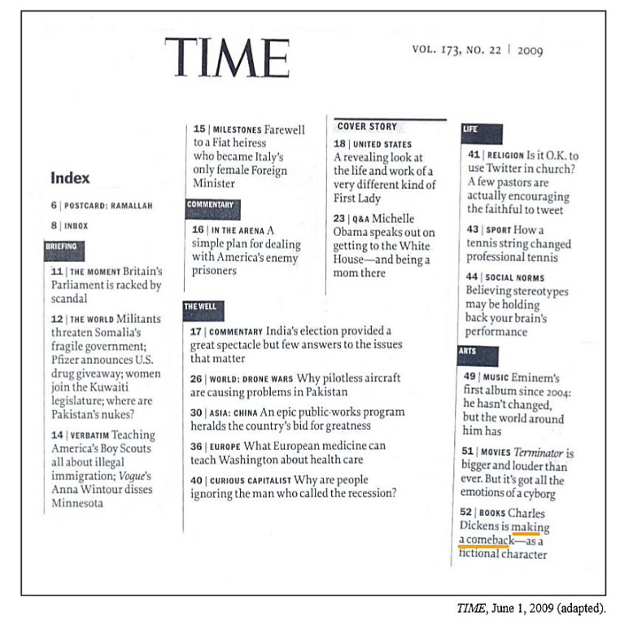

O próximo texto que vou mostrar a você, também é da revista Time, explorado com a expressão “From that point on”, que parece ser algo sem sentido como “deste ponto dentro”, mas significa, de fato “daqui por diante”. 

Na linha 13, onde a expressão está encaixada, que diz: “From that point on, there’s no reason to think computers would stop getting more powerful.” – Daqui por diante, não há razões para pensar que os computadores parariam de se tornar mais poderosos. 

FROM THAT POINT ON 

Thursday, Feb. 10, 2011 2045: 

#### The Year Man Becomes Immortal 

By Lev Grossman 

(...), Kurzweil believes that we’re approaching a moment when computers will become intelligent, and not just intelligent but more intelligent than humans. When that happens, humanity – our bodies, our minds, our civilization – will be completely and irreversibly transformed. He believes

---

<!-- pagina: 31 -->

**Andrea Belo Aula 01 - Reading Techniques, Cognates and Idioms** 

that this moment is not only inevitable but imminent. According to his calculations, the end of human civilization as we know it is about 35 years away. 

Computers are getting faster. Everybody knows that. Also, computers are getting faster faster – that is, the rate at which they’re getting faster is increasing. 

True? True. 

So if computers are getting so much faster, so incredibly fast, there might conceivably come a moment when they are capable of something comparable to human intelligence. Artificial intelligence. All that horsepower could be put in the service of emulating whatever it is our brains are doing when they create consciousness – not just doing arithmetic very quickly or composing piano music but also driving cars, writing books, making ethical decisions, appreciating fancy paintings, making witty observations at cocktail parties. 

If you can swallow that idea, and Kurzweil and a lot of other very smart people can, then all bets are off. From that point on , there’s no reason to think computers would stop getting more powerful. They would keep on developing until they were far more intelligent than we are. Their rate of development would also continue to increase, because they would take over their own development from their slower thinking human creators. Imagine a computer scientist that was itself a super–intelligent computer. It would work incredibility quickly. It could draw on huge amounts of data effortlessly. It wouldn't even take breaks to play Farmville. (...) 

http://www.time.com/printout/0,8816,2048138,00.html. Acesso em 07/04/2011. Adaptado. 

Sobre o próximo texto, da fonte The Guardian, bastante usada em provas, foi usada a expressão “by accident”, na linha 19 e não tem relação nenhuma com acidente e significa “por acaso”. Inclusive, muito usada em textos, de forma geral. 

BY ACCIDENT 

[…] A picture of Brighton beach in 1976, featured in the Guardian a few weeks ago, appeared to show an alien race. Almost everyone was slim. I mentioned it on social media, then went on holiday. When I returned, I found that people were still debating it. The heated discussion prompted me to read more. How have we grown so fat, so fast? To my astonishment, almost every explanation proposed in the thread turned out to be untrue. […] The obvious explanation, many on social media insisted, is that we’re eating more. […] 

So here’s the first big surprise: we ate more in 1976. According to government figures, we currently consume an average of 2,130 kilocalories a day, a figure that appears to include sweets and alcohol. But in 1976, we consumed 2,280 kcal excluding alcohol and sweets, or 2,590 kcal when they’re included. I have found no reason to disbelieve the figures. […] 

So what has happened? The light begins to dawn when you look at the nutrition figures in more detail. Yes, we ate more in 1976, but differently. Today, we buy half as much fresh milk per person, but five times more yoghurt, three times more ice cream and – wait for it – 39 times as many dairy desserts. We buy half as many eggs as in 1976, but a third more breakfast cereals and twice the

---

<!-- pagina: 32 -->

**Andrea Belo Aula 01 - Reading Techniques, Cognates and Idioms** 

cereal snacks; half the total potatoes, but three times the crisps. While our direct purchases of sugar have sharply declined, the sugar we consume in drinks and confectionery is likely to have rocketed (there are purchase numbers only from 1992, at which point they were rising rapidly. Perhaps, as we consumed just 9kcal a day in the form of drinks in 1976, no one thought the numbers were worth collecting.) In other words, the opportunities to load our food with sugar have boomed. As some experts have long proposed, this seems to be the issue. 

The shift has not happened by accident . As Jacques Peretti argued in his film The Men Who Made Us Fat, food companies have invested heavily in designing products that use sugar to bypass our natural appetite control mechanisms, and in packaging and promoting these products to break down what remains of our defenses, including through the use of subliminal scents. They employ an army of food scientists and psychologists to trick us into eating more than we need, while their advertisers use the latest findings in neuroscience to overcome our resistance. 

They hire biddable scientists and thinktanks to confuse us about the causes of obesity. Above all, just as the tobacco companies did with smoking, they promote the idea that weight is a question of “personal responsibility”. After spending billions on overriding our willpower, they blame us for failing to exercise it. 

To judge by the debate the 1976 photograph triggered, it works. “There are no excuses. Take responsibility for your own lives, people!” “No one force feeds you junk food, it’s personal choice. We’re not lemmings.” “Sometimes I think having free healthcare is a mistake. It’s everyone’s right to be lazy and fat because there is a sense of entitlement about getting fixed.” The thrill of disapproval chimes disastrously with industry propaganda. We delight in blaming the victims. (…) 

Just as jobless people are blamed for structural unemployment, and indebted people are blamed for impossible housing costs, fat people are blamed for a societal problem. But yes, willpower needs to be exercised – by governments. 

Yes, we need personal responsibility – on the part of policymakers. And yes, control needs to be exerted – over those who have discovered our weaknesses and ruthlessly exploit them. 

Adaptado de: <https://www.theguardian.com/commentisfree/2018/aug/15/age–of–obesity–shaming–overweight–people/>. Acesso em: ago. 2018. 

No parágrafo em que está inserida, diz “The shift has not happened by accident” – A transição não aconteceu por acaso e em seguida, dará a explicação do motivo pelo qual não pode se dizer que foi por acaso: que alguém perguntou algo e investiu etc. Vamos aos exercícios para praticar exercícios.

---

<!-- pagina: 33 -->

**Andrea Belo Aula 01 - Reading Techniques, Cognates and Idioms** 

# **QUESTÕES** 

Esse é momento em que vamos praticar tudo o que vimos nessa Aula 01 . Serão questões para preparar você e colaborar com a sua aprovação. 

01. (FGV/2022 – RECEITA FEDERAL) 

#### Global commerce 

Driverless vehicles whizz across five new berths at Tuas Mega Port, which sits on a swathe of largely reclaimed land at the western tip of Singapore. Unmanned cranes loom overhead, circled by camera-fitted drones. The berths are the first of 21 due by 2027. When it is completed in 2040, the complex will be the largest container port on Earth, boasts PSA International, its Singaporean owner. 

Tuas is a vision of the future on two fronts. It illustrates how port operators the world over are deploying clever technologies to meet the demand for their services in the face of obstacles to the development of new facilities, from lack of space to environmental concerns. More fundamentally, the city-state’s investment, with construction costs estimated at $15bn, is part of a wave of huge bets by the broader logistics industry on the rising importance of Asia, and South-East Asia in particular. The IMF expects the region’s five largest economies—Indonesia, Malaysia, Singapore, the Philippines and Thailand—to be the fastest-growing bloc in the world by trade volumes between 2022 and 2027. The result is that the map of global commerce and the blueprints for its critical nodes are being simultaneously redrawn. 

From: The Economist, January 14, 2023, pp. 57-58 

The overall position of the article is rather 

A) flimsy. 

B) gloomy. C) scornful. 

D) awkward. 

E) supportive. 

02. (FGV/2015 – SEE-PE) 

---

<!-- pagina: 34 -->

**Andrea Belo Aula 01 - Reading Techniques, Cognates and Idioms** 

At a buffet service where all food is arranged on tables and waiters do not take orders, the most polite and adequate instruction a waiter should give to customers is: 

A) “Please feed yourselves”. 

- B) “You may help yourselves”. 

C) “Make sure you eat all you can”. 

D) “Our service is the best in town”. 

E) “I apologize for not taking your order”. 

#### 03. (FGV/2018 – PREFEITURA MUNICIPAL DE NITERÓI – RJ) ==5460== 

<!-- Start of picture text -->
==5460== <!-- End of picture text -->

#### The Challenges Facing Government Auditors 

Posted on July 26, 2013 

When it comes to the pressure of successfully identifying, anticipating and dealing with risks, few auditors shoulder as much burden as those who work with the government. As the Institute of Internal Auditors’ Richard Chambers wrote, these professionals deal with career-threatening political risks on a daily basis that many private sector auditors could never comprehend. 

Internal auditors play a pivotal role in the relationship between the government and citizens. It’s up to auditors to set the appropriate controls to manage federal programs and also to provide insight into the effectiveness and the soundness of the government’s inner workings. Put simply, auditors are key to ensuring the public’s trust in their government is well-founded and not abused. 

That being said, there are a number of challenges associated with governmental-level internal auditing. Citing a MicKinsey paper from 2011, Chambers points to a few key issues: 

1. Turnover and Outsiders: Turnover in the political sector is high, with appointed executives seldom lasting for more than two years. On top of that, newly appointed officials often come from outside departments or agencies. This means officials frequently don’t have a firm grasp on all the risks and challenges associated with their position, which can lead to poor decision making. 

2. Metrics for Success: In the private sector, business objectives are clear and are conducive to metrics: more sales, more customers, more revenue, return on investment, etc. This means it’s extremely easy to determine the efficiency of audit programs and controls. In the public sphere,

---

<!-- pagina: 35 -->

**Andrea Belo Aula 01 - Reading Techniques, Cognates and Idioms** 

metrics aren’t as obvious because financial and mission objectives are more complex. This complicates the job immensely. 

3. ‘Mission Over Risk’ Mindset: Most companies undervalue the importance of risk culture. Departments want to achieve their objectives, and risk management takes a back seat to that. In the public sector, officials are often even more dedicated to and passionate about the mission at hand. Additionally, people tend to assume that government budgets are big enough to bail departments out of bad decisions, which can lead to risky behaviors. […] 

Internal controls are pivotal to maintaining the public trust in government operations, so despite the challenges that lay in front of auditors, it’s crucial they work with managers to develop effective campaigns and programs. 

(Adapted from: https://www.resolver.com/blog/the-challenges-facinggovernment-auditors/. Retrieved on January 25th, 2018) 

The last paragraph states that, when developing campaigns and programs, auditors should not work 

A) by appointment. 

B) for the public. 

C) in isolation. 

D) on demand. 

E) at home. 

#### 04. (FGV/2022 – SENADO FEDERAL) 

#### The New Rules of Data Privacy 

The data harvested from our personal devices, along with our trail of electronic transactions and data from other sources, now provides the foundation for some of the world’s largest companies. […] For the past two decades, the commercial use of personal data has grown in wild-west fashion. But now, because of consumer mistrust, government actions, and competition for customers, those days are quickly coming to an end. 

For most of its existence, the data economy was structured around a “digital curtain” designed to obscure the industry’s practices from lawmakers and the public. Data was considered company property and a proprietary secret, even though the data originated from customers’ private behavior. That curtain has since been lifted and a convergence of consumer, government, and market forces are now giving users more control over the data they generate. Instead of serving as a resource that can be freely harvested, countries in every region of the world have begun to treat personal data as an asset owned by individuals and held in trust by firms. 

This will be a far better organizing principle for the data economy. Giving individuals more control has the potential to curtail the sector’s worst excesses while generating a new wave of customerdriven innovation, as customers begin to express what sort of personalization and opportunity they want their data to enable. And while Adtech firms in particular will be hardest hit, any firm with substantial troves of customer data will have to make sweeping changes to its practices,

---

<!-- pagina: 36 -->

**Andrea Belo Aula 01 - Reading Techniques, Cognates and Idioms** 

particularly large firms such as financial institutions, healthcare firms, utilities, and major manufacturers and retailers. 

Leading firms are already adapting to the new reality as it unfolds. The key to this transition — based upon our research on data and trust, and our experience working on this issue with a wide variety of firms— is for companies to reorganize their data operations around the new fundamental rules of consent, insight, and flow. 

#### […] 

Federal lawmakers are moving to curtail the power of big tech. Meanwhile, in 2021 state legislatures proposed or passed at least 27 online privacy bills regulating data markets and protecting personal digital rights. Lawmakers from California to China are implementing legislation that mirrors Europe’s GDPR, while the EU itself has turned its attention to regulating the use of AI. Where once companies were always ahead of regulators, now they struggle to keep up with compliance requirements across multiple jurisdictions. 

Adapted from: https://hbr.org/2022/02/the-new-rules-of-data-privacy February 25, 2022 – Retrieved September 6, 2022 

The word “troves” in “troves of customer data” (3 ʳᵈ paragraph) refers to a(n): 

A) sensible batch. 

B) classified input. 

C) controlled bunch. 

D) sensitive network. 

E) valuable collection. 

#### 05. (CEBRASPE/2018 – INSTITUTO RIO BRANCO) 

A central conjecture of the social studies of finance is that equipment matters: it changes the nature of the economic agent, of economic action, and of markets. 

Consider, for example, physical equipment such as the stock ticker or trading screens connected in electronic networks, which circumvent the most basic of all bodily limitations — the inability to be in two places at once. They made fine-grained knowledge of price movements available in close to real time to geographically dispersed market participants. Alex Preda conjectures, for instance, that the ticker helped prompt the rise of “chartism” or “technical analysis”: the belief — still widespread — that patterns can be found in price graphs that have predictive value. Actors’ equipment goes beyond physical technologies: their “conceptual equipment” also matters, or so the social studies of finance posit. Financial markets are complicated places. Given the limited memory and computational capacity of the human brain, economic agents must develop and acquire systematic ways of making sense of markets. Organizations must develop procedures for interacting with markets, and to an increasing extent those procedures are implemented in algorithms in automated pricing, trading and risk-management systems.

---

<!-- pagina: 37 -->

**Andrea Belo Aula 01 - Reading Techniques, Cognates and Idioms** 

Sometimes, the ways of thinking, procedures, and algorithms that are employed derive from financial economics. Probably more often, however, practitioners’ ways of thinking and associated ways of acting have no direct connection to “academic” economics or indeed are regarded by economists as mistaken. Chartism is an example of the latter: financial economists regard it as on a par with astrology, but many traders take it seriously, and act on the basis of it. 

“Public facts”, such as the LIBOR1 , technical equipment, graphical presentations, and “conceptual equipment” are all aspects of the diverse cognitive and calculative processes that take place in financial markets. These processes are “distributed” in the sense that a given task is often performed not by a single unaided human but by multiple human beings, objects, and technical systems. To understand cognition that involves multiple collaborating human beings and/or interaction with objects and technical systems, one must go beyond the psychological or cognitive science analysis of the individual “bounded by the skin”. 

As Hutchins puts it, “a group performing [a] cognitive task may have cognitive properties that differ from the cognitive properties of any individual”. 

1 LIBOR stands for London interbank offered rate. The interest rate at which banks offer to lend funds (wholesale money) to one another in the international interbank market (source: Financial Times ). 

Donald MacKenzie. Material Markets. New York: Oxford University Press, 2009, p. 13-6 (adapted). 

Considering the grammatical and semantic aspects of text IV, decide whether the following items are right (C) or wrong (E). 

The expression “on a par with” (L.30) means competing . 

(    ) Certo. 

(    ) Errado. 

#### 06. (CEBRASPE/2018 – INSTITUTO RIO BRANCO) 

Much has been written about the superlative qualities desirable in diplomacy. Few persons can embody them all, but the greater part of a diplomat’s armoury can be developed and improved by sincere application guided by advice and example of his/her seniors. One must be concerned primarily with the foundations on which to build. For these the selectors must be satisfied there is a hard core to the applicant’s personality. On it will rest the courage, toughness in confrontation, patience and perseverance without which many more brilliant gifts can come to grief. Contrary to popular belief, diplomacy is not a career for the compliant. It often imposes on an officer the duty of defending the interests of his/her country in places not of his/her choice, where he/she must be prepared to withstand the moral attrition to which he/she may be exposed in the front line of international politics. 

Lord Gore-Booth and Desmond Pakenham. Satow’s guide to diplomatic practice. 5.th ed. London and New York: Longman, 1979, p. 79 (adapted).

---

<!-- pagina: 38 -->

**Andrea Belo Aula 01 - Reading Techniques, Cognates and Idioms** 

Considering the grammatical and semantic aspects of text III, decide whether the following items are right (C) or wrong (E). 

The expression “come to grief” (L.10) means to end in failure . 

(    ) Certo. 

- (    ) Errado. 

#### 07. (CEBRASPE/2021 – TCE-SC) 

During a ransomware hack, attackers infiltrate a target’s computer system and encrypt its data. They then demand a payment before they will release the decryption key to free the system. This type of extortion has existed for decades, but in the 2010s it exploded in popularity, with online gangs holding local governments, infrastructure and even hospitals hostage. Ransomware is a collective problem—and solving it will require collaborative action from companies, the government and international partners. 

As long as victims keep paying, hackers will keep profiting from this type of attack. But cybersecurity experts are divided on whether the government should prohibit the paying of ransoms. Such a ban would disincentivize hackers, but it would also place some organizations in a moral quandary. For, say, a hospital, unlocking the computer systems as quickly as possible could be a matter of life or death for patients, and the fastest option may be to pay up. 

Collective action can help. If all organizations that fall victim to ransomware report their attacks, they will contribute to a trove of valuable data, which can be used to strike back against attackers. For example, certain ransomware gangs may use the exact same type of encryption in all their attacks. “White hat” hackers can and do study these trends, which allows them to retrieve and publish the decryption keys for specific types of ransomware. Many companies, however, remain reluctant to admit they have experienced a breach, wishing to avoid potential bad press. Overcoming that reluctance may require legislation, such as a bill introduced in the Senate last year that would require companies to report having paid a ransom within 24 hours of the transaction. 

Internet: <www.scientificamerican.com> (adapted). 

In the second paragraph of the text, 

The word “disincentivize” could be correctly replaced by deter without any change in the meaning of the sentence. 

- (    ) Certo. 

- (    ) Errado.

---

<!-- pagina: 39 -->

**Andrea Belo Aula 01 - Reading Techniques, Cognates and Idioms** 

#### 08. (CEBRASPE/ANO – BANRISUL) 

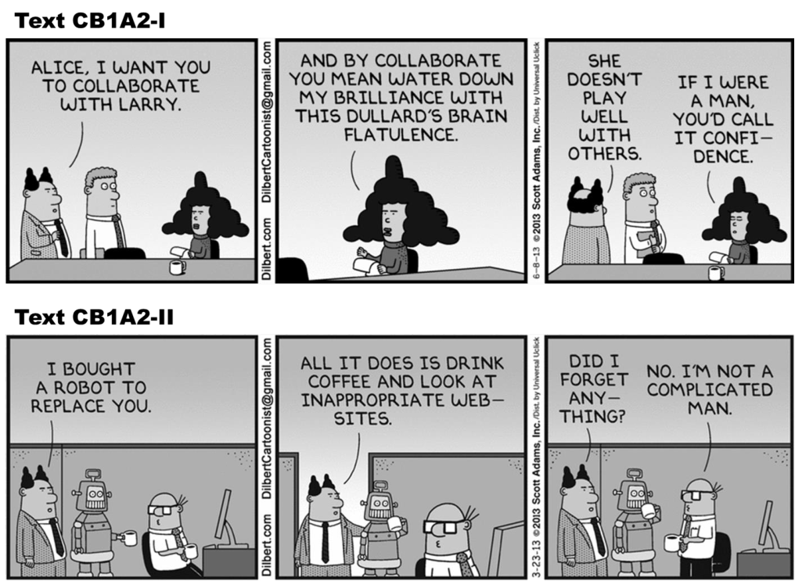

Based on the texts CB1A2-I and CB1A2-II, judge the following Item. 

In the text CB1A2-II, the boss suggests that his human employee is not very competent and reliable, which is why he brings a sophisticated robot to take his place. 

(    ) Certo. 

(    ) Errado. 

#### 09. (IBFC/2022 – TJ-MG) 

#### Crimes 

Certain types of people cannot be charged with committing a crime. It may appear that they have committed a crime. However, for a variety of reasons their behavior will not be considered a crime in the courts of law. First, insane people cannot commit a crime. These people do not understand their behavior. They may not understand right from wrong. Next, those taking drugs prescribed by a doctor might be excused from committing a crime. If the drugs affect their minds, the court will excuse them. Finally, children under a certain age cannot be held responsible for committing a crime.

---

<!-- pagina: 40 -->

**Andrea Belo Aula 01 - Reading Techniques, Cognates and Idioms** 

Uma das áreas de formação da língua inglesa, a morfologia, justifica que a palavra é formada por afixos (prefixos + sufixos) e radical/raiz. A forma dos afixos é mais rígida quanto à posição de formação da palavra. Os sufixos podem modificar a classe gramatical e os prefixos o sentido (positivo ou negativo) da palavra, sendo que o radical, raiz, é que traz o significado da palavra. Diante do exposto, assinale a alternativa que apresenta a palavra pós-fixada. 

A) Misunderstand 

B) Bicolour 

C) Disappear 

D) Impossible 

E) Finally 

#### 10. (IBFC/2022 – TJ-MG) 

Utilizando-se das técnicas de leitura instrumental, mais especificamente da técnica skimming, ou seja, uma leitura rápida e superficial, leia o texto “Crimes” e assinale a alternativa que realmente identifica o assunto geral tratado pelo autor do texto. 

A) O autor discute os crimes de uma maneira geral e superficial. 

B) O autor afirma que todos os indivíduos são criminosos. 

C) O autor expõe que os indivíduos mentalmente insanos não são capazes de cometer crimes. 

D) O autor declara que alguns indivíduos não podem ser acusados de cometer crimes. 

E) O autor remonta casos de crimes e as complicações legais dos criminosos. 

#### 11. (IBFC/2019 – PREFEITURA DE CABO DE SANTO AGOSTINHO – PE) 

Leia a tira em quadrinhos e analise as afirmativas abaixo. 

(From: https://www.comicskingdom.com/hagar-the-horrible/)

---

<!-- pagina: 41 -->

**Andrea Belo Aula 01 - Reading Techniques, Cognates and Idioms** 

I – No primeiro quadrinho Hagar consultou o velho sábio para saber sobre o segredo da felicidade. II – No segundo quadrinho as palavras that e me se referem, respectivamente, ao “velho sábio” e a “Hagar”. 

III – As palavras do velho sábio no último quadrinho são de que é melhor dar que receber. 

Assinale a alternativa correta. 

A) Apenas as afirmativas I e III estão corretas 

B) Apenas as afirmativas II e III estão corretas 

C) As afirmativas I, II e III estão corretas 

- D) Apenas a afirmativa I está correta 

#### 12. (IBFC/2019 – PREFEITURA DE CABO DE SANTO AGOSTINHO – PE) 

#### COUCHSURFING! 

Imagine you are planning a Holiday in Boston, say, or Sydney, or Dublin. Now, what if you could stay with locals who could give you a guided tour, take you to the best pub or beach, help you improve your English… and all for free? Welcome to the world of Couchsurfing! Yes, Couchsurfing is about a free couch – or bed, or room, or hammock, so it is great for budget travelers. But it is much more than that. The couchsurfing philosophy is about connecting people and cultures. The ethos is “Making the world a better place – one couch at a time.” 

The idea was born in San Francisco in 1999. A young man called Casey Fenton was planning a long weekend in Reykjavik. Iceland is expensive and Casey needed cheap accommodation. So he e- mailed over 1,500 Icelandic students in Reykjavik to ask if he could sleep on their couch. Casey was not only offered couches, the students also showed him ‘their’ Reykjavik. Casey decided this was a great way to travel, and launched the site with three friends in 2003. Today the world has more than 2.5 million Couchsurfers, 86,347 of which live in Brazil, the eighth most popular CS country. 

(From: BECKER, K. Couchsurfing. Speak up. São Paulo, n. 290, p. 26, out.2011.) 

De acordo com o texto, “Couchsurfing” é uma maneira de viajar. A esse respeito, assinale a alternativa correta. 

A) são e salvo 

B) gastando muito dinheiro 

C) com um orçamento baixo 

D) sem sair de casa

---

<!-- pagina: 42 -->

**Andrea Belo Aula 01 - Reading Techniques, Cognates and Idioms** 

#### 13. (CESGRANRIO/2021 – BANCO DO BRASIL) 

#### U.S. Finds No Evidence of Alien Technology in Flying Objects, but can’t rule it out, either 

WASHINGTON — American intelligence officials have found no evidence that aerial phenomena observed by Navy pilots in recent years are alien spacecraft, but they still cannot explain the unusual movements that have mystified scientists and the military. 

The report determines that a vast majority of more than 120 incidents over the past two decades did not originate from any American military or other advanced US government technology, the officials said. That determination would appear to eliminate the possibility that Navy pilots who reported seeing unexplained aircraft might have encountered programs the government meant to keep secret. 

But that is about the only conclusive finding in the classified intelligence report, the officials said. And while a forthcoming unclassified version, expected to be released to Congress by June 25, will present few other firm conclusions, senior officials briefed on the intelligence conceded that the very ambiguity of the findings meant the government could not definitively rule out theories that the phenomena observed by military pilots might be alien spacecraft. 

Americans’ long-running fascination with UFOs has intensified in recent weeks in anticipation of the release of the government report. Former President Barack Obama encouraged the interest when he gave an interview last month about the incidents on “The Late Late Show with James Corden” on CBS. 

“What is true, and I’m really being serious here,” Mr. Obama said, “is that there is film and records of objects in the skies that we don’t know exactly what they are.’’ 

The report concedes that much about the observed phenomena remains difficult to explain, including their acceleration, as well as ability to change direction and submerge. One possible explanation — that the phenomena could be weather balloons or other research balloons — does not hold up in all cases, the officials said, because of changes in wind speed at the times of some of the interactions. 

Many of the more than 120 incidents examined in the report are from Navy personnel, officials said. The report also examined incidents involving foreign militaries over the last two decades. Intelligence officials believe that at least some of the aerial phenomena could have been experimental technology from a rival power, most likely Russia or China. 

One senior official said without hesitation that U.S. officials knew it was not American technology. He said there was worry among intelligence and military officials that China or Russia could be experimenting with hypersonic technology. 

He and other officials spoke about the classified findings in the report on the condition of anonymity. 

> Available at: <https://www.nytimes.com/2021/06/03/us/politics/ufos-sighting-alien-spacecraft-pentagon.html>. Retrieved on: July 7, 2021.

---

<!-- pagina: 43 -->

**Andrea Belo Aula 01 - Reading Techniques, Cognates and Idioms** 

One of the purposes of the text is to confirm that the report determines the 

A) existence of life on other planets 

- B) imminent possibility of aliens’ attack 

- C) superiority of American technology 

- D) authorities’ ignorance about unusual aircraft 

- E) danger of enemy nations’ attacks to the US 

#### 14. (CESGRANRIO/2021 – BANCO DO BRASIL) 

#### Revolution Accelerated 

How Digital Transformation is Shaping the Future of Banking 

Like all businesses, banks have had to act fast to respond to the unprecedented human and economic impact of Covid-19. 

First, they needed to keep the lights on and ensure business continuity. Second, they had to meet the changing ways customers wanted to engage. Finally, they sought to balance their business priorities with a responsibility to support society. Previous crises cast the banks as part of the problem — this time they are part of the solution. 

Banks who have embraced modern banking technology have fared better in meeting these challenges. They’ve moved seamlessly to remote working, kept up service for their customers, coped with huge increases in demand and quickly adapted their products. In contrast, banks using legacy ‘spaghetti’ software have struggled. 

Covid-19 has accelerated the need for modern banking technology, but it didn’t create it. Before coronavirus, the 2020s were already being framed as the decade for digital in the banking industry. Banks’ return on equity were too low and their cost-income ratios were too high. Meanwhile, regulation like open banking was disrupting the industry and increasing competition from new entrants like the GAAFAs (Google, Amazon, Alibaba, Facebook, Apple). 

Providing seamless digital customer experiences was therefore already a ‘must’. Every year, Temenos partners with the Economist Intelligence Unit (EIU) for a global study on the future of banking. More than 300 banking leaders are interviewed from retail, commercial and private banks. Over half of these are at C-suite level. 

In 2020, the study took place amid the Covid-19 crisis. The results give a fascinating insight into banking leaders’ approach during these unprecedented times. But they also show how they see their industry in the years to come. 

And the findings suggest three trends which will shape the future of banking: 

1. New technologies will be the key driver of banking transformation over the next 5 years. 77% of respondents strongly believed that Artificial Intelligence (AI) will be the most game-changing of these technologies. They see a diverse range of uses for AI — from personalised customer experience to fraud detection.

---

<!-- pagina: 44 -->

**Andrea Belo Aula 01 - Reading Techniques, Cognates and Idioms** 

2. Banks will overhaul their business models to create digital ecosystems. 80% of respondents believe that banking will become part of a platform of services. 45% are committed to transforming their business models into digital ecosystems. 

3. The sun will set on branch banking. World Bank data shows that visits to branches have been steadily declining globally over the last decade. As a result of coronavirus, customers are now more concerned about visiting their branch, and so even more people are willing to try digital applications. This combination of pandemic and increasingly transformative advanced technology has led a majority of respondents (59%) to our survey with the EIU to state that traditional branchbased banking model will be dead in just five years. That’s a 34% increase from last year. 

The current environment is undoubtedly challenging for banks. But they have the capital, customer relationships and customer data. They are regulated. And most importantly: they still enjoy their customers’ trust. 

In short, banks are best-placed to succeed if they commit to end-to-end digital transformation. That means a fully digital front office which creates hyper-personalized experiences and ecosystems. And a back office driving efficient operations and rapid innovation. By embracing modern banking technology, banks can support their customers today, create new value for the future and drive new levels of future growth. 

Available at: <https://www.cnbc.com/advertorial/how-digital--transformation-is-shaping-the-future-of-banking>. Retrieved on: July 13th, 2021. Adapted. 

From the sentence of the last paragraph, “By embracing modern banking technology, banks can support their customers today, create new value for the future and drive new levels of future growth”, it is inferred that 

A) banks cannot grow after the coronavirus pandemic. 

B) modern banking technology can help reshape the present and the future of banks. 

C) modern technology can frustrate the present and the future of the banking industry. 

D) as result of the coronavirus pandemic, banks will not be able to meet customers’ demands in the future. 

E) due to the coronavirus pandemic, banks are not able to meet customers’ expectations in the present. 

#### 15. (CESGRANRIO/2021 – BANCO DO BRASIL) 

According to the 2 ⁿᵈ paragraph of the text, after the Covid-19 outbreak, banks initially had to face the following number of challenges: 

A) 1 

B) 2 

C) 3 

D) 4 

E) 5

---

<!-- pagina: 45 -->

**Andrea Belo Aula 01 - Reading Techniques, Cognates and Idioms** 

#### 16. (CESGRANRIO/2021 – BANCO DO BRASIL) 

The overall purpose of the text is 

A) to explain how the banking industry works. 

B) to discuss the impact of the coronavirus pandemic on the health system. 

C) to launch new investment opportunities in the banking industry. 

D) to state that digital transformation in banking has been accelerated by the coronavirus pandemic. 

- E) to promote new AI technology that will change the future of banking. 

17. (INSTITUTO AOCP/2020 – PREFEITURA MUNICIPAL DE BETIM – MG) 

Five ways to get a better bedtime routine 

by Amy Sedghi 

Getting to sleep can be a <u>struggle</u> , but blackout blinds and to-do lists can help – as can reserving the bedroom for sex and shut-eye 

An eye mask will block out light. 

#### 1. Go to bed at regular times 

Going to sleep and waking up at regular times – even on weekends – will strengthen your body clock, says Dr Lizzie Hill, a clinical sleep physiologist and a spokeswoman for the British Sleep Society. Regular mealtimes are also an important cue for your circadian rhythm. Avoid exercise too close to bedtime, as it can cause restlessness and an elevated body temperature, says Samantha Briscoe, a senior physiologist at the Sleep Centre at London Bridge hospital. 

#### 2. Protect the bedroom 

Preserve the bedroom as a place for sleep (and sex): there is evidence that the brain forms a strong association with sleep there. A temperature of 16- 18C (60-64F) is thought to be ideal for most, according to the Sleep Council, an awareness and support organisation. Blackout blinds or an eye mask can help block out light, while keeping electronic devices out of the bedroom is highly recommended. If you struggle to fall asleep after more than 25 minutes, Matthew Walker – a sleep expert and a professor of neuroscience and psychology at the University of California, Berkeley – suggests getting up and going to read under a dim light in another room. Once sleepy, you can return to bed.7 

#### 3. Get ahead on the next day

---

<!-- pagina: 46 -->

**Andrea Belo Aula 01 - Reading Techniques, Cognates and Idioms** 

Your night-time routine is an opportunity to make mornings run a little smoother: choose your clothes for the next day when you reach for your pyjamas or pack your bag while brushing your teeth. Martin Hagger, a professor of health psychology at the University of California, Merced, has stressed how routines are linked to the formation of healthy habits. 

#### 4. Wind down 

Reading a book can help slow breathing and relax muscles, while yoga stretches or even a gentle walk can reduce anxiety, says Briscoe. A warm bath or shower can also help you relax: researchers at the University of Texas at Austin found that bathing in water of 40-42.5C one to two hours before bedtime was associated with better sleep. 

#### 5. Write down your worries 

“If your mind is buzzing from the day, try keeping a journal or worry book,” suggests Hill. The NHS also recommends writing to-do lists for the next day in order to organise thoughts and clear the mind. “If you experience difficulty with sleep over the longer term, consider whether there may be an underlying medical condition,” says Hill. A sleep diary could help you identify any patterns 

(https://www.theguardian.com/lifeandstyle/2019/oct/04/five-ways-toget- a-better-bedtime-routine. Access: 08/01/2020) 

Mark the option that best describes the phrasal verb “wind down” taken from the text: 

A) It means one has to finish doing something. 

B) It means one has to put something in order. 

C) It means one has to relax. 

D) It means one has to sleep. 

- E) It means one has to do something quickly. 

#### 18. (INSTITUTO AOCP/2020 – PREFEITURA MUNICIPAL DE BETIM – MG) 

Consider the following statements either TRUE or FALSE according to the text and mark the option which contains the correct sequence: 

(    ) It is a good idea to take a warm shower before bedtime in order to help you relax. 

- (    ) You shouldn’t read a book before going to bed because it makes your brain too much active. 

- (    ) Writing down tasks for the next day may help you relax and sleep quicker. 

- (    ) If you have trouble falling sleep, you should lay in bed waiting until you feel sleepy. 

- A) T – T – T – F. 

B) F – F – T – F. 

C) T – T – F – F. 

D) F – T – F – T. 

- E) T – F – T – F.

---

<!-- pagina: 47 -->

**Andrea Belo Aula 01 - Reading Techniques, Cognates and Idioms** 

#### 19. (INSTITUTO AOCP/2018 – SED-SC) 

#### Which of the following idiomatic expressions refers to some event that rarely occurs? 

A) ‘Speak of the devil’ 

B) ‘To cost an arm and a leg’ 

C) ‘Break a leg’ 

D) ‘Once in a blue moon’ 

E) ‘The best of both worlds' 

#### 20. (INSTITUTO AOCP/2018 – SED-SC) 

#### Which of the following idiomatic expressions refers to something that was very easy? 

A) ‘To feel under the weather’ 

B) ‘To add insult to injury’ 

C) ‘A piece of cake’ 

D) ‘See eye to eye’ 

E) ‘When pigs fly’ 

#### 21. (ESAF/2015 – ESCOLA DE ADMINISTRAÇÃO FAZENDÁRIA) 

#### The good oil boys club 

It should have been a day of high excitement. A public auction on July 15th marked the end of a 77-year monopoly on oil exploration and production by Pemex, Mexico`s state-owned oil company, and ushered in a new era of foreign investment in Mexican oil that until a few years ago was considered unimaginable. 

The Mexican government had hoped that its first ever auction of shallow-water exploration blocks in the Gulf of Mexico would successfully launch the modernisation of its energy industry. In the run-up to the bidding, Mexico had sought to be as accommodating as its historic dislike for foreign oil companies allowed it to be. Juan Carlos Zepeda, head of the National Hydrocarbons Commission, the regulator, had put a premium on transparency, saying there was “zero room” for favouritism. 

When prices of Mexican crude were above $100 a barrel last year (now they are around $50), the government had spoken optimistically of a bonanza. It had predicted that four to six blocks would be sold, based on international norms. 

It did not turn out that way. The results fell well short of the government’s hopes and underscore how residual resource nationalism continues to plague the Latin American oil industry. Only two of 14 exploration blocks were awarded, both going to the same Mexican-led trio of energy fi rms. Officials blamed the disappointing outcome on the sagging international oil market, but their own insecurity about appearing to sell the country’s oil too cheap may also have been to blame, according to industry experts. On the day of the auction, the fi nance ministry set minimum-bid

---

<!-- pagina: 48 -->

**Andrea Belo Aula 01 - Reading Techniques, Cognates and Idioms** 

requirements that some considered onerously high; bids for four blocks were disqualified because they failed to reach the official floor. 

(Source: http://www.economist.com/news/business/21657827- latinamericas-oil-fi rms-need-more-foreign-capital-historic-auctionmexico-shows) 

According to text 1 above, Juan Carlos Zepeda 

A) disliked all foreign oil companies. 

B) was for favouritism. 

C) gave reluctant support to the first auction. 

D) was certain that no rigging was to happen. 

E) was against the auction. 

22. (ESAF/2015 – ANAC) 

#### The advantage 

1 CARE Acquiring a new aircraft is already a complex enough process. Acquiring a pre-owned aircraft can be an even more challenging task. The industry has its fair share of brokers and experts all willing to offer you the best deal in town but, regrettably, once you have signed and the aircraft is delivered, they tend to vanish as they move onto the next deal. Our philosophy is very different. Every Embraer aircraft we lease has passed through our own Embraer facilities. Every aircraft is treated with a level of service and care that can only come from those who built them in the first place. 

2 SUPPORT In choosing one of our pre-owned aircraft, all of our customers share a common goal: to ensure that the aircraft delivered perform seamlessly from day one and continue to perform for many years to come. In response to this, we offer the Lifetime Program by Embraer. This program represents a first in the industry and is the result of a very detailed review between ECC and Embraer on how best to support our customers. The Lifetime Program is unique to preowned Embraer aircraft and offers a wide range of services from startup through operation. 

3 RELIABLE So when an ECC pre-owned aircraft is offered for delivery to its new home you can rest assured that it will provide many years of happy, reliable service. Our focus does not end there since we value the relationships we build with our customers. Our Lifetime Program is testament to this. This is a unique and new service from Embraer to support our used aircraft. We invite you to learn, in greater detail, how it will not only enhance your operation, but also keep your Chief Financial Officer happy. Transparency in costs and flexibility in adapting to your needs. It is our way of showing that every Embraer aircraft we offer has our seal of approval. Coming from the manufacturer, that’s no small thing. 

Source: http://www.eccleasing.com/Pages/fator.aspx[slightly adapted]

---

<!-- pagina: 49 -->

**Andrea Belo Aula 01 - Reading Techniques, Cognates and Idioms** 

The expression " that’s no small thing" in Paragraph 3, last line could be replaced by 

A) that's beneath our notice. 

B) that's too small a detail to matter. 

C) that's beyond our control. 

D) that's quite something. 

E) that too hot to handle. 

#### 23. (ESAF/2015 – ANAC) 

The pronoun 'they' occurs twice in #1 line 6, referring to 

A) challenging tasks. 

B) signed contracts. 

C) aircraft. 

D) bargains. 

E) dealers. 

#### 24. (ESAF/2015 – ANAC) 

The 'unique and new service' referred to in #3 line 6 is 

A) faster delivery from the factory to the consumer. 

B) maintenance throughout the life of the aircraft. 

C) better technological accessories. 

D) the company's last will and testament. 

E) keeping the financial deal flexible. 

#### 25. (IDECAN/2019 – IFPB) 

#### Technology in schools: Future changes in classrooms 

Technology has the power to transform how people learn - but walk into some classrooms and you could be forgiven for thinking you were entering a time warp. There will probably be a whiteboard instead of the traditional blackboard, and the children may be using laptops or tablets, but plenty of textbooks, pens and photocopied sheets are still likely. 

The curriculum and theory have changed little since Victorian times, according to the educationalist and author Marc Prensky. "The world needs a new curriculum," he said at the recent Bett show, a conference dedicated to technology in education. Most of the education products on the market are just aids to teach the existing curriculum, he says, based on the false assumption "we need to teach better what we teach today". He feels a whole new core of subjects is needed, focusing on

---

<!-- pagina: 50 -->

**Andrea Belo Aula 01 - Reading Techniques, Cognates and Idioms** 

the skills that will equip today's learners for tomorrow's world of work. These include problemsolving, creative thinking and collaboration. 

#### 'Flipped' classrooms 

One of the biggest problems with radically changing centuries-old pedagogical methods is that no generation of parents wants their children to be the guinea pigs. Mr Prensky he thinks we have little choice, however: "We are living in an age of accelerating change. We have to experiment and figure out what works." 

"We are at the ground floor of a new world full of imagination, creativity, innovation and digital wisdom. We are going to have to create the education of the future because it doesn't exist anywhere today." He might be wrong there. Change is already afoot to disrupt the traditional classroom. The "flipped" classroom - the idea of inverting traditional teaching methods by delivering instructions online outside of the classroom and using the time in school as the place to do homework - has gained in popularity in US schools. The teacher's role becomes one of a guide, while students watch lectures at home at their own pace, communicating with classmates and teachers online. 

(Available in:https://www.bbc.com/news/technology-30814302. Accessed on May 18st, 2019. Adapted. Author: Jane Wakefield.) 

In the last paragraph, the word “afoot” in the passage "Change is already afoot to disrupt the traditional classroom." has the same meaning as: 

A) done 

B) all over 

C) halted 

D) arrested 

E) in progress 

#### 26. (IDECAN/2019 – IFPB) 

What is the main idea of the ‘Flipped’ classroom? 

A) Provide online instruction to students outside the classroom and use time at school as the place to do homework. 

B) Attend lectures at home at your own pace and communicate with the teacher only over the internet without having to go to school. 

C) Teach distance learning to save students and teachers time to go to school. 

D) Carry out activities at home from the computer because the teacher's help is not necessary for students to learn. 

E) Give online classes to a larger number of students, who are the guinea pigs of this new method of teaching.

---

<!-- pagina: 51 -->

**Andrea Belo Aula 01 - Reading Techniques, Cognates and Idioms** 

#### 27. (IDECAN/2019 – IFPB) 

#### The Regional English Training Centres (RETC) project – new approach to teaching English already shows results 

September 30, 2018 08:00 By The nation 

British Council and the Thai Education Ministry have joined hands to modernise the teaching methods of 17,000 English-language teachers in the kingdom, moving from the “grammarvocabulary” memorisation system to focus on communication.The UK cultural and education international body’s Regional English Training Centres (RETC) project aims to improve the skills of teachers at primary and secondary schools across Thailand. 

Some 75% of English teachers in Thailand are ranked at the A2 elementary level in the Common European Framework of Reference (CEFR), representing an IELTS score of 3.5 to 4, according to the statement issued by British Council on Friday.The RETC Boot Camp project was first introduced in 2015 to improve overall English teaching proficiency. After two and a half years, 15,300 English teachers, or 90%, have improved their confidence in teaching English and using it in classrooms. 

As the next step, an assessment and evaluation system is to be considered to assist in the adaptation toward the communicative approach. 

Education Minister Teerakiat Jareonsettasin said the development of Thai students’ English skills is crucial and needs serious improvement. Each Thai student studies English for at least 12 years at primary and secondary school, however most are unable to communicate in English which is the main obstacle to global competition, he said. Two main challenges that need to be addressed are Thai teachers’ English skills and their teaching approach. “By focusing on language accuracy and the memorisation method rather than the communicative approach, most Thai students cannot communicate effectively in English,” he said. 

Many Thai students also have a poor attitude towards English classes. Andrew Glass, director of British Council Thailand, said since the start of the project, 15 RETCs have been established and that 17,000 out of 40,000 of Thailand’s English teachers have been trained and mentored in the communicative approach. Additionally , more than 30 teachers have been intensively trained to become TMTs. They work with British Council trainers to mentor and transfer knowledge to teachers and school directors, creating academic networking opportunities with regional supervisors to improve their follow-up sessions. 

After completing the project, the research clearly indicates that 90% or 15,300 English teachers have more confidence in teaching English in the communicative approach and more confidence in using English in their classrooms. Besides, 72 of English teachers improved their lesson planning and were able to give clearer instructions, while 94% improved their lesson management. In addition, 93% of English teachers have improved their English subject knowledge. Sutthiwat Sutthiprapa, one of the Thai master trainers and a full-time English teacher at Khor Wittayakom in Nakhon Phanom Province, said all the knowledge he gained from the RETC project can be applied in his English classes. “It significantly changes the atmosphere of the classroom and the students’ attitude towards English. "Students are eager to attend the class and make every effort to

---

<!-- pagina: 52 -->

**Andrea Belo Aula 01 - Reading Techniques, Cognates and Idioms** 

participate in class activities. I believe that if every English teacher in Thailand exploits the RETC concept, Thai students’ English ability will increase considerably," he said. 

(Available in: https://www.bangkokpost.com/news/general/1548446/british-council-helps-train-thai-english-language-teachers.Accessed on May 18th, 2019. Adapted.) 

The word “additionally” highlighted in paragraph 5 is closest in meaning to 

A) however. 

B) moreover. 

C) then. 

D) meanwhile. 

E) similarly. 

#### 28. (IDECAN/2019 – IFPB) 

#### Bring nurture into it 

All children need boundaries, and some of these students either won’t have had those or will have had a lot of inappropriate, overly severe boundaries. But while consistent, firm boundaries can help a child to feel safe, it’s important to remember that nurture also plays a part. 

By nurture I mean the consistent care that we would expect a parent to give a child. If any of your students end up being among the tiny minority of children who are actually taken into care (approximately half a percent) it seems reasonable to assume that they will not have received the consistent, nurturing parenting that enables physical, mental and emotional wellbeing (it’s also worth noting that the rate of is 46.4% as compared to 8.5% in non-disadvantaged children and young people). 

Some children may need therapeutic intervention but all children, especially those who are vulnerable, would benefit from schools that promote emotional well-being. As teachers, we shouldn’t underestimate the power of smiles, kind words, acceptance following behavioural incidents and appropriate physical proximity. 

(Available in: https://www.theguardian.com/teacher-network/2017/sep/28/how-can-teachers-support-vulnerable-children-at-school. Accessed on May 19th, 2019. Adapted.) 

#### What can be inferred about the text? 

A) Teachers should seek to provide a pleasant school environment to welcome children who are in need of parent care. 

B) Children need overly severe boundaries to learn how to behave because they have no limits nowadays. 

C) Parents mostly care for their children's emotional, physical and mental needs. 

D) Children need therapeutic interventions because the excessively severe limits imposed on them cause emotional instability. 

E) Teachers shouldn’t accept behavioral incidents and should impose physical proximity.

---

<!-- pagina: 53 -->

**Andrea Belo Aula 01 - Reading Techniques, Cognates and Idioms** 

#### 29. (IADES/2019 – INSTITUTO RIO BRANCO) 

On any person who desires such queer prizes, New York will bestow the gift of loneliness and the gift of privacy. It is this largess that accounts for the presence within the city’s walls of a considerable section of the population; for the residents of Manhattan are to a large extent strangers who have pulled up stakes somewhere and come to town, seeking sanctuary or fulfillment or some greater or lesser grail. The capacity to make such dubious gifts is a mysterious quality of New York. It can destroy an individual, or it can fulfill him, depending a good deal on luck. No one should come to New York to live unless he is willing to be lucky. 

#### […] 

There are roughly three New Yorks. There is, first, the New York of the man or woman who was born here, who takes the city for granted and accepts its size and its turbulence as natural and inevitable. Second, there is the New York of the commuter—the city that is devoured by locusts each day and spat out each night. Third, there is the New York of the person who was born somewhere else and came to New York in quest of something. Of these three trembling cities the greatest is the last—the city of final destination, the city that is a goal. It is this third city that accounts for New York’s high-strung disposition, its poetical deportment, its dedication to the arts, and its incomparable achievements. Commuters give the city its tidal restlessness; natives give it solidity and continuity; but the settlers give it passion. And whether it is a farmer arriving from Italy to set up a small grocery store in a slum, or a young girl arriving from a small town in Mississippi to escape the indignity of being observed by her neighbors, or a boy arriving from the Corn Belt with a manuscript in his suitcase and a pain in his heart, it makes no difference: each embraces New York with the intense excitement of first love, each absorbs New York with the fresh eyes of an adventurer, each generates heat and light to dwarf the Consolidated Edison Company. 

White, E.B. (1999) Here is New York. New York: The Little Book Room, with adaptations. 

Considering the text, mark the following items as right (C) or wrong (E). 

The fragment “to dwarf the” (line 36) could be correctly replaced with that contribute to . (    ) Certo. 

(    ) Errado. 

#### 30. (IADES/2019 – INSTITUTO RIO BRANCO) 

Considering the text, mark the following items as right (C) or wrong (E). 

The word “largess” (line 3) could be correctly replaced with generosity . 

(    ) Certo. 

(    ) Errado.

---

<!-- pagina: 54 -->

**Andrea Belo Aula 01 - Reading Techniques, Cognates and Idioms** 

#### 31. (IADES/2019 – INSTITUTO RIO BRANCO) 

#### Towards a fairer distribution 

Translation and interpretation in matters of diplomacy is tricky. Language enthusiasts particularly enjoy the story of the Treaty of Wuchale, signed between Ethiopia and Italy in 1889. The text didn’t read the same in Amharic and Italian. The former guaranteed Ethiopia’s king Menelik II a good measure of autonomy in conducting foreign affairs. The latter established an Italian protectorate with no flexibility. The culprit: one verb, forming a permissive clause in Amharic and a mandatory one in Italian. Six years later, the differing interpretations led to war. Ethiopia won. 

If only the Ethiopians and Italians had modern translators at their side. Treaty translation is big business today. The European Union, for example, spends an estimated €300m annually on translating between its 23 official languages. (While this is a big chunk of money, it’s less than 1% of the EU’s annual budget.) Three of those—English, French, and German—are working languages in most meetings. In reality, English is most commonly used. But because each document must be faithfully recreated in each of the EU’s 23 languages, creating authentic versions can be expensive and time-consuming. Thankfully, most problems are dealt with in procès-verbal, a way to introduce technical corrections to treaties without revisiting negotiations. It might still delay matters. Last year, for example, Ireland’s ratification of an EU treaty was delayed by grammatical errors in the Irish version. There are obvious trade-offs to language equality, but the EU has calculated that the delays and costs are worth it. 

The United Nations should revisit its own calculations. It has just six official and two working languages. The task of translation here in Geneva, home to most UN organs, is thus decidedly simpler. The UN’s official languages are geographically diverse—combined, native speakers of Arabic, English, French, Mandarin, Russian and Spanish number over 2.2 billion. But the two working languages are bound to tradition. The persistence of French is attributed to its history as the “language of diplomacy”. In the hallways of the New York headquarters, English is (naturally) favored, and French is preferred in Geneva. Treaties registered with the United Nations Treaty Series are always translated into French and English. Documents are always provided in French and English. This city’s Geneva Conventions, written in equally authentic French and English versions, laid part of the groundwork for the international system. 

Towards a fairer distribution. Available at: <www.economist.com>. Retrieved on: Aug. 15. 2019, with adaptations. 

Considering the grammatical and semantic aspects of the text, mark the following items as right (C) or wrong (E). 

In the passage “The United Nations should revisit its own calculations.” (line 29), the underlined word can be correctly replaced with reconsider . 

(    ) Certo. 

(    ) Errado.

---

<!-- pagina: 55 -->

**Andrea Belo Aula 01 - Reading Techniques, Cognates and Idioms** 

#### 32. (IADES/2019 – INSTITUTO RIO BRANCO) 

Since 1914 the structure of the world has changed. Compared to the present struggle between West and East, the rivalries of the eighteenth and nineteenth centuries sink into insignificance. Today we are faced, not with a clash of interests, but with a fight between the desire on the one hand to defend individual liberties and the resolve on the other hand to impose a mass religion. In the process the old standards, conventions and methods of international negotiation have been discredited. Had it not been for the invention of the atomic bomb, we should already have been subjected to a third world war. 

Members of the Communist bloc today are convinced that sooner or later they will acquire world dominion and will succeed in imposing their faith and their authority over the whole earth. They strain towards this objective with religious intensity and are prepared to devote to its achievement their lives, their comfort and their prospects of happiness. Anything that furthers their purpose is “right”; anything that obstructs it is “wrong”; conventional morality, even the creation of confidence, has no part in this scheme of things. Truth itself has lost its significance. Compared to the shining truth of their gospel, all minor forms of veracity are merely bourgeois inhibitions. The old diplomacy was based upon the creation of confidence, the acquisition of credit. The modern diplomat must realize that he can no longer rely on the old system of trust; he must accept the fact that his antagonists will not hesitate to falsify facts and that they feel no shame if their duplicity be exposed. The old currency has been withdrawn from circulation; we are dealing in a new coinage. 

This transformation of values has been aided by a new or “democratic” conception of international relations. In the old days the conduct of foreign affairs was entrusted to a small international élite who shared the same sort of background and who desired to preserve the same sort of world. Today the masses are expected to take an interest in foreign affairs, to know the details of current controversies, to come to their own conclusions, and to render these conclusions effective through press and parliament. At the same time, however, current issues have been rendered complex and interconnected; it is not possible to state issues, such as the Common Market, in short and simple terms. Thus, whereas the man in the street is expected to have an opinion on international problems, the very complexity of these problems has rendered it difficult to provide him with the information on which to base his judgment. 

##### Nicolson, H. (1963) (3rd edition) Diplomacy. Oxford: OUP, with adaptations. 

As far as lexical comprehension is concerned, mark the following items as right (C) or wrong (E). In “their prospects of happiness.” (lines 17 and 18) the underlined word can be correctly replaced with chances or possibilities . 

(    ) Certo. 

(    ) Errado.

---

<!-- pagina: 56 -->

**Andrea Belo Aula 01 - Reading Techniques, Cognates and Idioms** 

#### 33. (VUNESP/2019 – UNICAMP) 

Leia o texto para responder à questão. 

#### Knowledge and the library 

It was not until the development of monastic libraries in Europe around 1200 that humanity amassed in a single place what approached the collective wisdom and knowledge of the age. Libraries may be exchanges of information and market places for ideas but they are also the buildings which contain the bulk of human knowledge. Or, at least they were until the electronic digitally stored information revolution of the 1980s. 

Now knowledge is virtually everywhere; it has broken free of the constraint of buildings. Today if you were today to destroy all the world’s libraries, it is unlikely that more than 20% of human knowledge would be lost. Certainly, a large amount of archival material would disappear forever, but a substantial volume of knowledge would survive. If a library is a repository of knowledge, this is now just one of its functions. The library’s prime function is now making that knowledge available and encouraging exchange and reflection upon it. 

Electronic knowledge is nowadays available to everybody – in the home, workplace, airport terminal, school, and so on. The Internet has liberated the library; nevertheless, it has not removed the justification for library facilities. 

(www.sciencedirect.com/science/article/pii/B978185617619410017X. Adaptado) 

No trecho do segundo parágrafo – it is unlikely that more than 20% of human knowledge would be lost – o termo em destaque pode ser substituído, sem alteração de sentido, por 

A) dissimilar. 

B) improbable. 

C) impossible. 

D) unequally. 

E) disgusting. 

#### 34. (VUNESP/2019 – PREFEITURA MUNICIPAL DE DOIS CÓRREGOS-SP) 

Human learning is fundamentally a process that involves the making of mistakes. Mistakes, misjudgments, miscalculations, and erroneous assumptions form an important aspect of learning virtually any skill or acquiring information. Learning to swim, to play tennis, to type, or to read all involve a process in which success comes from profiting from mistakes, by using mistakes to obtain feedback from the environment and with that feedback to make new attempts which successively more closely approximate desired goals.

---

<!-- pagina: 57 -->

**Andrea Belo Aula 01 - Reading Techniques, Cognates and Idioms** 

Language learning, in this sense, is like any other human learning. The child learning his first language makes countless “mistakes” from the point of view of adult grammatical language. By carefully processing feedback from others the child slowly but surely learns to produce what is acceptable speech in his native language. Second language learning is a process that is clearly not unlike first language learning in its trial-and-error nature. Inevitably the learner will make mistakes in the process of acquisition, and indeed even impede that process if he does not commit errors and then benefit in turn from various forms of feedback on those errors. 

(Douglas Brown. Principles of language learning and teaching. Prentice-Hall. Adaptado) 

#### In communicative language teaching, 

A) mistakes may seem inescapable if learners are to try to say something meaningful beyond their current linguistic level. 

B) direct error correction has proven to be the ideal strategy to prevent the same mistake from being produced again and again. 

C) traditional notions such as “grammatically right” or “grammatically wrong” have been gradually left behind. 

D) lesson plans are carefully devised so as to avoid unproductive waste of time correcting unnecessary mistakes. 

E) teachers should prioritize correcting errors in oral rather than in written production by students. 

#### 35. (VUNESP/2019 – PREFEITURA MUNICIPAL DE DOIS CÓRREGOS-SP) 

Two Aug. 31 articles painted different pictures of whether the District of Columbia is a safe place to live. “D.C. rises to No. 7 in world’s safest cities index, up from 23rd two years ago” mentions the results of the latest report by the British organization Economist Intelligence Unit ranking 60 cities using an index of 57 indicators, including digital security, access to quality health care and disaster preparedness. 

“One dead, six wounded following overnight and early-morning violence” told a different story. A 16-year-old boy was found shot dead. In five other incidents, “no one suffered serious injuries, but all of the victims were taken to hospitals.” All involved gunshot. A man and a woman were hit by bullets fired from a passing car. Police found a man with gunshot wounds. A woman eating dinner at her dining room table heard several shots, then discovered a bullet had hit her shoulder. A man passing a small group of men was shot in the back. A woman was hurt in the ribs by a man trying to rob her. 

On the issue of whether the District is safe, the situation can look very different from an economist’s downtown suite than from a city street on a hot summer night. 

Karl Polzer, Falls Church. 

(www.thewashingtonpost.com. 04.09.2019. Adaptado)

---

<!-- pagina: 58 -->

**Andrea Belo Aula 01 - Reading Techniques, Cognates and Idioms** 

Um professor de língua inglesa preocupado com o uso e significado da língua mais do que com sua estrutura proporia aos alunos 

A) um confronto entre o conteúdo do segundo parágrafo e a realidade brasileira. 

B) a criação de diálogos significativos usando palavras novas que aprenderam ao ler esse texto. 

C) a reescrita do segundo parágrafo de forma a torná-lo mais coeso pela junção das frases isoladas por conetivos. 

D) o desenvolvimento de uma pesquisa a respeito de vocabulário para falar sobre violência. 

E) a realização de um levantamento dos tempos verbais utilizados no texto e seus contextos mais comuns de uso. 

36. (VUNESP/2019 – PREFEITURA MUNICIPAL DE CERQUILHO-SP) Leia a charge. 

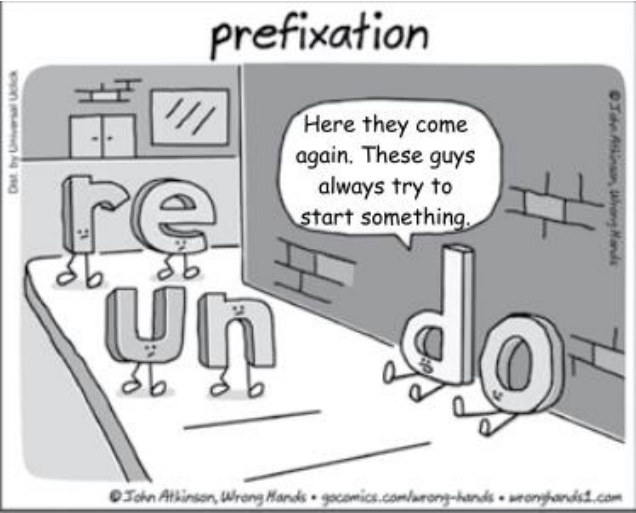

This cartoon can be used as a resource to teach or review the use of prefixes in the English language. You may offer your students the following words and ask them to choose the alternative in which the prefix has the same meaning as “un”. Your students should mark alternative 

A) disappear. 

B) overwork. 

C) deteriorate. 

D) mistreat. 

- E) incriminate.

---

<!-- pagina: 59 -->

**Andrea Belo Aula 01 - Reading Techniques, Cognates and Idioms** 

#### 37. (FCC/2022 – TJ-CE) 

Before cloud computing came into existence, companies were required to download applications or programs on their physical PCs or on-premises servers to be able to use them. For any organization, building and managing its own IT infrastructure or data centers is a huge challenge. Even for those who own their own data centers, allocating a large number of IT administrators and resources is a struggle. 

The introduction of cloud computing was a paradigm shift in the history of the technology industry. Rather than creating and managing their own IT infrastructure and paying for servers, power and real estate, etc., cloud computing allows businesses to rent computing resources from cloud service providers. This helps businesses avoid paying heavy upfront costs and the complexity of managing their own data centers. By renting cloud services, companies pay only for what they use such as computing resources and disk space. This allows companies to anticipate costs with greater accuracy. 

Since cloud service providers do the heavy lifting of managing and maintaining the IT infrastructure, it saves a lot of time, effort and money for businesses. The cloud also gives organizations the ability to seamlessly upscale or downscale their computing infrastructure as and when needed. Compared to the traditional on-premises data center model, the cloud offers easy access to data from anywhere and on any device with internet connectivity, thereby enabling effective collaboration and enhanced productivity. 

(Adaptado de: MCDERMOTT, Matt. Cloud Computing: Benefits, Disadvantages & Types of Cloud Computing Services. Disponível em: https://www.business2community.com) 

No trecho For any organization, building and managing its own IT infrastructure or data centers is a huge challenge (1º parágrafo), o segmento sublinhado tem sentido equivalente, em português, a 

A) criar e administrar. 

B) construir e distribuir. 

C) local e gerência. 

D) elaborar e gerir. 

E) desenvolvimento e coordenação.

---

<!-- pagina: 60 -->

**Andrea Belo Aula 01 - Reading Techniques, Cognates and Idioms** 

#### 38. (FCC/2022 – TJ-CE) 

Depreende-se do texto que a computação em nuvem 

A) dificulta o acesso a dados armazenados nos servidores de uma organização, na medida em que exige a presença física do usuário. 

B) beneficia os usuários da comunidade acadêmica, apesar de ter sido planejada para a aplicação no universo corporativo. 

C) reduz os custos, uma vez que os usuários só precisam pagar pelo que utilizarem, como, por exemplo, espaço em disco, quando e onde precisarem. 

D) permite que os usuários planejem antecipadamente o que precisarão usar, pois podem reservar com antecedência os recursos necessários. 

E) é um modelo de infraestrutura eficiente, contudo demanda muito esforço, tempo e dinheiro para ser implantado. 

#### 39. (FCC/2022 – TJ-CE) 

Considere a ilustração abaixo. 

(Adapted from comicsenglish.com ) 

No primeiro quadrinho, “(Sigh)” indica que a personagem Anne está 

A) apreensiva. 

B) entediada. 

C) enraivecida. 

D) esperançosa. 

E) motivada.

---

<!-- pagina: 61 -->

**Andrea Belo Aula 01 - Reading Techniques, Cognates and Idioms** 

#### 40. (FCC/2022 – TJ-CE) 

BYOD (Bring Your Own Device) refers to the policy of allowing employees to supply their own computing devices for use at work. Employers save money by eliminating hardware purchasing and maintenance overhead, and employees enjoy the freedom of choice to use whichever mobile phone, tablet or laptop that best meets their preferences. 

For example, a user may have a Windows PC for work and a MacBook for a personal laptop. The keyboard shortcuts for each platform are slightly different, making it easy to mangle copy-paste functions in word processors and spreadsheets. Using the same BYOD MacBook for work and personal computing eliminates these switchover errors. 

Even for non-SaaS organizations, user error typically represents a third of all data loss, second only to hardware failure. The reduction in user error gained from BYOD policies is present regardless of whether an employee is creating a document in Google Apps or Microsoft Word. 

There has yet been no rigorous study of the change in rates of user error before and after adopting BYOD policies. Nonetheless, it’s safe to assume that some level of user error is reduced by familiarity and comfort with BYOD devices. 

YOD can’t make your data invulnerable, but combined with good security policies, regular user training and effective data backup, it can make a noticeable difference in the availability and integrity of your company data. 

(Disponível em: https://www.wired.com) 

According to the text, Bring Your Own Device (BYOD) policies: 

A) Benefit organizations with poor security and access policies. 

B) Eliminate the necessity of user training and data backup. 

C) Increase the risk of data loss and hardware malfunction. 

D) Reduce user mistakes caused by using different platforms. 

E) Demand users to create documents in Google Apps.

---

<!-- pagina: 62 -->

**Andrea Belo Aula 01 - Reading Techniques, Cognates and Idioms** 

# **GABARITO** 

|01 – E|02 – B|03 – C|04 – E|05 – Errado|
|---|---|---|---|---|
|06 – Certo|07 – Certo|08 – Errado|09 – E|10 – D|
|11 – A|12 – C|13 – D|14 – B|15 – C|
|16 – D|17 – C|18 – E|19 – D|20 – C|
|21 – D|22 – D|23 – E|24 – B|25 – E|
|26 – A|27 – B|28 – A|29 – Errado|30 – Certo|
|31 – Certo|32 – Certo|33 – B|34 – A|35 – A|
|36 – A|37 – A|38 – C|39 – B|40 – D|

---

<!-- pagina: 63 -->

**Andrea Belo Aula 01 - Reading Techniques, Cognates and Idioms** 

# **QUESTÕES COMENTADAS** 

#### 01. (FGV/2022 – RECEITA FEDERAL) 

#### Global commerce 

Driverless vehicles whizz across five new berths at Tuas Mega Port, which sits on a swathe of largely reclaimed land at the western tip of Singapore. Unmanned cranes loom overhead, circled by camera-fitted drones. The berths are the first of 21 due by 2027. When it is completed in 2040, the complex will be the largest container port on Earth, boasts PSA International, its Singaporean owner. 

Tuas is a vision of the future on two fronts. It illustrates how port operators the world over are deploying clever technologies to meet the demand for their services in the face of obstacles to the development of new facilities, from lack of space to environmental concerns. More fundamentally, the city-state’s investment, with construction costs estimated at $15bn, is part of a wave of huge bets by the broader logistics industry on the rising importance of Asia, and South-East Asia in particular. The IMF expects the region’s five largest economies—Indonesia, Malaysia, Singapore, the Philippines and Thailand—to be the fastest-growing bloc in the world by trade volumes between 2022 and 2027. The result is that the map of global commerce and the blueprints for its critical nodes are being simultaneously redrawn. 

From: The Economist, January 14, 2023, pp. 57-58 

The overall position of the article is rather 

A) flimsy. 

B) gloomy. 

C) scornful. 

D) awkward. 

E) supportive. 

GABARITO: E 

Comentários: A questão requer que você indique que tipo de posicionamento pode-se observar no texto dado. 

Já no primeiro parágrafo do texto, após criar no leitor uma imagem mental do cenário atual do Mega Porto de Tuas, o autor explica que seus 21 ancoradouros devem ficar prontos em 2027. 

Em seguida, ele reproduz o pensamento <u>bastante otimista</u> da PSA International, dona do Mega Porto de Tuas: de que este será o maior porto de contêineres do mundo. 

No segundo parágrafo, por sua vez, o autor apresenta sua própria opinião sobre o empreendimento, e afirma que <u>o Mega Porto é uma visão do futuro</u> porque aplica tecnologias inteligentes para atender às suas demandas.

---

<!-- pagina: 64 -->

**Andrea Belo Aula 01 - Reading Techniques, Cognates and Idioms** 

Na sequência, explica ainda que a ideia da construção do Mega Porto de Tuas surgiu como parte de uma onda de apostas no crescimento da importância da Ásia nesse contexto de logística, e finaliza dizendo que <u>o mapa do comércio global está sendo redesenhado .</u> 

Com isso em mente, perceba que, a todo momento, o autor expressa uma <u>ideia positiva acerca da construção do Porto, de crescimento da região, de evolução tecnológica, reproduzindo ainda</u> opiniões no mesmo sentido. 

Dentre as alternativas, temos quatro adjetivos que expressam ideias negativas, e <u>apenas um que indica um posicionamento positivo do texto acerca do empreendimento: supportive (apoiador/que dá suporte)</u> . 

Portanto, o gabarito é a alternativa "E" . 

Veja o significado das demais alternativas: 

- flimsy (frágil); 

- gloomy (triste/sombrio); 

- scornful (desdenhoso); 

- awkward (estranho). 

#### 02. (FGV/2015 – SEE-PE) 

At a buffet service where all food is arranged on tables and waiters do not take orders, the most polite and adequate instruction a waiter should give to customers is: 

A) “Please feed yourselves”. 

B) “You may help yourselves”. 

C) “Make sure you eat all you can”. 

D) “Our service is the best in town”. 

- E) “I apologize for not taking your order”. 

#### GABARITO: B 

Comentários: A questão aborda o uso do verbo modal MAY e seus possíveis usos em expressões idiomáticas .

---

<!-- pagina: 65 -->

**Andrea Belo Aula 01 - Reading Techniques, Cognates and Idioms** 

#### “Please feed yourselves”. INCORRETA 

NÃO seria uma forma adequada de o garçom se referir aos clientes. O seu significado seria, literalmente: 

Please feed yourselves // Alimentem-se, por favor. 

#### “You may help yourselves”. CORRETA 

Realmente, esta é uma expressão que poderia ser utilizada, perfeitamente, de maneira polida e adequada. Soaria da seguinte forma: 

You may help yourselves // Sirvam-se à von t ade. 

“Make sure you eat all you can”. INCORRETA 

NÃO se trata de uma opção adequada, muito menos polida. Seria algo do tipo: 

Make sure you eat all you can // Certifique-se de comer tudo que puder. 

“Our service is the best in town”. INCORRETA 

NÃO se trata de uma opção polida nem adequada. Na verdade, ela possui um tom publicitário, dirigido a potenciais clientes não ao atendimento direto. Veja: 

Our service is the best in town // Nosso serviço é o melhor da cidade. 

“I apologize for not taking your order”. INCORRETA 

NÃO se trata de uma opção adequada à situação. Observe: 

I apologize for not taking your order / / Desculpa por não estar fazendo os pedidos. 

#### 03. (FGV/2018 – PREFEITURA MUNICIPAL DE NITERÓI – RJ) 

The Challenges Facing Government Auditors 

Posted on July 26, 2013 

When it comes to the pressure of successfully identifying, anticipating and dealing with risks, few auditors shoulder as much burden as those who work with the government. As the Institute of Internal Auditors’ Richard Chambers wrote, these professionals deal with career-threatening political risks on a daily basis that many private sector auditors could never comprehend.

---

<!-- pagina: 66 -->

**Andrea Belo Aula 01 - Reading Techniques, Cognates and Idioms** 

Internal auditors play a pivotal role in the relationship between the government and citizens. It’s up to auditors to set the appropriate controls to manage federal programs and also to provide insight into the effectiveness and the soundness of the government’s inner workings. Put simply, auditors are key to ensuring the public’s trust in their government is well-founded and not abused. 

That being said, there are a number of challenges associated with governmental-level internal auditing. Citing a MicKinsey paper from 2011, Chambers points to a few key issues: 

1. Turnover and Outsiders: Turnover in the political sector is high, with appointed executives seldom lasting for more than two years. On top of that, newly appointed officials often come from outside departments or agencies. This means officials frequently don’t have a firm grasp on all the risks and challenges associated with their position, which can lead to poor decision making. 

2. Metrics for Success: In the private sector, business objectives are clear and are conducive to metrics: more sales, more customers, more revenue, return on investment, etc. This means it’s extremely easy to determine the efficiency of audit programs and controls. In the public sphere, metrics aren’t as obvious because financial and mission objectives are more complex. This complicates the job immensely. 

3. ‘Mission Over Risk’ Mindset: Most companies undervalue the importance of risk culture. Departments want to achieve their objectives, and risk management takes a back seat to that. In the public sector, officials are often even more dedicated to and passionate about the mission at hand. Additionally, people tend to assume that government budgets are big enough to bail departments out of bad decisions, which can lead to risky behaviors. […] 

Internal controls are pivotal to maintaining the public trust in government operations, so despite the challenges that lay in front of auditors, it’s crucial they work with managers to develop effective campaigns and programs. 

(Adapted from: https://www.resolver.com/blog/the-challenges-facinggovernment-auditors/. Retrieved on January 25th, 2018) 

The last paragraph states that, when developing campaigns and programs, auditors should not work 

A) by appointment. 

B) for the public. 

C) in isolation. 

D) on demand. 

E) at home. 

#### GABARITO: C 

Comentários: O enunciado quer saber de que forma os auditores não devem trabalhar, baseado em informações do último parágrafo. 

A oração informa que os auditores devem trabalhar com gestores. Cabe então avaliar se a afirmativa tem um sentido antônimo à esta oração.

---

<!-- pagina: 67 -->

**Andrea Belo Aula 01 - Reading Techniques, Cognates and Idioms** 

#### by appointment. INCORRETA. 

Não há no último parágrafo qualquer informação sobre os auditores trabalharem com os gestores sem precisar de agendamento (appointment). 

for the public. INCORRETA. 

Não há no último parágrafo qualquer informação sobre os auditores trabalharem com os gestores sem trabalhar para o público. 

#### in isolation. CORRETA. 

No último parágrafo, vemos que é crucial que os auditores devam trabalhar com os gerentes. 

Assim, eles não devem trabalhar em isolamento (work in isolation). 

on demand. INCORRETA. 

Não há no último parágrafo qualquer informação sobre os auditores trabalharem com os gestores, mas que não devam trabalhar sob demanda (on demand). 

#### at home. INCORRETA. 

Não há no último parágrafo qualquer informação sobre os auditores trabalharem com os gestores, mas que não seja de casa (at home). 

#### 04. (FGV/2022 – SENADO FEDERAL) 

#### The New Rules of Data Privacy 

The data harvested from our personal devices, along with our trail of electronic transactions and data from other sources, now provides the foundation for some of the world’s largest companies. […] For the past two decades, the commercial use of personal data has grown in wild-west fashion. But now, because of consumer mistrust, government actions, and competition for customers, those days are quickly coming to an end. 

For most of its existence, the data economy was structured around a “digital curtain” designed to obscure the industry’s practices from lawmakers and the public. Data was considered company property and a proprietary secret, even though the data originated from customers’ private behavior. That curtain has since been lifted and a convergence of consumer, government, and market forces are now giving users more control over the data they generate. Instead of serving as a resource that can be freely harvested, countries in every region of the world have begun to treat personal data as an asset owned by individuals and held in trust by firms. 

This will be a far better organizing principle for the data economy. Giving individuals more control has the potential to curtail the sector’s worst excesses while generating a new wave of customerdriven innovation, as customers begin to express what sort of personalization and opportunity they want their data to enable. And while Adtech firms in particular will be hardest hit, any firm with substantial troves of customer data will have to make sweeping changes to its practices,

---

<!-- pagina: 68 -->

**Andrea Belo Aula 01 - Reading Techniques, Cognates and Idioms** 

particularly large firms such as financial institutions, healthcare firms, utilities, and major manufacturers and retailers. 

Leading firms are already adapting to the new reality as it unfolds. The key to this transition — based upon our research on data and trust, and our experience working on this issue with a wide variety of firms— is for companies to reorganize their data operations around the new fundamental rules of consent, insight, and flow. 

#### […] 

Federal lawmakers are moving to curtail the power of big tech. Meanwhile, in 2021 state legislatures proposed or passed at least 27 online privacy bills regulating data markets and protecting personal digital rights. Lawmakers from California to China are implementing legislation that mirrors Europe’s GDPR, while the EU itself has turned its attention to regulating the use of AI. Where once companies were always ahead of regulators, now they struggle to keep up with compliance requirements across multiple jurisdictions. 

Adapted from: https://hbr.org/2022/02/the-new-rules-of-data-privacy February 25, 2022 – Retrieved September 6, 2022 

The word “troves” in “troves of customer data” (3 ʳᵈ paragraph) refers to a(n): 

A) sensible batch. 

- B) classified input. 

- C) controlled bunch. 

- D) sensitive network. 

- E) valuable collection. 

#### GABARITO: E 

Comentários: A questão requer que você indique a que se refere a palavra "troves" no trecho "troves of customer data” (3º parágrafo). 

Isoladamente, o substantivo trove corresponde, em português a " acervo/coleção valiosa ". 

No texto, o autor explica que os usuários passaram a ter certo controle sobre os dados pessoais que compartilham com as empresas. E explica que as empresas que tiverem um valioso acervo de dados de usuários precisarão se adaptar às mudanças. 

Para indicar essa ideia, o autor se utiliza do termo troves (= acervo/coleção valiosa) . 

Portanto, o gabarito é a alternativa "E", valuable collection (acervo valioso) . 

Veja o significado das demais alternativas: 

- sensible batch (lote sensível/sigiloso); 

- classified input (dados classificados/sigilosos); 

- controlled bunch (conjunto controlado); 

- sensitive network (rede sensível).

---

<!-- pagina: 69 -->

**Andrea Belo Aula 01 - Reading Techniques, Cognates and Idioms** 

#### 05. (CEBRASPE/2018 – INSTITUTO RIO BRANCO) 

A central conjecture of the social studies of finance is that equipment matters: it changes the nature of the economic agent, of economic action, and of markets. 

Consider, for example, physical equipment such as the stock ticker or trading screens connected in electronic networks, which circumvent the most basic of all bodily limitations — the inability to be in two places at once. They made fine-grained knowledge of price movements available in close to real time to geographically dispersed market participants. Alex Preda conjectures, for instance, that the ticker helped prompt the rise of “chartism” or “technical analysis”: the belief — still widespread — that patterns can be found in price graphs that have predictive value. Actors’ equipment goes beyond physical technologies: their “conceptual equipment” also matters, or so the social studies of finance posit. Financial markets are complicated places. Given the limited memory and computational capacity of the human brain, economic agents must develop and acquire systematic ways of making sense of markets. Organizations must develop procedures for interacting with markets, and to an increasing extent those procedures are implemented in algorithms in automated pricing, trading and risk-management systems. 

Sometimes, the ways of thinking, procedures, and algorithms that are employed derive from financial economics. Probably more often, however, practitioners’ ways of thinking and associated ways of acting have no direct connection to “academic” economics or indeed are regarded by economists as mistaken. Chartism is an example of the latter: financial economists regard it as on a par with astrology, but many traders take it seriously, and act on the basis of it. 

“Public facts”, such as the LIBOR1 , technical equipment, graphical presentations, and “conceptual equipment” are all aspects of the diverse cognitive and calculative processes that take place in financial markets. These processes are “distributed” in the sense that a given task is often performed not by a single unaided human but by multiple human beings, objects, and technical systems. To understand cognition that involves multiple collaborating human beings and/or interaction with objects and technical systems, one must go beyond the psychological or cognitive science analysis of the individual “bounded by the skin”. 

As Hutchins puts it, “a group performing [a] cognitive task may have cognitive properties that differ from the cognitive properties of any individual”. 

1 LIBOR stands for London interbank offered rate. The interest rate at which banks offer to lend funds (wholesale money) to one another in the international interbank market (source: Financial Times ). 

Donald MacKenzie. Material Markets. New York: Oxford University Press, 2009, p. 13-6 (adapted). 

Considering the grammatical and semantic aspects of text IV, decide whether the following items are right (C) or wrong (E). 

The expression “on a par with” (L.30) means competing . 

(    ) Certo. 

(    ) Errado.

---

<!-- pagina: 70 -->

**Andrea Belo Aula 01 - Reading Techniques, Cognates and Idioms** 

#### GABARITO: ERRADO 

Comentários: A questão trata sobre sinônimos . 

to pair with = “fazer parelha com”; 

to be paired with somebody/something = “colocar pessoas ou coisas em grupos de dois”; “formar grupos de dois”; “estar junto com”. 

No trecho em que é usada no texto, a expressão on a pair with significa “relacionada a”, "juntamente com”, "lado a lado". Observe: 

- Chartism is an example of the latter: financial economists regard it as on a par with <u>astrology, but many traders take it seriously, and act on the basis of it. (l. 29-31)</u> 

- […] os economistas financeiros a consideram juntamente à astrologia [...] 

Logo, a expressão on a pair with NÃO significa competing (“competindo”; “concorrente”). 

#### Fontes: 

- Michaellis Dictionary. 

- Longman Dictionary of Contemporary English 

#### 06. (CEBRASPE/2018 – INSTITUTO RIO BRANCO) 

Much has been written about the superlative qualities desirable in diplomacy. Few persons can embody them all, but the greater part of a diplomat’s armoury can be developed and improved by sincere application guided by advice and example of his/her seniors. One must be concerned primarily with the foundations on which to build. For these the selectors must be satisfied there is a hard core to the applicant’s personality. On it will rest the courage, toughness in confrontation, patience and perseverance without which many more brilliant gifts can come to grief. Contrary to popular belief, diplomacy is not a career for the compliant. It often imposes on an officer the duty of defending the interests of his/her country in places not of his/her choice, where he/she must be prepared to withstand the moral attrition to which he/she may be exposed in the front line of international politics. 

Lord Gore-Booth and Desmond Pakenham. Satow’s guide to diplomatic practice. 5.th ed. London and New York: Longman, 1979, p. 79 (adapted). 

Considering the grammatical and semantic aspects of text III, decide whether the following items are right (C) or wrong (E). 

The expression “come to grief” (L.10) means to end in failure . 

(    ) Certo. 

(    ) Errado. 

#### GABARITO: CERTO 

Comentários: A questão trata sobre sinônimos de palavras do texto.

---

<!-- pagina: 71 -->

**Andrea Belo Aula 01 - Reading Techniques, Cognates and Idioms** 

to come to grief = "fracassar" 

to end in failure = "acabar fracassando" 

No trecho em que é usada no texto, a expressão come to grief significa “fracassar”. Observe: 

- On it will rest the courage, toughness in confrontation, patience and perseverance without which many more brilliant gifts can come to grief . (l. 08-10) 

- […] sem os quais os mais brilhantes dons podem fracassar [...] 

Logo, a expressão come to grief significa <u>to end in failure</u> (“acabar fracassando”). 

Fonte: Collins Dictionary. 

#### 07. (CEBRASPE/2021 – TCE-SC) 

During a ransomware hack, attackers infiltrate a target’s computer system and encrypt its data. They then demand a payment before they will release the decryption key to free the system. This type of extortion has existed for decades, but in the 2010s it exploded in popularity, with online gangs holding local governments, infrastructure and even hospitals hostage. Ransomware is a collective problem—and solving it will require collaborative action from companies, the government and international partners. 

As long as victims keep paying, hackers will keep profiting from this type of attack. But cybersecurity experts are divided on whether the government should prohibit the paying of ransoms. Such a ban would disincentivize hackers, but it would also place some organizations in a moral quandary. For, say, a hospital, unlocking the computer systems as quickly as possible could be a matter of life or death for patients, and the fastest option may be to pay up. 

Collective action can help. If all organizations that fall victim to ransomware report their attacks, they will contribute to a trove of valuable data, which can be used to strike back against attackers. For example, certain ransomware gangs may use the exact same type of encryption in all their attacks. “White hat” hackers can and do study these trends, which allows them to retrieve and publish the decryption keys for specific types of ransomware. Many companies, however, remain reluctant to admit they have experienced a breach, wishing to avoid potential bad press. Overcoming that reluctance may require legislation, such as a bill introduced in the Senate last year that would require companies to report having paid a ransom within 24 hours of the transaction. 

Internet: <www.scientificamerican.com> (adapted). 

In the second paragraph of the text, 

The word “disincentivize” could be correctly replaced by deter without any change in the meaning of the sentence. 

(    ) Certo. 

- (    ) Errado.

---

<!-- pagina: 72 -->

**Andrea Belo Aula 01 - Reading Techniques, Cognates and Idioms** 

#### GABARITO: CERTO 

Comentários: O enunciado pergunta se a palavra “disincentivize”  poderia ser corretamente substituída por deter sem qualquer alteração no significado da frase. 

Para melhor entendimento, vejamos o trecho traduzido: 

"Essa proibição desincentivaria os hackers, mas também colocaria algumas organizações em um dilema moral." 

A palavra “disincentivize” é utilizada na língua inglesa com significado de impedir alguém de fazer <u>alguma coisa ou tornar alguém menos entusiasmado em fazer algo, dificultando que essa pessoa o faça.</u> 

São alguns dos sinônimos de "disincentivize": discouragement (desencorajamento), deter (deteria). 

Desse modo, visto que "deter" é sinônimo de "disincentivize", podemos concluir que a <u>substituição de um termo pelo outro não mudaria o significado da frase. Vejamos um exemplo</u> para melhor entendimento: 

"But this should not deter them from acquiring these shoes." (Mas isso não deve impedi-los de adquirir esses sapatos.) 

"But this should not disincentivize them from acquiring these shoes." (Mas isso não deve desencorajá-los a adquirir esses sapatos.) 

Assim, podemos concluir que o item está certo. 

#### 08. (CEBRASPE/ANO – BANRISUL) 

---

<!-- pagina: 73 -->

**Andrea Belo Aula 01 - Reading Techniques, Cognates and Idioms** 

Based on the texts CB1A2-I and CB1A2-II, judge the following Item. 

In the text CB1A2-II, the boss suggests that his human employee is not very competent and reliable, which is why he brings a sophisticated robot to take his place. 

(    ) Certo. 

(    ) Errado. 

#### GABARITO: ERRADO 

Comentários: A questão requer que, com base no texto acima, você julgue o item a seguir: 

No texto CB1A2-II, o patrão sugere que seu funcionário humano não é muito competente e confiável, por isso traz um robô sofisticado para substituí-lo. 

Na tirinha, o chefe de fato traz um robô para substituir seu funcionário, e afirma para ele que as duas funções que o robô é capaz de fazer: beber café e acessar sites inapropriados . 

Em seguida, pergunta se esqueceu de alguma outra função, e obtém como resposta do funcionário que ele próprio não é um homem complicado , ou seja, o robô o substitui <u>adequadamente em suas funções.</u> 

Desse modo, não é correto dizer que o robô foi trazido devido à ineficiência do funcionário, <u>uma vez que ele executa as mesmas duas funções do empregado .</u> 

Portanto, a assertiva está errada . 

#### 09. (IBFC/2022 – TJ-MG) 

#### Crimes 

Certain types of people cannot be charged with committing a crime. It may appear that they have committed a crime. However, for a variety of reasons their behavior will not be considered a crime in the courts of law. First, insane people cannot commit a crime. These people do not understand their behavior. They may not understand right from wrong. Next, those taking drugs prescribed by a doctor might be excused from committing a crime. If the drugs affect their minds, the court will excuse them. Finally, children under a certain age cannot be held responsible for committing a crime. 

Uma das áreas de formação da língua inglesa, a morfologia, justifica que a palavra é formada por afixos (prefixos + sufixos) e radical/raiz. A forma dos afixos é mais rígida quanto à posição de formação da palavra. Os sufixos podem modificar a classe gramatical e os prefixos o sentido (positivo ou negativo) da palavra, sendo que o radical, raiz, é que traz o significado da palavra. Diante do exposto, assinale a alternativa que apresenta a palavra pós-fixada. 

A) Misunderstand 

B) Bicolour 

C) Disappear 

D) Impossible 

E) Finally

---

<!-- pagina: 74 -->

**Andrea Belo Aula 01 - Reading Techniques, Cognates and Idioms** 

#### GABARITO: E 

Comentários: A questão requer que você indique em qual alternativa temos uma palavra sufixada. 

Nela, não é necessário analisar o texto de referência, que foi usado apenas para mostrar de onde foram retirados os termos usados nas alternativas. Dentre elas, apenas uma apresenta um sufixo <u>(</u> -ly <u>), que transforma adjetivo final no advérbio final ly</u> (finalmente). 

Portanto, o gabarito é a alternativa "E" . 

Veja o significado das demais alternativas, em que todas apresentam apenas prefixos: 

- Mis understand (entender mal); 

- Bi colour (bicolor); 

- Dis appear (desaparecer); 

- Im possible (impossível). 

#### 10. (IBFC/2022 – TJ-MG) 

Utilizando-se das técnicas de leitura instrumental, mais especificamente da técnica skimming, ou seja, uma leitura rápida e superficial, leia o texto “Crimes” e assinale a alternativa que realmente identifica o assunto geral tratado pelo autor do texto. 

A) O autor discute os crimes de uma maneira geral e superficial. 

B) O autor afirma que todos os indivíduos são criminosos. 

C) O autor expõe que os indivíduos mentalmente insanos não são capazes de cometer crimes. 

D) O autor declara que alguns indivíduos não podem ser acusados de cometer crimes. 

E) O autor remonta casos de crimes e as complicações legais dos criminosos. 

GABARITO: D 

Comentários: A questão requer que, utilizando a técnica de leitura instrumental skimming, você indique a alternativa que identifica o assunto geral tratado pelo autor no texto. 

A estratégia skimming, equivalente em português a "ler por alto" ou "folhear", e é uma técnica que permite observarmos o texto como um todo, para detectar o assunto geral, sem nos <u>preocuparmos com os detalhes.</u> 

Utilizando essa técnica na leitura do texto dado, você deverá perceber, primeiramente, que o título indica o assunto mais amplo tratado no texto: crimes . 

Em seguida, analisando apenas a primeira frase do texto, temos outra informação importante: <u>a alegação do autor de que alguns tipos de pessoas não podem ser acusadas de cometer crimes .</u> 

Em uma rápida leitura superficial nas frases seguintes, você irá observar que o autor especifica quem são essas pessoas, enumerando três grupos que não podem ser condenados por crimes.

---

<!-- pagina: 75 -->

**Andrea Belo Aula 01 - Reading Techniques, Cognates and Idioms** 

Assim, após uma leitura dinâmica do texto, perceba que o assunto geral tratado pelo autor é o fato de que <u>alguns indivíduos não podem ser acusados de cometer crimes .</u> 

Portanto, o gabarito é a alternativa "D", o autor declara que alguns indivíduos não podem ser acusados de cometer crimes . 

Veja o erro das demais alternativas: 

- O autor discute os crimes de uma maneira geral e superficial; 

- O autor afirma que todos os indivíduos são criminosos; 

- O autor expõe que os indivíduos mentalmente insanos não são capazes de cometer crimes; 

- O autor remonta casos de crimes e as complicações legais dos criminosos. 

11. (IBFC/2019 – PREFEITURA DE CABO DE SANTO AGOSTINHO – PE) 

Leia a tira em quadrinhos e analise as afirmativas abaixo. 

(From: https://www.comicskingdom.com/hagar-the-horrible/) 

I – No primeiro quadrinho Hagar consultou o velho sábio para saber sobre o segredo da felicidade. 

II – No segundo quadrinho as palavras that e me se referem, respectivamente, ao “velho sábio” e a “Hagar”. 

III – As palavras do velho sábio no último quadrinho são de que é melhor dar que receber. 

Assinale a alternativa correta. 

- A) Apenas as afirmativas I e III estão corretas 

- B) Apenas as afirmativas II e III estão corretas 

- C) As afirmativas I, II e III estão corretas 

- D) Apenas a afirmativa I está correta 

#### GABARITO: A 

Comentários: Apenas as afirmativas I e III estão corretas

---

<!-- pagina: 76 -->

**Andrea Belo Aula 01 - Reading Techniques, Cognates and Idioms** 

I – No primeiro quadrinho Hagar consultou o velho sábio para saber sobre o segredo da felicidade. CERTA 

#### "What's the secret to hapiness, o wise one?" 

"Qual é o segredo da felicidade, ó sábio?" 

II – No segundo quadrinho as palavras that e me se referem, respectivamente, ao “velho sábio” e a “Hagar”. ERRADA 

A palavra that (isso) se refere a "bring all the gold and silver you have" , ou seja, levar para o velho sábio todo o ouro e prata que ele, Hagar, tiver. 

III – As palavras do velho sábio no último quadrinho são de que é melhor dar que receber. CERTA 

#### "It has been said that giving is better than receiving" 

"Dizem que dar é melhor do que receber" 

Note que a questão pede, basicamente, a tradução da tirinha. 

#### 12. (IBFC/2019 – PREFEITURA DE CABO DE SANTO AGOSTINHO – PE) 

#### COUCHSURFING! 

Imagine you are planning a Holiday in Boston, say, or Sydney, or Dublin. Now, what if you could stay with locals who could give you a guided tour, take you to the best pub or beach, help you improve your English… and all for free? Welcome to the world of Couchsurfing! Yes, Couchsurfing is about a free couch – or bed, or room, or hammock, so it is great for budget travelers. But it is much more than that. The couchsurfing philosophy is about connecting people and cultures. The ethos is “Making the world a better place – one couch at a time.” 

The idea was born in San Francisco in 1999. A young man called Casey Fenton was planning a long weekend in Reykjavik. Iceland is expensive and Casey needed cheap accommodation. So he e- mailed over 1,500 Icelandic students in Reykjavik to ask if he could sleep on their couch. Casey was not only offered couches, the students also showed him ‘their’ Reykjavik. Casey decided this was a great way to travel, and launched the site with three friends in 2003. Today the world has more than 2.5 million Couchsurfers, 86,347 of which live in Brazil, the eighth most popular CS country. 

(From: BECKER, K. Couchsurfing. Speak up. São Paulo, n. 290, p. 26, out.2011.) 

De acordo com o texto, “Couchsurfing” é uma maneira de viajar. A esse respeito, assinale a alternativa correta. 

A) são e salvo 

#### B) gastando muito dinheiro 

#### C) com um orçamento baixo 

D) sem sair de casa

---

<!-- pagina: 77 -->

**Andrea Belo Aula 01 - Reading Techniques, Cognates and Idioms** 

#### GABARITO: C 

Comentários: A questão exige interpretação de texto. 

O "couchsurfing" se trata de uma modalidade de hospedagem gratuita ou de baixo custo, onde viajantes com orçamento limitado podem se hospedar na casa de desconhecidos, bem como se relacionar com nativos e aproveitar um tour pelo local visitado. 

Essa ideia surgiu na cidade de São Francisco, em 1999, e se expandiu pelo mundo, contando com algumas plataformas voltadas especificamente para unir viajantes e pessoas dispostas a recebêlos durante curtos períodos de tempo. 

O texto, em suas linhas 1-3 , traz a informação de que a modalidade de hospedagem "couchsurfing" <u>é ideal para viajantes com baixo orçamento , por permitir uma estadia e</u> experiências turísticas locais gratuitamente. 

#### 13. (CESGRANRIO/2021 – BANCO DO BRASIL) 

#### U.S. Finds No Evidence of Alien Technology in Flying Objects, but can’t rule it out, either 

WASHINGTON — American intelligence officials have found no evidence that aerial phenomena observed by Navy pilots in recent years are alien spacecraft, but they still cannot explain the unusual movements that have mystified scientists and the military. 

The report determines that a vast majority of more than 120 incidents over the past two decades did not originate from any American military or other advanced US government technology, the officials said. That determination would appear to eliminate the possibility that Navy pilots who reported seeing unexplained aircraft might have encountered programs the government meant to keep secret. 

But that is about the only conclusive finding in the classified intelligence report, the officials said. And while a forthcoming unclassified version, expected to be released to Congress by June 25, will present few other firm conclusions, senior officials briefed on the intelligence conceded that the very ambiguity of the findings meant the government could not definitively rule out theories that the phenomena observed by military pilots might be alien spacecraft. 

Americans’ long-running fascination with UFOs has intensified in recent weeks in anticipation of the release of the government report. Former President Barack Obama encouraged the interest when he gave an interview last month about the incidents on “The Late Late Show with James Corden” on CBS. 

“What is true, and I’m really being serious here,” Mr. Obama said, “is that there is film and records of objects in the skies that we don’t know exactly what they are.’’ 

The report concedes that much about the observed phenomena remains difficult to explain, including their acceleration, as well as ability to change direction and submerge. One possible explanation — that the phenomena could be weather balloons or other research balloons — does

---

<!-- pagina: 78 -->

**Andrea Belo Aula 01 - Reading Techniques, Cognates and Idioms** 

not hold up in all cases, the officials said, because of changes in wind speed at the times of some of the interactions. 

Many of the more than 120 incidents examined in the report are from Navy personnel, officials said. The report also examined incidents involving foreign militaries over the last two decades. Intelligence officials believe that at least some of the aerial phenomena could have been experimental technology from a rival power, most likely Russia or China. 

One senior official said without hesitation that U.S. officials knew it was not American technology. He said there was worry among intelligence and military officials that China or Russia could be experimenting with hypersonic technology. 

He and other officials spoke about the classified findings in the report on the condition of anonymity. 

Available at: <https://www.nytimes.com/2021/06/03/us/politics/ufos-sighting-alien-spacecraft-pentagon.html>. Retrieved on: July 7, 2021. 

One of the purposes of the text is to confirm that the report determines the 

A) existence of life on other planets 

- B) imminent possibility of aliens’ attack 

- C) superiority of American technology 

- D) authorities’ ignorance about unusual aircraft 

- E) danger of enemy nations’ attacks to the US 

#### GABARITO: D 

Comentários: O enunciado da questão afirma que um dos propósitos do texto é confirmar determinado fato constatado no relatório. A questão requer que você aponte qual é esse fato. 

Já no primeiro parágrafo do texto, o autor nos informa que os Oficiais da Inteligência Americana <u>ainda não conseguem explicar os movimentos aéreos incomuns que intrigaram cientistas e autoridades nos últimos anos.</u> 

Em seguida, ele afirma que <u>a única descoberta conclusiva que consta no relatório é de que os pilotos da Marinha que avistaram objetos voadores não identificados não descobriram qualquer programa secreto do governo.</u> 

Assim, perceba que, de acordo com o texto, <u>o relatório constata que as autoridades ainda não</u> " " <u>conseguem explicar as aeronaves incomuns observadas</u> . 

Portanto, o gabarito é a alternativa "D", authorities’ ignorance about unusual aircraft (ignorância das autoridades sobre aeronaves incomuns) . 

Veja o significado das demais alternativas: 

- a existência de vida em outros planetas; 

- a possibilidade iminente de ataques alienígenas;

---

<!-- pagina: 79 -->

**Andrea Belo Aula 01 - Reading Techniques, Cognates and Idioms** 

#### - a superioridade da tecnologia norte-americana; 

- o perigo de ataques de nações inimigas aos EUA. 

#### 14. (CESGRANRIO/2021 – BANCO DO BRASIL) 

#### Revolution Accelerated 

How Digital Transformation is Shaping the Future of Banking 

Like all businesses, banks have had to act fast to respond to the unprecedented human and economic impact of Covid-19. 

First, they needed to keep the lights on and ensure business continuity. Second, they had to meet the changing ways customers wanted to engage. Finally, they sought to balance their business priorities with a responsibility to support society. Previous crises cast the banks as part of the problem — this time they are part of the solution. 

Banks who have embraced modern banking technology have fared better in meeting these challenges. They’ve moved seamlessly to remote working, kept up service for their customers, coped with huge increases in demand and quickly adapted their products. In contrast, banks using legacy ‘spaghetti’ software have struggled. 

Covid-19 has accelerated the need for modern banking technology, but it didn’t create it. Before coronavirus, the 2020s were already being framed as the decade for digital in the banking industry. Banks’ return on equity were too low and their cost-income ratios were too high. Meanwhile, regulation like open banking was disrupting the industry and increasing competition from new entrants like the GAAFAs (Google, Amazon, Alibaba, Facebook, Apple). 

Providing seamless digital customer experiences was therefore already a ‘must’. Every year, Temenos partners with the Economist Intelligence Unit (EIU) for a global study on the future of banking. More than 300 banking leaders are interviewed from retail, commercial and private banks. Over half of these are at C-suite level. 

In 2020, the study took place amid the Covid-19 crisis. The results give a fascinating insight into banking leaders’ approach during these unprecedented times. But they also show how they see their industry in the years to come. 

And the findings suggest three trends which will shape the future of banking: 

1. New technologies will be the key driver of banking transformation over the next 5 years. 77% of respondents strongly believed that Artificial Intelligence (AI) will be the most game-changing of these technologies. They see a diverse range of uses for AI — from personalised customer experience to fraud detection. 

2. Banks will overhaul their business models to create digital ecosystems. 80% of respondents believe that banking will become part of a platform of services. 45% are committed to transforming their business models into digital ecosystems.

---

<!-- pagina: 80 -->

**Andrea Belo Aula 01 - Reading Techniques, Cognates and Idioms** 

3. The sun will set on branch banking. World Bank data shows that visits to branches have been steadily declining globally over the last decade. As a result of coronavirus, customers are now more concerned about visiting their branch, and so even more people are willing to try digital applications. This combination of pandemic and increasingly transformative advanced technology has led a majority of respondents (59%) to our survey with the EIU to state that traditional branchbased banking model will be dead in just five years. That’s a 34% increase from last year. 

The current environment is undoubtedly challenging for banks. But they have the capital, customer relationships and customer data. They are regulated. And most importantly: they still enjoy their customers’ trust. 

In short, banks are best-placed to succeed if they commit to end-to-end digital transformation. That means a fully digital front office which creates hyper-personalized experiences and ecosystems. And a back office driving efficient operations and rapid innovation. By embracing modern banking technology, banks can support their customers today, create new value for the future and drive new levels of future growth. 

Available at: <https://www.cnbc.com/advertorial/how-digital--transformation-is-shaping-the-future-of-banking>. Retrieved on: July 13th, 2021. Adapted. 

From the sentence of the last paragraph, “By embracing modern banking technology, banks can support their customers today, create new value for the future and drive new levels of future growth”, it is inferred that 

A) banks cannot grow after the coronavirus pandemic. 

B) modern banking technology can help reshape the present and the future of banks. 

C) modern technology can frustrate the present and the future of the banking industry. 

D) as result of the coronavirus pandemic, banks will not be able to meet customers’ demands in the future. 

E) due to the coronavirus pandemic, banks are not able to meet customers’ expectations in the present. 

#### GABARITO: B 

Comentários: A questão pede que você indique o que se pode inferir da seguinte frase do último parágrafo do texto: “By embracing modern banking technology, banks can support their customers today, create new value for the future and drive new levels of future growth”. 

No trecho, o autor aponta alguns possíveis resultados de uma adesão dos bancos à tecnologia <u>moderna, sendo eles oferecer suporte aos clientes, criar novos valores e impulsionar seu próprio</u> crescimento. 

Observe que todos esses resultados correspondem a um panorama positivo dos bancos, com o incremento da tecnologia no setor.

---

<!-- pagina: 81 -->

**Andrea Belo Aula 01 - Reading Techniques, Cognates and Idioms** 

Dentre as alternativas, apenas uma representa um <u>cenário positivo :</u> modern banking technology can help reshape the present and the future of banks (a tecnologia bancária moderna pode ajudar a remodelar o presente e o futuro dos bancos) . 

Portanto, o gabarito é a alternativa "B" . 

Veja o significado e o erro das demais alternativas, que não correspondem ao que diz o texto: 

- os bancos ~~não~~ podem crescer após a pandemia de corona vírus; 

- a tecnologia moderna pode ~~frustrar~~ o presente e o futuro do setor bancário; 

- como resultado da pandemia de corona vírus, os bancos ~~não~~ poderão atender às demandas dos clientes no futuro; 

- devido à pandemia de corona vírus, os bancos ~~não~~ conseguem atender às expectativas dos clientes no presente. 

#### 15. (CESGRANRIO/2021 – BANCO DO BRASIL) 

According to the 2 ⁿᵈ paragraph of the text, after the Covid-19 outbreak, banks initially had to face the following number of challenges: 

A) 1 

B) 2 

C) 3 

D) 4 

E) 5 

GABARITO: C 

Comentários: A questão requer que você indique quantos desafios os bancos tiveram que enfrentar inicialmente, depois da pandemia da Covid-19, de acordo com o segundo parágrafo do texto. 

No referido parágrafo, o autor enumera os desafios enfrentados pelos bancos, utilizando-se dos advérbios first (primeiro/primeiramente), second (em segundo lugar) e finally (finalmente). 

Veja no texto: 

" First , they needed to keep the lights on and ensure business continuity. Second , they had to meet the changing ways customers wanted to engage. Finally , they sought to balance their business priorities with a responsibility to support society." 

( Primeiro , eles precisavam manter as luzes acesas e garantir a continuidade dos negócios. Em segundo lugar , eles precisavam atender às mudanças nas formas como os clientes desejavam se envolver. Finalmente , eles buscaram equilibrar suas prioridades de negócios com a responsabilidade de apoiar a sociedade.) 

#### Desse modo, perceba que <u>três desafios são enumerados/relacionados no texto</u> . 

Portanto, o gabarito é a alternativa "C" .

---

<!-- pagina: 82 -->

**Andrea Belo Aula 01 - Reading Techniques, Cognates and Idioms** 

#### 16. (BANCA/ANO – INSTITUIÇÃO) 

The overall purpose of the text is 

A) to explain how the banking industry works. 

- B) to discuss the impact of the coronavirus pandemic on the health system. 

C) to launch new investment opportunities in the banking industry. 

D) to state that digital transformation in banking has been accelerated by the coronavirus pandemic. 

E) to promote new AI technology that will change the future of banking. 

#### GABARITO: D 

Comentários: A questão requer que você indique qual é o objetivo principal do texto. 

Nele, temos como título "Revolution Accelerated" ( Revolução Acelerada ) e, como subtítulo, "How digital transformation is shaping the future of banking" ( Como a transformação digital está moldando o futuro dos bancos ). 

A partir daí, já podemos concluir que o objetivo central do texto engloba a acelerada <u>transformação digital pela qual os bancos passaram.</u> 

Na primeira frase, por sua vez, temos o motivo que ocasionou essa aceleração: <u>a pandemia da Covid-19 .</u> 

Analisando essas informações e as alternativas disponíveis, veja que o objetivo central do texto é afirmar/demonstrar que a transformação digital dos bancos foi acelerada pela pandemia do <u>coronavírus.</u> 

Portanto, o gabarito é a alternativa "D" . 

Veja o significado das demais alternativas: 

- explicar como funciona o setor bancário; 

- discutir o impacto da pandemia do coronavírus no sistema de saúde; 

- lançar novas oportunidades de investimento no setor bancário; 

- promover uma nova tecnologia de IA que mudará o futuro do setor bancário. 

17. (INSTITUTO AOCP/2020 – PREFEITURA MUNICIPAL DE BETIM – MG) 

Five ways to get a better bedtime routine 

by Amy Sedghi 

Getting to sleep can be a <u>struggle</u> , but blackout blinds and to-do lists can help – as can reserving the bedroom for sex and shut-eye

---

<!-- pagina: 83 -->

**Andrea Belo Aula 01 - Reading Techniques, Cognates and Idioms** 

An eye mask will block out light. 

#### 1. Go to bed at regular times 

Going to sleep and waking up at regular times – even on weekends – will strengthen your body clock, says Dr Lizzie Hill, a clinical sleep physiologist and a spokeswoman for the British Sleep Society. Regular mealtimes are also an important cue for your circadian rhythm. Avoid exercise too close to bedtime, as it can cause restlessness and an elevated body temperature, says Samantha Briscoe, a senior physiologist at the Sleep Centre at London Bridge hospital. 

#### 2. Protect the bedroom 

Preserve the bedroom as a place for sleep (and sex): there is evidence that the brain forms a strong association with sleep there. A temperature of 16- 18C (60-64F) is thought to be ideal for most, according to the Sleep Council, an awareness and support organisation. Blackout blinds or an eye mask can help block out light, while keeping electronic devices out of the bedroom is highly recommended. If you struggle to fall asleep after more than 25 minutes, Matthew Walker – a sleep expert and a professor of neuroscience and psychology at the University of California, Berkeley – suggests getting up and going to read under a dim light in another room. Once sleepy, you can return to bed.7 

#### 3. Get ahead on the next day 

Your night-time routine is an opportunity to make mornings run a little smoother: choose your clothes for the next day when you reach for your pyjamas or pack your bag while brushing your teeth. Martin Hagger, a professor of health psychology at the University of California, Merced, has stressed how routines are linked to the formation of healthy habits. 

#### 4. Wind down 

Reading a book can help slow breathing and relax muscles, while yoga stretches or even a gentle walk can reduce anxiety, says Briscoe. A warm bath or shower can also help you relax: researchers at the University of Texas at Austin found that bathing in water of 40-42.5C one to two hours before bedtime was associated with better sleep. 

#### 5. Write down your worries 

“If your mind is buzzing from the day, try keeping a journal or worry book,” suggests Hill. The NHS also recommends writing to-do lists for the next day in order to organise thoughts and clear the mind. “If you experience difficulty with sleep over the longer term, consider whether there may be an underlying medical condition,” says Hill. A sleep diary could help you identify any patterns 

(https://www.theguardian.com/lifeandstyle/2019/oct/04/five-ways-toget- a-better-bedtime-routine. Access: 08/01/2020)

---

<!-- pagina: 84 -->

**Andrea Belo Aula 01 - Reading Techniques, Cognates and Idioms** 

Mark the option that best describes the phrasal verb “wind down” taken from the text: 

A) It means one has to finish doing something. 

- B) It means one has to put something in order. 

- C) It means one has to relax. 

- D) It means one has to sleep. 

- E) It means one has to do something quickly. 

#### GABARITO: C 

Comentários: O enunciado pede para marcar a opção que melhor descreve o verbo frasal “wind down” retirado do texto: 

Esse verbo frasal pode ser traduzido como "desacelerar" , inferindo um sentido de relaxar <u>gradualmente depois de fazer algo que o deixou cansado ou preocupado.</u> 

Desse modo, podemos concluir que a alternativa C está correta, a qual pode ser traduzida como: 

"It means one has to relax. "(Isso significa que é preciso relaxar.) 

18. (INSTITUTO AOCP/2020 – PREFEITURA MUNICIPAL DE BETIM – MG) 

Consider the following statements either TRUE or FALSE according to the text and mark the option which contains the correct sequence: 

(    ) It is a good idea to take a warm shower before bedtime in order to help you relax. 

(    ) You shouldn’t read a book before going to bed because it makes your brain too much active. 

(    ) Writing down tasks for the next day may help you relax and sleep quicker. 

(    ) If you have trouble falling sleep, you should lay in bed waiting until you feel sleepy. 

A) T – T – T – F. 

B) F – F – T – F. 

C) T – T – F – F. 

D) F – T – F – T. 

- E) T – F – T – F. 

#### GABARITO: E 

Comentários: A questão nos pede para julgar as afirmações como VERDADEIRAS (T) OU FALSAS (F) de acordo com o texto, e marcar a opção que contém a sequência correta. Vejamos então cada uma delas: 

( ) It is a good idea to take a warm shower before bedtime in order to help you relax. (É uma boa ideia tomar um banho quente antes de dormir para ajudá-lo a relaxar.) VERDADEIRO (T).

---

<!-- pagina: 85 -->

**Andrea Belo Aula 01 - Reading Techniques, Cognates and Idioms** 

O texto é composto por dicas para ajudar a dormir, e na dica número 4 o texto traz que <u>um banho ou ducha quente também pode ajudar a relaxar , além de que tomar banho em água de 40-42,5ºC</u> uma a duas horas antes de deitar está associado a um sono melhor. Ou seja, a informação no texto condiz com a presente nesta afirmação, que, portanto, é verdadeira (T). 

( ) You shouldn’t read a book before going to bed because it makes your brain too much active. (Você não deve ler um livro antes de ir para a cama porque torna seu cérebro muito ativo.) FALSO (F). 

A dica número 4 se chama "wind down" (desanuviar), e em seu parágrafo o autor diz que ler um <u>livro pode ajudar a desacelerar a respiração e relaxar os músculos.</u> 

Ou seja, a leitura de um livro é tratada no texto como algo que ajuda no processo de adormecer, então essa alternativa é falsa (F). 

( ) Writing down tasks for the next day may help you relax and sleep quicker. (Anotar tarefas para o dia seguinte pode ajudá-lo a relaxar e dormir mais rápido.) VERDADEIRO (T). 

Na dica número 5, um dos conselhos presentes é que o NHS recomenda escrever listas de tarefas <u>para o dia seguinte, a fim de organizar os pensamentos e clarear a mente. A afirmação coincide</u> com o que está presente no texto, que inclusive se chama "write down your worries" (escreva suas preocupações), e por isso é verdadeira (T). 

( ) If you have trouble falling sleep, you should lay in bed waiting until you feel sleepy. ( Se você tem dificuldade para dormir, deve ficar deitado na cama esperando até sentir sono.) FALSO (F). 

No parágrafo referente à dica número 2, o autor do texto nos traz a informação de que se você lutar para adormecer por mais de 25 minutos, deve se levantar e ir ler sob uma luz fraca em outra sala para ajudar a adormecer, então, de acordo com o texto, não devemos ficar na cama <u>esperando até sentir sono, e por isso a afirmação é falsa (F).</u> 

Assim sendo, a sequência fica T-F-T-F , e a alternativa correta é a alternativa E . 

#### 19. (INSTITUTO AOCP/2018 – SED-SC) 

#### Which of the following idiomatic expressions refers to some event that rarely occurs? 

A) ‘Speak of the devil’ 

B) ‘To cost an arm and a leg’ 

- C) ‘Break a leg’ 

- D) ‘Once in a blue moon’ 

- E) ‘The best of both worlds' 

#### GABARITO: D 

Comentários: A questão aborda as expressões idiomáticas da língua inglesa, muito comuns e cobradas e concursos.

---

<!-- pagina: 86 -->

**Andrea Belo Aula 01 - Reading Techniques, Cognates and Idioms** 

Além disso, vale ressaltar que os idioms, geralmente não possuem tradução literal, pois são expressões informais, que surgem com o próprio desenvolvimento da linguagem oral. 

#### ‘Speak of the devil’ INCORRETA 

A questão pede 'idiomatic expressions' referentes a eventos que raramente ocorrem. Isso definitivamente não é o caso da expressão "speak of the devil" , que, aproximadamente, teria o sentido de "falando no diabo....". 

Temos em português a famosa expressão idiomática "fala-se do diabo, aparece o rabo". 

Ressalte-se que, em inglês "speak of the devil" também se usa quando algo ruim acontece inesperadamente, como a quebra de um carro, ou um súbito temporal. 

#### ‘To cost an arm and a leg’ INCORRETA 

A questão pede um 'idiom' que expresse algo que raramente acontece ou aparece. Também não é o caso de "to cost an arm and a leg", que simplesmente significa que algo é muito caro. 

Vejamos um exemplo: 

- Living in Rio costs me an arm and a leg. It really does! // Morar no Rio é absurdamente caro. É mesmo! 

#### ‘Break a leg’ INCORRETA 

"Break a leg" também não possui nenhuma semelhança com o sentido exigido na frase (algo que raramente acontece). É uma expressão (break a leg) que se usa para dizer "boa sorte", principalmente no teatro. 

Já no Brasil, diz-se MERDA, desejando boa sorte. 

Reza a lenda que a nobreza que frequentava os teatros na França ia em carruagens. É claro que se o teatro lotasse a entrada fica cheia de MERDA, por causa dos cavalos. Como o Brasil foi muito influenciado pela França até o século XIX, faz sentido a história. 

#### ‘Once in a blue moon’ CORRETA 

É exatamente esse o significado de "once in a blue moon" , raramente, muito de vez em quando. 

Observe o exemplo: 

Because I live abroad, I get to see my parents once in a blue moon → Como eu moro no exterior, eu vejo meus pais raramente. 

#### ‘The best of both worlds' INCORRETA 

Incorreta, pois não representa o que pede o enunciado, mas interessante porque não me recordo de nada muito parecido em português. 

Veja o exemplo (retirado de "theidioms.com"): 

- ¹My cousin is a research fellow, so gets the freedom of a student and the privileges of a professor. He has the best of both worlds. 

Veja a tradução:

---

<!-- pagina: 87 -->

**Andrea Belo Aula 01 - Reading Techniques, Cognates and Idioms** 

- Meu primo é pesquisador, então ele tem a liberdade de um estudante e os privilégios de um professor. Ele tem o "melhor dos dois mundos" 

Veja mais um exemplo : 

- ²am so jealous that she gets the best of all possible worlds. She keeps eating and never gets fat! 

Veja a tradução. Tentei traduzir de maneira mais livre, para imprimir mais realidade: 

- Eu morro de inveja dela ter o melhor dos mundos: come, come e nunca engorda! 

¹(retirado de "theidioms.com") 

²(retirado de "theidioms.com") 

#### 20. (INSTITUTO AOCP/2018 – SED-SC) 

#### Which of the following idiomatic expressions refers to something that was very easy? 

A) ‘To feel under the weather’ 

- B) ‘To add insult to injury’ 

- C) ‘A piece of cake’ 

- D) ‘See eye to eye’ 

E) ‘When pigs fly’ 

#### GABARITO: C 

Comentários: A questão aborda aspectos linguísticos do inglês, como idioms e expressões populares (lembrando que são praticamente sinônimos). 

Isto posto, perceba que o examinador vai nos oferecer várias expressões bem populares e que, muitas vezes, conseguimos resolver uma questão dessas por exclusão, sem mesmo saber todas as alternativas. 

Todavia, é muito importante estar sempre em contato com fontes de idioms, como revistas, sites. Eu, particularmente, recomendo o "urbandictionary.com". 

#### ‘To feel under the weather’ INCORRETA. 

A banca pede uma expressão idiomática que indica que algo era muito fácil (very easy). Bem, "to feel under the whether" significa estar "para baixo", no sentido de doente (sick)" 

Veja exemplos, extraídos de "idioms.thefreedictionary.com": 

Under the weather (traduções em linguagem INFORMAL ): 

#### 1.Mildly ill (meio doente) 

- Yeah, I was under the weather last week, but I'm feeling much better now → É, eu tava meio mal semana passada, mas me sinto bem melhor agora.

---

<!-- pagina: 88 -->

**Andrea Belo Aula 01 - Reading Techniques, Cognates and Idioms** 

#### 2. Drunk (bêbado) 

- Do you remember last night at the bar at all? You were really under the weather! → Lembra ontem à noitada no bar? Você tava "malzão"! 

#### 3. Suffering from a hangover (de ressaca) 

- We were out celebrating Valerie's birthday last night—that's why we're all under the → 

- weather today Nós saímos ontem pra comemorar o aniversário da Valentina - por isso está todo mundo de ressaca hoje! 

OBS: Tentei não fazer uma tradução muito engessada, para manter o espírito do que são os idioms. 

#### ‘To add insult to injury’ INCORRETA 

A expressão "to add insult to injury" está longe do que a questão pede". Significa algo como piorar aquilo que já é ruim. 

Atente para explicação excelente, por sinal, do Cambridge Dictionary (adaptado): 

To add insult to injury: 

- make worse a bad situation already done, by doing something else to upset you. 

#### Tradução 

- Piorar uma situação já feita, fazendo algo mais para lhe prejudicar. 

Veja este exemplo: 

- They told me I was too old for the job, and then to add insult to injury , they refused to pay my expenses! 

Tradução: 

- Eles disseram que eu era muito velho para aquele trabalho e, para piorar , recusaram-se a pagar minhas despesas! 

#### ‘A piece of cake’ CORRETA 

Realmente "A piece of cake" significa que algo é (ou era) muito fácil. 

Veja um exemplo: 

- The last week match was a piece of cake. We won easily. 

#### ‘See eye to eye’ INCORRETA 

See eye to eye possui uma tradução semelhante com a língua portuguesa, de concordância, de "olho no olho". 

Mas repare que não é exatamente igual. Em inglês significa concordância, já em português, tem sentido de confiança. 

Veja o exemplo:

---

<!-- pagina: 89 -->

**Andrea Belo Aula 01 - Reading Techniques, Cognates and Idioms** 

- ¹My mom and I don't see eye to eye on politics so we discuss other things → Minha mãe e eu não concordamos em política, por isso, discutimos outros assuntos. 

¹adaptado de "www.oysterenglish.com" 

#### ‘When pigs fly’ INCORRETA 

Essa expressão não possui nenhuma correlação com 'piece of cake'. Significa algo do tipo "nem que a vaca tussa", ou seja, algo extremamente improvável. 

Outra tradução (adaptação), pois, para idioms, traduções não existem, que se refere a "no dia de São Nunca" , ou seja, algo que nunca acontecerá. 

Sendo assim, carregue mais essa para o seu repertório. 

#### 21. (ESAF/2015 – ESCOLA DE ADMINISTRAÇÃO FAZENDÁRIA) 

#### The good oil boys club 

It should have been a day of high excitement. A public auction on July 15th marked the end of a 77-year monopoly on oil exploration and production by Pemex, Mexico`s state-owned oil company, and ushered in a new era of foreign investment in Mexican oil that until a few years ago was considered unimaginable. 

The Mexican government had hoped that its first ever auction of shallow-water exploration blocks in the Gulf of Mexico would successfully launch the modernisation of its energy industry. In the run-up to the bidding, Mexico had sought to be as accommodating as its historic dislike for foreign oil companies allowed it to be. Juan Carlos Zepeda, head of the National Hydrocarbons Commission, the regulator, had put a premium on transparency, saying there was “zero room” for favouritism. 

When prices of Mexican crude were above $100 a barrel last year (now they are around $50), the government had spoken optimistically of a bonanza. It had predicted that four to six blocks would be sold, based on international norms. 

It did not turn out that way. The results fell well short of the government’s hopes and underscore how residual resource nationalism continues to plague the Latin American oil industry. Only two of 14 exploration blocks were awarded, both going to the same Mexican-led trio of energy fi rms. Officials blamed the disappointing outcome on the sagging international oil market, but their own insecurity about appearing to sell the country’s oil too cheap may also have been to blame, according to industry experts. On the day of the auction, the fi nance ministry set minimum-bid requirements that some considered onerously high; bids for four blocks were disqualified because they failed to reach the official floor. 

(Source: http://www.economist.com/news/business/21657827- latinamericas-oil-fi rms-need-more-foreign-capital-historic-auctionmexico-shows)

---

<!-- pagina: 90 -->

**Andrea Belo Aula 01 - Reading Techniques, Cognates and Idioms** 

According to text 1 above, Juan Carlos Zepeda 

A) disliked all foreign oil companies. 

- B) was for favouritism. 

- C) gave reluctant support to the first auction. 

- D) was certain that no rigging was to happen. 

- E) was against the auction. 

#### GABARITO: D 

Comentários: A questão requer que você aponte o que se pode afirmar sobre Juan Carlos Zepeda, de acordo com o texto acima. 

disliked all foreign oil companies. INCORRETA . 

não gostava de todas as companhias petrolíferas estrangeiras. 

Segundo o texto, Juan Carlos Zepeda é o Chefe da Comissão Nacional de Hidrocarbonetos. 

O autor afirma que <u>o México</u> (e não Zepeda) não gostava das petrolíferas estrangeiras. 

Portanto, a alternativa está incorreta . 

was for favouritism. INCORRETA . 

era em prol do favoritismo. 

No segundo parágrafo, o autor apresenta a figura de Juan Carlos Zepeda e expõe que, para ele, não havia espaço para o favoritismo. 

Desse modo, não se pode dizer que Zepeda era em prol do favoritismo, mas contra ele . 

Portanto, a alternativa está incorreta . 

gave reluctant support to the first auction. INCORRETA . 

deu apoio relutante ao primeiro leilão. 

O texto traz uma única informação sobre o Chefe da Comissão de Hidrocarbonetos do México: a de que ele se manifestou contrariamente a favoritismos na realização do leilão . 

<u>Apenas com base nessa informação, única no texto sobre Zepeda, não se pode dizer que ele deu apoio relutante ao leilão.</u> 

Portanto, a alternativa está incorreta . 

was certain that no rigging was to happen. CORRETA . 

estava certo de que nenhuma manipulação aconteceria. 

Segundo o texto, Zepeda se manifestou em prol da transparência na realização do leilão, afirmando que havia 'espaço zero' para favoritismo . 

Ao afirmar categoricamente que não havia favoritismo, é possível inferir que ele tinha certeza de <u>que não haveria manipulações no leilão.</u>

---

<!-- pagina: 91 -->

**Andrea Belo Aula 01 - Reading Techniques, Cognates and Idioms** 

Portanto, a alternativa está correta . 

was against the auction. INCORRETA . 

foi contra o leilão. 

O texto não traz o posicionamento de Zepeda acerca da realização ou não do leilão. 

Há apenas uma sinalização de que o próprio governo do México criou entraves em sua realização. Assim, não se pode inferir que Juan Carlos Zepeda era contra o evento. Portanto, a alternativa está incorreta . 

#### 22. (ESAF/2015 – ANAC) 

#### The advantage 

1 CARE Acquiring a new aircraft is already a complex enough process. Acquiring a pre-owned aircraft can be an even more challenging task. The industry has its fair share of brokers and experts all willing to offer you the best deal in town but, regrettably, once you have signed and the aircraft is delivered, they tend to vanish as they move onto the next deal. Our philosophy is very different. Every Embraer aircraft we lease has passed through our own Embraer facilities. Every aircraft is treated with a level of service and care that can only come from those who built them in the first place. 

2 SUPPORT In choosing one of our pre-owned aircraft, all of our customers share a common goal: to ensure that the aircraft delivered perform seamlessly from day one and continue to perform for many years to come. In response to this, we offer the Lifetime Program by Embraer. This program represents a first in the industry and is the result of a very detailed review between ECC and Embraer on how best to support our customers. The Lifetime Program is unique to preowned Embraer aircraft and offers a wide range of services from startup through operation. 

3 RELIABLE So when an ECC pre-owned aircraft is offered for delivery to its new home you can rest assured that it will provide many years of happy, reliable service. Our focus does not end there since we value the relationships we build with our customers. Our Lifetime Program is testament to this. This is a unique and new service from Embraer to support our used aircraft. We invite you to learn, in greater detail, how it will not only enhance your operation, but also keep your Chief Financial Officer happy. Transparency in costs and flexibility in adapting to your needs. It is our way of showing that every Embraer aircraft we offer has our seal of approval. Coming from the manufacturer, that’s no small thing. 

Source: http://www.eccleasing.com/Pages/fator.aspx[slightly adapted]

---

<!-- pagina: 92 -->

**Andrea Belo Aula 01 - Reading Techniques, Cognates and Idioms** 

The expression " that’s no small thing" in Paragraph 3, last line could be replaced by 

A) that's beneath our notice. 

B) that's too small a detail to matter. 

C) that's beyond our control. 

D) that's quite something. 

E) that too hot to handle. 

#### GABARITO: D 

Comentários: O texto é uma lista de vantagens que a Embraer oferece as pessoas que adquirem seus aviões e é dividido em três ideias principais: cuidado, suporte e confiança. A questão é bem pontual sobre uma expressão que aparece no texto, que significa “isso não é pouca coisa”. 

that's beneath our notice. ERRADA . 

A expressão “beneath the notice of someboy” (que na alternativa fica “beneath our notice”) quer dizer que o fato passou despercebido, o fato não é de conhecimento ou o fato não vale a pena a atenção. Essa expressão não pode ser colocada no lugar da que está no enunciado, pois haveria mudança de sentido. 

A expressão que poderia ser colocada é “that’s quite something”. 

that's too small a detail to matter. ERRADA . 

A expressão “that’s too small a detail to matter” quer dizer que este é um detalhe muito pequeno para importar. Essa expressão não pode ser colocada no lugar da que está no enunciado, pois haveria mudança de sentido. 

A expressão que poderia ser colocada é “that’s quite something”. 

that's beyond our control. ERRADA . 

A expressão “that’s beyond our control” quer dizer que isso está fora do controle de quem escreve o texto. Essa expressão não pode ser colocada no lugar da que está no enunciado, pois haveria mudança de sentido. 

A expressão que poderia ser colocada é “that’s quite something”. 

that's quite something. CERTA. 

A expressão “that’s quite something” quer dizer que isso é impressionante, ou isso é digno de se ver. Há uma correlação de significados entre essa expressão e a do enunciado da questão, elas podem ser permutadas sem mudança de sentido. 

that too hot to handle. ERRADA . 

A expressão “that’s too hot to handle” pode querer dizer que algo é tão bom que é difícil de lidar. Essa expressão não pode ser colocada no lugar da que está no enunciado, pois haveria mudança de sentido. 

A expressão que poderia ser colocada é “that’s quite something”.

---

<!-- pagina: 93 -->

**Andrea Belo Aula 01 - Reading Techniques, Cognates and Idioms** 

#### 23. (ESAF/2015 – ANAC) 

The pronoun 'they' occurs twice in #1 line 6, referring to 

#### A) challenging tasks. 

#### B) signed contracts. 

#### C) aircraft. 

#### D) bargains. 

#### E) dealers. 

#### GABARITO: E 

Comentários: O texto é uma lista de vantagens que a Embraer oferece as pessoas que adquirem seus aviões e é dividido em três ideias principais; cuidado, suporte e confiança. No primeiro trecho, para não ficar repetitivo, há o uso de alguns pronomes. Esse é o ponto principal da questão. challenging tasks. ERRADA . 

#### Challenging tasks não é citado mais no texto. 

O pronome they que a questão se refere faz alusão a “brokers and experts”. 

signed contracts. ERRADA . 

Signed contracts não é citado mais no texto. 

O pronome they que a questão se refere faz alusão a “brokers and experts”. 

#### aircraft. ERRADA . 

Apesar de ser citada várias vezes, a palavra aircraft não foi retomada por nenhum pronome do trecho #1. 

O pronome they que a questão se refere faz alusão a “brokers and experts”. 

#### bargains. ERRADA . 

A palavra bargains não está escrita no texto, mas um trecho que pode remeter a ela está na linha 

5 “… offer you THE BEST DEAL...”. Apesar disso, os pronomes they não remetem a este trecho. 

O pronome they que a questão se refere faz alusão a “brokers and experts”. 

#### dealers. CERTA . 

O pronome they que a questão se refere faz alusão a “brokers and experts”, que pode ser traduzido como corretores e especialistas, um sinônimo que encaixa na ideia do texto é dealers, sendo assim esta é a resposta.

---

<!-- pagina: 94 -->

**Andrea Belo Aula 01 - Reading Techniques, Cognates and Idioms** 

#### 24. (ESAF/2015 – ANAC) 

The 'unique and new service' referred to in #3 line 6 is 

A) faster delivery from the factory to the consumer. 

- B) maintenance throughout the life of the aircraft. 

- C) better technological accessories. 

- D) the company's last will and testament. 

#### E) keeping the financial deal flexible. 

#### GABARITO: B 

Comentários: Essa alternativa está correta pois a expressão "unique and new service" (serviço único e novo) se refere à " manutenção durante toda a vida útil da aeronave ". 

#### <u>Veja abaixo o trecho do texto em que é possível reconhecer essa referência:</u> 

- [Parágrafo 3]:"So when an ECC pre-owned aircraft is offered for delivery to its new home you can rest assured that it will provide many years of happy, reliable service . Our focus does not end there since we value the relationships we build with our customers. Our Lifetime Program is testament to this. This is a unique and new service from Embraer to support our used aircraft ." 

Interpretando o texto : Existe na referida empresa (Embraer) um programa de fidelidade dentro do qual é fornecida uma possibilidade de manutenção e cuidado das aeronaves usadas mesmo depois de adquiridas pelo cliente. Como diz o texto, serão "fornecidos muitos anos de um serviço feliz e confiável". Segundo o texto, essa é uma característica diferencial e nova dentro da empresa. 

#### 25. (IDECAN/2019 – IFPB) 

#### Technology in schools: Future changes in classrooms 

Technology has the power to transform how people learn - but walk into some classrooms and you could be forgiven for thinking you were entering a time warp. There will probably be a whiteboard instead of the traditional blackboard, and the children may be using laptops or tablets, but plenty of textbooks, pens and photocopied sheets are still likely. 

The curriculum and theory have changed little since Victorian times, according to the educationalist and author Marc Prensky. "The world needs a new curriculum," he said at the recent Bett show, a conference dedicated to technology in education. Most of the education products on the market are just aids to teach the existing curriculum, he says, based on the false assumption "we need to teach better what we teach today". He feels a whole new core of subjects is needed, focusing on the skills that will equip today's learners for tomorrow's world of work. These include problemsolving, creative thinking and collaboration.

---

<!-- pagina: 95 -->

**Andrea Belo Aula 01 - Reading Techniques, Cognates and Idioms** 

#### 'Flipped' classrooms 

One of the biggest problems with radically changing centuries-old pedagogical methods is that no generation of parents wants their children to be the guinea pigs. Mr Prensky he thinks we have little choice, however: "We are living in an age of accelerating change. We have to experiment and figure out what works." 

"We are at the ground floor of a new world full of imagination, creativity, innovation and digital wisdom. We are going to have to create the education of the future because it doesn't exist anywhere today." He might be wrong there. Change is already afoot to disrupt the traditional classroom. The "flipped" classroom - the idea of inverting traditional teaching methods by delivering instructions online outside of the classroom and using the time in school as the place to do homework - has gained in popularity in US schools. The teacher's role becomes one of a guide, while students watch lectures at home at their own pace, communicating with classmates and teachers online. 

(Available in:https://www.bbc.com/news/technology-30814302. Accessed on May 18st, 2019. Adapted. Author: Jane Wakefield.) 

In the last paragraph, the word “afoot” in the passage "Change is already afoot to disrupt the traditional classroom." has the same meaning as: 

A) done 

B) all over 

C) halted 

D) arrested 

E) in progress 

#### GABARITO: E 

Comentários: Essa alternativa está correta pois a expressão " in progress " substitui a palavra " afoot " mantendo o significado, tendo em vista a seguinte frase, extraída do último parágrafo do texto: "Change is already afoot to disrupt the traditional classroom." 

<u>Tradução da sentença extraída do texto: "A mudança já está sendo preparada para atrapalhar a</u> sala de aula tradicional". 

AFOOT é um adjetivo que pode significar: em andamento, sendo preparado, sendo planejado. 

Dessa forma, a expressão " in progress " ( em andamento ) pode ser inserida no mesmo lugar, sem perda do significado original, visto que se trata de um sinônimo de afoot.

---

<!-- pagina: 96 -->

**Andrea Belo Aula 01 - Reading Techniques, Cognates and Idioms** 

#### 26. (IDECAN/2019 – IFPB) 

What is the main idea of the ‘Flipped’ classroom? 

A) Provide online instruction to students outside the classroom and use time at school as the place to do homework. 

B) Attend lectures at home at your own pace and communicate with the teacher only over the internet without having to go to school. 

C) Teach distance learning to save students and teachers time to go to school. 

D) Carry out activities at home from the computer because the teacher's help is not necessary for students to learn. 

E) Give online classes to a larger number of students, who are the guinea pigs of this new method of teaching. 

#### GABARITO: A 

Comentários: De acordo com o último parágrafo, a ideia principal da sala de aula " Flipped " é fornecer instruções on-line a alunos fora da sala de aula e usar o tempo na escola como o local para fazer a lição de casa. 

Esta pergunta é uma questão de informações factuais e solicita que você identifique informações factuais que foram explicitamente declaradas na passagem. 

No texto é declarado explicitamente que: 

The "flipped" classroom - the idea of inverting traditional teaching methods by delivering instructions online outside of the classroom and using the time in school as the place to do homework. 

#### 27. (IDECAN/2019 – IFPB) 

#### The Regional English Training Centres (RETC) project – new approach to teaching English already shows results 

September 30, 2018 08:00 By The nation 

British Council and the Thai Education Ministry have joined hands to modernise the teaching methods of 17,000 English-language teachers in the kingdom, moving from the “grammarvocabulary” memorisation system to focus on communication.The UK cultural and education international body’s Regional English Training Centres (RETC) project aims to improve the skills of teachers at primary and secondary schools across Thailand. 

Some 75% of English teachers in Thailand are ranked at the A2 elementary level in the Common European Framework of Reference (CEFR), representing an IELTS score of 3.5 to 4, according to the statement issued by British Council on Friday.The RETC Boot Camp project was first introduced in 2015 to improve overall English teaching proficiency. After two and a half years, 15,300 English teachers, or 90%, have improved their confidence in teaching English and using it in classrooms.

---

<!-- pagina: 97 -->

**Andrea Belo Aula 01 - Reading Techniques, Cognates and Idioms** 

As the next step, an assessment and evaluation system is to be considered to assist in the adaptation toward the communicative approach. 

Education Minister Teerakiat Jareonsettasin said the development of Thai students’ English skills is crucial and needs serious improvement. Each Thai student studies English for at least 12 years at primary and secondary school, however most are unable to communicate in English which is the main obstacle to global competition, he said. Two main challenges that need to be addressed are Thai teachers’ English skills and their teaching approach. “By focusing on language accuracy and the memorisation method rather than the communicative approach, most Thai students cannot communicate effectively in English,” he said. 

Many Thai students also have a poor attitude towards English classes. Andrew Glass, director of British Council Thailand, said since the start of the project, 15 RETCs have been established and that 17,000 out of 40,000 of Thailand’s English teachers have been trained and mentored in the communicative approach. Additionally , more than 30 teachers have been intensively trained to become TMTs. They work with British Council trainers to mentor and transfer knowledge to teachers and school directors, creating academic networking opportunities with regional supervisors to improve their follow-up sessions. 

After completing the project, the research clearly indicates that 90% or 15,300 English teachers have more confidence in teaching English in the communicative approach and more confidence in using English in their classrooms. Besides, 72 of English teachers improved their lesson planning and were able to give clearer instructions, while 94% improved their lesson management. In addition, 93% of English teachers have improved their English subject knowledge. Sutthiwat Sutthiprapa, one of the Thai master trainers and a full-time English teacher at Khor Wittayakom in Nakhon Phanom Province, said all the knowledge he gained from the RETC project can be applied in his English classes. “It significantly changes the atmosphere of the classroom and the students’ attitude towards English. "Students are eager to attend the class and make every effort to participate in class activities. I believe that if every English teacher in Thailand exploits the RETC concept, Thai students’ English ability will increase considerably," he said. 

(Available in: https://www.bangkokpost.com/news/general/1548446/british-council-helps-train-thai-english-language-teachers.Accessed on May 18th, 2019. Adapted.) 

The word “additionally” highlighted in paragraph 5 is closest in meaning to 

A) however. 

B) moreover. 

C) then. 

D) meanwhile. 

E) similarly. 

GABARITO: B 

Comentários: Esta é uma questão de vocabulário.

---

<!-- pagina: 98 -->

**Andrea Belo Aula 01 - Reading Techniques, Cognates and Idioms** 

Você precisa entender o significado da palavra conforme ela é usada na passagem. Como a palavra ou frase está destacada na passagem de leitura, você pode facilmente reler a frase em que está inserida para ajudá-lo a responder. Geralmente, é necessário conhecer o vocabulário escolhido para uma pergunta, a fim de entender uma ideia ou conceito chave na passagem. 

Nesta questão, a palavra " additionally " tem o significado mais próximo de " moreover ". 

#### 28. (IDECAN/2019 – IFPB) 

#### Bring nurture into it 

All children need boundaries, and some of these students either won’t have had those or will have had a lot of inappropriate, overly severe boundaries. But while consistent, firm boundaries can help a child to feel safe, it’s important to remember that nurture also plays a part. 

By nurture I mean the consistent care that we would expect a parent to give a child. If any of your students end up being among the tiny minority of children who are actually taken into care (approximately half a percent) it seems reasonable to assume that they will not have received the consistent, nurturing parenting that enables physical, mental and emotional wellbeing (it’s also worth noting that the rate of is 46.4% as compared to 8.5% in non-disadvantaged children and young people). 

Some children may need therapeutic intervention but all children, especially those who are vulnerable, would benefit from schools that promote emotional well-being. As teachers, we shouldn’t underestimate the power of smiles, kind words, acceptance following behavioural incidents and appropriate physical proximity. 

(Available in: https://www.theguardian.com/teacher-network/2017/sep/28/how-can-teachers-support-vulnerable-children-at-school. Accessed on May 19th, 2019. Adapted.) 

What can be inferred about the text? 

A) Teachers should seek to provide a pleasant school environment to welcome children who are in need of parent care. 

B) Children need overly severe boundaries to learn how to behave because they have no limits nowadays. 

C) Parents mostly care for their children's emotional, physical and mental needs. 

D) Children need therapeutic interventions because the excessively severe limits imposed on them cause emotional instability. 

E) Teachers shouldn’t accept behavioral incidents and should impose physical proximity. 

#### GABARITO: A 

Comentários: Pode-se inferir do texto que os professores devem procurar proporcionar um ambiente escolar agradável para acolher crianças que precisam de cuidados com os pais.

---

<!-- pagina: 99 -->

**Andrea Belo Aula 01 - Reading Techniques, Cognates and Idioms** 

A questão é uma questão de inferência , o que significa algo que não está diretamente indicado no texto. Você precisa entender os conceitos na passagem de leitura e, usando-os, responder à pergunta. 

#### 29. (IADES/2019 – INSTITUTO RIO BRANCO) 

On any person who desires such queer prizes, New York will bestow the gift of loneliness and the gift of privacy. It is this largess that accounts for the presence within the city’s walls of a considerable section of the population; for the residents of Manhattan are to a large extent strangers who have pulled up stakes somewhere and come to town, seeking sanctuary or fulfillment or some greater or lesser grail. The capacity to make such dubious gifts is a mysterious quality of New York. It can destroy an individual, or it can fulfill him, depending a good deal on luck. No one should come to New York to live unless he is willing to be lucky. 

#### […] 

There are roughly three New Yorks. There is, first, the New York of the man or woman who was born here, who takes the city for granted and accepts its size and its turbulence as natural and inevitable. Second, there is the New York of the commuter—the city that is devoured by locusts each day and spat out each night. Third, there is the New York of the person who was born somewhere else and came to New York in quest of something. Of these three trembling cities the greatest is the last—the city of final destination, the city that is a goal. It is this third city that accounts for New York’s high-strung disposition, its poetical deportment, its dedication to the arts, and its incomparable achievements. Commuters give the city its tidal restlessness; natives give it solidity and continuity; but the settlers give it passion. And whether it is a farmer arriving from Italy to set up a small grocery store in a slum, or a young girl arriving from a small town in Mississippi to escape the indignity of being observed by her neighbors, or a boy arriving from the Corn Belt with a manuscript in his suitcase and a pain in his heart, it makes no difference: each embraces New York with the intense excitement of first love, each absorbs New York with the fresh eyes of an adventurer, each generates heat and light to dwarf the Consolidated Edison Company. 

White, E.B. (1999) Here is New York. New York: The Little Book Room, with adaptations. 

Considering the text, mark the following items as right (C) or wrong (E). 

The fragment “to dwarf the” (line 36) could be correctly replaced with that contribute to . 

(    ) Certo. 

(    ) Errado. 

#### GABARITO: ERRADO 

Comentários: De acordo com o Cambridge Dictionary , " dwarf ", enquanto verbo, se usa desta forma: "If one thing dwarfs another, it makes it seem small by comparison" 

Exemplo: "The new skyscraper will dwarf all those near it".

---

<!-- pagina: 100 -->

**Andrea Belo Aula 01 - Reading Techniques, Cognates and Idioms** 

#### 30. (IADES/2019 – INSTITUTO RIO BRANCO) 

Considering the text, mark the following items as right (C) or wrong (E). 

The word “largess” (line 3) could be correctly replaced with generosity . 

(    ) Certo. 

(    ) Errado. 

#### GABARITO: CERTO 

Comentários: De acordo com o Cambridge Dictionary, "Largess" pode ser definido como: 

" Willingness to give money , or money given to poor people by rich people." 

Cuja tradução é: " A disposição de dar dinheiro , ou o dinheiro dado a pessoas pobres por pessoas ricas" 

Exemplo: "The medical foundation will be the main beneficiary of the millionaire's largess " 

Cuja tradução é: "A fundação médica será a principal beneficiária da generosidade do milionário" 

#### 31. (IADES/2019 – INSTITUTO RIO BRANCO) 

#### Towards a fairer distribution 

Translation and interpretation in matters of diplomacy is tricky. Language enthusiasts particularly enjoy the story of the Treaty of Wuchale, signed between Ethiopia and Italy in 1889. The text didn’t read the same in Amharic and Italian. The former guaranteed Ethiopia’s king Menelik II a good measure of autonomy in conducting foreign affairs. The latter established an Italian protectorate with no flexibility. The culprit: one verb, forming a permissive clause in Amharic and a mandatory one in Italian. Six years later, the differing interpretations led to war. Ethiopia won. 

If only the Ethiopians and Italians had modern translators at their side. Treaty translation is big business today. The European Union, for example, spends an estimated €300m annually on translating between its 23 official languages. (While this is a big chunk of money, it’s less than 1% of the EU’s annual budget.) Three of those—English, French, and German—are working languages in most meetings. In reality, English is most commonly used. But because each document must be faithfully recreated in each of the EU’s 23 languages, creating authentic versions can be expensive and time-consuming. Thankfully, most problems are dealt with in procès-verbal, a way to introduce technical corrections to treaties without revisiting negotiations. It might still delay matters. Last year, for example, Ireland’s ratification of an EU treaty was delayed by grammatical errors in the Irish version. There are obvious trade-offs to language equality, but the EU has calculated that the delays and costs are worth it. 

The United Nations should revisit its own calculations. It has just six official and two working languages. The task of translation here in Geneva, home to most UN organs, is thus decidedly simpler. The UN’s official languages are geographically diverse—combined, native speakers of

---

<!-- pagina: 101 -->

**Andrea Belo Aula 01 - Reading Techniques, Cognates and Idioms** 

Arabic, English, French, Mandarin, Russian and Spanish number over 2.2 billion. But the two working languages are bound to tradition. The persistence of French is attributed to its history as the “language of diplomacy”. In the hallways of the New York headquarters, English is (naturally) favored, and French is preferred in Geneva. Treaties registered with the United Nations Treaty Series are always translated into French and English. Documents are always provided in French and English. This city’s Geneva Conventions, written in equally authentic French and English versions, laid part of the groundwork for the international system. 

Towards a fairer distribution. Available at: <www.economist.com>. Retrieved on: Aug. 15. 2019, with adaptations. 

Considering the grammatical and semantic aspects of the text, mark the following items as right (C) or wrong (E). 

In the passage “The United Nations should revisit its own calculations.” (line 29), the underlined word can be correctly replaced with reconsider . 

(    ) Certo. 

(    ) Errado. 

#### GABARITO: CERTO 

Comentários: A questão exige que o candidato tenha conhecimento intermediário de vocabulário da língua inglesa, para que possa dizer se o verbo "revisit" poderia ser corretamente substituído pelo verbo "reconsider" no contexto da linha 29 do texto fornecido no enunciado da questão. 

- Vejamos novamente o trecho no qual encontramos "revisit", para observarmos o contexto que o cerca: 

"There are obvious trade-offs to language equality, but the EU has calculated that the delays and costs are worth it. The United Nations should <u>revisit its own calculations. It has just six official and</u> two working languages." 

Pode-se traduzir o referido trecho para: "Existem trocas óbvias para a igualdade de idiomas, mas a UE calculou que os atrasos e os custos valem a pena. As Nações Unidas devem revisar seus próprios cálculos. Tem apenas seis idiomas oficiais e dois de trabalho". 

Do ponto de vista do dicionário norte-americano Merriam-Webster’s Collegiate Dictionary , "revisit" recebe o seguinte significado: "to visit again; to consider or take up again". Tradução : "visitar novamente; considerar ou retomar". 

Dessa maneira, é possível chegar à conclusão que "revisit" pode significar e ser utilizada com o mesmo sentido de "reconsider". (reconsiderar). 

#### Portanto, a questão está <u>CORRETA</u> .

---

<!-- pagina: 102 -->

**Andrea Belo Aula 01 - Reading Techniques, Cognates and Idioms** 

#### 32. (IADES/2019 – INSTITUTO RIO BRANCO) 

Since 1914 the structure of the world has changed. Compared to the present struggle between West and East, the rivalries of the eighteenth and nineteenth centuries sink into insignificance. Today we are faced, not with a clash of interests, but with a fight between the desire on the one hand to defend individual liberties and the resolve on the other hand to impose a mass religion. In the process the old standards, conventions and methods of international negotiation have been discredited. Had it not been for the invention of the atomic bomb, we should already have been subjected to a third world war. 

Members of the Communist bloc today are convinced that sooner or later they will acquire world dominion and will succeed in imposing their faith and their authority over the whole earth. They strain towards this objective with religious intensity and are prepared to devote to its achievement their lives, their comfort and their prospects of happiness. Anything that furthers their purpose is “right”; anything that obstructs it is “wrong”; conventional morality, even the creation of confidence, has no part in this scheme of things. Truth itself has lost its significance. Compared to the shining truth of their gospel, all minor forms of veracity are merely bourgeois inhibitions. The old diplomacy was based upon the creation of confidence, the acquisition of credit. The modern diplomat must realize that he can no longer rely on the old system of trust; he must accept the fact that his antagonists will not hesitate to falsify facts and that they feel no shame if their duplicity be exposed. The old currency has been withdrawn from circulation; we are dealing in a new coinage. 

This transformation of values has been aided by a new or “democratic” conception of international relations. In the old days the conduct of foreign affairs was entrusted to a small international élite who shared the same sort of background and who desired to preserve the same sort of world. Today the masses are expected to take an interest in foreign affairs, to know the details of current controversies, to come to their own conclusions, and to render these conclusions effective through press and parliament. At the same time, however, current issues have been rendered complex and interconnected; it is not possible to state issues, such as the Common Market, in short and simple terms. Thus, whereas the man in the street is expected to have an opinion on international problems, the very complexity of these problems has rendered it difficult to provide him with the information on which to base his judgment. 

##### Nicolson, H. (1963) (3rd edition) Diplomacy. Oxford: OUP, with adaptations. 

As far as lexical comprehension is concerned, mark the following items as right (C) or wrong (E). In “their prospects of happiness.” (lines 17 and 18) the underlined word can be correctly replaced with chances or possibilities . 

(    ) Certo. 

(    ) Errado.

---

<!-- pagina: 103 -->

**Andrea Belo Aula 01 - Reading Techniques, Cognates and Idioms** 

#### GABARITO: CERTO 

Comentários: A questão exige que o candidato tenha conhecimento intermediário de vocabulário da língua inglesa, para que possa relacionar a palavra sublinhada de uma frase do texto (prospects) aos seus sinônimos fornecidos na questão. 

- O <u>ENUNCIADO dizia o seguinte: "As far as lexical comprehension is concerned, mark the</u> following items as right (C) or wrong (E). In “their prospects of happiness.” (lines 17 and 18) the underlined word can be correctly replaced with chances or possibilities." 

O que pode ser traduzido como: No que diz respeito à compreensão lexical, marque os seguintes itens como corretos (C) ou errados (E). 

Em "suas perspectivas de felicidade". (linhas 17 e 18) a palavra sublinhada pode ser corretamente substituída por chances ou possibilidades. 

Desse modo, o candidato deveria saber definir especificamente o que significa o substantivo “prospects” para dizer se os sinônimos "chances or possibilities" poderiam substituir o termo <u>SEM que houvesse qualquer prejuízo à correção do texto.</u> 

Vejamos, então, qual é a definição que os dicionários trazem do substantivo "prospects", que foi pedido na questão. 

- O Dicionário Michaelis de Português-Inglês e Inglês-Português traz a definição de prospects como “chance de ter futuro sucesso”. 

- Se formos atrás de uma definição mais detalhada de prospects em um dicionário americano , como o Merriam-Webster’s Collegiate Dictionary, encontraremos os seguintes significados:  "something that is awaited or expected: <u>POSSIBILITY ;</u> financial expectations; <u>CHANCES</u> ”. O que poderia ser traduzido para a língua portuguesa como: “algo que é esperado: POSSIBILIDADE; expectativas financeiras; CHANCES”. 

Assim, podemos concluir que não há qualquer prejuízo para a correção da frase se substituirmos prospects pelas palavras chances ou possibilities, tendo em vista que são todas sinônimas. 

Portanto, <u>CORRETA é a resposta dessa questão.</u> 

#### 33. (VUNESP/2019 – UNICAMP) 

#### Leia o texto para responder à questão. 

#### Knowledge and the library 

It was not until the development of monastic libraries in Europe around 1200 that humanity amassed in a single place what approached the collective wisdom and knowledge of the age. Libraries may be exchanges of information and market places for ideas but they are also the buildings which contain the bulk of human knowledge. Or, at least they were until the electronic digitally stored information revolution of the 1980s.

---

<!-- pagina: 104 -->

**Andrea Belo Aula 01 - Reading Techniques, Cognates and Idioms** 

Now knowledge is virtually everywhere; it has broken free of the constraint of buildings. Today if you were today to destroy all the world’s libraries, it is unlikely that more than 20% of human knowledge would be lost. Certainly, a large amount of archival material would disappear forever, but a substantial volume of knowledge would survive. If a library is a repository of knowledge, this is now just one of its functions. The library’s prime function is now making that knowledge available and encouraging exchange and reflection upon it. 

Electronic knowledge is nowadays available to everybody – in the home, workplace, airport terminal, school, and so on. The Internet has liberated the library; nevertheless, it has not removed the justification for library facilities. 

##### (www.sciencedirect.com/science/article/pii/B978185617619410017X. Adaptado) 

No trecho do segundo parágrafo – it is unlikely that more than 20% of human knowledge would be lost – o termo em destaque pode ser substituído, sem alteração de sentido, por 

A) dissimilar. 

B) improbable. 

C) impossible. 

D) unequally. 

E) disgusting. 

#### GABARITO: B 

#### Comentários: unlikely = not likely: IMPROBABLE (Merriam-Webster Dictionary) 

DICA: Você não precisa ler o texto! Se você não conhece o significado de unlikely , você pode inferi-lo com a leitura do trecho que se insere: é improvável que mais de 20% do conhecimento humano se perderia. Certamente, uma grande quantidade desapareceria para sempre, mas um volume substancial sobreviveria. 

#### 34. (VUNESP/2019 – PREFEITURA MUNICIPAL DE DOIS CÓRREGOS-SP) 

Human learning is fundamentally a process that involves the making of mistakes. Mistakes, misjudgments, miscalculations, and erroneous assumptions form an important aspect of learning virtually any skill or acquiring information. Learning to swim, to play tennis, to type, or to read all involve a process in which success comes from profiting from mistakes, by using mistakes to obtain feedback from the environment and with that feedback to make new attempts which successively more closely approximate desired goals.

---

<!-- pagina: 105 -->

**Andrea Belo Aula 01 - Reading Techniques, Cognates and Idioms** 

Language learning, in this sense, is like any other human learning. The child learning his first language makes countless “mistakes” from the point of view of adult grammatical language. By carefully processing feedback from others the child slowly but surely learns to produce what is acceptable speech in his native language. Second language learning is a process that is clearly not unlike first language learning in its trial-and-error nature. Inevitably the learner will make mistakes in the process of acquisition, and indeed even impede that process if he does not commit errors and then benefit in turn from various forms of feedback on those errors. 

(Douglas Brown. Principles of language learning and teaching. Prentice-Hall. Adaptado) 

#### In communicative language teaching, 

A) mistakes may seem inescapable if learners are to try to say something meaningful beyond their current linguistic level. 

B) direct error correction has proven to be the ideal strategy to prevent the same mistake from being produced again and again. 

C) traditional notions such as “grammatically right” or “grammatically wrong” have been gradually left behind. 

D) lesson plans are carefully devised so as to avoid unproductive waste of time correcting unnecessary mistakes. 

E) teachers should prioritize correcting errors in oral rather than in written production by students. 

GABARITO: A 

Comentários: A questão exige que o candidato tenha conhecimento de interpretação de texto na língua inglesa, sendo capaz de identificar as ideias principais fornecidas pelo texto e indicar a resposta que melhor corresponda ao conceito do que consiste no ensino de línguas comunicativas (communicative language teaching). A fonte é um texto retirado do livro "Principles of language learning and teaching", do autor Douglas Brown e liga a ideia dos erros com a linguística (letra A) e nas demais opções não há comprovação no texto apresentado. 

Dessa forma, podemos notar que os principais objetivos dessa questão são compreender o texto e poder analisar suas ideias principais e palavras-chave, indicados na letra A. 

#### 35. (VUNESP/2019 – PREFEITURA MUNICIPAL DE DOIS CÓRREGOS-SP) 

Two Aug. 31 articles painted different pictures of whether the District of Columbia is a safe place to live. “D.C. rises to No. 7 in world’s safest cities index, up from 23rd two years ago” mentions the results of the latest report by the British organization Economist Intelligence Unit ranking 60

---

<!-- pagina: 106 -->

**Andrea Belo Aula 01 - Reading Techniques, Cognates and Idioms** 

cities using an index of 57 indicators, including digital security, access to quality health care and disaster preparedness. 

“One dead, six wounded following overnight and early-morning violence” told a different story. A 16-year-old boy was found shot dead. In five other incidents, “no one suffered serious injuries, but all of the victims were taken to hospitals.” All involved gunshot. A man and a woman were hit by bullets fired from a passing car. Police found a man with gunshot wounds. A woman eating dinner at her dining room table heard several shots, then discovered a bullet had hit her shoulder. A man passing a small group of men was shot in the back. A woman was hurt in the ribs by a man trying to rob her. 

On the issue of whether the District is safe, the situation can look very different from an economist’s downtown suite than from a city street on a hot summer night. 

Karl Polzer, Falls Church. 

##### (www.thewashingtonpost.com. 04.09.2019. Adaptado) 

Um professor de língua inglesa preocupado com o uso e significado da língua mais do que com sua estrutura proporia aos alunos 

A) um confronto entre o conteúdo do segundo parágrafo e a realidade brasileira. 

B) a criação de diálogos significativos usando palavras novas que aprenderam ao ler esse texto. 

C) a reescrita do segundo parágrafo de forma a torná-lo mais coeso pela junção das frases isoladas por conetivos. 

D) o desenvolvimento de uma pesquisa a respeito de vocabulário para falar sobre violência. 

E) a realização de um levantamento dos tempos verbais utilizados no texto e seus contextos mais comuns de uso. 

#### GABARITO: A 

Comentários: A questão exigiu conhecimento técnico e didático de alguém que lecione a língua inglesa para responder como um professor de idioma estrangeiro poderia despertar ainda mais o interesse dos alunos ao ir além dos conhecimentos linguísticos ( estrutura , regras formais e gramaticais sobre a língua) e priorizar o seu uso e significado através de atitudes efetivas, como a comparação de duas realidades distintas e discorrer sobre casos práticos. 

O texto foi retirado de uma matéria jornalística e aborda o tema da violência e medo no Distrito de Columbia, em Washington D.C., Estados Unidos. 

Diante desse contexto, o enunciado enuncia uma série de ações que poderiam ser feitas pelo professor e pergunta qual delas seria a mais adequada para um professor que quisesse dar ênfase ao uso e significado da língua e não somente à sua estrutura.

---

<!-- pagina: 107 -->

**Andrea Belo Aula 01 - Reading Techniques, Cognates and Idioms** 

36. (VUNESP/2019 – PREFEITURA MUNICIPAL DE CERQUILHO-SP) Leia a charge. 

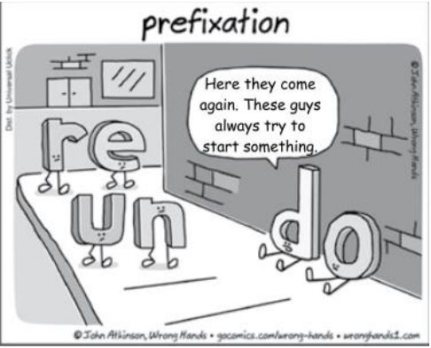

This cartoon can be used as a resource to teach or review the use of prefixes in the English language. You may offer your students the following words and ask them to choose the alternative in which the prefix has the same meaning as “un”. Your students should mark alternative 

A) disappear. 

B) overwork. 

C) deteriorate. 

D) mistreat. 

E) incriminate. 

GABARITO: A 

Comentários: Esta pergunta solicita ao candidato da prova que observe os prefixos em inglês e reflita acerca dos seus diversos sentidos. 

Os prefixos são partículas localizadas antes das palavras para modificar o sentido delas. Eles podem ser de diversas origens, como grega : 

Hemi – metade: hemisphere 

Latina : Extra - além, fora: extraordinary, extravagant 

Inglesa : Un - não: untrue, unkind, unholy 

No caso do prefixo apresentado na questão, un , o seu significado é, conforme o Macmillan Dictionary on-line, o de dar à palavra o seu significado oposto. O mesmo sentido é atribuído ao prefixo dis , presente em palavras como dislike (desgostar) ou em disappear (desaparecer). Portanto, a alternativa correta é a letra A .

---

<!-- pagina: 108 -->

**Andrea Belo Aula 01 - Reading Techniques, Cognates and Idioms** 

#### 37. (FCC/2022 – TJ-CE) 

Before cloud computing came into existence, companies were required to download applications or programs on their physical PCs or on-premises servers to be able to use them. For any organization, building and managing its own IT infrastructure or data centers is a huge challenge. Even for those who own their own data centers, allocating a large number of IT administrators and resources is a struggle. 

The introduction of cloud computing was a paradigm shift in the history of the technology industry. Rather than creating and managing their own IT infrastructure and paying for servers, power and real estate, etc., cloud computing allows businesses to rent computing resources from cloud service providers. This helps businesses avoid paying heavy upfront costs and the complexity of managing their own data centers. By renting cloud services, companies pay only for what they use such as computing resources and disk space. This allows companies to anticipate costs with greater accuracy. 

Since cloud service providers do the heavy lifting of managing and maintaining the IT infrastructure, it saves a lot of time, effort and money for businesses. The cloud also gives organizations the ability to seamlessly upscale or downscale their computing infrastructure as and when needed. Compared to the traditional on-premises data center model, the cloud offers easy access to data from anywhere and on any device with internet connectivity, thereby enabling effective collaboration and enhanced productivity. 

(Adaptado de: MCDERMOTT, Matt. Cloud Computing: Benefits, Disadvantages & Types of Cloud Computing Services. Disponível em: https://www.business2community.com) 

No trecho For any organization, building and managing its own IT infrastructure or data centers is a huge challenge (1º parágrafo), o segmento sublinhado tem sentido equivalente, em português, a 

A) criar e administrar. 

B) construir e distribuir. 

C) local e gerência. 

D) elaborar e gerir. 

E) desenvolvimento e coordenação. 

#### GABARITO: A 

Comentários: A questão requer que você indique qual é o sentido, em português, do segmento sublinhado no trecho "For any organization, building and managing its own IT infrastructure or data centers is a huge challenge". O verbo to build significa " criar/construir ", enquanto to manage equivale a " administrar/gerenciar ". 

Vejamos, agora, o significado do trecho dado e seu contexto:

---

<!-- pagina: 109 -->

**Andrea Belo Aula 01 - Reading Techniques, Cognates and Idioms** 

"For any organization, building and managing its own IT infrastructure or data centers is a huge challenge. Even for those who own their own data centers, allocating a large number of IT administrators and resources is a struggle." 

(Para qualquer organização, criar e administrar sua própria infraestrutura de TI ou data centers é um grande desafio. Mesmo para quem possui seus próprios data centers, alocar um grande número de administradores e recursos de TI é uma luta.) 

Observe que, no trecho, os verbos têm precisamente seu significado literal, indicando a criação/construção e a administração/gerenciamento da infraestrutura de TI pelas próprias empresas. 

Portanto, o gabarito é a alternativa "A", criar e administrar. 

38. (FCC/2022 – TJ-CE) 

Depreende-se do texto que a computação em nuvem 

A) dificulta o acesso a dados armazenados nos servidores de uma organização, na medida em que exige a presença física do usuário. 

B) beneficia os usuários da comunidade acadêmica, apesar de ter sido planejada para a aplicação no universo corporativo. 

C) reduz os custos, uma vez que os usuários só precisam pagar pelo que utilizarem, como, por exemplo, espaço em disco, quando e onde precisarem. 

D) permite que os usuários planejem antecipadamente o que precisarão usar, pois podem reservar com antecedência os recursos necessários. 

E) é um modelo de infraestrutura eficiente, contudo demanda muito esforço, tempo e dinheiro para ser implantado. 

#### GABARITO: C 

Comentários: A questão exigia que o candidato usasse seus conhecimentos e habilidades em compreensão textual. 

É válido sabermos a diferença entre compreensão e interpretação textual. 

> O primeiro caso, compreensão, é a habilidade que se tem para analisar e decodificar o que se está realmente escrito em um texto. 

> Por outro lado, interpretação textual está relacionado às conclusões que podemos chegar ao conectar as ideias do texto com a realidade. 

dificulta o acesso a dados armazenados nos servidores de uma organização, na medida em que exige a presença física do usuário. ERRADO. 

Não há que se falar em dificultar o acesso, mas sim em facilitar . Observe que o texto inicia-se com a informação de que " Antes da computação em nuvem existir, as empresas eram obrigadas a baixar aplicativos ou programas em seus PCs físicos ou servidores locais para poder usá-los." 

Ou seja, com a computação em nuvem não há mais essa necessidade .

---

<!-- pagina: 110 -->

**Andrea Belo Aula 01 - Reading Techniques, Cognates and Idioms** 

Portanto, incorreta a alternativa. 

beneficia os usuários da comunidade acadêmica, apesar de ter sido planejada para a aplicação no universo corporativo. ERRADO. 

O texto foca nos benefícios para o mundo corporativo , não fala sobre a comunidade acadêmica. 

"(...) permite que as empresas aluguem (...) ajuda as empresas a evitar (...) as empresas pagam apenas pelo que usam (...) permite que as empresas antecipem (...)" 

Assim sendo, trata-se de extrapolação . 

Portanto, incorreta a alternativa. 

reduz os custos, uma vez que os usuários só precisam pagar pelo que utilizarem, como, por exemplo, espaço em disco, quando e onde precisarem. CERTO. 

É exatamente isso: as empresas pagam apenas pelo que usam , o que permite uma redução nos <u>custos.</u> 

"Ao alugar serviços em nuvem, as empresas pagam apenas pelo que usam , como recursos de computação e espaço em disco. (...) isso economiza muito tempo, esforço e dinheiro para as empresas." 

Portanto, correta a alternativa. 

permite que os usuários planejem antecipadamente o que precisarão usar, pois podem reservar com antecedência os recursos necessários. ERRADO. 

O texto não fala em “usuários”, mas sim em "empresas". 

A computação em nuvem permite essa escalabilidade para as empresas . 

"Isso permite que as empresas antecipem custos com maior precisão. (...) A nuvem também oferece às organizações a capacidade de aumentar ou diminuir a escala de sua infraestrutura de computação conforme e quando necessário." 

Portanto, incorreta a alternativa. 

é um modelo de infraestrutura eficiente, contudo demanda muito esforço, tempo e dinheiro para ser implantado. ERRADO. 

Na verdade, é exatamente o contrário: a nuvem faz o trabalho pesado de gerenciar e manter a infraestrutura de TI, o que permite uma maior economia de tempo, esforço e dinheiro para as organizações. 

"Como os provedores de serviços em nuvem fazem o trabalho pesado de gerenciar e manter a infraestrutura de TI, isso economiza muito tempo, esforço e dinheiro para as empresas ." 

Portanto, incorreta a alternativa.

---

<!-- pagina: 111 -->

**Andrea Belo Aula 01 - Reading Techniques, Cognates and Idioms** 

#### 39. (FCC/2022 – TJ-CE) 

Considere a ilustração abaixo. 

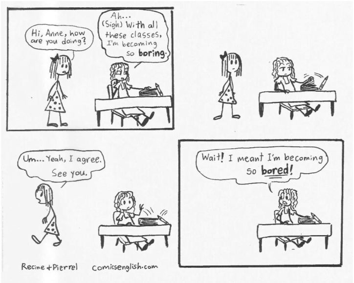

(Adapted from comicsenglish.com ) 

No primeiro quadrinho, “(Sigh)” indica que a personagem Anne está 

A) apreensiva. 

B) entediada. 

C) enraivecida. 

D) esperançosa. 

E) motivada. 

GABARITO: B 

#### Comentários: Esta questão trabalha com interpretação de tirinha e língua inglesa. 

O termo " sigh " advém de uma onomatopeia, reproduzindo o som de um suspiro. Sendo assim, pode se referir à ação de suspirar ou ao próprio substantivo "suspiro". 

Exemplos: 

I sighed with relief. (suspirei em alívio). 

I gave a sigh of relief. (dei um suspiro de alívio). 

Observando o primeiro quadrinho, notamos que a personagem menciona que está se tornando <u>entediante, logo após o emprego do termo "</u> sigh ". 

Sendo assim, a expressão " sigh " indica que a personagem está entediada.

---

<!-- pagina: 112 -->

**Andrea Belo Aula 01 - Reading Techniques, Cognates and Idioms** 

#### 40. (FCC/2022 – TJ-CE) 

BYOD (Bring Your Own Device) refers to the policy of allowing employees to supply their own computing devices for use at work. Employers save money by eliminating hardware purchasing and maintenance overhead, and employees enjoy the freedom of choice to use whichever mobile phone, tablet or laptop that best meets their preferences. 

For example, a user may have a Windows PC for work and a MacBook for a personal laptop. The keyboard shortcuts for each platform are slightly different, making it easy to mangle copy-paste functions in word processors and spreadsheets. Using the same BYOD MacBook for work and personal computing eliminates these switchover errors. 

Even for non-SaaS organizations, user error typically represents a third of all data loss, second only to hardware failure. The reduction in user error gained from BYOD policies is present regardless of whether an employee is creating a document in Google Apps or Microsoft Word. 

There has yet been no rigorous study of the change in rates of user error before and after adopting BYOD policies. Nonetheless, it’s safe to assume that some level of user error is reduced by familiarity and comfort with BYOD devices. 

YOD can’t make your data invulnerable, but combined with good security policies, regular user training and effective data backup, it can make a noticeable difference in the availability and integrity of your company data. 

(Disponível em: https://www.wired.com) 

According to the text, Bring Your Own Device (BYOD) policies: 

A) Benefit organizations with poor security and access policies. 

B) Eliminate the necessity of user training and data backup. 

C) Increase the risk of data loss and hardware malfunction. 

D) Reduce user mistakes caused by using different platforms. 

E) Demand users to create documents in Google Apps. 

GABARITO: D 

Comentários: A questão requer que você indique o que se pode afirmar sobre as políticas do Bring Your Own Device (BYOD), de acordo com o texto. 

Benefit organizations with poor security and access policies. INCORRETA . 

beneficiam organizações com políticas de segurança e acesso precárias. 

Ao contrário disso, o texto aponta, no último parágrafo, que a eficiência do BYOD é notável quando combinada com boas políticas de segurança, e que, sozinho, e ele não consegue transformar seus dados em invulneráveis.

---

<!-- pagina: 113 -->

**Andrea Belo Aula 01 - Reading Techniques, Cognates and Idioms** 

Assim, não se pode dizer que as políticas do BYOD beneficiam empresas com políticas de segurança precárias . Portanto, a alternativa está incorreta . 

Eliminate the necessity of user training and data backup. INCORRETA . 

eliminam a necessidade de treinamento de usuários e backup de dados. 

No último parágrafo do texto temos a informação de que o BYOD faz a diferença na integridade dos dados de uma empresa quando combinado com treinamento regular de usuários e backup de <u>dados.</u> 

Assim, não se pode dizer que o uso do BYOD torna desnecessário o treinamento dos usuários e a realização de backups . Portanto, a alternativa está incorreta . 

Increase the risk of data loss and hardware malfunction. INCORRETA . 

aumentam o risco de perda de dados e de mau funcionamento de hardware. 

Segundo o texto, um terço das perdas de dados ocorre por erro dos usuários. 

No terceiro parágrafo, temos a informação de que o uso do BYOD reduz os erros dos usuários , e, consequentemente, as perdas de dados decorrentes desses erros . Portanto, a alternativa está incorreta . 

Reduce user mistakes caused by using different platforms. CORRETA . 

reduzem os erros dos usuários decorrentes do uso de diferentes plataformas. 

De acordo com o segundo parágrafo do texto, as diferenças presentes na utilização de diferentes plataformas, como o sistema operacional do MacBook e o Windows, <u>são reduzidas pelo uso do BYOD, que elimina esses erros de transição . Perceba que a assertiva traz precisamente essa</u> informação. Portanto, a alternativa está correta . 

Demand users to create documents in Google Apps. INCORRETA . 

requerem que os usuários criem documentos em aplicativos do Google. 

Segundo o texto, a redução de erros promovida pelo uso do BYOD independe da utilização de aplicativos do Google ou do editor de textos Microsoft Word. Assim, não se pode dizer que as <u>políticas do BYOD requerem que o usuário utilize os aplicativos do Google.</u> Portanto, a alternativa está incorreta .

---

<!-- pagina: 114 -->

**Andrea Belo Aula 01 - Reading Techniques, Cognates and Idioms** 

# **FINAIS CONSIDERAÇÕES** 

Outra aula concluída, ufa!!! Mais um passo até a sua aprovação! As técnicas Skimming e Scanning ficaram mais claras em relação ao seu melhor uso.  E os falsos cognatos, analisados com maior cuidado, não é mesmo? 

Continuaremos a estudar os conteúdos de forma minuciosa e prática, com sucesso! 

É importante lembrar de fazer listas de vocabulário das palavras que você achou difíceis a cada aula, em cada exercício ou lista, a fim de reescrevê–las e então, recordá–las nos momentos de pausa entre as aulas. 

Minha sugestão é que você faça a leitura dessas palavras consideradas “novas” para vê–las novamente. Isso te ajudará nas questões em que esses vocábulos reaparecem. Acontece muito com a classe dos verbos, por exemplo. 

A cada lista de exercício resolvida ou mesmo a cada exercício que você faça, perceberá como fica mais fácil identificar um verbo já visto no tempo passado ou particípio. 

É sua conquista de etapas e que tornará você, um candidato mais bem preparado e confiante para realizar uma excelente prova. 

É importante lembrar também do nosso Fórum de dúvidas , exclusivo do Estratégia Concursos . Será minha forma de responder o que mais você precise saber para que os conteúdos fiquem ainda mais claros em seus estudos, certo? 

---

<!-- pagina: 115 -->

**Andrea Belo Aula 01 - Reading Techniques, Cognates and Idioms** 

# **REFERÊNCIAS** 

BARRETO, Tania Pedroza; GARRIDO, Maria Line; SILVA, João Antenor de C., Inglês Instrumental. Leitura e compreensão de textos. Salvador, Ba UFBA, 1995, p. 64. 

BROWN. H. Douglas. Principles of Language Learning and Teaching. Prentice Hall International, 1988. 

COMPEDELLI, Samira Yousseff. Português, Literatura, Produção de texto & Gramática – São Paulo: Ed. Saraiva, 2002. 

COSTEIRA, Adriana Araújo de M. Reading Comprehension Skills. João Pessoa/PB: ETFP, 1998. 

CRYSTAL David. Cambridge University Press 1997. The Cambridge Encyclopedia of Language. Cambridge University Press 1997 

FREEMAN. Diane Larsen. MURCIA. Marianne Celce. The Grammar Book, 1999. 

DYE, Joan., FRANFORT, Nancy. Spectrum II, III A Communicative Course in English. USA, Prentice Hall, 1994. 

FAVERO, Maria de Lourdes Albuquerque (org.). Dicionário de educadores no Brasil: da colônia aos dias atuais. Rio de Janeiro: UFRJ, MEC, INEP, 1999. 

FRANKPORT, Nancy & Dye Hoab. Spectrum II, III Prentice Hall Regents Englewood Cliffs, New Jersy, 1994. 

GADELHA, Isabel Maria B. Inglês Instrumental: Leitura, Conscientização e Prática. Teresina: EDUFFI, 2000. 

GUANDALINI, Eiter Otávio. Técnicas de Leitura em Inglês: ESP – English For Specific Purposes: estágio 1. São Paulo: Texto novo, 2002. 

GRELLET, Françoise. Developing Reading Skills. Cambridge University Press, 1995 

HOLAENDER, Arnon & Sanders Sidney. A complete English Course. São Paulo. Ed. Moderna, 1995. 

HUTCHINSON, Tom & WATERS, Alan. English for Specific Purposes. Cambridge: Cambridge University Press, 1996 

KRASHEN. Stephen D. Second Language Acquisition and Second Language Learning, Prentice–Hall International, 1988. 

LAENG, Mauro. Dicionário de pedagogia. Lisboa: Dom Quixote, 1973. 

LEFFA, Vilson J. Metodologia do ensino de línguas. In: BOHN, H.; VANDRESEN, P.  (org.). Tópicos de linguística aplicada: o ensino de línguas estrangeiras. Florianópolis: Editora da UFSC, 1988. p. 211–231. 

LIBERATO, Wilson. Compact English Book Inglês Ensino Médio. São Paulo: FTD, Vol. Único, 1998 

Mc ARTHUR. The Oxford Companion to the English Language. Oxford University Press 1992 Fromkin. Victoria. An Introduction to Language 

MARQUES, Amadeu. Inglês Série Brasil. ed. Atica. São Paulo: 2004. Vol. Único. 

MURPHY, Raymond: Essencial Grammar in Use Oxford. New York Ed. Oxford University, 1997.

---

<!-- pagina: 116 -->

**Andrea Belo Aula 01 - Reading Techniques, Cognates and Idioms** 

OLIVEIRA, Luciano Amaral. English For Tourism Students. Inglês para Estudantes de Turismo: São Paulo, Rocca, 2001. 

OLIVEIRA, Sara Rejane de F. Estratégias de leitura para Inglês Instrumental. Brasília: UNB, 1994. 

PAULINO, Berenice F. et all. Leitura em textos em Inglês – Uma Abordagem Instrumental. Belo Horizonte: Ed. Dos Autores, 1992. 

PEREIRA, Edilberto Coelho. Inglês Instrumental. Teresina: ETFPI, 1998. 

RODGES, Theodore. Jack C. Richards. Approaches and Methods in Language Teaching. Cambridge University Press, 2001. 

RODMAN Robert. Harcourt Brace 1993. English as a Global Language 

SILVA, João Antenor de C., GARRIDO, Maria Lina, BARRETO, Tânia Pedrosa. Inglês Instrumental: Leitura e Compreensão de Textos. Salvador: Centro Editorial e Didático, UFBA. 1994 

SOARES, Moacir Bretãs. Dicionário de legislação do ensino. 19.ed. Rio de Janeiro: FGV, 1981. 

SOUZA, Adriana Srade F. Leitura em Língua Inglesa: Uma abordagem Instrumental. São Paulo: Disal, 2005. 

TUCK, Michael. Oxford Dictionary of Computing for Learners of English. Oxford: Oxford University Press, 1996. 

TOTIS, Verônica Pakrauskas. Língua Inglesa: leitura. São Paulo: Cortez, 1991. 

Livros eletrônicos: 

Dicionário Houaiss da Língua Portuguesa, Editora Objetiva, 2001. 

MOURãO, Janaína Pereira. "Skimming x Scanning"; Brasil Escola. Disponível em 

<https://brasilescola.uol.com.br/ingles/skimming–x–scanning.htm>. Acesso em 20 de março de 2019. 

www.newsweek.com – Acesso em 18 de março de 2019. 

http://www.galaor.com.br/tecnicas–de–leitura/ – Acesso em 19 de março de 2019. 

Expressões Idiomáticas (continuação)" em Só Língua Inglesa. Virtuous Tecnologia da Informação,2008– 2019. Consultado em 03/04/2019 às 22:09. Disponível na Internet em 

http://www.solinguainglesa.com.br/conteudo/Expressoes5.php

---

<!-- pagina: 117 -->

