---
fonte_pdf: "Inglês - Aula 02.pdf"
paginas: 179
conversao: texto-e-imagens
---

<!-- pagina: 2 -->

**Andrea Belo Aula 02 - Verbs in texts** 

### **SUMÁRIO** 

|INTRODUÇÃO-----------------------------------------------------------------------|----------------------------------------- 2|
|---|---|
|VERBO TO BE------------------------------------------------------------------------|----------------------------------------- 3|
|SIMPLE PRESENT---------------------------------------------------------------------|----------------------------------------- 5|
|SIMPLE PAST-------------------------------------------------------------------------|----------------------------------------- 7|
|FUTURE: WILL X GOING TO------------------------------------------------------|--------------------------------------- 10|
|GERUND------------------------------------------------------------------------------|--------------------------------------- 13|
|PRESENT CONTINUOUS-----------------------------------------------------------|--------------------------------------- 15|
|PAST CONTINUOUS----------------------------------------------------------------|--------------------------------------- 16|
|PRESENT PERFECT-------------------------------------------------------------------|--------------------------------------- 17|
|PAST PERFECT-----------------------------------------------------------------------|--------------------------------------- 19|
|FUTURE PERFECT--------------------------------------------------------------------|--------------------------------------- 21|
|PRESENT PERFECT CONTINUOUS------------------------------------------------|--------------------------------------- 23|
|PAST PERFECT CONTINUOUS-----------------------------------------------------|--------------------------------------- 25|
|FUTURE PERFECT CONTINUOUS--------------------------------------------------|--------------------------------------- 27|
|MODAL VERBS----------------------------------------------------------------------|--------------------------------------- 29|
|VERBO MODAL CAN------------------------------------------------------------|--------------------------------------- 29|
|VERBO MODAL COULD---------------------------------------------------------|--------------------------------------- 29|
|VERBO MODAL MAY------------------------------------------------------------|--------------------------------------- 30|
|VERBO MODAL MIGHT---------------------------------------------------------|--------------------------------------- 30|
|VERBO MODAL MUST-----------------------------------------------------------|--------------------------------------- 31|
|VERBOS MODAIS SHOULD/OUGHT TO-------------------------------------|--------------------------------------- 31|
|VERBO MODAL SHALL----------------------------------------------------------|--------------------------------------- 32|
|VERBOS MODAIS WILL E WOULD--------------------------------------------|--------------------------------------- 32|
|IMPERATIVE TENSE------------------------------------------------------------------|--------------------------------------- 33|
|PHRASAL VERBS---------------------------------------------------------------------|--------------------------------------- 35|
|QUESTÕES---------------------------------------------------------------------------|--------------------------------------- 61|
|GABARITO---------------------------------------------------------------------------|--------------------------------------- 98|
|QUESTÕES COMENTADAS--------------------------------------------------------|--------------------------------------- 99|
|CONSIDERAÇÕES FINAIS----------------------------------------------------------|-------------------------------------- 175|
|REFERÊNCIAS------------------------------------------------------------------------|-------------------------------------- 176|

---

<!-- pagina: 3 -->

**Andrea Belo Aula 02 - Verbs in texts** 

# **INTRODUÇÃO** 

Chegou a vez da nossa aula de verbos , uma das mais importantes de todo o material. 

Se você identifica o verbo e consegue entendê-lo no contexto em que ele aparece, os resultados são garantidos. E isso é muito importante. As interpretações são essenciais, é claro. 

O vocabulário também. Mas os verbos são a “alma” da frase, eles apresentam as ideias do texto e nos levam ao assunto, ao tema, ao que de fato se tratam os textos. Vamos estudá-los! 

Verbo é a classe de palavras que exprime ação, que indicam acontecimentos representados em um determinado tempo. Originada do latim, “verbum” significa, de fato, “palavra”. 

Muitas pessoas acreditam que aprender as conjugações dos verbos seja complicado. Mas não é. Em primeiro lugar, os verbos são essenciais para ajudar na interpretação. 

Quanto mais enraizadas são as regras verbais, mais naturalmente você as usará no dia da prova, extraindo os verbos dos textos e demarcando-os, para realizar uma leitura global do texto em questão, encontrando as respostas procuradas. 

E, saber os verbos, ajudará você a extrapolar o uso da língua inglesa na hora da prova, além de aumentar a possibilidade de aplicá-los nos contextos exigidos nos exercícios. 

Isso porque, ao testar o seu raciocínio e a sua capacidade de compreender textos em inglês, os verbos e suas devidas conjugações, em cada tempo verbal, economizam seu tempo e direcionam a sua atenção ao que deve ser respondido. 

Uma dica interessante é reconhecer o verbo assim que você ler cada frase do texto, seja qual for a forma que a leitura for apresentada. 

O verbo vem logo após o sujeito, que executa a ação. Por exemplo, se a frase é “The doctors work at the hospital.”, quem realiza a ação são os médicos (doctors) e a ação realizada é trabalhar (work), que é o nosso verbo. Certo? 

Eis que estamos diante de uma classe de palavras que favorece você a construir seus pensamentos: os verbos, por excelência! 

Ao analisá-los, devido à importância que eles têm, estudaremos exemplos juntos, com suas peculiaridades e diferentes flexões, ampliando sua competência linguística e fazer bom uso do aprendizado em sua prova. 

Vamos, então, passar por todos os tempos verbais, esclarecendo dúvidas e lembrando que, alguns tempos verbais são poucos explorados nas provas, mas, vamos “passar por eles” para que o conteúdo fique completo, por inteiro, todos os tempos verbais, desde o famoso verbo to be até estruturas mais complexas, como Present Perfect e os temidos Phrasal Verbs. Let’s go!

---

<!-- pagina: 4 -->

**Andrea Belo Aula 02 - Verbs in texts** 

# **VERBO TO BE** 

O verbo to be é aquele assunto que as pessoas definem como algo que se estuda a vida inteira e ainda assim não sabe ao certo como se usa. É um verbo ensinado todas as vezes que se inicia um curso de Inglês e, por esse motivo, muita gente considera “chato” estudar Inglês para iniciantes. 

O verbo to be tem sua importância e vou deixar claro como se usa e o porquê dessa importância. To be significa “ser” ou “estar”. Não existe uma regra para saber se, na frase, é ser ou estar, depende do contexto e a ideia sobre o que se refere. 

Gosto de dizer que o to be não é um verbo difícil e sim exclusivo, já que pode ser usado em diferentes frases, tanto como verbo principal quanto como verbo auxiliar. 

O que diferencia o to be dos demais verbos da língua inglesa, é que em todos os outros, utilizamos a raiz para fazer frases, o to be muda por inteiro. 

Veja: verbo “jogar” (to play): I play, You play (Eu jogo, Você joga) ou o verbo “dançar” (to dance) I dance, You dance, They dance (Eu danço, Você dança, Eles dançam) enquanto o verbo “ser” (Eu sou, Ele é, Eles são) fica: I am, He is, They are, sem ao menos usar as letras “be” para iniciar as conjugações. 

Você não vai dizer “I be, You be, We be”, como na maioria nos outros verbos, 99% deles são conjugados através da raiz do radical. 


Usado como verbo ser, as frases geralmente usam adjetivos (Eu sou alto/baixo – I am tal/short) ou para dizer a profissão (Ele é engenheiro – He is an engineer) entre outros exemplos. 

O verbo to be como “estar” expressará sentidos de ação ou de se estar em algum lugar – I am happy. She is in the supermarket – Eu estou feliz. Ela está no supermercado. 

Em todos os tempos verbais que você vai estudar aqui, terá a explicação, seguida das formas afirmativa, negativa e interrogativa, para que você compreenda melhor o uso dos verbos. 

Nas frases afirmativas, o verbo to be é simples, conforme estudamos e, muitas vezes, somos obrigados a decorá-los (I am, you are, he is, she is, it is, you are, we are, they are) . 

O motivo pelo qual you are se repete é que as palavras “você” e “vocês”, em inglês, são iguais: you. Assim, na conjugação, you are significa você é/você está e vocês são/vocês estão dependendo do contexto. 

Na forma interrogativa em inglês, o verbo to be se posiciona no início da frase, antes do sujeito. A conjugação fica: Am I? Are you? Is he? Is she? Is it? Are you? Are we? Are they? 

Na forma negativa, com a adição da partícula de negação “not” nos verbos, a conjugação fica: I am not, you are not, he is not, she is not, it is not, you are not, we are not, they are not . Se esses verbos aparecerem na forma abreviada, encontramos I’m not, you aren’t, he isn’t, she isn’t, it isn’t, you aren’t, we aren’t, they aren’t . E há as formas no tempo passado do verbo to be .

---

<!-- pagina: 5 -->

**Andrea Belo Aula 02 - Verbs in texts** 

Preparei um esquema para resumir as três formas do TO BE no presente e no passado – afirmativa, interrogativa e negativa – e, além do verbo to be, teremos os esquemas de todos os tempos verbais que vamos estudar em cada capítulo de sua aula. Ficará melhor para você visualizar e saber ler e encontrar os verbos em suas leituras. Vejamos o to be: 

|AFFIRMATIVE|NEGATIVE|INTERROGATIVE|
|---|---|---|
|I am ou I'm|I am not ou I'm not|Am I?|
|You are ou You're|You are not ou You aren't|Are You?|
|He is ou He's|He is not ou He isn't|Is He?|
|She is ou She's|She is not ou She isn't|Is She?|
|It is ou It's|It is not ou It isn't|Is It?|
|You are ou You're|You are not ou You aren't|Are You?|
|We are ou We're|We are not ou We aren't|Are We?|
|Theyare ou They're|Theyare not ou Theyaren't|Are They?|


Agora, o esquema no passado (Verb to be in the Past), assim como no presente, vejamos: 

|AFFIRMATIVE|NEGATIVE|INTERROGATIVE|
|---|---|---|
|I was|I was not ou I wasn't|Was I?|
|You were|You were not ou You weren't|Wereyou?|
|He was|He was not ou He wasn't|Was he?|
|She was|She was not ou She wasn't|Was she?|
|It was|It was not ou It wasn't|Was it?|
|You were|You were not ou You weren't|Wereyou?|
|We were|We were not ou We weren't|Were we?|
|Theywere|Theywere not ou Theyweren't|Were they?|


Para ler, interpretar e encontrar as respostas corretas, é necessário que você saiba, além do verbo to be, todo o conteúdo que vamos explorar no cronograma de estudos em nosso material. Cada aula será um complemento para a próxima. 

E você também precisa estar atento às notícias do Brasil e do mundo, ler jornais, revistas, estar com seus estudos em dia e de forma constante. Sempre digo que, ler textos das fontes usadas pela banca na hora de preparar as provas é um dos exercícios importantes a se fazer. 

Uma vez preparado para interpretar a questão completa, você pode realizar as provas de qualquer instituição e se sair bem. Agora, vamos estudar o tempo Present Simple e todos os outros tempos verbais necessários para resolver sua prova com mérito, contextualizando gramática e vocabulário. Come on!

---

<!-- pagina: 6 -->

**Andrea Belo Aula 02 - Verbs in texts** 

# **SIMPLE PRESENT** 

Em inglês, o Simple Present , tempo verbal Presente Simples, pode ser usado para expressar uma ação habitual, aquilo que fazemos com frequência, por exemplo: I study every day. (Eu estudo todos os dias.), I sometimes watch TV. (Eu assisto TV às vezes.), I often use the computer. (Eu uso o computador com frequência.) etc. 

Usamos o Present Simple também para exprimir verdades, fatos imutáveis: Birds sing. (Pássaros cantam), Babies need their moms. (Bebês precisam de suas mães) etc. 

Usamos esse tempo também para informar situações, opiniões, fatos em geral: Technology grows day by day. (A tecnologia cresce dia após dia.), I love music. (Eu amo música) etc. 

Temos que fazer um esclarecimento para facilitar o estudo de todos os tempos verbais. 

Você sabe por que, ao se falar do verbo que será usado em uma frase, tem a preposição “to” antes dele? Por exemplo, o sujeito I + o verbo to study + o complemento very much , formam a frase “I study very Much." (Eu estudo muito.), mas o “to” não aparece na frase. 

Isso porque, o verbo em sua forma original, no infinitivo, ou seja, sem conjugação, está acompanhado da preposição “to” enquanto em uma frase, o verbo é conjugado e não usamos mais o “to” antes dele. 

Se você procurar no dicionário os verbos “ler”, “escrever” e “trabalhar”, encontrará: “ <u>to</u> read”, “ <u>to</u> write” e “ <u>to</u> work”. Mas, ao escrever as frases “Eu leio”, “Eu escrevo” e “Eu trabalho” fica: “I read”, “I write” e “I work”. 

Temos três formas em todos os tempos verbais: afirmativa , negativa e interrogativa . Há dois auxiliares que acompanham as frases interrogativas no presente: Do e Does . 

Por exemplo, ao dizer “Você trabalha? ou “Ela trabalha?” em português, apenas colocamos o ponto de interrogação no fim da frase. 

Na forma interrogativa em inglês, precisamos adicionar “Do” no início da pergunta – “Do you work?” (Você trabalha?) e, para sujeitos no singular, classificados como terceira pessoa do singular (He/She/It), usamos “Does” – “Does she work?” (Ela trabalha?), demonstrando que as orações estão no tempo presente. 

Na forma negativa , com a adição da partícula de negação “not” nos auxiliares, eles se tornam do not/don’t e does not/doesn’t , formas abreviadas ou não – “I don’t work.” (Eu não trabalho), “She does not work.” ou “She doesn’t work.” (Ela não trabalha), “He does not work.” / “He doesn’t work.” (Ele não trabalha). 

Dificilmente você encontra a explicação da existência desses auxiliares. Vou esclarecer e justificar para você. É simples. 

Primeiro, os verbos em inglês não têm terminações como em português – Eu estud <u>o , Tu</u> estud <u>as , Ele estud a , Nós estud amos</u> , Vós estud <u>ais , Eles estud am</u> – sendo apenas “study” para

---

<!-- pagina: 7 -->

**Andrea Belo Aula 02 - Verbs in texts** 

todos os sujeitos e acréscimo de -s <u>,</u> -es ou -ies para terceiras pessoas – I study, You study, She/He/It stud <u>ies , We study, They study.</u> 

Segundo, se em português dizemos “Ela estuda” e “Ela estuda?” igual, mudando apenas a entonação, como saberíamos o tempo da frase se não fosse demarcada pelos auxiliares “Do” e “Does”? – “ <u>Do</u> you study <u>?</u> ” e “ <u>Does</u> she study <u>?</u> ” Faz sentido, não é mesmo? 

E, nas negativas, enquanto em português temos a presença do “não” em todas as frases – Eu não trabalho, você não trabalha, ela não trabalha etc., tanto para presente quanto no passado ou futuro, veja: “Eu <u>não</u> trabalhei”, “Você <u>não</u> trabalhou”, “Ele <u>não</u> trabalhará” etc. – como saberíamos o tempo se não houvesse os auxiliares “don’t” e “doesn’t” demonstrando presente? – “Do you work?” e “Does she work?” Entendeu? Got it? 

As frases afirmativas são formadas por um sujeito , um verbo principal e o complemento , que pode ser onde, quando aconteceu, com quem, porque ou qualquer outra informação que alguém executou. Lembrando que, ao ser conjugado nas terceiras pessoas do singular (He/She/It), precisamos acrescentar “-s”, “-es” ou “-ies”. Exemplos: “I run.” / “She runs.” (Eu corro. / Ela corre.) 

As frases interrogativas são formadas por um auxiliar (“Do” para sujeito no plural ou “Does” para sujeito no singular) no início da frase, um sujeito , um verbo principal e o complemento (onde, quando aconteceu, com quem, porque ou qualquer outra informação), exemplos: “Do you run?”, “Does he run?” (Você corre? Ele corre?) 

As frases negativas são formadas por um sujeito , auxiliar “don’t” ou “doesn’t”, um verbo principal e o complemento (onde, quando aconteceu, com quem, porque ou qualquer outra informação). Exemplos: “I don’t run.” / “She doesn’t run.” (Eu não corro. / Ela não corre.) 

Vejamos, como exemplo, o verbo “estudar” – TO STUDY, conjugado em todas as pessoas do singular e plural nas três formas – afirmativa, negativa e interrogativa no Present Simple : 

|AFFIRMATIVE|NEGATIVE|INTERROGATIVE|
|---|---|---|
|I study|I do not studyou I don't study|Do I study?|
|You study|You do not studyou You don't study|Do You study?|
|He studies|He does not studyou He doesn't study|Does He study?|
|She studies|She does not studyou She doesn't study|Does She study?|
|It studies|It does not studyou It doesn't study|Does It study?|
|You study|You do not studyou You don't study|Do You study?|
|We study|We do not studyou We don't study|Do We study?|
|Theystudy|Theydo not studyou Theydon't study|Do Theystudy?|


Agora, vamos aos estudos do tempo Past Simple e suas particularidades.

---

<!-- pagina: 8 -->

**Andrea Belo Aula 02 - Verbs in texts** 

# **SIMPLE PAST** 

Em inglês, o Simple Past , tempo verbal Passado Simples, é usado para demonstrar uma ação que já aconteceu e ficou no passado, tal como um jogo que acabou, um evento que passou ou alguém que chegou, por exemplo. 

Por isso, as frases no passado simples são geralmente acompanhadas de uma expressão de tempo definida como “yesterday", que significa “ontem” – “I worked Yesterday.” (Eu trabalhei ontem.) 

Para narrar ações que já ocorreram, além de “Yesterday”, outras expressões mais comuns que indicam o passado são “last”: last night (noite passada), last Sunday (domingo passado), last week (semana passada). Outro termo é o “ago”: two years ago (dois anos atrás), ten minutes ago (dez minutos atrás) etc. 

É importante salientar que, a palavra “atrás” é usada no tempo passado demonstrando justamente o tempo. Se fosse a preposição “atrás”, apontando o lugar seria “behind” – “He is behind me.” (Ele está atrás de mim), ok? 

Estudaremos sobre isso na aula de preposições. 

Temos também as três formas, como nos demais tempos verbais: afirmativa , negativa e interrogativa . 

Há apenas um auxiliar que acompanha as frases interrogativas e negativas: did/didn’t . 

Por exemplo, ao dizer “Você trabalhou?”, adicionamos o “Did” no início da pergunta: “Did you work?”, para qualquer sujeito. 

E usamos, em frases negativas : did not/didn’t , forma abreviada ou não – “I didn’t work.” (Eu não trabalhei.), “She did not work.” ou “She didn’t work.” (Ela não trabalhou.) etc. 

Perceba que o verbo volta à sua forma original “work” tanto na forma interrogativa quanto negativa e, só apresenta terminações ou diferenças em sua escrita na forma afirmativa. 

A explicação da existência do auxiliar “did” também não é justificada e sim vista como obrigatória no tempo passado. 

Mas, assim como no presente, os verbos em inglês não têm terminações como em português: Eu trabalh <u>ei , Tu trabalh ou , Ele trabalh ou , Nós trabalh amos</u> , Vós trabalh <u>astes , Eles</u> trabalh <u>aram</u> – sendo apenas “worked” para todos os sujeitos e acréscimo de -ed, para qualquer sujeito quando o verbo for regular: I work ed , You work ed , He/She/It work ed , We work ed , They work ed . 

Explicarei, em seguida, o que acontece quando os verbos são irregulares. Felizmente, são minoria e isso colabora com seus estudos. 

Verbos regulares são aqueles em que cujas terminações no tempo Past Simple apenas sofrem o acréscimo das partículas “-d” e “-ed” na maioria dos verbos – “She danced rock.” (Ela dançou rock. – verbo “to dance” = dançar).

---

<!-- pagina: 9 -->

**Andrea Belo Aula 02 - Verbs in texts** 

Se o verbo terminar em vogal + a letra “y” , recebem “-ed”: “He played baseball.” (Ele jogou beisebol). 

Mas, se terminar em consoante + a letra “y” , troca-se o “y” por “-ied”: “She cried yesterday.” (Ela chorou ontem. – verbo “to cry” = chorar). 

Caso o verbo termine com a sequência consoante/vogal/consoante , se dobra a última consoante e acrescenta “-ed”: “I preferred the blue pen.” (Eu preferi a caneta azul. – verbo “to prefer” = preferir). 

Se o verbo terminar com a vogal “e” , simplesmente recebe “-d”: “He arrived yesterday.” (Ele chegou ontem. – verbo “to arrive” = chegar). 

Verbos irregulares são aqueles em que as conjugações no tempo Past Simple sofrem diversas alterações, como mudança das letras (por exemplo, o verbo “to write” – escrever – se torna “wrote”), acréscimo de letras (por exemplo o verbo “to hear” – ouvir – se transforma em “heard”), entre outras modificações que acontecem. 

Alguns verbos mudam completamente , como é o caso do verbo “to buy” – comprar – se transforma em “bought” e o verbo “to be” – ser/estar – que se transforma em “was/were” para singular e plural. 

Por causa dessas transformações nos verbos irregulares, muitas pessoas acreditam que eles sejam difíceis ou complicados. E, na verdade, não há nada de complicado nisso. 

Com o uso dos verbos irregulares nos exercícios diversos, eles vão se tornando familiares para você. 

E não podemos esquecer que a quantidade de verbos irregulares é bem menor que os regulares. Como eu já havia dito antes, 90% são os mais fáceis, com “-ed” acrescido no final deles. 

Os verbos diferentes que passam por diversificações, além de ser apenas 10% da língua inglesa, se repetem nos exercícios de provas de anos anteriores. E, quanto mais questões você resolver e se dedicar aos estudos com leituras complementares e muito esforço, passará a conhecê-los e se sentirá confiante com o passar do tempo. 

Vejamos exemplos do verbo TO STUDY e TO DRIVE, conjugados nas três formas – afirmativa, negativa e interrogativa no tempo Past Simple : 

|AFFIRMATIVE|NEGATIVE|INTERROGATIVE|
|---|---|---|
|I studied|I did not studyou I didn't study|Did I study?|
|You studied|You did not studyou You didn't study|Did You study?|
|He studied|He did not studyou He didn't study|Did He study?|
|She studied|She did not studyou She didn't study|Did She study?|
|It studied|It did not studyou It didn't study|Did It study?|
|You studied|You did not studyou You didn't study|Did You study?|
|We studied|We did not studyou We didn't study|Did We study?|
|Theystudied|Theydid not studyou Theydidn't study|Did Theystudy?|

---

<!-- pagina: 10 -->

**Andrea Belo Aula 02 - Verbs in texts** 

|AFFIRMATIVE|NEGATIVE|INTERROGATIVE|
|---|---|---|
|I drove|I did not drive ou I didn't drive|Did I drive?|
|You drove|You did not drive ou You didn't drive|Did You drive?|
|He drove|He did not drive ou He didn't drive|Did He drive?|
|She drove|She did not drive ou She didn't drive|Did She drive?|
|It drove|It did not drive ou It didn't drive|Did It drive?|
|You drove|You did not drive ou You didn't drive|Did You drive?|
|We drove|We did not drive ou We didn't drive|Did We drive?|
|Theydrove|Theydid not drive ou Theydidn't drive|Did Theydrive?|


O esquema ajuda a compreender melhor e memorizar cada estrutura, os auxiliares e, consequentemente, lembrar das formas afirmativas, negativas e interrogativas quando aparecer nas frases dos textos no dia da prova. 

Vamos testar seus conhecimentos de tempo futuro agora. Let’s go!

---

<!-- pagina: 11 -->

**Andrea Belo Aula 02 - Verbs in texts** 

# **FUTURE: WILL X GOING TO** 

Quando se fala no tempo futuro, em inglês, muitas pessoas dizem: futuro é “will” ou então “going to”. E as perguntas sobre a diferença entre “will” e “going to” são frequentes. 

As gramáticas, de uma forma geral, conseguem, incrivelmente, complicar estruturas tão simples! Vamos simplificar e entender como pode ser simples, de fato. 

Portanto, você vai aprender o uso de “will” e “going to” de um modo prático para acertar as questões que envolvem o tempo futuro conectado com um vasto vocabulário e, com certeza, outros tempos verbais, que estão sendo aprendidos aos poucos. 

As frases com o auxiliar “will” são imediatas pois, colocando-se “will” antes do verbo, pronto – transformou a ideia de presente em futuro, veja: “I will work.” (Eu trabalharei.), “She will dance.” (Ela dançará.), “They will study.” (Eles estudarão.). 

Mas, se comparado ao “going to”, a dúvida é como usar um outro no tempo futuro em inglês. Vamos esclarecer isso. 

<u>Usamos</u> “will” quando vamos expressar algo no futuro indicando uma certa incerteza e, muitas vezes, as frases em que o “will” é bem aplicado, encontramos algumas expressões comuns no tempo futuro, tais como I think (eu acho que…), probably (provavelmente), I guess (eu acho) maybe (talvez). 

Há outras, mas com essas são mais comuns em frases indicativas de futuro nas provas. Vejamos exemplos com “will” e as expressões expostas acima. 

Para ficar claro, vamos citar exemplos tais como “Eu provavelmente viajarei em dezembro” – I will probably travel in December. 

Outro exemplo: “Ela talvez viaje nas férias” – She will maybe travel on vacation. Se você tem quase certeza do que vai fazer, se já planejou algo – não é uma regra seguida 100% das vezes – mas é melhor usar o “going to”, como na frase “Planejei a viagem, vou no próximo sábado.” – I planned the trip. I am going next Saturday. 

As frases afirmativas são formadas por um sujeito, o auxiliar will, um verbo principal e o complemento – “Ela vai dançar amanhã cedo” – She will dance tomorrow in the morning. 

As frases interrogativas são formadas pelo auxiliar will no início da frase, um sujeito, um verbo principal e o complemento (onde, quando aconteceu, com quem, porque ou qualquer outra informação), exemplos: Will you run? Will he run? (Você vai correr? Ele vai correr?) 

As frases negativas são formadas por um sujeito, auxiliar will not ou abreviado won’t, um verbo principal e o complemento (onde, quando aconteceu, com quem, porque ou qualquer outra informação), exemplos: I won’t run. She won’t run. (Eu não correrei. Ela não correrá.) 

Vejamos exemplos do verbo TO STUDY, conjugado no futuro simples com <u>WILL</u> no “esquema” em todas as formas – afirmativa, negativa e interrogativa para fixar melhor.

---

<!-- pagina: 12 -->

**Andrea Belo Aula 02 - Verbs in texts** 

|AFFIRMATIVE|NEGATIVE|INTERROGATIVE|
|---|---|---|
|I will study|I will not studyou I won't study|Will I?|
|You will study|You will not studyou You won't study|Will You?|
|He will study|He will not studyou He won't study|Will He?|
|She will study|She will not studyou She won't study|Will She?|
|It will study|It will not studyou It won't study|Will It?|
|You will study|You will not studyou You won't study|Will You?|
|We will study|We will not studyou We won't study|Will We?|
|Theywill study|Theywill not studyou Theywon't study|Will They?|


Por sua vez, o going to é usado para expressar algo no futuro indicando uma certeza, planos fixos, já definidos, por exemplo: I’m going to marry in 2021 – Eu vou me casar em 2021. 

Nessa frase, a pessoa afirmou que vai se casar no ano de 2021 porque certamente já planejou o casamento, marcou a data no cartório, preparou-se financeiramente para a festa e outros elementos necessários para esse evento. 

<u>Quando fazemos uma previsão como um palpite, também é aconselhado o uso do going to, por exemplo: It’s going to be an excellent year for me – Vai ser um excelente ano para mim.</u> 

As frases afirmativas são formadas por um sujeito, o verbo to be como auxiliar de cada sujeito (I am, you are, he is, she is, it is, we are, they are), o verbo principal e o complemento – “She is going to dance tomorrow. It is the Christmas school presentation. Ela vai dançar amanhã. É a apresentação natalina na escola.” 

Percebemos que a pessoa que vai se apresentar foi ou está sendo preparada para o evento que vai acontecer, houve um planejamento e, apresentações natalinas, acontecem todos os anos nas escolas, algo que se realiza nas escolas no mês de dezembro. 

Nas frases interrogativas, o verbo to be vai para a começo da pergunta. 

Em seguida, temos um sujeito, o verbo principal e o complemento – Is she going to dance at Christmas school presentation tomorrow? Ela vai dançar na apresentação natalina da escola amanhã? 

Desta forma, a pergunta provavelmente foi feita com a certeza da resposta que sim, apenas para confirmar por causa do uso do going to. 

As frases negativas são formadas por um sujeito, o verbo to be seguido do not, o verbo principal e o complemento – “She is not going to dance tomorrow/ She isn’t going to dance tomorrow. They are not going to travel – Eles não vão viajar. Assim, as formas abreviadas são: is not = isn’t (para terceiras pessoas do singular) e are not = aren’t (para plural em geral). 

Vejamos exemplos do verbo TO STUDY, conjugado no futuro com GOING TO, em forma de “esquema” em todas as formas – afirmativa, negativa e interrogativa para você fixar melhor.

---

<!-- pagina: 13 -->

**Andrea Belo Aula 02 - Verbs in texts** 

|AFFIRMATIVE|NEGATIVE|INTERROGATIVE|
|---|---|---|
|I am going to study|I am not going to study ou I'm not going to study|Am I going to study?|
|You are going to study|You are not going to study ou You aren't going to study|Are you going to study?|
|He is going to study|He is not going to study ou He isn't going to study|Is he going to study?|
|She is going to study|She is not going to study ou She isn't going to study|Is she going to study?|
|It is going to study|It is not going to study ou It isn't going to study|Is it going to study?|
|You are going to study|You are not going to study ou You aren't going to study|Are you going to study?|
|We are going to study|We are not going to study ou We aren't going to study|Are we going to study?|
|They are going to study|They are not going to study ou They aren't going to study|Are they going to study?|


Agora, estudaremos o gerúndio em nossa aula. Esse tempo verbal é muito importante na construção de outras estruturas em que são necessários, tais como o gerúndio nos tempos da vertente Continuous (Present e Past Continuous). Let’s go!

---

<!-- pagina: 14 -->

**Andrea Belo Aula 02 - Verbs in texts** 

# **GERUND** 

Em inglês, o gerúndio é um pouco diferente do que conhecemos em Português. Faz parte de estruturas em que agregamos a partícula -ing no fim dos verbos. Porém, com algumas exceções que trataremos aqui. 

Gerúndio, de um modo geral, pode ser definido com algo que transmite a ideia de ações prolongadas ou ações ainda em desenvolvimento. 

O gerúndio pode, por exemplo, transformar o verbo em substantivo, pode atuar como sujeito, como predicado, e, na maioria das vezes, é usado para complementar verbos. 

O gerúndio foi inserido nesse capítulo antes dos demais tempos verbais justamente porque agora estudaremos o Present e o Past Continuous, cujas estruturas utilizam o gerúndio, além do verbo to be, já estudado em nosso material. 

Vejamos algumas regras ortográficas que precisam ser observadas ao acrescentar -ing aos verbos. O gerúndio será sempre utilizado após preposições, por exemplo: 

“I have chances of b eing promoted in this company” (Eu tenho chances de ser promovido nessa empresa). 

Outro exemplo: Margareth has her reasons <u>for</u> behav ing different - Margareth tem seus motivos para comportar-se diferente. 

Também usamos o gerúndio os verbos to go – ir e to come – vir, quando fizerem referência à ‘atividades físicas’, tais como: 

– go fishing, go bowling, go swimming, go skiing, go riding, go jogging, go shopping, go hiking, go boating 

Veja perguntas: “I go swimm ing every Saturday “(Eu nado todos os sábados), “Will you come fish ing with me?” (Você virá pescar comigo?) e I don’t want to go bowl ing tonight (Eu não quero ir ao boliche essa noite, por exemplo. 

A palavra swimming, no exemplo acima, se refere ao verbo nadar e significa, de fato, nadar. Mas, há também os casos em que os verbos com –ing no final, serão substantivos. 

Por exemplo: Swimming helps me to relax (Nadar me ajuda a relaxar, como se fosse a natação, o ato de nadar) e Reading is very important to the students (Ler é muito importante para os alunos, como se fossem as leituras, o ato de ler importante). 

As palavras nos exemplos com -ing, na verdade, tornaram-se sujeitos e não verbos. Há casos em que os verbos, necessitam -ing quando há duas ações, ou seja, dois verbos em uma só frase. 

São esses os exemplos: “To admit, to avoid, to appreciate, to consider, to continue, to delay, to detest, to deny, to dislike, to enjoy, to escape, to finish, to forgive, to imagine, to include, to keep, to mention, to miss, to practice, to recommend, to resist, to risk, to suggest, to try, to understand e to quit.”

---

<!-- pagina: 15 -->

**Andrea Belo Aula 02 - Verbs in texts** 

Esses verbos, quando inseridos em frases, necessitam que o segundo verbo, logo após deles, tenham o acréscimo de -ing. 

Com exercícios e muita prática em seus estudos, isso ficará fácil e natural para você. 

Veja alguns exemplos: I admit getting angry sometimes (Eu admito que fico nervoso às vezes), I enjoy studying English (Eu gosto de estudar inglês) e They deny doing that (Eles negam que fizeram aquilo). 

Existe uma regra em que os verbos terminados pela letra “e”, perdem o “e”, ao usar -ing. São exemplos os verbos to drive (dirigir) e to save (economizar), She is driving now (Ela está dirigindo agora) e He is saving money for his future (Ele está economizando dinheiro para o seu futuro). 

Após algumas expressões em inglês, precisamos usar o -ing como regra também. São elas: “can’t stand, it’s worth, be used to, can’t help, feel like, it’s no good, look forward to, what about, <u>how about, it’s no use, in spite of.”</u> 

Vejamos exemplos: “I can’t help laughing now” (Não consigo não rir agora), “I can’t stand explaining you something thousands of times” (Não aguento explicar a você a mesma coisa mil vezes) e “It’s worth visiting that museum” (Vale a pena visitar aquele museu). 

Vejamos exemplos de alguns verbos, em forma de “esquema” no Gerúndio, conforme as regras e exemplos de como melhor usar, de acordo com a teoria e explicações estudadas. 

||GERUND<br>||
|---|---|---|
|Acrescenta-se –ING, retirando<br>a letra “e” do final dos verbos|Acrescenta-se –ING após preposições<br>THE STUDENTS HAVE NO REASONS|Acrescenta-se –ING para atividades<br>físicas|
|TAKE – TAKING|FOR WORRYINGABOUT THE TESTS.|GO SWIMMING|
|DANCE – DANCING|Os alunos não têm motivos para|GO FISHING|
|LOVE – LOVING|preocupar-se com as provas.|GO RIDINGA BIKE|
|entre outros||entre outros|
|Acrescenta-se –ING para<br>verbos na função de sujeito|Acrescenta-se –ING para frases com<br>dois verbos|Acrescenta-se –ING após expressões<br>fixas|
|SWIMMINGIS HEALTHY.<br>Natação é saudável.|THE DOCTORSLIKEDOPERATING<br>THE PATIENT IN THAT HOSPITAL.<br>Os médicos gostaram de operar o<br>paciente naquele hospital.|I FEEL LIKE READING.<br>Estou a fim de ler.|


Agora, estudaremos os tempos verbais da vertente Continuous (Present e Past Continuous), que usam o gerúndio em suas estruturas para a elaboração de frases nas formas afirmativa, negativa e interrogativa. Assim, já ficará mais simples para compreender tais tempos verbais. Vamos lá!

---

<!-- pagina: 16 -->

**Andrea Belo Aula 02 - Verbs in texts** 

# **PRESENT CONTINUOUS** 

Em continuação ao assunto gerúndio e o uso do -ing nos verbos, vamos falar do Present Continuous ou Present Progressive, pois esse tempo verbal é conhecido nessas duas denominações. 

O que você precisa saber, essencialmente, é que este tempo verbal é formado pelo verbo <u>to be e outro verbo, no caso, o verbo principal da frase. Isto significa que se você souber conjugar</u> o verbo to be e souber o gerúndio dos verbos, a estrutura do Present Continuous está formada. 

As frases afirmativas são formadas por um sujeito, o verbo to be na afirmativa, o verbo principal e o complemento – “Ela está estudando agora.” – She is studying now. Outros exemplos: He is working at this moment. (Ele está trabalhando nesse momento), They are reading a magazine. (Eles estão lendo uma revista). 

As frases interrogativas são formadas pelo verbo to be na forma afirmativa no início da frase, o verbo principal e o complemento – “Ela está estudando agora?” – Is he working at this moment? (Ele está trabalhando nesse momento?) e as frases negativas são formadas por um sujeito, o verbo to be na forma negativa, o verbo principal e o complemento - “Ela não está estudando agora.” – She is not/isn’t studying now. 

Vejamos exemplos do verbo TO STUDY, no Present Continuous, em nosso “esquema” e em seguida, estudar o Past Continuous: 

|AFFIRMATIVE|NEGATIVE|INTERROGATIVE|
|---|---|---|
|I am studying ou I'm studying|I am not studying ou I'm not studying|Am I studying?|
|You are studying ou You're studying|You are not studying ou You aren't studying|Are You studying?|
|He is studying ou He's studying|He is not studying ou He isn't studying|Is He studying?|
|She is studying ou She's studying|She is not studying ou She isn't studying|Is She studying?|
|It is studying ou It's studying|It is not studying ou It isn't studying|Is It studying?|
|You are studying ou You're studying|You are not studying ou You aren't studying|Are You studying?|
|We are studying ou We're studying|We are not studying ou We aren't studying|Are We studying?|
|They are studying ou They're studying|They are not studying ou They aren't studying|Are They studying?|

---

<!-- pagina: 17 -->

**Andrea Belo Aula 02 - Verbs in texts** 

# **PAST CONTINUOUS** 

Falar do Past Continuous, também é o mesmo que falar de Past Progressive, pois esse tempo verbal é conhecido nas duas formas. 

O que você precisa saber, essencialmente, é que este tempo verbal é formado pelo verbo <u>to be, desta vez conjugado no passado e outro verbo, a ação principal da frase.</u> 

Mais uma vez, se você souber conjugar o verbo to be no passado e souber o gerúndio dos verbos, a estrutura do Past Continuous está formada. As frases afirmativas são formadas por um sujeito, o verbo to be no passado, na forma afirmativa, o verbo principal e o complemento - “Ela estava estudando.” – She was studying. 

As frases interrogativas são formadas pelo verbo to be no passado e na forma afirmativa no início da frase, o verbo principal e o complemento – “Ela estava estudando?” – Was she working? e Were they reading a magazine? (Eles estavam lendo uma revista?). 

As frases negativas são formadas por um sujeito, o verbo to be no passado e na forma negativa, o verbo principal e o complemento - “Ela não estava estudando.” – She was not/ wasn’t studying.  Vejamos nosso “esquema”, com o verbo TO STUDY, conjugado no Past Continuous: 

|AFFIRMATIVE|NEGATIVE|INTERROGATIVE|
|---|---|---|
|I was studying|I was not studyingou I wasn't studying|Was I studying?|
|You were studying|You were not studying ou You weren't studying|Were you studying?|
|He was studying|He was not studying ou He wasn't studying|Was he studying?|
|She was studying|She was not studyingou She wasn't studying|Was she studying?|
|It was studying|It was not studyingou It wasn't studying|Was it studying?|
|You were studying|You were not studying ou You weren't studying|Were you studying?|
|We were studying|We were not studying ou We weren't studying|Were we studying?|
|Theywere studying|Theywere not studyingou Theyweren't studying|Were theystudying?|


Agora, estudaremos um tempo verbal muito importante, o Present Perfect.

---

<!-- pagina: 18 -->

**Andrea Belo Aula 02 - Verbs in texts** 

# **PRESENT PERFECT** 

O Present Perfect é considerado difícil, é visto como algo complexo, mas, basta entender a maneira certa de usá-lo e encontrá-lo nas frases, que ele se torna mais simples do que parece. 

Vou mostrar, na minha forma de ensinar, como pode ser descomplicado, ok? 

Present Perfect é um tempo verbal que descreve uma ação em que estão conectados o passado e o presente. Ou seja, o Present Perfect conta fatos que ocorreram em um tempo indefinido do passado e ainda não foram concluídos. 

Em português, não temos um tempo que corresponda a esse. E, por isso, ao invés de dizer “Tenho estudado para essa prova <u>desde</u> 2017”, as pessoas dizem “Eu estudo para essa prova <u>desde 2017”, usando o presente para contar algo que já começou e ainda acontece, diferente em</u> inglês, que o tempo verbal desse capítulo faz esse papel. 

Por esse motivo, o Present Perfect é, muitas vezes, julgado e considerado um tempo verbal complicado, difícil de aprender. Mas, como eu disse, ao compreender o uso certo, ficará simples. 

Vejamos algumas regras de uso correto do Present Perfect. Em primeiro lugar, ações que “vêm acontecendo recentemente”, por exemplo: I have been sad recently (Ando triste recentemente/ Tenho estado triste recentemente) ou They have run every day at the park (Eles correm todos os dias no parque/Eles têm corrido todos os dias no parque). 

Outro uso do Present Perfect: ações que acabaram de acontecer - We have just finished our work. (Nós acabamos de terminar nosso trabalho) e She has just looked that magazine. (Ela acabou de olhar aquela revista). 

E, uma das formas mais comuns de se encontrar o Present Perfect é quando algo aconteceu em um momento indefinido, como: You have played video game for a long time. (Você joga/tem jogado vídeo game por muito tempo) e I have helped you a lot. (Eu ajudo/tenho ajudado você bastante). 

As frases afirmativas têm a seguinte estrutura: um sujeito, um verbo auxiliar have/has (terceiras pessoas do singular) e o verbo principal no particípio passado - She has studied “Ela tem estudado”, They have worked very much. (Eles têm trabalhado muito). 

Para verbos regulares, o particípio passado apenas acrescenta –ed, assim como no Past Simple de verbos regulares. É igual. E isso é ótimo porque facilita bastante na hora da prova. 

Se, por sua vez, o verbo for irregular, o particípio não segue nenhuma regra, sendo geralmente feita troca de letras ou acréscimo de -en no final deles, como por exemplo to write (escrever), que no passado é wrote, no particípio fica written para qualquer sujeito. 

Pelo menos isso, não é? Veja: He has eaten a lot these days – Ele tem comido muito esses dias. O verbo to eat (comer), que no passado fica ate, por ser irregular, no particípio, muda para <u>eaten mas o usamos para todos os sujeitos, assim como os regulares.</u>

---

<!-- pagina: 19 -->

**Andrea Belo Aula 02 - Verbs in texts** 

As frases interrogativas são formadas pelo verbo auxiliar have/has no início das perguntas, um sujeito e o verbo principal no particípio - Has she studied “Ela tem estudado?”, Have they worked very much? (Eles têm trabalhado muito?). Aqui também, usa-se o mesmo verbo para todos os sujeitos. 

As frases negativas são formadas por um sujeito, um verbo auxiliar have/has na forma negativa has not/hasn’t e have not/haven’t e o verbo principal no particípio - She hasn’t studied “Ela não tem estudado”, They haven’t worked very much. (Eles não têm trabalhado muito). 

Vejamos nosso “esquema”, com o verbo TO STUDY, conjugado no Present Perfect: 

|AFFIRMATIVE|NEGATIVE|INTERROGATIVE|
|---|---|---|
|I have studied|I have not studied ou I haven't studied|Have I studied?|
|You have studied|You have not studied ou You haven't studied|Have You studied?|
|He has studied|He has not studied ou He hasn't studied|Has He studied?|
|She has studied|She has not studied ou She hasn't studied|Has She studied?|
|It has studied|It has not studied ou It hasn't studied|Has It studied?|
|You have studied|You have not studied ou You haven't studied|Have You studied?|
|We have studied|We have not studied ou We haven't studied|Have We studied?|
|Theyhave studied|Theyhave not studied ou Theyhaven't studied|Have Theystudied?|


Agora, estudaremos o Past Perfect em nossa aula. Esse tempo verbal também é geralmente dito como sendo complicado por fazer arte dos tempos de denominação “Perfect”. 

E você verá que é simples e depois vamos exercitar com muitas questões com esses tempos verbais dentro dos textos. Basta compreender as regras e como usá-los.

---

<!-- pagina: 20 -->

**Andrea Belo Aula 02 - Verbs in texts** 

# **PAST PERFECT** 

O Past Perfect é um tempo verbal que descreve uma ação no passado, que ocorreu antes de outra. Como assim? Bom, o Past Perfect conta fatos correlacionados com outros que aconteceram. 

É simplesmente dizer o que houve em decorrência de outro fator, como por exemplo: “Fui promovido porque vendi/tive vendido muito esse mês – I got the promotion because I had sold a lot this month. Ser promovido só aconteceu porque a pessoa vendeu muito, antes de receber a promoção. 

Então, “vender muito” foi expresso, no Past Perfect, como a ação anterior ao ganho da promoção (had sold = got the promotion), certo? 

Assim como o Present Perfect, o Past Perfect tem suas regras de uso e facilitará para você encontrá-lo nos textos e entender por que foi usado naquele momento. 

Em primeiro lugar, ações que aconteceram por causa de outras, como vimos no parágrafo anterior. Então, para ficar claro, veja: O criminoso fugiu. Então, a polícia chegou. A polícia só chegou depois que o criminoso fugiu. Logo, o fato de a polícia chegar será expresso no Past Simple enquanto, o criminoso fugir, que aconteceu antes, estará no Past Perfect: The criminal had <u>run away when the police arrived. (to run away = fugir/to arrive = chegar).</u> 

Usamos Past Perfect para fatos que “tinham/haviam acabado” de acontecer, com o uso do advérbio just, como também vimos no Present Perfect – We had just left when you called. (Nós <u>tínhamos acabado de partir quando você ligou).</u> 

E, outros advérbios que encontramos no Past Perfect são:  already, when, by the time, never, ever, before, after, para enfatizar a ideia de que a ação estava totalmente acabada antes da que será descrita: She had already decided not to go. (Ela já tinha decidido não ir.) e I asked my friend if he had ever gone to London.  (Perguntei ao meu amigo se ele já tinha ido em Londres). 

As frases afirmativas têm a seguinte estrutura: um sujeito, o verbo auxiliar had (para todos os sujeitos) e o verbo principal no particípio passado - She had studied “Ela tinha estudado”, They had worked very much. (Eles tinham trabalhado muito). 

Aqui também, mesma observação: para verbos regulares, o particípio passado apenas acrescenta –ed e, quando verbo é irregular, o particípio não segue nenhuma regra, como vimos os verbos to write (escrever), que no passado é wrote, no particípio fica written. 

As frases interrogativas são formadas pelo verbo auxiliar had no início das perguntas, um sujeito e o verbo principal no particípio - Had she studied “Ela tinha estudado?”, Had they worked very much? (Eles tinham trabalhado muito?). 

As frases negativas são formadas por um sujeito, um verbo auxiliar had na forma negativa had not/hadn’t e o verbo principal no particípio - She hadn’t studied “Ela não tinha estudado”, They hadn’t worked very much. (Eles não tinham trabalhado muito). 

Vejamos nosso “esquema”, com o verbo TO STUDY, conjugado no Past Perfect:

---

<!-- pagina: 21 -->

**Andrea Belo Aula 02 - Verbs in texts** 

|AFFIRMATIVE|NEGATIVE|INTERROGATIVE|
|---|---|---|
|I had studied|I had not studied ou I hadn't studied|Has I studied?|
|You had studied|You had not studied ou You hadn't studied|Hadyou studied?|
|He had studied|He had not studied ou He hadn't studied|Had he studied?|
|She had studied|She had not studied ou She hadn't studied|Had she studied?|
|It had studied|It had not studied ou It hadn't studied|Had it studied?|
|You had studied|You had not studied ou You hadn't studied|Hadyou studied?|
|We had studied|We had not studied ou We hadn't studied|Had we studied?|
|Theyhad studied|Theyhad not studied ou Theyhadn't studied|Had theystudied?|


Agora, estudaremos o último tempo verbal Perfect, o Future Perfect. 

E você verá que esse tempo verbal também é simples. Basta saber como usá-lo. 

Como eu disse antes, algumas estruturas e formas verbais são dificilmente encontradas nas provas e outras são mais comuns, como o Present Perfect, que acabamos de ver. 

Veremos todas para não haver dúvidas.

---

<!-- pagina: 22 -->

**Andrea Belo Aula 02 - Verbs in texts** 

# **FUTURE PERFECT** 

O Future Perfect é usado para expressar ações que vão terminar, em um certo tempo no futuro, como se você já soubesse ou como se estivesse prevendo o que vai acontecer. Vamos aprender esse tempo verbal através de exemplos. 

Em uma frase, se queremos dizer que o vôo de uma pessoa será às 20h, por exemplo, não há tempo de chegar no aeroporto e embarcar às 20h se a pessoa sair de casa às 19:30h. Então, diremos: Quando ela chegar no aeroporto, o avião já terá partido – When she gets there, the plane <u>will have left.</u> 

Outro exemplo para ficar mais claro: By next month, I will have finished my book. (No próximo mês, eu terei terminado meu livro). Percebemos que, o sujeito, que provavelmente seja o escritor do livro, fez uma previsão para o término de sua ação, dizendo que o livro estará terminado no próximo mês. 

Por isso, no Future Perfect, é comum encontrarmos expressões temporais que acompanhem as frases, tais como: before (antes), by (em, no, na), by the time (quando) etc. Como eu já disse, o Future Perfect se refere a eventos que serão terminadas em determinado ponto do futuro, ou seja, em um tempo posterior ao do momento da ação principal da frase. 

As frases afirmativas têm a seguinte estrutura: um sujeito, o verbo auxiliar que representa o futuro:  will, o verbo auxiliar to have (para todas as pessoas como sujeito) e o verbo principal no particípio - She will have arrived there before you notice it (Ela terá chegado lá antes que você perceba), demonstrando que ela saiu e vai chegar em um determinado lugar antes que a outra pessoa perceba. 

As frases interrogativas são formadas pelo auxiliar will, dessa vez antes dos sujeitos, logo no início das frases, o sujeito, o verbo to have e o verbo principal no particípio – Will she have <u>arrived at the airport by 8pm? (Ela terá chegado no aeroporto às 8pm?).</u> 

E as frases negativas são formadas pelo sujeito, auxiliar will, dessa vez na forma negativa, will not/won’t, o verbo to have e o verbo principal no particípio – She will not have arrived at the airport by 8pm (Ela não terá chegado no aeroporto às 8pm). 

Vale ressaltar que, para construir frases no Future Perfect, não importa se as ações serão realmente concluídas no futuro: o que importa é a projeção que o sujeito vai fazer para usar tal tempo verbal, veja: The boy will have paid all his debts in December – significando O garoto terá pago todas as suas dívidas até Dezembro. Mesmo que ele não pague seus débitos até o fim do ano, é o que se espera que aconteça. E, por isso, a previsão de que ele, provavelmente terá pagado, foi expressada no Future Perfect, ok? 

Vejamos o Future Perfect em nosso “esquema”.

---

<!-- pagina: 23 -->

**Andrea Belo Aula 02 - Verbs in texts** 

|AFFIRMATIVE|NEGATIVE|INTERROGATIVE|
|---|---|---|
|I will have studied|I will not have studied ou I won't have studied|Will I have studied?|
|You will have studied|You will not have studied ou You won't have studied|Will You have studied?|
|He will have studied|He will not have studied ou He won't have studied|Will He have studied?|
|She will have studied|She will not have studied ou She won't have studied|Will She have studied?|
|It will have studied|It will not have studied ou It won't have studied|Will It have studied?|
|You will have studied|You will not have studied ou You won't have studied|Will You have studied?|
|We will have studied|We will not have studied ou We won't have studied|Will We have studied?|
|Theywill have studied|Theywill not have studied ou Theywon't have studied|Will Theyhave studied?|


Agora, estudaremos os tempos da vertente “Perfect Continuous”, em que há auxiliar to have, verbos no particípio e no gerúndio, vamos lá? 

E, daqui por diante, vamos estudar e praticar com exercícios variados.

---

<!-- pagina: 24 -->

**Andrea Belo Aula 02 - Verbs in texts** 

# **PRESENT PERFECT CONTINUOUS** 

O Present Perfect Continuous é um tempo verbal usado para enfatizar a continuidade de uma ação que se iniciou no passado e se prolonga até hoje. 

Pouco usado em provas, mas, como os textos são de diferentes fontes, pode aparecer ou ajudar na compreensão de alguma alternativa na hora de sua prova. 

A definição se parece com a do Present Perfect, que também é usado para indicar algo que começou e ainda não terminou, certo? Então, temos que analisar as diferenças para não haver confusão. 

Vou definir as diferenças através de exemplos para que você possa visualizar bem e encontrar, nos textos, cada tempo verbal no dia da sua prova. 

Na seguinte frase: <mark>I have studied English for 6 years. (Eu estudo/tenho estudado inglês há 6 anos), a ação teve início 6 anos atrás e ainda continua até o presente momento – a pessoa ainda está estudando Inglês.</mark> 

<mark>O Present Perfect Continuous é mais simples do que isso.</mark> 

<mark>É quando algo está acontecendo no mesmo momento em que o sujeito está falando, veja: I have been studying English for 6 years, seria também “Eu tenho estudado Inglês a 6 anos”, mas o falante, o sujeito da frase, está estudando inglês agora, nesse momento, lembrando-se que já estuda esse idioma a 6 anos, ou seja, estudando e enfatizando a ação de que começou a estudar no passado.</mark> 

<mark>O Present Perfect, por sua vez, revela algo que começou e ainda acontece, mas, não necessariamente que a pessoa esteja fazendo o que diz.</mark> 

Outro exemplo para ficar mais clara a diferença para você: Eu estou preparando uma sopa, seria I am preparing a soup, usando Present Continuous, certo? 

Mas, “Eu estou preparando uma sopa a 15 minutos”, seria “I have been preparing a soup for 15 minutes”, no Present Perfect Continuous, ou seja, comecei a sopa e ainda estou preparandoa, a ação não terminou e ainda está sendo feita, ok? 

<mark>Outro</mark> exemplo: alguém está limpando a casa o chão ainda está molhado, usamos o Present Perfect Continuous – She <u>has been cleaning the house and the floor is still wet – pois ela tem</u> limpado a casa e não terminou, já que o chão ainda está molhado (wet). 

As frases afirmativas têm a seguinte estrutura: um sujeito, o verbo auxiliar to have (ou has nas terceiras pessoas do singular) o verbo to be no particípio (been) para todos os sujeitos e o verbo principal no gerúndio (com -ing) – She has been singing (Ela tem cantado), demonstrando que ela começou a cantar, ainda está cantando. 

A pessoa que falou isso, o sujeito da frase, provavelmente, está vendo ou ouvindo quem está cantando, ou com admiração ou fazendo algum tipo de observação sobre o que vê/ouve.

---

<!-- pagina: 25 -->

**Andrea Belo Aula 02 - Verbs in texts** 

As frases interrogativas são formadas pelo to have (ou has nas terceiras pessoas do singular) antes do sujeito, o verbo to be no particípio (been) para todos os sujeitos e o verbo principal no gerúndio (com -ing) – Has she been singing? (Ela tem cantado?). 

E as frases negativas são formadas pelo sujeito, o verbo to have not (ou has not nas terceiras pessoas do singular) o verbo to be no particípio (been) para todos os sujeitos e o verbo principal no gerúndio (com -ing) – She hasn’t been singing (Ela não tem cantado). 

Vejamos uma observação que preparei para facilitar a sua compreensão sobre esses tempos verbais. Em seguida, o esquema do verbo to study, conjugado no Present Perfect Continuous. Não confunda: 

- Present Continuous 

- Present Perfect Continuous 

- Present Perfect 

O Present Continuous expressa uma ação que está ocorrendo no momento, agora: She is dancing now. (Ela está dançando agora.) 

O Present Perfect Continuous expressa algo que começou no passado e continua até o presente: He has been dancing for one hour. (Ele está dançando há uma hora.) 

O Present Perfect expressa ações que acabaram em um tempo não definido do passado: She has danced. (Ela dançou. – Pode dançar novamente, todos os dias já que não definiu quando). 

|AFFIRMATIVE|NEGATIVE|INTERROGATIVE|
|---|---|---|
|I have been studying|I have not been studyingou I haven't been studying|Have I been studying?|
|You have been studying|You have not been studyingou You haven't been studying|Have You been studying?|
|He has been studying|He has not been studyingou He hasn't been studying|Has He been studying?|
|She has been studying|She has not been studyingou She hasn't been studying|Has She been studying?|
|It has been studying|It has not been studyingou It hasn't been studying|Has It been studying?|
|You have been studying|You have not been studyingou You haven't been studying|Have You been studying?|
|We have been studying|We have not been studyingou We haven't been studying|Have We been studying?|
|Theyhave been studying|Theyhave not been studyingou Theyhaven't been studying|Have Theybeen studying?|


Vamos ao Past Perfect Continuous agora. Preparado?

---

<!-- pagina: 26 -->

**Andrea Belo Aula 02 - Verbs in texts** 

# **PAST PERFECT CONTINUOUS** 

O Past Perfect Continuous, que também pode ser encontrado com o nome Past Perfect Progressive, como os outros tempos verbais Continuous em geral, é usado para enfatizar ações anteriores à outras, ambas no passado. 

Por exemplo, um aluno estudou por 8 horas seguidas e ficou cansado. A ação de ficar cansado veio como consequência dos estudos. E, aconteceu depois que ele estudou por longas horas. 

Porém, ambas ações já aconteceram – estudar e ficar cansado – o aluno provavelmente já descansou e o que aconteceu já passou. Para descrever esses acontecimentos do passado, usando dois verbos na frase, um deles será expresso no passado (ficar cansado) e o verbo que descreve o fato anterior ao cansaço, no Past Perfect Continuous, tempo justamente exclusivo para acontecimentos anteriores a outros. 

Vejamos o exemplo acima explicado, agora em inglês, com o uso do tempo verbal Present Perfect Continuous: He got tired because he had been studying for 8 hours – to get tired = ficar cansado, no passado = got tired) e had been studying = tinha estudado ou tinha ficado estudando 8 horas, se for traduzir literalmente. Parece que não é simples, mas é. 

Na seguinte frase: <mark>I had been writting e-mails all night long before I went to bed (Eu fiquei escrevendo e-mails a noite inteira antes de ir para cama), ambas ações já aconteceram: escrever emails a noite inteira e depois ir para a cama dormir. A última coisa feita foi ir para cama dormir e, por isso, o verbo went to bed. Já a ação escrever e-mails, o que o sujeito fez antes de dormir, está no Past Perfect Continuous – had been writing.</mark> 

<mark>É muito comum, no Past Perfect Continuous, o uso de advérbios diversos na elaboração das sentenças, como when (quando), since (desde), before (antes), after (depois) etc. porque esses advérbios proporcionam a ligação entre os eventos que aconteceram no passado.</mark> 

As frases afirmativas do Past Perfect Continuous têm a seguinte estrutura: um sujeito, o verbo auxiliar to have no passado: had, o verbo to be no particípio (been) para todos os sujeitos e o verbo principal no gerúndio (com -ing) – She had been singing long hours and she won the music festival. (Ela tinha ficado cantando ou simplesmente ela <u>tinha cantado antes de ganhar o</u> festival de música. E ganhou: <u>won), demonstrando que praticou e ganhou, duas ações que</u> aconteceram. 

As frases interrogativas são formadas pelo had antes do sujeito, no início das frases, o verbo to be no particípio (been) para todos os sujeitos e o verbo principal no gerúndio (com -ing) - Had she been singing before she won the festival? (Ela tinha cantado? Ou Ela tinha ficado cantando antes que ganhasse o festival?). 

E as frases negativas, por sua vez, são formadas pelo sujeito, pelo had na negativa: had not/hadn’t, o verbo to be no particípio (been) para todos os sujeitos e o verbo principal no gerúndio (com -ing) - She hadn’t been singing before... (Ela não tinha cantado ou não tinha ficado cantando antes de...)

---

<!-- pagina: 27 -->

**Andrea Belo Aula 02 - Verbs in texts** 

Vejamos o esquema do verbo to study, conjugado no Past Perfect Continuous: 

|AFFIRMATIVE|NEGATIVE|INTERROGATIVE|
|---|---|---|
|I had been studying|I had not been studying ou I hadn't been studying|Had I been studying?|
|You had been studying|You had not been studying ou You hadn't been studying|Had You been studying?|
|He had been studying|He had not been studying ou He hadn't been studying|Had He been studying?|
|She had been studying|She had not been studying ou She hadn't been studying|Had She been studying?|
|It had been studying|It had not been studying ou It hadn't been studying|Had It been studying?|
|You had been studying|You had not been studying ou You hadn't been studying|Had You been studying?|
|We had been studying|We had not been studying ou We hadn't been studying|Had We been studying?|
|They had been studying|They had not been studying ou They hadn't been studying|Had They been studying?|


Agora, em complemento aos tempos “Perfect Continuous”, vejamos o Future Perfect Continuous no próximo capítulo e outros tempos verbais e curiosidades adiante. Vamos lá!

---

<!-- pagina: 28 -->

**Andrea Belo Aula 02 - Verbs in texts** 

# **FUTURE PERFECT CONTINUOUS** 

O Future Perfect Continuous, que também pode ser encontrado com o nome Future Perfect Progressive indica uma ação que será completada em algum momento no futuro. É um tempo verbal pouco usado em inglês, o menos usado de todos os tempos aqui estudados. 

Porém, você precisa entender bem o uso e regras dele para que, caso apareça em sua prova, seja simples encontrá-lo e saber como responder as perguntas sobre isso. 

Uma das características marcantes desse tempo verbal é que ele expressa algo especial, pois, quando utilizado, é expressa uma intenção real do que se quer dizer. Vejamos exemplos: By October of this year, I will have been searching for a job for three months. (Em outubro deste ano, <u>fará três meses que estarei procurando um emprego).</u> 

O sujeito está dizendo algo que vai acontecer daqui a 3 meses, considerando que ele está em julho, já que 3 meses contados a partir de julho, é outubro. E, se o sujeito não encontrar o emprego que procura, completará 3 meses a procura de algo que ainda não encontrou. 

Vejamos outro exemplo, com o uso do tempo verbal Future Perfect Continuous: At ten o’clock, I will have been waiting for you for two hours (Às 22h, terei ficado esperando você por duas horas). Então, agora são exatamente 20h e daqui 2 horas (22h), a pessoa já terá esperado outra por 2 horas, ou seja, ficará 2 horas esperando alguém. 

Vejamos um exemplo. Na seguinte frase: <mark>Next year, the teacher will have been working at the school for more than 5 years – quer dizer que no ano que vem, o professor terá trabalhado na escola por mais de 5 anos. Então, o professor já trabalha a quase 4 anos no mesmo lugar e, no próximo ano, completará 5 ou mais anos trabalhando nessa escola.</mark> 

As frases afirmativas do Future Perfect Continuous têm a seguinte estrutura: um sujeito, o verbo auxiliar que representa o futuro: will, o verbo to have (para todos os sujeitos), o verbo to be no particípio – been – e o verbo principal no gerúndio (com -ing) – She will have been singing for two hours at 3pm. (Ela <u>terá ficado cantando por 2 horas às 15h), demonstrando que ela está</u> cantando, são 13h e, daqui 2 horas, ela terá ficado fazendo a mesma coisa (cantando) por duas horas. Certo? 

As frases interrogativas são formadas pelo will antes do sujeito, no início das frases, o sujeito, o verbo auxiliar que representa o futuro: will, o verbo to have (para todos os sujeitos), o verbo to be no particípio – been – e o verbo principal no gerúndio (com -ing) – Will she have been singing for two hours at 3pm. 

E as frases negativas, por sua vez, são formadas pelo sujeito, o auxiliar will na negativa – will not/won’t, o verbo to have (para todos os sujeitos), o verbo to be no particípio – been – e o verbo principal no gerúndio (com -ing) – She will not/won’t have been singing for two hours at 3pm. 

Vejamos o esquema do verbo to study, conjugado no Future Perfect Continuous.

---

<!-- pagina: 29 -->

**Andrea Belo Aula 02 - Verbs in texts** 

|AFFIRMATIVE|NEGATIVE|INTERROGATIVE|
|---|---|---|
|I will have been studying|I will not have been studying ou I won't have been studying|Will I have been studying?|
|You will have been studying|You will not have been studying ou You won't have been studying|Will You have been studying?|
|He will have been studying|He will not have been studying ou He won't have been studying|Will He have been studying?|
|She will have been studying|She will not have been studying ou She won't have been studying|Will She have been studying?|
|It will have been studying|It will not have been studying ou It won't have been studying|Will It have been studying?|
|You will have been studying|You will not have been studying ou You won't have been studying|Will You have been studying?|
|We will have been studying|We will not have been studying ou We won't have been studying|Will We have been studying?|
|They will have been studying|They will not have been studying ou They won't have been studying|Will They have been studying?|


Agora, estudaremos sobre os verbos modais e suas características, regras, como usar etc. E vamos acrescentando conteúdo em seus estudos. Vamos lá!

---

<!-- pagina: 30 -->

**Andrea Belo Aula 02 - Verbs in texts** 

# **MODAL VERBS** 

Modal verbs são muito simples. Verbo modal é o nome técnico classificado pela Gramática Normativa como um grupo de palavras em inglês que possuem suas características próprias. 

Como assim? É porque esse grupo de verbos, considerados de certa forma auxiliares, não seguem as mesmas regras que os outros verbos da língua inglesa. 

O uso dos Modal verbs acontece para mudar ou, muitas vezes, complementar o sentido do verbo principal, expressando ideias variadas, que podem ser: possibilidade, obrigação, dedução, desejo, proibição, vontade, capacidade, entre outras. 

Vamos estudar cada um deles separadamente e conhecer seus significados e maneiras de 

usar. 

Nas frases afirmativas, eles vêm antes dos verbos principais. Nas interrogativas, no início das frases e nas negativas, com o acréscimo de “not”, assim como já vimos em outros auxiliares já estudados. Agora, um por um para melhor compreensão. 

## **VERBO MODAL CAN** 

Can é usado para expressar, na maioria das vezes, capacidade ou habilidade. Mas pode aparecer em frases também demonstrando possibilidade, alguma permissão informal ou fazendo um pedido informal. Vejamos alguns exemplos: 

You can park here. (Você pode estacionar aqui – Permissão) 

It can happen to you one day. (Isto pode acontecer com você um dia – Possibilidade) 

They can speak French. (Eles sabem/conseguem falar francês – Habilidade) 

I can't have done it! (Não posso ter feito isso! – Capacidade (como fui capaz de fazer isso!) 

Can you help me? (Você pode me ajudar? – Pedido informal) 

## **VERBO MODAL COULD** 

Could é usado quase que nas mesmas situações em que usamos can. Porém, com um “tom” mais educado. Expressa expressar capacidade, habilidade, possibilidade, permissão formal e pedido formal. Geralmente está presente em perguntas com um pouco de formalidade, já que haverá outros modais para casos de formalidade de fato. 

Vejamos alguns exemplos: 

Could you open the door, please? (Você poderia abrir a porta, por favor?) 

I could see she was tired. (Eu podia ver que ela estava cansada.)

---

<!-- pagina: 31 -->

**Andrea Belo Aula 02 - Verbs in texts** 

We could not smoke in that restaurant. (Nós não podíamos fumar naquele restaurante.) 

If I win the lottery, I could buy a new house. (Se eu ganhasse na loteria, eu podia/poderia comprar uma casa nova). 

## **VERBO MODAL MAY** 

May é usado para indicar permissão e possibilidade. 

Pode também ser usado para expressar ações e acontecimentos que serão possíveis no futuro e no presente. 

Pode expressar deduções, fazer um pedido, pedir ou dar permissão. Pode oferecer ajuda. Vejamos alguns exemplos: 

May I help you? (Posso lhe ajudar? (*Aqui podemos usar <u>can</u> ou may na linguagem oral, cotidiana, informal, mas, na escrita, o can seria inapropriado e o may, totalmente adequado) 

I may call you later when I leave my job. (Eu posso ligar para você mais tarde quando eu sair do meu trabalho.) 

She may not know what happened. She looks like suspicious. (Ela não deve saber o que aconteceu. Ela parece suspeita.) 

He may be sick, he didn’t come. (Ele deve estar doente, ele não veio. / É possível que esteja doente.) 

## **VERBO MODAL MIGHT** 

Might é usado para indicar permissões mais formais, possibilidades remotas. 

Também pode ser usado para descrever ações e acontecimentos possíveis em um momento futuro ou presente, pode expressar deduções, às vezes fazer pedidos ou dar permissão. 

É importante destacar que, might passa uma ideia de frases mais polida, ou seja, mais formal e por isso é menos usado que os demais.  Vejamos exemplos. 

Might I borrow you pen? Mine is not on my table. (Posso pegar sua caneta emprestada? A minha não está e minha mesa.) 

It might rain later because it is cloudy. (Pode ser que chova mais tarde/ Talvez chova mais tarde porque está nublado.) 

He might tell you why he got disappointed. (Pode ser que ele te conte por que ele ficou decepcionado) 

She might get home because of the traffic. (Ela deve chegar em casa tarde por causa do trânsito.)

---

<!-- pagina: 32 -->

**Andrea Belo Aula 02 - Verbs in texts** 

Why did he leave? I don’t know. Maybe might needed. (Por que ele foi embora? Não sei. Talvez ele precisasse ir.) 

## **VERBO MODAL MUST** 

Must é usado para exprimir obrigações e deduções (se for na afirmativa) e expressar proibição (na negativa) – must not/mustn’t. Vejamos exemplos. 

You must help her, it’s your mom! (Você deve ajudá-la, é sua mãe!) 

The doctor said you must stop smoking, or you’ll die. (O médico falou que você deve parar de fumar ou você vai morrer) 

Children must not watch this video. (As crianças não devem assistir esse vídeo.) 

Bom, como <u>must</u> não tem forma específica para o tempo passado, usamos <u>had to</u> para expressar uma obrigação no passado: 

Yesterday I had to work up to 10pm. (Ontem tive que trabalhar até às 10 da noite.) 

Em frases afirmativas, o <u>must</u> também pode ser substituído por <u>have to para expressar</u> obrigação. Significarão dever, ter que fazer algo, must e have to com a mesma função e tradução. 

Geralmente, na fala, linguagem informal, percebemos que o <u>have to é usado com mais</u> frequência do que o must: 

I must study for my test. (Eu tenho que/devo estudar para minha prova). 

I have to study for my test. (Eu tenho que/devo estudar para minha prova). 

## **VERBOS MODAIS SHOULD/OUGHT TO** 

Should ou Ought to são modais usados na mesma função, com o mesmo significado. 

São ambos usados para aconselhar, exprimir expectativas ou obrigações menos intensas. Vejamos exemplos. 

They should/ought to wear seat belt while driving. (Eles deveriam usar cinto de segurança no carro enquanto está dirigindo) 

You should not/ought not to walk alone after 9pm. (Você não deveria andar sozinho após 9h da noite) 

You should not/ought not to accept offers from strangers. (Você não deveria aceitar propostas de estranhos.)

---

<!-- pagina: 33 -->

**Andrea Belo Aula 02 - Verbs in texts** 

## **VERBO MODAL SHALL** 

Shall é usado para formar orações que remetem a ações futuras, que ainda vão acontecer. Shall só é usado na primeira pessoa do singular (I) e do plural (We). 

Este modal é visto com mais frequência em perguntas ou quando se oferece algo, sugerindo alguma coisa ou fazendo algum convite é considerado bem formal, expressa polidez. 

Vejamos exemplos. 

You can count on me. I shall arrive tomorrow. (Você pode contar comigo. Eu chegarei amanhã.) 

We shall arrive tomorrow. (Nós chegaremos amanhã.) 

Shall I call her? (Ligo para ela? – como se fosse uma dúvida se ligo ou não para a pessoa, que pode estar ocupada ou não quer falar.) 

Shall I open the window? (Abro a janela? – como se fosse uma dúvida se o clima está quente ou frio e se a pessoa realmente pode abrir a janela.) 

Shall I carry your luggage? (Quer que eu carregue sua bagagem?) 

## **VERBOS MODAIS WILL E WOULD** 

Will e Would são modais, porém são muito mais usados na função de auxiliar do futuro e frases condicionais, consecutivamente. 

Will, acompanhando verbos principais, coloca-os no tempo futuro, como já vimos no capítulo específico do tempo futuro – I will travel tomorrow – Eu viajarei amanhã. 

Would é basicamente a característica da polidez, da delicadeza. 

E acompanha verbos principais, colocando-os na função de condicional – I would travel if I had money. (Eu viajaria se tivesse dinheiro.  O would também é usado como o passado de will. Vejamos exemplos. 

I will study very much on the weekend. (Vou estudar muito no fim de semana). 

Will you cook lunch? (Você vai fazer almoço?) 

Would you walk on the cemetery at night? (Você andaria no cemitério a noite?) 

Agora, estudaremos o tempo verbal Imperative, que geralmente usamos para dar ordens. Mas, veremos que há outros usos do imperativo. Vamos lá! Come on!

---

<!-- pagina: 34 -->

**Andrea Belo Aula 02 - Verbs in texts** 

# **IMPERATIVE TENSE** 

Imperative Tense é o tempo verbal em inglês usado para expressar ordens, pedidos, oferecer instruções e para aconselhar alguém. 

Para elaborar frases no Imperativo , basta usar os verbos em inglês no infinitivo (sua forma original sem conjugação) sem a preposição “to”. O “to” é usado para mostrar os verbos separados, ou seja, fora das frases, não contextualizados. 

Lembre-se de que o Imperativo é usado apenas com o verbo em sua forma infinitiva, sem a preposição “to” e, quase 100% das vezes, no início de frases. 

Mas o modo Imperativo não é, por sua vez, conjugado no passado ou na forma contínua. Não há essas variações no Imperativo . 

E, para expressar negação, usa-se o Don’t no início das frases, como por exemplo: “Don’t repeat that.” (Não repita isso). 

Quando um verbo é mencionado com “to”, geralmente é antes da frase ser elaborada, apontando a ação a ser usada em determinada oração: to go (verbo ir ) – “Students go to the University.” (Alunos vão à universidade.) 


O uso do tempo Imperativo costuma ser direto e, às vezes, passa a impressão de que a pessoa foi rude ou um pouco sem educação. Isso porque é fácil perceber que, curiosamente, a palavra “please”, inserida no contexto de um pedido ou ordem, é bem mais usada em países falantes da língua inglesa do que por nós, brasileiros. 

São diferenças culturais que não devem ser julgadas já que isso não torna ninguém melhor ou pior do que o outro, mas sim, mostra-nos o quanto há variedades linguísticas e formas diversas de se expressar como pessoa. 

Então, é bom que você esteja atento que, em um pedido ou uma ordem, por exemplo, com o intuito de amenizar e não parecer ser grosseiro, o sujeito certamente usará a palavra “please” nos textos e nos exercícios que analisaremos e já estamos analisando nas aulas. 

Vejamos exemplos de frases no modo Imperativo. 

Turn on the TV, please. (Ligue a TV, por favor.) 

Look at the book now, please. (Olhe para o livro agora, por favor.) 

Hey, John, bring me a cup of water, please. (Ei, John, traga-me um copo de água, por favor.) Go fast! (Vá rápido!) 

Listen to your teacher. (Ouça sua professora.) 

Sit down. / Stand up. (Sente-se. / Levante-se.) 

Close the door and the window. (Feche a porta e a janela.) 

Be careful. (Tome cuidado.)

---

<!-- pagina: 35 -->

**Andrea Belo Aula 02 - Verbs in texts** 

Existem muitas situações em que encontramos frases no Imperativo. Por exemplo, nas placas de sinalização em nossa cidade: stop (pare), push (empurre), insert the coin (insira a moeda). 

Se você analisar, os manuais de instrução de qualquer assunto, tais como a montagem de um produto novo, um eletrodoméstico que você tenha comprado ou até mesmo as receitas culinárias, também são cheias deles. 

Encontramos frases imperativas em ordem, sequência que devemos seguir para montar algo ou preparar alguma coisa: “first, you...” (primeiro, você...), “then, you...” (então você...), “so, you...” (daí, você...) “next, ...” (em seguida, ...), “after, ...” (depois, ...) e assim por diante com verbos no Imperativo , para seguir os passos e cumprir uma meta. Exemplos: 

First, break the egg. And then, join the flour. (Primeiro, quebre o ovo e então, junte à farinha.) 

First, connect the cables. Then, plug it. Finally, check your internet connection and... (Primeiro, ...) 


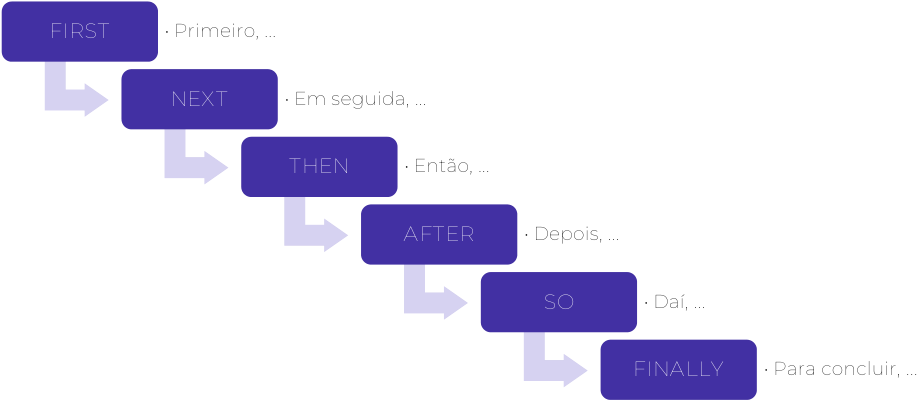


<!-- Start of picture text -->
FIRST • Primeiro, ...<br>NEXT • Em seguida, ...<br>THEN • Então, ...<br>AFTER • Depois, ...<br>SO • Daí, ...<br>FINALLY • Para concluir, ...<br><!-- End of picture text -->

Agora, estudaremos um pouco sobre os Phrasal verbs , já que depois teremos uma aula exclusiva para explorar a fundo esse tema. Vamos lá!

---

<!-- pagina: 36 -->

**Andrea Belo Aula 02 - Verbs in texts** 

# **PHRASAL VERBS** 

É um assunto que necessita de atenção porque é considerado difícil, mas, varemos de forma prática os que mais caíram em provas anteriores, com desenhos, para ajudar a memorizar. 

Phrasal Verbs , definidos de uma maneira mais simples, são verbos que vem acompanhados por preposições ou advérbios . Ou seja, é uma combinação de palavras formada por um verbo e uma preposição ou advérbio. 

São também conhecidos como verbos preposicionados ou, em alguns livros e gramáticas, classificados como expressões verbais, porque esses verbos especiais, quando combinados com partículas adverbiais ou com preposições, mudam completamente o significado do verbo usado em sua composição. 

Quando você tenta traduzir essas combinações, esses phrasal verbs , palavra por palavra, elas poderão ficar totalmente sem sentido, já que são verbos interpretados sempre em conjunto. 

Para exemplificar, vamos pensar no verbo to call , que, em português, significa “chamar”, “ligar”, “telefonar”: (I called you last night = Eu liguei para você ontem à noite). 

Esse verbo, quando usado junto às preposições in e off , por exemplo, tornam-se outros verbos com outros significados, veja: 

To call in: convidar – I will probably call my neighbor in to the party. (Eu provavelmente vou convidar meu vizinho para a festa.) 

To call off: cancelar – I have to call off the meeting with you, I’m sorry. (Eu tenho que cancelar a reunião com você, desculpe-me.) 

Como afirmei que os phrasal verbs não podem ser traduzidos literalmente, a melhor forma de aprendê-los é praticando: respondendo exercícios e lendo textos, fontes da sua prova. 

Quanto mais intensificado for seu estudo, mais vocabulário, incluindo phrasal verbs , você aprenderá. 

Esse assunto é tão importante em inglês, que existem vários dicionários de phrasal verbs . 

Por isso, trataremos de regras, explicações variadas, maneiras de usá-los, preposições mais utilizadas na construção dos phrasal verbs , entre outros detalhes essenciais, com a sugestão de alguns deles que aparecem com frequência nas provas.

---

<!-- pagina: 37 -->

**Andrea Belo Aula 02 - Verbs in texts** 

## **PREPOSITION AWAY** 

Vou fazer da seguinte forma. Apontar a lista com todos os phrasal verbs mais usados, que são formados com a preposição AWAY, as traduções e exemplos. Assim, você pode estudar, observando-os por ordem alfabética e pelos exemplos, para fazer sentido para você e facilitar na compreensão e memorização. 

**ABSTRACT AWAY** : ignorar, abstrair, omitir. “You can abstract away the complexity of life and enjoy it.” (Você pode ignorar a complexidade da vida e curtir!) 


**BANG AWAY** : dedicar-se muito, “bater na mesma tecla”. “She has been banging away at English classes.” (Ela tem se esforçado muito nas aulas de Inglês.) 

**BEAR AWAY** : afastar, suportar, “carregar algo (dor)”. 

“He had to carry away that idea from his head.” (Ele teve que afastar/tirar aquela ideia da sua cabeça.) 


**BLAST AWAY** : disparar, detonar, explodir. “Her feelings blasted away, and she started to cry.” (Os sentimentos dispararam/explodiram e ela começou a chorar.) 

- **BLOW AWAY** : voar/ir com o vento, impressionar: “The paper plane blew away, but I got it.” 


(O avião de papel vôou com o vento mas consegui pegá-lo.)

---

<!-- pagina: 38 -->

**Andrea Belo Aula 02 - Verbs in texts** 


**BOTTLE AWAY** : engarrafar, guardar algo para si, resguardar. “Stop bottling away and tell me what is going on.” (Pare de guardar para si/esconder e me diga o que está acontecendo.) 

## **PREPOSITION ABOUT** 

**BANG ABOUT** : executar algo com barulho, fazer barulho. “The boy banged about in the kitchen last night.” (O garoto fez muito barulho na cozinha ontem a noite.) 


**BOSS ABOUT** : querer mandar, abusar da autoridade. “He was bossing about and made me nervous.” (Ele estava abusando/mandando demais e me deixou nervosa.) 

**BRING ABOUT** : ocasionar, provocar: 

“If you think well, you can bring about some changes.” (Se você pensar bem, pode ocasionar/trazer algumas mudanças.) 


**COME ABOUT** : acontecer, resultar. “The production has come about with technology.” (A produção acanteceu/resultou com a technologia.) 

**DOSS ABOUT** : enrolar, desperdiçar tempo, retardar. “You did nothing but dossed about.” (Você não fez nada a não ser enrolar.) 


---

<!-- pagina: 39 -->

**Andrea Belo Aula 02 - Verbs in texts** 


**FALL ABOUT** : cair no riso, dar gargalhadas sem parar. “It was so funny she couldn’t stop falling about.” (Foi tão engraçado que ela não conseguia parar de rir.) 


**JUMP ABOUT** : saltar repentinamente, saltar radicalmente. “Children were jumping about because of the Christmas gifts.” (As crianças estavam saltitando empolgadas por causa dos presentes de Natal). 


**LAY ABOUT** : partir para cima, atacar, bater forte em alguém. “He bothered her so much that she decided to lay about him.” (Ele a incomodou tanto que ela decidiu partir para cima dele.) 

**MILL ABOUT** : circular, dar voltas (esperando algo/alguém). 

“The gang was milling about all night long.” 

(A gangue esteve circulando/aguardando a noite toda.) 


**PUSH ABOUT** : “tirar sarro”, fazer bullying. “The tall guy was pushing about the boy.” (O cara alto cometeu bullying com o garoto.) 

**SET ABOUT** : lançar algo, começar, “dar o pontapé inicial”. 

“How did you set about solving a puzzle?” 

(Como você começou a resolver o quebra-cabeça?) 


---

<!-- pagina: 40 -->

**Andrea Belo Aula 02 - Verbs in texts** 

## **PREPOSITION BACK** 

**BOUNCE BACK** : dar a volta por cima, recuperar-se. 

“He bounced back and won the competition.” 

(Ele deu a volta por cima e ganhou a competição.) 


**CALL BACK** : ligar de volta, retornar à ligação. 

“He finally called me back after na hour.” 

(Ele finalmente me ligou de volta após uma hora.) 

**DIE BACK** : perder as folhas (árvore/plantas), morrer. 

“The trees always die back after flowering.” 

(As árvores sempre perdem as folhas após florir.) 


**DROP BACK** : ficar para trás, cair (preço), ter um declínio. “Nothing can stop the progress unless the sales to drop back.” (Nada pode parar o progresso a não ser que as vendas caiam.) 

**FALL BACK/HANG BACK** : recuar, afastar-se, cair, diminuir. 

“The enemies fell back because of the police.” 

(Os inimigos recuaram por causa da polícia.) 


**HAND BACK** : devolver, entregar de volta (sinônimo de GIVE BACK). 


“She got the coins and gave back to him.” 

(Ela pegou as moedas e devolveu a ele.)

---

<!-- pagina: 41 -->

**Andrea Belo Aula 02 - Verbs in texts** 

**LAY BACK/LIE BACK** : virar-se de costas, deitar-se de costas. 

“The doctor asked me to lie back for the tests.” 

(O médico me pediu para deitar de costas para os exames.) 


**PIN BACK** : prender para trás (cabelo, franjas, cortina...). 

   - “He asked me to pin back the curtains.” 

- (Ele me pediu para prender as cortinas para trás.) 

**PLOW BACK** : reinvestir, reabrir. “He plowed back the company.” (Ele reabriu/reinvestiu a (na) empresa.) 


**SHRINK BACK** : retrair, recuar, encolher. 

“After all, she decided to shrink back”. (Depois de tudo, ela decidiu recuar). 

**STRIKE BACK/TIE BACK** : revidar, contra-atacar. 

“They were fighting when Tom decided to strike back.” 

(Eles estvam brigando quando Tom decidiu revidar.) 


**WIN BACK** : reconquistar, recuperar. 

“I am trying to win back my losses.” 

(Eu estou tentando recuperar minhas perdas.)

---

<!-- pagina: 42 -->

**Andrea Belo Aula 02 - Verbs in texts** 

## **PREPOSITION IN** 

**ASK IN** : convidar para entrar. 

“She was at the door and asked me in.” 

(Ela estava na porta e me convidou para entrar.) 


**BASH IN** : destruir, bater forte, atacar. 

- “The robbed bashed in the window with the crowbar.” 

   - (O ladrão bateu/forçou a janela com o pé de cabra.) 

**BEAR IN** : levar em conta, suportar, considerar. 

“I think you have to bear it in mind.” 

(Eu acho que você deve levar em conta/considerar isso.) 


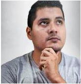


**FALL IN** : Fall in love = apaixonar-se. 

“She suddenly fell in love.” 

(Ela de repente se apaixonou.) 


**FILL IN** : preencher, completar (formulário). 

- “You should fill in with all information.” 

**FIT IN** : encaixar-se. 

- “The nail didn’t fit into the hole.” 

- (O prego não se encaixou no buraco.) 


---

<!-- pagina: 43 -->

**Andrea Belo Aula 02 - Verbs in texts** 


**GIVE IN** : entregar/desistir/deixar de lutar. 

“He gave in his report, but his sister gave in doing that.” (Ele entregou seu relatório mas sua irmã desisiu de fazer.) 

**HANG IN** : ser positivo, ser otimista. 

“Just hang in, you’ll find a good job!” (Apenas seja otimista, você vai encontrar um bom emprego!) 


**HAND IN** : entregar. 

“If you hand in the exercise in time, you get an extra point.” (Se você entregar o exercício a tempo, ganha ponto extra.) 

**HEDGE IN/HEM IN** : cercar (algo ou alguém). 

“We are all hedged in by rules.” 

(Estamos todos cercados de regras.) 


**JOIN IN** : aderir, reunir-se, juntar-se. 

**KEEP IN** : manter, guardar (*Keep in touch: manter contato). 

“Alright, let’s keep in touch.” 

(Tudo bem, vamos manter contato!) 


---

<!-- pagina: 44 -->

**Andrea Belo Aula 02 - Verbs in texts** 


**KEY IN** : digitar. “Wow! You key in too fast!” 

**LEAN IN** : inclinar, curvar-se, esticar o corpo. 

- “I had to lean in to hear the teacher.” (Eu tive que me inclinar para ouvir o professor.) 


- **MOVE IN** : mudar-se, avançar. 

- “I moved in a few weeks ago.” 

**POP IN** : “dar uma passadinha”, visitar rapidinho. “I am leaving, I just popped in to have some coffee.” 

(Já vou, só passei para um café com você.) 


**PRICE IN** : aumentar o preço, subir o valor. 

“The store priced in all the products!” 

(A loja subiu o preço de todos os produtos!) 

**PULL IN** : encostar, chegar, prender. 

“You can pull in here.” (Você pode enconstar aqui.) 

“The police pulled him in.” (A polícia o prendeu.) 


---

<!-- pagina: 45 -->

**Andrea Belo Aula 02 - Verbs in texts** 

**RUSH IN (into)** : precipitar-se, apressar-se. 

“The fireman rushed in (into) for helping.” (O bombeiro entrou apressadamente para ajudar.) 


**RAKE IN** : ganhar, faturar. “Her shop is raking it in a lot!” (A loja dela está faturando muito!) **SETTLE IN** : acomodar-se bem, adaptar-se. “The kids are betting in the new school?” (As crianças estão de adaptando à nova escola?) 


**SHUT IN** : trancafiar, prender alguém/algo em algum lugar. 

- “He got angry and shut me in there for an hour.” 

- (Ele ficou nervoso e me prendeu lá por uma hora.) 


**SIGN IN** : entrar, acessar, ter acesso. “You can sign on the website anytime.” (Você pode acessar o website a qualquer hora.) 

## **PREPOSITION ON** 

**ADD ON** : incluir, adicionar, aumentar. 

“He added 10 dollars on for service.” 

- (Ele incluiu/adicionou 10 dólares pelo serviço.) 


---

<!-- pagina: 46 -->

**Andrea Belo Aula 02 - Verbs in texts** 


**BEAR ON (ou bear upon)** : afetar, influenciar, causar impacto. 

“The facts bear on a lot for the final decision.” (Os fatos influenciam muito na decisão final.) 

**BRING ON** : fazer acontecer, causar. 

“I ask myself what I’ve done to bring this on.” (Eu me pergunto o que fiz para causar isso.) 


**CALL ON** : pedir, chamar, recorrer. 

“We are calling on him for president.” (Estamos recorrendo a ele para presidente.) 

**FIGURE ON** : planejar. 

“He is figuring on his future!” (Ele está planejando o futuro!) 


**GET ON** : embarcar, progredir, continuar, dar-se bem. 

“I got on the train”. (Eu embarquei no trem!) “Stop complaining and get on!” (Pare de reclamar e continue!) 


**GO ON** : continuar, começar a fazer algo, funcionar, basear-se. “Please, go on!” (Por favor, continue!) 

“There are no clues to go on.” (Não há pistas para se basear/funcionar a investigação)

---

<!-- pagina: 47 -->

**Andrea Belo Aula 02 - Verbs in texts** 


**GROW ON** : conquistar. 

“He is not handsome, but he grew me on.” (Ele não é bonito mas ele me conquistou.) 

**HIT ON** : “dar em cima”, paquerar. 

“Patrick? The girls are all hitting on him.” (Patrick? As garotas estão todas dando em cima dele.) 


**KEEP ON** : continuar (sinônimo de go on). “Keep on walking, como on!” (Continue nadando, vamos!) 

**LAY ON** : colocar, botar, assenter. 

“I laid my books down the table.” (Coloquei meus livros na mesa.) 


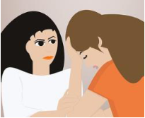


**MOVE ON** : mudar, prosseguir, mover-se “You have to move on, let’s go!” (Você tem que mudar/seguir em frente. Vamos!) 

**PICK ON** : atormentar, importuner. 

“That boy likes to pick on everybody.” (Aquele garoto gosta de importunar/atormentar a todos.) 


---

<!-- pagina: 48 -->

**Andrea Belo Aula 02 - Verbs in texts** 


**PUT ON** : colocar (roupa, acessório), vestir, aplicar. “She put on a jacket and left.” (Ela colocou a jaqueta e saiu.) 

**RELY ON** : depender de alguém, contar com. “The baby counts on his mom to walk.” 

(O bebê conta com a mãe para andar.) 


**SWITCH ON** : acender, ligar, animar-se. 

“I witched on all lights!” (Eu liguei/acendi todas as luzes!) 

**TAKE ON** : contratar, assumir. 

“The game took on a different meaning to me.” 

(O jogo assumiu um significado diferente para mim.) 


**TELL ON** : denunciar, relatar, dedurar. “You can’t tell on me, please!” (Você não pode me denuciar/dedar, por favor!) 

**TRY ON** : experimentar, provar. 

“I want try on my new shoes.” 

(Eu quero experimentar meus sapatos novos.) 


---

<!-- pagina: 49 -->

**Andrea Belo Aula 02 - Verbs in texts** 


**URGE ON** : estimular, encoraja.r “She urged his son to swim.” (Ela encorajou seu filho a nadar.) 

**WAIL ON** : lamentar, dramatizar, reclamar. 

“She was wailing on.” (Ela estava lamentando/reclamando.) 


**WALK ON** : entrar andando, sem pedir, de repente. “I walked in and saw all his guns.” (Eu entrei de uma vez e vi todas as armas dele.) 

## **PREPOSITION OUT** 

**ASK OUT** : convidar para sair. 

“I want to ask you out, but I am afraid you say no.” (Quero te convidar para sair mas tenho medo de você dizer não.) 


**BAIL OUT** : tirar a água do barco, resgatar, salvar. “You have to bail out before sailing.” (Você tem que tirar a água do barco antes de navegar.) 


**BLACK OUT** : apagar, escurecer, desmaiar. 

“He blacked out when crashed the car.” (Ele apagou/desmaiou quando bateu o carro.)

---

<!-- pagina: 50 -->

**Andrea Belo Aula 02 - Verbs in texts** 


**BREAK OUT** : começar (algo ruim). 

“The fire broke out during the night.” 

(O fogo começou durante a noite.) 

**BURN OUT** : esgotar, estar cansado, exausto. (há a síndrome _burn out_ , estar exausto, geralmente em decorrência do trabalho, um esgotamento físico e mental). 


**BRING OUT** : produzir algo novo **,** ênfase no verbo trazer. “She is bringing out a new album. /She brought me a gift.” (Ela está produzindo um novo álbum. /Ela me trouxe um presente.) 

**CALL OUT** : anunciar, gritar. 

“He called out the winner.” 

(Ele anunciou o vencedor.) 


**CARRY OUT** : conduzir, executar. “We carry out this project.” (Nós conduzimos/executamos esse projeto.) 


**COME OUT** : vir para fora, sair, vir à tona. 

“The real story came out at the trial.” (A história real veio à tona no julgamento.)

---

<!-- pagina: 51 -->

**Andrea Belo Aula 02 - Verbs in texts** 

**CRY OUT** : clamar, gritar por medo, desespero. 

“She cried out when she got stuck in the lift.” (Ela gritou de  desespero quando ficou presa no elevador.) 


**CUT OUT** : cortar/excluir. 

“They cut out some movie scenes.” (Eles cortaram/excluíram algumas cenas do filme.) 

**DROP OUT** : largar, desistir. “She had to drop out college, it was hard to her.” (Ela teve que largar a faculdade, estava difícil para ela.) 


**DRY OUT** : secar, ficar sóbrio. “He dried out for three days.” (Ele ficou sóbrio por três dias.) 

**EAT OUT** : jantar fora, sair para jantar. 

“We didn’t eat in but decided to eat out.” 

(Nós não jantamos em casa mas decidimos comer fora.) 


**FIGURE OUT** : encontrar algo, entender, resolver (um problema). 

“I am trying to figure it out.” (Estou tentando entender/resolver isso.)

---

<!-- pagina: 52 -->

**Andrea Belo Aula 02 - Verbs in texts** 

**FIND OUT** : descobrir, ficar sabendo. “He found out the truth.” (Ele descobriu/ficou sabendo da verdade.) 


**FREEZE OUT** : “dar um gelo” (em alguém), excluir. “She was frozen out of the group.” (Ela foi excluída do grupo.) 

**FREEK OUT** : enlouquecer, pirar, “ter um treco”. “She freaked out at the concert.” (Ela elouqueceu/teve um treco/pirou no show.) 


**GO OUT** : sair, passear, viajar. “I would like to go out on vacation.” (Eu gostaria de passear/viajar nas férias.) 

**GROW OUT** : crescer e não caber mais. (Você cresceu e seus sapatos não cabem mais.) 


**HAND OUT** : distribuir, divulgar. “The sentence was handed out.” (A sentença foi dada/divulgada.)

---

<!-- pagina: 53 -->

**Andrea Belo Aula 02 - Verbs in texts** 

**HELP OUT** : ajudar alguém com dificuldade. 

“Her parents helped her out with the payments.” (Os pais dela a ajudaram com os pagamentos.) 


**IRON OUT** : esclarecer, resolver, explicar. “We can iron out the details.” (Nós podemos esclarecer os detalhes.) 

**LEAVE OUT** : “deixar de fora”, excluir. 

“You can’t leave me out of the trip.” 

(Você não pode me deixar de fora da viagem.) 


**MAKE OUT** : discernir, passar a impressão de. 

“You made out what he has just said.” (Você discerniu o que ele acabou de dizer.) 


**LOOK OUT** : tomar cuidado. / **LOOK OUT FOR** : tomar conta. 

“Take out, it’s dangerous and I won’t take out for you later.” (Cuidado, é perigoso e não cuidarei de você depois.) 


**PUT OUT** : “apagar o fogo”, sanar, causar problemas. 

“Put the cigarette out, please.” (Apague o cigarro, por favor.)

---

<!-- pagina: 54 -->

**Andrea Belo Aula 02 - Verbs in texts** 

**REACH OUT** : oferecer ajuda. 

“He wanted to reach out the group members.” (Ele queria oferecer ajuda aos membros do grupo.) 


: dedurar, desistir. 

- “He ratted out on the opportunity.” 

**RING OUT** : celebrar o fim, ressoar. “A laughter rang out in the room.” (Uma risada ressou na sala.) 


**RUN OUT** : ficar sem, faltar. “We’ve run out of sugar.” (Ficamos sem açucar.) 


- : começar uma jornada, partir. 

**SEEK OUT** : procurar, buscar. 

- “You must seek out new ways to study.” 

(Você deve buscar novas maneiras de estudar.) 


---

<!-- pagina: 55 -->

**Andrea Belo Aula 02 - Verbs in texts** 

## **PREPOSITION OVER** 

**BEND OVER** : agachar, fazer de tudo. “He bent over to help her.” (Ele fez de tudo para ajudá-la.) 


**COME OVER** : vir, mudar de lado. “He came over.” (Ele veio para o nosso lado.) 


**GET OVER** : superar. 

“I am sure he will get over it.” (Tenho certeza que ele vai superar isso.) 

**GO OVER** : revisar, praticar. “Let’s go over these lines, please.” (Vamos praticar essas falas, por favor.) 


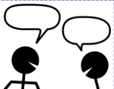


**HAND OVER** : entregar, “passar a bola”. “He passed over his power to her.” (Ele passou o poder a ela.) 

**PULL OVER** : encostar. 

“The police ordered him to pull over.” 

(A polícia pediu para ela encostar.) 


---

<!-- pagina: 56 -->

**Andrea Belo Aula 02 - Verbs in texts** 


: assumir, controlar. 

**THINK OVER** : pensar sobre, refletir. “What are you thinking over about?” (No que você está pensando/refletindo?) 


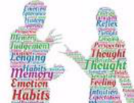


**TALK OVER** : discutir para chegar em um acordo. “We talked over our problems.” (Nós discutimos nossos problemas.) 

## **PREPOSITIONS UP/DOWN** 

**ACT UP** : dar problema, parar de funcionar. “My computer is acting up again.” (Meu computador está dando problema de novo.) 


**BACK UP** : fazer uma cópia, apoiar. “You should back up important documents.” (Você deveria fazer cópia dos documentos importantes.) **BRING UP** : criar (educar), mencionar. “Her parents brought her up well.” (Os pais dela a criaram bem.) 


---

<!-- pagina: 57 -->

**Andrea Belo Aula 02 - Verbs in texts** 


**GO UP** : subir literalmente. “Prices are going up fast.” (Os preços estão subindo rapidamente.) 


**KEEP UP** : continuar, manter. “Keep up working like this.” (Continue trabalhando assim.) 

**MAKE UP** : inventar, constituir-se. “He is making up excuses.” (Ele está inventando desculpas.) 


- : finalizar, chegar em algum lugar. 

- “We ended up the night dancing.” 


**HANG UP** : pendurar (ênfase no verbo). “I hung up my coat on the hook.” (Eu pendurei meu casaco no cabide.) 


: procurar, pesquisar no dicionário. “I looked it up many times.”

---

<!-- pagina: 58 -->

**Andrea Belo Aula 02 - Verbs in texts** 


**OPEN UP** : abrir, abrir-se (ênfase). “Open up! It’s the police!” (Abra! É a polícia!) 

##### **BREAK DOWN** : descontrolar-se. 

“I had na emotional break down yesterday.” (Eu tive um descontrole emocional ontem.) 


**COME DOWN** : descer, baixar a posição social. 

“The man was upset because he had come down.” (O homem estava decepcionado porque baixou sua posição social.) 

**CUT DOWN** : reduzir. 

“They need to cut down drinking.” (Eles precisam reduzir a bebida.) 


**LET DOWN** : desapontar. 

“I can’t let her down, I love her.” (Não posso desapontá-la, eu a amo.) 

**PUT DOWN** : colocar algo no chão, em lugar baixo. 

“She put her bag down.” 

(Ela colocou a bolsa no chão.) 


---

<!-- pagina: 59 -->

**Andrea Belo Aula 02 - Verbs in texts** 

## **PREPOSITION FOR** 

**ASK FOR/CALL FOR** : pedir, solicitar. 

“I talked to him to ask for a job recommendation.” 

(Eu falei com ele para pedir uma recomendação de emprego.) 


**FALL FOR** : apaixonar-se. 

“She always falls for intelligent men.” 

(Ela sempre se apaixona por homens inteligentes.) 


**LOOK FOR** : procurar, querer, desejar. “Some people look for work on internet.” (Algumas pessoas procuram emprego pela internet.) 

**STAND FOR** : significar. 

“He said SY stands for See You.” 

(Ele disse que SY significa See you.) 


**WAIT FOR** : esperar, aguardar. 

“Can you wait for me?” (Você pode me esperar?) 

## **PREPOSITION OFF** 

**BACK OFF** : afastar, recuar. 

“They backed off when they see the police.” 

(Eles se afastaram ao ver a polícia.) 


---

<!-- pagina: 60 -->

**Andrea Belo Aula 02 - Verbs in texts** 


**BUY OFF** : subornar, “comprar” a pessoa. “Don’t worry, I bought him off.” (Não se preocupe, eu o subornei.) 

**CALL OFF** : cancelar. “They called the wedding.” (Eles cancelaram o casamento.) 


**FIGHT OFF** : combater. “He wants to fight off the attackers.” (Ele quer combater os atacantes.) **LOG OFF** : fazer o log off (se desconectar). “The program is open, you have to log off.” (O programa está aberto, você tem que fazer o log off.) 

## **OUTROS PHRASAL VERBS** 

**COME DOWN WITH** : adoecer. “My brother came down with pneumonia on the weekend.” (Meu irmão adoeceu de pneumonia no fim de semana.) 


**GET ALONG WITH** : dar-se bem com. “They get along with each other.” (Elas se dão muito bem.) 


---

<!-- pagina: 61 -->

**Andrea Belo Aula 02 - Verbs in texts** 


**LOOK AFTER** : cuidar (sinônimo de take care). “I looked up my nephew last week.” (Eu cuidei do meu sobrinho semana passada.) **PUT UP TO** : tolerar. “I don’t put up with more frustations.” (Eu não tolero mais frustações.) 


<!-- Start of picture text -->
LOOK FOWARD TO : Esperar muito por algo, estar ansioso por.<br>“I am looking for my vacation.”.<br>(Estou ansiosa por minhas férias.)<br><!-- End of picture text -->


Vamos aos exercícios para praticar os phrasal verbs bem como todo o conteúdo que temos estudado no decorrer de nossas aulas. Let’s go!

---

<!-- pagina: 62 -->

**Andrea Belo Aula 02 - Verbs in texts** 

# **QUESTÕES** 

Esse é momento em que vamos praticar tudo o que vimos nessa Aula 02 . Serão questões para preparar você e colaborar com a sua aprovação. 

01. (CEBRASPE/2019 – PREFEITURA MUNICIPAL DE SÃO CRISTÓVÃO – SE) 

#### Study skills tips 

What makes a good language learner? There are some things that good language learners do and some things they don’t do. Here are some of the most useful suggestions. 

- Don’t be afraid of making mistakes. Good language learners notice their mistakes and learn from them. 

- Do group activities. A good language learner always looks for opportunities to talk with other students. 

- Make notes during every class. Look at your notes when you do your homework. 

- Use a dictionary. Good language learners often use dictionaries to check the meaning of words they don’t know. 

- Think in the language you’re learning outside the classroom. When you’re shopping or walking down the street, remember useful words and phrases. 

- Do extra practice. Test and improve your language, reading and listening skills with self-study material. You can find a lot of this online. 

- Imagine yourself speaking in the language. Many good language learners can see and hear themselves speaking in the language. 

• Enjoy the process. Good language learners have fun with the language. Watch a TV series or film, listen to songs, play video games or read a book. It’s never too late to become a good language learner. 

Internet: <learnenglish.britishcouncil.org> (adapted). 

No que se refere ao texto anterior e a seus aspectos linguísticos, julgue o item a seguir. 

In the sentence “When you’re shopping or walking down the street” (L. 14 and 15), the verbal forms express an idea that corresponds to the subjunctive tense in Portuguese. 

(    ) Certo 

(    ) Errado

---

<!-- pagina: 63 -->

**Andrea Belo Aula 02 - Verbs in texts** 

#### 02. (CEBRASPE/2019 – PREFEITURA MUNICIPAL DE SÃO CRISTÓVÃO – SE) 

It was early 2016 in the Calais Refugees Camp. We had students asking to learn English and French but they didn’t want to learn grammar or long lists of vocabulary. Opportunities for oral interaction were limited. 

Food and cooking have become essential elements in many refugee education projects and it’s a great topic for the English classroom more generally. Recipes use relatively predictable and restricted vocabulary that can be easily adjusted for language level. The grammar can also be limited to the imperative: “First chop the onions. Then fry them in oil.” This creates a good opportunity to work on pronunciation, word stress and intonation using authentic materials: “Chop the tomatoes and add them to the onions”. 

I first used cooking for language-learning while working alongside Kate McAllister with a community of male Sudanese refugees in Calais who had organised themselves around a small communal kitchen. It was very primitive only a small room with two gas burners connected to a gas tank, but some great meals were cooked there, usually with very limited ingredients. 

Kate planned lessons around simple French and English recipes in exchange for Sudanese recipes from our students. Recipes were presented with simple diagrams and pictures, to be annotated in English and/or French and Arabic. “We talked. We learned. We cooked. We laughed. We ate. It was a good day.” 

Cooking is also a great opportunity to take students shopping an authentic task of buying real food. Best of all, these lessons went beyond language learning, fostering a sense of community in the class. 

Gil Ragsdale. Recipes for success in language learning . Internet: <www.elgazette.com> (adapted). 

O texto relata uma experiência de aprendizagem de inglês e francês por meio da troca de receitas entre refugiados em um campo de refugiados de Calais. A respeito das ideias e informações do texto precedente e de seus aspectos linguísticos, julgue o item que se segue. 

In the sentences ‘First chop the onions. Then fry them in oil.’ (L.10), the verbs “chop” and “fry” are used in the present continuous. 

(    ) Certo 

(    ) Errado 

#### 03. (CEBRASPE/2015 – MPOG) 

The Obama administration announced a program to connect thousands of public housing residents across the nation to the Internet at low prices or free, part of a broader effort to 4 close the so-called digital divide and help low-income Americans succeed in a technology-driven society.

---

<!-- pagina: 64 -->

**Andrea Belo Aula 02 - Verbs in texts** 

Appearing at a school in the heart of the Choctaw Nation, in Oklahoma, where 32 percent of children live in poverty, Mr. Obama announced the ConnectHome program and said it was unacceptable for young people not to have access to the same technological resources in their homes that their wealthier counterparts do. “If we don’t get these young people the access to what they need to achieve their potential, then it’s our loss; it’s not just their loss”, he said. “They’ve got big dreams, and we’ve got to have an interest in making sure they can achieve those dreams,” he added. 

“While many middle-class U.S. students go home to Internet access, which allows them to do research, write papers and communicate digitally with their teachers and other students, too many lower-income children go unplugged every afternoon when school ends,” a statement about the report said. “This ‘homework gap’ runs the risk of widening the achievement gap, denying hardworking students the benefit of a technology-enriched education.” 

The pilot program, ConnectHome, will be carried out in different forms in public housing units in 27 cities and in one Native American tribal area, largely focusing on households with school-age children. The program will involve city officials, Internet providers, universities, and a large retail company, which will offer computer training to residents in some cities. The program will offer some residents a chance to buy tablets with educational software installed for $30 each. Other communities will receive free help with SAT preparation and free technical support. 

The program is an offshoot of the president’s ConnectED initiative, which was announced in 2013. It aimed to link 99 percent of the students from kindergarten through 12<sup>th</sup> grade to high-speed Internet in classrooms and libraries over the next five years. 

It is also part of a renewed vigor in the Obama administration’s housing agenda coming late in his final term and recently emboldened by a Supreme Court ruling endorsing a broad interpretation of the Fair Housing Act of 1968, a relevant feat for civil rights. That ruling allows for more lawsuits that could help fight housing discrimination. 

Dionne Searcey. U.S. program will connect public housing residents to Web . Internet: <www.nytimes.com>.(adapted). 

Based on the previous text, judge the following items. 

In the text, the words “making” (line.14), “training” (line.29) and “ruling” (line.43) are all used as verbs indicating actions. 

#### (    ) Certo 

- (    ) Errado 

#### 04. (CEBRASPE/2015 – TCE-RN) 

Managers of information technology departments, also known as IT-managers, are responsible for the overall performance of the electronic networks that allow a business to function. The exact scope of these responsibilities varies from one setting to another. However, at the core of the ITmanager job description is the care of the in-house network. This often means that the IT-manager

---

<!-- pagina: 65 -->

**Andrea Belo Aula 02 - Verbs in texts** 

is involved in the selection of hardware and software used in the network. For example, an ITmanager would likely be involved in any discussions about updating the internal servers and computer workstations. There is a good chance that (s)he would also work with other staff members in the selection of software, such as accounting programs or some type of sales and customer database. 

Along with helping to establish the overall structure of the network, an IT-manager would also oversee processes that 16 would seek to identify any potential glitches in any programming that could cause some sort of system failure. 

Internet: <http://www.wisegeek.com> (adapted). 

In the text about IT-managers, the word 

“could” (line.17) can be replaced by can without any change in the meaning of the text. 

(    ) Certo 

(    ) Errado 

#### 05. (FCC/2016 – SEGEP-MA) 

Goods in transit refers to merchandise and other inventory items that have been shipped by the seller, but have         I been received by the purchaser. To illustrate goods in transit, let's use the following example. Company J ships a truckload of merchandise on December 30 to Customer K, which is located 2,000 miles away. The truckload of merchandise arrives at Customer K on January 2. Between December 30 and January 2, the truckload of merchandise is goods in transit. The goods in transit requires special attention if the companies issue financial statements as of December 31. The reason is that the merchandise is the inventory of one of the two companies. <u>However, the merchandise is not physically present at either company. One of the two companies</u> must add the cost of the goods in transit to the cost of the inventory that it has in its possession. 

The terms of the sale will indicate which company should report the goods in transit as its inventory as of December 31. If the terms are FOB shipping point, the seller (Company J) will record a December sale and receivable, and         II include the goods in transit as its inventory. On December 31, Customer K is the owner of the goods in transit and will need to report a purchase, a payable, and must add the cost of the goods in transit to the cost of the inventory which is in its possession. 

If the terms of the sale are FOB destination, Company J will not have a sale and receivable until January 2. This means Company J must report the cost of the goods in transit in its inventory on December 31. (Customer K will not have a purchase, payable, or inventory of these goods until January 2.) 

(Adapted from http://www.accountingcoach.com/blog/what-are-goods-in-transit )

---

<!-- pagina: 66 -->

**Andrea Belo Aula 02 - Verbs in texts** 

A alternativa que preenche corretamente a lacuna II é 

- (A) must 

- (B) will 

- (C) will not 

- (D) should 

- (E) would not 

#### 06. (FCC/2015 – DPE-SP) 

Harvard study: Men want powerful jobs more than women 

By Justine Hofherr, Boston.com Staff | 09.29.15 

Let’s get one thing straight: Women believe they are as capable as men to attain and perform high-level leadership positions at work. Many just don’t want them as much, according to new research from Harvard Business School. 

The paper, published in the Proceedings of the National Academy of Sciences (PNAS), includes nine studies conducted on high-achieving groups. Professor Francesca Gino, doctoral student Caroline Wilmuth, and associate professor Alison Wood Brooks (all of HBS) surveyed over 4,000 male and female employees from different industries, and found a big gap between the professional objectives of men and women. 

While women reported having twice as many “life goals” as men - desired achievements that ranged from having strong relationships, marriage, a meaningful career, and family - fewer were focused on professional power, which women were more likely to associate with negative outcomes like stress and conflict. 

“This is a snapshot of where our culture is right now", Brooks told Boston.com. “If we      I      these questions 50 years ago, or in another 50 years, we might see dramatically different results. Women are pursuing careers on par with men, yet women are still a little more responsible for things at home.” 

(Adaptado de: http://www.boston.com/jobs/news/2015/09/29/harvard-study-men-want-powerful-jobs-more-than-women/WQpgG8WdFZWssfxm40plrL/story.html ) 

A alternativa que preenche corretamente a lacuna I é 

#### (A) asked 

- (B) will ask 

- (C) asking 

- (D) ask 

- (E) asks

---

<!-- pagina: 67 -->

**Andrea Belo Aula 02 - Verbs in texts** 

#### 07. (FCC/2015 – DPE-SP) 

What Causes a Super Blood Moon? 

By Daniel Victor, Sept, 25, 2015. 

A rare astronomical phenomenon Sunday night will produce a moon that will appear slightly bigger ……..I…….. usual and have a reddish hue, an event known as a super blood moon. 

It’s a combination of curiosities that hasn’t ……..II…….. since 1982, and won’t happen again ……..III…….. 2033. A so-called supermoon, which occurs when the moon is closest to earth in its orbit, will coincide with a lunar eclipse, leaving the moon in Earth’s shadow. Individually, the two phenomena are not uncommon, but they do not align often. 

Most people are unlikely to detect the larger size of the supermoon. It may appear 14 percent larger and 30 percent brighter, but the difference is subtle to the plain eye. But the reddish tint from the lunar eclipse is likely to be visible throughout much of North America, especially on the East Coast. 

“You’re basically seeing all of the sunrises and sunsets across the world, all at once, being reflected off the surface of the moon,” said Dr. Sarah Noble, a program scientist at NASA. 

(Adaptado de: http://www.nytimes.com/2015/09/26/science/super-blood-moon-to-make-last-appearance-until2033.html ) 

A alternativa que preenche corretamente a lacuna II é 

#### (A) happen 

#### (B) happening 

- (C) will happen 

- (D) happened 

- (E) happens 

#### 08. (FCC/2015 – SEDU-ES) 

It was rush time and she couldn’t ...... the bus. 

#### (A) get out 

#### (B) get off 

#### (C) get down 

- (D) get over 

- (E) get up

---

<!-- pagina: 68 -->

**Andrea Belo Aula 02 - Verbs in texts** 

#### 09. (FGV/2022 – SENADO FEDERAL) 


From: https://aghlc.com/resources/articles/2016/how-to-prevent-phishing-attacks-160812.aspx?hss_channel=tw-2432542152 

By using the phrase “throw it out”, the poster recommends that one should 

- (A) do it up. 

- (B) do for it. 

- (C) do it over. 

- (D) do without it. 

- (E) do away with it. 

#### 10. (FGV/2022 – TJ-DFT) 

#### Here’s why we’ll never be able to build a brain in a computer 

It’s easy to equate brains and computers – they’re both thinking machines, after all. But the comparison doesn’t really stand up to closer inspection, as Dr. Lisa Feldman Barrett reveals. 

People often describe the brain as a computer, as if neurons are like hardware and the mind is software. But this metaphor is deeply flawed. 

A computer is built from static parts, whereas your brain constantly rewires itself as you age and learn. A computer stores information in files that are retrieved exactly, but brains don’t store information in any literal sense. Your memory is a constant construction of electrical pulses and

---

<!-- pagina: 69 -->

**Andrea Belo Aula 02 - Verbs in texts** 

swirling chemicals, and the same remembrance can be reassembled in different ways at different times. 

Brains also do something critical that computers today can’t. A computer can be trained with thousands of photographs to recognise a dandelion as a plant with green leaves and yellow petals. You, however, can look at a dandelion and understand that in different situations it belongs to different categories. A dandelion in your vegetable garden is a weed, but in a bouquet from your child it’s a delightful flower. A dandelion in a salad is food, but people also consume dandelions as herbal medicine. 

In other words, your brain effortlessly categorises objects by their function, not just their physical form. Some scientists believe that this incredible ability of the brain, called ad hoc category construction, may be fundamental to the way brains work. 

Also, unlike a computer, your brain isn’t a bunch of parts in an empty case. Your brain inhabits a body, a complex web of systems that include over 600 muscles in motion, internal organs, a heart that pumps 7,500 litres of blood per day, and dozens of hormones and other chemicals, all of which must be coordinated, continually, to digest food, excrete waste, provide energy and fight illness. […] 

If we want a computer that thinks, feels, sees or acts like us, it must regulate a body – or something like a body – with a complex collection of systems that it must keep in balance to continue operating, and with sensations to keep that regulation in check. Today’s computers don’t work this way, but perhaps some engineers can come up with something that’s enough like a body to provide this necessary ingredient. 

For now, ‘brain as computer’ remains just a metaphor. Metaphors can be wonderful for explaining complex topics in simple terms, but they fail when people treat the metaphor as an explanation. Metaphors provide the illusion of knowledge. 

(Adapted from https://www.sciencefocus.com/future-technology/canwe-build-brain-computer/ Published: 24<sup>th</sup> October, 2021, retrieved on February 9<sup>th</sup> , 2022) 

The passage in which the verb phrase indicates a necessity is: 

- (A) “this incredible ability of the brain […] may be fundamental”; 

- (B) “some engineers can come up with something”; 

- (C) “computers don’t work this way”; 

- (D) “brains don’t store information”; 

- (E) “it must regulate a body”.

---

<!-- pagina: 70 -->

**Andrea Belo Aula 02 - Verbs in texts** 

#### 11. (FGV/2019 – PREFEITURA MUNICIPAL DO SALVADOR – BA) 

#### Critical Literacy, EFL and Citizenship 

We believe that a sense of active citizenship needs to be developed and schools have an important role in the process. If we agree that language is discourse, and that it is in discourse that we construct our meanings, then we may perceive the foreign language classrooms in our schools as an ideal space for discussing the procedures for ascribing meanings to the world. In a foreign language we learn different interpretive procedures, different ways to understand the world. If our foreign language teaching happens in a critical literacy perspective, then we also learn that such different ways to interpret reality are legitimized and valued according to socially and historically constructed criteria that can be collectively reproduced and accepted or questioned and changed.Hence our view of the EFL classroom, at least in Brazil, as an ideal space for the development of citizenship: the EFL classrooms can adopt a critical discursive view of reality that helps students see claims to truth as arbitrary, and power as a transitory force which, although being always present, is also in permanent change, in a movement that constantly allows for radical transformation. The EFL classroom can thus raise students’ perception of their role in the transformation of society, once it might provide them with a space where they are able to challenge their own views, to question where different perspectives (including those allegedly present in the texts) come from and where they lead to. By questioning their assumptions and those perceived in the texts, and in doing so also broadening their views, we claim students will be able to see themselves as critical subjects, capable of acting upon the world. […] 

We believe that there is nothing wrong with using the mother tongue in the foreign language classroom, since strictly speaking, the mother tongue is also foreign - it’s not “mine”, but “my mother’s”: it was therefore foreign as I first learned it and while I was learning to use its interpretive procedures. When using critical literacy in the teaching of foreign languages we assume that a great part of the discussions proposed in the FL class may happen in the mother tongue. Such discussions will bring meaning to the classroom, moving away from the notion that only simple ideas can be dealt with in the FL lesson because of the students’ lack of proficiency to produce deeper meanings and thoughts in the FL. Since the stress involved in trying to understand a foreign language is eased, students will be able to bring their “real” world to their English lessons and, by so doing, discussions in the mother tongue will help students learn English as a social practice of meaning-making. 

(Source: Adapted from JORDÃO, C. M. & FOGAÇA, F. C. Critical Literacy in The English Language Classroom. DELTA, vol. 28, no 1, São Paulo, p. 69-84, 2012. Retrieved from http://www.scielo.br/pdf/delta/v28n1a04.pdf). 

When the authors choose the modal verb “can” to state that “the EFL classrooms can adopt a critical discursive view of reality”, they mean that schools have this 

- (A) need. 

- (B) prediction. 

- (C) obligation. 

- (D) possibility. 

- (E) improbability.

---

<!-- pagina: 71 -->

**Andrea Belo Aula 02 - Verbs in texts** 

#### 12. (FGV/2019 – PREFEITURA MUNICIPAL DO SALVADOR – BA) 

#### What to Know About the Controversy Surrounding the Movie Green Book 

Depending on who you ask, Green Book is either the pinnacle of movie magic or a whitewashing sham. 

The film, which took home the prize for Best Picture at the 91st Academy Awards, as well as honors for Mahershala Ali as Best Supporting Actor and Nick Vallelonga, Brian Currie and Peter Farrelly for Best Original Screenplay, depicts the burgeoning friendship between a black classical pianist and his Italian- American driver as they travel the 1960s segregated South on a concert tour. But while Green Book was an awards frontrunner all season, its road to Oscar night was riddled with missteps and controversies over its authenticity and racial politics. 

Green Book is about the relationship between two real-life people: Donald Shirley and Tony “Lip” Vallelonga. Shirley was born in 1927 and grew up in a well-off black family in Florida, where he emerged as a classical piano prodigy: he possessed virtuosic technique and a firm grasp of both classical and pop repertoire. He went on to perform regularly at Carnegie Hall— right below his regal apartment—and work with many prestigious orchestras, like the Chicago Symphony and the New York Philharmonic. But at a time when prominent black classical musicians were few and far between due to racist power structures, he never secured a spot in the upper echelons of the classical world. (African Americans still only make up 1.8 percent of musicians playing in orchestras nationwide, according to a recent study.) 

Vallelonga was born in 1930 to working-class Italian parents and grew up in the Bronx. As an adult he worked as a bouncer, a maître d’ and a chauffeur, and he was hired in 1962 to drive Shirley on a concert tour through the Jim Crow South. The mismatched pair spent one and a half years together on the road — though it’s condensed to just a couple of months in the film — wriggling out of perilous situations and learning about each other’s worlds. Vallelonga would later become an actor and land a recurring role on The Sopranos. 

In the 1980s, Vallelonga’s son, Nick, approached his father and Shirley about making a movie about their friendship. For reasons that are now contested, Shirley rebuffed these requests at the time. […] 

(Source: from http://time.com/5527806/green-book-movie-controversy/) 

The verb phrase in “was riddled with missteps” is in the 

- (A) simple past, active voice. 

- (B) simple past, passive voice. 

- (C) present perfect, active voice. 

- (D) past continuous, active voice. 

- (E) past continuous, passive voice.

---

<!-- pagina: 72 -->

**Andrea Belo Aula 02 - Verbs in texts** 

#### 13. (VUNESP/2019 – UNICAMP) 

#### A Free Press Needs You 

By The Editorial Board 

August 15, 2018 

In 1787, the year the Constitution was adopted in the USA, Thomas Jefferson famously wrote to a friend, “Were it left to me to decide whether we should have a government without newspapers, or newspapers without a government, I should not hesitate a moment to prefer the latter.” 

That’s how he felt before he became president, anyway. Twenty years later, after enduring the oversight of the press from inside the White House, he was less sure of its value. “Nothing can now be believed which is seen in a newspaper,” he wrote. “Truth itself becomes suspicious by being put into that polluted vehicle.” 

Jefferson’s discomfort was, and remains, understandable. Reporting the news in an open society is an enterprise laced with conflict. His discomfort also illustrates the need for the right of free press he helped to preserve. As the founders believed from their own experience, a well-informed public is best equipped to root out corruption and, over the long haul, promotes liberty and justice. “Public discussion is a political duty,” the Supreme Court said in 1964. That discussion must be “uninhibited, robust, and wide-open” and “may well include vehement, caustic and sometimes unpleasantly sharp attacks on government and public officials.” 

(www.nytimes.com/interactive/2018/08/15/opinion/editorials/free-press-local-journalism-news-donald-trump.html?action=click&module=Trending& pgtype=Article&region=Footer&contentCollection=Trending. Adaptado.) 

No trecho do terceiro parágrafo – That discussion must be “uninhibited, robust, and wide-open” – , o termo em destaque pode ser substituído, sem alteração de sentido, por 

(A) used to. 

(B) can. 

- (C) going to. 

(D) might. 

- (E) has to.

---

<!-- pagina: 73 -->

**Andrea Belo Aula 02 - Verbs in texts** 

#### 14. (VUNESP/2018 – PREFEITURA MUNICIPAL DE ITAPEVI – SP) 


Na oração “Your teacher told me that you ’re having trouble…”, os verbos em negrito estão nos mesmos tempos verbais que os da alternativa: 

- (A) begged – be marked. 

- (B) said – will have worked. 

- (C) fell – is trying. 

- (D) plays – are working. 

- (E) is being called – takes. 

#### 15. (VUNESP/2019 – PREFEITURA MUNICIPAL DE DOIS CÓRREGOS – SP) 

#### The Indonesian tribe that rejects technology 

The Baduy tribe from Banten in Indonesia practise seclusion and reject all modern technology to protect their ancient traditions. For centuries, their way of life hasn’t changed. Electricity is prohibited, along with modern modes of communication and formal education. Power lines stop at the border of their lands, but in recent years, the outside world has begun to creep in. 

The tribe has split in two – the more strict inner circle remain “pure”, while the outer circle have relaxed some rules. Some have started using mobile phones and solar-powered lanterns. Will adopting some aspects of modern technology help the Baduy survive the modern world, or will it make their ancient traditions disappear? 

(Hassan Ghani. www.aljazeera.com. 20.02.2018)

---

<!-- pagina: 74 -->

**Andrea Belo Aula 02 - Verbs in texts** 

O tempo verbal present perfect simple está corretamente utilizado na alternativa: 

(A) I have known him for years – we lived in neighboring streets and walked to school together. 

- (B) We have first met just a few years ago – but then became best friends forever! 

(C) I have often complained about homework assigning before I became a teacher myself. 

- (D) My family have lived in the big city for years before we had to move to the country. 

(E) I have finished the long battery of tests and could go home and at last. 

#### 16. (VUNESP/2019 – PREFEITURA MUNICIPAL DE DOIS CÓRREGOS – SP) 

Human learning is fundamentally a process that involves the making of mistakes. Mistakes, misjudgments, miscalculations, and erroneous assumptions form an important aspect of learning virtually any skill or acquiring information. Learning to swim, to play tennis, to type, or to read all involve a process in which success comes from profiting from mistakes, by using mistakes to obtain feedback from the environment and with that feedback to make new attempts which successively more closely approximate desired goals. 

Language learning, in this sense, is like any other human learning. The child learning his first language makes countless “mistakes” from the point of view of adult grammatical language. By carefully processing feedback from others the child slowly but surely learns to produce what is acceptable speech in his native language. Second language learning is a process that is clearly not unlike first language learning in its trial-and-error nature. Inevitably the learner will make mistakes in the process of acquisition, and indeed even impede that process if he does not commit errors and then benefit in turn from various forms of feedback on those errors. 

(Douglas Brown. Principles of language learning and teaching. Prentice-Hall. Adaptado) 

A palavra learning está sendo usada na função de verbo na alternativa 

(A) Human learning is fundamentally a process that involves the making of mistakes. 

(B) Mistakes, misjudgments, miscalculations, and erroneous assumptions form an important aspect of virtually any learning . 

(C) Learning to swim, to play tennis, to type, or to read all involve a process in which success comes from profiting from mistakes. 

#### (D) Language learning , in this sense, is like any other human learning . 

(E) The child who is learning his first language makes countless “mistakes” from the point of view of adult grammatical language.

---

<!-- pagina: 75 -->

**Andrea Belo Aula 02 - Verbs in texts** 

#### 17. (AOCP/2020 – PREFEITURA MUNICIPAL DE BETIM – MG) 

#### Sleep (slēp): 

A natural state of rest, occurring at regular intervals, in which the eyes usually close, the muscles relax, and responsiveness to external events decreases. 

Growth and repair of the tissues of the body are thought to occur duringsleep, and energy is conserved and stored. In humans and some other animals, scientists have identified one phase of sleep (called REM sleep) as the phase in which dreams occur. 

Did You Know? Shakespeare had it right. He said that sleep was the "balm of hurt minds" and that sleep "knits up the ravel'd sleeve of care." In other words, sleep helps overcome the stress of everyday life. So the third of your life you spend asleep is not a waste of time. All warm-blooded animals have the need to sleep. Studies have shown that animals that are not allowed to sleep for a long enough time can actually die. Babies, human and animal, sleep even more than adults do. Researchers think that babies may sleep so much because it helps the young body continue to develop quickly. Not only are babies' bodies growing, but their brains are, too – and sleep is very important for the brain. During sleep, the brain sorts through experiences and stores important new information for later use. This processing of experiences, in fact, is thought to be a major source of dreams. 

(Source: The American Heritage® Student Science Dictionary, Second Edition. Copyright © 2014 by Houghton Mifflin Harcourt Publishing Company. Published by Houghton Mifflin Harcourt Publishing Company.) 

Observe the following excerpt taken form the text: “(…) scientists have identified one phase of sleep (called REM sleep) as the phase in which dreams occur”. Mark the CORRECT option concerning the verb tense usage in the sentence. 

(A) The verb “have” is used in the Simple Present Tense in order to state something that is always true. 

(B) The verb “occur” is in the third person of the Simple Present Tense in order to indicate a routine. 

(C) The verb “occur” is used in the Present Perfect Tense expressing an action that began in the past and continued to the present time. 

(D) The verb “identify” is used in the Present Perfect Tense expressing an action that occurred at an indefinite time in the past. 

(E) The verb “identify” is used in the Simple Past Tense expressing an action that occurred at a certain time in the past.

---

<!-- pagina: 76 -->

**Andrea Belo Aula 02 - Verbs in texts** 

#### 18. (AOCP/2020 – PREFEITURA MUNICIPAL DE BETIM – MG) 

Five ways to get a better bedtime routine 

by Amy Sedghi 

Getting to sleep can be a <u>struggle</u> , but blackout blinds and to-do lists can help – as can reserving the bedroom for sex and shut-eye 


An eye mask will block out light. 

#### 1. Go to bed at regular times 

Going to sleep and waking up at regular times – even on weekends – will strengthen your body clock, says Dr Lizzie Hill, a clinical sleep physiologist and a spokeswoman for the British Sleep Society. Regular mealtimes are also an important cue for your circadian rhythm. Avoid exercise too close to bedtime, as it can cause restlessness and an elevated body temperature, says Samantha Briscoe, a senior physiologist at the Sleep Centre at London Bridge hospital. 

#### 2. Protect the bedroom 

Preserve the bedroom as a place for sleep (and sex): there is evidence that the brain forms a strong association with sleep there. A temperature of 16- 18C (60-64F) is thought to be ideal for most, according to the Sleep Council, an awareness and support organisation. Blackout blinds or an eye mask can help block out light, while keeping electronic devices out of the bedroom is highly recommended. If you struggle to fall asleep after more than 25 minutes, Matthew Walker – a sleep expert and a professor of neuroscience and psychology at the University of California, Berkeley – suggests getting up and going to read under a dim light in another room. Once sleepy, you can return to bed.7 

#### 3. Get ahead on the next day 

Your night-time routine is an opportunity to make mornings run a little smoother: choose your clothes for the next day when you reach for your pyjamas or pack your bag while brushing your teeth. Martin Hagger, a professor of health psychology at the University of California, Merced, has stressed how routines are linked to the formation of healthy habits. 

#### 4. Wind down 

Reading a book can help slow breathing and relax muscles, while yoga stretches or even a gentle walk can reduce anxiety, says Briscoe. A warm bath or shower can also help you relax: researchers at the University of Texas at Austin found that bathing in water of 40-42.5C one to two hours before bedtime was associated with better sleep. 

#### 5. Write down your worries

---

<!-- pagina: 77 -->

**Andrea Belo Aula 02 - Verbs in texts** 

“If your mind is buzzing from the day, try keeping a journal or worry book,” suggests Hill. The NHS also recommends writing to-do lists for the next day in order to organise thoughts and clear the mind. “If you experience difficulty with sleep over the longer term, consider whether there may be an underlying medical condition,” says Hill. A sleep diary could help you identify any patterns 

(https://www.theguardian.com/lifeandstyle/2019/oct/04/five-ways-toget- a-better-bedtime-routine. Access: 08/01/2020) 

The modal verb “can” appears many times throughout the text. Mark the option that best describes the usage of such verb in the text: 

- (A) It is used to state different types of permission. 

- (B) It is used to express probability under certain circumstances. 

- (C) It is used to express a command, that is, things one is morally obliged to do. 

- (D) It is used to express some of the readers’ duties concerning getting a better sleep. 

- (E) It is used to state things that are expected to happen for sure. 

#### 19. (AOCP/2020 – PREFEITURA MUNICIPAL DE BETIM – MG) 

Observe the following sentences taken from the text: “Go to bed at regular times”; “Write down your worries”; “Get ahead on the next day”; “Wind down”; and “Protect the bedroom”. Mark the option that highlights what all of the sentences above have in common: 

- (A) They all use the Simple Present Tense in order to state known facts. 

- (B) They all have adjectives referring somehow to sleep. 

- (C) They are all using phrasal verbs or prepositional verbs. 

- (D) They are all formed by a verb in the imperative which expresses an instruction. 

- (E) They all have explicit personal pronouns to state the subjects of each sentence. 

#### 20. (AOCP/2019 – PREFEITURA MUNICIPAL DE CARIACICA – ES) 


Source: https://www.comicskingdom.com/hagar-the-horrible/. Access: 02/12/2019

---

<!-- pagina: 78 -->

**Andrea Belo Aula 02 - Verbs in texts** 

The sentence “Do you really mean that?” taken from the comic strip, express: 

- (A) A question in the simple present tense. 

- (B) A surprise in the present progressive tense. 

- (C) A doubt in the past tense. 

- (D) A hypothesis in the future tense. 

#### 21. (IBFC/2022 – TJ-MG) 

#### Crimes 

Certain types of people cannot be charged with committing a crime. It may appear that they have committed a crime. However, for a variety of reasons their behavior will not be considered a crime in the courts of law. First, insane people cannot commit a crime. These people do not understand their behavior. They may not understand right from wrong. Next, those taking drugs prescribed by a doctor might be excused from committing a crime. If the drugs affect their minds, the court will excuse them. Finally, children under a certain age cannot be held responsible for committing a crime. 

Utilizando-se das técnicas de leitura instrumental, especificamente da técnica scanning, a qual consiste em uma leitura atenta e precisa. Analise o excerto a seguir: “They may not understand right from wrong”. Assinale, dentre as alternativas abaixo, a que está mais próxima em significado. 

(A) Eles talvez não compreendam o que é certo. 

- (B) Eles talvez não consigam compreender o que é errado. 

- (C) Eles não conseguem distinguir o certo do errado. 

- (D) Eles não conseguem entender que só devem fazer o certo. 

- (E) Eles podem compreender o que é certo e o que é errado, mas não têm essa vontade. 

#### 22. (IBFC/2019 – PREFEITURA MUNICIPAL DE CABO DE SANTO AGOSTINHO – PE) 

O tempo verbal utilizado para descrever fatos que aconteceram em tempo não determinado chama-se ____________________. Assinale a alternativa que preencha corretamente a lacuna. 

(A) Past continuous 

- (B) Past simple 

- (C) Present simple 

- (D) Present perfect

---

<!-- pagina: 79 -->

**Andrea Belo Aula 02 - Verbs in texts** 

#### 23. (IBFC/2019 – PREFEITURA MUNICIPAL DE VINHEDO – SP) 

#### Text 1 

The streets pounded with Baile funk, and flip-flopped men in dark glasses stood around the car, watching the five dirt roads that joined at the junction. The sun slipped down out of sight of the favela crater, below the line of the city. [...] 

Renata left her legal aid office an hour later than normal. She’d been helping a man with a dispute over land. He was expecting another child and wanted to extend the rough house his family lived in. But a bar owner and a tyre shop were unhappy with the plans. Renata had slipped easily into the space of the disagreement, fluid, empathic, and negotiated a compromise. The man had just visited her office to bless her and offer his respects. He’d talked for a long time. 

#### Text 2 

Mario Leme is a low-ranking detective in the Sao Paulo civil police. Every day on the way to work he sets off early and drives through the favela known as Paraisopolis - Paradise City. It’s a pilgrimage: his wife Renata was gunned down at an intersection here a year ago, the victim of a stray bullet in a conflict between drug dealers. One morning, parked near the place where Renata died, he sees an SUV careen out of control and flip over. The driver Leo is killed, but before his body is removed, Leme is sure he sees bullet wounds. Leo’s death wasn’t an accident, he was murdered. Soon, his girlfriend turns up dead too. And if they were killed deliberately, perhaps Renata was too… Leme finds himself immersed further and further in the dark underbelly of Brazilian society, as corruption seeps from the highest to the lowest echelons, and the devastating truth about Renata begins to emerge. 

#### Text 3 

My book, Paradise City, is named after the Paraisópolis favela, where a key incident happens at the beginning. Sao Paulo’s a great setting for crime fiction because of the huge gulf between rich and poor – there’s a disenfranchised underclass and a sense of lawlessness. It’s a place rich in culture, dripping in cash and undermined by political lawlessness. A crime novel allows access to these different worlds. Crime in São Paulo is run by a gang called PCC – from jail. On the weekend before the World Cup in 2006, they demanded wide screen TVs to watch the game. When the authorities refused they said they’d cause chaos across the city – and they did for three days. Police were attacked, buses hijacked and set on fire – when they authorities finally agreed to the TVs the mayhem stopped. It was that weekend that the seed of the idea for my novel was planted. 

#### Text 4 

I was mightily impressed by Paradise City by Joe Thomas, which takes us deep into the throbbing heart of Sao Paulo, Brazil, and the violent favela known as Paraisopolis. Low ranking detective Mario Leme drives through this favela everyday, as this is where his wife, Renata, a lawyer, was

---

<!-- pagina: 80 -->

**Andrea Belo Aula 02 - Verbs in texts** 

gunned down a year previously, the victim of a bala perdida – a stray bullet. One morning at the same spot, Leme witnesses a car careering out of control, but sees that the driver has several bullet wounds, although the incident is written off as a traffic accident. Leme finds himself embroiled in a tale of murder and corruption at the highest level, which puts him at odds with his superiors, and onto a dangerous path. What I liked most about this book was the colour and exuberance that Thomas injects into his vivid realisation of the pulsating favela, albeit suffused by violence. 

Observe o seguinte trecho extraído do Texto 1: Renata left (A) her legal aid office an hour later than normal. She’d been helping (B) a man with a dispute over land. He was expecting (C) another child and wanted (D) to extend the rough house his family lived in. Sobre as formas verbais sublinhadas, considere as seguintes afirmativas: 

I. A sequência em que as formas verbais sublinhadas aparecem (A, B, C, D) é a mesma sequência em que ocorreram os eventos que expressam. 

II. Substituir a forma B por had helped implicaria mudança de ênfase: da continuidade da atividade para uma ideia de término, conclusão. 

III. Embora as formas C e D expressem concomitância, want trata-se de um verbo que expressa estado mental/ emocional, o que justifica seu uso no Past Simple em vez do Past Progressive no contexto em questão. 

Estão corretas as afirmativas: 

- (A) I e II, apenas 

- (B) I e III, apenas 

- (C) II e III, apenas 

- (D) I, II e III 

#### 24. (IBFC/2014 – SEPLAG-MG) 

Indique a alternativa que completa corretamente a sentença: 

“We were really ____________________ by snakes”. 

- (A) Frighten 

- (B) Frightens 

- (C) Frightening 

- (D) Frightened

---

<!-- pagina: 81 -->

**Andrea Belo Aula 02 - Verbs in texts** 

#### 25. (CESGRANRIO/2022 – ELETROBRÁS ELETRONUCLEAR) 

The controversial future of nuclear power in the U.S. 

Lois Parshley 

President Joe Biden has set ambitious goals for fighting climate change: To cut U.S. carbon emissions in half by 2030 and to have a net-zero carbon economy by 2050. The plan requires electricity generation – the easiest economic sector to green, analysts say – to be carbon-free by 2035. 

A few figures from the U.S. Energy Information Administration (EIA) illustrate the challenge. In 2020 the United States generated about four trillion kilowatt-hours of electricity. Some 60 percent of that came from burning fossil fuels, mostly natural gas, in some 10,000 generators, large and small, around the country. All of that electricity will need to be replaced - and more, because demand for electricity is expected to rise, especially if we power more cars with it. 

Renewable energy sources like solar and wind have grown faster than expected; together with hydroelectric, they surpassed coal for the first time ever in 2019 and now produce 20 percent of U.S. electricity. In February the EIA projected that renewables were on track to produce more than 40 percent by 2050 - remarkable growth, perhaps, but still well short of what’s needed to decarbonize the grid by 2035 and forestall the climate crisis. 

This daunting challenge has recently led some environmentalists to reconsider an alternative they had long been wary of: nuclear power. 

Nuclear power has a lot going for it. Its carbon footprint is equivalent to wind, less than solar, and orders of magnitude less than coal. Nuclear power plants take up far less space on the landscape than solar or wind farms, and they produce power even at night or on calm days. In 2020 they generated as much electricity in the U.S. as renewables did, a fifth of the total. 

But debates rage over whether nuclear should be a big part of the climate solution in the U.S. The majority of American nuclear plants today are approaching the end of their design life, and only one has been built in the last 20 years. Nuclear proponents are now banking on next-generation designs, like small, modular versions of conventional light-water reactors, or advanced reactors designed to be safer, cheaper, and more flexible. 

“We’ve innovated so little in the past half-century, there’s a lot of ground to gain,” says Ashley Finan, the director of the National Reactor Innovation Center at the Idaho National Laboratory. Yet an expansion of nuclear power faces some serious hurdles, and the perennial concerns about safety and long-lived radioactive waste may not be the biggest: Critics also say nuclear reactors are simply too expensive and take too long to build to be of much help with the climate crisis. 

While environmental opposition may have been the primary force hindering nuclear development in the 1980s and 90s, now the biggest challenge may be costs. Few nuclear plants have been built in the U.S. recently because they are very expensive to build here, which makes the price of their energy high.

---

<!-- pagina: 82 -->

**Andrea Belo Aula 02 - Verbs in texts** 

Jacopo Buongiorno, a professor of nuclear science and engineering at MIT, led a group of scientists who recently completed a two-year study examining the future of nuclear energy in the U.S. and western Europe. They found that “without cost reductions, nuclear energy will not play a significant role” in decarbonizing the power sector. 

“In the West, the nuclear industry has substantially lost its ability to build large plants,” Buongiorno says, pointing to Southern Company’s effort to add two new reactors to Plant Vogtle in Waynesboro, Georgia. They have been under construction since 2013, are now billions of dollars over budget - the cost has more than doubled - and years behind schedule. In France, ranked second after the U.S. in nuclear generation, a new reactor in Flamanville is a decade late and more than three times over budget. 

“We have clearly lost the know-how to build traditional gigawatt-scale nuclear power plants,” Buongiorno says. Because no new plants were built in the U.S. for decades, he and his colleagues found, the teams working on a project like Vogtle haven’t had the learning experiences needed to do the job efficiently. That leads to construction delays that drive up costs. 

Elsewhere, reactors are still being built at lower cost, “largely in places where they build projects on budget, and on schedule,” Finan explains. China and South Korea are the leaders. (To be fair, several of China’s recent large-scale reactors have also had cost overruns and delays.) 

“The cost of nuclear power in Asia has been a quarter, or less, of new builds in the West,” Finan says. Much lower labor costs are one reason, according to both Finan and the MIT report, but better project management is another. 

Available at: https://www.nationalgeographic.com/environment/ article/nuclear-plants-are-closing-in-the-us-should-we-build-more. Retrieved on: Feb. 3, 2022. Adapted. 

In the fragment of paragraph 7 “and the perennial concerns about safety and long-lived radioactive waste may not be the biggest”, may not be expresses a(n 

(A) possibility 

- (B) obligation 

- (C) necessity 

- (D) certainty 

- (E) ability 

#### 26. (CESGRANRIO/2022 – ELETROBRÁS ELETRONUCLEAR) 

#### U.S. domestic air conditioning use could exceed electric capacity in next decade due to climate change 

Climate change will provoke an increase in summer air conditioning use in the United States that will probably cause prolonged blackouts during peak summer heat if states do not expand capacity or improve efficiency, according to a new study of domestic-level demand.

---

<!-- pagina: 83 -->

**Andrea Belo Aula 02 - Verbs in texts** 

Human emissions have put the global climate on a trajectory to exceed 1.5 degrees Celsius of warming by the early 2030s, the IPCC reported in its 2021 evaluation. Without significant alleviation, global temperatures will probably exceed the 2.0-degree Celsius limit by the end of the century. 

Previous research has examined the impacts of higher future temperatures on annual electricity consumption for specific cities or states. The new study is the first to project residential air conditioning demand on a domestic basis at a wide scale. It incorporates observed and predicted air temperature and heat, humidity and discomfort indices with air conditioning use by statistically representative domiciles across the contiguous United States, collected by the U.S. Energy Information Administration (EIA) in 2005- 2019. 

“It’s a pretty clear warning to all of us that we can’t keep doing what we are doing or our energy system will fail completely in the next few decades, simply because of the summertime air conditioning,” said Susanne Benz, a geographer and climate scientist at Dalhousie University in Halifax, Nova Scotia. 

The heaviest air conditioning use with the greatest risk for overcharging the transmission lines comes during heat waves, which also present the highest risk to health. Electricity generation tends to be below peak during heat waves as well, reducing capacity to even lower levels, said Renee Obringer, an environmental engineer at Penn State University. Without enough capacity to satisfy demand, energy companies may have to adopt systematic blackouts during heat waves to avoid network failure, like California’s energy organizations did in August 2020 during an extended period of record heat sometimes topping 117 degrees Fahrenheit. “We’ve seen this in California already -- state power companies had to institute blackouts because they couldn’t provide the needed electricity,” Obringer said. The state attributed 599 deaths to the heat, but the true number may have been closer to 3,900. 

The new study predicted the largest increases in kilowatt-hours of electricity demand in the already hot south and southwest. If all Arizona houses were to increase air conditioning use by the estimated 6% needed at 1.5 degrees Celsius of global warming, for example, amounting to 30 kilowatt-hours per month, this would place an additional 54.5 million kilowatthours of demand on the electrical network monthly. 

Available at: www.sciencedaily.com/releases/2022/02/ 220204093124.htm. Retrieved on: Feb. 9, 2022. Adapted. 

In paragraph 1, the fragment “Climate change will provoke an increase in summer air conditioning use in the United States that will probably cause prolonged blackouts” implies that prolonged blackouts 

- (A) are happening. 

- (B) had happened. 

- (C) have happened. 

- (D) may happen. 

- (E) will have happened.

---

<!-- pagina: 84 -->

**Andrea Belo Aula 02 - Verbs in texts** 

#### 27. (CESGRANRIO/ANO – INSTITUIÇÃO) 

#### COVID-19 Economy: Expert insights on what you need to know 

As we practice social distancing and businesses struggle to adapt, it’s no secret the unique challenges of Covid-19 are profoundly shaping our economic climate. U.S. Bank financial industry and regulatory affairs expert Robert Schell explains what you need to know in this uncertain time. 

#### • Don’t panic while things are “on pause” 

Imagine clicking the pause button on your favorite TV show. Whether you stopped to make dinner or put kids to bed, hitting pause gives you time to tackle what matters most. Today’s economy is similar. While we prioritize health and safety, typical activities like driving to work, eating at restaurants, traveling and attending sporting events are on hold. This widespread social distancing takes a toll on our economy, putting strain on businesses and individuals alike. 

Keep your financial habits as normal as possible during this time. Make online purchases, order takeout, pay bills and buy groceries. These everyday purchases put money back into the economy and prevent it from dipping further into a recession. 

#### • Low interest rates could help make ends meet 

In March, the Federal Reserve cut rates drastically to boost economic activity and make borrowing more affordable. For you, this means interest rates are low for credit cards, loans and lines of credit, and even fixed-rate mortgages. Consider taking advantage of these low rates if you need extra help paying your bills, keeping your business running or withstanding a period of unemployment. 

#### • Spend on small businesses 

Looking to make a positive impact? Supporting small businesses is an easy and powerful way to help. You can order takeout, tip generously or donate to your local brick-and-mortar retail store, if they provide that option. Your support makes a big impact for struggling business owners. 

#### • Prior economic strength may help us bounce back 

The thriving economy of 2019 isn’t just a distant, bittersweet memory. When our health is no longer at risk and social distancing mandates begin to diminish, we’ll slowly start to rebuild. The stability, low unemployment rate and upward-trending market we experienced prior to Covid-19 puts us in a good position to kick-start economic activity and rebound more quickly. 

Available at <https://www.usbank.com/fi nancialiq/ manage-your--household/personal-finance/covid-economy-expert-insights.html>. Retrieved on: Jul. 20, 2021. Adapted.

---

<!-- pagina: 85 -->

**Andrea Belo Aula 02 - Verbs in texts** 

In the 4<sup>th</sup> paragraph, in the fragment “In March, the Federal Reserve cut rates drastically to boost economic activity”, the verb cut indicates a 

- (A) habitual action repeatedly carried out by the Federal Reserve to address certain economic situations. 

- (B) future action to be carried out by the Federal Reserve to address possible problems. 

(C) promised action to be carried out by the Federal Reserve to address the present economic challenges. 

- (D) one-time action carried out by the Federal Reserve to address the present situation. 

- (E) current action carried out by the Federal Reserve to address a permanent situation. 

#### 28. (CESGRANRIO/2016 – TRANSPETRO) 

From Security to Efficiency: Modern Vessel Tracking 

More so than many other fields of business, the maritime industry is focused on cost, which in turn gives the appearance of being conservative towards technology. Certainly, we have technical ships magnificently operating with equipment that wouldn’t look out of place in a NASA lab, but generally, it can take decades for a technology to become mainstream. Unless it becomes mandated by the IMO (International Maritime Organization). Vessel tracking is a partial exception to the rule though, with many fleet owners realizing its potential for more cost-effective operation and personnel security. 

Knowing the exact position of all vessels in a fleet, in a software solution designed to fit with your own logistical processes, can significantly improve efficiency. If a ship arrives early or late, more often than not there will be an associated cost. If this can be identified during transit then the early or late arrival can be negated or at least planned for. Likewise, if by knowing the positions of your fleet of workboats means that you can route the closest vessel to the next job, then significant fuel cost savings can be made. With modern tracking systems, the way data is used is just as important as knowing where a vessel is at all times. But there are countless ways to apply the data to the benefit of efficiency for a single ship or fleet. So providing easy and reliable access to position reports is essential. 

#### A new tracking unit 

RockFLEET is an advanced new tracking unit for the professional maritime environment. During its design phase, the team decided that in order for the position data it provides to be of the most use, as well as being available via Rock Seven’s own fleet viewer ‘The Core,’ it must also be available in any software system the user chooses. Using a standards-based API (Application Programming Interface), the customer can integrate tracking data from RockFLEET into their own applications. Typically this means that RockFLEET tracked assets can be added to existing fleet management software, which invariably is designed around an owner or operators own logistics. 

With precise vessel location data available, the opportunities are unlimited and only down to the creativity of the user. For instance, a current Rock Seven customer uses location data to manage

---

<!-- pagina: 86 -->

**Andrea Belo Aula 02 - Verbs in texts** 

payroll of personnel. Essentially, personnel get paid different amounts depending on whether the ship is at sea, in international waters, in port or transiting regions with high piracy incidents. 

RockFLEET, a unique device 

The above user is a private security company involved in anti-piracy operations. It actually gets location data using RockSTAR, the handheld version of RockFLEET, which is a new fixed unit that can be fitted anywhere on board. Completely waterproof and with no moving parts, it is a robust, ultra-compact (13cm diameter/4cm high) device with multiple mounting options. The physical design of RockFLEET was in part driven by the security challenges faced by vessels facing the issues of modern piracy. 

The unit itself is designed to look anonymous; as standard there’s no name on the outside. It works from ship’s power, but it uniquely has a backup battery inside. Which is important should a vessel be hijacked and the main power cut. 

Knowing the location of all friendly vessels in a region is vital to organisations with a stake in ensuring safe passage through known piracy hotspots. With an operational vessel/fleet tracking system, ship owners and fleet managers will know where their ships are at all times. This information can be fed to authorities, private anti-piracy companies and the naval forces patrolling piracy hotspots to build a clear, near real-time picture for domain awareness. The value of this information should a vessel be hijacked is obvious: knowing the last whereabouts of a vessel provides responders with a starting point should a hijacked vessel’s tracking system be disabled by pirates. 

Today’s pirates know that many commercial vessels are tracked, especially those would be targets sailing in what are known to be hostile waters. So disabling vessel tracking equipment on board is a sensible action for said pirates after a hijacked ship’s crew have been subdued and because most tracking units are powered by the vessel, finding and cutting the power supply isn’t hard. RockFLEET, however, is the only device of its kind with an internal battery backup, so it can continue to transmit position for up to two weeks if external power is cut. 

With facility to mount covertly, this makes it especially suitable for vessels traversing piracy hotspots. 

Available at: <http://maritime-connector.com/from-security-toefficiency-modern-vessel-tracking/>. Retrieved on: Jan, 7th, 2015. Adapted. 

The boldfaced verb conveys the idea of hypothesis in 

(A) “More so than many other fields of business, the maritime industry is focused on cost” (lines 1- 2) 

(B) “more often than not there will be an associated cost” (lines 16-17) 

(C) “it must also be available in any software system the user chooses” (lines 35-36) 

(D) “The value of this information should a vessel be hijacked is obvious” (lines 76-77) 

(E) “so it can continue to transmit position for up to two weeks” (lines 90-91)

---

<!-- pagina: 87 -->

**Andrea Belo Aula 02 - Verbs in texts** 

#### 29. (ESAF/2014 – RECEITA FEDERAL) 

The IRS Chief Counsel is appointed by the President of the United States, with the advice and consent of the U.S. Senate, and serves as the chief legal advisor to the IRS Commissioner on all matters pertaining to the interpretation, administration, and enforcement of the Internal Revenue Code, as well as all other legal matters. Under the IRS Restructuring and Reform Act of 1998, the Chief Counsel reports to both the IRS Commissioner and the Treasury General Counsel. 

Attorneys in the Chief Counsel’s Office serve as lawyers for the IRS. They provide the IRS and taxpayers with guidance on interpreting Federal tax laws correctly, represent the IRS in litigation, and provide all other legal support required to carry out the IRS mission. 

Chief Counsel received 95,929 cases and closed 94,323 cases during fiscal year 2012. Of the new cases received, and cases closed, the majority related to tax law enforcement and litigation, including Tax Court litigation; collection, bankruptcy, and summons advice and litigation; Appellate Court litigation; criminal tax; and enforcement advice and assistance. 

In Fiscal Year 2012, Chief Counsel received 31,295 Tax Court cases involving taxpayers contesting an IRS determination that they owed additional tax. The total amount of tax and penalty in dispute at the end of the fiscal year was almost $6.6 billion. 

(Source: Internal Revenue Service Data Book, 2012.) 

During fiscal year 2012, the Chief Counsel’s office succeeded in 

- (A) turning down over 30,000 appeals by taxpayers. 

- (B) securing over $6 billion for the State. 

- (C) winning the majority of litigation cases 

- (D) processing most of the cases it received. 

- (E) voiding 1,606 cases filed by taxpayers. 

#### 30. (ESAF/2014 – RECEITA FEDERAL) 

We've been keeping our veterinarian in business lately. First Sammy, our nine-year-old golden retriever, needed surgery. (She's fine now.) Then Inky, our curious cat, burned his paw. (He'll be fine, too.) At our last visit, as we were writing our fourth (or was it the fifth?) consecutive check to the veterinary hospital, there was much joking about how vet bills should be tax-deductible. After all, pets are dependents, too, right? (Guffaws all around.) 

Now, halfway through tax-filing season, comes news that pets are high on the list of unusual deductions taxpayers try to claim. From routine pet expenses to the costs of adopting a pet to, yes, pets as "dependents," tax accountants have heard it all this year, according to the Minnesota Society of Certified Public Accountants, which surveys its members annually about the most outlandish tax deductions proposed by clients. Most of these doggy deductions don't hunt, but, believe it or not, some do. Could there be a spot for Sammy and Inky on our 1040?

---

<!-- pagina: 88 -->

**Andrea Belo Aula 02 - Verbs in texts** 

Scott Kadrlik, a certified public accountant in Eden Prairie, Minn., who moonlights as a stand-up comedian (really!), gave me a dog's-eye view of the tax code: "In most cases our family pets are just family pets," he says. They cannot be claimed as dependents, and you cannot deduct the cost of their food, medical care or other expenses. One exception is service dogs. If you require a Seeing Eye dog, for example, your canine's costs are deductible as a medical expense. Occasionally, man's best friend also is man's best business deduction. The Doberman that guards the junk yard can be deductible as a business expense of the junk-yard owner, says Mr. Kadrlik. Ditto the convenience-store cat that keeps the rats at bay. 

For most of us, though, our pets are hobbies at most. Something's a hobby if, among other things, it hasn't turned a profit in at least three of the past five years (or two of the past seven years in the case of horse training, breeding or racing). In that case, you can't deduct losses only expenses to the extent of income in the same year. So if your beloved Bichon earns $100 for a modeling gig, you could deduct $100 worth of vet bills (or dog food or doggy attire). 

(Source: Carolyn Geer, The Wall Street Journal, retrieved on 13 March 2014 – slightly adapted) 

The phrase “Guffaws all around” (paragraph 1) shows that those hearing the conversation 

- (A) believed tax deductions for expenses with pets do not really apply. 

- (B) resented not being able to consider their pets as dependents. 

- (C) found the jokes about pets as dependents preposterous. 

- (D) were unaware that vet bills could be knocked off their income tax. 

- (E) bemoaned the unfair treatment given to pet owners by the IRS. 

#### 31. (ESAF/2009 – ESCOLA DE ADMINISTRAÇÃO FAZENDÁRIA) 

#### Faith-based politics 

Source: Newsweek Magazine (Adapted) May 25<sup>th</sup> 2009 

Tony Blair, Britain ́s longest-serving Labour Prime Minister, left office in 2007 as a relatively young man of 54. At his office in London, Blair spoke to NEWSWEEK ́s Stryker McGuire. Excerpts: 

Question 2 : How do you think President Barack Obama is doing as a leader and healer on the world scene? 

He ́s created a situation where there is a possibility of a completely different form of engagement with the world of Islam and with the outside world. The single most important thing for him is that his decision to reach out is answered by the rest of the world by a decision to reach back. As I keep saying to people, he doesn ́t want cheerleaders; he wants partners. You know, he doesn ́t want people to tell him how great he is; he ́s perfectly well aware of the transient nature of all that fluff,

---

<!-- pagina: 89 -->

**Andrea Belo Aula 02 - Verbs in texts** 

as it were, around the new president and the first hundred days. He ́s trying to change the world in partnership, and he needs partners to do it. 

In Mr Blair ́s view, President Barack Obama 

- (A) ought to have sought partnership. 

- (B) wants to be approved and praised. 

- (C) should consider building partnerships. 

- (D) must prioritise some religious issues. 

- (E) is seeking partnership. 

#### 32. (ESAF/2003 – MTE) 

#### Globalization, work and changes 

Globalization is among the most hotly debated issues on political agendas today. The discussion, however, tends to be fragmented, with views often polarized along political or geographic lines. Some blame globalization for exacerbating unemployment and poverty, others see it as a way of solving such problems. Attention and research concentrate on markets and perceived economic gains or losses rather than on the impact of globalization on the life and work of people, their families and their societies.  This lack of consensus makes it harder to develop policies at national and international levels. The inadequate focus on the human side of globalization creates a gap in understanding the forces of change and how people react to them. Such knowledge is necessary if appropriate policy responses are to be developed. 

According to the text, the effects of globalization in its various aspects 

- (A) ought to be analyzed and discussed. 

- (B) have been defined by social researchers. 

- (C) have been positive within the poor nations. 

- (D) have been undoubtedly harmful. 

- (E) are too irrelevant to be taken into account. 

#### 33. (IDECAN/2022 – PM-MS) 

Complete the text with the correct words: 

Liz Truss is _____________ under pressure from Tory MPs to ensure benefits rise in line with prices, with minister Penny Mordaunt arguing it "makes sense". 

Former PM Boris Johnson _____________ benefits would rise with inflation.

---

<!-- pagina: 90 -->

**Andrea Belo Aula 02 - Verbs in texts** 

Ms Truss has refused to say she _____________ maintain the commitment, as she faces questions over how to pay for her government's tax-cutting plans. 

The PM told the BBC a decision _____________ yet been made, as the issue dominated Tory party conference in Birmingham. 

Speaking to Times Radio, Ms Mordaunt said: "We tomake sure that people are looked after and that people can paytheir bills. We are not about _____________ to help people with one hand and take away with another." 

_____________ if she welcomed Ms Mordaunt _____________ her views public, Ms Truss said: "I _____________ forward to having those discussions." 

(https://www.bbc.com/news/uk-politics-63125506) 

(A) Coming, pledged, would, hadn't, want, trying, asked, making, look 

- (B) Come, pledged, would, hasn’t, want, try, ask, making, looked 

- (C) Coming, pledg, will, hasn’t, want, trying, asked, made, looking 

- (D) Come, pledged, would, hadn’t, wants, to try, asks, making, looking 

- (E) Coming, pledging, won’t, has, wants, tryed, aked, making, look 

#### 34. (IDECAN/2016 – PREFEITURA MUNICIPAL DE SIMONÉSIA – MG) 

Read the text to answer. 

Technology in the classroom promotes pupil interaction 


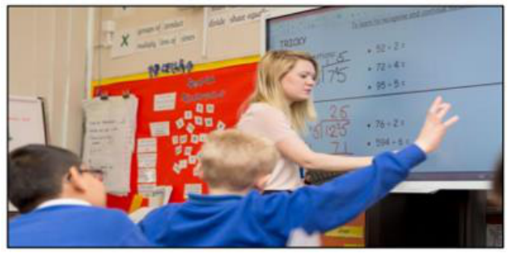


(2 March 2016. •12:38 pm. Hazel Davis.) 

It’s been a long time since attending school consisted of hauling in a large pile of books and sitting still looking at the teacher all day. Students these days are online, connected and digitally savvy. But are we making the most of this? One Hertfordshire school certainly is.

---

<!-- pagina: 91 -->

**Andrea Belo Aula 02 - Verbs in texts** 

Back in 2013, Hobletts Manor Junior School in Hemel Hempstead received its Oftsed report. Though it was very good, the report suggested the school could be outstanding if its pupils were able to use their ICT skills in more subjects. At the time, the school had a similar IT setup to most other UK primary schools: one ICT suite with limited pupil access. This, says head teacher Sally Short, made it difficult to embed technology across the curriculum in the ways they would like. But with the help of the school’s ICT coordinator and year 4 teacher Alice Baker, the local authority and PC World Business, Mrs Short came up with a shortlist of requirements to bring the school and its teaching style properly into the digital age. 

From ordering to installation, the process took just four weeks and at the end of it the school had a whole host of innovative tech, including an interactive 70inch Smart table, which works like a giant iPad. Miss Baker devised an interactive activity about the Egyptians and, she says, things like this have made a huge difference to learning. Because more than one person can interact with the Smart table, Mrs Short says her own teaching style has changed: “Before, lessons were purely teacher-led. It’s opening doors we didn’t even know existed and having an amazing impact.” The students were also each given their own Windows 8-enabled tablet; one child was so excited about this that he even burst into tears. The digital natives needed just one session to experiment and they were off. Miss Baker laughs: “They even teach me how to use the kit sometimes.” It might seem as though increased technology decreases concentration 

but, says Miss Baker, “Pupils are so much more engaged when they’re using the tablets, even if they’re just checking their answers on them.” 

The tech has also allowed the children to be more independent in their learning, but there are security measures in place to ensure Miss Baker has control over content and activity. Miss Baker has Acer Class Management software installed on her tablet. This allows her to see what all the students are doing on their tablets, and also enables her to share slideshows and websites. Handily, she can even lock their screens. At the same time, the entire school network has been upgraded. Pupils and teachers can now access a Wi-Fi connection in the outdoor learning area and there are plans afoot to allow them to use their tech in the nearby woodland and garden. The school is carefully monitoring the impact of the new technology, and has been making careful comparisons on the students’ progress. The teachers hope, too, that the tech will have a positive impact on attendance as students become increasingly engaged in lessons. 

“Following the installation, we surveyed pupils to gauge their perceptions on technology,” says Miss Baker, “Pupils who have been able to take advantage of the tools provided by PC World Business said that they felt technology was really important and that they will use it when they grow up. Perhaps most importantly, all the students in the class agreed that the technology has helped them learn.” 

(Available in: www.telegraph.co.uk. Adapted.)

---

<!-- pagina: 92 -->

**Andrea Belo Aula 02 - Verbs in texts** 

As to its use in the text, LEARNING (L 13) follows the same pattern of 

(A) learning (L 22). 

- (B) ordering (L 11). 

- (C) checking (L 18). 

- (D) outstanding (L 05). 

#### 35. (IDECAN/2016 – PREFEITURA MUNICIPAL DE MANHUMIRIM – MG) 

Robert said he would have his son to install the new treadmill if he dropped by on the weekend. A B C D 

Mark the item that contains an inconsistency and its corresponding correction. 

(A) In. 

(B) Told. 

- (C) Grind. 

- (D) Install. 

#### 36. (IDECAN/2016 – CBM-DF) 

Read the dialogue to answer. 

Kate: You haven’t uttered a word ever since we’ve gotten here. 

Babs: I feel dizzy and have a sore gut. 

Kate: You’d better see a doctor. 

“You’d better see a doctor” is the contration of: 

- (A) You had better see a doctor. 

- (B) You would better see a doctor. 

- (C) You would better have seen a doctor. 

- (D) You could better see a doctor. 

#### 37. (IADES/2016 – CEITEC S.A) 


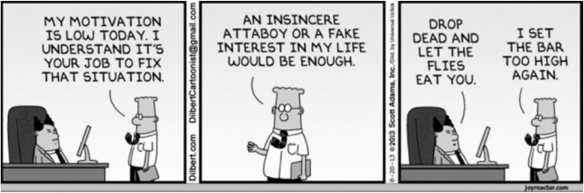


Internet: <http://joshuareich.org/2013/08/20/its-tuesday-afternoon-yourmotivation-is-low/>. Access: 12 Dec. 2015.

---

<!-- pagina: 93 -->

**Andrea Belo Aula 02 - Verbs in texts** 

The sentence with the underlined verb(s) with the same grammar structure and purpose of the underlined verbs in the sentence “drop dead and let the flies eat you” is 

- (A) I don’t like you. You should stop talking to me. 

- (B) You might have to leave the room. 

- (C) Can’t you just stay away? 

- (D) How dare you need my help? 

- (E) Go away now and leave me alone. 

#### 38. (IADES/2016 – CEITEC S.A) 

With the blockbuster success of Fifty Shades of Grey, many people are curious about dipping their toes (not to mention other body parts) into more sexually adventurous waters. 

I’m always careful to make clear that while the adventures of Ana and Christian may make for a compelling erotic yarn, their story is by no means an accurate depiction of BDSM relationships (bondage, discipline, dominance, submission, sadism, masochism), nor is “Fifty Shades” any sort of guide book. 

For instruction on that topic, you’ll need to turn to the works of true sex-positive educators such as Clarisse Thorn or Tristan Taormino and their books The S&M Feminist and The Ultimate Guide to Kink, respectively. 

But there’s no denying that Fifty Shades has sparked widespread interest in how to improve our sex lives — and what better way to do that than via a good “how-to” book? 

If you’re uncomfortable talking about sex to your friends, doctor, therapist or even your partner, such books can be an important resource, whether they impart new information, help you work through an issue, inspire you to become more adventurous or simply turn you on […] 

Internet: <http://edition.cnn.com/2012/08/23/health/kerner-sexbooks/index.html?iref=allsearch>. Access: 13 Dec. 2015, adapted. 

When combined with the right preposition, the word “turn” can have several different meanings. Choose the meaning that is correct for its respective “turn + preposition”. 

- (A) “To turn on” means to refuse. 

- (B) “To turn in” is to go one way or another. 

- (C) “To turn up” is to appear. 

- (D) “To turn off” is to deny the truth. 

- (E) “To turn out” means to become great.

---

<!-- pagina: 94 -->

**Andrea Belo Aula 02 - Verbs in texts** 

#### 39. (IADES/2016 – CEITEC S.A) 

[…] Black Friday, which has traditionally been the moment to flock to stores for steep discounts, and which has evolved to also include major online sales events for retailers like Amazon, Best Buy and Walmart, is not all that it is billed to be. We asked J. D. Levite, the deals editor of the product recommendations website The Wirecutter, for some data on just how beneficial the deals are on Black Friday — and the answer was not encouraging. 

Year round, Mr. Levite and his team track product prices across the web to unearth discounts on goods of all types, from gadgets to kitchenware. They also look at whether the product is high quality and durable based on their own testing and other reviews, and whether the seller or brand has a reasonable return or warranty policy. By those measures, Mr. Levite said, only about 0.6 percent, or 200 out of the approximately 34,000 deals online, which typically carry the same price tags inside retailers’ physical stores, will be good ones on Black Friday. 

“There are just more deals on that day than any other day of the year,” he said. “But for the most part, the deals aren’t anything better than what you’d see throughout the rest of the year.” 

Internet: <https://www.nytimes.com/2015/11/26/technology/personaltech/black-friday-deal-or-dud-how-to-shop-smart-this-holiday-season.html>. Access: 26 nov. 2015. 

According to the sentence “Mr. Levite and his team track product prices across the web to unearth discounts on goods of all types, from gadgets to kitchenware” (lines 9 to 11), 

(A) there are two types of goods: gadgets and kitchenware. 

(B) “unearth discounts” means that discounts are not from planet Earth. 

(C) “from gadgets to kitchenware” is a sentence that corroborates the idea that they tracked many and varied products. 

(D) gadgets and kitchenware are good. 

(E) Mr. Levite is very competent at his job. 

#### 40. (IADES/2019 – INSTITUTO RIO BRANCO) 

On any person who desires such queer prizes, New York will bestow the gift of loneliness and the gift of privacy. It is this largess that accounts for the presence within the city’s walls of a considerable section of the population; for the residents of Manhattan are to a large extent strangers who have pulled up stakes somewhere and come to town, seeking sanctuary or fulfillment or some greater or lesser grail. The capacity to make such dubious gifts is a mysterious quality of New York. It can destroy an individual, or it can fulfill him, depending a good deal on luck. No one should come to New York to live unless he is willing to be lucky. 

#### […] 

There are roughly three New Yorks. There is, first, the New York of the man or woman who was born here, who takes the city for granted and accepts its size and its turbulence as natural and inevitable. Second, there is the New York of the commuter—the city that is devoured by locusts

---

<!-- pagina: 95 -->

**Andrea Belo Aula 02 - Verbs in texts** 

each day and spat out each night. Third, there is the New York of the person who was born somewhere else and came to New York in quest of something. Of these three trembling cities the greatest is the last—the city of final destination, the city that is a goal. It is this third city that accounts for New York’s high-strung disposition, its poetical deportment, its dedication to the arts, and its incomparable achievements. Commuters give the city its tidal restlessness; natives give it solidity and continuity; but the settlers give it passion. And whether it is a farmer arriving from Italy to set up a small grocery store in a slum, or a young girl arriving from a small town in Mississippi to escape the indignity of being observed by her neighbors, or a boy arriving from the Corn Belt with a manuscript in his suitcase and a pain in his heart, it makes no difference: each embraces New York with the intense excitement of first love, each absorbs New York with the fresh eyes of an adventurer, each generates heat and light to dwarf the Consolidated Edison Company. 

White, E.B. (1999) Here is New York. New York: The Little Book Room, with adaptations. 

Considering the text, mark the following items as right (C) or wrong (E). 

The fragment “to dwarf the” (line 36) could be correctly replaced with that contribute to . 

(    ) Certo. 

(    ) Errado. 

#### 41. (FUNDATEC/2022 – PREFEITURA MUNICIPAL DE ANDRÉ DA ROCHA – RS) 

#### ‘Alien’ minerals never found on Earth identified in meteorite 

While generations of camel herders of El Ali town in Somalia had known about the meteorite, which is the ninth largest ever found, it wasn’t scientifically documented until a few years ago. The oddly smooth rock caught the eye of prospectors, and when they hit it with a hammer, a metallic tone resounded. They suspected it was an iron meteorite — an object from space largely made of iron and nickel, many of which are believed to have come from the cores of smashed asteroids or planetesimals, similar to our own planet's metallic center. 

The prospectors sent small samples of _______ meteorite to scientists for confirmation and further analysis, and _______ piece fell into _______ hands of Chris Herd, curator of the meteorite collection at the University of Alberta. While studying the slice of rock, he noticed several crystals with unusual compositions. Later analysis, including a comparison to synthetically created minerals, confirmed his hunch: the composition and structure of the minerals had never been seen before in nature. 

Herd named one mineral elaliite, after the meteorite itself, and the second elkinstantonite, after Lindy Elkins-Tanton, a planetary scientist at Arizona State University. Chi Ma, a meteorite mineralogist at the California Institute of Technology who has previously discovered dozens of new minerals, identified the third mineral, calling it Olsenite to honor the late Edward Olsen, a former curator at the Field Museum of Natural History in Chicago.

---

<!-- pagina: 96 -->

**Andrea Belo Aula 02 - Verbs in texts** 

Our planet has roughly 5,800 minerals, while only about 480 have been found in meteorites. Many of those meteoritic minerals are truly alien — some 30 percent don't form naturally on Earth. Studying the mineralogy of meteorites is "armchair solar system exploration, in a lot of ways", Herd says. "We're trying to constrain the variety of conditions that have existed within different planetary bodies". 

Adapted from: https://www.nationalgeographic.com/magazine/article/alien-minerals-never-found-on-earth-identified-in-meteorite 

In lines 01 and 02 we find the following excerpt: 

“While generations of camel herders of El Ali town in Somalia <mark>had known</mark> (1) about the meteorite, which is the ninth largest ever found, it <mark>wasn’t</mark> scientifically <mark>documented</mark> (2) until a few years ago.” 

Consider the statements below about the <mark>highlighted</mark> structures and mark T, if true, of F, if false. 

(    ) 1 is a past perfect structure. 

- (    ) The action expressed by 1 happened after the action expressed by 2. 

- (    ) 2 is a simple past, negative passive voice structure. 

(    ) 2 is a completed action. 

The correct order of filling the parentheses, from top to botton, is: 

- (A) T – F – T – T. 

- (B) F – T – F – T. 

- (C) F – T – T – F. 

- (D) T – F – F – T. 

- (E) T – F – T – F. 

#### 42. (FUNDATEC/2022 – PREFEITURA MUNICIPAL DE RESTINGA SÊCA – RS) 

#### What is the internet of things? 

In the internet of things (IoT), a “thing” can be __ person with a heart monitor implant, __ animal with a biochip transponder, __ car with sensors to alert when tire pressure is low, or any object that is able to transfer data. IoT is __ system of interrelated “things” that are provided with __ ability to transfer information over a network without requiring human interaction. It uses artificial intelligence and machine learning to improve data collecting, and sometimes devices can even communicate with each other and then act on __ information they get. 

In agriculture, IoT-based smart farming systems can help monitor light, temperature, humidity, and soil moisture of crop fields; automatize irrigation systems, and collect data on rainfall and soil content. The infrastructure industry can benefit from sensors that monitor events or changes within structural buildings and bridges. To healthcare, IoT offers the ability to monitor patients more closely using an analysis of the data that's generated.

---

<!-- pagina: 97 -->

**Andrea Belo Aula 02 - Verbs in texts** 

Smart homes are equipped with smart thermostats, appliances, and connected heating, lighting, and electronic devices that can be controlled remotely via smartphones. Smart buildings can reduce energy costs using sensors that detect how many occupants are in a room and then adjust the temperature automatically. Wearable devices with sensors can be used for public safety, for example, by providing optimized routes to a location where there is an emergency, or by tracking firefighters' vital signs at life-threatening sites. 

Obviously, there are some disadvantages, too, and the list includes the risk that <u>confidential information is stolen by hackers , and the difficulty for devices from different manufacturers to</u> communicate with each other since there's no international standard of compatibility for IoT. Companies may have to deal with massive numbers, and collecting and managing the data from all those devices will be challenging. Ultimately, if there's a bug in the system, it's likely that every connected device will become corrupted. 

"Pros and cons in perspective, Matthew Evans, the IoT program head at techUK, says that In the short term, we know [IoT] will impact on anything where there is a high cost of not 

intervening, Evans said. ""And it’ll be for simpler day-to-day issues – like finding a car parking space in busy areas, linking up your home entertainment system, and using your fridge webcam to check if you need more milk on the way home.”" 

(Available in: from: https://www.techtarget.com/iotagenda/definition/Internet-of-Things-IoT https://www.wired.co.uk/article/internet-of-things-what-is-explained-iot – text especially adapted for this test). 

Find the INCORRECT statement about the sentence “Confidential information <u>is stolen</u> by hackers” (l. 19). 

- (A) This kind of structure emphasizes the action, not the agent. 

- (B) It is in passive voice. 

- (C) It is in active voice. 

- (D) It is in simple present. 

- (E) The structure in bold is formed by BE past participle. 

#### 43. (FUNDATEC/2022 – PREFEITURA MUNICIPAL DE RESTINGA SÊCA – RS) 

Not considering any adaptations needed to preserve the sentence’s correctness, all words below are synonyms for the underlined term in the excerpt “Companies <u>may</u> have to deal with massive numbers”, EXCEPT: 

#### (A) Will 

#### (B) Can 

#### (C) Might 

#### (D) Possibly 

- (E) Perhaps

---

<!-- pagina: 98 -->

**Andrea Belo Aula 02 - Verbs in texts** 

#### 44. (FUNDATEC/2020 – PREFEITURA MUNICIPAL DE TRÊS PALMEIRAS – RS) 

#### Flying foxes are dying en masse in Australia’s extreme heat 

The 30,000 gray-headed flying foxes in Yarra Bend Park, just outside the heart of Melbourne, Australia, were having a fairly normal early spring. In September and October, prime birthing season for the 11-inch long megabats, many of the flying foxes had returned to the park from their winter migration up the coast. Females were birthing pups as normal, says biologist Stephen Brend, who is _______ charge of monitoring gray-headed flying foxes at Yarra Bend Park, which is home to a significant colony of the bats. “But then it got too hot, too quickly” says Brend. 

Incapable _______ surviving the extreme, relentless heat that gripped Melbourne _______ December, the flying foxes were dying. Across three days just before Christmas, when temperatures exceeded 110 degrees Fahrenheit, 4,500 of the park’s gray-headed flying foxes perished — 15 percent of the colony’s population. The tragedy in the park echoes scenes of wildlife suffering across the country and puts a spotlight on the perils of extreme heat, <mark>which</mark> for some species can be just as deadly as fire. Australia’s endemic animals are falling victim to the heatwaves and fires that are ravaging the country at an unprecedented scale. It’s the hottest and driest summer in Australia in recorded history. As the planet warms, large-scale fires are becoming more frequent, and bushfire seasons are getting longer. 

For gray-headed flying foxes, which are classified as vulnerable to extinction, the Yarra Bend event is not isolated. “The colony in Adelaide suffered even worse,” says Brend. _______ January 4, many thousands of flying fox babies died _______ multiple roosts in and around the Sydney region in New South Wales, <mark>where</mark> the temperature reached a record-breaking 121 degrees Fahrenheit. Professor Justin Welbergen’s team, which monitors flying fox heat stress conditions, is calculating a final death toll. 

This summer’s extreme heat and extreme fires, <mark>which</mark> have imperiled Australia’s entire eastern coast “risk wiping out the 2019 generation” of newborn bats, Brend says. Some 80 percent of flying fox pups are born in October. They were young and vulnerable when heat waves and wildfires broke out late last year. Flying foxes play a vital role in the forest. They carry seeds and pollinate trees, gardening the forest by night. “Bats need the forest and the forest needs the bats,” says Brend. And it’s still the middle of summer in Australia. “We’ll battle on for our upside down friends, but things look very grim” says Lawrence Pope, a rescuer.” “In this horror year, all species are suffering.” Brend says. “We’re hot, and they’re hot, and it’s a nightmare.” 

Adapted from: https://www.nationalgeographic.com/animals/2020/01/flying-foxes-are-dying-en-mqasse-in-australias-extreme-heat/ 

Select the alternative with a sentence written in the same verb tense used in “Australia’s endemic animals are falling victim to the heatwaves and fires…” (l. 13-14): 

(A) Australia was suffering because of the extreme weather conditions. 

- (B) Australia have been suffering because of the extreme weather conditions. 

- (C) Australia will be suffering because of the extreme weather conditions. 

- (D) Australia had been suffering because of the extreme weather conditions. 

- (E) Australia is suffering because of the extreme weather conditions.

---

<!-- pagina: 99 -->

**Andrea Belo Aula 02 - Verbs in texts** 

|||**GABARIT**<br>|**O**<br>||
|---|---|---|---|---|
|01 – Certo|02 – Errado|03 – Errado|04 – Errado|05 – C|
|06 – A|07 – D|08 – B|09 – E|10 – E|
|11 – D|12 – B|13 – E|14 – C|15 – A|
|16 – E|17 – D|18 – B|19 – D|20 – A|
|21 – C|22 – D|23 – C|24 – D|25 – A|
|26 – D|27 – D|28 – D|29 – D|30 – A|
|31 – E|32 – A|33 – A|34 – B|35 – D|
|36 – A|37 – E|38 – C|39 – C|40 – Errado|
|41 – A|42 – C|43 – A|44 – E||

---

<!-- pagina: 100 -->

**Andrea Belo Aula 02 - Verbs in texts** 

# **QUESTÕES COMENTADAS** 

#### 01. (CEBRASPE/2019 – PREFEITURA MUNICIPAL DE SÃO CRISTÓVÃO – SE) 

#### Study skills tips 

What makes a good language learner? There are some things that good language learners do and some things they don’t do. Here are some of the most useful suggestions. 

• Don’t be afraid of making mistakes. Good language learners notice their mistakes and learn from them. 

• Do group activities. A good language learner always looks for opportunities to talk with other students. 

• Make notes during every class. Look at your notes when you do your homework. 

• Use a dictionary. Good language learners often use dictionaries to check the meaning of words they don’t know. 

• Think in the language you’re learning outside the classroom. When you’re shopping or walking down the street, remember useful words and phrases. 

• Do extra practice. Test and improve your language, reading and listening skills with self-study material. You can find a lot of this online. 

• Imagine yourself speaking in the language. Many good language learners can see and hear themselves speaking in the language. 

• Enjoy the process. Good language learners have fun with the language. Watch a TV series or film, listen to songs, play video games or read a book. It’s never too late to become a good language learner. 

Internet: <learnenglish.britishcouncil.org> (adapted). 

No que se refere ao texto anterior e a seus aspectos linguísticos, julgue o item a seguir. 

In the sentence “When you’re shopping or walking down the street” (L. 14 and 15), the verbal forms express an idea that corresponds to the subjunctive tense in Portuguese. 

(    ) Certo 

(    ) Errado 

#### GABARITO: CERTO 

Comentários: O tempo verbal do trecho indicado nessa questão é o Presente Contínuo , que normalmente é usado para expressar ações habituais que acontecem regularmente (When you’re shopping or walking down the street = quando você está fazendo compras ou andando na rua). 

No entanto, nesse trecho do texto há uma sugestão para o aprendiz lembrar-se de palavras ou frases úteis quando estiver fazendo compras ou andando na rua e, para isso, o tempo verbal usado

---

<!-- pagina: 101 -->

**Andrea Belo Aula 02 - Verbs in texts** 

é o Presente Contínuo . Observe: When you’ re shopping or walking down the street, remember useful words and phrases. (l.14-15). Para expressar a mesma ideia em português, usamos o Futuro do modo Subjuntivo ( Quando você fizer compras ou andar na rua, ....). Logo, o item está certo . 

02. (CEBRASPE/2019 – PREFEITURA MUNICIPAL DE SÃO CRISTÓVÃO – SE) 

It was early 2016 in the Calais Refugees Camp. We had students asking to learn English and French but they didn’t want to learn grammar or long lists of vocabulary. Opportunities for oral interaction were limited. 

Food and cooking have become essential elements in many refugee education projects and it’s a great topic for the English classroom more generally. Recipes use relatively predictable and restricted vocabulary that can be easily adjusted for language level. The grammar can also be limited to the imperative: “First chop the onions. Then fry them in oil.” This creates a good opportunity to work on pronunciation, word stress and intonation using authentic materials: “Chop the tomatoes and add them to the onions”. 

I first used cooking for language-learning while working alongside Kate McAllister with a community of male Sudanese refugees in Calais who had organised themselves around a small communal kitchen. It was very primitive only a small room with two gas burners connected to a gas tank, but some great meals were cooked there, usually with very limited ingredients. 

Kate planned lessons around simple French and English recipes in exchange for Sudanese recipes from our students. Recipes were presented with simple diagrams and pictures, to be annotated in English and/or French and Arabic. “We talked. We learned. We cooked. We laughed. We ate. It was a good day.” 

Cooking is also a great opportunity to take students shopping an authentic task of buying real food. Best of all, these lessons went beyond language learning, fostering a sense of community in the class. 

Gil Ragsdale. Recipes for success in language learning . Internet: <www.elgazette.com> (adapted). 

O texto relata uma experiência de aprendizagem de inglês e francês por meio da troca de receitas entre refugiados em um campo de refugiados de Calais. A respeito das ideias e informações do texto precedente e de seus aspectos linguísticos, julgue o item que se segue. 

In the sentences ‘First chop the onions. Then fry them in oil.’ (L.10), the verbs “chop” and “fry” are used in the present continuous. 

(    ) Certo 

(    ) Errado 

#### GABARITO: ERRADO

---

<!-- pagina: 102 -->

**Andrea Belo Aula 02 - Verbs in texts** 

Comentários: A questão nos pede para julgar como certa ou errada a afirmação que diz o seguinte: 

Na frase ‘First chop the onions. Then fry them in oil.’ (linha10), os verbos “chop” e "fry” são usados no presente contínuo. 

A tradução da frase é: "Primeiro pique as cebolas. Então frite elas no óleo.". 

Bom, o presente contínuo é caracterizado pelo acréscimo da terminação -ing aos verbos, para indicar uma ação que continua, e isto não é o que ocorre na frase em questão, onde os verbos estão na forma infinitiva, indicando ordens: " <u>Pique</u> as cebolas", " <u>Frite</u> elas no óleo.". 

Assim sendo, a questão está errada. 

O presente contínuo é formado com o presente simples do verbo to be (am/is/are) + o gerúndio ( -ing ) do verbo principal. 

Vejamos alguns exemplos: 

- I am writ <u>ing</u> an article. (Estou escrevendo um artigo.) 

- She is wash <u>ing</u> the dishes. (Ela está lavando a louça.) 

- You are not work <u>ing . (= You aren't working.) (Você não está trabalhando.)</u> 

#### 03. (CEBRASPE/2015 – MPOG) 

The Obama administration announced a program to connect thousands of public housing residents across the nation to the Internet at low prices or free, part of a broader effort to 4 close the so-called digital divide and help low-income Americans succeed in a technology-driven society. 

Appearing at a school in the heart of the Choctaw Nation, in Oklahoma, where 32 percent of children live in poverty, Mr. Obama announced the ConnectHome program and said it was unacceptable for young people not to have access to the same technological resources in their homes that their wealthier counterparts do. “If we don’t get these young people the access to what they need to achieve their potential, then it’s our loss; it’s not just their loss”, he said. “They’ve got big dreams, and we’ve got to have an interest in making sure they can achieve those dreams,” he added. 

“While many middle-class U.S. students go home to Internet access, which allows them to do research, write papers and communicate digitally with their teachers and other students, too many lower-income children go unplugged every afternoon when school ends,” a statement about the report said. “This ‘homework gap’ runs the risk of widening the achievement gap, denying hardworking students the benefit of a technology-enriched education.” 

The pilot program, ConnectHome, will be carried out in different forms in public housing units in 27 cities and in one Native American tribal area, largely focusing on households with school-age children. The program will involve city officials, Internet providers, universities, and a large retail company, which will offer computer training to residents in some cities. The program will offer

---

<!-- pagina: 103 -->

**Andrea Belo Aula 02 - Verbs in texts** 

some residents a chance to buy tablets with educational software installed for $30 each. Other communities will receive free help with SAT preparation and free technical support. 

The program is an offshoot of the president’s ConnectED initiative, which was announced in 2013. It aimed to link 99 percent of the students from kindergarten through 12<sup>th</sup> grade to high-speed Internet in classrooms and libraries over the next five years. 

It is also part of a renewed vigor in the Obama administration’s housing agenda coming late in his final term and recently emboldened by a Supreme Court ruling endorsing a broad interpretation of the Fair Housing Act of 1968, a relevant feat for civil rights. That ruling allows for more lawsuits that could help fight housing discrimination. 

Dionne Searcey. U.S. program will connect public housing residents to Web . Internet: <www.nytimes.com>.(adapted). 

Based on the previous text, judge the following items. 

In the text, the words “making” (line.14), “training” (line.29) and “ruling” (line.43) are all used as verbs indicating actions. 

(    ) Certo 

(    ) Errado 

#### GABARITO: ERRADO 

Comentários: É muito comum que se confunda o gerúndio na língua inglesa com uma forma verbal, quando, na verdade, ele é uma forma nominal. Tomei a liberdade de utilizar parte da aula do professor Denílson de Lima, que aborda o assunto: 

"Para começar, veja a definição de Gerund (gerúndio) na Cambridge Grammar of English, página 905: “palavra derivada de uma forma do verbo terminada em –ing e que é usada como substantivo. É também conhecido como verbal noun ou –ing noun”. 

Observe que “gerund” em inglês nada tem a ver com tempo verbal. Trata-se apenas do fato de um verbo receber –ing e ser usado como substantivo. 

Veja alguns exemplos: 

- → 

- Playing sports is healthy Praticar esportes é saudável. 

- Fishing is my favorite activity → Pescar é minha atividade favorite. 

- → 

- I’m tired of hearing excuses Estou cansado de ouvir desculpas. 

- → 

- You can’t learn English without making mistakes Não se aprende inglês sem cometer erros. 

Logo MAKING, TRAINING AND RULING são formas nominais, não verbais.

---

<!-- pagina: 104 -->

**Andrea Belo Aula 02 - Verbs in texts** 

#### 04. (CEBRASPE/2015 – TCE-RN) 

Managers of information technology departments, also known as IT-managers, are responsible for the overall performance of the electronic networks that allow a business to function. The exact scope of these responsibilities varies from one setting to another. However, at the core of the ITmanager job description is the care of the in-house network. This often means that the IT-manager is involved in the selection of hardware and software used in the network. For example, an ITmanager would likely be involved in any discussions about updating the internal servers and computer workstations. There is a good chance that (s)he would also work with other staff members in the selection of software, such as accounting programs or some type of sales and customer database. 

Along with helping to establish the overall structure of the network, an IT-manager would also oversee processes that 16 would seek to identify any potential glitches in any programming that could cause some sort of system failure. 

Internet: <http://www.wisegeek.com> (adapted). 

In the text about IT-managers, the word 

“could” (line.17) can be replaced by can without any change in the meaning of the text. 

(    ) Certo 

(    ) Errado 

#### GABARITO: ERRADO 

Comentários: Tanto can quanto could são verbos modais que podem expressar possibilidade . 

Quando a possibilidade é pequena ou incerta , o correto é utilizar could . 

O enunciado refere-se à seguinte parte do texto: 

- "... identify any potential glitches in any programming that could cause some sort of system failure." 

Perceba na tradução abaixo que o texto frisa bastante a incerteza e a possibilidade remota: 

- "... identificar qualquer falha em qualquer programação que possa causar qualquer tipo de falha no sistema." 

Nesse caso, portanto, deve-se utilizar o verbo modal could. 

#### 05. (FCC/2016 – SEGEP-MA) 

Goods in transit refers to merchandise and other inventory items that have been shipped by the seller, but have         I been received by the purchaser. To illustrate goods in transit, let's use the following example. Company J ships a truckload of merchandise on December 30 to Customer K, which is located 2,000 miles away. The truckload of merchandise arrives at Customer K on

---

<!-- pagina: 105 -->

**Andrea Belo Aula 02 - Verbs in texts** 

January 2. Between December 30 and January 2, the truckload of merchandise is goods in transit. The goods in transit requires special attention if the companies issue financial statements as of December 31. The reason is that the merchandise is the inventory of one of the two companies. <u>However, the merchandise is not physically present at either company. One of the two companies</u> must add the cost of the goods in transit to the cost of the inventory that it has in its possession. 

The terms of the sale will indicate which company should report the goods in transit as its inventory as of December 31. If the terms are FOB shipping point, the seller (Company J) will record a December sale and receivable, and         II include the goods in transit as its inventory. On December 31, Customer K is the owner of the goods in transit and will need to report a purchase, a payable, and must add the cost of the goods in transit to the cost of the inventory which is in its possession. 

If the terms of the sale are FOB destination, Company J will not have a sale and receivable until January 2. This means Company J must report the cost of the goods in transit in its inventory on December 31. (Customer K will not have a purchase, payable, or inventory of these goods until January 2.) 

(Adapted from http://www.accountingcoach.com/blog/what-are-goods-in-transit ) 

A alternativa que preenche corretamente a lacuna II é 

- (A) must 

- (B) will 

- (C) will not 

- (D) should 

- (E) would not 

#### GABARITO: C 

Comentários: O texto fala sobre mercadorias e outros itens de estoque que foram despachados pelo vendedor, mas não foram recebidos pelo comprador, denominadas mercadorias em trânsito. 

Para preencher corretamente a lacuna II a alternativa deve conter uma expressão que dê um significado de negação no futuro. 

#### Must > ERRADO. 

Must é um verbo modal , o qual é utilizado para expressar obrigação e dedução (quando usado na afirmativa) e proibição (quando usado na negativa). 

Assim, podemos concluir que a alternativa está errada. 

Will > ERRADO. 

O termo Will pode ser utilizado como verbo modal, substantivo ou até mesmo verbo.

---

<!-- pagina: 106 -->

**Andrea Belo Aula 02 - Verbs in texts** 

Vejamos um exemplo de cada: 

1. Como verbo modal: Dr Weir wil l see you now. (O Dr. Weir <u>vai atendê-lo agora.)</u> 

2. Como substantivo no sentido de vontade, desejo: Even though she was in terrible pain, Mary never lost the will to live. (Mesmo sentindo muita dor, Mary nunca perdeu a <u>vontade de viver.)</u> 

3. Como verbo: She was willing herself not to cry. (Ela estava se <u>esforçando para não chorar.)</u> 

Desse modo, podemos concluir que a alternativa está errada. 

will not > CERTO. 

"Will not" é a transformação do verbo "will" na sua forma negativa , colocando o "not" antes do verbo principal, sendo utilizado para expressar uma negativa no futuro. 

Além disso, pode ser utilizado na sua forma contraída: won’t. Sua tradução vai depender do modo <u>que o termo é aplicado na frase.</u> 

Desse modo, podemos concluir que a alternativa está certa. 

Should > ERRADO. 

A palavra " should " é geralmente utilizada quando precisamos expressar a ideia de obrigação ou de que algo é aconselhável (é bom ou importante que seja feito). Ou seja, basicamente para fazer <u>sugestões.</u> 

Assim, podemos concluir que a alternativa está errada. 

would not > ERRADO. 

O verbo “would” pertence aos “modal verbs” (verbo modal) que, na língua Inglesa, tem o papel de auxiliar o verbo principal em uma frase. Pode-se utilizar esse modal para fazer um pedido <u>educado, um convite, além transformar o verbo principal em um condicional.</u> 

No caso da alternativa, esse verbo está sendo exposto na sua forma negativa, pois foi acrescentado o "not". 

Desse modo, podemos concluir que a alternativa está errada. 

#### 06. (FCC/2015 – DPE-SP) 

Harvard study: Men want powerful jobs more than women 

By Justine Hofherr, Boston.com Staff | 09.29.15 

Let’s get one thing straight: Women believe they are as capable as men to attain and perform high-level leadership positions at work. Many just don’t want them as much, according to new research from Harvard Business School. 

The paper, published in the Proceedings of the National Academy of Sciences (PNAS), includes nine studies conducted on high-achieving groups. Professor Francesca Gino, doctoral student Caroline Wilmuth, and associate professor Alison Wood Brooks (all of HBS) surveyed over 4,000

---

<!-- pagina: 107 -->

**Andrea Belo Aula 02 - Verbs in texts** 

male and female employees from different industries, and found a big gap between the professional objectives of men and women. 

While women reported having twice as many “life goals” as men - desired achievements that ranged from having strong relationships, marriage, a meaningful career, and family - fewer were focused on professional power, which women were more likely to associate with negative outcomes like stress and conflict. 

“This is a snapshot of where our culture is right now", Brooks told Boston.com. “If we      I      these questions 50 years ago, or in another 50 years, we might see dramatically different results. Women are pursuing careers on par with men, yet women are still a little more responsible for things at home.” 

(Adaptado de: http://www.boston.com/jobs/news/2015/09/29/harvard-study-men-want-powerful-jobs-more-than-women/WQpgG8WdFZWssfxm40plrL/story.html ) 

A alternativa que preenche corretamente a lacuna I é 

#### (A) asked 

- (B) will ask 

- (C) asking 

- (D) ask 

- (E) asks 

#### GABARITO: A 

Comentários: asked . 

O trecho está no tempo verbal past subjunctive , que cria uma hipótese de algo ter acontecido . 

Está sendo dito que a pesquisa teria um resultado diferente caso essas questões fossem perguntadas há 50 anos atrás . 

Por isso, usamos o asked . 

“If we asked these questions 50 years ago, or in another 50 years, we might see dramatically different results." 

Tradução : Se nós perguntássemos essas questões há 50 anos atrás, ou daqui a 50 anos, nós deveríamos ver resultados dramaticamente diferentes. 

#### 07. (FCC/2015 – DPE-SP) 

What Causes a Super Blood Moon? 

By Daniel Victor, Sept, 25, 2015. 

A rare astronomical phenomenon Sunday night will produce a moon that will appear slightly bigger ……..I…….. usual and have a reddish hue, an event known as a super blood moon.

---

<!-- pagina: 108 -->

**Andrea Belo Aula 02 - Verbs in texts** 

It’s a combination of curiosities that hasn’t ……..II…….. since 1982, and won’t happen again ……..III…….. 2033. A so-called supermoon, which occurs when the moon is closest to earth in its orbit, will coincide with a lunar eclipse, leaving the moon in Earth’s shadow. Individually, the two phenomena are not uncommon, but they do not align often. 

Most people are unlikely to detect the larger size of the supermoon. It may appear 14 percent larger and 30 percent brighter, but the difference is subtle to the plain eye. But the reddish tint from the lunar eclipse is likely to be visible throughout much of North America, especially on the East Coast. 

“You’re basically seeing all of the sunrises and sunsets across the world, all at once, being reflected off the surface of the moon,” said Dr. Sarah Noble, a program scientist at NASA. 

(Adaptado de: http://www.nytimes.com/2015/09/26/science/super-blood-moon-to-make-last-appearance-until2033.html ) 

A alternativa que preenche corretamente a lacuna II é 

#### (A) happen 

#### (B) happening 

- (C) will happen 

- (D) happened 

- (E) happens 

#### GABARITO: D 

#### Comentários: happened . 

O trecho está no tempo verbal do present perfect , o que é evidenciado pelo uso de hasn't . 

E a conjugação do verbo to happen nesse tempo verbal exige a flexão na forma happened . 

Para não termos que decorar isso, é importante fazer a associação de que o termo hasn't menciona algo que <u>não ocorreu desde um certo tempo</u> . 

E as outras flexões sugeridas de to happen (happen, happening, will happen e happens) são equivalentes, respectivamente, a acontecer , acontecendo , vai acontecer e acontece (agora). 

Nenhum menciona algo que não ocorreu desde certo tempo, como o termo hasn't happened demonstra. 

#### 08. (FCC/2015 – SEDU-ES) 

It was rush time and she couldn’t ...... the bus. 

#### (A) get out 

#### (B) get off 

- (C) get down 

- (D) get over 

- (E) get up

---

<!-- pagina: 109 -->

**Andrea Belo Aula 02 - Verbs in texts** 

#### GABARITO: B 

Comentários: A questão aborda os usos do verbo TO GET , como um verbo frasal, aplicado à seguinte frase: 

- It was rush time and she couldn’t __________ the bus. 

Lembre-se de que o verbo TO GET é uma espécie de 'coringa', na língua inglesa. 

Ele pode ter diversos significados, desde conseguir ( to get a job), compreender(I get what you say) até entrar ( to get in ), sair ( to get out ) e descer ( to get down stairs). 

Nos últimos três casos, ele é definido como um PHRASAL VERB (verbo frasal) , e é acompanhado de preposição ou termo equivalente. 

#### get out > INCORRETA 

Veja que, para sair do ônibus, não se usa get out. 

Caso você ainda esteja em dúvida, veja esta dica, retirada de 'jakubmarian Science and Art' : 

- The difference between “get off” and “get out of” is a little bit more delicate // a diferença entre 'get off' e 'get out of' é um pouco delicada. 

- We get off public transport , but we get out of a (personal) car , and never the other way round // Nós ' saímos=get off ' do transporte público, mas nós ' saímos=get out of ' de um carro particular. 

get off > CORRETA 

Realmente, para 'sairmos de um ônibus, usamos GET OFF THE BUS . 

It was rush time and she couldn’t GET OFF the bus // Era hora do rush e ela não conseguia SAIR do ônibus. 

Ainda reforçamos que tais sutilezas existem em TODOS os idiomas, é preciso se acostuma com isso. Da mesma forma que, muitas vezes, o Direito Administrativo ou Constitucional não parecem NADA lógicos . 

get down > INCORRETA 

Get down não se utiliza para sair de algum lugar , mas com sentido de movimento para baixo(não para fora). 

Observe que, em português, dizemos 'descer' do ônibus. Porém, é preciso compreender que certas expressões, corriqueiras em nossa língua, podem não fazer o menor sentido em outra. Logo: 

- It was rush time and she couldn’t GET OFF the bus. 

get over > INCORRETA 

Get over significa SUPERAR , no sentido de deixar para trás. Veja: 

- It can take weeks to get over an illness like that // Pode levar semanas para superar uma doença como essa.

---

<!-- pagina: 110 -->

**Andrea Belo Aula 02 - Verbs in texts** 

#### get up > INCORRETA 

Get up significa levantar. Observe: 

- He never gets up before nine. 

Ainda há muitos outros sentidos para get up (tirado de Macmillan Dictionary): 

- Will you get me up at six tomorrow? // Você pode me acordar às 6 h? 

- Local people got up a petition against the factory closure // As pessoas locais organizaram uma petição contra o fechamento da fábrica. 

#### 09. (FGV/2022 – SENADO FEDERAL) 


From: https://aghlc.com/resources/articles/2016/how-to-prevent-phishing-attacks-160812.aspx?hss_channel=tw-2432542152 

By using the phrase “throw it out”, the poster recommends that one should 

(A) do it up. 

- (B) do for it. 

- (C) do it over. 

- (D) do without it. 

- (E) do away with it. 

#### GABARITO: E

---

<!-- pagina: 111 -->

**Andrea Belo Aula 02 - Verbs in texts** 

Comentários: A questão requer que você indique o que o anúncio sugere que o usuário faça com o uso da expressão “throw it out”. 

Analisando o anúncio, temos, no título e no subtítulo, a indicação de seu objetivo principal: auxiliar o usuário a não ser "fisgado" em um ataque de phishing. 

Para isso, ele apresenta 3 regras ao leitor, orientando-o sobre como agir quando perceber um link suspeito, sugerindo, dentre elas, que o usuário <u>descarte um link suspeito.</u> 

Dentre as alternativas, temos uma única locução verbal que expressa essa mesma ideia: do away with it (= descarte-o/elimine-o) . 

Portanto, o gabarito é a alternativa "E" . 

Veja o significado das locuções verbais presentes nas demais alternativas: 

- do it up (abotoe-o); 

- do for it (faça por ele); 

- do it over (refaça-o); 

- do without it (faça sem ele). 

#### 10. (FGV/2022 – TJ-DFT) 

Here’s why we’ll never be able to build a brain in a computer 

It’s easy to equate brains and computers – they’re both thinking machines, after all. But the comparison doesn’t really stand up to closer inspection, as Dr. Lisa Feldman Barrett reveals. 

People often describe the brain as a computer, as if neurons are like hardware and the mind is software. But this metaphor is deeply flawed. 

A computer is built from static parts, whereas your brain constantly rewires itself as you age and learn. A computer stores information in files that are retrieved exactly, but brains don’t store information in any literal sense. Your memory is a constant construction of electrical pulses and swirling chemicals, and the same remembrance can be reassembled in different ways at different times. 

Brains also do something critical that computers today can’t. A computer can be trained with thousands of photographs to recognise a dandelion as a plant with green leaves and yellow petals. You, however, can look at a dandelion and understand that in different situations it belongs to different categories. A dandelion in your vegetable garden is a weed, but in a bouquet from your child it’s a delightful flower. A dandelion in a salad is food, but people also consume dandelions as herbal medicine. 

In other words, your brain effortlessly categorises objects by their function, not just their physical form. Some scientists believe that this incredible ability of the brain, called ad hoc category construction, may be fundamental to the way brains work.

---

<!-- pagina: 112 -->

**Andrea Belo Aula 02 - Verbs in texts** 

Also, unlike a computer, your brain isn’t a bunch of parts in an empty case. Your brain inhabits a body, a complex web of systems that include over 600 muscles in motion, internal organs, a heart that pumps 7,500 litres of blood per day, and dozens of hormones and other chemicals, all of which must be coordinated, continually, to digest food, excrete waste, provide energy and fight illness. […] 

If we want a computer that thinks, feels, sees or acts like us, it must regulate a body – or something like a body – with a complex collection of systems that it must keep in balance to continue operating, and with sensations to keep that regulation in check. Today’s computers don’t work this way, but perhaps some engineers can come up with something that’s enough like a body to provide this necessary ingredient. 

For now, ‘brain as computer’ remains just a metaphor. Metaphors can be wonderful for explaining complex topics in simple terms, but they fail when people treat the metaphor as an explanation. Metaphors provide the illusion of knowledge. 

(Adapted from https://www.sciencefocus.com/future-technology/canwe-build-brain-computer/ Published: 24<sup>th</sup> October, 2021, retrieved on February 9<sup>th</sup> , 2022) 

The passage in which the verb phrase indicates a necessity is: 

- (A) “this incredible ability of the brain […] may be fundamental”; 

- (B) “some engineers can come up with something”; 

- (C) “computers don’t work this way”; 

- (D) “brains don’t store information”; 

- (E) “it must regulate a body”. 

GABARITO: E 

Comentários: A questão requer que você indique em qual das alternativas o verbo modal indica uma necessidade. 

Os verbos modais são uma classe de verbos que funcionam como auxiliares dos verbos <u>principais, alterando ou completando o sentido destes, e expressando, cada um, uma ideia específica. Relembre:</u> 

- Can : expressa a ideia de permissão, habilidade ou possibilidade; 

- Could : expressa pedido/permissão, habilidade ou hipótese no tempo passado; 

- May : expressa pedido/permissão (mais formal) ou possibilidade; 

- Might : expressa possibilidade remota; 

- Must : expressa obrigação, <u>necessidade , proibição ou dedução;</u> 

- Should : expressa conselho, sugestão; 

- Will : expressa ação no futuro; 

- Would : expressa desejo, pedido ou hipótese.

---

<!-- pagina: 113 -->

**Andrea Belo Aula 02 - Verbs in texts** 

Observe que o único modal que expressa necessidade é o <u>must , que aparece em apenas uma</u> alternativa: “it must regulate a body”. (ele precisa regular um corpo). 

Portanto, o gabarito é a alternativa "E" . 

Veja o significado das demais alternativas e a ideia expressa por cada modal ou tempo verbal usado: 

- may : "essa incrível capacidade do cérebro […] pode ser fundamental" - possibilidade; 

- can : "alguns engenheiros podem inventar alguma coisa" - possibilidade; 

- não há modal; o verbo está no presente simples, expressando fato concreto; 

- não há modal; o verbo está no presente simples, expressando fato concreto. 

#### 11. (FGV/2019 – PREFEITURA MUNICIPAL DO SALVADOR – BA) 

#### Critical Literacy, EFL and Citizenship 

We believe that a sense of active citizenship needs to be developed and schools have an important role in the process. If we agree that language is discourse, and that it is in discourse that we construct our meanings, then we may perceive the foreign language classrooms in our schools as an ideal space for discussing the procedures for ascribing meanings to the world. In a foreign language we learn different interpretive procedures, different ways to understand the world. If our foreign language teaching happens in a critical literacy perspective, then we also learn that such different ways to interpret reality are legitimized and valued according to socially and historically constructed criteria that can be collectively reproduced and accepted or questioned and changed.Hence our view of the EFL classroom, at least in Brazil, as an ideal space for the development of citizenship: the EFL classrooms can adopt a critical discursive view of reality that helps students see claims to truth as arbitrary, and power as a transitory force which, although being always present, is also in permanent change, in a movement that constantly allows for radical transformation. The EFL classroom can thus raise students’ perception of their role in the transformation of society, once it might provide them with a space where they are able to challenge their own views, to question where different perspectives (including those allegedly present in the texts) come from and where they lead to. By questioning their assumptions and those perceived in the texts, and in doing so also broadening their views, we claim students will be able to see themselves as critical subjects, capable of acting upon the world. […] 

We believe that there is nothing wrong with using the mother tongue in the foreign language classroom, since strictly speaking, the mother tongue is also foreign - it’s not “mine”, but “my mother’s”: it was therefore foreign as I first learned it and while I was learning to use its interpretive procedures. When using critical literacy in the teaching of foreign languages we assume that a great part of the discussions proposed in the FL class may happen in the mother tongue. Such

---

<!-- pagina: 114 -->

**Andrea Belo Aula 02 - Verbs in texts** 

discussions will bring meaning to the classroom, moving away from the notion that only simple ideas can be dealt with in the FL lesson because of the students’ lack of proficiency to produce deeper meanings and thoughts in the FL. Since the stress involved in trying to understand a foreign language is eased, students will be able to bring their “real” world to their English lessons and, by so doing, discussions in the mother tongue will help students learn English as a social practice of meaning-making. 

(Source: Adapted from JORDÃO, C. M. & FOGAÇA, F. C. Critical Literacy in The English Language Classroom. DELTA, vol. 28, no 1, São Paulo, p. 69-84, 2012. Retrieved from http://www.scielo.br/pdf/delta/v28n1a04.pdf). 

When the authors choose the modal verb “can” to state that “the EFL classrooms can adopt a critical discursive view of reality”, they mean that schools have this 

- (A) need. 

- (B) prediction. 

- (C) obligation. 

- (D) possibility. 

#### (E) improbability. 

#### GABARITO: D 

Comentários: A questão requer que você indique qual ideia é expressa pelo autor com o uso do verbo modal can na frase: “the EFL classrooms can adopt a critical discursive view of reality”. 

Os verbos modais são uma classe de verbos que funcionam como auxiliares dos verbos principais, alterando ou completando o sentido destes. 

O modal can expressa, em geral, a ideia de permissão, <u>habilidade ou possibilidade.</u> 

Na frase dada na questão, é possível interpretar a frase tanto pelo viés de possibilidade quanto de permissão , indicando que as escolas têm a possibilidade e a permissão para adotar uma visão discursiva crítica da realidade . 

Contudo, dentre as alternativas, temos como possível resposta apenas " possibilidade" (possibility) . 

Portanto, o gabarito é a alternativa "D" . 

Veja o significado das demais alternativas: 

- ~~need~~ (necessidade); 

- ~~prediction~~ (predição); 

- ~~obligation~~ (obrigação); 

- ~~improbability~~ (improbabilidade).

---

<!-- pagina: 115 -->

**Andrea Belo Aula 02 - Verbs in texts** 

#### 12. (FGV/2019 – PREFEITURA MUNICIPAL DO SALVADOR – BA) 

#### What to Know About the Controversy Surrounding the Movie Green Book 

Depending on who you ask, Green Book is either the pinnacle of movie magic or a whitewashing sham. 

The film, which took home the prize for Best Picture at the 91st Academy Awards, as well as honors for Mahershala Ali as Best Supporting Actor and Nick Vallelonga, Brian Currie and Peter Farrelly for Best Original Screenplay, depicts the burgeoning friendship between a black classical pianist and his Italian- American driver as they travel the 1960s segregated South on a concert tour. But while Green Book was an awards frontrunner all season, its road to Oscar night was riddled with missteps and controversies over its authenticity and racial politics. 

Green Book is about the relationship between two real-life people: Donald Shirley and Tony “Lip” Vallelonga. Shirley was born in 1927 and grew up in a well-off black family in Florida, where he emerged as a classical piano prodigy: he possessed virtuosic technique and a firm grasp of both classical and pop repertoire. He went on to perform regularly at Carnegie Hall— right below his regal apartment—and work with many prestigious orchestras, like the Chicago Symphony and the New York Philharmonic. But at a time when prominent black classical musicians were few and far between due to racist power structures, he never secured a spot in the upper echelons of the classical world. (African Americans still only make up 1.8 percent of musicians playing in orchestras nationwide, according to a recent study.) 

Vallelonga was born in 1930 to working-class Italian parents and grew up in the Bronx. As an adult he worked as a bouncer, a maître d’ and a chauffeur, and he was hired in 1962 to drive Shirley on a concert tour through the Jim Crow South. The mismatched pair spent one and a half years together on the road — though it’s condensed to just a couple of months in the film — wriggling out of perilous situations and learning about each other’s worlds. Vallelonga would later become an actor and land a recurring role on The Sopranos. 

In the 1980s, Vallelonga’s son, Nick, approached his father and Shirley about making a movie about their friendship. For reasons that are now contested, Shirley rebuffed these requests at the time. […] 

(Source: from http://time.com/5527806/green-book-movie-controversy/) 

The verb phrase in “was riddled with missteps” is in the 

- (A) simple past, active voice. 

- (B) simple past, passive voice. 

- (C) present perfect, active voice. 

- (D) past continuous, active voice. 

- (E) past continuous, passive voice.

---

<!-- pagina: 116 -->

**Andrea Belo Aula 02 - Verbs in texts** 

#### GABARITO: B 

Comentários: A questão pergunta em que tempo e voz está a forma verbal em “was riddled with missteps”. 

simple past, active voice. > INCORRETA . 

O simple past ou passado simples é, de fato, formado pela adição do sufixo -ed, -ied ou -d indicando ações que ocorreram no passado. 

Entretanto, em “was riddled with missteps”, o verbo to riddle (crivar/permear) sofreu a adição do sufixo -d para compor o past participle (particípio passado). 

Esse tempo verbal é utilizado na formação da voz passiva no passado simples , ou simple past. Veja a estrutura: 

- Objeto que sofre a ação + verbo auxiliar no simple past (was/were) + verbo principal no past participle; 

Na estrutura da voz ativa, não teríamos esse auxiliar (verbo to be), que indica exatamente a voz <u>passiva. Veja como seria a frase na voz ativa:</u> 

- Missteps riddled its road to Oscar night (erros/enganos crivaram seu caminho para a noite do Oscar); 

Portanto, ainda que o tempo verbal seja o simple past, como o trecho não está na voz ativa, a alternativa está incorreta . 

simple past, passive voice. > CORRETA . 

A estrutura da voz passiva no simple past ou passado simples é composta pelo verbo auxiliar no passado simples (was/were) + verbo principal no particípio passado . 

Em “ was riddled with missteps”, o verbo to riddle (crivar/permear) sofreu a adição do sufixo -d para compor o particípio passado regular . 

Dessa forma, observe que o trecho corresponde à estrutura exata da voz passiva quando o tempo verbal da frase é o passado simples. 

A voz passiva indica precisamente que o sujeito da frase sofreu uma ação. Nesse caso, o caminho sofreu a ação de ser crivado/permeado por erros. 

Portanto, como o trecho está na voz passiva e no simple past, a alternativa está correta e é nosso gabarito . 

present perfect, active voice. > INCORRETA. 

O Present Perfect normalmente é utilizado para indicar ações que começaram no passado e se <u>prolongam ou têm consequências no presente.</u> 

Para eliminar essa alternativa, vamos relembrar a estrutura do Present Perfect: 

- Verbo auxiliar have/has + verbo no particípio passado.

---

<!-- pagina: 117 -->

**Andrea Belo Aula 02 - Verbs in texts** 

Ainda que o verbo riddled esteja no particípio passado, perceba que não temos o auxiliar have ou has em “was riddled with missteps” (foi crivado de erros/enganos), que é essencial para a formação do Present Perfect. 

Além disso, na estrutura da voz ativa, teríamos a palavra missteps (erros/enganos) como sujeito da frase, além da forma verbal não conter o verbo auxiliar to be , que indica exatamente a voz passiva . Veja: 

- Voz ativa: missteps riddled its road to Oscar night (erros/enganos crivaram seu caminho para a noite do Oscar); 

- Voz passiva: its road to Oscar night was riddled with missteps (seu caminho para a noite do Oscar foi crivado de erros/enganos). 

Portanto, como não temos Present Perfect nem voz ativa no trecho, a alternativa está incorreta. 

past continuous, active voice. > INCORRETA . 

O past continuous ou passado contínuo indica uma ação que se prolongou por algum tempo no passado e tem uma estrutura bem característica: 

- verbo to be no passado + verbo principal com o sufixo -ing; 

Observe que, no trecho dado pela questão, não temos o sufixo -ing , o que descaracteriza o past continuous. 

Além disso, na estrutura da voz ativa, teríamos a palavra missteps (erros/enganos) como sujeito da frase, praticando a ação de crivar o caminho do filme com erros. 

Outro ponto relevante é que, na voz ativa, não temos o verbo auxiliar to be, que está presente no trecho. 

Portanto, como o tempo verbal não é o past continuous e não temos voz ativa no trecho, a alternativa está incorreta. 

past continuous, passive voice. > INCORRETA . 

Para formar a estrutura do past continuous ou passado contínuo é necessário seguir o seguinte padrão: 

- verbo to be no passado simples + verbo principal com o sufixo -ing ; 

Tal tempo verbal indica uma ação que se prolongou por algum tempo no passado e cessou ou foi interrompida por outra ação. 

No trecho dado pela questão, não temos o sufixo -ing , que é essencial no past continuous, descaracterizando-o. 

Apesar disso, o trecho, de fato, está na voz passiva, que, no passado simples, é formada pelo verbo auxiliar no simple past (was) + o verbo principal no particípio passado (riddled). 

Desse modo, ainda que o trecho esteja na voz passiva, como o tempo verbal não é o past continuous, a alternativa está incorreta .

---

<!-- pagina: 118 -->

**Andrea Belo Aula 02 - Verbs in texts** 

#### 13. (VUNESP/2019 – UNICAMP) 

#### A Free Press Needs You 

#### By The Editorial Board 

#### August 15, 2018 

In 1787, the year the Constitution was adopted in the USA, Thomas Jefferson famously wrote to a friend, “Were it left to me to decide whether we should have a government without newspapers, or newspapers without a government, I should not hesitate a moment to prefer the latter.” 

That’s how he felt before he became president, anyway. Twenty years later, after enduring the oversight of the press from inside the White House, he was less sure of its value. “Nothing can now be believed which is seen in a newspaper,” he wrote. “Truth itself becomes suspicious by being put into that polluted vehicle.” 

Jefferson’s discomfort was, and remains, understandable. Reporting the news in an open society is an enterprise laced with conflict. His discomfort also illustrates the need for the right of free press he helped to preserve. As the founders believed from their own experience, a well-informed public is best equipped to root out corruption and, over the long haul, promotes liberty and justice. “Public discussion is a political duty,” the Supreme Court said in 1964. That discussion must be “uninhibited, robust, and wide-open” and “may well include vehement, caustic and sometimes unpleasantly sharp attacks on government and public officials.” 

(www.nytimes.com/interactive/2018/08/15/opinion/editorials/free-press-local-journalism-news-donald-trump.html?action=click&module=Trending& pgtype=Article&region=Footer&contentCollection=Trending. Adaptado.) 

No trecho do terceiro parágrafo – That discussion must be “uninhibited, robust, and wide-open” – , o termo em destaque pode ser substituído, sem alteração de sentido, por 

(A) used to. 

(B) can. 

- (C) going to. 

- (D) might. 

- (E) has to. 

#### GABARITO: E 

#### Comentários: must = have to <u>Obligation</u> 

DICA: Você não precisa ler o texto! Se você não conhece o significado do modal verb, você pode inferi-lo com a leitura do trecho em que se insere: "A discussão política é um dever público," (...) Essa discussão deve ser "desinibida, robusta e aberta" 

used to = repeated actions in the past 

#### can = Ability / Permission / Possibility

---

<!-- pagina: 119 -->

**Andrea Belo Aula 02 - Verbs in texts** 

going to = make predictions / planned actions 

might = present or future possibility 

14. (VUNESP/2018 – PREFEITURA MUNICIPAL DE ITAPEVI – SP) 


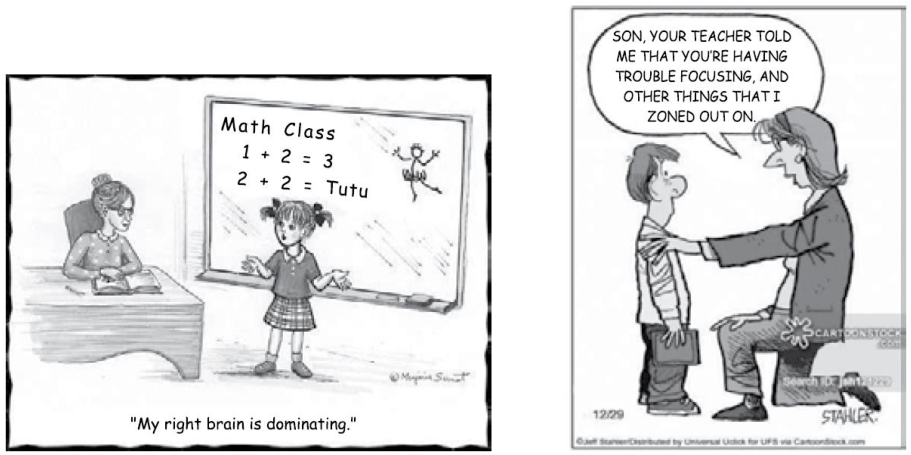


Na oração “Your teacher told me that you ’re having trouble…”, os verbos em negrito estão nos mesmos tempos verbais que os da alternativa: 

- (A) begged – be marked. 

(B) said – will have worked. 

(C) fell – is trying. 

- (D) plays – are working. 

- (E) is being called – takes. 

GABARITO: C 

Comentários: Vejamos, primeiramente, os tempos verbais encontrados na oração “Your teacher told me that you’ re having trouble…” (Seu professor me disse que você está tendo problemas): 

- told : corresponde ao verbo to tell (dizer) no passado simples . 

- 're having : é a forma contraída de are having (está tendo), que está no presente contínuo ou progressivo. 

Assim, devemos buscar, dentre as alternativas, aquela que contenha verbos no passado simples e <u>no presente contínuo.</u> 

begged – be marked. > INCORRETO .

---

<!-- pagina: 120 -->

**Andrea Belo Aula 02 - Verbs in texts** 

O verbo begged está no passado simples , indicado pelo uso do sufixo -ed em verbos regulares. 

Sua forma no infinitivo é to beg e significa implorar. 

Contudo, be marked (ser marcado) corresponde à estrutura da voz passiva em inglês, veja: 

- verbo to be + verbo principal no particípio. 

Portanto, como não temos os mesmos tempos verbais da frase dada no enunciado, a alternativa está incorreta . 

said – will have worked. > INCORRETO . 

O verbo said é o passado simples do verbo irregular to say (dizer). 

Por ser irregular, o verbo tem o passado construído de forma diferente, sem o acréscimo dos sufixos -d, -ed e -ied. 

Contudo, will have worked (terá funcionado/trabalhado) corresponde ao futuro perfeito , que, em inglês, segue a seguinte estrutura: 

- will + verbo auxiliar to have + verbo principal no particípio. 

Portanto, como não temos os mesmos tempos verbais da frase dada no enunciado, a alternativa está incorreta . 

fell – is trying. > CORRETO . 

Em fell, temos o passado <u>irregular do verbo to fall, que tem por significado "cair".</u> 

Os verbos irregulares não seguem o padrão de formação do passado. Portanto, não têm os sufixos -d, -ed, e -ied. 

Is trying (está tentando), por sua vez, está no presente contínuo ou progressivo, que pode ser facilmente reconhecido pelo gerúndio (-ing) em sua estrutura. 

Portanto, como temos os dois tempos verbais da frase dada no enunciado, a alternativa está correta . 

plays – are working. > INCORRETO . 

O verbo plays está no presente simples , indicado pelo uso do sufixo -s. 

Sua forma no infinitivo, to play, tem por significado brincar/jogar/tocar. 

Are working, por sua vez, corresponde ao presente contínuo ou progressivo. 

O presente contínuo tem como estrutura o verbo to be no presente (is/are) + o verbo principal no gerúndio (com -ing). 

Portanto, como não temos os mesmos tempos verbais da frase dada no enunciado, a alternativa está incorreta . 

is being called – takes. > INCORRETO . 

Na primeira forma verbal, is being called, temos a estrutura da voz passiva , que segue o seguinte padrão:

---

<!-- pagina: 121 -->

**Andrea Belo Aula 02 - Verbs in texts** 

#### - verbo to be + verbo principal no particípio. 

Takes, por sua vez, está no presente simples , indicado pelo uso do sufixo -s. 

No infinitivo, to take, significa pegar/levar. 

Como não temos os mesmos tempos verbais da frase dada no enunciado, a alternativa está incorreta . 

#### 15. (VUNESP/2019 – PREFEITURA MUNICIPAL DE DOIS CÓRREGOS – SP) 

#### The Indonesian tribe that rejects technology 

The Baduy tribe from Banten in Indonesia practise seclusion and reject all modern technology to protect their ancient traditions. For centuries, their way of life hasn’t changed. Electricity is prohibited, along with modern modes of communication and formal education. Power lines stop at the border of their lands, but in recent years, the outside world has begun to creep in. 

The tribe has split in two – the more strict inner circle remain “pure”, while the outer circle have relaxed some rules. Some have started using mobile phones and solar-powered lanterns. Will adopting some aspects of modern technology help the Baduy survive the modern world, or will it make their ancient traditions disappear? 

(Hassan Ghani. www.aljazeera.com. 20.02.2018) 

O tempo verbal present perfect simple está corretamente utilizado na alternativa: 

(A) I have known him for years – we lived in neighboring streets and walked to school together. 

(B) We have first met just a few years ago – but then became best friends forever! 

(C) I have often complained about homework assigning before I became a teacher myself. 

(D) My family have lived in the big city for years before we had to move to the country. 

(E) I have finished the long battery of tests and could go home and at last. 

GABARITO: A 

Comentários: A questão busca uma sentença correta que utilize o tempo verbal Present Perfect Simple . 

Devemos lembrar que a estrutura do Present Perfect Simple é: 

- Subject + Have/Has + Past Participle , para afirmativas; 

- Subject + Have/Has + not + Past Participle , para negações; 

- Have/Has + Subject + Past Participle , para interrogativas; 

Além disso, é importante saber que o Present Perfect Simple é utilizado para fazer relações com o presente, e não com o próprio passado, como é o caso do Past Perfect.

---

<!-- pagina: 122 -->

**Andrea Belo Aula 02 - Verbs in texts** 

I have known him for years – we lived in neighboring streets and walked to school together. > CORRETA 

É possível notar o formato Subject + have + Past Participle na frase. 

- I have known him for years – we lived in neighboring streets and walked to school together. 

- Dessa forma, a estrutura do Present Perfect Simple foi utilizada corretamente. 

Também é importante se atentar para o fato de que as duas orações trazem ideias separadas, não havendo nenhuma relação temporal entre elas. É necessário avaliar isso, pois a ideia do Present Perfect é relacionar algo com o presente, como ocorre em "I have known him for years". 

Dessa forma, a sentença está correta . 

We have first met just a few years ago – but then became best friends forever! > INCORRETA 

A sentença está incorreta pois a oração "(we) became best friends forever!" ocorreu no passado. Pelo contexto da frase, deveria ter sido utilizado o Simple Present na segunda oração. Para que o Present Perfect Simple seja utilizado corretamente, a frase sempre deve ter uma conexão com o próprio presente. 

A forma correta, trazendo a segunda oração para o presente, seria: 

- We have first met just a few years ago – but now we are best friends forever! 

Logo, a sentença está incorreta . 

I have often complained about homework assigning before I became a teacher myself. > INCORRETA 

A sentença está incorreta pois a oração "I became a teacher myself." ocorreu no passado, e, portanto, deveria ter sido utilizado o Past Perfect na primeira oração. Para que o Present Perfect Simple seja utilizado corretamente, a frase sempre deve ter uma conexão com o próprio presente. A forma correta, utilizando o Past Perfect , seria: 

- I had often complained about homework assigning before I became a teacher myself. 

- Logo, a sentença está incorreta . 

My family have lived in the big city for years before we had to move to the country. > INCORRETA 

A sentença está incorreta pois a oração "we had to move to the country." ocorreu no passado, e, portanto, deveria ter sido utilizado o Past Perfect na primeira oração. Para que o Present Perfect Simple seja utilizado corretamente, a frase sempre deve ter uma conexão com o próprio presente. A forma correta, utilizando o Past Perfect , seria: 

- My family had lived in the big city for years before we had to move to the country. 

- Logo, a sentença está incorreta . 

I have finished the long battery of tests and could go home and at last. > INCORRETA

---

<!-- pagina: 123 -->

**Andrea Belo Aula 02 - Verbs in texts** 

A sentença está incorreta pois a oração "could go home and at last." ocorreu no passado, e, portanto, deveria ter sido utilizado o Past Perfect na primeira oração. Para que o Present Perfect Simple seja utilizado corretamente, a frase sempre deve ter uma conexão com o próprio presente. 

A forma correta, utilizando o Past Perfect , seria: 

- I had finished the long battery of tests and could go home and at last. 

Logo, a sentença está incorreta . 

#### 16. (VUNESP/2019 – PREFEITURA MUNICIPAL DE DOIS CÓRREGOS – SP) 

Human learning is fundamentally a process that involves the making of mistakes. Mistakes, misjudgments, miscalculations, and erroneous assumptions form an important aspect of learning virtually any skill or acquiring information. Learning to swim, to play tennis, to type, or to read all involve a process in which success comes from profiting from mistakes, by using mistakes to obtain feedback from the environment and with that feedback to make new attempts which successively more closely approximate desired goals. 

Language learning, in this sense, is like any other human learning. The child learning his first language makes countless “mistakes” from the point of view of adult grammatical language. By carefully processing feedback from others the child slowly but surely learns to produce what is acceptable speech in his native language. Second language learning is a process that is clearly not unlike first language learning in its trial-and-error nature. Inevitably the learner will make mistakes in the process of acquisition, and indeed even impede that process if he does not commit errors and then benefit in turn from various forms of feedback on those errors. 

(Douglas Brown. Principles of language learning and teaching. Prentice-Hall. Adaptado) 

A palavra learning está sendo usada na função de verbo na alternativa 

(A) Human learning is fundamentally a process that involves the making of mistakes. 

(B) Mistakes, misjudgments, miscalculations, and erroneous assumptions form an important aspect of virtually any learning . 

(C) Learning to swim, to play tennis, to type, or to read all involve a process in which success comes from profiting from mistakes. 

(D) Language learning , in this sense, is like any other human learning . 

(E) The child who is learning his first language makes countless “mistakes” from the point of view of adult grammatical language. 

GABARITO: E 

Comentários: A questão exige conhecimento gramatical por parte do candidato no que concerne aos temas: 

a) da conjugação verbal no PRESENT PARTICIPLE e

---

<!-- pagina: 124 -->

**Andrea Belo Aula 02 - Verbs in texts** 

#### b) do GERUND (gerúndio) no inglês. 

Especificamente, a questão quer saber em qual das frases fornecidas a palavra learning está sendo usada como um VERBO e não como GERUND. 

- Nesse caso, em questões semelhantes a essa, é preciso ficar atento quando houver alguma palavra terminada em - <u>ING , pois ela pode ser classificado como um</u> verbo conjugado no Present Participle ou poderá exercer o papel de gerúndio , quando a palavra for utilizada como um substantivo. 

Para fazer a questão, reveja rapidamente esses conceitos: 

1. PRESENT PARTICIPLE (particípio do presente): é um tempo verbal que indica uma ação que está ocorrendo no momento, indica uma continuidade naquela ação. 

Exemplo: I am watching TV. (Eu estou assistindo TV.) 

#### 2. GERUND (gerúndio): é uma palavra terminada em -ING e usada como substantivo . 

Também pode ser chamada de verbal noun ou -ING noun. 

Exemplo: Dancing is good for your soul. (Dançar faz bem à sua alma.)// Observação: Está notando que o sujeito da frase é "Dançar"? 

- ATENÇÃO! É importante notar que “gerund” em inglês NÃO TEM QUALQUER RELAÇÃO com <u>tempo verbal .</u> 

- O Gerund apenas se trata de uma palavra (com aparência de verbo) utilizada com a terminação -ING e tem a função de atuar como um SUBSTANTIVO na frase. 

Assim, devemos analisar cada alternativa individualmente para observar em qual delas especificamente "learning" foi usada como verbo. 

#### 17. (AOCP/2020 – PREFEITURA MUNICIPAL DE BETIM – MG) 

#### Sleep (slēp): 

A natural state of rest, occurring at regular intervals, in which the eyes usually close, the muscles relax, and responsiveness to external events decreases. 

Growth and repair of the tissues of the body are thought to occur duringsleep, and energy is conserved and stored. In humans and some other animals, scientists have identified one phase of sleep (called REM sleep) as the phase in which dreams occur. 

Did You Know? Shakespeare had it right. He said that sleep was the "balm of hurt minds" and that sleep "knits up the ravel'd sleeve of care." In other words, sleep helps overcome the stress of everyday life. So the third of your life you spend asleep is not a waste of time. All warm-blooded animals have the need to sleep. Studies have shown that animals that are not allowed to sleep for a long enough time can actually die. Babies, human and animal, sleep even more than adults do. Researchers think that babies may sleep so much because it helps the young body continue to develop quickly. Not only are babies' bodies growing, but their brains are, too – and sleep is very

---

<!-- pagina: 125 -->

**Andrea Belo Aula 02 - Verbs in texts** 

important for the brain. During sleep, the brain sorts through experiences and stores important new information for later use. This processing of experiences, in fact, is thought to be a major source of dreams. 

(Source: The American Heritage® Student Science Dictionary, Second Edition. Copyright © 2014 by Houghton Mifflin Harcourt Publishing Company. Published by Houghton Mifflin Harcourt Publishing Company.) 

Observe the following excerpt taken form the text: “(…) scientists have identified one phase of sleep (called REM sleep) as the phase in which dreams occur”. Mark the CORRECT option concerning the verb tense usage in the sentence. 

(A) The verb “have” is used in the Simple Present Tense in order to state something that is always true. 

(B) The verb “occur” is in the third person of the Simple Present Tense in order to indicate a routine. 

(C) The verb “occur” is used in the Present Perfect Tense expressing an action that began in the past and continued to the present time. 

(D) The verb “identify” is used in the Present Perfect Tense expressing an action that occurred at an indefinite time in the past. 

(E) The verb “identify” is used in the Simple Past Tense expressing an action that occurred at a certain time in the past. 

#### GABARITO: D 

Comentários: A questão nos propõe observar o seguinte trecho retirado do texto: “(…) scientists have identified one phase of sleep (called REM sleep) as the phase in which dreams occur”, e com base nele marcar a opção correta no que se diz respeito ao uso do <u>tempo verbal</u> na frase. 

The verb “have” is used in the Simple Present Tense in order to state something that is always true. > ERRADO. 

A alternativa diz que o verbo “have” é usado no tempo Presente Simples (Simple Present) para afirmar algo que é sempre verdadeiro. 

Bom, o verbo "have" está funcionando como <u>verbo auxiliar , por se tratar de uma forma verbal</u> equivalente ao Present Perfect. A estrutura do Present Perfect é: Sujeito + verbo to have no simple present (has/have) + verbo principal no particípio passado. 

Assim sendo, o verbo "have" está conjugado no presente simples por ser o auxiliar, mas como se trata da forma verbal presente perfeito, não podemos dizer que seu objetivo é afirmar algo que é sempre verdadeiro, e sim uma ação que se iniciou ou que ocorreu no passado, mas que tem reflexos no presente. 

The verb “occur” is in the third person of the Simple Present Tense in order to indicate a routine. > ERRADO. 

A alternativa afirma que o verbo “occur” está na terceira pessoa do Simple Present (Presente simples) para indicar uma rotina.

---

<!-- pagina: 126 -->

**Andrea Belo Aula 02 - Verbs in texts** 

De fato, o verbo "occur" está conjugado na terceira pessoa do presente simples, para concordar com a palavra "dreams" que está no plural (dreams = they = eles, os sonhos) mas isso <u>não indica uma rotina .</u> 

A definição de rotina é: "hábito de fazer algo sempre do mesmo modo, mecanicamente", e se estamos falando de algo abstrato e de certo modo científico como são os sonhos, não podemos dizer que se trata de uma rotina (até porque foge ao nosso controle), e sim de uma <u>verdade universal .</u> 

The verb “occur” is used in the Present Perfect Tense expressing an action that began in the past and continued to the present time. > ERRADO. 

A alternativa afirma que o verbo “occur” está sendo usado no Present Perfect Tense (presente perfeito) expressando uma ação que começou no passado e continuou no tempo presente. 

Na verdade, o verbo "occur" está conjugado no <u>Present Simple</u> (presente simples), sendo usado para indicar uma verdade universal, referente ao momento do sono no qual os sonhos acontecem. 

O presente simples é formado pelo acréscimo da letra -s à 3ª pessoa do singular (He, She, It). Os outros pronomes, I, You, We e They formam a conjugação com o verbo no infinitivo sem TO e não recebem a letra -s ao final do verbo. 

The verb “identify” is used in the Present Perfect Tense expressing an action that occurred at an indefinite time in the past. > CERTO. 

A alternativa diz que o verbo “identify” é usado no Present Perfect Tense (Presente Perfeito) expressando uma ação que ocorreu em um tempo indefinido no passado. 

A estrutura do <u>Present Perfect</u> é: Sujeito + verbo to have no simple present (has/have) + verbo principal no particípio passado. 

Neste caso, o sujeito da oração é "scientists" , o verbo <u>have</u> está presente como auxiliar (forma have, porque o sujeito está no plural) e o verbo principal "identify" está em sua forma do particípio " " passado <u>( identified ) .</u> 

A frase diz que "(...) os cientistas identificaram uma fase do sono (...)", então podemos concluir que a ação de "identificar" ocorreu no passado, em um tempo indefinido, pois não sabemos quando a ação ocorreu exatamente. Assim sendo, a alternativa está correta. 

The verb “identify” is used in the Simple Past Tense expressing an action that occurred at a certain time in the past. > ERRADO. 

A alternativa diz que o verbo “identify” é usado no Simple Past Tense (Passado Simples) expressando uma ação que ocorreu em um certo tempo no passado. 

Bom, o verbo "identify" está na verdade conjugado no <u>Present Perfect</u> (Presente Perfeito), juntamente com o verbo auxiliar "have". 

A estrutura do <u>Present Perfect</u> é: Sujeito + verbo to have no simple present (has/have) + verbo principal no particípio passado.

---

<!-- pagina: 127 -->

**Andrea Belo Aula 02 - Verbs in texts** 

Neste caso, o sujeito da oração é "scientists" , o verbo have está presente como auxiliar (forma have, porque o sujeito está no plural) e o verbo principal "identify" está em sua forma do particípio passado ("identified") . 

#### 18. (AOCP/2020 – PREFEITURA MUNICIPAL DE BETIM – MG) 

#### Five ways to get a better bedtime routine 

by Amy Sedghi 

Getting to sleep can be a <u>struggle</u> , but blackout blinds and to-do lists can help – as can reserving the bedroom for sex and shut-eye 


An eye mask will block out light. 

#### 1. Go to bed at regular times 

Going to sleep and waking up at regular times – even on weekends – will strengthen your body clock, says Dr Lizzie Hill, a clinical sleep physiologist and a spokeswoman for the British Sleep Society. Regular mealtimes are also an important cue for your circadian rhythm. Avoid exercise too close to bedtime, as it can cause restlessness and an elevated body temperature, says Samantha Briscoe, a senior physiologist at the Sleep Centre at London Bridge hospital. 

#### 2. Protect the bedroom 

Preserve the bedroom as a place for sleep (and sex): there is evidence that the brain forms a strong association with sleep there. A temperature of 16- 18C (60-64F) is thought to be ideal for most, according to the Sleep Council, an awareness and support organisation. Blackout blinds or an eye mask can help block out light, while keeping electronic devices out of the bedroom is highly recommended. If you struggle to fall asleep after more than 25 minutes, Matthew Walker – a sleep expert and a professor of neuroscience and psychology at the University of California, Berkeley – suggests getting up and going to read under a dim light in another room. Once sleepy, you can return to bed.7 

#### 3. Get ahead on the next day 

Your night-time routine is an opportunity to make mornings run a little smoother: choose your clothes for the next day when you reach for your pyjamas or pack your bag while brushing your teeth. Martin Hagger, a professor of health psychology at the University of California, Merced, has stressed how routines are linked to the formation of healthy habits. 

#### 4. Wind down

---

<!-- pagina: 128 -->

**Andrea Belo Aula 02 - Verbs in texts** 

Reading a book can help slow breathing and relax muscles, while yoga stretches or even a gentle walk can reduce anxiety, says Briscoe. A warm bath or shower can also help you relax: researchers at the University of Texas at Austin found that bathing in water of 40-42.5C one to two hours before bedtime was associated with better sleep. 

#### 5. Write down your worries 

“If your mind is buzzing from the day, try keeping a journal or worry book,” suggests Hill. The NHS also recommends writing to-do lists for the next day in order to organise thoughts and clear the mind. “If you experience difficulty with sleep over the longer term, consider whether there may be an underlying medical condition,” says Hill. A sleep diary could help you identify any patterns 

(https://www.theguardian.com/lifeandstyle/2019/oct/04/five-ways-toget- a-better-bedtime-routine. Access: 08/01/2020) 

The modal verb “can” appears many times throughout the text. Mark the option that best describes the usage of such verb in the text: 

(A) It is used to state different types of permission. 

(B) It is used to express probability under certain circumstances. 

(C) It is used to express a command, that is, things one is morally obliged to do. 

(D) It is used to express some of the readers’ duties concerning getting a better sleep. 

(E) It is used to state things that are expected to happen for sure. 

#### GABARITO: B 

Comentários: A questão afirma que o verbo modal “can” aparece muitas vezes no decorrer do texto, e nos pede para marcar a opção que melhor descreva o uso desse verbo no texto. 

O "can" pode ser usado para indicar diferentes sentidos: 

- Pode indicar habilidade. 

- Pode ser usado para indicar que algo é verdadeiro em algumas circunstâncias. 

- Para indicar permissão informal. 

- Para pedido informal. 

Agora vejamos alguns exemplos dos usos do "can" no texto: 

- Reading a book <u>can</u> help slow breathing and relax muscles. (Ler um livro <u>pode</u> ajudar a desacelerar a respiração e relaxar os músculos); 

- A warm bath or shower <u>can</u> also help you relax. (Uma banheira ou banho morno também <u>podem</u> te ajudar a relaxar); 

No texto, o "can" foi usado majoritariamente como nesses exemplos acima, expressando a possibilidade ou probabilidade de que algo ocorra caso aconteça um outro algo , ou seja, <u>na condição de uma certa circunstância</u> (por exemplo, você pode relaxar se experimentar um banho morno.)

---

<!-- pagina: 129 -->

**Andrea Belo Aula 02 - Verbs in texts** 

Isso coincide então com o que diz a alternativa B : It is used to express probability under certain circumstances. (É usado para expressar probabilidade sob certas circunstâncias). 

As demais alternativas estão incorretas porque o uso do "can" no texto não expressa permissão (permission), nem ordem (command), nem coisas das quais se espera que aconteçam com certeza (things expected to happen for sure). 

#### 19. (AOCP/2020 – PREFEITURA MUNICIPAL DE BETIM – MG) 

Observe the following sentences taken from the text: “Go to bed at regular times”; “Write down your worries”; “Get ahead on the next day”; “Wind down”; and “Protect the bedroom”. Mark the option that highlights what all of the sentences above have in common: 

- (A) They all use the Simple Present Tense in order to state known facts. 

- (B) They all have adjectives referring somehow to sleep. 

- (C) They are all using phrasal verbs or prepositional verbs. 

- (D) They are all formed by a verb in the imperative which expresses an instruction. 

- (E) They all have explicit personal pronouns to state the subjects of each sentence. 

GABARITO: D 

Comentários: O enunciado pede para observar as seguintes frases retiradas do texto e marcar a opção que destaca o que todas as frases acima têm em comum: 

“Go to bed at regular times”; “Write down your worries”; “Get ahead on the next day”; “Wind <u>down”; e "Protect the bedroom”.</u> 

They all use the Simple Present Tense in order to state known facts. > ERRADO. 

Primeiramente, vejamos a frase traduzida: 

"Todos eles usam o Tempo Presente Simples para declarar fatos conhecidos." 

O Simple Present Tense, também chamado de Present Simple (presente simples), é um dos tempos verbais do inglês equivalente ao presente do indicativo na língua portuguesa. Devemos usá-lo para indicar ações habituais que ocorrem no presente. 

Desse modo, podemos concluir que esta não é uma característica em comum dentre as frases apresentadas no enunciado. 

They all have adjectives referring somehow to sleep. > ERRADO. 

Primeiramente, vejamos como fica a frase da alternativa traduzida: 

"Todos eles têm adjetivos que se referem de alguma forma ao sono."

---

<!-- pagina: 130 -->

**Andrea Belo Aula 02 - Verbs in texts** 

Os adjetivos (adjectives) são palavras que caracterizam os substantivos (seres, animais, objetos, etc). Essa caracterização pode expressar qualidade, defeito, estado ou condição. 

Desse modo, podemos concluir que esta não é uma característica em comum dentre as frases apresentadas no enunciado. 

They are all using phrasal verbs or prepositional verbs. > ERRADO. 

Primeiramente, vejamos a frase da alternativa traduzida: 

"Todos estão usando verbos frasais ou verbos preposicionais." 

Os verbos preposicionais são verbos que consistem em um verbo e uma ou duas partículas ou preposições (por exemplo, para cima, para cima, para dentro, para baixo). 

Já os verbos frasais têm duas partes: um verbo principal e uma partícula advérbio. Esses verbos são frequentemente, mas nem sempre, menos formais do que uma única palavra com o mesmo <u>significado.</u> 

Desse modo, podemos concluir que esta não é uma característica em comum dentre as frases apresentadas no enunciado. 

They are all formed by a verb in the imperative which expresses an instruction. > CERTO. 

Primeiramente, vejamos como fica a frase da alternativa traduzida: 

"Todos eles são formados por um verbo no imperativo que expressa uma instrução." 

Os verbos imperativos são verbos que criam uma frase imperativa (ou seja, uma frase que dá uma ordem ou comando). Ao ler uma frase imperativa, sempre soará como se o orador estivesse mandando em alguém. 

Desse modo, podemos ver essa característica em todas as frases apresentadas pelo enunciado , indicando que essa é a alternativa certa. 

They all have explicit personal pronouns to state the subjects of each sentence. > ERRADO. 

Primeiramente, vejamos a frase da alternativa traduzida: 

"Todos eles têm pronomes pessoais explícitos para definir o assunto de cada frase." 

Sabe-se que os personal pronouns subdividem-se em dois tipos: subject e object. Segundo Eastwood, eles identificam quem fala (primeira pessoa) e com quem se fala (segunda pessoa) ou podem ainda se referir a outra pessoa ou a algo (terceira pessoa). Tendo isso em mente, os personal pronouns são usados para substituir um substantivo ou um grupo nominal na oração. 

Desse modo, podemos concluir que esta não é uma característica em comum dentre as frases apresentadas no enunciado.

---

<!-- pagina: 131 -->

**Andrea Belo Aula 02 - Verbs in texts** 

#### 20. (AOCP/2019 – PREFEITURA MUNICIPAL DE CARIACICA – ES) 


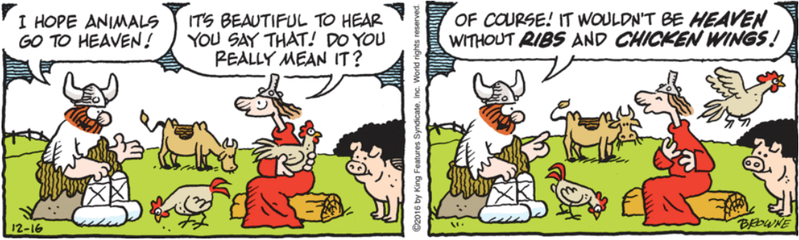


Source: https://www.comicskingdom.com/hagar-the-horrible/. Access: 02/12/2019 


<!-- Start of picture text -->
==5460==<br><!-- End of picture text -->

The sentence “Do you really mean that?” taken from the comic strip, express: 

- (A) A question in the simple present tense. 

- (B) A surprise in the present progressive tense. 

- (C) A doubt in the past tense. 

- (D) A hypothesis in the future tense. 

#### GABARITO: A 

Comentários: Esta questão cobra entendimento sobre tempos verbais: 

a) simple present tense (presente simples): presente, fato, hábito. 

b) simple past tense (passado simples): algo que aconteceu e já acabou, pontual. 

c) present continuous tense (presente contínuo): indica ação progressiva, em andamento. 

d) future tense (futuro): fatos que acreditamos que acontecerão. 

A question in the simple present tense. > <u>CERTA.</u> 

"Do you really mean it?" expressa uma pergunta no presente (simple present tense). Para formar perguntas de sim ou não (yes/no question) neste tempo verbal, usamos o verbo auxiliar do antes do sujeito. Logo, a estrutura fica assim: verbo auxiliar (do/does) + sujeito + verbo infinitivo. 

#### Usamos o simple present tense para: 

a) ações que acontecem com frequência ou hábitos. Exemplo: We take a nap after lunch. – Nós tiramos um cochilo depois do almoço. 

b) fatos, generalizações ou verdades universais. Exemplo: Sarah works hard. – Sarah trabalha duro. 

c) situações que acontecem no exato momento em que estamos falando. Exemplo: We agree with you. – Nós concordamos com você.

---

<!-- pagina: 132 -->

**Andrea Belo Aula 02 - Verbs in texts** 

Tradução da tirinha (comic strip): 

I hope animals go to heaven! - Espero que os animais vão para o céu! 

It's beautiful to hear you say that! Do you really mean it? - É lindo ouvir você dizer isso! Você realmente quer dizer isso? 

Of course! It wouldn't be heaven without ribs and chicken wings! - Claro! Não seria o paraíso sem costelas e asas de frango! 

A surprise in the present progressive tense. > <u>ERRADA.</u> 

O present progressive tense (ou present continuous), como o próprio nome diz, indica uma ação contínua, um evento que está acontecendo agora. 

Estrutura: verbo to be no simple present tense + present participle verb (ing). 

Este tempo verbal também pode sugerir que uma ação acontecerá no futuro, especialmente com verbos que transmitem a idéia de um plano ou movimento de um local à outro. Exemplo: The team is arriving in two hours. - A equipe está chegando em duas horas. 

Logo, o item está errado pois não há a ideia de ação contínua ou verbos com terminação ing, por exemplo. 

A doubt in the past tense. > <u>ERRADA.</u> 

O simple past é usado para descrever fatos que ocorreram no passado e já foram finalizados, estando isso implícito ou explícito na frase (usa-se o verbo + ed ou verbos irregulares) 

Estrutura de pergunta: verbo auxiliar no passado (did) + sujeito + verbo no infinitivo 

Logo, o item está incorreto pois a pergunta foi feita no presente (do) , e não no passado (did). A hypothesis in the future tense. > <u>ERRADA.</u> 

Will é a expressão básica para se referir ao simple future (ou future tense) e pode ser utilizado para: 

a) falar sobre previsões mais certeiras sobre o futuro e pode ser traduzido como ”ir” em português . Exemplo: I have no doubt he will be rich one day. – Não tenho dúvidas de que ele será rico um dia. 

b) expressar decisões imediatas. Exemplo: I think she will be late again. – Eu acho que ela vai se atrasar novamente. 

c) fazer promessas ou ofertas. Exemplo: I will not tell anyone your secret. – Eu não vou contar seu segredo a ninguém. 

A estrutura da pergunta é: expressão auxiliar do futuro (will) + sujeito + verbo no infinitivo. 

Logo, o item está incorreto pois a pergunta foi feita no presente (do) , e não no futuro (will).

---

<!-- pagina: 133 -->

**Andrea Belo Aula 02 - Verbs in texts** 

#### 21. (IBFC/2022 – TJ-MG) 

#### Crimes 

Certain types of people cannot be charged with committing a crime. It may appear that they have committed a crime. However, for a variety of reasons their behavior will not be considered a crime in the courts of law. First, insane people cannot commit a crime. These people do not understand their behavior. They may not understand right from wrong. Next, those taking drugs prescribed by a doctor might be excused from committing a crime. If the drugs affect their minds, the court will excuse them. Finally, children under a certain age cannot be held responsible for committing a crime. 

Utilizando-se das técnicas de leitura instrumental, especificamente da técnica scanning, a qual consiste em uma leitura atenta e precisa. Analise o excerto a seguir: “They may not understand right from wrong”. Assinale, dentre as alternativas abaixo, a que está mais próxima em significado. 

- (A) Eles talvez não compreendam o que é certo. 

- (B) Eles talvez não consigam compreender o que é errado. 

- (C) Eles não conseguem distinguir o certo do errado. 

- (D) Eles não conseguem entender que só devem fazer o certo. 

- (E) Eles podem compreender o que é certo e o que é errado, mas não têm essa vontade. 

GABARITO: C 

Comentários: A questão requer que, utilizando a técnica de leitura instrumental denominada scanning, você indique a alternativa que contém o significado mais próximo do trecho “They may not understand right from wrong”. 

Analisando o significado do trecho destacado, observe que temos o uso do modal may , que indica possibilidade. Assim, uma tradução mais precisa deveria indicar que eles <u>podem não distinguir o certo do errado.</u> 

Todavia, a alternativa mais próxima dessa ideia considera a tradução do modal may como <u>habilidade</u> , indicando que eles <u>não conseguem distinguir o certo do errado. Como a questão requer a indicação da alternativa mais próxima (e não exata/precisa) do significado do trecho, é essa a nossa resposta.</u> 

Portanto, o gabarito é a alternativa "C", "Eles não conseguem distinguir o certo do errado" . 

Veja o significado das demais alternativas: 

- Eles talvez não compreendam o que é certo; 

- Eles talvez não consigam compreender o que é errado; 

- Eles não conseguem entender que só devem fazer o certo; 

- Eles podem compreender o que é certo e o que é errado, mas não têm essa vontade.

---

<!-- pagina: 134 -->

**Andrea Belo Aula 02 - Verbs in texts** 

#### 22. (IBFC/2019 – PREFEITURA MUNICIPAL DE CABO DE SANTO AGOSTINHO – PE) 

O tempo verbal utilizado para descrever fatos que aconteceram em tempo não determinado chama-se ____________________. Assinale a alternativa que preencha corretamente a lacuna. 

- (A) Past continuous 

- (B) Past simple 

- (C) Present simple 

- (D) Present perfect 

#### GABARITO: D 

Comentários: Present perfect é o tempo verbal usado para descrever ações que ocorreram no passado, mas não são precisas em relação ao tempo. 

Pode-se dizer que não há um correspondente direto desse tempo verbal no Português, por isso, as vezes é difícil compreendê-lo. 

Suas outras aplicabilidades: 

- Ações que acabaram de acontecer 

- Ações que começaram no passado e ainda acontecem no presente 

- Ações que aconteceram no passado e ainda possuem efeitos no presente 

#### <u>Outros tempos verbais:</u> 

Past continuous : ação contínua que ocorreu no passado e que ainda ocorre no momento da fala, ou seja, não foi totalmente concluída no passado. 

Past simple : ação concluída no passado, geralmente, em um período de tempo conhecido . 

Present simple : ações recorrentes, hábitos, expressa verdades universais e constatações gerais. 

#### 23. (IBFC/2019 – PREFEITURA MUNICIPAL DE VINHEDO – SP) 

#### Text 1 

The streets pounded with Baile funk, and flip-flopped men in dark glasses stood around the car, watching the five dirt roads that joined at the junction. The sun slipped down out of sight of the favela crater, below the line of the city. [...] 

Renata left her legal aid office an hour later than normal. She’d been helping a man with a dispute over land. He was expecting another child and wanted to extend the rough house his family lived in. But a bar owner and a tyre shop were unhappy with the plans. Renata had slipped easily into the space of the disagreement, fluid, empathic, and negotiated a compromise. The man had just visited her office to bless her and offer his respects. He’d talked for a long time.

---

<!-- pagina: 135 -->

**Andrea Belo Aula 02 - Verbs in texts** 

#### Text 2 

Mario Leme is a low-ranking detective in the Sao Paulo civil police. Every day on the way to work he sets off early and drives through the favela known as Paraisopolis - Paradise City. It’s a pilgrimage: his wife Renata was gunned down at an intersection here a year ago, the victim of a stray bullet in a conflict between drug dealers. One morning, parked near the place where Renata died, he sees an SUV careen out of control and flip over. The driver Leo is killed, but before his body is removed, Leme is sure he sees bullet wounds. Leo’s death wasn’t an accident, he was murdered. Soon, his girlfriend turns up dead too. And if they were killed deliberately, perhaps Renata was too… Leme finds himself immersed further and further in the dark underbelly of Brazilian society, as corruption seeps from the highest to the lowest echelons, and the devastating truth about Renata begins to emerge. 

#### Text 3 

My book, Paradise City, is named after the Paraisópolis favela, where a key incident happens at the beginning. Sao Paulo’s a great setting for crime fiction because of the huge gulf between rich and poor – there’s a disenfranchised underclass and a sense of lawlessness. It’s a place rich in culture, dripping in cash and undermined by political lawlessness. A crime novel allows access to these different worlds. Crime in São Paulo is run by a gang called PCC – from jail. On the weekend before the World Cup in 2006, they demanded wide screen TVs to watch the game. When the authorities refused they said they’d cause chaos across the city – and they did for three days. Police were attacked, buses hijacked and set on fire – when they authorities finally agreed to the TVs the mayhem stopped. It was that weekend that the seed of the idea for my novel was planted. 

#### Text 4 

I was mightily impressed by Paradise City by Joe Thomas, which takes us deep into the throbbing heart of Sao Paulo, Brazil, and the violent favela known as Paraisopolis. Low ranking detective Mario Leme drives through this favela everyday, as this is where his wife, Renata, a lawyer, was gunned down a year previously, the victim of a bala perdida – a stray bullet. One morning at the same spot, Leme witnesses a car careering out of control, but sees that the driver has several bullet wounds, although the incident is written off as a traffic accident. Leme finds himself embroiled in a tale of murder and corruption at the highest level, which puts him at odds with his superiors, and onto a dangerous path. What I liked most about this book was the colour and exuberance that Thomas injects into his vivid realisation of the pulsating favela, albeit suffused by violence.

---

<!-- pagina: 136 -->

**Andrea Belo Aula 02 - Verbs in texts** 

Observe o seguinte trecho extraído do Texto 1: Renata left (A) her legal aid office an hour later than normal. She’d been helping (B) a man with a dispute over land. He was expecting (C) another child and wanted (D) to extend the rough house his family lived in. Sobre as formas verbais sublinhadas, considere as seguintes afirmativas: 

I. A sequência em que as formas verbais sublinhadas aparecem (A, B, C, D) é a mesma sequência em que ocorreram os eventos que expressam. 

II. Substituir a forma B por had helped implicaria mudança de ênfase: da continuidade da atividade para uma ideia de término, conclusão. 

III. Embora as formas C e D expressem concomitância, want trata-se de um verbo que expressa estado mental/ emocional, o que justifica seu uso no Past Simple em vez do Past Progressive no contexto em questão. 

Estão corretas as afirmativas: 

- (A) I e II, apenas 

- (B) I e III, apenas 

- (C) II e III, apenas 

- (D) I, II e III 

#### GABARITO: C 

Comentários: É necessário observar cada item individualmente. 

I - A sequência em que as formas verbais sublinhadas aparecem (A, B, C, D) é a mesma sequência em que ocorreram os eventos que expressam. 

O erro do item é afirma que acontecem na mesma sequência, visto que o past perfect continuous serve para indicar um evento anterior que acontecem antes de uma ação no passado. 

II - Substituir a forma B por had helped implicaria mudança de ênfase: da continuidade da atividade para uma ideia de término, conclusão. 

O item está correto, visto que o past perfect simple (had + -ed: she had help ed ) indica a conclusão de evento no passado. 

III - Embora as formas C e D expressem concomitância, want trata-se de um verbo que expressa estado mental/ emocional, o que justifica seu uso no Past Simple em vez do Past Progressive no contexto em questão. 

O item III também está correto, pois o past simple é utilizado para se referir ao estado da pessoa no passado. 

Assim, os itens corretos é o II e III.

---

<!-- pagina: 137 -->

**Andrea Belo Aula 02 - Verbs in texts** 

#### 24. (IBFC/2014 – SEPLAG-MG) 

Indique a alternativa que completa corretamente a sentença: 

“We were really ____________________ by snakes”. 

(A) Frighten 

(B) Frightens 

- (C) Frightening 

#### (D) Frightened 

GABARITO: D 

Comentários: Devido à presença de we were, fica claro que devemos preencher a lacuna com o particípio passado: frightened . 

“We were really frightened by snakes”. (Ficamos realmente assustados com as cobras.) 

#### 25. (CESGRANRIO/2022 – ELETROBRÁS ELETRONUCLEAR) 

The controversial future of nuclear power in the U.S. 

Lois Parshley 

President Joe Biden has set ambitious goals for fighting climate change: To cut U.S. carbon emissions in half by 2030 and to have a net-zero carbon economy by 2050. The plan requires electricity generation – the easiest economic sector to green, analysts say – to be carbon-free by 2035. 

A few figures from the U.S. Energy Information Administration (EIA) illustrate the challenge. In 2020 the United States generated about four trillion kilowatt-hours of electricity. Some 60 percent of that came from burning fossil fuels, mostly natural gas, in some 10,000 generators, large and small, around the country. All of that electricity will need to be replaced - and more, because demand for electricity is expected to rise, especially if we power more cars with it. 

Renewable energy sources like solar and wind have grown faster than expected; together with hydroelectric, they surpassed coal for the first time ever in 2019 and now produce 20 percent of U.S. electricity. In February the EIA projected that renewables were on track to produce more than 40 percent by 2050 - remarkable growth, perhaps, but still well short of what’s needed to decarbonize the grid by 2035 and forestall the climate crisis. 

This daunting challenge has recently led some environmentalists to reconsider an alternative they had long been wary of: nuclear power. 

Nuclear power has a lot going for it. Its carbon footprint is equivalent to wind, less than solar, and orders of magnitude less than coal. Nuclear power plants take up far less space on the landscape

---

<!-- pagina: 138 -->

**Andrea Belo Aula 02 - Verbs in texts** 

than solar or wind farms, and they produce power even at night or on calm days. In 2020 they generated as much electricity in the U.S. as renewables did, a fifth of the total. 

But debates rage over whether nuclear should be a big part of the climate solution in the U.S. The majority of American nuclear plants today are approaching the end of their design life, and only one has been built in the last 20 years. Nuclear proponents are now banking on next-generation designs, like small, modular versions of conventional light-water reactors, or advanced reactors designed to be safer, cheaper, and more flexible. 

“We’ve innovated so little in the past half-century, there’s a lot of ground to gain,” says Ashley Finan, the director of the National Reactor Innovation Center at the Idaho National Laboratory. Yet an expansion of nuclear power faces some serious hurdles, and the perennial concerns about safety and long-lived radioactive waste may not be the biggest: Critics also say nuclear reactors are simply too expensive and take too long to build to be of much help with the climate crisis. 

While environmental opposition may have been the primary force hindering nuclear development in the 1980s and 90s, now the biggest challenge may be costs. Few nuclear plants have been built in the U.S. recently because they are very expensive to build here, which makes the price of their energy high. 

Jacopo Buongiorno, a professor of nuclear science and engineering at MIT, led a group of scientists who recently completed a two-year study examining the future of nuclear energy in the U.S. and western Europe. They found that “without cost reductions, nuclear energy will not play a significant role” in decarbonizing the power sector. 

“In the West, the nuclear industry has substantially lost its ability to build large plants,” Buongiorno says, pointing to Southern Company’s effort to add two new reactors to Plant Vogtle in Waynesboro, Georgia. They have been under construction since 2013, are now billions of dollars over budget - the cost has more than doubled - and years behind schedule. In France, ranked second after the U.S. in nuclear generation, a new reactor in Flamanville is a decade late and more than three times over budget. 

“We have clearly lost the know-how to build traditional gigawatt-scale nuclear power plants,” Buongiorno says. Because no new plants were built in the U.S. for decades, he and his colleagues found, the teams working on a project like Vogtle haven’t had the learning experiences needed to do the job efficiently. That leads to construction delays that drive up costs. 

Elsewhere, reactors are still being built at lower cost, “largely in places where they build projects on budget, and on schedule,” Finan explains. China and South Korea are the leaders. (To be fair, several of China’s recent large-scale reactors have also had cost overruns and delays.) 

“The cost of nuclear power in Asia has been a quarter, or less, of new builds in the West,” Finan says. Much lower labor costs are one reason, according to both Finan and the MIT report, but better project management is another. 

> Available at: https://www.nationalgeographic.com/environment/ article/nuclear-plants-are-closing-in-the-us-should-we-build-more. Retrieved on: Feb. 3, 2022. Adapted.

---

<!-- pagina: 139 -->

**Andrea Belo Aula 02 - Verbs in texts** 

In the fragment of paragraph 7 “and the perennial concerns about safety and long-lived radioactive waste may not be the biggest”, may not be expresses a(n 

- (A) possibility 

- (B) obligation 

- (C) necessity 

- (D) certainty 

- (E) ability 

#### GABARITO: A 

Comentários: A questão requer que você indique qual ideia é expressa por "may not be" no trecho “and the perennial concerns about safety and long-lived radioactive waste may not be the biggest”, no sétimo parágrafo. 

No trecho destacado, temos o uso do verbo modal <u>may . Os</u> verbos modais são uma classe de verbos que funcionam como auxiliares dos verbos principais, alterando ou completando o sentido destes. 

Em inglês, os verbos modais mais comuns são: 

- Can : expressa a ideia de permissão, habilidade ou possibilidade; 

- Could : expressa pedido/permissão, habilidade ou hipótese no tempo passado; 

- May : expressa pedido/permissão (mais formal) ou possibilidade; 

- Might : expressa possibilidade remota; 

- Must/Have to : expressa obrigação/necessidade, proibição ou dedução; 

- Should : expressa conselho, sugestão; 

- Will : expressa ação no futuro; 

- Would : expressa desejo, pedido ou hipótese. 

No trecho considerado na questão, no parágrafo 7, o modal may é usado precisamente para indicar a <u>possibilidade</u> de haver outras preocupações maiores, além daquelas sobre segurança e resíduos radioativos. 

Portanto, o gabarito é a alternativa "A", possibility (= possibilidade) . 

Veja o significado das demais alternativas: 

- obligation (obrigação); 

- necessity (necessidade); 

- certainty (certeza); 

- ability (habilidade).

---

<!-- pagina: 140 -->

**Andrea Belo Aula 02 - Verbs in texts** 

#### 26. (CESGRANRIO/2022 – ELETROBRÁS ELETRONUCLEAR) 

#### U.S. domestic air conditioning use could exceed electric capacity in next decade due to climate change 

Climate change will provoke an increase in summer air conditioning use in the United States that will probably cause prolonged blackouts during peak summer heat if states do not expand capacity or improve efficiency, according to a new study of domestic-level demand. 

Human emissions have put the global climate on a trajectory to exceed 1.5 degrees Celsius of warming by the early 2030s, the IPCC reported in its 2021 evaluation. Without significant alleviation, global temperatures will probably exceed the 2.0-degree Celsius limit by the end of the century. 

Previous research has examined the impacts of higher future temperatures on annual electricity consumption for specific cities or states. The new study is the first to project residential air conditioning demand on a domestic basis at a wide scale. It incorporates observed and predicted air temperature and heat, humidity and discomfort indices with air conditioning use by statistically representative domiciles across the contiguous United States, collected by the U.S. Energy Information Administration (EIA) in 2005- 2019. 

“It’s a pretty clear warning to all of us that we can’t keep doing what we are doing or our energy system will fail completely in the next few decades, simply because of the summertime air conditioning,” said Susanne Benz, a geographer and climate scientist at Dalhousie University in Halifax, Nova Scotia. 

The heaviest air conditioning use with the greatest risk for overcharging the transmission lines comes during heat waves, which also present the highest risk to health. Electricity generation tends to be below peak during heat waves as well, reducing capacity to even lower levels, said Renee Obringer, an environmental engineer at Penn State University. Without enough capacity to satisfy demand, energy companies may have to adopt systematic blackouts during heat waves to avoid network failure, like California’s energy organizations did in August 2020 during an extended period of record heat sometimes topping 117 degrees Fahrenheit. “We’ve seen this in California already -- state power companies had to institute blackouts because they couldn’t provide the needed electricity,” Obringer said. The state attributed 599 deaths to the heat, but the true number may have been closer to 3,900. 

The new study predicted the largest increases in kilowatt-hours of electricity demand in the already hot south and southwest. If all Arizona houses were to increase air conditioning use by the estimated 6% needed at 1.5 degrees Celsius of global warming, for example, amounting to 30 kilowatt-hours per month, this would place an additional 54.5 million kilowatthours of demand on the electrical network monthly. 

Available at: www.sciencedaily.com/releases/2022/02/ 220204093124.htm. Retrieved on: Feb. 9, 2022. Adapted.

---

<!-- pagina: 141 -->

**Andrea Belo Aula 02 - Verbs in texts** 

In paragraph 1, the fragment “Climate change will provoke an increase in summer air conditioning use in the United States that will probably cause prolonged blackouts” implies that prolonged blackouts 

- (A) are happening. 

- (B) had happened. 

- (C) have happened. 

- (D) may happen. 

- (E) will have happened. 

#### GABARITO: D 

Comentários: A questão requer que você indique o que o trecho em destaque afirma acerca dos apagões prolongados. 

Nele, o autor ressalta que a mudança climática provocará um aumento no uso de ar-condionado durante o verão, nos Estados Unidos. 

Em seguida, na mesma frase, ele acrescenta uma informação sobre esse aumento: <u>[um aumento]</u> 

<u>que provavelmente provocará apagões prolongados .</u> 

Observe que os apagões são mencionados como uma provável consequência do aumento, ou seja, <u>eles podem acontecer ou não</u> . 

Tal ideia é expressa corretamente apenas na alternativa "D", que aponta que os apagões <u>podem acontecer (may happen) .</u> 

Portanto, o gabarito é a alternativa "D" . 

Veja o significado das demais alternativas: 

- are happening (estão acontecendo); 

- had happened (tinham acontecido); 

- have happened (aconteceram); 

- will have happened (terão acontecido). 

#### 27. (CESGRANRIO/ANO – INSTITUIÇÃO) 

#### COVID-19 Economy: Expert insights on what you need to know 

As we practice social distancing and businesses struggle to adapt, it’s no secret the unique challenges of Covid-19 are profoundly shaping our economic climate. U.S. Bank financial industry and regulatory affairs expert Robert Schell explains what you need to know in this uncertain time. 

#### • Don’t panic while things are “on pause” 

Imagine clicking the pause button on your favorite TV show. Whether you stopped to make dinner or put kids to bed, hitting pause gives you time to tackle what matters most. Today’s economy is

---

<!-- pagina: 142 -->

**Andrea Belo Aula 02 - Verbs in texts** 

similar. While we prioritize health and safety, typical activities like driving to work, eating at restaurants, traveling and attending sporting events are on hold. This widespread social distancing takes a toll on our economy, putting strain on businesses and individuals alike. 

Keep your financial habits as normal as possible during this time. Make online purchases, order takeout, pay bills and buy groceries. These everyday purchases put money back into the economy and prevent it from dipping further into a recession. 

#### • Low interest rates could help make ends meet 

In March, the Federal Reserve cut rates drastically to boost economic activity and make borrowing more affordable. For you, this means interest rates are low for credit cards, loans and lines of credit, and even fixed-rate mortgages. Consider taking advantage of these low rates if you need extra help paying your bills, keeping your business running or withstanding a period of unemployment. 

#### • Spend on small businesses 

Looking to make a positive impact? Supporting small businesses is an easy and powerful way to help. You can order takeout, tip generously or donate to your local brick-and-mortar retail store, if they provide that option. Your support makes a big impact for struggling business owners. 

#### • Prior economic strength may help us bounce back 

The thriving economy of 2019 isn’t just a distant, bittersweet memory. When our health is no longer at risk and social distancing mandates begin to diminish, we’ll slowly start to rebuild. The stability, low unemployment rate and upward-trending market we experienced prior to Covid-19 puts us in a good position to kick-start economic activity and rebound more quickly. 

Available at <https://www.usbank.com/fi nancialiq/ manage-your--household/personal-finance/covid-economy-expert-insights.html>. Retrieved on: Jul. 20, 2021. Adapted. 

In the 4<sup>th</sup> paragraph, in the fragment “In March, the Federal Reserve cut rates drastically to boost economic activity”, the verb cut indicates a 

(A) habitual action repeatedly carried out by the Federal Reserve to address certain economic situations. 

(B) future action to be carried out by the Federal Reserve to address possible problems. 

(C) promised action to be carried out by the Federal Reserve to address the present economic challenges. 

(D) one-time action carried out by the Federal Reserve to address the present situation. 

(E) current action carried out by the Federal Reserve to address a permanent situation. 

#### GABARITO: D 

Comentários: A questão requer que você indique o que expressa o verbo cut no 4º parágrafo, no trecho “In March, the Federal Reserve cut rates drastically to boost economic activity”.

---

<!-- pagina: 143 -->

**Andrea Belo Aula 02 - Verbs in texts** 

Pelo que temos como opções entre as alternativas, veja que o objetivo da banca é, na verdade, saber que tipo de ação é expressa pelo tempo verbal utilizado com o verbo to cut. 

Observe que a frase está no <u>tempo passado , expressando uma ação pontual que ocorreu em um tempo definido . A indicação de quando essa ação ocorreu vem logo no início da frase:</u> em março . 

Assim, dentre as opções, a única correspondência com a ideia expressa pelo passado simples e - <u>apresentada no texto é one time action carried out by the Federal Reserve to address the present situation ( ação única realizada pela Reserva Federal para resolver a situação atual).</u> 

Portanto, o gabarito é a alternativa "D" . 

Veja o significado das demais alternativas e qual tempo verbal corresponde às ideias apresentadas: 

- ação habitual repetidamente realizada pela Reserva Federal para lidar com certas situações econômicas > presente simples ; 

- ação futura a ser realizada pelo Reserva Federal para resolver possíveis problemas > futuro simples ; 

- ação prometida a ser realizada pela Reserva Federal para enfrentar os atuais desafios econômicos > futuro simples ; 

- ação atual realizada pela Reserva Federal para resolver uma situação permanente > presente contínuo . 

#### 28. (CESGRANRIO/2016 – TRANSPETRO) 

From Security to Efficiency: Modern Vessel Tracking 

More so than many other fields of business, the maritime industry is focused on cost, which in turn gives the appearance of being conservative towards technology. Certainly, we have technical ships magnificently operating with equipment that wouldn’t look out of place in a NASA lab, but generally, it can take decades for a technology to become mainstream. Unless it becomes mandated by the IMO (International Maritime Organization). Vessel tracking is a partial exception to the rule though, with many fleet owners realizing its potential for more cost-effective operation and personnel security. 

Knowing the exact position of all vessels in a fleet, in a software solution designed to fit with your own logistical processes, can significantly improve efficiency. If a ship arrives early or late, more often than not there will be an associated cost. If this can be identified during transit then the early or late arrival can be negated or at least planned for. Likewise, if by knowing the positions of your fleet of workboats means that you can route the closest vessel to the next job, then significant fuel cost savings can be made. With modern tracking systems, the way data is used is just as important as knowing where a vessel is at all times. But there are countless ways to apply the data to the benefit of efficiency for a single ship or fleet. So providing easy and reliable access to position reports is essential. 

#### A new tracking unit

---

<!-- pagina: 144 -->

**Andrea Belo Aula 02 - Verbs in texts** 

RockFLEET is an advanced new tracking unit for the professional maritime environment. During its design phase, the team decided that in order for the position data it provides to be of the most use, as well as being available via Rock Seven’s own fleet viewer ‘The Core,’ it must also be available in any software system the user chooses. Using a standards-based API (Application Programming Interface), the customer can integrate tracking data from RockFLEET into their own applications. Typically this means that RockFLEET tracked assets can be added to existing fleet management software, which invariably is designed around an owner or operators own logistics. 

With precise vessel location data available, the opportunities are unlimited and only down to the creativity of the user. For instance, a current Rock Seven customer uses location data to manage payroll of personnel. Essentially, personnel get paid different amounts depending on whether the ship is at sea, in international waters, in port or transiting regions with high piracy incidents. 

RockFLEET, a unique device 

The above user is a private security company involved in anti-piracy operations. It actually gets location data using RockSTAR, the handheld version of RockFLEET, which is a new fixed unit that can be fitted anywhere on board. Completely waterproof and with no moving parts, it is a robust, ultra-compact (13cm diameter/4cm high) device with multiple mounting options. The physical design of RockFLEET was in part driven by the security challenges faced by vessels facing the issues of modern piracy. 

The unit itself is designed to look anonymous; as standard there’s no name on the outside. It works from ship’s power, but it uniquely has a backup battery inside. Which is important should a vessel be hijacked and the main power cut. 

Knowing the location of all friendly vessels in a region is vital to organisations with a stake in ensuring safe passage through known piracy hotspots. With an operational vessel/fleet tracking system, ship owners and fleet managers will know where their ships are at all times. This information can be fed to authorities, private anti-piracy companies and the naval forces patrolling piracy hotspots to build a clear, near real-time picture for domain awareness. The value of this information should a vessel be hijacked is obvious: knowing the last whereabouts of a vessel provides responders with a starting point should a hijacked vessel’s tracking system be disabled by pirates. 

Today’s pirates know that many commercial vessels are tracked, especially those would be targets sailing in what are known to be hostile waters. So disabling vessel tracking equipment on board is a sensible action for said pirates after a hijacked ship’s crew have been subdued and because most tracking units are powered by the vessel, finding and cutting the power supply isn’t hard. RockFLEET, however, is the only device of its kind with an internal battery backup, so it can continue to transmit position for up to two weeks if external power is cut. 

With facility to mount covertly, this makes it especially suitable for vessels traversing piracy hotspots. 

Available at: <http://maritime-connector.com/from-security-toefficiency-modern-vessel-tracking/>. Retrieved on: Jan, 7th, 2015. Adapted.

---

<!-- pagina: 145 -->

**Andrea Belo Aula 02 - Verbs in texts** 

The boldfaced verb conveys the idea of hypothesis in 

(A) “More so than many other fields of business, the maritime industry is focused on cost” (lines 1- 2) 

(B) “more often than not there will be an associated cost” (lines 16-17) 

(C) “it must also be available in any software system the user chooses” (lines 35-36) 

(D) “The value of this information should a vessel be hijacked is obvious” (lines 76-77) 

(E) “so it can continue to transmit position for up to two weeks” (lines 90-91) 

#### GABARITO: D 

Comentários: O texto aborda o rastreamento moderno de embarcações. De acordo com o texto, o rastreamento de embarcações é importante, em razão de seu potencial para tornar operações mais efetivas do ponto de vista econômico e para fornecer maior segurança. 

Para responder à questão, o candidato deve ter noções de interpretação de texto. A questão exige que o candidato assinale a <u>alternativa que apresenta um verbo destacado que transmita a ideia de hipótese.</u> 

“More so than many other fields of business, the maritime industry is focused on cost” (lines 1-2) > INCORRETA. 

“More so than many other fields of business, the maritime industry is focused on cost”  (Mais do que muitos outros campos de negócios, o setor marítimo está focado no custo). 

Observa-se que essa passagem estabelece um sentido de comparação, a oração está escrita em uma ordem indireta, e há o uso do tempo verbal "Simple Present". O sujeito dessa oração é "the maritime industry", sendo que há o uso de um verbo de ligação "to be", que está conjugado na terceira pessoa do singular (It). O emprego de um verbo de ligação (is) serve para indicar uma qualidade, um estado ou uma classificação (focused on cost). 

Todavia, a assertiva sugere que o verbo "is" transmite uma ideia de hipótese. Logo, a assertiva está incorreta. 

“more often than not there will be an associated cost” (lines 16-17) > INCORRETA. 

“More often than not there will be an associated cost” (Na maioria das vezes, haverá um custo associado). 

Observa-se que essa passagem trata de uma situação no futuro, que acontecerá, tanto que há o uso do tempo verbal Simple Future. O Simple Future, em regra, é formado pelo uso do verbo auxiliar "will" seguido de um verbo principal sem a partícula "to", que, no caso da sentença fornecida pela assertiva, é o verbo "to be". 

Todavia, a assertiva sugere que o verbo "will" transmite uma ideia de hipótese. Logo, a assertiva está incorreta. 

“it must also be available in any software system the user chooses” (lines 35-36) > INCORRETA.

---

<!-- pagina: 146 -->

**Andrea Belo Aula 02 - Verbs in texts** 

“it must also be available in any software system the user chooses” (Também deve estar disponível em qualquer sistema de software que o usuário escolher). 

Observa-se que, nessa passagem, há o uso do <u>verbo modal "must". Esse verbo modal, em regra, exprime um sentido forte de obrigação, proibição ou dedução. Todavia, a assertiva sugere que o verbo "must" transmite uma ideia de hipótese. Logo, a assertiva está incorreta.</u> 

“The value of this information should a vessel be hijacked is obvious” (lines 76-77) > CORRETA. 

"The value of this information should a vessel be hijacked is obvious" (O valor dessa informação caso um navio seja sequestrado é óbvio). 

Observa-se que, nessa passagem, há o uso do verbo modal " <u>should". Esse verbo modal é utilizado para exprimir uma condição, uma hipótese.</u> Logo é possível afirmar que o verbo destacado <u>transmite uma ideia de hipótese. Logo, a assertiva está correta.</u> 

“so it can continue to transmit position for up to two weeks” (lines 90-91) > INCORRETA. 

“So it can continue to transmit position for up to two weeks” (então ele pode continuar transmitindo a posição por até duas semanas). 

Observa-se que, nessa passagem, há o uso do verbo modal "can". Esse verbo modal, em regra, exprime um sentido de possibilidade ou a capacidade de fazer algo. Todavia, a assertiva sugere <u>que o verbo "can" transmite uma ideia de hipótese. Logo, a assertiva está incorreta.</u> 

#### 29. (ESAF/2014 – RECEITA FEDERAL) 

The IRS Chief Counsel is appointed by the President of the United States, with the advice and consent of the U.S. Senate, and serves as the chief legal advisor to the IRS Commissioner on all matters pertaining to the interpretation, administration, and enforcement of the Internal Revenue Code, as well as all other legal matters. Under the IRS Restructuring and Reform Act of 1998, the Chief Counsel reports to both the IRS Commissioner and the Treasury General Counsel. 

Attorneys in the Chief Counsel’s Office serve as lawyers for the IRS. They provide the IRS and taxpayers with guidance on interpreting Federal tax laws correctly, represent the IRS in litigation, and provide all other legal support required to carry out the IRS mission. 

Chief Counsel received 95,929 cases and closed 94,323 cases during fiscal year 2012. Of the new cases received, and cases closed, the majority related to tax law enforcement and litigation, including Tax Court litigation; collection, bankruptcy, and summons advice and litigation; Appellate Court litigation; criminal tax; and enforcement advice and assistance. 

In Fiscal Year 2012, Chief Counsel received 31,295 Tax Court cases involving taxpayers contesting an IRS determination that they owed additional tax. The total amount of tax and penalty in dispute at the end of the fiscal year was almost $6.6 billion. 

(Source: Internal Revenue Service Data Book, 2012.)

---

<!-- pagina: 147 -->

**Andrea Belo Aula 02 - Verbs in texts** 

During fiscal year 2012, the Chief Counsel’s office succeeded in 

- (A) turning down over 30,000 appeals by taxpayers. 

- (B) securing over $6 billion for the State. 

- (C) winning the majority of litigation cases 

- (D) processing most of the cases it received. 

- (E) voiding 1,606 cases filed by taxpayers. 

#### GABARITO: D 

Comentários: O enunciado diz que durante o exercício fiscal de 2012 , o Gabinete do ConselheiroChefe conseguiu... (a ser completado corretamente) 

Confira as traduções abaixo dos dois últimos parágrafos do texto, que falam sobre o ano de 2012 : 

- O Conselheiro-Chefe recebeu 95.929 casos e encerrou 94.323 durante o exercício fiscal de 2012. Dos novos casos que recebeu e dos casos encerrados, a maioria estavam relacionados à aplicação da lei fiscal e contencioso, incluindo litígios no Tribunal Tributário; arrecadação, falência e convocação de conselho e contencioso; litígio no Tribunal de Apelação; multa penal; e orientações sobre execução e assistência. 

- Durante o exercício fiscal de 2012, o Conselheiro-Chefe recebeu 31.295 casos do Tribunal Tributário relacionados a contribuintes contestando uma determinação da Receita Federal americana de que eles deviam imposto adicional. O valor total dos impostos e multas em disputa final do exercício fiscal era de quase 6,6 bilhões de dólares. 

turning down over 30,000 appeals by taxpayers.> ERRADA . 

A frase afirma que durante o exercício de 2012, o Gabinete do Conselheiro-Chefe conseguiu recusar mais de 30.000 recursos dos contribuintes. 

Perceba na tradução do último parágrafo do texto que o Conselheiro-Chefe recebeu mais de 30.000 casos , mas o texto não fala nada sobre recusá-los. 

O phrasal verb " turn down " pode ter alguns significados, conforme demonstrado abaixo: 

1. Recusar algo (o sentido da presente questão). Veja outro exemplo: The company turned down my project. (A empresa recusou o meu projeto.) 

2. Baixar ou diminuir algo . Confira um exemplo: Please, turn down the music! (Por favor, diminua o volume da música!) 

3. Dobrar (uma peça de roupa) . Observe um exemplo: Turn down the sleeve of your shirt. (Dobre a manga da sua camisa.) 

securing over $6 billion for the State. > ERRADA . 

A frase afirma que durante o exercício de 2012, o Gabinete do Conselheiro-Chefe conseguiu garantir mais de 6 bilhões de dólares para o Estado.

---

<!-- pagina: 148 -->

**Andrea Belo Aula 02 - Verbs in texts** 

Perceba na tradução do último parágrafo que o texto apenas menciona que o valor total em disputa é de mais de 6 bilhões de dólares, mas não diz se o Estado ganhou esse valor. 

A palavra " secure " como adjetivo significa seguro, protegido, estável. 

Já como verbo, no sentido de " secure something ", significa garantir, proteger, obter, segurar (algo). 

winning the majority of litigation cases > ERRADA . 

A frase afirma que durante o exercício de 2012, o Gabinete do Conselheiro-Chefe conseguiu ganhar a maioria dos casos de litígio. 

Perceba na tradução dos dois últimos parágrafos que o texto menciona a quantidade de processos recebidos e encerrados , mas não fala se o Gabinete do Conselheiro-Chefe conseguiu ganhar os <u>casos ou não.</u> 

O substantivo " litigation" pode significar litígio ou contencioso . 

Em " tax litigation" , por exemplo, a tradução pode ser de contencioso fiscal/tributário . 

Em " litigation costs" seriam os custos do contencioso . 

Ou, ainda, " civil litigation" , que significa contencioso civil ou litígios civis . 

processing most of the cases it received. > CORRETA . 

A frase afirma que durante o exercício de 2012, o Gabinete do Conselheiro-Chefe conseguiu processar a maioria dos casos que recebeu. 

Perceba na tradução do penúltimo parágrafo do texto que a maioria dos casos (94.323) foram sim concluídos e encerrados pelo Gabinete do Conselheiro-Chefe. Isso fica claro logo na primeira frase: 

- "Chief Counsel received 95,929 cases and closed 94,323 cases during fiscal year 2012." 

Veja como nesse parágrafo há diversos termos técnicos e vocabulários específicos da área. É de suma importância conhecer essa linguagem técnica do concurso que se almeja. 

Na presente questão, foi possível identificar que a resposta estava correta sem precisar se aprofundar em tais termos. 

voiding 1,606 cases filed by taxpayers. > ERRADA . 

A frase afirma que durante o exercício de 2012, o Gabinete do Conselheiro-Chefe conseguiu anular 1.606 casos apresentados pelos contribuintes. 

Perceba na tradução do penúltimo parágrafo do texto que, embora 1.606 seja a diferença dos <u>casos recebidos com os casos encerrados,</u> o texto não diz se os casos foram anulados ou não . " O verbo void " significa anular, invalidar algo . 

Como adjetivo, " void " pode significar vazio, nulo . Confira os exemplos abaixo:

---

<!-- pagina: 149 -->

**Andrea Belo Aula 02 - Verbs in texts** 

- The gas tank is void . (O tanque de gasolina está vazio .) 

- The question was declared void because there was no correct alternative. (A questão foi declarada nula porque não havia alternativa correta.) 

#### 30. (ESAF/2014 – RECEITA FEDERAL) 

We've been keeping our veterinarian in business lately. First Sammy, our nine-year-old golden retriever, needed surgery. (She's fine now.) Then Inky, our curious cat, burned his paw. (He'll be fine, too.) At our last visit, as we were writing our fourth (or was it the fifth?) consecutive check to the veterinary hospital, there was much joking about how vet bills should be tax-deductible. After all, pets are dependents, too, right? (Guffaws all around.) 

Now, halfway through tax-filing season, comes news that pets are high on the list of unusual deductions taxpayers try to claim. From routine pet expenses to the costs of adopting a pet to, yes, pets as "dependents," tax accountants have heard it all this year, according to the Minnesota Society of Certified Public Accountants, which surveys its members annually about the most outlandish tax deductions proposed by clients. Most of these doggy deductions don't hunt, but, believe it or not, some do. Could there be a spot for Sammy and Inky on our 1040? 

Scott Kadrlik, a certified public accountant in Eden Prairie, Minn., who moonlights as a stand-up comedian (really!), gave me a dog's-eye view of the tax code: "In most cases our family pets are just family pets," he says. They cannot be claimed as dependents, and you cannot deduct the cost of their food, medical care or other expenses. One exception is service dogs. If you require a Seeing Eye dog, for example, your canine's costs are deductible as a medical expense. Occasionally, man's best friend also is man's best business deduction. The Doberman that guards the junk yard can be deductible as a business expense of the junk-yard owner, says Mr. Kadrlik. Ditto the convenience-store cat that keeps the rats at bay. 

For most of us, though, our pets are hobbies at most. Something's a hobby if, among other things, it hasn't turned a profit in at least three of the past five years (or two of the past seven years in the case of horse training, breeding or racing). In that case, you can't deduct losses only expenses to the extent of income in the same year. So if your beloved Bichon earns $100 for a modeling gig, you could deduct $100 worth of vet bills (or dog food or doggy attire). 

(Source: Carolyn Geer, The Wall Street Journal, retrieved on 13 March 2014 – slightly adapted) 

The phrase “Guffaws all around” (paragraph 1) shows that those hearing the conversation 

- (A) believed tax deductions for expenses with pets do not really apply. 

- (B) resented not being able to consider their pets as dependents. 

- (C) found the jokes about pets as dependents preposterous. 

- (D) were unaware that vet bills could be knocked off their income tax. 

- (E) bemoaned the unfair treatment given to pet owners by the IRS.

---

<!-- pagina: 150 -->

**Andrea Belo Aula 02 - Verbs in texts** 

#### GABARITO: A 

Comentários: O enunciado diz: A frase " Guffaws all around " (parágrafo 1) mostra que aqueles que ouvem a conversa... (a ser completado corretamente). 

believed tax deductions for expenses with pets do not really apply. > CORRETA . 

A alternativa afirma que a expressão " gargalhadas por toda parte " mostra que aqueles que ouvem a conversa <u>acreditaram</u> que as deduções para despesas com animais de estimação <u>realmente</u> não se aplicam. 

Perceba na tradução abaixo do primeiro parágrafo que os ouvintes deram gargalhadas , acharam cômico, justamente por não acreditarem que poderia ser verdade. 

- "Ultimamente, temos mantido nosso veterinário trabalhando . Primeiro Sammy, nossa cadela golden retriever de nove anos, precisou de cirurgia. (Ela está bem agora.) Depois Inky, nosso gato curioso, queimou a sua pata. (Ele ficará bem também.) Em nossa última visita , quando estávamos preenchendo nosso quarto (ou era o quinto ?) cheque consecutivo para o hospital veterinário , havia muita <u>piada</u> sobre o quanto as contas veterinárias deveriam ser deduções fiscais . Afinal de <u>contas, os</u> animais de estimação também são dependentes , certo?" (Gargalhadas por toda parte)". 

resented not being able to consider their pets as dependents. > ERRADA . 

A alternativa afirma que a expressão " <u>gargalhadas por toda parte</u> " mostra que aqueles que ouvem a conversa se sentiram <u>ressentidos por não poder considerar seus animais de estimação como</u> dependentes. 

Perceba na tradução abaixo do primeiro parágrafo que não há nada que indica um sentimento de mágoa ou ofensa por parte dos ouvintes. 

- "Ultimamente, temos mantido nosso veterinário trabalhando. Primeiro Sammy, nossa cadela golden retriever de nove anos, precisou de cirurgia. (Ela está bem agora.) Depois Inky, nosso gato curioso, queimou a sua pata. (Ele ficará bem também.) Em nossa última visita , quando estávamos preenchendo nosso quarto (ou era o quinto ?) cheque consecutivo para o hospital veterinário , havia muita <u>piada</u> sobre o quanto as contas veterinárias deveriam ser deduções fiscais . Afinal de <u>contas, os</u> animais de estimação também são dependentes , certo? (Gargalhadas por toda parte)". found the jokes about pets as dependents preposterous. > ERRADA . 

A alternativa afirma que a expressão " gargalhadas por toda parte " mostra que aqueles que ouvem a conversa acharam as piadas sobre os animais de estimação serem dependentes absurdas. 

Perceba na tradução abaixo do primeiro parágrafo que não há nada que indica um sentimento de perplexidade. O texto termina com um tom leve, de brincadeira, que leva todos ao redor às gargalhadas, principalmente com a última frase:

---

<!-- pagina: 151 -->

**Andrea Belo Aula 02 - Verbs in texts** 

- "Ultimamente, temos mantido nosso veterinário trabalhando . Primeiro Sammy, nossa cadela golden retriever de nove anos, precisou de cirurgia. (Ela está bem agora.) Depois Inky, nosso gato curioso, queimou a sua pata. (Ele ficará bem também.) Em nossa última visita , quando estávamos preenchendo nosso quarto (ou era o quinto ?) cheque consecutivo para o hospital veterinário , havia muita piada sobre o quanto as contas veterinárias deveriam ser deduções fiscais . Afinal de <u>contas, os</u> animais de estimação também são dependentes , certo? (Gargalhadas por toda parte)". were unaware that vet bills could be knocked off their income tax. > ERRADA . 

A alternativa afirma que a expressão " gargalhadas por toda parte " mostra que aqueles que ouvem a conversa <u>não sabiam que as despesas com veterinário poderiam ser deduzidas do imposto de</u> renda. 

Não seria o melhor significado, nesse caso, para " Guffaws all around", afirmar que o fato dos ouvintes terem dado <u>gargalhadas</u> das piadas sobre os animais de estimação serem considerados também como dependentes indicar que as pessoas não têm conhecimento sobre o assunto. 

Veja a tradução abaixo do primeiro parágrafo do texto: 

- "Ultimamente, temos mantido nosso veterinário trabalhando . Primeiro Sammy, nossa cadela golden retriever de nove anos, precisou de cirurgia. (Ela está bem agora.) Depois Inky, nosso gato curioso, queimou a sua pata. (Ele ficará bem também.) Em nossa última visita , quando estávamos preenchendo nosso quarto (ou era o quinto ?) cheque consecutivo para o hospital veterinário , havia muita piada sobre o quanto as contas veterinárias deveriam ser deduções fiscais . Afinal de <u>contas, os</u> animais de estimação também são dependentes , certo? (Gargalhadas por toda parte)". bemoaned the unfair treatment given to pet owners by the IRS. > ERRADA . 

A alternativa afirma que a expressão " gargalhadas por toda parte " mostra que que aqueles que ouvem a conversa <u>lamentaram o tratamento injusto concedido aos donos de animais de estimação</u> pela Receita Federal dos Estados Unidos. 

Não seria a melhor definição, nesse caso, para " Guffaws all around '", afirmar que o fato dos ouvintes terem dados gargalhadas das piadas sobre os animais de estimação serem considerados também como dependentes indicar que as pessoas <u>lamentam</u> um tratamento que possam considerar injusto . 

Veja a tradução abaixo do primeiro parágrafo do texto: 

- "Ultimamente, temos mantido nosso veterinário trabalhando . Primeiro Sammy, nossa cadela golden retriever de nove anos, precisou de cirurgia. (Ela está bem agora.) Depois Inky, nosso gato curioso, queimou a sua pata. (Ele ficará bem também.) Em nossa última visita , quando estávamos preenchendo nosso quarto (ou era o quinto ?) cheque consecutivo para o hospital veterinário , havia muita piada sobre o quanto as contas veterinárias deveriam ser deduções fiscais . Afinal de contas, os animais de estimação também são dependentes , certo? (Gargalhadas por toda parte)".

---

<!-- pagina: 152 -->

**Andrea Belo Aula 02 - Verbs in texts** 

#### 31. (ESAF/2009 – ESCOLA DE ADMINISTRAÇÃO FAZENDÁRIA) 

#### Faith-based politics 

Source: Newsweek Magazine (Adapted) May 25<sup>th</sup> 2009 

Tony Blair, Britain ́s longest-serving Labour Prime Minister, left office in 2007 as a relatively young man of 54. At his office in London, Blair spoke to NEWSWEEK ́s Stryker McGuire. Excerpts: 

Question 2 : How do you think President Barack Obama is doing as a leader and healer on the world scene? 

He ́s created a situation where there is a possibility of a completely different form of engagement with the world of Islam and with the outside world. The single most important thing for him is that his decision to reach out is answered by the rest of the world by a decision to reach back. As I keep saying to people, he doesn ́t want cheerleaders; he wants partners. You know, he doesn ́t want people to tell him how great he is; he ́s perfectly well aware of the transient nature of all that fluff, as it were, around the new president and the first hundred days. He ́s trying to change the world in partnership, and he needs partners to do it. 

In Mr Blair ́s view, President Barack Obama 

- (A) ought to have sought partnership. 

- (B) wants to be approved and praised. 

- (C) should consider building partnerships. 

- (D) must prioritise some religious issues. 

- (E) is seeking partnership. 

#### GABARITO: E 

Comentários: Questão que exige capacidade de interpretação de texto e leitura atenta. Porém, o candidato também deve se atentar aos VERBOS MODAIS das alternativas. Os verbos modais (MUST/CAN/MAY/SHOULD/NEED TO/OUGHT TO) acompanham os verbos principais com um sentido específico (possibilidade/proibição/dever etc). 

MUST = dever 

CAN = habilidade, capacidade 

MAY/MIGHT = possibilidade 

#### SHOULD = conselho 

O texto é sobre a opinião de Tony Blair em relação a Barack Obama: ele é bem claro sobre o que Obama quer e não quer. "His decision/he doesn't want/he's trying/he' aware." Além disso, a palavra PARTNER, ou seus sinônimos, aparece 4x no texto!

---

<!-- pagina: 153 -->

**Andrea Belo Aula 02 - Verbs in texts** 

#### 32. (ESAF/2003 – MTE) 

#### Globalization, work and changes 

Globalization is among the most hotly debated issues on political agendas today. The discussion, however, tends to be fragmented, with views often polarized along political or geographic lines. Some blame globalization for exacerbating unemployment and poverty, others see it as a way of solving such problems. Attention and research concentrate on markets and perceived economic gains or losses rather than on the impact of globalization on the life and work of people, their families and their societies.  This lack of consensus makes it harder to develop policies at national and international levels. The inadequate focus on the human side of globalization creates a gap in understanding the forces of change and how people react to them. Such knowledge is necessary if appropriate policy responses are to be developed. 

According to the text, the effects of globalization in its various aspects 

- (A) ought to be analyzed and discussed. 

- (B) have been defined by social researchers. 

- (C) have been positive within the poor nations. 

- (D) have been undoubtedly harmful. 

- (E) are too irrelevant to be taken into account. 

#### GABARITO: A 

Comentários: O texto aborda, de forma geral, os impactos da globalização. 

Cada alternativa traz uma afirmação, que deve ser confrontada com o texto, de forma a encontrar eventuais inconsistências lógicas com o sentido do texto ou com o uso de palavras que demonstram mais certeza sobre um assunto do que o próprio texto traz. 

Neste tipo de questão, tente sempre encontrar no corpo da afirmação alguma palavra-chave que tenha sido usada no texto, para localizar mais facilmente onde confrontar o restante da frase. Quando a palavra-chave da afirmação não aparecer no texto apresentado, provavelmente ela não está em acordo com o texto. 

ought to be analyzed and discussed. > CORRETA. 

Ought é um verbo auxiliar que denota dever, no sentido de quando é necessário, desejável ou recomendável fazer algo. 

Assim, a alternativa afirma que os impactos da globalização devem ser analisados e discutidos. 

Não há qualquer frase do texto a que esta frase remeta claramente, devendo avaliar o texto como um todo para se chegar à conclusão de que nenhuma frase contraria a afirmação da alternativa. have been defined by social researchers. > INCORRETA. 

Não há qualquer referência a sociólogos (social researchers) no texto.

---

<!-- pagina: 154 -->

**Andrea Belo Aula 02 - Verbs in texts** 

A seguinte frase fala em research, mas apenas para apontar justamente que o foco as pesquisas não é em aspectos sociais ("a vida e trabalho das pessoas, suas famílias e suas sociedades"): 

Attention and research concentrate on markets and perceived economic gains or losses rather than on the impact of globalization on the life and work of people, their families and their societies 

have been positive within the poor nations. > INCORRETA. 

Não há qualquer citação a impactos positivos em nações pobres. 

Em todo o texto, são realizadas críticas sobre o entendimento da globalização, mas nunca separando entre tipos de nações. 

Só há uma frase falando de impactos positivos, e ela não especifica onde eles ocorrem: 

others see it as a way of solving such problems (unemployment and poverty) 

have been undoubtedly harmful. > INCORRETA. 

O advérbio undoubtedly contradiz o sentido do texto como um todo: 

- sua raiz é doubt (dúvida); 

- o sufixo -ed transforma o substantivo em adjetivo; 

- o prefixo un- inverte o sentido da palavra (sem dúvida) 

- o sufixo -ly transforma o adjetivo em advérbio. 

Assim, undoubtedly pode ser traduzido livremente como "sem sombra de dúvida". 

A alternativa afirma que os impactos da globalização são danosos sem sombra de dúvida, mas não há suporte no texto para isso 

O texto questiona a forma como políticos e pesquisadores tratam do tema, sem considerar todos os seus aspectos. Citamos aqui uma frase que diz aspectos positivos da globalização, invalidando o uso de undoubtedly: 

Some blame globalization for exacerbating unemployment and poverty, others see it as a way of solving such problems 

are too irrelevant to be taken into account. > INCORRETA. 

O texto não trata os impactos da globalização como irrelevantes, questionando a forma como políticos e pesquisadores tratam do tema, sem considerar todos os seus aspectos. 

Veja trechos em que se dá importância para a discussão destes impactos: 

This lack of consensus makes it harder to develop policies at national and international levels 

The inadequate focus on the human side of globalization creates a gap in understanding the forces of change and how people react to them

---

<!-- pagina: 155 -->

**Andrea Belo Aula 02 - Verbs in texts** 

#### 33. (IDECAN/2022 – PM-MS) 

Complete the text with the correct words: 

Liz Truss is _____________ under pressure from Tory MPs to ensure benefits rise in line with prices, with minister Penny Mordaunt arguing it "makes sense". 

Former PM Boris Johnson _____________ benefits would rise with inflation. 

Ms Truss has refused to say she _____________ maintain the commitment, as she faces questions over how to pay for her government's tax-cutting plans. 

The PM told the BBC a decision _____________ yet been made, as the issue dominated Tory party conference in Birmingham. 

Speaking to Times Radio, Ms Mordaunt said: "We tomake sure that people are looked after and that people can paytheir bills. We are not about _____________ to help people with one hand and take away with another." 

_____________ if she welcomed Ms Mordaunt _____________ her views public, Ms Truss said: "I _____________ forward to having those discussions." 

(https://www.bbc.com/news/uk-politics-63125506) 

(A) Coming, pledged, would, hadn't, want, trying, asked, making, look 

- (B) Come, pledged, would, hasn’t, want, try, ask, making, looked 

- (C) Coming, pledg, will, hasn’t, want, trying, asked, made, looking 

- (D) Come, pledged, would, hadn’t, wants, to try, asks, making, looking 

- (E) Coming, pledging, won’t, has, wants, tryed, aked, making, look 

GABARITO: A 

Comentários: A questão requer que você indique a alternativa que completa adequadamente as lacunas abaixo. 

Analisando as alternativas, você irá perceber que basta analisar o modal adequado e a conjugação de cada um dos verbos dados nas frases a seguir. Vejamos: 

(1) Liz Truss está _____________ pressionada pelos parlamentares conservadores para garantir que os benefícios aumentem de acordo com os preços, com a ministra Penny Mordaunt argumentando que "faz sentido". 

#### COMING . 

- Na frase acima, temos o verbo principal sendo usado para indicar uma <u>ação em andamento</u> (Liz Truss está sendo pressionada), ou seja, no presente contínuo . 

Assim, a forma verbal que completa adequadamente a lacuna é coming , que completa a expressão coming under pressure (sendo pressionada).

---

<!-- pagina: 156 -->

**Andrea Belo Aula 02 - Verbs in texts** 

(2) O ex-primeiro-ministro Boris Johnson _____________ que os benefícios aumentariam com a inflação. 

#### PLEDGED . 

Na frase, temos uma promessa feita por Boris Johnson, o que fica claro pelo significado do verbo que deve completar a lacuna: to pledge (prometer). 

Na segunda oração, temos o futuro do pretérito sendo usado (would rise = aumentariam), expressando um fato que poderia ter acontecido (mas não aconteceu) <u>posteriormente a uma situação passada (à promessa feita) .</u> 

Assim, temos que o verbo pledged (= prometeu), no passado, completa a lacuna acima. 

(3) A Sra. Truss se recusou a dizer que _____________ o compromisso, pois enfrenta dúvidas sobre como pagar pelos planos de corte de impostos de seu governo. 

#### WOULD . 

Na primeira oração, temos um verbo no presente perfeito, indicando uma ação passada realizada pela Sra. Truss (recusar-se). 

Veja que ela se recusou a dizer que manteria um compromisso, ou seja, um fato que poderia ou <u>não ocorrer.</u> 

Para expressar essa noção hipotética, devemos utilizar o verbo modal would + verbo principal no infinitivo (maintain). Assim, o modal would completa adequadamente a lacuna. 

(4) O primeiro-ministro disse à BBC que uma decisão _____________ ainda não foi tomada, já que a questão dominou a conferência do partido Conservador em Birmingham. 

#### HADN'T . 

Na frase acima, temos duas ações no passado, sendo uma delas anterior à outra. Para isso, utilizamos dois tempos verbais distintos: o passado perfeito para a ação que ocorreu primeiro, e o passado simples para a segunda ação. 

A ação mais recente foi o primeiro-ministro dizer algo à BBC ( told - disse). A ação anterior é "não <u>ter tomado uma decisão".</u> 

Assim, é essa última ação que deve estar no passado perfeito. Portanto, a forma verbal que completa adequadamente a lacuna é hadn't . 

(5,6) Falando à Times Radio, a Sra. Mordaunt disse: "Nós ___________ garantir que as pessoas sejam cuidadas e que possam pagar suas contas. Não estamos _____________ ajudar as pessoas com uma mão e tirar com a outra". 

#### WANT, TRYING . 

Na primeira lacuna, temos a Sra. Mordaunt expressando uma vontade/intenção própria no <u>momento atual. Para isso, devemos utilizar o</u> presente simples ( want = querer). 

Na segunda frase, temos a preposição about sendo usada antes do verbo principal. Em inglês, após preposições, os verbos devem ser usados no gerúndio: trying .

---

<!-- pagina: 157 -->

**Andrea Belo Aula 02 - Verbs in texts** 

Desse modo, as duas lacunas são completadas, respectivamente, por want e trying . 

(7,8,9) _____________ se ela apreciou/aprovou a Sra. Mordaunt _____________ seus pontos de vista públicos, a Sra. Truss disse: "Eu _____________ para ter essas discussões". 

#### ASKED, MAKING, LOOK . 

Na frase acima, a Sra. Truss foi questionada ( = asked ), no passado, acerca de um fato. Tal fato corresponde à Sra. Mordaunt tornando públicos seus pontos de vista. 

A ação de "tornar público" aparece, no texto, após o verbo to welcome (= aprovar/apreciar/receber), que requer o uso de formas no gerúndio. Assim, devemos completar a lacuna com making [public] (= tornar [público]). 

Em seguida, a Sra. Truss usou uma locução verbal bastante comum em inglês para indicar que está ansiosa/aguarda ansiosamente para discutir o assunto. Essa expressão é look forward. 

Desse modo, temos que as três lacunas são completadas, respectivamente, por asked, making e look . 

Portanto, o gabarito é a alternativa "A", Coming, pledged, would, hadn't, want, trying, asked, making, look . 

34. (IDECAN/2016 – PREFEITURA MUNICIPAL DE SIMONÉSIA – MG) 

Read the text to answer. 

Technology in the classroom promotes pupil interaction 


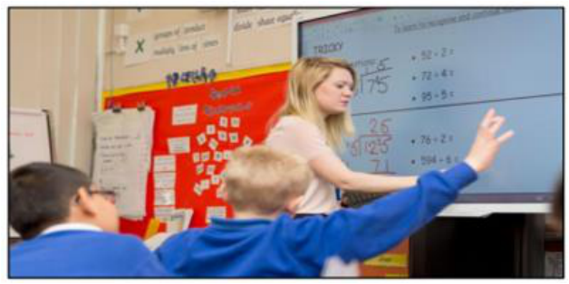


(2 March 2016. •12:38 pm. Hazel Davis.) 

It’s been a long time since attending school consisted of hauling in a large pile of books and sitting still looking at the teacher all day. Students these days are online, connected and digitally savvy. But are we making the most of this? One Hertfordshire school certainly is. 

Back in 2013, Hobletts Manor Junior School in Hemel Hempstead received its Oftsed report. Though it was very good, the report suggested the school could be outstanding if its pupils were able to use their ICT skills in more subjects. At the time, the school had a similar IT setup to most other UK primary schools: one ICT suite with limited pupil access. This, says head teacher Sally

---

<!-- pagina: 158 -->

**Andrea Belo Aula 02 - Verbs in texts** 

Short, made it difficult to embed technology across the curriculum in the ways they would like. But with the help of the school’s ICT coordinator and year 4 teacher Alice Baker, the local authority and PC World Business, Mrs Short came up with a shortlist of requirements to bring the school and its teaching style properly into the digital age. 

From ordering to installation, the process took just four weeks and at the end of it the school had a whole host of innovative tech, including an interactive 70inch Smart table, which works like a giant iPad. Miss Baker devised an interactive activity about the Egyptians and, she says, things like this have made a huge difference to learning. Because more than one person can interact with the Smart table, Mrs Short says her own teaching style has changed: “Before, lessons were purely teacher-led. It’s opening doors we didn’t even know existed and having an amazing impact.” The students were also each given their own Windows 8-enabled tablet; one child was so excited about this that he even burst into tears. The digital natives needed just one session to experiment and they were off. Miss Baker laughs: “They even teach me how to use the kit sometimes.” It might seem as though increased technology decreases concentration 

but, says Miss Baker, “Pupils are so much more engaged when they’re using the tablets, even if they’re just checking their answers on them.” 

The tech has also allowed the children to be more independent in their learning, but there are security measures in place to ensure Miss Baker has control over content and activity. Miss Baker has Acer Class Management software installed on her tablet. This allows her to see what all the students are doing on their tablets, and also enables her to share slideshows and websites. Handily, she can even lock their screens. At the same time, the entire school network has been upgraded. Pupils and teachers can now access a Wi-Fi connection in the outdoor learning area and there are plans afoot to allow them to use their tech in the nearby woodland and garden. The school is carefully monitoring the impact of the new technology, and has been making careful comparisons on the students’ progress. The teachers hope, too, that the tech will have a positive impact on attendance as students become increasingly engaged in lessons. 

“Following the installation, we surveyed pupils to gauge their perceptions on technology,” says Miss Baker, “Pupils who have been able to take advantage of the tools provided by PC World Business said that they felt technology was really important and that they will use it when they grow up. Perhaps most importantly, all the students in the class agreed that the technology has helped them learn.” 

(Available in: www.telegraph.co.uk. Adapted.) 

As to its use in the text, LEARNING (L 13) follows the same pattern of 

(A) learning (L 22). 

(B) ordering (L 11). 

(C) checking (L 18). 

(D) outstanding (L 05). 

#### GABARITO: B

---

<!-- pagina: 159 -->

**Andrea Belo Aula 02 - Verbs in texts** 

Comentários: Questão sobre vocabulário do texto. Verbo <u>to learn.</u> 

<u>Alternativa: As to its use in the text,</u> LEARNING (L 13) <u>follows the same pattern of</u> 

<u>Tradução: Quanto à sua utilização no texto,</u> LEARNING (L 13) <u>segue o mesmo padrão de:</u> 

<u>Linha 13:</u> "... like this have made a huge difference to learning. Because more than one person ..." 

<u>Tradução: "... assim têm feito uma enorme diferença</u> na aprendizagem. Porque mais do que uma pessoa..." 

learning (L 22). > INCORRETA. 

<u>Linha 13 : "... like this have made a huge difference</u> to learning . Because more than one person ..." <u>Tradução: "... assim têm feito uma enorme diferença</u> na aprendizagem . Porque mais do que uma pessoa..." 

<u>Learning (L 22)</u> . "... Pupils and teachers can now access a Wi-Fi connection in the outdoor learning area and..." 

<u>Tradução: "... Alunos e professores podem agora aceder a uma ligação Wi-Fi na</u> área de aprendizagem ao ar livre e...". 

Neste caso learning funciona no texto como um adjetivo que qualifica a área: learning area = área de aprendizage m, portanto, não tem a mesma função de <u>learning na linha 13 substantivo</u> . ordering (L 11). > CORRETA. 

Linha 13: "... like this have made a huge difference t <u>o learning . Because more than one person ..."</u> Tradução: "... assim têm feito uma enorme diferença <u>na aprendizagem . Porque mais do que uma</u> pessoa..." 

Linha11: "... From ordering to installation, the process took just four weeks..." 

<u>Tradução: "...  Desde a</u> encomenda até à instalação, o processo demorou apenas quatro semanas..." 

- A palavra <u>ordering ( encomenda</u> ) na frase da linha 11 funciona como um <u>substantivo , da</u> mesma forma que learning <u>( aprendizagem ) na linha 13 .</u> 

checking (L 18). > INCORRETA. 

Linha 13 : "... like this have made a huge difference to <u>learning.</u> Because more than one person ..." <u>Tradução: "... assim têm feito uma enorme diferença na aprendizagem.</u> Porque mais do que uma pessoa..." 

Linha 18 : "... Pupils are so much more engaged when they’re using the tablets, even if they’re just <u>checking</u> their answers on them...".

---

<!-- pagina: 160 -->

**Andrea Belo Aula 02 - Verbs in texts** 

<u>Tradução: " ... Os alunos estão muito mais empenhados quando estão usando os tablets, mesmo</u> que estejam apenas <u>verificando</u> as suas respostas neles...". 

- A palavra <u>Checking</u> na <u>linha 18</u> funciona como <u>verbo,</u> diferentemente de <u>learning na linha 13 , que funciona como um substantivo.</u> 

outstanding (L 05). > INCORRETA. 

Linha 13: "... like this have made a huge difference t <u>o learning.</u> Because more than one person ..." <u>Tradução: "... assim têm feito uma enorme diferença n a aprendizagem . Porque mais do que uma</u> pessoa..." 

Linha 05 : "... the report suggested the school could be <u>outstanding</u> if its pupils were able to use their ICT..." 

<u>Tradução: "... o relatório sugeria que a escola poderia ser excelente se os seus alunos pudessem</u> utilizar as suas TIC..." 

- A palavra <u>outstanding linha 05</u> , funciona na frase como um <u>adjetivo</u> que qualifica o substantivo escola. Enquanto <u>learning</u> na <u>linha 13</u> é um <u>substantivo .</u> 

35. (IDECAN/2016 – PREFEITURA MUNICIPAL DE MANHUMIRIM – MG) 

Robert said he would have his son to install the new treadmill if he dropped by on the weekend. 

A B C D 

Mark the item that contains an inconsistency and its corresponding correction. 

(A) In. 

(B) Told. 

#### (C) Grind. 

(D) Install. 

GABARITO: D 

Comentários: Questão que exige conhecimento do SUBJUNTIVO . 

SUBJUNCTIVE: usado em inglês bem formal e expressa algo muito desejado ou imaginado. 

Exemplos: I advise that you go; It is essential that he not stay home; I'll have him wash the car. 

*Dica: Alguns verbos que pedem o subjunctive: advise. warn, ask. Usando o WISH + to be no passado: todos os pronomes pedem o WERE. Até mesmo it/he/she = I wish she were more polite; I wish they were more polite. 

"Robert said that he would have his son INSTALL the new treadmill if he dropped by on the weekend." = NÃO se usa o TO no subjuntivo.

---

<!-- pagina: 161 -->

**Andrea Belo Aula 02 - Verbs in texts** 

#### 36. (IDECAN/2016 – CBM-DF) 

Read the dialogue to answer. 

Kate: You haven’t uttered a word ever since we’ve gotten here. 

Babs: I feel dizzy and have a sore gut. 

Kate: You’d better see a doctor. 

“You’d better see a doctor” is the contration of: 

- (A) You had better see a doctor. 

- (B) You would better see a doctor. 

- (C) You would better have seen a doctor. 

- (D) You could better see a doctor. 

#### GABARITO: A 

#### Comentários: Tradução do enunciado: 

“You’d better see a doctor” é a contração de... 

A contração 'd pode ser dois verbos: would e had <u>.</u> 

Neste caso, o verbo contraído é had <u>, pois a palavra seguinte é</u> better . Had better é uma forma de fazer uma recomendação . 

#### 37. (IADES/2016 – CEITEC S.A) 


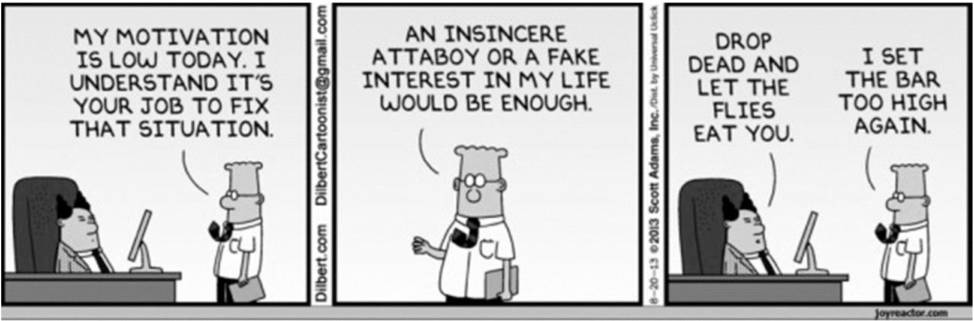


Internet: <http://joshuareich.org/2013/08/20/its-tuesday-afternoon-yourmotivation-is-low/>. Access: 12 Dec. 2015. 

The sentence with the underlined verb(s) with the same grammar structure and purpose of the underlined verbs in the sentence “drop dead and let the flies eat you” is 

- (A) I don’t like you. You should stop talking to me. 

- (B) You might have to leave the room. 

- (C) Can’t you just stay away? 

- (D) How dare you need my help? 

- (E) Go away now and leave me alone.

---

<!-- pagina: 162 -->

**Andrea Belo Aula 02 - Verbs in texts** 

#### GABARITO: E 

Comentários: Na frase “drop dead and let the flies eat you”, temos o uso dos verbos no imperativo , para indicar uma sugestão ou ordem. 

A forma verbal utilizada no imperativo é a base do verbo principal, sem o sujeito : "Be quiet!", "Enjoy your meal". 

Assim, precisamos analisar as alternativas e verificar qual apresenta uso correto do imperativo. 

I don’t like you. You should stop talking to me. > INCORRETA. 

Tradução: "Eu não gosto de você. Você deveria parar de falar comigo." 

O verbo destacado não está no imperativo. Para uso do imperativo, a forma correta é: " <u>Stop</u> talking to me", ou "Pare de falar comigo". 

You might have to leave the room. > INCORRETA. 

Tradução: "Talvez você precise sair da sala". 

O verbo destacado não está no imperativo.  Para uso do imperativo, a forma correta é: " <u>Leave</u> the room", ou "Saia da sala" 

<u>Can’t you just stay away? ></u> INCORRETA. 

Tradução: "Você não pode simplesmente ficar longe?" 

O verbo destacado não está no imperativo. Para uso do imperativo, a forma correta é: " <u>Stay</u> away", ou "Fique longe". 

How dare you need my help? > INCORRETA. 

Tradução: "Como você ousa precisar da minha ajuda?" 

O verbo destacado não está no imperativo. Para uso do imperativo, a forma correta é: " <u>Dare</u> to need my help", ou "Ouse precisar da minha ajuda". 

<u>Go away now and leave me alone. ></u> CORRETA. 

Os verbos destacados mostram uso correto do imperativo, pois estão na forma base e não tem sujeito . 

#### 38. (IADES/2016 – CEITEC S.A) 

With the blockbuster success of Fifty Shades of Grey, many people are curious about dipping their toes (not to mention other body parts) into more sexually adventurous waters. 

I’m always careful to make clear that while the adventures of Ana and Christian may make for a compelling erotic yarn, their story is by no means an accurate depiction of BDSM relationships (bondage, discipline, dominance, submission, sadism, masochism), nor is “Fifty Shades” any sort of guide book.

---

<!-- pagina: 163 -->

**Andrea Belo Aula 02 - Verbs in texts** 

For instruction on that topic, you’ll need to turn to the works of true sex-positive educators such as Clarisse Thorn or Tristan Taormino and their books The S&M Feminist and The Ultimate Guide to Kink, respectively. 

But there’s no denying that Fifty Shades has sparked widespread interest in how to improve our sex lives — and what better way to do that than via a good “how-to” book? 

If you’re uncomfortable talking about sex to your friends, doctor, therapist or even your partner, such books can be an important resource, whether they impart new information, help you work through an issue, inspire you to become more adventurous or simply turn you on […] 

Internet: <http://edition.cnn.com/2012/08/23/health/kerner-sexbooks/index.html?iref=allsearch>. Access: 13 Dec. 2015, adapted. 

When combined with the right preposition, the word “turn” can have several different meanings. Choose the meaning that is correct for its respective “turn + preposition”. 

- (A) “To turn on” means to refuse. 

- (B) “To turn in” is to go one way or another. 

- (C) “To turn up” is to appear. 

- (D) “To turn off” is to deny the truth. 

- (E) “To turn out” means to become great. 

#### GABARITO: C 

Comentários: Os verbos frasais (phrasal verbs) são formados por um verbo e por uma partícula (advérbios ou preposições). Além disso, eles possuem um sentido que leva em consideração a sua unidade como um todo, isto é, o verbo + preposição ou o verbo + advérbio. No caso desta questão temos o verbo Turn +preposição. Turn + prepositions. 

#### <u>TRADUÇÃO DO ENUNCIADO:</u> 

"When combined with the right preposition, the word “turn” can have several different meanings. Choose the meaning that is correct for its respective “turn + preposition”. 

"Quando combinado a uma determinada preposição, a palavra " turn " pode ter diversos significados diferentes. Escolha o significado correto para os respectivos usos de " Turn +preposição ." 

Na Língua Inglesa, sempre temos que observar o contexto para aferir o significado na frase, pois a mesma palavra pode ter mais de um significado literal. Assim, Turn + preposition pode ter mais de um significado, ainda que com a mesma preposição. 

Veja alguns exemplos: 

#### <u>Turn on</u> 

1. He really TURNS me ON. significado: <u>excitar</u> 

Ele realmente me excita (sexualmente).

---

<!-- pagina: 164 -->

**Andrea Belo Aula 02 - Verbs in texts** 

#### 2. I TURNED the radio ON to get the weather forecast. significado: <u>Ligar</u> 

<u>Liguei o rádio para obter a previsão do tempo.</u> 

3.The neighbour's dog TURNED ON me when I tried to stroke it. significado: <u>Atacar</u> 

O cachorro do vizinho me atacou quando eu tentei afagá-lo. 

#### <u>Turn in</u> 

1. I TURNED IN at half past eleven because I had an early start the next morning. Significado: Ir pra cama. 

Eu fui pra cama onze e meia porque começava cedo na manhã seguinte. 

2. She TURNED IN her paper. Significado: entregar, submeter 

Ela entregou o artigo dela. 

#### <u>Turn Up</u> 

#### 1. She didn't TURN UP for class today. Significado: <u>aparecer</u> 

Ela não apareceu para a aula hoje. 

2. I TURNED the music UP full blast. Significado: <u>aumentar</u> o volume, a temperatura, etc. 

Eu aumentei a música a todo o vapor. 

#### Turn off 

#### 1. I TURNED the TV OFF and went to bed. significado: <u>desligar.</u> 

Eu desliguei a TV e fui pra cama. 

Turn out 

1. The factory TURNS OUT three thousand units a day. Significado: <u>produzir</u> 

A fábrica produz 3mil unidades por dia. 

2. It looked as if we were going to fail, but it TURNED OUT well in the end. Significado: produzir um resultado inesperado. 

Parecia que íamos falhar, mas acabou por tudo sair bem no final. 

#### 3. She TURNED OUT the lights and went to bed. Significado: <u>desligar</u> luzes 

Ela desligou as luzes e foi para a cama. 

4.Thousand TURNED OUT for the demonstration. Significado: <u>comparecer</u> 

Milhares compareceram para a demonstração. 

#### 39. (IADES/2016 – CEITEC S.A) 

[…] Black Friday, which has traditionally been the moment to flock to stores for steep discounts, and which has evolved to also include major online sales events for retailers like Amazon, Best Buy

---

<!-- pagina: 165 -->

**Andrea Belo Aula 02 - Verbs in texts** 

and Walmart, is not all that it is billed to be. We asked J. D. Levite, the deals editor of the product recommendations website The Wirecutter, for some data on just how beneficial the deals are on Black Friday — and the answer was not encouraging. 

Year round, Mr. Levite and his team track product prices across the web to unearth discounts on goods of all types, from gadgets to kitchenware. They also look at whether the product is high quality and durable based on their own testing and other reviews, and whether the seller or brand has a reasonable return or warranty policy. By those measures, Mr. Levite said, only about 0.6 percent, or 200 out of the approximately 34,000 deals online, which typically carry the same price tags inside retailers’ physical stores, will be good ones on Black Friday. 

“There are just more deals on that day than any other day of the year,” he said. “But for the most part, the deals aren’t anything better than what you’d see throughout the rest of the year.” 

Internet: <https://www.nytimes.com/2015/11/26/technology/personaltech/black-friday-deal-or-dud-how-to-shop-smart-this-holiday-season.html>. Access: 26 nov. 2015. 

According to the sentence “Mr. Levite and his team track product prices across the web to unearth discounts on goods of all types, from gadgets to kitchenware” (lines 9 to 11), 

(A) there are two types of goods: gadgets and kitchenware. 

(B) “unearth discounts” means that discounts are not from planet Earth. 

(C) “from gadgets to kitchenware” is a sentence that corroborates the idea that they tracked many and varied products. 

(D) gadgets and kitchenware are good. 

(E) Mr. Levite is very competent at his job. 

#### GABARITO: C 

Comentários: O texto analisa as ofertas disponíveis na Black Friday - sexta-feira que segue o Dia <u>de Ação de Graças nos Estados Unidos na qual lojistas apresentam ofertas incríveis (mas que, de acordo com o texto, não são tão incríveis assim).</u> 

Questiona-se, então, o que é <u>correto afirmar a partir do que foi exposto na sentença abaixo:</u> 

- "O senhor Levite e sua equipe acompanham os preços dos produtos na web para descobrir descontos em mercadorias de todos os tipos, de gadgets a utensílios de cozinha”. 

Repare que a ideia principal da sentença é o extenso acompanhamento dos preços dos produtos realizado pelo senhor Levite e sua equipe. 

there are two types of goods: gadgets and kitchenware. > INCORRETO 

A frase diz que o acompanhamento é realizado em todos os tipos de mercadorias e usou os exemplos os gadgets (palavra que normalmente se refere à dispositivos eletrônicos portáteis) e os utensílios de cozinha para expressar a extensão da cobertura. 

Portanto, é incorreto afirmar que "há apenas dois tipos de mercadorias: gadgets e utensílios de cozinha".

---

<!-- pagina: 166 -->

**Andrea Belo Aula 02 - Verbs in texts** 

Lembre-se que a estrutura "from...to" pode ser usada para : 

- indicar um intervalo, quando utilizada com pontos específicos, por exemplo (from 5 to 500 meters); 

- expressar extensão, quando utilizada com opostos ou extremos, por exemplo ( from gadgets to kitchenware). 

“unearth discounts” means that discounts are not from planet Earth. > INCORRETO 

Como unearth é um verbo que normalmente significa desenterrar ou descobrir, a expressão " unearth discounts" deve ser entendida como " descobrir descontos ". 

Portanto, é incorreto afirmar que "'unearth discounts' significa que os descontos não são do planeta Terra". 

Lembre-se que, caso o significado pretendido fosse descontos que não são do planeta Terra, ao invés de um verbo ( unearth ), seria necessário um adjetivo ( unearthly ): 

- "unearthly discounts". 

“from gadgets to kitchenware” is a sentence that corroborates the idea that they tracked many and varied products. > CORRETO 

A frase diz que o acompanhamento é realizado em todos os tipos de mercadorias e usou os exemplos os gadgets (palavra que normalmente se refere à dispositivos eletrônicos portáteis) e os utensílios de cozinha para expressar a extensão da cobertura. 

Portanto, é correto afirmar que "'de gadgets a utensílios de cozinha' é uma sentença que corrobora a ideia de que eles acompanharam muitos e variados produtos". 

Lembre-se que a estrutura "from...to" pode ser usada para: 

- indicar um intervalo , quando utilizada com pontos específicos, por exemplo (from 5 to 500 meters); 

- expressar extensão, quando utilizada com opostos ou extremos, por exemplo ( from gadgets to kitchenware). 

gadgets and kitchenware are good. > INCORRETO 

A frase não apresenta análise de valor sobre os gadgets e os utensílios de cozinha . Ela apenas os utiliza para expressar a extensão da cobertura feita pelo senhor Levi e sua equipe. 

Portanto, é incorreto afirmar que "os gadgets e utensílios de cozinha são bons". 

É muito importante não confundir as seguintes palavras: 

- good (bom) 

- goods (mercadorias) 

Caso a alternativa afirmasse que "gadgets and kitchenware are goods" ("os gadgets e utensílios de cozinha são mercadorias"), ela estaria correta. 

Mr. Levite is very competent at his job. > INCORRETO

---

<!-- pagina: 167 -->

**Andrea Belo Aula 02 - Verbs in texts** 

A frase não apresenta análise de valor sobre o trabalho do senhor Levi. Ela apenas apresenta uma das coisas que ele e sua equipe fazem. 

Portanto, é incorreto afirmar que "'o senhor Levi é muito competente em seu trabalho". 

Perceba que o texto apresenta os dados fornecidos por Levi, mas não atesta especificamente a competência de Levi em seu trabalho. 

#### 40. (IADES/2019 – INSTITUTO RIO BRANCO) 

On any person who desires such queer prizes, New York will bestow the gift of loneliness and the gift of privacy. It is this largess that accounts for the presence within the city’s walls of a considerable section of the population; for the residents of Manhattan are to a large extent strangers who have pulled up stakes somewhere and come to town, seeking sanctuary or fulfillment or some greater or lesser grail. The capacity to make such dubious gifts is a mysterious quality of New York. It can destroy an individual, or it can fulfill him, depending a good deal on luck. No one should come to New York to live unless he is willing to be lucky. 

#### […] 

There are roughly three New Yorks. There is, first, the New York of the man or woman who was born here, who takes the city for granted and accepts its size and its turbulence as natural and inevitable. Second, there is the New York of the commuter—the city that is devoured by locusts each day and spat out each night. Third, there is the New York of the person who was born somewhere else and came to New York in quest of something. Of these three trembling cities the greatest is the last—the city of final destination, the city that is a goal. It is this third city that accounts for New York’s high-strung disposition, its poetical deportment, its dedication to the arts, and its incomparable achievements. Commuters give the city its tidal restlessness; natives give it solidity and continuity; but the settlers give it passion. And whether it is a farmer arriving from Italy to set up a small grocery store in a slum, or a young girl arriving from a small town in Mississippi to escape the indignity of being observed by her neighbors, or a boy arriving from the Corn Belt with a manuscript in his suitcase and a pain in his heart, it makes no difference: each embraces New York with the intense excitement of first love, each absorbs New York with the fresh eyes of an adventurer, each generates heat and light to dwarf the Consolidated Edison Company. 

White, E.B. (1999) Here is New York. New York: The Little Book Room, with adaptations. 

Considering the text, mark the following items as right (C) or wrong (E). 

The fragment “to dwarf the” (line 36) could be correctly replaced with that contribute to . (    ) Certo. 

(    ) Errado. 

#### GABARITO: ERRADO

---

<!-- pagina: 168 -->

**Andrea Belo Aula 02 - Verbs in texts** 

Comentários: De acordo com o Cambridge Dictionary , " dwarf ", enquanto verbo, se usa desta forma: "If one thing dwarfs another, it makes it seem small by comparison" . 

Exemplo: "The new skyscraper will dwarf all those near it". 

#### 41. (FUNDATEC/2022 – PREFEITURA MUNICIPAL DE ANDRÉ DA ROCHA – RS) 

#### ‘Alien’ minerals never found on Earth identified in meteorite 

While generations of camel herders of El Ali town in Somalia had known about the meteorite, which is the ninth largest ever found, it wasn’t scientifically documented until a few years ago. The oddly smooth rock caught the eye of prospectors, and when they hit it with a hammer, a metallic tone resounded. They suspected it was an iron meteorite — an object from space largely made of iron and nickel, many of which are believed to have come from the cores of smashed asteroids or planetesimals, similar to our own planet's metallic center. 

The prospectors sent small samples of _______ meteorite to scientists for confirmation and further analysis, and _______ piece fell into _______ hands of Chris Herd, curator of the meteorite collection at the University of Alberta. While studying the slice of rock, he noticed several crystals with unusual compositions. Later analysis, including a comparison to synthetically created minerals, confirmed his hunch: the composition and structure of the minerals had never been seen before in nature. 

Herd named one mineral elaliite, after the meteorite itself, and the second elkinstantonite, after Lindy Elkins-Tanton, a planetary scientist at Arizona State University. Chi Ma, a meteorite mineralogist at the California Institute of Technology who has previously discovered dozens of new minerals, identified the third mineral, calling it Olsenite to honor the late Edward Olsen, a former curator at the Field Museum of Natural History in Chicago. 

Our planet has roughly 5,800 minerals, while only about 480 have been found in meteorites. Many of those meteoritic minerals are truly alien — some 30 percent don't form naturally on Earth. Studying the mineralogy of meteorites is "armchair solar system exploration, in a lot of ways", Herd says. "We're trying to constrain the variety of conditions that have existed within different planetary bodies". 

Adapted from: https://www.nationalgeographic.com/magazine/article/alien-minerals-never-found-on-earth-identified-in-meteorite 

In lines 01 and 02 we find the following excerpt: 

“While generations of camel herders of El Ali town in Somalia <mark>had known</mark> (1) about the meteorite, which is the ninth largest ever found, it <mark>wasn’t</mark> scientifically <mark>documented</mark> (2) until a few years ago.” Consider the statements below about the <mark>highlighted</mark> structures and mark T, if true, of F, if false. 

(    ) 1 is a past perfect structure. 

- (    ) The action expressed by 1 happened after the action expressed by 2. 

- (    ) 2 is a simple past, negative passive voice structure. 

- (    ) 2 is a completed action.

---

<!-- pagina: 169 -->

**Andrea Belo Aula 02 - Verbs in texts** 

The correct order of filling the parentheses, from top to botton, is: 

- (A) T – F – T – T. 

(B) F – T – F – T. 

- (C) F – T – T – F. 

- (D) T – F – F – T. 

- (E) T – F – T – F. 

#### GABARITO: A 

Comentários: A questão traz um excerto do texto, e requer que você classifique os itens a seguir como "verdadeiro" (T - true) ou "falso" (F - false), marcando a alternativa que contém a sequência correta. 

- (V) 1 é uma estrutura do passado perfeito. 

#### VERDADEIRO . 

O passado perfeito tem como estrutura o verbo to have no passado simples ( had ) + o verbo principal no particípio passado. 

Na frase destacada na questão, o verbo principal é to know (saber), que está em sua forma no particípio passado ( known ). 

Assim, de fato, o item é <u>verdadeiro</u> . 

- (F) A ação expressa por 1 aconteceu depois da ação expressa por 2. 

FALSO . 

O passado perfeito é usado para indicar uma determinada ação no passado que ocorreu em <u>momento anterior a outra ação no passado.</u> 

No texto, o verbo que indica a ação 1 está conjugado no passado perfeito ( had known ), <u>indicando</u> ' <u>que ela ocorreu antes da ação número 2, no passado simples (wasn t) .</u> 

Portanto, o item é <u>falso .</u> 

- (V) 2 é um passado simples, estrutura de voz passiva negativa. 

#### VERDADEIRO . 

A voz passiva é usada quando queremos indicar que algo/alguém sofreu uma ação, em vez de praticá-la. 

Sua estrutura é formada pelo sujeito que recebe a ação + verbo to be + verbo principal no particípio passado . 

No trecho em questão temos exatamente essa estrutura, porém <u>na negativa</u> , ou seja, com o acréscimo do advérbio de negação not (não), e com o verbo to be no passado simples ( <u>was ),</u> indicando uma ação passada. 

Assim, de fato, temos uma estrutura da voz passiva no passado e na negativa.

---

<!-- pagina: 170 -->

**Andrea Belo Aula 02 - Verbs in texts** 

Portanto, o item é <u>verdadeiro</u> . 

(V) 2 é uma ação concluída. 

#### VERDADEIRO . 

A ação indicada em "2" está conjugada no passado simples, que é usado para indicar ações <u>terminadas e no passado.</u> 

No texto, esse tempo verbal é usado para indicar que, embora tenha sido do conhecimento dos criadores de camelos por muito tempo, apenas poucos anos antes o meteorito <u>foi documentado .</u> Logo, o item é <u>verdadeiro .</u> 

Assim, temos que a sequência correta é T – F – T – T (verdadeiro-falso-verdadeiro-verdadeiro) . Portanto, o gabarito é a alternativa "A" . 

#### 42. (FUNDATEC/2022 – PREFEITURA MUNICIPAL DE RESTINGA SÊCA – RS) 

#### What is the internet of things? 

In the internet of things (IoT), a “thing” can be __ person with a heart monitor implant, __ animal with a biochip transponder, __ car with sensors to alert when tire pressure is low, or any object that is able to transfer data. IoT is __ system of interrelated “things” that are provided with __ ability to transfer information over a network without requiring human interaction. It uses artificial intelligence and machine learning to improve data collecting, and sometimes devices can even communicate with each other and then act on __ information they get. 

In agriculture, IoT-based smart farming systems can help monitor light, temperature, humidity, and soil moisture of crop fields; automatize irrigation systems, and collect data on rainfall and soil content. The infrastructure industry can benefit from sensors that monitor events or changes within structural buildings and bridges. To healthcare, IoT offers the ability to monitor patients more closely using an analysis of the data that's generated. 

Smart homes are equipped with smart thermostats, appliances, and connected heating, lighting, and electronic devices that can be controlled remotely via smartphones. Smart buildings can reduce energy costs using sensors that detect how many occupants are in a room and then adjust the temperature automatically. Wearable devices with sensors can be used for public safety, for example, by providing optimized routes to a location where there is an emergency, or by tracking firefighters' vital signs at life-threatening sites. 

Obviously, there are some disadvantages, too, and the list includes the risk that <u>confidential information is stolen by hackers , and the difficulty for devices from different manufacturers to</u> communicate with each other since there's no international standard of compatibility for IoT. Companies may have to deal with massive numbers, and collecting and managing the data from all those devices will be challenging. Ultimately, if there's a bug in the system, it's likely that every connected device will become corrupted.

---

<!-- pagina: 171 -->

**Andrea Belo Aula 02 - Verbs in texts** 

"Pros and cons in perspective, Matthew Evans, the IoT program head at techUK, says that In the short term, we know [IoT] will impact on anything where there is a high cost of not 

intervening, Evans said. ""And it’ll be for simpler day-to-day issues – like finding a car parking space in busy areas, linking up your home entertainment system, and using your fridge webcam to check if you need more milk on the way home.”" 

(Available in: from: https://www.techtarget.com/iotagenda/definition/Internet-of-Things-IoT https://www.wired.co.uk/article/internet-of-things-what-is-explained-iot – text especially adapted for this test). 

Find the INCORRECT statement about the sentence “Confidential information <u>is stolen</u> by hackers” (l. 19). 

- (A) This kind of structure emphasizes the action, not the agent. 

- (B) It is in passive voice. 

- (C) It is in active voice. 

- (D) It is in simple present. 

- (E) The structure in bold is formed by BE past participle. 

#### GABARITO: C 

Comentários: A questão requer que você assinale o que é incorreto afirmar sobre a frase “Confidential information <u>is stolen</u> by hackers” (linha 19). 

Observe, inicialmente, que sua estrutura corresponde à da voz passiva, que tem dois elementos essenciais: 

- verbo to be (no mesmo tempo verbal da voz ativa) + verbo principal no particípio ; 

Exemplo: She was hit by a rock (Ela foi atingida por uma pedra). 

Na frase dada, temos o verbo principal no presente simples, o que indica uma "ação permanente" ou habitual, e na voz passiva, colocando como foco da oração a ação realizada, e não no sujeito/agente. Confira: 

#### Informações confidenciais são roubadas por hackers. 

Perceba que "por hackers" é mero complemento e que a informação que se destaca que "informações confidenciais são roubadas", o que corresponde ao objetivo da voz passiva. 

Com isso em mente, veja que, dentre as alternativas, <u>a única que apresenta informação incorreta é a alternativa "C", que indica que a frase está na voz ativa.</u> 

Portanto, o gabarito é a alternativa "C" . 

Veja o significado das demais alternativas, que descrevem o que já revisamos acima sobre a voz passiva: 

- Esse tipo de estrutura enfatiza a ação, não o agente; 

- Está na voz passiva; 

- Está no presente simples; 

- A estrutura em negrito é formada pelo verbo BE /particípio passado.

---

<!-- pagina: 172 -->

**Andrea Belo Aula 02 - Verbs in texts** 

#### 43. (FUNDATEC/2022 – PREFEITURA MUNICIPAL DE RESTINGA SÊCA – RS) 

Not considering any adaptations needed to preserve the sentence’s correctness, all words below are synonyms for the underlined term in the excerpt “Companies <u>may</u> have to deal with massive numbers”, EXCEPT: 

#### (A) Will 

#### (B) Can 

#### (C) Might 

#### (D) Possibly 

#### (E) Perhaps 

#### GABARITO: A 

Comentários: Ignorando as alterações necessárias para manter a correção gramatical, a questão requer que você indique qual palavra, dentre as alternativas, não é um sinônimo para o termo sublinhado em “Companies may have to deal with massive numbers”. 

O termo destacado é um verbo modal , que, por sua vez, corresponde a uma classe de verbos que funcionam como auxiliares dos verbos principais, alterando ou completando o sentido destes. 

Em inglês, os verbos modais mais comuns são: can, could, may, might, must, should, shall, will e would , cada um expressando uma ideia específica. 

O modal may , usado na frase dada, expressa pedido/permissão (formal) ou possibilidade. Exemplos: 

- May I use the office’s computer? (Eu posso usar o computador do escritório?); 

- It may rain tonight ( Deve chover hoje à noite); 

Vejamos como ele é usado na frase dada na questão: 

"Companies may have to deal with massive numbers”. 

(As empresas podem ter que lidar com números massivos.) 

Dentre as alternativas, todas expressam a ideia de possibilidade, com exceção de uma: will . 

O termo equivale ao auxiliar do tempo verbal "futuro", usado para expressar ação futura, <u>e não possibilidade .</u> Veja: 

- I will go to the beach tomorrow (Eu irei à praia amanhã); 

- The company will fire 10 employees (A empresa demitirá 10 empregados). 

Portanto, o gabarito é a alternativa "A" . 

Veja o significado das demais alternativas: 

- Can - verbo modal que expressa permissão, habilidade ou possibilidade; 

- Might - verbo modal que expressa possibilidade remota;

---

<!-- pagina: 173 -->

**Andrea Belo Aula 02 - Verbs in texts** 

#### - Possibly - advérbio "possivelmente"; indica possibilidade; 

#### - Perhaps - advérbio "talvez"; indica possibilidade. 

#### 44. (FUNDATEC/2020 – PREFEITURA MUNICIPAL DE TRÊS PALMEIRAS – RS) 

#### Flying foxes are dying en masse in Australia’s extreme heat 

The 30,000 gray-headed flying foxes in Yarra Bend Park, just outside the heart of Melbourne, Australia, were having a fairly normal early spring. In September and October, prime birthing season for the 11-inch long megabats, many of the flying foxes had returned to the park from their winter migration up the coast. Females were birthing pups as normal, says biologist Stephen Brend, who is _______ charge of monitoring gray-headed flying foxes at Yarra Bend Park, which is home to a significant colony of the bats. “But then it got too hot, too quickly” says Brend. 

Incapable _______ surviving the extreme, relentless heat that gripped Melbourne _______ December, the flying foxes were dying. Across three days just before Christmas, when temperatures exceeded 110 degrees Fahrenheit, 4,500 of the park’s gray-headed flying foxes perished — 15 percent of the colony’s population. The tragedy in the park echoes scenes of wildlife suffering across the country and puts a spotlight on the perils of extreme heat, <mark>which</mark> for some species can be just as deadly as fire. Australia’s endemic animals are falling victim to the heatwaves and fires that are ravaging the country at an unprecedented scale. It’s the hottest and driest summer in Australia in recorded history. As the planet warms, large-scale fires are becoming more frequent, and bushfire seasons are getting longer. 

For gray-headed flying foxes, which are classified as vulnerable to extinction, the Yarra Bend event is not isolated. “The colony in Adelaide suffered even worse,” says Brend. _______ January 4, many thousands of flying fox babies died _______ multiple roosts in and around the Sydney region in New South Wales, <mark>where</mark> the temperature reached a record-breaking 121 degrees Fahrenheit. Professor Justin Welbergen’s team, which monitors flying fox heat stress conditions, is calculating a final death toll. 

This summer’s extreme heat and extreme fires, <mark>which</mark> have imperiled Australia’s entire eastern coast “risk wiping out the 2019 generation” of newborn bats, Brend says. Some 80 percent of flying fox pups are born in October. They were young and vulnerable when heat waves and wildfires broke out late last year. Flying foxes play a vital role in the forest. They carry seeds and pollinate trees, gardening the forest by night. “Bats need the forest and the forest needs the bats,” says Brend. And it’s still the middle of summer in Australia. “We’ll battle on for our upside down friends, but things look very grim” says Lawrence Pope, a rescuer.” “In this horror year, all species are suffering.” Brend says. “We’re hot, and they’re hot, and it’s a nightmare.” 

Adapted from: https://www.nationalgeographic.com/animals/2020/01/flying-foxes-are-dying-en-mqasse-in-australias-extreme-heat/

---

<!-- pagina: 174 -->

**Andrea Belo Aula 02 - Verbs in texts** 

Select the alternative with a sentence written in the same verb tense used in “Australia’s endemic animals are falling victim to the heatwaves and fires…” (l. 13-14): 

- (A) Australia was suffering because of the extreme weather conditions. 

- (B) Australia have been suffering because of the extreme weather conditions. 

- (C) Australia will be suffering because of the extreme weather conditions. 

- (D) Australia had been suffering because of the extreme weather conditions. 

- (E) Australia is suffering because of the extreme weather conditions. 

GABARITO: E 

Comentários: O enunciado pede para selecionar a alternativa com uma frase escrita no mesmo <u>tempo verbal</u> usado em "Os animais endêmicos da Austrália estão sendo vítimas de ondas de calor e incêndios ..." (l. 13-14): 

Australia was suffering because of the extreme weather conditions. > ERRADO. 

A frase está errada por estar utilizando outro verb tense. "Was" é o verb to be no passado, e, além disso, o "ING" no inglês é usado para ações que acontecem no presente , e podem ou não estar acontecendo no momento da fala. 

Sendo assim, adicionando "was" a um verbo com ING, forma-se uma frase no Past Continuous <u>(passado contínuo).</u> 

Desse modo, podemos concluir que a alternativa está errada. 

Australia have been suffering because of the extreme weather conditions. > ERRADO. 

A frase usa a expressão "have been", que só é utilizada para construir frases no Present Perfect <u>Continuous (Presente Perfeito Contínuo). Sendo, mais uma vez, um tempo verbal diferente na</u> frase da questão. 

Desse modo, podemos concluir que a alternativa está errada. 

Australia will be suffering because of the extreme weather conditions. > ERRADO. 

A frase apresenta o verbo auxiliar "will", que assim como a expressão "to be going to", manifestam o futuro. 

Além do mais, como depois de "will" é adicionado o vert to be com um verbo com a terminação "ING", isso indica que o tempo usado é o Future Continuous (futuro contínuo). 

Desse modo, podemos concluir que a alternativa está errada. 

Australia had been suffering because of the extreme weather conditions. > ERRADO. 

A frase apresenta "had", que é o verbo "have" na forma de Past Participle (passado particípio). De acordo com a estrutura da frase, que é formada por:

---

<!-- pagina: 175 -->

**Andrea Belo Aula 02 - Verbs in texts** 

- Verb to have no past participle (had) + verb to be no past perfect (been) + verbo principal no gerúndio (com terminação ING) 

Essa é a forma de uma frase no Past Perfect Continuous . Novamente, não é o mesmo verb tense da frase em questão. 

Desse modo, podemos concluir que a alternativa está errada. 

Australia is suffering because of the extreme weather conditions. > CERTO. 

Apesar de estar escrita de uma forma diferente, a frase apresenta o mesmo verb tense da frase indicada na questão. A estrutura é a mesma: 

- *sujeito*. +. _simple presente do verb to be (is/are)_ + ```verbo principal no gerúndio.``` 

- --> *Australias endemic animals* _are_ ```falling``` to the heatwaves and fires. 

- --> *Australia* _is_ ```suffering```because of the extreme weather conditions. 

Portanto, diante do apresentado, essa é a opção correta , pois apresentar o mesmo verb tense da frase apontada pela questão.

---

<!-- pagina: 176 -->

**Andrea Belo Aula 02 - Verbs in texts** 

# **FINAIS CONSIDERAÇÕES** 

Mais uma aula concluída, outro passo a mais até a sua aprovação! 

Eu sei que ao examinador exige que você saiba muitas estruturas, vocábulos e interpretação de textos em Inglês. Mas, dia após dia, você vai se acostumando com o ritmo das aulas, que preparei de maneira equilibrada para cada conteúdo a ser estudado. 

E, adaptando-se às aulas dinâmicas aqui apresentadas, você ficará cada vez mais confiante e seguro dos seus resultados. Vai dar certo e levará à sua aprovação! 

Outro detalhe importante para seu sucesso nos estudos, é fazer listas de vocabulário das palavras que você achou difíceis a cada aula, em cada exercício ou lista, a fim de reescrevê-las e então, recordá-las nos momentos de pausa entre as aulas. 

Minha sugestão é que você faça a leitura dessas palavras consideradas “novas” para vê-las novamente. Isso te ajudará nas questões em que esses vocábulos reaparecem. 

Acontece muito com a classe dos verbos, por exemplo. A cada lista de exercício resolvida ou mesmo a cada exercício que você faça, perceberá como fica mais fácil identificar um verbo já visto no tempo passado ou particípio. 

É sua conquista de etapas e que tornará você, um candidato mais bem preparado e confiante para realizar uma excelente prova. 

É importante lembrar também do nosso Fórum de dúvidas , exclusivo do Estratégia Concursos . Será minha forma de responder, no prazo máximo de 48 horas, o que mais você precise saber para que os conteúdos fiquem ainda mais claros em seus estudos, certo? 

E as redes sociais têm dicas complementares, slides, desafios, vale a pena! Follow me! 


---

<!-- pagina: 177 -->

**Andrea Belo Aula 02 - Verbs in texts** 

# **REFERÊNCIAS** 

BARRETO, Tania Pedroza; GARRIDO, Maria Line; SILVA, João Antenor de C., Inglês Instrumental. Leitura e compreensão de textos. Salvador, Ba UFBA, 1995, p. 64. 

BROWN. H. Douglas. Principles of Language Learning and Teaching. Prentice Hall International, 1988. 

COMPEDELLI, Samira Yousseff. Português, Literatura, Produção de texto & Gramática – São Paulo: Ed. Saraiva, 2002. 

COSTEIRA, Adriana Araújo de M. Reading Comprehension Skills. João Pessoa/PB: ETFP, 1998. 

CRYSTAL David. Cambridge University Press 1997. The Cambridge Encyclopedia of Language. Cambridge University Press 1997 

FREEMAN. Diane Larsen. MURCIA. Marianne Celce. The Grammar Book, 1999. 

DYE, Joan., FRANFORT, Nancy. Spectrum II, III A Communicative Course in English. USA, Prentice Hall, 1994. 

FAVERO, Maria de Lourdes Albuquerque (org.). Dicionário de educadores no Brasil: da colônia aos dias atuais. Rio de Janeiro: UFRJ, MEC, INEP, 1999. 

FRANKPORT, Nancy & Dye Hoab. Spectrum II, III Prentice Hall Regents Englewood Cliffs, New Jersy, 1994. 

GADELHA, Isabel Maria B. Inglês Instrumental: Leitura, Conscientização e Prática. Teresina: EDUFFI, 2000. 

GUANDALINI, Eiter Otávio. Técnicas de Leitura em Inglês: ESP – English For Specific Purposes: estágio 1. São Paulo: Texto novo, 2002. 

GRELLET, Françoise. Developing Reading Skills. Cambridge University Press, 1995 

HOLAENDER, Arnon & Sanders Sidney. A complete English Course. São Paulo. Ed. Moderna, 1995. 

HUTCHINSON, Tom & WATERS, Alan. English for Specific Purposes. Cambridge: Cambridge University Press, 1996 

KRASHEN. Stephen D. Second Language Acquisition and Second Language Learning, Prentice–Hall International, 1988. 

LAENG, Mauro. Dicionário de pedagogia. Lisboa: Dom Quixote, 1973. 

LEFFA, Vilson J. Metodologia do ensino de línguas. In: BOHN, H.; VANDRESEN, P.  (org.). Tópicos de linguística aplicada: o ensino de línguas estrangeiras. Florianópolis: Editora da UFSC, 1988. p. 211–231. 

LIBERATO, Wilson. Compact English Book Inglês Ensino Médio. São Paulo: FTD, Vol. Único, 1998 

Mc ARTHUR. The Oxford Companion to the English Language. Oxford University Press 1992 Fromkin. Victoria. An Introduction to Language 

MARQUES, Amadeu. Inglês Série Brasil. ed. Atica. São Paulo: 2004. Vol. Único. 

MURPHY, Raymond: Essencial Grammar in Use Oxford. New York Ed. Oxford University, 1997.

---

<!-- pagina: 178 -->

**Andrea Belo Aula 02 - Verbs in texts** 

OLIVEIRA, Luciano Amaral. English For Tourism Students. Inglês para Estudantes de Turismo: São Paulo, Rocca, 2001. 

OLIVEIRA, Sara Rejane de F. Estratégias de leitura para Inglês Instrumental. Brasília: UNB, 1994. 

PAULINO, Berenice F. et all. Leitura em textos em Inglês – Uma Abordagem Instrumental. Belo Horizonte: Ed. Dos Autores, 1992. 

PEREIRA, Edilberto Coelho. Inglês Instrumental. Teresina: ETFPI, 1998. 

RODGES, Theodore. Jack C. Richards. Approaches and Methods in Language Teaching. Cambridge University Press, 2001. 

RODMAN Robert. Harcourt Brace 1993. English as a Global Language 

SILVA, João Antenor de C., GARRIDO, Maria Lina, BARRETO, Tânia Pedrosa. Inglês Instrumental: Leitura e Compreensão de Textos. Salvador: Centro Editorial e Didático, UFBA. 1994 

SOARES, Moacir Bretãs. Dicionário de legislação do ensino. 19.ed. Rio de Janeiro: FGV, 1981. 

SOUZA, Adriana Srade F. Leitura em Língua Inglesa: Uma abordagem Instrumental. São Paulo: Disal, 2005. 

TUCK, Michael. Oxford Dictionary of Computing for Learners of English. Oxford: Oxford University Press, 1996. 

TOTIS, Verônica Pakrauskas. Língua Inglesa: leitura. São Paulo: Cortez, 1991. 

Livros eletrônicos: 

Dicionário Houaiss da Língua Portuguesa, Editora Objetiva, 2001. 

MOURãO, Janaína Pereira. "Skimming x Scanning"; Brasil Escola. Disponível em 

<https://brasilescola.uol.com.br/ingles/skimming–x–scanning.htm>. Acesso em 20 de março de 2019. 

www.newsweek.com – Acesso em 18 de março de 2019. 

http://www.galaor.com.br/tecnicas–de–leitura/ – Acesso em 19 de março de 2019. 

Expressões Idiomáticas (continuação)" em Só Língua Inglesa. Virtuous Tecnologia da Informação,2008– 2019. Consultado em 03/04/2019 às 22:09. Disponível na Internet em 

http://www.solinguainglesa.com.br/conteudo/Expressoes5.php

---

<!-- pagina: 179 -->


