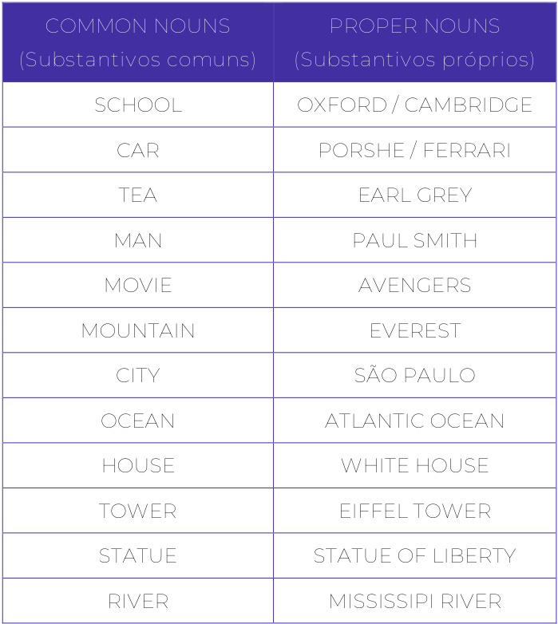
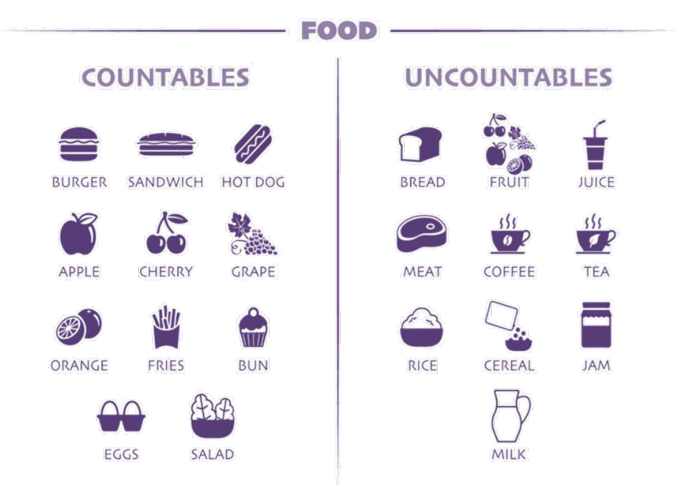
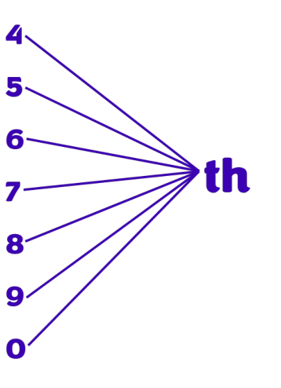
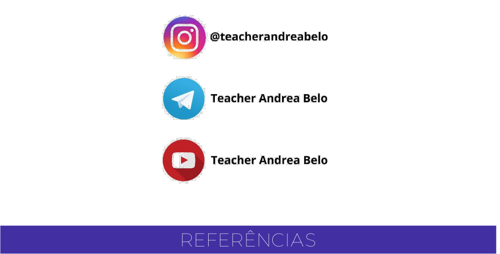

---
fonte_pdf: "Inglês - Aula 03.pdf"
paginas: 128
conversao: texto-e-imagens
---

<!-- pagina: 2 -->

**Andrea Belo Aula 03 - Articles and Nouns in the texts** 

#### **SUMÁRIO** 

|INTRODUÇÃO--------------------------------------------------------------------------|-------------------------------------- 2|
|---|---|
|ARTIGO DEFINIDO THE---------------------------------------------------------------|-------------------------------------- 3|
|ARTIGOS INDEFINIDOS A E AN-----------------------------------------------------|-------------------------------------- 6|
|SUBSTANTIVOS------------------------------------------------------------------------|-------------------------------------- 9|
|SUBSTANTIVO COMUM-----------------------------------------------------------|-------------------------------------- 9|
|SUBSTANTIVOS PRÓPRIOS--------------------------------------------------------|------------------------------------ 10|
|SUBSTANTIVO COMPOSTO-------------------------------------------------------|------------------------------------ 11|
|SUBSTANTIVOS ABSTRATOS E CONCRETOS-----------------------------------|------------------------------------ 12|
|SUBSTANTIVO COLETIVO---------------------------------------------------------|------------------------------------ 13|
|SUBSTANTIVOS CONTÁVEIS------------------------------------------------------|------------------------------------ 15|
|SUBSTANTIVOS INCONTÁVEIS---------------------------------------------------|------------------------------------ 16|
|PLURAL IRREGULAR E PARTICULARIDADES--------------------------------------|------------------------------------ 22|
|CURIOSIDADES SOBRE ARTIGOS---------------------------------------------------|------------------------------------ 27|
|CURIOSIDADES SOBRE SUBSTANTIVOS--------------------------------------------|------------------------------------ 28|
|NÚMEROS-------------------------------------------------------------------------------|------------------------------------ 29|
|CARDINAL NUMBERS---------------------------------------------------------------|------------------------------------ 29|
|ORDINAL NUMBERS----------------------------------------------------------------|------------------------------------ 31|
|PREFIXOS E SUFIXOS------------------------------------------------------------------|------------------------------------ 32|
|PREFIXOS-----------------------------------------------------------------------------|------------------------------------ 32|
|SUFIXOS------------------------------------------------------------------------------|------------------------------------ 34|
|QUESTÕES------------------------------------------------------------------------------|------------------------------------ 36|
|GABARITO------------------------------------------------------------------------------|------------------------------------ 65|
|QUESTÕES COMENTADAS-----------------------------------------------------------|------------------------------------ 66|
|CONSIDERAÇÕES FINAIS-------------------------------------------------------------|----------------------------------- 123|
|REFERÊNCIAS---------------------------------------------------------------------------|----------------------------------- 124|

---

<!-- pagina: 3 -->

**Andrea Belo Aula 03 - Articles and Nouns in the texts** 

# **INTRODUÇÃO** 

Chegou a vez da nossa aula sobre artigos e sobre substantivos . 

Mesmo que haja um vasto conhecimento sobre as regras de gramática em Inglês, sem os artigos e os substantivos, a comunicação seria impossível. Isso porque, etimologicamente, substantivo significa, literalmente, aquilo que está debaixo, a base. E, se os artigos vêm antes dos substantivos, determinando-os, ambos são fundamentais aos textos. 

Vamos falar um pouco de artigos. 

Quando eu explico o uso dos artigos em inglês, sempre gosto de lembrar que, o artigo definido THE , por exemplo, está na lista das palavras mais usadas na língua inglesa. 

Então, aprender a usar o the e os outros artigos, de forma correta, é de grande importância para melhorar seu vocabulário em inglês. 

Os artigos estão em todo lugar, em todos as frases dos textos e inseridos nos contextos. Por isso, é essencial que você tenha conhecimento de como usar os artigos de forma correta, mesmo sabendo que há regras, muitas regras. 

Mas é assim também em português e em todas as línguas e, saber mais sobre cada item, que estará presente em sua prova, deixará você devidamente preparado. 

Os artigos em inglês, são classificados como definidos e indefinidos e colaboram imensamente na interpretação dos textos, pois são os artigos que revelam, que mostram para você se a palavra que foi mencionada no texto aparece no contexto pela primeira vez ou essa palavra está retomando alguma ideia já expressada anteriormente, ajudando em sua compreensão do texto como um todo. 

Em nossa aula, ficará fácil e claro para você. 

O substantivo, por sua vez, é a classe de palavras que nomeia seres, objetos, lugares, sentimentos, ou seja, denomina e classifica a maioria das palavras constituintes das frases que usamos para nos comunicar. 

A palavra substantivo é derivada da família de substância e substancial, que significam, fundamental. 

Nessa aula, estudaremos todos os artigos e todos os substantivos em inglês, com exemplos e explicações completas, já que esses termos estão entre as palavras mais importantes de um idioma, pois estão presentes em nossos discursos, nos textos que escrevemos e lemos e em nossos pensamentos quando queremos expressar opiniões. 

Vamos estudá-los!

---

<!-- pagina: 4 -->

**Andrea Belo Aula 03 - Articles and Nouns in the texts** 

# **ARTIGO DEFINIDO THE** 

Os artigos definidos que temos na língua portuguesa são: o , a , os e as . Em inglês, eles são representados por apenas uma palavra: o artigo definido the . 

Definite Article (artigo definido), é o termo usado para se referir a algo específico ou algo que já foi mencionado anteriormente. 

Como já afirmei, existe apenas um artigo definido em inglês: the , e ele é utilizado diante de substantivos tanto no singular quanto no plural, pois a única palavra the significa o , a , os e as . 

Exemplos: 

- “ The car is blue.” ( O carro é azul.) 

- “ The cars are blue.” ( Os carros são azuis.) 

- “ The table is big.” ( A mesa é grande.) 

- “ The tables are big.” ( As mesas são grandes.). 

Observe também outro exemplo: “ The backpack is red.” ( A mochila é vermelha.). A cor ‘vermelha’ especifica o substantivo ‘mochila’ (backpack). Assim, não se trata de uma mochila qualquer, e sim da mochila vermelha, determinada pelo artigo definido the . Na maioria das vezes, esse artigo é usado antes dos substantivos, para defini-los. 

Vejamos outros casos do correto uso do artigo definido the . 

Usamos o artigo definido antes de substantivos já mencionados, como por exemplo: “Tom wrote a book. The book is about art.” (Tom escreveu um livro. O livro é sobre artes.). O artigo the foi usado para determinar o livro que já havia sido mencionado: o livro que Tom escreveu. 

Usamos o artigo definido também para substantivos considerados únicos em sua espécie como a lua, o sol etc.: the moon ( a lua), the sun ( o sol), the sky ( o céu), the planet Earth ( o planeta Terra), the universe ( o universo). Exemplo: “ The sun is shining.” ( O sol está brilhando.). 

Outro caso em que usamos o artigo definido é quando se fala de algo que se remete a nomes geográficos de um rio, um mar, um oceano, canais, polos, desertos, golfos, ilhas e montanhas, veja: the Mississipi River, the Pacif ocean, the English Channel (O Canal da Mancha), the South Pole (o polo Sul), the Sahara desert, the Gulf of Mexico, the Bahamas, the Alps etc. Exemplo: “ The Pacific Ocean is very big.” ( O oceano pacífico é muito grande.). 

Um caso interessante do uso do artigo definido é quando se fala de adjetivos que estão sendo usados como substantivos no plural, como: the poor ( os pobres), the powerful ( os poderosos), the strong ( os fortes), the good ( os bons), the bad ( os maus) etc. Você deve estar perguntando: e os substantivos no singular, como por exemplo, ‘ o poderoso’? Como fica a frase? Respondo a você que, precisa usar o nome, o substantivo, veja: “ The powerful man helped the boy.” ( O poderoso homem ajudou o garoto.). 

Usamos o artigo definido também para nomes compostos de países, como os Estados Unidos, o Reino Unido, os Emirados Árabes e a República Dominicana: The United States, The

---

<!-- pagina: 5 -->

**Andrea Belo Aula 03 - Articles and Nouns in the texts** 

United Kingdom, The United Arab Emirates, The Dominican Republic. Exemplo: “He lives in the USA.” (Ele mora nos EUA.), sendo in the = nos (em + os), o e artigo definido os = the . 

Quando os nomes próprios indicam um grupo familiar, ou seja, o nome de uma família inteira, usamos também o artigo definido: “ The Smiths went to the restaurant Yesterday.” 

( Os Smith [os membros da família Smith] foram ao restaurante ontem.). É muito importante ressaltar que, para nomes próprios em geral e nomes de pessoas, NÃO se usa artigo definido, nunca. 

Apenas quando estiver se referindo a um nome próprio que já possuam the em sua estrutura , como The Economist, The New York Times, The Beatles, The Washington Post, The Empire States, The Louvre, The Kremlin, The Taj Mahal, The Vatican etc. 

Então, ao dizer: “Susan is my friend.” (Susan é minha amiga.), não podemos jamais escrever ou falar “ The Susan is my friend.”, nunca, certo? 

Usamos o artigo definido também quando se trata do grau superlativo em inglês (teremos uma aula destinada aos adjetivos, em que explicarei, com detalhes, os graus comparativo e superlativo), como por exemplo: 

“Bob is the tallest guy in our classroom.” (Bob é o cara mais alto da nossa sala.) 

“Kathy is the shortest girl in our classroom.” (Kathy é a garota mais baixa da nossa sala.). 

Agora vejamos os casos em que NÃO devemos usar o artigo definido, como já citei acima, por exemplo, em nomes próprios. Não se deve colocar the antes de nomes de cidades, estados, países e continentes. Para dizer que a Europa é um grande continente, ficaria: “Europe is a big continente.”, sem o artigo no início da frase. 

E não usamos o artigo definido the antes de nomes de disciplinas acadêmicas esportes, ciências, cores, estações do ano, meses e dias da semana. Vejamos exemplos. 

“Tennis is a great sport.” ( O tênis é um ótimo esporte.) 

“Biology is an important science.” ( A Biologia é uma ciência importante.). 

“Yellow is Paul's favorite color.” ( O amarelo é a cor favorita de Paulo.). 

Também não devemos usar o artigo definido para substantivos que estiverem no plural, porém utilizados em sentido genérico, como por exemplo as pessoas (referindo-se a muitas pessoas, a uma maioria de pessoas): “People watch too much TV.” (As pessoas assistem muita televisão.), sem the para “as” pessoas. 

Outro caso em que também não usamos o artigo definido é quando há substantivos abstratos ou nomes que indicam algum tipo de material: “Hope is stronger than fear.” ( A esperança é mais forte do que o medo.) e “Silk produces soft clothes.” ( A seda produz roupas macias.). 

Devemos ficar atentos quando houver referência a cargos e títulos, pois, quando usados sós na oração, usa-se o artigo definido. Mas, omite-se o artigo definido quando o nome próprio

---

<!-- pagina: 6 -->

**Andrea Belo Aula 03 - Articles and Nouns in the texts** 

estiver junto, veja: “ The president is on TV now.” ( O presidente está na TV agora.). Porém, veja essa outra frase: “President Kennedy was murdered.” ( O presidente Kennedy foi assassinado.). 

Quando vamos construir frases no passado e futuro, usando last e next , não usamos o artigo the antes deles, pois são expressões temporais: “I will travel next month.” (Eu vou viajar no próximo mês.) e não “in the next month” ou em referência ao passado ‘last month’ e nunca “in the last month”, isso não existe. 

Agora, em complemento ao capítulo que você estudou sobre o artigo definido, vamos estudar os artigos indefinidos a e an . Come on!

---

<!-- pagina: 7 -->

**Andrea Belo Aula 03 - Articles and Nouns in the texts** 

# **ARTIGOS INDEFINIDOS A E AN** 

Os Indefinite articles (artigos indefinidos) que temos na língua portuguesa: um , uma , uns e umas , em inglês, são representados por apenas duas palavras: a e an e são usados quando nos referimos a algo em geral, algo não especificado. 

Eles apenas podem ser usados antes de substantivos que estão no singular. 

Muitas pessoas aprendem erroneamente que a se usa antes de palavras que se inicia com consoante enquanto an se usa para palavras que se iniciam com vogal. 

Na verdade, essa regra funciona quase sempre, mas os artigos indefinidos também dependem do som das letras iniciais das palavras em que são empregados. 

Por exemplo, dizer “ um homem velho’ em inglês é “ an old man”, por causa da letra “o” no início da palavra ‘old’. 

Mas, dizer “ um homem honesto” é “ an honest man”, por causa do som de “o” da palavra ‘honest’. Apesar de começar com a letra “h”, essa letra não é pronunciada na palavra ‘honest’, como na maioria em que o “h” possui o som de “r”, por exemplo, na palavra ‘house’. 

Se o som for da consoante “r”, aplicamos o artigo indefinido a : “He wants to buy a house.” (Ele quer comprar uma casa.). 

Outros casos em que devemos analisar a fonética para usar o artigo correto é em palavras cuja vogal inicial tem o som de consoante, que geralmente começam com “u” e “eu”, mas tem o som de “y”, que é consoante em inglês: 

“This is a university.” (Essa é uma universidade.) 

- “I am reading a European Journal.” (Estou lendo um jornal europeu.). 

Apesar de iniciar com a vogal “o”, a palavra ‘one’ tem o som da consoante “w” e, por isso, também pede o uso do artigo indefinido a e não an : “She lives in a one-story small house.” (Ela mora em uma pequena casa de um andar.). 

Em regra geral, na maior parte das palavras que começam com vogais, usa-se o artigo indefinido an e, por sua vez, o artigo indefinido a , é usado para palavras que iniciam com consoante: 

- “She left an hour ago.” (Ela saiu há uma hora.) 

- “He is a jornalista.” (Ele é um jornalista.) 

- “I will buy a new skirt.” (Eu comprarei uma saia nova.) 

“He will see an elephant at the zoo.” (Ele verá um elefante no zoológico.) etc. 

O artigo a deve ser usado antes das palavras few e little quando têm sentido positivo, como:

---

<!-- pagina: 8 -->

**Andrea Belo Aula 03 - Articles and Nouns in the texts** 

“She can see a few buildings far away.” (Ela consegue avistar alguns prédios de longe.), como se fosse “um pouco de prédios” e por isso ‘a few’, mas a melhor tradução é “alguns prédios”. 

Outro exemplo: 

“She wants just a few milks with coffee.” (Ela quer apenas um pouco de leite com café.). 

Agora vejamos os casos em que não devemos usar os artigos indefinidos. 

Como eu havia dito antes, os artigos indefinidos a e an não devem ser usados quando a ideia principal da frase se refere a substantivos no plural: a e an não significam uns/umas nunca e só podem ser usados exclusivamente no singular. 

Explicarei o que fazer com palavras no plural. Vamos lá. 

Não devemos usar artigos indefinidos antes de substantivos incontáveis (embora isso aconteça em português). 

Então, usamos “some”, como por exemplo: “She gave me some advice.” (Ela me deu um conselho.) e como ‘conselho’ em inglês é incontável (advice), usamos “some” e não o artigo an . 

Em um esquema simples usando os artigos definidos e indefinidos de forma resumida para ajudar você a se lembrar das regras, poderíamos dizer que: 

Usamos o artigo indefinido "A" quando as palavras **A** possuem uma consoante como letra inicial e, além da grafia, sua pronúncia também deve ser de consoante. Usamos o artigo indefinido "AN" quando as palavras **AN** possuem uma vogal como letra inicial e, além da grafia, sua pronúncia deve ser de uma das vogais também. Usamos o artigo definido "THE" para palavras contáveis e incontáveis, femininas e masculinas e, tanto para o **THE** singular como para o plural, já que apenas THE significa "o, a, os, as".

---

<!-- pagina: 9 -->

**Andrea Belo Aula 03 - Articles and Nouns in the texts** 

<!-- Start of picture text -->
A  AN A + Consonant  AN + Vowel l amp  a pple d oor  e lephant a + h ouse  an + i ce-cream b ag  o range t omato  u mbrella <!-- End of picture text -->

Outra importante observação a fazer é sobre os artigos indefinidos a e an . 

Poderia ser questionado se todos os artigos indefinidos estão acompanhados de substantivos ou até mesmo, dos “nomes a que eles se referem” e, você poderia se sentir confuso, já que esses artigos não determinam os substantivos. 

Apesar de não os determinar, eles acompanham sim, substantivos. Por exemplo, 

“ A glance away.”, é “ Um olhar distante.” 

Não se sabe de quem é o olhar, mas o artigo acompanhou o substantivo. 

Assim como “ an instant ago”, não se sabe qual foi o instante atrás a que se referem, mas foi “ um instante atrás”, que já passou e o artigo acompanhou o substantivo instante. 

Agora, vamos aos substantivos, que tanto falamos que os artigos acompanham. 

E, apesar de saber que são nomes, há características e dicas que fazem com que você os identifique e facilite na hora das respostas às questões. Let’s go!

---

<!-- pagina: 10 -->

**Andrea Belo Aula 03 - Articles and Nouns in the texts** 

# **SUBSTANTIVOS** 

Os Nouns (substantivos), existem para nomear os seres em geral, representados por pessoas, lugares, instituições, grupos, elementos da natureza etc. 

São aquelas palavras presentes em nossos pensamentos, em nossos discursos, na fala e na escrita. Os substantivos integram as classes gramaticais e estão <mark>relacionados à formação e ao significado de palavras.</mark> 

De acordo com uma pesquisa da palavra substantivo, no Dicionário Etimológico, percebemos que substantivo se origina de substância, parte essencial de alguma coisa. E, conforme a Nova Gramática do Português Brasileiro, o termo ‘substantivo’ significa literalmente ‘o que está debaixo’, ‘na base’. 

A definição de substantivo em inglês (NOUN) em variados dicionários é praticamente a mesma: 

“A noun is a kind of word that is usually the name of something such as a person, place, thing, quality, or idea.” (Um substantivo é um tipo de palavra que geralmente nomeia coisas, tais como uma pessoa, lugar, qualidade ou ideia.). 

Em inglês, há mais substantivos do que qualquer outra classe de palavras, sabia? 

Vamos estudar, a parte fundamental dos textos que você vai ler e interpretar em sua prova que são, de fato, os substantivos. 

Os substantivos podem ser: 

Common Nouns (Substantivos comuns), 

Proper Nouns (Substantivos Próprios), 

Compound Nouns (Substantivos Compostos), 

Countable and Uncountable Nouns (Substantivos Contáveis e Incontáveis), 

com as variações de Singular e Plural nos substantivos e certas regras que estudaremos. 

Veremos cada um deles com exemplos, já que há peculiaridades e regras que envolvem todos os tipos de substantivos. Vamos começar pelo substantivo comum. 

## **SUBSTANTIVO COMUM** 

Os common nouns (substantivos comuns) são aqueles que nomeiam seres da mesma espécie, fazem referência a uma pessoa, lugar ou coisa de forma geral. São os mais presentes nas provas, pois estão nos textos que você vai precisar ler no dia da prova. 

São escritos com a letra inicial minúscula, exceto se iniciarem a frase. Exemplos: book (livro), table (mesa), city (cidade) etc.

---

<!-- pagina: 11 -->

**Andrea Belo Aula 03 - Articles and Nouns in the texts** 

## **SUBSTANTIVOS PRÓPRIOS** 

Por sua vez, os proper nouns (substantivos próprios) são aqueles que representam o nome de uma determinada pessoa, de uma entidade, de lugares em geral. Também aparecem bastante nas provas, para nomear pessoas e lugares de referência nos textos variados. 

Sempre devem ser escritos com letra maiúscula . 

Além de pessoas e lugares, são substantivos próprios, em inglês, os dias da semana, dos meses, de documentos históricos e de instituições. 

Exemplos: Robert (Roberto), Mississipi River (Rio Mississippi), Cambridge University (Universidade Cambridge), Monday (segunda-feira), January (janeiro). 

Vamos fazer uma pequena comparação com exemplos para ficar clara a diferença entre substantivos comuns e próprios, sendo que, as palavras da primeira coluna se relacionam com as da segunda, assim: para cada exemplo de substantivo comum, há um próprio que o exemplifique, como ‘school’ (escola) em relação à Oxford University, que é um nome, um substantivo próprio nomeando uma universidade, exemplo de escola. E assim por diante. Veja: 

<!-- Start of picture text -->
COMMON NOUNS  PROPER NOUNS (Substantivos comuns)  (Substantivos próprios) SCHOOL  OXFORD / CAMBRIDGE CAR  PORSHE / FERRARI TEA  EARL GREY MAN  PAUL SMITH MOVIE  AVENGERS MOUNTAIN  EVEREST CITY  SÃO PAULO OCEAN  ATLANTIC OCEAN HOUSE  WHITE HOUSE TOWER  EIFFEL TOWER STATUE  STATUE OF LIBERTY RIVER  MISSISSIPI RIVER <!-- End of picture text -->

---

<!-- pagina: 12 -->

**Andrea Belo Aula 03 - Articles and Nouns in the texts** 

## **SUBSTANTIVO COMPOSTO** 

Quando temos a combinação de dois ou mais substantivos comuns ou próprios formando um só, são compound nouns (substantivos compostos), tais como driving license (carteira de habilitação) e washing machine (máquina de lavar roupas). 

Às vezes não estão separados por itens, mas são compostos por duas palavras: bedroom (quarto), motorcycle (motocicleta), haircut (corte de cabelo), policeman (policial ou agente de polícia) etc. 

Em substantivos compostos com preposição ou advérbio, pluralizamos o seu componente principal (geralmente é a primeira palavra): 

sister-in-law/sisters-in-law (cunhada[s]) 

godmother/godmothers (madrinha[s]) 

maidservant/maidservants (criada[s]) 

runner-up/runners-up (vice-campeão[ões]) 

Vejamos uma lista com alguns substantivos compostos que já apareceram e podem aparecer novamente nas provas: 

|**COMPU** **(Substantiv** **ARM**CHAIR|**ND NOUNS** **os compostos)** **IN**TAKE|
|---|---|
|**AIR**LINE|**LADY**BUG|
|**AIR**PORT|**LIGHT**HOUSE|
|**BACK**GROUND|**MOON**LIGHT|
|**BATH**ROOM|**MOTHER**-IN-LAW|
|**BUS**STOP|**NOTE**BOOK|
|**CLASS**MATE|**NEWS**PAPER|
|**CUP**BOARD|**OUT**DOOR|
|**DAY**DREAM|**OUT**SIDE|
|**DOWN**STAIRS|**ON**LINE|
|**EGG**PLANT|**PARTNER**SHIP|

---

<!-- pagina: 13 -->

**Andrea Belo Aula 03 - Articles and Nouns in the texts** 

|**EVERY**BODY|**PHOTO**COPY|
|---|---|
|**FRIEND**SHIP|**POP**CORN|
|**FOOT**PRINT|**POLICE**MAN|
|**GENTLE**MAN|**PET**SHOP|
|**GOLD**FISH|**RAIN**BOW|
|**HEAD**ACHE|**SKATE**BOARD|
|**HOME**WORK|**TIME**TABLE|
|**HIGH**WAY|**WEEK**END|
|**HAIR**CUT|**YOUR**SELF|
|**IN**SIDE|**WAR**DROBE|

## **SUBSTANTIVOS ABSTRATOS E CONCRETOS** 

Assim como em português, também temos também os substantivos abstratos (abstract nouns) e os substantivos concretos (concrete nouns). 

Os abstratos representam algo imaginado, pois designam coisas intangíveis tais como ações, sentimentos, ideias, conceitos e qualidades. 

Exemplos de substantivos abstratos: peace (paz), honesty (honestidade), education (educação), chaos (caos), stress (estresse) etc. 

Os concretos se referem às coisas que podemos ver e perceber ao nosso redor, já que designam seres e coisas da realidade física, coisas que podemos ter contato através dos nossos cinco sentidos: visão, audição, tato, paladar e olfato. 

Exemplos de substantivos concretos: roses (rosas), sunset (pôr do sol), sandwich (sanduíche), bus (ônibus), voice (voz), school (escola) etc. 

|**CONCRETE NOUNS**|**ABSTRACT NOUNS**|
|---|---|
|**TABLE**(mesa)|**LOVE**(amor)|
|**DOG**(cachorro)|**SUCCESS**(sucesso)|
|**FRIEND**(amigo)|**FREEDOM**(liberdade)|

---

<!-- pagina: 14 -->

**Andrea Belo Aula 03 - Articles and Nouns in the texts** 

|**BOOK**(livro)|**HAPPINESS**(felicidade)|
|---|---|
|**FLOWER**(flor)|**DEMOCRACY**(democracia)|
|**PAPER**(papel)|**VICTORY**(vitória)|

## **SUBSTANTIVO COLETIVO** 

Há também os collective nouns (substantivos coletivos) que denotam um conjunto de número indeterminado de seres ou coisas, ou seja, designam um grupo de seres da mesma espécie. 

Perceba que o substantivo coletivo é uma única palavra que, mesmo usada no singular, indica o agrupamento. Em textos científicos, acadêmicos, artigos, reportagens, revistas e jornais que você deve ler, esses substantivos coletivos podem aparecer, como em português, usa-se enxame, coletivo de abelhas, para se referir a esses insetos. 

Em português, temos também a palavra arquipélago, coletivo de ilhas, que é mais comum aparecer em leituras mais técnicas, assim como as suas fontes de estudo. Outros exemplos são cardume – coletivo de peixes, banca – para examinadores e elenco – de atores. 

Há coletivos bastante incomuns, em todas as línguas. São palavras quase não usadas ou que não se escuta, como por exemplo em português, girândola, coletivo de foguetes. 

Em inglês, do mesmo modo, há coletivos básicos, usados no cotidiano, como a palavra forest (para um grupo de árvores), que muitas pessoas nem sabem que é classificada como um substantivo coletivo. 

Como exemplo de coletivos mais acessíveis, que podem aparecer em provas e são considerados simples, temos family (família) para classificar parentes de uma mesma linhagem, temos o coletivo audience (público) para pessoas, entre outros. 

Alguns, como em português, são atípicos, como o coletivo flock (rebanho ou bando de pássaros) e swarm (enxame de abelhas). 

Vejamos, a seguir, uma lista de coletivos como curiosidade, já que raramente são disponibilizados em materiais que tratam desse assunto, vistos geralmente de forma superficial. E você estará preparado, caso apareça alguma dessas palavras em sua prova. 

#### **LISTA DE SUBSTANTIVOS COLETIVOS** 

Agenda = tasks (tarefas agendadas) 

Ambush = people (legião) 

Ants = colony (colônia de formigas)

---

<!-- pagina: 15 -->

**Andrea Belo Aula 03 - Articles and Nouns in the texts** 

Anthology = poems (antologia) 

Apes = troop (macacos) 

Army = soldiers (soldados) 

Audience= spectators (espectadores) 

Battery = tests (bateria de exames) 

Bats = colony (morcegos) 

Beavers = colony (castores) 

Bench = magistrates (magistrados) 

Bevy = beauties (beldades) 

Board = directors (diretores) 

Brood = researchers (pesquisadores) 

Cast = actors/actresses (elenco) 

Camels = caravan (caravana de camelos) 

Chain = islands (arquipélago) 

Chorus = angels (coro de anjos) 

Clowns = troupe (palhaços) 

Clump = trees (arvoredo) 

Collection = objects (coleção) 

Congregation = workshippers (adoradores) 

Crew = sailors (tripulação) 

Convoy = lorries/truck (frota de caminhão) 

Deck = cards (cartas) 

Dogs = pack (matilha de cães) 

Drift = lecturesrs (conferencistas) 

Elephant = herd (manada) 

Faculty = academics (acadêmicos) 

Fleet = aircrafts (esquadrilha de aeronaves) 

Fleet = ships (esquadra de navios) 

Flock = tourists (turistas) Forest = trees (Floresta)

---

<!-- pagina: 16 -->

**Andrea Belo Aula 03 - Articles and Nouns in the texts** 

Galaxy = stars (estrelas) 

Grove = trees (bosque de árvores) 

Handful = children (crianças) 

Huddle = lawyers’ group (advogados) 

Indians = tribe (tribo) 

Jury = judges (juízes) 

Neverthriving = jugglers (malabaristas, mágicos, ilusicionistas) 

Mob = criminals (criminosos) 

Orchestra = musicians (músicos) 

Tigers = Ambush (alcateia de tigres) 

Thieves = gang (ladrões) 

Panel = experts (especialistas) 

Peloton = cyclists (ciclistas) 

People = crowd (multidão) 

Shush = librarians (bibliotecários) 

Squad = soldiers (esquadrão de soldados) 

Staff = employees (funcionários) 

Sheep = A flock of sheep (rebanho) 

Soldiers = army (exército) 

Team = athletes (atletas) 

## **SUBSTANTIVOS CONTÁVEIS** 

Temos também substantivos contáveis (countable nouns) são aqueles que podem ser contados, enumerados. 

Os substantivos contáveis possuem forma no plural e no singular, como podemos ver em one book (um livro), two houses (duas casas) e one hundred years (cem anos). 

Por serem classificados como contáveis, às vezes aparecerão precedidos de números ou precedidos dos artigos definidos a/an, que vimos anteriormente. 

Veja alguns exemplos: a pear (uma pera), an apple (uma maçã), a pair of shoes (um par de sapatos).

---

<!-- pagina: 17 -->

**Andrea Belo Aula 03 - Articles and Nouns in the texts** 

#### **COUNTABLE** 

A CUP OF TEA = uma xícara de chá 

“I want a cup of tea.” (Eu quero uma xícara de chá.) 

#### **UNCOUNTABLE** 

TEA = não existe “um chá” 

“I would like some tea.” (Eu gostaria de um chá. – um pouco de chá). 

## **SUBSTANTIVOS INCONTÁVEIS** 

Os substantivos incontáveis (uncountable nouns) são aqueles que não podem ser contados ou enumerados. Assim, são usados somente no singular e por isso, não são antecedidos pelos artigos a/an, não tem plural e não são usados depois de números. 

Veja: “I have good news for you.” (Eu tenho boas notícias para você.), “She needs some help.” (Ela precisa de ajuda.). 

Alguns exemplos comuns, sempre presentes nos textos das provas são: money (dinheiro), music (música – estilo musical), bread (pão), entre outros que veremos as regras adiante. 

Devemos nos lembrar que, ao contrário do inglês, usamos, em português, alguns destes substantivos como contáveis. 

Temos o costume de dizer, por exemplo, “Por favor, me dê uma água.”, que não pode ser traduzido “Please, give me a water.”, está errada essa construção. O certo é: “Please, give me a glass of water.” (Por favor, me dê um copo de água.) ou “Please, give me a bottle of water.” (Por favor, me dê uma garrafa de água.), já que copo e garrafa são contáveis. 

Vejamos alguns exemplos de substantivos incontáveis que você precisa saber o que usar junto a eles para que seja possível usá-los em frases com sentido de contagem, já que não se pode usar a ou an. 

Um deles é o substantivo salt (sal) – para ser contável, dizemos “uma colher de sal” (a teaspoon of salt), por exemplo. 

A palavra money (dinheiro) – não existe “um dinheiro” e, para ser contável, usamos o nome da moeda a que se refere, como por exemplos “ten dollars” (10 dólares), “five 5 pounds” (5 libras), “one real” (1 real). 

Outro substantivo incontável é music . Primeiro, porque a palavra music não se refere apenas a uma música específica (que é song ) como em português, pois music se refere a um estilo musical. Exemplo: “He loves rock music.” (Ele ama rock. – o estilo rock, certo?). 

Temos a palavra bread (pão), que, em português, é usada como contável, mas em inglês não se conta o pão e sim as fatias: “I want a loaf of bread.” (Quero uma fatia de pão.) e coffee

---

<!-- pagina: 18 -->

**Andrea Belo Aula 03 - Articles and Nouns in the texts** 

(café), em que não se conta um café e sim a xícara: “I’d like a cup of coffee.” (Eu gostaria de uma xícara de café). 

Para a palavra queijo ( cheese ), também não se fala: “Eu quero um queijo” e sim “um pedaço”, “uma fatia de queijo”: “I’d like a piece of cheese, a slice of cheese.”. 

E daqui por diante, vamos ver outros possíveis substantivos que podem estar em sua prova. Arroz ( rice ), para demonstrar quantidade, é correto usar “um saco de arroz” (a bag of rice), “um grão de arroz“ (a grain of rice). 

E papel ( paper ), não falamos um papel, como é usado em português. Temos que dizer “uma resma de papel” (a ream of paper) ou “uma folha de papel” (a sheet of paper). 

Para o substantivo conselho ( advice ) que, para se falar que vai dar um conselho é “I will give you some advice.”. O mesmo acontece com a palavra “informação” – “uma informação” seria “some information”, pois “one” information” ficaria errado e não se usa nem sequer informalmente. 

Vamos ao uso da palavra notícia ou notícias em inglês ( news ) que para dizer “uma notícia” ou “alguma notícia” é “a piece of news”, “some news”. Esta palavra é sempre usada com verbos no singular. Por exemplo: “The news is fantastic.” (As notícias são fantásticas.). Mesmo que traduzida por “notícias”, o verbo to be usado deve ser no singular: is . 

Um substantivo bastante interessante é cabelo ( hair ), porque, apesar de ser incontável: pode ser usado como substantivo contável, significando de “fio(s) de cabelo”. Veja dois diferentes exemplos do uso de hair: 

“My hair is black.” (Meus cabelos são pretos.) 

“Her hair is brown. When she finds a gray hair, she immediately pulls it out.” (Os cabelos dela são marrons. Quando ela acha um fio grisalho, ela o arranca imediatamente.) 

Vejamos outros substantivos incontáveis, para ficar ainda mais claro, separados por categoria, facilitando a visualização. Preparei uma lista, para você, com uncountable nouns divididos em food (comida), feelings (sentimentos) e everyday stuff (coisas do dia a dia): 

|**FOOD/DRINK**|**FEELINGS** |**EVERYDAY STUFF**|
|---|---|---|
|Milk|Fun|Transportation|
|Water|Love|Mail|
|Bread|Wisdom|Travel|
|Pasta|Knowledge|Time|
|Rice|Advice|Air|

---

<!-- pagina: 19 -->

**Andrea Belo Aula 03 - Articles and Nouns in the texts** 

|Beef|Help|Homework|
|---|---|---|
|Pork|Assistance|Education|
|Fruit|Satisfaction|Business|
|Sugar|Bravery|Garbage|
|Cheese|Curiosity|Dust|
|Butter|Attention|Land|
|Tea|Beauty|Rain|
|Honey|Faith|Dirt|
|Jam|Humour|Sunshine|
|Wine|Courage|Sunrise|

Podemos dizer, por exemplo, um suco, enquanto em Inglês, não existe “one juice” e sim some juice, a cup of juice, a glass of juice ou a liter of juice que seriam a representação de possíveis traduções: um pouco de suco, um copo de suco ou um litro de suco, por serem substantivos incontáveis. 

Eis, agora, alguns exemplos ilustrativos com countable and uncountable food and drink (alimentos e bebidas contáveis e incontáveis) para você comparar e perceber como é diferente em Inglês comparados ao Português. 

Perceba, por exemplo, que a palavra cereal, em inglês, é incontável enquanto em Português, dizemos cereais.  Veja outros exemplos: 

---

<!-- pagina: 20 -->

**Andrea Belo Aula 03 - Articles and Nouns in the texts** 

Outros exemplos bastante interessantes são os numbers (números), que, no plural, não sofrem mudança alguma de flexão, em sua maioria. 

Em casos em que há substantivos com algum número e hífen, forma-se uma expressão e o plural fica sem o -s , já que no inglês os adjetivos são invariáveis, como podemos ver em: 

“I have an 18-hour day.” (Tenho uma jornada de 18 horas.) 

“He was in a five-star hotel.” (Ele estava um hotel cinco estrelas.) 

“She works an 8-hour period on Mondays.” (Ela trabalha um período de 8 horas na segunda-feira.) 

E os numerais dozen (dúzia), hundred (cem/centena), thousand (mil), million (milhão) e billion (bilhão), permanecem sem o -s : “8 million people” e não ‘8 millions’ para ‘8 milhões’. Veja: “200,000” (two hundred thousand), “Three pens” (três canetas), “Three million dollars” (três milhões de dólares), “two billion” (dois bilhões). 

Se, por acaso, for acrescentado -s ao final dos números, estamos nos referindo a números indefinidos: 

“Dozens of clients bought the new product.” (Dezenas de clientes compraram o novo produto.). 

E, por falar em palavras no singular e no plural, vejamos o que fazer para que os substantivos sejam flexionados de forma correta. Em português, a maioria das palavras apenas precisam do acréscimo da letra -s no final delas. 

Em inglês, há outras possibilidades e regras a seguir, de fato. 

Plural de palavras terminadas em -ch , -sh , -s , -x , -z e -o , usa-se -es no final delas, veja: church = churches (igrejas), dish = dishes (pratos), kiss = kisses (beijos), box = boxes (caixas) e tomato = tomatoes (tomates). 

E, para substantivos terminados em -f ou -fe , essas terminações são substituídas por -ves : shelf = shelves (prateleiras), leaf = leaves (folhas), thief = thieves (ladrões) e wolf = wolves, entre outras. 

Substantivos terminados em -y , colocamos -ies no final das palavras e retiramos o -y que estava lá como por exemplo family = families e baby = babies. 

Em relação a plural irregular, devido a serem palavras que sofrem grandes alterações quando flexionadas, o melhor jeito de aprender é fazendo exercícios, leituras de variados textos em inglês. É a prática que ensina verdadeiramente. E, quando estudados com atenção, fica fácil memorizar. 

O substantivo pé, que é foot em inglês, muda para feet , com letras -e no lugar de -o . 

Dizer “pessoa”, em inglês, é “person”, mas “pessoas”, é “people”. Até aceita-se dizer “persons” para duas pessoas, mas quando se fala de muitas pessoas, mais de três, um grupo de pessoas, é “people”.

---

<!-- pagina: 21 -->

**Andrea Belo Aula 03 - Articles and Nouns in the texts** 

Os substantivos person e people merecem um pouco a mais de atenção pois people pode significar também “povo”, no sentido demográfico e pode significar “gente”, como eu disse anteriormente, “pessoas”. Assim, o plural de people no sentido de povo tem acréscimo de -s : 

“The South people enjoys barbecue.” (O povo do Sul curte/gosta de churrasco.). 

Como a palavra people está no singular, o verbo “to enjoy”, correspondente no Present Simple, vai fazer a concordância, sendo acrescentado de -s para a terceira pessoa – o povo (ele) gosta. 

Agora, nessa frase: “Some Indian peoples have different cultural habits.” (Alguns povos indianos têm costumes culturais estranhos.), o verbo está fazendo a concordância com o plural peoples . 

E ainda existem algumas palavras que tem letra -s no final, mas estão no singular, sendo iguais quando usadas no plural, como por exemplo “headphones” (fones de ouvido) e “pants” (calças). 

Há alguns substantivos que têm origem grega ou latina e aparecem com frequência em textos científicos em inglês e são diferentes, portanto, merecem atenção. Veja alguns deles a seguir, que podem estar presentes em uma das questões de sua prova. São eles: 

- alumnus – alumni (ex-alunos, alunos graduados), 

- axis – axes (eixos), 

- bacillus – bacilli (bacilos), 

- bacterium – bacteria (bactérias), 

- cactus – cacti (cactos), 

- corpus – corpora (corpora), 

- criterion – criteria (critérios), 

- datum – data (dados), 

- encyclopedia – encyclopedae (enciclopédias), 

- erratum – errata (erratas), 

- formula – formulae ou formulas (fórmulas), 

- fungus – fungi ou funguses (fungos), 

- medium – media (meios de comunicação), 

- nucleus – nuclei (núcleos), 

- phenomenon – phenomena (fenômenos), 

- stimulus – stimuli (estímulos), 

- stratum – strata (estratos), 

- vertebra – vertebrae (vértebras).

---

<!-- pagina: 22 -->

**Andrea Belo Aula 03 - Articles and Nouns in the texts** 

Algumas gramáticas ainda apresentam uma categoria especial para classificar o plural com o nome de parelhas. As parelhas são a demonstração do plural de alguns substantivos que têm duas partes iguais e uma possível tradução para eles seria “um par de”, como óculos (glasses). 

Mas, podemos simplesmente chamar de plural irregular, como veremos uma lista adiante, que preparei como complemento dos seus estudos em relação a esse assunto. Essas palavras só existem no plural, não possuem singular, apesar de que, em português, podemos usá-las no singular, como: “Onde estão os meus óculos de sol?” (There are my sunglasses?) e nunca “Where is my sunglasses?”. Haverá outros exemplos adiante para melhor compreensão. 

Não podemos nos esquecer também do que chamamos de falsos plurais. Alguns livros e estudiosos linguistas afirmam que existem plurais nomeados falsos porque são idênticos na escrita tanto quando são usados no singular quanto no plural. 

Os exemplos de plurais falsos são os nomes de disciplinas, de ciências e outros substantivos terminados em -ics , que são singulares: 

“Politics is a complicated thing to talk about.” (Política é uma coisa complicada de se falar sobre.) 

Temos como outros exemplos, além de politics, acoustics (acústica), athletics (atletismo), electronics (eletrônica), genetics (genética), linguistics (linguística), mathematics (matemática), physics (física) e statistics (estatística): 

“General Statistics can show you the real results of our project.” (A estatística geral pode mostrar a você os resultados reais do nosso projeto.). Mas, há uma importante observação a ser feita: se, por acaso, essas palavras forem usadas com outro sentido, o verbo que as acompanha poderá ir para o plural, como: “What are your politics?” (Quais são suas políticas?). 

“Your family genetics prove the similarities among your relatives.” (As genéticas de sua família provam as semelhanças entre os seus parentes.) 

Vou apresentar uma lista, de possíveis palavras que possuem plurais irregulares, das variadas exceções acima e que podem aparecer nos textos das provas: 

**LISTA DE SUBSTANTIVOS COM PLURAL IRREGULAR** 

|alga = algae (algas marinhas)|life = lives (vidas)|
|---|---|
|analysis = analyses (análises)|man = men (homens)|
|appendix = appendices (indices)|oasis = oases (oásis)|
|basis = bases (base)|oats = oats (aveia)|
|binoculars = binoculars (binóculos)|ox = oxen (bois)|
|bus = buses (ônibus)|parenthesis = parentheses (parênteses)|

---

<!-- pagina: 23 -->

**Andrea Belo Aula 03 - Articles and Nouns in the texts** 

|child = children (crianças)|salmon = salmon (salmões)|
|---|---|
|clothes = clothes (roupas)|scales = scales (balanças)|
|crisis = crises (crises)|scarf = scarves (lenços, cachecóis)|
|diagnosis = diagnoses (diagnósticos)|scissors = scissors (tesouras)|
|dwarf = dwarves (anões)|series = séries (series de TV)|
|elk = elk (alces)|sheep = sheep (ovelhas)|
|fish = fish (peixes)|synthesis = syntheses (sínteses)|
|foot = feet (pés)|synopsis = synopses (sinopses)|
|gentleman = gentleman (cavalheiros)|surroundings = surroundings (arredores)|
|glasses = glasses (óculos)|species = species (espécie)|
|half = halves (metades)|stairs = stairs (escadas)|
|hypothesis = hypotheses (hipóteses)|thanks = thanks (obrigado(a)|
|index = indeces/indexes (índices)|thesis = theses (teses)|
|jeans = jeans (calças jeans)|tights = tights (meia-calças)|
|knife = knives (facas)|tooth = teeth (dentes)|
|matrix = matrices/matrixes (matrizes)|trout = trout (trutas)|
|mouse = mice (ratos)|woman = women (mulheres)|

## **PLURAL IRREGULAR E PARTICULARIDADES** 

#### 01 – Substantivo singular terminado em -y precedido por consoante (letra y) 

|**SINGULAR** BABY|**PLURAL** BABIES|**SIGNIFICADO** BEBÊ|
|---|---|---|
|SKY|SKIES|CÉU|
|CHERRY|CHERRIES|CEREJA|

---

<!-- pagina: 24 -->

**Andrea Belo Aula 03 - Articles and Nouns in the texts** 

Para os substantivos singulares terminados em -y precedidos por vogal, têm o plural regular, ou seja, recebem apenas o -s final. 

02 – Substantivo singular que termina em som sibilante -s , -se , -ss , -sh , -ge , -ch , -dge , -x 

|**SINGULAR**|**PLURAL**|**SIGNIFICADO** |
|---|---|---|
|BUS|BUSES|ÔNIBUS|
|KISS|KISSES|BEIJO|
|PHASE|PHASES|FASE|
|DISH|DISHES|PRATO|
|MASSAGE|MASSAGES|MASSAGEM|
|WATCH|WATCHES|RELÓGIO|
|JUDGE|JUDGES|JUIZ|
|BOX|BOXES|CAIXA|

03 – Substantivo singular terminado em -o e precedido por consoante 

|**SINGULAR** POTATO|**PLURAL** **SIGNIFICADO** POTATOES BATATA|
|---|---|
|HERO|HEROES (OR HEROS) HERÓI|
|VOLCANO|VOLCANOES (OR VOLCANOS) VULCÃO|

---

<!-- pagina: 25 -->

**Andrea Belo Aula 03 - Articles and Nouns in the texts** 

04 – Substantivo singular de origem estrangeira terminado em -o e precedido por consoante 

|**SINGULAR**|**PLURAL**|**SIGNIFICADO**|
|---|---|---|
|PHOTO|PHOTOS|FOTO|
|KIMONO|KIMONOS|QUIMONO|
|PIANO|PIANOS|PIANO|

#### 05 – Substantivo singular terminado em -f ou -fe 

Existem palavras em inglês que terminam em -f ou -fe , cujos plurais são formados substituindo-se estas letras por -ves . São elas: 

|**SINGULAR** CALF|**PLURAL** CALVES|**SIGNIFICADO** BEZERRO, PANTURRILHA|
|---|---|---|
|ELF|ELVES|ELFO|
|HALF|HALVES|MEIO, METADE|
|KNIFE|KNIVES|FACA|
|LEAF|LEAVES|FOLHA|
|LIFE|LIVES|VIDA|
|LOAF|LOAVES|PÃO DE FORMA|
|SELF|SELVES|SI MESMO|
|SHEAF|SHEAVES|FEIXE|
|SHELF|SHELVES|PRATELEIRA, PLATAFORMA, ESTANTE|
|THIEF|THIEVES|LADRÃO|
|WIFE|WIVES|ESPOSA|
|WOLF|WOLVES|LOBO|

---

<!-- pagina: 26 -->

**Andrea Belo Aula 03 - Articles and Nouns in the texts** 

IMPORTANTE: existem quatro palavras terminadas em -f que têm duas formas de plural: -ves ou - fs . São elas: 

|**SINGULAR**|**PLURAL 1**|**PLURAL 2**|**SIGNIFICADO**|
|---|---|---|---|
|DWARF|DWARFS|DWARVES|ANÃO|
|SCARF|SCARFS|SCARVES|CACHECOL|
|WHARF|WHARFS|WHARVES|CAIS|

#### 06 – Singular em -oo- > plural em -ee- 

Neste grupo, são três as palavras que sofrem esta alteração: 

|**SINGULAR** GOOSE|**PLURAL** GEESE|**SIGNIFICADO** GANSO|
|---|---|---|
|FOOT|FEET|PÉ|
|TOOTH|TEETH|DENTE|

#### 07 – Plural em -em 

As três palavras abaixo sofrem modificações ou acréscimo e formam o plural com -en . 

|**SINGULAR** CHILD|**PLURAL** CHILDREN|**SIGNIFICADO** CRIANÇA, FILHO/A|
|---|---|---|
|MAN|MEN|HOMEM|
|OX|OXEN|BOI|
|WOMAN|WOMEN|MULHER|

---

<!-- pagina: 27 -->

**Andrea Belo Aula 03 - Articles and Nouns in the texts** 

#### 08 – Singular -ouse > Plural -ice 

Apenas as duas palavras abaixo sofrem esta mudança: 

|**SINGULAR**|**PLURAL**|**SIGNIFICADO**|
|---|---|---|
|LOUSE|LICE|PIOLHO|
|MOUSE|MICE|CAMUNDONGO|

#### 09 – Quando não há mudanças: 

As palavras abaixo têm formas iguais para o singular e plural (ou duas formas aceitáveis): 

|**SINGULAR**|**PLURAL**|**SIGNIFICADO**|
|---|---|---|
|DEER|DEER / DEERS|VEADO|
|DIE|DICE|DADO|
|ELK|ELK / ELKS|ALCE|
|FISH|FISH / FISHES|PEIXE|
|OFFSPRING|OFFSPRING / OFFSPRINGS|PROLE|
|SERIES|SERIES|SÉRIE|
|SHEEP|SHEEP|OVELHA|
|SPECIES|SPECIES|ESPÉCIE|

Agora, para complementar as explicações e exemplos, vamos falar um pouco das inúmeras curiosidades que envolvem os artigos e os substantivos.

---

<!-- pagina: 28 -->

**Andrea Belo Aula 03 - Articles and Nouns in the texts** 

# **CURIOSIDADES SOBRE ARTIGOS** 

Mostrarei a você algumas curiosidades divertidas em inglês e ao mesmo tempo, pertinentes. Além de serem fatos interessantes que podem fazer parte de alguma pergunta ou texto, envolvem o artigo definido the, estudado nessa aula. 

Você por acaso sabe o que é pangrama ? Tem alguma ideia? Bom, a palavra pangrama tem origem grega, sendo que pan significa todos , grama significa letra e, um pangrama é uma frase em que são usadas todas as letras do alfabeto de uma língua , mas essa frase precisa ter sentido completo. 

Os pangramas foram inventados na mesma época em que surgiu a tipografia, com o propósito de avaliar os efeitos visuais de uma fonte, como uma forma de exercício. A criação de pangramas é um passatempo divertido, que demanda criatividade e conhecimento da língua. 

Se um pangrama deve usar todas as letras com o mínimo de palavras, obviamente, a combinação de palavras precisa de artigos para conectá-las. E é isso mesmo. 

O primeiro pangrama que existiu foi: “The quick brown fox jumps over the lazy dog.” , traduzido: “A rápida raposa marrom pula por cima do cão preguiçoso.”. 

Perceba que, na sentença que gerou o pangrama , a conexão de palavras foi feita com o uso do artigo definido the duas vezes, no início e quase no final da frase: “ The quick brown fox jumps over the lazy dog.”. 

Em um artigo chamado Interesting Notes no ano de 1885, essa frase foi uma sugestão da companhia The Western Union, testando o sistema de telégrafo com transmissões da mensagem “The quick brown fox jumps over the lazy dog.”. Essa frase aparece, inclusive, como exemplo em alguns programas da Microsoft. 

Em português, temos pangramas também, veja: “Jane quer LP, fax, CD, giz, TV e bom whisky”, em que estão presentes todas as 26 letras do nosso alfabeto em uma só frase e, com sentido. Legal, não é?  Você consegue elaborar algum pangrama ? 

Outra curiosidade sobre os artigos? 

Vamos lá! Foi descoberto que, cerca de 11% de toda a língua inglesa é composta exclusivamente pela letra “e” . Isso mesmo, a letra “e” está presente em milhares de palavras em inglês. 

Dizem que, uma, em cada oito letras que você vê em uma palavra escrita em inglês, vai possuir a letra “e”. E eu te pergunto, há coincidência com alguma letra que possui no artigo definido que estudamos? 

Então, de todas as palavras vistas em frases onde encontramos a letra “e”, em inglês, mais de 70% possuem o artigo THE em sua construção , tanto para conectar substantivos e verbos como também para dar sentido entre o sujeito, predicado e outros elementos da oração. 

Agora, vamos às curiosidades sobre os substantivos.

---

<!-- pagina: 29 -->

**Andrea Belo Aula 03 - Articles and Nouns in the texts** 

# **CURIOSIDADES SOBRE SUBSTANTIVOS** 

Agora, vamos à algumas curiosidades sobre os substantivos, que também podem aparecer, retiradas de fontes que publicam fatos curiosos e pesquisas, como as revistas Time, Forbes e Newsweek e os jornais The Telegraph e The Guardian. 

Você sabe qual é a <mark>palavra mais antiga que existe em inglês e que ainda é usada até hoje? É o substantivo town , que significa “cidade”. Apesar de existir a palavra city , que também significa “cidade”, town é menor do que city .</mark> 

<mark>Ao se referir ao termo city , deve-se pensar em uma área mais populosa, já que antigamente, só havia towns , menores, como se fossem municípios hoje.</mark> 

<mark>Outra curiosidade: além da palavra mais antiga em inglês ser um substantivo, a palavra maior que existe a língua inglesa também é um substantivo. Sabe qual é?</mark> 

<mark>É o nome de uma d</mark> oença pulmonar, que se adquire com a inalação de cinza e pó de carvão. É <mark>difícil de escrever e de falar.</mark> 

Mais uma curiosidade: você sabia que William Shakespeare, além de contribuir com a língua inglesa em suas obras escritas, ele adorava inventar palavras? 

Não existe uma lista para comprovar quantas palavras para saber o número exato de vocábulos que ele inventou. Mas, é comprovado que, quase todas, são substantivos comuns, próprios, compostos, abstratos, entre outros. 

Por exemplo, birthplace (local de nascimento), torture (tortura) e bubble (bolha) foram criadas por Shakespeare. 

<mark>E a melhor curiosidade de todas: quantas palavras você acha que precisa saber para falar inglês fluentemente? Se você acha que precisa saber todas as palavras que existem no dicionário ou, no mínimo, 90% delas para falar fluente esse idioma, você está enganado.</mark> 

<mark>É comprovado o fato que, são necessárias apenas 2.000 palavras para se comunicar bem em inglês .</mark> 

<mark>Pense bem: o Dicionário Oxford, um dos maiores dicionários da língua inglesa, tem mais de 200 mil verbetes. Isso mesmo, duzentas mil palavras das quais você precisa saber duas mil para adquirir fluência. E, dessas 2 mil, mais da metade são substantivos.</mark> 

Muitos estudiosos linguistas dizem que a produção oral não precisa de um vocabulário muito extenso e isso significa que o seu vocabulário ativo (o que você usa para falar). 

Então, 80% das palavras que você realmente vai precisar, se resumem em 2000 palavras em inglês. 

Gostou das curiosidades? Percebemos que, a língua inglesa, assim como qualquer outra língua, sem os substantivos ou verbos, não é possível de ser falada ou escrita. 

E você já aprendeu todos os tempos verbais e agora, os artigos e os substantivos, tão importantes na hora da prova. Vamos aos números.

---

<!-- pagina: 30 -->

**Andrea Belo Aula 03 - Articles and Nouns in the texts** 

# **NÚMEROS** 

Em geral, os números em inglês não são tão complicados como pode parecer, mas você deve prestar atenção na escrita e nas terminações. 

## **CARDINAL NUMBERS** 

De 1 até 12 , você provavelmente aprendeu na escola ou em algum curso. Vejamos: 

**– 1** one 

**– 2** two 

**– 3** three 

**– 4** four 

**– 5** five 

**– 6** six 

**7 –** seven 

**– 8** eight 

**– 9** nine 

**– 10** ten 

**– 11** eleven 

**12 –** twelve 

A partir do número 13 até o número 19 , usamos a terminação “teen”, por isso os adolescentes são popularmente chamados de “teens” ou teenagers: 

**13 –** thirteen 

**– 14** fourteen 

**15 –** fifteen 

**16 –** sixteen 

**17 –** seventeen 

**18 –** eighteen 

**19 –** nineteen

---

<!-- pagina: 31 -->

**Andrea Belo Aula 03 - Articles and Nouns in the texts** 

Em números decimais como 20, 30, 40, 50 até o 90 , usamos a terminação é “ty”. 

**20 –** twenty 

**21 –** twenty-one 

**22 –** twenty-two 

**23 –** twenty-three 

**24 –** twenty-four […] **29 –** twenty-nine 

**30 –** thirty **40 –** forty **50 –** fifty **60 –** sixty **70 –** seventy **80 –** eighty **90 –** ninety 

A partir do número 100 , usamos o número inicial e o termo “hundred”, sendo então 100 = a hundred/one hundred , o 200 = two hundred e assim por diante. 

A partir do número 101 , falamos apenas os números sem mudanças de formato. Confira: 

**101 –** one hundred one 

**102 –** one hundred two 

**103 –** one hundred three 

**109 –** one hundred nine 

**200 –** two hundred 

**300 –** three hundred **400 –** four hundred 

**900 –** nine hundred 

Acima de 999 , usamos o número e o termo “thousand”, sendo então 1000 = a thousand/one thousand , o 2000 = two thousand , o 3000 = three thousand e assim por diante. 

O milhão é “a million” e depois “two million”, “three million” etc.

---

<!-- pagina: 32 -->

**Andrea Belo Aula 03 - Articles and Nouns in the texts** 

## **ORDINAL NUMBERS** 

1st – first 

2nd – second 

3rd – third 

4th – fourth 

6th – sixth 

10th – tenth 

4th – fourth 

16th – sixteenth 

47th – forty seventh

---

<!-- pagina: 33 -->

**Andrea Belo Aula 03 - Articles and Nouns in the texts** 

# **PREFIXOS E SUFIXOS** 

Nós temos, em português, um repertório linguístico com palavras de diferentes origens, derivadas ou combinações de palavras já existentes. E muitas derivações são feitas por prefixos e sufixos em Inglês. 

Prefixos e sufixos em inglês são modificações nas primeiras ou últimas letras de uma palavra e formam uma nova palavra. São morfemas que se juntam e podem manter o significado ou transformá-lo. 

Os prefixos e sufixos em inglês são muitos, porém, veremos os mais importantes e que geralmente aparecem nas provas de concursos. 

## **PREFIXOS** 

“What do you think of this chair?” (O que você acha dessa poltrona?) > A gente começa com os prefixos, uma parte pequena da palavra vista no começo dela. 

“It seems to be comfortable, right? And how about this one?” (Parece confortável, certo? E essa aqui?) 

“This one is quite un comfortable, isn't it?” (Essa aqui é um pouco desconfortável, não é?) 

Em português, usamos o prefixo -des , em inglês foi escrito com -un . 

O adjetivo em questão era comfortable (confortável), após o prefixo -un que significa 'não’, ele (adjetivo) se tornou un comfortable ( des confortável). 

Vamos ver agora alguns prefixos e depois sufixos que mais aparecem nas provas com exemplos 

#### **ANTI-** 

Esse prefixo significa “contra”. Veja: 

“He needs to update her anti virus.” (Ele precisa atualizar o anti vírus.) 

“There is good anti biotic your doctor may prescribe.” (Existe um bom anti biótico que seu médico pode receitar.) 

**DIS-** 

Já essa opção é usada no sentido de ‘oposição’. 

“I dis like it.” (Eu não gosto disso.) 

“ Dis able this option in my phone.” ( Des abilite essa opção no seu celular.)

---

<!-- pagina: 34 -->

**Andrea Belo Aula 03 - Articles and Nouns in the texts** 

### IN-, IM- e IR- 

Esses três prefixos são muito famosos, mas todos eles dão a ideia de ‘negação’. Veja: 

“It is im possible to go on!’ (É im possível continuar!) 

“This answer is in correct.” (Desculpe-me, mas sua resposta é in correta.) 

#### **MIS-** 

O MIS é muito usado para dar o sentido de ‘incorreto’ – miscalculation: mal calculado, misspelled: mal pronunciado, misunderstanding: mal entendido etc 

“It is a misunderstanting!” (Isso é um mal entendido!) 

#### **RE-** 

Esse prefixo pode parecer pequeno, mas traz consigo o sentido de ‘fazer novamente’. 

“Please, re do this job.” (Por favor, re faça seu trabalho.) 

“I need to re study this to get a good grade.” (Eu preciso re estudar isso para conseguir uma nota melhor.) 

“She will re start her business” (Ela vai recomeçar/reiniciar os negócios) 

#### **SEMI-** 

O prefixo SEMI é usado para indicar ‘metade’ – semifinalista, semicircle, semiprofissional 

etc 

#### **SUPER-** 

O prefixo SUPER é usado com a ideia de algo superior, acima de alguma coisa’ – supercelebrity, Superman, superconduct, superlative etc 

#### **UN-** 

Para fechar a lista com os prefixos mais comuns, não poderíamos deixar de falar do UN . Ele é muito usado para dar o sentido de ‘não’. 

“It is an un acceptable situation!” (Esta é uma situação in aceitável!) 

My friend is un happy in his marriage. (Meu amigo está in feliz no casamento.)

---

<!-- pagina: 35 -->

**Andrea Belo Aula 03 - Articles and Nouns in the texts** 

## **SUFIXOS** 

Os sufixos são formados por letras ou palavras que se juntam a uma palavra preexistente. Para entender com ainda mais clareza, veja alguns exemplos: 

#### **-ABLE** 

Esse sufixo funciona como o -vel em português, em palavras como adorável e aceitável, por exemplo. “Madrid is an ador able city.” (Madrid é uma cidade adorá vel .) “It is an accept able situation.” (Esta é uma situação aceitá vel .) ==5460== **-AL** Pode indicar muitas ideias (add – additional, contract – contractual, critic – critical, culture – cultural, globe – global, magic – magical, finance – financial, intellect – intellectual, medicine – medicinal, nature – natural, president – presidential, use – usual etc) 

#### **-EST (presente nos exemplos de superlativos)** 

Esse é um dos sufixos mais comuns e costuma ser usado como um indicativo de superlativo. Ele pode demonstrar que algo é ‘o maior’, ‘mais alto’, ‘mais quente’ e outras situações desse tipo. Veja alguns exemplos: 

“He is the tall est student in the school.” (Ele é o aluno mais alto da escola.) 

“São Paulo is the bigg est city in Brazil.” (São Paulo é a maior cidade do Brasil.) 

No caso, tudo que você deve fazer é pegar um adjetivo e acrescentar o -est no final e pronto! Tallest , biggest , shortest e por aí vai. 

#### **-LY** 

Esse tem a terminação similar ao -mente em português. 

“I normal ly wake up at six o’clock every single day.” (Eu normal mente acordo às seis horas todo santo dia.) 

“He usual ly goes to work by bus.” (Ele normal mente vai para o trabalho de ônibus.)

---

<!-- pagina: 36 -->

**Andrea Belo Aula 03 - Articles and Nouns in the texts** 

#### **-HOOD/ -SHIP** 

Esses têm a terminações de substantivos abstratos – childhood: infância, neighbourhood: vizinhança, brotherhood: irmandade, leadership: liderança, friendship: amizade, relationship: relacionamento, citizenship: cidadania etc. 

#### **-TION** 

Esse é o verdadeiro substituto de -ção em português. 

“Communica tion is essential in all relationships.” (A comunica ção é essencial em todos os relacionamentos.) 

I got a promo tion yesterday! (Eu consegui uma promo ção ontem!) 

**-FUL** 

Esse sufixo traz consigo o significado de estar “cheio” de alguma coisa. 

“He is a care ful driver.” (Ele é um motorista cuidadoso.) 

#### **-LESS** 

De forma contrária, a palavra -less significa a “ausência” de algo. 

“He is care less driver.” (Ele é um motorista descuidado.) 

#### **-TY** 

Tem o sentido de -dade em português (e saber disso ajuda muito a não errar!). 

“I need to do a physical activi ty as soon as possible.” (Preciso fazer uma atividade física assim que possível.) 

“Our reali ty is terrible, and we need to fire two employees.” (Nossa reali dade é terrível e precisamos demitir dois funcionários.)

---

<!-- pagina: 37 -->

**Andrea Belo Aula 03 - Articles and Nouns in the texts** 

# **QUESTÕES** 

Esse é momento em que vamos praticar tudo o que vimos nessa Aula 03 . Serão questões para preparar você e colaborar com a sua aprovação. 

#### 01. (CEBRASPE/2009 – SEDUC-CE) 

#### The real emerging market 

It hasn’t been easy to find something good in the global economy. Growth markets have become scarce. But in the last few months, economists, consultants, and other business types have begun to track the rise of a new emerging market, one that may end up being the largest and most powerful of all: women. According to a new study by the Boston Consulting Group, women are now ready to drive the post-recession world economy, thanks to an estimated $ 5 trillion in new female-earned income that will be coming online over the next five years. Worldwide, total income for men ($ 23.4 trillion) is still more than double the income for women ($ 10.5 trillion), but the difference is expected to reduce significantly: the vast majority of the new income growth over the next few years will go to women because a narrowing salary gap and rising female employment are supposed to happen. Actually, women will be the ones driving the shopping and, economists hope, the recovery. 

The growth represents the biggest emerging market in the history of the planet – more than twice the size of the two hottest developing markets, India and China, combined. 

Rana Foroohar and Susan H. Greenberg. Newsweek /September/2009 (adapted). 

The words “difference” (L.12), “significantly” (L.13) and “developing” (L.20) are, respectively, classified as 

- (A) noun, adverb and adjective. 

- (B) adjective, noun and adverb. 

- (C) adjective, noun and verb. 

- (D) adverb, verb and noun. 

#### 02. (CEBRASPE/2007 – PREFEITURA MUNICIPAL DE VITÓRIA – ES) 

Regarding the correct form of nouns and adjectives, judge the item below. 

The adjective forms for the nouns beauty, mother , and courage are, respectively: beautiful, motherly , and courageous . 

(    ) Certo. 

(    ) Errado.

---

<!-- pagina: 38 -->

**Andrea Belo Aula 03 - Articles and Nouns in the texts** 

#### 03. (CEBRASPE/2006 – MRE) 

The idea of the triumph of one people being the tragedy of another is eloquently captured in Sandy Tolan’s book, The Lemon Tree — essential reading for anyone seeking to understand the difficulty in resolving the Israeli- Palestinian conflict. 

Tolan chronicles the true story of Dalia Eshkenazi, whose family flees post-Holocaust Bulgaria in 1948 to live the Zionist dream of building a Jewish state in the Holy Land. The new Israeli government provides them with an abandoned Arab house in the town of Ramla, in which she grows up. One summer morning in 1967, she’s sitting in the garden near the old lemon tree, when Bashir Khairi knocks on the gate. Khairi is the son of the man who planted the lemon tree; he was born in the house and lived there until age 4, when he and his family, and hundreds of others, were forced onto buses by Israeli soldiers and driven to the West Bank, where they have lived as refugees ever since. 

Idem, ibidem. 

In the text 

“chronicles” (R.5) is the plural of chronicle. 

(    ) Certo. 

(    ) Errado. 

#### 04. (CEBRASPE/2006 – COMPANHIA HIDRO ELÉTRICA DO SÃO FRANCISCO) 

The next crew of the International Space Station and Brazil’s first astronaut arrived safely at the orbiting laboratory today after a two-day journey from Earth, NASA said. 

The new crew, Commander Pavel Vinogradov and Flight Engineer Jeff Williams, will spend six months on the station. The Brazilian, Marcos Pontes, will spend a little more than a week doing research. He will return with the current crew, Commander William McArthur and Flight Engineer Valery Tokarev, on April 8. 

European Space Agency astronaut Thomas Reiter will join Vinogradov and Williams later this year, giving the crew a third member for the first time since May 2003. The crew size was reduced to two people after Columbia’s destruction, as NASA has relied on smaller Russian spacecraft to carry people and cargo to the outpost. 

“With only two crew aboard, there’s some limited research taking place”, said John Logsdon, head of George Washington University’s space policy institute. “But most of the crew’s time is spent basically maintaining the station so a third crew member gives 33 percent more time and most of that time will be spent on research”. 

For Brazil, sending an astronaut into space helps promote the country’s space program and gives the country “a hero”, Logsdson said. 

Internet: <www.bloomberg.com>. Access on March, 31st 2006 (with adaptations).

---

<!-- pagina: 39 -->

**Andrea Belo Aula 03 - Articles and Nouns in the texts** 

In the text, 

#### “people” (l.14) could be correctly replaced by peoples . 

(    ) Certo. 

(    ) Errado. 

#### 05. (FCC/2012 – ALESP) 

#### Understand legal issues when using CBCT scans 

by Stuart J. Oberman, USA 

Dentists are legally and ethically obligated to do no harm to their patients. Improper diagnosis after using a CBCT (conebeam computed tomography) does not align with this standard because delay of diagnosis leads to delay of treatment. This is not in the best interest of the patient because it can lead to an inferior prognosis. Also, not every patient requires a CBCT scan; therefore, it is the dentist’s responsibility to determine whether a CBCT scan is necessary by using reasonable, careful judgment in light of the patient’s medical and dental history and thorough examination. The dentist should do a cost-benefit analysis before requesting a CBCT scan. When doing so, the dentist should consider whether the likely benefit to the patient exceeds the ionizing radiation risk and the financial cost. 

#### Dentists’ scope of legal responsibility to diagnose 

When using CBCT, as with other diagnostic tools, the dentist’s responsibility is not limited to the area of interest being diagnosed or treated. The treating dentist is legally responsible for diagnosing any disease that falls within the scope of the dentist’s license, which is normally broad in scope, encompassing all diseases and lesions of the jaw and related structures. As for a dentist’s responsibility for diagnosing a disease that falls outside the scope of the dentist’s license, the answer is not clear. Thus, it is always a good idea to be cautious and assume the responsibility to recognize any abnormality that appears anywhere on the CBCT scan. If ART 1 dentist is unsure of ART 2 scan results, he or she should consult with ART 3 specialists in the field or refer ART <u>4 patient to ART 5 specialist.</u> 

As lacunas ART 1 a ART 5 devem ser preenchidas, respectivamente, com 

(A) a − the − ∅ − the − a 

(B) the − a − the − a − he 

(C) a − a − the − the − the 

(D) the − the − the − a − a 

(E) a − ∅ − ∅ − a − the

---

<!-- pagina: 40 -->

**Andrea Belo Aula 03 - Articles and Nouns in the texts** 

#### 06. (FCC/2012 – ALESP) 

#### Neglect contributed to death of patient at community hospital 

16 August 2012 | By Sarah Calkin A patient who choked to death at a hospital run by Somerset Partnership Foundation Trust had been neglected by staff, a coroner has ruled. 

Parkinson’s sufferer Diana Mansfield, 78, was struggling to swallow during her stay at Frome Community Hospital in September 2011. 

On 3 September she choked and died. East Somerset coroner Tony Williams found ART1 primary cause of death was ART2 acute upper airway obstruction and dysphagia, ART3 common side effect of Parkinson’s. 

Following the inquest in July he identified failings made in the nursing care received by Ms Mansfield and recorded a verdict of accidental death aggravated by neglect. 

The Care Quality Commission visited the 28-bed hospital earlier this year in response to concerns about care and welfare of patients and staffing levels arising from Ms Mansfield’s death. 

Inspectors judged the hospital was meeting standards overall. CONECTIVO it raised minor concerns about staffing levels, noting the ward had a sickness absence rate of nearly 10 per cent and cover was not always available for absent staff for a whole shift. 

The full staffing establishment on the 12-bed ward where Ms Mansfield stayed was three registered nurses and four healthcare assistants on the early shift and five staff - usually two nurses and three HCAs - on the late shift. Some nurses complained this was not always adequate to meet the needs of patients and said it was sometimes a struggle to complete all their tasks. 

A alternativa que preenche correta, e respectivamente, as lacunas ART1 a ART3 é 

- (A) the – a – the 

- (B) ∅ – an – a 

- (C) the – ∅ – a 

- (D) a – ∅ – the 

- (E) a – the – ∅ 

#### 07. (FCC/2005 – TRE-RN) 

#### Compatibility, and Not Just in Products 

#### By JOHN MARKOFF 

PALO ALTO, Calif., May 13 − There were no colorful references to "Windows hairballs" or descriptions of the Microsoft executive team as "Beavis and Butthead," and the message was a relatively drab pronouncement about interchangeable software plumbing for corporate computing customers. But the event was notable all the same.

---

<!-- pagina: 41 -->

**Andrea Belo Aula 03 - Articles and Nouns in the texts** 

Steven A. Ballmer, Microsoft's chief executive, and his counterpart and onetime archenemy at Sun Microsystems, Scott McNealy, took the stage in a hotel conference room here today to report on their efforts to make their software programs communicate. The collaboration was announced a year ago in the wake of the landmark settlement to Sun's antitrust lawsuit against Microsoft. 

The purpose of the news conference was to show progress toward their stated goal of making it possible for customers to move easily between the companies' rival products. 

Last year Mr. Ballmer and Mr. McNealy shocked the computer industry by appearing jointly in San Francisco to announce a 10-year technical collaboration coupled with a financial settlement of more than $1.95 billion. As part of the agreement, Microsoft has continued making smaller payments to Sun to cover patent licenses, and Sun has recently licensed technology from Microsoft as well. 

The alliance has been developed in the last year and the first step is a specification called Web Single Sign-On, creating interconnecting systems for establishing security privileges, known as authentication. The instructions are available now for software developers and will begin to appear in products later this year. 

Next month the companies will begin a more ambitious joint effort aimed at letting programmers write software that communicates between the .Net programming environment from Microsoft and the Java software environment of Sun. But in an interview today after the news conference, neither executive was willing to commit to a date for the release of commercial products that would make such interoperability possible.                                                                                             (Adapted from The New York Times, May 14, 2005) 

No texto, neither executive was willing to commit to a date significa que 

(A) nenhum dos dois executivos estava disposto a se comprometer com uma data. 

(B) os dois executivos estavam ansiosos para estabelecer uma data. 

(C) os dois executivos não entraram em acordo quanto a uma data. 

(D) os dois executivos cometeram um equívoco quanto à data. 

(E) nenhum dos dois executivos queria marcar um encontro 

#### 08. (FGV/2014 – PREFEITURA MUNICIPAL DE OSASCO – SP) 

Technology for children in the classroom 

---

<!-- pagina: 42 -->

**Andrea Belo Aula 03 - Articles and Nouns in the texts** 

#### Attitudes to technology 

Many people are afraid of new technology, and, with the increasing presence of the Internet and computers, the term technophobe has appeared to refer to those of us who might be wary of these new developments. More recently, the term digital native has been invented to refer to someone who grows up using technology, and who therefore feels comfortable and confident with it – typically today’s children. Their parents, on the other hand, tend to be digital immigrants, who have come late to the world of technology, if at all. In many cases, teachers are the digital immigrants and our younger students are the digital natives. 

What about you? How confident do you feel about using the Internet and computers? Although there is a tendency to call computer users either technophobes or technogeeks (a term for a technology enthusiast), the truth is that most of us probably fall somewhere between the two extremes. 

#### Technology and young learners 

Modern technologies are very powerful because they rely on one of the most powerful genetic biases we have — the preference for visually presented information. Television, movies, videos, and most computer programs are very visually oriented and therefore attract and maintain the attention of young children. 

The problem with this is that many of the modern technologies are very passive. Because of this they do not provide children with the quality and quantity of crucial emotional, social, cognitive, or physical experiences they require when they are young. 

On the other hand, there are many positive qualities to modern technologies. The technologies that benefit young children the greatest are those that are interactive and allow the child to develop their curiosity, problem solving and independent thinking skills. 

Computers allow interaction. Children can control the pace and activity and make things happen on computers. They can also repeat an activity again and again if they choose. In practice, computers supplement and do not replace highly valued early childhood activities and materials, such as art, blocks, sand, water, books, exploration with writing materials, and dramatic play. Research indicates that computers can be used in developmentally appropriate ways beneficial to children and also can be misused, just as any tool can. Developmentally appropriate software offers opportunities for collaborative play, learning, and creation. Educators must use professional judgment in evaluating and using this learning tool appropriately, applying the same criteria they would to any other learning tool or experience. 

Char Soucy (a primary school teacher) mentions: "Reading books, handling real books, learning to take care of books, turning pages, and interacting with human beings about literature are still vital for learning to read." There are electronic books, but they are really not the same thing as real books. There must be a balance between the two. Computers are highly motivating to today's students, who come to school with plenty of visual stimulation from TV, video games, and other technological sources, but it is not a good idea to go all electronic or to let technology replace what teachers have done for a long time with learning how to read or write. 

(Retrieved and adapted from http://pearsonclassroomlink.com/articles/0711/0711_0102.htm on June 10th , 2014)

---

<!-- pagina: 43 -->

**Andrea Belo Aula 03 - Articles and Nouns in the texts** 

The plural of “child” is “children”. All the options below offer correct forms <u>except for</u> 

- (A) toe – toes. 

- (B) foot – feet. 

- (C) nose – noses. 

- (D) tooth – tooths. 

- (E) mouth – mouths. 

#### 09. (FGV/2013 – INEA-RJ) 

#### Water Resources Management 

Water is essential for socio‐economic development and for maintaining healthy ecosystems. Properly managed water resources are a critical component of growth, poverty reduction and equity. The livelihoods of the poorest are critically associated with access to water services. 

With higher rates of urbanization, increasing demand for drinking water will put stress on existing water sources. Feeding a planet of 8 billion by 2030 will require producing more food with less water and through improved water efficiency in agriculture. Energy demand will more than double in poor and emerging economies in the next 25 years and hydropower will need to be a key contributor to clean energy production. Floods and droughts will continue to threaten farmer livelihoods and lowland economies. Besides the needs for these human activities we have to ensure that the environmental water flows required to maintain ecosystems are also maintained. 

Water Resources Management aims at optimizing the available natural water flows, including surface water and groundwater, to satisfy these competing needs. Adding uncertainty, climate change will increase the complexity of managing water resources. In some parts of the world, there will be more available water but in other parts, including the developing world, there will be less. 

The mounting challenges posed by the changing demand for and supply of the resource highlight the importance of water in any development and growth agenda. The ability of developing countries to make more water available for domestic, agricultural, industrial and environmental ‐ uses will depend on better management of water resources and more cross sectoral planning and integration. With water security declining in many parts of the world, strengthening the resiliency of the poorest countries and populations to climate change impacts becomes crucial, not only to ensure future water supply but also to combat food and energy price volatility. 

(http://water.worldbank.org/topics/water‐resources‐management, retrieved on March 29th , 2013) 

The underlined word in “the available natural water flows” (lines 18 and 19) is a(n): 

(A) preposition. 

(B) adjective. 

(C) adverb. 

- (D) noun. 

- (E) verb.

---

<!-- pagina: 44 -->

**Andrea Belo Aula 03 - Articles and Nouns in the texts** 

#### 10. (FGV/2018 – PREFEITURA MUNICIPAL DE NITERÓI – RJ) 

(Source:http://www.revasolutions.com/internet-of-things-newchallenges-and-practices-for-information-governance/. Retrieved on January 26th , 2018) 

#### Governance Challenges for the Internet of Things 

Virgilio A.F. Almeida -Federal University of Minas Gerais, Brazil Danilo Doneda - Rio de Janeiro State University Marília Monteiro - Public Law Institute of Brasília Published by the IEEE Computer Society © 2015 

The future will be rich with sensors capable of collecting vast amounts of information. The Internet will be almost fused with the physical world as the Internet of Things (IoT) becomes a reality. Although it’s just beginning, experts estimate that by the end of 2015 there will be around 25 billion “things” connected to the global Internet. By 2025, the estimated number of connected devices should reach 100 billion. These estimates include smartphones, vehicles, appliances, and industrial equipment. Privacy, security, and safety fears grow as the IoT creates conditions for increasing surveillance by governments and corporations. So the question is: Will the IoT be good for the many, or the mighty few? 

While technological aspects of the IoT have been extensively published in the technical literature, few studies have addressed the IoT’s social and political impacts. Two studies have shed light on challenges for the future with the IoT. In 2013, the European Commission (EC) published a study focusing on relevant aspects for possible IoT governance regimes. The EC report identified many challenges for IoT governance — namely privacy, security, ethics, and competition. In 2015, the US Federal Trade Commission (FTC) published the FTC Staff Report The Internet of Things: Privacy and Security in a Connected World. Although the report emphasizes the various benefits that the IoT will bring to consumers and citizens, it acknowledges that there are many risks associated with deploying IoT-based applications, especially in the realm of privacy and security. 

#### […] 

The nature of privacy and security problems frequently associated with the IoT indicates that further research, analysis, and discussion are needed to identify possible solutions. First, the

---

<!-- pagina: 45 -->

**Andrea Belo Aula 03 - Articles and Nouns in the texts** 

introduction of security and privacy elements in the very design of sensors, implementing Privacy by Design, must be taken into account for outcomes such as the homologation process of sensors by competent authorities. Even if the privacy governance of IoT can oversee the control centers for collected data, we must develop concrete means to set limits on the amount or nature of the personal data collected. 

Other critical issues regard notification and consent. If, from one side, it’s true that several sensors are already collecting as much personal data as possible, something must be done to increase citizens’ awareness of these data collection processes. Citizens must have means to take measures to protect their rights whenever necessary. If future scenarios indicate the inadequacy of a mere notice-and-consent approach, alternatives must be presented so that the individual’s autonomy isn’t eroded. 

As with other technologies that aim to change human life, the IoT must be in all respects designed with people as its central focus. Privacy and ethics aren’t natural aspects to be considered in technology’s agenda. However, these features are essential to build the necessary trust in an IoT ecosystem, making it compatible with human rights and ensuring that it’s drafted at the measure, and not at the expense, of people. 

(Source: https://cyber.harvard.edu/~valmeida/pdf/IoT-governance.pdf. Retrieved on January 23rd , 2018) 

The word “several” in “it’s true that several sensors are already collecting as much personal data as possible” (fourth paragraph) is a synonym for 

(A) few. 

- (B) precise. 

- (C) sensitive. 

- (D) important. 

- (E) numerous. 

#### 11. (FGV/2015 – MRE) 

#### Use of language in diplomacy 

What language should one use when speaking to diplomats, or what language should diplomats use? Or, to be more precise, what language/languages should a (young) diplomat try to learn to be more successful in his profession? 

The term "language in diplomacy" obviously can be interpreted in several ways. First, as tongue ("mother" tongue or an acquired one), the speech "used by one nation, tribe, or other similar large group of people"; in this sense we can say, for example, that French used to be the predominant diplomatic language in the first half of the 20th century. Second, as a special way of expressing the subtle needs of the diplomatic profession; in this way it can be said, for example, that the delegate of

---

<!-- pagina: 46 -->

**Andrea Belo Aula 03 - Articles and Nouns in the texts** 

such-and-such a country spoke of the given subject in totally non-diplomatic language. Also, the term can refer to the particular form, style, manner or tone of expression; such as the minister formulated his conditions in unusually strong language. It may mean as well the verbal or non-verbal expression of thoughts or feelings: sending the gunships is a language that everybody understands. 

All of these meanings – and probably several others – can be utilised in both oral and written practice. In any of these senses, the use of language in diplomacy is of major importance, since language is not a simple tool, vehicle for transmission of thoughts, or instrument of communication, but very often the very essence of the diplomatic vocation, and that has been so from the early beginnings of our profession. That is why from early times the first envoys of the Egyptian pharaohs, Roman legates, mediaeval Dubrovnik consuls, etc., had to be educated and trained people, well-spoken and polyglots. 

Let us first look into different aspects of diplomatic language in its basic meaning - that of a tongue. Obviously, the first problem to solve is finding a common tongue. Diplomats only exceptionally find themselves in the situation to be able to communicate in one language, common to all participants. This may be done between, for example, Germans and Austrians, or Portuguese and 

Brazilians, or representatives of different Arab countries, or British and Americans, etc. Not only are such occasions rare, but very often there is a serious difference between the same language used in one country and another. 

There are several ways to overcome the problem of communication between people who speak different mother tongues. None of these ways is ideal. One solution, obviously, is that one of the interlocutors speaks the language of the other. Problems may arise: the knowledge of the language may not be adequate, one side is making a concession and the other has an immediate and significant advantage, there are possible political implications, it may be difficult to apply in multilateral diplomacy, etc. A second possibility is that both sides use a third, neutral, language. A potential problem may be that neither side possesses full linguistic knowledge and control, leading to possible bad misunderstandings. Nevertheless, this method is frequently applied in international practice because of its political advantages. A third formula, using interpreters, is also very widely used, particularly in multilateral diplomacy or for negotiations at a very high political level - not only for reasons of equity, but because politicians and statesmen often do not speak foreign languages. This method also has disadvantages: it is time consuming, costly, and sometimes inadequate or straightforwardly incorrect. […] Finally, there is the possibility of using one international synthetic, artificial language, such as Esperanto; this solution would have many advantages, but unfortunately is not likely to be implemented soon, mostly because of the opposition of factors that dominate in the international political – and therefore also cultural and linguistic -scene. 

#### So, which language is the diplomatic one? The answer is not simple at all […]. 

Words are bricks from which sentences are made. Each sentence should be a wound-up thought. If one wants to be clear, and particularly when using a language which he does not master perfectly, it is better to use short, simple sentences. On the contrary, if one wishes to camouflage his thoughts or even not say anything specific, it can be well achieved by using a more complicated style, complex sentences, digressions, interrupting one's own flow of thought and introducing new topics. One may leave the impression of being a little confused, but the basic purpose of withholding the real answer can be accomplished. 

(adapted from http://www.diplomacy.edu/books/language_and_diplomacy/texts/pdf/nick.PDF)

---

<!-- pagina: 47 -->

**Andrea Belo Aula 03 - Articles and Nouns in the texts** 

The word that forms the plural in the same way as “fora” in “The United States and Brazil are also advancing human rights issues in bilateral and multilateral fora” is: 

- (A) agenda; 

- (B) nucleus; 

- (C) formula; 

- (D) criterion; 

- (E) paralysis. 

#### 12. (VUNESP/2019 – PREFEITURA MUNICIPAL DE CERQUILHO – SP) 

#### How monks helped invent sign language 

For millennia people with hearing impairments encountered marginalization because it was believed that language could only be learned by hearing the spoken word. Ancient Greek philosopher Aristotle, for example, asserted that “Men that are deaf are in all cases also dumb.” Under Roman law people who were born deaf were denied the right to sign a will as they were “presumed to understand nothing; because it is not possible that they have been able to learn to read or write.” 

Pushback against such ideas began in the 16th-century, with the creation of the first formal sign language for the hearing impaired, by Pedro Ponce de León, a Spanish Benedictine monk. His idea to use sign language was not a completely new one. Native Americans used hand gestures to communicate with other tribes and to facilitate trade with Europeans. Benedictine monks had used them to convey messages during their daily periods of silence. Inspired by the latter practice, Ponce de León adapted the gestures used in his monastery to create a method for teaching the deaf to communicate, paving the way for systems now used all over the world. 

Building on Ponce de León’s work, another Spanish cleric and linguist, Juan Pablo Bonet, proposed that deaf people learn to pronounce words and progressively construct meaningful phrases. Bonet’s approach combined oralism – using sounds to communicate – with sign language. The system had its challenges, especially when learning the words for abstract terms, or intangible forms such as conjunctions like “for,” “nor,” or “yet.” 

In 1755 the French Catholic priest Charles-Michel de l’Épée established a more comprehensive method for educating the deaf, which culminated in the founding of the first public school for deaf children, in Paris. Students came to the institute from all over France, bringing signs they had used to communicate with at home. Insistent that sign language needed to be a complete language,

---

<!-- pagina: 48 -->

**Andrea Belo Aula 03 - Articles and Nouns in the texts** 

his system was complex enough to express prepositions, conjunctions, and other grammatical elements. 

Épée’s standardized sign language quickly spread across Europe and to the United States. In 1814 Thomas Gallaudet went to France to learn Épée’s language system. Three years later, Gallaudet established the American School for the Deaf in his hometown in Connecticut. Students from across the United States attended, and they brought signs they used to communicate with at home. American Sign Language became a combination of these signs and those from French Sign Language. 

Thanks to the development of formal sign languages, people with hearing impairment can access spoken language in all its variety. The world’s many modern signing systems have different rules for pronunciation, word order, and grammar. New visual languages can even express regional accents to reflect the complexity and richness of local speech. 

(Ines Anton Rayas. www.nationalgeographic.com. 28.05.2019. Adaptado) 

The word “millennia”, in the first sentence of the text, is the irregular plural form for the Latinorigin word “millenium”. Mark the alternative containing an English singular word followed by its correct irregular plural form. 

(A) child – childrens. 

- (B) date – data. 

- (C) chief – chieves. 

- (D) phenomenon – phenomena. 

- (E) base – basis. 

13. (VUNESP/2015 – PREFEITURA MUNICIPAL DA ESTÂNCIA HIDROMINERAL DE POÁ – SP) 

Language teaching theorists down the ages have continually affirmed that language learning must be more than “learning the grammar”. Ploetz (1865), the foremost grammartranslation protagonist of the nineteenth century, considered that “grammar should be the most important part of a linguistic training and all language courses should begin with this basic training. But,” he continued, “it is dangerous to believe that everything is done once grammar is learned”. Newmark, a more radical methodologist, says, “the study of grammar as 

such is neither necessary nor sufficient for learning how to use a language”. Newmark advocates using the language and letting the students imitate as best as they can”. 

(RIVERS, W. Mental representations and language in action. In: SAVIGNON, S. J. Communicative competence: theory and classroom practice. Readings. 1993. Adaptado)

---

<!-- pagina: 49 -->

**Andrea Belo Aula 03 - Articles and Nouns in the texts** 

Assinale a alternativa na qual a palavra destacada adquire função de adjetivo no contexto. 

- (A) Teaching theorists have always talked about the role of grammar in the study of a foreign language. 

#### (B) Language learning must be more than knowledge about grammar. 

- (C) Grammar should be the most important part of a linguistic training and all language courses should begin it. 

- (D) The study of grammar as such is neither necessary nor sufficient for learning how to use a language. 

- (E) Newmark advocates using the language and letting the students imitate as best as they can. 

#### 14. (VUNESP/2009 – CRF-SP) 

Journalism is the craft of _____________ news, descriptive material and comment via a widening spectrum of media. These include newspapers, magazines, radio and television, the internet and, more recently, the cellphone. Journalists serve as the chief purveyors of information and opinion. “News ____________ what the consensus of journalists determines it ____________.” 

(www.en.wikipedia.com. Adaptado) 

Escolha a alternativa que completa o texto correta e adequadamente. 

- (A) conveying ... is ... to be 

- (B) to convey ... are ... be 

- (C) convey ... to be ... being 

(D) conveys ... is ... be 

- (E) conveyed ... are ... to be 

#### 15. (VUNESP/2018 – PREFEITURA MUNICIPAL DE SERRANA – SP) 

A questão parte de breve excerto do livro The practice of English language teaching, de J. Harmer, 4th ed., Longman, 2007 (adaptado). 

Within word classes, there are a number of restrictions. Knowledge of these allows competent speakers to produce well-formed sentences. Speakers of British English might say There isn’t any furniture in the room, but would not say There aren’t any furnitures in the room because furniture is almost always an uncountable noun.

---

<!-- pagina: 50 -->

**Andrea Belo Aula 03 - Articles and Nouns in the texts** 

An example of a well-formed sentence with an uncountable noun is: 

#### (A) Bad news never makes people happy. 

- (B) I frequently give my students many advices about adequate study habits. 

- (C) He seems to be in a very good health now. 

- (D) The informations I received were completely incorrect. 

- (E) I gave students papers so they could copy the lesson I was dictating. 

#### 16. (AOCP/2018 – PM-SC) 

#### From Nail bars to car washes: how big is the UK’s slavery problem? 

by Annie Kelly 

#### Does slavery exist in the UK? 

More than 250 years since the end of the transatlantic slave trade, there are close to 41 million people still trapped in some form of slavery across the world today. Yet nobody really knows the scale and how many victims or perpetrators of this crime there are in Britain. 

The data that has been released is inconsistent. The government believes there are about 13,000 victims of slavery in the UK, while earlier this year the Global Slavery Index released a much higher estimate of 136,000. 

Statistics on slavery from the National Crime Agency note the number of people passed on to the government’s national referral mechanism (NRM), the process by which victims of slavery are identified and granted statutory support. While this data gives a good snapshot of what kinds of slavery are most prevalent and who is falling victim to exploiters, it doesn’t paint the whole picture. For every victim identified by the police, there will be many others who are not found and remain under the control of traffickers, pimps and gangmasters. 

There are also many potential victims who don’t agree to go through the mechanism because they don’t trust the authorities, or are too scared to report their traffickers. Between 1 November 2015 and 30 June 2018, the government received notifications of 3,306 potential victims of modern slavery in England and Wales who were not referred to the NRM. 

#### […] 

The police recorded 3,773 modern slavery offences between June 2017 and June 2018. 

#### […] 

> (Source: https://www.theguardian.com/global-development/2018/oct/18/nail-bars-car-washes-uk-slavery-problem-anti-slavery-day. Access: 20/10/2018)

---

<!-- pagina: 51 -->

**Andrea Belo Aula 03 - Articles and Nouns in the texts** 

In the following excerpt: “(...) the government received notifications of 3,306 potential <u>victims of modern slavery in England and Wales (...)”, the underlined words are, respectively:</u> 

- (A) A noun; an adjective; a noun; an adjective. 

- (B) An adjective; an adjective; a noun; a noun. 

- (C) An adjective; a noun; an adjective; a noun. 

- (D) A noun; a noun; an adjective; an adjective. 

- (E) An adjective; a noun; a noun; a noun. 

#### 17. (AOCP/2013 – PREFEITURA MUNICIPAL DE SEROPÉDICA – RJ) 

#### Why Bilinguals Are Smarter 

(By YUDHIJIT BHATTACHARJEE) 

1. SPEAKING two languages rather than just one has obvious practical benefits in an increasingly <u>globalized world. But in recent years, scientists have begun to show that the advantages of</u> bilingualism are even more fundamental than being able to converse with a wider range of people. Being bilingual, it turns out, makes you smarter. It can have a profound effect on your brain, improving cognitive skills not related to language and even shielding against dementia in old age. 

2. This view of bilingualism is remarkably different from the understanding of bilingualism through much of the 20th century. Researchers, educators and policy makers long considered a second language to be an interference, cognitively speaking, that hindered a child’s academic and intellectual development. 

3. They were not wrong about the interference: there is ample evidence that in a bilingual’s brain both language systems are active even when he is using only one language, thus creating situations in which one system obstructs the other. But this interference, researchers are finding out, isn’t so much a handicap as a blessing in disguise. It forces the brain to resolve internal conflict, giving the mind a workout that strengthens its cognitive muscles. (…) 

4. The collective evidence from a number of such studies suggests that the bilingual experience improves the brain’s so-called executive function — a command system that directs the attention processes that we use for planning, solving problems and performing various other mentally demanding tasks. These processes include ignoring distractions to stay focused, switching attention willfully from one thing to another and holding information in mind — like remembering a sequence of directions while driving. (…) 

5. The key difference between bilinguals and monolinguals may be more basic: a heightened ability to monitor the environment. “Bilinguals have to switch languages quite often — you may talk to your father in one language and to your mother in another language,” says Albert Costa, a researcher at the University of Pompeu Fabra in Spain. “It requires keeping track of changes around you in the same way that we monitor our surroundings when driving.” In a study comparing German-Italian bilinguals with Italian monolinguals on monitoring tasks, Mr. Costa and his colleagues found that the bilingual subjects not only performed better, but they also did so with

---

<!-- pagina: 52 -->

**Andrea Belo Aula 03 - Articles and Nouns in the texts** 

less activity in parts of the brain involved in monitoring, indicating that they were more efficient at it. (…) 

6. Bilingualism’s effects also extend into the twilight years. In a recent study of 44 elderly SpanishEnglish bilinguals, scientists led by the neuropsychologist Tamar Gollan of the University of California, San Diego, found that individuals with a higher degree of bilingualism — measured through a comparative evaluation of proficiency in each language — were more resistant than others to the onset of dementia and other symptoms of Alzheimer’s disease: the higher the degree of bilingualism, the later the age of onset. 

7. Nobody ever doubted the power of language. But who would have imagined that the words we hear and the sentences we speak might be leaving such a deep imprint? 

(Source: http://www.nytimes.com/2012/03/18/opinion/sunday/thebenefits-of-bilingualism.html?_r=0. Acesso: 04/02/2013) 

The words globalized (paragraph 01), considered (paragraph 02), blessing (paragraph 03), and like (paragraph 04), are respectively presented in text as: 

- (A) Adjective, verb, noun, preposition. 

- (B) Noun, verb, gerund, adverb. 

- (C) Adjective, verb, noun, adverb. 

- (D) Verb, verb, noun, preposition. 

- (E) Verb, adjective, gerund, conjunction. 

#### 18. (AOCP/2020 – PREFEITURA MUNICIPAL DE BETIM – MG) 

In the excerpt “But to normalize something that, in the words of UNICEF, has a profoundly <u>positive impact on child health, is of course to be celebrated”, the words “but”, “profoundly”,</u> “positive”, “health” and “celebrated” are respectively used as: 

- (A) Preposition; adverb; noun; verb; adjective. 

- (B) Conjunction; adverb; adjective; noun; verb. 

- (C) Adverb; preposition; adjective; noun; verb. 

- (D) Preposition; conjunction; noun; verb; adjective. 

- (E) Conjunction; preposition; noun; noun, verb. 

#### 19. (IBFC/2019 – PREFEITURA MUNICIPAL DE CABO DE SANTO AGOSTINHO – PE) 

I stayed at <u>the house of my brother</u> . Assinale a alternativa correta. 

- (A) my brother house 

- (B) my brother’s house 

- (C) my brother’s houses 

- (D) my house’s brother

---

<!-- pagina: 53 -->

**Andrea Belo Aula 03 - Articles and Nouns in the texts** 

#### 20. (IBFC/2019 – PREFEITURA MUNICIPAL DE CABO DE SANTO AGOSTINHO – PE) 

There are a lot of _____ in the field. Assinale a alternativa que preencha corretamente a lacuna. 

#### (A) sheep 

- (B) sheeps 

- (C) ship 

- (D) ships 

#### 21. (IBFC/2019 – PREFEITURA MUNICIPAL DE CABO DE SANTO AGOSTINHO – PE) 

Julie has got _____ very nice _____ in her house. Assinale a alternativa que preencha correta e respectivamente as lacunas. 

- (A) a / furnitures 

- (B) an / furniture 

- (C) some / furniture 

- (D) some / furnitures 

#### 22. (IBFC/2017 – CBMBA) 

Na Língua Inglesa há regras específicas para a construção do plural dos substantivos. 

A seguir, encontra-se um pequeno trecho de um texto sobre inteligências múltiplas cujos substantivos que estão entre parênteses no singular, deverão ser escritos na forma plural. 

[...] Linguistic - using ___________ (word) efectively. These ____________ (learner) like reading, taking notes in their ________ (class), making up poetry or ___________(story). 

Interpersonal - understanding, interacting with others. 

These ______________ (student) learn through interaction. 

They like group ___________ (activity), ____________ (seminar), __________ (debate), _________ (interview). 

Logical-Mathematical - reasoning, calculating. __________ (Person) who excel in this intelligence like to experiment, solve ____________ (puzzle) play with logic __________ (game), read about ___________ (investigation), and solve ___________ (mystery).

---

<!-- pagina: 54 -->

**Andrea Belo Aula 03 - Articles and Nouns in the texts** 

Assinale a alternativa que completa correta e respectivamente as lacunas considerando os plurais de substantivos em inglês americano. 

- (A) words - learners - classes - stories; students - activities - seminares - debates - interviews; Persons - puzzles - games - investigations - mysteries 

- (B) words - learners - classes - stories; students - activitys - seminars - debates - interviews; People - puzzles - games - investigations - mysteries 

- (C) wordes - learners - classes - stories; studentes - activities - seminars - debates - interviews; People - puzzles - games - investigations - mysteries 

- (D) words - learners - classes - stories; students - activities - seminars - debates - interviews; People - puzzles - games - investigations - mysteries 

- (E) words - learners - classes - storys; students - activitys - seminars - debaties - interviews; Persons - puzzles - games - investigations - mysteries 

#### 23. (CESGRANRIO/2010 – SEPLAG-BA) 

#### Technology-Enhanced EFL Syllabus Design 

The Internet is believed to have much influence on foreign language syllabus design in the form that it may change the roles of the teacher as well as of the students insofar as some of the authority and power is transferred to the learners. First of all, it can be seen that the roles of the teacher as provider of information and the student as receptacle thereof have shifted radically. The students, through their self-access internet facilities, have access to huge amounts of information and, unlike the teacher, have more free time to explore it. With the Internet, learners will be more independent as active shapers of the knowledge they obtain and the information they process. This supports one of the ten principles on ESL critical pedagogy by Crookes and Lehner (1998), stating that “[T]he purpose of education is to develop critical thinking by presenting students’ situation to them as a problem so that they can perceive, reflect, and act on it” (p. 321). The Internet can be tremendously liberating for both teacher and students, and therefore significantly affects the syllabus of a course. 

Second, in many cases students are IT (information technology) experts well ahead of their teachers, especially the senior ones. This entails the expanding responsibility that the teacher must have in encouraging students to think about what they are learning and why they are learning it. Also, students need to develop critical skills in order to use information fully and significantly, and teachers must be able to train them in these skills. Pennycook (2001) used the term critical literacy, proposing a new English curriculum in which students must develop not only knowledge of text content but also knowledge about texts and text genre. 

Finally, the counseling role of the teacher is expanding as learners confront the need to make decisions about their learning. With the new role of language counseling, teachers must now expand the traditional guidance to incorporate a far greater number of tasks and a sequence in which they can be completed to best suit a student’s needs, in both cognitive and affective ways.

---

<!-- pagina: 55 -->

**Andrea Belo Aula 03 - Articles and Nouns in the texts** 

In this view, “the teacher participates as a learner among learners” (Crookes & Lehner, 1998, p.321). In other words, language counseling involves teacher and student negotiating learning goals and paths. 

In general, the Internet means very much to the learner-centred model because it is both a learning and a teaching tool. Laurillard (2008, p. 144) argued that technology is certainly part of the problem here, as it impacts increasingly on the conduct of education. It is new, ever-changing, expensive, difficult to master, complex to manage, wide-ranging in its potential, disruptive of existing systems. And although there is usually funding for the hardware and infrastructure, there has never been commensurate funding for staff development, training, content development and research so that teachers can appropriately incorporate internet-resources into their classroom syllabi. 

Admittedly, there are some drawbacks and problems to consider when using the Internet in designing a syllabus. Anyway, it is clear if we are in favour of the argument that education must aim at teaching people to gather information from an extensive variety of sources, and to integrate what they have gathered into a coherent whole so that it becomes knowledge, then the Internet is a useful medium to achieve this aim. Therefore, language teachers ought to bear in mind the educational advantages and challenges of the Internet in order to regulate the teaching programmes to meet the learners’ needs. 

NGUYEN, Long V. Technology-Enhanced EFL Syllabus Design and Materials Development. English Language Teaching, vol 1, n.2, December, 2008. www.ccsenet.org/journal/index.php/elt/ article/view/465/475. Retrieved on August 29,2010. 

The relation between the pairs of words below is that of verb-noun, EXCEPT in 

- (A) receive - “...receptacle...” (line 7). 

- (B) shape - “...shapers...” (line 12). 

- (C) decide - “...decisions...” (line 37). 

- (D) guide - “...guidance...” (line 39). 

- (E) disrupt – “disruptive...” (line 54). 

#### 24. (CESGRANRIO/2011 – SEEC-RN) 

The on-line magazine ELTNEWS interviews Catherine Walter and Michael Swan, co-authors of several books and courses designed to teach English as a Foreign Language 

#### ELTNEWS 

How has the ELT (English Language Teaching) scene changed since you started in the profession? 

#### Catherine 

Mostly in terms of the materials available, I think. When I began teaching, classroom materials were thin on the ground, and creating materials for classes took up a lot more of teachers’ time than it does now. This gives today’s teachers a great start - they can see lots of examples of good practice and look at how to build on it. In fact, in many cases, good materials have led professional developments. For example, the growth of interest in learner independence would not have taken

---

<!-- pagina: 56 -->

**Andrea Belo Aula 03 - Articles and Nouns in the texts** 

off as it has without the excellent self-study books, CDs, readers and so on that are available today. […] 

#### Michael 

Things have changed enormously. […] Textbooks were pretty unattractive. Applied Linguistics was in its infancy. The buzz-words from the research front were ‘structural syllabus’, ‘audio-visual’ and ‘language laboratory’. Professional associations scarcely existed. All this has changed, mostly for the better. There is excellent professional training. We have a wealth of good textbooks. Applied Linguistics is a long-established and productive field of research. We are supported by several very professional associations. Language teaching now has so many components that it’s difficult to list them all. 

One thing that worries me, though, is that language itself (especially grammar and pronunciation) has tended to disappear from language teaching, at least in the UK-based orthodoxy of the last twenty years. Learning a foreign language centrally involves learning the key structures, phonology and vocabulary of that language, and no amount of activity-based fluency practice can compensate if that is neglected. 

#### ELTNEWS 

How should one respond to a teacher who says that fluency in English is more important than knowing the rules? 

#### Michael 

Boots might be more important than socks, but most people find it useful to have both. Fluency and accuracy are not alternatives - students need to be fluent in reasonably good English, not in a highly deviant interlanguage. And knowledge of rules can help with this. We believe that, in ways that are not completely understood, declarative knowledge can often aid the development of procedural knowledge - so that knowing some grammar rules can help some students to learn English. […] Unpopular as it may have been recently, practice of forms is important for the development of fluency in a foreign language. We seem to accept that if musicians are good they must have practiced scales. We also know that learner drivers have to practice coordinating the different pedals, but there is a certain resistance to language learners’ needing to practice forms. 

#### ELTNEWS 

Dictionaries are being made available over the Internet and students can now practice their English from a variety of interactive English-learning Web sites. What role can technology play in the teaching and study of foreign languages? 

#### Catherine 

Anything that can make practice of forms more attractive will help learners to develop fluency more readily. Some people are more willing to spend time on a game-like activity on a computer than in a classroom; for these people, technology can be a real boom. 

As interactive sites get more sophisticated, it should be possible for individual learners to take the path that suits them towards mastery of forms - perhaps not the same path for each form or each learner. […]

---

<!-- pagina: 57 -->

**Andrea Belo Aula 03 - Articles and Nouns in the texts** 

#### ELTNEWS 

What has been your greatest satisfaction from working in the ELT industry? 

#### Catherine 

Can I have two? One would be the pleasure of putting people in touch with one another: teachers from Russia with teachers from the UK; people teaching refugees from Ethiopia in Israel with people teaching East Asian refugees in Thailand; the Literacy Strategy team of the UK’s Department for Education and Employment with EFL grammar experts. 

And the other would be the buzz that I get when a teacher comes up after a presentation and says “I’ve been teaching for a long time. But I really learned how to teach from the teacher’s books to your courses.” We put a lot of time and effort into those teacher’s books, trying to think carefully how to make them useful to teachers in different situations, and I think it has made a small difference to the profession. 

#### Michael 

And three for me. Firstly, the fascination of working with language, such a complex cognition that is exclusively human. Secondly, the privilege of being able to work with and for so many different kinds of people, with such multifarious and endlessly engaging ways of thinking and being. And thirdly, the satisfaction that comes from building bridges between people – and from finding ways of helping people to succeed in the most defying of all enterprises: learning to communicate well in a foreign language. 

Available at: <http://www.eltnews com/features/interviews/2001/06/interview_with_michael_swan_an.html>. Retrieved on: 27 Oct. 2011. Adapted. 

Consider some adverbs extracted from Text I. 

The first one is less intense than the second, in 

- (A) enormously (line 18); fairly 

- (B) pretty (line 19); highly 

- (C) scarcely (line 22); barely 

- (D) very (line 27); somewhat 

- (E) many (line 28); few 

#### 25. (CESGRANRIO/2009 – SEDUC-TO) 

#### Educational challenges for innovative cities 

Florence McCarthy 

Margaret Vickers 

It is impossible to envision an innovative city without innovative people. To respond to the many challenges innovative cities will face, such cities must have citizens with a passion for discovery, and institutions ready to implement new ideas: but this is not enough. Innovative cities will also depend on education systems that are capable of producing people with open minds; who are

---

<!-- pagina: 58 -->

**Andrea Belo Aula 03 - Articles and Nouns in the texts** 

willing and able to solve new problems and acquire new skills in contexts of continuing challenge and change. Citizens of innovative cities will need to acquire and exercise a complex combination of knowledges, skills and social capacities that were never expected of their parents or grandparents. Innovative cities will also need to establish and support schools in which young people learn and also practice new social capacities. These will include, for example, the ability to live and work harmoniously with fellow citizens whose languages, religions and cultures may be very different from their own. 

In contrast with this vision, the current structure, culture, and curriculum of most secondary schools are not well adapted to meet these challenges. Curriculum options tend to divide ‘academic’ learning from ‘vocational’ training, deliver computing and information technology classes that are seriously out of date, and rely on linear, ‘chalk and talk’ methods of knowledge transfer. While much is being done by regions, states, and even local schools to alter the provision of education to young people, the overall leadership fashioning the policies of large school systems often appears to be stagnant, and caught in bureaucratic inertia. Many schools persist in privileging a curriculum that is geared to students who are university-bound and ignores or marginalizes those with different interests or learning needs. In addition, the structure of schooling often finds schools isolated from their communities, workplaces, and other educational institutions. 

This article focuses on three of the most pressing issues facing educational systems as they attempt to respond to present and future challenges. 

The first challenge is the emergence of a digital divide between less adapted digital users known as ‘digital immigrants’ and the surprisingly different mind sets of children who have grown up as ‘digital natives’ (Prensky 2001). These ‘digital natives’ have been born into, and are familiar with, such a wide range of technologies that their approach to learning, knowledge acquisition and even social relationships, is vastly different from that of their parents and elders who are often their teachers. How are educational systems to be devised that will respond to these technological natives, yet also deliver knowledge, opportunity and experience that will equip students with the abilities to meet the challenges ahead of them? 

The second challenge refers to the problems inherent in mass secondary education. The Organization for Economic Co-operation and Development (OECD) identifies completing a full upper secondary education with a recognised qualification for work, tertiary study, or both as central to the social and economic well-being of individuals, communities and nations (OECD 2006). The challenge of ensuring that all students complete a high school qualification is exacerbated by the increasing diversity of the populations some schools are expected to serve. Given the degree of uniformity and centralization imposed on most high schools by the systems in which they are embedded, most high schools in low-income areas struggle to deliver what is needed. 

The third challenge is associated with the changing nature of cities themselves, reflecting the increasing exclusion of particular populations on the basis of geographical location, cultural discrimination, gross income inequality, and poor access to resources. The issue for educational systems is how to create meaningful forms of education to meet the diversified needs of a wide

---

<!-- pagina: 59 -->

**Andrea Belo Aula 03 - Articles and Nouns in the texts** 

range of students, providing them with opportunities and hope, rather than furthering their exclusion. Crucial as well is the provision of all students with the social capacities, knowledges and skills required to adapt and function within innovative cities. 

Innovation: management, policy & practice (2008) 10 : vol 2-3; p. 257. http://www.innovation-enterprise.com/archives/vol/10/issue/2-3/article/2628/digital-natives-dropouts-and-refugees 

Choose the alternative in which the word with the ING suffix functions as a noun. 

- (A) “...contexts of continuing challenge and change.” (lines 9-10) 

- (B) “deliver computing and information technology classes...” (lines 25-26) 

- (C) ‘the structure of schooling...” (lines 36-37) 

- (D) “...issues facing educational systems...” (line 41) 

- (E) “...the changing nature of cities...” (lines 72-73) 

#### 26. (CESGRANRIO/2009 – DECEA) 

All of the sentences below, rephrasing ideas contained in the passage, contain mistakes in language use, from the point of view of standard written English, EXCEPT FOR : 

(A) Having started investigations, the emerging process of globalization is still not known. 

(B) Each of the advocates of CLT and TBLT can submit their ideas on contextualization. 

(C) Neither the postmethod-generation TESOLer nor the strong supporter of TBLT are aware of what determines the course of language teaching development. 

(D) The founding-father of critical pedagogy, together with critical discourse analysts, have been accused of being lenient in analyzing recent methodological trends. 

(E) One reason for the skepticism towards critical pedagogy may have lain in the unwillingness of researchers to be more precise in their argumentation and research design. 

#### 27. (IDECAN/2016 – PREFEITURA MUNICIPAL DE CARIACICA – ES) 

#### From interactivity to passivity 

Observers have noted that the Internet is moving away from its original model of cooperative communication based on exchange, and tending towards the logic of a mass broadcasting media, resulting in a concentration of producers and the progressive disappearance of interactivity. This tendency towards passivity in the use of the new media can, we believe, be counterbalanced effectively in an approach to FLT which encourages cooperative, collaborative procedures, where teachers abandon traditional roles and act more as guides and mentors, exploring the new media themselves as learners and thus acting as role models for their learners. Case studies show that there is closer interaction between teacher and students when the new media are employed. Language learners who have experienced this kind of approach are most likely to transfer the skills

---

<!-- pagina: 60 -->

**Andrea Belo Aula 03 - Articles and Nouns in the texts** 

acquired to their daily practice in the use of the new media in the mother tongue. And, above all, this experience should lead to the development of a “user culture”, implying appropriate behaviour, which respects other people as well as the diversity of their opinions. 

(Available: http://iite.unesco.org/pics/publications/en/file.) 

The word “MEDIA” (L 7): 

- (A) Is both plural and singular form. 

- (B) Solely applies to communication. 

- (C) Does not have any singular form. 

- (D) Represents the plural of medium. 

#### 28. (IDECAN/2010 – PREFEITURA MUNICIPAL DE SÃO GERALDO – MG) 

“Physical fitness is not only one of the most important keys to a healthy body, it is the basis of dynamic and creative intellectual activity. The relationship between the soundness of the body and the activities of the mind is subtle and complex. Much is not yet understood. But we do know what the Greeks knew: that intelligence and skill can only function at the peak of their capacity when the body is healthy and strong; that hardy spirits and tough minds usually inhabit sound gods.” 

(John Fitzgerald Kennedy) 

The words “fitness, relationship, soundness, capacity” extracted from the text: 

- (A) Are nouns. 

- (B) Have prefixes. 

- (C) Are plural forms. 

- (D) Are adjectives. 

- (E) Are determiners. 

#### 29. (IADES/2019 – INSTITUTO RIO BRANCO) 

On any person who desires such queer prizes, New York will bestow the gift of loneliness and the gift of privacy. It is this largess that accounts for the presence within the city’s walls of a considerable section of the population; for the residents of Manhattan are to a large extent strangers who have pulled up stakes somewhere and come to town, seeking sanctuary or fulfillment or some greater or lesser grail. The capacity to make such dubious gifts is a mysterious quality of New York. It can destroy an individual, or it can fulfill him, depending a good deal on luck. No one should come to New York to live unless he is willing to be lucky.

---

<!-- pagina: 61 -->

**Andrea Belo Aula 03 - Articles and Nouns in the texts** 

#### […] 

There are roughly three New Yorks. There is, first, the New York of the man or woman who was born here, who takes the city for granted and accepts its size and its turbulence as natural and inevitable. Second, there is the New York of the commuter—the city that is devoured by locusts each day and spat out each night. Third, there is the New York of the person who was born somewhere else and came to New York in quest of something. Of these three trembling cities the greatest is the last—the city of final destination, the city that is a goal. It is this third city that accounts for New York’s high-strung disposition, its poetical deportment, its dedication to the arts, and its incomparable achievements. Commuters give the city its tidal restlessness; natives give it solidity and continuity; but the settlers give it passion. And whether it is a farmer arriving from Italy to set up a small grocery store in a slum, or a young girl arriving from a small town in Mississippi to escape the indignity of being observed by her neighbors, or a boy arriving from the Corn Belt with a manuscript in his suitcase and a pain in his heart, it makes no difference: each embraces New York with the intense excitement of first love, each absorbs New York with the fresh eyes of an adventurer, each generates heat and light to dwarf the Consolidated Edison Company. 

White, E.B. (1999) Here is New York. New York: The Little Book Room, with adaptations. 

Considering the text, mark the following items as right (C) or wrong (E). 

The word “largess” (line 3) could be correctly replaced with generosity . 

(    ) Certo. 

(    ) Errado. 

#### 30. (FUNDATEC/2022 – PREFEITURA MUNICIPAL DE ANDRÉ DA ROCHA – RS) 

#### ‘Alien’ minerals never found on Earth identified in meteorite 

While generations of camel herders of El Ali town in Somalia had known about the meteorite, which is the ninth largest ever found, it wasn’t scientifically documented until a few years ago. The oddly smooth rock caught the eye of prospectors, and when they hit it with a hammer, a metallic tone resounded. They suspected it was an iron meteorite — an object from space largely made of iron and nickel, many of which are believed to have come from the cores of smashed asteroids or planetesimals, similar to our own planet's metallic center. 

The prospectors sent small samples of _______ meteorite to scientists for confirmation and further analysis, and _______ piece fell into _______ hands of Chris Herd, curator of the meteorite collection at the University of Alberta. While studying the slice of rock, he noticed several crystals with unusual compositions. Later analysis, including a comparison to synthetically created minerals, confirmed his hunch: the composition and structure of the minerals had never been seen before in nature. 

Herd named one mineral elaliite, after the meteorite itself, and the second elkinstantonite, after Lindy Elkins-Tanton, a planetary scientist at Arizona State University. Chi Ma, a meteorite

---

<!-- pagina: 62 -->

**Andrea Belo Aula 03 - Articles and Nouns in the texts** 

mineralogist at the California Institute of Technology who has previously discovered dozens of new minerals, identified the third mineral, calling it Olsenite to honor the late Edward Olsen, a former curator at the Field Museum of Natural History in Chicago. 

Our planet has roughly 5,800 minerals, while only about 480 have been found in meteorites. Many of those meteoritic minerals are truly alien — some 30 percent don't form naturally on Earth. Studying the mineralogy of meteorites is "armchair solar system exploration, in a lot of ways", Herd says. "We're trying to constrain the variety of conditions that have existed within different planetary bodies". 

Adapted from: https://www.nationalgeographic.com/magazine/article/alien-minerals-never-found-on-earth-identified-in-meteorite 

Which of the following alternatives correctly fills out the blanks in lines 07 and 08? 

- (A) an – the – the 

#### (B) the – an – a 

- (C) the – a – the 

- (D) a – an – the 

- (E) the – a – an 

#### 31. (FUNDATEC/2022 – PREFEITURA MUNICIPAL DE RESTINGA SÊCA – RS) 

#### What is the internet of things? 

In the internet of things (IoT), a “thing” can be __ person with a heart monitor implant, __ animal with a biochip transponder, __ car with sensors to alert when tire pressure is low, or any object that is able to transfer data. IoT is __ system of interrelated “things” that are provided with __ ability to transfer information over a network without requiring human interaction. It uses artificial intelligence and machine learning to improve data collecting, and sometimes devices can even communicate with each other and then act on __ information they get. 

In agriculture, IoT-based smart farming systems can help monitor light, temperature, humidity, and soil moisture of crop fields; automatize irrigation systems, and collect data on rainfall and soil content. The infrastructure industry can benefit from sensors that monitor events or changes within structural buildings and bridges. To healthcare, IoT offers the ability to monitor patients more closely using an analysis of the data that's generated. 

Smart homes are equipped with smart thermostats, appliances, and connected heating, lighting, and electronic devices that can be controlled remotely via smartphones. Smart buildings can reduce energy costs using sensors that detect how many occupants are in a room and then adjust the temperature automatically. Wearable devices with sensors can be used for public safety, for example, by providing optimized routes to a location where there is an emergency, or by tracking firefighters' vital signs at life-threatening sites.

---

<!-- pagina: 63 -->

**Andrea Belo Aula 03 - Articles and Nouns in the texts** 

Obviously, there are some disadvantages, too, and the list includes the risk that <u>confidential information is stolen by hackers , and the difficulty for devices from different manufacturers to</u> communicate with each other since there's no international standard of compatibility for IoT. Companies may have to deal with massive numbers, and collecting and managing the data from all those devices will be challenging. Ultimately, if there's a bug in the system, it's likely that every connected device will become corrupted. 

"Pros and cons in perspective, Matthew Evans, the IoT program head at techUK, says that In the short term, we know [IoT] will impact on anything where there is a high cost of not 

intervening, Evans said. ""And it’ll be for simpler day-to-day issues – like finding a car parking space in busy areas, linking up your home entertainment system, and using your fridge webcam to check if you need more milk on the way home.”" 

(Available in: from: https://www.techtarget.com/iotagenda/definition/Internet-of-Things-IoT https://www.wired.co.uk/article/internet-of-things-what-is-explained-iot – text especially adapted for this test). 

Which alternative correctly fills out the blanks in paragraph 1? Consider dash (–) as “no article.” 

(A) a / an / a / a / the / the 

- (B) the / the / the / – / an / an 

- (C) a / a / a / the / – / – 

- (D) an / a / an / the / an / a 

- (E) a / an / a / – / the / an 

#### 32. (FUNDATEC/2020 – PREFEITURA MUNICIPAL DE TRÊS PALMEIRAS – RS) 

#### Flying foxes are dying en masse in Australia’s extreme heat 

The 30,000 gray-headed flying foxes in Yarra Bend Park, just outside the heart of Melbourne, Australia, were having a fairly normal early spring. In September and October, prime birthing season for the 11-inch long megabats, many of the flying foxes had returned to the park from their winter migration up the coast. Females were birthing pups as normal, says biologist Stephen Brend, who is _______ charge of monitoring gray-headed flying foxes at Yarra Bend Park, which is home to a significant colony of the bats. “But then it got too hot, too quickly” says Brend. 

Incapable _______ surviving the extreme, relentless heat that gripped Melbourne _______ December, the flying foxes were dying. Across three days just before Christmas, when temperatures exceeded 110 degrees Fahrenheit, 4,500 of the park’s gray-headed flying foxes perished — 15 percent of the colony’s population. The tragedy in the park echoes scenes of wildlife suffering across the country and puts a spotlight on the perils of extreme heat, <mark>which</mark> for some species can be just as deadly as fire. Australia’s endemic animals are falling victim to the heatwaves and fires that are ravaging the country at an unprecedented scale. It’s the hottest and driest summer in Australia in recorded history. As the planet warms, large-scale fires are becoming more frequent, and bushfire seasons are getting longer. 

For gray-headed flying foxes, which are classified as vulnerable to extinction, the Yarra Bend event is not isolated. “The colony in Adelaide suffered even worse,” says Brend. _______ January 4, many

---

<!-- pagina: 64 -->

**Andrea Belo Aula 03 - Articles and Nouns in the texts** 

thousands of flying fox babies died _______ multiple roosts in and around the Sydney region in New South Wales, <mark>where</mark> the temperature reached a record-breaking 121 degrees Fahrenheit. Professor Justin Welbergen’s team, which monitors flying fox heat stress conditions, is calculating a final death toll. 

This summer’s extreme heat and extreme fires, <mark>which</mark> have imperiled Australia’s entire eastern coast “risk wiping out the 2019 generation” of newborn bats, Brend says. Some 80 percent of flying fox pups are born in October. They were young and vulnerable when heat waves and wildfires broke out late last year. Flying foxes play a vital role in the forest. They carry seeds and pollinate trees, gardening the forest by night. “Bats need the forest and the forest needs the bats,” says Brend. And it’s still the middle of summer in Australia. “We’ll battle on for our upside down friends, but things look very grim” says Lawrence Pope, a rescuer.” “In this horror year, all species are suffering.” Brend says. “We’re hot, and they’re hot, and it’s a nightmare.” 

Adapted from: https://www.nationalgeographic.com/animals/2020/01/flying-foxes-are-dying-en-mqasse-in-australias-extreme-heat/ 

Consider the use of articles throughout the text and complete the blanks in the following statements with a/an or the. 

- I. ____ is considered indefinite, and it is commonly used as a synonym for one. 

- II. ____ is definite, and can be used with countable and uncountable, singular and plural nouns. 

- III. ____ is used in superlative structures, before the adjective. 

Select the alternative with the correct answers. 

- (A) A/an – a/an – the 

- (B) The – the – a/an 

- (C) A/an – the – the 

- (D) The – a/an – a/an 

- (E) A/an – the – a/an 

#### 33. (FUNDATEC/2020 – PREFEITURA MUNICIPAL DE SANTO AUGUSTO – RS) 

#### Vacations Are Better Holiday Gifts for Children than Toys 

If you're stressing about missing Black Friday sales and searching for _______ alternative to _______ expensive toy, there's good news: gifting your kids experiences and bonding time instead of things might be better for their soul (and mind!). In _______ recent study published in The Journal of Social and Personal Relationships, researchers interviewed close to 500 women between 18 and 93 years old, asking them to answer the question "Most people feel loved when … " — and _______ most popular answers had nothing to do with receiving items. "Our research found that micromoments of positivity, like a kind word, cuddling, or receiving compassion make people feel most loved," says one of the study's authors, Dr. Zita Oravecz. 

Psychological author Oliver James pointed out: "Give a 2-year-old a present and she’ll be interested in the box instead. It's similar with children and travel. We should let them explore their

---

<!-- pagina: 65 -->

**Andrea Belo Aula 03 - Articles and Nouns in the texts** 

own ways of finding wonder in their surroundings.” Aside from a potential boost to long-term happiness, vacations can make children smarter, according to British child psychologist Dr. Margot Sunderland. "What is less widely known is that vacations can also advance brain development in children," she said. "This is because on a family vacation, you are exercising two genetically ingrained systems deep in the brain's limbic area, which can all too easily be 'unexercised' in the home. These …… the PLAY system and the SEEKING system (Panksepp, 2016)." Sunderland continued, explaining that the brain's PLAY system "is exercised every time you bury your child’s feet in the sand, tickle them on the pool lounger, or take them for a ride on your back. The SEEKING system is exercised each time you go exploring together: the forest, the beach, a hidden gem of a village." 

Sunderland added "So when you take your child on a vacation, you are supporting their explorative urge (SEEKING system), a vital resource for living life well, and their capacity to play (PLAY system). In adulthood, this translates into the ability to play with ideas — essential, for example, to the successful entrepreneur." James says it's worth noting that vacations "remove us, physically, from our highly pressured everyday lives where everyone's focused on meeting targets. They are times when everyone can relax and be playful together." This collaborative playtime — free from toys and technology — is "a crucial human experience, for children especially, but for adults too. Without it, life is very empty and lacking in joy," he added. "Children see the world differently. For example: the way that French cafés have Orangina instead of Fanta is fascinating to kids, and details like that will stick with them for long after the vacation ends." 

(Avaliable in: https://people.com/parents/vacations-better-than-toys-holiday-gifts-kids/ – text specially adapted for this test.) 

The word “children” (l. 10) is the plural of “child”. Mark the INCORRECT combination of singular + plural form of the nouns. 

- (A) Hero – Heroes. 

- (B) Man – Men. 

- (C) Half – Halves. 

- (D) Woman – Women. 

- (E) Tooth – Toothes.

---

<!-- pagina: 66 -->

**Andrea Belo Aula 03 - Articles and Nouns in the texts** 

# **GABARITO** 

|01 – A|02 – Certo|03 – Errado|04 – Errado|05 – A|
|---|---|---|---|---|
|06 – C|07 – A|08 – D|09 – D|10 – E|
|11 – D|12 – D|13 – A|14 – A|15 – A|
|16 – C|17 – A|18 – B|19 – B|20 – A|
|21 – C|22 – D|23 – E|24 – B|25 – C|
|26 – E|27 – D|28 – A|29 – Certo|30 – C|
|31 – A|32 – C|33 – E|||

---

<!-- pagina: 67 -->

**Andrea Belo Aula 03 - Articles and Nouns in the texts** 

# **QUESTÕES COMENTADAS** 

#### 01. (CEBRASPE/2009 – SEDUC-CE) 

#### The real emerging market 

It hasn’t been easy to find something good in the global economy. Growth markets have become scarce. But in the last few months, economists, consultants, and other business types have begun to track the rise of a new emerging market, one that may end up being the largest and most powerful of all: women. According to a new study by the Boston Consulting Group, women are now ready to drive the post-recession world economy, thanks to an estimated $ 5 trillion in new female-earned income that will be coming online over the next five years. Worldwide, total income for men ($ 23.4 trillion) is still more than double the income for women ($ 10.5 trillion), but the difference is expected to reduce significantly: the vast majority of the new income growth over the next few years will go to women because a narrowing salary gap and rising female employment are supposed to happen. Actually, women will be the ones driving the shopping and, economists hope, the recovery. 

The growth represents the biggest emerging market in the history of the planet – more than twice the size of the two hottest developing markets, India and China, combined. 

Rana Foroohar and Susan H. Greenberg. Newsweek /September/2009 (adapted). 

The words “difference” (L.12), “significantly” (L.13) and “developing” (L.20) are, respectively, classified as 

- (A) noun, adverb and adjective. 

- (B) adjective, noun and adverb. 

- (C) adjective, noun and verb. 

- (D) adverb, verb and noun. 

#### GABARITO: A 

Comentários: Questão sobre classes gramaticais. 

- Difference ( diferença ) – Noun ( substantivo ) – classe que denomina objetos, pessoas, <u>fenômenos, sentimentos, estados, entre outros. No texto, o que ajuda a resolução é o</u> artigo the antes da palavra, determinando-a. Além disso, diferença é a palavra que denomina a ação de ser diferente. 

- Significantly ( significativamente ) – Adverb ( advérbio ) – classe que modifica um verbo, um <u>adjetivo ou outro advérbio. No texto, a palavra significativamente é usada para modificar o</u> verbo reduce (reduzir). 

- Developing ( em desenvolvimento ) – Adjective ( adjetivo ) – classe que modifica <u>o substantivo a que se refere, adicionando uma qualidade. No texto, o trecho em</u> desenvolvimento modifica o substantivo markets (mercados).

---

<!-- pagina: 68 -->

**Andrea Belo Aula 03 - Articles and Nouns in the texts** 

02. (CEBRASPE/2007 – PREFEITURA MUNICIPAL DE VITÓRIA – ES) 

Regarding the correct form of nouns and adjectives, judge the item below. 

The adjective forms for the nouns beauty, mother , and courage are, respectively: beautiful, motherly , and courageous . 

(    ) Certo. 

(    ) Errado. 

#### GABARITO: CERTO 

Comentários: A questão requereu conhecimento de vocabulário da língua inglesa. 

Segue a tradução do enunciado para melhor entendimento: 

- "As formas adjetivas dos substantivos 'beauty', 'mother' e 'courage' são, respectivamente: 'beautiful', 'motherly' e 'courageous'." 

- O substantivo "beauty" tem como tradução "beleza" e o adjetivo correspondente é "beautiful", que significa "bonito(a)". 

Exemplos: 

1) "This is the beauty of life" 

Tradução: "Essa é a beleza da vida." 

2) "She is a beautiful girl." 

Tradução: "Ela é uma menina bonita." 

- O nome "mother" significa "mãe" e o adjetivo correspondente é "motherly", que tem como tradução "maternal". 

#### Exemplos: 

1) "My mother is a nurse." 

Tradução: "Minha mãe é enfermeira." 

2) "She has motherly instincts" 

"Ela tem instintos maternais." 

- O substantivo "courage" tem como tradução "coragem" e o adjetivo correspondente é "courageous", que significa "corajoso(a)". 

Exemplos: 

- 1) "You need courage to face challenges." 

Tradução: "Você precisa de coragem para enfrentar desafios." 

- 2) "You are courageous." 

Tradução: "Você é corajoso."

---

<!-- pagina: 69 -->

**Andrea Belo Aula 03 - Articles and Nouns in the texts** 

#### 03. (CEBRASPE/2006 – MRE) 

The idea of the triumph of one people being the tragedy of another is eloquently captured in Sandy Tolan’s book, The Lemon Tree — essential reading for anyone seeking to understand the difficulty in resolving the Israeli- Palestinian conflict. Tolan chronicles the true story of Dalia Eshkenazi, whose family flees post-Holocaust Bulgaria in 1948 to live the Zionist dream of building a Jewish state in the Holy Land. The new Israeli government provides them with an abandoned Arab house in the town of Ramla, in which she grows up. One summer morning in 1967, she’s sitting in the garden near the old lemon tree, when Bashir Khairi knocks on the gate. Khairi is the son of the man who planted the lemon tree; he was born in the house and lived there until age 4, when he and his family, and hundreds of others, were forced onto buses by Israeli soldiers and driven to the West Bank, where they have lived as refugees ever since. 

Idem, ibidem. 

In the text 

“chronicles” (R.5) is the plural of chronicle. 

(    ) Certo. 

(    ) Errado. 

#### GABARITO: ERRADO 

Comentários: Esta questão aborda o uso da palavra 'chronicle' que tanto pode ser um substantivo, que significa crônica (relato) , quanto pode ser um verbo (to chronicle) de acepção formal, que significa contar, relatar . 

Veja que, no texto em questão, temos o verbo 'to chronicle', flexionado na terceira pessoa do singular: 

- Tolan chronicles the true story of Dalia Eshkenazi(...) // Tolan conta a verdadeira historia de Dalia Eshkenazinazi(...). 

Quanto à afirmativa de que CHRONICLES seria o plural do substantivo CHRONICLE , precisamos fazer mais uma ressalva. Em primeiro lugar, já sabemos que, no texto em análise, temos um verbo (não um substantivo), portanto já sabemos que a questão está ERRADA. 

Isto posto, é importante que saibamos de mais uma coisa. Conforme o dicionário da Oxford University Press, na língua inglesa, em geral, a palavra CHRONICLE já representa algo no plural. Sendo assim, quando a vemos ela já está no plural, porque crônicas são registros (acontecimentos). 

Por isso, dizer que CHRONICLE é o plural de CHRONICLE, já é 'de cara' estranho (redundante), pois a palavra dificilmente é usada no singular (refiro-me à língua inglesa e ao contexto abordado).

---

<!-- pagina: 70 -->

**Andrea Belo Aula 03 - Articles and Nouns in the texts** 

#### 04. (CEBRASPE/2006 – COMPANHIA HIDRO ELÉTRICA DO SÃO FRANCISCO) 

The next crew of the International Space Station and Brazil’s first astronaut arrived safely at the orbiting laboratory today after a two-day journey from Earth, NASA said. 

The new crew, Commander Pavel Vinogradov and Flight Engineer Jeff Williams, will spend six months on the station. The Brazilian, Marcos Pontes, will spend a little more than a week doing research. He will return with the current crew, Commander William McArthur and Flight Engineer Valery Tokarev, on April 8. 

European Space Agency astronaut Thomas Reiter will join Vinogradov and Williams later this year, giving the crew a third member for the first time since May 2003. The crew size was reduced to two people after Columbia’s destruction, as NASA has relied on smaller Russian spacecraft to carry people and cargo to the outpost. 

“With only two crew aboard, there’s some limited research taking place”, said John Logsdon, head of George Washington University’s space policy institute. “But most of the crew’s time is spent basically maintaining the station so a third crew member gives 33 percent more time and most of that time will be spent on research”. 

For Brazil, sending an astronaut into space helps promote the country’s space program and gives the country “a hero”, Logsdson said. 

Internet: <www.bloomberg.com>. Access on March, 31st 2006 (with adaptations). 

In the text, 

“people” (l.14) could be correctly replaced by peoples . 

(    ) Certo. 

(    ) Errado. 

#### GABARITO: ERRADO 

Comentários: "People" é o substantivo, no plural, de "Person". "Person" é "uma pessoa" e "People" é "pessoas". Não existe "peoples" pois "people" já é o plural. 

Existem também o plural "Persons", mais usado na linguagem formal, culta, normalmente em jargão jurídico, pouco usado e, portanto, não aconselhado. 

Existe também a forma "Peoples", mas ela é usada em situações muito específicas. Essa forma pode ser usada quando você falar sobre comunidades étnicas ou nacionalidades diferentes em um mesmo espaço geográfico. É um caso muito específico de uso. Exemplos: 

The Israeli and Palestinian peoples have long been at war. 

The peoples of the world practice a wide variety of religions.

---

<!-- pagina: 71 -->

**Andrea Belo Aula 03 - Articles and Nouns in the texts** 

#### 05. (FCC/2012 – ALESP) 

#### Understand legal issues when using CBCT scans 

by Stuart J. Oberman, USA 

Dentists are legally and ethically obligated to do no harm to their patients. Improper diagnosis after using a CBCT (conebeam computed tomography) does not align with this standard because delay of diagnosis leads to delay of treatment. This is not in the best interest of the patient because it can lead to an inferior prognosis. Also, not every patient requires a CBCT scan; therefore, it is the dentist’s responsibility to determine whether a CBCT scan is necessary by using reasonable, careful judgment in light of the patient’s medical and dental history and thorough examination. The dentist should do a cost-benefit analysis before requesting a CBCT scan. When doing so, the dentist should consider whether the likely benefit to the patient exceeds the ionizing radiation risk and the financial cost. 

#### Dentists’ scope of legal responsibility to diagnose 

When using CBCT, as with other diagnostic tools, the dentist’s responsibility is not limited to the area of interest being diagnosed or treated. The treating dentist is legally responsible for diagnosing any disease that falls within the scope of the dentist’s license, which is normally broad in scope, encompassing all diseases and lesions of the jaw and related structures. As for a dentist’s responsibility for diagnosing a disease that falls outside the scope of the dentist’s license, the answer is not clear. Thus, it is always a good idea to be cautious and assume the responsibility to recognize any abnormality that appears anywhere on the CBCT scan. If ART 1 dentist is unsure of ART 2 scan results, he or she should consult with ART 3 specialists in the field or refer ART <u>4 patient to ART 5 specialist.</u> 

As lacunas ART 1 a ART 5 devem ser preenchidas, respectivamente, com 

(A) a − the − ∅ − the − a 

- (B) the − a − the − a − he 

- (C) a − a − the − the − the 

- (D) the − the − the − a − a 

- (E) a − ∅ − ∅ − a − the 

#### GABARITO: A 

Comentários: O artigo lista as possíveis causas e consequências de um dentista requerer um exame TCFC (tomografia computadorizada de feixe cônico) de seu paciente. Além de ser caro, é dito que há risco de radiação ionizante no procedimento. Por isso, é dito que o dentista deve fazer uma análise de custo x benefício antes de pedi-lo. 

Caso ele seja necessário, é responsabilidade do dentista detectar e tratar quaisquer alterações/lesões, mesmo que não se trate do motivo principal pelo qual o exame foi pedido. Esse escopo de responsabilidade é bastante amplo, e, caso fique em dúvida, é seu dever consultar especialistas da área ou encaminhar o paciente a um especialista.

---

<!-- pagina: 72 -->

**Andrea Belo Aula 03 - Articles and Nouns in the texts** 

A questão cobra o preenchimento das seguintes lacunas: 

- If ART 1 dentist is unsure of ART 2 scan results, he or she should consult with ART <u>3 specialists in the field or refer ART 4 patient to ART 5 specialist</u> 

A palavra "art" designa que as lacunas serão preenchidas com artigos definidos ou indefinidos. Em Inglês, o artigo definido é "the" e as opções de indefinidos são: a/an. Lembrando que os artigos indefinidos designam objetos, pessoas, animais etc. não especificados. Assim, teremos: 

1. If a dentist (qualquer dentista) 

2. is unsure of the scan results (os resultados do exame específico que ele pediu) 

3. he or she should consult with ∅ specialists in the field (sem necessidade de artigo) 

4. or refer the patient (o paciente específico que fez o exame) 

5. to a specialist (qualquer especialista) 

− − − − <u>Assim, chegamos à resposta final: a the ∅ the a.</u> 

#### 06. (FCC/2012 – ALESP) 

#### Neglect contributed to death of patient at community hospital 

16 August 2012 | By Sarah Calkin 

A patient who choked to death at a hospital run by Somerset Partnership Foundation Trust had been neglected by staff, a coroner has ruled. 

Parkinson’s sufferer Diana Mansfield, 78, was struggling to swallow during her stay at Frome Community Hospital in September 2011. 

On 3 September she choked and died. East Somerset coroner Tony Williams found ART1 primary cause of death was ART2 acute upper airway obstruction and dysphagia, ART3 common side effect of Parkinson’s. 

Following the inquest in July he identified failings made in the nursing care received by Ms Mansfield and recorded a verdict of accidental death aggravated by neglect. 

The Care Quality Commission visited the 28-bed hospital earlier this year in response to concerns about care and welfare of patients and staffing levels arising from Ms Mansfield’s death. 

Inspectors judged the hospital was meeting standards overall. CONECTIVO it raised minor concerns about staffing levels, noting the ward had a sickness absence rate of nearly 10 per cent and cover was not always available for absent staff for a whole shift. 

The full staffing establishment on the 12-bed ward where Ms Mansfield stayed was three registered nurses and four healthcare assistants on the early shift and five staff - usually two nurses and three HCAs - on the late shift. Some nurses complained this was not always adequate to meet the needs of patients and said it was sometimes a struggle to complete all their tasks.

---

<!-- pagina: 73 -->

**Andrea Belo Aula 03 - Articles and Nouns in the texts** 

A alternativa que preenche correta, e respectivamente, as lacunas ART1 a ART3 é 

- (A) the – a – the 

- (B) ∅ – an – a 

- (C) the – ∅ – a 

- (D) a – ∅ – the 

- (E) a – the – ∅ 

#### GABARITO: C 

Comentários: A questão trata sobre o emprego de artigos definidos e indefinido s. É preciso lembrar que o definido é THE , usado para singular e plural, <u>coisas ou pessoas, quando se sabe</u> sobre quem ou o que se está falando. A/AN são os indefinidos , usados para o singular, quando se fala sobre uma coisa ou pessoa de modo indefinido. Há casos em que NÃO se usa nenhum artigo indefinido : com substantivos plurais e incontáveis usados de forma genérica, com substantivos <u>abstratos, bem como diante de alguns tipos de substantivos contáveis (nomes de pessoas, de ruas,</u> de lugares, de matérias escolares, de idiomas, de dias e meses). 

Vejamos o trecho do texto: 

- On 3 September she choked and died. East Somerset coroner Tony Williams found ART1 primary cause of death was ART2 acute upper airway obstruction and dysphagia, ART3 common side effect of Parkinson’s. 

On 3 September she choked and died. East Somerset coroner Tony Williams found THE primary cause of death was Ø acute upper airway obstruction and dysphagia, A common side effect of Parkinson’s. 

No dia 03 de setembro, ela se engasgou e morreu. O médico legista de Somerset Leste Tony Williams concluiu que a causa principal da morte foi Ø/uma grave obstrução das vias aéreas superiores e disfagia, um efeito colateral comum da Doença de Parkinson. 

<u>ART1</u> - Na primeira lacuna, deve-se usar o artigo definido THE uma vez que se está mencionando A primeira causa da morte da paciente e existem indícios de outras prováveis causas. Note-se que essa primeira causa é conhecida: 

- […] found THE primary cause of death was […] 

- <u>ART2</u> - A segunda lacuna deve ser deixada sem artigo porque, em inglês, eles NÃO são usados antes de substantivos incontáveis no singular, quando citados de forma genérica: 

   - […] was Ø acute upper airway obstruction and dysphagia 

É importante perceber que, nesse mesmo caso em português, costuma-se usar o artigo. Por isso, deve-se ficar bem atento para essa diferença e não ser induzido ao erro em inglês. 

<u>ART3</u> - A terceira lacuna deve ser completada com um artigo indefinido porque se trata de um efeito colateral genérico da doença de Parkinson. Note que ele precede o grupo nominal common side effect of Parkinson’s, cuja primeira palavra é iniciada por uma consoante. Por isso, usa-se A: 

- […] A common side effect of Parkinson’s.

---

<!-- pagina: 74 -->

**Andrea Belo Aula 03 - Articles and Nouns in the texts** 

#### 07. (FCC/2005 – TRE-RN) 

#### Compatibility, and Not Just in Products 

#### By JOHN MARKOFF 

PALO ALTO, Calif., May 13 − There were no colorful references to "Windows hairballs" or descriptions of the Microsoft executive team as "Beavis and Butthead," and the message was a relatively drab pronouncement about interchangeable software plumbing for corporate computing customers. But the event was notable all the same. 

Steven A. Ballmer, Microsoft's chief executive, and his counterpart and onetime archenemy at Sun Microsystems, Scott McNealy, took the stage in a hotel conference room here today to report on their efforts to make their software programs communicate. The collaboration was announced a year ago in the wake of the landmark settlement to Sun's antitrust lawsuit against Microsoft. 

The purpose of the news conference was to show progress toward their stated goal of making it possible for customers to move easily between the companies' rival products. 

Last year Mr. Ballmer and Mr. McNealy shocked the computer industry by appearing jointly in San Francisco to announce a 10-year technical collaboration coupled with a financial settlement of more than $1.95 billion. As part of the agreement, Microsoft has continued making smaller payments to Sun to cover patent licenses, and Sun has recently licensed technology from Microsoft as well. 

The alliance has been developed in the last year and the first step is a specification called Web Single Sign-On, creating interconnecting systems for establishing security privileges, known as authentication. The instructions are available now for software developers and will begin to appear in products later this year. 

Next month the companies will begin a more ambitious joint effort aimed at letting programmers write software that communicates between the .Net programming environment from Microsoft and the Java software environment of Sun. 

But in an interview today after the news conference, neither executive was willing to commit to a date for the release of commercial products that would make such interoperability possible. 

(Adapted from The New York Times, May 14, 2005) 

#### No texto, neither executive was willing to commit to a date significa que 

(A) nenhum dos dois executivos estava disposto a se comprometer com uma data. 

(B) os dois executivos estavam ansiosos para estabelecer uma data. 

- (C) os dois executivos não entraram em acordo quanto a uma data. 

- (D) os dois executivos cometeram um equívoco quanto à data. 

- (E) nenhum dos dois executivos queria marcar um encontro 

#### GABARITO: A 

Comentários: A questão requer que você indique o que significa a frase "neither executive was <u>willing to commit to a date"</u> no texto dado.

---

<!-- pagina: 75 -->

**Andrea Belo Aula 03 - Articles and Nouns in the texts** 

Primeiramente, vamos analisar o contexto em que a frase aparece: 

"Next month the companies will begin a more ambitious joint effort aimed at letting programmers write software that communicates between the .Net programming environment from Microsoft and the Java software environment of Sun." 

(No próximo mês, as empresas iniciarão um esforço conjunto mais ambicioso visando a permitir que os programadores criem software que se comuniquem com o ambiente de programação .Net da Microsoft e o ambiente de software Java da Sun.) 

No texto, o autor nos informa uma nova iniciativa das empresas de programação, que se dedicarão <u>a criar software com possibilidades de comunicação específicas.</u> 

Em seguida, o texto nos traz uma informação "negativa" , que promove uma quebra de expectativa em relação ao que é dito anteriormente: 

"But in an interview today after the news conference, neither executive was willing to commit to a date for the release of commercial products that would make such interoperability possible." 

(Mas em uma entrevista hoje após a coletiva de imprensa, nenhum dos dois executivos estava disposto a se comprometer com uma data para o lançamento de produtos comerciais que tornariam tal interoperabilidade possível.) 

No trecho acima, temos a informação de que, <u>apesar do esforço das empresas no sentido de desenvolver os software, nenhum dos executivos quis se comprometer com a data do lançamento dos produtos.</u> 

<u>Nele, o pronome indefinido neither (nenhum de) é usado para expressar essa ideia.</u> 

Portanto, o gabarito é a alternativa "A", nenhum dos dois executivos estava disposto a se comprometer com uma data . 

Veja o erro das demais alternativas: 

- ~~os dois~~ executivos estavam ansiosos para estabelecer uma data; 

- os dois executivos ~~não entraram em acordo~~ quanto a uma data; 

- os dois executivos ~~cometeram um equívoco~~ quanto à data; 

- nenhum dos dois executivos queria marcar ~~um encontro.~~ 

#### 08. (FGV/2014 – PREFEITURA MUNICIPAL DE OSASCO – SP) 

#### Technology for children in the classroom 

---

<!-- pagina: 76 -->

**Andrea Belo Aula 03 - Articles and Nouns in the texts** 

#### Attitudes to technology 

Many people are afraid of new technology, and, with the increasing presence of the Internet and computers, the term technophobe has appeared to refer to those of us who might be wary of these new developments. More recently, the term digital native has been invented to refer to someone who grows up using technology, and who therefore feels comfortable and confident with it – typically today’s children. Their parents, on the other hand, tend to be digital immigrants, who have come late to the world of technology, if at all. In many cases, teachers are the digital immigrants and our younger students are the digital natives. 

What about you? How confident do you feel about using the Internet and computers? Although there is a tendency to call computer users either technophobes or technogeeks (a term for a technology enthusiast), the truth is that most of us probably fall somewhere between the two extremes. 

#### Technology and young learners 

Modern technologies are very powerful because they rely on one of the most powerful genetic biases we have — the preference for visually presented information. Television, movies, videos, and most computer programs are very visually oriented and therefore attract and maintain the attention of young children. 

The problem with this is that many of the modern technologies are very passive. Because of this they do not provide children with the quality and quantity of crucial emotional, social, cognitive, or physical experiences they require when they are young. 

On the other hand, there are many positive qualities to modern technologies. The technologies that benefit young children the greatest are those that are interactive and allow the child to develop their curiosity, problem solving and independent thinking skills. 

Computers allow interaction. Children can control the pace and activity and make things happen on computers. They can also repeat an activity again and again if they choose. In practice, computers supplement and do not replace highly valued early childhood activities and materials, such as art, blocks, sand, water, books, exploration with writing materials, and dramatic play. Research indicates that computers can be used in developmentally appropriate ways beneficial to children and also can be misused, just as any tool can. Developmentally appropriate software offers opportunities for collaborative play, learning, and creation. Educators must use professional judgment in evaluating and using this learning tool appropriately, applying the same criteria they would to any other learning tool or experience. 

Char Soucy (a primary school teacher) mentions: "Reading books, handling real books, learning to take care of books, turning pages, and interacting with human beings about literature are still vital for learning to read." There are electronic books, but they are really not the same thing as real books. There must be a balance between the two. Computers are highly motivating to today's students, who come to school with plenty of visual stimulation from TV, video games, and other technological sources, but it is not a good idea to go all electronic or to let technology replace what teachers have done for a long time with learning how to read or write. 

(Retrieved and adapted from http://pearsonclassroomlink.com/articles/0711/0711_0102.htm on June 10th , 2014)

---

<!-- pagina: 77 -->

**Andrea Belo Aula 03 - Articles and Nouns in the texts** 

The plural of “child” is “children”. All the options below offer correct forms <u>except for</u> 

- (A) toe – toes. 

- (B) foot – feet. 

- (C) nose – noses. 

- (D) tooth – tooths. 

- (E) mouth – mouths. 

#### GABARITO: D 

Comentários: O texto aborda a “tecnologia para crianças na sala de aula ”. Ele é dividido em duas partes. 

- <u>Na primeira parte, aborda se as posições em relação à tecnologia. O autor explica que foi</u> inventado o termo “nativo digital” para designar as pessoas que crescem com a tecnologia, sentindo-se confiantes e confortáveis com ela. Já o termo “imigrante digital” designa as pessoas que tiveram contato com a tecnologia em momento posterior. 

- <u>Na segunda parte, aborda se o uso da tecnologia para o aprendizado de crianças. A tecnologia</u> moderna costuma ser passiva, não estimulando o desenvolvimento de experiências cognitivas, emocionais, sociais e físicas pelas crianças. Por outro lado, a tecnologia pode ser utilizada de forma <u>interativa, permitindo o desenvolvimento da curiosidade e de habilidades de raciocínio de forma independente pelas crianças. Os educadores devem usar o seu julgamento profissional na</u> avaliação e uso dessa ferramenta apropriadamente. 

Para responder à questão, o candidato deve assinalar a alternativa que apresenta uma palavra cuja formação do plural não foi devidamente redigida. Logo, o candidato deve assinalar a alternativa <u>INCORRETA.</u> 

Em inglês, há diversas regras para a formação do plural de substantivos, vejamos algumas: 

- " " 

- • A regra geral é que o plural é formado pelo acréscimo da letra <u>s ao final das palavras. Ex:</u> job - jobs; kite - kites; toy - toys 

- <u>Excepcionalmente, substantivos cuja última letra é "y" e a penúltima letra é uma consoante,</u> retira-se a letra "y" e acrescenta-se "ies" ao final da palavra para formar o plural. Ex: body - bodiies; city - cities. 

- <u>Excepcionalmente, substantivos terminados por "o", "ch", "sh", "x", "z", "s", acrescenta-</u> se "es" ao final da palavra para formar o plural.Ex: hero - heroes; coach - coaches; box - boxes. 

- <u>Excepcionalmente, alguns substantivos terminados por "f" ou "fe" têm esse final trocado</u> por "ves" para formar o plural. Ex: life - lives; wolf - wolves. 

- <u>Excepcionalmente, o plural de alguns substantivos é irregular, ou seja, não há uma regra</u> previamente estabelecida para formar o plural. Ex: child - children; person - people; woman - women.

---

<!-- pagina: 78 -->

**Andrea Belo Aula 03 - Articles and Nouns in the texts** 

#### toe – toes. > CORRETA 

A assertiva apresenta a palavra "toe", um substantivo cuja tradução é "dedo do pé". 

No caso da palavra "toe", o plural é formado pelo acréscimo da letra "s" ao final. Logo, a grafia correta dessa palavra no plural é "toes", como traz a assertiva. 

foot – feet. > CORRETA 

A assertiva apresenta a palavra "foot", um substantivo cuja tradução é "pé". 

No caso da palavra " foot", o plural é irregular. A grafia correta dessa palavra no plural é "feet" como traz a assertiva. 

#### nose – noses. > CORRETA 

A assertiva apresenta a palavra "nose", um substantivo cuja tradução é "nariz". 

No caso da palavra "nose", o plural é formado pelo acréscimo da letra "s" ao final da palavra. Logo, a grafia correta dessa palavra no plural é "noses" , como traz a assertiva. 

tooth – tooths. > INCORRETA 

A assertiva apresenta a palavra "tooth", um substantivo cuja tradução é "dente". 

No caso da palavra " tooth", o plural é irregular. A grafia correta dessa palavra no plural é "teeth" . Logo, a assertiva está incorreta. 

#### mouth – mouths. > CORRETA 

A assertiva apresenta a palavra "mouth", um substantivo cuja tradução é "boca". 

No caso da palavra "mouth", o plural é formado pelo acréscimo da letra "s" ao final da palavra. Logo, a grafia correta dessa palavra no plural é "mouths" , como traz a assertiva. 

#### 09. (FGV/2013 – INEA-RJ) 

#### Water Resources Management 

Water is essential for socio‐economic development and for maintaining healthy ecosystems. Properly managed water resources are a critical component of growth, poverty reduction and equity. The livelihoods of the poorest are critically associated with access to water services. 

With higher rates of urbanization, increasing demand for drinking water will put stress on existing water sources. Feeding a planet of 8 billion by 2030 will require producing more food with less water and through improved water efficiency in agriculture. Energy demand will more than double in poor and emerging economies in the next 25 years and hydropower will need to be a key contributor to clean energy production. Floods and droughts will continue to threaten farmer livelihoods and lowland economies. Besides the needs for these human activities we have to ensure that the environmental water flows required to maintain ecosystems are also maintained. 

Water Resources Management aims at optimizing the available natural water flows, including surface water and groundwater, to satisfy these competing needs. Adding uncertainty, climate

---

<!-- pagina: 79 -->

**Andrea Belo Aula 03 - Articles and Nouns in the texts** 

change will increase the complexity of managing water resources. In some parts of the world, there will be more available water but in other parts, including the developing world, there will be less. 

The mounting challenges posed by the changing demand for and supply of the resource highlight the importance of water in any development and growth agenda. The ability of developing countries to make more water available for domestic, agricultural, industrial and environmental ‐ uses will depend on better management of water resources and more cross sectoral planning and integration. With water security declining in many parts of the world, strengthening the resiliency of the poorest countries and populations to climate change impacts becomes crucial, not only to ensure future water supply but also to combat food and energy price volatility. 

(http://water.worldbank.org/topics/water‐resources‐management, retrieved on March 29th , 2013) 

The underlined word in “the available natural water flows” (lines 18 and 19) is a(n): 

- (A) preposition. 

- (B) adjective. 

- (C) adverb. 

- (D) noun. 

- (E) verb. 

#### GABARITO: D 

Comentários: <u>Enunciado: The underlined word in “the available natural water flows” (lines 18 and</u> 19) is a(n): 

<u>Tradução: A palavra grifada em "the available natural water flows" (linhas 18 e 19) é um(a):</u> 

* Atenção! Para solucionar esta questão, é imprescindível ir ao trecho do texto, pois a palavra grifada 'flows' pode pertencer a diferentes classes (verbo ou substantivo). 

<u>Trecho: Water Resources Management aims at optimizing the available natural water flows,</u> including surface water and groundwater, to satisfy these competing needs. 

<u>Tradução livre: O Gerenciamento de Recursos Hídricos visa otimizar os fluxos naturais de água</u> disponíveis, incluindo águas superficiais e subterrâneas, para satisfazer essas necessidades concorrentes. 

↓ 

substantivo (noun) 

#### >> Aprofundamento: 

- A palavra 'flows' pode pertencer às seguintes classes: 

1. Substantivo (plural de 'flow') 

2. Verbo (3ª pessoa do singular no 'Simple Present')

---

<!-- pagina: 80 -->

**Andrea Belo Aula 03 - Articles and Nouns in the texts** 

- Como em Inglês, a estrutura das frases/orações (ordem das palavras) é muito mais fixa do que em Português, é possível identificar as classes das palavras com mais facilidade e segurança. 

- As orações, normalmente, trazem a seguinte estrutura: Sujeito + verbo + complementos . Apesar de essa também ser a estrutura em Português, em Inglês não são permitidas tantas inversões. 

- Dentro de uma estrutura nominal, o mesmo acontece, ou seja, a ordem é rígida: modificadores + núcleo (substantivo) . Está aí a chave para a resolução da questão: o núcleo das estruturas nominais é localizado ao seu final e é um substantivo. Assim, se a palavra ocupa a posição final em uma estrutura nominal, é um substantivo. 

Veja a análise sintática do trecho: 

<u>Water Resources Management aims at optimizing the available natural water flows, [...].</u> 

↓ ↓ ↓ 

Sujeito                                    verbo                   complemento (objeto direto) 

Agora, vamos à análise morfológica do complemento (estrutura nominal): 

- The: artigo definido (modificador) 

- available: adjetivo (modificador) 

- natural: adjetivo (modificador) 

- water: adjetivo (modificador)* 

- flows: substantivo (núcleo) 

* 'Water' normalmente é um substantivo (água). Entretanto, pelo próprio posicionamento na estrutura, pode-se perceber que é um adjetivo (de água). 

10. (FGV/2018 – PREFEITURA MUNICIPAL DE NITERÓI – RJ) 

(Source:http://www.revasolutions.com/internet-of-things-newchallenges-and-practices-for-information-governance/. Retrieved on January 26th , 2018) 

#### Governance Challenges for the Internet of Things 

Virgilio A.F. Almeida -Federal University of Minas Gerais, Brazil Danilo Doneda - Rio de Janeiro State University

---

<!-- pagina: 81 -->

**Andrea Belo Aula 03 - Articles and Nouns in the texts** 

Marília Monteiro - Public Law Institute of Brasília 

Published by the IEEE Computer Society 

© 2015 

The future will be rich with sensors capable of collecting vast amounts of information. The Internet will be almost fused with the physical world as the Internet of Things (IoT) becomes a reality. Although it’s just beginning, experts estimate that by the end of 2015 there will be around 25 billion “things” connected to the global Internet. By 2025, the estimated number of connected devices should reach 100 billion. These estimates include smartphones, vehicles, appliances, and industrial equipment. Privacy, security, and safety fears grow as the IoT creates conditions for increasing surveillance by governments and corporations. So the question is: Will the IoT be good for the many, or the mighty few? 

While technological aspects of the IoT have been extensively published in the technical literature, few studies have addressed the IoT’s social and political impacts. Two studies have shed light on challenges for the future with the IoT. In 2013, the European Commission (EC) published a study focusing on relevant aspects for possible IoT governance regimes. The EC report identified many challenges for IoT governance — namely privacy, security, ethics, and competition. In 2015, the US Federal Trade Commission (FTC) published the FTC Staff Report The Internet of Things: Privacy and Security in a Connected World. Although the report emphasizes the various benefits that the IoT will bring to consumers and citizens, it acknowledges that there are many risks associated with deploying IoT-based applications, especially in the realm of privacy and security. 

#### […] 

The nature of privacy and security problems frequently associated with the IoT indicates that further research, analysis, and discussion are needed to identify possible solutions. First, the introduction of security and privacy elements in the very design of sensors, implementing Privacy by Design, must be taken into account for outcomes such as the homologation process of sensors by competent authorities. Even if the privacy governance of IoT can oversee the control centers for collected data, we must develop concrete means to set limits on the amount or nature of the personal data collected. 

Other critical issues regard notification and consent. If, from one side, it’s true that several sensors are already collecting as much personal data as possible, something must be done to increase citizens’ awareness of these data collection processes. Citizens must have means to take measures to protect their rights whenever necessary. If future scenarios indicate the inadequacy of a mere notice-and-consent approach, alternatives must be presented so that the individual’s autonomy isn’t eroded. 

As with other technologies that aim to change human life, the IoT must be in all respects designed with people as its central focus. Privacy and ethics aren’t natural aspects to be considered in technology’s agenda. However, these features are essential to build the necessary trust in an IoT

---

<!-- pagina: 82 -->

**Andrea Belo Aula 03 - Articles and Nouns in the texts** 

ecosystem, making it compatible with human rights and ensuring that it’s drafted at the measure, and not at the expense, of people. 

(Source: https://cyber.harvard.edu/~valmeida/pdf/IoT-governance.pdf. Retrieved on January 23rd , 2018) 

The word “several” in “it’s true that several sensors are already collecting as much personal data as possible” (fourth paragraph) is a synonym for 

(A) few. 

- (B) precise. 

- (C) sensitive. 

- (D) important. 

- (E) numerous. 

#### GABARITO: E 

Comentários: De acordo com o Cambridge International Dictionary of English: 

several: some ; an amount that is not exact but is fewer than many. 

Poderíamos traduzir several no contexto para vários. 

A oração pode ser traduzida para é verdade que vários sensores já estão coletando o máximo possível de dados pessoais. 

#### few. > INCORRETA. 

Few é o contrário de many. Several está mais próximo a many do que de few. 

precise. > INCORRETA. 

Conforme definição acima, several é uma medida imprecisa . 

Poderíamos dizer que um sinônimo de precise seria exact. 

sensitive. > INCORRETA. 

Sensitive não possui sentido de aferição de quantidade. Não há relação entre sensitive e several. 

Sensitive é um falso cognato de "sensitivo" - traduções aceitáveis seriam sensível, delicado. 

important. > INCORRETA. 

Important não possui sentido de aferição de quantidade. 

Não há relação entre important e several. 

numerous. > CORRETA. 

#### Numerous tem significado próximo da definição do verbete several. 

Podemos substituir na tradução acima vários por numerosos, sem alteração do sentido da oração.

---

<!-- pagina: 83 -->

**Andrea Belo Aula 03 - Articles and Nouns in the texts** 

#### 11. (FGV/2015 – MRE) 

#### Use of language in diplomacy 

What language should one use when speaking to diplomats, or what language should diplomats use? Or, to be more precise, what language/languages should a (young) diplomat try to learn to be more successful in his profession? 

The term "language in diplomacy" obviously can be interpreted in several ways. First, as tongue ("mother" tongue or an acquired one), the speech "used by one nation, tribe, or other similar large group of people"; in this sense we can say, for example, that French used to be the predominant diplomatic language in the first half of the 20th century. Second, as a special way of expressing the subtle needs of the diplomatic profession; in this way it can be said, for example, that the delegate of such-and-such a country spoke of the given subject in totally non-diplomatic language. Also, the term can refer to the particular form, style, manner or tone of expression; such as the minister formulated his conditions in unusually strong language. It may mean as well the verbal or non-verbal expression of thoughts or feelings: sending the gunships is a language that everybody understands. 

All of these meanings – and probably several others – can be utilised in both oral and written practice. In any of these senses, the use of language in diplomacy is of major importance, since language is not a simple tool, vehicle for transmission of thoughts, or instrument of communication, but very often the very essence of the diplomatic vocation, and that has been so from the early beginnings of our profession. That is why from early times the first envoys of the Egyptian pharaohs, Roman legates, mediaeval Dubrovnik consuls, etc., had to be educated and trained people, well-spoken and polyglots. 

Let us first look into different aspects of diplomatic language in its basic meaning - that of a tongue. Obviously, the first problem to solve is finding a common tongue. Diplomats only exceptionally find themselves in the situation to be able to communicate in one language, common to all participants. This may be done between, for example, Germans and Austrians, or Portuguese and 

Brazilians, or representatives of different Arab countries, or British and Americans, etc. Not only are such occasions rare, but very often there is a serious difference between the same language used in one country and another. 

There are several ways to overcome the problem of communication between people who speak different mother tongues. None of these ways is ideal. One solution, obviously, is that one of the interlocutors speaks the language of the other. Problems may arise: the knowledge of the language may not be adequate, one side is making a concession and the other has an immediate and significant advantage, there are possible political implications, it may be difficult to apply in multilateral diplomacy, etc. A second possibility is that both sides use a third, neutral, language. A potential problem may be that neither side possesses full linguistic knowledge and control, leading to possible bad misunderstandings. Nevertheless, this method is frequently applied in international practice because of its political advantages. A third formula, using interpreters, is also

---

<!-- pagina: 84 -->

**Andrea Belo Aula 03 - Articles and Nouns in the texts** 

very widely used, particularly in multilateral diplomacy or for negotiations at a very high political level - not only for reasons of equity, but because politicians and statesmen often do not speak foreign languages. This method also has disadvantages: it is time consuming, costly, and sometimes inadequate or straightforwardly incorrect. […] Finally, there is the possibility of using one international synthetic, artificial language, such as Esperanto; this solution would have many advantages, but unfortunately is not likely to be implemented soon, mostly because of the opposition of factors that dominate in the international political – and therefore also cultural and linguistic -scene. 

So, which language is the diplomatic one? The answer is not simple at all […]. 

Words are bricks from which sentences are made. Each sentence should be a wound-up thought. If one wants to be clear, and particularly when using a language which he does not master perfectly, it is better to use short, simple sentences. On the contrary, if one wishes to camouflage his thoughts or even not say anything specific, it can be well achieved by using a more complicated style, complex sentences, digressions, interrupting one's own flow of thought and introducing new topics. One may leave the impression of being a little confused, but the basic purpose of withholding the real answer can be accomplished. 

(adapted from http://www.diplomacy.edu/books/language_and_diplomacy/texts/pdf/nick.PDF) 

The word that forms the plural in the same way as “fora” in “The United States and Brazil are also advancing human rights issues in bilateral and multilateral fora” is: 

(A) agenda; 

- (B) nucleus; 

- (C) formula; 

- (D) criterion; 

- (E) paralysis. 

#### GABARITO: D 

Comentários: Essa alternativa está correta pois o plural de CRITERION ( criteria ) segue uma forma semelhante ao plural de FORUM ( fora ). 

#### FORUM - FORUMS/FORA 

- A palavra " forum " possui dois plurais. 

- O primeiro ( FORUMS ) é o mais comum e usado em inglês. 

- A segunda forma ( FORA ) é mais rara, pois trata-se de um modo formal usado, sobretudo, no meio acadêmico ou jurídico. 

- CRITERION segue a mesma lógica, porém possui somente uma forma no plural: CRITERIA

---

<!-- pagina: 85 -->

**Andrea Belo Aula 03 - Articles and Nouns in the texts** 

Algumas palavras em Inglês possuem um plural irregular . Ou seja: não basta acrescentar "s", "es" ou "ies".  Como esses plurais não possuem uma regra específica para formá-los, é preciso memorizá-los a fim de não cometer erros. 

#### <u>Veja abaixo alguns exemplos de plurais irregulares:</u> 

- analysis - analyses 

- child - children 

- crisis - crises 

- elf - elves 

- foot - feet 

- half - halves 

- hypothesis - hypotheses 

- knife - knives 

- leaf - leaves 

- life - lives 

- man - men 

#### 12. (VUNESP/2019 – PREFEITURA MUNICIPAL DE CERQUILHO – SP) 

#### How monks helped invent sign language 

For millennia people with hearing impairments encountered marginalization because it was believed that language could only be learned by hearing the spoken word. Ancient Greek philosopher Aristotle, for example, asserted that “Men that are deaf are in all cases also dumb.” Under Roman law people who were born deaf were denied the right to sign a will as they were “presumed to understand nothing; because it is not possible that they have been able to learn to read or write.” 

Pushback against such ideas began in the 16th-century, with the creation of the first formal sign language for the hearing impaired, by Pedro Ponce de León, a Spanish Benedictine monk. His idea to use sign language was not a completely new one. Native Americans used hand gestures to communicate with other tribes and to facilitate trade with Europeans. Benedictine monks had used them to convey messages during their daily periods of silence. Inspired by the latter practice, Ponce de León adapted the gestures used in his monastery to create a method for teaching the deaf to communicate, paving the way for systems now used all over the world. 

Building on Ponce de León’s work, another Spanish cleric and linguist, Juan Pablo Bonet, proposed that deaf people learn to pronounce words and progressively construct meaningful phrases. Bonet’s approach combined oralism – using sounds to communicate – with sign language. The system had its challenges, especially when learning the words for abstract terms, or intangible forms such as conjunctions like “for,” “nor,” or “yet.”

---

<!-- pagina: 86 -->

**Andrea Belo Aula 03 - Articles and Nouns in the texts** 

In 1755 the French Catholic priest Charles-Michel de l’Épée established a more comprehensive method for educating the deaf, which culminated in the founding of the first public school for deaf children, in Paris. Students came to the institute from all over France, bringing signs they had used to communicate with at home. Insistent that sign language needed to be a complete language, his system was complex enough to express prepositions, conjunctions, and other grammatical elements. 

Épée’s standardized sign language quickly spread across Europe and to the United States. In 1814 Thomas Gallaudet went to France to learn Épée’s language system. Three years later, Gallaudet established the American School for the Deaf in his hometown in Connecticut. Students from across the United States attended, and they brought signs they used to communicate with at home. American Sign Language became a combination of these signs and those from French Sign Language. 

Thanks to the development of formal sign languages, people with hearing impairment can access spoken language in all its variety. The world’s many modern signing systems have different rules for pronunciation, word order, and grammar. New visual languages can even express regional accents to reflect the complexity and richness of local speech. 

(Ines Anton Rayas. www.nationalgeographic.com. 28.05.2019. Adaptado) 

The word “millennia”, in the first sentence of the text, is the irregular plural form for the Latinorigin word “millenium”. Mark the alternative containing an English singular word followed by its correct irregular plural form. 

- (A) child – childrens. 

- (B) date – data. 

- (C) chief – chieves. 

- (D) phenomenon – phenomena. 

- (E) base – basis. 

GABARITO: D 

Comentários: Assim como acontece na língua portuguesa, a formação do plural da maioria dos <u>substantivos em inglês é feita acrescentando-se o</u> S <u>ao final da palavra.</u> 

Apesar disso, alguns substantivos possuem particularidades que fazem com que a flexão de plural <u>implique outras alterações no substantivo original além do acréscimo do</u> –S. 

Na maioria das vezes, essas particularidades estão relacionadas à terminação de cada palavra ou <u>com alguma sequência de letras que podem aparecer também no meio da palavra.</u> 

child – childrens. > INCORRETA 

"Child" <u>é o singular de</u> "children" SEM "s" . Não existe " childens" , definitivamente.

---

<!-- pagina: 87 -->

**Andrea Belo Aula 03 - Articles and Nouns in the texts** 

Se não fosse por esse detalhe, a alternativa estaria alinhada com o enunciado desta questão, ou seja, teríamos aqui outro exemplo de plural irregular. 

#### date – data. > INCORRETA 

Date <u>exerce, basicamente, as funções sintáticas de</u> substantivo e verbo transitivo e intransitivo . 

Como substantivo , tem os significados mais conhecidos de data, encontro e namoro ou namorar (verbo transitivo). 

- Today's date is September 14. 

- A data de hoje é 14 de setembro. 

- Robert is late for his date. 

- Robert está atrasado para o encontro dele. 

- Alex is dating Pat. 

- Alex está namorando Pat. 

" " "Data" é plural e substantivo . Significa "dados" , portanto, incontável, assim como <u>information .</u> 

- There is a lot of data on the subject, but it is inconclusive. 

- Há muitos dados sobre aquele assunto, mas são inconclusivos. 

chief – chieves. > INCORRETA 

<u>Palavras terminadas em</u> F ou – FE <u>tem plural formado a partir da</u> troca do F para V e o acréscimo do ES . 

<u>Resumindo:</u> F ou – FE = troca do F para V = + ES; 

A regra acima abrangeria, a princípio, a resposta desta alternativa. 

Porém , um dos termos que foge á regra é, justamente, "chief ". Seu plural é acrescido apenas <u>de</u> "s" 

- The chief of our department is in a meeting now. 

- A(O) chefe do nosso departamento está numa reunião agora. 

- The task force comprised chiefs and civil society organization members. 

- A força-tarefa inclua os chefes e membros de organizações da sociedade civil. 

<u>Sendo assim, é mais um exemplo de plural regular e não irregular, que é o que o enunciado da</u> questão pede. 

<u>Outras exceções á essa regra são:</u> 

- cliff; cliffs; penhasco; 

- roof; roofs; telhados; 

- belief; beliefs; crenças

---

<!-- pagina: 88 -->

**Andrea Belo Aula 03 - Articles and Nouns in the texts** 

phenomenon – phenomena. > CORRETA 

Phenomenon <u>é a forma</u> singular do plural phenomena , substantivo (evento natural); fenômeno; 

- The phenomenon of stalactites is caused by a gradual build-up of mineral deposits. 

- O fenômeno das estalactites é causado por um acúmulo gradual de depósitos minerais. 

- Phenomena that are linked to time and space within the archaic traditions 

- Fenômenos ligados ao Tempo e ao Espaço dentro das tradições arcaicas 

<u>Esta alternativa responde ao enunciado da questão porque segue a mesma regra de plurais irregulares.</u> 

base – basis. > INCORRETA 

Base exerce, predominantemente, as funções sintáticas de substantivo e verbo transitivo; 

Como substantivo , seu significado é o de ser base, fundação, ponto de referência ou partida ; 

- The floor lamp has a large round base / A luminária tem uma grande base redonda. 

- The base of the house is solid concrete / A fundação da casa é de concreto sólido. 

- We used the tree as the base, and measured everything from there 

- Nós usamos a árvore como ponto de partida, e medimos tudo a partir dela. 

Como verbo transitivo , significa <u>basear algo em alguma outra coisa</u> : 

- She based her conclusion on close examination of the evidence. 

- Ela baseou sua conclusão em um exame minucioso da evidência. 

Bases <u>é o plural de</u> base , PORÉM, é termo alternativo a basis; 

- Trust is the basis of a good relationship / A confiança é a base de um bom relacionamento. 

- Portanto, é um plural regular. O enunciado da questão pede para identificar a alternativa em que <u>haja um plural IRREGULAR.</u> 

#### 13. (VUNESP/2015 – PREFEITURA MUNICIPAL DA ESTÂNCIA HIDROMINERAL DE POÁ – SP) 

Language teaching theorists down the ages have continually affirmed that language learning must be more than “learning the grammar”. Ploetz (1865), the foremost grammartranslation protagonist of the nineteenth century, considered that “grammar should be the most important part of a linguistic training and all language courses should begin with this basic training. But,” he continued, “it is dangerous to believe that everything is done once grammar is learned”. Newmark, a more radical methodologist, says, “the study of grammar as 

such is neither necessary nor sufficient for learning how to use a language”. Newmark advocates using the language and letting the students imitate as best as they can”. 

(RIVERS, W. Mental representations and language in action. In: SAVIGNON, S. J. Communicative competence: theory and classroom practice. Readings. 1993. Adaptado)

---

<!-- pagina: 89 -->

**Andrea Belo Aula 03 - Articles and Nouns in the texts** 

Assinale a alternativa na qual a palavra destacada adquire função de adjetivo no contexto. 

(A) Teaching theorists have always talked about the role of grammar in the study of a foreign language. 

(B) Language learning must be more than knowledge about grammar. 

(C) Grammar should be the most important part of a linguistic training and all language courses should begin it. 

(D) The study of grammar as such is neither necessary nor sufficient for learning how to use a language. 

(E) Newmark advocates using the language and letting the students imitate as best as they can. 

GABARITO: A 

Comentários: A questão aborda temas gramaticais, tais como: formação de adjetivo, substantivos, modos e formas verbais . 

Vamos às alternativas: 

Teaching theorists have always talked about the role of grammar in the study of a foreign language. > CORRETA 

A expressão "teaching theorists" significa teóricos do ensino, ou seja, o termo "teaching" é um atributo, uma qualificação dos teóricos, que é um nome. Logo, tem a função de adjetivo. 

Vale ressaltar que a colocação do adjetivo é anterior ao nome. 

A questão está correta. 

Language learning must be more than knowledge about grammar. > ERRADA 

O termo "learning" se refere à "language", cuja expressão significa ensino de língua, mostrando que tem a função de substantivo. 

A alternativa está incorreta. 

Grammar should be the most important part of a linguistic training and all language courses should begin it. > ERRADA 

"Training" tem a função de substantivo, pois é um nome que se refere ao adjetivo "linguistic", cujo significado é treinamento linguístico. 

A alternativa está incorreta. 

The study of grammar as such is neither necessary nor sufficient for learning how to use a language. > ERRADA 

As formas "to learn" (infinitivo) ou "learning" (gerúndio) estão gramaticalmente corretas . Contudo, há uma diferença de sentido. O uso no infinitivo traz a ideia de aprender com o sentido de adquirir conhecimento. Já o uso do gerúndio, nesse caso, remete à ideia de aprender enquanto se ensina. 

A questão está incorreta.

---

<!-- pagina: 90 -->

**Andrea Belo Aula 03 - Articles and Nouns in the texts** 

Newmark advocates using the language and letting the students imitate as best as they can. > ERRADA 

O termo "using" mostra uma ação que está acontecendo no presente de forma contínua , por isso o sufixo do verbo é " ing ". Temos um caso de verbo no present continuous. A alternativa está incorreta. 

#### 14. (VUNESP/2009 – CRF-SP) 

Journalism is the craft of _____________ news, descriptive material and comment via a widening spectrum of media. These include newspapers, magazines, radio and television, the internet and, more recently, the cellphone. Journalists serve as the chief purveyors of information and opinion. “News ____________ what the consensus of journalists determines it ____________.” 

(www.en.wikipedia.com. Adaptado) 

Escolha a alternativa que completa o texto correta e adequadamente. 

(A) conveying ... is ... to be 

(B) to convey ... are ... be 

(C) convey ... to be ... being 

(D) conveys ... is ... be 

(E) conveyed ... are ... to be 

GABARITO: A 

Comentários: Na primeira lacuna, conforme as alternativas, temos uma das possíveis formas do verbo to convey, que significa transmitir, expressar. 

Observe que, antes da lacuna, temos a preposição of (de). Em inglês, quando usamos um verbo após uma preposição, ele deve necessariamente vir em sua forma com o sufixo -ing, ou seja, no gerúndio . 

Assim, após a preposição of, devemos usar o verbo to convey com -ing, ou seja, conveying . 

Na segunda lacuna, devemos completar com o verbo to be na forma correta. A chave para acertar <u>essa parte da questão é lembrar de que news (notícias), em inglês, é uma palavra " incontável</u> ", ou <u>seja, que não vai para o plural.</u> 

Com essas palavras, utilizamos sempre a forma singular dos verbos, que, no caso do verbo to be, é is . 

- Na terceira lacuna, devemos completar novamente com a forma adequada do verbo to be. Na frase, temos que as notícias são aquilo que os jornalistas querem que elas sejam .

---

<!-- pagina: 91 -->

**Andrea Belo Aula 03 - Articles and Nouns in the texts** 

Essa forma verbal, que em português corresponde ao presente do subjuntivo, em inglês, é formada pelo infinitivo , a forma não conjugada do verbo. Assim, temos que o verbo to be permanece exatamente dessa forma na frase . 

Portanto, nosso gabarito é a alternativa "A", conveying ... is ... to be . 

Veja o erro das demais alternativas: 

- to convey (conveying)... are (is) ... (to) be; 

- convey (conveying)... to be (is) ... being (to be); 

- conveys (conveying)... is ... (to) be; 

- conveyed (conveying)... are (is) ... to be; 

#### 15. (VUNESP/2018 – PREFEITURA MUNICIPAL DE SERRANA – SP) 

A questão parte de breve excerto do livro The practice of English language teaching, de J. Harmer, 4th ed., Longman, 2007 (adaptado). 

Within word classes, there are a number of restrictions. Knowledge of these allows competent speakers to produce well-formed sentences. Speakers of British English might say There isn’t any furniture in the room, but would not say There aren’t any furnitures in the room because furniture is almost always an uncountable noun. 

An example of a well-formed sentence with an uncountable noun is: 

- (A) Bad news never makes people happy. 

- (B) I frequently give my students many advices about adequate study habits. 

- (C) He seems to be in a very good health now. 

- (D) The informations I received were completely incorrect. 

- (E) I gave students papers so they could copy the lesson I was dictating. 

GABARITO: A 

Comentários: Para assinalar a alternativa correta é preciso compreender sobre substantivos contáveis e incontáveis (countable and uncountable noun) . 

O recorte de texto exemplifica que o inglês britânico considera a palavra furniture um substantivo incontável . E, portanto, deve ser usada no singular . 

- "Within word classes, there are a number of restrictions. Knowledge of these allows competent speakers to produce well-formed sentences. Speakers of British English might say " There isn’t any furniture in the room ", but would not say " There aren’t any furnitures in the room ", because <u>furniture</u> is almost always an <u>uncountable noun ."</u>

---

<!-- pagina: 92 -->

**Andrea Belo Aula 03 - Articles and Nouns in the texts** 

- "Dentro das classes de palavras, há várias restrições. O conhecimento destas permite que os oradores competentes produzam frases bem formadas. Quem fala inglês britânico diria " Não existe nenhum móvel na sala ", mas não diria " Não existem móveis na sala " porque <u>móveis é quase sempre um substantivo incontável (em inglês !!) ."</u> 

Da mesma forma, o enunciado busca uma alternativa que apresente frases bem formadas com <u>substantivos incontáveis</u> (well-formed sentence with an uncountable noun). 

REVISÃO DE SUBSTANTIVOS CONTÁVEIS E NÃO CONTÁVEIS 

- Substantivos Contáveis (Countable Nouns) : uma vez que podem ser contados, podem se apresentar tanto no singular, quanto no plural . Em geral, são acompanhados das seguintes expressões em inglês: few, many, several, one/two..., a/an. 

- <u>Exemplo:</u> 

- There is one dog here. (singular). / There are many dogs here. (plural). 

- Existe um cachorro aqui. (singular) / Existem muitos cachorros aqui. (plural) 

- Substantivos Incontáveis (Uncountable Nouns) : uma vez que NÃO podem ser contados, se apresentam normalmente no singular. Em geral, são acompanhados das seguintes expressões em inglês: some, a lot of, much, a bit of, a great deal of. 

- <u>Exemplo:</u> 

- I drink water . (singular). / I drink too much water . ("water" não vai para plural) 

- Eu bebo água. (singular) / Eu bebo muita água . ("água" não vai para o plural) 

SUGESTÃO: 

- Pergunte em inglês: How much <u>(uncountable noun)</u> is there? 

- Se for possível responder a quantidade, ele é contável. E será possível atribuir números ou artigos definidos, como: one (um), five (cinco), a/an (um/ uma). 

- Se não for possível responder a quantidade, ele é incontável. E será necessário utilizar expressões como: some (algum/ alguns), a lot of (muito/ muitos), much (muito/ muita), a bit of (um pouco). 

Bad news never makes people happy. > <u>CORRETA</u> 

Em "Bad news never makes people happy.", o substantivo é news . 

Se perguntarmos: "How much news is there?", percebemos que não é possível contar news: one news, a news . 

Como news é um substantivo incontável , assim como o esperado, a alternativa está correta. 

I frequently give my students many advices about adequate study habits. > <u>ERRADA</u> 

Em "I frequently give my students many <u>advices</u> about adequate study habits.", o substantivo é advices .

---

<!-- pagina: 93 -->

**Andrea Belo Aula 03 - Articles and Nouns in the texts** 

Se perguntarmos: "How much many advices is are there?", percebemos que é possível contar advices: one advice, two advices . Além disso, a expressão many é um quantificador para substantivos contáveis. 

Como advices é um substantivo contável , não corresponde ao esperado e a alternativa está incorreta. 

He seems to be in a very good health now. > <u>ERRADA</u> 

Em "He seems to be in a very good health now.", o substantivo é health . 

Se perguntarmos: "How much <u>health is</u> there?", percebemos que não é possível contar health : one health, two healths . Contudo, a sentença apresenta o artigo definido a , o qual não pode acompanhar substantivos incontáveis . 

Embora health seja um substantivo incontável , este não deve ser acompanhado de artigo <u>definido, portanto, a alternativa está incorreta.</u> 

The informations I received were completely incorrect. > <u>ERRADA</u> 

Em "The informations I received were was completely incorrect.", o substantivo é information . 

Se perguntarmos: "How much <u>information is there?", percebemos que não é possível</u> contar information : one information, two informations . Contudo, a sentença apresenta o substantivo no plural , o que não é correto. 

Embora information seja um substantivo incontável , este não deve ser acrescido de "s" como na sentença original, portanto, a alternativa está incorreta. 

I gave students papers so they could copy the lesson I was dictating. > <u>ERRADA</u> 

Em "I gave students papers so they could copy the lesson I was dictating.", o substantivo é papers . Se perguntarmos: "How much many <u>papers is are there?", percebemos que é possível</u> contar papers : one paper, two papers . 

Como papers é um substantivo contável , não corresponde ao esperado e a alternativa está incorreta. 

#### 16. (AOCP/2018 – PM-SC) 

#### From Nail bars to car washes: how big is the UK’s slavery problem? 

by Annie Kelly 

#### Does slavery exist in the UK? 

More than 250 years since the end of the transatlantic slave trade, there are close to 41 million people still trapped in some form of slavery across the world today. Yet nobody really knows the scale and how many victims or perpetrators of this crime there are in Britain.

---

<!-- pagina: 94 -->

**Andrea Belo Aula 03 - Articles and Nouns in the texts** 

The data that has been released is inconsistent. The government believes there are about 13,000 victims of slavery in the UK, while earlier this year the Global Slavery Index released a much higher estimate of 136,000. 

Statistics on slavery from the National Crime Agency note the number of people passed on to the government’s national referral mechanism (NRM), the process by which victims of slavery are identified and granted statutory support. While this data gives a good snapshot of what kinds of slavery are most prevalent and who is falling victim to exploiters, it doesn’t paint the whole picture. For every victim identified by the police, there will be many others who are not found and remain under the control of traffickers, pimps and gangmasters. 

There are also many potential victims who don’t agree to go through the mechanism because they don’t trust the authorities, or are too scared to report their traffickers. Between 1 November 2015 and 30 June 2018, the government received notifications of 3,306 potential victims of modern slavery in England and Wales who were not referred to the NRM. 

#### […] 

The police recorded 3,773 modern slavery offences between June 2017 and June 2018. 

#### […] 

(Source: https://www.theguardian.com/global-development/2018/oct/18/nail-bars-car-washes-uk-slavery-problem-anti-slavery-day. Access: 20/10/2018) 

In the following excerpt: “(...) the government received notifications of 3,306 potential <u>victims of modern slavery in England and Wales (...)”, the underlined words are, respectively:</u> 

(A) A noun; an adjective; a noun; an adjective. 

(B) An adjective; an adjective; a noun; a noun. 

(C) An adjective; a noun; an adjective; a noun. 

(D) A noun; a noun; an adjective; an adjective. 

(E) An adjective; a noun; a noun; a noun. 

#### GABARITO: C 

Comentários: A questão pede que você marque a classificação correta das palavras sublinhas no trecho dado: 

“(...) the government received notifications of 3,306 potential victims of modern <u>slavery in</u> England and Wales (...)” 

((...) O governo recebeu notificações de 3.306 vítimas em potencial de escravidão moderna na Inglaterra e no País de Gales (...)). 

De maneira oposta ao que ocorre na língua portuguesa, em inglês, a ordem natural das palavras é que o adjetivo (adjective) venha antes do substantivo (noun) a que ele se refere, atribuindo uma característica a este.

---

<!-- pagina: 95 -->

**Andrea Belo Aula 03 - Articles and Nouns in the texts** 

Uma das formas de descobrir qual é o substantivo em uma frase ou trecho é descobrir qual palavra é essencial no contexto , ou seja, aquela que, se for retirada, deixa a frase sem sentido algum. 

Vamos fazer esse experimento com as palavras sublinhadas na questão para você entender melhor: 

“(...) the government received notifications of 3,306 potential victims of modern <u>slavery in</u> England and Wales (...)” 

((...) O governo recebeu notificações de 3.306 vítimas em potencial de escravidão moderna na Inglaterra e no País de Gales (...)). 

Perceba que, se retirarmos as palavras potential (em potencial) e modern (moderna) do texto, a <u>frase permanece com um sentido completo. Agora, tente com as outras duas palavras:</u> 

“(...) the government received notifications of 3,306 potential victims of modern slavery in England and Wales (...)” 

((...) O governo recebeu notificações de 3.306 vítimas em potencial de escravidão moderna na Inglaterra e no País de Gales (...)). 

A frase perdeu totalmente o sentido, ratificando a ideia de que os substantivos não podem ser <u>retirados da frase sem prejudicar sua lógica.</u> 

Assim, identificamos que victims (vítimas) e slavery (escravidão) são os substantivos (nouns). As outras duas palavras (potential e modern), que vêm antes dos substantivos, são adjetivos e adicionam características a eles. 

Portanto, a sequência correta de classificação dos termos sublinhados é adjective, noun, adjective, noun , seguindo a ordem natural da língua inglesa "adjetivo-substantivo". 

Logo, o gabarito é a alternativa "C". 

17. (AOCP/2013 – PREFEITURA MUNICIPAL DE SEROPÉDICA – RJ) 

#### Why Bilinguals Are Smarter 

(By YUDHIJIT BHATTACHARJEE) 

1. SPEAKING two languages rather than just one has obvious practical benefits in an increasingly <u>globalized world. But in recent years, scientists have begun to show that the advantages of</u> bilingualism are even more fundamental than being able to converse with a wider range of people. Being bilingual, it turns out, makes you smarter. It can have a profound effect on your brain, improving cognitive skills not related to language and even shielding against dementia in old age. 

2. This view of bilingualism is remarkably different from the understanding of bilingualism through much of the 20th century. Researchers, educators and policy makers long considered a second language to be an interference, cognitively speaking, that hindered a child’s academic and intellectual development.

---

<!-- pagina: 96 -->

**Andrea Belo Aula 03 - Articles and Nouns in the texts** 

3. They were not wrong about the interference: there is ample evidence that in a bilingual’s brain both language systems are active even when he is using only one language, thus creating situations in which one system obstructs the other. But this interference, researchers are finding out, isn’t so much a handicap as a blessing in disguise. It forces the brain to resolve internal conflict, giving the mind a workout that strengthens its cognitive muscles. (…) 

4. The collective evidence from a number of such studies suggests that the bilingual experience improves the brain’s so-called executive function — a command system that directs the attention processes that we use for planning, solving problems and performing various other mentally demanding tasks. These processes include ignoring distractions to stay focused, switching attention willfully from one thing to another and holding information in mind — like remembering a sequence of directions while driving. (…) 

5. The key difference between bilinguals and monolinguals may be more basic: a heightened ability to monitor the environment. “Bilinguals have to switch languages quite often — you may talk to your father in one language and to your mother in another language,” says Albert Costa, a researcher at the University of Pompeu Fabra in Spain. “It requires keeping track of changes around you in the same way that we monitor our surroundings when driving.” In a study comparing German-Italian bilinguals with Italian monolinguals on monitoring tasks, Mr. Costa and his colleagues found that the bilingual subjects not only performed better, but they also did so with less activity in parts of the brain involved in monitoring, indicating that they were more efficient at it. (…) 

6. Bilingualism’s effects also extend into the twilight years. In a recent study of 44 elderly SpanishEnglish bilinguals, scientists led by the neuropsychologist Tamar Gollan of the University of California, San Diego, found that individuals with a higher degree of bilingualism — measured through a comparative evaluation of proficiency in each language — were more resistant than others to the onset of dementia and other symptoms of Alzheimer’s disease: the higher the degree of bilingualism, the later the age of onset. 

7. Nobody ever doubted the power of language. But who would have imagined that the words we hear and the sentences we speak might be leaving such a deep imprint? 

(Source: http://www.nytimes.com/2012/03/18/opinion/sunday/thebenefits-of-bilingualism.html?_r=0. Acesso: 04/02/2013) 

The words globalized (paragraph 01), considered (paragraph 02), blessing (paragraph 03), and like (paragraph 04), are respectively presented in text as: 

- (A) Adjective, verb, noun, preposition. 

- (B) Noun, verb, gerund, adverb. 

- (C) Adjective, verb, noun, adverb. 

- (D) Verb, verb, noun, preposition. 

- (E) Verb, adjective, gerund, conjunction. 

#### GABARITO: A

---

<!-- pagina: 97 -->

**Andrea Belo Aula 03 - Articles and Nouns in the texts** 

Comentários: A banca pede que respondamos em quais categorias gramaticais as palavras se encaixam, de forma que se trata primariamente de uma questão de gramática (grammar). 

Além disso, precisaremos contextualizar as palavras; por exemplo, a palavra like, a depender do contexto, pode ser um verbo, um substantivo, uma preposição ou um advérbio. Logo, a questão também se trata, de forma secundária, de compreensão/interpretação de texto (reading comprehension) . 

1. <u>globalized - "(...) has obvious practical benefits in an increasingly globalized world." -</u> Apesar de a terminação -ed sugerir um verbo, neste caso trata-se de um um adjetivo (adjective) qualificando a palavra world (mundo); 

2. <u>considered - "Researchers, educators and policy makers long considered a second</u> language to be an interference, (...)" - Trata-se de um verbo (verb) , pois consiste em uma ação tomada pelo sujeito, "Researchers, educators and policy makers" (Pesquisadores, educadores e formuladores de políticas públicas); 

3. <u>blessing - "(...) this interference, researchers are finding out, isn’t so much a handicap as</u> a blessing in disguise (...)" - o artigo indefinido "a" na frente da palavra torna-a um substantivo (noun) . Neste caso particular, visto que to bless (abençoar) é um verbo, trata-se de um gerúndio (gerund) , que nada mais é do que um verbo com a terminação - ing utilizado como substantivo; e 

4. <u>like - "(...) and holding information in mind — like remembering a sequence of directions</u> while driving. (…)" - Quando a palavra like é usada para introduzir um exemplo (sinônimo de such as), trata-se de uma preposição (preposition) . Note que, caso tenha sido utilizado such as, trataria-se de uma locução preposicional (preposition phrase). 

#### 18. (AOCP/2020 – PREFEITURA MUNICIPAL DE BETIM – MG) 

In the excerpt “But to normalize something that, in the words of UNICEF, has a profoundly <u>positive impact on child health, is of course to be celebrated”, the words “but”, “profoundly”,</u> “positive”, “health” and “celebrated” are respectively used as: 

- (A) Preposition; adverb; noun; verb; adjective. 

- (B) Conjunction; adverb; adjective; noun; verb. 

- (C) Adverb; preposition; adjective; noun; verb. 

- (D) Preposition; conjunction; noun; verb; adjective. 

- (E) Conjunction; preposition; noun; noun, verb. 

#### GABARITO: B 

Comentários: No trecho “But to normalize something that, in the words of UNICEF, has a profoundly positive impact on child health, is of course to be celebrated”, as palavras  “but”, “profoundly”, “positive”, “health” e “celebrated” são usados respectivamente como:

---

<!-- pagina: 98 -->

**Andrea Belo Aula 03 - Articles and Nouns in the texts** 

Podemos ver no texto que a palavra "but" (mas) é utilizada como uma conjunção , tendo função de ligar duas orações ou termos semelhantes, dentro de uma mesma oração. Existem três tipos de conjunções: Coordinating conjunctions, Correlative conjunctions, Subordinating conjunctions. 

Já a palavra "profoundly" (profundamente) exerce função de advérbio na frase, adicionando <u>informações sobre um verbo, um adjetivo, um outro advérbio, um particípio ou uma oração</u> completa. Podemos dizer que os advérbios descrevem ou modificam essas palavras. 

A palavra "positive" (positivo) se trata de um adjetivo que, além de qualificar substantivos, também faz comparações. Em inglês, os adjetivos possuem três graus de comparação: grau normal (beautiful), grau comparativo (as beautiful as, more beautiful than) e grau superlativo (the most beautiful). 

O termo "health" (saúde) faz o papel de substantivo na frase, nomeando, nesse caso, uma <u>qualidade. Vejamos alguns exemplos: honesty (honestidade), affection (simpatia), intelligence</u> (inteligência). 

Por fim, temos o verbo "celebrated" (celebrado) que nomeia e descreve um estado ou uma ação. A maioria dos verbos em Inglês é dividida em verbos regulares (regular verbs) e verbos irregulares (irregular verbs). 

Desse modo, podemos concluir que a alternativa certa é a letra B, apresentando a sequência correta: Conjunction; adverb; adjective; noun; verb. 

Vejamos a definição de outra classificação exposta nas outras alternativas. 

Preposição: É uma palavra ou grupo de palavras que liga(m) dois ou mais termos da oração e que estabelece(m) entre si algumas relações.Nessas relações, um termo explica ou completa o sentido do outro. 

19. (IBFC/2019 – PREFEITURA MUNICIPAL DE CABO DE SANTO AGOSTINHO – PE) 

I stayed at <u>the house of my brother</u> . Assinale a alternativa correta. 

(A) my brother house 

- (B) my brother’s house 

- (C) my brother’s houses 

- (D) my house’s brother 

#### GABARITO: B 

Comentários: A questão pede o correspondente da expressão destacada na frase abaixo: 

I stayed at the house of my brother 

"Eu fiquei na casa do meu irmão." 

Primeiro deve-se identificar o número, ou seja, se as palavras estão no plural ou singular. Como todas estão no singular , elimina-se as expressões que contêm "houses" e "brothers".

---

<!-- pagina: 99 -->

**Andrea Belo Aula 03 - Articles and Nouns in the texts** 

Note também que há um sentido de posse , ou seja, a casa é do irmão. Assim, usa-se o apóstrofe s ('s) no termo que tem a posse, nesse caso, brother's seguida da própria posse, nesse caso, house . 

I stayed at my brother's house 

Aprofundando... 

Um detalhe : palavras no plural, terminadas em s, recebem apenas a apóstrofe . Assim, caso fosse mais de um irmão (brothers) , seria: 

I stayed at my brothers' house . 

20. (IBFC/2019 – PREFEITURA MUNICIPAL DE CABO DE SANTO AGOSTINHO – PE) 

There are a lot of _____ in the field. Assinale a alternativa que preencha corretamente a lacuna. 

(A) sheep 

- (B) sheeps 

- (C) ship 

#### (D) ships 

#### GABARITO: A 

Comentários: A questão pede o termo que completa a lacuna corretamente: 

There are a lot of _____ in the field. 

Existem muitos(as) _____ no campo. 

Perceba que a palavra field (campo) elimina como possibilidade as palavras ship (navio) e ships (navios) , pois não teriam sentido no contexto. 

A palavra sheep (ovelha/ovelhas) é o termo mais adequado , já que o termo sheeps é incorreto. O plural de sheep é irregular , não segue a regra geral. 

Assim, 

There are a lot of sheep in the field. 

#### Aumentando o vocabulário: 

Sinônimos de a lot of : lots of, plenty of 

#### Aplicação: 

A expressão a lot of pode modificar um substantivo, dando uma ideia indefinida de quantidade. Usada principalmente pelos “noncount noun”, ou seja, substantivos incontáveis. 

Ex: A lot of water is wasted. 

Também pode ser usada como um pronome indefinido , como no exemplo da questão. 

#### Relembrando as principais regras dos plurais:

---

<!-- pagina: 100 -->

**Andrea Belo Aula 03 - Articles and Nouns in the texts** 

Para formas regulares: 

Basta adicionar um s no final da palavra. 

Ex: cats, houses, dogs, tables 

Para palavras que no singular terminam com s, ss, sh, ch, x, ou z: 

Basta adicionar um "es" no final da palavra. 

Ex: buses, lunches, taxes 

Para palavras que no singular terminam com f ou fe: 

Basta substituir o f ou fe por ve e, então, adicionar o s. 

Ex: wife – wives, ourself - ourselves. 

Para palavras que no singular terminam com y e a letra anterior é uma consoante: 

Basta suprimir o y e adicionar ies 

Ex: city – cities, puppy - puppies 

Palavras que não têm formas diferentes para o seu plural: 

Ex: sheep, species, series, fish 

Palavras que têm plurais irregulares: 

Ex: child - children, tooth - teeth, person - people, man - men, woman - women 

21. (IBFC/2019 – PREFEITURA MUNICIPAL DE CABO DE SANTO AGOSTINHO – PE) 

Julie has got _____ very nice _____ in her house. Assinale a alternativa que preencha correta e respectivamente as lacunas. 

(A) a / furnitures 

- (B) an / furniture 

- (C) some / furniture 

- (D) some / furnitures 

GABARITO: C 

Comentários: Julie has got _____ very nice _____ in her house 

#### <u>A x An</u> 

Como a palavra very começa com o som de consoante , então usa-se o a e não o an . 

Assim, descartam-se as opções que começam com an . 

#### <u>Some x A</u> 

Note que poderíamos ter a frase tanto no singular quanto no plural .

---

<!-- pagina: 101 -->

**Andrea Belo Aula 03 - Articles and Nouns in the texts** 

Assim, caso se optasse pelo a very nice , a segunda palavra deveria estar no singular. 

Caso se optasse por some, a outra palavra deveria estar no plural. 

#### <u>Furniture x Furnitures</u> 

Note também que o plural de furniture (mobília/mobílias) é irregular , ou seja, furnitures não é apropriado. 

Assim, a única alternativa possível, que atende às condições, seria some/furniture: 

Julie has got some very nice furniture in her house. 

Julie tem alguns móveis muito bonitos em sua casa. 

Relembrando as principais regras dos plurais: 

Para formas regulares: 

Basta adicionar um s no final da palavra. 

#### Ex: cats, houses, dogs, tables 

Para palavras que no singular terminam com s, ss, sh, ch, x, ou z: 

Basta adicionar um "es" no final da palavra. 

Ex: buses, lunches, taxes 

Para palavras que no singular terminam com f ou fe: 

Basta substituir o f ou fe por ve e, então, adicionar o s. 

Ex: wife – wives, ourself - ourselves. 

Para palavras que no singular terminam com y e a letra anterior é uma consoante: 

Basta suprimir o y e adicionar ies 

Ex: city – cities, puppy - puppies 

Palavras que não têm formas diferentes para o seu plural: 

Ex: sheep, species, series, fish 

Palavras que têm plurais irregulares: 

Ex: child - children, tooth - teeth, person - people, man - men, woman - women 

#### 22. (IBFC/2017 – CBMBA) 

Na Língua Inglesa há regras específicas para a construção do plural dos substantivos. 

A seguir, encontra-se um pequeno trecho de um texto sobre inteligências múltiplas cujos substantivos que estão entre parênteses no singular, deverão ser escritos na forma plural. 

[...] Linguistic - using ___________ (word) efectively. These ____________ (learner) like reading, taking notes in their ________ (class), making up poetry or ___________(story).

---

<!-- pagina: 102 -->

**Andrea Belo Aula 03 - Articles and Nouns in the texts** 

Interpersonal - understanding, interacting with others. 

These ______________ (student) learn through interaction. 

They like group ___________ (activity), ____________ (seminar), __________ (debate), _________ (interview). 

Logical-Mathematical - reasoning, calculating. __________ (Person) who excel in this intelligence like to experiment, solve ____________ (puzzle) play with logic __________ (game), read about ___________ (investigation), and solve ___________ (mystery). 

Assinale a alternativa que completa correta e respectivamente as lacunas considerando os plurais de substantivos em inglês americano. 

(A) words - learners - classes - stories; students - activities - seminares - debates - interviews; Persons - puzzles - games - investigations - mysteries 

(B) words - learners - classes - stories; students - activitys - seminars - debates - interviews; People - puzzles - games - investigations - mysteries 

(C) wordes - learners - classes - stories; studentes - activities - seminars - debates - interviews; People - puzzles - games - investigations - mysteries 

(D) words - learners - classes - stories; students - activities - seminars - debates - interviews; People - puzzles - games - investigations - mysteries 

(E) words - learners - classes - storys; students - activitys - seminars - debaties - interviews; Persons - puzzles - games - investigations - mysteries 

GABARITO: D 

Comentários: Para responder à questão, faz-se necessário que você conheça as regras de <u>formação do plural de cada uma das palavras. Vamos revisá-las enquanto respondemos!</u> 

A regra básica e mais genérica é de que, para formar o plural, adicionamos o sufixo -s ao substantivo . Essa regra se aplica à maioria dos termos e, considerando a questão, às seguintes palavras: 

- word (palavra) > word s (palavras); 

- learner (aprendiz) > learner s (aprendizes); 

- student (estudante) > student s (estudantes); 

- seminar (seminário) > seminar s (seminários); 

- debate (debate) > debate s (debates); 

- interview (entrevista) > interview s (entrevistas); 

- puzzle (quebra-cabeça) > puzzle s (quebra-cabeças); 

- game (jogo) > game s (jogos);

---

<!-- pagina: 103 -->

**Andrea Belo Aula 03 - Articles and Nouns in the texts** 

#### - investigation (investigação) > investigation s (investigações). 

Caso o substantivo tenha algumas terminações específicas, o sufixo adicionado varia, substituindo, em alguns casos, algumas letras. Veja: 

Caso a palavra termine com a letra –y precedida por uma consoante <u>, deve-se</u> substituir o -y por - i , e adicionar o sufixo –es . Essa regra se aplica às seguintes palavras dadas na questão: 

- story (história/estória) > stor ies (histórias/estórias); 

- activity (atividade) > activit ies (atividades); 

- mystery (mistério) > myster ies (mistérios). 

Se a palavra terminar em -ss, -x, -ch, -sh , deve-se adicionar o sufixo –es . Tal regra se aplica a uma única palavra da questão: 

- class (turma/aula) > class es (turmas/aulas). 

Em alguns casos específicos, a formação do plural se dá de modo irregular, não seguindo regra específica e devendo ser simplesmente memorizados. Temos um único caso desses na questão dada: 

#### - person (pessoa) > people (pessoas). 

Com isso, temos que os plurais corretos, na ordem em que aparecem, são: words - learners - classes - stories; students - activities - seminars - debates - interviews; People - puzzles - games - investigations - mysteries. 

Portanto, o gabarito é a alternativa "D" . 

Confira o erro das demais alternativas: 

words - learners - classes - stories; students - activities - seminares (seminars) - debates - interviews; Persons (people)- puzzles - games - investigations - mysteries; 

words - learners - classes - stories; students - activitys (activities) - seminars - debates - interviews; People - puzzles - games - investigations - mysteries; 

wordes (words)- learners - classes - stories; studentes (students)- activities - seminars - debates - interviews; People - puzzles - games - investigations - mysteries; 

words - learners - classes - storys (stories); students - activitys (activities) - seminars - debaties (debates) - interviews; Persons (people) - puzzles - games - investigations - mysteries; 

#### 23. (CESGRANRIO/2010 – SEPLAG-BA) 

#### Technology-Enhanced EFL Syllabus Design 

The Internet is believed to have much influence on foreign language syllabus design in the form that it may change the roles of the teacher as well as of the students insofar as some of the authority and power is transferred to the learners. First of all, it can be seen that the roles of the teacher as provider of information and the student as receptacle thereof have shifted radically. The students,

---

<!-- pagina: 104 -->

**Andrea Belo Aula 03 - Articles and Nouns in the texts** 

through their self-access internet facilities, have access to huge amounts of information and, unlike the teacher, have more free time to explore it. With the Internet, learners will be more independent as active shapers of the knowledge they obtain and the information they process. This supports one of the ten principles on ESL critical pedagogy by Crookes and Lehner (1998), stating that “[T]he purpose of education is to develop critical thinking by presenting students’ situation to them as a problem so that they can perceive, reflect, and act on it” (p. 321). The Internet can be tremendously liberating for both teacher and students, and therefore significantly affects the syllabus of a course. 

Second, in many cases students are IT (information technology) experts well ahead of their teachers, especially the senior ones. This entails the expanding responsibility that the teacher must have in encouraging students to think about what they are learning and why they are learning it. Also, students need to develop critical skills in order to use information fully and significantly, and teachers must be able to train them in these skills. Pennycook (2001) used the term critical literacy, proposing a new English curriculum in which students must develop not only knowledge of text content but also knowledge about texts and text genre. 

Finally, the counseling role of the teacher is expanding as learners confront the need to make decisions about their learning. With the new role of language counseling, teachers must now expand the traditional guidance to incorporate a far greater number of tasks and a sequence in which they can be completed to best suit a student’s needs, in both cognitive and affective ways. In this view, “the teacher participates as a learner among learners” (Crookes & Lehner, 1998, p.321). In other words, language counseling involves teacher and student negotiating learning goals and paths. 

In general, the Internet means very much to the learner-centred model because it is both a learning and a teaching tool. Laurillard (2008, p. 144) argued that technology is certainly part of the problem here, as it impacts increasingly on the conduct of education. It is new, ever-changing, expensive, difficult to master, complex to manage, wide-ranging in its potential, disruptive of existing systems. And although there is usually funding for the hardware and infrastructure, there has never been commensurate funding for staff development, training, content development and research so that teachers can appropriately incorporate internet-resources into their classroom syllabi. 

Admittedly, there are some drawbacks and problems to consider when using the Internet in designing a syllabus. Anyway, it is clear if we are in favour of the argument that education must aim at teaching people to gather information from an extensive variety of sources, and to integrate what they have gathered into a coherent whole so that it becomes knowledge, then the Internet is a useful medium to achieve this aim. Therefore, language teachers ought to bear in mind the educational advantages and challenges of the Internet in order to regulate the teaching programmes to meet the learners’ needs. 

NGUYEN, Long V. Technology-Enhanced EFL Syllabus Design and Materials Development. English Language Teaching, vol 1, n.2, December, 2008. www.ccsenet.org/journal/index.php/elt/ article/view/465/475. Retrieved on August 29,2010.

---

<!-- pagina: 105 -->

**Andrea Belo Aula 03 - Articles and Nouns in the texts** 

The relation between the pairs of words below is that of verb-noun, EXCEPT in 

- (A) receive - “...receptacle...” (line 7). 

- (B) shape - “...shapers...” (line 12). 

- (C) decide - “...decisions...” (line 37). 

- (D) guide - “...guidance...” (line 39). 

- (E) disrupt – “disruptive...” (line 54). 

#### GABARITO: E 

Comentários: A questão nos pergunta em qual das alternativas <u>não</u> existe uma relação de verbo - substantivo entre as palavras, ou seja, nos pede a exceção das alternativas. 

Todas as alternativas apresentam verbos, porém a alternativa E é a única que não apresenta também um substantivo, porque "disruptive" não é classificado como substantivo, e sim como <u>adjetivo . Ou seja, não é uma palavra que dá nome às pessoas, objetos e animais como os</u> substantivos, e sim uma palavra utilizada para caracterizar, classificar, qualificar os substantivos. 

#### Disruptive é um <u>adjetivo</u> utilizado para <u>caracterizar algo como causador de perturbação , de algum</u> 

problema, que impeça ou atrapalhe alguma coisa de continuar como normalmente. No mundo dos negócios e das tecnologias, pode também ser utilizada para caracterizar algo que mude a forma tradicional de operação de um sistema, empresa, organização, etc, de uma forma nova e eficaz. 

Vejamos um exemplo de aplicação: 

Ex.: His teacher described him as a noisy, <u>disruptive</u> influence in class. (Seu professor o descreveu como uma influência barulhenta e <u>perturbadora</u> na aula.) 

No caso do texto, a palavra "disruptive" é utilizada na linha 54, na frase "It is new, ever-changing, expensive, difficult to master, complex to manage, wide-ranging in its potential, <u>disruptive</u> of existing systems." (É novo, em constante mudança, caro, difícil de dominar, complexo de gerenciar, amplo em seu potencial, <u>disruptivo</u> dos sistemas existentes.) 

Assim sendo, a alternativa E é a correta. 

#### 24. (CESGRANRIO/2011 – SEEC-RN) 

The on-line magazine ELTNEWS interviews Catherine Walter and Michael Swan, co-authors of several books and courses designed to teach English as a Foreign Language 

#### ELTNEWS 

How has the ELT (English Language Teaching) scene changed since you started in the profession? 

Catherine 

Mostly in terms of the materials available, I think. When I began teaching, classroom materials were thin on the ground, and creating materials for classes took up a lot more of teachers’ time than it

---

<!-- pagina: 106 -->

**Andrea Belo Aula 03 - Articles and Nouns in the texts** 

does now. This gives today’s teachers a great start - they can see lots of examples of good practice and look at how to build on it. In fact, in many cases, good materials have led professional developments. For example, the growth of interest in learner independence would not have taken off as it has without the excellent self-study books, CDs, readers and so on that are available today. […] 

#### Michael 

Things have changed enormously. […] Textbooks were pretty unattractive. Applied Linguistics was in its infancy. The buzz-words from the research front were ‘structural syllabus’, ‘audio-visual’ and ‘language laboratory’. Professional associations scarcely existed. All this has changed, mostly for the better. There is excellent professional training. We have a wealth of good textbooks. Applied Linguistics is a long-established and productive field of research. We are supported by several very professional associations. Language teaching now has so many components that it’s difficult to list them all. 

One thing that worries me, though, is that language itself (especially grammar and pronunciation) has tended to disappear from language teaching, at least in the UK-based orthodoxy of the last twenty years. Learning a foreign language centrally involves learning the key structures, phonology and vocabulary of that language, and no amount of activity-based fluency practice can compensate if that is neglected. 

#### ELTNEWS 

How should one respond to a teacher who says that fluency in English is more important than knowing the rules? 

#### Michael 

Boots might be more important than socks, but most people find it useful to have both. Fluency and accuracy are not alternatives - students need to be fluent in reasonably good English, not in a highly deviant interlanguage. And knowledge of rules can help with this. We believe that, in ways that are not completely understood, declarative knowledge can often aid the development of procedural knowledge - so that knowing some grammar rules can help some students to learn English. […] Unpopular as it may have been recently, practice of forms is important for the development of fluency in a foreign language. We seem to accept that if musicians are good they must have practiced scales. We also know that learner drivers have to practice coordinating the different pedals, but there is a certain resistance to language learners’ needing to practice forms. 

#### ELTNEWS 

Dictionaries are being made available over the Internet and students can now practice their English from a variety of interactive English-learning Web sites. What role can technology play in the teaching and study of foreign languages? 

#### Catherine

---

<!-- pagina: 107 -->

**Andrea Belo Aula 03 - Articles and Nouns in the texts** 

Anything that can make practice of forms more attractive will help learners to develop fluency more readily. Some people are more willing to spend time on a game-like activity on a computer than in a classroom; for these people, technology can be a real boom. 

As interactive sites get more sophisticated, it should be possible for individual learners to take the path that suits them towards mastery of forms - perhaps not the same path for each form or each learner. […] 

#### ELTNEWS 

What has been your greatest satisfaction from working in the ELT industry? 

#### Catherine 

Can I have two? One would be the pleasure of putting people in touch with one another: teachers from Russia with teachers from the UK; people teaching refugees from Ethiopia in Israel with people teaching East Asian refugees in Thailand; the Literacy Strategy team of the UK’s Department for Education and Employment with EFL grammar experts. 

And the other would be the buzz that I get when a teacher comes up after a presentation and says “I’ve been teaching for a long time. But I really learned how to teach from the teacher’s books to your courses.” We put a lot of time and effort into those teacher’s books, trying to think carefully how to make them useful to teachers in different situations, and I think it has made a small difference to the profession. 

#### Michael 

And three for me. Firstly, the fascination of working with language, such a complex cognition that is exclusively human. Secondly, the privilege of being able to work with and for so many different kinds of people, with such multifarious and endlessly engaging ways of thinking and being. And thirdly, the satisfaction that comes from building bridges between people – and from finding ways of helping people to succeed in the most defying of all enterprises: learning to communicate well in a foreign language. 

Available at: <http://www.eltnews com/features/interviews/2001/06/interview_with_michael_swan_an.html>. Retrieved on: 27 Oct. 2011. Adapted. 

Consider some adverbs extracted from Text I. 

The first one is less intense than the second, in 

- (A) enormously (line 18); fairly 

- (B) pretty (line 19); highly 

- (C) scarcely (line 22); barely 

- (D) very (line 27); somewhat 

- (E) many (line 28); few 

#### GABARITO: B

---

<!-- pagina: 108 -->

**Andrea Belo Aula 03 - Articles and Nouns in the texts** 

Comentários: A questão trata de advérbios, que são palavras (ou grupos de palavras) que possuem a função de determinante sobre verbos, adjetivos, ou mesmo sobre outros advérbios. 

Em geral, advérbios (adverbs) são capazes de intensificar, contrastar, ou mesmo dar a noção de tempo, espaço, dentre outros. 

Vejamos alguns exemplos (extraídos do livro 'Oxford English Grammar Course' escrito pelos entrevistados no texto em questão, Michael Swan & Catherine Walter: 

- → 

- I really don't like her Eu realmente não gosto dela (strong dislike) 

- → 

- I completely forgot to phone Mary Eu esqueci completamente de ligar para Mary 

- John is usually at home in the evenings → John está usualmente em casa à noite. 

enormously (line 18); fairly > INCORRETA 

A alternativa está incorreta porque o primeiro advérbio "enormously" (enormemente) é nitidamente mais forte do que o segundo "fairly" (bastante). 

Veja os exemplos: 

- → 

- I'm enormously busy, I could barely have lunch Estou enormemente ocupado, mal tive tempo de almoçar. 

- → 

- I'm fairly sure that this is the right address Estou bem certo de que este é o endereço 

* dica do Cambridge Dictionary : 

→ Fairly: more than average, but less than very mais certo do que a média, porém menos certo que "muito certo" 

pretty (line 19); highly > CORRETA 

Pode-se claramente notar que "pretty"(bastante) representa um grau de certeza inferior a "highly"(altamente), por isso a alternativa está correta. 

Veja exemplos (extraídos do Cambridge Dictionary): 

- → 

- The house has four bedrooms, so it's pretty big A casa tem quatro quartos, então é bem grande. 

- The firm was highly profitable and had a strong balance sheet → A firma era altamente lucrativa e tinha um forte balanço. 

scarcely (line 22); barely > INCORRETA 

Em termos de intensidade, "scarcely" (almost not **→** quase não) é menos intenso do que "barely" **→** (by the smallest amount o mínimo possível). 

Observe (retirado de CAE Cambridge Course): 

- The writing on the tombstone was barely visible → A escrita na lápide era quase invisível . 

- → 

- I could scarcely believe it when she said she wanted to marry me Eu mal pude acreditar quando ela disse que queria se casar comigo.

---

<!-- pagina: 109 -->

**Andrea Belo Aula 03 - Articles and Nouns in the texts** 

very (line 27); somewhat > INCORRETA 

Alternativa claramente incorreta, pois "very" (muito) é obviamente mais intenso que "somewhat" (um pouco). 

Confira os exemplos: 

- She was known for being somewhat of a strange character → Ela era conhecida por possuir uma personalidade um pouco estranha. 

- I like my instruments very much → Eu gosto muito dos meus instrumentos. 

many (line 28); few > INCORRETA 

Alternativa claramente incorreta, pois "many" se refere a um número maior do que "few" o faz. Ambos tratam de nomes contáveis. 

Vejamos os exemplos: 

- → 

- High prices are deterring many young people from buying houses Os altos preços estão impedindo muitos jovens de comprar casas. 

- → 

- The weather is expected to remain clear for the next few days É esperado que o clima permaneça claro nos próximos dias. 

Obs: veja que a tradução da frase acima (que usa 'few' como exemplo) nem mesmo carece de sua própria transcrição, ele é tão sutil, que fica bem, implícito. 

#### 25. (CESGRANRIO/2009 – SEDUC-TO) 

#### Educational challenges for innovative cities 

Florence McCarthy 

Margaret Vickers 

It is impossible to envision an innovative city without innovative people. To respond to the many challenges innovative cities will face, such cities must have citizens with a passion for discovery, and institutions ready to implement new ideas: but this is not enough. Innovative cities will also depend on education systems that are capable of producing people with open minds; who are willing and able to solve new problems and acquire new skills in contexts of continuing challenge and change. Citizens of innovative cities will need to acquire and exercise a complex combination of knowledges, skills and social capacities that were never expected of their parents or grandparents. Innovative cities will also need to establish and support schools in which young people learn and also practice new social capacities. These will include, for example, the ability to live and work harmoniously with fellow citizens whose languages, religions and cultures may be very different from their own. 

In contrast with this vision, the current structure, culture, and curriculum of most secondary schools are not well adapted to meet these challenges. Curriculum options tend to divide ‘academic’ learning from ‘vocational’ training, deliver computing and information technology classes that are seriously out of date, and rely on linear, ‘chalk and talk’ methods of knowledge transfer. While

---

<!-- pagina: 110 -->

**Andrea Belo Aula 03 - Articles and Nouns in the texts** 

much is being done by regions, states, and even local schools to alter the provision of education to young people, the overall leadership fashioning the policies of large school systems often appears to be stagnant, and caught in bureaucratic inertia. Many schools persist in privileging a curriculum that is geared to students who are university-bound and ignores or marginalizes those with different interests or learning needs. In addition, the structure of schooling often finds schools isolated from their communities, workplaces, and other educational institutions. 

This article focuses on three of the most pressing issues facing educational systems as they attempt to respond to present and future challenges. 

The first challenge is the emergence of a digital divide between less adapted digital users known as ‘digital immigrants’ and the surprisingly different mind sets of children who have grown up as ‘digital natives’ (Prensky 2001). These ‘digital natives’ have been born into, and are familiar with, such a wide range of technologies that their approach to learning, knowledge acquisition and even social relationships, is vastly different from that of their parents and elders who are often their teachers. How are educational systems to be devised that will respond to these technological natives, yet also deliver knowledge, opportunity and experience that will equip students with the abilities to meet the challenges ahead of them? 

The second challenge refers to the problems inherent in mass secondary education. The Organization for Economic Co-operation and Development (OECD) identifies completing a full upper secondary education with a recognised qualification for work, tertiary study, or both as central to the social and economic well-being of individuals, communities and nations (OECD 2006). The challenge of ensuring that all students complete a high school qualification is exacerbated by the increasing diversity of the populations some schools are expected to serve. Given the degree of uniformity and centralization imposed on most high schools by the systems in which they are embedded, most high schools in low-income areas struggle to deliver what is needed. 

The third challenge is associated with the changing nature of cities themselves, reflecting the increasing exclusion of particular populations on the basis of geographical location, cultural discrimination, gross income inequality, and poor access to resources. The issue for educational systems is how to create meaningful forms of education to meet the diversified needs of a wide range of students, providing them with opportunities and hope, rather than furthering their exclusion. Crucial as well is the provision of all students with the social capacities, knowledges and skills required to adapt and function within innovative cities. 

Innovation: management, policy & practice (2008) 10 : vol 2-3; p. 257. http://www.innovation-enterprise.com/archives/vol/10/issue/2-3/article/2628/digital-natives-dropouts-and-refugees 

Choose the alternative in which the word with the ING suffix functions as a noun. 

- (A) “...contexts of continuing challenge and change.” (lines 9-10) 

- (B) “deliver computing and information technology classes...” (lines 25-26) 

- (C) ‘the structure of schooling...” (lines 36-37) 

- (D) “...issues facing educational systems...” (line 41) 

- (E) “...the changing nature of cities...” (lines 72-73)

---

<!-- pagina: 111 -->

**Andrea Belo Aula 03 - Articles and Nouns in the texts** 

#### GABARITO: C 

Comentários: Devemos escolher a alternativa que tem uma palavra com o sufixo -ING e seja um substantivo. Normalmente, aprendemos que o sufixo -ING é a forma do gerúndio dos verbos, mas também pode ser usado com outras funções, em adjetivos, substantivos etc. 

“...contexts of continuing challenge and change.” (lines 9-10) > ERRADO 

Continuing é um adjetivo, que tem como significado "contínuo", algo que é constante. 

“deliver computing and information technology classes...” (lines 25-26) > ERRADO 

Computing and information estão sendo usados como adjetivos de aulas, qualificando-as. 

‘the structure of schooling...” (lines 36-37) > CORRETO 

Aqui temos a formação da palavra schooling, como um substantivo. 

“...issues facing educational systems...” (line 41) > ERRADO 

FACING está sendo usado como o gerúndio do verbo "to face", virando. 

“...the changing nature of cities...” (lines 72-73) > ERRADO 

Changing está sendo usado como um adjetivo de nature, ou seja, qualifica a natureza como algo mutável (changing nature = a natureza mutável). 

#### 26. (CESGRANRIO/2009 – DECEA) 

All of the sentences below, rephrasing ideas contained in the passage, contain mistakes in language use, from the point of view of standard written English, EXCEPT FOR : 

(A) Having started investigations, the emerging process of globalization is still not known. 

(B) Each of the advocates of CLT and TBLT can submit their ideas on contextualization. 

(C) Neither the postmethod-generation TESOLer nor the strong supporter of TBLT are aware of what determines the course of language teaching development. 

(D) The founding-father of critical pedagogy, together with critical discourse analysts, have been accused of being lenient in analyzing recent methodological trends. 

(E) One reason for the skepticism towards critical pedagogy may have lain in the unwillingness of researchers to be more precise in their argumentation and research design. 

#### GABARITO: E 

Comentários: O artigo lista e explica três transformações na metodologia do ensino da língua inglesa para estrangeiros: de Communicative Language Teaching (CLT) a Task-Based Language Teaching (TBLT); de pedagogia tradicional/baseada em método à pedagogia do pós-método; e de descoberta sistêmica a discurso crítico. 

<u>O enunciado nos pede para identificar a alternativa que traz uma paráfrase gramatical e semanticamente correta .</u>

---

<!-- pagina: 112 -->

**Andrea Belo Aula 03 - Articles and Nouns in the texts** 

Having started investigations, the emerging process of globalization is still not known. > INCORRETA 

Na oração em destaque, falta o sujeito que começou as investigações e ainda não sabe como o processo da globalização vai impactar o cenário descrito. Na versão original, esse sujeito é "we". Each of the advocates of CLT and TBLT can submit their ideas on contextualization. > INCORRETA Há um erro de concordância nominal. Como temos o determiner "each", o pronome possessivo <u>deveria estar no singular (his/her), e não no plural (their).</u> 

Neither the postmethod-generation TESOLer nor the strong supporter of TBLT are aware of what determines the course of language teaching development. > INCORRETA 

Há um erro de concordância verbal. A conjunção correlativa "neither...nor" indica alternância entre unidades (nem um, nem outro), e exige que o verbo esteja no singular (is), e não no plural (are). 

The founding-father of critical pedagogy, together with critical discourse analysts, have been accused of being lenient in analyzing recent methodological trends. > INCORRETA 

Como o sujeito da oração é simples ("The founding-father of critical pedagogy"), o fato de a <u>locução verbal que inicia o predicado concordar com a terceira pessoal do plural (have been) gera um erro de concordância. O trecho separado por vírgulas é apenas um aposto explicativo.</u> 

One reason for the skepticism towards critical pedagogy may have lain in the unwillingness of researchers to be more precise in their argumentation and research design. > CORRETA 

Na oração em destaque, o present perfect foi adequadamente empregado: indicando uma ação " " <u>que iniciou no passado, mas que reverbera no presente ( may have lain ).</u> 

#### 27. (IDECAN/2016 – PREFEITURA MUNICIPAL DE CARIACICA – ES) 

#### From interactivity to passivity 

Observers have noted that the Internet is moving away from its original model of cooperative communication based on exchange, and tending towards the logic of a mass broadcasting media, resulting in a concentration of producers and the progressive disappearance of interactivity. This tendency towards passivity in the use of the new media can, we believe, be counterbalanced effectively in an approach to FLT which encourages cooperative, collaborative procedures, where teachers abandon traditional roles and act more as guides and mentors, exploring the new media themselves as learners and thus acting as role models for their learners. Case studies show that there is closer interaction between teacher and students when the new media are employed. Language learners who have experienced this kind of approach are most likely to transfer the skills acquired to their daily practice in the use of the new media in the mother tongue. And, above all, this experience should lead to the development of a “user culture”, implying appropriate behaviour, which respects other people as well as the diversity of their opinions. 

(Available: http://iite.unesco.org/pics/publications/en/file.)

---

<!-- pagina: 113 -->

**Andrea Belo Aula 03 - Articles and Nouns in the texts** 

The word “MEDIA” (L 7): 

- (A) Is both plural and singular form. 

- (B) Solely applies to communication. 

- (C) Does not have any singular form. 

- (D) Represents the plural of medium. 

GABARITO: D 

Comentários: The word “ MEDIA ” (L 7): 

A palavra media é plural de medium no latim. 

exploring the new media themselves 

O pronome reflexivo ( themselves ) refere-se a media . 

themselves é referente a they (eles, elas - plural) 

Em inglês, pode ser usado media ou mediums como forma de plural. 

Ex: newspapers are one medium of disseminating the news; 

The current media for accessing information are the TV, radio, print and the Internet 

#### 28. (IDECAN/2010 – PREFEITURA MUNICIPAL DE SÃO GERALDO – MG) 

“Physical fitness is not only one of the most important keys to a healthy body, it is the basis of dynamic and creative intellectual activity. The relationship between the soundness of the body and the activities of the mind is subtle and complex. Much is not yet understood. But we do know what the Greeks knew: that intelligence and skill can only function at the peak of their capacity when the body is healthy and strong; that hardy spirits and tough minds usually inhabit sound gods.” 

(John Fitzgerald Kennedy) 

The words “fitness, relationship, soundness, capacity” extracted from the text: 

(A) Are nouns. 

- (B) Have prefixes. 

- (C) Are plural forms. 

- (D) Are adjectives. 

- (E) Are determiners. 

GABARITO: A 

Comentários: A questão aborda as classes de palavras (word classes). 

https://t.me/KakashiAssinaturasBot

---

<!-- pagina: 114 -->

**Andrea Belo Aula 03 - Articles and Nouns in the texts** 

A questão trata das classes gramaticais em inglês, ou 'word classes'. São inúmeras as classes gramaticais, na questão em tela, vamos nos fixar em pronomes e nomes (nouns). 

Na questão em análise, TODAS as palavras são NOUNS (substantivos), vejamos: 

- fitness → ginástica 

- → 

- relationship relação 

- soundness → solidez 

- → 

- capacity capacidade 

#### 29. (IADES/2019 – INSTITUTO RIO BRANCO) 

On any person who desires such queer prizes, New York will bestow the gift of loneliness and the gift of privacy. It is this largess that accounts for the presence within the city’s walls of a considerable section of the population; for the residents of Manhattan are to a large extent strangers who have pulled up stakes somewhere and come to town, seeking sanctuary or fulfillment or some greater or lesser grail. The capacity to make such dubious gifts is a mysterious quality of New York. It can destroy an individual, or it can fulfill him, depending a good deal on luck. No one should come to New York to live unless he is willing to be lucky. 

#### […] 

There are roughly three New Yorks. There is, first, the New York of the man or woman who was born here, who takes the city for granted and accepts its size and its turbulence as natural and inevitable. Second, there is the New York of the commuter—the city that is devoured by locusts each day and spat out each night. Third, there is the New York of the person who was born somewhere else and came to New York in quest of something. Of these three trembling cities the greatest is the last—the city of final destination, the city that is a goal. It is this third city that accounts for New York’s high-strung disposition, its poetical deportment, its dedication to the arts, and its incomparable achievements. Commuters give the city its tidal restlessness; natives give it solidity and continuity; but the settlers give it passion. And whether it is a farmer arriving from Italy to set up a small grocery store in a slum, or a young girl arriving from a small town in Mississippi to escape the indignity of being observed by her neighbors, or a boy arriving from the Corn Belt with a manuscript in his suitcase and a pain in his heart, it makes no difference: each embraces New York with the intense excitement of first love, each absorbs New York with the fresh eyes of an adventurer, each generates heat and light to dwarf the Consolidated Edison Company. 

White, E.B. (1999) Here is New York. New York: The Little Book Room, with adaptations. 

Considering the text, mark the following items as right (C) or wrong (E). 

The word “largess” (line 3) could be correctly replaced with generosity . 

(    ) Certo. 

(    ) Errado.

---

<!-- pagina: 115 -->

**Andrea Belo Aula 03 - Articles and Nouns in the texts** 

#### GABARITO: CERTO 

Comentários: De acordo com o Cambridge Dictionary, "Largess" pode ser definido como: " Willingness to give money , or money given to poor people by rich people." Cuja tradução é: 

" A disposição de dar dinheiro , ou o dinheiro dado a pessoas pobres por pessoas ricas" Exemplo: 

"The medical foundation will be the main beneficiary of the millionaire's largess " Cuja tradução é: 

"A fundação médica será a principal beneficiária da generosidade do milionário" 

#### 30. (FUNDATEC/2022 – PREFEITURA MUNICIPAL DE ANDRÉ DA ROCHA – RS) 

#### ‘Alien’ minerals never found on Earth identified in meteorite 

While generations of camel herders of El Ali town in Somalia had known about the meteorite, which is the ninth largest ever found, it wasn’t scientifically documented until a few years ago. The oddly smooth rock caught the eye of prospectors, and when they hit it with a hammer, a metallic tone resounded. They suspected it was an iron meteorite — an object from space largely made of iron and nickel, many of which are believed to have come from the cores of smashed asteroids or planetesimals, similar to our own planet's metallic center. 

The prospectors sent small samples of _______ meteorite to scientists for confirmation and further analysis, and _______ piece fell into _______ hands of Chris Herd, curator of the meteorite collection at the University of Alberta. While studying the slice of rock, he noticed several crystals with unusual compositions. Later analysis, including a comparison to synthetically created minerals, confirmed his hunch: the composition and structure of the minerals had never been seen before in nature. 

Herd named one mineral elaliite, after the meteorite itself, and the second elkinstantonite, after Lindy Elkins-Tanton, a planetary scientist at Arizona State University. Chi Ma, a meteorite mineralogist at the California Institute of Technology who has previously discovered dozens of new minerals, identified the third mineral, calling it Olsenite to honor the late Edward Olsen, a former curator at the Field Museum of Natural History in Chicago. 

Our planet has roughly 5,800 minerals, while only about 480 have been found in meteorites. Many of those meteoritic minerals are truly alien — some 30 percent don't form naturally on Earth. Studying the mineralogy of meteorites is "armchair solar system exploration, in a lot of ways", Herd says. "We're trying to constrain the variety of conditions that have existed within different planetary bodies". 

> Adapted from: https://www.nationalgeographic.com/magazine/article/alien-minerals-never-found-on-earth-identified-in-meteorite

---

<!-- pagina: 116 -->

**Andrea Belo Aula 03 - Articles and Nouns in the texts** 

Which of the following alternatives correctly fills out the blanks in lines 07 and 08? 

- (A) an – the – the 

- (B) the – an – a 

- (C) the – a – the 

- (D) a – an – the 

- (E) the – a – an 

#### GABARITO: C 

Comentários: A questão requer que você indique qual das alternativas completa adequadamente as lacunas das linhas 7 e 8 do texto dado. 

O tema abordado, na verdade, é o uso dos artigos indefinidos "a" e "an" e do artigo definido "the". 

O artigo definido the corresponde, em português, aos artigos " o/a/os/as ", sendo usado para especificar o substantivo que o segue. 

Os artigos indefinidos a/an, por sua vez, correspondem aos artigos " um/uma ", e são usados para generalizar o termo que o segue, indicando a ideia de "qualquer um". 

No texto, a primeira lacuna é usada para indicar que amostras do meteorito abordado no texto foram enviadas aos cientistas. 

Perceba que <u>se fala de um meteorito específico, e não de qualquer meteorito</u> . 

" " Assim, devemos usar o artigo definido <u>the (o)</u> . 

Na segunda lacuna, o autor explica que, dentre essas amostras que foram enviadas aos cientistas, uma delas foi enviada a Chris Herd. 

Veja que, de forma genérica, menciona-se que <u>uma amostra qualquer (dentro do universo de amostras que foram enviadas)</u> foi recebida por Herd. 

" " Assim, devemos completar a lacuna com o artigo indefinido <u>a (uma) .</u> 

Por fim, a terceira lacuna indica que uma das amostras foi parar nas mãos de uma pessoa específica, Chris Herd (e não em "umas" mãos aleatórias). 

" " Desse modo, devemos novamente utilizar o artigo definido <u>the (as) .</u> 

Confira como ficará o texto: 

"The prospectors sent small samples of <u>the</u> meteorite to scientists for confirmation and further analysis, and ____ piece fell into ____ hands of Chris Herd, curator of the meteorite collection at the University of Alberta." 

(Os garimpeiros enviaram pequenas amostras <u>do</u> (de + o ) meteorito aos cientistas para confirmação e análise posterior, e <u>a</u> peça caiu <u>nas</u> (em + as ) mãos de Chris Herd, curador da coleção de meteoritos da Universidade de Alberta.) 

Portanto, o gabarito é a alternativa "C", the – a – the.

---

<!-- pagina: 117 -->

**Andrea Belo Aula 03 - Articles and Nouns in the texts** 

#### 31. (FUNDATEC/2022 – PREFEITURA MUNICIPAL DE RESTINGA SÊCA – RS) 

#### What is the internet of things? 

In the internet of things (IoT), a “thing” can be __ person with a heart monitor implant, __ animal with a biochip transponder, __ car with sensors to alert when tire pressure is low, or any object that is able to transfer data. IoT is __ system of interrelated “things” that are provided with __ ability to transfer information over a network without requiring human interaction. It uses artificial intelligence and machine learning to improve data collecting, and sometimes devices can even communicate with each other and then act on __ information they get. 

In agriculture, IoT-based smart farming systems can help monitor light, temperature, humidity, and soil moisture of crop fields; automatize irrigation systems, and collect data on rainfall and soil content. The infrastructure industry can benefit from sensors that monitor events or changes within structural buildings and bridges. To healthcare, IoT offers the ability to monitor patients more closely using an analysis of the data that's generated. 

Smart homes are equipped with smart thermostats, appliances, and connected heating, lighting, and electronic devices that can be controlled remotely via smartphones. Smart buildings can reduce energy costs using sensors that detect how many occupants are in a room and then adjust the temperature automatically. Wearable devices with sensors can be used for public safety, for example, by providing optimized routes to a location where there is an emergency, or by tracking firefighters' vital signs at life-threatening sites. 

Obviously, there are some disadvantages, too, and the list includes the risk that <u>confidential information is stolen by hackers , and the difficulty for devices from different manufacturers to</u> communicate with each other since there's no international standard of compatibility for IoT. Companies may have to deal with massive numbers, and collecting and managing the data from all those devices will be challenging. Ultimately, if there's a bug in the system, it's likely that every connected device will become corrupted. 

"Pros and cons in perspective, Matthew Evans, the IoT program head at techUK, says that In the short term, we know [IoT] will impact on anything where there is a high cost of not 

intervening, Evans said. ""And it’ll be for simpler day-to-day issues – like finding a car parking space in busy areas, linking up your home entertainment system, and using your fridge webcam to check if you need more milk on the way home.”" 

(Available in: from: https://www.techtarget.com/iotagenda/definition/Internet-of-Things-IoT https://www.wired.co.uk/article/internet-of-things-what-is-explained-iot – text especially adapted for this test). 

Which alternative correctly fills out the blanks in paragraph 1? Consider dash (–) as “no article.” 

(A) a / an / a / a / the / the 

- (B) the / the / the / – / an / an 

- (C) a / a / a / the / – / – 

- (D) an / a / an / the / an / a 

- (E) a / an / a / – / the / an

---

<!-- pagina: 118 -->

**Andrea Belo Aula 03 - Articles and Nouns in the texts** 

#### GABARITO: A 

Comentários: A questão requer que você indique quais artigos completam corretamente as lacunas no primeiro parágrafo, e pede que você considere o travessão, nas alternativas, como "nenhum artigo". 

Em inglês, temos um único artigo definido, the (o/a), mas dois artigos indefinidos, ambos usados para termos contáveis , e cujo uso depende da palavra que vem logo em seguida. Veja: 

- a (um/uma): usado antes de palavras que iniciam por consoantes ou sons consonantais. Exemplos: a man (um homem); a towel (uma toalha); 

- an (um/uma): usado antes de palavras que iniciam por vogais ou sons vocálicos. Exemplos: an apple (uma maçã); an hour (uma hora). 

No primeiro parágrafo do texto, temos 6 palavras para analisar o uso dos artigos. Vejamos: 

1. ___ person (___ pessoa); 

Corresponde a uma palavra contável iniciada por consoante . Logo, utilizamos o artigo " a " (uma); 

2. ___ animal (___ animal); 

Corresponde a uma palavra contável iniciada por vogal . Logo, utilizamos o artigo " an " (um); 

3. ___ car (___carro); 

Corresponde a uma palavra contável iniciada por consoante . Logo, utilizamos o artigo " a " (um); 

4. ___ system (___ sistema); 

Corresponde a uma palavra contável iniciada por consoante . Logo, utilizamos o artigo " a " (um); 

5. ___ ability to transfer information (___ habilidade de transferir informação); 

Corresponde a uma palavra incontável iniciada por vogal . Veja ainda que o texto menciona uma determinada habilidade específica, o que requer o uso de artigo definido . 

Logo, utilizamos o artigo " the " (a). 

6. ___ information they get (___ informação que coletam); 

Corresponde a uma palavra incontável iniciada por vogal . Observe que a "informação" não corresponde a qualquer informação, mas àquela que os dispositivos coletam, o que requer o uso de artigo definido . 

Logo, utilizamos o artigo " the " (a). 

Desse modo, temos que a sequência que completa corretamente as lacunas é a / an / a / a / the / the . 

Portanto, o gabarito é a alternativa "A" .

---

<!-- pagina: 119 -->

**Andrea Belo Aula 03 - Articles and Nouns in the texts** 

#### 32. (FUNDATEC/2020 – PREFEITURA MUNICIPAL DE TRÊS PALMEIRAS – RS) 

#### Flying foxes are dying en masse in Australia’s extreme heat 

The 30,000 gray-headed flying foxes in Yarra Bend Park, just outside the heart of Melbourne, Australia, were having a fairly normal early spring. In September and October, prime birthing season for the 11-inch long megabats, many of the flying foxes had returned to the park from their winter migration up the coast. Females were birthing pups as normal, says biologist Stephen Brend, who is _______ charge of monitoring gray-headed flying foxes at Yarra Bend Park, which is home to a significant colony of the bats. “But then it got too hot, too quickly” says Brend. 

Incapable _______ surviving the extreme, relentless heat that gripped Melbourne _______ December, the flying foxes were dying. Across three days just before Christmas, when temperatures exceeded 110 degrees Fahrenheit, 4,500 of the park’s gray-headed flying foxes perished — 15 percent of the colony’s population. The tragedy in the park echoes scenes of wildlife suffering across the country and puts a spotlight on the perils of extreme heat, <mark>which</mark> for some species can be just as deadly as fire. Australia’s endemic animals are falling victim to the heatwaves and fires that are ravaging the country at an unprecedented scale. It’s the hottest and driest summer in Australia in recorded history. As the planet warms, large-scale fires are becoming more frequent, and bushfire seasons are getting longer. 

For gray-headed flying foxes, which are classified as vulnerable to extinction, the Yarra Bend event is not isolated. “The colony in Adelaide suffered even worse,” says Brend. _______ January 4, many thousands of flying fox babies died _______ multiple roosts in and around the Sydney region in New South Wales, <mark>where</mark> the temperature reached a record-breaking 121 degrees Fahrenheit. Professor Justin Welbergen’s team, which monitors flying fox heat stress conditions, is calculating a final death toll. 

This summer’s extreme heat and extreme fires, <mark>which</mark> have imperiled Australia’s entire eastern coast “risk wiping out the 2019 generation” of newborn bats, Brend says. Some 80 percent of flying fox pups are born in October. They were young and vulnerable when heat waves and wildfires broke out late last year. Flying foxes play a vital role in the forest. They carry seeds and pollinate trees, gardening the forest by night. “Bats need the forest and the forest needs the bats,” says Brend. And it’s still the middle of summer in Australia. “We’ll battle on for our upside down friends, but things look very grim” says Lawrence Pope, a rescuer.” “In this horror year, all species are suffering.” Brend says. “We’re hot, and they’re hot, and it’s a nightmare.” 

Adapted from: https://www.nationalgeographic.com/animals/2020/01/flying-foxes-are-dying-en-mqasse-in-australias-extreme-heat/ 

Consider the use of articles throughout the text and complete the blanks in the following statements with a/an or the. 

I. ____ is considered indefinite, and it is commonly used as a synonym for one. 

- II. ____ is definite, and can be used with countable and uncountable, singular and plural nouns.

---

<!-- pagina: 120 -->

**Andrea Belo Aula 03 - Articles and Nouns in the texts** 

III. ____ is used in superlative structures, before the adjective. 

Select the alternative with the correct answers. 

- (A) A/an – a/an – the 

- (B) The – the – a/an 

- (C) A/an – the – the 

- (D) The – a/an – a/an 

- (E) A/an – the – a/an 

#### GABARITO: C 

Comentários: A questão nos pede para completar as lacunas das afirmações I, II e III, usando os artigos a/an ou the , considerando o uso deles ao longo do texto. 

Os artigos indefinidos são 'a' e 'an' , e acompanham os substantivos dos quais ainda não se tem conhecimento. São traduzidos como <u>um</u> ou <u>uma , e não variam em gênero nem em número.</u> 

O artigo "The" é definido, e usado antes de um substantivo já conhecido. Significa o, a, os, as, mas, em Inglês, é invariável em gênero e número, ao contrário do que ocorre no Português. 

É usado em várias situações, diante de: substantivos mencionados anteriormente, substantivos únicos de sua espécie (ex.: the moon, the sky, the sun, etc), adjetivos usados como substantivos no plural, além de ser usado com o grau comparativo, para indicar que duas coisas aumentam ou diminuem na mesma proporção, e com o <u>superlativo .</u> 

Vejamos o que diz cada uma das afirmações: 

- I. ____ é considerado indefinido e é comumente usado como sinônimo de um. (Como vimos acima, os artigos indefinidos são <u>a/an</u> ). 

- II. ____ é definido e pode ser usado com substantivos contáveis e incontáveis, singulares e plurais. (O artigo definido é o "the" , e justamente pode ser utilizado com os substantivos contáveis e incontáveis, seja no singular ou plural.) 

- III. ____ é usado em estruturas superlativas, antes do adjetivo. (Como vimos anteriormente, "the" é o artigo usado em estruturas superlativas, por exemplo: (Peter is <u>the</u> tallest guy in our group. (Peter é o cara mais alto do nosso grupo.)) 

Assim sendo, temos como resposta: I. a/an; II. the; III. the, resultando assim na alternativa C . 

33. (FUNDATEC/2020 – PREFEITURA MUNICIPAL DE SANTO AUGUSTO – RS)

---

<!-- pagina: 121 -->

**Andrea Belo Aula 03 - Articles and Nouns in the texts** 

#### Vacations Are Better Holiday Gifts for Children than Toys 

If you're stressing about missing Black Friday sales and searching for _______ alternative to _______ expensive toy, there's good news: gifting your kids experiences and bonding time instead of things might be better for their soul (and mind!). In _______ recent study published in The Journal of Social and Personal Relationships, researchers interviewed close to 500 women between 18 and 93 years old, asking them to answer the question "Most people feel loved when … " — and _______ most popular answers had nothing to do with receiving items. "Our research found that micromoments of positivity, like a kind word, cuddling, or receiving compassion make people feel most loved," says one of the study's authors, Dr. Zita Oravecz. 

Psychological author Oliver James pointed out: "Give a 2-year-old a present and she’ll be interested in the box instead. It's similar with children and travel. We should let them explore their own ways of finding wonder in their surroundings.” Aside from a potential boost to long-term happiness, vacations can make children smarter, according to British child psychologist Dr. Margot Sunderland. "What is less widely known is that vacations can also advance brain development in children," she said. "This is because on a family vacation, you are exercising two genetically ingrained systems deep in the brain's limbic area, which can all too easily be 'unexercised' in the home. These …… the PLAY system and the SEEKING system (Panksepp, 2016)." Sunderland continued, explaining that the brain's PLAY system "is exercised every time you bury your child’s feet in the sand, tickle them on the pool lounger, or take them for a ride on your back. The SEEKING system is exercised each time you go exploring together: the forest, the beach, a hidden gem of a village." 

Sunderland added "So when you take your child on a vacation, you are supporting their explorative urge (SEEKING system), a vital resource for living life well, and their capacity to play (PLAY system). In adulthood, this translates into the ability to play with ideas — essential, for example, to the successful entrepreneur." James says it's worth noting that vacations "remove us, physically, from our highly pressured everyday lives where everyone's focused on meeting targets. They are times when everyone can relax and be playful together." This collaborative playtime — free from toys and technology — is "a crucial human experience, for children especially, but for adults too. Without it, life is very empty and lacking in joy," he added. "Children see the world differently. For example: the way that French cafés have Orangina instead of Fanta is fascinating to kids, and details like that will stick with them for long after the vacation ends." 

(Avaliable in: https://people.com/parents/vacations-better-than-toys-holiday-gifts-kids/ – text specially adapted for this test.) 

The word “children” (l. 10) is the plural of “child”. Mark the INCORRECT combination of singular + plural form of the nouns. 

- (A) Hero – Heroes. 

- (B) Man – Men. 

- (C) Half – Halves. 

- (D) Woman – Women.

---

<!-- pagina: 122 -->

**Andrea Belo Aula 03 - Articles and Nouns in the texts** 

- (E) Tooth – Toothes. 

#### GABARITO: E 

Comentários: 

A questão diz que a palavra “children” (l. 10) é o plural de “child”, e nos pede então para marcar a combinação incorreta da forma singular + plural dos substantivos. 

Vejamos algumas regras de <u>formação do plural</u> no inglês: 

- A maioria dos substantivos tem seu plural formado a partir do acréscimo de "s" <u>ao seu singular.</u> 

- Substantivos que terminam em <u>ch, s, ss, sh, x, z</u> e a maioria dos substantivos que terminam em <u>o : acrescenta-se</u> -es <u>no final.</u> 

- Substantivos que terminam em vogal + y : acrescenta-se somente -s <u>no final.</u> 

- Substantivos que terminam em consoante + y : retira-se o y e acrescenta-se -ies <u>.</u> 

- Substantivos que terminam em -oo <u>: acrescenta-se somente</u> -s <u>no final.</u> 

- Alguns substantivos não seguem a regra geral e têm uma forma própria de plural, que chamamos de <u>plural irregular .  A formação mais comum do plural neste caso é através da troca de vogais .</u> 

Ex.: 

> man - men (homens); 

> woman - women (mulheres); 

- person - people (pessoas); 

- Em alguns dos substantivos que terminam em -f ou -fe trocam-se essas letras por -ves . 

Ex.: 

> half - halves (metades); 

> life - lives (vidas); 

- wolf - wolves (lobos); 

Hero – Heroes. > CERTO. 

"Hero" é uma palavra que entra na regra das palavras terminadas em -o , que tem seu plural formado pelo acréscimo de -es . 

Então, a formação do plural neste caso está certa, e como <u>a questão pede a incorreta</u> , essa não deve ser a alternativa marcada. 

Vejamos alguns outros exemplos de palavras que seguem a mesma regra:

---

<!-- pagina: 123 -->

**Andrea Belo Aula 03 - Articles and Nouns in the texts** 

- Ex.: ech <u>o</u> - echo <u>es</u> (ecos); potat <u>o</u> - potato <u>es</u> (batatas); tomat <u>o</u> - tomato <u>es</u> (tomates). 

#### Man – Men. > CERTO. 

"Man" (homem) é um substantivo que entra na regra dos <u>plurais irregulares</u> . Neste caso o plural é formado pela <u>troca da vogal</u> "a", pela vogal "e". 

<u>A formação do plural está correta. Porém, a questão pede a incorreta , e por isso não marcaremos</u> esta alternativa. 

Vejamos alguns exemplos de outras palavras que também têm o plural irregular: 

- Ex.: tooth - teeth (dentes); foot - feet (pés); mouse - mice (camundongos). 

#### Half – Halves. > CERTO. 

"Half" (metade) é um substantivo terminado em -f , que tem seu plural irregular formado por -ves . Então, a formação de plural (half - halves) está correta. 

Porém, <u>a questão pede a alternativa incorreta</u> , portanto, não é esta que marcaremos. 

Vejamos outros exemplos de substantivos que têm seu plural formado de modo semelhante: 

- Ex.: calf - calves (bezerros); elf - elves (elfos, duendes); knife - knives (facas). 

#### Woman – Women > CERTO. 

"Woman" (mulher) é um substantivo que entra na regra dos <u>plurais irregulares</u> . Neste caso o plural é formado pela <u>troca da vogal</u> "a", pela vogal "e". 

<u>A formação do plural está correta, portanto.</u> 

Porém, <u>a questão pede a incorreta</u> , e, por isso, não marcaremos esta alternativa. 

Vejamos alguns exemplos de outras palavras que também têm o plural irregular: 

- Ex.: man - men (homens); ox - oxen (bois); person - people (pessoas). 

#### Tooth – Toothes. > ERRADO. 

"Tooth" (dente) é uma palavra que entra na regra dos plurais irregulares, com <u>troca de vogal</u> na formação do plural. O plural correto seria "teeth" (dentes), com a troca das vogais "o" por vogais "e".

---

<!-- pagina: 124 -->

**Andrea Belo Aula 03 - Articles and Nouns in the texts** 

A questão pede a alternativa onde o plural está formado de modo errado, e, por isso, esta é a alternativa correta a marcar. 

Vejamos alguns exemplos de palavras que seguem a mesma regra de formação do plural que "tooth": 

- Ex.: foot - feet (pés); goose - geese (gansos). 

# **FINAIS CONSIDERAÇÕES** 

Outra aula concluída, com artigos e substantivos. Você está chegando cada dia mais perto da sua prova e da compreensão geral de tudo o que vai responder. O aprendizado é contínuo. Seus estudos devem ser também. 

É um passo a mais até a sua aprovação! As estruturas de frases com diferentes vocábulos e interpretação de textos em Inglês dependem dos artigos, dos substantivos e de muito mais conteúdos que vêm por aí, nas próximas aulas. 

E, dia após dia, você se prepara, ficando confiante e seguro dos seus resultados. Vai dar certo e você sabe disso! 

Outro detalhe importante para seu sucesso nos estudos é a leitura de textos complementares daquelas fontes que usam para elaborar as provas, tais como jornais e revistas internacionais, com reportagens e artigos diversos para explorar seus conhecimentos. Aqui temos as traduções como bônus e material complementar também. 

Estude! Faça listas de exercícios, de palavras novas, de palavras que você acha difíceis. Até mesmo os exercícios inéditos ou de anos anteriores aqui presentes, quando resolvidos mais de uma vez, fica mais fácil identificar algo que antes parecia difícil. 

É sua conquista de etapas e que tornará você, um candidato mais bem preparado e confiante para realizar uma excelente prova. 

É importante lembrar também do nosso Fórum de dúvidas , exclusivo do Estratégia Concursos. Será minha forma de responder, no prazo máximo de 48 horas , o que mais você precise saber para que os conteúdos fiquem ainda mais claros em seus estudos, certo? 

E, caso queira, acesse minhas redes sociais para aprender mais palavras e contar com dicas importantes, que colaboram diretamente com seus estudos dia após dia.

---

<!-- pagina: 125 -->

**Andrea Belo Aula 03 - Articles and Nouns in the texts** 

<!-- Start of picture text -->
REFERÊNCIAS <!-- End of picture text -->

BARRETO, Tania Pedroza; GARRIDO, Maria Line; SILVA, João Antenor de C., Inglês Instrumental. Leitura e compreensão de textos. Salvador, Ba UFBA, 1995, p. 64. 

BROWN. H. Douglas. Principles of Language Learning and Teaching. Prentice Hall International, 1988. 

COMPEDELLI, Samira Yousseff. Português, Literatura, Produção de texto & Gramática – São Paulo: Ed. Saraiva, 2002. 

COSTEIRA, Adriana Araújo de M. Reading Comprehension Skills. João Pessoa/PB: ETFP, 1998. 

CRYSTAL David. Cambridge University Press 1997. The Cambridge Encyclopedia of Language. Cambridge University Press 1997 

FREEMAN. Diane Larsen. MURCIA. Marianne Celce. The Grammar Book, 1999. 

DYE, Joan., FRANFORT, Nancy. Spectrum II, III A Communicative Course in English. USA, Prentice Hall, 1994. 

FAVERO, Maria de Lourdes Albuquerque (org.). Dicionário de educadores no Brasil: da colônia aos dias atuais. Rio de Janeiro: UFRJ, MEC, INEP, 1999. 

FRANKPORT, Nancy & Dye Hoab. Spectrum II, III Prentice Hall Regents Englewood Cliffs, New Jersy, 1994. 

GADELHA, Isabel Maria B. Inglês Instrumental: Leitura, Conscientização e Prática. Teresina: EDUFFI, 2000. 

GUANDALINI, Eiter Otávio. Técnicas de Leitura em Inglês: ESP – English For Specific Purposes: estágio 1. São Paulo: Texto novo, 2002. 

GRELLET, Françoise. Developing Reading Skills. Cambridge University Press, 1995 

HOLAENDER, Arnon & Sanders Sidney. A complete English Course. São Paulo. Ed. Moderna, 1995.

---

<!-- pagina: 126 -->

**Andrea Belo Aula 03 - Articles and Nouns in the texts** 

HUTCHINSON, Tom & WATERS, Alan. English for Specific Purposes. Cambridge: Cambridge University Press, 1996 

KRASHEN. Stephen D. Second Language Acquisition and Second Language Learning, Prentice–Hall International, 1988. 

LAENG, Mauro. Dicionário de pedagogia. Lisboa: Dom Quixote, 1973. 

LEFFA, Vilson J. Metodologia do ensino de línguas. In: BOHN, H.; VANDRESEN, P.  (org.). Tópicos de linguística aplicada: o ensino de línguas estrangeiras. Florianópolis: Editora da UFSC, 1988. p. 211–231. LIBERATO, Wilson. Compact English Book Inglês Ensino Médio. São Paulo: FTD, Vol. Único, 1998 

Mc ARTHUR. The Oxford Companion to the English Language. Oxford University Press 1992 

Fromkin. Victoria. An Introduction to Language 

MARQUES, Amadeu. Inglês Série Brasil. ed. Atica. São Paulo: 2004. Vol. Único. 

MURPHY, Raymond: Essencial Grammar in Use Oxford. New York Ed. Oxford University, 1997. 

OLIVEIRA, Luciano Amaral. English For Tourism Students. Inglês para Estudantes de Turismo: São Paulo, Rocca, 2001. 

OLIVEIRA, Sara Rejane de F. Estratégias de leitura para Inglês Instrumental. Brasília: UNB, 1994. 

PAULINO, Berenice F. et all. Leitura em textos em Inglês – Uma Abordagem Instrumental. Belo Horizonte: Ed. Dos Autores, 1992. 

PEREIRA, Edilberto Coelho. Inglês Instrumental. Teresina: ETFPI, 1998. 

RODGES, Theodore. Jack C. Richards. Approaches and Methods in Language Teaching. Cambridge University Press, 2001. 

RODMAN Robert. Harcourt Brace 1993. English as a Global Language 

SILVA, João Antenor de C., GARRIDO, Maria Lina, BARRETO, Tânia Pedrosa. Inglês Instrumental: Leitura e Compreensão de Textos. Salvador: Centro Editorial e Didático, UFBA. 1994 

SOARES, Moacir Bretãs. Dicionário de legislação do ensino. 19.ed. Rio de Janeiro: FGV, 1981. 

SOUZA, Adriana Srade F. Leitura em Língua Inglesa: Uma abordagem Instrumental. São Paulo: Disal, 2005. 

TUCK, Michael. Oxford Dictionary of Computing for Learners of English. Oxford: Oxford University Press, 1996. 

TOTIS, Verônica Pakrauskas. Língua Inglesa: leitura. São Paulo: Cortez, 1991. 

Livros eletrônicos: 

Dicionário Houaiss da Língua Portuguesa, Editora Objetiva, 2001. 

MOURãO, Janaína Pereira. "Skimming x Scanning"; Brasil Escola. Disponível em 

<https://brasilescola.uol.com.br/ingles/skimming–x–scanning.htm>. Acesso em 20 de março de 2019. 

www.newsweek.com – Acesso em 18 de março de 2019.

---

<!-- pagina: 127 -->

**Andrea Belo Aula 03 - Articles and Nouns in the texts** 

http://www.galaor.com.br/tecnicas–de–leitura/ – Acesso em 19 de março de 2019. 

Expressões Idiomáticas (continuação)" em Só Língua Inglesa. Virtuous Tecnologia da Informação,2008– 2019. Consultado em 03/04/2019 às 22:09. Disponível na Internet em 

http://www.solinguainglesa.com.br/conteudo/Expressoes5.php

---

<!-- pagina: 128 -->

