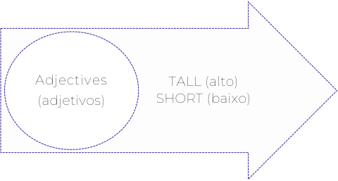
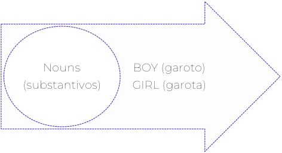
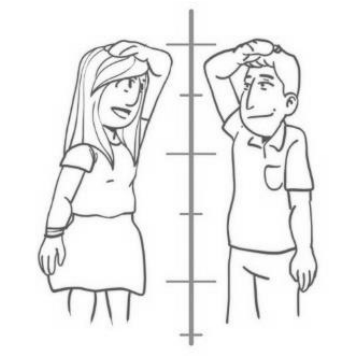
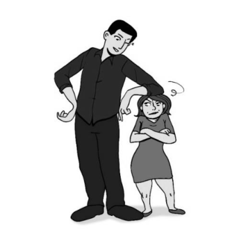
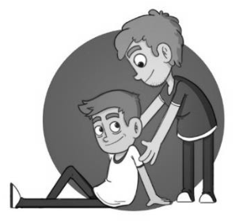
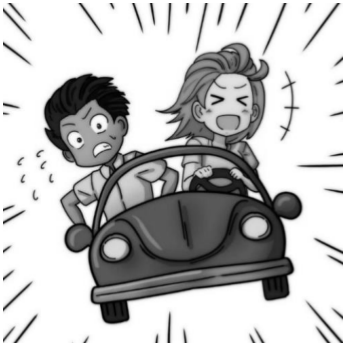
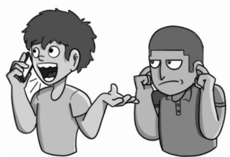
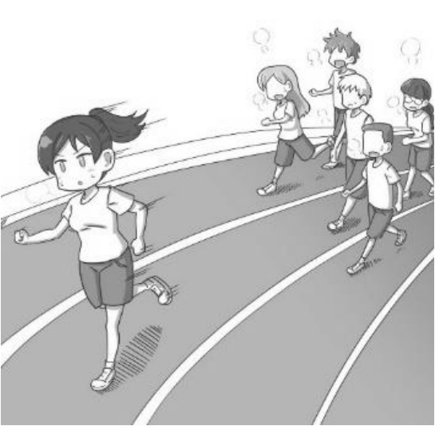

---
fonte_pdf: "Inglês - Aula 04.pdf"
paginas: 99
conversao: texto-e-imagens
---

<!-- pagina: 2 -->

**Andrea Belo Aula 04 - Adjectives and Adverbs in the texts** 

### **SUMÁRIO** 

|INTRODUÇÃO---------------------------------------------------------------------------------------------------------------- 2|
|---|
|ADJETIVOS-------------------------------------------------------------------------------------------------------------------- 3|
|GRAU COMPARATIVO------------------------------------------------------------------------------------------------------ 6|
|COMPARATIVO DE SUPERIORIDADE----------------------------------------------------------------------------------- 6|
|COMPARATIVO DE IGUALDADE---------------------------------------------------------------------------------------- 8|
|COMPARATIVO DE INFERIORIDADE------------------------------------------------------------------------------------ 9|
|GRAU SUPERLATIVO------------------------------------------------------------------------------------------------------ 10|
|SUPERLATIVO DE SUPERIORIDADE----------------------------------------------------------------------------------- 10|
|SUPERLATIVO DE INFERIORIDADE------------------------------------------------------------------------------------ 11|
|ADVÉRBIOS----------------------------------------------------------------------------------------------------------------- 15|
|ADVÉRBIOS DE MODO------------------------------------------------------------------------------------------------- 18|
|ADVÉRBIOS DE FREQUÊNCIA----------------------------------------------------------------------------------------- 19|
|ADVÉRBIOS DE TEMPO------------------------------------------------------------------------------------------------- 20|
|ADVÉRBIOS DE LUGAR------------------------------------------------------------------------------------------------- 21|
|ADVÉRBIOS DE DÚVIDA E/OU CERTEZA---------------------------------------------------------------------------- 23|
|ADVÉRBIOS DE INTENSIDADE----------------------------------------------------------------------------------------- 25|
|LOCUÇÕES ADVERBIAIS----------------------------------------------------------------------------------------------- 27|
|GRAU COMPARATIVO---------------------------------------------------------------------------------------------------- 30|
|COMPARATIVO DE IGUALDADE-------------------------------------------------------------------------------------- 30|
|COMPARATIVO DE SUPERIORIDADE--------------------------------------------------------------------------------- 31|
|COMPARATIVO DE INFERIORIDADE---------------------------------------------------------------------------------- 32|
|GRAU SUPERLATIVO------------------------------------------------------------------------------------------------------ 33|
|SUPERLATIVO DE SUPERIORIDADE----------------------------------------------------------------------------------- 33|
|SUPERLATIVO DE INFERIORIDADE------------------------------------------------------------------------------------ 34|
|QUESTÕES------------------------------------------------------------------------------------------------------------------ 35|
|GABARITO------------------------------------------------------------------------------------------------------------------ 54|
|QUESTÕES COMENTADAS----------------------------------------------------------------------------------------------- 55|
|CONSIDERAÇÕES FINAIS------------------------------------------------------------------------------------------------- 95|
|REFERÊNCIAS--------------------------------------------------------------------------------------------------------------- 96|

---

<!-- pagina: 3 -->

**Andrea Belo Aula 04 - Adjectives and Adverbs in the texts** 

# **INTRODUÇÃO** 

Identificar em uma frase, os advérbios e os adjetivos, é algo considerado “tricky”, ou seja, algo melindroso, arriscado. Isso porque, em inglês, como também em outras línguas, essas palavras nos enganam bastante pela maneira como se apresentam nos textos. 

Mas, você verá, nessa aula, como é simples a distinção desses dois termos. 

Vamos, então, à nossa aula sobre adjetivos e advérbios, para que você possa aprender as regras de uso de cada um deles para encontrá-los inseridos em sua prova, levando você a acertar o que for perguntado acerca desse assunto. 

Os adjectives (adjetivos), são palavras que têm o propósito de qualificar ou modificar os substantivos. Às vezes, modificam pronomes também, como veremos nas explicações. Adjetivos têm como meta proporcionar detalhes e descrever melhor pessoas, lugares, objetos etc. 

E, com o acréscimo dos adjetivos nas frases, as ideias apresentadas se tornam mais interessantes e os textos ficam mais interativos e atrativos na hora da leitura. 

<mark>Os adverbs (advérbios), são palavras que também acrescentam informações importantes ao texto, porém, geralmente, modificam os verbos ou os próprios adjetivos. O advérbio é um</mark> elemento que indica a circunstância em que se encontra o verbo e assim, vai ressaltar as circunstâncias, ou seja, o modo, a intensidade, o lugar, uma negação, uma afirmação, uma dúvida, entre outras situações diversas nos textos. 

Tanto adjetivos quanto advérbios são importantes elementos e, devemos sempre nos lembrar de que, uma determinada palavra em sua prova, pode fazer com que o termo analisado mude, de uma classe gramatical para outra, a depender do contexto em que está inserida. 

Por isso, esse material está dividido em detalhadas etapas, com os tópicos explicitados, para que você estude cada item, separadamente e com muitos exemplos. 

Assim, no momento da prática de exercícios, você perceberá que estão envolvidos, em uma só questão, diferentes assuntos, que abrangem todo o conteúdo a ser estudado por você – da mesma forma que são elaboradas as provas. 

Vou orientar você, mostrando as normas que precisam ser seguidas em relação aos adjetivos e aos advérbios, para que você os encontre nos textos e saiba como reconhecê-los nas alternativas de cada questão. 

Vamos lá! Você consegue e será o melhor candidato. Conte comigo!

---

<!-- pagina: 4 -->

**Andrea Belo Aula 04 - Adjectives and Adverbs in the texts** 

# **ADJETIVOS** 

Os adjectives (adjetivos) caracterizam os substantivos e expressam qualidades ou características em relação a pessoas, objetos ou animais. Essas qualidades podem ser duradouras ou permanentes, características que expressam estados passageiros e condições e, além de qualidades, as características das ações de pessoas, objetos ou animais. 

A classe de adjetivos está entre as maiores classes gramaticais de palavras, ou seja, possui um número ilimitado de palavras, que aumenta gradativamente, de acordo com a evolução da língua. Dessa forma, não conseguimos fazer uma lista com todos os adjetivos da língua inglesa, principalmente porque, essa lista se tornaria desatualizada daqui em tempo. 

A posição do adjetivo em uma frase pode variar, assim como sua terminação. E veremos cada caso em particular adiante. Antes de relatar outros detalhes sobre os adjetivos, vou citar algumas das terminações mais comuns para os adjetivos em geral, com 5 exemplos cada, certo? 

#### **TERMINAÇÕES COMUNS NOS ADJETIVOS** 

**-al** = cultural, original, practical, sensational, logical. **-an** = Brazilian, American, Canadian, Belgian, European. **-ant** = brilliant, elegant, important, significant, relevant. **-ar** = bipolar, familiar, nuclear, peculiar, popular. **-ble** = acceptable, comfortable, flexible, horrible, possible. **-ed** = advanced, haunted, liberated, refined, sophisticated. **-ent** = different, efficient, excellent, fluent, violent. **-ful** = careful, colorful, helpful, useful, wonderful. **-ic** = artistic, dramatic, fantastic, scientific, tragic. 

**-ing** = amazing, darling, interesting, good-looking, outgoing. 

**-ive** = creative, expensive, naive, receptive, talkative. 

**-less** = effectless, faithless, hairless, limitless, useless. 

**-ous** = conscious, dangerous, fabulous, jealous, marvelous. 

**-y** = easy, fancy, friendly, messy, satisfactory. 

Em inglês, especificamente, os adjetivos são invariáveis em relação ao gênero (masculino e feminino) e número (singular e plural). 

Isso significa que, um mesmo adjetivo é utilizado para caracterizar masculino, feminino, singular e plural. Por exemplo, o adjetivo new , significa “novo”, “nova”, “novos” e “novas”, veja: I have a new pen. (Tenho uma caneta nova .)

---

<!-- pagina: 5 -->

**Andrea Belo Aula 04 - Adjectives and Adverbs in the texts** 

l have two new pens. (Tenho duas canetas novas .) 

I have a new notebook. (Tenho um caderno novo .) 

I have new notebooks. (Tenho cadernos novos .) 

E, como são invariáveis no gênero, veja outros exemplos, com referência a pessoas: 

The boy is blond . (O garoto é loiro .) 

The boys are blond . (Os garotos são loiros .) 

The girl is blond . (A garota é loira .) 

The girls are blond . (As garotas são loiras .) 

Comumente, os adjetivos são utilizados depois de verbos de ligação. Esses verbos, denominados verbos de ligação, não indicam ação, nunca. Eles indicam estado, ligando uma característica a um sujeito, (alguns exemplos de verbos de ligação são os verbos ser, estar, permanecer, tornar-se, sendo em inglês – to be, to stay, to become etc), ou seja, o adjetivo é ligado ao substantivo por esse verbo de ligação. Vejamos alguns exemplos: 

Bob is a calm buy. (Bob é um garoto calmo ). ou Bob is calm . (Bob é calmo ). 

That song is popular . (Aquela música é pop ). 

He gets talkative when talking about technology. (Ele fica conversador / tagarela / comunicativo quando fala sobre tecnologia). 

Uma mudança interessante, que inclusive, eu já havia comentado em nossa primeira aula, é que, ao contrário do Português, que a ordem é o adjetivo após o substantivo, em inglês, o adjetivo vem sempre antes do substantivo. Exemplos: 

Um garoto alto = A tall boy.    A tall girl – Uma garota alta. 

Um garoto baixo = A short boy.    A short girl – Uma garota baixa. 

<!-- Start of picture text -->
Adjectives •         TALL (alto) • (adjetivos) SHORT (baixo) <!-- End of picture text -->

<!-- Start of picture text -->
Nouns BOY (garoto) • (substantivos) GIRL (garota) <!-- End of picture text -->

---

<!-- pagina: 6 -->

**Andrea Belo Aula 04 - Adjectives and Adverbs in the texts** 

Existem alguns adjetivos com terminações diferenciadas e incomuns, que merecem atenção. É o caso daqueles terminados em –ing e –ed , que podem, a princípio, fazer com que você se lembre dos tempos verbais Present Continuous e Past Simple. 

Mas, se não há verbo to be que antecede a palavra com terminação -ing , não é Continuous. 

E, se também não há alguma expressão que comprove o tempo passado, não se classifica como Past Simple. Além disso, você sabe diferenciar um adjetivo de um verbo, quer ver? 

Jannet’s job is boring . (O emprego de Janet é chato .) 

Jannet is bored today. (Jannet está entediada hoje.) 

The accident was shocking . (O acidente foi chocante .) 

She is shocked . (Ela está chocada .) 

É claro que você sabe, olhando os exemplos acima, que os adjetivos bored e boring não se parecem, nem de longe, com verbos, ações. 

E, como estão qualificando substantivos – Jannet = bored, job = boring, accident = shocking e she = chocked, são, de fato, adjetivos dentro da frase. 

Os adjetivos terminados em -ed indicam como alguém se sente, ao passo que os terminados em -ing dizem algo sobre alguém. 

Quando utilizamos mais de um adjetivo na mesma frase, devemos obedecer a uma ordem de uso, de acordo com a ideia implícita em cada um: 

**opinion (opinião) + size/age (tamanho/idade) + shape (forma) + color (cor) + origin (origem) + material (material) + noun (substantivo) Exemplo:** _The expensive big white Canadian wood house._ (A grande casa canadense cara branca de madeira.) 

Não é necessário utilizar todos os adjetivos na construção de frases e, geralmente, não aparecem todos em uma só oração. O exemplo acima foi, intencionalmente, para mostrar a você quais informações podem estar presentes e fazer parte de uma ideia qualificando alguma coisa usando muitos adjetivos. 

Está percebendo como você vai identificar adjetivos nas questões da prova? 

Quando perguntar se o termo pode ser substituído por um adjetivo ou se o próprio adjetivo pode substituir outro, você estará apto a responder com segurança. 

Agora vamos às variações de grau dos adjetivos: Comparativo e Superlativo.

---

<!-- pagina: 7 -->

**Andrea Belo Aula 04 - Adjectives and Adverbs in the texts** 

# **GRAU COMPARATIVO** 

Os adjetivos podem possuir graus de comparação, divididos em comparativos e superlativos. 

Comparative sentences , frases com uso de comparativos, como o próprio nome já indica, tem como tarefa, comparar dois ou mais substantivos usando um adjetivo para realizar tal comparação. 

Essa relação de comparação pode ser de superioridade (quando um substantivo possui mais de uma qualidade que o outro), pode ser de igualdade (quando ambos os substantivos possuem a mesma quantidade de certa qualidade) ou pode ser também de inferioridade (quando um possui menos daquela qualidade que o outro). 

Veremos cada um dos tipos de comparação de adjetivos com exemplos, da mesma maneira que as bancas utilizam para elaborar as questões da prova. 

Você precisa saber identificá-los para que possa substitui-los por outros quando solicitado. Ou quando se pede para encontrar a alternativa em que não há comparação ou até mesmo responder se uma frase específica possui elementos comparativos ou não e assim por diante. 

## **COMPARATIVO DE SUPERIORIDADE** 

Estudar frases comparativas em inglês, que são muitas, fica simples se você pensar qual é o real objetivo de uma comparação: estabelecer um paralelo entre uma coisa e outra. 

Exatamente isso: usamos o grau comparativo para equiparar uma pessoa ou uma coisa com outra, para comparar as diferenças entre os dois elementos que se modificam. 

A estrutura usada nas frases em que há o comparativo de superioridade é essa: substantivo 1 (sujeito) + verbo + adjetivo comparativo + than (do que) + substantivo 2 (objeto) . Mas, depende do número de letras que cada adjetivo tem. Isso mesmo, se o adjetivo é curto ou longo, interfere na formação das frases. E existem outras regras a serem seguidas. Vamos estudar cada uma delas. 

Para adjetivos de uma sílaba, ou seja, até 5 letras, com o som de uma só sílaba, considerados “curtos”, como tall – alto/a, short – baixo/a e outros, acrescentamos a terminação -er para fazer a frase comparativa: 

Bethy is taller than Jane. (Bethy é mais alta do que Jane.) 

Se o adjetivo terminar em CVC: consoante + vogal + consoante, como hot, big, sad e wet, entre outros, a consoante final deve ser duplicada antes da incluir -er + than no final do adjetivo: 

Summer is hotter than Spring. (O verão é mais quente do que a primavera.)

---

<!-- pagina: 8 -->

**Andrea Belo Aula 04 - Adjectives and Adverbs in the texts** 

Os adjetivos que possuem cinco ou mais letras, geralmente com duas sílabas, tais como simple, clever, common e quiet (simples, inteligente, comum e quieto), formam o comparativo com a adição de -er ou pelo uso da palavra more antes do adjetivo + than. Vale lembrar que ambas as formas são utilizadas e estão corretas: 

Bethy is simpler than Jane. (Bethy é mais simples do que Jane.) 

Bethy is more simple than Jane. (Bethy é mais simples do que Jane.) 

No caso de outros adjetivos, com mais de 6 letras e considerados longos, tais como intelligent, interesting, beautiful, comfortable etc (inteligente, interessante, bonito/a, confortável etc), apenas se faz a comparação acrescentando more antes do adjetivo + than: 

Bethy is more intelligent than Jane. (Bethy é mais inteligente do que Jane.) 

Por sua vez, adjetivos terminados em y, com até 5 letras, tais como pretty, busy, noisy, happy etc. – lindo/a, ocupado/a, barulhento/a, feliz etc., seguem a regra dos outros adjetivos considerados “curtos”. 

Porém, elimina-se a letra y, que é automaticamente substituída pela letra i e, assim, faz-se o acréscimo de -ier + than: 

Bethy is prettier than Jane. (Bethy é mais linda do que Jane.) 

Por último, os adjetivos que, quando usados em frases comparativas, mudam completamente. São chamados de adjetivos irregulares, tais como good, bad e far – bom, mau e longe, não seguem regras e cada um tem uma grafia diferente quando a comparação é feita, veja: 

**GOOD:** Bethy is better than Jane. (Bethy é melhor do que Jane.) 

**BAD:** Bethy is worse than Jane. (Bethy é pior do que Jane.) 

**FAR:** Bethy’s house is further than Jane’s one. (A casa de Bethy é mais longe do que a casa de Jane.) 

Agora, vamos visualizar as formas de se fazer frases comparativas em inglês, usando qualquer adjetivo que aparecer em sua prova. 

Assim, você poderá identificar o grau comparativo nas frases retiradas dos textos e saberá responder qualquer questão sobre esse assunto com esse esquema:

---

<!-- pagina: 9 -->

**Andrea Belo Aula 04 - Adjectives and Adverbs in the texts** 

Adjetivos com 1 ou 2 sílabas: -ER (Exemplo: tall) > John is taller than Tom. (John é mais alto do que Tom.) 

Adjetivos com 2 ou mais sílabas: MORE (Exemplo: sociable) > John is more sociable than Tom. (John é mais sociável do que Tom.) 

Adjetivos com final em Y: - IER ou MORE (Exemplo: funny) > John is funnier/more funny than Tom. (John é mais engraçado do que Tom.) 

Adjetivos com final CVC: dobra a letra (Exemplo: thin) > John is thinner than Tom. (John é mais magro do que Tom.) 

Adjetivos irregulares: se transformam (Exemplo: good) > John is better than Tom when playing golf. (John é melhor do que Tom quando joga golfe.) 

Bethy is taller than Jane . – Bethy é mais alta do que Jane. 

## **COMPARATIVO DE IGUALDADE** 

O grau comparativo de igualdade é usado para comparar dois elementos equivalentes entre si. Geralmente, a comparação é feita com apenas dois elementos, dois sujeitos em uma frase. 

A estrutura usada nas frases em que há o comparativo de igualdade é essa: substantivo 1 (sujeito) + verbo + as + adjetivo + as + substantivo 2 (objeto). 

Essa estrutura é igual para todos os adjetivos da língua inglesa, não depende do número de letras ou sílabas que cada adjetivo possui. Vejamos exemplos: 

Bethy is as intelligent as Jane. (Bethy é tão inteligente quanto Jane.) Bethy is as pretty as Jane. (Bethy é tão linda quanto Jane.) Bethy is as good as Jane. (Bethy é tão bondosa quanto Jane.)

---

<!-- pagina: 10 -->

**Andrea Belo Aula 04 - Adjectives and Adverbs in the texts** 

Anne is as tall as John – Anne é tão alta quanto John. 

## **COMPARATIVO DE INFERIORIDADE** 

Por sua vez, o grau comparativo de inferioridade é usado para comparar dois elementos, evidenciando que o primeiro é inferior ao segundo. 

A estrutura usada nas frases em que há o comparativo de inferioridade é essa: substantivo 1 (sujeito) + verbo + less + adjetivo + substantivo 2 (objeto). 

Essa estrutura também é igual para todos os adjetivos da língua inglesa, não depende do número de letras ou sílabas que cada adjetivo possui. 

Vejamos exemplos: 

Bethy is less tall than Jane. (Bethy é menos alta do que Jane.) 

Bethy is less intelligent than Jane. (Bethy é menos inteligente do que Jane.) 

Bethy is less pretty than Jane. (Bethy é menos linda do que Jane.) Bethy is less good than Jane. (Bethy é menos bondosa do que Jane.) 

Algumas pessoas preferem usar a negação no comparativo de inferioridade (que é apenas usar o verbo to be na forma negativa com o acréscimo de not) ao invés do comparativo de inferioridade, para a frase “soar melhor” e não enfatizar algo inferior, veja exemplos: 

Bethy is not as tall as Jane. (Bethy não é tão alta quanto Jane.) 

Beth and Jane are not as tall as Susan. (Bethy e Jane não são tão altas quanto Susan.)

---

<!-- pagina: 11 -->

**Andrea Belo Aula 04 - Adjectives and Adverbs in the texts** 

Elizabeth is less tall than John. (Anne é menos alta do que John.) 

Agora, vamos aos estudos do grau superlativo. 

# **GRAU SUPERLATIVO** 

Os superlativos têm a função de intensificar, de forma única, a qualidade de um substantivo em relação a todos os outros de um mesmo segmento. 

Por exemplo, vimos, no capítulo anterior, que dizer que alguém é mais inteligente, tão inteligente quanto ou tem menos inteligência, temos que falar de outra pessoa para fazer a comparação. 

No superlativo, se diz que alguém é o mais inteligente de todos. E pronto! 

Essa relação de intensidade pode ser de superioridade ou de inferioridade que vamos ver agora com exemplos para ficar claro. 

## **SUPERLATIVO DE SUPERIORIDADE** 

A estrutura usada nas frases em que há o superlativo de superioridade é essa: substantivo + verbo + artigo THE + adjetivo no superlativo (veremos as regras). 

Assim como no modo comparativo, analisando o número de letras/sílabas dos adjetivos, o superlativo é mais simples, mas a formação de frases é diferente para o adjetivo curto ou longo. 

Para os adjetivos curtos – de uma sílaba, até 5 letras – como tall – alto/a, short – baixo/a e outros considerados “curtos”, acrescenta-se a terminação -est no final: 

Bethy is the tallest girl in the class. – Bethy é a garota mais alta da sala.

---

<!-- pagina: 12 -->

**Andrea Belo Aula 04 - Adjectives and Adverbs in the texts** 

Note que o artigo the é muito importante no superlativo, pois proporcionam ênfase de que algo/alguém é <u>o</u> mais/ <u>a</u> mais sobre o assunto tratado na frase. 

Nos adjetivos longos, com mais de 5 letras e mais sílabas, tais como beautiful, interesting, important etc., acrescentamos o termo the most antes do adjetivo. 

Bethy is the most beautiful girl in the class.  – O verão é a garota mais bonita da l 

Por sua vez, adjetivos terminados em y, com até 5 letras, tais como pretty, busy, noisy, happy etc – lindo/a, ocupado/a, barulhento/a, feliz, e etc, seguem a regra dos outros adjetivos considerados “curtos”, mas elimina-se a letra y, que é substituída pela letra i e, assim, faz-se o acréscimo de -iest: 

Bethy is the prettiest girl in the class. – Bethy é a garota mais linda da sala. 

Os adjetivos que terminam em CVC (consoante/vogal/consoante) apenas seguem regras de -est nos curtos e the most nos longos, da mesma maneira, dobrando as letras: 

Bethy is the thinnest girl in the class. – Bethy é a garota mais magra da sala. 

Por último, os adjetivos irregulares que vimos no comparativo, tais como good, bad e far – bom, mau e longe, também não seguem regras e cada um tem uma grafia diferente quando a comparação é feita – the best, the worst e the furthest, veja: 

**GOOD:** Bethy is the best student. – Bethy é a melhor aluna. (de todas) 

**BAD:** Bethy is the worst student. – Bethy é a pior aluna. (de todas) 

**FAR:** Bethy’s house is the furthest in this city. – A casa de Bethy é a mais longe nessa cidade. (de todas) 

Vejamos agora como se usa o superlativo de inferioridade. 

## **SUPERLATIVO DE INFERIORIDADE** 

A estrutura usada nas frases em que há o superlativo de superioridade é essa: substantivo + verbo + artigo THE LEAST + adjetivo – todos os adjetivos são usados com the least antes. A regra é uma só para todos. Para adjetivos longos, curtos, com CVC ou com final y.

---

<!-- pagina: 13 -->

**Andrea Belo Aula 04 - Adjectives and Adverbs in the texts** 

Bethy is the least thin student. – Bethy é a aluna menos magra. (de todas) 

Bethy is the least intelligent student. – Bethy é a aluna menos inteligente. (de todas) 

Bethy is the least funny student. – Bethy é a aluna menos engraçada. (de todas) 

Agora, que estudamos todas as estruturas de comparativo e superlativo, vamos resolver um exercício com uso do assunto que tratamos. 

#### GOODBYE THINGS, HELLO MINIMALISM: CAN LIVING WITH LESS MAKE YOU HAPPIER? 

Fumio Sasaki owns a roll-up mattress, three shirts and four pairs of socks. After deciding to scorn possessions, he began feeling happier. He explains why. 

Let me tell you a bit about myself. I’m 35 years old, male, single, never been married. I work as an editor at a publishing company. I recently moved from the Nakameguro neighbourhood in Tokyo, where I lived for a decade, to a neighbourhood called Fudomae in a different part of town. The rent is cheaper, but the move pretty much wiped out my savings. 

Some of you may think that I’m a loser: an unmarried adult with not much money. The old me would have been way too embarrassed to admit all this. I was filled with useless pride. But I honestly don’t care about things like that any more. The reason is very simple: I’m perfectly happy just as I am. The reason? I got rid of most of my material possessions. 

Minimalism is a lifestyle in which you reduce your possessions to the least possible. Living with only the bare essentials has not only provided superficial benefits such as the pleasure of a tidy room or the simple ease of cleaning, it has also led to a more fundamental shift. 

It’s given me a chance to think about what it really means to be happy. 

We think that the more we have, the happier we will be. We never know what tomorrow might bring, so we collect and save as much as we can. This means we need a lot of money, so we gradually start judging people by how much money they have. 

You convince yourself that you need to make a lot of money so you don’t miss out on success. And for you to make money, you need everyone else to spend their money. And so it goes. 

So I said goodbye to a lot of things, many of which I’d had for years. And yet now I live each day with a happier spirit. I feel more content now than I ever did in the past. 

I wasn’t always a minimalist. I used to buy a lot of things, believing that all those possessions would ITA (2.o dia) — dezembro/2017 increase my self-worth and lead to a happier life. I loved collecting a lot of useless stuff, and I couldn’t throw anything away. I was a natural hoarder of knick-knacks that I thought made me an interesting person.

---

<!-- pagina: 14 -->

**Andrea Belo Aula 04 - Adjectives and Adverbs in the texts** 

At the same time, though, I was always comparing myself with other people who had more or better things, which often made me miserable. I couldn’t focus on anything, and I was always wasting time. Alcohol was my escape, and I didn’t treat women fairly. 

I didn’t try to change; I thought this was all just part of who I was, and I deserved to be unhappy. 

My apartment wasn’t horribly messy; if my girlfriend was coming over for the weekend, I could do enough tidying up to make it look presentable. On a usual day, however, there were books stacked everywhere because there wasn’t enough room on my bookshelves. 

Most I had thumbed through once or twice, thinking that I would read them when I had the time. 

The closet was crammed with what used to be my favourite clothes, most of which I’d only worn a few times. The room was filled with all the things I’d taken up as hobbies and then gotten tired of. A guitar and amplifier, covered with dust. 

Conversational English workbooks I’d planned to study once I had more free time. Even a fabulous antique camera, which of course I had never once put a roll of film in. 

It may sound as if I’m exaggerating when I say I started to become a new person. Someone said to me: “All you did is throw things away,” which is true. But by having fewer things around, I’ve started feeling happier each day. I’m slowly beginning to understand what happiness is. 

If you are anything like I used to be – miserable, constantly comparing yourself with others, or just believing your life sucks – I think you should try saying goodbye to some of your things. 

- [...] Everyone wants to be happy. But trying to buy happiness only makes us happy for a little while. 

Fonte: adaptado de adaptado de <https:ltwww.theguardian.com/booksl2017/apr/121goodbyethings-hello-minimalism-can-living-with-Iessmake-you-happier>. Acesso em: 21 maio 2017. 

Questão – Todas as frases abaixo usam a forma comparativa do adjetivo, EXCETO: 

- a) The rent is cheaper, (linha 3) 

- b) ... you reduce your possessions to the least possible. (linha 9) 

- c) ...the more we have, the happier we will be. (linha 13) 

- d) I feel more content now than I ever did in the past. (linha 19) 

- e) But by having fewer things around, (linha 36) 

Comentários: Já usamos esse texto em outras aulas de nosso material, para responder questões sobre outros tópicos gramaticais. 

E, você pode perceber que, além de usar técnicas aprendidas para fazer a leitura com precisão, certos exercícios não necessitam da leitura completa de fato para serem solucionados. 

Mesmo assim, vale lembrar que, apesar de quase nunca precisar de ler o texto completo nem traduzir palavra por palavra (e sim usar técnicas aprendidas), conhecer muitos vocábulos é sinal de que você está preparado, está à frente de outros candidatos, pois possui vocabulário e conhecimento mais amplo.

---

<!-- pagina: 15 -->

**Andrea Belo Aula 04 - Adjectives and Adverbs in the texts** 

Além disso, você já sabe que terá acesso às traduções dos textos no fim do material – um bônus para aprimorar e conhecer novos termos enquanto estiver estudando. 

Veja que, no enunciado dessa questão, já estão as frases que você deve analisar para responder qual delas não possui forma comparativa. Vamos lá. 

Na letra A, o adjetivo cheap está na forma comparativa, pois tem o acréscimo de -er no final por ser um adjetivo curto, como vimos na teoria acima. 

Na letra B, o termo the least possible não está na forma comparativa e é a resposta correta da questão, pois, é uma estrutura de superlativo de inferioridade, como vimos na teoria está, com o acréscimo do artigo the least antes do adjetivo possible. E, também porque a terminação -est é outra característica do grau superlativo. 

Na letra C, o adjetivo happy está na forma comparativa, pois tem o acréscimo de -ier no final por ser um adjetivo curto e terminado com a letra y. 

Na letra D, o adjetivo content está na forma comparativa, pois tem o acréscimo de more antes do adjetivo longo – more content. 

Na letra E, o adjetivo few está na forma comparativa, pois tem o acréscimo de -er no final por ser um adjetivo curto, assim como nas letras A e C. 

#### GABARITO: B 

Agora, que você sabe tudo sobre adjetivos – e espero que saiba mesmo – estudaremos a classe de advérbios detalhadamente. Vamos lá! Come on!

---

<!-- pagina: 16 -->

**Andrea Belo Aula 04 - Adjectives and Adverbs in the texts** 

# **ADVÉRBIOS** 

Os advérbios têm quase a mesma função dos adjetivos, contudo, ao invés de agregar características a substantivos, os advérbios viabilizam qualidades de modo, tempo e lugar aos verbos e, algumas vezes, aos próprios adjetivos! 

Portanto, os advérbios funcionam como modificador de verbos, de adjetivos e, muitas vezes, de outros advérbios, usados para dizer quando, como ou onde alguma coisa aconteceu e, geralmente, aparece depois de verbos principais, como veremos. 

Vejamos como se dá a formação dos advérbios para ficar mais fácil falar das classificações deles adiante. 

Você deve compreender muito bem para não confundir, já que os advérbios são derivados de adjetivos e, algumas vezes, possuem a mesma forma do adjetivo. A maioria dos advérbios são formados pelo acréscimo da terminação –ly , que significa –mente . Este acréscimo ocorre nos advérbios que indicam modo, que indicam frequência ou intensidade, entre muitos outros. 

ADJETIVO “LENTO” = **SLOW** 

ADVÉRBIO “LENTAMENTE” = **SLOWLY** 

**Exemplo:** Bethy is **<u>slow</u>** and she drives **<u>slowly</u>** <u>. (Bethy é lenta e ela dirige lentamente.)</u> Adjetivo (qualidade) Advérbio (modo) 

Para advérbios de qualquer classificação, acrescenta-se -ly no final dos adjetivos. Para adjetivos terminados pelo próprio y , trocamos o y por i e acrescentamos normalmente -ly. Veja alguns exemplos: 

**crazy (louco) – crazily (loucamente) easy (fácil) – easily (facilmente) happy (feliz, alegre) – happily (felizmente, alegremente) heavy (pesado) – heavily (pesadamente) lucky (sortudo) – luckily (afortunadamente)** 

Para os adjetivos terminados em -le, trocando-se o -le por -ly, forma-se o advérbio: 

**horrible (horrível) – horribly (horrivelmente) incredible (inacreditável) – incredibly (inacreditavelmente) probable (provável) – probably (provavelmente) simple (simples) – simply (simplesmente) subtle (sutil) – subtly (sutilmente)**

---

<!-- pagina: 17 -->

**Andrea Belo Aula 04 - Adjectives and Adverbs in the texts** 

Com alguns adjetivos terminados em -e (sem a letra L antes da letra E), mantemos o -e, acrescentando, normalmente -ly; com a exceção de dois adjetivos especiais nesse caso: true e due: 

**brave (bravo) – bravely (bravamente) immediate (imediato) – immediately (imediatamente)** **<u>Exceções: true (verdadeiro) – truly (verdadeiramente)</u> due (que se deve, adequado) – duly (pontualmente, a tempo)** 

Quando os adjetivos terminam em -ic acrescentam -ally e não somente -ly, veja: 

**automatic (automático) – automatically (automaticamente) romantic (romântico) – romantically (romanticamente)** 

**specific (específico) – specifically (especificamente)** 

**tragic (trágico) – tragically (tragicamente)** 

De forma simples e direta, caso o adjetivo já termine em -ly, nada se acrescenta na formação do advérbio: 

**Bethy is tired of her daily routine. (Justine está cansada da sua rotina diária.) Bethy helps her sister friendly. (Bethy ajuda sua irmã amigavelmente.)** 

Alguns advérbios são usados com a grafia igual aos adjetivos, ou seja, não acrescentamos nenhuma terminação nem modificamos quaisquer letras. 

Mas lembre-se de que o sentido muda. Enquanto o adjetivo bonito – beautiful qualifica o sujeito, o advérbio beautiful indica o modo que o sujeito executou alguma ação, veja: 

Bethy is beautiful. She sings beautiful. (Bethy é bonita. Ela canta bonito – de forma bonita) 

Além de beautiful, outros exemplos em que adjetivos e advérbios ficam iguais nas frases em ambas as funções são fast, hard, right e late. Vejamos frases: 

|**ADJETIVOS** Bethy is a fast swimmer. Bethy swims fast.|**ADVÉRBIOS** Bethy é uma nadadora rápida. Bethy nada rápido.|
|---|---|
|Bethy is a hard worker. Bethy works hard.|Bethy é uma trabalhadora esforçada. Bethy trabalha duro/com esforço.|

---

<!-- pagina: 18 -->

**Andrea Belo Aula 04 - Adjectives and Adverbs in the texts** 

|Bethy is always right. Bethy thinks right. Bethy is late. Bethy wakes up late sometimes.|Bethy é/está sempre certa. Bethy pensa certo. Bethy é/está atrasada. Bethy acorda atrasada às vezes.|
|---|---|

Alguns desses advérbios, que coincidem com os adjetivos, quando se coloca a terminação -ly, muda-se o sentido da palavra e também o significado, como por exemplo hardly e lately: 

Bethy works hard. Bethy trabalha duro/com esforço. Bethy’s sick. She can hardly work. Bethy está doente. Ela mal consegue trabalhar. Bethy is late. Bethy é/está atrasada. Bethy’s sick. She didn’t work lately. Bethy está doente. Ela não trabalhou <u>recentemente.</u> 

Outra importante observação é que nem todas as palavras terminadas em -ly são advérbios. Algumas são adjetivos, acredita? Apesar da terminação -ly ser comumente usada em advérbios e ser uma característica particular deles, lonely, por exemplo, é o adjetivo solitário. Vejamos outros: 

Adjetivo lovely: adorável – Bethy is a lovely person. (Bethy é uma pessoa adorável). 

Adjetivo friendly: amigável – Bethy is friendly with everybody. (Bethy é amigável com todos). 

Adjetivo elderly: velho/idoso – Bethy’s mom is elderly. (A mãe de Bethy é uma idosa). 

Um advérbio especial e diferente, que não usa -ly em sua grafia, é well, referente ao adjetivo good. Uma pessoa pode ser boa/bondosa (como uma qualidade) ou pode ser boa em alguma coisa que faz com dedicação, demonstrar uma habilidade. 

Em português, usamos apenas uma palavra para representar ambos, “bom de bondoso” e “bom em algo que faça”. Mas em inglês, veja: 

Bethy is a good swimmer. (Bethy é uma boa nadadora.) Bethy swims very well. (Bethy nada muito bem. / é boa em natação.)

---

<!-- pagina: 19 -->

**Andrea Belo Aula 04 - Adjectives and Adverbs in the texts** 

Já vimos como formar os advérbios e, a maior parte deles sofre o acréscimo de -ly. Para colocar os advérbios em uma frase, o que é necessário? Quando são usados? Vejamos. 

Um advérbio pode ser usado para descrever um verbo, descrevendo quando, por que, onde ou como uma ação ocorreu. Por exemplo, uma pessoa pode agir rapidamente, calmamente ou silenciosamente. Na seguinte frase: Bethy falou ao telefone – Bethy talked on the phone, o verbo falar pode ser modificado por um advérbio como lentamente. Ou, cuidadosamente: 

Bethy talked on the phone slowly. (Bethy falou ao telephone lentamente.) 

Bethy talked on the phone carefully. (Bethy falou ao telephone cuidadosamente.) 

Os advérbios são inúmeros. Eles podem ser de modo, de lugar, de tempo, de frequência, de intensidade, de certeza ou dúvida e, ainda existem as famosas locuções adverbiais. Eles aparecem em diversas situações e enriquecem frases em geral. 

Vamos, agora, analisar os tipos de advérbios que existem para que as explicações anteriores sejam mais bem compreendidas com exemplos de cada um com detalhes. 

## **ADVÉRBIOS DE MODO** 

Como o próprio nome já nos diz, os adverbs of manner (advérbios de modo), indicam a maneira em que uma ação ocorreu. 

Os advérbios são formados a partir de adjetivos, em que se acrescenta o sufixo -ly e assim deixam de ser adjetivos, passando a ser advérbios, como já vimos anteriormente. 

Veja as comparações para que os advérbios de modo fiquem claros: 

Bethy is bad (Bethy é má). Bethy sings bad **<u>ly</u>** (Bethy canta mal) Beth is slow (Bethy é lenta/devagar) Bethy sings slow **<u>ly</u>** <u>. (Bethy canta vagarosamente)</u> 

Os advérbios de modo são bastante flexíveis e, normalmente, podem aparecer em três posições: 

1 – Antes do sujeito: Quickly Bethy organized her books – Rapidamente Bethy organizou seus livros. 

2 – Entre o sujeito e o verbo: Bethy quickly organized her books – Bethy rapidamente organizou seus livros.

---

<!-- pagina: 20 -->

**Andrea Belo Aula 04 - Adjectives and Adverbs in the texts** 

3 – Após o verbo ou o objeto: Bethy organized her books quickly – Bethy organizou seus livros rapidamente. 

The girl organized the books quickly. 

## **ADVÉRBIOS DE FREQUÊNCIA** 

Os adverbs of frequency (advérbios de frequência) são, de fato, os mais conhecidos do Inglês. 

Eles são apenas palavras utilizadas para descrever com que frequência alguma atividade é realizada, como sempre, às vezes, nuca, entre outros. 

Essa frequência pode ser demonstrada pelos advérbios: daily (diariamente), weekly (semanalmente), monthly (mensalmente), yearly (anualmente). 

Bethy goes to the market weekly – Bethy vai ao mercado semanalmente) Bethy reads her 3 favorite books yearly – Bethy lê seus 3 livros favoritos <u>anualmente)</u> 

As formas mais comuns de se ver advérbios de frequência em frases é quando podemos representar a frequência por porcentagem, como alguns livros fazem – 100% para always (sempre), 90% para usually e often (frequentemente), 50% para sometimes (às vezes), 30% para occasionally (ocasionalmente/eventualmente), 10% ou menos para rarely e seldom (raramente) e 0% para never (nunca). Vejamos em frases: 

**Bethy always talks on the phone – Bethy sempre fala ao telefone. Bethy usually talks on the phone – Bethy frequentemente fala ao telefone. Bethy sometimes talks on the phone – Bethy às vezes fala ao telefone. Bethy ocasionally talks on the phone – Bethy eventualmente fala ao telefone. Bethy rarely talks on the phone – Bethy raramente fala ao telefone. Bethy never talks on the phone – Bethy nunca fala ao telefone.** 

https://t.me/KakashiAssinaturasBot

---

<!-- pagina: 21 -->

**Andrea Belo Aula 04 - Adjectives and Adverbs in the texts** 

Como você percebeu, os advérbios de frequência estão antes de um verbo principal. Mas, eles podem variar a posição em que se encontram e não prejudicar o significado nem o sentido das frases. Vejamos as frases acima, com troca de posições. 

Bethy talks on the phone, always – Bethy fala ao telefone, sempre. 

<u>Usually, Bethy talks on the phone – Frequentemente, Bethy fala ao telefone. Sometimes, Bethy talks on the phone – Às vezes, Bethy fala ao telefone.</u> 

Agora, vamos analisar os advérbios de tempo e como usá-los. 

## **ADVÉRBIOS DE TEMPO** 

Os adverbs of time (advérbios de tempo) indicam quando uma ação ocorreu e não precisam da terminação -ly. 

Geralmente, demonstram e caracterizam algo que aconteceu no tempo passado ou no tempo futuro, enfatizando frases tanto no Past Simple como do tempo Future Simple. 

Os advérbios de tempo, na maioria das vezes, aparecem no final das frases. Alguns deles 

são: 

_last week / last month / last year_ = semana passada / mês passado / ano passado. _next week / next month / next year_ = semana que vem / mês que vem / ano que vem. OU próxima semana, próximo mês, próximo ano. 

She traveled last week. 

She will travel next week. 

Ela viajou semana passada. 

Ela vai viajar na próxima semana. 

---

<!-- pagina: 22 -->

**Andrea Belo Aula 04 - Adjectives and Adverbs in the texts** 

## **ADVÉRBIOS DE LUGAR** 

Os adverbs of place (advérbios de lugar) indicam, como o nome diz, a localização onde uma ação aconteceu e eles não precisam da terminação -ly. Podem aparecer após o verbo, na frente das orações, antes do sujeito, entre outras posições. Vejamos exemplos pois há muitos casos e vou explicando a você, um a um. 

Bethy walks everywhere – Bethy anda por todos os lugares/por toda parte. 

Os advérbios here e there (aqui e lá) são muito comuns em frases para indicar lugar. 

Come here! (Venha aqui!), para dizer “Venha até mim.” The table is in here. (A mesa está aqui), para dizer “Quero mostrar a você que a mesa está aqui.” ==5460== Put it there. (Coloque isso lá!), para dizer “Leve isso para lá, para longe daqui.” The table is in there. (A mesa está lá.) para dizer “Pode ir, a mesa já está lá.” 

<u>Here you are! I was looking for you!</u> 

(Aqui está você! Estava procurando você!) 

I didn’t realize you were there. I was looking for you. 

(Não percebi que você estava lá. Estava procurando você!) 

---

<!-- pagina: 23 -->

**Andrea Belo Aula 04 - Adjectives and Adverbs in the texts** 

#### Alguns advérbios são, ao mesmo tempo, advérbios e preposições. Vejamos exemplos: 

|**ADVÉRBIO USADO COMO ADVÉRBIO:** **around** The necklace rolledaroundin my fingers. O colar se enrolouentre osmeus dedos.|**ADVÉRBIO USADO COMO PREPOSIÇÃO:** I am wearing a necklacearoundmy neck. Estou usando um colarem volta dopescoço.|
|---|---|
|**behind** Hurry! You are getting behind. Depressa! Você está ficandopara trás.|Let's hide behind the door. Vamos nos esconderatrásda porta.|
|**down** Bethy felldown. Bethy caiu. (parabaixo)|Bethy made her waydownthe hill. Bethy fez o caminho morroabaixo.|
|**in** We decided to dropinon Bethy. Decidimos visitar Bethy sem avisar.|I dropped the letterinthe box. Eu coloquei a cartadentroda caixa.|
|**off** Let's getoff at the next stop. Vamosdescerna próxima parada.|She put the flowers off the vase. Ela colocou as floresforado vaso.|
|**on** She rodeonfor two more hours. Elarodoupor mais duas horas.|Put the booksonthe table. Coloque os livrosnamesa.|
|**over** She turnedoverand went back to sleep. Ela seviroue voltou a dormir.|I think I will hang the pictureover my table. Acho que vou colocar o quadroacimada mesa.|

Há advérbios de lugar que terminam em -where, para indicar um lugar específico, como: 

I would like to go somewhere hot. (Eu gostaria de ir em algum lugar quente.) Is there anywhere I can find a drugstore? (Há algum lugar em que eu encontre uma drogaria? 

I have nowhere to go. (Eu não tenho lugar nenhum para ir.) 

I keep looking for you everywhere! (Eu continuo procurando por você em todos os <u>lugares.)</u> 

Outros advérbios de lugar terminam em -wards, para expressar movimentos em um lugar em particular, um lugar, uma direção específica: 

https://t.me/KakashiAssinaturasBot

---

<!-- pagina: 24 -->

**Andrea Belo Aula 04 - Adjectives and Adverbs in the texts** 

Cats don't usually walk backwards. (Gatos geralmente não andam para trás.) The ship sailed westwards. (O navio foi para o oeste/direção ocidental.) The balloon drifted upwards. (O balão foi levado para cima.) Let’s walk homewards until we arrive. (Vamos andar de volta para casa.) 

The balloon drifted upwards. O balão foi levado para cima. 

Agora, vamos estudar alguns advérbios classificados como de dúvida ou de certeza. 

## **ADVÉRBIOS DE DÚVIDA E/OU CERTEZA** 

Os nomes dos advérbios já indicam, em todos os subtítulos, sobre o que se tratam. Assim, os adverbs of doubt or certainty (advérbios de dúvida ou certeza), vão justamente indicar o grau de dúvida ou de certeza de algo que aconteceu, acontece ou acontecerá. Esses advérbios aparecem com a terminação -ly. Exemplos: 

Bethy maybe dance tonight – Bethy talvez dance essa noite. Bethy will clearly dance tonight – Bethy vai, sem dúvida, dançar essa noite. 

https://t.me/KakashiAssinaturasBot

---

<!-- pagina: 25 -->

**Andrea Belo Aula 04 - Adjectives and Adverbs in the texts** 

Além de maybe, outros advérbios nessa categoria: 

**assuredly (indubitavelmente, sem dúvidas) certainly (certamente, seguramente, evidentemente) clearly (claramente, sem dúvidas, evidentemente) definitely (definitivamente) maybe (talvez) perhaps (talvez – no início ou no final da frase) possibly (possivelmente) probably (provavelmente)** 

Entre os advérbios de dúvida e certeza, estão os que demonstram um ponto de vista. São os advérbios que expressam a opinião do sujeito, o que ele pensa sobre a situação da frase. Esses advérbios, por sua vez, também aparecem com a terminação -ly, comum na classe adverbial. 

#### Bethy unluckily lost the game – Bethy por azar perdeu o jogo. 

O sujeito da frase está expressando, através do advérbio unluckly, a ideia da falta de sorte de Bethy em relação ao jogo. E, assim, a tradução do advérbio é “por azar”. 

|**OUTROS ADVÉRBIOS QUE EVIDENCIA** bravely (corajosamente)|**M PONTOS DE VISTA** presumably (presumivelmente)|
|---|---|
|carelessly (de forma desleixada, negligente)|rightly (com razão)|
|cleverly (inteligentemente)|seriously (seriamente)|
|confidentially (confidencialmente) |stupidly (estupidamente, de modo imbecil)|
|disappointingly (de modo decepcionante, desapontador)|theoretically (teoricamente)|
|foolishly (de forma tola, insensata)|truthfully (na verdade)|
|happily (por sorte, felizmente)|unbelievably (inacreditavelmente)|
|kindly (gentilmente, de bom grado)|unfortunately (infelizmente)|
|luckily (por sorte)|unluckily (por azar)|
|naturally (naturalmente)|wisely (sabiamente)|
|obviously (obviamente)|presumably (presumivelmente)|
|personally (pessoalmente)|technically (tecnicamente)|

---

<!-- pagina: 26 -->

**Andrea Belo Aula 04 - Adjectives and Adverbs in the texts** 

Já que esses advérbios exibem pontos de vista, a característica principal deles é que seja um comentário com caráter opinativo. 

Eles modificam a oração inteira, e não apenas palavras isoladamente: 

<u>Fortunately, Bethy decided to help us.</u> 

(Felizmente, Bethy decidiu nos ajudar), em que fortunately: ponto de vista. <u>Stupidly, I forgot my keys. (Estupidamente/de forma estúpida, eu esqueci minhas</u> chaves), em que stupidly: ponto de vista. 

Fortunately, my friend decided to help me when I fell down in front of everybody. 

(Felizmente, meu amigo decidiu me ajudar quando caí em frente todos.) 

## **ADVÉRBIOS DE INTENSIDADE** 

De uma forma geral, os adjetivos e advérbios possuem funções parecidas. Mas, enquanto os adjetivos tratam de substantivos (como pessoas e coisas são), os advérbios tratam, quase sempre, dos verbos (como as ações são feitas). 

No entanto, é possível utilizar os advérbios para modificar os adjetivos. São os chamados modifiers (modificadores) e são utilizados antes dos adjetivos para enfatizar a intensidade em relação àquela qualidade: 

**absolutely [absolutamente] extremely [extremamente] really [realmente] so [tão] such [tão] too/very [muito, demais]**

---

<!-- pagina: 27 -->

**Andrea Belo Aula 04 - Adjectives and Adverbs in the texts** 

This cake was very delicious but extremely expensive. 

Esse bolo estava muito delicioso, mas extremamente caro. 

Os advérbios intensificadores, além de permitir que o sujeito se expresse com mais clareza, também proporciona às frases uma sensação mais natural. Esses advérbios são uma ferramenta importante, já que são uma forma essencial de mostrar emoção ou alcance de uma emoção. 

Esses advérbios modificadores de frases, fornecem contexto emocional a elas e fortalecem os seus significados, já que diz que algo foi feito extremante, incrivelmente etc. 

Alguns desses advérbios podem aumentam a intensidade negativamente também. As frases soam negativas, mas elas existem: She made the report <u>awfully – Ela fez o relatório</u> terrivelmente ou insanely (insanamente) e terribly (terrivelmente). 

Esses modificadores, por sua vez, dão força às palavras que elas modificam, só que com conotação negativa, para intencionalmente, dar a ideia de gravidade em algo que talvez poderia ser entendido como normal ou cotidiano. 

Bethy is dreadfully sorry. (Bethy está terrivelmente arrependida) 

Perceba que, nesse exemplo, o advérbio de intensidade reforça a ideia de que quer fazer um pedido de desculpas sobre algo que aconteceu. Com o acréscimo do advérbio de intensidade dreadfully, a frase ficou muito mais forte e impactante. 

Voltando a falar de advérbios de intensidade em geral, veja outros que já apareceram e podem aparecer novamente em textos das provas: 

**amazingly (surpreendentemente)** 

**at all (em absoluto) especially (especialmente) extraordinarily (extraordinariamente) outrageously (escandalosamente) phenomenally (fenomenalmente) remarkably (notavelmente) terribly (terrivelmente) totally (totalmente) unusually (incomumente)**

---

<!-- pagina: 28 -->

**Andrea Belo Aula 04 - Adjectives and Adverbs in the texts** 

She is remarkable the champion of the competition. 

(Ela é notavelmente a campeã da competição.) 

## **LOCUÇÕES ADVERBIAIS** 

O que é uma locução adverbial? Locução adverbial é um conjunto de duas ou mais palavras que desempenham a função de advérbio. Essas locuções adverbiais se formam com uma preposição, às vezes uma preposição + substantivo ou preposição + adjetivo ou ainda preposição + advérbio. 

As locuções adverbiais são expressões em que, quando o conjunto de duas ou mais palavras são agrupadas, desempenham a função de um advérbio e pode alterar o sentido desse verbo, ou de um adjetivo ou até mesmo de outro advérbio. 

Vejamos exemplos: 

|a só/a sós –_lonely_|again and again – repedidamente|
|---|---|
|à toa –_occasionally_|arm in arm – de braços dados|
|à vontade –_at will, freely_|at first – aprincipio|
|absolutamente – not at all|at most – no máximo|
|ao acaso –_without consideration_|at once – imediatamente|
|ao contrário –_in contrary_|at random – ao acaso|
|às avessas –_just the opposite_|byand large – emgeral|
|às claras –_openly, directly_|daybyday– dia após dia|
|às direitas –_straightforward_|fairlywell – razoavelmente|
|àspressas –_fast_|far and near/far and wide – em todaparte|
|de bomgrado –_ofgood will_|from now on – de hoje em diante|
|de cor –_by heart_|hand in hand – de mãos dadas|
|de fato,na verdade – in fact|hardlyever –quase nunca|
|de má vontade –_unwillingly_|head over hills – de cabeçapara baixo|

---

<!-- pagina: 29 -->

**Andrea Belo Aula 04 - Adjectives and Adverbs in the texts** 

|é claro – of course|in full –por extenso|
|---|---|
|emgeral –_generally_|likely– muitoprovável|
|em silêncio –_silently_|little bylittle –pouco apouco|
|por via das dúvidas –just in case|once in a while – de vez emquando|
|sem dúvida – no doubt|sooner or late – mais cedo ou mais tarde|
||through and through –por completo to a certain extent – até certoponto|

Agora, veremos uma questão com vários e diferentes advérbios. Note que, algumas vezes, ao olhar apenas uma vez no texto, fazer uma leitura dinâmica, com agilidade para poupar seu tempo, advérbios confundem-nos com adjetivos e vice-versa. 

Por esse motivo, essa aula explora os dois assuntos: para que você compreenda claramente para não ter dúvidas na hora da prova. Vamos lá! 

#### FRAYING AT THE EDGES: A LIFE-CHANGING DIAGNOSIS 

IT BEGAN WITH what she saw in the bathroom mirror. On a dull morning, Geri Taylor padded into the shiny bathroom of her Manhattan apartment. She casually checked her reflection in the mirror, doing her daily inventory. Immediately, she stiffened with fright. 

Huh? What? 

She didn‘t recognize herself. 

She gazed saucer-eyed at her image, thinking: Oh, is this what I look like? No, that‘s not me. Who‘s that in my mirror? 

This was in late 2012. She was 69, in her early months getting familiar with retirement. For some time she had experienced the sensation of clouds coming over her, mantling thought. There had been a few hiccups at her job. She had been a nurse who climbed the rungs to health care executive. Once, she was leading a staff meeting when she had no idea what she was talking about, her mind like a stalled engine that wouldn‘t turn over. 

"Fortunately I was the boss and I just said, Enough of that; Sally, tell me what you‘re up to," she would say of the episode. 

Certain mundane tasks stumped her. She told her husband, Jim Taylor, that the blind in the bedroom was broken. He showed her she was pulling the wrong cord. Kept happening. Finally, nothing else working, he scribbled on the adjacent wall which cord was which. 

Then there was the day she got off the subway at 14th Street and Seventh Avenue unable to figure out why she was there.

---

<!-- pagina: 30 -->

**Andrea Belo Aula 04 - Adjectives and Adverbs in the texts** 

So, yes, she had had inklings that something was going wrong with her mind. She held tight to these thoughts. She even hid her suspicions from Mr. Taylor, who chalked up her thinning memory to the infirmities of age. 

"I thought she was getting like me," he said. "I had been forgetful for 10 years". 

But to not recognize her own face! To Ms. Taylor, this was the "drop-dead moment" when she had to accept a terrible truth. She wasn‘t just seeing the twitches of aging but the early fumes of the disease. 

She had no further issues with mirrors, but there was no ignoring that something important had happened. She confided her fears to her husband and made an appointment with a neurologist. 

"Before then I thought I could fake it,' she would explain. "This convinced me I had to come clean." In November 2012, she saw the neurologist who was treating her migraines. He listened to her symptoms, took blood, gave her the Mini Mental State Examination, a standard cognitive test made up of a set of unremarkable questions and commands. 

(For instance, she was asked to count backward from 100 in intervals of seven; she had to say the phrase: "No ifs, ands or buts"; she was told to pick up a piece of paper, fold it in half and place it on the floor beside her.) 

He told her three common words, said he was going to ask her them in a little bit. He emphasized this by pointing a finger at his head — remember those words. That simple. 

Yet when he called for them, she knew only one: Beach. In her mind, she would go on to associate it with the doctor, thinking of him as Dr. Beach. 

He gave a diagnosis of mild cognitive impairment, a common precursor to Alzheimer‘s disease. The first label put on what she had. Even then, she understood it was the footfall of what would come. Alzheimer‘s had struck her father, a paternal aunt and a cousin. 

She long suspected it would eventually find her. 

Fonte: http://www.nytimes.com/interactive/2016/05/01/nyregion/living-with-alzheimers.html?action=click&contentCollection=Americas&module= Trending&version=Full®ion= Marginalia&pgtype=article. (acesso em 1/05/2016). 

Questão – Marque a opção em que o item sublinhado NÃO é um advérbio. 

a) She casually checked her reflection in the mirror, [...] (linha 2) 

b) “Fortunately I was the boss and I just said, [...] (linha 13) 

c) Finally, nothing else working, he scribbled on the adjacent wall which cord was which. (linhas 1617) 

d) She wasn’t just seeing the twitches of aging but the early fumes of the disease. (linha 25) 

e) She long suspected it would eventually find her. (linha 40) 

Comentários: Na letra A, casually possui -ly em sua estrutura, terminação de advérbio e está exercendo a função de advérbio na frase: o modo casual: casualmente.

---

<!-- pagina: 31 -->

**Andrea Belo Aula 04 - Adjectives and Adverbs in the texts** 

Na letra B, fortunately também possui -ly em sua estrutura, terminação de advérbio e está exercendo a função de advérbio na frase: felizmente. 

Na letra C, finally conta com -ly em sua estrutura, terminação de advérbio e está exercendo a função de advérbio na frase: finalmente. 

Na letra D, early possui -ly como terminação, mas é a palavra cedo, em Inglês, contrário de late. Até pode ser usado como advérbio de tempo (alguém chegou cedo ou tarde) mas aqui, é um adjetivo: “She wasn’t just seeing the twitches of aging but the early fumes of the disease”: “Ela não estava apenas vendo as contrações do envelhecimento, mas as emanações precoces da doença”. Alternativa que não é advérbio: letra D 

Na letra E, eventually possui -ly em sua estrutura, terminação de advérbio e está exercendo a função de advérbio na frase: eventualmente. 

# **GRAU COMPARATIVO** 

Assim como os adjetivos, os advérbios possuem grau comparativo e superlativo. Vejamos, primeiramente, como se faz o grau comparativo, mas, desde já digo a você: é mais simples nos advérbios do que nos adjetivos – e que bom, então, certo? 

## **COMPARATIVO DE IGUALDADE** 

O comparative of equality – comparativo de igualdade nos advérbios tem a estrutura seguinte: as + advérbio + as, significando: tanto/tão...quanto/como. Veja: 

Bethy drives as carefully as Tom. – Bethy dirige tão cuidadosamente quanto Tom. 

Does Bethy study as frequently as Tom? – A Bethy estuda tão frequentemente <u>quanto Tom?</u> 

Na forma negativa, apenas acrescenta-se not, ficando: not as/not so + advérbio + as, significando – não tão...como/quanto: 

Bethy is not as carefully as Tom. – Bethy não é tão cuidadosamente quanto Tom. 

E, para frases em outros tempos verbais, sem utilizar o verbo to be, conjuga-se a forma negativa normalmente – como você aprendeu na aula de verbos – e a estrutura as/as: 

Bethy doesn’t drive as carefully as Tom. – Bethy não dirige tão cuidadosamente <u>quanto Tom.</u>

---

<!-- pagina: 32 -->

**Andrea Belo Aula 04 - Adjectives and Adverbs in the texts** 

## **COMPARATIVO DE SUPERIORIDADE** 

O comparative of superiority – comparativo de superioridade tem diferentes estruturas quando elaborado com advérbios considerados curtos ou longos de acordo com as letras/sílabas, lembra? Eles têm esse formato: more + advérbio + than, significando: mais/do que. Veja: 

Bethy travels more frequently than Tom. – Bethy viaja mais frequentemente do <u>que Tom.</u> Does Bethy study more frequently than Tom? - Bethy estuda mais frequentemente do que Tom? 

Na forma negativa, apenas acrescenta-se not no verbo to be ou conjuga-se a forma negativa do Present Simple normalmente – como você aprendeu na aula de verbos: 

Bethy doesn’t swim more easily than Tom. – Bethy não nada mais facilmente do <u>que Tom.</u> 

Se o advérbio for um daqueles que fica igual, idêntico ao adjetivo em sua estrutura, como vimos o adjetivo e o advérbio alto – high, por exemplo, segue a regra do adjetivo: -er no final do advérbio + than: 

Peter talks higher than Tom. – Peter fala mais alto do que Tom. 

---

<!-- pagina: 33 -->

**Andrea Belo Aula 04 - Adjectives and Adverbs in the texts** 

## **COMPARATIVO DE INFERIORIDADE** 

O comparative of inferiority – também tem diferentes estruturas quando elaborado com advérbios considerados curtos ou longos de acordo com as letras/sílabas, lembra? 

Eles têm esse formato: less + advérbio + than, significando: mais/do que. Veja: 

Bethy travels less frequently than Tom. – Bethy viaja menos frequentemente do <u>que Tom.</u> 

Does Bethy study less frequently than Tom? - Bethy estuda menos frequentemente do que Tom? 

Na forma negativa, apenas acrescenta-se not no verbo to be ou conjuga-se a forma negativa do Present Simple normalmente – como você aprendeu na aula de verbos: 

Bethy doesn’t swim less easily than Tom. – Bethy não nada menos facilmente do <u>que Tom.</u> 

As traduções ficam “estranhas”, não ficam? Por esse motivo, prefere-se usar o comparativo de igualdade na forma negativa para, ao invés de “desmerecer” algo ou alguém, se diz que algo/alguém não pratica uma ação tão bem quanto outro. 

Assim, fica mais “educado” e mais adequado. Veja a última comparação acima, usada com comparativo de igualdade no lugar de inferioridade: 

**Bethy doesn’t swim as easily as Jane. –** Bethy não nada tão facilmente quanto Jane. 

Vejamos agora, o grau superlativo nos advérbios.

---

<!-- pagina: 34 -->

**Andrea Belo Aula 04 - Adjectives and Adverbs in the texts** 

# **GRAU SUPERLATIVO** 

O grau superlativo é usado para demonstrar que algo dentro de um grupo se destaca, isto é, alcança o grau máximo no aspecto em que é comparado. 

No caso do grau superlativo para advérbios, temos as estruturas que usam expressões tais como “o(a) mais” e “o (a) menos”, para superioridade ou inferioridade. 

## **SUPERLATIVO DE SUPERIORIDADE** 

Para o superlativo de superioridade, usamos the most + advérbio ou -est para advérbios curtos, que coincidem com os adjetivos, aqueles em que se usa a mesma palavra para ambas as classes gramaticais como vimos antes, lembra? 

Vejamos exemplos de ambos os casos: 

Bethy does her homework the most quickly. – Bethy é a faz a tarefa de casa mais <u>rapidamente. (que todos).</u> Bethy talks the loudest in her classroom. – Bethy é a que fala mais alto em sua sala. 

Em ambas as frases, percebemos que poderíamos traduzir assim: “mais (...) de todos”, porque o superlativo é justamente isso: mostrar que algo/alguém é mais, o máximo em alguma coisa, incomparável a outros. 

She talks the loudest in her classroom. – Ela é a que fala mais alto em sua sala. 

---

<!-- pagina: 35 -->

**Andrea Belo Aula 04 - Adjectives and Adverbs in the texts** 

## **SUPERLATIVO DE INFERIORIDADE** 

Para o superlativo de inferioridade dos advérbios, no lugar de the most, usa-se the least antes do advérbio da frase. 

Bethy drives the least carefully. – Bethy é a que dirige menos cuidadosamente. 

No superlativo de advérbios, há algumas formas comparativas e superlativas irregulares, cujos advérbios não seguem as regras apresentadas. Os exemplos que aparecem nas provas são <u>the best, the worst e, o que usamos, the furthest (o melhor, o pior e o mais longe) – sempre com</u> o sentido de ser “o mais alguma coisa de todos.” 

Vimos no comparativo. Agora, vejamos no superlativo: 

I walked seven blocks, my friends walked two, some of them four but I walked the <u>furthest.</u> 

Eu caminhei sete quarteirões, meus amigos caminharam dois, alguns quatro quarteirões, mas eu (fui o que) caminhei <u>mais longe. (significando mais longe de</u> todos). 

She runs the furthest on the competition. – Ela é a que corre mais longe na competição. 

---

<!-- pagina: 36 -->

**Andrea Belo Aula 04 - Adjectives and Adverbs in the texts** 

# **QUESTÕES** 

Esse é momento em que vamos praticar tudo o que vimos nessa Aula 04 . Serão questões para preparar você e colaborar com a sua aprovação. 

#### 01. (FCC/2016 – SEFAZ-MA) 

The sole proprietor of a plumbing shop was sentenced to 13 months in prison, three years of supervised release for tax evasion and ordered to pay approximately $130,000 in restitution to the IRS. The business owner willfully attempted to evade paying his federal income taxes by skimming gross receipts of his plumbing business and paying personal expenses from his business accounts and claiming them as business expenses. 

As part of his tax evasion scheme, he instructed several of his employees to solicit checks from clients payable in his name, rather than in the name of the business. He then cashed these checks and did not deposit the monies into his business’ bank account. Since this money was not recorded on the books of the business, nor deposited into the business’ account, he did not include these gross receipts on his income tax return. He also deducted personal expenses as business expenses thereby substantially reducing his tax for tax years 2003 through 2006. 

(Adapted from http://www.bizfilings.com/toolkit/sbg/tax-info/fed-taxes/tax-avoidance-and-tax-evasion.aspx) 

O significado de willfully no texto é 

#### (A) deliberadamente 

#### (B) distraidamente 

- (C) corretamente 

- (D) intuitivamente 

- (E) automaticamente 

#### 02. (FCC/2015 – SEDU-ES) 

A questão refere-se a conhecimentos linguísticos da língua inglesa. 

They are three young sisters, two of them are twins. Carla is as old as Catherine; Lisa is __________ 

- (A) older than Carla and younger than Catherine. 

#### (B) the eldest. 

- (C) the younger. 

#### (D) oldest than the others. 

- (E) youngest than Carla.

---

<!-- pagina: 37 -->

**Andrea Belo Aula 04 - Adjectives and Adverbs in the texts** 

#### 03. (FCC/2015 – SEDU-ES) 

A questão refere-se a conhecimentos linguísticos da língua inglesa. 

The athlete from Kenya won the medal. He was __________ runner in the competition. 

- (A) the faster 

- (B) the quicker 

- (C) the fastest 

- (D) quickest 

- (E) faster than 

#### 04. (FCC/2015 – SEDU-ES) 

A questão refere-se a conhecimentos linguísticos da língua inglesa. 

Pedro is __________ his brother. 

- (A) taller as 

- (B) taller than 

- (C) as small 

- (D) smaller 

- (E) as taller like 

#### 05. (FCC/2015 – SEDU-ES) 

A questão refere-se a conhecimentos linguísticos da língua inglesa. 

João: I prefer the Harry Potter films. The books are boring, don’t you agree? 

Joana: No, I think the films are __________ the books. 

#### (A) worst 

#### (B) best 

#### (C) as bad than 

- (D) as good as 

- (E) fewer than

---

<!-- pagina: 38 -->

**Andrea Belo Aula 04 - Adjectives and Adverbs in the texts** 

#### 06. (FCC/2003 – TRT-RN) 

Testing CGI applications can introduce issues that you may not have had to deal with for other developments. Some of the issues you should consider include: 

Do you have access to your server? CGI can only be tested at the server end so you must have access to, and a certain amount of control of, your server. 

Are you able to set up a machine as both client and server, or place your client and server machines side by side? (You don't want to have to run between distant machines to observe your testing or debug your CGI code.) 

Can you test on a server that is not connected to the World Wide Web? (You typically will not want the world to discover your application before you are ready to release it.) 

How are you going to transition from your test environment to the production environment? You still need to test in the production environment, as there will typically be differences between test and production environments. 

How will you perform multi-user testing? Your own testing will likely be based on one person's input (your own). Your application, however, will live in a multi-user environment. 

(ILS International Cobol Gold Mine, Cobol Services Directory) 

In the text, a synonym for likely is 

- (A) at all. 

- (B) certainly. 

- (C) for sure. 

- (D) probably. 

- (E) remotely. 

#### 07. (FGV/ANO – SME-SP) 

Read the text and answer the question that follows. 

#### The exciting technologies revolutionizing firefighting in 2022 

One of the most important tools for a firefighter in the field is the ability to communicate with other members of the crew, officers, and decision-makers. Communication can be the difference between being able to ask for – and receive – help, or being alone as fires move, shift, and change. Communication can be the difference between having the latest intelligence and knowledge about what is going on, or being in the dark. Communication is also the difference between having a

---

<!-- pagina: 39 -->

**Andrea Belo Aula 04 - Adjectives and Adverbs in the texts** 

coordinated, collaborative effort, or having a number of individuals operating independently – which is the least effective way to fight a fire. 

While cellular networks have expanded and improved tremendously – especially in the age of 5G – there are still areas of our country where cellular connectivity and other terrestrial mobile networks aren’t available. There are also some situations where the communications equipment that power terrestrial networks can be damaged in fires, and leave firefighters without connectivity. This is why mobile mesh networking will be a widely adopted technology for firefighters and hotshot crews in 2022. 

Mobile mesh networking can enable the use of communications and situational awareness tools – such as ATAK – off the grid in places where other terrestrial networks don’t exist. This means that firefighters will be able to share information and see each other’s locations even in isolated, remote locations. They can also be used to spread connectivity over a wide geographic area and to each individual without a single, centralized piece of equipment that can be compromised and fail. This means they can deliver resilient and redundant communications that is always available to the firefighter. 

Finally, mobile mesh networking can be a low-cost alternative to connecting IoT devices. Instead of each individual sensor requiring its own expensive cellular connection – or incredibly pricey satellite connection – mobile mesh can be used to connect IoT devices over a wide geographic area with no recurring cost. This can help accelerate fire-focused IoT programs, and enable the government to extend them to more areas at a lower cost to the taxpayer. 

Enabling resilient, reliable communications and situational awareness alone is enough to make mobile mesh networking a game-changer for firefighting. But its ability to inexpensively connect IoT devices and sensors that can make firefighting more proactive and less dangerous make mobile mesh technologies essential in 2022. 

Adapted from https://thelastmile.gotennapro.com/the-exciting-technologiesrevolutionizing-firefighting-in-2022/ 

“Latest” in “the latest intelligence and knowledge” (2 ⁿᵈ paragraph) can be replaced without change of meaning by 

(A) best. 

(B) earliest. 

(C) sharpest. 

(D) most recent. 

(E) most precise.

---

<!-- pagina: 40 -->

**Andrea Belo Aula 04 - Adjectives and Adverbs in the texts** 

#### 08. (FGV/2019 – PREFEITURA DE SALVADOR – BA) 

(Source: https://pt.wikipedia.org/wiki/Green_Book) 

Here are six reviews on Green Book: 

1. The screenplay essentially turns Shirley into a black man who thematically shapeshifts into whoever will make the story appealing to white audiences - and that’s inexcusable. Lawrence Ware New York Times 

2. Green Book is effective and affecting while being careful to avoid overdosing its audience on material that some might deem too shocking or upsetting. James Berardinelli ReelViews 

3. In a world that seems to get uglier every day, this movie’s gentle heart and mere humanity feel like a salve. Leah Greenblatt Entertainment Weekly 

4. A bizarre fish-out-of-water comedy masquerading as a serious awards-season contender by pretending to address the deep wound of racial inequality while demonstrating its profound inability, intellectually and dramatically, to do that. Kevin Maher Times (UK) 

5. Sometimes life is stranger than art, sometimes art imitates life, and sometimes life imitates art. If life starts imitating hopeful art - that’s uplifting. That’s the goal of art, as I see it. “Green Book” uplifts. Mark Jackson Epoch Times 

6. There’s not much here you haven’t seen before, and very little that can’t be described as crude, obvious and borderline offensive, even as it tries to be uplifting and affirmative. A.O. Scott New York Times 

(Source: https://www.rottentomatoes.com/m/green_book/reviews/) 

#### In Kevin Maher’s review (#4), the expression “fish-out-ofwater” is a(n) 

- (A) noun. 

- (B) article. 

- (C) adverb. 

- (D) adjective. 

- (E) preposition.

---

<!-- pagina: 41 -->

**Andrea Belo Aula 04 - Adjectives and Adverbs in the texts** 

#### 09. (FGV/2016 – SME-SP) 

#### Exploring Identity-based Challenges to English Teachers’ Professional Growth 

Heather Camp Minnesota State University-Mankato 

Research on pre-service teacher education indicates that identity construction is an important facet of becoming a teacher. To establish oneself as a teaching professional, a person must craft a teacher identity out of the personal and professional discourses that surround him/her. This idea is consistent with contemporary theories of identity construction, which posit that the self is discursively constructed, made and remade by the various discourses that encompass the person. Such discourses --“pattern[s] of thinking, speaking, behaving, and interacting that [are] socially, culturally, and historically constructed and sanctioned by a specific group or groups of people” (Miller Marsh 456) -- are constantly intermingling, wrangling for ideological power and dynamically shaping one another. To construct an identity, an individual must integrate these diverse discourses, weaving them together to form a dynamic but cohesive sense of self. On one hand, this twining process has the potential to promote psychological development, leading to the attainment of “an expanded, integrated self, more diverse and richer in the possibilities for action that these multiple identities afford” (Brown 676). Yet, it also may produce identity destabilization and fragmentation, leading to uncertainty, distress and stymied psychological growth. 

New teachers are confronted with the task of adopting new discourses, and of forging relationships between old and new strands of their identities. Succeeding at this process facilitates the development of a secure and satisfying professional sense-of-self: research indicates that the attainment of an integrated identity helps teachers transition into and find satisfaction within the teaching profession, teach effectively, and nurture students’ self-development. Further, it suggests that attaining a cohesive identity better prepares teachers to champion educational reform. 

Yet, research also suggests that accessing this array of rewards can be difficult. As teachers seek to integrate their teacherly roles with other discourses that contribute to their sense of self, they may encounter identity conflicts that work against a sense of identity cohesiveness. Encountering such conflicts can lead to emotional turmoil and stunted professional growth, even leading some student teachers (and practicing teachers) to leave the teaching profession altogether. 

Growing awareness of the importance of professional identity construction and the psychological labor it demands has led to an upsurge in scholarship on pre-service teacher identity formation. […] This scholarship has drawn attention to the complexity of identity construction for pre-service teachers and offered educators insights into how they might support these students through this important work. 

Adapted from http://scholarworks.wmich.edu/cgi/ viewcontent.cgi?article=1030&context=wte

---

<!-- pagina: 42 -->

**Andrea Belo Aula 04 - Adjectives and Adverbs in the texts** 

The phrase “stunted professional growth” implies that professional growth may be 

(A) impeded. 

- (B) extended. 

- (C) promoted. 

(D) developed. 

- (E) strengthened. 

#### 10. (FGV/2006 – SEFAZ-MS) 

Almost as broad as the artwork around which they are constructed, a wide range of Web sites has been created to expand the public's awareness and knowledge of art. 

The National Museums Liverpool's Web site offers an interactive portrait section and a variety of different online games. Some of these are based on the music of the Beatles (www.liverpoolmuseums.org.uk). Fiercely aware of their unique location and cultural heritage, the Liverpool museums are using their Web site to attempt to collect 800 real-life stories that capture the experiences, hopes and aspirations of the people of Merseyside in the last 60 years. All the stories and objects will be added to the museum social history collections as a resource to be used in future exhibitions, events and research. 

With the introduction of high-definition scans using technology developed in the museum's own scientific and photographic departments, visitors to London's National Gallery Web site (www.nationalgallery.org.uk) can zoom into different areas of artwork to explore details not ordinarily visible. Currently, nearly 300 works are available to explore online, including paintings by Van Gogh, Michelangelo, Botticelli and Rembrandt. Over time, every significant painting in the National Gallery's permanent collection will be available. 

The Louvre offers an online program called "A Closer Look," which allows users to zoom in and study details of famous works of art. Naturally, its most famous piece – the "Mona Lisa" – is one of the works included in this program. 

MOMA' s "Red Studio" Web site explores issues raised by teens about modern art, today's working artists and what goes on behind the scenes at a museum. 

And for those looking for a unique gift for the person who has everything, most museum Web sites include an online store. 

(International Herald Tribune, April 8-9, 2006) 

In the text, fiercely (line7) means 

- (A) hardly. 

- (B) barely. 

- (C) angrily. 

- (D) rather. 

- (E) very much.

---

<!-- pagina: 43 -->

**Andrea Belo Aula 04 - Adjectives and Adverbs in the texts** 

11. (VUNESP/2015 – PREFEITURA MUNICIPAL DA ESTÂNCIA HIDROMINERAL DE POÁ – SP) Language teaching theorists down the ages have continually affirmed that language learning must be more than “learning the grammar”. Ploetz (1865), the foremost grammartranslation protagonist of the nineteenth century, considered that “grammar should be the most important part of a linguistic training and all language courses should begin with this basic training. But,” he continued, “it is dangerous to believe that everything is done once grammar is learned”. Newmark, a more radical methodologist, says, “the study of grammar as 

such is neither necessary nor sufficient for learning how to use a language”. Newmark advocates using the language and letting the students imitate as best as they can”. 

(RIVERS, W. Mental representations and language in action. In: SAVIGNON, S. J. Communicative competence: theory and classroom practice. Readings. 1993. Adaptado) 

Assinale a alternativa na qual a palavra destacada adquire função de adjetivo no contexto. 

A) Teaching theorists have always talked about the role of grammar in the study of a foreign language. 

B) Language learning must be more than knowledge about grammar. 

C) Grammar should be the most important part of a linguistic training and all language courses should begin it. 

D) The study of grammar as such is neither necessary nor sufficient for learning how to use a language. 

E) Newmark advocates using the language and letting the students imitate as best as they can. 

#### 12. (VUNESP/2018 – PREFEITURA MUNICIPAL DE ITAPEVI – SP) 

Classes which are arranged in a circle make quite a strong statement about what the teacher and the students believe in. With all the people in the room sitting in a circle, there is a far greater feeling of equality than when the teacher stays out at the front. This may not be quite so true of the horseshoe shape, where the teacher is often located in a commanding position, but, even here, the rigidity that comes with orderly rows, for example, is lessened. 

With the horseshoe and circle seating, the classroom is a more intimate place and the potential for students to share feelings and information through talking, eye contact or expressive body movements (eyebrow-raising, shouldershrugging, etc.) is far greater than when they are sitting in rows. 

(Harmer, J. The practice of English language teaching. 2007)

---

<!-- pagina: 44 -->

**Andrea Belo Aula 04 - Adjectives and Adverbs in the texts** 

In the excerpt, “…there is a far greater feeling of equality than when the teacher stays out at the front”, the words in bold have received the addition of the suffix -er for the same reasons that which pair of words respectively? 

- (A) lighter – brighter. 

- (B) swimmer – manager. 

- (C) carer – answer. 

- (D) controller – anger. 

- (E) stronger – designer. 

#### 13. (VUNESP/2014 – PRODEST) 

Leia o texto a seguir. 

Linux is being installed on the system BIOS of laptop and notebook computers, which will enable users to turn their devices on in a matter of seconds, bringing up a streamlined Linux environment. 

(Extraído de “What Is Linux: An Overview of the Linux Operating System.”, https://www.linux.com/learn/new-user-guides/376?start=3) 

No contexto do texto apresentado, a melhor tradução para a palavra streamlined é 

- (A) aerodinâmico. 

- (B) complexo. 

- (C) original. 

- (D) simplificado. 

- (E) veloz. 

#### 14. (VUNESP/2014 – PRODEST) 

Na frase – “Cloud services can be provided in several ways, depending on whether the computing resources are located on-premise or off-premise and are shared, dedicated, or a combination of both.” 

(Extraída de: Michigan IT, http://it.umich.edu/initiatives/cloud/content/what-cloud) 

A melhor tradução para a palavra shared é 

- (A) abertos. 

#### (B) compartilhados. 

- (C) exclusivos. 

- (D) fechados. 

- (E) públicos.

---

<!-- pagina: 45 -->

**Andrea Belo Aula 04 - Adjectives and Adverbs in the texts** 

#### 15. (INSTITUTO AOCP/2020 – PREFEITURA MUNICIPAL DE BETIM – MG) 

In the excerpt “But to normalize something that, in the words of UNICEF, has a profoundly <u>positive impact on child health, is of course to be celebrated”, the words “but”, “profoundly”,</u> “positive”, “health” and “celebrated” are respectively used as: 

- (A) Preposition; adverb; noun; verb; adjective. 

- (B) Conjunction; adverb; adjective; noun; verb. 

- (C) Adverb; preposition; adjective; noun; verb. 

- (D) Preposition; conjunction; noun; verb; adjective. 

- (E) Conjunction; preposition; noun; noun, verb. 

#### 16. (INSTITUTO AOCP/2018 – SED-SC) 

#### The most expensive taco 

The most expensive Taco in the world costs more than $25,000. You can buy it at a resort in Mexico. Chefs have special beef from Japan flown in for this food. They also use a special ingredient called caviar. Fish eggs are used to make caviar. The fish eggs come from a special white fish. The taco also has a unique cheese made with wild mushrooms and milk. This very expensive taco even has gold in its salsa. The chefs also use the best peppers, alcohol and coffee from Asia to make the salsa. Chefs sprinkle more gold on the top. Then, they serve it to hungry guests. Diners say this taco is delicious. Many, however, say it is not worth the price. They say that there needs to be more than one taco to make them full. They are glad the restaurant offers more choices. The cost of the taco does not include a stay at the resort. Guests spending the night must pay $990 to spend a night at the resort. 

(https://lingua.com/pdf/english-text-taco.pdf) 

Check the alternative that contains an adjective that best replaces the term in the following sentence: “They say that there needs to be more than one taco to make them full.” 

(A) Drawn. 

- (B) Warped. 

- (C) Satiated. 

- (D) Crooked. 

#### (E) Dishonest

---

<!-- pagina: 46 -->

**Andrea Belo Aula 04 - Adjectives and Adverbs in the texts** 

#### 17. (INSTITUTO AOCP/2016 – IFBA) 

Dear Mayor Estrosi, Mayor Vivoni, Prime Minister Manuel Valls, Former President Nicolas Sarkozy, and other French officials who have supported France’s burkini ban: 

My name is Amara Majeed, and I am a 19-yearold Muslim Sri Lankan American. I am a student at Brown University, studying cognitive neuroscience and public policy. 

When I look at the photo circulating of a woman in Nice being surrounded by armed police officers as she is coerced into removing her clothing, because French officials deemed the burkini to be inappropriate beach attire, I see infringement on a woman’s right to choose what she puts on her body by a group of white males. I see the scapegoating, ostracization, and criminalization of Muslims in the aftermath of the Nice terror attacks. I am a woman who wears the hijab, and I see an affront to the rights and civil liberties of women like me. 

Deputy Mayor of Nice, Christian Estrosi: You have stated that you support this ban on “inappropriate clothing” in the wake of the Nice terror attacks. Mayor Vivoni, you have described the burkini ban as a necessary measure to “protect the population.” Former French president Nicolas Sarkozy, you have labeled the burkini as a symbol of extremism. 

Let me respond to all of you by saying this: any conflation of the burkini with terrorism is invalid, virulent, and discriminatory. Tell me, in what way does our way of dress pose a threat to France’s national security? In what way does the burkini propagate hateful, violent ideologies? How is it that our way of dress poses a national security threat, yet some wetsuits, which take on strikingly similar designs to the burkini, aren’t? While France’s highest administrative court has now overturned the ban, the damage has already been done — this attack on the Muslim way of dress only serves as fodder to the already existing rising anti-Muslim sentiment and stigmatization of Muslims in France. If this institutionalized Islamophobia and fearmongering is being perpetrated by French officials and authorities, I fear how the general public’s poor treatment of hijab-clad women may be exacerbated in the coming weeks. We’re all well aware that hate crimes and violence targeting Muslim women wearing the hijab is not a new phenomenon in France. 

As one burkini-clad woman who was forced to leave the beach states, “Because people who have nothing to do with my religion have killed, I no longer have the right to go to the beach.” In the eyes of many authority figures, our religious identity in and of itself is incriminating. Our way of dress is incriminating. Our sheer existence is incriminating. 

Many of you have called the hijab an emblem of oppression. In April, France’s Minister for Women’s Rights equated women who choose to wear the hijab with “Negroes who were in favor of slavery.” More recently, France’s prime minister stated that the burkini is a tool of “enslavement,” and former French President Sarkozy insinuated that hijabclad women are imprisoned. 

I am genuinely tired of individuals like you imposing your brand of colonial feminism on us and telling us that we are oppressed, that we have been indoctrinated, that this was not our choice,

---

<!-- pagina: 47 -->

**Andrea Belo Aula 04 - Adjectives and Adverbs in the texts** 

and that we need to be unshackled. Instead of continuing to pursue these offensive and failing attempts at liberating us, I implore you to liberate yourselves from this white savior complex and recognize that we don’t need your saving. The hijab does not oppress me. For me, the hijab is a symbol of feminism and freedom of expression — so who are you to invalidate my experiences, to invalidate a fundamental, inextricable aspect of my identity, and to label me as enslaved, as imprisoned, as oppressed? By depriving us of our rights to dress the way we want, by making public spaces inaccessible to us, by publicly humiliating us and coercing us to remove some of our clothing while we are trying to enjoy a day at the beach — you are oppressing us. 

My news feed has been saturated with people posting photos of a Muslim woman at a beach being forced to strip, captioned with outrage and vitriol towards this form of discrimination. While your support of our rights is appreciated, I ask that you refrain from doing a disservice to this individual by circulating this photo. It may not seem like you are violating a woman’s privacy and liberties by sharing a picture revealing her arms or shoulders, but it is incumbent upon us to understand that she did not freely choose to show those parts of her body in public. Even if the intent is to excoriate the burkini ban while circulating these photos, I implore you to not be complicit, whether directly or indirectly, in systems of oppression that are stripping women, literally, of their right to choose what they wear. 

#### Yours truly, 

Amara Majeed – a muslin woman (Source: http://www.bustle.com/articles/180721-an-open-letter-tofrench-officials-who-support-the-burkini-ban-from-a-muslim-woman) 

Observe the following excerpt: “In the eyes of many authority figures, our religious identity in and of itself is incriminating. Our way of dress is incriminating. Our sheer existence is incriminating”. Considering the sentences above, mark the alternative that best describes the usage of the word “sheer” in the context above. 

(A) It is an adjective used to emphasize the degree or amount of something, in this case the word “existence”. 

(B) It is a noun meaning a particular manner or style of doing something, in this case related to the word “existence”. 

(C) It is an interjection, that is, a short word spoken suddenly to express an emotion related to the word “existence”. 

(D) It is a figure of speech used to create a particular effect on the reader concerning the word to which it is related. 

(E) It is a word used as a metaphor in order to show that the things mentioned have the same qualities.

---

<!-- pagina: 48 -->

**Andrea Belo Aula 04 - Adjectives and Adverbs in the texts** 

#### 18. (INSTITUTO AOCP/2016 – IFBA) 

#### August 24, 2016 / By Digestive Health Team 

Are You Pooping All Wrong? 5 tips to keep your bowels healthy 

When it comes to our bowels — and their movements — we may not give them much thought. Of course, when things are not going well, we notice. 

However, bowel movements don’t just tell us about the health of our digestive system. This may sound strange, but signs of everything from diseases to stress may show up in your bathroom habits. The key is knowing what to look for — and what the signs may mean. 

Here are five tips to encourage healthy bowels: 

#### 1. Don’t ignore rectal bleeding 

The first thing most people worry about when they have minor rectal bleeding is that they have a cancer. Of course, colon cancer is also a concern. But it’s the cause of rectal bleeding only 1 to 2 percent of the time. 

Two problems are usually responsible for blood on the paper, on the stool or in the toilet: hemorrhoids and anal fissures. The good news is that both problems are usually easy to fix. 

#### 2. Be careful not to be overzealous when you wipe 

A lot of people assume they have hemorrhoids. May their bottoms itch and they feel extra skin down there as they wipe. Must be hemorrhoids, right? So they treat themselves with medicated wipes or cream. And yet the “hemorrhoids” don’t go away — they itch even more. 

Often, the problem is, ironically, being too clean. What happens is a circular process. Filled with good intentions, you try to keep yourself scrupulously clean by using flushable wipes. But the unexpected result is that this leads to itching and the feeling that you have hemorrhoids. 

3. Don’t treat the bathroom like a library 

Think of your time in the bathroom as a necessity, not an extended escape. If your toilet has stacks of magazines or books on the water tank, consider moving them to another room. 

Why? The more time you spend on the toilet, the more likely you will strain for bowel movements. Also, the seated position puts extra stress on your anal blood vessels. Both of these factors boost your risk of hemorrhoids. 

#### 4. Get enough fiber in your diet 

The goal is to eat 25 to 35 grams of fiber each day. The lack of fiber in the American diet is perhaps the major problem that leads to issues with constipation.

---

<!-- pagina: 49 -->

**Andrea Belo Aula 04 - Adjectives and Adverbs in the texts** 

One of the challenges is that not all natural sources are equal in the amounts of fiber they contain, so you don’t always get a consistent amount of fiber intake every day, depending on what you eat. One day a bowl of oatmeal may do it. Another day a serving of broccoli may not. 

Of course, each person’s needs are different, too, so you have to find what works best for your body. 

#### 5. Avoid dehydration if you have diarrhea 

The biggest danger with a short bout of diarrhea is dehydration, or the loss of water and nutrients from the body’s tissues. You could become dehydrated if you have diarrhea more than three times a day and are not drinking enough fluids. Dehydration can cause serious complications if it is not treated. The best way to guard against dehydration is to drink liquids that contain both salt and sugar. 

(Source: https://health.clevelandclinic.org/2016/08/poop/) 

Observe the following excerpt: “Often, the problem is, ironically, being too clean. What happens is a circular process. Filled with good intentions, you try to keep yourself scrupulously clean by using flushable wipes”. Taking into account the parts of speech, mark the alternative that contains one of the grammar subjects which could possibly be taught by using this excerpt as a solid example. 

- (A) The excerpt could exemplify the way phrasal verbs are formed out of single verbs. 

- (B) The excerpt could exemplify how to use tag questions in the written language. 

- (C) The excerpt could exemplify the comparative adjective rule and exceptions. 

- (D) The excerpt could exemplify how to form adverbs ending in –LY out of adjectives. 

- (E) The excerpt could exemplify the usage of the present continuous verb tense. 

#### 19. (ESAF/2012 – CGU) 

#### Another one bites the dust 

Source: www.economist.com 

Apr 27th , 2012 (Adapted) 

Less than three months after it took office, Romania ́s government has fallen. The centre-right administration lost a no-confidence vote fi led by the left-wing opposition. When the motion was originally fi led few thought the government was in danger. But in recent weeks it has been weakened by a series of defections. 

“Today there was justice,” celebrated Victor Ponta, leader of the centre-left Social-Liberal Union (USL), after securing 235 votes in favour of his motion, four more than he needed. “We don ́t want

---

<!-- pagina: 50 -->

**Andrea Belo Aula 04 - Adjectives and Adverbs in the texts** 

any more dubious fi rms, no more selling under the market price and huge bribes,” he said in a five-hour long debate that preceded the vote. 

Traian Basescu, the president and main political player in Romania, proposed Mr Ponta as prime minister back in February when the previous government, led by Emil Boc, resigned after three weeks of street protests denouncing party cronyism, incompetence and harsh austerity measures. Mr Ponta refused, but now he seems more willing to step in thanks to the fair-weather politicians who have flocked to his party from the centre-right. 

The International Monetary Fund (IMF), which began an official visit to Romania earlier this week to review the country ́s performance linked to a 5 billion euro credit line it was granted last year, announced it would suspend its mission until a new government is in place. That may not take long. But with Romanian governments showing the longevity of mayflies, and the European Union (EU) weary of a country that seems unable or unwilling to make serious progress on the corruption problems that continue to plague it five years after it was accepted into the club, it will take a good deal longer for Romania to acquire the clout that should come naturally to an EU country with 22m people. 

According to paragraph 1, Romania ́s government: 

(A) is on the verge of taking office. 

- (B) has been defeated. 

- (C) is likely to fall. 

- (D) has strengthened its political support. 

- (E) will leave office in three months. 

#### 20. (ESAF/2009 – ESCOLA DE ADMINISTRAÇÃO FAZENDÁRIA) 

#### Economic recovery: the case of the BRICs 

Source: www.economist.com June 18th 2009 (Adapted) 

According to the IMF ́s Mr Felman, in early 2008 all the contribution of investment to growth came from non-state-owned enterprises, mostly the private sector; since December 2008, more than half has come from state-owned enterprises. Something similar is happening in Brazil. Between last September and this January credit from foreign-owned and domestic private banks rose by 3%; credit from public banks rose by 14%. The beneficiaries seem to be large firms, where loans are growing four times as quickly as at small ones. 

It is not clear how far, in the long run, the BRICs (Brazil, Russia, India and China) will be affected by a big rise in the size of the government and large state-owned firms. But that rise is probably inevitable. China and, to a lesser extent, Brazil and India, benefited hugely from America ́s appetite

---

<!-- pagina: 51 -->

**Andrea Belo Aula 04 - Adjectives and Adverbs in the texts** 

for imports in 2000-08. That appetite has fallen and is likely to remain low for years, as American consumers adjust their spending and savings habits. The rise may also be difficult to reverse: the experience of the West has been that the public sector expands relentlessly until it reaches between 40% and 50% of GDP (Gross Domestic Product). But if the BRICs cannot export their way out of recession, the expansion of government is the main alternative to the slump being endured in those other big capital exporters. 

According to paragraph 2, a big rise in the size of the government in the BRICs seems to be 

- (A) controllable. 

- (B) undesirable. 

- (C) threatening. 

- (D) unavoidable. 

- (E) unlikely. 

#### 21. (ESAF/2003 – MTE) 

#### Globalization, work and changes 

Globalization is among the most hotly debated issues on political agendas today. The discussion, however, tends to be fragmented, with views often polarized along political or geographic lines. Some blame globalization for exacerbating unemployment and poverty, others see it as a way of solving such problems. Attention and research concentrate on markets and perceived economic gains or losses rather than on the impact of globalization on the life and work of people, their families and their societies. This lack of consensus makes it harder to develop policies at national and international levels. The inadequate focus on the human side of globalization creates a gap in understanding the forces of change and how people react to them. Such knowledge is necessary if appropriate policy responses are to be developed. 

In relation to unemployment and poverty, globalization 

- (A) surely makes these problems worse. 

- (B) generates opposing interpretations. 

- (C) is their ultimate solution. 

- (D) s their primary cause. 

- (E) plays no role in their understanding.

---

<!-- pagina: 52 -->

**Andrea Belo Aula 04 - Adjectives and Adverbs in the texts** 

#### 22. (ESAF/2003 – MTE) 

According to the text, the effects of globalization in its various aspects 

- (A) ought to be analyzed and discussed. 

- (B) have been defined by social researchers. 

- (C) have been positive within the poor nations. 

- (D) have been undoubtedly harmful. 

- (E) are too irrelevant to be taken into account. 

#### 23. (IDECAN/2016 – PREFEITURA MUNICIPAL DE APIACÁ – ES) 

One day an Indian gentleman, a snake charmer, arrived in England by plane. He was coming from Bombay with two pieces of luggage. The big of them contained a snake. A man and a little boy was watching him at the customs area. The man said to the little boy “Go and speak to the gentleman”. When the little boy was speaking with the traveller, the thief took the big suitcase and went out quickly. When the victim saw that he cried, “Help me! Help me! A thief!” A police officer was in this corner whistle but it was too late. The thieves escaped with the big suitcase, took their car and went in the traffic. Later they had a big surprise because the suitcase contain a snake. 

(ELLIS, Rod. Second Language Acquisition. Oxford University Press. Pag. 15-16.) 

All items about the text are correct, EXCEPT: 

(A) Instead of “big of them” (L. 2) one should use “big one” 

(B) “big of them” (L. 2) should changed by “bigger of them”. 

(C)  Instead of “... went in” (L. 6) one should use “... went into”. (D) “the customs” (L. 2) should be replaced by “the costume’s”. 

#### 24. (IADES/2016 – CEITEC S.A) 

Photograph: Mattel

---

<!-- pagina: 53 -->

**Andrea Belo Aula 04 - Adjectives and Adverbs in the texts** 

The Hello Barbie doll is billed as the world’s first “interactive doll” capable of listening to a child and responding via voice, in a similar way to Apple’s Siri […] It connects to the internet via Wi-Fi and has a microphone to record children and send that information off to third parties for processing before responding with natural language responses. 

But US security researcher Matt Jakubowski discovered that when connected to Wi-Fi the doll was vulnerable to hacking, allowing him easy access to the doll’s system information, account information, stored audio files and direct access to the microphone. 

Jakubowski told NBC: “You can take that information and find out a person’s house or business. It’s just a matter of time until we are able to replace their servers with ours and have her say anything we want.” Once Jakubowski took control of where the data was sent the snooping possibilities were apparent. The doll only listens in on a conversation when a button is pressed and the recorded audio is encrypted before being sent over the internet, but once a hacker has control of the doll the privacy features could be overridden. 

It was the ease with which the doll was compromised that was most concerning. The information stored by the doll could allow hackers to take over a home Wi-Fi network and from there gain access to other internet-connected devices, steal personal information and cause other problems for the owners, potentially without their knowledge. 

This isn’t the first time that Hello Barbie has been placed under the privacy spotlight. On its release in March privacy campaigners warned that a child’s intimate conversations with their doll were being recorded and analysed and that it should not go on sale. 

With a Hello Barbie in the hands of a child and carried everywhere they and their parents go, it could be the ultimate in audio surveillance device for miscreant hackers. ToyTalk and Mattel, the manufacturers of Hello Barbie, did not respond to requests for comment. 

Internet: <http://www.theguardian.com/technology/2015/nov/26/hackers-can-hijack-wi-fi-hello-barbie-to-spy-on-your-children>. Access: 26 dez. 2015, adapted. 

The sentence in which the word in bold has the same function as the word “snooping” (line 17) is 

(A) by this time tomorrow I will be contacting the stockholders. 

- (B) asking for help is always a good solution. 

- (C) I forgot locking the door. 

- (D) she was not convinced by him. 

- (E) they watched a well - played game. 

#### 25. (FUNDATEC/2020 – PREFEITURA MUNICIPAL DE TRÊS PALMEIRAS – RS) 

#### Flying foxes are dying en masse in Australia’s extreme heat 

The 30,000 gray-headed flying foxes in Yarra Bend Park, just outside the heart of Melbourne, Australia, were having a fairly normal early spring. In September and October, prime birthing

---

<!-- pagina: 54 -->

**Andrea Belo Aula 04 - Adjectives and Adverbs in the texts** 

season for the 11-inch long megabats, many of the flying foxes had returned to the park from their winter migration up the coast. Females were birthing pups as normal, says biologist Stephen Brend, who is __________ charge of monitoring gray-headed flying foxes at Yarra Bend Park, which is home to a significant colony of the bats. “But then it got too hot, too quickly” says Brend. 

Incapable __________ surviving the extreme, relentless heat that gripped Melbourne __________ December, the flying foxes were dying. Across three days just before Christmas, when temperatures exceeded 110 degrees Fahrenheit, 4,500 of the park’s gray-headed flying foxes perished — 15 percent of the colony’s population. The tragedy in the park echoes scenes of wildlife suffering across the country and puts a spotlight on the perils of extreme heat, <mark>which</mark> for some species can be just as deadly as fire. Australia’s endemic animals are falling victim to the heatwaves and fires that are ravaging the country at an unprecedented scale. It’s the hottest and driest summer in Australia in recorded history. As the planet warms, large-scale fires are becoming more frequent, and bushfire seasons are getting longer. 

For gray-headed flying foxes, which are classified as vulnerable to extinction, the Yarra Bend event is not isolated. “The colony in Adelaide suffered even worse,” says Brend. __________ January 4, many thousands of flying fox babies died __________ multiple roosts in and around the Sydney region in New South Wales, <mark>where</mark> the temperature reached a record-breaking 121 degrees Fahrenheit. Professor Justin Welbergen’s team, which monitors flying fox heat stress conditions, is calculating a final death toll. 

This summer’s extreme heat and extreme fires, <mark>which</mark> have imperiled Australia’s entire eastern coast “risk wiping out the 2019 generation” of newborn bats, Brend says. Some 80 percent of flying fox pups are born in October. They were young and vulnerable when heat waves and wildfires broke out late last year. Flying foxes play a vital role in the forest. They carry seeds and pollinate trees, gardening the forest by night. “Bats need the forest and the forest needs the bats,” says Brend. And it’s still the middle of summer in Australia. “We’ll battle on for our upside down friends, but things look very grim” says Lawrence Pope, a rescuer.” “In this horror year, all species are suffering.” Brend says. “We’re hot, and they’re hot, and it’s a nightmare.” 

Adapted from: https://www.nationalgeographic.com/animals/2020/01/flying-foxes-are-dying-en-mqasse-in-australias-extreme-heat/ 

About the sentence “But then it got too hot, too quickly” (l. 06-07) it is possible to say: 

I. Too is an adverb of degree. 

II. Hot and quickly are both adjectives. 

III. Quickly follows the same spelling rule as slowly. 

Which statements are correct? 

- (A) Only I. 

- (B) Only II. 

- (C) Only I and II. 

- (D) Only I and III. 

- (E) Only II and III.

---

<!-- pagina: 55 -->

**Andrea Belo Aula 04 - Adjectives and Adverbs in the texts** 

|| |**GABARITO** | ||
|---|---|---|---|---|
|01 – A|02 – B|03 – C|04 – B|05 – D|
|06 – D|07 – D|08 – D|09 – A|10 – E|
|11 – A|12 – E|13 – D|14 – B|15 – B|
|16 – C|17 – A|18 – D|19 – B|20 – D|
|21 – B|22 – A|23 – D|24 – E|25 – D|

---

<!-- pagina: 56 -->

**Andrea Belo Aula 04 - Adjectives and Adverbs in the texts** 

# **QUESTÕES COMENTADAS** 

#### 01. (FCC/2016 – SEFAZ-MA) 

The sole proprietor of a plumbing shop was sentenced to 13 months in prison, three years of supervised release for tax evasion and ordered to pay approximately $130,000 in restitution to the IRS. The business owner willfully attempted to evade paying his federal income taxes by skimming gross receipts of his plumbing business and paying personal expenses from his business accounts and claiming them as business expenses. 

As part of his tax evasion scheme, he instructed several of his employees to solicit checks from clients payable in his name, rather than in the name of the business. He then cashed these checks and did not deposit the monies into his business’ bank account. Since this money was not recorded on the books of the business, nor deposited into the business’ account, he did not include these gross receipts on his income tax return. He also deducted personal expenses as business expenses thereby substantially reducing his tax for tax years 2003 through 2006. 

(Adapted from http://www.bizfilings.com/toolkit/sbg/tax-info/fed-taxes/tax-avoidance-and-tax-evasion.aspx) 

O significado de willfully no texto é 

- (A) deliberadamente 

- (B) distraidamente 

- (C) corretamente 

- (D) intuitivamente 

- (E) automaticamente 

#### GABARITO: A 

Comentários: Uma das formas de responder a questões que pedem o significado de uma palavra é tentar reconhecer o sufixo e eliminar uma ou algumas alternativas. 

Nesse caso, em " willfully ", temos o sufixo -ly , que é equivalente em português ao sufixo -mente e designa a classe de palavras 'advérbio'. 

Infelizmente, todas as alternativas contêm advérbios e, nesse caso, não podemos eliminar nenhuma delas com essa informação. 

Partindo para outro método, a etimologia (origem/formação da palavra) pode te ajudar a desvendar o significado de um termo. Ao analisar a palavra " willfully ", você poderá dividi-la em 3 partes: will-ful-ly. 

1. will- : = vontade, determinação; 

2. -ful : = sufixo usado para adjetivação de palavras. Ex.: forget (esquecer) 

   - forgetful (esquecido); will (vontade, determinação) - willful (obstinado, voluntarioso);

---

<!-- pagina: 57 -->

**Andrea Belo Aula 04 - Adjectives and Adverbs in the texts** 

#### 3. -ly : = sufixo indicativo de advérbio, equivalente ao sufixo -mente em português; 

Após a análise, pode-se concluir que willfully corresponde a algo próximo de "voluntariosamente", "por vontade própria" e, a partir daí, você pode começar a eliminar as alternativas. Vejamos qual delas tem mais a ver com a definição de " will " (vontade/determinação): -> deliberadamente: fazer algo deliberadamente quer dizer de maneira <u>intencional ,</u> por <u>vontade</u> própria, propositalmente. Dessa forma, é a alternativa que mais se aproxima do significado do termo "willfully", sendo este o nosso gabarito! 

Agora, para agregar conhecimento, vamos analisar as demais palavras cobradas nesta questão: 

-> distraidamente: é advérbio de modo e significa "de forma distraída", sem prestar atenção . A tradução correta para este termo seria " absently "; 

- > corretamente: também é advérbio de modo e quer dizer "de forma certa/correta ". A tradução para corretamente seria " correctly "; 

-> intuitivamente: é advérbio de modo e tem por significado " de forma intuitiva ou por meio da intuição". A tradução para intuitivamente seria " intuitively "; 

-> automaticamente: é advérbio de modo e quer dizer " de forma automática ou mecânica". A tradução correta para automaticamente seria "automatically". 

Portando, a alternativa correta é a letra A. 

#### 02. (FCC/2015 – SEDU-ES) 

A questão refere-se a conhecimentos linguísticos da língua inglesa. 

They are three young sisters, two of them are twins. Carla is as old as Catherine; Lisa is __________ 

(A) older than Carla and younger than Catherine. 

(B) the eldest. 

(C) the younger. 

(D) oldest than the others. 

(E) youngest than Carla. 

#### GABARITO: B 

Comentários: Para resolver a questão é necessário ter conhecimento prévio sobre grau de flexão dos adjetivos . Os adjetivos podem ser flexionados nos seguintes graus: comparativos e superlativos ( comparatives and superlatives ). 

#### ANÁLISE DA FRASE 

“They are three young sisters, two of them are twins . Carla is as <u>old</u> as Catherine; Lisa is __________.”

---

<!-- pagina: 58 -->

**Andrea Belo Aula 04 - Adjectives and Adverbs in the texts** 

“Elas são três jovens irmãs, duas delas são gêmeas . Carla é tão <u>velha quanto</u> Catherine; Lisa é __________.” 

Como resposta, espera-se uma alternativa que compare a Lisa como mais nova ou mais velha <u>que ambas as irmãs gêmeas, ou uma alternativa que diga que Lisa é a mais nova ou a mais velha.</u> REVISÃO DOS GRAUS DE FLEXÃO DOS ADJETIVOS 

1) O grau comparativo é utilizado para comparar uma mesma característica em diferentes indivíduos ou um mesmo indivíduo quanto à diferentes características. A comparação pode ser de igualdade, superioridade ou inferioridade . 

2) O grau superlativo é usado para expressar características num grau muito elevado, podendo ser absoluto , quando não há relação entre indivíduos, ou relativo , quando a característica é relacionada a um conjunto de indivíduos. Dentro do grau superlativo relativo, há a forma de superioridade e a de inferioridade . 

older than Carla and younger than Catherine. > ERRADA 

A tradução da alternativa pode ser dada por: mais velha que Carla e mais nova que Catherine. 

Como Carla e Catherine são gêmeas, Lisa só pode ser ou mais velha ou mais nova que ambas . Portanto, está incorreta. 

the eldest. > CORRETA 

A tradução da alternativa pode ser dada por: a mais velha. 

Como Carla e Catherine são gêmeas, Lisa só pode ser ou mais velha ou mais nova que ambas . Portanto, Lisa pode ser a irmã mais velha e a alternativa está correta. 

the younger. > ERRADA 

A tradução da alternativa pode ser dada por: a mais nova. 

Como Carla e Catherine são gêmeas, Lisa poderia ser a irmã mais nova , porém, a alternativa apresenta um erro gramatical . Sendo que a forma correta para superlativos deve apresentar o adjetivo acrescido de -est <u>, como "the young</u> est" . Portanto, está incorreta. 

oldest than the others. > ERRADA 

A tradução da alternativa pode ser dada por: mais velha que as outras. 

Como Carla e Catherine são gêmeas, Lisa poderia ser mais velha que as outras , porém, a alternativa apresenta um erro gramatical . Sendo que a forma correta para comparativos de <u>superioridade deve apresentar o adjetivo acrescido de</u> -er <u>, como "old</u> er ". Portanto, está incorreta. youngest than Carla. > ERRADA 

A tradução da alternativa pode ser dada por: mais nova que Carla. 

Como Carla e Catherine são gêmeas, Lisa poderia ser mais nova que Carla , porém, a alternativa apresenta um erro gramatical . Sendo que a forma correta para comparativos <u>de</u>

---

<!-- pagina: 59 -->

**Andrea Belo Aula 04 - Adjectives and Adverbs in the texts** 

<u>superioridade deve apresentar o adjetivo acrescido de</u> -er <u>, como "young</u> er ". Portanto, está incorreta. 

#### 03. (FCC/2015 – SEDU-ES) 

A questão refere-se a conhecimentos linguísticos da língua inglesa. 

The athlete from Kenya won the medal. He was __________ runner in the competition. 

- (A) the faster 

#### (B) the quicker 

- (C) the fastest 

#### (D) quickest 

- (E) faster than 

#### GABARITO: C 

Comentários: Observe a sentença: 

The athlete from Kenya won the medal. He was __________ runner in the competition. 

Note que há uma comparação entre o atleta queniano e um grupo de competidores . 

Assim, deve-se usar a forma superlativa e não a comparativa . 

Lembrando que o superlativo é formado pelo the + advérbio/adjetivo + est . 

Então, entre as opções, a única possibilidade é a expressão the fastest . 

Fast e quick são sinônimos e podem ser utilizados desde que estejam na forma apropriada . 

As formas the faster, the quicker estão erradas , pois misturam as regras do comparativo com superlativo. Já a forma faster than apesar de correta , é comparativa , devendo ser utilizada quando se compara dois termos de igual para igual. 

A forma quickest está quase certa , faltando o the antes do termo para que pudesse ser utilizada. 

#### 04. (FCC/2015 – SEDU-ES) 

A questão refere-se a conhecimentos linguísticos da língua inglesa. 

Pedro is __________ his brother. 

#### (A) taller as 

- (B) taller than 

- (C) as small 

#### (D) smaller 

- (E) as taller like

---

<!-- pagina: 60 -->

**Andrea Belo Aula 04 - Adjectives and Adverbs in the texts** 

#### GABARITO: B 

Comentários: A questão trata dos ADJETIVOS COMPARATIVOS . Tais adjetivos são utilizados para comparar as diferenças entre dois ou mais objetos, como larger (maior), smaller (menor), taller (mais alto), etc. Veja alguns exemplos: 

Brasil is larger than Australia //O Brasil é maior que a Austrália. 

- Your horse runs faster than mine // Seu cavalo corre mais rápido do que o meu. 

- She is richer than him // Ela é mais rica do que ele. 

#### taller as > INCORRETA 

Veja que ser maior (mais alto) indica diferença entre duas pessoas, ao passo que a partícula 'as' (como) é utilizada em situações de igualdade (ou a negação de uma igualdade) . Observe: 

- She is as smart as me // Ela é tão inteligente quanto eu. 

- American are not as friendly as Brazilians  // Americanos não são tão amigáveis <u>quanto</u> brasileiros. 

#### taller than > CORRETA 

A comparação está lógica e gramaticalmente correta: 

- Pedro is taller than his brother // Pedro é mais alto do que seu irmão. 

Veja mais exemplos: 

- Texas is nearly as big as France // O Texas é aproximadamente tão grande quanto a França. 

- The North Pole is colder than Russia // O Polo Norte é mais frio do que a Rússia. 

#### as small > INCORRETA 

'As small' ( as small as ) seria usado em uma comparação de igualdade , não de diferença. Veja alguns exemplos: 

- A mouse is as small as guinea pig (igualdade/proximidade) // Um camundongo é tao pequeno quanto um preá. 

- Most man are bigger than dogs (diferença) // A maioria dos homens é maior do que os cachorros. 

#### Smaller > INCORRETA 

A alternativa estaria correta se houvesse a partícula than (do que). Observe: 

- Pedro is taller THAN his brother // Pedro é mais alto que seu irmão. 

Veja mais um exemplo: 

- My mother is smaller than <u>my father // Minha mãe</u> é menor que meu pai. 

as taller like > INCORRETA

---

<!-- pagina: 61 -->

**Andrea Belo Aula 04 - Adjectives and Adverbs in the texts** 

A alternativa etá incorreta , pois o correto é 'as tall as' . Perceba que 'as...as' é uma comparação de igualdade, por isso, não cabe usar a expressão 'as taller as'. Observe que as é usado para semelhança e taller é usado para diferença. Veja mais exemplos: 

- Pedro is as tall as his brother (igualdade) // Pedro é tão alto quanto seu irmão. 

- She <u>is not so tall as</u> her husband (negação da igualdade) // Ela <u>não é tão alta quanto</u> sua mãe. 

- Russians are taller than Brazilians (diferença) // Russos são mais altos do que brasileiros. 

#### 05. (FCC/2015 – SEDU-ES) 

A questão refere-se a conhecimentos linguísticos da língua inglesa. 

João: I prefer the Harry Potter films. The books are boring, don’t you agree? 

Joana: No, I think the films are __________ the books. 

#### (A) worst 

#### (B) best 

#### (C) as bad than 

- (D) as good as 

#### (E) fewer than 

GABARITO: D 

Comentários: A questão exige conhecimento dos comparativos e superlativos em inglês. 

No enunciado, tem-se: 

“João: Eu prefiro os filmes do Harry Potter. Os livros são chatos, você não concorda? 

Joana: Não, eu acho que os filmes são ____ os livros” 

#### Worst > INCORRETA 

O enunciado propõe comparação entre "films" e "books". 

Entretanto, “ worst ” quer dizer “( o) pior ”, sendo então o superlativo de " bad " e não preenche corretamente a lacuna. 

Para fazer uma comparação, seria necessário utilizar "worse than" (pior que). 

#### Best > INCORRETA 

O enunciado propõe comparação entre "films" e "books". 

Entretanto, “ best ” quer dizer “ (o) melhor ”, sendo então o superlativo de "good" e não preenche corretamente a lacuna. 

Para fazer uma comparação, seria necessário utilizar " better than" (melhor que).

---

<!-- pagina: 62 -->

**Andrea Belo Aula 04 - Adjectives and Adverbs in the texts** 

#### as bad than > INCORRETA 

“ As bad than ” é uma expressão incorreta em língua inglesa. 

A forma correta seria “ as bad as ”, ou seja, “ tão ruim quanto ”. 

as good as > CORRETA 

“ As good as ” significa “ tão bons quanto ”, propondo eficazmente uma comparação entre os elementos. 

Neste tipo de comparação, ambos elementos apresentam a mesma qualidade de algo: "as ...as", ou seja, "tão ... quanto". 

Ex: The table is as beautiful as the chair. (A mesa é tão bonita quanto a cadeira) 

Joana crê que os filmes e os livros do Harry Potter são igualmente bons. 

fewer than > INCORRETA 

“Fewer than” significa “ menos que ”, no sentido de quantidade . Entretanto, requer a presença de um substantivo ao qual se refira (menos o que?), como em “She reads fewer books than she used to” (“Ela lê menos livros do que ela costumava”). 

Desta forma, estaria empregado da forma incorreta e não se aplica à lacuna. 

#### 06. (FCC/2003 – TRT-RN) 

Testing CGI applications can introduce issues that you may not have had to deal with for other developments. Some of the issues you should consider include: 

Do you have access to your server? CGI can only be tested at the server end so you must have access to, and a certain amount of control of, your server. 

Are you able to set up a machine as both client and server, or place your client and server machines side by side? (You don't want to have to run between distant machines to observe your testing or debug your CGI code.) 

Can you test on a server that is not connected to the World Wide Web? (You typically will not want the world to discover your application before you are ready to release it.) 

How are you going to transition from your test environment to the production environment? You still need to test in the production environment, as there will typically be differences between test and production environments. 

How will you perform multi-user testing? Your own testing will likely be based on one person's input (your own). Your application, however, will live in a multi-user environment. 

(ILS International Cobol Gold Mine, Cobol Services Directory)

---

<!-- pagina: 63 -->

**Andrea Belo Aula 04 - Adjectives and Adverbs in the texts** 

In the text, a synonym for likely is 

(A) at all. 

- (B) certainly. 

- (C) for sure. 

- (D) probably. 

- (E) remotely. 

#### GABARITO: D 

Comentários: A questão requer que você indique, com base no texto acima, a alternativa que contém um sinônimo para "likely". 

O termo likely, a depender do contexto, pode ter por significado " provável ", quando atuando como <u>adjetivo , ou "</u> provavelmente ", quando usado como <u>advérbio .</u> 

Vejamos seu uso no texto dado: 

"How will you perform multi-user testing? Your own testing will likely be based on one person's input (your own). Your application, however, will live in a multi-user environment." 

(Como você realizará o teste multiusuário? Seu próprio teste provavelmente será baseado na entrada de uma pessoa (sua própria). Seu aplicativo, no entanto, viverá em um ambiente multiusuário.) 

Na frase, likely é usado como advérbio, junto ao verbo to be, para indicar a <u>probabilidade</u> de ocorrência da ação citada. 

Dentre todas as alternativas, apenas uma pode ser usada como sinônimo do termo, sendo " " <u>traduzida também como provavelmente : probably .</u> 

Portanto, o gabarito é a alternativa "D" . 

Veja o significado das demais alternativas: 

- at all (de forma alguma); 

- certainly (certamente); 

- for sure (com certeza); 

- remotely (remotamente). 

#### 07. (FGV/ANO – SME-SP) 

Read the text and answer the question that follows. 

#### The exciting technologies revolutionizing firefighting in 2022 

One of the most important tools for a firefighter in the field is the ability to communicate with other members of the crew, officers, and decision-makers. Communication can be the difference between being able to ask for – and receive – help, or being alone as fires move, shift, and change. 

Communication can be the difference between having the latest intelligence and knowledge about what is going on, or being in the dark. Communication is also the difference between having a

---

<!-- pagina: 64 -->

**Andrea Belo Aula 04 - Adjectives and Adverbs in the texts** 

coordinated, collaborative effort, or having a number of individuals operating independently – which is the least effective way to fight a fire. 

While cellular networks have expanded and improved tremendously – especially in the age of 5G – there are still areas of our country where cellular connectivity and other terrestrial mobile networks aren’t available. There are also some situations where the communications equipment that power terrestrial networks can be damaged in fires, and leave firefighters without connectivity. This is why mobile mesh networking will be a widely adopted technology for firefighters and hotshot crews in 2022. 

Mobile mesh networking can enable the use of communications and situational awareness tools – such as ATAK – off the grid in places where other terrestrial networks don’t exist. This means that firefighters will be able to share information and see each other’s locations even in isolated, remote locations. They can also be used to spread connectivity over a wide geographic area and to each individual without a single, centralized piece of equipment that can be compromised and fail. This means they can deliver resilient and redundant communications that is always available to the firefighter. 

Finally, mobile mesh networking can be a low-cost alternative to connecting IoT devices. Instead of each individual sensor requiring its own expensive cellular connection – or incredibly pricey satellite connection – mobile mesh can be used to connect IoT devices over a wide geographic area with no recurring cost. This can help accelerate fire-focused IoT programs, and enable the government to extend them to more areas at a lower cost to the taxpayer. 

Enabling resilient, reliable communications and situational awareness alone is enough to make mobile mesh networking a game-changer for firefighting. But its ability to inexpensively connect IoT devices and sensors that can make firefighting more proactive and less dangerous make mobile mesh technologies essential in 2022. 

Adapted from https://thelastmile.gotennapro.com/the-exciting-technologiesrevolutionizing-firefighting-in-2022/ 

“Latest” in “the latest intelligence and knowledge” (2 ⁿᵈ paragraph) can be replaced without change of meaning by 

(A) best. 

- (B) earliest. 

- (C) sharpest. 

- (D) most recent. 

- (E) most precise. 

#### GABARITO: D 

Comentários: A questão requer que você indique qual termo pode substituir "latest" no trecho "the latest intelligence and knowledge” (2º parágrafo) sem alteração de significado.

---

<!-- pagina: 65 -->

**Andrea Belo Aula 04 - Adjectives and Adverbs in the texts** 

No trecho em destaque, temos o grau superlativo de superioridade sendo utilizado para caracterizar o conhecimento acerca do que está acontecendo durante as operações realizadas pelos bombeiros. 

O grau superlativo é usado quando se quer indicar que algo é "o mais" dentre todos os outros, e sua formação, em inglês, depende do número de sílabas do adjetivo. Confira: 

- adjetivos de até 2 sílabas : artigo the + adjetivo + sufixo -iest/-est . 

Exemplo: tasty (saboroso) > the tastiest pizza (a pizza mais saborosa); 

fancy (luxuoso) > the fanciest purse (a bolsa mais luxuosa). 

- adjetivos com 3 sílabas ou mais : artigo the + most + adjetivo. 

Exemplo: beautiful (bonita) > the most beautiful girl (a garota mais bonita); 

intelligent (inteligente) > the most intelligent child (a criança mais inteligente). 

Todavia, alguns adjetivos são <u>irregulares</u> e não seguem essas regras de formação, devendo ter suas formas memorizadas. Veja os principais deles: 

- good (bom) > the best (o melhor); 

- bad (ruim) > the worst (o pior). 

No trecho em questão, o autor ressalta que a comunicação é a chave para se ter o conhecimento <u>mais recente/atual</u> acerca do que está ocorrendo, e utiliza o superlativo do adjetivo late (= tarde/recente) para isso: latest . 

Veja no texto: 

"Communication can be the difference between having the latest intelligence and knowledge about what is going on, or being in the dark." 

(A comunicação pode ser a diferença entre ter as informações e o conhecimento mais recente sobre o que está acontecendo ou estar às escuras.) 

Dentre as alternativas, <u>apenas uma expressa a mesma ideia de "mais recente", sendo construída a partir do adjetivo recent: [the] most recent ([o/a] mais recente) .</u> 

Portanto, o gabarito é a alternativa "D" . 

Veja o significado das demais alternativas, que não são sinônimas de latest: 

- best (a melhor); 

- earliest (o mais antigo/primeiro de todos); 

- sharpest (a mais afiada/sarcástica); 

- most precise (mais precisa).

---

<!-- pagina: 66 -->

**Andrea Belo Aula 04 - Adjectives and Adverbs in the texts** 

#### 08. (FGV/2019 – PREFEITURA DE SALVADOR – BA) 

(Source: https://pt.wikipedia.org/wiki/Green_Book) 

Here are six reviews on Green Book: 

1. The screenplay essentially turns Shirley into a black man who thematically shapeshifts into whoever will make the story appealing to white audiences - and that’s inexcusable. Lawrence Ware New York Times 

2. Green Book is effective and affecting while being careful to avoid overdosing its audience on material that some might deem too shocking or upsetting. James Berardinelli ReelViews 

3. In a world that seems to get uglier every day, this movie’s gentle heart and mere humanity feel like a salve. Leah Greenblatt Entertainment Weekly 

4. A bizarre fish-out-of-water comedy masquerading as a serious awards-season contender by pretending to address the deep wound of racial inequality while demonstrating its profound inability, intellectually and dramatically, to do that. Kevin Maher Times (UK) 

5. Sometimes life is stranger than art, sometimes art imitates life, and sometimes life imitates art. If life starts imitating hopeful art - that’s uplifting. That’s the goal of art, as I see it. “Green Book” uplifts. Mark Jackson Epoch Times 

6. There’s not much here you haven’t seen before, and very little that can’t be described as crude, obvious and borderline offensive, even as it tries to be uplifting and affirmative. A.O. Scott New York Times 

(Source: https://www.rottentomatoes.com/m/green_book/reviews/) 

#### In Kevin Maher’s review (#4), the expression “fish-out-ofwater” is a(n) 

- (A) noun. 

- (B) article. 

- (C) adverb. 

- (D) adjective. 

- (E) preposition.

---

<!-- pagina: 67 -->

**Andrea Belo Aula 04 - Adjectives and Adverbs in the texts** 

#### GABARITO: D 

Comentários: A questão nos pergunta qual a função gramatical exercida pela expressão "fish-outof-water", presente no review número 4. 

A frase em questão é a seguinte, "A bizarre fish-out-of-water comedy masquerading as a serious awards-season contender [...]", traduzida como "Uma comédia peixe fora d'água bizarra mascarada como uma séria candidata à temporada de prêmios [...]" 

"Fish-out-of-water" é uma expressão que significa peixe fora d'água, e neste contexto foi utilizada para <u>caracterizar</u> a comédia Green Book. O filme foi caracterizado como "bizarro" e "peixe fora d'água". 

Esta expressão geralmente é utilizada para designar alguém que está numa situação desconfortável, diferente da habitual, e neste caso podemos entender como uma comédia que fugiu àquilo que se espera de um filme deste gênero. 

Os <u>adjetivos</u> são as palavras que são utilizadas para <u>caracterizar algo ou alguém</u> , <u>qualificar</u> de algum modo, e por isso podemos afirmar que a expressão "fish-out-of-water" neste contexto é um <u>adjetivo , e a resposta é</u> alternativa D . 

#### 09. (FGV/2016 – SME-SP) 

#### Exploring Identity-based Challenges to English Teachers’ Professional Growth 

Heather Camp 

Minnesota State University-Mankato 

Research on pre-service teacher education indicates that identity construction is an important facet of becoming a teacher. To establish oneself as a teaching professional, a person must craft a teacher identity out of the personal and professional discourses that surround him/her. This idea is consistent with contemporary theories of identity construction, which posit that the self is discursively constructed, made and remade by the various discourses that encompass the person. Such discourses --“pattern[s] of thinking, speaking, behaving, and interacting that [are] socially, culturally, and historically constructed and sanctioned by a specific group or groups of people” (Miller Marsh 456) -- are constantly intermingling, wrangling for ideological power and dynamically shaping one another. To construct an identity, an individual must integrate these diverse discourses, weaving them together to form a dynamic but cohesive sense of self. On one hand, this twining process has the potential to promote psychological development, leading to the attainment of “an expanded, integrated self, more diverse and richer in the possibilities for action that these multiple identities afford” (Brown 676). Yet, it also may produce identity destabilization and fragmentation, leading to uncertainty, distress and stymied psychological growth. 

New teachers are confronted with the task of adopting new discourses, and of forging relationships between old and new strands of their identities. Succeeding at this process facilitates the development of a secure and satisfying professional sense-of-self: research indicates that the

---

<!-- pagina: 68 -->

**Andrea Belo Aula 04 - Adjectives and Adverbs in the texts** 

attainment of an integrated identity helps teachers transition into and find satisfaction within the teaching profession, teach effectively, and nurture students’ self-development. Further, it suggests that attaining a cohesive identity better prepares teachers to champion educational reform. 

Yet, research also suggests that accessing this array of rewards can be difficult. As teachers seek to integrate their teacherly roles with other discourses that contribute to their sense of self, they may encounter identity conflicts that work against a sense of identity cohesiveness. Encountering such conflicts can lead to emotional turmoil and stunted professional growth, even leading some student teachers (and practicing teachers) to leave the teaching profession altogether. 

Growing awareness of the importance of professional identity construction and the psychological labor it demands has led to an upsurge in scholarship on pre-service teacher identity formation. […] This scholarship has drawn attention to the complexity of identity construction for pre-service teachers and offered educators insights into how they might support these students through this important work. 

Adapted from http://scholarworks.wmich.edu/cgi/ viewcontent.cgi?article=1030&context=wte 

The phrase “stunted professional growth” implies that professional growth may be 

(A) impeded. 

- (B) extended. 

- (C) promoted. 

- (D) developed. 

- (E) strengthened. 

#### GABARITO: A 

Comentários: A questão exigiu noções gerais de interpretação de texto e vocabulário. 

Stunted: 

#### adjective 

prevented from growing or developing to the usual size 

atrofiado, raquítico... 

#### Impede: 

#### verb 

to slow something down or prevent an activity from making progress at its previous rate. 

#### dificultar, atrapalhar, impedir… 

A frase “stunted professional growth” implica que o crescimento profissional pode ser impedido de crescer ou se desenvolver para o tamanho usual.

---

<!-- pagina: 69 -->

**Andrea Belo Aula 04 - Adjectives and Adverbs in the texts** 

Em inglês, o passado e particípio presente dos verbos podem ser usados como adjetivos. Assim sendo, no contexto do trecho destacado, stunted e impeded possuem o mesmo sentido. Alternativa A: impeded. 

#### 10. (FGV/2006 – SEFAZ-MS) 

Almost as broad as the artwork around which they are constructed, a wide range of Web sites has been created to expand the public's awareness and knowledge of art. 

The National Museums Liverpool's Web site offers an interactive portrait section and a variety of different online games. Some of these are based on the music of the Beatles (www.liverpoolmuseums.org.uk). Fiercely aware of their unique location and cultural heritage, the Liverpool museums are using their Web site to attempt to collect 800 real-life stories that capture the experiences, hopes and aspirations of the people of Merseyside in the last 60 years. All the stories and objects will be added to the museum social history collections as a resource to be used in future exhibitions, events and research. 

With the introduction of high-definition scans using technology developed in the museum's own scientific and photographic departments, visitors to London's National Gallery Web site (www.nationalgallery.org.uk) can zoom into different areas of artwork to explore details not ordinarily visible. Currently, nearly 300 works are available to explore online, including paintings by Van Gogh, Michelangelo, Botticelli and Rembrandt. Over time, every significant painting in the National Gallery's permanent collection will be available. 

The Louvre offers an online program called "A Closer Look," which allows users to zoom in and study details of famous works of art. Naturally, its most famous piece – the "Mona Lisa" – is one of the works included in this program. 

MOMA' s "Red Studio" Web site explores issues raised by teens about modern art, today's working artists and what goes on behind the scenes at a museum. 

And for those looking for a unique gift for the person who has everything, most museum Web sites include an online store. 

(International Herald Tribune, April 8-9, 2006) 

In the text, fiercely (line7) means 

- (A) hardly. 

- (B) barely. 

- (C) angrily. 

- (D) rather. 

- (E) very much.

---

<!-- pagina: 70 -->

**Andrea Belo Aula 04 - Adjectives and Adverbs in the texts** 

#### GABARITO: E 

Comentários: A questão pede que você aponte o que significa o termo fiercely (linha 7) no texto. 

O termo é um advérbio que transmite a ideia de intensidade na forma de realizar algo, tendo por significado mais comum " ferozmente/ impetuosamente/violentamente ". 

No texto, o advérbio é usado para expressar uma "consciência total e ostensiva" dos museus sobre sua importância cultural, ou seja, para dar ênfase ou intensidade a esse autorreconhecimento. Veja: 

" Fiercely aware of their unique location and cultural heritage, the Liverpool museums are using their Web site to attempt to collect 800 real-life stories (...)" 

( Impetuosamente conscientes de sua localização e herança cultural únicas, os museus de Liverpool estão usando seu site para tentar reunir 800 histórias da vida real (...)). 

Dentre as alternativas, temos que o único sinônimo possível, que expressa a mesma ideia intensificadora é very much, que pode inclusive ser usado em seu lugar sem alterações extras no texto original. 

Vejamos 

as demais alternativas: 

-hardly : tem por significado "dificilmente" ou, a depender do contexto, "quase nunca/ parcamente". Não guarda relação com a ideia de intensificar uma ação e, portanto não é sinônimo de fiercely; 

Exemplo: I hardly ever go to the beach (Eu quase nunca vou à praia). 

-barely : significa "quase não/ mal/ escassamente". Indica falta de intensidade, o oposto da ideia carregada por fiercely; 

Exemplo: He can barely pay his own bills (Ele mal pode pagar as próprias contas). 

-angrily : significa "raivosamente/ com raiva". Ainda que o termo também carregue uma ideia de agressividade, não é um sinônimo de fiercely, uma vez que a ideia predominante neste último é a de intensificar uma ação; 

Exemplo: Susan raised her voice angrily (Susan levantou a voz raivosamente ). 

-rather : em seu uso mais comum, rather introduz a ideia de preferência por uma coisa em detrimento de outra. É, por vezes, traduzido como o verbo preferir, não tendo relação com os <u>significados de fiercely.</u> 

Exemplo: I would rather sleep than eat now (Eu preferia dormir do que comer agora). 

Portanto, como apenas very much carrega a mesma ideia intensificadora de fiercely, nosso gabarito é a alternativa "E" .

---

<!-- pagina: 71 -->

**Andrea Belo Aula 04 - Adjectives and Adverbs in the texts** 

#### 11. (VUNESP/2015 – PREFEITURA MUNICIPAL DA ESTÂNCIA HIDROMINERAL DE POÁ – SP) 

Language teaching theorists down the ages have continually affirmed that language learning must be more than “learning the grammar”. Ploetz (1865), the foremost grammartranslation protagonist of the nineteenth century, considered that “grammar should be the most important part of a linguistic training and all language courses should begin with this basic training. But,” he continued, “it is dangerous to believe that everything is done once grammar is learned”. Newmark, a more radical methodologist, says, “the study of grammar as 

such is neither necessary nor sufficient for learning how to use a language”. Newmark advocates using the language and letting the students imitate as best as they can”. 

(RIVERS, W. Mental representations and language in action. In: SAVIGNON, S. J. Communicative competence: theory and classroom practice. Readings. 1993. Adaptado) 

Assinale a alternativa na qual a palavra destacada adquire função de adjetivo no contexto. 

A) Teaching theorists have always talked about the role of grammar in the study of a foreign language. 

B) Language learning must be more than knowledge about grammar. 

C) Grammar should be the most important part of a linguistic training and all language courses should begin it. 

D) The study of grammar as such is neither necessary nor sufficient for learning how to use a language. 

E) Newmark advocates using the language and letting the students imitate as best as they can. 

GABARITO: A 

Comentários: A questão aborda temas gramaticais, tais como: formação de adjetivo, substantivos, modos e formas verbais . 

Vamos às alternativas: 

Teaching theorists have always talked about the role of grammar in the study of a foreign language. > CORRETA 

A expressão "teaching theorists" significa teóricos do ensino, ou seja, o termo "teaching" é um atributo, uma qualificação dos teóricos, que é um nome. Logo, tem a função de adjetivo. 

Vale ressaltar que a colocação do adjetivo é anterior ao nome. 

A questão está correta. 

Language learning must be more than knowledge about grammar. > ERRADA 

O termo "learning" se refere à "language", cuja expressão significa ensino de língua, mostrando que tem a função de substantivo. 

A alternativa está incorreta. 

Grammar should be the most important part of a linguistic training and all language courses should begin it. > ERRADA

---

<!-- pagina: 72 -->

**Andrea Belo Aula 04 - Adjectives and Adverbs in the texts** 

"Training" tem a função de substantivo, pois é um nome que se refere ao adjetivo "linguistic", cujo significado é treinamento linguístico. 

A alternativa está incorreta. 

The study of grammar as such is neither necessary nor sufficient for learning how to use a language. > ERRADA 

As formas "to learn" (infinitivo) ou "learning" (gerúndio) estão gramaticalmente corretas . Contudo, há uma diferença de sentido. O uso no infinitivo traz a ideia de aprender com o sentido de adquirir conhecimento. Já o uso do gerúndio, nesse caso, remete à ideia de aprender enquanto se ensina. 

A questão está incorreta. 

Newmark advocates using the language and letting the students imitate as best as they can. > ERRADA 

O termo "using" mostra uma ação que está acontecendo no presente de forma contínua , por isso o sufixo do verbo é " ing ". Temos um caso de verbo no present continuous. A alternativa está incorreta. 

#### 12. (VUNESP/2018 – PREFEITURA MUNICIPAL DE ITAPEVI – SP) 

Classes which are arranged in a circle make quite a strong statement about what the teacher and the students believe in. With all the people in the room sitting in a circle, there is a far greater feeling of equality than when the teacher stays out at the front. This may not be quite so true of the horseshoe shape, where the teacher is often located in a commanding position, but, even here, the rigidity that comes with orderly rows, for example, is lessened. 

With the horseshoe and circle seating, the classroom is a more intimate place and the potential for students to share feelings and information through talking, eye contact or expressive body movements (eyebrow-raising, shouldershrugging, etc.) is far greater than when they are sitting in rows. 

(Harmer, J. The practice of English language teaching. 2007) 

In the excerpt, “…there is a far greater feeling of equality than when the teacher stays out at the front”, the words in bold have received the addition of the suffix -er for the same reasons that which pair of words respectively? 

#### (A) lighter – brighter. 

- (B) swimmer – manager. 

- (C) carer – answer. 

- (D) controller – anger. 

- (E) stronger – designer.

---

<!-- pagina: 73 -->

**Andrea Belo Aula 04 - Adjectives and Adverbs in the texts** 

#### GABARITO: E 

Comentários: No trecho “…there is a far greater feeling of equality than when the teacher stays out at the front”, há duas palavras em negrito, ambas com o sufixo -er. A questão requer que você aponte em que alternativa o par de palavras recebeu o sufixo -er pelas mesmas razões, respectivamente. 

Em inglês, o sufixo -er é usado, na maioria dos casos, para expressar duas ideias específicas: 

- o comparativo de superioridade : o sufixo -er é adicionado ao final de adjetivos ou advérbios com <u>uma ou duas sílabas para dizer que uma coisa é "mais" do que outra, seguido ainda pela</u> conjunção than (que). Exemplos: 

- big (grande) - bigg er than (maior que); 

- sad (triste) - sadd er than (mais triste que); 

- clean (limpo) - clean er than (mais limpo que). 

Quando o adjetivo ou advérbio tem três sílabas ou mais, o sufixo -er não é utilizado. Em vez disso, temos o acréscimo do advérbio de intensidade more. Exemplo: 

- beautiful (bonita) - more beautiful than (mais bonita que); 

- boring (chato) - more boring than (mais chato que); 

- important (importante) - more important than (mais importante que). 

- a formação de adjetivos :  o sufixo -er é adicionado ao final de verbos para "adjetivá-los", ou seja, transforma uma ação na pessoa que pratica aquela ação . Exemplos: 

- to write (escrever) - writ er (escritor); 

- to play (jogar) - play er (jogador); 

- to run (correr) - runn er (corredor). 

<u>Dentre as alternativas, a única em que temos, respectivamente, um comparativo de superioridade e uma adjetivação é a</u> "E": 

- stronger (mais forte), formado a partir do adjetivo strong (forte); 

- designer (projetista/desenhista), formado a partir do verbo to design (projetar/desenhar). 

Portanto, o gabarito é a alternativa "E" . 

Veja o erro das demais alternativas: 

- lighter (mais leve): comparativo de superioridade formado a partir do adjetivo light (leve); 

brighter (mais brilhante): comparativo de superioridade formado a partir do adjetivo bright (brilhante); 

- swimmer (nadador): adjetivação formada a partir do verbo to swim (nadar); 

manager (gerente): adjetivação formada a partir do verbo to manage (gerenciar);

---

<!-- pagina: 74 -->

**Andrea Belo Aula 04 - Adjectives and Adverbs in the texts** 

- carer (cuidador): adjetivação formada a partir da locução verbal to take care (cuidar); o sufixo adicionado é -r e não -er; 

answer (resposta): não há sufixo , uma vez que a retirada da terminação -er, que faz parte da palavra, produz um termo que não existe em inglês; 

- controller (controlador): adjetivação formada a partir do verbo to control (controlar); 

anger (raiva): não há sufixo , uma vez que a retirada da terminação -er, que faz parte da palavra, produz um termo que não existe em inglês. 

#### 13. (VUNESP/2014 – PRODEST) 

Leia o texto a seguir. 

Linux is being installed on the system BIOS of laptop and notebook computers, which will enable users to turn their devices on in a matter of seconds, bringing up a streamlined Linux environment. 

(Extraído de “What Is Linux: An Overview of the Linux Operating System.”, https://www.linux.com/learn/new-user-guides/376?start=3) 

No contexto do texto apresentado, a melhor tradução para a palavra streamlined é 

(A) aerodinâmico. 

(B) complexo. 

(C) original. 

- (D) simplificado. 

(E) veloz. 

#### GABARITO: D 

Comentários: Em Inglês, os vocábulos são gramaticalmente classificados de acordo a função que desempenham em uma frase. Assim, temos diversas categorias de palavras: 

- nouns - nomeiam objetos, pessoas, ideias, animais (table, Edward, love, parrot); 

- verbs - indicam ações (jump, stay, learn, watch); 

- adverbs - modificam/especificam os verbos, indicando tempo e local, por exemplo (often, rarely, usually - a maioria deles termina em "ly"); 

- pronouns - referem-se a outras palavras, podendo até substituí-las nas orações (you, I, his, who, which); 

- adjectives - qualificam os substantivos (pretty, short, tall, sweet). 

Vale lembrar, contudo, que uma mesma palavra pode assumir funções e significados distintos, dependendo do contexto em que é empregada. É o caso de "streamlined " no trecho em destaque. Streamline/streamlined normalmente funciona como um verbo, mas, aqui, é utilizado como um adjetivo para qualificar "Linux environment". 

Em Português, traduzimos esse termo como simplificado .

---

<!-- pagina: 75 -->

**Andrea Belo Aula 04 - Adjectives and Adverbs in the texts** 

#### 14. (VUNESP/2014 – PRODEST) 

Na frase – “Cloud services can be provided in several ways, depending on whether the computing resources are located on-premise or off-premise and are shared, dedicated, or a combination of both.” 

(Extraída de: Michigan IT, http://it.umich.edu/initiatives/cloud/content/what-cloud) 

A melhor tradução para a palavra shared é 

(A) abertos. 

- (B) compartilhados. 

#### (C) exclusivos. 

- (D) fechados. 

#### (E) públicos. 

#### GABARITO: B 

Comentários: Em Inglês, os vocábulos são gramaticalmente classificados de acordo a função que desempenham em uma frase. Assim, temos diversas categorias de palavras: 

- nouns - nomeiam objetos, pessoas, ideias, animais (table, Edward, love, parrot); 

- verbs - indicam ações (jump, stay, learn, watch); 

- adverbs - modificam/especificam os verbos, indicando tempo e local, por exemplo (often, rarely, usually - a maioria deles termina em "ly"); 

- pronouns - referem-se a outras palavras, podendo até substituí-las nas orações (you, I, his, who, which); 

- adjectives - qualificam os substantivos (pretty, short, tall, sweet). 

Contudo, vale lembrar que uma mesma palavra pode assumir funções e significados distintos, dependendo do contexto em que é empregada. É o caso do termo em destaque no enunciado: "shared". No contexto da frase em que aparece, "shared" funciona como um adjetivo, <u>qualificando "computing resources".</u> 

Em Português, traduzimos esse termo como " compartilhado ". 

#### 15. (INSTITUTO AOCP/2020 – PREFEITURA MUNICIPAL DE BETIM – MG) 

In the excerpt “But to normalize something that, in the words of UNICEF, has a profoundly <u>positive impact on child health, is of course to be celebrated”, the words “but”, “profoundly”,</u> “positive”, “health” and “celebrated” are respectively used as: 

- (A) Preposition; adverb; noun; verb; adjective. 

- (B) Conjunction; adverb; adjective; noun; verb. 

- (C) Adverb; preposition; adjective; noun; verb. 

- (D) Preposition; conjunction; noun; verb; adjective. 

- (E) Conjunction; preposition; noun; noun, verb.

---

<!-- pagina: 76 -->

**Andrea Belo Aula 04 - Adjectives and Adverbs in the texts** 

#### GABARITO: B 

Comentários: No trecho “But to normalize something that, in the words of UNICEF, has a profoundly positive impact on child health, is of course to be celebrated”, as palavras  “but”, “profoundly”, “positive”, “health” e “celebrated” são usados respectivamente como: 

Podemos ver no texto que a palavra "but" (mas) é utilizada como uma conjunção , tendo função de ligar duas orações ou termos semelhantes, dentro de uma mesma oração. Existem três tipos de conjunções: Coordinating conjunctions, Correlative conjunctions, Subordinating conjunctions. 

Já a palavra "profoundly" (profundamente) exerce função de advérbio na frase, adicionando <u>informações sobre um verbo, um adjetivo, um outro advérbio, um particípio ou uma oração</u> completa. Podemos dizer que os advérbios descrevem ou modificam essas palavras. 

A palavra "positive" (positivo) se trata de um adjetivo que, além de qualificar substantivos, também faz comparações. Em inglês, os adjetivos possuem três graus de comparação: grau normal (beautiful), grau comparativo (as beautiful as, more beautiful than) e grau superlativo (the most beautiful). 

O termo "health" (saúde) faz o papel de substantivo na frase, nomeando, nesse caso, uma <u>qualidade. Vejamos alguns exemplos: honesty (honestidade), affection (simpatia), intelligence</u> (inteligência). 

Por fim, temos o verbo "celebrated" (celebrado) que nomeia e descreve um estado ou uma ação. A maioria dos verbos em Inglês é dividida em verbos regulares (regular verbs) e verbos irregulares (irregular verbs). 

Desse modo, podemos concluir que a alternativa certa é a letra B, apresentando a sequência correta: Conjunction; adverb; adjective; noun; verb. 

Vejamos a definição de outra classificação exposta nas outras alternativas. 

Preposição: É uma palavra ou grupo de palavras que liga(m) dois ou mais termos da oração e que estabelece(m) entre si algumas relações.Nessas relações, um termo explica ou completa o sentido do outro. 

#### 16. (INSTITUTO AOCP/2018 – SED-SC) 

#### The most expensive taco 

The most expensive Taco in the world costs more than $25,000. You can buy it at a resort in Mexico. Chefs have special beef from Japan flown in for this food. They also use a special ingredient called caviar. Fish eggs are used to make caviar. The fish eggs come from a special white fish. The taco also has a unique cheese made with wild mushrooms and milk. This very expensive taco even has gold in its salsa. The chefs also use the best peppers, alcohol and coffee from Asia to make the salsa. Chefs sprinkle more gold on the top. Then, they serve it to hungry guests. Diners say this taco is delicious. Many, however, say it is not worth the price. They say that there needs to be more than one taco to make them full. They are glad the restaurant offers more

---

<!-- pagina: 77 -->

**Andrea Belo Aula 04 - Adjectives and Adverbs in the texts** 

choices. The cost of the taco does not include a stay at the resort. Guests spending the night must pay $990 to spend a night at the resort. 

(https://lingua.com/pdf/english-text-taco.pdf) 

Check the alternative that contains an adjective that best replaces the term in the following sentence: “They say that there needs to be more than one taco to make them full.” 

- (A) Drawn. 

- (B) Warped. 

- (C) Satiated. 

- (D) Crooked. 

- (E) Dishonest 

#### GABARITO: C 

#### Comentários: <u>Tradução do texto:</u> 

#### O taco mais caro 

O Taco mais caro do mundo custa mais de $25.000. Você pode comprá-lo em um resort no México. Os chefs têm carne especial do Japão transportada em avião para este alimento. Eles também usam um ingrediente especial chamado caviar. Ovas de peixe são usadas para fazer caviar. As ovas de peixe provêm de um peixe branco especial. O taco também tem um queijo especial feito com cogumelos selvagens e leite. Este taco, que custa muito caro, ainda tem ouro em seu molho. Os chefs também usam as melhores pimentas, álcool e café da Ásia para fazer o molho. Os Chefs polvilham mais ouro no topo. Então, eles servem para convidados famintos. Os clientes dizem que este taco é delicioso. Muitos, no entanto, dizem que não vale o preço. Eles dizem que é preciso haver mais de um taco para deixá-los satisfeitos. Eles estão contentes que o restaurante oferece mais opções. O preço do taco não inclui uma estadia no resort. Os hóspedes que passarem a noite devem pagar $ 990 para passar a noite no resort. 

#### <u>Tradução do enunciado da questão:</u> 

Marque a alternativa que contém um adjetivo que melhor substitui o termo na seguinte frase: "Eles dizem que precisa haver mais de um taco para deixá-los satisfeitos". 

#### Drawn. > <u>ERRADA.</u> 

Drawn é um adjetivo que significa pálido, <u>cansado. Refere-se a uma pessoa com aspecto pálido</u> devido a uma doença, cansaço ou preocupação. Não pode ser substituído por "full", que significa cheio, saciado, pois a sentença ficaria com outro sentido. 

Exemplo do uso de "Drawn": He’s not as sick as he was, but he still looks thin and drawn. (Ele não está tão doente como estava, mas ainda parece magro e cansado). 

Warped. > <u>ERRADA.</u>

---

<!-- pagina: 78 -->

**Andrea Belo Aula 04 - Adjectives and Adverbs in the texts** 

A palavra "Warped" significa reprovável, deformado, distorcido. Portanto, não poderia ser substituída por "full" que significa cheio, saciado, satisfeito. A substituição deixaria a frase com outro sentido. 

Exemplo do uso de "warped": A warped mind (uma mente distorcida, corrompida). 

#### Satiated. > <u>CORRETA.</u> 

A palavra "Satiated" é sinônimo de "full", a qual significa saciado, farto, satisfeito. Ambas as palavras possuem o mesmo significado, podendo ser substituída uma pela outra. 

Exemplos do uso da palavra "Satiated": 

They say that there needs to be more than one taco to make them satiated (Eles dizem que é preciso haver mais de um taco para deixá-los satisfeitos). 

A glass of water satiated my thirst (um copo de água saciou minha sede). 

#### Crooked. > <u>ERRADA.</u> 

A palavra "Crooked" significa torto, desonesto. Portanto, não poderia ser substituída por "full" que significa cheio, saciado, satisfeito. A substituição deixaria a frase com outro sentido. 

Exemplos do uso de "crooked": 

A crooked nose (um nariz torto, quebrado). 

A crooked deal (um negócio desonesto). 

#### Dishonest. > <u>ERRADA.</u> 

A palavra "Dishonest" significa DESONESTO, INFIEL, DESLEAL. Portanto, não poderia ser substituída por "full" que significa cheio, saciado, satisfeito. A substituição deixaria a frase com outro sentido. 

Exemplo do uso de "Dishonest": I'm convinced she's being dishonest about what happened (Eu estou convencido de que ela está sendo desonesta sobre o que aconteceu). 

#### 17. (INSTITUTO AOCP/2016 – IFBA) 

Dear Mayor Estrosi, Mayor Vivoni, Prime Minister Manuel Valls, Former President Nicolas Sarkozy, and other French officials who have supported France’s burkini ban: 

My name is Amara Majeed, and I am a 19-yearold Muslim Sri Lankan American. I am a student at Brown University, studying cognitive neuroscience and public policy. 

When I look at the photo circulating of a woman in Nice being surrounded by armed police officers as she is coerced into removing her clothing, because French officials deemed the burkini to be inappropriate beach attire, I see infringement on a woman’s right to choose what she puts on her body by a group of white males. I see the scapegoating, ostracization, and criminalization of Muslims in the aftermath of the Nice terror attacks. I am a woman who wears the hijab, and I see an affront to the rights and civil liberties of women like me.

---

<!-- pagina: 79 -->

**Andrea Belo Aula 04 - Adjectives and Adverbs in the texts** 

Deputy Mayor of Nice, Christian Estrosi: You have stated that you support this ban on “inappropriate clothing” in the wake of the Nice terror attacks. Mayor Vivoni, you have described the burkini ban as a necessary measure to “protect the population.” Former French president Nicolas Sarkozy, you have labeled the burkini as a symbol of extremism. 

Let me respond to all of you by saying this: any conflation of the burkini with terrorism is invalid, virulent, and discriminatory. Tell me, in what way does our way of dress pose a threat to France’s national security? In what way does the burkini propagate hateful, violent ideologies? How is it that our way of dress poses a national security threat, yet some wetsuits, which take on strikingly similar designs to the burkini, aren’t? While France’s highest administrative court has now overturned the ban, the damage has already been done — this attack on the Muslim way of dress only serves as fodder to the already existing rising anti-Muslim sentiment and stigmatization of Muslims in France. If this institutionalized Islamophobia and fearmongering is being perpetrated by French officials and authorities, I fear how the general public’s poor treatment of hijab-clad women may be exacerbated in the coming weeks. We’re all well aware that hate crimes and violence targeting Muslim women wearing the hijab is not a new phenomenon in France. 

As one burkini-clad woman who was forced to leave the beach states, “Because people who have nothing to do with my religion have killed, I no longer have the right to go to the beach.” In the eyes of many authority figures, our religious identity in and of itself is incriminating. Our way of dress is incriminating. Our sheer existence is incriminating. 

Many of you have called the hijab an emblem of oppression. In April, France’s Minister for Women’s Rights equated women who choose to wear the hijab with “Negroes who were in favor of slavery.” More recently, France’s prime minister stated that the burkini is a tool of “enslavement,” and former French President Sarkozy insinuated that hijabclad women are imprisoned. 

I am genuinely tired of individuals like you imposing your brand of colonial feminism on us and telling us that we are oppressed, that we have been indoctrinated, that this was not our choice, and that we need to be unshackled. Instead of continuing to pursue these offensive and failing attempts at liberating us, I implore you to liberate yourselves from this white savior complex and recognize that we don’t need your saving. The hijab does not oppress me. For me, the hijab is a symbol of feminism and freedom of expression — so who are you to invalidate my experiences, to invalidate a fundamental, inextricable aspect of my identity, and to label me as enslaved, as imprisoned, as oppressed? By depriving us of our rights to dress the way we want, by making public spaces inaccessible to us, by publicly humiliating us and coercing us to remove some of our clothing while we are trying to enjoy a day at the beach — you are oppressing us. 

My news feed has been saturated with people posting photos of a Muslim woman at a beach being forced to strip, captioned with outrage and vitriol towards this form of discrimination. While your support of our rights is appreciated, I ask that you refrain from doing a disservice to this individual by circulating this photo. It may not seem like you are violating a woman’s privacy and liberties by sharing a picture revealing her arms or shoulders, but it is incumbent upon us to understand that

---

<!-- pagina: 80 -->

**Andrea Belo Aula 04 - Adjectives and Adverbs in the texts** 

she did not freely choose to show those parts of her body in public. Even if the intent is to excoriate the burkini ban while circulating these photos, I implore you to not be complicit, whether directly or indirectly, in systems of oppression that are stripping women, literally, of their right to choose what they wear. 

#### Yours truly, 

Amara Majeed – a muslin woman (Source: http://www.bustle.com/articles/180721-an-open-letter-tofrench-officials-who-support-the-burkini-ban-from-a-muslim-woman) 

Observe the following excerpt: “In the eyes of many authority figures, our religious identity in and of itself is incriminating. Our way of dress is incriminating. Our sheer existence is incriminating”. Considering the sentences above, mark the alternative that best describes the usage of the word “sheer” in the context above. 

(A) It is an adjective used to emphasize the degree or amount of something, in this case the word “existence”. 

(B) It is a noun meaning a particular manner or style of doing something, in this case related to the word “existence”. 

(C) It is an interjection, that is, a short word spoken suddenly to express an emotion related to the word “existence”. 

(D) It is a figure of speech used to create a particular effect on the reader concerning the word to which it is related. 

(E) It is a word used as a metaphor in order to show that the things mentioned have the same qualities. 

#### GABARITO: A 

Comentários: ALTERNATIVA A: "It is an adjective used to emphasize the degree or amount of something, in this case the word “existence”." 

#### SHEER = PURA/MERA. 

Questão que exige conhecimento de noções de interpretação e capacidade de reconhecer um ADJETIVO. 

ADJETIVO = modifica substantivos. 

SUBSTANTIVO = nomeia seres, objetos, sentimentos, lugares, etc. Logo, EXISTENCE = substantivo. 

#### Exemplos: 

Nouns (substantivos) = house, car, Mary, happiness, Manhattan, happiness. 

Adjectives (adjetivos) = lovely, beautiful, outstanding, undeniable, big.

---

<!-- pagina: 81 -->

**Andrea Belo Aula 04 - Adjectives and Adverbs in the texts** 

#### 18. (INSTITUTO AOCP/2016 – IFBA) 

#### August 24, 2016 / By Digestive Health Team 

#### Are You Pooping All Wrong? 

5 tips to keep your bowels healthy 

When it comes to our bowels — and their movements — we may not give them much thought. Of course, when things are not going well, we notice. 

However, bowel movements don’t just tell us about the health of our digestive system. This may sound strange, but signs of everything from diseases to stress may show up in your bathroom habits. The key is knowing what to look for — and what the signs may mean. 

Here are five tips to encourage healthy bowels: 

#### 1. Don’t ignore rectal bleeding 

The first thing most people worry about when they have minor rectal bleeding is that they have a cancer. Of course, colon cancer is also a concern. But it’s the cause of rectal bleeding only 1 to 2 percent of the time. 

Two problems are usually responsible for blood on the paper, on the stool or in the toilet: hemorrhoids and anal fissures. The good news is that both problems are usually easy to fix. 

#### 2. Be careful not to be overzealous when you wipe 

A lot of people assume they have hemorrhoids. May their bottoms itch and they feel extra skin down there as they wipe. Must be hemorrhoids, right? So they treat themselves with medicated wipes or cream. And yet the “hemorrhoids” don’t go away — they itch even more. 

Often, the problem is, ironically, being too clean. What happens is a circular process. Filled with good intentions, you try to keep yourself scrupulously clean by using flushable wipes. But the unexpected result is that this leads to itching and the feeling that you have hemorrhoids. 

3. Don’t treat the bathroom like a library 

Think of your time in the bathroom as a necessity, not an extended escape. If your toilet has stacks of magazines or books on the water tank, consider moving them to another room. 

Why? The more time you spend on the toilet, the more likely you will strain for bowel movements. Also, the seated position puts extra stress on your anal blood vessels. Both of these factors boost your risk of hemorrhoids. 

#### 4. Get enough fiber in your diet 

The goal is to eat 25 to 35 grams of fiber each day. The lack of fiber in the American diet is perhaps the major problem that leads to issues with constipation. 

One of the challenges is that not all natural sources are equal in the amounts of fiber they contain, so you don’t always get a consistent amount of fiber intake every day, depending on what you eat. One day a bowl of oatmeal may do it. Another day a serving of broccoli may not.

---

<!-- pagina: 82 -->

**Andrea Belo Aula 04 - Adjectives and Adverbs in the texts** 

Of course, each person’s needs are different, too, so you have to find what works best for your body. 

#### 5. Avoid dehydration if you have diarrhea 

The biggest danger with a short bout of diarrhea is dehydration, or the loss of water and nutrients from the body’s tissues. You could become dehydrated if you have diarrhea more than three times a day and are not drinking enough fluids. Dehydration can cause serious complications if it is not treated. The best way to guard against dehydration is to drink liquids that contain both salt and sugar. 

(Source: https://health.clevelandclinic.org/2016/08/poop/) 

Observe the following excerpt: “Often, the problem is, ironically, being too clean. What happens is a circular process. Filled with good intentions, you try to keep yourself scrupulously clean by using flushable wipes”. Taking into account the parts of speech, mark the alternative that contains one of the grammar subjects which could possibly be taught by using this excerpt as a solid example. 

- (A) The excerpt could exemplify the way phrasal verbs are formed out of single verbs. 

- (B) The excerpt could exemplify how to use tag questions in the written language. 

- (C) The excerpt could exemplify the comparative adjective rule and exceptions. 

- (D) The excerpt could exemplify how to form adverbs ending in –LY out of adjectives. 

- (E) The excerpt could exemplify the usage of the present continuous verb tense. 

#### GABARITO: D 

Comentários: Questão que exige conhecimento dos advérbios, em particular, os advérbios terminados em LY. 

ADVÉRBIO = modifica o verbo, o adjetivo ou outro advérbio. 

#### Exemplos: 

Adverbs (advérbios) = really, early, independently, rarely, nicely. 

"The sun OFTEN shines BEAUTIFULLY." (O sol frequentemente brilha lindamente.) 

The excerpt could exemplify the way phrasal verbs are formed out of single verbs. > ERRADA. 

Um Verbo Frasal (Phrasal Verb) é combinação de duas ou três palavras de diferentes categorias (um verbo e um advérbio ou uma preposição), que não pode ser traduzido literalmente, palavra por palavra. 

#### Exemplos: 

Separável = pick up mom ou pick mom up; turn off the TV ou turn the TV off. 

Inseparável = run into; count on, look after.

---

<!-- pagina: 83 -->

**Andrea Belo Aula 04 - Adjectives and Adverbs in the texts** 

The excerpt could exemplify how to use tag questions in the written language. > ERRADA. 

TAG QUESTIONS: são perguntas curtas utilizadas no final de uma frase para solicitar a confirmação de uma informação anterior. 

Exemplos: You are hungry, aren't yo? She loves dogs, doesn't she? She won't travel to Europe, will she? 

The excerpt could exemplify the comparative adjective rule and exceptions. > ERRADA. 

O Comparativo é usado para comparar situações, pessoas etc. Pode ser de superioridade, igualdade ou inferioridade. 

O grau comparativo de inferioridade exige a palavra LESS antes do adjetivo. 

O grau comparativo de igualdade exige a palavra AS antes e depois do adjetivo. 

O Comparativo de superioridade exige o uso de ER/IER/MORE (THAN). 

The excerpt could exemplify how to form adverbs ending in –LY out of adjectives. > CORRETA. 

A frase contém 2 exemplos de advérbios terminados em LY: “ironically/scrupulously" 

ADVÉRBIO = modifica o verbo, o adjetivo ou outro advérbio. 

Exemplos: 

Adverbs (advérbios) = really, early, independently, rarely, nicely. 

The excerpt could exemplify the usage of the present continuous verb tense. > ERRADA. 

O uso básico do Present Continuous é indicar ações que estão em progresso no presente. 

Exemplos: My father is drinking coke now. You're kidding me! He is running a lot. 

19. (ESAF/2012 – CGU) 

#### Another one bites the dust 

Source: www.economist.com 

Apr 27th , 2012 (Adapted) 

Less than three months after it took office, Romania ́s government has fallen. The centre-right administration lost a no-confidence vote fi led by the left-wing opposition. When the motion was originally fi led few thought the government was in danger. But in recent weeks it has been weakened by a series of defections. 

“Today there was justice,” celebrated Victor Ponta, leader of the centre-left Social-Liberal Union (USL), after securing 235 votes in favour of his motion, four more than he needed. “We don ́t want any more dubious fi rms, no more selling under the market price and huge bribes,” he said in a five-hour long debate that preceded the vote.

---

<!-- pagina: 84 -->

**Andrea Belo Aula 04 - Adjectives and Adverbs in the texts** 

Traian Basescu, the president and main political player in Romania, proposed Mr Ponta as prime minister back in February when the previous government, led by Emil Boc, resigned after three weeks of street protests denouncing party cronyism, incompetence and harsh austerity measures. Mr Ponta refused, but now he seems more willing to step in thanks to the fair-weather politicians who have flocked to his party from the centre-right. 

The International Monetary Fund (IMF), which began an official visit to Romania earlier this week to review the country ́s performance linked to a 5 billion euro credit line it was granted last year, announced it would suspend its mission until a new government is in place. That may not take long. But with Romanian governments showing the longevity of mayflies, and the European Union (EU) weary of a country that seems unable or unwilling to make serious progress on the corruption problems that continue to plague it five years after it was accepted into the club, it will take a good deal longer for Romania to acquire the clout that should come naturally to an EU country with 22m people. 

According to paragraph 1, Romania ́s government: 

(A) is on the verge of taking office. 

(B) has been defeated. 

- (C) is likely to fall. 

- (D) has strengthened its political support. 

- (E) will leave office in three months. 

#### GABARITO: B 

Comentários: Devemos confrontar a afirmativa com o 1º parágrafo, buscando avaliar a sua adequação, de forma a procurar eventuais inconsistências lógicas com o seu sentido ou com o uso de palavras que demonstram mais certeza sobre um assunto do que o próprio texto traz. 

Neste tipo de questão, tente sempre encontrar no corpo da afirmativa alguma palavra-chave que tenha sido usada no texto, para localizar mais facilmente onde confrontar o restante da frase. Quando a palavra-chave da afirmativa não aparecer no texto apresentado, provavelmente ela não está em acordo com ele. 

O primeiro período do texto diz o que ocorreu com o governo da Romênia: 

Less than three months after it took office, Romania ́s government has fallen. 

is on the verge of taking office. > INCORRETA. 

On the verge significa próximo a. 

To take office significa assumir o cargo . 

Assim, não podemos dizer, pelo 1º parágrafo, que um novo governo está para assumir, pois a oração citada apenas diz que faz menos de 3 meses que um governo assumiu, e caiu (took office - has fallen, ambas no passado).

---

<!-- pagina: 85 -->

**Andrea Belo Aula 04 - Adjectives and Adverbs in the texts** 

has been defeated. > CORRETA. 

Vemos na oração em seguida à citada que o governo foi derrotado (defeated) em uma ação da <u>oposição, que resultou em sua queda.</u> 

The centre-right administration lost a no-confidence vote filed by the left-wing opposition. When the motion was originally fi led few thought the government was in danger. 

is likely to fall. > INCORRETA. 

Não podemos dizer, pelo 1º parágrafo, que o governo provavelmente cairá , pois a oração citada diz que isso já ocorreu (has fallen, present perfect). 

has strengthened its political support. > INCORRETA. 

<u>Se o governo caiu, certamente não fortaleceu seu apoio político, como diz a afirmativa.</u> 

No texto, temos o seguinte trecho que informa que o governo foi enfraquecido (has been weakened): 

But in recent weeks it has been weakened by a series of defections. 

will leave office in three months. > INCORRETA. 

Não podemos dizer que o governo sairá do cargo (will leave office) em 3 meses, pois a oração citada diz que a queda do governo ocorreu menos de 3 meses após assumir (took office - has fallen, ambas no passado). 

#### 20. (ESAF/2009 – ESCOLA DE ADMINISTRAÇÃO FAZENDÁRIA) 

#### Economic recovery: the case of the BRICs 

Source: www.economist.com June 18th 2009 (Adapted) 

According to the IMF ́s Mr Felman, in early 2008 all the contribution of investment to growth came from non-state-owned enterprises, mostly the private sector; since December 2008, more than half has come from state-owned enterprises. Something similar is happening in Brazil. Between last September and this January credit from foreign-owned and domestic private banks rose by 3%; credit from public banks rose by 14%. The beneficiaries seem to be large firms, where loans are growing four times as quickly as at small ones. 

It is not clear how far, in the long run, the BRICs (Brazil, Russia, India and China) will be affected by a big rise in the size of the government and large state-owned firms. But that rise is probably inevitable. China and, to a lesser extent, Brazil and India, benefited hugely from America ́s appetite for imports in 2000-08. That appetite has fallen and is likely to remain low for years, as American consumers adjust their spending and savings habits. The rise may also be difficult to reverse: the experience of the West has been that the public sector expands relentlessly until it reaches between 40% and 50% of GDP (Gross Domestic Product). But if the BRICs cannot export their way out of recession, the expansion of government is the main alternative to the slump being endured in those other big capital exporters.

---

<!-- pagina: 86 -->

**Andrea Belo Aula 04 - Adjectives and Adverbs in the texts** 

According to paragraph 2, a big rise in the size of the government in the BRICs seems to be 

- (A) controllable. 

- (B) undesirable. 

- (C) threatening. 

- (D) unavoidable. 

- (E) unlikely. 

#### GABARITO: D 

Comentários: Conforme o enunciado da questão aponta, o grande aumento no tamanho do governo nos BRICs parece ser inevitável. 

Essa informação está no início do segundo parágrafo do texto e pode ser encontrada observando que as mesmas palavras foram usadas tanto no enunciado da questão como no texto. 

A questão pede, portanto, um sinônimo para o adjetivo “ inevitable ”, um cognato, que em português, significa inevitável . A única alternativa correta é a letra D , com o adjetivo “ unavoidable ”, que também significa inevitável. 

As outras alternativas não responderiam corretamente a essa questão porque os adjetivos são: 

a) Controlável 

b) Indesejável 

c) Ameaçador 

e) Improvável 

#### 21. (ESAF/2003 – MTE) 

#### Globalization, work and changes 

Globalization is among the most hotly debated issues on political agendas today. The discussion, however, tends to be fragmented, with views often polarized along political or geographic lines. Some blame globalization for exacerbating unemployment and poverty, others see it as a way of solving such problems. Attention and research concentrate on markets and perceived economic gains or losses rather than on the impact of globalization on the life and work of people, their families and their societies. This lack of consensus makes it harder to develop policies at national and international levels. The inadequate focus on the human side of globalization creates a gap in understanding the forces of change and how people react to them. Such knowledge is necessary if appropriate policy responses are to be developed.

---

<!-- pagina: 87 -->

**Andrea Belo Aula 04 - Adjectives and Adverbs in the texts** 

In relation to unemployment and poverty, globalization 

- (A) surely makes these problems worse. 

- (B) generates opposing interpretations. 

- (C) is their ultimate solution. 

- (D) s their primary cause. 

- (E) plays no role in their understanding. 

#### GABARITO: B 

Comentários: O texto disserta sobre os impactos da globalização. 

A questão busca a alternativa mais próxima do entendimento do texto sobre a relação entre globalização, desemprego e pobreza. No texto, encontramos a seguinte frase, citando as 3 palavras: 

Some blame globalization for exacerbating unemployment and poverty, others see it as a way of solving such problems (alguns culpam a globalização por exacerbar desemprego e pobreza, outros veem nela uma forma de resolver tais problemas) 

A chave aqui é compreender o significado das palavras em negrito, para então comparar com o texto das alternativas. 

surely makes these problems worse. > INCORRETA. 

O uso do advérbio surely acaba com a possibilidade de uso desta alternativa, pois não há certeza de que a globalização torna os problemas piores, já que algumas pessoas veem na globalização um meio de acabar com a pobreza e desemprego. 

generates opposing interpretations. > CORRETA. 

A frase citada acima tem a estrutura de oposição de opiniões: "some... others..." 

De fato, globalização gera interpretações opostas, pois alguns acham que a globalização exacerba pobreza e desemprego, enquanto outros veem nela a solução desses problemas. 

is their ultimate solution. > INCORRETA. 

Ultimate é um adjetivo que pode ser interpretado como "final, extremo, mais importante". 

O uso de um adjetivo como esse acaba levando o sentido da frase para um extremo, de que a globalização seria a solução final para os problemas de desemprego e pobreza. 

Entretanto, pela frase citada, alguns culpam a globalização por aumentar esses problemas. 

is their primary cause. > INCORRETA . 

Primary é um adjetivo que pode ser interpretado como "principal". 

O uso de um adjetivo como esse acaba levando o sentido da frase para um extremo, de que a globalização seria a principal causa dos problemas de desemprego e pobreza.

---

<!-- pagina: 88 -->

**Andrea Belo Aula 04 - Adjectives and Adverbs in the texts** 

Entretanto, pela frase citada, alguns entendem que a globalização pode ser um meio de resolver esses problemas. 

plays no role in their understanding. > INCORRETA . 

Plays no role é uma expressão que indica que algo "não tem relação" com outra coisa. 

O uso desta expressão faz com que a afirmação busque isenção, na forma de que a globalização não tem relação com pobreza e desemprego. 

Entretanto, pela frase citada, alguns culpam a globalização por aumentar esses problemas, e outros acham que pode ser a solução deles. 

#### 22. (ESAF/2003 – MTE) 

According to the text, the effects of globalization in its various aspects 

- (A) ought to be analyzed and discussed. 

- (B) have been defined by social researchers. 

- (C) have been positive within the poor nations. 

- (D) have been undoubtedly harmful. 

- (E) are too irrelevant to be taken into account. 

#### GABARITO: A 

Comentários: O texto aborda, de forma geral, os impactos da globalização. 

Cada alternativa traz uma afirmação, que deve ser confrontada com o texto, de forma a encontrar eventuais inconsistências lógicas com o sentido do texto ou com o uso de palavras que demonstram mais certeza sobre um assunto do que o próprio texto traz. 

Neste tipo de questão, tente sempre encontrar no corpo da afirmação alguma palavra-chave que tenha sido usada no texto, para localizar mais facilmente onde confrontar o restante da frase. Quando a palavra-chave da afirmação não aparecer no texto apresentado, provavelmente ela não está em acordo com o texto. 

ought to be analyzed and discussed. > CORRETA. 

Ought é um verbo auxiliar que denota dever, no sentido de quando é necessário, desejável ou recomendável fazer algo. 

Assim, a alternativa afirma que os impactos da globalização devem ser analisados e discutidos. 

Não há qualquer frase do texto a que esta frase remeta claramente, devendo avaliar o texto como um todo para se chegar à conclusão de que nenhuma frase contraria a afirmação da alternativa. 

have been defined by social researchers. > INCORRETA. 

Não há qualquer referência a sociólogos (social researchers) no texto.

---

<!-- pagina: 89 -->

**Andrea Belo Aula 04 - Adjectives and Adverbs in the texts** 

A seguinte frase fala em research, mas apenas para apontar justamente que o foco as pesquisas não é em aspectos sociais ("a vida e trabalho das pessoas, suas famílias e suas sociedades"): 

Attention and research concentrate on markets and perceived economic gains or losses rather than on the impact of globalization on the life and work of people, their families and their societies 

have been positive within the poor nations. > INCORRETA. 

Não há qualquer citação a impactos positivos em nações pobres. 

Em todo o texto, são realizadas críticas sobre o entendimento da globalização, mas nunca separando entre tipos de nações. 

Só há uma frase falando de impactos positivos, e ela não especifica onde eles ocorrem: 

others see it as a way of solving such problems (unemployment and poverty) 

have been undoubtedly harmful. > INCORRETA. 

O advérbio undoubtedly contradiz o sentido do texto como um todo: 

- sua raiz é doubt (dúvida); 

- o sufixo -ed transforma o substantivo em adjetivo; 

- o prefixo un- inverte o sentido da palavra (sem dúvida) 

- o sufixo -ly transforma o adjetivo em advérbio. 

Assim, undoubtedly pode ser traduzido livremente como "sem sombra de dúvida". 

A alternativa afirma que os impactos da globalização são danosos sem sombra de dúvida, mas não há suporte no texto para isso 

O texto questiona a forma como políticos e pesquisadores tratam do tema, sem considerar todos os seus aspectos. Citamos aqui uma frase que diz aspectos positivos da globalização, invalidando o uso de undoubtedly: 

Some blame globalization for exacerbating unemployment and poverty, others see it as a way of solving such problems 

are too irrelevant to be taken into account. > INCORRETA. 

O texto não trata os impactos da globalização como irrelevantes, questionando a forma como políticos e pesquisadores tratam do tema, sem considerar todos os seus aspectos. 

Veja trechos em que se dá importância para a discussão destes impactos: 

This lack of consensus makes it harder to develop policies at national and international levels 

The inadequate focus on the human side of globalization creates a gap in understanding the forces of change and how people react to them

---

<!-- pagina: 90 -->

**Andrea Belo Aula 04 - Adjectives and Adverbs in the texts** 

#### 23. (IDECAN/2016 – PREFEITURA MUNICIPAL DE APIACÁ – ES) 

One day an Indian gentleman, a snake charmer, arrived in England by plane. He was coming from Bombay with two pieces of luggage. The big of them contained a snake. A man and a little boy was watching him at the customs area. The man said to the little boy “Go and speak to the gentleman”. When the little boy was speaking with the traveller, the thief took the big suitcase and went out quickly. When the victim saw that he cried, “Help me! Help me! A thief!” A police officer was in this corner whistle but it was too late. The thieves escaped with the big suitcase, took their car and went in the traffic. Later they had a big surprise because the suitcase contain a snake. 

(ELLIS, Rod. Second Language Acquisition. Oxford University Press. Pag. 15-16.) 

All items about the text are correct, EXCEPT: 

- (A) Instead of “big of them” (L. 2) one should use “big one” 

- (B) “big of them” (L. 2) should changed by “bigger of them”. 

- (C)  Instead of “... went in” (L. 6) one should use “... went into”. 

- (D) “the customs” (L. 2) should be replaced by “the costume’s”. 

#### GABARITO: D 

Comentários: A questão requer que você indique em qual das alternativas temos uma informação INCORRETA acerca do texto. 

Instead of “big of them” (L 2) one should use “big one” > CORRETA . 

Em vez de “big of them” (L 2) deve-se utilizar “big one”. 

Na frase em que a expressão aparece, o autor indica que a mala maior , dentre as duas que o homem carregava, continha uma cobra. 

Observe que ele faz uma comparação entre o tamanho das malas e se refere à maior delas , " a grande ". 

Uma das possibilidades para expressar essa ideia em inglês, é usar o adjetivo big + o pronome "one" , que retoma o termo "mala", evitando sua repetição. 

Portanto, a alternativa está correta . 

“big of them” (L 2) should changed by “bigger of them”. > CORRETA . 

- “big of them” (linha 2) deve ser substituído por “bigger of them”. 

Na frase em que o autor indica que a maior das malas continha uma cobra, ele faz uma comparação entre as duas malas do homem indiano. 

O comparativo de superioridade do adjetivo big (grande) é formado com a duplicação da última <u>letra e a adição do sufixo -er:</u> bigger (than) ( maior que).

---

<!-- pagina: 91 -->

**Andrea Belo Aula 04 - Adjectives and Adverbs in the texts** 

Assim, a forma adequada de se referir à "mala maior" deve conter a forma comparativa de <u>superioridade do adjetivo big</u> ( bigger ), e não apenas o adjetivo. 

Portanto, a alternativa está correta . 

Instead of “... went in” (L 6) one should use “... went into”. > CORRETA . 

Em vez de “... went in” (linha 6) deve-se utilizar “... went into”. 

A locução verbal que indica adequadamente o movimento de entrar em algum lugar é formada pelo verbo <u>to go + a preposição into</u> . 

A preposição in indica a posição de um objeto em relação a outro (= do lado de dentro), expressando a ideia de posição estática. 

No texto, a locução é usada para expressar precisamente esse movimento para dentro do tráfego/trânsito , na fuga dos ladrões. 

Assim, a locução verbal deve ser formada com a preposição into: went into . 

Portanto, a alternativa está correta . 

“the customs” (L 2) should be replaced by “the costume’s”. > INCORRETA . 

“the customs” (linha 2) deve ser substituído por “the costume’s”. 

A alternativa faz uso de duas palavras com a escrita semelhante para te confundir. 

O substantivo customs , no contexto em que foi usado, associado a aeroportos, tem por significado " alfândega ". 

Costume , por sua vez, significa " fantasia ". Assim, The costume's area indica uma "área de fantasias", o que distorce totalmente o significado do texto. 

Portanto, a alternativa está incorreta e é o gabarito da questão . 

24. (IADES/2016 – CEITEC S.A) 

---

<!-- pagina: 92 -->

**Andrea Belo Aula 04 - Adjectives and Adverbs in the texts** 

The Hello Barbie doll is billed as the world’s first “interactive doll” capable of listening to a child and responding via voice, in a similar way to Apple’s Siri […] It connects to the internet via Wi-Fi and has a microphone to record children and send that information off to third parties for processing before responding with natural language responses. 

But US security researcher Matt Jakubowski discovered that when connected to Wi-Fi the doll was vulnerable to hacking, allowing him easy access to the doll’s system information, account information, stored audio files and direct access to the microphone. 

Jakubowski told NBC: “You can take that information and find out a person’s house or business. It’s just a matter of time until we are able to replace their servers with ours and have her say anything we want.” Once Jakubowski took control of where the data was sent the snooping possibilities were apparent. The doll only listens in on a conversation when a button is pressed and the recorded audio is encrypted before being sent over the internet, but once a hacker has control of the doll the privacy features could be overridden. 

It was the ease with which the doll was compromised that was most concerning. The information stored by the doll could allow hackers to take over a home Wi-Fi network and from there gain access to other internet-connected devices, steal personal information and cause other problems for the owners, potentially without their knowledge. 

This isn’t the first time that Hello Barbie has been placed under the privacy spotlight. On its release in March privacy campaigners warned that a child’s intimate conversations with their doll were being recorded and analysed and that it should not go on sale. 

With a Hello Barbie in the hands of a child and carried everywhere they and their parents go, it could be the ultimate in audio surveillance device for miscreant hackers. ToyTalk and Mattel, the manufacturers of Hello Barbie, did not respond to requests for comment. 

Internet: <http://www.theguardian.com/technology/2015/nov/26/hackers-can-hijack-wi-fi-hello-barbie-to-spy-on-your-children>. Access: 26 dez. 2015, adapted. 

The sentence in which the word in bold has the same function as the word “snooping” (line 17) is 

- (A) by this time tomorrow I will be contacting the stockholders. 

- (B) asking for help is always a good solution. 

- (C) I forgot locking the door. 

- (D) she was not convinced by him. 

- (E) they watched a well - played game. 

#### GABARITO: E 

Comentários: Questão que exige conhecimento de vocabulário e classe de palavras. 

Como SNOOPING é um adjetivo no texto, o caminho mais rápido seria eliminar todas as alternativas que não apresentam um adjetivo. 

SNOOPING possibilities = possibilidades de espior/bisbilhotar.

---

<!-- pagina: 93 -->

**Andrea Belo Aula 04 - Adjectives and Adverbs in the texts** 

by this time tomorrow I will be contacting the stockholders. > ERRADA. 

Apesar de CONTACTING terminar em ING, não está modificando um substantivo. É um verbo no tempo verbal Future Continuous. 

asking for help is always a good solution. > ERRADA. 

ASKING é um gerúndio usado como sujeito da oração. 

Apesar de ASKING terminar em ING, não está modificando um substantivo. É um gerúndio. I forgot locking the door. > ERRADA. 

LOCKING é verbo. 

Apesar de LOCKING terminar em ING, não está modificando um substantivo. É um verbo. she was not convinced by him. > ERRADA. 

CONVINCED é o partícipio do VERBO convince, que está sendo usado na forma PASSIVA. 

they watched a well - played game. > CORRETA. 

SNOOPING = ADJETIVO 

WELL-PLAYED = modifica o substantivo GAME = ADJETIVO. Neste caso, um adjetivo composto (com duas ou mais palavras). 

#### 25. (FUNDATEC/2020 – PREFEITURA MUNICIPAL DE TRÊS PALMEIRAS – RS) 

#### Flying foxes are dying en masse in Australia’s extreme heat 

The 30,000 gray-headed flying foxes in Yarra Bend Park, just outside the heart of Melbourne, Australia, were having a fairly normal early spring. In September and October, prime birthing season for the 11-inch long megabats, many of the flying foxes had returned to the park from their winter migration up the coast. Females were birthing pups as normal, says biologist Stephen Brend, who is __________ charge of monitoring gray-headed flying foxes at Yarra Bend Park, which is home to a significant colony of the bats. “But then it got too hot, too quickly” says Brend. 

Incapable __________ surviving the extreme, relentless heat that gripped Melbourne __________ December, the flying foxes were dying. Across three days just before Christmas, when temperatures exceeded 110 degrees Fahrenheit, 4,500 of the park’s gray-headed flying foxes perished — 15 percent of the colony’s population. The tragedy in the park echoes scenes of wildlife suffering across the country and puts a spotlight on the perils of extreme heat, <mark>which</mark> for some species can be just as deadly as fire. Australia’s endemic animals are falling victim to the heatwaves and fires that are ravaging the country at an unprecedented scale. It’s the hottest and driest summer in Australia in recorded history. As the planet warms, large-scale fires are becoming more frequent, and bushfire seasons are getting longer. 

For gray-headed flying foxes, which are classified as vulnerable to extinction, the Yarra Bend event is not isolated. “The colony in Adelaide suffered even worse,” says Brend. __________ January 4,

---

<!-- pagina: 94 -->

**Andrea Belo Aula 04 - Adjectives and Adverbs in the texts** 

many thousands of flying fox babies died __________ multiple roosts in and around the Sydney region in New South Wales, <mark>where</mark> the temperature reached a record-breaking 121 degrees Fahrenheit. Professor Justin Welbergen’s team, which monitors flying fox heat stress conditions, is calculating a final death toll. 

This summer’s extreme heat and extreme fires, <mark>which</mark> have imperiled Australia’s entire eastern coast “risk wiping out the 2019 generation” of newborn bats, Brend says. Some 80 percent of flying fox pups are born in October. They were young and vulnerable when heat waves and wildfires broke out late last year. Flying foxes play a vital role in the forest. They carry seeds and pollinate trees, gardening the forest by night. “Bats need the forest and the forest needs the bats,” says Brend. And it’s still the middle of summer in Australia. “We’ll battle on for our upside down friends, but things look very grim” says Lawrence Pope, a rescuer.” “In this horror year, all species are suffering.” Brend says. “We’re hot, and they’re hot, and it’s a nightmare.” 

Adapted from: https://www.nationalgeographic.com/animals/2020/01/flying-foxes-are-dying-en-mqasse-in-australias-extreme-heat/ 

About the sentence “But then it got too hot, too quickly” (l. 06-07) it is possible to say: 

I. Too is an adverb of degree. 

II. Hot and quickly are both adjectives. 

III. Quickly follows the same spelling rule as slowly. 

Which statements are correct? 

- (A) Only I. 

- (B) Only II. 

- (C) Only I and II. 

- (D) Only I and III. 

- (E) Only II and III. 

#### GABARITO: D 

Comentários: A questão nos pergunta qual(is) das afirmações estão corretas, levando em conta a frase “But then it got too hot, too quickly” (linhas 06-07). 

A tradução da frase em questão é a seguinte: “Mas então ficou muito quente, muito rapidamente”. 

Vejamos então o que diz cada uma das afirmações: 

I. Too is an adverb of degree. (Too é um advérbio de intensidade.) > CORRETO. 

Os advérbios de grau (ou de intensidade) nos falam sobre a intensidade ou grau de uma ação, um adjetivo ou outro advérbio. Neste caso, "too" se refere à intensidade com a qual a temperatura ficou quente, e o quão rápido.).

---

<!-- pagina: 95 -->

**Andrea Belo Aula 04 - Adjectives and Adverbs in the texts** 

II. Hot and quickly are both adjectives. (Hot (quente) e Quickly (rapidamente) são ambos adjetivos.) > INCORRETO. 

"Hot" é um <u>adjetivo , utilizado para caracterizar a temperatura. Porém</u> "Quickly" é um <u>advérbio ,</u> utilizado para caracterizar o quão rápido a temperatura ficou quente.). 

III. Quickly follows the same spelling rule as slowly. (Quickly segue a mesma regra de grafia que slowly.) > CORRETO. 

Quickly e slowly são ambos advérbios, derivados de adjetivos monossílabos (quick e slow, respectivamente), e formados apenas pelo acréscimo do sufixo -ly. ) 

Assim sendo, as afirmações I e III são as corretas, e isso nos leva à alternativa D como a correta.

---

<!-- pagina: 96 -->

**Andrea Belo Aula 04 - Adjectives and Adverbs in the texts** 

# **FINAIS CONSIDERAÇÕES** 

Concluímos mais uma aula, outro passo até a sua aprovação! Desta vez, com adjetivos e advérbios. E estamos caminhando para maior vocabulário e mais aprendizado de fato. 

Nota-se o progresso em seus estudos e, provavelmente, uma maior tranquilidade para enfrentar os exercícios que surgem. E você vai se acostumando a equilibrar seus estudos de forma sistematizada, estudando cada vez mais e com mais dedicação. 

Outro detalhe importante para seu sucesso nos estudos, é continuar fazendo listas de vocabulário das palavras e verbos, principalmente os irregulares, que aparecem em forma de lista em inúmeras fontes de pesquisa. 

Isso te ajudará nas questões futuras e torna você, como eu disse antes, um candidato mais bem preparado e confiante para realizar uma excelente prova. 

É importante lembrar também do nosso Fórum de dúvidas , exclusivo do Estratégia Concursos . Será minha forma de responder, no prazo máximo de 48 horas , o que mais você precise saber para que os conteúdos fiquem ainda mais claros em seus estudos, certo? 

---

<!-- pagina: 97 -->

**Andrea Belo Aula 04 - Adjectives and Adverbs in the texts** 

# **REFERÊNCIAS** 

BARRETO, Tania Pedroza; GARRIDO, Maria Line; SILVA, João Antenor de C., Inglês Instrumental. Leitura e compreensão de textos. Salvador, Ba UFBA, 1995, p. 64. 

BROWN. H. Douglas. Principles of Language Learning and Teaching. Prentice Hall International, 1988. 

COMPEDELLI, Samira Yousseff. Português, Literatura, Produção de texto & Gramática – São Paulo: Ed. Saraiva, 2002. 

COSTEIRA, Adriana Araújo de M. Reading Comprehension Skills. João Pessoa/PB: ETFP, 1998. 

CRYSTAL David. Cambridge University Press 1997. The Cambridge Encyclopedia of Language. Cambridge University Press 1997 

FREEMAN. Diane Larsen. MURCIA. Marianne Celce. The Grammar Book, 1999. 

DYE, Joan., FRANFORT, Nancy. Spectrum II, III A Communicative Course in English. USA, Prentice Hall, 1994. 

FAVERO, Maria de Lourdes Albuquerque (org.). Dicionário de educadores no Brasil: da colônia aos dias atuais. Rio de Janeiro: UFRJ, MEC, INEP, 1999. 

FRANKPORT, Nancy & Dye Hoab. Spectrum II, III Prentice Hall Regents Englewood Cliffs, New Jersy, 1994. 

GADELHA, Isabel Maria B. Inglês Instrumental: Leitura, Conscientização e Prática. Teresina: EDUFFI, 2000. 

GUANDALINI, Eiter Otávio. Técnicas de Leitura em Inglês: ESP – English For Specific Purposes: estágio 1. São Paulo: Texto novo, 2002. 

GRELLET, Françoise. Developing Reading Skills. Cambridge University Press, 1995 

HOLAENDER, Arnon & Sanders Sidney. A complete English Course. São Paulo. Ed. Moderna, 1995. 

HUTCHINSON, Tom & WATERS, Alan. English for Specific Purposes. Cambridge: Cambridge University Press, 1996 

KRASHEN. Stephen D. Second Language Acquisition and Second Language Learning, Prentice–Hall International, 1988. 

LAENG, Mauro. Dicionário de pedagogia. Lisboa: Dom Quixote, 1973. 

LEFFA, Vilson J. Metodologia do ensino de línguas. In: BOHN, H.; VANDRESEN, P.  (org.). Tópicos de linguística aplicada: o ensino de línguas estrangeiras. Florianópolis: Editora da UFSC, 1988. p. 211–231. 

LIBERATO, Wilson. Compact English Book Inglês Ensino Médio. São Paulo: FTD, Vol. Único, 1998 

Mc ARTHUR. The Oxford Companion to the English Language. Oxford University Press 1992 Fromkin. Victoria. An Introduction to Language 

MARQUES, Amadeu. Inglês Série Brasil. ed. Atica. São Paulo: 2004. Vol. Único. 

MURPHY, Raymond: Essencial Grammar in Use Oxford. New York Ed. Oxford University, 1997.

---

<!-- pagina: 98 -->

**Andrea Belo Aula 04 - Adjectives and Adverbs in the texts** 

OLIVEIRA, Luciano Amaral. English For Tourism Students. Inglês para Estudantes de Turismo: São Paulo, Rocca, 2001. 

OLIVEIRA, Sara Rejane de F. Estratégias de leitura para Inglês Instrumental. Brasília: UNB, 1994. 

PAULINO, Berenice F. et all. Leitura em textos em Inglês – Uma Abordagem Instrumental. Belo Horizonte: Ed. Dos Autores, 1992. 

PEREIRA, Edilberto Coelho. Inglês Instrumental. Teresina: ETFPI, 1998. 

RODGES, Theodore. Jack C. Richards. Approaches and Methods in Language Teaching. Cambridge University Press, 2001. 

RODMAN Robert. Harcourt Brace 1993. English as a Global Language 

SILVA, João Antenor de C., GARRIDO, Maria Lina, BARRETO, Tânia Pedrosa. Inglês Instrumental: Leitura e Compreensão de Textos. Salvador: Centro Editorial e Didático, UFBA. 1994 

SOARES, Moacir Bretãs. Dicionário de legislação do ensino. 19.ed. Rio de Janeiro: FGV, 1981. 

SOUZA, Adriana Srade F. Leitura em Língua Inglesa: Uma abordagem Instrumental. São Paulo: Disal, 2005. 

TUCK, Michael. Oxford Dictionary of Computing for Learners of English. Oxford: Oxford University Press, 1996. 

TOTIS, Verônica Pakrauskas. Língua Inglesa: leitura. São Paulo: Cortez, 1991. 

Livros eletrônicos: 

Dicionário Houaiss da Língua Portuguesa, Editora Objetiva, 2001. 

MOURãO, Janaína Pereira. "Skimming x Scanning"; Brasil Escola. Disponível em 

<https://brasilescola.uol.com.br/ingles/skimming–x–scanning.htm>. Acesso em 20 de março de 2019. 

www.newsweek.com – Acesso em 18 de março de 2019. 

http://www.galaor.com.br/tecnicas–de–leitura/ – Acesso em 19 de março de 2019. 

Expressões Idiomáticas (continuação)" em Só Língua Inglesa. Virtuous Tecnologia da Informação,2008– 2019. Consultado em 03/04/2019 às 22:09. Disponível na Internet em 

http://www.solinguainglesa.com.br/conteudo/Expressoes5.php

---

<!-- pagina: 99 -->

