---
fonte_pdf: "Inglês - Aula 05.pdf"
paginas: 150
conversao: texto-e-imagens
---

<!-- pagina: 2 -->

**Andrea Belo Aula 05 - Pronouns, Prepositions and Conjunctions in the texts** 

## SUMÁRIO 

|INTRODUÇÃO ...............................................................................|.................................................. 2|
|---|---|
|PRONOUNS ...................................................................................|.................................................. 3|
|PERSONAL PRONOUNS ............................................................|.................................................. 3|
|POSSESSIVE PRONOUNS ..........................................................|.................................................. 4|
|REFLEXIVE PRONOUNS ............................................................|.................................................. 8|
|DEMONSTRATIVE PRONOUNS ................................................|................................................ 10|
|INDEFINITE PRONOUNS ...........................................................|................................................ 11|
|RELATIVE PRONOUNS ..............................................................|................................................ 12|
|INTERROGATIVE PRONOUNS ..................................................|................................................ 21|
|PREPOSITIONS ..............................................................................|................................................ 28|
|PREPOSITIONS OF PLACE ........................................................|................................................ 28|
|CONJUNCTIONS ..........................................................................|................................................ 33|
|CONJUNÇÕES COORDENADAS ..............................................|................................................ 33|
|CONJUNÇÕES SUBORDINADAS..............................................|................................................ 35|
|CONJUNÇÕES CORRELATIVAS................................................|................................................ 36|
|EXEMPLIFICAÇÃO .....................................................................|................................................ 38|
|CONTRASTE ..............................................................................|................................................ 40|
|RESUMO ....................................................................................|................................................ 41|
|ADIÇÃO .....................................................................................|................................................ 42|
|SEQUÊNCIA ...............................................................................|................................................ 43|
|QUESTÕES ....................................................................................|................................................ 45|
|GABARITO .....................................................................................|................................................ 78|
|QUESTÕES COMENTADAS ..........................................................|................................................ 79|
|CONSIDERAÇÕES FINAIS .............................................................|.............................................. 146|
|REFERÊNCIAS ...............................................................................|.............................................. 147|

---

<!-- pagina: 3 -->

**Andrea Belo Aula 05 - Pronouns, Prepositions and Conjunctions in the texts** 

# **INTRODUÇÃO** 

Vamos, então, à nossa aula sobre outros importantes tópicos gramaticais: os pronomes, as preposições e as conjunções. 

Na língua inglesa, existem muitas classes gramaticais, as quais estamos estudando no decorrer das nossas aulas. Mas, a que substitui e determina os substantivos é, de fato, a classe dos pronomes (pronouns). 

E, além de acompanhar os substantivos, define-lhes os limites de significação. Veremos muitos tipos de pronomes nessa aula. 

Prepositions – as famosas preposições – as milhares de preposições que existem em Inglês, são palavras que ligam termos e estabelece relação entre eles. Vamos estudar todas as possíveis preposições que podem aparecer nas provas. 

As Conjunctions – conjunções – são palavras que ligam duas palavras, ligando, assim, duas frases, das quais veremos muitas e inúmeros exemplos para que fique claro o uso delas nas abundantes orações em que aparecem. 

As línguas, de forma geral, são sistemas que devemos internalizar naturalmente, mas, como o conhecimento da língua consiste em uma fragmentação de conteúdos em regras (e essas cheias de exceções), fica complicado aprender e usar bem todos esses tópicos gramaticais, todo esse conteúdo proposto em nossas aulas, eu sei disso. 

Até porque uma língua é parte integrante de uma cultura e de suas relações sociais e, como brasileiro, você estuda a língua estrangeira como um elemento externo, para capacitar você a conseguir ler e responder as questões no dia da sua prova. 

Mas, se seu objetivo é ser aprovado, imagine que por trás de cada texto, há formas de desvendar os elementos ali presentes através das análises linguísticas e das técnicas, que tanto explico e ensino você, como ajuda para sua aprovação. 

Entender todos os itens das aulas, dia após dia, é abrir uma porta, aliás, abrir portas para um mundo novo: o conhecimento e propriedade para utilizar no dia da sua prova. 

E você vai conseguir. Fornecerei ferramentas específicas para simplificar o estudo de pronomes e preposições, assim como de todos os assuntos que abrangem as melhores instituições do Brasil, e, uma vez preparado para uma dessas provas, da maneira como estou explicando e contextualizando para você, o caminho para a aprovação ficará menor de ser percorrido. 

Vamos lá! Você consegue e será o melhor candidato (a)!

---

<!-- pagina: 4 -->

**Andrea Belo Aula 05 - Pronouns, Prepositions and Conjunctions in the texts** 

# **PRONOUNS** 

Os prounouns (pronomes) são palavras que acompanham os substantivos e podem substituí-los (direta ou indiretamente), retomá-los ou se referir a eles. 

Estudaremos todos os tipos de pronomes, tais como: personal, possessive, subject, object, adjective, reflexive, demonstrative, indefinite e interrogative pronouns. Vou explicar todos eles usando a metodologia que eu desenvolvi, especialmente para o curso do Estratégia, uma maneira <u>facilitadora de compreender aquilo que a gramática complica.</u> 

<mark>Os pronomes servem para remeter, retomar ou qualificar palavras do texto. Sem os pronomes, as orações ficariam confusas e longas demais, como por exemplo, ao citar os nomes de 3 pessoas em uma frase, podemos usar o pronome sujeito they (eles/elas), remetendo àquelas pessoas, veja: Elizabeth, Lourdes and Alexander play golf together.           They play golf together.</mark> 

Os pronomes em Inglês, de acordo com a função que exercem, são classificados em: 

- Pronomes Pessoais (Personal Pronouns: Subject e Object Pronouns) 

- Pronomes Possessivos (Possessive Pronouns: Possessive Adjectives and Possessive Prounouns) 

- Pronomes Demonstrativos (Demonstrative Pronouns) 

- Pronomes Reflexivos (Reflexive Pronouns) 

- Pronomes Indefinidos (Indefinite Pronouns) 

- Pronomes Relativos (Relative Pronouns) 

- Pronomes Interrogativos (Interrogative Pronouns) 

## **PERSONAL PRONOUNS** 

Os personal pronouns (pronomes pessoais), podem indicar pessoas, lugares e objetos. São classificados em: 

- Subject Pronouns: os pronomes que funcionam como sujeitos, como por exemplo: 

<u>Lavinia is beautiful – She is beautiful.</u> noun                           subject pronoun 

- Object Pronouns : os pronomes que funcionam como objetos, por exemplo: 

– I want to go to the park with Lavinia <u>I want to go to the park with her.</u> Noun object pronoun

---

<!-- pagina: 5 -->

**Andrea Belo Aula 05 - Pronouns, Prepositions and Conjunctions in the texts** 

Com meu método de explicação, o resumo é o seguinte: 

Os pronomes sujeitos, subject pronouns – vêm no início das frases, em sua maioria. Isso porque, o sujeito de uma frase é a pessoa que realiza a ação, certo? 

Pode até ser que o subject pronoun apareça no meio de uma frase, mas têm a função de sujeito, de quem realiza a ação, como por exemplo: 

**He** works at the office every day Every day, **he** works at the office. ( **Ele** trabalha no escritório todos os dias.) (Todos os dias, **ele** trabalha no escritório.) 

Já os object pronouns sempre aparecem no fim das frases, na função de objeto mesmo, que seriam os objetos direto e indireto, mas isso não precisa ser lembrado para entender e aprender os pronomes que estamos estudando. 

O que você precisa saber (e que nenhum livro diz) é que os pronomes sujeitos e objetos têm o mesmo significado, porém colocados em lugares diferentes da frase. Se eu falar “ Ela estuda” é “ She studies” mas, “Eu estudo com ela ”, com a palavra ela no final da frase, ela vira um pronome objeto e fica: “I study with her ”, entendeu o bizu? 

Como esses pronomes estão correlacionados, fiz uma tabela para você. Veja qual pronome sujeito se refere a cada pronome objeto abaixo, veja os dois tipos de personal pronouns : 

|**SUBJECT** **PRONOUNS** I| **OBJECT** **PRONOUN** ME|**S** **EXAMPLES** **I**am theperson. It’s**me**.(**Eu**sou apessoa. Sou**eu**).|
|---|---|---|
|YOU|YOU|**You**are theperson. It’s**you**.(**Você**é apessoa. É**você**).|
|HE|HIM|**He**is theperson. It’s**him**.(**Ele**é apessoa. É**ele**).|
|SHE|HER|**She**is theperson. It’s**her**.(**Ela**é apessoa. É**ela**).|
|IT(neutro)|IT(neutro)|**It**is the object. It’s**it**.(**Ele**é o objeto. É**ele**).|
|WE|US|**We**are thepeople. It’s**us**.(**Nós**somos aspessoas. Somos**nós**).|
|YOU|YOU|**You**are theperson. It’s**you**.(**Vocês**são aspessoas. São**vocês**).|
|THEY|THEM|**They**are thepeople. It’s**them**.(**Eles**são aspessoas. São**eles**).|

## **POSSESSIVE PRONOUNS** 

Os pronomes a serem apresentados, em cada subcapítulo do nosso material, serão explicados de forma prática e compreensível, com exemplos e quadros ilustrativos, propiciando uma melhor compreensão. Vamos lá. 

Sobre os possessive pronouns , são aqueles que indicam que algo pertence a alguém. São classificados em possessive adjectives e possessive pronouns (pronomes adjetivos e pronomes substantivos).

---

<!-- pagina: 6 -->

**Andrea Belo Aula 05 - Pronouns, Prepositions and Conjunctions in the texts** 

Veremos cada um deles separadamente, para que você possa diferenciá-los e encontrá-los na prova, caso seja solicitado uma substituição ou análise de frases com eles. 

Possessive Adjectives :  Esses pronomes são sempre são acompanhados por substantivos, modificando-os. E eles não têm singular e plural, por exemplo: my significa meu , minha , meus e minhas , assim como your significa seu , sua , seus , suas e assim por diante, veja: 

Before leaving, I got **my** wallet, **my** keys, **my** laptop and **my** books. 

(Antes de sair, eu peguei **<u>minha</u>** carteira, **<u>minhas</u>** chaves, **<u>meu</u>** laptop e **<u>meus</u>** livros.) 

|**POSSESSIVE** **ADJECTIVES** MY|   **EXAMPLES** **My**car is black.(**Meu**carro épreto).|
|---|---|
|YOUR|Where is**your**car?(Onde está o**seu**carro?)|
|HIS|**His**car is black.(O carro**dele**épreto).|
|HER|Where is**her**car?(Onde está o carro**dela**?)|
|ITS(netro)|Where is**its**car?(Onde está o carro dela(loja/concessionária?)|
|OUR|Where is**our**car?(Onde está o**nosso**carro?)|
|YOUR|**Your**car is black.(**Seu**carro épreto).|
|THEIR|**Their**car is black.(O carro**deles/delas**épreto).|

Possessive Pronouns : esses pronomes têm a função de substituir o substantivo, diferentemente dos pronomes adjetivos, que sempre estão ligados a ele. Eles também não sofrem flexão de grau – singular e plural. 

O mais importante para você saber é que, esses pronomes sempre estarão no final das frases, sempre! Assim fica mais fácil de encontrá-los nos textos das provas e saber suas funções corretas, já que são similares e não podem ser confundidos. 

Na hora da sua prova, em sua análise das alternativas de escolha de cada pergunta, você precisa usar as técnicas certas – inclusive aprendida em nossa primeira aula – para ler os textos com maior agilidade e compreender termos que levarão à resolução com segurança. 

Veja um exemplo e o quadro ilustrativo: 

Whose umbrella is this? It’s **mine** . And the keys? They are **mine** . 

(De quem é esse guarda-chuva? É **<u>meu</u>** <u>. E as chaves? São</u> **<u>minhas</u>** .)

---

<!-- pagina: 7 -->

**Andrea Belo Aula 05 - Pronouns, Prepositions and Conjunctions in the texts** 

|**POSSESSIVE** **PRONOUNS** **EXAMPLES** MINE Whose**books**are these? De quem são esses livros? They are**mine**. (São**meus**).|
|---|
|YOURS Whose**books**are these? De quem são esses livros? They are**yours**. (São**seus**).|
|HIS Whose**books**are these? De quem são esses livros? They are**his.**(São**dele**).|
|HERS Whose**books**are these? De quem são esses livros? They are**hers.**(São**dela**).|
|ITS (neutro) Whose**books**are these? De quem...livros? They are**its.**(São**dela –**loja/biblioteca).|
|OURS Whose**books**are these? De quem são esses livros? They are**ours.**(São**nossos**).|
|YOURS Whose**books**are these? De quem são esses livros? They are**yours.**(São**seus**).|
|THEIRS Whose**books**are these? De quem são esses livros? They are**theirs.**(São**meus**).|

Agora, depois de tantos pronomes, vamos visualizá-los em textos de exercícios de muitas provas. Vou mostrar os textos e explicar a que se referem, para comprovar nossos estudos. E logo, mais pronomes de outras categorias. Let’s go! 

Christoph Oswald has no problem approaching women. As he makes his way through the crowd at his favorite Frankfurt club, his cell phone scans a 10-meter radius for “his type”: tall, slim, sporty, in <mark>her</mark> 30s-and, most important, looking for <mark>him</mark> , a handsome 36-year-old software consultant who loves ski holidays. Before he reaches the bar, his phone starts vibrating and an attractive blonde appears on its screen. “Hi, I’m Susan,” she says. “Come find me!” Christoph picks <mark>her</mark> out of the crowd, and soon they’re laughing over a drink. (…) 

(NEWSWEEK, JUNE 7 / JUNE 14, 2004) 

Nesse trecho da revista Newsweek, sublinhei alguns pronomes para você visualizar. 

Veja que há o subject pronoun HE (ele) e, em seguida, o possessive adjective HIS, que se refere à Christoph Oswald (HE – ele). 

Veja também que há o subject pronoun SHE e o possessive adjective SHE, que se refere à mulher (SHE – ela). 

E nesse outro texto, uma tirinha do Hagar:

---

<!-- pagina: 8 -->

**Andrea Belo Aula 05 - Pronouns, Prepositions and Conjunctions in the texts** 

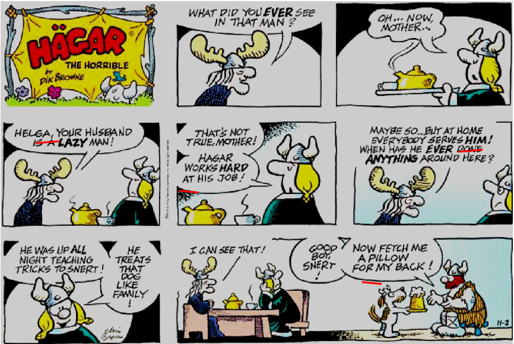

Fonte: <http://www.cartoonistgroup.com/subject/The-Snert-Comics-and-Cartoons-by-Hagar+The+Horrible.php>. Acesso em: 23 mai. 2017. 

Nessa charge, sobre os pronomes sublinhados, os dois primeiros são possessive adjectives , your se refere à Helga (your husband – <u>seu</u> marido), uma frase sobre o marido ser preguiçoso (lazy). Ela responde que o trabalho dele ( <u>his</u> job) é difícil (hard). 

Depois, um object pronoun : é dito que todos servem a ele ( him ), significando “ele”, como um sujeito, lembra que expliquei isso?  E o último é também um possessive adjective: ... a pilllow for my back (um travesseiro para minhas costas). 

#### COULD THIS CATERPILLAR HELP SOLVE THE WORLD’S PLASTIC BAG PROBLEM? 

A developmental biologist and amateur beekeeper has come up with a new way to get rid of used plastic bags: Make waxworms eat <mark>them</mark> . The larvae of the greater wax moth (Galleria mellonella), these caterpillars thrive on beeswax. While cleaning out empty hive boxes that were infested with these caterpillars, Federica Bertocchini of the Institute of Biomedicine and Biotechnology of Cantabria in Spain put <mark>them</mark> in a plastic grocery bag. To <mark>her</mark> surprise the waxworms quickly ate <mark>their</mark> way out, leaving the bag riddled with holes. It turns out the caterpillars can break down the bag’s polyethylene into ethylene glycol, which can be readily converted into useful substances such as antifreeze, the team reports today in Current Biology. Polyethylene is very hard to break down making the 80 million tons produced a year a big recycling challenge. Only recently have researchers begun to make progress doing so, and this caterpillar may be another solution. PENNISI, Elizabeth. Adapted from: Science. Could this caterpillar help solve the world’s plastic bag problem? 

In: Science, 2017. Disponível em: <http://www.sciencemag.org/news/2017/04/could-caterpillar-help-solve-world-s-plastic-bagproblem.>. Acesso em: 26/06/2017.

---

<!-- pagina: 9 -->

**Andrea Belo Aula 05 - Pronouns, Prepositions and Conjunctions in the texts** 

Nesse texto, sobre os pronomes sublinhados, os dois primeiros são object pronouns , them e se referem, respectivamente às minhocas – waxworms: <u>elas, pronome them e às larvas –</u> caterpillars, também elas, pronome them.  O terceiro, her , é um possessive adjective , que se refere à Federica Bertocchini, portanto, dela. O último sublinhado – their – é outro possessive adjective , que se refere às waxworms, portanto, delas. 

Você não precisa decorar esses nomes para o dia da prova. Porém, precisa saber onde cada pronome se encaixa, entendê-los e identificar como são usados nas frases, é suficiente. 

E agora, um quadro só, com os dois tipos de possessive pronouns , para ficar mais fácil ainda de memorizar e comparar ambos os pronomes. 

|**POSSESSIVE ADJECTIVE** **POSSESSIVE PRONOUN** MY BOOK (meu livro) MINE (o meu / a minha) YOUR PENCIL (seu lápis) YOURS (o seu / a sua) HIS BACKPACK (mochila dele) HIS (a dele / o dele)|
|---|
|HER DRESS (vestido dela) HERS (a dela / o dela)|
|ITS HOUSE (casa dele[a] – neutro e usado para animais) ITS (o dele / a dele / o dela / a dela – neutro e usado para animais OUR TV (nossa televisão) OURS (o nosso / a nossa YOUR CARS (seus carros) YOURS (os seus / as suas)|
|THEIR PENS (canetas deles[as]) THEIRS (os deles / as deles / os delas / as delas)|

## **REFLEXIVE PRONOUNS** 

Os reflexive pronouns (pronomes reflexivos), são aqueles que praticam a ação sobre si mesmo (eu mesmo, você mesmo etc.) e aparecem após os verbos. 

São usados de acordo com o sujeito da oração, sempre. 

São palavras que têm os sufixos “-self” (singular) e “-selves” (plural). 

Os reflexive pronouns possuem 3 funções: 

- Função reflexiva: é quando há concordância com o sujeito e aparece depois dele: 

Lisa was looking **herself** in the mirror. (Lisa estava se olhando no espelho).

---

<!-- pagina: 10 -->

**Andrea Belo Aula 05 - Pronouns, Prepositions and Conjunctions in the texts** 

- Função enfática: é quando o pronome concorda com o sujeito e se posiciona depois desse sujeito ou então do objeto. 

Lisa **herself** prepared the sandwich. (Lisa mesma preparou o sanduíche). 

- Função idiomática: é quando o pronome vem precedido da preposição by, para indicar que o sujeito praticou a ação sozinho. 

Lisa likes studying by **herself** . (Lisa gosta de estudar sozinha. – só ela.) 

Veja um exemplo e o quadro ilustrativo: 

|**REFLEXIVE** **PRONOUNS** I – MYSELF YOU – YOURSELF|**POSSESSIVE PRONOUN** I cut**myself**with a knife. Eu**me**cortei com a faca. You cut **yourself**with a knife. Você**se**cortou com a faca.|
|---|---|
|HE – HIMSELF|He cut**himself**with a knife. Ele**se**cortou com a faca.|
|SHE – HERSELF|She cut**herself**with a knife. Ela**se**cortou com a faca.|
|IT – ITSELF|It cut**itself**with a knife. Ele**se**cortou com a faca.|
|WE – OURSELVES|We cut**ourselves**with a knife. Nós**nos**cortamos com a faca.|
|YOU – YOURSELVES|You cut **yourselves**with a knife. Vocês**se**cortaram com a faca.|
|THEY – THEMSELVES|Theycut**themselves**with a knife. Eles**se**cortaram com a faca.|

Vejamos uma tabela dos pronomes que estudamos até agora, com as devidas classificações. 

|**PERSONAL** **PRONOUNS**|**OBJECT** **PRONOUNS**|**POSSESSIVE** **PRONOUNS**|**POSSESSIVE** **PRONOUNS**|**REFLEXIVE** **PRONOUNS**|
|---|---|---|---|---|
|I|ME|MY|MINE|MYSELF|
|YOU|YOU|YOUR|YOURS|YOURSELF|
|HE|HIM|HIS|HIS|HIMSELF|
|SHE|HER|HER|HERS|HERSELF|
|IT|IT|ITS|ITS|ITSELF|
|WE|US|OUR|OURS|OURSELVES|
|YOU|YOU|YOUR|YOURS|YOURSELVES|
|THEY|THEM|THEIR|THEIRS|THEMSELVES|

Aconselho que você tente escrever exemplos para cada pronome acima com o intuito de treinar. E, quando aparecerem pronomes nas questões, sublinhe, circule, encontre uma forma de destacá-los e descobrir que pronome é para aprimorar os conhecimentos.

---

<!-- pagina: 11 -->

**Andrea Belo Aula 05 - Pronouns, Prepositions and Conjunctions in the texts** 

Já estudamos muitos pronomes: os pessoais , possessivos e reflexivos . Ainda faltam os pronomes demonstrativos , indefinidos , relativos e interrogativos . 

Você já percebeu que os pronomes, em geral, são aquelas palavras que substituem ou acompanham outras, principalmente os substantivos, certo? 

Afinal, se analisarmos a própria palavra pronome, “pro” significa “em função de”. Logo, é possível concluir que “pronome” é sinônimo de algo que está “em função do nome”. 

Por isso, os pronomes existem para remeter, retomar ou qualificar outras palavras expressas nos textos das provas. E assim, se torna tão importante identificá-los, para ter a certeza de que cada alternativa faz sentindo, analisando cada termo que faz parte dos textos. 

Mas ainda há muito o que estudar. Preparado? Então, vamos aos pronomes demonstrativos. 

## **DEMONSTRATIVE PRONOUNS** 

Os demonstrative pronouns (pronomes demonstrativos), são apenas 4 e são simples de entender. São usados para situar a posição de algo no espaço em que se encontra. 

São aqueles pronomes que mostram, que indicam algo que pode estar perto ou longe. Veja uma tabela e uma ilustração com esses pronomes. 

|**DEMONSTRATIV** **PRONOUNS** THIS|**E** **(Em Português)** esse,essa,isso(singular)|
|---|---|
|THESE|esses,essas(plural)|
|THAT|aquele,aquela,aquilo(singular)|
|THOSE|aqueles, aquelas(plural)|

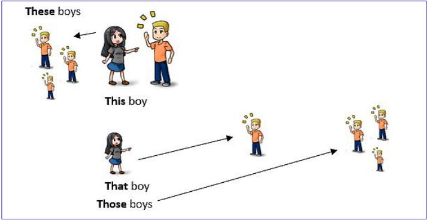

Pela simplicidade, os pronomes demonstrativos podem ser reconhecidos nos textos em Inglês e assim, facilitar na busca pelas respostas das questões que lá estiverem.

---

<!-- pagina: 12 -->

**Andrea Belo Aula 05 - Pronouns, Prepositions and Conjunctions in the texts** 

## **INDEFINITE PRONOUNS** 

Os indefinite pronouns (pronomes indefinidos), recebem esse nome porque substituem ou acompanham o substantivo, porém, de forma indeterminada, como? 

Eles oferecem a ideia, por exemplo, de algum lugar, alguma coisa, alguém, qualquer lugar, qualquer pessoa, entre outros nomes imprecisos dentro das orações. 

Os pronomes indefinidos começam com as palavras some , any , no e every . E terminam com os sufixos -body , -one , -thing , -where , entre outros, a depender do contexto. 

Em geral, usa-se -some , -every e -no em frases afirmativas , -any em frases negativas e interrogativas . 

Aqui, vale lembrar algumas diferenças entre some e any , só para ilustrar: some para frases afirmativas e any para negativas e interrogativas , ambas palavras significam algum , alguma , alguns , algumas e, dependendo do contexto, nas negativas, significam nenhum/nenhuma , ok? 

Vejamos alguns exemplos para ilustrar: 

Do you have **_any_** money? Do you play **_any_** sports? Yes, I have **_some_** money. Yes, I play **_some_** sports. No, I don’t have **_any_** money. No, I don’t play **_any_** sports. 

São muitos os pronomes indefinidos e, por isso, precisamos de analisar diferentes exemplos que possam estar nos textos no dia da sua prova. 

Vou mostrar variados exemplos abaixo, nos quadros que seguem: 

|SOMEBODY alguém I think**somebody**has arrived. Eu acho que**alguém**chegou. SOMEONE alguém I believe**someone**forgot the book. Eu acredito que**alguém**esqueceu o livro.|
|---|
|SOMETHING algo She said**something**is wrong. Ela disse que**alguma coisa**está errada.|
|SOMEWHERE em algum lugar He is**somewhere**in Europe. Ele está em**algum lugar**na Europa. SOMEWAY de alguma maneira I have to get there**someway**. Eu tenho que chegar lá**de alguma maneira**.|

|ANYBODY ninguém I can’t see**anybody**in the room. Não consigo ver**ninguém**na sala. ANYONE qualquer um, ninguém He didn’t see**anyone**there. Ele não viu**ninguém**lá.|
|---|
|ANYTHING nada I won’t do**anything**at the moment. Não consigo fazer**nada**nesse momento.|
|ANYWHERE qualquer lugar I can’t go**anywhere**. Não posso ir em**lugar nenhum/qualquer lugar**. ANYWAY de qualquer forma, jeito She is going home**anyway**. Ela está indo para casa**de qualquer forma/jeito**.|

---

<!-- pagina: 13 -->

**Andrea Belo Aula 05 - Pronouns, Prepositions and Conjunctions in the texts** 

|NOBODY ninguém She said**nobody**won the medal. Ela disse que**ninguém**ganhou a medalha.|
|---|
|NO ONE ninguém **No one**came to college yesterday.**Ninguém**veio à faculdade ontem.|
|NONE nenhum(a) **None**of the exercises are right.**Nenhum**dos exercícios está certo.|
|NOTHING nada There is**nothing**I can do. Não há**nada**que eu possa fazer.|
|NOWHERE em nenhum lugar She is going**nowhere**. Ela não está indo para**lugar nenhum**.|
|NOWAY de jeito nenhum I will not it this.**No way**!” (Eu não vou comer isso.**De jeito nenhum**!)|
|EVERYBODY toda a gente, todo mundo **Everybody**is going to the party.**Todos**vão para a festa.|
|EVERYONE todos, todo mundo I talked to**everyone**at the party. Eu falei com**todos**da festa.|
|EVERYTHING tudo She is doing**everything she can**. Ela está fazendo**tudo**o que pode.|
|EVERYWHERE em todos os lugares I’ve been**everywhere**in this city. Já estive**em todos os lugares**dessa cidade.|
|EVERY WAY de todo jeito, todos os sentidos He drove**every way at the race**. Ele dirigiu**em todos os sentidos**na corrida.|

Os pronomes vistos acima, com os respectivos exemplos, são muito cobrados nas provas. 

## **RELATIVE PRONOUNS** 

Os relative pronouns (pronomes relativos), são palavras que exercem a função de sujeito ou de objeto nas frases. 

Quando for sujeito, haverá um substantivo antes desse pronome. Mas, quando aparecer após um verbo, com ou sem preposição, então, estamos falando de um pronome relativo com função de objeto. 

Em ambas as situações, o que importa saber é a estrutura e entender para que e onde são usados tais pronomes nos textos, independente da função que exercem. 

Vejamos um quadro com os nomes dos pronomes e vamos falar dos detalhes de cada um deles para compreender melhor. 

|**PARA PESSOAS** **WHO** **WHO ou WHOM**|
|---|
|**PARA COISAS** **WHICH** **WHICH**|
|**PARA PESSOAS OU COISAS** **THAT** **THAT**|

---

<!-- pagina: 14 -->

**Andrea Belo Aula 05 - Pronouns, Prepositions and Conjunctions in the texts** 

Na função de sujeito, os pronomes relativos são: who (para pessoas), which (para objetos/animais) e that (para pessoas e objetos: neutro). 

The man who arrived is charming. (O homem que chegou é charmoso.) 

O pronome se refere ao homem que chegou: o sujeito 

Na função de objeto, temos os pronomes relativos who/whom (para pessoas), which (para objetos/animais) e that (para pessoas e objetos: neutro). 

She didn’t say who arrived. (Ela não disse quem chegou.) 

O pronome se refere ao homem que chegou (objeto) e não a ela (sujeito) 

Vejamos outros exemplos com o uso de diferentes pronomes relativos 

The girl who disappeared studied with me. (A garota que desapareceu estudava comigo). 

O pronome se refere à garota que desapareceu: o sujeito 

They didn’t show who the magician was. (Eles não mostraram quem era o mágico). 

O pronome se refere ao mágico que chegou: o sujeito 

Veja o quadro ilustrativo: 

|**RELATIVE** **PRONOUNS** WHO| **Tradução** quem, oqual|
|---|---|
|WHOSE|cujo, cuja, cujos, cujas|
|WHICH|que, oqual, oque|
|WHERE|onde, emque, noque, noqual, naqual, nosquais, nasquais|
|WHEN|quando, emque, noqual, naqual, nosquais, nasquais|
|THAT|que|
|WHAT|oque|

Os pronomes vistos acima, com os respectivos exemplos, também são muito cobrados nas 

#### provas. 

As Relative Clauses são orações que exercem a função de adjetivos. Por esse motivo, em algumas gramáticas, também são chamadas de Adjectives Clauses . E são, em Português, orações subordinadas.

---

<!-- pagina: 15 -->

**Andrea Belo Aula 05 - Pronouns, Prepositions and Conjunctions in the texts** 

Essas orações (relative clauses) são construídas com a adição de partículas que têm o objetivo de adicionar informações à oração principal. Essas partículas são os pronomes relativos. 

Em Inglês, os pronomes que já estudamos em aulas anteriores e que são utilizados nas orações relativas são: who , whom , which , whose e that . 

Outros pronomes relativos, menos usados, mas que estudaremos também são when , where e why . Eles são responsáveis por unir uma frase à outra bem como fornecer informações adicionais à frase anterior. 

Cada pronome relativo é utilizado para complementar uma oração de forma diferente. Vejamos, em suma, como é a classificação dessas orações, para depois estudar cada uma delas separadamente com exemplos. Os pronomes relativos podem exercer diferentes funções na frase (sujeito, objeto ou posse) e, determinam qual será a relative clause . 

As Relative Clauses podem ser Defining Relative Clauses ou Non-defining Relative Clauses , veja: 

Defining relative clauses (orações restritivas): Essas orações são usadas para definir sobre quem ou sobre o que estamos falando. Não exigem o uso de vírgulas e os pronomes relativos utilizados nelas são: who, whom, which, whose, where, when, why e that, como estudaremos adiante, um a um. 

Non-defining relative clauses (orações explicativas): Um pouco diferente das defining relative clauses , por sua vez, as non-defining relative clauses não fornecem informações essenciais sobre o que antecede a frase. Aqui, as informações adicionadas geralmente aparecem entre vírgulas. E os pronomes mais utilizados são: who, whom, whose e which . 

As defining clauses , independente do pronome relativo a ser usado, aparecem de forma mais direta nas frases, ou seja, como eu afirmei anteriormente, sem estar entre parênteses ou entre vírgulas. Elas destacam pessoas ou coisas à qual se referem. 

As non-defining clauses são orações que trazem informações extras sobre o sujeito ou objeto das frases. Geralmente, são colocadas entre vírgulas ou parênteses. 

Se tentarmos retirá-las da oração principal, ela dá a impressão de que está incompleta, apesar de manter o sentido. 

Resumidamente, eis as características principais das Defining e Non-defining clauses: 

|**DEFINING RELATIVE CLAUSE** **NON-DEFINING RELATIVE CLAUSE**|
|---|
|O seu antecedente é indefinido. O seu antecedente é definido.|
|Traz informação essencial para restringir o Traz informação adicional, mas não essencial|
|significado do seu antecedente. ao seu antecedente.|
|Nunca é colocada entre vírgulas. É sempre colocada entre vírgulas.|

---

<!-- pagina: 16 -->

**Andrea Belo Aula 05 - Pronouns, Prepositions and Conjunctions in the texts** 

|Começa normalmente por um pronome relativo, ex. who(m), which, whose.|Começa sempre por um pronome relativo, ex. who(m), which, whose.|
|---|---|
|O pronome relativo that pode ser empregue em|O pronome relativo that não pode ser|
|vez de who(m) e which.|empregue em caso nenhum.|
|Como complemento do verbo, o pronome relativo pode ser omitido: who(m), which e that.|O pronome relativo não pode ser omitido|

Veremos cada pronome para saber qual dos dois tipos podem ser usadas com cada um deles. 

### **RELATIVE PRONOUN THAT** 

O pronome relativo é o que mais parece em frases de forma geral, em diálogos informais, em filmes, em séries, em textos variados, entre outros, já que pode ser usado quando se trata de pessoas ou de objetos. Atenção: é usado apenas em Defining Relative Clauses. 

Vou introduzir oferecendo dois exemplos para você compreender melhor, desde o início da explicação. É como se fôssemos dizer: “Eu tenho um amigo <u>que</u> eu admiro muito.” ou “Eu tenho um cachorro <u>que</u> sabe nadar”, em que se fala de coisas/animais referentes à pessoa ou se fala da própria pessoa, usando o mesmo pronome: that. 

As frases acima seriam: “I have a friend <u>that</u> I admire a lot.” E “I have a dog <u>that</u> knows how to swim”. 

No caso de THAT , foi escolhido para ser o primeiro da lista de todos que explicarei nessa aula, justamente porque serve para todas as orações relativas. 

Eu costumo chamar esse pronome de pronome carta coringa, que pode ser utilizado em qualquer oração, quando se há alguma dúvida em relação a qual usar para desenvolver as frases desejadas. 

É importante observar que, se vier um sujeito após o pronome that , ele pode ser omitido sem prejudicar o sentido da frase. E às vezes pergunta-se isso em questões. 

Vejamos outros exemplos: 

These are the flowers **that** I bought for you. (Esses são as flores **que** eu comprei para você.) 

Aqui, por causa do sujeito “I”, após o pronome **that** , ele poderia ser omitido: These are the flowers I bought for you.

---

<!-- pagina: 17 -->

**Andrea Belo Aula 05 - Pronouns, Prepositions and Conjunctions in the texts** 

These are the boys **that** I was talking about. (Esses são os garotos **que** eu estava falando.) 

Aqui também, por causa do sujeito “I”, após o pronome **that** , ele poderia ser omitido: These are the boys I was talking about. 

Agora vejamos exemplos em que o pronome that não pode ser omitido, já que, não há sujeitos após os mesmos e sim verbos, que “pedem” que o pronome esteja presente: 

The cat **that** was hidden is mine. (O gato **que** estava escondido é meu). 

Aqui, por causa do verbo “was hidden” e não um sujeito, após **that** , ele não poderia ser omitido: The cat **<u>that</u>** was hidden is mine. 

The girl **that** won the competition is the best. (A garota **que** ganhou a competição é a melhor.) 

Aqui, também por causa do verbo “won” (Past Simple) e não um sujeito, após **that** , ele não poderia ser omitido: The girl **<u>that</u>** won the game is the best. 

Vejamos o pronome that em um dos textos da Newsweek, fonte usada para elaborar as provas, para exemplificar: 

Christoph Oswald has no problem approaching women. As he makes his way through the crowd at his favorite Frankfurt club, his cell phone scans a 10-meter radius for "his type": tall, slim, sporty, in her 30s--and, most important, looking for him, a handsome 36-year-old software consultant who loves ski holidays. 

Both Christoph and Susan have phones equipped with Symbian Dater, a program <mark>that</mark> promises to turn the cell phone 

into a matchmaker. By downloading Symbian, they installed a 20-character encrypted code that includes details of who they are and what they're looking for in a mate. Whenever they go out, their matchmaking phones sniff out other Symbian Daters over the unlicensed, and therefore free, Bluetooth radio frequency. If profiles match up, the phones beep wildly and send out short video messages. 

(NEWSWEEK, JUNE 7 / JUNE 14, 2004)

---

<!-- pagina: 18 -->

**Andrea Belo Aula 05 - Pronouns, Prepositions and Conjunctions in the texts** 

O texto, sobre Christoph Oswald e suas aventuras com as mulheres e, no segundo parágrafo, foi usado o pronome that , se referindo a um programa de celular que promete algo: “... Symbian Dater, a program that promises to turn the cell phone into …”. 

Assim como estudamos, o that pode se referir a pessoas ou coisas e oferecer informações sobre elas. No caso, foi informado que é um programa que promete algo. 

### **RELATIVE PRONOUN WHICH** 

O pronome relativo which é usado quando se trata de coisas/objetos e animais e nunca usado para pessoas. Pode ser também traduzido como que. 

Diferente de that, é usado em defining ou non-defining relative clauses. 

No caso de WHICH , é válido observar que, muitas vezes, pergunta-se se which pode ser substituído por that ou vice-versa e, devemos analisar cuidadosamente se tais pronomes, nessas frases, referem-se ao sujeito ou ao objeto. 

Como uma observação, lembre-se de que, se vier um sujeito após o pronome which , assim como acontece com o pronome that, ele também pode ser omitido sem prejudicar o sentido da frase, que pode ser uma provável pergunta da prova. Vejamos exemplos: 

This is the document **which** you need to sign. (Este é o documento **que** você precisa assinar.) Aqui também, por causa do sujeito “you”, após o pronome **which** , ele pode ser omitido: This is the document you need to sign. 

### **RELATIVE PRONOUNS WHO AND WHOM** 

Os pronomes relativos who e whom se referem apenas a pessoas e nunca objetos ou animais. A diferença entre who e whom é bastante sutil e deve-se prestar atenção à explicação e aos exemplos para não gerar confusão na hora de sua prova. 

Observe: enquanto who se refere à uma pessoa que executa a ação da oração, whom é, por sua vez, utilizado quando se trata de alguém que recebe uma ação. Exemplos: 

The charming guy **who** works with me has asked me out. (O homem charmoso **que** trabalha comigo me chamou para sair.) Aqui, você pode perceber que o pronome **who** faz referência ao homem charmoso, ou seja, the charming guy, que foi quem chamou a pessoa para sair, executou a ação.

---

<!-- pagina: 19 -->

**Andrea Belo Aula 05 - Pronouns, Prepositions and Conjunctions in the texts** 

George Lee, **who** was the school’s president, discoursed yesterday. (George Lee, **que** era o presidente da escola, discursou ontem.) 

No exemplo acima, você pode perceber mais uma vez que o pronome **who** faz referência a George Lee, ou seja, o presidente da escola, que foi quem discursou, executou também a ação. 

Você percebeu que, usei exemplos com frases entre vírgulas ou não. Ambos os casos se usam o pronome relativo who. 

Agora, vejamos exemplos com o pronome relativo whom, para que a diferença entre o uso de who e whom fique clara a você. 

Orca whale, **which** is big, is very dangerous. (A baleia orca, **que** é grande, é muito perigosa.) 

Aqui, por causa do verbo “is”, após o pronome which, ele não pode ser omitido. 

I don’t know the name of the boy **whom** she is going out with. (Eu não sei o nome do garoto **quem/com quem** ela está saindo). 

Aqui, você pode perceber que o pronome **whom** faz referência a quem recebeu a ação: ela. O sujeito da oração é “ **I** ” e o garoto de que trata a frase é aquele com quem ela está saindo, como um adjetivo para a pessoa com quem alguém está saindo. 

The boy to **whom** you gave the present is my brother. (O garoto para **quem** você deu o presente é meu irmão). Aqui também, você pode perceber que o pronome **whom** faz referência a quem recebeu a ação: meu irmão. 

Vejamos o pronome who em um dos textos do The New York Times, fonte muito usada para preparar provas, para exemplificar: 

LOS ANGELES − Come summer 2006, Warner Brothers Pictures hopes to usher “Superman” into thousands of theaters after a 19-year absence (…) 

Since Warner began developing a remake of the successful comic-book franchise in 1993, it has spent nearly $10 million in development, employed no fewer than 10 writers, hired four ⎯ directors and met with scores of Clark Kent hopefuls without settling on one. The latest director Bryan Singer, <mark>who</mark> directed “X-Men” and its sequel, was named on July 18 to replace Joseph

---

<!-- pagina: 20 -->

**Andrea Belo Aula 05 - Pronouns, Prepositions and Conjunctions in the texts** 

McGinty Nichol, known as McG, <mark>who</mark> left the project after refusing to board a plane to Australia, where the studio was determined to make the film. 

(THE NEW YORK TIMES, JULY 22, 2004) 

O texto é sobre a Warner Bros Pictures, de cinema, de filmes e, no segundo parágrafo, foi usado o pronome who , duas vezes. Conforme estudamos, o pronome who, sempre se refere a pessoas, certo? 

Na primeira vez que who aparece , ele está se referindo a Bryan Singer: “... The last director – Bryan Singer, who directed X-Men and its sequel, was named…”, corretamente como estudamos. 

Na segunda vez que who está na frase , está também se referindo a pessoas – desta vez, a Joseph McGinty Nichol: “... replace Joseph McGinty Nichol, known as McG, <u>who</u> left the project after refusing to board…”, explicando algo sobre Joseph, como estudamos. 

Agora, vamos ao pronome whose. Come on! 

### **RELATIVE PRONOUN WHOSE** 

O pronome relativo whose é usado para indicar posse, para indicar que algo pertence a alguém. A tradução que melhor representa o whose seria o cujo/cuja em Português.  Vejamos exemplos: 

That teacher, **whose** class is attractive, is preparing a speech for tomorrow. (Aquela professora, **cuja** aula é atrativa, está preparando um discurso para amanhã.) 

That bag, **whose** owner in unknown, is in the lost and found department. (Aquela mala, **cujo** dono é desconhecido, está no departamento de achados e perdidos.) 

Vamos aos pronomes relativos where e when. 

### **RELATIVE PRONOUN WHERE** 

O pronome relativo where é usado para indicar o lugar que a frase está fazendo referência, o local do que se trata a informação principal da oração com esse pronome relativo. 

É um dos pronomes relativos mais simples, pois tem o mesmo significado de quando é pronome interrogativo: onde e se encaixa de forma prática nas frases. Vejamos exemplos: 

The house **where** I live is big, beautiful and comfortable. 

(A casa **onde/em que** eu moro é grande, bonita e confortável.)

---

<!-- pagina: 21 -->

**Andrea Belo Aula 05 - Pronouns, Prepositions and Conjunctions in the texts** 

The college **where** she studies is modern. 

(A faculdade **onde/em que** ela estuda é moderna.) 

### **RELATIVE PRONOUN WHEN** 

O pronome relativo when é usado para indicar tempo: o dia, a semana, o mês, enfim, o período do que se trata a informação principal da oração com esse pronome relativo. 

É um pronome relativo simples também, pois, assim como o where, tem o mesmo significado como pronome interrogativo: quando. Vejamos exemplos: 

That was the day **when** I started working in this company. 

(Aquele foi o dia **quando/em que** eu comecei a trabalhar nessa empresa.) 

January is the month **when** I graduate. 

(Janeiro é o mês **quando/em que** eu me formo.) 

Vamos ao último pronome relativo: why . 

### **RELATIVE PRONOUN WHY** 

O pronome relativo why é usado para indicar a razão, o motivo do que se trata a informação principal da oração. 

É um pronome relativo que também significa porque, como na hora de fazer perguntas, em que está na função de pronome interrogativo. Podemos também traduzir como “por causa de”. Vejamos exemplos: 

There are three different ways to go. That’s the reason **why** I got confused. (Há três diferentes caminhos para ir lá. Essa é a razão **por quê/pela qual** eu fiquei confuso.) I don’t know the reason **why** she is angry. 

(Eu não sei a razão **por quê/pela qual** ela está nervosa.) 

https://t.me/KakashiAssinaturasBot

---

<!-- pagina: 22 -->

**Andrea Belo Aula 05 - Pronouns, Prepositions and Conjunctions in the texts** 

## **INTERROGATIVE PRONOUNS** 

Os interrogative pronouns (pronomes interrogativos), também chamados de Question Words , são aquelas palavras utilizadas para fazer perguntas, termos que representam aquilo que queremos saber: o lugar, o motivo, a hora, o dia, entre outros. 

Vejamos alguns exemplos: 

**What** is your favorite fruit? Grapes. ( **Qual** é a sua fruta favorita?) Uvas. **Which** fruit do you prefer, apple or pear? Pear. ( **Qual** fruta você prefere, maçã ou pera?) Pera. **Where** do you go on the weekends? To the club. ( **Onde** você vai nos fins de semana?) Ao clube. **When** is Christmas? It’s on December 24th . ( **Quando** é o Natal? É 24 de dezembro). **How** do you go to work? By bus. ( **Como** você vai para o trabalho?) De ônibus. **Who** is that boy over there? It’s my brother. ( **Quem** é aquele garoto lá?) É meu irmão. To **whom** did he give the present? To me. ( **Para quem** ele deu o presente?) Para mim. 

**Whose** house is that? It’s mine. ( **De quem** é aquela casa?) Minha. **Why** do you study English? Because I need. ( **Por que** você estuda alemão?) Porque eu preciso. 

Observação: Você percebeu que usamos dois pronomes interrogativos para fazer perguntas com a palavra qual (WHAT e/ou WHICH) – sendo what para perguntas gerais “O quê”, “Qual”, mas, se for uma escolha como, por exemplo, “Qual você prefere, esse ou aquele?”, usamos which . 

What e Which , apesar de terem a mesma tradução, o momento de uso é diferente para cada um deles, já que what não apresenta restrições como o pronome interrogativo which é usado somente quando há um número limitado de opções. 

Vejamos o quadro ilustrativo:

---

<!-- pagina: 23 -->

**Andrea Belo Aula 05 - Pronouns, Prepositions and Conjunctions in the texts** 

|**INTERROGATIV** **PRONOUNS**|**E** **Tradução**|
|---|---|
|WHAT|Oque, Que|
|WHICH|Qual, Quais|
|WHERE|Onde|
|WHEN|Quando|
|HOW|Como|
|WHO|Quem(função de sujeito)|
|WHOM|Quem(função de objeto)|
|WHOSE|Dequem|
|WHY|Porque|

Os pronomes interrogativos , nos textos, são usados quando há perguntas dentro de um contexto e, na maioria das vezes, a resposta logo em seguida. 

Os Question Words são pronomes interrogativos utilizados para elaborar perguntas em Inglês. Eles são empregados antes dos verbos auxiliares e modais para se questionar algo. 

Vale lembrar que, em Português, podemos transformar qualquer afirmação em pergunta somente mudando a entonação, o que é diferente em Inglês, como você tem visto em nossas aulas e praticamos bem isso na aula de verbos, com os devidos auxiliares de cada tempo verbal. 

Muitas vezes, os Question Words são chamados Wh Questions porque eles contêm as letras “W” e “H” em sua estrutura, veja: What (O quê/qual), Which (O quê/qual), When (Quando), Who (Quem), When (Quando), Why (Por quê), HoW (Como) , entre outros que estudaremos. 

### **WHAT** 

What significa o quê/qual e é usado para perguntar sobre objetos, situações, assuntos diversos e tudo aquilo que não sabemos. É o Wh Question mais genérico de todos e, consequentemente, o mais usado em textos dos mais variados tipos. 

A pergunta feita com what é geral, como abaixo, qual é o seu nome, endereço, o que você gosta, que horas são e o que você faz, a resposta pode ser qualquer uma e não possui escolhas, como entre duas ou mais coisas que você goste. 

Se perguntar “o que você gosta?” – What do you like, a resposta pode ser o que vier em sua mente, diferente de which , que veremos a seguir.

---

<!-- pagina: 24 -->

**Andrea Belo Aula 05 - Pronouns, Prepositions and Conjunctions in the texts** 

<!-- Start of picture text -->
WHAT'S YOUR NAME? <!-- End of picture text -->

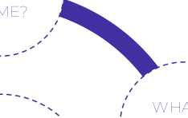

<!-- Start of picture text -->
WHAT DO YOU DO? <!-- End of picture text -->

<!-- Start of picture text -->
WHAT'S YOUR ADDRESS? <!-- End of picture text -->

<!-- Start of picture text -->
WHAT <!-- End of picture text -->

<!-- Start of picture text -->
WHAT TIME IS IT? <!-- End of picture text -->

<!-- Start of picture text -->
WHAT DO YOU LIKE? <!-- End of picture text -->

Which também significa o quê/qual , porém, é usado quando temos opções limitadas, escolhas. Enquanto what é usado para perguntas de um modo geral, o which é usado quando são oferecidas opções de respostas. 

Por exemplo, a pergunta sobre o que você gosta – “What do you like?”, usando o which, você provavelmente precisaria escolher algo que gosta, como: “Which do you like, pizza or icecream?”, em que sua resposta tem que ser uma das duas ou mais opções. Veja outros exemplos: 

<!-- Start of picture text -->
WHAT  DO YOU EAT IN THE MORNING? <!-- End of picture text -->

<!-- Start of picture text -->
WHICH  DO YOU EAT IN THE MORNING, BREAD OR TOAST? <!-- End of picture text -->

---

<!-- pagina: 25 -->

**Andrea Belo Aula 05 - Pronouns, Prepositions and Conjunctions in the texts** 

<!-- Start of picture text -->
WHICH NAME DO YOU PREFER, TOM OR <!-- End of picture text -->

<!-- Start of picture text -->
WHICH CITY WOULD YOU LIVE, NEW YORK OR LONDON? <!-- End of picture text -->

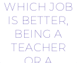

<!-- Start of picture text -->
WHICH JOB IS BETTER, BEING A TEACHER <!-- End of picture text -->

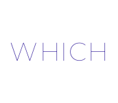

<!-- Start of picture text -->
WHICH <!-- End of picture text -->

<!-- Start of picture text -->
OR A <!-- End of picture text -->

<!-- Start of picture text -->
WHICH KIND OF MOVIE DO YOU LIKE THE MOST, SUSPENSE <!-- End of picture text -->

<!-- Start of picture text -->
WHAT DO YOU LIKE IN THE MORNING, MILK OR <!-- End of picture text -->

### **WHEN** 

When significa o quando e é usado para saber sobre tempo/período ou ocasião – quando algo aconteceu, acontece ou irá acontecer. 

<!-- Start of picture text -->
WHEN IS YOUR BIRTHDAY? <!-- End of picture text -->

<!-- Start of picture text -->
WHEN ARE YOU GOING TO DECIDE? <!-- End of picture text -->

<!-- Start of picture text -->
WHEN DID YOU GRADUATE? <!-- End of picture text -->

<!-- Start of picture text -->
WHEN <!-- End of picture text -->

<!-- Start of picture text -->
DECIDE? <!-- End of picture text -->

<!-- Start of picture text -->
WHEN WILL YOU TRAVEL AGAIN? <!-- End of picture text -->

<!-- Start of picture text -->
WHEN DO YOU GO TO THE GYM? <!-- End of picture text -->

---

<!-- pagina: 26 -->

**Andrea Belo Aula 05 - Pronouns, Prepositions and Conjunctions in the texts** 

### **WHERE** 

Where significa onde e é usado para saber sobre local, localização. 

<!-- Start of picture text -->
WHERE IS YOUR SCHOOL? <!-- End of picture text -->

<!-- Start of picture text -->
WHERE CAN YOU LEAVE YOUR CAR? <!-- End of picture text -->

<!-- Start of picture text -->
WHERE DO YOU WORK OUT? <!-- End of picture text -->

<!-- Start of picture text -->
WHERE <!-- End of picture text -->

<!-- Start of picture text -->
WHERE WILL YOU GRADUATE? <!-- End of picture text -->

<!-- Start of picture text -->
WHERE DID YOU GO YESTERDAY? <!-- End of picture text -->

Why significa “porquê” e é usado para saber o motivo, a razão de algo acontecer, ter acontecido ou porque vai acontecer. A resposta é sempre because – why para perguntar e because para responder. 

<!-- Start of picture text -->
WHY ARE YOU TIRED? BECAUSE I STUDIED A <!-- End of picture text -->

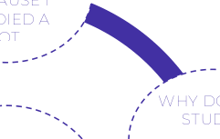

<!-- Start of picture text -->
WHY ARE YOU LEAVING?  BECAUSE I <!-- End of picture text -->

<!-- Start of picture text -->
WHY DO YOU STUDY?  BECAUSE I WANT TO BE <!-- End of picture text -->

<!-- Start of picture text -->
YOU <!-- End of picture text -->

<!-- Start of picture text -->
WHY <!-- End of picture text -->

<!-- Start of picture text -->
WHY DID YOU GET LATE? <!-- End of picture text -->

<!-- Start of picture text -->
WHY WILL YOU TRAVEL?  BECAUSE IT'S MY <!-- End of picture text -->

<!-- Start of picture text -->
WHY DID YOU GET LATE?  BECAUSE OF THE <!-- End of picture text -->

<!-- Start of picture text -->
LATE? <!-- End of picture text -->

---

<!-- pagina: 27 -->

**Andrea Belo Aula 05 - Pronouns, Prepositions and Conjunctions in the texts** 

### **WHO/WHOM** 

Who e Whom significam quem , para saber sobre pessoas, mas, são usados em diferentes situações – enquanto who tem a função de sujeito, whom tem a função de objeto, como vou mostrar abaixo. 

Se a pergunta for “ Quem é o ator principal desse filme?”, é “ Who is this movie main actor?” (a resposta do who será o ator, que é o sujeito da pergunta). 

Mas, se a pergunta for “Sobre quem é esse filme?”, é “ Whom is this movie about?” (a resposta será sobre quem é o filme, sendo o sujeito da frase o filme e não sobre quem é). Sobre quem é o objeto. I o whom faz exatamente esse papel: de objeto direto ou indireto nas frases. 

E ainda podem aparecer, nos textos, perguntas com a preposição “to” no final, como por exemplo: “ To whom was she talking?” ( Com quem ela estava falando?), também na função de objeto. Vejamos exemplos. 

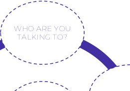

<!-- Start of picture text -->
WHO ARE YOU TALKING TO? <!-- End of picture text -->

<!-- Start of picture text -->
WHO IS THE AUTHOR?  WHOM IS THIS STORY ABOUT? <!-- End of picture text -->

<!-- Start of picture text -->
WHO IS YOUR TEACHER? <!-- End of picture text -->

<!-- Start of picture text -->
WHO WHO M <!-- End of picture text -->

<!-- Start of picture text -->
TO WHOM SHOULD I TALK? <!-- End of picture text -->

<!-- Start of picture text -->
WITH WHOM DID YOU GO OUT? <!-- End of picture text -->

<!-- Start of picture text -->
SHOULD I TALK?  OUT? <!-- End of picture text -->

### **WHOSE** 

Whose significa de quem e é usado para saber quem é o dono de algo, para saber a quem pertence alguma coisa. É sempre seguido de um nome e um verbo.

---

<!-- pagina: 28 -->

**Andrea Belo Aula 05 - Pronouns, Prepositions and Conjunctions in the texts** 

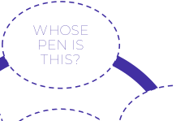

<!-- Start of picture text -->
WHOSE PEN IS THIS? <!-- End of picture text -->

<!-- Start of picture text -->
WHOSE BOOK IS THIS? <!-- End of picture text -->

<!-- Start of picture text -->
WHOSE TEACHER <!-- End of picture text -->

<!-- Start of picture text -->
WHOSE <!-- End of picture text -->

<!-- Start of picture text -->
WHOSE ARE <!-- End of picture text -->

<!-- Start of picture text -->
WHOSE CARDS ARE THOSE? <!-- End of picture text -->

<!-- Start of picture text -->
WHOSE ARE THOSE BOOKS? <!-- End of picture text -->

### **HOW** 

Usamos a Question Word HOW (como) quando queremos descrever a forma como algo é feito e a condição ou qualidade. Veja alguns exemplos abaixo e outros para melhor compreensão. 

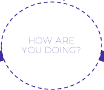

<!-- Start of picture text -->
HOW ARE YOU DOING? <!-- End of picture text -->

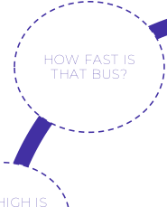

<!-- Start of picture text -->
HOW FAST IS THAT BUS? <!-- End of picture text -->

<!-- Start of picture text -->
HOW MANY STUDENTS? HOW MUCH MONEY? <!-- End of picture text -->

<!-- Start of picture text -->
HOW OLD ARE YOU? <!-- End of picture text -->

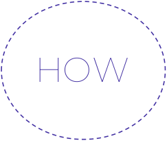

<!-- Start of picture text -->
HOW <!-- End of picture text -->

<!-- Start of picture text -->
HOW HIGH IS THE MONUMENT? <!-- End of picture text -->

<!-- Start of picture text -->
HOW FAR IS YOUR WORK? <!-- End of picture text -->

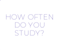

<!-- Start of picture text -->
HOW OFTEN DO YOU STUDY? <!-- End of picture text -->

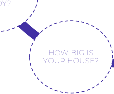

<!-- Start of picture text -->
HOW BIG IS YOUR HOUSE? <!-- End of picture text -->

<!-- Start of picture text -->
HOW TALL ARE YOU? <!-- End of picture text -->

How old: usado para perguntar a idade de alguém ou algo. 

How old is you mother? (Quantos anos tem sua mãe?) 

How old is this building? (Quantos anos tem esse edifício?) 

How long: usando para perguntar há quanto tempo, quanto tempo.

---

<!-- pagina: 29 -->

**Andrea Belo Aula 05 - Pronouns, Prepositions and Conjunctions in the texts** 

How long have you been studying? (Há quanto tempo você tem estudado?) 

How far: usando para perguntar a distância entre uma coisa e outra. 

(How far is the hotel from the school? (Qual é a distância entre o hotel e a escola?) 

How many: quantos - usado para substantivos contáveis, quando o plural é possível. 

How many students can you see? (Quantos alunos você consegue ver?) 

How much: quanto – usado para substantivos incontáveis, quando o plural não é possível. How much money do you need? (Quanto de dinheiro você precisa?) 

# **PREPOSITIONS** 

As **_prepositions_** (preposições) são palavras ou grupos de palavras que ligam e estabelecem relações dentro das frases. 

Nessas relações, um termo explica ou completa o sentido do outro. Vejamos as preposições mais importantes e mais usadas nas provas: preposições de lugar e de tempo. 

Vou mostrar uma imagem com as preposições principais e comentar sobre cada uma delas em seguida. Isso porque, algumas preposições podem ser de lugar e de tempo, dependendo do contexto. E vamos analisar para que você entenda bem. Vamos lá. 

## **PREPOSITIONS OF PLACE** 

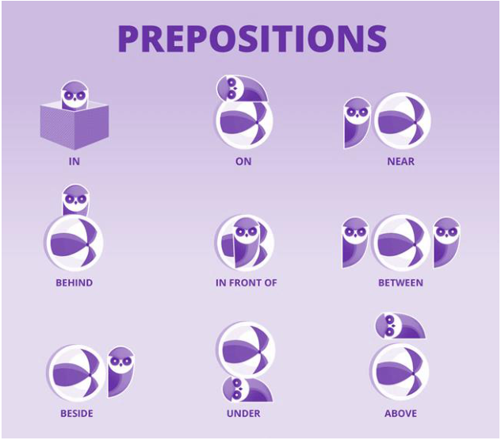

---

<!-- pagina: 30 -->

**Andrea Belo Aula 05 - Pronouns, Prepositions and Conjunctions in the texts** 

In – dependendo do contexto pode significar: dentro de; em; de; no e na. 

On – dependendo do contexto pode significar: sobre a; em cima de; acima de; em; no; na. 

At – dependendo do contexto pode significar: à; em; na; no. 

To – dependendo do contexto pode significar: para; a. 

For – dependendo do contexto pode significar: para; durante; por. 

### **IN** 

A preposição in é utilizada nos seguintes casos: 

- 1) Para indicar tempo, seja o ano, o mês, as estações do ano ou uma parte do dia. 

Exemplos : 

- I study in the evening. (Eu estudo a noite.) 

- He plays volleyball in the afternoon. (Ele joga vôlei de tarde.) 

- My birthday is in April. (Meu aniversário dela é em abril.) 

- My brother was born in 2012. (Meu irmão nasceu em 2012.) 

- We always visit New York in the summer. (Nós sempre visitamos Nova Iorque no verão). 

Nessa regra existe uma exceção em relação ao termo “night”. Nesse caso, a preposição utilizada é o “at”, por exemplo: at night (à noite – madrugada, após dormir). 

- 2) Para indicar lugar, seja uma cidade, um país ou qualquer local específico. 

Exemplos : 

- She lives in Italy. (Ela mora na Itália.) 

- He works in São Paulo. (Ele trabalha em São Paulo.) 

- Some people like to have a TV in the bedroom. (Algumas pessoas gostam de ter uma TV no quarto.) 

- They left the dog in the house. (Eles deixaram o cachorro na casa.) 

### **ON** 

A preposição on é utilizada nos seguintes casos: 

1) Para indicar tempo. No entanto, diferentemente do “in” ela é usada para datas específicas. 

Exemplos : 

- I was born on March 10th . (Eu nasci no em 10 de março.) 

- He studies English on Tuesdays and Thursdays (Ele estuda Inglês às terças e quintas.)

---

<!-- pagina: 31 -->

**Andrea Belo Aula 05 - Pronouns, Prepositions and Conjunctions in the texts** 

- Joanne bought a new car on November 17th . (Joanne comprou um carro novo dia 17 de novembro.) 

- They always go out on Saturdays. (Eles sempre saem aos sábados.) 

- She will go to the park on Sunday. (Ela vai ao parque no domingo.) 

2) Para indicar lugares e objetos. Todavia, diferentemente do “in” ela é usada para locais e objetos que possuem uma superfície. Nesse caso, ela significa em cima de . 

#### Exemplos : 

- The book is on the bed. (O livro está em cima da cama). 

- The cushion is on the floor. (A almofada está no chão.) 

- My dog sleeps on the couch. (Meu cachorro dorme em cima do/no sofá). 

- I will put the paper on my desk. (Vou colocar o papel em cima da/na mesinha.) 

- She left her blouse on that chair. (Ela deixou a blusa dela em cima daquela/naquela cadeira.) 

#### 3) Para referir meios eletrônicos onde informações são disponibilizadas. 

#### Exemplos: 

- I checked that information on the company’s website. (Eu chequei aquela informação no site da empresa.) 

- Don’t believe everything you see on the Internet. (Não acredite em tudo que você lê na Internet.) 

- The principal can’t talk to you now because he is on the phone. (O diretor não pode falar com você agora pois está ao telefone.) 

- They watched the concert live on TV. (Eles assistiram ao show ao vivo na TV.) 

#### 4) Para indicar nomes de ruas ou avenidas. 

#### Exemplos : 

- I live on Alvaro Luiz Street. (Eu moro na rua Álvaro Luiz.) 

- She wrote a book about a guy who lived on Seventh Street. (Ela escreveu um livro sobre um cara que morava na Seventh Street.) 

- There are many famous places on Oxford Street. (Há muitos lugares famosos na rua Oxford.) 

- They’ve got a company on Madison Avenue. (Eles têm uma empresa na Madison Avenue). 

Entretanto, se ao endereço for acrescido o número, utiliza-se o “ at ”:

---

<!-- pagina: 32 -->

**Andrea Belo Aula 05 - Pronouns, Prepositions and Conjunctions in the texts** 

Exemplos : 

- I live at 300 Karl Street. (Eu moro na rua Karl, nº 300.) 

- He wrote a book about a man who lived at 25 Baker Street. (Ele escreveu um livro sobre um homem que morava na Baker Street, nº 25.) 

### **AT** 

A preposição at é utilizada nos seguintes casos: 

1) Para indicar horários 

#### Exemplo : 

   - I woke up at 6 am. (Acordei às 06:00h.) 

   - The concert is at 8 pm. (O show é às 20h.) 

   - Our flight will leave at 3 o’clock. (Nosso voo sairá às três horas.) 

   - My friends usually eat dinner at 10 pm. (Meus amigos geralmente jantam às 10h.) 

   - She finished the exam at 2 pm. (Ela terminou a prova às 14h.) 

- 2) Para indicar locais específicos. 

#### Exemplos : 

- She has snacks at work every day. (Ela lancha no trabalho todos os dias.) 

- She is at the hospital to visit her mom. (Ela está no hospital para visitar sua mãe.) 

- She is waiting for her dad at the airport. (Ela está esperando o pai no aeroporto.) 

### **TO** 

A preposição to é utilizada nos seguintes casos: 

- 1) Para indicar movimento, posição, destino ou direção. 

We are going to Greece. (Nós vamos para a Grécia). 

- 2) Para indicar duração de tempo (início e fim de um período). 

I studied English from 2015 to 2018. (Eu estudei Inglês de 2015 a 2018). 

#### 3) Para indicar distância. 

It’s about 2 blocks from the supermarket to my house. (São cerca de 2 quarteirões do supermercado até minha casa). 

#### 4) Para indicar comparação entre coisas. 

I prefer going to the movies to watch TV (Eu prefiro ir ao cinema a assistir TV).

---

<!-- pagina: 33 -->

**Andrea Belo Aula 05 - Pronouns, Prepositions and Conjunctions in the texts** 

5) Para indicar o motivo ou propósito. Nesse caso, a preposição é seguida de verbo. 

We go out to relax and have fun. (Nós saímos para relaxar e nos divertir). 

### **FOR** 

A preposição for é utilizada nos seguintes casos: 

1) Para indicar duração de tempo. 

I’ve worked at school for six years. (Trabalhei na escola por seis anos). 

- 2) Para indicar finalidade. Nesse caso, é seguido de gerúndio. 

A tape is used for fixing things. (Uma fita é usada para consertar as coisas). 

- 3) Para indicar benefício ou favor. 

Working out is very good for the health. (Fazer exercícios é muito bom para a saúde). 

4) Para indicar motivo ou propósito. No entanto, diferentemente do “ to ” ele é seguido de substantivo: This space is for guests nly. (Este espaço é só para convidados). 

Vou mostrar a você um quadro ilustrativo com as preposições que mais apareceram em provas. 

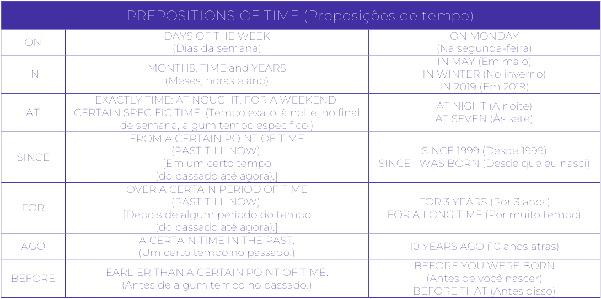

<!-- Start of picture text -->
PREPOSITIONS OF TIME (Preposições de tempo) DAYS OF THE WEEK  ON MONDAY ON (Dias da semana) (Na segunda-feira) IN MAY (Em maio) MONTHS, TIME and YEARS IN  IN WINTER (No inverno) (Meses, horas e ano) IN 2019 (Em 2019) EXACTLY TIME: AT NOUGHT, FOR A WEEKEND, AT NIGHT (À noite) AT  CERTAIN SPECIFIC TIME. (Tempo exato: à noite, no final AT SEVEN (Às sete) de semana, algum tempo específico.) FROM A CERTAIN POINT OF TIME (PAST TILL NOW).  SINCE 1999 (Desde 1999) SINCE [Em um certo tempo  SINCE I WAS BORN (Desde que eu nasci) (do passado até agora).] OVER A CERTAIN PERIOD OF TIME (PAST TILL NOW).  FOR 3 YEARS (Por 3 anos) FOR [Depois de algum período do tempo  FOR A LONG TIME (Por muito tempo) (do passado até agora).] A CERTAIN TIME IN THE PAST. AGO  10 YEARS AGO (10 anos atrás) (Um certo tempo no passado.) BEFORE YOU WERE BORN EARLIER THAN A CERTAIN POINT OF TIME. BEFORE  (Antes de você nascer) (Antes de algum tempo no passado.) BEFORE THAT (Antes disso) <!-- End of picture text -->

---

<!-- pagina: 34 -->

**Andrea Belo Aula 05 - Pronouns, Prepositions and Conjunctions in the texts** 

# **CONJUNCTIONS** 

As conjunções (Conjunctions), chamadas também de linking words , connectors ou conectivos são palavras que ligam duas partes de uma oração, para que a sentença possa fazer sentido. Observe um exemplo, através dessas duas orações: I wanted to text you. (Eu queria te mandar uma mensagem.), I don’t have your number. (Eu não tenho o número do seu celular.) 

Elas têm uma relação, mas falta algo para unir essas frases e fazê-las ter um sentido maior: 

I wanted to text you, but I don’t have your number. (Eu queria te mandar uma mensagem, mas eu não tenho o número do seu celular.) 

Essa palavra but exerceu o papel que precisávamos: uniu as duas sentenças e estabeleceu uma lógica entre elas. Portanto, o but é uma conjunção. 

### **TIPOS DE CONJUNÇÕES** 

Há três tipos de conjunções em Inglês: 

- **Conjunções Coordenadas (Coordinating Conjunctions)** 

- **Conjunções Subordinadas (Subordinating Conjunctions)** 

- **Conjunções Correlativas (Correlative Conjunctions)** 

## **CONJUNÇÕES COORDENADAS** 

As conjunções coordenadas são as mais comuns e as que geralmente usamos ou identificamos quando pensamos em linking words . Elas têm o papel de juntar orações. Elas podem juntar orações independentes (ou seja, orações que possuem sentido completo por si próprias, sem precisar de outra oração para fazer sentido), frases ou apenas palavras. 

Na língua inglesa há sete conjunções coordenadas importantes: 

**F** or, **A** nd, **N** or, **B** ut, **O** r, **Y** et, **S** o 

Vejamos as particularidades de cada uma delas. 

For [por] – Explica o motivo ou a proposta de algo (equivalente ao porquê). 

I go to the park every week, **for** I love running. [Eu vou ao parque toda semana, por amar correr.] Peter though he had a great chance to be accepted at Oxford, **for** his grandfather was the Dean of that university. [Paul achava que tinha uma grande chance de ser aceito em Oxford, por seu avô ser o reitor daquela Universidade.]

---

<!-- pagina: 35 -->

**Andrea Belo Aula 05 - Pronouns, Prepositions and Conjunctions in the texts** 

And [e] – Adiciona uma coisa à outra. 

Daniel goes to the beach to surf **and** relax. [O Daniel vai à praia para surfar e relaxar.] I love red **and** white wine. [Eu gosto de vinho branco e tinto.] 

Nor [nem] – Utilizado para apresentar uma alternativa com ideia negativa à uma outra ideia também negativa que já foi afirmada anteriormente. 

The virus cannot live in immunized individuals, **nor** in the air. [O vírus não pode viver em indivíduos imunizados, nem no ar.] The guy didn’t have the chest of a body builder, **nor** did he have the six-pack abs. [O cara não tinha o peitoral de um fisiculturista, nem tinha o abdômen tanquinho.] 

But [mas] – Mostra contraste. 

The game in the park is entertaining in the winter, **but** it’s better in the heat of summer. [O jogo no parque é divertido no inverno, mas é melhor no calor do verão.] 

#### Or [ou] – Apresenta uma alternativa ou uma escolha. 

Those men play on teams: shirts **or** skins. [Aqueles homens jogam em times: com camiseta ou sem camiseta.] Do you want a boy **or** a girl, Mom? [Você quer um menino ou uma menina, mamãe?] 

Yet – Introduz uma ideia contrastante que segue logicamente a ideia precedente, similar ao 

“mas”. 

I often take a book to read, **yet** I never seem to turn a single page. [Eu frequentemente levo um livro para ler, mas parece que nunca viro uma só página.] 

Dorian was the oldest of the girls, **yet** her accent was the most prominent. [A Doriana era a mais velha das irmãs, mas seu sotaque era o mais proeminente.]

---

<!-- pagina: 36 -->

**Andrea Belo Aula 05 - Pronouns, Prepositions and Conjunctions in the texts** 

So [então, logo] – Indica efeito, resultado ou consequência. 

I’ve started dating one of the soccer players, **so** now I have an excuse to often watch the game. [Eu comecei a namorar um dos jogadores de futebol, então agora eu tenho uma desculpa para assistir aos jogos frequentemente.] This is the easiest way to get there, **so** don’t say anything. [Este é o caminho mais fácil para chegar lá, então não diga nada.] 

Observe que as conjunções coordenadas geralmente ficam no meio de uma sentença e uma vírgula é utilizada antes do linking word . Com exceção se ambas as orações sejam muito curtas, neste caso a vírgula não será utilizada. Quando uma conjunção coordenada conecta duas orações independentes (ou seja, que cada uma possui sentido sozinha, sem precisar da outra oração para fazer sentido), ela é acompanhada da vírgula. A vírgula será utilizada quando but expressar contraste. 

## **CONJUNÇÕES SUBORDINADAS** 

Dos três tipos que há de conjunções, as subordinadas são as mais complexas de se reconhecer, mas intuitivas de dominar. 

As conjunções subordinadas introduzem as orações dependentes (ou seja, orações que não possuem sentido completo por si próprias, elas precisam de outra oração para fazer sentido) prendendo-as a uma oração independente (a que possui sentido completo por si só). 

As conjunções subordinadas estabelecem uma relação de sentido entre a oração dependente com o resto da frase. Há inúmeras conjunções subordinadas em inglês, as mais comuns são: 

|**COMPARAÇÃO** **CONTRASTE** **CONCESSÃO** **CAUSA E EFEITO** ALTHOUGH (Apesar,Embora) BECAUSE (Porque – nas respostas)|**TEMPO** AFTER (Depois)|**POSSIBILIDADE** **CONDIÇÃO** AS IF (Como se)|**LUGAR** **MODO** AS IF (Como se)|
|---|---|---|---|
|EVEN THOUGH (Apesar de) IN ORDER – THAT (Para –que)|AS SOON AS (Assimque)|ASSUMING THAT (Assumindoque)|AS THOUGH (Como se)|
|RATHER THAN (Ao invés de) SINCE (Desde)|BEFORE (Antes)|EVEN IF (Mesmo se)|HOW (Como)|
|THAN (Doque) SO THAT (De modoque) |BY THE TIME (No momentoque)|IF (Se)|NEXT (Próximo)|
|THOUGH (Embora) WHY (Porquê)|NOW THAT (Agoraque)|IN CASE – THAT (Em caso –que)|WHERE (Onde)|
|WHERE AS (Enquantoque) -|ONCE (Uma vez)|ONLY IF (Somente se)|WHEREVER (Ondequerque)|
|WHETHER (Se) - |SINCE (Desde) |PROVIDED THAT (Devido a) |-|
|WHILE (Enquanto) - - -|UNTIL (Até) WHEN|UNLESS (A menosque) UNTIL|- -|

---

<!-- pagina: 37 -->

**Andrea Belo Aula 05 - Pronouns, Prepositions and Conjunctions in the texts** 

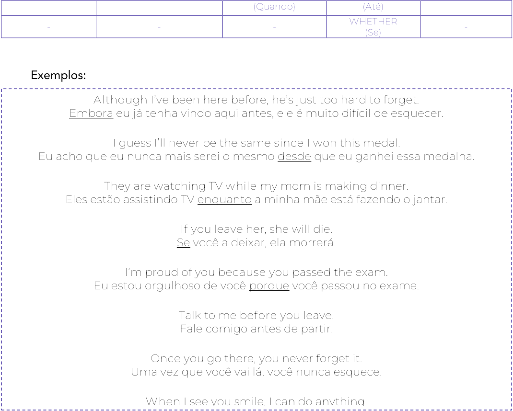

<!-- Start of picture text -->
(Quando)  (Até) WHETHER -  -  -  (Se) - Exemplos: Although  I’ve been here before, he’s just too hard to forget. Embora eu já tenha vindo aqui antes, ele é muito difícil de esquecer. I guess I’ll never be the same  since  I won this medal. Eu acho que eu nunca mais serei o mesmo desde que eu ganhei essa medalha. They are watching TV  while  my mom is making dinner. Eles estão assistindo TV enquanto a minha mãe está fazendo o jantar. If  you leave her, she will die. Se você a deixar, ela morrerá. I’m proud of you  because  you passed the exam. Eu estou orgulhoso de você porque você passou no exame. Talk to me  before  you leave. Fale comigo antes de partir. Once  you go there, you never forget it. Uma vez que você vai lá, você nunca esquece. When  I see you smile, I can do anything. <!-- End of picture text -->

As orações podem ir em qualquer ordem, ou seja, tanto uma oração dependente como uma independente podem começar a frase, mas o que nunca muda é que a conjunção subordinada é a primeira palavra da oração dependente. 

## **CONJUNÇÕES CORRELATIVAS** 

As conjunções correlativas estão sempre em grupo. Elas vêm em pares e você precisa utilizar ambas em lugares diferentes em uma oração para fazer sentido. Por esse motivo, elas têm esse nome justamente pelo fato delas trabalharem juntas (co-) e por relacionar um elemento de uma sentença com outro (relação). Sua correlação sempre denota igualdade, e mostra a relação entre as ideias expressas em diferentes partes da sentença:

---

<!-- pagina: 38 -->

**Andrea Belo Aula 05 - Pronouns, Prepositions and Conjunctions in the texts** 

as . . . as [como . . . como] both . . . and [ambos . . . e] either . . . or [ou . . . ou] hardly . . . when [dificilmente. . . quando] if . . . then [se . . . então] just as . . . so [assim como . . . assim] neither . . . nor [nem . . . nem] no sooner . . . than [não antes . . . do que] not . . . but [não . . ., mas] not only . . . but also [não somente . . ., mas também] rather . . . than [em vez . . . do que] scarcely . . . when [mal . . . quando] what with . . . and [o que com . . . e] whether . . . or [se. . . ou] 

#### Vejamos alguns exemplos: 

I didn’t know **whether** you’d want the pizza **or** hamburger, so I got you both. Eu não sabia **se** você iria querer pizza **ou** hamburger, então eu peguei os dois para você. 

I want **either** the pizza **or** the hamburger. Eu quero **ou** a pizza **ou** o hamburger. 

I’ll eat them both – **not only** the pizza **but also** the hamburger. Eu comerei os dois – não só o pizza, mas também o hamburger. 

I’ll have **both** the pizza **and** the hamburger. Eu vou querer ambos a pizza e o hamburger. 

Há ainda uma outra conjunção, chamada de conjunção adverbial. Ela estabelece uma ideia de conjunção que une duas orações, entretanto, por ter valor de advérbio, não é comum que ela apareça junto às demais conjunções. As conjunções adverbiais mais comuns (apesar de pouco usadas) e que podem aparecer em alguma prova são:

---

<!-- pagina: 39 -->

**Andrea Belo Aula 05 - Pronouns, Prepositions and Conjunctions in the texts** 

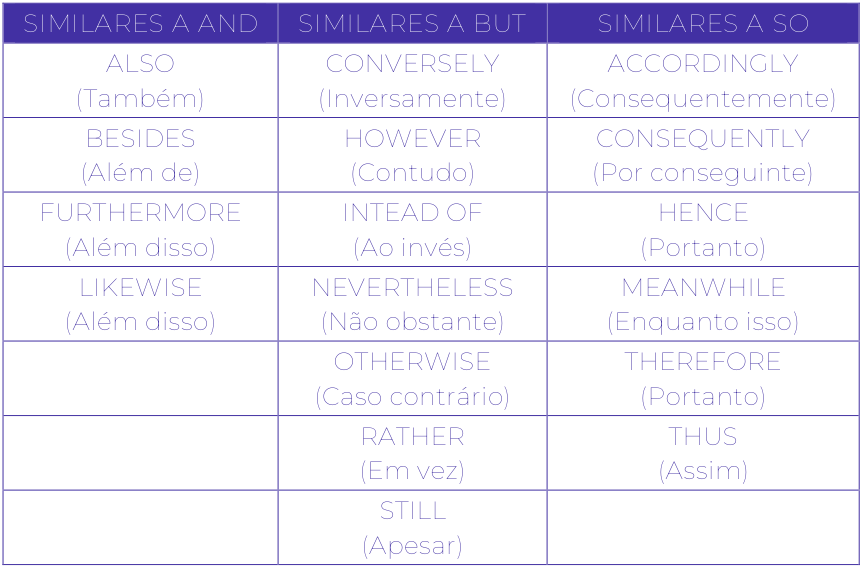

<!-- Start of picture text -->
SIMILARES A AND  SIMILARES A BUT  SIMILARES A SO ALSO  CONVERSELY  ACCORDINGLY (Também) (Inversamente) (Consequentemente) BESIDES  HOWEVER  CONSEQUENTLY (Além de) (Contudo) (Por conseguinte) FURTHERMORE  INTEAD OF  HENCE (Além disso) (Ao invés) (Portanto) LIKEWISE  NEVERTHELESS  MEANWHILE (Além disso) (Não obstante) (Enquanto isso) OTHERWISE  THEREFORE (Caso contrário) (Portanto) RATHER  THUS (Em vez) (Assim) STILL (Apesar) <!-- End of picture text -->

Esses termos que estudamos - conjunções - podem ser identificados por diversos nomes: linking words , words of transition , connectives , words of connection , logical connectors , transition devices , cohesive devices , discourse markers ou até connective adjuncts . 

O papel dos famosos linking words é estabelecer relações entre contextos – uma ideia anterior e uma ideia posterior. Essas relações podem ser de muitos tipos, tais como exclusão, concessão, adição, condição etc. O uso delas confere ao texto coerência e coesão. 

Linking words são fundamentais na língua inglesa, porque são como peças-chave na hora da leitura dos textos para colaborar com o raciocínio da mensagem que as frases querem proporcionar. 

Vejamos alguns exemplos com o que desejam expressar dentro do texto. Contudo, é preciso entender que a lista de linking words é extensa e você deve, aula após aula, adicionar as que aparecerem em uma lista de estudos e assim, aprender cada dia mais. 

## **EXEMPLIFICAÇÃO** 

Para exemplificar, uma expressão muito comum é o tão usado “for example” (por exemplo), que também pode ser substituído por “for instance” e aparece em muitos textos. 

There are many topics to study, for example, countable and uncountable nouns. 

Há muitos tópicos para estudar, por exemplo, substantivos contáveis e incontáveis, que já 

Ou então, poderíamos dizer:

---

<!-- pagina: 40 -->

**Andrea Belo Aula 05 - Pronouns, Prepositions and Conjunctions in the texts** 

There are many topics to study, for instance, countable and uncountable nouns. Há muitos tópicos para estudar, por exemplo, substantivos contáveis e incontáveis, que já estudamos. 

Para exemplificar e dar ênfase em palavras, em ideias, também são usados outros linking words, vistos no quadro abaixo e um exercício para treinar e visualizar melhor no contexto das provas: 

|**EXAMPLES /** in other words important to realize|**SUPPORT** notably|**/ EMPHASIS** markedly in fact|such as|
|---|---|---|---|
|to put it differently another key point|including|especially in general|for example|
|for one thing first thing to remember|like|specifically in particular|for instance|
|as an illustration most compelling evidence|to be sure|expressively in detail|to point out|
|in this case must be remebered|namely|surprisingly to demonstrate|with this in mind|
|for this reason point often overlooked|chiefly|frequently to emphasize||
|to put it another way on the negative side|truly|significantly to repeat||
|that is to say on the positive side|indeed|to clarify||
|with attention to|certainly|to explain||
|by all means|surely|to enumerate||

Para ilustrar os linking words de exemplificação, vejamos um texto retirado de uma prova, 

em que aparece “for instance”. 

Se a questão abordasse os exemplos decorrentes do parágrafo em que a expressão em questão aparece, poderia ser assim: 

Two in every three people on the planet–some 4 billion in total–are “excluded from the rule of law.” In many cases, this begins with the lack of official recognition of their birth: around 40% of the developing world’s five-year- old children are not registered as even existing. 

Later, people will find that the home they live in, the land they farm, or the business that they start, is not protected by legally enforceable property rights. Even in the rare cases when they can afford to go to court, the service is poor. India, <u>for example , has only 11 judges for every</u> 1million people. 

These alarming statistics are contained in a report from a commission on the legal empowerment of the poor, released on June 3rd at the United Nations. It argues that not only are such statistics evidence of grave injustice, they also reflect one of the main reasons why so much of humanity remains mired in poverty. Because they are outside the rule of law, the vast majority

---

<!-- pagina: 41 -->

**Andrea Belo Aula 05 - Pronouns, Prepositions and Conjunctions in the texts** 

of poor people are obliged to work (if they work at all) in the informal economy, which is less productive than the formal, legal part of the economy. 

The Economist , June 7th , 2008. 

Questão – According to the sentence “... India, for example, has only 11 judges for every 1 million people”, the underlined term refers to 

- (A) judges 

- (B) India 

- (C) 1 million people 

- (D) India population 

- (E) Every 1 million people 

A resposta seria a letra A porque é a única que demonstra o exemplo exatos do que se trata a referência de “for example” (por exemplo), logo após falar da India e, afirmar que há apenas 11 juízes para cada 1 milhão de pessoas. 

## **CONTRASTE** 

Para contrastar, o linking word comum é o “but” (mas), que também pode ser substituído por “however” e aparece em muitos textos, inclusive, perguntando se pode haver a devida substituição. 

She loves going to the beach but never on Saturdays, it’s crowded. 

Ela ama ir à praia, mas nunca aos sábados, é muito cheio. 

Ou então, poderíamos dizer: 

She loves going to the beach however she never goes on Saturdays, it’s crowded. 

Ela ama ir à praia, mas ela nunca vai aos sábados, é muito cheio. 

Podemos usar, também para contrastar, “despite” e “in spite of”, que são seguidas por substantivos ou gerúndios. 

<u>Despite losing the match, the players celebrated their efforts.</u> 

Apesar de perder o jogo, os jogadores comemoraram o esforço. 

Ou então, poderíamos dizer: 

https://t.me/KakashiAssinaturasBot

---

<!-- pagina: 42 -->

**Andrea Belo Aula 05 - Pronouns, Prepositions and Conjunctions in the texts** 

<u>In spite of the lost match, the players celebrated their efforts.</u> Apesar da perda do jogo, os jogadores comemoraram o esforço. 

Para exemplificar, com ideia de contraste, também muito usadas, vejamos o quadro: 

|**OPPOSITION / LIMIT**|**ATION / CONT**|**RADICTION**|
|---|---|---|
|although this maybe true|in reality|although|
|in contrast|after all|instead|
|different from|but|whereas|
|of course ..., but|(abd)still|despite|
|on the other hand|unlike|conversely|
|on the contrary|or|otherwise|
|at the same time|(and) yet|however|
|in spite of|while|rather|
|even so / though|albeit|nevertheless|
|be that as it may|besides|nonetheless|
|then again|as much as|regardeless|
|above all|even though| notwithstanding|

Para construções seguidas por sujeito e um verbo, precisa-se adicionar “the fact that”: 

<u>Despite the fact that they lost the match, the players celebrated their efforts.</u> Apesar do fato de perder o jogo, os jogadores comemoraram o esforço. 

Ou 

<u>In spite of the fact that they lost the match, the players celebrated their efforts. Apesar do fato de perder o jogo, os jogadores comemoraram o esforço.</u> 

Agora vejamos linking words com a função de resumir a seguir. 

## **RESUMO** 

Para resumir, há linking words comuns, tais como é o “in conclusion, in summary, in short” (em síntese/ em conclusão a, em suma), que são expressões geralmente usadas no começo das frases, indicando que vamos resumir a ideia principal do que acabou de ser apresentada.

---

<!-- pagina: 43 -->

**Andrea Belo Aula 05 - Pronouns, Prepositions and Conjunctions in the texts** 

In conclusion, the meeting was very productive, and the ideas were well presented. Em síntese, a reunião foi produtiva e as ideias foram bem apresentadas. 

#### Ou então, poderíamos dizer: 

In summary, the meeting was very productive, and the ideas were well presented. Em síntese, a reunião foi produtiva e as ideias foram bem apresentadas. 

## **ADIÇÃO** 

Para adicionar, os linking words comuns são “and” e “also” e, outras expressões geralmente usadas para adicionar ideias de maneira mais formal seriam “furthermore” e “moreover”, usadas bastante nos textos. 

The meeting was very productive. Moreover lots of ideas were presented. 

A reunião foi muito produtiva. Além disso, muitas ideias foram apresentadas. 

Ou então, poderíamos dizer: 

The meeting was very productive and lots of ideas were presented. 

A reunião foi muito produtiva e muitas ideias foram apresentadas. 

Para exemplificar, desta vez com ideia de adição, também muito usadas nas provas, vejamos o quadro abaixo e um exercício para treinar e visualizar melhor como nas provas: 

#### **AGREEMENT / ADDITION / SIMILARITY** 

|in the firstplace|bythe same token|too|
|---|---|---|
|not only... But also|again|moreover|
|as a matter of fact|to saynothingof|as well as|
|in like manner|and|together with|
|in addition|also|of course|
|coupled with|then|likewise|
|in the same fashion / way|equally|comparatively|
|first, second, third|identically|correspondingly|
|in the light of|uniquely|similary|

---

<!-- pagina: 44 -->

**Andrea Belo Aula 05 - Pronouns, Prepositions and Conjunctions in the texts** 

|not to mention like|furthermore|
|---|---|
|to saynothingof as a matter of fact|additionally|
|equallyimportant||

## **SEQUÊNCIA** 

Para oferecer a ideia de sequência, há linking words fundamentais, tais como é o first , second , after , then , so , entre outros, que são expressões geralmente usadas no começo das frases, indicando que vamos resumir a ideia principal do que acabou de ser apresentada. 

First, he decided to study. Then, he bought a good material and then dedicated a lot. 

Primeiro, ele decidiu estudar. Daí, ele comprou um bom material e então dedicou-se muito. 

Veja uma imagem com a sequência lógica muito usada nos textos, de uma forma geral e que, uma vez conhecendo-os, você conseguirá identificar ideias questionadas no dia da sua prova. 

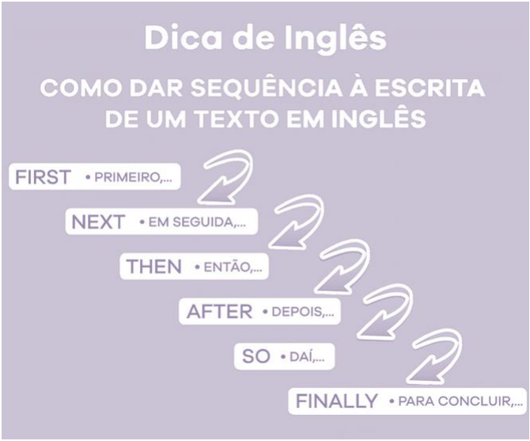

Em narrativas, os linking words organizam a história numa sequência de eventos, facilitando para você na compreensão do texto durante sua leitura e busca de respostas às perguntas apresentadas na prova. 

Há ainda, linking words que explicam a razão, a condição, a causa de algo, como podemos ver no quadro abaixo e outros exemplos de outros linking words adiante:

---

<!-- pagina: 45 -->

**Andrea Belo Aula 05 - Pronouns, Prepositions and Conjunctions in the texts** 

Due to the heavy rain the flight was cancelled. 

Devido/em decorrência da chuva forte, o voo foi cancelado. 

#### Ou então, poderíamos dizer: 

Because of the heavy rain the flight was cancelled. 

Por causa/em decorrência da chuva forte, o voo foi cancelado. 

|**CONCLUSION / S** as can be seen|**UMMARY / REST** after all|**ATEMENT** overall|
|---|---|---|
|generallyspeaking|in fact|ordinarily|
|in the final analysis|in summary|usually|
|all things considered|in conclusion|byand large|
|as shown above|in short|to sum up|
|in the longrun|in brief|on the whole|
|given thesepoints|in essence|in anyevent|
|as has been noted|to summarize|in either case|
|in a word|on balance|all in all|
|for the mostpart|altogether||

|at the present time|**TIME / CH** immediately|**RONOLOGY** when|**/ SEQUENCE** formerly|by the time|instantuly|
|---|---|---|---|---|---|
|from time to time|quickly|onde|suddenly|whenever|presently|
|sooner or later|finally|about|shortly||occasionally|
|at the same time|after|next|hencefoth|||
|up to the present time|later|now|whenever|||
|to begin with|last|now that|eventually|||
|in due time|until||meanwhile|||
|until now|till||further|||
|as soon as|since||during|||
|as long as|then||first, second|||
|in the meantime|before||in time|||
|in a moment|hence||prior to|||
|without delay|||forthwith|||
|in the first place|||straightaway|||
|all of a sudden||||||
|as this instant||||||

---

<!-- pagina: 46 -->

**Andrea Belo Aula 05 - Pronouns, Prepositions and Conjunctions in the texts** 

# **QUESTÕES** 

Esse é momento em que vamos praticar tudo o que vimos nessa Aula 05 . Serão questões para preparar você e colaborar com a sua aprovação. 

#### 01. (CEBRASPE/2020 – MINISTÉRIO DA ECONOMIA) 

Despite being the eighth largest economy in the world and the largest in Latin America, Brazil is still relatively closed compared to other large economies. Brazil is an outlier in that its trade penetration is extremely low, with trade at 24.1 percent of GDP in 2017. The number of exporters relative to the population is also very small: its absolute number of exporters is roughly the same as that of Norway, a country with approximately 5 million people compared to Brazil’s 200 million. While further integrating into the global economy could threaten uncompetitive companies and their workers, competitive businesses would most likely benefit. Brazil’s insertion would also allow the country to better leverage its competitive advantages, such as in natural resource-based industries. 

Idem. Ibidem (adapted). 

Judge the item, based on the text above. 

“Brazil” is the antecedent of the pronoun “its” in “its absolute number of exporters” (third sentence). 

(    ) Certo. 

(    ) Errado. 

#### 02. (CEBRASPE/2021 – PRF) 

A deep freeze this week in the Lone Star state, which relies on electricity to heat many homes, is causing power demand to skyrocket. At the same time, natural gas, coal, wind and nuclear facilities in Texas have been knocked offline by the unthinkably low temperatures 

"The extreme cold is causing the entire system to freeze up," said Jason Bordoff, director of Columbia University's Center on Global Energy Policy. "All sources of energy are underperforming in the extreme cold because they're not designed to handle these unusual conditions." 

The ripple effects are being felt around the nation as Texas' prolifie oil-and-gas industry stumbles. 

It's striking that these power outages are happening in a state with abundant energy resources. `━` Texas produces more electricity than any other US state generating almost twice as much as Florida, the next-closest, according to federal statistics. 

Wind power is also booming in Texas, which produced about 28% of all the US wind-powered electricity in 2019, the EIA said. But the problem is that not only is Texas an energy superpower,

---

<!-- pagina: 47 -->

**Andrea Belo Aula 05 - Pronouns, Prepositions and Conjunctions in the texts** 

it tends to be an above-average temperature state. That means its infrastructure is ill-prepared for the cold spell currently wreaking havoc. And the consequences are being felt by millions. 

Critics of renewable energy have pointed out that winds turbines have frozen or needed to be shut down due to the extreme weather. 

Even though other places with colder weather (like lowa and Denmark) rely on wind for even larger shares of power, experts said the turbines in Texas were not winterized for the unexpected freeze. 

But this is not just about wind turbines going down. Natural gas and coal-fired power plants need water to stay online. Yet those water facilities froze in the cold temperatures and others lost access to the electricity they require to operate. 

It's too early to definitively say what went wrong in Texas and how to prevent similar outages. More information will need to be released by state authorities. Still, some experts say the criticism of wind power appears overdone already. "In terms of the blame game, the focus on wind is a red herring. It's more of a political issue than what is causing the power problems on the grid," said Dan Cohan, associate professor of environmental engineering at Rice University. 

The energy crisis in Texas raises also questions about the nature of the state's deregulated and decentralized electric grid. Unlike other states, Texas has made a conscious decision to isolate its grid from the rest of the country. 

That means that when things are running smoothly, Texas can't export excess power to neighboring states. And in the current crisis, it can't import power either. 

Internet www.can.com (adapte) 

About ideas stated in the text above and the words used in it, judge the following item. 

In the last paragraph of the text, "That" refers to the decision by Texas to isolate its energy grid from the rest of the country. 

(    ) Certo. 

(    ) Errado. 

#### 03. (CEBRASPE/2021 – PRF) 

About ideas stated in the text above and the words used in it, judge the following item. 

In "Natural gas and coal-fired power plants need water to stay online. Yet those water facilities froze in the cold temperatures and others lost access to the electricity they require to operate", it is possible to substitute "Yet" for Even so without changing the meaning of the sentence. 

(    ) Certo. 

(    ) Errado.

---

<!-- pagina: 48 -->

**Andrea Belo Aula 05 - Pronouns, Prepositions and Conjunctions in the texts** 

#### 04. (CEBRASPE/2021 – PC-DF) 

As technology continues to reshape nearly every sector of society, it is also transforming police work in the 21 ˢᵗ century. Law enforcement leaders can now count on an arsenal of high-tech systems and tools that are designed to enhance public safety, catch criminals and save lives. 

One of their options is the use of biometrics. Police have been using fingerprints to identify people for over a century. Now, in addition to facial recognition and DNA, there is an ever-expanding array of biometric characteristics being utilized by law enforcement and the intelligence community. These include voice recognition, palmprints, wrist veins, iris recognition, and even heartbeats. 

With comprehensive electronic databases now in place to more effectively use DNA and other biometric data, even the use of fingerprints to identify suspects has gone high-tech. For example, a CNBC report explains how police in London can now use a mobile INK (Identity Not Known) biometrics device to scan a suspect's fingerprints and in many cases reveal their identity within 60 seconds. 

Internet: <onlinedegrees.sandiego.edu> (adapted). 

Judge the following item based on the text above. 

The options mentioned in the first sentence of the second paragraph are connected to "Law enforcement leaders" in the last sentence of the previous paragraph, a relation indicated by the use of "their". 

(    ) Certo. 

(    ) Errado. 

#### 05. (FCC/2022 – TJ-CE) 

Before cloud computing came into existence, companies were required to download applications or programs on their physical PCs or on-premises servers to be able to use them. For any organization, building and managing its own IT infrastructure or data centers is a huge challenge. Even for those who own their own data centers, allocating a large number of IT administrators and resources is a struggle. 

The introduction of cloud computing was a paradigm shift in the history of the technology industry. Rather than creating and managing their own IT infrastructure and paying for servers, power and real estate, etc., cloud computing allows businesses to rent computing resources from cloud service providers. This helps businesses avoid paying heavy upfront costs and the complexity of managing their own data centers. By renting cloud services, companies pay only for what they use such as computing resources and disk space. This allows companies to anticipate costs with greater accuracy.

---

<!-- pagina: 49 -->

**Andrea Belo Aula 05 - Pronouns, Prepositions and Conjunctions in the texts** 

Since cloud service providers do the heavy lifting of managing and maintaining the IT infrastructure, it saves a lot of time, effort and money for businesses. The cloud also gives organizations the ability to seamlessly upscale or downscale their computing infrastructure as and when needed. Compared to the traditional on-premises data center model, the cloud offers easy access to data from anywhere and on any device with internet connectivity, thereby enabling effective collaboration and enhanced productivity. 

(Adaptado de: MCDERMOTT, Matt. Cloud Computing: Benefits, Disadvantages & Types of Cloud Computing Services . Disponível em: https://www.business2community.com) 

In the fragment from the second paragraph “Rather than creating and managing their own IT infrastructure”, the underlined expression can be replaced without any change in the meaning of the sentence by 

- (A) Apart from 

- (B) As opposed to 

- (C) In spite of 

- (D) Together with 

- (E) Instead of 

#### 06. (FCC/2019 – METRÔ-SP) 

#### Using the Washington, D.C. Metro Subway System 

By Rachel Cooper Updated 07/10/19 

The Washington Metro, the District's regional subway system, provides a clean, safe, and reliable way to get around almost all of the major attractions in Washington, D.C. The Metro does extend to the suburbs of Maryland and Virginia. 

___I___ the Metrorail trains can be crowded with commuters during rush hour and when there is a big event going on downtown, taking the Washington Metro is usually cheaper and easier than finding a place to park in the city. Several Metro stations are helpful sightseeing stops. 

#### The Metro Lines 

Since opening in 1976, the Metrorail network has grown to include six lines, 91 stations, and 117 miles of track. It is the thirdbusiest rapid transit system in the United States in the number of passenger trips after New York City and Chicago. 

#### Hours 

The Metro begins operation at 5 a.m. on weekdays, 7 a.m. on Saturdays, and 8 a.m. on Sundays. Service ends at 11:30 p.m. Monday through Thursday, 1 a.m. Friday and Saturday, and 11 p.m. on Sundays, although the last trains leave their terminals about a half an hour before these times.

---

<!-- pagina: 50 -->

**Andrea Belo Aula 05 - Pronouns, Prepositions and Conjunctions in the texts** 

Trains run frequently averaging four to 10 minutes between trains with frequency increasing during rush hour times. Night and weekend service varies between eight and 20 minutes, with trains generally scheduled only every 20 minutes. 

#### Metro Farecards 

A SmartTrip Metro farecard is required to ride the Metro. The rechargeable, proximity card is encoded with any amount up to $300. If you register your card, and you lose it, or it is stolen, you do not lose the value of the card. Fares range from $2 to $6 depending on your destination and the time of day. Fares are cheaper after 9:30 a.m. until 3 p.m. and after 7 p.m. until close. An allday Metro pass is available for $14.75. Metro charges reduced fares on all federal holidays. 

(Adapted from: https://www.tripsavvy.com) 

A palavra que preenche corretamente a lacuna I é 

#### (A) Despite 

#### (B) Because 

- (C) Therefore 

- (D) Although 

- (E) But 

#### 07. (FCC/2016 – SEFAZ-MA) 

The sole proprietor of a plumbing shop was sentenced to 13 months in prison, three years of supervised release for tax evasion and ordered to pay approximately $130,000 in restitution to the IRS. The business owner willfully attempted to evade paying his federal income taxes by skimming gross receipts of his plumbing business and paying personal expenses from his business accounts and claiming them as business expenses. 

As part of his tax evasion scheme, he instructed several of his employees to solicit checks from clients payable in his name, rather than in the name of the business. He then cashed these checks and did not deposit the monies into his business’ bank account. Since this money was not recorded on the books of the business, nor deposited into the business’ account, he did not include these gross receipts on his income tax return. He also deducted personal expenses as business expenses thereby substantially reducing his tax for tax years 2003 through 2006. 

(Adapted from http://www.bizfilings.com/toolkit/sbg/tax-info/fed-taxes/tax-avoidance-and-tax-evasion.aspx) 

A synonym for ‘rather than’, as used in the text, is 

#### (A) but also 

- (B) better than 

- (C) instead of 

- (D) as usual 

- (E) preferably

---

<!-- pagina: 51 -->

**Andrea Belo Aula 05 - Pronouns, Prepositions and Conjunctions in the texts** 

#### 08. (FGV/2022 – RECEITA FEDERAL) 

#### Trust and audit 

Trust is what auditors sell. They review the accuracy, adequacy or propriety of other people’s work. Financial statement audits are prepared for the owners of a company and presented publically to provide assurance to the market and the wider public. Public service audits are presented to governing bodies and, in some cases, directly to parliament. 

It is the independent scepticism of the auditor that allows shareholders and the public to be confident that they are being given a true and fair account of the organisation in question. The auditor’s signature pledges his or her reputational capital so that the audited body’s public statements can be trusted. […] 

Given the fundamental importance of trust, should auditors not then feel immensely valuable in the context of declining trust? Not so. Among our interviewees, a consensus emerged that the audit profession is under-producing trust at a critical time. One aspect of the problem is the quietness of audit: it is a profession that literally goes about its work behind the scenes. The face and processes of the auditor are rarely seen in the organisations they scrutinise, and relatively rarely in the outside world. Yet, if we listen to the mounting evidence of the importance of social capital, we know that frequent and reliable contacts between groups are important to strengthening and expanding trust. 

So what can be done? Our research suggests that more frequent dialogue with audit committees and a more ambitious outward facing role for the sector’s leadership would be welcome. 

But we think more is needed. Audit for the 21st century should be understood and designed as primarily a confidence building process within the audited organisation and across its stakeholders. If the audit is a way of ensuring the client’s accountability, much more needs to be done to make the audit itself exemplary in its openness and inclusiveness. 

Instead of an audit report being a trust-producing product, the audit process could become a trust-producing practice in which the auditor uses his or her position as a trusted intermediary to broker rigorous learning across all dimensions of the organisation and its stakeholders. The views of investors, staff, suppliers and customers could routinely be considered, as could questions from the general public; online technologies offer numerous opportunities to inform, involve and invite. 

From being a service that consists almost exclusively of external investigation by a warranted professional, auditing needs to become more co-productive, with the auditor’s role expanding to include that of an expert convenor who is willing to share the tools of enquiry. Audit could move from ‘black box’ to ‘glass box’. 

But the profession will still struggle to secure trust unless it can stake a stronger claim to supporting improvement. Does it increase the economic, social or environmental value of the organisations it reviews? It is one thing to believe in the accuracy of a financial statement audit, but it is another thing to believe in its utility. 

Adapted from: https://auditfutures.net/pdf/AuditFutures-RSAEnlighteningProfessions.pdf

---

<!-- pagina: 52 -->

**Andrea Belo Aula 05 - Pronouns, Prepositions and Conjunctions in the texts** 

“Unless” in “unless it can stake a stronger claim to supporting improvement” (7th paragraph) introduces a(n) 

(A) plea. 

(B) averral. 

(C) account. 

- (D) foresight. 

- (E) condition. 

#### 09. (FGV/2022 – SEFAZ-MG) 

Is the blockchain audit trail in our near future? 

There are still many unknowns with respect to how blockchain will impact the audit and assurance profession, including the speed with which it will do so. Blockchain is already impacting Certified Public Accountant (CPA) auditors of those organizations using blockchain to record transactions and the rate of adoption is expected to continue to increase. However, in the immediate future, blockchain technology will not replace financial reporting and financial statement auditing. Financial statements reflect management assertions, including estimates, many of which cannot be easily summarized or calculated in a blockchain. 

Furthermore, the process of an independent audit of financial statements enhances the trust that is crucial for the effective functioning of the capital markets system. Any erosion of this trust may damage an entity’s reputation, stock price and shareholder value, and can result in fines, penalties, or loss of assets. Users of financial statements expect CPA auditors to perform an independent audit of the financial statements using their professional skepticism. CPA auditors conclude whether they have obtained reasonable assurance that the financial statements of an entity, taken as a whole, are free from material misstatement, whether due to fraud or error. A blockchain is unlikely to replace these judgments by a financial statement auditor. 

That said, CPA auditors need to monitor developments in blockchain technology—it will impact clients’ information technology systems. CPA auditors will need to be conversant with the basics of blockchain technology and work with experts to audit the complex technical risks associated with blockchain.

---

<!-- pagina: 53 -->

**Andrea Belo Aula 05 - Pronouns, Prepositions and Conjunctions in the texts** 

In addition, CPA auditors should be aware of opportunities to leverage their clients' adoption of blockchain technology to improve data gathering during the audit. They should also consider whether blockchain technology will allow them to create automated audit routines. The auditing profession must embrace and "lean in" to the opportunities and challenges from widespread blockchain adoption. CPA auditors and assurance providers are encouraged to monitor developments in blockchain technology because they have an opportunity to evolve, learn, and capitalize on their already proven ability to adapt to the needs of a rapidly changing business world. 

(Adapted from https://www2.deloitte.com/za/en/pages/audit/articles/impact of-blockchain-in-accounting.html) 

“Furthermore” in “Furthermore, the process of an independent audit of financial statements enhances the trust” (2 ⁿᵈ paragraph) can be replaced without change of meaning by 

(A) Hence 

- (B) However 

- (C) Therefore 

- (D) Moreover 

- (E) Conversely 

#### 10. (FGV/2022 – SENADO FEDERAL) 

#### The New Rules of Data Privacy 

The data harvested from our personal devices, along with our trail of electronic transactions and data from other sources, now provides the foundation for some of the world’s largest companies. […] For the past two decades, the commercial use of personal data has grown in wild-west fashion. But now, because of consumer mistrust, government actions, and competition for customers, those days are quickly coming to an end. 

For most of its existence, the data economy was structured around a “digital curtain” designed to obscure the industry’s practices from lawmakers and the public. Data was considered company property and a proprietary secret, even though the data originated from customers’ private behavior. That curtain has since been lifted and a convergence of consumer, government, and market forces are now giving users more control over the data they generate. Instead of serving as a resource that can be freely harvested, countries in every region of the world have begun to treat personal data as an asset owned by individuals and held in trust by firms. 

This will be a far better organizing principle for the data economy. Giving individuals more control has the potential to curtail the sector’s worst excesses while generating a new wave of customerdriven innovation, as customers begin to express what sort of personalization and opportunity they want their data to enable. And while Adtech firms in particular will be hardest hit, any firm with

---

<!-- pagina: 54 -->

**Andrea Belo Aula 05 - Pronouns, Prepositions and Conjunctions in the texts** 

substantial troves of customer data will have to make sweeping changes to its practices, particularly large firms such as financial institutions, healthcare firms, utilities, and major manufacturers and retailers. 

Leading firms are already adapting to the new reality as it unfolds. The key to this transition — based upon our research on data and trust, and our experience working on this issue with a wide variety of firms— is for companies to reorganize their data operations around the new fundamental rules of consent, insight, and flow. 

#### […] 

Federal lawmakers are moving to curtail the power of big tech. Meanwhile, in 2021 state legislatures proposed or passed at least 27 online privacy bills regulating data markets and protecting personal digital rights. Lawmakers from California to China are implementing legislation that mirrors Europe’s GDPR, while the EU itself has turned its attention to regulating the use of AI. Where once companies were always ahead of regulators, now they struggle to keep up with compliance requirements across multiple jurisdictions. 

Adapted from: https://hbr.org/2022/02/the-new-rules-of-data-privacy February 25, 2022 – Retrieved September 6, 2022 

In the extract “now they struggle” (5 ᵗʰ paragraph), the pronoun refers to 

- (A) requirements. 

- (B) legislatures. 

- (C) lawmakers. 

- (D) companies. 

- (E) regulators. 

#### 11. (FGV/2022 – SENADO FEDERAL) 

“As” in “Leading firms are already adapting to the new reality as it unfolds” (4 ᵗʰ paragraph) signals a 

- (A) contrast. 

- (B) condition. 

- (C) conclusion. 

- (D) comparison. 

- (E) concomitance.

---

<!-- pagina: 55 -->

**Andrea Belo Aula 05 - Pronouns, Prepositions and Conjunctions in the texts** 

#### 12. (FGV/2022 – SENADO FEDERAL) 

#### Empowering the workforce of tomorrow: The role of business in tackling the skills mismatch among youth 

The future of work is changing fast. Technology, socioeconomic trends, and developments and crises like COVID-19 are changing the world of work and the demand for skills at a pace and depth that poses serious challenges to people, business, and society. Young people and future generations, especially when they are from disadvantaged groups, are disproportionately affected by these disruptions. 

A key challenge to shaping a sustainable future of work is addressing the skills mismatch among youth. Despite young people around the world being more educated than ever before, hundreds of millions of individuals are coming of age and finding themselves unemployed and unemployable, lacking the right skills to take up the jobs available today and, even more, the skills that will be needed in the future. Neglecting the skills mismatch among youth can result in young people feeling disenfranchised and disillusioned about their prospects in the labor market, fueling social unrest, stunting economic growth and ultimately creating a more volatile operating environment for business. 

In contrast, by equipping youth with relevant skills, businesses can empower young people, support their access to employment opportunities and enable them to thrive personally, professionally and as active members of society. Investing in the skills of young people has an essential role to play in helping to realize the ambitions of the Sustainable Development Goals (SDGs) and the World Business Council for Sustainable Development’s (WBCSD) Vision2050, which aims to create a world where over 9 billion people live well and within planetary boundaries by mid-century. 

From: https://www.unicef.org/media/103176/file/ Empowering%20the%20workforce%20of%20tomorrow.pdf 

“Despite” in “Despite young people around the world being more educated” can be replaced without change in meaning by 

(A) since. 

#### (B) besides. 

#### (C) altogether. 

- (D) throughout 

- (E) notwithstanding.

---

<!-- pagina: 56 -->

**Andrea Belo Aula 05 - Pronouns, Prepositions and Conjunctions in the texts** 

#### 13. (VUNESP/2019 – PREFEITURA MUNICIPAL DE DOIS CÓRREGOS – SP) 

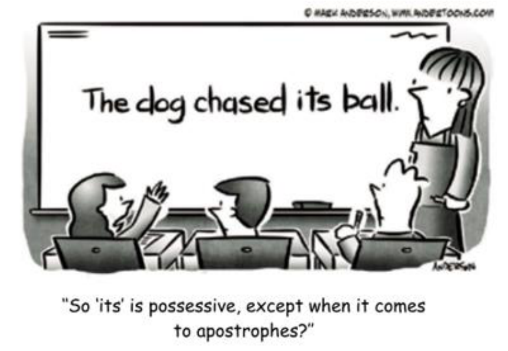

Mark the alterative in which the its is correctly used. 

- (A) What a sophisticated overcoat it is! Its got four buttons on it. 

- (B) Baduy, with its traditions, constitutes a unique community in the world. 

- (C) Look at this antique piece of furniture, my favorite chair – its broken! 

- (D) After the slight crash, the train managed to arrive at it’s destination. 

- (E) Smoking, you know, its one of the habits you ought to abandon. 

#### 14. (VUNESP/2019 – PREFEITURA MUNICIPAL DE DOIS CÓRREGOS – SP) 

#### The Indonesian tribe that rejects technology 

The Baduy tribe from Banten in Indonesia practise seclusion and reject all modern technology to protect their ancient traditions. For centuries, their way of life hasn’t changed. Electricity is prohibited, along with modern modes of communication and formal education. Power lines stop at the border of their lands, but in recent years, the outside world has begun to creep in. 

The tribe has split in two – the more strict inner circle remain “pure”, while the outer circle have relaxed some rules. Some have started using mobile phones and solar-powered lanterns. Will adopting some aspects of modern technology help the Baduy survive the modern world, or will it make their ancient traditions disappear? 

(Hassan Ghani. www.aljazeera.com. 20.02.2018)

---

<!-- pagina: 57 -->

**Andrea Belo Aula 05 - Pronouns, Prepositions and Conjunctions in the texts** 

In the fragment “the more strict inner circle remain “pure”, while the outer circle have relaxed some rules”, the word in bold indicates 

(A) a time relation. 

- (B) an explanation. 

- (C) simultaneity 

- (D) a contrast. 

- (E) an exemplification. 

#### 15. (VUNESP/2019 – PREFEITURA MUNICIPAL DE DOIS CÓRREGOS – SP) 

In the fragment from the second paragraph “ Some have started using mobile phones”, the word in bold refers to 

- (A) people from Banten, in Indonesia. 

- (B) the Baduy people in general. 

- (C) the relaxed Baduys. 

- (D) inner-circle Baduys. 

- (E) outer-circle Baduys. 

#### 16. (VUNESP/2018 – PREFEITURA MUNICIPAL DE ITAPEVI – SP) 

There is a danger in paying too much attention to learners’ errors. While errors indeed reveal a system at work, the classroom language teacher can become so preoccupied ________ noticing errors that the correct utterances in the second language go unnoticed. In our observation and analysis of errors – for all that they do reveal about the learner – we must beware of placing too much attention on errors and not lose sight of the value of positive reinforcement of clearly expressed language that is a product of the learner’s progress of development. While the diminishing of errors is an important criterion _________ increasing language proficiency, the ultimate goal of second language learning is the attainment of communicative fluency. 

Another inadequacy in error analysis is an overemphasis on production data. Language is speaking and listening, writing and reading. The comprehension of language is as important as production. It so happens that production lends itself to analysis and thus becomes the prey of researchers, __________ comprehension data is equally important in developing an understanding of the process of SLA. 

(Brown, D. H. Principles of language learning and teaching. 2000. Adapted)

---

<!-- pagina: 58 -->

**Andrea Belo Aula 05 - Pronouns, Prepositions and Conjunctions in the texts** 

Which alternative holds the missing words in the order in which they should be used? 

- (A) on … to … too 

- (B) with … to … in 

- (C) so … too … with 

- (D) with … for … but 

- (E) very … too … through 

#### 17. (INSTITUTO AOCP/2020 – PREFEITURA MUNICIPAL DE BETIM – MG) 

#### Five ways to get a better bedtime routine 

by Amy Sedghi 

Getting to sleep can be a <u>struggle</u> , but blackout blinds and to-do lists can help – as can reserving the bedroom for sex and shut-eye 

An eye mask will block out light. 

#### 1. Go to bed at regular times 

Going to sleep and waking up at regular times – even on weekends – will strengthen your body clock, says Dr Lizzie Hill, a clinical sleep physiologist and a spokeswoman for the British Sleep Society. Regular mealtimes are also an important cue for your circadian rhythm. Avoid exercise too close to bedtime, as it can cause restlessness and an elevated body temperature, says Samantha Briscoe, a senior physiologist at the Sleep Centre at London Bridge hospital. 

#### 2. Protect the bedroom 

Preserve the bedroom as a place for sleep (and sex): there is evidence that the brain forms a strong association with sleep there. A temperature of 16- 18C (60-64F) is thought to be ideal for most, according to the Sleep Council, an awareness and support organisation. Blackout blinds or an eye mask can help block out light, while keeping electronic devices out of the bedroom is highly recommended. If you struggle to fall asleep after more than 25 minutes, Matthew Walker – a sleep expert and a professor of neuroscience and psychology at the University of California, Berkeley – suggests getting up and going to read under a dim light in another room. Once sleepy, you can return to bed. 

#### 3. Get ahead on the next day

---

<!-- pagina: 59 -->

**Andrea Belo Aula 05 - Pronouns, Prepositions and Conjunctions in the texts** 

Your night-time routine is an opportunity to make mornings run a little smoother: choose your clothes for the next day when you reach for your pyjamas or pack your bag while brushing your teeth. Martin Hagger, a professor of health psychology at the University of California, Merced, has stressed how routines are linked to the formation of healthy habits. 

#### 4. Wind down 

Reading a book can help slow breathing and relax muscles, while yoga stretches or even a gentle walk can reduce anxiety, says Briscoe. A warm bath or shower can also help you relax: researchers at the University of Texas at Austin found that bathing in water of 40-42.5C one to two hours before bedtime was associated with better sleep. 

#### 5. Write down your worries 

“If your mind is buzzing from the day, try keeping a journal or worry book,” suggests Hill. The NHS also recommends writing to-do lists for the next day in order to organise thoughts and clear the mind. “If you experience difficulty with sleep over the longer term, consider whether there may be an underlying medical condition,” says Hill. A sleep diary could help you identify any patterns 

(https://www.theguardian.com/lifeandstyle/2019/oct/04/five-ways-toget- a-better-bedtime-routine. Access: 08/01/2020) 

The excerpt “(…) choose your clothes for the next day when you reach for your pyjamas or pack your bag while brushing your teeth” presents some linking words. Mark the CORRECT option concerning the usage of such linking words in the sentence above: 

- (A) The noun “while” indicates a period of time. 

- (B) The conjunction “while” introduces a consequence for the previous clause. 

- (C) The preposition “or” is used to link two equivalent expressions. 

- (D) The conjunction “or” indicates an alternative to its previous clause. 

- (E) The pronoun “when” is used to request the time in the sentence. 

#### 18. (INSTITUTO AOCP/2020 – PREFEITURA MUNICIPAL DE BETIM – MG) 

Observe the pronoun usage in the following excerpt: “Avoid exercise too close to bedtime, as it can cause restlessness (…)”. Mark the CORRECT option. 

- (A) The elided personal pronoun “you” refers to Dr Lizzie Hill. 

- (B) The elided object pronoun “you” refers to the reader. 

- (C) The possessive pronoun “it” refers to “restlessness”. 

- (D) The object pronoun “it” refers back to “bedtime”. 

- (E) The personal pronoun “it” refers back to “exercise”.

---

<!-- pagina: 60 -->

**Andrea Belo Aula 05 - Pronouns, Prepositions and Conjunctions in the texts** 

#### 19. (INSTITUTO AOCP/2020 – PREFEITURA MUNICIPAL DE BETIM – MG) 

In the excerpt “But to normalize something that, in the words of UNICEF, has a profoundly <u>positive impact on child health, is of course to be celebrated”, the words “but”, “profoundly”,</u> “positive”, “health” and “celebrated” are respectively used as: 

- (A) Preposition; adverb; noun; verb; adjective. 

- (B) Conjunction; adverb; adjective; noun; verb. 

- (C) Adverb; preposition; adjective; noun; verb. 

- (D) Preposition; conjunction; noun; verb; adjective. 

- (E) Conjunction; preposition; noun; noun, verb. 

#### 20. (INSTITUTO AOCP/2020 – PREFEITURA MUNICIPAL DE BETIM – MG) 

#### I happily advertise the fact I. breastfed – it’s high time that brands embraced it too 

by Nell Frizzell 

New ads by Aldi, Adidas and Sainsbury’s all feature breastfeeding mothers. Hopefully this will normalize the process to help new parents feed with <u>ease</u> 

It may be some time yet until we see a mother in an advert <u>precariously</u> balancing her child/bag/shopping/pets before pushing a nipple into the mouth of a howling, jam-smeared toddler. But when they do, oh boy, are my days as a model really going to get going. 

In recent weeks, a series of adverts have appeared from Tu at Sainsbury’s, Adidas and Aldi, all featuring breastfeeding mothers. Some are wearing flowery blouses and have tattoos, others are holding a naked baby between the zips of a sports top. Of course the women are good-looking, of course they are slim, of course we cannot actually see anything as erotically charged or as <u>morally unsettling</u> as an areola – this is still advertising, after all. But it is, surely, a start. 

As someone who breastfed her son for 21 shirtlifting, bra-soaking, carefree months, I am of course pleased to see breastfeeding being held up as something both everyday and aspirational. It is as prosaic as a trip to the supermarket yet as physically impressive as professional sport. It belongs on billboards and screens as much as beds and sofas. 

There is no such thing as “normal” when it comes to babies or bodies. But to <u>normalize something</u> that, in the words of UNICEF, has a profoundly positive impact on child <u>health</u> , is of course to be celebrated. You might find yourself whipping out a boob on a train full of football fans; you might squirt milk across somebody else’s coat on the bus; you might find yourself answering the door with your full breast outside your clothes without noticing. And if the presence of big brands behind your bra straps encourage you to keep feeding, then all power to your elbow. It is a shame that this hasn’t happened sooner, but it’s better late than never – and there’s no use crying over spilled (breast) milk. 

(Source: https://www.theguardian.com/lifeandstyle/shortcuts/2019/oct/02/adve rts-breastfeeding-mothers-aldi-adidas-sainsburys.Access: 08/01/2020)

---

<!-- pagina: 61 -->

**Andrea Belo Aula 05 - Pronouns, Prepositions and Conjunctions in the texts** 

Considering the excerpt: “As someone who breastfed her son for 21 shirt-lifting, bra-soaking, carefree months, I am of course pleased (…)”, mark the option which is CORRECT about the usage of pronouns in the sentence. 

(A) The word “who” works as a relative pronoun referring back to “someone” which actually is the writer of the text. 

- (B) The word “who” is an interrogative pronoun which can be left out of the sentence without a change in its meaning. 

- (C) The word “her” is a personal pronoun and works as the subject for the verb “breastfed”. 

- (D) The word “her” is a possessive pronoun referring to the word “son” as the owner of something. 

(E) The word “I” works as an objective pronoun in order to avoid the repetition of the subject “someone”. 

#### 21. (IBFC/2019 – PREFEITURA MUNICIPAL DE VINHEDO – SP) 

Teachers and teachers in training need to be able to use approaches and methods flexibly and creatively based on their own judgment and experience. In this process, they should be encouraged to transform and adapt the methods they use to make their own. Training in the techniques and procedures of a specific method is probably essential for novice teachers entering teaching, because it provides them with the confidence they will need to face learners and it provides techniques and strategies for presenting lessons. In the early stages, teaching is largely a matter of applying procedures and techniques developed by others. 

RICHARDS, J.; ROGERS, T. Approaches and methods in language teaching. Cambridge: CUP, 2001. 

Observe o seguinte trecho: it provides them with the confidence they will need to face learners. Sobre o trecho, foram feitas as seguintes afirmativas: 

I. O pronome it pode ser considerado anafórico, pois retoma Training in the techniques and procedures of a specific method. 

II. O uso da preposição to (sublinhada) se dá no trecho acima pela mesma razão que em need to be able (no início do texto): a regência do verbo semi-modal need. 

III. A elipse do pronome relativo da oração adjetiva restritiva (defining relative clause) que ocorre no trecho não seria possível, caso o pronome relativo exercesse função de sujeito da oração adjetiva. 

Assinale a alternativa que apresenta as afirmativas corretas. 

- (A) I e II, apenas 

- (B) I e III, apenas 

- (C) II e III, apenas 

- (D) I, II e III

---

<!-- pagina: 62 -->

**Andrea Belo Aula 05 - Pronouns, Prepositions and Conjunctions in the texts** 

#### 22. (IBFC/2019 – PREFEITURA MUNICIPAL DE VINHEDO – SP) 

#### Grammatical cohesion and textuality 

Grammar teachers have long been aware of recurring interference factors with pronouns and reference, such as the Japanese tendency to confuse he and she, the Spanish tendency to confuse his and your, and so on, and there is not much discourse analysts can say to ease those overgreen problems. What can be (and often is not) directly taught about a system such as that of English is the different ways of referring to the discourse itself by use of items such as it, this, and that, which do not seem to translate in a one-to-one way to other languages, even where these are closely cognate (cf. German, French, Spanish). 

MCCARTHY, Michael. Discourse analysis for language teachers. Cambridge University Press, 1991. 

#### Observe o fragmento inicial do texto: 

Grammar teachers have long been aware of recurring interference factors with pronouns and reference, such as the Japanese tendency to confuse he and she, the Spanish tendency to confuse <u>his and your, and so on [...]</u> 

Assinale a alternativa que apresenta uma possibilidade de exemplo equivalente aos exemplos sublinhados, levando em consideração os aspectos gramaticais e textuais em questão: 

(A) such as the Brazilian tendency to confuse verb patterns, e.g. “I disagreed of you” (incorrect) instead of “I disagree with you” (correct) 

(B) such as the Brazilian tendency to confuse much and many, e.g. “I have don’t have many stuff” (incorrect) instead of “I don’t have much stuff” (correct) 

(C) such as the Brazilian tendency to confuse verb forms, e.g. “I go to the restaurant yesterday” (incorrect) instead of “I went to the restaurant yesterday” (correct) 

(D) such as the Brazilian tendency to confuse which and what, e.g. “It was extremely hot, what made me sick” (incorrect) instead of “which made me sick” (correct) 

#### 23. (IBFC/2017 – SEDUC-MT) 

This is a special invitation _____ my Family to your Family. 

(A) For 

- (B) Outside 

- (C) To 

- (D) Inside 

- (E) From

---

<!-- pagina: 63 -->

**Andrea Belo Aula 05 - Pronouns, Prepositions and Conjunctions in the texts** 

#### 24. (IBFC/2017 – SEDUC-MT) 

The train will be here ____ about 15 minutes. 

#### (A) On 

#### (B) Over 

#### (C) Behind 

- (D) In 

- (E) At 

#### 25. (IBFC/2017 – SEDUC-MT) 

___________ genetics play a role in many diseases development, specialists believe we can avoid a great amount of them by eating healthy, doing exercises and avoiding stress. 

#### (A) Despite 

#### (B) Because 

- (C) Even though 

- (D) Whether 

- (E) Even 

#### 26. (CESGRANRIO/2022 – ELETROBRÁS ELETRONUCLEAR) 

#### The controversial future of nuclear power in the U.S. 

Lois Parshley 

1 - President Joe Biden has set ambitious goals for fighting climate change: To cut U.S. carbon emissions in half by 2030 and to have a net-zero carbon economy by 2050. The plan requires electricity generation – the easiest economic sector to green, analysts say – to be carbon-free by 2035. 

2 - A few figures from the U.S. Energy Information Administration (EIA) illustrate the challenge. In 2020 the United States generated about four trillion kilowatt-hours of electricity. Some 60 percent of that came from burning fossil fuels, mostly natural gas, in some 10,000 generators, large and small, around the country. All of that electricity will need to be replaced - and more, because demand for electricity is expected to rise, especially if we power more cars with it. 

3 - Renewable energy sources like solar and wind have grown faster than expected; together with hydroelectric, they surpassed coal for the first time ever in 2019 and now produce 20 percent of U.S. electricity. In February the EIA projected that renewables were on track to produce more than 40 percent by 2050 - remarkable growth, perhaps, but still well short of what’s needed to decarbonize the grid by 2035 and forestall the climate crisis.

---

<!-- pagina: 64 -->

**Andrea Belo Aula 05 - Pronouns, Prepositions and Conjunctions in the texts** 

4 - This daunting challenge has recently led some environmentalists to reconsider an alternative they had long been wary of: nuclear power. 

5 - Nuclear power has a lot going for it. Its carbon footprint is equivalent to wind, less than solar, and orders of magnitude less than coal. Nuclear power plants take up far less space on the landscape than solar or wind farms, and they produce power even at night or on calm days. In 2020 they generated as much electricity in the U.S. as renewables did, a fifth of the total. 

6 - But debates rage over whether nuclear should be a big part of the climate solution in the U.S. The majority of American nuclear plants today are approaching the end of their design life, and only one has been built in the last 20 years. Nuclear proponents are now banking on nextgeneration designs, like small, modular versions of conventional light-water reactors, or advanced reactors designed to be safer, cheaper, and more flexible. 

7 - “We’ve innovated so little in the past half-century, there’s a lot of ground to gain,” says Ashley Finan, the director of the National Reactor Innovation Center at the Idaho National Laboratory. Yet an expansion of nuclear power faces some serious hurdles, and the perennial concerns about safety and long-lived radioactive waste may not be the biggest: Critics also say nuclear reactors are simply too expensive and take too long to build to be of much help with the climate crisis. 

8 - While environmental opposition may have been the primary force hindering nuclear development in the 1980s and 90s, now the biggest challenge may be costs. Few nuclear plants have been built in the U.S. recently because they are very expensive to build here, which makes the price of their energy high. 

9 - Jacopo Buongiorno, a professor of nuclear science and engineering at MIT, led a group of scientists who recently completed a two-year study examining the future of nuclear energy in the U.S. and western Europe. They found that “without cost reductions, nuclear energy will not play a significant role” in decarbonizing the power sector. 

10 - “In the West, the nuclear industry has substantially lost its ability to build large plants,” Buongiorno says, pointing to Southern Company’s effort to add two new reactors to Plant Vogtle in Waynesboro, Georgia. They have been under construction since 2013, are now billions of dollars over budget - the cost has more than doubled - and years behind schedule. In France, ranked second after the U.S. in nuclear generation, a new reactor in Flamanville is a decade late and more than three times over budget. 

11 - “We have clearly lost the know-how to build traditional gigawatt-scale nuclear power plants,” Buongiorno says. Because no new plants were built in the U.S. for decades, he and his colleagues found, the teams working on a project like Vogtle haven’t had the learning experiences needed to do the job efficiently. That leads to construction delays that drive up costs. 

12 - Elsewhere, reactors are still being built at lower cost, “largely in places where they build projects on budget, and on schedule,” Finan explains. China and South Korea are the leaders. (To be fair, several of China’s recent large-scale reactors have also had cost overruns and delays.)

---

<!-- pagina: 65 -->

**Andrea Belo Aula 05 - Pronouns, Prepositions and Conjunctions in the texts** 

13 - “The cost of nuclear power in Asia has been a quarter, or less, of new builds in the West,” Finan says. Much lower labor costs are one reason, according to both Finan and the MIT report, but better project management is another. 

Available at: https://www.nationalgeographic.com/environment/ article/nuclear-plants-are-closing-in-the-us-should-we-build-more. Retrieved on: Feb. 3, 2022. Adapted. 

In the fragment of paragraph 5 “and they produce power even at night or on calm days”, they refers to 

- (A) “environmentalists” (paragraph 4) 

- (B) “nuclear power plants” (paragraph 5) 

- (C) “solar or wind farms” (paragraph 5) 

- (D) “calm days” (paragraph 5) 

- (E) “renewables” (paragraph 5) 

#### 27. (CESGRANRIO/2022 – ELETROBRÁS ELETRONUCLEAR) 

#### U.S. domestic air conditioning use could exceed electric capacity in next decade due to climate change 

1 - Climate change will provoke an increase in summer air conditioning use in the United States that will probably cause prolonged blackouts during peak summer heat if states do not expand capacity or improve efficiency, according to a new study of domestic-level demand. 

2 - Human emissions have put the global climate on a trajectory to exceed 1.5 degrees Celsius of warming by the early 2030s, the IPCC reported in its 2021 evaluation. Without significant alleviation, global temperatures will probably exceed the 2.0-degree Celsius limit by the end of the century. 

3 - Previous research has examined the impacts of higher future temperatures on annual electricity consumption for specific cities or states. The new study is the first to project residential air conditioning demand on a domestic basis at a wide scale. It incorporates observed and predicted air temperature and heat, humidity and discomfort indices with air conditioning use by statistically representative domiciles across the contiguous United States, collected by the U.S. Energy Information Administration (EIA) in 2005- 2019. 

4 - “It’s a pretty clear warning to all of us that we can’t keep doing what we are doing or our energy system will fail completely in the next few decades, simply because of the summertime air conditioning,” said Susanne Benz, a geographer and climate scientist at Dalhousie University in Halifax, Nova Scotia. 

5 - The heaviest air conditioning use with the greatest risk for overcharging the transmission lines comes during heat waves, which also present the highest risk to health. Electricity generation tends

---

<!-- pagina: 66 -->

**Andrea Belo Aula 05 - Pronouns, Prepositions and Conjunctions in the texts** 

to be below peak during heat waves as well, reducing capacity to even lower levels, said Renee Obringer, an environmental engineer at Penn State University. Without enough capacity to satisfy demand, energy companies may have to adopt systematic blackouts during heat waves to avoid network failure, like California’s energy organizations did in August 2020 during an extended period of record heat sometimes topping 117 degrees Fahrenheit. “We’ve seen this in California already -- state power companies had to institute blackouts because they couldn’t provide the needed electricity,” Obringer said. The state attributed 599 deaths to the heat, but the true number may have been closer to 3,900. 

6 - The new study predicted the largest increases in kilowatt-hours of electricity demand in the already hot south and southwest. If all Arizona houses were to increase air conditioning use by the estimated 6% needed at 1.5 degrees Celsius of global warming, for example, amounting to 30 kilowatt-hours per month, this would place an additional 54.5 million kilowatthours of demand on the electrical network monthly. 

Available at: www.sciencedaily.com/releases/2022/02/ 220204093124.htm. Retrieved on: Feb. 9, 2022. Adapted. 

In the fragment of paragraph 6 “If all Arizona houses were to increase air conditioning use”, if signals a(n) 

- (A) condition 

- (B) opposition 

- (C) negation 

- (D) conclusion 

- (E) explanation 

#### 28. (CESGRANRIO/2022 – ELETROBRÁS ELETRONUCLEAR) 

In the sentence of paragraph 5, “The heaviest air conditioning use with the greatest risk for overcharging the transmission lines comes during heat waves, which also present the highest risk to health”, the word which makes reference to 

- (A) risk to health 

- (B) air conditioning use 

- (C) heat waves 

- (D) the transmission lines 

- (E) risk for overcharging

---

<!-- pagina: 67 -->

**Andrea Belo Aula 05 - Pronouns, Prepositions and Conjunctions in the texts** 

#### 29. (CESGRANRIO/2021 – BANCO DO BRASIL) 

#### COVID-19 Economy: Expert insights on what you need to know 

As we practice social distancing and businesses struggle to adapt, it’s no secret the unique challenges of Covid-19 are profoundly shaping our economic climate. U.S. Bank financial industry and regulatory affairs expert Robert Schell explains what you need to know in this uncertain time. 

#### • Don’t panic while things are “on pause” 

Imagine clicking the pause button on your favorite TV show. Whether you stopped to make dinner or put kids to bed, hitting pause gives you time to tackle what matters most. Today’s economy is similar. While we prioritize health and safety, typical activities like driving to work, eating at restaurants, traveling and attending sporting events are on hold. This widespread social distancing takes a toll on our economy, putting strain on businesses and individuals alike. 

Keep your financial habits as normal as possible during this time. Make online purchases, order takeout, pay bills and buy groceries. These everyday purchases put money back into the economy and prevent it from dipping further into a recession. 

#### • Low interest rates could help make ends meet 

In March, the Federal Reserve cut rates drastically to boost economic activity and make borrowing more affordable. For you, this means interest rates are low for credit cards, loans and lines of credit, and even fixed-rate mortgages. Consider taking advantage of these low rates if you need extra help paying your bills, keeping your business running or withstanding a period of unemployment. 

#### • Spend on small businesses 

Looking to make a positive impact? Supporting small businesses is an easy and powerful way to help. You can order takeout, tip generously or donate to your local brick-and-mortar retail store, if they provide that option. Your support makes a big impact for struggling business owners. 

#### • Prior economic strength may help us bounce back 

The thriving economy of 2019 isn’t just a distant, bittersweet memory. When our health is no longer at risk and social distancing mandates begin to diminish, we’ll slowly start to rebuild. The stability, low unemployment rate and upward-trending market we experienced prior to Covid-19 puts us in a good position to kick-start economic activity and rebound more quickly. 

Available at <https://www.usbank.com/financialiq/ manage-your--household/personal-finance/covid-economy-expert-insights.html>. Retrieved on: Jul. 20, 2021. Adapted. 

In the 3 ʳᵈ paragraph, in the fragment “These everyday purchases put money back into the economy and prevent it from dipping further into a recession”, the pronoun it refers to 

(A) money 

#### (B) purchases 

- (C) recession 

- (D) economy 

- (E) back

---

<!-- pagina: 68 -->

**Andrea Belo Aula 05 - Pronouns, Prepositions and Conjunctions in the texts** 

#### 30. (CESGRANRIO/2021 – BANCO DO BRASIL) 

#### U.S. Finds No Evidence of Alien Technology in Flying Objects, but can’t rule it out, either 

WASHINGTON — American intelligence officials have found no evidence that aerial phenomena observed by Navy pilots in recent years are alien spacecraft, but they still cannot explain the unusual movements that have mystified scientists and the military. 

The report determines that a vast majority of more than 120 incidents over the past two decades did not originate from any American military or other advanced US government technology, the officials said. That determination would appear to eliminate the possibility that Navy pilots who reported seeing unexplained aircraft might have encountered programs the government meant to keep secret. 

But that is about the only conclusive finding in the classified intelligence report, the officials said. And while a forthcoming unclassified version, expected to be released to Congress by June 25, will present few other firm conclusions, senior officials briefed on the intelligence conceded that the very ambiguity of the findings meant the government could not definitively rule out theories that the phenomena observed by military pilots might be alien spacecraft. 

Americans’ long-running fascination with UFOs has intensified in recent weeks in anticipation of the release of the government report. Former President Barack Obama encouraged the interest when he gave an interview last month about the incidents on “The Late Late Show with James Corden” on CBS. 

“What is true, and I’m really being serious here,” Mr. Obama said, “is that there is film and records of objects in the skies that we don’t know exactly what they are.’’ 

The report concedes that much about the observed phenomena remains difficult to explain, including their acceleration, as well as ability to change direction and submerge. One possible explanation — that the phenomena could be weather balloons or other research balloons — does not hold up in all cases, the officials said, because of changes in wind speed at the times of some of the interactions. 

Many of the more than 120 incidents examined in the report are from Navy personnel, officials said. The report also examined incidents involving foreign militaries over the last two decades. Intelligence officials believe that at least some of the aerial phenomena could have been experimental technology from a rival power, most likely Russia or China. 

One senior official said without hesitation that U.S. officials knew it was not American technology. He said there was worry among intelligence and military officials that China or Russia could be experimenting with hypersonic technology. 

He and other officials spoke about the classified findings in the report on the condition of anonymity. 

> Available at: <https://www.nytimes.com/2021/06/03/us/politics/ufos-sighting-alien-spacecraft-pentagon.html>. Retrieved on: July 7, 2021.

---

<!-- pagina: 69 -->

**Andrea Belo Aula 05 - Pronouns, Prepositions and Conjunctions in the texts** 

In the 2 ⁿᵈ paragraph of the text, in the fragment “That determination would appear to eliminate the possibility that Navy pilots who reported seeing unexplained aircraft”, the word who refers to (A) alien 

- (B) military 

- (C) officials 

- (D) scientists 

- (E) Navy pilots 

#### 31. (ESAF/2015 – ANAC) 

#### The advantage 

1 CARE Acquiring a new aircraft is already a complex enough process. Acquiring a pre-owned aircraft can be an even more challenging task. The industry has its fair share of brokers and experts all willing to offer you the best deal in town but, regrettably, once you have signed and the aircraft is delivered, they tend to vanish as they move onto the next deal. Our philosophy is very different. Every Embraer aircraft we lease has passed through our own Embraer facilities. Every aircraft is treated with a level of service and care that can only come from those who built them in the first place. 

2 SUPPORT In choosing one of our pre-owned aircraft, all of our customers share a common goal: to ensure that the aircraft delivered perform seamlessly from day one and continue to perform for many years to come. In response to this, we offer the Lifetime Program by Embraer. This program represents a first in the industry and is the result of a very detailed review between ECC and Embraer on how best to support our customers. The Lifetime Program is unique to preowned Embraer aircraft and offers a wide range of services from startup through operation. 

3 RELIABLE So when an ECC pre-owned aircraft is offered for delivery to its new home you can rest assured that it will provide many years of happy, reliable service. Our focus does not end there since we value the relationships we build with our customers. Our Lifetime Program is testament to this. This is a unique and new service from Embraer to support our used aircraft. We invite you to learn, in greater detail, how it will not only enhance your operation, but also keep your Chief Financial Officer happy. Transparency in costs and flexibility in adapting to your needs. It is our way of showing that every Embraer aircraft we offer has our seal of approval. Coming from the manufacturer, that’s no small thing. 

Source: http://www.eccleasing.com/Pages/fator.aspx[slightly adapted] 

The pronoun 'they' occurs twice in #1 line 6, referring to 

(A) challenging tasks. 

- (B) signed contracts. 

- (C) aircraft. 

- (D) bargains. 

- (E) dealers.

---

<!-- pagina: 70 -->

**Andrea Belo Aula 05 - Pronouns, Prepositions and Conjunctions in the texts** 

#### 32. (ESAF/2015 – ANAC) 

#### Forecast lowered for air travel on slower China growth 

A weaker global economy — and a slowdown in China — will likely dampen some of the growth in air travel over the next two decades. 

The International Air Transport Association says the number of airline passengers is expected to double to 7 billion by 2034. That figure marks a decrease from a prior forecast of passengers totaling 7.4 billion in 2034, reflecting lower economic growth in China that will be likely to reduce demand for travel and potentially limit airplane orders for manufacturers Boeing and Airbus. 

Despite the lower forecast, China is expected to add 758 million new passengers for a total of 1.2 billion flyers. Those gains would likely mean that China surpasses the United States as the world’s largest passenger market by 2029. 

'Those gains' in Paragraph 3 line 2 refers to 

- (A) higher profits for manufacturers. 

- (B) increased speed of air travel. 

- (C) more Chinese air passengers. 

- (D) the reduced total of forecasts. 

- (E) dwindling economic prospects. 

#### 33. (ESAF/2015 – ANAC) 

#### Welcome to the Drone Age 

THE scale and scope of the revolution in the use of small, civilian drones has caught many by surprise. In 2010 America’s Federal Aviation Authority (FAA) estimated that there would, by 2020, be perhaps 15,000 such drones in the country. More than that number are now sold there every month. And it is not just an American craze. Some analysts think the number of drones made and sold around the world this year will exceed 1 million. In their view, what is now happening to drones is similar to what happened to personal computers in the 1980s, when Apple launched the Macintosh and IBM the PS/2, and such machines went from being hobbyists’ toys to business essentials. 

That is probably an exaggeration. It is hard to think of a business which could not benefit from a PC, whereas many may not benefit (at least directly) from drones. But the practical use of these small, remote-controlled aircraft is expanding rapidly. These involve areas as diverse as agriculture, landsurveying, film-making, security, and delivering goods. Other roles for drones are more questionable. Their use to smuggle drugs and phones into prisons is growing. Instances have been reported in America, Australia, Brazil, Britain and Canada, to name but a few places. In Britain the police have also caught criminals using drones to scout houses to burgle. The crash of a drone on

---

<!-- pagina: 71 -->

**Andrea Belo Aula 05 - Pronouns, Prepositions and Conjunctions in the texts** 

to the White House lawn in January highlighted the risk that they might be used for acts of terrorism. And in June a video emerged of a graffito artist using a drone equipped with an aerosol spray to deface one of New York’s most prominent billboards. 

How all this activity will be regulated and policed is, as the FAA’s own flat-footed response has shown, not yet being properly addressed. There are implications for safety (being hit by an out-ofcontrol drone weighing several kilograms would be no joke); for privacy, from both the state and nosy neighbours; and for sheer nuisance—for drones can be noisy. But the new machines are so cheap, so useful and have so much unpredictable potential that the best approach to regulation may simply be to let a thousand flyers zoom. 

[Source: The Economist September 26th 2015- adapted] 

The word “whereas” in Paragraph 2 line 2 could best be replaced by 

(A) since. 

- (B) once. 

(C) moreover. 

- (D) while. 

- (E) because. 

#### 34. (IDECAN/2016 – PREFEITURA MUNICIPAL DE APIACÁ – ES) 

One day an Indian gentleman, a snake charmer, arrived in England by plane. He was coming from Bombay with two pieces of luggage. The big of them contained a snake. A man and a little boy was watching him at the customs area. The man said to the little boy “Go and speak to the gentleman”. When the little boy was speaking with the traveller, the thief took the big suitcase and went out quickly. When the victim saw that he cried, “Help me! Help me! A thief!” A police officer was in this corner whistle but it was too late. The thieves escaped with the big suitcase, took their car and went in the traffic. Later they had a big surprise because the suitcase contain a snake. 

(ELLIS, Rod. Second Language Acquisition. Oxford University Press. Pag. 15-16.) 

All items about the text are correct, EXCEPT: 

- (A) Instead of “big of them” (L 2) one should use “big one” 

- (B) “big of them” (L 2) should changed by “bigger of them”. 

- (C) Instead of “... went in” (L 6) one should use “... went into”. 

- (D) “the customs” (L 2) should be replaced by “the costume’s”.

---

<!-- pagina: 72 -->

**Andrea Belo Aula 05 - Pronouns, Prepositions and Conjunctions in the texts** 

#### 35. (IDECAN/2016 – PREFEITURA MUNICIPAL DE APIACÁ – ES) 

We paid a lot of money for power in the summertime because we had our air conditioners off and A              B C 

<u>they used a great deal of energy.</u> 

D 

Mark the item which contains an inconsistency and its corresponding correction. 

(A) By. 

- (B) For. 

- (C) On 

- (D) It. 

#### 36. (IDECAN/2016 – PREFEITURA MUNICIPAL DE APIACÁ – ES) 

#### Language aptitude 

It has been suggested that people differ in the extent to which they possess a natural ability for learning an L2. This ability, known as language aptitude, is believed to be in part related to general intelligence but also to be in part distinct. Research involving language aptitude has focused on whether and to what extent language aptitude is related to success in L2 learning. Learners who score highly on language aptitude tests tipically learn rapidly and achieve higher levels of L2 proficiency than learners who obtain low scores. Furthermore, research has shown that this is so whether the measure of L2 proficiency is some kind of formal language text or a measure of more communicative language use. 

(ELLIS, Rod. Second Language Acquisition. Oxford University Press. Pag. 73-74.) 

Furthermore (L 5) introduces the idea of: 

- (A) Linking and conter-argument. 

- (B) Dismissal of previous discourse. 

- (C) Epitomazing logical information. 

- (D) Appending knowledge supplies. 

#### 37. (IDECAN/2016 – PREFEITURA MUNICIPAL DE LEOPOLDINA – MG) 

Analyse the sentence to answer. 

Douglas had to apologize _________ little Jim’s mom _________ having played those pranks ______ her.

---

<!-- pagina: 73 -->

**Andrea Belo Aula 05 - Pronouns, Prepositions and Conjunctions in the texts** 

Choose the sequence to complete the blanks. 

- (A) to / for / on 

- (B) of / that / to 

- (C) with / to / for 

- (D) for / about / in 

#### 38. (IDECAN/2016 – PREFEITURA MUNICIPAL DE LEOPOLDINA – MG) 

Analyse the sentence. “Jordan Mills, the ( 1 ) outstanding ( 2 ) American musician which ( 3 ) songs are known all over the world, is to going ( 4 ) a concert at A B C D this stadium next Friday.” The item that contains an inconsistency and its corresponding correction is: 

The item that contains an inconsistency and its corresponding correction is: 

- (A) 1 - An. 

- (B) 2 - Famous. 

- (C) 3 - Whose. 

- (D) 4 - Is going to give. 

#### 39. (IDECAN/2016 – PREFEITURA MUNICIPAL DE MANHUMIRIM – MG) 

Choose the correct sequence to fill in the blanks. 

“In spite of its efficiency, rules oppress German society. Whenever you move in Germany, you must notify __________ residents registration office. You must also register your TV, __________ you can be fined after a surprise inspection. __________ advanced countries make the ordinary tasks of life _________ ineficient. An application for a new passaport takes __________ two months. And don’t cut the grasso on Sunday, an imposed day of rest.” 

- (A) the / otherwise / few / so / about 

- (B) for / indeed / German / most / off 

- (C) along / however/ not / with / near 

- (D) with / therefore / an / those / more

---

<!-- pagina: 74 -->

**Andrea Belo Aula 05 - Pronouns, Prepositions and Conjunctions in the texts** 

#### 40. (IADES/2016 – CEITEC S.A.) 

Photograph: Mattel 

The Hello Barbie doll is billed as the world’s first “interactive doll” capable of listening to a child and responding via voice, in a similar way to Apple’s Siri […] It connects to the internet via Wi-Fi and has a microphone to record children and send that information off to third parties for processing before responding with natural language responses. 

But US security researcher Matt Jakubowski discovered that when connected to Wi-Fi the doll was vulnerable to hacking, allowing him easy access to the doll’s system information, account information, stored audio files and direct access to the microphone. 

Jakubowski told NBC: “You can take that information and find out a person’s house or business. It’s just a matter of time until we are able to replace their servers with ours and have her say anything we want.” Once Jakubowski took control of where the data was sent the snooping possibilities were apparent. The doll only listens in on a conversation when a button is pressed and the recorded audio is encrypted before being sent over the internet, but once a hacker has control of the doll the privacy features could be overridden. 

It was the ease with which the doll was compromised that was most concerning. The information stored by the doll could allow hackers to take over a home Wi-Fi network and from there gain access to other internet-connected devices, steal personal information and cause other problems for the owners, potentially without their knowledge. 

This isn’t the first time that Hello Barbie has been placed under the privacy spotlight. On its release in March privacy campaigners warned that a child’s intimate conversations with their doll were being recorded and analysed and that it should not go on sale. 

With a Hello Barbie in the hands of a child and carried everywhere they and their parents go, it could be the ultimate in audio surveillance device for miscreant hackers. ToyTalk and Mattel, the manufacturers of Hello Barbie, did not respond to requests for comment.

---

<!-- pagina: 75 -->

**Andrea Belo Aula 05 - Pronouns, Prepositions and Conjunctions in the texts** 

Internet: <http://www.theguardian.com/technology/2015/nov/26/hackers-can-hijack-wi-fi-hello-barbie-to-spy-on-your-children>. Access: 26 dez. 2015, adapted. 

According to your knowledge of English and to this part of the text “Jakubowski told NBC: ‘You can take that information and find out a person’s house or business. It’s just a matter of time until we are able to replace their servers with ours and have her say anything we want’” (lines 13 to 16), choose the right alternative. 

(A) One only needs to inflect the verbs in the past in order to change this part into indirect speech. (B) It is possible to replace “we are able” with can without any alteration in the meaning and in grammatical correctness. 

(C) The word “ours” was chosen to avoid repetition of the word “servers”. The sentence would still be grammatically right if rewritten: “[…] to replace their servers with ours servers […]”. 

(D) The word “have” indicates possession in the context above. 

(E) The word “information” does not have plural form. 

#### 41. (IADES/2019 – INSTITUTO RIO BRANCO) 

Since 1914 the structure of the world has changed. Compared to the present struggle between West and East, the rivalries of the eighteenth and nineteenth centuries sink into insignificance. Today we are faced, not with a clash of interests, but with a fight between the desire on the one hand to defend individual liberties and the resolve on the other hand to impose a mass religion. In the process the old standards, conventions and methods of international negotiation have been discredited. Had it not been for the invention of the atomic bomb, we should already have been subjected to a third world war. 

Members of the Communist bloc today are convinced that sooner or later they will acquire world dominion and will succeed in imposing their faith and their authority over the whole earth. They strain towards this objective with religious intensity and are prepared to devote to its achievement their lives, their comfort and their prospects of happiness. Anything that furthers their purpose is “right”; anything that obstructs it is “wrong”; conventional morality, even the creation of confidence, has no part in this scheme of things. Truth itself has lost its significance. Compared to the shining truth of their gospel, all minor forms of veracity are merely bourgeois inhibitions. The old diplomacy was based upon the creation of confidence, the acquisition of credit. The modern diplomat must realize that he can no longer rely on the old system of trust; he must accept the fact that his antagonists will not hesitate to falsify facts and that they feel no shame if their duplicity be exposed. The old currency has been withdrawn from circulation; we are dealing in a new coinage. 

This transformation of values has been aided by a new or “democratic” conception of international relations. In the old days the conduct of foreign affairs was entrusted to a small international élite who shared the same sort of background and who desired to preserve the same sort of world. Today the masses are expected to take an interest in foreign affairs, to know the details of current controversies, to come to their own conclusions, and to render these conclusions effective through press and parliament. At the same time, however, current issues have been rendered complex and interconnected; it is not possible to state issues, such as the Common Market, in short and simple

---

<!-- pagina: 76 -->

**Andrea Belo Aula 05 - Pronouns, Prepositions and Conjunctions in the texts** 

terms. Thus, whereas the man in the street is expected to have an opinion on international problems, the very complexity of these problems has rendered it difficult to provide him with the information on which to base his judgment. 

Nicolson, H. (1963) (3rd edition) Diplomacy. Oxford: OUP, with adaptations. 

As far as grammar is concerned and based on the text, mark the following items as right (C) or wrong (E). 

In the fragment “to <u>its</u> achievement” (line 17), the underlined pronoun refers to “religious intensity” (line 16). 

(    ) Certo. 

(    ) Errado. 

#### 42. (IADES/2019 – INSTITUTO RIO BRANCO) 

As far as grammar is concerned and based on the text, mark the following items as right (C) or wrong (E). 

Another correct preposition used with the verb “Compared” (line 2) is with , as in “to compare with”. 

(    ) Certo. 

(    ) Errado. 

#### 43. (FUNDATEC/2022 – BRDE) 

#### Creating Knowledge Base Videos 

As customers have greater access to decent broadband internet speeds, video becomes a more practical, appealing, and expected option to get support. Research says that 69% __ customers prefer video over text when learning about a product or service. Social media, mobile phones, chat tools, email, and CRM tools are increasingly focused __ making video easily embeddable and viewable on their platforms. Using video in your knowledge base can supplement written answers __ engaging, visual mini-demonstrations that increase accessibility __ all skill levels and across language barriers. Customer experience leader Shep Hyken says: "Video has become one of the most cost-effective ways to promote, train, and support customers... it can both save you money and make you money”. 

However, creating video content is more time-consuming than publishing a text article — and it can be harder to maintain — so picking the right places to use video is important. Video is best used when: 

- The content is easier to show than to describe. Video can explain steps more naturally and fluidly than text or screenshots can. Lengthy lists of steps or a complex task can be

---

<!-- pagina: 77 -->

**Andrea Belo Aula 05 - Pronouns, Prepositions and Conjunctions in the texts** 

cumbersome for the customer to follow along with. __ example is describing how to tie __ bowtie; __ manual motions are much easier to show than to describe. 

- The content is frequently visited. Invest video production time into answering common questions where the effort will pay off many times over, and create space for your team to focus on the more challenging, less-common issues. 

- You want to create an emotional reaction to your content. Conveying emotion is easier through video, and creating a positive emotional reaction to your business helps build customer loyalty and trust. 

- The content changes infrequently. For cases where a part of your product doesn't change often, a video can provide significant benefit to your users by being referenced and reused regularly. 

- You’re documenting frequent changes. Not all video content needs to be highly produced and long-term. Small, easily-replaced, or updated videos can be a powerful tool for illustrating product changes, particularly if you don’t need to update a voiceover at the same time. 

(Available at: https://www.helpscout.com/blog/video-knowledge-base/ – text especially adapted for this test). 

Mark the alternative that best completes the blanks in lines 02, 03 and 06 (both occurrences) in order. 

(A) by – at – to – by 

- (B) to – in – up – to 

- (C) of – on – with – for 

- (D) from – for – with – by 

- (E) of – for – up – for 

#### 44. (FUNDATEC/2022 – PREFEITURA MUNICIPAL DE RESTINGA SÊCA – RS) 

#### What is the internet of things? 

In the internet of things (IoT), a “thing” can be __ person with a heart monitor implant, __ animal with a biochip transponder, __ car with sensors to alert when tire pressure is low, or any object that is able to transfer data. IoT is __ system of interrelated “things” that are provided with __ ability to transfer information over a network without requiring human interaction. It uses artificial intelligence and machine learning to improve data collecting, and sometimes devices can even communicate with each other and then act on __ information they get. 

In agriculture, IoT-based smart farming systems can help monitor light, temperature, humidity, and soil moisture of crop fields; automatize irrigation systems, and collect data on rainfall and soil content. The infrastructure industry can benefit from sensors that monitor events or changes within structural buildings and bridges. To healthcare, IoT offers the ability to monitor patients more closely using an analysis of the data that's generated.

---

<!-- pagina: 78 -->

**Andrea Belo Aula 05 - Pronouns, Prepositions and Conjunctions in the texts** 

Smart homes are equipped with smart thermostats, appliances, and connected heating, lighting, and electronic devices that can be controlled remotely via smartphones. Smart buildings can reduce energy costs using sensors that detect how many occupants are in a room and then adjust the temperature automatically. Wearable devices with sensors can be used for public safety, for example, by providing optimized routes to a location where there is an emergency, or by tracking firefighters' vital signs at life-threatening sites. 

Obviously, there are some disadvantages, too, and the list includes the risk that confidential information is stolen by hackers, and the difficulty for devices from different manufacturers to communicate with each other since there's no international standard of compatibility for IoT. Companies may have to deal with massive numbers, and collecting and managing the data from all those devices will be challenging. Ultimately, if there's a bug in the system, <u>it's likely that every connected device will become corrupted.</u> 

"Pros and cons in perspective, Matthew Evans, the IoT program head at techUK, says that In the short term, we know [IoT] will impact on anything where there is a high cost of not 

intervening, Evans said. ""And it’ll be for simpler day-to-day issues – like finding a car parking space in busy areas, linking up your home entertainment system, and using your fridge webcam to check if you need more milk on the way home.”" 

(Available in: from: https://www.techtarget.com/iotagenda/definition/Internet-of-Things-IoT https://www.wired.co.uk/article/internet-of-things-what-is-explained-iot – text especially adapted for this test). 

What does the use of the highlighted determiner “any” in line 3 suggests? 

(A) “Any” is used because we do not know the exact number of objects or data that is transferred. 

(B) It means “no object,” none. 

(C) It means “some” because it is before an uncountable noun. 

(D) The word emphasizes a specific item among a group. 

(E) It suggests that it does not matter which object it is, as longs as it transfers data.

---

<!-- pagina: 79 -->

**Andrea Belo Aula 05 - Pronouns, Prepositions and Conjunctions in the texts** 

||**G** |**ABARITO** |||
|---|---|---|---|---|
|01 – Certo|02 – Certo|03 – Certo|04 – Certo|05 – E|
|06 – D|07 – C|08 – E|09 – D|10 – D|
|11 – E|12 – E|13 – B|14 – D|15 – E|
|16 – D|17 – D|18 – E|19 – B|20 – A|
|21 – B|22 – D|23 – E|24 – D|25 – C|
|26 – B|27 – A|28 – C|29 – D|30 – E|
|31 – E|32 – C|33 – D|34 – D|35 – C|
|36 – D|37 – A|38 – C|39 – A|40 – E|
|41 – Errado|42 – Certo|43 – C|44 – E||

---

<!-- pagina: 80 -->

**Andrea Belo Aula 05 - Pronouns, Prepositions and Conjunctions in the texts** 

# **QUESTÕES COMENTADAS** 

#### 01. (CEBRASPE/2020 – MINISTÉRIO DA ECONOMIA) 

Despite being the eighth largest economy in the world and the largest in Latin America, Brazil is still relatively closed compared to other large economies. Brazil is an outlier in that its trade penetration is extremely low, with trade at 24.1 percent of GDP in 2017. The number of exporters relative to the population is also very small: its absolute number of exporters is roughly the same as that of Norway, a country with approximately 5 million people compared to Brazil’s 200 million. While further integrating into the global economy could threaten uncompetitive companies and their workers, competitive businesses would most likely benefit. Brazil’s insertion would also allow the country to better leverage its competitive advantages, such as in natural resource-based industries. 

Idem. Ibidem (adapted). 

Judge the item, based on the text above. 

“Brazil” is the antecedent of the pronoun “its” in “its absolute number of exporters” (third sentence). 

(    ) Certo. 

(    ) Errado. 

#### GABARITO: CERTO 

Comentários: A questão nos pede para julgar como certa ou errada a afirmação que diz que “Brazil” é a palavra a qual se refere o pronome "its" , na frase “ its absolute number of exporters”, presente na terceira linha do texto. 

Bom, neste caso "its" funciona como um adjetivo possessivo , pois serve para indicar posse, indicar que um determinado algo pertence a alguém. 

Os adjetivos possessivos precisam que um substantivo venha logo depois da sua utilização. 

Ex.: Our dog ate its food. (Nosso cachorro comeu <u>sua</u> comida.) 

This is his <u>house. (Esta é a</u> sua casa / Esta é a casa dele .) 

A tradução do trecho no qual a frase em questão é a seguinte, "[...] seu número absoluto de exportadores é aproximadamente o mesmo que o da Noruega [...]". 

Se nos perguntarmos "de quem?" para a frase " seu número absoluto de exportadores...", ou seja, quem tem o número de exportadores iguais ao da Noruega, vamos encontrar que este pronome <u>se refere ao Brasil , ao número absoluto de exportadores do Brasil.</u> 

Assim sendo, a afirmação presente na questão está correta.

---

<!-- pagina: 81 -->

**Andrea Belo Aula 05 - Pronouns, Prepositions and Conjunctions in the texts** 

#### 02. (CEBRASPE/2021 – PRF) 

A deep freeze this week in the Lone Star state, which relies on electricity to heat many homes, is causing power demand to skyrocket. At the same time, natural gas, coal, wind and nuclear facilities in Texas have been knocked offline by the unthinkably low temperatures 

"The extreme cold is causing the entire system to freeze up," said Jason Bordoff, director of Columbia University's Center on Global Energy Policy. "All sources of energy are underperforming in the extreme cold because they're not designed to handle these unusual conditions." 

The ripple effects are being felt around the nation as Texas' prolifie oil-and-gas industry stumbles. 

It's striking that these power outages are happening in a state with abundant energy resources. `━` Texas produces more electricity than any other US state generating almost twice as much as Florida, the next-closest, according to federal statistics. 

Wind power is also booming in Texas, which produced about 28% of all the US wind-powered electricity in 2019, the EIA said. But the problem is that not only is Texas an energy superpower, it tends to be an above-average temperature state. That means its infrastructure is ill-prepared for the cold spell currently wreaking havoc. And the consequences are being felt by millions. 

Critics of renewable energy have pointed out that winds turbines have frozen or needed to be shut down due to the extreme weather. 

Even though other places with colder weather (like lowa and Denmark) rely on wind for even larger shares of power, experts said the turbines in Texas were not winterized for the unexpected freeze. But this is not just about wind turbines going down. Natural gas and coal-fired power plants need water to stay online. Yet those water facilities froze in the cold temperatures and others lost access to the electricity they require to operate. 

It's too early to definitively say what went wrong in Texas and how to prevent similar outages. More information will need to be released by state authorities. Still, some experts say the criticism of wind power appears overdone already. "In terms of the blame game, the focus on wind is a red herring. It's more of a political issue than what is causing the power problems on the grid," said Dan Cohan, associate professor of environmental engineering at Rice University. 

The energy crisis in Texas raises also questions about the nature of the state's deregulated and decentralized electric grid. Unlike other states, Texas has made a conscious decision to isolate its grid from the rest of the country. 

That means that when things are running smoothly, Texas can't export excess power to neighboring states. And in the current crisis, it can't import power either. 

Internet www.can.com (adapte) 

About ideas stated in the text above and the words used in it, judge the following item. 

In the last paragraph of the text, "That" refers to the decision by Texas to isolate its energy grid from the rest of the country. 

(    ) Certo. 

(    ) Errado.

---

<!-- pagina: 82 -->

**Andrea Belo Aula 05 - Pronouns, Prepositions and Conjunctions in the texts** 

#### GABARITO: CERTO 

Comentários: A questão requer que você julgue o item abaixo de acordo com as ideias apresentadas no texto e as palavras utilizadas nele: 

No último parágrafo do texto, "That" se refere à decisão do Texas de isolar sua rede de energia do resto do país. 

That é um pronome demonstrativo que corresponde ao pronome isso/esse/essa ou aquilo/aquele/aquela , a depender do contexto, em português. Ele, em geral, é usado para <u>retomar ideias ou palavras anteriormente expressas no texto.</u> 

Vejamos o contexto: 

"The energy crisis in Texas raises also questions about the nature of the state's deregulated and decentralized electric grid. Unlike other states, Texas has made a conscious decision to isolate its <u>grid from the rest of the country.</u> 

That means that when things are running smoothly, Texas can't export excess power to neighboring states. And in the current crisis, it can't import power either." 

(A crise de energia no Texas também levanta questões sobre a natureza da rede elétrica desregulamentada e descentralizada do estado. Ao contrário de outros estados, o Texas tomou <u>uma decisão consciente de isolar sua rede do resto do país.</u> 

Isso significa que, quando as coisas estão indo bem, o Texas não pode exportar o excesso de energia para os estados vizinhos. E na crise atual, também não pode importar energia.) 

Observe que, no trecho acima, <u>that</u> foi usado para retomar o que foi dito exatamente <u>na frase anterior , ou seja,</u> a decisão do Texas de isolar sua rede do restante do país . É exatamente por esse motivo que o estado não pode exportar ou importar energia dos estados vizinhos. 

Portanto, a assertiva está correta . 

#### 03. (CEBRASPE/2021 – PRF) 

About ideas stated in the text above and the words used in it, judge the following item. 

In "Natural gas and coal-fired power plants need water to stay online. Yet those water facilities froze in the cold temperatures and others lost access to the electricity they require to operate", it is possible to substitute "Yet" for Even so without changing the meaning of the sentence. 

(    ) Certo. 

(    ) Errado. 

#### GABARITO: CERTO 

Comentários: A questão requer que você julgue o item abaixo de acordo com as ideias apresentadas no texto e as palavras utilizadas nele:

---

<!-- pagina: 83 -->

**Andrea Belo Aula 05 - Pronouns, Prepositions and Conjunctions in the texts** 

No trecho "Natural gas and coal-fired power plants need water to stay online. Yet those water facilities froze in the cold temperatures and others lost access to the electricity they require to operate", é possível substituir "Yet" por "Even so" sem alterar o significado da frase. 

Yet é uma conjunção, que tem por significado, nesse contexto, " contudo/porém/no entanto/todavia ". 

Even so , por sua vez, significa todavia, ainda assim , podendo ser utilizado como sinônimo de yet na maioria dos contextos. Veja no texto traduzido: 

(Usinas de gás natural e carvão precisam de água para permanecer em funcionamento. Todavia , essas instalações de água congelaram com as baixas temperaturas e outras perderam o acesso à eletricidade de que precisam para operar) 

Perceba que a palavra usada na tradução, todavia , pode ser traduzida tanto como yet quanto como even so (ambos adversativos). 

Desse modo, é possível utilizar como sinônimos os dois termos <u>sem alterar o significado da frase.</u> 

Portanto, a assertiva está correta. 

#### 04. (CEBRASPE/2021 – PC-DF) 

As technology continues to reshape nearly every sector of society, it is also transforming police work in the 21 ˢᵗ century. Law enforcement leaders can now count on an arsenal of high-tech systems and tools that are designed to enhance public safety, catch criminals and save lives. 

One of their options is the use of biometrics. Police have been using fingerprints to identify people for over a century. Now, in addition to facial recognition and DNA, there is an ever-expanding array of biometric characteristics being utilized by law enforcement and the intelligence community. These include voice recognition, palmprints, wrist veins, iris recognition, and even heartbeats. 

With comprehensive electronic databases now in place to more effectively use DNA and other biometric data, even the use of fingerprints to identify suspects has gone high-tech. For example, a CNBC report explains how police in London can now use a mobile INK (Identity Not Known) biometrics device to scan a suspect's fingerprints and in many cases reveal their identity within 60 seconds. 

Internet: <onlinedegrees.sandiego.edu> (adapted). 

Judge the following item based on the text above. 

The options mentioned in the first sentence of the second paragraph are connected to "Law enforcement leaders" in the last sentence of the previous paragraph, a relation indicated by the use of "their". 

(    ) Certo. 

(    ) Errado.

---

<!-- pagina: 84 -->

**Andrea Belo Aula 05 - Pronouns, Prepositions and Conjunctions in the texts** 

#### GABARITO: CERTO 

Comentários: A questão requer que, com base no texto acima, você julgue o item a seguir: 

As opções mencionadas na primeira frase do segundo parágrafo estão vinculadas a "Law enforcement leaders" (Líderes da aplicação da lei) na última frase do parágrafo anterior, relação indicada pela utilização de “their” (deles/suas). 

Their (deles/delas/suas) é um pronome possessivo e, portanto, tem a função de indicar <u>posse/pertencimento.</u> 

No texto, podem atuar ainda como mecanismos de coesão , servindo como referentes de termos já citados no texto, para que estes não tenham que ser repetidos. É o que ocorre nesse caso. Veja: 

" Law enforcement leaders can now count on an arsenal of high-tech systems and tools that are designed to enhance public safety, catch criminals and save lives. 

One of their options is the use of biometrics." 

( Os líderes da aplicação da lei agora podem contar com um arsenal de sistemas e ferramentas de alta tecnologia que são projetados para melhorar a segurança pública, capturar criminosos e salvar vidas. Uma de suas opções é o uso da biometria.) 

Na primeira frase, temos uma informação que se refere os "líderes da aplicação da lei", que dispõem de diversos sistemas e ferramentas tecnológicas em sua função. 

Na frase seguinte, é explicado que uma das opções desses líderes da aplicação da lei, expressão <u>substituída pelo pronome "suas"</u> (para evitar a repetição), é a biometria. 

Assim, de fato, as "opções" (their options) estão vinculadas aos "líderes de aplicação da lei" (Law enforcement leaders) por meio do pronome "suas" (their) . 

Logo, a assertiva está correta . 

#### 05. (FCC/2022 – TJ-CE) 

Before cloud computing came into existence, companies were required to download applications or programs on their physical PCs or on-premises servers to be able to use them. For any organization, building and managing its own IT infrastructure or data centers is a huge challenge. Even for those who own their own data centers, allocating a large number of IT administrators and resources is a struggle. 

The introduction of cloud computing was a paradigm shift in the history of the technology industry. Rather than creating and managing their own IT infrastructure and paying for servers, power and real estate, etc., cloud computing allows businesses to rent computing resources from cloud service providers. This helps businesses avoid paying heavy upfront costs and the complexity of managing their own data centers. By renting cloud services, companies pay only for what they use such as computing resources and disk space. This allows companies to anticipate costs with greater accuracy.

---

<!-- pagina: 85 -->

**Andrea Belo Aula 05 - Pronouns, Prepositions and Conjunctions in the texts** 

Since cloud service providers do the heavy lifting of managing and maintaining the IT infrastructure, it saves a lot of time, effort and money for businesses. The cloud also gives organizations the ability to seamlessly upscale or downscale their computing infrastructure as and when needed. Compared to the traditional on-premises data center model, the cloud offers easy access to data from anywhere and on any device with internet connectivity, thereby enabling effective collaboration and enhanced productivity. 

(Adaptado de: MCDERMOTT, Matt. Cloud Computing: Benefits, Disadvantages & Types of Cloud Computing Services . Disponível em: https://www.business2community.com) 

In the fragment from the second paragraph “Rather than creating and managing their own IT infrastructure”, the underlined expression can be replaced without any change in the meaning of the sentence by 

- (A) Apart from 

- (B) As opposed to 

- (C) In spite of 

- (D) Together with 

- (E) Instead of 

#### GABARITO: E 

Comentários: A questão requer que você você indique qual expressão pode substituir " rather than ", no trecho "Rather than creating and managing their own IT infrastructure” , sem qualquer alteração no significado da frase. 

Rather than é uma locução conjuntiva que equivale, em português, a " em vez de/em lugar de/a ", indicando a opção ou preferência por uma coisa em relação a outra, excluindo uma delas. Veja alguns exemplos para entender melhor: 

- I prefer cooking rather than going out for lunch. (Eu prefiro cozinhar a sair para almoçar); 

- Jackie wants a vacation trip rather than staying home all summer (Jackie quer uma viagem de férias em vez de ficar em casa o verão inteiro). 

No trecho destacado na questão, a expressão é usada com o mesmo sentido, excluindo uma das <u>ações citadas na frase. Confira:</u> 

"Rather than creating and managing their own IT infrastructure and paying for servers, power and real estate, etc., cloud computing allows businesses to rent computing resources from cloud service providers." 

( Em vez de criar e gerenciar sua própria infraestrutura de TI e pagar por servidores, energia e imóveis etc., a computação em nuvem permite que as empresas aluguem recursos de computação de provedores de serviços em nuvem.) 

Dentre as alternativas, apenas uma expressa essa mesma ideia, <u>de substituição/preferência por uma ideia em detrimento de outra</u> : Instead of (ao invés de) .

---

<!-- pagina: 86 -->

**Andrea Belo Aula 05 - Pronouns, Prepositions and Conjunctions in the texts** 

Portanto, o gabarito é a alternativa "E" . 

Veja o significado e a ideia expressa por cada uma das demais alternativas: 

- Apart from (exceto): exclui uma ideia de um todo; 

- As opposed to (ao contrário de): indica ideias adversativas/contrárias; 

- In spite of (apesar de): indica concessão/quebra de expectativa; 

- Together with (junto com): expressa a junção de ações/ideias. 

#### 06. (FCC/2019 – METRÔ-SP) 

#### Using the Washington, D.C. Metro Subway System 

By Rachel Cooper Updated 07/10/19 

The Washington Metro, the District's regional subway system, provides a clean, safe, and reliable way to get around almost all of the major attractions in Washington, D.C. The Metro does extend to the suburbs of Maryland and Virginia. 

___I___ the Metrorail trains can be crowded with commuters during rush hour and when there is a big event going on downtown, taking the Washington Metro is usually cheaper and easier than finding a place to park in the city. Several Metro stations are helpful sightseeing stops. 

#### The Metro Lines 

Since opening in 1976, the Metrorail network has grown to include six lines, 91 stations, and 117 miles of track. It is the thirdbusiest rapid transit system in the United States in the number of passenger trips after New York City and Chicago. 

#### Hours 

The Metro begins operation at 5 a.m. on weekdays, 7 a.m. on Saturdays, and 8 a.m. on Sundays. Service ends at 11:30 p.m. Monday through Thursday, 1 a.m. Friday and Saturday, and 11 p.m. on Sundays, although the last trains leave their terminals about a half an hour before these times. 

Trains run frequently averaging four to 10 minutes between trains with frequency increasing during rush hour times. Night and weekend service varies between eight and 20 minutes, with trains generally scheduled only every 20 minutes. 

#### Metro Farecards 

A SmartTrip Metro farecard is required to ride the Metro. The rechargeable, proximity card is encoded with any amount up to $300. If you register your card, and you lose it, or it is stolen, you do not lose the value of the card. Fares range from $2 to $6 depending on your destination and the time of day. Fares are cheaper after 9:30 a.m. until 3 p.m. and after 7 p.m. until close. An allday Metro pass is available for $14.75. Metro charges reduced fares on all federal holidays. 

(Adapted from: https://www.tripsavvy.com)

---

<!-- pagina: 87 -->

**Andrea Belo Aula 05 - Pronouns, Prepositions and Conjunctions in the texts** 

A palavra que preenche corretamente a lacuna I é 

#### (A) Despite 

#### (B) Because 

- (C) Therefore 

- (D) Although 

#### (E) But 

#### GABARITO: D 

Comentários: A questão requer que você indique a palavra que preenche corretamente a lacuna I. 

==5460== 

Vejamos, primeiramente, o contexto da lacuna I: 

"___I___ the Metrorail trains can be crowded with commuters during rush hour and when there is a big event going on downtown, taking the Washington Metro is usually cheaper and easier than finding a place to park in the city." 

(___I___ os trens do Metrorail possam ficar lotados de passageiros na hora do rush e quando há um grande evento acontecendo no centro da cidade, pegar o metrô de Washington geralmente é mais barato e mais fácil do que encontrar um lugar para estacionar na cidade.) 

Na primeira oração, temos que os trens ficam lotados em duas circunstâncias. Poderíamos concluir, a partir daí, que eles não são uma boa opção para quem vai ao centro da cidade. 

Contudo, a frase seguinte diz <u>o contrário</u> disso: eles podem ser a melhor opção! 

Perceba que temos, então, uma quebra de expectativa da primeira para a segunda frase. Tal circunstância é comumente expressa nas orações concessivas , que são introduzidas por conjunções concessivas . 

Dentre as alternativas, a única que traz uma conjunção concessiva e completa adequadamente essa ideia de quebra de expectativa entre o trem ser muito lotado, mas ainda assim ser a melhor opção, é a alternativa "D", although (embora/apesar de) . 

Portanto, o gabarito é a alternativa "D" . 

Veja o significado e a classificação das conjunções apresentadas nas demais alternativas: 

- Despite (apesar de): adversativa; 

- Because (porque): explicativa/causal; 

- Therefore (portanto): conclusiva; 

- But (mas): adversativa.

---

<!-- pagina: 88 -->

**Andrea Belo Aula 05 - Pronouns, Prepositions and Conjunctions in the texts** 

#### 07. (FCC/2016 – SEFAZ-MA) 

The sole proprietor of a plumbing shop was sentenced to 13 months in prison, three years of supervised release for tax evasion and ordered to pay approximately $130,000 in restitution to the IRS. The business owner willfully attempted to evade paying his federal income taxes by skimming gross receipts of his plumbing business and paying personal expenses from his business accounts and claiming them as business expenses. 

As part of his tax evasion scheme, he instructed several of his employees to solicit checks from clients payable in his name, rather than in the name of the business. He then cashed these checks and did not deposit the monies into his business’ bank account. Since this money was not recorded on the books of the business, nor deposited into the business’ account, he did not include these gross receipts on his income tax return. He also deducted personal expenses as business expenses thereby substantially reducing his tax for tax years 2003 through 2006. 

(Adapted from http://www.bizfilings.com/toolkit/sbg/tax-info/fed-taxes/tax-avoidance-and-tax-evasion.aspx) 

A synonym for ‘rather than’, as used in the text, is 

- (A) but also 

- (B) better than 

- (C) instead of 

- (D) as usual 

- (E) preferably 

#### GABARITO: C 

Comentários: Para esse tipo de questão, sugiro irmos direto ao comando da questão (ao que ela pede), para não perder tempo de prova, e depois ao texto, para buscar a alternativa correta. 

Vamos lá: o comando da questão pede um sinônimo para " rather than ", expressão usada no texto. 

A expressão " rather than " indica a predileção de uma coisa a outra, podendo ser traduzida como "ao invés de" ou "no lugar de". Dessa forma, entende-se que ela exclui uma ideia em relação a outra . No texto, ela é usada exatamente nesse sentido, vejamos: 

"As part of his tax evasion scheme, he instructed several of his employees to solicit checks from clients payable in his name, <u>rather than</u> in the name of the business" (Como parte de seu esquema de evasão de impostos, ele instruiu vários de seus empregados a solicitar cheques/pagamentos em seu nome <u>ao invés de</u> em nome da empresa). 

Guarde essa informação e vamos para a análise das alternativas! 

#### but also > INCORRETA . 

A expressão "but also" significa "mas também" . Sem nem mesmo analisar o contexto, pode-se dizer que é uma expressão inclusiva, que acrescenta uma ideia.

---

<!-- pagina: 89 -->

**Andrea Belo Aula 05 - Pronouns, Prepositions and Conjunctions in the texts** 

Por exemplo: We must not only act, but also dream (Nós devemos não só agir, mas também sonhar). 

Observe que, no exemplo dado, a expressão adiciona a ideia de sonhar à ideia de agir . 

Desse modo, a alternativa está incorreta , pois dá uma ideia oposta à da expressão buscada. 

Portanto, a alternativa "A" está INCORRETA. 

#### better than > INCORRETA . 

Essa alternativa poderia causar dúvida a você, pois a expressão também é usada para indicar predileção por uma coisa à outra, mas sem excluir nenhuma das duas ideias. 

Vejamos um exemplo para ficar mais claro: 

- I prefer roses better than sunflowers (Eu prefiro rosas a girassóis). 

Perceba que ao preferir uma flor a outra , você não exclui os girassóis de seu gosto, simplesmente tem preferência por rosas. 

No texto da questão, essa possibilidade não existe , pois ou o cheque era assinado em nome do proprietário ou em nome da empresa, sendo impossível as duas formas ocorrerem simultaneamente. 

Desse modo, no contexto da questão, "better than" não pode ser usada como sinônimo para "rather than", que implica a exclusão de uma das duas ideias. 

Portanto, a alternativa "B" está INCORRETA. 

instead of > CORRETA . 

"Instead of" significa "ao invés de", "no lugar de", podendo ser usada como um sinônimo de "rather than", pois, assim como a expressão usada no texto, implica a exclusão de uma das ideias apresentadas na frase. 

Vejamos um exemplo para ficar mais claro: 

- Today I'm going to the beach rather than/instead of to the mall (Hoje eu irei à praia ao invés de/em vez de ir ao shopping). 

Perceba, aluno, que uma ideia exclui a outra , pois não se pode ir à praia e ao shopping ao mesmo tempo, exatamente como no contexto da questão, em que o cheque só pode ser assinado em nome de uma única pessoa. 

Portanto, a alternativa "C" está CORRETA. 

#### as usual > INCORRETA . 

A expressão "as usual" significa "como sempre", "como de costume ". 

Vejamos um exemplo de seu uso: 

- You are late, as usual (Você está atrasado, como sempre). 

Observe que seu significado n ão guarda relação nenhuma com a expressão "rather than" .

---

<!-- pagina: 90 -->

**Andrea Belo Aula 05 - Pronouns, Prepositions and Conjunctions in the texts** 

Logo, a alternativa está incorreta, pois a expressão não pode ser usada como sinônimo de "ao invés de". 

Portanto, a alternativa "D" está INCORRETA. 

Preferably > INCORRETA . 

#### "Preferably" é um advérbio que tem por significado "preferencialmente". 

Perceba que, no contexto da questão, a palavra não pode ser usada como sinônimo para "ao invés de", não guardando nenhuma similaridade com "rather than", cujo significado é "ao invés de", pois dizer que os cheques eram assinados preferencialmente em nome do proprietário distorce o significado do texto. 

Portanto, a alternativa "E" está INCORRETA. 

#### 08. (FGV/2022 – RECEITA FEDERAL) 

#### Trust and audit 

Trust is what auditors sell. They review the accuracy, adequacy or propriety of other people’s work. Financial statement audits are prepared for the owners of a company and presented publically to provide assurance to the market and the wider public. Public service audits are presented to governing bodies and, in some cases, directly to parliament. 

It is the independent scepticism of the auditor that allows shareholders and the public to be confident that they are being given a true and fair account of the organisation in question. The auditor’s signature pledges his or her reputational capital so that the audited body’s public statements can be trusted. […] 

Given the fundamental importance of trust, should auditors not then feel immensely valuable in the context of declining trust? Not so. Among our interviewees, a consensus emerged that the audit profession is under-producing trust at a critical time. One aspect of the problem is the quietness of audit: it is a profession that literally goes about its work behind the scenes. The face and processes of the auditor are rarely seen in the organisations they scrutinise, and relatively rarely in the outside world. Yet, if we listen to the mounting evidence of the importance of social capital, we know that frequent and reliable contacts between groups are important to strengthening and expanding trust. 

So what can be done? Our research suggests that more frequent dialogue with audit committees and a more ambitious outward facing role for the sector’s leadership would be welcome. 

But we think more is needed. Audit for the 21st century should be understood and designed as primarily a confidence building process within the audited organisation and across its stakeholders. If the audit is a way of ensuring the client’s accountability, much more needs to be done to make the audit itself exemplary in its openness and inclusiveness.

---

<!-- pagina: 91 -->

**Andrea Belo Aula 05 - Pronouns, Prepositions and Conjunctions in the texts** 

Instead of an audit report being a trust-producing product, the audit process could become a trust-producing practice in which the auditor uses his or her position as a trusted intermediary to broker rigorous learning across all dimensions of the organisation and its stakeholders. The views of investors, staff, suppliers and customers could routinely be considered, as could questions from the general public; online technologies offer numerous opportunities to inform, involve and invite. 

From being a service that consists almost exclusively of external investigation by a warranted professional, auditing needs to become more co-productive, with the auditor’s role expanding to include that of an expert convenor who is willing to share the tools of enquiry. Audit could move from ‘black box’ to ‘glass box’. 

But the profession will still struggle to secure trust unless it can stake a stronger claim to supporting improvement. Does it increase the economic, social or environmental value of the organisations it reviews? It is one thing to believe in the accuracy of a financial statement audit, but it is another thing to believe in its utility. 

Adapted from: https://auditfutures.net/pdf/AuditFutures-RSAEnlighteningProfessions.pdf 

“Unless” in “unless it can stake a stronger claim to supporting improvement” (7th paragraph) introduces a(n) 

(A) plea. 

- (B) averral. 

- (C) account. 

- (D) foresight. 

- (E) condition. 

#### GABARITO: E 

Comentários: A questão requer que você indique que ideia é introduzida pela palavra "Unless" no trecho “unless it can stake a stronger claim to supporting improvement” (7º parágrafo). 

O termo unless equivale à locução conjuntiva "a menos que", e impõe uma condição para que algo ocorra ou deixe de ocorrer. 

Exemplo: 

- I will travel to Europe next month, unless my passport isn't ready by then (Vou viajar para a Europa no próximo mês, a menos que meu passaporte não esteja pronto até lá); 

Perceba que a condição para que eu viaje é que meu passaporte esteja pronto. Assim, vou viajar <u>a menos que essa condição ocorra (ele não esteja pronto).</u> 

No texto, temos a informação de que a profissão [de auditor] lutará para assegurar confiança <u>a menos que</u> determinada condição ocorra (poder fazer uma reivindicação mais forte). 

Confira no texto:

---

<!-- pagina: 92 -->

**Andrea Belo Aula 05 - Pronouns, Prepositions and Conjunctions in the texts** 

"But the profession will still struggle to secure trust unless it can stake a stronger claim to supporting improvement". 

(Mas a profissão ainda lutará para garantir confiança, a menos que possa fazer uma reivindicação mais forte para apoiar a melhoria.) 

Portanto, o gabarito é a alternativa "E", condition (condição). 

Veja o significado das demais alternativas: 

- plea (apelo); 

- averral (afirmação); 

- account (explicação); 

- foresight (previsão). 

#### 09. (FGV/2022 – SEFAZ-MG) 

Is the blockchain audit trail in our near future? 

There are still many unknowns with respect to how blockchain will impact the audit and assurance profession, including the speed with which it will do so. Blockchain is already impacting Certified Public Accountant (CPA) auditors of those organizations using blockchain to record transactions and the rate of adoption is expected to continue to increase. However, in the immediate future, blockchain technology will not replace financial reporting and financial statement auditing. Financial statements reflect management assertions, including estimates, many of which cannot be easily summarized or calculated in a blockchain. 

Furthermore, the process of an independent audit of financial statements enhances the trust that is crucial for the effective functioning of the capital markets system. Any erosion of this trust may damage an entity’s reputation, stock price and shareholder value, and can result in fines, penalties, or loss of assets. Users of financial statements expect CPA auditors to perform an independent audit of the financial statements using their professional skepticism. CPA auditors conclude whether they have obtained reasonable assurance that the financial statements of an entity, taken as a whole, are free from material misstatement, whether due to fraud or error. A blockchain is unlikely to replace these judgments by a financial statement auditor.

---

<!-- pagina: 93 -->

**Andrea Belo Aula 05 - Pronouns, Prepositions and Conjunctions in the texts** 

That said, CPA auditors need to monitor developments in blockchain technology—it will impact clients’ information technology systems. CPA auditors will need to be conversant with the basics of blockchain technology and work with experts to audit the complex technical risks associated with blockchain. 

In addition, CPA auditors should be aware of opportunities to leverage their clients' adoption of blockchain technology to improve data gathering during the audit. They should also consider whether blockchain technology will allow them to create automated audit routines. The auditing profession must embrace and "lean in" to the opportunities and challenges from widespread blockchain adoption. CPA auditors and assurance providers are encouraged to monitor developments in blockchain technology because they have an opportunity to evolve, learn, and capitalize on their already proven ability to adapt to the needs of a rapidly changing business world. 

(Adapted from https://www2.deloitte.com/za/en/pages/audit/articles/impact of-blockchain-in-accounting.html) 

“Furthermore” in “Furthermore, the process of an independent audit of financial statements enhances the trust” (2 ⁿᵈ paragraph) can be replaced without change of meaning by 

- (A) Hence 

- (B) However 

- (C) Therefore 

- (D) Moreover 

- (E) Conversely 

#### GABARITO: D 

Comentários: A questão requer que você indique qual termo pode substituir "furthermore", sem alteração de sentido, no trecho “Furthermore, the process of an independent audit of financial statements enhances the trust”, no 2º parágrafo do texto. 

Isoladamente, furthermore é classificado como advérbio, em inglês, e equivale, em português, à conjunção coordenativa aditiva " além disso ". 

As conjunções constituem uma classe de palavras que ligam outras palavras ou orações, tendo como função evitar o uso de frases curtas e repetitivas, tornando o discurso mais conciso e coerente. 

Divididas em coordenativas e subordinativas , as conjunções são classificadas de acordo com a <u>relação que elas estabelecem entre as orações por ela unidas. Vejamos as principais conjunções</u> de cada tipo: 

- Coordenativas: and, but, or, nor, for, yet, so (e, mas, ou, nem, para, já/ainda); 

- Subordinativas : although, because, since, unless, once, however, therefore, furthermore (embora, porque, desde que, a menos que, uma vez que, entretanto, logo/ portanto, além disso).

---

<!-- pagina: 94 -->

**Andrea Belo Aula 05 - Pronouns, Prepositions and Conjunctions in the texts** 

Com isso em mente, vejamos como furthermore foi usado no texto: 

Perceba que, no parágrafo anterior, o autor apresenta argumentos para justificar porque a tecnologia blockchain não substituirá os relatórios financeiros e a prática de auditoria nas organizações. 

Em seguida, ele acrescenta um novo argumento, introduzido pelo advérbio furthermore (= além disso/ademais): 

- “ Furthermore , the process of an independent audit of financial statements enhances the trust.” 

( Além disso , o processo de auditoria independente das demonstrações financeiras aumenta a confiança.) 

Nesse contexto, perceba que o termo é utilizado para criar uma relação de <u>adição</u> entre o parágrafo anterior e o seguinte, contribuindo para a coerência textual. 

Dentre as alternativas, temos apenas um advérbio que expressa a mesma ideia, nas mesmas <u>condições: moreover (= além disso/ademais) .</u> 

Portanto, o gabarito é a alternativa "D" . 

Veja o significado das demais alternativas e qual ideia é expressa por cada uma delas: 

- hence : por isso/então/assim sendo - conclusiva; 

- however : entretanto/contudo/todavia - adversativa; 

- therefore : então/logo/portanto - conclusiva; 

- conversely : em contrapartida/por outro lado - adversativa. 

#### 10. (FGV/2022 – SENADO FEDERAL) 

#### The New Rules of Data Privacy 

The data harvested from our personal devices, along with our trail of electronic transactions and data from other sources, now provides the foundation for some of the world’s largest companies. […] For the past two decades, the commercial use of personal data has grown in wild-west fashion. But now, because of consumer mistrust, government actions, and competition for customers, those days are quickly coming to an end. 

For most of its existence, the data economy was structured around a “digital curtain” designed to obscure the industry’s practices from lawmakers and the public. Data was considered company property and a proprietary secret, even though the data originated from customers’ private behavior. That curtain has since been lifted and a convergence of consumer, government, and market forces are now giving users more control over the data they generate. Instead of serving as a resource that can be freely harvested, countries in every region of the world have begun to treat personal data as an asset owned by individuals and held in trust by firms. 

This will be a far better organizing principle for the data economy. Giving individuals more control has the potential to curtail the sector’s worst excesses while generating a new wave of customer-

---

<!-- pagina: 95 -->

**Andrea Belo Aula 05 - Pronouns, Prepositions and Conjunctions in the texts** 

driven innovation, as customers begin to express what sort of personalization and opportunity they want their data to enable. And while Adtech firms in particular will be hardest hit, any firm with substantial troves of customer data will have to make sweeping changes to its practices, particularly large firms such as financial institutions, healthcare firms, utilities, and major manufacturers and retailers. 

Leading firms are already adapting to the new reality as it unfolds. The key to this transition — based upon our research on data and trust, and our experience working on this issue with a wide variety of firms— is for companies to reorganize their data operations around the new fundamental rules of consent, insight, and flow. 

#### […] 

Federal lawmakers are moving to curtail the power of big tech. Meanwhile, in 2021 state legislatures proposed or passed at least 27 online privacy bills regulating data markets and protecting personal digital rights. Lawmakers from California to China are implementing legislation that mirrors Europe’s GDPR, while the EU itself has turned its attention to regulating the use of AI. Where once companies were always ahead of regulators, now they struggle to keep up with compliance requirements across multiple jurisdictions. 

Adapted from: https://hbr.org/2022/02/the-new-rules-of-data-privacy February 25, 2022 – Retrieved September 6, 2022 

#### In the extract “now they struggle” (5 ᵗʰ paragraph), the pronoun refers to 

- (A) requirements. 

- (B) legislatures. 

(C) lawmakers. 

- (D) companies. 

- (E) regulators. 

#### GABARITO: D 

Comentários: A questão requer que você indique a que se refere o pronome na frase “now they struggle” (5º parágrafo). 

Vejamos o contexto em que ele aparece: 

"Lawmakers from California to China are implementing legislation that mirrors Europe’s GDPR, while the EU itself has turned its attention to regulating the use of AI. Where once companies were 

<u>always ahead of regulators, now they struggle to keep up with compliance requirements across multiple jurisdictions.</u> " 

(Legisladores da Califórnia à China estão implementando uma legislação que espelha o GDPR (Regulação Geral de Proteção de Dados) da Europa, enquanto a própria UE voltou sua atenção para regulamentar o uso da IA. Onde antes as empresas estavam sempre à frente dos reguladores, <u>agora elas sofrem para acompanhar os requisitos de conformidade em múltiplas jurisdições.)</u>

---

<!-- pagina: 96 -->

**Andrea Belo Aula 05 - Pronouns, Prepositions and Conjunctions in the texts** 

No trecho destacado, o autor menciona que diversos países estão elaborando leis e outros regulamentos acerca de proteção de dados e inteligência artificial. 

Nesse contexto, ele ressalta que, nesses lugares, onde <u>as empresas costumam estar à frente dos reguladores, ou seja, antecipar-se às regras impostas, agora elas estão sofrendo para acompanhar/se adequar às exigências.</u> 

Observe que, em nome da coesão textual, <u>o autor não repete o sintagma</u> "as empresas" na <u>segunda oração, utilizando-se do pronome they (= elas) para substitui-lo .</u> 

" " Desse modo, <u>é correto afirmar que o pronome they se refere a empresas (companies) .</u> 

Portanto, o gabarito é a alternativa "D" . 

Veja o significado das demais alternativas: 

- requirements (requisitos); 

- legislatures (legislações); 

- lawmakers (legisladores); 

- regulators (reguladores). 

#### 11. (FGV/2022 – SENADO FEDERAL) 

“As” in “Leading firms are already adapting to the new reality as it unfolds” (4 ᵗʰ paragraph) signals a 

- (A) contrast. 

- (B) condition. 

- (C) conclusion. 

- (D) comparison. 

- (E) concomitance. 

#### GABARITO: E 

Comentários: A questão requer que você indique qual ideia é expressa pela conjunção "as" na frase "Leading firms are already adapting to the new reality as it unfolds” (4º parágrafo). 

Em inglês, as conjunções constituem uma classe de palavras que ligam outras palavras ou orações, <u>evitando o uso de frases curtas e repetitivas, e tornando o discurso mais conciso e coerente.</u> 

Divididas em coordenativas e subordinativas , as conjunções são classificadas de acordo com a <u>relação que elas estabelecem entre as orações por ela unidas. Vejamos as principais conjunções</u> de cada tipo: 

- Coordenativas : and, but, or, nor, for, yet, so (e, mas, ou, nem, para, já/ainda); 

- Subordinativas : although, because, since, as, unless, once, however, therefore (embora, porque, desde que, à medida que, a menos que, uma vez que, entretanto, logo/ portanto);

---

<!-- pagina: 97 -->

**Andrea Belo Aula 05 - Pronouns, Prepositions and Conjunctions in the texts** 

" " No texto, a conjunção subordinativa <u>as (= à medida que) é usada para indicar que a ação das empresas de se adaptarem à nova realidade ocorre ao mesmo tempo em que essa nova realidade se desdobra. Confira:</u> 

"Leading firms are already adapting to the new reality as it unfolds.” 

(Empresas líderes já estão se adaptando à nova realidade à medida que ela se desenrola.) 

Assim, temos que a relação estabelecida entre as orações unidas pela conjunção as, no texto, é de concomitância/simultaneidade . 

Portanto, o gabarito é a alternativa "E", concomitance (concomitância) . 

Veja o significado das demais alternativas: 

- contrast (contraste); 

- condition (condição); 

- conclusion (conclusão); 

- comparison (comparação). 

#### 12. (FGV/2022 – SENADO FEDERAL) 

#### Empowering the workforce of tomorrow: The role of business in tackling the skills mismatch among youth 

The future of work is changing fast. Technology, socioeconomic trends, and developments and crises like COVID-19 are changing the world of work and the demand for skills at a pace and depth that poses serious challenges to people, business, and society. Young people and future generations, especially when they are from disadvantaged groups, are disproportionately affected by these disruptions. 

A key challenge to shaping a sustainable future of work is addressing the skills mismatch among youth. Despite young people around the world being more educated than ever before, hundreds of millions of individuals are coming of age and finding themselves unemployed and unemployable, lacking the right skills to take up the jobs available today and, even more, the skills that will be needed in the future. Neglecting the skills mismatch among youth can result in young people feeling disenfranchised and disillusioned about their prospects in the labor market, fueling social unrest, stunting economic growth and ultimately creating a more volatile operating environment for business. 

In contrast, by equipping youth with relevant skills, businesses can empower young people, support their access to employment opportunities and enable them to thrive personally, professionally and as active members of society. Investing in the skills of young people has an essential role to play in helping to realize the ambitions of the Sustainable Development Goals (SDGs) and the World Business Council for Sustainable Development’s (WBCSD) Vision2050, which aims to create a world where over 9 billion people live well and within planetary boundaries by mid-century. 

From: https://www.unicef.org/media/103176/file/ Empowering%20the%20workforce%20of%20tomorrow.pdf

---

<!-- pagina: 98 -->

**Andrea Belo Aula 05 - Pronouns, Prepositions and Conjunctions in the texts** 

“Despite” in “Despite young people around the world being more educated” can be replaced without change in meaning by 

(A) since. 

- (B) besides. 

- (C) altogether. 

- (D) throughout 

- (E) notwithstanding. 

GABARITO: E 

Comentários: A questão requer que você indique qual termo pode substituir corretamente a palavra "Despite", no trecho"Despite young people around the world being more educated", sem mudança de significado. 

Isoladamente, despite corresponde à locução <u>conjuntiva</u> "apesar <u>de/a despeito de/não obstante"</u> , e indica uma quebra de expectativa/oposição de ideias em uma frase. 

Veja alguns exemplos para entender melhor: 

- Despite the rain, he decided to go for a walk (Apesar da chuva, ele decidiu dar um passeio); 

- Despite all my effort, I did not pass the exam (Não obstante todo o meu esforço, não passei na prova). 

Observe, nos exemplos acima, que o resultado da segunda oração é diferente daquele esperado, com base na situação inicial. 

No texto, temos exatamente o mesmo ocorrendo: na primeira frase, o autor menciona que os <u>jovens de todo o mundo estão mais</u> "estudados" do que nunca; na segunda, ele diz que os <u>indivíduos estão chegando à maioridade sem emprego.</u> 

Observe que há uma <u>quebra de expectativa entre as duas frases, e esta é marcada precisamente pelo uso de despite . Confira:</u> 

" Despite young people around the world being more educated than ever before, hundreds of millions of individuals are coming of age and finding themselves unemployed and unemployable, lacking the right skills to take up the jobs available today and, even more, the skills that will be needed in the future." 

( Apesar dos jovens em todo o mundo serem mais educados do que nunca, centenas de milhões de indivíduos estão chegando à maioridade e se encontram desempregados e sem emprego, sem as habilidades certas para aceitar os empregos disponíveis hoje e, ainda mais, as habilidades que serão necessárias no futuro.) 

Dentre as alternativas, apenas uma expressa a mesma ideia de <u>oposição/quebra de expectativa , podendo ser usada como sinônimo perfeito de despite: notwithstanding</u> (= não obstante). Portanto, o gabarito é a alternativa "E" .

---

<!-- pagina: 99 -->

**Andrea Belo Aula 05 - Pronouns, Prepositions and Conjunctions in the texts** 

Veja o significado das demais alternativas: 

- since (desde); 

- besides (além disso); 

- altogether ("considerando tudo"); 

- throughout ("por tudo/todo"). 

13. (VUNESP/2019 – PREFEITURA MUNICIPAL DE DOIS CÓRREGOS – SP) 

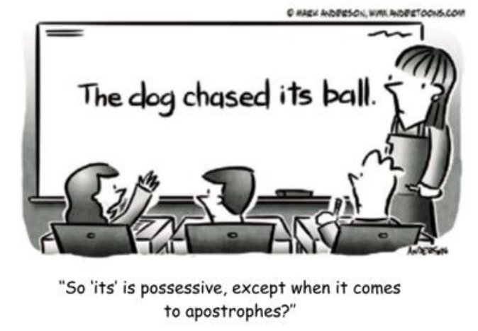

Mark the alterative in which the its is correctly used. 

- (A) What a sophisticated overcoat it is! Its got four buttons on it. 

- (B) Baduy, with its traditions, constitutes a unique community in the world. 

- (C) Look at this antique piece of furniture, my favorite chair – its broken! 

- (D) After the slight crash, the train managed to arrive at it’s destination. 

- (E) Smoking, you know, its one of the habits you ought to abandon. 

GABARITO: B 

Comentários: A questão exige que o candidato tenha conhecimento gramatical sobre os adjetivos possessivos (possessive adjectives) e também sobre o caso genitivo (genitive case) da língua inglesa, para identificar dentre as frases fornecidas qual é a que demonstra o “its” utilizado de maneira correta. 

#### ● <u>ANÁLISE DA QUESTÃO:</u> 

Primeiro, vamos observar as frases fornecidas em inglês: 

- a) What a sophisticated overcoat it is! Its got four buttons on it.

---

<!-- pagina: 100 -->

**Andrea Belo Aula 05 - Pronouns, Prepositions and Conjunctions in the texts** 

b) Baduy, with its traditions, constitutes a unique community in the world. 

c) Look at this antique piece of furniture, my favorite chair – its broken! 

d) After the slight crash, the train managed to arrive at it’s destination. 

e) Smoking, you know, its one of the habits you ought to abandon. 

Tradução das frases fornecidas pela questão: 

a) Que sobretudo sofisticado! Tem quatro botões nele. (utilizou ITS na frase em inglês) 

b) Baduy, com suas tradições, constitui uma comunidade única no mundo. (utilizou ITS na frase em inglês) 

c) Olhe para esta peça de mobiliário antiga, minha cadeira favorita - está quebrada! (utilizou ITS na frase em inglês) 

d) Após o leve acidente, o trem conseguiu chegar ao seu destino. (utilizou IT’S na frase em inglês) 

e) Fumar, você sabe, é um dos hábitos que você deve abandonar. (utilizou ITS na frase em inglês) 

- O que é possível perceber nessas frases quando traduzidas para o Português? 

Verificamos que a depender de cada frase e contexto, o IT'S ou ITS pode exercer a função de um verbo ou de um pronome possessivo. 

Quando a utilização de ITS se der como um pronome possessivo, a palavra NÃO deve levar o apóstrofo (sinal gráfico `). 

No entanto, quando a tradução de IT’S demonstrar que ele estava exercendo a função de um verbo, ele deverá levar o apóstrofo ! 

- Assim, podemos concluir <u>duas coisas:</u> 

1. O uso de IT’S (COM apóstrofo) no lugar dos verbos é uma abreviação de “IT IS” ou “IT HAS”. Perceba que IS deriva do verbo “to be” e HAS deriva do verbo “to have”. 

2. O uso de ITS (SEM apóstrofo) no lugar dos pronomes possessivos já é escrito com essa grafia naturalmente. 

Explico: O pronome possessivo referente a IT (palavra neutra que substitui o nome dog/cachorro da charge da questão) é ITS , tanto como possessive adjective quanto como possessive pronoun. 

Portanto, a <u>LETRA</u> "B" é a única que traz o ITS escrito corretamente (no contexto em que se inseria), sendo o nosso gabarito para essa questão. 

#### 14. (VUNESP/2019 – PREFEITURA MUNICIPAL DE DOIS CÓRREGOS – SP) 

#### The Indonesian tribe that rejects technology 

The Baduy tribe from Banten in Indonesia practise seclusion and reject all modern technology to protect their ancient traditions. For centuries, their way of life hasn’t changed. Electricity is

---

<!-- pagina: 101 -->

**Andrea Belo Aula 05 - Pronouns, Prepositions and Conjunctions in the texts** 

prohibited, along with modern modes of communication and formal education. Power lines stop at the border of their lands, but in recent years, the outside world has begun to creep in. 

The tribe has split in two – the more strict inner circle remain “pure”, while the outer circle have relaxed some rules. Some have started using mobile phones and solar-powered lanterns. Will adopting some aspects of modern technology help the Baduy survive the modern world, or will it make their ancient traditions disappear? 

(Hassan Ghani. www.aljazeera.com. 20.02.2018) 

In the fragment “the more strict inner circle remain “pure”, while the outer circle have relaxed some rules”, the word in bold indicates 

(A) a time relation. 

(B) an explanation. 

(C) simultaneity 

(D) a contrast. 

(E) an exemplification. 

GABARITO: D 

Comentários: A questão requer que você aponte que ideia é indicada pelo termo em negrito no trecho a seguir: “the more strict inner circle remain “pure”, while the outer circle have relaxed some rules”. 

Primeiramente, vejamos a tradução do trecho: 

“the more strict inner circle remain “pure”, while the outer circle have relaxed some rules.” 

(O círculo interno mais estrito permanece “puro”, enquanto o círculo externo relaxou algumas regras.) 

<u>O termo while pertence à classe das conjunções, que ligam palavras ou orações, e têm por função</u> principal evitar o uso de frases curtas e repetitivas, tornando o discurso mais conciso e coerente. 

Divididas em coordenativas e subordinativas , as conjunções são classificadas de acordo com a <u>relação que elas estabelecem entre as orações por ela unidas.</u> 

Vejamos as principais conjunções de cada tipo: 

- Coordenativas : and, but, or, nor, for, yet, so (e, mas, ou, nem, para, já/ainda); 

- Subordinativas : although, because, since, unless, once, however, therefore, while (embora, porque, desde que, a menos que, uma vez que, entretanto, logo/ portanto, enquanto); 

Nesse contexto, perceba que a conjunção while é utilizada para criar uma relação de contraste entre as duas frases.

---

<!-- pagina: 102 -->

**Andrea Belo Aula 05 - Pronouns, Prepositions and Conjunctions in the texts** 

Tal relação ocorre quando há uma quebra de expectativa, um contraste, entre o que é dito na primeira e na segunda frase: o primeiro grupo permaneceu puro, enquanto o segundo relaxou as regras. 

Portanto, temos que while expressa a ideia de contraste . Logo, o gabarito é a alternativa "D", a contrast (um contraste) . 

Veja o que significam as demais alternativas: 

- a time relation (uma relação de tempo); 

- an explanation (uma explicação); 

- simultaneity (simultaneidade); 

- an exemplification (uma exemplificação); 

15. (VUNESP/2019 – PREFEITURA MUNICIPAL DE DOIS CÓRREGOS – SP) 

In the fragment from the second paragraph “ Some have started using mobile phones”, the word in bold refers to 

(A) people from Banten, in Indonesia. 

(B) the Baduy people in general. 

(C) the relaxed Baduys. 

(D) inner-circle Baduys. 

(E) outer-circle Baduys. 

#### GABARITO: E 

Comentários: A questão requer que você aponte a que se refere o termo em negrito em “ Some have started using mobile phones”, trecho do segundo parágrafo. 

Para responder à questão, precisamos analisar o contexto, o que vem antes dessa frase no texto. Vejamos: 

"The tribe has split in two – the more strict inner circle remain “pure”, while the outer circle have relaxed some rules. Some have started using mobile phones and solar-powered lanterns." 

(A tribo se dividiu em duas - o círculo interno mais rígido permanece “puro”, enquanto o círculo externo relaxou algumas regras. Alguns começaram a usar telefones celulares e lanternas movidas a energia solar.) 

Observe que o autor falava da tribo Baduy, que se dividiu em dois grupos menores: um círculo interno e outro externo . 

Nesse contexto, ele aponta, em seguida, que <u>alguns dos integrantes do círculo externo da tribo começaram a usar dispositivos tecnológicos.</u>

---

<!-- pagina: 103 -->

**Andrea Belo Aula 05 - Pronouns, Prepositions and Conjunctions in the texts** 

O termo Some corresponde exatamente ao pronome indefinido alguns e, portanto, refere-se aos integrantes do círculo externo da tribo Baduy , the outer-circle Baduys. 

Logo, o gabarito é a alternativa "E" . 

Veja a tradução das demais alternativas: 

- people from Banten, in Indonesia (pessoas de Banten, na Indonésia); 

- the Baduy people in general (o povo Baduy em geral); 

- the relaxed Baduys (os Baduys relaxados.) 

- inner-circle Baduys (os Baduys do círculo interno). 

#### 16. (VUNESP/2018 – PREFEITURA MUNICIPAL DE ITAPEVI – SP) 

There is a danger in paying too much attention to learners’ errors. While errors indeed reveal a system at work, the classroom language teacher can become so preoccupied ________ noticing errors that the correct utterances in the second language go unnoticed. In our observation and analysis of errors – for all that they do reveal about the learner – we must beware of placing too much attention on errors and not lose sight of the value of positive reinforcement of clearly expressed language that is a product of the learner’s progress of development. While the diminishing of errors is an important criterion _________ increasing language proficiency, the ultimate goal of second language learning is the attainment of communicative fluency. 

Another inadequacy in error analysis is an overemphasis on production data. Language is speaking and listening, writing and reading. The comprehension of language is as important as production. It so happens that production lends itself to analysis and thus becomes the prey of researchers, __________ comprehension data is equally important in developing an understanding of the process of SLA. 

(Brown, D. H. Principles of language learning and teaching. 2000. Adapted) 

Which alternative holds the missing words in the order in which they should be used? 

- (A) on … to … too 

- (B) with … to … in 

- (C) so … too … with 

- (D) with … for … but 

- (E) very … too … through 

#### GABARITO: D 

Comentários: A questão exige que o candidato preencha as lacunas utilizando as opções elencadas nas alternativas. 

Em geral, essas opções podem ser traduzidas como:

---

<!-- pagina: 104 -->

**Andrea Belo Aula 05 - Pronouns, Prepositions and Conjunctions in the texts** 

- On: Sobre, em. 

- To: A, para. 

- Too: Também. 

- With: Com. 

- In: Em. 

- So: Tão. 

- For: Para, por. 

- But: Mas. 

- Very: Muito. 

- Through: Através de. 

Vamos ver uma possível tradução para o trecho da primeira lacuna: 

- "There is a danger in paying too much attention to learners’ errors. While errors indeed reveal a system at work, the classroom language teacher can become so preoccupied ________ noticing errors that the correct utterances in the second language go unnoticed". 

- "Existe o perigo de prestar muita atenção aos erros dos alunos. Embora os erros de fato revelem um sistema em funcionamento, o professor de idiomas da sala de aula pode ficar tão preocupado ________ os erros notadas que as declarações corretas no segundo idioma passam despercebidas". 

Observe que a melhor opção para o preenchimento da lacuna é o termo "with" (com). 

Lembre-se, também, que o verbo notar (notice) é utilizado como uma adjetivo , motivo pelo é utilizado com a terminação -ing. 

Quanto a segunda lacuna: 

- "While the diminishing of errors is an important criterion _________ increasing language 

- proficiency, the ultimate goal of second language learning is the attainment of communicative fluency". 

- "Embora a diminuição de erros seja um critério importante _________ aumentar a 

- proficiência na língua, o objetivo final do aprendizado de segunda língua é a obtenção de fluência comunicativa". 

Neste trecho a lacuna é corretamente preenchida com o termo "for" (para). 

Lembre-se, que nesta hipótese, o verbo aumentar (increase) é utilizado com a terminação -ing , por ser precedido de preposição. 

Por fim, a terceira lacuna: 

- "It so happens that production lends itself to analysis and thus becomes the prey of researchers, __________ comprehension data is equally important in developing an understanding of the process of SLA".

---

<!-- pagina: 105 -->

**Andrea Belo Aula 05 - Pronouns, Prepositions and Conjunctions in the texts** 

- "Acontece que a produção se presta à análise e, assim, se torna vítima de pesquisadores, 

- __________ dados de compreensão são igualmente importantes no desenvolvimento de uma compreensão do processo do SLA". 

A última lacuna deve ser preenchida com o termo "but" (mas), que estabelece a ideia de contraposição necessária para dar sentido a informação que será apresentada em seguida. 

17. (INSTITUTO AOCP/2020 – PREFEITURA MUNICIPAL DE BETIM – MG) 

#### Five ways to get a better bedtime routine 

by Amy Sedghi 

Getting to sleep can be a <u>struggle</u> , but blackout blinds and to-do lists can help – as can reserving the bedroom for sex and shut-eye 

An eye mask will block out light. 

#### 1. Go to bed at regular times 

Going to sleep and waking up at regular times – even on weekends – will strengthen your body clock, says Dr Lizzie Hill, a clinical sleep physiologist and a spokeswoman for the British Sleep Society. Regular mealtimes are also an important cue for your circadian rhythm. Avoid exercise too close to bedtime, as it can cause restlessness and an elevated body temperature, says Samantha Briscoe, a senior physiologist at the Sleep Centre at London Bridge hospital. 

#### 2. Protect the bedroom 

Preserve the bedroom as a place for sleep (and sex): there is evidence that the brain forms a strong association with sleep there. A temperature of 16- 18C (60-64F) is thought to be ideal for most, according to the Sleep Council, an awareness and support organisation. Blackout blinds or an eye mask can help block out light, while keeping electronic devices out of the bedroom is highly recommended. If you struggle to fall asleep after more than 25 minutes, Matthew Walker – a sleep expert and a professor of neuroscience and psychology at the University of California, Berkeley – suggests getting up and going to read under a dim light in another room. Once sleepy, you can return to bed. 

#### 3. Get ahead on the next day 

Your night-time routine is an opportunity to make mornings run a little smoother: choose your clothes for the next day when you reach for your pyjamas or pack your bag while brushing your teeth. Martin Hagger, a professor of health psychology at the University of California, Merced, has stressed how routines are linked to the formation of healthy habits.

---

<!-- pagina: 106 -->

**Andrea Belo Aula 05 - Pronouns, Prepositions and Conjunctions in the texts** 

#### 4. Wind down 

Reading a book can help slow breathing and relax muscles, while yoga stretches or even a gentle walk can reduce anxiety, says Briscoe. A warm bath or shower can also help you relax: researchers at the University of Texas at Austin found that bathing in water of 40-42.5C one to two hours before bedtime was associated with better sleep. 

#### 5. Write down your worries 

“If your mind is buzzing from the day, try keeping a journal or worry book,” suggests Hill. The NHS also recommends writing to-do lists for the next day in order to organise thoughts and clear the mind. “If you experience difficulty with sleep over the longer term, consider whether there may be an underlying medical condition,” says Hill. A sleep diary could help you identify any patterns 

(https://www.theguardian.com/lifeandstyle/2019/oct/04/five-ways-toget- a-better-bedtime-routine. Access: 08/01/2020) 

The excerpt “(…) choose your clothes for the next day when you reach for your pyjamas or pack your bag while brushing your teeth” presents some linking words. Mark the CORRECT option concerning the usage of such linking words in the sentence above: 

- (A) The noun “while” indicates a period of time. 

- (B) The conjunction “while” introduces a consequence for the previous clause. 

- (C) The preposition “or” is used to link two equivalent expressions. 

- (D) The conjunction “or” indicates an alternative to its previous clause. 

- (E) The pronoun “when” is used to request the time in the sentence. 

#### GABARITO: D 

Comentários: O enunciado pede para marcar a opção correta em relação ao uso de tais palavras de ligação na frase abaixo. A frase apresenta algumas palavras de ligação. Vejamos: 

“(…) choose your clothes for the next day when you reach for your pyjamas or pack your bag while brushing your teeth”. 

Tradução: “(...) escolha a roupa para o dia seguinte ao pegar o pijama ou fazer a mala enquanto escova os dentes”. 

The noun “while” indicates a period of time. > ERRADO. 

Primeiramente, vejamos como fica a frase da alternativa traduzida: 

"O substantivo “enquanto” indica um período de tempo." 

Está afirmação está errada, pois o termo "while" não indica um período de tempo, mas sim duas ações que estão acontecendo simultaneamente , ou seja, ao mesmo tempo. 

Nesse caso, é utilizado para inferir um sentido de arrumar a mochila <u>enquanto escova os dentes.</u>

---

<!-- pagina: 107 -->

**Andrea Belo Aula 05 - Pronouns, Prepositions and Conjunctions in the texts** 

Assim, podemos concluir que a alternativa está errada. 

The conjunction “while” introduces a consequence for the previous clause. > ERRADO. 

Primeiramente, vejamos a frase da alternativa a traduzida: 

"A conjunção “enquanto” introduz uma consequência para a cláusula anterior." 

Na frase, o termo "while" não indica uma consequência da frase anterior, mas sim infere um sentido de enquanto: "fazer a mala enquanto escova os dentes". 

Desse modo, podemos concluir que a alternativa está errada. 

The preposition “or” is used to link two equivalent expressions. > ERRADO. 

Primeiramente, vejamos a frase da alternativa traduzida: 

"A preposição “ou” é usada para ligar duas expressões equivalentes." 

Essa frase está incorreta, pois o termo "Or" não é uma preposição, mas sim uma conjunção. 

Vejamos um exemplo do uso correto desse termo: 

"Are you married or single? (Você é casado ou solteiro?)" 

Assim, podemos concluir que a alternativa está errada . 

The conjunction “or” indicates an alternative to its previous clause. > CERTO. 

Primeiramente, vejamos a frase da alternativa traduzida: 

"A conjunção “ou” indica uma alternativa à sua cláusula anterior." 

Essa é a opção correta, pois a conjunção "or" é utilizada na frase para indicar que se deve escolha a roupa para o dia seguinte ao pegar o pijama <u>ou</u> fazer a mala enquanto escova os dentes. Assim, podemos concluir que essa é a alternativa certa. 

The pronoun “when” is used to request the time in the sentence. > ERRADO. 

Primeiramente, vejamos como fica a frase traduzida: 

"O pronome “quando” é usado para solicitar a hora na frase." 

Esta alternativa está incorreta pois está dizendo que "when" é um pronome, quando é, na verdade, uma preposição. 

Além de que, "when" não é usado apenas para horas, como na frase apresentada pelo enunciado por exemplo. Esse termo está relacionado com o momento quando a pessoa indicada for procurar <u>seus pijamas.</u> 

Desse modo, podemos concluir que a alternativa está errada.

---

<!-- pagina: 108 -->

**Andrea Belo Aula 05 - Pronouns, Prepositions and Conjunctions in the texts** 

#### 18. (INSTITUTO AOCP/2020 – PREFEITURA MUNICIPAL DE BETIM – MG) 

Observe the pronoun usage in the following excerpt: “Avoid exercise too close to bedtime, as it can cause restlessness (…)”. Mark the CORRECT option. 

- (A) The elided personal pronoun “you” refers to Dr Lizzie Hill. 

- (B) The elided object pronoun “you” refers to the reader. 

- (C) The possessive pronoun “it” refers to “restlessness”. 

- (D) The object pronoun “it” refers back to “bedtime”. 

- (E) The personal pronoun “it” refers back to “exercise”. 

#### GABARITO: E 

Comentários: O enunciado pede para observar o uso do pronome no seguinte trecho e marcar a opção correta. 

“Avoid exercise too close to bedtime, as it can cause restlessness (…)”. 

Tradução: “Evite fazer exercícios muito perto da hora de dormir, pois pode causar inquietação (...)”. 

Podemos ver que as alternativas abordam dois pronomes : "it" (ele, ela [neutro]) e "you" (tu, você). 

No trecho destacado, o pronome pessoal "it" <u>se refere aos exercícios, inferindo que as pessoas</u> devem evitar fazer exercícios muito perto da hora de dormir. 

Assim, podemos concluir que as alternativas C e D estão incorretas. 

Já o pronome pessoal "you" se encontra omitido na frase. Nesse nesse caso, esse pronome está se referindo ao leitor , inferindo um significado de que os leitores devem evitar fazer exercícios <u>físicos muito perto da hora de dormir.</u> 

Desse modo, podemos concluir que as alternativas A e B também estão incorretas. 

Podemos concluir que a alternativa E é a resposta correta, a qual pode ser traduzida como: 

The personal pronoun “it” refers back to “exercise”. 

Tradução: "O pronome pessoal “isso” se refere a 'exercício'."

---

<!-- pagina: 109 -->

**Andrea Belo Aula 05 - Pronouns, Prepositions and Conjunctions in the texts** 

#### 19. (INSTITUTO AOCP/2020 – PREFEITURA MUNICIPAL DE BETIM – MG) 

In the excerpt “But to normalize something that, in the words of UNICEF, has a profoundly <u>positive impact on child health, is of course to be celebrated”, the words “but”, “profoundly”,</u> “positive”, “health” and “celebrated” are respectively used as: 

- (A) Preposition; adverb; noun; verb; adjective. 

- (B) Conjunction; adverb; adjective; noun; verb. 

- (C) Adverb; preposition; adjective; noun; verb. 

- (D) Preposition; conjunction; noun; verb; adjective. 

- (E) Conjunction; preposition; noun; noun, verb. 

#### GABARITO: B 

Comentários: No trecho “But to normalize something that, in the words of UNICEF, has a profoundly positive impact on child health, is of course to be celebrated”, as palavras  “but”, “profoundly”, “positive”, “health” e “celebrated” são usados respectivamente como: 

Podemos ver no texto que a palavra "but" (mas) é utilizada como uma conjunção , tendo função de ligar duas orações ou termos semelhantes, dentro de uma mesma oração. Existem três tipos de conjunções: Coordinating conjunctions, Correlative conjunctions, Subordinating conjunctions. 

Já a palavra "profoundly" (profundamente) exerce função de advérbio na frase, adicionando <u>informações sobre um verbo, um adjetivo, um outro advérbio, um particípio ou uma oração</u> completa. Podemos dizer que os advérbios descrevem ou modificam essas palavras. 

A palavra "positive" (positivo) se trata de um adjetivo que, além de qualificar substantivos, também faz comparações. Em inglês, os adjetivos possuem três graus de comparação: grau normal (beautiful), grau comparativo (as beautiful as, more beautiful than) e grau superlativo (the most beautiful). 

O termo "health" (saúde) faz o papel de substantivo na frase, nomeando, nesse caso, uma <u>qualidade. Vejamos alguns exemplos: honesty (honestidade), affection (simpatia), intelligence</u> (inteligência). 

Por fim, temos o verbo "celebrated" (celebrado) que nomeia e descreve um estado ou uma ação. A maioria dos verbos em Inglês é dividida em verbos regulares (regular verbs) e verbos irregulares (irregular verbs). 

Desse modo, podemos concluir que a alternativa certa é a letra B, apresentando a sequência correta: Conjunction; adverb; adjective; noun; verb. 

Vejamos a definição de outra classificação exposta nas outras alternativas. 

Preposição: É uma palavra ou grupo de palavras que liga(m) dois ou mais termos da oração e que estabelece(m) entre si algumas relações. Nessas relações, um termo explica ou completa o sentido do outro.

---

<!-- pagina: 110 -->

**Andrea Belo Aula 05 - Pronouns, Prepositions and Conjunctions in the texts** 

#### 20. (INSTITUTO AOCP/2020 – PREFEITURA MUNICIPAL DE BETIM – MG) 

#### I happily advertise the fact I. breastfed – it’s high time that brands embraced it too 

by Nell Frizzell New ads by Aldi, Adidas and Sainsbury’s all feature breastfeeding mothers. Hopefully this will normalize the process to help new parents feed with <u>ease</u> 

It may be some time yet until we see a mother in an advert <u>precariously</u> balancing her child/bag/shopping/pets before pushing a nipple into the mouth of a howling, jam-smeared toddler. But when they do, oh boy, are my days as a model really going to get going. 

In recent weeks, a series of adverts have appeared from Tu at Sainsbury’s, Adidas and Aldi, all featuring breastfeeding mothers. Some are wearing flowery blouses and have tattoos, others are holding a naked baby between the zips of a sports top. Of course the women are good-looking, of course they are slim, of course we cannot actually see anything as erotically charged or as <u>morally unsettling</u> as an areola – this is still advertising, after all. But it is, surely, a start. 

As someone who breastfed her son for 21 shirtlifting, bra-soaking, carefree months, I am of course pleased to see breastfeeding being held up as something both everyday and aspirational. It is as prosaic as a trip to the supermarket yet as physically impressive as professional sport. It belongs on billboards and screens as much as beds and sofas. 

There is no such thing as “normal” when it comes to babies or bodies. But to <u>normalize something</u> that, in the words of UNICEF, has a profoundly positive impact on child <u>health</u> , is of course to be celebrated. You might find yourself whipping out a boob on a train full of football fans; you might squirt milk across somebody else’s coat on the bus; you might find yourself answering the door with your full breast outside your clothes without noticing. And if the presence of big brands behind your bra straps encourage you to keep feeding, then all power to your elbow. It is a shame that this hasn’t happened sooner, but it’s better late than never – and there’s no use crying over spilled (breast) milk. 

(Source: https://www.theguardian.com/lifeandstyle/shortcuts/2019/oct/02/adve rts-breastfeeding-mothers-aldi-adidas-sainsburys.Access: 08/01/2020) 

Considering the excerpt: “As someone who breastfed her son for 21 shirt-lifting, bra-soaking, carefree months, I am of course pleased (…)”, mark the option which is CORRECT about the usage of pronouns in the sentence. 

(A) The word “who” works as a relative pronoun referring back to “someone” which actually is the writer of the text. 

(B) The word “who” is an interrogative pronoun which can be left out of the sentence without a change in its meaning. 

(C) The word “her” is a personal pronoun and works as the subject for the verb “breastfed”. 

(D) The word “her” is a possessive pronoun referring to the word “son” as the owner of something. 

(E) The word “I” works as an objective pronoun in order to avoid the repetition of the subject “someone”.

---

<!-- pagina: 111 -->

**Andrea Belo Aula 05 - Pronouns, Prepositions and Conjunctions in the texts** 

#### GABARITO: A 

Comentários: A questão nos propõe o seguinte: Considerando o trecho "As someone who breastfed her son for 21 shirt-lifting, bra-soaking, carefree months, I am of course pleased (…)”, marque a opção que está CORRETA quanto ao <u>uso dos pronomes</u> na frase. 

A tradução do trecho em questão é “Como alguém que amamentou seu filho por 21 meses levantando camisa, encharcando sutiã, despreocupada, estou contente (…)”. 

The word “who” works as a relative pronoun referring back to “someone” which actually is the writer of the text. > CERTO. 

A alternativa está afirmando que a palavra "who" trabalha como um pronome relativo se referindo a "someone", que é na verdade o escritor do texto. 

Vejamos novamente a frase em questão: "As someone <u>who</u> breastfed her son for 21 shirt-lifting (…)”. Podemos concluir que o sujeito é "someone", e o pronome "who" se refere ao sujeito ("As someone who breastfed" (Como <u>alguém que</u> alimentou)). 

Quando o antecedente for pessoa e o pronome relativo exercer a função de sujeito do verbo, podemos usar <u>who</u> ou that. 

- Ex.: The girl <u>who /</u> that arrived is blond. (A menina que chegou é loira.) 

Lendo a continuação da frase percebemos que o alguém de que se trata a oração é na verdade a própria pessoa que está escrevendo o texto: “Como <u>alguém que amamentou seu filho</u> [...], <u>eu</u> estou contente [...]”. 

Assim sendo, a alternativa está correta. 

The word “who” is an interrogative pronoun which can be left out of the sentence without a change in its meaning. > ERRADO. 

A alternativa está afirmando que a palavra "who" é um pronome interrogativo que pode ser omitido da sentença sem que isso mude seu significado. 

Na verdade, "who" exerce a função de pronome relativo, se referindo ao sujeito da oração (someone (alguém)), funcionando então como sujeito do verbo. 

A situação na qual o pronome relativo pode ser omitido é quando o antecedente é pessoa e o <u>pronome relativo exerce a</u> função de objeto do verbo (neste caso, usa-se who, whom, that ou pode-se omitir (-) o pronome relativo.) 

- Ex.: The boy who / whom / that / (-) I saw in the beach was beautiful. (O menino que vi na praia era bonito.) 

"Who" exerce função de pronome interrogativo quando é utilizado para fazer uma pergunta, significando "quem". 

- Ex.: Who is there? (Quem está aí?). 

The word “her” is a personal pronoun and works as the subject for the verb “breastfed”. > ERRADO.

---

<!-- pagina: 112 -->

**Andrea Belo Aula 05 - Pronouns, Prepositions and Conjunctions in the texts** 

A alternativa afirma que a palavra "her" é um pronome pessoal e funciona como o sujeito do verbo "breastfed". 

Vejamos o trecho específico onde está presente o pronome "her" : "As someone who breastfed <u>her</u> son for 21 […]” (Como alguém que amamentou seu filho por 21 […]). 

Primeiramente podemos pensar em quem exerce a ação de amamentar, ou seja, quem é o sujeito do verbo. Se nos perguntarmos "quem amamenta?" chegaremos à resposta "alguém" ("someone") , então já podemos afirmar que "her" não é o sujeito desse verbo. 

Em segundo lugar, "her" não é um pronome pessoal (que são I, You, He/She/It, We, You, They), e sim um <u>pronome possessivo</u> , do tipo adjetivo, porque tem como função determinar a posse de " <u>algo ou alguém: Her son (o filho dela / seu filho)"</u> . 

Os pronomes possessivos (tipo adjetivos possessivos) são: My, Your, His/Her/Its, Our, Your, Their. 

- Ex.: He is <u>my</u> father. (Ele é <u>meu</u> pai.) 

#### She does not like <u>her</u> course. (Ela não gosta do <u>seu curso</u> / do <u>curso dela .)</u> 

The word “her” is a possessive pronoun referring to the word “son” as the owner of something. > ERRADO. 

A alternativa está dizendo que a palavra “her” é um pronome possessivo que se refere à palavra “son” (filho) como o dono de algo. 

De fato"her" é um pronome possessivo, porque tem como função determinar a posse de algo ou alguém: " <u>Her</u> son (o filho <u>dela</u> / <u>seu</u> filho)". 

O erro está no fato de que <u>não é o filho o dono de algo neste caso , e sim o sujeito da</u> frase: "someone" (alguém) <u>, e como este sujeito se refere a uma mãe, o pronome possessivo</u> utilizado foi o "her" . 

Os pronomes possessivos (tipo adjetivos possessivos) são: My, Your, His/Her/Its, Our, Your, Their. 

- Ex.: He is <u>my</u> father. (Ele é <u>meu</u> pai.) 

#### She does not like <u>her</u> course. (Ela não gosta do <u>seu curso</u> / do <u>curso dela .)</u> 

The word “I” works as an objective pronoun in order to avoid the repetition of the subject “someone”. > ERRADO. 

A alternativa está afirmando que a palavra "I" (eu) funciona como um pronome objeto de modo a evitar a repetição do sujeito "someone" (alguém). 

Bom, os pronomes objetos são utilizados para substituir nomes de pessoas, animais ou coisas, que têm função de objetos diretos ou indiretos na frase. Então, baseado nisso podemos afirmar que se o pronome "I" está evitando a repetição do <u>sujeito , então sua função é de pronome sujeito,</u> também conhecido como pronome pessoal do caso reto (I, You, He/She/It, We, You, They). 

Os pronomes objetos são os seguintes: me, you, him, her, it, us, you, them. 

- Ex.: He helped <u>us . (Ele nos</u> ajudou)

---

<!-- pagina: 113 -->

**Andrea Belo Aula 05 - Pronouns, Prepositions and Conjunctions in the texts** 

#### I met <u>them</u> at the mall. (Eu encontrei <u>eles/os</u> encontrei no shopping.) 

#### 21. (IBFC/2019 – PREFEITURA MUNICIPAL DE VINHEDO – SP) 

Teachers and teachers in training need to be able to use approaches and methods flexibly and creatively based on their own judgment and experience. In this process, they should be encouraged to transform and adapt the methods they use to make their own. Training in the techniques and procedures of a specific method is probably essential for novice teachers entering teaching, because it provides them with the confidence they will need to face learners and it provides techniques and strategies for presenting lessons. In the early stages, teaching is largely a matter of applying procedures and techniques developed by others. 

RICHARDS, J.; ROGERS, T. Approaches and methods in language teaching. Cambridge: CUP, 2001. 

Observe o seguinte trecho: it provides them with the confidence they will need to face learners. Sobre o trecho, foram feitas as seguintes afirmativas: 

I. O pronome it pode ser considerado anafórico, pois retoma Training in the techniques and procedures of a specific method. 

II. O uso da preposição to (sublinhada) se dá no trecho acima pela mesma razão que em need to be able (no início do texto): a regência do verbo semi-modal need. 

III. A elipse do pronome relativo da oração adjetiva restritiva (defining relative clause) que ocorre no trecho não seria possível, caso o pronome relativo exercesse função de sujeito da oração adjetiva. 

Assinale a alternativa que apresenta as afirmativas corretas. 

- (A) I e II, apenas 

- (B) I e III, apenas 

- (C) II e III, apenas 

- (D) I, II e III 

#### GABARITO: B 

Comentários: A questão trata sobre referência pronominal ( it ), verbos ( need - semi-modal e não modal) e pronome relativo ( that ). É preciso entender as intenções do autor do texto e confrontálas com as afirmações de cada opção de resposta, após analisá-las. Para isso, é importante estar atento à correção gramatical bem como às afirmações feitas no trecho destacado do texto. 

I. O pronome it pode ser considerado anafórico, pois retoma Training in the techniques and procedures of a specific method. > CERTO. 

O pronome it retoma “O treinamento nas técnicas e procedimentos de um método específico", na oração que apresenta a causa de isso ser essencial para professores iniciantes. Essa informação foi trazida pelo texto <u>antes do uso do pronome</u> it , que, por isso, tem função anafórica :

---

<!-- pagina: 114 -->

**Andrea Belo Aula 05 - Pronouns, Prepositions and Conjunctions in the texts** 

- Training in the techniques and procedures of a specific method is probably essential for novice teachers entering teaching, because it provides them with the confidence they will need to face learners. 

Logo, a assertiva I está certa . 

II. O uso da preposição to (sublinhada) se dá no trecho acima pela mesma razão que em need to be able (no início do texto): a regência do verbo semi-modal need. > ERRADO. 

O verbo need pode ser um semi-modal quando é usado com algumas características gramaticais dos verbos modais . Nesse caso, ele normalmente aparece em orações negativas e interrogativas: 

- Need I type this letter again? 

- You needn’t have told him about my plans. 

Nas duas ocorrências em orações afirmativas no texto, o verbo need é um verbo não modal e o to é parte do infinitivo (to be able to) que deve suceder o verbo need : 

- it provides them with the confidence they will need to face learners. 

- Teachers and teachers in training need to be able to use approaches and methods 

Logo, a assertiva II está errada . 

III. A elipse do pronome relativo da oração adjetiva restritiva (defining relative clause) que ocorre no trecho não seria possível, caso o pronome relativo exercesse função de sujeito da oração adjetiva. > CERTO. 

No trecho em que é omitido no texto, o pronome relativo tem a função de objeto e o sujeito é they : 

- it provides them with the confidence (that) they will need to face learners. 

Assim, esse pronome pode ser omitido e a assertiva III está certa . 

#### 22. (IBFC/2019 – PREFEITURA MUNICIPAL DE VINHEDO – SP) 

#### Grammatical cohesion and textuality 

Grammar teachers have long been aware of recurring interference factors with pronouns and reference, such as the Japanese tendency to confuse he and she, the Spanish tendency to confuse his and your, and so on, and there is not much discourse analysts can say to ease those overgreen problems. What can be (and often is not) directly taught about a system such as that of English is the different ways of referring to the discourse itself by use of items such as it, this, and that, which do not seem to translate in a one-to-one way to other languages, even where these are closely cognate (cf. German, French, Spanish). 

MCCARTHY, Michael. Discourse analysis for language teachers. Cambridge University Press, 1991.

---

<!-- pagina: 115 -->

**Andrea Belo Aula 05 - Pronouns, Prepositions and Conjunctions in the texts** 

#### Observe o fragmento inicial do texto: 

Grammar teachers have long been aware of recurring interference factors with pronouns and reference, such as the Japanese tendency to confuse he and she, the Spanish tendency to confuse <u>his and your, and so on [...]</u> 

Assinale a alternativa que apresenta uma possibilidade de exemplo equivalente aos exemplos sublinhados, levando em consideração os aspectos gramaticais e textuais em questão: 

(A) such as the Brazilian tendency to confuse verb patterns, e.g. “I disagreed of you” (incorrect) instead of “I disagree with you” (correct) 

(B) such as the Brazilian tendency to confuse much and many, e.g. “I have don’t have many stuff” (incorrect) instead of “I don’t have much stuff” (correct) 

(C) such as the Brazilian tendency to confuse verb forms, e.g. “I go to the restaurant yesterday” (incorrect) instead of “I went to the restaurant yesterday” (correct) 

(D) such as the Brazilian tendency to confuse which and what, e.g. “It was extremely hot, what made me sick” (incorrect) instead of “which made me sick” (correct) 

#### GABARITO: D 

Comentários: (Estava muito quente, o que me deixou doente.) *Obs : O Brasileiro traduz WHAT e WHICH da mesma maneira, por isso, a confusão. 

Questão que exige leitura cuidadosa do enunciado e do texto. 

Como o texto fala em pronomes, o candidato deve procurar a alternativa que traga uma incorreção no uso de pronomes pelo brasileiro. 

As alternativas incorretas trarão preposições, verbos e outros. Além de serem erros gramaticais e concordância. 

Pronomes interrogativos: what/when/which/where, etc. 

#### 23. (IBFC/2017 – SEDUC-MT) 

This is a special invitation _____ my Family to your Family. 

(A) For 

#### (B) Outside 

#### (C) To 

- (D) Inside 

#### (E) From 

#### GABARITO: E

---

<!-- pagina: 116 -->

**Andrea Belo Aula 05 - Pronouns, Prepositions and Conjunctions in the texts** 

Comentários: Uma expressão típica para representar algo de alguém para outra pessoa é "FROM ... TO ...", ou seja, "de mim para você", "de alguém para alguém" e, no caso da questão, "da minha família, para a sua família. 

#### 24. (IBFC/2017 – SEDUC-MT) 

The train will be here ____ about 15 minutes. 

#### (A) On 

#### (B) Over 

#### (C) Behind 

#### (D) In 

#### (E) At 

#### GABARITO: D 

Comentários: A tradução da frase ficaria: 

"O trem estará aqui ____ 15 minutos" 

O enunciado busca saber qual é a melhor palavra que melhor encaixa no espaço em branco. 

Nota-se que o espaço em branco precisa da preposição “in” e as outras alternativas estão incorretas em relação a que se procura. 

Porém, neste caso, “in” é a única opção que se encaixa: “O trem estará aqui em 15 minutos. 

#### 25. (IBFC/2017 – SEDUC-MT) 

___________ genetics play a role in many diseases development, specialists believe we can avoid a great amount of them by eating healthy, doing exercises and avoiding stress. 

#### (A) Despite 

#### (B) Because 

- (C) Even though 

- (D) Whether 

#### (E) Even 

#### GABARITO: C 

Comentários: <u>Enunciado: EVEN THOUGH genetics play a role in many diseases development,</u> specialists believe we can avoid a great amount of them by eating healthy, doing exercises and avoiding stress.

---

<!-- pagina: 117 -->

**Andrea Belo Aula 05 - Pronouns, Prepositions and Conjunctions in the texts** 

<u>Tradução: MUITO EMBORA genética tenha um papel importante no desenvolvimento de muitas</u> doenças, especialistas acreditam que podemos evitar uma grande quantidade delas, comendo saudavelmente, fazendo exercícios e evitando o estresse. 

No enunciado, temos orações com ideias opostas, então precisamos uni-las com uma conjunção que exprima <u>concessão (sentido de oposição/contraste) e comparação entre as orações.</u> 

Alternativas: 

Because - Porque (resposta) 

<u>Even</u> - até mesmo, mesmo 

<u>Wether</u> - Se, quer seja 

<u>Although</u> – apesar de, ainda que, embora, conquanto 

<u>Even though</u> (forma mais enfática de Although) – apesar de, muito embora 

<u>Despite -</u> Apesar de 

● No entanto, devemos observar uma regra em INGLÊS: <u>A diferença entre DESPITE E ALTHOUGH ( já que significam a mesma coisa praticamente)</u> 

#### <u>1. Depois de although (though) usamos um sujeito + verbo:</u> 

<u>Exemplo : Though it rained a lot, we enjoyed our holiday.</u> 

<u>2. Depois de in spite of ou despite ( apesar de), usamos um substantivo , um pronome</u> – <u>(this/that/what etc.) ou a forma do gerúndio ing.</u> 

<u>Exemplo: I didn’t get the job in spite of / despite the fact that I had all the necessary qualifications. Na frase:</u> EVEN THOUGH genetics play a role in many diseases development, specialists ... <u>(sujeito) + (verbo)</u> 

#### 26. (CESGRANRIO/2022 – ELETROBRÁS ELETRONUCLEAR) 

The controversial future of nuclear power in the U.S. 

Lois Parshley 

1 - President Joe Biden has set ambitious goals for fighting climate change: To cut U.S. carbon emissions in half by 2030 and to have a net-zero carbon economy by 2050. The plan requires electricity generation – the easiest economic sector to green, analysts say – to be carbon-free by 2035. 

2 - A few figures from the U.S. Energy Information Administration (EIA) illustrate the challenge. In 2020 the United States generated about four trillion kilowatt-hours of electricity. Some 60 percent of that came from burning fossil fuels, mostly natural gas, in some 10,000 generators, large and small, around the country. All of that electricity will need to be replaced - and more, because demand for electricity is expected to rise, especially if we power more cars with it.

---

<!-- pagina: 118 -->

**Andrea Belo Aula 05 - Pronouns, Prepositions and Conjunctions in the texts** 

3 - Renewable energy sources like solar and wind have grown faster than expected; together with hydroelectric, they surpassed coal for the first time ever in 2019 and now produce 20 percent of U.S. electricity. In February the EIA projected that renewables were on track to produce more than 40 percent by 2050 - remarkable growth, perhaps, but still well short of what’s needed to decarbonize the grid by 2035 and forestall the climate crisis. 

4 - This daunting challenge has recently led some environmentalists to reconsider an alternative they had long been wary of: nuclear power. 

5 - Nuclear power has a lot going for it. Its carbon footprint is equivalent to wind, less than solar, and orders of magnitude less than coal. Nuclear power plants take up far less space on the landscape than solar or wind farms, and they produce power even at night or on calm days. In 2020 they generated as much electricity in the U.S. as renewables did, a fifth of the total. 

6 - But debates rage over whether nuclear should be a big part of the climate solution in the U.S. The majority of American nuclear plants today are approaching the end of their design life, and only one has been built in the last 20 years. Nuclear proponents are now banking on nextgeneration designs, like small, modular versions of conventional light-water reactors, or advanced reactors designed to be safer, cheaper, and more flexible. 

7 - “We’ve innovated so little in the past half-century, there’s a lot of ground to gain,” says Ashley Finan, the director of the National Reactor Innovation Center at the Idaho National Laboratory. Yet an expansion of nuclear power faces some serious hurdles, and the perennial concerns about safety and long-lived radioactive waste may not be the biggest: Critics also say nuclear reactors are simply too expensive and take too long to build to be of much help with the climate crisis. 

8 - While environmental opposition may have been the primary force hindering nuclear development in the 1980s and 90s, now the biggest challenge may be costs. Few nuclear plants have been built in the U.S. recently because they are very expensive to build here, which makes the price of their energy high. 

9 - Jacopo Buongiorno, a professor of nuclear science and engineering at MIT, led a group of scientists who recently completed a two-year study examining the future of nuclear energy in the U.S. and western Europe. They found that “without cost reductions, nuclear energy will not play a significant role” in decarbonizing the power sector. 

10 - “In the West, the nuclear industry has substantially lost its ability to build large plants,” Buongiorno says, pointing to Southern Company’s effort to add two new reactors to Plant Vogtle in Waynesboro, Georgia. They have been under construction since 2013, are now billions of dollars over budget - the cost has more than doubled - and years behind schedule. In France, ranked second after the U.S. in nuclear generation, a new reactor in Flamanville is a decade late and more than three times over budget. 

11 - “We have clearly lost the know-how to build traditional gigawatt-scale nuclear power plants,” Buongiorno says. Because no new plants were built in the U.S. for decades, he and his colleagues found, the teams working on a project like Vogtle haven’t had the learning experiences needed to do the job efficiently. That leads to construction delays that drive up costs.

---

<!-- pagina: 119 -->

**Andrea Belo Aula 05 - Pronouns, Prepositions and Conjunctions in the texts** 

12 - Elsewhere, reactors are still being built at lower cost, “largely in places where they build projects on budget, and on schedule,” Finan explains. China and South Korea are the leaders. (To be fair, several of China’s recent large-scale reactors have also had cost overruns and delays.) 

13 - “The cost of nuclear power in Asia has been a quarter, or less, of new builds in the West,” Finan says. Much lower labor costs are one reason, according to both Finan and the MIT report, but better project management is another. 

Available at: https://www.nationalgeographic.com/environment/ article/nuclear-plants-are-closing-in-the-us-should-we-build-more. Retrieved on: Feb. 3, 2022. Adapted. 

In the fragment of paragraph 5 “and they produce power even at night or on calm days”, they refers to 

- (A) “environmentalists” (paragraph 4) 

- (B) “nuclear power plants” (paragraph 5) 

- (C) “solar or wind farms” (paragraph 5) 

- (D) “calm days” (paragraph 5) 

- (E) “renewables” (paragraph 5) 

GABARITO: B 

Comentários: A questão requer que você indique qual é o referente do pronome they no trecho “and they produce power even at night or on calm days”, retirado do quinto parágrafo do texto. 

Para respondê-la, vamos analisar o contexto em que ele aparece: 

Na primeira oração da frase em questão, o autor explica que as usinas nucleares ocupam menos espaço físico do que os parques solares ou eólicos. Veja: 

" Nuclear power plants take up far less space on the landscape than solar or wind farms, [...]" . 

(As usinas nucleares ocupam muito menos espaço na paisagem do que os parques solares ou eólicos, [...]) 

Na continuação da frase, ele acrescenta mais uma vantagem <u>dessas usinas : elas</u> produzem energia mesmo à noite ou em dias calmos (sem vento). Confira: 

- “and they produce power even at night or on calm days.” 

(e elas produzem energia mesmo à noite ou em dias calmos). 

" = Desse modo, perceba que <u>o pronome they ( eles/elas) retoma o sujeito da frase, Nuclear power</u> " <u>plants (as usinas nucleares), tendo ele como referente</u> . 

Portanto, o gabarito é a alternativa "B", nuclear power plants” (paragraph 5) (usinas nucleares - parágrafo 5). 

Veja o significado das demais alternativas: 

- “environmentalists” (paragraph 4) (ambientalistas);

---

<!-- pagina: 120 -->

**Andrea Belo Aula 05 - Pronouns, Prepositions and Conjunctions in the texts** 

- “solar or wind farms” (paragraph 5) (parques solares ou eólicos); 

- “calm days” (paragraph 5) (dias calmos); 

- “renewables” (paragraph 5) (renováveis). 

#### 27. (CESGRANRIO/2022 – ELETROBRÁS ELETRONUCLEAR) 

#### U.S. domestic air conditioning use could exceed electric capacity in next decade due to climate change 

1 - Climate change will provoke an increase in summer air conditioning use in the United States that will probably cause prolonged blackouts during peak summer heat if states do not expand capacity or improve efficiency, according to a new study of domestic-level demand. 

2 - Human emissions have put the global climate on a trajectory to exceed 1.5 degrees Celsius of warming by the early 2030s, the IPCC reported in its 2021 evaluation. Without significant alleviation, global temperatures will probably exceed the 2.0-degree Celsius limit by the end of the century. 

3 - Previous research has examined the impacts of higher future temperatures on annual electricity consumption for specific cities or states. The new study is the first to project residential air conditioning demand on a domestic basis at a wide scale. It incorporates observed and predicted air temperature and heat, humidity and discomfort indices with air conditioning use by statistically representative domiciles across the contiguous United States, collected by the U.S. Energy Information Administration (EIA) in 2005- 2019. 

4 - “It’s a pretty clear warning to all of us that we can’t keep doing what we are doing or our energy system will fail completely in the next few decades, simply because of the summertime air conditioning,” said Susanne Benz, a geographer and climate scientist at Dalhousie University in Halifax, Nova Scotia. 

5 - The heaviest air conditioning use with the greatest risk for overcharging the transmission lines comes during heat waves, which also present the highest risk to health. Electricity generation tends to be below peak during heat waves as well, reducing capacity to even lower levels, said Renee Obringer, an environmental engineer at Penn State University. Without enough capacity to satisfy demand, energy companies may have to adopt systematic blackouts during heat waves to avoid network failure, like California’s energy organizations did in August 2020 during an extended period of record heat sometimes topping 117 degrees Fahrenheit. “We’ve seen this in California already -- state power companies had to institute blackouts because they couldn’t provide the needed electricity,” Obringer said. The state attributed 599 deaths to the heat, but the true number may have been closer to 3,900. 

6 - The new study predicted the largest increases in kilowatt-hours of electricity demand in the already hot south and southwest. If all Arizona houses were to increase air conditioning use by the estimated 6% needed at 1.5 degrees Celsius of global warming, for example, amounting to 30

---

<!-- pagina: 121 -->

**Andrea Belo Aula 05 - Pronouns, Prepositions and Conjunctions in the texts** 

kilowatt-hours per month, this would place an additional 54.5 million kilowatthours of demand on the electrical network monthly. 

Available at: www.sciencedaily.com/releases/2022/02/ 220204093124.htm. Retrieved on: Feb. 9, 2022. Adapted. 

In the fragment of paragraph 6 “If all Arizona houses were to increase air conditioning use”, if signals a(n) 

- (A) condition 

- (B) opposition 

- (C) negation 

- (D) conclusion 

- (E) explanation 

#### GABARITO: A 

Comentários: A questão requer que você indique o que a conjunção if (= se) expressa no trecho “If all Arizona houses were to increase air conditioning use”, no parágrafo 6. 

A conjunção if é bastante conhecida na língua inglesa por introduzir uma oração condicional . 

As orações condicionais expressam situações ou condições imaginárias e seus possíveis <u>resultados, ou seja, a condição para que determinada ação ocorra e sua possível/provável consequência.</u> 

Divididas em quatro tipos, as condicionais são largamente cobradas em concursos. Vamos revisálas? 

- Condicional zero ou zero conditional : conjunção if (se) + verbo no presente simples + verbo no presente simples; 

- Primeira condicional ou first conditional : conjunção if (se) + verbo no presente simples + will + verbo no infinitivo . 

- Segunda condicional ou second conditional : conjunção if (se) + verbo no passado simples + would + verbo no infinitivo . - Terceira condicional ou third conditional : conjunção if (se) + verbo no passado perfeito + would + have + verbo no particípio passado . 

No trecho destacado na questão, temos uma frase na segunda condicional , seguindo corretamente a estrutura indicada acima: If + were + would + place. 

Desse modo, de fato, temos uma oração condicional, e a conjunção <u>if introduz a condição para que a ação indicada na segunda oração ocorra.</u> 

Portanto, o gabarito é a alternativa "A", condition (= condição) . 

Veja o significado das demais alternativas:

---

<!-- pagina: 122 -->

**Andrea Belo Aula 05 - Pronouns, Prepositions and Conjunctions in the texts** 

- opposition (oposição); 

- negation (negação); 

- conclusion (conclusão); 

- explanation (explicação). 

#### 28. (CESGRANRIO/2022 – ELETROBRÁS ELETRONUCLEAR) 

In the sentence of paragraph 5, “The heaviest air conditioning use with the greatest risk for overcharging the transmission lines comes during heat waves, which also present the highest risk to health”, the word which makes reference to 

- (A) risk to health 

- (B) air conditioning use 

- (C) heat waves 

- (D) the transmission lines 

- (E) risk for overcharging 

#### GABARITO: C 

Comentários: A questão requer que você indique a que se refere o pronome which no trecho “The heaviest air conditioning use with the greatest risk for overcharging the transmission lines comes during heat waves, which also present the highest risk to health”, no quinto parágrafo do texto. 

A palavra which é classificada como um pronome relativo e, como tal, tem a função de substituir <u>ou retomar um termo da oração, para que este não precise ser repetido na frase ou para que a</u> sentença não precise ser dividida em várias outras, além de estabelecer uma relação entre as orações. 

Usado para denominar sujeitos (animais, objetos, coisas), o pronome which pode ser traduzido por " que/o que/o qual ". 

Na frase dada pela questão, o autor explica que o uso mais constante de ar-condicionado com maior risco de sobrecarga das linhas de transmissão ocorre durante as "ondas de calor". 

Em seguida, ele retoma essa última expressão, com o uso do pronome which , indicando que, além do risco de sobrecarga, elas [as ondas de calor] também representam um risco à saúde. Confira: 

"The heaviest air conditioning use with the greatest risk for overcharging the transmission lines comes during <u>heat waves ,</u> which also present the highest risk to health." 

(O uso mais intenso do ar-condicionado e com maior risco de sobrecarga nas linhas de transmissão ocorre durante as <u>ondas de calor</u> , que/as quais também representam um maior risco à saúde.) 

Portanto, o gabarito é a alternativa "C", "ondas de calor" (heat waves) . 

Veja o significado das demais alternativas:

---

<!-- pagina: 123 -->

**Andrea Belo Aula 05 - Pronouns, Prepositions and Conjunctions in the texts** 

- risk to health (risco para a saúde); 

- air conditioning use (uso de ar condicionado); 

- the transmission lines (as linhas de transmissão); 

- risk for overcharging (risco de sobrecarga). 

#### 29. (CESGRANRIO/2021 – BANCO DO BRASIL) 

#### COVID-19 Economy: Expert insights on what you need to know 

As we practice social distancing and businesses struggle to adapt, it’s no secret the unique challenges of Covid-19 are profoundly shaping our economic climate. U.S. Bank financial industry and regulatory affairs expert Robert Schell explains what you need to know in this uncertain time. 

#### • Don’t panic while things are “on pause” 

Imagine clicking the pause button on your favorite TV show. Whether you stopped to make dinner or put kids to bed, hitting pause gives you time to tackle what matters most. Today’s economy is similar. While we prioritize health and safety, typical activities like driving to work, eating at restaurants, traveling and attending sporting events are on hold. This widespread social distancing takes a toll on our economy, putting strain on businesses and individuals alike. 

Keep your financial habits as normal as possible during this time. Make online purchases, order takeout, pay bills and buy groceries. These everyday purchases put money back into the economy and prevent it from dipping further into a recession. 

#### • Low interest rates could help make ends meet 

In March, the Federal Reserve cut rates drastically to boost economic activity and make borrowing more affordable. For you, this means interest rates are low for credit cards, loans and lines of credit, and even fixed-rate mortgages. Consider taking advantage of these low rates if you need extra help paying your bills, keeping your business running or withstanding a period of unemployment. 

#### • Spend on small businesses 

Looking to make a positive impact? Supporting small businesses is an easy and powerful way to help. You can order takeout, tip generously or donate to your local brick-and-mortar retail store, if they provide that option. Your support makes a big impact for struggling business owners. 

#### • Prior economic strength may help us bounce back 

The thriving economy of 2019 isn’t just a distant, bittersweet memory. When our health is no longer at risk and social distancing mandates begin to diminish, we’ll slowly start to rebuild. The stability, low unemployment rate and upward-trending market we experienced prior to Covid-19 puts us in a good position to kick-start economic activity and rebound more quickly. 

Available at <https://www.usbank.com/financialiq/ manage-your--household/personal-finance/covid-economy-expert-insights.html>. Retrieved on: Jul. 20, 2021. Adapted.

---

<!-- pagina: 124 -->

**Andrea Belo Aula 05 - Pronouns, Prepositions and Conjunctions in the texts** 

In the 3 ʳᵈ paragraph, in the fragment “These everyday purchases put money back into the economy and prevent it from dipping further into a recession”, the pronoun it refers to 

- (A) money 

#### (B) purchases 

- (C) recession 

- (D) economy 

- (E) back 

#### GABARITO: D 

Comentários: A questão requer que você indique a que se refere o pronome it no trecho "These everyday purchases put money back into the economy and prevent it from dipping further into a recession”, no 3º parágrafo. 

Vejamos, primeiramente, o contexto em que o pronome aparece. O 3º parágrafo do texto apresenta dicas de hábitos financeiros durante a pandemia. Veja: 

"Keep your financial habits as normal as possible during this time. Make online purchases, order takeout, pay bills and buy groceries. These everyday purchases put money back into <u>the economy and prevent</u> it from dipping further into a recession." 

(Mantenha seus hábitos financeiros o mais normal possível durante esse período. Faça compras on-line, peça comida para viagem, pague contas e compre mantimentos. Essas compras diárias <u>colocam dinheiro de volta na economia e evitam que ela</u> mergulhe ainda mais em uma recessão.) 

Observe que, no trecho sublinhado, o autor aponta que manter os hábitos de compra injetam dinheiro na economia , o que evita que a economia entre em recessão. 

Para que não fique repetitivo, como mecanismo de coesão textual , o termo "economia" é substituído por um "pronome sujeito" ( it = ele/ela), que substitui o sujeito da oração. 

Desse modo, temos que <u>o pronome it refere-se ao termo economy (economia), substituindo-o</u> . Portanto, o gabarito é a alternativa "D" . 

Veja o significado das demais alternativas: 

- money (dinheiro); 

- purchases (compras); 

- recession (recessão); 

- back (de volta).

---

<!-- pagina: 125 -->

**Andrea Belo Aula 05 - Pronouns, Prepositions and Conjunctions in the texts** 

#### 30. (CESGRANRIO/2021 – BANCO DO BRASIL) 

#### U.S. Finds No Evidence of Alien Technology in Flying Objects, but can’t rule it out, either 

WASHINGTON — American intelligence officials have found no evidence that aerial phenomena observed by Navy pilots in recent years are alien spacecraft, but they still cannot explain the unusual movements that have mystified scientists and the military. 

The report determines that a vast majority of more than 120 incidents over the past two decades did not originate from any American military or other advanced US government technology, the officials said. That determination would appear to eliminate the possibility that Navy pilots who reported seeing unexplained aircraft might have encountered programs the government meant to keep secret. 

But that is about the only conclusive finding in the classified intelligence report, the officials said. And while a forthcoming unclassified version, expected to be released to Congress by June 25, will present few other firm conclusions, senior officials briefed on the intelligence conceded that the very ambiguity of the findings meant the government could not definitively rule out theories that the phenomena observed by military pilots might be alien spacecraft. 

Americans’ long-running fascination with UFOs has intensified in recent weeks in anticipation of the release of the government report. Former President Barack Obama encouraged the interest when he gave an interview last month about the incidents on “The Late Late Show with James Corden” on CBS. 

“What is true, and I’m really being serious here,” Mr. Obama said, “is that there is film and records of objects in the skies that we don’t know exactly what they are.’’ 

The report concedes that much about the observed phenomena remains difficult to explain, including their acceleration, as well as ability to change direction and submerge. One possible explanation — that the phenomena could be weather balloons or other research balloons — does not hold up in all cases, the officials said, because of changes in wind speed at the times of some of the interactions. 

Many of the more than 120 incidents examined in the report are from Navy personnel, officials said. The report also examined incidents involving foreign militaries over the last two decades. Intelligence officials believe that at least some of the aerial phenomena could have been experimental technology from a rival power, most likely Russia or China. 

One senior official said without hesitation that U.S. officials knew it was not American technology. He said there was worry among intelligence and military officials that China or Russia could be experimenting with hypersonic technology. 

He and other officials spoke about the classified findings in the report on the condition of anonymity. 

Available at: <https://www.nytimes.com/2021/06/03/us/politics/ufos-sighting-alien-spacecraft-pentagon.html>. Retrieved on: July 7, 2021.

---

<!-- pagina: 126 -->

**Andrea Belo Aula 05 - Pronouns, Prepositions and Conjunctions in the texts** 

In the 2 ⁿᵈ paragraph of the text, in the fragment “That determination would appear to eliminate the possibility that Navy pilots who reported seeing unexplained aircraft”, the word who refers to 

(A) alien 

- (B) military 

- (C) officials 

- (D) scientists 

- (E) Navy pilots 

GABARITO: E 

Comentários: A questão requer que você indique a que se refere o pronome who, no trecho “That determination would appear to eliminate the possibility that Navy pilots who reported seeing unexplained aircraft”, no segundo parágrafo do texto. 

O pronome who se classifica como um pronome relativo, e, como tal, tem a função de substituir <u>ou retomar um termo da oração além de estabelecer uma relação entre orações.</u> 

Façamos uma breve revisão do uso daqueles mais comuns em inglês: 

1. Who (quem/que): denomina sujeitos (pessoas); 

2. Whom (com/de quem): indica quem ou o quê recebe a ação numa frase; 

3. Whose (de quem/cujo): indica posse; 

4. Which (que): denomina sujeitos (animais, objetos, coisas); 

5. Where (onde/em que): indica lugares; 

6. When (quando): indica tempo; 

7. That (que): pronome genérico, usado para tudo. 

Na frase dada pela questão, perceba que o pronome who deve se referir a pessoa(s) já mencionadas na frase, retomando-a(s). 

No trecho em destaque, temos a menção à possibilidade de <u>os pilotos da Marinha que reportaram ter visto as tais aeronaves terem encontrado programas sigilosos do governo.</u> 

Assim, temos que o pronome who (que/quem) substitui e retoma o sujeito Navy pilots (pilotos da Marinha) , as únicas pessoas (seres humanos) mencionados na frase. 

Portanto, o gabarito é a alternativa "E" . 

Veja o significado das demais alternativas: 

- alien (alienígenas); 

- military (militares); 

- officials (autoridades); 

- scientists (cientistas).

---

<!-- pagina: 127 -->

**Andrea Belo Aula 05 - Pronouns, Prepositions and Conjunctions in the texts** 

#### 31. (ESAF/2015 – ANAC) 

#### The advantage 

1 CARE Acquiring a new aircraft is already a complex enough process. Acquiring a pre-owned aircraft can be an even more challenging task. The industry has its fair share of brokers and experts all willing to offer you the best deal in town but, regrettably, once you have signed and the aircraft is delivered, they tend to vanish as they move onto the next deal. Our philosophy is very different. Every Embraer aircraft we lease has passed through our own Embraer facilities. Every aircraft is treated with a level of service and care that can only come from those who built them in the first place. 

2 SUPPORT In choosing one of our pre-owned aircraft, all of our customers share a common goal: to ensure that the aircraft delivered perform seamlessly from day one and continue to perform for many years to come. In response to this, we offer the Lifetime Program by Embraer. This program represents a first in the industry and is the result of a very detailed review between ECC and Embraer on how best to support our customers. The Lifetime Program is unique to preowned Embraer aircraft and offers a wide range of services from startup through operation. 

3 RELIABLE So when an ECC pre-owned aircraft is offered for delivery to its new home you can rest assured that it will provide many years of happy, reliable service. Our focus does not end there since we value the relationships we build with our customers. Our Lifetime Program is testament to this. This is a unique and new service from Embraer to support our used aircraft. We invite you to learn, in greater detail, how it will not only enhance your operation, but also keep your Chief Financial Officer happy. Transparency in costs and flexibility in adapting to your needs. It is our way of showing that every Embraer aircraft we offer has our seal of approval. Coming from the manufacturer, that’s no small thing. 

Source: http://www.eccleasing.com/Pages/fator.aspx[slightly adapted] 

The pronoun 'they' occurs twice in #1 line 6, referring to 

(A) challenging tasks. 

(B) signed contracts. 

(C) aircraft. 

- (D) bargains. 

- (E) dealers. 

#### GABARITO: E 

Comentários: O texto é uma lista de vantagens que a Embraer oferece as pessoas que adquirem seus aviões e é dividido em três ideias principais; cuidado, suporte e confiança. No primeiro trecho, para não ficar repetitivo, há o uso de alguns pronomes. Esse é o ponto principal da questão.

---

<!-- pagina: 128 -->

**Andrea Belo Aula 05 - Pronouns, Prepositions and Conjunctions in the texts** 

challenging tasks. > ERRADA . 

Challenging tasks não é citado mais no texto. 

O pronome they que a questão se refere faz alusão a “brokers and experts”. 

signed contracts. > ERRADA . 

Signed contracts não é citado mais no texto. 

O pronome they que a questão se refere faz alusão a “brokers and experts”. 

aircraft. > ERRADA . 

Apesar de ser citada várias vezes, a palavra aircraft não foi retomada por nenhum pronome do trecho #1. 

O pronome they que a questão se refere faz alusão a “brokers and experts”. 

bargains. > ERRADA . 

A palavra bargains não está escrita no texto, mas um trecho que pode remeter a ela está na linha 5 “… offer you THE BEST DEAL...”. Apesar disso, os pronomes they não remetem a este trecho. 

O pronome they que a questão se refere faz alusão a “brokers and experts”. 

dealers. > CERTA . 

O pronome they que a questão se refere faz alusão a “brokers and experts”, que pode ser traduzido como corretores e especialistas, um sinônimo que encaixa na ideia do texto é dealers, sendo assim esta é a resposta. 

#### 32. (ESAF/2015 – ANAC) 

Forecast lowered for air travel on slower China growth 

A weaker global economy — and a slowdown in China — will likely dampen some of the growth in air travel over the next two decades. 

The International Air Transport Association says the number of airline passengers is expected to double to 7 billion by 2034. That figure marks a decrease from a prior forecast of passengers totaling 7.4 billion in 2034, reflecting lower economic growth in China that will be likely to reduce demand for travel and potentially limit airplane orders for manufacturers Boeing and Airbus. 

Despite the lower forecast, China is expected to add 758 million new passengers for a total of 1.2 billion flyers. Those gains would likely mean that China surpasses the United States as the world’s largest passenger market by 2029.

---

<!-- pagina: 129 -->

**Andrea Belo Aula 05 - Pronouns, Prepositions and Conjunctions in the texts** 

'Those gains' in Paragraph 3 line 2 refers to 

- (A) higher profits for manufacturers. 

- (B) increased speed of air travel. 

- (C) more Chinese air passengers. 

- (D) the reduced total of forecasts. 

- (E) dwindling economic prospects. 

#### GABARITO: C 

Comentários: O texto trata da previsão do mercado de viagens aéreas da China. Que apesar desta previsão ter sido modificada para pior com o passar do tempo, ainda assim é um grande mercado para este país. Em alguns trechos do texto o uso de pronomes é feito para evitar repetição. Esse é o ponto principal da questão. 

higher profits for manufacturers. > ERRADA . 

Em nenhum ponto do texto há a afirmação de que os fabricantes terão maiores lucros como a afirmativa expõe, logo, esta alternativa está errada. 

“Those gains” se refere a “more Chinese air passengers.”, pois no parágrafo 3 linha 1 há a menção de serão adicionas 758 milhões de novos passageiros no mercado de viagens aéreas da China. 

increased speed of air travel. > ERRADA . 

Em nenhum ponto do texto há a afirmação de que as viagens aéreas serão mais rápidas como a alternativa propõe, logo, esta alternativa está totalmente errada. 

“Those gains” se refere a “more Chinese air passengers.”, pois no parágrafo 3 linha 1 há a menção de serão adicionas 758 milhões de novos passageiros no mercado de viagens aéreas da China. 

more Chinese air passengers. > CERTA . 

“Those gains” se refere a “more Chinese air passengers.”, pois no parágrafo 3, linha 1 há a menção de serão adicionas 758 milhões de novos passageiros no mercado aéreo da China, e logo depois este dado é retomado no parágrafo seguinte quando o texto explica que esse ganho fará a China superar os Estados Unidos no quesito de maior mercado de passageiros aéreos em 2029. 

the reduced total of forecasts. > ERRADA . 

Em nenhum ponto do texto há a afirmação de que há uma redução nas previsões. Além disso, se o enunciado está pedindo algum ganho, a redução de algo demonstra um antagonismo de ideias. Logo, esta alternativa está errada. 

“Those gains” se refere a “more Chinese air passengers.”, pois no parágrafo 3 linha, 1 há a menção de serão adicionas 758 milhões de novos passageiros no mercado de viagens aéreas da China. 

dwindling economic prospects. > ERRADA . 

As perspectivas econômicas são diminuídas sim, este fato é tratado no parágrafo 2. O que corrobora para que esta alternativa esteja errada é que há um antagonismo de ideias, já que a

---

<!-- pagina: 130 -->

**Andrea Belo Aula 05 - Pronouns, Prepositions and Conjunctions in the texts** 

alternativa está pedindo algum ganho, a diminuição de perspectivas econômicas não é algo positivo. 

“Those gains” se refere a “more Chinese air passengers.”, pois no parágrafo 3 linha 1 há a menção de serão adicionas 758 milhões de novos passageiros no mercado de viagens aéreas da China. 

#### 33. (ESAF/2015 – ANAC) 

#### Welcome to the Drone Age 

THE scale and scope of the revolution in the use of small, civilian drones has caught many by surprise. In 2010 America’s Federal Aviation Authority (FAA) estimated that there would, by 2020, be perhaps 15,000 such drones in the country. More than that number are now sold there every month. And it is not just an American craze. Some analysts think the number of drones made and sold around the world this year will exceed 1 million. In their view, what is now happening to drones is similar to what happened to personal computers in the 1980s, when Apple launched the Macintosh and IBM the PS/2, and such machines went from being hobbyists’ toys to business essentials. 

That is probably an exaggeration. It is hard to think of a business which could not benefit from a PC, whereas many may not benefit (at least directly) from drones. But the practical use of these small, remote-controlled aircraft is expanding rapidly. These involve areas as diverse as agriculture, landsurveying, film-making, security, and delivering goods. Other roles for drones are more questionable. Their use to smuggle drugs and phones into prisons is growing. Instances have been reported in America, Australia, Brazil, Britain and Canada, to name but a few places. In Britain the police have also caught criminals using drones to scout houses to burgle. The crash of a drone on to the White House lawn in January highlighted the risk that they might be used for acts of terrorism. And in June a video emerged of a graffito artist using a drone equipped with an aerosol spray to deface one of New York’s most prominent billboards. 

How all this activity will be regulated and policed is, as the FAA’s own flat-footed response has shown, not yet being properly addressed. There are implications for safety (being hit by an out-ofcontrol drone weighing several kilograms would be no joke); for privacy, from both the state and nosy neighbours; and for sheer nuisance—for drones can be noisy. But the new machines are so cheap, so useful and have so much unpredictable potential that the best approach to regulation may simply be to let a thousand flyers zoom. 

[Source: The Economist September 26th 2015- adapted] The word “whereas” in Paragraph 2 line 2 could best be replaced by 

(A) since. 

(B) once. 

(C) moreover. 

(D) while. 

(E) because. 

#### GABARITO: D

---

<!-- pagina: 131 -->

**Andrea Belo Aula 05 - Pronouns, Prepositions and Conjunctions in the texts** 

Comentários: Essa alternativa está correta pois WHILE (enquanto) pode ter o mesmo sentido de WHEREAS , tendo como base o segundo parágrafo do texto do enunciado. 

#### <u>Sentença original:</u> 

- "That is probably an exaggeration. It is hard to think of a business which could not benefit from a PC, whereas many may not benefit (at least directly) from drones". 

#### <u>Tradução:</u> 

- "Isso é provavelmente um exagero. É difícil pensar em uma empresa que não se beneficiaria de um PC, enquanto muitos podem não se beneficiar (pelo menos diretamente) de drones." 

#### <u>Veja abaixo outros possíveis significados dessas palavras:</u> 

While : enquanto; durante; ao passo que. 

Whereas : enquanto que; ao passo que; considerando que; visto que. 

#### 34. (IDECAN/2016 – PREFEITURA MUNICIPAL DE APIACÁ – ES) 

One day an Indian gentleman, a snake charmer, arrived in England by plane. He was coming from Bombay with two pieces of luggage. The big of them contained a snake. A man and a little boy was watching him at the customs area. The man said to the little boy “Go and speak to the gentleman”. When the little boy was speaking with the traveller, the thief took the big suitcase and went out quickly. When the victim saw that he cried, “Help me! Help me! A thief!” A police officer was in this corner whistle but it was too late. The thieves escaped with the big suitcase, took their car and went in the traffic. Later they had a big surprise because the suitcase contain a snake. 

(ELLIS, Rod. Second Language Acquisition. Oxford University Press. Pag. 15-16.) 

All items about the text are correct, EXCEPT: 

- (A) Instead of “big of them” (L 2) one should use “big one” 

- (B) “big of them” (L 2) should changed by “bigger of them”. 

- (C) Instead of “... went in” (L 6) one should use “... went into”. 

- (D) “the customs” (L 2) should be replaced by “the costume’s”. 

GABARITO: D 

Comentários: A questão requer que você indique em qual das alternativas temos uma informação INCORRETA acerca do texto. 

Instead of “big of them” (L 2) one should use “big one” > CORRETA . 

Em vez de “big of them” (L 2) deve-se utilizar “big one”. 

Na frase em que a expressão aparece, o autor indica que a mala maior , dentre as duas que o homem carregava, continha uma cobra.

---

<!-- pagina: 132 -->

**Andrea Belo Aula 05 - Pronouns, Prepositions and Conjunctions in the texts** 

Observe que ele faz uma comparação entre o tamanho das malas e se refere à maior delas , " a grande ". 

Uma das possibilidades para expressar essa ideia em inglês, é usar o adjetivo big + o pronome "one" , que retoma o termo "mala", evitando sua repetição. 

Portanto, a alternativa está correta . 

“big of them” (L 2) should changed by “bigger of them”. > CORRETA . 

“big of them” (linha 2) deve ser substituído por “bigger of them”. 

Na frase em que o autor indica que a maior das malas continha uma cobra, ele faz uma comparação entre as duas malas do homem indiano. 

O comparativo de superioridade do adjetivo big (grande) é formado com a duplicação da última <u>letra e a adição do sufixo -er:</u> bigger (than) ( maior que). 

Assim, a forma adequada de se referir à "mala maior" deve conter a forma comparativa de <u>superioridade do adjetivo big</u> ( bigger ), e não apenas o adjetivo. 

Portanto, a alternativa está correta . 

Instead of “... went in” (L 6) one should use “... went into”. > CORRETA . 

Em vez de “... went in” (linha 6) deve-se utilizar “... went into”. 

A locução verbal que indica adequadamente o movimento de entrar em algum lugar é formada pelo verbo <u>to go + a preposição into</u> . 

A preposição in indica a posição de um objeto em relação a outro (= do lado de dentro), expressando a ideia de posição estática. 

No texto, a locução é usada para expressar precisamente esse movimento para dentro do tráfego/trânsito , na fuga dos ladrões. 

Assim, a locução verbal deve ser formada com a preposição into: went into . 

Portanto, a alternativa está correta . 

“the customs” (L 2) should be replaced by “the costume’s”. > INCORRETA . 

“the customs” (linha 2) deve ser substituído por “the costume’s”. 

A alternativa faz uso de duas palavras com a escrita semelhante para te confundir. 

O substantivo customs , no contexto em que foi usado, associado a aeroportos, tem por significado " alfândega ". 

Costume , por sua vez, significa " fantasia ". Assim, The costume's area indica uma "área de fantasias", o que distorce totalmente o significado do texto. 

Portanto, a alternativa está incorreta e é o gabarito da questão .

---

<!-- pagina: 133 -->

**Andrea Belo Aula 05 - Pronouns, Prepositions and Conjunctions in the texts** 

#### 35. (IDECAN/2016 – PREFEITURA MUNICIPAL DE APIACÁ – ES) 

We paid a lot of money for power in the summertime because we had our air conditioners off and A              B C 

<u>they used a great deal of energy.</u> 

D 

Mark the item which contains an inconsistency and its corresponding correction. 

(A) By. 

(B) For. 

(C) On 

#### (D) It. 

GABARITO: C 

Comentários: A questão requer que você indique o item da frase abaixo que contém uma inconsistência e sua respectiva correção. 

Vamos analisar individualmente cada um dos termos destacados para entender seu uso: 

- for : equivale à preposição por/para e completa o sentido do verbo to pay (pagar), indicando seu objeto indireto (aquilo porque se paga). 

- in : equivalente à preposição " em/no/na ", usada junto à meses, anos ou estações do ano, assim como no texto. 

- off : corresponde adjetivo <u>desligado</u> , o que torna a frase semanticamente incorreta, uma vez que o ar condicionado desligado não consome energia. 

Para que a frase tenha um sentido correto, o adjetivo usado deve indicar que os aparelhos permaneceram <u>ligados , o que é indicado pelo uso do adjetivo on</u> (ligado). 

- they : o pronome, que equivale a " eles ", retoma corretamente o termo "aparelhos de ar condicionado" (eles), mencionado na oração anterior. 

Assim, observe que apenas um dos termos é incorretamente usado na frase: <u>o termo off, que deve ser substituído pelo adjetivo on .</u> 

Portanto, o gabarito é a alternativa "C" . 

Veja o significado das demais alternativas: 

- By (por); 

- For (para/por); 

- It (ele/ela/isso).

---

<!-- pagina: 134 -->

**Andrea Belo Aula 05 - Pronouns, Prepositions and Conjunctions in the texts** 

#### 36. (IDECAN/2016 – PREFEITURA MUNICIPAL DE APIACÁ – ES) 

#### Language aptitude 

It has been suggested that people differ in the extent to which they possess a natural ability for learning an L2. This ability, known as language aptitude, is believed to be in part related to general intelligence but also to be in part distinct. Research involving language aptitude has focused on whether and to what extent language aptitude is related to success in L2 learning. Learners who score highly on language aptitude tests tipically learn rapidly and achieve higher levels of L2 proficiency than learners who obtain low scores. Furthermore, research has shown that this is so whether the measure of L2 proficiency is some kind of formal language text or a measure of more communicative language use. 

(ELLIS, Rod. Second Language Acquisition. Oxford University Press. Pag. 73-74.) 

Furthermore (L 5) introduces the idea of: 

- (A) Linking and conter-argument. 

- (B) Dismissal of previous discourse. 

- (C) Epitomazing logical information. 

- (D) Appending knowledge supplies. 

#### GABARITO: D 

Comentários: A questão requer que você indique qual ideia é introduzida pela palavra "Furthermore" (linha 5) no texto acima. 

O termo furthermore corresponde, em português, à <u>conjunção aditiva</u> "além disso", e é usado para adicionar ideias ou elementos a uma oração. 

Com isso em mente, vejamos o contexto em que a palavra aparece no texto: 

"Research involving language aptitude has focused on whether and to what extent language aptitude is related to success in L2 learning. Learners who score highly on language aptitude tests tipically learn rapidly and achieve higher levels of L2 proficiency than learners who obtain low scores." 

(Pesquisas envolvendo aptidão linguística se concentraram em saber se e até que ponto a aptidão linguística está relacionada ao sucesso no aprendizado de L2. Os alunos que obtêm altas pontuações nos testes de aptidão linguística normalmente aprendem rapidamente e atingem níveis mais altos de proficiência em L2 do que os alunos que obtêm pontuações baixas.) 

No trecho destacado acima, temos a informação de que, segundo as pesquisas, pessoas com maior aptidão linguística aprendem um novo idioma mais rápido e com maior nível de proficiência. <u>Em seguida, o autor complementa tal informação, adicionando um novo dado evidenciado pela pesquisa :</u>

---

<!-- pagina: 135 -->

**Andrea Belo Aula 05 - Pronouns, Prepositions and Conjunctions in the texts** 

" Furthermore , research has shown that this is so whether the measure of L2 proficiency is some kind of formal language text or a measure of more communicative language use." 

( Além disso , a pesquisa mostrou que isso ocorre quando a medida de proficiência em L2 é algum tipo de texto em linguagem formal ou uma medida de uso mais comunicativo da linguagem.) 

Desse modo, temos que a conjunção aditiva furthermore introduz, no texto, a adição ou complementação de informações/dados de conhecimento. 

Portanto, o gabarito é a alternativa "D", Appending knowledge supplies (adição de informações/conhecimento). 

Veja o significado das demais alternativas: 

- Linking and conter-argument (Ligação e contra-argumento); 

- Dismissal of previous discourse (Rejeição do discurso anterior); 

- Epitomizing logical information (Resumo de informações lógicas). 

37. (IDECAN/2016 – PREFEITURA MUNICIPAL DE LEOPOLDINA – MG) 

Analyse the sentence to answer. 

Douglas had to apologize _________ little Jim’s mom _________ having played those pranks ______ her. 

Choose the sequence to complete the blanks. 

(A) to / for / on 

- (B) of / that / to 

- (C) with / to / for 

(D) for / about / in 

GABARITO: A 

Comentários: A questão exige conhecimentos de preposições da gramática inglesa. 

As preposições ligam substantivos, pronomes e expressões a outras palavras na frase. 

A função das preposições é de estabelecer uma relação de tempo ou duração entre os termos e relação de lugar ou posição entre os termos. 

Conforme o contexto desta sentença: 

A preposição to é usado para falar de uma troca, algo que é transmitido para alguém ou em direção a algo. 

A preposição on tem significado de “sobre” algo. 

A preposição for significa indicar função (seguido de gerúndio), ao fazer algo para alguém ou no sentido “por causa de”.

---

<!-- pagina: 136 -->

**Andrea Belo Aula 05 - Pronouns, Prepositions and Conjunctions in the texts** 

#### 38. (IDECAN/2016 – PREFEITURA MUNICIPAL DE LEOPOLDINA – MG) 

Analyse the sentence. “Jordan Mills, the ( 1 ) outstanding ( 2 ) American musician which ( 3 ) songs are known all over the world, is to going ( 4 ) a concert at A B C D this stadium next Friday.” The item that contains an inconsistency and its corresponding correction is: 

The item that contains an inconsistency and its corresponding correction is: 

- (A) 1 - An. 

- (B) 2 - Famous. 

- (C) 3 - Whose. 

- (D) 4 - Is going to give. 

#### GABARITO: C 

Comentários: A questão exige conhecimentos sobre gramática e interpretação da sentença na língua inglesa. 

A palavra da língua inglesa whose quer dizer de quem, cujo, a quem pertence as músicas conhecidas no mundo todo, conforme o contexto da sentença. 

Neste caso whose é apropriado, pois indica posse das músicas como um relative pronoun (pronome relativo). 

#### 39. (IDECAN/2016 – PREFEITURA MUNICIPAL DE MANHUMIRIM – MG) 

Choose the correct sequence to fill in the blanks. 

“In spite of its efficiency, rules oppress German society. Whenever you move in Germany, you must notify __________ residents registration office. You must also register your TV, __________ you can 

be fined after a surprise inspection. __________ advanced countries make the ordinary tasks of life _________ ineficient. An application for a new passaport takes __________ two months. And don’t cut the grasso on Sunday, an imposed day of rest.” 

- (A) the / otherwise / few / so / about 

- (B) for / indeed / German / most / off 

- (C) along / however/ not / with / near 

- (D) with / therefore / an / those / more 

#### GABARITO: A 

Comentários: Questão que exige conhecimento das classes de palavras em geral e capacidade de interpretar o texto para escolher a melhor palavra. 

ADVÉRBIO = modifica o verbo, o adjetivo ou outro advérbio.

---

<!-- pagina: 137 -->

**Andrea Belo Aula 05 - Pronouns, Prepositions and Conjunctions in the texts** 

PREPOSIÇÃO = palavra curta que geralmente vem antes de substantivos ou de verbos no gerúndio. 

ARTIGO DEFINIDO: usado antes de um substantivo específico. 

PRONOME = substitui tanto o substantivo quanto a frase nominal. 

Adverbs (advérbios) = really, early, independently. 

Prepositions (preposições) = of, for, against, by, as 

Pronouns (pronomes) = few, they, him. 

"notify THE Residents Registration Office" = avisar o Escritório de Registro de Residentes. 

"(...), OTHERWISE you can be fined." = senão, você pode ser multado. 

"FEW advanced countries (...)" = poucos países desenvolvidos (...) 

"SO inefficient." = tão ineficientes. 

"(...) takes ABOUT two months" = (...) leva cerca de/quase dois meses. 

#### 40. (IADES/2016 – CEITEC S.A.) 

Photograph: Mattel 

The Hello Barbie doll is billed as the world’s first “interactive doll” capable of listening to a child and responding via voice, in a similar way to Apple’s Siri […] It connects to the internet via Wi-Fi and has a microphone to record children and send that information off to third parties for processing before responding with natural language responses. 

But US security researcher Matt Jakubowski discovered that when connected to Wi-Fi the doll was vulnerable to hacking, allowing him easy access to the doll’s system information, account information, stored audio files and direct access to the microphone. 

Jakubowski told NBC: “You can take that information and find out a person’s house or business. It’s just a matter of time until we are able to replace their servers with ours and have her say

---

<!-- pagina: 138 -->

**Andrea Belo Aula 05 - Pronouns, Prepositions and Conjunctions in the texts** 

anything we want.” Once Jakubowski took control of where the data was sent the snooping possibilities were apparent. The doll only listens in on a conversation when a button is pressed and the recorded audio is encrypted before being sent over the internet, but once a hacker has control of the doll the privacy features could be overridden. 

It was the ease with which the doll was compromised that was most concerning. The information stored by the doll could allow hackers to take over a home Wi-Fi network and from there gain access to other internet-connected devices, steal personal information and cause other problems for the owners, potentially without their knowledge. 

This isn’t the first time that Hello Barbie has been placed under the privacy spotlight. On its release in March privacy campaigners warned that a child’s intimate conversations with their doll were being recorded and analysed and that it should not go on sale. 

With a Hello Barbie in the hands of a child and carried everywhere they and their parents go, it could be the ultimate in audio surveillance device for miscreant hackers. ToyTalk and Mattel, the manufacturers of Hello Barbie, did not respond to requests for comment. 

Internet: <http://www.theguardian.com/technology/2015/nov/26/hackers-can-hijack-wi-fi-hello-barbie-to-spy-on-your-children>. Access: 26 dez. 2015, adapted. 

According to your knowledge of English and to this part of the text “Jakubowski told NBC: ‘You can take that information and find out a person’s house or business. It’s just a matter of time until we are able to replace their servers with ours and have her say anything we want’” (lines 13 to 16), choose the right alternative. 

(A) One only needs to inflect the verbs in the past in order to change this part into indirect speech. 

(B) It is possible to replace “we are able” with can without any alteration in the meaning and in grammatical correctness. 

(C) The word “ours” was chosen to avoid repetition of the word “servers”. The sentence would still be grammatically right if rewritten: “[…] to replace their servers with ours servers […]”. 

(D) The word “have” indicates possession in the context above. 

(E) The word “information” does not have plural form. 

GABARITO: E 

Comentários: O texto exige conhecimentos de phrasal verbs (como listens in, na linha 18), vocabuláriosinformal (como snooping, na linha 17) e expressões idiomáticas (como has been placed under the privacy spotlight, nas linhas 30-31). 

One only needs to inflect the verbs in the past in order to change this part into indirect speech. > INCORRETA 

Apenas passar os verbos para o tempo passado (processo chamado de backshift) não transforma direct speech (discurso direto) em indirect speech (discurso indireto). É preciso também alterar referências de pessoa (por exemplo, we se torna they) e lugar (here se torna there).

---

<!-- pagina: 139 -->

**Andrea Belo Aula 05 - Pronouns, Prepositions and Conjunctions in the texts** 

It is possible to replace “we are able” with can without any alteration in the meaning and in grammatical correctness. > INCORRETA 

Se esta for a única mudança feita, apesar de não haver propriamente mudança no sentido, o trecho fica gramaticalmente incorreto: "It’s just a matter of time until we can to replace their servers with ours and have her say anything we want." 

Após verbos modais (can, may, will etc), o verbo principal fica no infinitivo sem to. Assim, o trecho alterado corretamente seria: "It’s just a matter of time until we can replace their servers with ours and have her say anything we want." 

The word “ours” was chosen to avoid repetition of the word “servers”. The sentence would still be grammatically right if rewritten: “[…] to replace their servers with ours servers […]”. > ERRADA 

Diferentemente de possessive adjectives (adjetivos de posse: my, your, his, her, its, our, your, they), possessive pronouns (pronomes possessivos: mine, yours, his, hers, its, ours, yours, theirs) não são seguidos de objeto. Como ours é um possessive pronoun (pronome possessivo), o trecho ficaria com uma construção incorreta: "It’s just a matter of time until we are able to replace their servers with ours servers and have her say anything we want." 

O trecho reescrito corretamente, com o objeto precedido por um possessive adjective, ficaria: "It’s just a matter of time until we are able to replace their servers with our servers and have her say anything we want." 

The word “have” indicates possession in the context above. > ERRADA 

A palavra have não indica posse pois o que vem depois dela não é um objeto. É verdade que existe a coincidência de her (pronome pessoal ela) ser homófona e homógrafa de her (adjetivo pessoal dela), mas o que vem a seguir é um verbo, não um substantivo e, assim, não pode ser considerado objeto de have. 

The word “information” does not have plural form. > CORRETA 

Substantivos abstratos, como information, são incontáveis em inglês e não possuem forma <u>plural (a não ser em usos muito particulares, o que não é o caso aqui). Para especificar informações</u> diferentes, usa-se a expressão pieces of information, onde o plural não está no substantivo diretamente, mas no quantificador. Assim, a forma informations não existe. 

#### 41. (IADES/2019 – INSTITUTO RIO BRANCO) 

Since 1914 the structure of the world has changed. Compared to the present struggle between West and East, the rivalries of the eighteenth and nineteenth centuries sink into insignificance. Today we are faced, not with a clash of interests, but with a fight between the desire on the one hand to defend individual liberties and the resolve on the other hand to impose a mass religion. In the process the old standards, conventions and methods of international negotiation have been discredited. Had it not been for the invention of the atomic bomb, we should already have been subjected to a third world war.

---

<!-- pagina: 140 -->

**Andrea Belo Aula 05 - Pronouns, Prepositions and Conjunctions in the texts** 

Members of the Communist bloc today are convinced that sooner or later they will acquire world dominion and will succeed in imposing their faith and their authority over the whole earth. They strain towards this objective with religious intensity and are prepared to devote to its achievement their lives, their comfort and their prospects of happiness. Anything that furthers their purpose is “right”; anything that obstructs it is “wrong”; conventional morality, even the creation of confidence, has no part in this scheme of things. Truth itself has lost its significance. Compared to the shining truth of their gospel, all minor forms of veracity are merely bourgeois inhibitions. The old diplomacy was based upon the creation of confidence, the acquisition of credit. The modern diplomat must realize that he can no longer rely on the old system of trust; he must accept the fact that his antagonists will not hesitate to falsify facts and that they feel no shame if their duplicity be exposed. The old currency has been withdrawn from circulation; we are dealing in a new coinage. 

This transformation of values has been aided by a new or “democratic” conception of international relations. In the old days the conduct of foreign affairs was entrusted to a small international élite who shared the same sort of background and who desired to preserve the same sort of world. Today the masses are expected to take an interest in foreign affairs, to know the details of current controversies, to come to their own conclusions, and to render these conclusions effective through press and parliament. At the same time, however, current issues have been rendered complex and interconnected; it is not possible to state issues, such as the Common Market, in short and simple terms. Thus, whereas the man in the street is expected to have an opinion on international problems, the very complexity of these problems has rendered it difficult to provide him with the information on which to base his judgment. 

Nicolson, H. (1963) (3rd edition) Diplomacy. Oxford: OUP, with adaptations. 

As far as grammar is concerned and based on the text, mark the following items as right (C) or wrong (E). 

In the fragment “to <u>its</u> achievement” (line 17), the underlined pronoun refers to “religious intensity” (line 16). 

(    ) Certo. 

(    ) Errado. 

#### GABARITO: ERRADO 

Comentários: A questão nos pede para julgar como certa ou errada a afirmação que diz que, no trecho “to its achievement” (linha 17), o pronome sublinhado refere-se a “religious intensity” (linha 16). 

A tradução do trecho onde está presente este pronome é a seguinte: Eles se esforçam rumo a este objetivo com intensidade religiosa e estão preparados para se dedicar à <u>sua</u> realização suas vidas, seu conforto e suas perspectivas de felicidade.

---

<!-- pagina: 141 -->

**Andrea Belo Aula 05 - Pronouns, Prepositions and Conjunctions in the texts** 

Podemos nos perguntar "eles estão preparados para se dedicar à realização <u>do que ?", e</u> chegaremos à conclusão de que o pronome se refere à realização deste objetivo , pois é para isso que estão preparados. 

Então, "its" se refere a "this objective" (linhas 15-16), e por isso a questão está incorreta. 

"Its" funciona nesse caso como um pronome possessivo, que são aqueles que tem a função de <u>substituir a presença do substantivo, tanto na fala quanto na escrita, para evitar sua repetição.</u> Ex.: The city and <u>its</u> inhabitants. (A cidade e <u>seus</u> habitantes.) 

42. (IADES/2019 – INSTITUTO RIO BRANCO) 

As far as grammar is concerned and based on the text, mark the following items as right (C) or wrong (E). 

Another correct preposition used with the verb “Compared” (line 2) is with , as in “to compare with”. 

(    ) Certo. 

(    ) Errado. 

#### GABARITO: CERTO 

Comentários: A questão exige conhecimento gramatical do candidato no que concerne ao uso correto das prepositions <u>TO</u> e <u>WITH</u> (preposições). 

Dessa forma, além de saber o significado das referidas preposições, o candidato deveria reconhecer <u>com quais palavras essas preposições poderiam ser combinadas, de modo que</u> a correção gramatical fosse mantida. 

● Dessa forma, se traduzirmos o enunciado da questão, verificamos que ele pede o seguinte: "No que diz respeito à gramática e com base no texto, marque os seguintes itens como certo (C) ou errado (E)." 

Outra preposição correta usada com o verbo "Comparado" (linha 2) é com, como em "comparar com". 

- <u>LEMBRE-SE!</u> Quando a questão diz " <u>COM BASE NO TEXTO</u> " (Based on the text) a habilidade que ela exige do candidato é que ele saiba interpretar o que foi dito no texto. Ou seja, é exigido que ele faça uma análise crítica das informações e inferências. (diferentemente de "According to the text", em que seria necessário apenas a seleção de informações). 

- Vejamos novamente o parágrafo do texto em que se encontra a expressão (verbo + preposição) questionada: 

Since 1914 the structure of the world has changed. <u>Compared to</u> the present struggle between West and East, the rivalries of the eighteenth and nineteenth centuries sink into insignificance. Today we are faced, not with a clash of interests, but with a fight between the desire on the one

---

<!-- pagina: 142 -->

**Andrea Belo Aula 05 - Pronouns, Prepositions and Conjunctions in the texts** 

hand to defend individual liberties and the resolve on the other hand to impose a mass religion. In the process the old standards, conventions and methods of international negotiation have been discredited. Had it not been for the invention of the atomic bomb, we should already have been subjected to a third world war. 

- Pergunta-se: seria possível trocar a preposição TO pela WITH , o que resultaria na expressão " <u>compared with</u> "? 

A resposta é <u>AFIRMATIVA</u> . Observe a seguinte explicação <u>gramatical retirada</u> do site https://grammarist.com/usage/compared-to-or-compared-with/: 

"To compare two things is to evaluate them in reference to each other, their similarities and their differences. Both prepositions to and withmay be used with this verb (e.g., compared to and compared with)." 

Tradução: "Comparar duas coisas é avaliá-las em referência uma à outra, suas semelhanças e diferenças. Ambas as preposições "to" e "with" podem ser usadas com esse verbo (por exemplo, comparado e comparado com)." 

- <u>FICA A DICA!</u> Percebemos que o vocabulário é adquirido com a prática do idioma. Assim, é indicado fazer leituras (de jornais, livros, resvistas, jogos, legendas de filmes) na própria língua estrangeira estudada para que se possa ter o maior contato possível com essa outra língua. Fazer isso favorece a aprendizagem, tornando-a algo natural. Dessa maneira é que é possível lembrar diversas combinações de palavras e preposições posteriormente. 

Portanto, a referida alternativa está <u>CORRETA .</u> 

#### 43. (FUNDATEC/2022 – BRDE) 

#### Creating Knowledge Base Videos 

As customers have greater access to decent broadband internet speeds, video becomes a more practical, appealing, and expected option to get support. Research says that 69% __ customers prefer video over text when learning about a product or service. Social media, mobile phones, chat tools, email, and CRM tools are increasingly focused __ making video easily embeddable and viewable on their platforms. Using video in your knowledge base can supplement written answers __ engaging, visual mini-demonstrations that increase accessibility __ all skill levels and across language barriers. Customer experience leader Shep Hyken says: "Video has become one of the most cost-effective ways to promote, train, and support customers... it can both save you money and make you money”. 

However, creating video content is more time-consuming than publishing a text article — and it can be harder to maintain — so picking the right places to use video is important. Video is best used when: 

- The content is easier to show than to describe. Video can explain steps more naturally and fluidly than text or screenshots can. Lengthy lists of steps or a complex task can be

---

<!-- pagina: 143 -->

**Andrea Belo Aula 05 - Pronouns, Prepositions and Conjunctions in the texts** 

cumbersome for the customer to follow along with. __ example is describing how to tie __ bowtie; __ manual motions are much easier to show than to describe. 

- The content is frequently visited. Invest video production time into answering common questions where the effort will pay off many times over, and create space for your team to focus on the more challenging, less-common issues. 

- You want to create an emotional reaction to your content. Conveying emotion is easier through video, and creating a positive emotional reaction to your business helps build customer loyalty and trust. 

- The content changes infrequently. For cases where a part of your product doesn't change often, a video can provide significant benefit to your users by being referenced and reused regularly. 

- You’re documenting frequent changes. Not all video content needs to be highly produced and long-term. Small, easily-replaced, or updated videos can be a powerful tool for illustrating product changes, particularly if you don’t need to update a voiceover at the same time. 

(Available at: https://www.helpscout.com/blog/video-knowledge-base/ – text especially adapted for this test). 

Mark the alternative that best completes the blanks in lines 02, 03 and 06 (both occurrences) in order. 

- (A) by – at – to – by 

- (B) to – in – up – to 

- (C) of – on – with – for 

- (D) from – for – with – by 

- (E) of – for – up – for 

#### GABARITO: C 

Comentários: A questão requer que você indique a alternativa que completa adequadamente e na ordem em que aparecem as lacunas das linhas 02, 03 e 06. 

Vamos analisá-las: 

"Research says that 69% ____ customers prefer video over text when learning about a product or service. Social media, mobile phones, chat tools, email, and CRM tools are increasingly focused ____ making video easily embeddable and viewable on their platforms." 

"Pesquisas dizem que 69% ____ clientes preferem vídeo a texto quando estão aprendendo sobre um produto ou serviço. Mídia social, telefones celulares, ferramentas de bate-papo, e-mail e ferramentas de CRM estão cada vez mais focadas ____ tornar o vídeo facilmente incorporável e visível em suas plataformas." 

Na primeira lacuna, temos uma preposição que deve indicar a porcentagem de clientes que preferem vídeos em vez de texto.

---

<!-- pagina: 144 -->

**Andrea Belo Aula 05 - Pronouns, Prepositions and Conjunctions in the texts** 

Para indicar percentuais <u>de algo, devemos utilizar a preposição of</u> (= de/dos/das). Veja alguns exemplos: 

- 10% of men (10% dos homens); 

- 2% of water (2% de água); 

Na segunda lacuna, por sua vez, temos uma preposição que corresponde à regência do verbo to <u>focus (= focar), ou seja, a preposição que introduz o complemento desse verbo.</u> 

É a preposição on que cumpre esse papel, e pode ser traduzida, nesse contexto, como "em". Veja um exemplo para entender melhor: 

- I should focus on my career (Eu deveria focar em minha carreira). 

Agora, passemos à análise da frase seguinte: 

"Using video in your knowledge base can supplement written answers ____ engaging, visual minidemonstrations that increase accessibility ____ all skill levels and across language barriers." 

(O uso de vídeo em sua base de conhecimento pode complementar as respostas escritas ____ mini demonstrações visuais atraentes que aumentam a acessibilidade ____ todos os níveis de habilidade e além das barreiras linguísticas.) 

A terceira lacuna da questão é aquela que indica o <u>complemento do verbo to supplement (suplementar), que possui dois objetos, um direto e outro indireto: o vídeo</u> suplementa respostas escritas (objeto direto) com demonstrações visuais (objeto indireto). 

O objeto indireto é introduzido justamente por essa preposição: with (com) . 

Na quarta e última lacuna, temos uma preposição que indica "o destinatário" dessa melhoria de <u>acessibilidade que os vídeos proporcionam, ou seja, para o que ou quem ela se destina</u> . 

Para tanto, devemos utilizar a preposição for (para) , que indica a finalidade da ação. 

Assim, na ordem em que aparecem no texto, as lacunas devem ser completadas com of – on – with – for . 

Portanto, o gabarito é a alternativa C. 

#### 44. (FUNDATEC/2022 – PREFEITURA MUNICIPAL DE RESTINGA SÊCA – RS) 

#### What is the internet of things? 

In the internet of things (IoT), a “thing” can be __ person with a heart monitor implant, __ animal with a biochip transponder, __ car with sensors to alert when tire pressure is low, or any object that is able to transfer data. IoT is __ system of interrelated “things” that are provided with __ ability to transfer information over a network without requiring human interaction. It uses artificial intelligence and machine learning to improve data collecting, and sometimes devices can even communicate with each other and then act on __ information they get.

---

<!-- pagina: 145 -->

**Andrea Belo Aula 05 - Pronouns, Prepositions and Conjunctions in the texts** 

In agriculture, IoT-based smart farming systems can help monitor light, temperature, humidity, and soil moisture of crop fields; automatize irrigation systems, and collect data on rainfall and soil content. The infrastructure industry can benefit from sensors that monitor events or changes within structural buildings and bridges. To healthcare, IoT offers the ability to monitor patients more closely using an analysis of the data that's generated. 

Smart homes are equipped with smart thermostats, appliances, and connected heating, lighting, and electronic devices that can be controlled remotely via smartphones. Smart buildings can reduce energy costs using sensors that detect how many occupants are in a room and then adjust the temperature automatically. Wearable devices with sensors can be used for public safety, for example, by providing optimized routes to a location where there is an emergency, or by tracking firefighters' vital signs at life-threatening sites. 

Obviously, there are some disadvantages, too, and the list includes the risk that confidential information is stolen by hackers, and the difficulty for devices from different manufacturers to communicate with each other since there's no international standard of compatibility for IoT. Companies may have to deal with massive numbers, and collecting and managing the data from all those devices will be challenging. Ultimately, if there's a bug in the system, <u>it's likely that every connected device will become corrupted.</u> 

"Pros and cons in perspective, Matthew Evans, the IoT program head at techUK, says that In the short term, we know [IoT] will impact on anything where there is a high cost of not 

intervening, Evans said. ""And it’ll be for simpler day-to-day issues – like finding a car parking space in busy areas, linking up your home entertainment system, and using your fridge webcam to check if you need more milk on the way home.”" 

(Available in: from: https://www.techtarget.com/iotagenda/definition/Internet-of-Things-IoT https://www.wired.co.uk/article/internet-of-things-what-is-explained-iot – text especially adapted for this test). 

What does the use of the highlighted determiner “any” in line 3 suggests? 

- (A) “Any” is used because we do not know the exact number of objects or data that is transferred. 

- (B) It means “no object,” none. 

- (C) It means “some” because it is before an uncountable noun. 

- (D) The word emphasizes a specific item among a group. 

- (E) It suggests that it does not matter which object it is, as longs as it transfers data. 

GABARITO: E 

Comentários: A questão requer que você indique o que sugere o uso do determinante “any”, em destaque na linha 3. 

Tal determinante corresponde ao pronome indefinido " qualquer ", em português, e é usado quando queremos nos referir a algo genérico. 

Exemplos: 

- the shoe > any shoe (o sapato > um/qualquer sapato);

---

<!-- pagina: 146 -->

**Andrea Belo Aula 05 - Pronouns, Prepositions and Conjunctions in the texts** 

- the school > any school (a escola > uma/qualquer escola; 

No texto, any é usado exatamente com esse sentido, para indicar que <u>um objeto qualquer , indefinido e genérico</u> , desde que tenha a capacidade de transferir dados, pode ser uma "coisa", sob a perspectiva da "Internet das Coisas". 

Confira no texto: 

"In the internet of things (IoT), a “thing” can be __ person with a heart monitor implant, __ animal with a biochip transponder, __ car with sensors to alert when tire pressure is low, or any object that is able to transfer data." 

(Na internet das coisas (IoT), uma “coisa” pode ser __ pessoa com implante de monitor cardíaco, __ animal com biochip transponder, __ carro com sensores para alertar quando a pressão dos pneus estiver baixa ou qualquer objeto capaz de transferir dados.) 

Desse modo, perceba que o determinante any sugere, no contexto indicado, que, não importa qual seja o objeto, desde que ele transfira dados , o que corresponde à alternativa "E". 

Portanto, o gabarito é a alternativa "E" . 

Veja o significado e o erro das demais alternativas: 

- "Any" é usado porque não sabemos o número exato de objetos ou dados que são transferidos; 

- Significa nenhum objeto; 

- Significa “algum” porque está antes de um substantivo incontável; 

- A palavra enfatiza um item específico entre um grupo.

---

<!-- pagina: 147 -->

**Andrea Belo Aula 05 - Pronouns, Prepositions and Conjunctions in the texts** 

# **FINAIS CONSIDERAÇÕES** 

Outra aula concluída, very good! 

Você está chegando cada dia mais perto da sua prova e da compreensão geral de tudo o que vai responder. O aprendizado é contínuo. Seus estudos devem ser também. 

É um passo a mais até a sua aprovação! As estruturas de frases com diferentes vocábulos e interpretação de textos em Inglês dependem dos artigos, dos substantivos e de muito mais conteúdos que vêm por aí, nas próximas aulas. 

E, dia após dia, você se prepara, ficando confiante e seguro dos seus resultados. Vai dar certo e você sabe disso! 

Outro detalhe importante para seu sucesso nos estudos é a leitura de textos complementares daquelas fontes que usam para elaborar as provas, tais como jornais e revistas internacionais, com reportagens e artigos diversos para explorar seus conhecimentos. Aqui temos as traduções como bônus e material complementar também. 

Estude! Faça listas de exercícios, de palavras novas, de palavras que você acha difíceis. Até mesmo os exercícios inéditos ou de anos anteriores aqui presentes, quando resolvidos mais de uma vez, fica mais fácil identificar algo que antes parecia difícil. 

É sua conquista de etapas e que tornará você, um candidato mais bem preparado e confiante para realizar uma excelente prova. 

É importante lembrar também do nosso Fórum de dúvidas , exclusivo do Estratégia Concursos . Será minha forma de responder, no prazo máximo de 48 horas , o que mais você precise saber para que os conteúdos fiquem ainda mais claros em seus estudos, certo? 

E, caso queira, acesse minhas redes sociais para aprender mais palavras e contar com dicas importantes, que colaboram diretamente com seus estudos dia após dia. 

---

<!-- pagina: 148 -->

**Andrea Belo Aula 05 - Pronouns, Prepositions and Conjunctions in the texts** 

# **REFERÊNCIAS** 

ACKLAM, Richard; CRACE, Araminta. Total English: Pre intermediate. 1 ed. Grã-Bretanha: Longman do Brasil, 2005. 

BAKER, M. In other words: a coursebook on translation. Routledge, 1992. 

BLATT, Franz. Précis de Syntaxe Latine. Lyon, Paris: IAC, 1952. 

BENTES, Anna Christina e Mussalim, Fernanda (org.). Introdução À Linguística, Domínios E Fronteiras. 6ª edição. Editora Cortez. São Paulo. 2006. 

BOURGOGNE, Cleuza Vilas Boas & Silva Lilian Santos. Interação & Transformação. SP: Ed. Brasil, 1999. 

BOWKER, L. & PEARSON, J. Working with Specialized Language. Routledge. Capítulos 1, 2, 8,10 e 11, 2002. 

BUSSE, Winfried Busse & Mário Vilela. Gramática de Valências. Coimbra: Almedina,1986. 

CARVALHO, José Herculano de. Estudos Lingüísticos. v. 2. Coimbra: Atlântida, 1969. 

CHIMIM, Renata; Ilearn English student book, 4 / Renata Chimim, Viviane Kirmeliene; [obra coletiva organizada e desenvolvida pela editora]. 1ª. ed. São Paulo: Pearson Education do Brasil, 2013. 

CORBEIL, J.-Cl., ARCHAMBAULT, A. Michaelis Tech dicionário temático visual inglês-português-francêsespanhol. Tradução: Marisa Soares de Andrade. São Paulo: Melhoramentos, 1997. 

CUNHA, Celso. Nova Gramática do Português Contemporâneo. Rio de Janeiro: Nova fronteira, terceira edição, 2001. 

CUNNINGHAM, Gillie; REDSTON, Chris. Face2Face: Upper Intermediate. 1 ed. Brazil: Cambridge, 2001. 

DANIELS, H. Vygotsky and pedagogy. Educational Tasks Pedagogical Communication for Teachers. Routledge, 3rd edition, 2001. 

FAIRCLOUGH, N. Discourse and social change. Polity Press, 1992. 

GENTZLER, E. Contemporary Translation Theory. Routledge, 1993. 

HOUAISS, A., CARDIM, I.  Dicionário universitário Webster inglês-português / português-inglês. São Paulo: Record, 1998. 

HYLAND, K. Genre and second language writing – For teachers and pedagogical professionals in general, 2003. 

HUTCHINSON, Tom & WATERS, Alan. English for Specific Purposes. Cambridge: Cambridge University Press, 1996. 

LAFACE, A. O dicionário e o contexto escolar. Revista Brasileira de Linguística, Unesp/Assis, v.9, 1982, p. 165-179. 

LOBATO, M.P. Lúcia. Teorias Linguísticas e ensino do português como língua materna. Brasília: UNB, 1999. 

MICHAELIS Tech Dicionário Temático Visual: línguas estrangeiras – Pesquisa e tradução Marisa Soares de Andrade. – São Paulo: Companhia Melhoramentos, 1997.

---

<!-- pagina: 149 -->

**Andrea Belo Aula 05 - Pronouns, Prepositions and Conjunctions in the texts** 

SILVA, João Antenor de C., GARRIDO, Maria Lina, BARRETO, Tânia Pedrosa. Inglês Instrumental: Leitura e Compreensão de Textos. Salvador: Centro Editorial e Didático, UFBA. 1994. 

SILVA, T.; MATSUDA, P. Second language writing research: perspectives on the process of knowledge construction, 2001. 

SILVEIRA BUENO, F. A formação histórica da língua portuguesa. 3. ed. São Paulo: Saraiva, 1967. 

SIMPSON, J., WEINER, E. (eds.)  Oxford English dictionary on CD-ROM.  2ed.   Oxford: Oxford University Press, 1999. 

PASCHOALIN, Maria Aparecida; SPADOTO, Neuza Terezinha. Gramática, Teoria e Exercícios. Editora FDT. São Paulo. 1996. 

RIBEIRO, Manuel P. Nova gramática aplicada da língua portuguesa. Rio de Janeiro: Metáfora editora, 14ª edição, 2002. 

TUCK, Michael. Oxford Dictionary of Computing for Learners of English. Oxford: Oxford University Press, 1996. 

CETEMFolha/NILC: Corpus de Extractos de Textos Electrónicos. Banco de dados. Disponível em: http://acdc.linguateca.pt/cetenfolha>.Último acesso (vários acessos) em: 04.05.2019. 

COSTA, Daiane. As origens da língua inglesa. Disponível em: 

http://englishmaze.wordpress.com/2011/01/25/as-origens-da-lingua-inglesa/Acesso em: 2/5/ 2019. 

VENTURINI, Laercio. Origem e desenvolvimento da língua inglesa. Disponível em: 

<http://www.startenglish.com.br/index.php?option=com_content&task=view&id=100&Itemid=97>. Acesso em: 22 mai. 2012. 

OXFORD photo dictionary. Oxford:  Oxford University Press, 1992 

Referências complementares (websites): 

www.richmond.com.br – Acesso em 18 de março de 2019. 

http://www.sk.com.br/sk-perf.html – Acesso em 19 de março de 2019. 

https://www.inglesnapontadalingua.com.br/2013/03/o-que-sao-falsos-cognatos.html – Acesso em 19 de março de 2019. 

https://englishlive.ef.com/pt-br/blog/15-expressoes-idiomaticas-comuns-em-ingles/ 

https://www.infoescola.com/ingles/ 

https://www.solinguainglesa.com.br/conteudo/indice.php 

https://www.inglesnapontadalingua.com.br 

https://www.englishexperts.com.br/

---

<!-- pagina: 150 -->

