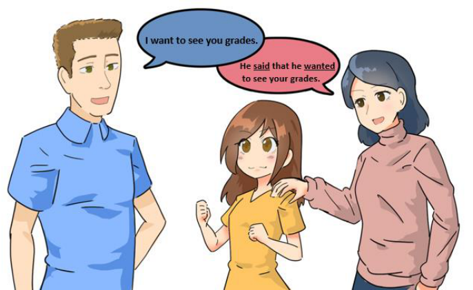
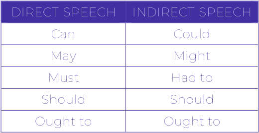
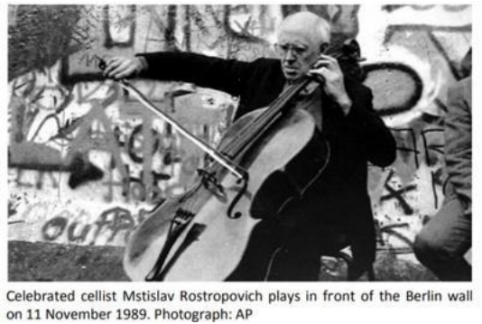
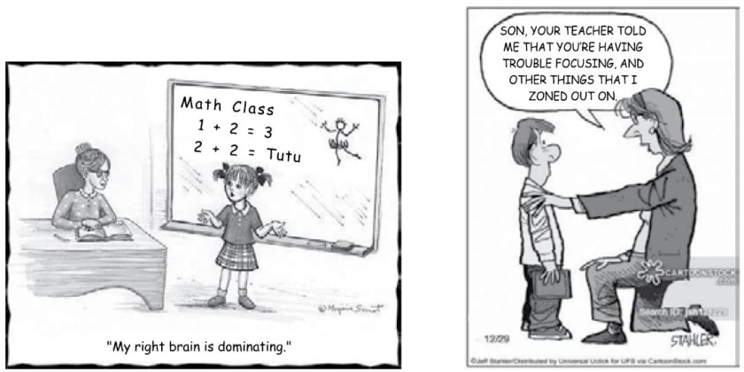
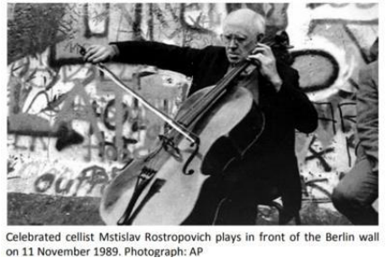
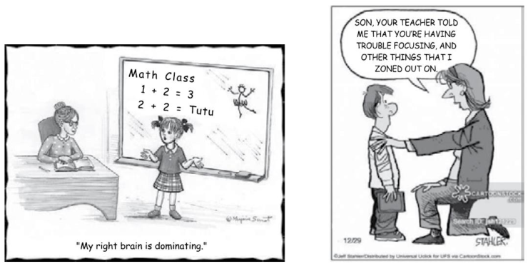

---
fonte_pdf: "Inglês - Aula 06.pdf"
paginas: 82
conversao: texto-e-imagens
---

<!-- pagina: 2 -->

**Andrea Belo Aula 06 - Direct Speech, Reported Speech and Passive Voice** 

## SUMÁRIO 

|INTRODUÇÃO ................................................................................................................................. 2|
|---|
|DIRECT SPEECH .............................................................................................................................. 3|
|INDIRECT SPEECH/REPORTED SPEECH ........................................................................................ 4|
|PASSIVE VOICE ............................................................................................................................... 9|
|QUESTÕES .................................................................................................................................... 14|
|GABARITO ..................................................................................................................................... 36|
|QUESTÕES COMENTADAS .......................................................................................................... 37|
|CONSIDERAÇÕES FINAIS ............................................................................................................. 78|
|REFERÊNCIAS ............................................................................................................................... 79|

---

<!-- pagina: 3 -->

**Andrea Belo Aula 06 - Direct Speech, Reported Speech and Passive Voice** 

# **INTRODUÇÃO** 

Vamos, então, à nossa aula sobre alguns tópicos considerados complexos: Direct Speech and Indirect ou Reported Speech (Discursos Direto e Indireto) e, também, Ative Voice and Passive Voice (Voz Ativa e Voz Passiva). 

Os discursos direto e indireto são usados quando queremos expressar as informações que alguém nos relatou, nos contou. 

O discurso direto (direct speech) – ao relatar o que alguém disse, usando as mesmas palavras que a pessoa utilizou, como mostrarei a você na teoria dessa aula. 

E, por sua vez, o discurso indireto (indirect speech ou reported speech) – ao relatar o que foi dito, porém, usando as nossas próprias palavras, que também explicarei com detalhes adiante. 

A voz passiva (passive voice) é usada de várias maneiras, quando queremos enfatizar a ação no lugar de quem a praticou e assim, ter a possibilidade de omitir o autor. 

Geralmente, não sabemos quem é o autor e queremos, desta forma, utilizar um tom mais impessoal. Você entenderá melhor no decorrer da aula. 

As línguas, de forma geral, são sistemas que devemos internalizar naturalmente, mas, como o conhecimento da língua consiste em uma fragmentação de conteúdos em regras (e essas cheias de exceções), fica complicado aprender e usar bem todos esses tópicos gramaticais, todo esse conteúdo proposto em nossas aulas, eu sei disso. 

Esses itens que selecionei para nossa aula e que estudaremos agora, são de extrema importância para solucionar questões em que exige mais de um tempo verbal na mesma frase e assim, tenta confundir você ou apenas, descobrir se você aprendeu bem os tempos verbais que já foram estudados para que você tenha domínio de identificá-los, como você fará! 

É claro que seu objetivo é ser aprovado. E, alcançar a aprovação depende de alguns passos, tais como adotar uma postura positiva, estudar muito e dar o seu melhor. Assim, mais cedo ou mais tarde vai alcançar sua vaga. 

No caminho à aprovação, você vai resolver, durante a teoria e no fim do material, exercícios de provas anteriores e essas questões irão ajudar você a colocar em prática o que aprende a cada dia. Além disso, você avaliará seu conhecimento. Vamos lá! Você consegue e será o melhor candidato!

---

<!-- pagina: 4 -->

**Andrea Belo Aula 06 - Direct Speech, Reported Speech and Passive Voice** 

# **DIRECT SPEECH** 

O discurso direto em inglês – direct speech – é usado quando queremos reproduzir qualquer tipo de informação que nos é relatada. Podemos dizer que, em suma, o discurso direto é utilizado para repetir o que uma outra pessoa disse do jeito exatamente que foi dito, sem alteração. Veja: 

She said, “I study every day because I want to be approved”. 

Ela disse: “Eu estudo todos os dias porque quero ser aprovada”. 

E sabe por que é importante estudar o discurso direto em relação à prova? Simplesmente pelo fato que é possível encontrar (e aparece muitas vezes) o discurso direto em jornais e portais de notícias, a fim de enfatizar e, consequentemente, deixar a notícia mais direta ou, às vezes, mais dramática, vejamos: 

“I won’t resign”, says the president during the meeting. (Não irei renunciar”, diz o presidente durante a reunião.) 

“Our diplomatic relations are over”, affirm both candidates. (Nossas relações diplomáticas acabaram”, afirmam ambos os candidatos.) 

O discurso direto pode também ser encontrado em diálogos de narrativas ficcionais, pois permite que traços da fala e de personalidade dos personagens envolvidos tenham destaque, atraindo a atenção de seus leitores. Nos textos da prova podem aparecer por esse motivo: enfatizar alguma parte do texto. 

“I could tell you my adventures—beginning from this morning,” said Alice a little timidly; “but it’s no use going back to yesterday, because I was a different person then.” 

(“Eu poderia lhes contar minhas aventuras – começando por esta manhã", disse Alice um pouco tímida; “mas não adianta voltar a ontem, porque eu era uma pessoa diferente.”) Lewis Carrol, Alice no País das Maravilhas. 

Agora, vamos estudar o discurso indireto – indirect speech , também chamado de reported speech , que, além de ter muitas possibilidades de uso, é mais recorrente ainda nos textos da prova.

---

<!-- pagina: 5 -->

**Andrea Belo Aula 06 - Direct Speech, Reported Speech and Passive Voice** 

# **INDIRECT SPEECH/REPORTED SPEECH** 

O indirect speech/reported speech , ou discurso indireto, é, por sua vez, uma maneira de falar sobre o que alguém disse, para repassar uma notícia, uma história. 

A principal característica é que no discurso indireto, se fala na voz de quem está contando a ação e não de quem a viveu. Por esse motivo, existem algumas regras básicas para se usar bem o discurso indireto, como por exemplo, a mudança dos tempos verbais. 

Se você diz, por exemplo, que você quer um carro novo e alguém vai me contar, a sequência é a seguinte: 

- Eu quero um carro novo. 

- Ele disse que queria um carro novo. 

Em inglês, é a mesma coisa. Observe que o verbo querer estava no presente quando você falou (eu quero). E foi automaticamente para o passado quando alguém contou o que você falou (ele/ela disse que queria). Veja em inglês o exemplo do carro e outro, ilustrado: 

(Você dizendo):  – I want a new car. 

(Alguém dizendo/contando o que ouviu): – He/She said that he/she wanted a new car. 

(O pai dizendo): – I want to see your grades (Eu quero ver suas notas). 

(A mãe dizendo à filha o que foi dito): – He said that he wanted to see your grades. (Ele disse que ele queria ver as suas notas). 

---

<!-- pagina: 6 -->

**Andrea Belo Aula 06 - Direct Speech, Reported Speech and Passive Voice** 

Veja algumas mudanças que acontecem com os verbos quando o discurso direto é transformado em discurso indireto, com exemplos abaixo de cada tempo verbal: 

## **VERB CHANGES** 

|**DIRECT SPEECH** Simple Present|**REPORTED SPEECH** Simple Past|
|---|---|
|**I study with you.**|**He said that he studied with me.**|
|Simple Past|Past Perfect|
|**I wrote the email.**|**He said that he had written the email.**|
|Present Continuous|Past Continuous|
|**I am working.**|**He said he was working.**|
|Past Continuous|Past Perfect Continuous|
|**I was shopping.**|**He said that he had been shopping.**|
|Present Perfect|Past Perfect|
|**I have eaten fast food.**|**He said that he had been eaten fast food.**|
|Will|Would|
|**I will visit you tomorrow.**|**He said that he would visit me the next day.**|
|Can|Could|
|**I can help you.**|**He said he could help me.**|

Você percebeu que em todas as frases eu usei “He said”, que pode ser acompanhado ou não de “that”. Mas, além do verbo to say (passado said), podemos também usar o verbo to tell (passado told) em frases com indirect/reported speech. Vejamos exemplos: 

I want a glass of water now. (Eu quero um copo de água agora.) He told me (that) he wanted this glass of water. (Ele me disse que ele queria esse copo de água.) I don’t want to work out today. (Eu não quero malhar.) He told me (that) he didn’t want to work out yesterday. (Ele me disse que não queria malhar ontem.)

---

<!-- pagina: 7 -->

**Andrea Belo Aula 06 - Direct Speech, Reported Speech and Passive Voice** 

A partir dos exemplos acima, podemos notar que algumas outras palavras, além dos tempos verbais, se alteram com o discurso indireto. Se fosse, por exemplo, em português: 

- Eu comprei esse boné. (discurso direto) - Ele disse que comprou aquele boné. (discurso indireto) Em inglês, fica: - I have bought **this** cap. He said he had bought **that** cap. - Eu comprei **esse** boné. Ele disse que ele tinha comprado **aquele** boné. 

Veja as possíveis modificações no discurso indireto, que podem perguntar na prova. 

## **TIME EXPRESSION CHANGES** 

|**DIRECT SPEECH** **INDIRECT SPEECH**|
|---|
|Today That day|
|Yesterday The day before|
|Last night The night before|
|Now Then|
|Here There|
|Tomorrow The next day|
|This That (quando em expressão de tempo)|
|This, That The (quando adjetivos)|
|This, These It, Them (quando pronomes)|

Pode ainda, haver outras alterações. Alguns lugares, além dos pronomes e das indicações de tempo acima, também podem mudar com a passagem do discurso direto para o indireto. 

They are meeting at **my** house. (Eles estão se encontrando na **minha** casa.) He said that they were meeting at **his** house. (Ele disse que eles estavam se encontrando na casa **dele** .) 

I got **here** by train. (Eu cheguei **aqui** de trem.) 

He said he had got **there** by train. (Ele disse que ele chegou **lá** de trem.)

---

<!-- pagina: 8 -->

**Andrea Belo Aula 06 - Direct Speech, Reported Speech and Passive Voice** 

E os verbos modais, já apresentados na aula 2, também mudam. Se você diz que pode fazer algo, no momento que vou contar a alguém, digo: Ele(a) disse que podia fazer algo. Assim como o “posso” se torna “podia”, em inglês seria o can se tornar could, entendeu? Vejamos a seguir a tabela e os exemplos para facilitar. 

## **MODAL VERBS CHANGES** 

<!-- Start of picture text -->
DIRECT SPEECH  INDIRECT SPEECH Can  Could May  Might Must  Had to Should  Should Ought to  Ought to <!-- End of picture text -->

She **must** study a lot. (Ela **deve** estudar muito.) 

She said she had to study a lot. (Ela disse que ela teve que estudar muito.) 

I **can dance** rock. (Eu **consigo dançar** rock.) 

He said he could dance rock. (Ele disse que ele conseguia dançar rock.) 

Em um dos textos de uma prova, vou mostrar como uma das frases em discurso direto poderia ter sido explorada para testar seus conhecimentos, como já foi feito em outras provas: 

“CHINA has begun to enter the age of mass car consumption. This is a great and historic advance.” So proclaimed the state-run news agency, Xinhua, last year. <mark>Environmentalists may feel a twinge of fear</mark> at this burgeoning romance with motoring. But a rapid social and economic transformation is under way in urban China, and the car is steering it. 

In 2002 demand for cars in China soared by 56%, far more than even the rosiest projections. The next year growth quickened to 75%, before slowing in 2004 (when the government tightened rules on credit for car purchases) to around 15%. But in a sluggish global market, China’s demand remains mesmerising. Few expect this year’s growth to dip below 10%. As long as the economy goes on galloping at its current high-singledigit clip, many expect car sales to increase by 10-20% annually for several years to come. 

The Economist June 4th , 2005

---

<!-- pagina: 9 -->

**Andrea Belo Aula 06 - Direct Speech, Reported Speech and Passive Voice** 

Na frase “Environmentalists may feel a twinge of fear…” (Ambientalistas podem sentir uma pontada de medo...), no discurso direto, poderia ser questionado como ficaria no discurso indireto ou se o verbo modal “may” mudaria na modificação de discurso direto para indireto, veja: 

Questão: A frase “Environmentalists may feel a twinge of fear…” devidamente transformada em discurso indireto, ficaria: 

A) He said that environmentalists may felt a twinge of fear. 

B) He said that environmentalists can felt a twinge of fear. 

C) He said that environmentalists may be felling a twinge of fear. 

D) He said that environmentalists may have felt a twinge of fear. 

E) He said that environmentalists might feel a twinge of fear. 

Comentários: Aqui, devemos analisar cada alternativa, para encontrar a melhor alternativa para a sentença transformada em discurso indireto, de acordo com as regras vistas acima, na explicação com quadros/tabelas que preparei para você. 

A primeira coisa a se observar é que o verbo modal “may”, ao direcionar-se à uma frase do discurso indireto, passa de may para might , lembra? 

Na letra A, afirma-se que o verbo feel vai para o passado – felt, mas, ao analisar a teoria acima, podemos perceber que, como eu disse anteriormente, may se transforma em might. Falsa. 

Na letra B , afirma-se que o verbo modal may muda para can e que o verbo feel vai para o passado – <u>felt, mas, ao analisar a teoria acima, podemos perceber que, como eu disse</u> anteriormente, may se transforma em might e jamais seria trocado um verbo modal por outro, pois, como vimos na aula de verbos, o sentido também muda de acordo com a situação em que é encaixado. Falsa. 

Na letra C , afirma-se que a estrutura inteira da frase muda de may feel para may be feeling, no gerúndio, mas, ao analisar a teoria acima, podemos perceber que, como eu disse anteriormente, may se transforma em might. Falsa. 

Na letra D , afirma-se que estrutura inteira da frase muda de may feel para may have felt, no present perfect, mas, ao analisar a teoria acima, podemos perceber que, como eu disse anteriormente, may se transforma em might. Falsa. 

A letra E , afirma-se que o verbo <u>feel</u> continua feel e o modal may muda para might, exatamente como vimos na tabela ilustrativa. E podemos perceber que, como eu disse anteriormente, may transformado em might está <u>correto</u> para discurso indireto com verbos modais.

---

<!-- pagina: 10 -->

**Andrea Belo Aula 06 - Direct Speech, Reported Speech and Passive Voice** 

# **PASSIVE VOICE** 

Quando falamos em voz passiva, é preciso entender a voz ativa e, para estudar ambas, estamos nos referindo à estrutura de frases, ou seja, a ordem das palavras. 

Frases na active voice (voz ativa) são aquelas em que o sujeito que pratica alguma ação está em evidência, enquanto na passive voice (voz passiva) o objeto que recebe a ação é que está em evidência. 

A voz ativa é o modo mais utilizado para ser claro e direto. Como é um sujeito que realiza uma ação, o destaque é dado para o sujeito. Uma frase na voz ativa é composta por sujeito + verbo auxiliar + verbo principal + objeto . Por exemplo, na frase: 

Pedro washes the car – Pedro lava o carro. 

Pedro é o sujeito da frase, to wash é o verbo principal, com o acréscimo de -es na terceira pessoa do singular e the car é o objeto. 

Como a frase está na voz ativa, queremos dar ênfase na <u>ação de Pedro ao lavar o carro,</u> tornando-o como agente principal da frase. 

Já na voz passiva, queremos dar ênfase para o objeto que está sofrendo a ação, e não para o sujeito. Veja: 

The car is washed by Pedro – O carro é lavado por Pedro. 

Para formar a voz passiva em inglês, o objeto da voz ativa passa a ser o sujeito da voz passiva, e o sujeito da voz ativa passa a ser o agente da voz passiva. 

Como a frase está na voz passiva, desta vez queremos dar ênfase na ação de as roupas estarem sendo lavadas. 

A <u>passive voice</u> (voz passiva) é um tipo de construção frasal onde se expressa o que acontece com o sujeito, sem obrigatoriamente enfatizá-lo. 

Nós nos expressamos usando a voz ativa e, ao transformar em voz passiva, é que as frases ficam repletas de novas estruturas, como veremos. 

A voz passiva é geralmente utilizada em textos técnicos, artigos, anúncios e, como nas provas essas fontes são comuns, a voz passiva é facilmente encontrada em textos. 

**VOZ ATIVA:** I cleaned the garage this morning. – Eu limpei a garagem esta manhã. 

**VOZ PASSIVA:** The garage was cleaned this morning by me – A garagem foi limpa esta manhã por mim.

---

<!-- pagina: 11 -->

**Andrea Belo Aula 06 - Direct Speech, Reported Speech and Passive Voice** 

A voz passiva pode ser utilizada em frases afirmativas, negativas e interrogativas. Sua formação é expressa por um objeto (um substantivo) + verbo to be + particípio passado do verbo principal + complemento da frase. 

Veja, agora, cada uma delas em diferentes tempos verbais. Let’s go!!! 

## **PASSIVE VOICE VERB TENSES TRANSFORMATION** 

**Simple Present: am/is/are + particípio** Affirmative Form: The house is painted by Tom. Negative Form: The house isn’t painted by Tom. Interrogative Form: Is the house painted by Tom? 

**Present Continuous: am/is/are being + particípio** Affirmative Form: The house is being painted by Tom. Negative Form: The house isn’t being painted by Tom. Interrogative Form: Is the house being painted by Tom? 

**Present Perfect: has/have been + particípio** Affirmative Form: The house has been painted by Tom. Negative Form: The house hasn’t been painted by Tom. Interrogative Form: Has the house been painted by Tom? 

**Simple Past: was/were + particípio** Affirmative Form: The house was painted by Tom. Negative Form: The house wasn’t painted by Tom. Interrogative Form: Was the house painted by Tom? 

**Past Continuous: was/were being + particípio** Affirmative Form: The house was being painted by Tom. Negative Form: The house wasn’t being painted by Tom. Interrogative Form: Was the house being painted by Tom?

---

<!-- pagina: 12 -->

**Andrea Belo Aula 06 - Direct Speech, Reported Speech and Passive Voice** 

**Past Perfect: had been + particípio** 

Affirmative Form: The house had been painted by Tom. 

Negative Form: The house hadn’t been painted by Tom. Interrogative Form: Had the house been painted by Tom? 

**Simple Future: will be + particípio** 

Affirmative Form: The house will be painted by Tom. Negative Form: The house won’t be painted by Tom. Interrogative Form: Will the house be painted by Tom? 

**Future Perfect: will have been + particípio** Affirmative Form: By next week, the house will have been painted by Tom. Negative Form: By next week, the house won’t have been painted by Tom. Interrogative Form: Will the house have been painted by next week by Tom? 

**Modal Verbs:** Modal verb + be + particípio 

Teacher Andrea won the competition. / The competition was won by teacher Andrea. 

Comparando as frases para facilitar a compreensão, diferentemente da voz ativa, com a ênfase está no sujeito, que praticou a ação, na voz passiva se enfatiza o objeto, aquele que sofre a ação expressa pelo verbo. Exatamente isso:

---

<!-- pagina: 13 -->

**Andrea Belo Aula 06 - Direct Speech, Reported Speech and Passive Voice** 

VOZ ATIVA: Teacher Andrea <u>won</u> the competition. 

VOZ PASSIVA: The competition <u>was won</u> by teacher Andrea. 

Agora, usando o verbo to clean (limpar), conjugado no particípio, conforme pede a voz passiva, veja frases em todos os tempos verbais com os devidos complementos. 

Preparei para você uma tabela com exemplos para ficar claro o que falamos acima. 

|**SUJEITO +** **"T** **SIMPLE PRESENT** The house|**O BE" (conjugado) +** is| **PARTICÍPIO +** cleaned| **RESTO DA ORAÇÃO** every day.|
|---|---|---|---|
|**PRESENT CONTINUOUS** The house|is being|cleaned|at the moment.|
|**SIMPLE PAST** The house|was|cleaned|yesterday.|
|**PAST CONTINUOUS** The house|was being|cleaned|last week.|
|**PRESENT PERFECT** The house|has been|cleaned|since you left.|
|**PAST PERFECT** The house|had been|cleaned|before they arrived.|
|**FUTURE** The house|will be|cleaned|next week.|
|**FUTURE CONTINUOUS** The house|will be being|cleaned|tomorrow.|
|**PRESENT CONDITIONAL**The house|would be|cleaned|if the had visitors.|
|**PAST CONDITIONAL** The house|would have been|cleaned|if it had been city.|
|**INFINITIVE** The house|must be|cleaned|before we arrived.|

A melhor forma de fixar os conteúdos, não só a voz passiva, como qualquer tópico estudado, é fazendo exercícios em que o conteúdo está inserido. Então, vamos lá. 

Em outro texto, de uma fonte usada em muitas provas, vou mostrar como há uma frase que remete à voz passiva e como isso poderia ter sido questionado em sua prova: 

Australians are not known for their love of boat people. 

They famously turned away a small group of Afghan refugees at the height of the war and rather amusingly, ran a scare campaign featuring crocodiles and sharks to deter would-be immigrants. But if global warming continues at its current rate, neighbouring Pacific islands could be lost to floods and Australia will be facing a new kind of intruder: climate refugees. 

Although the Red Cross produced a report four years ago estimating that 58 per cent of refugees are caused by environmental factors, no one has made any attempt to tackle the issue. Oxford University’s Norman Myers recently claimed that there could be an estimated 150 million environmental refugees within the next 50 years, and half of these could land on Australia’s doorstep. But the UN refuses to grant them refugee status, and aid groups and environmentalists squabble over whose responsibility they are.

---

<!-- pagina: 14 -->

**Andrea Belo Aula 06 - Direct Speech, Reported Speech and Passive Voice** 

Na frase “... the Red Cross produced a report…” na voz passiva, seria “A report was produced by the Red Cross” e poderia ser uma das perguntas da sua prova, veja: 

Questão : A frase “the Red Cross produced a report …” na posição de voz passiva, seria: 

A (   ) A report had produced by the Red Cross. 

B (   ) A report was producing by the Red Cross. 

- C (   ) A report will be produced by the Red Cross. 

- D (   ) A report were produced by the Red Cross. 

E (   ) A report was produced by the Red Cross. 

Comentários: Como sempre, devemos analisar cada alternativa, para encontrar o que melhor se encaixa. 

Nesse caso, para a sentença transformada em voz passiva, de acordo com o que vimos no capítulo agora estudado, para verbos no passado simples (Past Simple), a frase é preenchida pelo verbo to be relativo ao sujeito e o verbo principal no particípio, lembra? 

Na letra A, afirma-se que report, antes no fim da frase como objeto, foi para o começo 

como sujeito, o que está correto. 

Porém, foi colocado o verbo have no passado (had) antes do particípio de produce (produced), enquanto deveria ter sido usado, de acordo com a regra que estudamos, o verbo to be no passado, que seria “was” antes de “produced”. Falsa. 

Na letra B , afirma-se que report, antes no fim da frase como objeto, foi para o começo como sujeito, o que está correto. Porém, foi colocado, junto ao verbo to be conjugado no passado – was – o verbo produce no gerúndio (producing), enquanto deveria ter sido usado, de acordo com a regra que estudamos, o verbo to produce no particípio - produced. Falsa. 

Na letra C , afirma-se que report, antes no fim da frase como objeto, foi para o começo como sujeito, o que está correto. Porém, foi colocada a forma de futuro para falar de algo que já aconteceu, portanto, está no passado e assim, precisamos do verbo to be no passado e o verbo principal produce no particípio - produced. E por isso é falsa. 

Na letra D , afirma-se que report, antes no fim da frase como objeto, foi para o começo como sujeito, o que está correto. Porém, foi colocado, o verbo to be conjugado no passado no plural – were – mas a palavra report é singular (relatório) e então, deveria-se usar was ao invés de were. 

A letra E , afirma-se que report, antes no fim da frase como objeto, foi para o começo como sujeito, o que está correto. E, em seguida, foi colocado, o verbo to be conjugado no passado no singular – was – concordando com a palavra report é singular (relatório) e então, a estrutura está correta, a concordância também. Alternativa certa.

---

<!-- pagina: 15 -->

**Andrea Belo Aula 06 - Direct Speech, Reported Speech and Passive Voice** 

# **QUESTÕES** 

Esse é momento em que vamos praticar tudo o que vimos nessa Aula 06 . Serão questões para preparar você e colaborar com a sua aprovação. 

### 01. (INSTITUTO AOCP/2016 – IFBA) 

Dear Mayor Estrosi, Mayor Vivoni, Prime Minister Manuel Valls, Former President Nicolas Sarkozy, and other French officials who have supported France’s burkini ban: 

My name is Amara Majeed, and I am a 19-yearold Muslim Sri Lankan American. I am a student at Brown University, studying cognitive neuroscience and public policy. 

When I look at the photo circulating of a woman in Nice being surrounded by armed police officers as she is coerced into removing her clothing, because French officials deemed the burkini to be inappropriate beach attire, I see infringement on a woman’s right to choose what she puts on her body by a group of white males. I see the scapegoating, ostracization, and criminalization of Muslims in the aftermath of the Nice terror attacks. I am a woman who wears the hijab, and I see an affront to the rights and civil liberties of women like me. 

Deputy Mayor of Nice, Christian Estrosi: You have stated that you support this ban on “inappropriate clothing” in the wake of the Nice terror attacks. Mayor Vivoni, you have described the burkini ban as a necessary measure to “protect the population.” Former French president Nicolas Sarkozy, you have labeled the burkini as a symbol of extremism. 

Let me respond to all of you by saying this: any conflation of the burkini with terrorism is invalid, virulent, and discriminatory. Tell me, in what way does our way of dress pose a threat to France’s national security? In what way does the burkini propagate hateful, violent ideologies? How is it that our way of dress poses a national security threat, yet some wetsuits, which take on strikingly similar designs to the burkini, aren’t? While France’s highest administrative court has now overturned the ban, the damage has already been done — this attack on the Muslim way of dress only serves as fodder to the already existing rising anti-Muslim sentiment and stigmatization of Muslims in France. If this institutionalized Islamophobia and fearmongering is being perpetrated by French officials and authorities, I fear how the general public’s poor treatment of hijab-clad women may be exacerbated in the coming weeks. We’re all well aware that hate crimes and violence targeting Muslim women wearing the hijab is not a new phenomenon in France. 

As one burkini-clad woman who was forced to leave the beach states, “Because people who have nothing to do with my religion have killed, I no longer have the right to go to the beach.” In the eyes of many authority figures, our religious identity in and of itself is incriminating. Our way of dress is incriminating. Our sheer existence is incriminating. 

Many of you have called the hijab an emblem of oppression. In April, France’s Minister for Women’s Rights equated women who choose to wear the hijab with “Negroes who were in favor of slavery.” More recently, France’s prime minister stated that the burkini is a tool of “enslavement,” and former French President Sarkozy insinuated that hijabclad women are imprisoned.

---

<!-- pagina: 16 -->

**Andrea Belo Aula 06 - Direct Speech, Reported Speech and Passive Voice** 

I am genuinely tired of individuals like you imposing your brand of colonial feminism on us and telling us that we are oppressed, that we have been indoctrinated, that this was not our choice, and that we need to be unshackled. Instead of continuing to pursue these offensive and failing attempts at liberating us, I implore you to liberate yourselves from this white savior complex and recognize that we don’t need your saving. The hijab does not oppress me. For me, the hijab is a symbol of feminism and freedom of expression — so who are you to invalidate my experiences, to invalidate a fundamental, inextricable aspect of my identity, and to label me as enslaved, as imprisoned, as oppressed? By depriving us of our rights to dress the way we want, by making public spaces inaccessible to us, by publicly humiliating us and coercing us to remove some of our clothing while we are trying to enjoy a day at the beach — you are oppressing us. 

My news feed has been saturated with people posting photos of a Muslim woman at a beach being forced to strip, captioned with outrage and vitriol towards this form of discrimination. While your support of our rights is appreciated, I ask that you refrain from doing a disservice to this individual by circulating this photo. It may not seem like you are violating a woman’s privacy and liberties by sharing a picture revealing her arms or shoulders, but it is incumbent upon us to understand that she did not freely choose to show those parts of her body in public. Even if the intent is to excoriate the burkini ban while circulating these photos, I implore you to not be complicit, whether directly or indirectly, in systems of oppression that are stripping women, literally, of their right to choose what they wear. 

Yours truly, Amara Majeed – a muslin woman 

(Source: http://www.bustle.com/articles/180721-an-open-letter-tofrench-officials-who-support-the-burkini-ban-from-a-muslim-woman) 

Observe the following excerpt: “(…) a woman in Nice being surrounded by armed police officers as she is coerced into removing her clothing (…). Mark the alternative that describes the structure underlined both in terms of grammar and usage. 

(A) It is an example of Active Voice used when it is necessary to move important information to the beginning of the sentence. 

(B) It is an example of Reported Speech which describes what people say, believe, think, consider or know and refers to a state or action in the present. 

(C) It is an example of a Conditional sentence which shows the result of a present situation, with possible or likely results in the future. 

(D) It is an example of Present Perfect used to refer to an event connected to the present without a certain time definition. 

(E) It is an example of Passive Voice used when the performer of the action is general or obvious from the context, or unimportant, or is intentionally not named. 

### 02. (INSTITUTO AOCP/2013 – PREFEITURA MUNICIPAL DE SEROPÉDICA – RJ) 

Speech can be divided into discourse genres based on the contextual environment it occurs in 

(e.g. political speech, sport commentary speech, etc.). The present study investigated whether

---

<!-- pagina: 17 -->

**Andrea Belo Aula 06 - Direct Speech, Reported Speech and Passive Voice** 

listeners can distinguish between speech from different discourse genres on the basis of acoustic prosodic cues only. In a perception experiment with delexicalized speech, 70 listeners with varying experience in French (native speakers, nonnative speakers, and non-speakers) were asked to identify four different types of discourse genres (church service, political, journal, and sport commentary). Results revealed fair identification ability with a significant increase in performance with increasing experience in French. Identification confusion was used to cluster discourse genres according to their perceptual similarity. The possible application of the results for the evaluation of speaking style speech synthesis will be discussed. 

Index Terms: discourse genre, speaking style, prosody, perception, speech synthesis. 

Observe the following sentence: “70 listeners with varying experience in French were asked to identify four different types of discourse genres”. Mark what is TRUE according to the underlined structure of the sentence above. 

(A) It is written in indirect speech because it reports something that was said or written by conveying what was meant rather than repeating the exact words. 

(B) It is written in direct speech because it reports what someone has said or written by quoting his exact words. 

(C) It is written in the passive voice because it indicates that the grammatical subject of the verb is the recipient and not the source of the action denoted by the verb. 

(D) It is written in the active voice because it indicates that the grammatical subject of the verb is performing the action or causing the happening denoted by the verb. 

(E) It is written in the imperative because it denotes a mood that expresses a command or request. 

### 03. (INSTITUTO AOCP/2008 – PREFEITURA MUNICIPAL DE TIMBÓ – SC) 

Assinale a alternativa que apresenta a forma correta da voz passiva da frase "Europe is debating the growing prominence of English.” 

A) The growing prominence of English is been debating by Europe. 

B) The growing prominence of English was debated by Europe. 

C) The growing prominence of English has been debating by Europe. 

D) The growing prominence of English have been debating by Europe. 

### 04. (CEBRASPE/2017 – SEDUC-AL) 

The Japanese practice of shinrin-yoku — literally translated as “forest bathing” — is based on a simple premise: immerse yourself in the forest, absorb its sights, sounds, and 4 smells, and you will reap numerous psychological and physiological benefits. The Forest Agency of Japan launched a campaign to introduce the activity in 1982, and, since then, 7 its popularization there has been matched by a stream of supporting research concerning the role that nature can play in human

---

<!-- pagina: 18 -->

**Andrea Belo Aula 06 - Direct Speech, Reported Speech and Passive Voice** 

health. Studies have shown that regular exposure 10 to forest environments can lower blood pressure and anxiety, reduce anger, and strengthen the immune system. The forest-bathing spirit has gained followers in the United States, 13 too: you can now sign up to join the national Forest Bathing Club (whose registration form includes a field for “spirit animal”), or apply to become a certified forest-therapy 16 guide. Or you can simply go to a local greenspace, disconnect, and listen to the trees. 

Internet: <www.newyorker.com> (adapted). 

Regarding the ideas and linguistic aspects of the previous text, judge the following item. 

The verb phrase “has been matched” (Line 7) is an example of a passive voice construction. 

(    ) Certo 

(    ) Errado 

### 05. (CEBRASPE/2016 – SEDF) 

When Harold Palmer (1877 – 1949) first began as a1 teacher of English as a foreign language in 1902 at a language school in Verviers, Belgium run on Berlitz lines, the main attraction of the job was that it allowed him to live abroad in a4 French-speaking country. In all likelihood he would eventually come back home in a few years and “settle down”, like many others before and since. Palmer, however, stayed on, opened7 his own school, and began to think seriously about the work he was doing and how it could be improved. When he died forty-seven years later, English language teaching was well on10 its way to a professionhood which he, more than any other single individual, had helped to bring about. 

A. P. R. Howatt and H. G. Widdowson. A history of English language teaching . 2nd ed. Oxford University Press, 2004, p. 264 (adapted). 

Judge the following item, concerning the ideas and linguistic aspects of text. 

As in the phrase “a language school in Verviers, Belgium run on Berlitz lines” (l. 2 and 3), the relative pronoun and the auxiliary verb which forms the passive voice have been omitted, the excerpt “run on Berlitz lines” could be correctly replaced with which was run on Berlitz lines. 

(    ) Certo 

(    ) Errado 

### 06. (BANCA/ANO – SEDUC-AL) 

The term language learning strategy has been defined by many researchers. Wenden and Rubin (1987:19) define learning strategies as “... any sets of operations, steps, plans, routines used by the learner to facilitate the obtaining, storage, retrieval, and use of information.” Richards and Platt (1992:209) state that learning strategies are “intentional behavior and thoughts used by learners during learning so as to better help them understand, learn, or remember new

---

<!-- pagina: 19 -->

**Andrea Belo Aula 06 - Direct Speech, Reported Speech and Passive Voice** 

information.” According to Stern (1992:261), “the concept of learning strategy is dependent on the assumption that learners consciously engage in activities to achieve certain goals and learning strategies can be regarded as broadly conceived intentional directions and learning techniques.” All language learners use language learning strategies either consciously or unconsciously when processing new information and performing tasks in the language classroom. Since language classroom is like a problem-solving environment in which language learners are likely to face new input and difficult tasks given by their instructors, learners’ attempts to find the quickest or easiest way to do what is required, that is, using language learning strategies is inescapable. 

Language learning strategies use during the act of processing the new information and performing tasks have been identified, described and classified by many scholars. However, most of these attempts to classify language learning strategies reflect more or less the same categorizations without any radical changes. 

M. Hismanoglu. Language Learning Strategies in Foreign Language Learning and Teaching. In: The Internet TESL Journal . Internet: <http//:iteslj.org> (adapted). 

### Based on the text, judge the following item. 

In “The term language learning strategy has been defined by many researchers.” (Line 1-2), the focus is on the action and not on the ones who did the action. 

(    ) Certo 

(    ) Errado 

### 07. (CEBRASPE/2006 – SEPLAD) 

### Circle Games 

Circle games are any games or activities that involve the whole class, sitting in a circle. Many of the games recycle vocabulary and involve an element of fun. Nowadays, in the world of EFL (English as a Foreign Language), pair work and work in small groups is very much in fashion. The communicative approach encourages teachers to use a lot of pair work and therefore increase “student talking time”. I believe that for a group to gel and for a good group dynamic to prevail there are times when the class should work together as a whole. Circle games are a good opportunity to bring the group together. I tend to use them to start or end a class. They can be used as warmers at the beginning of a class or as “filler” at the end. 

An activity such as Chain Drawings is great for when you have to do a last minute substitution class for a colleague. Very little material is required, it's suitable for all levels and a lot of language can be generated. 

### Chain Drawings 

### a. Give each student a piece of paper and some colored pencils. 

b. Tell them that you are going to play some music and you want them to draw whatever comes into their heads. 

- c. As music is playing all students should be drawing.

---

<!-- pagina: 20 -->

**Andrea Belo Aula 06 - Direct Speech, Reported Speech and Passive Voice** 

d. After 20 or 30 seconds, stop the music. 

e. Students stop drawing and pass their picture to the person to the left of them in the circle. 

f. Play the music again and they continue with the drawing the person next to them had started. 

g. Stop the music again, pass pictures on and this continues until the end of the song. 

h. When you have finished, each student will have a picture that several students contributed to. 

### i. Then it’s up to you what to do with the pictures: 

(i)They can be used to describe to the group, to write a story about, or to pretend they were a dream the student had the night before. 

(ii)The rest of the class can try to analyze the meaning of the dream. Use different types of music to get different types of pictures. Reggae and samba usually produce happy beach scenes and dance music gets futuristic city scenes! 

If you want to “force” the pictures towards a topic you are studying, ask some questions about the topic first and get students into thinking about the theme. Beware — with teenagers this activity can be quite an eye-opener as it tends to reveal what is going on in their minds! 

Internet: <www.teachinenglish.org.uk> (with adaptations). 

In the text, the phrase “They can be used as warmers” (line.12) is the passive voice of You can use them as warmers. 

(    ) Certo 

(    ) Errado 

### 08. (CEBRASPE/2011 – SEDUC-AM) 

Teaching beginners is considered by many to be the most challenging level of language instruction. Since students at this level have little or no prior knowledge of English on which to build, the teacher (and accompanying techniques and materials) becomes a central determiner in whether or not students accomplish their goals. This can also be the most tangible rewarding level for a teacher because one can readily see the growth of students’ proficiency in a matter of a few weeks. 

At the beginning or even false-beginning level your students have very little language “behind” them. You may therefore be tempted to go along with the popular misconception that the target language cannot be taught directly, that you will have to resort to a good deal of talking “about” English in the students’ native language. Such is clearly not the case, as beginning language courses have demonstrated for many decades. But you do have to keep well in mind that your students’ capacity for taking in and retaining new words is limited. Foremost on your mind as a teacher should be the presentation of material in simple segments so as not to overwhelm your students. Remember they are just barely beginning. 

B. H. Douglas. Teaching by principles – an interactive approach to language pedagogy . Prentice Hall Regents. San Francisco State University, 2007 (adapted).

---

<!-- pagina: 21 -->

**Andrea Belo Aula 06 - Direct Speech, Reported Speech and Passive Voice** 

According to the text above, judge the following item. 

The phrase “the target language cannot be taught directly” (lines 13-14) can be correctly paraphrased as the teacher cannot teach the target language directly. 

(    ) Certo 

(    ) Errado 

### 09. (CEBRASPE/2002 – SEDF) 

### Text CE-IV 

For almost six decades now research and practice in English language teaching have identified the “four skills” — listening, speaking, reading, and writing — as of paramount importance. In textbooks and curricula in widely varying contexts, ESL classes around the world tend to focus on one or two of the four skills, sometimes to the exclusion of the others. And a visit to the most recent TESOL Convention will offer you a copious assortment of presentations indexed according to the four skills. 

It is perfectly appropriate to so identify language performance. The human race has fashioned two forms of productive performance, oral and written, and two forms of receptive performance, aural (or auditory) and reading. There are of course offshoots of each mode. Lumped together under a non-verbal communication are various visually perceived messages delivered through gestures, facial expressions, proximity, and so forth. Graphic art (drawings, paintings, diagrams) is also a powerful form of communication. And we could go on. But for learners of a second language, some attention to the four different skills does indeed pay off as learners discover the differences among these four primary modes of performance along with their interrelationships. 

With all our history of treating the four skills in separate segments of a curriculum, there is nevertheless a more recent trend toward skill integration . That is, rather than designing a curriculum to teach the many aspects of one skill, say, reading, curriculum designers are taking more of whole language approach whereby reading is treated as one of the two or more interrelated skills. A course that deals with reading skills, then, will also deal with related listening, speaking, and writing skills. 

H. Douglas Brown. Teaching by principles . Prentice Hall Regents, 1994, p. 217-8 

As found in text CE-IV, “delivered” (Line 16) is a simple past form. 

(    ) Certo 

(    ) Errado

---

<!-- pagina: 22 -->

**Andrea Belo Aula 06 - Direct Speech, Reported Speech and Passive Voice** 

### 10. (CESGRANRIO/2004 – BNDES) 

### A FADED GREEN 

Shades of peach adorn America’s recently redesigned $20 note, but currency traders care little for pretty colours. The dollar has steadily been losing value in the foreign-exchange markets. This week it reached its low against the euro since the single European currency was launched in 1999, breaking through $1.20. The dollar has fallen by 31% against the euro from its peak in July 2001. Recently it has also hit a three-year low against the yen and a five-year low against sterling. 

It may seem curious that the dollar is falling when America is enjoying a remarkable burst of growth and Europe looks far less lively. America’s GDP grew at an annual rate of 8.2% in the third quarter. The Institute of Supply Management’s widely watched index of manufacturing activity hit a 20-year high in November. Meanwhile, the euro area’s economies are on the mend, but are expected to grow by only 0.5% this year and 1.8% next, according to The Economist’s monthly poll of economic forecasters. ==5460== 

However, currencies are not economic virility symbols, but assets on which investors expect a return. The dollar used to be buoyant because investors expected to make more from dollar assets than from those denominated in other currencies. Now they are not so sure. Their worries over America’s twin deficits, on the current-account and the federal budget, loom large. With a currentaccount deficit of 5% of GDP, America must borrow $2 billion each business day. Tax cuts, spending on the war in Iraq and a new scheme to provide prescription drugs to the old are dragging the government’s books into disarray. 

How much further might the dollar fall? Predicting the future price of a currency is useless. But there are good reasons to believe that over the medium term the dollar could drop a lot lower, especially against the euro. Whether that will have the desired effects, in reducing America’s imbalances, or in causing the expected chaos in Europe’s economies, is a different question. 

A stronger euro should be bad news for European firms, even if it means cheaper Florida holidays for their employees. A rise in the euro against the dollar causes exports from European firms to become more expensive relative to American ones, cutting into Europe’s sales. Similarly, American firms’ products become relatively cheaper, both for Americans and for foreign buyers. By creating more exports and curbing imports, a weaker dollar should thus help to cut America’s huge current account deficit. 

Or so the textbooks have it. In the past, a falling dollar has indeed reduced America’s imports. In the 1980s, the last time America had such a large current account deficit relative to GDP, an agreement to let the dollar depreciate helped to reduce America’s consumption of Japanese cars and Swiss watches. 

But there is reason to think that these days currency movements are not as effective as they once were in bringing economies into balance. A recent report of an investment bank doubts that a sliding dollar will do much to eliminate America’s trade and current-account imbalances. 

In an increasingly integrated global economy, companies’ pricing power has been eroded around the world. In addition, low inflation has made price increases more obvious. So it is more difficult

---

<!-- pagina: 23 -->

**Andrea Belo Aula 06 - Direct Speech, Reported Speech and Passive Voice** 

for a European car company, say, to raise its prices in America in response to a stronger euro. According to a study cited in the report, the ability to pass on the effects of a stronger currency has been waning in recent years. 

The Economist , Dec. 6, 2003 http://www.tradewithvision.com/ kbase/pdf/fadedGreen.pdf 

Check the option which DOES NOT have a verb in the passive voice. 

(A) “... the single European currency was launched in 1999,” (lines 5-6) 

(B) “…but are expected to grow by only 0.5% this year...” (line 17) 

(C) “The dollar used to be buoyant because investors expected to make more from dollar assets...” (lines 22-23) 

(D) “… companies’ pricing power has been eroded around the world.” (lines 62-63) 

(E) “According to a study cited in the report,” (line 66) 

### 11. (FCC/2015 – SEDU-ES) 

A questão refere-se a conhecimentos linguísticos da língua inglesa. 

“Grandma takes us to school everyday”. A reescrita correta dessa frase na voz passiva é 

(A) The school is taken by grandma everyday. 

- (B) The school is taken up by us and grandma everyday. 

(C) We’re taking grandma to school everyday. 

- (D) The school is taking us to grandma everyday. 

- (E) We’re taken to school by grandma everyday. 

### 12. (FCC/2009 – SEPLADR-SP) 

Too often, America educates its children for the challenges they will face in the global, knowledgebased 21st century using 20th-century technology and methodology. Other nations provide students with laptop computers, fast broadband connections, and state-of-the-art digital applications, infusing technology and innovation throughout their educational experiences. In contrast, the Bush Administration has proposed in its FY09 budget eliminating all funding for the Enhancing Education Through Technology program, designed to improve student achievement and boost students' digital literacy through the use of technology in schools. 

The competitiveness and vibrancy of our economy, as well as our homeland security, depend on our ability to maintain a highly-skilled workforce. We must educate new generations of digitally literate citizens to ensure they are able to compete successfully in today's global workforce and participate in our increasingly knowledge-based society. 

Our education system, KK ........, is failing to meet this challenge. In America's schools, Internet access is often far too slow, with insufficient bandwidth for online learning, collaborative work,

---

<!-- pagina: 24 -->

**Andrea Belo Aula 06 - Direct Speech, Reported Speech and Passive Voice** 

video conferencing, and other educational applications. In some cases, schools still use dial-up Internet access. School technology is often antiquated, in short supply, and insufficiently supported. Distance learning over broadband is a distant dream. Online curricula is offline. Teachers are insufficiently trained to use technology in their classrooms, so that whatever technology is available to them languishes. Students [TO TEACH] the basic 3 Rs, as required by the No Child Left Behind Act, but not the digital skills that will enable them to translate those 3 Rs [Reading, Writing and ´Rithmetic] into success in today's Information Age. The bottom line is that rather than "no child left behind," the failure to fully infuse technology and broadband throughout the education system has left behind many of America's children. 

The new Administration should include in its National Broadband Strategy initiatives to promote the rapid adoption of technology and broadband throughout the classroom. It should also include initiatives to advance online learning and "digital excellence" training. In this way, the new Administration will not only stimulate broadband supply and demand, but deliver significant improvements in our nation's ability to educate its children. 

(Adapted from http://www.benton.org/initiatives/broadband_benefits/action_plan/education) 

A forma correta de [TO TEACH] no texto é 

- (A) teach. 

### (B) teaches. 

- (C) taught. 

- (D) are taught. 

- (E) are teaching. 

### 13. (FCC/2006 – ARCE) 

After nearly a decade of trying, Wal-Mart never cracked the country – failing to become the all-inone shopping destination for Germans that it is for so many millions of Americans. Wal-Mart's problems are not limited to Germany. The retail giant has struggled in countries like South Korea and Japan as it discovered that its formula for success – low prices, zealous inventory control and a large array of merchandise – did not translate to markets with their own discount chains and shoppers with different habits. 

Some of Wal-Mart's problems stem from being a uniquely powerful American enterprise trying to impose its values around the world. At Wal-Mart's headquarters in Bentonville, Ark., however, the <u>message from these missteps is now registering loud and clear.</u> 

Among other things, Wal-Mart now cares (     ) whether its foreign stores carry the name derived from its founder, Sam Walton, as the German Wal-Marts do. Seventy percent of WalMart's international sales come from outlets with names like Asda in Britain, Seiyu in Japan or Bompreço in Brazil. Far from being chastened by its setbacks, Wal-Mart is forging ahead with an aggressive

---

<!-- pagina: 25 -->

**Andrea Belo Aula 06 - Direct Speech, Reported Speech and Passive Voice** 

program of foreign acquisitions. In a single week last fall, Wal-Mart completed the purchase of the Sonae chain in Brazil, bought a controlling stake in Seiyu of Japan, and became a partner in the Carcho chain in Central America. 

Starting from scratch 14 years ago, Wal-Mart International [TO GROW] into a $63 billion business. It is the fastest-growing part of Wal-Mart, with nearly 30 percent sales growth in June, compared with the same month last year. Even subtracting one-time gains from acquisitions, it grew at nearly 12 percent, about double the rate of Wal-Mart's American stores. 

Sustaining that pace is critical for Wal-Mart, because high fuel prices have helped sap the buying power of Americans. In June, store traffic in its home market declined. Wal-Mart estimated that its sales in the United States in stores open at least one year would increase only 1 percent to 3 percent in July. 

Another problem that has afflicted Wal-Mart in several countries is its inability to compete with established discounters. The obvious lesson is to try to bulk up. In Brazil, Wal-Mart opened only 25 stores in its first decade there and struggled to compete against bigger local rivals. Then, in 2004, it bought Bompreço, giving it a presence in the country's poor, but fastgrowing, northeast. 

Wal-Mart did not change the names of the stores, which range from neighborhood grocers to large American-style hypermarkets. But with 295 stores in Brazil, Wal-Mart now ranks third in the market, after Carrefour of France and the market leader, Companhia Brasileira de Distribução. 

(Adapted from an article by Mark Landler and Michael Barbaro published in the New York Times, August 2, 2006) 

A forma correta de [TO GROW], no 4° parágrafo, é 

(A) has grown. 

- (B) grows. 

- (C) had grown. 

- (D) was grown. 

- (E) was growing. 

### 14. (FGV/2019 – PREFEITURA MUNICIPAL DE SALVADOR – BA) 

### What to Know About the Controversy Surrounding the Movie Green Book 

Depending on who you ask, Green Book is either the pinnacle of movie magic or a whitewashing sham. 

The film, which took home the prize for Best Picture at the 91st Academy Awards, as well as honors for Mahershala Ali as Best Supporting Actor and Nick Vallelonga, Brian Currie and Peter Farrelly

---

<!-- pagina: 26 -->

**Andrea Belo Aula 06 - Direct Speech, Reported Speech and Passive Voice** 

for Best Original Screenplay, depicts the burgeoning friendship between a black classical pianist and his Italian- American driver as they travel the 1960s segregated South on a concert tour. But while Green Book was an awards frontrunner all season, its road to Oscar night was riddled with missteps and controversies over its authenticity and racial politics. 

Green Book is about the relationship between two real-life people: Donald Shirley and Tony “Lip” Vallelonga. Shirley was born in 1927 and grew up in a well-off black family in Florida, where he emerged as a classical piano prodigy: he possessed virtuosic technique and a firm grasp of both classical and pop repertoire. He went on to perform regularly at Carnegie Hall— right below his regal apartment—and work with many prestigious orchestras, like the Chicago Symphony and the New York Philharmonic. But at a time when prominent black classical musicians were few and far between due to racist power structures, he never secured a spot in the upper echelons of the classical world. (African Americans still only make up 1.8 percent of musicians playing in orchestras nationwide, according to a recent study.) 

Vallelonga was born in 1930 to working-class Italian parents and grew up in the Bronx. As an adult he worked as a bouncer, a maître d’ and a chauffeur, and he was hired in 1962 to drive Shirley on a concert tour through the Jim Crow South. The mismatched pair spent one and a half years together on the road — though it’s condensed to just a couple of months in the film — wriggling out of perilous situations and learning about each other’s worlds. Vallelonga would later become an actor and land a recurring role on The Sopranos. 

In the 1980s, Vallelonga’s son, Nick, approached his father and Shirley about making a movie about their friendship. For reasons that are now contested, Shirley rebuffed these requests at the time. […] 

(Source: from http://time.com/5527806/green-book-movie-controversy/) 

The verb phrase in “was riddled with missteps” is in the 

(A) simple past, active voice. 

- (B) simple past, passive voice. 

- (C) present perfect, active voice. 

- (D) past continuous, active voice. 

- (E) past continuous, passive voice.

---

<!-- pagina: 27 -->

**Andrea Belo Aula 06 - Direct Speech, Reported Speech and Passive Voice** 

### 15. (FGV/2015 – MRE) 

### How music is the real language of political diplomacy 

Forget guns and bombs, it is the power of melody that has changed the world 

Marie Zawisza Saturday 31 October 2015 10.00 GMT Last modified on Tuesday 10 November 201513.19 GMT 

An old man plays his cello at the foot of a crumbling wall. The notes of the sarabande of Bach’s Suite No 2 rise in the cold air, praising God for the“miracle” of the fall of the Berlin Wall, as Mstislav Rostropovich later put it. The photograph is seen around the world. The date is 11 November 1989, and the Russian virtuoso is marching to the beat of history. 

Publicity stunt or political act? No doubt a bit of both – and proof, in any case, that music can have a political dimension. Yo-Yo Ma showed as much in September when the cellist opened the new season of the Philharmonie de Paris with the Boston Symphony Orchestra. As a “messenger of peace” for the United Nations, the Chinese American is the founder of Silk Road Project, which trains young musicians from a variety of cultures to listen to and improvise with each other and develop a common repertoire. “In this way, musicians create a dialogue and arrive at common policies,” says analyst Frédéric Ramel, a professor at the Institut d’Études Politiques in Paris. By having music take the place of speeches and peace talks, the hope is that it will succeed where diplomacy has failed. […] 

Curiously, the study of the role of music in international relations is still in its infancy. “Historians must have long seen it as something fanciful, because history has long been dominated by interpretations that stress economic, social and political factors,” says Anaïs Fléchet, a lecturer in contemporary history at the Université de Versailles-St-Quentin and co-editor of a book about music and globalisation. 

“As for musicologists,” she adds, “until quite recently they were more interested in analysing musical scores than the actual context in which these were produced and how they were received.” In the 1990s came a cultural shift. Scholars were no longer interested solely in “hard power” – that is, in the balance of powers and in geopolitics – but also in “soft power”, where political issues are resolved by mutual support rather than force. […]

---

<!-- pagina: 28 -->

**Andrea Belo Aula 06 - Direct Speech, Reported Speech and Passive Voice** 

Since then, every embassy has a cultural attaché. The US engages in “audio diplomacy” by financing hip-hop festivals in the Middle East. China promotes opera in neighbouring states to project an image of harmony. Brazil has invested in culture to assert itself as a leader in Latin America, notably by establishing close collaboration between its ministries of foreign affairs and culture; musician Gilberto Gil was culture minister during Luiz Inácio Lula da Silva ᾽ s presidency from 2003 to 2008. He was involved in France’s Year of Brazil. As Fléchet recalls, “the free concert he gave on 13 July, 2005 at the Place de la Bastille was the pinnacle. That day, he sang La Marseillaise in the presence of presidents Lula and Jacques Chirac.” Two years earlier, in September 2003, Gil sang at the UN in honour of the victims of the 19 August bombing of the UN headquartes in Baghdad. He was delivering a message of peace, criticising the war on Iraq by the US: “There is no point in preaching security without giving a thought to respecting others,” he told his audience. Closing the concert, he invited then UN secretary general Kofi Annan on stage for a surprise appearance as a percussionist. “This highly symbolic image, which highlighted the conviction that culture can play a role in bringing people together, shows how music can become a political language,” Fléchet says. 

(adapted from http://www.theguardian.com/music/2015/oct/31/music-language-human-rights-political-diplomacy) 

The correct form of reporting the sentence “‘…musicians create a dialogue and arrive at common policies,’ says analyst Frédéric Ramel” is: 

(A) Analyst Frédéric Ramel said that musicians created a dialogue and arrived at common policies; 

- (B) Analyst Frédéric Ramel says that musicians created a dialogue and would arrive at common policies; 

- (C) Analyst Frédéric Ramel would say that musicians created a dialogue and would arrive at common policies; 

- (D) Analyst Frédéric Ramel had said that musicians had created a dialogue and arrived at common policies; 

(E) Analyst Frédéric Ramel has said that musicians are creating a dialogue and arriving at common policies.

---

<!-- pagina: 29 -->

**Andrea Belo Aula 06 - Direct Speech, Reported Speech and Passive Voice** 

### 16. (FGV/2006 – SEFAZ-MS) 

Almost as broad as the artwork around which they are constructed, a wide range of Web sites has been created to expand the public's awareness and knowledge of art. 

The National Museums Liverpool's Web site offers an interactive portrait section and a variety of different online games. Some of these are based on the music of the Beatles (www.liverpoolmuseums.org.uk). Fiercely aware of their unique location and cultural heritage, the Liverpool museums are using their Web site to attempt to collect 800 real-life stories that capture the experiences, hopes and aspirations of the people of Merseyside in the last 60 years. All the stories and objects will be added to the museum social history collections as a resource to be used in future exhibitions, events and research. 

With the introduction of high-definition scans using technology developed in the museum's own scientific and photographic departments, visitors to London's National Gallery Web site (www.nationalgallery.org.uk) can zoom into different areas of artwork to explore details not ordinarily visible. Currently, nearly 300 works are available to explore online, including paintings by Van Gogh, Michelangelo, Botticelli and Rembrandt. Over time, every significant painting in the National Gallery's permanent collection will be available. 

The Louvre offers an online program called "A Closer Look," which allows users to zoom in and study details of famous works of art. Naturally, its most famous piece – the "Mona Lisa" – is one of the works included in this program. 

MOMA' s "Red Studio" Web site explores issues raised by teens about modern art, today's working artists and what goes on behind the scenes at a museum. 

And for those looking for a unique gift for the person who has everything, most museum Web sites include an online store. 

(International Herald Tribune, April 8-9, 2006) 

In the text, all the following constructions are passive, except 

(A) are constructed (lines 1-2). 

- (B) has been created (line 2). 

- (C) are using (line 9). 

- (D) will be added (line 12). 

- (E) to be used (line 13). 

### 17. (FUNDATEC/2022 – PREFEITURA MUNICIPAL DE ANDRÉ DA ROCHA – RS) 

### ‘Alien’ minerals never found on Earth identified in meteorite 

While generations of camel herders of El Ali town in Somalia had known about the meteorite, which is the ninth largest ever found, it wasn’t scientifically documented until a few years ago. The oddly smooth rock caught the eye of prospectors, and when they hit it with a hammer, a metallic

---

<!-- pagina: 30 -->

**Andrea Belo Aula 06 - Direct Speech, Reported Speech and Passive Voice** 

tone resounded. They suspected it was an iron meteorite — an object from space largely made of iron and nickel, many of which are believed to have come from the cores of smashed asteroids or planetesimals, similar to our own planet's metallic center. 

The prospectors sent small samples of ___ meteorite to scientists for confirmation and further analysis, and ___ piece fell into ___ hands of Chris Herd, curator of the meteorite collection at the University of Alberta. While studying the slice of rock, he noticed several crystals with unusual compositions. Later analysis, including a comparison to synthetically created minerals, confirmed his hunch: the composition and structure of the minerals had never been seen before in nature. 

Herd named one mineral elaliite, after the meteorite itself, and the second elkinstantonite, after Lindy Elkins-Tanton, a planetary scientist at Arizona State University. Chi Ma, a meteorite mineralogist at the California Institute of Technology who has previously discovered dozens of new minerals, identified the third mineral, calling it Olsenite to honor the late Edward Olsen, a former curator at the Field Museum of Natural History in Chicago. 

Our planet has roughly 5,800 minerals, while only about 480 have been found in meteorites. Many of those meteoritic minerals are truly alien — some 30 percent don't form naturally on Earth. Studying the mineralogy of meteorites is "armchair solar system exploration, in a lot of ways", Herd says. "We're trying to constrain the variety of conditions that have existed within different planetary bodies". 

Adapted from: https://www.nationalgeographic.com/magazine/article/alien-minerals-never-found-on-earthidentified-in-meteorite 

In lines 01 and 02 we find the following excerpt: 

“While generations of camel herders of El Ali town in Somalia <u>had known</u> (1) about the meteorite, which is the ninth largest ever found, it <u>wasn’t</u> scientifically <u>documented</u> (2) until a few years ago.” 

Consider the statements below about the <u>highlighted</u> structures and mark T, if true, of F, if false. 

(    ) 1 is a past perfect structure. 

- (    ) The action expressed by 1 happened after the action expressed by 2. 

- (    ) 2 is a simple past, negative passive voice structure. 

- (    ) 2 is a completed action. 

The correct order of filling the parentheses, from top to botton, is: 

- (A) T – F – T – T. 

- (B) F – T – F – T. 

- (C) F – T – T – F. 

- (D) T – F – F – T. 

- (E) T – F – T – F.

---

<!-- pagina: 31 -->

**Andrea Belo Aula 06 - Direct Speech, Reported Speech and Passive Voice** 

### 18. (FUNDATEC/2022 – PREFEITURA MUNICIPAL DE RESTINGA SÊCA – RS) 

### What is the internet of things? 

In the internet of things (IoT), a “thing” can be __ person with a heart monitor implant, __ animal with a biochip transponder, __ car with sensors to alert when tire pressure is low, or any object that is able to transfer data. IoT is __ system of interrelated “things” that are provided with __ ability to transfer information over a network without requiring human interaction. It uses artificial intelligence and machine learning to improve data collecting, and sometimes devices can even communicate with each other and then act on __ information they get. 

In agriculture, IoT-based smart farming systems can help monitor light, temperature, humidity, and soil moisture of crop fields; automatize irrigation systems, and collect data on rainfall and soil content. The infrastructure industry can benefit from sensors that monitor events or changes within structural buildings and bridges. To healthcare, IoT offers the ability to monitor patients more closely using an analysis of the data that's generated. 

Smart homes are equipped with smart thermostats, appliances, and connected heating, lighting, and electronic devices that can be controlled remotely via smartphones. Smart buildings can reduce energy costs using sensors that detect how many occupants are in a room and then adjust the temperature automatically. Wearable devices with sensors can be used for public safety, for example, by providing optimized routes to a location where there is an emergency, or by tracking firefighters' vital signs at life-threatening sites. 

Obviously, there are some disadvantages, too, and the list includes the risk that <u>confidential information is stolen by hackers , and the difficulty for devices from different manufacturers to</u> communicate with each other since there's no international standard of compatibility for IoT. Companies may have to deal with massive numbers, and collecting and managing the data from all those devices will be challenging. Ultimately, if there's a bug in the system, it's likely that every connected device will become corrupted. 

"Pros and cons in perspective, Matthew Evans, the IoT program head at techUK, says that In the short term, we know [IoT] will impact on anything where there is a high cost of not 

intervening, Evans said. ""And it’ll be for simpler day-to-day issues – like finding a car parking space in busy areas, linking up your home entertainment system, and using your fridge webcam to check if you need more milk on the way home.”" 

(Available in: from: https://www.techtarget.com/iotagenda/definition/Internet-of-Things-IoT https://www.wired.co.uk/article/internet-of-things-what-is-explained-iot – text especially adapted for this test). 

Find the INCORRECT statement about the sentence “Confidential information <u>is stolen</u> by hackers” (l. 19). 

- (A) This kind of structure emphasizes the action, not the agent. 

(B) It is in passive voice. 

- (C) It is in active voice. 

- (D) It is in simple present. 

- (E) The structure in bold is formed by BE past participle.

---

<!-- pagina: 32 -->

**Andrea Belo Aula 06 - Direct Speech, Reported Speech and Passive Voice** 

### 19. (FUNDATEC/2022 – PREFEITURA MUNICIPAL DE CORONEL BICACO – RS) 

Match the Column 1 to Column 2, linking the verbs occurrence to their correct voice of the verb. 

Column 1 

1. Active voice. 

2. Passive voice. 

Column 2 

(    ) the book that they have chosen (l.05-06). 

(    ) Matilda has read (page 12) into a genre (l. 18-19). 

(    ) One of the cards has been left blank for children (l.19). 

(    ) how they have been inspired by reading Matilda […] (l.42). 

The correct order of filling in the parenthesis, from the top to the bottom, is: 

(A) 1 – 1 – 2 – 2. 

(B) 1 – 2 – 1 – 2. 

(C) 2 – 1 – 1 – 2. 

(D) 2 – 2 – 1 – 1. 

- (E) 2 – 1 – 2 – 1. 

20. (IDECAN/2016 – PREFEITURA MUNICIPAL DE SIMONÉSIA – MG) 

Technology in the classroom promotes pupil interaction 

(2 March 2016. •12:38 pm. Hazel Davis.) 

It’s been a long time since attending school consisted of hauling in a large pile of books and sitting still looking at the teacher all day. Students these days are online, connected and digitally savvy. But are we making the most of this? One Hertfordshire school certainly is. 

Back in 2013, Hobletts Manor Junior School in Hemel Hempstead received its Oftsed report. Though it was very good, the report suggested the school could be outstanding if its pupils were able to use their ICT skills in more subjects. At the time, the school had a similar IT setup to most other UK primary schools: one ICT suite with limited pupil access. This, says head teacher Sally Short, made it difficult to embed technology across the curriculum in the ways they would like. But with the help of the school’s ICT coordinator and year 4 teacher Alice Baker, the local authority

---

<!-- pagina: 33 -->

**Andrea Belo Aula 06 - Direct Speech, Reported Speech and Passive Voice** 

and PC World Business, Mrs Short came up with a shortlist of requirements to bring the school and its teaching style properly into the digital age. 

From ordering to installation, the process took just four weeks and at the end of it the school had a whole host of innovative tech, including an interactive 70inch Smart table, which works like a giant iPad. Miss Baker devised an interactive activity about the Egyptians and, she says, things like this have made a huge difference to learning. Because more than one person can interact with the Smart table, Mrs Short says her own teaching style has changed: “Before, lessons were purely teacher-led. It’s opening doors we didn’t even know existed and having an amazing impact.” The students were also each given their own Windows 8-enabled tablet; one child was so excited about this that he even burst into tears. The digital natives needed just one session to experiment and they were off. Miss Baker laughs: “They even teach me how to use the kit sometimes.” It might seem as though increased technology decreases concentration but, says Miss Baker, “Pupils are so much more engaged when they’re using the tablets, even if they’re just checking their answers on them.” 

The tech has also allowed the children to be more independent in their learning, but there are security measures in place to ensure Miss Baker has control over content and activity. Miss Baker has Acer Class Management software installed on her tablet. This allows her to see what all the students are doing on their tablets, and also enables her to share slideshows and websites. Handily, she can even lock their screens. At the same time, the entire school network has been upgraded. Pupils and teachers can now access a Wi-Fi connection in the outdoor learning area and there are plans afoot to allow them to use their tech in the nearby woodland and garden. The school is carefully monitoring the impact of the new technology, and has been making careful comparisons on the students’ progress. The teachers hope, too, that the tech will have a positive impact on attendance as students become increasingly engaged in lessons. 

“Following the installation, we surveyed pupils to gauge their perceptions on technology,” says Miss Baker, “Pupils who have been able to take advantage of the tools provided by PC World Business said that they felt technology was really important and that they will use it when they grow up. Perhaps most importantly, all the students in the class agreed that the technology has helped them learn.” 

(Available in: www.telegraph.co.uk. Adapted.) 

“… didn’t even know existed and having an amazing impact. The students were also each given their own Windows 8-enabled tablet; …” (L 15-16) 

In the active voice “The students were also given their own Windows 8-enabled tablet” becomes: 

(A) The students’d also be given their own Windows 8-enabled tablet. 

(B) Someone also gave students their own Windows 8-enabled tablet. 

(C) Their own Windows 8 enabled tablet had been given the students. 

(D) Someone’d also given students their own Windows 8-enabled tablet.

---

<!-- pagina: 34 -->

**Andrea Belo Aula 06 - Direct Speech, Reported Speech and Passive Voice** 

### 21. (VUNESP/2019 – PREFEITURA MUNICIPAL DE DOIS CÓRREGOS – SP) 

Two Aug. 31 articles painted different pictures of whether the District of Columbia is a safe place to live. “D.C. rises to No. 7 in world’s safest cities index, up from 23rd two years ago” mentions the results of the latest report by the British organization Economist Intelligence Unit ranking 60 cities using an index of 57 indicators, including digital security, access to quality health care and disaster preparedness. 

“One dead, six wounded following overnight and early-morning violence” told a different story. A 16-year-old boy was found shot dead. In five other incidents, “no one suffered serious injuries, but all of the victims were taken to hospitals.” All involved gunshot. A man and a woman were hit by bullets fired from a passing car. Police found a man with gunshot wounds. A woman eating dinner at her dining room table heard several shots, then discovered a bullet had hit her shoulder. A man passing a small group of men was shot in the back. A woman was hurt in the ribs by a man trying to rob her. 

On the issue of whether the District is safe, the situation can look very different from an economist’s downtown suite than from a city street on a hot summer night. 

Karl Polzer, Falls Church. 

(www.thewashingtonpost.com. 04.09.2019. Adaptado) 

Assinale a alternativa em que o trecho encontra-se na voz ativa. 

(A) A 16-year-old boy was found shot dead. 

(B) All of the victims were taken to hospital. 

(C) A man and a woman were hit by bullets fired from a passing car. 

(D) A bullet had hurt the woman’s shoulder. 

(E) A woman was hurt in the ribs by a man trying to rob her. 

### 22. (VUNESP/2018 – PREFEITURA MUNICIPAL DE ITAPEVI – SP) 

---

<!-- pagina: 35 -->

**Andrea Belo Aula 06 - Direct Speech, Reported Speech and Passive Voice** 

Na oração “Your teacher told me that you ’re having trouble…”, os verbos em negrito estão nos mesmos tempos verbais que os da alternativa: 

- (A) begged – be marked. 

- (B) said – will have worked. 

- (C) fell – is trying. 

- (D) plays – are working. 

- (E) is being called – takes. 

### 23. (VUNESP/2019 – PREFEITURA MUNICIPAL DE CERQUILHO – SP) 

### How monks helped invent sign language 

For millennia people with hearing impairments encountered marginalization because it was believed that language could only be learned by hearing the spoken word. Ancient Greek philosopher Aristotle, for example, asserted that “Men that are deaf are in all cases also dumb.” Under Roman law people who were born deaf were denied the right to sign a will as they were “presumed to understand nothing; because it is not possible that they have been able to learn to read or write.” 

Pushback against such ideas began in the 16th-century, with the creation of the first formal sign language for the hearing impaired, by Pedro Ponce de León, a Spanish Benedictine monk. His idea to use sign language was not a completely new one. Native Americans used hand gestures to communicate with other tribes and to facilitate trade with Europeans. Benedictine monks had used them to convey messages during their daily periods of silence. Inspired by the latter practice, Ponce de León adapted the gestures used in his monastery to create a method for teaching the deaf to communicate, paving the way for systems now used all over the world. 

Building on Ponce de León’s work, another Spanish cleric and linguist, Juan Pablo Bonet, proposed that deaf people learn to pronounce words and progressively construct meaningful phrases. Bonet’s approach combined oralism – using sounds to communicate – with sign language. The system had its challenges, especially when learning the words for abstract terms, or intangible forms such as conjunctions like “for,” “nor,” or “yet.” 

In 1755 the French Catholic priest Charles-Michel de l’Épée established a more comprehensive method for educating the deaf, which culminated in the founding of the first public school for deaf children, in Paris. Students came to the institute from all over France, bringing signs they had used to communicate with at home. Insistent that sign language needed to be a complete language, his system was complex enough to express prepositions, conjunctions, and other grammatical elements. 

Épée’s standardized sign language quickly spread across Europe and to the United States. In 1814 Thomas Gallaudet went to France to learn Épée’s language system. Three years later, Gallaudet established the American School for the Deaf in his hometown in Connecticut. Students from across the United States attended, and they brought signs they used to communicate with at

---

<!-- pagina: 36 -->

**Andrea Belo Aula 06 - Direct Speech, Reported Speech and Passive Voice** 

home. American Sign Language became a combination of these signs and those from French Sign Language. 

Thanks to the development of formal sign languages, people with hearing impairment can access spoken language in all its variety. The world’s many modern signing systems have different rules for pronunciation, word order, and grammar. New visual languages can even express regional accents to reflect the complexity and richness of local speech. 

(Ines Anton Rayas. www.nationalgeographic.com. 28.05.2019. Adaptado) 

Assinale a alternativa que apresenta o trecho, retirado do primeiro parágrafo do texto, cujo verbo está na voz ativa. 

- (A) it was believed that 

- (B) language could only be learned 

- (C) people who were born deaf 

- (D) they were presumed to understand nothing 

- (E) they have been able to learn

---

<!-- pagina: 37 -->

**Andrea Belo Aula 06 - Direct Speech, Reported Speech and Passive Voice** 

|||**GABARIT** |**O** ||
|---|---|---|---|---|
|01 – E|02 – C|03 – C|04 – Certo|05 – Certo|
|06 – Certo|07 – Certo|08 – Certo|09 – Errado|10 – C|
|11 – E|12 – D|13 – A|14 – B|15 – A|
|16 – C|17 – A|18 – C|19 – A|20 – B|
|21 – D|22 – C|23 – E|||

---

<!-- pagina: 38 -->

**Andrea Belo Aula 06 - Direct Speech, Reported Speech and Passive Voice** 

# **QUESTÕES COMENTADAS** 

### 01. (INSTITUTO AOCP/2016 – IFBA) 

Dear Mayor Estrosi, Mayor Vivoni, Prime Minister Manuel Valls, Former President Nicolas Sarkozy, and other French officials who have supported France’s burkini ban: 

My name is Amara Majeed, and I am a 19-yearold Muslim Sri Lankan American. I am a student at Brown University, studying cognitive neuroscience and public policy. 

When I look at the photo circulating of a woman in Nice being surrounded by armed police officers as she is coerced into removing her clothing, because French officials deemed the burkini to be inappropriate beach attire, I see infringement on a woman’s right to choose what she puts on her body by a group of white males. I see the scapegoating, ostracization, and criminalization of Muslims in the aftermath of the Nice terror attacks. I am a woman who wears the hijab, and I see an affront to the rights and civil liberties of women like me. 

Deputy Mayor of Nice, Christian Estrosi: You have stated that you support this ban on “inappropriate clothing” in the wake of the Nice terror attacks. Mayor Vivoni, you have described the burkini ban as a necessary measure to “protect the population.” Former French president Nicolas Sarkozy, you have labeled the burkini as a symbol of extremism. 

Let me respond to all of you by saying this: any conflation of the burkini with terrorism is invalid, virulent, and discriminatory. Tell me, in what way does our way of dress pose a threat to France’s national security? In what way does the burkini propagate hateful, violent ideologies? How is it that our way of dress poses a national security threat, yet some wetsuits, which take on strikingly similar designs to the burkini, aren’t? While France’s highest administrative court has now overturned the ban, the damage has already been done — this attack on the Muslim way of dress only serves as fodder to the already existing rising anti-Muslim sentiment and stigmatization of Muslims in France. If this institutionalized Islamophobia and fearmongering is being perpetrated by French officials and authorities, I fear how the general public’s poor treatment of hijab-clad women may be exacerbated in the coming weeks. We’re all well aware that hate crimes and violence targeting Muslim women wearing the hijab is not a new phenomenon in France. 

As one burkini-clad woman who was forced to leave the beach states, “Because people who have nothing to do with my religion have killed, I no longer have the right to go to the beach.” In the eyes of many authority figures, our religious identity in and of itself is incriminating. Our way of dress is incriminating. Our sheer existence is incriminating. 

Many of you have called the hijab an emblem of oppression. In April, France’s Minister for Women’s Rights equated women who choose to wear the hijab with “Negroes who were in favor of slavery.” More recently, France’s prime minister stated that the burkini is a tool of “enslavement,” and former French President Sarkozy insinuated that hijabclad women are imprisoned. 

I am genuinely tired of individuals like you imposing your brand of colonial feminism on us and telling us that we are oppressed, that we have been indoctrinated, that this was not our choice,

---

<!-- pagina: 39 -->

**Andrea Belo Aula 06 - Direct Speech, Reported Speech and Passive Voice** 

and that we need to be unshackled. Instead of continuing to pursue these offensive and failing attempts at liberating us, I implore you to liberate yourselves from this white savior complex and recognize that we don’t need your saving. The hijab does not oppress me. For me, the hijab is a symbol of feminism and freedom of expression — so who are you to invalidate my experiences, to invalidate a fundamental, inextricable aspect of my identity, and to label me as enslaved, as imprisoned, as oppressed? By depriving us of our rights to dress the way we want, by making public spaces inaccessible to us, by publicly humiliating us and coercing us to remove some of our clothing while we are trying to enjoy a day at the beach — you are oppressing us. 

My news feed has been saturated with people posting photos of a Muslim woman at a beach being forced to strip, captioned with outrage and vitriol towards this form of discrimination. While your support of our rights is appreciated, I ask that you refrain from doing a disservice to this individual by circulating this photo. It may not seem like you are violating a woman’s privacy and liberties by sharing a picture revealing her arms or shoulders, but it is incumbent upon us to understand that she did not freely choose to show those parts of her body in public. Even if the intent is to excoriate the burkini ban while circulating these photos, I implore you to not be complicit, whether directly or indirectly, in systems of oppression that are stripping women, literally, of their right to choose what they wear. 

Yours truly, Amara Majeed – a muslin woman 

(Source: http://www.bustle.com/articles/180721-an-open-letter-tofrench-officials-who-support-the-burkini-ban-from-a-muslim-woman) 

Observe the following excerpt: “(…) a woman in Nice being surrounded by armed police officers as she is coerced into removing her clothing (…). Mark the alternative that describes the structure underlined both in terms of grammar and usage. 

(A) It is an example of Active Voice used when it is necessary to move important information to the beginning of the sentence. 

(B) It is an example of Reported Speech which describes what people say, believe, think, consider or know and refers to a state or action in the present. 

(C) It is an example of a Conditional sentence which shows the result of a present situation, with possible or likely results in the future. 

(D) It is an example of Present Perfect used to refer to an event connected to the present without a certain time definition. 

(E) It is an example of Passive Voice used when the performer of the action is general or obvious from the context, or unimportant, or is intentionally not named. 

### GABARITO: E 

Comentários: ALTERNATIVA E : "It is an example of Passive Voice used when the performer of the action is general or obvious from the context, or unimportant, or is intentionally not named." 

(É um exemplo da Voz Passiva usada quando a pessoa que realiza a ação é geran ou óbvia no contexto, ou não é importante, ou não é nomeada de forma intencinal.)

---

<!-- pagina: 40 -->

**Andrea Belo Aula 06 - Direct Speech, Reported Speech and Passive Voice** 

Questão que exige conhecimento da VOZ PASSIVA: 

Formação da Voz Passiva: 

### (TO) BE + participle. Exemplo: WAS SHOWN/ARE TAKEN/HAVE BEEN SELECTED. 

“(…) a woman in Nice being surrounded by armed police officers as she is coerced into removing her clothing (…). = (...) uma mulher em Nice sendo rodeada por policiais armados ao mesmo tempo que é coagida a tirar a roupa (...) 

### 02. (INSTITUTO AOCP/2013 – PREFEITURA MUNICIPAL DE SEROPÉDICA – RJ) 

Speech can be divided into discourse genres based on the contextual environment it occurs in (e.g. political speech, sport commentary speech, etc.). The present study investigated whether listeners can distinguish between speech from different discourse genres on the basis of acoustic prosodic cues only. In a perception experiment with delexicalized speech, 70 listeners with varying experience in French (native speakers, nonnative speakers, and non-speakers) were asked to identify four different types of discourse genres (church service, political, journal, and sport commentary). Results revealed fair identification ability with a significant increase in performance with increasing experience in French. Identification confusion was used to cluster discourse genres according to their perceptual similarity. The possible application of the results for the evaluation of speaking style speech synthesis will be discussed. 

Index Terms: discourse genre, speaking style, prosody, perception, speech synthesis. 

Observe the following sentence: “70 listeners with varying experience in French were asked to identify four different types of discourse genres”. Mark what is TRUE according to the underlined structure of the sentence above. 

(A) It is written in indirect speech because it reports something that was said or written by conveying what was meant rather than repeating the exact words. 

(B) It is written in direct speech because it reports what someone has said or written by quoting his exact words. 

(C) It is written in the passive voice because it indicates that the grammatical subject of the verb is the recipient and not the source of the action denoted by the verb. 

(D) It is written in the active voice because it indicates that the grammatical subject of the verb is performing the action or causing the happening denoted by the verb. 

(E) It is written in the imperative because it denotes a mood that expresses a command or request. 

### GABARITO: C 

Comentários: ALTERNATIVA CORRETA LETRA C: "It is written in the passive voice because it indicates that the grammatical subject of the verb is the recipient and not the source of the action denoted by the verb".

---

<!-- pagina: 41 -->

**Andrea Belo Aula 06 - Direct Speech, Reported Speech and Passive Voice** 

O seguinte trecho do texto foi apresentado e questiona-se qual alternativa está correta, considerando a estrutura sublinhada: 

- “70 listeners with varying experience in French were asked to identify four different types of discourse genres”. 

- “70 ouvintes com experiência variada em francês foram solicitados a identificar quatro tipos diferentes de gêneros discursivos”. 

Perceba que o trecho sublinhado é composto por: 

- Conjugação apropriada do verbo auxiliar to be: were (foram); 

- <u>Particípio passado do verbo ask (perguntar, pedir):</u> asked (solicitados) 

Além disso, repare que o sujeito da frase (70 ouvintes) recebeu a ação ao invés de realizá-la (foram perguntados ao invés de perguntaram). 

Essas características <u>(verbo to be + particípio passado e o recebimento da ação pelo sujeito)</u> definem o que chamamos de voz passiva. 

Portanto, é correto afirmar que a estrutura sublinhada " está escrita na voz passiva, porque indica que o sujeito gramatical do verbo é o destinatário e não a fonte da ação indicada pelo verbo". 

Lembre-se que na voz ativa alguém pratica uma ação e na voz passiva uma ação é recebida ou sofrida. 

Usa-se a voz passiva quando não se sabe quem praticou a ação ou quando o foco é dizer que esta aconteceu. 

Veja exemplos das vozes ativa e passiva: 

- Eu comprei sapatos novos. - Voz ativa - a ação é praticada pelo sujeito ("Eu"); 

- Sapatos novos foram comprados por mim. - Voz passiva - a ação é recebida pelo sujeito ("Sapatos novos"). 

### 03. (INSTITUTO AOCP/2008 – PREFEITURA MUNICIPAL DE TIMBÓ – SC) 

Assinale a alternativa que apresenta a forma correta da voz passiva da frase "Europe is debating the growing prominence of English.” 

A) The growing prominence of English is been debating by Europe. 

B) The growing prominence of English was debated by Europe. 

C) The growing prominence of English has been debating by Europe. 

D) The growing prominence of English have been debating by Europe. 

### GABARITO: C 

Comentários: LETRA C (The growing prominence of English has been debating by Europe.) 

A voz passiva coloca em evidência o sujeito que sofre a ação.

---

<!-- pagina: 42 -->

**Andrea Belo Aula 06 - Direct Speech, Reported Speech and Passive Voice** 

Nesse exemplo, o verbo com - ing aparece para conservar o aspecto contínuo do verbo e, ao transforma-la em voz passiva, precisamos usá-lo novamente para que esse aspecto não mude o sentido da frase. 

A voz passiva de uma frase no " Present Continuous " (to be + verbo +ing) se transforma em " Present Perfect Continuous " (have + been + verbo+ ing) 

Portanto, a voz passiva da frase "Europe is debating the growing prominence of English.", que está no "Present Continuous", é transformada em, "The growing prominence of English has been debating by Europe.", que agora está no tempo verbal " Present Perfect Continuous ". 

Tradução: "A Europa está debatendo o crescente destaque do inglês." - " O crescente destaque do inglês está sendo debatido pela Europa." 

Atenção: Notamos que a primeira frase dá ênfase em "a Europa" e, quando a transformamos em voz passiva, a ênfase é em "o crescente destaque do inglês". Ou seja, mudamos o sentido da frase quando a transformamos em voz passiva. 

### 04. (CEBRASPE/2017 – SEDUC-AL) 

The Japanese practice of shinrin-yoku — literally translated as “forest bathing” — is based on a simple premise: immerse yourself in the forest, absorb its sights, sounds, and 4 smells, and you will reap numerous psychological and physiological benefits. The Forest Agency of Japan launched a campaign to introduce the activity in 1982, and, since then, 7 its popularization there has been matched by a stream of supporting research concerning the role that nature can play in human health. Studies have shown that regular exposure 10 to forest environments can lower blood pressure and anxiety, reduce anger, and strengthen the immune system. The forest-bathing spirit has gained followers in the United States, 13 too: you can now sign up to join the national Forest Bathing Club (whose registration form includes a field for “spirit animal”), or apply to become a certified forest-therapy 16 guide. Or you can simply go to a local greenspace, disconnect, and listen to the trees. 

Internet: <www.newyorker.com> (adapted). 

Regarding the ideas and linguistic aspects of the previous text, judge the following item. 

The verb phrase “has been matched” (Line 7) is an example of a passive voice construction. 

(    ) Certo 

(    ) Errado 

### GABARITO: CERTO 

Comentários: <u>O artigo fala sobre uma prática japonesa que tem ganhado popularidade: o shinrinyoku, ou banho de floresta . O conceito nasceu de uma campanha, lançada no Japão em 1982,</u> para estimular as pessoas a passarem algum tempo em ambientes florestais, conectando-se aos sons e odores naturais a fim de colher inúmeros benefícios físicos e psicológicos.

---

<!-- pagina: 43 -->

**Andrea Belo Aula 06 - Direct Speech, Reported Speech and Passive Voice** 

Desde então, a prática tem ganho adeptos nos Estados Unidos e embasamento científico. 

O enunciado propõe que a oração "[...] its popularization has been matched by a stream of supporting [...]" está na voz passiva. Lembrando que, na voz passiva, é o sujeito da frase que sofre a ação do verbo, fato que é indicado pela presença do verbo to be e pelo verbo principal no particípio (matched). 

A frase em destaque se encaixa em todos esses requisitos: sujeito (it's popularization) sofrendo a <u>ação do verbo (matched), o que é indicado pelo verbo to be (has been).</u> 

<u>Portanto, a proposição do enunciado está correta .</u> 

### 05. (CEBRASPE/2016 – SEDF) 

When Harold Palmer (1877 – 1949) first began as a1 teacher of English as a foreign language in 1902 at a language school in Verviers, Belgium run on Berlitz lines, the main attraction of the job was that it allowed him to live abroad in a4 French-speaking country. In all likelihood he would eventually come back home in a few years and “settle down”, like many others before and since. Palmer, however, stayed on, opened7 his own school, and began to think seriously about the work he was doing and how it could be improved. When he died forty-seven years later, English language teaching was well on10 its way to a professionhood which he, more than any other single individual, had helped to bring about. 

A. P. R. Howatt and H. G. Widdowson. A history of English language teaching . 2nd ed. Oxford University Press, 2004, p. 264 (adapted). 

Judge the following item, concerning the ideas and linguistic aspects of text. 

As in the phrase “a language school in Verviers, Belgium run on Berlitz lines” (l. 2 and 3), the relative pronoun and the auxiliary verb which forms the passive voice have been omitted, the excerpt “run on Berlitz lines” could be correctly replaced with which was run on Berlitz lines. 

(    ) Certo 

(    ) Errado 

### GABARITO: CERTO 

Comentários: A questão nos pede para julgar o seguinte item em relação às ideias e aspectos linguísticos do texto: 

Como na frase "uma escola de idiomas em Verviers, Bélgica, executada com o método de Berlitz" (l.2 e 3), o pronome relativo e o verbo auxiliar que formam a voz passiva foram omitidos, o trecho "executada com o método de Berlitz" poderia ser substituído corretamente por "que era executada com o método de Berlitz" ("which was run on Berlitz lines.") . 

Observamos que a frase é estruturada com a omissão do pronome relativo "which" e do verbo auxiliar "was" . Porém, estaria correta a utilização da voz passiva como "[...] numa escola de idiomas em Verviers, Bélgica, <u>que era executada</u> com o método de Berlitz". Das duas formas chegamos à conclusão de que a "escola de idiomas" recebe a ação (ser executada no método Berlitz).

---

<!-- pagina: 44 -->

**Andrea Belo Aula 06 - Direct Speech, Reported Speech and Passive Voice** 

Sempre que não gere ambiguidades no sentido da sentença, o pronome relativo e o verbo auxiliar da voz passiva podem ser omitidos, já que o sentido de uma ação "sofrida" pelo sujeito segue presente. 

A voz passiva é formada por: Objeto (sujeito da passiva) + verbo to be + Past Participle (Particípio passado) do verbo principal + agente da passiva . Exemplo: 

• The homework was done by Peter. (A tarefa foi feita por Peter.) 

No texto da questão temos então que a "escola de idiomas em Verviers" é o objeto da <u>passiva, was é o verbo to be conjugado no passado, "run" é a forma do past participle do</u> verbo "to run". Neste caso, o agente da passiva é indeterminado, e também está omitido. Assim sendo, podemos concluir que a afirmação da questão é correta. 

### 06. (BANCA/ANO – SEDUC-AL) 

The term language learning strategy has been defined by many researchers. Wenden and Rubin (1987:19) define learning strategies as “... any sets of operations, steps, plans, routines used by the learner to facilitate the obtaining, storage, retrieval, and use of information.” Richards and Platt (1992:209) state that learning strategies are “intentional behavior and thoughts used by learners during learning so as to better help them understand, learn, or remember new information.” According to Stern (1992:261), “the concept of learning strategy is dependent on the assumption that learners consciously engage in activities to achieve certain goals and learning strategies can be regarded as broadly conceived intentional directions and learning techniques.” All language learners use language learning strategies either consciously or unconsciously when processing new information and performing tasks in the language classroom. Since language classroom is like a problem-solving environment in which language learners are likely to face new input and difficult tasks given by their instructors, learners’ attempts to find the quickest or easiest way to do what is required, that is, using language learning strategies is inescapable. 

Language learning strategies use during the act of processing the new information and performing tasks have been identified, described and classified by many scholars. However, most of these attempts to classify language learning strategies reflect more or less the same categorizations without any radical changes. 

M. Hismanoglu. Language Learning Strategies in Foreign Language Learning and Teaching. In: The Internet TESL Journal . Internet: <http//:iteslj.org> (adapted). 

Based on the text, judge the following item. 

In “The term language learning strategy has been defined by many researchers.” (Line 1-2), the focus is on the action and not on the ones who did the action. 

(    ) Certo 

(    ) Errado 

### GABARITO: CERTO

---

<!-- pagina: 45 -->

**Andrea Belo Aula 06 - Direct Speech, Reported Speech and Passive Voice** 

Comentários: O texto tem algumas definições sobre estratégias de aprendizado de um idioma. Todo aluno usa algum tipo de estratégia, mesmo que inconscientemente. 

O uso da voz passiva tem o intuito de apontar um interesse pela pessoa ou objeto que sofre a ação, não no sujeito que a faz . A frase “The term language learning strategy has been defined by many researches” está na voz passiva, dessa forma o realce está no termo estratégia de aprendizado de um idioma e não nos pesquisadores. 

### 07. (CEBRASPE/2006 – SEPLAD) 

### Circle Games 

Circle games are any games or activities that involve the whole class, sitting in a circle. Many of the games recycle vocabulary and involve an element of fun. Nowadays, in the world of EFL (English as a Foreign Language), pair work and work in small groups is very much in fashion. The communicative approach encourages teachers to use a lot of pair work and therefore increase “student talking time”. I believe that for a group to gel and for a good group dynamic to prevail there are times when the class should work together as a whole. Circle games are a good opportunity to bring the group together. I tend to use them to start or end a class. They can be used as warmers at the beginning of a class or as “filler” at the end. 

An activity such as Chain Drawings is great for when you have to do a last minute substitution class for a colleague. Very little material is required, it's suitable for all levels and a lot of language can be generated. 

### Chain Drawings 

a. Give each student a piece of paper and some colored pencils. 

b. Tell them that you are going to play some music and you want them to draw whatever comes into their heads. 

c. As music is playing all students should be drawing. 

d. After 20 or 30 seconds, stop the music. 

- e. Students stop drawing and pass their picture to the person to the left of them in the circle. 

- f. Play the music again and they continue with the drawing the person next to them had started. 

- g. Stop the music again, pass pictures on and this continues until the end of the song. 

- h. When you have finished, each student will have a picture that several students contributed to. 

- i. Then it’s up to you what to do with the pictures: 

(i)They can be used to describe to the group, to write a story about, or to pretend they were a dream the student had the night before. 

(ii)The rest of the class can try to analyze the meaning of the dream. Use different types of music to get different types of pictures. Reggae and samba usually produce happy beach scenes and dance music gets futuristic city scenes!

---

<!-- pagina: 46 -->

**Andrea Belo Aula 06 - Direct Speech, Reported Speech and Passive Voice** 

If you want to “force” the pictures towards a topic you are studying, ask some questions about the topic first and get students into thinking about the theme. Beware — with teenagers this activity can be quite an eye-opener as it tends to reveal what is going on in their minds! 

Internet: <www.teachinenglish.org.uk> (with adaptations). 

In the text, the phrase “They can be used as warmers” (line.12) is the passive voice of You can use them as warmers. 

(    ) Certo 

(    ) Errado 

### GABARITO: CERTO 

Comentários: Para a solução se faz necessária a interpretação do contexto . Além disso, o foco para a solução não necessita de uma compreensão global do texto , tendo em vista que o enunciado propõe apenas a leitura da linha 12. Vejamos o trecho: 

“They (Circle games) can be <u>used as warmers...”</u> 

### TRADUÇÃO 

" Eles (Jogos de círculo) podem ser <u>usados como aquecedores..."</u> 

- Analisando o trecho e o contexto, chegamos à conclusão de que a frase está na voz passiva (passive voice), pois nessa estrutura o uso das palavras "be used" se tratam de verbos conjugados no "Past participle" (particípio passado). Com isso, vejamos a estrutura geral: 

Subject (itálico) + " verbo be " (negrito) + verbo no " past participle". (sublinhado) 

- Observe que, tanto o trecho em Inglês, como o de Português apresentam a mesma estrutura descrita acima. 

- Além disso, na voz passiva, o sujeito recebe a ação . Logo, se o sujeito recebe a ação na voz passiva, na voz ativa o sujeito é o agente da ação . Vejamos: 

" You can use <u>them as warmers..."</u> / "Você pode usá-los <u>como aquecedores</u> . " Estrutura: Subject (itálico) +" verbo be " (negrito) + direct object ou indirect object (sublinhado) Logo, a afirmação do enunciado está certa. 

### 08. (CEBRASPE/2011 – SEDUC-AM) 

Teaching beginners is considered by many to be the most challenging level of language instruction. Since students at this level have little or no prior knowledge of English on which to build, the teacher (and accompanying techniques and materials) becomes a central determiner in whether or not students accomplish their goals. This can also be the most tangible rewarding level for a teacher because one can readily see the growth of students’ proficiency in a matter of a few weeks.

---

<!-- pagina: 47 -->

**Andrea Belo Aula 06 - Direct Speech, Reported Speech and Passive Voice** 

At the beginning or even false-beginning level your students have very little language “behind” them. You may therefore be tempted to go along with the popular misconception that the target language cannot be taught directly, that you will have to resort to a good deal of talking “about” English in the students’ native language. Such is clearly not the case, as beginning language courses have demonstrated for many decades. But you do have to keep well in mind that your students’ capacity for taking in and retaining new words is limited. Foremost on your mind as a teacher should be the presentation of material in simple segments so as not to overwhelm your students. Remember they are just barely beginning. 

B. H. Douglas. Teaching by principles – an interactive approach to language pedagogy . Prentice Hall Regents. San Francisco State University, 2007 (adapted). 

According to the text above, judge the following item. 

The phrase “the target language cannot be taught directly” (lines 13-14) can be correctly paraphrased as the teacher cannot teach the target language directly. 

(    ) Certo 

(    ) Errado 

### GABARITO: CERTO 

Comentários: Questiona-se se os trechos abaixos são paráfrases corretas: 

- "the target language cannot be taught directly” - "o idioma alvo não pode ser ensinado diretamente"; 

- "the teacher cannot teach the target language directly" - "o professor não pode ensinar diretamente a língua alvo". 

Ambas possuem o mesmo significado , a diferença é que uma usa a voz passiva e a outra usa a voz ativa na oração. 

Portanto, é correto afirmar que o trecho original "pode ser parafraseado corretamente como 'the teacher cannot teach the target language directly'". 

Lembre-se que na voz ativa alguém <u>pratica uma ação e na voz passiva uma ação é recebida ou sofrida.</u> 

Além disso, paráfrase é uma reformulação da frase original que mantém a ideia original, ou seja, não altera seu significado. 

A preposição by ajuda a perceber que a sentença está na voz passiva , pois indica quem realizou a ação (agente da passiva). Analise outra possibilidade de paráfrase: 

- "the target language cannot be taught directly by the teacher ” - "o idioma alvo não pode ser ensinado diretamente pelo professor ".

---

<!-- pagina: 48 -->

**Andrea Belo Aula 06 - Direct Speech, Reported Speech and Passive Voice** 

### 09. (CEBRASPE/2002 – SEDF) 

### Text CE-IV 

For almost six decades now research and practice in English language teaching have identified the “four skills” — listening, speaking, reading, and writing — as of paramount importance. In textbooks and curricula in widely varying contexts, ESL classes around the world tend to focus on one or two of the four skills, sometimes to the exclusion of the others. And a visit to the most recent TESOL Convention will offer you a copious assortment of presentations indexed according to the four skills. 

It is perfectly appropriate to so identify language performance. The human race has fashioned two forms of productive performance, oral and written, and two forms of receptive performance, aural (or auditory) and reading. There are of course offshoots of each mode. Lumped together under a non-verbal communication are various visually perceived messages delivered through gestures, facial expressions, proximity, and so forth. Graphic art (drawings, paintings, diagrams) is also a powerful form of communication. And we could go on. But for learners of a second language, some attention to the four different skills does indeed pay off as learners discover the differences among these four primary modes of performance along with their interrelationships. 

With all our history of treating the four skills in separate segments of a curriculum, there is nevertheless a more recent trend toward skill integration . That is, rather than designing a curriculum to teach the many aspects of one skill, say, reading, curriculum designers are taking more of whole language approach whereby reading is treated as one of the two or more interrelated skills. A course that deals with reading skills, then, will also deal with related listening, speaking, and writing skills. 

H. Douglas Brown. Teaching by principles . Prentice Hall Regents, 1994, p. 217-8 

As found in text CE-IV, “delivered” (Line 16) is a simple past form. 

(    ) Certo 

(    ) Errado 

### GABARITO: ERRADO 

Comentários: De fato, a palavra "delivered" possui uma das regras do "Past simple", isto é,  o acréscimo de -ed nas terminações de verbos regulares. Porém, deve-se considerar que o uso dessa palavra no texto possui um outro sentido . Logo, se faz necessária a interpretação do contexto . Além disso, o foco para a solução não necessita de uma compreensão global do texto , tendo em vista que o enunciado propõe apenas a leitura da linha 16, mas o candidato necessita pelo menos de ler o trecho a partir da linha 14 para uma interpretação mais assertiva. Vejamos o trecho: 

[...]"Lumped together under a non-verbal communication are various visually perceived messages delivered through gestures..." 

### TRADUÇÃO

---

<!-- pagina: 49 -->

**Andrea Belo Aula 06 - Direct Speech, Reported Speech and Passive Voice** 

[...] "Reunidas sob uma comunicação não verbal, várias mensagens visualmente percebidas são transmitidas através de gestos ..." 

- Analisando o trecho e o contexto, chegamos a conclusão de que a frase está na voz passiva (passive voice), pois nessa estrutura o uso da palavra "delivered" se trata de um verbo não no passado, mas, conjugado no "Past participle" (particípio passado). Com isso, vejamos a sua estrutura: 

"Be"+ verbo no" past participle". 

Observe que, tanto o trecho em Inglês, como o de Português (destacado em negrito) apresentam a mesma estrutura. Logo, a afirmação do enunciado está errada. 

### 10. (CESGRANRIO/2004 – BNDES) 

### A FADED GREEN 

Shades of peach adorn America’s recently redesigned $20 note, but currency traders care little for pretty colours. The dollar has steadily been losing value in the foreign-exchange markets. This week it reached its low against the euro since the single European currency was launched in 1999, breaking through $1.20. The dollar has fallen by 31% against the euro from its peak in July 2001. Recently it has also hit a three-year low against the yen and a five-year low against sterling. 

It may seem curious that the dollar is falling when America is enjoying a remarkable burst of growth and Europe looks far less lively. America’s GDP grew at an annual rate of 8.2% in the third quarter. The Institute of Supply Management’s widely watched index of manufacturing activity hit a 20-year high in November. Meanwhile, the euro area’s economies are on the mend, but are expected to grow by only 0.5% this year and 1.8% next, according to The Economist’s monthly poll of economic forecasters. 

However, currencies are not economic virility symbols, but assets on which investors expect a return. The dollar used to be buoyant because investors expected to make more from dollar assets than from those denominated in other currencies. Now they are not so sure. Their worries over America’s twin deficits, on the current-account and the federal budget, loom large. With a currentaccount deficit of 5% of GDP, America must borrow $2 billion each business day. Tax cuts, spending on the war in Iraq and a new scheme to provide prescription drugs to the old are dragging the government’s books into disarray. 

How much further might the dollar fall? Predicting the future price of a currency is useless. But there are good reasons to believe that over the medium term the dollar could drop a lot lower, especially against the euro. Whether that will have the desired effects, in reducing America’s imbalances, or in causing the expected chaos in Europe’s economies, is a different question. 

A stronger euro should be bad news for European firms, even if it means cheaper Florida holidays for their employees. A rise in the euro against the dollar causes exports from European firms to become more expensive relative to American ones, cutting into Europe’s sales. Similarly, American firms’ products become relatively cheaper, both for Americans and for foreign buyers. By creating

---

<!-- pagina: 50 -->

**Andrea Belo Aula 06 - Direct Speech, Reported Speech and Passive Voice** 

more exports and curbing imports, a weaker dollar should thus help to cut America’s huge current account deficit. 

Or so the textbooks have it. In the past, a falling dollar has indeed reduced America’s imports. In the 1980s, the last time America had such a large current account deficit relative to GDP, an agreement to let the dollar depreciate helped to reduce America’s consumption of Japanese cars and Swiss watches. 

But there is reason to think that these days currency movements are not as effective as they once were in bringing economies into balance. A recent report of an investment bank doubts that a sliding dollar will do much to eliminate America’s trade and current-account imbalances. 

In an increasingly integrated global economy, companies’ pricing power has been eroded around the world. In addition, low inflation has made price increases more obvious. So it is more difficult for a European car company, say, to raise its prices in America in response to a stronger euro. According to a study cited in the report, the ability to pass on the effects of a stronger currency has been waning in recent years. 

The Economist , Dec. 6, 2003 http://www.tradewithvision.com/ kbase/pdf/fadedGreen.pdf 

Check the option which DOES NOT have a verb in the passive voice. 

- (A) “... the single European currency was launched in 1999,” (lines 5-6) 

(B) “…but are expected to grow by only 0.5% this year...” (line 17) 

- (C) “The dollar used to be buoyant because investors expected to make more from dollar assets...” (lines 22-23) 

- (D) “… companies’ pricing power has been eroded around the world.” (lines 62-63) 

(E) “According to a study cited in the report,” (line 66) 

GABARITO: C 

Comentários: A voz passiva em Inglês funciona como em Português. 

A situação em que o sujeito não é agente ocorre quando a oração está na voz passiva . 

A voz passiva analítica segue, quase sempre, a mesma estrutura: sujeito paciente + verbo auxiliar 

+ particípio do verbo principal + preposição + agente da passiva. 

Devemos verificar se a afirmativa NÃO está na voz passiva. 

“... the single European currency was launched in 1999,” (lines 5-6) > CORRETA. 

A moeda única europeia é sujeito paciente, pois não é agente da ação ocorrida. 

Temos uma locução verbal com verbo auxiliar (was) e principal no particípio (launched). 

“…but are expected to grow by only 0.5% this year...” (line 17) > CORRETA. 

the euro area's economies é sujeito paciente, pois não é agente da ação ocorrida.

---

<!-- pagina: 51 -->

**Andrea Belo Aula 06 - Direct Speech, Reported Speech and Passive Voice** 

Temos uma locução verbal com verbo auxiliar (are) e principal no particípio (expected). 

Poderíamos achar que não é voz passiva pela aparição de to grow logo em seguida do particípio - entretanto, este verbo inicia a oração subordinada objetiva direta (ou seja, é o complemento verbal da locução are expected). 

“The dollar used to be buoyant because investors expected to make more from dollar assets...” (lines 22-23) > INCORRETA. 

As duas orações do trecho estão na voz ativa . 

Em ambas, as locuções verbais não estão na forma verbo auxiliar + particípio do verbo <u>principal (</u> used to be e expected to make ). 

Além disso, os sujeitos das orações são responsáveis pelas ações (o dólar costumava ser flutuante, e investidores esperavam ganhar mais de investimentos em dólar). 

“… companies’ pricing power has been eroded around the world.” (lines 62-63) > CORRETA. 

companies's pricing power é sujeito paciente, pois não é agente da ação ocorrida. 

Temos uma locução verbal com verbos auxiliares (has been) e principal no particípio (eroded). 

“According to a study cited in the report,” (line 66) > CORRETA. 

study é sujeito paciente, pois não é agente da ação ocorrida. 

Temos uma oração subordinada reduzida , pois study ( has been ou was ) cited, onde o verbo auxiliar foi omitido . 

### O verbo principal está no particípio (cited). 

### 11. (FCC/2015 – SEDU-ES) 

A questão refere-se a conhecimentos linguísticos da língua inglesa. 

“Grandma takes us to school everyday”. A reescrita correta dessa frase na voz passiva é 

(A) The school is taken by grandma everyday. 

- (B) The school is taken up by us and grandma everyday. 

- (C) We’re taking grandma to school everyday. 

- (D) The school is taking us to grandma everyday. 

- (E) We’re taken to school by grandma everyday. 

### GABARITO: E 

Comentários: A questão aborda as vozes verbais na língua inglesa em. As vozes verbais mais comuns de serem abordadas em provas de concursos são as vozes ativa, passiva e reflexiva, porém a questão trata, mais especificamente, das vozes ativa e passiva . Veja a frase (voz ativa):

---

<!-- pagina: 52 -->

**Andrea Belo Aula 06 - Direct Speech, Reported Speech and Passive Voice** 

- Grandma takes us to school everyday // Nossa avó nos leva a escola todos os dias (vós ativa, avó ==> sujeito) 

Para converter à voz passiva, precisamos transformar 'avó' em agente da passiva: we are taken to school every day by grandma // Nós somos levados à escola por nossa avó todos os dias. 

The school is taken by grandma everyday. > INCORRETA 

Há um erro, pois a escola 'não pode ser levada' a lugar algum, não faz sentido. Veja: 

- The school <u>is taken by</u> grandma everyday // A escola <u>é levada pela</u> avó , todos os dias. 

The school is taken up by us and grandma everyday. > INCORRETA 

Há um erro, pois take up significa iniciar uma atividade. Não faz sentido 'grandma' takes up school. De qualquer modo, a frase inicial indica que crianças são levadas à escola, não o contrário. 

Take up pode, ainda, significar que algo 'toma' ou preenche o tempo. Veja: 

- All her time is taken up looking after her new baby // Todo o seu tempo é tomado para cuidar de seu bebê. 

We’re taking grandma to school everyday. > INCORRETA 

A frase está na voz ativa . Além disso, não faz sentido os netos levarem a avó à escola . Ao menos, é pouco comum. 

The school is taking us to grandma everyday. > INCORRETA 

A frase está na voz ativa. Além disso, mais um absurdo lógico. Veja: 

- The school is taking us to grandma everyday // A escola está nos levando para a casa da vovó todos os dias. A não ser que alguém se chame 'escola' . 

We’re taken to school by grandma everyday. > CORRETA 

Realmente, a alternativa apresenta uma frase na voz passiva, conforme pedido pela questão. Veja: 

- We’re taken to school <u>by grandma everyday // Nós somos</u> levados à escola todos os dias pela vovó. 

Observe, também, que 'by grandma'(pela vovó) é o agente da passiva , termo que exerce a ação. 

### 12. (FCC/2009 – SEPLADR-SP) 

Too often, America educates its children for the challenges they will face in the global, knowledgebased 21st century using 20th-century technology and methodology. Other nations provide students with laptop computers, fast broadband connections, and state-of-the-art digital applications, infusing technology and innovation throughout their educational experiences. In contrast, the Bush Administration has proposed in its FY09 budget eliminating all funding for the Enhancing Education Through Technology program, designed to improve student achievement and boost students' digital literacy through the use of technology in schools.

---

<!-- pagina: 53 -->

**Andrea Belo Aula 06 - Direct Speech, Reported Speech and Passive Voice** 

The competitiveness and vibrancy of our economy, as well as our homeland security, depend on our ability to maintain a highly-skilled workforce. We must educate new generations of digitally literate citizens to ensure they are able to compete successfully in today's global workforce and participate in our increasingly knowledge-based society. 

Our education system, KK ........, is failing to meet this challenge. In America's schools, Internet access is often far too slow, with insufficient bandwidth for online learning, collaborative work, video conferencing, and other educational applications. In some cases, schools still use dial-up Internet access. School technology is often antiquated, in short supply, and insufficiently supported. Distance learning over broadband is a distant dream. Online curricula is offline. Teachers are insufficiently trained to use technology in their classrooms, so that whatever technology is available to them languishes. Students [TO TEACH] the basic 3 Rs, as required by the No Child Left Behind Act, but not the digital skills that will enable them to translate those 3 Rs [Reading, Writing and ´Rithmetic] into success in today's Information Age. The bottom line is that rather than "no child left behind," the failure to fully infuse technology and broadband throughout the education system has left behind many of America's children. 

The new Administration should include in its National Broadband Strategy initiatives to promote the rapid adoption of technology and broadband throughout the classroom. It should also include initiatives to advance online learning and "digital excellence" training. In this way, the new Administration will not only stimulate broadband supply and demand, but deliver significant improvements in our nation's ability to educate its children. 

(Adapted from http://www.benton.org/initiatives/broadband_benefits/action_plan/education) 

A forma correta de [TO TEACH] no texto é 

(A) teach. 

(B) teaches. 

(C) taught. 

- (D) are taught. 

- (E) are teaching. 

GABARITO: D 

Comentários: A questão aborda o uso da voz passiva em estruturas básicas do discurso na língua inglesa. 

A frase em análise, traz o seguinte questionamento sobre um trecho do texto: 

- Students [TO TEACH] the basic 3 Rs*, as required by the No Child Left Behind Act (...) 

Vamos traduzir, para facilitar a compreensão: 

- Os alunos [TO TEACH] os 3 Rs básicos, conforme exigido pela "Lei Nenhuma Criança será deixada para trás"(...)

---

<!-- pagina: 54 -->

**Andrea Belo Aula 06 - Direct Speech, Reported Speech and Passive Voice** 

* 3 R s é uma adaptação para R eading, w R iting e a R ithmetic (leitura, escrita e aritmética) 

Assim, a questão pede qual a flexão verbal correta do verno TO TEACH (ENSINAR) que preencheria a lacuna corretamente. 

Temos cinco opções ( ensina/teach ; ensina/teach ; ensinou/taught ; são ensinados/are taught e estão ensinado/are teaching ) 

Sendo assim, a opção correta é quarta (letra D) ARE TAUGHT , que está na voz passiva, ou seja, as crianças SÃO ENSINADAS , conforme exigido pelo "No Child Left Behind Act"(nenhuma criança será deixada para trás). 

### 13. (FCC/2006 – ARCE) 

After nearly a decade of trying, Wal-Mart never cracked the country – failing to become the all-inone shopping destination for Germans that it is for so many millions of Americans. Wal-Mart's problems are not limited to Germany. The retail giant has struggled in countries like South Korea and Japan as it discovered that its formula for success – low prices, zealous inventory control and a large array of merchandise – did not translate to markets with their own discount chains and shoppers with different habits. 

Some of Wal-Mart's problems stem from being a uniquely powerful American enterprise trying to impose its values around the world. At Wal-Mart's headquarters in Bentonville, Ark., however, the <u>message from these missteps is now registering loud and clear.</u> 

Among other things, Wal-Mart now cares (     ) whether its foreign stores carry the name derived from its founder, Sam Walton, as the German Wal-Marts do. Seventy percent of WalMart's international sales come from outlets with names like Asda in Britain, Seiyu in Japan or Bompreço in Brazil. Far from being chastened by its setbacks, Wal-Mart is forging ahead with an aggressive program of foreign acquisitions. In a single week last fall, Wal-Mart completed the purchase of the Sonae chain in Brazil, bought a controlling stake in Seiyu of Japan, and became a partner in the Carcho chain in Central America. 

Starting from scratch 14 years ago, Wal-Mart International [TO GROW] into a $63 billion business. It is the fastest-growing part of Wal-Mart, with nearly 30 percent sales growth in June, compared with the same month last year. Even subtracting one-time gains from acquisitions, it grew at nearly 12 percent, about double the rate of Wal-Mart's American stores. 

Sustaining that pace is critical for Wal-Mart, because high fuel prices have helped sap the buying power of Americans. In June, store traffic in its home market declined. Wal-Mart estimated that its sales in the United States in stores open at least one year would increase only 1 percent to 3 percent in July. 

Another problem that has afflicted Wal-Mart in several countries is its inability to compete with established discounters. The obvious lesson is to try to bulk up. In Brazil, Wal-Mart opened only 25 stores in its first decade there and struggled to compete against bigger local rivals. Then, in 2004, it bought Bompreço, giving it a presence in the country's poor, but fastgrowing, northeast.

---

<!-- pagina: 55 -->

**Andrea Belo Aula 06 - Direct Speech, Reported Speech and Passive Voice** 

Wal-Mart did not change the names of the stores, which range from neighborhood grocers to large American-style hypermarkets. But with 295 stores in Brazil, Wal-Mart now ranks third in the market, after Carrefour of France and the market leader, Companhia Brasileira de Distribução. 

(Adapted from an article by Mark Landler and Michael Barbaro published in the New York Times, August 2, 2006) 

### A forma correta de [TO GROW], no 4° parágrafo, é 

- (A) has grown. 

- (B) grows. 

- (C) had grown. 

- (D) was grown. 

- (E) was growing. 

### GABARITOS: A 

Comentários: Temos aqui uma questão que envolve "tempos verbais". Não é um tipo de questão muito comum hoje em dia. Para ir bem nela, além de conhecer a estrutura básica dos tempos verbais em inglês, precisamos entender o contexto no qual o verbo está inserido e ter um conhecimento bom de vocabulário da língua inglesa. De fato, é uma questão que analisa vários aspectos da língua. 

### has grown. > CORRECT 

"grow into" é um (phrasal verb) que significa: Tornar-se mais desenvolvido, crescer. A sugestão desta alternativa é a de usar o PRESENT PERFECT. Faz sentido, este é um tempo verbal que pode ser utilizado, dentre outras situações, em ações que ocorreram em um tempo não determinado (indefinido) no passado. 

Aqui no nosso caso, não sabemos quando a Wal-Mart se tornou um negócio de 63 milhões de dólares, sabemos simplesmente que se tornou. Então podemos utilizar o present perfect. 

Starting from scratch 14 years ago, Wal-Mart International has grown into a $63 billion business. 

grows. > FALSE 

"grow into" é um (phrasal verb) que significa: Tornar-se mais desenvolvido, crescer. A sugestão desta alternativa é a de usar o SIMPLE PRESENT (grows). Não faz sentido, este é um tempo verbal utilizado para indicar ações habituais que ocorrem no presente. Além disso, ele é usado para expressar verdades universais, sentimentos, desejos, opiniões e preferências. 

had grown. > FALSE 

Veja como ficaria estranho utilizando este tempo verbal: 

Starting from scratch 14 years ago, Wal-Mart International had grown into a $63 billion business. 

Tradução: Começando do zero, há 14 anos, a Wal-Mart International tinha se tornado um negócio de US$ 63 bilhões.

---

<!-- pagina: 56 -->

**Andrea Belo Aula 06 - Direct Speech, Reported Speech and Passive Voice** 

was grown. > FALSE 

Analisando esta frase percebemos que não há paralelismo sintático, a sentença começa no presente (utilizando o gerúndio) e aí logo em seguida utiliza uma formação na voz passiva com (was), apesar de parecer certa é uma estrutura que soa muito estranha. O ideal é utilizar um verbo auxiliar também no presente (has) + verbo no past parciple. 

<u>Starting</u> from scratch 14 years ago, Wal-Mart International was grown into a $63 billion business. was growing. > FALSE 

Vejamos como ficaria: 

Starting from scratch 14 years ago, Wal-Mart International was growing into a $63 billion business. 

Tradução: Começando do zero, há 14 anos, a Wal-Mart International estava tornando-se um negócio de US$ 63 bilhões. 

Estanho, não é? perceba que a frase começa no presente e de repente aparece um past continuos do nada. Falta paralelismo, portanto alternativa incorreta. 

### 14. (FGV/2019 – PREFEITURA MUNICIPAL DE SALVADOR – BA) 

What to Know About the Controversy Surrounding the Movie Green Book 

Depending on who you ask, Green Book is either the pinnacle of movie magic or a whitewashing sham. 

The film, which took home the prize for Best Picture at the 91st Academy Awards, as well as honors for Mahershala Ali as Best Supporting Actor and Nick Vallelonga, Brian Currie and Peter Farrelly for Best Original Screenplay, depicts the burgeoning friendship between a black classical pianist and his Italian- American driver as they travel the 1960s segregated South on a concert tour. But while Green Book was an awards frontrunner all season, its road to Oscar night was riddled with missteps and controversies over its authenticity and racial politics. 

Green Book is about the relationship between two real-life people: Donald Shirley and Tony “Lip” Vallelonga. Shirley was born in 1927 and grew up in a well-off black family in Florida, where he emerged as a classical piano prodigy: he possessed virtuosic technique and a firm grasp of both classical and pop repertoire. He went on to perform regularly at Carnegie Hall— right below his regal apartment—and work with many prestigious orchestras, like the Chicago Symphony and the New York Philharmonic. But at a time when prominent black classical musicians were few and far between due to racist power structures, he never secured a spot in the upper echelons of the classical world. (African Americans still only make up 1.8 percent of musicians playing in orchestras nationwide, according to a recent study.) 

Vallelonga was born in 1930 to working-class Italian parents and grew up in the Bronx. As an adult he worked as a bouncer, a maître d’ and a chauffeur, and he was hired in 1962 to drive Shirley on a concert tour through the Jim Crow South. The mismatched pair spent one and a half years together on the road — though it’s condensed to just a couple of months in the film — wriggling

---

<!-- pagina: 57 -->

**Andrea Belo Aula 06 - Direct Speech, Reported Speech and Passive Voice** 

out of perilous situations and learning about each other’s worlds. Vallelonga would later become an actor and land a recurring role on The Sopranos. 

In the 1980s, Vallelonga’s son, Nick, approached his father and Shirley about making a movie about their friendship. For reasons that are now contested, Shirley rebuffed these requests at the time. […] 

(Source: from http://time.com/5527806/green-book-movie-controversy/) 

The verb phrase in “was riddled with missteps” is in the 

- (A) simple past, active voice. 

- (B) simple past, passive voice. 

- (C) present perfect, active voice. 

- (D) past continuous, active voice. 

- (E) past continuous, passive voice. 

### GABARITO: B 

Comentários: A questão pergunta em que tempo e voz está a forma verbal em “was riddled with missteps”. 

simple past, active voice. > INCORRETA . 

O simple past ou passado simples é, de fato, formado pela adição do sufixo -ed, -ied ou -d indicando ações que ocorreram no passado. 

Entretanto, em “was riddled with missteps”, o verbo to riddle (crivar/permear) sofreu a adição do sufixo -d para compor o past participle (particípio passado). 

Esse tempo verbal é utilizado na formação da voz passiva no passado simples , ou simple past. Veja a estrutura: 

- Objeto que sofre a ação + verbo auxiliar no simple past (was/were) + verbo principal no past participle; 

Na estrutura da voz ativa, não teríamos esse auxiliar (verbo to be), que indica exatamente a voz <u>passiva. Veja como seria a frase na voz ativa:</u> 

- Missteps riddled its road to Oscar night (erros/enganos crivaram seu caminho para a noite do Oscar); 

Portanto, ainda que o tempo verbal seja o simple past, como o trecho não está na voz ativa, a alternativa está incorreta . 

simple past, passive voice. > CORRETA . 

A estrutura da voz passiva no simple past ou passado simples é composta pelo verbo auxiliar no passado simples (was/were) + verbo principal no particípio passado .

---

<!-- pagina: 58 -->

**Andrea Belo Aula 06 - Direct Speech, Reported Speech and Passive Voice** 

Em “ was riddled with missteps”, o verbo to riddle (crivar/permear) sofreu a adição do sufixo -d para compor o particípio passado regular . 

Dessa forma, observe que o trecho corresponde à estrutura exata da voz passiva quando o tempo verbal da frase é o passado simples. 

A voz passiva indica precisamente que o sujeito da frase sofreu uma ação. Nesse caso, o caminho sofreu a ação de ser crivado/permeado por erros. 

Portanto, como o trecho está na voz passiva e no simple past, a alternativa está correta e é nosso gabarito . 

present perfect, active voice. > INCORRETA. 

O Present Perfect normalmente é utilizado para indicar ações que começaram no passado e se <u>prolongam ou têm consequências no presente.</u> 

Para eliminar essa alternativa, vamos relembrar a estrutura do Present Perfect: 

- Verbo auxiliar have/has + verbo no particípio passado. 

Ainda que o verbo riddled esteja no particípio passado, perceba que não temos o auxiliar have ou has em “was riddled with missteps” (foi crivado de erros/enganos), que é essencial para a formação do Present Perfect. 

Além disso, na estrutura da voz ativa, teríamos a palavra missteps (erros/enganos) como sujeito da frase, além da forma verbal não conter o verbo auxiliar to be , que indica exatamente a voz passiva . Veja: 

- Voz ativa: missteps riddled its road to Oscar night (erros/enganos crivaram seu caminho para a noite do Oscar); 

- Voz passiva: its road to Oscar night was riddled with missteps (seu caminho para a noite do Oscar foi crivado de erros/enganos). 

Portanto, como não temos Present Perfect nem voz ativa no trecho, a alternativa está incorreta. 

past continuous, active voice. > INCORRETA . 

O past continuous ou passado contínuo indica uma ação que se prolongou por algum tempo no passado e tem uma estrutura bem característica: 

- verbo to be no passado + verbo principal com o sufixo -ing; 

Observe que, no trecho dado pela questão, não temos o sufixo -ing , o que descaracteriza o past continuous. 

Além disso, na estrutura da voz ativa, teríamos a palavra missteps (erros/enganos) como sujeito da frase, praticando a ação de crivar o caminho do filme com erros. 

Outro ponto relevante é que, na voz ativa, não temos o verbo auxiliar to be, que está presente no trecho.

---

<!-- pagina: 59 -->

**Andrea Belo Aula 06 - Direct Speech, Reported Speech and Passive Voice** 

Portanto, como o tempo verbal não é o past continuous e não temos voz ativa no trecho, a alternativa está incorreta. 

past continuous, passive voice. > INCORRETA . 

Para formar a estrutura do past continuous ou passado contínuo é necessário seguir o seguinte padrão: 

### - verbo to be no passado simples + verbo principal com o sufixo -ing ; 

Tal tempo verbal indica uma ação que se prolongou por algum tempo no passado e cessou ou foi interrompida por outra ação. 

No trecho dado pela questão, não temos o sufixo -ing , que é essencial no past continuous, descaracterizando-o. 

Apesar disso, o trecho, de fato, está na voz passiva, que, no passado simples, é formada pelo verbo auxiliar no simple past (was)+ o verbo principal no particípio passado (riddled). 

Desse modo, ainda que o trecho esteja na voz passiva, como o tempo verbal não é o past continuous, a alternativa está incorreta . 

### 15. (FGV/2015 – MRE) 

How music is the real language of political diplomacy 

Forget guns and bombs, it is the power of melody that has changed the world 

Marie Zawisza 

Saturday 31 October 2015 10.00 GMT 

Last modified on Tuesday 10 November 201513.19 GMT 

An old man plays his cello at the foot of a crumbling wall. The notes of the sarabande of Bach’s Suite No 2 rise in the cold air, praising God for the“miracle” of the fall of the Berlin Wall, as Mstislav Rostropovich later put it. The photograph is seen around the world. The date is 11 November 1989, and the Russian virtuoso is marching to the beat of history. 

Publicity stunt or political act? No doubt a bit of both – and proof, in any case, that music can have a political dimension. Yo-Yo Ma showed as much in September when the cellist opened the new season of the Philharmonie de Paris with the Boston Symphony Orchestra. As a “messenger of

---

<!-- pagina: 60 -->

**Andrea Belo Aula 06 - Direct Speech, Reported Speech and Passive Voice** 

peace” for the United Nations, the Chinese American is the founder of Silk Road Project, which trains young musicians from a variety of cultures to listen to and improvise with each other and develop a common repertoire. “In this way, musicians create a dialogue and arrive at common policies,” says analyst Frédéric Ramel, a professor at the Institut d’Études Politiques in Paris. By having music take the place of speeches and peace talks, the hope is that it will succeed where diplomacy has failed. […] 

Curiously, the study of the role of music in international relations is still in its infancy. “Historians must have long seen it as something fanciful, because history has long been dominated by interpretations that stress economic, social and political factors,” says Anaïs Fléchet, a lecturer in contemporary history at the Université de Versailles-St-Quentin and co-editor of a book about music and globalisation. 

“As for musicologists,” she adds, “until quite recently they were more interested in analysing musical scores than the actual context in which these were produced and how they were received.” In the 1990s came a cultural shift. Scholars were no longer interested solely in “hard power” – that is, in the balance of powers and in geopolitics – but also in “soft power”, where political issues are resolved by mutual support rather than force. […] 

Since then, every embassy has a cultural attaché. The US engages in “audio diplomacy” by financing hip-hop festivals in the Middle East. China promotes opera in neighbouring states to project an image of harmony. Brazil has invested in culture to assert itself as a leader in Latin America, notably by establishing close collaboration between its ministries of foreign affairs and culture; musician Gilberto Gil was culture minister during Luiz Inácio Lula da Silva ᾽ s presidency from 2003 to 2008. He was involved in France’s Year of Brazil. As Fléchet recalls, “the free concert he gave on 13 July, 2005 at the Place de la Bastille was the pinnacle. That day, he sang La Marseillaise in the presence of presidents Lula and Jacques Chirac.” Two years earlier, in September 2003, Gil sang at the UN in honour of the victims of the 19 August bombing of the UN headquartes in Baghdad. He was delivering a message of peace, criticising the war on Iraq by the US: “There is no point in preaching security without giving a thought to respecting others,” he told his audience. Closing the concert, he invited then UN secretary general Kofi Annan on stage for a surprise appearance as a percussionist. “This highly symbolic image, which highlighted the conviction that culture can play a role in bringing people together, shows how music can become a political language,” Fléchet says. 

(adapted from http://www.theguardian.com/music/2015/oct/31/music-language-human-rights-political-diplomacy)

---

<!-- pagina: 61 -->

**Andrea Belo Aula 06 - Direct Speech, Reported Speech and Passive Voice** 

The correct form of reporting the sentence “‘…musicians create a dialogue and arrive at common policies,’ says analyst Frédéric Ramel” is: 

- (A) Analyst Frédéric Ramel said that musicians created a dialogue and arrived at common policies; 

- (B) Analyst Frédéric Ramel says that musicians created a dialogue and would arrive at common policies; 

- (C) Analyst Frédéric Ramel would say that musicians created a dialogue and would arrive at common policies; 

- (D) Analyst Frédéric Ramel had said that musicians had created a dialogue and arrived at common policies; 

(E) Analyst Frédéric Ramel has said that musicians are creating a dialogue and arriving at common policies. 

### GABARITO: A 

### Comentários: ALTERNATIVA CORRETA - (A) - Analyst Frédéric Ramel said that musicians created a dialogue and arrived at common policies. 

Trata-se de uma questão em que você precisa transformar a sentença do enunciado para o discurso indireto ( reported speech ). Essa alternativa está correta pois essa transformação foi feita de modo correto. 

Sentença original: “‘… musicians create a dialogue and arrive at common policies,’ says analyst Frédéric Ramel ” 

- Na sentença original, Frédéric Ramel diz que os "músicos criam um diálogo e chegam a políticas comuns". 

- Já no discurso indireto , alguém deve relatar o que Frédéric Ramel disse : "O analista Frédéric Ramel disse que os músicos criaram um diálogo e chegaram a políticas comuns". 

- Perceba que os tempos verbais, bem como outros elementos da oração, modificam-se ao passarmos para o discurso indireto. 

- O presente simples, por exemplo, torna-se passado simples. 

- Veja abaixo algumas indicações que podem te ajudar na hora de formular um discurso indireto em inglês . 

### REPORTED SPEECH (Discurso Indireto) 

- Utiliza-se o discurso indireto para relatar algo que alguém fez ou disse. Desse modo, não é o sujeito que exerce a ação de relatar ou falar, mas outra pessoa que reporta o que a outra disse ou fez. 

### <u>Exemplos:</u> 

1) Direct speech : Teacher: Don't do the homework 

Reported speech : My teacher told me not to do the homework

---

<!-- pagina: 62 -->

**Andrea Belo Aula 06 - Direct Speech, Reported Speech and Passive Voice** 

### 2) Direct speech: Mary: You did a great job last month! 

Reported speech: Mary told that I had done a great job the month before. 

### 3) Direct speech : Alice: You will be fine! 

Reported speech: Alice told me that I would be fine. 

Alguns elementos da oração, sobretudo os verbos, mudam ao transformarmos uma sentença do discurso direto para o indireto. Veja abaixo a mudança de cada tempo verbal, do Direct speech ao Reported speech : 

- Simple present ---> Simple past 

- Simple past ---> Past perfect 

- Present continuous ---> Past continuous 

- Present perfect ---> Past perfect 

- Can ---> Could 

- Will ---> Would 

### <u>Outros elementos que podem variar:</u> 

- this week ---> that week, last week 

- last month ---> the month before/ the previous month, in August 

- next year ---> the following year, in 2018 

- five minutes ago ---> five minutes before 

### 16. (FGV/2006 – SEFAZ-MS) 

Almost as broad as the artwork around which they are constructed, a wide range of Web sites has been created to expand the public's awareness and knowledge of art. 

The National Museums Liverpool's Web site offers an interactive portrait section and a variety of different online games. Some of these are based on the music of the Beatles (www.liverpoolmuseums.org.uk). Fiercely aware of their unique location and cultural heritage, the Liverpool museums are using their Web site to attempt to collect 800 real-life stories that capture the experiences, hopes and aspirations of the people of Merseyside in the last 60 years. All the stories and objects will be added to the museum social history collections as a resource to be used in future exhibitions, events and research. 

With the introduction of high-definition scans using technology developed in the museum's own scientific and photographic departments, visitors to London's National Gallery Web site (www.nationalgallery.org.uk) can zoom into different areas of artwork to explore details not ordinarily visible. Currently, nearly 300 works are available to explore online, including paintings by Van Gogh, Michelangelo, Botticelli and Rembrandt. Over time, every significant painting in the National Gallery's permanent collection will be available.

---

<!-- pagina: 63 -->

**Andrea Belo Aula 06 - Direct Speech, Reported Speech and Passive Voice** 

The Louvre offers an online program called "A Closer Look," which allows users to zoom in and study details of famous works of art. Naturally, its most famous piece – the "Mona Lisa" – is one of the works included in this program. 

MOMA' s "Red Studio" Web site explores issues raised by teens about modern art, today's working artists and what goes on behind the scenes at a museum. 

And for those looking for a unique gift for the person who has everything, most museum Web sites include an online store. 

(International Herald Tribune, April 8-9, 2006) 

In the text, all the following constructions are passive, except 

- (A) are constructed (lines 1-2). 

- (B) has been created (line 2). 

- (C) are using (line 9). 

- (D) will be added (line 12). 

- (E) to be used (line 13). 

### GABARITO: C 

Comentários: Esta é uma questão de gramática sobre voz passiva. O enunciado pede que o candidato identifique qual alternativa não apresenta uma construção passiva. 

Lembrando que a voz passiva em inglês se forma da mesma maneira que em português. Façamos 

uma breve revisão: 

A voz passiva em português é formada pelo verbo ser (funcionando como um auxiliar, conjugado em qualquer tempo) e o particípio do verbo principal. Construções passivas em português são, por exemplo: 

- O pão é feito de farinha. 

- A taça foi roubada . 

- O filme será exibido no cinema. 

Em inglês, similarmente, a passiva se forma pelo verbo to be (funcionando como um auxiliar, conjugado em qualquer tempo) e o particípio (past participle) do verbo principal. Como exemplo de passivas em inglês, temos: 

- Bread is made of flour. 

- The cup has been stolen . 

- The film will be shown at the cinema. 

De posse dessas informações, o candidato pode passar às alternativas para identificar aquela que não apresenta uma estrutura passiva.

---

<!-- pagina: 64 -->

**Andrea Belo Aula 06 - Direct Speech, Reported Speech and Passive Voice** 

are constructed (lines 1-2). > Incorreta 

are constructed é uma estrutura passiva (be + past participle). Vejamos: 

are = be conjugado no present simple 

constructed = past participle de construct 

has been created (line 2). > Incorreta 

has been created é uma estrutura passiva (be + past participle). Vejamos: 

has been = be conjugado no present perfect 

created = past participle de create 

are using (line 9). > Correta 

are using não é uma estrutura passiva (be + past participle). Vejamos: 

are = be conjugado no present simple 

using = gerúndio de use 

Como vemos, em are using não temos be + particípio de um verbo principal, mas sim be +gerúndio . Não se trata de uma estrutura passiva, mas sim de um present continuous. 

will be added (line 12). > Incorreta 

will be added é uma estrutura passiva (be + past participle). Vejamos: 

will be = be conjugado no future simple 

added = past participle de add 

to be used (line 13). > Incorreta 

to be used é uma estrutura passiva (be + past participle). Vejamos: 

to be = be no infinitivo 

used = past participle de use 

### 17. (FUNDATEC/2022 – PREFEITURA MUNICIPAL DE ANDRÉ DA ROCHA – RS) 

### ‘Alien’ minerals never found on Earth identified in meteorite 

While generations of camel herders of El Ali town in Somalia had known about the meteorite, which is the ninth largest ever found, it wasn’t scientifically documented until a few years ago. The oddly smooth rock caught the eye of prospectors, and when they hit it with a hammer, a metallic tone resounded. They suspected it was an iron meteorite — an object from space largely made of iron and nickel, many of which are believed to have come from the cores of smashed asteroids or planetesimals, similar to our own planet's metallic center. 

The prospectors sent small samples of ___ meteorite to scientists for confirmation and further analysis, and ___ piece fell into ___ hands of Chris Herd, curator of the meteorite collection at the

---

<!-- pagina: 65 -->

**Andrea Belo Aula 06 - Direct Speech, Reported Speech and Passive Voice** 

University of Alberta. While studying the slice of rock, he noticed several crystals with unusual compositions. Later analysis, including a comparison to synthetically created minerals, confirmed his hunch: the composition and structure of the minerals had never been seen before in nature. 

Herd named one mineral elaliite, after the meteorite itself, and the second elkinstantonite, after Lindy Elkins-Tanton, a planetary scientist at Arizona State University. Chi Ma, a meteorite mineralogist at the California Institute of Technology who has previously discovered dozens of new minerals, identified the third mineral, calling it Olsenite to honor the late Edward Olsen, a former curator at the Field Museum of Natural History in Chicago. 

Our planet has roughly 5,800 minerals, while only about 480 have been found in meteorites. Many of those meteoritic minerals are truly alien — some 30 percent don't form naturally on Earth. Studying the mineralogy of meteorites is "armchair solar system exploration, in a lot of ways", Herd says. "We're trying to constrain the variety of conditions that have existed within different planetary bodies". 

Adapted from: https://www.nationalgeographic.com/magazine/article/alien-minerals-never-found-on-earthidentified-in-meteorite 

In lines 01 and 02 we find the following excerpt: 

“While generations of camel herders of El Ali town in Somalia <u>had known</u> (1) about the meteorite, which is the ninth largest ever found, it <u>wasn’t</u> scientifically <u>documented</u> (2) until a few years ago.” 

Consider the statements below about the <u>highlighted</u> structures and mark T, if true, of F, if false. 

- (    ) 1 is a past perfect structure. 

- (    ) The action expressed by 1 happened after the action expressed by 2. 

- (    ) 2 is a simple past, negative passive voice structure. 

- (    ) 2 is a completed action. 

The correct order of filling the parentheses, from top to botton, is: 

- (A) T – F – T – T. 

- (B) F – T – F – T. 

- (C) F – T – T – F. 

- (D) T – F – F – T. 

- (E) T – F – T – F. 

### GABARITO: A 

Comentários: A questão traz um excerto do texto, e requer que você classifique os itens a seguir como "verdadeiro" (T - true) ou "falso" (F - false), marcando a alternativa que contém a sequência correta.

---

<!-- pagina: 66 -->

**Andrea Belo Aula 06 - Direct Speech, Reported Speech and Passive Voice** 

(V) 1 é uma estrutura do passado perfeito. > VERDADEIRO . 

O passado perfeito tem como estrutura o verbo to have no passado simples ( had ) + o verbo principal no particípio passado. 

Na frase destacada na questão, o verbo principal é to know (saber), que está em sua forma no particípio passado ( known ). 

Assim, de fato, o item é <u>verdadeiro</u> . 

- (F) A ação expressa por 1 aconteceu depois da ação expressa por 2. > FALSO . 

O passado perfeito é usado para indicar uma determinada ação no passado que ocorreu em <u>momento anterior a outra ação no passado.</u> 

No texto, o verbo que indica a ação 1 está conjugado no passado perfeito ( had known ), <u>indicando</u> ' <u>que ela ocorreu antes da ação número 2, no passado simples (wasn t) .</u> 

Portanto, o item é <u>falso .</u> 

- (V) 2 é um passado simples, estrutura de voz passiva negativa. > VERDADEIRO . 

A voz passiva é usada quando queremos indicar que algo/alguém sofreu uma ação, em vez de praticá-la. 

Sua estrutura é formada pelo sujeito que recebe a ação + verbo to be + verbo principal no particípio passado . 

No trecho em questão temos exatamente essa estrutura, porém <u>na negativa</u> , ou seja, com o acréscimo do advérbio de negação not (não), e com o verbo to be no passado simples ( <u>was ),</u> indicando uma ação passada. 

Assim, de fato, temos uma estrutura da voz passiva no passado e na negativa. 

Portanto, o item é <u>verdadeiro</u> . 

- (V) 2 é uma ação concluída. > VERDADEIRO . 

A ação indicada em "2" está conjugada no passado simples, que é usado para indicar ações <u>terminadas e no passado.</u> 

No texto, esse tempo verbal é usado para indicar que, embora tenha sido do conhecimento dos criadores de camelos por muito tempo, apenas poucos anos antes o meteorito <u>foi documentado .</u> Logo, o item é <u>verdadeiro .</u> 

Assim, temos que a sequência correta é T – F – T – T (verdadeiro-falso-verdadeiro-verdadeiro) . 

Portanto, o gabarito é a alternativa "A" .

---

<!-- pagina: 67 -->

**Andrea Belo Aula 06 - Direct Speech, Reported Speech and Passive Voice** 

### 18. (FUNDATEC/2022 – PREFEITURA MUNICIPAL DE RESTINGA SÊCA – RS) 

### What is the internet of things? 

In the internet of things (IoT), a “thing” can be __ person with a heart monitor implant, __ animal with a biochip transponder, __ car with sensors to alert when tire pressure is low, or any object that is able to transfer data. IoT is __ system of interrelated “things” that are provided with __ ability to transfer information over a network without requiring human interaction. It uses artificial intelligence and machine learning to improve data collecting, and sometimes devices can even communicate with each other and then act on __ information they get. 

In agriculture, IoT-based smart farming systems can help monitor light, temperature, humidity, and soil moisture of crop fields; automatize irrigation systems, and collect data on rainfall and soil content. The infrastructure industry can benefit from sensors that monitor events or changes within structural buildings and bridges. To healthcare, IoT offers the ability to monitor patients more closely using an analysis of the data that's generated. 

Smart homes are equipped with smart thermostats, appliances, and connected heating, lighting, and electronic devices that can be controlled remotely via smartphones. Smart buildings can reduce energy costs using sensors that detect how many occupants are in a room and then adjust the temperature automatically. Wearable devices with sensors can be used for public safety, for example, by providing optimized routes to a location where there is an emergency, or by tracking firefighters' vital signs at life-threatening sites. 

Obviously, there are some disadvantages, too, and the list includes the risk that <u>confidential information is stolen by hackers , and the difficulty for devices from different manufacturers to</u> communicate with each other since there's no international standard of compatibility for IoT. Companies may have to deal with massive numbers, and collecting and managing the data from all those devices will be challenging. Ultimately, if there's a bug in the system, it's likely that every connected device will become corrupted. 

"Pros and cons in perspective, Matthew Evans, the IoT program head at techUK, says that In the short term, we know [IoT] will impact on anything where there is a high cost of not 

intervening, Evans said. ""And it’ll be for simpler day-to-day issues – like finding a car parking space in busy areas, linking up your home entertainment system, and using your fridge webcam to check if you need more milk on the way home.”" 

(Available in: from: https://www.techtarget.com/iotagenda/definition/Internet-of-Things-IoT https://www.wired.co.uk/article/internet-of-things-what-is-explained-iot – text especially adapted for this test). 

Find the INCORRECT statement about the sentence “Confidential information <u>is stolen</u> by hackers” (l. 19). 

- (A) This kind of structure emphasizes the action, not the agent. 

- (B) It is in passive voice. 

- (C) It is in active voice. 

- (D) It is in simple present. 

- (E) The structure in bold is formed by BE past participle.

---

<!-- pagina: 68 -->

**Andrea Belo Aula 06 - Direct Speech, Reported Speech and Passive Voice** 

### GABARITO: C 

Comentários: A questão requer que você assinale o que é incorreto afirmar sobre a frase “Confidential information <u>is stolen</u> by hackers” (linha 19). 

Observe, inicialmente, que sua estrutura corresponde à da voz passiva, que tem dois elementos essenciais: 

- verbo to be (no mesmo tempo verbal da voz ativa) + verbo principal no particípio ; 

Exemplo: She was hit by a rock (Ela foi atingida por uma pedra). 

Na frase dada, temos o verbo principal no presente simples, o que indica uma "ação permanente" ou habitual, e na voz passiva, colocando como foco da oração a ação realizada, e não no sujeito/agente. Confira: 

### Informações confidenciais são roubadas por hackers. 

Perceba que "por hackers" é mero complemento e que a informação que se destaca que "informações confidenciais são roubadas", o que corresponde ao objetivo da voz passiva. 

Com isso em mente, veja que, dentre as alternativas, <u>a única que apresenta informação incorreta é a alternativa "C", que indica que a frase está na voz ativa.</u> 

Portanto, o gabarito é a alternativa "C" . 

Veja o significado das demais alternativas, que descrevem o que já revisamos acima sobre a voz passiva: 

- Esse tipo de estrutura enfatiza a ação, não o agente; 

- Está na voz passiva; 

- Está no presente simples; 

- A estrutura em negrito é formada pelo verbo BE /particípio passado. 

### 19. (FUNDATEC/2022 – PREFEITURA MUNICIPAL DE CORONEL BICACO – RS) 

Match the Column 1 to Column 2, linking the verbs occurrence to their correct voice of the verb. 

Column 1 

Column 2 

1. Active voice. 

2. Passive voice. 

(    ) the book that they have chosen (l.05-06). 

(    ) Matilda has read (page 12) into a genre (l. 18-19). 

- (    ) One of the cards has been left blank for children (l.19). 

(    ) how they have been inspired by reading Matilda […] (l.42). 

The correct order of filling in the parenthesis, from the top to the bottom, is:

---

<!-- pagina: 69 -->

**Andrea Belo Aula 06 - Direct Speech, Reported Speech and Passive Voice** 

(A) 1 – 1 – 2 – 2. 

(B) 1 – 2 – 1 – 2. 

(C) 2 – 1 – 1 – 2. 

(D) 2 – 2 – 1 – 1. 

- (E) 2 – 1 – 2 – 1. 

### GABARITO: A 

Comentários: Essa alternativa está correta pois as sentenças indicadas no enunciado foram classificadas corretamente. Veja abaixo as respectivas classificações como " voz ativa " e " voz passiva ". 

- (Active voice - 1) the book that they have chosen (l.05-06). 

- (Active voice - 1) Matilda has read (page 12) into a genre (l. 18-19). 

- (Passive voice - 2) One of the cards has been left blank for children (l.19). 

- (Passive voice - 2) how they have been inspired by reading Matilda […] (l.42). 

20. (IDECAN/2016 – PREFEITURA MUNICIPAL DE SIMONÉSIA – MG) 

Technology in the classroom promotes pupil interaction 

(2 March 2016. •12:38 pm. Hazel Davis.) 

It’s been a long time since attending school consisted of hauling in a large pile of books and sitting still looking at the teacher all day. Students these days are online, connected and digitally savvy. But are we making the most of this? One Hertfordshire school certainly is. 

Back in 2013, Hobletts Manor Junior School in Hemel Hempstead received its Oftsed report. Though it was very good, the report suggested the school could be outstanding if its pupils were able to use their ICT skills in more subjects. At the time, the school had a similar IT setup to most other UK primary schools: one ICT suite with limited pupil access. This, says head teacher Sally Short, made it difficult to embed technology across the curriculum in the ways they would like. But with the help of the school’s ICT coordinator and year 4 teacher Alice Baker, the local authority and PC World Business, Mrs Short came up with a shortlist of requirements to bring the school and its teaching style properly into the digital age. 

From ordering to installation, the process took just four weeks and at the end of it the school had a whole host of innovative tech, including an interactive 70inch Smart table, which works like a

---

<!-- pagina: 70 -->

**Andrea Belo Aula 06 - Direct Speech, Reported Speech and Passive Voice** 

giant iPad. Miss Baker devised an interactive activity about the Egyptians and, she says, things like this have made a huge difference to learning. Because more than one person can interact with the Smart table, Mrs Short says her own teaching style has changed: “Before, lessons were purely teacher-led. It’s opening doors we didn’t even know existed and having an amazing impact.” The students were also each given their own Windows 8-enabled tablet; one child was so excited about this that he even burst into tears. The digital natives needed just one session to experiment and they were off. Miss Baker laughs: “They even teach me how to use the kit sometimes.” It might seem as though increased technology decreases concentration but, says Miss Baker, “Pupils are so much more engaged when they’re using the tablets, even if they’re just checking their answers on them.” 

The tech has also allowed the children to be more independent in their learning, but there are security measures in place to ensure Miss Baker has control over content and activity. Miss Baker has Acer Class Management software installed on her tablet. This allows her to see what all the students are doing on their tablets, and also enables her to share slideshows and websites. Handily, she can even lock their screens. At the same time, the entire school network has been upgraded. Pupils and teachers can now access a Wi-Fi connection in the outdoor learning area and there are plans afoot to allow them to use their tech in the nearby woodland and garden. The school is carefully monitoring the impact of the new technology, and has been making careful comparisons on the students’ progress. The teachers hope, too, that the tech will have a positive impact on attendance as students become increasingly engaged in lessons. 

“Following the installation, we surveyed pupils to gauge their perceptions on technology,” says Miss Baker, “Pupils who have been able to take advantage of the tools provided by PC World Business said that they felt technology was really important and that they will use it when they grow up. Perhaps most importantly, all the students in the class agreed that the technology has helped them learn.” 

(Available in: www.telegraph.co.uk. Adapted.) 

“… didn’t even know existed and having an amazing impact. The students were also each given their own Windows 8-enabled tablet; …” (L 15-16) 

In the active voice “The students were also given their own Windows 8-enabled tablet” becomes: 

(A) The students’d also be given their own Windows 8-enabled tablet. 

(B) Someone also gave students their own Windows 8-enabled tablet. 

(C) Their own Windows 8 enabled tablet had been given the students. 

- (D) Someone’d also given students their own Windows 8-enabled tablet. 

GABARITO: B 

Comentários: <u>Texto:</u> “… didn’t even know existed and having an amazing impact. The students were also each given their own Windows - 8 enabled tablet; …” ( L 15-16)

---

<!-- pagina: 71 -->

**Andrea Belo Aula 06 - Direct Speech, Reported Speech and Passive Voice** 

<u>Tradução: " ... nem sabia que existia e tinha um impacto incrível. A cada aluno também foi dado</u> o seu próprio tablet com o Windows 8 habilitado; " (L 15-16) 

Pede-se : In the active voice “The students were also given their own Windows 8-enabled tablet” becomes: 

<u>Tradução: Na voz ativa "Os alunos receberam também o seu próprio tablet com o Windows 8"</u> torna-se: 

Na língua inglesa, frases na active voice ( voz ativa ) são aquelas em que o <u>sujeito</u> que pratica a ação está <u>em evidência.</u> Já em frases na passive voice ( voz passiva ), <u>o objeto</u> que recebe a ação é que <u>está em evidência .</u> 

### <u>Exemplo:</u> 

Cambridge University Press published this book. (active) 

This book was published by Cambridge University Press. ( passive) 

The students’d also be given their own Windows 8-enabled tablet. > INCORRETA. 

<u>Alternativa: The students’d also be given</u> their own Windows 8-enabled tablet. 

<u>Tradução: Aos alunos seriam dados</u> também o seu próprio tablet com o Windows 8. 

É importante lembrar que quando passamos da voz passiva para a voz ativa e vice-versa, não podemos alterar o tempo verbal da frase. Além disso neste caso foi alterado o sentido original da frase na voz passiva, incluindo- se uma condição, uma possibilidade quando usado o WOULD + BE + Verb. Além disso a frase continua na voz passiva. 

<u>The students’d also be given</u> their own Windows 8-enabled tablet. ' d é a abreviação de (WOULD). 

Someone also gave students their own Windows 8-enabled tablet. > CORRETA. 

<u>Texto: (Passiva)</u> The students were also given their own Windows 8-enabled tablet” 

<u>Tradução: " Aos alunos foram dados</u> também o seu próprio tablet com o Windows 8" <u>Alternativa</u> (Ativa) Someone also gave students their own Windows 8-enabled tablet. 

<u>Tradução: Alguém também deu</u> aos alunos seu próprio tablet habilitado para Windows 8. 

<u>Ambas as frases mantêm o tempo verbal e o sentido da ação . Someone é o sujeito indeterminado já que na frase original não aparece quem praticou a ação.</u> 

Their own Windows 8 enabled tablet had been given the students. > INCORRETA. 

<u>Texto:</u> (Passive) “The students were also given t heir own Windows 8-enabled tablet” ( become) 

<u>Tradução : (Passiva) "</u> Aos alunos <u>foram dados</u> também o seu próprio tablet com o Windows 8" (torna-se) 

<u>Alternativa : (Active) Their own</u> Windows 8 enabled tablet <u>had been given</u> the students . <u>Tradução:</u> (Ativa) O seu próprio tablet ativado Windows 8 <u>tinha sido dado</u> aos alunos.

---

<!-- pagina: 72 -->

**Andrea Belo Aula 06 - Direct Speech, Reported Speech and Passive Voice** 

A mudança no tempo verbal original da voz passiva ( <u>Simple past</u> ) para na voz ativa ( Past perfect) , e do lugar da palavra "own" altera o sentido original da frase. 

Someone’d also given students their own Windows 8-enabled tablet. > INCORRETA. 

’ <u>Alternativa: Someone d also given students their own Windows 8-enabled tablet.</u> 

<u>Tradução: Alguém também tinha dado</u> aos alunos o seu próprio tablet com o Windows 8. 

Someone’d also given = Someone had also given ( Past Perfect ). 

A mudança no tempo verbal original da voz passiva <u>Simple Past</u> para <u>Past Perfect na voz ativa,</u> altera o sentido da frase. Compare: 

( <u>Passiva</u> ) “The students <u>were also given</u> their own Windows 8-enabled tablet” ( Simple Past ) 

<u>Tradução: " Aos alunos foram dados</u> também o seu próprio tablet com o Windows 8". 

( <u>Ativa ) Someone’d also given</u> students their own Windows 8-enabled tablet. ( Past perfect ) 

<u>Tradução: Alguém também tinha dado</u> aos alunos o seu próprio tablet com o Windows 8. 

A mudança no tempo verbal original da voz passiva <u>Simple Past para Past Perfect na voz</u> ativa, altera o sentido da frase. 

21. (VUNESP/2019 – PREFEITURA MUNICIPAL DE DOIS CÓRREGOS – SP) 

Two Aug. 31 articles painted different pictures of whether the District of Columbia is a safe place to live. “D.C. rises to No. 7 in world’s safest cities index, up from 23rd two years ago” mentions the results of the latest report by the British organization Economist Intelligence Unit ranking 60 cities using an index of 57 indicators, including digital security, access to quality health care and disaster preparedness. 

“One dead, six wounded following overnight and early-morning violence” told a different story. A 16-year-old boy was found shot dead. In five other incidents, “no one suffered serious injuries, but all of the victims were taken to hospitals.” All involved gunshot. A man and a woman were hit by bullets fired from a passing car. Police found a man with gunshot wounds. A woman eating dinner at her dining room table heard several shots, then discovered a bullet had hit her shoulder. A man passing a small group of men was shot in the back. A woman was hurt in the ribs by a man trying to rob her. 

On the issue of whether the District is safe, the situation can look very different from an economist’s downtown suite than from a city street on a hot summer night. 

Karl Polzer, Falls Church. 

(www.thewashingtonpost.com. 04.09.2019. Adaptado)

---

<!-- pagina: 73 -->

**Andrea Belo Aula 06 - Direct Speech, Reported Speech and Passive Voice** 

Assinale a alternativa em que o trecho encontra-se na voz ativa. 

- (A) A 16-year-old boy was found shot dead. 

- (B) All of the victims were taken to hospital. 

- (C) A man and a woman were hit by bullets fired from a passing car. 

- (D) A bullet had hurt the woman’s shoulder. 

- (E) A woman was hurt in the ribs by a man trying to rob her. 

### GABARITO: D 

Comentários: A questão exige que o candidato tenha conhecimento gramatical das <u>vozes verbais</u> (voz ativa e voz passiva) na língua inglesa, para que seja capaz de identificar dentre as frases fornecidas qual é a única que está na voz ativa. 

   - Relembrando a diferença entre as duas: 

1. ACTIVE VOICE – VOZ ATIVA: Em uma frase na voz ativa, o destaque será dado ao sujeito que realiza a ação . É o modo mais claro e direto de falar/escrever. Exemplo: Mary is washing the dishes. – Mary está lavando as louças. (active voice) 

2. PASSIVE VOICE – VOZ PASSIVA : Já na voz passiva, o objetivo é dar ênfase para o objeto da ação (que está sofrendo a ação) e não para o sujeito. A voz passiva é considerada mais formal e, portanto, é mais comum na escrita do que na fala cotidiana. 

Exemplo: The dishes are being washed by Mary. – As louças estão sendo lavadas por Mary. (passive voice) 

- Pronto, agora já podemos passar para a análise da questão! 

Vejamos, então, qual seria a tradução das frases fornecidas pela questão: 

1. Um garoto de 16 anos foi encontrado morto a tiros. 

2. Todas as vítimas foram levadas para o hospital. 

3. Um homem e uma mulher foram atingidos por balas disparadas de um carro que passava. 

4. Uma bala machucou o ombro da mulher. 

5. Uma mulher foi ferida nas costelas por um homem tentando roubá-la. 

O que é possível perceber que existe em comum entre quatro dessas frases (e não existe em uma frase)? 

A utilização das seguintes estruturas verbais : 

i. “foi encontrado”/ was found;  ii. “foram levadas”/ were taken; iii. “foram atingidos”/ were hit; iv. “foi ferida”/ was hurt. 

Assim, verificamos que a utilização dessa estrutura na voz passiva (verbo auxiliar + verbo principal) quer realmente dar ênfase a quem sofreu a ação descrita, colocando os objetos da frase logo no

---

<!-- pagina: 74 -->

**Andrea Belo Aula 06 - Direct Speech, Reported Speech and Passive Voice** 

início delas. A única frase que não segue esse padrão é a da <u>LETRA “D” , que diz: A bullet had hurt</u> the woman’s shoulder. / Uma bala machucou o ombro da mulher. 

Nesse caso, o que podemos observar é que a bala está identificada como o que realizou a ação de machucar o braço da mulher. 

Tendo em vista que a ênfase foi dada ao “agente” da frase (percebemos tanto pela colocação da palavra “bullet/bala” no início da frase quanto pelo verbo “had hurt/machucou” que indica a ação realizada pela bala), é essa frase que está na <u>VOZ ATIVA .</u> 

Portanto, a <u>LETRA "D"</u> é o nosso gabarito para essa questão. 

### 22. (VUNESP/2018 – PREFEITURA MUNICIPAL DE ITAPEVI – SP) 

Na oração “Your teacher told me that you ’re having trouble…”, os verbos em negrito estão nos mesmos tempos verbais que os da alternativa: 

- (A) begged – be marked. 

- (B) said – will have worked. 

- (C) fell – is trying. 

- (D) plays – are working. 

- (E) is being called – takes. 

### GABARITO: C 

Comentários: Vejamos, primeiramente, os tempos verbais encontrados na oração “Your teacher told me that you’ re having trouble…” (Seu professor me disse que você está tendo problemas): 

- told : corresponde ao verbo to tell (dizer) no passado simples . 

- 're having : é a forma contraída de are having (está tendo), que está no presente contínuo ou 

- progressivo.

---

<!-- pagina: 75 -->

**Andrea Belo Aula 06 - Direct Speech, Reported Speech and Passive Voice** 

Assim, devemos buscar, dentre as alternativas, aquela que contenha verbos no passado simples e <u>no presente contínuo.</u> 

begged – be marked. > INCORRETO . 

O verbo begged está no passado simples , indicado pelo uso do sufixo -ed em verbos regulares. 

Sua forma no infinitivo é to beg e significa implorar. 

Contudo, be marked (ser marcado) corresponde à estrutura da voz passiva em inglês, veja: 

- verbo to be + verbo principal no particípio. 

Portanto, como não temos os mesmos tempos verbais da frase dada no enunciado, a alternativa está incorreta . 

said – will have worked. > INCORRETO . 

O verbo said é o passado simples do verbo irregular to say (dizer). 

Por ser irregular, o verbo tem o passado construído de forma diferente, sem o acréscimo dos sufixos -d, -ed e -ied. 

Contudo, will have worked (terá funcionado/trabalhado) corresponde ao futuro perfeito , que, em inglês, segue a seguinte estrutura: 

- will + verbo auxiliar to have + verbo principal no particípio. 

Portanto, como não temos os mesmos tempos verbais da frase dada no enunciado, a alternativa está incorreta . 

fell – is trying. > CORRETO . 

Em fell, temos o passado <u>irregular do verbo to fall, que tem por significado "cair".</u> 

Os verbos irregulares não seguem o padrão de formação do passado. Portanto, não têm os sufixos -d, -ed, e -ied. 

Is trying (está tentando), por sua vez, está no presente contínuo ou progressivo, que pode ser facilmente reconhecido pelo gerúndio (-ing) em sua estrutura. 

Portanto, como temos os dois tempos verbais da frase dada no enunciado, a alternativa está correta . 

plays – are working. > INCORRETO . 

O verbo plays está no presente simples , indicado pelo uso do sufixo -s. 

Sua forma no infinitivo, to play, tem por significado brincar/jogar/tocar. 

Are working, por sua vez, corresponde ao presente contínuo ou progressivo. 

O presente contínuo tem como estrutura o verbo to be no presente (is/are) + o verbo principal no gerúndio (com -ing). 

Portanto, como não temos os mesmos tempos verbais da frase dada no enunciado, a alternativa está incorreta .

---

<!-- pagina: 76 -->

**Andrea Belo Aula 06 - Direct Speech, Reported Speech and Passive Voice** 

is being called – takes. > INCORRETO . 

Na primeira forma verbal, is being called, temos a estrutura da voz passiva , que segue o seguinte padrão: 

### - verbo to be + verbo principal no particípio. 

Takes, por sua vez, está no presente simples , indicado pelo uso do sufixo -s. 

No infinitivo, to take, significa pegar/levar. 

Como não temos os mesmos tempos verbais da frase dada no enunciado, a alternativa está incorreta . 

### 23. (VUNESP/2019 – PREFEITURA MUNICIPAL DE CERQUILHO – SP) 

### How monks helped invent sign language 

For millennia people with hearing impairments encountered marginalization because it was believed that language could only be learned by hearing the spoken word. Ancient Greek philosopher Aristotle, for example, asserted that “Men that are deaf are in all cases also dumb.” Under Roman law people who were born deaf were denied the right to sign a will as they were “presumed to understand nothing; because it is not possible that they have been able to learn to read or write.” 

Pushback against such ideas began in the 16th-century, with the creation of the first formal sign language for the hearing impaired, by Pedro Ponce de León, a Spanish Benedictine monk. His idea to use sign language was not a completely new one. Native Americans used hand gestures to communicate with other tribes and to facilitate trade with Europeans. Benedictine monks had used them to convey messages during their daily periods of silence. Inspired by the latter practice, Ponce de León adapted the gestures used in his monastery to create a method for teaching the deaf to communicate, paving the way for systems now used all over the world. 

Building on Ponce de León’s work, another Spanish cleric and linguist, Juan Pablo Bonet, proposed that deaf people learn to pronounce words and progressively construct meaningful phrases. Bonet’s approach combined oralism – using sounds to communicate – with sign language. The system had its challenges, especially when learning the words for abstract terms, or intangible forms such as conjunctions like “for,” “nor,” or “yet.” 

In 1755 the French Catholic priest Charles-Michel de l’Épée established a more comprehensive method for educating the deaf, which culminated in the founding of the first public school for deaf children, in Paris. Students came to the institute from all over France, bringing signs they had used to communicate with at home. Insistent that sign language needed to be a complete language, his system was complex enough to express prepositions, conjunctions, and other grammatical elements. 

Épée’s standardized sign language quickly spread across Europe and to the United States. In 1814 Thomas Gallaudet went to France to learn Épée’s language system. Three years later, Gallaudet

---

<!-- pagina: 77 -->

**Andrea Belo Aula 06 - Direct Speech, Reported Speech and Passive Voice** 

established the American School for the Deaf in his hometown in Connecticut. Students from across the United States attended, and they brought signs they used to communicate with at home. American Sign Language became a combination of these signs and those from French Sign Language. 

Thanks to the development of formal sign languages, people with hearing impairment can access spoken language in all its variety. The world’s many modern signing systems have different rules for pronunciation, word order, and grammar. New visual languages can even express regional accents to reflect the complexity and richness of local speech. 

(Ines Anton Rayas. www.nationalgeographic.com. 28.05.2019. Adaptado) 

Assinale a alternativa que apresenta o trecho, retirado do primeiro parágrafo do texto, cujo verbo está na voz ativa. 

(A) it was believed that 

- (B) language could only be learned 

- (C) people who were born deaf 

- (D) they were presumed to understand nothing 

(E) they have been able to learn 

### GABARITO: E 

Comentários: Para identificar a voz ativa em uma frase, devemos buscar a ordem "normal" dos elementos que a compõem, ou seja, a estrutura padrão: 

---> sujeito (que pratica a ação) + verbo principal + complementos e objetos. Exemplo: 

- Susan ( sujeito ) has given ( verbo principal ) a speech last weekend ( objeto e complementos ) - (A Susan fez um discurso no último fim de semana); 

Para reconhecer a estrutura da voz passiva, por sua vez, três elementos são essenciais: 

---> sujeito que recebe a ação + verbo to be + verbo principal no particípio passado. Exemplo: 

- Helen ( sujeito ) was hit ( verbo to be + verbo principal no particípio ) by a rock ( complementos ) - (Helen foi atingida por uma pedra). 

Com isso em mente, ao analisar as alternativas, perceba que apenas uma delas apresenta voz ativa: 

- they ( sujeito que pratica a ação ) have been able to ( verbo principal no presente perfeito contínuo ) learn ( complemento ); 

(eles conseguiram aprender); 

Portanto, o gabarito é a alternativa "E" . 

Veja a estrutura da voz passiva nas demais alternativas:

---

<!-- pagina: 78 -->

**Andrea Belo Aula 06 - Direct Speech, Reported Speech and Passive Voice** 

- it was believed that (acreditava-se que ...) - estrutura de voz passiva indicando sujeito indeterminado: was + to believe no particípio passado; 

- language could only be learned (a linguagem podia ser aprendida somente...) - voz passiva : to be + to learn no particípio passado; 

- people who were born deaf (pessoas que nasceram surdas) - voz passiva : to be born significa 

"ser nascido", ou seja, é quem nasce que recebe a ação; 

- they were presumed to understand nothing - voz passiva : were + to presume no particípio passado.

---

<!-- pagina: 79 -->

**Andrea Belo Aula 06 - Direct Speech, Reported Speech and Passive Voice** 

# **FINAIS CONSIDERAÇÕES** 

Outra aula alcançada com sucesso – outro passo até a sua aprovação! 

E, dia após dia, os tópicos aprendidos aumentam, seu conhecimento fica mais amplo, o vocabulário que você conhece se estende e a tendência é melhorar e ser capaz de alcançar a aprovação de fato. 

Nota-se o avanço em seus estudos e, provavelmente, uma maior tranquilidade para enfrentar os exercícios que surgem. E você vai se acostumando a equilibrar seus estudos de forma sistematizada, estudando cada vez mais e com mais dedicação. 

Outro detalhe importante para seu sucesso nos estudos, é continuar fazendo aquelas listas de vocabulário que aconselhei você, com palavras, verbos variados e termos que você considere importante de ser anotado, de ser revisto, estudado. 

Isso te ajudará nas questões futuras e torna você, como eu disse antes, um candidato mais bem preparado e confiante para realizar uma excelente prova. 

É importante lembrar também do nosso Fórum de dúvidas , exclusivo do Estratégia Concursos . Será minha forma de responder você, esclarecer o que mais você precise saber para que os conteúdos fiquem ainda mais claros em seus estudos, certo? 

E, caso queira, acesse minhas redes sociais para aprender mais palavras e contar com dicas importantes, que colaboram diretamente com seus estudos dia após dia. 

---

<!-- pagina: 80 -->

**Andrea Belo Aula 06 - Direct Speech, Reported Speech and Passive Voice** 

# **REFERÊNCIAS** 

ACKLAM, Richard; CRACE, Araminta. Total English: Pre intermediate. 1 ed. Grã-Bretanha: Longman do Brasil, 2005. 

BAKER, M. In other words: a coursebook on translation. Routledge, 1992. 

BLATT, Franz. Précis de Syntaxe Latine. Lyon, Paris: IAC, 1952. 

BENTES, Anna Christina e Mussalim, Fernanda (org.). Introdução À Linguística, Domínios E Fronteiras. 6ª edição. Editora Cortez. São Paulo. 2006. 

BOURGOGNE, Cleuza Vilas Boas & Silva Lilian Santos. Interação & Transformação. SP: Ed. Brasil, 1999. 

BOWKER, L. & PEARSON, J. Working with Specialized Language. Routledge. Capítulos 1, 2, 8,10 e 11, 2002. 

BUSSE, Winfried Busse & Mário Vilela. Gramática de Valências. Coimbra: Almedina,1986. 

CARVALHO, José Herculano de. Estudos Lingüísticos. v. 2. Coimbra: Atlântida, 1969. 

CHIMIM, Renata; Ilearn English student book, 4 / Renata Chimim, Viviane Kirmeliene; [obra coletiva organizada e desenvolvida pela editora]. 1ª. ed. São Paulo: Pearson Education do Brasil, 2013. 

CORBEIL, J.-Cl., ARCHAMBAULT, A. Michaelis Tech dicionário temático visual inglês-português-francêsespanhol. Tradução: Marisa Soares de Andrade. São Paulo: Melhoramentos, 1997. 

CUNHA, Celso. Nova Gramática do Português Contemporâneo. Rio de Janeiro: Nova fronteira, terceira edição, 2001. 

CUNNINGHAM, Gillie; REDSTON, Chris. Face2Face: Upper Intermediate. 1 ed. Brazil: Cambridge, 2001. 

DANIELS, H. Vygotsky and pedagogy. Educational Tasks Pedagogical Communication for Teachers. Routledge, 3rd edition, 2001. 

FAIRCLOUGH, N. Discourse and social change. Polity Press, 1992. 

GENTZLER, E. Contemporary Translation Theory. Routledge, 1993. 

HOUAISS, A., CARDIM, I.  Dicionário universitário Webster inglês-português / português-inglês. São Paulo: Record, 1998. 

HYLAND, K. Genre and second language writing – For teachers and pedagogical professionals in general, 2003. 

HUTCHINSON, Tom & WATERS, Alan. English for Specific Purposes. Cambridge: Cambridge University Press, 1996. 

LAFACE, A. O dicionário e o contexto escolar. Revista Brasileira de Linguística, Unesp/Assis, v.9, 1982, p. 165-179. 

LOBATO, M.P. Lúcia. Teorias Linguísticas e ensino do português como língua materna. Brasília: UNB, 1999. 

MICHAELIS Tech Dicionário Temático Visual: línguas estrangeiras – Pesquisa e tradução Marisa Soares de Andrade. – São Paulo: Companhia Melhoramentos, 1997.

---

<!-- pagina: 81 -->

**Andrea Belo Aula 06 - Direct Speech, Reported Speech and Passive Voice** 

SILVA, João Antenor de C., GARRIDO, Maria Lina, BARRETO, Tânia Pedrosa. Inglês Instrumental: Leitura e Compreensão de Textos. Salvador: Centro Editorial e Didático, UFBA. 1994. 

SILVA, T.; MATSUDA, P. Second language writing research: perspectives on the process of knowledge construction, 2001. 

SILVEIRA BUENO, F. A formação histórica da língua portuguesa. 3. ed. São Paulo: Saraiva, 1967. 

SIMPSON, J., WEINER, E. (eds.)  Oxford English dictionary on CD-ROM.  2ed.   Oxford: Oxford University Press, 1999. 

PASCHOALIN, Maria Aparecida; SPADOTO, Neuza Terezinha. Gramática, Teoria e Exercícios. Editora FDT. São Paulo. 1996. 

RIBEIRO, Manuel P. Nova gramática aplicada da língua portuguesa. Rio de Janeiro: Metáfora editora, 14ª edição, 2002. 

TUCK, Michael. Oxford Dictionary of Computing for Learners of English. Oxford: Oxford University Press, 1996. 

CETEMFolha/NILC: Corpus de Extractos de Textos Electrónicos. Banco de dados. Disponível em: http://acdc.linguateca.pt/cetenfolha>.Último acesso (vários acessos) em: 04.05.2019. 

COSTA, Daiane. As origens da língua inglesa. Disponível em: 

http://englishmaze.wordpress.com/2011/01/25/as-origens-da-lingua-inglesa/Acesso em: 2/5/ 2019. 

VENTURINI, Laercio. Origem e desenvolvimento da língua inglesa. Disponível em: 

<http://www.startenglish.com.br/index.php?option=com_content&task=view&id=100&Itemid=97>. Acesso em: 22 mai. 2012. 

OXFORD photo dictionary. Oxford:  Oxford University Press, 1992 

Referências complementares (websites): 

www.richmond.com.br – Acesso em 18 de março de 2019. 

http://www.sk.com.br/sk-perf.html – Acesso em 19 de março de 2019. 

https://www.inglesnapontadalingua.com.br/2013/03/o-que-sao-falsos-cognatos.html – Acesso em 19 de março de 2019. 

https://englishlive.ef.com/pt-br/blog/15-expressoes-idiomaticas-comuns-em-ingles/ 

https://www.infoescola.com/ingles/ 

https://www.solinguainglesa.com.br/conteudo/indice.php 

https://www.inglesnapontadalingua.com.br 

https://www.englishexperts.com.br/

---

<!-- pagina: 82 -->

