---
fonte_pdf: "Inglês - Aula 07.pdf"
paginas: 64
conversao: texto-e-imagens
---

<!-- pagina: 2 -->

**Andrea Belo Aula 07 -  If Clauses and Quantifiers** 

## SUMÁRIO 

|INTRODUÇÃO ..................................................................................................................................................... 2|
|---|
|IF CLAUSES .......................................................................................................................................................... 2|
|ZERO CONDITIONAL ....................................................................................................................................... 3|
|FIRST CONDITIONAL ....................................................................................................................................... 4|
|SECOND CONDITIONAL .................................................................................................................................. 4|
|THIRD CONDITIONAL ...................................................................................................................................... 5|
|QUANTIFIERS ...................................................................................................................................................... 5|
|QUESTÕES .......................................................................................................................................................... 8|
|GABARITO......................................................................................................................................................... 27|
|QUESTÕES COMENTADAS ................................................................................................................................ 28|
|CONSIDERAÇÕES FINAIS .................................................................................................................................. 60|
|REFERÊNCIAS .................................................................................................................................................... 61|

---

<!-- pagina: 3 -->

**Andrea Belo Aula 07 -  If Clauses and Quantifiers** 

# **INTRODU ÃO** **<u>Ç</u>** 

Vamos, então, à nossa aula sobre as **If Clauses** e sobre os **Quantifiers** (Quantificadores) ou Determinantes, que são expressões usadas para indicar informações a respeito da quantidade de algo. 

No momento da prova, em que o elaborador das questões usou determinado texto com o intuito de, em um certo momento, dar um conselho, discutir um fato cotidiano, indicar possibilidades, traçar planos, criar situações hipotéticas ou comentar as suas escolhas do passado, tudo isso será desenvolvido através das If Clauses, que são as conditional tenses (frases condicionais) do Inglês. 

As if clauses são frases condicionais da língua inglesa, ou seja, frases que expressam uma condição para que algo possa acontecer. Elas podem ser usadas no passado, no presente e no futuro, e sempre são formadas por uma main clause (frase principal) e uma conditional clause (frase condicional), que necessariamente dependem uma da outra (caso contrário, não teríamos essa relação de condição e ação). 

Além disso, é importante sabermos que as if clauses são divididas em quatro tipos: a zero conditional, a first conditional, a second conditional e a third conditional. Vamos vê-las detalhadamente abaixo, pois cada uma é usada em um contexto diferente. 

Veremos que as Orações Condicionais (If Clauses) são utilizadas para falar de planos futuros, de situações prováveis ou improváveis e de escolhas que foram feitas no passado e possuem o nome if clauses porque todas têm if em sua estrutura como mostrarei a você na aula. 

Os “Quantifiers” representam um grupo de palavras que expressam a ideia de número ou quantidade na língua inglesa e precedem os substantivos nas orações e os sinalizam quando diante de substantivos contáveis ou incontáveis. Alguns quantifiers só podem acompanhar substantivos contáveis, enquanto outros só acompanham substantivos incontáveis, como veremos na aula. 

Meu objetivo, como sua professora e orientadora, é dar a você condições para que você aprenda os tópicos do edital, assim com as Orações Condicionais e Quantificadores e que você reconheça as variedades da língua em suas diversas situações de uso. 

Vamos então estudar as particularidades de todas as orações condicionais e quantificadores, resolver exercícios, treinando tudo o que aprendeu, em junção ao aprendizado de cada aula. Vamos lá e conte comigo! 

# **IF CLAUSES** 

As If Clauses são formadas por duas partes: a **if clause** (que é a oração que expressa uma condição e por isso, é chamada de condicional) e a **main clause** (que é a oração principal). Ou seja, a estrutura é uma oração subordinada e outra principal.

---

<!-- pagina: 4 -->

**Andrea Belo Aula 07 -  If Clauses and Quantifiers** 

As “if clauses” sempre serão formadas acompanhadas do termo “ **if** ”, que no português quer dizer “ **se** ”. Será o “ **if** ” que irá estabelecer a relação de condicional e são utilizadas para comunicar/expressar situações do **passado** , **presente** e **futuro** . Ou seja, situações prováveis e até impossíveis e de planos futuros. Elas são classificadas de quatro formas: 

<!-- Start of picture text -->
ZERO CONDITIONAL <!-- End of picture text -->

<!-- Start of picture text -->
FIRST CONDITIONAL <!-- End of picture text -->

<!-- Start of picture text -->
SECOND CONDITIONAL <!-- End of picture text -->

<!-- Start of picture text -->
THIRD CONDITIONAL <!-- End of picture text -->

Na verdade, são consecutivamente chamadas de zero, primeira, segunda e terceira condicional, porque o grau de complexidade aumenta a cada número que elas têm. 

Vejamos cada uma delas e a forma como se apresentam: 

## **ZERO CONDITIONAL** 

As frases classificadas como **Zero Conditionals** indicam fatos verdadeiros, que, devido a alguma coisa, acontecerá outra com certeza. 

Geralmente também expressam fatos que ocorrem com frequência, e algumas vezes, são empregadas para dar ordens. 

A composição da **zero conditional** é a seguinte: 

### **Frase 1: If + simple present / Frase 2: simple present** 

### **Exemplos:** 

If I study a lot, I am approved. (Se eu estudar muito, sou aprovado.) 

If you feel bad, talk to the doctor. (Se você se sentir mal, fale com o médico.) 

If I win the lottery, I get rich. (Se eu ganhar na loteria, eu fico rico.) 

**Observação** : os termos “ **when** ” ou “ **unless** ” também podem ser usados em orações “zero conditional”, pois também estão relacionados à condicionais. Eles equivalem a “quando” e “a menos que”, no português. 

### **Exemplos** : 

- You feel very bad **when** you go on a trip. (Você se sente mal quando viaja.) 

- Do not talk to me **unless** Tom apologize to me. (Não fale comigo, a menos que Tom peça desculpas 

a mim.

---

<!-- pagina: 5 -->

**Andrea Belo Aula 07 -  If Clauses and Quantifiers** 

## **FIRST CONDITIONAL** 

As frases classificadas como **First conditionals** indicam possibilidades ou prováveis ações futuras. 

É como afirmar algo e, em seguida, dizer o que vai acontecer em decorrência do que você afirmou, por exemplo se você comer muito, logo, ficará satisfeito. 

O verbo comer no presente e o verbo ficar (ficará) no futuro, vejamos o esquema da estrutura: 

### **Frase 1: If + simple present / Frase 2: simple future** 

### **Exemplos:** 

If you buy one of the book now, I will give you a discount. (Se você comprar o livro agora, eu te darei um desconto). If I go to Europe, I can visit many places. (Se eu for para a Europa, eu posso visitar muitos lugares). 

Poderíamos, por exemplo, usar a mesma figura que foi utilizada para falar da zero conditional sobre ganhar na loteria para aqui, ao invés de mostrar possibilidade, como ganhar na loteria e ficar rico, a **first conditional** apresenta algo que vai acontecer caso você ganhe na loteria, como por exemplo você vai comprar muitas coisas, certo? 

### **If I win the lottery, I will buy a lot of things.** 

(Se eu ganhar na loteria, eu comprarei muitas coisas – pode acontecer um dia.) 

**Attention** : com os verbos regulares em inglês, o “simple past” é feito apenas adicionando “ **ed** ” (Call – Called). Já com os verbos modais (modal verbs), eles vêm seguidos da forma básica do verbos ( **would have** ). 

Observe que quando é caso do “verbo to be”, muda um pouco, pois será usado o verbo no passado “ **were** ” para os pronomes em inglês (she, he, it e I). 

## **SECOND CONDITIONAL** 

As frases classificadas como **Second Conditionals** indicam situações pouco prováveis e, na maioria das vezes, irreais no futuro, já que expressa que se tivesse acontecido algo, outra coisa também teria acontecido e isso é muito hipotético, veja a estrutura e o exemplo: 

### **Frase 1: If+ simple past / Frase 2: auxiliaries would, could, might, should + verb** 

### **Exemplos:** 

If I had lots of money, I could buy a big house and a boat. (Se eu tivesse muito dinheiro, eu poderia comprar uma casa grande e um barco). (não tenho o dinheiro) (poderia comprar se a situação fosse diferente, é quase irreal)

---

<!-- pagina: 6 -->

**Andrea Belo Aula 07 -  If Clauses and Quantifiers** 

Se dessa vez, usássemos aquela figura utilizada anteriormente para zero conditional (fato, coisas possíveis) e first conditional (possibilidade grande), desta vez na second conditional, seria dizer que, se eu tivesse ganhado na loteria, compraria muitas coisas, veja: 

### **If I won the lottery, I would buy a lot of things.** 

(Se eu ganhasse na loteria, eu compraria muitas coisas – dificilmente vai acontecer, já que a 1ª situação não aconteceu) 

## **THIRD CONDITIONAL** 

As frases classificadas como **Third Conditionals** , por sua vez, indicam algo que não ocorreu no passado e, assim, expressa o sentimento de arrependimento: 

**Frase 1: If+ past perfect/ Frase 2: auxiliaries would have or any conditional + verb in the participle** 

### **Exemplos:** 

#### If I had saved money, I would have bought lots of things in the past. 

(Se eu tivesse economizado dinheiro, eu teria comprado muitas coisas no passado). 

(não economizei) (poderia ter comprado e demonstra arrependimento) 

#### **If I had won the lottery, I would have traveled around the world.** 

(Se eu tivesse ganhado na loteria, eu teria viajado pelo mundo. 

# **QUANTIFIERS** 

Os determinantes (quantifiers), são expressões usadas para indicar informações a respeito da quantidade de alguma coisa. Para estudar e entender bem os tipos de quantifiers, é importante lembrar de quando estudamos os substantivos. 

Você se lembra que havia substantivos classificados com contáveis (countable), aqueles que podemos contar, não necessitando de nenhuma unidade de medida, permitindo a forma singular e plural. E os substantivos incontáveis (uncountable), que não podemos contar, tornando-se necessária uma unidade de medida. Esses substantivos só apresentam a forma singular. 

Agora vejamos os quantifiers que mais aparecem nos textos das provas: 

## **MUCH, MANY e A LOT OF** 

As três palavras indicam a mesma coisa: uma grande quantidade. No entanto, o uso de cada um depende exatamente do tipo de substantivo que há na frase:

---

<!-- pagina: 7 -->

**Andrea Belo Aula 07 -  If Clauses and Quantifiers** 

**MUCH** é usado nos casos de substantivos não-contáveis. 

Example: How much sugar do you need? A few. (Quanto de açúcar você precisa? Um pouco.) 

**MANY** é usado nos casos de substantives contáveis. 

Example: How many students are there? Six. (Quantos estudantes estão lá? Seis.) 

**A LOT OF** é usado em ambos os casos. 

Example: I have a lot of things to do. Eu tenho muitas coisas para fazer. 

## **TOO e SO** 

Esses dois pronomes são usados para intensificar algo. A diferença é que “ **_too_** ” dá a impressão de exagero, às vezes com uma ideia negativa, enquanto “ **_so_** ” indica uma grande quantidade, sempre com ideia positiva. Examples: 

There is **too** much traffic jam in SP. (Há congestionamento demais em SP.) 

I love you **so** much. (Eu te amo muito.) 

## **LITTLE, A LITTLE, FEW, A FEW, A BIT, ENOUGH** 

Os quantifiers “ **_little_** ” e “ **few** ” significam ambos uma pequena quantidade de alguma coisa. A diferença entre os dois é que enquanto “ _little_ ” se refere aos substantivos não-contáveis, “ _few_ ” se refere aos contáveis. Examples: 

There are **a few** people in the classroom. (Há poucas pessoas na sala de aula.) 

Add **a little** sugar, please. (Adicione um pouco de açúcar, por favor.) 

Se objetivo da frase dentro do texto da prova é expressar uma pequena quantidade, podemos fazer uso dos seguintes quantifiers: **little/a little, few/a few e a bit of** .

---

<!-- pagina: 8 -->

**Andrea Belo Aula 07 -  If Clauses and Quantifiers** 

Esses quantifiers são utilizados principalmente em orações afirmativas. 

**A bit** of é usado em contextos mais informais do que a little, que significa “um pouco de”, sendo usado com substantivos incontáveis. A few significa “poucos, alguns”, sendo usado com substantivos contáveis. 

**Few e little** possuem um sentido semântico negativo, ou seja, “algo menos do que é esperado”. 

Observe os exemplos: 

→ <u>Frase afirmativa com substantivo incontável</u> 

Patrick drank a little water yesterday. (Patrick bebeu um pouco de água ontem.) 

Patrick drank a bit of water yesterday. (Patrick bebeu um pouco de água ontem.) 

Patrick drank little water yesterday. (Patrick bebeu pouca água ontem.) 

→ <u>Frase afirmativa com substantivo contável</u> 

Lisa returned a few days ago. (Lisa voltou alguns dias atrás.)" 

Por sua vez, “ **enough** ” se refere a algo suficiente, podendo ser usado tanto para substantivos contáveis como incontáveis. 

### **Examplos:** 

There isn’t **enough** food. (Essa comida não é suficiente/não é o bastante.) 

I drove fast **enough** to get there in time. (Eu dirigi rápido o suficiente/ o bastante para chegar lá na hora.) 

Então, “enough” significa suficiente ou bastante, certo? Mas não basta saber a tradução. preciso saber como usar enough em Inglês de forma correta. Afinal, enough pode ser usado em várias classes gramaticais em inglês. 

Mas, o que importa mesmo é aprender como identificar enough nos textos da prova. Em geral, podemos dizer que o uso mais frequente de enough é como vimos acima, antes ou depois de substantivos. 

Ainda podemos usar enough em algumas expressões fixas, veja: 

- <u>Enough is enough! I don’t want to argue anymore. (Já chega! Não quero mais discutir.)</u> 

- I’m just annoyed with her because she’s behaved so badly. Fair enough! (Eu só estou chateada com ela porque ela se comportou muito mal. Nada mais justo!) 

- I can’t eat anymore. I’ve had enough. (Não aguento mais comer. Estou satisfeito/cheio.)

---

<!-- pagina: 9 -->

**Andrea Belo Aula 07 -  If Clauses and Quantifiers** 

- I’ve had enough of your excuses (Já estou cheio de suas desculpas/cansado de suas desculpas.) 

- The doctors tried everything they could, but it was not enough to save him. (Os médicos tentaram tudo que podiam, mas não foi suficiente para salvá-lo.) 

- You’ve been practicing the flute all afternoon. <u>Enough!</u> (Você tocou flauta a tarde inteira. Basta! <u>Chega!)</u> 

# **QUESTÕES** 

Esse é momento em que vamos praticar tudo o que vimos nessa **Aula 07** . Serão questões para preparar você e colaborar com a sua aprovação. 

### **01. (CEBRASPE/2013 – SEE-AL)** 

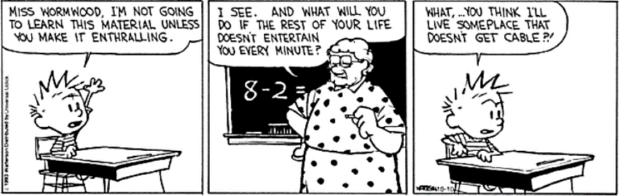

Internet: <www.gocomics.com>. 

Based on the comic, judge the item below. 

In “What will you do if the rest of your life doesn’t entertain you every minute?”, the teacher is asking the boy about an unreal hypothetical situation. 

(    ) Certo 

- (    ) Errado 

### **02. (CEBRASPE/2013 – SEE-AL)** 

Based on the comic, judge the item below. 

The sentence “I’m not going to learn” suggests that learning is difficult for the boy.

---

<!-- pagina: 10 -->

**Andrea Belo Aula 07 -  If Clauses and Quantifiers** 

(    ) Certo 

(    ) Errado 

### **03. (CESGRANRIO/2022 – ELETROBRÁS TERMONUCLEAR S.A. – ELETRONUCLEAR)** 

### **U.S. domestic air conditioning use could exceed electric** 

### **capacity in next decade due to climate change** 

Climate change will provoke an increase in summer air conditioning use in the United States that will probably cause prolonged blackouts during peak summer heat if states do not expand capacity or improve efficiency, according to a new study of domestic-level demand. 

Human emissions have put the global climate on a trajectory to exceed 1.5 degrees Celsius of warming by the early 2030s, the IPCC reported in its 2021 evaluation. Without significant alleviation, global temperatures will probably exceed the 2.0-degree Celsius limit by the end of the century. 

Previous research has examined the impacts of higher future temperatures on annual electricity consumption for specific cities or states. The new study is the first to project residential air conditioning demand on a domestic basis at a wide scale. It incorporates observed and predicted air temperature and heat, humidity and discomfort indices with air conditioning use by statistically representative domiciles across the contiguous United States, collected by the U.S. Energy Information Administration (EIA) in 20052019. 

“It’s a pretty clear warning to all of us that we can’t keep doing what we are doing or our energy system will fail completely in the next few decades, simply because of the summertime air conditioning,” said Susanne Benz, a geographer and climate scientist at Dalhousie University in Halifax, Nova Scotia. 

The heaviest air conditioning use with the greatest risk for overcharging the transmission lines comes during heat waves, which also present the highest risk to health. Electricity generation tends to be below peak during heat waves as well, reducing capacity to even lower levels, said Renee Obringer, an environmental engineer at Penn State University. Without enough capacity to satisfy demand, energy companies may have to adopt systematic blackouts during heat waves to avoid network failure, like California’s energy organizations did in August 2020 during an extended period of record heat sometimes topping 117 degrees Fahrenheit. “We’ve seen this in California already -- state power companies had to institute blackouts because they couldn’t provide the needed electricity,” Obringer said. The state attributed 599 deaths to the heat, but the true number may have been closer to 3,900. 

The new study predicted the largest increases in kilowatt-hours of electricity demand in the already hot south and southwest. If all Arizona houses were to increase air conditioning use by the estimated 6% needed at 1.5 degrees Celsius of global warming, for example, amounting to 30 kilowatt-hours per month, this would place an additional 54.5 million kilowatthours of demand on the electrical network monthly. 

Available at: www.sciencedaily.com/releases/2022/02/ 220204093124.htm. Retrieved on: Feb. 9, 2022. Adapted. 

In the fragment of paragraph 6 “If all Arizona houses were to increase air conditioning use”, **if** signals a(n) 

(A) condition 

- (B) opposition 

- (C) negation 

- (D) conclusion

---

<!-- pagina: 11 -->

**Andrea Belo Aula 07 -  If Clauses and Quantifiers** 

### (E) explanation 

### **04. (CESGRANRIO/2014 – BANCO DO BRASIL)** 

### **Why Millennials Don’t Like Credit Cards** 

by Holly Johnson 

Cheap, easy credit might have been tempting to young people in the past, but not to today’s millennials. According to a recent survey by Bankrate of over 1,161 consumers, 63% of adults ages 18 to 29 live without a credit card of any kind, and another 23% only carry one card. 

### **The Impact of the Great Recession** 

Research shows that the environment millennials grew up in might have an impact on their finances. Unlike other generations, millennials lived through economic hardships during a time when their adult lives were beginning. According to the Bureau of Labor Statistics, the Great Recession caused millennials to stray from historic patterns when it comes to purchasing a home and having children, and a fear of credit cards could be another symptom of the economic environment of the times. 

And there’s much data when it comes to proving that millennials grew up on shaky economic ground. The Pew Research Center reports that 36% of millennials lived at home with their parents in 2012. Meanwhile, the unemployment rate for people ages 16 to 24 was 14.2% (more than twice the national rate) in early 2014, according to the BLS. With those figures, it’s no wonder that millennials are skittish when it comes to credit cards. It makes sense that young people would be afraid to take on any new forms of debt. 

### **A Generation Plagued with Student Loan Debt** 

B ~~u~~ t the Great Recession isn’t the only reason millennials could be fearful of credit. Many experts believe that the nation’s student loan debt level might be related to it. According to the Institute for College Access & Success, 71% of millennials (or 1.3 million students) who graduated from college in 2012 left school with at least some student loan debt, with the average amount owed around $29,400. 

With so much debt already under their belts, millennials are worried about adding any credit card debt to the pile. After all, many adults with student loan debt need to make payments for years, and even decades. 

### **How Millennials Can Build Credit Without a Credit Card** 

The fact that millennials are smart enough to avoid credit card debt is a good thing, but that doesn’t mean the decision has its drawbacks. According to Experian, most adults need a positive credit history in order to qualify for an auto loan or mortgage. Even worse, having no credit history is almost as bad as having a negative credit history in some cases. 

Still, there are plenty of ways millennials can build a credit history without a credit card. A few tips: 

• **Make payments on installment loans on time.** Whether it’s a car loan, student loan or personal loan, make sure to mail in those payments on time and pay at least the minimum amount required. 

• **Put at least one household or utility bill in your name.** Paying your utility or household bills on time can help you build a positive credit history. 

• **Get a secured credit card.** Unlike traditional credit cards, the funds secured credit cards offer are backed by money the user deposits. Signing up for a secured card is one way to build a positive credit history without any risk.

---

<!-- pagina: 12 -->

**Andrea Belo Aula 07 -  If Clauses and Quantifiers** 

The fact that millennials are leery of credit cards is probably a good thing in the long run. After all, not having a credit card is the perfect way to stay out of credit card debt. Even though it might be harder to build a credit history without credit cards, the vast majority of millennials have decided that the plastic just isn’t worth it. 

Available at: <http://money.usnews.com/money/blogs/my-money/2014/11/04/why-millennials-dont-like-creditcards>. Retrieved on: Nov. 10th , 2014. Adapted. 

In the sentence of the text “Still, there are plenty of ways millennials can build a credit history without a credit card” (lines 52 – 53), the quantifier **plenty of** can be replaced, with no change in meaning, by 

(A) some 

(B) few 

(C) a few 

(D) a little 

(E) lots of 

### **05. (CESGRANRIO/2011 – BNDES)** 

The **boldfaced** item is synonymous with the expression in parentheses in 

(A) “ **Unfortunately** , most organizations in search of innovation seem to be generating as much cynicism as they are new thinking.” – lines 7-10 – (Definitely). 

(B) “ **So** it is no surprise when leaders get pounded for preaching innovation without really valuing it.” – lines 27-29 – (Nonetheless). 

(C) “ **If** they innovate, the project turns to chaos.” – lines 45-46 – (Although). 

(D) “ **however** , what it means is that we need our employees to take complete responsibility to do their jobs…” – lines 59-61 – (moreover). 

(E) “ **Therefore** , if you’re a leader, the next time you think about giving a speech or sending out an e-mail calling for your people to innovate,” – lines 91-93 – (Thus). 

**06. (FGV/2018 – PREFEITURA MUNICIPAL DE NITERÓI – RJ)** 

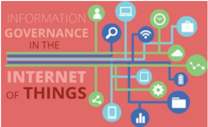

(Source:http://www.revasolutions.com/internet-of-things-newchallenges-and-practices-for-information-governance/. Retrieved on January 26th , 2018) 

### **Governance Challenges for the Internet of Things**

---

<!-- pagina: 13 -->

**Andrea Belo Aula 07 -  If Clauses and Quantifiers** 

Virgilio A.F. Almeida -Federal University of Minas Gerais, Brazil 

Danilo Doneda - Rio de Janeiro State University 

Marília Monteiro - Public Law Institute of Brasília 

Published by the IEEE Computer Society 

### © 2015 

The future will be rich with sensors capable of collecting vast amounts of information. The Internet will be almost fused with the physical world as the Internet of Things (IoT) becomes a reality. Although it’s just beginning, experts estimate that by the end of 2015 there will be around 25 billion “things” connected to the global Internet. By 2025, the estimated number of connected devices should reach 100 billion. These estimates include smartphones, vehicles, appliances, and industrial equipment. Privacy, security, and safety fears grow as the IoT creates conditions for increasing surveillance by governments and corporations. So the question is: Will the IoT be good for the many, or the mighty few? 

While technological aspects of the IoT have been extensively published in the technical literature, few studies have addressed the IoT’s social and political impacts. Two studies have shed light on challenges for the future with the IoT. In 2013, the European Commission (EC) published a study focusing on relevant aspects for possible IoT governance regimes. The EC report identified many challenges for IoT governance — namely privacy, security, ethics, and competition. In 2015, the US Federal Trade Commission (FTC) published the FTC Staff Report The Internet of Things: Privacy and Security in a Connected World. Although the report emphasizes the various benefits that the IoT will bring to consumers and citizens, it acknowledges that there are many risks associated with deploying IoT-based applications, especially in the realm of privacy and security. 

### […] 

The nature of privacy and security problems frequently associated with the IoT indicates that further research, analysis, and discussion are needed to identify possible solutions. First, the introduction of security and privacy elements in the very design of sensors, implementing Privacy by Design, must be taken into account for outcomes such as the homologation process of sensors by competent authorities. Even if the privacy governance of IoT can oversee the control centers for collected data, we must develop concrete means to set limits on the amount or nature of the personal data collected. 

Other critical issues regard notification and consent. If, from one side, it’s true that several sensors are already collecting as much personal data as possible, something must be done to increase citizens’ awareness of these data collection processes. Citizens must have means to take measures to protect their rights whenever necessary. If future scenarios indicate the inadequacy of a mere notice-and-consent approach, alternatives must be presented so that the individual’s autonomy isn’t eroded. 

As with other technologies that aim to change human life, the IoT must be in all respects designed with people as its central focus. Privacy and ethics aren’t natural aspects to be considered in technology’s agenda. However, these features are essential to build the necessary trust in an IoT ecosystem, making it compatible with human rights and ensuring that it’s drafted at the measure, and not at the expense, of people. 

(Source: https://cyber.harvard.edu/~valmeida/pdf/IoT-governance.pdf Retrieved on January 23rd, 2018) 

The word “several” in “it’s true that several sensors are already collecting as much personal data as possible” (fourth paragraph) is a synonym for

---

<!-- pagina: 14 -->

**Andrea Belo Aula 07 -  If Clauses and Quantifiers** 

(A) few. 

- (B) precise. 

- (C) sensitive. 

- (D) important. 

- (E) numerous. 

### **07. (FGV/2014 – PREFEITURA MUNICIPAL DE OSASCO – SP)** 

### **Technology for children in the classroom** 

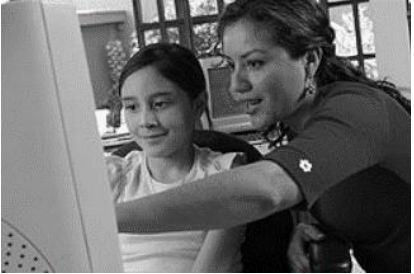

### **Attitudes to technology** 

Many people are afraid of new technology, and, with the increasing presence of the Internet and computers, the term technophobe has appeared to refer to those of us who might be wary of these new developments. More recently, the term digital native has been invented to refer to someone who grows up using technology, and who therefore feels comfortable and confident with it – typically today’s children. Their parents, on the other hand, tend to be digital immigrants, who have come late to the world of technology, if at all. In many cases, teachers are the digital immigrants and our younger students are the digital natives. 

What about you? How confident do you feel about using the Internet and computers? Although there is a tendency to call computer users either technophobes or technogeeks (a term for a technology enthusiast), the truth is that most of us probably fall somewhere between the two extremes. 

### **Technology and young learners** 

Modern technologies are very powerful because they rely on one of the most powerful genetic biases we have — the preference for visually presented information. Television, movies, videos, and most computer programs are very visually oriented and therefore attract and maintain the attention of young children. 

The problem with this is that many of the modern technologies are very passive. Because of this they do not provide children with the quality and quantity of crucial emotional, social, cognitive, or physical experiences they require when they are young. 

On the other hand, there are many positive qualities to modern technologies. The technologies that benefit young children the greatest are those that are interactive and allow the child to develop their curiosity, problem solving and independent thinking skills. 

Computers allow interaction. Children can control the pace and activity and make things happen on computers. They can also repeat an activity again and again if they choose. In practice, computers

---

<!-- pagina: 15 -->

**Andrea Belo Aula 07 -  If Clauses and Quantifiers** 

supplement and do not replace highly valued early childhood activities and materials, such as art, blocks, sand, water, books, exploration with writing materials, and dramatic play. Research indicates that computers can be used in developmentally appropriate ways beneficial to children and also can be misused, just as any tool can. Developmentally appropriate software offers opportunities for collaborative play, learning, and creation. Educators must use professional judgment in evaluating and using this learning tool appropriately, applying the same criteria they would to any other learning tool or experience. 

Char Soucy (a primary school teacher) mentions: "Reading books, handling real books, learning to take care of books, turning pages, and interacting with human beings about literature are still vital for learning to read." There are electronic books, but they are really not the same thing as real books. There must be a balance between the two. Computers are highly motivating to today's students, who come to school with plenty of visual stimulation from TV, video games, and other technological sources, but it is not a good idea to go all electronic or to let technology replace what teachers have done for a long time with learning how to read or write. 

(Retrieved and adapted from http://pearsonclassroomlink.com/articles/0711/0711_0102.htm on June 10th , 2014) 

The opposite of “many” in “Many people are afraid” (line 2) is 

(A) some. 

- (B) little. 

- (C) most. 

- (D) less. 

- (E) few. 

### **08. (FUNDATEC/2011 – CÂMARA MUNICIPAL DE PORTO ALEGRE – RS)** 

### **Could a Clone Ever Run for President?** 

Dolly is out, but how about “All the way with a cloned L.B.J.”? 

Sure, why not? Scientists used to think it would be difficult to clone an animal as complex as a mammal, but Dolly the sheep neatly demolished that theory. If you can clone a sheep, a human isn’t much tougher. **Whether** it is ethical to do so is another matter, and in fact human cloning has been outlawed in a number of countries and states. But illegal or not, someone is going to do it – and having been conceived ……… a convicted felon is no bar to public office. 

The U.S. Constitution, **moreover** , doesn’t have a clone clause. As long as you are a citizen and 35 or older, you’re eligible. The age requirement means it can’t happen ………. a while – 2036 at the **earliest** (presuming that someone hasn’t already secretly created the first human clone). But 2036 is not that far away. **While** some may insist that a clone should not be eligible for citizenship, the argument won’t fly. If you are human and born in the U.S., you’re a citizen. A clone will be born in the conventional way, with a mother, a belly button, and a full complement of human DNA. 

The **obstacle** to President Clone will come if cloning carries serious side effects. Dolly the sheep, it turns out, has prematurely aged cells, probably attributable ………. the fact that she is the biological extension of an animal **that** was already an adult. Human clones could have the same problem – plus cloning-related mental or **behavioral** defects that **might** not be apparent in a sheep.

---

<!-- pagina: 16 -->

**Andrea Belo Aula 07 -  If Clauses and Quantifiers** 

If these difficulties could be ________ political campaigns could get pretty interesting. Biologists today are talking of using cloning to bring the wooly mammoth and other extinct animals back to life. Maybe Democrats and Republicans would want to try something similar. After all, candidates are always trying to link **themselves** to great leader of the past. Why not cut out the middlemen? Given the pace of scientific progress, plus sufficiently audacious party leaders, the presidential debates of 2044 could feature some **pretty impressive lineups** . Imagine Abraham Lincoln talking on F.D.R. or J.F.K. going up against Thomas Jefferson. Or Millard Fillmore vs. Warren Harding. 

On second thought … 

(Reprinted from _Time_ , “Could a Clone Ever Run for President?”By Michael D. Lemonick, 2001) 

Choose the correct option to fill in the period bellow: 

If Dolly __________ alive, she __________ very popular. 

(A) was – was 

- (B) was – was going to be 

- (C) was – would be 

- (D) were – would be 

- (E) were – were going to be 

### **09. (FUNDATEC/2022 – PREFEITURA MUNICIPAL DE RESTINGA SÊCA – RS)** 

### **What is the internet of things?** 

In the internet of things (IoT), a “thing” can be __ person with a heart monitor implant, __ animal with a biochip transponder, __ car with sensors to alert when tire pressure is low, or any object that is able to transfer data. IoT is __ system of interrelated “things” that are provided with __ ability to transfer information over a network without requiring human interaction. It uses artificial intelligence and machine learning to improve data collecting, and sometimes devices can even communicate with each other and then act on __ information they get. 

In agriculture, IoT-based smart farming systems can help monitor light, temperature, humidity, and soil moisture of crop fields; automatize irrigation systems, and collect data on rainfall and soil content. The infrastructure industry can benefit from sensors that monitor events or changes within structural buildings and bridges. To healthcare, IoT offers the ability to monitor patients more closely using an analysis of the data that's generated. 

Smart homes are equipped with smart thermostats, appliances, and connected heating, lighting, and electronic devices that can be controlled remotely via smartphones. Smart buildings can reduce energy costs using sensors that detect how many occupants are in a room and then adjust the temperature automatically. Wearable devices with sensors can be used for public safety, for example, by providing optimized routes to a location where there is an emergency, or by tracking firefighters' vital signs at life-threatening sites. 

Obviously, there are some disadvantages, too, and the list includes the risk that confidential information is stolen by hackers, and the difficulty for devices from different manufacturers to communicate with each other since there's no international standard of compatibility for IoT. Companies may have to deal with

---

<!-- pagina: 17 -->

**Andrea Belo Aula 07 -  If Clauses and Quantifiers** 

massive numbers, and collecting and managing the data from all those devices will be challenging. **' '** Ultimately, **<u>if there s a bug in the system, it s likely that every connected device will become corrupted</u>** . 

"Pros and cons in perspective, Matthew Evans, the IoT program head at techUK, says that In the short term, we know [IoT] will impact on anything where there is a high cost of not 

intervening, Evans said. ""And it’ll be for simpler day-to-day issues – like finding a car parking space in busy areas, linking up your home entertainment system, and using your fridge webcam to check if you need more milk on the way home.”" 

(Available in: from: https://www.techtarget.com/iotagenda/definition/Internet-of-Things-IoT https://www.wired.co.uk/article/internet-of-things-what-is-explained-iot – text especially adapted for this test). 

Consider the statements about the excerpt “If there's a bug in the system, it's likely that every connected device will become corrupted”: 

I. If we change the order to “It's likely that every connected device will become corrupted if there's a bug in the system” the sentence becomes ungrammatical. 

II. The word “If” can be substituted by “In case” with no significative changes in meaning. 

III. This is a first conditional sentence, which means there is a high probability that this really happens. 

Which statements are correct? 

(A) Only I. 

(B) Only II. 

(C) Only III. 

(D) Only II and III. 

(E) I, II, and III. 

### **10. (FUNDATEC/2019 – PREFEITURA MUNICIPAL DE SALTO DO JACUÍ – RS)** 

### **Is Ikigai The New Hygge? The Japanese Concept Of Finding Purpose In Our Lives** 

We’ve snuggled up in a comfortable knitted sweaters and filled our rooms with wood-scented candles in the pursuit of hygge – the Danish concept of finding contentment in ________. When that didn't work, we turned to the Swedish idea of lagom, or moderate living, and it turns out we’re still not happy. So maybe it’s ikigai, the lifestyle concept from Japan, that will help us live our best lives. 

In some ways, Ikigai is the antithesis of hygge. Instead of encouraging us to slow down, it’s about find striving to find purpose in life, or raison d’etre to use a French equivalent. As such, it is a notion often adopted by those unhappy at work or who have retired. The word is composed in Japanese using the characters iki, or life, and kai, meaning the result of a certain action," explains Hector Garcia, the co-author of Ikigai: The Japanese Secret to a Long and Happy Life. 

This all sounds rather fluffy. But studies show that losing one's purpose can have a detrimental effect. For instance, those who lose their raison d'etre when they retire become more prone to contracting _________. But Ikigai isn’t an individualistic concept either focused on self-preservation. The social connections that we

---

<!-- pagina: 18 -->

**Andrea Belo Aula 07 -  If Clauses and Quantifiers** 

form are as important as any sense of inner peace, according to Remedios, of the Hyper Japan cultural festival. 

Now we're convinced to try it, how does one go about finding their ikigai? "Flow" is the first step, says Garcia. "When we enter a state of 'flow' we lose the sense of time passing. Have you ever been so absorbed in a task that you forget to drink and eat? What type of task was it? Notice those moments when you enter flow, and your ikigai might be embeded in those moments. If you increase the daily time at flow you will increase your connection with your ikigai. "Your Ikigai is at the intersection of what you are good at and what you love doing." 

Since incorporating the ideas of ikigai into his life, Garcia says he has become better at appreciating and understanding what he finds joy in. “I stop several times through the day and I ask myself: why am I doing this?”. Which, frankly, sounds exhausting. But Garcia stresses that “noticing is only the first step.” The next is implementing changes - and this is where most of us trip up. 

Still, it's hard not to feel that ikigai – like hygge and lagom – Is another sticking plaster we've reached for to help patch over the problems in our lives that run deeper than any buzzword word can solve. “Although the words might be new, I think all the concepts are not really new," says the spokesperson for HyperJapan. 

"Just as humans have lusted after objects and money since the dawn of time, other humans have felt dissatisfaction at the _________ pursuit of money and fame and have instead focused on something bigger than their own material wealth. This has over the years been described using many different words and practices, but always hearkening back to the central core of meaningfulness in life.” 

Source: https://www.independent.co.uk/life-style/ikigai-hygge-lagom-swedish-danish-japanese-scandinavian-lifestyle-happiness-meaning-of-life-a7956141.html 

Consider the sentence "If you increase the daily time at flow you will increase your connection with your ikigai" and the following assertives: 

I. It is an example of the zero conditional. 

II. It is used to talk about imaginary situations in the past. 

III. The third conditional would be "If you had increased the daily time at flow you would increase your connection with your ikigai". 

Which ones are INCORRECT? 

- (A) Only I. 

- (B) Only II. 

- (C) Only III 

- (D) Only I and III. 

- (E) I, II and III. 

### **11. (FUNDATEC/2016 – PREFEITURA MUNICIPAL DE VIAMÃO – RS)** 

### **Shark-Spotting And Sea Rescue Goes High-Tech In Australia** 

Shark surveillance and sea rescue just got more sophisticated.

---

<!-- pagina: 19 -->

**Andrea Belo Aula 07 -  If Clauses and Quantifiers** 

A drone that can detect the aquatic beasts from the sky and drop down rescue pods to swimmers in distress will be deployed above coastlines as part of a trial in New South Wales, Australia. 

The $180,000 unmanned aerial vehicle, dubbed the "Little Ripper," will come equipped with a high-definition camera. The footage can be monitored from the ground, saving the costly expense of sending a helicopter into the air. 

Scientists are also working on a software algorithm that will identify the kind of shark in the water, which can then be relayed immediately to emergency services, lifeguards and swimmers. 

The drone's rescue pod is adaptable to environmental conditions. According to the Sydney Morning Herald, the marine version contains a life raft, locator beacon, shark repellent and medical equipment. It can also be used for land and snow emergencies. 

The trial of the battery-powered, military-grade Vapor 55 drone was launched at the Westpac Lifesaver Helicopter Base in Sydney on Sunday. It will initially patrol the coastlines of Newcastle, Hawkes Nest and Byron Bay in northern New South Wales, Mashable reported. 

Fourteen people were attacked by sharks in the area in 2015. There was one fatality. 

NSW Premier Mike Baird said that if the trial proved a success, then every surf club in the state will have access to the technology. 

"Every now and then the future crashes in on today and I think this is one of those days," Baird said. 

Paul Scully-Power, Australia's first astronaut, and philanthropist/founding president of the International Life Saving Federation Kevin Weldon developed the drone with Australian company Skyline. The trial was scheduled four months after the NSW government unveiled a $11.4 million program to combat shark attacks, via the drone and 4G listening stations. 

http://www.huffingtonpost.com/entry/shark-dronesaustralia_us_56d30756e4b0871f60ebbbae?ir=Science&section=us_science&utm_hp_ref=science 

Consider the sentence: “ _NSW Premier Mike Baird said that if the trial proved a success, then every surf club in the state will have access to the technology._ ” (l. 17-18). The underlined clause it is: 

- (A) A defining relative clause. 

- (B) A non-defining relative clause. 

- (C) A sentencial relative clause. 

- (D) An infinitive clause. 

- (E) A conditional clause. 

### **12. (FUNDATEC/2015 – BRDE)** 

### **Press me! The button that lies to you** 

The tube pulls in to a busy station along the London Underground’s Central Line. It is early evening on a Thursday. A gaggle of commuters assembles inside and outside the train, waiting for the doors to open. A moment of impatience grips one man who is nearest to them. He pushes the square, green-rimmed button which says “open”. A second later, the doors satisfyingly part. The crowds mingle, jostling on and off the

---

<!-- pagina: 20 -->

**Andrea Belo Aula 07 -  If Clauses and Quantifiers** 

train, and their journeys continue. Yet whether or not the traveller knew it, his finger had no effect on the mechanism. 

Some would call this a “placebo button”– a button which, objectively speaking, provides no control over a system, but which to the user at least is psychologically fulfilling to push. It turns out that there are plentiful examples of buttons which do nothing and indeed other technologies which are purposefully designed to deceive us. But here’s the really surprising thing. Many increasingly argue that we actually benefit from the illusion that we are in control of something – even when, from the observer’s point of view, we’re not. 

In 2013, BBC News Magazine discovered that pedestrian crossings all over the UK were the wellspring of placebo buttons. A crossing in central London had programmed intervals for red and green lights, for example. Pushing the button would only impact the length of these intervals between midnight and 7am. ___ several other cities during busy periods, the crossings were programmed to alternate their signals at a specific rate. The buttons did nothing, but a “wait” light would still come on when they were pressed and, yes, people still pressed them presumably believing that their actions were having an effect. 

Certain psychologists would argue that the buttons were indeed having an effect – just not ___ the traffic lights themselves. Instead the effect is in the commuter’s minds. To understand this you have to go back to the early 1970s. At that time, psychologist Ellen Langer, now a professor ____ Harvard, was a Yale graduate student. During a five-card draw game of poker she dealt one set of cards in a haphazard order. “Everybody,” she says, “got crazy. The cards somehow belonged to the other person even though you couldn’t see any of them.” Langer decided to find out more about the way people regulated the playing of such games. She went to a casino where, at the slot machines, she found gamblers with elaborate ways of pulling the lever. At another time a “highly rational” fellow student tried to explain to her why tossing a pair of dice could be done in a certain way to affect the numbers which came up. “People believed that all of these behaviours were going to increase the probability of their winning,” she comments. 

In 1975, she wrote a paper where she described the significance of these beliefs and coined a term for the effect that they had on people: the “illusion of control”. However, instead of framing this as an irrational delusion, Langer described the effect as a positive thing. “Feeling you have control over your world is a desirable state,” she explains. When it comes to those deceptive traffic light buttons, Langer says there could be a whole host of reasons why the placebo effect might be counted as a good thing. “Doing something is better than doing nothing, so people believe,” she says. “And when you go to press the button your attention is on the activity at hand. If I’m just standing at the corner, I may not even see the light change, or I might only catch the last part of the change, in which case I could put myself in danger.” 

Also, if pedestrians wait together at the crossing and a few press the button impatiently, that creates a sense of togetherness with strangers which might otherwise be absent. All of these things may be taken as positive impacts on our mental state, and even socially reinforcing. It’s something to think about next time you cross the street. 

(Source: Adapted from http://www.bbc.com/future/story/20150415-the-buttons-that-do-nothing) 

Consider the sentence: “If I’m just standing at the corner, I may not even see the light change” (l.38), and the following statements:

---

<!-- pagina: 21 -->

**Andrea Belo Aula 07 -  If Clauses and Quantifiers** 

### I. It is an example of the first conditional. 

II. The modal verb ‘may’ expresses possibility. 

III. ‘may’ could be replaced by ‘will’ without causing any difference in meaning. 

Which ones are INCORRECT? 

A) Only I. 

B) Only II. 

C) Only III. 

D) Only II and III. 

E) I, II and III. 

### **13. (FUNDATEC/2018 – PREFEITURA MUNICIPAL DE CORUMBÁ – MS)** 

Maya Angelou's grandson has spoken about one of the late author's final projects: ☐ album, due out this winter, which mixes her poetry and vocals with hip-hop. Angelou, who died in May, "loved" the project from the beginning, according to her grandson Colin Johnson, who told the Associated Press that some of the 13 songs use pre-recorded vocals from the writer, and some were recorded _________ for the new work. The album will be called _Caged Bird Songs_ , in reference to Angelou's most famous piece of writing, her ______ I Know Why the Caged Bird Sings_ . 

The work will be released by Smooch Music on 4 November, produced by musicians Shawn Rivera and RoccStarr. "These guys were inspired by grandma's work, which many people are, and felt like giving it a different medium of delivery to make it more obtainable to ☐ larger group of people," Johnson said. 

According to Johnson, who together with his father has founded _Caged Bird Legacy_ (which plans to release future Angelou projects) as soon as the writer was told about the album she "completely backed" it, and it was recorded at her home in North Carolina. "She loved it and was excited to hear more about what they wanted to do," he told the Associated Press. "She had a lot of energy around it. She saw (hip-hop) as this generation's way of speaking and conveying a message. If she was alive, she would be recording other albuns". 

As well as her award-winning volumes of poetry and biography, Angelou had previously recorded a calypso album, written songs for films and musicals, and won prizes for her spoken word albums. "To hear somebody that is so famous for her poetry and her message, and then set to some music that you can enjoy definitely feels like this is something that can continue her reach _______ generations," Johnson told ☐ AP. 

Fonte: adaptado de <https://www.theguardian.com/books/2014/sep/08/maya-angelou-hip-hop-album-caged-bird-songs>. 

The sentence “If she was alive, she would be recording other albuns” (l.17) 

I. Is used to talk about the possible result of an imagined situation in the present. 

II. Is an example of the second conditional. 

III. Implies that the woman is no longer alive.

---

<!-- pagina: 22 -->

**Andrea Belo Aula 07 -  If Clauses and Quantifiers** 

### Which ones are correct? 

(A) Only I. 

(B) Only II. 

(C) Only III. 

(D) Only II and III. 

(E) I, II and III. 

### **14. (IADES/2016 – CEITEC S.A.)** 

### **Be glad your nose is on your face** 

Be glad your nose is on your face, not pasted on some other place, for if it were where it is not, you might dislike your nose a lot. 

Imagine if your precious nose were sandwiched in between your toes, that clearly would not be a treat, for you'd be forced to smell your feet. 

Your nose would be a source of dread were it attached atop your head, it soon would drive you to despair, forever tickled by your hair. 

Within your ear, your nose would be an absolute catastrophe, for when you were obliged to sneeze, your brain would rattle from the breeze. 

Your nose, instead, through thick and thin, remains between your eyes and chin; not pasted on some other place – be glad your nose is on your face! 

Internet: <https://www.poetryfoundation.org/poem/177537>. Access 12 Dec. 2015, adapted. 

Based on the excerpt “Imagine if your precious nose / were sandwiched in between your toes, / that clearly would not be a treat, / for you’d be forced to smell your feet” (lines 5 to 8) and according to your knowledge of English, choose the correct alternative. 

(A) It is possible to turn a noun into a verb, as it was done in “sandwiched”, according to the traditional English grammar. 

(B) Some poems do not follow grammar rules in the name of art. It is the case in this sentence because the verb “were” should have been inflected as “was” for referring to “nose”.

---

<!-- pagina: 23 -->

**Andrea Belo Aula 07 -  If Clauses and Quantifiers** 

(C) This excerpt is a conditional clause that expresses an imaginary, hypothetical or unlikely situation. 

(D) The word “between” could be replaced by the word among for being perfect synonyms. 

(E) The word “toes” could be replaced by fingers without causing any misunderstanding or lack of coherence. 

**15. (IADES/2016 – CEITEC S.A.)** 

The sentence below with the same syntactical function of the underlined part of the stanza “Be glad your nose is on your face, / not pasted on some other place, / for if it were where it is not, / you might dislike your <u>nose a lot” (lines 1 to 4) is</u> 

(A) although it was raining, we decided to go fishing, 

(B) because he was running late, John didn’t have time for breakfast. 

(C) she did her homework while her father cooked dinner. 

- (D) she couldn’t talk due to her toothache. 

(E) I would not go there if I were you. 

### **16. (VUNESP/2019 – PREFEITURA MUNICIPAL DE DOIS CÓRREGOS – SP)** 

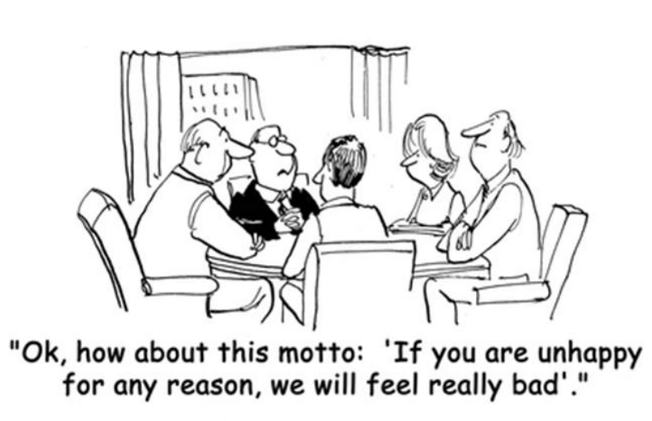

The line from the cartoon “If you are unhappy for any reason, we will feel really bad” exemplifies a sentence with a conditional clause. Another correct sentence with a conditional structure is found in alternative: 

(A) I don’t mind living in England if the days there were not so cold and dark most of the time. 

(B) If I found a hundred dollar bill in the street, I wanted to keep it to myself. 

(C) If you stopped smoking, you will certainly feel much stronger and happier. 

(D) My grandparents feel disappointed if we would not visit them on Sunday afternoons. 

(E) If you are tired of working late hours, I may have to ask you to quit and find another job.

---

<!-- pagina: 24 -->

**Andrea Belo Aula 07 -  If Clauses and Quantifiers** 

### **17. (VUNESP/2014 – PREFEITURA MUNICIPAL DE MARATAÍZES – ES)** 

Assinale a alternativa que contém a palavra que melhor completa a lacuna no texto a seguir, considerando sempre a coerência do sentido do texto e a norma-padrão da língua inglesa. 

### **The death of the US shopping mall** 

Born in the 1950s, these temples of commerce were symbols of the US consumer culture – but many are now dying out. Jonathan Glancey takes a look. 

Shopping malls are not meant to be sinister. And, yet, in 1977, George A Romero chose to film sequences of Dawn of the Dead, his cult horror zombie movie, in a deserted mall. Shorn of life and light, the great echoing chambers of the enclosed shopping centre took on a very eerie tone indeed. Curiously, Romero’s set design has much in common with photographs of the ever-increasing number of abandoned malls strewn across the United States from California to New England. There are well over a hundred of these lifeless concrete and steel behemoths sprawled beside freeways on the fringes of far-flung American suburbs. 

Economic decline in certain areas − notably the mid-West − combined with an accelerating trend (44) online shopping and new forms of urban shopping centres have pushed the once seemingly invincible and allAmerican shopping mall into decline. Many are thriving, and being renovated and extended, yet ‘ghost malls’ are fast becoming the ‘ghost towns’ of the early 21st Century, and photographers have begun to see (45) as fascinating, if decidedly disturbing ruins. 

The first US malls were not meant to have been sited miles (46) anywhere and reached only by big, airconditioned automobiles with automatic transmission and power-everything. No, Victor Gruen, the ‘father of the shopping mall’ meant them to be the core around (47) new settlements would cluster, with apartments, clinics, schools and, one day soon enough, all the facilities and life that go together to make thriving urban settlements. 

Gruen designed the world’s first fully enclosed shopping mall, the Southdale Center in Edina, Minnesota. It opened in 1956, the year Elvis first broke into the charts, with Heartbreak Hotel, Norma Jean Mortenson (48) her name to Marilyn Monroe, IBM invented the hard disk drive, and Fidel Castro and Che Guevara landed in Cuba. 

### **The American way** 

Gruen’s homes, schools, lakes and parks remained a pipe dream as Edina, Minnesota and, subsequently, the US as a whole went on a prolonged air-conditioned shopping spree in buildings that grew ever bigger and yet more kitsch. The mall became a place to hang out (49) to shop, a central part of contemporary US culture and a model for (50) of the rest of a world keen on emulating an American way of life. 

In the mid-1990s, US malls (51) built at a rate of 140 a year. The brakes went on in 2007, the first year in halfa-century that no new malls were built in America: recession had bitten deep into the US economy. Now, malls began to close, although some had become unpopular for reasons other than purely economic ones. 

The shopping mall had long lost its 1950s atmosphere of hedonistic, all-American innocence. And, as ______________ became redundant, they were abandoned like giant refuse thrown from even bigger automobiles. And, because they had been built on an increasingly ambitious scale and are essentially giant boxes with vast rooms inside shot through with miles of mechanical and electrical services, these were never going to be easy structures to convert to new uses, (53) many Americans have suggested they become giant leisure centres: bowling alleys, funfairs and casinos. This is not such a bad idea: the demolition of such huge

---

<!-- pagina: 25 -->

**Andrea Belo Aula 07 -  If Clauses and Quantifiers** 

buildings could only appear to be a case of conspicuous consumption and wastefulness on a truly titanic scale. 

Today, the (54) malls are in very different parts of the world. The biggest of all is the New South China Mall, Dongguan, covering a floor area twenty times that of St. Peter’s in Rome, and well over twice of the King of Prussia Mall in Pennsylvania, the biggest in the US. (55) the top ten largest malls in the world are two, perhaps surprisingly, in Iran, while even Bangladesh with a GDP per capita of $1,851 boasts a new mall far bigger than Pennsylvania’s “King of Prussia” (the same figure for the US is $51,749 according to the World Bank). 

As a building type, and social and economic phenomenon, the shopping mall has a way to go, and yet it has already spawned its own wrecks and ruins. These tell us more than enough about the ways we have chosen to spend and live over the past half-century. 

(www.bbc.com/culture/story/20140411-is-the-shopping-mall-dead. Adapted) 

### (A) many 

- (B) a little 

- (C) so much 

- (D) too much 

### (E) enough 

### **18. (VUNESP/2009 – CRF-SP)** 

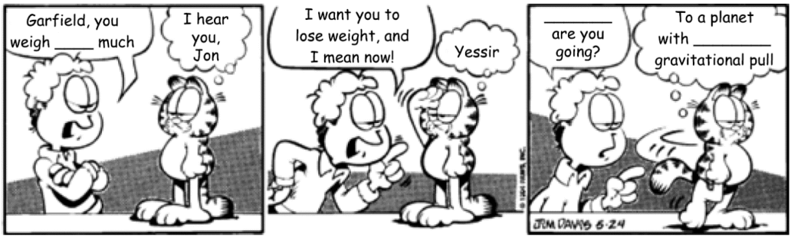

(www.imdb.com) 

Escolha a alternativa que completa os textos correta e adequadamente. 

- (A) very ... What ... weakest 

- (B) lots ... When ... weak 

- (C) too ... Where ... a weaker 

- (D) a lot ... Which ... the weakest 

- (E) so ... Whose ... the weak 

### **19. (VUNESP/2008 – FAPESP)**

---

<!-- pagina: 26 -->

**Andrea Belo Aula 07 -  If Clauses and Quantifiers** 

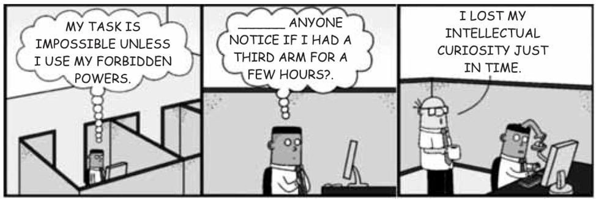

(http://dilbert.com/2008-09-11. Adaptado) 

A lacuna no segundo quadrinho – anyone notice if I had a third arm for a few hours? – é corretamente preenchida com 

(A) Has 

(B) Will 

(C) Would 

(D) Do 

(E) Is 

### **20. (FCC/2007 – CÂMARA DOS DEPUTADOS)** 

### **Google Adds a Safeguard on Privacy for Searchers** 

By MIGUEL HELFT 

SAN FRANCISCO, March 14 — Web search companies collect records of the searches that people conduct, a fact that has long generated _________ among privacy advocates and some Internet users that valuable personal data could be misused. 

Now Google is taking a step to ease those concerns. The company keeps logs of all searches, along with digital identifiers linking them to specific computers and Internet browsers. It said on Wednesday that it would start to make those logs anonymous after 18 to 24 months, making it much harder to connect search records to a person. Under current practices, the company keeps the logs intact indefinitely. 

“We have decided to make this change with feedback from privacy advocates, regulators worldwide and, of course, from our users,” said Nicole Wong, Google’s deputy general counsel. 

But it is unclear whether the change will have its intended effect. Privacy advocates reacted with a mix of praise and dismay to it. 

“This is really the first time we have seen them make a decision to try and work out the conflict between wanting to be pro-privacy and collecting all the world’s information,” said Ari Schwartz, deputy director of the Center for Democracy and Technology, an advocacy group. “They are not going to keep a profile on you indefinitely.”

---

<!-- pagina: 27 -->

**Andrea Belo Aula 07 -  If Clauses and Quantifiers** 

Others were less enthusiastic. “I think it is an absolute disaster for online privacy,” said Marc Rotenberg, executive director of the Electronic Privacy Information Center. 

Ms. Wong said Google uses the search data internally only to improve its search engine and other services. She added that Google would release search data only if compelled by a subpoena. Even so, Google was the only major search engine to resist a Justice Department subpoena for vast amounts of search data last year — a move that drew praise from privacy advocates. 

Just how personally revealing such data can be became evident last year, when AOL released records of the searches conducted by 657,000 Americans for the benefit of researchers. _________ AOL did not identify the people behind the searches, reporters from The New York Times were able to track down some of them quickly through their search requests. 

The ensuing flap caused AOL to tighten its privacy policies. The company now keeps search histories for only 13 months and does not link them to Internet protocol addresses — digital tags that can identify a specific computer. 

For its part, Yahoo keeps search data for “as long as it is useful,” said a spokeswoman, Nissa Anklesaria. And Microsoft said that while it does not keep search histories alongside I.P. addresses, it can connect the two if law enforcement requests it. 

(Adapted from http://www.nytimes.com/2007/03/15/technology/15googles.html_r=1&ore f=login) 

A palavra que preenche corretamente a lacuna indicada no 7º parágrafo de texto é: 

(A) While. 

(B) If. 

(C) Because. 

(D) So. 

(E) Therefore.

---

<!-- pagina: 28 -->

**Andrea Belo Aula 07 -  If Clauses and Quantifiers** 

# **GABARITO** 

|**01 – Errado**|**02 – Errado**|**03 – A**|**04 – E**|**05 – E**|
|---|---|---|---|---|
|**06 – E**|**07 – E**|**08 – C**|**09 – D**|**10 – E**|
|**11 – E**|**12 – C**|**13 – E**|**14 – C**|**15 – E**|
|**16 – E**|**17 – A**|**18 – C**|**19 – C**|**20 – A**|

---

<!-- pagina: 29 -->

**Andrea Belo Aula 07 -  If Clauses and Quantifiers** 

# **QUESTÕES COMENTADAS** 

### **01. (CEBRASPE/2013 – SEE-AL)** 

Internet: <www.gocomics.com>. 

Based on the comic, judge the item below. 

In “What will you do if the rest of your life doesn’t entertain you every minute?”, the teacher is asking the boy about an unreal hypothetical situation. 

(    ) Certo 

(    ) Errado 

### **GABARITO: ERRADO** 

**Comentários:** O texto apresenta uma charge sobre uma conversa entre um aluno e sua professora. 

### Questiona-se se a sentença a seguir é usada para **expressar uma situação hipotética irreal:** 

- _"What will you do if the rest of your life doesn’t entertain you every minute?"_ 

- _"O que você fará se o resto da sua vida não o divertir a cada minuto?"_ 

Como essa é uma **oração condicional do tipo 1 (ou primeira condicional), ela expressa situações possíveis no presente ou no futuro.** 

Portanto, **é incorreto** afirmar que ela foi usada para " **_expressar uma situação hipotética irreal_** ". 

Lembre-se que as conditionals, também chamada de if clauses, são sentenças que apresentam a seguinte estrutura: 

- **If** + **condição** , resultado. 

E que há cinco tipos de conditionals: 

- Zero Conditional: if + simple present + simple present; 

- **First Conditional: if + simple present + will ou won't + infinitivo;** 

- Second Conditional: if + simple past + would/could /might /should + infinitivo; 

- Third Conditional: if + past perfect + would have /could have /might have + past participle.

---

<!-- pagina: 30 -->

**Andrea Belo Aula 07 -  If Clauses and Quantifiers** 

### **02. (CEBRASPE/2013 – SEE-AL)** 

Based on the comic, judge the item below. 

The sentence “I’m not going to learn” suggests that learning is difficult for the boy. 

(    ) Certo 

(    ) Errado 

### **GABARITO: ERRADO** 

**Comentários:** O texto apresenta uma charge sobre uma conversa entre um aluno e sua professora. 

Questiona-se se o trecho **_“I’m not going to learn” (Eu não vou aprender)_** sugere que aprender é difícil para o garoto. 

Releia o trecho inteiro: 

- _"(...) I'm not going to learn this material unless you make it enthralling"._ 

- _"(...) Eu não vou aprender esse material, a não ser que você o torne fascinante"._ 

Agora, é possível entender que **o garoto impôs uma condição** (que a professora torne o material fascinante) **para ele aprender.** 

Portanto, **<u>não</u>** <u>se trata de uma</u> **<u>dificuldade</u>** <u>do garoto, mas sim de uma</u> **<u>condição</u>** <u>imposta por ele.</u> 

Perceba que **_"unless" (a não ser que)_** foi usado para construir uma **oração condicional,** que apresenta uma condição e seu resultado. 

Ela poderia ser reescrita usando " **_if...not"_** : 

- _"If you don't make the material enthralling, I'm not going to learn it."_ 

- _"Se você não tornar o material fascinante, não vou aprender."_ 

### **03. (CESGRANRIO/2022 – ELETROBRÁS TERMONUCLEAR S.A. – ELETRONUCLEAR)** 

### **U.S. domestic air conditioning use could exceed electric capacity in next decade due to climate change** 

Climate change will provoke an increase in summer air conditioning use in the United States that will probably cause prolonged blackouts during peak summer heat if states do not expand capacity or improve efficiency, according to a new study of domestic-level demand. 

Human emissions have put the global climate on a trajectory to exceed 1.5 degrees Celsius of warming by the early 2030s, the IPCC reported in its 2021 evaluation. Without significant alleviation, global temperatures will probably exceed the 2.0-degree Celsius limit by the end of the century. 

Previous research has examined the impacts of higher future temperatures on annual electricity consumption for specific cities or states. The new study is the first to project residential air conditioning demand on a domestic basis at a wide scale. It incorporates observed and predicted air temperature and heat, humidity and discomfort indices with air conditioning use by statistically representative domiciles across the contiguous United States, collected by the U.S. Energy Information Administration (EIA) in 20052019.

---

<!-- pagina: 31 -->

**Andrea Belo Aula 07 -  If Clauses and Quantifiers** 

“It’s a pretty clear warning to all of us that we can’t keep doing what we are doing or our energy system will fail completely in the next few decades, simply because of the summertime air conditioning,” said Susanne Benz, a geographer and climate scientist at Dalhousie University in Halifax, Nova Scotia. 

The heaviest air conditioning use with the greatest risk for overcharging the transmission lines comes during heat waves, which also present the highest risk to health. Electricity generation tends to be below peak during heat waves as well, reducing capacity to even lower levels, said Renee Obringer, an environmental engineer at Penn State University. Without enough capacity to satisfy demand, energy companies may have to adopt systematic blackouts during heat waves to avoid network failure, like California’s energy organizations did in August 2020 during an extended period of record heat sometimes topping 117 degrees Fahrenheit. “We’ve seen this in California already -- state power companies had to institute blackouts because they couldn’t provide the needed electricity,” Obringer said. The state attributed 599 deaths to the heat, but the true number may have been closer to 3,900. 

The new study predicted the largest increases in kilowatt-hours of electricity demand in the already hot south and southwest. If all Arizona houses were to increase air conditioning use by the estimated 6% needed at 1.5 degrees Celsius of global warming, for example, amounting to 30 kilowatt-hours per month, this would place an additional 54.5 million kilowatthours of demand on the electrical network monthly. 

Available at: www.sciencedaily.com/releases/2022/02/ 220204093124.htm. Retrieved on: Feb. 9, 2022. Adapted. 

In the fragment of paragraph 6 “If all Arizona houses were to increase air conditioning use”, **if** signals a(n) 

(A) condition 

(B) opposition 

(C) negation 

(D) conclusion 

(E) explanation 

### **GABARITO: A** 

**Comentários:** A questão requer que você indique o que a conjunção **_if_ (= se)** expressa no trecho “ _If all Arizona houses were to increase air conditioning use_ ”, no parágrafo 6. 

A conjunção **if** é bastante conhecida na língua inglesa por introduzir uma **oração condicional** . 

As **orações condicionais** expressam situações ou condições imaginárias e seus possíveis resultados, ou seja, a **<u>condição</u>** <u>para que determinada ação ocorra e sua possível/provável consequência.</u> 

Divididas em quatro tipos, as condicionais são largamente cobradas em concursos. Vamos revisá-las? 

- **Condicional zero** ou **_zero conditional_** : sua estrutura é formada pela conjunção **_if_** (se) + verbo no **presente simples** , .... + verbo no **presente simples** . Em geral, é utilizada para expressar verdades absolutas ou hábitos. 

Exemplo: **_If_** _you freeze water, it_ **_gets_** _solid_ (Se você congelar a água, ela fica sólida) 

- **Primeira condicional** ou **_first conditional_** : sua estrutura é formada pela conjunção **_if_** (se) + verbo no **presente simples** , .... + **_will_** + verbo no **infinitivo** . Geralmente, expressa situações possíveis ou prováveis <u>no futuro.</u> 

Exemplo: **_If_** _I win the lottery, I_ **_will travel_** _to Greece._ (Se eu ganhar na loteria, viajarei para a Grécia).

---

<!-- pagina: 32 -->

**Andrea Belo Aula 07 -  If Clauses and Quantifiers** 

- **Segunda condicional** ou **_second conditional_** : sua estrutura é formada pela conjunção **_if_** (se) + verbo no **passado simples** , .... **_would_** + verbo no **infinitivo** . Em geral, é usada para expressar situações imaginárias <u>no presente ou no futuro.</u> 

Exemplo: **_If_** _I_ **_had_** _a lot of money, I_ **_would buy_** _a boat_ (Se eu tivesse muito dinheiro, compraria um barco). 

- **Terceira condicional** ou **_third conditional_** : sua estrutura é formada pela conjunção **_if_** (se) + verbo no **passado perfeito** , .... + **_would_** + **_have_** + verbo no **particípio passado** . É comumente utilizada para expressar situações imaginárias no passado. 

Exemplo: **_If_** _he_ **_had answered_** _the phone, he_ **_would have been_** _the first to hear the news_ (Se ele tivesse atendido telefone, teria sido o primeiro a saber da novidade). 

Com todas as estruturas em mente, perceba que, no trecho destacado na questão, temos uma frase na **segunda condicional** . Confira: 

_"_ **_If_** _all Arizona houses_ **_were_** _to increase air conditioning use by the estimated 6% needed at 1.5 degrees Celsius of global warming, [...], this_ **_would place_** _an additional 54.5 million kilowatthours of demand on the electrical network monthly."_ 

( **Se** todas as casas do Arizona **aumentassem** o uso de ar-condicionado nos 6% que se estima serem necessários a 1,5º C de aquecimento global, [...], isso **representaria** 54,5 milhões de quilowatts-hora adicionais de demanda na rede elétrica mensalmente.) 

Desse modo, a conjunção **_<u>if</u>_** <u>introduz uma</u> **<u>condição</u>** <u>para que a ação indicada na segunda oração ocorra.</u> 

### **Portanto, o gabarito é a alternativa "A",** **_condition_ (= condição).** 

Veja o significado das demais alternativas: 

- _opposition_ (oposição); 

- _negation_ (negação); 

- _conclusion_ (conclusão); 

- _explanation_ (explicação). 

### **04. (CESGRANRIO/2014 – BANCO DO BRASIL)** 

### **Why Millennials Don’t Like Credit Cards** 

by Holly Johnson 

Cheap, easy credit might have been tempting to young people in the past, but not to today’s millennials. According to a recent survey by Bankrate of over 1,161 consumers, 63% of adults ages 18 to 29 live without a credit card of any kind, and another 23% only carry one card. 

### **The Impact of the Great Recession** 

Research shows that the environment millennials grew up in might have an impact on their finances. Unlike other generations, millennials lived through economic hardships during a time when their adult lives were beginning. According to the Bureau of Labor Statistics, the Great Recession caused millennials to stray from historic patterns when it comes to purchasing a home and having children, and a fear of credit cards could be another symptom of the economic environment of the times.

---

<!-- pagina: 33 -->

**Andrea Belo Aula 07 -  If Clauses and Quantifiers** 

And there’s much data when it comes to proving that millennials grew up on shaky economic ground. The Pew Research Center reports that 36% of millennials lived at home with their parents in 2012. Meanwhile, the unemployment rate for people ages 16 to 24 was 14.2% (more than twice the national rate) in early 2014, according to the BLS. With those figures, it’s no wonder that millennials are skittish when it comes to credit cards. It makes sense that young people would be afraid to take on any new forms of debt. 

### **A Generation Plagued with Student Loan Debt** 

But the Great Recession isn’t the only reason millennials could be fearful of credit. Many experts believe that the nation’s student loan debt level might be related to it. According to the Institute for College Access & Success, 71% of millennials (or 1.3 million students) who graduated from college in 2012 left school with at least some student loan debt, with the average amount owed around $29,400. 

With so much debt already under their belts, millennials are worried about adding any credit card debt to the pile. After all, many adults with student loan debt need to make payments for years, and even decades. 

### **How Millennials Can Build Credit Without a Credit Card** 

The fact that millennials are smart enough to avoid credit card debt is a good thing, but that doesn’t mean the decision has its drawbacks. According to Experian, most adults need a positive credit history in order to qualify for an auto loan or mortgage. Even worse, having no credit history is almost as bad as having a negative credit history in some cases. 

Still, there are plenty of ways millennials can build a credit history without a credit card. A few tips: 

• **Make payments on installment loans on time.** Whether it’s a car loan, student loan or personal loan, make sure to mail in those payments on time and pay at least the minimum amount required. 

• **Put at least one household or utility bill in your name.** Paying your utility or household bills on time can help you build a positive credit history. 

• **Get a secured credit card.** Unlike traditional credit cards, the funds secured credit cards offer are backed by money the user deposits. Signing up for a secured card is one way to build a positive credit history without any risk. 

The fact that millennials are leery of credit cards is probably a good thing in the long run. After all, not having a credit card is the perfect way to stay out of credit card debt. Even though it might be harder to build a credit history without credit cards, the vast majority of millennials have decided that the plastic just isn’t worth it. 

Available at: <http://money.usnews.com/money/blogs/my-money/2014/11/04/why-millennials-dont-like-creditcards>. Retrieved on: Nov. 10th , 2014. Adapted. 

In the sentence of the text “Still, there are plenty of ways millennials can build a credit history without a credit card” (lines 52 – 53), the quantifier **plenty of** can be replaced, with no change in meaning, by 

(A) some 

(B) few 

(C) a few 

- (D) a little 

(E) lots of 

### **GABARITO: E**

---

<!-- pagina: 34 -->

**Andrea Belo Aula 07 -  If Clauses and Quantifiers** 

**Comentários:** A questão exige do candidato conhecimento sobre **quantificadores** . 

Quantificadores são palavras ou expressões que modificam o substantivo e são usadas para expressar a quantidade de algo. Para cada tipo de substantivo - contáveis ou incontáveis - são utilizados determinados quantificadores. 

Para relembrar, temos que: 

1. **Substantivos contáveis** são aqueles que podemos contar e têm singular e plural. 

2. **Substantivos incontáveis** são aqueles que não podemos contar e têm apenas singular. 

Os principais quantificadores são: 

- **Many** = muitos/muitas. Usado em substantivos contáveis no plural; 

- **Much** = muito/muita. Usado em substantivos incontáveis; 

- **Few** = poucos/poucas. Usado em substantivos contáveis; 

- **A few** = alguns/algumas, uns poucos. Usados em substantivos contáveis; 

- **Little** = pouco/pouca. Usado em substantivos incontáveis; 

- **A little** = um pouco/algum/alguma. Usado em substantivos incontáveis; 

- **A lot of/ lots of/ plenty of** são expressões que significam vários/várias/muito/muita/muitos/muitas. 

- Podem ser usadas em substantivos contáveis ou incontáveis; 

- **Some** = alguns/algum/algo. Usado em substantivos contáveis ou incontáveis. O trecho destacado na questão é " _Still, there are plenty of ways millennials can build a credit history without a credit card_ " e pode ser traduzido como " **Ainda assim, existem muitas maneiras pelas quais os millennials podem construir um histórico de crédito sem um cartão de crédito".** 

Logo, o quantificador da alternativa deve ser usado com susbstantivos contáveis (ways) e deve ter sentido <u>de muitos/vários. Dessa forma, o quantificador que tem essas características é</u> **_lots of._** 

### **05. (CESGRANRIO/2011 – BNDES)** 

The **boldfaced** item is synonymous with the expression in parentheses in 

(A) “ **Unfortunately** , most organizations in search of innovation seem to be generating as much cynicism as they are new thinking.” – lines 7-10 – (Definitely). 

(B) “ **So** it is no surprise when leaders get pounded for preaching innovation without really valuing it.” – lines 27-29 – (Nonetheless). 

(C) “ **If** they innovate, the project turns to chaos.” – lines 45-46 – (Although). 

(D) “ **however** , what it means is that we need our employees to take complete responsibility to do their jobs…” – lines 59-61 – (moreover). 

(E) “ **Therefore** , if you’re a leader, the next time you think about giving a speech or sending out an e-mail calling for your people to innovate,” – lines 91-93 – (Thus). 

### **GABARITO: E** 

**Comentários:** Devemos avaliar se a palavra em negrito na afirmativa é **sinônima** da expressão entre parênteses.

---

<!-- pagina: 35 -->

**Andrea Belo Aula 07 -  If Clauses and Quantifiers** 

As expressões são **conjunções,** sendo que elas somente são intercambiáveis se tiverem o mesmo sentido. Dentre os sentidos existentes na gramática, temos conjunções **aditivas, adversativas, conclusivas, concessivas, condicionais, explicativas.** 

“ **Unfortunately** , most organizations in search of innovation seem to be generating as much cynicism as they are new thinking.” – lines 7-10 – (Definitely). > **INCORRETA.** 

_Unfortunately_ pode ser traduzida para **infelizmente.** 

A substituição por _definitely (_ **_definitivamente_** _)_ mudaria o sentido do trecho, que na oração seguinte está criticando a forma de organizações buscarem inovação. 

“ **So** it is no surprise when leaders get pounded for preaching innovation without really valuing it.” – lines 2729 – (Nonetheless). > **INCORRETA.** 

_So_ pode ser traduzida para **então** . 

A substituição por _nonetheless_ ( **no entanto** ) mudaria o sentido do trecho, pois tem **sentido adversativo** . 

“ **If** they innovate, the project turns to chaos.” – lines 45-46 – (Although). > **INCORRETA.** 

_If_ pode ser traduzida para **se.** 

A substituição por _Although_ ( **entretanto** ) muda o sentido do trecho, por ter sentido **adversativo** , enquanto a expressão em negrito tem sentido **condicional** . 

“ **however** , what it means is that we need our employees to take complete responsibility to do their jobs…” – lines 59-61 – (moreover). > **INCORRETA.** 

_However_ pode ser traduzida para **entretanto.** 

A substituição por _moreover_ ( **além disso** ) muda o sentido do trecho, por ter sentido **aditivo** , enquanto a expressão em negrito tem sentido **adversativo** . 

“ **Therefore** , if you’re a leader, the next time you think about giving a speech or sending out an e-mail calling for your people to innovate,” – lines 91-93 – (Thus). > **CORRETA.** 

_Therefore_ e _thus_ podem ser traduzidos como **portanto, assim.** 

Ambas tem sentido **conclusivo** , portanto, podem ser utilizadas de forma intercambiável. 

**06. (FGV/2018 – PREFEITURA MUNICIPAL DE NITERÓI – RJ)** 

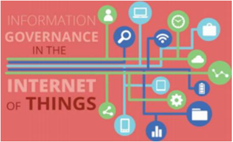

(Source:http://www.revasolutions.com/internet-of-things-newchallenges-and-practices-for-information-governance/. Retrieved on January 26th , 2018) 

### **Governance Challenges for the Internet of Things** 

Virgilio A.F. Almeida -Federal University of Minas Gerais, Brazil

---

<!-- pagina: 36 -->

**Andrea Belo Aula 07 -  If Clauses and Quantifiers** 

Danilo Doneda - Rio de Janeiro State University 

Marília Monteiro - Public Law Institute of Brasília 

Published by the IEEE Computer Society 

### © 2015 

The future will be rich with sensors capable of collecting vast amounts of information. The Internet will be almost fused with the physical world as the Internet of Things (IoT) becomes a reality. Although it’s just beginning, experts estimate that by the end of 2015 there will be around 25 billion “things” connected to the global Internet. By 2025, the estimated number of connected devices should reach 100 billion. These estimates include smartphones, vehicles, appliances, and industrial equipment. Privacy, security, and safety fears grow as the IoT creates conditions for increasing surveillance by governments and corporations. So the question is: Will the IoT be good for the many, or the mighty few? 

While technological aspects of the IoT have been extensively published in the technical literature, few studies have addressed the IoT’s social and political impacts. Two studies have shed light on challenges for the future with the IoT. In 2013, the European Commission (EC) published a study focusing on relevant aspects for possible IoT governance regimes. The EC report identified many challenges for IoT governance — namely privacy, security, ethics, and competition. In 2015, the US Federal Trade Commission (FTC) published the FTC Staff Report The Internet of Things: Privacy and Security in a Connected World. Although the report emphasizes the various benefits that the IoT will bring to consumers and citizens, it acknowledges that there are many risks associated with deploying IoT-based applications, especially in the realm of privacy and security. 

### […] 

The nature of privacy and security problems frequently associated with the IoT indicates that further research, analysis, and discussion are needed to identify possible solutions. First, the introduction of security and privacy elements in the very design of sensors, implementing Privacy by Design, must be taken into account for outcomes such as the homologation process of sensors by competent authorities. Even if the privacy governance of IoT can oversee the control centers for collected data, we must develop concrete means to set limits on the amount or nature of the personal data collected. 

Other critical issues regard notification and consent. If, from one side, it’s true that several sensors are already collecting as much personal data as possible, something must be done to increase citizens’ awareness of these data collection processes. Citizens must have means to take measures to protect their rights whenever necessary. If future scenarios indicate the inadequacy of a mere notice-and-consent approach, alternatives must be presented so that the individual’s autonomy isn’t eroded. 

As with other technologies that aim to change human life, the IoT must be in all respects designed with people as its central focus. Privacy and ethics aren’t natural aspects to be considered in technology’s agenda. However, these features are essential to build the necessary trust in an IoT ecosystem, making it compatible with human rights and ensuring that it’s drafted at the measure, and not at the expense, of people. 

(Source: https://cyber.harvard.edu/~valmeida/pdf/IoT-governance.pdf Retrieved on January 23rd, 2018) 

The word “several” in “it’s true that several sensors are already collecting as much personal data as possible” (fourth paragraph) is a synonym for 

### (A) few.

---

<!-- pagina: 37 -->

**Andrea Belo Aula 07 -  If Clauses and Quantifiers** 

(B) precise. 

- (C) sensitive. 

- (D) important. 

(E) numerous. 

### **GABARITO: E** 

**Comentários:** De acordo com o _Cambridge International Dictionary of English:_ 

_several:_ **some** ; an amount that is not exact but is **fewer than many.** 

Poderíamos traduzir _several_ no contexto para **vários.** 

A oração pode ser traduzida para _é verdade que vários sensores já estão coletando o máximo possível de dados pessoais._ 

### few. > **INCORRETA.** 

_Few_ é o contrário de _many. Several_ está mais próximo a _many_ do que de _few._ 

precise. > **INCORRETA.** 

Conforme definição acima, _several_ é uma medida **imprecisa** . 

Poderíamos dizer que um sinônimo de _precise seria exact_ . 

sensitive. > **INCORRETA.** 

_Sensitive_ <u>não possui sentido de aferição de quantidade. Não há relação entre</u> _sensitive_ e _several._ 

_Sensitive_ é um falso cognato de _"_ sensitivo" - traduções aceitáveis seriam **sensível, delicado.** 

important. > **INCORRETA.** 

_Important_ <u>não possui sentido de aferição de quantidade. Não há relação entre</u> _important_ e _several._ numerous. > **CORRETA.** 

_Numerous_ <u>tem significado próximo da definição do verbete</u> _<u>several.</u>_ 

Podemos substituir na tradução acima _vários_ por _numerosos,_ sem alteração do sentido da oração. 

**07. (FGV/2014 – PREFEITURA MUNICIPAL DE OSASCO – SP)** 

### **Technology for children in the classroom** 

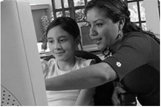

### **Attitudes to technology** 

Many people are afraid of new technology, and, with the increasing presence of the Internet and computers, the term technophobe has appeared to refer to those of us who might be wary of these new developments. More recently, the term digital native has been invented to refer to someone who grows up using technology, and who therefore feels comfortable and confident with it – typically today’s children. Their 

**36**

---

<!-- pagina: 38 -->

**Andrea Belo Aula 07 -  If Clauses and Quantifiers** 

parents, on the other hand, tend to be digital immigrants, who have come late to the world of technology, if at all. In many cases, teachers are the digital immigrants and our younger students are the digital natives. 

What about you? How confident do you feel about using the Internet and computers? Although there is a tendency to call computer users either technophobes or technogeeks (a term for a technology enthusiast), the truth is that most of us probably fall somewhere between the two extremes. 

### **Technology and young learners** 

Modern technologies are very powerful because they rely on one of the most powerful genetic biases we have — the preference for visually presented information. Television, movies, videos, and most computer programs are very visually oriented and therefore attract and maintain the attention of young children. 

The problem with this is that many of the modern technologies are very passive. Because of this they do not provide children with the quality and quantity of crucial emotional, social, cognitive, or physical experiences they require when they are young. 

On the other hand, there are many positive qualities to modern technologies. The technologies that benefit young children the greatest are those that are interactive and allow the child to develop their curiosity, problem solving and independent thinking skills. 

Computers allow interaction. Children can control the pace and activity and make things happen on computers. They can also repeat an activity again and again if they choose. In practice, computers supplement and do not replace highly valued early childhood activities and materials, such as art, blocks, sand, water, books, exploration with writing materials, and dramatic play. Research indicates that computers can be used in developmentally appropriate ways beneficial to children and also can be misused, just as any tool can. Developmentally appropriate software offers opportunities for collaborative play, learning, and creation. Educators must use professional judgment in evaluating and using this learning tool appropriately, applying the same criteria they would to any other learning tool or experience. 

Char Soucy (a primary school teacher) mentions: "Reading books, handling real books, learning to take care of books, turning pages, and interacting with human beings about literature are still vital for learning to read." There are electronic books, but they are really not the same thing as real books. There must be a balance between the two. Computers are highly motivating to today's students, who come to school with plenty of visual stimulation from TV, video games, and other technological sources, but it is not a good idea to go all electronic or to let technology replace what teachers have done for a long time with learning how to read or write. 

(Retrieved and adapted from http://pearsonclassroomlink.com/articles/0711/0711_0102.htm on June 10th , 2014) 

The opposite of “many” in “Many people are afraid” (line 2) is 

(A) some. 

(B) little. 

(C) most. 

(D) less. 

(E) few. 

### **GABARITO: E**

---

<!-- pagina: 39 -->

**Andrea Belo Aula 07 -  If Clauses and Quantifiers** 

**Comentários:** Para responder o enunciado, devemos lembrar da regra dos substantivos contáveis e não contáveis ( **countable and uncountable nouns** ). 

- Para substantivos **<u>contáveis</u>** , como **people, dollars, potatoes, hours** , devemos utilizar os quantificadores **few** e **many** para indicar poucos e muitos, respectivamente. Exemplo: **I got a few dollars in my pocket.** 

- Para substantivos **<u>não contáveis</u>** , como **milk, money, time, patience** , devemos utilizar os quantificadores **little** e **much** para indicar pouco e muito, respectivamente. Exemplo: **I don't have much money.** 

Logo, sabendo que **people** é um substantivo contável, seu contrário é dado por **few** . 

### **08. (FUNDATEC/2011 – CÂMARA MUNICIPAL DE PORTO ALEGRE – RS)** 

### **Could a Clone Ever Run for President?** 

<!-- Start of picture text -->
==5460== <!-- End of picture text -->

Dolly is out, but how about “All the way with a cloned L.B.J.”? 

Sure, why not? Scientists used to think it would be difficult to clone an animal as complex as a mammal, but Dolly the sheep neatly demolished that theory. If you can clone a sheep, a human isn’t much tougher. **Whether** it is ethical to do so is another matter, and in fact human cloning has been outlawed in a number of countries and states. But illegal or not, someone is going to do it – and having been conceived ……… a convicted felon is no bar to public office. 

The U.S. Constitution, **moreover** , doesn’t have a clone clause. As long as you are a citizen and 35 or older, you’re eligible. The age requirement means it can’t happen ………. a while – 2036 at the **earliest** (presuming that someone hasn’t already secretly created the first human clone). But 2036 is not that far away. **While** some may insist that a clone should not be eligible for citizenship, the argument won’t fly. If you are human and born in the U.S., you’re a citizen. A clone will be born in the conventional way, with a mother, a belly button, and a full complement of human DNA. 

The **obstacle** to President Clone will come if cloning carries serious side effects. Dolly the sheep, it turns out, has prematurely aged cells, probably attributable ………. the fact that she is the biological extension of an animal **that** was already an adult. Human clones could have the same problem – plus cloning-related mental or **behavioral** defects that **might** not be apparent in a sheep. 

If these difficulties could be ________ political campaigns could get pretty interesting. Biologists today are talking of using cloning to bring the wooly mammoth and other extinct animals back to life. Maybe Democrats and Republicans would want to try something similar. After all, candidates are always trying to link **themselves** to great leader of the past. Why not cut out the middlemen? Given the pace of scientific progress, plus sufficiently audacious party leaders, the presidential debates of 2044 could feature some **pretty impressive lineups** . Imagine Abraham Lincoln talking on F.D.R. or J.F.K. going up against Thomas Jefferson. Or Millard Fillmore vs. Warren Harding. 

On second thought … 

(Reprinted from _Time_ , “Could a Clone Ever Run for President?”By Michael D. Lemonick, 2001) 

Choose the correct option to fill in the period bellow: 

If Dolly __________ alive, she __________ very popular.

---

<!-- pagina: 40 -->

**Andrea Belo Aula 07 -  If Clauses and Quantifiers** 

(A) was – was 

- (B) was – was going to be 

- (C) was – would be 

- (D) were – would be 

- (E) were – were going to be 

### **GABARITO: C** 

**Comentários:** Pelo uso do " _if_ ", percebemos que se trata de uma oração condicional. Há três tipos de condicionais em Inglês: a primeira, a segunda e a terceira. Cada uma é empregada em um contexto distinto. A _second conditional,_ por exemplo, é utilizada para falar de situações que não são reais, como em: 

- **_If_** _I_ **_won_** _the prize, I_ **_would become_** _famous_ 

Sua estrutura fica é: if + passado simples + would + presente simples 

Percebemos que a oração do enunciado é uma _second conditional_ , pois ela descreve uma situação que não é real ("se Dolly estivesse viva"). Assim, a segunda lacuna, portanto, obrigatoriamente deverá ser preenchida com o modal " _would_ " + _present simple tense_ ( _be_ ), enquanto a primeira deverá trazer o verbo no _past simple_ ( _was_ ). 

<u>Assim, chegamos à resposta correta:</u> _<u>was</u>_ <u>+</u> _<u>would be</u>_ <u>.</u> 

### **09. (FUNDATEC/2022 – PREFEITURA MUNICIPAL DE RESTINGA SÊCA – RS)** 

### **What is the internet of things?** 

In the internet of things (IoT), a “thing” can be __ person with a heart monitor implant, __ animal with a biochip transponder, __ car with sensors to alert when tire pressure is low, or any object that is able to transfer data. IoT is __ system of interrelated “things” that are provided with __ ability to transfer information over a network without requiring human interaction. It uses artificial intelligence and machine learning to improve data collecting, and sometimes devices can even communicate with each other and then act on __ information they get. 

In agriculture, IoT-based smart farming systems can help monitor light, temperature, humidity, and soil moisture of crop fields; automatize irrigation systems, and collect data on rainfall and soil content. The infrastructure industry can benefit from sensors that monitor events or changes within structural buildings and bridges. To healthcare, IoT offers the ability to monitor patients more closely using an analysis of the data that's generated. 

Smart homes are equipped with smart thermostats, appliances, and connected heating, lighting, and electronic devices that can be controlled remotely via smartphones. Smart buildings can reduce energy costs using sensors that detect how many occupants are in a room and then adjust the temperature automatically. Wearable devices with sensors can be used for public safety, for example, by providing optimized routes to a location where there is an emergency, or by tracking firefighters' vital signs at life-threatening sites. 

Obviously, there are some disadvantages, too, and the list includes the risk that confidential information is stolen by hackers, and the difficulty for devices from different manufacturers to communicate with each other since there's no international standard of compatibility for IoT. Companies may have to deal with

---

<!-- pagina: 41 -->

**Andrea Belo Aula 07 -  If Clauses and Quantifiers** 

massive numbers, and collecting and managing the data from all those devices will be challenging. **' '** Ultimately, **<u>if there s a bug in the system, it s likely that every connected device will become corrupted</u>** . 

"Pros and cons in perspective, Matthew Evans, the IoT program head at techUK, says that In the short term, we know [IoT] will impact on anything where there is a high cost of not 

intervening, Evans said. ""And it’ll be for simpler day-to-day issues – like finding a car parking space in busy areas, linking up your home entertainment system, and using your fridge webcam to check if you need more milk on the way home.”" 

(Available in: from: https://www.techtarget.com/iotagenda/definition/Internet-of-Things-IoT https://www.wired.co.uk/article/internet-of-things-what-is-explained-iot – text especially adapted for this test). 

Consider the statements about the excerpt “If there's a bug in the system, it's likely that every connected device will become corrupted”: 

I. If we change the order to “It's likely that every connected device will become corrupted if there's a bug in the system” the sentence becomes ungrammatical. 

II. The word “If” can be substituted by “In case” with no significative changes in meaning. 

III. This is a first conditional sentence, which means there is a high probability that this really happens. 

Which statements are correct? 

(A) Only I. 

(B) Only II. 

(C) Only III. 

(D) Only II and III. 

(E) I, II, and III. 

### **GABARITO: D** 

**Comentários:** A questão requer que você analise as afirmativas acerca do trecho " _If there's a bug in the system, it's likely that every connected device will become corrupted_ ” e aponte quais estão corretas. 

**I.** _Se alterarmos a ordem para “É provável que todos os dispositivos conectados sejam corrompidos se houver um bug no sistema”, a frase se tornará agramatical. >_ **ERRADO** . 

Na frase dada, temos uma **oração condicional** , iniciada pela conjunção **_if_** (se), que expressa uma condição <u>para que a oração principal ocorra.</u> 

No item I, temos a mera inversão da posição dessas orações, sem interferir em seu conteúdo, ou seja, a frase <u>não se torna agramatical.</u> 

### **Portanto, o item I está incorreto** . 

**II.** _A palavra “If” (Se) pode ser substituída por "In case" (No caso de) sem mudanças significativas de significado. >_ **CORRETO** . 

As conjunções _if_ e _in case_ são **sinônimas** , e ambas introduzem uma condição para que a ação expressa pela oração principal ocorra.

---

<!-- pagina: 42 -->

**Andrea Belo Aula 07 -  If Clauses and Quantifiers** 

Desse modo, é possível intercambiar as duas conjunções sem mudança de sentido. Logo, **o item II está correto** . 

**III.** _Essa é uma oração em primeira condicional, o que significa que há uma alta probabilidade de que isso realmente aconteça. >_ **CORRETO** . 

De fato, a **primeira condicional** é usada para expressar situações prováveis no futuro, e é formada pela estrutura **_if_** (se) + verbo no **presente simples** , .... + **_will_** + verbo no **infinitivo** . 

Na frase dada, temos exatamente essa estrutura, indicando, assim, que a ação tem alta probabilidade de <u>ocorrer, o que torna</u> **o item III correto** . 

Assim, temos que **apenas as assertivas II e III estão corretas** . 

### **Portanto, o gabarito é a alternativa "D"** . 

### **10. (FUNDATEC/2019 – PREFEITURA MUNICIPAL DE SALTO DO JACUÍ – RS)** 

### **Is Ikigai The New Hygge? The Japanese Concept Of Finding Purpose In Our Lives** 

We’ve snuggled up in a comfortable knitted sweaters and filled our rooms with wood-scented candles in the pursuit of hygge – the Danish concept of finding contentment in ________. When that didn't work, we turned to the Swedish idea of lagom, or moderate living, and it turns out we’re still not happy. So maybe it’s ikigai, the lifestyle concept from Japan, that will help us live our best lives. 

In some ways, Ikigai is the antithesis of hygge. Instead of encouraging us to slow down, it’s about find striving to find purpose in life, or raison d’etre to use a French equivalent. As such, it is a notion often adopted by those unhappy at work or who have retired. The word is composed in Japanese using the characters iki, or life, and kai, meaning the result of a certain action," explains Hector Garcia, the co-author of Ikigai: The Japanese Secret to a Long and Happy Life. 

This all sounds rather fluffy. But studies show that losing one's purpose can have a detrimental effect. For instance, those who lose their raison d'etre when they retire become more prone to contracting _________. But Ikigai isn’t an individualistic concept either focused on self-preservation. The social connections that we form are as important as any sense of inner peace, according to Remedios, of the Hyper Japan cultural festival. 

Now we're convinced to try it, how does one go about finding their ikigai? "Flow" is the first step, says Garcia. "When we enter a state of 'flow' we lose the sense of time passing. Have you ever been so absorbed in a task that you forget to drink and eat? What type of task was it? Notice those moments when you enter flow, and your ikigai might be embeded in those moments. If you increase the daily time at flow you will increase your connection with your ikigai. "Your Ikigai is at the intersection of what you are good at and what you love doing." 

Since incorporating the ideas of ikigai into his life, Garcia says he has become better at appreciating and understanding what he finds joy in. “I stop several times through the day and I ask myself: why am I doing this?”. Which, frankly, sounds exhausting. But Garcia stresses that “noticing is only the first step.” The next is implementing changes - and this is where most of us trip up. 

Still, it's hard not to feel that ikigai – like hygge and lagom – Is another sticking plaster we've reached for to help patch over the problems in our lives that run deeper than any buzzword word can solve. “Although the words might be new, I think all the concepts are not really new," says the spokesperson for HyperJapan.

---

<!-- pagina: 43 -->

**Andrea Belo Aula 07 -  If Clauses and Quantifiers** 

"Just as humans have lusted after objects and money since the dawn of time, other humans have felt dissatisfaction at the _________ pursuit of money and fame and have instead focused on something bigger than their own material wealth. This has over the years been described using many different words and practices, but always hearkening back to the central core of meaningfulness in life.” 

Source: https://www.independent.co.uk/life-style/ikigai-hygge-lagom-swedish-danish-japanese-scandinavian-lifestyle-happiness-meaning-of-life-a7956141.html 

Consider the sentence "If you increase the daily time at flow you will increase your connection with your ikigai" and the following assertives: 

I. It is an example of the zero conditional. 

II. It is used to talk about imaginary situations in the past. 

III. The third conditional would be "If you had increased the daily time at flow you would increase your connection with your ikigai". 

Which ones are INCORRECT? 

(A) Only I. 

(B) Only II. 

- (C) Only III 

- (D) Only I and III. 

(E) I, II and III. 

### **GABARITO: E** 

**Comentários:** Essa alternativa está correta pois todas as sentenças citadas estão equivocadas. 

A sentença do enunciado trata-se de uma **FIRST CONDITIONAL** , feita a partir da seguinte estrutura: _IF + simple present and WILL or WON'T + base form_ . Vejo o exemplo abaixo: 

- " 

- • **If you increase** the daily time at flow **you will** increase your connection with your ikigai". 

### _<u>Veja a seguir porque essas sentenças estão equivocadas:</u>_ 

### _I. It is an example of the zero conditional._ 

- Está errado pois a frase acima foi construída por meio da FIRST CONDITIONAL. A **zero conditional** é formada por " _if + simple present AND simple present_ " e caracteriza-se por algo que é supostamente verdade ou que supostamente ocorreu. Exemplo: I get tired if I study too much. 

### _II. It is used to talk about imaginary situations in the past._ 

- A FIRST CONDITIONAL não fala sobre ações imaginárias do passado, mas sobre possíveis situações futuras e suas consequências. 

III. The third conditional would be "If you had increased the daily time at flow you would increase your connection with your ikigai". 

- Está errada, pois a **third conditional** é formada pela seguinte estrutura: _IF + past perfect and WOULD HAVE + past participle_ . Exemplo: "You **wouldn't have lost** this opportunity **if you had studied** more".

---

<!-- pagina: 44 -->

**Andrea Belo Aula 07 -  If Clauses and Quantifiers** 

### **11. (FUNDATEC/2016 – PREFEITURA MUNICIPAL DE VIAMÃO – RS)** 

### **Shark-Spotting And Sea Rescue Goes High-Tech In Australia** 

Shark surveillance and sea rescue just got more sophisticated. 

A drone that can detect the aquatic beasts from the sky and drop down rescue pods to swimmers in distress will be deployed above coastlines as part of a trial in New South Wales, Australia. 

The $180,000 unmanned aerial vehicle, dubbed the "Little Ripper," will come equipped with a high-definition camera. The footage can be monitored from the ground, saving the costly expense of sending a helicopter into the air. 

Scientists are also working on a software algorithm that will identify the kind of shark in the water, which can then be relayed immediately to emergency services, lifeguards and swimmers. 

The drone's rescue pod is adaptable to environmental conditions. According to the Sydney Morning Herald, the marine version contains a life raft, locator beacon, shark repellent and medical equipment. It can also be used for land and snow emergencies. 

The trial of the battery-powered, military-grade Vapor 55 drone was launched at the Westpac Lifesaver Helicopter Base in Sydney on Sunday. It will initially patrol the coastlines of Newcastle, Hawkes Nest and Byron Bay in northern New South Wales, Mashable reported. 

Fourteen people were attacked by sharks in the area in 2015. There was one fatality. 

NSW Premier Mike Baird said that if the trial proved a success, then every surf club in the state will have access to the technology. 

"Every now and then the future crashes in on today and I think this is one of those days," Baird said. 

Paul Scully-Power, Australia's first astronaut, and philanthropist/founding president of the International Life Saving Federation Kevin Weldon developed the drone with Australian company Skyline. The trial was scheduled four months after the NSW government unveiled a $11.4 million program to combat shark attacks, via the drone and 4G listening stations. 

http://www.huffingtonpost.com/entry/shark-dronesaustralia_us_56d30756e4b0871f60ebbbae?ir=Science&section=us_science&utm_hp_ref=science 

Consider the sentence: “ _NSW Premier Mike Baird said that if the trial proved a success, then every surf club in the state will have access to the technology._ ” (l. 17-18). The underlined clause it is: 

- (A) A defining relative clause. 

- (B) A non-defining relative clause. 

- (C) A sentencial relative clause. 

- (D) An infinitive clause. 

- (E) A conditional clause. 

### **GABARITO: E** 

**Comentários:** Questão sobre **_clause types_** , ou seja, tipo de oração.

---

<!-- pagina: 45 -->

**Andrea Belo Aula 07 -  If Clauses and Quantifiers** 

_"...Mike Baird said that_ **_if_** _the trial proved a success,_ **_then_** _every surf club in the state will have access to the technology"._ 

_"...Mike Baird disse que,_ **_se_** _o teste for um sucesso,_ **_então_** _todos os clubes de surf do estado terão acesso à tecnologia"._ 

A frase selecionada possui as conjunções **if** e **then** , estabelecendo uma **correlação** entre as duas frases. 

Trata-se de uma **condicional** , ou seja, expressa a ideia de que uma ação acontece por **<u>consequência</u>** <u>de outra.</u> 

### **12. (FUNDATEC/2015 – BRDE)** 

### **Press me! The button that lies to you** 

The tube pulls in to a busy station along the London Underground’s Central Line. It is early evening on a Thursday. A gaggle of commuters assembles inside and outside the train, waiting for the doors to open. A moment of impatience grips one man who is nearest to them. He pushes the square, green-rimmed button which says “open”. A second later, the doors satisfyingly part. The crowds mingle, jostling on and off the train, and their journeys continue. Yet whether or not the traveller knew it, his finger had no effect on the mechanism. 

Some would call this a “placebo button”– a button which, objectively speaking, provides no control over a system, but which to the user at least is psychologically fulfilling to push. It turns out that there are plentiful examples of buttons which do nothing and indeed other technologies which are purposefully designed to deceive us. But here’s the really surprising thing. Many increasingly argue that we actually benefit from the illusion that we are in control of something – even when, from the observer’s point of view, we’re not. 

In 2013, BBC News Magazine discovered that pedestrian crossings all over the UK were the wellspring of placebo buttons. A crossing in central London had programmed intervals for red and green lights, for example. Pushing the button would only impact the length of these intervals between midnight and 7am. ___ several other cities during busy periods, the crossings were programmed to alternate their signals at a specific rate. The buttons did nothing, but a “wait” light would still come on when they were pressed and, yes, people still pressed them presumably believing that their actions were having an effect. 

Certain psychologists would argue that the buttons were indeed having an effect – just not ___ the traffic lights themselves. Instead the effect is in the commuter’s minds. To understand this you have to go back to the early 1970s. At that time, psychologist Ellen Langer, now a professor ____ Harvard, was a Yale graduate student. During a five-card draw game of poker she dealt one set of cards in a haphazard order. “Everybody,” she says, “got crazy. The cards somehow belonged to the other person even though you couldn’t see any of them.” Langer decided to find out more about the way people regulated the playing of such games. She went to a casino where, at the slot machines, she found gamblers with elaborate ways of pulling the lever. At another time a “highly rational” fellow student tried to explain to her why tossing a pair of dice could be done in a certain way to affect the numbers which came up. “People believed that all of these behaviours were going to increase the probability of their winning,” she comments. 

In 1975, she wrote a paper where she described the significance of these beliefs and coined a term for the effect that they had on people: the “illusion of control”. However, instead of framing this as an irrational delusion, Langer described the effect as a positive thing. “Feeling you have control over your world is a desirable state,” she explains. When it comes to those deceptive traffic light buttons, Langer says there could

---

<!-- pagina: 46 -->

**Andrea Belo Aula 07 -  If Clauses and Quantifiers** 

be a whole host of reasons why the placebo effect might be counted as a good thing. “Doing something is better than doing nothing, so people believe,” she says. “And when you go to press the button your attention is on the activity at hand. If I’m just standing at the corner, I may not even see the light change, or I might only catch the last part of the change, in which case I could put myself in danger.” 

Also, if pedestrians wait together at the crossing and a few press the button impatiently, that creates a sense of togetherness with strangers which might otherwise be absent. All of these things may be taken as positive impacts on our mental state, and even socially reinforcing. It’s something to think about next time you cross the street. 

(Source: Adapted from http://www.bbc.com/future/story/20150415-the-buttons-that-do-nothing) 

Consider the sentence: “If I’m just standing at the corner, I may not even see the light change” (l.38), and the following statements: 

I. It is an example of the first conditional. 

II. The modal verb ‘may’ expresses possibility. 

III. ‘may’ could be replaced by ‘will’ without causing any difference in meaning. 

Which ones are INCORRECT? 

A) Only I. 

B) Only II. 

C) Only III. 

D) Only II and III. 

E) I, II and III. 

### **GABARITO: C** 

**Comentários:** I – CORRETA. A _first conditional_ em inglês (primeira condicional) são orações condicionais ( _if clauses_ ) que indicam possibilidades ou prováveis ações futuras. As sentenças condicionais são acompanhadas pelo termo _if_ (se). 

Estrutura: _If + simple present + simple future + infinitive_ (podendo estar invertida) 

No tempo futuro, geralmente são usados os verbos modais: _will, can, may_ e _might_ . 

Dessa forma, a sentença da questão é primeira condicional. 

II – CORRETA. O verbo modal _may_ pode indicar pedido, possibilidade, permissão e ser traduzido para pode <u>ou poderia.</u> 

**III – INCORRETA.** O significado mudará, pois _may_ indica possibilidade, já _will_ uma certeza. 

### **13. (FUNDATEC/2018 – PREFEITURA MUNICIPAL DE CORUMBÁ – MS)** 

Maya Angelou's grandson has spoken about one of the late author's final projects: ☐ album, due out this winter, which mixes her poetry and vocals with hip-hop. Angelou, who died in May, "loved" the project from

---

<!-- pagina: 47 -->

**Andrea Belo Aula 07 -  If Clauses and Quantifiers** 

the beginning, according to her grandson Colin Johnson, who told the Associated Press that some of the 13 songs use pre-recorded vocals from the writer, and some were recorded _________ for the new work. The album will be called _Caged Bird Songs_ , in reference to Angelou's most famous piece of writing, her ______ I Know Why the Caged Bird Sings_ . 

The work will be released by Smooch Music on 4 November, produced by musicians Shawn Rivera and RoccStarr. "These guys were inspired by grandma's work, which many people are, and felt like giving it a different medium of delivery to make it more obtainable to ☐ larger group of people," Johnson said. 

According to Johnson, who together with his father has founded _Caged Bird Legacy_ (which plans to release future Angelou projects) as soon as the writer was told about the album she "completely backed" it, and it was recorded at her home in North Carolina. "She loved it and was excited to hear more about what they wanted to do," he told the Associated Press. "She had a lot of energy around it. She saw (hip-hop) as this generation's way of speaking and conveying a message. If she was alive, she would be recording other albuns". 

As well as her award-winning volumes of poetry and biography, Angelou had previously recorded a calypso album, written songs for films and musicals, and won prizes for her spoken word albums. "To hear somebody that is so famous for her poetry and her message, and then set to some music that you can enjoy definitely feels like this is something that can continue her reach _______ generations," Johnson told ☐ AP. 

Fonte: adaptado de <https://www.theguardian.com/books/2014/sep/08/maya-angelou-hip-hop-album-caged-bird-songs>. 

The sentence “If she was alive, she would be recording other albuns” (l.17) 

I. Is used to talk about the possible result of an imagined situation in the present. 

II. Is an example of the second conditional. 

III. Implies that the woman is no longer alive. 

Which ones are correct? 

(A) Only I. 

(B) Only II. 

- (C) Only III. 

- (D) Only II and III. 

(E) I, II and III. 

### **GABARITO: E** 

**Comentários:** A alternativa que responde à questão é a letra **E** , que diz que as **assertivas I, II** e **III** estão **certas** . 

A questão exige o conhecimento das orações condicionais e das situações em que são empregadas. Normalmente essas orações são introduzidas com o uso de ‘ _if_ ’ e tratam sobre fatos que podem (ou <u>poderiam) acontecer, caso uma determinada condição seja (ou fosse) atendida.</u> 

Em _If she was alive, she would be recording other albuns_ (l. 17), temos o possível resultado de uma situação imaginada no presente:

---

<!-- pagina: 48 -->

**Andrea Belo Aula 07 -  If Clauses and Quantifiers** 

- possível resultado = a gravação de outros álbuns 

- situação imaginada no presente = a mulher estar viva 

Logo, há uma condição para que algo se realizasse no presente. Assim, a **assertiva I** está **certa** . 

Há três tipos de orações condicionais: 

- 1) Uma condição possível e seu resultado provável 

### Ex.: _If I study, I will pass the test_ . 

- 2) Uma condição hipotética e seu resultado provável 

### Ex.: _If I studied, I would pass the test_ . 

- 3) Uma condição irreal no passado e seu resultado provável no passado 

### Ex.: _If I had studied, I would have passed the test_ . 

Assim, embora, em termos reais, não fosse possível a mulher estar viva, a imaginação da situação presente seria uma **condição hipotética para um provável resultado** . Logo, _If she was alive, she would be recording other albuns_ (l. 17) é exemplo de Segundo Condicional e a **assertiva II** está **certa** . 

Como o Segundo Condicional expressa **ações que não podem ser realizadas por serem situações hipotéticas** , NÃO há possibilidade de a mulher estar viva. Portanto, não há necessidade de dizer que ela morreu: o simples fato de se imaginar que algo aconteceria caso ela estivesse viva pressupõe que ela já morreu. Logo, a **assertiva III** está **certa** . 

### **14. (IADES/2016 – CEITEC S.A.)** 

### **Be glad your nose is on your face** 

Be glad your nose is on your face, not pasted on some other place, for if it were where it is not, you might dislike your nose a lot. 

Imagine if your precious nose were sandwiched in between your toes, that clearly would not be a treat, for you'd be forced to smell your feet. 

Your nose would be a source of dread were it attached atop your head, it soon would drive you to despair, forever tickled by your hair. Within your ear, your nose would be an absolute catastrophe, for when you were obliged to sneeze, your brain would rattle from the breeze. 

Your nose, instead, through thick and thin,

---

<!-- pagina: 49 -->

**Andrea Belo Aula 07 -  If Clauses and Quantifiers** 

### remains between your eyes and chin; not pasted on some other place – be glad your nose is on your face! 

Internet: <https://www.poetryfoundation.org/poem/177537>. Access 12 Dec. 2015, adapted. 

Based on the excerpt “Imagine if your precious nose / were sandwiched in between your toes, / that clearly would not be a treat, / for you’d be forced to smell your feet” (lines 5 to 8) and according to your knowledge of English, choose the correct alternative. 

(A) It is possible to turn a noun into a verb, as it was done in “sandwiched”, according to the traditional English grammar. 

(B) Some poems do not follow grammar rules in the name of art. It is the case in this sentence because the verb “were” should have been inflected as “was” for referring to “nose”. 

(C) This excerpt is a conditional clause that expresses an imaginary, hypothetical or unlikely situation. 

(D) The word “between” could be replaced by the word among for being perfect synonyms. 

(E) The word “toes” could be replaced by fingers without causing any misunderstanding or lack of coherence. 

### **GABARITO: C** 

**Comentários:** A questão trata sobre **interpretação de texto** . É preciso entender as **intenções do autor** e confrontá-las com as afirmações de cada opção de resposta, após analisá-las. Para isso, é importante estar atento ao uso do vocabulário tanto no texto quanto nas opções de respostas. 

It is possible to turn a noun into a verb, as it was done in “sandwiched”, according to the traditional English grammar. > **ERRADO** . 

O processo de formação de palavras da língua inglesa permite várias maneiras diferentes de gerar novas <u>palavras, dentre os quais está a</u> **transformação de substantivo em verbo, e vice-versa** . Muitas vezes isso ocorre sem alterações ortográficas e apenas contam com o acréscimo de sufixos, prefixos e desinências. 

Esse processo ocorre em **_sandwich_** , normalmente empregado como substantivo. No trecho do texto, essa palavra significa “colocar entre duas coisas”, “imprensar”. 

- _Imagine if your precious nose / were_ **_sandwiched_** _in between your toes_ (l. 5-6) 

- Logo, é **errado** aformar que a gramática tradicional da língua inglesa NÃO permite transformar um substantivo em verbo, como ocorreu em **_sandwiched_** . 

Some poems do not follow grammar rules in the name of art. It is the case in this sentence because the verb “were” should have been inflected as “was” for referring to “nose”. > **ERRADO** . 

Em **orações condicionais** que expressam ações que não podem ser realizadas por serem situações <u>hipotéticas, o uso do verbo</u> **_to be_** com a conjunção **_if_** normalmente toma a forma **_if I were_** , em vez de **_if I was_** : 

- _Imagine if your precious nose / were sandwiched in between your toes_ (l. 5-6) 

Nesse caso, então, NÃO há a obrigatoriedade de usar **_I was_** com a palavra **_nose_** , que é singular. 

Portanto, é **errado** afirmar que o uso de **_were_** no poema é um caso de licença poética e deveria ter sido usada a forma **_was_** .

---

<!-- pagina: 50 -->

**Andrea Belo Aula 07 -  If Clauses and Quantifiers** 

This excerpt is a conditional clause that expresses an imaginary, hypothetical or unlikely situation. > **CERTO** . 

O **Segundo Condicional** expressa ações que, por serem situações hipotéticas, **não podem ser realizadas** : 

- _Imagine if your precious nose / were sandwiched in between your toes, / that clearly would not be a treat, / for you’d be forced to smell your feet_ (l. 5-8) 

Nesse trecho, então, temos o **resultado hipotético** de uma situação imaginada no presente: 

- <u>resultado hipotético =</u> _you’d be forced to smell your feet_ (“ser foçado a cheirar os seus pés” 

- <u>situação imaginada no presente =</u> _if your precious nose / were sandwiched in between your toes_ (seu nariz estar encaixado entre os seus dedos dos pés) 

Aqui há uma condição para que algo se realizasse no presente e a situação imaginária é reforçada pelo uso do verbo **_imagine_** . 

Logo, é correto afirmar que esse trecho é **uma oração condicional que expressa uma situação improvável, hipotética ou imaginária** . 

The word “between” could be replaced by the word **among** for being perfect synonyms. > **ERRADO** . 

De acordo com o dicionário Collins, **_between_** e **_among_** têm usos específicos. **_Between_** (ou **_in between_** - “entre”) é uma preposição usada para indicar que **algo está entre duas coisas** , ou seja, há uma coisa de um lado e outra do outro. No trecho do texto, o uso do verbo **_sandwich_** (“colocar entre duas coisas”, “imprensar”) reforça essa ideia. Observe: 

- _Imagine if your precious nose / were sandwiched_ **_in between_** _your toes,_ (l. 5-6; “Imagine o seu precioso nariz imprensado **entre** os seus artelhos”) 

Nesse caso, além de haver “coisas” dos dois lados, **trata-se de de itens individuais** , colocados lado a lado (dedos dos pés). 

A palavra **_among_** (“entre”), por outro lado, é usada para referir-se a **alguém ou algo que está no meio ou que está cercado por um grupo de coisas ou pessoas** . E se é entre pessoas de um mesmo tipo, a que está entre elas tem contato com elas e é parte desse grupo, compartilhando suas características. Logo, essas palavras NÃO são sinônimas, embora possam ter a mesma tradução em português. 

Portanto, é **errado** afirmar que a palavra **_<u>between</u>_** <u>poderia ser substituída por</u> **_<u>among</u>_** <u>porque são sinônimos perfeitos.</u> 

The word “toes” could be replaced by **fingers** without causing any misunderstanding or lack of coherence. > **ERRADO** . 

**_Toes_** refere-se aos dedos dos pés (“artelhos”, em português) e **_fingers_** , aos dedos das mãos. Logo, essas palavras NÃO são sinônimas. 

- _Imagine if your precious nose / were sandwiched in between your_ **_toes_** (l. 5-6) 

Portanto, é **errado** afirmar que a palavra **_toes_** poderia ser substituída por **_fingers_** <u>sem causar qualquer incompreensão ou falta de coerência.</u> 

### **15. (IADES/2016 – CEITEC S.A.)**

---

<!-- pagina: 51 -->

**Andrea Belo Aula 07 -  If Clauses and Quantifiers** 

The sentence below with the same syntactical function of the underlined part of the stanza “Be glad your nose is on your face, / not pasted on some other place, / for if it were where it is not, / you might dislike your <u>nose a lot” (lines 1 to 4) is</u> 

- (A) although it was raining, we decided to go fishing, 

- (B) because he was running late, John didn’t have time for breakfast. 

- (C) she did her homework while her father cooked dinner. 

- (D) she couldn’t talk due to her toothache. 

(E) I would not go there if I were you. 

### **GABARITO: E** 

**Comentários:** A questão trata sobre **interpretação de texto** e sobre **orações condicionais** . É preciso entender as intenções do autor e confrontá-las com as afirmações de cada opção de resposta, após analisálas. Para isso, é importante estar atento ao uso do vocabulário e da estrutura sintática das orações tanto no texto quanto nas opções de respostas. 

A questão exige o conhecimento das **orações condicionais** e das situações em que são empregadas. Normalmente essas orações são introduzidas com o uso de ‘ **_if_** ’ e tratam sobre fatos que podem (ou poderiam) acontecer, caso uma determinada condição seja (ou fosse) atendida. 

O **Segundo Condicional** expressa **ações que não podem ser realizadas por serem situações hipotéticas** : 

- _for_ **_if_** _it were where it is not, / you might dislike your nose a lot_ (l. 3-4) 

Nesse trecho, então, temos uma situação imaginada no presente, com o seu resultado hipotético: 

- **situação imaginada no presente** = _you might dislike your nose a lot_ (“você poderia muito não gostar do seu nariz”) 

- **resultado hipotético** = _if it were where it is not_ (“se ele [nariz] não estivesse onde está” 

Aqui há uma **condição** para que algo se realizasse no presente e a **situação imaginária** . Assim, é preciso localizar uma alternativa que tenha essa mesma estrutura. 

although it was raining, we decided to go fishing. > ERRADO. 

Esse trecho indica uma **concessão** ou uma **ação inesperada** em relação a uma outra ação ocorrida no passado. NÃO há indicação de **condição** e nem de **situação hipotética** . Observe: 

- _although it was raining, we decided to go fishing_ , (“embora estivesse chovendo, decidimos ir pescar”) 

Logo, é **errado** afirmar que esse trecho tem a mesma função sintática que for _if it were where it is not, / you might dislike your nose a lot_ (l. 3-4). 

because he was running late, John didn’t have time for breakfast. > **ERRADO** . 

Esse trecho indica **a causa de um fato ocorrido no passado** . NÃO há indicação de condição e nem de situação <u>hipotética. Observe:</u> 

- _because he was running late, John didn’t have time for breakfast._ (“Porque estava atrasado, John não teve tempo de tomar café da manhã.”) 

Logo, é **errado** afirmar que esse trecho tem a mesma função sintática que for _<u>if it were where it is not, / you might dislike your nose a lot</u>_ (l. 3-4).

---

<!-- pagina: 52 -->

**Andrea Belo Aula 07 -  If Clauses and Quantifiers** 

she did her homework while her father cooked dinner. > **ERRADO** . 

Esse trecho indica a ocorrência de **duas ações simultâneas** , no passado. NÃO há indicação de condição e nem de situação hipotética. Observe: 

- _she did her homework while her father cooked dinner._ (“Ela fez seu dever de casa enquanto seu pai preparava o jantar) 

Logo, é **errado** afirmar que esse trecho tem a mesma função sintática que _<u>for if it were where it is not, / you might dislike your nose a lot</u>_ (l. 3-4). 

she couldn’t talk due to her toothache. > **ERRADO** . 

Esse trecho indica que alguém **não tem a capacidade de falar** devido a uma causa que lhe impede de realizar a ação. NÃO há indicação de **condição** e nem de **situação hipotética** : 

- _she couldn’t talk due to her toothache_ . (“Ela não conseguia conversar por causa de uma dor de dente) 

- Logo, é **errado** afirmar que esse trecho tem a mesma função sintática que _<u>for if it were where it is not, / you</u> might dislike your nose a lot_ (l. 3-4). 

I would not go there if I were you. > **CERTO** . 

Se invertermos a ordem das orações nesse período, teremos: 

- **If I were you, I would not go there** . 

Percebe-se que há, aqui, uma condição hipotética e um resultado provável. 

- **situação imaginada no presente** = _I were you_ (“eu ser você”) 

- **resultado hipotético** = _I would not go there_ (“eu não iria lá”) 

Logo, é correto afirmar que esse trecho tem a mesma função sintática que _for if it were where it is not, / you might dislike your nose a lot_ (l. 3-4). 

### **16. (VUNESP/2019 – PREFEITURA MUNICIPAL DE DOIS CÓRREGOS – SP)** 

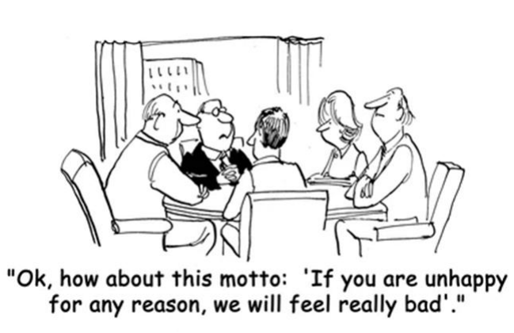

---

<!-- pagina: 53 -->

**Andrea Belo Aula 07 -  If Clauses and Quantifiers** 

The line from the cartoon “If you are unhappy for any reason, we will feel really bad” exemplifies a sentence with a conditional clause. Another correct sentence with a conditional structure is found in alternative: 

- (A) I don’t mind living in England if the days there were not so cold and dark most of the time. 

- (B) If I found a hundred dollar bill in the street, I wanted to keep it to myself. 

- (C) If you stopped smoking, you will certainly feel much stronger and happier. 

- (D) My grandparents feel disappointed if we would not visit them on Sunday afternoons. 

- (E) If you are tired of working late hours, I may have to ask you to quit and find another job. 

### **GABARITO: E** 

**Comentários:** O enunciado busca uma sentença com uma estrutura condicional correta. 

I don’t mind living in England if the days there were not so cold and dark most of the time. > **INCORRETA** 

Vemos que a **Main Clause** está no **Simple Present** , enquanto a **If Clause** está no **Simple Past** , e, portanto, a frase não possui uma estrutura correta. 

Uma forma de corrigir a frase, é escrever a **Main Clause** no formato **Would + Infinitive** , pois dessa forma teríamos uma **Conditional Sentence** do tipo 2. Portanto: 

- I **wouldn't mind** living in England if the days there **were** not so cold and dark most of the time. 

- Dessa forma, a sentença _"I don’t mind living in England if the days there were not so cold and dark most of the time."_ está **incorreta** . 

If I found a hundred dollar bill in the street, I wanted to keep it to myself. > **INCORRETA** 

Vemos que a tanto a **Main Clause** quanto a **If Clause** estão no **Simple Past** , e, portanto, a frase não possui uma estrutura correta. 

Uma forma de corrigir a frase, é escrever a **Main Clause** no formato **Would + Infinitive** , pois dessa forma teríamos uma **Conditional Sentence** do tipo 2. Portanto: 

- If I **found** a hundred dollar bill in the street, I **would keep** it to myself. 

- Dessa forma, a sentença _"If I found a hundred dollar bill in the street, I wanted to keep it to myself."_ está **incorreta** . 

If you stopped smoking, you will certainly feel much stronger and happier. > **INCORRETA** 

Vemos que a **Main Clause** está no formato **Will-future** enquanto a **If Clause** está no **Simple Past** , e, portanto, a frase não possui uma estrutura correta. 

Uma forma de corrigir a frase, é escrever a **Main Clause** no formato **Would + Infinitive** , pois dessa forma teríamos uma **Conditional Sentence** do tipo 2. Portanto: 

- If you **stopped** smoking, you **would** certainly **feel** much stronger and happier. 

- Dessa forma, a sentença _"If you stopped smoking, you will certainly feel much stronger and happier."_ está **incorreta** . 

My grandparents feel disappointed if we would not visit them on Sunday afternoons. > **INCORRETA** 

Vemos que a **Main Clause** está no **Simple Present** enquanto a **If Clause** está no formato **Would + verb** , e, portanto, a frase não possui uma estrutura correta.

---

<!-- pagina: 54 -->

**Andrea Belo Aula 07 -  If Clauses and Quantifiers** 

Uma forma de corrigir a frase, é escrever a **If Clause** também no **Simple Present** , pois dessa forma teríamos uma **Conditional Sentence** do tipo 0, Portanto: 

- My grandparents **feel** disappointed if we **don't** visit them on Sunday afternoons. 

Dessa forma, a sentença _"My grandparents feel disappointed if we would not visit them on Sunday afternoons."_ está **incorreta** . 

If you are tired of working late hours, I may have to ask you to quit and find another job. > **CORRETA** 

Vemos que a **If Clause** está no **Simple Present** enquanto a **Main Clause** usa um formato com o **Modal Verb may** . 

- If you **are** tired of working late hours, I **may have** to ask you to quit and find another job. 

Dessa forma, a sentença segue a estrutura de uma **Conditional Sentence** do tipo **1** , e, portanto, está **correta** . 

### **17. (VUNESP/2014 – PREFEITURA MUNICIPAL DE MARATAÍZES – ES)** 

Assinale a alternativa que contém a palavra que melhor completa a lacuna no texto a seguir, considerando sempre a coerência do sentido do texto e a norma-padrão da língua inglesa. 

### **The death of the US shopping mall** 

Born in the 1950s, these temples of commerce were symbols of the US consumer culture – but many are now dying out. Jonathan Glancey takes a look. 

Shopping malls are not meant to be sinister. And, yet, in 1977, George A Romero chose to film sequences of Dawn of the Dead, his cult horror zombie movie, in a deserted mall. Shorn of life and light, the great echoing chambers of the enclosed shopping centre took on a very eerie tone indeed. Curiously, Romero’s set design has much in common with photographs of the ever-increasing number of abandoned malls strewn across the United States from California to New England. There are well over a hundred of these lifeless concrete and steel behemoths sprawled beside freeways on the fringes of far-flung American suburbs. 

Economic decline in certain areas − notably the mid-West − combined with an accelerating trend (44) online shopping and new forms of urban shopping centres have pushed the once seemingly invincible and allAmerican shopping mall into decline. Many are thriving, and being renovated and extended, yet ‘ghost malls’ are fast becoming the ‘ghost towns’ of the early 21st Century, and photographers have begun to see (45) as fascinating, if decidedly disturbing ruins. 

The first US malls were not meant to have been sited miles (46) anywhere and reached only by big, airconditioned automobiles with automatic transmission and power-everything. No, Victor Gruen, the ‘father of the shopping mall’ meant them to be the core around (47) new settlements would cluster, with apartments, clinics, schools and, one day soon enough, all the facilities and life that go together to make thriving urban settlements. 

Gruen designed the world’s first fully enclosed shopping mall, the Southdale Center in Edina, Minnesota. It opened in 1956, the year Elvis first broke into the charts, with Heartbreak Hotel, Norma Jean Mortenson (48) her name to Marilyn Monroe, IBM invented the hard disk drive, and Fidel Castro and Che Guevara landed in Cuba. 

### **The American way** 

Gruen’s homes, schools, lakes and parks remained a pipe dream as Edina, Minnesota and, subsequently, the US as a whole went on a prolonged air-conditioned shopping spree in buildings that grew ever bigger and

---

<!-- pagina: 55 -->

**Andrea Belo Aula 07 -  If Clauses and Quantifiers** 

yet more kitsch. The mall became a place to hang out (49) to shop, a central part of contemporary US culture and a model for (50) of the rest of a world keen on emulating an American way of life. 

In the mid-1990s, US malls (51) built at a rate of 140 a year. The brakes went on in 2007, the first year in halfa-century that no new malls were built in America: recession had bitten deep into the US economy. Now, malls began to close, although some had become unpopular for reasons other than purely economic ones. 

The shopping mall had long lost its 1950s atmosphere of hedonistic, all-American innocence. And, as ______________ became redundant, they were abandoned like giant refuse thrown from even bigger automobiles. And, because they had been built on an increasingly ambitious scale and are essentially giant boxes with vast rooms inside shot through with miles of mechanical and electrical services, these were never going to be easy structures to convert to new uses, (53) many Americans have suggested they become giant leisure centres: bowling alleys, funfairs and casinos. This is not such a bad idea: the demolition of such huge buildings could only appear to be a case of conspicuous consumption and wastefulness on a truly titanic scale. 

Today, the (54) malls are in very different parts of the world. The biggest of all is the New South China Mall, Dongguan, covering a floor area twenty times that of St. Peter’s in Rome, and well over twice of the King of Prussia Mall in Pennsylvania, the biggest in the US. (55) the top ten largest malls in the world are two, perhaps surprisingly, in Iran, while even Bangladesh with a GDP per capita of $1,851 boasts a new mall far bigger than Pennsylvania’s “King of Prussia” (the same figure for the US is $51,749 according to the World Bank). 

As a building type, and social and economic phenomenon, the shopping mall has a way to go, and yet it has already spawned its own wrecks and ruins. These tell us more than enough about the ways we have chosen to spend and live over the past half-century. 

(www.bbc.com/culture/story/20140411-is-the-shopping-mall-dead. Adapted) 

### (A) many 

(B) a little 

- (C) so much 

- (D) too much 

### (E) enough 

### **GABARITO: A** 

**Comentários:** Os shoppings nos Estados Unidos eram os templos do comércio, mas agora sua popularidade está em declínio. Antigamente costumavam filmar filmes de culto famosos, como George Romeros 'Dawn of the Dead', agora os shoppings estão em declínio por causa das compras online e das novas formas de centros comerciais urbanos que se abrem por toda a América. A intenção do shopping era que as pessoas vivessem ao seu redor, construindo apartamentos, clínicas e escolas, mas não foi isso que aconteceu. Após a recessão de 2007, a construção dos shoppings parou e a economia mergulhou, causando o fechamento de muitos deles. Agora, os países estão competindo para ver quem tem o maior shopping center do mundo, mostrando que ainda há tempo para que os shoppings façam parte da vida das pessoas. 

Um **quantificador** determina algo de _nível ou posição_ e pode ser usado em linguística e gramática. Exemplos de quantificador são everything, some, many, few, much and no, que indica quantidade. Basicamente, um quantificador é uma palavra ou frase que é usada antes de um substantivo e pode ser usada tanto com substantivos contáveis quanto com incontáveis. 

### Many > **CORRETA**

---

<!-- pagina: 56 -->

**Andrea Belo Aula 07 -  If Clauses and Quantifiers** 

O quantificador " **many** " que se refere a números, no sentido de ser _<u>mais e não menos</u>_ , por isso que está alternativa é a correta. 

a little > **INCORRETA** 

' **A little** ' é o quantificador que significa " _<u>um pouco de</u>_ ". Utiliza-se o 'a little' para substantivos incontáveis. 

so much > **INCORRETA** 

' **So much** ' significa **muito/grande/porção** de algo e não é usado corretamente nesta frase porque ela se refere ao **_grau_** de alguma coisa. Utiliza-se o much geralmente com substantivos incontáveis em frases negativas e perguntas. O quantificador correto seria " _many_ " que se refere a números, no sentido de ser mais e não menos e, como podemos ver na frase, caberia em relação ao contexto. 

Ex.: There is **so much** hard work to be done in the next couple of weeks. 

too much > **INCORRETA** 

' **Too much** ' (muito) não é usado corretamente nesta frase porque ela se refere ao **_quantia_** de alguma coisa. O quantificador correto seria "a lot" que se refere a tamanho/peso, no sentido de ser mais e não menos e, como podemos ver na frase, caberia em relação ao contexto. 

Ex.: That is **too much** work for us to finish in one day. 

### Enough > **INCORRETA** 

" **Enough** " é um advérbio que determina tanto quanto for necessário, dentro da quantidade ou na medida do necessário. Não faz sentindo dentro da frase pois "enough as" **não é gramaticalmente correta** . Sempre leia as alternativas fornecidas primeiro e depois procure por palavras no texto que contradigam essas alternativas para assim poder cancelá-las. 

### **18. (VUNESP/2009 – CRF-SP)** 

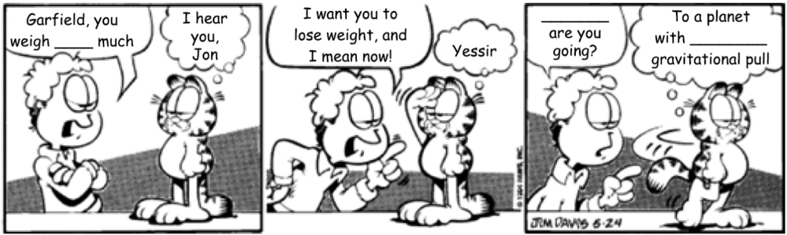

(www.imdb.com) 

### Escolha a alternativa que completa os textos correta e adequadamente. 

(A) very ... What ... weakest 

- (B) lots ... When ... weak 

- (C) too ... Where ... a weaker 

- (D) a lot ... Which ... the weakest 

- (E) so ... Whose ... the weak

---

<!-- pagina: 57 -->

**Andrea Belo Aula 07 -  If Clauses and Quantifiers** 

### **GABARITO: C** 

**Comentários:** Vejamos a tradução do diálogo para auxiliar na resolução: 

A: **_Garfield, you weigh _____ much_** . (Garfield, você pesa _________). 

B: **_I hear you, Jon._** (Estou te ouvindo, Jon.) 

A: **_I want you to lose weight, and I mean now!_** (Eu quero que você perca peso, agora!) 

B: **_Yessir_** . (Sim, Senhor!) 

A: **_______ are you going?_** (Aonde você está indo?) 

B: **_To a planet with _______ gravitational pull._** (Para um planeta com ________ atração gravitacional). 

- Na primeira lacuna, o personagem Jon enfatiza o peso de Garfield. Para isso, ele afirma que o gato **pesa muito** , o que, em inglês, é traduzido por **_too much, very much_ ou** **_so much._** 

Os **advérbios de intensidade** **_too, very_ e** **_so_** adicionam a ênfase necessária ao contexto da frase. 

- Na segunda lacuna, ao ver Garfield indo embora, Jon pergunta para onde ele está indo. Em inglês, **o pronome interrogativo utilizado para se referir a lugares é o** **_where_** , que pode ainda servir como pronome relativo ou conjunção, a depender do contexto. 

- Na terceira lacuna, Garfield atende ao pedido de Jon para "pesar menos" e afirmar estar se dirigindo para um planeta com **atração gravitacional menor ou mais fraca** do que a Terra, o que faria com que seu peso real fosse menor. 

Dentre as alternativas, temos apenas a **_weaker_** como possível resposta, pois expressa uma comparação <u>entre a gravidade da Terra e a do planeta para onde ele está indo.</u> 

<u>O adjetivo</u> _<u>weak</u>_ <u>significa fraco. Ao acrescentar o sufixo</u> -er, temos a composição do comparativo de <u>superioridade, e seu significado passa a ser</u> "mais fraco". Assim, temos _a weaker gravitational pull_ (uma atração gravitacional mais fraca). 

**Portanto, nosso gabarito é a alternativa "C",** **_too ... Where ... a weaker_** . 

Veja o erro das demais alternativas: 

- _very_ (usado como advérbio; equivalente a “bem” e “muito”; está correto) ... _What_ (= que/qual; usado para coisa ou objeto; pode indicar local em alguns contextos: ex: What place.. = Que lugar...) ... _weakest_ (= a mais fraca; falta o artigo e indica o superlativo, e não uma comparação); 

- _lots_ (indica “muito”, mas não é usado em conjunto com _much_ ) ... _When_ (= quando; usado para tempo) ... _weak_ (= fraca; falta o artigo e não indica uma comparação); 

- _a lot_ (significa "muito", mas não pode ser usado em conjunto com _much_ ) ... _Which_ (= que/qual; usado para coisa ou objeto; pode indicar local em alguns contextos: ex: _Which place_ .. = Qual lugar...) ... _the weakest_ (= a mais fraca; indica o superlativo, e não uma comparação); 

- _so_ (é advérbio de intensidade; está correto) ... _Whose_ (= cujo; indica posse e não lugar) ... _the weak_ (= a fraca; não tem nenhum sufixo de comparação).

---

<!-- pagina: 58 -->

**Andrea Belo Aula 07 -  If Clauses and Quantifiers** 

### **19. (VUNESP/2008 – FAPESP)** 

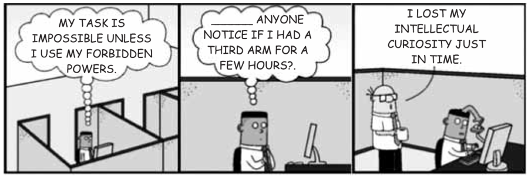

(http://dilbert.com/2008-09-11. Adaptado) 

A lacuna no segundo quadrinho – anyone notice if I had a third arm for a few hours? – é corretamente preenchida com 

### (A) Has 

### (B) Will 

- (C) Would 

- (D) Do 

### (E) Is 

### **GABARITO: C** 

**Comentários:** Pede-se que **a palavra que completa corretamente** a frase abaixo seja assinalada. 

- _"_ 

- • _"______anyone notice_ **_if_** _<u>I had a third arm for a few hours?</u>_ 

- _"_ 

- • _"______alguém notar_ **_se_** _<u>eu tivesse um terceiro braço por algumas horas?</u>_ 

Repare que se trata de uma das **_conditionals_** , também chamada de **_if clauses_** , sentenças que apresentam a seguinte estrutura: 

- **If** + condição, resultado. 

Como: 

- " 

- • _Ter um terceiro braço por algumas horas"_ é uma **situação hipotética, irreal ou pouco provável no presente ou no futuro; e** 

- A sentença que acompanha o **_"if"_** está no **passado simples** ( **_had_** - **_tivesse_** , passado simples de **_have - ter_** ). 

Essa sentença é classificada como Second Conditional e normalmente é formada por: 

- **If** + passado simples, **would** + infinitive. 

- **If** + _<u>I had (eu tivesse</u>_ <u>),</u> **would** + _notice (notar)._ 

A forma completa da frase fica: 

- _"_ 

- • **_Would_** _anyone notice if I had a third arm for a few hours?"_ 

- _"Alguém_ **_iria_** _notar se eu tivesse um terceiro braço por algumas horas?"_ 

Portanto, a palavra que completa corretamente a frase é " **_would_** ". 

Lembre-se que outros verbos modais também podem ser usados na segunda condicional:

---

<!-- pagina: 59 -->

**Andrea Belo Aula 07 -  If Clauses and Quantifiers** 

- **_Would/could /might /should._** 

Além disso, relembre os cinco **tipos de conditionals:** 

- **Zero Conditional** : if + simple present + simple present; 

- **First Conditional** : if + simple present + will ou won't + infinitivo; 

- **Second Conditional** : if + simple past + would/could /might /should + infinitivo; 

- **Third Conditional** : if + past perfect + would have /could have /might have + past participle; 

### **20. (FCC/2007 – CÂMARA DOS DEPUTADOS)** 

### **Google Adds a Safeguard on Privacy for Searchers** 

By MIGUEL HELFT 

SAN FRANCISCO, March 14 — Web search companies collect records of the searches that people conduct, a fact that has long generated _________ among privacy advocates and some Internet users that valuable personal data could be misused. 

Now Google is taking a step to ease those concerns. The company keeps logs of all searches, along with digital identifiers linking them to specific computers and Internet browsers. It said on Wednesday that it would start to make those logs anonymous after 18 to 24 months, making it much harder to connect search records to a person. Under current practices, the company keeps the logs intact indefinitely. 

“We have decided to make this change with feedback from privacy advocates, regulators worldwide and, of course, from our users,” said Nicole Wong, Google’s deputy general counsel. 

But it is unclear whether the change will have its intended effect. Privacy advocates reacted with a mix of praise and dismay to it. 

“This is really the first time we have seen them make a decision to try and work out the conflict between wanting to be pro-privacy and collecting all the world’s information,” said Ari Schwartz, deputy director of the Center for Democracy and Technology, an advocacy group. “They are not going to keep a profile on you indefinitely.” 

Others were less enthusiastic. “I think it is an absolute disaster for online privacy,” said Marc Rotenberg, executive director of the Electronic Privacy Information Center. 

Ms. Wong said Google uses the search data internally only to improve its search engine and other services. She added that Google would release search data only if compelled by a subpoena. Even so, Google was the only major search engine to resist a Justice Department subpoena for vast amounts of search data last year — a move that drew praise from privacy advocates. 

Just how personally revealing such data can be became evident last year, when AOL released records of the searches conducted by 657,000 Americans for the benefit of researchers. _________ AOL did not identify the people behind the searches, reporters from The New York Times were able to track down some of them quickly through their search requests. 

The ensuing flap caused AOL to tighten its privacy policies. The company now keeps search histories for only 13 months and does not link them to Internet protocol addresses — digital tags that can identify a specific computer.

---

<!-- pagina: 60 -->

**Andrea Belo Aula 07 -  If Clauses and Quantifiers** 

For its part, Yahoo keeps search data for “as long as it is useful,” said a spokeswoman, Nissa Anklesaria. And Microsoft said that while it does not keep search histories alongside I.P. addresses, it can connect the two if law enforcement requests it. 

(Adapted from http://www.nytimes.com/2007/03/15/technology/15googles.html_r=1&ore f=login) 

A palavra que preenche corretamente a lacuna indicada no 7º parágrafo de texto é: 

(A) While. 

(B) If. 

(C) Because. 

(D) So. 

(E) Therefore. 

### **GABARITO: A** 

**Comentários:** O enunciado se refere a seguinte passagem do texto: 

" _Just how personally revealing such data can be became evident last year, when AOL released records of the searches conducted by 657,000 Americans for the benefit of researchers_ **_. _________ AOL did not identify the_** 

**_people behind the searches,reporters from The New York Times were able to track down some of them quickly through their search requests_** ." 

Veja que a alternativa que melhor se encaixa é a **letra A (WHILE). WHILE** significa " **<u>enquanto</u>** ", dando um sentido de **<u>simultaneidade</u>** <u>. Nenhuma das outras alternativas iria se adequar ao sentido do texto.</u> 

**<u>A tradução do segundo período ficaria assim</u>** <u>: Enquanto a AOL não identificou as pessoas por trás das</u> buscas, repórteres do The New York Times foram capazes de rastrear alguns deles rapidamente através de seus pedidos de busca. 

**_<u>If</u>_** pode ser traduzido como "SE", daria a ideia de condição. **_<u>Because</u>_** significa Porque, expressando uma ideia de causa. **_<u>So</u>_** significa Então, dando a ideia de consequência (Por exemplo: se isso, então aquilo). **_<u>Therefore</u>_** também tem sentido consecutivo significando "portanto".

---

<!-- pagina: 61 -->

**Andrea Belo Aula 07 -  If Clauses and Quantifiers** 

# **CONSIDERAÇÕES FINAIS** 

Última aula alcançada com sucesso – passo enorme para sua aprovação! 

E, dia após dia, os tópicos aprendidos aumentam, seu conhecimento fica mais amplo, o vocabulário que você conhece se estende e a tendência é melhorar e ser capaz de alcançar a aprovação de fato. 

Nota-se o avanço em seus estudos e, provavelmente, uma maior tranquilidade para enfrentar os exercícios que surgem. E você vai se acostumando a equilibrar seus estudos de forma sistematizada, estudando cada vez mais e com mais dedicação. 

Outro detalhe importante para seu sucesso nos estudos, é continuar fazendo aquelas listas de vocabulário que aconselhei você, com palavras, verbos variados e termos que você considere importante de ser anotado, de ser revisto, estudado. 

Isso te ajudará nas questões futuras e torna você, como eu disse antes, um candidato mais bem preparado e confiante para realizar uma excelente prova de vestibular. 

É importante lembrar também do nosso **Fórum de dúvidas** , exclusivo do **Estratégia Concursos** . Será minha forma de responder você, esclarecer o que mais você precise saber para que os conteúdos fiquem ainda mais claros em seus estudos, certo? 

E, caso queira, acesse minhas redes sociais para aprender mais palavras e contar com dicas importantes, que colaboram diretamente com seus estudos dia após dia. 

---

<!-- pagina: 62 -->

**Andrea Belo Aula 07 -  If Clauses and Quantifiers** 

# **REFERÊNCIAS** 

ACKLAM, Richard; CRACE, Araminta. Total English: Pre intermediate. 1 ed. Grã-Bretanha: Longman do Brasil, 2005. 

BAKER, M. In other words: a coursebook on translation. Routledge, 1992. 

BLATT, Franz. Précis de Syntaxe Latine. Lyon, Paris: IAC, 1952. 

BENTES, Anna Christina e Mussalim, Fernanda (org.). Introdução À Linguística, Domínios E Fronteiras. 6ª edição. Editora Cortez. São Paulo. 2006. 

BOURGOGNE, Cleuza Vilas Boas & Silva Lilian Santos. Interação & Transformação. SP: Ed. Brasil, 1999. 

BOWKER, L. & PEARSON, J. Working with Specialized Language. Routledge. Capítulos 1, 2, 8,10 e 11, 2002. 

BUSSE, Winfried Busse & Mário Vilela. Gramática de Valências. Coimbra: Almedina,1986. 

CARVALHO, José Herculano de. Estudos Lingüísticos. v. 2. Coimbra: Atlântida, 1969. 

CHIMIM, Renata; Ilearn English student book, 4 / Renata Chimim, Viviane Kirmeliene; [obra coletiva organizada e desenvolvida pela editora]. 1ª. ed. São Paulo: Pearson Education do Brasil, 2013. 

CORBEIL, J.-Cl., ARCHAMBAULT, A. Michaelis Tech dicionário temático visual inglês-português-francês-espanhol. Tradução: Marisa Soares de Andrade. São Paulo: Melhoramentos, 1997. 

CUNHA, Celso. Nova Gramática do Português Contemporâneo. Rio de Janeiro: Nova fronteira, terceira edição, 2001. 

CUNNINGHAM, Gillie; REDSTON, Chris. Face2Face: Upper Intermediate. 1 ed. Brazil: Cambridge, 2001. 

DANIELS, H. Vygotsky and pedagogy. Educational Tasks Pedagogical Communication for Teachers. Routledge, 3rd edition, 2001. 

FAIRCLOUGH, N. Discourse and social change. Polity Press, 1992. 

GENTZLER, E. Contemporary Translation Theory. Routledge, 1993. 

HOUAISS, A., CARDIM, I.  Dicionário universitário Webster inglês-português / português-inglês. São Paulo: Record, 1998. 

HYLAND, K. Genre and second language writing – For teachers and pedagogical professionals in general, 2003. 

HUTCHINSON, Tom & WATERS, Alan. English for Specific Purposes. Cambridge: Cambridge University Press, 1996. 

LAFACE, A. O dicionário e o contexto escolar. Revista Brasileira de Linguística, Unesp/Assis, v.9, 1982, p. 165-179. 

LOBATO, M.P. Lúcia. Teorias Linguísticas e ensino do português como língua materna. Brasília: UNB, 1999. 

MICHAELIS Tech Dicionário Temático Visual: línguas estrangeiras – Pesquisa e tradução Marisa Soares de Andrade. – São Paulo: Companhia Melhoramentos, 1997. 

SILVA, João Antenor de C., GARRIDO, Maria Lina, BARRETO, Tânia Pedrosa. Inglês Instrumental: Leitura e Compreensão de Textos. Salvador: Centro Editorial e Didático, UFBA. 1994. 

SILVA, T.; MATSUDA, P. Second language writing research: perspectives on the process of knowledge construction, 2001. 

SILVEIRA BUENO, F. A formação histórica da língua portuguesa. 3. ed. São Paulo: Saraiva, 1967. 

SIMPSON, J., WEINER, E. (eds.)  Oxford English dictionary on CD-ROM.  2ed.   Oxford: Oxford University Press, 1999. 

PASCHOALIN, Maria Aparecida; SPADOTO, Neuza Terezinha. Gramática, Teoria e Exercícios. Editora FDT. São Paulo. 1996.

---

<!-- pagina: 63 -->

**Andrea Belo Aula 07 -  If Clauses and Quantifiers** 

RIBEIRO, Manuel P. Nova gramática aplicada da língua portuguesa. Rio de Janeiro: Metáfora editora, 14ª edição, 2002. 

TUCK, Michael. Oxford Dictionary of Computing for Learners of English. Oxford: Oxford University Press, 1996. 

CETEMFolha/NILC: Corpus de Extractos de Textos Electrónicos. Banco de dados. Disponível em: http://acdc.linguateca.pt/cetenfolha>. Último acesso (vários acessos) em: 04.05.2019. 

COSTA, Daiane. As origens da língua inglesa. Disponível em: http://englishmaze.wordpress.com/2011/01/25/asorigens-da-lingua-inglesa/Acesso em: 2/5/ 2019. 

VENTURINI, Laercio. Origem e desenvolvimento da língua inglesa. Disponível em: 

<http://www.startenglish.com.br/index.php?option=com_content&task=view&id=100&Itemid=97>. Acesso em: 22 mai. 2012. 

OXFORD photo dictionary. Oxford:  Oxford University Press, 1992 

Referências complementares (websites): 

www.richmond.com.br – Acesso em 18 de março de 2019. 

http://www.sk.com.br/sk-perf.html – Acesso em 19 de março de 2019. 

https://www.inglesnapontadalingua.com.br/2013/03/o-que-sao-falsos-cognatos.html – Acesso em 19 de março de 2019. 

https://englishlive.ef.com/pt-br/blog/15-expressoes-idiomaticas-comuns-em-ingles/ 

https://www.infoescola.com/ingles/ 

https://www.solinguainglesa.com.br/conteudo/indice.php 

https://www.inglesnapontadalingua.com.br 

https://www.englishexperts.com.br/

---

<!-- pagina: 64 -->

