---
fonte_pdf: "Inteligência Artificial - Aula 00.pdf"
paginas: 186
conversao: texto-e-imagens
---

<!-- pagina: 2 -->

**Diego Carvalho, Renato da Costa, Equipe Informática e TI Aula Única - Diego Carvalho, Renato da Costa** 

# **Índice** 

|.............................................................................................................................................................................................. 1) Noções de Inteligência Artificial - Teoria 3|
|---|
|.............................................................................................................................................................................................. 2) Noções de Inteligência Artificial - Resumo 93|
|.............................................................................................................................................................................................. 3) Noções de Inteligência Artificial - Questões Comentadas - FGV 113|
|.............................................................................................................................................................................................. 4) Noções de Inteligência Artificial - Lista de Questões - FGV 141|
|.............................................................................................................................................................................................. 5) Noções de Machine Learning - Teoria 156|
|.............................................................................................................................................................................................. 6) Noções de Machine Learning - Questões Comentadas - MULTIBANCAS 168|
|.............................................................................................................................................................................................. 7) Noções de Machine Learning - Lista de Questões - MULTIBANCAS 180|

---

<!-- pagina: 3 -->

**Diego Carvalho, Renato da Costa, Equipe Informática e TI Aula Única - Diego Carvalho, Renato da Costa** 

###### **Sumário** 

|Orientações de Estudo .......................................................................................................................................... 3|
|---|
|Inteligência Artificial .............................................................................................................................................. 7|
|Conceitos Básicos .............................................................................................................................................. 7|
|Ontologias ........................................................................................................................................................ 12|
|Tipos de IA ........................................................................................................................................................ 14|
|Quanto à Natureza da Inteligência ............................................................................................................ 14|
|Quanto ao Grau de Generalidade ............................................................................................................. 16|
|Riscos e Desafios .............................................................................................................................................. 18|
|Ética e Responsabilidade ............................................................................................................................ 18|
|Desinformação (Fake News) ....................................................................................................................... 19|
|Violação de Direitos Autorais ..................................................................................................................... 20|
|Vieses dos Modelos ..................................................................................................................................... 21|
|Alucinações/Desatualizações ..................................................................................................................... 23|
|Verificação Humana ..................................................................................................................................... 24|
|Dados Sensíveis ........................................................................................................................................... 26|
|IA Generativa .................................................................................................................................................... 35|
|Conceitos Básicos ........................................................................................................................................ 35|
|Características Fundamentais ..................................................................................................................... 37|
|Principais Modelos ....................................................................................................................................... 43|
|Arquiteturas de Treinamento ..................................................................................................................... 50|
|Agentes de IA ............................................................................................................................................... 57|
|Sistemas Conversacionais e Assistentes.................................................................................................... 60|
|Engenharia de Prompt ................................................................................................................................ 69|
|Principais Aplicações ....................................................................................................................................... 73|
|IA no Cotidiano Profissional........................................................................................................................ 73|

---

<!-- pagina: 4 -->

**Diego Carvalho, Renato da Costa, Equipe Informática e TI Aula Única - Diego Carvalho, Renato da Costa** 

|IA na Auditoria.............................................................................................................................................. 75|
|---|
|IA no Gerenciamento de Tarefas ............................................................................................................... 77|
|IA na Pesquisa Jurídica e Documental ...................................................................................................... 78|
|IA na Segurança da Informação ................................................................................................................. 79|
|IA no Jornalismo .......................................................................................................................................... 81|
|IA no Design Gráfico ................................................................................................................................... 83|
|IA na Arquitetura .......................................................................................................................................... 85|
|IA na Engenharia .......................................................................................................................................... 86|
|IA no Direito.................................................................................................................................................. 87|
|IA na Gestão de Tempo .............................................................................................................................. 89|
|IA na Administração Pública ....................................................................................................................... 90|

---

<!-- pagina: 5 -->

**Diego Carvalho, Renato da Costa, Equipe Informática e TI Aula Única - Diego Carvalho, Renato da Costa** 

# **ORIENTAÇÕES DE ESTUDO** 

A aula aborda a Inteligência Artificial (IA), um tema que migrou da ficção científica para a realidade administrativa e, consequentemente, para os editais de concurso. O foco deste material não é formar programadores, mas sim servidores capazes de entender o que é a tecnologia, como ela impacta o serviço público e, principalmente, quais são seus limites éticos e legais. O estudo segue uma lógica de alfabetização em inteligência artificial – partimos das definições, passamos pelos riscos (o ponto mais sensível para o Estado) e chegamos às ferramentas práticas (como o ChatGPT). 

Vamos passar por cada tópico e entender – um por um – do que se trata, porque ele foi colocado em aula e vamos exibir uma estratégia de estudo simplificada para aqueles alunos que não possuam tempo suficiente para se aprofundar em cada ponto da aula e desejam fazer um estudado mais otimizado em relação ao custo/benefício, mesmo que deixem de cobrir todos os assuntos. Vejamos: 

###### **Conceitos Básicos de Inteligência Artificial** 

Esse tópico define o que é IA (simulação de processos de inteligência humana), sua história (Teste de Turing) e seus subcampos (Machine Learning, Deep Learning). Trata-se da fundação – você não conseguirá entender "IA Generativa” sem entender antes que ela é um subcampo do "Deep Learning", que por sua vez é subcampo de "Machine Learning". 

Os pontos de atenção são a diferenciação entre Machine Learning (aprendizado com dados) e Deep Learning (redes neurais profundas) e a compreensão do Teste de Turing (capacidade de imitar humano). Caso tenha que deixar algo de lado, ignore os detalhes históricos (que são raramente cobrados) e faça uma leitura mais vertical. 

###### **Ontologias** 

Esse tópico trata da representação formal do conhecimento (conceitos e relações) para que computadores possam processá-lo. Ele explica como a máquina "organiza" o conhecimento antes de processá-lo. 

O único ponto de atenção é a memorização da definição de ontologia. Caso tenha que deixar algo de lado, ignore, pode pular esse tópico integralmente porque sua incidência em prova é baixíssima e ele não é fundamental para explicar os tópicos seguintes. 

###### **Tipos de IA** 

Esse tópico trata da classificação em IA em Fraca (tarefa específica, sem consciência) e Forte (consciência, teórica); e também da classificação em Discriminativa (classifica) vs. Generativa (cria). As bancas gostam de "pegadinhas" conceituais. Antes de estudar o ChatGPT, você precisa saber que ele é uma IA Fraca (não tem consciência), apesar de parecer esperto. 

Os pontos de atenção são a tabela comparativa entre IA Fraca e IA Forte e a diferença conceitual entre Discriminativa (separa dados) e Generativa (cria dados). Caso tenha que deixar algo de lado, ignorem os conceitos de ANI, AGI e ASI porque possuem uma baixíssima incidência em prova. 

###### **Riscos e Desafios**

---

<!-- pagina: 6 -->

**Diego Carvalho, Renato da Costa, Equipe Informática e TI Aula Única - Diego Carvalho, Renato da Costa** 

Este tópico aborda os perigos inerentes ao uso da IA, incluindo viés algorítmico, desinformação (fake news), violação de direitos autorais e alucinações. Estamos estudando isso logo no início porque, para o serviço público, a legalidade e a ética são tão importantes quanto a eficiência tecnológica. É fundamental entender que a IA não é neutra e pode reproduzir preconceitos. 

Os pontos de atenção máxima são o conceito de Viés Algorítmico (a IA discriminando com base em dados de treino ruins), o fenômeno da Alucinação (inventar dados com confiança) e os princípios da Matriz FAT (Fairness/Justiça, Accountability/Responsabilidade, Transparency/Transparência). Recomendo não pular este tópico – ele é o de maior incidência e relevância transversal. Se precisar economizar tempo, foque apenas nas definições de viés e alucinação, ignorando detalhes filosóficos mais profundos. 

###### **Responsible AI** 

Esse tópico tende a se tornar mais importante com o passar do tempo. Como é tudo muito novo, é difícil entender ainda as responsabilidades da Inteligência Artificial. Ainda não temos um sistema regulatório consolidado, mas já estamos começando a construí-lo. Dito isso, recomendo uma leitura vertical sobre as principais práticas. 

###### **IA Generativa** 

Aqui definimos o coração da "hype" atual: sistemas que criam conteúdo novo (texto, imagem, código) em vez de apenas classificar dados existentes. Estudamos isso para diferenciar ferramentas modernas (como o ChatGPT) de softwares antigos. É a base para entender como a máquina "cria". 

Os pontos de atenção são a definição básica: IA Generativa cria novos dados a partir de padrões aprendidos (ao contrário da discriminativa que apenas rotula). As bancas cobram se você sabe que ela gera conteúdo inédito e não apenas reproduz cópias exatas. Caso tenha que deixar algo de lado, ignore os detalhes matemáticos sobre "distribuição de probabilidade conjunta", focando apenas no conceito funcional de criação. 

###### **Principais Modelos (LLMs e Outros)** 

Este tópico explora os Grandes Modelos de Linguagem (LLMs) como o GPT. Estudamos isso para entender como o texto é gerado (previsão de próxima palavra/token) e não achar que a máquina "pensa". Também aborda a diferença técnica entre modelos que geram texto, imagem ou áudio. 

O ponto de atenção crítico é o conceito de LLM (Large Language Model) e Tokenização. Você deve saber que eles são treinados em grandes volumes de texto para prever a próxima parte da frase. Caso tenha que deixar algo de lado, ignore os "Modelos Generativos Não-Textuais" (áudio e vídeo específicos) e detalhes sobre "Espaço Latente" (Latent Space), pois a cobrança é massiva em cima de modelos de texto (LLMs). 

###### **Arquiteturas de Treinamento** 

Aqui entramos na "casa de máquinas": Redes Neurais, GANs (Redes Adversárias) e Transformers. Estudamos isso para saber a estrutura técnica que permite a IA funcionar. É um tópico mais técnico e "chato", mas necessário para questões específicas. 

Os pontos de atenção são dois conceitos específicos: GANs (Redes Adversárias Generativas), onde uma rede cria e a outra julga (jogo de gato e rato), e Transformers, que usam o mecanismo de "atenção" para entender contexto em textos longos. Caso tenha que deixar algo de lado, pode ignorar o funcionamento

---

<!-- pagina: 7 -->

**Diego Carvalho, Renato da Costa, Equipe Informática e TI Aula Única - Diego Carvalho, Renato da Costa** 

detalhado de CNNs (convolucionais) e RNNs (recorrentes), focando apenas na definição de GAN e Transformer. 

###### **Agentes de IA** 

Trata de sistemas que percebem o ambiente através de sensores e agem através de atuadores para atingir uma meta. Estudamos isso para entender a definição formal e acadêmica de um sistema inteligente autônomo. 

O ponto de atenção é o conceito de Agente Racional (aquele que toma a melhor decisão possível para maximizar o desempenho). Caso tenha que deixar algo de lado, ignore a classificação detalhada dos tipos de agentes (reativo simples, baseado em utilidade, etc) se estiver com pouco tempo, pois a incidência é menor que a de tópicos como Ética ou Prompts. 

###### **Sistemas Conversacionais e Engenharia de Prompt** 

Este tópico ensina como interagir com a IA. Define o que é um "Prompt" e as técnicas para obter melhores respostas (Zero-shot, Few-shot, Chain-of-Thought). Estudamos isso porque é a habilidade prática que será exigida do servidor no uso da ferramenta. 

Os pontos de atenção são altíssimos aqui: você precisa dominar bem a definição de Engenharia de Prompt e diferenciar as técnicas: Zero-shot (pedir sem dar exemplo), Few-shot (dar exemplos no pedido) e Chain-of-Thought (pedir para a IA pensar passo a passo). Caso tenha que deixar algo de lado, ignore técnicas muito avançadas ou de nicho (como "Tree of Thoughts" ou "Maieutic Prompting") e foque nas três principais mencionadas. 

###### **Principais Aplicações e Ferramentas** 

Finalizamos com o uso prático: ChatGPT, Copilot, Gemini e aplicações em Direito, Auditoria, etc. Estudamos isso para contextualizar a teoria em "estudos de caso" que as bancas adoram (ex: "um auditor usou IA para..."). 

Os pontos de atenção são as capacidades e limitações do ChatGPT (ele não é um banco de dados, é um gerador de texto). Caso tenha que deixar algo de lado, ignore as especificações técnicas de ferramentas menores (DeepSeek, Claude) ou comparativos de preços/planos corporativos. 

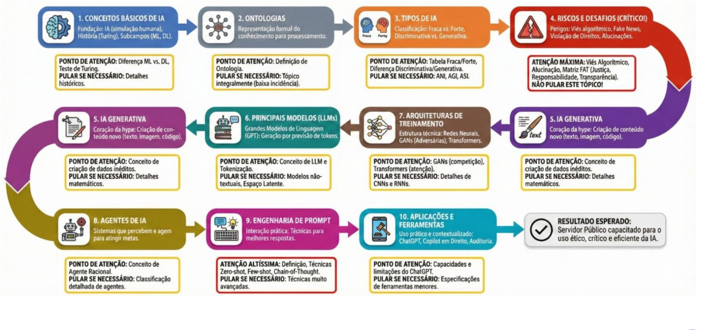

---

<!-- pagina: 8 -->

**Diego Carvalho, Renato da Costa, Equipe Informática e TI Aula Única - Diego Carvalho, Renato da Costa** 

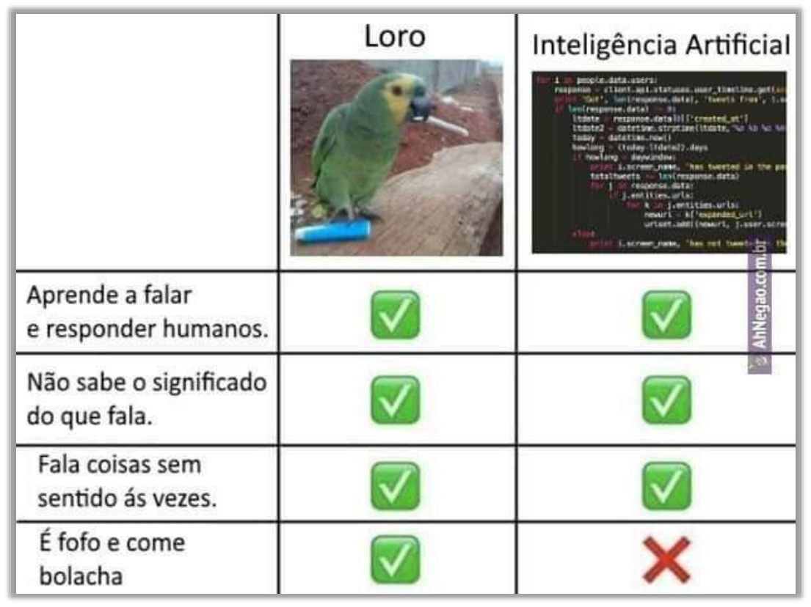

---

<!-- pagina: 9 -->

**Diego Carvalho, Renato da Costa, Equipe Informática e TI Aula Única - Diego Carvalho, Renato da Costa** 

# **INTELIGÊNCIA ARTIFICIAL** 

## Conceitos Básicos 

**<mark>INCIDÊNCIA EM PROVA: MÉDIA</mark>** 

###### **<mark>INTELIGÊNCIA ARTIFICIAL</mark>** 

Trata-se da simulação de processos de inteligência humana por sistemas de computador. Esses processos incluem a aprendizagem (a aquisição de informações e regras para o uso da informação), o raciocínio (usando regras para chegar a conclusões aproximadas ou definitivas) e a autocorreção. A aprendizagem envolve algoritmos que ajustam suas operações com base em novos dados, a fim de melhorar o desempenho, enquanto o raciocínio envolve a aplicação de lógicas para resolver problemas específicos ou tomar decisões. 

A concepção de máquinas inteligentes remonta à Antiguidade, quando filósofos como Aristóteles buscaram compreender e formalizar o raciocínio humano. Dessa iniciativa surgiu o silogismo, estrutura lógica dedutiva que viria a influenciar, séculos depois, a lógica computacional. Embora naquela época a ideia de máquinas pensantes fosse meramente metafórica, os fundamentos do pensamento lógico já começavam a ser delineados. 

O avanço efetivo nesse campo ocorreu no século XIX, com os trabalhos de George Boole e Gottlob Frege, que desenvolveram a lógica simbólica. Essa formalização do raciocínio em termos matemáticos tornou possível a representação precisa do pensamento humano, permitindo que, teoricamente, máquinas pudessem manipular tais estruturas lógicas. 

Em 1936, Alan Turing introduziu um marco decisivo ao apresentar a Máquina de Turing, um modelo teórico capaz de executar qualquer operação lógica representável simbolicamente. Essa concepção não apenas fundamentou a criação dos computadores modernos, como também estabeleceu os alicerces da futura Inteligência Artificial. Turing ainda propôs um critério para avaliar se uma máquina poderia simular o comportamento humano em uma conversa — o Teste de Turing. 

O termo “Inteligência Artificial” foi oficialmente introduzido em 1956, durante a Conferência de Dartmouth, nos Estados Unidos. O objetivo central era investigar a viabilidade de programar máquinas para pensar, aprender e resolver problemas de modo semelhante ao humano. A partir desse ponto, a IA passou a constituir um campo específico da ciência da computação, orientado pelo ideal de reproduzir, por meios artificiais, as capacidades cognitivas humanas. 

**(UNESC / Prefeitura de Içara-SC – 2025)** A inteligência artificial é um ramo da Ciência da <mark>Computação cujo interesse é fazer com que os computadores pensem ou se comportem de forma inteligente. Marque a alternativa CORRETA que corresponde ao um experimento conceitual proposto por Alan Turing em 1950 como uma forma de avaliar a capacidade de uma máquina exibir comportamento inteligente indistinguível do de um ser humano.</mark> 

<mark>a) Teste de Wis. b) Teste de Turing. c) Teste de Unit. d) Teste de Wais. e) Teste de QI.</mark> 

###### **<mark>_______________________</mark>** 

**<mark>Comentários:</mark>** <mark>(a) Errado. Não existe "Teste de Wis" relacionado à avaliação de comportamento inteligente em máquinas; (b) Correto. O Teste de Turing, proposto por Alan Turing em 1950, é um experimento conceitual para avaliar se uma máquina pode imitar o comportamento humano a ponto de ser indistinguível de uma pessoa em uma conversa; (c) Errado. Teste de Unit (ou unit test) refere-se a testes de software para verificar pequenas partes do código, sem relação com IA ou comportamento inteligente;</mark>

---

<!-- pagina: 10 -->

**Diego Carvalho, Renato da Costa, Equipe Informática e TI Aula Única - Diego Carvalho, Renato da Costa** 

<mark>(d) Errado. "Teste de Wais" não é um conceito relacionado ao tema abordado; (e) Errado. Teste de QI mede o quociente de</mark> inteligência humana, não sendo utilizado para avaliar máquinas ou sistemas de IA (Letra B). 

Nas décadas de 1950 e 1960, surgiram os primeiros programas reconhecidos como tentativas iniciais de Inteligência Artificial. O Logic Theorist (1956) demonstrava capacidade de provar teoremas matemáticos, enquanto o ELIZA (1966) simulava uma conversa com um psicoterapeuta, utilizando estruturas simples de linguagem. Essas iniciativas demonstraram o potencial da IA, mas também evidenciaram as limitações tecnológicas da época. 

Nos anos 1970, a área enfrentou sua primeira grande crise, conhecida como o “Inverno da IA”. Os computadores eram lentos e caros, e os modelos desenvolvidos mostraram-se limitados, o que levou à redução de investimentos e ao desânimo generalizado. Ainda assim, pesquisas pontuais continuaram, sobretudo em campos como o aprendizado simbólico e os sistemas especialistas. 

A década de 1980 marcou uma retomada, com destaque para os sistemas especialistas. Esses programas operavam com base em regras fornecidas por especialistas humanos, sendo eficazes em domínios específicos. O MYCIN, por exemplo, auxiliava no diagnóstico de infecções bacterianas. No entanto, a necessidade de codificação manual do conhecimento limitava a escalabilidade dessas soluções. 

Nos anos 1990 e 2000, houve uma mudança paradigmática com a ascensão do Machine Learning. Abandonando a abordagem baseada em regras fixas, os sistemas passaram a aprender a partir de grandes volumes de dados. O desenvolvimento de modelos estatísticos e probabilísticos permitiu que as máquinas identificassem padrões sem instruções explícitas. A vitória do Deep Blue, da IBM, sobre Garry Kasparov, em 1997, simbolizou o avanço da IA em tarefas cognitivamente complexas, mesmo que ainda com base em força computacional bruta. 

A popularização da internet e a explosão na geração de dados impulsionaram, a partir dos anos 2010, o avanço do Deep Learning. Redes neurais com múltiplas camadas passaram a reconhecer padrões sofisticados em imagens, sons e textos. O marco inicial dessa fase foi o sucesso do modelo AlexNet em 2012, que revolucionou o reconhecimento de imagens e consolidou o uso de redes neurais profundas em diversas aplicações. 

A partir de 2018, o desenvolvimento de modelos generativos, como o GPT (Generative Pre-trained Transformer), representou novo salto tecnológico. Esses modelos demonstraram a capacidade de gerar conteúdos originais com alto grau de coerência, abrangendo texto, imagem, código e música. Com o lançamento do ChatGPT em 2022, seguido pelos modelos GPT-4 e GPT-5, a IA passou a integrar de forma ampla o cotidiano de indivíduos e organizações. 

Atualmente, a Inteligência Artificial constitui um campo consolidado da ciência da computação, voltado à criação de sistemas capazes de executar tarefas antes restritas à cognição humana. Entre seus principais subcampos, destacam-se o Aprendizado de Máquina, o Processamento de Linguagem Natural, a Visão Computacional, o Raciocínio Lógico, o Planejamento e os modelos generativos e interativos. 

Com essa expansão, crescem também as preocupações relacionadas ao uso responsável da tecnologia. Questões como viés algorítmico, privacidade de dados, transparência e impactos socioeconômicos tornaram-se centrais. Assim, o desafio contemporâneo não se limita à criação de máquinas inteligentes, mas inclui a garantia de que essa inteligência seja aplicada de forma ética, segura e socialmente benéfica. 

**(UECE-CEV / Prefeitura de Quixeramobim-CE – 2019)** Atualmente utilizado por diversas <mark>empresas e tido por alguns como um vilão que compromete vagas no mercado de trabalho, esse avanço da tecnologia se caracteriza como a capacidade do sistema para interpretar,</mark>

---

<!-- pagina: 11 -->

**Diego Carvalho, Renato da Costa, Equipe Informática e TI Aula Única - Diego Carvalho, Renato da Costa** 

<mark>aprender e utilizar dados externos, com o objetivo de executar tarefas que, se um humano executasse, seriam consideradas inteligentes. Essa descrição se refere:</mark> 

<mark>a) à inteligência artificial.</mark> 

<mark>b) à terceirização de serviços.</mark> 

<mark>c) ao telemarketing.</mark> 

<mark>d) ao atendimento personalizado.</mark> 

**<mark>_______________________ Comentários:</mark>** <mark>(a) Correto. A inteligência artificial (IA) refere-se à simulação da inteligência humana em máquinas que são programadas para pensar como humanos e imitar suas ações. A descrição enquadra-se perfeitamente no conceito de IA; (b) Errado. A terceirização de serviços é o processo pelo qual uma empresa contrata outra para realizar atividades que não estão diretamente relacionadas ao seu negócio principal, o que não se relaciona diretamente com a descrição dada; (c) Errado. O telemarketing é uma estratégia de marketing que envolve contatar clientes por telefone. Embora possa utilizar inteligência artificial para otimizar processos, a descrição foca na capacidade de aprender e executar tarefas inteligentes, o que vai além do escopo do telemarketing; (d) Errado. O atendimento personalizado refere-se à customização do serviço ao cliente baseado em suas necessidades e preferências. Embora possa ser potencializado pela IA, a descrição está centrada na capacidade da</mark> tecnologia de executar tarefas consideradas inteligentes (Letra A). 

Ainda nesse contexto, nós temos os Sistemas de IA, que são programas ou conjuntos de tecnologias projetados para simular a inteligência humana em tarefas como percepção, raciocínio, aprendizado, tomada de decisão e resolução de problemas. Em outras palavras, são sistemas capazes de "pensar" ou "agir" de forma inteligente, mesmo que não estejam "conscientes" como nós (a tendência de atribuir características humanas a objetos/máquinas se chama Antropomorfismo). Vejamos suas características: 

|**CARACTERÍSTICAS**|**DESCRIÇÃO**|
|---|---|
|**APRENDIZADO**|São capazes de aprender com dados (machine learning) e melhorar ao longo do tempo.|
|**ADAPTAÇÃO**|Ajustam seus comportamentos com base em novas informações ou contextos.|
|**AUTONOMIA**|Podem executar ações e tomar decisões sem intervenção humana direta.|
|**RACIOCÍNIO**|Podem analisar dados, identificar padrões e chegar a conclusões.|
|**INTERAÇÃO**|Compreendem e interagem com humanos por meio de linguagem natural, imagens ou sensores.|

Vejamos abaixo diversos exemplos de Sistemas de Inteligência Artificial: 

|**APLICAÇÃO**|**COMO FUNCIONA**|**BENEFÍCIOS**|
|---|---|---|
|**FILTROS DE SPAM** **NO E-MAIL**|Usan algoritmos de aprendizado de máquina e PLN para analisar conteúdo, remetente, frequência e reputação, identificando padrões que permitem classificar automaticamente mensagens como spam ou legítimas.|Reduz golpes e spam, economiza tempo do usuário e aumenta a segurança no uso do e-mail.|
|**RECOMENDAÇÕES** **AUTOMÁTICAS DE** **VÍDEO E MÚSICA**|Analisam histórico de consumo, preferências explícitas e padrões comportamentais de usuários semelhantes para sugerir conteúdos personalizados por meio de sistemas de recomendação baseados em IA.|Aumentam engajamento, satisfação do usuário e tempo de permanência nas plataformas de streaming.|
|**ASSISTENTES DE** **VOZ**|Combinam reconhecimento automático de fala e processamento de linguagem natural para interpretar comandos, executar ações solicitadas e aprender com interações contínuas do usuário ao longo do tempo.|Facilitam tarefas diárias, ampliam acessibilidade e permitem automação prática por comandos de voz.|
|**CHATBOTS DE** **ATENDIMENTO**|Utilizam modelos de linguagem treinados para compreenderperguntas,manter contexto egerar|Agilizam o atendimento, reduzem custos operacionais|

---

<!-- pagina: 12 -->

**Diego Carvalho, Renato da Costa, Equipe Informática e TI Aula Única - Diego Carvalho, Renato da Costa** 

||respostas naturais, atuando em sites e aplicativos, com suporte a texto e,em alguns casos,voz e imagem.|e oferecem suporte contínuo em larga escala.|
|---|---|---|
|**VEÍCULOS** **AUTÔNOMOS**|Integram sensores, câmeras, radares e algoritmos de visão computacional e decisão para interpretar o ambiente, planejar rotas e conduzir o veículo sem intervenção humana constante.|Prometem maior segurança viária, menos acidentes e mobilidade mais eficiente e autônoma.|
|**DIAGNÓSTICO** **MÉDICO**|Processam exames de imagem, dados laboratoriais e históricos clínicos usando modelos de IA para identificar padrões e auxiliar médicos na detecção precoce de doenças e anomalias.|Aumentam precisão diagnóstica, agilizam análises e apoiam estratégias de medicinapreventiva.|
|**DETECÇÃO DE** **FRAUDES** **FINANCEIRAS**|Analisam grandes volumes de transações em tempo real, identificando padrões anômalos e comportamentos suspeitos por meio de modelos de aprendizado de máquina treinados com dados históricos.|Reduzem perdas financeiras, fortalecem a segurança e aumentam a confiança em sistemas bancários.|
|**TRADUÇÃO** **AUTOMÁTICA**|Utilizam modelos de processamento de linguagem natural treinados em múltiplos idiomas para converter textos entre línguas, preservando significado, contexto e fluidez das frases.|Facilitam comunicação global e ampliam acesso a conteúdos em diferentes idiomas.|
|**RECONHECIMENTO** **FACIAL E DE** **IMAGEM**|Empregam algoritmos de visão computacional para identificar rostos, objetos e cenários em imagens ou vídeos, comparando padrões visuais com bases de dados treinadas.|Aplicações em segurança, autenticação digital e organização automática de imagens.|

Por fim, a tabela seguinte apresenta diversos subcampos da inteligência artificial, tais como: processamento de linguagem natural, redes neurais, aprendizado de máquina, entre outros. 

**<mark>SUBCAMPOS DESCRIÇÃO</mark>** Foca no desenvolvimento de sistemas capazes de entender e gerar linguagem humana. **PROCESSAMENTO** Isso inclui tradução automática, análise de sentimentos, reconhecimento de fala e **DE LINGUAGEM** chatbots. PLN permite que computadores interpretem, respondam e utilizem a linguagem **NATURAL** humana de maneira significativa. <mark>É o estudo de algoritmos que melhoram automaticamente através da experiência. Utiliza</mark> **MACHINE** técnicas estatísticas para dar aos computadores a capacidade de "aprender" com dados, **LEARNING** permitindo-lhes identificar padrões e tomar decisões com mínima intervenção humana. Combina inteligência artificial com engenharia mecânica e elétrica para projetar e construir robôs capazes de realizar tarefas que exigem interação física com o mundo real. **ROBÓTICA** A IA é usada para dar aos robôs a capacidade de perceber, compreender e agir em seu ambiente. Envolve a criação de conteúdo novo e original, como texto, imagens, música e vídeo, **INTELIGÊNCIA** através de modelos de IA. Usa técnicas como Redes Generativas Adversariais (GANs) para **ARTIFICIAL** produzir conteúdo que é semelhante, mas não idêntico, ao que eles foram treinados para **GENERATIVA** imitar. <mark>Redes neurais são sistemas inspirados no cérebro humano, projetados para reconhecer</mark> **REDES NEURAIS E** padrões de maneira semelhante às conexões neurais do cérebro. Deep learning é um **DEEP LEARNING** subcampo que utiliza redes neurais profundas com muitas camadas para aprender representações de dados complexas. Refere-se à capacidade de computadores para identificar, processar e interpretar **VISÃO** informações visuais do mundo, semelhante à visão humana. Isso inclui reconhecimento **COMPUTACIONAL** de objetos, rastreamento de movimentos e análise de cenas. É amplamente aplicado em segurança, veículos autônomos, entre outros.

---

<!-- pagina: 13 -->

**Diego Carvalho, Renato da Costa, Equipe Informática e TI Aula Única - Diego Carvalho, Renato da Costa** 

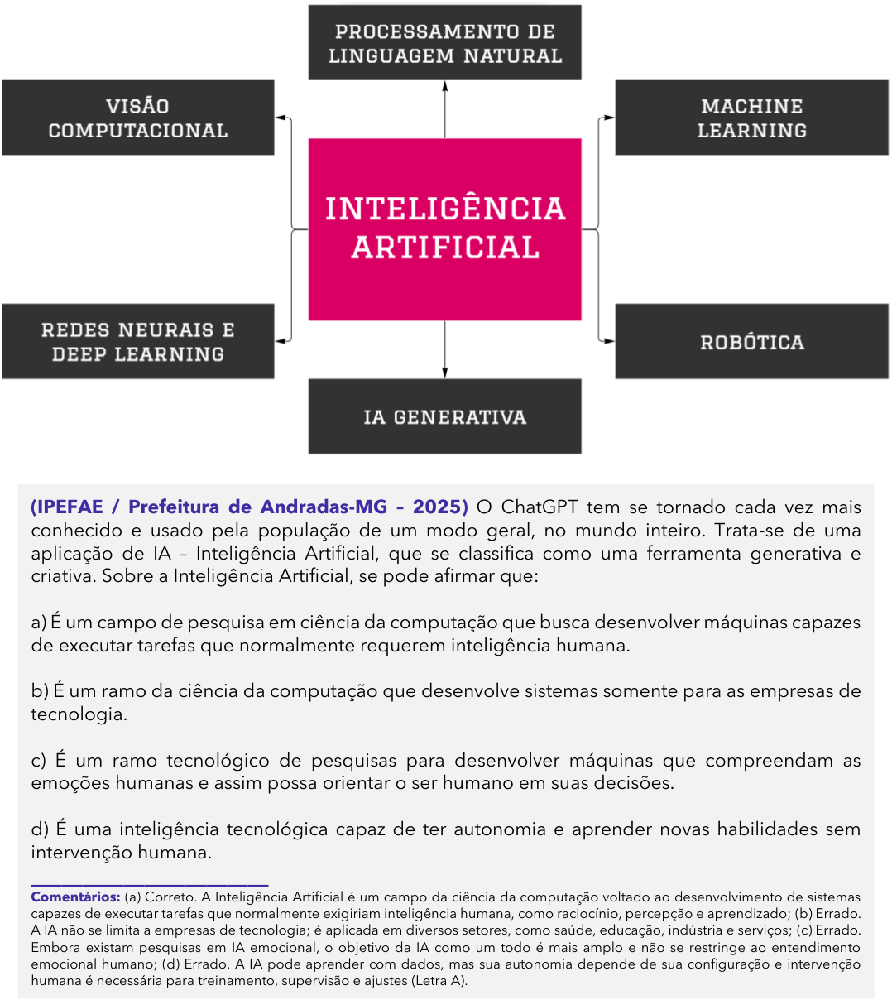

<!-- Start of picture text -->
(IPEFAE / Prefeitura de Andradas-MG – 2025)  O ChatGPT tem se tornado cada vez mais conhecido e usado pela população de um modo geral, no mundo inteiro. Trata-se de uma aplicação de IA – Inteligência Artificial, que se classifica como uma ferramenta generativa e criativa. Sobre a Inteligência Artificial, se pode afirmar que: a) É um campo de pesquisa em ciência da computação que busca desenvolver máquinas capazes de executar tarefas que normalmente requerem inteligência humana. b) É um ramo da ciência da computação que desenvolve sistemas somente para as empresas de tecnologia. c) É um ramo tecnológico de pesquisas para desenvolver máquinas que compreendam as emoções humanas e assim possa orientar o ser humano em suas decisões. d) É uma inteligência tecnológica capaz de ter autonomia e aprender novas habilidades sem intervenção humana. _______________________ Comentários:  (a) Correto. A Inteligência Artificial é um campo da ciência da computação voltado ao desenvolvimento de sistemas capazes de executar tarefas que normalmente exigiriam inteligência humana, como raciocínio, percepção e aprendizado; (b) Errado. A IA não se limita a empresas de tecnologia; é aplicada em diversos setores, como saúde, educação, indústria e serviços; (c) Errado. Embora existam pesquisas em IA emocional, o objetivo da IA como um todo é mais amplo e não se restringe ao entendimento emocional humano; (d) Errado. A IA pode aprender com dados, mas sua autonomia depende de sua configuração e intervenção humana é necessária para treinamento, supervisão e ajustes (Letra A). <!-- End of picture text -->

---

<!-- pagina: 14 -->

**Diego Carvalho, Renato da Costa, Equipe Informática e TI Aula Única - Diego Carvalho, Renato da Costa** 

## Ontologias 

**<mark>INCIDÊNCIA EM PROVA: MÉDIA</mark>** 

###### **<mark>ONTOLOGIA</mark>** 

Representação formal e estruturada do conhecimento de um domínio, que define conceitos, categorias, propriedades e relações entre entidades, estabelecendo um significado compartilhado que pode ser interpretado por humanos e processado por sistemas computacionais, permitindo organização semântica, inferência lógica, interoperabilidade de dados e suporte ao raciocínio em aplicações de Ciência de Dados e Inteligência Artificial. 

A Ontologia é uma forma estruturada e formal de representar o conhecimento de um domínio. Ela define conceitos, categorias, propriedades e relações entre entidades, criando um vocabulário comum que pode ser entendido tanto por humanos quanto por máquinas. Em essência, uma ontologia descreve o que existe em um domínio e como essas coisas se relacionam. 

Do ponto de vista computacional, a ontologia vai além de simples listas de termos ou esquemas de dados. Enquanto um banco de dados define como os dados são armazenados, a ontologia define o significado desses dados. Isso inclui hierarquias (por exemplo, “todo professor é uma pessoa”), relações semânticas (“um cliente realiza uma compra”) e restrições lógicas que ajudam a garantir consistência no conhecimento representado. 

Na Ciência de Dados, ontologias são especialmente úteis para integrar dados de fontes heterogêneas. Em projetos reais, dados costumam vir de sistemas diferentes, com nomes distintos para conceitos semelhantes. A ontologia atua como uma camada semântica intermediária, permitindo alinhar, reconciliar e interpretar corretamente esses dados, reduzindo ambiguidades e erros de interpretação. 

Em Inteligência Artificial, ontologias desempenham um papel central na chamada IA simbólica e em sistemas baseados em conhecimento. Elas permitem que algoritmos façam inferências lógicas, deduzam novos fatos a partir de regras e relações já definidas e verifiquem inconsistências. Isso é fundamental em sistemas especialistas, agentes inteligentes e aplicações que exigem explicabilidade. 

###### **Saiba mais:** 

<mark>Imagine que você chega a uma cidade completamente nova. Os dados são como as coisas físicas da cidade: ruas, prédios, casas, hospitais, escolas, semáforos, ônibus. Eles existem, mas, sozinhos, não explicam muita coisa. Um banco de dados seria como uma lista organizada dessas coisas: nomes de ruas, números dos prédios, horários dos ônibus. Ele diz onde estão as coisas e quais são seus atributos, mas não explica profundamente o papel de cada uma.</mark> 

<mark>A ontologia, por sua vez, é o mapa conceitual da cidade. Ela explica o que cada coisa é, para que serve e como se relaciona com as outras. O mapa mostra que hospitais são lugares de atendimento médico, que escolas são instituições de ensino, que ônibus fazem parte do sistema de transporte público e que ruas conectam bairros.</mark> 

<mark>Mais do que isso, o mapa estabelece regras implícitas: hospitais não são residências, ônibus não andam fora das vias, bairros pertencem à cidade, e toda escola é um tipo de instituição. Essas regras ajudam você a entender a cidade mesmo sem conhecê-la completamente.</mark> 

<mark>Agora imagine um sistema inteligente tentando “andar” pela cidade. Sem ontologia, ele veria apenas objetos soltos. Com ontologia, ele entende que um hospital é um tipo de prédio, que</mark>

---

<!-- pagina: 15 -->

**Diego Carvalho, Renato da Costa, Equipe Informática e TI Aula Única - Diego Carvalho, Renato da Costa** 

<mark>prédios ficam em ruas, que ruas conectam lugares e que certos serviços dependem de outros. Isso permite raciocinar, inferir caminhos e tomar decisões.</mark> 

<mark>Em Ciência de Dados e IA, a ontologia cumpre exatamente esse papel: ela é o mapa semântico do domínio. Não apenas descreve dados, mas explica o significado, as relações e as regras do mundo que os dados representam, permitindo que máquinas “entendam” o contexto e</mark> raciocinem de forma mais próxima à humana. 

Outro ponto importante é a relação entre ontologias e aprendizado de máquina. Embora modelos estatísticos aprendam padrões a partir de dados, eles geralmente não “entendem” o significado desses padrões. Ontologias podem complementar o machine learning ao fornecer contexto semântico, guiando a seleção de atributos, ajudando na interpretação dos resultados e melhorando a explicabilidade dos modelos, especialmente em ambientes críticos. 

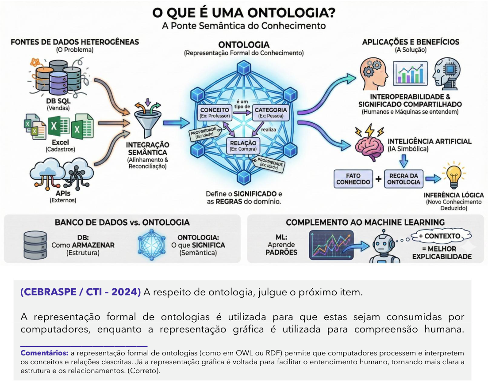

<!-- Start of picture text -->
(CEBRASPE / CTI – 2024)  A respeito de ontologia, julgue o próximo item. A representação formal de ontologias é utilizada para que estas sejam consumidas por computadores, enquanto a representação gráfica é utilizada para compreensão humana. _______________________ Comentários:  a representação formal de ontologias (como em OWL ou RDF) permite que computadores processem e interpretem os conceitos e relações descritas. Já a representação gráfica é voltada para facilitar o entendimento humano, tornando mais clara a estrutura e os relacionamentos. (Correto). <!-- End of picture text -->

---

<!-- pagina: 16 -->

**Diego Carvalho, Renato da Costa, Equipe Informática e TI Aula Única - Diego Carvalho, Renato da Costa** 

## Tipos de IA 

###### **<mark>INCIDÊNCIA EM PROVA: MÉDIA</mark>** 

Quando a gente fala em inteligência artificicial, temos como classificá-las de acordo com diversos critérios como natureza da inteligência e nível de compreensão real do sistema; ou em rau de generalidade e capacidade cognitiva da inteligência artificial em relação à inteligência humana. Vejamos em detalhes a seguir essas classificações: 

### Quanto à Natureza da Inteligência 

A distinção entre Inteligência Artificial (IA) Forte e IA Fraca é uma das mais antigas e controversas no campo da tecnologia. Trata-se de duas concepções distintas sobre o que constitui “inteligência” em máquinas. A IA Fraca, ou IA Estreita, corresponde aos sistemas atualmente existentes e amplamente utilizados. São projetados para executar tarefas específicas com alta eficiência, mas sem qualquer forma de consciência, compreensão ou raciocínio generalizado. 

Exemplos incluem assistentes virtuais, sistemas de recomendação, algoritmos de reconhecimento de imagem e modelos de linguagem. Esses sistemas operam com base em estatísticas e aprendizado de máquina, sendo capazes de identificar padrões e gerar respostas, mas sem entender o contexto como um ser humano. 

Já a IA Forte envolve a criação de sistemas com consciência própria, compreensão real, capacidade de raciocínio abstrato, criatividade e julgamento moral. Esse tipo de inteligência seria comparável — ou superior — à inteligência humana, sendo capaz de executar qualquer tarefa cognitiva, inclusive transferir conhecimentos adquiridos em um contexto para resolver problemas em outro, algo que as IAs atuais não conseguem realizar. Ela, portanto, representa uma forma de inteligência geral artificial, ainda inexistente. 

A principal diferença entre ambas está no escopo: enquanto a IA Fraca é limitada a domínios específicos, a IA Forte teria uma capacidade cognitiva abrangente e autônoma. O desenvolvimento de uma IA Forte implicaria desafios significativos não apenas tecnológicos, mas também filosóficos, éticos e jurídicos. Questões como direitos para máquinas conscientes, responsabilidade por suas ações e os limites de sua autonomia são amplamente debatidas, mas permanecem sem respostas conclusivas. 

Atualmente, o foco da indústria permanece na IA Fraca, com avanços notáveis em áreas como aprendizado profundo, aprendizado de máquina e processamento de linguagem natural, aplicados em soluções práticas como chatbots, veículos autônomos e sistemas médicos. Contudo, a concretização da IA Forte exigirá avanços substanciais não só em tecnologia, mas também em disciplinas como neurociência, psicologia cognitiva e filosofia da mente, pois envolve a criação de uma forma artificial de consciência. Dessa forma, a IA Fraca representa a realidade presente, enquanto a IA Forte ainda se configura como um desafio futuro. Vejamos suas principais características: 

|**CARACTERÍSTICAS**|**IA FRACA**|**IA FORTE**|
|---|---|---|
|**DEFINIÇÃO**|Sistema projetado para executar tarefas específicas com eficiência, sem compreensão ou consciência doque faz.|Inteligência artificial com capacidade de raciocínio geral e autoconsciência, capaz de entender,sentir e aprender amplamente.|
|**EXEMPLOS**|ChatGPT, Alexa, Siri, tradutores automáticos, reconhecimento facial, filtros de spam e algoritmos de recomendação.|Uma IA hipotética com raciocínio autônomo, como HAL 9000 (ficção) ou modelos futuros de inteligênciageral(AGI).|
|**CAPACIDADE DE** **APRENDIZADO**|Aprende a partir de dados limitados e padrões específicos, sem transferir o aprendizadopara novos contextos.|Aprende de forma contínua e autônoma, generalizando conhecimentos entre diferentes domínios e experiências.|

---

<!-- pagina: 17 -->

**Diego Carvalho, Renato da Costa, Equipe Informática e TI Aula Única - Diego Carvalho, Renato da Costa** 

Não possui autoconsciência nem Possui (ou possuiria) consciência própria, **CONSCIÊNCIA** entendimento genuíno; responde com senso de identidade e capacidade de base em padrões probabilísticos. reflexão sobre suas ações e intenções. <mark>Baseada em regras e dados predefinidos; Toma decisões complexas de forma</mark> **TOMADA DE** depende de instruções humanas e independente, avaliando consequências e **DECISÃO** contexto de programação. valores morais de suas escolhas. É o tipo de IA que realmente existe hoje e Ainda teórica; não há comprovação técnica **STATUS ATUAL** está presente em praticamente todas as ou científica de sua existência em sistemas aplicações comerciais e científicas. computacionais reais. Atendimento automatizado, diagnóstico Exploração espacial autônoma, governança **EXEMPLOS DE** médico assistido, predição de demanda, de sistemas complexos ou robôs **APLICAÇÃO** <mark>tradução e análise de dados. conscientes (ainda no campo teórico).</mark> Envolve vieses de dados, manipulação de Envolve perda de controle humano, dilemas **RISCO ÉTICO** informação e falta de transparência em morais, autonomia excessiva e potencial decisões automatizadas. ameaça existencial. ça existencial. a existencial. 

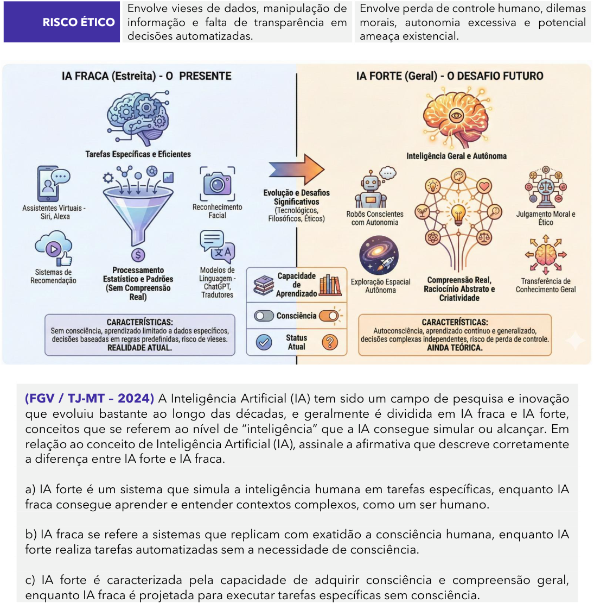

<!-- Start of picture text -->
Envolve vieses de dados, manipulação de  Envolve perda de controle humano, dilemas RISCO ÉTICO informação e falta de transparência em  morais, autonomia excessiva e potencial decisões automatizadas.  ameaça existencial. ça existencial. a existencial. (FGV / TJ-MT – 2024)  A Inteligência Artificial (IA) tem sido um campo de pesquisa e inovação que evoluiu bastante ao longo das décadas, e geralmente é dividida em IA fraca e IA forte, conceitos que se referem ao nível de “inteligência” que a IA consegue simular ou alcançar. Em relação ao conceito de Inteligência Artificial (IA), assinale a afirmativa que descreve corretamente a diferença entre IA forte e IA fraca. a) IA forte é um sistema que simula a inteligência humana em tarefas específicas, enquanto IA fraca consegue aprender e entender contextos complexos, como um ser humano. b) IA fraca se refere a sistemas que replicam com exatidão a consciência humana, enquanto IA forte realiza tarefas automatizadas sem a necessidade de consciência. c) IA forte é caracterizada pela capacidade de adquirir consciência e compreensão geral, enquanto IA fraca é projetada para executar tarefas específicas sem consciência. <!-- End of picture text -->

---

<!-- pagina: 18 -->

**Diego Carvalho, Renato da Costa, Equipe Informática e TI Aula Única - Diego Carvalho, Renato da Costa** 

<mark>d) IA fraca é um sistema totalmente autônomo, que toma decisões complexas de forma independente, enquanto IA forte precisa da intervenção humana para operar.</mark> 

<mark>e) IA forte e IA fraca não têm diferença quanto à forma de processamento de informações; a distinção está apenas na potência do hardware que utilizam.</mark> 

##### **<mark>_______________________</mark>** 

**<mark>Comentários:</mark>** <mark>(a) Errado. A descrição está invertida: IA fraca é que atua em tarefas específicas, enquanto IA forte busca simular a inteligência humana de forma geral; (b) Errado. IA fraca não replica consciência, e IA forte é que propõe essa possibilidade, ainda teórica, de consciência e raciocínio geral; (c) Correto. IA forte é um conceito teórico que descreve sistemas capazes de compreensão, consciência e raciocínio geral, semelhante ao ser humano. Já a IA fraca é prática e focada em tarefas específicas, como assistentes virtuais, recomendações e classificações, sem consciência; (d) Errado. IA fraca não é autônoma no sentido pleno, e IA forte é que teoricamente teria capacidade de tomar decisões complexas por conta própria; (e) Errado. A diferença entre IA forte e fraca não está</mark> no hardware, mas sim no nível de cognição e generalização que a IA é capaz de simular (Letra C). 

### Quanto ao Grau de Generalidade 

Essa classificação está relacionada ao nível de escopo, automoia e competência intelectual que um sistema de inteligência artificial possui para resolver problemas, aprender e se adaptar. Vejamos: 

**<mark>TIPO DE IA DESCRIÇÃO</mark> ANI (ARTIFICIAL NARROW INTELLIGENCE)** tradução automática ou assistentes virtuais. ção automática ou assistentes virtuais. ão automática ou assistentes virtuais. **AGI (ARTIFICIAL GENERAL INTELLIGENCE)** cada tarefa, de forma flexível e autônoma. , de forma flexível e autônoma.  de forma flexível e autônoma. **ASI (ARTIFICIAL SUPER INTELLIGENCE)** 

A ANI é a IA voltada para tarefas específicas e bem delimitadas, atuando em um único domínio. Ela não possui compreensão geral nem capacidade ampla de generalização, executando apenas aquilo para o qual foi treinada, como reconhecimento de imagens, tradução automática ou assistentes virtuais. ção automática ou assistentes virtuais. ão automática ou assistentes virtuais. 

A AGI representa uma IA com capacidade cognitiva geral comparável à humana, capaz de aprender, raciocinar, adaptar-se e transferir conhecimento entre diferentes domínios. Ela resolveria variados tipos de problemas sem treinamento específico para cada tarefa, de forma flexível e autônoma. , de forma flexível e autônoma.  de forma flexível e autônoma. 

<!-- Start of picture text -->
A ASI refere-se a uma inteligência artificial hipotética que ultrapassaria amplamente as ASI (ARTIFICIAL capacidades cognitivas humanas em praticamente todos os aspectos, incluindo SUPER raciocínio, criatividade e tomada de decisões. Envolve debates éticos profundos, pois INTELLIGENCE) seu poder excederia o controle humano. <!-- End of picture text -->

---

<!-- pagina: 19 -->

**Diego Carvalho, Renato da Costa, Equipe Informática e TI Aula Única - Diego Carvalho, Renato da Costa** 

**(FGV / STN – 2024)** No estudo avançado da Inteligência Artificial (IA), pesquisadores e <mark>desenvolvedores exploram as nuances e os potenciais futuros da tecnologia, distinguindo entre Inteligência Artificial Estreita (ANI), Geral (AGI) e Superinteligente (ASI). Cada uma dessas categorias representa um marco distinto no desenvolvimento da IA, com implicações profundas para a sociedade, economia e filosofia. Acerca do tema, avalie se as seguintes afirmações são verdadeiras (V) ou falsas (F).</mark> 

<mark>( ) ANI, embora seja a forma mais comum de IA atualmente, possui capacidades de aprendizado e adaptação que permitem a transição natural para AGI sem intervenção humana direta, já que se baseia em algoritmos que podem evoluir autonomamente.</mark> 

<mark>( ) AGI representa um ponto de inflexão teórico na pesquisa de IA, onde máquinas adquirem a habilidade de realizar qualquer tarefa cognitiva humana, incluindo aquelas que exigem compreensão emocional e social, algo que ainda não foi alcançado devido às limitações atuais da tecnologia e compreensão da consciência.</mark> 

<mark>( ) ASI, como conceito, introduz a possibilidade de uma IA com capacidades que transcendem amplamente a inteligência humana, incluindo a habilidade de gerar inovações científicas e tecnológicas de forma independente, levantando preocupações éticas e existenciais sobre o controle humano sobre tais entidades.</mark> 

<mark>As afirmações são, respectivamente,</mark> 

<mark>a) F – V – V. b) V – F – F. c) V – V – F. d) F – F – V. e) F – V – F.</mark> 

##### **<mark>_______________________</mark>** 

**<mark>Comentários:</mark>** <mark>(F) ANI (Artificial Narrow Intelligence) ou IA estreita é especializada em tarefas específicas, como reconhecimento facial ou tradução automática. Ela não evolui naturalmente para AGI sem intervenção humana significativa. Seus algoritmos não têm autonomia para se transformar em uma inteligência geral; (V) AGI (Artificial General Intelligence) é uma hipotética forma de IA capaz de executar qualquer tarefa cognitiva que um humano realiza, inclusive aquelas com componentes emocionais e sociais. Ainda não foi alcançada devido às limitações técnicas e conceituais da atualidade; (V) ASI (Artificial Superintelligence) é uma forma futura e teórica de IA que superaria amplamente a inteligência humana em todos os aspectos. Esse conceito levanta sérias questões éticas e</mark> existenciais, especialmente quanto ao controle humano e às implicações de uma IA com autonomia total para inovar e agir (Letra A).

---

<!-- pagina: 20 -->

**Diego Carvalho, Renato da Costa, Equipe Informática e TI Aula Única - Diego Carvalho, Renato da Costa** 

## Riscos e Desafios 

###### **<mark>INCIDÊNCIA EM PROVA: MÉDIA</mark>** 

A ascensão da Inteligência Artificial Generativa trouxe avanços notáveis na criação de conteúdos, automação de tarefas e inovação em diversos setores, mas também acendeu um alerta global sobre os riscos e desafios associados ao seu uso indiscriminado. Ao mesmo tempo em que essas ferramentas oferecem praticidade e eficiência, elas também levantam questões complexas envolvendo desinformação, violação de direitos autorais, vieses algorítmicos, impacto no mercado de trabalho, uso indevido de dados sensíveis e outros dilemas éticos e sociais. 

Compreender esses riscos é essencial para que possamos aproveitar os benefícios da IA sem comprometer valores fundamentais como privacidade, equidade, transparência e segurança. 

### Ética e Responsabilidade 

A discussão sobre Inteligência Artificial Generativa não pode se restringir à inovação tecnológica; envolve, necessariamente, a consideração de princípios éticos e de responsabilidade. O uso dessas tecnologias deve estar orientado à promoção do valor social, com atenção a aspectos como justiça, transparência, segurança e privacidade. 

Modelos generativos, ao produzirem textos, imagens, vozes ou vídeos indistinguíveis dos conteúdos humanos, podem ser instrumentalizados para fins nocivos, como manipulação, disseminação de desinformação, deepfakes, violações de direitos autorais e reforço de preconceitos. Tais riscos são agravados quando os sistemas são treinados com dados enviesados, o que pode resultar na reprodução automatizada de desigualdades sociais. 

Diante disso, torna-se essencial a formulação e aplicação de normas, legislações e diretrizes claras que regulem o desenvolvimento e a utilização dessas tecnologias. Além das estruturas regulatórias, é indispensável a supervisão humana contínua — auditoria, acompanhamento e responsabilização direta pelas decisões tomadas com o auxílio de IA. O objetivo não é restringir o progresso, mas garantir que este ocorra de maneira ética e responsável. 

A efetividade de uma IA generativa não deve ser avaliada apenas pela sua capacidade criativa, mas também pelo seu alinhamento com os direitos fundamentais e seu potencial de contribuição positiva à sociedade. O desenvolvimento ético pressupõe a constante indagação sobre o impacto social das soluções tecnológicas adotadas. 

Nesse contexto, destacam-se os princípios de Fairness, Accountability e Transparency (FAT). O princípio da justiça exige que os sistemas evitem discriminação e assegurem tratamento equitativo entre diferentes grupos sociais. A responsabilidade implica que as decisões automatizadas permaneçam sob controle humano, com possibilidade de revisão e atribuição de responsabilidade. Já a transparência pressupõe clareza nos critérios de funcionamento dos sistemas, incluindo a documentação dos dados de treinamento, os métodos utilizados e as limitações reconhecidas do modelo. 

Esses três princípios constituem a base normativa para uma IA ética, confiável e orientada ao interesse público. Eles asseguram que o desenvolvimento da inteligência artificial se mantenha subordinado à dignidade humana e ao bem-estar coletivo. 

**(FGV / TCE-PA – 2024)** O desenvolvimento de algoritmos de Inteligência Artificial generativa <mark>está relacionado a aspectos éticos com impactos sociais, culturais e econômicos. Entre as</mark>

---

<!-- pagina: 21 -->

**Diego Carvalho, Renato da Costa, Equipe Informática e TI Aula Única - Diego Carvalho, Renato da Costa** 

<mark>diretrizes presentes em diversos instrumentos regulatórios relacionados à IA generativa, destacase a priorização de abordagens considerando os aspectos que formam a matriz FAT. O acrônimo FAT é formado pelos seguintes princípios éticos relacionados ao desenvolvimento de algoritmos:</mark> 

<mark>a) Feedback, Algorithm e Training.</mark> 

<mark>b) Framework, Agents e Tasks.</mark> 

<mark>c) Fairness, Accountability e Transparency.</mark> 

<mark>d) Freedom, Autonomy e Trust.</mark> 

<mark>e) Fidelity, Altruism e Truthfulness.</mark> 

##### **<mark>_______________________</mark>** 

**<mark>Comentários:</mark>** <mark>(a) Errado. Feedback, Algorithm e Training não correspondem aos princípios éticos do acrônimo FAT, que se refere a aspectos fundamentais na IA generativa; (b) Errado. Framework, Agents e Tasks não são os princípios que compõem o acrônimo FAT, que se concentra em ética e responsabilidade no desenvolvimento de IA; (c) Correto. Fairness, Accountability e Transparency são os princípios que formam o acrônimo FAT, essenciais para garantir a ética no desenvolvimento de algoritmos de IA generativa; (d) Errado. Freedom, Autonomy e Trust não fazem parte do acrônimo FAT, que se refere a questões de justiça, responsabilidade e transparência na IA; (e) Errado. Fidelity, Altruism e Truthfulness não são os princípios que compõem o acrônimo FAT, que se foca em</mark> aspectos éticos mais relevantes para a IA generativa (Letra C). 

A segurança e a privacidade dos dados inseridos em sistemas de Inteligência Artificial são aspectos intrinsecamente vinculados à responsabilidade de seus usuários. O uso ético dessas ferramentas não se limita à verificação da veracidade do conteúdo gerado, mas abrange, igualmente, o tratamento adequado das informações fornecidas aos modelos. 

É essencial assegurar que dados sensíveis não sejam manipulados de forma imprudente ou fora de seu contexto apropriado. A proteção da privacidade exige rigor no controle das informações compartilhadas e na definição dos limites de uso da tecnologia. Nesse sentido, o uso consciente da IA pressupõe a integração entre ética, verificação e cuidado com os dados, estabelecendo um padrão responsável e seguro de interação com os sistemas. 

### Desinformação (Fake News) 

A Inteligência Artificial Generativa transformou radicalmente a produção de conteúdos digitais, mas introduziu riscos significativos, entre os quais se destaca a desinformação. Modelos de linguagem e de geração de mídia possibilitam a criação de textos, imagens, áudios e vídeos com alto grau de realismo, o que facilita a difusão de conteúdos falsos em larga escala. Esses sistemas permitem que indivíduos, mesmo sem conhecimento técnico aprofundado, produzam e disseminem material enganoso por meio de redes sociais, sites e aplicativos de mensagens com elevada velocidade e impacto. 

A gravidade do problema reside na verossimilhança do conteúdo gerado. Textos podem simular discursos especializados, vozes podem reproduzir com fidelidade falas de figuras públicas, e imagens e vídeos — como nos casos de deepfakes — podem apresentar eventos fictícios como se fossem reais. A ausência de mecanismos eficazes para rastrear a origem desses conteúdos dificulta a responsabilização jurídica e amplia as possibilidades de manipulação eleitoral, fraudes financeiras, ataques à reputação e distorções no debate público. 

Sob a perspectiva técnica e ética, os desafios são substanciais. Ferramentas de detecção de conteúdo artificial ainda carecem de precisão, e não há consenso quanto à atribuição de responsabilidade: se ao usuário que gera o conteúdo, à plataforma que o hospeda ou aos desenvolvedores do modelo. Além disso, o enfrentamento da desinformação impõe um dilema entre a defesa da liberdade de expressão e a necessidade de regulação, uma vez que o controle excessivo pode comprometer usos legítimos e criativos da tecnologia.

---

<!-- pagina: 22 -->

**Diego Carvalho, Renato da Costa, Equipe Informática e TI Aula Única - Diego Carvalho, Renato da Costa** 

Diversas estratégias vêm sendo propostas para mitigar esse risco. Entre elas, destacam-se o uso de marcas d’água digitais (watermarking) para identificação de conteúdos gerados por IA, a ampliação de iniciativas de educação midiática, o desenvolvimento de legislações específicas sobre o uso dessas tecnologias e o fortalecimento de instituições especializadas em verificação de informações. A desinformação mediada por IA requer uma abordagem integrada, envolvendo esforços técnicos, regulatórios, educativos e sociais, sob pena de comprometer a integridade das esferas informacionais contemporâneas. 

**(FUNDATEC / Prefeitura de Cerro Grande-RS – 2025)** O avanço da Inteligência Artificial (IA) é <mark>um tema amplamente discutido nos últimos anos. Nesse contexto, assinale a alternativa que apresenta um dos riscos associados ao seu uso.</mark> 

<mark>a) Aumento da prática esportiva.</mark> 

<mark>b) Disseminação de informações falsas e desemprego em certas áreas.</mark> 

<mark>c) Fortalecimento do vínculo emocional entre as pessoas.</mark> 

<mark>d) Redução da obesidade infantil.</mark> 

<mark>e) Redução dos custos com energia.</mark> 

##### **<mark>_______________________</mark>** 

**<mark>Comentários:</mark>** <mark>(a) Errado. O avanço da IA não está diretamente relacionado ao aumento da prática esportiva; (b) Correto. Um dos riscos associados ao uso da IA é a disseminação de informações falsas (como fake news geradas automaticamente) e o desemprego em funções automatizadas por sistemas inteligentes; (c) Errado. Apesar de algumas aplicações de IA tentarem simular interação humana, não há evidência de que promovam vínculos emocionais reais entre pessoas; (d) Errado. A redução da obesidade infantil pode ser influenciada por políticas de saúde e educação, não sendo um impacto direto do avanço da IA; (e) Errado. Embora a IA</mark> possa otimizar o uso de energia, isso é um benefício potencial, não um risco associado ao seu uso (Letra B). 

### Violação de Direitos Autorais 

Um dos desafios da IAG diz respeito à violação de direitos autorais, especialmente quando modelos são `—` treinados com grandes volumes de dados retirados da internet como livros, músicas, ilustrações, artigos e outros conteúdos protegidos por lei. Muitos desses dados são coletados sem o consentimento dos autores ou sem a devida compensação, o que levanta preocupações éticas e legais. O problema é que, na maioria das vezes, os modelos não apenas “aprendem” com o conteúdo, mas são capazes de gerar algo muito parecido com as obras originais, criando situações ambíguas em termos de autoria. 

Na prática, isso significa que uma IA pode, por exemplo, gerar uma imagem quase idêntica à de um artista conhecido, ou compor uma música com elementos muito semelhantes aos de uma faixa protegida por copyright. Em alguns casos, trechos inteiros de obras originais já foram reproduzidos por modelos de linguagem. Isso gera inquietação entre autores, editoras, artistas, programadores e demais criadores, que temem ver seus trabalhos utilizados para alimentar sistemas que, no final, produzem concorrência automatizada sem oferecer reconhecimento ou pagamento. 

A autoria em conteúdos gerados por IA é um tema controverso e não é automaticamente fortalecido. Isso ocorre porque o modelo aprende com grandes volumes de dados retirados da internet, sendo capaz de gerar algo muito parecido com as obras originais. A legislação atual, tradicionalmente, assume que a autoria é humana, e não está claro como lidar com criações feitas por algoritmos. Assim, a criação baseada em dados existentes cria uma lacuna jurídica e fragiliza a posição dos criadores originais. 

Além dos direitos autorais, surge com força a discussão sobre os Direitos da Personalidade, especialmente os direitos à imagem, à voz e à identidade das pessoas. Tecnologias como deepfakes, clonagem de voz e geração de avatares hiper-realistas permitem que a IA reproduza ou simule a aparência e a fala de indivíduos reais, muitas vezes sem consentimento. Diferentemente do copyright,

---

<!-- pagina: 23 -->

**Diego Carvalho, Renato da Costa, Equipe Informática e TI Aula Única - Diego Carvalho, Renato da Costa** 

esses direitos protegem a pessoa em si, e não uma obra, estando ligados à dignidade, à honra e à autodeterminação do indivíduo. 

No contexto de deepfakes, por exemplo, uma pessoa pode ter sua imagem ou voz usadas para criar vídeos, áudios ou avatares que aparentam ser autênticos, mas que nunca existiram. Isso pode gerar danos graves, como difamação, fraude, manipulação política ou exploração comercial indevida. Mesmo quando não há violação direta de direitos autorais, pode haver clara violação dos direitos da personalidade, o que amplia significativamente os riscos jurídicos e éticos da IA generativa. 

Essas preocupações dialogam diretamente com legislações de proteção de dados, como a LGPD, que estabelece limites para o uso de dados pessoais, incluindo dados biométricos, imagem e voz. A utilização dessas informações para treinamento ou geração de conteúdo sem base legal adequada pode caracterizar infração, reforçando a necessidade de consentimento explícito, transparência e finalidade legítima. 

Para lidar com esses riscos, algumas soluções vêm sendo propostas: exigir licenciamento prévio de conteúdos usados em treinamento, permitir que autores recusem o uso de suas obras (opt-out), criar ferramentas de rastreamento que detectem se uma obra foi usada ou copiada por IA, além de rever leis de copyright para incluir o papel das máquinas nesse novo ecossistema criativo. Ainda assim, equilibrar inovação tecnológica e respeito aos direitos dos criadores será um desafio constante nos próximos anos. 

**(FCC / TRF4 – 2025)** No exercício das atividades de desenvolvimento e supervisão de soluções <mark>de Inteligência Artificial (IA) no Poder Judiciário, a equipe de inovação precisa avaliar cuidadosamente os riscos associados ao uso de sistemas de IA generativa. Considerando os principais desafios identificados na literatura e nas normativas sobre o tema, o uso de IA generativa pode implicar riscos relacionados</mark> 

<mark>a) ao aumento da transparência nos dados e redução de vieses algorítmicos. b) ao fortalecimento automático da autoria individual em conteúdos gerados. c) à disseminação de desinformação e violação de direitos autorais. d) à eliminação de impactos sociais decorrentes da automação de tarefas. e) à proteção intrínseca dos dados sensíveis suprimindo a regulamentação adicional.</mark> 

##### **<mark>_______________________</mark>** 

**<mark>Comentários:</mark>** <mark>(a) Errado. O uso de IA generativa pode aumentar a complexidade dos dados e não necessariamente reduz os vieses algorítmicos, que podem ser exacerbados por modelos mal treinados; (b) Errado. A autoria em conteúdos gerados por IA é um tema controverso e não é automaticamente fortalecido, pois a criação é baseada em dados existentes; (c) Correto. A IA generativa pode criar e disseminar desinformação, além de potencialmente violar direitos autorais ao reproduzir conteúdos sem autorização; (d) Errado. A automação pode gerar impactos sociais, como desemprego e desigualdade, e não elimina esses efeitos; (e) Errado. A proteção de dados sensíveis não é garantida apenas pelo uso de IA generativa, e a regulamentação é necessária para assegurar a</mark> privacidade (Letra C). 

### Vieses dos Modelos 

No contexto da IA Generativa, um dos riscos mais discutidos é a presença de viés nos modelos. A IA generativa, ao invés de reduzir os vieses algorítmicos, tem a tendência de reproduzir ou amplificar estereótipos e desigualdades que já existem nos dados usados para treinar as IAs. Isso se torna especialmente crítico, pois os vieses podem ser exacerbados por modelos mal treinados. Além disso, a capacidade da IAG de gerar conteúdo original e complexo aumenta o desafio de auditoria e validação, exigindo transparência e supervisão. 

Como os modelos aprendem com grandes volumes de textos, imagens e interações da internet, eles inevitavelmente absorvem visões distorcidas, preconceitos sociais e desigualdades históricas. Isso pode

---

<!-- pagina: 24 -->

**Diego Carvalho, Renato da Costa, Equipe Informática e TI Aula Única - Diego Carvalho, Renato da Costa** 

se refletir em conteúdos gerados que são racistas, sexistas, discriminatórios ou ofensivos, mesmo que de forma sutil ou não intencional. Vejamos alguns exemplos: 

- **Estereótipos de gênero e profissão:** se os dados mostram mais homens como engenheiros e mais mulheres como enfermeiras, o modelo pode sugerir essas associações automaticamente, mesmo sem intenção preconceituosa. 

- **Representações raciais enviesadas:** em bancos de imagens, pessoas brancas costumam estar em contextos profissionais e positivos, enquanto pessoas negras, indígenas ou asiáticas aparecem com menos frequência ou em papéis estereotipados. 

- **Bias geopolítico e ideológico:** modelos treinados majoritariamente com fontes ocidentais podem trazer visões distorcidas ou parciais sobre conflitos internacionais, culturas não ocidentais ou narrativas políticas fora do eixo EUA-Europa. 

- **Tratamento desigual de idiomas:** se o modelo foi treinado com muito mais textos em inglês do que em português, ele provavelmente terá melhor desempenho em inglês — seja na geração de texto, na tradução ou na compreensão de nuances linguísticas. 

Além disso, identificar e corrigir vieses em modelos de linguagem de larga escala é uma tarefa extremamente complexa. Isso porque o viés nem sempre é explícito, e muitas vezes aparece em forma de associações sutis ou omissões relevantes. Ferramentas para avaliação de viés ainda são limitadas, e corrigir um comportamento enviesado sem introduzir outros problemas é um desafio técnico constante. O próprio processo de decidir o que é viés e o que é neutralidade é, por si só, carregado de valores culturais e éticos, o que torna o debate ainda mais delicado. 

Para mitigar esse risco, é necessário um esforço conjunto entre pesquisadores, desenvolvedores, empresas e sociedade civil. Isso inclui adotar práticas mais rigorosas na curadoria de dados, realizar auditorias frequentes nos modelos, incentivar a diversidade nas equipes de desenvolvimento e promover transparência nos critérios de treinamento. Mais do que isso, é preciso reconhecer que nenhuma IA é totalmente neutra, e que a construção de modelos mais justos exige escolhas conscientes, éticas e socialmente responsáveis em cada etapa do desenvolvimento. Vejamos os tipos de vieses: 

|**TIPO DE VIÉS**|**DEFINIÇÃO**|**EXEMPLO PRÁTICO**|**IMPACTO**|**COMO MITIGAR**|
|---|---|---|---|---|
|**VIÉS DE DADOS**|Surge quando o conjunto de treinamento não representa adequadamente a realidade, gerando distorções.|Modelo de crédito treinado apenas com histórico de homens urbanos rejeita mais mulheres ou moradores rurais.|Decisões injustas e perda de generalização.|Diversificar dados e revisar periodicamente as amostras.|
|**VIÉS DE** **AMOSTRAGEM**|A amostra coletada não é proporcional aos diferentes grupos da população.|Reconhecimento facial com 90% de imagens de pessoas brancas.|Desempenho desigual entre grupos.|Garantir amostragem balanceada e revisão por diversidade.|
|**VIÉS DE** **ROTULAGEM**|Erros ou preconceitos inseridos durante a rotulagem manual dos dados.|Imagens de pessoas negras rotuladas como “suspeitos” em base policial.|Reforço de estereótipos e injustiças.|Usar múltiplos revisores e revisar critérios de rotulagem.|
|**VIÉS HISTÓRICO**|Reproduz padrões discriminatórios existentes nos dados históricos.|IA de recrutamento penaliza mulheres porque os contratados anteriores eram|Reforço de desigualdades sociais.|Rebalancear dados históricos e aplicar fairness metrics.|

---

<!-- pagina: 25 -->

**Diego Carvalho, Renato da Costa, Equipe Informática e TI Aula Única - Diego Carvalho, Renato da Costa** 

|||majoritariamente homens. |||
|---|---|---|---|---|
|**VIÉS** **ALGORÍTMICO**|A própria estrutura ou ponderação matemática do modelo amplifica distorções.|Algoritmo de classificação com pesos que supervalorizam um atributo irrelevante.|Resultados enviesados mesmo com dados neutros.|Revisar parâmetros, testar fairness e ajustar métricas.|
|**VIÉS DE** **EXCLUSÃO**|Determinados grupos, contextos ou dados são omitidos do treinamento ou da análise.|Modelos que não reconhecem dialetos regionais ou dados indígenas.|Invisibilidade social e exclusão digital.|Ampliar cobertura de dados e envolver comunidades afetadas.|
|**VIÉS DE** **RESPOSTA**|O modelo tende a responder de forma politicamente “aceitável” ou conforme preferências do usuário.|Chatbots evitam temas sensíveis ou dão respostas genéricas para “não errar”.|Redução da autenticidade e perda de objetividade técnica.|Revisar prompts, balancear respostas e testar neutralidade.|
|**VIÉS DE** **CONFIRMAÇÃO**|A IA reforça padrões já existentes ou crenças predominantes.|Sistemas de recomendação mostram apenas conteúdos que confirmam opiniões anteriores.|Formação de bolhas informacionais.|Introduzir diversidade de fontes e filtros neutros.|
|**VIÉS DE SELEÇÃO**|O algoritmo escolhe dados com base em critérios enviesados, mesmo sem intenção.|IA médica treinada só com pacientes de hospitais privados.|Resultados imprecisos para populações diferentes.|Avaliar critérios de inclusão/exclusã o e validar fora da amostra.|
|**VIÉS DE** **INTERPRETAÇÃO** **/AVALIAÇÃO**|O humano interpreta resultados da IA de forma tendenciosa, sem espírito crítico.|Auditor aceita uma previsão sem verificar a metodologia.|“Overtrust” e decisões erradas.|Exigir explicabilidade e revisão humana independente.|

**(CEBRASPE / TRT10 – 2025)** Como os dados usados para treinar as inteligências artificiais <mark>provêm predominantemente de fontes confiáveis, os modelos generativos produzem informações majoritariamente precisas e imparciais.</mark> 

##### **<mark>_______________________</mark>** 

**<mark>Comentários:</mark>** <mark>embora os dados usados para treinar modelos de IA possam vir de fontes confiáveis, eles também podem conter viés</mark> e imprecisões. Isso pode levar a resultados que não são necessariamente precisos ou imparciais (Errado). 

### Alucinações/Desatualizações 

Um dos desafios mais recorrentes e críticos na aplicação de modelos de IA Generativa é o fenômeno conhecido como “alucinação”. Trata-se da geração de informações falsas ou inexistentes, apresentadas com elevado grau de confiança e verossimilhança. Esse comportamento decorre da natureza estatística dos modelos, que operam prevendo, com base em padrões linguísticos, a sequência mais provável de palavras para uma determinada entrada, sem qualquer compreensão real do conteúdo produzido. 

Modelos como o ChatGPT não possuem consciência nem acesso direto à veracidade dos dados. Por essa razão, ao lidar com comandos específicos — como nomes de autores, datas históricas, referências técnicas ou científicas —, podem gerar respostas incorretas que, no entanto, aparentam ser legítimas. Exemplos típicos incluem citações bibliográficas inventadas, nomes e títulos inexistentes, e afirmações factualmente

---

<!-- pagina: 26 -->

**Diego Carvalho, Renato da Costa, Equipe Informática e TI Aula Única - Diego Carvalho, Renato da Costa** 

equivocadas, o que compromete seriamente a confiabilidade do uso da IA em contextos acadêmicos, jornalísticos, jurídicos ou científicos. 

Além disso, os modelos apresentam limitações temporais, uma vez que seu conhecimento é restrito ao período de dados com os quais foram treinados. Assim, não são capazes de fornecer informações atualizadas sobre legislações, eventos recentes, avanços tecnológicos ou descobertas científicas posteriores ao seu corte de treinamento. Essa defasagem é especialmente problemática em áreas de conhecimento em constante evolução, como medicina, economia, segurança digital e direito. 

Algumas versões recentes de modelos integraram ferramentas de busca em tempo real para mitigar essa limitação, mas os resultados ainda não são plenamente confiáveis. A combinação de dados atuais com inferências incorretas pode resultar em respostas incompletas, enviesadas ou enganosas. Dessa forma, torna-se indispensável a supervisão humana no uso de sistemas generativos, especialmente quando envolvem decisões baseadas em precisão e confiabilidade. 

A IA deve ser compreendida como uma ferramenta de apoio, e não como fonte autônoma de verdade. A verificação crítica das informações fornecidas continua sendo responsabilidade dos usuários. 

**(CEBRASPE / TCE-RS – 2025)** Um auditor pretende utilizar inteligência artificial generativa (IAG) <mark>em dois momentos de uma auditoria operacional realizada em um programa social destinado a comunidades quilombolas: na análise de informações obtidas em diferentes fontes e na redação dos achados de auditoria. Considerando essa situação hipotética, julgue os itens seguintes.</mark> 

<mark>O auditor deve revisar as informações geradas pela IAG, ainda que elas pareçam convincentes, pois os modelos de IAG podem gerar informações inventadas; elevando, portanto, o risco de imprecisão no relatório de auditoria.</mark> 

##### **<mark>_______________________</mark>** 

**<mark>Comentários:</mark>** <mark>modelos de Inteligência Artificial Generativa (IAG) podem produzir informações que parecem coerentes e confiáveis, mas que são falsas ou imprecisas — fenômeno conhecido como alucinação. Por isso, mesmo que os textos ou análises geradas pela IAG sejam bem estruturados, o auditor deve revisar criticamente essas informações, validando-as com base em evidências auditáveis. Essa precaução é essencial para assegurar a precisão, confiabilidade e qualidade do relatório de auditoria, além de preservar a</mark> integridade do processo e a confiança nas instituições de controle (Correto). 

### Verificação Humana 

A verificação humana em sistemas de Inteligência Artificial não constitui um elemento opcional, mas uma exigência essencial, especialmente em contextos sensíveis como saúde, justiça, segurança pública, finanças e transporte. Embora esses sistemas apresentem alta velocidade e eficiência, permanecem sujeitos a erros, distorções e limitações inerentes ao seu funcionamento estatístico e à qualidade dos dados de treinamento. A supervisão humana funciona, nesse contexto, como mecanismo de controle para assegurar que a tecnologia opere em benefício das pessoas. 

A atividade de verificação não se restringe à aprovação ou rejeição automatizada de decisões da IA. Exige profissionais qualificados, capazes de interpretar, complementar e corrigir as respostas geradas. Em diagnósticos médicos, por exemplo, a hipótese sugerida por IA precisa ser confrontada com o histórico clínico e fatores subjetivos do paciente, responsabilidade que recai exclusivamente sobre o profissional de saúde. A ausência dessa mediação pode comprometer a integridade do tratamento e reduzir o indivíduo a um conjunto de dados. 

A questão torna-se ainda mais crítica em áreas que impactam diretamente a vida das pessoas. Decisões automatizadas em processos judiciais, análise de crédito ou gestão urbana precisam ser submetidas à revisão humana para evitar injustiças algorítmicas decorrentes de padrões históricos descontextualizados

---

<!-- pagina: 27 -->

**Diego Carvalho, Renato da Costa, Equipe Informática e TI Aula Única - Diego Carvalho, Renato da Costa** 

ou exceções não contempladas pelo sistema. A revisão humana atua como contrapeso à rigidez estatística dos modelos, garantindo a aplicação contextualizada das decisões. 

No caso de sistemas autônomos, como veículos e drones, torna-se imprescindível a existência de protocolos que permitam intervenção humana diante de situações inesperadas, dada a imprevisibilidade constante do ambiente real. Para esses casos, discutem-se duas abordagens principais: human-in-theloop, em que a decisão final depende da validação humana; e human-on-the-loop, em que a IA opera de forma autônoma, mas sob vigilância constante. A escolha entre os modelos depende do grau de risco e da natureza da tarefa. 

Independentemente da aplicação, três deveres recaem sobre os usuários dos sistemas de IA: verificar, isto é, analisar criticamente a coerência e a precisão da resposta em relação ao contexto; editar, ou seja, adaptar e complementar o conteúdo gerado conforme os objetivos humanos; e validar, garantindo, antes do uso ou divulgação, a conformidade do resultado com os critérios éticos, legais e técnicos aplicáveis. Esses procedimentos são indispensáveis para preservar o senso crítico, a responsabilidade e a ética que apenas o julgamento humano é capaz de exercer. Existem diversas ferramentas e boas práticas criadas para garantir que o usuário final mantenha o controle ético sobre a IA: 

|**TIPO DE FERRAMENTA**|**FUNÇÃO ÉTICA**|**EXEMPLO OU APLICAÇÃO**|
|---|---|---|
|**PAINÉIS DE** **EXPLICABILIDADE(XAI)**|Mostram por que a IA gerou certo resultado, permitindo ver causas epesos.|“Explainable AI” da IBM, SHAP, LIME.|
|**ALERTAS DE** **CONFIABILIDADE**|Informam o grau de certeza do modelo e sugerem revisão humana.|Chatbots e sistemas de previsão com indicadores de confiança.|
|**LOGS DE AUDITORIA**|Registram quem usou, revisou e aprovou os resultados da IA.|Plataformas de IA em órgãos públicos e empresas financeiras.|
|**VALIDAÇÃO** **COLABORATIVA**|Permite que mais de um usuário revise a saída da IA antes dapublicação.|Ferramentas de workflow integradas (Teams,Notion,Copilot).|
|**POLÍTICAS DE USO** **RESPONSÁVEL**|Orientam o usuário a validar, citar e corrigir informaçõesgeradaspor IA.|Termos de uso de OpenAI, Google, Microsoft,Anthropic.|

**(CESGRANRIO / BNDES – 2024)** A Inteligência Artificial (IA) e sua mais recente evolução, a <mark>inteligência artificial generativa, entraram na produção jornalística sem um debate prévio sobre se e como ela deve ser utilizada, e apenas agora alguns veículos começam a criar regras internas para o seu uso. O Código de Ética dos Jornalistas Brasileiros não trata especificamente dessa nova tecnologia, mas apresenta as normas para o profissional atuar no jornalismo em questões de natureza ética independentemente da tecnologia utilizada. Com base nesses parâmetros éticos, o jornalista pode utilizar recursos e ferramentas de inteligência artificial para</mark> 

<mark>a) criar personagens para matérias a serem publicadas em veículos jornalísticos.</mark> 

<mark>b) levantar as informações publicadas em veículos concorrentes sobre um fato sem citar as fontes, desde que faça uma redação própria do texto.</mark> 

<mark>c) transcrever áudios e processar grandes volumes dedados, como processos judiciais, desde que cheque todas as informações.</mark> 

<mark>d) alterar imagem para reforçar um fato que é de interesse público, como o aumento do número de pessoas em uma manifestação em defesa da democracia.</mark> 

<mark>e) criar vídeo com autoridade dizendo o que de fato disse e está registrado por escrito, mas não foi captado por câmera, desde que autorizado pela chefia do veículo de comunicação.</mark>

---

<!-- pagina: 28 -->

**Diego Carvalho, Renato da Costa, Equipe Informática e TI Aula Única - Diego Carvalho, Renato da Costa** 

##### **<mark>_______________________</mark>** 

**<mark>Comentários:</mark>** <mark>(a) Errado. Criar personagens para matérias pode comprometer a veracidade e a ética jornalística, pois pode levar à desinformação e à manipulação da realidade; (b) Errado. Levantar informações de veículos concorrentes sem citar fontes fere o princípio da transparência e da ética, essencial no jornalismo; (c) Correto. Transcrever áudios e processar dados é uma aplicação válida da IA, desde que haja verificação rigorosa das informações para garantir a precisão; (d) Errado. Alterar imagens para manipular a percepção de um fato é antiético e compromete a integridade da informação; (e) Errado. Criar vídeos com informações não</mark> captadas por câmera pode levar a distorções e falta de credibilidade, mesmo com autorização (Letra C). 

### Dados Sensíveis 

A Lei Geral de Proteção de Dados (LGPD), em vigor no Brasil desde 2020, impôs novas exigências legais quanto ao tratamento de dados pessoais por parte de empresas e instituições, adquirindo especial relevância no contexto da Inteligência Artificial. Considerando que sistemas de IA operam, em geral, a partir de grandes volumes de dados — muitos dos quais capazes de identificar indivíduos direta ou indiretamente —, a aplicação da LGPD torna-se imprescindível em todas as fases de desenvolvimento e uso dessas tecnologias. 

A lei estabelece que qualquer dado pessoal utilizado por sistemas automatizados deve ser tratado conforme princípios legais e com base jurídica válida, sendo o consentimento uma das principais formas previstas. Esse consentimento deve ser livre, informado e inequívoco, especificando com clareza a finalidade da coleta, o tempo de retenção e o eventual compartilhamento dos dados. Consentimentos genéricos e pouco transparentes não atendem aos requisitos legais. Outras bases legais, como a execução de contrato, a obrigação legal ou o legítimo interesse, também são previstas, mas exigem justificativas robustas, especialmente no contexto da IA. 

Um dos princípios centrais da LGPD, diretamente relacionado à IA, é o da transparência. Sempre que decisões automatizadas forem empregadas — como em processos seletivos, concessões de crédito ou avaliações de perfil —, o titular dos dados deve ser informado sobre a lógica envolvida e tem o direito de solicitar revisão humana dessas decisões. A identificação de que uma decisão foi tomada exclusivamente por algoritmos é, portanto, obrigatória. 

Além disso, a lei impõe obrigações de responsabilidade e prestação de contas (accountability). Organizações que desenvolvem ou utilizam IA devem ser capazes de demonstrar conformidade com a LGPD, mantendo registros das operações de tratamento de dados, adotando medidas técnicas e administrativas de segurança da informação e monitorando continuamente os sistemas para prevenir a reprodução de vieses, discriminações ou práticas abusivas. 

Dessa forma, podemos dizer que a Lei Geral de Proteção de Dados não apenas regula o uso de dados pessoais, mas define parâmetros éticos, jurídicos e técnicos que orientam o desenvolvimento responsável da Inteligência Artificial no Brasil, promovendo o equilíbrio entre inovação e proteção de direitos fundamentais. 

**(CEBRASPE / TCE-RS – 2025)** Um auditor pretende utilizar inteligência artificial generativa (IAG) <mark>em dois momentos de uma auditoria operacional realizada em um programa social destinado a comunidades quilombolas: na análise de informações obtidas em diferentes fontes e na redação dos achados de auditoria. Considerando essa situação hipotética, julgue os itens seguintes.</mark> 

<mark>O auditor deve evitar a anonimização dos dados pessoais dos beneficiários do programa social, para não comprometer o desempenho do modelo de IAG.</mark> 

##### **<mark>_______________________</mark>** 

**<mark>Comentários:</mark>** <mark>o auditor não deve evitar a anonimização de dados pessoais — pelo contrário, deve garantir a anonimização ou pseudonimização de dados sensíveis, em conformidade com a Lei Geral de Proteção de Dados Pessoais (LGPD).</mark>

---

<!-- pagina: 29 -->

**Diego Carvalho, Renato da Costa, Equipe Informática e TI Aula Única - Diego Carvalho, Renato da Costa** 

<mark>A proteção de dados pessoais é um princípio fundamental, especialmente quando se trata de populações vulneráveis, como comunidades quilombolas. Preservar a privacidade dos beneficiários é obrigatório, mesmo que isso implique ajustes no uso da IAG. O eventual impacto na performance do modelo não justifica a exposição indevida de dados pessoais, e o auditor continua</mark> responsável pela ética e legalidade no uso da tecnologia (Errado). 

###### **<mark>RISCOS</mark>** 

**ÉTICA E RESPONSABILIDADE** 

**DESINFORMAÇÃO (FAKE NEWS)** 

**VIOLAÇÃO DE DIREITOS AUTORAIS** 

**ALUCINAÇÕES/ DESATUALIZAÇÕES** 

**VERIFICAÇÃO HUMANA** 

**DADOS SENSÍVEIS** 

**<mark>DESCRIÇÃO</mark>** <mark>A Inteligência Artificial Generativa traz grandes oportunidades criativas, mas também</mark> exige ética e responsabilidade para evitar abusos como desinformação, deepfakes e reprodução de preconceitos. É essencial que seu desenvolvimento siga normas claras, supervisão humana e princípios FAT — Fairness (justiça), Accountability (responsabilidade) e Transparency (transparência) — garantindo sistemas imparciais, auditáveis e sob controle humano. Assim, a IA só será verdadeiramente avançada quando sua capacidade de criar vier acompanhada do compromisso de respeitar direitos, <u>promover valor social e servir ao bem comum.</u> 

A IA Generativa revolucionou a criação de conteúdo digital, mas também ampliou o risco de desinformação, permitindo a produção e disseminação em massa de textos, imagens, áudios e vídeos falsos com aparência realista. Deepfakes e conteúdos automatizados podem manipular eleições, fraudar pessoas e afetar reputações, enquanto a falta de rastreabilidade e de leis claras dificulta a responsabilização. Diante disso, propõem-se soluções como marcas d’água digitais, educação midiática, regulamentação específica e reforço da checagem de fatos, unindo esforços técnicos, éticos e sociais para conter o uso indevido dessa tecnologia. 

Um dos maiores desafios da IA Generativa é a violação de direitos autorais, já que muitos modelos são treinados com obras protegidas — como textos, músicas e imagens — sem consentimento ou compensação aos autores. Isso leva à criação de conteúdos muito semelhantes aos originais, gerando dúvidas sobre autoria, propriedade intelectual e responsabilidade legal. Como as leis atuais pressupõem autoria humana, surge uma lacuna jurídica que enfraquece a proteção dos criadores. Propõem-se soluções como licenciamento prévio, direito de exclusão (opt-out), rastreamento de uso e revisão das normas de copyright, buscando equilibrar inovação tecnológica e respeito aos direitos criativos. 

Um dos principais desafios da IA Generativa é o fenômeno das “alucinações”, quando o modelo inventa informações falsas com aparência convincente. Isso ocorre porque ele não entende o conteúdo, apenas prevê probabilisticamente a sequência de palavras mais provável, podendo gerar dados incorretos, referências inexistentes ou informações desatualizadas. O problema se agrava em contextos que exigem precisão, como pesquisa acadêmica ou jornalismo. Mesmo com ferramentas de busca em tempo real, o risco de erro persiste — por isso, é essencial manter a supervisão humana e a verificação crítica das respostas geradas por IA. 

A verificação humana em sistemas de Inteligência Artificial é indispensável, especialmente em áreas sensíveis como saúde, justiça e finanças. Por mais eficientes que sejam, os algoritmos ainda cometem erros e precisam de supervisão para garantir decisões éticas e contextualizadas. Essa supervisão pode ocorrer via abordagens como human-in-the-loop (decisão final humana) ou human-on-the-loop (vigilância constante), ambas voltadas a manter o senso crítico e a responsabilidade humana. Em qualquer aplicação, o usuário deve verificar, editar e validar os resultados da IA, assegurando que a tecnologia realmente sirva às pessoas — e não o contrário. 

<mark>A Lei Geral de Proteção de Dados (LGPD) é essencial no contexto da Inteligência</mark> Artificial, pois regula o uso de informações pessoais em modelos que dependem de grandes volumes de dados. Ela exige consentimento claro, livre e informado, além de transparência sobre o uso e a finalidade dos dados, especialmente em decisões automatizadas. Também impõe responsabilidade e prestação de contas às empresas, que devem comprovar conformidade legal, adotar medidas de segurança e evitar vieses ou discriminações algorítmicas. Em suma, a LGPD busca equilibrar inovação com <u>proteção dos direitos e da privacidade das pessoas.</u>

---

<!-- pagina: 30 -->

**Diego Carvalho, Renato da Costa, Equipe Informática e TI Aula Única - Diego Carvalho, Renato da Costa** 

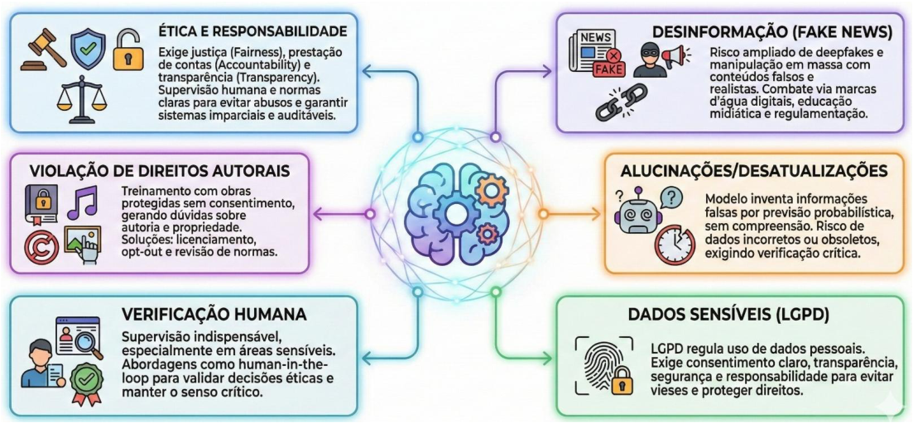

---

<!-- pagina: 31 -->

**Diego Carvalho, Renato da Costa, Equipe Informática e TI Aula Única - Diego Carvalho, Renato da Costa** 

## Responsible AI 

###### **<mark>INCIDÊNCIA EM PROVA: BAIXÍSSIMA</mark>** 

Responsible AI (Inteligência Artificial Responsável) é uma abordagem para o desenvolvimento e uso de sistemas de Inteligência Artificial (IA) que levam em consideração os impactos éticos, sociais e ambientais que eles podem ter. O objetivo é garantir que os sistemas de IA sejam desenvolvidos e utilizados de forma justa, transparente, confiável e segura, minimizando o risco de prejuízos ou discriminação para indivíduos ou grupos. Os objetivos da Responsible AI incluem: 

###### **<mark>OBJETIVOS DO RESPONSIBLE AI</mark>** 

Garantir que os sistemas de IA sejam desenvolvidos e utilizados de forma ética e legalmente responsável, respeitando os direitos e privacidade das pessoas e minimizando os impactos negativos sobre a sociedade. 

Promover a transparência e explicabilidade das decisões tomadas por sistemas de IA, permitindo que as pessoas entendam como as decisões foram tomadas e possam contestá-las se necessário. 

Promover a equidade e inclusão, considerando aspectos sociais e garantindo que os sistemas de IA não discriminem ou prejudiquem grupos ou indivíduos e promovam a diversidade e a inclusão na IA. 

Garantir a segurança e confiabilidade dos sistemas de IA, minimizando o risco de prejuízos para as pessoas ou a sociedade em geral. 

É importante diferenciar IA Responsável de IA Explicável. A IA Responsável envolve garantir que a IA seja desenvolvida e implementada de forma ética e legalmente responsável – ela leva em consideração o ciclo de vida da IA, desde a concepção até a desativação, e sua responsabilidade ética em cada fase. Já a IA Explicável refere-se à capacidade de explicar como uma decisão foi tomada pelo modelo de IA, permitindo que os usuários entendam o processo de tomada de decisão. 

Uma IA pode ser responsável, mas ainda ser opaca e não explicável, tornando difícil para os usuários entenderem como as decisões são tomadas. 

A Inteligência Artificial Responsável é um conceito muito recente, logo não existe uma consolidação acadêmica sobre seus principais princípios e práticas. Dessa forma, eu compilei alguns princípios e práticas listados por diversas organizações como a UNESCO, OECD, IEEE, Microsoft, Google, European Commission, entre outros. Esse assunto já começou a cair em prova e acredito que se tornará cada vez mais comum: 

### Transparência 

A transparência é requisito fundamental para nortear o desenvolvimento de aplicações de IA. Tais aplicações podem, por exemplo, ser utilizadas para informar decisões por parte de um banco sobre quais pessoas devem receber empréstimos com juros menores (e quais não devem). Isso traz impactos práticos na vida das pessoas e, portanto, é justificável que elas queiram compreender quais foram os critérios utilizados, ou como estas decisões foram tomadas. 

Naturalmente será mais difícil para as pessoas confiarem em algoritmos se eles funcionarem como “caixaspretas” que fazem recomendações que elas não conseguem compreender como foram feitas ou que parecem contrariar o senso comum. Vale ressaltar que em muitos cenários os profissionais de diversos domínios terão que confiar nos algoritmos acima de suas próprias intuições, como o piloto de avião que precisa poder confiar no piloto automático. 

Uma boa prática de transparência é que além de simplesmente tornar a aplicação disponível para uso, o responsável por seu desenvolvimento disponibilize também informações sobre as capacidades,

---

<!-- pagina: 32 -->

**Diego Carvalho, Renato da Costa, Equipe Informática e TI Aula Única - Diego Carvalho, Renato da Costa** 

funcionalidades e limitações da solução. Os dados, o sistema e os modelos de negócios de IA devem ser transparentes e os mecanismos de rastreabilidade podem ajudar a alcançar isso. 

Além disso, os sistemas de IA e as suas decisões devem ser explicados de uma forma adaptada às partes interessadas em causa – seres humanos precisam saber que estão interagindo com uma IA. 

### Explicabilidade/Interpretabilidade 

A Explicabilidade se refere à capacidade de um sistema de IA explicar como e por que chegou a uma determinada decisão ou conclusão. Quando uma IA é capaz de explicar suas decisões, os usuários humanos podem entender melhor como a IA está tomando decisões e avaliar se essas decisões são justas, confiáveis e éticas. Além disso, a explicabilidade também pode ajudar a identificar erros ou vieses na tomada de decisão da IA, permitindo que sejam corrigidos. 

Existem diferentes técnicas para aumentar a explicabilidade de sistemas de inteligência artificial, tais como a criação de modelos de interpretabilidade, a implementação de transparência nas etapas de treinamento e a utilização de técnicas de interpretação de modelos. O objetivo é tornar o processo de tomada de decisão da IA mais transparente e compreensível para os usuários humanos. 

A explicabilidade é especialmente importante em áreas onde as decisões da IA têm implicações significativas para os indivíduos, como em questões de justiça criminal, crédito e saúde. A falta de explicabilidade nessas áreas pode levar a decisões injustas ou discriminatórias e pode minar a confiança nas tecnologias de IA. Por isso, a explicabilidade é considerada uma parte fundamental da Responsabilidade AI. E a interpretabilidade? Bem, muitos artigos consideram como sinônimos! 

No entanto, existe o entendimento de que a interpretabilidade tem relação com a facilidade de se estabelecer uma relação de causa e efeito nas predições, ou seja, a capacidade de predizer o que vai acontecer em função dos dados e parâmetros fornecidos como entradas. Já a explicabilidade pode denotar a medida em que o funcionamento do modelo em si pode ser explicado para pessoas não especialistas, ou ao menos as previsões geradas pelo modelo podem ser explicadas. 

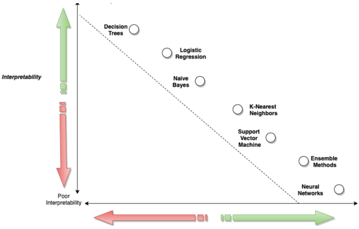

Uma dificuldade com a transparência das soluções de inteligência artificial que utilizam aprendizado de máquina é que os algoritmos utilizados por essas aplicações são desenvolvidos visando-se a performance

---

<!-- pagina: 33 -->

**Diego Carvalho, Renato da Costa, Equipe Informática e TI Aula Única - Diego Carvalho, Renato da Costa** 

funcional. Isso leva à adoção de funções matemáticas que são otimizadas para fornecer a melhor resposta possível para a questão formulada (Por exemplo: reconhecer objetos em imagens ou classificar textos). 

Essa otimização é obtida através de um ajuste fino de parâmetros, em um processo que na maior parte dos casos não fornece explicações sobre como tais aproximações e otimizações foram feitas.  Em certos casos – como em aplicações de aprendizado profundo que utilizam redes neurais complexas – poderá haver um trade-off maior entre a interpretabilidade e a performance conforme apresenta o gráfico seguinte. 

### Privacidade/Segurança 

A privacidade se refere à proteção dos dados pessoais e sensíveis dos usuários que são coletados e processados pelos sistemas de inteligência artificial. Nós temos que lembrar que a privacidade se trata de um direito fundamental dos indivíduos. Dessa forma, as organizações que desenvolvem e utilizam sistemas de IA devem garantir que os dados pessoais sejam tratados de maneira justa, transparente e segura. 

Para proteger a privacidade dos usuários, as organizações devem adotar medidas de segurança apropriadas para proteger dados pessoais coletados e processados pelos sistemas de IA. Isso pode incluir criptografia, controles de acesso rigorosos e adoção de práticas de segurança cibernética robustas. Além disso, as organizações devem garantir que os usuários tenham controle sobre seus dados pessoais e tenham a opção de optar por não compartilhar certas informações. 

Isso pode incluir a implementação de recursos como a escolha de privacidade, onde os usuários podem escolher quais dados desejam compartilhar com a IA e em que condições. Por fim, a privacidade também envolve a transparência na coleta e uso de dados pessoais pela IA. As organizações devem explicar claramente aos usuários como seus dados serão usados e como a IA tomará decisões com base nesses dados. 

A segurança da informação e a privacidade devem ser levadas em conta em todo o ciclo de vida das soluções de IA – projeto, preparação de dados, treinamento do modelo, testes e implementação, dado que estas soluções podem ser alvo de ataques e outras ameaças. O cuidado com esses princípios ajuda a construir confiança entre os usuários e as organizações que utilizam sistemas de IA, promovendo a Responsible AI. 

### Responsabilização 

O termo original é Accountability, mas esse termo não tem uma tradução precisa em português – em geral, utiliza-se responsabilização, auditabilidade ou prestação de constas. Ela se refere à capacidade de responsabilizar algoritmos e sistemas de inteligência artificial por suas decisões e ações. Isso implica a transparência em relação ao processo de tomada de decisão e à explicação do raciocínio por trás das escolhas feitas pelos modelos de IA. 

A responsabilização também envolve a identificação e mitigação de possíveis vieses e discriminação presentes nos dados de treinamento e nos algoritmos de IA, garantindo que os sistemas sejam justos e equitativos em relação a todos os usuários. Além disso, ela inclui a responsabilidade pelos impactos sociais e ambientais dos sistemas de IA, bem como a implementação de medidas para minimizar esses impactos negativos. 

Em suma, a accountability no contexto de Responsible AI é essencial para garantir a confiança e a aceitação pública da tecnologia de IA e para proteger os direitos e interesses dos usuários e da sociedade

---

<!-- pagina: 34 -->

**Diego Carvalho, Renato da Costa, Equipe Informática e TI Aula Única - Diego Carvalho, Renato da Costa** 

em geral. Notem que diversos princípios ou práticas se interrelacionam, possuindo uma forte ligação um com outro e – por vezes – até se confundindo. Como ainda não temos uma consolidação bibliográfica sobre esse tema, eventualmente ocorre algumas confusões. 

### Inclusividade/Diversidade 

Aplicações de IA devem ser acessíveis e produzir benefícios para todos os membros da sociedade, sem deixar de fora grupos de pessoas por conta de seu gênero, idade, etnia, origem, cultura, status socioeconômico, capacidades físicas e mentais ou outros fatores que possam dificultar o acesso à solução. A ideia é que desenvolvedores sigam princípios de design inclusivo para que as aplicações de IA possam ser mais facilmente utilizadas por deficientes, idosos, minorias, etc. 

Isso envolve a inclusão de perspectivas diversas nas fases de concepção, desenvolvimento e teste de modelos de inteligência artificial, garantindo que os sistemas sejam projetados e treinados com dados que representem a diversidade da sociedade. Quanto à acessibilidade, recomenda-se o fornecimento de opções para interfaces de usuário alternativas (Ex: texto em áudio ou legendas em vídeo) e treinando algoritmos para reconhecer e lidar com diferentes formas de fala e comunicação. 

Além disso, a ela também se relaciona com a garantia de que os sistemas de IA não perpetuem ou amplifiquem preconceitos e discriminações existentes na sociedade, evitando a introdução de vieses nos dados de treinamento e nos algoritmos de IA. Em suma, a inclusividade é um elemento chave da Responsible AI, pois promove a equidade e a justiça social na aplicação de tecnologias de IA e ajuda a criar soluções mais efetivas e amplamente aceitas pela sociedade. 

### Justiça/Equidade 

Inclusão refere-se a garantir que os sistemas de IA sejam projetados e implementados para serem acessíveis a todos os indivíduos e comunidades, independentemente de sua etnia, gênero, idade, deficiência, status socioeconômico ou outras características. Isso significa que os sistemas de IA devem ser projetados com a participação de diversas partes interessadas e não devem perpetuar ou ampliar preconceitos ou discriminações. 

Por outro lado, justiça refere-se à garantia de que os sistemas de IA não discriminem indivíduos ou grupos com base em suas características protegidas ou outros fatores. Isso significa que os sistemas de IA devem ser projetados para evitar preconceitos e garantir que as decisões tomadas pelo sistema sejam baseadas em dados relevantes e precisos, em vez de perpetuar ou ampliar desigualdades existentes. 

Embora inclusão e justiça estejam relacionadas, são princípios distintos: um projeto inclusivo pode ajudar a promover a justiça ao garantir que as necessidades e perspectivas de todas as partes interessadas sejam levadas em conta, enquanto um projeto justo pode ajudar a garantir que os sistemas de IA sejam realmente inclusivos, evitando discriminação e promovendo tratamento igual para todos os indivíduos e grupos. 

As falhas ao atender o pressuposto da justiça ou igualdade trazem muitos desafios éticos. Como exemplo, houve um algoritmo desenvolvido pela Amazon para ajudar o RH na contratação de novos colaboradores que era discriminatório contra mulheres. Foi descoberto que eram rejeitados currículos perfeitamente aceitáveis (apenas de mulheres), com base em certas características (por exemplo, hobbies das pretendentes). 

Em suma: para ajudar na diferenciação desses dois princípios, podemos dizer que a inclusão é a entrada ou causa e a justiça é a saída ou consequência. Ao incluir uma diversidade de pessoas diferentes (Ex:

---

<!-- pagina: 35 -->

**Diego Carvalho, Renato da Costa, Equipe Informática e TI Aula Única - Diego Carvalho, Renato da Costa** 

etnia, gênero, idade, deficiência, status socioeconômico, etc) durante o projeto de um sistema de IA, podemos alcançar modelos de inteligência artificial mais justos, não discriminatórios e não preconceituosos. 

### Confiabilidade e Uso Seguro 

A Confiabilidade e Uso Seguro é um pressuposto fundamental para a inteligência artificial. Aplicações devem ser robustas e confiáveis, dado que na ausência deste pressuposto as consequências podem ser severas. Um desafio óbvio para a confiabilidade é o fato de que as soluções de IA são passíveis de falhas, que em certos sistemas (carros autônomos, diagnósticos médicos, armas autônomas, etc) podem ter impacto considerável. 

Existem uma diferença entre confiabilidade e uso seguro: a confiabilidade refere-se à capacidade de um sistema de IA para desempenhar consistentemente e com precisão a tarefa para a qual foi projetado, em diferentes condições e ao longo do tempo. Isso significa que o sistema deve ser robusto e capaz de lidar com entradas ou cenários inesperados, e seu desempenho deve ser consistente em diferentes ambientes e contextos. 

Já o uso seguro, por outro lado, refere-se à capacidade de um sistema de IA para evitar danos ou lesões aos usuários, partes interessadas ou ao ambiente. Isso significa que o sistema deve ser projetado para identificar e mitigar potenciais riscos, e para garantir que suas ações sejam seguras e éticas. As considerações de segurança também devem incluir o impacto potencial do sistema em diferentes grupos e comunidades, e o potencial de consequências não intencionais ou uso indevido. 

**<mark>PRINCÍPIOS/PRÁTICAS DESCRIÇÃO</mark>** Garantir que os processos e decisões tomadas por sistemas de IA sejam compreensíveis e facilmente acessíveis, incluindo o uso de dados, algoritmos e lógica **TRANSPARÊNCIA** de tomada de decisão. Isso inclui a transparência em relação ao propósito, desempenho, limitações e riscos associados aos sistemas de IA. Permitir que os usuários e outras partes interessadas entendam como as decisões foram tomadas pelos sistemas de IA, por meio de métodos de interpretação e **EXPLICABILIDADE/** explicação. Isso inclui a capacidade de explicar como os algoritmos funcionam e como **INTERPRETABILIDADE** as decisões são tomadas, de modo a permitir a identificação e correção de possíveis erros ou preconceitos. <mark>Proteger a privacidade e os dados pessoais dos usuários e garantir que as informações</mark> sejam coletadas e utilizadas de forma ética e responsável. Isso inclui a proteção contra **PRIVACIDADE/** violações de privacidade, coleta excessiva ou inadequada de dados e uso indevido **SEGURANÇA** ou não autorizado de informações pessoais. Garantir que os sistemas de IA sejam projetados, implementados e utilizados de forma ética e responsável, e que as partes envolvidas sejam responsáveis pelas decisões e **RESPONSABILIDADE/** ações do sistema. Isso inclui a responsabilização por possíveis danos ou impactos **ACCOUNTABILITY** negativos causados pelo sistema e a obrigação de garantir que o sistema atenda aos <u>padrões éticos e legais adequados.</u> <mark>Garantir que os sistemas de IA sejam projetados para serem acessíveis a todos os</mark> indivíduos e comunidades, independentemente de sua raça, etnia, gênero, idade, **INCLUSIVIDADE/** deficiência, status socioeconômico ou outras características. Isso significa que os **DIVERSIDADE** sistemas de IA devem ser projetados com a participação de diversas partes interessadas e não devem perpetuar ou ampliar preconceitos ou discriminações. <mark>Garantir que os sistemas de IA não discriminem indivíduos ou grupos com base em</mark> **JUSTIÇA/** suas características protegidas ou outros fatores, e que promovam a equidade e a **EQUIDADE** igualdade de oportunidades. Isso significa <u>que os sistemas de IA devem tomar</u>

---

<!-- pagina: 36 -->

**Diego Carvalho, Renato da Costa, Equipe Informática e TI Aula Única - Diego Carvalho, Renato da Costa** 

decisões baseadas em dados relevantes e precisos, em vez de perpetuar ou ampliar desigualdades existentes. 

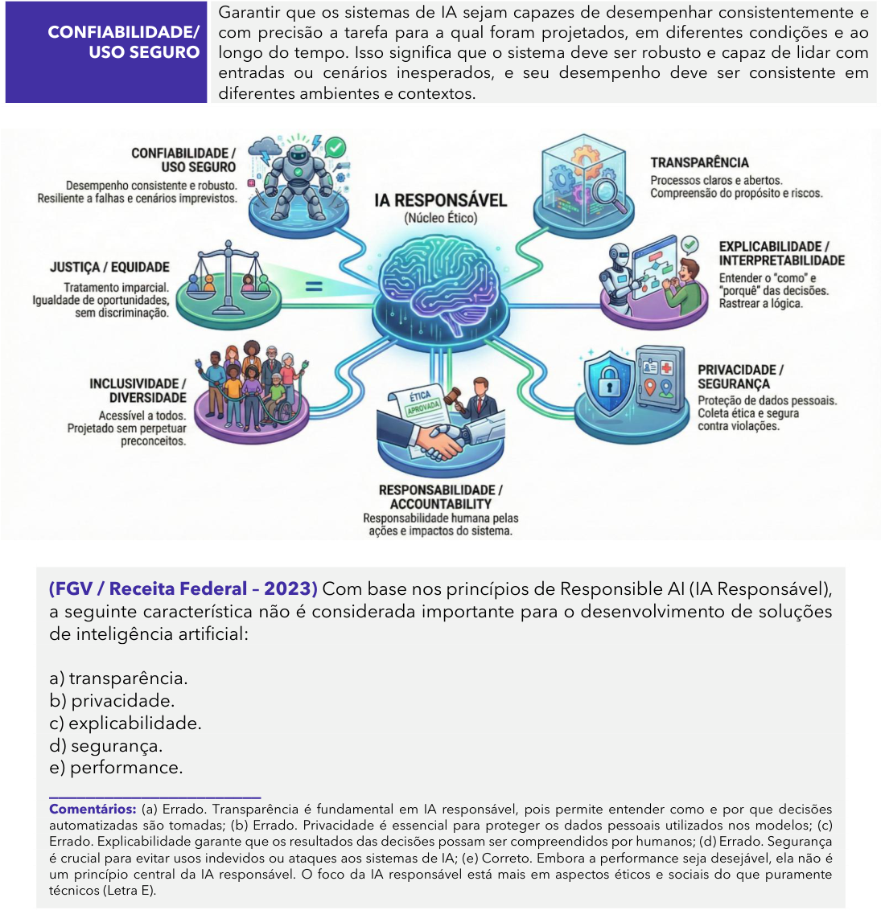

<!-- Start of picture text -->
Garantir que os sistemas de IA sejam capazes de desempenhar consistentemente e CONFIABILIDADE/  com precisão a tarefa para a qual foram projetados, em diferentes condições e ao USO SEGURO  longo do tempo. Isso significa que o sistema deve ser robusto e capaz de lidar com entradas ou cenários inesperados, e seu desempenho deve ser consistente em diferentes ambientes e contextos. (FGV / Receita Federal – 2023)  Com base nos princípios de Responsible AI (IA Responsável), a seguinte característica não é considerada importante para o desenvolvimento de soluções de inteligência artificial: a) transparência. b) privacidade. c) explicabilidade. d) segurança. e) performance. _______________________ Comentários:  (a) Errado. Transparência é fundamental em IA responsável, pois permite entender como e por que decisões automatizadas são tomadas; (b) Errado. Privacidade é essencial para proteger os dados pessoais utilizados nos modelos; (c) Errado. Explicabilidade garante que os resultados das decisões possam ser compreendidos por humanos; (d) Errado. Segurança é crucial para evitar usos indevidos ou ataques aos sistemas de IA; (e) Correto. Embora a performance seja desejável, ela não é um princípio central da IA responsável. O foco da IA responsável está mais em aspectos éticos e sociais do que puramente técnicos (Letra E). <!-- End of picture text -->

---

<!-- pagina: 37 -->

**Diego Carvalho, Renato da Costa, Equipe Informática e TI Aula Única - Diego Carvalho, Renato da Costa** 

## IA Generativa 

### Conceitos Básicos 

###### **<mark>INCIDÊNCIA EM PROVA: MÉDIA</mark>** 

###### **<mark>INTELIGÊNCIA ARTIFICIAL GENERATIVA</mark>** 

Trata-se de um conjunto de técnicas de inteligência artificial projetadas para criar conteúdo novo e original, que pode variar desde texto, imagens e música até dados sintéticos e muito mais. O objetivo principal desses sistemas é aprender padrões, estilos ou características de conjuntos de dados existentes e, em seguida, gerar novos dados <u>que sejam semelhantes em qualidade e diversidade, mas únicos em conteúdo.</u> 

A partir de 2022, a Inteligência Artificial passou por uma transformação significativa com a popularização de modelos generativos como o ChatGPT, o DALL-E e outros sistemas capazes de criar textos, imagens, músicas, códigos e soluções criativas em geral. A tecnologia deixou de ser restrita a especialistas e tornouse amplamente acessível ao público, consolidando-se como uma ferramenta prática e colaborativa na produção de conteúdos digitais. 

A Inteligência Artificial Generativa constitui um ramo da IA dedicado à criação de conteúdos inéditos. Diferentemente de sistemas tradicionais que apenas classificam ou analisam dados, esses modelos produzem novos textos, imagens, áudios ou vídeos com base em padrões aprendidos a partir de grandes volumes de dados criados por humanos. Não se trata de mera reprodução, mas de geração probabilística fundamentada em aprendizado estatístico. 

Entre suas principais aplicações, destacam-se: a criação de conteúdos originais (como histórias, músicas, ilustrações e vídeos), o aprimoramento de materiais existentes (por meio de correções, reestilizações ou ajustes técnicos) e a automação de tarefas criativas, como a redação de e-mails, descrições de produtos, elaboração de roteiros e campanhas publicitárias. Exemplos notórios incluem o ChatGPT, voltado para geração de texto e código, e o DALL-E, especializado em imagens a partir de descrições textuais. 

Essas capacidades são viabilizadas por meio dos chamados modelos de base (foundation models), estruturas algorítmicas de larga escala treinadas com conjuntos massivos de dados multimodais — textos, imagens, sons e vídeos. O princípio de funcionamento central desses modelos é a distribuição de probabilidade: eles avaliam, com base em padrões aprendidos, qual é o elemento mais provável a ser gerado em sequência, seja uma palavra, um pixel ou uma nota musical. 

O ciclo de desenvolvimento de um modelo de IA generativa é composto por diversas etapas. Inicialmente, realiza-se a coleta, limpeza e organização dos dados. Em seguida, o modelo é treinado por meio do ajuste de milhões ou bilhões de parâmetros com base em padrões estatísticos. Após o treinamento, há etapas de fine-tuning e alinhamento, que calibram o modelo para tarefas específicas e para comportamentos mais úteis, seguros e coerentes. 

Em seguida, ocorre a implantação do sistema em plataformas acessíveis ao usuário, fase em que se inicia a inferência — isto é, a geração efetiva de conteúdo com base nas entradas recebidas. Finalmente, o modelo é monitorado em uso real, sendo atualizado, corrigido ou retrainado conforme necessário. Embora esses sistemas não possuam consciência nem pensamento humano, sua capacidade de gerar conteúdo original com base em padrões apreendidos os transforma em agentes criativos colaborativos. 

Essa mudança de paradigma amplia significativamente o papel da IA na sociedade, deslocando-a de uma função meramente automatizada para uma atuação ativa na produção cultural e intelectual.

---

<!-- pagina: 38 -->

**Diego Carvalho, Renato da Costa, Equipe Informática e TI Aula Única - Diego Carvalho, Renato da Costa** 

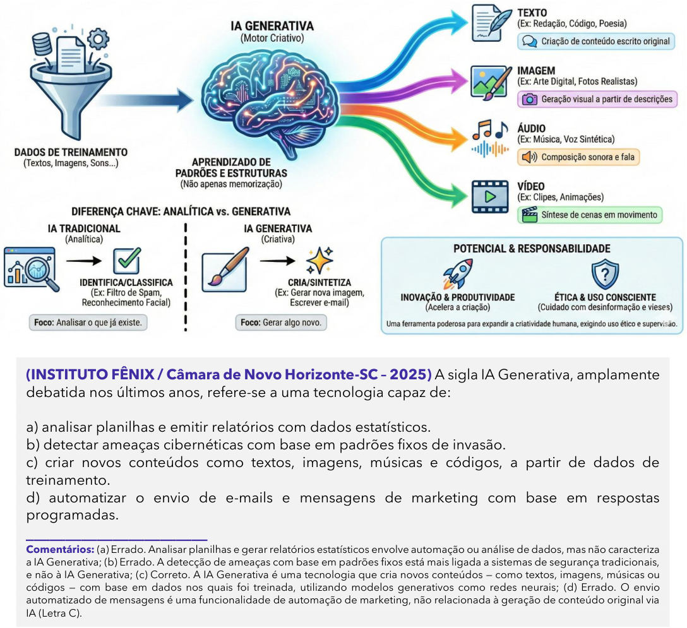

<!-- Start of picture text -->
(INSTITUTO FÊNIX / Câmara de Novo Horizonte-SC – 2025)  A sigla IA Generativa, amplamente debatida nos últimos anos, refere-se a uma tecnologia capaz de: a) analisar planilhas e emitir relatórios com dados estatísticos. b) detectar ameaças cibernéticas com base em padrões fixos de invasão. c) criar novos conteúdos como textos, imagens, músicas e códigos, a partir de dados de treinamento. d) automatizar o envio de e-mails e mensagens de marketing com base em respostas programadas. _______________________ Comentários:  (a) Errado. Analisar planilhas e gerar relatórios estatísticos envolve automação ou análise de dados, mas não caracteriza a IA Generativa; (b) Errado. A detecção de ameaças com base em padrões fixos está mais ligada a sistemas de segurança tradicionais, e não à IA Generativa; (c) Correto. A IA Generativa é uma tecnologia que cria novos conteúdos — como textos, imagens, músicas ou códigos — com base em dados nos quais foi treinada, utilizando modelos generativos como redes neurais; (d) Errado. O envio automatizado de mensagens é uma funcionalidade de automação de marketing, não relacionada à geração de conteúdo original via IA (Letra C). <!-- End of picture text -->

---

<!-- pagina: 39 -->

**Diego Carvalho, Renato da Costa, Equipe Informática e TI Aula Única - Diego Carvalho, Renato da Costa** 

### Características Fundamentais 

A IA Generativa está na vanguarda da inovação em Inteligência Artificial, permitindo a criação automática de conteúdo novo e significativo. Vejamos suas características básicas: 

#### **Geração de Conteúdo Novo** 

###### **<mark>INCIDÊNCIA EM PROVA: BAIXÍSSIMA</mark>** 

Uma das características centrais da Inteligência Artificial Generativa é sua capacidade de criar conteúdos inéditos, o que a distingue dos modelos tradicionais de IA, voltados predominantemente à classificação, predição ou identificação de padrões em dados existentes. Enquanto modelos convencionais analisam e replicam informações já estruturadas, os sistemas generativos produzem novas sequências de texto, imagens, sons ou códigos, de acordo com o tipo de dado utilizado em seu treinamento. 

Essa geração de conteúdo não consiste em simples reprodução de exemplos passados, mas sim na formulação de novas possibilidades com base nos padrões estatísticos previamente aprendidos. O modelo não acessa uma base de respostas prontas; ele constrói, em tempo real, uma saída original conforme o comando (prompt) recebido. 

Os modelos generativos operam a partir de redes neurais profundas, especialmente da arquitetura Transformer, que tem sido responsável por avanços significativos no campo. Após serem treinados com bilhões de exemplos, esses sistemas aprendem a identificar e replicar estruturas complexas de linguagem, estilo, tom, lógica e contexto. Assim, tornam-se capazes de gerar respostas coerentes e contextualizadas, probabilisticamente calculadas com base nas instruções fornecidas pelo usuário. 

Essa habilidade de criação probabilística representa a base técnica da inovação promovida pela IA Generativa. Isso tem um impacto enorme: quer dizer que mesmo que duas pessoas façam o mesmo pedido, a IA pode gerar duas respostas diferentes — ambas coerentes e plausíveis, mas não idênticas. Essa variabilidade abre espaço para a criatividade, a experimentação e a personalização em escala. 

###### **Saiba mais:** 

<mark>Pense na geração de conteúdo novo pela IA como um chef criativo em uma cozinha gigante. Esse chef passou anos experimentando milhares de receitas diferentes: massas, sopas, sobremesas, temperos de várias culturas. Ele não decora cada prato específico que já fez — em vez disso, aprende os padrões de sabor, combinações de ingredientes e técnicas culinárias. Então, quando alguém chega e pede: “Faça um prato que misture doce com picante e tenha inspiração italiana”, o chef não vai simplesmente tirar uma receita antiga da gaveta. Ele vai criar uma nova receita, inédita, misturando os conhecimentos que acumulou ao longo do tempo.</mark> 

<mark>Da mesma forma, a IA generativa não “busca” uma resposta pronta no banco de dados, mas combina o que aprendeu nos padrões de linguagem, estilo, lógica e contexto para produzir uma saída original. É por isso que, se duas pessoas pedirem a mesma coisa, a “receita” pode ser diferente em cada caso: o modelo gera variações criativas, mas sempre coerentes com o pedido. Assim como o chef, a IA traz à mesa algo novo, feito sob medida no momento, em vez</mark> de apenas repetir o que já existe.

---

<!-- pagina: 40 -->

**Diego Carvalho, Renato da Costa, Equipe Informática e TI Aula Única - Diego Carvalho, Renato da Costa** 

**(CEBRASPE / TRT10 – 2025)** A IA generativa é capaz de criar conteúdos novos, como textos, <mark>imagens, músicas e vídeos, além de resolver problemas inéditos com base em conhecimentos prévios, permitindo gerar novos artefatos realistas em escala, sem repeti-los.</mark> 

##### **<mark>_______________________</mark>** 

**<mark>Comentários:</mark>** <mark>a IA generativa é projetada para criar conteúdos originais, como textos, imagens, músicas e vídeos, com base em padrões aprendidos durante o treinamento. Ela pode resolver problemas inéditos e gerar novos artefatos realistas, sem depender</mark> de simples repetição dos dados (Correto). 

#### **Aprendizado de Máquina** 

###### **<mark>INCIDÊNCIA EM PROVA: BAIXA</mark>** 

O aprendizado de máquina refere-se ao processo por meio do qual modelos computacionais extraem padrões a partir de dados, sem a necessidade de instruções explícitas. Diferentemente de sistemas programados com regras fixas, os modelos de machine learning aprendem a tomar decisões ou realizar previsões com base em regularidades estatísticas presentes em grandes volumes de dados. Esse campo se divide, essencialmente, em três categorias: aprendizado supervisionado, não supervisionado e por ==5460== reforço. 

No aprendizado supervisionado, o modelo é treinado com conjuntos de dados rotulados, isto é, cada entrada está associada a uma saída conhecida. O objetivo é fazer com que o sistema aprenda a mapear corretamente os pares entrada-saída, ajustando seus parâmetros com base no erro entre a previsão gerada e o valor real. Essa abordagem é amplamente utilizada em tarefas de classificação (como identificar e-mails como spam ou não spam) e regressão (como prever valores numéricos, como o preço de um imóvel). 

O aprendizado não supervisionado, por sua vez, opera sobre dados não rotulados. O modelo não recebe indicações explícitas de qual seria a saída correta, sendo orientado a descobrir autonomamente padrões, agrupamentos ou estruturas latentes nos dados. Essa técnica é aplicada em tarefas como detecção de anomalias, redução de dimensionalidade e análise de agrupamentos (clustering). 

No contexto da Inteligência Artificial Generativa, o aprendizado não supervisionado é central no prétreinamento de modelos de linguagem, que aprendem a gerar texto ao reconhecer regularidades sintáticas e semânticas em grandes corpora. Uma vantagem dessa abordagem é a dispensabilidade de rotulagem manual, especialmente útil quando se lida com bases de dados extensas. Mesmo sem uma resposta “certa”, os modelos são capazes de identificar estruturas ocultas, organização interna e padrões que muitas vezes escapam à percepção humana. 

O terceiro tipo é o aprendizado por reforço, no qual o modelo aprende por meio da interação com um ambiente. Em vez de receber pares de entrada e saída, o sistema executa ações, observa os efeitos e é recompensado ou penalizado com base nos resultados. O objetivo é desenvolver uma política de ação que maximize recompensas acumuladas ao longo do tempo. Essa forma de aprendizado é empregada em áreas como jogos, robótica, controle de sistemas e ajuste fino de modelos generativos, especialmente em etapas de alinhamento ao comportamento humano. 

###### **Saiba mais:** 

<mark>Uma forma simples de entender os três tipos de aprendizado de máquina é imaginá-los como diferentes maneiras de aprender a cozinhar.</mark> 

<mark>No aprendizado supervisionado, o aluno cozinha seguindo uma receita completa, com instruções claras e um prato de referência pronto ao lado. A cada tentativa, alguém compara</mark>

---

<!-- pagina: 41 -->

**Diego Carvalho, Renato da Costa, Equipe Informática e TI Aula Única - Diego Carvalho, Renato da Costa** 

<mark>o prato feito com o modelo ideal, aponta erros e acertos e orienta ajustes. Com o tempo, o aluno aprende a repetir corretamente aquela receita.</mark> 

<mark>No aprendizado não supervisionado, não há receita nem prato final para comparar. O aluno entra em uma cozinha cheia de ingredientes desconhecidos e começa a experimentar. Ele percebe que certos ingredientes combinam melhor entre si, que alguns sabores são parecidos e outros muito diferentes, criando grupos e padrões por conta própria, sem saber exatamente qual será o resultado final.</mark> 

<mark>Já no aprendizado por reforço, o aluno aprende cozinhando para clientes reais. Cada prato servido gera uma reação: elogios, reclamações ou gorjetas. Com base nesse feedback, ele ajusta suas escolhas — muda temperos, tempos de preparo e combinações — buscando maximizar a satisfação ao longo do tempo, mesmo errando algumas vezes no processo.</mark> 

<mark>Assim, enquanto o aprendizado supervisionado aprende com respostas certas, o não supervisionado aprende com padrões escondidos, e o aprendizado por reforço aprende com</mark> tentativa, erro e recompensa. 

Os três paradigmas representam formas complementares de aprendizado, cada qual apropriada a diferentes contextos e objetivos dentro do campo da Inteligência Artificial. 

**(FAFIPA / Prefeitura de Paranavaí-PR – 2025)** Uma das principais técnicas usadas na <mark>Inteligência Artificial é conhecida como aprendizado não supervisionado. Assinale a alternativa que melhor descreve o que é o aprendizado não supervisionado.</mark> 

<mark>a) Abordagem, onde o algoritmo identifica padrões ou estruturas em dados não rotulados, sem orientação prévia.</mark> 

<mark>b) Método que utiliza recompensas e penalidades para otimizar decisões em ambientes dinâmicos.</mark> 

<mark>c) Sistema que combina redes neurais profundas para processar linguagem natural.</mark> 

<mark>d) Processo de treinamento exclusivo para tarefas de visão computacional com supervisão humana.</mark> 

<mark>e) Técnica, em que o modelo é treinado com dados rotulados para prever resultados específicos.</mark> 

**<mark>_______________________</mark>** 

**<mark>Comentários:</mark>** <mark>(a) Correto. O aprendizado não supervisionado é uma abordagem em que o algoritmo descobre padrões, agrupamentos ou estruturas nos dados sem que haja rótulos ou respostas corretas pré-definidas. Ele é utilizado, por exemplo, em técnicas de clusterização e redução de dimensionalidade; (b) Errado. Essa descrição se refere ao aprendizado por reforço, onde o agente aprende com base em recompensas e penalidades ao interagir com um ambiente; (c) Errado. A descrição trata de uma aplicação específica (como modelos de linguagem natural) e não define o conceito de aprendizado não supervisionado; (d) Errado. Esse item descreve um cenário restrito à visão computacional com supervisão, o que está mais relacionado ao aprendizado supervisionado, não ao não supervisionado; (e) Errado. Essa é a definição clássica do aprendizado supervisionado, onde o modelo é</mark> treinado com dados rotulados para realizar previsões (Letra A). 

#### **Modelos de Base** 

###### **<mark>INCIDÊNCIA EM PROVA: BAIXÍSSIMA</mark>** 

Os Modelos de Base (Foundation Models) constituem a estrutura central das aplicações contemporâneas de Inteligência Artificial. Trata-se de redes neurais de grande escala treinadas com volumes massivos e

---

<!-- pagina: 42 -->

**Diego Carvalho, Renato da Costa, Equipe Informática e TI Aula Única - Diego Carvalho, Renato da Costa** 

variados de dados — incluindo textos, imagens, áudios e vídeos — com o objetivo de capturar padrões linguísticos, visuais ou contextuais amplos e reutilizáveis em diferentes tarefas. 

A principal característica desses modelos é sua generalização inicial. Ao serem treinados de forma ampla, eles adquirem uma capacidade versátil de representação, podendo ser posteriormente ajustados (finetuned) para tarefas específicas sem a necessidade de reconstrução completa. Essa abordagem contrasta com modelos tradicionais, que eram projetados individualmente para cada função. 

Esse paradigma tem sido fundamental para o avanço da Inteligência Artificial Generativa, permitindo que modelos previamente treinados — como ChatGPT, Gemini, DALL·E e Stable Diffusion — sejam adaptados para diversas finalidades: geração de texto, criação de imagens, tradução, resumo, análise de dados, entre outras. Em todos esses casos, o desempenho elevado resulta da combinação entre uma base generalista robusta e um ajuste direcionado à tarefa final. 

###### **Saiba mais:** 

<mark>Imagine um músico experiente que passou anos ouvindo e estudando milhares de estilos musicais — jazz, samba, rock, música clássica. Ele não decora cada canção exatamente como foi composta, mas absorve os padrões de ritmo, harmonia e melodia que estão por trás delas. Quando alguém pede para ele improvisar uma nova música, o que ele faz não é simplesmente repetir uma melodia já existente, mas criar uma canção inédita a partir do conhecimento que acumulou.</mark> 

<mark>Do mesmo modo, a IA generativa, ao ser treinada em bilhões de exemplos de texto, imagem, som ou código, não se limita a “copiar e colar” o que já existe. Ela entende os padrões e, quando recebe um prompt, combina essas estruturas para gerar algo novo, que nunca existiu antes. Assim como duas improvisações musicais nunca saem idênticas, duas respostas da IA</mark> para o mesmo pedido podem ser diferentes, mas ainda assim coerentes, plausíveis e criativas. 

Os Modelos de Base oferecem significativa economia de tempo, custo e esforço porque eliminam a necessidade de treinar novos modelos do zero para cada aplicação. Ao reutilizar o conhecimento adquirido durante o treinamento inicial — realizado sobre grandes volumes de dados heterogêneos —, os desenvolvedores podem aplicar esse modelo generalista a uma ampla gama de tarefas com apenas ajustes complementares (fine-tuning). 

Essa reutilização permite acelerar o desenvolvimento de soluções e reduzir substancialmente os recursos computacionais e humanos necessários para a criação de sistemas de IA especializados. Além disso, a existência de uma base robusta e sofisticada torna viável sua adaptação para setores diversos como marketing, educação, saúde, programação, design e entretenimento, entre outros. 

**(CEBRASPE / TCE-AC – 2024)** A IA generativa utiliza modelos de base treinados para realizar <mark>tarefas gerais, como, por exemplo, técnicas de distribuição de probabilidade.</mark> 

##### **<mark>_______________________</mark>** 

**<mark>Comentários:</mark>** <mark>a IA generativa realmente utiliza modelos de base, como redes neurais, que são treinados em grandes conjuntos de</mark> dados para gerar novos conteúdos, aplicando técnicas de distribuição de probabilidade para prever resultados (Correto). 

#### **Multimodalidade** 

**<mark>INCIDÊNCIA EM PROVA: BAIXÍSSIMA</mark>**

---

<!-- pagina: 43 -->

**Diego Carvalho, Renato da Costa, Equipe Informática e TI Aula Única - Diego Carvalho, Renato da Costa** 

A multimodalidade diz respeito à capacidade de um sistema de inteligência artificial lidar com múltiplos tipos de dados, como texto, imagens, áudio, vídeo e código, de forma integrada. Diferentemente de modelos unimodais, que operam sobre apenas um tipo de informação, modelos multimodais conseguem combinar diferentes fontes para compreender melhor o contexto. 

Isso significa que a IA não apenas recebe um tipo de entrada, mas também é capaz de relacionar modalidades distintas. Por exemplo, pode interpretar uma imagem com base em uma descrição textual, responder perguntas sobre um vídeo ou gerar uma imagem a partir de um comando escrito, unificando significado entre diferentes formas de representação da informação. 

A multimodalidade também amplia bastante as capacidades de geração de conteúdo, permitindo que um único modelo produza saídas em formatos variados. Assim, a IA pode gerar texto explicativo, criar imagens, sintetizar áudio ou combinar essas saídas de maneira coerente, mantendo consistência semântica entre elas. 

Na prática, essa característica torna a interação com sistemas de IA mais natural, flexível e próxima da comunicação humana, que também é multimodal. Como resultado, surgem aplicações mais avançadas em áreas como assistentes virtuais, educação, saúde, acessibilidade, criação de conteúdo e análise de dados complexos. 

#### **Adaptabilidade e Versatilidade** 

###### **<mark>INCIDÊNCIA EM PROVA: BAIXÍSSIMA</mark>** 

Uma das principais qualidades da Inteligência Artificial Generativa é sua elevada flexibilidade na interpretação e resposta a diferentes tipos de comandos, conhecidos como prompts. Um único modelo é capaz de realizar uma ampla variedade de tarefas, como redigir textos acadêmicos, compor mensagens informais, criar poesias, sugerir códigos de programação ou explicar conceitos técnicos. Essa capacidade de adaptação decorre do treinamento em grandes volumes de dados heterogêneos, abrangendo desde textos científicos e literários até fóruns informais e bases de código, o que permite ao modelo ajustar seu tom, estilo e profundidade conforme o contexto apresentado. 

Além disso, os modelos mais avançados já operam de forma multimodal, processando não apenas texto, mas também imagens, áudios e vídeos. Essa característica amplia o escopo de aplicações, permitindo, por exemplo, diagnósticos com base em exames de imagem, interpretação de documentos financeiros, apoio educacional com recursos visuais e produção de conteúdos criativos para o setor cultural e de entretenimento. A tecnologia passa, assim, a concentrar em um único sistema funções que anteriormente exigiam ferramentas especializadas e conhecimento técnico segmentado. 

Essa versatilidade traz ganhos relevantes em termos de personalização e eficiência. O modelo pode ajustar sua resposta ao perfil do usuário, promovendo interações mais contextualizadas, e permite a resolução de múltiplas tarefas com uma única interface, otimizando recursos operacionais. No entanto, ela pode gerar riscos: a interpretação equivocada de contextos ambíguos, a geração de respostas inconsistentes ou inapropriadas, e a aplicação imprópria em áreas sensíveis — como saúde, direito ou educação — podem resultar em consequências negativas, mesmo quando não há má-fé envolvida. 

|**CARACTERÍSTICA**|**DESCRIÇÃO**|
|---|---|
|**GERAÇÃO DE** **CONTEÚDO NOVO**|A IA generativa destaca-se pela capacidade de criar conteúdos inéditos, como textos, imagens, sons e códigos, a partir de padrões estatísticos aprendidos no treinamento. Ela não copia dados existentes, mas gera saídas originais, probabilísticas e contextualizadas conforme oprompt fornecido.|
|**APRENDIZADO DE** **MÁQUINA**|Fundamenta-se em técnicas de aprendizado supervisionado, não supervisionado e por reforçopara extrairpadrões degrandes volumes de dados. Na IAgenerativa,opré-|

---

<!-- pagina: 44 -->

**Diego Carvalho, Renato da Costa, Equipe Informática e TI Aula Única - Diego Carvalho, Renato da Costa** 

treinamento não supervisionado e o reforço para alinhamento comportamental são elementos centrais do processo. 

###### **MODELOS DE BASE** 

**MULTIMODALIDADE** 

<mark>Os modelos de base são redes neurais de grande escala treinadas com dados diversos,</mark> capazes de generalizar conhecimento. Após o treinamento inicial, podem ser ajustados para múltiplas tarefas, reduzindo custos, tempo de desenvolvimento e a necessidade de treinar modelos do zero. 

<mark>Caracteriza-se pela capacidade de processar e gerar múltiplos tipos de dados, como</mark> texto, imagem, áudio e vídeo, de forma integrada. Isso permite compreender contextos mais ricos e produzir respostas coerentes em diferentes formatos, aproximando a <mark>interação da comunicação humana.</mark> 

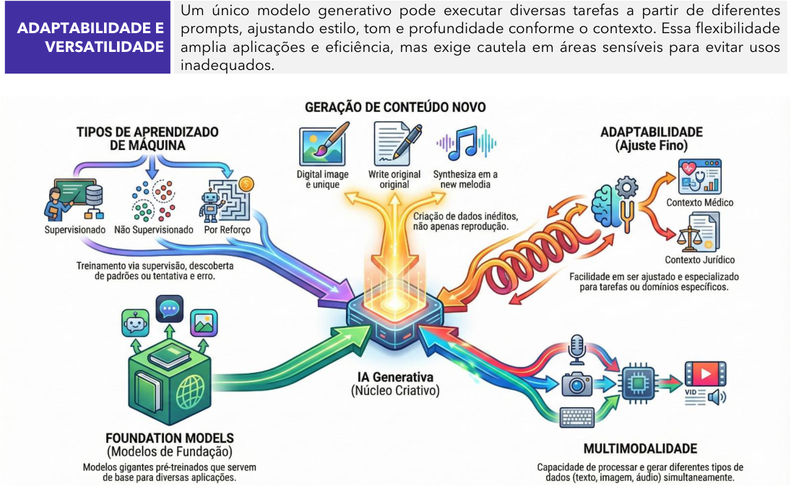

<!-- Start of picture text -->
Um único modelo generativo pode executar diversas tarefas a partir de diferentes ADAPTABILIDADE E  prompts, ajustando estilo, tom e profundidade conforme o contexto. Essa flexibilidade VERSATILIDADE amplia aplicações e eficiência, mas exige cautela em áreas sensíveis para evitar usos inadequados. <!-- End of picture text -->

---

<!-- pagina: 45 -->

**Diego Carvalho, Renato da Costa, Equipe Informática e TI Aula Única - Diego Carvalho, Renato da Costa** 

### Principais Modelos 

Na Inteligência Artificial, distinguem-se duas abordagens fundamentais no processamento e análise de dados: os modelos discriminativos e os modelos generativos. Cada um possui funções distintas e complementares, com aplicações específicas em tarefas de classificação, previsão, geração de conteúdo e personalização de sistemas. 

Modelos discriminativos aprendem a distinguir categorias com base em exemplos rotulados. Eles modelam a probabilidade condicional 𝑃(𝑌∣𝑋), ou seja, calculam a probabilidade de uma determinada saída 𝑌 ocorrer, dado um conjunto de entradas 𝑋. São utilizados em tarefas como classificação, detecção e predição, onde o objetivo é identificar com precisão a classe a que pertence determinada entrada. 

Entre os exemplos clássicos dessa abordagem estão a regressão logística, as máquinas de vetores de suporte (SVM), redes neurais supervisionadas e modelos como o BERT. 

Sistemas de recomendação e mecanismos de busca aplicam, com frequência, modelos discriminativos. Esses sistemas analisam grandes volumes de dados sobre usuários, conteúdos e interações, utilizando métodos como análise de palavras-chave, similaridade entre itens, histórico de cliques e comportamento coletivo para filtrar e sugerir informações relevantes. Enquanto os mecanismos de busca priorizam a correspondência entre consulta e conteúdo, os sistemas de recomendação visam antecipar interesses e promover engajamento, baseando-se em padrões previamente observados. 

Em contraste, os modelos generativos buscam compreender e reproduzir a estrutura dos dados. Modelam a distribuição conjunta 𝑃(𝑋,𝑌), o que permite não apenas prever categorias, mas também gerar novas amostras semelhantes aos dados originais. São capazes de criar textos, imagens, sons e vídeos inéditos com base em padrões aprendidos durante o treinamento. Exemplos notáveis incluem os modelos GPT, DALL·E, Stable Diffusion, GANs e os Variational Autoencoders (VAEs). 

Na prática, os modelos discriminativos tendem a apresentar maior precisão e eficiência em tarefas específicas de reconhecimento, sendo limitados àquilo que já observaram. Por outro lado, os modelos generativos, embora mais complexos e suscetíveis a vieses ou imprecisões, oferecem maior flexibilidade e criatividade, viabilizando a geração de novos conteúdos e a simulação de contextos variados. 

A diferença essencial entre ambos reside na natureza de seu aprendizado: enquanto os modelos discriminativos reconhecem padrões e delimitam fronteiras entre categorias, os generativos imaginam novas possibilidades a partir desses padrões. Essa distinção é central para compreender o funcionamento e as aplicações da Inteligência Artificial contemporânea. 

###### **Saiba mais:** 

<mark>Imagine uma galeria de arte com centenas de quadros. O modelo discriminativo é como um curador experiente: ele observa cada obra e aprende a reconhecer diferenças sutis — identifica quais quadros pertencem a Picasso, Monet ou Van Gogh, analisando traços, cores e estilos. Ele não sabe pintar, mas é ótimo em classificar o que já existe. Seu foco é distinguir, decidir e rotular com precisão.</mark> 

<mark>Já o modelo generativo é como um artista aprendiz: ele passa meses estudando os quadros desses mestres até entender como cada um pinta. Depois, começa a criar novas obras que poderiam ter sido feitas por Picasso ou Monet. Ele não está tentando distinguir, mas sim reproduzir o estilo — aprender os padrões e gerar algo novo a partir deles.</mark>

---

<!-- pagina: 46 -->

**Diego Carvalho, Renato da Costa, Equipe Informática e TI Aula Única - Diego Carvalho, Renato da Costa** 

<mark>Logo, o curador (discriminativo) reconhece padrões e decide “quem fez o quê”; o artista (generativo) aprende os padrões e cria “algo que poderia ter sido feito assim”. Ambos precisam do mesmo conhecimento, mas usam-no em sentidos opostos: um separa, já o outro</mark> inventa. 

O futuro da Inteligência Artificial aponta para a integração dessas duas abordagens. Muitos sistemas atuais combinam capacidades discriminativas (analisar, comparar, julgar) com capacidades generativas (criar, simular, expandir). Dessa forma, a IA se torna não apenas capaz de entender o mundo, mas também de criar novas versões dele, o que exige — mais do que nunca — supervisão ética e validação humana sobre tudo o que é produzido. 

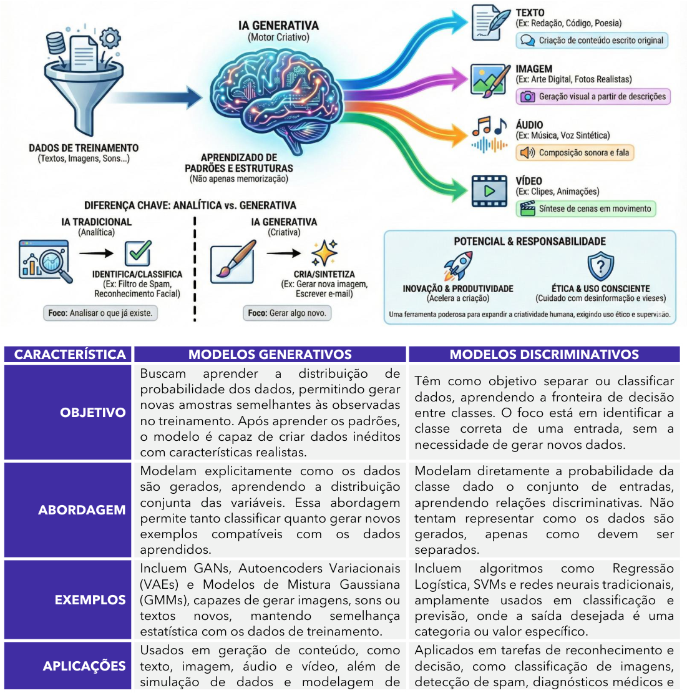

<!-- Start of picture text -->
CARACTERÍSTICA  MODELOS GENERATIVOS  MODELOS DISCRIMINATIVOS Buscam  aprender  a  distribuição  de Têm como objetivo separar ou classificar probabilidade dos dados, permitindo gerar dados, aprendendo a fronteira de decisão novas amostras semelhantes às observadas OBJETIVO entre classes. O foco está em identificar a no treinamento. Após aprender os padrões, classe correta de uma entrada, sem a o modelo é capaz de criar dados inéditos necessidade de gerar novos dados. com características realistas. Modelam explicitamente como os dados  Modelam diretamente a probabilidade da são gerados, aprendendo a distribuição  classe dado o conjunto de entradas, conjunta das variáveis. Essa abordagem  aprendendo relações discriminativas. Não ABORDAGEM permite tanto classificar quanto gerar novos  tentam representar como os dados são exemplos compatíveis com os dados  gerados,  apenas  como  devem  ser aprendidos.  separados. Incluem GANs, Autoencoders Variacionais  Incluem  algoritmos  como  Regressão (VAEs) e Modelos de Mistura Gaussiana  Logística, SVMs e redes neurais tradicionais, EXEMPLOS (GMMs), capazes de gerar imagens, sons ou  amplamente usados em classificação e textos  novos,  mantendo  semelhança  previsão, onde a saída desejada é uma estatística com os dados de treinamento. categoria ou valor específico. Usados em geração de conteúdo, como  Aplicados em tarefas de reconhecimento e APLICAÇÕES texto, imagem, áudio e vídeo, além de  decisão, como classificação de imagens, simulação de dados e modelagem de  detecção de spam, diagnósticos médicos e <!-- End of picture text -->

---

<!-- pagina: 47 -->

**Diego Carvalho, Renato da Costa, Equipe Informática e TI Aula Única - Diego Carvalho, Renato da Costa** 

linguagem, quando o objetivo principal é reconhecimento de fala, onde o objetivo é criar novas amostras realistas. rotular corretamente os dados. Podem ser mais eficientes em cenários com Geralmente exigem mais dados para atingir poucos dados, pois aprendem a estrutura alta precisão, mas são mais eficientes em **EFICIÊNCIA DE** completa da distribuição. Isso permite tarefas específicas, pois focam diretamente **DADOS** reutilizar o conhecimento aprendido para na previsão ou classificação sem modelar <u>geração e análise de dados semelhantes.</u> toda a distribuição dos dados. 

**(CEBRASPE / PC-DF – 2025)** Modelos discriminativos classificam dados conhecidos em <mark>categorias, enquanto modelos generativos preveem características completas a partir de um rótulo, explorando probabilidades conjuntas.</mark> 

**<mark>_______________________ Comentários:</mark>** <mark>modelos discriminativos, como SVM e redes neurais, focam em classificar dados em categorias, enquanto modelos</mark> generativos, como Naive Bayes, modelam a distribuição conjunta dos dados e rótulos, prevendo características completas (Correto). 

#### **Modelos de Linguagem** 

Os Modelos de Linguagem são sistemas de IA generativa projetados para compreender, produzir e manipular linguagem humana. Eles aprendem padrões linguísticos a partir de grandes volumes de texto, capturando relações sintáticas, semânticas e contextuais que permitem gerar frases coerentes e respostas relevantes em diferentes contextos. 

Esses modelos operam, em geral, de forma autorregressiva, prevendo o próximo token com base nos anteriores. Para isso, utilizam representações vetoriais como embeddings, organizadas em espaços latentes, e arquiteturas como Transformers, que empregam mecanismos de atenção para manter contexto e coerência em textos longos. 

Na prática, os modelos de linguagem são aplicados em tarefas como chatbots, tradução automática, resumo de textos, geração de código e apoio à escrita. Apesar de produzirem respostas convincentes, não possuem compreensão real, operando por meio de cálculos probabilísticos sobre padrões aprendidos nos dados. 

###### **Large Language Model (LLM)** 

###### **<mark>INCIDÊNCIA EM PROVA: BAIXA</mark>** 

Os Modelos de Linguagem de Larga Escala (LLMs) são sistemas de IA projetados para compreender e gerar linguagem humana com alto grau de sofisticação. Eles se baseiam na arquitetura Transformer, introduzida em 2017, que revolucionou o processamento de linguagem natural ao permitir o aprendizado de padrões linguísticos a partir da análise de volumes massivos de texto. Durante o treinamento, os LLMs processam bilhões de palavras provenientes de livros, artigos, sites e outras fontes, identificando relações estatísticas entre os termos, o que lhes permite gerar sequências textuais coerentes. 

Internamente, esses modelos não operam diretamente com palavras, mas com representações numéricas chamadas embeddings. Cada palavra ou fragmento de palavra é convertido em um vetor de números que ocupa uma posição em um espaço multidimensional. Nesse espaço, termos semanticamente relacionados tendem a ficar próximos, enquanto conceitos distintos ficam mais distantes. Essa organização vetorial permite ao modelo calcular proximidade semântica e estimar quais palavras são mais prováveis de aparecer em determinado contexto. 

Antes de serem transformadas em embeddings, as entradas textuais passam por um processo chamado tokenização, no qual o texto é dividido em unidades menores chamadas tokens. Essa tokenização pode

---

<!-- pagina: 48 -->

**Diego Carvalho, Renato da Costa, Equipe Informática e TI Aula Única - Diego Carvalho, Renato da Costa** 

ocorrer por diferentes métodos, como o BPE (Byte Pair Encoding), que fragmenta palavras em subunidades frequentes, permitindo lidar melhor com palavras raras, variações morfológicas e reduzir o vocabulário necessário ao modelo. 

Esse espaço multidimensional onde os embeddings são organizados é conhecido como latent space (ou espaço latente). Ele não representa palavras de forma explícita ou literal, mas codifica características abstratas da linguagem, como significado, contexto e relações semânticas. No latent space, ideias semelhantes ocupam regiões próximas, permitindo que o modelo “transite” entre conceitos e produza variações coerentes, mesmo quando o texto gerado não foi visto exatamente daquela forma durante o treinamento. 

A arquitetura Transformer utiliza mecanismos de atenção para avaliar, a cada etapa, quais partes do contexto são mais relevantes. O significado, portanto, não está em regras explícitas, mas nas relações entre vetores ao longo do texto. Com base nessas relações, o modelo prevê a próxima palavra de forma probabilística, o que explica sua capacidade de generalizar e executar tarefas variadas, como tradução, resumo, resposta a perguntas, programação e geração de textos em diferentes estilos. 

Esse modo de funcionamento é tecnicamente chamado de modelo autorregressivo. Isso significa que o LLM gera o texto token por token, prevendo cada próximo elemento da sequência com base apenas nos tokens anteriores já produzidos ou fornecidos como contexto. A cada nova previsão, o token gerado é incorporado à entrada do modelo, influenciando as previsões seguintes, o que permite a construção progressiva de frases, parágrafos e diálogos completos. 

O Mecanismo de Atenção (em inglês, Attention Mechanism) é crucial para manter coerência e consistência em textos longos e conversas prolongadas dentro desse processo autorregressivo. Ele permite que o modelo foque dinamicamente em informações relevantes que apareceram anteriormente, independentemente da distância no texto, superando limitações de modelos mais antigos que perdiam contexto ao longo da sequência. Dessa forma, o LLM consegue retomar referências, manter o fio da conversa e produzir respostas alinhadas ao histórico do diálogo. 

Essa versatilidade contrasta com abordagens mais antigas, nas quais modelos eram treinados para funções específicas. Um único LLM pode ser adaptado para múltiplos usos apenas pela mudança do contexto fornecido no prompt, sem alteração de sua estrutura interna. Isso o torna uma ferramenta extremamente flexível em áreas como direito, saúde, educação, comunicação e tecnologia. 

O treinamento de LLMs, entretanto, é altamente complexo e custoso, exigindo grande infraestrutura computacional, elevado consumo de energia e curadoria cuidadosa dos dados. Dados enviesados, incorretos ou desatualizados podem se refletir diretamente nas respostas geradas, o que levanta questões importantes sobre ética, transparência e responsabilidade no uso desses modelos. 

Atualmente, LLMs já fazem parte do cotidiano por meio de assistentes virtuais, tradutores automáticos, sistemas de atendimento, corretores de texto e ferramentas de apoio à escrita e à programação. Apesar de produzirem respostas fluentes e convincentes, é essencial lembrar que esses modelos não possuem compreensão, consciência ou intenção. Suas saídas resultam de cálculos probabilísticos autorregressivos sobre representações vetoriais, e não de entendimento real do conteúdo. 

###### **Saiba mais:** 

<mark>Uma forma de entender a geração de conteúdo novo em LLMs é por meio da analogia com um contador de histórias improvisador.</mark>

---

<!-- pagina: 49 -->

**Diego Carvalho, Renato da Costa, Equipe Informática e TI Aula Única - Diego Carvalho, Renato da Costa** 

<mark>Imagine alguém que passou a vida inteira lendo milhares de livros, ouvindo conversas, assistindo peças e estudando diferentes estilos narrativos. Essa pessoa não decora histórias palavra por palavra, mas aprende os padrões de linguagem, estruturas de enredo e estilos de escrita que dão vida às narrativas. Agora, quando você pede: “Conte uma fábula com animais que ensine sobre amizade”, ele não abre um livro pronto — em vez disso, ele cria uma história inédita no momento, misturando tudo o que aprendeu para gerar uma narrativa coerente e nova.</mark> 

<mark>Da mesma forma, um LLM não “busca” respostas prontas em um banco fixo de dados, mas combina padrões aprendidos durante o treinamento para gerar algo original a cada interação. Assim como duas improvisações de um contador de histórias nunca saem exatamente iguais, duas respostas do modelo para o mesmo comando podem variar, mas ambas são plausíveis</mark> e fazem sentido dentro do contexto. 

Os LLMs estão evoluindo rápido, e a expectativa é que se tornem cada vez mais eficientes e acessíveis; mas também cresce a pressão por regulamentação, transparência nos dados utilizados e educação digital para a população. Afinal, uma tecnologia tão poderosa precisa ser acompanhada de responsabilidade, para garantir que beneficie a todos sem causar danos sociais, éticos ou econômicos. Como em toda revolução, o mais importante é entender os riscos e se preparar bem para o que está por vir. 

**(CEBRASPE / EMBRAPA – 2025)** LLM é uma rede neural artificial baseada em aprendizado <mark>profundo, com treinamento em grandes quantidades de dados textuais, o que lhe permite reconhecer, traduzir, prever e gerar dados.</mark> 

**<mark>_______________________</mark>** 

**<mark>Comentários:</mark>** <mark>LLM (Large Language Model) é de fato uma rede neural que utiliza aprendizado profundo e é treinada em grandes</mark> volumes de dados textuais, possibilitando tarefas como reconhecimento, tradução, previsão e geração de texto (Correto). 

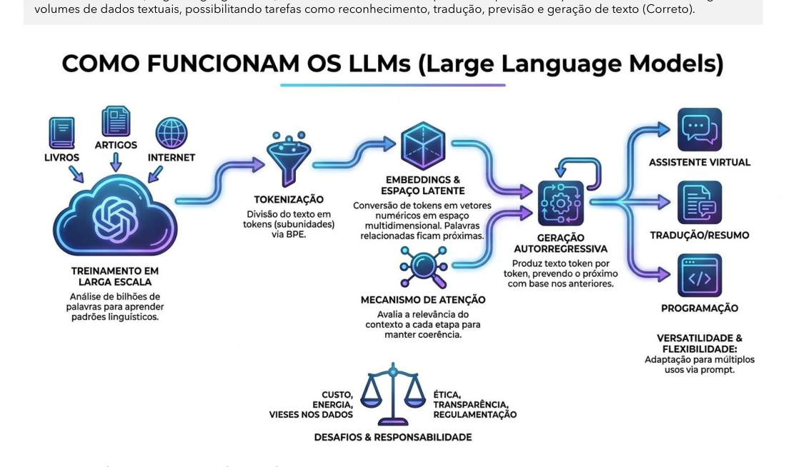

<!-- Start of picture text -->
volumes de dados textuais, possibilitando tarefas como reconhecimento, tradução, previsão e geração de texto (Correto). <!-- End of picture text -->

###### **Modelos de Linguagem Multimodais** 

**<mark>INCIDÊNCIA EM PROVA: BAIXÍSSIMA</mark>**

---

<!-- pagina: 50 -->

**Diego Carvalho, Renato da Costa, Equipe Informática e TI Aula Única - Diego Carvalho, Renato da Costa** 

Os Modelos de Linguagem Multimodais são sistemas de IA capazes de processar, compreender e gerar informação a partir de múltiplas modalidades simultaneamente, como texto, imagens, áudio, vídeo e, em alguns casos, código. Diferentemente dos modelos tradicionais, que lidam apenas com linguagem escrita, esses modelos integram diferentes formas de dados em uma representação unificada. 

Na prática, isso significa que o modelo não trata cada modalidade de forma isolada. Ele aprende relações semânticas entre modalidades, como associar uma descrição textual a uma imagem, interpretar um gráfico a partir de texto ou responder perguntas sobre um vídeo. Essa integração permite uma compreensão mais rica do contexto e da intenção do usuário. 

Do ponto de vista técnico, modelos multimodais utilizam representações vetoriais (embeddings) para cada modalidade, que são projetadas para um espaço latente comum. Nesse espaço compartilhado, texto, imagem e áudio podem ser comparados, combinados e transformados uns nos outros, permitindo tarefas como geração de imagens a partir de texto ou descrição textual de imagens. 

Arquiteturas baseadas em Transformers multimodais costumam empregar mecanismos de atenção cruzada, nos quais informações de uma modalidade influenciam o processamento da outra. Isso permite, por exemplo, que o modelo foque em partes específicas de uma imagem ao responder uma pergunta textual, mantendo coerência e alinhamento entre os diferentes tipos de entrada. 

Esses modelos ampliam significativamente as possibilidades de aplicação da IA, viabilizando assistentes mais naturais, sistemas educacionais interativos, ferramentas de acessibilidade, análise avançada de dados visuais e criação de conteúdo multimídia. Ao aproximar a forma de processamento da IA da maneira como os humanos percebem o mundo, os modelos de linguagem multimodais representam um passo importante na evolução da IA generativa. 

#### **Modelos Generativos Não-Textuais** 

Os Modelos Generativos Não-Textuais são voltados à criação de conteúdos em modalidades diferentes da linguagem escrita, como imagens, áudio, vídeo e sinais. Seu objetivo é aprender a distribuição desses dados para gerar novas amostras visuais ou sonoras realistas. Esses modelos incluem abordagens como GANs, VAEs e Modelos de Difusão, que utilizam estratégias distintas para produzir dados sintéticos. 

Enquanto GANs se baseiam em competição entre redes, modelos de difusão geram conteúdo por processos graduais de refinamento a partir de ruído. As aplicações desses modelos abrangem geração de imagens e vídeos, síntese de voz, criação musical, restauração de conteúdo e simulação de dados. Assim como nos modelos de linguagem, os resultados são estatísticos e probabilísticos, mas com impacto crescente em áreas criativas, científicas e industriais. 

###### **Modelos de Imagem** 

###### **<mark>INCIDÊNCIA EM PROVA: BAIXÍSSIMA</mark>** 

Os Modelos de Imagem são sistemas de IA generativa projetados para compreender, analisar e criar imagens digitais. Eles aprendem padrões visuais — como formas, cores, texturas e relações espaciais — a partir de grandes conjuntos de imagens, capturando regularidades estatísticas do domínio visual. 

Esses modelos incluem abordagens como GANs, Autoencoders Variacionais (VAEs) e, mais recentemente, Modelos de Difusão, que geram imagens por processos distintos. Enquanto GANs usam competição entre redes, os modelos de difusão constroem imagens gradualmente a partir de ruído, alcançando alto realismo e estabilidade.

---

<!-- pagina: 51 -->

**Diego Carvalho, Renato da Costa, Equipe Informática e TI Aula Única - Diego Carvalho, Renato da Costa** 

Na prática, são aplicados em geração de imagens a partir de texto, restauração e aumento de resolução, edição visual, design assistido e criação artística. Apesar do realismo, as imagens geradas resultam de inferência estatística, não de compreensão visual consciente. 

###### **Modelos de Áudio** 

###### **<mark>INCIDÊNCIA EM PROVA: BAIXÍSSIMA</mark>** 

Os Modelos de Áudio são voltados à geração e análise de sinais sonoros, como fala, música e efeitos acústicos. Eles aprendem padrões temporais e espectrais do som, capturando ritmo, entonação, timbre e estrutura harmônica presentes nos dados de treinamento. 

Esses modelos podem operar diretamente sobre ondas sonoras ou sobre representações intermediárias, como espectrogramas. Técnicas incluem redes recorrentes, Transformers e modelos de difusão, amplamente usados em síntese de voz, clonagem vocal, geração musical e separação de fontes. 

Suas aplicações abrangem assistentes de voz, acessibilidade, dublagem automática, produção musical e restauração de áudio. Assim como em outros domínios generativos, o áudio produzido é probabilístico e pode levantar questões éticas relacionadas à identidade vocal. 

###### **Modelos de Vídeo** 

###### **<mark>INCIDÊNCIA EM PROVA: BAIXÍSSIMA</mark>** 

Os Modelos de Vídeo lidam com dados visuais dinâmicos, combinando informação espacial (imagens) e temporal (movimento). Eles aprendem como cenas evoluem ao longo do tempo, capturando padrões de continuidade, ação e transição entre quadros. 

Tecnicamente, esses modelos estendem abordagens de imagem ao incorporar dependências temporais, usando Transformers espaço-temporais, modelos de difusão para vídeo ou arquiteturas híbridas que integram visão computacional e modelagem sequencial. 

As aplicações incluem geração de vídeos a partir de texto, animação automática, efeitos visuais, simulação de cenários e edição inteligente. Embora ainda mais custosos computacionalmente, esses modelos ampliam o alcance da IA generativa para narrativas audiovisuais completas. 

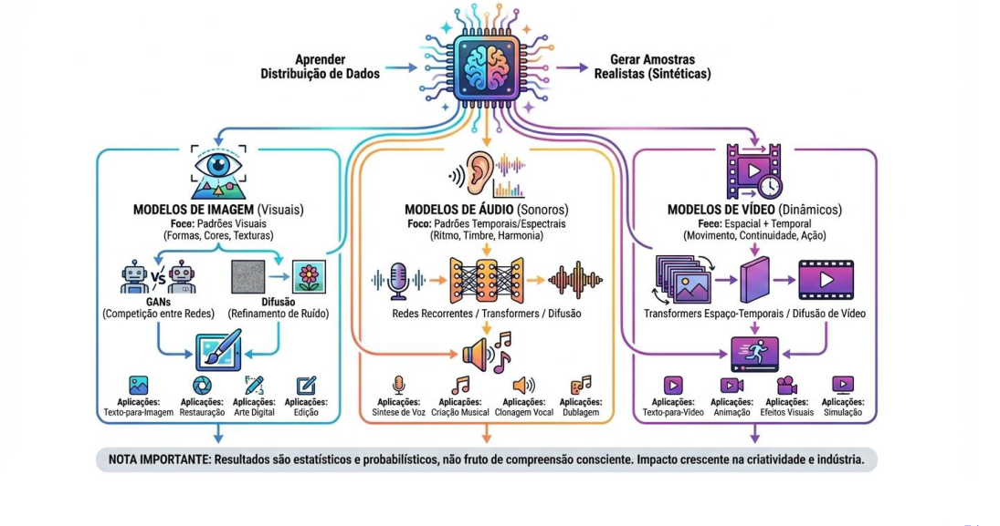

---

<!-- pagina: 52 -->

**Diego Carvalho, Renato da Costa, Equipe Informática e TI Aula Única - Diego Carvalho, Renato da Costa** 

### Arquiteturas de Treinamento 

#### **Arquiteturas de Redes Neurais** 

A arquitetura de redes neurais é a estrutura que define como os neurônios artificiais de um modelo estão organizados e interconectados, especificando o número de camadas, o tipo de cada camada, a forma de conexão entre elas e o fluxo de informação ao longo da rede. Ela determina como dados de entrada são transformados em saídas por meio de operações matemáticas, influenciando diretamente a capacidade do modelo de aprender padrões, generalizar conhecimento e resolver diferentes tipos de problemas. 

###### **Redes Neurais Feed-Forward** 

###### **<mark>INCIDÊNCIA EM PROVA: BAIXÍSSIMA</mark>** 

As Redes Feed-Forward, também conhecidas como Perceptrons Multicamadas (MLP), são o tipo mais básico de rede neural. Nelas, os dados fluem em uma única direção — da entrada até a saída — sem ciclos ou recorrências. Cada camada multiplica os dados pelos pesos, aplica uma função de ativação e passa o resultado adiante. São usadas para classificação, regressão e reconhecimento de padrões simples. 

Durante o treinamento, a rede ajusta seus pesos por meio do algoritmo de retropropagação (backpropagation), que calcula o erro entre a saída obtida e a desejada, atualizando os parâmetros para minimizar esse erro. Apesar de simples, as redes feed-forward são a base conceitual de arquiteturas mais complexas e permanecem úteis em contextos de dados tabulares e predições numéricas. 

|**TIPO DE REDE** **NEURAL**|**CARACTERÍSTICAS PRINCIPAIS**|**APLICAÇÕES COMUNS**|
|---|---|---|
|**CONVOLUCIONAL** **(CNN)**|Usa filtros para extrair padrões visuais; camadas de convolução, pooling e totalmente conectadas.|Visão computacional, reconhecimento de imagem, detecção de objetos.|
|**RECORRENTE** **(RNN)**|Possui “memória” de estados anteriores; processa sequências passo a passo.|Tradução automática, reconhecimento de fala, séries temporais.|
|**TRANSFORMERS**|Elimina recorrência; usa mecanismo de atenção para processar toda a sequência emparalelo.|Processamento de linguagem natural, tradução, geração de texto (GPT, BERT).|
|**ADVERSÁRIA** **GENERATIVA (GAN)**|Duas redes (geradora e discriminadora) competem; aprendizado adversarial.|Geração de imagens, deepfakes, arte digital, restauração de imagens.|
|**FEED-FORWARD** **(MLP)**|Dados fluem em uma única direção; usa retropropagação para ajustar pesos.|Classificação, regressão, reconhecimento de padrões simples.|

###### **Redes Neurais Convolucionais (CNN)** 

###### **<mark>INCIDÊNCIA EM PROVA: BAIXÍSSIMA</mark>** 

As Redes Neurais Convolucionais são projetadas para processar dados que possuem estrutura em forma de grade, como imagens. Elas utilizam camadas de convolução, que aplicam filtros sobre pequenas regiões dos dados, extraindo padrões visuais como bordas, texturas e formas. Esse processo reduz a necessidade de intervenção humana na identificação de características e torna as CNNs altamente eficientes para reconhecimento de imagem, visão computacional e detecção de objetos. 

Durante o treinamento, as CNNs aprendem pesos dos filtros que maximizam a detecção de padrões relevantes. Após as camadas convolucionais, há normalmente camadas de pooling (para redução de

---

<!-- pagina: 53 -->

**Diego Carvalho, Renato da Costa, Equipe Informática e TI Aula Única - Diego Carvalho, Renato da Costa** 

dimensionalidade) e camadas totalmente conectadas (para classificação final). Essa hierarquia faz com que as CNNs identifiquem desde detalhes simples até estruturas complexas, simulando a forma como o córtex visual humano processa imagens. 

###### **Redes Neurais Recorrentes (RNN)** 

###### **<mark>INCIDÊNCIA EM PROVA: BAIXÍSSIMA</mark>** 

As Redes Neurais Recorrentes (RNNs) são desenhadas para lidar com dados sequenciais, como textos, áudios e séries temporais. Diferente das redes tradicionais, elas possuem conexões recorrentes que permitem que informações anteriores influenciem a saída atual — criando uma espécie de “memória”. Assim, conseguem compreender contexto temporal, algo essencial para tradução automática, reconhecimento de fala e previsão de tendências. 

Durante o treinamento, as RNNs processam a sequência passo a passo, ajustando pesos com base tanto na entrada atual quanto no estado oculto anterior. Contudo, sofrem com problemas como o desvanecimento ou explosão do gradiente, que prejudica o aprendizado em sequências longas. Para contornar isso, surgiram variantes mais estáveis, como as LSTM (Long Short-Term Memory) e GRU (Gated Recurrent Unit), que conseguem preservar informações relevantes por períodos maiores. 

No contexto específico do reconhecimento de voz, é importante destacar que os sistemas não realizam uma transcrição direta do áudio bruto para texto. O sinal sonoro é primeiro transformado em representações intermediárias, como características acústicas, que são processadas por modelos acústicos capazes de mapear padrões sonoros em fonemas ou unidades linguísticas básicas. Em seguida, modelos de linguagem ou redes neurais profundas ajudam a combinar essas unidades em palavras e frases coerentes, respeitando o contexto e a estrutura da língua. 

Nesse processo, as RNNs — especialmente LSTM e GRU — desempenham papel fundamental por conseguirem modelar a dependência temporal do áudio, capturando a sequência dos sons ao longo do tempo. Essa arquitetura permite que o sistema leve em conta não apenas o som atual, mas também o que foi dito anteriormente, resultando em transcrições mais precisas e contextualmente corretas. 

###### **Redes Baseadas na Arquitetura Transformer** 

###### **<mark>INCIDÊNCIA EM PROVA: BAIXÍSSIMA</mark>** 

As Transformers revolucionaram o aprendizado de máquina ao eliminar a necessidade de conexões recorrentes. Elas usam um mecanismo chamado atenção (attention), que permite que o modelo “observe” todas as partes de uma sequência ao mesmo tempo, identificando quais elementos são mais relevantes entre si. Isso torna o processamento paralelo, rápido e eficiente, ideal para textos extensos e contextos complexos. 

Durante o treinamento, o Transformer aprende relações de dependência entre palavras ou tokens, mesmo quando estão distantes no texto. Sua estrutura básica é composta por camadas de atenção multicabeça e camadas feed-forward posicionais. Essa arquitetura deu origem a modelos como GPT, BERT e T5, que hoje dominam tarefas de linguagem natural, tradução, resumo e geração de texto. 

|**ARQUITETURA**|**DESCRIÇÃO**|
|---|---|
|**FEED-FORWARD** **(MLP)**|Arquitetura mais básica de rede neural, na qual os dados fluem em uma única direção, da entrada à saída, sem ciclos. Utiliza camadas totalmente conectadas e retropropagação para ajustarpesos,sendo aplicada em classificação,regressão epadrões simples.|
|**CONVOLUCIONAL** **(CNN)**|Projetada para dados em grade, como imagens, utiliza camadas de convolução e pooling para extrairpadrões visuais locais,como bordas e formas. Reduz dimensionalidade e|

---

<!-- pagina: 54 -->

**Diego Carvalho, Renato da Costa, Equipe Informática e TI Aula Única - Diego Carvalho, Renato da Costa** 

aprende hierarquias de características, sendo amplamente usada em visão computacional e reconhecimento de imagens. 

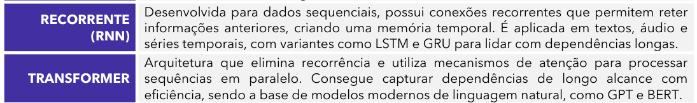

<!-- Start of picture text -->
Desenvolvida para dados sequenciais, possui conexões recorrentes que permitem reter RECORRENTE informações anteriores, criando uma memória temporal. É aplicada em textos, áudio e (RNN) séries temporais, com variantes como LSTM e GRU para lidar com dependências longas. Arquitetura que elimina recorrência e utiliza mecanismos de atenção para processar TRANSFORMER sequências em paralelo. Consegue capturar dependências de longo alcance com eficiência, sendo a base de modelos modernos de linguagem natural, como GPT e BERT., sendo a base de modelos modernos de linguagem natural, como GPT e BERT. sendo a base de modelos modernos de linguagem natural, como GPT e BERT.guagem natural, como GPT e BERT.uagem natural, como GPT e BERT.gem natural, como GPT e BERT.em natural, como GPT e BERT., como GPT e BERT. como GPT e BERT. <!-- End of picture text -->

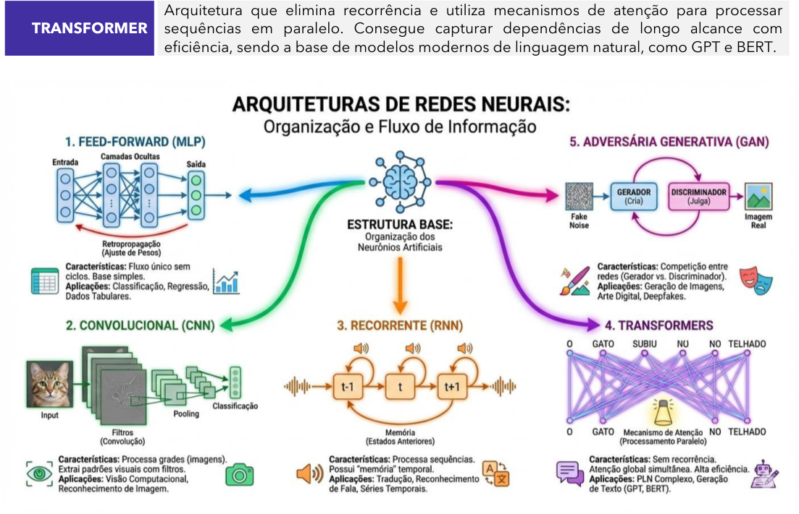

<!-- Start of picture text -->
Arquitetura que elimina recorrência e utiliza mecanismos de atenção para processar TRANSFORMER sequências em paralelo. Consegue capturar dependências de longo alcance com eficiência, sendo a base de modelos modernos de linguagem natural, como GPT e BERT., sendo a base de modelos modernos de linguagem natural, como GPT e BERT. sendo a base de modelos modernos de linguagem natural, como GPT e BERT.guagem natural, como GPT e BERT.uagem natural, como GPT e BERT.gem natural, como GPT e BERT.em natural, como GPT e BERT., como GPT e BERT. como GPT e BERT. <!-- End of picture text -->

#### **Modelos Generativos Clássicos** 

Modelos generativos clássicos são abordagens de aprendizado de máquina desenvolvidas antes da popularização dos grandes modelos baseados em Transformers, cujo objetivo é aprender a distribuição dos dados para gerar novas amostras semelhantes às observadas no treinamento. Esses modelos, como GANs e VAEs, utilizam estruturas estatísticas ou redes neurais específicas para representar a variabilidade dos dados e possibilitar a criação de conteúdos sintéticos, como imagens, sinais ou sequências, servindo de base conceitual para os avanços posteriores da IA generativa. 

Além das GANs e dos VAEs, existem outras classes de modelos generativos clássicos que, embora menos populares no uso cotidiano, são relevantes do ponto de vista teórico e aparecem com frequência como alternativas conceituais. Entre eles estão os modelos baseados em energia (Energy-Based Models), que aprendem uma função de energia para atribuir maior probabilidade a configurações plausíveis dos dados, e os modelos de fluxo normalizador (Normalizing Flows), que utilizam transformações matemáticas invertíveis para mapear distribuições simples em distribuições complexas de dados. 

Essas abordagens reforçam que a geração de dados pode ser tratada por diferentes estratégias matemáticas e probabilísticas, cada uma com vantagens e limitações específicas. Embora GANs e VAEs tenham se destacado historicamente, os modelos baseados em energia e em fluxo normalizador ampliam

---

<!-- pagina: 55 -->

**Diego Carvalho, Renato da Costa, Equipe Informática e TI Aula Única - Diego Carvalho, Renato da Costa** 

o panorama dos modelos generativos clássicos, ajudando a compreender a diversidade de técnicas que fundamentaram a evolução da IA generativa moderna. 

###### **Redes Adversárias Generativas (GAN)** 

**<mark>INCIDÊNCIA EM PROVA: BAIXÍSSIMA</mark>** 

GANs (Generative Adversarial Networks) são compostas por duas redes que competem entre si: a rede geradora e a rede discriminadora. A geradora cria novos exemplos (imagens, sons, vídeos), enquanto a discriminadora tenta distinguir se cada exemplo é real ou falso. Esse processo competitivo faz com que o gerador aprenda a produzir amostras cada vez mais realistas, e a discriminadora se torne mais precisa em detectar falsificações. 

Do ponto de vista matemático, essa competição é formulada como um jogo min–max, inspirado na teoria dos jogos. Nesse jogo, a rede geradora tenta minimizar a capacidade da discriminadora de identificar exemplos falsos, enquanto a discriminadora tenta maximizar sua taxa de acerto ao diferenciar dados reais dos gerados. Em outras palavras, os objetivos das duas redes são opostos: o ganho de uma representa a perda da outra. 

###### **Saiba mais:** 

<mark>Imagine um falsificador e um detetive jogando um jogo infinito de aperfeiçoamento. O falsificador é a rede geradora: ele tenta criar cópias tão realistas de obras de arte que ninguém perceba que são falsas. No início, suas pinturas são ruins — cores erradas, traços confusos — mas a cada tentativa ele observa as reações do detetive e melhora suas falsificações. Seu objetivo é enganar o outro jogador criando algo que pareça autêntico.</mark> 

<mark>O detetive é a rede discriminadora: ele analisa cada pintura e tenta distinguir o que é verdadeiro do que é falso. No começo, também erra bastante, mas com o tempo aprende os detalhes sutis — texturas, sombras, padrões — que denunciam uma falsificação. Quanto mais o falsificador melhora, mais o detetive precisa se aprimorar para não ser enganado.</mark> 

<mark>Esse “duelo” entre o gerador e o discriminador é o coração das Redes Adversárias Generativas (GANs). O gerador aprende a criar exemplos convincentes, e o discriminador aprende a julgar com precisão. Quando ambos ficam muito bons, o resultado é impressionante: o falsificador produz obras quase indistinguíveis das originais — assim como uma IA capaz de gerar rostos,</mark> músicas ou textos que parecem reais. 

Durante o treinamento, a geradora tenta enganar a discriminadora, e esta, por sua vez, tenta evitar ser enganada — exatamente a lógica de um jogo min–max: a geradora busca minimizar a função de perda associada à detecção de falsos, enquanto a discriminadora busca maximizar essa mesma função ao classificar corretamente os dados. Esse ciclo contínuo de otimização adversária é o que impulsiona a melhoria simultânea de ambos os modelos. 

Essa dinâmica inspirada em jogos (teoria dos jogos) resultou em avanços notáveis em arte digital, geração de rostos, deepfakes e restauração de imagens. No entanto, um desafio técnico comum é o Colapso de Modo, que é o fenômeno em que a rede geradora produz um número restrito de tipos de dados, enganando facilmente a rede discriminadora. Além disso, as GANs exigem treinamento equilibrado e ético, pois podem ser usadas tanto para inovação quanto para manipulação de conteúdo.

---

<!-- pagina: 56 -->

**Diego Carvalho, Renato da Costa, Equipe Informática e TI Aula Única - Diego Carvalho, Renato da Costa** 

**(CEBRASPE / TCE-AC – 2024)** As redes adversárias generativas utilizam a rede geradora para <mark>produzir dados falsos aleatoriamente e a discriminadora para identificar esses dados falsos.</mark> 

**<mark>_______________________ Comentários:</mark>** <mark>as redes adversárias generativas (GANs) consistem em duas redes: a geradora, que cria dados falsos, e a</mark> discriminadora, que avalia a autenticidade desses dados, distinguindo entre reais e gerados (Correto). 

###### **Autoencoders Variacionais (VAE)** 

###### **<mark>INCIDÊNCIA EM PROVA: BAIXÍSSIMA</mark>** 

Os Autoencoders Variacionais (VAEs) são modelos generativos compostos por duas redes neurais principais: o codificador (encoder) e o decodificador (decoder). O codificador transforma os dados de entrada em uma representação compacta e probabilística, enquanto o decodificador reconstrói os dados a partir dessa representação, permitindo a geração de novas amostras semelhantes às observadas no treinamento. 

Diferentemente dos autoencoders tradicionais, os VAEs não aprendem apenas uma codificação determinística, mas modelam a representação interna como uma distribuição de probabilidade. Em vez de mapear cada entrada para um único ponto, o encoder aprende parâmetros como média e variância, o que introduz variabilidade controlada e torna o modelo adequado para geração de novos dados. 

###### **Saiba mais:** 

<mark>Uma forma intuitiva de entender os VAEs é imaginar um mapa flexível de um território. O codificador atua como um cartógrafo que observa diversas cidades e registra suas localizações aproximadas em um mapa, agrupando regiões semelhantes. O decodificador, por sua vez, usa esse mapa para reconstruir cidades ou até imaginar novas, desde que sigam a lógica geográfica do território.</mark> 

<mark>Nesse mapa, regiões próximas representam dados semelhantes. Se você escolher um ponto entre duas cidades conhecidas, o decodificador consegue gerar algo intermediário, coerente com ambas. Isso explica por que VAEs produzem transições suaves entre exemplos, ao</mark> contrário de modelos que geram resultados mais abruptos. 

Esse mecanismo de aprendizado de um espaço latente contínuo e bem organizado é o coração dos Autoencoders Variacionais. Ele permite que o modelo não apenas reconstrua dados, mas também explore esse espaço para criar novas amostras plausíveis, mantendo coerência estatística com o conjunto de treinamento. 

Os VAEs são amplamente utilizados em tarefas como geração de imagens, redução de dimensionalidade, detecção de anomalias e aprendizado de representações. Embora tendam a produzir resultados menos nítidos do que GANs, oferecem maior estabilidade de treinamento e melhor controle matemático sobre o processo generativo, o que os torna valiosos em diversas aplicações científicas e industriais. 

###### **Modelos de Difusão (Diffusion Models)** 

###### **<mark>INCIDÊNCIA EM PROVA: BAIXÍSSIMA</mark>** 

Os Modelos de Difusão são modelos generativos que aprendem a criar novos dados por meio de um processo gradual de adição e remoção de ruído. Durante o treinamento, o modelo aprende como transformar dados reais em versões cada vez mais ruidosas e, posteriormente, como reverter esse processo para recuperar amostras coerentes a partir de ruído puro.

---

<!-- pagina: 57 -->

**Diego Carvalho, Renato da Costa, Equipe Informática e TI Aula Única - Diego Carvalho, Renato da Costa** 

Diferentemente de GANs, os modelos de difusão não utilizam duas redes em competição direta. Em vez disso, trabalham com um processo sequencial em várias etapas, no qual o ruído é introduzido progressivamente até que a estrutura original dos dados seja praticamente perdida. O aprendizado consiste em ensinar o modelo a desfazer esse ruído passo a passo. 

Do ponto de vista matemático, o processo envolve dois estágios complementares. O primeiro, chamado de processo direto (forward process), adiciona ruído gaussiano aos dados ao longo de várias iterações. O segundo, conhecido como processo reverso (reverse process), aprende uma cadeia de transformações probabilísticas capaz de reconstruir os dados a partir do ruído. 

###### **Saiba mais:** 

<mark>Uma analogia útil é imaginar uma imagem sendo coberta por neblina de forma gradual. No início, a cena ainda é visível, mas à medida que a neblina aumenta, os detalhes desaparecem completamente. O modelo de difusão aprende exatamente o caminho inverso: começar com uma tela totalmente encoberta e, pouco a pouco, remover a neblina até que uma imagem clara surja.</mark> 

<mark>A cada etapa desse processo reverso, o modelo faz pequenos ajustes, refinando contornos, texturas e detalhes. Esse caráter incremental explica por que os modelos de difusão são capazes de gerar imagens altamente realistas e estáveis, evitando muitos dos problemas de</mark> instabilidade observados em GANs. 

O coração dos modelos de difusão está na aprendizagem de um processo iterativo de refinamento, no qual cada passo aproxima a amostra do espaço de dados reais. Em vez de criar tudo de uma vez, o modelo constrói o resultado final gradualmente, o que oferece maior controle e previsibilidade. Atualmente, os modelos de difusão estão por trás de avanços significativos em geração de imagens, vídeos e áudio, sendo amplamente usados em ferramentas modernas de criação visual. 

Embora o processo de geração seja mais lento do que em GANs, sua qualidade, estabilidade e controle tornaram esses modelos uma das abordagens mais bem-sucedidas da IA generativa contemporânea. 

**(CEBRASPE / TCE-AC - 2024)** Em relação à inteligência artificial (IA), julgue o item a seguir. 

<mark>Os modelos de difusão são focados na classificação de pontos de dados para determinar a relação entre fatores conhecidos e desconhecidos.</mark> 

##### **<mark>_______________________</mark>** 

**<mark>Comentários:</mark>** <mark>modelos de difusão são voltados à geração de dados (Ex: imagens) por processo de ruído e denoising, não à</mark> classificação para relacionar fatores conhecidos e desconhecidos, que é típica de tarefas supervisionadas (Errado). 

|**MODELO**|**DESCRIÇÃO**|
|---|---|
|**GAN (REDES** **ADVERSÁRIAS** **GENERATIVAS)**|Modelo generativo composto por duas redes em competição: a geradora cria dados sintéticos e a discriminadora avalia sua autenticidade. Esse jogo min–max permite gerar amostras realistas, sendo amplamente usado em imagens, deepfakes e arte digital, apesar de desafios como colapso de modo.|
|**VAE** **(AUTOENCODERS** **VARIACIONAIS)**|Modelo generativo baseado em encoder e decoder que aprende um espaço latente probabilístico. Em vez de codificações determinísticas, modela distribuições contínuas, permitindo gerar novas amostras por interpolação. Oferece maior estabilidade e controle matemático,embora com menor nitidez visual.|

---

<!-- pagina: 58 -->

**Diego Carvalho, Renato da Costa, Equipe Informática e TI Aula Única - Diego Carvalho, Renato da Costa** 

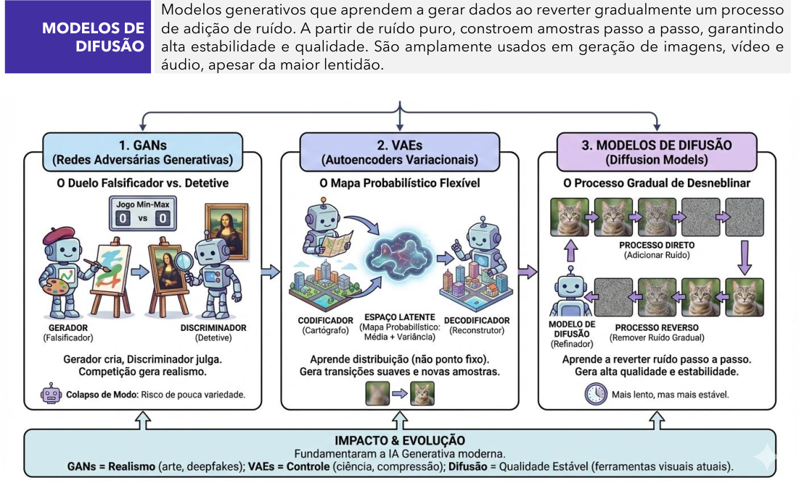

<!-- Start of picture text -->
Modelos generativos que aprendem a gerar dados ao reverter gradualmente um processo MODELOS DE  de adição de ruído. A partir de ruído puro, constroem amostras passo a passo, garantindo DIFUSÃO alta estabilidade e qualidade. São amplamente usados em geração de imagens, vídeo e áudio, apesar da maior lentidão. <!-- End of picture text -->

---

<!-- pagina: 59 -->

**Diego Carvalho, Renato da Costa, Equipe Informática e TI Aula Única - Diego Carvalho, Renato da Costa** 

### Agentes de IA 

###### **<mark>INCIDÊNCIA EM PROVA: BAIXA</mark>** 

###### **<mark>AGENTE DE INTELIGÊNCIA ARTIFICIAL</mark>** 

Em Inteligência Artificial, um agente é qualquer entidade capaz de perceber o ambiente por meio de sensores, tomar decisões com base nessas percepções e agir sobre o ambiente por meio de atuadores para alcançar determinados objetivos. Um agente racional é aquele que, para cada situação percebida, escolhe a ação que maximiza seu desempenho esperado, considerando o conhecimento disponível, as limitações do ambiente e os objetivos definidos, buscando sempre a melhor ação possível dentro dessas condições. 

Os agentes de inteligência artificial são sistemas de software que usam a inteligência artificial para alcançar objetivos e concluir tarefas em nome dos usuários. Eles demonstram raciocínio, planejamento e memória, com autonomia para tomar decisões, aprender e se adaptar. Esses recursos são possíveis em grande parte pela capacidade multimodal da inteligência artificial generativa e dos modelos de fundação de IA. Os agentes de IA podem processar informações multimodais, como texto, voz, vídeo, áudio, código e muito mais, simultaneamente – eles podem conversar, raciocinar, aprender e tomar decisões. 

Em Inteligência Artificial, racionalidade descreve como um agente decide. Um agente racional é aquele que, dadas suas percepções, conhecimentos e limitações, escolhe a ação que maximiza o desempenho esperado em relação a um critério definido.  Eles podem aprender com o tempo e facilitar transações, além de poderem trabalhar com outros agentes para coordenar e executar fluxos de trabalho mais complexos. Embora os principais recursos de um agente de IA sejam o raciocínio e a ação, mais recursos evoluíram com o tempo. Vejamos seus principais recursos: 

|**RECURSOS**|**DESCRIÇÃO**|
|---|---|
|**RACIOCÍNIO**|Capacidade de usar lógica e informações disponíveis para tirar conclusões, fazer inferências e resolver problemas, analisando dados e padrões para tomar decisões fundamentadas no contexto e em evidências.|
|**AÇÃO**|Habilidade de executar tarefas com base em decisões ou planos definidos, interagindo com o ambiente por meio de ações físicas ou digitais, como enviar mensagens, atualizar sistemas ou acionarprocessos automatizados.|
|**OBSERVAÇÃO**|Capacidade de coletar e interpretar informações do ambiente por meio de linguagem, visão, áudio ou sensores, permitindo compreender o contexto atual e fornecer subsídios para decisões mais conscientes.|
|**PLANEJAMENTO**|Aptidão para definir estratégias e sequências de ações visando alcançar objetivos, avaliando alternativas, prevendo estados futuros e considerando restrições, riscos e possíveis obstáculos ao longo doprocesso.|
|**COLABORAÇÃO**|Capacidade de cooperar com humanos ou outros agentes de IA, envolvendo comunicação, coordenação e alinhamento de objetivos, permitindo a execução conjunta de tarefas e fluxos de trabalho complexos.|
|**APRIMORAMENTO**|Habilidade de aprender com experiências e feedback, ajustando comportamentos e estratégias ao longo do tempo para melhorar desempenho, eficiência e qualidade das decisões tomadaspelo agente.|

#### **Estrutura de Agentes** 

Agora vamos aprofundar um pouco mais nos elementos que estruturam os agentes de IA modernos. Cada agente é projetado com um conjunto de componentes que definem seu papel, sua maneira de interagir e até seu comportamento. Um dos primeiros elementos importantes é a persona. Ter uma persona bem definida permite que o agente mantenha um caráter consistente, ou seja, que ele fale, se `—` comporte e reaja de forma adequada ao papel que está desempenhando seja como tutor, consultor

---

<!-- pagina: 60 -->

**Diego Carvalho, Renato da Costa, Equipe Informática e TI Aula Única - Diego Carvalho, Renato da Costa** 

jurídico ou atendente de suporte técnico. E mais: com o tempo, essa persona pode evoluir, adaptandose à medida que o agente ganha experiência ou recebe feedback. 

Outro componente essencial é a memória. Diferente de um sistema que responde apenas com base na última pergunta, os agentes podem ser equipados com diferentes tipos de memória: curto prazo, para lidar com interações imediatas dentro de uma conversa; longo prazo, para armazenar informações históricas e interações passadas; memória episódica, que foca em eventos específicos ou interações marcantes; e memória de consenso, útil quando múltiplos agentes compartilham conhecimento ou coordenam ações. Isso tudo permite que o agente mantenha o contexto, aprenda com suas interações e melhore seu desempenho ao longo do tempo. 

As ferramentas também têm um papel importante. Elas são os recursos externos que o agente pode usar para interagir com o ambiente ou executar ações mais complexas. Isso inclui desde consultas a bancos de dados até comandos em sistemas, chamadas de APIs ou controle de dispositivos. Dependendo da interface, essas ferramentas podem ser físicas (como sensores), gráficas (como dashboards) ou `—` programáticas. E veja bem: não basta o agente ter acesso a uma ferramenta ele precisa aprender a usála corretamente e saber quando aplicá-la. 

Não podemos esquecer do componente central de tudo isso: o modelo. Os LLMs são o coração dos agentes de IA, porque é com base neles que o agente entende comandos, interpreta contexto, gera respostas e até realiza raciocínios mais sofisticados. É como se o LLM fosse o cérebro, enquanto os demais componentes (memória, ferramentas, persona) funcionassem como os sentidos, os músculos e a personalidade do agente. É essa combinação que permite aos agentes não apenas conversar, mas agir e colaborar de maneira útil e eficaz em ambientes reais ou virtuais. 

#### **Tipos de Agentes** 

Ao longo da evolução da IA, surgiram agentes cada vez mais sofisticados. Alguns reagem apenas a estímulos imediatos, enquanto outros mantêm modelos internos do ambiente, aprendem com a experiência, planejam ações futuras ou colaboram com outros agentes. Estudar essas categorias ajuda a compreender como sistemas inteligentes são projetados e por que diferentes problemas exigem diferentes tipos de agentes. Vejamos os principais tipos: 

|**TIPO DE AGENTE**|**DESCRIÇÃO**|
|---|---|
|**AGENTE REATIVO**|Atua apenas com base na percepção atual do ambiente, utilizando regras simples do tipo “se–então”. Não possui memória nem modelo interno, sendo adequado apenas a ambientes simples e totalmente observáveis.|
|**AGENTE BASEADO** **EM MODELO**|Mantém um modelo interno do ambiente que representa estados passados e atuais, permitindo lidar com ambientes parcialmente observáveis. Usa memória para inferir situaçõesque nãopodem serpercebidas diretamente.|
|**AGENTE BASEADO** **EM OBJETIVO**|Toma decisões avaliando se suas ações o aproximam de um objetivo definido. Analisa estados futuros possíveis e escolhe ações que aumentem a chance de atingir a meta desejada.|
|**AGENTE BASEADO** **EM UTILIDADE**|Seleciona ações com base em uma função de utilidade, que mede o quão desejável é cada resultado possível. Permite comparar alternativas e escolher a que maximiza benefício ou satisfação.|
|**AGENTE DE** **APRENDIZADO**|Possui mecanismos para aprender com a experiência e melhorar seu desempenho ao longo do tempo. Ajusta seu comportamento com base em feedback, dados históricos ou recompensas recebidas.|
|**AGENTE** **DELIBERATIVO**|Utiliza raciocínio simbólico e planejamento explícito para tomar decisões. Avalia diferentes alternativas antes de agir, sendo mais preciso, porém mais custoso computacionalmente.|

---

<!-- pagina: 61 -->

**Diego Carvalho, Renato da Costa, Equipe Informática e TI Aula Única - Diego Carvalho, Renato da Costa** 

Combina comportamentos reativos com capacidades deliberativas. Responde **AGENTE HÍBRIDO** rapidamente a estímulos imediatos, mas também planeja ações de médio e longo prazo <u>quando necessário.</u> <mark>Atua em ambientes com vários agentes, humanos ou artificiais, cooperando ou</mark> **AGENTE** competindo entre si. Exige comunicação, coordenação e, muitas vezes, negociação para **MULTIAGENTE** atingir objetivos. Baseado em modelos inspirados na cognição humana, como crenças, desejos e **AGENTE** intenções. Busca simular processos mentais complexos, sendo usado em sistemas **COGNITIVO** avançados e explicáveis. Projetado para interagir com humanos de forma natural, considerando normas sociais, **AGENTE SOCIAL** contexto e comunicação. É comum em assistentes virtuais, chatbots e sistemas <mark>conversacionais avançados.</mark> 

**(FGV / TCE-PE – 2025)** No campo da inteligência artificial, os agentes desempenham papel <mark>central como entidades capazes de perceber o ambiente, tomar decisões e agir com base em metas definidas. Compreender sua estrutura e tipos é fundamental para o desenvolvimento de sistemas inteligentes. Assinale a afirmativa que descreve corretamente uma característica de agentes de inteligência artificial.</mark> 

<mark>a) Um agente reativo simples armazena historicamente os estados anteriores do ambiente para prever ações futuras com base em aprendizado profundo.</mark> 

<mark>b) Agentes baseados em objetivos não consideram o estado atual do ambiente, mas tomam decisões aleatórias até alcançarem a meta desejada.</mark> 

<mark>c) Agentes baseados em utilidade avaliam diferentes cursos de ação e escolhem aquele que maximiza um valor numérico associado à satisfação da meta.</mark> 

<mark>d) Um agente só pode ser considerado inteligente se tiver consciência própria e habilidades linguísticas semelhantes às humanas.</mark> 

<mark>e) Agentes de IA operam exclusivamente em ambientes totalmente observáveis e determinísticos, pois exigem informações completas para funcionar.</mark> 

##### **<mark>_______________________</mark>** 

**<mark>Comentários:</mark>** <mark>(a) Errado. Agente reativo simples não mantém histórico nem usa aprendizado profundo; reage ao estado/percepção ‑ atual por regras condição ação; (b) Errado. Agentes baseados em objetivos consideram o estado atual e planejam ações para atingir a meta, não decidem aleatoriamente; (c) Correto. Agentes baseados em utilidade comparam alternativas e escolhem a ação que maximiza uma função numérica de utilidade (grau de satisfação da meta); (d) Errado. Inteligência em agentes não exige autoconsciência nem linguagem humana; basta perceber, decidir e agir de forma racional conforme metas; (e) Errado. Agentes podem atuar em ambientes parcialmente observáveis e/ou estocásticos, usando crenças/estimativas; não dependem de informação</mark> completa (Letra C).

---

<!-- pagina: 62 -->

**Diego Carvalho, Renato da Costa, Equipe Informática e TI Aula Única - Diego Carvalho, Renato da Costa** 

### Sistemas Conversacionais e Assistentes 

Nos últimos anos, a Inteligência Artificial (IA) deixou de ser uma tecnologia distante e passou a fazer parte das ferramentas que utilizamos no dia a dia. Em áreas como análise de dados, planilhas eletrônicas e Business Intelligence, a IA atua como um assistente inteligente, capaz de automatizar tarefas, analisar informações rapidamente e gerar insights que antes só especialistas conseguiam produzir. 

Esses assistentes não substituem o usuário — ao contrário, tornam o trabalho mais rápido, preciso e produtivo. Para quem trabalha com planilhas, relatórios, dashboards ou manipulação de dados, dominar essas ferramentas passou a ser uma habilidade essencial. Temos atualmente no mercado centenas de tecnologias de Inteligência Artificial Generativa. Vamos ver as principais: 

#### **Agentes x Assistentes x Bots** 

###### **<mark>INCIDÊNCIA EM PROVA: BAIXÍSSIMA</mark>** 

Uma dúvida comum no fórum é: qual é a diferença entre Agentes de IA, Assistentes de IA e Bots? Essa distinção pode parecer sutil, mas faz bastante diferença na prática. Os agentes de IA são sistemas inteligentes baseados em modelos como os LLMs e projetados para tomar decisões, executar ações e interagir com ambientes externos de forma autônoma ou semiautônoma. Eles são capazes de usar ferramentas, planejar e agir com base em objetivos definidos. Em alguns casos, inclusive, eles aprendem com a experiência e reavaliam estratégias conforme o contexto muda. 

Já os assistentes de IA são um tipo específico de agente, mas com foco direto no suporte ao usuário humano. Eles são criados para colaborar, responder perguntas, sugerir caminhos e realizar tarefas `—` mas geralmente com algum grau de supervisão ou comando explícito. Um bom exemplo são os assistentes embutidos em produtos, como o Google Assistente, a Alexa ou o Copilot da Microsoft. Eles ajudam, sugerem, explicam... mas a decisão final e o controle da interação continuam nas mãos do usuário. 

`— —` Por fim, os bots como os tradicionais chatbots ou robôs de atendimento costumam ser bem mais simples. Em geral, eles seguem fluxos predefinidos, com pouca ou nenhuma capacidade de raciocínio real. São úteis para tarefas repetitivas e previsíveis (como informar o saldo de uma conta ou agendar um serviço), mas não conseguem improvisar ou resolver problemas mais complexos como um LLM conseguiria. Claro, hoje em dia muitos bots estão sendo turbinados com LLMs e se tornando mais inteligentes, mas a essência deles ainda é mais restrita. 

#### **Agentes Autônomos** 

###### **<mark>INCIDÊNCIA EM PROVA: BAIXÍSSIMA</mark>** 

Os Agentes Autônomos são sistemas de inteligência artificial capazes de perceber o ambiente, tomar decisões e agir de forma independente para alcançar objetivos definidos, sem depender de instruções humanas constantes. Eles recebem entradas por meio de sensores ou dados digitais, processam essas informações e executam ações por meio de atuadores ou interfaces computacionais. 

Esses agentes combinam diferentes capacidades, como raciocínio, planejamento, memória e aprendizado, permitindo que adaptem seu comportamento ao longo do tempo. Em vez de responder apenas a comandos pontuais, agentes autônomos podem decompor tarefas complexas em etapas, avaliar alternativas e escolher ações que maximizem seus resultados em contextos dinâmicos. 

Na prática, agentes autônomos são aplicados em robótica, jogos, sistemas de recomendação avançados, automação de processos e agentes baseados em LLMs, que interagem com ferramentas externas e outros agentes. Embora potentes, levantam desafios importantes relacionados a controle, alinhamento, segurança e responsabilidade no uso da IA.

---

<!-- pagina: 63 -->

**Diego Carvalho, Renato da Costa, Equipe Informática e TI Aula Única - Diego Carvalho, Renato da Costa** 

#### **Principais Assistentes de IA** 

###### **ChatGPT** 

###### **<mark>INCIDÊNCIA EM PROVA: BAIXA</mark>** 

Desenvolvido pela OpenAI, trata-se de um modelo de linguagem projetado para compreender entradas textuais e gerar respostas coerentes em linguagem natural. Baseado na arquitetura Transformer, o modelo foi treinado com vastas quantidades de textos diversos, o que o capacita a executar tarefas como redação, resolução de dúvidas, geração de código, auxílio nos estudos e, nas versões mais recentes, interpretação de imagens. 

Seu objetivo principal é funcionar como um assistente virtual adaptável, capaz de atender desde demandas simples, como conversas cotidianas, até solicitações mais complexas, como elaboração de relatórios, explicações técnicas ou roteiros criativos. Uma característica central é sua habilidade de manter o contexto da conversa, o que permite maior fluidez e coerência em interações prolongadas, além de possibilitar a personalização do estilo e do tom da resposta conforme a situação. 

Com o avanço de suas capacidades, o ChatGPT passou a aceitar múltiplos formatos de entrada, como texto e imagem, e a contar com versões corporativas voltadas à privacidade e segurança de dados. Nessas versões, as informações fornecidas pelos usuários não são utilizadas no treinamento dos modelos, o que assegura maior sigilo em ambientes sensíveis. Também possui planos distintos — gratuitos e pagos — e pode ser integrado via API a sistemas diversos, ampliando sua aplicabilidade. 

Um aspecto decisivo para a naturalidade de suas respostas é o processo de ajuste fino (fine-tuning), realizado após o treinamento inicial. Nessa etapa, utiliza-se o Aprendizado por Reforço com Feedback Humano (RLHF), no qual avaliadores classificam diferentes respostas geradas pelo modelo segundo critérios de clareza, utilidade e segurança. Esse feedback é incorporado como sinal de recompensa, permitindo que o modelo refine seus parâmetros para reproduzir os padrões preferidos. 

O RLHF é essencial para aspectos como coerência em diálogos extensos, recusa adequada a solicitações impróprias, manutenção de tom apropriado e mitigação de respostas potencialmente enganosas. Em vez de apenas prever palavras prováveis, o modelo aprende a alinhar suas respostas às normas de uso responsável e às expectativas sociais, o que o torna mais eficaz e seguro na interação com usuários. 

O ChatGPT configura-se não apenas como um gerador de texto baseado em estatística, mas como um sistema calibrado para interação humana, com ênfase na praticidade, segurança e comunicação. 

|**CRITÉRIOS**|**DESCRIÇÃO**|
|---|---|
|**CAPACIDADES E** **ESCOPO**|Modelo de linguagem de grande escala voltado para conversação, geração de textos, explicações conceituais e produção de código. Suporta múltiplos idiomas com alta qualidade, especialmente inglês e português, e apresenta multimodalidade em versões recentes,combinando texto e imagens.|
|**QUALIDADE DE** **SAÍDA**|Produz respostas coerentes, contextualizadas e bem estruturadas, com destaque para clareza didática e criatividade textual. Entretanto, pode gerar alucinações, apresentando informações incorretas com tom confiante, o que exige verificação crítica por parte do usuário.|
|**INTEGRAÇÃO E** **ECOSSISTEMA**|Disponível por meio da API da OpenAI, permitindo integração com aplicações, serviços e fluxos automatizados. Suporta plugins, extensões e navegação web em planos avançados, embora não possua integração nativa tão profunda quanto Copilot ou Gemini.|

---

<!-- pagina: 64 -->

**Diego Carvalho, Renato da Costa, Equipe Informática e TI Aula Única - Diego Carvalho, Renato da Costa** 

|**PERFORMANCE** **TÉCNICA**|Oferece alta velocidade de resposta em planos pagos, com suporte a janelas de contexto extensas, chegando a dezenas de milhares de tokens. Possui capacidades multimodais e execução eficiente,com complexidade computacional abstraída do usuário final.|
|---|---|
|**SEGURANÇA E** **PRIVACIDADE**|Atende a normas como LGPD e GDPR, com políticas ativas de moderação de conteúdo. Em versões corporativas, garante que dados dos clientes não sejam usados para treinamento. Ainda assim, recomenda-se cautela no uso de informações altamente sensíveis.|
|**MODELO DE** **NEGÓCIO**|Disponibilizado em versão gratuita e em planos pagos, como Plus, Team e Enterprise. Os planos corporativos oferecem maior desempenho, controle administrativo, escalabilidade e garantias adicionais de segurança, atendendo a diferentes perfis de usuários e organizações.|
|**INOVAÇÃO E** **EVOLUÇÃO**|Evolui rapidamente por meio de sucessivas gerações de modelos, incorporando avanços em multimodalidade, agentes e integração com ferramentas externas. Conta com ampla comunidade global e documentação oficial, impulsionando adoção, experimentação e inovação contínua.|

**(QUADRIX / CREFONO-SP – 2023)** O ChatGPT, uma nova ferramenta de inteligência artificial <mark>(IA), provocou alvoroço no mundo da tecnologia, uma vez que é capaz de gerar conteúdos em textos originais.</mark> 

**<mark>_______________________ Comentários:</mark>** <mark>o ChatGPT, desenvolvido pela OpenAI, é uma ferramenta de inteligência artificial generativa que causou grande impacto por sua capacidade de produzir textos originais em linguagem natural, sendo aplicada em áreas como educação,</mark> atendimento ao cliente, redação e programação (Correto). 

###### **Microsoft Copilot** 

###### **<mark>INCIDÊNCIA EM PROVA: BAIXÍSSIMA</mark>** 

O Microsoft Copilot representa a integração prática da Inteligência Artificial ao ecossistema do Microsoft 365, incorporando funcionalidades avançadas diretamente nas aplicações do dia a dia, como Word, Excel, PowerPoint, Outlook e Teams. Diferentemente de ferramentas externas, ele atua como um assistente contextual, inserido nas interfaces já conhecidas pelos usuários, o que elimina a necessidade de aprendizado de novas plataformas ou fluxos de trabalho. 

Sua principal característica distintiva é a capacidade de operar com base no conteúdo e nas informações já presentes no ambiente de trabalho do usuário. O Copilot analisa e cruza dados de e-mails, documentos, planilhas e calendários, oferecendo respostas e sugestões contextualizadas, com foco na relevância e na utilidade imediata. Essa abordagem evita respostas genéricas e proporciona assistência alinhada à atividade em curso. 

A usabilidade é otimizada pela incorporação do Copilot às funções nativas do Microsoft 365. No Word, pode gerar relatórios completos a partir de tópicos simples; no Excel, sugere fórmulas, constrói gráficos e analisa dados; no PowerPoint, transforma textos em apresentações com estrutura e design automatizados. Tudo isso é feito por meio de comandos acessíveis e em linguagem natural. 

No ambiente corporativo, o Microsoft Copilot foi projetado com foco em segurança, privacidade e conformidade regulatória. Os dados são processados dentro do ambiente seguro da organização (tenant), em conformidade com legislações e normas como LGPD, GDPR, ISO e HIPAA. A Microsoft assegura que as informações dos usuários não são utilizadas para fins de treinamento dos modelos, o que atende às exigências de proteção de dados sensíveis.

---

<!-- pagina: 65 -->

**Diego Carvalho, Renato da Costa, Equipe Informática e TI Aula Única - Diego Carvalho, Renato da Costa** 

Dessa forma, o Copilot posiciona-se como uma ferramenta estratégica de produtividade, automatizando tarefas operacionais e permitindo que os usuários concentrem seus esforços em atividades de maior valor agregado, como criatividade, planejamento e tomada de decisão. 

|**CRITÉRIOS**|**DESCRIÇÃO**|
|---|---|
|**CAPACIDADES E** **ESCOPO**|Atua como assistente de produtividade integrado ao Microsoft 365, operando dentro do Word, Excel, PowerPoint, Outlook e Teams. É voltado à redação, resumo, análise de dados e automação,funcionando como copiloto contextual,e não chatbotgeneralista.|
|**QUALIDADE DE** **SAÍDA**|Produz respostas contextualizadas ao acessar documentos, e-mails e planilhas. Redige textos, resume conteúdos, sugere fórmulas no Excel e gera apresentações no PowerPoint,comqualidade dependente da clareza doprompt e dos dados disponíveis.|
|**INTEGRAÇÃO E** **ECOSSISTEMA**|Possui integração nativa e profunda com o ecossistema Microsoft 365, incluindo OneDrive, SharePoint e Teams. Explora dados corporativos já existentes na nuvem Azure, porém é restrito ao ambiente Microsoft,com menor abertura externa via API.|
|**INTERFACE E** **USABILIDADE**|Integrado diretamente às interfaces conhecidas do Office, aparecendo em painéis laterais ou campos de texto. Apresenta curva de aprendizado mínima para usuários corporativos epermite interaçãoporprompts e sugestões contextuais em tempo real.|
|**PERFORMANCE** **TÉCNICA**|Baseado em modelos avançados da OpenAI, como o GPT-4, com otimizações da Microsoft. Oferece respostas rápidas e estáveis, apoiadas pela infraestrutura Azure, mas não é voltado a diálogos longos ou tarefas criativas fora do contexto corporativo.|
|**SEGURANÇA E** **PRIVACIDADE**|Projetado para uso empresarial, mantendo dados dentro do tenant da organização. Atende a padrões como LGPD, GDPR, ISO e SOC. As informações dos clientes não são usadaspara treinamento dos modelos,reforçando segurança e conformidade.|
|**MODELO DE** **NEGÓCIO**|Disponível apenas por meio de assinatura paga vinculada aos planos do Microsoft 365. Não possui versão gratuita. O custo varia conforme o tipo de licenciamento e o porte da organização contratante.|
|**INOVAÇÃO E** **EVOLUÇÃO**|Representa a estratégia da Microsoft de integrar IA diretamente à produtividade corporativa. Evolui de forma contínua junto às atualizações do Office, incorporando novos recursos,emborapermaneça limitado ao ecossistema Microsoft.|

###### **Google Gemini** 

###### **<mark>INCIDÊNCIA EM PROVA: BAIXÍSSIMA</mark>** 

O Gemini é a nova geração de modelos de Inteligência Artificial desenvolvida pelo Google DeepMind, projetada para substituir e superar o antigo Bard. Trata-se de um modelo nativamente multimodal, ou seja, desenvolvido desde sua origem para compreender e operar com múltiplos tipos de dados — texto, imagem, áudio, vídeo e documentos complexos — de maneira integrada. Essa característica permite que o Gemini atue de forma mais eficaz em contextos ricos e variados, oferecendo respostas coerentes e contextualizadas a partir de fontes heterogêneas de informação. 

Um dos seus principais diferenciais, especialmente em versões mais avançadas, é sua capacidade de raciocínio lógico e de processamento de contextos extensos. Com janelas de contexto que alcançam milhões de tokens, o modelo é capaz de manter a coerência em interações longas, analisar documentos volumosos e correlacionar múltiplas informações simultaneamente com precisão e estabilidade. Esse desempenho tem sido validado por meio de benchmarks em áreas como programação, matemática e ciências, nos quais o Gemini demonstra resultados superiores a muitos modelos concorrentes, devido à sua habilidade em realizar análises estruturadas e de maior profundidade lógica. 

Outro ponto relevante é a integração nativa com o ecossistema Google. O Gemini funciona como assistente inteligente em ferramentas amplamente utilizadas, como Gmail, Docs, Sheets, Slides, Meet e Google Fotos. Um exemplo prático é o recurso “Ask Photos”, que permite consultas contextuais sobre imagens armazenadas, indo além da simples busca por data ou nome de arquivo. Para desenvolvedores,

---

<!-- pagina: 66 -->

**Diego Carvalho, Renato da Costa, Equipe Informática e TI Aula Única - Diego Carvalho, Renato da Costa** 

o Gemini também está disponível por meio do Google AI Studio e da plataforma Vertex AI, oferecendo acesso a APIs e ferramentas para a criação de soluções personalizadas. 

|**CRITÉRIOS**|**DESCRIÇÃO**|
|---|---|
|**CAPACIDADES E** **ESCOPO**|Família multimodal de LLMs (Ultra, Pro, Flash, Nano) que processa texto, imagens, áudio, vídeo, código e PDFs. Focada em raciocínio e contextos longos, com janelas muito extensas(até ~1M tokens)em versões específicas e uso avançado.|
|**QUALIDADE DE** **SAÍDA**|Alto desempenho em benchmarks de raciocínio, programação e STEM; versões Pro costumam liderar comparativos. Também integra geração/edição de imagens (Imagen) com respostas contextuais e rápidas,combinando modalidades em um mesmo fluxo.|
|**INTEGRAÇÃO E** **ECOSSISTEMA**|Integração profunda ao ecossistema Google: Chrome, Workspace, Android, Search, AI Studio e Vertex AI. Atua como assistente em Gmail, Docs, Sheets, Slides, Meet e Photos (Ex: “Ask Photos”),aproveitando contexto do usuário e da nuvem.|
|**INTERFACE E** **USABILIDADE**|Disponível na web e em apps móveis, com conversas multimodais e prompts com imagens. No AI Studio, aceita uploads e protótipos para gerar código e testes. Em iniciativas como Astra,combina busca,visão e açõesguiadaspor contexto.|
|**PERFORMANCE** **TÉCNICA**|Oferece forte capacidade de raciocínio e alta precisão, com janelas de contexto muito grandes e multimodalidade consistente. Algumas versões suportam contextos extensíssimos e devem ampliar ainda mais(Ex: rumo a ~2M tokens)com eficiência.|
|**SEGURANÇA E** **PRIVACIDADE**|Em Workspace/Enterprise, inclui controles robustos (DLP, criptografia e certificações ISO/SOC/HIPAA) e não usa dados de clientes para treinar. No uso consumidor, pode haver retençãopor meses e menorproteção,como ausência de E2E.|
|**MODELO DE** **NEGÓCIO**|Uso geral com camada gratuita e planos pagos (Pro/Ultra) via Google One e ofertas Workspace. Também disponível via API (AI Studio/Vertex AI), com cobrança por uso, limites configuráveis e escalonamentopara aplicações e ambientes corporativos.|
|**INOVAÇÃO E** **EVOLUÇÃO**|Evolução rápida entre gerações (1.0→1.5→2.0→2.5 Pro/Flash), ampliando multimodalidade, janela de contexto e recursos de agente (Astra). O foco é elevar raciocíniopasso apasso,ferramentas,segurança e integração ao Google.|

###### **DeepSeek** 

###### **<mark>INCIDÊNCIA EM PROVA: BAIXÍSSIMA</mark>** 

A DeepSeek é uma empresa chinesa de tecnologia voltada ao desenvolvimento de grandes modelos de linguagem (LLMs) de código aberto, que ganhou destaque por alcançar desempenho competitivo em relação a modelos globais de ponta com custos significativamente menores de treinamento e operação, evidenciando avanços relevantes em eficiência de engenharia de modelos. 

Seus modelos mais conhecidos, como DeepSeek-V3 e DeepSeek-R1, utilizam arquiteturas otimizadas, incluindo abordagens baseadas em Mixture of Experts (MoE). Essa estratégia permite melhor aproveitamento computacional, maior escalabilidade e suporte a janelas de contexto extensas, chegando a cerca de 128 mil tokens, o que favorece tarefas envolvendo textos longos e raciocínio estruturado. 

O DeepSeek-R1 destacou-se especialmente por apresentar resultados comparáveis a modelos avançados como o GPT-4 em benchmarks de raciocínio lógico, matemática e programação, mantendo custos de treinamento muito inferiores aos tradicionalmente associados a grandes modelos ocidentais. Esse aspecto reforçou o debate sobre a importância da engenharia de arquitetura frente ao simples aumento de poder computacional. 

A estratégia de código aberto, com disponibilização de pesos e infraestrutura sob licenças permissivas, ampliou o impacto da DeepSeek no ecossistema de IA. Essa abordagem facilita a adoção, experimentação e adaptação dos modelos por pesquisadores, desenvolvedores e organizações, fortalecendo sua relevância acadêmica e técnica.

---

<!-- pagina: 67 -->

**Diego Carvalho, Renato da Costa, Equipe Informática e TI Aula Única - Diego Carvalho, Renato da Costa** 

|**CRITÉRIOS**|**DESCRIÇÃO**|
|---|---|
|**CAPACIDADES E** **ESCOPO**|Empresa chinesa de IA dedicada ao desenvolvimento de LLMs de código aberto. Oferece modelos como DeepSeek-R1, V3 e V3.1, voltados a chat, raciocínio lógico, programação e suporte a contexto longo.|
|**QUALIDADE DE** **SAÍDA**|Apresenta desempenho comparável a modelos fechados como GPT-4 e OpenAI o1 em benchmarks de raciocínio, matemática e programação, demonstrando alta capacidade analítica em tarefas complexas.|
|**INTEGRAÇÃO E** **ECOSSISTEMA**|Disponível como chatbot via web e aplicativos móveis, além de API pública compatível com o padrão OpenAI, facilitando integração em sistemas próprios e aplicações corporativas.|
|**INTERFACE E** **USABILIDADE**|Interface simples e acessível por navegador ou apps iOS e Android. Oferece uso gratuito do chat e API pública com custos reduzidos, permitindo adoção por usuários individuais e desenvolvedores.|
|**PERFORMANCE** **TÉCNICA**|Destaca-se pela alta eficiência computacional, com modelos treinados a custos significativamente menores que concorrentes ocidentais, uso de arquiteturas MoE e suporte ajanelas de contexto de até 128K tokens.|
|**SEGURANÇA E** **PRIVACIDADE**|Recebe críticas por censura de respostas em temas politicamente sensíveis e por possíveis riscos à privacidade, devido à coleta de dados e à submissão às regulações chinesas.|
|**MODELO DE** **NEGÓCIO**|Modelos distribuídos sob licença MIT, com pesos abertos. Chat gratuito e API paga por consumo de tokens, com valores inferiores aos praticados por grandes fornecedores de LLMs fechados.|
|**INOVAÇÃO E** **EVOLUÇÃO**|Tornou-se referência ao desafiar grandes empresas com modelos eficientes e acessíveis, sendo descrita como um “momento Sputnik da IA”, com rápida evolução entre versões mantendo alto desempenho.|

###### **Dall-E** 

###### **<mark>INCIDÊNCIA EM PROVA: BAIXÍSSIMA</mark>** 

O DALL·E, desenvolvido pela OpenAI, é um modelo de Inteligência Artificial especializado na geração de imagens a partir de descrições textuais. Ao receber comandos em linguagem natural — conhecidos como prompts —, o sistema converte essas instruções em representações visuais, permitindo que qualquer usuário produza imagens sem conhecimentos técnicos em desenho ou design. Trata-se de uma aplicação direta de IA generativa voltada à criação visual. 

O modelo não se restringe a um único estilo estético: pode gerar desde composições artísticas abstratas até imagens realistas, incluindo fotografias estilizadas, colagens conceituais e ilustrações digitais. Essa flexibilidade torna o DALL·E uma ferramenta versátil para aplicações em marketing, design, educação e produção de conteúdo. 

Além da geração de imagens a partir do zero, o DALL·E oferece funcionalidades avançadas de edição. Por meio do recurso de inpainting, é possível remover ou substituir elementos de uma imagem existente; com o outpainting, o modelo expande a cena para além dos limites originais. Essas funções permitem ajustes criativos, variações de composição e recuperação visual, mantendo a coerência estilística da imagem inicial. 

Com o lançamento do DALL·E 3, o modelo passou a apresentar maior precisão na interpretação de descrições, captando nuances semânticas com fidelidade superior às versões anteriores. A qualidade visual e a aderência ao conteúdo textual foram significativamente aprimoradas, aproximando os resultados da produção profissional. 

O DALL·E está integrado a plataformas como o ChatGPT (para usuários dos planos Plus e Enterprise) e o Bing Image Creator, o que amplia seu alcance e facilita o uso por diferentes perfis de usuários, desde

---

<!-- pagina: 68 -->

**Diego Carvalho, Renato da Costa, Equipe Informática e TI Aula Única - Diego Carvalho, Renato da Costa** 

estudantes até profissionais de áreas criativas. A OpenAI implementou mecanismos de segurança para evitar o uso indevido da ferramenta, incluindo filtros que bloqueiam a criação de imagens violentas, conteúdo inapropriado e representações de figuras públicas não autorizadas. Tais medidas visam garantir o uso ético e responsável da tecnologia. 

|**CRITÉRIOS**|**DESCRIÇÃO**|
|---|---|
|**CAPACIDADES E** **ESCOPO**|Modelo de IA focado na geração de imagens a partir de descrições textuais. Permite criar ilustrações, artes conceituais, variações visuais e editar regiões específicas de imagens existentes,atuando exclusivamente no domínio visual.|
|**QUALIDADE DE** **SAÍDA**|Reconhecido pela alta qualidade artística e coerência visual. Produz imagens detalhadas e criativas, embora possa ter limitações em fotorrealismo extremo ou em texto embutido complexo,com melhoriasprogressivas entre versões.|
|**INTEGRAÇÃO E** **ECOSSISTEMA**|Integrado nativamente ao ChatGPT (Plus/Enterprise) e ao Microsoft Designer/Bing Image Creator. Também disponível via API da OpenAI para uso em aplicações próprias, sem depender deplataformas externas como Discord.|
|**INTERFACE E** **USABILIDADE**|Uso simples por meio de prompts textuais descritivos. Interface intuitiva no ChatGPT e no Bing, com suporte a inpainting e outpainting para editar, substituir ou expandir áreas específicas de uma imagemgerada.|
|**PERFORMANCE** **TÉCNICA**|Geração rápida, geralmente em poucos segundos por imagem. Suporta diferentes resoluções e estilos artísticos. Em períodos de alta demanda, pode haver filas ou limitação temporária de requisições.|
|**SEGURANÇA E** **PRIVACIDADE**|Emprega filtros para bloquear conteúdos sensíveis, como violência explícita, pornografia e discurso de ódio. Restringe a geração de imagens com pessoas públicas, reduzindo riscos de abuso e desinformação visual.|
|**MODELO DE** **NEGÓCIO**|Acessível via ChatGPT Plus/Enterprise, Bing Image Creator com uso gratuito limitado e pela API paga da OpenAI. O uso pode envolver cotas mensais ou cobrança por créditos adicionais degeração.|
|**INOVAÇÃO E** **EVOLUÇÃO**|Pioneiro na popularização da geração de imagens por IA. A versão 3 ampliou fidelidade ao prompt e integração com ChatGPT, enquanto a OpenAI segue evoluindo recursos de edição e integração multimodal.|

#### **Análise Comparativa** 

###### **<mark>INCIDÊNCIA EM PROVA: BAIXÍSSIMA</mark>** 

|**CRITÉRIO**|**CHATGPT**|**MICROSOFT** **COPILOT**|**DALL·E**|**GOOGLE** **GEMINI**|**DEEPSEEK**|
|---|---|---|---|---|---|
|**CAPACIDADES** **E ESCOPO**|Conversação, geração de texto, código e multimodal (texto + imagem). Versátil e generalista.|Focado em produtividade: integra Word, Excel, PowerPoint, Outlook, Teams.|Geração de imagens a partir de texto; edição (in/outpainting).|Multimodal (texto, imagem, áudio, vídeo, código, PDFs). Contexto longo (até milhões de tokens).|Modelos abertos, com foco em eficiência, raciocínio lógico e programação.|
|**QUALIDADE DE** **SAÍDA**|Respostas claras, criativas e coerentes; pode alucinar.|Produz conteúdo altamente contextualizado com base nos arquivos do usuário.|Qualidade artística e criativa; bom no estilo ilustrativo, limitações em fotorrealismo/tex to em imagem.|Líder em benchmarks de raciocínio e STEM; forte em multimodalidad e.|Comparável a GPT-4 em matemática, lógica e benchmarks técnicos; custo baixo.|
|**INTEGRAÇÃO E** **ECOSSISTEMA**|API aberta, plugins, apps móveis/web.|Integrado ao Microsoft 365 e Azure.|Integrado ao ChatGPT, Bing e|Integrado ao Google Workspace,|API compatível com OpenAI, apps móveis e|

---

<!-- pagina: 69 -->

**Diego Carvalho, Renato da Costa, Equipe Informática e TI Aula Única - Diego Carvalho, Renato da Costa** 

||||Designer; API OpenAI.|Chrome, Android, AI Studio e Vertex AI.|web; disponível em GitHub/Huggin gFace.|
|---|---|---|---|---|---|
|**INTERFACE E** **USABILIDADE**|Chat simples, apps iOS/Android, web; curva de aprendizado baixa.|Embutido nas ferramentas Office; fácil para usuários já habituados ao ecossistema Microsoft.|Interface intuitiva; basta digitar prompts.|Chat multimodal, suporte a uploads e comandos em vários formatos.|Interface web/app gratuita, API com baixo custo, sem limites de consultas.|
|**PERFORMANCE** **TÉCNICA**|Janela de contexto até 128k tokens; multimodal.|Rápido, baseado em GPT-4, otimizado para produtividade.|Gera imagens em segundos; qualidade variável conforme prompt.|Janela de contexto até 1– 2M tokens; raciocínio avançado; suporte a agentes.|Muito eficiente (10x mais barato que GPT-4); contexto até 128k tokens; modelos MoE.|
|**SEGURANÇA E** **PRIVACIDADE**|Conformidade com LGPD/GDPR; Enterprise não usa dados para treino.|Dados ficam no tenant da empresa; forte compliance corporativa.|Filtros de segurança contra usos sensíveis; bloqueia rostos públicos.|Compliance empresarial (DLP, HIPAA, ISO); usuários comuns com retenção de dados até 18 meses.|Críticas por censura política; preocupações sobre privacidade fora da China.|
|**MODELO DE** **NEGÓCIO**|Gratuito (GPT- 3.5) e pago (GPT-4/5 Plus, Team, Enterprise).|Assinatura extra no Microsoft 365; sem versão gratuita.|Gratuito limitado (Bing), API paga, créditos adicionais.|Gratuito (básico) e pago (Pro, Ultra); API via Vertex AI.|Gratuito (chat), API paga muito barata; modelos open- source sob MIT.|
|**INOVAÇÃO E** **EVOLUÇÃO**|Evolução rápida (3.5→4→5); foco em multimodalidad e e agentes.|Estratégia de levar IA à produtividade corporativa; novos recursos Office contínuos.|Pioneiro em geração de imagens; DALL·E 3 mais fiel aos prompts e integrado ao ChatGPT.|Avança em raciocínio multimodal, agentes (Astra) e contexto longo; roadmap acelerado.|“Momento Sputnik da IA”: evolução rápida, custo baixo e modelos abertos desafiam big techs.|

A integração da Inteligência Artificial em ferramentas de planilhas eletrônicas — como Microsoft Excel (via Copilot), Google Sheets (com a função Explorar), LibreOffice Calc (com extensões de terceiros) e Power BI — tem redefinido a forma como usuários interagem com dados. Esses assistentes deixaram de ser meros facilitadores e passaram a atuar como agentes analíticos capazes de compreender o conteúdo das planilhas e oferecer suporte contextualizado. 

Entre suas principais funcionalidades, destacam-se: sugestões automáticas de fórmulas e gráficos, correção de inconsistências, automatização de cálculos, resposta a perguntas em linguagem natural, detecção de padrões e identificação de anomalias. A interação com essas ferramentas tornou-se significativamente mais acessível, especialmente para usuários com pouca familiaridade técnica. 

O preenchimento inteligente, por exemplo, permite que a IA aplique transformações em colunas inteiras a partir de poucos exemplos fornecidos pelo usuário, otimizando tarefas repetitivas como ajustes de

---

<!-- pagina: 70 -->

**Diego Carvalho, Renato da Costa, Equipe Informática e TI Aula Única - Diego Carvalho, Renato da Costa** 

nomes, datas ou formatos. Já na visualização de dados, os assistentes sugerem, de forma automática, os tipos de gráfico mais adequados com base no conjunto de dados selecionado, evitando o processo de tentativa e erro na escolha da melhor representação gráfica. 

Recursos como o botão “Ideias” (anteriormente “Insights”) no Excel exemplificam a capacidade da IA de analisar conjuntos de dados em busca de tendências, variações significativas e valores atípicos, oferecendo observações que podem subsidiar decisões estratégicas de forma rápida e eficaz. A evolução dos assistentes generativos também permite interações diretas em linguagem natural. 

O usuário pode formular perguntas como “qual foi a média de vendas por categoria?” ou “quais produtos aumentaram mais de 15%?”, e receber respostas completas, com explicações, fórmulas, gráficos e tabelas automaticamente organizados. Adicionalmente, algumas dessas ferramentas já realizam análises preditivas básicas, como projeções de vendas e estimativas de custos, diretamente nas planilhas, ampliando as possibilidades de tomada de decisão com base em dados históricos. 

Contudo, a utilização dessas tecnologias exige cautela. Os modelos de IA podem interpretar dados de forma inadequada, errar cálculos ou desconsiderar contextos organizacionais específicos. A eficácia das respostas continua dependente da qualidade dos dados fornecidos e da supervisão crítica por parte do usuário. Assim, mesmo diante de avanços significativos, o uso responsável da IA pressupõe análise criteriosa e bom senso na interpretação dos resultados. 

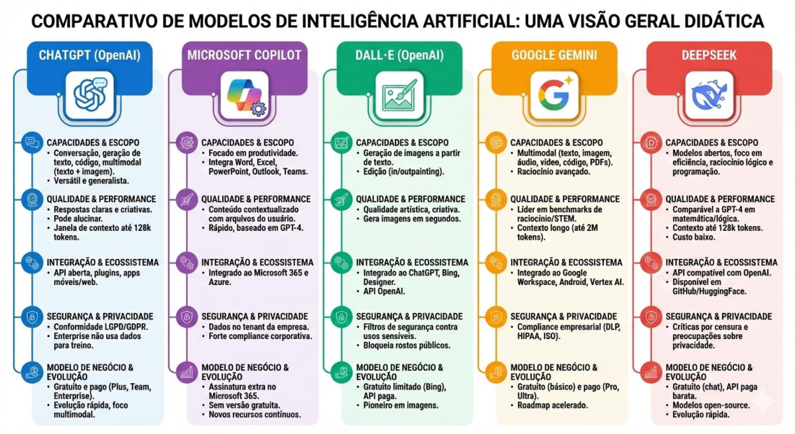

---

<!-- pagina: 71 -->

**Diego Carvalho, Renato da Costa, Equipe Informática e TI Aula Única - Diego Carvalho, Renato da Costa** 

### Engenharia de Prompt 

###### **<mark>INCIDÊNCIA EM PROVA: BAIXA</mark>** 

#### **Conceitos Básicos** 

###### **<mark>ENGENHARIA DE PROMPT</mark>** 

<mark>Prática de criar instruções ou comandos otimizados para orientar o comportamento de modelos de inteligência</mark> artificial generativa, como o ChatGPT. Ela envolve formular perguntas, contextos e exemplos de forma estratégica para obter respostas mais precisas, úteis e relevantes. Essa técnica é essencial para explorar todo o potencial de modelos de linguagem, seja para gerar textos, programar, responder perguntas ou realizar análises. A engenharia de prompt tornou-se uma habilidade importante para profissionais que usam IA no dia a dia, pois <u>pequenos ajustes na formulação do comando podem alterar significativamente a qualidade do resultado.</u> 

A Engenharia de Prompts consiste na formulação precisa de comandos ou instruções em linguagem natural para orientar o comportamento de modelos de Inteligência Artificial generativa. Trata-se de uma prática fundamental para maximizar a eficácia das interações com sistemas como o ChatGPT, DALL·E, entre outros, garantindo que as respostas geradas sejam alinhadas aos objetivos do usuário. 

Assim como instruções vagas produzem resultados ambíguos, comandos bem elaborados — com contexto, detalhes e objetivos claros — orientam a IA de forma mais eficaz. Quanto maior a especificidade do prompt, menor a margem de interpretação incorreta por parte do modelo, resultando em saídas mais relevantes, coerentes e adequadas à tarefa proposta. 

A analogia com a direção de cena ilustra esse princípio: enquanto um comando genérico (“faça algo interessante”) permite interpretações variadas, uma instrução detalhada (“diga essas palavras com expressão de surpresa e medo”) guia o sistema com precisão. Essa lógica se aplica à IA, que responde melhor quando instruída com clareza sobre o que deve fazer, em qual formato, com qual linguagem e em qual contexto. 

Na prática, engenheiros de prompt são profissionais especializados na construção, ajuste e refinamento de instruções para modelos generativos. Atuam em diversas áreas — como criação de conteúdo, atendimento automatizado, análise de dados, automação de processos e design de produtos — otimizando os resultados gerados pela IA conforme as necessidades específicas dos usuários e dos sistemas. 

A Engenharia de Prompts não é um algoritmo, interface ou sistema computacional. É uma técnica de formulação textual, baseada em linguagem natural (ou estruturada), cujo objetivo é orientar modelos de IA na execução de tarefas como redação, geração de imagens, produção de código, síntese de dados ou qualquer outra aplicação generativa. Logo, trata-se de uma competência essencial na interação com modelos de linguagem avançados, sendo cada vez mais valorizada como interface crítica entre o usuário humano e os sistemas automatizados de geração de conteúdo. 

**(VUNESP / TCE-SP – 2025)** Acerca dos contextos relacionados à inteligência artificial generativa, <mark>assinale a alternativa que apresenta o conceito mais adequado à explicação a seguir: “É a prática de criar e ajustar instruções, sem a necessidade de retreinar o modelo, de forma estratégica, para orientá-lo a produzir respostas mais precisas e úteis.”</mark> 

<mark>a) Prompt engineering (engenharia de prompt). b) Fine-tuning (ajuste fino). c) Tokenization (tokenização). d) Explainability (explicabilidade).</mark>

---

<!-- pagina: 72 -->

**Diego Carvalho, Renato da Costa, Equipe Informática e TI Aula Única - Diego Carvalho, Renato da Costa** 

###### <mark>e) Hallucination (alucinação).</mark> 

##### **<mark>_______________________</mark>** 

**<mark>Comentários:</mark>** <mark>(a) Correto. Prompt engineering é a prática de elaborar instruções (prompts) de maneira estratégica para obter respostas mais relevantes de modelos de IA, sem a necessidade de retreinamento; (b) Errado. Fine-tuning é o ajuste fino de um modelo de IA, que envolve retreinamento com dados específicos, o que difere do conceito apresentado; (c) Errado. Tokenization é o processo de segmentar o texto em unidades menores (tokens) para processamento, não está relacionado à elaboração de instruções; (d) Errado. Explainability refere-se à capacidade de interpretar e entender como e por que um modelo de IA tomou determinada decisão, não à criação de prompts; (e) Errado. Hallucination descreve quando um modelo de IA gera informações falsas</mark> ou sem base nos dados treinados, o que não corresponde à descrição fornecida (Letra A). 

#### **Principais Técnicas** 

Existem diversas técnicas de engenharia de prompt, que são basicamente estratégias estruturadas para formular instruções (prompts) de forma a orientar modelos de linguagem a produzir respostas mais precisas, controladas, coerentes e alinhadas ao objetivo da tarefa. Em termos simples, não se trata apenas de o que perguntar, mas de como perguntar. Vejamos as principais técnicas: 

**<mark>TÉCNICAS DESCRIÇÃO EXEMPLO DE PROMPT</mark>** Técnica em que o modelo recebe apenas a Explique o conceito de Big Data, instrução da tarefa, sem exemplos prévios descrevendo suas principais ou dicas adicionais. Depende características, sem usar exemplos **ZERO SHOT** exclusivamente do conhecimento prélongos, mantendo linguagem clara e treinado para interpretar o pedido e objetiva, adequada a um leitor iniciante <u>produzir a resposta esperada.</u> no tema. <mark>Técnica que incentiva o modelo a Resolva o problema apresentado</mark> externalizar seu raciocínio lógico em etapas explicando detalhadamente cada passo **CHAIN OF THOUGHT** sequenciais antes de apresentar a resposta do raciocínio utilizado, mostrando como **(COT)** final, aumentando a precisão em tarefas cada conclusão parcial leva à próxima, que exigem inferência, lógica ou cálculo. antes de apresentar a resposta final. <mark>Técnica que fornece poucos exemplos Pergunta: 2+2=4. Pergunta: 3+3=6.</mark> resolvidos no próprio prompt para orientar Pergunta: 4+4=8. Agora, seguindo **FEW SHOT** o modelo sobre o padrão esperado de exatamente o mesmo padrão de **PROMPTING** resposta, formato, estilo ou tipo de raciocínio e resposta, resolva a seguinte raciocínio desejado pelo usuário. pergunta: 7+7=? Variação do Chain of Thought em que não Resolva a questão apresentada são fornecidos exemplos, mas o prompt explicando o raciocínio passo a passo, solicita explicitamente que o modelo deixando claro como cada etapa **ZERO SHOT COT** raciocine passo a passo, guiando-o a contribui para a solução final, mesmo estruturar internamente a solução. sem exemplos prévios no enunciado. Técnica que gera múltiplas cadeias de Resolva o mesmo problema cinco vezes, raciocínio independentes para o mesmo utilizando raciocínios independentes. problema e seleciona a resposta mais Ao final, compare os resultados obtidos **SELF-CONSISTENCY** 

Técnica que gera múltiplas cadeias de raciocínio independentes para o mesmo problema e seleciona a resposta mais recorrente, reduzindo erros ocasionais e aumentando a robustez da decisão final. 

Resolva o mesmo problema cinco vezes, utilizando raciocínios independentes. Ao final, compare os resultados obtidos e informe como resposta final aquela que aparecer com maior frequência. 

**TREE OF THOUGHTS** 

<mark>Técnica que estimula o modelo a explorar</mark> diferentes caminhos de raciocínio em paralelo, avaliando alternativas intermediárias antes de escolher a solução mais promissora, semelhante a uma árvore de decisões. 

Analise o problema explorando pelo menos três abordagens diferentes. Avalie os prós e contras de cada caminho de raciocínio e, ao final, selecione a solução mais consistente.

---

<!-- pagina: 73 -->

**Diego Carvalho, Renato da Costa, Equipe Informática e TI Aula Única - Diego Carvalho, Renato da Costa** 

**ROLE PROMPTING** 

**INSTRUCTION PROMPTING** 

**REACT (REASON + ACT)** 

**DECOMPOSITION PROMPTING** 

**STEP-BY-STEP PROMPTING** 

**SELF-CRITIQUE / REFLEXION** 

**LEAST-TO-MOST PROMPTING** 

**RETRIEVALAUGMENTED PROMPTING (RAG)** 

**CONSTRAINT-BASED PROMPTING** 

Técnica em que o modelo assume explicitamente um papel profissional ou social específico, o que ajuda a ajustar vocabulário, nível de detalhe, tom da resposta e critérios de avaliação do <mark>conteúdo produzido.</mark> 

Técnica baseada em instruções claras, detalhadas e explícitas sobre formato, estilo, limites e objetivos da resposta, reduzindo ambiguidades e aumentando a previsibilidade do resultado gerado. 

Técnica que combina raciocínio explícito com ações práticas, como consultas a ferramentas ou bases externas, permitindo que o modelo pense, aja, observe resultados e refine a resposta iterativamente. 

<mark>Técnica que divide um problema complexo</mark> em subtarefas menores e mais simples, permitindo que o modelo trate cada parte separadamente antes de integrar tudo em uma resposta final coerente. 

Técnica que força o modelo a seguir uma sequência linear de resolução, abordando cada etapa de forma explícita e ordenada, mesmo em tarefas que não exigem exemplos prévios. 

<mark>Técnica em que o modelo revisa sua</mark> própria resposta, identifica possíveis erros, inconsistências ou lacunas conceituais e, em seguida, produz uma versão corrigida e aprimorada. 

Técnica que orienta o modelo a resolver inicialmente versões mais simples do problema, usando essas soluções como base para lidar progressivamente com versões mais complexas da tarefa. 

Técnica que combina o modelo com informações externas recuperadas de documentos ou bases de dados, reduzindo alucinações e garantindo que a resposta seja fundamentada em fontes fornecidas. 

<mark>Técnica que impõe restrições rígidas ao</mark> conteúdo ou à forma da resposta, como proibição de opiniões, exemplos ou analogias, garantindo aderência estrita a normas ou critérios definidos. 

Você é um professor universitário de banco de dados. Explique o conceito solicitado utilizando linguagem didática, exemplos simples e foco pedagógico, como se estivesse ensinando alunos <mark>iniciantes.</mark> 

Explique o tema solicitado em no máximo 200 palavras, utilizando linguagem técnica, sem analogias, estruturando a resposta em dois parágrafos e incluindo pelo menos um <mark>exemplo conceitual.</mark> 

Analise a pergunta, descreva seu raciocínio inicial, consulte os dados disponíveis quando necessário, interprete os resultados obtidos e, somente então, apresente a resposta final fundamentada. 

<mark>Primeiro identifique os conceitos</mark> centrais do problema. Em seguida, explique cada conceito individualmente. Por fim, relacione todos eles para construir a resposta completa solicitada. 

Resolva a questão seguindo etapas claras e numeradas. Não apresente a resposta final antes de concluir todas as etapas intermediárias do raciocínio solicitado no enunciado. 

<mark>Apresente sua resposta inicial. Em</mark> seguida, revise criticamente o que foi escrito, identifique eventuais falhas conceituais ou imprecisões e forneça uma versão final corrigida. 

Comece resolvendo um exemplo simples do problema. Depois, utilize o raciocínio obtido para resolver um caso intermediário e, por fim, generalize para a situação completa apresentada. 

Com base exclusivamente no texto fornecido a seguir, responda à pergunta proposta. Não utilize conhecimento externo nem faça suposições além das informações presentes no material. 

<mark>Defina o conceito solicitado utilizando</mark> apenas linguagem formal, sem exemplos práticos, sem analogias e sem emitir opiniões pessoais, limitando-se a definições técnicas objetivas.

---

<!-- pagina: 74 -->

**Diego Carvalho, Renato da Costa, Equipe Informática e TI Aula Única - Diego Carvalho, Renato da Costa** 

**MULTI-PERSONA PROMPTING** 

Técnica que solicita múltiplas respostas a Responda à pergunta primeiro como um partir de diferentes pontos de vista ou engenheiro de dados, focando aspectos papéis, permitindo comparar perspectivas técnicos. Em seguida, responda como distintas e enriquecer análises críticas ou um gestor, priorizando impacto decisões complexas. organizacional e tomada de decisão. 

**(FGV / STN – 2024)** Na área de Engenharia de Prompt, várias técnicas são usadas para melhorar <mark>a capacidade de modelos de linguagem em entender e responder perguntas complexas ou realizar tarefas específicas. Com base na compreensão dessas técnicas, avalie se as seguintes afirmações são verdadeiras (V) ou falsas (F).</mark> 

<mark>( ) Zero-Shot Prompting é uma técnica que requer um grande conjunto de exemplos específicos para treinar o modelo antes de ser capaz de realizar uma tarefa ou responder a uma pergunta.</mark> 

<mark>( ) Chain-of-Thought (COT) envolve instruir o modelo de linguagem para decompor um problema complexo em etapas menores e mais gerenciáveis, detalhando o processo de raciocínio para chegar à resposta.</mark> 

<mark>( ) Few-Shot Prompting utiliza apenas alguns exemplos selecionados para guiar o modelo na execução de uma tarefa, demonstrando como realizar a tarefa com um número limitado de referências.</mark> 

<mark>( ) Zero-Shot COT combina a técnica de Chain-of-Thought com a abordagem Zero-Shot, permitindo que o modelo decomponha e resolva problemas complexos sem a necessidade de exemplos específicos de treinamento prévio.</mark> 

<mark>As afirmativas são, respectivamente,</mark> 

<mark>a) V – V – V – F. b) V – F – F – V. c) V – F – F – F. d) F – F – V – V. e) F – V – V – V.</mark> 

##### **<mark>_______________________</mark>** 

**<mark>Comentários:</mark>** 

<mark>(F) Zero-Shot Prompting é justamente o oposto do que se afirma: trata-se de fazer o modelo executar uma tarefa sem fornecer exemplos específicos. O modelo depende apenas da instrução textual dada no prompt. Portanto, não requer treinamento com exemplos.</mark> 

<mark>(V) Chain-of-Thought (CoT) é uma técnica em que se instrui o modelo a explicar seu raciocínio passo a passo, decompondo problemas complexos em partes menores para alcançar a resposta final com mais clareza e precisão.</mark> 

<mark>(V) Few-Shot Prompting fornece poucos exemplos (2 a 5, geralmente) no próprio prompt para ensinar ao modelo como realizar uma tarefa, ajudando-o a generalizar com base nesses exemplos.</mark> 

<mark>(V) Zero-Shot CoT é uma técnica híbrida que combina a ideia de Zero-Shot com Chain-of-Thought, usando apenas uma instrução que incentive o raciocínio ("Let's think step by step", por exemplo), sem fornecer exemplos específicos. Ainda assim, o modelo tenta</mark> decompor o problema para resolvê-lo (Letra E).

---

<!-- pagina: 75 -->

**Diego Carvalho, Renato da Costa, Equipe Informática e TI Aula Única - Diego Carvalho, Renato da Costa** 

## Principais Aplicações 

**<mark>INCIDÊNCIA EM PROVA: MÉDIA</mark>** 

### IA no Cotidiano Profissional 

###### **<mark>INCIDÊNCIA EM PROVA: BAIXÍSSIMA</mark>** 

A utilização da IA generativa no cotidiano profissional vem transformando profundamente a maneira como diversas atividades são executadas, trazendo mais agilidade, personalização e capacidade de inovação para as rotinas de trabalho. Ao contrário de modelos tradicionais de automação, que dependiam de scripts ou regras fixas, os sistemas generativos são capazes de entender o contexto e produzir soluções novas a partir de prompts simples. Isso os torna úteis para profissionais de áreas variadas, desde marketing e design até engenharia, educação e gestão. 

No dia a dia, um dos usos mais comuns é na produção de conteúdo. Ferramentas como ChatGPT podem redigir relatórios, criar posts para redes sociais, revisar textos ou até gerar ideias de campanhas publicitárias. Isso economiza tempo e reduz o esforço em tarefas repetitivas, permitindo que os profissionais foquem em etapas mais estratégicas. Além disso, modelos de geração de imagem, como DALL·E e Midjourney, ajudam designers a criar protótipos e ilustrações personalizadas em questão de minutos, acelerando o processo criativo. 

Outra aplicação relevante está na tomada de decisão baseada em dados. A IA generativa pode analisar grandes volumes de informação e apresentar resumos, insights e até simulações de cenários para apoiar gestores e equipes. Por exemplo, um profissional de finanças pode pedir que a IA gere um relatório consolidado com análises de risco, enquanto alguém da área de RH pode solicitar recomendações para melhorar engajamento de equipes com base em pesquisas de clima organizacional. 

No campo da educação corporativa e treinamento, a IA generativa também ganha destaque. É possível criar planos de estudo personalizados, gerar exercícios práticos ou simulações de entrevistas para treinamento de funcionários. Isso ajuda as empresas a desenvolver programas de capacitação sob medida, que atendem às necessidades específicas de cada colaborador, tornando o aprendizado mais eficiente e engajador. 

Por fim, é importante destacar que, embora ofereça ganhos expressivos, o uso da IA generativa no trabalho exige supervisão e senso crítico. Como os modelos podem apresentar vieses, informações desatualizadas ou respostas imprecisas, é essencial que os resultados sejam revisados por profissionais antes de serem aplicados em decisões estratégicas. Assim, a tecnologia se torna uma aliada poderosa, mas sem substituir a análise humana e a responsabilidade profissional. 

**(MS CONCURSOS / SAAE de São Carlos - SP - 2024)** 1. Qual das opções descreve, <mark>devidamente, uma das principais aplicações da inteligência artificial, (IA), nas empresas?</mark> 

<mark>a) Permitir que todas as decisões importantes nas empresas sejam tomadas, exclusivamente, por máquinas, sem necessidade de supervisão humana.</mark> 

<mark>b) Garantir que todos os dispositivos conectados à internet possam operar sem a necessidade de manutenção ou atualizações.</mark> 

<mark>c) Substituir todos os trabalhadores humanos em funções administrativas e operacionais, eliminando, completamente, o papel das pessoas.</mark>

---

<!-- pagina: 76 -->

**Diego Carvalho, Renato da Costa, Equipe Informática e TI Aula Única - Diego Carvalho, Renato da Costa** 

<mark>d) Automatizar tarefas repetitivas e analisar grandes volumes de dados, ajudando a tornar os processos mais rápidos e eficientes.</mark> 

##### **<mark>_______________________</mark>** 

**<mark>Comentários:</mark>** <mark>(a) Errado. A IA pode auxiliar na tomada de decisões, mas as decisões importantes ainda exigem supervisão humana, especialmente por questões éticas, legais e estratégicas; (b) Errado. A IA não elimina a necessidade de manutenção ou atualizações em dispositivos conectados — isso envolve outros aspectos de infraestrutura e segurança; (c) Errado. A IA não substitui completamente os trabalhadores humanos, mas complementa e automatiza certas tarefas, permitindo que os humanos se concentrem em atividades mais estratégicas; (d) Correto. Uma das principais aplicações da IA nas empresas é justamente automatizar tarefas repetitivas e analisar grandes volumes de dados, tornando os processos mais ágeis, eficientes e com melhor embasamento nas decisões (Letra</mark> D).

---

<!-- pagina: 77 -->

**Diego Carvalho, Renato da Costa, Equipe Informática e TI Aula Única - Diego Carvalho, Renato da Costa** 

### IA na Auditoria 

###### **<mark>INCIDÊNCIA EM PROVA: BAIXÍSSIMA</mark>** 

A IA generativa está começando a transformar o trabalho em auditoria, trazendo novas possibilidades para análise de dados, automação de tarefas repetitivas e geração de insights. No contexto de auditoria interna ou externa, uma de suas principais aplicações é a preparação e revisão de documentos. Modelos como o ChatGPT podem gerar minutas de relatórios de auditoria, sumários executivos e pareceres iniciais com base nos achados fornecidos pela equipe, economizando tempo e padronizando a comunicação. 

Outro uso importante é na análise de grandes volumes de dados contábeis e financeiros. A IA generativa pode ser combinada com técnicas de análise de dados para detectar padrões incomuns, identificar transações suspeitas ou sugerir áreas de risco para investigação mais profunda. Ao gerar explicações textuais sobre as anomalias encontradas, a IA ajuda os auditores a compreender rapidamente onde focar seus esforços, tornando o processo mais eficiente. 

Na avaliação de controles internos, a IA generativa pode simular cenários e criar checklists dinâmicos para testes de conformidade. Em vez de seguir uma lista fixa, o auditor pode adaptar o roteiro de testes com base nas particularidades de cada cliente ou área auditada. Isso contribui para uma auditoria mais personalizada, mantendo a conformidade com normas e padrões como COSO ou SOX. 

Em termos de treinamento e capacitação, a IA generativa também tem papel relevante. Ela pode criar casos de estudo realistas, gerar quizzes interativos e simulações de entrevistas de auditoria, permitindo que novos auditores pratiquem situações do dia a dia sem expor dados sensíveis. Esse tipo de treinamento imersivo melhora o aprendizado e prepara as equipes para lidar com situações complexas. 

Por fim, é fundamental considerar os desafios éticos e regulatórios. A utilização da IA generativa em auditoria precisa respeitar normas de confidencialidade e privacidade, como a LGPD, garantindo que os dados de clientes não sejam expostos indevidamente. Além disso, os resultados gerados pela IA devem ser revisados por auditores humanos para evitar conclusões incorretas ou enviesadas, mantendo a responsabilidade profissional e a credibilidade do processo de auditoria. 

**(CEBRASPE / TCE-RS - 2025)** Um auditor pretende utilizar inteligência artificial generativa (IAG) <mark>em dois momentos de uma auditoria operacional realizada em um programa social destinado a comunidades quilombolas: na análise de informações obtidas em diferentes fontes e na redação dos achados de auditoria. Considerando essa situação hipotética, julgue os itens seguintes.</mark> 

<mark>Para garantia da clareza dos papéis de trabalho da auditoria feita com auxílio de IAG, basta que o auditor registre a informação de que níveis de análise de dados foi feita pela IAG, cujos procedimentos de pesquisa não estão sujeitos a requisitos de apresentação.</mark> 

##### **<mark>_______________________</mark>** 

**<mark>Comentários:</mark>** <mark>na utilização de Inteligência Artificial Generativa (IAG) em auditorias, não basta registrar apenas que a IAG foi utilizada em determinado nível de análise. É essencial garantir a rastreabilidade, reprodutibilidade e transparência dos procedimentos adotados, conforme os princípios das normas de auditoria. Além disso, os papéis de trabalho devem conter evidências suficientes e apropriadas, incluindo informações sobre quais ferramentas foram utilizadas, como foram configuradas, quais dados foram analisados e quais limitações existem na aplicação da IAG. Os procedimentos de pesquisa feitos com auxílio da IAG também estão sujeitos a requisitos de apresentação e documentação, justamente para garantir a confiabilidade dos achados e a responsabilização</mark> pelos resultados (Errado). 

**(CEBRASPE / TCE-RS - 2025)** Um auditor pretende utilizar inteligência artificial generativa (IAG) <mark>em dois momentos de uma auditoria operacional realizada em um programa social destinado a comunidades quilombolas: na análise de informações obtidas em diferentes fontes e na redação dos achados de auditoria. Considerando essa situação hipotética, julgue os itens seguintes.</mark>

---

<!-- pagina: 78 -->

**Diego Carvalho, Renato da Costa, Equipe Informática e TI Aula Única - Diego Carvalho, Renato da Costa** 

<mark>O uso de IAG contribui para a imparcialidade do relatório de auditoria, pois, desde que treinadas com grandes volumes de dados, as ferramentas de inteligência artificial generativa não reproduzem tendências humanas discriminatórias, como racismo.</mark> 

**<mark>_______________________ Comentários:</mark>** <mark>embora a Inteligência Artificial Generativa (IAG) possa auxiliar na sistematização e análise de grandes volumes de dados, ela não garante imparcialidade automaticamente. Pelo contrário, modelos de IAG podem reproduzir vieses presentes nos dados com os quais foram treinados, incluindo tendências discriminatórias como racismo, sexismo ou preconceitos culturais. Isso ocorre porque os dados utilizados para treinar essas ferramentas muitas vezes refletem desigualdades e estereótipos existentes na sociedade. Logo, é fundamental que o uso da IAG em auditorias seja acompanhado de supervisão humana crítica, especialmente em</mark> contextos sensíveis como programas sociais voltados a comunidades vulneráveis (Errado). 

**(CEBRASPE / TCE-RS - 2025)** Um auditor pretende utilizar inteligência artificial generativa (IAG) <mark>em dois momentos de uma auditoria operacional realizada em um programa social destinado a comunidades quilombolas: na análise de informações obtidas em diferentes fontes e na redação dos achados de auditoria. Considerando essa situação hipotética, julgue os itens seguintes.</mark> 

<mark>No tratamento dos achados de auditoria feita a partir de informações obtidas de fontes analisadas com auxílio de IAG, o auditor deve considerar a possibilidade de viés algorítmico e de sub-representação dos dados de comunidades quilombolas nos conjuntos de dados utilizados no treinamento da IAG.</mark> 

**<mark>_______________________</mark>** 

**<mark>Comentários:</mark>** <mark>o auditor deve, sim, considerar a possibilidade de viés algorítmico ao utilizar Inteligência Artificial Generativa (IAG), especialmente em contextos sensíveis como auditorias em programas voltados a comunidades quilombolas.</mark> 

<mark>Modelos de IAG são treinados com grandes volumes de dados que, muitas vezes, não representam adequadamente populações historicamente marginalizadas. Isso pode resultar em sub-representação ou distorções nos resultados gerados, comprometendo a imparcialidade e a acurácia dos achados de auditoria. Logo, é essencial que o auditor atue com senso crítico e responsabilidade,</mark> avaliando o contexto social e os possíveis vieses incorporados nos dados utilizados pela IAG (Correto).

---

<!-- pagina: 79 -->

**Diego Carvalho, Renato da Costa, Equipe Informática e TI Aula Única - Diego Carvalho, Renato da Costa** 

### IA no Gerenciamento de Tarefas 

###### **<mark>INCIDÊNCIA EM PROVA: BAIXÍSSIMA</mark>** 

A Inteligência Artificial generativa está transformando profundamente a forma como pessoas e equipes gerenciam suas atividades diárias, e seu impacto vai muito além da simples automação de tarefas. Hoje, ela atua como uma verdadeira parceira estratégica na organização, gestão de tempo e apoio à análise de dados, integrando capacidades de linguagem, previsão e síntese de informações em ferramentas de uso cotidiano. 

No campo da organização e gestão de tempo, a IA generativa oferece uma revolução silenciosa, mas poderosa. Ela é capaz de analisar compromissos, prazos e níveis de prioridade para sugerir agendas mais equilibradas e produtivas. Ao cruzar dados de calendário, volume de tarefas e até padrões de produtividade individual (como horários em que a pessoa tende a se concentrar melhor), o sistema pode propor rotinas personalizadas que maximizam o foco e reduzem a sobrecarga mental. Além disso, essas soluções podem emitir alertas inteligentes sobre riscos de atraso ou sobrecarga, sugerindo redistribuição de tarefas ou ajustes no cronograma — algo que antes exigia um gestor atento e tempo de análise manual. 

Outra funcionalidade cada vez mais presente é a gestão automática de compromissos e reuniões. Com base em mensagens, e-mails ou históricos de projetos, a IA pode identificar quando é necessário agendar uma reunião, propor horários compatíveis com todos os participantes e até preparar pautas e materiais de apoio com base nas interações anteriores. Isso libera o profissional para atividades que realmente exigem julgamento humano e criatividade, enquanto a IA cuida da logística e da coerência temporal das atividades. 

No âmbito dos assistentes para planilhas e análise de dados, a IA generativa está redefinindo o modo como lidamos com informações quantitativas. Em vez de exigir fórmulas complexas ou longas etapas de preparação de dados, esses assistentes entendem comandos em linguagem natural — como “mostre as vendas que mais cresceram neste trimestre” ou “crie um gráfico comparando os custos de 2023 e 2024” — e transformam essas solicitações em resultados automáticos, visuais e contextualizados. Essa capacidade democratiza a análise de dados, permitindo que mesmo usuários sem formação técnica tomem decisões baseadas em evidências. 

Além disso, a IA pode detectar padrões ocultos e gerar insights preditivos, cruzando planilhas e bases de dados diversas. Ela pode, por exemplo, identificar variações sazonais, prever gargalos de produção, sugerir ajustes orçamentários ou apontar correlações inesperadas entre variáveis de desempenho. Tudo isso é feito de forma interativa, com explicações em linguagem acessível e visualizações adaptadas ao público — do analista ao gestor executivo. 

Por fim, ao integrar a IA generativa a sistemas de produtividade, comunicação e análise, cria-se um ecossistema de gestão inteligente e contínua. As tarefas são capturadas automaticamente, as prioridades são ajustadas em tempo real, as análises são geradas sob demanda e as decisões são registradas com transparência. O resultado é um ambiente de trabalho mais ágil, colaborativo e baseado em dados — em que o tempo é gerido com precisão, as informações fluem com clareza e a inteligência artificial atua como um verdadeiro co-piloto na busca pela eficiência e pela inovação.

---

<!-- pagina: 80 -->

**Diego Carvalho, Renato da Costa, Equipe Informática e TI Aula Única - Diego Carvalho, Renato da Costa** 

### IA na Pesquisa Jurídica e Documental 

###### **<mark>INCIDÊNCIA EM PROVA: BAIXÍSSIMA</mark>** 

O uso de Inteligência Artificial na pesquisa jurídica e documental tem se consolidado como uma das maiores inovações na área do Direito, trazendo eficiência, precisão e velocidade para tarefas que antes demandavam extensas horas de trabalho manual. Ferramentas baseadas em IA conseguem analisar grandes volumes de documentos, petições e jurisprudências em segundos, identificando precedentes relevantes e auxiliando advogados e pesquisadores a embasar seus argumentos com maior agilidade. Essa automação reduz o tempo gasto na fase inicial de análise, permitindo que os profissionais concentrem seus esforços na interpretação estratégica das informações. 

Além da pesquisa jurisprudencial, a IA é capaz de processar contratos, leis e regulamentos, extraindo cláusulas específicas ou detectando incongruências. Softwares de análise semântica vão além da simples busca por palavras-chave e utilizam processamento de linguagem natural (PLN) para compreender o contexto das expressões jurídicas. Isso significa que, ao buscar por um determinado instituto ou tese, o sistema é capaz de encontrar resultados relevantes mesmo que estejam descritos de forma diferente ou com sinônimos. 

Outro ponto importante é o suporte à due diligence, em que a IA é utilizada para revisar contratos e documentos corporativos em operações de fusão e aquisição. Algoritmos de machine learning são treinados para identificar riscos, obrigações e pontos críticos, agilizando um processo que poderia levar semanas. Ao automatizar essa etapa, os escritórios de advocacia e departamentos jurídicos ganham mais tempo para negociar melhores condições e reduzir riscos. 

Na análise preditiva, a IA começa a assumir um papel cada vez mais estratégico. Modelos de machine learning podem ser treinados para prever a probabilidade de sucesso de uma ação judicial, analisando fatores como histórico de decisões, perfil de tribunais e comportamento de juízes. Esse tipo de insight é extremamente valioso para orientar decisões sobre seguir ou não com determinada demanda, calcular riscos financeiros e preparar estratégias processuais mais sólidas. 

Outro benefício está no apoio à gestão de conhecimento jurídico. Sistemas de IA ajudam a organizar bibliotecas digitais, classificar documentos automaticamente e sugerir conteúdos relacionados, criando um repositório vivo de conhecimento dentro de escritórios e empresas. Isso evita a perda de informações importantes e promove um reaproveitamento mais inteligente do material já produzido. 

No contexto acadêmico, a IA facilita a pesquisa científica em Direito, permitindo buscas mais abrangentes em bases de dados e acelerando a produção de artigos, teses e pareceres. A integração de IA com ferramentas de citação e análise bibliométrica também contribui para que os pesquisadores mapeiem tendências jurídicas e construam análises mais consistentes. 

Por fim, é importante destacar que o uso da IA na pesquisa jurídica levanta discussões éticas e legais, especialmente sobre privacidade de dados e vieses algorítmicos. Garantir a transparência nos modelos utilizados, respeitar as normas de proteção de dados (como a LGPD) e manter a supervisão humana são medidas essenciais para evitar decisões automatizadas injustas ou equivocadas. Em suma, a IA não substitui o papel do profissional do Direito, mas amplia sua capacidade de análise e tomada de decisão.

---

<!-- pagina: 81 -->

**Diego Carvalho, Renato da Costa, Equipe Informática e TI Aula Única - Diego Carvalho, Renato da Costa** 

### IA na Segurança da Informação 

###### **<mark>INCIDÊNCIA EM PROVA: BAIXÍSSIMA</mark>** 

A Inteligência Artificial (IA) tem se tornado um componente central na Segurança da Informação, transformando a forma como organizações detectam ameaças, respondem a incidentes e protegem seus ativos digitais. Em um cenário em que o volume e a complexidade dos ataques cibernéticos crescem continuamente, a IA surge como uma aliada poderosa capaz de analisar grandes quantidades de dados em tempo real, identificar padrões anômalos e prever comportamentos maliciosos antes que causem danos. 

Tradicionalmente, a segurança digital dependia de regras fixas e assinaturas de ameaças conhecidas — um método eficiente apenas contra ataques já documentados. A IA muda essa lógica ao empregar técnicas de aprendizado de máquina (Machine Learning) para detectar padrões desconhecidos, aprendendo continuamente com o tráfego de rede, logs de sistemas e eventos de autenticação. Isso permite identificar comportamentos suspeitos, como desvios sutis em acessos de usuários ou atividades incomuns em servidores, que podem indicar ataques de phishing, ransomware ou invasões internas. 

Além da detecção proativa, a IA também é usada para automatizar respostas a incidentes, reduzindo o tempo entre a identificação e a contenção de uma ameaça. Sistemas baseados em IA podem, por exemplo, isolar máquinas comprometidas, bloquear endereços IP suspeitos ou redefinir credenciais de forma autônoma, seguindo políticas predefinidas. Essa automação libera os analistas humanos para tarefas mais estratégicas e reduz o impacto de ataques que exigem reação rápida. 

Outro avanço importante é a análise preditiva aplicada à segurança. Modelos de IA conseguem identificar tendências de comportamento malicioso em escala global, aprendendo com dados de milhões de tentativas de invasão e ajustando continuamente suas defesas. Esse tipo de aprendizado permite criar sistemas capazes de antecipar ataques — não apenas reagir a eles. Ferramentas de Threat Intelligence com IA, como as usadas em firewalls de nova geração e sistemas de detecção de intrusos (IDS/IPS), já aplicam esses recursos. 

Contudo, a IA na segurança da informação não é uma via de mão única. Os próprios criminosos cibernéticos também utilizam IA para sofisticar seus ataques. Algoritmos generativos são empregados para criar phishings realistas, deepfakes convincentes e até malwares adaptativos, capazes de alterar seu comportamento para escapar de detecção. Essa “corrida armamentista algorítmica” impõe um novo desafio ético e técnico: quem utiliza IA para defesa precisa se atualizar constantemente, pois o adversário pode fazer o mesmo para o ataque. 

Por isso, fala-se hoje em IA adversarial, uma área de estudo que analisa como algoritmos podem ser enganados por entradas manipuladas. Um sistema de IA treinado para identificar spam, por exemplo, pode ser facilmente induzido a erro se um invasor souber alterar detalhes sutis em uma mensagem. Esse risco mostra que a confiança cega em algoritmos é perigosa: mesmo os sistemas mais avançados precisam de validação humana e mecanismos de auditoria para evitar falsos positivos ou brechas exploráveis. 

Do ponto de vista ético e regulatório, a integração entre IA e segurança também requer transparência e governança. Organizações devem garantir que os modelos usados para monitoramento não invadam a privacidade dos usuários, nem violem leis de proteção de dados, como a LGPD no Brasil e o GDPR na Europa. O equilíbrio entre segurança e privacidade tornou-se uma das maiores discussões do setor, exigindo políticas claras sobre como dados são coletados, processados e protegidos.

---

<!-- pagina: 82 -->

**Diego Carvalho, Renato da Costa, Equipe Informática e TI Aula Única - Diego Carvalho, Renato da Costa** 

**(HCFMB-SP / HC-FMB - 2025)** O avanço da inteligência artificial (IA) tem provocado <mark>transformações significativas no campo da cibersegurança, tanto no desenvolvimento de soluções defensivas quanto na sofisticação das ameaças. Com base nesse contexto, analise as afirmativas a seguir:</mark> 

<mark>I. Técnicas de IA têm sido utilizadas para detectar padrões anômalos em redes e identificar ataques cibernéticos com maior precisão e em tempo real.</mark> 

<mark>II. Cibercriminosos têm explorado a IA para automatizar ataques, criar malwares adaptativos e gerar conteúdos falsos mais convincentes, como deepfakes e e-mails de phishing.</mark> 

<mark>III. A utilização de IA na cibersegurança eliminou completamente a necessidade de profissionais humanos na detecção e resposta a incidentes.</mark> 

<mark>Assinale a alternativa correta:</mark> 

<mark>a) Apenas I e II estão corretas b) Apenas II e III estão corretas</mark> 

<mark>c) Apenas I está correta d) I, II e III estão corretas</mark> 

**<mark>_______________________</mark>** 

**<mark>Comentários:</mark>** <mark>(I) Correto. Técnicas de IA são amplamente usadas em sistemas de cibersegurança para detecção de anomalias e identificação precoce de ataques, utilizando aprendizado de máquina para reconhecer padrões suspeitos em tempo real; (II) Correto. Cibercriminosos utilizam IA para desenvolver ataques mais sofisticados, como malwares que se adaptam e conteúdos falsos (deepfakes e phishing) com maior capacidade de enganar usuários; (III) Errado. A IA complementa, mas não substitui totalmente os profissionais humanos, pois a análise contextual, a tomada de decisão estratégica e a resposta a incidentes ainda exigem intervenção</mark> humana (Letra A).

---

<!-- pagina: 83 -->

**Diego Carvalho, Renato da Costa, Equipe Informática e TI Aula Única - Diego Carvalho, Renato da Costa** 

### IA no Jornalismo 

###### **<mark>INCIDÊNCIA EM PROVA: BAIXÍSSIMA</mark>** 

A Inteligência Artificial (IA) está transformando profundamente o jornalismo contemporâneo, desde a coleta até a produção e distribuição de notícias. Ela atua como uma ferramenta capaz de analisar grandes volumes de dados em segundos, identificar tendências, sugerir pautas e até redigir textos automatizados com base em informações estruturadas. Esse uso amplia a velocidade e a abrangência do trabalho jornalístico, permitindo que redações com poucos profissionais consigam acompanhar temas complexos e de alta rotatividade, como eleições, esportes ou indicadores econômicos. 

No campo da produção de conteúdo, a IA já é empregada por veículos como The Washington Post, Reuters e Associated Press para gerar automaticamente notícias sobre resultados financeiros, jogos esportivos e boletins meteorológicos. Esses textos, embora produzidos por algoritmos, seguem modelos editoriais predefinidos e passam por supervisão humana antes da publicação. Essa automação libera jornalistas para tarefas mais analíticas e investigativas, reduzindo o tempo gasto com matérias repetitivas e padronizadas. 

Além da escrita, a IA auxilia na verificação de fatos e combate à desinformação. Ferramentas baseadas em aprendizado de máquina são capazes de cruzar fontes, detectar padrões de manipulação em imagens, identificar deepfakes e monitorar redes sociais em busca de notícias falsas. Isso fortalece o jornalismo de verificação (fact-checking), essencial em tempos de desinformação digital e manipulação algorítmica. A mesma tecnologia, entretanto, também pode ser usada de forma maliciosa — o que exige vigilância constante e padrões éticos claros no uso de sistemas automatizados. 

Outra contribuição importante está na personalização da experiência do leitor. Plataformas de notícias utilizam IA para recomendar conteúdos de acordo com o perfil e os interesses do público, aumentando o engajamento e a retenção. No entanto, essa personalização também traz riscos: o usuário pode ficar preso em bolhas de informação, recebendo apenas conteúdos que confirmam suas opiniões prévias. Esse dilema obriga as empresas de mídia a buscar equilíbrio entre relevância algorítmica e diversidade editorial. 

Por fim, a presença da IA no jornalismo exige uma nova ética profissional. O jornalista passa a atuar não apenas como repórter, mas também como curador e auditor da tecnologia, responsável por revisar, validar e contextualizar o que os algoritmos produzem. O desafio está em manter a transparência sobre o uso de IA, assegurar que o público saiba quando uma matéria foi automatizada e preservar o papel humano de interpretar, investigar e dar significado aos fatos. Em suma, a IA é uma aliada poderosa, mas o julgamento crítico e a responsabilidade ética continuam sendo insubstituivelmente humanos no fazer jornalístico. 

**(CEBRASPE / ANM – 2025)** O uso da IAG facilita e acelera o processo de criação de um farto <mark>material jornalístico, a exemplo dos audiovisuais, bem como garante o compromisso com a verdade, elemento fundamental do jornalismo.</mark> 

##### **<mark>_______________________</mark>** 

**<mark>Comentários:</mark>** <mark>o uso da inteligência artificial generativa (IAG) realmente facilita e acelera a produção de conteúdo jornalístico, incluindo textos e audiovisuais. No entanto, não garante o compromisso com a verdade, pois a IA pode gerar informações incorretas,</mark> imprecisas ou enviesadas. O controle editorial humano é essencial para assegurar a veracidade e a ética no jornalismo (Errado). 

**(FURB / Prefeitura de Biguaçu-SC – 2025)** "A atravessar uma crise sem precedentes, o <mark>jornalismo vive desassossegado porque a inteligência artificial, uma ferramenta do presente, poderá futuramente transformar-se num risco ao emprego humano devido à sua vertente generativa. A possibilidade de ter algoritmos a produzir informação jornalística tornou-se</mark>

---

<!-- pagina: 84 -->

**Diego Carvalho, Renato da Costa, Equipe Informática e TI Aula Única - Diego Carvalho, Renato da Costa** 

<mark>apelativa para as empresas, pelo que a ameaça ao trabalho dos jornalistas é real. Mas será que os algoritmos podem substituir os humanos numa profissão com a especificidade do jornalismo? Haverá razões para tanto desassossego?"</mark> 

<mark>Com base nas reflexões de João Canavilhas (2025), publicadas recentemente no artigo "Visualização de Tecnologia do Desassossego: o jornalismo humano deve sentir-se ameaçado pela Inteligência Artificial?", sobre o impacto da inteligência artificial no jornalismo, é correto afirmar que:</mark> 

<mark>a) Os textos gerados por IA, por serem livres de subjetividade humana, garantem maior neutralidade, portanto, dispensam supervisão jornalística.</mark> 

<mark>b) Apesar da IA ser eficaz na coleta e processamento de dados, o jornalismo humano ainda se destaca pela criatividade, empatia, capacidade interpretativa e compromisso ético com a qualidade e contextualização da informação.</mark> 

<mark>c) A produção de notícias por IA é amplamente preferida pelos consumidores, por apresentar sempre maior clareza e adequação sociocultural em seus textos.</mark> 

<mark>d) O jornalismo feito por humanos está sendo progressivamente substituído pela IA, que apresenta melhor desempenho em todas as fases do processo noticioso.</mark> 

<mark>e) A IA tem provado ser superior ao jornalismo humano por gerar narrativas inovadoras e altamente criativas tanto no campo textual quanto no visual.</mark> 

##### **<mark>_______________________</mark>** 

**<mark>Comentários:</mark>** <mark>(a) Errado. Textos gerados por IA podem carecer de nuances e contextos que a subjetividade humana proporciona, tornando a supervisão jornalística essencial para garantir a qualidade e a ética da informação; (b) Correto. A IA pode ser eficiente em dados, mas o jornalismo humano se destaca pela criatividade, empatia e compromisso ético, fatores fundamentais para a qualidade da informação; (c) Errado. A preferência dos consumidores não é necessariamente pela produção de IA, pois muitos valorizam a profundidade e a análise crítica que o jornalismo humano oferece; (d) Errado. Embora a IA esteja avançando, o jornalismo humano ainda é crucial, especialmente em aspectos que envolvem interpretação e análise crítica, onde a IA não substitui completamente; (e) Errado. A IA pode gerar narrativas, mas a criatividade e a inovação no jornalismo humano envolvem uma compreensão mais profunda</mark> da sociedade e das emoções humanas, que a IA não consegue replicar (Letra B).

---

<!-- pagina: 85 -->

**Diego Carvalho, Renato da Costa, Equipe Informática e TI Aula Única - Diego Carvalho, Renato da Costa** 

### IA no Design Gráfico 

###### **<mark>INCIDÊNCIA EM PROVA: BAIXÍSSIMA</mark>** 

A Inteligência Artificial (IA) está redefinindo o Design Gráfico ao introduzir novas formas de criação, automação e experimentação visual. Ferramentas baseadas em IA permitem que designers gerem imagens, ilustrações, logotipos e composições completas em poucos segundos, a partir de simples comandos de texto. Essa capacidade de converter linguagem natural em elementos visuais amplia o campo criativo e acelera etapas que antes exigiam horas de trabalho manual. Programas como DALL·E, Midjourney, Adobe Firefly e Canva AI já são amplamente usados em estúdios e agências, democratizando o acesso à criação gráfica. 

Além da geração de imagens, a IA atua na edição e otimização de conteúdo visual. Softwares inteligentes identificam automaticamente cores predominantes, sugerem harmonias cromáticas, removem fundos, restauram fotos antigas e até adaptam layouts para diferentes formatos de mídia. Essa automação eleva a produtividade e reduz o tempo gasto em tarefas repetitivas, permitindo que o designer se concentre em aspectos estratégicos — como identidade visual, narrativa e impacto emocional da peça. A IA, nesse sentido, funciona como um assistente criativo, e não como um substituto do olhar humano. 

Outra grande contribuição da IA está no design generativo, um campo em que o computador cria múltiplas variações de um mesmo projeto com base em parâmetros definidos pelo profissional. Essa abordagem permite explorar possibilidades estéticas e funcionais quase infinitas, levando a soluções inovadoras em identidade visual, arquitetura de interfaces e design de produtos. A IA também favorece a análise preditiva de tendências visuais, examinando grandes bancos de dados de imagens para prever estilos, cores e formas que estarão em alta. 

Entretanto, o uso da IA no design gráfico levanta questões éticas e autorais. Modelos generativos são treinados com milhões de imagens, muitas delas produzidas por artistas sem consentimento, o que gera debates sobre propriedade intelectual e originalidade. Além disso, o acesso facilitado à criação de imagens realistas aumenta o risco de manipulação visual e desinformação — especialmente no contexto de deepfakes e publicidade enganosa. Assim, é fundamental que o designer utilize essas ferramentas com consciência e transparência. 

**(FGV / TCE-PA – 2024)** Diversas ferramentas de IA generativa têm sido utilizadas em <mark>desenvolvimento web, com foco especial na personalização de experiências do usuário. Em geral, a personalização de experiências se baseia no processamento de dados coletados dos usuários. A respeito dos benefícios relacionados ao uso de técnicas de IA generativa para personalização das experiências dos usuários, avalie as afirmativas a seguir:</mark> 

<mark>I. Os usuários tendem, predominantemente, a se sentir mais valorizados ao receberem conteúdos alinhados a suas preferências e necessidades.</mark> 

<mark>II. Os usuários tendem, predominantemente, a se sentir mais seguros com relação à proteção e à utilização ética e moralmente correta de seus dados privados.</mark> 

<mark>III. Os usuários podem receber conteúdos dinâmicos, mais adequados às configurações de seus dispositivos.</mark> 

<mark>Está correto o que se afirma em</mark> 

<mark>a) I, apenas. b) II, apenas.</mark>

---

<!-- pagina: 86 -->

**Diego Carvalho, Renato da Costa, Equipe Informática e TI Aula Única - Diego Carvalho, Renato da Costa** 

###### <mark>c) III, apenas. d) I e II, apenas. e) I e III, apenas.</mark> 

##### **<mark>_______________________</mark>** 

**<mark>Comentários:</mark>** <mark>(I) Correto. Personalização com IA tende a aumentar a percepção de valor, pois entrega conteúdo alinhado a preferências e necessidades do usuário; (II) Errado. A coleta/uso de dados costuma gerar preocupação com privacidade; a personalização não implica, por si, maior sensação de segurança ética no tratamento dos dados; (III) Correto. IA pode adaptar conteúdos dinamicamente ao contexto técnico (tela, navegador, desempenho), adequando a experiência às configurações do</mark> dispositivo (Letra E).

---

<!-- pagina: 87 -->

**Diego Carvalho, Renato da Costa, Equipe Informática e TI Aula Única - Diego Carvalho, Renato da Costa** 

### IA na Arquitetura 

###### **<mark>INCIDÊNCIA EM PROVA: BAIXÍSSIMA</mark>** 

A Inteligência Artificial (IA) está mudando o jogo na Arquitetura. Ela não veio para substituir o olhar criativo dos arquitetos, mas para ampliar o que eles são capazes de imaginar e realizar. Hoje, ao invés de depender apenas da intuição e da experiência acumulada ao longo dos anos, os profissionais da área contam com ferramentas inteligentes que analisam milhares de possibilidades e sugerem caminhos mais otimizados — e, muitas vezes, surpreendentes. 

Um exemplo claro dessa revolução é o chamado generative design, ou design generativo. Funciona assim: o arquiteto define os objetivos do projeto — como aproveitamento da luz natural, ventilação cruzada, eficiência estrutural, custo e até estética — e a IA entra em cena, criando dezenas ou até centenas de variações que atendem a esses critérios. O legal é que esse processo acelera a fase de concepção e abre espaço para ideias que talvez nunca fossem consideradas se tudo dependesse apenas do desenho manual. É como ter um laboratório de testes infinitos, mas em segundos. 

Outro ponto onde a IA tem se mostrado extremamente útil é na busca por sustentabilidade e eficiência energética. Com ela, é possível simular o desempenho térmico de um edifício, o consumo de energia ao longo do ano, a circulação de ar entre os ambientes e a incidência solar em diferentes estações. Com esses dados em mãos, o arquiteto pode tomar decisões mais precisas sobre o posicionamento das janelas, os materiais utilizados, o tipo de isolamento e o desenho das fachadas. O resultado? Construções mais eficientes, confortáveis e com menor impacto ambiental. 

Mas a atuação da IA vai além da prancheta e dos modelos 3D. Na fase de obra e gestão de projetos, ela também tem um papel cada vez mais estratégico. Integrando dados de cronograma, orçamento e suprimentos, sistemas inteligentes conseguem prever riscos, identificar possíveis atrasos e antecipar falhas. Usando modelos preditivos, dá até para detectar inconsistências no BIM, sugerir ajustes e evitar incompatibilidades entre disciplinas como elétrica, hidráulica e estrutura. Isso significa menos retrabalho, menos desperdício de recursos e mais segurança no canteiro.

---

<!-- pagina: 88 -->

**Diego Carvalho, Renato da Costa, Equipe Informática e TI Aula Única - Diego Carvalho, Renato da Costa** 

### IA na Engenharia 

###### **<mark>INCIDÊNCIA EM PROVA: BAIXÍSSIMA</mark>** 

A Inteligência Artificial (IA) vem se firmando como uma das ferramentas mais poderosas no processo de modernização da Engenharia. Hoje, ela já não é mais um conceito distante ou futurista — é parte do dia a dia de muitos engenheiros. Em vez de depender exclusivamente de cálculos manuais, simulações pontuais e decisões baseadas apenas na experiência, os profissionais contam com algoritmos inteligentes capazes de identificar padrões, prever comportamentos e propor soluções otimizadas. O resultado? Processos mais rápidos, menos erros e uma capacidade de inovação que, até pouco tempo atrás, era impensável. 

Na engenharia civil e estrutural, por exemplo, a IA tem um papel decisivo. Softwares avançados conseguem modelar estruturas levando em conta variáveis como comportamento de materiais, cargas aplicadas e condições ambientais. Eles não apenas simulam o que pode acontecer — vão além, sugerindo alternativas de projeto que aumentam a segurança e ainda ajudam a economizar. E tem mais: o uso de drones com visão computacional já se tornou realidade em muitos canteiros de obra. Eles monitoram o andamento da construção em tempo real, detectam falhas, inconformidades e pontos de risco que, muitas vezes, passariam batido numa inspeção convencional. 

Na engenharia elétrica e mecânica, o uso de machine learning vem ganhando destaque, especialmente na manutenção preditiva. Pense em turbinas, motores e sistemas elétricos que geram dados constantemente. A IA analisa essas informações em tempo real e consegue prever quando uma falha está prestes a acontecer — antes mesmo de qualquer sintoma visível. Isso evita paradas inesperadas, reduz custos de manutenção e aumenta a confiabilidade em setores como energia, indústria e automação veicular. Além disso, os processos se tornam mais precisos, automatizados e eficientes. 

E na engenharia de software ou de sistemas embarcados, o impacto é ainda mais evidente. A IA está presente desde a escrita e otimização de código até o desenvolvimento de algoritmos que reconhecem padrões, navegam de forma autônoma e controlam dispositivos de forma inteligente. Em áreas como robótica, veículos autônomos e IoT (Internet das Coisas), a IA não é um recurso extra — é a base que sustenta tudo. Sistemas industriais modernos já utilizam inteligência artificial para ajustar seus parâmetros em tempo real e, assim, garantir um desempenho mais alto e uma resposta mais rápida às mudanças do ambiente.

---

<!-- pagina: 89 -->

**Diego Carvalho, Renato da Costa, Equipe Informática e TI Aula Única - Diego Carvalho, Renato da Costa** 

### IA no Direito 

A Inteligência Artificial tem conquistado cada vez mais espaço no mundo jurídico — e não é à toa. Uma das grandes forças dessa tecnologia está justamente na sua capacidade de processar volumes imensos de informação e identificar padrões complexos, algo que antes exigia muitas (mas muitas mesmo!) horas de análise humana. 

No campo do Direito, isso se traduz em várias frentes: desde a leitura e classificação automática de documentos até a pesquisa jurisprudencial feita de forma muito mais rápida e precisa. Tem também a triagem de processos, que ganha agilidade com a IA. O resultado? Advogados e juízes conseguem focar no que realmente importa: o raciocínio jurídico, a estratégia, a interpretação das normas. Ou seja, a IA não vem para substituir o profissional do Direito, mas para aliviar justamente as partes mais repetitivas e mecânicas do trabalho. 

Agora, tem um outro ponto que chama bastante atenção: o uso da IA para prever desfechos judiciais. Claro, a gente sabe que o Direito não é uma ciência exata — e, sinceramente, ainda bem! A ideia não é prever o futuro com 100% de certeza (até porque isso levantaria questões sérias sobre justiça e liberdade de decisão). Mas, com base em decisões anteriores, tipo de pedido, perfil de determinados tribunais e certos padrões argumentativos, os algoritmos conseguem sim estimar probabilidades. 

Isso ajuda — e muito — na hora de montar uma estratégia processual, decidir por um acordo ou calcular os riscos envolvidos numa ação. Só que, veja bem, essa funcionalidade exige um cuidado ético enorme. Pode acontecer, por exemplo, de a IA reforçar preconceitos já existentes nos dados ou passar uma falsa impressão de que o resultado do processo é algo já “determinado”. E aí o risco é grande. 

Outro impacto interessante está na transformação do atendimento ao cidadão e no cotidiano dos órgãos públicos. Já existem chatbots que explicam procedimentos, acompanham processos e tiram dúvidas jurídicas básicas. Isso, na prática, significa menos filas, mais agilidade e um acesso mais democrático à informação. 

Em lugares como cartórios, defensorias públicas e tribunais, a automação de tarefas administrativas — como gerar minutas, organizar provas ou revisar documentos — tem ajudado a tornar essas instituições mais eficientes. E, vamos combinar, diminuir a lentidão do sistema é um desejo antigo de quem lida com o Judiciário. 

Mas nem tudo são flores! O uso da IA no Direito também levanta questões bem delicadas sobre ética, privacidade e responsabilidade. Afinal, quem responde por uma decisão que contou com a ajuda de um algoritmo? E como garantir que esses sistemas sejam transparentes, especialmente quando usam modelos de “caixa-preta”, que ninguém entende direito como funcionam? 

No Direito, a gente parte do princípio de que toda decisão precisa ser fundamentada e compreensível — e esse é um dos grandes desafios quando se trata de IA. Por isso, é fundamental que tanto os profissionais da área quanto os desenvolvedores dessas tecnologias adotem práticas de explicabilidade, busquem formas de reduzir vieses e mantenham uma supervisão humana constante. 

**(FGV / CNU – 2025)** Um tribunal firmou parceria com uma universidade para desenvolver uma <mark>ferramenta baseada em inteligência artificial generativa (IAG) destinada a avaliar requisitos de admissibilidade processual. A implementação dessa ferramenta levanta debates éticos e institucionais sobre a qualidade das decisões. Tais debates se justificam na medida em que a ferramenta:</mark>

---

<!-- pagina: 90 -->

**Diego Carvalho, Renato da Costa, Equipe Informática e TI Aula Única - Diego Carvalho, Renato da Costa** 

<mark>a) padroniza as decisões judiciais sem considerar as singularidades dos casos;</mark> 

<mark>b) pode exigir supervisão humana por operar com dados protegidos por sigilo judicial;</mark> 

<mark>c) pode eliminar a subjetividade judicial, o que conflita com os objetivos de segurança jurídica;</mark> 

<mark>d) promove a automatização da análise processual, retirando a liberdade decisória do magistrado;</mark> 

<mark>e) pode reproduzir padrões enviesados oriundos dos dados de treinamento, comprometendo a imparcialidade.</mark> 

##### **<mark>_______________________</mark>** 

**<mark>Comentários:</mark>** <mark>(a) Errado. A padronização das decisões não é uma consequência direta da IAG, pois a ferramenta pode ser projetada para considerar as particularidades de cada caso; (b) Errado. Embora a supervisão humana seja importante, a menção ao sigilo judicial foge do ponto central da questão, que trata de qualidade das decisões e não de proteção de dados; (c) Errado. A eliminação da subjetividade não é uma característica da IAG, que pode auxiliar, mas não substituir a análise humana; (d) Errado. A IAG pode auxiliar na análise, mas não necessariamente retira a liberdade decisória do magistrado, que ainda pode avaliar o contexto; (e) Correto. A</mark> IAG pode reproduzir preconceitos presentes nos dados de treinamento, o que compromete a imparcialidade das decisões (Letra E). 

**(AMEOSC / Prefeitura de Bandeirante-SC – 2024)** Barroso, defendeu na terça-feira <mark>(14/05/2024) o uso da inteligência artificial (IA) no Judiciário, afirmando que a tecnologia um dia pode escrever sentenças. Barroso elencou como o Supremo já utiliza a IA em seu cotidiano, como no agrupamento de processos por tipo ou no enquadramento de casos em teses de repercussão geral. Em seguida, ele acrescentou os próximos passos, afirmando que o tribunal trabalha no desenvolvimento de uma ferramenta capaz de localizar precedentes e que, no futuro, acredita que sentenças podem ser escritas por computadores. Fonte: Felipe Pontes. Agência Brasil. 14/05/2024.  Entretanto, tal tecnologia envolve riscos e necessita da supervisão humana, por qual motivo? Marque a alternativa CORRETA.</mark> 

<mark>a) IA pode não entender os casos mais complexos envolvendo inúmeras famílias.</mark> 

<mark>b) IA ainda não consegue separar o certo do errado nem ter bom senso.</mark> 

- <mark>c) IA pode sofrer algum tipo de "bug" perder o controle de acesso aos dados ou mesmo ser raqueada.</mark> 

- <mark>d) IA pode ter reações de grandes proporções que não sejam não esperadas pelos humanos e tornar-se um perigo iminente.</mark> 

##### **<mark>_______________________</mark>** 

**<mark>Comentários:</mark>** <mark>(a) Errado. A limitação da IA não está especificamente relacionada à quantidade de famílias envolvidas, mas à interpretação jurídica, contexto e nuances dos casos; (b) Correto. A inteligência artificial não possui julgamento moral nem bom senso — habilidades humanas essenciais na aplicação do Direito. Por isso, mesmo que a IA redija sentenças, a supervisão humana é indispensável; (c) Errado. Apesar de riscos técnicos como falhas e invasões existirem, o principal motivo para a supervisão humana não é a possibilidade de um “bug”, mas a limitação da IA quanto a interpretação ética e contextual; (d) Errado. A alternativa é vaga e alarmista. O problema central não é a reação descontrolada da IA, mas a falta de compreensão e julgamento contextual e ético (Letra</mark> B).

---

<!-- pagina: 91 -->

**Diego Carvalho, Renato da Costa, Equipe Informática e TI Aula Única - Diego Carvalho, Renato da Costa** 

### IA na Gestão de Tempo 

###### **<mark>INCIDÊNCIA EM PROVA: BAIXÍSSIMA</mark>** 

A inteligência artificial tem ganhado espaço como uma aliada poderosa na gestão do tempo. E não estamos falando só de lembretes ou agendas automáticas — é algo bem mais sofisticado. Hoje, ferramentas baseadas em IA conseguem analisar a rotina de uma pessoa, identificar padrões de comportamento e sugerir formas mais eficientes de organizar o dia. Parece mágica, mas é pura tecnologia aplicada de forma inteligente. 

Veja só: em vez de simplesmente armazenar compromissos, esses sistemas já interpretam o contexto e até antecipam certas necessidades. Conseguem, por exemplo, detectar os horários em que você costuma render mais, reorganizar automaticamente sua agenda quando há mudanças e transformar aquele caos de tarefas soltas num cronograma mais prático e viável. 

Outro recurso que chama atenção é a priorização automática de tarefas. Em vez de você perder tempo decidindo o que fazer primeiro, a IA analisa prazos, urgência, dependências entre atividades, nível de importância e até o volume de tarefas acumuladas. Com base nisso, ela sugere uma ordem mais estratégica — o que, convenhamos, ajuda bastante a evitar atrasos e aquela sensação de estar sempre apagando incêndio. 

Mas não para por aí. A automação de tarefas repetitivas é outro ponto em que a IA faz diferença de verdade. Sabe aquelas atividades mais mecânicas, como responder e-mails simples, criar lembretes, gerar resumos de reuniões ou montar listas de tarefas? Pois é, a IA consegue assumir tudo isso. O resultado? Mais tempo livre para o que realmente exige pensamento crítico e tomada de decisão. Em outras palavras, ela libera nossa “bateria mental” para o que importa de fato. 

E tem mais: os assistentes inteligentes também vêm ganhando um papel importante no cuidado com o próprio ritmo de trabalho. Hoje, muitos deles sugerem pausas ao longo do dia, alertam quando percebem sinais de sobrecarga, mostram como anda seu desempenho e até propõem ajustes na rotina para evitar o cansaço extremo. Isso é especialmente útil para quem trabalha em ambientes muito dinâmicos, onde o limite entre produtividade e exaustão é bem tênue.

---

<!-- pagina: 92 -->

**Diego Carvalho, Renato da Costa, Equipe Informática e TI Aula Única - Diego Carvalho, Renato da Costa** 

### IA na Administração Pública 

###### **<mark>INCIDÊNCIA EM PROVA: BAIXÍSSIMA</mark>** 

A Inteligência Artificial tem ganhado espaço de forma consistente dentro da Administração Pública — e com bons motivos. A cada dia, surgem novas ferramentas capazes de transformar a maneira como governos prestam serviços, tomam decisões e lidam com seus recursos. Veja bem: tarefas que antes exigiam horas de trabalho manual, como ler documentos, organizar processos ou analisar informações, agora podem ser feitas por sistemas inteligentes de forma rápida e padronizada. Isso ajuda a resolver gargalos antigos da máquina pública, aqueles que pareciam difíceis de vencer. 

Mas talvez o maior trunfo da IA esteja na capacidade de processar grandes volumes de dados administrativos — algo praticamente impossível para uma equipe humana fazer em tempo hábil. Com isso, o Estado consegue responder mais rápido e com mais precisão às necessidades da população. Um dos efeitos mais visíveis dessa transformação está na melhora da eficiência dos órgãos públicos. 

Vamos ser sinceros: boa parte das estruturas governamentais vive afogada em petições, requerimentos, processos de compra, contratações, fiscalizações… a IA entra aí como uma aliada de peso. Ela consegue classificar automaticamente documentos, extrair informações importantes, sugerir encaminhamentos e até redigir minutas ou relatórios. E tudo isso com agilidade! 

O impacto? Processos mais rápidos, menos retrabalho, mais padronização — e, o melhor de tudo, servidores liberados para focar em atividades mais estratégicas, como analisar casos complexos ou prestar um atendimento mais qualificado ao cidadão. Outro ponto é a transformação na forma como os serviços são prestados à população. Com a ajuda de chatbots e assistentes virtuais, o atendimento inicial já pode ser feito de forma automatizada: tirando dúvidas, explicando como preencher um formulário, mostrando quais documentos são necessários ou informando o andamento de uma solicitação. 

Esses sistemas também conseguem personalizar a comunicação com os cidadãos, identificar automaticamente demandas mais urgentes e organizar filas de atendimento com base em critérios como prioridade ou vulnerabilidade. Resultado? Menos filas, menos deslocamentos desnecessários e um alívio importante para áreas sempre sobrecarregadas, como saúde, educação, assistência social e fiscalização. 

Agora, vamos falar de algo que sempre gera atenção: controle e fiscalização. A IA pode ajudar — e muito — nesse campo. Algoritmos já são capazes de identificar padrões suspeitos em licitações, contratos, compras públicas e pagamentos. Técnicas como detecção de anomalias ajudam as auditorias internas a localizar rapidamente pontos fora da curva, que merecem ser investigados com mais atenção. 

E tem mais: a IA também apoia na formulação e avaliação de políticas públicas. Com base em dados reais, é possível simular cenários, prever impactos e avaliar resultados com mais objetividade. Isso ajuda gestores a tomarem decisões mais embasadas e racionais. Claro que tudo isso vem com um desafio importante: garantir que o uso da IA no setor público seja ético, transparente e seguro. Isso significa tomar cuidado com possíveis vieses nos algoritmos, garantir que decisões automatizadas sejam sempre supervisionadas por pessoas, e proteger os dados pessoais de acordo com a LGPD.

---

<!-- pagina: 93 -->

**Diego Carvalho, Renato da Costa, Equipe Informática e TI Aula Única - Diego Carvalho, Renato da Costa** 

# **RESUMO** 

###### **<mark>INTELIGÊNCIA ARTIFICIAL</mark>** 

Trata-se da simulação de processos de inteligência humana por sistemas de computador. Esses processos incluem a aprendizagem (a aquisição de informações e regras para o uso da informação), o raciocínio (usando regras para chegar a conclusões aproximadas ou definitivas) e a autocorreção. A aprendizagem envolve algoritmos que ajustam suas operações com base em novos dados, a fim de melhorar o desempenho, enquanto o raciocínio envolve a aplicação de lógicas para resolver problemas específicos ou tomar decisões. 

|o raciocínio envolve a **CARACTERÍSTICAS**|aplicação de lógicaspara resolverproblemas específicos o **DESCRIÇÃO**|u tomar decisões.|
|---|---|---|
|**APRENDIZADO**|São capazes de aprender com dados (machine learning) e|melhorar ao longo do tempo.|
|**ADAPTAÇÃO**|Ajustam seus comportamentos com base em novas inform |ações ou contextos.|
|**AUTONOMIA** **RACIOCÍNIO**|Podem executar ações e tomar decisões sem intervenção   Podem analisar dados, identificar padrões e chegar a conc|humana direta. lusões.|
|**INTERAÇÃO** **APLICAÇÃO**|Compreendem e interagem com humanos por meio de l sensores. **COMO FUNCIONA**|inguagem natural, imagens ou **BENEFÍCIOS**|
|**FILTROS DE SPAM** **NO E-MAIL**|Usan algoritmos de aprendizado de máquina e PLN para analisar conteúdo, remetente, frequência e reputação, identificando padrões que permitem classificar automaticamente mensagens como spam ou legítimas.|Reduz golpes e spam, economiza tempo do usuário e aumenta a segurança no uso do e-mail.|
|**RECOMENDAÇÕES** **AUTOMÁTICAS DE** **VÍDEO E MÚSICA**|Analisam histórico de consumo, preferências explícitas e padrões comportamentais de usuários semelhantes para sugerir conteúdos personalizados por meio de sistemas de recomendação baseados em IA.|Aumentam engajamento, satisfação do usuário e tempo de permanência nas plataformas de streaming.|
|**ASSISTENTES DE** **VOZ**|Combinam reconhecimento automático de fala e processamento de linguagem natural para interpretar comandos, executar ações solicitadas e aprender com interações contínuas do usuário ao longo do tempo.|Facilitam tarefas diárias, ampliam acessibilidade e permitem automação prática por comandos de voz.|
|**CHATBOTS DE** **ATENDIMENTO**|Utilizam modelos de linguagem treinados para compreender perguntas, manter contexto e gerar respostas naturais, atuando em sites e aplicativos, com suporte a texto e,em alguns casos,voz e imagem.|Agilizam o atendimento, reduzem custos operacionais e oferecem suporte contínuo em larga escala.|
|**VEÍCULOS** **AUTÔNOMOS**|Integram sensores, câmeras, radares e algoritmos de visão computacional e decisão para interpretar o ambiente, planejar rotas e conduzir o veículo sem intervenção humana constante.|Prometem maior segurança viária, menos acidentes e mobilidade mais eficiente e autônoma.|
|**DIAGNÓSTICO** **MÉDICO**|Processam exames de imagem, dados laboratoriais e históricos clínicos usando modelos de IA para identificar padrões e auxiliar médicos na detecção precoce de doenças e anomalias.|Aumentam precisão diagnóstica, agilizam análises e apoiam estratégias de medicinapreventiva.|
|**DETECÇÃO DE** **FRAUDES** **FINANCEIRAS**|Analisam grandes volumes de transações em tempo real, identificando padrões anômalos e comportamentos suspeitos por meio de modelos de aprendizado de máquina treinados com dados históricos.|Reduzem perdas financeiras, fortalecem a segurança e aumentam a confiança em sistemas bancários.|

---

<!-- pagina: 94 -->

**Diego Carvalho, Renato da Costa, Equipe Informática e TI Aula Única - Diego Carvalho, Renato da Costa** 

|**TRADUÇÃO** **AUTOMÁTICA**|Utilizam modelos de processamento de linguagem natural treinados em múltiplos idiomas para converter textos entre línguas, preservando significado, contexto e fluidez das frases.|Facilitam global e am conteúdos idiomas.|comunicação pliam acesso a em diferentes|
|---|---|---|---|
|**RECONHECIMENTO** **FACIAL E DE** **IMAGEM**|Empregam algoritmos de visão computacional para identificar rostos, objetos e cenários em imagens ou vídeos, comparando padrões visuais com bases de dados treinadas.|Aplicações autenticação organização imagens.|em segurança,   digital e automática de|

|**SUBCAMPOS**|**DESCRIÇÃO**|
|---|---|
|**PROCESSAMENTO** **DE LINGUAGEM** **NATURAL**|Foca no desenvolvimento de sistemas capazes de entender e gerar linguagem humana. Isso inclui tradução automática, análise de sentimentos, reconhecimento de fala e chatbots. PLN permite que computadores interpretem, respondam e utilizem a linguagem humana de maneira significativa.|
|**MACHINE** **LEARNING**|É o estudo de algoritmos que melhoram automaticamente através da experiência. Utiliza técnicas estatísticas para dar aos computadores a capacidade de "aprender" com dados, permitindo-lhes identificar padrões e tomar decisões com mínima intervenção humana.|
|**ROBÓTICA**|Combina inteligência artificial com engenharia mecânica e elétrica para projetar e construir robôs capazes de realizar tarefas que exigem interação física com o mundo real. A IA é usada para dar aos robôs a capacidade de perceber, compreender e agir em seu ambiente.|
|**INTELIGÊNCIA** **ARTIFICIAL** **GENERATIVA**|Envolve a criação de conteúdo novo e original, como texto, imagens, música e vídeo, através de modelos de IA. Usa técnicas como Redes Generativas Adversariais (GANs) para produzir conteúdo que é semelhante, mas não idêntico, ao que eles foram treinados para imitar.|
|**REDES NEURAIS E** **DEEP LEARNING**|Redes neurais são sistemas inspirados no cérebro humano, projetados para reconhecer padrões de maneira semelhante às conexões neurais do cérebro. Deep learning é um subcampo que utiliza redes neurais profundas com muitas camadas para aprender representações de dados complexas.|
|**VISÃO** **COMPUTACIONAL**|Refere-se à capacidade de computadores para identificar, processar e interpretar informações visuais do mundo, semelhante à visão humana. Isso inclui reconhecimento de objetos, rastreamento de movimentos e análise de cenas. É amplamente aplicado em segurança,veículos autônomos,entre outros.|

###### **<mark>ONTOLOGIA</mark>** 

<mark>Representação formal e estruturada do conhecimento de um domínio, que define conceitos, categorias,</mark> propriedades e relações entre entidades, estabelecendo um significado compartilhado que pode ser interpretado por humanos e processado por sistemas computacionais, permitindo organização semântica, inferência lógica, interoperabilidade de dados e suporte ao raciocínio em aplicações de Ciência de Dados e Inteligência Artificial.

---

<!-- pagina: 95 -->

**Diego Carvalho, Renato da Costa, Equipe Informática e TI Aula Única - Diego Carvalho, Renato da Costa** 

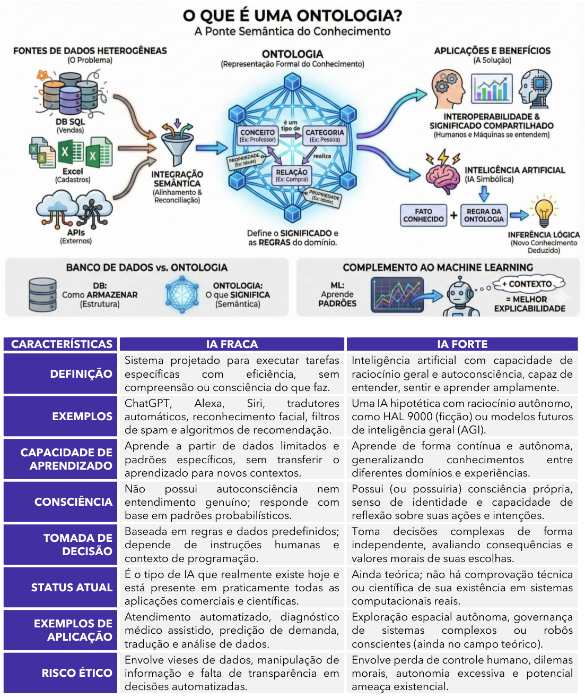

<!-- Start of picture text -->
CARACTERÍSTICAS  IA FRACA  IA FORTE Sistema projetado para executar tarefas  Inteligência artificial com capacidade de DEFINIÇÃO específicas  com  eficiência,  sem  raciocínio geral e autoconsciência, capaz de compreensão ou consciência do que faz.  entender, sentir e aprender amplamente. ChatGPT,  Alexa,  Siri,  tradutores  Uma IA hipotética com raciocínio autônomo, EXEMPLOS automáticos, reconhecimento facial, filtros  como HAL 9000 (ficção) ou modelos futuros de spam e algoritmos de recomendação.  de inteligência geral (AGI). Aprende a partir de dados limitados e  Aprende de forma contínua e autônoma, CAPACIDADE DE padrões específicos, sem transferir o  generalizando  conhecimentos  entre APRENDIZADO aprendizado para novos contextos.  diferentes domínios e experiências. Não  possui  autoconsciência  nem  Possui (ou possuiria) consciência própria, CONSCIÊNCIA entendimento genuíno; responde com  senso de identidade e capacidade de base em padrões probabilísticos.  reflexão sobre suas ações e intenções. Baseada em regras e dados predefinidos;  Toma  decisões  complexas  de  forma TOMADA DE depende  de  instruções  humanas  e  independente, avaliando consequências e DECISÃO contexto de programação.  valores morais de suas escolhas. É o tipo de IA que realmente existe hoje e  Ainda teórica; não há comprovação técnica STATUS ATUAL está presente em praticamente todas as  ou científica de sua existência em sistemas aplicações comerciais e científicas.  computacionais reais. Atendimento automatizado, diagnóstico  Exploração espacial autônoma, governança EXEMPLOS DE médico assistido, predição de demanda,  de  sistemas  complexos  ou  robôs APLICAÇÃO tradução e análise de dados.  conscientes (ainda no campo teórico). Envolve vieses de dados, manipulação de  Envolve perda de controle humano, dilemas RISCO ÉTICO informação e falta de transparência em  morais, autonomia excessiva e potencial decisões automatizadas.  ameaça existencial. <!-- End of picture text -->

---

<!-- pagina: 96 -->

**Diego Carvalho, Renato da Costa, Equipe Informática e TI Aula Única - Diego Carvalho, Renato da Costa** 

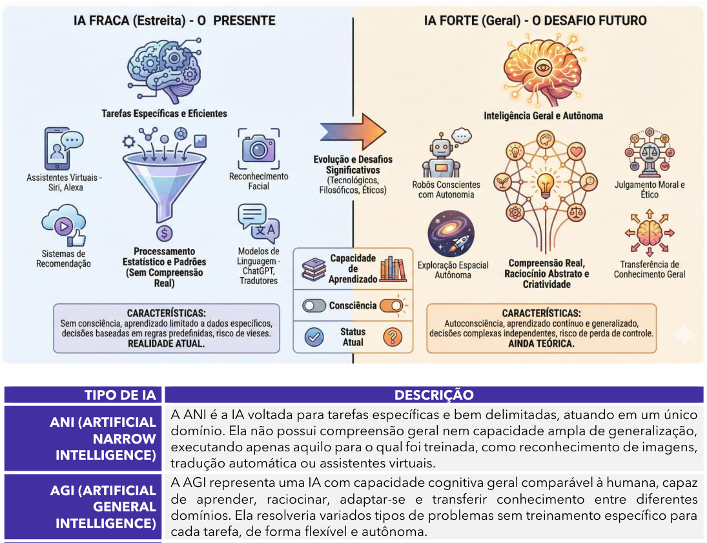

<!-- Start of picture text -->
TIPO DE IA  DESCRIÇÃO A ANI é a IA voltada para tarefas específicas e bem delimitadas, atuando em um único ANI (ARTIFICIAL domínio. Ela não possui compreensão geral nem capacidade ampla de generalização, NARROW executando apenas aquilo para o qual foi treinada, como reconhecimento de imagens, INTELLIGENCE) tradução automática ou assistentes virtuais. A AGI representa uma IA com capacidade cognitiva geral comparável à humana, capaz AGI (ARTIFICIAL de aprender, raciocinar, adaptar-se e transferir conhecimento entre diferentes GENERAL domínios. Ela resolveria variados tipos de problemas sem treinamento específico para INTELLIGENCE) cada tarefa, de forma flexível e autônoma. <!-- End of picture text -->

**<mark>TIPO DE IA</mark> ANI (ARTIFICIAL NARROW INTELLIGENCE) AGI (ARTIFICIAL GENERAL INTELLIGENCE) ASI (ARTIFICIAL SUPER INTELLIGENCE)** 

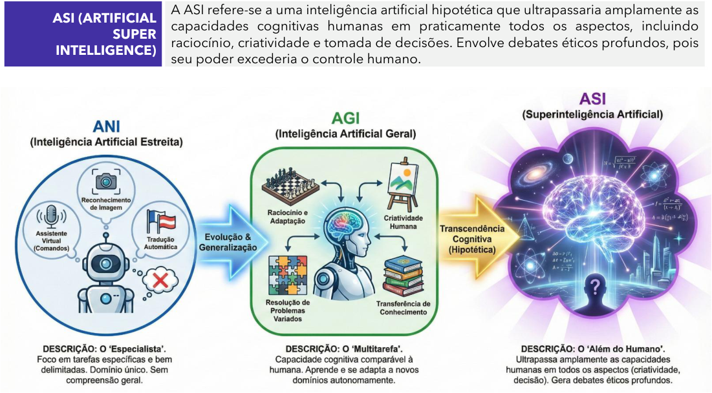

<!-- Start of picture text -->
A ASI refere-se a uma inteligência artificial hipotética que ultrapassaria amplamente as ASI (ARTIFICIAL capacidades cognitivas humanas em praticamente todos os aspectos, incluindo SUPER raciocínio, criatividade e tomada de decisões. Envolve debates éticos profundos, pois INTELLIGENCE) seu poder excederia o controle humano. <!-- End of picture text -->

---

<!-- pagina: 97 -->

**Diego Carvalho, Renato da Costa, Equipe Informática e TI Aula Única - Diego Carvalho, Renato da Costa** 

|**TIPO DE VIÉS**|**DEFINIÇÃO**|**EXEMPLO PRÁTICO**|**IMPACTO**|**COMO MITIGAR**|
|---|---|---|---|---|
|**VIÉS DE DADOS**|Surge quando o conjunto de treinamento não representa adequadamente a realidade, gerando distorções.|Modelo de crédito treinado apenas com histórico de homens urbanos rejeita mais mulheres ou moradores rurais.|Decisões injustas e perda de generalização.|Diversificar dados e revisar periodicamente as amostras. |
|**VIÉS DE** **AMOSTRAGEM**|A amostra coletada não é proporcional aos diferentes grupos da população.|Reconhecimento facial com 90% de imagens de pessoas brancas.|Desempenho desigual entre grupos.|Garantir amostragem balanceada e revisão por diversidade.|
|**VIÉS DE** **ROTULAGEM**|Erros ou preconceitos inseridos durante a rotulagem manual dos dados.|Imagens de pessoas negras rotuladas como “suspeitos” em base policial.|Reforço de estereótipos e injustiças.|Usar múltiplos revisores e revisar critérios de rotulagem.|
|**VIÉS HISTÓRICO**|Reproduz padrões discriminatórios existentes nos dados históricos.|IA de recrutamento penaliza mulheres porque os contratados anteriores eram majoritariamente homens.|Reforço de desigualdades sociais.|Rebalancear dados históricos e aplicar fairness metrics.|
|**VIÉS** **ALGORÍTMICO**|A própria estrutura ou ponderação matemática do modelo amplifica distorções.|Algoritmo de classificação com pesos que supervalorizam um atributo irrelevante.|Resultados enviesados mesmo com dados neutros.|Revisar parâmetros, testar fairness e ajustar métricas.|
|**VIÉS DE** **EXCLUSÃO**|Determinados grupos, contextos ou dados são omitidos do treinamento ou da análise.|Modelos que não reconhecem dialetos regionais ou dados indígenas.|Invisibilidade social e exclusão digital.|Ampliar cobertura de dados e envolver comunidades afetadas.|
|**VIÉS DE** **RESPOSTA**|O modelo tende a responder de forma politicamente “aceitável” ou conforme preferências do usuário.|Chatbots evitam temas sensíveis ou dão respostas genéricas para “não errar”.|Redução da autenticidade e perda de objetividade técnica.|Revisar prompts, balancear respostas e testar neutralidade.|
|**VIÉS DE** **CONFIRMAÇÃO**|A IA reforça padrões já existentes ou crenças predominantes.|Sistemas de recomendação mostram apenas conteúdos que confirmam opiniões anteriores.|Formação de bolhas informacionais.|Introduzir diversidade de fontes e filtros neutros.|
|**VIÉS DE SELEÇÃO**|O algoritmo escolhe dados com base em critérios enviesados, mesmo sem intenção.|IA médica treinada só com pacientes de hospitais privados.|Resultados imprecisos para populações diferentes.|Avaliar critérios de inclusão/exclusã o e validar fora da amostra.|
|**VIÉS DE** **INTERPRETAÇÃO** **/AVALIAÇÃO**|O humano interpreta resultados da IA de forma tendenciosa, sem espírito crítico.|Auditor aceita uma previsão sem verificar a metodologia.|“Overtrust” e decisões erradas.|Exigir explicabilidade e revisão humana independente.|
|**TIPO DE FERRAM**|**ENTA** **FUNÇ  **|**ÃO ÉTICA**|**EXEMPLO OU**|**APLICAÇÃO**|

---

<!-- pagina: 98 -->

**Diego Carvalho, Renato da Costa, Equipe Informática e TI Aula Única - Diego Carvalho, Renato da Costa** 

|**PAINÉIS DE** **EXPLICABILIDADE(XAI)**|Mostram por que a IA gerou certo resultado, permitindo ver causas epesos.|“Explainable AI” da IBM, SHAP, LIME.|
|---|---|---|
|**ALERTAS DE** **CONFIABILIDADE**|Informam o grau de certeza do modelo e sugerem revisão humana.|Chatbots e sistemas de previsão com indicadores de confiança.|
|**LOGS DE AUDITORIA**|Registram quem usou, revisou e aprovou os resultados da IA.|Plataformas de IA em órgãos públicos e empresas financeiras.|
|**VALIDAÇÃO** **COLABORATIVA**|Permite que mais de um usuário revise a saída da IA antes dapublicação.|Ferramentas de workflow integradas (Teams,Notion,Copilot).|
|**POLÍTICAS DE USO** **RESPONSÁVEL**|Orientam o usuário a validar, citar e corrigir informaçõesgeradaspor IA.|Termos de uso de OpenAI, Google, Microsoft,Anthropic.|

###### **<mark>DESCRIÇÃO ÇÃO ÃO</mark>** 

**<mark>RISCOS DESCRIÇÃO ÇÃO ÃO</mark>** A Inteligência Artificial Generativa traz grandes oportunidades criativas, mas também exige ética e responsabilidade para evitar abusos como desinformação, deepfakes e reprodução de preconceitos. É essencial que seu desenvolvimento siga normas claras, **ÉTICA E** supervisão humana e princípios FAT — Fairness (justiça), Accountability **RESPONSABILIDADE** (responsabilidade) e Transparency (transparência) — garantindo sistemas imparciais, auditáveis e sob controle humano. Assim, a IA só será verdadeiramente avançada quando sua capacidade de criar vier acompanhada do compromisso de respeitar direitos, <u>promover valor social e servir ao bem comum.</u> <mark>A IA Generativa revolucionou a criação de conteúdo digital, mas também ampliou o risco</mark> de desinformação, permitindo a produção e disseminação em massa de textos, imagens, áudios e vídeos falsos com aparência realista. Deepfakes e conteúdos **DESINFORMAÇÃO** automatizados podem manipular eleições, fraudar pessoas e afetar reputações, **(FAKE NEWS)** enquanto a falta de rastreabilidade e de leis claras dificulta a responsabilização. Diante disso, propõem-se soluções como marcas d’água digitais, educação midiática, regulamentação específica e reforço da checagem de fatos, unindo esforços técnicos, éticos e sociais para conter o uso indevido dessa tecnologia. 

Um dos maiores desafios da IA Generativa é a violação de direitos autorais, já que muitos modelos são treinados com obras protegidas — como textos, músicas e imagens — sem consentimento ou compensação aos autores. Isso leva à criação de conteúdos muito semelhantes aos originais, gerando dúvidas sobre autoria, propriedade intelectual e responsabilidade legal. Como as leis atuais pressupõem autoria humana, surge uma lacuna jurídica que enfraquece a proteção dos criadores. Propõem-se soluções como licenciamento prévio, direito de exclusão (opt-out), rastreamento de uso e revisão das normas de copyright, buscando equilibrar inovação tecnológica e respeito aos direitos criativos. 

**VIOLAÇÃO DE DIREITOS AUTORAIS** 

Um dos principais desafios da IA Generativa é o fenômeno das “alucinações”, quando o modelo inventa informações falsas com aparência convincente. Isso ocorre porque ele não entende o conteúdo, apenas prevê probabilisticamente a sequência de palavras mais provável, podendo gerar dados incorretos, referências inexistentes ou informações desatualizadas. O problema se agrava em contextos que exigem precisão, como pesquisa acadêmica ou jornalismo. Mesmo com ferramentas de busca em tempo real, o risco de erro persiste — por isso, é essencial manter a supervisão humana e a verificação crítica das respostas geradas por IA. 

**ALUCINAÇÕES/ DESATUALIZAÇÕES VERIFICAÇÃO HUMANA DADOS SENSÍVEIS** 

<mark>A verificação humana em sistemas de Inteligência Artificial é indispensável,</mark> especialmente em áreas sensíveis como saúde, justiça e finanças. Por mais eficientes que sejam, os algoritmos ainda cometem erros e precisam de supervisão para garantir decisões éticas e contextualizadas. Essa supervisão pode ocorrer via abordagens como human-in-the-loop (decisão final humana) ou human-on-the-loop (vigilância constante), ambas voltadas a manter o senso crítico e a responsabilidade humana. Em qualquer aplicação, o usuário deve verificar, editar e validar os resultados da IA, assegurando que a tecnologia realmente sirva às pessoas — e não o contrário. 

A Lei Geral de Proteção de Dados (LGPD) é essencial no contexto da Inteligência Artificial, <u>pois regula o uso de informações pessoais em modelos que dependem de</u>

---

<!-- pagina: 99 -->

**Diego Carvalho, Renato da Costa, Equipe Informática e TI Aula Única - Diego Carvalho, Renato da Costa** 

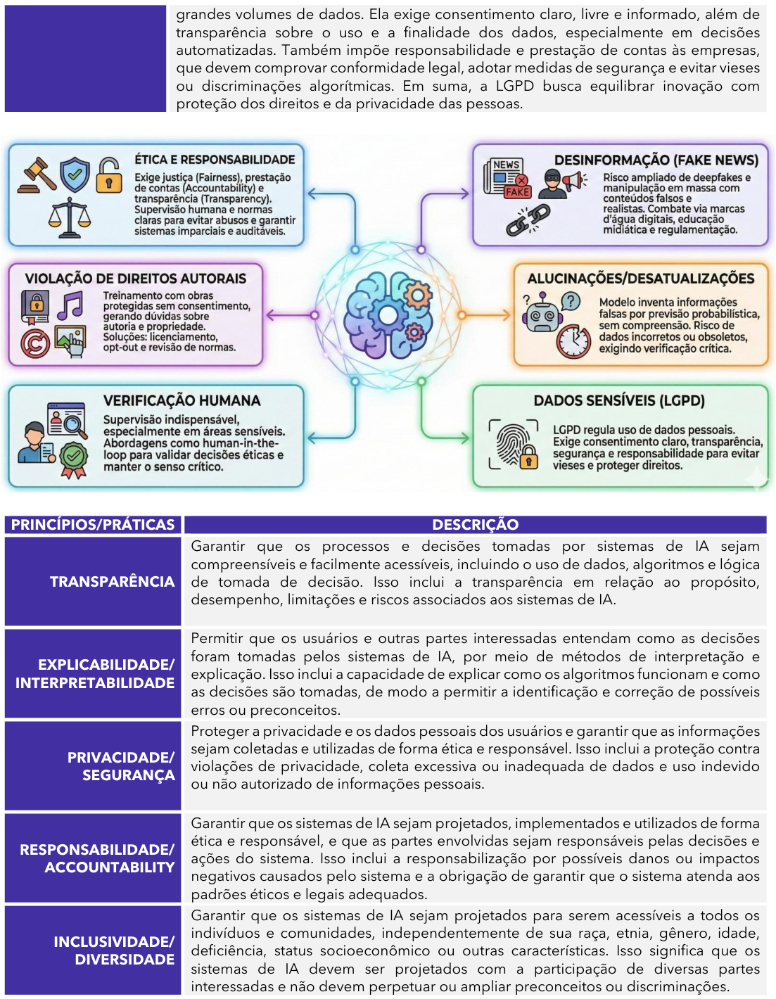

<!-- Start of picture text -->
grandes volumes de dados. Ela exige consentimento claro, livre e informado, além de transparência sobre o uso e a finalidade dos dados, especialmente em decisões automatizadas. Também impõe responsabilidade e prestação de contas às empresas, que devem comprovar conformidade legal, adotar medidas de segurança e evitar vieses ou discriminações algorítmicas. Em suma, a LGPD busca equilibrar inovação com proteção dos direitos e da privacidade das pessoas. PRINCÍPIOS/PRÁTICAS   DESCRIÇÃO Garantir que os processos e decisões tomadas por sistemas de IA sejam compreensíveis e facilmente acessíveis, incluindo o uso de dados, algoritmos e lógica TRANSPARÊNCIA  de tomada de decisão. Isso inclui a transparência em relação ao propósito, desempenho, limitações e riscos associados aos sistemas de IA. Permitir que os usuários e outras partes interessadas entendam como as decisões foram tomadas pelos sistemas de IA, por meio de métodos de interpretação e EXPLICABILIDADE/ explicação. Isso inclui a capacidade de explicar como os algoritmos funcionam e como INTERPRETABILIDADE as decisões são tomadas, de modo a permitir a identificação e correção de possíveis erros ou preconceitos. Proteger a privacidade e os dados pessoais dos usuários e garantir que as informações sejam coletadas e utilizadas de forma ética e responsável. Isso inclui a proteção contra PRIVACIDADE/ violações de privacidade, coleta excessiva ou inadequada de dados e uso indevido SEGURANÇA ou não autorizado de informações pessoais. Garantir que os sistemas de IA sejam projetados, implementados e utilizados de forma ética e responsável, e que as partes envolvidas sejam responsáveis pelas decisões e RESPONSABILIDADE/ ações do sistema. Isso inclui a responsabilização por possíveis danos ou impactos ACCOUNTABILITY negativos causados pelo sistema e a obrigação de garantir que o sistema atenda aos padrões éticos e legais adequados. Garantir que os sistemas de IA sejam projetados para serem acessíveis a todos os indivíduos e comunidades, independentemente de sua raça, etnia, gênero, idade, INCLUSIVIDADE/ deficiência, status socioeconômico ou outras características. Isso significa que os DIVERSIDADE sistemas de IA devem ser projetados com a participação de diversas partes interessadas e não devem perpetuar ou ampliar preconceitos ou discriminações. <!-- End of picture text -->

---

<!-- pagina: 100 -->

**Diego Carvalho, Renato da Costa, Equipe Informática e TI Aula Única - Diego Carvalho, Renato da Costa** 

Garantir que os sistemas de IA não discriminem indivíduos ou grupos com base em suas características protegidas ou outros fatores, e que promovam a equidade e a igualdade de oportunidades. Isso significa que os sistemas de IA devem tomar decisões baseadas em dados relevantes e precisos, em vez de perpetuar ou ampliar desigualdades existentes. 

**JUSTIÇA/ EQUIDADE CONFIABILIDADE/ USO SEGURO** 

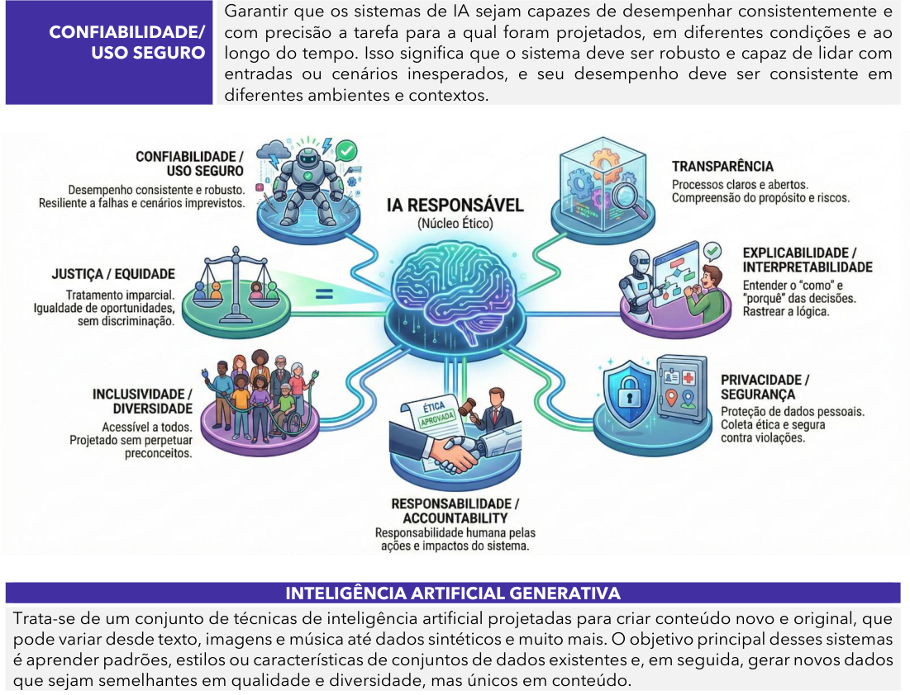

<!-- Start of picture text -->
Garantir que os sistemas de IA sejam capazes de desempenhar consistentemente e CONFIABILIDADE/  com precisão a tarefa para a qual foram projetados, em diferentes condições e ao USO SEGURO  longo do tempo. Isso significa que o sistema deve ser robusto e capaz de lidar com entradas ou cenários inesperados, e seu desempenho deve ser consistente em diferentes ambientes e contextos. INTELIGÊNCIA ARTIFICIAL GENERATIVA Trata-se de um conjunto de técnicas de inteligência artificial projetadas para criar conteúdo novo e original, que pode variar desde texto, imagens e música até dados sintéticos e muito mais. O objetivo principal desses sistemas é aprender padrões, estilos ou características de conjuntos de dados existentes e, em seguida, gerar novos dados que sejam semelhantes em qualidade e diversidade, mas únicos em conteúdo. <!-- End of picture text -->

---

<!-- pagina: 101 -->

**Diego Carvalho, Renato da Costa, Equipe Informática e TI Aula Única - Diego Carvalho, Renato da Costa** 

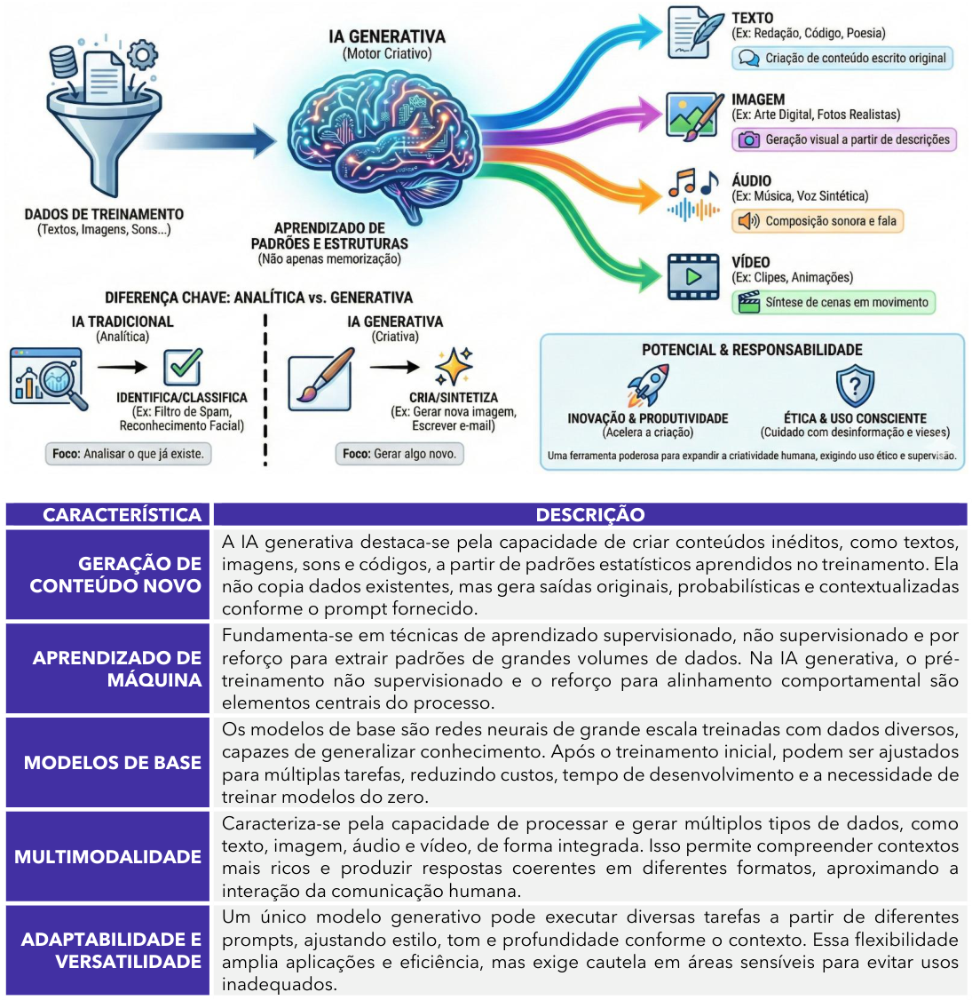

<!-- Start of picture text -->
CARACTERÍSTICA  DESCRIÇÃO A IA generativa destaca-se pela capacidade de criar conteúdos inéditos, como textos, GERAÇÃO DE  imagens, sons e códigos, a partir de padrões estatísticos aprendidos no treinamento. Ela CONTEÚDO NOVO não copia dados existentes, mas gera saídas originais, probabilísticas e contextualizadas conforme o prompt fornecido. Fundamenta-se em técnicas de aprendizado supervisionado, não supervisionado e por APRENDIZADO DE  reforço para extrair padrões de grandes volumes de dados. Na IA generativa, o pré- MÁQUINA treinamento não supervisionado e o reforço para alinhamento comportamental são elementos centrais do processo. Os modelos de base são redes neurais de grande escala treinadas com dados diversos, capazes de generalizar conhecimento. Após o treinamento inicial, podem ser ajustados MODELOS DE BASE para múltiplas tarefas, reduzindo custos, tempo de desenvolvimento e a necessidade de treinar modelos do zero. Caracteriza-se pela capacidade de processar e gerar múltiplos tipos de dados, como texto, imagem, áudio e vídeo, de forma integrada. Isso permite compreender contextos MULTIMODALIDADE mais ricos e produzir respostas coerentes em diferentes formatos, aproximando a interação da comunicação humana. Um único modelo generativo pode executar diversas tarefas a partir de diferentes ADAPTABILIDADE E  prompts, ajustando estilo, tom e profundidade conforme o contexto. Essa flexibilidade VERSATILIDADE amplia aplicações e eficiência, mas exige cautela em áreas sensíveis para evitar usos inadequados. <!-- End of picture text -->

---

<!-- pagina: 102 -->

**Diego Carvalho, Renato da Costa, Equipe Informática e TI Aula Única - Diego Carvalho, Renato da Costa** 

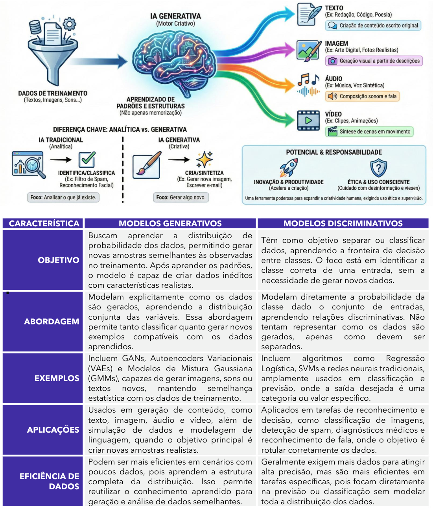

<!-- Start of picture text -->
CARACTERÍSTICA  MODELOS GENERATIVOS  MODELOS DISCRIMINATIVOS Buscam  aprender  a  distribuição  de Têm como objetivo separar ou classificar probabilidade dos dados, permitindo gerar dados, aprendendo a fronteira de decisão novas amostras semelhantes às observadas OBJETIVO entre classes. O foco está em identificar a no treinamento. Após aprender os padrões, classe correta de uma entrada, sem a o modelo é capaz de criar dados inéditos necessidade de gerar novos dados. com características realistas. Modelam explicitamente como os dados  Modelam diretamente a probabilidade da são gerados, aprendendo a distribuição  classe dado o conjunto de entradas, conjunta das variáveis. Essa abordagem  aprendendo relações discriminativas. Não ABORDAGEM permite tanto classificar quanto gerar novos  tentam representar como os dados são exemplos compatíveis com os dados  gerados,  apenas  como  devem  ser aprendidos.  separados. Incluem GANs, Autoencoders Variacionais  Incluem  algoritmos  como  Regressão (VAEs) e Modelos de Mistura Gaussiana  Logística, SVMs e redes neurais tradicionais, EXEMPLOS (GMMs), capazes de gerar imagens, sons ou  amplamente usados em classificação e textos  novos,  mantendo  semelhança  previsão, onde a saída desejada é uma estatística com os dados de treinamento. categoria ou valor específico. Usados em geração de conteúdo, como  Aplicados em tarefas de reconhecimento e texto, imagem, áudio e vídeo, além de  decisão, como classificação de imagens, APLICAÇÕES simulação de dados e modelagem de  detecção de spam, diagnósticos médicos e linguagem, quando o objetivo principal é  reconhecimento de fala, onde o objetivo é criar novas amostras realistas. rotular corretamente os dados. Podem ser mais eficientes em cenários com  Geralmente exigem mais dados para atingir poucos dados, pois aprendem a estrutura  alta precisão, mas são mais eficientes em EFICIÊNCIA DE completa da distribuição. Isso permite  tarefas específicas, pois focam diretamente DADOS reutilizar o conhecimento aprendido para  na previsão ou classificação sem modelar geração e análise de dados semelhantes. toda a distribuição dos dados. <!-- End of picture text -->

---

<!-- pagina: 103 -->

**Diego Carvalho, Renato da Costa, Equipe Informática e TI Aula Única - Diego Carvalho, Renato da Costa** 

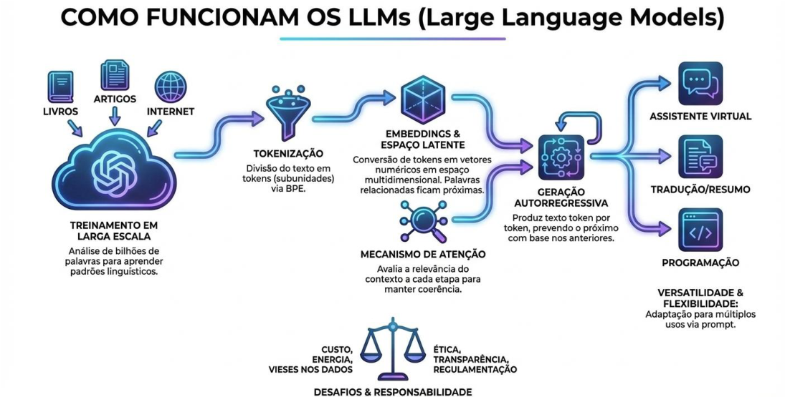

<!-- Start of picture text -->
==5460== <!-- End of picture text -->

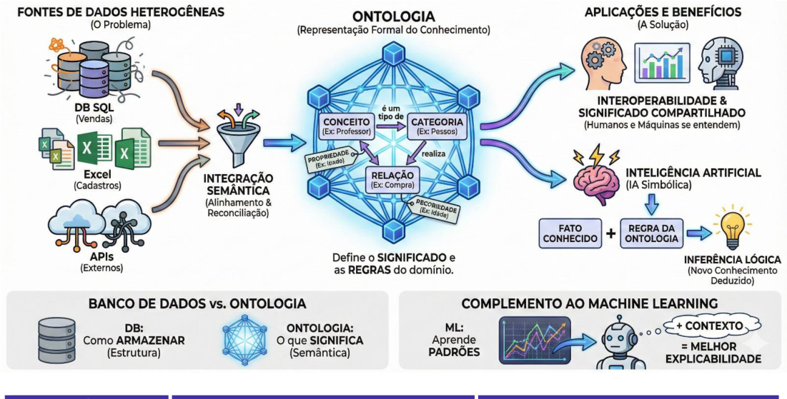

|**TIPO DE REDE** **NEURAL**|**CARACTERÍSTICAS PRINCIPAIS**|**APLICAÇÕES COMUNS**|
|---|---|---|
|**CONVOLUCIONAL** **(CNN)**|Usa filtros para extrair padrões visuais; camadas de convolução, pooling e totalmente conectadas.|Visão computacional, reconhecimento de imagem, detecção de objetos.|
|**RECORRENTE** **(RNN)**|Possui “memória” de estados anteriores; processa sequências passo a passo.|Tradução automática, reconhecimento de fala, séries temporais.|
|**TRANSFORMERS**|Elimina recorrência; usa mecanismo de atenção para processar toda a sequência emparalelo.|Processamento de linguagem natural, tradução, geração de texto (GPT, BERT).|

---

<!-- pagina: 104 -->

**Diego Carvalho, Renato da Costa, Equipe Informática e TI Aula Única - Diego Carvalho, Renato da Costa** 

**ADVERSÁRIA GENERATIVA (GAN)** 

**FEED-FORWARD (MLP)** 

Duas redes (geradora e discriminadora) Geração de imagens, deepfakes, arte competem; aprendizado adversarial. digital, restauração de imagens. 

<mark>Dados fluem em uma única direção; usa Classificação, regressão, reconhecimento</mark> retropropagação para ajustar pesos. de padrões simples. 

###### **<mark>DESCRIÇÃO</mark>** 

###### **<mark>ARQUITETURA</mark>** 

Arquitetura mais básica de rede neural, na qual os dados fluem em uma única direção, da **FEED-FORWARD** entrada à saída, sem ciclos. Utiliza camadas totalmente conectadas e retropropagação para **(MLP)** ajustar pesos, sendo aplicada em classificação, regressão e padrões simples. Projetada para dados em grade, como imagens, utiliza camadas de convolução e pooling **CONVOLUCIONAL** para extrair padrões visuais locais, como bordas e formas. Reduz dimensionalidade e **(CNN)** aprende hierarquias de características, sendo amplamente usada em visão computacional e reconhecimento de imagens. Desenvolvida para dados sequenciais, possui conexões recorrentes que permitem reter **RECORRENTE** informações anteriores, criando uma memória temporal. É aplicada em textos, áudio e **(RNN)** séries temporais, com variantes como LSTM e GRU para lidar com dependências longas. <mark>Arquitetura que elimina recorrência e utiliza mecanismos de atenção para processar</mark> **TRANSFORMER** sequências em paralelo. Consegue capturar dependências de longo alcance com eficiência, sendo a base de modelos modernos de linguagem natural, como GPT e BERT., sendo a base de modelos modernos de linguagem natural, como GPT e BERT. sendo a base de modelos modernos de linguagem natural, como GPT e BERT.guagem natural, como GPT e BERT.uagem natural, como GPT e BERT.gem natural, como GPT e BERT.em natural, como GPT e BERT., como GPT e BERT. como GPT e BERT. 

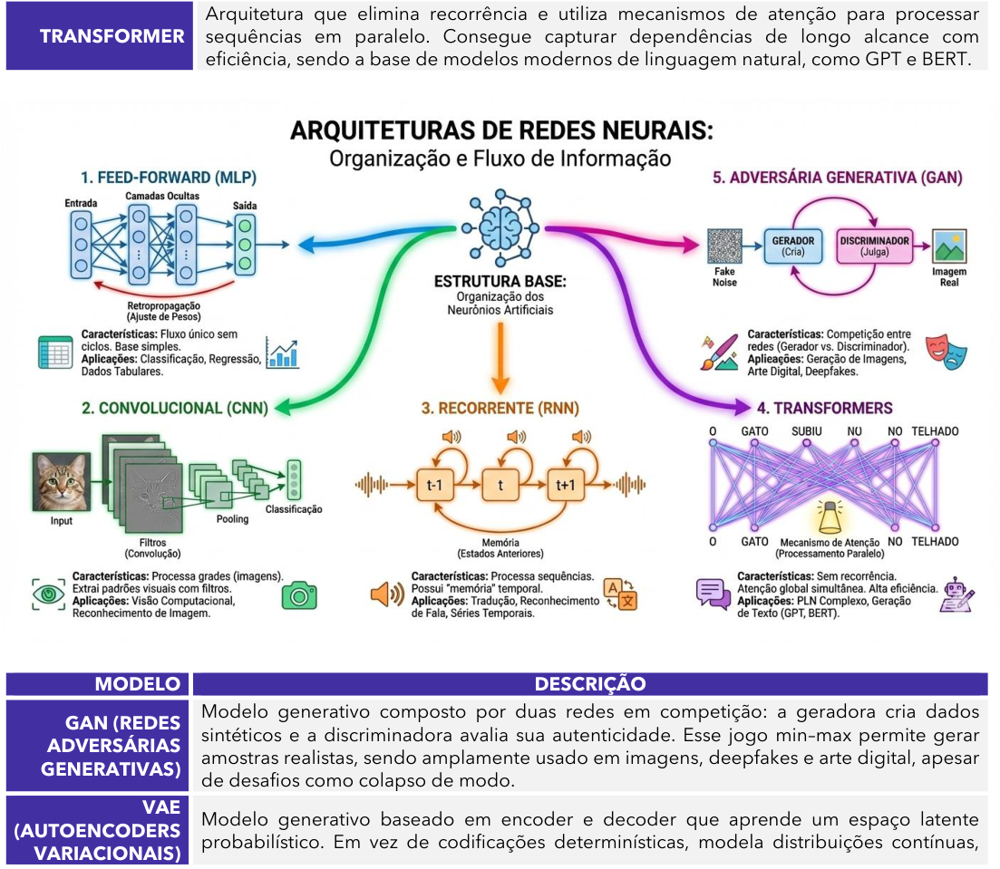

<!-- Start of picture text -->
Arquitetura que elimina recorrência e utiliza mecanismos de atenção para processar TRANSFORMER sequências em paralelo. Consegue capturar dependências de longo alcance com eficiência, sendo a base de modelos modernos de linguagem natural, como GPT e BERT., sendo a base de modelos modernos de linguagem natural, como GPT e BERT. sendo a base de modelos modernos de linguagem natural, como GPT e BERT.guagem natural, como GPT e BERT.uagem natural, como GPT e BERT.gem natural, como GPT e BERT.em natural, como GPT e BERT., como GPT e BERT. como GPT e BERT. MODELO  DESCRIÇÃO Modelo generativo composto por duas redes em competição: a geradora cria dados GAN (REDES sintéticos e a discriminadora avalia sua autenticidade. Esse jogo min–max permite gerar ADVERSÁRIAS amostras realistas, sendo amplamente usado em imagens, deepfakes e arte digital, apesar GENERATIVAS) de desafios como colapso de modo. VAE Modelo generativo baseado em encoder e decoder que aprende um espaço latente (AUTOENCODERS probabilístico. Em vez de codificações determinísticas, modela distribuições contínuas, VARIACIONAIS) <!-- End of picture text -->

---

<!-- pagina: 105 -->

**Diego Carvalho, Renato da Costa, Equipe Informática e TI Aula Única - Diego Carvalho, Renato da Costa** 

permitindo gerar novas amostras por interpolação. Oferece maior estabilidade e controle matemático, embora com menor nitidez visual. 

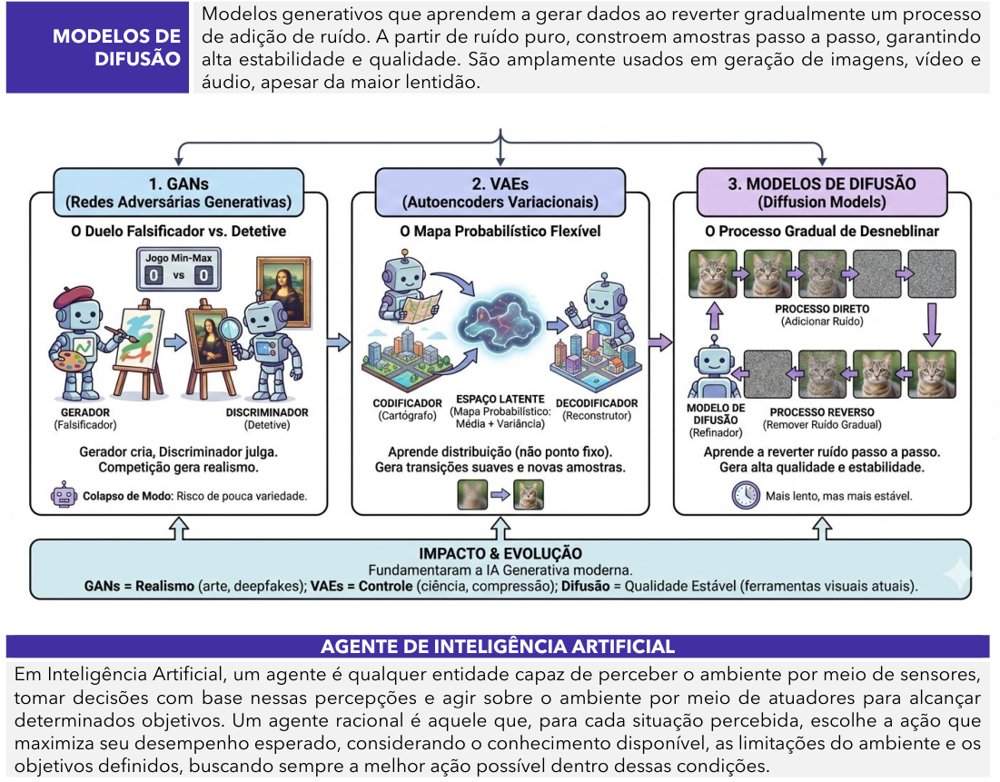

<!-- Start of picture text -->
Modelos generativos que aprendem a gerar dados ao reverter gradualmente um processo MODELOS DE  de adição de ruído. A partir de ruído puro, constroem amostras passo a passo, garantindo DIFUSÃO alta estabilidade e qualidade. São amplamente usados em geração de imagens, vídeo e áudio, apesar da maior lentidão. AGENTE DE INTELIGÊNCIA ARTIFICIAL Em Inteligência Artificial, um agente é qualquer entidade capaz de perceber o ambiente por meio de sensores, tomar decisões com base nessas percepções e agir sobre o ambiente por meio de atuadores para alcançar determinados objetivos. Um agente racional é aquele que, para cada situação percebida, escolhe a ação que maximiza seu desempenho esperado, considerando o conhecimento disponível, as limitações do ambiente e os objetivos definidos, buscando sempre a melhor ação possível dentro dessas condições. <!-- End of picture text -->

|**RECURSOS**|**DESCRIÇÃO**|
|---|---|
|**RACIOCÍNIO**|Capacidade de usar lógica e informações disponíveis para tirar conclusões, fazer inferências e resolver problemas, analisando dados e padrões para tomar decisões fundamentadas no contexto e em evidências.|
|**AÇÃO**|Habilidade de executar tarefas com base em decisões ou planos definidos, interagindo com o ambiente por meio de ações físicas ou digitais, como enviar mensagens, atualizar sistemas ou acionarprocessos automatizados.|
|**OBSERVAÇÃO**|Capacidade de coletar e interpretar informações do ambiente por meio de linguagem, visão, áudio ou sensores, permitindo compreender o contexto atual e fornecer subsídios para decisões mais conscientes.|
|**PLANEJAMENTO**|Aptidão para definir estratégias e sequências de ações visando alcançar objetivos, avaliando alternativas, prevendo estados futuros e considerando restrições, riscos e possíveis obstáculos ao longo doprocesso.|
|**COLABORAÇÃO**|Capacidade de cooperar com humanos ou outros agentes de IA, envolvendo comunicação, coordenação e alinhamento de objetivos, permitindo a execução conjunta de tarefas e fluxos de trabalho complexos.|

---

<!-- pagina: 106 -->

**Diego Carvalho, Renato da Costa, Equipe Informática e TI Aula Única - Diego Carvalho, Renato da Costa** 

Habilidade de aprender com experiências e feedback, ajustando comportamentos e **APRIMORAMENTO** estratégias ao longo do tempo para melhorar desempenho, eficiência e qualidade das decisões tomadas pelo agente. 

|**TIPO DE AGENTE**|decisões tomadaspelo agente. **DESCRIÇÃO**|
|---|---|
|**AGENTE REATIVO**|Atua apenas com base na percepção atual do ambiente, utilizando regras simples do tipo “se–então”. Não possui memória nem modelo interno, sendo adequado apenas a ambientes simples e totalmente observáveis.|
|**AGENTE BASEADO** **EM MODELO**|Mantém um modelo interno do ambiente que representa estados passados e atuais, permitindo lidar com ambientes parcialmente observáveis. Usa memória para inferir situaçõesque nãopodem serpercebidas diretamente.|
|**AGENTE BASEADO** **EM OBJETIVO**|Toma decisões avaliando se suas ações o aproximam de um objetivo definido. Analisa estados futuros possíveis e escolhe ações que aumentem a chance de atingir a meta desejada.|
|**AGENTE BASEADO** **EM UTILIDADE**|Seleciona ações com base em uma função de utilidade, que mede o quão desejável é cada resultado possível. Permite comparar alternativas e escolher a que maximiza benefício ou satisfação.|
|**AGENTE DE** **APRENDIZADO**|Possui mecanismos para aprender com a experiência e melhorar seu desempenho ao longo do tempo. Ajusta seu comportamento com base em feedback, dados históricos ou recompensas recebidas.|
|**AGENTE** **DELIBERATIVO**|Utiliza raciocínio simbólico e planejamento explícito para tomar decisões. Avalia diferentes alternativas antes de agir, sendo mais preciso, porém mais custoso computacionalmente.|
|**AGENTE HÍBRIDO**|Combina comportamentos reativos com capacidades deliberativas. Responde rapidamente a estímulos imediatos, mas também planeja ações de médio e longo prazo quando necessário.|
|**AGENTE** **MULTIAGENTE**|Atua em ambientes com vários agentes, humanos ou artificiais, cooperando ou competindo entre si. Exige comunicação, coordenação e, muitas vezes, negociação para atingir objetivos.|
|**AGENTE** **COGNITIVO**|Baseado em modelos inspirados na cognição humana, como crenças, desejos e intenções. Busca simular processos mentais complexos, sendo usado em sistemas avançados e explicáveis.|
|**AGENTE SOCIAL**|Projetado para interagir com humanos de forma natural, considerando normas sociais, contexto e comunicação. É comum em assistentes virtuais, chatbots e sistemas |
||conversacionais avançados.|
|**CRITÉRIOS**|**DESCRIÇÃO**|
|**CAPACIDADES E** **ESCOPO**|Modelo de linguagem de grande escala voltado para conversação, geração de textos, explicações conceituais e produção de código. Suporta múltiplos idiomas com alta qualidade, especialmente inglês e português, e apresenta multimodalidade em versões recentes,combinando texto e imagens.|
|**QUALIDADE DE** **SAÍDA**|Produz respostas coerentes, contextualizadas e bem estruturadas, com destaque para clareza didática e criatividade textual. Entretanto, pode gerar alucinações, apresentando informações incorretas com tom confiante, o que exige verificação crítica por parte do usuário.|
|**INTEGRAÇÃO E** **ECOSSISTEMA**|Disponível por meio da API da OpenAI, permitindo integração com aplicações, serviços e fluxos automatizados. Suporta plugins, extensões e navegação web em planos avançados, embora não possua integração nativa tão profunda quanto Copilot ou Gemini.|
|**PERFORMANCE** **TÉCNICA**|Oferece alta velocidade de resposta em planos pagos, com suporte a janelas de contexto extensas, chegando a dezenas de milhares de tokens. Possui capacidades multimodais e execução eficiente,com complexidade computacional abstraída do usuário final.|

---

<!-- pagina: 107 -->

**Diego Carvalho, Renato da Costa, Equipe Informática e TI Aula Única - Diego Carvalho, Renato da Costa** 

Atende a normas como LGPD e GDPR, com políticas ativas de moderação de conteúdo. **SEGURANÇA E** Em versões corporativas, garante que dados dos clientes não sejam usados para **PRIVACIDADE** treinamento. Ainda assim, recomenda-se cautela no uso de informações altamente sensíveis. Disponibilizado em versão gratuita e em planos pagos, como Plus, Team e Enterprise. Os **MODELO DE** planos corporativos oferecem maior desempenho, controle administrativo, **NEGÓCIO** escalabilidade e garantias adicionais de segurança, atendendo a diferentes perfis de <mark>usuários e organizações.</mark> Evolui rapidamente por meio de sucessivas gerações de modelos, incorporando avanços **INOVAÇÃO E** em multimodalidade, agentes e integração com ferramentas externas. Conta com ampla **EVOLUÇÃO** comunidade global e documentação oficial, impulsionando adoção, experimentação e inovação contínua. 

**<mark>CRITÉRIOS DESCRIÇÃO</mark>** Atua como assistente de produtividade integrado ao Microsoft 365, operando dentro do **CAPACIDADES E** Word, Excel, PowerPoint, Outlook e Teams. É voltado à redação, resumo, análise de **ESCOPO** dados e automação, funcionando como copiloto contextual, e não chatbot generalista. Produz respostas contextualizadas ao acessar documentos, e-mails e planilhas. Redige **QUALIDADE DE** textos, resume conteúdos, sugere fórmulas no Excel e gera apresentações no **SAÍDA** PowerPoint, com qualidade dependente da clareza do prompt e dos dados disponíveis. <mark>Possui integração nativa e profunda com o ecossistema Microsoft 365, incluindo</mark> **INTEGRAÇÃO E** OneDrive, SharePoint e Teams. Explora dados corporativos já existentes na nuvem Azure, **ECOSSISTEMA** <u>porém é restrito ao ambiente Microsoft, com menor abertura externa via API.</u> <mark>Integrado diretamente às interfaces conhecidas do Office, aparecendo em painéis</mark> **INTERFACE E** laterais ou campos de texto. Apresenta curva de aprendizado mínima para usuários **USABILIDADE** corporativos e permite interação por prompts e sugestões contextuais em tempo real. Baseado em modelos avançados da OpenAI, como o GPT-4, com otimizações da **PERFORMANCE** Microsoft. Oferece respostas rápidas e estáveis, apoiadas pela infraestrutura Azure, mas **TÉCNICA** não é voltado a diálogos longos ou tarefas criativas fora do contexto corporativo. Projetado para uso empresarial, mantendo dados dentro do tenant da organização. **SEGURANÇA E** Atende a padrões como LGPD, GDPR, ISO e SOC. As informações dos clientes não são **PRIVACIDADE** usadas para treinamento dos modelos, reforçando segurança e conformidade. <mark>Disponível apenas por meio de assinatura paga vinculada aos planos do Microsoft 365.</mark> **MODELO DE** Não possui versão gratuita. O custo varia conforme o tipo de licenciamento e o porte da **NEGÓCIO** organização contratante. <mark>Representa a estratégia da Microsoft de integrar IA diretamente à produtividade</mark> **INOVAÇÃO E** corporativa. Evolui de forma contínua junto às atualizações do Office, incorporando **EVOLUÇÃO** novos recursos, embora permaneça limitado ao ecossistema Microsoft. 

**<mark>CRITÉRIOS DESCRIÇÃO</mark>** <mark>Família multimodal de LLMs (Ultra, Pro, Flash, Nano) que processa texto, imagens, áudio,</mark> **CAPACIDADES E** vídeo, código e PDFs. Focada em raciocínio e contextos longos, com janelas muito **ESCOPO** extensas (até ~1M tokens) em versões específicas e uso avançado. Alto desempenho em benchmarks de raciocínio, programação e STEM; versões Pro **QUALIDADE DE** costumam liderar comparativos. Também integra geração/edição de imagens (Imagen) **SAÍDA** com respostas contextuais e rápidas, combinando modalidades em um mesmo fluxo. Integração profunda ao ecossistema Google: Chrome, Workspace, Android, Search, AI **INTEGRAÇÃO E** Studio e Vertex AI. Atua como assistente em Gmail, Docs, Sheets, Slides, Meet e Photos **ECOSSISTEMA** <u>(Ex: “Ask Photos”), aproveitando contexto do usuário e da nuvem.</u> <mark>Disponível na web e em apps móveis, com conversas multimodais e prompts com</mark> **INTERFACE E** imagens. No AI Studio, aceita uploads e protótipos para gerar código e testes. Em **USABILIDADE** iniciativas como Astra, combina busca, visão e ações guiadas por contexto.

---

<!-- pagina: 108 -->

**Diego Carvalho, Renato da Costa, Equipe Informática e TI Aula Única - Diego Carvalho, Renato da Costa** 

|**PERFORMANCE** **TÉCNICA**|Oferece forte capacidade de raciocínio e alta precisão, com janelas de contexto muito grandes e multimodalidade consistente. Algumas versões suportam contextos extensíssimos e devem ampliar ainda mais(Ex: rumo a ~2M tokens)com eficiência.|
|---|---|
|**SEGURANÇA E** **PRIVACIDADE**|Em Workspace/Enterprise, inclui controles robustos (DLP, criptografia e certificações ISO/SOC/HIPAA) e não usa dados de clientes para treinar. No uso consumidor, pode haver retençãopor meses e menorproteção,como ausência de E2E.|
|**MODELO DE** **NEGÓCIO**|Uso geral com camada gratuita e planos pagos (Pro/Ultra) via Google One e ofertas Workspace. Também disponível via API (AI Studio/Vertex AI), com cobrança por uso, limites configuráveis e escalonamentopara aplicações e ambientes corporativos.|
|**INOVAÇÃO E** **EVOLUÇÃO**|Evolução rápida entre gerações (1.0→1.5→2.0→2.5 Pro/Flash), ampliando multimodalidade, janela de contexto e recursos de agente (Astra). O foco é elevar raciocíniopasso apasso,ferramentas,segurança e integração ao Google.|

- **<mark>CRITÉRIOS DESCRIÇÃO</mark>** Empresa chinesa de IA dedicada ao desenvolvimento de LLMs de código aberto. 

- **CAPACIDADES E** Oferece modelos como DeepSeek-R1, V3 e V3.1, voltados a chat, raciocínio lógico, 

- **ESCOPO** <u>programação e suporte a contexto longo.</u> Apresenta desempenho comparável a modelos fechados como GPT-4 e OpenAI o1 em 

- **QUALIDADE DE** benchmarks de raciocínio, matemática e programação, demonstrando alta capacidade 

- **SAÍDA** analítica em tarefas complexas. <mark>Disponível como chatbot via web e aplicativos móveis, além de API pública compatível</mark> 

- **INTEGRAÇÃO E** com o padrão OpenAI, facilitando integração em sistemas próprios e aplicações 

- **ECOSSISTEMA** corporativas. Interface simples e acessível por navegador ou apps iOS e Android. Oferece uso 

- **INTERFACE E** gratuito do chat e API pública com custos reduzidos, permitindo adoção por usuários 

- **USABILIDADE** individuais e desenvolvedores. Destaca-se pela alta eficiência computacional, com modelos treinados a custos 

- **PERFORMANCE** significativamente menores que concorrentes ocidentais, uso de arquiteturas MoE e 

- **TÉCNICA** suporte a janelas de contexto de até 128K tokens. <mark>Recebe críticas por censura de respostas em temas politicamente sensíveis e por</mark> 

- **SEGURANÇA E** possíveis riscos à privacidade, devido à coleta de dados e à submissão às regulações 

- **PRIVACIDADE** chinesas. Modelos distribuídos sob licença MIT, com pesos abertos. Chat gratuito e API paga por 

- **MODELO DE** consumo de tokens, com valores inferiores aos praticados por grandes fornecedores de 

- **NEGÓCIO** LLMs fechados. Tornou-se referência ao desafiar grandes empresas com modelos eficientes e 

- **INOVAÇÃO E** acessíveis, sendo descrita como um “momento Sputnik da IA”, com rápida evolução 

- **EVOLUÇÃO** entre versões mantendo alto desempenho. 

**<mark>CRITÉRIOS DESCRIÇÃO</mark>** Modelo de IA focado na geração de imagens a partir de descrições textuais. Permite criar **CAPACIDADES E** ilustrações, artes conceituais, variações visuais e editar regiões específicas de imagens **ESCOPO** existentes, atuando exclusivamente no domínio visual. Reconhecido pela alta qualidade artística e coerência visual. Produz imagens detalhadas **QUALIDADE DE** e criativas, embora possa ter limitações em fotorrealismo extremo ou em texto embutido **SAÍDA** complexo, com melhorias progressivas entre versões. <mark>Integrado nativamente ao ChatGPT (Plus/Enterprise) e ao Microsoft Designer/Bing Image</mark> **INTEGRAÇÃO E** Creator. Também disponível via API da OpenAI para uso em aplicações próprias, sem **ECOSSISTEMA** depender de plataformas externas como Discord. <mark>Uso simples por meio de prompts textuais descritivos. Interface intuitiva no ChatGPT e no</mark> **INTERFACE E** Bing, com suporte a inpainting e outpainting para editar, substituir ou expandir áreas **USABILIDADE** específicas de uma imagem gerada.

---

<!-- pagina: 109 -->

**Diego Carvalho, Renato da Costa, Equipe Informática e TI Aula Única - Diego Carvalho, Renato da Costa** 

Geração rápida, geralmente em poucos segundos por imagem. Suporta diferentes **PERFORMANCE** resoluções e estilos artísticos. Em períodos de alta demanda, pode haver filas ou limitação **TÉCNICA** temporária de requisições. <mark>Emprega filtros para bloquear conteúdos sensíveis, como violência explícita, pornografia</mark> **SEGURANÇA E** e discurso de ódio. Restringe a geração de imagens com pessoas públicas, reduzindo **PRIVACIDADE** riscos de abuso e desinformação visual. Acessível via ChatGPT Plus/Enterprise, Bing Image Creator com uso gratuito limitado e **MODELO DE** pela API paga da OpenAI. O uso pode envolver cotas mensais ou cobrança por créditos **NEGÓCIO** adicionais de geração. Pioneiro na popularização da geração de imagens por IA. A versão 3 ampliou fidelidade **INOVAÇÃO E** ao prompt e integração com ChatGPT, enquanto a OpenAI segue evoluindo recursos de **EVOLUÇÃO** <mark>edição e integração multimodal.</mark> 

|**CRITÉRIO**|**CHATGPT**|**MICROSOFT** **COPILOT**|**DALL·E**|**GOOGLE** **GEMINI**|**DEEPSEEK**|
|---|---|---|---|---|---|
|**CAPACIDADES** **E ESCOPO**|Conversação, geração de texto, código e multimodal (texto + imagem). Versátil e generalista.|Focado em produtividade: integra Word, Excel, PowerPoint, Outlook, Teams.|Geração de imagens a partir de texto; edição (in/outpainting).|Multimodal (texto, imagem, áudio, vídeo, código, PDFs). Contexto longo (até milhões de tokens).|Modelos abertos, com foco em eficiência, raciocínio lógico e programação.|
|**QUALIDADE DE** **SAÍDA** **INTEGRAÇÃO E** **ECOSSISTEMA**|Respostas claras, criativas e coerentes; pode alucinar. API aberta, plugins, apps móveis/web.|Produz conteúdo altamente contextualizado com base nos arquivos do usuário. Integrado ao Microsoft 365 e Azure.|Qualidade artística e criativa; bom no estilo ilustrativo, limitações em fotorrealismo/tex to em imagem. Integrado ao ChatGPT, Bing e Designer; API OpenAI.|Líder em benchmarks de raciocínio e STEM; forte em multimodalidad e. Integrado ao Google Workspace, Chrome, Android, AI Studio e Vertex AI.|Comparável a GPT-4 em matemática, lógica e benchmarks técnicos; custo baixo. API compatível com OpenAI, apps móveis e web; disponível em GitHub/Huggin gFace.|
|**INTERFACE E** **USABILIDADE**|Chat simples, apps iOS/Android, web; curva de aprendizado baixa.|Embutido nas ferramentas Office; fácil para usuários já habituados ao ecossistema Microsoft.|Interface intuitiva; basta digitar prompts.|Chat multimodal, suporte a uploads e comandos em vários formatos.|Interface web/app gratuita, API com baixo custo, sem limites de consultas.|
|**PERFORMANCE** **TÉCNICA**|Janela de contexto até 128k tokens; multimodal.|Rápido, baseado em GPT-4, otimizado para produtividade.|Gera imagens em segundos; qualidade variável conforme prompt.|Janela de contexto até 1– 2M tokens; raciocínio avançado; suporte a agentes.|Muito eficiente (10x mais barato que GPT-4); contexto até 128k tokens; modelos MoE.|
|**SEGURANÇA E** **PRIVACIDADE**|Conformidade com LGPD/GDPR; Enterprise não|Dados ficam no tenant da empresa; forte|Filtros de segurança contra usos sensíveis;|Compliance empresarial (DLP, HIPAA, ISO);usuários|Críticas por censura política; preocupações|

---

<!-- pagina: 110 -->

**Diego Carvalho, Renato da Costa, Equipe Informática e TI Aula Única - Diego Carvalho, Renato da Costa** 

||usa dados para treino.|compliance corporativa.|bloqueia rostos públicos.|comuns com retenção de dados até 18 meses.|sobre privacidade fora da China.|
|---|---|---|---|---|---|
|**MODELO DE** **NEGÓCIO**|Gratuito (GPT- 3.5) e pago (GPT-4/5 Plus, Team, Enterprise).|Assinatura extra no Microsoft 365; sem versão gratuita.|Gratuito limitado (Bing), API paga, créditos adicionais.|Gratuito (básico) e pago (Pro, Ultra); API via Vertex AI.|Gratuito (chat), API paga muito barata; modelos open- source sob MIT.|
|**INOVAÇÃO E** **EVOLUÇÃO**|Evolução rápida (3.5→4→5); foco em multimodalidad e e agentes.|Estratégia de levar IA à produtividade corporativa; novos recursos Office contínuos.|Pioneiro em geração de imagens; DALL·E 3 mais fiel aos prompts e integrado ao ChatGPT.|Avança em raciocínio multimodal, agentes (Astra) e contexto longo; roadmap acelerado.|“Momento Sputnik da IA”: evolução rápida, custo baixo e modelos abertos desafiam big techs.|

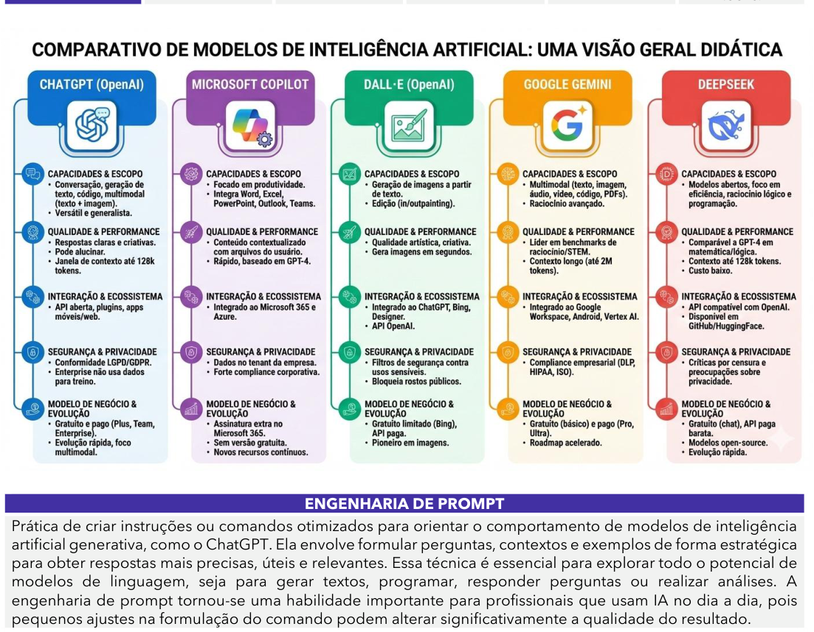

<!-- Start of picture text -->
ENGENHARIA DE PROMPT Prática de criar instruções ou comandos otimizados para orientar o comportamento de modelos de inteligência artificial generativa, como o ChatGPT. Ela envolve formular perguntas, contextos e exemplos de forma estratégica para obter respostas mais precisas, úteis e relevantes. Essa técnica é essencial para explorar todo o potencial de modelos de linguagem, seja para gerar textos, programar, responder perguntas ou realizar análises. A engenharia de prompt tornou-se uma habilidade importante para profissionais que usam IA no dia a dia, pois pequenos ajustes na formulação do comando podem alterar significativamente a qualidade do resultado. <!-- End of picture text -->

|**TÉCNICAS**|**DESCRIÇÃO**|**EXEMPLO DE PROMPT**||
|---|---|---|---|
|**ZERO SHOT**|Técnica em que o modelo recebe apenas a instrução da tarefa,sem exemplosprévios|Explique o conceito de Big descrevendo suas pri|Data, ncipais|

---

<!-- pagina: 111 -->

**Diego Carvalho, Renato da Costa, Equipe Informática e TI Aula Única - Diego Carvalho, Renato da Costa** 

**CHAIN OF THOUGHT (COT)** 

**FEW SHOT PROMPTING** 

**ZERO SHOT COT** 

**SELF-CONSISTENCY** 

**TREE OF THOUGHTS** 

**ROLE PROMPTING** 

**INSTRUCTION PROMPTING** 

**REACT (REASON + ACT) DECOMPOSITION PROMPTING** 

ou dicas adicionais. Depende exclusivamente do conhecimento prétreinado para interpretar o pedido e <u>produzir a resposta esperada.</u> 

Técnica que incentiva o modelo a externalizar seu raciocínio lógico em etapas sequenciais antes de apresentar a resposta final, aumentando a precisão em tarefas que exigem inferência, lógica ou cálculo. 

<mark>Técnica que fornece poucos exemplos</mark> resolvidos no próprio prompt para orientar o modelo sobre o padrão esperado de resposta, formato, estilo ou tipo de raciocínio desejado pelo usuário. 

<mark>Variação do Chain of Thought em que não</mark> são fornecidos exemplos, mas o prompt solicita explicitamente que o modelo raciocine passo a passo, guiando-o a estruturar internamente a solução. 

Técnica que gera múltiplas cadeias de raciocínio independentes para o mesmo problema e seleciona a resposta mais recorrente, reduzindo erros ocasionais e aumentando a robustez da decisão final. 

<mark>Técnica que estimula o modelo a explorar</mark> diferentes caminhos de raciocínio em paralelo, avaliando alternativas intermediárias antes de escolher a solução mais promissora, semelhante a uma árvore de decisões. 

<mark>Técnica em que o modelo assume</mark> explicitamente um papel profissional ou social específico, o que ajuda a ajustar vocabulário, nível de detalhe, tom da resposta e critérios de avaliação do conteúdo produzido. Técnica baseada em instruções claras, detalhadas e explícitas sobre formato, estilo, limites e objetivos da resposta, reduzindo ambiguidades e aumentando a previsibilidade do resultado gerado. 

<mark>Técnica que combina raciocínio explícito</mark> com ações práticas, como consultas a ferramentas ou bases externas, permitindo que o modelo pense, aja, observe resultados e refine a resposta iterativamente. 

Técnica que divide um problema complexo em subtarefas menores e mais simples, <u>permitindo que o modelo trate cada parte</u> 

características, sem usar exemplos longos, mantendo linguagem clara e objetiva, adequada a um leitor iniciante no tema. 

Resolva o problema apresentado explicando detalhadamente cada passo do raciocínio utilizado, mostrando como cada conclusão parcial leva à próxima, antes de apresentar a resposta final. <mark>Pergunta: 2+2=4. Pergunta: 3+3=6.</mark> Pergunta: 4+4=8. Agora, seguindo exatamente o mesmo padrão de raciocínio e resposta, resolva a seguinte pergunta: 7+7=? 

<mark>Resolva a questão apresentada</mark> explicando o raciocínio passo a passo, deixando claro como cada etapa contribui para a solução final, mesmo sem exemplos prévios no enunciado. 

Resolva o mesmo problema cinco vezes, utilizando raciocínios independentes. Ao final, compare os resultados obtidos e informe como resposta final aquela que aparecer com maior frequência. 

Analise o problema explorando pelo menos três abordagens diferentes. Avalie os prós e contras de cada caminho de raciocínio e, ao final, selecione a solução mais consistente. 

<mark>Você é um professor universitário de</mark> banco de dados. Explique o conceito solicitado utilizando linguagem didática, exemplos simples e foco pedagógico, como se estivesse ensinando alunos iniciantes. 

Explique o tema solicitado em no máximo 200 palavras, utilizando linguagem técnica, sem analogias, estruturando a resposta em dois parágrafos e incluindo pelo menos um exemplo conceitual. 

<mark>Analise a pergunta, descreva seu</mark> raciocínio inicial, consulte os dados disponíveis quando necessário, interprete os resultados obtidos e, somente então, apresente a resposta final fundamentada. Primeiro identifique os conceitos centrais do problema. Em seguida, explique cada conceito individualmente.

---

<!-- pagina: 112 -->

**Diego Carvalho, Renato da Costa, Equipe Informática e TI Aula Única - Diego Carvalho, Renato da Costa** 

**STEP-BY-STEP PROMPTING** 

**SELF-CRITIQUE / REFLEXION** 

**LEAST-TO-MOST PROMPTING** 

**RETRIEVALAUGMENTED PROMPTING (RAG)** 

**CONSTRAINT-BASED PROMPTING** 

**MULTI-PERSONA PROMPTING** 

separadamente antes de integrar tudo em uma resposta final coerente. 

Técnica que força o modelo a seguir uma sequência linear de resolução, abordando cada etapa de forma explícita e ordenada, mesmo em tarefas que não exigem exemplos prévios. 

Técnica em que o modelo revisa sua própria resposta, identifica possíveis erros, inconsistências ou lacunas conceituais e, em seguida, produz uma versão corrigida e aprimorada. 

Técnica que orienta o modelo a resolver inicialmente versões mais simples do problema, usando essas soluções como base para lidar progressivamente com versões mais complexas da tarefa. 

<mark>Técnica que combina o modelo com</mark> informações externas recuperadas de documentos ou bases de dados, reduzindo alucinações e garantindo que a resposta seja fundamentada em fontes fornecidas. Técnica que impõe restrições rígidas ao conteúdo ou à forma da resposta, como proibição de opiniões, exemplos ou analogias, garantindo aderência estrita a normas ou critérios definidos. 

Técnica que solicita múltiplas respostas a partir de diferentes pontos de vista ou papéis, permitindo comparar perspectivas distintas e enriquecer análises críticas ou decisões complexas. 

Por fim, relacione todos eles para construir a resposta completa solicitada. 

Resolva a questão seguindo etapas claras e numeradas. Não apresente a resposta final antes de concluir todas as etapas intermediárias do raciocínio solicitado no enunciado. 

Apresente sua resposta inicial. Em seguida, revise criticamente o que foi escrito, identifique eventuais falhas conceituais ou imprecisões e forneça uma versão final corrigida. 

Comece resolvendo um exemplo simples do problema. Depois, utilize o raciocínio obtido para resolver um caso intermediário e, por fim, generalize para a situação completa apresentada. 

<mark>Com base exclusivamente no texto</mark> fornecido a seguir, responda à pergunta proposta. Não utilize conhecimento externo nem faça suposições além das informações presentes no material. 

Defina o conceito solicitado utilizando apenas linguagem formal, sem exemplos práticos, sem analogias e sem emitir opiniões pessoais, limitando-se a definições técnicas objetivas. Responda à pergunta primeiro como um engenheiro de dados, focando aspectos técnicos. Em seguida, responda como um gestor, priorizando impacto organizacional e tomada de decisão.

---

<!-- pagina: 113 -->

**Diego Carvalho, Renato da Costa, Equipe Informática e TI Aula Única - Diego Carvalho, Renato da Costa** 

# **QUESTÕES COMENTADAS** 

**1. (FGV / TCE-PE - 2025) Uma forma de garantir que um modelo de linguagem revise cláusulas de confidencialidade em contratos com alta precisão é fornecer exemplos concretos de cláusulas corretas e incorretas, para que o modelo aprenda o padrão desejado antes de analisar novas cláusulas.** 

**A técnica de Engenharia de Prompt que descreve corretamente esse processo é chamada:** 

a) zero-shot prompt. 

b) self-consistency prompt. 

c) chain-of-thought prompt. 

d) soft prompt. 

e) few-shot prompt. 

**Comentários:** 

(a) Errado. Zero-shot não fornece exemplos; o modelo responde apenas com a instrução, sem “aprender” o padrão por demonstrações no prompt. 

(b) Errado. Self-consistency busca consistência entre múltiplas amostragens de raciocínio/saídas, não é a técnica de dar exemplos de cláusulas corretas e incorretas. 

(c) Errado. Chain-of-thought foca em induzir passos de raciocínio, não em treinar por exemplos de entrada/saída antes de novas análises. 

(d) Errado. Soft prompt envolve ajustes/embeddings (prompt contínuo) geralmente via otimização, não a apresentação direta de exemplos no texto do prompt. 

(e) Correto. Few-shot prompt fornece poucos exemplos (corretos e incorretos) para demonstrar o padrão desejado antes de avaliar novas cláusulas. 

**Gabarito:** Letra E 

**2. (FGV / CNU - 2025) Em relação aos desafios presentes na relação entre Inteligência Artificial Generativa (IAG) e comunicação ética, analise as afirmativas a seguir.** 

**I. O uso de dados gerados por inteligência artificial deve cumprir as regulamentações vigentes, embora enfrente desafios impostos pelo rápido avanço tecnológico, que frequentemente supera a velocidade da elaboração legislativa.** 

**II. O uso de dados gerados por inteligência artificial deve respeitar a privacidade e a proteção de dados, embora enfrente desafios para assegurar a defesa contra usos indevidos.**

---

<!-- pagina: 114 -->

**Diego Carvalho, Renato da Costa, Equipe Informática e TI Aula Única - Diego Carvalho, Renato da Costa** 

**III. O uso de dados gerados por inteligência artificial deve se pautar na autonomia exercida pela própria IA em relação à supervisão humana, embora enfrente desafios para promover uma comunicação clara e eficiente.** 

**Está correto o que se afirma em:** 

a) I, apenas; b) I e II, apenas c) I e III, apenas; d) II e III, apenas; 

e) I, II e III. 

**Comentários:** 

(I) Correto. O uso de dados gerados por IA deve seguir regulamentações, enfrentando o desafio da velocidade do avanço tecnológico em relação à legislação, que muitas vezes não acompanha essa evolução. 

(II) Correto. A proteção da privacidade é essencial no uso de dados de IA, e os desafios para evitar usos indevidos são significativos, exigindo medidas rigorosas de segurança. 

(III) Errado. A autonomia da IA não deve ser priorizada em detrimento da supervisão humana, pois isso pode comprometer a clareza e a eficiência na comunicação, que dependem da intervenção humana. 

**Gabarito:** Letra B 

**3. (FGV / CNU - 2025) No setor público, as ferramentas de Inteligência Artificial Generativa (IAG) oferecem oportunidades para modernizar processos, como automação de tarefas repetitivas, redação de documentos e criação de materiais visuais. Contudo, sua implementação precisa de supervisão humana para que vieses ou informações imprecisas não sejam reproduzidos, especialmente em instituições públicas que lidam com informações sensíveis e de impacto social. A fase do ciclo de desenvolvimento de modelos de IAG na qual ocorre essa supervisão, com o ajuste e a captura de padrões nos dados, é a de:** 

a) aplicação; 

b) inferência; 

c) alucinação; 

d) implantação; 

e) treinamento. 

###### **Comentários:** 

(a) Errado. A fase de aplicação refere-se ao uso do modelo já treinado, não à supervisão e ajuste dos dados.

---

<!-- pagina: 115 -->

**Diego Carvalho, Renato da Costa, Equipe Informática e TI Aula Única - Diego Carvalho, Renato da Costa** 

(b) Errado. A inferência é a fase em que o modelo faz previsões com base em dados novos, sem ajustes ou supervisão. 

(c) Errado. Alucinação é um termo que descreve quando o modelo gera informações incorretas, não é uma fase do desenvolvimento. 

(d) Errado. A implantação é a fase em que o modelo é colocado em operação, não envolve supervisão ou ajuste de padrões. 

(e) Correto. O treinamento é a fase em que ocorre a supervisão e ajuste dos dados, capturando padrões para melhorar a performance do modelo. 

**Gabarito:** Letra E 

**4. (FGV / TCE-PE - 2025) Muitos cenários de análise de dados envolvem conjuntos sem rótulos disponíveis, como é comum em agrupamentos de clientes, detecção de padrões anômalos ou redução de dimensionalidade. Nesses casos, técnicas de aprendizado não supervisionado são essenciais para extrair conhecimento oculto nos dados.** 

Com relação ao aprendizado não supervisionado em Machine Learning, assinale a afirmativa correta. 

- a) O aprendizado não supervisionado depende de conjuntos de dados previamente rotulados para mapear entradas a saídas durante o treinamento. 

- b) Técnicas de aprendizado não supervisionado, como árvores de decisão e regressão logística, são ideais para prever rótulos em problemas de classificação supervisionada. 

- c) O aprendizado não supervisionado é utilizado para gerar automaticamente rótulos com base em padrões nos dados, sem necessidade de saídas conhecidas previamente. 

- d) A principal limitação do aprendizado não supervisionado é que ele não consegue lidar com grandes volumes de dados, sendo restrito a pequenos conjuntos. 

- e) O aprendizado não supervisionado só pode ser utilizado quando todos os atributos do conjunto de dados forem categóricos. 

**Comentários:** 

(a) Errado. Aprendizado não supervisionado não depende de rótulos; ele busca estrutura/padrões nos dados sem saídas conhecidas no treino. 

(b) Errado. Árvores de decisão e regressão logística são técnicas típicas de aprendizado supervisionado, voltadas a prever rótulos já definidos.

---

<!-- pagina: 116 -->

**Diego Carvalho, Renato da Costa, Equipe Informática e TI Aula Única - Diego Carvalho, Renato da Costa** 

(c) Correto. Identifica padrões/estruturas (ex.: clusters, anomalias) e pode inferir agrupamentos que servem como “rótulos” gerados a partir dos dados. 

(d) Errado. Não há essa restrição “a pequenos conjuntos”; a limitação central é a ausência de rótulos para validação direta, não o volume em si. 

(e) Errado. Pode trabalhar com atributos numéricos e categóricos; não exige que todos os atributos sejam categóricos. 

**Gabarito:** Letra C 

**5. (FGV / TCE-PE - 2025) No campo da inteligência artificial, os agentes desempenham papel central como entidades capazes de perceber o ambiente, tomar decisões e agir com base em metas definidas. Compreender sua estrutura e tipos é fundamental para o desenvolvimento de sistemas inteligentes. Assinale a afirmativa que descreve corretamente uma característica de agentes de inteligência artificial.** 

- a) Um agente reativo simples armazena historicamente os estados anteriores do ambiente para prever ações futuras com base em aprendizado profundo. 

- b) Agentes baseados em objetivos não consideram o estado atual do ambiente, mas tomam decisões aleatórias até alcançarem a meta desejada. 

- c) Agentes baseados em utilidade avaliam diferentes cursos de ação e escolhem aquele que maximiza um valor numérico associado à satisfação da meta. 

- d) Um agente só pode ser considerado inteligente se tiver consciência própria e habilidades linguísticas semelhantes às humanas. 

- e) Agentes de IA operam exclusivamente em ambientes totalmente observáveis e determinísticos, pois exigem informações completas para funcionar. 

**Comentários:** 

(a) Errado. Agente reativo simples não mantém histórico nem usa aprendizado profundo; reage ao ‑ estado/percepção atual por regras condição ação. 

(b) Errado. Agentes baseados em objetivos consideram o estado atual e planejam ações para atingir a meta, não decidem aleatoriamente. 

(c) Correto. Agentes baseados em utilidade comparam alternativas e escolhem a ação que maximiza uma função numérica de utilidade (grau de satisfação da meta). 

(d) Errado. Inteligência em agentes não exige autoconsciência nem linguagem humana; basta perceber, decidir e agir de forma racional conforme metas.

---

<!-- pagina: 117 -->

**Diego Carvalho, Renato da Costa, Equipe Informática e TI Aula Única - Diego Carvalho, Renato da Costa** 

(e) Errado. Agentes podem atuar em ambientes parcialmente observáveis e/ou estocásticos, usando crenças/estimativas; não dependem de informação completa. 

**Gabarito:** Letra C 

**6. (FGV / CNU - 2025) Martin está elaborando uma cartilha sobre o uso ético da Inteligência Artificial (IA) em seu setor, que atua no atendimento ao público. Para isso, a IA deve fornecer informações sobre as entradas, as saídas e o funcionamento do algoritmo utilizado, bem como a forma como cada parte contribui para o resultado final. Na cartilha de uso ético da IA de Martin, devem constar requisitos sobre:** 

a) explicabilidade; 

b) hiperparametrização; 

c) aprendizado profundo; 

d) modelos largos de linguagem; 

e) processamento de linguagem natural. 

**Comentários:** 

(a) Correto. Explicabilidade exige transparência sobre entradas, saídas e lógica do algoritmo, indicando como cada componente influencia o resultado, o que é central no uso ético da IA no atendimento ao público. 

(b) Errado. Hiperparametrização trata de ajustes de treinamento (parâmetros do modelo), não de explicar decisões, entradas/saídas e contribuições para o resultado final. 

(c) Errado. Aprendizado profundo é uma abordagem/modelagem (redes neurais), mas não é, por si, um requisito ético de transparência e prestação de contas do sistema. 

(d) Errado. Modelos largos de linguagem descrevem um tipo de modelo (LLM), enquanto o enunciado pede requisito de compreensão/justificativa do funcionamento e do resultado. 

(e) Errado. Processamento de linguagem natural é uma área/técnica para lidar com texto e fala, não um requisito voltado a tornar o algoritmo compreensível e auditável. 

**Gabarito:** Letra A 

**7. (FGV / TCE-PE - 2025) Com relação aos Grandes Modelos de Linguagens (LLMs), avalie as afirmativas a seguir e assinale (V) para verdadeira e (F) para falsa.** 

**( ) LLMs são capazes de fazer inferências a partir de um contexto, gerar respostas contextualmente relevantes, traduzir documentos para outros idiomas, resumir textos, responder a perguntas ou mesmo auxiliar em tarefas de redação criativa ou geração de código.**

---

<!-- pagina: 118 -->

**Diego Carvalho, Renato da Costa, Equipe Informática e TI Aula Única - Diego Carvalho, Renato da Costa** 

**( ) Os LLMs representam um avanço considerável no processamento de linguagem natural (PNL) e tornaram-se facilmente acessíveis ao público por meio de interfaces como o Chat GPT-3 e o GPT-4. Outros exemplos de LLMs são os modelos Llama e as representações de codificadores bidirecionais, como BERT e RoBERTa.** 

**( ) LLM é um modelo de aprendizado de máquina que pode ser usado na inteligência artificial generativa, capaz de executar diferentes funções. Os LLM são treinados a partir de grandes volumes de dados.** 

**As afirmativas são, segundo a ordem apresentada,** 

a) V – F – V. 

b) V – F – F. 

c) V – V – V. 

d) F – V – V. 

e) F – V – F. 

**Comentários:** 

(I) Correto. LLMs realmente têm a capacidade de fazer inferências, gerar respostas relevantes e auxiliar em diversas tarefas, como tradução e redação criativa. 

(II) Correto. Os LLMs, como GPT-3 e GPT-4, representam um avanço significativo em PNL e são amplamente acessíveis, incluindo modelos como Llama, BERT e RoBERTa. 

(III) Correto. LLMs são modelos de aprendizado de máquina usados em IA generativa, treinados com grandes volumes de dados para executar diversas funções. 

**Gabarito:** Letra C 

**8. (FGV / TCE-PE - 2025) Com o avanço do deep learning, redes neurais profundas e grandes modelos de linguagem (LLMs) vêm sendo amplamente utilizados em aplicações como tradução automática, geração de texto, reconhecimento de imagens e assistentes virtuais. A respeito de redes neurais profundas, deep learning e grandes modelos de linguagem (LLMs), assinale a afirmativa correta.** 

- a) Redes neurais profundas possuem apenas uma camada oculta entre a entrada e a saída e são ideais para tarefas simples de classificação linear. 

- b) O termo deep learning refere-se a técnicas que dispensam o uso de redes neurais artificiais, utilizando apenas algoritmos estatísticos tradicionais. 

- c) Os grandes modelos de linguagem (LLMs) são caracterizados por seu tamanho reduzido, pois dependem de poucos parâmetros para evitar sobrecarga computacional.

---

<!-- pagina: 119 -->

**Diego Carvalho, Renato da Costa, Equipe Informática e TI Aula Única - Diego Carvalho, Renato da Costa** 

- d) Os grandes modelos de linguagem (LLMs) utilizam arquiteturas de redes neurais profundas, como os transformadores, para processar sequências de texto e aprender padrões complexos. 

- e) Redes neurais profundas são indicadas exclusivamente para reconhecimento de imagens e não são aplicadas em processamento de linguagem natural. 

**Comentários:** 

(a) Errado. Redes profundas têm várias camadas ocultas (não apenas uma) e não se limitam a classificação linear, sendo usadas para padrões complexos. 

(b) Errado. Deep learning está diretamente ligado ao uso de redes neurais (especialmente profundas), e não à dispensa delas em favor de estatística “tradicional”. 

(c) Errado. LLMs se destacam justamente pelo grande número de parâmetros e alta capacidade, o que aumenta (não reduz) a demanda computacional. 

(d) Correto. LLMs empregam arquiteturas profundas, como Transformers, para modelar sequências de texto e capturar dependências e padrões complexos. 

(e) Errado. Redes profundas também são amplamente aplicadas em PLN (NLP), como tradução, geração de texto e chatbots, não ficando restritas a imagens. 

**Gabarito:** Letra D 

**9. (FGV / TCE-PE - 2025) Com a popularização de modelos de linguagem de grande escala (LLMs), como o GPT e o Claude, a engenharia de prompt tornou-se uma habilidade essencial para direcionar corretamente esses modelos, extraindo respostas mais úteis, seguras e alinhadas ao objetivo do usuário. Em relação às boas práticas de engenharia de prompt aplicadas a grandes modelos de linguagem (LLMs), assinale a afirmativa correta.** 

- a) A engenharia de prompt exige conhecimento profundo de linguagens de programação, pois os prompts devem ser escritos em linguagens formais como Python ou SQL. 

- b) Prompts vagos e abertos tendem a melhorar a criatividade dos modelos e garantem maior precisão, especialmente em tarefas críticas e factuais. 

- c) Instruções explícitas, exemplos no prompt e delimitação clara da tarefa aumentam a probabilidade de o LLM produzir respostas relevantes e adequadas ao objetivo. 

- d) LLMs interpretam todos os prompts da mesma forma, independentemente da estrutura, do idioma ou da ordem em que as informações são fornecidas.

---

<!-- pagina: 120 -->

**Diego Carvalho, Renato da Costa, Equipe Informática e TI Aula Única - Diego Carvalho, Renato da Costa** 

- e) A engenharia de prompt não tem impacto sobre a segurança das respostas geradas, já que os LLMs seguem regras internas fixas de filtragem de conteúdo. 

###### **Comentários:** 

(a) Errado. Prompt é texto em linguagem natural; não exige escrever em Python/SQL, embora possa incluir trechos técnicos quando útil. 

(b) Errado. Vagueza pode aumentar variação/criatividade, mas não “garante” precisão; em tarefas factuais e críticas, especificidade reduz ambiguidades. 

(c) Correto. Instruções claras, exemplos (few-shot) e delimitação do escopo orientam o modelo, elevando a chance de respostas relevantes e alinhadas ao objetivo. 

(d) Errado. Estrutura, idioma, contexto e ordem influenciam a interpretação e a qualidade da saída; prompts bem organizados tendem a performar melhor. 

(e) Errado. O prompt impacta segurança (ex.: restrições, contexto e limites); boas práticas ajudam a reduzir riscos e a orientar respostas mais seguras. 

**Gabarito:** Letra C 

- **10.(FGV / TCE-PE - 2025) Os grandes modelos de linguagem, também conhecidos como LLMs (Large Language Model),** 

- a) empregam uma tabela numérica para representar cada palavra, o que possibilita reconhecer relações entre palavras, como vocábulos com significados semelhantes. 

- b) correspondem a um conjunto de redes neurais em que cada uma consiste em um codificador e um decodificador com recursos de recorrência e convoluções. 

- c) processam entradas sequencialmente, o que potencializa a realização dos cálculos mais complexos. 

- d) utilizam vetores multidimensionais, conhecidos como incorporações de palavras, para representálas de modo que aquelas com significados contextuais semelhantes ou com outras relações fiquem próximas entre si no espaço vetorial. 

- e) processam sequências inteiras em paralelo, empregando recursos de recorrência e convoluções, o que possibilita o uso extensivo de GPUs (Graphics Processing Units) para treinar LLMs. 

###### **Comentários:** 

(a) Errado. LLMs não usam “tabela numérica por palavra” de forma fixa; a representação moderna é vetorial e depende do contexto, não apenas de um índice/tabela.

---

<!-- pagina: 121 -->

**Diego Carvalho, Renato da Costa, Equipe Informática e TI Aula Única - Diego Carvalho, Renato da Costa** 

(b) Errado. A descrição remete a arquiteturas com codificador/decodificador e recorrência/convolução, o que não caracteriza os LLMs atuais de forma geral. 

(c) Errado. A ideia de processamento estritamente sequencial não é a característica central; o foco é modelar linguagem com representações que permitam eficiência no treinamento. 

(d) Correto. Usam vetores multidimensionais (embeddings) para representar palavras/tokens, aproximando no espaço vetorial termos com relações e significados contextuais semelhantes. 

(e) Errado. Mistura paralelismo com “recorrência e convoluções”; o uso extensivo de GPUs decorre do paralelismo, mas LLMs não se definem por recorrência/convolução. 

**Gabarito:** Letra D 

- **11.(FGV / MACAEPREV - 2024) Large Language Models (LLMs) são um tipo de modelo IA projetado para lidar com tarefas de processamento de linguagem natural (PLN) em uma escala muito grande. Esses modelos são treinados com enormes quantidades de dados textuais e são capazes de entender e gerar texto em linguagem natural de forma altamente sofisticada. Em relação aos Large Language Models (LLMs), como o GPT, a abordagem mais relevante para melhorar a capacidade do modelo de gerar respostas coerentes e contextualmente apropriadas em conversas prolongadas, entre as listadas, é** 

a) aumentar o número de parâmetros do modelo. 

b) utilizar a técnica de fine-tuning em um grande conjunto de dados não rotulados. 

c) implementar um mecanismo de atenção (Attention Mechanism). 

d) aplicar a tokenização BPE (Byte Pair Encoding) ao texto de entrada. 

e) aumentar a frequência de palavras raras no conjunto de treinamento. 

**Comentários:** 

(a) Errado. Mais parâmetros podem melhorar desempenho geral, mas não garantem, por si só, coerência e manutenção de contexto em diálogos longos. 

(b) Errado. Fine-tuning em dados não rotulados tende a não alinhar o modelo para conversação; o ganho de coerência contextual não é o foco principal dessa abordagem. 

(c) Correto. O mecanismo de atenção permite ao modelo “focar” em partes relevantes do histórico, capturando dependências de longo alcance e mantendo respostas coerentes e contextuais. 

(d) Errado. BPE melhora a representação de palavras/subpalavras e cobertura de vocabulário, mas não é o fator central para sustentar contexto em conversas prolongadas. 

(e) Errado. Reponderar palavras raras altera a distribuição do treino, mas não resolve o problema de acompanhar e relacionar informações ao longo do diálogo.

---

<!-- pagina: 122 -->

**Diego Carvalho, Renato da Costa, Equipe Informática e TI Aula Única - Diego Carvalho, Renato da Costa** 

**Gabarito:** Letra C 

- **12.(FGV / TCE-PA - 2024) O campo da inteligência artificial generativa é dedicado ao desenvolvimento de algoritmos capazes de gerar novas instâncias de dados. Suas aplicações incluem, por exemplo, a criação de textos, imagens, áudio e vídeo. As redes generativas adversárias (Generative Adversarial Networks – GANs) são um exemplo de IA generativa que possuem arquitetura baseada em duas redes, chamadas geradora e discriminadora, que competem entre si. Um dos principais problemas das GANs ocorre quando a rede geradora produz apenas uma quantidade limitada de tipos de dados, mesmo que seus dados de treinamento sejam mais ricos e diversificados. Isso ocorre porque a rede geradora consegue “enganar” a rede discriminadora mais facilmente quando dados daqueles tipos específicos são produzidos. A esse fenômeno dá-se o nome de** 

a) Falha de Convergência (Convergence Failure). 

b) Sobreajuste (Overfitting). 

c) Colapso de Modo (Mode Collapse). 

- d) Filtragem Estocástica (Stochastic Filtering). 

- e) Crescimento de Padrões Frequentes (Frequent Pattern Growth). 

**Comentários:** 

(a) Errado. Falha de Convergência refere-se à incapacidade do modelo de encontrar um ponto de e <mark>q</mark> uilíbrio durante o treinamento, não ao problema de gerar dados limitados. 

(b) Errado. Sobreajuste ocorre quando o modelo se adapta excessivamente aos dados de treinamento, mas não é o fenômeno que limita a diversidade dos dados gerados. 

(c) Correto. O Colapso de Modo é o fenômeno em que a rede geradora produz um número restrito de tipos de dados, enganando facilmente a rede discriminadora. 

(d) Errado. Filtragem Estocástica não é um termo utilizado para descrever o problema de limitação na diversidade de dados gerados por GANs. 

(e) Errado. Crescimento de Padrões Frequentes é um conceito relacionado a mineração de dados e não se aplica ao contexto das GANs. 

###### **Gabarito:** Letra C 

- **13.(FGV / TCE-PA - 2024) O uso de Inteligência Artificial generativa é de grande utilidade para desenvolvedores web, por permitir a criação rápida de ilustrações e gráficos de alta qualidade. Por exemplo, uma das ferramentas mais populares atualmente é a aplicação Crayion, anteriormente conhecida como DALL-E mini, por ser uma ferramenta de acesso livre com interface amigável. No entanto, essas ferramentas podem frustrar os usuários por apresentarem limitações que inviabilizam o uso dos elementos visuais criados a partir de**

---

<!-- pagina: 123 -->

**Diego Carvalho, Renato da Costa, Equipe Informática e TI Aula Única - Diego Carvalho, Renato da Costa** 

**seus resultados. A respeito das tendências no uso de IA generativa em design web, avalie as afirmativas a seguir:** 

**I. Há limitações éticas relacionadas à reprodução de potenciais vieses discriminatórios, provenientes das bases de dados de treinamento das redes generativas.** 

**II. Sua principal vantagem consiste na eliminação de elementos de propriedade intelectual protegida nas imagens geradas, garantindo aos desenvolvedores a não-obrigatoriedade de pagamentos de direitos autorais.** 

**III. Há preocupações com relação à geração de imagens extremamente realistas e com o potencial uso dos chamados “deepfakes” em campanhas de desinformação. Está correto o que se afirma em** ==5460== a) I, apenas. 

b) I e II, apenas. c) I, II e III. d) II e III, apenas. 

e) I e III, apenas. 

**Comentários:** 

(I) Correto. A IA generativa pode reproduzir vieses discriminatórios, pois é treinada em dados que podem conter preconceitos, refletindo-os nas imagens geradas. Isso levanta questões éticas significativas. 

(II) Errado. A eliminação de elementos de propriedade intelectual não é garantida, pois as imagens geradas podem ainda infringir direitos autorais, dependendo de como foram criadas e dos dados utilizados. 

(III) Correto. A geração de imagens realistas levanta preocupações sobre deepfakes, que podem ser usados para desinformação, afetando a confiança nas mídias visuais. 

**Gabarito:** Letra E 

- **14.(FGV / Prefeitura de Caraguatatuba - SP - 2024) Considere as seguintes afirmativas sobre Inteligência Artificial, assinale V para a afirmativa verdadeira e F para a falsa.** 

**( ) A Inteligência Artificial é uma tecnologia disruptiva que tem o potencial de mudar o mundo. ( ) A Inteligência Artificial é utilizada em diversas aplicações práticas, como carros autônomos, assistentes virtuais e sistemas de recomendação.** 

**( ) A Inteligência Artificial não apresenta riscos éticos, pois é uma ferramenta que pode ser usada para o bem ou para o mal, dependendo das intenções de seus usuários.** 

**As afirmativas são, respectivamente,**

---

<!-- pagina: 124 -->

**Diego Carvalho, Renato da Costa, Equipe Informática e TI Aula Única - Diego Carvalho, Renato da Costa** 

a) V – F – F. 

b) V – V – V. 

c) F – V – V. 

d) V – F – V. 

e) V – V – F. 

###### **Comentários:** 

(V) A Inteligência Artificial é considerada uma tecnologia disruptiva, pois transforma profundamente setores como saúde, transporte, educação e comunicação; 

(V) A IA já é usada em carros autônomos, assistentes virtuais (como Alexa e Siri) e sistemas de recomendação (como Netflix e Amazon); 

(F) A IA apresenta, sim, riscos éticos, que vão além das intenções dos usuários. Esses riscos envolvem viés algorítmico, privacidade, discriminação, entre outros — o que exige supervisão e regulamentação adequadas. 

**Gabarito:** Letra E 

- **15.(FGV / EPE - 2024) Há uma família de modelos de IA generativa que tem dois modelos treinados em conjunto: o gerador e o discriminador. O gerador tenta criar dados falsos que sejam indistinguíveis dos dados reais, enquanto que o discriminador tenta distinguir entre dados reais e falsos. O treinamento é um jogo min-max, em que o gerador melhora suas habilidades para enganar o discriminador, e o discriminador melhora suas habilidades para detectar dados falsos. Assinale a opção que apresenta as características do modelo de IA generativa descritas no texto.** 

a) Generative Adversarial Networks. 

b) Variational Autoencoders. 

c) Energy-Based Models. 

d) Autoregressive Models. 

e) Normalizing Flow Models. 

###### **Comentários:** 

(a) Correto. O modelo descrito no enunciado é uma Rede Generativa Adversária (Generative Adversarial Network – GAN), composta por dois modelos: o gerador, que tenta criar dados realistas, e o discriminador, que tenta distinguir entre dados reais e gerados. Eles são treinados em um processo adversarial (jogo min-max), onde ambos evoluem para melhorar seu desempenho; 

(b) Errado. Variational Autoencoders (VAEs) também são usados para geração de dados, mas seu funcionamento não envolve um gerador e um discriminador adversários, e sim a compressão e reconstrução de dados;

---

<!-- pagina: 125 -->

**Diego Carvalho, Renato da Costa, Equipe Informática e TI Aula Única - Diego Carvalho, Renato da Costa** 

(c) Errado. Energy-Based Models definem uma função de energia para aprender representações, mas não seguem a dinâmica adversarial de GANs; 

(d) Errado. Autoregressive Models geram dados sequência por sequência (como no GPT), mas não envolvem um discriminador como nas GANs; 

(e) Errado. Normalizing Flow Models transformam distribuições simples em complexas de forma reversível, mas também não envolvem a estrutura adversarial entre dois modelos. 

**Gabarito:** Letra A 

- **16.(FGV / CGM de Belo Horizonte - MG - 2024) Relacione os termos de Inteligência Artificial (IA) às suas respectivas definições.** 

**1. IA fraca** 

###### **2. IA forte** 

###### **3. IA generativa** 

**4. Teste de Turing** 

**( ) É capaz de resolver uma única tarefa, pode automatizar tarefas demoradas e analisar dados de maneiras que os humanos às vezes não podem.** 

**( ) É uma categoria de algoritmos de IA que gera novos resultados com base nos dados em que foram treinados.** 

**( ) É capaz de resolver uma gama extensa e arbitrária de tarefas, incluindo aquelas que são novas, e executá-las com eficácia comparável à de um ser humano.** 

**( ) É uma medida de inteligência de uma máquina, onde se a máquina pode se passar por um humano em uma conversa de texto, ela passa no teste.** 

**Assinale a opção que indica a relação correta, segundo a ordem apresentada.** 

a) 1 – 3 – 2 – 4. 

b) 1 – 2 – 4 – 3. 

c) 4 – 3 – 2 – 1. d) 3 – 2 – 1 – 4. 

###### **Comentários:** 

(1) Refere-se à IA fraca (1), que é especializada em tarefas específicas, como assistentes virtuais ou sistemas de recomendação;

---

<!-- pagina: 126 -->

**Diego Carvalho, Renato da Costa, Equipe Informática e TI Aula Única - Diego Carvalho, Renato da Costa** 

(3) Define a IA generativa (3), que cria novos conteúdos como textos, imagens ou áudios com base em dados de treinamento; 

(2) Refere-se à IA forte (2), uma forma hipotética de IA com inteligência geral comparável à humana; 

(4) Trata-se do Teste de Turing (4), proposto por Alan Turing para avaliar se uma máquina consegue simular uma conversa humana. 

**Gabarito:** Letra A 

- **17.(FGV / Câmara dos Deputados - 2024) Em relação ao potencial de discriminação ilícita ou abusiva em sistemas de Inteligência Artificial (IA), assinale a afirmação mais precisa.** 

- a) Sistemas de IA são objetivos, imparciais e não realizam discriminações. 

- b) A discriminação por sistemas de IA ocorre apenas quando há intenção explícita do programador. 

- c) A IA pode inadvertidamente discriminar com base nos dados em que foi treinada. 

- d) A legislação atual proíbe qualquer forma de IA que possa resultar em processos de discriminação, sejam eles de qualquer tipo. 

- e) A discriminação em IA é um problema resolvido com tecnologias modernas de machine learning. 

**Comentários:** 

(a) Errado. IA não é “naturalmente” objetiva: pode reproduzir vieses e gerar discriminações a depender de dados, métricas e contexto de uso. 

(b) Errado. Discriminação pode surgir sem intenção do programador, por vieses implícitos nos dados, variáveis proxy e decisões de modelagem. 

(c) Correto. Se o treinamento reflete desigualdades ou vieses históricos, o sistema pode aprender padrões discriminatórios e aplicá-los inadvertidamente. 

(d) Errado. A legislação tende a regular e mitigar riscos, não a proibir “qualquer IA” com potencial discriminatório de forma absoluta e genérica. 

(e) Errado. Técnicas modernas ajudam, mas não “resolvem” o tema: vieses podem persistir e exigem governança, auditoria e monitoramento contínuo. 

**Gabarito:** Letra C

---

<!-- pagina: 127 -->

**Diego Carvalho, Renato da Costa, Equipe Informática e TI Aula Única - Diego Carvalho, Renato da Costa** 

- **18.(FGV / Câmara dos Deputados - 2024) Em termos de regulamentação de Inteligência Artificial (IA), a seguinte estratégia é frequentemente considerada essencial para garantir a segurança e a ética nas relações:** 

- a) desenvolvimento de padrões internacionais, jurídicos e regulatórios, para a implementação de IA. 

- b) regulamentação rigorosa e uniforme em todos os países acerca da aplicação de IA. 

- c) banimento total do uso de IA em determinados setores, especialmente nas áreas da saúde, segurança e controle de acesso. 

- d) deixar a regulamentação essencialmente com as empresas desenvolvedoras de IA, tendo em vista sua expertise na análise da tecnologia. 

- e) priorizar a autorregulação regulada do setor pelas entidades desenvolvedoras de IA. 

**Comentários:** 

(a) Correto. Padrões internacionais e marcos jurídicos/regulatórios harmonizam princípios (segurança, transparência, responsabilização) e orientam a implementação de IA, reduzindo riscos e assimetrias entre países. 

(b) Errado. Exigir rigor e uniformidade total em todos os países é pouco factível e desconsidera diferenças legais, culturais e de maturidade regulatória, dificultando a adoção coordenada. 

(c) Errado. Banimento total é medida extrema e pouco proporcional: tende a inviabilizar benefícios e não substitui governança baseada em risco, controles e fiscalização. 

(d) Errado. Deixar a regulação essencialmente com as empresas gera conflito de interesses e fragiliza a proteção do público, pois falta independência e mecanismos externos de accountability. 

(e) Errado. Autorregulação regulada pode complementar, mas não substitui padrões internacionais e normas jurídicas; sozinha, tende a ser insuficiente para garantir segurança e ética de forma ampla. 

###### **Gabarito:** Letra A 

- **19.(FGV / Câmara dos Deputados - 2024) No contexto jurídico brasileiro, assinale a afirmativa correta acerca do modo como a autonomia de um sistema de Inteligência Artificial (IA) é geralmente tratada, em questões relativas à sua responsabilidade por ações e atividades.** 

- a) A IA é considerada uma entidade legal autônoma com responsabilidades próprias, sendo um sujeito de direito. 

- b) A responsabilidade pela IA e suas atividades é atribuída exclusivamente ao seu usuário final.

---

<!-- pagina: 128 -->

**Diego Carvalho, Renato da Costa, Equipe Informática e TI Aula Única - Diego Carvalho, Renato da Costa** 

- c) A autonomia jurídica da IA não é reconhecida legalmente, recaindo a responsabilidade, como regra, sobre seus atos aos operadores humanos. 

- d) Sistemas de IA têm, em algumas jurisdições, o mesmo status legal que incapazes. 

- e) A lei considera a IA uma extensão do seu programador, devendo o mesmo ser legalmente acionado em todos os casos. 

###### **Comentários:** 

(a) Errado. No Brasil, a IA não é tratada como sujeito de direito com personalidade jurídica própria; em regra, não se atribui a ela responsabilidade autônoma por seus atos. 

(b) Errado. A responsabilização não recai, de forma exclusiva e automática, apenas no usuário final; a análise costuma envolver quem opera, controla e se beneficia do sistema. 

(c) Correto. A autonomia jurídica da IA, em geral, não é reconhecida; assim, a responsabilidade por ações e atividades tende a recair sobre operadores humanos (usuários, fornecedores, gestores), conforme o caso. 

(d) Errado. Não há, no tratamento jurídico brasileiro, equiparação geral de IA ao status legal de incapazes; a discussão se concentra em imputação a pessoas naturais/jurídicas. 

(e) Errado. A IA não é vista como mera “extensão do programador” em todos os casos; a responsabilização não é automática e pode variar conforme participação, controle e deveres de cada agente. 

###### **Gabarito:** Letra C 

- **20.(FGV / Câmara dos Deputados - 2024) No contexto de proteção aos direitos da personalidade, assinale a afirmativa correta acerca do tratamento conferido pela legislação brasileira à representação visual de indivíduos por sistemas de Inteligência Artificial (IA).** 

- a) A IA tem permissão legal para replicar a personalidade de qualquer indivíduo, tendo em vista se tratar de simulação virtual. 

- b) O uso de IA para replicar personalidades sem consentimento é amplamente permitido, por se tratar de ação virtual e sem impacto prático. Todavia, o uso comercial desta tecnologia encontra limites na legislação. 

- c) Há leis específicas acerca da proteção dos direitos da personalidade e dos dados pessoais no Brasil, as quais também se aplicam no que couber às relações que envolvem Inteligências Artificiais. 

- d) Apenas celebridades e pessoas notórias têm proteção legal contra replicação de personalidade por IA.

---

<!-- pagina: 129 -->

**Diego Carvalho, Renato da Costa, Equipe Informática e TI Aula Única - Diego Carvalho, Renato da Costa** 

- e) Não existem ainda leis que abordem a tutela dos direitos da personalidade no ambiente virtual no Brasil. 

**Comentários:** 

(a) Errado. A legislação tutela direitos da personalidade (imagem, honra, voz etc.) e não autoriza replicação irrestrita por IA só por ser “simulação”. 

(b) Errado. A ausência de consentimento tende a violar direitos da personalidade; não é “amplamente permitido” por ser virtual, e os limites não se restringem ao uso comercial. 

(c) Correto. Há normas como o Código Civil (direitos da personalidade) e a LGPD (dados pessoais) que se aplicam, no que couber, a situações envolvendo IA. 

(d) Errado. A proteção dos direitos da personalidade é geral, não exclusiva de celebridades ou pessoas notórias. 

(e) Errado. O ordenamento já prevê tutela de direitos da personalidade e sua proteção também alcança o ambiente digital/virtual. 

**Gabarito:** Letra C 

- **21.(FGV / Câmara dos Deputados - 2024) Acerca do tratamento de dados pessoais por inteligência artificial (IA) e sua regulação no Brasil, assinale a afirmativa correta.** 

- a) A IA pode tratar dados sensíveis sem restrições, tendo em vista a ausência de interferência humana. 

- b) A IA deve ser programada para seguir as leis de proteção de dados do país onde for utilizada e comercializada, independentemente do país de seu desenvolvimento e fabricação. 

- c) As leis de proteção de dados não se aplicam a relações que envolvam IA, tendo em vista não ser ela agente de tratamento de dados, ou seja, pessoa natural ou jurídica que realiza tratamento de dados pessoais. 

- d) A IA deve coletar o maior número de dados pessoais sem consentimento dos titulares, visando a melhorar seu próprio sistema. 

- e) A IA deve seguir normas globais de proteção de dados, independente das peculiaridades da legislação local. 

###### **Comentários:**

---

<!-- pagina: 130 -->

**Diego Carvalho, Renato da Costa, Equipe Informática e TI Aula Única - Diego Carvalho, Renato da Costa** 

(a) Errado. O tratamento de dados sensíveis é sujeito a bases legais e salvaguardas; o uso de IA não elimina restrições nem dispensa responsabilidade pelo tratamento. 

(b) Correto. A conformidade deve observar a legislação do país onde a IA é usada e ofertada, pois é nesse território que ocorre o tratamento e incidem as regras locais. 

(c) Errado. A existência de IA não afasta a aplicação das leis de proteção de dados; o tratamento continua vinculado a agentes responsáveis (controlador/operador) e às obrigações legais. 

(d) Errado. Coletar “o máximo” de dados sem consentimento contraria princípios e bases legais; melhoria de sistema não autoriza coleta indiscriminada de dados pessoais. 

(e) Errado. Normas globais podem orientar, mas não substituem a legislação local; a IA deve se adequar às exigências específicas do ordenamento do país de uso. 

**Gabarito:** Letra B 

- **22.(FGV / Câmara dos Deputados - 2024) Acerca do uso de inteligência artificial (IA) pelos tribunais, temos experiências bem-sucedidas no Brasil, as quais mostram a relevância da tecnologia para a melhoria da eficiência de atividades. Seu uso é bastante promissor nas cortes e deverá auxiliar em mecanismos de acesso à justiça. Sobre o ponto, assinale a alternativa mais adequada.** 

- a) A IA deve ser usada como fonte principal no desenvolvimento da fundamentação de decisões judiciais de mérito. 

- b) A IA pode ser usada como ferramenta auxiliar, a depender do caso, em decisões e na análise de petições, devendo como regra haver transparência acerca do seu uso. 

- c) A IA deve substituir servidores e juízes leigos na produção de decisões interlocutórias em Juizados Especiais Cíveis. 

- d) A IA não tem capacidade para entender normas jurídicas e sua aplicação aos fatos sociais. Portanto, não deve ser usada de qualquer modo em decisões judiciais e serviços jurídicos. 

- e) A IA não deve ser usada na aplicação de modelos estatísticos voltados à compreensão dos processos e fatos jurídicos. 

**Comentários:** 

(a) Errado. IA não deve ser “fonte principal” da fundamentação de mérito; a motivação é dever do julgador, com controle e responsabilidade humana. 

(b) Correto. IA pode atuar como apoio (triagem, análise de peças, sugestões), com transparência como regra para permitir controle, contraditório e auditoria do uso.

---

<!-- pagina: 131 -->

**Diego Carvalho, Renato da Costa, Equipe Informática e TI Aula Única - Diego Carvalho, Renato da Costa** 

(c) Errado. Substituição de servidores/juízes leigos por IA em decisões interlocutórias contraria a necessidade de supervisão humana e responsabilização pelos atos decisórios. 

(d) Errado. Ainda que tenha limites, a IA pode auxiliar serviços e decisões de forma controlada; a vedação total ignora usos legítimos e promissores. 

(e) Errado. Modelos estatísticos podem apoiar a compreensão de acervos e padrões processuais; proibir esse uso elimina ganhos de eficiência e gestão. 

**Gabarito:** Letra B 

- **23.(FGV / Câmara dos Deputados - 2024) No contexto da Inteligência Artificial (IA), assinale a opção que define corretamente o termo “explicabilidade da IA” ou “Inteligência Artificial explicável” e indica por que ele é importante para a regulação do tema.** 

- a) Representa a capacidade de uma IA de realizar tarefas sem quaisquer ações e intervenções humanas. Com base em processos algorítmicos, a IA vem ganhando autonomia decisória e mostrando-se consciente sobre o desenvolvimento das novas tecnologias. 

- b) Representa a habilidade de uma IA de explicar suas decisões em termos tecnicamente compreensíveis, a partir de uma única linguagem desenvolvida por campos neurais. 

- c) Representa um conjunto de técnicas de aprendizado de máquina que permite que os usuários humanos entendam, possam confiar e gerenciem com eficácia a geração emergente de parceiros com inteligência artificial. 

- d) Representa a precisão de uma IA em prever resultados baseados em dados qualitativos e quantitativos. 

- e) Representa a capacidade de uma IA de passar no Teste de Turing, sendo essencial para sua aceitação social. 

**Comentários:** 

(a) Errado. Autonomia/“consciência” não define explicabilidade; o foco regulatório é entender e auditar decisões, não eliminar intervenção humana. 

(b) Errado. Explicabilidade não depende de “uma única linguagem” nem de “campos neurais”; trata-se de tornar decisões interpretáveis para pessoas e órgãos de controle. 

(c) Correto. XAI reúne técnicas para que humanos compreendam, confiem e gerenciem sistemas de IA, o que sustenta transparência, auditoria, responsabilização e conformidade regulatória.

---

<!-- pagina: 132 -->

**Diego Carvalho, Renato da Costa, Equipe Informática e TI Aula Única - Diego Carvalho, Renato da Costa** 

(d) Errado. Precisão preditiva é desempenho do modelo; explicabilidade trata do “porquê” das decisões e de como elas podem ser justificadas e fiscalizadas. 

(e) Errado. Teste de Turing mede indistinguibilidade de comportamento humano; não garante transparência nem prestação de contas, centrais para regulação. 

**Gabarito:** Letra C 

- **24.(FGV / STN - 2024) Na trajetória evolutiva da Inteligência Artificial (IA), diversos marcos e transições têm delineado seu progresso e desafios. Nesse contexto, avalie se as afirmativas a seguir, que destacam momentos críticos na história da IA, são verdadeiras (V) ou falsas (F).** 

**( ) Os Invernos da IA representam períodos de avanço tecnológico acelerado e investimento maciço em pesquisa de IA, marcados pela rápida adoção de tecnologias de IA em diversos setores sem qualquer ceticismo ou crítica.** 

**( ) Introduzida em 2012, AlexNet é uma rede neural convolucional que competiu no desafio ImageNet, marcando um ponto de inflexão significativo para o campo do Deep Learning ao demonstrar a capacidade das redes neurais profundas em tarefas de visão computacional.** 

**( ) O aprendizado de máquina (Machine Learning) foi abandonado nos anos 90 e 2000 devido à falta de progresso teórico e prático, com a comunidade de IA se movendo unicamente para o estudo teórico da computação.** 

**( ) O lançamento do GPT-3 pela OpenAI representou um avanço substancial na geração automática de texto, oferecendo capacidades impressionantes de geração de linguagem natural e abrindo novas possibilidades para a aplicação de IA em diversos domínios.** 

###### **As afirmativas são, respectivamente,** 

a) V – V – F – V. 

b) V – F – V – F. 

c) F – F – F – V. 

d) F – V – F – V 

e) F – F – V – F. 

**Comentários:** 

(a) Errado. Os “Invernos da IA” não são fases de aceleração e investimento maciço; caracterizam-se por ceticismo, frustração e cortes de financiamento após expectativas não atendidas. 

(b) Correto. A AlexNet (2012) venceu o ImageNet e virou marco do Deep Learning ao evidenciar o salto de desempenho de redes profundas em visão computacional.

---

<!-- pagina: 133 -->

**Diego Carvalho, Renato da Costa, Equipe Informática e TI Aula Única - Diego Carvalho, Renato da Costa** 

(c) Errado. O Machine Learning não foi “abandonado” nos anos 90/2000; ao contrário, ganhou força com mais dados, poder computacional e métodos estatísticos aplicados. 

(d) Correto. O GPT-3 representou avanço relevante em geração de texto, ampliando capacidades de linguagem natural e abrindo espaço para aplicações em múltiplos domínios. 

(e) Errado. Não corresponde à sequência correta (F – V – F – V) indicada pelos marcos históricos descritos. 

**Gabarito:** Letra D 

- **25.(FGV / STN - 2024) No estudo avançado da Inteligência Artificial (IA), pesquisadores e desenvolvedores exploram as nuances e os potenciais futuros da tecnologia, distinguindo entre Inteligência Artificial Estreita (ANI), Geral (AGI) e Superinteligente (ASI). Cada uma dessas categorias representa um marco distinto no desenvolvimento da IA, com implicações profundas para a sociedade, economia e filosofia. Acerca do tema, avalie se as seguintes afirmações são verdadeiras (V) ou falsas (F).** 

**( ) ANI, embora seja a forma mais comum de IA atualmente, possui capacidades de aprendizado e adaptação que permitem a transição natural para AGI sem intervenção humana direta, já que se baseia em algoritmos que podem evoluir autonomamente.** 

**( ) AGI representa um ponto de inflexão teórico na pesquisa de IA, onde máquinas adquirem a habilidade de realizar qualquer tarefa cognitiva humana, incluindo aquelas que exigem compreensão emocional e social, algo que ainda não foi alcançado devido às limitações atuais da tecnologia e compreensão da consciência.** 

**( ) ASI, como conceito, introduz a possibilidade de uma IA com capacidades que transcendem amplamente a inteligência humana, incluindo a habilidade de gerar inovações científicas e tecnológicas de forma independente, levantando preocupações éticas e existenciais sobre o controle humano sobre tais entidades.** 

###### **As afirmações são, respectivamente,** 

a) F – V – V. b) V – F – F. 

c) V – V – F. d) F – F – V. e) F – V – F. 

**Comentários:** 

(F) ANI (Artificial Narrow Intelligence) ou IA estreita é especializada em tarefas específicas, como reconhecimento facial ou tradução automática. Ela não evolui naturalmente para AGI sem intervenção humana significativa. Seus algoritmos não têm autonomia para se transformar em uma inteligência geral.

---

<!-- pagina: 134 -->

**Diego Carvalho, Renato da Costa, Equipe Informática e TI Aula Única - Diego Carvalho, Renato da Costa** 

(V) AGI (Artificial General Intelligence) é uma hipotética forma de IA capaz de executar qualquer tarefa cognitiva que um humano realiza, inclusive aquelas com componentes emocionais e sociais. Ainda não foi alcançada devido às limitações técnicas e conceituais da atualidade. 

(V) ASI (Artificial Superintelligence) é uma forma futura e teórica de IA que superaria amplamente a inteligência humana em todos os aspectos. Esse conceito levanta sérias questões éticas e existenciais, especialmente quanto ao controle humano e às implicações de uma IA com autonomia total para inovar e agir. 

**Gabarito:** Letra A 

- **26.(FGV / STN - 2024) Na área de Engenharia de Prompt, várias técnicas são usadas para melhorar a capacidade de modelos de linguagem em entender e responder perguntas complexas ou realizar tarefas específicas. Com base na compreensão dessas técnicas, avalie se as seguintes afirmações são verdadeiras (V) ou falsas (F).** 

**( ) Zero-Shot Prompting é uma técnica que requer um grande conjunto de exemplos específicos para treinar o modelo antes de ser capaz de realizar uma tarefa ou responder a uma pergunta.** 

**( ) Chain-of-Thought (COT) envolve instruir o modelo de linguagem para decompor um problema complexo em etapas menores e mais gerenciáveis, detalhando o processo de raciocínio para chegar à resposta.** 

**( ) Few-Shot Prompting utiliza apenas alguns exemplos selecionados para guiar o modelo na execução de uma tarefa, demonstrando como realizar a tarefa com um número limitado de referências.** 

**( ) Zero-Shot COT combina a técnica de Chain-of-Thought com a abordagem Zero-Shot, permitindo que o modelo decomponha e resolva problemas complexos sem a necessidade de exemplos específicos de treinamento prévio.** 

###### **As afirmativas são, respectivamente,** 

a) V – V – V – F. 

b) V – F – F – V. c) V – F – F – F. d) F – F – V – V. e) F – V – V – V. 

**Comentários:** 

(F) Zero-Shot Prompting é justamente o oposto do que se afirma: trata-se de fazer o modelo executar uma tarefa sem fornecer exemplos específicos. O modelo depende apenas da instrução textual dada no prompt. Portanto, não requer treinamento com exemplos.

---

<!-- pagina: 135 -->

**Diego Carvalho, Renato da Costa, Equipe Informática e TI Aula Única - Diego Carvalho, Renato da Costa** 

(V) Chain-of-Thought (CoT) é uma técnica em que se instrui o modelo a explicar seu raciocínio passo a passo, decompondo problemas complexos em partes menores para alcançar a resposta final com mais clareza e precisão. 

(V) Few-Shot Prompting fornece poucos exemplos (2 a 5, geralmente) no próprio prompt para ensinar ao modelo como realizar uma tarefa, ajudando-o a generalizar com base nesses exemplos. 

(V) Zero-Shot CoT é uma técnica híbrida que combina a ideia de Zero-Shot com Chain-of-Thought, usando apenas uma instrução que incentive o raciocínio ("Let's think step by step", por exemplo), sem fornecer exemplos específicos. Ainda assim, o modelo tenta decompor o problema para resolvê-lo. 

**Gabarito:** Letra E 

- **27.(FGV / TCE-PA - 2024) O desenvolvimento de algoritmos de Inteligência Artificial generativa está relacionado a aspectos éticos com impactos sociais, culturais e econômicos. Entre as diretrizes presentes em diversos instrumentos regulatórios relacionados à IA generativa, destaca-se a priorização de abordagens considerando os aspectos que formam a matriz FAT. O acrônimo FAT é formado pelos seguintes princípios éticos relacionados ao desenvolvimento de algoritmos:** 

a) Feedback, Algorithm e Training. 

b) Framework, Agents e Tasks. 

c) Fairness, Accountability e Transparency. 

d) Freedom, Autonomy e Trust. 

e) Fidelity, Altruism e Truthfulness. 

###### **Comentários:** 

(a) Errado. “FAT” não é composto por Feedback/Algorithm/Training; esses termos não formam a matriz ética citada em diretrizes de IA. 

(b) Errado. Framework/Agents/Tasks descreve componentes de sistemas, não princípios éticos da matriz FAT. 

(c) Correto. FAT refere-se a Fairness (justiça), Accountability (responsabilização) e Transparency (transparência), princípios éticos centrais em instrumentos regulatórios de IA. 

(d) Errado. Freedom/Autonomy/Trust são valores relevantes, mas não correspondem ao acrônimo FAT. 

(e) Errado. Fidelity/Altruism/Truthfulness não é a composição consagrada do acrônimo FAT em ética de IA. 

**Gabarito:** Letra C

---

<!-- pagina: 136 -->

**Diego Carvalho, Renato da Costa, Equipe Informática e TI Aula Única - Diego Carvalho, Renato da Costa** 

- **28.(FGV / SEDUC-SP - 2024) A Inteligência Artificial (IA) basicamente é classificada em duas vertentes, as IAs fracas e as IAs fortes. Assistentes virtuais como Alexa, Siri e Bixby são exemplos de IAs fracas. Analise as possíveis justificativas para a classificação de assistentes virtuais como IAs fracas.** 

- **I. Porque dependem de dados treinados e não podem aprender ou evoluir de maneira autônoma após o treinamento inicial.** 

###### **II. Porque utilizam o ChatGPT como base de conhecimentos.** 

- **III. Porque utilizam apenas infraestrutura e serviços proprietários das empresas que os desenvolvem.** 

- **IV. Porque apenas simulam a inteligência.** 

###### **V. Porque tem dificuldade em generalizar seu conhecimento para novas situações ou contextos.** 

###### **As justificativas corretas são:** 

a) I, IV e V, apenas. 

b) I e V, apenas. 

c) I e IV, apenas. 

d) II, III e IV, apenas. 

e) III, IV e V, apenas. 

###### **Comentários:** 

I. Correto. IAs fracas (ou ANI – Inteligência Artificial Estreita) são treinadas para tarefas específicas e, normalmente, não evoluem sozinhas após o treinamento. Elas dependem de dados e instruções prévias. 

II. Errado. Nem todos os assistentes utilizam o ChatGPT como base. Essa não é uma justificativa conceitual para classificá-los como IAs fracas. 

III. Errado. O uso de infraestrutura proprietária não define se uma IA é fraca ou forte — isso é uma questão técnica/comercial, não conceitual. 

IV. Correto. Assistentes virtuais simulam inteligência por meio de regras e algoritmos, sem consciência ou compreensão real, característica de IAs fracas. 

V. Correto. IAs fracas têm dificuldade em generalizar fora do escopo para o qual foram programadas ou treinadas. São limitadas a tarefas específicas. 

**Gabarito:** Letra A

---

<!-- pagina: 137 -->

**Diego Carvalho, Renato da Costa, Equipe Informática e TI Aula Única - Diego Carvalho, Renato da Costa** 

- **29.(FGV / TJ-MT - 2024) A Inteligência Artificial (IA) tem sido um campo de pesquisa e inovação que evoluiu bastante ao longo das décadas, e geralmente é dividida em IA fraca e IA forte, conceitos que se referem ao nível de “inteligência” que a IA consegue simular ou alcançar. Em relação ao conceito de Inteligência Artificial (IA), assinale a afirmativa que descreve corretamente a diferença entre IA forte e IA fraca.** 

- a) IA forte é um sistema que simula a inteligência humana em tarefas específicas, enquanto IA fraca consegue aprender e entender contextos complexos, como um ser humano. 

- b) IA fraca se refere a sistemas que replicam com exatidão a consciência humana, enquanto IA forte realiza tarefas automatizadas sem a necessidade de consciência. 

- c) IA forte é caracterizada pela capacidade de adquirir consciência e compreensão geral, enquanto IA fraca é projetada para executar tarefas específicas sem consciência. 

- d) IA fraca é um sistema totalmente autônomo, que toma decisões complexas de forma independente, enquanto IA forte precisa da intervenção humana para operar. 

- e) IA forte e IA fraca não têm diferença quanto à forma de processamento de informações; a distinção está apenas na potência do hardware que utilizam. 

**Comentários:** 

(a) Errado. Inverte os conceitos: tarefas específicas e simulação limitada são típicas de IA fraca; “aprender e entender contextos complexos como um ser humano” remete à ideia de IA forte (geral). 

(b) Errado. Atribui consciência à IA fraca e reduz a IA forte a mera automação; a distinção clássica é justamente o oposto: fraca foca em tarefas delimitadas, sem consciência. 

(c) Correto. IA forte envolve compreensão geral/consciência (inteligência de propósito geral); IA fraca é voltada a tarefas específicas, operando sem consciência ou entendimento humano amplo. 

(d) Errado. Autonomia total e decisões complexas independentes se alinham mais à noção de IA forte; IA fraca, em geral, atua em domínios restritos e não depende disso para “existir”. 

(e) Errado. A diferença não é só hardware: é conceitual (escopo e nível de compreensão). IA fraca processa para um objetivo específico; IA forte pressupõe capacidade geral e entendimento. 

###### **Gabarito:** Letra C 

- **30.(FGV / Receita Federal do Brasil - 2023) Responsible AI (IA Responsável) e Explainable AI (IA Explicável) são conceitos importantes no desenvolvimento de sistemas de inteligência artificial. A IA Explicável refere-se à capacidade de explicar como uma decisão foi tomada pelo modelo de IA, permitindo que os usuários entendam o processo de tomada de decisão. Já a IA Responsável envolve garantir que a IA seja desenvolvida e implementada de forma**

---

<!-- pagina: 138 -->

**Diego Carvalho, Renato da Costa, Equipe Informática e TI Aula Única - Diego Carvalho, Renato da Costa** 

###### **ética e legalmente responsável. Nesse contexto, sobre Responsible AI, assinale a afirmativa incorreta.** 

- a) A Responsible AI envolve garantir que a IA seja desenvolvida e implementada de forma ética e legalmente responsável. 

- b) A Responsible AI considera as implicações sociais e os potenciais efeitos negativos que o sistema pode ter sobre as pessoas. 

- c) A Responsible AI é sinônimo de IA Explicável, pois ambas se referem à tomada de decisões éticas e transparentes. 

- d) Uma IA pode ser responsável, mas ainda ser opaca e não explicável, tornando difícil para os usuários entenderem como as decisões são tomadas. 

- e) A Responsible AI leva em consideração o ciclo de vida da IA, desde a concepção até a desativação, e sua responsabilidade ética em cada fase. 

**Comentários:** 

(a) Errado. A alternativa descreve exatamente a ideia de IA Responsável: desenvolvimento e uso com ética, conformidade legal e governança. 

(b) Errado. IA Responsável inclui avaliar impactos sociais, riscos e possíveis danos (viés, discriminação, exclusão) às pessoas afetadas. 

(c) Correto. É a incorreta porque Responsible AI não é sinônimo de Explainable AI: explicabilidade é um pilar possível, mas IA Responsável é mais ampla (ética, lei, segurança, governança etc.). 

(d) Errado. Um sistema pode cumprir requisitos éticos/legais e ainda assim ter baixa explicabilidade (modelo “caixa-preta”), dificultando entender o porquê das decisões. 

(e) Errado. IA Responsável abrange o ciclo de vida completo (concepção, treinamento, implantação, monitoramento e desativação), com responsabilidades em cada etapa. 

**Gabarito:** Letra C 

- **31.(FGV / DPE-RS - 2023) Nos últimos anos, a tecnologia tem se desenvolvido rapidamente e com ela novas formas de trabalho e interação entre humanos e máquinas. O programa de computador projetado para simular uma conversa humana com usuários por meio de interfaces de bate-papo, como mensagens de texto, voz ou vídeo, é o:** 

a) BGP; 

b) OSPF; 

- c) webinar;

---

<!-- pagina: 139 -->

**Diego Carvalho, Renato da Costa, Equipe Informática e TI Aula Única - Diego Carvalho, Renato da Costa** 

d) NLP; e) chatbot. 

###### **Comentários:** 

(a) Errado. BGP é um protocolo de roteamento entre sistemas autônomos na Internet, não um programa de conversa com usuários. 

(b) Errado. OSPF é um protocolo de roteamento interno (IGP) para redes IP, sem foco em interação humano-máquina por chat. 

(c) Errado. Webinar é um seminário on-line (evento/transmissão), não um software voltado a simular diálogo com o usuário. 

(d) Errado. NLP é uma área/técnica de Processamento de Linguagem Natural, usada em IA, mas não é o “programa” de chat em si. 

(e) Correto. Chatbot é o programa projetado para simular conversas humanas via interfaces de bate-papo (texto, voz ou vídeo). 

**Gabarito:** Letra E 

- **32.(FGV / SEDUC-SP - 2023) No contexto da IA geracional, representada pelo ChatGPT e modelos similares, surge um desafio crítico relacionado ao viés. Em relação ao significado do termo “biased AI” (IA enviesada) na IA geracional, assinale a afirmativa correta.** 

- a) Trata da incapacidade dos modelos de IA de aprender com exemplos de texto humano. 

- b) Refere-se à tendência de modelos de IA geracional em gerar respostas tendenciosas ou discriminatórias com base em dados de treinamento enviesados. 

- c) Descreve a capacidade da IA geracional de entender e aplicar princípios éticos em suas respostas. 

- d) Significa que a IA geracional não é capaz de reconhecer ou interpretar o contexto em que uma pergunta é feita. 

- e) Refere-se à tendência da IA geracional de gerar respostas excessivamente longas e detalhadas. 

**Comentários:** 

(a) Errado. Modelos geracionais aprendem padrões a partir de grandes volumes de texto; o problema do viés não é “incapacidade de aprender”, mas o que é aprendido dos dados. 

(b) Correto. “Biased AI” é a tendência de gerar saídas tendenciosas/discriminatórias quando o treinamento contém vieses, reproduzindo estereótipos e desigualdades.

---

<!-- pagina: 140 -->

**Diego Carvalho, Renato da Costa, Equipe Informática e TI Aula Única - Diego Carvalho, Renato da Costa** 

(c) Errado. Viés não descreve “entender e aplicar ética”; ética é um objetivo de alinhamento, enquanto viés é uma distorção indesejada nas respostas. 

(d) Errado. Falhas de contexto se relacionam à compreensão/seguimento de instruções, não ao conceito de IA enviesada. 

(e) Errado. Respostas longas dizem respeito a estilo/verbosidade do modelo, não ao viés (tendenciosidade/discriminação) nas saídas. 

**Gabarito:** Letra B

---

<!-- pagina: 141 -->

**Diego Carvalho, Renato da Costa, Equipe Informática e TI Aula Única - Diego Carvalho, Renato da Costa** 

# **LISTA DE QUESTÕES** 

**1. (FGV / TCE-PE - 2025) Uma forma de garantir que um modelo de linguagem revise cláusulas de confidencialidade em contratos com alta precisão é fornecer exemplos concretos de cláusulas corretas e incorretas, para que o modelo aprenda o padrão desejado antes de analisar novas cláusulas.** 

**A técnica de Engenharia de Prompt que descreve corretamente esse processo é chamada:** 

a) zero-shot prompt. 

b) self-consistency prompt. 

c) chain-of-thought prompt. 

d) soft prompt. 

   - e) few-shot prompt. 

**2. (FGV / CNU - 2025) Em relação aos desafios presentes na relação entre Inteligência Artificial Generativa (IAG) e comunicação ética, analise as afirmativas a seguir.** 

**I. O uso de dados gerados por inteligência artificial deve cumprir as regulamentações vigentes, embora enfrente desafios impostos pelo rápido avanço tecnológico, que frequentemente supera a velocidade da elaboração legislativa.** 

**II. O uso de dados gerados por inteligência artificial deve respeitar a privacidade e a proteção de dados, embora enfrente desafios para assegurar a defesa contra usos indevidos.** 

**III. O uso de dados gerados por inteligência artificial deve se pautar na autonomia exercida pela própria IA em relação à supervisão humana, embora enfrente desafios para promover uma comunicação clara e eficiente.** 

**Está correto o que se afirma em:** 

a) I, apenas; b) I e II, apenas c) I e III, apenas; d) II e III, apenas; e) I, II e III. 

**1. (FGV / CNU - 2025) No setor público, as ferramentas de Inteligência Artificial Generativa (IAG) oferecem oportunidades para modernizar processos, como automação de tarefas repetitivas, redação de documentos e criação de materiais visuais. Contudo, sua implementação precisa de supervisão humana para que vieses ou informações imprecisas não sejam reproduzidos, especialmente em instituições públicas que lidam com informações sensíveis e de impacto social. A fase do ciclo de desenvolvimento de modelos de IAG na qual ocorre essa supervisão, com o ajuste e a captura de padrões nos dados, é a de:**

---

<!-- pagina: 142 -->

**Diego Carvalho, Renato da Costa, Equipe Informática e TI Aula Única - Diego Carvalho, Renato da Costa** 

a) aplicação; 

b) inferência; 

c) alucinação; 

d) implantação; 

e) treinamento. 

**2. (FGV / TCE-PE - 2025) Muitos cenários de análise de dados envolvem conjuntos sem rótulos disponíveis, como é comum em agrupamentos de clientes, detecção de padrões anômalos ou redução de dimensionalidade. Nesses casos, técnicas de aprendizado não supervisionado são essenciais para extrair conhecimento oculto nos dados.** 

Com relação ao aprendizado não supervisionado em Machine Learning, assinale a afirmativa correta. 

   - a) O aprendizado não supervisionado depende de conjuntos de dados previamente rotulados para mapear entradas a saídas durante o treinamento. 

   - b) Técnicas de aprendizado não supervisionado, como árvores de decisão e regressão logística, são ideais para prever rótulos em problemas de classificação supervisionada. 

   - c) O aprendizado não supervisionado é utilizado para gerar automaticamente rótulos com base em padrões nos dados, sem necessidade de saídas conhecidas previamente. 

   - d) A principal limitação do aprendizado não supervisionado é que ele não consegue lidar com grandes volumes de dados, sendo restrito a pequenos conjuntos. 

   - e) O aprendizado não supervisionado só pode ser utilizado quando todos os atributos do conjunto de dados forem categóricos. 

**3. (FGV / TCE-PE - 2025) No campo da inteligência artificial, os agentes desempenham papel central como entidades capazes de perceber o ambiente, tomar decisões e agir com base em metas definidas. Compreender sua estrutura e tipos é fundamental para o desenvolvimento de sistemas inteligentes. Assinale a afirmativa que descreve corretamente uma característica de agentes de inteligência artificial.** 

   - a) Um agente reativo simples armazena historicamente os estados anteriores do ambiente para prever ações futuras com base em aprendizado profundo. 

   - b) Agentes baseados em objetivos não consideram o estado atual do ambiente, mas tomam decisões aleatórias até alcançarem a meta desejada. 

   - c) Agentes baseados em utilidade avaliam diferentes cursos de ação e escolhem aquele que maximiza um valor numérico associado à satisfação da meta.

---

<!-- pagina: 143 -->

**Diego Carvalho, Renato da Costa, Equipe Informática e TI Aula Única - Diego Carvalho, Renato da Costa** 

   - d) Um agente só pode ser considerado inteligente se tiver consciência própria e habilidades linguísticas semelhantes às humanas. 

   - e) Agentes de IA operam exclusivamente em ambientes totalmente observáveis e determinísticos, pois exigem informações completas para funcionar. 

**4. (FGV / CNU - 2025) Martin está elaborando uma cartilha sobre o uso ético da Inteligência Artificial (IA) em seu setor, que atua no atendimento ao público. Para isso, a IA deve fornecer informações sobre as entradas, as saídas e o funcionamento do algoritmo utilizado, bem como a forma como cada parte contribui para o resultado final. Na cartilha de uso ético da IA de Martin, devem constar requisitos sobre:** 

a) explicabilidade; 

b) hiperparametrização; 

c) aprendizado profundo; 

d) modelos largos de linguagem; 

   - e) processamento de linguagem natural. 

**5. (FGV / TCE-PE - 2025) Com relação aos Grandes Modelos de Linguagens (LLMs), avalie as afirmativas a seguir e assinale (V) para verdadeira e (F) para falsa.** 

**( ) LLMs são capazes de fazer inferências a partir de um contexto, gerar respostas contextualmente relevantes, traduzir documentos para outros idiomas, resumir textos, responder a perguntas ou mesmo auxiliar em tarefas de redação criativa ou geração de código.** 

**( ) Os LLMs representam um avanço considerável no processamento de linguagem natural (PNL) e tornaram-se facilmente acessíveis ao público por meio de interfaces como o Chat GPT-3 e o GPT-4. Outros exemplos de LLMs são os modelos Llama e as representações de codificadores bidirecionais, como BERT e RoBERTa.** 

**( ) LLM é um modelo de aprendizado de máquina que pode ser usado na inteligência artificial generativa, capaz de executar diferentes funções. Os LLM são treinados a partir de grandes volumes de dados.** 

**As afirmativas são, segundo a ordem apresentada,** 

a) V – F – V. 

b) V – F – F. 

c) V – V – V. 

d) F – V – V. 

e) F – V – F. 

**6. (FGV / TCE-PE - 2025) Com o avanço do deep learning, redes neurais profundas e grandes modelos de linguagem (LLMs) vêm sendo amplamente utilizados em aplicações como tradução**

---

<!-- pagina: 144 -->

**Diego Carvalho, Renato da Costa, Equipe Informática e TI Aula Única - Diego Carvalho, Renato da Costa** 

**automática, geração de texto, reconhecimento de imagens e assistentes virtuais. A respeito de redes neurais profundas, deep learning e grandes modelos de linguagem (LLMs), assinale a afirmativa correta.** 

   - a) Redes neurais profundas possuem apenas uma camada oculta entre a entrada e a saída e são ideais para tarefas simples de classificação linear. 

   - b) O termo deep learning refere-se a técnicas que dispensam o uso de redes neurais artificiais, utilizando apenas algoritmos estatísticos tradicionais. 

   - c) Os grandes modelos de linguagem (LLMs) são caracterizados por seu tamanho reduzido, pois dependem de poucos parâmetros para evitar sobrecarga computacional. 

   - d) Os grandes modelos de linguagem (LLMs) utilizam arquiteturas de redes neurais profundas, como os transformadores, para processar sequências de texto e aprender padrões complexos. 

   - e) Redes neurais profundas são indicadas exclusivamente para reconhecimento de imagens e não são aplicadas em processamento de linguagem natural. 

**7. (FGV / TCE-PE - 2025) Com a popularização de modelos de linguagem de grande escala (LLMs), como o GPT e o Claude, a engenharia de prompt tornou-se uma habilidade essencial para direcionar corretamente esses modelos, extraindo respostas mais úteis, seguras e alinhadas ao objetivo do usuário. Em relação às boas práticas de engenharia de prompt aplicadas a grandes modelos de linguagem (LLMs), assinale a afirmativa correta.** 

   - a) A engenharia de prompt exige conhecimento profundo de linguagens de programação, pois os prompts devem ser escritos em linguagens formais como Python ou SQL. 

   - b) Prompts vagos e abertos tendem a melhorar a criatividade dos modelos e garantem maior precisão, especialmente em tarefas críticas e factuais. 

   - c) Instruções explícitas, exemplos no prompt e delimitação clara da tarefa aumentam a probabilidade de o LLM produzir respostas relevantes e adequadas ao objetivo. 

   - d) LLMs interpretam todos os prompts da mesma forma, independentemente da estrutura, do idioma ou da ordem em que as informações são fornecidas. 

   - e) A engenharia de prompt não tem impacto sobre a segurança das respostas geradas, já que os LLMs seguem regras internas fixas de filtragem de conteúdo. 

**8. (FGV / TCE-PE - 2025) Os grandes modelos de linguagem, também conhecidos como LLMs (Large Language Model),** 

   - a) empregam uma tabela numérica para representar cada palavra, o que possibilita reconhecer relações entre palavras, como vocábulos com significados semelhantes.

---

<!-- pagina: 145 -->

**Diego Carvalho, Renato da Costa, Equipe Informática e TI Aula Única - Diego Carvalho, Renato da Costa** 

   - b) correspondem a um conjunto de redes neurais em que cada uma consiste em um codificador e um decodificador com recursos de recorrência e convoluções. 

   - c) processam entradas sequencialmente, o que potencializa a realização dos cálculos mais complexos. 

   - d) utilizam vetores multidimensionais, conhecidos como incorporações de palavras, para representálas de modo que aquelas com significados contextuais semelhantes ou com outras relações fiquem próximas entre si no espaço vetorial. 

   - e) processam sequências inteiras em paralelo, empregando recursos de recorrência e convoluções, o que possibilita o uso extensivo de GPUs (Graphics Processing Units) para treinar LLMs. 

**9. (FGV / MACAEPREV - 2024) Large Language Models (LLMs) são um tipo de modelo IA projetado para lidar com tarefas de processamento de linguagem natural (PLN) em uma escala muito grande. Esses modelos são treinados com enormes quantidades de dados textuais e são capazes de entender e gerar texto em linguagem natural de forma altamente sofisticada. Em relação aos Large Language Models (LLMs), como o GPT, a abordagem mais relevante para melhorar a capacidade do modelo de gerar respostas coerentes e contextualmente apropriadas em conversas prolongadas, entre as listadas, é** 

a) aumentar o número de parâmetros do modelo. 

   - b) utilizar a técnica de fine-tuning em um grande conjunto de dados não rotulados. 

   - c) implementar um mecanismo de atenção (Attention Mechanism). 

   - d) aplicar a tokenização BPE (Byte Pair Encoding) ao texto de entrada. 

   - e) aumentar a frequência de palavras raras no conjunto de treinamento. 

- **10.(FGV / TCE-PA - 2024) O campo da inteligência artificial generativa é dedicado ao desenvolvimento de algoritmos capazes de gerar novas instâncias de dados. Suas aplicações incluem, por exemplo, a criação de textos, imagens, áudio e vídeo. As redes generativas adversárias (Generative Adversarial Networks – GANs) são um exemplo de IA generativa que possuem arquitetura baseada em duas redes, chamadas geradora e discriminadora, que competem entre si. Um dos principais problemas das GANs ocorre quando a rede geradora produz apenas uma quantidade limitada de tipos de dados, mesmo que seus dados de treinamento sejam mais ricos e diversificados. Isso ocorre porque a rede geradora consegue “enganar” a rede discriminadora mais facilmente quando dados daqueles tipos específicos são produzidos. A esse fenômeno dá-se o nome de** 

a) Falha de Convergência (Convergence Failure). 

b) Sobreajuste (Overfitting). 

c) Colapso de Modo (Mode Collapse). 

- d) Filtragem Estocástica (Stochastic Filtering). 

- e) Crescimento de Padrões Frequentes (Frequent Pattern Growth).

---

<!-- pagina: 146 -->

**Diego Carvalho, Renato da Costa, Equipe Informática e TI Aula Única - Diego Carvalho, Renato da Costa** 

- **11.(FGV / TCE-PA - 2024) O uso de Inteligência Artificial generativa é de grande utilidade para desenvolvedores web, por permitir a criação rápida de ilustrações e gráficos de alta qualidade. Por exemplo, uma das ferramentas mais populares atualmente é a aplicação Crayion, anteriormente conhecida como DALL-E mini, por ser uma ferramenta de acesso livre com interface amigável. No entanto, essas ferramentas podem frustrar os usuários por apresentarem limitações que inviabilizam o uso dos elementos visuais criados a partir de seus resultados. A respeito das tendências no uso de IA generativa em design web, avalie as afirmativas a seguir:** 

**I. Há limitações éticas relacionadas à reprodução de potenciais vieses discriminatórios, provenientes das bases de dados de treinamento das redes generativas.** 

**II. Sua principal vantagem consiste na eliminação de elementos de propriedade intelectual protegida nas imagens geradas, garantindo aos desenvolvedores a não-obrigatoriedade de pagamentos de direitos autorais.** 

**III. Há preocupações com relação à geração de imagens extremamente realistas e com o potencial uso dos chamados “deepfakes” em campanhas de desinformação.** 

**Está correto o que se afirma em** 

a) I, apenas. b) I e II, apenas. c) I, II e III. d) II e III, apenas. e) I e III, apenas. 

- **12.(FGV / Prefeitura de Caraguatatuba - SP - 2024) Considere as seguintes afirmativas sobre Inteligência Artificial, assinale V para a afirmativa verdadeira e F para a falsa.** 

**( ) A Inteligência Artificial é uma tecnologia disruptiva que tem o potencial de mudar o mundo. ( ) A Inteligência Artificial é utilizada em diversas aplicações práticas, como carros autônomos, assistentes virtuais e sistemas de recomendação.** 

**( ) A Inteligência Artificial não apresenta riscos éticos, pois é uma ferramenta que pode ser usada para o bem ou para o mal, dependendo das intenções de seus usuários.** 

**As afirmativas são, respectivamente,** 

a) V – F – F. b) V – V – V. c) F – V – V. 

d) V – F – V. 

e) V – V – F.

---

<!-- pagina: 147 -->

**Diego Carvalho, Renato da Costa, Equipe Informática e TI Aula Única - Diego Carvalho, Renato da Costa** 

- **13.(FGV / EPE - 2024) Há uma família de modelos de IA generativa que tem dois modelos treinados em conjunto: o gerador e o discriminador. O gerador tenta criar dados falsos que sejam indistinguíveis dos dados reais, enquanto que o discriminador tenta distinguir entre dados reais e falsos. O treinamento é um jogo min-max, em que o gerador melhora suas habilidades para enganar o discriminador, e o discriminador melhora suas habilidades para detectar dados falsos. Assinale a opção que apresenta as características do modelo de IA generativa descritas no texto.** 

a) Generative Adversarial Networks. 

b) Variational Autoencoders. 

c) Energy-Based Models. 

d) Autoregressive Models. 

- e) Normalizing Flow Models. 

**14.(FGV / CGM de Belo Horizonte - MG - 2024) Relacione os termos de Inteligência Artificial (IA) às suas respectivas definições.** 

**1. IA fraca** 

**2. IA forte** 

**3. IA generativa** 

**4. Teste de Turing** 

**( ) É capaz de resolver uma única tarefa, pode automatizar tarefas demoradas e analisar dados de maneiras que os humanos às vezes não podem.** 

**( ) É uma categoria de algoritmos de IA que gera novos resultados com base nos dados em que foram treinados.** 

**( ) É capaz de resolver uma gama extensa e arbitrária de tarefas, incluindo aquelas que são novas, e executá-las com eficácia comparável à de um ser humano.** 

**( ) É uma medida de inteligência de uma máquina, onde se a máquina pode se passar por um humano em uma conversa de texto, ela passa no teste.** 

**Assinale a opção que indica a relação correta, segundo a ordem apresentada.** 

a) 1 – 3 – 2 – 4. 

b) 1 – 2 – 4 – 3. 

c) 4 – 3 – 2 – 1. d) 3 – 2 – 1 – 4. 

- **15.(FGV / Câmara dos Deputados - 2024) Em relação ao potencial de discriminação ilícita ou abusiva em sistemas de Inteligência Artificial (IA), assinale a afirmação mais precisa.** 

a) Sistemas de IA são objetivos, imparciais e não realizam discriminações.

---

<!-- pagina: 148 -->

**Diego Carvalho, Renato da Costa, Equipe Informática e TI Aula Única - Diego Carvalho, Renato da Costa** 

b) A discriminação por sistemas de IA ocorre apenas quando há intenção explícita do programador. 

   - c) A IA pode inadvertidamente discriminar com base nos dados em que foi treinada. 

   - d) A legislação atual proíbe qualquer forma de IA que possa resultar em processos de discriminação, sejam eles de qualquer tipo. 

   - e) A discriminação em IA é um problema resolvido com tecnologias modernas de machine learning. 

- **16.(FGV / Câmara dos Deputados - 2024) Em termos de regulamentação de Inteligência Artificial (IA), a seguinte estratégia é frequentemente considerada essencial para garantir a segurança e a ética nas relações:** 

   - a) desenvolvimento de padrões internacionais, jurídicos e regulatórios, para a implementação de IA. 

   - b) regulamentação rigorosa e uniforme em todos os países acerca da aplicação de IA. 

   - c) banimento total do uso de IA em determinados setores, especialmente nas áreas da saúde, segurança e controle de acesso. 

   - d) deixar a regulamentação essencialmente com as empresas desenvolvedoras de IA, tendo em vista sua expertise na análise da tecnologia. 

   - e) priorizar a autorregulação regulada do setor pelas entidades desenvolvedoras de IA. 

- **17.(FGV / Câmara dos Deputados - 2024) No contexto jurídico brasileiro, assinale a afirmativa correta acerca do modo como a autonomia de um sistema de Inteligência Artificial (IA) é geralmente tratada, em questões relativas à sua responsabilidade por ações e atividades.** 

   - a) A IA é considerada uma entidade legal autônoma com responsabilidades próprias, sendo um sujeito de direito. 

   - b) A responsabilidade pela IA e suas atividades é atribuída exclusivamente ao seu usuário final. 

   - c) A autonomia jurídica da IA não é reconhecida legalmente, recaindo a responsabilidade, como regra, sobre seus atos aos operadores humanos. 

   - d) Sistemas de IA têm, em algumas jurisdições, o mesmo status legal que incapazes. 

   - e) A lei considera a IA uma extensão do seu programador, devendo o mesmo ser legalmente acionado em todos os casos. 

- **18.(FGV / Câmara dos Deputados - 2024) No contexto de proteção aos direitos da personalidade, assinale a afirmativa correta acerca do tratamento conferido pela legislação brasileira à representação visual de indivíduos por sistemas de Inteligência Artificial (IA).**

---

<!-- pagina: 149 -->

**Diego Carvalho, Renato da Costa, Equipe Informática e TI Aula Única - Diego Carvalho, Renato da Costa** 

   - a) A IA tem permissão legal para replicar a personalidade de qualquer indivíduo, tendo em vista se tratar de simulação virtual. 

   - b) O uso de IA para replicar personalidades sem consentimento é amplamente permitido, por se tratar de ação virtual e sem impacto prático. Todavia, o uso comercial desta tecnologia encontra limites na legislação. 

   - c) Há leis específicas acerca da proteção dos direitos da personalidade e dos dados pessoais no Brasil, as quais também se aplicam no que couber às relações que envolvem Inteligências Artificiais. 

   - d) Apenas celebridades e pessoas notórias têm proteção legal contra replicação de personalidade por IA. 

   - e) Não existem ainda leis que abordem a tutela dos direitos da personalidade no ambiente virtual no Brasil. 

- **19.(FGV / Câmara dos Deputados - 2024) Acerca do tratamento de dados pessoais por inteligência artificial (IA) e sua regulação no Brasil, assinale a afirmativa correta.** 

   - a) A IA pode tratar dados sensíveis sem restrições, tendo em vista a ausência de interferência humana. 

   - b) A IA deve ser programada para seguir as leis de proteção de dados do país onde for utilizada e comercializada, independentemente do país de seu desenvolvimento e fabricação. 

   - c) As leis de proteção de dados não se aplicam a relações que envolvam IA, tendo em vista não ser ela agente de tratamento de dados, ou seja, pessoa natural ou jurídica que realiza tratamento de dados pessoais. 

   - d) A IA deve coletar o maior número de dados pessoais sem consentimento dos titulares, visando a melhorar seu próprio sistema. 

   - e) A IA deve seguir normas globais de proteção de dados, independente das peculiaridades da legislação local. 

- **20.(FGV / Câmara dos Deputados - 2024) Acerca do uso de inteligência artificial (IA) pelos tribunais, temos experiências bem-sucedidas no Brasil, as quais mostram a relevância da tecnologia para a melhoria da eficiência de atividades. Seu uso é bastante promissor nas cortes e deverá auxiliar em mecanismos de acesso à justiça. Sobre o ponto, assinale a alternativa mais adequada.** 

   - a) A IA deve ser usada como fonte principal no desenvolvimento da fundamentação de decisões judiciais de mérito.

---

<!-- pagina: 150 -->

**Diego Carvalho, Renato da Costa, Equipe Informática e TI Aula Única - Diego Carvalho, Renato da Costa** 

   - b) A IA pode ser usada como ferramenta auxiliar, a depender do caso, em decisões e na análise de petições, devendo como regra haver transparência acerca do seu uso. 

   - c) A IA deve substituir servidores e juízes leigos na produção de decisões interlocutórias em Juizados Especiais Cíveis. 

   - d) A IA não tem capacidade para entender normas jurídicas e sua aplicação aos fatos sociais. Portanto, não deve ser usada de qualquer modo em decisões judiciais e serviços jurídicos. 

   - e) A IA não deve ser usada na aplicação de modelos estatísticos voltados à compreensão dos processos e fatos jurídicos. 

- **21.(FGV / Câmara dos Deputados - 2024) No contexto da Inteligência Artificial (IA), assinale a opção que define corretamente o termo “explicabilidade da IA” ou “Inteligência Artificial explicável” e indica por que ele é importante para a regulação do tema.** 

   - a) Representa a capacidade de uma IA de realizar tarefas sem quaisquer ações e intervenções humanas. Com base em processos algorítmicos, a IA vem ganhando autonomia decisória e mostrando-se consciente sobre o desenvolvimento das novas tecnologias. 

   - b) Representa a habilidade de uma IA de explicar suas decisões em termos tecnicamente compreensíveis, a partir de uma única linguagem desenvolvida por campos neurais. 

   - c) Representa um conjunto de técnicas de aprendizado de máquina que permite que os usuários humanos entendam, possam confiar e gerenciem com eficácia a geração emergente de parceiros com inteligência artificial. 

   - d) Representa a precisão de uma IA em prever resultados baseados em dados qualitativos e quantitativos. 

   - e) Representa a capacidade de uma IA de passar no Teste de Turing, sendo essencial para sua aceitação social. 

- **22.(FGV / STN - 2024) Na trajetória evolutiva da Inteligência Artificial (IA), diversos marcos e transições têm delineado seu progresso e desafios. Nesse contexto, avalie se as afirmativas a seguir, que destacam momentos críticos na história da IA, são verdadeiras (V) ou falsas (F).** 

**( ) Os Invernos da IA representam períodos de avanço tecnológico acelerado e investimento maciço em pesquisa de IA, marcados pela rápida adoção de tecnologias de IA em diversos setores sem qualquer ceticismo ou crítica.** 

**( ) Introduzida em 2012, AlexNet é uma rede neural convolucional que competiu no desafio ImageNet, marcando um ponto de inflexão significativo para o campo do Deep Learning ao demonstrar a capacidade das redes neurais profundas em tarefas de visão computacional.**

---

<!-- pagina: 151 -->

**Diego Carvalho, Renato da Costa, Equipe Informática e TI Aula Única - Diego Carvalho, Renato da Costa** 

**( ) O aprendizado de máquina (Machine Learning) foi abandonado nos anos 90 e 2000 devido à falta de progresso teórico e prático, com a comunidade de IA se movendo unicamente para o estudo teórico da computação.** 

**( ) O lançamento do GPT-3 pela OpenAI representou um avanço substancial na geração automática de texto, oferecendo capacidades impressionantes de geração de linguagem natural e abrindo novas possibilidades para a aplicação de IA em diversos domínios.** 

###### **As afirmativas são, respectivamente,** 

a) V – V – F – V. 

b) V – F – V – F. 

c) F – F – F – V. 

d) F – V – F – V 

e) F – F – V – F. 

- **23.(FGV / STN - 2024) No estudo avançado da Inteligência Artificial (IA), pesquisadores e desenvolvedores exploram as nuances e os potenciais futuros da tecnologia, distinguindo entre Inteligência Artificial Estreita (ANI), Geral (AGI) e Superinteligente (ASI). Cada uma dessas categorias representa um marco distinto no desenvolvimento da IA, com implicações profundas para a sociedade, economia e filosofia. Acerca do tema, avalie se as seguintes afirmações são verdadeiras (V) ou falsas (F).** 

**( ) ANI, embora seja a forma mais comum de IA atualmente, possui capacidades de aprendizado e adaptação que permitem a transição natural para AGI sem intervenção humana direta, já que se baseia em algoritmos que podem evoluir autonomamente.** 

**( ) AGI representa um ponto de inflexão teórico na pesquisa de IA, onde máquinas adquirem a habilidade de realizar qualquer tarefa cognitiva humana, incluindo aquelas que exigem compreensão emocional e social, algo que ainda não foi alcançado devido às limitações atuais da tecnologia e compreensão da consciência.** 

**( ) ASI, como conceito, introduz a possibilidade de uma IA com capacidades que transcendem amplamente a inteligência humana, incluindo a habilidade de gerar inovações científicas e tecnológicas de forma independente, levantando preocupações éticas e existenciais sobre o controle humano sobre tais entidades.** 

###### **As afirmações são, respectivamente,** 

a) F – V – V. 

b) V – F – F. 

c) V – V – F. 

d) F – F – V. 

e) F – V – F.

---

<!-- pagina: 152 -->

**Diego Carvalho, Renato da Costa, Equipe Informática e TI Aula Única - Diego Carvalho, Renato da Costa** 

- **24.(FGV / STN - 2024) Na área de Engenharia de Prompt, várias técnicas são usadas para melhorar a capacidade de modelos de linguagem em entender e responder perguntas complexas ou realizar tarefas específicas. Com base na compreensão dessas técnicas, avalie se as seguintes afirmações são verdadeiras (V) ou falsas (F).** 

**( ) Zero-Shot Prompting é uma técnica que requer um grande conjunto de exemplos específicos para treinar o modelo antes de ser capaz de realizar uma tarefa ou responder a uma pergunta.** 

**( ) Chain-of-Thought (COT) envolve instruir o modelo de linguagem para decompor um problema complexo em etapas menores e mais gerenciáveis, detalhando o processo de raciocínio para chegar à resposta.** 

**( ) Few-Shot Prompting utiliza apenas alguns exemplos selecionados para guiar o modelo na execução de uma tarefa, demonstrando como realizar a tarefa com um número limitado de referências.** 

**( ) Zero-Shot COT combina a técnica de Chain-of-Thought com a abordagem Zero-Shot, permitindo que o modelo decomponha e resolva problemas complexos sem a necessidade de exemplos específicos de treinamento prévio.** 

###### **As afirmativas são, respectivamente,** 

a) V – V – V – F. 

b) V – F – F – V. 

c) V – F – F – F. 

d) F – F – V – V. 

e) F – V – V – V. 

- **25.(FGV / TCE-PA - 2024) O desenvolvimento de algoritmos de Inteligência Artificial generativa está relacionado a aspectos éticos com impactos sociais, culturais e econômicos. Entre as diretrizes presentes em diversos instrumentos regulatórios relacionados à IA generativa, destaca-se a priorização de abordagens considerando os aspectos que formam a matriz FAT. O acrônimo FAT é formado pelos seguintes princípios éticos relacionados ao desenvolvimento de algoritmos:** 

a) Feedback, Algorithm e Training. 

b) Framework, Agents e Tasks. 

   - c) Fairness, Accountability e Transparency. 

   - d) Freedom, Autonomy e Trust. 

   - e) Fidelity, Altruism e Truthfulness. 

- **26.(FGV / SEDUC-SP - 2024) A Inteligência Artificial (IA) basicamente é classificada em duas vertentes, as IAs fracas e as IAs fortes. Assistentes virtuais como Alexa, Siri e Bixby são exemplos de IAs fracas. Analise as possíveis justificativas para a classificação de assistentes virtuais como IAs fracas.**

---

<!-- pagina: 153 -->

**Diego Carvalho, Renato da Costa, Equipe Informática e TI Aula Única - Diego Carvalho, Renato da Costa** 

- **I. Porque dependem de dados treinados e não podem aprender ou evoluir de maneira autônoma após o treinamento inicial.** 

###### **II. Porque utilizam o ChatGPT como base de conhecimentos.** 

- **III. Porque utilizam apenas infraestrutura e serviços proprietários das empresas que os desenvolvem.** 

###### **IV. Porque apenas simulam a inteligência.** 

###### **V. Porque tem dificuldade em generalizar seu conhecimento para novas situações ou contextos.** 

###### **As justificativas corretas são:** 

a) I, IV e V, apenas. 

b) I e V, apenas. 

c) I e IV, apenas. 

d) II, III e IV, apenas. 

e) III, IV e V, apenas. 

- **27.(FGV / TJ-MT - 2024) A Inteligência Artificial (IA) tem sido um campo de pesquisa e inovação que evoluiu bastante ao longo das décadas, e geralmente é dividida em IA fraca e IA forte, conceitos que se referem ao nível de “inteligência” que a IA consegue simular ou alcançar. Em relação ao conceito de Inteligência Artificial (IA), assinale a afirmativa que descreve corretamente a diferença entre IA forte e IA fraca.** 

   - a) IA forte é um sistema que simula a inteligência humana em tarefas específicas, enquanto IA fraca consegue aprender e entender contextos complexos, como um ser humano. 

   - b) IA fraca se refere a sistemas que replicam com exatidão a consciência humana, enquanto IA forte realiza tarefas automatizadas sem a necessidade de consciência. 

   - c) IA forte é caracterizada pela capacidade de adquirir consciência e compreensão geral, enquanto IA fraca é projetada para executar tarefas específicas sem consciência. 

   - d) IA fraca é um sistema totalmente autônomo, que toma decisões complexas de forma independente, enquanto IA forte precisa da intervenção humana para operar. 

   - e) IA forte e IA fraca não têm diferença quanto à forma de processamento de informações; a distinção está apenas na potência do hardware que utilizam. 

- **28.(FGV / Receita Federal do Brasil - 2023) Responsible AI (IA Responsável) e Explainable AI (IA Explicável) são conceitos importantes no desenvolvimento de sistemas de inteligência artificial. A IA Explicável refere-se à capacidade de explicar como uma decisão foi tomada pelo modelo**

---

<!-- pagina: 154 -->

**Diego Carvalho, Renato da Costa, Equipe Informática e TI Aula Única - Diego Carvalho, Renato da Costa** 

**de IA, permitindo que os usuários entendam o processo de tomada de decisão. Já a IA Responsável envolve garantir que a IA seja desenvolvida e implementada de forma ética e legalmente responsável. Nesse contexto, sobre Responsible AI, assinale a afirmativa incorreta.** 

   - a) A Responsible AI envolve garantir que a IA seja desenvolvida e implementada de forma ética e legalmente responsável. 

   - b) A Responsible AI considera as implicações sociais e os potenciais efeitos negativos que o sistema pode ter sobre as pessoas. 

   - c) A Responsible AI é sinônimo de IA Explicável, pois ambas se referem à tomada de decisões éticas e transparentes. 

   - d) Uma IA pode ser responsável, mas ainda ser opaca e não explicável, tornando difícil para os ==5460== usuários entenderem como as decisões são tomadas. 

   - e) A Responsible AI leva em consideração o ciclo de vida da IA, desde a concepção até a desativação, e sua responsabilidade ética em cada fase. 

- **29.(FGV / DPE-RS - 2023) Nos últimos anos, a tecnologia tem se desenvolvido rapidamente e com ela novas formas de trabalho e interação entre humanos e máquinas. O programa de computador projetado para simular uma conversa humana com usuários por meio de interfaces de bate-papo, como mensagens de texto, voz ou vídeo, é o:** 

a) BGP; 

   - b) OSPF; 

   - c) webinar; 

   - d) NLP; 

   - e) chatbot. 

- **30.(FGV / SEDUC-SP - 2023) No contexto da IA geracional, representada pelo ChatGPT e modelos similares, surge um desafio crítico relacionado ao viés. Em relação ao significado do termo “biased AI” (IA enviesada) na IA geracional, assinale a afirmativa correta.** 

   - a) Trata da incapacidade dos modelos de IA de aprender com exemplos de texto humano. 

   - b) Refere-se à tendência de modelos de IA geracional em gerar respostas tendenciosas ou discriminatórias com base em dados de treinamento enviesados. 

   - c) Descreve a capacidade da IA geracional de entender e aplicar princípios éticos em suas respostas. 

   - d) Significa que a IA geracional não é capaz de reconhecer ou interpretar o contexto em que uma pergunta é feita. 

   - e) Refere-se à tendência da IA geracional de gerar respostas excessivamente longas e detalhadas.

---

<!-- pagina: 155 -->

**Diego Carvalho, Renato da Costa, Equipe Informática e TI Aula Única - Diego Carvalho, Renato da Costa** 

# **GABARITO** 

|**1.**|LETRA E|
|---|---|
|**2.**|LETRA B|
|**3.**|LETRA E|
|**4.**|LETRA C|
|**5.**|LETRA C|
|**6.**|LETRA A|
|**7.**|LETRA C|
|**8.**|LETRA D|
|**9.**|LETRA C|
|**10.**|LETRA D|
|**11.**|LETRA C|
|**12.**|LETRA C|
|**13.**|LETRA E|
|**14.**|LETRA E|
|**15.**|LETRA A|
|**16.**|LETRA A|
|**17.**|LETRA C|
|**18.**|LETRA A|
|**19.**|LETRA C|
|**20.**|LETRA C|
|**21.**|LETRA B|
|**22.**|LETRA B|
|**23.**|LETRA C|
|**24.**|LETRA D|
|**25.**|LETRA A|
|**26.**|LETRA E|
|**27.**|LETRA C|
|**28.**|LETRA A|
|**29.**|LETRA C|
|**30.**|LETRA C|
|**31.**|LETRA E|
|**32.**|LETRA B|

---

<!-- pagina: 156 -->

**Diego Carvalho, Renato da Costa, Equipe Informática e TI Aula Única - Diego Carvalho, Renato da Costa** 

<!-- Start of picture text -->
N OÇÕES DE  M <!-- End of picture text -->

<!-- Start of picture text -->
ACHINE  L <!-- End of picture text -->

<!-- Start of picture text -->
EARNING <!-- End of picture text -->

<!-- Start of picture text -->
Conceitos Básicos <!-- End of picture text -->

###### **<mark>INCIDÊNCIA EM PROVA: MÉDIA</mark>** 

###### **<mark>MACHINE LEARNING (APRENDIZADO DE MÁQUINA)</mark>** 

Trata-se de um subcampo da Inteligência Artificial que se dedica ao desenvolvimento de algoritmos capazes de aprender padrões a partir de dados e tomar decisões ou fazer previsões sem serem explicitamente programados para cada tarefa. Em vez de regras fixas, o sistema ajusta seus modelos com base em exemplos, melhorando seu desempenho ao longo do tempo. É amplamente utilizado em aplicações como recomendação de produtos, reconhecimento de imagem, detecção de fraudes e processamento de linguagem natural. 

A inteligência artificial surgiu em meados da década de 1950; o aprendizado de máquina começa a ser estudado no início da década e 1980; e a última década foi marcada pelo aprendizado profundo (Deep Learning). _E como eles se diferenciam?_ Ora, a inteligência artificial trata de programas que podem sentir, raciocinar, agir e se adaptar a fim de imitar a inteligência humana por meio de diversas técnicas – sendo o aprendizado de máquina uma delas. 

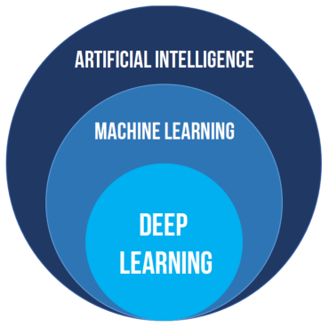

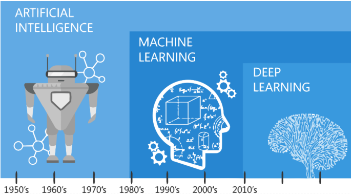

Já o aprendizado de máquina trata de algoritmos cujo desempenho melhoram à medida que eles são expostos a mais dados no decorrer do tempo. Por fim, o aprendizado profundo é um subconjunto do aprendizado de máquina em que um software é capaz de treinar a si mesmo para executar diversas tarefas por meio da utilização de redes neurais para aprender algo a partir de uma quantidade massiva de dados. O foco dessa aula é especificamente Aprendizado de Máquina! 

O Aprendizado de Máquina ( _Machine Learning_ ) é a ciência e a arte de programar computadores para que eles possam aprender com os dados. Uma definição um pouco mais formal diria que se trata do campo de estudo que dá aos computadores a capacidade de aprender sem ser explicitamente programado. Eu gosto mais dessa segunda definição porque ela traz uma comparação entre algoritmo de programação tradicional e algoritmo de aprendizado de máquina.

---

<!-- pagina: 157 -->

**Diego Carvalho, Renato da Costa, Equipe Informática e TI Aula Única - Diego Carvalho, Renato da Costa** 

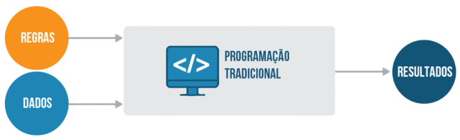

_O que é a programação tradicional?_ Trata-se do processo manual de escrever um conjunto de regras em uma sequência de passos – também chamado de algoritmo – utilizando uma linguagem de programação para que o computador as execute sobre um conjunto de dados de entrada a fim de produzir um conjunto de resultados de saída. Imaginem um software que recebe um conjunto de nomes de alunos e suas respectivas notas em uma prova e retorna um ranking de notas. 

Os dados de entrada são nome/nota dos alunos; as regras são escritas por um programador capaz de entender o problema e decompô-lo em passos que um computador entenda utilizando uma linguagem de programação; e o resultado será o ranking de notas. _Simples, não?_ Ocorre que, para alguns casos, essa abordagem apresenta diversos problemas. Imaginem um software que recebe uma imagem de entrada qualquer e identifica se há um gato nela ou não. É bem complexo... 

Humanos conseguem fazer isso em frações de segundos, mas uma máquina teria bem mais dificuldades. Utilizando a programação tradicional, teríamos diversos gargalos: em primeiro lugar, seria necessário ter um ou mais programadores; em segundo lugar, não basta que ele entenda de programação, ele também deve entender do problema e sugerir uma maneira de resolvê-lo. Ora, criar um conjunto de passos para identificar um gato em uma imagem não é uma tarefa simples... 

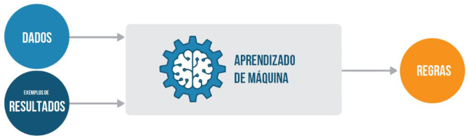

Uma forma de tentar resolver esse problema é por meio do aprendizado de máquina. Ocorre que ele funciona de uma maneira praticamente inversa à programação tradicional. Nós continuamos entrando com dados, mas – em vez de um programador criar manualmente as regras – são inseridos exemplos de resultados passados. Já a saída de um algoritmo de aprendizado de máquina são justamente as regras. Note que as entidades mudaram de lugar... 

No caso do software identificador de gatos, nós continuaríamos inserindo imagens de entrada quaisquer, mas também seriam inseridos diversos exemplos de resultados (isto é, imagens que efetivamente contêm gatos). 

A saída do algoritmo de aprendizado de máquina seria capaz, por si só, de realizar um mapeamento estatístico entre os dados de entrada e os exemplos de resultados esperados a fim descobrir se há ou não um gato em uma imagem. Em vez de um programador dizer quais são as regras, quem diz é o algoritmo! Diz se não é genial...

---

<!-- pagina: 158 -->

**Diego Carvalho, Renato da Costa, Equipe Informática e TI Aula Única - Diego Carvalho, Renato da Costa** 

Em outras palavras, o algoritmo de aprendizado de máquina consegue extrair regras de identificação de gatos por meio de padrões estatísticos comuns entre os dados de entrada e os resultados esperados. _Professor, isso significa que o algoritmo de aprendizado de máquina retornará um código-fonte?_ Não, pessoal... são regras estatísticas na forma de um modelo matemático – composto de diversas funções e parâmetros – capaz de identificar padrões a partir de exemplos. 

_Vocês notaram que as áreas de tecnologia de informação estatística começaram a despencar em concurso público recentemente?_ Pois é, esse é um dos grandes motivos – existe um relacionamento íntimo entre essas áreas no contexto de aprendizado de máquina. Voltando: quanto mais exemplos de resultados você oferece, mais o algoritmo é treinado, mais regras são aprendidas e mais ajustado se torna o modelo. Essa etapa do processo de aprendizado de máquina é chamada de **Treinamento** . 

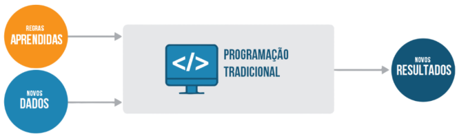

Trata-se de uma etapa custosa porque idealmente nós temos que inserir quantidades massivas de exemplos de resultados para que o modelo fique o mais ajustado possível. Após essa fase, nós temos a etapa de **Inferência** , que é bem menos custosa. Ela ocorre quando utilizamos uma programação bem próxima à programação tradicional com regras aprendidas na etapa anterior e novos dados para gerar inferir resultados. 

O cientista de dados será responsável pela etapa de treinamento a fim de gerar regras aprendidas e outros softwares as utilizam como entrada e com novos dados para processar e gerar novos resultados. _Vocês se lembram do exemplo do gato?_ Após o cientista de dados treinar o algoritmos e chegar a um conjunto de regras (modelo), outros softwares podem utilizar esse modelo na programação clássica para inferir se uma imagem possui ou não um gato. 

É claaaaaro que nem tudo é perfeito! _Lembra da estatística?_ Pois é, a inferência é probabilística e, não, determinística. Isso significa que ela identificará uma alta ou uma baixa probabilidade de ter um gato em uma imagem – ela não vai cravar que existe ou não um gato em uma imagem. _Querem um exemplo?_ As quatro imagens a seguir possuem um gato! Ora, se nós temos dificuldades, imaginem uma máquina... 

---

<!-- pagina: 159 -->

**Diego Carvalho, Renato da Costa, Equipe Informática e TI Aula Única - Diego Carvalho, Renato da Costa** 

Veja que a máquina não funciona tão diferente dos humanos: nós só sabemos o que é um gato porque já vimos vários exemplos de gatos e de não-gatos. Dessa forma, nosso cérebro consegue abstrair e generalizar o que seria um gato. Agora se fizéssemos esse experimento quando nós fôssemos bem pequenos, nós provavelmente não saberíamos diferenciar porque ainda não fomos bem treinados com vários exemplos e não-exemplos. _Querem ver uma prova?_ 

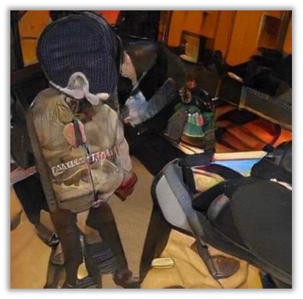

Tentem identificar qualquer objeto na imagem ao lago. _Alguém conseguiu identificar qualquer coisa?_ Não! _Por que, professor?_ Porque essa imagem foi criada especificamente para confundir nosso cérebro. Vejam que ele fica doidinho tentando identificar qualquer coisa, mas ele não teve um treinamento anterior com objetos semelhantes para fazer a comparação. 

Nós só conseguimos identificar algo porque fazemos uma comparação mental. A máquina começa desse jeito também, mas depois de ser treinada com exemplos e não-exemplos, ela consegue identificar novos objetos. Experimentem mostrar uma fita cacete para uma criança bem pequena hoje em dia. Ela provavelmente nunca viu uma, logo não conseguirá identificar... 

_Vocês viram a grande utilidade do aprendizado de máquina?_ Em algumas situações, é extremamente difícil criar regras. Se fôssemos criar um algoritmo utilizando apenas a programação tradicional para identificar gatos em uma imagem, provavelmente teríamos que contratar zoólogos/biólogos – além dos programadores. O aprendizado de máquina supre esse gargalo, não sendo necessária a atuação de zoólogos/biológicos – a máquina aprenderá apenas por meio de dados de treinamento.

---

<!-- pagina: 160 -->

**Diego Carvalho, Renato da Costa, Equipe Informática e TI Aula Única - Diego Carvalho, Renato da Costa** 

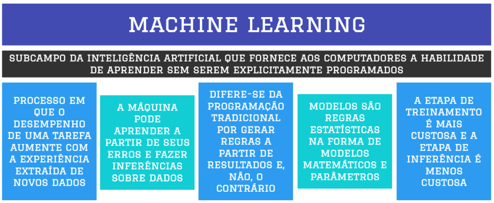

---

<!-- pagina: 161 -->

**Diego Carvalho, Renato da Costa, Equipe Informática e TI Aula Única - Diego Carvalho, Renato da Costa** 

<!-- Start of picture text -->
Tipos de Aprendizado <!-- End of picture text -->

###### **<mark>RELEVÂNCIA EM PROVA: ALTÍSSIMA</mark>** 

As aplicações de aprendizagem de máquina abrangem desde jogos passando pela detecção de fraudes até a análise estatísticas da bolsa de valores. É utilizada para construir sistemas de recomendação da Netflix e Spotify que sugerem músicas e/ou vídeos aos usuários com base no seu histórico de acesso, seus favoritos e outros dados; ou sistemas que encontram todos os artigos de notícias similares em um determinado dia. 

Ele também pode ser utilizado para categorizar páginas web automaticamente conforme o gênero (esportes, economia, política, bem-estar, etc) ou marcar mensagens de e-mail como spam. Os usos da aprendizagem de máquina são inúmeros e surgem novos todos os dias, mas eles não funcionam todos da mesma maneira. Existem diferentes abordagens de algoritmos de aprendizado de máquina que podem ser classificadas conforme veremos a seguir: 

<!-- Start of picture text -->
Aprendizado Supervisionado <!-- End of picture text -->

###### **<mark>APRENDIZADO SUPERVISIONADO</mark>** 

Tipo de aprendizado de máquina em que o modelo é treinado com um conjunto de dados rotulados, ou seja, cada entrada possui uma saída correta conhecida. O objetivo é aprender uma função que mapeie entradas para saídas, permitindo prever resultados para novos dados. É utilizado em problemas de classificação (como identificar se um e-mail é spam) e regressão (como prever preços), sendo um dos paradigmas mais comuns e eficazes em aplicações práticas. 

Trata-se de um conjunto de técnicas de aprendizado para treinar um modelo com dados rotulados manualmente, isto é, um especialista/supervisor externo diz qual é a saída esperada para cada dado histórico utilizado no treinamento. São as técnicas mais comumente empregadas no contexto de aprendizado de máquina e geralmente são utilizadas para identificar padrões específicos, prever resultados dado um conjunto de amostras de treinamento. 

Em outras palavras, a saída desejada para cada exemplo de entrada já é conhecida no aprendizado supervisionado, isto é, os dados de saída são previamente rotulados. Essa abordagem – também chamada de tarefa de previsão – é bastante semelhante à aprendizagem humana sob a supervisão de um professor. O professor fornece bons exemplos para o aluno memorize, e o aluno então deriva as regras gerais desses exemplos específicos. Vamos ver alguns exemplos... 

Suponha que você tenha um sobrinho que acabou de fazer dois anos e está aprendendo a falar. Você quer ensiná-lo o que é um cachorro e o que é um gato. _Então, o que você faz?_ Você pode mostrar a ele diversos vídeos de cães e depois idealmente mostrar cães e gatos pessoalmente para que ele possa ver melhor. Você, então, pode dizer para ele algumas coisas que sejam semelhantes e diferentes entre cães de gatos. 

Por exemplo: ambos possuem quatro patas e uma cauda; cachorros podem ser grandes ou pequenos, gatos geralmente são pequenos; cachorros possuem focinho/boca longos, enquanto gatos têm focinho/bocas pequenos; cachorros latem e gatos miam; cachorros sempre têm pupilas arredondadas, já gatos podem ficar com a pupila arredondada ou em formato de fenda; cachorros têm diferentes formatos de orelha, enquanto quase todos os gatos possuem o mesmo formato. 

Finalizada a explicação, agora você leva seu sobrinho de volta para casa e mostra a ele fotos de diferentes cães e gatos. Se ele for capaz de diferenciar o cão do gato, significa que ele aprendeu corretamente.

---

<!-- pagina: 162 -->

**Diego Carvalho, Renato da Costa, Equipe Informática e TI Aula Única - Diego Carvalho, Renato da Costa** 

_Então, o que aconteceu aqui?_ Você estava lá para guiá-lo até o objetivo de diferenciar entre um cão e um gato; você ensinou a ele todas as diferenças e semelhanças que existem entre um cão e um gato; e você então a testou para ver se ele era capaz de aprender. 

Se ele não conseguisse identificar o cachorro e o gato, você teria que analisar os erros e oferecer mais exemplos até que ele finalmente conseguisse identificar cachorros e gatos com maior precisão. Agora note que você atuou como um supervisor/professor e seu sobrinho atuou como o algoritmo que precisava aprender. Você já sabia o que era um cachorro e o que era um gato, e o orientou em seu aprendizado. Por essa razão, a técnica se chama aprendizado supervisionado... 

Nesse caso, o processo de aprendizagem de um algoritmo em relação ao conjunto de dados de entrada é acompanhado por um supervisor ou professor acompanhando o processo de aprendizado. O professor sabe quais são as respostas certas, o algoritmo faz as predições sobre o conjunto de dados de entrada e ele vai corrigindo a saída à medida que suas respostas não são de acordo o resultado esperado. Outro exemplo... 

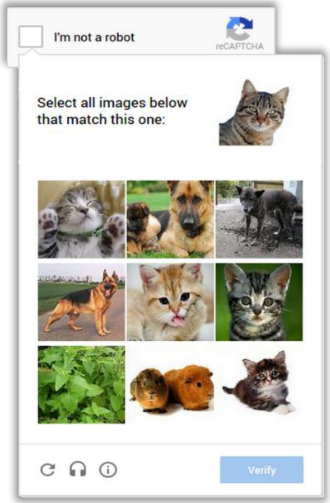

---

<!-- pagina: 163 -->

**Diego Carvalho, Renato da Costa, Equipe Informática e TI Aula Única - Diego Carvalho, Renato da Costa** 

_Sabe quando vamos acessar uma página web e aparece uma caixinha falando para nós selecionarmos imagens com algum objeto específico para indicar que não somos um robô?_ Pois é, o nome daquilo é reCAPTCHA! A verdade é que o objetivo principal desse teste não é verificar se somos robôs, visto que existem maneiras mais simples para isso. O objetivo principal é treinar algoritmos de identificação de imagens. Nesse caso, nós somos os supervisores do algoritmo! 

Toda vez que vocês ouvirem falar em aprendizado supervisionado, vocês devem saber que: (1) trata-se da abordagem mais comum de aprendizado de máquina; (2) existe um supervisor ou professor responsável por treinar o algoritmo; e (3) o supervisor conhece de antemão os rótulos1 . Essa última parte é a mais cobrada em prova, portanto vamos enfatizá-la: o supervisor já conhece de antemão os rótulos. 

Logo, o supervisor decide qual é o resultado esperado em cada contexto. Ele pode pegar um conjunto de fotos de pessoas e classificá-las com o rótulo que ele quiser (Ex: alto ou baixo; masculino ou feminino; bonito ou feio; criança ou adulto; loiro, moreno ou ruivo; maior que um determinado valor ou menor que um determinado valor). Quem escolhe o rótulo no aprendizado supervisionado é o supervisor e ele o utiliza para treinar o algoritmo. 

Em suma: o aprendizado supervisionado é uma abordagem de aprendizado de máquina em que um supervisor já conhece de antemão o resultado (rótulo/classe) e pode guiar o aprendizado mapeando as entradas em saídas por meio do ajuste de parâmetros em um modelo capaz de prever rótulos desconhecidos. Por fim, é interessante saber que os problemas de aprendizado supervisionado geralmente tratam de uma variável quantitativa ou qualitativa. _Como é, Diego?_ 

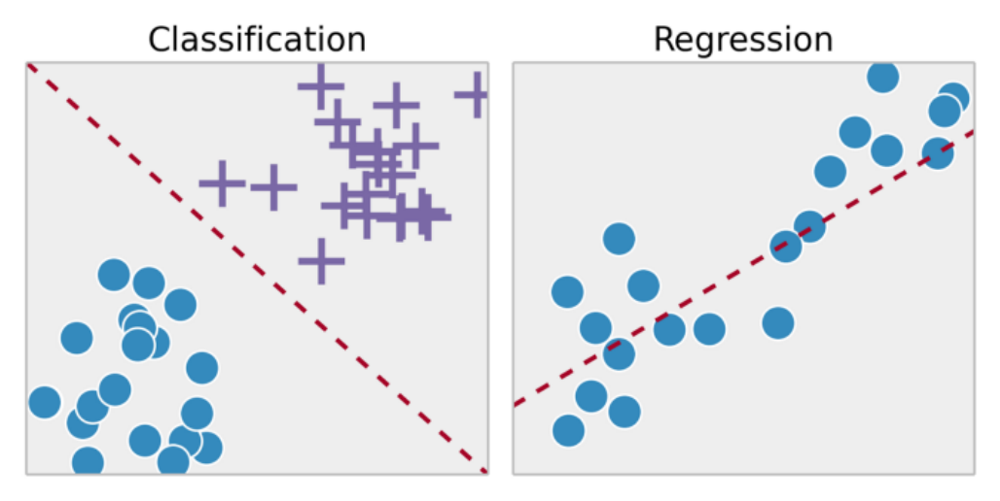

Se os rótulos se referem a um conjunto infinito de valores numéricos contínuos (Ex: > R$100,00 ou < R$100,00), a tarefa se chama regressão. Já se os rótulos se referem a um conjunto finito e não ordenado de valores categóricos (Ex: Alto ou Baixo), a tarefa se chama classificação. Os modelos supervisionados mais conhecidos são: árvores de decisão, regressão linear, regressão logística, redes neurais, K-Nearest Neighbors (KNN), Support Vector Machines (SVM), etc. 

> 1 Rótulo também pode ser chamado de categoria, classe, sinal, variável alvo ou, em inglês, de _target_ , _label_ ou _tag_ .

---

<!-- pagina: 164 -->

**Diego Carvalho, Renato da Costa, Equipe Informática e TI Aula Única - Diego Carvalho, Renato da Costa** 

<!-- Start of picture text -->
- Aprendizado Não <!-- End of picture text -->

<!-- Start of picture text -->
Supervisionado <!-- End of picture text -->

###### **<mark>APRENDIZADO NÃO SUPERVISIONADO</mark>** 

Tipo de aprendizado de máquina que ocorre quando o modelo recebe apenas dados de entrada, sem rótulos associados, e precisa identificar padrões, estruturas ou agrupamentos por conta própria. O objetivo é explorar a organização dos dados, como segmentar clientes em grupos semelhantes ou reduzir dimensionalidade. Técnicas como clustering e análise de componentes principais são exemplos desse tipo de aprendizado, muito útil em cenários exploratórios e de descoberta de conhecimento. 

Trata-se de um conjunto de técnicas para treinar um modelo em que não se sabe a saída esperada para cada dado usado no treinamento. Diferentemente do aprendizado supervisionado, você não utiliza rótulos/categorias para as amostras de treinamento. Os algoritmos são formulados de tal forma que podem encontrar estruturas e padrões adequados nos dados por conta própria. Em outras palavras, não existe um supervisor ou professor para rotular os dados... 

Sendo assim, o algoritmo identifica as semelhanças nos dados apresentados e reage com base na presença ou ausência dessas tais semelhanças. Essa abordagem – também chamada de tarefa de descrição – permite que o algoritmo aprenda a categorizar dados autonomamente. A ideia aqui não é prever nada e, sim, organizar os dados de alguma forma ou descrever sua estrutura. _Professor, como o algoritmo vai gerar as próprias categorias? E se eu não gostar das categorias escolhidas?_ 

Excelente pergunta! O processo de aprendizado não supervisionado é mais complexo porque não existe um supervisor para treinar o algoritmo e nem existem categorias pré-definidas. Logo, existe realmente uma chance de o algoritmo gerar categorias completamente diferentes do que você esperava. Existem dois grandes sub-grupos de aprendizado não-supervisionado: Agrupamentos ( _Clustering_ ) e Regras de Associação ( _Association Rules_ ). Vamos ver ambas... 

De forma resumida, podemos dizer que as regras de **associação** são um tipo de aprendizado nãosupervisionado que permite estabelecer regras capazes de verificar como determinados elementos em um conjunto estão intimamente associados, isto é, se a presença de um elemento implica a presença de outro dentro em uma mesma transação. Os principais modelos são: Apriori, FP-Growth e Eclat. 

Um exemplo clássico utilizado na literatura trata do supermercado. Vá agora até um mercado e fique observando o que as pessoas estão comprando. Tem cidadão que pegou pão e leite; em seguida, entra outro cidadão e pega pão e ovos; posteriormente, entra outro cidadão e compra ovos, leite e açúcar; depois entra mais um cidadão e compra pão, leite e açúcar. _Como as regras de associação se aplicam a esse exemplo?_ 

As regras de associação permitem verificar se existe um padrão na compra de determinados produtos. Como podemos ver no exemplo, pão, leite, ovos e açúcar são elementos que parecem ter uma associação mais forte do que pão, fígado e uma furadeira. _Alguém discorda?_ Pois é, as regras de associação são um tipo de algoritmo de aprendizado não-supervisionado que permite extrair esses padrões para a tomada de decisão. _E o agrupamento?_ 

De forma resumida, podemos dizer que o **agrupamento** é um tipo de aprendizado não-supervisionado em que se busca encontrar padrões em um conjunto de dados e agrupá-los em subconjuntos que – ao comparar dados de um mesmo grupo – sejam o máximo possível homogêneos/semelhantes e – ao comparar dados de grupos diferentes – sejam o máximo possível heterogêneos/diferentes. Os principais modelos são: k-Means e Agrupamento Hierárquico.

---

<!-- pagina: 165 -->

**Diego Carvalho, Renato da Costa, Equipe Informática e TI Aula Única - Diego Carvalho, Renato da Costa** 

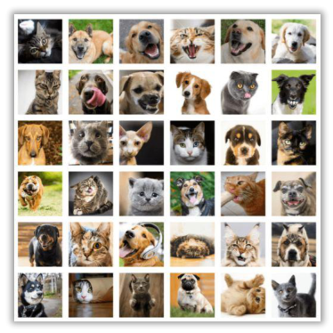

Veremos agora um exemplo clássico de aprendizado não supervisionado por meio de agrupamento. A imagem ao lado contém um conjunto de fotos de diversos cachorros e gatos. Vocês sabem disso porque nós batemos o olho e rapidamente conseguimos identificar que não há outro tipo de animal na imagem. 

No entanto, a máquina não sabe nada disso – nunca se esqueçam que computadores são burros! Para ela, cada imagem dessas é um conjunto de pixels representados por vetores de números binários. Em suma: podemos afirmar que essa imagem é simplesmente um conjunto de diversos zeros e uns que indicam a cor dos pixels que compõem a imagem. 

Se eu rodar um algoritmo de aprendizado não-supervisionado nesse conjunto de imagens e pedir para ele dividi-lo em duas categorias, eu aposto que vocês intuitivamente pensarão que o algoritmo retornará ==5460== duas categorias: uma categoria de cachorros e outra categoria de gatos. _Acertei?_ Pois é, mas você errou! Nós – humanos – sabemos que só há cachorros e gatos na imagem, mas afirmo novamente que a máquina enxerga apenas zeros e uns. 

Lembrem-se que o aprendizado não-supervisionado permite avaliar um conjunto de dados de entrada e – sem interferência externa de um supervisor – sugerir categorias. O algoritmo pode, por exemplo, dividir as imagens nas categorias claras e escuras, com fundo verde ou sem fundo verde, maiores ou menores, entre outros. _Vocês se lembram que eu falei que existe a possibilidade de eu não gostar das categorias escolhidas?_ 

P <mark>o</mark> is é... o algoritmo não está nem aí para o que eu quero – ele vai buscar padrões nas imagens, a fim de dividi-las em dois grupos de tal modo que as imagens dentro de cada grupo sejam o máximo possível homogêneas e as imagens de grupos diferentes sejam o máximo possível heterogêneas. _E se eu quiser definir de antemão os subgrupos que eu quero dividir as imagens?_ Aí você deve usar um algoritmo de aprendizado supervisionado e, não, um algoritmo não-supervisionado. 

É preciso entender que cada abordagem é adequada para um tipo de problema e tem suas vantagens e suas desvantagens. O aprendizado não-supervisionado é bem mais barato que o aprendizado supervisionado. Vamos pensar na Amazon! _Vocês imaginaram a quantidade absurda de produtos que tem à venda lá?_ Eu fiz uma pesquisa rápida em sua página web e vi que existem 20 categorias principais de produtos. 

Só que dentro de cada categoria existem diversas subcategorias que possuem dentro delas várias outras subcategorias. Se tudo isso fosse feito utilizando aprendizado supervisionado, custaria uma fortuna e demoraria anos para concluir. A Amazon teria que contratar uma equipe gigantesca de especialistas em diversas áreas, entregar para eles uma lista com uns 500.000 produtos à venda e pedir para eles criarem rótulos/categorias de modo que contemplasse todos esses produtos. 

Uma abordagem mais interessante seria utilizar o aprendizado não-supervisionado, porque ele é muito mais barato e permite lidar com quantidades massivas de dados. _Pode conter erros?_ Pode! _Pode gerar categorias indesejadas?_ Também pode! Por outro lado, isso é mais barato de resolver. _Professor, esses algoritmos só funcionam com imagem?_ Não, eu utilizo exemplos com imagens porque são os mais fáceis de entender, mas ele se aplica a basicamente qualquer formato de dados. 

Para finalizar, podemos afirmar que se o aprendizado de máquina fosse representado como uma criança aprendendo a andar de bicicleta, o aprendizado supervisionado seria o pai correndo atrás da bicicleta,

---

<!-- pagina: 166 -->

**Diego Carvalho, Renato da Costa, Equipe Informática e TI Aula Única - Diego Carvalho, Renato da Costa** 

segurando-a na vertical e corrigindo a trajetória da criança; e o aprendizado não-supervisionado seria o pai entregar a bicicleta na mão da criança, dar um tapinha nas costas e dizer: “Se vira, garoto!”. _Entendido?_ 

<!-- Start of picture text -->
- Aprendizado Semi <!-- End of picture text -->

<!-- Start of picture text -->
Supervisionado <!-- End of picture text -->

###### **<mark>APRENDIZADO SEMI-SUPERVISIONADO</mark>** 

Tipo de aprendizado de máquina que combina as características dos aprendizados supervisionado e não supervisionado, utilizando uma pequena quantidade de dados rotulados junto com uma grande quantidade de dados não rotulados. O modelo aproveita a estrutura dos dados não rotulados para melhorar seu desempenho, reduzindo a necessidade de rotulação manual, que pode ser cara ou demorada. É especialmente útil em áreas como visão computacional e processamento de linguagem natural, onde há muitos dados disponíveis, mas <u>poucos rotulados.</u> 

Trata-se de um meio termo entre o aprendizado supervisionado e o não-supervisionado. Nesse caso, utilizamos dados rotulados e não-rotulados para o treinamento. Em geral, utiliza-se uma pequena quantidade de dados rotulados e uma grande quantidade de dados não-rotulados, visto que dados não rotulados são mais baratos e são obtidos com menos esforço. Ela pode ser aplicada para o agrupamento, regras de associação, classificação ou regressão. É isso, aqui não tem segredo! 

<!-- Start of picture text -->
Aprendizado Por Reforço <!-- End of picture text -->

###### **<mark>APRENDIZADO POR REFORÇO</mark>** 

Tipo de aprendizado de máquina baseado na interação de um agente com um ambiente, no qual ele aprende a tomar decisões por meio de tentativas e erros, recebendo recompensas ou penalidades. O objetivo é maximizar a recompensa acumulada ao longo do tempo, aprendendo uma política de ações eficiente. Esse paradigma é comum em jogos, robótica e sistemas de controle, sendo conhecido por aplicações como algoritmos que aprendem a jogar xadrez ou dirigir veículos autônomos. 

Trata-se de um conjunto de técnicas que utilizam tentativa e erro para descobrir decisões ótimas de como interagir com ambiente ou com outros agentes. Ele tem como meta reforçar ou recompensar uma ação considerada positiva e punir uma ação considerada negativa. Um exemplo são os famosos robôs aspiradores! Esses robôs percorre os cômodos de uma casa, identifica obstáculos e armazena quais rotas funcionam melhor para limpar a casa. 

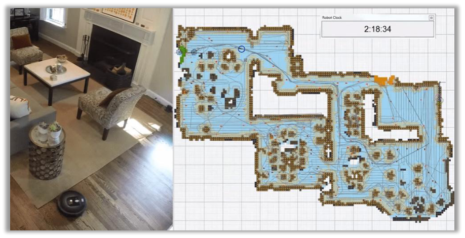

---

<!-- pagina: 167 -->

**Diego Carvalho, Renato da Costa, Equipe Informática e TI Aula Única - Diego Carvalho, Renato da Costa** 

Ele literalmente constrói um mapa da casa e refina/atualiza esse mapa a cada nova limpeza. Se ele tenta um determinado percurso e encontra um obstáculo, ele pune essa ação considerada negativa não fazendo mais esse percurso; se ele tenta um determinado percurso e não encontra um obstáculo, ele reforça essa ação considerada positiva fazendo novamente esse percurso da próxima vez. É claro que no começo ele erra bastante, mas depois ele acerta... 

Eu já tive um robozinho desses e era uma mão na roda, mas o meu era bem antigo e não fazia mapeamento. Logo, ele batia na primeira vez, não aprendia nada e batia novamente em todas as outras. Vendi ele porque não estava sendo mais útil e porque meu cachorro (Chico) ficava o caçando incessantemente, mas os mais novos são extremamente modernos. Recomendo bastante – e aceito de presente ;) 

Em suma: algoritmos de aprendizado por reforço baseiam-se em reforço positivo/negativo para otimização de resultado. No caso dos robôs aspiradores, eles punem a passagem por trechos pouco promissores e recompensam a passagem por trechos mais promissores. É uma técnica bem menos empregada e que eu particularmente nunca vi cair em prova, mas não custa nada mencionar em aula porque sempre pode cair.

---

<!-- pagina: 168 -->

**Diego Carvalho, Renato da Costa, Equipe Informática e TI Aula Única - Diego Carvalho, Renato da Costa** 

# **– QUESTÕES COMENTADAS MACHINE LEARNING** 

**1. (FAFIPA / Prefeitura de Paranavaí - PR - 2025) Uma das principais técnicas usadas na Inteligência Artificial é conhecida como aprendizado não supervisionado. Assinale a alternativa que melhor descreve o que é o aprendizado não supervisionado.** 

a) Abordagem, onde o algoritmo identifica padrões ou estruturas em dados não rotulados, sem orientação prévia. 

b) Método que utiliza recompensas e penalidades para otimizar decisões em ambientes dinâmicos. 

c) Sistema que combina redes neurais profundas para processar linguagem natural. 

d) Processo de treinamento exclusivo para tarefas de visão computacional com supervisão humana. 

e) Técnica, em que o modelo é treinado com dados rotulados para prever resultados específicos. 

###### **Comentários:** 

(a) Correto. No aprendizado não supervisionado, os dados não possuem rótulos e o objetivo é descobrir padrões, agrupamentos ou estruturas subjacentes automaticamente pelo algoritmo; 

(b) Errado. Esse é o conceito de aprendizado por reforço, que se baseia em recompensas e penalidades para tomada de decisões sequenciais; 

(c) Errado. Essa descrição está relacionada ao uso de deep learning para NLP, mas não define o aprendizado não supervisionado; 

(d) Errado. A supervisão humana indica um processo supervisionado, e o foco em visão computacional é apenas uma aplicação específica; 

(e) Errado. A utilização de dados rotulados caracteriza o aprendizado supervisionado, e não o não supervisionado. 

**Gabarito:** Letra A 

**2. (CEBRASPE / CAESB-DF - 2025) Assinale a opção em que é citada a ciência do desenvolvimento de algoritmos e modelos estatísticos utilizados por sistemas de computador para a realização de tarefas sem instruções explícitas, baseando-se em padrões e inferências, de modo que um sistema aprenda e melhore automaticamente e com base na experiência.** 

a) internet of things 

b) generative AI 

c) big data 

d) machine learning e) cloud computing 

###### **Comentários:**

---

<!-- pagina: 169 -->

**Diego Carvalho, Renato da Costa, Equipe Informática e TI Aula Única - Diego Carvalho, Renato da Costa** 

(a) Errado. Internet of Things (IoT) refere-se à interconexão de dispositivos físicos à internet, não ao desenvolvimento de algoritmos que aprendem com a experiência; 

(b) Errado. A IA generativa se refere à criação de conteúdo (texto, imagem, etc.), geralmente com base em aprendizado de máquina, mas não define a ciência do aprendizado em si; 

(c) Errado. Big Data trata do processamento e análise de grandes volumes de dados, mas não necessariamente envolve aprendizado autônomo; 

(d) Correto. Machine Learning é a área da ciência da computação que desenvolve algoritmos capazes de aprender a partir de dados, melhorando seu desempenho com a experiência sem serem explicitamente programados; 

(e) Errado. Cloud Computing é a oferta de serviços de computação pela internet, como armazenamento e processamento, mas não está diretamente ligada à criação de algoritmos que aprendem com dados. 

**Gabarito:** Letra D 

**3. (IADES / CNEN - 2025) No que concerne ao uso da inteligência artificial na organização da informação, assinale a alternativa correta.** 

a) As técnicas de Machine Learning, advindas da inteligência artificial, estão trazendo grandes contribuições para os estudos de Big data. 

b) O uso de algoritmos nos mecanismos de busca da internet ainda é incipiente. 

c) A inteligência artificial precisa de um volume de dados estruturados e homogéneos para extrair seus resultados. 

d) As redes neurais não supervisionadas são as mais adequadas para a organização da informação. e) O impacto das redes neurais na recuperação da informação é pequeno. 

###### **Comentários:** 

(a) Correto. Técnicas de Machine Learning têm sido essenciais para lidar com os grandes volumes de dados (Big Data), permitindo organizar, classificar e extrair padrões de forma automatizada e eficiente; 

(b) Errado. O uso de algoritmos em mecanismos de busca está bastante avançado, sendo a base de funcionamento de sistemas como o Google, que utilizam IA para entregar resultados relevantes; 

(c) Errado. A IA pode trabalhar com dados estruturados e não estruturados, e é justamente sua flexibilidade que permite atuar em diversos tipos de informação; 

(d) Errado. A escolha entre redes supervisionadas ou não supervisionadas depende do problema. A organização da informação geralmente se beneficia de técnicas supervisionadas com dados rotulados;

---

<!-- pagina: 170 -->

**Diego Carvalho, Renato da Costa, Equipe Informática e TI Aula Única - Diego Carvalho, Renato da Costa** 

(e) Errado. As redes neurais têm impacto significativo na recuperação da informação, melhorando buscas, recomendações e classificação de conteúdos. 

**Gabarito:** Letra A 

**4. (CEBRASPE / EMBRAPA - 2025) Acerca de inteligência artificial e machine learning, julgue o item que se segue.** 

O aprendizado não supervisionado se caracteriza pela utilização de dados previamente rotulados para treinar um modelo de machine learning, permitindo que ele aprenda padrões automaticamente a partir dos rótulos desses dados. 

###### **Comentários:** 

O enunciado descreve características do aprendizado supervisionado, e não do não supervisionado. No aprendizado não supervisionado, os dados não possuem rótulos, e o modelo identifica padrões ocultos por conta própria, como em agrupamentos ou redução de dimensionalidade. 

**Gabarito:** Errado 

**5. (Instituto Ágata / Prefeitura de Anajás - PA - 2024) No contexto do aprendizado de máquina, um modelo supervisionado é um modelo que** 

a) necessita de dados não rotulados para realizar o treinamento. 

b) supervisiona o treinamento das redes neurais para evitar a ocorrência de mínimos locais. 

c) também pode ser classificado como modelo de análise associativa. 

d) necessita de dados rotulados para realizar o treinamento. 

e) supervisiona o treinamento das redes neurais para evitar a ocorrência de mínimos globais. 

###### **Comentários:** 

(a) Errado. Modelos supervisionados exigem dados rotulados, ou seja, com entradas e saídas conhecidas. Dados não rotulados são usados em aprendizado não supervisionado; 

(b) Errado. A supervisão em "aprendizado supervisionado" não se refere à atuação sobre mínimos locais ou globais, mas sim à presença de rótulos nos dados de treino; 

(c) Errado. Modelos de análise associativa são típicos do aprendizado não supervisionado, como em regras de associação (ex: market basket analysis); 

(d) Correto. O aprendizado supervisionado requer dados rotulados, ou seja, exemplos com a resposta esperada, para que o modelo aprenda a mapear entradas para saídas;

---

<!-- pagina: 171 -->

**Diego Carvalho, Renato da Costa, Equipe Informática e TI Aula Única - Diego Carvalho, Renato da Costa** 

(e) Errado. A supervisão aqui não diz respeito ao controle de mínimos globais, e sim à estrutura dos dados usados no treinamento (rotulados ou não). 

**Gabarito:** Letra D 

**6. (CEBRASPE / EMBRAPA - 2025) Acerca de inteligência artificial e machine learning, julgue o item que se segue.** 

Diferentemente do aprendizado supervisionado e não supervisionado, o aprendizado por reforço baseia-se em um agente que interage com um ambiente e recebe recompensas ou penalidades conforme suas ações, buscando maximizar um retorno cumulativo ao longo do tempo. 

###### **Comentários:** 

O aprendizado por reforço é um tipo de machine learning no qual um agente toma decisões em um ambiente, recebendo recompensas ou penalidades com base em suas ações. O objetivo é maximizar o retorno cumulativo ao longo do tempo, aprendendo por tentativa e erro. 

**Gabarito:** Correto 

###### **7. (CEBRASPE / EMBRAPA - 2025) Julgue o item seguinte, relativo à ciência de dados.** 

O aprendizado de máquina não supervisionado utiliza algoritmos para analisar conjuntos de dados não rotulados, a fim de descobrir padrões ocultos sem necessidade de intervenção humana. 

###### **Comentários:** 

O aprendizado de máquina não supervisionado aplica algoritmos em dados não rotulados para identificar padrões, agrupamentos ou estruturas ocultas nos dados, sem a necessidade de intervenção humana direta ou rótulos prévios. 

**Gabarito:** Correto 

**8. (CEBRASPE / ANM - 2025) Julgue o item a seguir, referente a sistema operacional, edição de planilhas, organização e segurança da informação, redes de computadores e inteligência artificial.** 

O aprendizado supervisionado analisa dados sem respostas predefinidas, identificando padrões ou categorias de forma autônoma, sem orientações específicas. 

###### **Comentários:**

---

<!-- pagina: 172 -->

**Diego Carvalho, Renato da Costa, Equipe Informática e TI Aula Única - Diego Carvalho, Renato da Costa** 

O que foi descrito no enunciado é uma característica do aprendizado não supervisionado. Já o aprendizado supervisionado utiliza dados rotulados (com respostas predefinidas) para treinar modelos que aprendem a associar entradas a saídas específicas. 

**Gabarito:** Errado 

**9. (CEBRASPE / ANM - 2025) Julgue o item a seguir, referente ao Microsoft Office 365, a redes de computadores, à segurança da informação e à inteligência artificial.** 

Aprendizado de máquina (machine learning) é o processo de treinar um modelo para identificar padrões e fazer previsões ou gerar novos conteúdos com base nas informações processadas. 

###### **Comentários:** 

==5460== 

Aprendizado de máquina (machine learning) é, de fato, o processo no qual um modelo é treinado com dados para identificar padrões, fazer previsões e, em alguns casos (como na IA generativa), produzir novos conteúdos com base no que foi aprendido durante o treinamento. 

**Gabarito:** Correto 

###### **10.(IBEC / Prefeitura de Tremedal - BA - 2025) Qual é o papel de algoritmos de aprendizado de máquina na análise de dados avançada?** 

a) Substituir a análise manual ao identificar padrões complexos e fazer previsões baseadas em grandes volumes de dados. 

b) Armazenar dados em bancos de dados relacionais para consultas mais rápidas. 

c) Criar visualizações interativas, como gráficos e dashboards. 

d) Garantir a segurança dos dados contra-ataques cibernéticos. 

e) Automatizar o backup de dados em servidores de nuvem. 

###### **Comentários:** 

(a) Correto. Algoritmos de aprendizado de máquina são essenciais na análise de dados avançada, pois conseguem identificar padrões complexos e realizar previsões com base em grandes volumes de dados, substituindo ou complementando análises manuais; 

(b) Errado. Armazenar dados em bancos relacionais é tarefa de sistemas de gerenciamento de banco de dados (SGBDs), não de aprendizado de máquina; 

(c) Errado. Visualizações interativas são criadas com ferramentas de BI (Business Intelligence), como Power BI ou Tableau, e não são o foco dos algoritmos de ML; 

(d) Errado. A segurança contra ataques cibernéticos está mais ligada à cibersegurança, não ao aprendizado de máquina diretamente;

---

<!-- pagina: 173 -->

**Diego Carvalho, Renato da Costa, Equipe Informática e TI Aula Única - Diego Carvalho, Renato da Costa** 

(e) Errado. O backup de dados em nuvem é uma função de infraestrutura de TI, não de análise ou aprendizado de dados. 

**Gabarito:** Letra A 

- **11.(IGEDUC / Prefeitura de Cupira - PE - 2024) Algoritmos de aprendizado de máquina podem ser supervisionados, não supervisionados ou semi-supervisionados, permitindo que sistemas sejam treinados com ou sem conjuntos de dados rotulados, dependendo do objetivo do modelo.** 

###### **Comentários:** 

Algoritmos de aprendizado de máquina podem ser classificados em supervisionados (usam dados rotulados), não supervisionados (trabalham com dados sem rótulos) e semi-supervisionados (combinam ambos). Essa flexibilidade permite escolher o tipo de aprendizado mais adequado ao objetivo do modelo e à disponibilidade de dados. 

**Gabarito:** Correto 

- **12.(IGEDUC / Prefeitura de Cupira - PE - 2024) O aprendizado por reforço é uma técnica de inteligência artificial que utiliza recompensas e punições para treinar modelos, possibilitando que agentes de IA aprendam a tomar decisões com base em interações com o ambiente.** 

###### **Comentários:** 

O aprendizado por reforço é um tipo de inteligência artificial em que um agente aprende a tomar decisões ao interagir com um ambiente, recebendo recompensas por ações corretas e punições por ações inadequadas, com o objetivo de maximizar o retorno cumulativo ao longo do tempo. 

**Gabarito:** Correto 

- **13.(FGV / TCE-GO - 2024) Os modelos de aprendizado de máquina desempenham um papel fundamental na análise e interpretação de dados em uma variedade de domínios. Uma característica dos modelos de aprendizado de máquina supervisionados e não supervisionados é que modelos supervisionados** 

a) exploram a detecção de outliers, enquanto modelos não supervisionados usam dados representados em formatos como XML ou JSON para treinamento. 

- b) geralmente têm menos tendência ao overfitting do que modelos não supervisionados. 

c) requerem dados rotulados para treinamento, enquanto modelos não supervisionados podem funcionar com dados não rotulados. 

d) são mais adequados para tarefas de análise exploratória de dados, enquanto modelos não supervisionados são mais adequados para previsão de séries temporais.

---

<!-- pagina: 174 -->

**Diego Carvalho, Renato da Costa, Equipe Informática e TI Aula Única - Diego Carvalho, Renato da Costa** 

e) são usados apenas para classificação, enquanto modelos não supervisionados são usados apenas para agrupamento. 

###### **Comentários:** 

(a) Errado. A detecção de outliers pode ser feita por ambos os tipos de modelos. O uso de formatos como XML ou JSON é relacionado ao armazenamento de dados, não ao tipo de aprendizado; 

(b) Errado. Modelos supervisionados podem, inclusive, ser mais propensos ao overfitting, especialmente quando os dados de treinamento são limitados; 

(c) Correto. A principal distinção é que o aprendizado supervisionado requer dados rotulados (com entradas e saídas conhecidas), enquanto o aprendizado não supervisionado utiliza dados não rotulados para identificar padrões ocultos; 

(d) Errado. Análise exploratória é mais comum em aprendizado não supervisionado. Já a previsão de séries temporais costuma utilizar aprendizado supervisionado com dados históricos rotulados; 

(e) Errado. O aprendizado supervisionado não é restrito à classificação — também abrange regressão. Da mesma forma, aprendizado não supervisionado não é exclusivo para agrupamento. 

**Gabarito:** Letra C 

- **14.(Quadrix / CRMV-SE - 2024) Assinale a alternativa que apresenta a principal diferença entre aprendizado supervisionado e aprendizado não supervisionado em aprendizado de máquina.** 

a) Aprendizado supervisionado e não supervisionado são termos intercambiáveis, sem diferenças significativas. 

b) O aprendizado supervisionado requer um conjunto de dados de treinamento rotulado, enquanto o aprendizado não supervisionado não utiliza rótulos. 

c) No aprendizado supervisionado, os modelos são treinados sem um conjunto de dados específico, enquanto no aprendizado não supervisionado, um conjunto de dados de treinamento é obrigatório. 

d) O aprendizado supervisionado é utilizado apenas para classificação, enquanto o aprendizado não supervisionado é aplicado apenas em problemas de regressão. 

e) O aprendizado supervisionado e não supervisionado são conceitos desatualizados e não mais são relevantes em aprendizado de máquina moderno. 

###### **Comentários:** 

(a) Errado. Aprendizado supervisionado e não supervisionado não são intercambiáveis — tratam de abordagens distintas com finalidades diferentes;

---

<!-- pagina: 175 -->

**Diego Carvalho, Renato da Costa, Equipe Informática e TI Aula Única - Diego Carvalho, Renato da Costa** 

(b) Correto. A principal diferença é que o aprendizado supervisionado utiliza dados rotulados (com entrada e saída conhecida), enquanto o não supervisionado trabalha com dados não rotulados, buscando identificar padrões ou estruturas ocultas; 

(c) Errado. No aprendizado supervisionado, o modelo precisa de um conjunto de dados rotulado específico. A afirmação está invertida e incorreta; 

(d) Errado. O aprendizado supervisionado é usado tanto para classificação quanto para regressão. Já o aprendizado não supervisionado é usado para agrupamento (clustering), redução de dimensionalidade, entre outros — não para regressão supervisionada; 

(e) Errado. Os conceitos de aprendizado supervisionado e não supervisionado são fundamentais e amplamente utilizados no aprendizado de máquina atual. 

###### **Gabarito:** Letra B 

###### **15.(CEBRASPE / MPO - 2024) Julgue o item a seguir, a respeito de conceitos de inteligência artificial.** 

O aprendizado supervisionado é definido pelo uso de conjuntos de dados rotulados para treinar algoritmos que classificam dados ou preveem resultados com precisão. 

###### **Comentários:** 

O aprendizado supervisionado utiliza conjuntos de dados rotulados (com entradas e saídas conhecidas) para treinar algoritmos capazes de classificar dados ou prever resultados com base em novos dados. Essa abordagem é amplamente usada em tarefas como reconhecimento de voz, diagnóstico médico e previsão de vendas. 

**Gabarito:** Correto 

###### **16.(QUADRIX / CRQ - 12ª Região (GO, TO e DF) - 2024) Acerca dos tipos de computadores, do Microsoft Word 2016 e do aprendizado de máquina, julgue o item.** 

O aprendizado de máquina pode ser definido como uma técnica de ciência de dados que permite que os computadores usem os dados existentes para prever futuros comportamentos, resultados e tendências. 

###### **Comentários:** 

O aprendizado de máquina (machine learning) é, de fato, uma técnica da ciência de dados que capacita computadores a analisar dados existentes e, com base neles, fazer previsões sobre comportamentos, resultados e tendências futuras. Essa abordagem é amplamente utilizada em áreas como marketing, finanças, saúde e recomendação de conteúdo.

---

<!-- pagina: 176 -->

**Diego Carvalho, Renato da Costa, Equipe Informática e TI Aula Única - Diego Carvalho, Renato da Costa** 

**Gabarito:** Correto 

**17. (IV - UFG / Câmara de Anápolis - GO - 2024) A Inteligência Artificial (IA) é uma ferramenta computacional que permitiu o avanço em diferentes áreas, entre elas: a saúde, finanças, marketing, entre outras. A principal ajuda, veio no apoio à tomada de decisões. As caraterísticas que descrevem o aprendizado de máquina (machine learning) são** 

a) compostas de algoritmos e modelos estatísticos que permitem que os sistemas aprendam a partir dos dados, usando identificação de padrões e fazendo previsões. 

b) baseadas em regras e conhecimentos para tomar decisões e fornecer soluções em um domínio específico, com total eficácia simulando o raciocínio humano. 

- c) baseadas na autonomia, sem intervenção humana e demandam alto processamento 

- computacional. 

d) baseadas em símbolos, regras que representam, manipulam e aprendem com interferências lógicas, usada na solução de problemas complexos. 

###### **Comentários:** 

(a) Correto. O aprendizado de máquina (machine learning) utiliza algoritmos e modelos estatísticos que permitem aos sistemas aprender a partir dos dados, identificar padrões e fazer previsões, sem serem explicitamente programados para cada tarefa; 

(b) Errado. Essa descrição se refere aos sistemas especialistas, que funcionam com regras fixas e não aprendem com os dados; 

(c) Errado. Embora o ML possa reduzir a intervenção humana, ele requer supervisão na preparação dos dados, escolha de modelos e validação, e nem sempre demanda alto processamento — isso depende do tipo de algoritmo e volume de dados; 

(d) Errado. A descrição está mais alinhada à IA simbólica ou baseada em lógica, que não representa o núcleo do machine learning, que é orientado por dados e estatísticas, e não por regras fixas. 

**Gabarito:** Letra A 

###### **18.(CEBRASPE / CTI - 2024) Julgue o próximo item, relativo a aprendizado de máquina.** 

No aprendizado de máquinas, o aprendizado supervisionado compreende um conjunto de dados de treinamento para ensinar modelos a mostrar a saída desejada. 

###### **Comentários:** 

No aprendizado supervisionado, os modelos são treinados com um conjunto de dados rotulado, ou seja, com exemplos que incluem entradas e as saídas desejadas. O objetivo é fazer com que o modelo aprenda

---

<!-- pagina: 177 -->

**Diego Carvalho, Renato da Costa, Equipe Informática e TI Aula Única - Diego Carvalho, Renato da Costa** 

a mapear corretamente as entradas para as saídas, permitindo que ele generalize e faça previsões sobre novos dados. 

**Gabarito:** Correto 

###### **19.(CEBRASPE / CTI - 2024) Julgue o próximo item, relativo a aprendizado de máquina.** 

Aprendizado de máquina pode ser definido como a criação e o uso de modelos que são aprendidos a partir dos dados. 

###### **Comentários:** 

Aprendizado de máquina (machine learning) é, de fato, a área da inteligência artificial que se dedica à criação e uso de modelos computacionais capazes de aprender automaticamente a partir de dados, identificando padrões e realizando previsões ou decisões sem serem explicitamente programados para cada tarefa. 

###### **Gabarito:** Correto 

###### **20.(QUADRIX / CRM-TO - 2023) No que se refere às novas tecnologias, julgue o item.** 

O aprendizado de máquina é um subcampo da IA que se concentra no desenvolvimento de algoritmos e modelos que permitem aos sistemas aprenderem com os dados e melhorarem suas decisões ao longo d <mark>o</mark> tempo, ajustando seu desempenho com base no feedback recebido. 

###### **Comentários:** 

O aprendizado de máquina (machine learning) é um subcampo da inteligência artificial (IA) focado no desenvolvimento de algoritmos e modelos capazes de aprender com dados, melhorar seu desempenho ao longo do tempo e ajustar suas decisões com base no feedback recebido. Isso permite que os sistemas se tornem mais precisos e eficientes sem reprogramação explícita. 

**Gabarito:** Correto 

###### **71. (QUADRIX / CRM-MG - 2023) O tipo de aprendizagem de máquina que se baseia em dados preparados para treinamento, quando se sabe o desfecho de cada registro do conjunto de dados, em geral previamente rotulados por um especialista, é a aprendizagem** 

a) supervisionada. 

b) não supervisionada. 

c) por reforço. 

d) aleatória. 

e) flexível. 

###### **Comentários:**

---

<!-- pagina: 178 -->

**Diego Carvalho, Renato da Costa, Equipe Informática e TI Aula Única - Diego Carvalho, Renato da Costa** 

(a) Correto. A aprendizagem supervisionada utiliza dados rotulados, ou seja, dados de entrada associados a uma saída conhecida (o desfecho). Isso permite que o modelo aprenda a fazer previsões ou classificações com base nesses exemplos. Os rótulos geralmente são fornecidos por especialistas; 

(b) Errado. A aprendizagem não supervisionada trabalha com dados não rotulados, buscando identificar padrões ou estruturas nos dados sem conhecimento prévio das saídas; 

(c) Errado. A aprendizagem por reforço envolve um agente que aprende por meio de recompensas e penalidades, com base em interações com o ambiente, e não em dados rotulados; 

(d) Errado. "Aprendizagem aleatória" não é um tipo reconhecido de aprendizado de máquina; 

- (e) Errado. "Aprendizagem flexível" não é um termo técnico utilizado em machine learning. 

**Gabarito:** Letra A 

###### **21.(IBADE / SEA-SC - 2022) O processo pelo qual os computadores desenvolvem o** 

- **reconhecimento de padrões, ou a capacidade de aprender continuamente, ou fazer previsões com base em dados, e então, fazer ajustes sem serem especificamente programados para isso, é chamado:** 

a) Machine learning. 

b) Auto-Adjust. 

c) Business Intelligence. 

d) Systems Intelligence. 

e) Smart. 

###### **Comentários:** 

(a) Correto. O processo descrito corresponde ao Machine Learning (aprendizado de máquina), que permite aos computadores reconhecer padrões, aprender com dados, fazer previsões e ajustar seu desempenho automaticamente, sem serem explicitamente programados para cada tarefa; 

(b) Errado. "Auto-Adjust" não é um termo técnico reconhecido na área de IA ou ciência de dados; (c) Errado. Business Intelligence refere-se à análise de dados para suporte à decisão, mas não envolve necessariamente aprendizado automático ou predição adaptativa; 

(d) Errado. "Systems Intelligence" não é um termo amplamente utilizado no contexto técnico da IA; 

(e) Errado. "Smart" é um adjetivo genérico e não define o processo técnico de aprendizado com dados. 

**Gabarito:** Letra A 

###### **22.(CEBRASPE / MPO - 2024) Acerca de inteligência artificial, julgue o próximo item.**

---

<!-- pagina: 179 -->

**Diego Carvalho, Renato da Costa, Equipe Informática e TI Aula Única - Diego Carvalho, Renato da Costa** 

Pode-se utilizar machine learning, capaz de reconhecer e reproduzir padrões de inteligência artificial com base em experiência prévia, para um mecanismo de busca na Internet que funcione de forma automatizada. 

###### **Comentários:** 

O machine learning pode ser utilizado para desenvolver mecanismos de busca na Internet que reconhecem padrões de comportamento dos usuários e dados disponíveis, aprendendo com experiências prévias para oferecer resultados mais relevantes de forma automatizada. 

**Gabarito:** Correto

---

<!-- pagina: 180 -->

**Diego Carvalho, Renato da Costa, Equipe Informática e TI Aula Única - Diego Carvalho, Renato da Costa** 

# **– LISTA DE QUESTÕES MACHINE LEARNING** 

**1. (FAFIPA / Prefeitura de Paranavaí - PR - 2025) Uma das principais técnicas usadas na Inteligência Artificial é conhecida como aprendizado não supervisionado. Assinale a alternativa que melhor descreve o que é o aprendizado não supervisionado.** 

a) Abordagem, onde o algoritmo identifica padrões ou estruturas em dados não rotulados, sem orientação prévia. 

b) Método que utiliza recompensas e penalidades para otimizar decisões em ambientes dinâmicos. 

c) Sistema que combina redes neurais profundas para processar linguagem natural. 

d) Processo de treinamento exclusivo para tarefas de visão computacional com supervisão humana. 

e) Técnica, em que o modelo é treinado com dados rotulados para prever resultados específicos. 

**2. (CEBRASPE / CAESB-DF - 2025) Assinale a opção em que é citada a ciência do** 

   - **desenvolvimento de algoritmos e modelos estatísticos utilizados por sistemas de computador para a realização de tarefas sem instruções explícitas, baseando-se em padrões e inferências, de modo que um sistema aprenda e melhore automaticamente e com base na experiência.** 

a) internet of things 

b) generative AI 

c) big data 

d) machine learning 

e) cloud computing 

**3. (IADES / CNEN - 2025) No que concerne ao uso da inteligência artificial na organização da informação, assinale a alternativa correta.** 

a) As técnicas de Machine Learning, advindas da inteligência artificial, estão trazendo grandes contribuições para os estudos de Big data. 

b) O uso de algoritmos nos mecanismos de busca da internet ainda é incipiente. 

c) A inteligência artificial precisa de um volume de dados estruturados e homogéneos para extrair seus resultados. 

d) As redes neurais não supervisionadas são as mais adequadas para a organização da informação. e) O impacto das redes neurais na recuperação da informação é pequeno. 

**4. (CEBRASPE / EMBRAPA - 2025) Acerca de inteligência artificial e machine learning, julgue o item que se segue.** 

O aprendizado não supervisionado se caracteriza pela utilização de dados previamente rotulados para treinar um modelo de machine learning, permitindo que ele aprenda padrões automaticamente a partir dos rótulos desses dados. 

**5. (Instituto Ágata / Prefeitura de Anajás - PA - 2024) No contexto do aprendizado de máquina, um modelo supervisionado é um modelo que**

---

<!-- pagina: 181 -->

**Diego Carvalho, Renato da Costa, Equipe Informática e TI Aula Única - Diego Carvalho, Renato da Costa** 

a) necessita de dados não rotulados para realizar o treinamento. 

b) supervisiona o treinamento das redes neurais para evitar a ocorrência de mínimos locais. 

c) também pode ser classificado como modelo de análise associativa. 

d) necessita de dados rotulados para realizar o treinamento. 

e) supervisiona o treinamento das redes neurais para evitar a ocorrência de mínimos globais. 

**6. (CEBRASPE / EMBRAPA - 2025) Acerca de inteligência artificial e machine learning, julgue o item que se segue.** 

Diferentemente do aprendizado supervisionado e não supervisionado, o aprendizado por reforço baseia-se em um agente que interage com um ambiente e recebe recompensas ou penalidades conforme suas ações, buscando maximizar um retorno cumulativo ao longo do tempo. 

###### **7. (CEBRASPE / EMBRAPA - 2025) Julgue o item seguinte, relativo à ciência de dados.** 

O aprendizado de máquina não supervisionado utiliza algoritmos para analisar conjuntos de dados não rotulados, a fim de descobrir padrões ocultos sem necessidade de intervenção humana. 

**8. (CEBRASPE / ANM - 2025) Julgue o item a seguir, referente a sistema operacional, edição de planilhas, organização e segurança da informação, redes de computadores e inteligência artificial.** 

O aprendizado supervisionado analisa dados sem respostas predefinidas, identificando padrões ou categorias de forma autônoma, sem orientações específicas. 

**9. (CEBRASPE / ANM - 2025) Julgue o item a seguir, referente ao Microsoft Office 365, a redes de computadores, à segurança da informação e à inteligência artificial.** 

Aprendizado de máquina (machine learning) é o processo de treinar um modelo para identificar padrões e fazer previsões ou gerar novos conteúdos com base nas informações processadas. 

###### **10.(IBEC / Prefeitura de Tremedal - BA - 2025) Qual é o papel de algoritmos de aprendizado de máquina na análise de dados avançada?** 

a) Substituir a análise manual ao identificar padrões complexos e fazer previsões baseadas em grandes volumes de dados. 

b) Armazenar dados em bancos de dados relacionais para consultas mais rápidas. 

c) Criar visualizações interativas, como gráficos e dashboards. 

d) Garantir a segurança dos dados contra-ataques cibernéticos. 

- e) Automatizar o backup de dados em servidores de nuvem. 

###### **11.(IGEDUC / Prefeitura de Cupira - PE - 2024) Algoritmos de aprendizado de máquina podem ser supervisionados, não supervisionados ou semi-supervisionados, permitindo que sistemas**

---

<!-- pagina: 182 -->

**Diego Carvalho, Renato da Costa, Equipe Informática e TI Aula Única - Diego Carvalho, Renato da Costa** 

**sejam treinados com ou sem conjuntos de dados rotulados, dependendo do objetivo do modelo.** 

- **12.(IGEDUC / Prefeitura de Cupira - PE - 2024) O aprendizado por reforço é uma técnica de inteligência artificial que utiliza recompensas e punições para treinar modelos, possibilitando que agentes de IA aprendam a tomar decisões com base em interações com o ambiente.** 

- **13.(FGV / TCE-GO - 2024) Os modelos de aprendizado de máquina desempenham um papel fundamental na análise e interpretação de dados em uma variedade de domínios. Uma característica dos modelos de aprendizado de máquina supervisionados e não supervisionados é que modelos supervisionados** 

a) exploram a detecção de outliers, enquanto modelos não supervisionados usam dados representados em formatos como XML ou JSON para treinamento. 

b) geralmente têm menos tendência ao overfitting do que modelos não supervisionados. 

c) requerem dados rotulados para treinamento, enquanto modelos não supervisionados podem funcionar com dados não rotulados. 

d) são mais adequados para tarefas de análise exploratória de dados, enquanto modelos não supervisionados são mais adequados para previsão de séries temporais. 

e) são usados apenas para classificação, enquanto modelos não supervisionados são usados apenas para agrupamento. 

- **14.(Quadrix / CRMV-SE - 2024) Assinale a alternativa que apresenta a principal diferença entre aprendizado supervisionado e aprendizado não supervisionado em aprendizado de máquina.** 

a) Aprendizado supervisionado e não supervisionado são termos intercambiáveis, sem diferenças significativas. 

b) O aprendizado supervisionado requer um conjunto de dados de treinamento rotulado, enquanto o aprendizado não supervisionado não utiliza rótulos. 

c) No aprendizado supervisionado, os modelos são treinados sem um conjunto de dados específico, enquanto no aprendizado não supervisionado, um conjunto de dados de treinamento é obrigatório. 

d) O aprendizado supervisionado é utilizado apenas para classificação, enquanto o aprendizado não supervisionado é aplicado apenas em problemas de regressão. 

e) O aprendizado supervisionado e não supervisionado são conceitos desatualizados e não mais são relevantes em aprendizado de máquina moderno. 

- **15.(CEBRASPE / MPO - 2024) Julgue o item a seguir, a respeito de conceitos de inteligência artificial.** 

O aprendizado supervisionado é definido pelo uso de conjuntos de dados rotulados para treinar algoritmos que classificam dados ou preveem resultados com precisão.

---

<!-- pagina: 183 -->

**Diego Carvalho, Renato da Costa, Equipe Informática e TI Aula Única - Diego Carvalho, Renato da Costa** 

###### **16.(QUADRIX / CRQ - 12ª Região (GO, TO e DF) - 2024) Acerca dos tipos de computadores, do Microsoft Word 2016 e do aprendizado de máquina, julgue o item.** 

O aprendizado de máquina pode ser definido como uma técnica de ciência de dados que permite que os computadores usem os dados existentes para prever futuros comportamentos, resultados e tendências. 

**17. (IV - UFG / Câmara de Anápolis - GO - 2024) A Inteligência Artificial (IA) é uma ferramenta computacional que permitiu o avanço em diferentes áreas, entre elas: a saúde, finanças, marketing, entre outras. A principal ajuda, veio no apoio à tomada de decisões. As caraterísticas que descrevem o aprendizado de máquina (machine learning) são** 

a) compostas de algoritmos e modelos estatísticos que permitem que os sistemas aprendam a partir ==5460== dos dados, usando identificação de padrões e fazendo previsões. 

b) baseadas em regras e conhecimentos para tomar decisões e fornecer soluções em um domínio específico, com total eficácia simulando o raciocínio humano. 

- c) baseadas na autonomia, sem intervenção humana e demandam alto processamento computacional. 

- d) baseadas em símbolos, regras que representam, manipulam e aprendem com interferências lógicas, usada na solução de problemas complexos. 

###### **18.(CEBRASPE / CTI - 2024) Julgue o próximo item, relativo a aprendizado de máquina.** 

No aprendizado de máquinas, o aprendizado supervisionado compreende um conjunto de dados de treinamento para ensinar modelos a mostrar a saída desejada. 

###### **19.(CEBRASPE / CTI - 2024) Julgue o próximo item, relativo a aprendizado de máquina.** 

Aprendizado de máquina pode ser definido como a criação e o uso de modelos que são aprendidos a partir dos dados. 

###### **20.(QUADRIX / CRM-TO - 2023) No que se refere às novas tecnologias, julgue o item.** 

O aprendizado de máquina é um subcampo da IA que se concentra no desenvolvimento de algoritmos e modelos que permitem aos sistemas aprenderem com os dados e melhorarem suas decisões ao longo do tempo, ajustando seu desempenho com base no feedback recebido. 

- **21.(QUADRIX / CRM-MG - 2023) O tipo de aprendizagem de máquina que se baseia em dados preparados para treinamento, quando se sabe o desfecho de cada registro do conjunto de dados, em geral previamente rotulados por um especialista, é a aprendizagem** 

###### a) supervisionada. 

- b) não supervisionada.

---

<!-- pagina: 184 -->

**Diego Carvalho, Renato da Costa, Equipe Informática e TI Aula Única - Diego Carvalho, Renato da Costa** 

c) por reforço. d) aleatória. e) flexível. 

###### **22.(IBADE / SEA-SC - 2022) O processo pelo qual os computadores desenvolvem o** 

###### **reconhecimento de padrões, ou a capacidade de aprender continuamente, ou fazer previsões com base em dados, e então, fazer ajustes sem serem especificamente programados para isso, é chamado:** 

a) Machine learning. 

b) Auto-Adjust. 

c) Business Intelligence. 

d) Systems Intelligence. e) Smart. 

###### **23.(CEBRASPE / MPO - 2024) Acerca de inteligência artificial, julgue o próximo item.** 

Pode-se utilizar machine learning, capaz de reconhecer e reproduzir padrões de inteligência artificial com base em experiência prévia, para um mecanismo de busca na Internet que funcione de forma automatizada.

---

<!-- pagina: 185 -->

**Diego Carvalho, Renato da Costa, Equipe Informática e TI Aula Única - Diego Carvalho, Renato da Costa** 

# **GABARITO** 

**1.** LETRA A 

**2.** LETRA D 

**3.** LETRA A 

**4.** ERRADO 

**5.** LETRA D 

**6.** CORRETO 

**7.** CORRETO 

**8.** ERRADO 

**9.** CORRETO 

**10.** LETRA A 

**11.** CORRETO 

**12.** CORRETO 

**13.** LETRA C 

**14.** LETRA B 

**15.** CORRETO 

**16.** CORRETO 

**17.** LETRA A 

**18.** CORRETO 

**19.** CORRETO 

**20.** CORRETO 

**21.** LETRA A 

**22.** LETRA A 

**23.** CORRETO

---

<!-- pagina: 186 -->

