---
fonte_pdf: "Legislação - Aula 00.pdf"
paginas: 66
conversao: texto-e-imagens
---

<!-- pagina: 2 -->

**Antonio Daud Aula 00** 

# **Índice** 

|........................................................................................................................................................... 1) Apresentação do Curso|................................... 3|
|---|---|
|........................................................................................................................................................... 2) Marco Civil da Internet - Lei nº 12.965/2014|................................... 6|
|........................................................................................................................................................... 3) Questões Comentadas - Marco Civil da Internet - Lei nº 12.965/2014 - FGV|................................... 33|
|..........................................................................................**.**................................................................ 4) Lista de Questões - Marco Civil da Internet - Lei nº 12 965/2014 - FGV|................................... 55|

---

<!-- pagina: 3 -->

**Antonio Daud Aula 00** 

# **<mark>C</mark> ONSIDERAÇÕES** **<mark>I</mark> NICIAIS** 

Olá, amigas (os)! 

Sejam muito bem-vindos ao nosso curso de **Direito Administrativo** ! 

Será um grande prazer poder auxiliá-los(as) na preparação para este concurso, por meio deste **livro digital** , composto por **teoria** e **questões comentadas** . 

O objetivo do nosso curso é apresentar as bases do direito administrativo, com grande **foco** nas questões de concurso público, considerando a tendência de cobrança pela **Fundação Getúlio Vargas (FGV)** . 

Nossa metodologia se baseia na abordagem textual, de forma clara e objetiva, das **disposições legais** , da **doutrina** e da **jurisprudência** mais relevantes e de muitas **questões de prova comentadas** . Vamos reunir tudo isto em um único material, para otimizar o **tempo de estudo** ! Em resumo: 

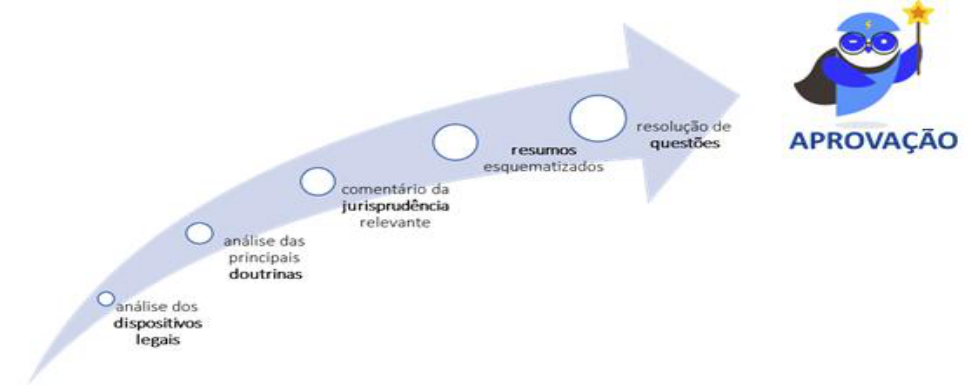

Os PDFs seguirão a seguinte **estrutura** : 

##### **ESTRUTURA DAS AULAS DO CURSO** 

- **Introdução** 

- **Desenvolvimento** (parte teórica) 

- **Resumão da aula** 

- **Conclusão,** com destaque para aspectos mais relevantes 

- **Questões comentadas de concursos anteriores** (da **banca Cebraspe** na maior parte) 

- **Lista das questões comentadas** (para o aluno poder praticar sem olhar as respostas) 

- **Gabaritos das questões** 

Além disso, na **última aula do curso** , disponibilizamos um **material especial** (tanto texto como videoaulas) para facilitar que você faça uma **grande revisão da matéria** ! 

- - -

---

<!-- pagina: 4 -->

**Antonio Daud Aula 00** 

Outra dica neste início do curso: para guiar você pelos **assuntos mais importantes** dos **livros eletrônicos** (PDFs), destaco que os principais temas possuirão faixas indicativas de incidência de questões em provas: 

INCIDÊNCIA EM PROVA: BAIXÍSSIMA INCIDÊNCIA EM PROVA: BAIXA INCIDÊNCIA EM PROVA: MÉDIA INCIDÊNCIA EM PROVA: ALTA INCIDÊNCIA EM PROVA: ALTÍSSIMA 

## Sobre a Banca examinadora deste concurso 

==5460== A “temida” FGV tem um perfil peculiar de cobrança em provas, herdado de sua experiência organizando os exames da OAB. É fácil perceber que a FGV não quer selecionar apenas quem sabe a lei, mas quem sabe **resolver problemas usando a lei** . 

Em Direito Administrativo, a Banca tem uma predileção pela cobrança de leis específicas, o que iremos considerar na preparação do curso. Além disso, dentro de cada aula do curso, iremos trabalhar os temas costumeiramente cobrados pela Banca: é a microestratégia de preparação para a FGV! 

Em geral, podemos destacar as seguintes características da Banca: 

- **"Narrativa Jurídica"** (Casos Concretos Longos): Você perceberá que, em muitas questões, a Banca conta uma história ("O Prefeito do Município Alfa contratou a empresa Y..."). Além de gastar energia compreendendo o contexto, o concurseiro precisa identificar qual é o problema jurídico escondido no texto. 

- **Vocabulário Acadêmico** : O português da FGV é considerado, por muitos, o mais difícil do país e muitas vezes isso “contamina” as questões de Direito Administrativo, sendo por vezes utilizados termos técnicos, que exigirão familiaridade por parte do aluno. Por isso, trabalharemos centenas de questões FGV neste curso (tanto em videoaula como em texto). 

- **A alternativa "Mais Correta"** (Cascas de Banana): Como são questões de múltipla escolha, muitas vezes teremos questões em que a letra A estará parcialmente certa, mas a letra D, por exemplo, é a mais completa ou a exceção específica que se aplica ao caso narrado.

---

<!-- pagina: 6 -->

**Antonio Daud Aula 00** 

# **<mark>I</mark> NTRODUÇÃO** 

##### Olá, amigas (os)! 

Nesta aula estudaremos o Marco Civil da Internet (MCI) , que é a Lei 12.965/2014. 

Veremos, nesta aula, de que modo a legislação brasileira protege o usuário da internet, quais os direitos do usuário, os deveres dos provedores de registrar informações das conexões, a questão da neutralidade da rede e vários outros tópicos importantes em provas. 

P.S. O texto já se encontra atualizado com a decisão do STF, em junho de 2025, sobre a responsabilidade dos provedores por conteúdos de terceiros (REs 1037396 e 1057258). Tudo pronto? Vamos em frente!

---

<!-- pagina: 7 -->

**Antonio Daud Aula 00** 

# **<mark>N</mark> OÇÕES** **<mark>G</mark> ERAIS SOBRE O** **<mark>MCI</mark>** 

O Marco Civil da Internet (MCI) estabelece princípios, garantias, direitos e deveres para o uso da internet no Brasil e, por ser uma lei de caráter nacional, determina as diretrizes para atuação da União, dos Estados, do Distrito Federal e dos Municípios em relação à matéria (art. 1º). Adiante veremos os objetivos, fundamentos e princípios do uso da internet no Brasil. 

## Objetivos 

O uso da internet no Brasil tem por objetivo a promoção (Art. 4º): 

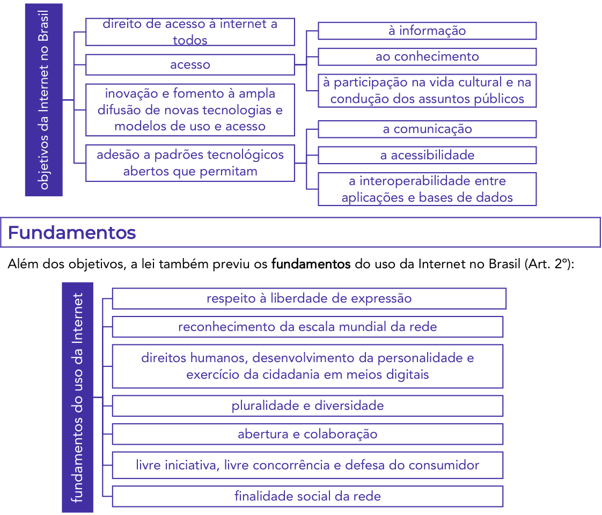

<!-- Start of picture text -->
direito de acesso à internet a à informação todos ao conhecimento acesso à participação na vida cultural e na inovação e fomento à ampla condução dos assuntos públicos difusão de novas tecnologias e modelos de uso e acesso a comunicação adesão a padrões tecnológicos  a acessibilidade abertos que permitam a interoperabilidade entre aplicações e bases de dados Fundamentos Além dos objetivos, a lei também previu os  fundamentos  do uso da Internet no Brasil (Art. 2º): respeito à liberdade de expressão reconhecimento da escala mundial da rede direitos humanos, desenvolvimento da personalidade e exercício da cidadania em meios digitais pluralidade e diversidade abertura e colaboração livre iniciativa, livre concorrência e defesa do consumidor fundamentos do uso da Internet finalidade social da rede objetivos da Internet no Brasil <!-- End of picture text -->

---

<!-- pagina: 8 -->

**Antonio Daud Aula 00** 

## Princípios 

Quanto aos princípios (Art. 3º), o uso da internet no Brasil deve atender aos seguintes: 

expressão comunicação manifestação de pensamento (nos termos da Constituição Federal) por meio de medidas técnicas compatíveis com os padrões internacionais e pelo estímulo ao uso de boas práticas 

garantia da liberdade de manifestação de pensamento proteção da privacidade (nos termos da Constituição Federal) proteção dos dados pessoais preservação e garantia da neutralidade de rede por meio de medidas técnicas preservação da estabilidade, segurança e compatíveis com os padrões funcionalidade da rede internacionais e pelo estímulo responsabilização dos agentes de acordo com suas ao uso de boas práticas atividades preservação da natureza participativa da rede desde que não conflitem com liberdade dos modelos de negócios promovidos na os demais princípios internet estabelecidos no MCI 

Estes 8 princípios previstos expressamente no MCI não excluem outros princípios previstos no ordenamento jurídico pátrio relacionados à matéria ou nos tratados internacionais em que a República Federativa do Brasil seja parte (art. 3º, parágrafo único). 

Ponto importante é que, ao interpretar as regras do MCI , o intérprete levará em conta (além dos fundamentos, princípios e objetivos previstos), a natureza da internet , seus usos e costumes particulares e sua importância para a promoção do desenvolvimento humano, econômico, social e cultural (art. 6º). 

## Defini ões <u>ç</u> 

A Lei previu 8 definições importantes (Art. 5º): 

##### conexão à internet 

- a habilitação de um terminal para envio e recebimento de pacotes de dados pela internet, mediante a atribuição ou autenticação de um endereço IP; 

registro de conexão 

- o conjunto de informações referentes à data e hora de início e término de uma conexão à internet , sua duração e o endereço IP utilizado pelo terminal para o envio e recebimento de pacotes de dados;

---

<!-- pagina: 9 -->

**Antonio Daud Aula 00** 

##### internet 

- sistema constituído do conjunto de protocolos lógicos, estruturado em escala mundial para uso público e irrestrito , com a finalidade de possibilitar a comunicação de dados entre terminais por meio de diferentes redes; 

##### terminal 

- o computador ou qualquer dispositivo que se conecte à internet ; 

endereço de protocolo de internet (endereço IP) 

- o código atribuído a um terminal de uma rede para permitir sua identificação, definido segundo parâmetros internacionais; 

##### administrador de sistema autônomo 

- a pessoa física ou jurídica que administra blocos de endereço IP específicos e o respectivo sistema autônomo de roteamento, devidamente cadastrada no ente nacional responsável pelo registro e distribuição de endereços IP geograficamente referentes ao País; 

##### aplicações de internet 

- o conjunto de funcionalidades que podem ser acessadas por meio de um terminal conectado à internet; e 

registros de acesso a aplicações de internet 

- o conjunto de informações referentes à data e hora de uso de uma determinada aplicação de internet a partir de um determinado endereço IP

---

<!-- pagina: 10 -->

**Antonio Daud Aula 00** 

# **<mark>D</mark> IREITOS E** **<mark>G</mark> ARANTIAS DOS USUÁRIOS** 

Considerando que a internet é, atualmente, um meio para o cidadão exercer vários de seus direitos, o MCI  vincula o acesso à internet como essencial ao exercício da cidadania . Assim, prevê ao usuário da internet os seguintes direitos (Art. 7º): 

inviolabilidade da intimidade e da vida privada, sua proteção e indenização pelo dano material ou moral decorrente de sua violação inviolabilidade e sigilo do fluxo de suas salvo por ordem judicial, na comunicações pela internet forma da lei inviolabilidade e sigilo de suas salvo por ordem judicial comunicações privadas armazenadas salvo por débito diretamente não suspensão da conexão à internet decorrente de sua utilização manutenção da qualidade contratada da conexão à internet regime de proteção aos registros de conexão e aos registros de acesso a informações claras e completas aplicações de internet constantes dos contratos de prestação de serviços, com detalhamento sobre práticas de gerenciamento da rede que possam afetar sua qualidade

---

<!-- pagina: 11 -->

**Antonio Daud Aula 00** 

não fornecimento a terceiros de seus dados salvo mediante consentimento pessoais, inclusive registros de conexão, e de livre, expresso e informado ou acesso a aplicações de internet, nas hipóteses previstas em lei <mark>justifiquem sua coleta</mark> não sejam vedadas pela informações claras e completas sobre coleta, uso, legislação armazenamento, tratamento e proteção de seus dados pessoais, que somente poderão ser estejam especificadas nos utilizados para finalidades que contratos de prestação de serviços ou em termos de uso de aplicações de internet que deverá ocorrer de forma consentimento expresso sobre coleta, uso, destacada das demais armazenamento e tratamento de dados pessoais cláusulas contratuais ressalvadas as hipóteses de exclusão definitiva dos dados pessoais que tiver guarda obrigatória de fornecido a determinada aplicação de internet, a registros previstas nesta Lei e seu requerimento, ao término da relação entre as na que dispõe sobre a partes proteção de dados pessoais publicidade e clareza de eventuais políticas de uso dos provedores de conexão à internet e de aplicações de internet acessibilidade, consideradas as características físico-motoras, perceptivas, sensoriais, intelectuais e mentais do usuário (nos termos da lei) aplicação das normas de proteção e defesa do consumidor nas relações de consumo realizadas na internet 

##### Este rol de direitos foi assim cobrado nesta questão: 

OBJETIVA - 2021 - Prefeitura de Santa Maria - RS - Analista de Sistemas 

De acordo com a Lei nº 12.965/2014, o acesso à internet é essencial ao exercício da cidadania, e ao usuário são assegurados, entre outros, os seguintes direitos: 

I. Inviolabilidade da intimidade e da vida privada, sua proteção e indenização pelo dano material ou moral decorrente de sua violação. 

II. Inviolabilidade e sigilo de suas comunicações privadas armazenadas, salvo por ordem judicial. 

III. Manutenção da qualidade contratada da conexão à internet. 

IV. Publicidade e clareza de eventuais políticas de uso dos provedores de conexão à internet e de aplicações de internet. 

Estão CORRETOS:

---

<!-- pagina: 12 -->

**Antonio Daud Aula 00** 

A) Somente os itens I e II. 

B) Somente os itens III e IV. 

C) Somente os itens I, II e III. 

D) Somente os itens I, III e IV. 

E) Todos os itens. 

Comentários: 

Todos os três itens mencionam corretamente direitos do usuário de internet. Gabarito (E) 

Seguindo adiante, repare que a garantia do direito à privacidade e à liberdade de expressão nas comunicações são aspectos fundamentais no uso da internet, de modo que o legislador elencou estas garantias como condição para o pleno exercício do direito de acesso à internet (art. 8º). 

Em respeito aos referidos direitos, são nulas de pleno direito as cláusulas contratuais que violem uma destas duas garantias (privacidade e liberdade de expressão), tais como aquelas que (art. 8º, Parágrafo único): 

I - impliquem ofensa à inviolabilidade e ao sigilo das comunicações privadas , pela internet; 

ou 

II - em contrato de adesão , não ofereçam como alternativa ao contratante a adoção do foro brasileiro para solução de controvérsias decorrentes de serviços prestados no Brasil. 

# **<mark>C</mark> ONEXÃO E** **<mark>A</mark> PLICAÇÕES DE INTERNET** 

Uma vez estudados os direitos e garantias do usuário, veremos os deveres do provedor quanto à neutralidade e aos registros das conexões. 

## Neutralidade da Rede 

A neutralidade da rede é um dos pontos centrais do Marco da Internet no Brasil. Em síntese, por força da neutralidade um provedor não poderá diferenciar um pacote de dados de outro, devendo encaminhar todos de maneira igualitária, como regra geral. 

Exemplo: Suponha que, no mesmo momento, você acessa o Youtube para assistir uma <mark>videoaula; seu vizinho acessa o portal de notícias; sua sogra utiliza a internet para ver uma série no Netflix; um amigo seu acessa o site do banco. O provedor deverá, em regra,</mark> tratar todos estes acessos e dados trafegados **de maneira neutra** , sem distingui-los. 

Tal preceito foi assim previsto no MCI:

---

<!-- pagina: 13 -->

**Antonio Daud Aula 00** 

Art. 9º O responsável pela transmissão, comutação ou roteamento tem o dever de tratar de forma isonômica quaisquer pacotes de dados , <u>sem distinção por conteúdo, origem e destino, serviço, terminal ou aplicação.</u> 

Veja um exemplo de prova, a respeito deste assunto: 

FGV -  Senado Federal - Analista Legislativo 

Alfama Telecom oferece ao mercado de consumo, ao mesmo tempo, serviços de telefonia e de internet por banda larga. A fim de maximizar seus lucros, passa a privilegiar a qualidade das ligações telefônicas, deixando mais lenta para os usuários a velocidade de conexão da internet em serviços e aplicativos que realizam chamadas de vídeo e voz. À luz do Marco Civil da Internet (Lei nº 12.965/2014), essa prática é considerada 

A) lícita, porque a lei assegura a livre iniciativa e a livre concorrência. 

B) ilícita, porque viola a regra que impõe a neutralidade da rede. 

C) ilícita, porque viola a regra da inimputabilidade da rede. 

D) lícita, porque não configura conduta anticoncorrencial. 

E) ilícita, porque aplicações não configuram pacotes de dados. 

##### Comentários: 

A prática é ilícita, justamente por violar a neutralidade da rede. Gabarito (B) 

No entanto, apesar de a neutralidade consistir em uma grande regra geral, existem exceções, em que o provedor poderá distinguir os pacotes de dados. 

As hipóteses de discriminação ou degradação do tráfego serão regulamentadas por meio de Decreto do Presidente da República , ouvidos o Comitê Gestor da Internet (CGI-BR) e a Agência Nacional de Telecomunicações (Anatel), e somente poderá decorrer de (§ 1º): 

I - requisitos técnicos indispensáveis à prestação adequada dos serviços e aplicações; e 

II - priorização de serviços de emergência . 

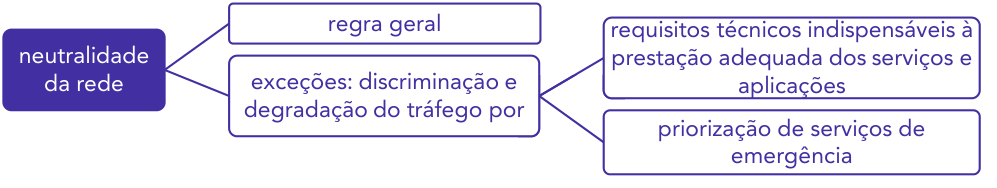

<!-- Start of picture text -->
regra geral requisitos técnicos indispensáveis à neutralidade  prestação adequada dos serviços e da rede exceções: discriminação e  aplicações degradação do tráfego por priorização de serviços de emergência <!-- End of picture text -->

Nestas situações, em que é permitida a discriminação ou degradação do tráfego, o responsável pela transmissão dos dados deve:

---

<!-- pagina: 14 -->

**Antonio Daud Aula 00** 

- I - abster-se de causar dano aos usuários ; 

II - agir com proporcionalidade , transparência e isonomia ; 

III - informar previamente de modo transparente, claro e suficientemente descritivo aos seus usuários sobre as <u>práticas de gerenciamento e mitigação de tráfego adotadas, inclusive as</u> relacionadas à segurança da rede; e 

IV - oferecer serviços em condições comerciais não discriminatórias e abster-se de praticar condutas anticoncorrenciais . 

De todo modo, na provisão de conexão à internet, seja onerosa ou gratuita, bem como na transmissão, comutação ou roteamento, é vedado bloquear, monitorar, filtrar ou analisar o conteúdo dos pacotes de dados (§ 3º). 

## Proteção aos registros, aos dados pessoais e às comunicações privadas 

A cada conexão que você faz na internet, o provedor registra dados de quando ocorreu aquela conexão, qual o dispositivo, qual página acessada, etc. Estes dados da conexão devem ser armazenados pelo provedor e, a depender da situação, poderiam ser disponibilizados a um terceiro. 

Nesse sentido, o legislador previu que a guarda e a disponibilização destes registros de conexão e de acesso a aplicações de internet, bem como de dados pessoais e do conteúdo de comunicações privadas, devem atender à preservação da intimidade , da vida privada , da honra e da imagem das partes direta ou indiretamente envolvidas (Art. 10). 

Considerando que a guarda destes registros poderia permitir, por exemplo, a apuração de crimes ocorridos na internet, eles devem ser armazenados sem violar a intimidade do usuário. 

Quanto à disponibilização destes registros das conexões e de acesso a aplicações a outras pessoas, prevê a Lei que o provedor somente será obrigado a disponibilizar os registros mediante ordem judicial , seja de forma autônoma ou de modo associado a dados pessoais ou a outras informações que possam contribuir para a identificação do usuário ou do terminal (§1º). 

No que se refere ao próprio conteúdo das comunicações privadas, este somente poderá ser disponibilizado pelo provedor mediante ordem judicial , nas hipóteses e na forma que a lei estabelecer (§ 2º). 

Vejam que, embora a guarda e disponibilização dos registros deva atender à preservação da intimidade e vida privada, é possível que autoridades administrativas <u>acessem dados cadastrais</u> que informem qualificação pessoal, filiação e endereço, na forma da lei, desde detenham competência legal para a sua requisição (§ 3º).

---

<!-- pagina: 15 -->

**Antonio Daud Aula 00** 

As medidas e os procedimentos de segurança e de sigilo devem ser informados pelo responsável pela provisão de serviços de forma clara e atender a padrões definidos em regulamento, respeitado seu direito de confidencialidade quanto a segredos empresariais (§ 4º). 

<!-- Start of picture text -->
Professor, mas a Internet é uma rede mundial. Como saber se a conexão precisa ou não seguir a legislação brasileira? <!-- End of picture text -->

Pois bem! Em qualquer operação de coleta, armazenamento, guarda e tratamento de registros, de dados pessoais ou de comunicações por provedores de conexão e de aplicações de internet em que pelo menos um desses atos ocorra em território nacional , deverão ser obrigatoriamente respeitados a legislação brasileira e os direitos à privacidade, à proteção dos dados pessoais e ao sigilo das comunicações privadas e dos registros (art. 11). 

Tal regra aplica-se aos dados coletados em território nacional e ao conteúdo das comunicações, desde que pelo menos um dos terminais esteja localizado no Brasil (§ 1º). 

Percebam que, quando pelo menos um dos terminais estiver localizado no Brasil, o art. 11 do MCI ~~ob~~ riga os provedores de conexão e de aplicações de Internet a se submeterem à legislação nacional . Assim, se uma autoridade brasileira formaliza uma requisição de informações ao provedor, atendidos os requisitos legais, o provedor estará obrigado a atendê-la. 

Este modelo é conhecido como requisição direta de informações, visto que a autoridade nacional solicita diretamente ao provedor. 

Tal regra aplica-se mesmo que as atividades sejam realizadas por <u>pessoa jurídica sediada no exterior, desde que (i) oferte serviço ao público brasileiro ou (ii) pelo menos uma integrante do</u> mesmo grupo econômico possua estabelecimento no Brasil (§ 2º). 

Os provedores de conexão e de aplicações de internet deverão prestar, na forma da regulamentação, informações que permitam a verificação quanto ao cumprimento da legislação brasileira referente à coleta, à guarda, ao armazenamento ou ao tratamento de dados, bem como quanto ao respeito à privacidade e ao sigilo de comunicações (§ 3º). 

Vimos acima que esta dinâmica de sujeição às requisições diretamente formuladas pelas autoridades brasileiras vale também para provedor sediado no exterior, desde que (i) oferte serviço ao público brasileiro ou (ii) pelo menos uma integrante do mesmo grupo econômico possua

---

<!-- pagina: 16 -->

**Antonio Daud Aula 00** 

estabelecimento no Brasil (art. 11, §2º). Neste caso de provedores localizados no exterior, vale ainda destacar a decisão do STF na ADC 51, em que se confirmou a constitucionalidade do artigo 11 do MCI: 

declarar a constitucionalidade dos dispositivos indicados e da possibilidade de solicitação direta de dados e comunicações eletrônicas das autoridades nacionais a empresas de tecnologia , nas específicas hipóteses do art. 11 do Marco Civil da Internet e do art. 18 da Convenção de Budapeste, ou seja, nos casos de atividades de coleta e tratamento de dados no país, de posse ou controle dos dados por empresa com representação no Brasil e de crimes cometidos por indivíduos localizados em território nacional ” 

Perceba que, para o STF, será possível esta requisição direta de comunicações eletrônicas das ==5460== autoridades nacionais às empresas de tecnologia nos casos de: (i) atividades de coleta e tratamento de dados no Brasil, (ii) posse ou controle dos dados por empresa com representação no Brasil e (iii) crimes cometidos por indivíduos localizados em território nacional. 

- - - - 

De toda forma, já adianto que, embora a requisição ocorra diretamente da autoridade brasileira ao provedor, nossa legislação exige que os registros de conexão/aplicação somente sejam disponibilizados mediante ordem judicial , exceto o fornecimento de dados cadastrais , os quais podem ser acessados por autoridades administrativas (sem ordem judicial), conforme detalharemos mais adiante. 

### ➢ **Sanções aplicáveis** 

Sem prejuízo das outros sanções cabíveis (cíveis, criminais ou administrativas), os provedores que descumprirem as regras quanto à guarda do registro de conexão e de acesso a aplicações estarão sujeitos às seguintes sanções, aplicadas de forma isolada ou cumulativa (Art. 12):

---

<!-- pagina: 17 -->

**Antonio Daud Aula 00** 

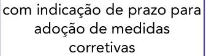

<!-- Start of picture text -->
com indicação de prazo para adoção de medidas corretivas <!-- End of picture text -->

<!-- Start of picture text -->
advertência <!-- End of picture text -->

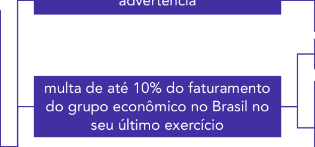

<!-- Start of picture text -->
multa de até 10% do faturamento do grupo econômico no Brasil no seu último exercício <!-- End of picture text -->

<!-- Start of picture text -->
Sanções - descumprimento MCI <!-- End of picture text -->

<!-- Start of picture text -->
excluídos os tributos <!-- End of picture text -->

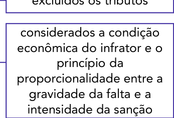

<!-- Start of picture text -->
considerados a condição econômica do infrator e o princípio da proporcionalidade entre a gravidade da falta e a intensidade da sanção <!-- End of picture text -->

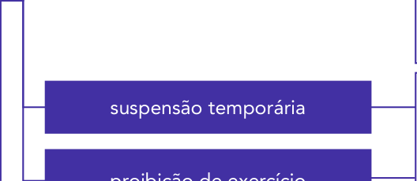

<!-- Start of picture text -->
suspensão temporária <!-- End of picture text -->

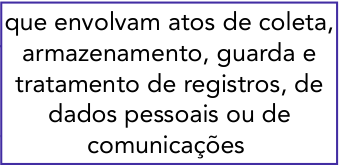

<!-- Start of picture text -->
que envolvam atos de coleta, armazenamento, guarda e tratamento de registros, de dados pessoais ou de comunicações <!-- End of picture text -->

<!-- Start of picture text -->
proibição de exercício <!-- End of picture text -->

Além disso, no caso da multa, se o provedor for empresa estrangeira , sua filial, sucursal, escritório ou estabelecimento situado no País respondem solidariamente pelo seu pagamento. 

### ➢ **Tipos de registros** 

Após termos estudado regras gerais quanto aos registros (a exemplo da obrigatoriedade de registro e guarda e do fornecimento mediante ordem judicial), vamos detalhar as regras específicas para cada espécie de registro: 

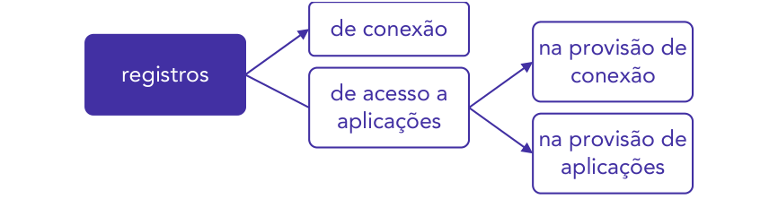

<!-- Start of picture text -->
de conexão na provisão de registros conexão de acesso a aplicações na provisão de aplicações <!-- End of picture text -->

Os registros de conexão representam o "o conjunto de informações referentes à data e hora de início e término de uma conexão à internet, sua duração e o endereço IP utilizado pelo terminal para o envio e recebimento de pacotes de dados" (art. 5º, VI). 

Por outro lado, o registro de acesso a aplicações "o conjunto de informações referentes à data e hora de uso de uma determinada aplicação de internet a partir de um determinado endereço IP". Em síntese, quando você está navegando na internet e acessa uma aplicação (como o site do banco, por exemplo), o banco irá armazenar a data, o horário e o endereço IP do acesso.

---

<!-- pagina: 18 -->

**Antonio Daud Aula 00** 

Quanto a estes últimos (registros de acesso a aplicações), veremos o armazenamento tanto por parte dos provedores de conexão (como a Vivo, Claro, etc), como pelos provedores de conteúdo (como Instagram, Facebook, Youtube, etc). 

##### - - - - 

Traçada esta distinção, adiante estudaremos as regras específicas para cada um destes registros. 

#### A) Guarda de Registros de Conexão 

Na provisão de conexão à internet, cabe ao administrador de sistema autônomo respectivo o dever de manter os registros de conexão , <u>sob sigilo, em ambiente controlado e de segurança,</u> pelo prazo de 1 ano (Art. 13). 

A responsabilidade pela manutenção dos registros de conexão <u>não poderá ser transferida a terceiros (§ 1º).</u> 

A autoridade policial ou administrativa ou o Ministério Público poderá requerer cautelarmente que os registros de conexão sejam guardados por prazo superior a um ano (§ 2º). Embora possam requerer a ampliação do prazo de guarda, estas autoridades não poderão requerer o acesso aos registros diretamente ao provedor (visto que tal acesso requer ordem judicial). 

Neste caso, a autoridade requerente terá o prazo de 60 dias , contados a partir do requerimento, para ingressar com o pedido de autorização judicial de acesso aos registros (§ 3º). Isto porque, em qualquer hipótese, a efetiva disponibilização ao requerente dos registros de conexão deverá ser precedida de autorização judicial (§ 5º). 

O provedor responsável pela guarda dos registros deverá manter sigilo em relação ao requerimento de ampliação do prazo, que perderá sua eficácia caso o pedido de autorização judicial seja indeferido ou não tenha sido protocolado no prazo previsto de 60 dias  (§ 4º). 

Se o provedor descumprir, estará sujeito a sanções, cuja aplicação irá considerar a natureza e a gravidade da infração, os danos dela resultantes, eventual vantagem auferida pelo infrator, as circunstâncias agravantes, os antecedentes do infrator e a reincidência (§ 6º). 

#### B) Guarda de Registros de Acesso a Aplicações de Internet na Provisão de Conexão 

Na provisão de <u>conexão , onerosa ou gratuita, é</u> vedado guardar os registros de acesso a aplicações de internet (Art. 14). Em outras palavras, o provedor de conexão está proibido de armazenar dados dos aplicativos que acessei, para rastrear os aplicativos que estou utilizando. 

C) Guarda de Registros de Acesso a Aplicações de Internet na Provisão de Aplicações 

O provedor de aplicações de internet constituído na forma de pessoa jurídica e que exerça essa atividade de forma organizada, <u>profissionalmente e com fins econômicos, deverá</u> manter os respectivos registros de acesso a aplicações de internet, sob sigilo, em ambiente controlado e de segurança, pelo prazo de 6 meses , nos termos do regulamento (art. 15).

---

<!-- pagina: 19 -->

**Antonio Daud Aula 00** 

Além disso, por força de ordem judicial os provedores de aplicações de internet que não estão sujeitos ao disposto nesta regra acima (a exemplo dos provedores de aplicação que não possuem fins econômicos) poderão ficar obrigados a guardarem, por tempo certo, registros de acesso a aplicações de internet, desde que se trate de registros relativos a fatos específicos em período determinado (§ 1º). 

||Provedor de conexão|Provedor de aplicações com fins econômicos|Outros provedores de aplicações|
|---|---|---|---|
|Tipo de registro|Guardar registros de conexão|Guardar regist|ros de aplicação|
|É obrigatório guardar?|Sim|Sim|Não (mediante ordem judicial)|
|Prazo|1 ano|6 meses||

Como visto na guarda de registros de conexão, a autoridade policial ou administrativa ou o Ministério Público (MP) poderão requerer cautelarmente a qualquer provedor de aplicações de internet que os registros de acesso a aplicações de internet sejam guardados, inclusive por prazo superior a seis meses (§ 2º). 

Em qualquer hipótese, vale frisar que a disponibilização dos registros de acesso a aplicações deverá ser precedida de autorização judicial (§ 3º). 

Então, repare que a autoridade policial, administrativa e o MP até podem requerer a ampliação do prazo de guarda do registro para um caso específico. No entanto, a efetiva disponibilização destes dados requer autorização do juiz .

---

<!-- pagina: 20 -->

**Antonio Daud Aula 00** 

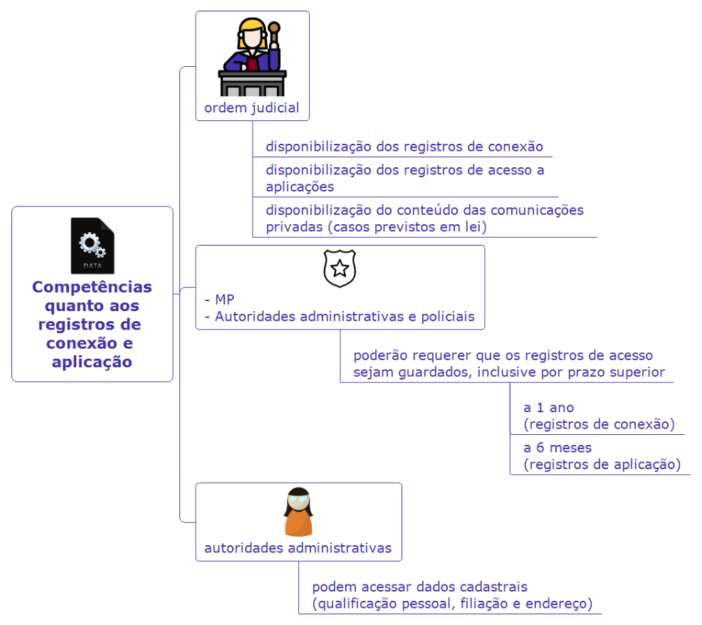

- - - - 

Embora o provedor de aplicação esteja obrigado a manter a guarda dos registros de acesso, ele está proibido de guardar o seguinte (art. 16): 

I - registros de acesso a outras aplicações de internet sem que o titular dos dados tenha <u>consentido previamente; ou</u> 

II - dados pessoais que sejam <u>excessivos</u> em relação à finalidade para a qual foi dado consentimento pelo seu titular , exceto nas hipóteses previstas na Lei Geral de Proteção de dados pessoais (LGPD). 

- - - 

Por fim, vale destacar que, a par das exceções previstas em lei, a opção por não guardar os registros de acesso a aplicações de internet não implica responsabilidade sobre danos decorrentes do uso desses serviços por terceiros (art. 17).

---

<!-- pagina: 21 -->

**Antonio Daud Aula 00** 

Da Responsabilidade por Danos Decorrentes de Conteúdo Gerado por Terceiros 

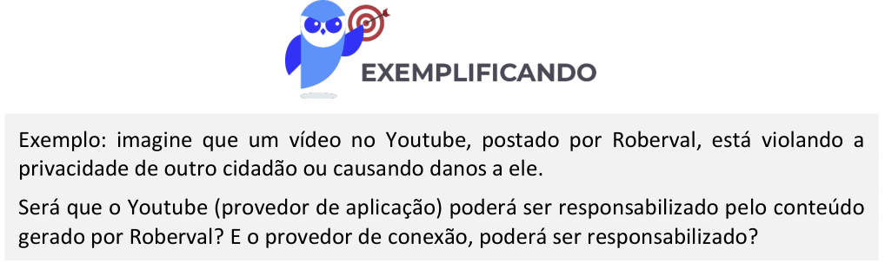

<!-- Start of picture text -->
Exemplo: imagine que um vídeo no Youtube, postado por Roberval, está violando a privacidade de outro cidadão ou causando danos a ele. Será que o Youtube (provedor de aplicação) poderá ser responsabilizado pelo conteúdo gerado por Roberval? E o provedor de conexão, poderá ser responsabilizado? <!-- End of picture text -->

Respondendo a estas perguntas, os arts. 18 e 19 do MCI preveem que: 

a) o provedor de conexão à internet não será responsabilizado civilmente por danos decorrentes de conteúdo gerado por terceiros (Art. 18). 

b) já o provedor de aplicações de internet poderá ser responsabilizado civilmente por danos decorrentes de conteúdo gerado por terceiros, desde que atendidas algumas condições. 

A redação original do art. 19 do MCI previa que o provedor de aplicações seria responsabilizado se, após ordem judicial específica , não tomasse as providências para tornar indisponível o conteúdo apontado como infringente. 

Entretanto, em junho de 2025, o STF entendeu parte do art. 19 do MCI é inconstitucional (REs 1037396 e 1057258 – temas 533 e 987). Para o Supremo, é inconstitucional a exigência de ordem judicial para que o provedor fosse responsabilizado por conteúdos gerados por terceiros, em qualquer caso. Dessa forma, em alguns casos as plataformas (provedores de aplicação) podem ser responsabilizadas mesmo sem ordem judicial. Em síntese, o STF passou a entender que: 

1. O art. 19 da Lei nº 12.965/2014 (Marco Civil da Internet), que exige ordem judicial específica para a responsabilização civil de provedor de aplicações de internet por danos decorrentes de conteúdo gerado por terceiros, é parcialmente inconstitucional . Há um estado de omissão parcial que decorre do fato de que a <u>regra geral do art. 19 não confere proteção suficiente a bens jurídicos</u>

---

<!-- pagina: 22 -->

**Antonio Daud Aula 00** 

|constitucionais de alta|relevância(proteção de direitos fundamentais e da|
|---|---|
|democracia).||

Além disso, o STF fixou hipóteses em que os provedores serão responsabilizados se não retirarem conteúdos que configurem a prática de crimes graves, a exemplo de conteúdos relacionados a tentativa de golpe de Estado, abolição do Estado Democrático de Direito, terrorismo, instigação à mutilação ou ao suicídio, racismo, homofobia e crimes contra mulheres e crianças. 

O STF entendeu que o Congresso deverá editar lei para sanar as falhas apontadas pelo STF. Mas enquanto o Congresso não aprovar nova lei, vale o seguinte: 

1) Os provedores podem ser responsabilizados civilmente por danos causados por conteúdos postados por terceiros , caso não removam o conteúdo após notificação (judicial ou extrajudicial, a depender do caso); 

2) No caso de crimes ou atos ilícitos , o provedor deve remover o conteúdo após ser notificado; se não remover, poderá responder civilmente; aplica-se a mesma regra para contas falsas (isto é, denunciadas como inautênticas); 

3) Em casos de crimes contra a honra (calúnia, difamação e injúria), aplica-se o art. 19, de modo que o provedor só responderá se descumprir ordem judicial (isto é, não basta notificação simples); 

4) Se houver repetição de postagem/conteúdo ofensivo já julgado (isto é, “sucessivas replicações do fato ofensivo já reconhecido por decisão judicial”), basta notificação (judicial ou extrajudicial) para que todos os provedores removam as publicações com idênticos conteúdos, <u>independentemente de novas decisões judiciais;</u> 

5) Deverá haver a imediata remoção do conteúdo postado por terceiro se envolver o seguinte: atos antidemocráticos, terrorismo, suicídio/automutilação, discriminação (incluindo condutas homofóbicas e transfóbicas), tráfico de pessoas, crimes praticados contra mulher, crimes sexuais contra vulneráveis, pornografia infantil e crimes graves contra crianças/adolescentes. 

5.1) Nestes casos, a responsabilidade dos provedores diz respeito à chamada “ falha sistêmica ”, caracterizada na situação em que o provedor não adotar medidas adequadas de prevenção ou remoção dos conteúdos ilícitos anteriormente listados (pois exige-se que o provedor atue de forma responsável, transparente e cautelosa). 

6) Haverá presunção de responsabilidade dos provedores (independentemente de notificação) em caso de (a) anúncios e impulsionamentos pagos ou (b) rede artificial de distribuição (chatbot ou robôs).

---

<!-- pagina: 23 -->

**Antonio Daud Aula 00** 

6.1) Nestas hipóteses, a responsabilidade do provedor é excluída se ele comprovar que atuou diligentemente e em tempo razoável para tornar indisponível o conteúdo. 

7) A responsabilidade dos provedores não será objetiva. 

8) Markeplaces (como MercadoLivre, Amazon, Shopee) passam a responder civilmente de acordo com o Código de Defesa do Consumidor (Lei 8.078/1990), e não mais com base no Marco Civil. 

- - - - 

Além disso, se a vítima do conteúdo divulgado quiser processar o provedor pelos danos sofridos por ela, buscando ressarcimento por danos decorrentes de conteúdos disponibilizados na internet , esta ação poderá apresentadas perante os juizados especiais (art. 19, § 3º). 

Nestes processos, o juiz, inclusive se apresentado nos juizados, poderá antecipar os efeitos da tutela pretendida no pedido inicial, total ou parcialmente, existindo prova inequívoca do fato e considerado o interesse da coletividade na disponibilização do conteúdo na internet, desde que presentes os requisitos de verossimilhança da alegação do autor e de fundado receio de dano irreparável ou de difícil reparação (§ 4º). 

Sempre que tiver informações de contato do usuário diretamente responsável pelo conteúdo causador do dano, caberá ao provedor de aplicações de internet comunicar-lhe os motivos e informações relativos à indisponibilização de conteúdo, com informações que permitam o contraditório e a ampla defesa em juízo, salvo expressa previsão legal ou expressa determinação judicial fundamentada em contrário (art. 20). 

Além disso, quando solicitado pelo usuário que disponibilizou o conteúdo tornado indisponível, o provedor de aplicações de internet que exerce essa atividade de forma organizada, profissionalmente e com fins econômicos, substituirá o conteúdo tornado indisponível pela motivação ou pela ordem judicial que deu fundamento à indisponibilização (art. 20, parágrafo único). 

O provedor de aplicações de internet que disponibilize conteúdo gerado por terceiros será responsabilizado subsidiariamente pela violação da intimidade decorrente da <u>divulgação, sem autorização de seus participantes, de imagens, de vídeos ou de outros materiais contendo</u> cenas de nudez ou de atos sexuais de caráter privado quando, após o recebimento de <u>notificação pelo participante ou seu representante legal, deixar de promover, de forma diligente, no âmbito e nos</u> limites técnicos do seu serviço, a indisponibilização desse conteúdo (Art. 21). 

## Requisição Judicial de Registros 

Atualmente, realizamos diversos atos e negócios jurídicos por meio da internet. Assim sendo, se um destes atos ou negócios for objeto de uma disputa judicial, pode ser necessário recuperar as correspondentes provas.

---

<!-- pagina: 24 -->

**Antonio Daud Aula 00** 

Assim, prevê o legislador que a parte interessada poderá, com o propósito de formar conjunto probatório em processo judicial cível ou penal , em caráter incidental ou autônomo, requerer ao juiz que ordene ao responsável pela guarda o fornecimento de registros de conexão ou de registros de acesso a aplicações de internet (art. 22). 

Este requerimento de fornecimento de registros para ser juntado a processo judicial deverá conter, sob pena de inadmissibilidade (art. 22, parágrafo único): 

I - fundados indícios da ocorrência do ilícito; 

II - justificativa motivada da utilidade dos registros solicitados para fins de investigação ou instrução probatória; e 

III - período ao qual se referem os registros. 

Ao receber os registros fornecidos, cabe ao juiz tomar as providências necessárias à garantia do sigilo das informações recebidas e à preservação da intimidade, da vida privada, da honra e da imagem do usuário, podendo determinar segredo de justiça, inclusive quanto aos pedidos de guarda de registro (Art. 23). 

# **<mark>A</mark> TUAÇÃO DO** **<mark>P</mark> ODER** **<mark>P</mark> ÚBLICO** 

Os entes federativos (União, Estados, Distrito Federal e Municípios) devem atuar no desenvolvimento da internet no Brasil , pautados pelas seguintes diretrizes (art. 24): 

I - estabelecimento de mecanismos de governança multiparticipativa, transparente, colaborativa e democrática, com a participação do governo, do setor empresarial, da sociedade civil e da comunidade acadêmica; 

II - promoção da racionalização da gestão, expansão e uso da internet , com participação do Comitê Gestor da internet no Brasil; 

III - promoção da racionalização e da interoperabilidade tecnológica dos <u>serviços de governo eletrônico , entre os diferentes Poderes e âmbitos da Federação, para permitir o</u> intercâmbio de informações e a celeridade de procedimentos; 

IV - promoção da interoperabilidade entre sistemas e terminais diversos , inclusive entre os diferentes âmbitos federativos e diversos setores da sociedade; 

V - adoção preferencial de tecnologias, padrões e formatos abertos e livres ; 

VI - publicidade e disseminação de dados e informações públicos , <u>de forma aberta e estruturada;</u> 

VII - otimização da infraestrutura das redes e estímulo à implantação de centros de armazenamento , gerenciamento e disseminação de dados no País, promovendo a qualidade

---

<!-- pagina: 25 -->

**Antonio Daud Aula 00** 

técnica, a inovação e a difusão das aplicações de internet, sem prejuízo à abertura, à neutralidade e à natureza participativa; 

VIII - desenvolvimento de ações e programas de capacitação para uso da internet ; 

IX - promoção da cultura e da cidadania ; e 

X - prestação de serviços públicos de atendimento ao cidadão de forma integrada, eficiente, simplificada e por múltiplos canais de acesso , inclusive remotos. 

### ➢ **Aplicações de internet do poder público** 

O poder público, enquanto provedor de serviços ao cidadão, vai acabar disponibilizando aplicações na internet para acesso da população. Tais aplicações de entes do poder público devem buscar (art. 25): 

I - compatibilidade dos serviços de governo eletrônico com diversos terminais , sistemas operacionais e aplicativos para seu acesso; 

II - acessibilidade a todos os interessados , independentemente de suas capacidades físicomotoras, perceptivas, sensoriais, intelectuais, mentais, culturais e sociais, <u>resguardados os aspectos de sigilo e restrições administrativas e legais;</u> 

III - compatibilidade tanto com a leitura humana quanto com o tratamento automatizado das informações ; 

IV - facilidade de uso dos serviços de governo eletrônico; e 

V - fortalecimento da participação social nas políticas públicas. 

### ➢ **Outros aspectos da atuação do poder público** 

Além disso, deve o poder público desenvolver iniciativas de fomento à cultura digital e de promoção da internet como ferramenta social , sendo que tais iniciativas devem (art. 27): 

I - promover a inclusão digital ; 

II - buscar reduzir as desigualdades , sobretudo entre as diferentes regiões do País, no acesso às tecnologias da informação e comunicação e no seu uso; e 

III - fomentar a produção e circulação de conteúdo nacional . 

De modo abrangente, o legislador previu o dever do poder público de capacitar os alunos de <u>todos os níveis de ensino, quanto ao</u> uso seguro, consciente e responsável da internet (art. 26). Afinal, trata-se de ferramenta para o exercício da cidadania, a promoção da cultura e o desenvolvimento tecnológico. 

Além disso, o Estado deve, periodicamente, formular e fomentar estudos referentes ao uso e desenvolvimento da internet no País , bem como fixar metas, estratégias, planos e cronogramas para tal desenvolvimento (art. 28).

---

<!-- pagina: 26 -->

**Antonio Daud Aula 00** 

# **<mark>O</mark> UTROS ASPECTOS RELEVANTES** 

O usuário da internet terá a opção de livre escolha na utilização de programa de computador em seu terminal para <u>exercício do controle parental</u> de conteúdo entendido por ele como impróprio a seus filhos menores , desde que respeitados os princípios do MCI e do Estatuto da Criança e do Adolescente (ECA - Lei 8.069/1990) – art. 29. 

Cabe ao poder público , em conjunto com os provedores de conexão e de aplicações de internet e a sociedade civil, promover a educação e fornecer informações sobre o uso dos programas de computador que possam ter conteúdo impróprio para menores, bem como para a definição de boas práticas para a inclusão digital de crianças e adolescentes. 

A defesa dos interesses e dos direitos do MCI poderá ser exercida em juízo, individual ou coletivamente (Art. 30).

---

<!-- pagina: 27 -->

**Antonio Daud Aula 00** 

# **<mark>R</mark> ESUMO** 

direito de acesso à internet a <mark>à informação</mark> todos <mark>ao conhecimento</mark> acesso à participação na vida cultural e na inovação e fomento à ampla condução dos assuntos públicos difusão de novas tecnologias e modelos de uso e acesso <mark>a comunicação</mark> adesão a padrões tecnológicos <mark>a acessibilidade</mark> abertos que permitam a interoperabilidade entre aplicações e bases de dados <mark>respeito à liberdade de expressão reconhecimento da escala mundial da rede</mark> direitos humanos, desenvolvimento da personalidade e exercício da cidadania em meios digitais <mark>pluralidade e diversidade abertura e colaboração</mark> livre iniciativa, livre concorrência e defesa do consumidor <mark>finalidade social da rede</mark>

---

<!-- pagina: 28 -->

**Antonio Daud Aula 00** 

|ernet garantia da liberdade de expressão comunicação manifestação de pensamento (nos termos da Constituição Federal) proteção da privacidade|
|---|
|Int proteção dos dados pessoais|
|o da preservação e garantia da neutralidade de rede por meio de medidas técnicas|
|do us preservação da estabilidade, segurança e funcionalidade da rede   compatíveis com os padrões internacionais e pelo estímulo |
|cípios ao uso de boas práticas responsabilização dos agentes de acordo com suas atividades|
|prin preservação da natureza participativa da rede |
| liberdade dos modelos de negócios promovidos na internet desde que não conflitem com os demais princípios estabelecidos no MCI|

inviolabilidade da intimidade e da vida privada, sua proteção e indenização pelo dano material ou moral decorrente de sua violação inviolabilidade e sigilo do fluxo de suas salvo por ordem judicial, na comunicações pela internet forma da lei inviolabilidade e sigilo de suas salvo por ordem judicial comunicações privadas armazenadas salvo por débito diretamente não suspensão da conexão à internet decorrente de sua utilização manutenção da qualidade contratada da conexão à internet regime de proteção aos registros de conexão e aos registros de acesso a informações claras e completas aplicações de internet constantes dos contratos de prestação de serviços, com detalhamento sobre práticas de gerenciamento da rede que possam afetar sua qualidade

---

<!-- pagina: 29 -->

**Antonio Daud Aula 00** 

|não fornecimento a terceiros de seus dados pessoais, inclusive registros de conexão, e de acesso a aplicações de internet, salvo mediante consentimento livre, expresso e informado ou nas hipóteses previstas em lei|
|---|
|justifiquem sua coleta|
|informações claras e completas sobre coleta, uso, armazenamento, tratamento e proteção de seus não sejam vedadas pela legislação|
| dados pessoais, que somente poderão ser utilizados para finalidades que estejam especificadas nos contratos de prestação de |
|rio da ) serviços ou em termos de uso de aplicações de internet|
|s do usuá nternet(2/2 consentimento expresso sobre coleta, uso, armazenamento e tratamento de dados pessoais que deverá ocorrer de forma destacada das demais cláusulas contratuais|
|direito i exclusão definitiva dos dados pessoais que tiver fornecido a determinada aplicação de internet, a seu requerimento, ao término da relação entre as partes ressalvadas as hipóteses de guarda obrigatória de registros previstas nesta Lei e na que dispõe sobre a proteção de dados pessoais publicidade e clareza de eventuais políticas de uso dos provedores de conexão à internet e de aplicações de internet acessibilidade, consideradas as características físico-motoras, perceptivas, sensoriais, intelectuais e mentais do usuário (nos termos da lei) aplicação das normas de proteção e defesa do consumidor nas relações de consumo realizadas na internet|

impliquem ofensa à inviolabilidade e ao sigilo das comunicações privadas , pela internet cláusulas nulas de pleno direito em contrato de adesão , não ofereçam como alternativa ao contratante a adoção do foro brasileiro para solução de controvérsias decorrentes de serviços prestados no Brasil

---

<!-- pagina: 30 -->

**Antonio Daud Aula 00** 

|neutralidade da rede regra geral exceções: discriminação e degradação do tráfego por requisitos técn prestação ade ap priorizaçã em   advertência com indicação d adoção de m corretiv|icos indispensáveis à quada dos serviços e licações o de serviços de ergência e prazo para edidas as|
|---|---|
|MCI excluídos os|tributos|
|descumprimento multa de até 10% do faturamento do grupo econômico no Brasil no seu último exercício considerados a econômica do i princípio proporcionalida gravidade da|condição nfrator e o da de entre a falta e a|
|Sanções - suspensão temporária que envolvam at armazenamento tratamento de r dados pessoa comunica proibição de exercício|os de coleta, , guarda e egistros, de is ou de ções|
|Provedor de conexão Provedor de aplicações com fins econômicos|Outros provedores de aplicações|
|Tipo de registro Guardar registros de conexão Guardar regist|ros de aplicação|
|É obrigatório guardar? Sim Sim|Não (mediante ordem judicial)|
|Prazo 1 ano 6 meses||

---

<!-- pagina: 31 -->

**Antonio Daud Aula 00** 

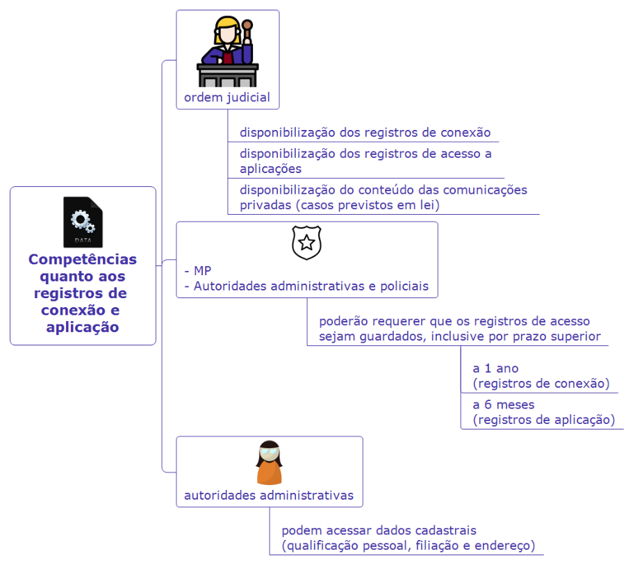

---

<!-- pagina: 32 -->

**Antonio Daud Aula 00** 

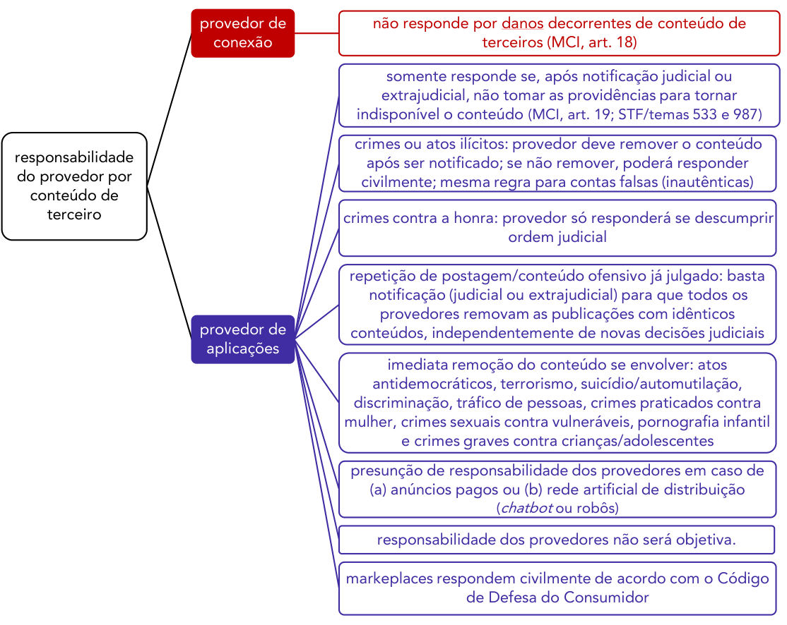

<!-- Start of picture text -->
provedor de  não responde por danos decorrentes de conteúdo de conexão terceiros (MCI, art. 18) somente responde se, após notificação judicial ou extrajudicial, não tomar as providências para tornar indisponível o conteúdo (MCI, art. 19; STF/temas 533 e 987) crimes ou atos ilícitos: provedor deve remover o conteúdo responsabilidade após ser notificado; se não remover, poderá responder do provedor por civilmente; mesma regra para contas falsas (inautênticas) conteúdo de terceiro crimes contra a honra: provedor só responderá se descumprir ordem judicial repetição de postagem/conteúdo ofensivo já julgado: basta notificação (judicial ou extrajudicial) para que todos os provedores removam as publicações com idênticos provedor de  conteúdos, independentemente de novas decisões judiciais aplicações imediata remoção do conteúdo se envolver: atos antidemocráticos, terrorismo, suicídio/automutilação, discriminação, tráfico de pessoas, crimes praticados contra mulher, crimes sexuais contra vulneráveis, pornografia infantil e crimes graves contra crianças/adolescentes presunção de responsabilidade dos provedores em caso de (a) anúncios pagos ou (b) rede artificial de distribuição (chatbot ou robôs) responsabilidade dos provedores não será objetiva. markeplaces respondem civilmente de acordo com o Código de Defesa do Consumidor <!-- End of picture text -->

---

<!-- pagina: 33 -->

**Antonio Daud Aula 00** 

# **QUESTÕES COMENTADAS** 

Para maximizar a quantidade de questões para treino, iremos comentar também questões de outras bancas examinadoras. 

**<mark>1.</mark>** <mark>CNU – NÍVEL MÉDIO – 2025</mark> 

A figura a seguir mostra a percentagem de domicílios com acesso a computador e internet por região brasileira em 2023 (total de domicílios em %). 

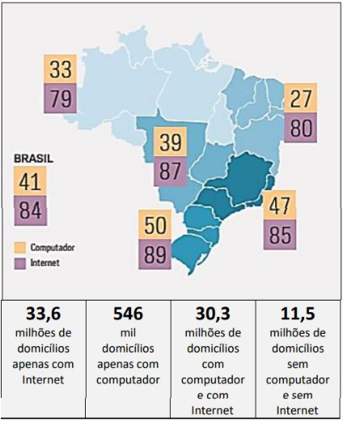

(Fonte: Pesquisa sobre o uso das tecnologias de informação e comunicação nos domicílios brasileiros: TIC Domicílios 2023. São Paulo: Comitê Gestor da Internet no Brasil, 2024, p. 29) 

Considerando os fundamentos e os princípios que disciplinam o uso da rede mundial de computadores no Brasil previstos no Marco Civil da Internet, a análise dos dados da figura acima demonstra que: 

(A) a desigualdade regional de acesso contraria o princípio da liberdade de expressão, pois impede a livre manifestação dos cidadãos nas plataformas digitais; 

(B) a universalização do acesso e a redução das desigualdades regionais permanecem como desafios a serem superados, pois favorecem o pleno exercício da cidadania digital;

---

<!-- pagina: 34 -->

**Antonio Daud Aula 00** 

(C) a disparidade regional entre os domicílios com computadores contribui para finalidade social da rede, pois incentiva sua pluralidade e sua diversidade; 

(D) a ampliação do acesso à internet reduz o foco em dispositivos físicos como computadores, o que compromete a diversidade tecnológica nos domicílios; 

(E) o alto índice de domicílios ligados à rede atesta sua neutralidade e sua funcionalidade, pois comprova sua tendência à universalização. 

Comentários: 

Questão que exigiu bastante atenção e capacidade de interpretação dos alunos. A Banca deu a letra (B) como gabarito, tendo em vista que o acesso à internet a todos é um dos objetivos do Marco Civil da Internet, sendo que a falta de acesso impede o pleno exercício da cidadania digital: 

Art. 4º A disciplina do uso da internet no Brasil tem por objetivo a promoção: 

I - do direito de acesso à internet a todos; 

Art. 7º O acesso à internet é essencial ao exercício da cidadania , e ao usuário são assegurados os seguintes direitos: 

Os demais itens se equivocam, tendo em vista que: 

- letra (A) : foi dada como incorreta, tendo em vista que a falta de internet por alguns não significa violação direta da liberdade de expressão, mas sim falta da universalidade e efetividade do acesso à informação e da isonomia entre cidadãos (MCI, art. 8º); 

- letra (C) : pelo contrário, a disparidade regional não contribui para a finalidade da internet de contribuir com o desenvolvimento da sociedade; 

- letra (D) : pelo contrário, o acesso à internet é justamente viabilizado pelo computador ou outro dispositivo caracterizado como terminal (art. 5º, II); 

- letra (E) : a neutralidade não tem a ver com a universalização do acesso à internet, mas com a ausência de discriminação do roteamento dos pacotes de dados na internet. 

#### Gabarito (B) 

##### **<mark>2.</mark>** <mark>FGV / TCE-RR / 2025</mark> 

Acesso à internet em residências brasileiras salta de 13% para 85% em 20 anos, aponta pesquisa TIC Domicílios 2024 

_Dados revelam que a presença da internet nos lares brasileiros se expandiu significativamente, mas desigualdades ainda persistem entre classes sociais._ 

_Apesar do crescimento no acesso à internet nos últimos 20 anos, a pesquisa destaca a desigualdade presente no país. Segundo a TIC Domicílios 2024, a conexão está disponível em 100% dos lares da classe A, mas apenas em 68% das residências das classes D e E._ 

(Fonte: HELDER, D. G1. 31/10/2024. Adaptado).

---

<!-- pagina: 35 -->

**Antonio Daud Aula 00** 

Segundo o Marco Civil da Internet (Lei 12.965, de 23 de abril de 2014), o acesso à internet é essencial ao exercício da cidadania, e ao usuário é assegurado o direito 

A) à violabilidade e à publicidade do fluxo de suas comunicações pela internet. 

B) à suspensão da conexão à internet a tempo e a critério da operadora. 

C) ao fornecimento de seus dados pessoais a terceiros, mesmo que sem seu consentimento. 

D) à publicidade e à clareza de eventuais políticas de uso dos provedores de conexão à internet e de aplicações de internet. 

E) ao contrato de prestação de serviços sem detalhamento sobre o regime de proteção de acesso a aplicações de internet. 

##### **Comentário:** 

A **letra (A)** está incorreta. O direito assegurado ao usuário é o de inviolabilidade e sigilo do fluxo de suas comunicações: 

"Art. 7º. (..) II - inviolabilidade e sigilo do fluxo de suas comunicações pela internet, salvo <u>por ordem judicial, na forma da lei;"</u> 

A **letra (B)** está incorreta. O usuário tem o direito à **não** suspensão da conexão à internet, exceto em caso de débito diretamente decorrente de sua utilização, e não a critério da operadora: 

"Art. 7º. (..) IV - não suspensão da conexão à internet, salvo por débito diretamente decorrente de sua utilização;" 

A **letra (C)** está incorreta. O direito do usuário é o de **não** fornecimento a terceiros de seus dados pessoais, incluindo registros de conexão e de acesso a aplicações de internet, salvo mediante consentimento livre, expresso e informado ou nas hipóteses previstas em lei: 

"Art. 7º. (..) VII - não fornecimento a terceiros de seus dados pessoais, incluindo registros de conexão, e de acesso a aplicações de internet, salvo mediante consentimento livre, expresso e informado ou nas hipóteses previstas em lei;" 

A **letra (D)** está correta e **letra (E)** , incorreta. O Marco Civil da Internet assegura ao usuário o direito a informações claras e completas sobre as políticas de uso dos provedores, o que inclui o detalhamento sobre o regime de proteção de dados e as práticas de gerenciamento da rede, conforme previsto no Art. 7º, VIII, da Lei 12.965/2014. 

"Art. 7º. (..) VI - informações claras e completas constantes dos contratos de prestação de serviços, com detalhamento sobre o regime de proteção aos registros de conexão e de registros de acesso a aplicações de internet, bem como sobre as práticas de gerenciamento da rede que possam afetar sua qualidade;" 

#### **Gabarito (D)** 

##### **<mark>3.</mark>** <mark>FGV / PC-MG / 2025</mark> 

De acordo com o Marco Civil da Internet (Lei 12.965/2014), assinale a alternativa que indica o princípio fundamental que orienta a neutralidade da rede.

---

<!-- pagina: 36 -->

**Antonio Daud Aula 00** 

A) Garantir que os provedores de conexão priorizem serviços de maior demanda para melhorar a experiência do usuário. 

B) Assegurar que os provedores de conexão tratem todos os pacotes de dados da mesma forma, sem discriminação por conteúdo, origem ou destino. 

C) Permitir que os provedores bloqueiem ou restrinjam conteúdos considerados prejudiciais ou ilegais, sem necessidade de ordem judicial. 

D) Priorizar o tráfego de dados relacionado a serviços essenciais, como saúde e segurança pública, em detrimento de outros. 

E) Autorizar os provedores a ajustar velocidades de conexão com base nos planos contratados pelos usuários, mesmo que isso comprometa a neutralidade da rede. 

##### **Comentário:** 

A **letra (A)** está incorreta. Priorizar serviços de maior demanda constitui uma forma de discriminação de tráfego, o que viola o princípio da neutralidade da rede, como regra geral, que preza pelo tratamento isonômico dos pacotes de dados, conforme o Art. 9º do Marco Civil da Internet. 

A **letra (B)** está correta. Este é o conceito central do princípio da neutralidade da rede, conforme definido no Art. 9º da Lei 12.965/2014. O provedor responsável pela transmissão deve tratar todos os pacotes de dados de maneira igualitária (isonômica), sem fazer distinções com base no conteúdo, na origem, no destino ou no tipo de aplicação. 

"Art. 9º O responsável pela transmissão, comutação ou roteamento tem o dever de tratar de forma isonômica quaisquer pacotes de dados, sem distinção por conteúdo, origem e destino, serviço, terminal ou aplicação." 

A **letra (C)** está incorreta. Permitir que provedores bloqueiem conteúdo sem ordem judicial iria contra os princípios da liberdade de expressão e da legalidade. 

A **letra (D)** está incorreta. A priorização do tráfego de dados é uma exceção, não o princípio fundamental. A lei permite a priorização apenas para serviços de emergência, conforme o Art. 9º, § 1º, II. O princípio é a isonomia, não a priorização. 

A **letra (E)** está incorreta. Ajustar a velocidade com base no plano contratado é uma prática comercial permitida e se refere à capacidade da conexão do usuário. A neutralidade da rede, por sua vez, refere-se ao tratamento do tráfego de dados dentro daquela conexão contratada, que não deve ser discriminado. 

#### **Gabarito (B)** 

##### **<mark>4.</mark>** <mark>FGV - 2022 - Senado Federal - Técnico Legislativo - Policial Legislativo</mark> 

O sigilo telemático é direito fundamental estabelecido no Art. 5º, inciso XII, da Constituição Federal de 1988. O avanço nos meios de comunicação provocou transformações no âmbito de proteção deste direito, bem como a respeito de eventual afastamento de tal direito em casos concretos. A esse respeito, assinale a afirmativa correta. 

A) O provedor de Internet pode ser compelido a fornecer o registro de acesso a aplicações de Internet, desde que presentes fundados indícios da ocorrência de ilícito, justificativa motivada da utilidade dos registros solicitados para fins de investigação ou instrução probatória e o período ao qual se referem os registros.

---

<!-- pagina: 37 -->

**Antonio Daud Aula 00** 

B) A disseminação de notícia falsa por meio de redes sociais não está abrangida pela liberdade de expressão. Todavia, diante da ausência de previsão legal específica, os tribunais não podem determinar sua remoção, conforme entendimento firmado pelo STF em sede de repercussão geral. 

C) Cláusula contratual firmada em contrato de fornecimento de serviço de acesso à Internet pode afastar o sigilo de comunicações privadas pela Internet, desde que seja escrita e com visto específico. 

D) O usuário tem direito à inviolabilidade e ao sigilo de suas comunicações pela Internet, salvo por ordem judicial ou autoridade administrativa, neste último caso, na forma de regulamento expedido pela ANATEL. 

E) O sigilo telemático não engloba a proteção a conversas ocorridas em aplicativos de mensagens. Comentários: 

Questão que mesclou direito digital com direito constitucional, mas vale a pena examinarmos. 

A alternativa (A) está de acordo com o que dispõe o art. 22 do MCI: 

Art. 22. A parte interessada poderá, com o propósito de formar conjunto probatório em processo judicial cível ou penal, em caráter incidental ou autônomo, requerer ao juiz que ordene ao responsável pela guarda o fornecimento de registros de conexão ou de registros de acesso a aplicações de internet. 

Parágrafo único. Sem prejuízo dos demais requisitos legais, o requerimento deverá conter, sob pena de inadmissibilidade: 

I - fundados indícios da ocorrência do ilícito; 

II - justificativa motivada da utilidade dos registros solicitados para fins de investigação ou instrução probatória; e 

III - período ao qual se referem os registros. 

A alternativa (B) está incorreta, diante do entendimento de que o Poder Judiciário tem competência para combater a desinformação , podendo determinar a remoção da notícia falsa, a exemplo do que se tem na TPA 39 do STF. 

A alternativa (C) está incorreta, visto que a cláusula contratual não poderia afastar o direito constitucional à inviolabilidade das comunicações. Seria uma cláusula nula : 

Art. 8º, Parágrafo único. São nulas de pleno direito as cláusulas contratuais que violem o disposto no caput, tais como aquelas que: 

I - impliquem ofensa à inviolabilidade e ao sigilo das comunicações privadas, pela internet; ou 

A alternativa (D) está incorreta, ao mencionar que a autoridade administrativa poderia violar sigilo de comunicações. Somente por meio de ordem judicial é possível afastar o direito à inviolabilidade das comunicações. 

Art. 7º O acesso à internet é essencial ao exercício da cidadania, e ao usuário são assegurados os seguintes direitos: (..)

---

<!-- pagina: 38 -->

**Antonio Daud Aula 00** 

II - inviolabilidade e sigilo do fluxo de suas comunicações pela internet, **salvo por ordem judicial** , na forma da lei; 

III - inviolabilidade e sigilo de suas comunicações privadas armazenadas, **salvo por ordem** **<u>judicial</u>** ; 

Por fim, a alternativa (E) está incorreta, visto que conversas ocorridas em aplicativos de mensagens estão sim protegidas pelo sigilo telemático: 

2. Acesso a aparelho celular por policiais sem autorização judicial. **Verificação de conversas em aplicativo WhatsApp** . **Sigilo das comunicações** e da proteção de dados. Direito fundamental à intimidade e à vida privada. Superação da jurisprudência firmada no HC 91.867/PA. Relevante modificação das circunstâncias fáticas e jurídicas. Mutação constitucional. Necessidade de autorização judicial. 3. Violação ao domicílio do réu após apreensão ilegal do celular. 4. Alegação de fornecimento voluntário do acesso ao aparelho telefônico. 5. Necessidade de se estabelecer garantias para a efetivação do direito à não autoincriminação. 6. Ordem concedida para declarar a ilicitude das provas ilícitas e de todas dela derivadas. 

(HC 168052, Relator(a): GILMAR MENDES, Segunda Turma, julgado em 20/10/2020, PROCESSO ELETRÔNICO DJe-284 DIVULG 01-12-2020 PUBLIC 02-12-2020) 

#### **Gabarito (A)** 

##### **<mark>5.</mark>** <mark>FGV - 2022 - Senado Federal - Técnico Legislativo - Policial Legislativo</mark> 

A criação de perfis falsos em redes sociais, bem como a utilização de ferramentas de inteligência artificial para manipulação de falas (deepfake), são algumas das grandes celeumas a ameaçar a Internet nos dias de hoje. O avanço da tecnologia traz para o operador do Direito diversos desafios, alguns deles enfrentados pelo Marco Civil da Internet (Lei nº 12.965/2014). A respeito do tema, assinale a afirmativa correta. 

A) A rede social poderá ser responsabilizada civilmente por danos decorrentes da criação de perfil falso se, após ordem judicial específica, não tomar as providências necessárias para tornar o conteúdo indisponível. 

B)Em respeito à liberdade de expressão, o Marco Civil da Internet veda a concessão de tutela provisória de urgência para determinar a indisponibilização de conteúdo lesivo à honra de outrem, a qual somente pode ser imposta por decisão judicial definitiva. 

C) A Lei nº 12.965/2014 estabelece, de maneira expressa, a responsabilidade objetiva do autor de conteúdo lesivo na Internet, que apenas poderá ser afastada se comprovada a culpa exclusiva da vítima ou o fato exclusivo de terceiro. 

D) A decisão judicial que determinar a remoção de conteúdo lesivo a determinada pessoa poderá ser genérica, englobando informações ou usuários indistintos, a critério do juiz ou Tribunal. 

E) O princípio da neutralidade da rede impede o fornecimento, mediante decisão judicial, de registro de conexão a aplicação de Internet, mesmo que haja fundados indícios da ocorrência de ilícito. Comentários:

---

<!-- pagina: 39 -->

**Antonio Daud Aula 00** 

A alternativa (A) estava correta à época da prova. Naquela época, a rede social (provedor de aplicação) poderia ser responsabilizada por conteúdo gerado por terceiro, após receber ordem judicial e não remover o conteúdo: 

Art. 19. Com o intuito de assegurar a liberdade de expressão e impedir a censura, o provedor de aplicações de internet somente poderá ser responsabilizado civilmente por danos decorrentes de conteúdo gerado por terceiros se, após ordem judicial específica, não tomar as providências para, no âmbito e nos limites técnicos do seu serviço e dentro do prazo assinalado, tornar indisponível o conteúdo apontado como infringente, ressalvadas as disposições legais em contrário. 

Atualmente, todavia, valem os efeitos da decisão do STF tomada no bojo dos REs 1037396 e 1057258. 

A alternativa (B) está incorreta, visto que é perfeitamente possível a antecipação de tutela: 

Art. 19. § 4º O juiz, inclusive no procedimento previsto no § 3º , poderá antecipar, total ou parcialmente, os efeitos da tutela pretendida no pedido inicial, existindo prova inequívoca do fato e considerado o interesse da coletividade na disponibilização do conteúdo na internet, desde que presentes os requisitos de verossimilhança da alegação do autor e de fundado receio de dano irreparável ou de difícil reparação. 

A alternativa (C) está incorreta, visto que a lei não prevê a responsabilidade do autor de conteúdo, muito menos sua responsabilização objetiva. 

A alternativa (D) está incorreta, visto que tal decisão precisa especificar o conteúdo a ser removido: 

Art. 19. § 1º A ordem judicial de que trata o caput deverá conter, sob pena de nulidade, identificação clara e específica do conteúdo apontado como infringente, que permita a localização inequívoca do material. 

Por fim, a alternativa (E) está incorreta, visto que o provedor está obrigado a fornecer tais registros se houver ordem judicial nesse sentido: 

Art. 10, § 1º O provedor responsável pela guarda somente será obrigado a disponibilizar os registros mencionados no caput, de forma autônoma ou associados a dados pessoais ou a outras informações que possam contribuir para a identificação do usuário ou do terminal, **mediante ordem judicial** , na forma do disposto na Seção IV deste Capítulo, respeitado o disposto no art. 7º . 

#### **Gabarito (A)** 

##### **<mark>6.</mark>** <mark>FGV - 2022 - Senado Federal - Advogado</mark> 

O Marco Civil da Internet (Lei nº 12.965/2014) estabelece princípios, garantias, direito e deveres para o uso da Internet no Brasil. Com base nos princípios previstos nesta legislação, analise os itens a seguir. 

I. É possível a aplicação da graduatedresponse no Brasil, segundo a qual os infratores contumazes de direitos autorais na internet recebem respostas cada vez mais duras às infrações cometidas, sendo que, ao final, depois

---

<!-- pagina: 40 -->

**Antonio Daud Aula 00** 

de receber multas, notificações e ter sua velocidade de conexão reduzida, se não deixarem de violar direitos autorais na rede, podem ser punidos com a interrupção temporária de seu acesso à internet. 

II. É lícito que um provedor de conexão estabeleça, como ferramenta de inibição de compartilhamento não autorizado de arquivos de música e filmes, que tudo o que fosse trocado via BitTorrent, por exemplo, trafegue muito lentamente pela rede, de modo a desincentivar a prática delitiva. 

III. O provedor de aplicações de internet constituído na forma de pessoa jurídica e que exerça essa atividade de forma organizada, profissionalmente e com fins econômicos, deverá manter os respectivos registros de acesso a aplicações de internet, sob sigilo, em ambiente controlado e de segurança, pelo prazo de 6 (seis) meses, nos termos do regulamento. 

Está correto o que se afirma em 

A) I, II e III. 

B) II e III, apenas. 

C) I e III, apenas. 

D) I e II, apenas. 

E) III, apenas. 

Comentários: 

O item I está incorreto, visto que o Brasil não adota o sistema da “graduated response” (resposta gradativa). Este sistema é utilizado em países como a Coréia do Sul, em que os infratores contumazes de direitos autorais na internet, a medida que vão reincidindo nas infrações, vão recebendo sanções cada vez mais duras, até o ponto em que podem ter interrompido seu acesso à internet. 

art. 7º O acesso à internet é essencial ao exercício da cidadania, e ao usuário são assegurados os seguintes direitos: (..) 

IV - não suspensão da conexão à internet, salvo por débito diretamente decorrente de sua utilização; 

O item II está incorreto, por contrariar o princípio da neutralidade da rede. 

Por fim, o item III está de acordo com o prazo de guarda dos registros por provedor comercial: 

art. 15. O provedor de aplicações de internet constituído na forma de pessoa jurídica e que exerça essa atividade de forma organizada, profissionalmente e com fins econômicos deverá manter os respectivos registros de acesso a aplicações de internet, sob sigilo, em ambiente controlado e de segurança, pelo prazo de 6 (seis) meses, nos termos do regulamento. 

#### **Gabarito (E)** 

##### **<mark>7.</mark>** <mark>FGV - 2021 - DPE-RJ - Defensor Público</mark>

---

<!-- pagina: 41 -->

**Antonio Daud Aula 00** 

João, inconformado com o término do relacionamento amoroso, decide publicar em sua rede social vídeos de cenas de nudez e atos sexuais com Maria, que haviam sido gravados na constância do relacionamento e com o consentimento dela. João publicou tais vídeos com o objetivo de chantagear Maria para que ela permanecesse relacionando-se com ele. Maria não consentiu tal publicação e, visando à remoção imediata do conteúdo, notifica extrajudicialmente a rede social. A notificação foi recebida pelos administradores da rede social e continha todos os elementos que permitiam a identificação específica do material apontado como violador da intimidade. 

Considerando o caso concreto, é correto afirmar que: 

A) o provedor de aplicações de internet somente poderá ser responsabilizado civilmente por danos decorrentes de conteúdo gerado por João se descumprir ordem judicial específica, de modo que o conteúdo sob exame só pode ser removido mediante decisão judicial, sendo ineficaz a notificação de Maria para fins de responsabilização do provedor; 

B) não haverá responsabilidade civil do provedor de aplicações de internet pelo fato de o conteúdo ter sido gerado por terceiro, incidindo o fato de terceiro como excludente do nexo de causalidade; 

C) somente João, autor da conduta de postar, pode ser responsabilizado civilmente pelos danos causados a Maria, respondendo mediante o regime objetivo de responsabilidade civil, considerando o grave dano à dignidade da pessoa humana e seus aspectos da personalidade, sobrelevando-se a importância de ampliação da tutela da mulher vítima do assédio sexual online; 

D) o provedor de aplicações de internet será responsabilizado subsidiariamente pelos danos sofridos por Maria quando, após o recebimento de notificação, deixar de promover a indisponibilização do conteúdo de forma diligente, no âmbito e nos limites técnicos do seu serviço; 

E) o provedor de aplicações de internet responderá objetivamente pelos danos causados a Maria e, ainda, solidariamente com João, defagrando-se o dever de indenizar a partir do imediato momento em que João postou o material ofensivo. 

Comentários: 

A alternativa (A) está incorreta. Como o conteúdo em questão diz respeito a cenas de nudez e atos sexuais, o provedor poderia ser responsabilizado se deixar de atender a simples notificação da vítima (não se exigindo ordem judicial): 

Art. 21. O provedor de aplicações de internet que disponibilize conteúdo gerado por terceiros será responsabilizado subsidiariamente pela violação da intimidade decorrente da divulgação, sem autorização de seus participantes, de imagens, de vídeos ou de outros materiais contendo cenas de nudez ou de atos sexuais de caráter privado quando, após o recebimento de **notificação** pelo participante ou seu representante legal, deixar de promover, de forma diligente, no âmbito e nos limites técnicos do seu serviço, a indisponibilização desse conteúdo. 

Pelo mesmo raciocínio, percebemos que a alternativa (D) está correta.

---

<!-- pagina: 42 -->

**Antonio Daud Aula 00** 

As alternativas (B) e (C) estão incorretas, visto que o provedor de aplicações também poderá ser responsabilizado. 

Por fim, a alternativa (E) está incorreta, pois sua responsabilidade é subjetiva e subsidiária. 

#### **Gabarito (D)** 

##### **<mark>8.</mark>** <mark>CESGRANRIO/CNU - 2024</mark> 

O dirigente de determinado órgão estadual foi designado para organizar as normas de utilização da internet no estado onde exerce suas funções. Para atingir seu objetivo, formata projeto piloto no qual inclui diversas normas de convivência. 

Nos termos da Lei no 12.965/2014, a disciplina do uso da internet no Brasil tem, dentre outros, o seguinte princípio: 

##### (A) liberdade vigiada 

- (B) soberania participativa 

- (C) proteção da privacidade 

- (D) regulação por agência 

##### (E) planos coletivos 

##### **Comentários:** 

Questão que cobrou os princípios previstos no Marco Civil da Internet (MCI), adiante transcritos: 

Lei 12.965/2014, art. 3º A disciplina do uso da internet no Brasil tem os seguintes princípios: I - garantia da liberdade de expressão, comunicação e manifestação de pensamento, nos termos da Constituição Federal; 

##### **II - proteção da privacidade;** 

III - proteção dos dados pessoais, na forma da lei; 

IV - preservação e garantia da neutralidade de rede; 

V - preservação da estabilidade, segurança e funcionalidade da rede, por meio de medidas técnicas compatíveis com os padrões internacionais e pelo estímulo ao uso de boas práticas; 

VI - responsabilização dos agentes de acordo com suas atividades, nos termos da lei; 

VII - preservação da natureza participativa da rede; 

VIII - liberdade dos modelos de negócios promovidos na internet, desde que não conflitem com os demais princípios estabelecidos nesta Lei. 

Examinando as alternativas, percebemos que a **letra (C)** é a única que menciona corretamente um dos princípios acima. 

#### **Gabarito (C)** 

**<mark>9.</mark>** <mark>CESGRANRIO/CNU - 2024</mark>

---

<!-- pagina: 43 -->

**Antonio Daud Aula 00** 

Determinado professor procura o diretor da escola onde exerce o magistério e questiona sobre a utilização da internet no local e sobre a possibilidade de aquisição de equipamentos modernos para melhorar a comunicação e o ensino. 

De acordo com a Lei no 12.965/2014, a disciplina do uso da internet no Brasil tem, dentre outros, os princípios de preservação da estabilidade, segurança e funcionalidade da rede, por meio de medidas técnicas compatíveis com os padrões 

##### (A) locais 

- (B) tradicionais 

- (C) ecossociais 

- (D) internacionais 

##### (E) governamentais 

**Comentários:** 

Outra questão que cobrou princípios previstos no Marco Civil da Internet (MCI), adiante transcritos: 

Lei 12.965/2014, art. 3º A disciplina do uso da internet no Brasil tem os seguintes princípios: I - garantia da liberdade de expressão, comunicação e manifestação de pensamento, nos termos da Constituição Federal; 

II - proteção da privacidade; 

III - proteção dos dados pessoais, na forma da lei; 

IV - preservação e garantia da neutralidade de rede; 

V - preservação da estabilidade, segurança e funcionalidade da rede, por meio de medidas técnicas compatíveis com os **<u>padrões internacionais</u>** e pelo estímulo ao uso de boas práticas; 

VI - responsabilização dos agentes de acordo com suas atividades, nos termos da lei; 

VII - preservação da natureza participativa da rede; 

VIII - liberdade dos modelos de negócios promovidos na internet, desde que não conflitem com os demais princípios estabelecidos nesta Lei. 

Examinando as alternativas, percebemos que a **letra (D)** é aquela que completa corretamente o enunciado. 

#### **Gabarito (D)** 

##### **<mark>10.</mark>** <mark>CEBRASPE / EMBRAPA / 2025</mark> 

O Marco Civil da Internet estabelece que provedores de conexão à Internet devem armazenar, sob sigilo e em segurança, os registros de conexão dos usuários, pelo prazo de um ano. 

Certo 

Errado 

**Comentário:**

---

<!-- pagina: 44 -->

**Antonio Daud Aula 00** 

A afirmativa está correta. O Marco Civil da Internet determina expressamente que o provedor de conexão à internet tem o dever de manter os registros de conexão, em ambiente seguro e sob sigilo, pelo prazo mínimo de 1 (um) ano, conforme o Art. 13 da Lei 12.965/2014. 

"Art. 13. Na provisão de conexão à internet, cabe ao administrador de sistema autônomo respectivo o dever de manter os registros de conexão, sob sigilo, em ambiente controlado e de segurança, pelo prazo de 1 (um) ano, nos termos do regulamento." 

#### **Gabarito (C)** 

##### **<mark>11.</mark>** <mark>CEBRASPE / EMBRAPA / 2025</mark> 

Está determinado, no Marco Civil da Internet, que os provedores de aplicação devem monitorar e filtrar o conteúdo gerado pelos usuários para garantir a segurança e a privacidade na rede. 

##### **Comentário:** 

A afirmativa está errada. O Marco Civil da Internet, com o objetivo de proteger a liberdade de expressão e evitar a censura, não estabelece tal dever aos provedores de aplicações. 

O mais próximo disso é uma **vedação** aos provedores de **conexão** de realizarem tais práticas: 

Art. 9º,  § 3º Na provisão de conexão à internet, onerosa ou gratuita, bem como na transmissão, comutação ou roteamento, é vedado bloquear, monitorar, filtrar ou analisar o conteúdo dos pacotes de dados, respeitado o disposto neste artigo. 

#### **Gabarito (E)** 

##### **<mark>12.</mark>** <mark>CEBRASPE / TRT - 10ª REGIÃO (DF e TO) / 2025</mark> 

Os princípios da transparência e da finalidade, expressos tanto na LGPD quanto no Marco Civil da Internet, visam assegurar que o tratamento de dados pessoais de usuários seja feito de forma clara, específica e adequada ao propósito declarado. 

Certo 

Errado 

##### **Comentário:** 

A afirmativa está correta. Tanto o Marco Civil da Internet (Lei 12.965/2014) quanto a Lei Geral de Proteção de Dados Pessoais (LGPD - Lei 13.709/2018) consagram os princípios da finalidade e da transparência: 

"Lei 12.965/2014, Art. 3º. A disciplina do uso da internet no Brasil tem os seguintes princípios: (..) VII - informações claras e completas sobre coleta, uso, armazenamento, tratamento e proteção de seus dados pessoais, que somente poderão ser utilizados para finalidades que: a) justifiquem sua coleta; b) não sejam vedadas pela legislação; e c) estejam especificadas nos contratos de prestação de serviços ou em termos de uso de aplicações de internet." 

"Lei 13.709/2018, Art. 6º. As atividades de tratamento de dados pessoais deverão observar a boa-fé e os seguintes princípios: I - finalidade: realização do tratamento para propósitos legítimos, específicos, explícitos e informados ao titular, sem possibilidade de tratamento posterior de forma incompatível com essas finalidades; (..) VI - transparência: garantia, aos

---

<!-- pagina: 45 -->

**Antonio Daud Aula 00** 

titulares, de informações claras, precisas e facilmente acessíveis sobre a realização do tratamento e os respectivos agentes de tratamento, observados os segredos comercial e industrial." 

#### **Gabarito (C)** 

##### **<mark>13.</mark>** <mark>CEBRASPE / INSA / 2025</mark> 

A neutralidade da rede favorece a inclusão digital ao impedir discriminações no tráfego. No entanto, para garantir a sustentabilidade do setor, provedores podem estabelecer velocidades diferenciadas e priorizar conteúdos conforme sua relevância social e econômica. 

Certo 

Errado 

##### **Comentário:** 

A afirmativa está errada. O princípio da neutralidade da rede, previsto no Art. 9º do Marco Civil da Internet, exige que os provedores tratem todos os pacotes de dados de forma isonômica, sem discriminação. As únicas exceções permitidas para a discriminação ou degradação do tráfego são para atender a requisitos técnicos indispensáveis à prestação adequada dos serviços ou para priorizar serviços de emergência. Não há previsão legal para diferenciar o tráfego com base em critérios como "sustentabilidade do setor" ou "relevância social e econômica", o que violaria o princípio da neutralidade. 

"Art. 9º (..) § 1º A discriminação ou degradação do tráfego será regulamentada nos termos das atribuições privativas do Presidente da República previstas no inciso IV do art. 84 da Constituição Federal, para a fiel execução desta Lei, ouvidos o Comitê Gestor da Internet e a Agência Nacional de Telecomunicações, e somente poderá decorrer de: I - requisitos técnicos indispensáveis à prestação adequada dos serviços e aplicações; e II - priorização de serviços de emergência." 

#### **Gabarito (E)** 

##### **<mark>14.</mark>** <mark>CEBRASPE / FUNPRESP-EXE / 2025</mark> 

Constitui diretriz para a atuação dos entes federativos no desenvolvimento da Internet no Brasil a adoção preferencial de tecnologias, padrões e formatos abertos e livres. 

Certo 

Errado 

##### **Comentário:** 

A afirmativa está correta. O Marco Civil da Internet estabelece, em seu Art. 24, as diretrizes para a atuação dos entes federativos no desenvolvimento da internet no Brasil. Entre elas, está expressamente prevista a adoção preferencial de tecnologias, padrões e formatos que sejam abertos e livres, visando fomentar a interoperabilidade, a inovação e o acesso democrático à tecnologia. 

"Art. 24. Constituem diretrizes para a atuação da União, dos Estados, do Distrito Federal e dos Municípios no desenvolvimento da internet no Brasil: (..) V - a adoção preferencial de tecnologias, padrões e formatos abertos e livres;"

---

<!-- pagina: 46 -->

**Antonio Daud Aula 00** 

#### **Gabarito (C)** 

##### **<mark>15.</mark>** <mark>CEBRASPE / FUNPRESP-EXE / 2025</mark> 

De acordo com expressa previsão legal, o provedor de conexão à Internet não será civilmente responsabilizado por danos decorrentes de conteúdo gerado por terceiros. 

Certo 

Errado 

##### **Comentário:** 

A afirmativa está correta. O Marco Civil da Internet (Lei 12.965/2014) estabelece uma distinção clara entre a responsabilidade do provedor de conexão e do provedor de aplicações. Conforme seu Art. 18, o provedor de conexão à internet, por ser um mero intermediário técnico que oferece a infraestrutura de acesso, não é responsabilizado civilmente por danos decorrentes de conteúdos gerados por terceiros que trafegam em suas redes. 

"Art. 18. O provedor de conexão à internet não será responsabilizado civilmente por danos decorrentes de conteúdo gerado por terceiros." 

#### **Gabarito (C)** 

##### **<mark>16.</mark>** <mark>FCC / Prefeitura de São Paulo - SP / 2025</mark> 

Um usuário publicou críticas em uma rede social sobre um serviço de _delivery_ de uma certa empresa, relatando problemas recorrentes. A empresa afetada solicitou ao provedor da aplicação da rede social a remoção do conteúdo, alegando danos à sua reputação. Com base no Marco Civil da Internet (Lei né 12.965/2014), o provedor 

A) deve remover imediatamente qualquer conteúdo que gere reclamações de empresas, para evitar danos reputacionais. 

B) precisa remover as críticas da rede social somente após emissão de ordem judicial específica. 

C) precisa remover conteúdos considerados ofensivos, desde que a empresa prejudicada solicite por escrito. 

D) tem total liberdade para decidir quais conteúdos serão removidos, independentemente de ordem judicial ou notificação. 

E) deve consultar o PROCON antes de remover o conteúdo, quando este envolve opiniões sobre serviços ou produtos. 

##### **Comentário:** 

A **letra (B)** está correta. Conforme a regra geral estabelecida pelo Marco Civil da Internet para proteger a liberdade de expressão, o provedor de aplicações de internet só é obrigado a remover conteúdo gerado por terceiros, como críticas a serviços, após receber uma ordem judicial específica que determine tal remoção, de acordo com o Art. 19 da Lei 12.965/2014. 

"Art. 19. Com o intuito de assegurar a liberdade de expressão e impedir a censura, o provedor de aplicações de internet somente poderá ser responsabilizado civilmente por danos decorrentes de conteúdo gerado por terceiros se, após ordem judicial específica,

---

<!-- pagina: 47 -->

**Antonio Daud Aula 00** 

não tomar as providências para, no âmbito e nos limites técnicos do seu serviço e dentro do prazo assinalado, tornar indisponível o conteúdo apontado como infringente (..)." 

Embora a questão seja anterior ao julgamento do Tema 987 da repercussão geral, pelo STF, o caso não trata de crime ou atos ilícitos. 

#### **Gabarito (B)** 

##### **<mark>17.</mark>** <mark>Cebraspe/Anatel-2024</mark> 

O provedor de conexão à Internet responderá civilmente por danos decorrentes de conteúdo gerado por terceiros. 

**Comentários:** 

Pelo contrário. Diferentemente do provedor de conteúdo (que em algumas situações pode responder por 

<!-- Start of picture text -->
==5460== <!-- End of picture text -->

conteúdo gerado por terceiros), o provedor de conexão não responderá: 

Art. 18. O provedor de conexão à internet não será responsabilizado civilmente por danos decorrentes de conteúdo gerado por terceiros. 

#### **Gabarito (E)** 

##### **<mark>18.</mark>** <mark>Cebraspe/Anatel-2024</mark> 

É garantido aos usuários de Internet o direito de não fornecimento de seus dados pessoais a terceiros, incluindo-se registros de conexão, garantia que somente pode ser excepcionada mediante consentimento livre, expresso e informado. 

**Comentários:** 

Questão que cobrou um dos direitos do usuário da internet no Brasil, qual seja: 

Art. 7º, VII - não fornecimento a terceiros de seus dados pessoais, inclusive registros de conexão, e de acesso a aplicações de internet, salvo mediante consentimento livre, expresso e informado **ou nas hipóteses previstas em lei** ; 

Reparem que o fornecimento dos dados pessoais a terceiros poderá ocorrer tanto mediante consentimento do usuário, mas também em hipóteses previstas em lei (como o cumprimento de obrigação legal pelo controlador dos dados pessoais). Assim, o erro desta questão está na palavra “somente”. 

#### **Gabarito (E)** 

##### **<mark>19.</mark>** <mark>Cebraspe/Anatel-2024</mark> 

Na provisão de conexão à Internet, seja de caráter oneroso, seja de caráter gratuito, é dever do administrador guardar os registros de acesso a aplicações de Internet bem como monitorar, filtrar ou analisar o conteúdo dos pacotes de dados. 

##### **Comentários:** 

Diferentemente do provedor de conteúdo, o provedor de conexão não irá guardar os registros de acesso a aplicações. Ele irá armazenar os registros de conexão:

---

<!-- pagina: 48 -->

**Antonio Daud Aula 00** 

Art. 14. Na provisão de conexão, onerosa ou gratuita, é vedado guardar os registros de acesso a aplicações de internet. 

#### **Gabarito (E)** 

**<mark>20.</mark>** <mark>Cebraspe – 2023 - Dataprev</mark> 

De acordo com o que dispõe a Lei n.º 12.965/2014 — Marco Civil da Internet —, o provedor responsável pela guarda dos registros de conexão e de acesso a aplicativos de Internet está impedido de disponibilizar, sem expressa ordem judicial, quaisquer dados cadastrais de seus usuários, inclusive a entidades ou autoridades administrativas que detenham competência legal para requisitá-los. 

Comentários: 

Ao contrário dos registros (cuja disponibilização requer ordem judicial), os dados cadastrais dos usuários podem ser fornecidos pelos provedores às autoridades administrativas que detenham competência legal para a sua requisição: 

Art. 10. A guarda e a disponibilização dos registros de conexão e de acesso a aplicações de internet de que trata esta Lei, bem como de dados pessoais e do conteúdo de comunicações privadas, devem atender à preservação da intimidade, da vida privada, da honra e da imagem das partes direta ou indiretamente envolvidas. (..) 

§ 3º O disposto no caput **não impede o acesso aos dados cadastrais** que informem qualificação pessoal, filiação e endereço, na forma da lei, pelas autoridades administrativas <u>que detenham competência legal para a sua requisição.</u> 

#### **Gabarito (E)** 

**<mark>21.</mark>** <mark>FUNDATEC - 2022 - SPGG - RS - Analista de Planejamento, Orçamento e Gestão</mark> 

O(a)_____________________estabelece princípios, garantias, direitos e deveres para o uso da Internet no Brasil. 

Assinale a alternativa que preenche corretamente a lacuna do trecho acima. 

A) Lei Geral de Proteção de Dados 

B) Agência Nacional de Telecomunicações 

C) Marco Civil da Internet 

D) Secretaria de Comunicação do Palácio do Planalto 

E) Ministério da Defesa 

Comentários: 

Questão direta, que cobra a razão de existir do Marco Civil da Internet, de modo que a alternativa (C) está correta. 

#### **Gabarito (C)** 

**<mark>22.</mark>** <mark>TRF - 3ª REGIÃO - 2022 - TRF - 3ª REGIÃO - Juiz Substituto</mark>

---

<!-- pagina: 49 -->

**Antonio Daud Aula 00** 

Maria foi durante muitos anos ativista de uma ONG ambiental. Morava com a companheira Monique e a irmã Ana, quando foi assassinada. Logo depois surgiram vídeos no Youtube ofensivos à honra e à memória de Maria. Monique e Ana ingressaram com medida judicial postulando tutela de urgência para — além de obter a retirada dos vídeos ofensivos da plataforma — que o Youtube e os provedores de conexão fornecessem elementos que permitissem a identificação cadastral (nome, RG, CPF, endereço) dos usuários que postaram conteúdos caluniosos contra Maria, para fins de reparação de dano moral. Nesse cenário, quanto à responsabilidade dos provedores (de conexão e de aplicação) relativamente aos dados pessoais dos usuários, é CORRETO afirmar que: 

A) Tanto o Youtube quanto as empresas provedoras de acesso à internet devem fornecer, a partir do endereço IP, os dados cadastrais pessoais dos usuários que cometam atos ilícitos pela rede. 

B) Apenas o Youtube — como provedor de aplicação de internet — está obrigado a guardar e fornecer dados pessoais dos usuários, sendo insuficiente a apresentação dos registros de número IP. 

C) Apenas os provedores de acesso têm o dever jurídico de guardar dados cadastrais de cada um dos usuários durante o prazo de prescrição de eventual ação de reparação civil. 

D) Os provedores de conexão de internet não são obrigados a guardar e fornecer dados pessoais dos usuários, sendo suficiente a apresentação dos registros de número IP. 

Comentários: 

A alternativa (A) está incorreta. De acordo com o STJ, provedores de aplicação não são obrigados a guardar dados pessoais dos usuários, bastando que armazenem e forneçam os registros quanto ao número IP responsável pela publicação ofensiva (REsp 1.829.821/SP, 25.8.2020). Por outro lado, para os provedores de acesso, devem armazenar dados cadastrais dos usuários durante o prazo de prescrição de uma eventual ação civil de reparação de danos (REsp 1.785.092/SP, 7.5.2019). Pelo mesmo raciocínio, as alternativas (B) e (D) estão incorretas e a alternativa (C) está correta. 

#### **Gabarito (C)** 

**<mark>23.</mark>** <mark>CESPE / CEBRASPE - 2022 - Telebras - Especialista em Gestão de Telecomunicações – Marketing</mark> 

À luz do Marco Civil da Internet, julgue o item que se segue. 

Dado o risco da sua atividade, o provedor de conexão à Internet será responsabilizado civilmente por danos decorrentes de conteúdo gerado por terceiros. 

Comentários: 

A questão está errada , visto que o provedor de conexão não responde por conteúdo de terceiros: 

Art. 18. O provedor de conexão à internet não será responsabilizado civilmente por danos decorrentes de conteúdo gerado por terceiros. 

#### **Gabarito (E)** 

**<mark>24.</mark>** <mark>OBJETIVA - 2021 - Prefeitura de Horizontina - RS - Analista de Suporte de Informática</mark>

---

<!-- pagina: 50 -->

**Antonio Daud Aula 00** 

De acordo com a Lei nº 12.965/2014, o acesso à internet é essencial ao exercício da cidadania, e ao usuário são assegurados, entre outros, os seguintes direitos: 

I. Inviolabilidade da intimidade e da vida privada, sua proteção e indenização pelo dano material ou moral decorrente de sua violação. 

II. Inviolabilidade e sigilo de suas comunicações privadas armazenadas, salvo por ordem judicial. 

III. Não suspensão da conexão à internet, salvo por ordem judicial. 

Está(ão) CORRETO(S): 

###### A) Somente o item I. 

###### B) Somente o item III. 

C) Somente os itens I e II. 

###### D) Somente os itens II e III. 

###### E) Todos os itens. 

Comentários: 

Questão que exigiu memorização dos direitos arrolados no art. 7º do MCI: 

Art. 7º O acesso à internet é essencial ao exercício da cidadania, e ao usuário são assegurados os seguintes direitos: 

I - inviolabilidade da intimidade e da vida privada, sua proteção e indenização pelo dano material ou moral decorrente de sua violação; 

II - inviolabilidade e sigilo do fluxo de suas comunicações pela internet, salvo por ordem judicial, na forma da lei; 

III - inviolabilidade e sigilo de suas comunicações privadas armazenadas, salvo por ordem judicial; 

<u>(..)</u> 

#### **Gabarito (C)** 

##### **<mark>25.</mark>** <mark>OBJETIVA - 2021 - Prefeitura de Santa Maria - RS - Analista de Sistemas</mark> 

De acordo com a Lei nº 12.965/2014, a habilitação de um terminal para envio e recebimento de pacotes de dados pela internet, mediante a atribuição ou autenticação de um endereço IP, é denominado como: 

##### A) Terminal. 

B) Registro de conexão. 

C) Aplicações de internet. 

###### D) Conexão à internet. 

- E) Endereço IP.

---

<!-- pagina: 51 -->

**Antonio Daud Aula 00** 

Comentários: 

Questão que cobrou a definição legal de conexão: 

Art. 5º, V - conexão à internet: a habilitação de um terminal para envio e recebimento de <u>pacotes de dados pela internet, mediante a atribuição ou autenticação de um endereço IP;</u> 

#### **Gabarito (D)** 

##### **<mark>26.</mark>** <mark>OBJETIVA - 2021 - Prefeitura de Santa Maria - RS - Analista de Sistemas</mark> 

De acordo com a Lei nº 12.965/2014, sobre a guarda de registros de conexão, em relação à atuação do Poder Público, as iniciativas públicas de fomento à cultura digital e de promoção da internet como ferramenta social devem: 

I. Promover a inclusão digital. 

II. Buscar reduzir as desigualdades, sobretudo entre as diferentes regiões do País, no acesso às tecnologias da informação e comunicação e no seu uso. 

III. Fomentar a importação e a circulação de conteúdo estrangeiro. 

Está(ão) CORRETO(S): 

A) Somente o item III. 

B) Somente os itens I e II. 

C) Somente os itens I e III. 

D) Somente os itens II e III. 

E) Todos os itens. 

Comentários: 

A questão cobrou as iniciativas públicas de fomento à cultura digital e de promoção da internet como ferramenta social: 

Art. 27. As iniciativas públicas de fomento à cultura digital e de promoção da internet como ferramenta social devem: 

I - promover a inclusão digital; 

II - buscar reduzir as desigualdades, sobretudo entre as diferentes regiões do País, no acesso às tecnologias da informação e comunicação e no seu uso; e 

III - fomentar a produção e circulação de conteúdo nacional. 

Notem que o item III está incorreto, visto que o fomento diz respeito ao conteúdo nacional, logicamente. 

#### **Gabarito (B)** 

##### **<mark>27.</mark>** <mark>MPDFT - 2021 - MPDFT - Promotor de Justiça Adjunto</mark>

---

<!-- pagina: 52 -->

**Antonio Daud Aula 00** 

###### Marque a alternativa correta: 

Consoante a Lei do Marco Civil da Internet: 

A) O Promotor de Justiça requisita diretamente de empresa provedora de aplicações os dados pessoais de determinado usuário, a fim de identificar o registro de acesso a aplicações de internet. 

B) O Promotor de Justiça para obter o registro de acesso à aplicações de internet deve buscar ordem judicial específica para obrigar a empresa a fornecer os dados necessários à utilização em eventual ação civil pública. 

C) O Promotor de Justiça ao requisitar as informações do registro de acesso a aplicações de internet junto ao respectivo provedor de aplicações deverá fixar o prazo para cumprimento em prazo não inferior a 10 (dez) dias úteis, mas a recusa, o retardamento ou a omissão daquela empresa configura crime pela Lei da Ação Civil Pública. 

D) A recusa da empresa provedora de aplicações acerca da requisição direta pelo Promotor de Justiça enseja a aplicação de multa civil, a ser aferida em Ação Civil Pública e destinada ao Fundo Constitucional. 

E) Ao notificar diretamente a empresa provedora de aplicações para o fornecimento dos dados pessoais e da remoção de conteúdo infringente, o Promotor de Justiça deve apontar de forma precisa os motivos fáticos e de direito, com a indicação da URL (abreviação de Uniform Resource Locator ou Localizador Uniforme de Recursos) específica. 

##### Comentários: 

As alternativas (A) , (C) , (D) e (E) estão incorretas,  visto que o fornecimento dos dados exige ordem judicial (não podendo ser determinado diretamente pelo Promotor): 

Art. 15, § 2º A autoridade policial ou administrativa ou o Ministério Público poderão requerer cautelarmente a qualquer provedor de aplicações de internet que os registros de acesso a aplicações de internet sejam guardados, inclusive por prazo superior ao previsto no caput, observado o disposto nos §§ 3º e 4º do art. 13. 

§ 3º **Em qualquer hipótese, a disponibilização ao requerente dos registros de que trata este artigo deverá ser precedida de autorização judicial** , conforme disposto na Seção IV deste Capítulo. 

Pelo mesmo raciocínio, a alternativa (B) está correta. 

#### **Gabarito (B)** 

**<mark>28.</mark>** <mark>MPDFT - 2021 - MPDFT - Promotor de Justiça Adjunto</mark> 

##### Assinale a alternativa correta : 

A) A conexão de internet no sistema legal em vigor pressupõe a não suspensão do acesso de forma ampla, inclusive nos casos de inadimplemento pelo seu uso pelos consumidores, dado o Direito do Consumidor estar previsto como Direito e Garantia individual. 

B) Na provisão de conexão à internet, onerosa ou gratuita, bem como na transmissão, comutação ou roteamento, é permitido ao responsável pela transmissão, comutação ou roteamento de bloquear, monitorar,

---

<!-- pagina: 53 -->

**Antonio Daud Aula 00** 

filtrar ou analisar o conteúdo dos pacotes de dados, desde que informado ao consumidor de forma prévia e clara no contrato. 

C) Na interpretação da Lei 12.965/2014 – Lei do Marco Civil, o juiz, ao analisar um caso concreto, deve levar em conta, além dos fundamentos, princípios e objetivos previstos na legislação citada, a natureza da internet, seus usos e costumes particulares e sua importância para a promoção do desenvolvimento humano, econômico, social e cultural. 

D) O consumidor poderá ter na provisão de conexão, onerosa ou gratuita, ter guardado os registros de acesso a aplicações de internet. 

E) O Delegado de Polícia, para fazer uso em investigação decorrente de inquérito policial, pode determinar de forma cautelar que os registros de conexão sejam guardados pelo prazo máximo de um ano junto ao administrador de sistema autônomo respectivo. 

Comentários: 

A alternativa (A) está incorreta, dada a possibilidade de suspensão de acesso no caso de inadimplemento, isto é, por débito decorrente da utilização da internet: 

Art. 7º,  IV - não suspensão da conexão à internet, salvo por débito diretamente decorrente de sua utilização; 

A alternativa (B) está incorreta, ao mencionar vedação expressa do MCI: 

Art. 9º, § 3º Na provisão de conexão à internet, onerosa ou gratuita, bem como na transmissão, comutação ou roteamento, é **vedado** bloquear, monitorar, filtrar ou analisar o conteúdo dos pacotes de dados, respeitado o disposto neste artigo. 

A alternativa (C) está de acordo com a seguinte regra legal: 

Art. 6º Na interpretação desta Lei serão levados em conta, além dos fundamentos, princípios e objetivos previstos, a natureza da internet, seus usos e costumes particulares e sua importância para a promoção do desenvolvimento humano, econômico, social e cultural. 

A alternativa (D) está incorreta, dada proibição estabelecida aos provedores de conexão: 

Art. 14. Na provisão de conexão, onerosa ou gratuita, é vedado guardar os registros de acesso a aplicações de internet. 

Por fim, a alternativa (E) está incorreta. Diante de requisição de autoridade policial, os registros poderão ser guardados por prazo superior a 1 ano: 

Art. 13. Na provisão de conexão à internet, cabe ao administrador de sistema autônomo respectivo o dever de manter os registros de conexão, sob sigilo, em ambiente controlado e de segurança, pelo prazo de 1 (um) ano, nos termos do regulamento. 

§ 2º A autoridade policial ou administrativa ou o Ministério Público poderá requerer cautelarmente que os registros de conexão sejam guardados por prazo superior ao previsto no caput.

---

<!-- pagina: 54 -->

**Antonio Daud Aula 00** 

#### **Gabarito (C)**

---

<!-- pagina: 55 -->

**Antonio Daud Aula 00** 

# LISTA DE QUESTÕES COMENTADAS 

**<mark>1.</mark>** <mark>CNU – NÍVEL MÉDIO – 2025</mark> 

A figura a seguir mostra a percentagem de domicílios com acesso a computador e internet por região brasileira em 2023 (total de domicílios em %). 

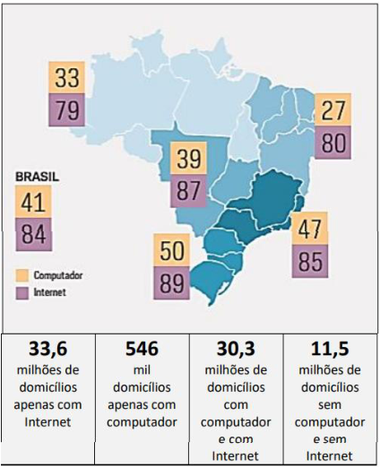

(Fonte: Pesquisa sobre o uso das tecnologias de informação e comunicação nos domicílios brasileiros: TIC Domicílios 2023. São Paulo: Comitê Gestor da Internet no Brasil, 2024, p. 29) 

Considerando os fundamentos e os princípios que disciplinam o uso da rede mundial de computadores no Brasil previstos no Marco Civil da Internet, a análise dos dados da figura acima demonstra que: 

(A) a desigualdade regional de acesso contraria o princípio da liberdade de expressão, pois impede a livre manifestação dos cidadãos nas plataformas digitais; 

(B) a universalização do acesso e a redução das desigualdades regionais permanecem como desafios a serem superados, pois favorecem o pleno exercício da cidadania digital; 

(C) a disparidade regional entre os domicílios com computadores contribui para finalidade social da rede, pois incentiva sua pluralidade e sua diversidade; 

(D) a ampliação do acesso à internet reduz o foco em dispositivos físicos como computadores, o que compromete a diversidade tecnológica nos domicílios; 

(E) o alto índice de domicílios ligados à rede atesta sua neutralidade e sua funcionalidade, pois comprova sua tendência à universalização. 

**<mark>2.</mark>** <mark>FGV / TCE-RR / 2025</mark>

---

<!-- pagina: 56 -->

**Antonio Daud Aula 00** 

Acesso à internet em residências brasileiras salta de 13% para 85% em 20 anos, aponta pesquisa TIC Domicílios 2024 

_Dados revelam que a presença da internet nos lares brasileiros se expandiu significativamente, mas desigualdades ainda persistem entre classes sociais._ 

_Apesar do crescimento no acesso à internet nos últimos 20 anos, a pesquisa destaca a desigualdade presente no país. Segundo a TIC Domicílios 2024, a conexão está disponível em 100% dos lares da classe A, mas apenas em 68% das residências das classes D e E._ 

(Fonte: HELDER, D. G1. 31/10/2024. Adaptado). 

Segundo o Marco Civil da Internet (Lei 12.965, de 23 de abril de 2014), o acesso à internet é essencial ao exercício da cidadania, e ao usuário é assegurado o direito 

A) à violabilidade e à publicidade do fluxo de suas comunicações pela internet. 

B) à suspensão da conexão à internet a tempo e a critério da operadora. 

C) ao fornecimento de seus dados pessoais a terceiros, mesmo que sem seu consentimento. 

D) à publicidade e à clareza de eventuais políticas de uso dos provedores de conexão à internet e de aplicações de internet. 

E) ao contrato de prestação de serviços sem detalhamento sobre o regime de proteção de acesso a aplicações de internet. 

##### **<mark>3.</mark>** <mark>FGV / PC-MG / 2025</mark> 

De acordo com o Marco Civil da Internet (Lei 12.965/2014), assinale a alternativa que indica o princípio fundamental que orienta a neutralidade da rede. 

A) Garantir que os provedores de conexão priorizem serviços de maior demanda para melhorar a experiência do usuário. 

B) Assegurar que os provedores de conexão tratem todos os pacotes de dados da mesma forma, sem discriminação por conteúdo, origem ou destino. 

C) Permitir que os provedores bloqueiem ou restrinjam conteúdos considerados prejudiciais ou ilegais, sem necessidade de ordem judicial. 

D) Priorizar o tráfego de dados relacionado a serviços essenciais, como saúde e segurança pública, em detrimento de outros. 

E) Autorizar os provedores a ajustar velocidades de conexão com base nos planos contratados pelos usuários, mesmo que isso comprometa a neutralidade da rede. 

##### **<mark>4.</mark>** <mark>FGV - 2022 - Senado Federal - Técnico Legislativo - Policial Legislativo</mark> 

O sigilo telemático é direito fundamental estabelecido no Art. 5º, inciso XII, da Constituição Federal de 1988. O avanço nos meios de comunicação provocou transformações no âmbito de proteção deste direito, bem como a respeito de eventual afastamento de tal direito em casos concretos. A esse respeito, assinale a afirmativa correta.

---

<!-- pagina: 57 -->

**Antonio Daud Aula 00** 

A) O provedor de Internet pode ser compelido a fornecer o registro de acesso a aplicações de Internet, desde que presentes fundados indícios da ocorrência de ilícito, justificativa motivada da utilidade dos registros solicitados para fins de investigação ou instrução probatória e o período ao qual se referem os registros. 

B) A disseminação de notícia falsa por meio de redes sociais não está abrangida pela liberdade de expressão. Todavia, diante da ausência de previsão legal específica, os tribunais não podem determinar sua remoção, conforme entendimento firmado pelo STF em sede de repercussão geral. 

C) Cláusula contratual firmada em contrato de fornecimento de serviço de acesso à Internet pode afastar o sigilo de comunicações privadas pela Internet, desde que seja escrita e com visto específico. 

D) O usuário tem direito à inviolabilidade e ao sigilo de suas comunicações pela Internet, salvo por ordem judicial ou autoridade administrativa, neste último caso, na forma de regulamento expedido pela ANATEL. 

<!-- Start of picture text -->
==5460== <!-- End of picture text -->

E) O sigilo telemático não engloba a proteção a conversas ocorridas em aplicativos de mensagens. 

**<mark>5.</mark>** <mark>FGV - 2022 - Senado Federal - Técnico Legislativo - Policial Legislativo</mark> 

A criação de perfis falsos em redes sociais, bem como a utilização de ferramentas de inteligência artificial para manipulação de falas (deepfake), são algumas das grandes celeumas a ameaçar a Internet nos dias de hoje. O avanço da tecnologia traz para o operador do Direito diversos desafios, alguns deles enfrentados pelo Marco Civil da Internet (Lei nº 12.965/2014). A respeito do tema, assinale a afirmativa correta. 

A) A rede social poderá ser responsabilizada civilmente por danos decorrentes da criação de perfil falso se, após ordem judicial específica, não tomar as providências necessárias para tornar o conteúdo indisponível. 

B)Em respeito à liberdade de expressão, o Marco Civil da Internet veda a concessão de tutela provisória de urgência para determinar a indisponibilização de conteúdo lesivo à honra de outrem, a qual somente pode ser imposta por decisão judicial definitiva. 

C) A Lei nº 12.965/2014 estabelece, de maneira expressa, a responsabilidade objetiva do autor de conteúdo lesivo na Internet, que apenas poderá ser afastada se comprovada a culpa exclusiva da vítima ou o fato exclusivo de terceiro. 

D) A decisão judicial que determinar a remoção de conteúdo lesivo a determinada pessoa poderá ser genérica, englobando informações ou usuários indistintos, a critério do juiz ou Tribunal. 

E) O princípio da neutralidade da rede impede o fornecimento, mediante decisão judicial, de registro de conexão a aplicação de Internet, mesmo que haja fundados indícios da ocorrência de ilícito. 

##### **<mark>6.</mark>** <mark>FGV - 2022 - Senado Federal - Advogado</mark> 

O Marco Civil da Internet (Lei nº 12.965/2014) estabelece princípios, garantias, direito e deveres para o uso da Internet no Brasil. Com base nos princípios previstos nesta legislação, analise os itens a seguir. 

I. É possível a aplicação da graduatedresponse no Brasil, segundo a qual os infratores contumazes de direitos autorais na internet recebem respostas cada vez mais duras às infrações cometidas, sendo que, ao final, depois de receber multas, notificações e ter sua velocidade de conexão reduzida, se não deixarem de violar direitos autorais na rede, podem ser punidos com a interrupção temporária de seu acesso à internet.

---

<!-- pagina: 58 -->

**Antonio Daud Aula 00** 

II. É lícito que um provedor de conexão estabeleça, como ferramenta de inibição de compartilhamento não autorizado de arquivos de música e filmes, que tudo o que fosse trocado via BitTorrent, por exemplo, trafegue muito lentamente pela rede, de modo a desincentivar a prática delitiva. 

III. O provedor de aplicações de internet constituído na forma de pessoa jurídica e que exerça essa atividade de forma organizada, profissionalmente e com fins econômicos, deverá manter os respectivos registros de acesso a aplicações de internet, sob sigilo, em ambiente controlado e de segurança, pelo prazo de 6 (seis) meses, nos termos do regulamento. 

Está correto o que se afirma em 

A) I, II e III. 

B) II e III, apenas. 

C) I e III, apenas. 

D) I e II, apenas. 

###### E) III, apenas. 

##### **<mark>7.</mark>** <mark>FGV - 2021 - DPE-RJ - Defensor Público</mark> 

João, inconformado com o término do relacionamento amoroso, decide publicar em sua rede social vídeos de cenas de nudez e atos sexuais com Maria, que haviam sido gravados na constância do relacionamento e com o consentimento dela. João publicou tais vídeos com o objetivo de chantagear Maria para que ela permanecesse relacionando-se com ele. Maria não consentiu tal publicação e, visando à remoção imediata do conteúdo, notifica extrajudicialmente a rede social. A notificação foi recebida pelos administradores da rede social e continha todos os elementos que permitiam a identificação específica do material apontado como violador da intimidade. 

Considerando o caso concreto, é correto afirmar que: 

A) o provedor de aplicações de internet somente poderá ser responsabilizado civilmente por danos decorrentes de conteúdo gerado por João se descumprir ordem judicial específica, de modo que o conteúdo sob exame só pode ser removido mediante decisão judicial, sendo ineficaz a notificação de Maria para fins de responsabilização do provedor; 

B) não haverá responsabilidade civil do provedor de aplicações de internet pelo fato de o conteúdo ter sido gerado por terceiro, incidindo o fato de terceiro como excludente do nexo de causalidade; 

C) somente João, autor da conduta de postar, pode ser responsabilizado civilmente pelos danos causados a Maria, respondendo mediante o regime objetivo de responsabilidade civil, considerando o grave dano à dignidade da pessoa humana e seus aspectos da personalidade, sobrelevando-se a importância de ampliação da tutela da mulher vítima do assédio sexual online; 

D) o provedor de aplicações de internet será responsabilizado subsidiariamente pelos danos sofridos por Maria quando, após o recebimento de notificação, deixar de promover a indisponibilização do conteúdo de forma diligente, no âmbito e nos limites técnicos do seu serviço;

---

<!-- pagina: 59 -->

**Antonio Daud Aula 00** 

E) o provedor de aplicações de internet responderá objetivamente pelos danos causados a Maria e, ainda, solidariamente com João, defagrando-se o dever de indenizar a partir do imediato momento em que João postou o material ofensivo. 

##### **<mark>8.</mark>** <mark>CESGRANRIO/CNU - 2024</mark> 

O dirigente de determinado órgão estadual foi designado para organizar as normas de utilização da internet no estado onde exerce suas funções. Para atingir seu objetivo, formata projeto piloto no qual inclui diversas normas de convivência. 

Nos termos da Lei no 12.965/2014, a disciplina do uso da internet no Brasil tem, dentre outros, o seguinte princípio: 

- (A) liberdade vigiada 

- (B) soberania participativa 

- (C) proteção da privacidade 

- (D) regulação por agência 

- (E) planos coletivos 

##### **<mark>9.</mark>** <mark>CESGRANRIO/CNU - 2024</mark> 

Determinado professor procura o diretor da escola onde exerce o magistério e questiona sobre a utilização da internet no local e sobre a possibilidade de aquisição de equipamentos modernos para melhorar a comunicação e o ensino. 

De acordo com a Lei no 12.965/2014, a disciplina do uso da internet no Brasil tem, dentre outros, os princípios de preservação da estabilidade, segurança e funcionalidade da rede, por meio de medidas técnicas compatíveis com os padrões 

##### (A) locais 

- (B) tradicionais 

- (C) ecossociais 

- (D) internacionais 

- (E) governamentais 

##### **<mark>10.</mark>** <mark>CEBRASPE / EMBRAPA / 2025</mark> 

O Marco Civil da Internet estabelece que provedores de conexão à Internet devem armazenar, sob sigilo e em segurança, os registros de conexão dos usuários, pelo prazo de um ano. 

Certo 

Errado 

##### **<mark>11.</mark>** <mark>CEBRASPE / EMBRAPA / 2025</mark> 

Está determinado, no Marco Civil da Internet, que os provedores de aplicação devem monitorar e filtrar o conteúdo gerado pelos usuários para garantir a segurança e a privacidade na rede. 

##### **<mark>12.</mark>** <mark>CEBRASPE / TRT - 10ª REGIÃO (DF e TO) / 2025</mark>

---

<!-- pagina: 60 -->

**Antonio Daud Aula 00** 

Os princípios da transparência e da finalidade, expressos tanto na LGPD quanto no Marco Civil da Internet, visam assegurar que o tratamento de dados pessoais de usuários seja feito de forma clara, específica e adequada ao propósito declarado. 

##### Certo 

##### Errado 

##### **<mark>13.</mark>** <mark>CEBRASPE / INSA / 2025</mark> 

A neutralidade da rede favorece a inclusão digital ao impedir discriminações no tráfego. No entanto, para garantir a sustentabilidade do setor, provedores podem estabelecer velocidades diferenciadas e priorizar conteúdos conforme sua relevância social e econômica. 

##### Certo 

##### Errado 

##### **<mark>14.</mark>** <mark>CEBRASPE / FUNPRESP-EXE / 2025</mark> 

Constitui diretriz para a atuação dos entes federativos no desenvolvimento da Internet no Brasil a adoção preferencial de tecnologias, padrões e formatos abertos e livres. 

##### Certo 

##### Errado 

##### **<mark>15.</mark>** <mark>CEBRASPE / FUNPRESP-EXE / 2025</mark> 

De acordo com expressa previsão legal, o provedor de conexão à Internet não será civilmente responsabilizado por danos decorrentes de conteúdo gerado por terceiros. 

##### Certo 

##### Errado 

##### **<mark>16.</mark>** <mark>FCC / Prefeitura de São Paulo - SP / 2025</mark> 

Um usuário publicou críticas em uma rede social sobre um serviço de _delivery_ de uma certa empresa, relatando problemas recorrentes. A empresa afetada solicitou ao provedor da aplicação da rede social a remoção do conteúdo, alegando danos à sua reputação. Com base no Marco Civil da Internet (Lei né 12.965/2014), o provedor 

A) deve remover imediatamente qualquer conteúdo que gere reclamações de empresas, para evitar danos reputacionais. 

B) precisa remover as críticas da rede social somente após emissão de ordem judicial específica. 

C) precisa remover conteúdos considerados ofensivos, desde que a empresa prejudicada solicite por escrito. 

D) tem total liberdade para decidir quais conteúdos serão removidos, independentemente de ordem judicial ou notificação. 

E) deve consultar o PROCON antes de remover o conteúdo, quando este envolve opiniões sobre serviços ou produtos. 

##### **<mark>17.</mark>** <mark>Cebraspe/Anatel-2024</mark>

---

<!-- pagina: 61 -->

**Antonio Daud Aula 00** 

O provedor de conexão à Internet responderá civilmente por danos decorrentes de conteúdo gerado por terceiros. 

##### **<mark>18.</mark>** <mark>Cebraspe/Anatel-2024</mark> 

É garantido aos usuários de Internet o direito de não fornecimento de seus dados pessoais a terceiros, incluindo-se registros de conexão, garantia que somente pode ser excepcionada mediante consentimento livre, expresso e informado. 

##### **<mark>19.</mark>** <mark>Cebraspe/Anatel-2024</mark> 

Na provisão de conexão à Internet, seja de caráter oneroso, seja de caráter gratuito, é dever do administrador guardar os registros de acesso a aplicações de Internet bem como monitorar, filtrar ou analisar o conteúdo dos pacotes de dados. 

##### **<mark>20.</mark>** <mark>Cebraspe – 2023 - Dataprev</mark> 

De acordo com o que dispõe a Lei n.º 12.965/2014 — Marco Civil da Internet —, o provedor responsável pela guarda dos registros de conexão e de acesso a aplicativos de Internet está impedido de disponibilizar, sem expressa ordem judicial, quaisquer dados cadastrais de seus usuários, inclusive a entidades ou autoridades administrativas que detenham competência legal para requisitá-los. 

##### **<mark>21.</mark>** <mark>FUNDATEC - 2022 - SPGG - RS - Analista de Planejamento, Orçamento e Gestão</mark> 

O(a)_____________________estabelece princípios, garantias, direitos e deveres para o uso da Internet no Brasil. 

Assinale a alternativa que preenche corretamente a lacuna do trecho acima. 

A) Lei Geral de Proteção de Dados 

- B) Agência Nacional de Telecomunicações 

- C) Marco Civil da Internet 

D) Secretaria de Comunicação do Palácio do Planalto 

###### E) Ministério da Defesa 

##### **<mark>22.</mark>** <mark>TRF - 3ª REGIÃO - 2022 - TRF - 3ª REGIÃO - Juiz Substituto</mark> 

Maria foi durante muitos anos ativista de uma ONG ambiental. Morava com a companheira Monique e a irmã Ana, quando foi assassinada. Logo depois surgiram vídeos no Youtube ofensivos à honra e à memória de Maria. Monique e Ana ingressaram com medida judicial postulando tutela de urgência para — além de obter a retirada dos vídeos ofensivos da plataforma — que o Youtube e os provedores de conexão fornecessem elementos que permitissem a identificação cadastral (nome, RG, CPF, endereço) dos usuários que postaram conteúdos caluniosos contra Maria, para fins de reparação de dano moral. Nesse cenário, quanto à responsabilidade dos provedores (de conexão e de aplicação) relativamente aos dados pessoais dos usuários, é CORRETO afirmar que: 

A) Tanto o Youtube quanto as empresas provedoras de acesso à internet devem fornecer, a partir do endereço IP, os dados cadastrais pessoais dos usuários que cometam atos ilícitos pela rede.

---

<!-- pagina: 62 -->

**Antonio Daud Aula 00** 

B) Apenas o Youtube — como provedor de aplicação de internet — está obrigado a guardar e fornecer dados pessoais dos usuários, sendo insuficiente a apresentação dos registros de número IP. 

C) Apenas os provedores de acesso têm o dever jurídico de guardar dados cadastrais de cada um dos usuários durante o prazo de prescrição de eventual ação de reparação civil. 

D) Os provedores de conexão de internet não são obrigados a guardar e fornecer dados pessoais dos usuários, sendo suficiente a apresentação dos registros de número IP. 

##### **<mark>23.</mark>** <mark>CESPE / CEBRASPE - 2022 - Telebras - Especialista em Gestão de Telecomunicações – Marketing</mark> 

À luz do Marco Civil da Internet, julgue o item que se segue. 

Dado o risco da sua atividade, o provedor de conexão à Internet será responsabilizado civilmente por danos decorrentes de conteúdo gerado por terceiros. 

##### **<mark>24.</mark>** <mark>OBJETIVA - 2021 - Prefeitura de Horizontina - RS - Analista de Suporte de Informática</mark> 

De acordo com a Lei nº 12.965/2014, o acesso à internet é essencial ao exercício da cidadania, e ao usuário são assegurados, entre outros, os seguintes direitos: 

I. Inviolabilidade da intimidade e da vida privada, sua proteção e indenização pelo dano material ou moral decorrente de sua violação. 

II. Inviolabilidade e sigilo de suas comunicações privadas armazenadas, salvo por ordem judicial. 

III. Não suspensão da conexão à internet, salvo por ordem judicial. 

Está(ão) CORRETO(S): 

A) Somente o item I. 

B) Somente o item III. 

C) Somente os itens I e II. 

- D) Somente os itens II e III. 

###### E) Todos os itens. 

##### **<mark>25.</mark>** <mark>OBJETIVA - 2021 - Prefeitura de Santa Maria - RS - Analista de Sistemas</mark> 

De acordo com a Lei nº 12.965/2014, a habilitação de um terminal para envio e recebimento de pacotes de dados pela internet, mediante a atribuição ou autenticação de um endereço IP, é denominado como: 

A) Terminal. 

B) Registro de conexão. 

C) Aplicações de internet. 

###### D) Conexão à internet. 

###### E) Endereço IP. 

##### **<mark>26.</mark>** <mark>OBJETIVA - 2021 - Prefeitura de Santa Maria - RS - Analista de Sistemas</mark>

---

<!-- pagina: 63 -->

**Antonio Daud Aula 00** 

De acordo com a Lei nº 12.965/2014, sobre a guarda de registros de conexão, em relação à atuação do Poder Público, as iniciativas públicas de fomento à cultura digital e de promoção da internet como ferramenta social devem: 

I. Promover a inclusão digital. 

II. Buscar reduzir as desigualdades, sobretudo entre as diferentes regiões do País, no acesso às tecnologias da informação e comunicação e no seu uso. 

III. Fomentar a importação e a circulação de conteúdo estrangeiro. 

Está(ão) CORRETO(S): 

A) Somente o item III. 

B) Somente os itens I e II. 

C) Somente os itens I e III. 

D) Somente os itens II e III. 

E) Todos os itens. 

**<mark>27.</mark>** <mark>MPDFT - 2021 - MPDFT - Promotor de Justiça Adjunto</mark> 

Marque a alternativa correta: 

Consoante a Lei do Marco Civil da Internet: 

A) O Promotor de Justiça requisita diretamente de empresa provedora de aplicações os dados pessoais de determinado usuário, a fim de identificar o registro de acesso a aplicações de internet. 

B) O Promotor de Justiça para obter o registro de acesso à aplicações de internet deve buscar ordem judicial específica para obrigar a empresa a fornecer os dados necessários à utilização em eventual ação civil pública. 

C) O Promotor de Justiça ao requisitar as informações do registro de acesso a aplicações de internet junto ao respectivo provedor de aplicações deverá fixar o prazo para cumprimento em prazo não inferior a 10 (dez) dias úteis, mas a recusa, o retardamento ou a omissão daquela empresa configura crime pela Lei da Ação Civil Pública. 

D) A recusa da empresa provedora de aplicações acerca da requisição direta pelo Promotor de Justiça enseja a aplicação de multa civil, a ser aferida em Ação Civil Pública e destinada ao Fundo Constitucional. 

E) Ao notificar diretamente a empresa provedora de aplicações para o fornecimento dos dados pessoais e da remoção de conteúdo infringente, o Promotor de Justiça deve apontar de forma precisa os motivos fáticos e de direito, com a indicação da URL (abreviação de Uniform Resource Locator ou Localizador Uniforme de Recursos) específica. 

**<mark>28.</mark>** <mark>MPDFT - 2021 - MPDFT - Promotor de Justiça Adjunto</mark> 

Assinale a alternativa correta :

---

<!-- pagina: 64 -->

**Antonio Daud Aula 00** 

A) A conexão de internet no sistema legal em vigor pressupõe a não suspensão do acesso de forma ampla, inclusive nos casos de inadimplemento pelo seu uso pelos consumidores, dado o Direito do Consumidor estar previsto como Direito e Garantia individual. 

B) Na provisão de conexão à internet, onerosa ou gratuita, bem como na transmissão, comutação ou roteamento, é permitido ao responsável pela transmissão, comutação ou roteamento de bloquear, monitorar, filtrar ou analisar o conteúdo dos pacotes de dados, desde que informado ao consumidor de forma prévia e clara no contrato. 

C) Na interpretação da Lei 12.965/2014 – Lei do Marco Civil, o juiz, ao analisar um caso concreto, deve levar em conta, além dos fundamentos, princípios e objetivos previstos na legislação citada, a natureza da internet, seus usos e costumes particulares e sua importância para a promoção do desenvolvimento humano, econômico, social e cultural. 

D) O consumidor poderá ter na provisão de conexão, onerosa ou gratuita, ter guardado os registros de acesso a aplicações de internet. 

E) O Delegado de Polícia, para fazer uso em investigação decorrente de inquérito policial, pode determinar de forma cautelar que os registros de conexão sejam guardados pelo prazo máximo de um ano junto ao administrador de sistema autônomo respectivo.

---

<!-- pagina: 65 -->

**Antonio Daud Aula 00** 

# GABARITOS 

1. Gabarito (B) 

2. Gabarito (D) 

27. Gabarito (B) 

<mark>28. Gabarito (C)</mark> 

3. Gabarito (B) 

4. Gabarito (A) 

5. Gabarito (A) 

6. Gabarito (E) 

7. Gabarito (D) 

8. Gabarito (C) 

9. Gabarito (D) 

10. Gabarito (C) 

11. Gabarito (E) 

12. Gabarito (C) 

13. Gabarito (E) 

14. Gabarito (C) 

15. Gabarito (C) 

16. Gabarito (B) 

17. Gabarito (E) 

18. Gabarito (E) 

19. Gabarito (E) 20. Gabarito (E) 21. Gabarito (C) 22. Gabarito (C) 23. Gabarito (E) 24. Gabarito (C) 25. Gabarito (D) 26. Gabarito (B)

---

<!-- pagina: 66 -->

