---
fonte_pdf: "Legislação - Aula 01.pdf"
paginas: 86
conversao: texto-e-imagens
---

<!-- pagina: 2 -->

**Antonio Daud Aula 01** 

# **Índice** 

|..................................................................**.**........................................................................................................................... 1) Lei de Acesso à Informação - Lei nº 12 527/2011 3|
|---|
|.....................................................................................................**.**........................................................................................ 2) Questões Comentadas - Lei de Acesso à Informação (Lei 12 527 de 2011) - FGV 34|
|.............................................................................................**.**................................................................................................ 3) Lista de Questões - Lei de Acesso à Informação (Lei 12 527 de 2011) - FGV 70|

---

<!-- pagina: 3 -->

**Antonio Daud Aula 01** 

# **<mark>I</mark> NTRODUÇÃO** 

Olá, amigos (as)! 

Nesta aula iremos abordar a Lei 12.527/2011 , conhecida como Lei de Acesso à Informação (LAI) ou Lei da Transparência Pública . 

Após passarmos breves noções gerais sobre o tema, vamos destacar o procedimento para acesso à informação , as restrições (hipóteses de sigilo e respectivos prazos), bem como as responsabilidades dos agentes públicos que violarem os preceitos da LAI. 

Para este tema é especialmente importante reforçar o estudo com a “leitura seca” do texto legal, como você irá perceber a partir da resolução das questões de prova. 

P.S. Esta aula já se encontra de acordo com as atualizações promovidas em junho/2025, pela Lei 15.141. 

Prontos?! Avante!

---

<!-- pagina: 4 -->

**Antonio Daud Aula 01** 

# **LEI DE ACESSO À I : INICIAIS NFORMAÇÃO NOÇÕES** 

**INCIDÊNCIA EM PROVA: BAIXA** 

O princípio da publicidade é um alicerce do estado brasileiro e exige a ampla divulgação dos atos praticados pela administração pública, tornando-os transparentes aos administrados , à exceção das hipóteses de sigilo previstas em lei. É com a devida transparência que se viabiliza o controle da conduta dos administradores públicos. 

Nesse sentido, a Lei 12.527 , de 18 de novembro de 2011, veio a regular o direito ao acesso a informações mantidas pela Administração , previsto nos arts. 5º e 37, entre outros dispositivos constitucionais: 

CF, art. 5º, XXXIII - todos têm direito a receber dos órgãos públicos informações de seu interesse particular, ou de interesse coletivo ou geral , que serão prestadas no prazo da lei, sob pena de responsabilidade, ressalvadas aquelas cujo sigilo seja <u>imprescindível à segurança da sociedade e do Estado;</u> 

CF, art. 37, § 3º A lei disciplinará as formas de participação do usuário na administração pública direta e indireta, regulando especialmente: (..) 

II - o acesso dos usuários a registros administrativos e a informações sobre atos de governo , observado o disposto no art. 5º, X e XXXIII; 

Reparem, portanto, que o próprio texto constitucional já indica que a regra geral é a transparência , de sorte que o acesso à informação pode ser negado ao público em geral apenas em casos específicos. 

Com base nestes dispositivos, o legislador assegurou, como dever do Estado, garantir o direito de acesso à informação, dispondo que o acesso será franqueado, mediante procedimentos objetivos e ágeis , de forma transparente, clara e em linguagem de fácil compreensão (LAI, art. 5º). 

## ⮚ **Alcance da Lei de Acesso à Informação** 

As regras previstas na Lei de Acesso à Informação (Lei 12.527/2011 - LAI) alcançam todos os entes da federação (União, estados, Distrito Federal e municípios), sendo, portanto, chamada de norma de caráter nacional . 

Em todos os entes federativos, subordinam-se ao regramento da LAI a administração direta de todos os poderes (Executivo, Legislativo, Judiciário, Ministério Público e Tribunais de Contas), a administração indireta (autarquias, fundações públicas, empresas públicas, sociedades de economia mista) e entidades controladas pelo poder público (direta ou indiretamente) – art. 1º. 

---

<!-- pagina: 5 -->

**Antonio Daud Aula 01** 

Além de obrigar toda a Administração Pública, as regras da LAI aplicam-se, no que couber, até mesmo a entidades privadas sem fins lucrativos que recebam recursos públicos, seja diretamente do orçamento ou por meio de subvenções, contratos de gestão, termos de parceria, convênios, acordos, etc (art. 2º, caput). 

Percebam, primeiramente, que não se trata de todo e qualquer entidade privada, mas apenas daquelas que não possuem finalidade lucrativa . Quanto a tais entidades, o dever de publicidade se restringe à parcela dos recursos públicos recebidos e à sua destinação , sem prejuízo das prestações de contas a que estejam legalmente obrigadas (art. 2º, parágrafo único). 

Quer dizer que **todas as entidades privadas** estão subordinadas às regras da LAI? 

A resposta é um barulhento NÃO ! 

Subordinam-se à LAI apenas aquelas entidades privadas que possuem vínculos específicos com o poder público (como contratos de gestão, termos de parceria, etc). 

E, nestas que possuírem tais vínculos, a transparência envolve **todas as atividades** da entidade? 

A resposta é outro não ! 

As atividades de uma entidade privada podem envolver recursos públicos e também recursos próprios (natureza privada). Dessa forma, o legislador deixou claro que as regras da LAI alcançam apenas a gestão de recursos públicos – e não a aplicação dos recursos próprios do particular. 

Em junho de 2025, a Lei 15.141 alterou a LAI, incluindo regras de transparência específicas para os serviços sociais autônomos (como o Sesc e o Senai) e para os conselhos de fiscalização profissional (como o CREA, CRO, CRA, entre outros). 

Os serviços sociais autônomos (isto é, as entidades do “Sistema S”, como Sesc e Senai) que receberem recursos públicos por meio (i) contribuições parafiscais, recolhidas pela Receita Federal, ou (ii) mediante contrato de gestão deverão divulgar as seguintes informações relativas aos respectivos empregados (art. 8º-A): 

Art. 8º-A, I - o **plano de cargos e salários** , inclusive com a divulgação dos critérios para a evolução na carreira e para a fixação da política salarial; 

II - o **quantitativo total de empregados** da entidade, discriminado por cargo e por faixas salariais, acompanhado do nome do empregado e do cargo por ele ocupado; 

III - **lista** , discriminada por faixas salariais, **das parcelas remuneratórias e indenizatórias** , ainda que eventuais, incluídos os auxílios, as ajudas de custo, as gratificações, os jetons e

---

<!-- pagina: 6 -->

**Antonio Daud Aula 01** 

quaisquer outras vantagens pecuniárias, que os empregados possam receber em virtude de condições específicas; e 

IV - o **quantitativo de funções gratificadas** , os critérios para sua ocupação e o rol dos empregados que ocupam cada espécie de função gratificada. 

Os conselhos de fiscalização profissional , por sua vez, devem divulgar, de forma nominal e individualizada , lista das parcelas remuneratórias e indenizatórias de seus empregados, ainda que <u>eventuais, incluídos os auxílios, as ajudas de custo, as gratificações, os jetons e quaisquer outras</u> vantagens pecuniárias que os empregados possam receber em virtude de condições específicas (Art. 8º-B). 

- - - - 

Seguindo adiante, vale destacar que a LAI é norma de caráter geral , de sorte que estados, Distrito Federal e municípios poderão editar normas específicas , aplicáveis em suas respectivas esferas (art. 45). 

Vejam a questão abaixo sobre o alcance da LAI que acabamos de estudar: 

##### Cebraspe/SLU DF 

As autarquias estaduais não se submetem ao regime da Lei de Acesso à Informação. Gabarito (Errada). 

||administração direta e INdireta|todos Poderes todos entes federativos|
|---|---|---|
|AI|entidades controladas pelo poder público|direta ou indiretamente|
|ce da L|entidades privadas sem fins lucrativos que recebam recursos públicos|apenas recursos recebidos e destinação|
|alcan|Sistema S (serv. sociais autônomos)|divulgar plano de cargos/salários, quantitativo de empregados e funções e lista de parcelas por faixas salariais|
||Conselhos de fiscalização profissional|divulgar parcelas remuneratórias e indenizatórias de seus empregados (lista nominal e individualizada)|

---

<!-- pagina: 7 -->

**Antonio Daud Aula 01** 

# **DISPOSIÇÕES GERAIS** 

Antes de passarmos ao procedimento de acesso à informação, é importante comentarmos as definições contidas na LAI, as diretrizes e os direitos decorrentes do “ acesso à informação ”. 

### Definições 

|O art. 4º da LAI prevê imp|**INCIDÊNCIA EM PROVA: MÉDIA** ortantes definições, a saber: |
|---|---|
|informação|dados, processados ou não,que podem ser utilizadospara produção e transmissão de conhecimento, contidos em qualquer meio, suporte ou formato|
|documento|unidade de registro de informações, qualquer que seja o suporte ou formato|
|informação sigilosa|aquelasubmetida temporariamente à restrição de acessopúblico em razão de sua imprescindibilidade para a segurança da sociedade e do Estado|
|informação pessoal|aquelarelacionada à pessoa naturalidentificada ou identificável|
|tratamento da informação|conjunto de ações referentes à produção, recepção, classificação, utilização, acesso, reprodução, transporte, transmissão, distribuição, arquivamento, armazenamento, eliminação, avaliação, destinação ou controle da informação|
|disponibilidade|qualidade dainformação que pode ser conhecida e utilizadapor indivíduos, equipamentos ou sistemas autorizados|
|autenticidade|qualidade dainformaçãoque tenha sidoproduzida, expedida, recebida ou modificadapor determinado indivíduo,equipamento ou sistema|
|integridade|qualidade dainformação não modificada, inclusive quanto à origem, trânsito e destino|
|primariedade|qualidade da informaçãocoletada na fonte, com o máximo de detalhamento possível,sem modificações|

Uma destas definições foi cobrada na seguinte questão: 

##### FGV/DPE RJ 

A aprovação da ei de Acesso à Informação LAI (Lei nº 12.527/2011) trouxe disposições para garantir à sociedade o acesso à informação pública previsto na Constituição da República de 1988. A LAI estabelece algumas qualidades que devem caracterizar a informação pública. 

Uma dessas é a autenticidade, que se refere à qualidade da informação:

---

<!-- pagina: 8 -->

**Antonio Daud Aula 01** 

a)  que pode ser conhecida e utilizada por indivíduos, equipamentos ou sistemas autorizados; 

b)  que tenha sido produzida, expedida, recebida ou modificada por determinado indivíduo, equipamento ou sistema; 

- c)  não modificada, inclusive quanto à origem, trânsito e destino; 

- d)  coletada na fonte, com o máximo de detalhamento possível, sem modificações; 

- e)  elaborada por servidor ou agente devidamente autorizado a partir de fontes identificadas. 

##### Comentário : 

Gabarito (B). A letra (A) apresenta a definição de disponibilidade; a letra (C) de integridade; a letra 

(D) de primariedade; e, por fim, a letra (E) não apresenta nenhuma das definições da LAI. 

Apesar de não constar expressamente das definições legais, é essencial que saibamos diferenciar o cerne dos conceitos de “transparência ativa” e “transparência passiva”: 

<!-- Start of picture text -->
transparência <!-- End of picture text -->

<!-- Start of picture text -->
divulgação independentemente de solicitação <!-- End of picture text -->

<!-- Start of picture text -->
ativa <!-- End of picture text -->

<!-- Start of picture text -->
passiva <!-- End of picture text -->

<!-- Start of picture text -->
divulgação após solicitação do particular <!-- End of picture text -->

Fazendo uma analogia com uma ida ao restaurante, seria o seguinte: 

---

<!-- pagina: 9 -->

**Antonio Daud Aula 01** 

### Diretrizes do acesso à informação 

###### **INCIDÊNCIA EM PROVA: ALTA** 

A legislação prevê que, ao assegurar o direito dos cidadãos ao acesso à informação, os entes públicos observem os princípios básicos da Administração e as seguintes diretrizes (art. 3º): 

<!-- Start of picture text -->
publicidade é a regra geral  e o sigilo é exceção <!-- End of picture text -->

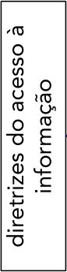

<!-- Start of picture text -->
informação diretrizes do acesso à <!-- End of picture text -->

<!-- Start of picture text -->
divulgação de informações de interesse público utilização de  meios de comunicação  viabilizados <!-- End of picture text -->

<!-- Start of picture text -->
utilização de  meios de comunicação  viabilizados pela  tecnologia da informação fomento ao desenvolvimento da  cultura de transparência  na administração pública desenvolvimento do  controle social  da <!-- End of picture text -->

<!-- Start of picture text -->
desenvolvimento do  controle social  da administração pública <!-- End of picture text -->

<!-- Start of picture text -->
independentemente de solicitações (transparência ativa) <!-- End of picture text -->

### **1) Publicidade** _vs._ **sigilo** 

A publicidade, portanto, constitui a regra geral, sendo o sigilo algo excepcional (art. 3º, I). Além disso, cumpre lembrar que, nos termos da CF, o sigilo pode ser alegado para proteção da segurança da sociedade e do Estado, bem como defesa da intimidade ou interesse social (CF, art. 5º, XXXIII e LX): 

<!-- Start of picture text -->
Regra: transparência <!-- End of picture text -->

<!-- Start of picture text -->
informação gerada ou custodiada pela Administração <!-- End of picture text -->

<!-- Start of picture text -->
segurança da sociedade e do Estado <!-- End of picture text -->

<!-- Start of picture text -->
Exceções (sigilo) <!-- End of picture text -->

<!-- Start of picture text -->
intimidade ou interesse social <!-- End of picture text -->

### **2) Transparência ativa** 

No que se refere à segunda diretriz do diagrama anterior (art. 3º, II), reparem que o legislador consagrou a chamada “ transparência ativa ”, ao prever que os entes públicos devem divulgar informações de interesse público independentemente de solicitações . 

De modo abrangente, o art. 8º, caput, da LAI prevê que tal divulgação (independentemente de requerimentos) deve se dar em relação a informações de interesse coletivo ou geral produzidas

---

<!-- pagina: 10 -->

**Antonio Daud Aula 01** 

ou custodiadas1 pelos entes públicos. E, de modo mais concreto, o art. 8º, §1º previu uma lista de informações consideradas como sendo de interesse coletivo ou geral, as quais devem ser divulgadas mesmo sem qualquer solicitação : 

<!-- Start of picture text -->
competências e estrutura organizacional <!-- End of picture text -->

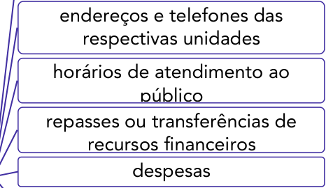

<!-- Start of picture text -->
endereços e telefones das respectivas unidades horários de atendimento ao público repasses ou transferências de recursos financeiros despesas <!-- End of picture text -->

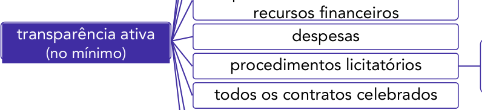

<!-- Start of picture text -->
recursos financeiros transparência ativa   despesas (no mínimo) procedimentos licitatórios todos os contratos celebrados <!-- End of picture text -->

<!-- Start of picture text -->
inclusive editais e resultados <!-- End of picture text -->

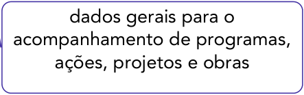

<!-- Start of picture text -->
dados gerais para o acompanhamento de programas, ações, projetos e obras <!-- End of picture text -->

<!-- Start of picture text -->
respostas a perguntas mais frequentes da sociedade <!-- End of picture text -->

Reparem que devem ser divulgadas – sem solicitação prévia – no mínimo estas informações acima detalhadas, o que não impede a divulgação “ativa” de outros dados. 

Como exemplo, vale desatacar a divulgação da remuneração dos servidores públicos . No plano do Poder Executivo Federal, o Decreto 7.724/2011 determina a divulgação da referida remuneração, de maneira individualizada , prática que tem sido “seguida” também em outras esferas e Poderes. A este respeito, vale lembrar que a jurisprudência brasileira considera legítima a divulgação eletrônica do valor das remunerações dos servidores <u>de forma individualizada, sem</u> que isto viole a intimidade dos servidores públicos: 

É legítima a publicação, inclusive em sítio eletrônico mantido pela administração pública, dos nomes dos seus servidores e do valor dos correspondentes vencimentos e vantagens pecuniárias. ARE 652.777, tema 483 

> 1 Informações custodiadas são aquelas que, embora não sejam produzidas pelo próprio órgão público, estão armazenadas em seus bancos de dados. Exemplo: documentação recebida por uma equipe do Tribunal de Contas em resposta a uma requisição de auditoria (informação passa a ser custodiada pelo TCU).

---

<!-- pagina: 11 -->

**Antonio Daud Aula 01** 

Outra observação importante diz respeito ao meio de divulgação ativa destas informações. 

Segundo a LAI, tal divulgação ativa deve ser realizada em “todos os meios e instrumentos legítimos de que dispuserem” os entes públicos, sendo obrigatória a divulgação em sítios oficiais na internet (art. 8º, § 2º), exceto para municípios de até 10.000 habitantes (art. 8º, § 4º). 

Em geral, a divulgação por meio da internet ocorre por meio dos chamados “portais da transparência”. E, para tais página na internet, o legislador chegou a prever requisitos mínimos de funcionamento, da seguinte forma: 

|Art. 8º, § 3º Os sítios de que trata o § 2º deverão, na forma de regulamento, atender, entre outros, aos seguintesrequisitos:|
|---|
|I - conterferramenta de pesquisa de conteúdo que permita o acesso à informação de forma objetiva, transparente, clara e em linguagem de fácil compreensão;|
|II - possibilitar a gravação derelatórios emdiversos formatos eletrônicos, inclusive abertos e não proprietários, tais comoplanilhasetexto,de modo a facilitar a análise das informações;|
|III - possibilitar oacesso automatizado por sistemas externos em formatos abertos, estruturados e legíveis por máquina;|
|IV -divulgar em detalhesos formatos utilizados para estruturação da informação;|
|V -garantiraautenticidade e aintegridade das informações disponíveis para acesso;|
|VI - manteratualizadas as informações disponíveis para acesso;|
|VII - indicarlocaleinstruçõesque permitam aointeressado comunicar-se, por via eletrônica ou telefônica,com o órgãoou entidadedetentora do sítio; e|
|VIII - adotar as medidas necessárias para garantir aacessibilidade de conteúdo para pessoas com deficiência, nos termos do art. 17 da Lei nº 10.098, de 19 de dezembro de 2000, e do art. 9º da Convenção sobre os Direitos das Pessoas com Deficiência, aprovadapelo Decreto Legislativo nº 186, de 9 dejulho de 2008.|

### **3) Controle social e cidadania** 

O controle social (ou popular2 ) representa o acompanhamento que a população pode exercer sobre a Administração Pública , sobre o exercício da função administrativa. Como destinatários da ação governamental, a população também é legitimada a realizar o controle sobre os atos do poder público, consistindo em mecanismo de fortalecimento da cidadania , redução dos níveis de corrupção e irregularidades e, ao fim e ao cabo, de melhoria da qualidade dos serviços públicos. 

2 Op. Cit. p. 951-952

---

<!-- pagina: 12 -->

**Antonio Daud Aula 01** 

No entanto, para poder controlar, é necessário que o cidadão tenha acesso a dados da gestão pública. O controle social está, portanto, diretamente ligado à transparência pública . Tal controle poderia ser realizado diretamente pela população ou por intermédio de órgãos com tal função. 

Exemplos: audiência pública; Conselhos Gestores de políticas públicas (Conselho de Alimentação <mark>Escolar, Conselho Municipal de Saúde, etc); ação popular (CF, art. 5º, LXXIII), possibilidade de qualquer cidadão denunciar irregularidades perante o Tribunal de Contas (CF, art. 74, §2º),</mark> apreciação das contas municipais (CF, art. 31, §3º). 

### **4) Transparência** e **Equidade** 

Além disso, analisando as ações governamentais sob o prisma da ciência da Administração e da Governança, tem-se apontado a promoção da transparência e a promoção da equidade (enquanto forma de tratamento isonômico aos cidadãos e empresas, inclusive sob o prisma socioeconômico) como pilares necessários para a melhoria da confiança depositada no poder público. 

### O acesso à informa ão <u>ç</u> 

###### **INCIDÊNCIA EM PROVA: BAIXA** 

A todo momento estamos mencionando o direito ao “acesso à informação”. De modo a definir o significado desta expressão, o art. 7º da LAI dispõe que tal acesso compreende o direito de o administrado a obter, entre outros, o seguinte: 

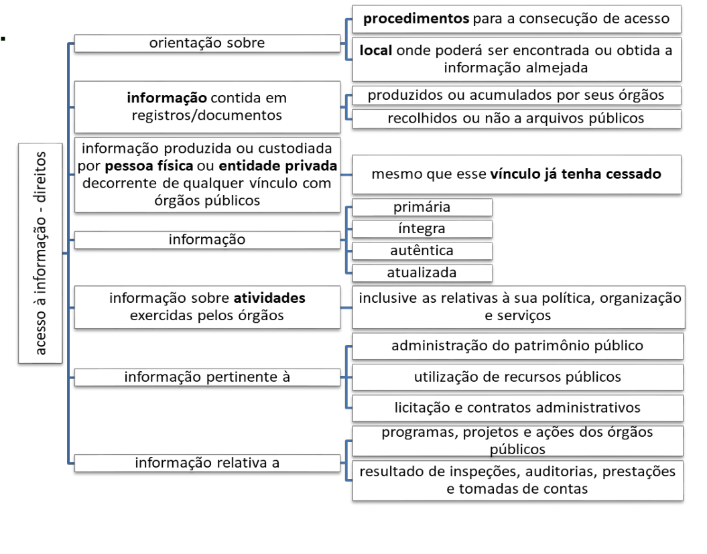

---

<!-- pagina: 13 -->

**Antonio Daud Aula 01** 

Reparem que o acesso à informação não compreende as informações referentes a projetos de pesquisa e desenvolvimento científicos ou tecnológicos cujo sigilo seja imprescindível à segurança <u>da sociedade e do Estado.</u> 

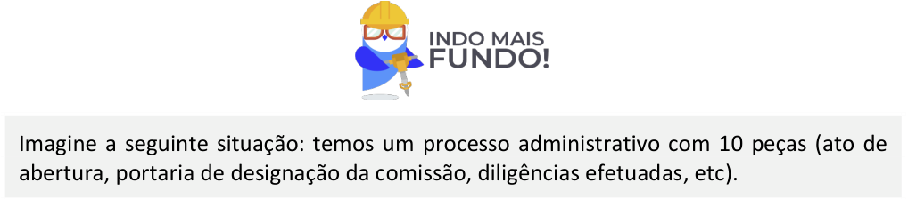

<!-- Start of picture text -->
Imagine a seguinte situação: temos um processo administrativo com 10 peças (ato de abertura, portaria de designação da comissão, diligências efetuadas, etc). <!-- End of picture text -->

A qualquer momento o público em geral poderá ter acesso ao conteúdo deste processo? Como regra geral, a resposta é não! 

Isto porque, o direito de acesso aos documentos ou às informações neles contidas, somente será assegurado após a edição do ato decisório respectivo (art. 7º, §3º). 

Ou seja, apenas com a prática do ato que decidir o referido processo é que seu conteúdo poderá ser acessado pelos particulares em geral (caso o processo não tenha sido classificado como sigiloso). 

- - - 

Seguindo adiante, destaco que o referido acesso a informações públicas será assegurado mediante (art. 9º): 

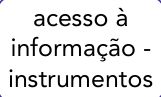

<!-- Start of picture text -->
acesso à informação - instrumentos <!-- End of picture text -->

<!-- Start of picture text -->
atender  e  orientar o público quanto ao acesso a informações <!-- End of picture text -->

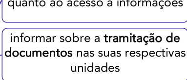

<!-- Start of picture text -->
informar sobre a  tramitação de documentos  nas suas respectivas unidades <!-- End of picture text -->

<!-- Start of picture text -->
serviço de informações ao cidadão  (SIC), para: <!-- End of picture text -->

<!-- Start of picture text -->
cidadão  (SIC), para: audiências  ou  consultas públicas <!-- End of picture text -->

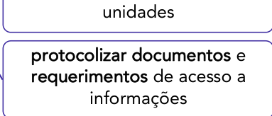

<!-- Start of picture text -->
unidades protocolizar documentos  e requerimentos  de acesso a informações <!-- End of picture text -->

<!-- Start of picture text -->
incentivo à  participação popular  ou a outras formas de divulgação <!-- End of picture text -->

O mencionado Serviço de Informações ao Cidadão (SIC) consiste em uma subunidade de cada órgão/entidade público, que tem como missão atender e orientar o público, receber pedidos de acesso à informação e dar informações sobre a tramitação destes pedidos. 

- - -

---

<!-- pagina: 14 -->

**Antonio Daud Aula 01** 

Além dos mencionados instrumentos, o legislador previu que os órgãos e entidades do poder público devem assegurar o seguinte (art. 6º): 

<!-- Start of picture text -->
acesso à informação - entes devem assegurar <!-- End of picture text -->

<!-- Start of picture text -->
gestão transparente da informação <!-- End of picture text -->

<!-- Start of picture text -->
propiciando  amplo acesso  e sua  divulgação <!-- End of picture text -->

<!-- Start of picture text -->
garantindo-se sua disponibilidade, autenticidade e integridade <!-- End of picture text -->

<!-- Start of picture text -->
proteção da informação <!-- End of picture text -->

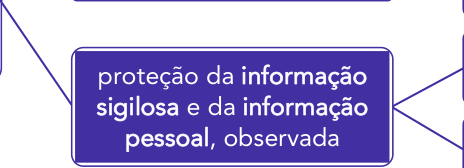

<!-- Start of picture text -->
proteção da  informação sigilosa  e da  informação pessoal , observada <!-- End of picture text -->

<!-- Start of picture text -->
sua disponibilidade, autenticidade, integridade <!-- End of picture text -->

<!-- Start of picture text -->
e eventual restrição de acesso <!-- End of picture text -->

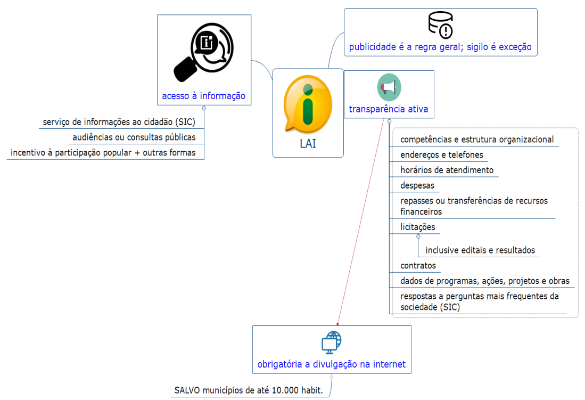

https://t.me/KakashiAssinaturasBot

---

<!-- pagina: 15 -->

**Antonio Daud Aula 01** 

Antes de encerrar este tópico, vale aprofundar quanto a um aspecto dos SICs (Serviço de Informações ao Cidadão), no âmbito do Poder Executivo Federal. 

O SIC deverá ser instalado em unidade física identificada, de fácil acesso e aberta ao público, como regra geral (Decreto 7.724/2012, art. 10). Porém, nas unidades descentralizadas em que não houver SIC, será oferecido serviço de recebimento e registro dos pedidos de acesso à informação . 

# **PROCEDIMENTO DE ACESSO À INFORMAÇÃO** 

Vimos, acima, que uma série de informações devem ser disponibilizadas ao público em geral ==5460== independentemente de solicitação. Por outro lado, aquelas que não estiverem disponibilizadas, poderão ser solicitadas pelos interessados, o que nos leva ao presente tópico da aula. 

## Pedido de acesso à informa ão <u>ç</u> 

**INCIDÊNCIA EM PROVA: MÉDIA** 

Qualquer interessado poderá apresentar pedido de acesso a informações dirigido a órgãos e entidades públicos, por qualquer meio legítimo, bastando que o pedido contenha a 2 informações (art. 10): 

- a) a identificação do requerente e 

- b) a especificação da informação requerida. 

Os campos de identificação do requerente não podem conter exigências que inviabilizem a solicitação (ou seja, os requisitos de identificação não devem representar obstáculos à solicitação dos interessados). 

Além disso, a legislação autoriza que os entes públicos disponibilizem mecanismo de recebimento dos pedidos de acesso à informação por meio de seus sítios oficiais na internet - a exemplo do eSIC. 

Existe uma importante vedação contida na LAI: os pedidos de acesso à informação não exigem motivação . Em outras palavras, é ilegal um ente público exigir que o interessado indique que necessita da informação para o propósito ‘A’ ou ‘B’. 

## ⮚ **Prazo para atendimento** 

Como regra geral, o pedido de acesso à informação disponível deve ser concedido ou autorizado de imediato . Se, no entanto, não for possível, o órgão público terá prazo de até 20 dias , prorrogáveis por mais 10 (prorrogação justificada), caso em que deverá:

---

<!-- pagina: 16 -->

**Antonio Daud Aula 01** 

Art. 11, §1º, I - comunicar a data , local e modo para se realizar a consulta, efetuar a reprodução ou obter a certidão; 

II - indicar as razões de fato ou de direito da recusa , total ou parcial, do acesso pretendido; ou 

III - comunicar que não possui a informação , indicar, se for do seu conhecimento, o órgão ou a entidade que a detém, ou, ainda, remeter o requerimento a esse órgão ou entidade, cientificando o interessado da remessa de seu pedido de informação. 

Sem prejuízo da segurança e da proteção das informações e do cumprimento da legislação aplicável, o órgão ou entidade poderá oferecer meios para que o próprio requerente possa pesquisar a informação de que necessitar. 

Caso a informação solicitada esteja disponível em formato impresso , eletrônico ou em qualquer outro meio de acesso universal, o ente público deverá informar ao requerente, por escrito , o lugar e a forma pela qual se poderá consultar, obter ou reproduzir a referida informação. Neste caso, o órgão não estará obrigado a fornecer diretamente a informação ao solicitante (mas apenas indicar onde pode ser obtida), salvo se o requerente declarar não dispor de meios para realizar por si mesmo tais procedimentos. 

Encontrando-se em formato digital e havendo anuência por parte do requerente , aí sim ela será fornecida diretamente ao requerente, nesse formato. 

Encontrando-se em formato impresso , por outro lado, e se tratar de acesso à informação contida em documento cuja manipulação possa prejudicar sua integridade , deverá ser oferecida a consulta de cópia , com certificação de que esta confere com o original. 

## ⮚ **Cobrança de valores** 

O serviço de busca e fornecimento da informação, como regra geral, é gratuito . No entanto, se houver necessidade de reprodução de documentos pelo órgão ou entidade pública consultada, podem ser cobrados do solicitante exclusivamente o valor necessário ao ressarcimento do custo dos serviços e dos materiais utilizados (art. 12). 

Por outro lado, se o solicitante fizer “declaração de pobreza” (Lei 7.115/1983), estará isento de ressarcir os respectivos custos. 

### ⮚ **Indeferimento do pedido de acesso à informação** 

Quando o órgão público negar o pedido de acesso à informação solicitada (em decorrência de a informação ter sido considerada sigilosa ou pessoal), deverá cumprir uma série de imposições previstas na LAI. 

Primeiramente, o poder público deverá formalizar a negativa de acesso, fornecendo ao requerente o inteiro teor da referida decisão (art. 14). 

Tal decisão deverá ser fundamentada , sem a qual o agente responsável estará sujeito a medidas disciplinares:

---

<!-- pagina: 17 -->

**Antonio Daud Aula 01** 

Art. 7 º, § 4º A negativa de acesso às informações objeto de pedido formulado aos órgãos e entidades referidas no art. 1º , quando não fundamentada, sujeitará o responsável a medidas disciplinares, nos termos do art. 32 desta Lei. 

O indeferimento de pedido de acesso à informação deve ser formalizado e fundamentado . 

Além disso, o requerente deverá ser informado sobre a possibilidade de recurso , prazos e condições para sua interposição, bem como sobre a autoridade competente para a apreciação do recurso (art. 11, § 4º). 

## ⮚ **Pedidos que não serão atendidos** 

Para o Poder Executivo Federal, o Decreto 7.724/2012 estabelece que não serão atendidos os seguintes pedidos de acesso à informação: 

Art. 13. Não serão atendidos pedidos de acesso à informação: 

I - **genéricos** ; 

II - **desproporcionais** ou **desarrazoados** ; ou 

III - que **exijam trabalhos adicionais** de análise, interpretação ou consolidação de dados e informações, ou serviço de produção ou tratamento de dados que não seja de competência do órgão ou entidade. 

Reparem que são situações que fogem do razoável, razão pela qual a legislação autoriza o indeferimento do pedido. 

Além disso, no caso deste inciso III, o órgão público deverá, caso tenha conhecimento, indicar o local onde se encontram as informações a partir das quais o requerente poderá realizar a interpretação, consolidação ou tratamento de dados. 

## ⮚ **Extravio da informação** 

Se o poder público alegar que a informação solicitada pelo interessado foi extraviada: 

Art. 7º, § 5º Informado do extravio da informação solicitada, poderá o interessado requerer à autoridade competente a imediata abertura de sindicância para apurar <u>o desaparecimento da respectiva documentação.</u> 

Isto porque o extravio de documentos é situação totalmente atípica, que merece ser apurada, por meio da abertura de uma sindicância. 

Ainda quanto ao extrativo, a LAI prevê que o responsável tenha o prazo de 10 dias para comprovar o referido extravio:

---

<!-- pagina: 18 -->

**Antonio Daud Aula 01** 

§ 6º Verificada a hipótese prevista no § 5º deste artigo, o responsável pela guarda da informação extraviada deverá, no prazo de 10 (dez) dias , justificar o fato e indicar testemunhas <u>que comprovem sua alegação.</u> 

## ⮚ **Documento: parte pública + parte sigilosa** 

Se for solicitado acesso a um documento que seja parcialmente sigiloso, o poder público tem o dever de franquear o acesso à parte pública do documento, ocultando a parte sob sigilo (por exemplo, tarjando o trecho sigiloso): 

Art. 7º, § 2º Quando não for autorizado acesso integral à informação por ser ela parcialmente sigilosa, é **assegurado o acesso à parte não sigilosa** por meio de certidão, extrato ou cópia com **ocultação da parte sob sigilo** . 

## Recurso 

**INCIDÊNCIA EM PROVA: BAIXA** 

Se a Administração indeferir o pedido de acesso à informação, é cabível recurso , que deve ser apresentado no prazo de 10 dias a contar da sua ciência (art. 15). 

Diferentemente do que ocorre nos recursos regidos pela Lei 9.784/1999, na sistemática de recursos prevista na LAI, o recurso é dirigido à autoridade hierarquicamente superior à que exarou a decisão impugnada, a qual terá 5 dias para se manifestar.

---

<!-- pagina: 19 -->

**Antonio Daud Aula 01** 

Caso o recurso seja indeferido pela autoridade superior, caberá ainda novo recurso. Se a negativa de acesso à informação ocorrer em entes do Poder Executivo federal , este segundo recurso deverá ser encaminhado à Controladoria-Geral da União (CGU) , que deve decidir no prazo de 5 dias (art. 16). 

Reparem que este recurso dirigido à CGU somente será cabível se, dentro da própria organização que indeferiu o acesso, o recurso já tiver sido apreciado por pelo menos uma autoridade hierarquicamente superior àquela que exarou a decisão impugnada (art. 16, § 1º). Em outras palavras, a CGU deve consistir, pelo menos, em segundo grau recursal . 

Mas a contenda não para por aí! 

Caso, ainda assim, o acesso à informação seja negado pela CGU, caberá novo recurso, desta vez dirigido à Comissão Mista de Reavaliação de Informações ( CMRI ), no prazo de 10 dias, contado da ciência da decisão (art. 16, § 3º). 

Um dos aspectos da sistemática de recursos da LAI foi exigido na seguinte questão: 

SLU DF/Modernização da Gestão das Atividades de Resíduos Sólidos/2019 

No caso de indeferimento de pedido de acesso a informação, é facultado ao interessado interpor recurso, que deverá ser dirigido à mesma autoridade que proferiu a decisão. Caso a referida autoridade não reconsidere sua decisão no prazo de cinco dias, o pedido deverá ser encaminhado a autoridade superior. 

Gabarito (errada), pois o recurso deve ser dirigido à autoridade superior àquela que proferiu a decisão. 

Abro um parêntese para destacar que a mencionada Comissão Mista de Reavaliação de Informações é instituída no âmbito da administração pública federal e decide sobre o tratamento e a classificação de informações sigilosas, possuindo competência para (art. 35): 

I - requisitar da autoridade que classificar informação como ultrassecreta e secreta esclarecimento ou conteúdo , parcial ou integral da informação; II - rever a classificação de informações <u>ultrassecretas ou secretas, de ofício ou</u> mediante provocação de pessoa interessada, observado o disposto no art. 7º e demais dispositivos desta Lei; e 

III - prorrogar o prazo de sigilo de informação classificada como <u>ultrassecreta,</u> sempre por prazo determinado, enquanto o seu acesso ou divulgação puder ocasionar ameaça externa à soberania nacional ou à integridade do território nacional ou grave risco às relações internacionais do País, observado o prazo <u>previsto no § 1º do art. 24.</u> 

Fechado o parêntese, destaco que a sistemática de recursos à CGU (que estudamos pouco acima) aplica-se apenas ao Poder Executivo federal. Assim sendo, os Poderes Legislativo e Judiciário e o Ministério Público deverão regulamentar internamente (em âmbito próprio), os procedimentos de

---

<!-- pagina: 20 -->

**Antonio Daud Aula 01** 

revisão da decisão denegatória proferida no recurso hierárquico ordinário e também de revisão da classificação de documentos sigilosos (art. 18), assim como o Poder Executivo de outras esferas. 

Além disso, sempre que houver a negativa de acesso à informação no bojo de um recurso hierárquico no âmbito do Judiciário e do Ministério Público, o respectivo órgão responsável deverá informar ao Conselho Nacional de Justiça (CNJ) e ao Conselho Nacional do Ministério Público (CNMP), respectivamente (art. 19, § 2º). 

Por fim, vale destacar que aplica-se subsidiariamente a Lei 9.784/1999 (que dispõe sobre o processo administrativo na esfera federal) aos procedimentos previstos na Lei 12.527/2011 para apresentação, instrução e decisão dos pedidos de acesso a informações e recursos respectivos. 

# **RESTRIÇÕES** 

A regra geral, como vimos acima, é que as informações produzidas ou custodiadas pela Administração sejam públicas. No entanto, há hipóteses em que a informação será resguardada por sigilo, restringindo seu acesso. 

Nesse sentido, estudaremos nesta seção as situações em que o acesso à informação será restringido , abordando as hipóteses legais de sigilo, a classificação da informação quanto ao grau de sigilo, os respectivos prazos e procedimentos de classificação (e reclassificação). 

De toda forma, o legislador deixa claro que não poderá ser negado acesso à informação necessária à tutela de direitos fundamentais – seja tutela judicial ou administrativa (art. 21). 

## Classifica ão da Informa ão <u>ç ç</u> 

###### **INCIDÊNCIA EM PROVA: ALTÍSSIMA** 

São consideradas imprescindíveis à segurança da sociedade ou do Estado e, portanto, passíveis de classificação as informações cuja divulgação ou acesso irrestrito possam (art. 23):

---

<!-- pagina: 21 -->

**Antonio Daud Aula 01** 

|pôr em risco adefesae asoberanianacionais|
|---|
|pôr em risco aintegridade do territórionacional|
|prejudicar/pôr em risco a condução denegociações/relações internacionais do País|
|informações que tenham sidofornecidasem caráter sigilosoporoutros Estadoseorganismos internacionais|
|pôr em risco avida, asegurançaou asaúdeda população|
|gilo oferecer elevado risco àestabilidade financeira,econômicaoumonetáriado País|
|s de si prejudicar/causar risco a planos ouoperações estratégicos das Forças Armadas|
|pótese prejudicar/causar risco a projetos de pesquisaedesenvolvimento científicooutecnológico|
|hi   sistemas, bens, instalações ou áreas deinteresse estratégico nacional|
|instituições|
|pôr em risco a segurança de altas autoridadesnacionais ou estrangeiras e seusfamiliares|
|inteligência|
|comprometer atividades de investigação/fiscalizaçãoem andamento, relacionadas com a prevenção ou repressão de infrações|

<!-- Start of picture text -->
hipóteses de sigilo <!-- End of picture text -->

Apesar de o legislador ter inserido tal lista de hipóteses de sigilo no texto da LAI, isto não exclui as demais hipóteses legais de sigilo e de segredo de justiça nem as hipóteses de segredo industrial decorrentes da exploração direta de atividade econômica pelo Estado ou por pessoa física ou entidade privada que tenha qualquer vínculo com o poder público (art. 22). 

É importante destacar também que o sigilo não será eterno ! A restrição de acesso gera efeitos temporários ! Assim, estando presente qualquer das hipóteses legais de sigilo (sejam aquelas contidas na LAI ou em outras normas), a informação deverá ser classificada em um dos seguintes graus de sigilo : 

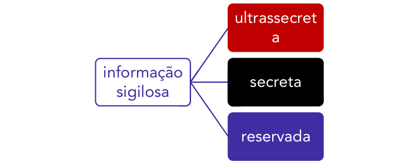

<!-- Start of picture text -->
ultrassecret a informação secreta sigilosa reservada <!-- End of picture text -->

---

<!-- pagina: 22 -->

**Antonio Daud Aula 01** 

A cada um destes graus de sigilo, foi associado um prazo máximo para a duração da restrição de acesso, da seguinte forma (art. 24, §1º): 

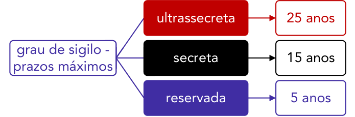

<!-- Start of picture text -->
ultrassecreta 25 anos grau de sigilo - secreta 15 anos prazos máximos reservada 5 anos <!-- End of picture text -->

Reparem que tais prazos são contados a partir da produção da informação . Vejam a questão abaixo a este respeito: 

##### Cebraspe/SLU DF 

De acordo com dispositivo da Lei de Acesso à Informação, é de quinze anos o prazo máximo de restrição de acesso a informações classificadas como ultrassecretas. 

Gabarito (errada). Para informações ultrassecretas, o prazo máximo é de 25 anos. 

Os prazos acima representam limites máximos, não havendo óbices a que a restrição de acesso tenha duração inferior, podendo os gestores públicos vinculá-la a determinado evento futuro (referente à necessidade de restrição da informação), desde que o evento ocorra <u>antes do transcurso do prazo máximo de classificação (art. 24, §3º).</u> 

Exemplo: imagine que é elaborado um plano estratégico das forças armadas, que irá <mark>vigorar durante um evento sediado pelo Brasil no próximo mês, sendo tal documento classificado como secreto (máximo de 15 anos). No entanto, a Administração poderia decidir vincular a restrição de acesso ao documento à data final do evento (ou seja, após o final do mês seguinte). Dessa forma, ao final do evento o documento já poderia ser</mark> acessado publicamente. 

Nesse sentido, o legislador já estipulou que as informações que puderem colocar em risco a segurança do Presidente e Vice-Presidente da República e respectivos cônjuges e filhos (as) serão classificadas como reservadas e ficarão sob sigilo até o término do mandato em exercício ou do último mandato, em caso de reeleição (art. 24, §2º). 

---

<!-- pagina: 23 -->

**Antonio Daud Aula 01** 

Acerca destes prazos, é importante lembrar que a CMRI pode prorrogar o prazo , por igual período, para as informações classificadas como ultrassecretas, segundo a LAI. 

A informação sigilosa poderá ser acessada por alguém? 

Poderá sim! Mas não pelo público em geral! 

Neste caso, o acesso à informação sigilosa será restrito a pessoas que tenham necessidade de conhecê-la e que sejam devidamente credenciadas na forma do regulamento, sem prejuízo das atribuições dos agentes públicos autorizados por lei (art. 25, §1º). 

## ⮚ **Competência para classificação da informação** 

Nos termos do art. 27 da LAI, a competência para classificação da informação dependerá do respectivo grau de sigilo, encontrando-se distribuída da seguinte forma: 

<!-- Start of picture text -->
Presidente da República + Vice <!-- End of picture text -->

<!-- Start of picture text -->
Ministros de Estado (e autoridades com mesmas prerrogativas) <!-- End of picture text -->

<!-- Start of picture text -->
ultrassecreto (25 anos) <!-- End of picture text -->

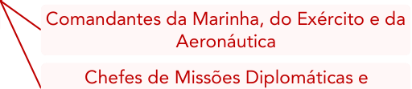

<!-- Start of picture text -->
Comandantes da Marinha, do Exército e da Aeronáutica Chefes de Missões Diplomáticas e <!-- End of picture text -->

<!-- Start of picture text -->
Chefes de Missões Diplomáticas e Consulares permanentes no exterior <!-- End of picture text -->

<!-- Start of picture text -->
competência p/ classificar o grau de sigilo <!-- End of picture text -->

<!-- Start of picture text -->
 autoridades mencionadas acima <!-- End of picture text -->

<!-- Start of picture text -->
secreto (15 anos) <!-- End of picture text -->

<!-- Start of picture text -->
titulares de autarquias, fundações públicas ou estatais <!-- End of picture text -->

<!-- Start of picture text -->
 autoridades mencionadas acima <!-- End of picture text -->

<!-- Start of picture text -->
reservado (5 anos) <!-- End of picture text -->

<!-- Start of picture text -->
autoridades que exerçam funções de direção, comando ou chefia, nível DAS 101.5, ou superior <!-- End of picture text -->

Quanto à possibilidade de delegação da competência para classificação, temos um aparente conflito entre o texto da lei e seu decreto regulamentador (Decreto 7.724/2012).

---

<!-- pagina: 24 -->

**Antonio Daud Aula 01** 

O texto da LAI até autoriza a delegação da classificação quanto aos graus secreto e ultrassecreto (art. 27, § 1º). No entanto, seu decreto regulamentador (Decreto 7.724/2012) veda expressamente tal delegação, autorizando a delegação da classificação apenas do grau reservado: 

Art. 30, § 1º É vedada a delegação da competência de classificação nos graus de sigilo ultrassecreto ou secreto , ressalvado o disposto no § 7º [que delega ao Presidente do Banco Central a competência para a classificação de informação no grau ultrassecreto no âmbito do Bacen]. 

§ 2º O dirigente máximo do órgão ou entidade poderá delegar a competência para classificação no grau reservado a agente público que exerça função de direção, comando ou chefia. 

§ 3º É vedada a subdelegação da competência de que trata o § 2º. 

Fechado este parêntese, se houver a delegação da classificação no grau ultrassecreto por (i) Comandantes da Marinha, do Exército e da Aeronáutica e (ii) Chefes de Missões Diplomáticas e Consulares permanentes no exterior exige a ratificação pelo respectivo Ministro de Estado (art. 27, §2º). 

Além disso, toda autoridade que classificar informação como ultrassecreta fica obrigada a encaminhar o ato de classificação (comentado logo abaixo) à Comissão Mista de Reavaliação de Informações (CMRI). 

## ⮚ **O ato de classificação da informação** 

A classificação de informação, em qualquer grau de sigilo, exige ato formal e motivado , o qual deverá conter, no mínimo, os seguintes elementos (art. 28): 

I - assunto sobre o qual versa a informação; 

II - fundamento da classificação ; 

III - indicação do prazo de sigilo , contado em anos, meses ou dias, ou do evento que defina o seu termo final 

IV - identificação da autoridade que a classificou . 

Além disso, tal decisão será mantida sob o mesmo grau de sigilo da informação classificada. Então, por exemplo, será considerado secreto o ato que classificar determinado documento como secreto. 

## ⮚ **Controle de documentos classificados** 

Para viabilizar o controle social da classificação das informações, a autoridade máxima de cada órgão publicará , anualmente, em sítio eletrônico (art. 30): 

I -  o rol das informações que tenham sido desclassificadas nos últimos 12 meses. 

II - rol de documentos classificados em cada grau de sigilo , com identificação para referência futura;

---

<!-- pagina: 25 -->

**Antonio Daud Aula 01** 

III - relatório estatístico contendo a quantidade de pedidos de informação recebidos, atendidos e indeferidos, bem como informações genéricas sobre os solicitantes. 

## ⮚ **Reavaliação da classificação** 

A classificação da informação poderá será reavaliada , seja pela própria autoridade classificadora ou por autoridade hierarquicamente superior , mediante provocação ou de ofício , possibilitandose sua desclassificação ou a redução do prazo de sigilo (art. 29). 

## ⮚ **Informações pessoais** 

Voltando ao texto constitucional, lembro que, ao mesmo tempo em que estabelece a publicidade como regra geral para os atos da Administração Pública, o constituinte resguardou o sigilo das informações pessoais . 

Nesse sentido, a LAI reforçou tal proteção prevendo que o tratamento das informações pessoais deve ser feito de forma transparente e com respeito à intimidade, vida privada, honra e imagem das pessoas, bem como às liberdades e garantias individuais (art. 31, caput). 

Assim, as informações pessoais, relativas à intimidade, vida privada, honra e imagem, terão seu acesso restrito a (i) agentes públicos legalmente autorizados e (ii) à pessoa a que elas se referirem. 

Tal restrição de acesso valerá independentemente da classificação de sigilo e vigora pelo prazo máximo de 100 anos a contar da sua data de produção. 

Por outro lado, nada impede que tal informação seja divulgada no caso de haver (i) previsão legal ou (ii) consentimento expresso da pessoa a que elas se referirem. 

Quanto a esta última hipótese (divulgação da informação pessoal em razão de autorização da pessoa), o legislador deixa claro que o consentimento não será exigido quando as informações forem necessárias (art. 31, § 3º): 

I - à prevenção e diagnóstico médico , quando a pessoa estiver física ou legalmente incapaz , e para utilização única e exclusivamente para o tratamento médico; 

II - à realização de estatísticas e pesquisas científicas de evidente interesse público ou geral , previstos em lei, sendo vedada a identificação da pessoa a que as informações se referirem; 

III - ao cumprimento de ordem judicial ; 

IV - à defesa de direitos humanos ; ou 

V - à proteção do interesse público e geral preponderante. 

Vejam a seguinte questão a este respeito: 

SLU DF/Modernização da Gestão das Atividades de Resíduos Sólidos/2019 

Informações pessoais relativas à intimidade, à vida privada, à honra e à imagem são de acesso restrito, apenas podendo ser disponibilizadas a agentes públicos se houver consentimento expresso da pessoa a que elas se referirem.

---

<!-- pagina: 26 -->

**Antonio Daud Aula 01** 

Gabarito (errada), em razão do “apenas”. Mesmo sem o consentimento a lei poderá autorizar sua divulgação. Além disso, o consentimento é desnecessário nas hipóteses acima destacadas. 

Há, ainda, mais duas interessantes exceções à regra do sigilo das informações pessoais: 

- a) na apuração de irregularidades em que seu titular estiver envolvido 

- b) recuperação de fatos históricos de maior relevância 

Nesse sentido, a LAI prevê que a restrição de acesso às informações pessoais não poderá ser invocada com o intuito de prejudicar processo de apuração de irregularidades em que o titular das informações estiver envolvido, bem como em ações voltadas para a recuperação de fatos históricos de maior relevância (art. 31, §4º).

---

<!-- pagina: 27 -->

**Antonio Daud Aula 01** 

# **RESPONSABILIDADES DOS AGENTES PÚBLICOS** 

**INCIDÊNCIA EM PROVA: MÉDIA** 

Para assegurar o cumprimento de suas regras, a LAI tipificou condutas ilícitas que podem ensejar a responsabilidade administrativa dos agentes envolvidos, resultando na aplicação das sanções previstas em seu art. 33. 

Nesse sentido, constituem condutas ilícitas que ensejam responsabilidade do agente público ou militar (art. 32): 

<!-- Start of picture text -->
recusar-se a fornecer  informação legalmente requerida <!-- End of picture text -->

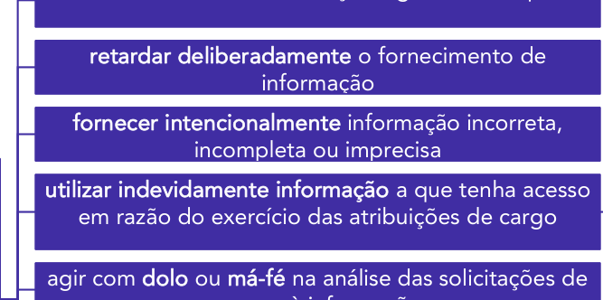

<!-- Start of picture text -->
retardar deliberadamente  o fornecimento de informação fornecer intencionalmente  informação incorreta, incompleta ou imprecisa utilizar indevidamente informação  a que tenha acesso em razão do exercício das atribuições de cargo agir com  dolo  ou  má-fé  na análise das solicitações de <!-- End of picture text -->

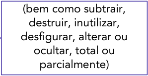

<!-- Start of picture text -->
(bem como subtrair, destruir, inutilizar, desfigurar, alterar ou ocultar, total ou parcialmente) <!-- End of picture text -->

<!-- Start of picture text -->
condutas ilícitas <!-- End of picture text -->

<!-- Start of picture text -->
agir com  dolo  ou  má-fé  na análise das solicitações de acesso à informação <!-- End of picture text -->

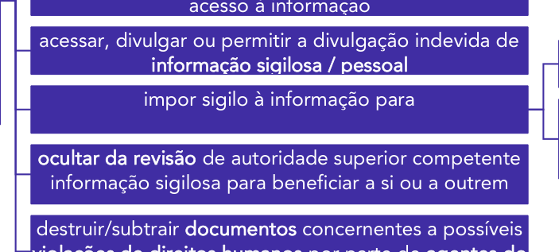

<!-- Start of picture text -->
acesso à informação acessar, divulgar ou permitir a divulgação indevida de informação sigilosa / pessoal impor sigilo à informação para ocultar da revisão  de autoridade superior competente informação sigilosa para beneficiar a si ou a outrem destruir/subtrair  documentos  concernentes a possíveis <!-- End of picture text -->

<!-- Start of picture text -->
obter proveito pessoal ou de terceiro <!-- End of picture text -->

<!-- Start of picture text -->
para fins de ocultação de ato ilegal cometido por si ou por outrem <!-- End of picture text -->

<!-- Start of picture text -->
destruir/subtrair  documentos  concernentes a possíveis violações de direitos humanos  por parte de  agentes do Estado <!-- End of picture text -->

Atendido o princípio do contraditório, da ampla defesa e do devido processo legal, as condutas acima descritas serão consideradas (art. 32, §1º): 

a) transgressões militares médias ou graves : desde que não tipificadas em lei como crime ou contravenção penal; ou 

b) infrações administrativas (nos termos da Lei 8.112): apenadas, no mínimo, com suspensão . 

Além disso, se a mesma conduta se enquadrar como ato de improbidade administrativa ou crime de responsabilidade, o agente público estará sujeito às sanções da Lei de Improbidade Administrativa ou de Crime de Responsabilidade, a depender do caso.

---

<!-- pagina: 28 -->

**Antonio Daud Aula 01** 

Notem que não apenas agentes públicos estarão sujeitos às sanções da Lei de Acesso à Informação! 

O art. 33 da LAI determina que particulares (sejam pessoas físicas ou entidades privadas) que detiverem informações em virtude de vínculo de qualquer natureza com o poder público e deixarem de observar suas regras estarão sujeitos às seguintes sanções: 

I - advertência ; 

II - multa ; 

III - rescisão do vínculo com o poder público; 

IV - suspensão temporária de participar em licitação e impedimento de contratar com a administração pública por prazo não superior a 2 (dois) anos ; e 

V - declaração de inidoneidade para licitar ou contratar com a administração pública, até que seja promovida a reabilitação perante a própria autoridade que aplicou a penalidade. 

Além disso, o legislador deixa claro que a multa pode ser aplicada juntamente com as demais penalidades, exceto com a declaração de inidoneidade (art. 33, §1º). 

Outra peculiaridade envolvendo a sanção de “declaração de inidoneidade” diz respeito à competência para sua aplicação: trata-se de competência exclusiva da autoridade máxima do órgão ou entidade pública. E, diferentemente do que temos na nova lei de licitações, aqui a suspensão temporária sujeita-se a prazo máximo de 2 anos . 

Em qualquer caso, o interessado poderá se defender, no bojo do respectivo processo, dentro do prazo de 10 dias da abertura de vista (art. 33, §3º). 

- - - - 

Além da responsabilidade dos agentes e particulares, caso a divulgação de informação sigilosa ou pessoal cause danos a terceiros , terá lugar a responsabilidade dos órgãos e entidades públicas envolvidas (art. 34). Tal responsabilidade é de natureza objetiva (isto é, independe da comprovação de dolo/culpa) e ensejará o direito de regresso contra o agente público responsável, nos termos do art. 37, §6º, da CF. 

A responsabilidade civil do Estado decorrente dos danos de divulgação sigilosa/pessoal não autorizada foi objeto da seguinte questão: 

SLU DF/Modernização da Gestão das Atividades de Resíduos Sólidos/2019 

O poder público responde diretamente pelos danos causados em decorrência da divulgação não autorizada ou utilização indevida de informações sigilosas ou informações pessoais, assegurado o direito de regresso contra o servidor responsável nos casos de dolo ou culpa. 

Gabarito (certo)

---

<!-- pagina: 29 -->

**Antonio Daud Aula 01** 

# **CONCLUSÃO** 

##### Bem, pessoal, 

O estudo da Lei de Acesso à Informação não é complexo, mas requer boa dose de memória. Em um primeiro momento, é importante que a gente “pesque” sua lógica de funcionamento e as principais regras. Na sequência, é essencial captarmos seus detalhes, ganhando importância a leitura seca do texto legal e a realização de revisões, a partir do nosso resumo. 

<mark>Adiante veremos as questões comentadas relacionadas ao tema da aula de hoje =)</mark> 

Um abraço e bons estudos, 

##### Prof. Antonio Daud 

@professordaud

---

<!-- pagina: 30 -->

**Antonio Daud Aula 01** 

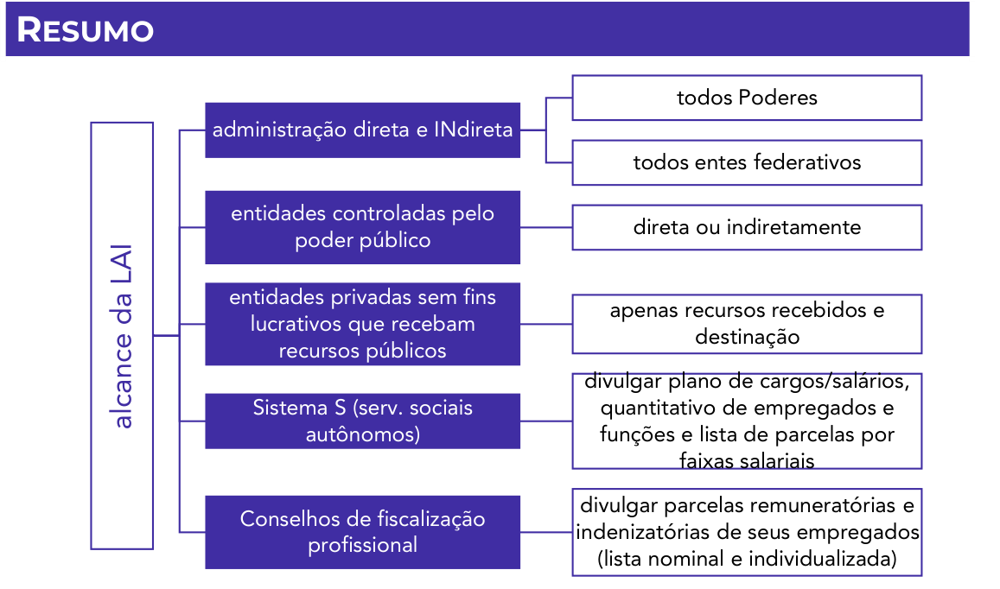

<!-- Start of picture text -->
RESUMO todos Poderes administração direta e INdireta todos entes federativos entidades controladas pelo direta ou indiretamente poder público entidades privadas sem fins apenas recursos recebidos e lucrativos que recebam destinação recursos públicos divulgar plano de cargos/salários, Sistema S (serv. sociais  quantitativo de empregados e autônomos) funções e lista de parcelas por faixas salariais divulgar parcelas remuneratórias e Conselhos de fiscalização indenizatórias de seus empregados profissional (lista nominal e individualizada) alcance da LAI <!-- End of picture text -->

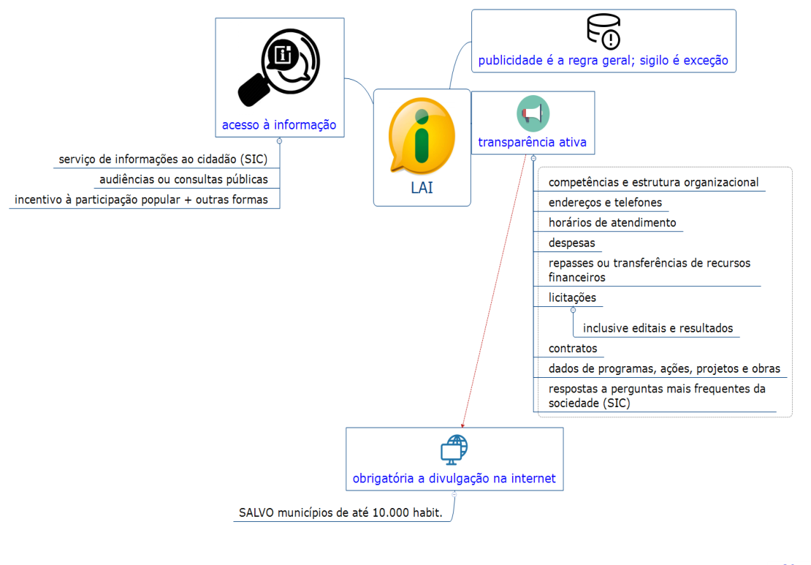

---

<!-- pagina: 31 -->

**Antonio Daud Aula 01** 

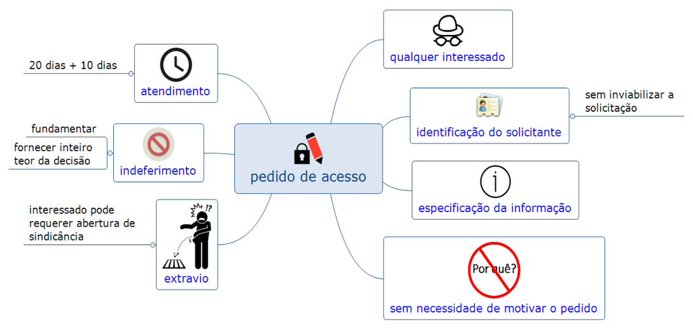

<!-- Start of picture text -->
Recursos ante a negativa do pedido (prazo de 10 dias) <!-- End of picture text -->

<!-- Start of picture text -->
CMRI CGU <!-- End of picture text -->

<!-- Start of picture text -->
Pedido indeferido <!-- End of picture text -->

Pedido Recurso indeferido hierárquico (1 ou mais)

---

<!-- pagina: 32 -->

**Antonio Daud Aula 01** 

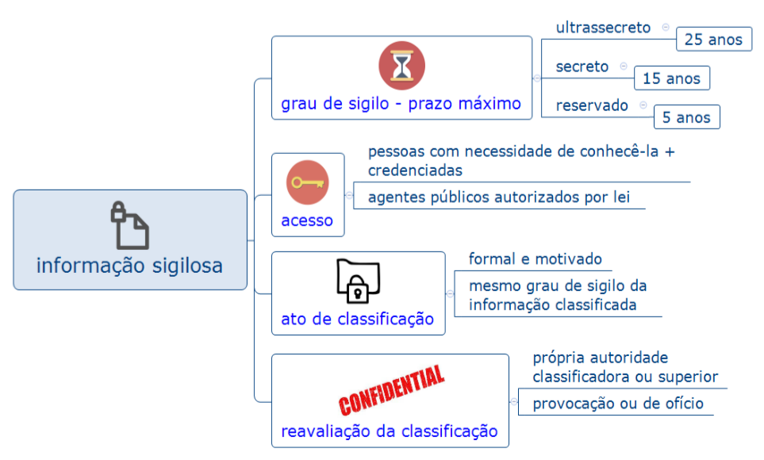

<!-- Start of picture text -->
Presidente da República + Vice <!-- End of picture text -->

<!-- Start of picture text -->
Ministros de Estado (e autoridades com mesmas prerrogativas) <!-- End of picture text -->

<!-- Start of picture text -->
ultrassecreto (25 anos) <!-- End of picture text -->

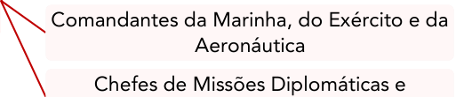

<!-- Start of picture text -->
Comandantes da Marinha, do Exército e da Aeronáutica Chefes de Missões Diplomáticas e <!-- End of picture text -->

<!-- Start of picture text -->
Chefes de Missões Diplomáticas e Consulares permanentes no exterior <!-- End of picture text -->

<!-- Start of picture text -->
competência p/ classificar o grau de sigilo <!-- End of picture text -->

<!-- Start of picture text -->
 autoridades mencionadas acima <!-- End of picture text -->

<!-- Start of picture text -->
secreto (15 anos) <!-- End of picture text -->

<!-- Start of picture text -->
titulares de autarquias, fundações públicas ou estatais <!-- End of picture text -->

<!-- Start of picture text -->
 autoridades mencionadas acima <!-- End of picture text -->

<!-- Start of picture text -->
reservado (5 anos) <!-- End of picture text -->

<!-- Start of picture text -->
autoridades que exerçam funções de direção, comando ou chefia, nível DAS 101.5, ou superior <!-- End of picture text -->

---

<!-- pagina: 33 -->

**Antonio Daud Aula 01** 

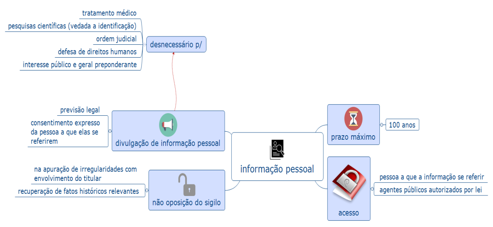

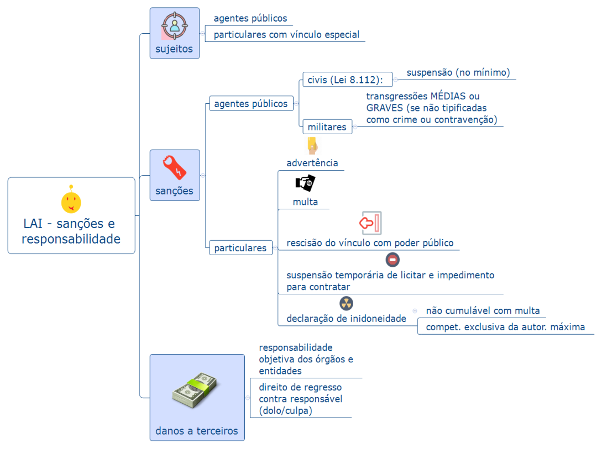

---

<!-- pagina: 34 -->

**Antonio Daud Aula 01** 

# **QUESTÕES COMENTADAS** 

##### **1. CNU – nível médio – 2025** 

Carolina, jornalista, apresentou, por meio anônimo, pedido de acesso a informações públicas atinentes à administração pública federal. Contudo, o requerimento foi negado por Cloves, autoridade administrativa competente, sob os fundamentos de que a postulação não continha a identificação da requerente, tampouco elencava os motivos determinantes da solicitação. 

Nesse cenário, considerando as disposições da Lei nº 12.527/2011, é correto afirmar que: 

(A) a negativa ao requerimento formulado por Carolina está em desconformidade com a ordem jurídica, já que a Administração Pública federal não pode exigir a identificação da requerente, tampouco a delimitação dos motivos determinantes da solicitação; 

(B) a ausência de previsão legal expressa faz com que caiba à definir, administrativa competente autoridade fundamentadamente, Os requisitos que devem ser preenchidos para que haja o acesso a informações públicas, motivo pelo qual a atuação de Cloves se deu de forma regular; 

(C) a atuação do servidor Cloves está parcialmente correta, já que o pedido de acesso a informações demanda a delimitação dos motivos determinantes da solicitação, muito embora não seja exigível a identificação da requerente; 

(D) o servidor Cloves agiu acertadamente, já que o pedido de acesso a informações públicas demanda a identificação da requerente e a delimitação dos motivos determinantes da solicitação; 

(E) o pedido de acesso a informações não exige a delimitação dos motivos determinantes da solicitação, mas pressupõe a identificação da requerente. 

**Comentários:** 

A partir da leitura dos dispositivos abaixo, percebe-se, por um lado, que o pedido da jornalista não poderia ter sido anônimo, pois o pedido deve conter a identificação do requerente. 

Por outro lado, o poder público não poderia ter exigido os motivos determinantes da solicitação: 

LAI, art. 10. Qualquer interessado poderá apresentar pedido de acesso a informações aos órgãos e entidades referidos no art. 1º desta Lei, por qualquer meio legítimo, devendo o pedido conter a **identificação do requerente** e a especificação da informação requerida. (..) 

§ 3º São **vedadas quaisquer exigências relativas aos motivos determinantes da solicitação** de informações de interesse público. 

Dessa forma, percebe-se que a **letra (E)** está correta e as demais, incorretas. 

#### **Gabarito (E)** 

##### **2. CNU – NÍVEL SUPERIOR – 2025** 

O responsável por determinada estrutura orgânica do Poder Executivo federal constatou que o setor mantinha diversas informações que poderiam pôr em risco a segurança de familiares de altas autoridades nacionais ou estrangeiras, que estavam classificadas de maneiras distintas e com prazos diversos de proteção. Essa gestão de coisas gerou dúvida em relação à sua confidencialidade e ao cumprimento das regras legais.

---

<!-- pagina: 35 -->

**Antonio Daud Aula 01** 

Ao mensurar os balizamentos estabelecidos pela Lei nº 12.527/2011, o responsável conclui corretamente que as informações analisadas: 

(A) não são consideradas como imprescindíveis à segurança da sociedade ou do Estado, mas podem ser classificadas como reservadas; 

(B) permanecerão sob sigilo por até 25 anos caso sejam classificadas como ultrassecretas, sendo necessárias a sua reavaliação a cada lustro; 

(C) podem ser classificadas como de acesso restrito, secretas ou ultrassecretas, o que gera reflexos no prazo em que serão automaticamente de acesso público; 

(D)que possam colocar em risco a segurança do presidente da República e seus respectivos cônjuge, filhos ou dependentes serão classificadas como reservadas e ficarão sob sigilo até o término do mandato em exercício ou do último mandato, em caso de reeleição; 

(E) podem ser objeto de sigilo por até 100 anos, mediante ato fundamentado, ressalvada a existência de requisição judicial, considerando a necessidade de ponderação com outros bens e valores igualmente protegidos pela ordem constitucional ou infraconstitucional. 

**Comentários:** 

A questão se resolve pelo conhecimento do seguinte dispositivo legal: 

LAI, art. 24, § 2º As informações que puderem colocar em risco a segurança do Presidente e Vice-Presidente da República e respectivos cônjuges e filhos(as) **serão classificadas como** **<u>reservadas</u>** e ficarão sob sigilo até o término do mandato em exercício ou do último mandato, em caso de reeleição. 

Assim, podemos marcar a **letra (D)** como sendo nosso gabarito. A partir do mesmo raciocínio, percebemos que tais informações podem, sim, serem consideradas imprescindíveis à segurança da sociedade ou do Estado; o sigilo será de no máximo **5 anos** ; e não se trata de informação pessoal. 

Na **letra (B)** , note que a reavaliação “a cada lustro” significa uma nova reavaliação a cada 5 anos. 

#### **Gabarito (D)** 

##### **3. FGV/CNU – 2025** 

A Lei de Acesso à Informação (Lei n° 12.527/2011] estabelece diferentes competências para a classificação de informações sigilosas, definindo prazos e os agentes públicos autorizados a realizá-la conforme o grau de sensibilidade da informação. Destaca-se, ainda, que aquele que possui competência para aplicar prazos maiores de sigilo também pode aplicar prazos menores, conforme a necessidade. 

Durante a análise de documentos estratégicos de sua pasta, um ministro de Estado identifica determinada informação como de altíssima sensibilidade e considera necessária sua classificação no grau máximo de sigilo permitido para o seu cargo, a fim de prevenir riscos ao interesse da sociedade. 

Nessa situação, de acordo com a Lei de Acesso à Informação, o ministro poderá classificar essa informação, da forma mais restritiva permitida para a sua função, como: 

a) reservada, pelo prazo de 5 anos; 

b) secreta, pelo prazo de 15 anos;

---

<!-- pagina: 36 -->

**Antonio Daud Aula 01** 

c) secreta, pelo prazo de 20 anos; 

- d) ultrassecreta, pelo prazo de 25 anos; 

e) ultrassecreta, pelo prazo de 30 anos. 

##### **Comentários:** 

Segundo prevê o art. 27 da Lei 12.527/2011, os Ministros de Estado detêm prerrogativa para classificar em todos os 3 níveis de sigilo, inclusive no **grau ultrassecreto** . 

Art. 27. A classificação do sigilo de informações no âmbito da administração pública federal é de competência: 

I - no grau de **ultrassecreto** , das seguintes autoridades: 

- a) Presidente da República; 

- b) Vice-Presidente da República; 

- c) **Ministros de Estado** e autoridades com as mesmas prerrogativas; 

- d) Comandantes da Marinha, do Exército e da Aeronáutica; e 

- e) Chefes de Missões Diplomáticas e Consulares permanentes no exterior; 

Além disso, em tal nível de sigilo, o prazo máximo da restrição de acesso será de **25 anos** : 

Art. 24. A informação em poder dos órgãos e entidades públicas, observado o seu teor e em razão de sua imprescindibilidade à segurança da sociedade ou do Estado, poderá ser classificada como ultrassecreta, secreta ou reservada. 

- § 1º Os prazos máximos de restrição de acesso à informação, conforme a classificação prevista no caput, vigoram a partir da data de sua produção e são os seguintes: 

I - **ultrassecreta** : **25 (vinte e cinco) anos** ; 

#### **Gabarito (D)** 

##### **4. FGV/CNU – 2025** 

Considere a situação em que um cidadão comparece a um órgão da Administração Pública para solicitar o acesso a uma informação de interesse público e se surpreende ao ser informado, durante o atendimento, de que haverá cobrança pela disponibilização da informação solicitada. 

De acordo com a Lei de Acesso à Informação (Lei n° 12.527/2011), essa cobrança será considerada correta quando essa informação: 

a) exigir reprodução de documentos pelo órgão, no valor dos custos dos serviços e materiais utilizados; 

b) se referir a assuntos acerca de organismos internacionais com os quais o Brasil não mantenha relações diplomáticas, no limite de 10% dos custos de reciprocidade; 

c) tiver caráter sigiloso por colocar em risco a soberania nacional, no valor equivalente aos danos que possam decorrer de seu uso Indevido; 

d) necessitar de parecer de representante de órgão hierarquicamente superior ao órgão de origem, no valor dos honorários de sucumbência;

---

<!-- pagina: 37 -->

**Antonio Daud Aula 01** 

e) se referir a questões protegidas por direitos de patente, tendo, como referência, taxa estabelecida pelo INPI (Instituto Nacional da Propriedade Industrial). 

**Comentários:** 

Como previsto no art. 12 da Lei 12.527/2011, é possível cobrar do interessado o custo pela reprodução dos documentos que forem objeto de pedidos de acesso à informação: 

Art. 12.  O serviço de busca e de fornecimento de informação é gratuito. 

1º  O órgão ou a entidade **poderá cobrar exclusivamente o valor necessário ao ressarcimento dos custos** dos serviços e dos materiais utilizados, quando o serviço de busca e de fornecimento da informação exigir reprodução de documentos pelo órgão ou pela entidade pública consultada. 

Portanto, o gabarito está na **letra (A)** . As **demais alternativas** estão equivocadas, visto que somente será possível a cobrança nesta hipótese comentada acima (reprodução de documentos). 

#### **Gabarito (A)** 

##### **5. FGV/CNU – 2025** 

Um servidor público federal, recém-aprovado em concurso público, inicia suas atividades em um órgão da Administração Pública e assume a responsabilidade de organizar os dados custodiados pelo órgão, assegurando o cumprimento da Lei de Acesso à Informação (Lei n° 12.527/2011). 

Para desempenhar adequadamente suas atribuições, esse servidor deve se pautar nas diretrizes previstas na referida lei, atuando de forma a: 

a) promover o desenvolvimento de mecanismos de controle judicial na Administração Pública; 

b) fomentar o fortalecimento de uma cultura de diversidade no compartilhamento de informação pública; 

c) garantir o sigilo Informativo como regra, observando a publicidade apenas em casos imprescindíveis; 

d) assegurar a ocultação de informações a solicitações realizadas, mitigando riscos de vazamentos indevidos; 

e) utilizar, para facilitar o alcance da informação pública, meios de comunicação viabilizados pela tecnologia da informação. 

**Comentários:** 

Questão clássica, cobrando as diretrizes da Lei de Acesso à Informação previstas em seu art. 3º: 

Art. 3º Os procedimentos previstos nesta Lei destinam-se a assegurar o direito fundamental de acesso à informação e devem ser executados em conformidade com os princípios básicos da administração pública e com as seguintes diretrizes: 

I - observância da **publicidade** <u>como preceito geral e do sigilo como exceção;</u> 

II - divulgação de informações de interesse público, independentemente de solicitações; 

III - utilização de meios de comunicação viabilizados pela tecnologia da informação;

---

<!-- pagina: 38 -->

**Antonio Daud Aula 01** 

IV - fomento ao desenvolvimento da **cultura de transparência** na administração pública; 

V - desenvolvimento do controle **social** da administração pública. 

Examinando as alternativas, percebe-se que a **letra (E)** será nosso gabarito, sendo que as demais alternativas estão incorretas, a saber: 

- **letra (A)** : devem ser desenvolvidos mecanismos de controle **social** na Administração Pública, e não judicial; 

- **letra (B)** : o que se deve fomentar é a cultura da transparência, e não da diversidade de compartilhamento, segundo a LAI; 

- **letra (C)** : é exatamente o contrário, a publicidade é a regra geral; 

- **letra (D)** : as informações de interesse público devem ser divulgadas independentemente de solicitações. Além disso, deve-se divulgar as respostas a perguntas mais frequentes da sociedade (art. 8º, §1º, VI). 

#### **Gabarito (E)** 

##### **6. FGV/CNU – 2025** 

Determinado gestor, integrante do alto escalão da administração pública federal direta, formulou consulta à sua assessoria imediata em relação à possibilidade, ou não, de serem inseridas três ordens de informações afetas aos servidores públicos, devidamente individualizados e independentemente de prévio consentimento, no Portal da Transparência do Governo Federal. Esses dados consistiriam em: 

I. remuneração; 

II. aplicação da sanção de demissão ou de cassação de aposentadoria; e 

III. filiação a um sindicato. 

Considerando a natureza das informações Indicadas, a assessoria respondeu corretamente que: 

a) todas devem ser inseridas; 

b) apenas deve ser Inserida a informação referida em I; 

c) apenas devem ser inseridas as informações referidas em I e II; 

d) apenas devem ser inseridas as informações referidas em l e lll; 

e) apenas devem ser inseridas as informações referidas em II e III. 

**Comentários:** 

Questão interessante sobre as informações que podem ser divulgadas ostensivamente no Portal da Transparência (transparência ativa). 

- **item I** : a divulgação individualizada da remuneração dos servidores públicos é legítima, segundo prevê o Decreto 7.724/2012, art. 7º, §3º, VI, e a decisão do STF no tema 483 de repercussão geral; 

- **item II** : a divulgação nominal de servidores públicos demitidos/com aposentadoria cassada tem sido considerada legítima, tanto que foi criado o Cadastro de Expulsões da Administração Federal (CEAF), de livre consulta no site da CGU;

---

<!-- pagina: 39 -->

**Antonio Daud Aula 01** 

- **item III** : a filiação sindical é dado pessoal sensível (Lei 13.709/2018, art. 5º, II), não podendo ser divulgado abertamente pelo poder público. 

#### **Gabarito (C)** 

##### **7. CNU – NÍVEL SUPERIOR – 2025** 

Em uma cultura de acesso, os agentes públicos entendem que as informações pertencem ao cidadão. Por isso, é dever do Estado fornecê-las de forma rápida, clara e útil, para atender bem às necessidades da sociedade. 

Nesse contexto, é correto afirmar que, de acordo com a Lei de Acesso à Informação (Lei no 12.527/2011), o acesso à informação é reconhecido como um direito: 

(A) individual, baseado no princípio de que o sigilo à informação de interesse particular constitui regra fundamental; 

(B) à transparência ponderada, baseado no princípio de que a publicidade moderada da quantidade e qualidade de informações evita a desinformação entre os cidadãos; 

(C) à participação política, baseado no princípio de que a transparência ativa depende da iniciativa do cidadão para solicitar informações de interesse público; 

(D) humano fundamental, baseado no princípio de que toda pessoa deve ter a liberdade de buscar, receber e divulgar informações e ideias por quaisquer meios; 

(E) à igualdade perante a lei, baseado no princípio de que os meios físicos são canais obrigatórios e facilitadores para divulgação equitativa das iniciativas públicas. 

##### **Comentários:** 

A LAI veio regulamentar o inciso XXXIII do art. 5º da CF, que representa um direito fundamental dos cidadãos: 

CF, art. 5º, XXXIII - todos têm direito a receber dos órgãos públicos informações de seu interesse particular, ou de interesse coletivo ou geral, que serão prestadas no prazo da lei, sob pena de responsabilidade, ressalvadas aquelas cujo sigilo seja imprescindível à segurança da sociedade e do Estado; 

Assim, percebe-se que o acesso à informação é constitucionalmente reconhecido, sendo enquadrado como um **direito fundamental** . 

#### **Gabarito (D)** 

##### **8. CNU – NÍVEL SUPERIOR – 2025** 

A servidora pública Maria era responsável pela gerência de contratos de seu órgão quando uma emissora de televisão lhe solicitou acesso formal a um acordo de prestação de serviços para checagem de denúncias de malversação de recursos. Temendo o comprometimento da imagem institucional, a chefia de Maria orientou que negasse o pedido apesar de o contrato não ser classificado como sigiloso. 

Considerando a Lei de Acesso à Informação (Lei no 12.527/2011), a Política Nacional de Informação e Comunicação Pública e os princípios da Administração Pública, é correto afirmar que a conduta da chefia: 

(A) se justifica pela prerrogativa do agente público para proceder a uma análise subjetiva, dada a motivação do solicitante;

---

<!-- pagina: 40 -->

**Antonio Daud Aula 01** 

(B) limita o acesso à informação, mas preserva a autonomia decisória da Administração Pública; 

(C) encontra respaldo em critérios de oportunidade administrativa, voltados à proteção da imagem institucional; 

(D) infringe o dever de transparência passiva, pois não há base legal para negar o acesso a documento público não sigiloso; 

(E) decorre da discricionariedade do agente público para negar o acesso baseado em diretrizes internas de preservação da imagem institucional. 

**Comentários:** 

A análise dos pedidos de acesso à informação não pode ser subjetiva, ou respaldada em critérios de oportunidade. O agente público tem o dever de fornecer informações solicitadas que não estejam classificadas como sigilosas, não havendo “autonomia decisória”. A conduta é vinculada! 

#### **Gabarito (D)** 

##### **9. FGV - 2025 - Auditor de Controle Externo (TCE RR)/Ciências Jurídicas** 

Depois de verificar as definições relacionadas à qualidade da informação no âmbito da Lei nº 12.527/2011, Neusa constatou que, entre elas, existe aquela condizente com a informação coletada na fonte, com o máximo de detalhamento possível, sem modificações e outra atinente à informação não modificada, inclusive quanto à origem, trânsito e destino. 

Nesse contexto, tais qualidades correspondem, respectivamente, 

A a primariedade e a integridade. 

B a disponibilidade e a autenticidade. 

C a integridade e a disponibilidade. 

D a autenticidade e a primariedade. 

E a essencialidade e a autenticidade. 

**Comentário** 

A **letra (A)** está correta. As definições apresentadas no enunciado correspondem exatamente aos conceitos de **primariedade** e **integridade** , respectivamente. A primariedade se refere à qualidade da informação coletada diretamente na fonte, sem alterações e com o máximo de detalhes, enquanto a integridade garante que a informação não foi modificada ao longo de seu trânsito, conforme estabelece o Art. 4º, incisos IX e VIII, da Lei nº 12.527/2011. 

Quanto à **letra (B)** , incorreta, lembro que a disponibilidade é a qualidade da informação que pode ser conhecida e utilizada por quem tem autorização, e a autenticidade é a qualidade da informação que foi produzida ou alterada por um indivíduo ou sistema identificado, segundo o Art. 4º, incisos VI e VII, da Lei nº 12.527/2011. 

Quanto à **letra (E)** , destaco que o termo "essencialidade" não é definido como uma qualidade da informação no rol do Art. 4º da Lei nº 12.527/2011. 

#### **Gabarito (A)** 

##### **10. FGV - 2025 - Técnico Administrativo (TCE-RR)**

---

<!-- pagina: 41 -->

**Antonio Daud Aula 01** 

Conforme o disposto na Lei nº 12.527/2011, conhecida como Lei de Acesso à Informação (LAI), a qualidade da informação coletada na fonte, com o máximo de detalhamento possível, sem modificações, relaciona-se com o conceito de 

A disponibilidade. 

B integridade. 

C primariedade. 

D autenticidade. 

E atualidade. 

##### **Comentário** 

A **letra (C)** está correta. O conceito de primariedade corresponde exatamente à qualidade da informação coletada na fonte, com o máximo de detalhamento possível e sem modificações, como define expressamente o Art. 4º, IX, da Lei nº 12.527/2011. 

"Art. 4º Para os efeitos desta Lei, considera-se: (..) IX - primariedade: qualidade da informação coletada na fonte, com o máximo de detalhamento possível, sem modificações." 

#### **Gabarito (C)** 

##### **11. FGV - 2025 - Assistente Administrativo (EBSERH)** 

Ao estudar a Lei nº 12.527/2011 (Lei de Acesso à Informação), Matilde verificou que os procedimentos previstos na mencionada norma se destinam a assegurar o direito fundamental de acesso à informação e devem ser executados de acordo com as diretrizes nela elencadas. 

Nesse cenário, assinale a opção que indica corretamente uma das aludidas diretrizes. 

A Limitação do controle social da Administração Pública. 

B Fomento ao desenvolvimento da cultura de transparência na Administração Pública. 

C Vedação de utilização de meios de comunicação viabilizados pela tecnologia da informação. 

D Divulgação de informações de interesse público apenas nas hipóteses em que haja solicitação. 

E Observância da publicidade como preceito geral, sendo certo que o sigilo não pode ser considerado exceção. 

##### **Comentário** 

A **letra (A)** está incorreta. A diretriz legal é o desenvolvimento do controle social da Administração Pública, e não a sua limitação: 

"Art. 3º Os procedimentos previstos nesta Lei destinam-se a assegurar o direito fundamental de acesso à informação e devem ser executados em conformidade com os princípios básicos da administração pública e com as seguintes diretrizes: (..) V - desenvolvimento do controle social da administração pública." 

A **letra (B)** está correta. De fato, o **fomento ao desenvolvimento da cultura de transparência** na Administração Pública é uma das diretrizes expressamente elencadas para a execução dos procedimentos da Lei de Acesso à Informação, conforme o Art. 3º, IV, da Lei nº 12.527/2011.

---

<!-- pagina: 42 -->

**Antonio Daud Aula 01** 

"Art. 3º Os procedimentos previstos nesta Lei destinam-se a assegurar o direito fundamental de acesso à informação e devem ser executados em conformidade com os princípios básicos da administração pública e com as seguintes diretrizes: (..) IV - fomento ao desenvolvimento da cultura de transparência na administração pública;" 

A **letra (C)** está incorreta. A lei estabelece como diretriz a utilização de meios de comunicação viabilizados pela tecnologia da informação, e não a sua vedação, como dispõe o Art. 3º, III, da Lei nº 12.527/2011. 

"Art. 3º Os procedimentos previstos nesta Lei destinam-se a assegurar o direito fundamental de acesso à informação e devem ser executados em conformidade com os princípios básicos da administração pública e com as seguintes diretrizes: (..) III - utilização de meios de comunicação viabilizados pela tecnologia da informação;" 

A **letra (D)** está incorreta. A diretriz é a divulgação de informações de interesse público **independentemente de solicitações** , promovendo a transparência ativa, e não apenas mediante provocação, segundo o Art. 3º, II, da Lei nº 12.527/2011. 

"Art. 3º Os procedimentos previstos nesta Lei destinam-se a assegurar o direito fundamental de acesso à informação e devem ser executados em conformidade com os princípios básicos da administração pública e com as seguintes diretrizes: (..) II - divulgação de informações de interesse público, independentemente de solicitações;" 

A **letra (E)** está incorreta. A diretriz é a observância da publicidade como preceito geral e do sigilo como exceção. A alternativa erra ao afirmar que o sigilo não pode ser considerado exceção, contrariando o Art. 3º, I, da Lei nº 12.527/2011. 

"Art. 3º Os procedimentos previstos nesta Lei destinam-se a assegurar o direito fundamental de acesso à informação e devem ser executados em conformidade com os princípios básicos da administração pública e com as seguintes diretrizes: I - observância da publicidade como preceito geral e do sigilo como exceção;" 

#### **Gabarito (B)** 

##### **12. FGV - 2025 - Analista Judiciário (TRT 24ª Região)/Administrativa/Contabilidade** 

De acordo com a Lei de Acesso à Informação (Lei nº 12.527/2011), informação sigilosa é aquele submetida temporariamente à restrição de acesso público devido à(ao) 

A sua abrangência nacional. 

B seu alto custo de obtenção. 

C sua associação com pessoas influentes no país. 

D sua importância e destaque na econômica nacional. 

E sua imprescindibilidade para a segurança da sociedade e do Estado. 

##### **Comentário** 

A **letra (A)** está incorreta. A abrangência nacional da informação não é, por si só, um critério para a imposição de sigilo.

---

<!-- pagina: 43 -->

**Antonio Daud Aula 01** 

A **letra (B)** está incorreta. O custo de obtenção da informação também não é fundamento legal para a restrição de seu acesso público. 

A **letra (C)** está incorreta. A associação com pessoas influentes não constitui o critério legal para a classificação de uma informação como sigilosa, que se baseia na segurança da sociedade e do Estado. 

A **letra (D)** está incorreta. Embora a economia nacional possa estar relacionada à segurança do Estado, o critério legal para o sigilo é a imprescindibilidade para a segurança da sociedade e do Estado de forma mais ampla, e não apenas a importância econômica. 

A **letra (E)** está correta. A definição legal de informação sigilosa é precisamente aquela submetida temporariamente à restrição de acesso público em razão de sua imprescindibilidade para a segurança da sociedade e do Estado, conforme o Art. 4º, III, da Lei nº 12.527/2011. 

"Art. 4º Para os efeitos desta Lei, considera-se: (..) III - informação sigilosa: aquela submetida temporariamente à restrição de acesso público em razão de sua imprescindibilidade para a segurança da sociedade e do Estado;" 

#### **Gabarito (E)** 

##### **13. FGV - 2025 - Juiz Federal (TRF 3ª Região)** 

Assinale a alternativa correta: 

A O direito de acesso à informação deve ser executado em conformidade com as seguintes diretrizes, dentre outras: observância da publicidade como preceito geral e do sigilo como exceção; desenvolvimento do controle social da administração pública e utilização de meios de co municação viabilizados pela tecnologia da informação. 

B É facultado aos órgãos e entidades públicas promover, independentemente de requerimentos, a divulgação em local de fácil acesso, no âmbito de suas competências, de informações de interesse coletivo ou geral por eles produzidas ou custodiadas. 

C Qualquer interessado poderá apresentar pedido de acesso a informações, por qualquer meio legítimo, devendo o pedido conter a identificação do requerente, a especificação da informação requerida e os motivos determinantes da solicitação. 

D O direito de acesso à informação é a faculdade de obter informação custodiada pelo Poder Público, pelos meios e nos modos em que a informação esteja mantida. 

E O direito de acesso à informação sobre projetos públicos de pesquisa e desenvolvimento científicos ou tecnológicos é amplo e irrestrito. 

##### **Comentário** 

A **letra (A)** está correta. A alternativa descreve corretamente três das diretrizes previstas na Lei de Acesso à Informação, que são a observância da publicidade como preceito geral e do sigilo como exceção, o desenvolvimento do controle social da administração pública e a utilização de meios de comunicação viabilizados pela tecnologia da informação, conforme o Art. 3º, incisos I, V e III, da Lei nº 12.527/2011. 

"Art. 3º Os procedimentos previstos nesta Lei destinam-se a assegurar o direito fundamental de acesso à informação e devem ser executados em conformidade com os princípios básicos da administração pública e com as seguintes diretrizes: I - observância da publicidade como preceito geral e do sigilo como exceção; (..)

---

<!-- pagina: 44 -->

**Antonio Daud Aula 01** 

III - utilização de meios de comunicação viabilizados pela tecnologia da informação; (..) V - desenvolvimento do controle social da administração pública." 

A **letra (B)** está incorreta. A divulgação de informações de interesse coletivo, independentemente de requerimentos, não é uma faculdade, mas sim um dever dos órgãos e entidades públicas, de acordo com o Art. 8º, caput, da Lei nº 12.527/2011. 

"Art. 8º É dever dos órgãos e entidades públicas promover, independentemente de requerimentos, a divulgação em local de fácil acesso, no âmbito de suas competências, de informações de interesse coletivo ou geral por eles produzidas ou custodiadas." 

A **letra (C)** está incorreta. O pedido de acesso à informação não precisa conter os motivos determinantes da solicitação, sendo vedada qualquer exigência nesse sentido, conforme o Art. 10, § 3º, da Lei nº 12.527/2011. 

"Art. 10. (..) § 3º São vedadas quaisquer exigências relativas aos motivos determinantes da solicitação de informações de interesse público." 

A **letra (D)** está incorreta. A definição apresentada é excessivamente restritiva. O direito de acesso à informação é mais amplo, compreendendo diversos direitos, como o de obter informação primária, íntegra, autêntica e atualizada, e não se limita aos meios e modos em que a informação é mantida, conforme o Art. 7º da Lei nº 12.527/2011. 

"Art. 7º O acesso à informação de que trata esta Lei compreende, entre outros, os direitos de obter: (..) IV - informação primária, íntegra, autêntica e atualizada;" 

A **letra (E)** está incorreta. O direito de acesso à informação não é amplo e irrestrito, pois a própria lei estabelece o sigilo como exceção, além de não excluir outras hipóteses legais de sigilo, como o segredo industrial, conforme o Art. 3º, I, e o Art. 22 da Lei nº 12.527/2011. 

"Art. 3º (..) I - observância da publicidade como preceito geral e do sigilo como exceção; (..) Art. 22. O disposto nesta Lei não exclui as demais hipóteses legais de sigilo e de segredo de justiça nem as hipóteses de segredo industrial decorrentes da exploração direta de atividade econômica pelo Estado ou por pessoa física ou entidade que tenha qualquer vínculo com o poder público." 

#### **Gabarito (A)** 

##### **14. FGV - 2025 - Analista do Ministério Público da União/Arquivologia** 

A lei de acesso à informação determina alguns procedimentos para a garantia do acesso à informação. 

Se o cidadão necessita de informações sobre execução orçamentária e financeira detalhada de um determinado órgão do Poder Executivo federal, a lei determina que ele tenha acesso a essa informação por meio de: 

A sítios da internet; 

B formulário eletrônico; 

C solicitação por e-mail; 

D murais no setor financeiro;

---

<!-- pagina: 45 -->

**Antonio Daud Aula 01** 

E requerimento no protocolo. 

##### **Comentário** 

A **letra (A)** está correta. A Lei de Acesso à Informação determina que é dever dos órgãos públicos promover a divulgação de informações de interesse coletivo, como a execução orçamentária e financeira, sendo obrigatória a divulgação em sítios oficiais da rede mundial de computadores (internet), como regra geral, conforme o Art. 8º, § 2º, da Lei nº 12.527/2011. 

"Art. 8º (..) § 2º Para cumprimento do disposto no caput, os órgãos e entidades públicas deverão utilizar todos os meios e instrumentos legítimos de que dispuserem, sendo obrigatória a divulgação em **sítios oficiais da rede mundial de computadores** (internet)." 

#### **Gabarito (A)** 

##### **15. FGV - 2025 - Auditor Público Interno (CGM Cuiabá)** 

A Lei de Acesso à Informação (LAI) garante o direito de solicitar informações públicas, e, em caso de indeferimento ou negativa de acesso, o interessado pode interpor recurso no prazo de 10 dias a contar de sua ciência. 

O procedimento a ser seguido pelo requerente em caso de indeferimento de um pedido de desclassificação de informações em um órgão da administração pública federal, é: 

A O requerente pode recorrer diretamente à Comissão Mista de Reavaliação de Informações sem passar por outras autoridades. 

B O recurso deve ser encaminhado ao Ministro de Estado da área após ter sido submetido a, pelo menos, uma autoridade hierarquicamente superior àquela que tomou a decisão impugnada, exceto no caso das Forças Armadas, onde o recurso deve ser dirigido diretamente ao Comando. 

C O requerente pode recorrer diretamente ao Presidente da República após o indeferimento da desclassificação de informações secretas ou ultrassecretas. 

D Não há necessidade de submeter o recurso à apreciação de uma autoridade superior antes de recorrer ao Ministro de Estado. 

E Em caso de indeferimento, o requerente só pode recorrer à Comissão Mista de Reavaliação de Informações se a informação for classificada como sigilosa. 

##### **Comentário** 

A **letra (B)** está correto, pois o procedimento requer a prévia interposição do recurso à autoridade hierarquicamente superior àquela que proferiu a decisão, antes de se submeter o pedido ao Ministro de Estado: 

Art. 17. No caso de indeferimento de pedido de desclassificação de informação protocolado em órgão da administração pública federal, poderá o requerente recorrer ao Ministro de Estado da área, sem prejuízo das competências da Comissão Mista de Reavaliação de Informações, previstas no art. 35, e do disposto no art. 16. 

Art. 17, § 1º O recurso previsto neste artigo somente poderá ser dirigido às autoridades mencionadas depois de submetido à apreciação de pelo menos uma autoridade hierarquicamente superior à autoridade que exarou a decisão impugnada e, no caso das Forças Armadas, ao respectivo Comando.

---

<!-- pagina: 46 -->

**Antonio Daud Aula 01** 

Quanto à **letra (A)** , incorreta, lembro que o recurso à Comissão Mista de Reavaliação de Informações (CMRI) não é a primeira instância recursal no caso de indeferimento de pedido de desclassificação, podendo ocorrer somente após ter sido tentado o recurso à CGU: 

Art. 16, § 3º Negado o acesso à informação pela Controladoria-Geral da União, poderá ser interposto recurso à Comissão Mista de Reavaliação de Informações, a que se refere o art. 35. 

#### **Gabarito (B)** 

##### **16. FGV - 2025 - Advogado (EBSERH)** 

Imagine uma situação em que certa empresa pública não esteja promovendo a transparência ativa de suas informações, na medida em que não está veiculando dados que são de interesse público e que não estão abarcadas pelo sigilo. 

Caso seja apresentado, por determinado interessado, pedido de acesso a tais informações, à luz do disposto na Lei nº 12.527/2011 (Lei de Acesso à Informação), assinale a afirmativa correta. 

A O deferimento do acesso às informações em análise depende da indicação dos motivos determinantes para a sua obtenção. 

B A mencionada empresa pública não tem a obrigação de fornecer as informações em questão, em decorrência de sua personalidade jurídica de direito privado. 

C A norma em comento impõe a proteção das informações pela aludida entidade administrativa, mas não a sua disponibilidade, autenticidade e integridade. 

D O pedido de acesso a tais informações pelo mencionado interessado deverá conter a identificação do requerente e a especificação da informação requerida. 

E A referida entidade administrativa pode impor exigências para que o requerente tenha acesso às informações em comento, ainda que tais exigências possam inviabilizar a sua solicitação. 

##### **Comentário** 

A **letra (A)** está incorreta. É vedado exigir que o solicitante informe os motivos para o seu pedido de acesso à informação, conforme dispõe o Art. 10, § 3º, da Lei nº 12.527/2011. 

"Art. 10. (..) § 3º São vedadas quaisquer exigências relativas aos motivos determinantes da solicitação de informações de interesse público." 

A **letra (B)** está incorreta. As empresas públicas, embora possuam personalidade jurídica de direito privado, estão sujeitas ao regime da Lei de Acesso à Informação, conforme o parágrafo único do Art. 1º da Lei nº 12.527/2011. 

"Art. 1º (..) Parágrafo único. Subordinam-se ao regime desta Lei: I - os órgãos públicos integrantes da administração direta dos Poderes Executivo, Legislativo, incluindo as Cortes de Contas, e Judiciário e do Ministério Público; II - as autarquias, as fundações públicas, as empresas públicas, as sociedades de economia mista e demais entidades controladas direta ou indiretamente pela União, Estados, Distrito Federal e Municípios." 

A **letra (C)** está incorreta. É dever do Estado garantir não apenas a proteção, mas também a disponibilidade, a autenticidade e a integridade das informações, como estabelece o Art. 6º, III, da Lei nº 12.527/2011.

---

<!-- pagina: 47 -->

**Antonio Daud Aula 01** 

"Art. 6º Cabe aos órgãos e entidades do poder público, observadas as normas e procedimentos específicos aplicáveis, assegurar a: (..) III - proteção da informação, garantindo-se sua disponibilidade, autenticidade e integridade; e" 

A **letra (D)** está correta. O pedido de acesso à informação deve conter a identificação do requerente e a especificação da informação desejada, conforme o Art. 10, § 1º, da Lei nº 12.527/2011. 

"Art. 10. (..) § 1º O pedido de acesso à informação deverá conter a identificação do requerente e a especificação da informação requerida." 

A **letra (E)** está incorreta. A entidade não pode impor exigências que inviabilizem a solicitação de acesso à informação, de acordo com o Art. 10, § 2º, da Lei nº 12.527/2011. 

"Art. 10. (..) § 2º Para o acesso a informações de interesse público, a identificação do requerente não pode conter exigências que inviabilizem a solicitação." 

#### **Gabarito (D)** 

##### **17. FGV - 2025 - Analista do Ministério Público da União** 

A Lei de Acesso à Informação (LAI), Lei nº 12.527/2011, é um importante passo rumo à transparência e à eficácia da comunicação de interesse público, na medida em que: 

A não pode ser classificada nenhuma informação como reservada, secreta ou ultrassecreta a menos que requerida por jornalistas; 

B obriga os órgãos governamentais a fornecerem a informação requerida, desde que o requerente identifique a finalidade e o motivo da solicitação; 

C indica que o requerente seja informado sobre a possibilidade de recurso, prazos e condições para sua interposição em caso de negativa de acesso à informação solicitada; 

D estabelece prazos curtos para o sigilo da informação, cabendo o de 100 anos apenas para documentos referentes aos resultados de planos econômicos na esfera federal; 

E deve ser negado o acesso à informação apenas em situações específicas, tais como o acesso às estatísticas relativas ao indeferimento de pedidos de informação via LAI. 

##### **Comentário** 

A **letra (A)** está incorreta. A classificação de informações como reservada, secreta ou ultrassecreta é um ato de competência de autoridades públicas específicas, listadas no Art. 27 da Lei nº 12.527/2011, e não depende de requerimento de jornalistas. 

"Art. 27. A classificação do sigilo de informações no âmbito da administração pública federal é de competência: (..) I - no grau de ultrassecreta, das seguintes autoridades: a) Presidente da República; b) Vice-Presidente da República; (..)" 

A **letra (B)** está incorreta. A lei veda que se exija do requerente a apresentação de finalidade ou motivo para a solicitação de informação de interesse público, conforme o Art. 10, § 3º, da Lei nº 12.527/2011. 

"Art. 10. (..) § 3º São vedadas quaisquer exigências relativas aos motivos determinantes da solicitação de informações de interesse público."

---

<!-- pagina: 48 -->

**Antonio Daud Aula 01** 

A **letra (C)** está correta. Em caso de negativa de acesso, o órgão deve informar ao requerente sobre seu direito de recorrer, incluindo prazos e a autoridade competente para julgar o recurso: 

Art. 11, § 4º Quando não for autorizado o acesso por se tratar de informação total ou parcialmente sigilosa, o requerente deverá ser informado sobre a possibilidade de recurso, prazos e condições para sua interposição, devendo, ainda, ser-lhe indicada a autoridade competente para sua apreciação. 

A **letra (D)** está incorreta. O prazo de sigilo de 100 anos aplica-se a informações pessoais, e não a planos econômicos. Os prazos de classificação são de até 5 anos (reservada), 15 anos (secreta) e 25 anos (ultrassecreta), conforme os artigos 24 e 31 da Lei nº 12.527/2011. 

"Art. 24. (..) § 1º Os prazos máximos de restrição de acesso à informação, conforme a classificação prevista no caput e no seu § 1º, vigoram a partir da data de sua produção e são os seguintes: I - ultrassecreta: 25 (vinte e cinco) anos; II - secreta: 15 (quinze) anos; e III - reservada: 5 (cinco) anos." "Art. 31. (..) § 1º As informações pessoais, a que se refere este artigo, relativas à intimidade, vida privada, honra e imagem: I - terão seu acesso restrito, independentemente de classificação de sigilo e pelo prazo máximo de 100 (cem) anos a contar da sua data de produção, a agentes públicos legalmente autorizados e à pessoa a que elas se referirem; (..)" 

A **letra (E)** está incorreta. As estatísticas relativas ao cumprimento da LAI, incluindo o número de pedidos indeferidos, são informações de divulgação obrigatória, inclusive proativamente, e não podem ser negadas: 

Art. 30. A autoridade máxima de cada órgão ou entidade publicará, anualmente, em sítio à disposição na internet e destinado à veiculação de dados e informações administrativas, nos termos de regulamento: 

I - rol das informações que tenham sido desclassificadas nos últimos 12 (doze) meses; 

II - rol de documentos classificados em cada grau de sigilo, com identificação para referência futura; 

**III - relatório estatístico contendo a quantidade de pedidos de informação recebidos, atendidos e indeferidos, bem como informações genéricas sobre os solicitantes.** 

#### **Gabarito (C)** 

##### **18. FGV - 2025 - Técnico da Defensoria Pública (DPE RO)/Técnico Administrativo** 

Teófilo, cidadão brasileiro naturalizado, pediu acesso a um parecer técnico junto a um órgão do Poder Executivo Federal, mas recebeu uma negativa sem uma justificativa razoável. Inconformado com a decisão, ele quer recorrer para garantir seu direito de acesso à informação e entender como funciona o processo para apresentar o recurso e quais instâncias podem analisá-lo. 

Nesse sentido, assinale a opção correta em relação ao prazo e a instância 

A 5 dias, sendo encaminhado diretamente à Controladoria Geral da União (CGU); 

B 10 dias, direcionado à autoridade hierarquicamente superior à que indeferiu o pedido;

---

<!-- pagina: 49 -->

**Antonio Daud Aula 01** 

C 15 dias, recorrendo à Comissão Mista de Reavaliação de Informações; 

D 20 dias, representando diretamente ao Poder Judiciário; 

E 30 dias, solicitando reconsideração à mesma autoridade que negou o pedido. 

##### **Comentário** 

A **letra (A)** está incorreta. O prazo para o recurso é de 10 dias, não de 5, e ele não é encaminhado diretamente à Controladoria-Geral da União (CGU), que funciona como uma instância recursal posterior no Poder Executivo Federal, conforme os artigos 15 e 16 da Lei nº 12.527/2011. 

"Art. 15. No caso de indeferimento de acesso a informações (..) poderá o interessado interpor recurso contra a decisão no prazo de 10 (dez) dias a contar da sua ciência." "Art. 16. Negado o acesso a informação pelos órgãos ou entidades do Poder Executivo Federal, o requerente poderá recorrer à Controladoria-Geral da União (..)" 

A **letra (B)** está correta. No caso de indeferimento do pedido de acesso, o interessado pode recorrer no prazo de 10 dias, e o recurso deve ser direcionado à autoridade hierarquicamente superior àquela que proferiu a decisão, conforme o Art. 15 da Lei nº 12.527/2011. 

"Art. 15. No caso de indeferimento de acesso a informações ou às razões da negativa do acesso, poderá o interessado interpor recurso contra a decisão no prazo de 10 (dez) dias a contar da sua ciência. Parágrafo único. O recurso será dirigido à autoridade hierarquicamente superior à que exarou a decisão impugnada, que deverá se manifestar no prazo de 5 (cinco) dias." 

A **letra (C)** está incorreta. O prazo para recurso é de 10 dias, não 15, e a Comissão Mista de Reavaliação de Informações é a última instância recursal administrativa para casos específicos de informações classificadas, não a primeira instância, de acordo com os artigos 15 e 16 da Lei nº 12.527/2011. 

"Art. 15. No caso de indeferimento de acesso a informações (..) poderá o interessado interpor recurso contra a decisão no prazo de 10 (dez) dias a contar da sua ciência." 

A **letra (D)** está incorreta. O prazo para o recurso administrativo é de 10 dias, e não 20. A via judicial pode ser utilizada, mas a lei prevê um procedimento recursal administrativo que deve ser observado. O prazo de 20 dias refere-se ao tempo que o órgão tem para responder à solicitação inicial, conforme o Art. 11 da Lei nº 12.527/2011. 

"Art. 11. (..) § 1º Caso não seja possível conceder o acesso imediato, na forma do disposto no caput, o órgão ou entidade que receber o pedido deverá, em prazo não superior a 20 (vinte) dias: (..)" 

A **letra (E)** está incorreta. O prazo para o recurso é de 10 dias, não 30. O recurso não é um pedido de reconsideração à mesma autoridade, mas sim uma apelação a uma autoridade superior, conforme o Art. 15 da Lei nº 12.527/2011. 

"Art. 15. (..) Parágrafo único. O recurso será dirigido à autoridade hierarquicamente superior à que exarou a decisão impugnada (..)" 

#### **Gabarito (B).**

---

<!-- pagina: 50 -->

**Antonio Daud Aula 01** 

##### **19. FGV - 2025 - Técnico Administrativo (TCE-RR)** 

Considerando que o Estado deve proteger informações cujo acesso possa colocar em risco a segurança do Estado ou da sociedade, a Lei de Acesso à Informação (LAI) prevê diferentes níveis de sigilo e define as autoridades competentes para classificá-las. 

Nesse caso, tais informações são qualificadas como 

A reservadas, com restrição de acesso por até 10 anos, podendo ser classificadas pelo Vice-Presidente da República. 

B reservadas, com restrição de acesso por até 15 anos, podendo ser classificadas pelo comandante das Forças Armadas. 

C secretas, com restrição de acesso por até 15 anos, podendo ser classificadas por titular de autarquia federal. 

D secretas, com restrição de acesso por até 20 anos, podendo ser classificadas por servidor com cargo de direção ou assessoramento em Ministério. 

E ultrassecretas, com restrição de acesso por até 25 anos, podendo ser classificadas por Diretor de Sociedade de Economia Mista. 

##### **Comentário** 

As **letras (A)** e **(B)** estão incorretas. O prazo de sigilo para informações reservadas é de até 5 anos. 

A **letra (C)** está correta. Informações secretas têm prazo de restrição de acesso de até 15 anos e podem ser classificadas por titulares de autarquia federal, conforme os artigos 24, § 1º, II, e 27, II, 'b', da Lei nº 12.527/2011. 

"Art. 24. (..) § 1º (..) II - secreta: 15 (quinze) anos;" "Art. 27. (..) II - no grau de secreto, das seguintes autoridades: (..) b) titulares de autarquias, fundações ou empresas públicas e sociedades de economia mista." 

A **letra (D)** está incorreta. O prazo de sigilo para informações secretas é de até 15 anos, e não 20 anos, conforme o Art. 24, § 1º, II, da Lei nº 12.527/2011. 

A **letra (E)** está incorreta. A competência para classificar informações como ultrassecretas, cujo prazo de sigilo é de até 25 anos, é restrita às mais altas autoridades da República, como o Presidente, Vice-Presidente e Ministros de Estado, não sendo extensível, segundo a literalidade da LAI, a Diretores de Sociedades de Economia Mista, conforme o Art. 27, I, da Lei nº 12.527/2011. 

"Art. 27. A classificação do sigilo de informações no âmbito da administração pública federal é de competência: I - no grau de ultrassecreta, das seguintes autoridades: a) Presidente da República; b) Vice-Presidente da República; c) Ministros de Estado e autoridades com as mesmas prerrogativas; d) Comandantes da Marinha, do Exército e da Aeronáutica; e e) chefes de Missões Diplomáticas e Consulares permanentes no exterior." 

#### **Gabarito (C)** 

##### **20. FGV - 2025 - Analista Administrativo (EBSERH)/Publicidade e Propaganda** 

Os procedimentos previstos na Lei nº 12.527, de 2011, têm como uma de suas diretrizes a observância da publicidade como preceito geral e do sigilo como exceção.

---

<!-- pagina: 51 -->

**Antonio Daud Aula 01** 

Contudo, a Lei de Acesso à Informação prevê que a informação em poder dos órgãos e entidades públicas, observado o seu teor e em razão de sua imprescindibilidade à segurança da sociedade ou do Estado, poderá ser classificada como 

A ultrassecreta, com prazo máximo de restrição de acesso de 100 anos, a partir da data de sua produção. 

B reservada, com prazo máximo de restrição de acesso de 20 anos, a partir da data de sua produção. 

C secreta, com prazo máximo de restrição de acesso de 15 anos, a partir da data de sua produção. 

D pessoal, com prazo máximo de restrição de acesso de 50 anos, a partir da data de sua produção. 

E sigilosa, com prazo máximo de restrição de acesso de 10 anos, a partir da data de sua produção. 

##### **Comentário** 

A **letra (C)** está correta. A classificação de uma informação como secreta implica um prazo máximo de restrição de acesso de 15 anos, a contar da data de sua produção, nos termos do Art. 24, § 1º, II, da Lei nº 12.527/2011. 

"Art. 24. (..) § 1º Os prazos máximos de restrição de acesso à informação (..) são os seguintes: (..) II - secreta: 15 (quinze) anos;" 

#### **Gabarito (C).** 

##### **21. FGV - 2025 - Analista Judiciário (TRT 24ª Região)/Administrativa** 

A Lei de Acesso à Informação (LAI), Lei n.° 12.527/2011, reforça o compromisso da Administração Pública com a transparência e a ética, promovendo o acesso do cidadão às informações governamentais como instrumento fundamental para o controle social e o fortalecimento da democracia. 

Assinale a opção que apresenta corretamente uma disposição das informações pessoais da LAI. 

A Informações pessoais podem ser divulgadas livremente após 10 anos, desde que não envolvam agentes públicos. 

B O acesso a informações relativas à intimidade, vida privada, honra e imagem é restrito por até 50 anos, salvo decisão judicial. 

C A divulgação de informações pessoais depende exclusivamente de ordem judicial, independentemente de consentimento da pessoa envolvida. 

D A restrição de acesso a informações pessoais pode ser utilizada para impedir investigações de irregularidades que envolvam o titular dos dados. 

E O tratamento de informações pessoais deve respeitar a intimidade e os direitos individuais, sendo vedado seu uso indevido, sob pena de responsabilização. 

##### **Comentário** 

As **letras (A)** e **(B)** estão incorretas. O acesso às informações pessoais, relativas à intimidade, vida privada, honra e imagem, possui um prazo máximo de restrição de 100 anos.

---

<!-- pagina: 52 -->

**Antonio Daud Aula 01** 

"Art. 31. (..) § 1º As informações pessoais, a que se refere este artigo, relativas à intimidade, vida privada, honra e imagem: I - terão seu acesso restrito, independentemente de classificação de sigilo e pelo prazo máximo de 100 (cem) anos a contar da sua data de produção (..)." 

A **letra (C)** está incorreta. A divulgação de informações pessoais não depende exclusivamente de ordem judicial, podendo ocorrer também com previsão legal ou consentimento expresso da pessoa a que elas se referirem, como dispõe o Art. 31, § 1º, II, da Lei nº 12.527/2011. 

"Art. 31. (..) § 1º As informações pessoais (..) I - terão seu acesso restrito (..) a agentes públicos legalmente autorizados e à pessoa a que elas se referirem; e II - poderão ter autorizada sua divulgação ou acesso por terceiros diante de previsão legal ou consentimento expresso da pessoa a que elas se referirem." 

A **letra (D)** está incorreta. A restrição de acesso à informação pessoal não pode ser invocada com o objetivo de prejudicar processos de apuração de irregularidades em que o titular das informações esteja envolvido, segundo o Art. 31, § 4º, da Lei nº 12.527/2011. 

"Art. 31. (..) § 4º A restrição de acesso à informação relativa à vida privada, honra e imagem de pessoa não poderá ser invocada com o intuito de prejudicar processo de apuração de irregularidades em que o titular das informações estiver envolvido (..)." 

A **letra (E)** está correta. A lei estabelece que o tratamento de informações pessoais deve ser feito com respeito à intimidade e demais direitos individuais, e que aquele que obtiver acesso a tais informações será responsabilizado por seu uso indevido, conforme o Art. 31, caput e § 2º, da Lei nº 12.527/2011. 

"Art. 31. O tratamento das informações pessoais deve ser feito de forma transparente e com respeito à intimidade, vida privada, honra e imagem das pessoas, bem como às liberdades e garantias individuais. (..) § 2º Aquele que obtiver acesso às informações de que trata este artigo será responsabilizado por seu uso indevido." 

#### **Gabarito (E)** 

##### **22. FGV - 2025 - Técnico da Defensoria Pública (DPE RO)/Técnico Administrativo** 

A Lei nº 12.527/2011, conhecida como Lei de Acesso à Informação (LAI), estabelece normas para garantir a transparência no acesso a informações públicas, ao mesmo tempo em que protege dados pessoais relacionados à intimidade, vida privada, honra e imagem. Essas informações possuem acesso restrito, independentemente de classificação de sigilo, pelo prazo máximo de 100 anos, sendo disponibilizadas apenas a agentes públicos legalmente autorizados e à própria pessoa a quem se referem. No entanto, a lei prevê situações específicas em que esse consentimento não é exigido. 

Com base nessa previsão legal, avalie se as situações específicas em que o consentimento não é necessário incluem: 

##### I. A defesa de direitos humanos. 

II. O cumprimento de ordem administrativa. 

III. A proteção do interesse privado preponderante.

---

<!-- pagina: 53 -->

**Antonio Daud Aula 01** 

Está correto o que se afirma em 

A I, apenas; 

B II, apenas; 

C I e II, apenas; 

D II e III, apenas; 

E I, II e III. 

##### **Comentário** 

O **item I** está correto. A Lei de Acesso à Informação prevê que o tratamento de informações pessoais pode ocorrer sem o consentimento do titular para a defesa de direitos humanos, conforme o Art. 31, § 3º, V, da Lei nº 12.527/2011. 

"Art. 31. (..) § 3º O consentimento referido no caput é dispensável nas seguintes hipóteses: (..) V - defesa de direitos humanos; (..)" 

O **item II** está incorreto. A lei não prevê o cumprimento de ordem administrativa como uma exceção à necessidade de consentimento, mas sim o cumprimento de ordem judicial, conforme o Art. 31, § 3º, II, da Lei nº 12.527/2011. 

"Art. 31. (..) § 3º O consentimento referido no caput é dispensável nas seguintes hipóteses: (..) II - cumprimento de ordem judicial; (..)" 

O **item III** está incorreto. A lei prevê como exceção a proteção do interesse público e geral preponderante, e não o interesse privado, conforme o Art. 31, § 3º, VI, da Lei nº 12.527/2011. 

"Art. 31. (..) § 3º O consentimento referido no caput é dispensável nas seguintes hipóteses: (..) VI - proteção do interesse público e geral preponderante; (..)" 

#### **Gabarito (A)** 

##### **23. FGV - 2025 - Técnico da Defensoria Pública (DPE RO)/Técnico Administrativo** 

Conforme disposto na Lei de Acesso à Informação (LAI), certas autoridades têm a competência para classificar informações no grau de sigilo ultrassecreto, assegurando a proteção de dados cuja divulgação possa representar riscos à segurança do Estado ou da sociedade. 

Com base nessa legislação, uma autoridade responsável por essa classificação é o 

A Vice-Presidente da República. 

B Subsecretário de Autarquia Pública. 

C Diretor de Agência Reguladora. 

D Dirigente de Organização Social. 

E Membro de Conselho de Fiscal de Sociedade de Economia Mista. 

##### **Comentário** 

A **letra (A)** está correta. A competência para classificar informações no grau de sigilo ultrassecreto é do Vice-Presidente da República, entre outras autoridades de mesmo nível hierárquico, de acordo com o Art. 27, § 1º, II, da Lei nº 12.527/2011.

---

<!-- pagina: 54 -->

**Antonio Daud Aula 01** 

"Art. 27. (..) § 1º A classificação do sigilo em grau ultrassecreto é de competência das seguintes autoridades: (..) II - Vice-Presidente da República;" 

#### **Gabarito (A)** 

##### **24. FGV - 2025 - Auditor do Estado (CAGE RS)** 

A Lei nº 12.527/2011, ou Lei de Acesso à Informação (LAI), estabelece diretrizes para a transparência pública. 

Com base nessa legislação, avalie as afirmações a seguir. 

I. A LAI não se aplica às empresas públicas que operam em regime de concorrência, como as estatais. 

II. Para os procedimentos de acesso à informação, o prazo máximo para resposta a um pedido realizado é de 60 dias, prorrogáveis por igual período, mediante justificativa. 

III. Qualquer pessoa, física ou jurídica, pode solicitar informações públicas, sem necessidade de apresentar justificativa para o pedido. 

IV. Informações relacionadas a direitos humanos violados são automaticamente classificadas como sigilosas por questões de segurança. 

Está correto o que se afirma em 

A I e II, apenas. 

B III e IV, apenas. 

C III, apenas. 

D I, III e IV, apenas. 

E II e IV, apenas. 

**Comentário** 

O **item I** está incorreto. A Lei de Acesso à Informação aplica-se às empresas públicas, mesmo as que operam em regime de concorrência: 

"Art. 1º (..) Parágrafo único. Subordinam-se ao regime desta Lei: (..) II - as autarquias, as fundações públicas, as empresas públicas, as sociedades de economia mista e demais entidades controladas direta ou indiretamente pela União, Estados, Distrito Federal e Municípios." 

O **item II** está incorreto. O prazo para resposta é de até 20 dias, prorrogável por mais 10 dias. 

"Art. 11. O órgão ou entidade pública deverá autorizar ou conceder o acesso imediato à informação disponível. § 1º Não sendo possível conceder o acesso imediato (..) o órgão ou entidade que receber o pedido deverá, em prazo não superior a 20 (vinte) dias: (..) § 2º O prazo referido no § 1º poderá ser prorrogado por mais 10 (dez) dias, mediante justificativa expressa, da qual será cientificado o requerente." 

O **item III** está correto. Qualquer interessado pode apresentar pedido de acesso a informações aos órgãos e entidades, sem a necessidade de expor os motivos da solicitação, conforme o Art. 10, § 3º, da Lei nº 12.527/2011.

---

<!-- pagina: 55 -->

**Antonio Daud Aula 01** 

"Art. 10. (..) § 3º São vedadas quaisquer exigências relativas aos motivos determinantes da solicitação de informações de interesse público." 

O **item IV** está incorreto. A lei estabelece que não poderá ser negado acesso à informação necessária à tutela judicial ou administrativa de direitos fundamentais, e as informações sobre condutas que impliquem violação dos direitos humanos não podem ser objeto de restrição de acesso, conforme Art. 21 e seu parágrafo único da Lei nº 12.527/2011. 

"Art. 21. Não poderá ser negado acesso à informação necessária à tutela judicial ou administrativa de direitos fundamentais. Parágrafo único. As informações ou documentos que versem sobre condutas que impliquem violação dos direitos humanos praticada por agentes públicos ou a mando de autoridades públicas não poderão ser objeto de restrição de acesso." 

#### **Gabarito (C)** 

##### **25. FGV/MPU/Técnico/2025** 

Nos termos da Lei nº 12.527/2011, quanto aos pedidos de acesso a informações de interesse público, é correto afirmar que: 

(A)   é dever dos órgãos e entidades do poder público viabilizar, em qualquer caso, alternativa de encaminhamento desses pedidos por meio de seus sítios oficiais na internet; 

(B)   devem conter a identificação do requerente, a especificação da informação requerida e os motivos determinantes da solicitação; 

(C)   a informação armazenada em formato digital será fornecida nesse formato, ainda que requerida em meio impresso, independentemente da anuência do requerente; 

(D)  a informação solicitada deve ser fornecida diretamente pelo órgão ou entidade, mesmo que esteja disponível ao público em meio de acesso universal; 

(E)   o serviço de busca e de fornecimento da informação será gratuito ao requerente quando exigir reprodução de documentos pelo órgão ou pela entidade pública consultada. 

##### **Comentários** 

A **letra (A)** está correta, conforme prevê o Art. 10, § 2º, da Lei n<u>o</u> 12.527/2011: 

Lei n<u>o</u> 12.527/2011, Art. 10, § 2º - Os órgãos e entidades do poder público devem viabilizar alternativa de encaminhamento de pedidos de acesso por meio de seus sítios oficiais na internet. 

A **letra (B)** está incorreta, pois são vedadas exigências relativas aos motivos determinantes da solicitação, conforme prevê o Art. 10, § 3º, da Lei ~~n~~<u>o</u> 12.527/2011: 

Lei n<u>o</u> 12.527/2011, Art. 10, § 3º - São vedadas quaisquer exigências relativas aos motivos determinantes da solicitação de informações de interesse público. 

A **letra (C)** está incorreta, pois o fornecimento da informação em formato digital, neste caso, requer anuência do requerente, conforme prevê o Art. 11, § 5º, da Lei ~~n~~<u>o</u> 12.527/2011: 

Lei ~~n~~<u>o</u> 12.527/2011, Art. 11, § 5º - A informação armazenada em formato digital será fornecida nesse formato, caso haja anuência do requerente.

---

<!-- pagina: 56 -->

**Antonio Daud Aula 01** 

A **letra (D)** está incorreta. Caso a informação esteja em meio de acesso universal, não há obrigatoriedade para fornecimento direto da informação, mas sim será informado ao requerente, por escrito, o lugar e a forma pela qual se poderá consultar, obter ou reproduzir a referida informação, conforme prevê o Art. 11, § 6º, da Lei ~~n~~<u>o</u> 12.527/2011: 

Lei n<u>o</u> 12.527/2011, Art. 11, § 6º - Caso a informação solicitada esteja disponível ao público em formato impresso, eletrônico ou em qualquer outro **<u>meio de acesso universal, serão informados ao requerente, por escrito, o lugar e a forma pela qual se poderá consultar, obter ou reproduzir a referida informação</u>** , procedimento esse que desonerará o órgão ou entidade pública da obrigação de seu fornecimento direto, salvo se o requerente declarar não dispor de meios para realizar por si mesmo tais procedimentos. 

A **letra (E)** está incorreta, pois nos casos de o requerente exigir a reprodução de documentos pode haver cobrança do valor necessário ao ressarcimento dos custos dos serviços e dos materiais utilizados, conforme prevê o Art. 12, § 1º, da Lei n<u>o</u> 12.527/2011: 

Lei ~~n~~<u>o</u> 12.527/2011, Art. 12, § 1º - O órgão ou a entidade poderá **<u>cobrar exclusivamente o valor necessário ao ressarcimento dos custos dos serviços e dos materiais utilizados</u>** <u>, quando o serviço de busca e de fornecimento da</u> informação **<u>exigir reprodução de documentos</u>** pelo órgão ou pela entidade pública consultada. 

#### **Gabarito (A)** 

##### **26. FGV/CGM Cuiabá – 2025 (adaptada)** 

Ao compulsar a Lei de acesso à Informação, Gilmara verificou corretamente que: 

(A)  As informações ou documentos que versem sobre condutas que impliquem violação dos direitos humanos, praticada por agentes públicos ou a mando de autoridades públicas, não poderão ser objeto de restrição de acesso. 

(B)  O prazo máximo e restrição de informação que for considerada secreta é de 5 (cinco) anos e a respectiva classificação, nos termos da lei, é de competência do Prefeito Municipal, dos Secretários Municipais e dos dirigentes máximos das unidades da Administração Indireta municipal. 

(C)  O dever do Município de promover, independentemente de requerimentos, a divulgação, de forma clara e objetiva no Portal Transparência do Município, das informações de interesse coletivo ou geral, produzidas ou custodiadas pelo Poder Executivo municipal é condizente com a transparência passiva. 

(D)  É vedado o fornecimento de informações de interesse público que não estejam classificados com sigilo sem que o interessado indique os motivos determinantes da solicitação formalizada ao órgão pertinente, sendo certo que a autoridade competente pode conferir prazo para que tais justificativas sejam formalmente apresentadas. 

(E)   Os órgãos e entidades públicas respondem subsidiariamente pelos danos causados em decorrência da divulgação não autorizada ou utilização indevida de informações sigilosas ou informações pessoais, assegurado o direito de apurar responsabilidade funcional dos agentes, que respondem objetivamente pelos ilícitos elencados na norma em questão. 

**Comentários:**

---

<!-- pagina: 57 -->

**Antonio Daud Aula 01** 

Examinando a questão de acordo com a Lei 12.527/2011, vemos que a **letra (A)** está correta: 

Art. 21, Parágrafo único. As informações ou documentos que versem sobre condutas que impliquem violação dos direitos humanos praticada por agentes públicos ou a mando de autoridades públicas não poderão ser objeto de restrição de acesso. 

A **letra (B)** está incorreta, pois o prazo máximo e restrição de informação que for considerada secreta é de 15 anos (art. 24, §1º, II). 

A **letra (C)** está incorreta, pois no caso de divulgação de informações independentemente de requerimento caracteriza-se **<u>transparência ativa</u>** . 

A **letra (D)** está incorreta, pois é vedada a exigência de quaisquer motivos determinantes da solicitação de informações de interesse público: 

Art. 10, § 3º São vedadas quaisquer exigências relativas aos motivos determinantes da solicitação de informações de interesse público. 

A **letra (E)** está incorreta, pois a responsabilização é direta e não subsidiária: 

Art. 34. Os órgãos e entidades públicas respondem diretamente pelos danos causados em decorrência da divulgação não autorizada ou utilização indevida de informações sigilosas ou informações pessoais, cabendo a apuração de responsabilidade funcional nos casos de dolo ou culpa, assegurado o respectivo direito de regresso. 

#### **Gabarito (A)** 

##### **27. FGV/CVM - 2024** 

João, jornalista investigativo, ingressou com pedido de acesso à informação XYZ junto à Administração Pública Federal, sendo informado, após a observância das formalidades legais, que o pedido não poderia ser deferido, porquanto a referida informação estaria submetida a sigilo, no grau ultrassecreto. João, então, passou a analisar a legislação de regência, para verificar quais autoridades teriam competência para determinar a medida. 

Considerando esse cenário e as disposições da Lei nº 12.527/2011 (Lei de Acesso à Informação), a classificação do sigilo da informação, no grau ultrassecreto, é de competência do: 

(A) presidente da República, do vice-presidente da República, dos ministros de Estado e autoridades com as mesmas prerrogativas, dos comandantes da Marinha, do Exército e da Aeronáutica, dos chefes de missões diplomáticas e consulares permanentes no exterior e dos titulares de autarquias, fundações, empresas públicas e sociedades de economia mista, admitindo-se a delegação pela autoridade responsável a agente público, inclusive em missão no exterior, vedada a subdelegação; 

(B) presidente da República, do vice-presidente da República, dos ministros de Estado e autoridades com as mesmas prerrogativas, dos comandantes da Marinha, do Exército e da Aeronáutica e dos chefes de missões diplomáticas e consulares permanentes no exterior, admitindo-se a delegação pela autoridade responsável a agente público, inclusive em missão no exterior, vedada a subdelegação; 

(C) presidente da República, do vice-presidente da República, dos ministros de Estado e autoridades com as mesmas prerrogativas e dos titulares de autarquias, fundações, empresas

---

<!-- pagina: 58 -->

**Antonio Daud Aula 01** 

públicas e sociedades de economia mista, vedando-se a delegação pela autoridade responsável a agente público; 

(D) presidente da República, do vice-presidente da República e dos titulares de autarquias, fundações, empresas públicas e sociedades de economia mista, vedando-se a delegação pela autoridade responsável a agente público; 

(E) presidente da República e do vice-presidente da República, vedando-se a delegação pela autoridade responsável a agente público. 

##### **Comentários:** 

A competência para classificação do sigilo da informação no grau ultrassecreto é disciplinada no art. 27 da Lei nº 12.527/2011: 

- Art. 27. **A classificação do sigilo de informações** no âmbito da administração pública federal é de competência: 

- I - no grau de **ultrassecreto** , das seguintes autoridades: 

- a) Presidente da República; 

- b) Vice-Presidente da República; 

- c) Ministros de Estado e autoridades com as mesmas prerrogativas; 

- d) Comandantes da Marinha, do Exército e da Aeronáutica; e 

- e) Chefes de Missões Diplomáticas e Consulares permanentes no exterior; 

- § 1º A competência prevista nos incisos I e II, no que se refere à classificação como ultrassecreta e secreta **, poderá ser delegada pela autoridade responsável a agente público, inclusive em missão no exterior, vedada a subdelegação.** 

Confrontando as autoridades citadas com as alternativas da questão, percebe-se que a única resposta possível é a **letra (B)** . Ainda, é importante destacar que a **competência para classificação de sigilo no grau ultrassecreto e secreto pode ser delegada a agente público** , inclusive em missão no exterior, vedada a subdelegação. 

#### **Gabarito (B)** 

##### **28. FGV/TJ-AP - 2024** 

Ao estudar a Lei nº 12.527/2011 (Lei de Acesso à Informação), Elis verificou que, dentre os conceitos nela expressamente delimitados, há aquele atinente à qualidade da informação não modificada, inclusive quanto a origem, trânsito, destino, e que corresponde à definição de: 

- (A) disponibilidade; 

- (B) autenticidade; 

- (C) primariedade; 

- (D) efetividade; 

- (E) integridade. 

**Comentários:**

---

<!-- pagina: 59 -->

**Antonio Daud Aula 01** 

A **letra (A)** está incorreta, conforme Lei nº 12.527/2011, a **disponibilidade** é a qualidade da informação que pode ser conhecida e utilizada por indivíduos, equipamentos ou sistemas autorizados; 

A **letra (B)** está incorreta, conforme Lei nº 12.527/2011, a **autenticidade** é a qualidade da informação que tenha sido produzida, expedida, recebida ou modificada por determinado indivíduo, equipamento ou sistema. 

A **letra (C)** está incorreta, conforme Lei nº 12.527/2011, a **primariedade** é a qualidade da informação coletada na fonte, com o máximo de detalhamento possível, sem modificações. 

A **letra (D)** está incorreta, pois a Lei nº 12.527/2011 não define a efetividade. 

A **letra (E)** está correta, pois o enunciado da questão está de acordo com a definição de integridade disciplinada pela Lei nº 12.527/2011: 

Art. 4º, VIII - **integridade** : qualidade da informação não modificada, inclusive quanto à origem, trânsito e destino; 

#### **Gabarito (E)** 

##### **29. FGV/CÂMARA DOS DEPUTADOS – Analista - 2023** 

Caio é eleito Presidente da República Federativa do Brasil. Registre-se que Caio é casado com Joana e possui um filho, Tício, de 16 anos de idade. 

Nesse cenário, considerando as disposições da Lei nº 12.527/2001, é correto afirmar que as informações que puderem colocar em risco a segurança de Joana e de Tício serão classificadas 

(A) como secretas e reservadas, respectivamente, ficando sob sigilo até o término do mandato em exercício ou do último mandato de Caio, em caso de reeleição. 

(B) como ultrassecretas e secretas, respectivamente, ficando sob sigilo até o término do mandato em exercício ou do último mandato de Caio, em caso de reeleição. 

(C) como ultrassecretas, ficando sob sigilo até o término do mandato em exercício ou do último mandato de Caio, em caso de reeleição. 

(D) como secretas, ficando sob sigilo até o término do mandato em exercício ou do último mandato de Caio, em caso de reeleição. 

(E) como reservadas, ficando sob sigilo até o término do mandato em exercício ou do último mandato de Caio, em caso de reeleição. 

##### **Comentários:** 

Lei nº 12.527/2001, art. 24. A informação em poder dos órgãos e entidades públicas, observado o seu teor e em razão de sua imprescindibilidade à segurança da sociedade ou do Estado, poderá ser classificada como ultrassecreta, secreta ou reservada. 

- § 1º Os prazos máximos de restrição de acesso à informação, conforme a classificação prevista no caput, vigoram a partir da data de sua produção e são os seguintes: 

I - ultrassecreta: 25 (vinte e cinco) anos; 

II - secreta: 15 (quinze) anos; e

---

<!-- pagina: 60 -->

**Antonio Daud Aula 01** 

III - reservada: 5 (cinco) anos. 

**Presidente** e § 2º As informações que puderem colocar em risco a segurança do **Vice-Presidente** da República e **respectivos cônjuges e filhos(as)** serão classificadas como **reservadas** e ficarão sob sigilo até o término do mandato em <u>exercício ou do último mandato, em caso de reeleição.</u> 

Considerando que Caio é presidente da república, de acordo com o § 2º do Art. 24 as informações de Joana (cônjuge) e de Tício (filho) serão classificadas como reservadas e ficarão em sigilo até o término do último mandato do Presidente. 

Com base nisso, a **letra (E)** é a alternativa correta. 

#### **Gabarito (E)** 

##### **30. FGV/SEFAZ-ES – Auditor - 2021** 

O Estado Alfa, com base em norma estadual, publicou em seu sítio eletrônico na internet a relação dos nomes, cargos e remuneração de seus servidores públicos, como forma de transparência ativa. Inconformada, Maria, servidora pública estadual, ajuizou ação judicial em face do Estado, pleiteando obrigação de fazer para retirada das informações relacionadas à sua pessoa, alegando ofensa a seu direito fundamental à intimidade. 

De acordo com o Supremo Tribunal Federal, em tese de repercussão geral, o pleito de Maria 

(A) não merece prosperar, eis que é legítima a publicação, inclusive em sítio eletrônico mantido pela Administração Pública, dos nomes dos seus servidores e do valor dos correspondentes vencimentos e vantagens pecuniárias. 

(B) não merece prosperar, eis que a Administração Pública possui discricionariedade em divulgar registros de quaisquer repasses ou transferências de recursos financeiros, como por exemplo, o valor da remuneração de seus servidores. 

(C) merece prosperar, eis que a divulgação de informações pessoais dos servidores mostra-se infrutífera e desarrazoada, e submete a risco a segurança da servidora, que vê sua privacidade exposta publicamente, não sendo absoluta a preponderância do interesse público sobre o particular. 

(D) merece prosperar, eis que a publicidade deve ser limitada à divulgação genérica dos salários correspondentes a cada cargo, levando em conta a progressão vertical e horizontal na carreira, sem vinculação direta ao nome do servidor, sob pena de ofensa ao direito à intimidade. 

(E) merece prosperar parcialmente, eis que deve ser substituído apenas o nome pela matrícula de Maria, de maneira a viabilizar a publicidade da remuneração do agente público, sem ofender a intimidade da servidora, conforme princípios da razoabilidade e da proporcionalidade. 

##### **Comentários:** 

A questão cobrou entendimento do Supremo quanto à divulgação da **remuneração dos servidores públicos** , de maneira individualizada. Assim, lembro que a jurisprudência brasileira considera legítima a divulgação eletrônica do **valor das remunerações dos servidores** <u>de forma individualizada, sem que isto viole a intimidade dos servidores públicos:</u> 

É legítima a publicação, inclusive em sítio eletrônico mantido pela administração pública, dos **nomes dos seus servidores** e do **valor dos correspondentes**

---

<!-- pagina: 61 -->

**Antonio Daud Aula 01** 

**vencimentos** e vantagens pecuniárias. ARE 652.777, rel. min. Teori Zavascki, 23/4/2015, tema 483 

Portanto, **alternativa (A)** está correta e transcreve parcialmente a tese acima transcrita. 

#### **Gabarito (A)** 

##### **31. FGV/TCE-AM – Auditor - 2021** 

Assegurar o direito fundamental de acesso à informação se inclui entre as boas práticas de transparência no setor público, baseadas em princípios e diretrizes que orientam as legislações sobre o tema. 

Uma diretriz discrepante das boas práticas de transparência no setor público é: 

- (A) desenvolvimento do controle social da administração pública; 

- (B) divulgação de informações de interesse público, independentemente de solicitações; 

- (C) identificação adequada dos solicitantes de informações, mediante justificativa; 

- (D) observância da publicidade como preceito geral e do sigilo como exceção; 

- (E) utilização de meios de comunicação viabilizados pela tecnologia da informação. 

##### **Comentários:** 

O artigo 3º da Lei 12.527/2011 prevê que, ao assegurar o direito dos cidadãos ao acesso à informação, os entes públicos observem os princípios básicos da Administração e as seguintes diretrizes: 

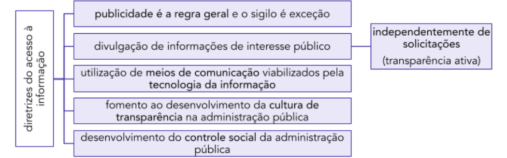

Dito isto, observo que as **alternativas (A)** , **(B)** , **(D)** e **(E)** mencionam corretamente diretrizes acima destacadas. 

Por sua vez, a **alternativa (C)** está incorreta, na medida em que o pedido de acesso à informação precisa conter apenas a identificação do solicitante e a indicação da informação que ele está solicitando, sendo vedado exigir justificativas do pedido: 

Art. 10. Qualquer interessado poderá apresentar pedido de acesso a informações aos órgãos e entidades referidos no art. 1º desta Lei, por qualquer meio legítimo, devendo o pedido conter a **identificação** do requerente e a **especificação** da informação requerida. (..) 

- § 3º São **vedadas quaisquer exigências relativas aos motivos determinantes da solicitação** de informações de interesse público.

---

<!-- pagina: 62 -->

**Antonio Daud Aula 01** 

#### **Gabarito (C)** 

##### **32. FGV/TCE-AM – Auditor - 2021** 

A Secretaria de Segurança Pública do Amazonas considerou imprescindíveis à segurança da sociedade as informações constantes em um relatório de inteligência sobre organizações criminosas que atuam no Estado, de maneira que sua divulgação ou acesso irrestrito poderia comprometer atividades de inteligência, bem como de investigações em andamento, relacionadas com a prevenção e repressão de infrações. Com base na Lei de Acesso à Informação, observado o interesse público da informação e utilizados os critérios menos restritivos possíveis, o mencionado relatório foi classificado quanto ao grau de sigilo como informação reservada. 

De acordo com a Lei Federal nº 12.527/2011, o prazo máximo de restrição de acesso a tal informação reservada é de: 

(A) um ano e, transcorrido esse prazo ou consumado o evento que definiu o seu termo final, a informação tornar-se-á, automaticamente, de acesso público; 

(B) três anos e, transcorrido esse prazo ou consumado o evento que definiu o seu termo final, o órgão público fará nova análise sobre a conveniência de liberação da informação a acesso público; 

(C) cinco anos e, transcorrido esse prazo ou consumado o evento que definiu o seu termo final, a informação tornar-se-á, automaticamente, de acesso público; 

(D) quinze anos e, transcorrido esse prazo ou consumado o evento que definiu o seu termo final, o órgão público fará nova análise sobre a conveniência de liberação da informação a acesso público; 

(E) vinte e cinco anos e, transcorrido esse prazo ou consumado o evento que definiu o seu termo final, o órgão público fará nova análise sobre a conveniência de liberação da informação a acesso público. 

##### **Comentários:** 

Questão que exigiu memorização dos prazos máximos de sigilo previstos no art. 24, §1º, da LAI: 

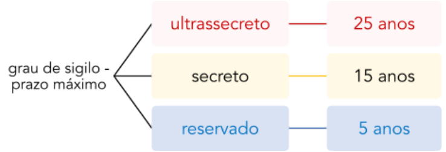

Portanto, sendo informação reservada, o prazo máximo será de 5 anos, mencionado na **alternativa (C)** . 

#### **Gabarito (C)** 

**33. FGV/TCE-AM – Auditor TI - 2021** 

A Lei de Acesso à Informação estabelece que é dever dos órgãos e entidades públicas promover, independentemente de requerimentos, a divulgação em local de fácil acesso, no âmbito de suas

---

<!-- pagina: 63 -->

**Antonio Daud Aula 01** 

competências, de informações de interesse coletivo ou geral por eles produzidas ou custodiadas, sendo obrigatória a divulgação por meio da internet. 

Nesse contexto, a citada Lei nº 12.527/2011 dispõe que os sítios oficiais da rede mundial de computadores deverão, na forma de regulamento, atender, entre outros, ao seguinte requisito: 

(A) atualizar, com periodicidade semanal, as informações disponíveis para acesso, inclusive remetendo o interessado a outros sítios eletrônicos para informações complementares; 

(B) disponibilizar, apenas mediante senha alfanumérica de seis dígitos, informações classificadas como sigilosas que possam pôr em risco a segurança das instituições; 

(C) conter ferramenta de pesquisa de conteúdo que permita o acesso à informação de forma objetiva, transparente, clara e em linguagem de fácil compreensão; 

(D) manter canal eletrônico como protocolo para recebimento de documentos e requerimentos de acesso a informações exclusivamente em formato pdf; 

(E) possibilitar o acesso a relatórios em diversos formatos eletrônicos, tais como planilhas e texto, ==5460== de modo a facilitar a análise das informações, vedada a disponibilização técnica de tais relatórios para gravação. 

##### **Comentários:** 

Lembro que, segundo a LAI, a divulgação ativa de informações públicas deve ser realizada em “todos os meios e instrumentos legítimos de que dispuserem” os entes públicos, sendo obrigatória a divulgação em sítios oficiais na internet (art. 8º, § 2º), exceto para municípios de até 10.000 habitantes (art. 8º, § 4º). Para tais página na internet, o legislador chegou a prever requisitos mínimos de funcionamento, da seguinte forma: 

Art. 8º, § 3º Os sítios de que trata o § 2º deverão, na forma de regulamento, atender, entre outros, aos seguintes **requisitos** : 

|I - conter**ferramenta de pesquisa de conteúdo** que permita o acesso à informação de forma objetiva, transparente, clara e em linguagem de fácil compreensão;|
|---|
|II - possibilitar a gravação de**relatórios** em**diversos formatos eletrônicos**, inclusive abertos e não proprietários, tais comoplanilhasetexto, de modo a facilitar a análise das informações;|

|III - possibilitar o**acesso automatizado por sistemas externos** em formatos|
|---|
| abertos, estruturados e legíveis por máquina;|

IV - **divulgar** em detalhes **os formatos utilizados** para estruturação da informação; 

|V -**garantir**a**autenticidade** e a**integridade** das informações disponíveis para acesso;|
|---|
|VI - manter**atualizadas** as informações disponíveis para acesso;|
|VII - indicar**local**e**instruções**que permitam ao**interessado comunicar-se**, por via eletrônica ou telefônica,**com o órgão**ou entidade**detentora do sítio**; e|
|VIII - adotar as medidas necessárias para garantir a**acessibilidade de conteúdo** **para pessoas com deficiência**, nos termos do art. 17 da Lei nº 10.098, de 19 de dezembro de 2000, e do art. 9º da Convenção sobre os Direitos das Pessoas com|
|Deficiência, aprovada pelo Decreto Legislativo nº 186, de 9 de julho de 2008.|

---

<!-- pagina: 64 -->

**Antonio Daud Aula 01** 

Dito isto, percebemos que a **alternativa (A)** está incorreta, pois a LAI não chega a estabelecer uma periodicidade mínima (inciso VI). 

A **alternativa (B)** está incorreta, pois os requisitos acima transcritos dizem respeito à disponibilização de dados públicos. 

Por sua vez, a **alternativa (C)** está de acordo com o requisito estabelecido no inciso I supra. 

A **alternativa (D)** está incorreta. Ao contrário, não se pode restringir ao formato .pdf, devendo-se possibilitar o acesso automatizado por sistemas externos em formatos abertos, estruturados e legíveis por máquina (inciso III). 

Por fim, a **alternativa (E)** está incorreta, pois deve-se possibilitar a gravação de relatórios em diversos formatos eletrônicos, inclusive abertos e não proprietários, tais como planilhas e texto, de modo a facilitar a análise das informações (inciso II). 

#### **Gabarito (C)** 

**34. FGV/CÂMARA DE SALVADOR-BA – Analista Legislativo Municipal – Informação Legislativa – 2018** 

Para garantir o acesso à informação, como determina a Lei nº 12.527, de 18 de novembro de 2011, os órgãos devem promover a divulgação de informações de interesse público independentemente de solicitações. 

Para isso devem utilizar todos os meios e instrumentos legítimos que dispuserem, sendo obrigatória a divulgação em: 

- (A) jornais oficiais; 

- (B) jornais de grande circulação; 

- (C) sítios oficiais na internet; 

- (D) correio tradicional; 

- (E) correio eletrônico. 

**Comentários:** 

Há algumas informações que devem ser divulgadas independentemente de solicitação prévia (transparência ativa). Nestes casos, ressalvados os municípios com até 10.000 habitantes, tal divulgação deve ocorrer por meio de sítios oficiais na internet: 

Art. 8º É dever dos órgãos e entidades públicas promover, independentemente de requerimentos, a divulgação em local de fácil acesso, no âmbito de suas competências, de informações de interesse coletivo ou geral por eles produzidas ou custodiadas. 

§ 2º Para cumprimento do disposto no caput **,** os órgãos e entidades públicas deverão utilizar todos os meios e instrumentos legítimos de que dispuserem, sendo obrigatória a divulgação em **sítios oficiais da rede mundial de computadores** (internet). 

#### **Gabarito (C)** 

**35. FGV/CODEMIG – Arquivista – 2015**

---

<!-- pagina: 65 -->

**Antonio Daud Aula 01** 

Conforme legislação específica, os documentos referentes a projetos de pesquisa e desenvolvimento, científicos ou tecnológicos, aos quais devem ser atribuídos graus de sigilos, a eles ou às informações neles contidas, são passíveis de: 

(A) separação; 

- (B) classificação; 

- (C) desclassificação; 

- (D) divulgação; 

- (E) destruição. 

**Comentários:** 

Primeiramente, mencione-se que o acesso à informação não compreende os “projetos de pesquisa e desenvolvimento, científicos ou tecnológicos” cujo sigilo seja imprescindível à segurança da sociedade e do Estado (Art. 7º, § 1º). 

Nesse sentido, tais projetos podem ser objeto de restrição de acesso, por meio da **classificação** em um dos graus de sigilo: 

Art. 23. São consideradas imprescindíveis à segurança da sociedade ou do Estado e, portanto, passíveis de classificação as informações cuja divulgação ou acesso irrestrito possam: (..) 

VI – prejudicar ou causar risco a projetos de **pesquisa e desenvolvimento científico ou tecnológico** , assim como a sistemas, bens, instalações ou áreas de interesse estratégico nacional; 

#### **Gabarito (B)** 

##### **36. FGV/TJ-GO – Analista Judiciário – Arquivologia – 2014** 

Segundo as leis de Acesso à Informação Brasileira e Estadual de Goiás, as/os informações/ documentos que devem ser objeto de solicitação ao SIC e as/os que devem ser divulgadas independentemente de requerimento são, respectivamente: 

(A) respostas às perguntas freqüentes; registro da estrutura organizacional; 

(B) informações sobre licitações; horário de atendimento ao público; 

(C) orientação sobre o local onde se encontra a informação almejada; informações sobre contratos celebrados; 

(D) registro de repasses financeiros; endereços e telefones das unidades; 

(E) registro de transferência de recursos; informações sobre editais de licitações. 

**Comentários:** 

Examinando a questão sob o prisma da lei federal, sabemos que o SIC consiste no Sistema de Informação ao Cidadão, que é responsável pelo seguinte (art. 9º):

---

<!-- pagina: 66 -->

**Antonio Daud Aula 01** 

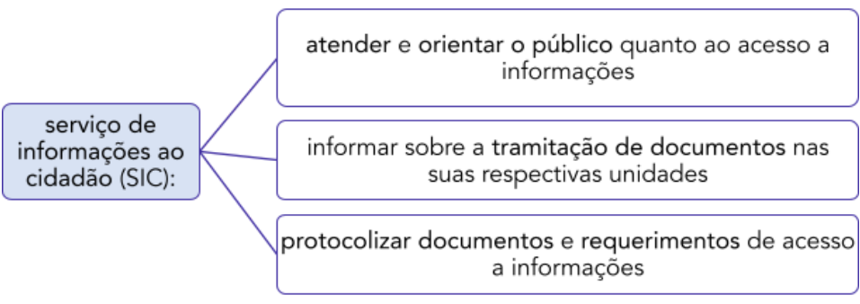

Apenas com base nestas competências do SIC, já concluímos que a **letra (C)** está correta. 

Além disso, vale lembrar as informações que devem ser divulgadas independentemente de solicitação (art. 8º, §1º): 

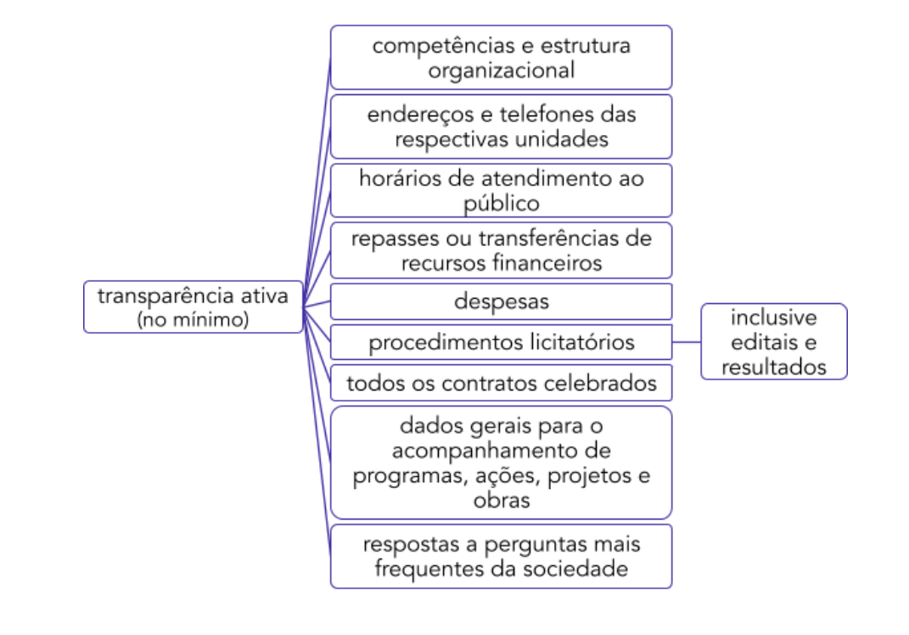

#### **Gabarito (C)** 

**37. FGV/CÂMARA MUNICIPAL DO RECIFE-PE – Arquivista – 2014** 

O acesso à informação de que trata a Lei nº 12.527, de 18 de novembro de 2011, compreende, entre outros, os direitos de obter: 

I – informação contida em registros ou documentos, produzidos ou acumulados por seus órgãos ou entidade, recolhidos ou não a arquivos públicos;

---

<!-- pagina: 67 -->

**Antonio Daud Aula 01** 

II – informação produzida ou custodiada por pessoa física ou entidade privada decorrente de qualquer vínculo com seus órgãos ou entidades do poder público, mesmo que esse vínculo já tenha cessado; 

III – informação primária, secundária, íntegra, autêntica e atualizada. 

São verdadeiras somente as afirmativas: 

(A) I; 

- (B) II; 

- (C) I e II; 

(D) I e III; 

(E) II e III. 

**Comentários:** 

O **Item I** está correto, uma vez que apresenta a exata redação do inciso II do art. 7º da lei 12.527/2011: 

Art. 7º O acesso à informação de que trata esta Lei compreende, entre outros, os direitos de obter: 

II - **informação** contida em registros ou documentos, produzidos ou acumulados por seus órgãos ou entidades, recolhidos ou não a arquivos públicos; 

O **Item II** está correto, nos termos do inciso III do art. 7º da lei 12.527/2011: 

III - informação produzida ou custodiada por pessoa física ou entidade privada decorrente de qualquer vínculo com seus órgãos ou entidades, mesmo que esse vínculo já tenha cessado; 

O **Item III** está incorreto, pois conforme previsão do inciso IV do art. 7º da lei 12.527/2011 as informações secundárias não estão contempladas (mas sim as “primárias”): 

IV - **informação primária** , íntegra, autêntica e atualizada; 

#### **Gabarito (C)** 

##### **38. FGV/TJ-AM – Analista Judiciário – Arquivologia – 2013** 

De acordo com a Lei n. 12.527/11, os prazos máximos de restrição de acesso à informação, conforme a classificação prevista no caput, vigorarão a partir da data de sua produção. Assinale a afirmativa que os indica. 

(A) Ultrassecreta: 20 anos / secreta: 15 anos / reservada: 10 anos. 

(B) Ultrassecreta: 30 anos / secreta: 15 anos / reservada: 5 anos. 

- (C) Ultrassecreta: 35 anos / secreta: 15 anos / reservada: 10 anos. 

- (D) Ultrassecreta: 25 anos / secreta: 15 anos / reservada: 5 anos. 

- (E) Ultrassecreta: 25 anos / secreta: 20 anos / reservada: 5 anos. 

**Comentários:** 

A **letra (D)** está correta, uma vez que a alternativa apresenta os prazos previstos no §1º do art. 24 da lei 12.527/2011:

---

<!-- pagina: 68 -->

**Antonio Daud Aula 01** 

#### **Gabarito (D)** 

**39. FGV/TJ-AM – Analista Judiciário – Arquivologia – 2013** De acordo com a Lei de Acesso à Informação, as informações pessoais, independentemente de classificação de sigilo, terão seu acesso restrito pelo prazo máximo de 

- (A) 25 anos, a contar da data de produção. 

- (B) 30 anos, a contar da data de produção. 

- (C) 50 anos, a contar da data de produção. 

- (D) 70 anos, a contar da data de produção. 

(E) 100 anos, a contar da data de produção. 

**Comentários:** 

A **letra (E)** está correta. Trata-se de mais uma questão envolvendo prazo de sigilo, o qual você deve se esforçar para gravar. O prazo de sigilo das **informações pessoais** é de 100 anos: 

Art. 31, § 1º As informações pessoais, a que se refere este artigo, relativas à intimidade, vida privada, honra e imagem: 

I - terão seu acesso restrito, independentemente de classificação de sigilo e pelo prazo máximo de 100 (cem) anos a contar da sua data de produção, a agentes públicos legalmente autorizados e à pessoa a que elas se referirem; 

#### **Gabarito (E)** 

**40. FGV/TJ-AM – Analista Judiciário – Arquivologia – 2013** 

A Comissão Mista de Reavaliação de Informações decidirá, no âmbito da administração pública federal, sobre o tratamento e a classificação de informações sigilosas. Essa Comissão tem competência para: 

(A) prorrogar o prazo de sigilo de informação classificada como ultrassecreta, sempre por prazo determinado. 

(B) prorrogar o prazo de sigilo de informação classificada como ultrassecreta, sempre por prazo indeterminado. 

(C) Prorrogar o prazo de sigilo de informação classificada como ultrassecreta, somente por prazo variável. 

(D) Prorrogar o prazo de sigilo de informação classificada como ultrassecreta, por prazo prorrogável.

---

<!-- pagina: 69 -->

**Antonio Daud Aula 01** 

(E) Prorrogar o prazo de sigilo de informação classificada como ultrassecreta, por prazo de 60 anos. 

**Comentários:** 

A **letra (A)** está correta, visto que apresenta uma das competências da **Comissão Mista de Reavaliação de Informações** prevista no inciso III do §1º do art. 35 da lei 12.527/2011: 

Art. 35. (VETADO). 

§ 1º É instituída a Comissão Mista de Reavaliação de Informações, que decidirá, no âmbito da administração pública federal, sobre o tratamento e a classificação de informações sigilosas e terá competência para: 

III - prorrogar o prazo de sigilo de informação classificada como ultrassecreta, sempre por prazo determinado, enquanto o seu acesso ou divulgação puder ocasionar ameaça externa à soberania nacional ou à integridade do território nacional ou grave risco às relações internacionais do País, observado o prazo previsto no § 1º do art. 24. 

#### **Gabarito (A)**

---

<!-- pagina: 70 -->

**Antonio Daud Aula 01** 

# **LISTA DE QUESTÕES** 

##### **1. CNU – nível médio – 2025** 

Carolina, jornalista, apresentou, por meio anônimo, pedido de acesso a informações públicas atinentes à administração pública federal. Contudo, o requerimento foi negado por Cloves, autoridade administrativa competente, sob os fundamentos de que a postulação não continha a identificação da requerente, tampouco elencava os motivos determinantes da solicitação. 

Nesse cenário, considerando as disposições da Lei nº 12.527/2011, é correto afirmar que: 

(A) a negativa ao requerimento formulado por Carolina está em desconformidade com a ordem jurídica, já que a Administração Pública federal não pode exigir a identificação da requerente, tampouco a delimitação dos motivos determinantes da solicitação; 

(B) a ausência de previsão legal expressa faz com que caiba à definir, administrativa competente autoridade fundamentadamente, Os requisitos que devem ser preenchidos para que haja o acesso a informações públicas, motivo pelo qual a atuação de Cloves se deu de forma regular; 

(C) a atuação do servidor Cloves está parcialmente correta, já que o pedido de acesso a informações demanda a delimitação dos motivos determinantes da solicitação, muito embora não seja exigível a identificação da requerente; 

(D) o servidor Cloves agiu acertadamente, já que o pedido de acesso a informações públicas demanda a identificação da requerente e a delimitação dos motivos determinantes da solicitação; 

(E) o pedido de acesso a informações não exige a delimitação dos motivos determinantes da solicitação, mas pressupõe a identificação da requerente. 

**2. CNU – NÍVEL SUPERIOR – 2025** 

O responsável por determinada estrutura orgânica do Poder Executivo federal constatou que o setor mantinha diversas informações que poderiam pôr em risco a segurança de familiares de altas autoridades nacionais ou estrangeiras, que estavam classificadas de maneiras distintas e com prazos diversos de proteção. Essa gestão de coisas gerou dúvida em relação à sua confidencialidade e ao cumprimento das regras legais. 

Ao mensurar os balizamentos estabelecidos pela Lei nº 12.527/2011, o responsável conclui corretamente que as informações analisadas: 

(A) não são consideradas como imprescindíveis à segurança da sociedade ou do Estado, mas podem ser classificadas como reservadas; 

(B) permanecerão sob sigilo por até 25 anos caso sejam classificadas como ultrassecretas, sendo necessárias a sua reavaliação a cada lustro; 

(C) podem ser classificadas como de acesso restrito, secretas ou ultrassecretas, o que gera reflexos no prazo em que serão automaticamente de acesso público; 

(D)que possam colocar em risco a segurança do presidente da República e seus respectivos cônjuge, filhos ou dependentes serão classificadas como reservadas e ficarão sob sigilo até o término do mandato em exercício ou do último mandato, em caso de reeleição;

---

<!-- pagina: 71 -->

**Antonio Daud Aula 01** 

(E) podem ser objeto de sigilo por até 100 anos, mediante ato fundamentado, ressalvada a existência de requisição judicial, considerando a necessidade de ponderação com outros bens e valores igualmente protegidos pela ordem constitucional ou infraconstitucional. 

##### **3. FGV/CNU – 2025** 

A Lei de Acesso à Informação (Lei n° 12.527/2011] estabelece diferentes competências para a classificação de informações sigilosas, definindo prazos e os agentes públicos autorizados a realizá-la conforme o grau de sensibilidade da informação. Destaca-se, ainda, que aquele que possui competência para aplicar prazos maiores de sigilo também pode aplicar prazos menores, conforme a necessidade. 

Durante a análise de documentos estratégicos de sua pasta, um ministro de Estado identifica determinada informação como de altíssima sensibilidade e considera necessária sua classificação no grau máximo de sigilo permitido para o seu cargo, a fim de prevenir riscos ao interesse da sociedade. 

Nessa situação, de acordo com a Lei de Acesso à Informação, o ministro poderá classificar essa informação, da forma mais restritiva permitida para a sua função, como: 

a) reservada, pelo prazo de 5 anos; 

b) secreta, pelo prazo de 15 anos; 

c) secreta, pelo prazo de 20 anos; 

d) ultrassecreta, pelo prazo de 25 anos; 

e) ultrassecreta, pelo prazo de 30 anos. 

##### **4. FGV/CNU – 2025** 

Considere a situação em que um cidadão comparece a um órgão da Administração Pública para solicitar o acesso a uma informação de interesse público e se surpreende ao ser informado, durante o atendimento, de que haverá cobrança pela disponibilização da informação solicitada. 

De acordo com a Lei de Acesso à Informação (Lei n° 12.527/2011), essa cobrança será considerada correta quando essa informação: 

a) exigir reprodução de documentos pelo órgão, no valor dos custos dos serviços e materiais utilizados; 

b) se referir a assuntos acerca de organismos internacionais com os quais o Brasil não mantenha relações diplomáticas, no limite de 10% dos custos de reciprocidade; 

c) tiver caráter sigiloso por colocar em risco a soberania nacional, no valor equivalente aos danos que possam decorrer de seu uso Indevido; 

d) necessitar de parecer de representante de órgão hierarquicamente superior ao órgão de origem, no valor dos honorários de sucumbência; 

e) se referir a questões protegidas por direitos de patente, tendo, como referência, taxa estabelecida pelo INPI (Instituto Nacional da Propriedade Industrial). 

##### **5. FGV/CNU – 2025** 

Um servidor público federal, recém-aprovado em concurso público, inicia suas atividades em um órgão da Administração Pública e assume a responsabilidade de organizar os dados custodiados pelo órgão, assegurando o cumprimento da Lei de Acesso à Informação (Lei n° 12.527/2011).

---

<!-- pagina: 72 -->

**Antonio Daud Aula 01** 

Para desempenhar adequadamente suas atribuições, esse servidor deve se pautar nas diretrizes previstas na referida lei, atuando de forma a: 

a) promover o desenvolvimento de mecanismos de controle judicial na Administração Pública; 

b) fomentar o fortalecimento de uma cultura de diversidade no compartilhamento de informação pública; 

c) garantir o sigilo Informativo como regra, observando a publicidade apenas em casos imprescindíveis; 

d) assegurar a ocultação de informações a solicitações realizadas, mitigando riscos de vazamentos indevidos; 

e) utilizar, para facilitar o alcance da informação pública, meios de comunicação viabilizados pela tecnologia da informação. 

##### **6. FGV/CNU – 2025** 

Determinado gestor, integrante do alto escalão da administração pública federal direta, formulou consulta à sua assessoria imediata em relação à possibilidade, ou não, de serem inseridas três ordens de informações afetas aos servidores públicos, devidamente individualizados e independentemente de prévio consentimento, no Portal da Transparência do Governo Federal. Esses dados consistiriam em: 

##### I. remuneração; 

II. aplicação da sanção de demissão ou de cassação de aposentadoria; e 

III. filiação a um sindicato. 

Considerando a natureza das informações Indicadas, a assessoria respondeu corretamente que: 

a) todas devem ser inseridas; 

b) apenas deve ser Inserida a informação referida em I; 

c) apenas devem ser inseridas as informações referidas em I e II; 

d) apenas devem ser inseridas as informações referidas em l e lll; 

e) apenas devem ser inseridas as informações referidas em II e III. 

##### **7. CNU – NÍVEL SUPERIOR – 2025** 

Em uma cultura de acesso, os agentes públicos entendem que as informações pertencem ao cidadão. Por isso, é dever do Estado fornecê-las de forma rápida, clara e útil, para atender bem às necessidades da sociedade. 

Nesse contexto, é correto afirmar que, de acordo com a Lei de Acesso à Informação (Lei no 12.527/2011), o acesso à informação é reconhecido como um direito: 

(A) individual, baseado no princípio de que o sigilo à informação de interesse particular constitui regra fundamental; 

(B) à transparência ponderada, baseado no princípio de que a publicidade moderada da quantidade e qualidade de informações evita a desinformação entre os cidadãos; 

(C) à participação política, baseado no princípio de que a transparência ativa depende da iniciativa do cidadão para solicitar informações de interesse público;

---

<!-- pagina: 73 -->

**Antonio Daud Aula 01** 

(D) humano fundamental, baseado no princípio de que toda pessoa deve ter a liberdade de buscar, receber e divulgar informações e ideias por quaisquer meios; 

(E) à igualdade perante a lei, baseado no princípio de que os meios físicos são canais obrigatórios e facilitadores para divulgação equitativa das iniciativas públicas. 

##### **8. CNU – NÍVEL SUPERIOR – 2025** 

A servidora pública Maria era responsável pela gerência de contratos de seu órgão quando uma emissora de televisão lhe solicitou acesso formal a um acordo de prestação de serviços para checagem de denúncias de malversação de recursos. Temendo o comprometimento da imagem institucional, a chefia de Maria orientou que negasse o pedido apesar de o contrato não ser classificado como sigiloso. 

Considerando a Lei de Acesso à Informação (Lei no 12.527/2011), a Política Nacional de Informação e Comunicação Pública e os princípios da Administração Pública, é correto afirmar que a conduta da chefia: 

(A) se justifica pela prerrogativa do agente público para proceder a uma análise subjetiva, dada a motivação do solicitante; 

(B) limita o acesso à informação, mas preserva a autonomia decisória da Administração Pública; 

(C) encontra respaldo em critérios de oportunidade administrativa, voltados à proteção da imagem institucional; 

(D) infringe o dever de transparência passiva, pois não há base legal para negar o acesso a documento público não sigiloso; 

(E) decorre da discricionariedade do agente público para negar o acesso baseado em diretrizes internas de preservação da imagem institucional. 

**9. FGV - 2025 - Auditor de Controle Externo (TCE RR)/Ciências Jurídicas** 

Depois de verificar as definições relacionadas à qualidade da informação no âmbito da Lei nº 12.527/2011, Neusa constatou que, entre elas, existe aquela condizente com a informação coletada na fonte, com o máximo de detalhamento possível, sem modificações e outra atinente à informação não modificada, inclusive quanto à origem, trânsito e destino. 

Nesse contexto, tais qualidades correspondem, respectivamente, 

A a primariedade e a integridade. 

B a disponibilidade e a autenticidade. 

C a integridade e a disponibilidade. 

D a autenticidade e a primariedade. 

E a essencialidade e a autenticidade. 

**10. FGV - 2025 - Técnico Administrativo (TCE-RR)** 

Conforme o disposto na Lei nº 12.527/2011, conhecida como Lei de Acesso à Informação (LAI), a qualidade da informação coletada na fonte, com o máximo de detalhamento possível, sem modificações, relaciona-se com o conceito de 

A disponibilidade. 

B integridade.

---

<!-- pagina: 74 -->

**Antonio Daud Aula 01** 

C primariedade. 

##### D autenticidade. 

##### E atualidade. 

**11. FGV - 2025 - Assistente Administrativo (EBSERH)** 

Ao estudar a Lei nº 12.527/2011 (Lei de Acesso à Informação), Matilde verificou que os procedimentos previstos na mencionada norma se destinam a assegurar o direito fundamental de acesso à informação e devem ser executados de acordo com as diretrizes nela elencadas. 

Nesse cenário, assinale a opção que indica corretamente uma das aludidas diretrizes. 

A Limitação do controle social da Administração Pública. 

B Fomento ao desenvolvimento da cultura de transparência na Administração Pública. 

C Vedação de utilização de meios de comunicação viabilizados pela tecnologia da informação. 

D Divulgação de informações de interesse público apenas nas hipóteses em que haja solicitação. 

E Observância da publicidade como preceito geral, sendo certo que o sigilo não pode ser considerado exceção. 

**12. FGV - 2025 - Analista Judiciário (TRT 24ª Região)/Administrativa/Contabilidade** 

De acordo com a Lei de Acesso à Informação (Lei nº 12.527/2011), informação sigilosa é aquele submetida temporariamente à restrição de acesso público devido à(ao) 

A sua abrangência nacional. 

B seu alto custo de obtenção. 

C sua associação com pessoas influentes no país. 

D sua importância e destaque na econômica nacional. 

E sua imprescindibilidade para a segurança da sociedade e do Estado. 

**13. FGV - 2025 - Juiz Federal (TRF 3ª Região)** 

Assinale a alternativa correta: 

A O direito de acesso à informação deve ser executado em conformidade com as seguintes diretrizes, dentre outras: observância da publicidade como preceito geral e do sigilo como exceção; desenvolvimento do controle social da administração pública e utilização de meios de comunicação viabilizados pela tecnologia da informação. 

B É facultado aos órgãos e entidades públicas promover, independentemente de requerimentos, a divulgação em local de fácil acesso, no âmbito de suas competências, de informações de interesse coletivo ou geral por eles produzidas ou custodiadas. 

C Qualquer interessado poderá apresentar pedido de acesso a informações, por qualquer meio legítimo, devendo o pedido conter a identificação do requerente, a especificação da informação requerida e os motivos determinantes da solicitação. 

D O direito de acesso à informação é a faculdade de obter informação custodiada pelo Poder Público, pelos meios e nos modos em que a informação esteja mantida. 

E O direito de acesso à informação sobre projetos públicos de pesquisa e desenvolvimento científicos ou tecnológicos é amplo e irrestrito.

---

<!-- pagina: 75 -->

**Antonio Daud Aula 01** 

**14. FGV - 2025 - Analista do Ministério Público da União/Arquivologia** 

A lei de acesso à informação determina alguns procedimentos para a garantia do acesso à informação. 

Se o cidadão necessita de informações sobre execução orçamentária e financeira detalhada de um determinado órgão do Poder Executivo federal, a lei determina que ele tenha acesso a essa informação por meio de: 

A sítios da internet; 

B formulário eletrônico; 

C solicitação por e-mail; 

D murais no setor financeiro; 

E requerimento no protocolo. 

**15. FGV - 2025 - Auditor Público Interno (CGM Cuiabá)** 

A Lei de Acesso à Informação (LAI) garante o direito de solicitar informações públicas, e, em caso de indeferimento ou negativa de acesso, o interessado pode interpor recurso no prazo de 10 dias a contar de sua ciência. 

O procedimento a ser seguido pelo requerente em caso de indeferimento de um pedido de desclassificação de informações em um órgão da administração pública federal, é: 

A O requerente pode recorrer diretamente à Comissão Mista de Reavaliação de Informações sem passar por outras autoridades. 

B O recurso deve ser encaminhado ao Ministro de Estado da área após ter sido submetido a, pelo menos, uma autoridade hierarquicamente superior àquela que tomou a decisão impugnada, exceto no caso das Forças Armadas, onde o recurso deve ser dirigido diretamente ao Comando. 

C O requerente pode recorrer diretamente ao Presidente da República após o indeferimento da desclassificação de informações secretas ou ultrassecretas. 

D Não há necessidade de submeter o recurso à apreciação de uma autoridade superior antes de recorrer ao Ministro de Estado. 

E Em caso de indeferimento, o requerente só pode recorrer à Comissão Mista de Reavaliação de Informações se a informação for classificada como sigilosa. 

**16. FGV - 2025 - Advogado (EBSERH)** 

Imagine uma situação em que certa empresa pública não esteja promovendo a transparência ativa de suas informações, na medida em que não está veiculando dados que são de interesse público e que não estão abarcadas pelo sigilo. 

Caso seja apresentado, por determinado interessado, pedido de acesso a tais informações, à luz do disposto na Lei nº 12.527/2011 (Lei de Acesso à Informação), assinale a afirmativa correta. 

A O deferimento do acesso às informações em análise depende da indicação dos motivos determinantes para a sua obtenção. 

B A mencionada empresa pública não tem a obrigação de fornecer as informações em questão, em decorrência de sua personalidade jurídica de direito privado.

---

<!-- pagina: 76 -->

**Antonio Daud Aula 01** 

C A norma em comento impõe a proteção das informações pela aludida entidade administrativa, mas não a sua disponibilidade, autenticidade e integridade. 

D O pedido de acesso a tais informações pelo mencionado interessado deverá conter a identificação do requerente e a especificação da informação requerida. 

E A referida entidade administrativa pode impor exigências para que o requerente tenha acesso às informações em comento, ainda que tais exigências possam inviabilizar a sua solicitação. 

**17. FGV - 2025 - Analista do Ministério Público da União** A Lei de Acesso à Informação (LAI), Lei nº 12.527/2011, é um importante passo rumo à transparência e à eficácia da comunicação de interesse público, na medida em que: 

A não pode ser classificada nenhuma informação como reservada, secreta ou ultrassecreta a menos que requerida por jornalistas; 

B obriga os órgãos governamentais a fornecerem a informação requerida, desde que o requerente identifique a finalidade e o motivo da solicitação; 

C indica que o requerente seja informado sobre a possibilidade de recurso, prazos e condições para sua interposição em caso de negativa de acesso à informação solicitada; 

D estabelece prazos curtos para o sigilo da informação, cabendo o de 100 anos apenas para documentos referentes aos resultados de planos econômicos na esfera federal; 

E deve ser negado o acesso à informação apenas em situações específicas, tais como o acesso às estatísticas relativas ao indeferimento de pedidos de informação via LAI. 

**18. FGV - 2025 - Técnico da Defensoria Pública (DPE RO)/Técnico Administrativo** 

Teófilo, cidadão brasileiro naturalizado, pediu acesso a um parecer técnico junto a um órgão do Poder Executivo Federal, mas recebeu uma negativa sem uma justificativa razoável. Inconformado com a decisão, ele quer recorrer para garantir seu direito de acesso à informação e entender como funciona o processo para apresentar o recurso e quais instâncias podem analisá-lo. 

Nesse sentido, assinale a opção correta em relação ao prazo e a instância 

A 5 dias, sendo encaminhado diretamente à Controladoria Geral da União (CGU); 

B 10 dias, direcionado à autoridade hierarquicamente superior à que indeferiu o pedido; 

C 15 dias, recorrendo à Comissão Mista de Reavaliação de Informações; 

D 20 dias, representando diretamente ao Poder Judiciário; 

E 30 dias, solicitando reconsideração à mesma autoridade que negou o pedido. 

**19. FGV - 2025 - Técnico Administrativo (TCE-RR)** 

Considerando que o Estado deve proteger informações cujo acesso possa colocar em risco a segurança do Estado ou da sociedade, a Lei de Acesso à Informação (LAI) prevê diferentes níveis de sigilo e define as autoridades competentes para classificá-las. 

Nesse caso, tais informações são qualificadas como 

A reservadas, com restrição de acesso por até 10 anos, podendo ser classificadas pelo Vice-Presidente da República.

---

<!-- pagina: 77 -->

**Antonio Daud Aula 01** 

B reservadas, com restrição de acesso por até 15 anos, podendo ser classificadas pelo comandante das Forças Armadas. 

C secretas, com restrição de acesso por até 15 anos, podendo ser classificadas por titular de autarquia federal. 

D secretas, com restrição de acesso por até 20 anos, podendo ser classificadas por servidor com cargo de direção ou assessoramento em Ministério. 

E ultrassecretas, com restrição de acesso por até 25 anos, podendo ser classificadas por Diretor de Sociedade de Economia Mista. 

##### **20. FGV - 2025 - Analista Administrativo (EBSERH)/Publicidade e Propaganda** 

Os procedimentos previstos na Lei nº 12.527, de 2011, têm como uma de suas diretrizes a observância da publicidade como preceito geral e do sigilo como exceção. 

Contudo, a Lei de Acesso à Informação prevê que a informação em poder dos órgãos e entidades públicas, observado o seu teor e em razão de sua imprescindibilidade à segurança da sociedade ou do Estado, poderá ser classificada como 

A ultrassecreta, com prazo máximo de restrição de acesso de 100 anos, a partir da data de sua produção. 

B reservada, com prazo máximo de restrição de acesso de 20 anos, a partir da data de sua produção. 

C secreta, com prazo máximo de restrição de acesso de 15 anos, a partir da data de sua produção. 

D pessoal, com prazo máximo de restrição de acesso de 50 anos, a partir da data de sua produção. 

E sigilosa, com prazo máximo de restrição de acesso de 10 anos, a partir da data de sua produção. 

**21. FGV - 2025 - Analista Judiciário (TRT 24ª Região)/Administrativa** 

A Lei de Acesso à Informação (LAI), Lei n.° 12.527/2011, reforça o compromisso da Administração Pública com a transparência e a ética, promovendo o acesso do cidadão às informações governamentais como instrumento fundamental para o controle social e o fortalecimento da democracia. 

Assinale a opção que apresenta corretamente uma disposição das informações pessoais da LAI. 

A Informações pessoais podem ser divulgadas livremente após 10 anos, desde que não envolvam agentes públicos. 

B O acesso a informações relativas à intimidade, vida privada, honra e imagem é restrito por até 50 anos, salvo decisão judicial. 

C A divulgação de informações pessoais depende exclusivamente de ordem judicial, independentemente de consentimento da pessoa envolvida. 

D A restrição de acesso a informações pessoais pode ser utilizada para impedir investigações de irregularidades que envolvam o titular dos dados. 

E O tratamento de informações pessoais deve respeitar a intimidade e os direitos individuais, sendo vedado seu uso indevido, sob pena de responsabilização.

---

<!-- pagina: 78 -->

**Antonio Daud Aula 01** 

**22. FGV - 2025 - Técnico da Defensoria Pública (DPE RO)/Técnico Administrativo** 

A Lei nº 12.527/2011, conhecida como Lei de Acesso à Informação (LAI), estabelece normas para garantir a transparência no acesso a informações públicas, ao mesmo tempo em que protege dados pessoais relacionados à intimidade, vida privada, honra e imagem. Essas informações possuem acesso restrito, independentemente de classificação de sigilo, pelo prazo máximo de 100 anos, sendo disponibilizadas apenas a agentes públicos legalmente autorizados e à própria pessoa a quem se referem. No entanto, a lei prevê situações específicas em que esse consentimento não é exigido. 

Com base nessa previsão legal, avalie se as situações específicas em que o consentimento não é necessário incluem: 

I. A defesa de direitos humanos. 

II. O cumprimento de ordem administrativa. 

III. A proteção do interesse privado preponderante. 

Está correto o que se afirma em 

A I, apenas; 

B II, apenas; 

C I e II, apenas; 

D II e III, apenas; 

E I, II e III. 

**23. FGV - 2025 - Técnico da Defensoria Pública (DPE RO)/Técnico Administrativo** 

Conforme disposto na Lei de Acesso à Informação (LAI), certas autoridades têm a competência para classificar informações no grau de sigilo ultrassecreto, assegurando a proteção de dados cuja divulgação possa representar riscos à segurança do Estado ou da sociedade. 

Com base nessa legislação, uma autoridade responsável por essa classificação é o 

A Vice-Presidente da República. 

B Subsecretário de Autarquia Pública. 

C Diretor de Agência Reguladora. 

D Dirigente de Organização Social. 

E Membro de Conselho de Fiscal de Sociedade de Economia Mista. 

**24. FGV - 2025 - Auditor do Estado (CAGE RS)** A Lei nº 12.527/2011, ou Lei de Acesso à Informação (LAI), estabelece diretrizes para a transparência pública. 

Com base nessa legislação, avalie as afirmações a seguir. 

I. A LAI não se aplica às empresas públicas que operam em regime de concorrência, como as estatais. 

II. Para os procedimentos de acesso à informação, o prazo máximo para resposta a um pedido realizado é de 60 dias, prorrogáveis por igual período, mediante justificativa.

---

<!-- pagina: 79 -->

**Antonio Daud Aula 01** 

III. Qualquer pessoa, física ou jurídica, pode solicitar informações públicas, sem necessidade de apresentar justificativa para o pedido. 

IV. Informações relacionadas a direitos humanos violados são automaticamente classificadas como sigilosas por questões de segurança. 

Está correto o que se afirma em 

A I e II, apenas. 

B III e IV, apenas. 

C III, apenas. 

D I, III e IV, apenas. 

E II e IV, apenas. 

**25. FGV/MPU/Técnico/2025** 

Nos termos da Lei nº 12.527/2011, quanto aos pedidos de acesso a informações de interesse público, é correto afirmar que: 

(A)   é dever dos órgãos e entidades do poder público viabilizar, em qualquer caso, alternativa de encaminhamento desses pedidos por meio de seus sítios oficiais na internet; 

(B)   devem conter a identificação do requerente, a especificação da informação requerida e os motivos determinantes da solicitação; 

(C)   a informação armazenada em formato digital será fornecida nesse formato, ainda que requerida em meio impresso, independentemente da anuência do requerente; 

(D)  a informação solicitada deve ser fornecida diretamente pelo órgão ou entidade, mesmo que esteja disponível ao público em meio de acesso universal; 

(E)   o serviço de busca e de fornecimento da informação será gratuito ao requerente quando exigir reprodução de documentos pelo órgão ou pela entidade pública consultada. 

**26. FGV/CGM Cuiabá – 2025 (adaptada)** 

Ao compulsar a Lei de acesso à Informação, Gilmara verificou corretamente que: 

(A)  As informações ou documentos que versem sobre condutas que impliquem violação dos direitos humanos, praticada por agentes públicos ou a mando de autoridades públicas, não poderão ser objeto de restrição de acesso. 

(B)  O prazo máximo e restrição de informação que for considerada secreta é de 5 (cinco) anos e a respectiva classificação, nos termos da lei, é de competência do Prefeito Municipal, dos Secretários Municipais e dos dirigentes máximos das unidades da Administração Indireta municipal. 

(C)  O dever do Município de promover, independentemente de requerimentos, a divulgação, de forma clara e objetiva no Portal Transparência do Município, das informações de interesse coletivo ou geral, produzidas ou custodiadas pelo Poder Executivo municipal é condizente com a transparência passiva. 

(D)  É vedado o fornecimento de informações de interesse público que não estejam classificados com sigilo sem que o interessado indique os motivos determinantes da solicitação formalizada ao órgão pertinente, sendo certo que a autoridade competente pode conferir prazo para que tais justificativas sejam formalmente apresentadas.

---

<!-- pagina: 80 -->

**Antonio Daud Aula 01** 

(E)   Os órgãos e entidades públicas respondem subsidiariamente pelos danos causados em decorrência da divulgação não autorizada ou utilização indevida de informações sigilosas ou informações pessoais, assegurado o direito de apurar responsabilidade funcional dos agentes, que respondem objetivamente pelos ilícitos elencados na norma em questão. 

##### **27. FGV/CVM - 2024** 

João, jornalista investigativo, ingressou com pedido de acesso à informação XYZ junto à Administração Pública Federal, sendo informado, após a observância das formalidades legais, que o pedido não poderia ser deferido, porquanto a referida informação estaria submetida a sigilo, no grau ultrassecreto. João, então, passou a analisar a legislação de regência, para verificar quais autoridades teriam competência para determinar a medida. 

Considerando esse cenário e as disposições da Lei nº 12.527/2011 (Lei de Acesso à Informação), a classificação do sigilo da informação, no grau ultrassecreto, é de competência do: 

(A) presidente da República, do vice-presidente da República, dos ministros de Estado e autoridades com as mesmas prerrogativas, dos comandantes da Marinha, do Exército e da Aeronáutica, dos chefes de missões diplomáticas e consulares permanentes no exterior e dos titulares de autarquias, fundações, empresas públicas e sociedades de economia mista, admitindo-se a delegação pela autoridade responsável a agente público, inclusive em missão no exterior, vedada a subdelegação; 

(B) presidente da República, do vice-presidente da República, dos ministros de Estado e autoridades com as mesmas prerrogativas, dos comandantes da Marinha, do Exército e da Aeronáutica e dos chefes de missões diplomáticas e consulares permanentes no exterior, admitindo-se a delegação pela autoridade responsável a agente público, inclusive em missão no exterior, vedada a subdelegação; 

(C) presidente da República, do vice-presidente da República, dos ministros de Estado e autoridades com as mesmas prerrogativas e dos titulares de autarquias, fundações, empresas públicas e sociedades de economia mista, vedando-se a delegação pela autoridade responsável a agente público; 

(D) presidente da República, do vice-presidente da República e dos titulares de autarquias, fundações, empresas públicas e sociedades de economia mista, vedando-se a delegação pela autoridade responsável a agente público; 

(E) presidente da República e do vice-presidente da República, vedando-se a delegação pela autoridade responsável a agente público. 

##### **28. FGV/TJ-AP - 2024** 

Ao estudar a Lei nº 12.527/2011 (Lei de Acesso à Informação), Elis verificou que, dentre os conceitos nela expressamente delimitados, há aquele atinente à qualidade da informação não modificada, inclusive quanto a origem, trânsito, destino, e que corresponde à definição de: 

(A) disponibilidade; 

(B) autenticidade; 

(C) primariedade; 

(D) efetividade; 

- (E) integridade.

---

<!-- pagina: 81 -->

**Antonio Daud Aula 01** 

##### **29. FGV/CÂMARA DOS DEPUTADOS – Analista - 2023** 

Caio é eleito Presidente da República Federativa do Brasil. Registre-se que Caio é casado com Joana e possui um filho, Tício, de 16 anos de idade. 

Nesse cenário, considerando as disposições da Lei nº 12.527/2001, é correto afirmar que as informações que puderem colocar em risco a segurança de Joana e de Tício serão classificadas 

(A) como secretas e reservadas, respectivamente, ficando sob sigilo até o término do mandato em exercício ou do último mandato de Caio, em caso de reeleição. 

(B) como ultrassecretas e secretas, respectivamente, ficando sob sigilo até o término do mandato em exercício ou do último mandato de Caio, em caso de reeleição. 

(C) como ultrassecretas, ficando sob sigilo até o término do mandato em exercício ou do último mandato de Caio, em caso de reeleição. 

(D) como secretas, ficando sob sigilo até o término do mandato em exercício ou do último mandato de Caio, em caso de reeleição. ==5460== 

(E) como reservadas, ficando sob sigilo até o término do mandato em exercício ou do último mandato de Caio, em caso de reeleição. 

##### **30. FGV/SEFAZ-ES – Auditor - 2021** 

O Estado Alfa, com base em norma estadual, publicou em seu sítio eletrônico na internet a relação dos nomes, cargos e remuneração de seus servidores públicos, como forma de transparência ativa. Inconformada, Maria, servidora pública estadual, ajuizou ação judicial em face do Estado, pleiteando obrigação de fazer para retirada das informações relacionadas à sua pessoa, alegando ofensa a seu direito fundamental à intimidade. 

De acordo com o Supremo Tribunal Federal, em tese de repercussão geral, o pleito de Maria 

(A) não merece prosperar, eis que é legítima a publicação, inclusive em sítio eletrônico mantido pela Administração Pública, dos nomes dos seus servidores e do valor dos correspondentes vencimentos e vantagens pecuniárias. 

(B) não merece prosperar, eis que a Administração Pública possui discricionariedade em divulgar registros de quaisquer repasses ou transferências de recursos financeiros, como por exemplo, o valor da remuneração de seus servidores. 

(C) merece prosperar, eis que a divulgação de informações pessoais dos servidores mostra-se infrutífera e desarrazoada, e submete a risco a segurança da servidora, que vê sua privacidade exposta publicamente, não sendo absoluta a preponderância do interesse público sobre o particular. 

(D) merece prosperar, eis que a publicidade deve ser limitada à divulgação genérica dos salários correspondentes a cada cargo, levando em conta a progressão vertical e horizontal na carreira, sem vinculação direta ao nome do servidor, sob pena de ofensa ao direito à intimidade. 

(E) merece prosperar parcialmente, eis que deve ser substituído apenas o nome pela matrícula de Maria, de maneira a viabilizar a publicidade da remuneração do agente público, sem ofender a intimidade da servidora, conforme princípios da razoabilidade e da proporcionalidade. 

**31. FGV/TCE-AM – Auditor - 2021**

---

<!-- pagina: 82 -->

**Antonio Daud Aula 01** 

Assegurar o direito fundamental de acesso à informação se inclui entre as boas práticas de transparência no setor público, baseadas em princípios e diretrizes que orientam as legislações sobre o tema. 

Uma diretriz discrepante das boas práticas de transparência no setor público é: 

- (A) desenvolvimento do controle social da administração pública; 

(B) divulgação de informações de interesse público, independentemente de solicitações; 

(C) identificação adequada dos solicitantes de informações, mediante justificativa; 

- (D) observância da publicidade como preceito geral e do sigilo como exceção; 

- (E) utilização de meios de comunicação viabilizados pela tecnologia da informação. 

##### **32. FGV/TCE-AM – Auditor - 2021** 

A Secretaria de Segurança Pública do Amazonas considerou imprescindíveis à segurança da sociedade as informações constantes em um relatório de inteligência sobre organizações criminosas que atuam no Estado, de maneira que sua divulgação ou acesso irrestrito poderia comprometer atividades de inteligência, bem como de investigações em andamento, relacionadas com a prevenção e repressão de infrações. Com base na Lei de Acesso à Informação, observado o interesse público da informação e utilizados os critérios menos restritivos possíveis, o mencionado relatório foi classificado quanto ao grau de sigilo como informação reservada. 

De acordo com a Lei Federal nº 12.527/2011, o prazo máximo de restrição de acesso a tal informação reservada é de: 

(A) um ano e, transcorrido esse prazo ou consumado o evento que definiu o seu termo final, a informação tornar-se-á, automaticamente, de acesso público; 

(B) três anos e, transcorrido esse prazo ou consumado o evento que definiu o seu termo final, o órgão público fará nova análise sobre a conveniência de liberação da informação a acesso público; 

(C) cinco anos e, transcorrido esse prazo ou consumado o evento que definiu o seu termo final, a informação tornar-se-á, automaticamente, de acesso público; 

(D) quinze anos e, transcorrido esse prazo ou consumado o evento que definiu o seu termo final, o órgão público fará nova análise sobre a conveniência de liberação da informação a acesso público; 

(E) vinte e cinco anos e, transcorrido esse prazo ou consumado o evento que definiu o seu termo final, o órgão público fará nova análise sobre a conveniência de liberação da informação a acesso público. 

##### **33. FGV/TCE-AM – Auditor TI - 2021** 

A Lei de Acesso à Informação estabelece que é dever dos órgãos e entidades públicas promover, independentemente de requerimentos, a divulgação em local de fácil acesso, no âmbito de suas competências, de informações de interesse coletivo ou geral por eles produzidas ou custodiadas, sendo obrigatória a divulgação por meio da internet. 

Nesse contexto, a citada Lei nº 12.527/2011 dispõe que os sítios oficiais da rede mundial de computadores deverão, na forma de regulamento, atender, entre outros, ao seguinte requisito:

---

<!-- pagina: 83 -->

**Antonio Daud Aula 01** 

(A) atualizar, com periodicidade semanal, as informações disponíveis para acesso, inclusive remetendo o interessado a outros sítios eletrônicos para informações complementares; 

(B) disponibilizar, apenas mediante senha alfanumérica de seis dígitos, informações classificadas como sigilosas que possam pôr em risco a segurança das instituições; 

(C) conter ferramenta de pesquisa de conteúdo que permita o acesso à informação de forma objetiva, transparente, clara e em linguagem de fácil compreensão; 

(D) manter canal eletrônico como protocolo para recebimento de documentos e requerimentos de acesso a informações exclusivamente em formato pdf; 

(E) possibilitar o acesso a relatórios em diversos formatos eletrônicos, tais como planilhas e texto, de modo a facilitar a análise das informações, vedada a disponibilização técnica de tais relatórios para gravação. 

**34. FGV/CÂMARA DE SALVADOR-BA – Analista Legislativo Municipal – Informação Legislativa – 2018** 

Para garantir o acesso à informação, como determina a Lei nº 12.527, de 18 de novembro de 2011, os órgãos devem promover a divulgação de informações de interesse público independentemente de solicitações. 

Para isso devem utilizar todos os meios e instrumentos legítimos que dispuserem, sendo obrigatória a divulgação em: 

(A) jornais oficiais; 

(B) jornais de grande circulação; 

(C) sítios oficiais na internet; 

(D) correio tradicional; 

(E) correio eletrônico. 

**35. FGV/CODEMIG – Arquivista – 2015** 

Conforme legislação específica, os documentos referentes a projetos de pesquisa e desenvolvimento, científicos ou tecnológicos, aos quais devem ser atribuídos graus de sigilos, a eles ou às informações neles contidas, são passíveis de: 

(A) separação; 

- (B) classificação; 

- (C) desclassificação; 

- (D) divulgação; 

- (E) destruição. 

**36. FGV/TJ-GO – Analista Judiciário – Arquivologia – 2014** 

Segundo as leis de Acesso à Informação Brasileira e Estadual de Goiás, as/os informações/ documentos que devem ser objeto de solicitação ao SIC e as/os que devem ser divulgadas independentemente de requerimento são, respectivamente: 

(A) respostas às perguntas freqüentes; registro da estrutura organizacional; 

(B) informações sobre licitações; horário de atendimento ao público;

---

<!-- pagina: 84 -->

**Antonio Daud Aula 01** 

(C) orientação sobre o local onde se encontra a informação almejada; informações sobre contratos celebrados; 

- (D) registro de repasses financeiros; endereços e telefones das unidades; 

- (E) registro de transferência de recursos; informações sobre editais de licitações. 

**37. FGV/CÂMARA MUNICIPAL DO RECIFE-PE – Arquivista – 2014** 

O acesso à informação de que trata a Lei nº 12.527, de 18 de novembro de 2011, compreende, entre outros, os direitos de obter: 

I – informação contida em registros ou documentos, produzidos ou acumulados por seus órgãos ou entidade, recolhidos ou não a arquivos públicos; 

II – informação produzida ou custodiada por pessoa física ou entidade privada decorrente de qualquer vínculo com seus órgãos ou entidades do poder público, mesmo que esse vínculo já tenha cessado; 

III – informação primária, secundária, íntegra, autêntica e atualizada. 

São verdadeiras somente as afirmativas: 

(A) I; 

- (B) II; 

- (C) I e II; 

- (D) I e III; 

- (E) II e III. 

**38. FGV/TJ-AM – Analista Judiciário – Arquivologia – 2013** 

De acordo com a Lei n. 12.527/11, os prazos máximos de restrição de acesso à informação, conforme a classificação prevista no caput, vigorarão a partir da data de sua produção. Assinale a afirmativa que os indica. 

- (A) Ultrassecreta: 20 anos / secreta: 15 anos / reservada: 10 anos. 

- (B) Ultrassecreta: 30 anos / secreta: 15 anos / reservada: 5 anos. 

- (C) Ultrassecreta: 35 anos / secreta: 15 anos / reservada: 10 anos. 

- (D) Ultrassecreta: 25 anos / secreta: 15 anos / reservada: 5 anos. 

- (E) Ultrassecreta: 25 anos / secreta: 20 anos / reservada: 5 anos. 

**39. FGV/TJ-AM – Analista Judiciário – Arquivologia – 2013** 

De acordo com a Lei de Acesso à Informação, as informações pessoais, independentemente de classificação de sigilo, terão seu acesso restrito pelo prazo máximo de 

- (A) 25 anos, a contar da data de produção. 

- (B) 30 anos, a contar da data de produção. 

- (C) 50 anos, a contar da data de produção. 

- (D) 70 anos, a contar da data de produção. 

- (E) 100 anos, a contar da data de produção.

---

<!-- pagina: 85 -->

**Antonio Daud Aula 01** 

**40. FGV/TJ-AM – Analista Judiciário – Arquivologia – 2013** 

A Comissão Mista de Reavaliação de Informações decidirá, no âmbito da administração pública federal, sobre o tratamento e a classificação de informações sigilosas. Essa Comissão tem competência para: 

(A) prorrogar o prazo de sigilo de informação classificada como ultrassecreta, sempre por prazo determinado. 

(B) prorrogar o prazo de sigilo de informação classificada como ultrassecreta, sempre por prazo indeterminado. 

(C) Prorrogar o prazo de sigilo de informação classificada como ultrassecreta, somente por prazo variável. 

(D) Prorrogar o prazo de sigilo de informação classificada como ultrassecreta, por prazo prorrogável. 

(E) Prorrogar o prazo de sigilo de informação classificada como ultrassecreta, por prazo de 60 anos. 

# **GABARITOS** 

1. E 25. A 2. D 26. A 3. D 27. B 4. A 28. E 5. E 29. E 6. C 30. A 7. D 31. C 8. D 32. C 9. A 33. C 10. C 34. C 11. B 35. B 12. E 36. C 13. A 37. C 14. A 38. D 15. B 39. E 16. D 40. A 17. C 18. B 19. C 20. C 21. E 22. A 23. A 24. C

---

<!-- pagina: 86 -->

