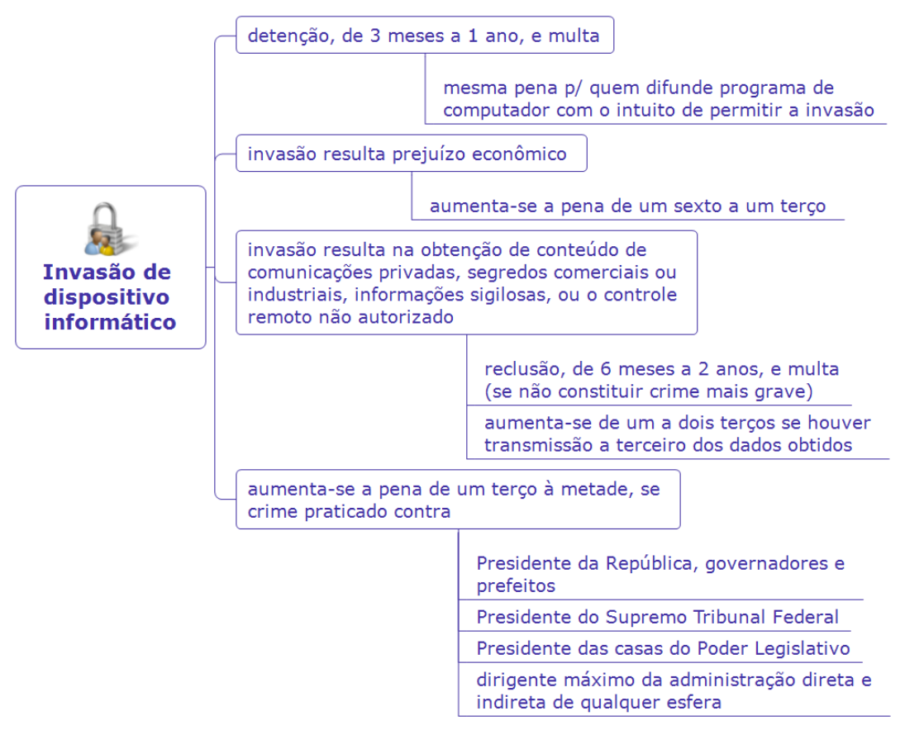

---
fonte_pdf: "Legislação - Aula 02.pdf"
paginas: 9
conversao: texto-e-imagens
---

<!-- pagina: 2 -->

**Antonio Daud Aula 02** 

# **Índice** 

<mark>................................................................................1) Lei de Delitos Informáticos - Lei nº 12737/2012</mark> ..............................................................................................................3

---

<!-- pagina: 3 -->

**Antonio Daud Aula 02** 

# **<mark>I</mark> NTRODUÇÃO** 

Olá, amigas (os)! 

Nesta aula estudaremos especificamente a Lei dos Delitos Informáticos (Lei 12.737/2012). Apelidada de “ Lei Carolina Dieckmann ”, em alusão à atriz que teve fotos íntimas divulgadas após um grupo de hackers supostamente invadir seu computador pessoal, a lei inseriu novos crimes no Código Penal, buscando coibir tais práticas. 

Nove anos depois, surgiu a Lei 14.155/2021 , trazendo aprimoramentos à redação do crime tipificado pela Lei 12.737/2012. 

Vamos inicialmente comentar o tema de acordo com a Lei 12.737/2021 e, no próximo capítulo, vamos tratar da atual redação do Código Penal, dada pela Lei 14.155/2021. 

O assunto não possui incidência significativa em provas, sendo que iremos comentar no corpo da aula aquelas mais relevantes. 

Vamos lá! 

# **<mark>– C</mark> RIMES** **<mark>T</mark> IPIFICADOS** **<mark>L</mark> EI** **<mark>12.737/2012</mark>** 

O Código Penal foi alterado pela Lei 12.737/2012, tendo sido acrescido novo crime (invasão de dispositivo informático) e particularidades sobre a respectiva ação penal (arts. 154-A e 154-B). No ano de 2021, este tipo penal foi alterado pela Lei 14.155/2021. 

Vamos inicialmente comentar o tema de acordo com a Lei 12.737/2021 e, no próximo capítulo, vamos tratar da atual redação do Código Penal, dada pela Lei 14.155/2021. 

## Crime de Invasão de dispositivo informático 

Com a Lei 12.737/2012, o Código Penal passou a prever como crime: 

Art. 154-A. **Invadir dispositivo informático alheio** , conectado ou não à rede de computadores, mediante <u>violação indevida de mecanismo de segurança e com o fim de</u> obter, adulterar ou destruir dados ou informações sem autorização expressa ou tácita do titular do dispositivo ou instalar vulnerabilidades para obter vantagem ilícita: 

Pena - **<u>detenção</u>** <u>, de 3 (três) meses a 1 (um) ano, e</u> **multa** .

---

<!-- pagina: 4 -->

**Antonio Daud Aula 02** 

Este dispositivo foi cobrado na seguinte questão: 

#### **Cebraspe/Serpro-2023** 

Em conformidade com a Lei n.º 12.737/2012 (Lei de Delitos Informáticos), aquele que invadir dispositivo informático alheio, mediante violação indevida de mecanismo de segurança, com o fim de obter, adulterar ou destruir dados ou informações, sem autorização expressa ou tácita do titular do dispositivo, estará sujeito à pena de detenção, de três meses a um ano, e multa. 

Gabarito (C) 

Seguindo adiante... 

Na mesma pena incorre quem produz, oferece, distribui, vende ou difunde dispositivo ou programa de computador com o intuito de permitir a prática dessa conduta definida no caput do art. 154-A (§ 1º). 

Este detalhe foi cobrado nesta questão de prova: 

#### **Cebraspe/Dataprev-2023** 

De acordo com a Lei n.º 12.737/2012, que dispõe sobre delitos informáticos, quem produz dispositivo ou programa de computador com o intuito de permitir a prática de invasão de dispositivo informático incorre na mesma pena de quem efetivamente procede à conduta de invadir dispositivo informático alheio. Gabarito (C) 

Aumenta-se a pena de um sexto a um terço se da invasão resulta prejuízo econômico (§ 2º). 

Além disso, a depender dos resultados da invasão do dispositivo, a pena poderá ser mais dura. Assim, prevê o CP que: 

Art. 154-A, § 3º Se **da invasão resultar a obtenção de** conteúdo de <u>comunicações eletrônicas privadas, segredos comerciais ou industriais, informações sigilosas, assim</u> definidas em lei, ou o controle remoto não autorizado do dispositivo invadido: Pena - **<u>reclusão</u>** <u>, de 6 (seis) meses a 2 (dois) anos, e</u> **multa** , se a conduta não constitui crime mais grave. 

§ 4º Na hipótese do § 3º , aumenta-se a pena de **um a dois terços** se houver divulgação, comercialização ou transmissão a terceiro, a qualquer título, dos dados ou informações obtidos. 

Por fim, buscando proteger de modo diferenciado a privacidade e intimidade de autoridades brasileiras, o art. 154-A ainda prevê que:

---

<!-- pagina: 5 -->

**Antonio Daud Aula 02** 

Art. 154-A, § 5º Aumenta-se a pena de **um terço à metade** se o crime for praticado contra: I - Presidente da República, governadores e prefeitos; 

II - Presidente do Supremo Tribunal Federal; 

III - Presidente da Câmara dos Deputados, do Senado Federal, de Assembleia Legislativa de Estado, da Câmara Legislativa do Distrito Federal ou de Câmara Municipal; ou 

IV - dirigente máximo da administração direta e indireta federal, estadual, municipal ou do Distrito Federal.” 

### ➢ **Ação penal sobre a Invasão de dispositivo informático** ==5460== 

No crime de invasão de dispositivo informático (definido no art. 154-A), o Código Penal estabelece que, como regra, os suspeitos somente serão processados se houver, antes, representação do ofendido . É o que se chama de ação penal pública condicionada à representação do ofendido. 

No entanto, se o crime é cometido contra a administração pública direta ou indireta de qualquer dos Poderes da União, Estados, Distrito Federal ou Municípios ou contra empresas concessionárias de serviços públicos, a ação poderá ser ajuizada mesmo sem tal representação. 

---

<!-- pagina: 6 -->

**Antonio Daud Aula 02** 

Outros crimes alterados pela Lei 12.737/2012 

Além de tipificar o crime no art. 154-A, a Lei 12.737/2012 ainda alterou outros dois crimes no Código Penal, salientados a seguir. 

- ➢ **Interrupção ou perturbação de serviço telegráfico, telefônico, informático, telemático ou de informação de utilidade pública** 

Aquele que interromper serviço telemático ou de informação de utilidade pública, ou impedir ou dificultar o restabelecimento, estará sujeito à pena de detenção , de um a três anos, e multa (art. 266, § 1º). 

Além disso, aplicam-se as penas em dobro se o crime é cometido por ocasião de calamidade pública (§2º).

---

<!-- pagina: 7 -->

**Antonio Daud Aula 02** 

### ➢ **Falsificação de cartão** 

O legislador equiparou a falsificação de cartão de crédito ou débito à falsificação de um documento particular, para fins criminais. Portanto, nos termos do art. 298 do CP, quem falsificar cartão, estará sujeito à pena de reclusão , de um a cinco anos, e multa . 

# **<mark>– C</mark> RIMES** **<mark>T</mark> IPIFICADOS ATUAL REDAÇÃO** **<mark>(L</mark> EI** **<mark>14.155/2021)</mark>** 

Agora vamos comentar o crime de invasão de dispositivo informático de acordo com a atual redação do Código Penal, dada pela Lei 14.155/2021. 

## Crime de Invasão de dispositivo informático 

O Código Penal atualmente prevê como crime: 

Art. 154-A.  Invadir dispositivo informático de uso alheio, conectado ou não à rede de computadores, **com o fim de obter, adulterar ou destruir dados ou informações sem autorização** expressa ou tácita **do usuário do dispositivo** ou de instalar vulnerabilidades para obter vantagem ilícita: 

Pena – **reclusão** , de **1 (um)** a **4 (quatro) anos** , e multa. 

~~Pena - detenção, de 3 (três) meses a 1 (um) ano, e multa.~~ (redação anterior) 

Seguindo adiante... 

Da mesma forma que já previu a Lei 12.737/2012, incorre na mesma pena quem produz, oferece, distribui, vende ou difunde dispositivo ou programa de computador com o intuito de permitir a prática dessa conduta definida no caput do art. 154-A (§ 1º). 

Aumenta-se a pena de um sexto a dois terços se da invasão resulta prejuízo econômico (§ 2º). Pela redação anterior, dada pela Lei 12.737/2012, o aumento era de um sexto a um terço. 

Além disso, a depender dos resultados da invasão do dispositivo, a pena poderá ser mais dura. Assim, atualmente prevê o CP que: 

Art. 154-A, § 3º Se **da invasão resultar a obtenção de** conteúdo de <u>comunicações eletrônicas privadas, segredos comerciais ou industriais, informações sigilosas, assim</u> definidas em lei, ou o controle remoto não autorizado do dispositivo invadido:

---

<!-- pagina: 8 -->

**Antonio Daud Aula 02** 

Pena – reclusão, de **2 (dois) a 5 (cinco) anos** , e multa. 

~~Pena - reclusão, de 6 (seis) meses a 2 (dois) anos, e multa, se a conduta não constitui crime mais grave.~~ (redação anterior) 

§ 4º Na hipótese do § 3º , aumenta-se a pena de **um a dois terços** se houver divulgação, comercialização ou transmissão a terceiro, a qualquer título, dos dados ou informações obtidos. 

- - - - 

De todo o exposto, observa-se que a Lei 14.155/2021 atuou principalmente no sentido de aumentar as penas cominadas, modificando de detenção para reclusão e também majorando os prazos. Outra modificação importante é que a atual redação não mais exige, para a caracterização do crime, a “violação indevida de mecanismo de segurança”, que antes havia sido prevista na Lei 12.737/2012.

---

<!-- pagina: 9 -->

