---
fonte_pdf: "Português - Aula 03.pdf"
paginas: 117
conversao: texto-e-imagens
---

<!-- pagina: 2 -->

**Equipe Português Estratégia Concursos, Felipe Luccas Aula 03** 

## **Índice** 

|.............................................................................................................................................................................................. 1) Noções Iniciais de Classes de Palavras II 3|
|---|
|.............................................................................................................................................................................................. 2) Preposições 4|
|.............................................................................................................................................................................................. 3) Conjunções 13|
|.............................................................................................................................................................................................. 4) Conectivos FGV 42|
|.............................................................................................................................................................................................. 5) Resumo - Classes de palavras II 54|
|.............................................................................................................................................................................................. 6) Questões Comentadas - Conectivos - FGV 60|
|.............................................................................................................................................................................................. 7) Lista de Questões - Conectivos - FGV 97|

---

<!-- pagina: 3 -->

**Equipe Português Estratégia Concursos, Felipe Luccas Aula 03** 

## **NOÇÕES INICIAIS** 

Olá, pessoal!!! 

Vamos dar início ao estudo de duas classes de palavras que denominamos de Conectivos. 

Nesta aula, veremos o uso das preposições e das conjunções. Trata-se de um assunto dos mais cobrados dentro desse tema, em TODA PROVA. 

Vamos ser práticos. São assuntos muito simples: na parte das preposições, vamos entender a diferença entre preposições relacionais e nocionais. Esse entendimento é essencial para uma correta análise sintática. 

Em relação às conjunções, você vai decorar aquelas que sempre terão os mesmos sentidos e isso vai ser suficiente para acertar a maioria das questões; até porque a maioria são palavras bem conhecidas, exceto umas um pouco diferentes como **conquanto** , **porquanto, destarte** ... Em alguns casos, as conjunções podem trazer sentidos diferentes do esperado, mas aí vamos apontar o detalhe para você ficar atento. 

Lembre-se: esta aula é vital para a compreensão das diversas orações subordinadas e coordenadas, pois são as conjunções que as iniciam. 

---

<!-- pagina: 4 -->

**Equipe Português Estratégia Concursos, Felipe Luccas Aula 03** 

## **<mark>PREPOSIÇÕES</mark>** 

A preposição é uma classe de palavras invariável, ou seja, que não se flexiona. A função dessa classe é **conectar palavras** e **iniciar orações reduzidas** . Normalmente, as preposições vão compor **locuções** . Quando ligada a adjetivos, formará uma locução adjetiva (ou seja, um adjetivo formado por mais de uma palavra); quando ligada a um advérbio, formará uma locução adverbial (ou seja, um advérbio formado por mais de uma palavra); e assim por diante. 

Vamos relembrar as principais preposições: **a, com, de, em, para, ante, até, após, contra, sem, sob, sobre, per, por, desde, trás, perante.** 

Ex: Gosto **<u>de</u>** <u>chocolate (a preposição liga a palavra "chocolate" ao verbo "gostar")</u> 

Ex: Tenho medo **<u>de</u>** <u>cobra (a preposição liga a palavra "cobra" ao nome "medo")</u> 

Ex: **<u>Sem</u>** <u>estudar, não será possível passar no concurso (a preposição introduz a oração reduzida</u> de infinitivo) 

Ex: Esta mesa é **<u>de</u>** <u>mármore (a preposição forma uma locução adjetiva)</u> 

### **Preposições Essenciais e Acidentais:** 

São chamadas de “essenciais” as preposições puras, que só atuam como preposição: **a, com, de, em, para, por, desde, contra, sob, sobre, ante, sem...** 

São chamadas de preposições **“acidentais”** aquelas palavras que na verdade **pertencem a outra classe** , mas que, “acidentalmente”, em determinados contextos, passam a ser preposição: **consoante, conforme, segundo (quando não introduzem oração), como, que, mesmo, durante, mediante...** 

Ex: Tenho **de** estudar/Tenho **que** estudar (essas expressões são equivalentes e o “que” é uma preposição acidental, pois é uma conjunção que está “acidentalmente” no papel de preposição (“de”). 

Ex: Eu jogo **de** goleiro/ Eu jogo **como** goleiro. (“como” é conjunção, mas aqui está no papel de preposição (“de”). 

As palavras <u>salvo, exceto, exclusive, afora, menos</u> e <u>senão são consideradas preposições</u> acidentais quando introduzem locuções adverbiais com sentido de exclusão: 

Ex: **Salvo** aquele capítulo, o livro inteiro é bom. 

Ex: O livro inteiro é bom, **menos** aquele capítulo. 

Usamos **eu** e **tu** após preposições acidentais ou palavras denotativas: 

Ex: **Fora** tu, todos erraram ( **fora** é preposição acidental) 

Ex: **Atétu** , Brutus! ( **até** , nesse contexto, é palavra denotativa de inclusão)

---

<!-- pagina: 5 -->

**Equipe Português Estratégia Concursos, Felipe Luccas Aula 03** 

Com **preposições essenciais** , devemos usar as formas pronominais oblíquas: 

Ex: Venha **até** <u>mim e haverá bênçãos</u> **para** <u>ti.</u> 

### **Preposições Relacionais e Nocionais:** 

As preposições que são exigidas por verbos e nomes, ou seja, que são regidas, têm “valor relacional”. São preposições **eminentemente gramaticais** e introduzem funções sintáticas de complemento, como objetos diretos, indiretos e complementos nominais. Em suma, são aquelas preposições obrigatórias, pedidas pela regência (exigidas pelas palavras que pedem um complemento). 

Ex: Desconfio **<u>de</u>** <u>um funcionário. (</u> **“relacional”** - introduz complemento de verbo) 

Ex: Tenho medo **<u>de</u>** <u>cobra. (</u> **“relacional”** - introduz complemento de substantivo) 

Ex: Estou desconfiado **<u>de</u>** <u>um funcionário. (</u> **“relacional”** - introduz complemento de adjetivo) 

Ex: Agi favoravelmente **<u>a</u>** <u>suas escolhas. (</u> **“relacional”** - introduz complemento de advérbio) 

Então, se a preposição introduzir um complemento obrigatório de um verbo, substantivo, adjetivo ou advérbio, ela será uma preposição gramatical/relacional e será exigência de um termo anterior. 

As que não são exigidas obrigatoriamente, mas aparecem para estabelecer “relações de sentido”, têm valor **“nocional”** , pois trazem noção de posse, causa, instrumento, matéria, modo, etc. Geralmente introduzem adjuntos adnominais e adverbiais. 

Ex: Este é o carro **de** Ricardo. ( **“nocional”** - introduz locução indicativa de posse) 

Ex: Tenho um violão **de** madeira. ( **“nocional”** - indica qualidade/matéria) 

Ex: Estudo **de** noite. ( **“nocional”** - introduz circunstância de tempo) 

Ex: Ele morreu **de** fome. ( **“nocional”** - introduz circunstância de causa) 

Então vamos analisar um exemplo e ver qual preposição é exigida gramaticalmente por um termo anterior: 

Ex: Discordo **de** argumentos **<u>de</u>** <u>direita.</u> 

O verbo “discordar” pede a preposição “ **de** ”. A expressão “de argumentos” é um objeto indireto. Essa preposição tem valor relacional, pois é obrigatória, própria do verbo “discordar”. Repare que inicia um complemento! 

Já a expressão preposicionada “ **de** direita” é uma locução adjetiva, pois equivale a um adjetivo: “direitistas”. Por ter esse valor de adjetivo, exerce função de adjunto adnominal, ligado ao nome “argumentos”. Observe agora que ela não é exigida pelo termo anterior, está aqui para fazer uma relação de sentido, para introduzir a “noção” de tipo ou qualidade dos argumentos. 

A distinção entre esses dois tipos de preposição é fundamental para a análise sintática. 

### **Contração das preposições:** 

As preposições podem ser contraídas com outras classes:

---

<!-- pagina: 6 -->

**Equipe Português Estratégia Concursos, Felipe Luccas Aula 03** 

- Preposição a + Artigos 

a + a, as, o, os **= à, às, ao, aos** 

- Preposição a + Pronomes demonstrativos 

a + aquele, aquela, aqueles, aquelas, aquilo **= àquele, àquela, àquelas, àquilo** 

- A preposição a + Advérbios 

a + onde = **aonde** 

- A preposição por + Artigos 

por + o, a, os, as **= pelo, pela, pelos, pelas** 

- Preposição de + Artigos 

de + o, a, as, um, uns, uma, umas **= do, da, das, dum, duns, duma, dumas** 

- Preposição de + Pronomes pessoais 

de + ele, ela, eles, elas **= dele, dela, deles, delas** 

- Preposição de + Pronomes demonstrativos 

de + este, esta, estes, estas, isto, esse, aquele, aquelas, aquilo 

- **=deste, desta, destes, destas, disto, desse, daquele, daquelas, daquilo** 

- Preposição de + Pronome indefinido 

de + outro, outras, = doutro, doutras 

- Preposição de + Advérbios 

de + aqui **= daqui** ; de + aí **= daí** ; de + ali **= dali** ; de + além **= dalém** 

- A preposição em + Artigos 

em + o, a, as, um, uns, uma, umas 

- **= no, na, nas, num, nuns, numa, numas** 

- A preposição em + Pronomes pessoais 

em + ele, ela, eles, elas **= nele, nela, neles, nelas** 

- A preposição em + Pronomes demonstrativos 

em + este, esta, estes, estas, isto, esse, essa, esses, essas, isso, aquele, aquela, aqueles, aquelas, aquilo 

- **= neste, nesta, nestes, nestas, nisto, nesse, nessa, nesses, nessas, nisso, naquele, naquela, naqueles, naquelas** 

### **Valor semântico da preposição (valor nocional)** 

As preposições nocionais não são exigidas pela gramática, mas são usadas para trazer **noções, circunstâncias, valores semânticos** . Não há como decorar e antever todas as possibilidades. Olhe sempre para o **termo que aparece depois** da preposição e tente pensar no papel que aquele termo exerce; aí você terá pistas sobre o sentido da preposição. Vejamos as principais relações

---

<!-- pagina: 7 -->

**Equipe Português Estratégia Concursos, Felipe Luccas Aula 03** 

de sentido que caem em prova. 

Ex: Escrevi a lápis. (instrumento) 

Ex: Meu violão é de mogno. (matéria) 

Ex: Fui ao cinema com ela. (companhia) 

Ex: Fiquei chocado com a novidade. (causa) 

Ex: Estou morrendo de frio. (causa) 

Ex: Não fale de/sobre corrupção aqui. (assunto) 

Ex: Vou para um lugar melhor. (direção; vai e fica lá; definitivo) 

Ex: Vou a um lugar melhor. (direção; vai e volta; provisório) 

Ex: Estudo para passar em primeiro lugar. (finalidade) ==5460== Ex: Para Freud, o sonho é um desejo reprimido. (conformidade/opinião/referência) 

Ex: Devolva-me o livro do aluno. (posse) 

Ex: Feri-me com a faca. (instrumento) 

Ex: Vivo de aluguéis e investimentos. (meio) 

Ex: Vivo só com a renda da aposentadoria. (meio) 

Ex: Estudo com gana. (modo) 

Ex: Sou contra o populismo. (oposição) 

Ex: O prazo para posse é de 30 dias. (tempo) 

Ex: Não sou de Campinas. (origem) 

Ex: Com mais um minuto, resolveria aquele problema. (tempo) 

Ex: Resolvi a questão com um macete. (instrumento) 

Após as preposições “ante” e “perante”, preposições indicativas de lugar, não se usa preposição “a”. 

### **Locuções prepositivas:** 

São grupos de palavras que equivalem a uma preposição. Se eu disser “falei **sobre** o tema” ou “falei **acerca do** tema”, a locução substitui perfeitamente a preposição. As locuções prepositivas sempre terminam em uma preposição, exceto a locução com sentido concessivo/adversativo “não obstante”: 

Veja alguns pares importantes com alguns sentidos que podem assumir: 

- ✔ Embaixo de > sob (lugar) 

- ✔ A fim de > para (finalidade) 

- ✔ Dentro de > em (lugar)

---

<!-- pagina: 8 -->

**Equipe Português Estratégia Concursos, Felipe Luccas Aula 03** 

✔ De encontro a > contra (posição) 

✔ Acerca de > sobre (assunto) 

✔ Devido a > com (causa) 

✔ Em virtude de > por (causa) 

✔ A respeito de > sobre (assunto) 

✔ Por meio de > através (meio) 

Rigorosamente, a gramática condena o uso de “através” com sentido de “meio” (Ex: fiquei rico através de investimentos) e limita essa preposição à ideia de “atravessar” (Ex: A luz passa através da janela.) 

Fique atento, pois as bancas gostam de pedir a substituição de uma preposição ou locução prepositiva por uma conjunção ou locução conjuntiva com mesmo valor semântico: Estudo a fim **=** de/para passar Estudo a fim de que passe. **A substituição é possível, mas exige adaptações na estrutura da sentença.** 

**A preposição “de” é expletiva, de realce, e pode ser retirada da frase sem prejuízo sintático e sem alteração relevante de sentido em:** 

**Estruturas comparativas: Como mais (do) que você.** 

**Alguns apostos especificativos: O bairro (das) Laranjeiras satisfeito sorri.** 

**Orações subordinadas predicativas: A sensação foi (de) que não mudou.** 

**Predicativo do objeto do verbo chamar ou denominar: Jonny me chamou (de) estúpido.** 

**Algumas estruturas do tipo artigo + adjetivo substantivado + de + substantivo: O maldito** **<u>(do) gato foi atropelado 7 vezes!</u>**

---

<!-- pagina: 9 -->

**Equipe Português Estratégia Concursos, Felipe Luccas Aula 03** 

###### **(TRT-MT / 2022)** 

Em “O espelho recusou-se <u>a</u> responder <u>a Lavínia que ela é a mais bela mulher do Brasil.” (1º</u> parágrafo), os termos sublinhados constituem, respectivamente, 

a) uma preposição, um artigo e um pronome. 

b) um pronome, um artigo e um artigo. 

c) um artigo, um pronome e um artigo. 

d) um pronome, uma preposição e um pronome. 

e) uma preposição, uma preposição e um artigo. 

###### **Comentário** 

Aqui temos uma sequência: 

"recusar-se a algo" => o "a" é uma preposição que rege o verbo “recusar” 

"responder a alguém" => o "a" também é preposição que rege o verbo "responder" 

"a mais bela" => o "a" é artigo que acompanha o superlativo. Portanto, **Gabarito Letra E.** 

###### **(SEFAZ-AL / 2020)** 

É uma loja grande e escura no centro da cidade, uma quadra distante da estação de trem. Quando visito a família, entre um churrasco e outro, vou até lá para olhar as gôndolas atulhadas de baldes, bacias, chaves de fenda, garfos, colheres, facas, afiadores de vários modelos, pedras de amolar, parafusos, porcas, pregos, anzóis e varas de pescar. 

Sem prejuízo da correção gramatical e dos sentidos do texto, a expressão “uma quadra distante da estação de trem” (1º parágrafo) poderia ser substituída por **a uma quadra de distância da estação de trem.** 

###### **Comentário** 

A preposição “a” aqui dá ideia de limite: estar a uma quadra=estar à distância de uma quadra=estar uma quadra distante. 

**Gabarito: questão correta.** 

**(SEFAZ-DF / 2020)**

---

<!-- pagina: 10 -->

**Equipe Português Estratégia Concursos, Felipe Luccas Aula 03** 

No trecho “os investidores reconhecem cada vez mais o impacto, para a sociedade, das empresas nas quais investem”, a substituição de “nas quais” por **aonde** prejudicaria a correção gramatical do texto. 

###### **Comentário** 

Investir pede preposição “em”. 

###### os investidores investem **<u>nas empresas (em + as empresas)</u>** 

Trocando “ **<u>as empresas</u>** ” por um pronome relativo, temos “ **<u>as quais</u>** ” 

as empresas “nas quais investem” **<u>(em + as quais)</u>** 

Então, não cabe usar “aonde”, pois o verbo não pede preposição “a”.  Mesmo o pronome “onde” não seria adequado, pois não temos lugar físico. 

###### **Gabarito: questão correta.** 

###### **(PGE-PE / 2019)** 

Ninguém poderia ficar impassível diante de uma mudança dessa envergadura. Por isso a sensação mais difundida é a desorientação. 

Seria mantida a correção gramatical do texto se o trecho “diante de uma mudança” fosse alterado para **ante a uma mudança** . 

###### **Comentários:** 

Após as preposições “ante” e “perante”, preposições indicativas de lugar, não se usa preposição “a”. A redação seria apenas: ante/perante uma mudança. 

**Gabarito: questão incorreta.** 

###### **(PGE-PE / 2019)** 

Que fique claro: não tenho nenhuma intenção de difamar ou condenar o passado **para absolver o presente** , nem de deplorar o presente **para louvar os bons tempos antigos** . Desejo apenas ajudar a que se compreenda que todo juízo excessivamente resoluto nesse campo corre o risco de parecer leviano. 

No período em que se inserem, os trechos “para absolver o presente” e “para louvar os bons tempos antigos” exprimem finalidades. 

###### **Comentários:** 

Sim. A preposição “para” antes de uma ação indica classicamente o sentido de propósito, na forma de uma oração subordinada adverbial final. 

###### **Gabarito: questão correta.** 

###### **(TCE-PB / 2018)** 

Portanto, do ponto de vista cronológico, a fala tem precedência sobre a escrita, mas, do ponto de vista do prestígio social, a escrita tem supremacia sobre a fala na maioria das sociedades contemporâneas.

---

<!-- pagina: 11 -->

**Equipe Português Estratégia Concursos, Felipe Luccas Aula 03** 

A expressão “sobre a”, nas linhas 1 e 2, tem o sentido de **a respeito da** . 

###### **Comentários:** 

Quando o sentido é de assunto, essa troca é possível: 

Falei **sobre a miséria** 

Falei **a respeito da miséria** 

Falei **acerca da miséria** 

Contudo, não é o caso aqui. 

O sentido nesse contexto é de prevalência, de posição superior. 

**Gabarito: questão incorreta.** 

###### **(IPHAN / 2018)** 

Com a multiplicação das demandas sociais, no lugar de soluções únicas para a cidade, passou-se a considerar a segmentação ainda maior de interesses. 

Mantendo-se a correção gramatical e a coerência do texto, a expressão “Com a” (ℓ.1) poderia ser substituída pela expressão **Devido à** . 

###### **Comentários:** 

A multiplicação das demandas sociais é a causa da segmentação de interesses que dificulta a tomada de uma decisão única. Portanto, o termo introduzido por “com” poderia sim ser substituído pela locução causal ‘devido a...’ 

**Devido à** multiplicação das demandas sociais, no lugar de soluções únicas para a cidade, passou-se a considerar a segmentação ainda maior de interesses. É cada vez mais difícil imaginar que uma ação pública vá atingir a aspiração de todos em um único objetivo comum. 

**Gabarito: questão correta.** 

###### **(IFF / 2018)** 

É comum que pais de baixa escolaridade lutem para que os filhos tenham acesso a um ensino de qualidade... 

A oração “para que os filhos tenham acesso a um ensino de qualidade” expressa circunstância de a) finalidade.   b) causa.   c) modo.   d) proporção.   e) concessão. 

###### **Comentários:** 

Os filhos terem acesso ao estudo é o propósito, a finalidade da luta dos pais. Então a preposição “para” introduz oração final. 

**Gabarito letra A.** 

###### **(PF / 2018)** 

A maioria dos laboratórios acredita que o acúmulo de trabalho é o maior problema que enfrentam, e boa parte dos pedidos de aumento no orçamento baseia-se na **dificuldade de** dar

---

<!-- pagina: 12 -->

**Equipe Português Estratégia Concursos, Felipe Luccas Aula 03** 

conta de tanto serviço. 

A preposição “de” empregada logo após “dificuldade” poderia ser corretamente substituída por **em** . 

###### **Comentários:** 

Não há qualquer prejuízo. Alguns verbos ou substantivos que pedem preposição “de” ou “com”, quando seguidos de uma oração, passam a utilizar a preposição “em”: Dificuldade “em” dar conta do problema. 

Dificuldade “em” fazer cálculos. 

Concordamos “em” assinar um contrato. Sonhamos muito “em” fazer essa viagem. 

**Gabarito: questão correta.**

---

<!-- pagina: 13 -->

**Equipe Português Estratégia Concursos, Felipe Luccas Aula 03** 

## **<mark>CONJUNÇÕES</mark>** 

Podem ser chamadas de síndeto, conectivos, elementos de coesão, operadores argumentativos... Assim como as preposições, as conjunções são conectores. Ligam orações diferentes ou termos de uma mesma oração. Também podem ligar parágrafos e traçar relações lógicas (adição, oposição, reafirmação, ressalva...) entre eles. 

Quando ligam **orações de sentido completo, sintaticamente independentes, são chamadas coordenativas** . Se ligarem orações **dependentes** umas das outras sintaticamente, são chamadas **subordinativas** . Então basicamente esta é a diferença: na subordinação, um termo ou oração exerce função sintática (sujeito, complemento, adjunto) em outro termo ou oração. Na relação de coordenação, os termos são independentes, são apenas colocados lado a lado sem uma relação necessária de dependência sintática. Vejamos: 

Ex: Cães **e** gatos são fofinhos. (coordenação) 

Ex: Acordei cedo **e** fui correr. (coordenação) 

Ex: O carro é bonito, **mas** caro. (coordenação) 

Ex: **Quando** eu chegar, todas as alegrias estarão completas. (subordinação) 

Ex: É necessário **que** haja mais compreensão. (subordinação) 

Ex.: João, que é filho único, vive solitário. (subordinação) 

Bem, pessoal, agora que já sabemos o conceito, vamos a elas: 👇 👇 

#### **CONJUNÇÕES COORDENATIVAS** 

Ligam orações **coordenadas** , ou seja, **independentes** , estabelecendo uma relação de sentido entre elas (adição, oposição, alternância, explicação ou conclusão). 

Ex: Acordei tarde, **mas** fui correr. 

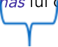

**Oração Independente****1** **Oração Independente****2** 

Dizemos que as orações são independentes porque têm sentido completo. Se retirássemos a conjunção, ainda assim teríamos duas orações com pleno sentido. 

**Locuções conjuntivas** são conjuntos de palavras que **equivalem** a conjunções. “No entanto” é locução conjuntiva equivalente à conjunção “mas”; “Visto que” equivale a “porque”; “por isso” equivale a “portanto” e assim por diante. 

Algumas conjunções são formadas por um **par correlato** , como a correlação alternativa “ **quer x...quer y”** , a correlação proporcional **“quanto mais x mais y”** , e assim por diante.  As questões não cobram esse detalhe de nomenclatura, portanto trataremos aqui esses termos simplesmente por conjunção, isto é, chamaremos “mas” e “no entanto” de conjunção adversativa.

---

<!-- pagina: 14 -->

**Equipe Português Estratégia Concursos, Felipe Luccas Aula 03** 

Vamos agora aos tipos de conjunção coordenativa. São apenas 5 sentidos e temos que memorizá-los. 

#### **Conjunções Coordenativas Aditivas** 

Ligam orações ou palavras, com sentido de adição: **e, nem (e não), bem como,** e as correlações **não só...como também/mas também/mas ainda...** 

Ex: Estudei constitucional **e** administrativo. 

Ex: Não fiz exercícios **nem** revisei. 

Ex: **Não só** trabalho **como** também estudo. 

Observe que não devemos dizer “e nem”, pois seria redundante a repetição do “e” que já faz parte do sentido da conjunção. 

── ── Esses “pares” não só...como também/mas também/mas ainda... são mais enfáticos do que o mero E aditivo; por isso, chamam-se “correlações aditivas enfáticas”. 

Observe também que a conjunção aditiva, quando liga fatos no tempo, pode indicar sequência cronológica: Vim e vi e venci. 

**Atenção:** A palavra “ **senão** ” pode ter sentido aditivo (normalmente usado após não **só/não apenas/não somente** , equivalente a “ **mas também** ”) **.** 

Ex: O labrador era o favorito, **não só** da mãe, **senão** de toda a família. 

**A palavra tampouco é advérbio, mas pode vir a substituir uma conjunção aditiva, quando for equivalente a “nem”: Não malho, tampouco faço dieta!** 

Também tem caído bastante nas provas a palavra “ **ainda** ”, com sentido aditivo: 

Ex: Eu trabalho, estudo e **ainda** (além disso) cuido de sete crianças. 

###### **(TELEBRAS / 2022)** 

Um maior acesso pode significar mais progressos no domínio da realização dos Objetivos de Desenvolvimento do Milênio. A Internet impulsiona a atividade econômica, o comércio e até a educação. A telemedicina está melhorando os cuidados com a saúde, os satélites de observação terrestre são usados para combater as alterações climáticas e as tecnologias ecológicas contribuem para a existência de cidades mais limpas. 

No trecho “os satélites de observação terrestre são usados para combater as alterações climáticas e as tecnologias ecológicas contribuem para a existência de cidades mais limpas”, a substituição da conjunção “e” por uma vírgula manteria a correção gramatical e a coerência do texto.

---

<!-- pagina: 15 -->

**Equipe Português Estratégia Concursos, Felipe Luccas Aula 03** 

###### **Comentários:** 

A conjunção coordenativa e a vírgula dividem a função de “coordenar” orações independentes, então podem sim ser utilizados aqui: 

**e** as os satélites de observação terrestre são usados para combater as alterações climáticas tecnologias ecológicas contribuem para a existência de cidades mais limpas. 

os satélites de observação terrestre são usados para combater as alterações climáticas **,** as tecnologias ecológicas contribuem para a existência de cidades mais limpas. 

O valor aditivo deixaria de estar expresso, mas a questão não pede análise de sentido, apenas de correção e coerência. 

**Gabarito: questão correta.** 

###### **(SEFAZ-RS / 2019)** 

O direito tributário brasileiro depara-se com grandes desafios, principalmente em tempos de globalização e interdependência dos sistemas econômicos. Entre esses pontos de atenção, destacam-se três. O primeiro é a guerra fiscal ocasionada pelo ICMS. O principal tributo em vigor, atualmente, é estadual, o que faz contribuintes e advogados se debruçarem sobre vinte e sete diferentes legislações no país para entendê-lo. Isso se tornou um atentado contra o princípio de simplificação, contribuindo para o incremento de uma guerra fiscal entre os estados, que buscam alterar regras para conceder benefícios e isenções, a fim de atrair e facilitar a instalação de novas empresas. É, portanto, um dos instrumentos mais utilizados na disputa por investimentos, gerando, com isso, consequências negativas do ponto de vista tanto econômico quanto fiscal. 

A competitividade gerada pela interdependência estadual é outro ponto. Na década de 60, a adoção do imposto sobre valor agregado (IVA) trouxe um avanço importante para a tributação indireta, permitindo a internacionalização das trocas de mercadorias com a facilitação da equivalência dos impostos sobre consumo e tributação, e diminuindo as diferenças entre países. O ICMS, adotado no país, é o único caso no mundo de imposto que, embora se pareça com o IVA, não é administrado pelo governo federal — o que dá aos estados total autonomia para administrar, cobrar e gastar os recursos dele originados. **<u>A competência estadual do ICMS gera ainda dificuldades na relação entre as vinte e sete unidades da Federação</u>** <u>, dada a</u> coexistência dos princípios de origem e destino nas transações comerciais interestaduais, que gera a já comentada guerra fiscal. 

A harmonização com os outros sistemas tributários é outro desafio que deve ser enfrentado. É preciso integrar-se aos países do MERCOSUL, além de promover a aproximação aos padrões tributários de um mundo globalizado e desenvolvido, principalmente quando se trata de Europa. Só assim o país recuperará o poder da economia e poderá utilizar essa recuperação como condição para intensificar a integração com outros países e para participar mais ativamente da globalização. 

A correção gramatical e os sentidos originais do texto 1A1-I seriam preservados se, no trecho “A competência estadual do ICMS gera ainda dificuldades na relação entre as vinte e sete unidades da Federação”, o vocábulo “ainda” fosse substituído pela seguinte expressão, isolada por vírgulas. 

A) até então 

B) ao menos

---

<!-- pagina: 16 -->

**Equipe Português Estratégia Concursos, Felipe Luccas Aula 03** 

|C) além disso|
|---|

D) até aquele tempo 

E) até o presente momento 

###### **Comentários:** 

“Ainda” foi usado aqui com valor aditivo, equivalente a “além disso”, “também”: 

“A competência estadual do ICMS gera **, além disso,** dificuldades na relação entre as vinte e sete unidades da Federação” 

Nas demais opções, a banca tenta confundir o candidato com sentidos possíveis, mas que não eram o sentido exato do texto. Vamos ver outros sentidos de “ainda”: 

Quando chegou a prova, **ainda** não me sentia preparado. **(até aquele momento)** 

Depois de tanto tempo, você **ainda** não entendeu. **(até o presente momento; até agora)** 

Cheguei **ainda** agora. **(valor de reforço)** 

Ela cuida de sete filhos e **ainda** faz faculdade de medicina. **(além disso)** 

Ele vive atrasado, se **ainda** fosse competente, não o demitiria. **(ao menos; pelo menos)** 

Seu filho só faz bobagem e você **ainda** o recompensa. **(mesmo assim, apesar disso)** 

Não é minha obrigação, **ainda** assim o ajudo. **(mesmo assim, apesar disso)** 

**Gabarito letra C.** 

**(PF / 2018)** 

Em graus diferentes, todos fazemos parte dessa aventura, todos podemos compartilhar o êxtase que surge a cada nova descoberta; se não por intermédio de nossas próprias atividades de pesquisa, ao menos ao estudarmos as ideias daqueles que expandiram e expandem as fronteiras do conhecimento com sua criatividade e coragem intelectual. 

No trecho “se não por intermédio ... intelectual” (L.2-4) as expressões “se não” e “ao menos” poderiam ser substituídas, sem prejuízo para a correção gramatical e os sentidos do texto, por **não só** e **mas também** , respectivamente. 

###### **Comentários:** 

A correlação aditiva enfática “não só X...mas também Y” indica soma, acréscimo. Já a correlação “se não” e “ao menos” indica uma ressalva, uma concessão, uma limitação de possibilidades. Caso não seja possível fazer uma coisa, fará outra mais “factível”. Veja: 

Trouxe um PDF, **não só** para lê-lo inteiro, **mas também** para revisar alguns capítulos ( **sentido aditivo** , vai fazer as duas coisas: ler e revisar) 

Trouxe um PDF, senão para lê-lo inteiro, ao menos para revisar alguns capítulos (vai fazer um ou outro, pelo menos um dos dois) 

Então, há mudança de sentido sim. 

**Gabarito: questão incorreta.**

---

<!-- pagina: 17 -->

**Equipe Português Estratégia Concursos, Felipe Luccas Aula 03** 

**(SEDF / 2017)** Falamos não só de uma crise ecológica, mas também de uma crise civilizatória de amplas dimensões. 

Considerando as ideias e estruturas linguísticas do texto, julgue o item a seguir. A expressão “mas também” introduz no período em que ocorre uma ideia de oposição. **Comentários:** Cuidado: a banca pergunta sobre o “mas também”, que está ligado ao “não só”, numa correlação aditiva. Portanto, o sentido é de soma, não é de oposição. **Gabarito: Questão incorreta. (SEE-DF / 2017)** A muitos desses pregoeiros do progresso seria difícil convencer de que a alfabetização em massa não é condição obrigatória nem sequer para o tipo de cultura técnica e capitalista que admiram. A supressão do vocábulo “nem” preservaria o sentido e a correção gramatical do texto. **Comentários:** O “nem” é uma conjunção aditiva que “soma” unidades negativas, ou seja, soma negações: não estudo **nem** trabalho. 

**Sequer** significa “ao menos, pelo menos”. Embora utilizada em frases negativas, não substitui o “não” ou “nem”, que devem aparecer antes de “sequer” em frases negativas. 

Como temos uma sentença que já é negativa (não), é possível suprimir o “nem”: **não** é condição obrigatória **sequer** para o tipo de cultura. 

Além disso, seria possível utilizar o “nem” sozinho, omitindo o “sequer”. Embora fosse deixar a negação menos enfática, não mudaria o sentido. 

**Gabarito: questão correta.** 

#### **Conjunções Coordenativas Adversativas** 

Ligam orações ou palavras com sentido de contraste, oposição, compensação, ressalva, quebra de expectativa, retificação: **mas, porém, contudo, todavia, entretanto, não obstante, SENÃO (sentido de “mas”)** . 

**mas** Ex: Falou pouco, falou bonito. (relação de compensação, pois pouco não é o oposto de bonito.) 

Ex: Tentei, **porém** não consegui. (relação de oposição, até mesmo reforçada pelo sentido contrário dos verbos.) 

Ex: O professor era muito tímido, **não obstante** falava bem em público (relação de quebra de expectativa) 

Ex: Não tenho um filho **, mas** dois. (relação de retificação, correção.) 

Ex: A culpa não foi da população, **senão** dos vereadores. (aqui, “senão” equivale a “mas sim”,

---

<!-- pagina: 18 -->

**Equipe Português Estratégia Concursos, Felipe Luccas Aula 03** 

com sentido adversativo) 

**Obs:** Veremos adiante que a conjunção “não obstante” também poderá ser concessiva, quando equivaler a “embora”. 

### **Valor adversativo do “E”.** 

Fique atento, pois o **“e”** <u>pode vir com valor</u> **<u>adversativo</u>** , e as bancas muitas vezes exploram isso: Estava querendo ler, e o sono não deixava. (sentido de adversidade). 

Uma pista que indica o valor adversativo do “e” é estar antecedido por vírgula. A regra de pontuação recomenda pôr vírgula antes do “e” adversativo. 

==5460== 

### **Valor argumentativo da conjunção adversativa.** 

Tenha em mente também que **a adversidade é “prima” da concessão** , ambas têm valor de contraste, oposição. **A concessão é uma adversidade que não impede um resultado de se realizar** . 

Em muitas questões, vão ser pedidas reescrituras em que uma concessão será substituída por uma adversidade e vice-versa, com as devidas **<u>adaptações</u>** <u>, já que</u> **conjunções concessivas levam o verbo para o subjuntivo: embora/caso eu possa...** 

Então, segue uma dica para interpretação: 

Em uma frase que conste uma conjunção adversativa, **a informação mais importante é a que vem após a conjunção** . 

Ex: Ela grita do nada, mas é gente boa. (Ser gente boa é mais importante do que ela gritar do nada.) 

Seria totalmente diferente de dizer: “Ela é gente boa, mas grita do nada”, pois, nesse segundo caso, o foco estaria no fato de gritar. 

Para escrever essa última sentença na forma concessiva equivalente, o foco teria que estar na outra oração, não na concessiva: 

Embora seja gente boa, grita do nada! 

✔ Portanto, após a conjunção adversativa é que de fato vem a opinião relevante do falante. 

Veremos, adiante, que a conjunção adversativa constitui um operador argumentativo forte, enquanto a concessiva é um operador argumentativo fraco. 

---

<!-- pagina: 19 -->

**Equipe Português Estratégia Concursos, Felipe Luccas Aula 03** 

###### **(PGE-AM / 2022)** 

É, todavia, certo que o grãozinho não se despegou do cérebro de Quincas Borba (2º parágrafo). 

O termo sublinhado pode ser substituído, sem prejuízo para o sentido original, por: 

(A) nesse caso 

- (B) contudo 

(C) por isso 

- (D) além disso 

(E) portanto 

###### **Comentários:** 

"Todavia" é conjunção adversativa, equivalente a "mas", "porém", "entretanto", "contudo". 

"nesse caso" indica referência e não é conjunção; "por isso" é conjunção explicativa; "além disso" é locução adverbial de adição; "portanto" é conjunção conclusiva. 

**Gabarito letra B.** 

###### **(MP-CE / CARGOS DE NÍVEL MÉDIO / 2020)** 

A separação dos movimentos da informação em relação aos movimentos dos seus portadores e objetos permitiu, por sua vez, a diferenciação de suas velocidades; o movimento da informação ganhava velocidade num ritmo muito mais rápido que a viagem dos corpos ou a mudança da situação sobre a qual se informava. Afinal, o aparecimento da rede mundial de computadores pôs fim — no que diz respeito à informação — à própria noção de “viagem” (e de “distância” a ser percorrida), o que tornou a informação instantaneamente disponível em todo o planeta, tanto na teoria como na prática. 

A substituição do conectivo “Afinal” (L.10) por **Contudo** manteria os sentidos originais do texto. 

###### **Comentários:** 

“Afinal” é um advérbio de conclusão, com sentido de “finalmente”, “no fim das contas”. “Contudo” é conjunção adversativa, então os sentidos são bem diferentes. 

**Gabarito: questão incorreta.** 

###### **(BNB / 2018)** 

O sistema de aprendizagem de máquina diminui a ocorrência de falsos positivos e deve contribuir para cortes de gastos. Contudo, não podemos deixar de considerar uma pessoa que esteja por trás do sistema, pronta para lidar com casos realmente duvidosos, que mereçam ser mais bem avaliados. 

Na linha 2, o termo “Contudo” foi empregado com o mesmo sentido de **Porquanto** . 

###### **Comentários:** 

“Contudo” é conjunção adversativa, como “porém, mas, entretanto, todavia...”. “Porquanto” equivale a “porque”, então indica causa/explicação. 

**Gabarito: questão incorreta.**

---

<!-- pagina: 20 -->

**Equipe Português Estratégia Concursos, Felipe Luccas Aula 03** 

###### **(PF / 2018)** 

Sob o nome de crimes e delitos, são sempre julgados corretamente os objetos jurídicos definidos pelo Código. Porém julgam-se também as paixões, os instintos, as anomalias, as enfermidades, as inadaptações, os efeitos de meio ambiente ou de hereditariedade. 

A substituição de “Porém” (L.2) por **Entretanto** manteria a correção gramatical e os sentidos originais do texto. 

**Comentários** : 

Exato. “Porém” e “Entretanto” são conjunções adversativas e poderiam ser trocadas uma pela outra sem erro ou mudança de sentido. 

**Gabarito: questão correta.** 

**(Polícia Militar - AL / 2018)** 

Tal perigo, porém, não é assim tão grande A palavra “porém” poderia ser corretamente substituída por **mas** , sem alteração da coesão e dos sentidos do texto 

**Comentários** : 

Combinação dos assuntos “pontuação” e “conectivos”. O “mas” é uma conjunção adversativa que deve vir no início da oração, não admite deslocamento, não pode vir entre vírgulas. 

**Gabarito: questão incorreta.** 

**(MPE-RR / Promotor / 2017)** 

Para conviver em sociedade, é necessário, **entretanto** , conter tais impulsos. 

Mantendo-se o sentido original e a correção gramatical do texto, o vocábulo “entretanto” poderia ser substituído por 

a) ainda. 

b) mas. 

c) sobretudo. 

d) todavia. 

**Comentários** : 

Cuidado. O “mas” não pode vir intercalado, como as demais conjunções adversativas. Seu lugar é no início da oração. Então, só poderíamos trocar ENTRETANTO por TODAVIA. Gabarito letra D. 

OBS: O “mas” pode até vir entre vírgulas, mas a vírgula seguinte estará ligada ao termo seguinte, não ao “mas”. 

Ex: Gosto de cerveja, mas, excepcionalmente, hoje não vou beber. 

A segunda vírgula isola o advérbio “excepcionalmente”, não está ligada ao “mas”. 

**Gabarito letra D.**

---

<!-- pagina: 21 -->

**Equipe Português Estratégia Concursos, Felipe Luccas Aula 03** 

#### **Conjunções Coordenativas Alternativas** 

Ligam orações ou palavras com sentido de alternância ou escolha (exclusão): **ou, ou...ou, quer...quer, ora...ora, já...já, seja...seja** . 

Ex: Estude **ou** vá para festa, não dá para ter tudo. (relação de escolha entre opções mutuamente excludentes). 

Ex: Fico motivado **ora ora** pelo salário pela realização. (relação de alternância) 

Ex: **Seja** por bem, **seja** por mal, vou convencê-lo de que estou certo! (Relação de exclusão) 

Ex: Fritura **ou** açúcar em excesso fazem mal à saúde (ambos fazem, por isso mesmo o verbo vem no plural, para atribuir o efeito aos dois!) 

Ex: Edson Arantes do Nascimento, **ou** Pelé, é o rei do futebol (“ou” indicativo de sinonímia, de equivalência semântica: são a mesma pessoa!) 

**Atenção:** A palavra “senão” pode funcionar como conjunção alternativa: 

Ex: Saia agora, **senão** chamarei os guardas. (poderíamos trocar por “ou”) 

###### **(SEFAZ-RS / 2019)** 

Desse modo, **o poder de tributar está na origem do Estado ou do ente político** , a partir da qual foi possível que as pessoas deixassem de viver no que Hobbes definiu como o estado natural (ou a vida pré-política da humanidade) e passassem a constituir uma sociedade de fato, a geri-la mediante um governo, e a financiá-la, estabelecendo, assim, uma relação clara entre governante e governados. 

No trecho “o poder de tributar está na origem do Estado ou do ente político”, a substituição de “ou” por **<u>e</u>** prejudicaria a correção gramatical do texto. 

###### **Comentários:** 

Não prejudicaria, o “ou” indica relação de sinonímia. A inserção do “E” aditivo apenas mudaria o sentido, sem erro gramatical. 

###### **Gabarito: questão incorreta.**

---

<!-- pagina: 22 -->

**Equipe Português Estratégia Concursos, Felipe Luccas Aula 03** 

**(SEDF / 2017)** 

No segundo período do texto, a conjunção “ou” está associada ao valor de inclusão e a conjunção “e” associada ao valor de sequenciação temporal. 

**Comentários:** 

Exatamente. “for vítima” ou “vir alguém” traz um “ou” inclusivo, com sentido de “um, outro ou ambos”. Um não exclui o outro. 

Já o “E” tem sentido aditivo e expressa sequência temporal: primeiro você liga 190, depois você denuncia. 

**Gabarito: questão correta.** 

#### **Conjunções Coordenativas Conclusivas** 

Ligam orações ou palavras com sentido de conclusão ou consequência: **logo, portanto, então, por isso, assim, por conseguinte, destarte, pois (quando vem deslocado)** . 

Ex: Estava preparado, **portanto** não me apavorei. 

Ex: Estou tentando te ajudar, **por isso** quero que você me escute. 

Ex: Estava despreparado, não foi **, pois,** aprovado. 

###### **Se a conjunção vier deslocada, deve estar entre vírgulas!** 

O **pois** no início da oração, isto é, não deslocado entre vírgulas, será explicativo ou causal. 

---

<!-- pagina: 23 -->

**Equipe Português Estratégia Concursos, Felipe Luccas Aula 03** 

###### **(MP-CE / 2020)** 

A liberdade de expressão é particularmente valiosa em uma sociedade democrática, ao ponto de haver quem sustente que, na ausência de uma ampla liberdade de expressão, nenhum governo seria de todo legítimo e não deveria ser denominado democrático. Essa é a perspectiva defendida por Ronald Dworkin, para quem “A livre expressão é uma das condições de um governo legítimo. As leis e políticas não são legítimas a menos que tenham sido adotadas por meio de um processo democrático, e um processo não é democrático se o governo impediu alguém de exprimir as suas convicções acerca de quais devem ser essas leis e políticas”. 

A correção gramatical e a coerência do texto seriam mantidas caso fosse inserida a expressão **por isso** , isolada por vírgulas, entre as palavras “e” e “não”, no segundo parágrafo — **e, por isso, não** . 

###### **Comentários:** 

A liberdade de expressão é particularmente valiosa em uma sociedade democrática, ao ponto de haver quem sustente que, na ausência de uma ampla liberdade de expressão, nenhum governo seria de todo legítimo **e, por isso, não** deveria ser denominado democrático. 

Aqui, temos uma relação conclusiva, indicativa de decorrência lógica: 

sem liberdade de expressão, um governo não é democrático; **portanto** , não deve ser chamado de democrático. 

**Gabarito: questão correta.** 

###### **(EMAP / 2018)** 

A palavra “portanto” introduz, no período em que ocorre, uma ideia de conclusão. 

###### **Comentários:** 

Questão diretíssima. “Portanto” é o conectivo conclusivo mais conhecido. 

**Gabarito: questão correta.** 

###### **(PC-MA / DELEGADO / 2018)** 

Em “É, então, no entrelaçamento ‘paz — desenvolvimento — direitos humanos — democracia’ que podemos vislumbrar a educação para a paz”, o vocábulo “então” expressa uma ideia de 

a) conclusão. b) finalidade. c) comparação. d) causa. e) oposição. 

###### **Comentários** : 

“Então” é conjunção conclusiva: 

“É, **então** , no entrelaçamento ‘paz — desenvolvimento — direitos humanos — democracia’ que podemos vislumbrar a educação para a paz” 

“É, **portanto** , no entrelaçamento ‘paz — desenvolvimento — direitos humanos — democracia’ que podemos vislumbrar a educação para a paz” 

**Gabarito letra A.**

---

<!-- pagina: 24 -->

**Equipe Português Estratégia Concursos, Felipe Luccas Aula 03** 

#### **Conjunções Coordenativas Explicativas** 

Ligam orações ou palavras com sentido de justificativa, explicação: que, porque, pois (se vier no início da oração), **porquanto** . Fique atento porque elas são fortemente sinalizadas pela presença de um **verbo no imperativo** anterior. 

Ex: Fujam, **porque** a bruxa está à solta. 

Ex: Economize recursos, **porquanto** não se sabe do futuro. 

Ex: Fique em silêncio, **pois** o filme já começou. 

Ex: Vem, vamos embora, **que** esperar não é saber. 

**Pois explicativo:** inicia uma oração e justifica a outra: Ex: Volte, pois tenho saudade. **Pois conclusivo:** após o verbo, deslocado entre vírgulas. Ex: Há instabilidade; o dólar voltará, pois, a subir. 

###### **(PC-MA / 2018)** 

A correção gramatical e o sentido do trecho ‘O anonimato ajuda, já que as pessoas se sentem mais protegidas para falar’ seriam preservados caso se substituísse o termo “já que” por 

a) uma vez que. 

b) logo que. 

c) a fim de que. 

d) ainda que. 

**.** e) contanto que 

###### **Comentários:** 

O sentido é basicamente: O anonimato é benéfico, PORQUE as pessoas se sentem mais protegidas para falar. 

Então, temos uma relação explicativa da afirmação inicial de que “o anonimato ajuda”. Logo, podemos trocar “já que” por outro conectivo explicativo: “uma vez que”. 

**Gabarito letra A.**

---

<!-- pagina: 25 -->

**Equipe Português Estratégia Concursos, Felipe Luccas Aula 03** 

#### **CONJUNÇÕES SUBORDINATIVAS** 

Ligam orações **subordinadas** , ou seja, duas orações que **dependem sintaticamente uma da outra** . A oração que é introduzida (iniciada) por uma conjunção subordinativa é chamada de oração **dependente/subordinada** . A outra oração, que não é a introduzida pela conjunção, é chamada de **oração principal** . É muito importante saber essas noções, pois estas conjunções serão a base das orações subordinadas, que também terão sua influência no assunto **pontuação** . 

As conjunções subordinadas podem ser **integrantes** ou **adverbiais** . 

###### **CONJUNÇÃO INTEGRANTE** 

As conjunções **integrantes** indicam que a oração subordinada que elas iniciam integra ou completa **(complementa)** o sentido da oração principal. **Introduzem orações substantivas,** aquelas que podem ser trocadas por “isto/disto” e desempenham funções sintáticas típicas dos substantivos, como **sujeito, objeto direto, objeto indireto, complemento nominal, aposto, predicativo** . As conjunções integrantes não possuem valor semântico próprio e são apenas duas: “que” e “se”. 

### **só quero** **<mark>que você me aqueça nesse inverno</mark>** 

**Oração Principal        Oração Subordinada substantiva Objetiva Direta Complementa o verbo da oração principal Equivale a um objeto direto (só quero** **<mark>isto)</mark>** 

**Conjunção Integrante** 

**Não se apavore! ESTUDAREMOS DETALHADAMENTE AS DIVERSAS ORAÇÕES SUBSTANTIVAS NA AULA DE SINTAXE** , mas já adianto aqui alguns exemplos e suas funções sintáticas, para facilitar a familiarização: 

**Oração subordinada substantiva subjetiva:** 

Exerce a função de sujeito do verbo da oração principal. 

Ex: É necessário **<u>que você estude.</u>** 

**Oração subordinada substantiva objetiva direta** 

Exerce a função de objeto direto do verbo da oração principal. 

Ex: Quero **<u>que você estude.</u>** 

Ex: Eles não sabiam **<u>se haveria aula.</u>** 

###### **Oração subordinada substantiva objetiva indireta** 

Exerce a função de objeto indireto do verbo da oração principal, sendo sempre iniciada por uma preposição. 

Ex: O candidato necessita de **<u>que todos o apoiem agora.</u>** 

Ex: Ela insistiu em **<u>que os alunos estudassem mais.</u>**

---

<!-- pagina: 26 -->

**Equipe Português Estratégia Concursos, Felipe Luccas Aula 03** 

###### **Oração subordinada substantiva completiva nominal** 

Exerce a função de complemento nominal, completando o sentido de um nome pertencente à oração principal. É sempre iniciada por uma preposição. 

Ex: Tenho esperança de **<u>que vamos vencer</u>** . 

Ex: Sinto necessidade de **<u>que você fique ao meu lado.</u>** 

###### **Oração subordinada substantiva predicativa** 

Exerce a função de predicativo do sujeito do verbo da oração principal. Aparece normalmente depois do verbo ser. 

Ex: O bom é **<u>que a prova foi adiada.</u>** 

Ex: A dúvida era **<u>se haveria mesmo prova.</u>** 

###### **Oração subordinada substantiva apositiva** 

Exerce a função de aposto de algum termo da oração principal. 

Ex: João só queria uma coisa: **<u>que fosse aprovado logo.</u>** 

Observe que, se você trocar a oração por ISTO e fizer a análise, vai confirmar a função sintática que dá nome à oração. Nosso objetivo por ora é apenas reconhecer a conjunção integrante, o que se torna mais fácil quando percebemos que ela introduz uma oração com as funções acima. 

Não confunda: a estrutura **haver/ter + que/de + infinitivo** é uma locução verbal, com uma preposição acidental no meio: 

Ex: Tenho que estudar; Hei de passar. 

Repito: **<u>que/de</u>** , nesse caso, é uma preposição acidental, **não é conjunção integrante** . 

###### **(SEDF / 2017)** 

É claro que a gramática do inglês não é a mesma gramática do português. 

A oração “que a gramática do inglês não é a mesma gramática do português” exerce a função de complemento do vocábulo “claro”. 

###### **Comentários:** 

Aqui, a conjunção “que” é integrante, introduz oração substantiva, substituível por [ISTO]. Observe: 

É claro [ **que a gramática do inglês não é a mesma gramática do português]**

---

<!-- pagina: 27 -->

**Equipe Português Estratégia Concursos, Felipe Luccas Aula 03** 

É claro [ **ISTO]** >>> [ **ISTO]** É claro 

Então, a oração tem função de sujeito, não de complemento. 

**Gabarito: questão incorreta.** 

###### **CONJUNÇÕES ADVERBIAIS** 

As **conjunções adverbiais** , que vão introduzir as **orações subordinadas adverbiais** , trarão uma relação semântica de circunstância, como um advérbio, com função sintática de adjunto adverbial da oração principal. 

Podem ser **temporais, causais, concessivas, condicionais, conformativas, finais, proporcionais, comparativas, consecutivas** . 

Vejamos um exemplo de uma oração subordinada adverbial, para entender a relação sintática entre a oração principal e a subordinada iniciada pela conjunção: 

### **Visitei meus parentes maternos** **<mark>/quando viajei para Natal</mark>** 

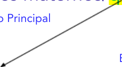

**Oração Principal                                     Oração Subordinada Adv. Circunstância de tempo Equivale a um advérbio de tempo (ex: hoje) Conjunção Subordinativa** 

#### **Conjunções subordinativas adverbiais condicionais** 

Iniciam oração subordinada de mesmo nome e indicam a hipótese ou a condição para a ocorrência da oração principal. **Geralmente trazem verbo com sentido de hipótese e conjugado no modo subjuntivo** , que é o tempo verbal com valor hipotético. São elas: **se, caso, desde que, contanto que, quando, salvo se, a menos que, a não ser que, sem que** . 

Ex: Se eu puder, ensinarei tudo. 

Ex: Se eu quisesse falar com você, te chamaria no whatsapp! 

Ex: A não ser que haja uma catástrofe, não me atrasarei. 

Ex: Sem que invista em bons materiais, não vai aprender rápido. 

Ex: Qualquer renda, mesmo quando **(se)** for oriunda de ilícitos, será tributada. 

**Cuidado, ao trocar “SE” por “CASO”, é preciso fazer um ajuste no verbo, como no exemplo:** 

Se eu pude **r** , viajarei. (verbo no futuro do subjuntivo) 

Caso eu poss **a** , viajarei. (verbo no presente do subjuntivo)

---

<!-- pagina: 28 -->

**Equipe Português Estratégia Concursos, Felipe Luccas Aula 03** 

###### **(SEFAZ-SC / 2021)** 

Depreende-se das orações que compõem a frase Se o predador estivesse capaz já o teria mordido avidamente (1º parágrafo) uma relação de 

- (A) passividade, expressa pela partícula apassivadora se. 

- (B) condição, expressa pela conjunção subordinante se. 

- (C) passividade, expressa pelo pronome pessoal se. 

- (D) reflexividade, expressa pelo pronome pessoal se. 

- (E) condição, expressa pela conjunção integrante se. 

###### **Comentários:** 

"Se" é conjunção subordinativa adverbial condicional; portanto, expressa uma hipótese. 

**Gabarito letra B.** 

###### **(SEFAZ-RS / AUDITOR FISCAL / 2019)** 

Por outro lado, se o Estado reduzisse a tributação de determinado setor da economia, os custos desse setor diminuiriam, o que possibilitaria a queda dos preços de seus produtos e poderia gerar um crescimento das vendas. 

No texto 1A3-I, a oração “se o Estado reduzisse a tributação de determinado setor da economia” apresenta, no período em que se insere, noção de 

A) concessão, uma vez que representa uma exceção às regras de tributação do país. 

B) explicação, uma vez que esclarece uma ação que diminuiria os custos do referido setor. 

C) proporcionalidade, uma vez que os custos do referido setor diminuiriam à medida que se diminuísse a tributação. 

D) tempo, uma vez que a diminuição dos custos do referido setor ocorreria somente após a redução da tributação sobre ele. 

E) condição, uma vez que a diminuição dos custos do referido setor dependeria da redução da tributação sobre ele. 

###### **Comentários:** 

SE é a mais clássica conjunção condicional, então temos uma oração subordinada adverbial condicional, que traz uma premissa que deve ser atendida para ocorrer depois a redução dos

---

<!-- pagina: 29 -->

**Equipe Português Estratégia Concursos, Felipe Luccas Aula 03** 

###### custos. 

Se a tributação diminuir, então diminuirão os custos. 

**Gabarito letra E.** 

###### **(TRE-TO / 2017) Adaptada** 

Somente em um sistema de democracia indireta ou representativa existem partidos políticos. A democracia indireta ou representativa, segundo Kelsen, é aquela em que a função legislativa é exercida por um parlamento eleito pelo povo, e as funções administrativa e judiciária são exercidas por funcionários igualmente escolhidos por um eleitorado. Dessa forma, um governo é representativo quando os seus funcionários, durante a ocupação do poder, refletem a vontade do eleitorado e são responsáveis para com este. 

A correção gramatical e os sentidos do texto seriam preservados caso a expressão “quando” (l.5) fosse substituída por 

a) conquanto. 

b) à medida que. 

c) enquanto. 

d) se. 

e) bem como. 

**Comentários:** 

Observe que a banca explora o “quando” com valor condicional: 

Dessa forma, um governo é representativo SE os seus funcionários, durante a ocupação do poder, refletem a vontade do eleitorado e são responsáveis para com este. 

Enquanto tem valor temporal de simultaneidade, ao passo que o “quando” indica um tempo mais “pontual”. De toda forma, o sentido no texto era de condição. 

“Conquanto” é conjunção concessiva, como “embora.” 

“À medida que” é conjunção proporcional. “bem como” tem valor de adição. 

**Gabarito letra D.** 

#### **Conjunções subordinativas adverbiais conformativas** 

Indicam que uma ação ou fato se desenvolve de acordo com outro: **como, conforme, consoante, segundo.** 

Ex: A prova se desenrolou **como** tínhamos treinado! 

Ex: Tudo correu **conforme** o planejamos. 

Ex: **Conforme** esclarece o livro, isso nunca aconteceu. 

**OBS:** Quando não introduzem orações (em expressões sem verbo), **conforme, consoante, segundo,** não são consideradas conjunções, mas apenas **preposições acidentais** : 

Ex: **Conforme o livro** , isso nunca aconteceu.

---

<!-- pagina: 30 -->

**Equipe Português Estratégia Concursos, Felipe Luccas Aula 03** 

###### **(PGE-PE / 2019)** 

Se observarmos bem, essas ondas longas da história, **como** as chamava Braudel, tornaram-se cada vez mais curtas. Acabamos de nos recuperar da ultrapassagem da agricultura pela indústria, ocorrida no século XX, e, em menos de um século, um novo salto de época nos tomou de surpresa, lançando-nos na confusão. 

O sentido original e a correção gramatical do texto seriam mantidos se a palavra “como” fosse substituída por **conforme** . 

###### **Comentários:** 

Sim. “Conforme” também é uma conjunção subordinativa conformativa: 

Se observarmos bem, essas ondas longas da história, conforme/consoante/segundo as chamava Braudel, tornaram-se cada vez mais curtas. 

**Gabarito: questão correta.** 

###### **(PM-AL / 2018)** 

Nesse caso, considera-se crime a transgressão de regras socialmente preestabelecidas, que variam **de acordo com** a sociedade e o contexto histórico. 

No texto, a expressão “de acordo com” tem o mesmo sentido de **conforme** . 

###### **Comentários:** 

Questão direta. A locução “de acordo com” expressa justamente o sentido de “conformidade”, por isso mesmo poderia ser trocada por conjunções conformativas: “conforme”, “consoante”, “como”, “segundo”. 

**Gabarito: questão correta.** 

###### **(FUB / 2015)** 

Ao se substituir “De acordo com” por **Conforme** , mantêm-se a correção gramatical e os sentidos do texto. 

###### **Comentários** : 

**“De acordo com** ” tem sentido conformativo e, logo, pode ser substituído sem prejuízo por **conforme, segundo, como, consoant** e. 

**Gabarito: questão correta.**

---

<!-- pagina: 31 -->

**Equipe Português Estratégia Concursos, Felipe Luccas Aula 03** 

#### **Conjunções subordinativas adverbiais finais** 

Indicam propósito, objetivo, finalidade: **para que, a fim de que, do modo que, de sorte que, porque (quando igual a para que), que** . 

Ex: Dou exemplos para que você entenda tudo. 

Ex: Estude todo dia a fim de que acumule conhecimento ao longo do mês. 

Ex: “É preciso rezar porque não estoure uma nova guerra mundial.” 

###### **(SEDUC-AL / 2018)** 

Em “Para se vacinar, as pessoas precisam de documento de identidade e carteiras do SUS e de vacinação”, a preposição “Para” exerce o papel de conectivo e introduz uma oração que expressa finalidade. 

###### **Comentários:** 

‘Para’ exerce papel de conectivo, pois é uma preposição, um elemento de ligação; além disso, tem sentido de finalidade, indica que as pessoas carregam os documentos com um propósito específico: apresentar na hora da vacinação. 

###### **Gabarito: questão correta.** 

###### **(IHBDF / 2018)** 

Assim, é comum que pais com baixa escolaridade lutem para que os filhos tenham acesso a um ensino de qualidade, sem reivindicar para si mesmos o direito que lhes foi violado. 

A oração “para que os filhos tenham acesso a um ensino de qualidade” expressa circunstância de 

A) finalidade. B) causa. C) modo. D) proporção. E) concessão. 

###### **Comentários:** 

“Para” é uma preposição indicativa de propósito, finalidade. 

**Gabarito letra A.** 

###### **(CAGE-RS / AUDITOR FISCAL / 2018)** 

Quem me lê poderá objetar que basta a gente passar os olhos pelo jornal desta manhã para verificar que o mundo nunca teve tantas e tão dramáticas porteiras como em nossos dias... Mas que importa? Um dia as porteiras hão de cair, ou alguém as derrubará. “Para erguer outras ainda

---

<!-- pagina: 32 -->

**Equipe Português Estratégia Concursos, Felipe Luccas Aula 03** 

mais terríveis” — replicará o leitor cético. Ora, amigo, precisamos ter na vida um mínimo de otimismo e esperança para poder ir até ao fim da picada. Você não concorda? Ô mundo velho sem porteira! 

Em relação ao trecho **“ou alguém as derrubará”** no texto, a oração “Para erguer outras ainda mais terríveis” transmite uma ideia de 

A) conformidade. B) condição. C) causa. D) proporção. E) propósito. 

**Comentários:** 

“Para” introduz oração adverbial final, com sentido de finalidade, propósito. 

**Gabarito letra E.** 

#### **Conjunções subordinativas adverbiais proporcionais** 

Introduzem uma oração que traz uma relação de proporcionalidade com a oração principal: **à medida que, à proporção que, ao passo que e também as correlações quanto mais/menos...mais/menos...** 

Ex: Quanto mais eu rezo, mais assombrações me aparecem. 

Ex: Quanto mais estudo, mais sorte tenho nas provas. 

Ex: À medida que o tempo passa, a confiança vai aumentando. 

Ex: Ao passo que o produto escasseia, o preço sobe. 

###### **(TELEBRAS / 2022)** 

Um maior acesso pode significar mais progressos no domínio da realização dos Objetivos de Desenvolvimento do Milênio. A Internet impulsiona a atividade econômica, o comércio e até a educação. A telemedicina está melhorando os cuidados com a saúde, os satélites de observação terrestre são usados para combater as alterações climáticas e as tecnologias ecológicas contribuem para a existência de cidades mais limpas. 

Ao passo que essas inovações se tornam mais importantes, a necessidade de atenuar o fosso tecnológico é mais urgente. 

No último parágrafo, a expressão “Ao passo que” estabelece uma relação de proporcionalidade entre as orações que formam o período. 

###### **Comentários:** 

Sim, a relação de aumento proporcional poderia ser expressa assim: 

Quanto mais importantes as inovações se tornam, mais urgente fica a necessidade de atenuar o fosso tecnológico. 

**Gabarito: questão correta.** 

**(PREFEITURA DE SÃO JOÃO DA URTIGA - RS / 2019)** 

No período “Quanto mais eu gritava, mais pessoas apareciam de todos os lados.”, a ideia

---

<!-- pagina: 33 -->

**Equipe Português Estratégia Concursos, Felipe Luccas Aula 03** 

expressa pela oração sublinhada é de: 

A - condição 

B - consequência 

C - finalidade 

D - proporção 

###### **Comentários:** 

No período “Quanto mais eu gritava, mais pessoas apareciam de todos os lados.”, a ideia expressa pela oração sublinhada é de **proporção** . As conjunções subordinadas adverbiais <u>proporcionais introduzem uma oração que traz uma relação de proporcionalidade com a oração</u> principal. 

**Gabarito: letra D.** 

**(TCE PE / 2017)** 

Sem prejuízo dos sentidos originais e da correção gramatical do texto, o trecho “Diante dessa realidade, deve-se questionar a ideia de que uma pessoa, quanto mais vive, mais velha fica” poderia ser reescrito da seguinte maneira: **Frente à essa realidade, não se deve acreditar na ideia que uma pessoa vive mais à medida em que envelhece.** 

**Comentários:** 

O texto original traz uma ideia de “proporção”, então a locução correta seria: “à medida que”. “Na medida EM que” é locução causal. Não existe a locução “à medida em que”... 

###### **Gabarito: questão incorreta.** 

#### **Conjunções subordinativas adverbiais temporais** 

Introduzem uma oração que traz uma noção de tempo para o fato ocorrido na oração principal: **quando, enquanto, desde que, sempre que, toda vez que, assim que, logo que, mal (com sentido de assim que)** . 

Ex: Mal cheguei e já fui bombardeado de perguntas. 

Ex: Meu chefe me demitiu assim que cheguei. 

Ex: Comprei roupas enquanto ela escolhia sapatos. (tempo simultâneo). 

Obs: Segundo entendimento muito “específico” de Sacconi, “quando” pode indicar ‘ **causa** ’, se puder ser substituída perfeitamente por “ **já que** ”: 

“Por que ficar amontoado na cidade, sob a poluição, **quando** existe um mundo de terra fértil no campo para se trabalhar”. 

###### **(MP-CE / CARGOS DE NÍVEL MÉDIO / 2020)** 

Em geral, consideramos que rituais seriam eventos de sociedades históricas, da vida na corte europeia, por exemplo, ou, em outro extremo, de sociedades indígenas. Entre nós, a inclinação

---

<!-- pagina: 34 -->

**Equipe Português Estratégia Concursos, Felipe Luccas Aula 03** 

inicial é diminuir sua relevância. Muitas vezes comentamos “Ah, foi apenas um ritual”, querendo enfatizar exatamente que o evento em questão não teve maior significado e conteúdo. Por exemplo, um discurso pode receber esse comentário se for considerado superficial em relação à expectativa de um importante comunicado. Ritual, nesse caso, é a dimensão menos importante de um evento, sinal de uma forma vazia, algo pouco sério — e, portanto, “apenas um ritual”. 

A substituição do trecho “se for considerado” (L.5) por **quando considerado** preservaria a coerência e a correção gramatical do texto. 

###### **Comentários:** 

Não haveria erro nem o texto ficaria incoerente (absurdo, ilógico). A oração ficaria reduzida, porque o verbo “for” seria suprimido: 

um discurso pode receber esse comentário se/quando considerado superficial em relação à expectativa 

Quanto ao sentido, podemos pensar que o “quando”, conjunção temporal, deixa o texto menos hipotético que o “se” condicional, mas isso é sutileza e não foi objeto da questão. 

**Gabarito: questão correta.** 

###### **(SEFAZ-RS / 2018)** 

Quem era rico escapava: mandava escravos para fazer o serviço sujo (pagamento de imposto em serviço). **Assim que** surgiu a moeda, surgiu também a ideia de substituir a contribuição braçal por dinheiro. 

A expressão “Assim que” indica, no período em que ocorre, uma noção de 

A) modo, podendo ser substituída por **Dessa maneira que** , sem alteração dos sentidos do texto. 

B) conclusão, podendo ser substituída por **Tão logo** , sem alteração dos sentidos do texto. 

C) causa, podendo ser substituída por **Como** , sem alteração dos sentidos do texto. 

D) comparação, podendo ser substituída por **Assim como** , sem alteração dos sentidos do texto. 

E) tempo, podendo ser substituída por **Logo que** , sem alteração dos sentidos do texto. 

###### **Comentários:** 

Questão direta. A locução temporal “Assim que” tem sentido de algo que ocorre rapidamente, imediatamente após um fato (imediatamente após ter surgido a moeda): 

**Assim que/logo que** surgiu a moeda, surgiu também a ideia de substituir a contribuição braçal por dinheiro. 

“Tão logo” possui sentido temporal, mas foi apresentada incorretamente com sentido de “conclusão”. Nenhum dos outros conectivos possui sentido temporal. 

###### **Gabarito letra E.** 

#### **Conjunções subordinativas adverbiais comparativas** 

Introduzem uma oração que traz uma comparação ou contraste em relação à oração principal: **como, assim como, tal qual, tal como, mais que, menos, tanto quanto** . Nesses pares, as palavras

---

<!-- pagina: 35 -->

**Equipe Português Estratégia Concursos, Felipe Luccas Aula 03** 

tanto e quanto são correlatas. O mesmo vale para outros pares que possuem função de uma conjunção. 

Ex: Essa matéria é mais fácil do que a que estudamos ontem. 

Ex: Corria como um touro. 

Ex: Ele estuda tanto quanto seu tio médico (estuda). 

Observe no exemplo acima que o **verbo** costuma vir **implícito** , porque é o mesmo verbo da outra oração. 

#### **Conjunções subordinativas adverbiais causais** 

Iniciam uma oração subordinada que traz a causa da ocorrência da principal: **porque, que, como (com sentido de porque), pois que, já que, uma vez que, visto que, na medida em que, porquanto, se (com sentido de já que).** 

- Ex: Não passei **porque** não estudei. 

Ex: **Como** não era vaidoso, nunca fez dieta. 

Ex: **Se** Marisa gosta de você, por que não a procura?” (Se = Já que) 

Para organizar a relação de causa e efeito no texto, pense assim: “o fato X fez com que Y acontecesse”. A causa é a origem de um evento, portanto ela precisa necessariamente ocorrer antes do evento. 

A banca também pode pedir a **substituição de conjunções causais por preposições** que também tenham sentido de causa, como “por”: 

Ex: Não fiz a questão porque não sabia. (porque = conjunção causal) 

Ex: Não fiz a questão por não saber. (por = preposição com valor de causa) 

Observe que há mudança na forma do verbo e essa adaptação deve ser observada. 

A causa ocorre cronologicamente antes da consequência. Então, mesmo que na ordem do período a causa venha depois, devemos sempre atentar para a oração que a conjunção causal inicia. Essa será a causa. Isso será importante quando estudarmos as conjunções consecutivas, que possuem a mesma lógica de causa-efeito, mas introduzem a oração em que se encontra a consequência. 

---

<!-- pagina: 36 -->

**Equipe Português Estratégia Concursos, Felipe Luccas Aula 03** 

Relações de Causa e Efeito 

Não confunda **(Causa) x (Consequência) x (Explicação)** : 

Ex: Choveu <mark>porque o dia foi muito quente.</mark> **(Causa)** 

Ex: Choveu tanto <mark>que o chão está molhado.</mark> **(Consequência)** . 

Ex: Choveu, <mark>porque o chão está molhado.</mark> **(Explicação)** 

O chão estar molhado não causa chuva! É só uma explicação ou justificativa para afirmação “choveu”. A vírgula também denuncia essa relação de coordenação, acentuando que são duas orações independentes. 

###### **Professor, devo ficar me descabelando tentando diferenciar “causa” e “explicação”?** 

Não! Não perca seu tempo elucubrando sobre isso! 

Segundo os principais gramáticos, a distinção “não possui limites claros” (Bechara). É uma discussão acadêmica que foge ao estudo do candidato, isso porque a “causa” acaba por explicar também um fenômeno. Então, você não deve se preocupar com isso, trate os dois indistintamente com sentido amplo de “justificativa”, salvo se houver uma questão que traga “causa” numa alternativa e “explicação” em outra. Nesse caso, você aplica os critérios de diferenciação que foram mostrados no box sobre isso, ok? 

###### **(MP-CE / CARGOS DE NÍVEL MÉDIO / 2020)** 

No trecho “Nem ela própria contava consigo, como o galo crê na sua crista” (2º parágrafo), existe uma relação de oposição entre as orações que compõem o período. 

###### **Comentários:** 

“como” é conjunção comparativa: a galinha não contava consigo da mesma forma que o galo crê na sua crista. 

###### **Gabarito: questão incorreta.** 

###### **(SEFAZ-RS / 2018)** 

A democracia desenvolvida em Atenas não era considerada o melhor dos governos possíveis (como é hoje o nosso modelo de democracia), e isso por um motivo razoavelmente simples: apenas uma fração mínima dos “homens livres” integrava a vida política de Atenas. Mulheres, escravos, estrangeiros e outras categorias sociais não tinham direito de participar das

---

<!-- pagina: 37 -->

**Equipe Português Estratégia Concursos, Felipe Luccas Aula 03** 

###### deliberações da assembleia. 

A correção gramatical e as relações de coesão do texto 1A2-II seriam mantidas caso todo o trecho “e isso por um motivo razoavelmente simples:” fosse substituído pelo termo 

A) porque.  B) porém.  C) além de que.  D) enquanto.  E) apesar de. 

###### **Comentários:** 

A exclusão dos grupos mencionados (mulheres, escravos e estrangeiros) é justamente o “motivo” de a democracia não ser considerada como o “melhor dos governos” em Atenas. 

###### **Gabarito letra A.** 

A democracia desenvolvida em Atenas não era considerada o melhor dos governos possíveis **PORQUE** apenas uma fração mínima dos “homens livres” integrava a vida política de Atenas. 

###### **(EMAP / 2018)** 

A abordagem desse tipo de comércio [comércio internacional], inevitavelmente, passa pela concorrência, visto que é por meio da garantia e da possibilidade de entrar no mercado internacional, de estabelecer permanência ou de engendrar saída, que se consubstancia a plena expansão das atividades comerciais e se alcança o resultado último dessa interatuação: o preço eficiente dos bens e serviços. 

A oração introduzida pela locução “visto que” explica o porquê de ser necessário considerar a concorrência na abordagem do comércio internacional. 

**Comentários:** 

A questão é autoexplicativa. Simplificando a relação que está no texto, temos que: 

é preciso considerar a concorrência no comércio internacional **porque** é a garantia de entrada, permanência ou saída do mercado (fatores essenciais de concorrência) que permite alcançar o preço eficiente (outro fator essencial de concorrência). 

Observem também aqui que há uma mistura indefinida entre causa e explicação: “explica o porquê”. Então, como ressalvei na nossa teoria, não há porque ficar “elocubrando” sobre essa diferença que é controversa até no meio dos gramáticos. A banca não vai obrigar você a encerrar essa discussão! Seja prático. 

**Gabarito: correta.** 

#### **Conjunções subordinativas adverbiais consecutivas** 

Iniciam uma oração subordinada que é consequência da ocorrência da principal. Normalmente vem acompanhada de uma expressão “intensificadora” (como um advérbio de modo), que indica a causa. As principais são: **De modo que, de sorte que, de forma que, de maneira que, sem que (com sentido de que não), que (quando aparece ligada a tal, tão, cada, tanto, tamanho).** 

Ex: Negligenciei meus estudos de tal forma **que** não passei. 

Ex: Fez tamanho escândalo **que** foi demitida. 

Ex: Estudei tanto **que** fiquei ouvindo vozes.

---

<!-- pagina: 38 -->

**Equipe Português Estratégia Concursos, Felipe Luccas Aula 03** 

Ex: Tal era seu empenho em emagrecer, **que** malhava todo dia. 

Ex: Não pode ver uma mulher **sem que** assovie como um idiota. (...que assovia...) 

Ex: A menina era linda, **que** dava medo de olhar nos olhos. (observe que a expressão “intensificadora” pode vir implícita.) 

Não confunda consequência com causa, olhe para a conjunção ou locução conjuntiva e veja se aquela oração onde ela aparece ocorre antes ou depois. **Se ocorrer antes, é causa; se depois, é consequência** . A conjunção recebe a classificação de acordo com a ideia do que vem depois dela, não do que vem antes. 

Além disso, a relação causa-efeito nem sempre vem com uma conjunção explícita, é preciso também saber observar a relação de decorrência e implicação entre as partes, mesmo que não haja um conector causal ou consecutivo. 

###### **(MPE-PI / ANALISTA / 2018)** 

A confissão do réu constitui uma prova tão forte que não há necessidade de acrescentar outras, nem de entrar na difícil e duvidosa combinatória dos indícios. 

O trecho “que não há (...) indícios” exprime uma noção de consequência. 

###### **Comentários:** 

Esta é a clássica questão de “que” consecutivo trabalhando com palavra intensificadora (tão, tanto, tamanho, tal...).  A confissão do réu é prova **tão** forte **que** (como consequência), não é preciso trabalhar com os indícios, que são mais fracos que a confissão no seu “poder de prova”. 

**Gabarito: correta.** 

#### **Conjunções subordinativas adverbiais concessivas** 

Iniciam uma oração subordinada que é contrária à principal, mas **sem impedir sua realização** . A concessão também é uma adversidade, mas tem um sentido mais refinado de **quebra de expectativa** . O fato trazido na oração subordinada concessiva gera a expectativa de que o fato que ocorre na principal não devia se realizar; mesmo assim, ele ocorre. A concessão está no campo semântico da exceção. 

As principais conjunções são: **mesmo que, ainda que, embora, apesar de que, conquanto, por mais que, posto que, se bem que, não obstante.** 

Ex: **Embora** fosse gago e epilético, Machado de Assis fundou a Academia Brasileira de Letras. 

Ex: **Posto que** estivessem grávidas, as mulheres vikings guerreavam. 

Ex: **Ainda que** eu falasse a língua dos anjos, eu nada seria. 

Ex: Teve que aceitar a crítica, **conquanto** não tivesse gostado. 

Nessas orações concessivas, o verbo **VEM NO SUBJUNTIVO** . Observe nos exemplos: **_estivessem, falasse, tivesse, fosse_** ... Fique atento, pois, quando a banca pedir a substituição por outro termo, como uma conjunção adversativa, serão necessários ajustes nessa conjugação.

---

<!-- pagina: 39 -->

**Equipe Português Estratégia Concursos, Felipe Luccas Aula 03** 

**“Posto que”** equivale a “ **embora”** ! Tem valor concessivo! Não pode ser usado com sentido de causa, embora isso seja comum no discurso jurídico. 

Fique atento também à locução prepositiva “apesar de”, pois tem valor concessivo e a banca pode pedir sua substituição por uma conjunção concessiva equivalente. 

###### **Oração Concessiva X Adversativa.** 

**Ambas trazem sentido de oposição ou ressalva** . A conjunção adverbial concessiva inicia uma oração subordinada na qual se admite um fato **CONTRÁRIO** que, à ação expressa na oração principal, é, contudo, incapaz de impedir que tal ação se realize. Há também uma **diferença argumentativa** , de foco: 

Matou, **mas em legítima defesa** . (foco na oração adversativa; ênfase na legítima defesa) 

**Matou** , embora em legítima defesa. (foco na oração principal; ênfase no fato de matar) 

Essa diferença semântica é importante em reescrituras. 

###### **(TCE-PB / AGENTE DE DOCUMENTAÇÃO / 2018)** 

No texto, as relações sintático-semânticas do período “Embora fosse temido, o apagamento era necessário, assim como o esquecimento também o é para a memória” seriam preservadas caso a conjunção “Embora” fosse substituída por 

a) Por conseguinte.   b) Ainda que.    c) Consoante.  d) Desde que.  e) Uma vez que. 

###### **Comentários:** 

**Embora** é conjunção concessiva, assim como “ainda que, mesmo que, posto que, conquanto...”. **Por conseguinte** indica conclusão; **Consoante** indica conformidade; **desde que** indica tempo ou condição; **uma vez que** indica causa ou explicação. 

**Gabarito letra B.** 

**(MRE / DIPLOMATA / 2017)** 

Embora mais moço que ele, várias vezes cheguei a sorrir aos seus entusiasmos. 

A conjunção “Embora” pode ser substituída por **Posto que** , mantendo-se o sentido e a correção gramatical do texto. 

**Comentários:** 

“Embora” e “Posto que” são perfeitamente equivalentes, pois são conectivos concessivos. 

**Gabarito: questão correta.** 

#### **Conjunções com mais de um sentido possível** 

Agora vou sistematizar as conjunções que as bancas mais gostam de usar para confundir o candidato, visto que são aquelas que podem assumir diferentes valores semânticos.

---

<!-- pagina: 40 -->

**Equipe Português Estratégia Concursos, Felipe Luccas Aula 03** 

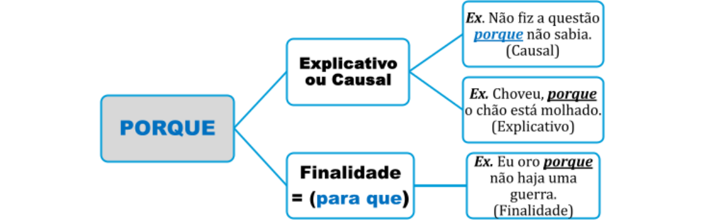

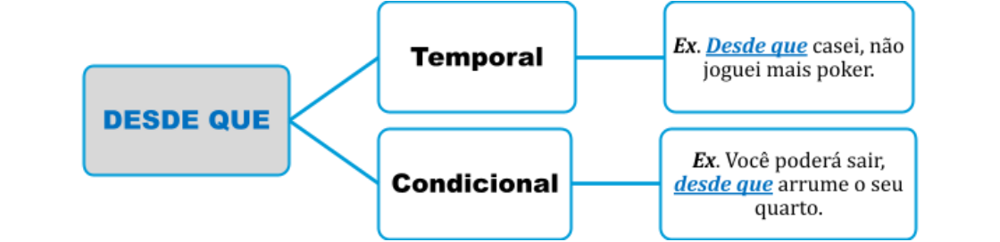

Não confunda nem misture a conjunção causal “na medida em que” com a proporcional “à e medida que”. Expressões como ~~na medida que à medida em que~~ estão equivocadas! 

##### **Lembre-se!** 

###### **porquanto = porque** 

###### **conquanto = embora** 

**“quando” pode assumir valor condicional** 

Veja abaixo os principais valores semânticos da conjunção “ **E** ”: 

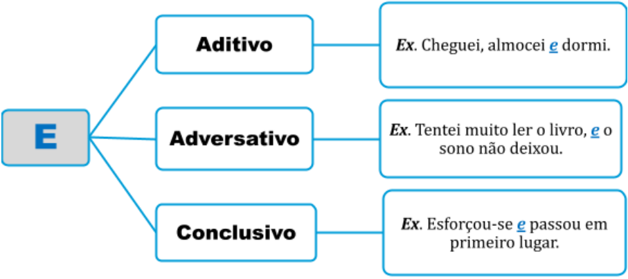

---

<!-- pagina: 41 -->

**Equipe Português Estratégia Concursos, Felipe Luccas Aula 03** 

Observe alguns valores que a palavra **“como”** pode assumir: 

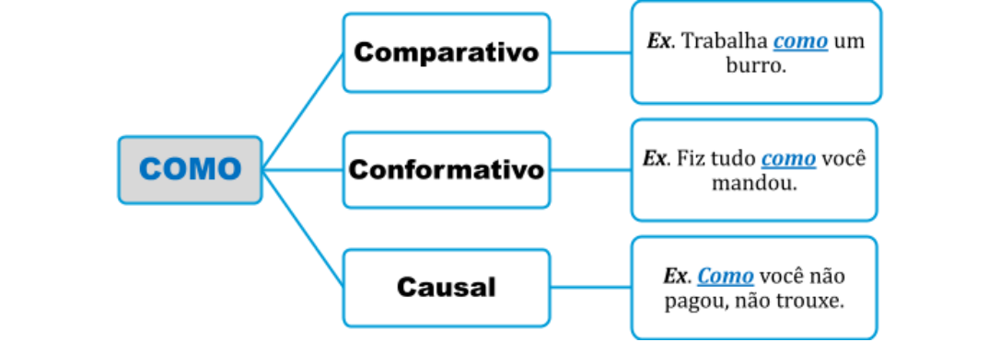

Fique atento também aos possíveis usos da conjunção “pois”: 

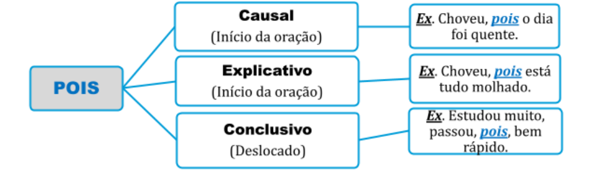

---

<!-- pagina: 42 -->

**Equipe Português Estratégia Concursos, Felipe Luccas Aula 03** 

## **CONECTIVOS** 

Aqui, trarei casos mais avançados de semântica dos conectivos. Muitas vezes, a banca vai exigir um sentido muito específico da conjunção, em determinado contexto. Nesses casos, apenas saber o sentido geral não basta. 

Por exemplo, sabemos que conjunções adversativas indicam oposição. Fato. Porém, "oposição" é um termo muito amplo, que pode ser contextualmente detalhado em diversos sentidos subjacentes específicos, como ressalva, retificação, compensação, restrição, negação de inferência. 

Vejamos: 

###### **Valores do "MAS"** 

Segue uma lista de usos e sentidos específicos do "mas". De forma alguma a intenção é decorar e diferenciar cada caso, isso seria impossível e contraproducente; a lista serve apenas de referência para ampliar a visão das orações adversativas, uma vez que "oposição" é uma palavra genérica. É importante ter em mente que o "mas" marca uma diferença/desigualdade, que pode variar contextualmente. Essa observação vale também para as demais conjunções, pois os sentidos vistos aqui são extremamente específicos. Não seja rigoroso, na maioria das vezes a banca vai cobrar o sentido de modo mais "clássico". 

Vejamos: 

###### **COMPENSAÇÃO** 

Ex: Falou pouco, mas falou bonito. 

Ex: Trouxe minhas pobres, mas significativas maletas. 

Ex: A tesourinha era curta, mas reforçada. 

Ex: Ele não é muito inteligente, mas, pelo menos, é esforçado. 

###### **RETIFICAÇÃO/CORREÇÃO** 

Ex: Não tenho dois filhos, mas quatro! 

###### **RESTRIÇÃO** 

Ex: Aceito seu argumento, mas não o exemplo dado. 

Ex: Concordo com sua ideia, mas não com sua forma de falar. 

Ex: Os juros baixarão a inflação, mas são uma solução temporária. 

###### **NEGAÇÃO DE INFERÊNCIA**

---

<!-- pagina: 43 -->

**Equipe Português Estratégia Concursos, Felipe Luccas Aula 03** 

Ex: Atiraram em sua direção, mas não o atingiram. 

Ex: As estalagens estavam cheias, mas ainda assim se arranjava um lugar. 

**"CONTRAPOSIÇÃO NA MESMA DIREÇÃO"/ACRÉSCIMO DE ARGUMENTO AINDA MAIS FORTE** 

Ex: A região estava infestada de feras, mas era principalmente perigosa por causa do índio. 

**"CONTRAPOSIÇÃO EM DIREÇÃO INDEPENDENTE/A INFORMAÇÃO INICIAL É ADMITIDA, MAS A SEGUINTE TEM MAIOR RELEVÂNCIA** 

Ex: As pessoas vivem procurando trabalhos intelectuais, mas o importante é ser útil. 

Ex: Nós, surfistas, vivemos quebrados e nervosos, mas o que vale é a adrenalina. 

###### **ELIMINAÇÃO DO PRIMEIRO SEGMENTO** 

<!-- Start of picture text -->
==5460== <!-- End of picture text -->

Ex: Ele ia dizer qualquer coisa, mas desistiu. 

Ex: Tentei, mas não deu certo. 

**"MAS" COMO PALAVRA DENOTATIVA DE SITUAÇÃO, INTRODUZ UM COMENTÁRIO, INICIA UM NOVO TURNO DE CONVERSAÇÃO.** 

- Ex: Tenho a impressão de já ter visto aquela pessoa. Mas onde? 

- Ex: Parem logo essa bagunça. Mas o que é isto? 

Ex: Eu vou à festa com você. Mas precisa ser tão cedo? 

Ex: O adjetivo é importante. Mas, voltando ao assunto da aula, advérbios são invariáveis. 

- Ex: Você acha tudo fácil. Mas, claro, você é rico e inteligente. 

Vejamos algumas questões: 

**FGV/ SEJUSP MG / 2022:** Abaixo estão vários segmentos que compõem um texto. De propósito, foram retiradas as palavras de ligação entre eles. Assinale a opção que apresenta a frase em que a lacuna foi preenchida com o conector adequado. 

A O apetite vem enquanto se come [ ] a sede se vai enquanto se bebe / mas.

---

<!-- pagina: 44 -->

**Equipe Português Estratégia Concursos, Felipe Luccas Aula 03** 

**FGV/ TJ DFT / 2022:** “É melhor ser pouco inteligente com temor do que rico em prudência, mas transgressor da lei.” Nessa frase, a conjunção MAS indica oposição; a frase abaixo em que essa mesma conjunção indica adição é: A) O universo é a mudança, mas a vida é o que o pensamento faz dessa mudança. (Gabarito) **FGV/ PC RJ / 2022:** A conjunção MAS aparece em muitas frases portuguesas, indicando uma contradição entre o conteúdo da primeira afirmação e o da segunda. A frase abaixo em que essa conjunção tem valor diferente é: A Tem muito dinheiro, mas é muito infeliz; B O filme é bom, mas um pouco chato; C O time jogou bem, mas perdeu D Ficou triste, mas quem não ficaria...; (gabarito) E A prova estava fácil, mas obtive nota ruim. **Comentário:** 

Observe que não há oposição: ficou triste e qualquer pessoa ficaria. Podemos dizer que esse "mas" é aditivo. **FGV/ TCE RO / 2022: Um comentário crítico sobre um filme dizia: “O filme é bom, MAS um pouco lento e monótono!”.** A frase abaixo em que o termo MAS apresenta idêntico significado ao desse caso é: A) Tem muito dinheiro, mas é muito infeliz. B) Mas por que ela não veio? C) Não só ele mas também ela compareceu. D) Mas você é muito maluco, cara! E) Você acaba de saber disso, mas como? **Comentário:** 

Essa questão é perfeita para ilustrar nuances do "mas". Se formos ser precisos, o "mas" do enunciado indica compensação, assim como a frase da letra A: A) Tem muito dinheiro, mas (em compensação) é muito infeliz. B) Mas por que ela não veio? (palavra denotativa de situação/turno da conversação) C) Não só ele mas também ela compareceu. (conjunção aditiva) 

https://t.me/KakashiAssinaturasBot

---

<!-- pagina: 45 -->

**Equipe Português Estratégia Concursos, Felipe Luccas Aula 03** 

D) Mas você é muito maluco, cara! (palavra denotativa de situação/turno da conversação) 

E) Você acaba de saber disso, mas como? (palavra denotativa de situação/turno da conversação) 

###### **Valores do "E"** 

###### **OPOSIÇÃO/ADVERSIDADE/CORREÇÃO** 

Ex: Nós acordamos cedo, **e** chegamos, infelizmente, atrasados. 

- Ex: Fazemos dietas restritas, **e** não conseguimos emagrecer. 

- Ex: Ele não é frio, **e** , sim, introspectivo. 

###### **CONSEQUÊNCIA/CONCLUSÃO/DECORRÊNCIA LÓGICA** 

- Ex: Choveu intensamente, **e** a cidade ficou inundada. 

- **e** 

- Ex: Cumpriu suas obrigações será recompensado. 

###### **SEQUÊNCIA CRONOLÓGICA** 

- Ex: Acordei **e** levantei para tomar banho. 

Ex: Vesti a camisa **e** pus a gravata. 

**OBS:** Quando há essas relações lógicas diferentes da mera "adição", a mudança de ordem afeta o sentido e a coerência. 

Vejamos esses sentidos na prática: 

**FGV/ BANESTES/ 2023:** Os livros didáticos ensinam que os textos dissertativos discutem um tema, defendem uma opinião, contrariam uma ideia oposta, fornecem informações etc. 

Assinale a frase que se estrutura pela oposição a um outro pensamento ou opinião. 

A Gastos públicos podem também significar investimentos e não desperdício. 

**FGV/ SEDUC TO/ 2023:** Em todas as alternativas, o "e" indica oposição. 

Aplauso é um recibo e não uma conta.

---

<!-- pagina: 46 -->

**Equipe Português Estratégia Concursos, Felipe Luccas Aula 03** 

Eu tinha seis teorias sobre o modo de educar crianças. Agora tenho seis filhos e nenhuma teoria. Criatividade é se permitir cometer erros e arte é saber quais deles manter. Livros trazem a vantagem de podermos estar sós e acompanhados. 

**FGV / SEFAZ MG/ 2023:** A frase “Dada a causa, a natureza produz o efeito no modo mais breve em que pode ser produzido” mostra uma relação de causa e efeito. 

Assinale a opção que apresenta a mesma relação entre seus componentes. 

(B) É praticamente impossível olhar para um pinguim e sentir raiva. 

**FGV/ PREF. SANTO ANDRÉ / 2022:** O texto apresenta uma série de conectores que mostram ligações lógicas entre os termos, com variados conteúdos semânticos. 

Assinale a opção em que o valor semântico do conector sublinhado está corretamente indicado. D “Acertou na forma, mas errou no cálculo do diâmetro. Colombo chega às Bahamas, em 12 de outubro, e acha que alcançou a Índia” / oposição. (GABARITO) 

**FGV / CÂMARA TAUBATÉ / 2022:** As frases a seguir foram retiradas de um dicionário de citações. Assinale a opção em que ocorre uma relação, respectivamente, de causa/consequência. 

D) Procurei ver acima dos ombros dos gigantes e consegui enxergar mais longe. 

**FGV / TCE TO / 2022:** “Mas então um dos seus tios se matou, e o menino foi se tornando cada vez mais triste.” A passagem acima, retirada do texto 1, mostra que a conjunção “e” pode veicular ideia de conclusão. Outra passagem do mesmo texto em que essa conjunção apresenta valor conclusivo é: 

B “Na adolescência, Caio identificou que era um homem transgênero, e sua sensação de isolamento só cresceu”; 

###### **Valores do "ou"** 

Usarei aqui frases da própria FGV: 

Ex: Aquele senhor falava inglês ou francês com facilidade; (alternância/inclusão) 

Ex: Comprarei um carro novo: um Fusca ou um BMW; (alternância/inclusão) 

Ex: Ou você se conserta ou desaparece daqui!; (exclusão) 

Ex: Rui Barbosa, ou a Águia de Haia, foi famoso jurista; (sinonímia)

---

<!-- pagina: 47 -->

**Equipe Português Estratégia Concursos, Felipe Luccas Aula 03** 

Ex: Vamos estudar ou seremos reprovados. (exclusão) 

Ex: “Todo grande homem somente atua ou escreve para desenvolver duas ou três ideias.” (adição e aproximação, respectivamente) 

A FGV muitas vezes chama o "ou" inclusivo de "aditivo", tendo em vista que leva o verbo para o plural: 

Ex: Ouro ou diamantes sempre custarão muito caro. 

O "ou" exclusivo já foi chamado de "claramente alternativo": 

Ex: O segmento abaixo em que a conjunção OU tem valor claramente alternativo é: “No fundo, é um problema técnico que os avanços da informática mais cedo ou mais tarde colocarão à disposição dos usuários e das autoridades” **(FGV / TJ AL);** 

###### **Valores do "SE"** 

A banca tem entrado profundamente no sentido das condicionais. É importante saber que uma condição é uma hipótese, que, se concretizada, gera um determinado resultado dela dependente. 

Se o cenário previsto na condicional for uma hipótese, temos a condicional "típica", contrafactual. Por outro lado, se for um fato admitido, uma condição já preenchida, o "se" terá valor "factual" e pode assumir sentidos diferentes. 

**"SE" contrafactual:** Equivale a “caso” e expressa uma hipótese. 

Ex: **<u>Se</u>** eu estudar sempre, serei aprovado. (a condição pode ou não se realizar) 

Ex: **<u>Se</u>** eu estudasse sempre, seria aprovado. (a condição não se realizou ou dificilmente se realizará) 

Ex: **<u>Se</u>** eu soubesse, teria dito. (a condição não se realizou e não mais se realizará) 

O pretérito mais-que-perfeito do subjuntivo é exclusivo das contrafactuais. 

**"SE" factual causal:** Equivale a “já que” e expressa um fato “real”, visto como causa. **<u>Geralmente</u>** , trazem o verbo no indicativo. 

Ex: “ **<u>Se</u>** você gosta dela, por que não a procura?” (Procuro **<u>porque</u>** gosto) 

Ex: “ **<u>Se</u>** não vale a pena desistir, eu devo concluir a missão” (Concluo **<u>porque</u>** não vale a pena desistir) 

Ex: “ **<u>Se</u>** perdemos dinheiro, é porque investimos mal” (perdemos **<u>porque</u>** investimos mal) 

**"SE" factual contrastivo:** indica contraste ou compensação. 

Ex: “ **<u>Se</u>** muitos estudam por prazer, a maioria o faz por necessidade. 

Ex: “ **<u>Se</u>** alguns garimpos estagnam ou desaparecem, outros permanecem lucrativos.

---

<!-- pagina: 48 -->

**Equipe Português Estratégia Concursos, Felipe Luccas Aula 03** 

Ex: “ **<u>Se</u>** a comida é mais barata no Brasil, o transporte em compensação é caríssimo. 

**"SE" concessivo:** indica oposição; equivale a "embora". 

Ex: “Se ferido ele queria lutar, imagine, então, são!” (Sacconi) 

Ex: “Se o via derrubado, rosto no pó, nem por isso o respeitava menos.” (Ondina Ferreira) 

**"SE" temporal:** indica noção mais concreta, aproximada a de tempo. O verbo normalmente está no indicativo. 

Ex: “Consolo-o, **<u>se/quando</u>** o vejo triste.” (Cegalla) 

**"SE" comparativo:** equivale a "assim como". 

Ex:“ **<u>Se/assim como</u>** o estilo reflete o homem, o idioma é o espelho da cultura de um povo.” 

**OBS** : Esses sentidos são extremamente específicos e só devem ser cogitados se a questão apresentar alternativas que sugiram essa cobrança. A grande verdade é que na maioria esmagadora das vezes, a banca vai considerar todos esses casos como "se" condicional. 

Vejamos em prova. 

**FGV/ DPE RS/ 2023:** "Se antes era um elemento presente no cotidiano, tornou-se anacrônico na nova cidade." 

A conjunção "se" expressa, primariamente, ideia de condição. Em alguns casos, contudo, um valor semântico adicional se soma a esse significado mais básico. 

Na passagem do texto 1 destacada acima, é possível identificar o valor adicional de: 

A) Concessão. (Gabarito) 

**FGV/ BANESTES / 2021:** Em todas as frases abaixo há um conector sublinhado; aquele que apresenta o seu valor semântico perfeitamente indicado é: 

A **<u>Se</u>** Leonardo da Vinci terminou a sua carreira como músico, não vejo problemas em acabar a minha como pintor / causa; (Gabarito)

---

<!-- pagina: 49 -->

**Equipe Português Estratégia Concursos, Felipe Luccas Aula 03** 

###### **Valores do "QUANDO"** 

Cumulativamente, o "quando" temporal pode indicar valores subjacentes: 

###### **Concessão:** 

Ex: Por que o Brasil insiste em realizar todas as fases do ciclo do combustível, **quando poderia (embora pudesse)** desenvolver apenas alguns desses aspectos? 

Ex: A imprensa é lucrativa, **quando deveria (embora devesse)** ser apenas autossuficiente. 

Ex: Eu digo a verdade **, ainda quando** isso possa ser desagradável. 

Ex: Ficam hibernando à espera do momento eleitoral **quando** deveriam estar em praça pública em busca de militantes e se expondo ao debate. 

###### **(FGV / TRE PA)** 

###### **Condição:** 

Indica uma hipótese, equivale a "se" ou "caso". 

Ex: Deve-se isso ao fato de as instituições brasileiras terem sido concebidas de forma coercitiva e unilateral, não havendo diálogo entre geovernantes e governados, mas apenas a imposição de uma lei e de uma ordem consideradas artificiais, **quando/se/caso** não inconvenientes aos interesses das elites políticas e econômicas de então. **(FGV / SEAD AP)** 

**FGV / EPE / 2022:** “Um povo só se deixa guiar quando lhe apontam um futuro; um chefe é um comerciante de esperanças.” Napoleão Bonaparte 

A respeito da estruturação do pensamento de Napoleão, assinale a opção que se mostra adequada. 

A A conjunção “quando“ tem valor de condição. (Gabarito) 

###### **Valores do "enquanto"**

---

<!-- pagina: 50 -->

**Equipe Português Estratégia Concursos, Felipe Luccas Aula 03** 

Normalmente, o "enquanto" indica tempo simultâneo, ações que ocorrem ao mesmo tempo ou fatos que são verdadeiros ao mesmo tempo. Contudo, pode trazer outros sentidos específicos. 

###### **Contraste (=ao passo que):** 

**Ex: Enquanto** um era maduro, o outro era criança. 

Ex: Uns estudos, **enquanto** outros apenas reclamam. 

**FGV / PC AM / 2022:** Observe a seguinte frase: 

“O neurótico constrói um castelo no ar. O psicótico mora nele. O psiquiatra cobra o aluguel.” 

(Jerome Lawrence) Se trocarmos a pontuação entre as frases por conectivos, a forma adequada será: 

B O neurótico constrói um castelo no ar enquanto o psicótico mora nele e o psiquiatra cobra o aluguel. (Gabarito) 

###### **Valores do "Conforme"** 

A FGV recentemente cobrou o "conforme" com valor proporcional. Vale a mesma análise para o "enquanto". 

**MARIA HELENA DE MOURA NEVES:** “Outro modo (embora bastante raro e muito menos específico) de manifestação de uma relação proporcional é com as conjunções enquanto (basicamente temporal e/ou contrastiva) e conforme  (basicamente conformativa), que também mantêm algo desse seu valor original na expressão de proporcionalidade: 

A bruma da manhã começava a dissipar-se, enquanto ia cedendo lugar à luz, ainda muito fraca, do Sol. 

Vejam o que fazem; eu vou buscar a gente, e, **<u>conforme</u>** chegam, carrego.

---

<!-- pagina: 51 -->

**Equipe Português Estratégia Concursos, Felipe Luccas Aula 03** 

###### **FGV / SEAD AP / 2022** 

Assinale a frase abaixo cuja oração subordinada adverbial sublinhada está corretamente classificada. 

B “Nos grandes mestres o adjetivo é escasso e sóbrio – vai abundando progressivamente **<u>à proporção que</u>** descemos a escala de valores” (Monteiro Lobato) / conformativa. 

###### **Ex: Conforme a sociedade progride, a ecologia sofre.** 

###### **Valores do "PARA"** 

- O "para" pode ter valor consecutivo, indicando um resultado não pretendido ou impedido. 

Ex: O que eu fiz para merecer isso? 

Ex: Estava infeliz demais para ter cautela. 

Ex: Ele certamente trabalhou muito para estar exausto assim. 

- Ex: Também pode indicar opinião, perspectiva. 

<u>Para o renascimento, a natureza era a origem da forma artística.</u> 

<u>Para mim, isso não é justo.</u> 

---

<!-- pagina: 52 -->

**Equipe Português Estratégia Concursos, Felipe Luccas Aula 03** 

**FGV/ PREF. SANTO ANDRÉ / 2022:** O texto apresenta uma série de conectores que mostram ligações lógicas entre os termos, com variados conteúdos semânticos. 

Assinale a opção em que o valor semântico do conector sublinhado está corretamente indicado. 

A “Tudo isso passou a ter um valor extraordinário <u>para</u> os europeus do século XV (a canela chegou a valer mais do que o ouro!)” / finalidade. 

###### **Comentário:** 

A questão foi considerada incorreta, pois esse "para" indica perspectiva, não finalidade. 

###### **Valores do "com"** 

A preposição "com" pode trazer muitos sentidos, destaco aqui alguns bem específicos que a banca tem cobrado. 

###### **Alinhamento/Favor:** 

Ex: A diretoria está com os acionistas minoritários nessa fusão. (alinhamento/favor: está de acordo com os acionistas) 

Ex: Ou você com ela ou contra ela. (com ela=a favor dela) 

###### **MODO:** 

Ex: Nosso povo é vira-lata com muito orgulho. (orgulhosamente) 

Ex: Estudamos com método. (metodicamente) 

###### **RELAÇÃO CAUSA E EFEITO X MOTIVAÇÃO E AÇÃO** 

###### **Causação e motivação** 

Legitimamente, só os fatos ou fenômenos físicos têm causa; os atos ou atitudes praticados ou assumidos pelo homem têm razões, motivos ou explicações. Da mesma forma, os primeiros têm efeitos, e os segundos, consequências. Similarmente, dever-se-á perguntar qual foi o motivo ou razão (e não a causa) que levou alguém a agir desta ou daquela forma: “Qual o motivo (ou razão) da sua atitude?” Embora se possa dizer “qual a causa da sua atitude?”, “sente-se” que não se deve, que, pelo menos, não é comum. Tampouco se dirá que “o motivo da dilatação dos corpos é o calor” ou que “a razão da queda dos corpos é a atração exercida pelo centro da Terra”. Dir-se-á, sem dúvida, “causa”, pois trata-se de fatos ou fenômenos físicos. (Othon M. Garcia)

---

<!-- pagina: 53 -->

**Equipe Português Estratégia Concursos, Felipe Luccas Aula 03** 

###### **FGV / MPE SP / 2023** 

A Bíblia diz: “As flores apareceram na terra, e os pássaros começaram a cantar”. 

Entre as duas ações citadas nesse segmento, a relação lógica é a de 

(A) ensino / aprendizado. 

- (B) necessidade / ação. 

- (C) ação / efeito. 

- (D) causa / consequência. 

- (E) motivação / ação (gabarito) 

**FGV/ BANESTES/ 2023:** O "e" expressa relação de causa e consequência. 

Choveu durante a noite e as ruas ficaram alagadas. 

Nas demais alternativas, a relação é de "motivação e ação", tendo em vista que temos agentes humanos. 

João olhou o cartaz e teve vontade de ir ao cinema. 

Cada vez que via as fotos, começava a chorar. 

Viu a paisagem e lembrou-se da cidade onde nascera. 

Jogou na loteria e imaginou o que faria com aquela fortuna.

---

<!-- pagina: 54 -->

**Equipe Português Estratégia Concursos, Felipe Luccas Aula 03** 

## **<mark>R</mark> ESUMO** 

#### **PREPOSIÇÕES** 

**_“Essenciais”_** as preposições puras, que só funcionam como preposição: **_a, com, de, em, para, por, desde, contra, sob, sobre, ante, sem..._** Gosto de ler/Confio em você/Refiro-me a pessoas específicas. 

**_“Acidentais”_** aquelas palavras que, na verdade, **_pertencem a outra classe_** , mas que, “acidentalmente”, fazem papel de preposição.  Tenho que estudar (de)/ Jogo como goleiro (de). 

Valor semântico das preposições: a dica é verificar o sentido do termo que vem depois da preposição. 

- ✓ Ex: Escrevi **à** caneta. (instrumento) 

✓ 

✓ 

# ✓ 

# ✓ 

✓ 

✓ 

✓ 

✓ 

✓ 

# ✓ 

# ✓ 

# ✓ 

# ✓ 

# ✓ 

# ✓ 

# ✓ 

# ✓ 

- Ex: Meu violão é **de** mogno. (matéria) 

- Ex: Fui ao cinema **com** ela. (companhia) 

- Ex: Fiquei chocado **com** a novidade. (causa) 

- Ex: Estou morrendo **de** frio. (causa) 

- Ex: Não fale **de/sobre** corrupção aqui. (assunto) 

- Ex: Vou **para** um lugar melhor. (direção; vai e fica lá; definitivo) 

- Ex: Vou **a** um lugar melhor. (direção; vai e volta; provisório) 

- Ex: Estudo **para** passar em primeiro lugar. (finalidade) 

- Ex: **Para** Freud, o sonho é um desejo reprimido. (conformidade) 

- Ex: Devolva-me o livro **do** aluno. (posse) 

- Ex: Feri-me **com** a faca. (instrumento) 

- Ex: Vivo **de** aluguéis e investimentos. (meio) 

- Ex: Vivo só **com** a renda da aposentadoria. (meio) 

- Ex: Estudo **com** gana. (modo) 

- Ex: Sou **contra** o populismo. (oposição) 

- Ex: O prazo **para** posse é de 30 dias. (tempo) 

- Ex: Não sou **de** Campinas. (origem)

---

<!-- pagina: 55 -->

**Equipe Português Estratégia Concursos, Felipe Luccas Aula 03** 

- ✓ Ex: **Com** mais um minuto, resolveria aquele problema. (tempo) 

- ✓ Ex: Resolvi a questão **com** um macete. (instrumento) 

- ✓ Ex: Fui ao cinema **com** ela. (companhia) 

**Valor semântico das locuções prepositivas:** 

✓ Embaixo de > sob (lugar) 

✓ A fim de > para (finalidade) 

✓ ==5460== Dentro de > em (lugar) ✓ De encontro a > contra (oposição) 

✓ Acerca de > sobre (assunto) 

✓ Devido a > com (causa) 

✓ Em virtude de > por (causa) 

✓ A respeito de > sobre (assunto) 

✓ Por meio de > através (meio) 

#### **CONJUNÇÕES** 

**As conjunções coordenativas introduzem orações coordenadas, isto é, sintaticamente independentes uma da outra. São diferentes das orações subordinadas, que estão ligadas sintaticamente à oração principal.**

---

<!-- pagina: 56 -->

**Equipe Português Estratégia Concursos, Felipe Luccas Aula 03** 

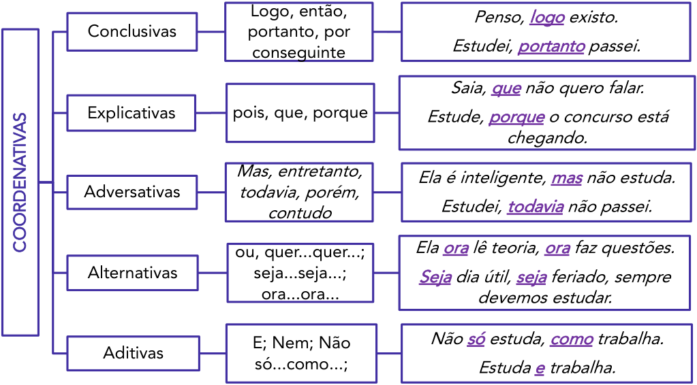

<!-- Start of picture text -->
Logo, então,  Penso, logo existo. Conclusivas portanto, por Estudei, portanto passei. conseguinte Saia, que não quero falar. Explicativas pois, que, porque Estude, porque o concurso está chegando. Mas, entretanto,  Ela é inteligente, mas não estuda. Adversativas todavia, porém, contudo Estudei, todavia não passei. ou, quer...quer...;  Ela ora lê teoria, ora faz questões. Alternativas seja...seja...;  Seja dia útil, seja feriado, sempre ora...ora... devemos estudar. E; Nem; Não  Não só estuda, como trabalha. Aditivas só...como...;  Estuda e trabalha. COORDENATIVAS <!-- End of picture text -->

**Obs:** o “mas” é uma conjunção adversativa que não pode ser deslocada. Ele inicia a oração adversativa. 

###### **As conjunções subordinativas são aquelas que unem uma oração a outra, chamada de principal.** 

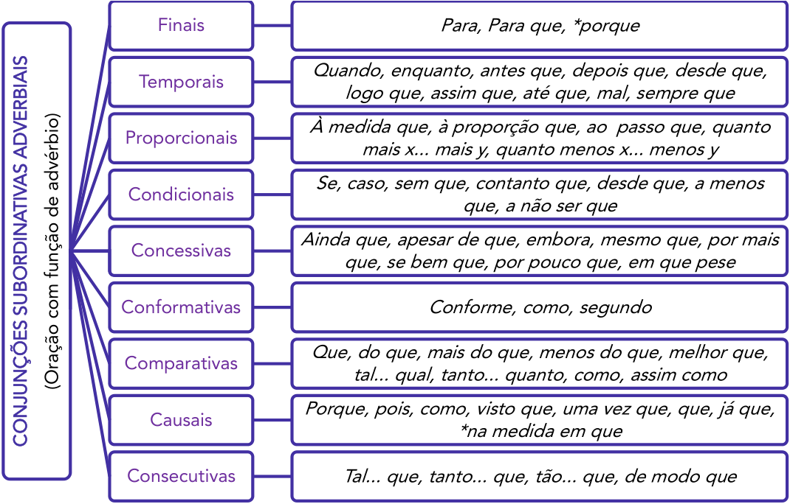

<!-- Start of picture text -->
Finais Para, Para que, *porque Quando, enquanto, antes que, depois que, desde que, Temporais logo que, assim que, até que, mal, sempre que À medida que, à proporção que, ao  passo que, quanto Proporcionais mais x... mais y, quanto menos x... menos y Se, caso, sem que, contanto que, desde que, a menos Condicionais que, a não ser que Ainda que, apesar de que, embora, mesmo que, por mais Concessivas que, se bem que, por pouco que, em que pese Conformativas Conforme, como, segundo Que, do que, mais do que, menos do que, melhor que, Comparativas tal... qual, tanto... quanto, como, assim como Porque, pois, como, visto que, uma vez que, que, já que, Causais *na medida em que Consecutivas Tal... que, tanto... que, tão... que, de modo que (Oração com função de advérbio) CONJUNÇÕES SUBORDINATIVAS ADVERBIAIS <!-- End of picture text -->

---

<!-- pagina: 57 -->

**Equipe Português Estratégia Concursos, Felipe Luccas Aula 03** 

Aqui, segue uma sistematização das conjunções que podem aparecer com mais de um sentido. 

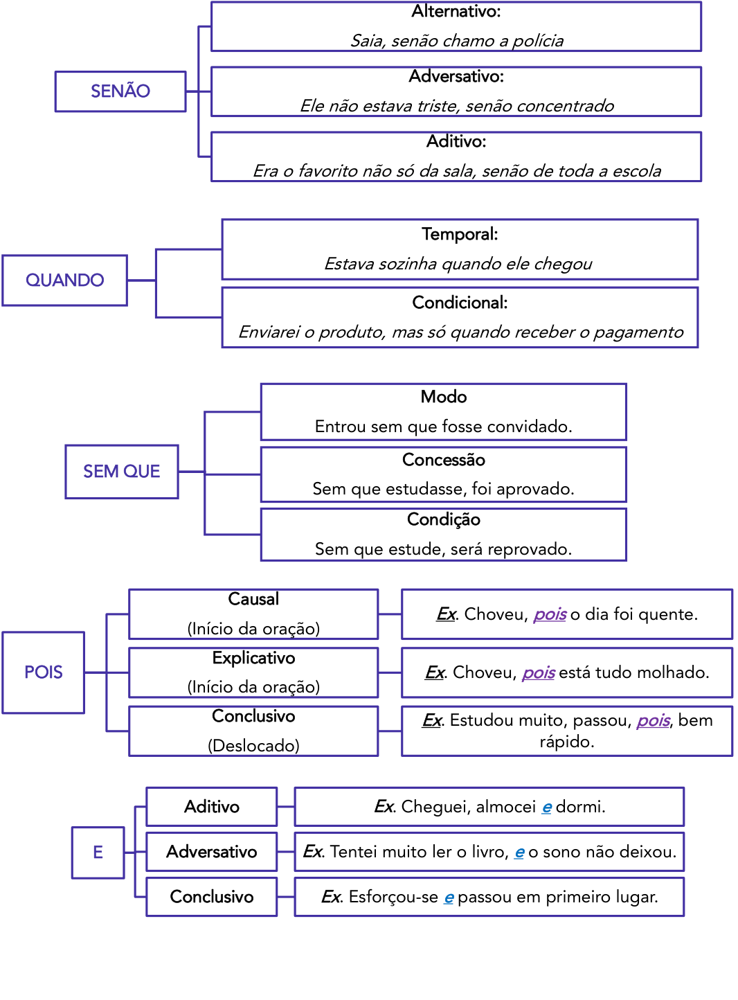

<!-- Start of picture text -->
Alternativo: Saia, senão chamo a polícia Adversativo: SENÃO Ele não estava triste, senão concentrado Aditivo: Era o favorito não só da sala, senão de toda a escola Temporal: Estava sozinha quando ele chegou QUANDO Condicional: Enviarei o produto, mas só quando receber o pagamento Modo Entrou sem que fosse convidado. Concessão SEM QUE Sem que estudasse, foi aprovado. Condição Sem que estude, será reprovado. Causal Ex . Choveu, pois o dia foi quente. (Início da oração) Explicativo POIS Ex . Choveu, pois está tudo molhado. (Início da oração) Conclusivo Ex . Estudou muito, passou, pois , bem (Deslocado) rápido. Aditivo Ex . Cheguei, almocei  e dormi. E Adversativo Ex . Tentei muito ler o livro, e o sono não deixou. Conclusivo Ex . Esforçou-se e passou em primeiro lugar. <!-- End of picture text -->

---

<!-- pagina: 58 -->

**Equipe Português Estratégia Concursos, Felipe Luccas Aula 03** 

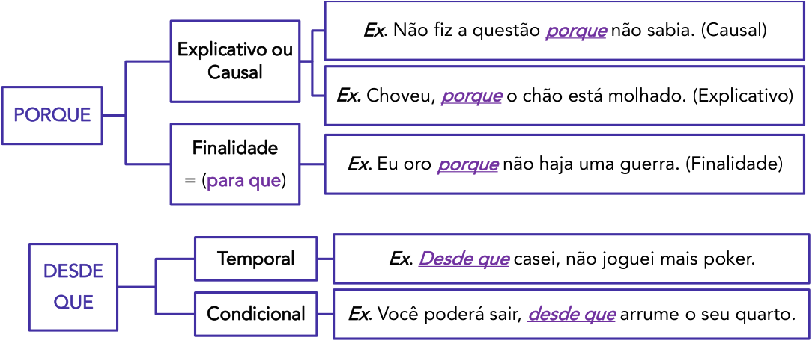

<!-- Start of picture text -->
Ex . Não fiz a questão  porque não sabia. (Causal) Explicativo ou Causal Ex.  Choveu, porque o chão está molhado. (Explicativo) PORQUE Finalidade Ex.  Eu oro  porque não haja uma guerra. (Finalidade) = ( para que ) Temporal Ex . Desde que casei, não joguei mais poker. DESDE QUE Condicional Ex . Você poderá sair, desde que arrume o seu quarto. <!-- End of picture text -->

Aqui, estão só as divisões. Recomendo você exercitar tentar preencher sozinho, ao lado de cada tipo de conjunção, todas as aquelas que você lembrar, até garantir que você domina as listas. Esse exercício é fundamental para ganhar tempo e confiança na hora da prova.

---

<!-- pagina: 59 -->

**Equipe Português Estratégia Concursos, Felipe Luccas Aula 03** 

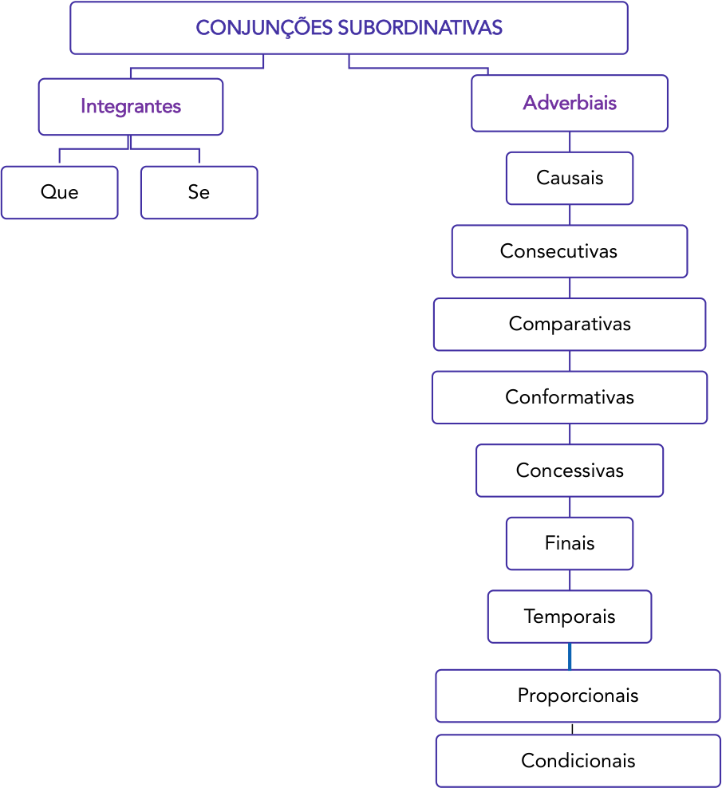

<!-- Start of picture text -->
CONJUNÇÕES SUBORDINATIVAS Integrantes Adverbiais Causais Que  Se Consecutivas Comparativas Conformativas Concessivas Finais Temporais Proporcionais Condicionais <!-- End of picture text -->

---

<!-- pagina: 60 -->

**Equipe Português Estratégia Concursos, Felipe Luccas Aula 03** 

## **QUESTÕES COMENTADAS - CONECTIVOS - FGV** 

###### **1. FGV / TJ-RS / 2026** 

Assinale a frase que mostra uma **oposição** entre os segmentos que a compõem. 

A) Primeiro aprenda a fazer, seja o que for, para depois fazer bem-feito. 

B) A natureza é grande nas grandes coisas, mas é grandiosa nas pequenas coisas. 

C) Basta ver um promontório, uma montanha, um mar e um rio, para ter visto todos. 

D) A grande invenção polivalente de Deus foi o pato. Ele anda, nada e voa. E faz tudo isso mal. 

E) Sê prudente como as serpentes e simples como as pombas. 

###### **Comentário:** 

Está correta: 

B) A natureza é grande nas grandes coisas, **mas** é grandiosa nas pequenas coisas. 

Há uma relação de **oposição** entre as orações, evidenciada pela conjunção adversativa “mas”. Vejamos o sentido das demais: 

A) Primeiro aprenda a fazer, seja o que for, **para** depois fazer bem-feito. ( **finalidade** ) 

C) Basta ver um promontório, uma montanha, um mar e um rio, **para** ter visto todos. ( **finalidade** ) 

D) A grande invenção polivalente de Deus foi o pato. Ele anda, nada **e** voa. **E** faz tudo isso mal. ( **adição** ) 

E) Sê prudente como as serpentes **e** simples como as pombas. ( **adição** ) 

Gabarito Letra B. 

###### **2. FGV / AMAZUL / 2026** 

###### **Insônia infeliz e feliz (Clarice Lispector)** 

Sente-se uma coisa que só tem um nome: solidão. Ler? Jamais. Escrever? Jamais. Passa-se um tempo, olha-se o relógio, quem sabe são cinco horas. Nem quatro chegaram. Quem estará acordado agora? E nem posso pedir que me telefonem no meio da noite, pois posso estar dormindo e não perdoar. Tomar uma pílula para dormir? Mas e o vício que nos espreita? Ninguém me perdoaria o vício. Então fico sentada na sala, sentindo. Sentindo o quê? O nada. E o telefone à mão. 

Mas quantas vezes a insônia é um dom. De repente despertar no meio da noite e ter essa coisa rara: solidão. Quase nenhum ruído. Só o das ondas do mar batendo na praia. E tomo café com gosto, toda sozinha no mundo. Ninguém me interrompe o nada. É um nada a um tempo vazio e rico. E o telefone mudo, sem aquele toque súbito que sobressalta. Depois vai amanhecendo. As nuvens se clareando sob um sol às vezes pálido como uma lua, às vezes de fogo puro. Vou ao

---

<!-- pagina: 61 -->

**Equipe Português Estratégia Concursos, Felipe Luccas Aula 03** 

terraço e sou talvez a primeira do dia a ver a espuma branca do mar. O mar é meu, o sol é meu, a terra é minha. E sinto-me feliz por nada, por tudo. Até que, como o sol subindo, a casa vai acordando e há o reencontro com meus filhos sonolentos. 

LISPECTOR, Clarice. A descoberta do mundo. Rio de Janeiro: Rocco, 1999. 

O texto explora o uso de orações coordenadas assindéticas, que imprimem um ritmo acelerado à narrativa. Assinale a opção em que **não** se observa este uso. 

A) Passa-se um tempo, olha-se o relógio, quem sabe são cinco horas. Nem quatro chegaram. Quem estará acordado agora? 

B) E nem posso pedir que me telefonem no meio da noite, pois posso estar dormindo e não perdoar. 

C) Quase nenhum ruído. Só o das ondas do mar batendo na praia. 

<!-- Start of picture text -->
==5460== <!-- End of picture text -->

D) O mar é meu, o sol é meu, a terra é minha. 

E) Ler? Jamais. Escrever? Jamais. 

###### **Comentário:** 

Orações coordenadas assindéticas são aquelas sem a presença da conjunção coordenativa. Na letra B, temos duas conjunções presentes: “e” (aditiva) e “pois” (explicativa). 

B) **E** nem posso pedir que me telefonem no meio da noite, **pois** posso estar dormindo e não perdoar. 

As demais não apresentam conjunções. 

Gabarito Letra B. 

###### **3. FGV / IBGE / 2026** 

Em “Tinha sofrido um corte, bem no meio, enquanto cortava o pernil para a patroa.”, o conectivo sublinhado pode ser substituído, sem alteração de sentido, por 

A) “depois que”. 

B) “antes de” 

C) “cada vez que”. 

D) “no momento em que”. 

E) “após”. 

###### **Comentário:** 

Na frase, “enquanto” exprime a ideia de algo simultâneo, concomitante. São duas ações (“tinha sofrido um corte” e “cortava o pernil”) ocorrendo no mesmo momento. Assim, a conjunção “enquanto” pode ser substituída por “no momento em que” (letra D) que também expressa concomitância.

---

<!-- pagina: 62 -->

**Equipe Português Estratégia Concursos, Felipe Luccas Aula 03** 

As demais não dão ideia de simultaneidade: “depois que”, “antes de”, “cada vez que”, “após”. Gabarito Letra D. 

###### **4. FGV / Prefeitura de São José dos Campos - SP / 2026** 

Há uma série de locuções conjuntivas que terminam com o vocábulo “que”. 

Assinale a frase abaixo em que a locução sublinhada tem seu significado erradamente indicado. 

A) A gente distorce a forma a fm de que criemos espaço. / finalidade. 

B) O sinal certo de um bom livro é que ele nos agrada cada vez mais <u>à medida que</u> envelhecemos. / tempo. 

C) Todas as palavras são pinos para que nelas se pendurem as ideias. / direção. 

D) Sou a favor da liberdade de pensamento, <u>desde que não se transforme em palavras. /</u> condição. 

E) Escrever é simplesmente um modo de falar sem que interrompam a gente. / modo. 

###### **Comentário:** 

Está incorreta: 

C) Todas as palavras são pinos para que nelas se pendurem as ideias. / ~~direção~~ **finalidade** . 

“para que” indica finalidade ou objetivo e equivale a “ **a fim de que** ”. 

As demais alternativas têm o sentido correto: 

A) A gente distorce a forma a fm de que criemos espaço. / **finalidade** . 

Pode ser substituída por “ **para que** ”: A gente distorce a forma **para que** criemos espaço. 

B) O sinal certo de um bom livro é que ele nos agrada cada vez mais <u>à medida que</u> envelhecemos. / **tempo** . 

“à medida que” é uma conjunção originalmente proporcional, porém aqui tem sentido temporal: ... cada vez mais **à medida que/ao mesmo tempo que** envelhecemos. 

D) Sou a favor da liberdade de pensamento, <u>desde que não se transforme em palavras. /</u> **condição** . 

“desde que” é locução conjuntiva condicional e equivale a: **se, caso, contanto que** . 

E) Escrever é simplesmente um modo de falar sem que interrompam a gente. / **modo** . 

“sem que” introduz a maneira/jeito de falar: sem interrupções. 

Gabarito Letra C. 

###### **5. FGV / AMAZUL / 2026** 

Na frase “Ele procurava e não via”, o conectivo destacado tem o valor de

---

<!-- pagina: 63 -->

**Equipe Português Estratégia Concursos, Felipe Luccas Aula 03** 

A) adição. 

B) alternância. 

C) oposição. 

D) complementariedade. 

E) concomitância. 

###### **Comentário:** 

Na frase, a conjunção “e” tem valor de **adversidade/oposição** e equivale a “mas”, “porém”. Ele procurava **e (= mas, porém)** não via. 

Vejamos os conectivos próprios dos demais: 

A) adição: e, mas também, bem como. 

B) alternância: ou... ou, ora... ora. 

- D) complementariedade: além disso, ademais. 

- E) concomitância: à medida que, ao mesmo tempo em que. 

Gabarito Letra C. 

###### **6. FGV / IBGE / 2026** 

Na frase “Antes ela fora surda: não as teria ouvido.”, o conectivo que liga as duas orações, mantendo o sentido, é 

A) mas. 

B) e. 

C) quando. 

D) se. 

E) dessa forma. 

###### **Comentário:** 

Há uma relação de causa e consequência entre as orações: 

porque ela fora surda ( **causa** ) >> não as teria ouvido ( **consequência** ). 

Como se trata de uma consequência lógica, é possível utilizar conectivos como: logo, por isso, **dessa forma** . Assim, está correta: 

E) dessa forma. 

Vejamos o sentido das demais: 

A) mas ( **oposição** ). 

B) e ( **adição** ).

---

<!-- pagina: 64 -->

**Equipe Português Estratégia Concursos, Felipe Luccas Aula 03** 

###### C) quando ( **tempo** ). 

###### D) se ( **condicional** ). 

Gabarito Letra E. 

**7. FGV / Prefeitura de São José dos Campos - SP / 2026** 

Observe atentamente o texto a seguir: 

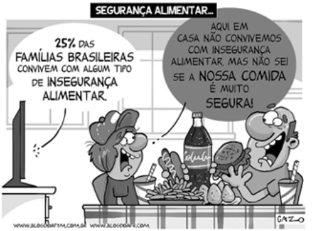

Fonte: https://blogdoaftm.com.br/wp-content/ uploads/2024/05/5267.jpg acesso em: 6.10.25 

No balão de fala da personagem, há a seguinte constatação: Aqui em casa não convivemos com insegurança alimentar, mas não sei se a nossa comida é muito segura. Assinale, dentre as opções a seguir, a única em que se reescreve esse período, mantendo-se sua ideia principal. 

A) Embora não convivamos com insegurança alimentar, não sei se nossa comida é muito segura. 

B) Não sei se a nossa comida é muito segura porque não convivemos com insegurança alimentar. 

C) Nossa comida não é muito segura, porém não convivemos com insegurança alimentar. 

D) Como não convivemos com insegurança alimentar, não sei se nossa comida é muito segura. 

E) Não convivemos com insegurança alimentar, então não sei se nossa comida é muito segura. 

**Comentário:** 

Está correta: 

A) Embora não convivamos com insegurança alimentar, não sei se nossa comida é muito segura. 

Na frase original, há uma relação de **oposição** , sinalizada pela conjunção adversativa “mas”. Na letra A, “embora” é conjunção concessiva e mantém esse contraste entre as orações. Vejamos o erro das demais: 

B) Incorreta. “porque” é conjunção explicativa/causal; não mantém a ideia de oposição. 

C) Incorreta. “porém” é conjunção adversativa, mas houve mudança de sentido. A retirada do

---

<!-- pagina: 65 -->

**Equipe Português Estratégia Concursos, Felipe Luccas Aula 03** 

“não sei” acaba dando certeza quanto à insegurança da comida. 

D) Incorreta. “como” introduz uma ideia de **causa** . Mudança de sentido. 

E) Incorreta. “então” dá ideia de conclusão. Mudança de sentido. 

Gabarito Letra A. 

**8. FGV / Prefeitura de São José dos Campos - SP / 2026** 

Leio no jornal a notícia de que um homem morreu de fome. Um homem de cor branca, trinta anos presumíveis, pobremente vestido, morreu de fome, sem socorros, em pleno centro da cidade, . permanecendo deitado na calçada durante setenta e duas horas, para finalmente morrer de fome 

Dentre as opções a seguir, assinale aquela que reescreve a oração sublinhada no primeiro parágrafo do texto acima, mantendo-se o sentido que ela expressa no contexto do período. 

A) a fim de que finalmente morresse de fome. 

B) depois de finalmente morrer de fome. 

C) assim que finalmente morrera de fome. 

D) quando finalmente morresse de fome. 

E) até que finalmente morreu de fome. 

###### **Comentário:** 

Na frase original, “para” não tem ideia de finalidade/objetivo, mas sim de **consequência** lógica, de **resultado** . Assim, manteria o sentido original a letra E: 

E) até que finalmente morreu de fome. 

O “até que” aponta para a consequência/resultado da ação do homem estendido no chão por 72h: morrer de fome. 

Vejamos o erro das demais: 

A) Incorreta. “a fim de que” dá ideia de finalidade e não de consequência. 

B) Incorreta. “depois de” inverte a ordem das ações. No original, o homem fica estendido por 72 horas para depois morrer de fome. Na reescrita da B, o homem morre de fome para depois ficar estendido por 72h. 

C) Incorreta. “morrera” é pretérito mais-que-perfeito do indicativo e serve para indicar uma ação passada anterior à outra também do passado. Isso também inverteria a ordem da frase original. 

D) Incorreta. “morresse” está conjugado no subjuntivo e dá ideia de hipótese, de algo incerto. Muda o sentido original. 

Gabarito Letra E. 

###### **9. FGV / IBGE / 2026**

---

<!-- pagina: 66 -->

**Equipe Português Estratégia Concursos, Felipe Luccas Aula 03** 

Sobre a frase “Estava feliz, apesar do cansaço”, assinale a afirmativa correta. 

A) A alteração da ordem da oração destacada na frase implica mudança de sentido. 

B) A oração destacada estabelece relação de coordenação em relação à primeira. 

C) A oração destacada veicula a ideia de concessão. 

D) O conectivo “apesar de” pode ser substituído, sem alteração de sentido por “em virtude de”. 

E) A oração destacada completa o sentido da primeira oração. 

###### **Comentário:** 

No gabarito preliminar, a resposta era a letra C: 

C) A oração destacada veicula a ideia de concessão. 

“apesar de” é locução conjuntiva que exprime a ideia de **concessão** e equivale a “embora”, “mesmo que”. Logo, estaria correta, porém, no gabarito definitivo, a questão foi anulada pela banca FGV. Possivelmente a banca anulou a questão por chamar o segmento sublinhado de oração, sendo que não há a presença de verbo. Logo, não se trata de oração, mas de um adjunto adverbial. 

Gabarito preliminar: Letra C. Gabarito definitivo: anulada. 

###### **10. FGV / AL-RO / 2026** 

Assinale a opção em que há **<u>erro</u>** na classificação gramatical do termo sublinhado. 

A) Meu irmão chegou cansado de viagem / advérbio. 

B) Como estivesse atrasado, acabou perdendo o avião / conjunção. 

C) Apesar de muito esforço, não conseguiu passar no concurso / locução prepositiva. 

D) Um ciclone inesperado atingiu Rio Bonito do Iguaçu, no estado do Paraná / adjetivo. 

E) Em 99% das casas e do comércio da cidade, a energia <u>que foi cortada já foi restabelecida /</u> pronome. 

###### **Comentário:** 

Na letra A, “cansado” é adjetivo e caracteriza o substantivo “irmão”, atuando como predicativo do sujeito. Indica o estado em que “Meu irmão” chegou. 

As demais alternativas apresentam corretamente a classe de palavras: 

B) “como” é conjunção subordinativa adverbial causal: 

<u>Como estivesse atrasado, acabou perdendo o avião</u> 

<u>Já que estivesse (estava) atrasado, acabou perdendo o avião</u> 

**OBS** : Não estranhe. Nessa frase, temos uma construção culta mais rara, em que a forma “estivesse”, no pretérito imperfeito do subjuntivo, equivale a “estava”. 

C) “apesar de” é locução prepositiva com sentido de concessão.

---

<!-- pagina: 67 -->

**Equipe Português Estratégia Concursos, Felipe Luccas Aula 03** 

D) “inesperado” é adjetivo e caracteriza o substantivo “ciclone”. 

E) “que” é pronome relativo e retoma o termo antecedente “energia”. 

Gabarito Letra A. 

###### **11. FGV / TJ-RS / 2026** 

Um dos conselhos para quem deseja escrever bem é, atualmente, preferir a concisão, eliminando os excessos, as repetições e a prolixidade. As frases a seguir mostram esse tipo de **problema** no segmento sublinhado. 

Assinale a frase em que a modificação foi feita de forma adequada. 

A) As empresas admitiram novos funcionários <u>com o objetivo de</u> maior rapidez na produção. / para 

B) O chefe declarou que iria aumentar os salários sob a condição <u>de que</u> os empregados passassem a chegar na hora devida. / já que 

C) Estávamos todos com pressa e em consequência dessa aceleração, a produção ficou de baixa 

qualidade. / apesar disso 

D) Meu neto lia os jornais <u>com extremo cuidado para procurar sua classificação nas provas</u> vestibulares. / desatento 

E) Eu fumo porque, neste momento não tenho mais que me preocupar com isso. / então 

###### **Comentário:** 

Na letra A, “com o objetivo de” tem o sentido de **finalidade** e pode ser substituída por uma única preposição: **para** . São quatro palavras sendo substituídas por uma única; isso contribui para a concisão. 

A) As empresas admitiram novos funcionários **para** maior rapidez na produção. 

Vejamos as demais: 

B) O chefe declarou que iria aumentar os salários sob a condição <u>de que</u> os empregados passassem a chegar na hora devida. / ~~já que~~ 

“já que” é locução conjuntiva causal; não é possível efetuar a substituição. 

C) Estávamos todos com pressa e em consequência dessa aceleração, a produção ficou de baixa qualidade. / ~~apesar disso~~ 

“em consequência dessa aceleração” tem ideia de consequência/resultado lógico; “apesar disso” exprime concessão. Há mudança de sentido. 

D) Meu neto lia os jornais <u>com extremo cuidado para procurar sua classificação nas provas</u> vestibulares. / ~~desatento~~ 

“com extremo cuidado” é o exato oposto de “desatento”. 

E) Eu fumo porque, neste momento não tenho mais que me preocupar com isso. / então

---

<!-- pagina: 68 -->

**Equipe Português Estratégia Concursos, Felipe Luccas Aula 03** 

“neste momento” tem valor temporal; “então” exprime consequência. 

Gabarito Letra A. 

###### **12. FGV / MPE-RJ / 2025** 

As preposições, em língua portuguesa, mostram diferentes valores semânticos; assim, na frase “Dos mortos não fale a não ser bem”, a preposição DE mostra o mesmo valor semântico que mostra na seguinte frase: 

A) Devemos rir do homem para não precisarmos chorar por ele. 

B) O prazer da sociedade, sobretudo no interior, consiste em falar mal uns dos outros. 

C) A primeira metade de nossas vidas é arruinada por nossos pais e a segunda por nossos filhos. 

D) Não se deve falar do cemitério. É um lugar-comum... 

E) Eu percebo, sem nenhum terror, a desunião das moléculas de minha existência. 

###### **Comentário:** 

Em “falar dos mortos”, a preposição “de” indica assunto; assim como em D) Não se deve falar do cemitério. 

Na A, “de” é exigido pela regência de “rir”, introduz objeto indireto. 

Na B, a banca deslizou, pois a preposição “de” aparece duas vezes. Em “da sociedade” indica posse; em “falar uns dos outros”, indica assunto, assim como no gabarito. 

Na C, o “de” indica posse/pertinência; indica o todo dessa “parte”. 

Na E, o “de” indica o agente da ação de “desunir”. 

Gabarito Letra D. 

###### **13. FGV / PC MG / 2025** 

Assinale a opção que indica a frase em que houve a troca indevida entre as expressões ao pé, a pé, de pé e em pé. 

A) Minha casa está ao pé da serra. 

- B) Nada ficou em pé após o terremoto. 

C) Os funcionários puseram-se de pé com a presença do chefe. 

D) Preferiu caminhar a pé em vez de pegar um táxi. 

E) Ajoelhou-se a pé da imagem da santa. 

###### **Comentários:** 

**Ao pé** : Indica proximidade ou base de algo. Exemplo: "Ao pé da serra" (próximo da serra).

---

<!-- pagina: 69 -->

**Equipe Português Estratégia Concursos, Felipe Luccas Aula 03** 

**A pé** : Refere-se a deslocamento usando os próprios pés, sem meios de transporte. Exemplo: "Caminhou a pé". 

**De pé** : Indica a ação ou estado de estar ereto, em posição vertical. Exemplo: "Ficou de pé durante a reunião". 

**Em pé** : Similar a "de pé", também indica a posição ereta ou vertical. Exemplo: "Está em pé desde cedo". 

A diferença entre "em pé" e "de pé" é sutil e está mais relacionada ao uso e ao contexto, mas ambas as expressões indicam a posição vertical de algo ou alguém. Em alguns contextos, serão sinônimas. 

Veja as nuances: 

" **Em pé** ": Geralmente descreve o estado contínuo ou a condição de estar ereto. 

Exemplo: "Ele está em pé desde cedo." (condição ou posição atual). 

" **De pé** ": Comum em contextos dinâmicos de ação, indicando que alguém ou algo se levantou, assumiu ou mantém essa posição de estar sobre os próprios pés. 

Exemplo: "Os alunos levantaram-se de pé para cumprimentar o professor." (ação de ficar ereto). 

Exemplo: O nosso compromisso está de pé. (aqui, não caberia “em pé”) 

Vejamos: 

Alternativa (A): "Minha casa está ao pé da serra." 

A expressão "ao pé" é utilizada para indicar proximidade ou base de algo, sendo sinônima de "junto a" ou "próximo de". Neste contexto, "ao pé da serra" significa que a casa está localizada próxima à base da serra. O uso está correto. 

Alternativa (B): "Nada ficou em pé após o terremoto." 

As expressões "em pé" e "de pé" são sinônimas e indicam a posição vertical ou ereta de algo ou alguém. Após um terremoto, é comum dizer que nada permaneceu em posição vertical, ou seja, "em pé". O uso está correto. 

Alternativa (C): "Os funcionários puseram-se de pé com a presença do chefe." 

"De pé" e "em pé" são expressões equivalentes que indicam a posição ereta. Levantar-se "de pé" com a chegada de alguém é uma prática comum de respeito. O uso está correto. 

Alternativa (D): "Preferiu caminhar a pé em vez de pegar um táxi." 

A expressão "a pé" é utilizada para indicar deslocamento utilizando os próprios pés, sem o auxílio de meios de transporte. Neste caso, "caminhar a pé" está corretamente empregado para contrastar com "pegar um táxi". 

Alternativa (E): "Ajoelhou-se **~~a pé~~** da imagem da santa." 

Aqui, há um uso incorreto da expressão. A intenção provavelmente era indicar que a pessoa se ajoelhou próximo à imagem da santa. A expressão correta seria "ao pé", que denota proximidade. Portanto, a frase correta seria: "Ajoelhou-se ao pé da imagem da santa.".

---

<!-- pagina: 70 -->

**Equipe Português Estratégia Concursos, Felipe Luccas Aula 03** 

Gabarito letra E. 

###### **14. FGV / PREF. CUIABÁ - MT / 2025** 

A frase abaixo em que a preposição sublinhada tem valor semântico, não sendo exigida por nenhum termo anterior, é: 

A) Desconfiai sempre de afirmações alheias. 

B) Alguém que tenha um milhão de euros sente-se tão bem como se fosse rico. 

C) Não é preciso muito para ser um produtor de codornas. Vo-cê coloca um casal numa gaiola e é tudo. 

D) Eu me disporia a tentar entender a mágica se me convencessem de que alguém entende. 

E) Às vezes, precisamos <u>de uma mudança para transformar uma obrigação cansativa numa</u> interessante experiência. 

###### **Comentário:** 

Quando a banca diz “preposição exigida por termo anterior”, está se referindo às preposições gramaticais, aquelas que introduzem complementos e, portanto, são obrigatórias/exigidas pela regência do termo anterior. 

De maneira prática, verifique se a preposição introduz objeto indireto ou complemento nominal. Esta será uma preposição gramatical. 

Caso contrário, será uma preposição com valor semântico, ou seja, uma preposição não obrigatória, que introduz um termo sintaticamente não obrigatório, um adjunto adnominal ou adverbial. 

Em A, D e E, temos preposições obrigatórias, introduzindo o objeto indireto de “desconfiar”, “convencer” e “precisar”. 

Em C, temos complemento nominal de “produtor”; o termo “de codornas” tem valor passivo (codornas são produzidas). 

Na letra B, o termo “de euros” é adjunto adnominal, um mero especificador de “milhões”. 

Gabarito Letra B. 

###### **15. FGV / MPU / 2025** 

Observe a seguinte frase: 

“Ele ficou esgotado porque correu muito”. 

A maneira de reescrevê-la que modifca o seu sentido original é: 

A) Se ele correu muito, ficou esgotado; 

B) Ele sentiu-se esgotado por ter corrido muito; 

C) Já que correu muito, sentiu-se esgotado;

---

<!-- pagina: 71 -->

**Equipe Português Estratégia Concursos, Felipe Luccas Aula 03** 

D) Porque correu muito, ficou esgotado; 

E)  Seu esgotamento ocorreu por ter corrido muito. 

###### **Comentário:** 

A alternativa A muda o sentido original, porque traz um fato já ocorrido (correu) como se fosse uma hipótese, ao empregar a conjunção condicional “se”. 

Gabarito Letra A. 

###### **16. FGV / PREF. CUIABÁ - MT / 2025** 

Observe a seguinte frase: 

“Na política a gente consegue eliminar os piores, mas nunca consegue eleger os melhores”. 

Se substituirmos a oração reduzida “eleger os melhores” por uma oração desenvolvida, a forma adequada dessa oração seria: 

A) a eleição dos melhores. 

B) que se elejam os melhores. 

C) que fossem eleitos os melhores. 

D) que se elegessem os melhores 

E) elegerem-se os melhores 

###### **Comentário:** 

Para reescrevermos em forma de oração desenvolvida, devemos ter conjunção e verbo conjugado: 

consegue **eleger** os melhores”. 

consegue **que se elejam** os melhores (que os melhore sejam eleitos). 

– Felipe, por que houve uso de voz passiva? 

- Ora, porque “os melhores” era objeto direto, termo de natureza passiva, que vira sujeito paciente. 

a) Incorreto.  “eleição” é substantivo, é forma nominal; oração precisa ter verbo. 

c) Incorreto.  “fossem” está no pretérito imperfeito do subjuntivo, não foi mantido o tempo original. 

d) Incorreto.  “elegessem” está no pretérito imperfeito do subjuntivo, não foi mantido o tempo original. 

e) Incorreto.  “elegerem” está no infinitivo, continua em forma reduzida. 

Gabarito Letra B.

---

<!-- pagina: 72 -->

**Equipe Português Estratégia Concursos, Felipe Luccas Aula 03** 

###### **17. FGV / PC- MG / 2025** 

Assinale a opção que apresenta a frase que mostra uma oração concessiva: 

A) A fantasia não tem limites, ainda que a arte os tenha. 

B) Não devemos nunca nos acostumar com a vida, pois isso seria a morte. 

C) Uma forma de expressão estabelecida é também uma forma de opressão. 

D) É muito mais fácil perdoar um inimigo depois que acertamos as contas com ele. 

E) Quanto mais tempo discutimos, tanto mais longe nos achamos do fim da discussão. 

###### **Comentários:** 

Uma oração concessiva expressa uma ideia de contraste ou oposição, indicando que a ação principal ocorre apesar da ideia contida na oração subordinada. Geralmente, essas orações são introduzidas por conjunções como " **ainda que** ", "embora", "mesmo que", "se bem que", entre outras. 

(A) "A fantasia não tem limites, ainda que a arte os tenha." 

A conjunção " **ainda que** " introduz uma oração subordinada concessiva, estabelecendo oposição entre "fantasia" e "arte". Esta é a resposta correta. 

(B) "Não devemos nunca nos acostumar com a vida, pois isso seria a morte." 

Aqui, a conjunção "pois" estabelece uma relação de causa/explicação, não de concessão. 

(C) "Uma forma de expressão estabelecida é também uma forma de opressão." 

Não há ideia de contraste ou concessão; trata-se de uma declaração enfática, com sentido de adição. 

(D) "É muito mais fácil perdoar um inimigo depois que acertamos as contas com ele." 

A conjunção "depois que" indica uma relação temporal, e não concessiva. 

(E) "Quanto mais tempo discutimos, tanto mais longe nos achamos do fim da discussão." 

A construção expressa uma relação proporcional e não uma ideia de concessão. 

Gabarito letra A. 

###### **18. FGV / PREF. SÃO JOSÉ DOS CAMPOS - SP / 2024** 

Assinale a opção em que a conjunção E mostra valor de adição e não se oposição. 

A) A rosa vive uma hora, e o cipreste, cem anos. 

B) Conheço um pouco sobre a natureza, e nada sobre o homem. 

C) Meu principal objetivo na vida é fazer as pessoas, felizes, e isso é quase impossível. 

D) Deus fez a vida para ser praticada e não para ser conhecida. 

E) A vida se vive e se escreve.

---

<!-- pagina: 73 -->

**Equipe Português Estratégia Concursos, Felipe Luccas Aula 03** 

###### **Comentários:** 

Apenas na letra E temos um "e" com sentido de adição simples, a vida é vivida e escrita. Não há nada de antagônico entre viver e escrever. 

Nas demais há oposição: 

- A) oposição entre pouco e muito tempo. 

- B) oposição entre pouco e nada. 

C) oposição entre fazer pessoas felizes e ser quase impossível fazer pessoas felizes. 

D) oposição entre praticar e conhecer. 

Gabarito letra E. 

###### **19. FGV / TJ RJ / 2024** 

Assinale a frase em que o termo sublinhado indica simultaneidade temporal. 

A) **<u>Enquanto</u>** houver vida, há esperança. 

- B) **<u>Assim que</u>** chegou a banda, a música começou. 

- C) **<u>Após</u>** a pandemia, alguns hábitos de higiene mudaram. 

- D) As encomendas para a festa chegaram **<u>em seguida</u>** . 

- E) Iniciada a confusão, a polícia chegou **<u>de imediato</u>** <u>.</u> 

###### **Comentários:** 

Todas as alternativas trazem noções de tempo, "assim que", "após", "em seguida", "de imediato" indicam tempo posterior, subsequente, ou seja, um evento que aconteceu "depois" do outro. 

Já o "enquanto" é conjunção subordinativa adverbial temporal e indica justamente tempo "simultâneo", ou seja, que os processos ocorrem ao mesmo tempo. Vida e esperança coexistem, existem ao mesmo tempo. Se uma deixar de existir, acaba a outra também. 

Gabarito letra A. 

**20. FGV / PREF. SÃO JOSÉ DOS CAMPOS - SP / 2024** Entre as frases abaixo, assinale aquela que identifica corretamente a relação lógica entre os segmentos destacados. 

A) Não tenhamos pressa, / mas não percamos tempo. – Explicação. 

B) A muleta do tempo é mais trabalhadora / que a rápida clava de Hércules. - Comparação. 

C) Há pessoas tão chatas / que nos fazem perder um dia em cinco minutos. – Conclusão. 

D) Não somos nós quem perdemos tempo. / É o tempo que nos perde. – Concessão.

---

<!-- pagina: 74 -->

**Equipe Português Estratégia Concursos, Felipe Luccas Aula 03** 

E) À medida que tenho menos tempo para praticar as coisas, / menos curiosidade tenho por aprendê-las. – Consequência. 

###### **Comentários:** 

"mais que" é grau comparativo de superioridade do adjetivo "trabalhadora". 

B) A muleta do tempo é mais trabalhadora / que a rápida clava de Hércules. - Comparação. 

Vejamos as demais relações lógicas. 

A) Não tenhamos pressa, / mas não percamos tempo. – **oposição** 

C) Há pessoas tão chatas / que nos fazem perder um dia em cinco minutos. – **Consequência** . 

D) Não somos nós quem perdemos tempo. / É o tempo que nos perde. – **oposição/retificação** . 

E) À medida que tenho menos tempo para praticar as coisas, / menos curiosidade tenho por aprendê-las. – **proporção** . 

Gabarito letra B. 

###### **21. FGV / CÂMARA MUNICIPAL DE SÃO PAULO - SP / 2024** 

As preposições podem ser gramaticais – se exigidas pela regência de algum termo anterior – ou nocionais, quando não são obrigatórias e mostram um significado. Assinale a frase abaixo em que a preposição A tem valor nocional. 

A) Os feirantes vendiam bananas a $10 a dúzia. 

B) Os que governam são obrigados a conhecer pelo menos gramática. 

C) Um conservador é um homem com duas excelentes pernas que, contudo, nunca aprendeu a andar para a frente. 

D) O futuro a Deus pertence e quando a gente é ministro pertence também ao presidente. 

E) A punição que os bons sofrem, quando se recusam a tomar parte no governo, é viver sob o governo dos maus. 

###### **Comentários:** 

Preposições gramaticais são exigidas por termos anteriores, numa relação obrigatória de regência; introduzem complementos. 

Preposições nocionais não são exigidas gramaticalmente, mas introduzem termos acessórios, detalhamentos semânticos, adjuntos. 

Na letra A, o termo "a $10 a dúzia" é adjunto adverbial de preço. 

Nas demais, as preposições são gramaticais, pois são exigidas pela regência do termo anterior: obrigado, aprendeu, pertence, se recusam. 

Gabarito letra A.

---

<!-- pagina: 75 -->

**Equipe Português Estratégia Concursos, Felipe Luccas Aula 03** 

###### **22. FGV / PREF. SÃO JOSÉ DOS CAMPOS - SP / 2024** 

– – ou As preposições podem ser gramaticais se exigidas pela regência de algum termo anterior nocionais, quando não são obrigatórias e mostram um significado. 

Assinale a frase abaixo em que a preposição A tem valor nocional. 

A) Fidel Castro governou Cuba a ferro e fogo. 

B) Constituição Brasileira, artigo único: todo brasileiro fica obrigado a ter vergonha na cara. 

C) Campanha de alto nível só interessa a picareta. 

D) Toda cozinheira deve aprender a governar o Estado. 

E) Como se pode dizer que um homem tem uma pátria quando não tem direito nem a uma polegada quadrada dela? 

###### **Comentários:** 

Em "A) Fidel Castro governou Cuba a ferro e fogo", temos "a" introduzindo locução adverbial de modo: a ferro e fogo. O adjunto adverbial é termo acessório, a preposição não introduz complemento, não é gramatical. É meramente semântica, nocional. 

Nas demais, introduz complemento obrigatório previsto pela regência do termo anterior: "obrigado A algo"; "interessa A algo/alguém", "aprender A fazer algo", "direito A algo" Gabarito letra A. 

###### **23. FGV / CÂMARA MUNICIPAL DE SÃO PAULO / TÉCNICO / 2024** 

Entre as frases abaixo assinale aquela que mostra a preposição COM no valor semântico de “companhia”. 

A) O dia, a água, o sol, a lua, a noite – coisas que não tenho de comprar com dinheiro. 

B) A morte fala-nos com uma voz profunda para não dizer nada. 

C)  A primeira lei da natureza é que tudo está relacionado com tudo. 

D) Fui passear com as árvores, e o resultado é que fiquei mais alto. 

E) Nenhum pássaro voa alto demais se voa com as próprias asas. 

###### **Comentários:** 

Na prática, a preposição tem o mesmo sentido que o termo que ela introduz tem. 

D)  Fui passear com as árvores, e o resultado é que fiquei mais alto. 

"As árvores" são a companhia do passeio, então o "com" indica companhia. 

Vejamos as demais:

---

<!-- pagina: 76 -->

**Equipe Português Estratégia Concursos, Felipe Luccas Aula 03** 

A)  O dia, a água, o sol, a lua, a noite – coisas que não tenho de comprar **<u>com dinheiro</u>** . (meio/instrumento) 

B)  A morte fala-nos **<u>com uma voz profunda</u>** para não dizer nada. (modo) 

C)  A primeira lei da natureza é que tudo está relacionado **<u>com tudo</u>** <u>. (tema/referência)</u> 

E)  Nenhum pássaro voa alto demais se voa **<u>com as próprias asas</u>** . (meio/instrumento) Gabarito letra D. 

**24. FGV / PREF. SÃO JOSÉ DOS CAMPOS - SP / 2024** 

AO INVÉS DE / EM VEZ DE são duas expressões que, inicialmente, significavam, respectivamente, “ oposição ” e “ substituição ” , mas hoje já aparecem como equivalentes. 

Considerando esses significados originais, assinale a frase em que houve troca **<u>indevida</u>** entre essas expressões. 

A) Em vez de comida japonesa, deram preferência ao tradicional churrasco gaúcho. 

B) Ao invés de divertirem-se com o jogo de futebol que haviam organizado, ficaram ao lado do campo conversando. 

C) Ao invés de continuarem no trabalho, ficaram descansando no vestiário dos operários. 

D) Em vez de literatura policial, os jovens daquela turma davam mais importância à poesia. 

E) O grupo de turistas decidiu economizar, almoçando num restaurante popular ao invés de gastar dinheiro no restaurante luxuoso da esquina. 

###### **Comentários:** 

Para a FGV, embora diga no enunciado que "aparecem como equivalentes", o "ao invés de" só é adequando quando há situações claramente opostas, normalmente representadas por antônimos. 

Em suma: 

" **em vez de** "= no lugar de 

" **ao invés de** "=ao contrário de 

Portanto, na B, teríamos apenas "em vez de", porque "conversar" e "divertir-se com o jogo" não são contrários. 

B) ~~Ao invés de~~ **EM VEZ DE/ NO LUGAR DE** divertirem-se com o jogo de futebol que haviam organizado, ficaram ao lado do campo conversando. 

Nas demais, o uso é adequado. 

A) **EM VEZ DE/ NO LUGAR DE** comida japonesa, deram preferência ao tradicional churrasco gaúcho. 

C) **AO INVÉS DE/AO CONTRÁRIO DE** continuarem no trabalho, ficaram descansando no vestiário dos operários. **(há oposição direta entre "trabalhar" e "descansar")**

---

<!-- pagina: 77 -->

**Equipe Português Estratégia Concursos, Felipe Luccas Aula 03** 

D) **EM VEZ DE/ NO LUGAR DE** literatura policial, os jovens daquela turma davam mais importância à poesia. 

E) O grupo de turistas decidiu economizar, almoçando num restaurante popular **AO INVÉS DE/AO CONTRÁRIO DE** gastar dinheiro no restaurante luxuoso da esquina. **(há oposição direta entre "popular" e "luxuoso")** 

Gabarito letra B. 

**25. FGV / PREF. SÃO JOSÉ DOS CAMPOS - SP / 2024** Nas frases abaixo há locuções prepositivas iniciadas por A; assinale a frase em que a locução sublinhada tem seu valor semântico corretamente indicado. 

A) À força de conceder direito a todos, a democracia é o regime que mata com mais segurança e bondade. / modo. 

B) Deus está geralmente a favor dos batalhões grandes contra os pequenos. / meio. 

C) Eu não sou tão pacifista a ponto de não entrar numa guerra pela paz. / exclusão. 

D) A democracia é a arte e a ciência de administrar o circo a partir da jaula dos macacos. / lugar de origem. 

E) Eu lia, cada manhã, duas ou três páginas do código civil, <u>a fm de</u> ser sempre natural. / direcionamento. 

###### **Comentários:** 

A) À força de conceder direito a todos, a democracia é o regime que mata com mais segurança e bondade. **/ pretexto/motivo** . 

B) Deus está geralmente <u>a favor dos</u> batalhões grandes contra os pequenos. / **alinhamento/favorecimento** . 

C) Eu não sou tão pacifista a ponto de não entrar numa guerra pela paz. / **consequência** . 

D) A democracia é a arte e a ciência de administrar o circo a partir da jaula dos macacos. / **lugar ou ponto de origem** . 

E) Eu lia, cada manhã, duas ou três páginas do código civil, <u>a fm de</u> ser sempre natural. / **finalidade** . 

Gabarito letra D. 

**26. FGV / PREF. SÃO JOSÉ DOS CAMPOS - SP / 2024** 

“ ” Assinale a frase que mostra **<u>erro</u>** de concordância da palavra só . 

A) Demais, Capitu usava certa magia que cativa; prima Justina acabava sorrindo, ainda que azedo, mas a **<u>sós</u>** com minha mãe achava alguma palavra ruim que dizer da menina.

---

<!-- pagina: 78 -->

**Equipe Português Estratégia Concursos, Felipe Luccas Aula 03** 

B) Ficamos **<u>sós</u>** na sala; Capitu confirmou a narração da mãe, acrescentando que passara mal por causa do que ouvira em minha casa. 

C) Tendo eu dito a Excelentíssima que Deus lhe dera, não um filho, mas um anjo do céu, o doutor ficou tão comovido que não achou modo de vencer o choro senão fazendo-me um daqueles elogios de galhofa que **<u>só</u>** ele sabe. 

D) Separados um do outro pelo espaço e pelo destino, os males apareciam-me agora, não **<u>só</u>** possíveis, mas certos. 

E) Os convidados espalharam-se por si **<u>só</u>** pelo quintal da chácara. 

###### **Comentários:** 

"só" não varia quando é advérbio, equivalente a "somente", indicativo de exclusão. Por isso, estão corretas C e D. 

Porém, quando é adjetivo, com sentido de "sozinho", é variável, vai ao plural.  nas expressões "a sós" e "por si sós", temos plural. Por isso, estão corretas A e B, mas está incorreta a letra E: 

E) Os convidados espalharam-se por si **<u>sóS</u>** pelo quintal da chácara. 

Gabarito letra E. 

###### **27. FGV / PREF. SÃO JOSÉ DOS CAMPOS - SP / 2024** 

“ Ficara sentada à mesa a ler o Diário de Notícias, no seu roupão <u>de manhã de fazenda preta, bordado a sutache, com largos botões de madrepérola; o cabelo louro um pouco</u> desmanchado, com um tom seco do calor do travesseiro, enrolava-se, torcido no alto da cabeça pequenina, de perfil bonito; a sua pele tinha a brancura tenra e láctea das louras; com o cotovelo encostado à mesa acariciava a orelha, e, no movimento lento e suave dos seus dedos, dois anéis de rubis miudinhos davam cintilações escarlates. 

A sala esteirada, alegrava, com o seu teto de madeira pintado a branco, o seu papel claro de ramagens verdes. Era em julho, um domingo, fazia um grande calor; as duas janelas estavam cerradas, mas sentia-se fora o sol faiscar nas vidraças, escaldar a pedra da varanda; havia o silêncio recolhido e sonolento de manhã de missa; uma vaga quebreira amolentava, trazia desejos de sestas ou de sombras fofas debaixo de arvoredos, no campo, ao pé da água; nas duas gaiolas, entre as bambinelas de cretone azulado, os canários dormiam; um zumbido monótono de moscas arrastava-se por cima da mesa, pousava no fundo das chávenas sobre o açúcar mal derretido, enchia toda a sala de um rumor dormente. ” 

Nesses segmentos descritivos, assinale a opção cujo termo destacado mostra um **<u>diferente</u>** valor semântico, em relação aos demais. 

A) roupão de manhã. 

B) roupão de fazenda preta. 

C) botões de madrepérola.

---

<!-- pagina: 79 -->

**Equipe Português Estratégia Concursos, Felipe Luccas Aula 03** 

###### D) teto de madeira. 

###### E) bambinelas de cretone azulado. 

###### **Comentários:** 

Em "roupão **DE MANHÃ"** , o termo preposicionado indica "finalidade/tipo"; nas demais alternativas, indica matéria. 

Gabarito letra A. 

###### **28. FGV / SEFAZ-MT / 2023** 

"Trabalhar pelo preço oferecido por outro e para o lucro deste, sem interesse algum pelo trabalho sendo preço do trabalho ajustado pela competição hostil, com um lado pedindo o mais possível e o outro pagando o menos que puder -, não é, <u>mesmo quando os salários são elevados, um</u> estado satisfatório para seres humanos de inteligência cultivada, que deixaram de julgar-se inferiores àqueles a quem servem." John Stuart Mill (1848) 

Todos os segmentos sublinhados foram substituídos por outros de mesmo sentido; assinale a opção em que a substituição proposta <u>modifca o sentido original ou fica estruturalmente</u> . <u>inadequada</u> 

A) e para o lucro deste / e para o seu lucro. 

B) sem interesse algum pelo trabalho / desinteressado pelo trabalho. 

C) pela competição hostil/ por meio de uma competição hostil. 

D) mesmo quando os salários são elevados / ainda que os salários fossem elevados. 

E) àqueles a quem servem / aos patrões. 

###### **Comentários:** 

Pessoal, nessa aqui, sejamos objetivos: 

"mesmo quando" indica concessão e tempo; "ainda que" indica apenas concessão. Já houve modificação do sentido original. 

Nas demais, evidentemente, as formas são equivalentes e não há problema estrutural. 

A) "de" indica posse, assim como "seu" 

B) "sem" indica negação, ausência, assim como o prefixo "des" 

C) "por" indica meio, assim como "por meio de" 

E) pelo contexto, inferimos que servem justamente "aos patrões". 

Gabarito letra D.

---

<!-- pagina: 80 -->

**Equipe Português Estratégia Concursos, Felipe Luccas Aula 03** 

###### **29. FGV / TJ-RN / 2023** 

Observe a seguinte frase, dita pelo gerente de uma empresa: 

"Esse empregado estava doente. Ele veio trabalhar. Isso mostra sua consciência profissional". 

Sobre a estruturação dessa frase, é correto afirmar que: 

A) as duas primeiras frases informam dois fatos; 

B) a terceira frase mostra uma oposição às duas frases anteriores; 

C) entre as duas frases iniciais seria semanticamente adequada a conjunção "logo"; 

D) o pronome "isso" se refere ao fato de o empregado estar doente; 

E) o significado desse pequeno fragmento é integralmente construído de forma explícita. 

Comentários: 

Temos aqui implícita uma relação de inferência. Os "fatos" são as premissas informadas: 

(fato 1) Esse empregado estava doente E Ele veio trabalhar (fato 2). 

A terceira informação é uma conclusão individual decorrente das anteriores, não é um fato. Não é uma verdade absoluta que trabalhar doente mostra consciência profissional. 

Vejamos as demais: 

B) Incorreto.  A terceira frase mostra uma conclusão em relação às duas frases anteriores; 

C) Incorreto.  Entre as duas frases iniciais seria semanticamente adequada a conjunção "E"; caberia um "logo" na conclusão, terceira frase. 

D) Incorreto. O pronome "isso" se refere ao fato de o empregado trabalhar doente, não "estar doente"; 

E) Incorreto. O significado desse pequeno fragmento não é integralmente construído de forma explícita. Há uma ideia implícita de que trabalhar doente é sinal de consciência. Essa ideia daria sentido ao raciocínio, caso o leitor assumisse essa informação como verdadeira. 

Gabarito letra A. 

**30. FGV / TJ-RN / 2023** Todas as frases abaixo foram iniciadas com o vocábulo “Segundo”, com noção de conformidade; se eliminarmos das frases esse vocábulo, mantendo-se o sentido original, a única forma adequada é: 

A) Segundo a Fifa, o jogador do Grêmio deve ser suspenso por três anos / A Fifa manda que o jogador do Grêmio seja suspenso por três anos;

---

<!-- pagina: 81 -->

**Equipe Português Estratégia Concursos, Felipe Luccas Aula 03** 

B) Segundo o regulamento do prédio, o morador que deixou lixo no corredor deve ser multado / O regulamento do prédio comenta que o morador que deixou lixo no corredor devesse ser multado; 

C) Segundo o Denatran, ninguém pode dirigir sem carteira de habilitação / O Denatran instrui como obter-se a carteira de habilitação, que é obrigatória; 

D) Segundo o edital do concurso, a prova tem a duração de quatro horas / O edital do concurso ordena que a prova tenha a duração de quatro horas; 

E) Segundo o Serviço de Meteorologia, as chuvas não vão cair neste final de semana / O Serviço de Meteorologia preceitua que as chuvas não vão cair nesse final de semana. 

###### **Comentários:** 

O cerne dessa questão é que a conformidade pode ter sentidos subjacentes: 

Segundo o réu, ele não conhecia a vítima. (alegação) 

Segundo Celso Cunha, o infinitivo tem regras flexíveis. (opinião) 

Segundo o Código Penal, o crime é inafiançável. (regra/norma) 

Segundo o Datafolha, mais de 30% estão abaixo da média. (informação/dado). 

Por essa lógica, o gabarito é a letra A: 

A) Segundo a Fifa, o jogador do Grêmio deve ser suspenso por três anos / A Fifa manda que o jogador do Grêmio seja suspenso por três anos; 

A sigla FIFA significa originalmente Fédération Internationale de Football Association (Federação Internacional de Futebol), é a entidade que supervisiona diversas federações, confederações e associações relacionadas com o futebol ao redor do mundo. 

Então, a FIFA estabelece regras e tem poder coercitivo, pode suspender contratos de jogadores, multar federações, etc. Em suma, a FIFA "manda"! 

Vejamos as demais: 

B) Segundo o regulamento do prédio, o morador que deixou lixo no corredor deve ser multado / O regulamento do prédio determina que o morador que deixou lixo no corredor devesse ser multado; 

C) Segundo o Denatran, ninguém pode dirigir sem carteira de habilitação / O Denatran determina como obter-se a carteira de habilitação, que é obrigatória; 

D) Segundo o edital do concurso, a prova tem a duração de quatro horas / O edital do concurso estabelece que a prova tenha a duração de quatro horas; 

OBS: achei essa alternativa problemática, pois o Edital traz as regras de um certame, regras obrigatórias. O problema na alternativa é que as regras dos regulamentos não são "ordens" propriamente ditas, aqui a banca usou "ordem" com sentido de "determinação direta de alguém". 

ORDEM:  Determinação (oral, por escrito, em documento etc.) que partede instância superior, destinada portanto a ser cumprida: Em sua posição, só recebe ordens do diretor.

---

<!-- pagina: 82 -->

**Equipe Português Estratégia Concursos, Felipe Luccas Aula 03** 

E) Segundo o Serviço de Meteorologia, as chuvas não vão cair neste final de semana / O Serviço de Meteorologia informa que as chuvas não vão cair nesse final de semana. Gabarito letra A. 

###### **31. FGV / SEFAZ-MT / 2023** 

Assinale a opção em que a segunda oração do período indica uma consequência. 

A) Já que todos estavam dormindo, a festa acabou. 

B) A música era tão alta, que ninguém conseguiu dormir. 

C) Dormir à tarde é muito bom, pois ficamos mais espertos. 

D) Consultava os dicionários porque assim conseguia ler. 

E) Decidiu viajar para a Europa, ainda que custasse caro. 

###### **Comentários:** 

Quanto temos "que" atrelado a um elemento intensificador, como "tão", "tanto", "tamanho", "tal", temos a estrutura típica da oração consecutiva: 

B) A música era tão alta (causa), que (consequentemente) ninguém conseguiu dormir. 

Vejamos as demais. Tenhamos em mente que, para a FGV, a relação de causa e consequência é necessária: um evento naturalmente e inevitavelmente gera o outro. A banca faz distinção de motivação, que é uma justificativa para um determinado comportamento. 

A) Já que todos estavam dormindo, a festa acabou. 

A relação é de explicação/justificativa lógica: a pessoa conclui que a festa acabou, já que viu todos dormindo. 

C) Dormir à tarde é muito bom, pois ficamos mais espertos. 

A relação é de explicação, pois temos a justificativa de um comentário/opinião: Durma à tarde, pois você ficará mais esperto. 

D) Consultava os dicionários porque assim conseguia ler. 

Consultar dicionários não é a causa de ler; ler melhor é a motivação para consultar os dicionários. 

E) Decidiu viajar para a Europa, ainda que custasse caro. 

"ainda que" expressa uma relação concessiva, não uma consequência. 

Gabarito letra B. 

###### **32. FGV / SEFAZ-MT / 2023** 

"Se um país é regido pelos princípios da razão, a pobreza e a miséria são objeto de vergonha. Se um país não é regido pelos princípios da razão, a riqueza e as honras são objeto de vergonha." 

Confúcio (séc. Va. C)

---

<!-- pagina: 83 -->

**Equipe Português Estratégia Concursos, Felipe Luccas Aula 03** 

Sobre a estruturação lógica desse pensamento, assinale a afirmativa correta. 

A) Os dois períodos que compõem o texto estão estruturados com base em uma comparação. 

B) Cada um dos períodos do texto mostra inicialmente uma causa seguida de sua consequência. 

C) As frases iniciais de cada período são produzidas como condições potenciais e, por isso, são falsas. 

D) Como as condições indicadas em cada oração inicial foram construídas na voz passiva, referem-se ao passado. 

E) Os períodos do texto mostram uma diferença do ponto de vista social e econômico. 

###### **Comentários** : 

Pessoal, essa questão é ume exemplo do quão "subjetiva" e "vaga" a FGV pode ser em suas questões. Em muitas ocasiões, é impossível entender exatamente o que a banca quer dizer em suas alternativas com expressões genéricas ou extremamente amplas. Muitas vezes também é difícil apontar objetivamente um erro. 

Contudo, é importante ver esse tipo de cobrança, para estarmos preparados. 

Vamos lá... A banca fala da "estruturação", temos dois períodos, apresentando cada um cenário, numa comparação: 

- 1) Se um país é regido pelos princípios da razão, a pobreza e a miséria são objeto de vergonha. 

- 2) Se um país não é regido pelos princípios da razão, a riqueza e as honras são objeto de vergonha. 

Observem que essa comparação nos mostra que os resultados são opostos. Há um contraste, que é a comparação de realidades diferentes. 

Vejamos as demais: 

B) Achei essa alternativa bem perigosa. É coerente substituir esse "se" por "já que" e entender ali um "se" causal, já que o verbo está no presente do indicativo. Poderia ser considerada correta também. 

C) A "conjunção potencial" é a hipótese propriamente dita, de caráter contrafactual, não real, idealizado, especulativo. Na literatura linguística, "condição potencial" é aquela que apresenta hipótese possível ou provável (Se correr, o bicho pega), mas não um fato. Com o verbo no indicativo, infere-se que não há uma hipótese, mas, sim, um fato. Além disso, o fato de ser "potencial" não implica ser falso. Aquele evento pode acontecer ou não. 

D) Voz passiva não tem nada a ver com tempo passado. Há voz passiva em qualquer tempo: O livro será vendido (futuro). 

E) Entendo que essa alternativa poderia ser considerada correta também: de fato, há duas visões diferentes sobre pobreza, miséria, riqueza e honras e quando são motivo de vergonha. Há sim uma relação socioeconômica.

---

<!-- pagina: 84 -->

**Equipe Português Estratégia Concursos, Felipe Luccas Aula 03** 

OBS: Essa questão retira elementos de uma tese de doutorado de 1990, com quase 600 páginas! Quem quiser ler... Não recomendo kkk, vai confundir mais ainda e a questão parecerá ainda mais contraditória! 

https://pantheon.ufrj.br/bitstream/11422/6121/1/613532.pdf 

Gabarito letra A. 

###### **33. FGV / MP SP / 2023** 

A Bíblia diz: “As flores apareceram na terra, e os pássaros começaram a cantar”. 

Entre as duas ações citadas nesse segmento, a relação lógica é a de 

A) ensino / aprendizado. 

B) necessidade / ação. 

C) ação / efeito. 

D) causa / consequência. 

E) motivação / ação. 

###### **Comentários:** 

Atenção, aqui, a FGV cobrou novamente uma doutrina própria. Em algumas questões, a banca faz distinção entre "causa-efeito" e "motivação-ação". 

Vejamos essa teoria: 

###### Causação e motivação 

Legitimamente, só os fatos ou fenômenos físicos têm causa; os atos ou atitudes praticados ou assumidos pelo homem têm razões, motivos ou explicações. Da mesma forma, os primeiros têm efeitos, e os segundos, consequências. Similarmente, dever-se-á perguntar qual foi o motivo ou razão (e não a causa) que levou alguém a agir desta ou daquela forma: “Qual o motivo (ou razão) da sua atitude?” Embora se possa dizer “qual a causa da sua atitude?”, “sente-se” que não se deve, que, pelo menos, não é comum. Tampouco se dirá que “o motivo da dilatação dos corpos é o calor” ou que “a razão da queda dos corpos é a atração exercida pelo centro da Terra”. Dir-se-á, sem dúvida, “causa”, pois trata-se de fatos ou fenômenos físicos. (Othon M. Garcia) 

Portanto, temos seres animados/humanizados, numa relação de motivação e a ação. Não é, segundo a banca, uma relação de causa e efeito, pois não temos relações naturais/físicas/científicas. 

Gabarito letra E. 

###### **34. FGV / BANESTES / 2023** 

Assinale a opção com duas ações em sequência que mostram uma relação de causa e consequência.

---

<!-- pagina: 85 -->

**Equipe Português Estratégia Concursos, Felipe Luccas Aula 03** 

A) João olhou o cartaz e teve vontade de ir ao cinema. 

- B) Choveu durante a noite e as ruas ficaram alagadas. 

- C) Cada vez que via as fotos, começava a chorar. 

- D) Viu a paisagem e lembrou-se da cidade onde nascera. 

- E) Jogou na loteria e imaginou o que faria com aquela fortuna. 

**Comentários:** 

Para a FGV, "causa-efeito" é uma relação das ciências naturais. Seres humanos e animados agem por uma relação diferente: motivação e ação. 

###### Causação e motivação 

Legitimamente, só os fatos ou fenômenos físicos têm causa; os atos ou atitudes praticados ou assumidos pelo homem têm razões, motivos ou explicações. Da mesma forma, os primeiros têm efeitos, e os segundos, consequências. Similarmente, dever-se-á perguntar qual foi o motivo ou razão (e não a causa) que levou alguém a agir desta ou daquela forma: “Qual o motivo (ou razão) da sua atitude?” Embora se possa dizer “qual a causa da sua atitude?”, “sente-se” que não se deve, que, pelo menos, não é comum. Tampouco se dirá que “o motivo da dilatação dos corpos é o calor” ou que “a razão da queda dos corpos é a atração exercida pelo centro da Terra”. Dir-se-á, sem dúvida, “causa”, pois trata-se de fatos ou fenômenos físicos. (Othon M. Garcia) 

Dessa forma, apenas na B temos uma relação entre fenômenos físicos. 

B) Choveu durante a noite e as ruas ficaram alagadas. 

Nas demais, temos relação de motivação e ação. 

Gabarito letra B. 

###### **35. FGV / BANESTES / 2023** 

Os livros didáticos ensinam que os textos dissertativos discutem um tema, defendem uma opinião, contrariam uma ideia oposta, fornecem informações etc. 

Assinale a frase que se estrutura pela oposição a um outro pensamento ou opinião. 

A) Gastos públicos podem também significar investimentos e não desperdício. 

B) Como diz a sabedoria popular, mais vale a quem Deus ajuda do que quem cedo madruga. 

C) Economize para o futuro! 

D) Uma única vela pode acender outras mil sem perder a sua força. 

E) Amar profundamente em uma direção nos torna mais amorosos em todas as outras. 

###### **Comentários** : 

A expressão "e não" indica que há duas opiniões opostas: 

1) "gastos públicos só significam desperdício"

---

<!-- pagina: 86 -->

**Equipe Português Estratégia Concursos, Felipe Luccas Aula 03** 

- 2) "gastos públicos" podem ser investimentos 

A frase diretamente desmente uma outra anterior. 

Nas demais, não há muito o que dizer, não há oposição de opiniões. Há apenas frases categóricas que não são respostas a outras ideias contrárias. 

Gabarito letra A. 

**36. FGV / CÂMARA TAUBATÉ-SP / RECEPCIONISTA LEGISLATIVO / 2022** Observe os conectores lógicos que unem os segmentos das frases abaixo; assinale o conector que mostra seu valor semântico corretamente identificado. 

A) Um desejo não está satisfeito enquanto não é destruído / conformidade. 

B) Ela é muito preguiçosa, embora saia muito cedo para o trabalho / concessão. 

C) Eu perdi o ônibus, por isso cheguei tarde ao trabalho / consequência. 

D) Já que faz um bom tempo, vamos passear / modo. 

E) A velha senhora adotou-o e o levou / tempo. 

###### **Comentário:** 

A) Um desejo não está satisfeito enquanto não é destruído / **tempo** . 

- B) Ela é muito preguiçosa, embora saia muito cedo para o trabalho / **concessão** . 

C) Eu perdi o ônibus, por isso cheguei tarde ao trabalho / **consequência ou explicação** . 

D) Já que faz um bom tempo, vamos passear / **causa** . 

E) A velha senhora adotou-o e o levou / **adição** . 

Entendo que a letra C também está correta, já que o atraso é o efeito de perder o ônibus. 

Gabarito Letra B 

**37. FGV / DEPEN MG / Agente de Segurança Penitenciário / 2022** Abaixo estão vários segmentos que compõem um texto. De propósito, foram retiradas as palavras de ligação entre eles. 

Assinale a opção que apresenta a frase em que a lacuna foi preenchida com o conector adequado. 

A) O apetite vem enquanto se come [ ] a sede se vai enquanto se bebe / mas. 

B) Beber é humano, [ ], bebamos / pois. 

C) Um médico consciencioso deve morrer com o doente, [ ] eles não conseguem sarar juntos / enquanto. 

D) Deus manda a comida [ ] o diabo, os cozinheiros / quando.

---

<!-- pagina: 87 -->

**Equipe Português Estratégia Concursos, Felipe Luccas Aula 03** 

E) O saber e a razão falam [ ] a ignorância e o errado rugem / à medida que. 

###### **Comentário:** 

O conectivo correto está na letra A: “mas”, pois temos uma oposição “vem” e “vai”, daí o uso da conjunção adversativa. 

Temos uma tentativa de pegadinha aqui. Vamos focar no erro da B: 

B) Beber é humano, [então], bebamos. 

Cabe aqui uma conjunção conclusiva, mas então por que o “pois” está errado? O “pois” entre vírgulas não é conclusivo? 

Aqui, não é. Cuidado. Ele não está de fato deslocado, não está fora de ordem na oração. Para estar deslocado ele deveria estar após o verbo da sua oração. Na prática, ele está no começo da oração. O que a banca fez foi apenas inserir vírgulas sem sentido para isolar o “pois” e fazer parecer deslocado e conclusivo. 

C) Um médico consciencioso deve morrer com o doente, [quando] eles não conseguem sarar juntos. 

D) Deus manda a comida [e] o diabo, os cozinheiros. 

E) O saber e a razão falam [enquanto] a ignorância e o errado rugem. 

Gabarito Letra A 

**38. FGV / DEPEN MG / Agente de Segurança Penitenciário /2022** 

“Parece que este pequeno mosquito tipo um pernilongo de cor escura...”. Nessa frase ocorre uma forma comparativa por meio do conector tipo. 

Assinale a frase abaixo que não contém uma estrutura comparativa. 

A) O mosquito voa tal qual um helicóptero. 

B) A dengue se propaga que nem notícia ruim. 

C) As autoridades ficam feito baratas tontas. 

- D) As baratas são insetos de má aparência. 

E) Nem todos agem como devem. 

###### **Comentário:** 

Nesse tipo de questão, a banca procura uma comparação expressa, com conectivo marcado na sentença: 

A) O mosquito voa **tal qual** um helicóptero. 

- B) A dengue se propaga **que nem** notícia ruim. 

- C) As autoridades ficam **feito** baratas tontas. 

- E) Nem todos agem **como** devem.

---

<!-- pagina: 88 -->

**Equipe Português Estratégia Concursos, Felipe Luccas Aula 03** 

Isso não ocorre na letra d: 

D) As baratas são insetos de má aparência. 

Gabarito Letra D 

###### **39. FGV / PM SP / Soldado / 2022** 

###### **Má educação dos turistas em templos e bares irrita japoneses** 

“Os japoneses estão irritados com o comportamento de turistas que visitam templos, fontes sagradas e até mesmo lojas em Tóquio. A falta de educação dos visitantes, que sobem em telhados, levam sua própria comida para locais que vendem alimentos e usam qualquer coisa como cinzeiro tira do sério quem vive no local. 

O templo de Nanzoin em Sasaguri, Fukuoka, deixou claro, em cartazes feitos em nada menos que 12 idiomas, para não-japoneses ficarem longe, após uma série de advertências verbais aos turistas. Alguns dos visitantes tocaram música alta, mergulharam em uma cachoeira sagrada e um subiu no telhado para tirar melhores fotos. 

No Izakaya Bar, em Kyoto, o dono perdeu a paciência ao ver os turistas trazendo comida para consumir em suas mesas, usando os pratos como cinzeiros e sacudindo suas cinzas de cigarro no chão. A solução foi fingir que está lotado quando vê grupos com mais de cinco turistas se aproximando. 

Em 2016, uma mulher invadiu uma área proibida no Parque Ueno, em Tóquio, enquanto outras foram vistas no Parque do Castelo de Osaka, arrancando flores para colocar nos cabelos. Em 2018, o Japão recebeu 31,2 milhões de visitantes estrangeiros.” 

(https://casavogue.globo.com/LazerCultura/Viagem/noticia/2019/03/ma-educacao-dos-turistas-em-templos-e-bares-ir rita-japoneses.html. Acesso em 03/08/2022.) 

Má educação dos turistas em templos e bares / irrita japoneses 

A relação lógica entre os dois termos do título é a de 

A) fato / explicação. 

B) ocorrência / conclusão. 

C) acontecimento / condição. 

D) causa / consequência. 

E) informação / esclarecimento. 

###### **Comentário:** 

O desrespeito dos turistas é o evento cronologicamente anterior que acarreta a irritação dos japoneses. Em suma, a irritação dos japoneses é a consequência que ocorre após a má educação (causA). 

Gabarito Letra D

---

<!-- pagina: 89 -->

**Equipe Português Estratégia Concursos, Felipe Luccas Aula 03** 

###### **40. FGV / SEED-AP / Professor de Matemática / 2022** 

Em todas as frases abaixo há comparações; assinale a opção em que a comparação estabelecida não está explicada. 

A) Os homens são como os livros, muitas vezes são apreciados tarde em demasia. 

B) Homens são como traduções. Os bonitos não são fiéis. E os fiéis não são bonitos. 

C) Os homens mais felizes, assim como as nações mais felizes, não têm história. 

D) Os homens, como sonho, nunca são como imaginamos. 

E) Como Miss América, meu objetivo é trazer a paz para o mundo inteiro. 

###### **Comentários:** 

Pessoal, percebam que apenas um “como” não é comparativo: é o que está em E: 

Como (no papel de) Miss América, meu objetivo é trazer a paz para o mundo inteiro. 

Este “como” é preposição acidental, com sentido de “na função de”. Gabarito Letra E 

###### **41. FGV / MPE-GO / 2022** 

Este livro é sobre uma das ideias mais importantes da humanidade – a ideia do alfabeto – e a sua forma mais difundida: o sistema de letras que você está lendo neste momento. Três características dessa ideia se destacam: sua singularidade, sua simplicidade e sua adaptabilidade. A partir da primeira manifestação do alfabeto, há 4000 anos, todos os demais alfabetos o tomaram como exemplo; e todos eles refletem a sua simplicidade fundamental. 

Não se trata da simplicidade do projeto perfeito. A força do alfabeto como ideia reside na sua virtual imperfeição. Embora não se adapte com perfeição a qualquer idioma, pode, com alguma adequação, adaptar-se a todos eles. Assim como a nossa própria espécie, de cérebro mais desenvolvido, que pode ser superada por outras espécies em diversas atividades, mas não no campo do pensamento, o alfabeto é um generalista. Em termos de software, seu sucesso reside em sua maleabilidade. Mas de onde teria surgido essa ideia do alfabeto? Como e onde se disseminou ao transformar-se no sistema de letras romanas que é hoje a escrita mais conhecida do mundo? 

É preciso um bom tempo para examinar essas questões, porque as raízes do alfabeto ainda continuam vindo à tona. 

(MAN, Jofin. História do Alfabeto.) 

“Não se trata da simplicidade do projeto perfeito. A força do alfabeto como ideia reside na sua virtual imperfeição.” 

Esse segmento do texto mostra dois períodos com um ponto entre os dois. Se substituíssemos, de forma adequada, esse ponto por um elemento de ligação, o conectivo mais adequado para isso seria:

---

<!-- pagina: 90 -->

**Equipe Português Estratégia Concursos, Felipe Luccas Aula 03** 

A) “Não se trata da simplicidade do projeto perfeito, pois a força do alfabeto como ideia reside na sua virtual imperfeição.” 

B) “Não se trata da simplicidade do projeto perfeito, porque a força do alfabeto como ideia reside na sua virtual imperfeição.” 

C) “Não se trata da simplicidade do projeto perfeito, no entanto, a força do alfabeto como ideia reside na sua virtual imperfeição.” 

D) “Não se trata da simplicidade do projeto perfeito, embora a força do alfabeto como ideia resida na sua virtual imperfeição.” 

E) “Não se trata da simplicidade do projeto perfeito, caso a força do alfabeto como ideia resida na sua virtual imperfeição.” 

###### **Comentários:** 

A relação é explicativa: comentário (tese), seguido de sua justificativa (argumento). Por isso, apenas seria coerente um conectivo de natureza explicativa. 

(A) “Não se trata da simplicidade do projeto perfeito. (Pois) A força do alfabeto como ideia reside na sua virtual imperfeição.” 

Mas por que não poderia ser a letra B? Pergunta o aluno revoltado... 

Se não fosse prova FGV, poderia sim rs... Contudo, vejam o fundamento: a banca pede o "conectivo MAIS adequado". O "pois" é fundamentalmente uma conjunção explicativa, seus demais sentidos são excepcionais. Já o "porque" é fundamentalmente uma conjunção causal. Então, ao pedir "conectivo MAIS adequado", a banca queria que o combalido candidato pensasse nisso também! Que covardia, aprendemos em qualquer livro que "pois" pode equivaler a "porque", mas temos que engolir esse fetiche da banca. Quando pedir a resposta "mais adequada", saibam que haverá uma outra também adequada. 

Vejamos as demais: 

(C) “Não se trata da simplicidade do projeto perfeito, no entanto, a força do alfabeto como ideia reside na sua virtual imperfeição.” 

Incorreta; "no entanto" indica oposição. 

(D) “Não se trata da simplicidade do projeto perfeito, embora a força do alfabeto como ideia resida na sua virtual imperfeição.” 

Incorreta; "embora" indica concessão. 

(E) “Não se trata da simplicidade do projeto perfeito, caso a força do alfabeto como ideia resida na sua virtual imperfeição.” 

Incorreta; "caso" indica condição. 

Gabarito letra A. 

**42. FGV / PC-AM / 2022**

---

<!-- pagina: 91 -->

**Equipe Português Estratégia Concursos, Felipe Luccas Aula 03** 

Observe a seguinte frase: 

“O neurótico constrói um castelo no ar. O psicótico mora nele.  O psiquiatra cobra o aluguel.” 

(Jerome LawrencE) 

Se trocarmos a pontuação entre as frases por conectivos, a forma adequada será: 

A) O neurótico constrói um castelo no ar, mas o psicótico mora nele ao passo que o psiquiatra cobra o aluguel. 

B) O neurótico constrói um castelo no ar enquanto o psicótico mora nele e o psiquiatra cobra o aluguel. 

C) O neurótico constrói um castelo no ar embora o psicótico more nele, mas o psiquiatra cobra o aluguel. 

D) O neurótico constrói um castelo no ar e o psicótico mora nele, contudo o psiquiatra cobra o aluguel. 

E) O neurótico constrói um castelo no ar ainda que o psicótico more nele, enquanto o psiquiatra cobra o aluguel. 

###### **Comentários:** 

A relação das orações é de mera adição e simultaneidade, todas são verdadeiras e ocorrem ao mesmo tempo. Então, poderemos conectá-las com "e" e "enquanto'. 

(B) O neurótico constrói um castelo no ar **enquanto** o psicótico mora nele **e** o psiquiatra cobra o aluguel. 

Dessa forma, não caberia utilizar conectivos indicativos de oposição (mas, embora, contudo, ainda que). 

Gabarito letra B. 

###### **43. FGV / PREF. MANAUS / 2022** 

“Cansei de ser pobre e desconhecido!” 

Essa frase, de um cantor famoso, mostra a conjunção e com valor de adição, somando dois adjetivos; assinale a frase abaixo em que essa mesma conjunção mostra outro sentido. 

A) Comprei lápis e caneta. 

B) Vesti terno e gravata. 

C) Li jornais e revistas. 

D) Dormi triste e preocupado. 

- E) Cheguei cansado e feliz. 

###### **Comentários:** 

Pessoal, questão bem capciosa. O candidato deveria estar atento e lembrar que o "e" pode ter valor de oposição:

---

<!-- pagina: 92 -->

**Equipe Português Estratégia Concursos, Felipe Luccas Aula 03** 

(E) Cheguei cansado MAS feliz. 

Gabarito letra E. 

**44. FGV / PM SP / 2022** 

###### **Texto II** 

Além de ter palmeiras onde canta o sabiá, minha terra tem um monumento muito visitado. E para chegar até o Cristo Redentor, uma das maneiras mais práticas é pegar o trenzinho que sobe até o topo do Corcovado, através de um trilho que atravessa a floresta. 

Em um dos trechos, o trem segue mata adentro até fazer uma curva, na qual um clarão na mata e o vão das alturas descortinam uma vista deslumbrante. É a Cidade Maravilhosa vista de cima. 

O trecho ficou conhecido como “A curva do ohhhh”, em função da representação onomatopeica da interjeição, produzida pelos turistas que seguem no trem rumo à estátua mais famosa do Brasil. Tão certo como encontrar o Redentor de braços abertos é escutar o “ohhhhhh” em uníssono, expressado pelos passageiros rumo ao Cristo. 

Em Paris, acontece algo semelhante na linha 6 do metrô. Durante a ligação entre as estações de Bir-Hakeim e Passy, o trem passa por cima do rio Sena, atravessando a ponte Bir-Hakeim na superfície. A Torre Eiffel, exibida que é, aparece toda frondosa e não há passageiro que resista. 

Não chega a ser um “ohhhh” tão expressivo quanto acontece sobre os trilhos cariocas, mas já vi mesmo o mais concentrado ou sisudo francês largar um livro, parar de mexer no celular ou simplesmente desviar um pouco os pensamentos e dar uma espiadinha na velha dama de ferro imponente. 

(Somos todos turistas – Crônicas de Paris. Disponível em https://cronicasdeparis.com/index.php/2017/07/02/somos-todos-turistas/) 

“Além de ter palmeiras onde canta o sabiá, minha terra tem um monumento muito visitado. E <u>para chegar até o Cristo Redentor, uma das maneiras mais práticas é pegar o trenzinho que sobe</u> até o topo do Corcovado, através de um trilho que atravessa a floresta.” 

Assinale a opção que indica a afirmativa correta sobre um dos termos sublinhados. 

A) “além de” traz ideia de “lugar”. 

B) “para” indica direção. 

C) “até” dá ideia de “inclusão”. 

D) os dois “quês” mostram o mesmo antecedente. 

E) “através de” tem ideia de “meio”. 

###### **Comentário:** 

a) “além de” traz ideia de “adição”.

---

<!-- pagina: 93 -->

**Equipe Português Estratégia Concursos, Felipe Luccas Aula 03** 

b) “para” indica finalidade. 

c) “até” dá ideia de “direção/lugar”. 

d) os dois “quês” não mostram o mesmo antecedente. O primeiro retoma “trenzinho”; o segundo retoma “trilho”. 

e) “através de” tem ideia de “meio”. 

Gabarito Letra E 

**45. FGV / SEED-AP / PROFESSOR DE MATEMÁTICA / 2022** 

Nas frases abaixo, foi empregada a preposição COM, com valor nocional. 

Assinale a frase cujo valor semântico da preposição está corretamente indicado. 

A) Ler um livro, para mim, é ausentar-me com o autor / modo. 

<u>com m</u> B) O livro é um pássaro ais de cem asas para voar / companhia. 

<u>com a</u> C) Decidi sair do jogo enquanto estou bola, em vez de esperar que ela me escape / estado. 

<u>com m</u> D) Quando você possuiu um livro ente e espírito, você enriqueceu / tempo. 

E) Fotografe com a cabeça e não só com a câmera: seja repórter 24h por dia / matéria. 

###### **Comentário:** 

O “valor nocional” é basicamente o sentido que as preposições vão assumir nas locuções que introduzem. 

Por exemplo: morreu de fome. (“de” tem sentido de causa) 

Vejamos as demais: 

a) Ler um livro, para mim, é ausentar-me com o autor / companhia. 

b) O livro é um pássaro com mais de cem asas para voar / posse/pertinência. 

c) Decidi sair do jogo enquanto estou com a bola, em vez de esperar que ela me escape / estado (estar com a bola). 

d) Quando você possuiu um livro com mente e espírito, você enriqueceu / modo (leu com concentração) ou posse (o livro tem espírito e inteligência). 

e) Fotografe com a cabeça e não só com a câmera: seja repórter 24h por dia / instrumento ou meio. 

Gabarito Letra C 

**46. FGV / CÂMARA TAUBATÉ-SP / CONSULTOR LEGISLATIVO / 2022**

---

<!-- pagina: 94 -->

**Equipe Português Estratégia Concursos, Felipe Luccas Aula 03** 

**A preposição DE, como outras preposições, pode ter valor gramatical, quando exigida por uma palavra anterior, ou valor semântico, quando expressa algo importante para o texto; assinale a opção em que a preposição DE sublinhada é exigida por um termo anterior.** 

A) Longe de educar o gosto, o teatro serve apenas para desfantasiar o espírito, nos dias de maior aborrecimento. 

B) No outro lado de cada medo está a liberdade. 

C) Não sou um completo inútil... Ao menos não preciso de mau exemplo. 

D) Em cada minuto de tristeza, você perde 60 segundos de alegria. 

E) Uma ideia é um pensamento que ficou de pé. 

###### **Comentário:** 

Quando a FGV diz “preposição exigida por termo anterior”, ela quer um complemento (nominal ou verbal) 

O verbo “precisar”, pede obrigatoriamente complemento introduzido pela preposição “de”; então, em “não preciso de mau exemplo”, o “de” é exigido por termo anterior. 

Nas demais alternativas, as preposições não são gramaticais, não introduzem complementos, mas sim locuções. 

Gabarito Letra C. 

**47. (QUESTÃO INÉDITA / ESTRATÉGIA CONCURSOS / 2021)** 

Considere a passagem a seguir: 

" **<u>Para</u>** empreender, são necessários muitos anos de estudo. **<u>Além disso</u>** <u>, a criatividade e a certeza</u> de que vai dar certo possibilitam bons resultados." 

Os termos destacados são responsáveis por articular os enunciados do texto, estabelecendo entre eles, respectivamente, relações de sentido de 

A) Finalidade e adição 

B) Causa e oposição 

C) Explicação e adição 

D) Causa e explicação 

E) Explicação e concessão 

**Comentários:** 

As relações de sentido são finalidade e adição. Gabarito: letra A. 

###### **48. (QUESTÃO INÉDITA / ESTRATÉGIA CONCURSOS / 2021)**

---

<!-- pagina: 95 -->

**Equipe Português Estratégia Concursos, Felipe Luccas Aula 03** 

Assinale a alternativa que reescreve o trecho destacado na passagem – Na estação final, o trem **<u>mas</u>** fica parado, ninguém desce.– preservando o sentido original, 

- A) porquanto ninguém desce 

- B) no entanto ninguém descia 

- C) contudo ninguém desce 

- D) porém ninguém desceu 

- E) porque ninguém desce 

###### **Comentários:** 

A: errada. ‘Porquanto’ é uma conjunção explicativa. Haveria alteração de sentido, já que ‘mas’ possui valor adversativo, de oposição. 

B: errada. O verbo conjugado no pretérito imperfeito altera o sentido original, pois o presente do indicativo utilizado no trecho indicado expressa uma ação contínua, rotineira. Já o pretérito imperfeito expressa uma ação que ocorria no passado, e que não ocorre mais. 

C: certa.  ‘Contudo’ é sinônimo de ‘mas’ indicando também oposição. Alternativa correta. 

D: errada. O verbo conjugado no pretérito perfeito altera o sentido original, pois o presente do indicativo utilizado no trecho indicado expressa uma ação contínua, rotineira. Já o pretérito perfeito expressa uma ação que ocorreu no passado. 

E: errada. ‘Porque’ é uma conjunção explicativa. Haveria alteração de sentido, já que ‘mas’ possui valor adversativo, de oposição. 

Gabarito: letra C. 

**49. (FGV / TRIBUNAL DE JUSTIÇA DO RIO GRANDE DO SUL / 2020)** 

É claro que somos livres para falar ou escrever como quisermos, como soubermos, como pudermos. Mas é também evidente que devemos adequar o uso da língua à situação, o que contribui efetivamente para a maior eficiência comunicativa. 

Na frase “A natureza faz o homem feliz e bom, mas a sociedade o corrompe e torna-o miserável”, a conjunção sublinhada pode ser adequadamente substituída por: 

A) no entretanto; 

B) embora; 

C) visto que; 

D) portanto; 

E) contudo. 

**Comentários:** 

No trecho colocado no enunciado, temos uma conjunção coordenativa adversativa "mas".

---

<!-- pagina: 96 -->

**Equipe Português Estratégia Concursos, Felipe Luccas Aula 03** 

a - Embora a palavra "entretanto" seja uma conjunção adversativa, assim como o "mas", fica incorreto empregá-la com o "no" nessa oração. 

b - A palavra "embora" é uma conjunção subordinada adverbial concessiva, por isso, não pode substituir o "mas", que é uma conjunção coordenada adversativa. 

c - A expressão "visto que" possui valor causal. 

d - A palavra "portanto" é uma conjunção coordenada conclusiva. 

e - A palavra "contudo", assim como a palavra "mas", é uma conjunção coordenativa adversativa, portanto, pode substituir o "mas" sem qualquer problema. 

Gabarito: letra E. 

**50. (FGV / PREFEITURA MUNICIPAL DO SALVADOR (BA) / 2020)** 

“Ler é importante porque leva a pessoa a ter contato com várias ideias diferentes (dos autores), adquirindo assim uma visão mais ampla do mundo e dos conflitos que envolvem a humanidade e a sociedade. Quando se tem uma visão mais ampla, se tem também mais material para formar as <u>próprias ideias e resolver de melhor forma os próprios problemas.”</u> 

brunokabuki.blogspot.com/2019/ 

A relação lógica entre os dois segmentos sublinhados é a de 

A) simultaneidade temporal. 

B) causa e consequência. 

C) proporcionalidade. 

D) comparação desproporcional. 

E) condição. 

**Comentários:** 

É possível extrair as seguintes análises: 

O uso da conjunção subordinativa temporal "quando" traz para o período uma noção de tempo; 

O uso de "também" juntamente com "quando" traz a ideia de simultaneidade entre "se tem uma visão mais ampla" e "se tem mais material para formar as próprias ideias e resolver de melhor forma os próprios problemas". Assim, a relação lógica entre os dois segmentos sublinhados é a de simultaneidade temporal. Gabarito: letra A.

---

<!-- pagina: 97 -->

**Equipe Português Estratégia Concursos, Felipe Luccas Aula 03** 

## **LISTA DE QUESTÕES - CONECTIVOS - FGV** 

###### **1. FGV / TJ-RS / 2026** 

Assinale a frase que mostra uma **oposição** entre os segmentos que a compõem. 

A) Primeiro aprenda a fazer, seja o que for, para depois fazer bem-feito. 

B) A natureza é grande nas grandes coisas, mas é grandiosa nas pequenas coisas. 

C) Basta ver um promontório, uma montanha, um mar e um rio, para ter visto todos. 

D) A grande invenção polivalente de Deus foi o pato. Ele anda, nada e voa. E faz tudo isso mal. E) Sê prudente como as serpentes e simples como as pombas. 

###### **2. FGV / AMAZUL / 2026** 

###### **Insônia infeliz e feliz (Clarice Lispector)** 

Sente-se uma coisa que só tem um nome: solidão. Ler? Jamais. Escrever? Jamais. Passa-se um tempo, olha-se o relógio, quem sabe são cinco horas. Nem quatro chegaram. Quem estará acordado agora? E nem posso pedir que me telefonem no meio da noite, pois posso estar dormindo e não perdoar. Tomar uma pílula para dormir? Mas e o vício que nos espreita? Ninguém me perdoaria o vício. Então fico sentada na sala, sentindo. Sentindo o quê? O nada. E o telefone à mão. 

Mas quantas vezes a insônia é um dom. De repente despertar no meio da noite e ter essa coisa rara: solidão. Quase nenhum ruído. Só o das ondas do mar batendo na praia. E tomo café com gosto, toda sozinha no mundo. Ninguém me interrompe o nada. É um nada a um tempo vazio e rico. E o telefone mudo, sem aquele toque súbito que sobressalta. Depois vai amanhecendo. As nuvens se clareando sob um sol às vezes pálido como uma lua, às vezes de fogo puro. Vou ao terraço e sou talvez a primeira do dia a ver a espuma branca do mar. O mar é meu, o sol é meu, a terra é minha. E sinto-me feliz por nada, por tudo. Até que, como o sol subindo, a casa vai acordando e há o reencontro com meus filhos sonolentos. 

LISPECTOR, Clarice. A descoberta do mundo. Rio de Janeiro: Rocco, 1999. 

O texto explora o uso de orações coordenadas assindéticas, que imprimem um ritmo acelerado à narrativa. Assinale a opção em que **não** se observa este uso. 

A) Passa-se um tempo, olha-se o relógio, quem sabe são cinco horas. Nem quatro chegaram. Quem estará acordado agora? 

B) E nem posso pedir que me telefonem no meio da noite, pois posso estar dormindo e não perdoar. 

C) Quase nenhum ruído. Só o das ondas do mar batendo na praia. 

D) O mar é meu, o sol é meu, a terra é minha.

---

<!-- pagina: 98 -->

**Equipe Português Estratégia Concursos, Felipe Luccas Aula 03** 

E) Ler? Jamais. Escrever? Jamais. 

###### **3. FGV / IBGE / 2026** 

Em “Tinha sofrido um corte, bem no meio, enquanto cortava o pernil para a patroa.”, o conectivo sublinhado pode ser substituído, sem alteração de sentido, por 

A) “depois que”. 

B) “antes de” 

C) “cada vez que”. 

D) “no momento em que”. 

E) “após”. 

###### **4. FGV / Prefeitura de São José dos Campos - SP / 2026** 

Há uma série de locuções conjuntivas que terminam com o vocábulo “que”. 

Assinale a frase abaixo em que a locução sublinhada tem seu significado erradamente indicado. 

A) A gente distorce a forma a fm de que criemos espaço. / finalidade. 

B) O sinal certo de um bom livro é que ele nos agrada cada vez mais <u>à medida que</u> envelhecemos. / tempo. 

C) Todas as palavras são pinos para que nelas se pendurem as ideias. / direção. 

D) Sou a favor da liberdade de pensamento, <u>desde que não se transforme em palavras. /</u> condição. 

E) Escrever é simplesmente um modo de falar sem que interrompam a gente. / modo. 

###### **5. FGV / AMAZUL / 2026** 

Na frase “Ele procurava e não via”, o conectivo destacado tem o valor de 

A) adição. 

B) alternância. 

C) oposição. 

D) complementariedade. 

E) concomitância. 

###### **6. FGV / IBGE / 2026** 

Na frase “Antes ela fora surda: não as teria ouvido.”, o conectivo que liga as duas orações, mantendo o sentido, é

---

<!-- pagina: 99 -->

**Equipe Português Estratégia Concursos, Felipe Luccas Aula 03** 

A) mas. 

B) e. 

C) quando. 

D) se. 

E) dessa forma. 

###### **7. FGV / Prefeitura de São José dos Campos - SP / 2026** Observe atentamente o texto a seguir: 

Fonte: https://blogdoaftm.com.br/wp-content/ uploads/2024/05/5267.jpg acesso em: 6.10.25 

No balão de fala da personagem, há a seguinte constatação: Aqui em casa não convivemos com insegurança alimentar, mas não sei se a nossa comida é muito segura. Assinale, dentre as opções a seguir, a única em que se reescreve esse período, mantendo-se sua ideia principal. 

A) Embora não convivamos com insegurança alimentar, não sei se nossa comida é muito segura. 

B) Não sei se a nossa comida é muito segura porque não convivemos com insegurança alimentar. C) Nossa comida não é muito segura, porém não convivemos com insegurança alimentar. 

D) Como não convivemos com insegurança alimentar, não sei se nossa comida é muito segura. 

E) Não convivemos com insegurança alimentar, então não sei se nossa comida é muito segura. 

###### **8. FGV / Prefeitura de São José dos Campos - SP / 2026** 

Leio no jornal a notícia de que um homem morreu de fome. Um homem de cor branca, trinta anos presumíveis, pobremente vestido, morreu de fome, sem socorros, em pleno centro da cidade, . permanecendo deitado na calçada durante setenta e duas horas, para finalmente morrer de fome 

Dentre as opções a seguir, assinale aquela que reescreve a oração sublinhada no primeiro parágrafo do texto acima, mantendo-se o sentido que ela expressa no contexto do período.

---

<!-- pagina: 100 -->

**Equipe Português Estratégia Concursos, Felipe Luccas Aula 03** 

A) a fim de que finalmente morresse de fome. 

B) depois de finalmente morrer de fome. 

C) assim que finalmente morrera de fome. 

D) quando finalmente morresse de fome. 

E) até que finalmente morreu de fome. 

###### **9. FGV / IBGE / 2026** 

Sobre a frase “Estava feliz, apesar do cansaço”, assinale a afirmativa correta. 

A) A alteração da ordem da oração destacada na frase implica mudança de sentido. 

B) A oração destacada estabelece relação de coordenação em relação à primeira. 

C) A oração destacada veicula a ideia de concessão. 

D) O conectivo “apesar de” pode ser substituído, sem alteração de sentido por “em virtude de”. 

E) A oração destacada completa o sentido da primeira oração. 

###### **10. FGV / AL-RO / 2026** 

Assinale a opção em que há **<u>erro</u>** na classificação gramatical do termo sublinhado. 

A) Meu irmão chegou cansado de viagem / advérbio. 

B) Como estivesse atrasado, acabou perdendo o avião / conjunção. 

C) Apesar de muito esforço, não conseguiu passar no concurso / locução prepositiva. 

D) Um ciclone inesperado atingiu Rio Bonito do Iguaçu, no estado do Paraná / adjetivo. 

E) Em 99% das casas e do comércio da cidade, a energia <u>que foi cortada já foi restabelecida /</u> pronome. 

###### **11. FGV / TJ-RS / 2026** 

Um dos conselhos para quem deseja escrever bem é, atualmente, preferir a concisão, eliminando os excessos, as repetições e a prolixidade. As frases a seguir mostram esse tipo de **problema** no segmento sublinhado. 

Assinale a frase em que a modificação foi feita de forma adequada. 

A) As empresas admitiram novos funcionários <u>com o objetivo de</u> maior rapidez na produção. / para 

B) O chefe declarou que iria aumentar os salários sob a condição <u>de que</u> os empregados passassem a chegar na hora devida. / já que 

C) Estávamos todos com pressa e em consequência dessa aceleração, a produção ficou de baixa

---

<!-- pagina: 101 -->

**Equipe Português Estratégia Concursos, Felipe Luccas Aula 03** 

qualidade. / apesar disso 

D) Meu neto lia os jornais <u>com extremo cuidado para procurar sua classificação nas provas</u> vestibulares. / desatento 

E) Eu fumo porque, neste momento não tenho mais que me preocupar com isso. / então 

###### **12. (FGV / MPE-RJ / 2025)** 

As preposições, em língua portuguesa, mostram diferentes valores semânticos; assim, na frase “Dos mortos não fale a não ser bem”, a preposição DE mostra o mesmo valor semântico que mostra na seguinte frase: 

A) Devemos rir do homem para não precisarmos chorar por ele. 

B) O prazer da sociedade, sobretudo no interior, consiste em falar mal uns dos outros. 

C) A primeira metade de nossas vidas é arruinada por nossos pais e a segunda por nossos filhos. 

D) Não se deve falar do cemitério. É um lugar-comum... 

E) Eu percebo, sem nenhum terror, a desunião das moléculas de minha existência. 

###### **13. (FGV / PC MG / 2025)** 

Assinale a opção que indica a frase em que houve a troca indevida entre as expressões ao pé, a pé, de pé e em pé. 

A) Minha casa está ao pé da serra. 

B) Nada ficou em pé após o terremoto. 

C) Os funcionários puseram-se de pé com a presença do chefe. 

D) Preferiu caminhar a pé em vez de pegar um táxi. 

E) Ajoelhou-se a pé da imagem da santa. 

###### **14. (FGV / PREF. CUIABÁ - MT / 2025)** 

A frase abaixo em que a preposição sublinhada tem valor semântico, não sendo exigida por nenhum termo anterior, é: 

A) Desconfiai sempre de afirmações alheias. 

B) Alguém que tenha um milhão de euros sente-se tão bem como se fosse rico. 

C) Não é preciso muito para ser um produtor de codornas. Vo-cê coloca um casal numa gaiola e é tudo. 

D) Eu me disporia a tentar entender a mágica se me convencessem de que alguém entende. 

E) Às vezes, precisamos <u>de uma mudança para transformar uma obrigação cansativa numa</u> interessante experiência.

---

<!-- pagina: 102 -->

**Equipe Português Estratégia Concursos, Felipe Luccas Aula 03** 

###### **15. (FGV / MPU / 2025)** 

Observe a seguinte frase: 

“Ele ficou esgotado porque correu muito”. 

A maneira de reescrevê-la que modifca o seu sentido original é: 

A) Se ele correu muito, ficou esgotado; 

B) Ele sentiu-se esgotado por ter corrido muito; 

C) Já que correu muito, sentiu-se esgotado; 

D) Porque correu muito, ficou esgotado; 

E)  Seu esgotamento ocorreu por ter corrido muito. 

**16. (FGV / PREF. CUIABÁ - MT / 2025)** 

Observe a seguinte frase: 

“Na política a gente consegue eliminar os piores, mas nunca consegue eleger os melhores”. 

Se substituirmos a oração reduzida “eleger os melhores” por uma oração desenvolvida, a forma adequada dessa oração seria: 

A) a eleição dos melhores. 

B) que se elejam os melhores. 

C) que fossem eleitos os melhores. 

D) que se elegessem os melhores 

E) elegerem-se os melhores 

###### **17. (FGV / PC- MG / 2025)** 

Assinale a opção que apresenta a frase que mostra uma oração concessiva: 

A) A fantasia não tem limites, ainda que a arte os tenha. 

B) Não devemos nunca nos acostumar com a vida, pois isso seria a morte. 

C) Uma forma de expressão estabelecida é também uma forma de opressão. 

D) É muito mais fácil perdoar um inimigo depois que acertamos as contas com ele. 

E) Quanto mais tempo discutimos, tanto mais longe nos achamos do fim da discussão. 

###### **18. (FGV / PREF. SÃO JOSÉ DOS CAMPOS - SP / 2024)**

---

<!-- pagina: 103 -->

**Equipe Português Estratégia Concursos, Felipe Luccas Aula 03** 

Assinale a opção em que a conjunção E mostra valor de adição e não se oposição. 

A) A rosa vive uma hora, e o cipreste, cem anos. 

B) Conheço um pouco sobre a natureza, e nada sobre o homem. 

C) Meu principal objetivo na vida é fazer as pessoas, felizes, e isso é quase impossível. 

D) Deus fez a vida para ser praticada e não para ser conhecida. 

E) A vida se vive e se escreve. 

###### **19. (FGV / TJ RJ / 2024)** 

Assinale a frase em que o termo sublinhado indica simultaneidade temporal. 

A) **<u>Enquanto</u>** houver vida, há esperança. 

B) **<u>Assim que</u>** chegou a banda, a música começou. 

C) **<u>Após</u>** a pandemia, alguns hábitos de higiene mudaram. 

D) As encomendas para a festa chegaram **<u>em seguida</u>** . 

E) Iniciada a confusão, a polícia chegou **<u>de imediato</u>** <u>.</u> 

**20. (FGV / PREF. SÃO JOSÉ DOS CAMPOS - SP / 2024)** Entre as frases abaixo, assinale aquela que identifica corretamente a relação lógica entre os segmentos destacados. 

A) Não tenhamos pressa, / mas não percamos tempo. – Explicação. 

B) A muleta do tempo é mais trabalhadora / que a rápida clava de Hércules. - Comparação. 

C) Há pessoas tão chatas / que nos fazem perder um dia em cinco minutos. – Conclusão. 

D) Não somos nós quem perdemos tempo. / É o tempo que nos perde. – Concessão. 

E) À medida que tenho menos tempo para praticar as coisas, / menos curiosidade tenho por aprendê-las. – Consequência. 

###### **21. (FGV / CÂMARA MUNICIPAL DE SÃO PAULO - SP / 2024)** 

As preposições podem ser gramaticais – se exigidas pela regência de algum termo anterior – ou nocionais, quando não são obrigatórias e mostram um significado. Assinale a frase abaixo em que a preposição A tem valor nocional. 

A) Os feirantes vendiam bananas a $10 a dúzia. 

B) Os que governam são obrigados a conhecer pelo menos gramática. 

C) Um conservador é um homem com duas excelentes pernas que, contudo, nunca aprendeu a andar para a frente.

---

<!-- pagina: 104 -->

**Equipe Português Estratégia Concursos, Felipe Luccas Aula 03** 

D) O futuro a Deus pertence e quando a gente é ministro pertence também ao presidente. 

E) A punição que os bons sofrem, quando se recusam a tomar parte no governo, é viver sob o governo dos maus. 

**22. (FGV / PREF. SÃO JOSÉ DOS CAMPOS - SP / 2024)** 

– – ou As preposições podem ser gramaticais se exigidas pela regência de algum termo anterior nocionais, quando não são obrigatórias e mostram um significado. 

Assinale a frase abaixo em que a preposição A tem valor nocional. 

A) Fidel Castro governou Cuba a ferro e fogo. 

B) Constituição Brasileira, artigo único: todo brasileiro fica obrigado a ter vergonha na cara. 

C) Campanha de alto nível só interessa a picareta. 

D) Toda cozinheira deve aprender a governar o Estado. 

E) Como se pode dizer que um homem tem uma pátria quando não tem direito nem a uma polegada quadrada dela? 

**23. (FGV / CÂMARA MUNICIPAL DE SÃO PAULO / TÉCNICO / 2024)** 

Entre as frases abaixo assinale aquela que mostra a preposição COM no valor semântico de “companhia”. 

A) O dia, a água, o sol, a lua, a noite – coisas que não tenho de comprar com dinheiro. 

B) A morte fala-nos com uma voz profunda para não dizer nada. 

C)  A primeira lei da natureza é que tudo está relacionado com tudo. 

D) Fui passear com as árvores, e o resultado é que fiquei mais alto. 

E) Nenhum pássaro voa alto demais se voa com as próprias asas. 

**24. (FGV / PREF. SÃO JOSÉ DOS CAMPOS - SP / 2024)** 

AO INVÉS DE / EM VEZ DE são duas expressões que, inicialmente, significavam, respectivamente, “ oposição ” e “ substituição ” , mas hoje já aparecem como equivalentes. 

Considerando esses significados originais, assinale a frase em que houve troca **<u>indevida</u>** entre essas expressões. 

A) Em vez de comida japonesa, deram preferência ao tradicional churrasco gaúcho. 

B) Ao invés de divertirem-se com o jogo de futebol que haviam organizado, ficaram ao lado do campo conversando. 

C) Ao invés de continuarem no trabalho, ficaram descansando no vestiário dos operários. 

D) Em vez de literatura policial, os jovens daquela turma davam mais importância à poesia.

---

<!-- pagina: 105 -->

**Equipe Português Estratégia Concursos, Felipe Luccas Aula 03** 

E) O grupo de turistas decidiu economizar, almoçando num restaurante popular ao invés de gastar dinheiro no restaurante luxuoso da esquina. 

###### **25. (FGV / PREF. SÃO JOSÉ DOS CAMPOS - SP / 2024)** 

Nas frases abaixo há locuções prepositivas iniciadas por A; assinale a frase em que a locução sublinhada tem seu valor semântico corretamente indicado. 

A) À força de conceder direito a todos, a democracia é o regime que mata com mais segurança e bondade. / modo. 

B) Deus está geralmente a favor dos batalhões grandes contra os pequenos. / meio. 

C) Eu não sou tão pacifista a ponto de não entrar numa guerra pela paz. / exclusão. 

D) A democracia é a arte e a ciência de administrar o circo a partir da jaula dos macacos. / lugar de origem. 

E) Eu lia, cada manhã, duas ou três páginas do código civil, <u>a fm de</u> ser sempre natural. / direcionamento. 

**26. (FGV / PREF. SÃO JOSÉ DOS CAMPOS - SP / 2024)** 

“ ” Assinale a frase que mostra **<u>erro</u>** de concordância da palavra só . 

A) Demais, Capitu usava certa magia que cativa; prima Justina acabava sorrindo, ainda que azedo, mas a **<u>sós</u>** com minha mãe achava alguma palavra ruim que dizer da menina. 

B) Ficamos **<u>sós</u>** na sala; Capitu confirmou a narração da mãe, acrescentando que passara mal por 

causa do que ouvira em minha casa. 

C) Tendo eu dito a Excelentíssima que Deus lhe dera, não um filho, mas um anjo do céu, o doutor ficou tão comovido que não achou modo de vencer o choro senão fazendo-me um daqueles elogios de galhofa que **<u>só</u>** ele sabe. 

D) Separados um do outro pelo espaço e pelo destino, os males apareciam-me agora, não **<u>só</u>** possíveis, mas certos. 

E) Os convidados espalharam-se por si **<u>só</u>** pelo quintal da chácara. 

###### **27. (FGV / PREF. SÃO JOSÉ DOS CAMPOS - SP / 2024)** 

“ Ficara sentada à mesa a ler o Diário de Notícias, no seu roupão <u>de manhã de fazenda preta, bordado a sutache, com largos botões de madrepérola; o cabelo louro um pouco</u> desmanchado, com um tom seco do calor do travesseiro, enrolava-se, torcido no alto da cabeça pequenina, de perfil bonito; a sua pele tinha a brancura tenra e láctea das louras; com o cotovelo encostado à mesa acariciava a orelha, e, no movimento lento e suave dos seus dedos, dois anéis de rubis miudinhos davam cintilações escarlates.

---

<!-- pagina: 106 -->

**Equipe Português Estratégia Concursos, Felipe Luccas Aula 03** 

A sala esteirada, alegrava, com o seu teto de madeira pintado a branco, o seu papel claro de ramagens verdes. Era em julho, um domingo, fazia um grande calor; as duas janelas estavam cerradas, mas sentia-se fora o sol faiscar nas vidraças, escaldar a pedra da varanda; havia o silêncio recolhido e sonolento de manhã de missa; uma vaga quebreira amolentava, trazia desejos de sestas ou de sombras fofas debaixo de arvoredos, no campo, ao pé da água; nas duas gaiolas, entre as bambinelas de cretone azulado, os canários dormiam; um zumbido monótono de moscas arrastava-se por cima da mesa, pousava no fundo das chávenas sobre o açúcar mal derretido, enchia toda a sala de um rumor dormente. ” 

Nesses segmentos descritivos, assinale a opção cujo termo destacado mostra um **<u>diferente</u>** valor semântico, em relação aos demais. 

A) roupão de manhã. 

B) roupão de fazenda preta. 

C) botões de madrepérola. 

D) teto de madeira. 

E) bambinelas de cretone azulado. 

###### 28. **(FGV / SEFAZ-MT / 2023)** 

"Trabalhar pelo preço oferecido por outro e para o lucro deste, sem interesse algum pelo trabalho sendo preço do trabalho ajustado pela competição hostil, com um lado pedindo o mais possível e o outro pagando o menos que puder -, não é, <u>mesmo quando os salários são elevados, um e</u> stado satisfatório para seres humanos de inteligência cultivada, que deixaram de julgar-se inferiores àqueles a quem servem." John Stuart Mill (1848) 

Todos os segmentos sublinhados foram substituídos por outros de mesmo sentido; assinale a opção em que a substituição proposta <u>modifca o sentido original ou fica estruturalmente</u> . <u>inadequada</u> 

A) e para o lucro deste / e para o seu lucro. 

B) sem interesse algum pelo trabalho / desinteressado pelo trabalho. 

C) pela competição hostil/ por meio de uma competição hostil. 

D) mesmo quando os salários são elevados / ainda que os salários fossem elevados. 

E) àqueles a quem servem / aos patrões. 

###### **29. (FGV / TJ-RN / 2023)** 

Observe a seguinte frase, dita pelo gerente de uma empresa: 

"Esse empregado estava doente. Ele veio trabalhar. Isso mostra sua consciência profissional". Sobre a estruturação dessa frase, é correto afirmar que: 

A) as duas primeiras frases informam dois fatos;

---

<!-- pagina: 107 -->

**Equipe Português Estratégia Concursos, Felipe Luccas Aula 03** 

B) a terceira frase mostra uma oposição às duas frases anteriores; 

C) entre as duas frases iniciais seria semanticamente adequada a conjunção "logo"; 

D) o pronome "isso" se refere ao fato de o empregado estar doente; 

E) o significado desse pequeno fragmento é integralmente construído de forma explícita. 

###### **30. (FGV / TJ-RN / 2023)** 

Todas as frases abaixo foram iniciadas com o vocábulo “Segundo”, com noção de conformidade; se eliminarmos das frases esse vocábulo, mantendo-se o sentido original, a única forma adequada é: 

A) Segundo a Fifa, o jogador do Grêmio deve ser suspenso por três anos / A Fifa manda que o jogador do Grêmio seja suspenso por três anos; 

B) Segundo o regulamento do prédio, o morador que deixou lixo no corredor deve ser multado / O regulamento do prédio comenta que o morador que deixou lixo no corredor devesse ser multado; 

C) Segundo o Denatran, ninguém pode dirigir sem carteira de habilitação / O Denatran instrui como obter-se a carteira de habilitação, que é obrigatória; 

D) Segundo o edital do concurso, a prova tem a duração de quatro horas / O edital do concurso ordena que a prova tenha a duração de quatro horas; 

E) Segundo o Serviço de Meteorologia, as chuvas não vão cair neste final de semana / O Serviço de Meteorologia preceitua que as chuvas não vão cair nesse final de semana. 

###### **31. (FGV / SEFAZ-MT / 2023)** 

Assinale a opção em que a segunda oração do período indica uma consequência. 

A) Já que todos estavam dormindo, a festa acabou. 

B) A música era tão alta, que ninguém conseguiu dormir. 

C) Dormir à tarde é muito bom, pois ficamos mais espertos. 

D) Consultava os dicionários porque assim conseguia ler. 

E) Decidiu viajar para a Europa, ainda que custasse caro. 

###### **32. (FGV / SEFAZ-MT / 2023)** 

"Se um país é regido pelos princípios da razão, a pobreza e a miséria são objeto de vergonha. Se um país não é regido pelos princípios da razão, a riqueza e as honras são objeto de vergonha." 

Confúcio (séc. Va. C) 

Sobre a estruturação lógica desse pensamento, assinale a afirmativa correta.

---

<!-- pagina: 108 -->

**Equipe Português Estratégia Concursos, Felipe Luccas Aula 03** 

A) Os dois períodos que compõem o texto estão estruturados com base em uma comparação. 

B) Cada um dos períodos do texto mostra inicialmente uma causa seguida de sua consequência. 

C) As frases iniciais de cada período são produzidas como condições potenciais e, por isso, são falsas. 

D) Como as condições indicadas em cada oração inicial foram construídas na voz passiva, referem-se ao passado. 

E) Os períodos do texto mostram uma diferença do ponto de vista social e econômico. 

###### **33. (FGV / MP SP / 2023)** 

A Bíblia diz: “As flores apareceram na terra, e os pássaros começaram a cantar”. 

Entre as duas ações citadas nesse segmento, a relação lógica é a de 

A) ensino / aprendizado. 

B) necessidade / ação. 

C) ação / efeito. 

D) causa / consequência. 

E) motivação / ação. 

###### **34. (FGV / BANESTES / 2023)** 

Assinale a opção com duas ações em sequência que mostram uma relação de causa e consequência. 

A) João olhou o cartaz e teve vontade de ir ao cinema. 

B) Choveu durante a noite e as ruas ficaram alagadas. 

C) Cada vez que via as fotos, começava a chorar. 

D) Viu a paisagem e lembrou-se da cidade onde nascera. 

E) Jogou na loteria e imaginou o que faria com aquela fortuna. 

###### **35. (FGV / BANESTES / 2023)** 

Os livros didáticos ensinam que os textos dissertativos discutem um tema, defendem uma opinião, contrariam uma ideia oposta, fornecem informações etc. 

Assinale a frase que se estrutura pela oposição a um outro pensamento ou opinião. 

A) Gastos públicos podem também significar investimentos e não desperdício. 

B) Como diz a sabedoria popular, mais vale a quem Deus ajuda do que quem cedo madruga. 

C) Economize para o futuro!

---

<!-- pagina: 109 -->

**Equipe Português Estratégia Concursos, Felipe Luccas Aula 03** 

D) Uma única vela pode acender outras mil sem perder a sua força. 

E) Amar profundamente em uma direção nos torna mais amorosos em todas as outras. 

**36. (FGV / CÂMARA TAUBATÉ-SP / RECEPCIONISTA LEGISLATIVO / 2022)** Observe os conectores lógicos que unem os segmentos das frases abaixo; assinale o conector que mostra seu valor semântico corretamente identificado. 

A) Um desejo não está satisfeito enquanto não é destruído / conformidade. 

B) Ela é muito preguiçosa, embora saia muito cedo para o trabalho / concessão. 

C) Eu perdi o ônibus, por isso cheguei tarde ao trabalho / consequência. 

D) Já que faz um bom tempo, vamos passear / modo. 

E) A velha senhora adotou-o e o levou / tempo. 

**37. (FGV / DEPEN MG / Agente de Segurança Penitenciário /2022)** Abaixo estão vários segmentos que compõem um texto. De propósito, foram retiradas as palavras de ligação entre eles. 

Assinale a opção que apresenta a frase em que a lacuna foi preenchida com o conector adequado. 

A) O apetite vem enquanto se come [ ] a sede se vai enquanto se bebe / mas. 

B) Beber é humano, [ ], bebamos / pois. 

C) Um médico consciencioso deve morrer com o doente, [ ] eles não conseguem sarar juntos / enquanto. 

D) Deus manda a comida [ ] o diabo, os cozinheiros / quando. 

E) O saber e a razão falam [ ] a ignorância e o errado rugem / à medida que. 

**38. (FGV / DEPEN MG / Agente de Segurança Penitenciário / 2022)** “Parece que este pequeno mosquito tipo um pernilongo de cor escura...”. Nessa frase ocorre uma forma comparativa por meio do conector tipo. 

Assinale a frase abaixo que não contém uma estrutura comparativa. 

A) O mosquito voa tal qual um helicóptero. 

B) A dengue se propaga que nem notícia ruim. 

C) As autoridades ficam feito baratas tontas. 

D) As baratas são insetos de má aparência. 

E) Nem todos agem como devem.

---

<!-- pagina: 110 -->

**Equipe Português Estratégia Concursos, Felipe Luccas Aula 03** 

###### **39. (FGV / PM SP / Soldado /2022)** 

###### **Má educação dos turistas em templos e bares irrita japoneses** 

“Os japoneses estão irritados com o comportamento de turistas que visitam templos, fontes sagradas e até mesmo lojas em Tóquio. A falta de educação dos visitantes, que sobem em telhados, levam sua própria comida para locais que vendem alimentos e usam qualquer coisa como cinzeiro tira do sério quem vive no local. 

O templo de Nanzoin em Sasaguri, Fukuoka, deixou claro, em cartazes feitos em nada menos que 12 idiomas, para não-japoneses ficarem longe, após uma série de advertências verbais aos turistas. Alguns dos visitantes tocaram música alta, mergulharam em uma cachoeira sagrada e um subiu no telhado para tirar melhores fotos. 

No Izakaya Bar, em Kyoto, o dono perdeu a paciência ao ver os turistas trazendo comida para consumir em suas mesas, usando os pratos como cinzeiros e sacudindo suas cinzas de cigarro no chão. A solução foi fingir que está lotado quando vê grupos com mais de cinco turistas se aproximando. 

Em 2016, uma mulher invadiu uma área proibida no Parque Ueno, em Tóquio, enquanto outras foram vistas no Parque do Castelo de Osaka, arrancando flores para colocar nos cabelos. Em 2018, o Japão recebeu 31,2 milhões de visitantes estrangeiros.” 

(https://casavogue.globo.com/LazerCultura/Viagem/noticia/2019/03/ma-educacao-dos-turistas-em-templos-e-bares-ir rita-japoneses.html. Acesso em 03/08/2022.) 

Má educação dos turistas em templos e bares / irrita japoneses 

A relação lógica entre os dois termos do título é a de 

A) fato / explicação. 

B) ocorrência / conclusão. 

C) acontecimento / condição. 

D) causa / consequência. 

- E) informação / esclarecimento. 

**40. (FGV / SEED-AP / Professor de Matemática / 2022)** 

Em todas as frases abaixo há comparações; assinale a opção em que a comparação estabelecida não está explicada. 

A) Os homens são como os livros, muitas vezes são apreciados tarde em demasia. 

B) Homens são como traduções. Os bonitos não são fiéis. E os fiéis não são bonitos. 

C) Os homens mais felizes, assim como as nações mais felizes, não têm história. 

D) Os homens, como sonho, nunca são como imaginamos. 

E) Como Miss América, meu objetivo é trazer a paz para o mundo inteiro.

---

<!-- pagina: 111 -->

**Equipe Português Estratégia Concursos, Felipe Luccas Aula 03** 

###### **41. (FGV / MPE-GO / 2022)** 

Este livro é sobre uma das ideias mais importantes da humanidade – a ideia do alfabeto – e a sua forma mais difundida: o sistema de letras que você está lendo neste momento. Três características dessa ideia se destacam: sua singularidade, sua simplicidade e sua adaptabilidade. A partir da primeira manifestação do alfabeto, há 4000 anos, todos os demais alfabetos o tomaram como exemplo; e todos eles refletem a sua simplicidade fundamental. 

Não se trata da simplicidade do projeto perfeito. A força do alfabeto como ideia reside na sua virtual imperfeição. Embora não se adapte com perfeição a qualquer idioma, pode, com alguma adequação, adaptar-se a todos eles. Assim como a nossa própria espécie, de cérebro mais desenvolvido, que pode ser superada por outras espécies em diversas atividades, mas não no campo do pensamento, o alfabeto é um generalista. Em termos de software, seu sucesso reside em sua maleabilidade. Mas de onde teria surgido essa ideia do alfabeto? Como e onde se disseminou ao transformar-se no sistema de letras romanas que é hoje a escrita mais conhecida do mundo? 

É preciso um bom tempo para examinar essas questões, porque as raízes do alfabeto ainda continuam vindo à tona. 

(MAN, Jofin. História do Alfabeto.) 

“Não se trata da simplicidade do projeto perfeito. A força do alfabeto como ideia reside na sua virtual imperfeição.” 

Esse segmento do texto mostra dois períodos com um ponto entre os dois. Se substituíssemos, de forma adequada, esse ponto por um elemento de ligação, o conectivo mais adequado para isso seria: 

A) “Não se trata da simplicidade do projeto perfeito, pois a força do alfabeto como ideia reside na sua virtual imperfeição.” 

B) “Não se trata da simplicidade do projeto perfeito, porque a força do alfabeto como ideia reside na sua virtual imperfeição.” 

C) “Não se trata da simplicidade do projeto perfeito, no entanto, a força do alfabeto como ideia reside na sua virtual imperfeição.” 

D) “Não se trata da simplicidade do projeto perfeito, embora a força do alfabeto como ideia resida na sua virtual imperfeição.” 

E) “Não se trata da simplicidade do projeto perfeito, caso a força do alfabeto como ideia resida na sua virtual imperfeição.” 

###### **42. (FGV / PC-AM / 2022)** 

Observe a seguinte frase: 

“O neurótico constrói um castelo no ar. O psicótico mora nele.  O psiquiatra cobra o aluguel.” 

(Jerome LawrencE)

---

<!-- pagina: 112 -->

**Equipe Português Estratégia Concursos, Felipe Luccas Aula 03** 

Se trocarmos a pontuação entre as frases por conectivos, a forma adequada será: 

A) O neurótico constrói um castelo no ar, mas o psicótico mora nele ao passo que o psiquiatra cobra o aluguel. 

B) O neurótico constrói um castelo no ar enquanto o psicótico mora nele e o psiquiatra cobra o aluguel. 

C) O neurótico constrói um castelo no ar embora o psicótico more nele, mas o psiquiatra cobra o aluguel. 

D) O neurótico constrói um castelo no ar e o psicótico mora nele, contudo o psiquiatra cobra o aluguel. 

E) O neurótico constrói um castelo no ar ainda que o psicótico more nele, enquanto o psiquiatra cobra o aluguel. 

###### **43. (FGV / PREF. MANAUS / 2022)** 

“Cansei de ser pobre e desconhecido!” 

Essa frase, de um cantor famoso, mostra a conjunção e com valor de adição, somando dois adjetivos; assinale a frase abaixo em que essa mesma conjunção mostra outro sentido. 

A) Comprei lápis e caneta. 

B) Vesti terno e gravata. 

C) Li jornais e revistas. 

D) Dormi triste e preocupado. 

E) Cheguei cansado e feliz. 

44. **(FGV / PM SP / 2022)** 

###### **Texto II** 

Além de ter palmeiras onde canta o sabiá, minha terra tem um monumento muito visitado. E para chegar até o Cristo Redentor, uma das maneiras mais práticas é pegar o trenzinho que sobe até o topo do Corcovado, através de um trilho que atravessa a floresta. 

Em um dos trechos, o trem segue mata adentro até fazer uma curva, na qual um clarão na mata e o vão das alturas descortinam uma vista deslumbrante. É a Cidade Maravilhosa vista de cima. 

O trecho ficou conhecido como “A curva do ohhhh”, em função da representação onomatopeica da interjeição, produzida pelos turistas que seguem no trem rumo à estátua mais famosa do Brasil. Tão certo como encontrar o Redentor de braços abertos é escutar o “ohhhhhh” em uníssono, expressado pelos passageiros rumo ao Cristo. 

Em Paris, acontece algo semelhante na linha 6 do metrô. Durante a ligação entre as estações de Bir-Hakeim e Passy, o trem passa por cima do rio Sena, atravessando a ponte Bir-Hakeim na superfície. A Torre Eiffel, exibida que é, aparece toda frondosa e não há passageiro que resista.

---

<!-- pagina: 113 -->

**Equipe Português Estratégia Concursos, Felipe Luccas Aula 03** 

Não chega a ser um “ohhhh” tão expressivo quanto acontece sobre os trilhos cariocas, mas já vi mesmo o mais concentrado ou sisudo francês largar um livro, parar de mexer no celular ou simplesmente desviar um pouco os pensamentos e dar uma espiadinha na velha dama de ferro imponente. 

(Somos todos turistas – Crônicas de Paris. Disponível em https://cronicasdeparis.com/index.php/2017/07/02/somos-todos-turistas/) 

“Além de ter palmeiras onde canta o sabiá, minha terra tem um monumento muito visitado. E <u>para chegar até o Cristo Redentor, uma das maneiras mais práticas é pegar o trenzinho que sobe</u> até o topo do Corcovado, através de um trilho que atravessa a floresta.” 

Assinale a opção que indica a afirmativa correta sobre um dos termos sublinhados. 

A) “além de” traz ideia de “lugar”. 

B) “para” indica direção. 

C) “até” dá ideia de “inclusão”. 

D) os dois “quês” mostram o mesmo antecedente. 

E) “através de” tem ideia de “meio”. 

###### 45. **(FGV / SEED-AP / PROFESSOR DE MATEMÁTICA / 2022)** 

Nas frases abaixo, foi empregada a preposição COM, com valor nocional. 

Assinale a frase cujo valor semântico da preposição está corretamente indicado. 

A) Ler um livro, para mim, é ausentar-me com o autor / modo. 

<u>com m</u> B) O livro é um pássaro ais de cem asas para voar / companhia. 

<u>com a</u> C) Decidi sair do jogo enquanto estou bola, em vez de esperar que ela me escape / estado. 

<u>com m</u> D) Quando você possuiu um livro ente e espírito, você enriqueceu / tempo. 

E) Fotografe com a cabeça e não só com a câmera: seja repórter 24h por dia / matéria. 

46. **(FGV / CÂMARA TAUBATÉ-SP / CONSULTOR LEGISLATIVO / 2022)** 

**A preposição DE, como outras preposições, pode ter valor gramatical, quando exigida por uma palavra anterior, ou valor semântico, quando expressa algo importante para o texto; assinale a opção em que a preposição DE sublinhada é exigida por um termo anterior.** 

A) Longe de educar o gosto, o teatro serve apenas para desfantasiar o espírito, nos dias de maior aborrecimento. 

B) No outro lado de cada medo está a liberdade. 

C) Não sou um completo inútil... Ao menos não preciso de mau exemplo.

---

<!-- pagina: 114 -->

**Equipe Português Estratégia Concursos, Felipe Luccas Aula 03** 

D) Em cada minuto de tristeza, você perde 60 segundos de alegria. 

E) Uma ideia é um pensamento que ficou de pé. 

**47. (QUESTÃO INÉDITA / ESTRATÉGIA CONCURSOS / 2021)** 

Considere a passagem a seguir: 

" **<u>Para</u>** empreender, são necessários muitos anos de estudo. **<u>Além disso</u>** <u>, a criatividade e a certeza</u> de que vai dar certo possibilitam bons resultados." 

Os termos destacados são responsáveis por articular os enunciados do texto, estabelecendo entre eles, respectivamente, relações de sentido de 

A) Finalidade e adição 

B) Causa e oposição 

C) Explicação e adição 

D) Causa e explicação 

E) Explicação e concessão 

**48. (QUESTÃO INÉDITA / ESTRATÉGIA CONCURSOS / 2021)** 

Assinale a alternativa que reescreve o trecho destacado na passagem – Na estação final, o trem **<u>mas</u>** fica parado, ninguém desce.– preservando o sentido original, 

A) porquanto ninguém desce 

B) no entanto ninguém descia 

C) contudo ninguém desce 

D) porém ninguém desceu 

E) porque ninguém desce 

**49. (FGV / TRIBUNAL DE JUSTIÇA DO RIO GRANDE DO SUL / 2020)** 

É claro que somos livres para falar ou escrever como quisermos, como soubermos, como pudermos. Mas é também evidente que devemos adequar o uso da língua à situação, o que contribui efetivamente para a maior eficiência comunicativa. 

Na frase “A natureza faz o homem feliz e bom, mas a sociedade o corrompe e torna-o miserável”, a conjunção sublinhada pode ser adequadamente substituída por: 

A) no entretanto;

---

<!-- pagina: 115 -->

**Equipe Português Estratégia Concursos, Felipe Luccas Aula 03** 

B) embora; 

C) visto que; 

D) portanto; 

E) contudo. 

###### **50. (FGV / PREFEITURA MUNICIPAL DO SALVADOR (BA) / 2020)** 

“Ler é importante porque leva a pessoa a ter contato com várias ideias diferentes (dos autores), adquirindo assim uma visão mais ampla do mundo e dos conflitos que envolvem a humanidade e a sociedade. Quando se tem uma visão mais ampla, se tem também mais material para formar as <u>próprias ideias e resolver de melhor forma os próprios problemas.”</u> 

brunokabuki.blogspot.com/2019/ 

==5460== A relação lógica entre os dois segmentos sublinhados é a de 

A) simultaneidade temporal. 

B) causa e consequência. 

C) proporcionalidade. 

D) comparação desproporcional. 

E) condição.

---

<!-- pagina: 116 -->

**Equipe Português Estratégia Concursos, Felipe Luccas Aula 03** 

||**GABARITO**|
|---|---|
|1. LETRA B|26. LETRA A|
|2. LETRA B|27. LETRA A|
|3. LETRA D|28. LETRA D|
|4. LETRA C|29. LETRA A|
|5. LETRA C|30. LETRA A|
|6. LETRA E|31. LETRA B|
|7. LETRA A|32. LETRA A|
|8. LETRA E|33. LETRA E|
|9. ANULADA|34. LETRA B|
|10. LETRA A|35. LETRA A|
|11. LETRA A|36. LETRA B|
|12. LETRA D|37. LETRA A|
|13. LETRA E|38. LETRA D|
|14. LETRA B|39. LETRA D|
|15. LETRA A|40. LETRA E|
|16. LETRA B|41. LETRA A|
|17. LETRA A|42. LETRA B|
|18. LETRA E|43. LETRA E|
|19. LETRA A|44. LETRA E|
|20. LETRA B|45. LETRA C|
|21. LETRA A|46. LETRA C|
|22. LETRA A|47. LETRA A|
|23. LETRA D|48. LETRA C|
|24. LETRA B|49. LETRA E|
|25. LETRA D|50. LETRA A|

---

<!-- pagina: 117 -->

