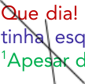
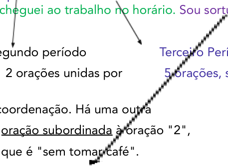
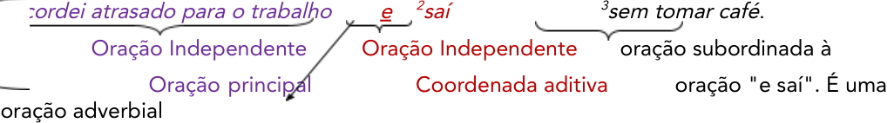
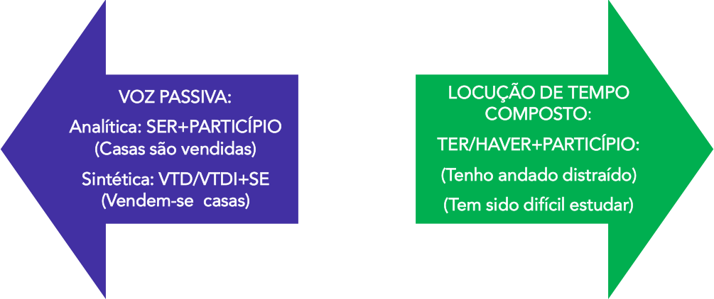
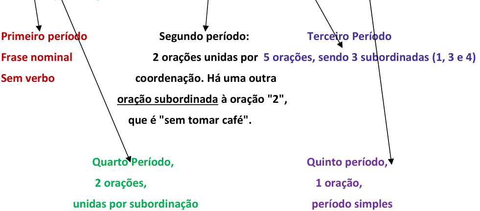

---
fonte_pdf: "Português - Aula 05.pdf"
paginas: 155
conversao: texto-e-imagens
---

<!-- pagina: 2 -->

**Equipe Português Estratégia Concursos, Felipe Luccas Aula 05** 

# **Índice** 

|........................................................................................................................................ 1) Sintaxe - Noções iniciais|...................................................... 3|
|---|---|
|........................................................................................................................................ 2) Funções Sintáticas|...................................................... 4|
|........................................................................................................................................ 3) Frase x Oração x Período|...................................................... 40|
|........................................................................................................................................ 4) Noções Iniciais - Sintaxe do período|...................................................... 41|
|........................................................................................................................................ 5) Coordenação e Subordinação|...................................................... 42|
|........................................................................................................................................ 6) Orações Coordenadas|...................................................... 45|
|........................................................................................................................................ 7) Orações Subordinadas Substantivas|...................................................... 47|
|........................................................................................................................................ 8) Orações Subordinadas Adjetivas|...................................................... 50|
|........................................................................................................................................ 9) Orações Subordinadas Adverbiais|...................................................... 53|
|........................................................................................................................................ 10) Oração Reduzida e Oração Desenvolvida|...................................................... 59|
|........................................................................................................................................ 11) Paralelismo|...................................................... 64|
|........................................................................................................................................ 12) Palavra QUE|...................................................... 69|
|........................................................................................................................................ 13) Palavra SE|...................................................... 77|
|........................................................................................................................................ 14) Palavra COMO|...................................................... 82|
|........................................................................................................................................ 15) Resumo - Sintaxe|...................................................... 85|
|........................................................................................................................................ 16) Questões Comentadas - Funções Sintáticas - FGV|...................................................... 95|
|........................................................................................................................................ 17) Lista de Questões - Funções Sintáticas - FGV|...................................................... 120|
|........................................................................................................................................ 18) Questões Comentadas - Período Composto - FGV|...................................................... 134|
|........................................................................................................................................ 19) Lista de Questões - Período Composto - FGV|...................................................... 148|

---

<!-- pagina: 3 -->

**Equipe Português Estratégia Concursos, Felipe Luccas Aula 05** 

# **NOÇÕES INICIAIS DE SINTAXE 1** 

Pessoal, 

Daremos início a um dos pontos mais cobrados nas provas de concurso: a **Sintaxe** . Não só pela complexidade, mas pela grandiosidade que ela representa em nossa língua 

Assim, tenha em mente que sintaxe é a área responsável por estudar a organização da língua, a conexão entre as partes da frase. 

Muitos confundem classe gramatical (morfologia) com a função sintática que determinada palavra pode exercer: um substantivo (classe morfológica), por exemplo, pode exercer a função sintática de sujeito ou de objeto direto. Portanto, devemos sempre estar atentos ao tipo de análise pedido na questão (é uma análise morfológica? sintática?). 

Nesta aula, vamos focar naquelas funções sintáticas que sua banca mais gosta de explorar. A aula é bem extensa, mas é completa e traz muitas questões comentadas (muitas mesmo), porque teoria resumida sem prática apenas perpetua essa sensação de que "sintaxe é muito difícil". Optamos também por não partir a aula porque todos os assuntos são interligados (sintaxe, orações, funções do QUE e SE) e o entendimento é melhor se vistos como uma unidade. 

Vamos nos divertir?! 

---

<!-- pagina: 4 -->

**Equipe Português Estratégia Concursos, Felipe Luccas Aula 05** 

# **FUNÇÕES SINTÁTICAS** 

A ordem natural da organização de uma sentença na nossa língua é **SuVeCA** : 

**Sujeito + Verbo + Complemento (+ Adjuntos)** 

**Eu comprei   uma bicicleta  semana passada** 

**Nós    gostamos     de comer      em rodízios** 

Chamamos também essa sequência de “estrutura de base” da oração. 

Para começar, apresentamos o exemplo acima, que é uma oração na ordem direta (SuVeCa), pois é mais fácil perceber os componentes da frase (sujeito, verbo, complemento e adjuntos) nessa ordem. Todavia, devo alertá-lo de que, na prática, esses termos são comumente invertidos e entre eles são intercaladas outras estruturas, de modo que, muitas vezes, teremos dificuldade de encontrar cada elemento desses. Deixo aqui a dica para o estudo de toda a língua portuguesa: **ache o verbo, tente colocar a sentença na ordem direta e procurar o sujeito de cada verbo** . Na análise sintática e na pontuação, essa dica salva vidas! 

## **Termos da Ora ão** **<u>ç</u>** 

Uma oração é simplesmente uma frase que tem verbo! As funções sintáticas também podem aparecer em forma de oração (ou seja, com um verbo, o que chamamos de **estrutura oracional** ), mas a análise que faremos será a mesma. Então, um adjetivo que desempenha função de adjunto adnominal pode aparecer na forma de uma oração adjetiva. Veja: 

Ex: O menino **estudioso** passa **(adjetivo)** / O menino **que estuda** passa **(oração adjetiva)** 

Um adjunto adverbial pode aparecer na forma de uma oração adverbial. 

Ex: Estudo **no meu tempo livre (adjunto adverbial)** / Estudo **quando** **<u>tenho tempo livre</u> (adjunto adverbial oracional / oração adverbial)** 

Um complemento, por exemplo, pode aparecer na forma de oração: 

Ex: Anunciei **a chegada do circo (objeto direto)** / Anunciei **que o circo** **<u>chegaria</u> (objeto direto oracional)** 

Por isso, quando falarmos das funções, vamos mencionar também suas principais formas, inclusive a forma oracional. Fique tranquilo caso não esteja familiarizado: a partir de agora, vamos ver em detalhes cada uma das principais funções sintáticas que os termos de uma oração podem assumir.

---

<!-- pagina: 5 -->

**Equipe Português Estratégia Concursos, Felipe Luccas Aula 05** 

## **Sujeito e Predicado** 

Semanticamente, o <u>sujeito é a entidade sobre a qual se declara algo na oração. O predicado é,</u> geralmente, a declaração feita a respeito do sujeito. 

Sintaticamente, ele é um termo essencial da oração, com o qual o verbo geralmente concorda. Então, em uma “regra prática”, o sujeito é o termo que “conjuga” o verbo, justifica o verbo estar na primeira pessoa, no singular, no plural etc. 

O sujeito tem um **núcleo** , que é o termo **central** , mais importante. Normalmente é um **substantivo** ou **pronome.** Termos substantivados também podem ocupar essa posição de núcleo (numerais, verbo no infinitivo...). Esse núcleo recebe termos que o “especificam”, “delimitam”: são os chamados determinantes (artigos, numerais, pronomes, adjetivos, locuções adjetivas...). Vamos ver melhor tais análises nos exemplos. 

Nas sentenças abaixo, o sujeito está sublinhado e seu núcleo está em **negrito** . Vejamos: 

Ex: **<u>Douglas</u>** é um gênio sem diploma. (sujeito simples, há apenas um núcleo, um substantivo) 

Ex: Mudaram as **<u>estações</u>** <u>. (sujeito simples, há apenas um núcleo “estações”; observe que</u> o sujeito está invertido, isto é, posposto ao verbo/ depois do verbo) 

Ex: **<u>Silvério</u>** <u>e</u> **<u>Everton</u>** são muquiranas generosos. (sujeito composto, há mais de um núcleo, há dois substantivos) 

Ex: **<u>Nós</u>** somos capazes de tudo, se trabalharmos. (sujeito simples, há apenas um núcleo, um pronome pessoal reto) 

Ex: <u>Dois</u> **<u>cães</u>** <u>ferozes</u> brigaram na padaria.  (sujeito simples, há apenas um núcleo, o substantivo ‘cães’, que tem, por sua vez, dois determinantes: o numeral “dois” e o adjetivo “ferozes”) 

Ex: **<u>Duas</u>** <u>de suas amigas</u> foram aprovadas. (sujeito simples, há apenas um núcleo, o numeral ”duas”, que recebeu o determinante “de suas amigas”, locução adjetiva) 

Ex: <u>O</u> **<u>descansar</u>** deve ser prioridade para a manutenção da saúde (sujeito simples, há apenas um núcleo: o verbo descansar foi substantivado com a colocação do artigo "o". Portanto, aqui não atua como verbo, e sim como **substantivo** ) 

Ex: **<u>Estudar</u>** <u>diariamente demanda dedicação. (sujeito simples, tem apenas um núcleo, o</u> verbo “estudar”, esse é o famoso sujeito oracional) 

**<u>Observe que, como regra, o verbo se flexiona para concordar em número e pessoa com o núcleo do sujeito</u>** <u>.</u> 

O restante da sentença foi a ‘declaração’ feita sobre o sujeito, o que chamamos de **predicado** . Aliás, essa palavra ”predicado” significa exatamente isto: <u>característica atribuída a um ser; atributo, propriedade.</u> 

Aprofundaremos essas análises mais a frente, no estudo de cada função sintática. 

Voltando ao sujeito, faço um alerta quanto à identificação desse termo: 

Em situação de prova, podemos encontrar um sujeito muito extenso, carregado de determinantes longos, orações adjetivas, termos intercalados. Então, é importante localizar o "núcleo" para então conferir a concordância:

---

<!-- pagina: 6 -->

**Equipe Português Estratégia Concursos, Felipe Luccas Aula 05** 

Ex: Aquelas dezenove discutíveis leis sobre as quais paira, segundo melhor juízo do operador do direito, suspeita de inconstitucionalidade superveniente supostamente — se tudo der certo — serão votadas hoje. 

Se retirarmos a “gordura” e localizarmos o núcleo desse enorme sujeito, teremos somente: **leis** serão votadas. 

Ex: Aquelas dezenove discutíveis **<u>leis</u>** sobre as quais paira, segundo melhor juízo do operador do direito, suspeita de inconstitucionalidade superveniente supostamente — se tudo der certo — **<u>serão votadas</u>** hoje. 

Então, uma **boa análise sintática de período começa pelo verbo** , pois ele indicará o número e pessoa do sujeito e também sua identidade: o que será votado? As leis. 

**Resumindo** : para fazer a análise sintática de um período. 

**1)** Localize o verbo. 

**2)** Identifique a pessoa (1ª, **eu, nós** ; 2ª, **tu, vós** ; 3ª, **ele(a), eles(a)** ) e o número do verbo (singular/plural). 

**3)** Localize o sujeito (geralmente, o “quem” do verbo e que com ele concorda em pessoa e número). 

Passaremos agora ao estudo do sujeito e suas diversas formas e classificações. Esse termo é essencial, pois é a função sintática mais cobrada. 

## **Sujeito Determinado** 

O sujeito determinado é aquele que está identificado, visível no texto, sabemos exatamente quem está praticando (ou recebendo) a ação verbal. Ele pode tomar diversas formas: 

Ex: **Ela** fuma. (sujeito **simples** , um núcleo) 

Ex: **João** e **Maria** fumam. (sujeito **composto** , mais de um núcleo) 

O sujeito pode aparecer também na forma de uma oração, isto é, o sujeito vai ser uma estrutura com verbo: 

Ex: **Exportar mais** é preciso. (sujeito **oracional** do verbo “ser” (“é”), “ **<u>exportar mais</u>** ”. O núcleo desse sujeito é o verbo no infinitivo “exportar”. Quando o sujeito é oracional, o verbo fica no singular: [ISTO] é preciso. 

**<u>IMPORTANTE:</u>** nesse último exemplo, temos, então, dois verbos e duas orações. 

Precisamos relembrar aqui o “sujeito passivo”, aquele que “sofre” a ação, em vez de praticá-la. 

Ex: [ **João** ] foi raptado por estudantes barbudos. (“João” é sujeito, mas não pratica a ação, ele sofre a ação de ser raptado.) 

Ex: Admite-se [ **que o Estado não pode ajudar** .] 

- [ **que o Estado não pode ajudar** ] admite-se/é admitido 

[ **ISTO** ] admite-se/é admitido 

Observe que nessa oração acima, temos voz passiva sintética ( **<u>VTD+SE</u>** <u>), então o sujeito é</u> oracional E paciente.

---

<!-- pagina: 7 -->

**Equipe Português Estratégia Concursos, Felipe Luccas Aula 05** 

**Pronome oblíquo como sujeito???** 

Em regra, pronomes oblíquos têm função de complemento; contudo, destaco que há um caso especial em que o pronome oblíquo átono (o, a, os, as) pode desempenhar função sintática de sujeito. Isso ocorre quando tais pronomes ocorrem dentro de um objeto direto oracional dos verbos causativos (deixar, mandar, fazer) e sensitivos (ver, ouvir, sentir). Vamos entender: 

Ex: Eu mandei **<u>o menino</u>** <u>sair.</u> 

Eu mandei o quê? Mandar pede um complemento. Esse complemento (objeto direto) de “mandei” é a oração: “o menino sair”, que está numa forma de oração reduzida de infinitivo, equivalente à forma desenvolvida: “mandei <u>que o menino saísse”. Agora, dentro dessa oração,</u> quem sai? É o menino; então: “ **o menino** ” é sujeito de “sair”. 

Agora vamos trocar “ **o menino** ” por um pronome oblíquo átono: 

Ex: Eu mandei **<u>o menino</u>** <u>sair. >> Ex: Mandei-</u> **o** sair. 

Pronto, nesse caso, temos que este “ **o** ” **é o sujeito** de “sair”. Basta pensar que se a oração fosse desenvolvida, “o menino” seria sujeito. Como o pronome o substitui, ele terá a mesma função sintática. 

Detalhe, não podemos trocar o pronome “o” por outro: 

- ✔ Mandei-o sair 

- Mandei-lhe sair 

- Mandei ele sair 

Esse é o raciocínio detalhado, para você entender. **Para efeito de prova, grave** : 

Com os verbos **Deixar, Fazer, Mandar, Ver, Ouvir, Sentir** , o pronome oblíquo pode ser sujeito, como nas sentenças abaixo: 

Ex: Deixe- **me** estudar / Não **se** deixe aborrecer / Ela **o** fez desistir / Mandei- **a** ir embora. 

Outro detalhe importante, como temos duas orações e, em uma delas, o sujeito é o pronome, as formas **deixe aborrecer, fez desistir, mandei ir** etc. **NÃO SÃO LOCUÇÕES VERBAIS, MAS DUAS ORAÇÕES EM UM PERÍODO COMPOSTO.**

---

<!-- pagina: 8 -->

**Equipe Português Estratégia Concursos, Felipe Luccas Aula 05** 

#### **(TRT 4ª REGIÃO / 2022)** 

Em **Seria indelicado** **<u>insistir na recusa</u>** <u>. (11º parágrafo), a expressão sublinhada exerce a mesma</u> função sintática do termo sublinhado em 

(A) “Ou você, João, deseja alguma coisa?” (14º parágrafo) 

(B) “Por obséquio, me acompanhe até a sala VIP.” (6º parágrafo) 

(C) “Posso esperar perfeitamente aqui mesmo.” (7º parágrafo) 

(D) “Vivemos numa república, João.” (23º parágrafo) 

(E) “Você acha isso republicano?” (23º parágrafo) 

#### **Comentários:** 

No segmento original: 

Seria indelicado insistir na recusa 

O que seria indelicado? insistir na recusa  seria indelicado => **isso** seria indelicado 

Então, temos sujeito oracional. Temos que procurar outro termo que seja sujeito: 

“Ou você, João, deseja alguma coisa?” 

Quem deseja? 

Você deseja. 

"você" é sujeito; "João", entre vírgulas, é aposto. 

#### **(STM / ANALISTA / 2018)** 

A liderança é uma questão de redução da incerteza do grupo, e o comportamento pelo qual se consegue essa redução é a escolha, a tomada de decisão. 

No período “A liderança (...) tomada de decisão”, a expressão “A liderança” exerce a função de sujeito da forma verbal “é” em suas duas ocorrências. 

#### **Comentários:** 

Primeiro: marcamos o verbo> "é". Após perguntarmos "Quem/O que É”, saberemos quem é o sujeito, que segue sublinhado nas frases abaixo, com seu "núcleo" destacado. 

<u>A</u> **<u>liderança</u> é** uma questão de redução da incerteza do grupo

---

<!-- pagina: 9 -->

**Equipe Português Estratégia Concursos, Felipe Luccas Aula 05** 

<u>o</u> **<u>comportamento</u>** <u>pelo qual se consegue essa redução</u> **é** a escolha 

<u>A</u> **<u>liderança</u>** só é sujeito do “é” na primeira sentença. Questão incorreta. 

#### **(SEFAZ RS / ASSISTENTE / 2018)** 

No período “A necessidade de guardar as moedas em segurança fez surgirem os bancos”, do texto 1A1-II, o termo “os bancos” funciona como 

A) complemento de “fez”. 

B) agente de “fez”. 

C) sujeito de “surgirem”. 

D) complemento de “surgirem”. 

E) adjunto adverbial de lugar. 

#### **Comentários:** 

Quem surgiu? Os bancos “surgiram”, então “os bancos” é sujeito de “surgirem”. Gabarito letra C. 

#### **(SEFAZ-RS / ASSISTENTE / 2018)** 

Os direitos humanos são fundados no respeito pela dignidade e no valor de cada pessoa. São universais, ou seja, são aplicados de forma igual e sem discriminação a todas as pessoas. São inalienáveis — e ninguém pode ser privado de seus direitos humanos —, mas **podem ser limitados** em situações específicas: o direito à liberdade pode ser restringido se, após o devido processo legal, uma pessoa for julgada culpada de um crime punível com privação de liberdade. 

No texto, o sujeito da locução “podem ser limitados”, que está oculto, é indicado pelo termo 

a) “todas as pessoas” (l.2). 

b) “inalienáveis” (l.2). 

c) “ninguém” (l.2). 

d) “seus direitos humanos” (l.3). 

e) “Os direitos humanos” (l.1). 

#### **Comentários:** 

Na oração “mas podem ser limitados”, o sujeito não apareceu expressamente porque já foi mencionado antes e está claro no contexto: 

**Os direitos humanos** são fundados no respeito pela dignidade e no valor de cada pessoa. ( **Os direitos humanos** ) São universais, ou seja, são aplicados de forma igual e sem discriminação a todas as pessoas. ( **Os direitos humanos** ) São inalienáveis — e ninguém pode ser privado de seus direitos humanos —, mas ( **Os direitos humanos** ) **podem ser limitados** em situações específicas 

O referente é “Os direitos humanos”. Gabarito letra E.

---

<!-- pagina: 10 -->

**Equipe Português Estratégia Concursos, Felipe Luccas Aula 05** 

## **Sujeito Oculto / Elíptico / Desinencial** 

O sujeito **oculto** é determinado, pois podemos identificá-lo facilmente pelo contexto ou pela terminação do verbo (desinência). 

Ex: Encontra **<u>mos</u>** mamãe. (sujeito oculto/elíptico/ **desinencial [-mos>nós]** ) 

No exemplo acima, sabemos que o sujeito é “ **nós** ”, mesmo que a palavra “ **nós** ” não esteja escrita, expressa na oração. 

**crescem** . Ex: É preciso ter cuidado com as plantas. Sem dedicação, não 

Da mesma forma, na oração em que ocorre o verbo “crescem” não há um sujeito expresso. Contudo, sabemos, pelo contexto, que o sujeito é “plantas”: sem dedicação, “as plantas” não **crescem** <u>.</u> 

Ex: Consultei meus advogados. **Disseram** que sou culpado. 

O sujeito da primeira oração é oculto ("Eu" consultei). Observe que a oração “disseram que sou culpado” também não traz um sujeito expresso, mas sabemos que o sujeito é “meus advogados”, pelo contexto. 

## **Sujeito Indeterminado** 

Contrariamente ao sujeito determinado, o sujeito indeterminado é aquele que não se pode identificar no período. Não sabemos exatamente quem é o sujeito e não conseguimos inferir do contexto. 

A indeterminação do sujeito pode ocorrer pelo uso de um verbo na **<u>3ª pessoa do plural, com omissão do agente que pratica a ação verbal</u>** ; esse é o sujeito favorito dos fofoqueiros (risos), veja só: 

Ex: Hoje me **contaram** que você joga futebol muito mal. (quem contou?) 

Ex: **Dizem** que ela teve um caso com o chefe. (quem diz?) 

Ex: **Roubaram** nosso carro! (quem roubou?) 

**<u>OBS:</u>** não confunda sujeito “indeterminado” com sujeito “desinencial”! O sujeito oculto ou desinencial é determinado, pois, mesmo que não esteja escrito ou dito na oração, ele pode ser identificado pela terminação do verbo ou pelo contexto. Com o sujeito indeterminado, isso não acontece, pois o contexto não é suficiente para determinar quem praticou a ação verbal, ou seja, quem é o sujeito.

---

<!-- pagina: 11 -->

**Equipe Português Estratégia Concursos, Felipe Luccas Aula 05** 

Ex: Aquele banco faliu. **<u>Roubaram</u>** mais de 20 milhões. 

Observe que não está claro quem roubou. Aqui, o sujeito está “indeterminado”. 

Ex: Os ladrões foram presos ontem. **<u>Roubaram</u>** mais de 20 milhões. 

Agora, observe que neste caso o sujeito está oculto, porque não aparece escrito na oração. Contudo, sabemos quem é o sujeito que praticou a ação de roubar 20 milhões, pela desinência e pelo contexto: o sujeito de “Roubaram” é o mesmo da oração anterior: “ladrões”. Certo?! 

### **Indeterminação do sujeito pelo uso da PIS:** 

O sujeito também pode ser indeterminado pelo uso da estrutura: **<u>VTI / VI / VL+SE</u>** 

**Verbos transitivos indiretos, intransitivos e de ligação + SE** (partícula de indeterminação do sujeito-PIS). 

Ex: Desconfia- **se** de que ela seja violenta. 

Verbo Trans. Indireto + SE (Quem desconfia? Não se sabe...) 

Ex: Precisa- **se** de médicos. 

Verbo Trans. Indireto + SE (Quem precisa? Não se sabe também.) 

Muitas vezes, o **<u>sujeito indeterminado</u>** é uma forma de expressar um sujeito universal, algo que todos fazem, mas sem individualizar um agente em específico. Veja: 

- Ex: Respira- **se** melhor no campo. 

Verbo Intransitivo + SE (Em geral, todos respiram melhor no campo.) 

Ex: Vive- **se** bem em Campinas. 

Verbo Intransitivo + SE (Quem Vive? Não está determinado.) 

- Ex: Sempre **se** fica nervoso durante um assalto. 

Verbo de Ligação + SE (Em geral, todos ficam nervosos durante um assalto, temos um sujeito indeterminado, um agente universal, genérico, não específico). 

Dentro dessa regra, temos uma expressão que simplesmente **“DESPENCA”** em prova: **“tratar-se de” (VTI+SE)** . Essa expressão, quando tem sentido de assunto/referência ou quando funciona como uma espécie de substituto do verbo “ser”, é sempre **invariável** , indica sujeito indeterminado. Observe os exemplos. 

- Ex: Ela recebeu uma herança estranha: **<u>trata-se de</u>** duas moedas de cobre. 

- Ex: Não foi por amor que ela veio. **<u>Trata-se de</u>** interesse. 

Ex: Não se trata de quem é mais inteligente. **<u>Trata-se de</u>** quem persiste mais. 

**Lembramos que o sujeito não deve ter preposição** (“de”, por exemplo) **no seu início** , dessa forma a expressão que vem após “tratar-se de” jamais poderá ser um sujeito. Além do mais, a preposição “de” é, nesse caso, exigida pelo próprio verbo “tratar”, o que indica que esse é um verbo transitivo INDIRETO. Se o termo não é o sujeito, então não vai fazer o verbo se flexionar. Logo, o verbo fica na terceira pessoa do singular.

---

<!-- pagina: 12 -->

**Equipe Português Estratégia Concursos, Felipe Luccas Aula 05** 

Por outro lado, se tivermos **<u>Verbo Transitivo DIRETO (VTD) + SE</u>** <u>, essa estrutura vai indicar voz</u> passiva pronominal. Abordaremos mais à frente o assunto, mas já adiantamos que diante de VTD + SE, o verbo vai se flexionar para concordar com o sujeito (paciente), como na frase abaixo: 

Ex: **<u>Vendem-se casas</u>** > Casas são vendidas. (sujeito plural, verbo no plural) 

#### **(CGE-CE / CONHEC. BÁSICOS / 2019)** 

Candeia era quase nada. Não tinha mais que vinte casas mortas, uma igrejinha velha, um resto de praça. Algumas construções nem sequer tinham telhado; outras, invadidas pelo mato, incompletas, sem paredes. Nem o ar tinha esperança de ser vento. **Era custoso** acreditar que morasse alguém naquele cemitério de gigantes. 

No texto CB1A1-I, o sujeito da oração “Era custoso” (L.3) é 

a) o segmento “acreditar que morasse alguém naquele cemitério de gigantes” (L. 3 e 4). 

b) o trecho “alguém naquele cemitério de gigantes” (L. 3 e 4). 

c) o termo “custoso” (L.3). 

d) classificado como indeterminado. 

e) oculto e se refere ao período “Nem o ar tinha esperança de ser vento” (L. 3). 

#### **Comentários:** 

Temos caso típico de sujeito oracional: 

[Acreditar que morasse alguém naquele cemitério] era custoso. 

[ISTO] era custoso. Gabarito letra A. 

#### **(STM / ANALISTA / 2018)** 

Trata-se de uma visão revolucionária, já que o convencional era fazer o elogio da harmonia e da unidade. 

Se a expressão “uma visão revolucionária” fosse substituída por ideias revolucionárias, seria necessário alterar a forma verbal “Trata-se” para Tratam-se, para se manter a correção gramatical do texto. 

#### **Comentários:** 

“Tratar-se DE” é expressão invariável, que configura sujeito indeterminado “Verbo Transitivo Indireto+SE”. Logo, o verbo não vai ao plural. Questão incorreta.

---

<!-- pagina: 13 -->

**Equipe Português Estratégia Concursos, Felipe Luccas Aula 05** 

### **Indeterminação do sujeito pelo uso do infinitivo impessoal:** 

No caso de indeterminação do sujeito pelo uso de um verbo no infinitivo, por não haver concordância com nenhuma pessoa, a ação verbal é descrita de maneira vaga, sem revelar o agente que pratica a ação. Veja: 

Ex: **<u>Praticar</u>** <u>esportes regularmente é muito importante. (o agente é genérico, indefinido;</u> não determinamos quem vai “praticar esportes”. O sujeito do verbo “praticar” é, portanto, indeterminado. Já o sujeito do verbo “ser” ("é") vai ser a oração sublinhada.) 

Ex: Instruções: **lavar** as mãos com álcool... (quem lava? Agente genérico) 

Se o verbo no infinitivo estiver flexionado, então estará fazendo concordância com um sujeito visível na sentença. Nesse caso, não há sujeito indeterminado. 

Ex: É necessário **passarmos** por aquele caminho. (Aqui, a **<u>flexão do infinitivo</u>** “denuncia” o sujeito “ **<u>nós</u>** ”; então, nesse caso, temos determinação do agente.) 

Registre-se que as técnicas de indeterminação do sujeito são estratégias textuais para omitir o agente de um verbo, caso não queira ou saiba precisar a “autoria” de uma ação. 

## **Sujeito x Referente** 

Sujeito é uma função sintática, tem a ver com o papel funcional e estrutural que um termo (substantivo, pronome etc.) desempenha na oração. 

Referente é um termo **semântico** , está relacionado à ideia e ao contexto da frase e não n ~~e~~ cessariamente coincide com a função sintática do termo a quem se refere. Na maior parte dos casos, o sujeito e o referente são iguais. Mas é possível o verbo ter um “sujeito” diferente do seu “referente”. Veja: 

Ex: **Os meninos** jogam futebol. Jogam futebol todos os dias. 

Na primeira oração, “os meninos” é o sujeito de “jogar” e também o referente de jogar, pois são os meninos que jogam. 

Na segunda oração, “os meninos” é apenas o "referente” de “jogar"; sintaticamente, o sujeito está **<u>oculto, omitido, elíptico</u>** <u>, mas o referente, no mundo das ideias, é ainda “os meninos”.</u> Observe o trecho: 

- [ **Os meninos** ] jogam futebol. ( **<u>Eles = Os meninos</u>** <u>) Jogam futebol todos os dias.</u> 

Ex: Vi os meninos **<u>que jogam futebol</u>** <u>.</u> 

(Agora, na oração sublinhada, “os meninos” continuam sendo o referente, pois, semanticamente, são os meninos que jogam. Porém, o sujeito sintático é o pronome “que”. Nesse caso, referente e sujeito não coincidem). 

Ex: **Uma dezena de  médicos** <u>avaliou o candidato.</u> 

(Nessa oração, o verbo “avaliou” concorda no singular com o núcleo do sujeito “dezena”; porém, semanticamente, o <u>referente</u> da ação é “médicos”, pois são os médicos que de fato avaliam).

---

<!-- pagina: 14 -->

**Equipe Português Estratégia Concursos, Felipe Luccas Aula 05** 

#### **(SEDF / 2017)** 

Quando indaguei a alguns escritores de sucesso que manuais de estilo tinham consultado durante seu aprendizado, a resposta mais comum foi “nenhum”. <u>Disseram que escrever, para</u> eles, aconteceu naturalmente. 

No que se refere ao texto precedente, julgue o item a seguir. 

O sujeito da oração iniciada pela forma verbal “Disseram” é indeterminado. 

#### **Comentários:** 

Quem disse isso? Ora, foram os escritores. Então, o sujeito está determinado sim! 

Nessa oração “Disseram que escrever, para eles, aconteceu naturalmente” o sujeito é oculto, já que, embora não conste expresso, isto é, escrito, na oração, podemos recuperá-lo do contexto. Questão incorreta. 

#### **(SEDF / 2017)** 

Um estudo da FGV aponta que 80% dos professores de educação infantil têm nível superior completo. Os dados correspondem ao ano de 2014 e **<u>mostram</u>** que a formação dos professores das instituições públicas continua melhor. 

Acerca dos sentidos e de aspectos linguísticos do texto anteriormente apresentado, julgue o item que se segue: 

O sujeito da forma verbal “mostram”, que está elíptico, tem como referente “Os dados”. 

Comentários: 

Vamos observar que há dois verbos na linha 6. 

[Os dados **correspondem** ao ano de 2014] e [ **mostram** que a formação dos professores das instituições públicas continua melhor...]. 

[Os dados **correspondem** ao ano de 2014] e [( **os dados** ) **mostram** que a formação dos professores das instituições públicas continua melhor...]. 

O primeiro verbo, “correspondem”, tem como sujeito “os dados”.  Já o segundo verbo, “mostram”, não tem um sujeito expresso. O sujeito está **elíptico** , **omitido** . No entanto, sabemos que são “ **os dados** que mostram”, então podemos recuperar o referente desse verbo no contexto. Esse é o caso clássico de “sujeito **oculto, elíptico, desinencial** ”. Questão correta.

---

<!-- pagina: 15 -->

**Equipe Português Estratégia Concursos, Felipe Luccas Aula 05** 

## **Oração sem sujeito** 

A oração sem sujeito pode tomar várias “formas”, vejamos as principais: 

#### **Fenômenos da natureza:** 

Ex: Choveu ontem. 

Ex: Anoiteceu. 

**Verbos ser/estar/fazer/haver/parecer impessoais com sentido de fenômenos naturais, tempo ou estado** . 

Ex: Faz 2 anos que não vou à praia. 

Ex: Faz frio em Corumbá. 

Ex: Há tempos são os jovens que adoecem. 

Ex: Está quente aqui. 

Ex: Parecia cedo demais. 

Ex: São 7 horas da manhã, acorde! 

**OBS:** O caso mais cobrado de oração sem sujeito é o uso do verbo “haver” impessoal (com sentido de “existir”, “ocorrer” ou “tempo decorrido”) 

Ex: “Há pessoas ruins no mundo”. 

Ex: “Houve acidentes graves na avenida”. 

Ex: “Há dois anos não fumo”. 

Na oração “Há **pessoas ruins no mundo** ”, o termo “ **pessoas ruins no mundo** ” é apenas “objeto direto” de “haver” (verbo impessoal), por isso não há flexão. O objeto direto não faz o verbo se <u>flexionar (ir ao plural), isso é papel do sujeito.</u> 

Por outro lado, na oração “existem **pessoas ruins no mundo** ”, o termo “ **pessoas ruins no mundo** ” é **sujeito** do verbo “existir” (verbo pessoal, com sujeito), por isso há flexão. 

**<u>IMPORTANTE:</u>** Lembre-se de que o verbo **haver** impessoal (ou outro impessoal que o substitua) vem sempre no singular e “contamina” os verbos auxiliares que formam locução com ele, permanecendo estes também no **singular** : 

- Ex: **Há** mil pessoas aqui. 

- Ex: **Deve haver** mil pessoas aqui. 

- Ex: **Deve fazer** 3 anos que não fumo. 

- Ex: **Deve ir** para 2 meses que não fumo. 

Se o verbo for pessoal, como “existir”, aí o verbo auxiliar se flexiona normalmente: 

- Ex: **Existem** mil pessoas aqui. 

Ex: **Devem existir** mil pessoas aqui. 

Essa lógica é vista na aula de concordância, mas está estritamente relacionada ao tipo de verbo e à existência ou não do sujeito. 

**OBS:** Orações como “basta/chega de brigas!”, “era uma vez uma linda princesa” e “dói muito

---

<!-- pagina: 16 -->

**Equipe Português Estratégia Concursos, Felipe Luccas Aula 05** 

nas minhas costas, Doutor” também são classificadas como orações sem sujeito. 

#### **(TRT-MT / 2016)** 

==5460== 

“Não há dúvida de que o voto é a melhor arma de que dispõe o eleitor...” 

O termo “dúvida” exerce a função de sujeito na oração em que ocorre. 

#### **Comentários:** 

O verbo “haver” é impessoal, não tem sujeito. “Dúvida” exerce função de objeto direto do verbo “haver”. 

Questão incorreta. 

#### **(TRT-MT / 2016)** 

...verifica-se a existência de matas e de estradas rurais em condições ruins ou onde é necessário **o uso de barcos** para chegar à seção eleitoral. É importante lembrar, ainda, que, quando não havia a urna eletrônica — facilitadora do voto —, o analfabetismo e os problemas de saúde dos idosos poderiam comprometer a obtenção de um voto corretamente lançado (escrito a caneta) na cédula de papel. 

Quando, na CF, estabeleceu-se **o voto obrigatório** para maiores de dezoito anos e facultativo para analfabetos... 

Os termos “o uso de barcos” e “o voto obrigatório” desempenham a mesma função sintática nas orações em que ocorrem. 

#### **Comentários:** 

É necessário **o uso de barcos >** **<u>O uso de barcos</u>** é necessário. 

Sujeito 

Estabeleceu-se **o voto obrigatório >** **<u>O voto obrigatório</u>** foi estabelecido. 

Sujeito 

Ambos os termos em destaque exercem função sintática de sujeito, com a distinção de que o segundo integra uma oração que está na voz passiva. Questão correta.

---

<!-- pagina: 17 -->

**Equipe Português Estratégia Concursos, Felipe Luccas Aula 05** 

## **Objeto Direto (OD)** 

Alguns verbos não pedem complemento nenhum, pois costumam ter seu sentido completo em si mesmo. São chamados então de **intransitivos** : 

- Ex: Joana **corre** todos os dias. 

- Ex: O tempo **passa** . 

- Ex: O povo não **vive** , sobrevive. 

Por outro lado, os verbos transitivos são aqueles que exigem um complemento. Se o verbo for transitivo <u>direto, seu complemento é direto, sem preposição (Vendi</u> **carros** ). Se for transitivo indireto, seu complemento é **indireto** , pede uma **preposição** (Gosto **de carros** ). 

**<u>sem</u>** O objeto direto é o complemento verbal dos verbos transitivos diretos, preposição. O verbo se liga ao seu objeto diretamente, isto é, “transita” até o complemento sem “passar” por uma preposição. 

- Ex: Comprei **<u>bombons</u>** na promoção. (Comprou o quê? Comprou bombons.) 

- Ex: Pedi **<u>ajuda</u>** logo no início. (Pediu o quê? Pediu ajuda.) 

O **OD** também pode ter forma de uma oração **<u>:</u>** 

Ex: Pedi **<u>que me ajudassem logo no início</u>** <u>.</u> 

(Pediu o quê? Pediu **<u>algo</u>** <u>. Pediu</u> **<u>que o ajudassem</u>** . Pediu **<u>[ISTO]</u>** ) 

Nesse caso, o objeto direto será uma **<u>oração subordinada substantiva objetiva direta,</u>** ou, em termos mais simples, um objeto direto oracional. Não se preocupe com esse nome, essas orações serão detalhadas adiante nesta aula. 

### **Objeto Direto Pleonástico:** 

“Pleonástico” remete a ideia de “repetido”. O OD pleonástico é representado por um pronome que retoma um objeto direto já existente na oração, com finalidade de ênfase. 

- Ex: **<u>Esta moto</u>** <u>, comprei-</u> **<u>a</u>** na promoção. 

- Ex: **<u>Aqueles problemas</u>** , já **<u>os</u>** resolvi. 

- Ex: **<u>Que você era capaz</u>** , eu já **<u>o</u>** sabia. 

### **Objeto Direto Interno, Intrínseco, Cognato:** 

São objetos diretos que compartilham o mesmo “campo semântico” do verbo. O núcleo do objeto vem acompanhado de um determinante. 

Ex: Eu sempre **<u>vivi</u>** uma **<u>vida</u>** de grandes desafios. 

- Ex: Vamos **<u>lutar</u>** a boa **<u>luta</u>** e **<u>sangrar</u>** o **<u>sangue</u>** guerreiro.

---

<!-- pagina: 18 -->

**Equipe Português Estratégia Concursos, Felipe Luccas Aula 05** 

**<u>dormi</u>** um **<u>sono</u>** Ex: Depois da prova, tranquilo. 

Ex: **<u>Choveu</u>** aquela **<u>chuvinha</u>** leve, uma delícia para estudar. 

Observe que, em outros contextos, “dormir”, “viver”, “sangrar” e “chover” são verbos intransitivos, não pedem nenhum objeto. 

#### **(IHBDF / 2018)** 

Exatos 35 anos antes de o presidente Fernando Henrique Cardoso sancionar a atual Lei de Diretrizes e Bases da Educação Nacional (LDB), em 1996, João Goulart, então recém-alçado à presidência do país sob o arranjo do parlamentarismo, promulgou **a primeira LDB brasileira** . 

No texto CG2A1DDD, o termo “a primeira LDB brasileira” exerce a função sintática de 

A) sujeito.    B) predicado.    C) objeto direto.    D) objeto indireto.    E) adjunto adverbial. 

#### **Comentários:** 

“Promulgar” é verbo transitivo direto e pede um objeto direto, sem preposição: 

promulgou algo > promulgou **a primeira LDB brasileira.** Gabarito letra C. 

#### **(Instituto Rio Branco / 2012)** 

No período “Que Demócrito não risse, eu o provo”, o verbo provar complementa-se com uma estrutura em forma de objeto direto pleonástico, com uma oração servindo de referente para um pronome. 

#### **Comentários:** 

Organizando, temos: 

Eu provo **[que Demócrito risse (ria)]** 

Eu provo **[isto]** > eu **<u>o</u>** provo 

Então, percebemos que o objeto de “provo” está na forma de uma oração, e o pronome “o” retoma essa oração, de forma que temos a repetição do objeto. Portanto, temos um objeto leonástico. Questão correta. <u>p</u>

---

<!-- pagina: 19 -->

**Equipe Português Estratégia Concursos, Felipe Luccas Aula 05** 

## **Objeto Indireto** 

É o complemento verbal dos verbos transitivos indiretos. O verbo se liga ao seu objeto indiretamente, por meio de uma **<u>preposição</u>** . 

- Ex: Não dependa **<u>de</u>** ninguém para estudar. ( **Quem depende, depende de algo/alguém** ). 

- Ex: Aludi **<u>a</u>** <u>o episódio do acidente. (</u> **Quem alude, alude** **<u>Aalgo/alguém</u>** ). 

Ex: Concordo **<u>com</u>** você. ( **Quem concorda** **<u>COMalgo/alguém</u>** ). 

- O objeto indireto também pode ter forma de uma oração <u>(oração subordinada substantiva objetiva indireta):</u> 

   - Ex: Nenhum gato gosta **<u>de</u>** <u>que puxem seu rabo. (oração desenvolvida)</u> 

   - Ex: Não gosto **<u>de</u>** <u>dormir tarde. (oração reduzida)</u> 

O objeto indireto também pode vir em forma pleonástica (repetida) 

Ex: “ **<u>Às violetas</u>** , não **<u>lhes</u>** poupei água”. 

Ex: " **<u>Aos meus amigos</u>** , dou **-lhes** tudo que posso." 

Os “pronomes” exercem função de objeto indireto pleonástico, pois apenas repetem o objeto indireto que já estava na sentença. 

#### **(PREF. RECIFE / 2022)** 

O termo sublinhado em a fregueses mais antigos oferece, antes do menu, o jornal do dia “facilitado” exerce a mesma função sintática do termo sublinhado em: 

(A) O garçom estendeu-lhe o menu e esperou 

(B) seu Adelino veio sentar-se ao lado da antiga freguesa 

(C) Vez por outra, indaga se a comida está boa 

(D) Uma noite dessas, o movimento era pequeno 

(E) seu Adelino faculta ao cliente dar palpites ao cozinheiro 

#### **Comentários:** 

No enunciado, o termo sublinhado é complemento verbal, um objeto indireto de "oferece": 

Ele oferece algo a alguém => (ele) oferece "a fregueses mais antigos" o jornal do dia. 

O mesmo ocorre em 

https://t.me/KakashiAssinaturasBot

---

<!-- pagina: 20 -->

**Equipe Português Estratégia Concursos, Felipe Luccas Aula 05** 

- (E) seu Adelino faculta ao cliente dar palpites ao cozinheiro 

Vejamos as demais. 

- (A) O garçom estendeu-lhe o menu e esperou (sujeito) 

- (B) seu Adelino veio sentar-se ao lado da antiga freguesa (adjunto adverbial) 

- (C) Vez por outra, indaga se a comida está boa (objeto direto) 

- (D) Uma noite dessas, o movimento era pequeno (adjunto adverbial) 

Gabarito letra E. 

#### **(STM / ANALISTA / 2018)** 

... a sageza e prudência de não acreditar cegamente naquilo que supõe saber, que daí é que vêm os enganos piores, não da ignorância. 

O vocábulo “daí” e a expressão “da ignorância” exercem a mesma função sintática no período em que ocorrem. 

#### **Comentários:** 

Temos "vir DE+Aí" (vir **<u>daí</u>** <u>) e "vir DE+A ignorância" (vir</u> **<u>da ignorância</u>** ). Em ambos os casos temos objetos indiretos do verbo “vir”. Questão correta. 

**Obs:** Verbos como VIR/IR/CHEGAR seguidos de um “lugar físico” tradicionalmente são classificados como Verbos Intransitivos que podem vir seguidos de um adjunto adverbial. Contudo, é possível também considerá-los como transitivos indiretos, quando o complemento não indica exatamente um “lugar físico”, destino/origem de um movimento. Essa controvérsia gramatical, no entanto, não faria diferença nessa questão e nem faz em questões de “sujeito indeterminado”, uma vez que tanto Verbos Intransitivos + SE quanto Verbos Transitivos Indiretos + SE vão igualmente indicar que o SE indetermina o sujeito. 

## **Objeto Direto Preposicionado** 

Há casos na língua em que **o verbo não pede preposição** , **mas ela é inserida no complemento direto por motivo de clareza, eufonia ou ênfase** . Nesse caso, teremos um objeto direto, mas “preposicionado”. Vejamos os casos mais relevantes para os concursos: 

#### **Principais casos:** 

- ✔ Quando o objeto direto for um **pronome oblíquo tônico** ou **“quem”:** 

   - Ex: Vendemos **<u>a</u>** <u>nós mesmos. (“vender” é VTD, mas o complemento “nós” é um pronome</u> oblíquo tônico; nesse caso, a preposição “a”, é obrigatória) 

Ex: “Nem ele entende a nós, nem nós a ele” (“entender” é VTD) 

Ex: Encontrou o funcionário **<u>a</u>** <u>quem tinha demitido. (“demitir” é VTD, mas o complemento</u> “quem” pede essa preposição “a”.) 

- ✔ Quando o objeto direto for **verbo no infinitivo, com os verbos “ensinar” e “aprender”:**

---

<!-- pagina: 21 -->

**Equipe Português Estratégia Concursos, Felipe Luccas Aula 05** 

Ex: Meu irmão tentou me ensinar **<u>a</u>** <u>surfar, mas nem aprendi</u> **<u>a</u>** <u>nadar.  (“Surfar” é objeto</u> direto de “ensinar”; “nadar” é o objeto direto do verbo “aprendi” e, por estar no infinitivo, a preposição “a” também é obrigatória). 

- ✔ Quando houver dupla possibilidade de referente, ou seja, **ambiguidade** : 

   - Ex: A onça **<u>a</u>** o caçador surpreendeu. / **<u>À</u>** onça o caçador surpreendeu. 

(se retirarmos a preposição, teríamos “a onça o caçador surpreendeu” e você poderia se perguntar quem surpreendeu quem, já que haveria ambiguidade na frase.) 

Ex: Considero Ricardo como **<u>a</u>** <u>um pai. (como “considero um pai”)</u> 

Sem a preposição, a leitura seria: 

Considero Ricardo como um pai (como um pai “considera” — “pai” é sujeito). 

- ✔ Quando o objeto indicar **reciprocidade** : 

Ex: O menino e a menina ofenderam-se uns **<u>a</u>** os outros. 

Nos casos abaixo, a preposição acompanhando o objeto direto geralmente aparece por ênfase ou tradição. 

- ✔ Com alguns pronomes indefinidos, sobretudo referentes a pessoas: 

   - Ex: “Se todos são teus irmãos, por que amas **<u>a uns</u>** e odeias **<u>a outros</u>** <u>?”</u> 

   - Ex: “ **<u>A quantos</u>** a vida ilude!” 

   - Ex: "A estupefação imobilizou **<u>a todos</u>** <u>."</u> 

   - Ex: " **<u>A tudo e a todos</u>** eu culpo." 

   - Ex: "Como fosse acanhado, não interrogou **<u>a ninguém</u>** ." 

- ✔ Quando o OD for um **nome próprio:** 

   - Ex: Busquei **<u>a José</u>** no aeroporto. 

- ✔ Quando o objeto direto for a palavra **“ambos”:** 

   - Ex: Contratei **<u>a</u>** <u>ambos para minha empresa. (“contratar” é VTD)</u> 

- ✔ Quando houver **reforço ou exaltação de um sentimento (normalmente com nomes próprios ou por eufonia)** : 

Ex: Ele ama **<u>a Deus</u>** e não teme **<u>a Maomé</u>** . 

- Ex: Judas traiu **<u>a Cristo</u>** . 

Ex: Fizeram sorrir, sem dificuldade, **<u>a Tamires</u>** <u>.</u> 

- ✔ Em construções enfáticas, nas quais antecipamos o objeto direto para dar-lhe realce: Ex: **<u>A você</u>** é que não enganam! 

- ✔ Em construções paralelas com pronomes oblíquos (átonos ou tônicos) do tipo: 

   - Ex: “Mas engana-se contando com os falsos que nos cercam. Conheço-os, e **<u>a</u>** <u>os leais”.</u> 

### **Há implicações semânticas no uso do OD preposicionado:**

---

<!-- pagina: 22 -->

**Equipe Português Estratégia Concursos, Felipe Luccas Aula 05** 

Ex: Comi o pão (comi o pão todo) **X** Comi do pão (comi parte do pão) 

Ex: Cumpri o dever **X** Cumpri com o dever (ênfase) 

**Outros exemplos importantes:** fazer **<u>com</u>** que ele estude, puxar **<u>da</u>** faca, arrancar **<u>da</u>** espada, sacar **<u>do</u>** revólver, pedir **<u>por</u>** socorro, pegar **<u>pelo</u>** braço, cumprir **<u>com</u>** o dever… 

**Objeto direto preposicionado partitivo** : beber do vinho, comer do bolo, dar do leite... 

**Obs 1:** na passagem para a voz passiva, a preposição desaparece: 

Ex: Cumpri **<u>com</u>** o dever > O dever foi cumprido (por mim). 

**Obs 2:** A substituição do objeto direto preposicionado pelo pronome oblíquo átono, se possível, deve ser feita com pronome “o”, “a”, “os”, “as”, não se faz com – “lhe”. 

Amar **<u>a Deus</u>** -> amá- **<u>lo</u>** <u>; convencer ao amigo -> convencê-</u> **<u>lo</u>** <u>.</u> 

#### **(STM / ANALISTA / 2018)** 

**a todos** nos Porém, esta suprema máxima não pode ser utilizada como desculpa universal que absolveria de juízos coxos e opiniões mancas. 

O termo “a todos” exerce a função de complemento indireto da forma verbal “absolveria”. 

#### **Comentários:** 

Quem absolve, absolve alguém DE alguma coisa. O verbo **absolver** é bitransitivo, mas seu objeto indireto é regido da preposição DE, e não A. " **A todos** " é o objeto direto desse verbo. Com o pronome indefinido “todos” como objeto direto, acrescentamos a preposição, constituindo um objeto direto preposicionado. A propósito, isso também ocorre com os pronomes “quem” e “ninguém”. Questão incorreta.

---

<!-- pagina: 23 -->

**Equipe Português Estratégia Concursos, Felipe Luccas Aula 05** 

#### **(TCE-PA / 2016)** 

Julgue correto ou incorreto o item que se segue, referente aos aspectos linguísticos do texto. 

**<u>a</u>** Sem prejuízo da correção gramatical e dos sentidos do texto, no trecho “só os tolos temem lobisomem e feiticeiras”, a preposição “a” poderia ser suprimida. 

#### **Comentários:** 

O verbo “temer” é transitivo direto, não exige preposição, portanto seu complemento verbal será um objeto direto. Todavia, existe uma preposição, “a”, entre o verbo e seu objeto. A preposição “a” utilizada no trecho introduz um objeto direto preposicionado, para **reforço ou exaltação de um sentimento** . Trata-se do mesmo caso de “amar a Deus”. Portanto, a preposição, por não ser obrigatória pela regência do verbo, poderia ser suprimida. Questão correta. 

#### **(TRT-MT / 2016)** 

Ademais, em segundo plano, tal atribuição fiscalizatória advém dos preceitos morais que **<u>impõem</u>** a necessidade de contenção dos vícios eleitorais... 

Não há dúvida de que o voto é a melhor arma de que **<u>dispõe</u>** o eleitor... 

Os verbos “impor” e “dispor”, empregados, respectivamente, nas linhas, recebem a mesma classificação no que se refere à transitividade. 

#### **Comentários:** 

Nós classificamos os verbos quanto à transitividade de acordo com o complemento verbal que eles pedem <u>naquele contexto. Se o verbo demandou complemento</u> **com preposição** , temos um **Objeto Indireto** ; se demanda complemento **sem preposição** , temos um **objeto Direto** . 

**Mas não confunda: no objeto direto preposicionado, a preposição, mesmo quando obrigatória, é exigência do complemento, não do verbo.** 

...o voto é a melhor arma de que dispõe o eleitor...> Quem dispõe, dispõe **de** alguma coisa > o eleitor dispõe **<u>da</u>** <u>melhor arma > O</u> **<u>I</u>** , VT **<u>I</u>** . 

...os preceitos morais que impõem <u>a necessidade...> Quem impõe, impõe alguma coisa > A</u> necessidade é complemento **sem** preposição> O **<u>D</u>** , VT **<u>D</u>** <u>.</u> 

“Impor” é VTD. “Dispor” é VTI. Logo, esses verbos não têm a mesma classificação. Questão incorreta. 

## **Complemento Nominal** 

É complemento de um **<u>nome que possua transitividade</u>** (substantivo, adjetivo ou advérbio), com preposição. **<u>Parece</u>** <u>um objeto indireto, com a diferença de que não completa o sentido de um</u> verbo, mas sim de um nome. 

Ex: Não tenha dependência **<u>de</u>** <u>ninguém para estudar. (Dependência é um substantivo</u> com transitividade. Quem tem dependência, tem dependência **<u>de</u>** algo/alguém). 

Ex: João era dependente **<u>de</u>** <u>café. (Dependente é um adjetivo e pede um complemento,</u> preposicionado. Dependente de quê? **<u>DE</u>** café).

---

<!-- pagina: 24 -->

**Equipe Português Estratégia Concursos, Felipe Luccas Aula 05** 

Ex: O juiz decidiu favoravelmente **<u>ao</u>** <u>autor. (Favoravelmente é um advérbio. O Juiz decide</u> favoravelmente a quem/quê? **<u>AO</u>** autor). 

**O complemento nominal (CN) também pode ter forma de uma oração:** 

Ex: O cão sentia falta de que brincassem com ele. 

Ex: O cão sentia falta de brincar. (Aqui, a oração está reduzida de infinitivo) 

Ex: João tinha consciência de que precisava passar. 

Ex: João tinha consciência de precisar passar. (Aqui, a oração está reduzida de infinitivo). 

## **Adjunto Adnominal** 

Termo que acompanha substantivos concretos e abstratos para atribuir-lhes características, qualidade ou estado. Os adjuntos adnominais têm função adjetiva, ou seja, modificam termo substantivo. 

Ex: **Os três** <u>carros</u> **populares do meu pai** foram carregados pela chuva. Núcleo 

Os termos destacados são adjuntos adnominais, pois ficam junto ao nome “carros” e atribuem a ele características como quantidade, qualidade, posse. Observe que esses termos não foram exigidos pelo nome “carros”, mas sim acrescentados por quem fala ou escreve. 

Vejamos outros exemplos de adjunto adnominal: 

Ex: Ouro em pó/em barras. 

Ex: Barco a vela/a vapor/a gasolina. 

#### **ATENÇÃO!** 

**Adjunto adnominal x Complemento Nominal** 

Esse tema é queridinho de qualquer banca. Vamos entender isso de uma vez por todas! 

Na verdade, esses dois termos são bem diferentes! Há um único caso em que ficam parecidos e geram muita dúvida, mas é esse caso que cai em prova rs... 

Antes das dicas para distingui-los, precisamos ter em mente que a **diferença essencial** entre eles é que o adjunto **não é "exigido"** ; já o complemento nominal, assim como o objeto direto e o indireto, é obrigatório para complementar o sentido de um nome (substantivo, adjetivo ou advérbio). 

#### **Diferenças:** 

- ✔ O complemento nominal se liga a substantivos abstratos, adjetivos e advérbios. O adjunto adnominal <u>só se liga a substantivos. Então, se</u> **<u>o termo preposicionado se ligar a um adjetivo ou advérbio</u>** <u>, não há dúvida,</u> **<u>é complemento nominal</u>** <u>.</u> 

- ✔ O complemento nominal é **<u>necessariamente preposicionado</u>** <u>, o adjunto pode ser ou não.</u> Então, se não tiver preposição, não há como ser CN e vai ter que ser Adjunto.

---

<!-- pagina: 25 -->

**Equipe Português Estratégia Concursos, Felipe Luccas Aula 05** 

- ✔ O Complemento Nominal se liga a substantivos abstratos (sentimento; ação; qualidade; estado e conceito). O adjunto adnominal se liga a nomes concretos e abstratos. Então, **<u>se o nome for um substantivo concreto, vai ter que ser adjunto e será impossível ser CN</u>** <u>.</u> 

- ✔ **<u>Se for substantivo abstrato e a preposição for qualquer uma que não seja</u> “de”,** **<u>normalmente será CN</u>** <u>. Se a preposição for “de”, teremos que analisar os outros aspectos.</u> 

#### **Semelhanças:** 

Essas duas funções sintáticas, **CN** e **AA** , só ficam parecidas em um caso: **substantivo abstrato com termo preposicionado (“de”)** . Nesse caso, teremos que ver alguns critérios de distinção. 

- O termo preposicionado tem sentido **a** gente: **a** djunto adnominal. 

- O termo preposicionado pode ser substituído por uma **palavra única, um adjetivo equivalente** : **a** djunto adnominal. 

- ✔ O termo preposicionado tem sentido **p** aciente, de alvo: Com **p** lemento Nominal. 

- ✔ O termo preposicionado pode ser visto como um complemento verbal se aquele nome for transformado numa ação: Complemento Nominal. Isso ocorre porque o complemento nominal é “como se fosse” o objeto indireto de um nome. 

Vamos analisar os termos sublinhados e aplicar essa teoria: 

“As” e “duas” se ligam a substantivo concreto e não são preposicionados = **adjunto** ; “de branco” é termo preposicionado, mas se liga a substantivo concreto, então não pode ser **CN** , é **adjunto** também. “Medo” é substantivo abstrato, indica sentimento. A relação é paciente, pois “mim” não é quem está com medo, mas o objeto do medo. Portanto, temos um **complemento nominal** . 

“de remédios” se liga a substantivo abstrato (“abuso” – derivado de ação - "abusar") e tem sentido passivo. Por isso, não pode ser adjunto, é complemento nominal.  “à saúde” é termo preposicionado ligado a adjetivo (“prejudicial”). **Se o termo é ligado a adjetivo ou advérbio, não há dúvida, é complemento nominal** . Para confirmar isso, observe que o sentido é passivo, pois “a saúde é prejudicada". 

Já “da mulher” se liga ao substantivo “saúde”, que é abstrato. A mulher é agente, tem a saúde e há **claro sentido de posse** ; então, temos um **adjunto adnominal** . Para confirmar isso, poderíamos substituir a locução “da mulher” pelo adjetivo “feminina”, mantendo exatamente o mesmo sentido e função sintática. Estamos fazendo um exercício, nem sempre todos os critérios serão satisfeitos ao mesmo tempo. A principal distinção deve sempre ser: “sentido passivo” ( **CN** ) x "sentido ativo/posse" ( **AA** ). 

“da família” se liga ao substantivo concreto “pessoas”, então só pode ser adjunto adnominal;

---

<!-- pagina: 26 -->

**Equipe Português Estratégia Concursos, Felipe Luccas Aula 05** 

“ao trabalho” é termo preposicionado ligado ao adjetivo “favoráveis”. **Se está ligado a adjetivo ou advérbio, só pode ser Complemento Nominal** . Observe também que se transformarmos “favorável” em verbo, teremos um complemento verbal: favorecer o trabalho. Essa necessidade de complementação também é pista para o sentido do complemento nominal. 

“ Além disso, observe o papel de alvo de <u>favorável”, sentido paciente, outra característica do</u> **<u>CN</u>** <u>.</u> “dos filhos” é termo preposicionado ligado a substantivo abstrato, trabalho (ação). Então, poderia ser **<u>CN</u>** ou Adjunto. Tiramos a dúvida pelo teste do agente/paciente: os filhos trabalham, têm o trabalho, **são agentes. Além disso, há sentido de posse. Trata-se, portanto, de adjunto adnominal** . 

Pessoal, sempre tente “matar” a função sintática dos termos pelas diferenças. Se for caso de substantivo abstrato ligado a termo preposicionado (“de”), aí tente ver se é possível **<u>substituir perfeitamente por um adjetivo</u>** <u>.</u> 

Se ficar a dúvida, veja se o sentido do termo preposicionado é agente ou paciente. **<u>Esse deve ser o último critério</u>** . 

|**Adjunto Adnominal **|**x** **Complemento Nominal**|||
|---|---|---|---|
|Não é exigido pelo nome (ex.: "mulherde branco")|É exigido pelo nome (ex.: pais")|"obed|iênciaaos|
|Substituível por adjetivo perfeitamente equivalente|Não pode ser substituído perfeitamente equivalente|por u |m adjetivo|
|Substantivo Concreto. Também pode ser Abstrato com sentido ativo, de posse, ou pertinência. Se for concreto, só pode ser adjunto.|Só complementa Subst (Sentimento; ação; quali conceito).|antivo dade;|Abstrato estado e|
||Refere-se a advérbio,| adj|etivos e|
|Só modifca substantivo: Então, termo preposicionado ligado a adjetivo e advérbio nunca será adjunto adnominal.|substantivo abstratos. preposicionado ligado advérbio só pode ser Nominal.|Então a ad Com|, termo jetivo e plemento|
|Nem sempre preposicionado. Qualquer preposição, inclusivedepode indicar adjunto adnominal.|Sempre preposicionado. é ligado a substantivo preposição diferente normalmente temos CN.|Quand abstr de|o o termo ato e a “de”,|

---

<!-- pagina: 27 -->

**Equipe Português Estratégia Concursos, Felipe Luccas Aula 05** 

#### **(IPE PREV / ANALISTA / 2022)** 

Dentre as expressões destacadas, a que exerce a mesma função sintática do segmento sublinhado em “Stephanie Preston, professora <u>de psicologia da Universidade de Michigan, nos</u> EUA, acredita que a melhor maneira de validar as emoções é ‘apenas ouvi-las’.”  é 

(A) “O psicólogo da saúde Antonio Rodellar, especialista em transtornos de ansiedade e hipnose clínica, prefere falar em ‘emoções desreguladas’ do que ‘negativas’.”. 

(B) “O psicólogo da saúde Antonio Rodellar, especialista em transtornos de ansiedade e hipnose clínica, prefere falar em ‘emoções desreguladas’ do que ‘negativas’.”. 

(C) “Para a terapeuta e psicóloga britânica Sally Baker, ‘o problema com a positividade tóxica é que ela é uma negação de todos os aspectos emocionais (...)’”. 

(D) “A paleta de cores emocionais engloba <u>emoções desreguladas, como tristeza, frustração,</u> raiva, ansiedade ou inveja.”. 

(E) “Gutiérrez acredita que houve um aumento do positivismo tóxico ‘nos últimos anos’, mas principalmente durante a pandemia.”. 

#### **Comentários:** 

Em "professora de psicologia", o termo "de psicologia" é um especificador de tipo, na forma de locução adjetiva, sintaticamente um adjunto adnominal. O termo "professor" não pede complemento. 

Em "psicóloga britânica", o adjetivo "britânica" é adjunto adnominal de "psicóloga". 

Em A, temos complemento nominal. Em B, temos adjunto adverbial de assunto (isso mesmo, não é objeto indireto!). Em D, temos objeto direto. Em E, temos adjunto adverbial de tempo. Gabarito Letra C. 

#### **(PC-SE / DELEGADO / 2018)** 

A unidade surgiu como delegacia especializada em setembro de 2004. Agentes e delegados de atendimento a grupos vulneráveis realizam atendimento às vítimas, centralizam procedimentos **relativos a crimes contra o público** vulnerável registrados em outras delegacias, abrem inquéritos e termos circunstanciados e fazem **investigações de queixas** . 

Os termos “a crimes contra o público” e “de queixas” complementam, respectivamente, os termos “relativos” e “investigações”. 

#### **Comentários:** 

Sim. Se houver termo preposicionado ligado a adjetivo, não há dúvida, temos complemento nominal.  “Relativo” é um adjetivo que exige complemento com a preposição “a”: 

“Relativo” A algo> “Relativo” A crimes contra o público... 

“Investigações”, por sua vez, é um substantivo abstrato derivado de ação e “de queixas” possui valor passivo: “queixas são investigadas”. Então, temos clássico caso de complemento nominal. Questão correta. 

#### **(MPU / ANALISTA / 2018)**

---

<!-- pagina: 28 -->

**Equipe Português Estratégia Concursos, Felipe Luccas Aula 05** 

buscando-se o aprofundamento da democracia e a garantia da justiça de gênero, da igualdade racial e dos direitos humanos 

Os termos “de gênero”, “da igualdade racial” e “dos direitos humanos” complementam a palavra “justiça”. 

#### **Comentários:** 

Os termos “da igualdade racial” e “dos direitos humanos” complementam a palavra “garantia”. São termos preposicionados passivos ligados a substantivo abstrato derivado de ação: 

Garantia “da igualdade racial” (a igualdade racial é garantida) e 

Garantia “dos direitos humanos” (os direitos humanos são garantidos) 

O termo preposicionado “de gênero” não possui sentido passivo, é uma especificação, apenas um adjunto adnominal de “justiça”. Questão incorreta. 

## **Predicativo do Sujeito** 

É a qualificação/estado/caracterização que se atribui ao sujeito, normalmente por via de um **<u>verbo de ligação</u>** <u>: ser; estar; permanecer; ficar; continuar; tornar-se; andar; virar; continuar.</u> Vejamos os exemplos mais comuns e as diversas “formas” como aparecem. 

- Ex: Ela continuava **<u>pomposa</u>** <u>, mesmo na miséria. (Predicativo na forma de adjetivo)</u> 

- Ex: Mesmo celebridades ficam **<u>nervosas</u>** diante da mídia. (Predicativo na forma de adjetivo) 

- Ex: O violão é **<u>de madeira rara</u>** . (Predicativo com preposição, locução adjetiva) 

- Ex: Todos estão **<u>sem paciência</u>** . (Predicativo com preposição, locução adjetiva) 

- Ex: Você é **<u>dos meus</u>** . (Predicativo com preposição, locução adjetiva) 

- Ex: O mundo é **<u>um moinho</u>** <u>. (Predicativo na forma de substantivo)</u> 

Ex: O governo virou **<u>o maior inimigo do povo</u>** . (Predicativo na forma de substantivo) 

- Ex: Lá em casa, somos **<u>quatro</u>** <u>. (Predicativo na forma de numeral)</u> 

Ex: É **<u>necessário</u>** que estudemos mais. (Predicativo de um sujeito oracional) 

- Ex: O problema foi considerado **<u>como insolúvel</u>** . (Predicativo com preposição acidental) 

- Ex: João não é **<u>mau</u>** , mas Maria **<u>o</u>** é. (Predicativo na forma de pronome demonstrativo) 

**Atenção:** Se um desses verbos aparecer com uma circunstância adverbial, e não uma qualidade do sujeito, este vai ser um verbo intransitivo, não verbo de ligação. 

Ex: O homem **<u>permaneceu</u>** no bar todo o tempo. (“no bar” é circunstância de lugar; “todo o tempo” é circunstância de tempo. Nesse caso, “Permaneceu” é Verbo Intransitivo, não é verbo de ligação!) 

Ex: A professora **<u>saiu</u>** atrasada. (O verbo “sair” é intransitivo, e, mesmo assim, o “atrasada” é predicativo do sujeito. Não é só verbo de ligação que acompanha predicativo do sujeito! **o** Quando ocorre ao lado de um verbo de “ação”, o predicativo do sujeito indica **“estado/caracterização” do sujeito no momento da prática daquela ação** ).

---

<!-- pagina: 29 -->

**Equipe Português Estratégia Concursos, Felipe Luccas Aula 05** 

#### **(PGE-PE / Analista Judiciário de Procuradoria / 2019)** 

... é difícil dizer se a maior turbulência depende de uma crise moral ... 

Todo o trecho subsequente ao termo “difícil” funciona como complemento desse termo. 

#### **Comentários:** 

Na verdade, temos um caso de **predicativo** ligado a **sujeito oracional** : 

**dizer se a maior turbulência depende de uma crise moral** é **difícil** 

**ISTO** é difícil 

O “ser” é verbo de ligação. Questão incorreta. 

#### **(CGM-JOÃO PESSOA – 2018)** 

Agora, se eu dou um jeito nos meus impostos porque o delegado da receita federal é meu amigo ou parente e faz a tal “vista grossa”, aí temos o “jeitinho” virando corrupção. 

Em “temos o ‘jeitinho’ virando corrupção”, os termos ‘jeitinho’ e “corrupção” funcionam como complementos diretos da forma verbal “temos”. 

#### **Comentários:** 

“Corrupção” é um predicativo do sujeito “jeitinho”, ligado a ele por um verbo de ligação (virando – “jeitinho” tornando-se “corrupção”: mudança de estado). Questão incorreta. 

#### **(IHBDF / 2018)** 

Quase sempre, condutores, técnicos de enfermagem, enfermeiros e médicos saem em disparada, ambulância cortando o trânsito, sirenes ligadas, para atender a alguém que nunca viram. Mas podem chegar à cena e encontrar <u>um amigo. Estão preparados. O espaço para a emoção é</u> pequeno em um serviço que só funciona se apoiado em seu princípio maior: a técnica. 

Os termos “um amigo” e “preparados” exercem a mesma função sintática nos períodos em que se inserem. 

#### **Comentários:** 

“um amigo” é objeto direto de “encontrar”. Preparados é predicativo do sujeito oculto do verbo de ligação “Estão”: 

condutores, técnicos de enfermagem, enfermeiros e médicos estão **preparados.** Questão incorreta.

---

<!-- pagina: 30 -->

**Equipe Português Estratégia Concursos, Felipe Luccas Aula 05** 

## **Predicativo do Objeto** 

Qualificação/estado que se atribui ao objeto, por via de alguns verbos específicos (verbos transobjetivos), aqueles que pedem um **objeto** + **predicativo.** 

Ex: Julgaram **o réu culpado** . 

#### **<u>Obj. dir.</u>** 

- Ex: O povo elegeu **-o senador** . 

- Ex: Achei **o filme bacana** . 

- Ex: A bebida torna **o homem verdadeiro** . 

- Ex: Ele fez **o método mais rápido** . 

- Ex: Eu vi **a menina** muito **irritada** com sua eliminação. 

- Ex: Nomearam **meu primo Procurador da República** . 

Embora menos comum, o **objeto indireto** também pode ter predicativo. 

Ex: Chamei **ao político de ladrão** . 

Ex: Não gosto **de você maquiada** . 

- Ex: Sonhei **com você, fantasiado de mulher** . 

Bechara traz alguns exemplos menos “intuitivos” de predicativo do objeto, vale registrar aqui: 

- Ex: Tinham **o réu como/por inocente** . 

- Ex: Dou- **me por satisfeito** . 

- Ex: Quero **João para padrinho** . 

Ex: Vi- **a forte** , mesmo na doença. 

#### **<u>Predicativo do objeto x Adjunto Adnominal</u>** 

Semanticamente, o predicativo é uma característica atribuída ao ser e não é permanente/inerente (portanto, é transitória). O adjunto adnominal, por sua vez, é uma característica própria do ser, vista como inerente e definitiva. 

Ex: Eu vi **a menina** muito **irritada** com sua eliminação. ( **predicativo do objeto** : o sujeito atribuiu o estado de “irritação” à menina, uma característica vista como transitória, é uma “opinião do sujeito sobre o objeto”) 

Ex: A **menina irritada** da sala implica com todos. ( **adjunto adnominal** : ela é irritada sempre, a característica é inerente, definitiva; não é atribuída a ela por um sujeito). 

Sintaticamente, para identificar a diferença entre um predicativo do objeto e um adjunto adnominal, devemos substituir o objeto direto por um pronome <u>(</u> **<u>o, a, os , as</u>** <u>) e verificar se o</u> termo permanece junto (adjunto) ou se separa do substantivo (predicativo). Isso também pode ser testado na conversão para a voz passiva.  Veja: 

- Ex: Julguei **as perguntas complexas** . 

- Ex: Julguei- **as complexas** .

---

<!-- pagina: 31 -->

**Equipe Português Estratégia Concursos, Felipe Luccas Aula 05** 

Ex: **as perguntas** foram julgadas **complexas** . 

O adjetivo permanece separado, então é predicativo, que é termo independente. Agora veja um exemplo hipotético em que teríamos um adjunto: 

Ex: Resolveram **as perguntas complexas** . 

Ex: Resolveram-n **as** . 

Ex: **as perguntas complexas** foram resolvidas 

O adjetivo desapareceu junto com o substantivo na pronominalização, então é adjunto. Isso significa que o adjetivo permaneceu sempre “junto ao nome”, o que confirma sua função sintática de “adjunto adnominal”. 

#### **<u>Predicativo do sujeito x Adjunto Adnominal</u>** 

Além da diferença semântica mencionada acima ( **<u>predicativo:</u>** estados / características transitórias **x** **<u>adjunto:</u>** estados / características permanentes), há outras formas de distinção: o predicativo do sujeito <u>pode aparecer distante do sujeito, separado por pontuação. O adjunto adnominal deve</u> ficar “junto ao nome”. 

Ex: [O menino] chegou **desanimado** e foi dormir. ( **predicativo do sujeito** , “chegou e estava desanimado”.) 

Ex: [O menino] **, desanimado,** chegou e foi dormir. 

Ex: **Desanimado,** [o menino] chegou e foi dormir. ( **predicativo do sujeito** , “chegou e estava desanimado”. A pontuação e o deslocamento também indicam que não é adjunto.) 

Ex: [O menino **desanimado** ] chegou e foi dormir. ( **adjunto adnominal** , característica inerente  “ele é desanimado e chegou”, não é um característica limitada ao momento de “chegar’.) 

Por fazer parte do sujeito, o **adjunto adnominal** o acompanha. Se substituirmos por um pronome, o adjunto “some” com o sujeito; teremos: Ele chegou. 

Já o predicativo não faz parte do sujeito, não o acompanha; então, se o substituirmos por um pronome, teremos: Ele chegou **desanimado** . 

## **Tipos de Predicado** 

Agora que sabemos reconhecer um **predicativo** , fica bem mais fácil conhecer o **predicado** e seus tipos. 

Os termos “essenciais” de uma oração são “sujeito” e “predicado”. Numa oração, tudo que não for o sujeito será o **PREDICADO** . A depender de qual for seu núcleo, o predicado pode ser **<u>verbal</u>** <u>,</u> **<u>nominal</u>** ou **<u>verbo</u>** - **<u>nominal</u>** . 

O **PREDICADO VERBAL** tem como núcleo um verbo nocional (transitivo ou intransitivo), que indica “ação”, “movimento”: correr, falar, pular, beber, sair, morrer, pedir. 

Ex: João **<u>comprou um rifle</u>** <u>. (predicado verbal, verbo de ação “comprar”, transitivo direto)</u> 

Ex: João **<u>gosta de música celta</u>** <u>. (predicado verbal, verbo de ação “gostar”, transitivo</u> indireto)

---

<!-- pagina: 32 -->

**Equipe Português Estratégia Concursos, Felipe Luccas Aula 05** 

#### Ex: João **<u>correu</u>** . (predicado verbal “correr”, verbo de ação, intransitivo) 

**João** é o sujeito e o restante da sentença é o predicado verbal. 

O **PREDICADO NOMINAL** tem como núcleo um **predicativo do sujeito** , termo que atribuiu uma característica, qualidade, estado, condição ao sujeito.  Essa característica vai ser ligada ao sujeito **SEMPRE** por **um verbo de ligação** (verbos de estado: ser, estar, ficar, permanecer, parecer, continuar, andar...). 

#### Teremos a seguinte estrutura: 

**Verbo de Ligação** + **Predicativo do Sujeito** 

- Ex: **João parece melancólico** . 

- Ex: **João tornou-se rancoroso** . 

- Ex: **João está empolgado** . 

- Ex: **João anda animadíssimo** . 

- Ex: **João é servidor público** . 

O predicado **VERBO** - **NOMINAL** , por sua vez, é uma mistura dos dois acima: tem verbo de ação e tem também predicativo. 

#### Teremos a seguinte estrutura: 

**Verbo (não de ligação)** + **Predicativo (do sujeito ou do objeto).** Para efeito didático, vamos “quebrar” essa estrutura em duas possibilidades: 

- **1) Verbo de ação intransitivo + Predicativo do sujeito** 

- Ex: **João saiu triste** . 

- Ex: **João sorriu desconfiado** . 

- Ex: **João** , **cansado** , **desistiu** . 

**<u>OBS</u>** <u>:</u> Aqui, temos não só a ação, mas também um estado (ou característica) atribuído ao sujeito no momento da ação. 

Já podemos tirar algumas conclusões: 

Só o predicado verbal não tem predicativo. 

#### **Predicativo pode acompanhar também verbos que não sejam de ligação.** 

Vamos à segunda possibilidade de predicado verbo-nominal, dessa vez com um predicativo ligado ao objeto do verbo. 

- **2) Verbo de ação transitivo** + **Predicativo do objeto** 

- Ex: **João achou a menina melancólica** . 

- Ex: **João julgou o réu culpado** . 

- Ex: **O povo elegeu o réu presidente** . 

- Ex: **Os pais tornaram os meninos atletas** . 

- Ex: **Douglas gosta da mãe animada** . 

- Ex: **O professor precisa da turma motivada** .

---

<!-- pagina: 33 -->

**Equipe Português Estratégia Concursos, Felipe Luccas Aula 05** 

Observe que se atribui estado/qualidade ao objeto. 

#### **(TCE-PA – 2016)** 

De que adiantaria tornar a lei mais rigorosa... 

Com relação aos aspectos linguísticos do texto, julgue o seguinte item. 

O termo “mais rigorosa” funciona como um predicativo do termo “a lei”. 

#### **Comentários:** 

Aqui, o verbo “tornar-se” está sendo utilizado como verbo transitivo direto. A estrutura é: Tornar **X** alguma coisa; ou seja, tem um objeto direto e esse objeto vai receber um predicativo: 

tornar **o mundo (OD)** melhor (predicativo do OD) 

tornar **a lei (OD)** mais rigorosa (predicativo do OD). Questão correta. 

#### **(TRE-PI – 2016)** 

A identidade cultural é, ao mesmo tempo, estável e movediça. 

Julgue o item a seguir: 

Os termos “cultural”, “estável” e “movediça” exercem a mesma função sintática, uma vez que atribuem característica ao termo “identidade”. 

#### **Comentários:** 

“Cultural” é adjetivo, termo ligado ao nome “identidade”. Funciona como adjunto adnominal. “Estável” e “movediça” atribuem qualidade ao sujeito, por via de um verbo ligação, “é”, o que não ocorre com “cultural”. Temos, então, dois predicativos do sujeito. 

Observe que, se trocássemos “identidade cultural” por um pronome, o adjunto sumiria: ela é estável e movediça. Como vimos, isso confirma a função de adjunto adnominal. 

De fato, as três palavras atribuem característica, mas não exercem a mesma função sintática. 

Questão incorreta. 

## **Vocativo** 

O vocativo é um **<u>chamamento</u>** , é termo externo, pois se remete ao ouvinte ou leitor. É isolado na oração, sempre marcado por vírgulas ou pausas equivalentes. O vocativo não é considerado um termo interno da oração, pois se refere ao interlocutor. 

- Ex: **Paulo** , preciso de ajuda aqui! 

- Ex: **Mãe** , passei para Auditor. 

- Ex: Pela ordem, **Meritíssimo** , a prova não consta dos autos.

---

<!-- pagina: 34 -->

**Equipe Português Estratégia Concursos, Felipe Luccas Aula 05** 

## **Aposto** 

Aposto é uma palavra ou expressão que explica ou esclarece, desenvolve ou resume outro termo da oração, normalmente com uma relação de “equivalência” semântica. 

O aposto **pode ser explicativo, quando amplia, detalha, enumera, resume um termo anterior; ou pode ser especificativo, quando especifica o referente dentro de um universo** . 

O aposto mais comum em prova é o explicativo, que vem na forma de expressões intercaladas, **<u>geralmente entre vírgulas, parênteses ou travessões</u>** . 

**<u>Cuidado</u>** : a aposto é diferente do adjetivo (AA), pois não traz uma qualidade, traz sim “outra forma” de se referir ao termo. O aposto **não tem valor adjetivo** . 

Ex: Jorge, **<u>o malandro</u>** <u>, ainda é jovem. (substantivo>aposto)</u> 

Poderíamos dizer: O malandro ainda é jovem. 

Agora, compare o exemplo anterior com o a seguir: 

Ex: Jorge, **<u>malandro</u>** , ainda é jovem. (adjetivo>predicativo do sujeito) 

O aposto, pela sua identidade semântica, em alguns casos, pode até substituir o termo a que se refere, assumindo sua função sintática, ou seja, quando se refere ao sujeito, pode virar o sujeito; quando se refere ao objeto direto, pode virar objeto direto... 

#### Ex: Maria, **<u>a babá</u>** <u>, virou empresária.</u> 

“a babá” é termo explicativo que vem entre vírgulas e pode substituir o sujeito Maria: A babá <u>virou empresária. É um aposto do sujeito.</u> 

Ex: Gosto de vários animais - **<u>cães, gatos, pássaros</u>** . 

“cães, gatos, pássaros” é termo explicativo que vem separado dos outros termos e pode substituir o objeto indireto “de vários animais”. É um aposto de objeto indireto. Isso mostra a “identidade e equivalência semântica” entre o aposto e o termo a que se refere: Maria=Babá; Animais=Cães, gatos, pássaros... 

Entendeu a lógica?? Vamos avançar... 

#### **Outros exemplos comuns de aposto:** 

Ex: O pior desafio, **<u>o da mudança</u>** <u>, acaba sendo vencido.</u> 

Ex: Anderson Silva, **<u>ex-campeão peso-médio</u>** <u>, tem 41 anos.</u> 

Ex: Roupas, móveis e eletrodomésticos, **<u>tudo</u>** foi destruído pelo tornado. 

- Ex: Tenho dois desejos, **<u>trabalhar</u>** e **<u>ser reconhecido</u>** . 

- Ex: Chegaram apenas dois alunos: **<u>Mário</u>** e **<u>Ricardo</u>** . 

- Ex: Machado de Assis, como **<u>romancista</u>** <u>, nunca foi superado.</u> 

- Ex: Ninguém quer estudar, **<u>fato</u>** que impede a aprovação. 

- 

- Ex: Ninguém quer estudar, que impede a aprovação. (nesses últimos dois casos, o

---

<!-- pagina: 35 -->

**Equipe Português Estratégia Concursos, Felipe Luccas Aula 05** 

pronome demonstrativo “O” e a palavra “fato” se referem a toda oração anterior...) 

**OBS: O aposto “especificativo” não vem separado por pontuação** e individualiza o seu referente. Sua forma mais comum se configura em um nome próprio especificando um substantivo comum. Veja: 

Ex: O artilheiro Messi é o melhor da história. 

Ex: A praia da Pipa é linda. 

Ex: Ele cometeu crime de latrocínio. 

Ex: A cidade do Rio de Janeiro sofreu com a especulação imobiliária. 

#### **<u>Adjunto AdnominalX Aposto Especificativo</u>** 

── Ah, professor! Por que não posso dizer que “da Pipa” é um adjunto adnominal? 

── Porque não há valor adjetivo nem de posse. Veja: 

O aposto especificativo “nomeia”. “Pipa” é a própria praia, não é que uma “Pipa” tem uma “praia”, não há sentido de posse, há identidade semântica entre os termos: Pipa=Praia. Pipa é o nome da praia, a preposição poderia ser até retirada e isso se manteria: A praia Pipa. 

Veja uma lógica diferente: 

#### Ex: O clima do Rio de Janeiro. 

Nesse caso, temos adjunto adnominal, pois não há identidade semântica entre “Clima” e “Rio de Janeiro”, o Rio não é um clima. Porém, há sentido de posse, o Rio tem o **seu clima.** 

Da mesma forma, Crime=Latrocínio, o “latrocínio” é o próprio “crime”. O “artilheiro” é o próprio “Messi”, o “Rio de Janeiro” é própria “cidade”, assim por diante, ok? 

#### **(EMAP / CARGOS DE NÍVEL MÉDIO / 2018)** 

A abordagem desse tipo de comércio, inevitavelmente, passa pela concorrência, visto que é por meio da garantia e da possibilidade de entrar no mercado internacional, de estabelecer permanência ou de engendrar saída, que se consubstancia a plena expansão das atividades comerciais e se alcança o resultado último dessa interatuação: o preço eficiente dos bens e serviços. 

Na linha 4, os dois-pontos introduzem um esclarecimento a respeito do “resultado último dessa interatuação”. 

#### **Comentários:** 

É clássico o aposto explicativo vir após o sinal de dois-pontos, já que este serve para anunciar um

---

<!-- pagina: 36 -->

**Equipe Português Estratégia Concursos, Felipe Luccas Aula 05** 

esclarecimento. O termo “ **o preço eficiente dos bens e serviços** ” é justamente o esclarecimento do que é “o resultado último dessa interatuação”. Questão correta. 

#### **(ANVISA – 2016)** 

Caso se alterasse a ordem dos termos em “o iconoclasta Oscar Wilde” para “o Oscar Wilde iconoclasta”, haveria mudança do significado original do texto, mas as funções sintáticas de “Oscar Wilde” e de “iconoclasta” permaneceriam inalteradas. 

#### **Comentários:** 

Lembre-se de que se as classes mudarem, o sentido também muda. Bastava isso para saber que o item está errado. 

“o **<u>iconoclasta</u>** Oscar Wilde” (iconoclasta é a pessoa) 

<u>Subst</u> 

“o Oscar Wilde **<u>iconoclasta</u>** ” (iconoclasta é a qualidade) 

<u>Adj</u> 

O aposto especificativo tradicionalmente aparece na forma de um nome próprio substituindo o um nome comum. Então, notamos que “Oscar Wilde” é um aposto especificativo do substantivo comum “iconoclasta”. 

No segundo caso (Oscar Wilde iconoclasta), “Oscar Wilde” é núcleo substantivo, sendo modificado pelo adjetivo “iconoclasta”, com função de adjunto adnominal. 

Então, a inversão causa mudança sintática, pois no aposto especificativo, o nome próprio vem depois do comum, que está sendo especificado. 

Outros exemplos de aposto especificativo, que pode ser preposicionado ou não: Praia **<u>de Copacabana</u>** <u>; Meu filho</u> **<u>Pedro</u>** <u>; Crime</u> **<u>de latrocínio</u>** <u>; O cantor</u> **<u>Renato Russo</u>** . Questão incorreta. 

## **Adjunto Adverbial** 

É a função sintática do termo que **<u>modifca o verbo, trazendo uma ideia de circunstância</u>** , como tempo, modo, causa, meio, lugar, instrumento, motivo, oposição. 

Ex: Ele **morreu por amor** . (adjunto adverbial de motivo) 

**ontem** . (adjunto adverbial de tempo) 

**de fome.** (adjunto adverbial de causa) 

**assim.** (adjunto adverbial de modo) 

**aqui.** (adjunto adverbial de lugar) **só.** (adjunto adverbial de modo) 

Não é possível listar ou memorizar todas as possibilidades de adjunto adverbial. Para a prova, se um termo indicar a circunstância de um verbo, especificar a forma como aquele verbo é praticado, teremos um adjunto adverbial. 

O adjunto adverbial também pode ser referir a um adjetivo, um advérbio e até a uma oração

---

<!-- pagina: 37 -->

**Equipe Português Estratégia Concursos, Felipe Luccas Aula 05** 

inteira. 

Ex: Ela é **<u>muito</u>** bonita. (“muito” é um advérbio usado para “intensificar” o adjetivo “bonita”; sua função sintática é de adjunto adverbial) 

Ex: Ela será aprovada **<u>muito</u>** provavelmente. (“muito” é um advérbio usado para “intensificar” o advérbio “provavelmente”; sua função sintática é de adjunto adverbial) 

Ex: **<u>Infelizmente</u>** , o governo não vai resolver seus problemas. (“infelizmente” é um advérbio que se refere à oração como um todo e expressa uma forma de “julgamento/opinião” sobre seu conteúdo; sua função sintática é de adjunto adverbial) 

O adjunto adverbial também pode aparecer na forma de uma oração adverbial, com circunstância de condição, causa, tempo, finalidade etc. 

Ex: **<u>Se eu pudesse</u>** <u>, ajudaria. (oração adverbial condicional)</u> 

Ex: Está tudo molhado, **<u>porque choveu muito</u>** . (oração adverbial causal) 

Ex: **<u>Quando for nomeado</u>** <u>, tudo terá valido a pena. (oração adverbial temporal)</u> 

Observe que fatores como o tipo de verbo, a pontuação ou ausência dela pode influenciar na função sintática. Veja que o mesmo adjetivo pode assumir ou participar de várias funções sintáticas: 

O menino continua **<u>rico</u>** <u>. (predicativo do sujeito – o sujeito é "O menino")</u> 

O menino fez o pai **<u>rico</u>** <u>. (predicativo do objeto – "o pai" -objeto- "ficou rico")</u> 

O menino **<u>rico</u>** tinha carros esportivos (adjunto adnominal – junto ao nome) 

O menino, **<u>rico</u>** <u>, tinha carros esportivos. (*predicativo do sujeito – separado)</u> 

**<u>Rico</u>** <u>, o menino tinha carros esportivos. (*predicativo do sujeito – separado)</u> 

O menino, **<u>um rico</u>** , tinha carros esportivos. (aposto – O menino = um rico) 

O menino, **<u>apesar de ser rico</u>** <u>, vivia endividado. (adjunto adverbial – indica concessão)</u> **<u>Menino rico</u>** <u>, ajude-me. (vocativo – o menino rico é o ouvinte)</u> 

***** Observe que nos exemplos 4 e 5, o adjetivo com função de predicativo tem sentido cumulativo de causa (rico = porque era rico).

---

<!-- pagina: 38 -->

**Equipe Português Estratégia Concursos, Felipe Luccas Aula 05** 

## **Agente da Passiva** 

Na voz ativa, o sujeito pratica a ação. Na voz passiva, ele sofre a ação e quem a pratica é justamente o “agente da passiva”. Em outras palavras, o **agente da passiva** é o agente do verbo numa sentença na voz passiva. 

Quando transpomos a voz ativa para a passiva analítica, <u>o sujeito vira agente da passiva e o</u> . <u>objeto direto vira sujeito paciente</u> 

Ex: **Eu** comprei **um carro    >    Um carro** <u>foi comprado</u> **por mim** . **Sujeito      Verbo OD Sujeito           Locução       agente da passiva agente    Voz ativa                                   paciente       voz passiva** 

O agente da passiva geralmente é omitido na passiva sintética e também pode ser introduzido pela preposição “de”. 

Ex: O mocinho foi cercado **<u>de</u>** zumbis. 

**(TRT-MT / 2016)** 

“A par disso, quando se pensa no processo eleitoral — embora logo venha à cabeça a figura dos candidatos, partidos e coligações como sujeitos de uma trama que é ordinariamente vigiada por eles próprios e **por órgãos estatais** ...” 

“Ademais, em segundo plano, tal atribuição fiscalizatória advém **dos preceitos morais** que impõem a necessidade de contenção dos vícios eleitorais” 

Os termos “por órgãos estatais” e “dos preceitos morais” exercem a função de complemento verbal nos períodos em que ocorrem. 

**Comentários:** 

#### Uma trama **que** <u>é vigiada</u> **<u>por eles próprios</u> e por órgãos estatais** <u>.</u> 

**Sujeito  locução  agente da passiva       agente da passiva**

---

<!-- pagina: 39 -->

**Equipe Português Estratégia Concursos, Felipe Luccas Aula 05** 

#### **paciente voz passiva** 

“por órgãos estatais” exerce função sintática de agente da passiva. “dos preceitos morais” é complemento verbal preposicionado (OI) do verbo “advir” (VTI; de). Questão incorreta. 

#### **(EMAP / Nível Superior /z 2018)** 

Uma estrutura de VTS (Serviço de tráfego de embarcações) é composta minimamente de um radar com capacidade de acompanhar o tráfego nas imediações do porto, um sistema de identificação de embarcações denominado automatic identification system, um sistema de comunicação em VHF, um circuito fechado de TV, sensores ambientais (meteorológicos e hidrológicos) e um sistema de gerenciamento e apresentação de dados. 

Seria preservada a correção gramatical do texto se, no trecho “composta minimamente de um radar” (L.1-2), fosse empregada a preposição por, em vez da preposição “de”. 

#### **Comentários:** 

O agente da passiva pode ser introduzido pela preposição “de” no lugar do “por”: 

Uma estrutura de VTS é composta minimamente **de (ou por)** um radar.  Questão correta.

---

<!-- pagina: 40 -->

**Equipe Português Estratégia Concursos, Felipe Luccas Aula 05** 

# **FRASE X ORAÇÃO X PERÍODO** 

Geralmente a banca pede para analisar período X ou Y e ver se uma determinada substituição ou reescritura está correta. Temos que saber essas noções básicas para localizarmos trechos que estão sendo objetos de cobrança. Vamos, então, diferenciar os conceitos de <u>frase, oração e período.</u> 

**<u>Frase</u>** é qualquer enunciado de sentido completo, que exprima ideias, emoções, ordens, apelos, ou qualquer sentido que seja plenamente comunicado e compreensível. 

Ex: Socorro! / Deus lhe pague / Você está sendo filmado / Morra! 

Uma frase pode ter verbo ou não. Se não tiver verbo, será uma frase nominal. 

Ex: Que matéria fácil! / Fogo! / Cão Feroz / Arraial do cabo a 50km. 

Se tiver verbo, será uma frase verbal, isto é, uma oração. 

Ex: Comprei um cachimbo. / Ned Stark foi decapitado! 

**<u>Oração</u>** é a frase verbal. A marca da oração é ter verbo. Por essa razão, nem toda frase é oração. Ex: Cuidado com o cão. 

Como não tem verbo, é frase nominal, não é oração. 

**<u>Período</u>** é a frase vista como um todo, podendo conter uma ou mais orações dentro dele. Um **<u>período com somente uma oração é um período simples</u>** e essa oração será chamada de oração absoluta, pois é uma frase de sentido completo, com verbo e não ligada a nenhuma outra; um **<u>período com mais de uma oração é um período composto</u>** e essas orações poderão estar ligadas por coordenação ou subordinação.

---

<!-- pagina: 41 -->

**Equipe Português Estratégia Concursos, Felipe Luccas Aula 05** 

# **NOÇÕES INICIAIS DE SINTAXE** 

#### Pessoal, 

Daremos continuidade a um dos pontos mais cobrados nas provas de concurso: a **Sintaxe** . 

Nesta aula, portanto, trabalharemos com uma estrutura maior dentro da Sintaxe, o **período** , que nada mais é do que a junção de orações para se formar uma ideia completa. 

É nesta aula também que veremos a diferença entre orações coordenadas e orações subordinadas, inclusive aquela nomenclatura que assusta a maioria dos alunos: oração subordinada substantiva, oração subordinada adjetiva, oração subordinada adverbial... 

Ao final, você terá condições para entender as diversas faces que algumas palavras possuem dentro do período, quais sejam o "que", o "se" e o "como". 

Não é uma aula tão extensa, mas complexa e que vai demandar um pouco de paciência para que você consiga caminhar por todos os tipos de orações. E, claro, para tornar seu estudo mais dinâmico, faremos muitas questões comentadas. 

Vamos em frente?! Com muita dedicação e coragem!! 

---

<!-- pagina: 42 -->

**Equipe Português Estratégia Concursos, Felipe Luccas Aula 05** 

# **COORDENAÇÃO X SUBORDINAÇÃO** 

Na prática, o período é a unidade de texto que vai até uma pontuação definitiva, que exija um recomeço com letras maiúsculas: um ponto final (.), uma exclamação (!), uma reticência (...) ou uma interrogação (?). Para contarmos orações, o mais prático é contar os verbos! 

O período composto pode conter orações coordenadas, subordinadas ou ambos os tipos, quando será chamado de **período misto** . 

Muita teoria?? Vamos ver isso tudo na prática! Observe o parágrafo abaixo: 

<!-- Start of picture text -->
Que dia! 1 <!-- End of picture text -->

**Que dia!****1** **Acordei atrasado para o trabalho****2** **<mark>e saí</mark>****3** **<u>sem tomar café</u>** .**1** **Assim** **<mark>que</mark> saí,****2** **percebi****3** **<mark>que</mark>** 

<!-- Start of picture text -->
cheguei ao trabalho no horário. Segundo período 2 orações unidas por coordenação. Há uma outra oração subordinada à oração "2", <!-- End of picture text -->

Vejamos agora como as ligações nos períodos compostos se relacionam. Segue abaixo um período composto por coordenação: 

<!-- Start of picture text -->
1 <!-- End of picture text -->

**<u>Conjunção coordenativa aditiva</u>** 

As duas primeiras orações do período acima estão unidas por coordenação, **<u>uma não depende sintaticamente da outra</u>** , pois, ainda que separadas, ambas têm sentido completo, autonomia, ou seja, são frases. Já a terceira oração não possui sentido completo quando isolada. Ela funciona

---

<!-- pagina: 43 -->

**Equipe Português Estratégia Concursos, Felipe Luccas Aula 05** 

como um adjunto adverbial do verbo "saí", modificando-o. 

Ex: Acordei atrasado para o trabalho. ( **<u>sentido completo</u>** ) 

Ex: Saí. ( **<u>sentido completo</u>** <u>)</u> 

Ex: Sem tomar café. ( **<u>sentido incompleto</u>** ) 

**1 2** **<u>Apesar de ter esse contratempo,</u> cheguei ao trabalho no horário. Oração subordinada concessiva Oração principal Oração dependente Oração Independente** **<u>Locução Concessiva</u>** 

==5460== As orações do período acima estão unidas por subordinação; a subordinada depende sintaticamente da principal, pois, quando separadas, a oração dependente não tem sentido completo, é “fragmento”, ou seja, não forma frase. 

Ex: Cheguei ao trabalho no horário. ( **<u>sentido completo</u>** ) 

Ex: Apesar de ter esse contratempo... ( **<u>sem sentido; fragmento; falta algo</u>** ...) 

O período misto é aquele que tem orações de ambos os tipos, misturadas. 

> **1Assim** **<u><mark>que</mark></u> saí, 2percebi  3** **<u><mark>que</mark></u> tinha esquecido meu celular, 4** **<mark>porque</mark> eu tinha deixado em cima da mesa e****5** **nem lembrei...** 

Veja a mistura de tipos de orações: A oração 1 é subordinada temporal da 2; a 3 é subordinada substantiva objetiva direta da 2 (é OD de “perceber”); a 4 é subordinada causal em relação à 3. A oração 5 é coordenada aditiva em relação à 2.Temos, então, coordenação e subordinação, ou seja, um período misto. 

Essa estrutura complexa é a mais recorrente em prova, temos que treinar nosso olho para ver tais relações. 

<u>Um outro detalhe: termos “coordenados” são termos listados, organizados, que têm a mesma</u> função sintática. 

Ex: Comprei1 <u>roupas,</u>2 <u>calçados,</u>3 <u>acessórios.</u> 

Os termos “roupas”, “calçados” e “acessórios” são objetos diretos coordenados. 

Então, é possível haver orações subordinadas que estejam “coordenadas num período”. Veja esse período abaixo: 

Ex:**1** Quero**2** <u>que você goste do hotel e</u>**3** <u>que volte.</u> 

As orações 2 e 3 são subordinadas, pois exercem função sintática na oração principal, “quero”. Observe que elas são Objetos Diretos do verbo “querer”. Porém, elas estão sendo “organizadas”

---

<!-- pagina: 44 -->

**Equipe Português Estratégia Concursos, Felipe Luccas Aula 05** 

por uma conjunção coordenativa, o “e”. Veja bem, não é que a oração deixou de ser subordinada, ela apenas está sendo listada, coordenada por um elemento coordenativo. Então, duas orações subordinadas estão “coordenadas” no período. 

**<u>OBS:</u>** Para contar orações, basicamente temos que contar os verbos. Contudo, em alguns casos, teremos mais de um verbo e apenas uma oração: 

**1)** Quando houver locução verbal: “ **<u>Tentamos ser</u>** felizes” 

**2)** Quanto tivermos um verbo expletivo, como na expressão "ser+que": “Minha mãe **<u>é que</u>** manda na casa” 

É possível também haver duas orações e um **<u>verbo estar implícito</u>** <u>. Isso ocorre com as orações</u> comparativas: Trabalho tanto quanto meu concorrente ( **<u>trabalha</u>** <u>).</u> 

Cuidado com verbos causativos (deixar, fazer, mandar etc) e sensitivos (ver, ouvir, sentir etc), que formam falsas locuções verbais. As formas **“deixe aborrecer”, “fez desistir”, “mandei ir”** etc. **<u>NÃO SÃO LOCUÇÕES VERBAIS, MAS DUAS ORAÇÕES EM UM PERÍODO COMPOSTO.</u>** 

---

<!-- pagina: 45 -->

**Equipe Português Estratégia Concursos, Felipe Luccas Aula 05** 

# **ORAÇÕES COORDENADAS** 

<u>Orações coordenadas são independentes sintaticamente, isto é, não exercem função sintática em</u> outra, ao contrário das subordinadas, que exercem função sintática na oração principal (funções como sujeito, objeto, adjunto adverbial etc). 

Na prática, é como se tivéssemos duas orações principais, perfeitas e completas em seu significado. As orações coordenadas podem ser ligadas por conjunções coordenativas. Por terem <u>conector (síndeto), são chamadas de sindéticas. As que não trazem conjunção são chamadas de assindéticas.</u> 

As sindéticas podem ser **C** onclusivas, **E** xplicativas, **A** ditivas, **A** dversativas e **A** lternativas. (Mnemônico **C&A** ). 

- Orações coordenadas **conclusivas** , introduzidas pelas conjunções logo, pois (deslocado, depois do verbo), portanto, por conseguinte, por isso, assim, sendo assim, desse modo. 

   - Ex: Estudei pouco, por conseguinte não passei. 

- Orações coordenadas **explicativas** , introduzidas pelas conjunções que, porque, pois (antes do verbo), porquanto. 

Ex: Estude muito, porquanto não vai vir fácil a prova. 

- Orações coordenadas **aditivas** , introduzidas pelas conjunções e, nem (= e não), não só... mas também, não só... como também, bem como, não só... mas ainda. 

Ex: Comprei não só frutas, como legumes. 

- Orações coordenadas **adversativas** , introduzidas pelas conjunções mas, porém, contudo, todavia, entretanto, no entanto, não obstante. 

Ex: Estudei pouco, não obstante passei no concurso. 

- Orações coordenadas **alternativas** , introduzidas pelas conjunções ou, ou... ou, ora... ora, já... já, quer... quer, seja... seja, talvez... talvez. 

   - Ex: Ou você mergulha no projeto ou desiste de vez. 

---

<!-- pagina: 46 -->

**Equipe Português Estratégia Concursos, Felipe Luccas Aula 05** 

#### **(PREF. MANAUS / 2022)** 

Um ator de cinema disse: 

“Eu tive uma grande vantagem que meus filhos não tiveram:  eu nasci pobre.” 

Essa frase tem duas partes com dois pontos entre elas. Assinale a opção que indica a conjunção que poderia substituir esses dois pontos de forma adequada. 

#### (A) assim que 

#### (B) mas 

#### (C) portanto 

#### (D) quando 

- (E) pois 

#### **Comentários:** 

==5460== 

O sinal de dois-pontos indica uma explicação, então devemos trocar pela única conjunção explicativa entre as opções: pois 

“Eu tive uma grande vantagem que meus filhos não tiveram:  eu nasci pobre.” 

“Eu tive uma grande vantagem que meus filhos não tiveram, pois  eu nasci pobre.” 

- "assim que" expressa tempo; "mas" expressa oposição; "portanto" expressa conclusão; "quando" expressa tempo. 

Gabarito letra E. 

###### 46 

##### https://t.me/KakashiAssinaturasBot

---

<!-- pagina: 47 -->

**Equipe Português Estratégia Concursos, Felipe Luccas Aula 05** 

# **ORAÇÕES SUBORDINADAS SUBSTANTIVAS** 

As orações subordinadas são introduzidas por uma conjunção integrante **(que/se)** e são **<u>dependentes sintaticamente</u>** da oração principal. São classificadas como **<u>substantivas</u>** quando exercem uma função sintática típica de substantivo, como aposto, objeto direto, objeto indireto, complemento nominal, predicativo e agente da passiva. As orações subordinadas podem ser substituídas geralmente por "isso, disso, nisso..." 

## **Oração Subordinada Substantiva Subjetiva** 

**<u>Muito importante</u>** . É o cobradíssimo sujeito oracional! 

Ex: É importante que se estude sempre. ( **<u>desenvolvida</u>** ) 

Muito comum aparecer na forma <u>reduzida de infinitivo. Nas reduzidas, o verbo fica em uma de</u> suas formas nominais (infinitivo, gerúndio ou particípio), além de não vir introduzida por uma conjunção. 

Ex: É importante estudar sempre.  ("ISSO" é importante) 

Ex: É proibido fumar. ("ISSO" é proibido) 

**<u>OBS</u>** <u>:</u> Não custa lembrar que, com sujeito oracional, o verbo fica no singular. 

## **Oração Subordinada Substantiva Objetiva Direta** 

É a oração que faz papel de complemento de um verbo transitivo direto, ou seja, é um objeto direto oracional. 

Ex: Disse que ele deveria procurar ajuda. ( **<u>desenvolvida</u>** <u>)</u> 

Ex: Mandei-o procurar ajuda. ( **<u>reduzida de infinitivo</u>** ) 

Um detalhe: interessante essa última sentença, pois é um raro caso em que o pronome oblíquo tem função de sujeito (como se fosse: mandei ELE procurar). 

A oração introduzida por conjunção integrante “SE” é normalmente objetiva direta: 

Ex: Não sei se ele vem. 

Ex: Ele não nos informou se vinha. 

Em “Fazer com que ele desista”, o “com” é uma preposição enfática e a oração sublinhada é objetiva direta. 

Excepcionalmente, a conjunção integrante pode vir implícita: “Esperamos (que) tomem vergonha os eleitores!”. 

---

<!-- pagina: 48 -->

**Equipe Português Estratégia Concursos, Felipe Luccas Aula 05** 

#### **(SEDF – 2017)** 

Mas é claro que a gramática do inglês não é a mesma gramática do português 

Em relação às ideias e aos aspectos linguísticos do texto precedente, julgue o item que se segue. 

A oração “que a gramática do inglês não é a mesma gramática do português” exerce a função de complemento do vocábulo “claro”. 

#### **Comentários:** 

A oração exerce função de “sujeito”! 

Mas é claro [ **que a gramática do inglês não é a mesma gramática do português** ] 

Mas é claro [ **ISTO** ] > [ **ISTO** ]é claro 

Temos então uma **<u>oração subordinada substantiva subjetiva</u>** , vulgo “sujeito oracional”. Questão incorreta. 

==5460== 

## **Oração Subordinada Substantiva Objetiva Indireta** 

Funciona como um objeto indireto, mas com forma de oração. 

Ex: Desconfio de que ela conversa com a tartaruga. ( **<u>desenvolvida</u>** ) 

Ex: Insisti em falar com o médico. ( **<u>reduzida de infinitivo</u>** ) 

## **Oração Subordinada Substantiva Completiva Nominal** 

**nomes** Funciona semelhantemente a um objeto indireto, mas complementa que têm transitividade (Volte um pouco nesta aula e releia o complemento nominal.) 

Ex: Tenho desconfiança de que ela conversa com a tartaruga. ( **<u>desenvolvida</u>** <u>)</u> 

Ex: Tenho receio de falar com o médico. ( **<u>reduzida de infinitivo</u>** ) 

**<u>OBS:</u>** Diversos gramáticos entendem que é possível suprimir a <u>preposição que iniciaria uma</u> oração completiva nominal ou objetiva indireta: 

Ex: “Estava desejoso (de) que ele viesse." 

- Ex: “Duvidei (de) que ele fosse passar tão rápido." 

Na hora da prova, **<u>dê sempre preferência ao uso da preposição</u>** <u>, mas saiba que é possível a</u> banca considerar correta a supressão. 

## **Oração Subordinada Substantiva Apositiva** 

Funciona como um aposto, termo substantivo que nomeia um substantivo ou pronome substantivo e pode substituí-lo sintaticamente: 

**Hoje, terça, é feriado. >>> terça é feriado.** 

“terça” é aposto de “hoje”.

---

<!-- pagina: 49 -->

**Equipe Português Estratégia Concursos, Felipe Luccas Aula 05** 

**João, o mecânico, cobra caro. >>> O mecânico cobra caro.** 

O “mecânico” é aposto de “João”. 

Uma oração também pode funcionar como aposto, essa, então, é nossa oração apositiva. 

Ex: Tenho um sonho: que eu passe logo no concurso. <u>(</u> **<u>desenvolvida</u>** <u>)</u> 

Ex: Tenho um sonho: passar logo no concurso. ( **<u>reduzida de infinitivo</u>** <u>)</u> 

## **Oração Subordinada Substantiva Predicativa** 

Funciona como um predicativo, qualidade que se atribui ao sujeito, por via de um verbo de ligação: Fulana é **bonita** . “Fulana” é sujeito e “bonita” é seu predicativo. 

Ex: A intenção é que eu gabarite a prova. <u>(</u> **<u>desenvolvida</u>** <u>)</u> 

Ex: A intenção é gabaritar a prova. <u>(</u> **<u>reduzida de infinitivo</u>** <u>)</u> 

**<u>OBS:</u>** Um artigo pode fazer toda a diferença: 

Certo é **<u>que todos querem passar</u>** (= **<u>Isto</u>** é certo – SUBJETIVA) 

O certo é **<u>que todos querem passar</u>** (= **O** certo é **<u>Isto</u>** - PREDICATIVA) 

Se houver artigo ou pronome na oração principal, a oração substantiva vai ser classificada como “PREDICATIVA”. 

## **Oração Subordinada Substantiva de Agente da Passiva** 

Funciona como um agente da passiva em forma de oração. 

. Ex: As vagas foram conquistadas por quem se preparou 

## **Orações Subordinadas Substantivas Justapostas** 

Ocorrem, em geral, nas interrogativas indiretas e são iniciadas por pronomes interrogativos (que, quanto, que, qual) ou advérbios interrogativos (como, onde, quando, por que). São chamadas de "justapostas" porque não são introduzidas por conjunção, mas por pronomes ou advérbios. São apenas orações “postas uma ao lado da outra”, sem uma conjunção que as conecte. 

Ignoro [ **quem/quanto/como/onde/quando/por que** economizou] 

Ignoro [ **ISTO** ] 

Também podem ser introduzidas por pronome **indefinido** ou **advérbio** . Veja outros exemplos: 

Falava a **quem** quisesse ouvir. 

Vejo **quão** felizes são vocês. 

Descobri **quando** ele começou a desconfiar.

---

<!-- pagina: 50 -->

**Equipe Português Estratégia Concursos, Felipe Luccas Aula 05** 

# **ORAÇÕES SUBORDINADAS ADJETIVAS** 

As orações adjetivas levam esse nome porque equivalem a um adjetivo e **exercem função sintática de um adjunto adnominal** . Elas se referem a um substantivo antecedente e são introduzidas por um pronome relativo. 

**Sujeito** 

Ex: O time vencedor foi vaiado. (“time” é modificado por um adjetivo) 

Ex: O time **<u>que venceu</u>** foi vaiado. (“time” é modificado por uma **<u>oração adjetiva</u>** ) **Sujeito** 

O detalhe mais relevante sobre essas orações é **<u>diferenciar</u>** uma oração subordinada adjetiva restritiva de uma explicativa. Vejamos: 

## **Orações adjetivas: explicativas x restritivas** 

**<u>Orações adjetivas explicativas</u>** são aquelas que acrescentam uma informação sobre o antecedente, embora já definido, ampliando os dados e detalhes sobre ele. São informações acessórias, mas são importantes para a construção de sentido. Devem ser isoladas com vírgulas. 

**<u>Orações adjetivas restritivas</u>** particularizam, individualizam um ser em relação a um grupo de possibilidades. Ajuda a construir a identidade/referência do termo ao qual se refere. O comentário feito se refere a uma parte menor do que o todo, a entidades específicas, não à totalidade do conjunto. Não são marcadas por pontuação. 

Vamos comparar: 

Ex: Meu aluno, **<u>que mora no interior</u>** <u>, estuda on-line.</u> 

Observe que é uma informação acessória, uma explicação, uma ampliação de sentido. "Meu aluno estuda on-line (e ele mora no interior)" Temos, então, uma oração adjetiva explicativa. 

Se **<u>retirarmos a vírgula</u>** <u>, teremos uma</u> **<u>oração restritiva</u>** e o sentido vai mudar: 

Ex: Meu aluno **<u>que mora no interior</u>** estuda on-line. 

Agora temos vários alunos e somente um deles estuda online, aquele aluno específico que mora no interior. 

**<u>IMPORTANTE</u>** : A banca sempre pergunta se a retirada das vírgulas vai afetar as relações de sentido. Afeta sim, pois acarreta a passagem de explicativa para restritiva. 

Ex: Meu filho, **<u>que mora em Brasília</u>** <u>, toca violão.</u> **(explicativa, COM VÍRGULA)** 

Ex: Meu filho **<u>que mora em Brasília</u>** toca violão. **<u>(restritiva, SEM VÍRGULA)</u>** 

A retirada das vírgulas na segunda oração muda completamente o sentido, pois poderemos entender que há mais de um filho e especificamente aquele que mora em Brasília toca violão. Na primeira oração, só se infere a existência de um único filho. 

O mesmo raciocínio vale para um adjetivo que venha entre vírgulas. 

Ex: O menino, **<u>cansado</u>** <u>, foi dormir. (</u> **<u>valor explicativo</u>** , de mero acréscimo)

---

<!-- pagina: 51 -->

**Equipe Português Estratégia Concursos, Felipe Luccas Aula 05** 

#### Ex: O menino **<u>cansado</u>** foi dormir. ( **<u>restringe</u>** , delimita qual “menino”) 

#### **OBS: RESTRIÇÃO IMPOSSÍVEL.** 

Em alguns casos, por razões semânticas, somos obrigados a usar vírgula, pois não há possibilidade de haver oração restritiva. Isso ocorre com seres que já são individualizados, particularizados, únicos, como os substantivos próprios. 

Ex: O grande Machado de Assis, que escreveu Quincas Borba, era um gênio. 

Posso suprimir as vírgulas? Não! Pois isso daria ideia de que há vários Machados de Assis e meu comentário se restringe a um Machado de Assis específico, aquele que escreveu Quincas Borba. Essa restrição seria absurda, pois só há um! 

Esse raciocínio vale também para outros termos que particularizam o substantivo: 

Ex: O romance “O Guarani”, de José de Alencar, narra as aventuras do índio ==5460== Peri. 

Se retirarmos essas vírgulas, teremos um sentido restritivo de que há vários romances chamados “O Guarani” e somente o de José de Alencar narra aventuras de Peri. 

#### **(TELEBRAS / 2022)** 

A importância das telecomunicações ficou evidente nos dias que se seguiram ao terremoto que devastou o Haiti, em janeiro de 2010. As tecnologias da comunicação foram utilizadas para coordenar a ajuda, otimizar os recursos e fornecer informações sobre as vítimas, das quais se precisava desesperadamente. A União Internacional das Telecomunicações (UIT) e os seus parceiros comerciais forneceram inúmeros terminais satélites e colaboraram no fornecimento de sistemas de comunicação sem fio, facilitando as operações de socorro e limpeza. 

A eliminação da vírgula empregada após a palavra “vítimas” (segundo período do segundo parágrafo) alteraria os sentidos originais do texto. 

#### **Comentários:** 

“as quais”, em “das quais”, é um pronome relativo e introduz, portanto, uma oração adjetiva. Como há vírgula, essa oração é explicativa. Sem a vírgula, tornar-se-ia restritiva, com mudança de sentido. 

fornecer informações sobre as vítimas, das quais se precisava desesperadamente. (explicação) fornecer informações sobre as vítimas das quais se precisava desesperadamente. (restrição) Questão correta.

---

<!-- pagina: 52 -->

**Equipe Português Estratégia Concursos, Felipe Luccas Aula 05** 

#### **(PGE-PE / Conhecimentos Básicos 1, 2, 3 e 4 / 2019)** 

A sociedade requer das organizações uma nova configuração da atividade econômica, pautada na ética e na responsabilidade para com a sociedade e o meio ambiente, a fim de minimizar problemas sociais como concentração de renda, precarização das relações de trabalho e falta de direitos básicos como educação, saúde e moradia, agravados, entre outros motivos. 

A inserção da expressão que seja imediatamente antes da palavra “pautada” — que seja pautada — não comprometeria a correção gramatical nem alteraria os sentidos originais do texto. 

#### **Comentários:** 

Não causa erro nem alteração de sentido, esse “que seja” apenas revela o pronome relativo e deixa a oração adjetiva mais explícita: 

A sociedade requer das organizações uma nova configuração da atividade econômica, **(que seja)** pautada na ética e na responsabilidade para com a sociedade e o meio ambiente. Questão correta. 

#### **(EMAP / Cargos de Nível Médio / 2018)** 

A estrutura desses primeiros agrupamentos urbanos era tripartite: a cidade propriamente dita, cercada por muralhas, onde ficavam os principais locais de culto e as células dos futuros palácios reais; uma espécie de subúrbio, extramuros, local que agrupava residências e instalações para criação de animais e plantio; e o porto fluvial, espaço destinado à prática do comércio e que era utilizado como local de instalação dos estrangeiros 

A correção gramatical e os sentidos do texto seriam mantidos caso fosse suprimido o trecho “que era”. 

#### **Comentários:** 

Sim, dessa forma deixaríamos as duas estruturas simétricas, paralelas. 

e o porto fluvial, espaço destinado à prática do comércio e utilizado como local de instalação dos estrangeiros 

Outra forma seria manter as duas estruturas com a oração adjetiva explícita: 

e o porto fluvial, espaço **<u>(que era)</u>** <u>destinado</u> à prática do comércio e **<u>(que era)</u>** <u>utilizado como</u> local de instalação dos estrangeiros. Questão correta. 

#### **(TRE-PI / 2016)** 

No trecho “ele me leva a um restaurante que, apesar de simpático, me pareceu um pouco estranho”, o elemento “que” introduz oração de natureza restritiva, intercalada por estrutura de valor adverbial. 

#### **Comentários:** 

Se retirarmos a expressão intercalada entre vírgulas, que tem valor adverbial por expressar circunstância de concessão, teremos uma oração restritiva: “ele me leva a um restaurante que me <u>pareceu um pouco estranho”. Cuidado para não confundir essa vírgula anterior com uma oração</u> explicativa, pois aqui a oração iniciada por “que” não foi a que veio entre vírgulas. Questão correta.

---

<!-- pagina: 53 -->

**Equipe Português Estratégia Concursos, Felipe Luccas Aula 05** 

# **ORAÇÕES SUBORDINADAS ADVERBIAIS** 

As orações são chamadas de adverbiais quando exercem uma função de advérbio. Elas trarão uma <u>circunstância adverbial, justamente como faz o advérbio, com a diferença que terão</u> **conjunção subordinativa** e **verbo** . 

Ex: Vou levar o cachorro para passear hoje à noite. (advérbio de tempo) 

Ex: Vou levar o cachorro para passear **<u>quando</u>** <u>ela</u> **<u>chegar</u>** <u>. (oração adverbial de tempo)</u> 

## **Ora ão Subordinada Adverbial Causal** **<u>ç</u>** 

<u>Tem função de um advérbio de causa</u> e é introduzida por uma conjunção ou locução causal: porque, visto que, já que, que, como, porquanto... 

A causa é a origem de um evento, que necessariamente ocorre antes dele. 

Ex: **<u>Visto que acabara a luz</u>** , acendi uma vela. 

Ex: **<u>Como não tinha Coca</u>** <u>, tive que beber uma Pepsi.</u> 

Observe que toda causa tem uma consequência. 

Ex: **<u>Visto que acabara a luz</u> (causa)** , acendi uma vela **(consequência).** 

Nesse exemplo, acender uma vela é consequência do fato (causa) de a luz ter acabado. 

**<u>OBS</u>** <u>:</u> Aproveito para ressaltar que a expressão “ **<u>haja vista</u>** ” tem sentido de causa: equivale ao das locuções prepositivas **devido a, por conta de, por causa de.** 

Em alguns casos, pode haver séria dúvida ou até confusão por parte da banca quanto à diferenciação de "causa e explicação". Isso ocorre justamente porque a causa também explica. Mesmo os gramáticos reconhecem que não há limites claros, então você também não deve perder o sono querendo resolver essa questão, até porque a banca não pedirá isso. Nas raras questões em que a diferença entre causa e explicação é pedida explicitamente, o aluno deve aplicar os critérios vistos na aula de conectivos. 

## **Ora ão Subordinada Adverbial Consecutiva** **<u>ç</u>** 

Tem sentido de consequência do fato que ocorre na oração principal. São introduzidas pelas conjunções consecutivas: de sorte que, de modo que, de forma que, de jeito que, que (tendo como antecedente na oração principal uma palavra como tal, tão, cada, tanto, tamanho)... 

Ex: Comi **<u>tanto</u>** no rodízio **<u>que</u>** <u>fquei 16 horas sem fome.</u> 

Ex: A fome era **<u>tamanha que</u>** <u>o leão comeu salada.</u> 

## **Ora ão Subordinada Adverbial Condicional** **<u>ç</u>** 

Expressam condição, hipótese, e são introduzidas pelas conjunções condicionais **“SE”** e outras

---

<!-- pagina: 54 -->

**Equipe Português Estratégia Concursos, Felipe Luccas Aula 05** 

conjunções que possam assumir sentido de hipótese, como caso, contanto que, desde que, salvo se, exceto se, a não ser que, a menos que, sem que, uma vez que (seguida de **<u>verbo no subjuntivo</u>** <u>).</u> 

- Ex: **<u>Se</u>** quiser passar, estude regularmente. 

- Ex: Uma vez que pagu **e** , exija o recibo. ( **<u>se pagar</u>** ...) 

- Ex: Caso pagu **e** , exija o recibo. ( **<u>se pagar</u>** ...) 

- Ex: Sem que estud **e** , não há como passar. ( **<u>se não estudar</u>** ...) 

## **Oração Subordinada Adverbial Temporal** 

**<u>Equivale a um advérbio de tempo</u>** . São introduzidas pelas conjunções temporais: quando, enquanto, antes que, depois que, logo que, todas as vezes que, desde que, sempre que, assim que, agora que, mal (= assim que)... 

Ex: **<u>Mal</u>** (Assim que) ele saiu, o ônibus passou. 

- Ex: **<u>Assim que</u>** ela chegar, conte toda a verdade. 

## **Ora ão Subordinada Adverbial Concessiva** **<u>ç</u>** 

Equivale a uma expressão adverbial com sentido de concessão (expectativa de que o fato não deve se realizar, mas se realiza mesmo assim). São introduzidas pelas conjunções concessivas: **mesmo que, ainda que, embora, apesar de que, conquanto, por mais que, posto que, se bem que, não obstante, malgrado.** 

Nas orações concessivas, o verbo normalmente **VEM NO SUBJUNTIVO** . (Lembrar terminações **-A/-E/-SSE** ) 

Ex: **<u>Embora</u>** fo **sse** mulato, gago e epilético, Machado de Assis fundou a Academia Brasileira de Letras. 

Ex: **<u>Posto que</u>** estive **ssem** grávidas, as mulheres vikings guerreavam. 

Ex: **<u>Ainda que</u>** eu fala **sse** a língua dos anjos, sem amor eu nada seria. 

Ex: Tenho que aceitar críticas, **<u>conquanto</u>** não gost **e** . 

Ex: **<u>Não obstante</u>** durm **a** pouco, está sempre animado. 

Ex: Os trabalhadores, pobres **<u>que</u>** sej **a** m, mantêm as contas em dia. 

- Ex: Os obstáculos, **<u>que</u>** sej **a** m muitos, não o desanimam. 

- Ex: Por mais inteligente **<u>que</u>** sej **a** , precisa estudar! 

**OBS:** “Não obstante” também aparece na lista das conjunções coordenadas adversativas, usada com verbo no indicativo (Ex: Estudei pouco, não obstante fui aprovado). Quando conjunção concessiva, virá com verbo no subjuntivo (Ex: Não obstante tenha medo, nunca deixo de tentar.) 

É possível iniciar essas orações com locuções prepositivas de sentido concessivo: **apesar de, a despeito de** ... Contudo, a presença da preposição vai levar o verbo para o **infinitivo** , numa oração reduzida:

---

<!-- pagina: 55 -->

**Equipe Português Estratégia Concursos, Felipe Luccas Aula 05** 

Ex: Por mais que fo **sse** engenheiro, errava todas as contas. 

Ex: Apesar de **<u>ser</u>** engenheiro, errava todas as contas. 

Portanto, a substituição só é possível com adaptação do verbo! 

#### **(SEMUL RECIFE -PE / 2024)** 

“...e a ter garantia de acesso aos serviços da rede de enfrentamento à violência contra a mulher QUANDO passar por situação em que sofreu algum tipo de agressão...” – o termo destacado exprime ideia de temporalidade. 

#### **Comentários:** 

A conjunção “quando” é temporal e introduz oração com sentido de ação pontual no tempo. Questão correta. 

#### **(DPE-RS / 2022)** 

A tecnologia finalmente está derrubando os muros do tradicionalismo que envolve o mundo do direito. Cercado de costumes e hábitos por todos os lados, o direito e seus operadores têm a fama de serem apegados a formalismos, praxes e arcaísmos resistentes a mudanças mais radicais. São práticas persistentes, passadas adiante por gerações e cultivadas como se necessárias para manter a integridade e a operacionalidade costumeira do sistema. 

É obrigatório o emprego da vírgula logo após a palavra “lados”, no segundo período do primeiro parágrafo. 

#### **Comentários:** 

Em “Cercado de costumes e hábitos por todos os lados”, temos uma oração adverbial antecipada; portanto, a vírgula é obrigatória. 

O sentido que se infere é causal: 

(por estar/ porque está) Cercado de costumes e hábitos por todos os lados 

Questão correta. 

#### **(SECRETARIA DE EDUCAÇÃO-DF / 2017)** 

<u>Embora não possamos desconsiderar o  avanço científico a que os últimos séculos assistiram —</u> as revoluções consideráveis no campo da medicina, da física, da química e das próprias ciências sociais e humanas —, essa  ciência capitalista, androcêntrica e colonial não tem conseguido dar

---

<!-- pagina: 56 -->

**Equipe Português Estratégia Concursos, Felipe Luccas Aula 05** 

conta de resolver o problema que ela própria ajudou a construir. 

Considerando as ideias e estruturas linguísticas do texto, julgue o item a seguir. 

O conectivo “Embora” introduz no período em que ocorre uma ideia de concessão. 

#### **Comentários:** 

Exato. Na oração concessiva, há um fato que cria a expectativa de um determinado resultado, essa expectativa é quebrada pela oração principal. Em outras palavras: embora haja avanço científico (expectativa), a ciência não tem conseguido dar conta de resolver o problema (desfecho oposto à expectativa)... Questão correta. 

## **Ora ão Subordinada Adverbial Final** **<u>ç</u>** 

<u>Traz uma circunstância adverbial de finalidade. Indica propósito, motivo, finalidade: para que, a</u> fim de que, de modo que, de sorte que, porque (quando igual a para que), que. 

Ex: Dou exemplos **<u>para que</u>** você entenda tudo. 

Ex: Estude todo dia **<u>a fim de que</u>** acumule conhecimento ao longo do mês. 

Ex: Fiz o que pude **<u>porque</u>** você passasse logo. (para que você passasse...) 

#### **(SEMUL RECIFE -PE / 2024)** 

“Grande parte das violências cometidas contra as mulheres é praticada no âmbito privado, ENQUANTO que as que atingem homens ocorrem...” – o termo destacado liga orações e exprime ideia de finalidade. 

#### **Comentários:** 

A conjunção “enquanto” é temporal e introduz oração com sentido de ação simultânea. O conectivo que introduz oração adverbial com sentido de finalidade é “para (que)/a fim de (que). Questão incorreta. 

#### **(PGE-PE–Ana. Judiciário de Procuradoria – 2019)** 

Que fique claro: não tenho nenhuma intenção de difamar ou condenar o passado para absolver o <u>presente, nem de deplorar o presente para louvar os bons tempos antigos. Desejo apenas ajudar</u> a que se compreenda que todo juízo excessivamente resoluto nesse campo corre o risco de parecer leviano. 

No período em que se inserem, os trechos “para absolver o presente” e “para louvar os bons tempos antigos” exprimem finalidades.

---

<!-- pagina: 57 -->

**Equipe Português Estratégia Concursos, Felipe Luccas Aula 05** 

#### **Comentários:** 

Sim. O “para” antes de verbo, quase sempre indica finalidade. De forma mais técnica, estamos diante de orações subordinadas adverbiais finais, reduzidas de infinitivo, sendo introduzidas pela preposição “para”. Questão correta. 

#### **(IHBDF–Cargos de Nível Médio Téc. – 2018)** 

Assim, é comum que pais com baixa escolaridade lutem para que os filhos tenham acesso a um ensino de qualidade, sem reivindicar para si mesmos o direito que lhes foi violado. 

A oração “para que os filhos tenham acesso a um ensino de qualidade” expressa circunstância de 

a) finalidade.     b) causa.     c) modo.     d) proporção.     e) concessão. 

#### **Comentários:** 

Questão direta. Temos oração subordinada adverbial final, reduzida de infinitivo, introduzida pela preposição para. Nela temos o propósito da luta dos pais de baixa escolaridade. Gabarito letra ==5460== A. 

## **Oração Subordinada Adverbial Proporcional** 

<u>Traz uma relação de proporcionalidade com a oração principal: à medida que, à proporção que,</u> ao passo que e também as correlações quanto mais/menos...mais/menos... 

- Ex: **<u>Quanto mais</u>** eu rezo **<u>mais</u>** assombrações me aparecem. 

- Ex: **<u>Quanto mais</u>** estudo **<u>mais</u>** sorte tenho nas provas. 

- Ex: **<u>À medida que</u>** o tempo passa, a confiança vai aumentando. 

## **Oração Subordinada Adverbial Comparativa** 

Traz uma comparação ou contraste em relação à oração principal: como, assim como, tal qual, tal como, mais que, menos, tanto quanto. Nesses pares, as palavras **tanto** e **quanto** são correlatas. Por isso, podemos chamar esses pares de correlações. O mesmo vale para outros pares que possuem função de uma conjunção. 

Ex: Essa matéria é **mais** fácil do **que** a que estudamos ontem. 

Ex: Corria **como** um touro. 

- Ex: Ele estuda **tanto quanto** seu tio médico ( **estuda** ). 

Observe no exemplo acima que o verbo da oração subordinada costuma vir implícito, porque é o mesmo verbo da principal. 

## **Ora ões Subordinadas Adverbiais Conformativas** **<u>ç</u>** 

<u>Indicam que uma ação ou fato se desenvolve de acordo com outro. São introduzidas pelas</u> conjunções conformativas: como, conforme, consoante, segundo.

---

<!-- pagina: 58 -->

**Equipe Português Estratégia Concursos, Felipe Luccas Aula 05** 

Ex: A prova se desenrolou **<u>como</u>** tínhamos treinado! 

Ex: Tudo correu **<u>conforme</u>** o que planejamos. 

## **Ora ões Subordinadas Adverbiais Modais** **<u>ç</u>** 

A oração modal não é prevista oficialmente na NGB (Nomenclatura Gramatical Brasileira), pois muitas vezes são “englobadas” em outros tipos de oração adverbial; porém, sabemos que na língua há orações adverbiais com sentido de modo. São essencialmente adjuntos adverbiais de modo em forma oracional. 

Ex: Os convidados saíram da festa <u>sem que ninguém percebesse. (discretamente,</u> silenciosamente) 

Essas orações, embora não muito exploradas na gramática, são muito comuns em forma reduzida de gerúndio, que expressa ações simultâneas: 

Ex: Vê-se um sobrevivente chorando. 

Ex: Aprendeu lendo os escritores clássicos. 

Ex: Morrerei dizendo que estava verde. 

- Ex: Rosnava mostrando os dentes. 

#### **(SEMUL RECIFE -PE / 2024)** 

I. “Tal situação torna difícil a denúncia e o relato, **<u>POIS</u>** torna a mulher agredida ainda mais vulnerável à violência.” – o termo destacado liga orações exprimindo circunstância de modalidade. 

#### **Comentários:** 

A conjunção “pois” é causal/explicativa, traz o motivo de ser difícil a denúncia ou o relato. Não há circunstância de modo. Questão incorreta.

---

<!-- pagina: 59 -->

**Equipe Português Estratégia Concursos, Felipe Luccas Aula 05** 

# **ORAÇÕES REDUZIDAS X ORAÇÕES DESENVOLVIDAS** 

Ao longo da teoria, vimos diversos exemplos de orações reduzidas. Porém, chegou a hora de sistematizar esse conhecimento e aprender a conversão de uma oração desenvolvida em uma reduzida e também o caminho inverso. Isso faz parte do conteúdo de sintaxe e também do item de reescritura de frases. 

O período composto é aquele que tem mais de uma oração. Essas orações podem ser unidas por <u>coordenação (orações independentes) ou subordinação (orações sintaticamente dependentes).</u> 

As orações subordinadas poderão ser: 

1) **<u>Substantivas</u>** (introduzidas por **<u>conjunção integrante</u>** <u>; substituíveis por</u> **<u>ISTO</u>** ; exercem função sintática típica de substantivo, como Sujeito, OD, OI...) 

2) **<u>Adjetivas</u>** (introduzidas por **<u>pronome relativo</u>** <u>; se referem ao substantivo antecedente; exercem</u> papel adjetivo, ou seja, modificam o substantivo) 

3) **<u>Adverbiais</u>** (introduzidas pelas **<u>conjunções subordinativas adverbiais</u>** —causais, temporais, concessivas, condicionais; tem valor de advérbio e trazem sentido de <u>circunstância da ação verbal, como tempo, condição...)</u> 

Feita essa recapitulação, podemos agora estabelecer a diferença entre as orações desenvolvidas e as reduzidas. 

As <u>desenvolvidas terão</u> **conjunção integrante, pronome relativo** ou **conjunções adverbiais** . Além disso, o verbo estará conjugado. 

Por outro lado, as <u>reduzidas</u> não terão esses “conectivos” e os verbos não estarão conjugados, aparecerão em suas formas nominais: **<u>infinitivo (comer), particípio (comido) e gerúndio (comendo)</u>** . Podem vir com preposição, mas não vêm com conjunção nem pronome relativo. São menores, pois têm menos elementos. 

Basicamente, desenvolver uma oração reduzida é **(1)** inserir nela uma conjunção (ou pronome relativo) e **(2)** conjugar seu verbo. Ok, ok, ok. Vamos ver isso na prática: 

Ex: Ao me **<u>ver</u>** , não me cumprimente! (oração reduzida de infinitivo: sem conjunção; com verbo no infinitivo e com preposição) 

Ex: Quando me **<u>vir</u>** , não me cumprimente! (oração desenvolvida, com conjunção temporal “quando”, verbo conjugado no futuro do subjuntivo) 

Viram a equivalência? Essa é uma forma de reescritura. Vamos a outro exemplo: 

Ex: Vi alguém chora **<u>ndo</u>** ! <u>(oração reduzida de gerúndio: verbo no gerúndio, sem</u> conjunção) 

Ex: Vi alguém <u>que</u> chor **<u>ava</u>** . <u>(oração desenvolvida: verbo conjugado, no pretérito</u> imperfeito; pronome relativo “que”) 

Ex: Li um livro explica **<u>ndo</u>** esse tema. (oração reduzida de gerúndio: verbo no gerúndio, sem conjunção) 

Ex: Li um livro <u>que explic</u> **<u>ava</u>** esse tema. <u>(oração desenvolvida: verbo conjugado, no</u> pretérito imperfeito; pronome relativo “que”) 

#### Vejamos agora uma **<u>reduzida de particípio</u>** :

---

<!-- pagina: 60 -->

**Equipe Português Estratégia Concursos, Felipe Luccas Aula 05** 

Ex: Termin **<u>ado</u>** o serviço, foi embora. <u>(oração reduzida de particípio: verbo no particípio;</u> sem conjunção) 

Ex: <u>Assim que terminou o serviço, foi embora (oração desenvolvida: verbo conjugado, no</u> pretérito perfeito; conjunção temporal “assim que”) 

**<u>Cuidado:</u>** na conversão, temos que manter o tempo correlato da oração principal e também a voz verbal. Ao inserir a conjunção “que”, o verbo tende a ir para o subjuntivo. 

Vamos ver aqui alguns exemplos de orações reduzidas de infinitivo, pois são as mais cobradas, especialmente as substantivas, pois desempenham maior variedade de funções sintáticas. 

#### **1** - **<u>Subordinadas Substantivas</u>** 

a) **Subjetivas** : Não é legal comprar produtos falsos. 

b) **Objetivas Diretas:** Quanto a ela, dizem ter se casado. 

c) **Objetivas Indiretas:** Sua vaga depende de ter constância no objetivo. 

d) **Predicativas:** A única maneira de passar é estudar muito. 

e) **Completivas Nominais:** Ele tinha medo de reprovar. 

f) **Apositivas:** Só nos resta uma opção: estudarmos muito. 

#### **2 - Subordinadas Adverbiais** 

a) **Causais** : Passei em 1º lugar por estudar muito. 

b) **Concessivas** : Apesar de ter chorado antes, sorriu na hora da posse. 

c) **Consecutivas** : Aprendeu tanto a ponto de não ter outra saída senão passar. 

d) **Condicionais** : Sem estudar, ninguém passa. 

e) **Finais** : Eu estudo para passar, não para ser estatística. 

f) **Temporais** : Ao rever a ex-professora, ele se emocionou. 

**#FICA A DICA:** Vejam estruturas clássicas das orações reduzidas, temos: 

**Ao + infinitivo – Tempo:** Ao chegar, avise. 

**A + infinitivo – Condição:** A persistirem os sintomas, consulte um médico. **Por + Infinitivo – Causa:** Por ser muito capacitado, ganhava muito dinheiro. **Sem + Infinitivo – Concessão:** Sem se preparar, passou no concurso. **Sem + Infinitivo – Condição negativa:** Sem se preparar, não passará no concurso. 

#### **3 - Subordinadas Adjetivas** 

Ex. Ela não é mulher de negligenciar os filhos. (...que negligencia) 

Ex. Esse é o último livro a ser escrito por Machado de Assis. (...que foi escrito...) 

**<u>OBS:</u>** Nem sempre o sentido de uma oração reduzida é óbvio e indiscutível, de modo que a conversão em oração desenvolvida (e vice-versa) pode ser feita de mais de uma maneira, tudo vai depender do contexto. 

Ex: **<u>Em se plantando</u>** <u>, tudo dá. (Quando plantamos – tempo/Se plantarmos – hipótese)</u>

---

<!-- pagina: 61 -->

**Equipe Português Estratégia Concursos, Felipe Luccas Aula 05** 

- Ex: **<u>Quando o verão chegar,</u>** ficaremos felizes. (Ao chegar o verão/ Chegado o verão/ Chegando o verão) 

Além disso, há diversas orações reduzidas fixas, “cristalizadas” na língua, que não conseguimos <u>desenvolver:</u> 

Ex: Coube-nos **<u>pagar a conta.</u>** 

Ex: Não há mais **<u>tentar ou negociar agora.</u>** 

Ex: Ele, **<u>além de ser bonito</u>** <u>, era gentil.</u> 

Ex: “ **<u>Em vez de você viver chorando por ele</u>** <u>, pense em mim...”</u> 

- Ex: **<u>Longe de desanimar</u>** <u>, empolgou-se.</u> 

Ex: Não faz outra coisa **<u>senão estudar</u>** <u>.</u> 

Portanto, não enlouqueça tentando dar o “sentido” de todas as orações e fazer a conversão em ==5460== cada caso. Não é viável nem é necessário para a prova, ok? 

#### **(SEAD GO / ANALISTA / 2022)** 

Sobre o item destacado em “[...] <u>por</u> ser uma espécie de ‘marca [...]’”, presente no terceiro parágrafo do texto, assinale a alternativa correta. 

A) Trata-se de um verbo com sentido similar a “colocar”. 

B) Trata-se de uma preposição com sentido similar à empregada na frase “Vou por aqui, não por ali”. 

C) Introduz um agente da passiva. 

D) Indica que a oração em foco expressa causa. 

E) Poderia ser substituído por “ao” sem que isso modificasse a relação de sentido mantida entre as orações no período. 

#### **Comentários:** 

"por" é preposição e introduz uma oração causal reduzida de infinitivo: por ser=porque é 

A) Incorreto. Não é verbo. 

B) Incorreto. Não indica lugar ou direção, indica causa. 

C) Incorreto. Introduz oração causal. Mas veja um exemplo de agente da passiva: O carro foi comprado POR João.

---

<!-- pagina: 62 -->

**Equipe Português Estratégia Concursos, Felipe Luccas Aula 05** 

E) Incorreto. por+infinitivo indica causa; ao+infinitivo indica tempo. Ex: Ao chegar (quando cheguei), o cão latiu). 

Gabarito letra D. 

#### **(TJ-PA / ANALISTA JUDICIÁRIO / 2020)** 

No período em que se insere no texto CG1A1-II, a oração “Ao coletar um dado” (2º parágrafo) exprime uma circunstância de 

A) tempo.     B) causa.     C) modo.     D) finalidade.     E) explicação. 

#### **Comentários:** 

“Ao coletar um dado” é uma oração temporal reduzida: Quando um dado é coletado. Gabarito letra A. 

#### **(IHBDF / 2018)** 

A pedagoga acrescenta que a maioria dos alunos é composta por adultos, que, diferentemente das crianças, têm maior capacidade de concentração **ao estudar em casa** . Apesar das exigências, o método de ensino permite que o aluno organize seu próprio horário de estudos e concilie a graduação com um emprego. 

No texto, a oração “ao estudar em casa” tem sentido equivalente ao da oração 

a) ao passo que estudam em casa. 

b) ainda que estudem em casa. 

c) quando estudam em casa. 

d) porque estudam em casa. 

e) por estudarem em casa. 

#### **Comentários:** 

A oração temporal “ao estudar” é forma reduzida. Para desenvolvê-la, precisamos devolver a **<u>conjunção temporal</u>** e conjugar o verbo: **<u>quando</u>** <u>estudam em casa. Gabarito letra C.</u> 

#### **(SEFAZ RS / ASSISTENTE / 2018)** 

A necessidade de guardar as moedas em segurança fez surgirem os bancos. Os negociantes de ouro e prata, por terem cofres e guardas a seu serviço, passaram a aceitar a responsabilidade de cuidar do dinheiro de seus clientes e a dar recibos escritos das quantias guardadas. Esses recibos passaram, com o tempo, a servir como meio de pagamento por seus possuidores, **por serem mais seguros de portar do que o dinheiro vivo** . Assim surgiram as primeiras cédulas de papel moeda, ou cédulas de banco, ao mesmo tempo em que a guarda dos valores em espécie dava origem a instituições bancárias. 

No período em que se insere, no texto 1A1-II, a oração “por serem mais seguros de portar do que o dinheiro vivo” exprime um motivo por que recibos passaram a ser utilizados como meio de pagamento. 

#### **Comentários:**

---

<!-- pagina: 63 -->

**Equipe Português Estratégia Concursos, Felipe Luccas Aula 05** 

Esses recibos passaram, com o tempo, a servir como meio de pagamento por seus possuidores, **por serem mais seguros de portar do que o dinheiro vivo** . 

Esses recibos passaram, com o tempo, a servir como meio de pagamento por seus possuidores, **porque eram mais seguros de portar do que o dinheiro vivo** . 

Então, temos sim o motivo de os recibos passarem a ser usados como pagamento. Questão correta. 

#### **(MPU / TÉCNICO / 2018)** 

As medidas previstas visam garantir o gozo dos direitos humanos e das liberdades fundamentais das mulheres, em igualdade de condições com os homens, além de buscar alterar os padrões socioculturais de conduta e suprimir todas as formas de tráfico de mulheres e exploração da prostituição feminina. 

A substituição de “e suprimir” por ao suprimir não comprometeria a correção gramatical do período, mas alteraria seu sentido original. 

#### **Comentários:** 

Novamente, temos a clássica estrutura de oração temporal reduzida: AO+ **infinitivo** . Comparem: 

Além de buscar alterar os padrões socioculturais de conduta <u>e suprimir todas as formas de</u> tráfico... (adição) 

Além de buscar alterar os padrões socioculturais de conduta <u>ao suprimir todas as formas de</u> tráfico... (tempo - quando suprimem...) 

Então, há sim mudança de sentido, mas não há erro gramatical. Questão correta.

---

<!-- pagina: 64 -->

**Equipe Português Estratégia Concursos, Felipe Luccas Aula 05** 

# **PARALELISMO** 

Como o nome sugere, paralelismo é o uso de estruturas paralelas, simétricas, com estrutura gramatical idêntica ou semelhante. Para escrever bem e organizar bem o pensamento, a norma culta recomenda que só devemos coordenar frases que tenham constituintes do mesmo tipo (adjetivo com adjetivo, substantivo com substantivo, termo preposicionado com termo <u>preposicionado, oração desenvolvida com oração desenvolvida...); então, fere o paralelismo</u> sintático o uso de segmentos estruturalmente diferentes em uma coordenação/enumeração de termos de mesmo valor sintático. Vejamos isso na prática, usando os exemplos mais relevantes para a prova: 

#### Ex: Tenho um primo **<u>inteligente</u>** e **<u>que tem muito dinheiro</u>** <u>.</u> 

Algum problema? Aparentemente nenhum, não é? 

Porém, essa oração não foi construída com paralelismo, pois coordena dois termos com mesma função sintática (adjunto adnominal de “primo”), mas que não têm a mesma forma. Temos adjetivo <u>(inteligente) no primeiro item, mas uma oração adjetiva no segundo (que tem muito dinheiro), uma estrutura diferente, assimétrica. Ajustando o paralelismo, teríamos uma oração</u> com ambos os termos em forma de adjetivo simples. 

#### Ex: Tenho um primo **<u>inteligente</u>** e **<u>rico</u>** <u>.</u> 

Haveria paralelismo também se os dois termos viessem com forma de oração adjetiva. 

#### Ex: Tenho um primo **<u>que é inteligente</u>** e **<u>que é rico</u>** <u>.</u> 

Veja outro exemplo: 

#### Ex: Estudo **<u>por estar desempregado</u>** e **<u>porque aspiro a uma vida melhor</u>** . 

Não houve paralelismo, as estruturas são diferentes: o primeiro adjunto adverbial de causa veio em forma de **<u>oração reduzida,</u>** e o segundo veio em forma de **<u>oração desenvolvida.</u>** Reescrevendo com estruturas paralelas, teríamos: 

Ex: Estudo **<u>por estar desempregado</u>** e **<u>por aspirar a uma vida melhor</u>** . <u>(estruturas simétricas: duas orações reduzidas de infinitivo)</u> 

Ex: Estudo **<u>porque estou desempregado</u>** e **<u>porque aspiro a uma vida melhor</u>** <u>.</u> 

<u>(estruturas simétricas: duas orações desenvolvidas)</u> 

**<u>OBS</u>** <u>:</u> Por serem estruturas equivalentes, podemos coordenar sem paralelismo **adjetivos e locuções adjetivas** e também **advérbios e locuções adverbiais** . 

Ex: João é **rude** e **sem paciência** . Anda sempre **rapidamente** e **com pressa** . 

Os principais elementos coordenativos que estabelecem relações de paralelismo são: Conectivos aditivos como **<u>E</u>** , **<u>Nem</u>** e as **<u>Correlações de valor aditivo</u>** (não só/somente X...mas/como também Y; tanto X...quanto Y) **<u>ou de valor alternativo</u>** (Ou X....Ou Y, Quer X...Quer Y, Seja X...Seja Y): 

Ex: É necessário que você estude **<u>E</u>** que você revise. (coordenação paralela de orações) 

Ex: **<u>Não só</u>** trabalho, **<u>como</u>** estudo. (coordenação paralela de orações) 

Ex: Comprei **<u>não só</u>** frutas, **<u>mas também</u>** legumes. (coordenação paralela de substantivos) 

- Ex: Não gosto de **<u>que me ofendam</u>** <u>, nem de</u> **<u>que me elogiem demais</u>** <u>. (coordenação</u>

---

<!-- pagina: 65 -->

**Equipe Português Estratégia Concursos, Felipe Luccas Aula 05** 

paralela de orações desenvolvidas) 

Ex: Não gosto de **<u>ser ofendido</u>** <u>, nem de</u> **<u>ser elogiado demais</u>** . (coordenação paralela de orações reduzidas) 

Ex: **<u>Não</u>** gosto de chuva, **<u>nem</u>** gosto de sol. (coordenação paralela de substantivos) 

Ex: **<u>Ou</u>** você estuda, **<u>ou</u>** vai continuar sofrendo com desemprego. (coordenação paralela de orações desenvolvidas) 

Ex: **<u>Seja</u>** por bem, **<u>seja</u>** por mal, serei aprovado. (coordenação paralela de orações com termos preposicionados) 

Então, se nos exemplos acima, modificássemos a estrutura de um dos termos, feriríamos o paralelismo, por exemplo: 

Ex: Não gosto de **<u>chuva</u>** nem de **<u>que faça sol</u>** . (Sem paralelismo: o primeiro objeto indireto é um substantivo, o segundo é uma oração). 

Partículas “explicativas” como “isto é”, “ou seja”, “quer dizer” e similares exigem normalmente paralelismo gramatical entre os elementos que coordenam. 

#### Ex: João **<u>partiu desta para uma melhor</u>** <u>, ou seja,</u> **<u>morreu</u>** <u>.</u> 

Então, observamos que o período a seguir traz uma assimetria de estruturas, pois o primeiro termo, um adjunto adverbial de meio/instrumento, veio em forma nominal, e o segundo veio em forma de oração.  Veja: 

Ex: Ricardo enriqueceu **<u>com investimentos arriscados</u>** <u>, isto é,</u> **<u>negociando ações na bolsa de valores</u>** <u>.</u> 

Uma forma de ajustar seria: 

Ex: Ricardo enriqueceu **<u>com investimentos arriscados</u>** <u>, isto é,</u> **<u>com negociação de ações na bolsa de valores</u>** <u>. (ambas com forma nominal)</u> 

E aí, pessoal? Entenderam o espírito da coisa? A lógica geral é essa acima, os elementos coordenados devem ter forma similar, isso vale para enumeração de quaisquer termos, sujeitos, complementos, adjuntos adverbiais etc. Estudaremos também alguns detalhes sobre paralelismo, contextualizados especificamente nos assuntos de concordância, regência e crase. 

Agora, vamos analisar algumas frases retiradas de prova e avaliar o paralelismo: 

**1)** Os empregados daquela firma planejam **<u>nova manifestação</u>** pública e **<u>interditar o acesso pelo viaduto principal da cidade.</u>** 

Observe que o primeiro complemento de “planejam” tem forma nominal e o segundo tem forma de oração. Não houve paralelismo.

---

<!-- pagina: 66 -->

**Equipe Português Estratégia Concursos, Felipe Luccas Aula 05** 

**2)** Mande-me **<u>tudo que conseguir sobre as manobras de minha tia</u>** e **<u>se meu tio encontrou os documentos que procurava.</u>** 

Veja que o segundo termo coordenado não tem a forma necessária para ser complemento de “Mande-me”, não poderíamos dizer “Mande-me **~~se meu tio encontrou~~** ~~"~~ **~~os documentos que procurava~~** ~~.~~ 

Para ajustar, deveríamos, por exemplo, incluir um outro verbo, que aceitasse corretamente os dois complementos: 

Descubra **<u>tudo que conseguir sobre as manobras de minha tia</u>** e (descubra) **<u>se meu tio encontrou os documentos que procurava</u>** <u>.</u> 

A propósito, o contrário também é válido. Se tivermos dois verbos com um mesmo complemento, esse complemento deve ser capaz de atender a regência dos dois verbos. Não podemos usar um mesmo complemento para verbos com regências diferentes. Por exemplo: 

Ex: Esse é o contrato que assinei e concordei ==5460== . 

“Concordar” pede preposição “com”, então seu complemento é um objeto indireto. Já “assinar” pede um objeto “direto”, para corrigir, teríamos que ajustar de alguma forma a preposição que foi “comida”, por exemplo: 

Ex: Esse é o contrato que assinei e **<u>com</u>** que concordei. 

Por essa mesma lógica, seria incorreto dizer: Eu gosto e respeito meu professor. 

Analisemos mais um período quanto à observância do paralelismo. 

**3)** O tumulto começava **<u>na esquina de minha rua</u>** e **<u>que era perto dos gabinetes do ministro e do secretário.</u>** 

Não houve paralelismo. O primeiro adjunto adverbial veio em forma nominal, o segundo veio numa confusa estrutura de oração adjetiva. 

## **Paralelismo Semântico** 

Devemos observar também o paralelismo “semântico”, que se refere à coerência de sentido entre os termos coordenados. 

Ex: O policial fez duas operações: uma **<u>no Morro do Juramento</u>** e outra **<u>no pulmão</u>** . 

<u>Embora haja paralelismo estrutural, não há paralelismo semântico, pois se coordenam ideias sem</u> relação: uma referência geográfica e um órgão objeto de cirurgia. Até o sentido de “operação” muda. A frase fica incoerente porque a lógica seria ligar dois lugares geográficos ou dois órgãos operados. 

#### Ex: Heber tem um carro **<u>a diesel</u>** e um **<u>carro nacional</u>** . 

Não há coerência nessa correlação entre o combustível do carro e sua origem. A lógica linguística seria relacionar, por exemplo, um carro nacional e um importado, ou um carro a diesel e um a álcool. 

Para consolidar o entendimento, vejamos outro exemplo: 

#### Ex: Rodrigo é **<u>gentil</u>** e **<u>técnico de informática</u>** <u>.</u>

---

<!-- pagina: 67 -->

**Equipe Português Estratégia Concursos, Felipe Luccas Aula 05** 

Veja que, do ponto de vista lógico e pragmático, fora de um contexto maior, também não é coerente correlacionar uma qualidade pessoal com uma profissão como se fossem itens de um mesmo nível semântico. 

**<u>POR OUTRO LADO</u>** <u>, esse tipo de ruptura semântica pode ser justificado por alguma lógica</u> interna do contexto. Veja os exemplos clássicos de Machado de Assis: 

#### “Marcela amou-me durante quinze dias e onze contos de réis.” 

#### “Gastei trinta dias para ir do Rócio Grande ao coração de Marcela.” 

No primeiro exemplo, causa estranhamento a correlação entre uma medida de tempo e uma quantia em dinheiro. Contudo, o sentido implícito é de que tempo e dinheiro são a mesma unidade, pois Marcela era interesseira e só amou enquanto duraram os onze contos de réis. 

No segundo exemplo, parece haver incoerência pela falta de paralelismo semântico entre um lugar físico e o coração de uma mulher. Contudo, tomando-se metaforicamente o “coração de Marcela” como um “ponto de chegada”, um “objetivo”, a aparente incoerência se desfaz. 

Por fim, deixo uma ressalva muito importante: **pelo amor de deus, não saia por aí achando que as bancas vão considerar uma frase sem perfeito paralelismo como uma alternativa gramaticalmente errada.** Não é assim que funciona, os próprios autores que são referência sobre paralelismo declaram abertamente que “o paralelismo não se enquadra em uma norma ” “ <u>gramatical rígida , não sendo uma operação obrigatória”. “Constitui, na verdade, uma diretriz</u> de ordem estilística – que dá ao enunciado uma certa harmonia...”. Então, o que a banca costuma fazer é apenas perguntar se há paralelismo ou não ou pedir para avaliar possibilidades de reescritura que observem o paralelismo. 

#### **(CGM – 2018)** 

O paralelismo sintático e a correção gramatical do texto CG4A1CCC seriam preservados se o segmento “a perseguição política, racial ou religiosa” fosse substituído por 

a) a perseguição política, de raça, ou por religião. 

b) a perseguição por política, de raça ou pela religião. 

c) ser perseguido politicamente, por raça, e de religião. 

d) a perseguição por posição política, por raça ou por religião. 

e) a perseguição politicamente, de raça e de religiosidade. **Comentários:**

---

<!-- pagina: 68 -->

**Equipe Português Estratégia Concursos, Felipe Luccas Aula 05** 

Observem que a única opção que traz os membros da enumeração com estrutura semelhante, paralela, uniforme: 

a perseguição **<u>por</u>** <u>posição política,</u> **<u>por</u>** <u>raça ou</u> **<u>por</u>** <u>religião.</u> 

Observem a mesma preposição, seguida de um substantivo, indicando causa. 

Nas demais opções, há mistura de preposições, advérbios em palavra única alternados com locuções... Gabarito letra D. 

#### **(PRF / 2012)** 

No trecho “o cidadão terá uma visão completa da situação de pavimentação, dos trechos com curvas perigosas, da quantidade de tráfego, da existência de obras no local e da qualidade”, o emprego de preposição e de artigo definido em “dos” e “da” constitui recurso de paralelismo sintático exigido pela regência de “visão” e pela concordância com os complementos. 

#### **Comentários:** 

Sim, os complementos de “visão” vieram com forma paralelística, com **preposição** e **artigo** : 

Visão completa **DA** situação.. 

**DOS** trechos com curvas...  Questão correta.

---

<!-- pagina: 69 -->

**Equipe Português Estratégia Concursos, Felipe Luccas Aula 05** 

# **F DA PALAVRA UNÇÕES “QUE”** 

O **“que”** é palavra muito comum na língua e pode ter diversos usos e sentidos. Já vimos essas funções e sentidos ao longo do curso, mas vamos sistematizar aqui: 

#### **Preposição acidental** : 

Ex: Primeiro **<u>que</u>** tudo, tenho **<u>que</u>** passar na prova. 

#### **Pronome relativo:** 

Ex: O aluno **<u>que</u>** estuda passa. 

#### **Pronome indefinido:** 

Acompanha substantivo, tem ideia de “qual(is)” e pode ter sentido exclamativo. 

Ex: Sei **<u>que</u>** (quais) intenções você tem com minha filha. 

- Ex: **<u>Que</u>** ideia mais descabida! 

- Ex: **<u>Que</u>** mulher tinhosa, hein! 

#### **Pronome interrogativo:** 

Ex: ( **O** ) **<u>Que</u>** houve aqui? (“o” é expletivo) 

Ex: Não sei **<u>que</u>** (quais) intenções você tem com minha filha. (forma uma interrogativa indireta, sem [ **?** ]) 

#### **Substantivo:** 

Ex: Essa mulher tem um **<u>quê</u>** de cigana.  (sempre acentuado) 

#### **Advérbio de intensidade:** 

Ex: **<u>Que</u>** chato! 

#### **Interjeição:** 

Ex: **<u>Que</u>** <u>! Não acredito que fez isso! (expressa surpresa, admiração)</u> 

**Partícula expletiva:** pode ser retirada, sem prejuízo sintático ou semântico. A função é apenas dar “realce”, “ênfase”: 

Ex: Você **<u>é que</u>** manda (mais enfático que apenas “você manda”) 

Ex: **<u>Fui</u>** eu **<u>que</u>** te sustentei, seu ingrato! (SER+QUE) 

Ex: Quase **<u>que</u>** caí da varanda. Que trágico **<u>que</u>** seria. 

- Ex: Naturalmente **<u>que</u>** disse sim. 

#### **Conjunção explicativa:** 

Ex: Estude, **<u>que</u>** o edital já vai sair. 

**Conjunção alternativa:** Equivale ao par alternativo “quer X...quer Y”. 

Ex: **<u>Que</u>** chova, **<u>que</u>** faça sol, irei à praia. 

#### **Conjunção adversativa:** 

Ex: Culpem todos, **<u>que</u>** não a mim! ( **<u>mas não</u>** a mim)

---

<!-- pagina: 70 -->

**Equipe Português Estratégia Concursos, Felipe Luccas Aula 05** 

#### **Conjunção aditiva:** 

Ex: Você fala **<u>que</u>** fala hein, meu amigo! 

#### **Conjunção consecutiva:** 

Ex: Bebi tanto **<u>que</u>** passei mal. 

Ex: Ele não sai à rua **<u>que</u>** não encontre um amigo. (sem encontrar um amigo) 

#### **Conjunção comparativa:** 

Ex: Estudo **<u>mais (do) que</u>** você. (“do” é facultativo) 

#### **Conjunção final:** 

Ex: Estudo para **<u>que</u>** meu filho tenha uma vida melhor. 

Ex: Faço votos **<u>que</u>** sejas feliz! 

#### **Conjunção concessiva:** 

<!-- Start of picture text -->
==5460== <!-- End of picture text -->

Ex: Estude constantemente, pouco **<u>que</u>** seja. (=ainda que pouco) 

#### **Conjunção temporal:** 

Ex: Agora **<u>que</u>** eu ia viajar, chove. 

**Conjunção integrante:** introduz orações substantivas, aquelas que podem ser substituídas por [ **<u>ISTO</u>** ]: 

Ex: Quero **<u>que</u>** você se exploda! = Quero [ **<u>ISTO</u>** ] 

Ex: É preciso **<u>que</u>** estudemos.  = É preciso [ **<u>ISTO</u>** ] 

Então, vamos ver melhor a análise sintática de uma oração substantiva, aquela introduzida por conjunção integrante e substituível por **<u>ISTO</u>** <u>. Cai muuuito!</u> 

Estava claro **[que** <u>ele era preguiçoso.</u> **]** 

Estava claro **[** <u>ISTO</u> **]** 

Isto estava claro. A oração tem função de **<u>sujeito</u>** . 

Quero **<u>[que</u>** <u>você se exploda!</u> **]** 

Quero **<u>[</u>** <u>ISTO</u> **]** 

(Quem quer, quer algo). A oração tem função de **<u>objeto direto</u>** <u>.</u> 

Detalhe!!! O “ **se** ” também pode ser conjunção integrante. Veja: 

Não sei **[se** <u>ele estuda seriamente!</u> **]**

---

<!-- pagina: 71 -->

**Equipe Português Estratégia Concursos, Felipe Luccas Aula 05** 

Não sei **[** <u>ISTO</u> **<u>]</u>** 

(Quem sabe, sabe alguma coisa). A oração tem função de **<u>objeto direto.</u>** 

Discordo **<u>[</u>** <u>de</u> **<u>que</u>** <u>eles aumentem impostos</u> **<u>]</u>** . 

Discordo **<u>[</u>** <u>DISTO</u> **<u>]</u>** 

(Quem discorda, discorda **<u>de</u>** alguma coisa). A oração funciona como **<u>objeto indireto</u>** . 

A certeza **<u>[</u>** <u>de</u> **<u>que</u>** <u>vou passar na prova</u> **]** me alivia. 

A certeza **<u>[</u>** <u>DISTO</u> **<u>]</u>** me alivia. 

(Quem tem certeza, tem certeza **<u>de</u>** alguma coisa). Esse substantivo é abstrato, indica um sentimento. Seu complemento preposicionado tem valor paciente, é alvo da certeza. Temos, então, uma oração com função de **<u>complemento nominal</u>** . 

#### **(PREF. SÃO JOSÉ DO RIO PRETO-SP / AUDITOR / 2021)** 

Expressão expletiva ou de realce: é uma expressão que não exerce função sintática. 

(Adaptado de: BECHARA, Evanildo. Moderna gramática portuguesa, 2009) 

Constitui uma expressão expletiva a expressão sublinhada em: 

(A) Conheço-o desde menino, e sempre esteve para morrer (5º parágrafo) 

(B) Espantei-me que o atingisse a morte de alguém <u>tão distante de nossa convivência (3]</u> parágrafo) 

(C) Esta cólica é que é o diabo, se eu fosse mulher ainda estava explicado (6º parágrafo) 

(D) Foi operado de apendicite quando ainda criança e até hoje se vangloria (9º parágrafo) 

(E) consta que de uns dias para cá está de namoro sério com uma jovem (14º parágrafo) 

#### **Comentários:** 

Expressão expletiva é aquela que pode ser retirada sem prejuízo ao sentido ou à correção. É utilizada como recurso estilístico, de ênfase, realce. Aqui a banca cobra a expressão expletiva mais típica: a locução "ser+que": 

Esta cólica é que é o diabo, se eu fosse mulher ainda estava explicado 

Esta cólica é o diabo, se eu fosse mulher ainda estava explicado 

Gabarito letra C.

---

<!-- pagina: 72 -->

**Equipe Português Estratégia Concursos, Felipe Luccas Aula 05** 

#### **(MPE PI / ANALISTA / 2018)** 

a confissão do réu constitui uma prova tão forte **que não há necessidade de acrescentar outras, nem de entrar na difícil e duvidosa combinatória dos indícios** 

O trecho “que não há (...) indícios” exprime uma noção de consequência. 

#### **Comentários:** 

O raciocínio é o seguinte: a confissão é prova robusta, irrefutável. Os indícios são duvidosos. 

Então, a confissão é tão forte, que (como consequência) não há necessidade de depender dos duvidosos indícios. 

Observem a combinação de advérbio de intensidade (tão) com o “que” consecutivo. Questão correta. 

#### **(STM / ANALISTA / 2018)** 

Quem não sabe deve perguntar, ter essa humildade, e uma precaução tão elementar deveria tê-la sempre presente o revisor, tanto mais que nem sequer precisaria sair de sua casa, do escritório onde agora está trabalhando, pois não faltam aqui os livros que o elucidariam se tivesse tido a sageza e prudência de não acreditar cegamente naquilo que supõe saber, que daí é que <u>vêm os enganos piores, não da ignorância.</u> 

O vocábulo “que” recebe a mesma classificação em ambas as ocorrências no trecho “que daí é que vêm os enganos piores”. 

#### **Comentários:** 

O primeiro “que” é conjunção explicativa; o segundo, palavra expletiva de realce (SER + QUE), veja que sua retirada não causa prejuízo sintático ou semântico: 

<u>daí é que vêm os enganos piores, não da ignorância.</u> 

<u>daí vêm os enganos piores, não da ignorância.</u> 

Questão incorreta. 

#### **(IHBDF / CARGOS DE NÍVEL MÉDIO TÉC. / 2018)** 

Servir a Deus significava, para ela, cuidar dos enfermos, e especialmente dos enfermos hospitalizados. Naquela época, os hospitais curavam tão pouco e eram tão perigosos (por causa da sujeira, do risco de infecção) que os ricos preferiam tratar-se em casa. 

O trecho “que os ricos preferiam tratar-se em casa” expressa uma consequência do que se afirma nas duas orações imediatamente anteriores, no mesmo período. 

Comentários: 

Observe que a conjunção “que”, correlacionada a termos como “tão, tanto, tal, tamanho”, introduz oração consecutiva: 

Como os hospitais curavam pouco e traziam perigo de infecção (causa), os ricos preferiam tratar-se em casa (consequência). Questão correta.

---

<!-- pagina: 73 -->

**Equipe Português Estratégia Concursos, Felipe Luccas Aula 05** 

## **Funções Sintáticas do “QUE” Pronome Relativo** 

Para efeito de análise sintática, interessa saber as funções que o “QUE” pode assumir quando for pronome relativo. 

**<u>O pronome relativo introduz orações adjetivas e retoma o termo antecedente, pois tem função anafórica e remissiva.</u>** 

Para identificarmos a função sintática do pronome relativo, temos que olhar para o termo que ele <u>retoma e atribuir a</u> **<u>mesma função sintática desse referente</u>** <u>.</u> 

Então basicamente devemos seguir três passos: 

- **<u>1)</u>** Isolar a oração adjetiva, iniciada pelo “QUE” pronome relativo. 

- **<u>2)</u>** Dentro dessa oração, substituir o “QUE” por seu antecedente. 

- **<u>3)</u>** Organizar a oração e analisar a função do antecedente que substituiu o pronome. A função que esse termo assumir é a função do “QUE”. Vejamos: 

A menina **<u>[que</u>** roubava livros **]** foi presa. 

**~~[que~~** roubava livros **]** 

**<u>[A menina</u>** roubava livros **]** 

“ **que** ” retoma “ **a menina** ”> “ **que** ” roubava = **a menina** roubava> menina seria sujeito, então“ **que** ” é sujeito. 

O filme a **<u>[que</u>** me referi **]** é meio chato. 

a **~~[que~~** me referi **]** 

a **<u>[o filme</u>** me referi **]** 

**[** me referi a **<u>o filme]</u>** 

“ **que** ” retoma filme > Me referi a “ **que** ” = Me referi a “ **o filme** ”. O filme seria objeto indireto, então “ **que** ” é objeto indireto. 

Enfim, essa é a lógica aplicável aos outros pronomes relativos e às outras funções sintáticas. Vejamos: 

- ✔ <u>Sujeito: Estes são</u> **os atletas** que **representarão** o nosso país. (atletas representarão) 

- ✔ <u>Objeto Direto: Comprei</u> **o fone** que você **queria** . (queria o fone) 

- ✔ <u>Objeto Indireto: Este é o</u> **curso de que preciso** . (preciso do curso) 

- ✔ <u>Complemento Nominal: Estas são as medicações</u> **de** que ele tem **necessidade** . (necessidade de medicações) 

- ✔ <u>Predicativo do Sujeito: Ela era a esposa que muitas gostariam de</u> **ser** . (ser a esposa) 

- ✔ <u>Agente da Passiva: Este é o animal</u> **por** que **fui atacado** . (atacado pelo animal) 

- ✔ <u>Adjunto Adverbial: O acidente ocorreu</u> **no dia** em que eles **chegaram** . (chegaram no dia).

---

<!-- pagina: 74 -->

**Equipe Português Estratégia Concursos, Felipe Luccas Aula 05** 

#### **(IPE PREV / ANALISTA / 2022)** 

Assinale a alternativa em que o conectivo em destaque tenha sido usado para retomar um termo anterior, o qual se encontra nos parênteses. 

(A) “‘o problema com a positividade tóxica é <u>que</u> ela é uma negação de todos os aspectos emocionais [...]’’’. (retoma “positividade tóxica”). 

(B) “‘Nós nos escondemos atrás da positividade para manter outras pessoas longe de uma imagem que nos mostra imperfeitos.’” (retoma “uma imagem”). 

(C) “Stephanie Preston, professora de psicologia da Universidade de Michigan, nos EUA, acredita <u>que a melhor maneira de validar as emoções é ‘apenas ouvi-las’”. (retoma “Stephanie Preston”).</u> 

(D) “Teresa Gutiérrez, psicopedagoga e especialista em neuropsicologia, considera <u>que ‘o</u> positivismo tóxico tem consequências psicológicas e psiquiátricas mais graves do que a depressão’.” (retoma “Teresa Gutiérrez”). 

(E) “Para Baker, o que devemos lembrar é que ‘todas as nossas emoções são autênticas e reais, e todas elas são válidas’.”. (retoma “Para Backer”). 

#### **Comentários:** 

Quando a banca diz "retomar um termo anterior", quer indicar um "pronome". Temos "que" pronome relativo em "uma imagem <u>que nos mostra imperfeitos.’” ("que" retoma “uma</u> imagem”). 

Em A, o "que" é conjunção integrante e introduz uma oração substantiva predicativa. 

Em C, o "que" é conjunção integrante e introduz uma oração substantiva objetiva direta. 

Em D, o "que" é conjunção integrante e introduz uma oração substantiva objetiva direta. 

Em E, o "que" também é conjunção integrante e introduz uma oração substantiva predicativa. Gabarito Letra B. 

#### **(PRF / POLICIAL / 2019)** 

Se prestarmos atenção à nossa volta, perceberemos que quase tudo que vemos existe em razão de atividades do trabalho humano. Os processos de produção dos objetos que nos cercam movimentam relações diversas entre os indivíduos, assim como a organização do trabalho alterou-se bastante entre diferentes sociedades e momentos da história. 

No trecho “Os processos de produção dos objetos que nos cercam movimentam relações

---

<!-- pagina: 75 -->

**Equipe Português Estratégia Concursos, Felipe Luccas Aula 05** 

diversas entre os indivíduos”, o sujeito da forma verbal “cercam” é “Os processos de produção dos objetos”. 

#### **Comentários:** 

Muito cuidado, a questão é avançada. O sujeito sintático da **oração adjetiva** é o pronome relativo “que”: 

Os processos de produção dos objetos [ **que nos cercam** ] movimentam relações 

A oração adjetiva é esta entre colchetes, o termo “Os processos de produção dos objetos” nem sequer faz parte da oração. Na verdade, é o sujeito da oração principal: 

Os processos de produção dos objetos movimentam relações 

Para saber a função do pronome relativo, basicamente o substituímos pelo termo que substitui e analisamos normalmente a oração adjetiva após a troca: 

#### [ **que nos cercam** ] 

[Os processos de produção dos objetos **nos cercam** ] 

Como o termo SERIA (HIPÓTESE) o sujeito, sabemos que o “que” é o sujeito. Lembre, esse é um artifício de análise, o termo “Os processos de produção dos objetos” não faz parte de fato da **oração adjetiva** e não pode ser sujeito dela, o sujeito é o pronome! Questão incorreta. 

#### **(CGM-JOÃO PESSOA – 2018)** 

Por exemplo: estou na fila; chega uma pessoa precisando pagar sua conta que vence naquele dia e pede para passar na frente. Não há o que reclamar dessa forma de “jeitinho”. 

A palavra “que” retoma o termo que a antecede e relaciona duas orações no período. 

#### **Comentários:** 

Sim. O pronome relativo “que” retoma um antecedente (sua conta) e relaciona a oração principal (chega uma pessoa precisando pagar sua conta) à **oração adjetiva (que vence naquele dia)** . 

chega uma pessoa precisando pagar sua conta [ **que vence naquele dia** ]. Questão correta. 

#### **(PF / AGENTE DA POLÍCIA FEDERAL / 2018)** 

E, se o delegado e toda a sua corte têm cometido tantos enganos, isso se deve (...) a uma apreciação inexata, ou melhor, a uma não apreciação da inteligência daqueles com quem se metem. Consideram engenhosas apenas as suas próprias ideias e, ao procurar alguma coisa que <u>se ache escondida, não pensam senão nos meios que eles próprios teriam empregado para</u> escondê-la. 

No trecho “ao procurar alguma coisa que se ache escondida”, o pronome “que” exerce a função de complemento da forma verbal “ache”. 

#### **Comentários:** 

Se você trocar o “que” pelo seu antecedente e analisá-lo dentro da oração adjetiva, perceberá que a função é de sujeito: 

#### **alguma coisa [que se ache escondida]**

---

<!-- pagina: 76 -->

**Equipe Português Estratégia Concursos, Felipe Luccas Aula 05** 

#### **[alguma coisa se ache escondida]** 

O que se acha escondido? Resposta: **alguma coisa** 

Então, esse termo “seria” sujeito dentro da oração adjetiva, o que significa então que o “que” é sujeito. Questão incorreta. 

#### **(CAGE-RS / AUDITOR FISCAL / 2018)** 

Por outro lado, a substituição dos tributos indiretos, que atingem o fluxo econômico, por tributos que incidam sobre o estoque da riqueza tem o mérito de criar maior desenvolvimento econômico, pois gera mais consumo, produção e lucros que compensam a tributação sobre a riqueza. 

O sujeito da forma verbal “incidam”, na linha 2 do texto 1A10AAA, é 

a) oculto.     b) composto.     c) indeterminado.     d) inexistente.     e) simples. 

#### **Comentários:** 

Para saber a função do “que” dentro da oração adjetiva, precisamos trocar o “que” por seu antecedente e depois analisar a função que assume: 

#### **tributos [que incidam]** 

**[tributos incidam]** 

Ora, os tributos incidem, “tributos” assume função de sujeito; logo, o “que” é sujeito, classificado como simples, <u>por ter apenas um núcleo, o próprio pronome. Gabarito letra E.</u>

---

<!-- pagina: 77 -->

**Equipe Português Estratégia Concursos, Felipe Luccas Aula 05** 

# **FUNÇÕES DA PALAVRA “SE”** 

A palavra **“SE”** pode ter muitas funções, vejamos de forma compilada as principais: 

**Pronome apassivador (PA)** : Acompanha um verbo transitivo **direto** e indica voz passiva. 

Ex: Vendem- **<u>se</u>** casas. 

**Partícula de indeterminação do sujeito (PIS):** Acompanha os verbos que não possuem objeto direto, isto é, verbos intransitivos, transitivos indiretos e de ligação. 

Ex: Vive- **<u>se</u>** bem aqui. 

Ex: Trata- **<u>se</u>** de uma exceção. 

Ex: Sempre **<u>se</u>** está sujeito a erros. 

#### **Conjunção integrante:** 

Ex: Não quero saber **<u>se</u>** <u>ele nasceu pobre.  (não quero saber isso; introduz uma oração substantiva objetiva direta)</u> 

#### **Conjunção condicional:** 

Ex: **<u>Se</u>** eu estudar sempre, serei aprovado. 

**Conjunção causal:** Equivale a “já que” e expressa um fato “real”, visto como causa. 

Ex: “ **<u>Se</u>** você gosta dela, por que não a procura?” (Procuro **<u>porque</u>** gosto) 

Ex: “ **<u>Se</u>** não vale a pena desistir, eu devo concluir a missão” (Concluo **<u>porque</u>** não vale a pena desistir) 

**Pronome reflexivo:** Indica que o agente pratica uma ação em si mesmo. 

Ex: Minha tia **<u>se</u>** barbeia. 

Ex: O menino feriu- **<u>se</u>** com a faca. 

Nesse caso, “se” tem função sintática de objeto direto, pois <u>o sujeito e o objeto são a mesma pessoa. Acompanham verbos que indicam ações que podem ser praticadas na própria pessoa ou</u> em outra. 

#### **Pronome recíproco:** 

Ex: Irmão e irmã **<u>se</u>** abraçaram. Nesse caso, equivale a abraçaram um ao outro e o “SE” terá função sintática de objeto direto. 

#### **Parte integrante de verbo pronominal (PIV):** 

Ex: Candidatou- **<u>se</u>** à presidência e **<u>se</u>** esforçou para ser eleito. 

Ex: Certifique- **<u>se</u>** do horário. 

**<u>se</u>** Ex: Ele sempre queixa da família. 

**<u>NÃO CONFUNDA:</u>** o “SE” reflexivo com o dos verbos pronominais, em que o “se” é parte integrante do verbo, que **<u>não pode ser conjugado sem ele</u>** , como atrever-se, alegrar-se, admirar-se, orgulhar-se, levantar-se, arrepender-se, materializar-se, reconhecer-se, formar-se, queixar-se, sentar-se, suicidar-se, concentrar-se, afogar-se, precaver-se, partir-se (quebrar)...

---

<!-- pagina: 78 -->

**Equipe Português Estratégia Concursos, Felipe Luccas Aula 05** 

Os verbos pronominais são quase sempre Intransitivos ou Transitivos Indiretos. Isso já ajuda a distinguir da vozes passiva e reflexiva. Além disso, o “SE” dos verbos pronominais não exerce função sintática alguma. 

#### **Partícula expletiva de realce:** 

Pode ser retirada, sem prejuízo sintático ou semântico. 

Ex: Vão- **<u>se</u>** minhas últimas economias. Ex: Passaram- **<u>se</u>** anos e ela não voltou. **As bancas gostam muito de cobrar esse “SE” nos verbos “rir” e “sorrir”.** Fique atento, a banca vai te remeter a um trecho e dizer que o “se” destacado é um desses acima, quando, na verdade, será outro. Por exemplo, vai dizer que o “SE” indica voz passiva, quando na realidade vai indicar sujeito indeterminado, ou condição, ou reflexividade... ==5460== **Como não confundir todos esses tipos de “SE”?** Neste momento, vou mergulhar numa questão que os livros e materiais de concurso costumam evitar, seja pela complexidade, seja pela divergência entre bancas e gramáticos. Mesmo assim, prefiro pecar pelo excesso, rs... Venham comigo! 

A classificação do “SE”, especialmente nos casos de Voz Passiva, Reflexiva e Verbo Pronominal, não é unânime nem mesmo entre os gramáticos, então não se desespere se você se deparar com uma situação em que mais de uma análise faça sentido. Isso ocorre também porque muitos verbos pronominais tinham historicamente sentido reflexivo e o foram perdendo, como “sentar-se”, “admirar-se”, “orgulhar-se” “candidatar-se”. Além disso, verbos com pronome são genericamente classificados como “pronominais”, o que acaba misturando casos de pronome reflexivo e parte integrante. 

Se você estudar e revisar esta matéria, perceberá que a maior parte dos “SE” é bem fácil de distinguir. A “zona cinzenta” está mesmo nos casos em que ele se liga a verbos. Então, tentemos sempre nos guiar por alguns critérios semânticos gerais: 

**1)** Nos casos de voz passiva, além do verbo transitivo direto, primeiro fator que deve ser considerado, deve estar bem claro que há sentido passivo, ou seja, que há um agente “externo” praticando aquela ação e o sujeito do verbo tem que estar sofrendo a ação. 

#### Ex: João **<u>se vacinou/se batizou/se curou</u>** . 

Ora, temos voz passiva, pois alguém vacinou/batizou/curou João: o médico, o padre, o curandeiro etc... de forma que ele recebe essas ações de um agente externo, passivamente.

---

<!-- pagina: 79 -->

**Equipe Português Estratégia Concursos, Felipe Luccas Aula 05** 

**2)** A dica sintática é: **<u>Os verbos pronominais são transitivos indiretos ou intransitivos</u>** . **<u>Os verbos com sentido reflexivo normalmente serão transitivos diretos, o</u> “SE” como objeto indireto é** **<u>pouco comum</u>** . Dessa forma, na sua prova, se o verbo for transitivo “indireto”, com certeza não há voz passiva e muito dificilmente vai haver voz reflexiva. 

Pelo aspecto semântico, para haver voz reflexiva deve estar **<u>bem clara</u>** no texto **<u>a noção de um ser animado ou ente personificado deliberadamente praticando uma ação em si mesmo</u>** <u>.</u> 

Ex: Maria **<u>se</u>** penteia cuidadosamente. (Maria opera o pente e recebe a ação de ser penteada, esse é **<u>sentido reflexivo clássico</u>** <u>, que deve estar evidente no contexto.)</u> 

Ex: João **<u>se</u>** amarrou ao tronco durante o furacão. (João prende a si mesmo no tronco, ele “amarra” e “é amarrado” ao tronco) 

Quando o sujeito não é o agente efetivo da ação, por ser ela espontânea ou independente da sua vontade, não devemos pensar em voz reflexiva nem em voz passiva. Teremos o “SE” como parte integrante do verbo. 

Ex: A criança caiu do bote e **<u>se</u>** afogou. 

Não temos como pensar em voz reflexiva, pois a criança não “afogou a si própria”, afogar-se é verbo intransitivo e temos uma ação espontânea, independente da vontade do sujeito. Não há também um agente externo “afogando” o menino, então não há voz passiva. 

Ex: O barco **<u>se</u>** partiu nas rochas. 

Não temos voz passiva, pois não há alguém exterior ao sujeito quebrando o barco. Sintaticamente, também não é possível ver “nas rochas” como sujeito, pois é um termo preposicionado. Além disso, o sujeito é “o barco”. 

Não temos voz reflexiva, pois o barco não está partindo a si mesmo. O barco arrebentar é um efeito natural, uma ação espontânea. Também não temos “partícula de realce”, pois não conseguimos tirar o “SE” sem prejuízo. Isso tudo indica que o “SE” é parte integrante do verbo. 

Ex: “As nuvens **<u>se</u>** movimentam rapidamente” 

Observe que não faz sentido pensar que as nuvens “movimentam a si mesmas”, pois temos entes inanimados praticando uma ação espontânea, independente da sua vontade. As nuvens se movimentam naturalmente. 

Também não faz sentido pensar em voz passiva, pois não há nenhum ser exterior ao sujeito praticando a ação de mover as nuvens enquanto as nuvens “sofrem” essa ação. Portanto, a conversão “as nuvens são movimentadas rapidamente” é inviável, pois tem outro sentido. Essa “estranheza” e “artificialidade” na conversão indica que não havia mesmo voz passiva. 

**3)** Só existe dúvida entre voz passiva e reflexiva se houver logicamente a possibilidade de o sujeito praticar a ação em si mesmo. Portanto, em “Consertam-se relógios”, só podemos ter voz passiva, já que um relógio não pode consertar a si mesmo. Sabendo que é muitas vezes impossível distinguir PIV de Pronome Reflexivo, a banca quase sempre vai pedir mesmo a comparação com a voz passiva! 

**4)** Justamente por haver tantas análises possíveis, em alguns casos, há ambiguidade contextual: 

Ex: Após o primeiro ato, vestiram- **<u>se</u>** a moça e o rapaz. 

Podemos entender que eles foram vestidos por alguém (voz passiva), que vestiram a si mesmos (voz reflexiva) ou vestiram um ao outro, mutuamente (voz reflexiva recíproca).

---

<!-- pagina: 80 -->

**Equipe Português Estratégia Concursos, Felipe Luccas Aula 05** 

Como disse, esses critérios não são infalíveis e misturam análises semânticas e sintáticas alternadamente. Contudo, espero que ajudem justamente naqueles casos mais nebulosos. 

#### **(CGE-CE–Conhec. Básicos – 2019)** 

E no meio daquele povo todo sempre <u>se encontrava uma alma boa como a de sua mãe, uma</u> moça bonita, um amigo animado. Candeia era morta. 

O vocábulo “se” 

a) poderia ser suprimido, sem alteração dos sentidos do texto. 

b) encontra-se em próclise devido à presença do advérbio “sempre”. 

c) indetermina o sujeito da forma verbal “encontrava”. 

d) retoma a palavra “povo” (L.10). 

e) indica reciprocidade. 

#### **Comentários:** 

Em “sempre se encontrava” temos o pronome antes do verbo sendo atraído pelo advérbio de tempo “sempre”, temos caso de próclise obrigatória. A propósito da sintaxe, esse “SE” é apassivador: sempre **era encontrada** uma alma boa. Gabarito letra B. 

#### **(STJ–Conhecimentos Básicos – 2018)** 

Autores importantes do campo da ciência política e da filosofia política e moral se debruçaram intensamente em torno dessa questão ao longo do século XX. 

Embora a perspectiva analítica de cada um desses autores divirja entre si, eles estão preocupados em desenvolver formas de promoção de situações de justiça social e têm hipóteses concretas para se chegar a esse estado de coisas. 

Nos trechos “se debruçaram” e “se chegar”, a partícula “se” recebe classificações distintas. 

#### **Comentários:** 

O primeiro é parte integrante de um verbo pronominal; o segundo é índice de indeterminação do sujeito, já que temos a estrutura VTI + SE, sem identificação clara de quem chega “ao estado de coisas”. Correta. 

#### **(STM / NÍVEL SUPERIOR / 2018)** 

Eles [homens violentos que querem dominar as mulheres] **se julgam** com o direito de impor o seu

---

<!-- pagina: 81 -->

**Equipe Português Estratégia Concursos, Felipe Luccas Aula 05** 

amor ou o seu desejo a quem não os quer. 

É de se supor que quem quer casar deseje que a sua futura mulher venha para o tálamo conjugal com a máxima liberdade, com a melhor boa-vontade, sem coação de espécie alguma, com ardor até, com ânsia e grandes desejos; como é então que **se castigam** as moças que confessam não sentir mais pelos namorados amor ou coisa equivalente? 

O vocábulo se recebe a mesma classificação em “se julgam” e “se castigam”. 

#### **Comentários:** 

No primeiro caso, eles julgam “a si mesmos”, então o “se” é reflexivo. No segundo, as moças são castigadas, temos “se” apassivador: “VTD+SE”. Questão incorreta. 

#### **(TCE PE / 2017)** 

...o ser humano se sente plenamente confortável com a maneira como as coisas já estão, **rendendo-se** à sedução do repouso e imobilizando-se na acomodação. 

No trecho “rendendo-se”, o pronome “se” indica que o sujeito dessa forma verbal é indeterminado. 

#### **Comentários:** 

O sujeito está muito claro no texto: é “o ser humano”. O “SE” faz parte do verbo “render-se”. Questão incorreta. 

#### **(STM / ANALISTA JUDICIÁRIO / 2018)** 

**<u>se</u>** o A inclusão ou a omissão de uma letra ou de uma vírgula no que sai impresso pode decidir autor vai ser entendido ou não, admirado ou ridicularizado, consagrado ou processado. 

A palavra “se” classifica-se como conjunção e introduz uma oração completiva. 

#### **Comentários:** 

O “SE” é conjunção integrante e introduz uma oração que complementa o verbo “decidir”, daí o nome completiva (complemento). 

#### decidir **[se o autor vai ser entendido ou não]** 

decidir **[ISTO]** 

Temos então uma oração subordinada substantiva objetiva direta. Questão correta.

---

<!-- pagina: 82 -->

**Equipe Português Estratégia Concursos, Felipe Luccas Aula 05** 

# **FUNÇÕES DA PALAVRA “COMO”** 

A palavra “como” também traz uma gama de classificações, muitas delas vistas ao longo de nossas aulas. Vamos sistematizar aqui as mais importantes para nossa prova. A palavra **“como”** pode ser: 

**Interjeição:** 

Ex: **<u>Como?!</u>** <u>Não acredito no que estou ouvindo!</u> 

**Verbo:** representa a primeira pessoa do singular do verbo “comer”. 

Ex: Eu não **<u>como</u>** carne! 

**Conjunção aditiva:** normalmente em “correlações aditivas”: tanto...como; não só...como. 

Ex: **<u>Tanto</u>** corro de dia, **<u>como</u>** nado à noite. 

Ex: **<u>Não só</u>** estudo, **<u>como</u>** reviso diariamente. 

Ex: Juntos na alegria **<u>como</u>** na tristeza (Houaiss). 

**Conjunção comparativa:** estabelece um paralelo entre qualidades, ações, entidades. 

Ex: Ele canta **<u>como</u>** um anjo. 

Ex: Amou sua mulher **<u>como</u>** se fosse a última (comparação hipotética). 

**Conjunção conformativa:** indica que um fato ocorre conforme outro. 

Ex: **<u>Como</u>** todos sabem, não existe milagre em concurso público. 

Ex: O mundo é um moinho, **<u>como</u>** dizia Cartola. 

**Conjunção causal:** Vem antecipada, antes da oração que indica a consequência. 

Ex: **<u>Como</u>** choveu, a rua está toda molhada. 

**Pronome relativo:** retoma substantivos como “modo”, “maneira”, “forma”, “jeito” etc. 

Ex: A maneira **<u>como</u>** você fala magoa as pessoas. 

Ex: Essa não é a forma **<u>como</u>** você deve estudar. 

**Preposição acidental:** Normalmente com sentido de “por” ou “na qualidade de”. 

Ex: Ele joga **<u>como</u>** atacante. 

Ex: Machado de Assis, **<u>como</u>** romancista, nunca foi superado. 

Ex: Os heróis tiveram **<u>como</u>** prêmio uma medalha. 

**<u>como</u>** Ex: As matérias de maior peso, português e direito, são prioridade. 

#### **Advérbio interrogativo:** 

- Ex: **<u>Como</u>** lidar com as críticas desmedidas? (Advérbio interrogativo de modo em interrogativa direta.) 

Como advérbio, também pode iniciar oração substantiva “justaposta” (posta junto, ao lado), um tipo específico de oração substantiva não introduzida por conjunção integrante: 

Ex: Desejo saber **como vai** . **(oração subordinada substantiva objetiva direta)**

---

<!-- pagina: 83 -->

**Equipe Português Estratégia Concursos, Felipe Luccas Aula 05** 

Ex: Ignoramos **como ele gastou tanto dinheiro. (oração subordinada substantiva objetiva direta)** 

Ex: Sua produtividade não está **como a diretoria deseja. (oração subordinada substantiva predicativa justaposta)** 

Ex: Até agora, não se sabe **como ficarão as leis trabalhistas. (oração subordinada substantiva subjetiva justaposta)** 

Ex: Fui convencido **de como deveria agir para vencer. (oração subordinada substantiva completiva nominal justaposta)** 

Na oração substantiva que introduz, o “como” tem função de adjunto adverbial de modo. 

#### **Advérbio de Intensidade:** 

Ex: **<u>Como</u>** é grande o meu amor por você. 

Ex: Ninguém esquece **<u>como</u> foi difícil passar** ==5460== . **(oração subordinada substantiva objetiva direta)** 

Ex: Descobrimos **<u>como</u> eram infelizes os vaidosos. (oração subordinada substantiva objetiva direta)** 

Nesses casos acima, <u>o</u> “como” equivale a “quão” (“quão infelizes”; “quão difícil”), e introduz oração substantiva “justaposta”, uma oração substantiva não introduzida por conjunção integrante. Como advérbio, o “como” exerce função de adjunto adverbial na oração que introduz. 

Não precisa ficar apavorado com tantas classificações. A banca não costuma mergulhar nessas nomenclaturas e apenas pede o reconhecimento do “uso”, isto é, foca principalmente no “sentido”, sem pedir o nome. Quer ver? 

#### **(PGE-AM / 2022)** 

<u>como</u> Empresas de cobrança usam técnicas abusivas, tornar pública a dívida (1º parágrafo). 

No trecho acima, o termo sublinhado introduz 

(A) uma condição. 

- (B) uma justificativa. 

(C) um conselho. 

(D) uma comparação. 

- (E) um exemplo.

---

<!-- pagina: 84 -->

**Equipe Português Estratégia Concursos, Felipe Luccas Aula 05** 

#### **Comentários:** 

"Tornar pública a dívida" é um exemplo de "técnica abusiva". O "como" é considerado aqui uma palavra denotativa de exemplificação. 

Gabarito letra E. 

#### **(PC-SE / DELEGADO / 2018)** 

A existência da polícia se justifica pela imprescindibilidade dessa agência de segurança para a viabilidade do poder de coerção estatal. Em outras palavras, como atestam clássicos do pensamento político, a sua ausência culminaria na impossibilidade de manutenção de relações pacificadas. 

Na linha 2, o termo “como” estabelece uma comparação de igualdade entre o que se afirma no primeiro período do texto e a informação presente na oração “a sua ausência culminaria na impossibilidade de manutenção de relações pacificadas” (ℓ. 2 a 3). 

#### **Comentários:** 

“Como” é conjunção conformativa, com sentido de “de acordo com...” veja: 

Em outras palavras, **conforme/consoante/segundo** atestam clássicos do pensamento político, a sua ausência culminaria na impossibilidade de manutenção de relações pacificadas. Questão incorreta. 

#### **(TRE-TO – 2017)** 

Na época moderna, as eleições estão ligadas ao sistema de governo representativo e ao preenchimento de 28 cargos executivos. É nessa época que se fortalece a ideia de que a eleição é a forma <u>pela qual as pessoas em uma sociedade escolhem politicamente candidatos ou</u> partidos por meio do  voto. 

O sentido original e a correção gramatical do texto seriam preservados caso se substituísse “pela qual” por “como”. 

#### **Comentários:** 

A palavra “como” pode ser pronome “relativo” quando tem como antecedente palavras como **forma, maneira, modo** , jeito etc.  No texto, “a qual” (em pela qual) retoma “forma”, então é ossível trocar elo relativo “como”. Questão correta. <u>p p</u>

---

<!-- pagina: 85 -->

**Equipe Português Estratégia Concursos, Felipe Luccas Aula 05** 

# **RESUMO** 

Veremos aqui as principais funções sintáticas e detalhes que são cobrados em prova: 

## Sujeito 

**Simples:** 1 núcleo / **Composto:** + de 1 núcleo. 

**Indeterminado:** 3ª Pessoa do Plural ( _Dizem que ele morreu_ ) ou **VI / VTI + SE** ( _Vive-se bem aqui/Gosta-se de cães na China_ ). 

**Oculto/Desinencial:** Pode ser determinado pelo contexto ou vem implícito na terminação do verbo: Estuda _<u>mos</u>_ hoje (nós). 

**O sujeito pode ter forma de:** 

**Nome:** <u>O menino é importante.</u> 

**Pronome:** <u>Ele é importante. Alguns desistiram. Aquilo é bonito demais.</u> 

**Oração:** <u>Estudar é importante (oração reduzida).</u> 

Foi necessário que se estudasse mais. (sujeito oracional e passivo. A oração está desenvolvida, introduzida por conectivo). 

## Oração sem sujeito 

#### **Fenômenos da natureza:** 

Ex.: Choveu ontem 

Ex.: Anoiteceu. 

**Estar/fazer/haver impessoal com sentido de tempo ou estado.** 

Ex.: Faz tempo que não vou à praia. 

Ex.: Faz frio em Corumbá. 

Ex.: Há tempos são os jovens que adoecem. 

Ex.: Está quente aqui. 

O verbo _haver_ impessoal vem sempre no singular e “contamina” os verbos auxiliares que formam locução com ele. 

#### Ex.: Deve haver mil pessoas aqui.

---

<!-- pagina: 86 -->

**Equipe Português Estratégia Concursos, Felipe Luccas Aula 05** 

## Predicativo do Sujeito 

Indica _<u>estado/qualidade/característica</u>_ do sujeito. 

Ex.: Fulana **é** bonita **(VL)** 

Ex.: Ele **tornou-se** chefe **(VL)** 

Ex.: João **saiu** contente **(VI)** 

## Objeto Direto 

Complemento verbal sem preposição. Pode ter forma de: 

**Nome** : Não vimos a cena. 

**Pronome:** Ele nos deixou aqui. 

**Preposicionado:** Amava a Deus/ Deixei a quem me magoava/ Vendi a nós mesmos. 

**Oração:** Espero que estudem. 

**OD Pleonástico:** As **_<u>frutas</u>_** <u>, já</u> **_<u>as</u>_** comprei. 

O pronome “quem” e os pronomes oblíquos tônicos são casos de OD preposicionado 

## Objeto Indireto 

Complemento verbal com preposição. ( _<u>a, de, em, para, com</u>_ <u>).</u> 

Pode ter forma de: 

**Nome:** Gosto de comida. / Penso em comida. / Concordo com o policial. 

**Pronome:** Gosto disso. / Ela obedeceu-lhe. (a preposição está implícita) 

**OI Pleonástico:** <u>Ao pastor, não lhe dei nenhum dinheiro. (lhe=ao pastor)</u> 

**Oração:** Duvidava (de) que ele fosse passar. (Essa preposição pode ser suprimida) 

## Predicativo do Objeto 

Atribui característica ao complemento verbal. 

Considerei/Julguei o réu culpado. ( _<u>predicativo do OD</u>_ <u>)</u> 

Chamei ao médico de mentiroso. ( _<u>predicativo do OI</u>_ <u>)</u> 

## Adjunto Adverbial 

**_Refere-se ao verbo para trazer uma ideia de circunstância_** , como _tempo, modo, causa, meio, lugar, instrumento, motivo, oposição..._ 

Ex: Ele **morreu por amor** . (adjunto adverbial de _<u>motivo</u>_ <u>)</u> 

**ontem** (adjunto adverbial de _<u>tempo</u>_ <u>)</u> 

**de fome** (adjunto adverbial de _<u>causa</u>_ <u>)</u>

---

<!-- pagina: 87 -->

**Equipe Português Estratégia Concursos, Felipe Luccas Aula 05** 

#### **aqui** (adjunto adverbial de _<u>lugar</u>_ <u>)</u> 

#### **só** (adjunto adverbial de _<u>modo</u>_ <u>)</u> 

Pode vir em forma de oração, então teremos as orações subordinadas adverbiais: finais, temporais, proporcionais, causais, consecutivas, conformativas, comparativas, concessivas. 

Ex: Ele **morreu** **_<u>assim que chegou</u>_** . (oração adverbial de _<u>tempo</u>_ <u>)</u> 

#### **_<u>porque estava doente.</u>_** (oração adverbial de _<u>causa</u>_ ) 

## Vozes verbais 

### Voz passiva analítica (verbo SER+PARTICÍPIO) 

Na conversão da voz ativa para a passiva, o sujeito da voz ativa vira o agente da passiva. O objeto direto da ativa vira sujeito paciente na passiva. 

Ex: <mark>O</mark> **<mark>desafiante</mark>** derrotou **o campeão** (voz ativa) 

**Sujeito                                       objeto direto** 

Ex: **O campeão** foi     derrotado <mark>pelo desafiante.</mark> (voz passiva analítica) 

**Suj Paciente Ser + Particípio** **<mark>Agente da passiva</mark>** 

Voz passiva sintética (VTD ou VTDI+ se): 

Ex: Derrotou **-se** **<u>o  campeão</u>** <u>,  eliminaram</u> **-se** **<u>todas  as  esperanças</u>** <u>.</u> 

**Pron. Suj.paciente Pron. Suj.paciente** 

**Apassivador                              Apassivador** 

A voz passiva está ligada à existência de um OD na ativa. Não é possível voz passiva com VTI, VI, VL e verbos que já possuem sentido passivo: Ex: _levar, ganhar, receber, tomar, aguentar, sofrer, pesar (massa), ter (posse), haver (impessoal)_ . Esses verbos, quando vêm com “SE”, geralmente indicam sujeito indeterminado. 

**CUIDADO:** às vezes o sujeito paciente tem a maior “cara” de objeto direto. Lembre-se. Na voz passiva, não há mais o objeto direto que havia na ativa. Ele vira **SUJEITO!** 

Não se espera <mark>novo concurso em 2017</mark> . (O termo destacado é **SUJEITO PACIENTE** ) 

Não se espera <mark>que o governo resolva tudo sozinho.</mark> (A oração destacada é **SUJEITO PACIENTE** )

---

<!-- pagina: 88 -->

**Equipe Português Estratégia Concursos, Felipe Luccas Aula 05** 

#### **Vejam abaixo algumas diferenciações muito importantes para sua prova:** 

<!-- Start of picture text -->
VOZ PASSIVA: LOCUÇÃO DE TEMPO COMPOSTO : Analítica: SER+PARTICÍPIO TER/HAVER+PARTICÍPIO: (Casas são vendidas) Sintética: VTD/VTDI+SE  (Tenho andado distraído) (Vendem-se  casas) (Tem sido difícil estudar) <!-- End of picture text -->

## Agente da Passiva 

Ex: **Eu** comprei **um carro   >   Um carro** <u>foi   comprado</u> **por   mim** . 

**Sujeito      Verbo              OD                 Sujeito         Locução       agente da passiva agente    Voz ativa                                paciente      voz passiva** 

O agente da passiva geralmente é omitido na passiva sintética e também pode ser introduzido pela preposição “de”. Sua omissão serve para dar ênfase ao sujeito paciente ou esconder a autoria da ação. 

## Adjunto Adnominal 

Ex: **Os três** <u>carros</u> **<u>populares do meu pai</u>** foram carregados pela chuva. Núcleo 

Os termos destacados são adjuntos adnominais, pois ficam _<u>junto ao nome</u>_ “carros” e atribuem a ele características como _quantidade, qualidade, posse_ ... 

## Complemento nominal 

Termo preposicionado ligado ao nome (substantivo, adjetivo, advérbio) que possui transitividade. Parece um objeto indireto, mas não complementa verbo. 

Ex.: Fique longe **da multidão** . ("da multidão" complementa o advérbio "longe") 

Ex.: Uma boa alimentação é necessária **ao bom desenvolvimento** . ("ao bom desenvolvimento" complementa o adjetivo "necessária") 

Ex.: A Prefeitura iniciou a construção **de sua nova sede** . ("de sua nova sede" complementa o substantivo "construção") 

Ex.: Ele tinha a necessidade <u>de chamar a atenção. ("de chamar a atenção" é um complemento nominal</u> oracional de "necessidade")

---

<!-- pagina: 89 -->

**Equipe Português Estratégia Concursos, Felipe Luccas Aula 05** 

## x Adjunto adnominal Complemento Nominal 

#### **_Diferenças:_** 

- ✓ O complemento nominal se liga a substantivos abstratos, adjetivos e advérbios. O adjunto adnominal <u>só se liga a substantivos. Então, se</u> **o termo preposicionado se ligar a um adjetivo ou advérbio** , não há dúvida, **é complemento nominal** . 

- ✓ O complemento nominal é **necessariamente preposicionado** , o adjunto pode ser ou não. Então, se <u>não tiver preposição, não há como ser CN e vai ter que ser Adjunto.</u> 

- ✓ O Complemento nominal se liga a substantivos abstratos (Sentimento; ação; qualidade; estado; conceito). O adjunto adnominal se liga a nomes concretos e abstratos. Então, **se o nome for um substantivo concreto, vai ter que ser adjunto e será impossível ser CN** . 

- ✓ **<u>Se for substantivo abstrato e a preposição for qualquer uma que não seja</u> “de”, será CN** . Se a preposição for “de”, teremos que analisar os outros aspectos. 

#### **_Semelhanças:_** 

Essas duas funções sintáticas só ficam parecidas em um caso: **substantivo abstrato com termo preposicionado (“de”)** ligado a ele. Nesse caso, teremos que ver alguns critérios de distinção. 

- O termo preposicionado tem sentido **a** gente: **a** djunto adnominal. 

- O termo preposicionado pode ser substituído perfeitamente por uma **palavra única, um adjetivo** : adjunto adnominal. 

- ✓ O termo preposicionado tem sentido **p** aciente, de alvo: Com **p** lemento Nominal. 

- ✓ O termo preposicionado **pode ser visto como um complemento verbal** se aquele nome for transformado numa ação: Complemento Nominal. Isso ocorre porque o complemento nominal é “como se fosse” o objeto indireto de um nome. 

|**_Adjunto Adnom_** |**_inal_ ** |**x** **_Complemento Nomina_** |**_l_** |
|---|---|---|---|
|**Não é exigido pelo nome (ex.: "mulher** **branco")**|**de**|**É exigido pelo nome** **pais")**|**(ex.: "obediênciaaos**|
|**Substituível** **por** **adjetivo** **perfeitame** **equivalente**|**nte**|**Não pode ser substi** **perfeitamente equival**|**tuído por um adjetivo** **ente**|
|**Substantivo Concreto. Também pode** **Abstrato com sentido ativo, de posse,** **pertinência. Se for concreto, só pode** **adjunto.**|**ser** **ou** **ser**|**Só** **complementa** **(sentimento;** **ação;** **conceito).**|**Substantivo** **Abstrato** **qualidade;** **estado** **e**|
|**Só** **modifica** **substantivo:** **Então,** **ter** **preposicionado ligado a adjetivo e advér** **nunca será adjunto adnominal.**|**mo** **bio**|**Refere-se a advérbio,** **abstratos. Então, term** **a** **adjetivo** **e** **adv** **Complemento Nomina**|**adjetivos e substantivo** **o preposicionado ligado** **érbio** **só** **pode** **ser** **l.**|

---

<!-- pagina: 90 -->

**Equipe Português Estratégia Concursos, Felipe Luccas Aula 05** 

**Nem sempre preposicionado. Qualquer Sempre preposicionado. Quando o termo é preposição, inclusive** **_<u>de</u>_ pode indicar adjunto ligado a substantivo abstrato e a preposição é adnominal. diferente de “de”, normalmente temos CN.** 

## Classifica ões da Palavra “SE” <u>ç</u> 

**Pronome apassivador (PA)** : Vendem-se casas. 

**Partícula de indeterminação do sujeito (PIS):** Vive-se bem aqui. Trata-se de uma exceção. 

**Conjunção integrante:** Não quero saber **<u>se</u>** <u>ele nasceu pobre.  (não quero saber</u> **<u>isto</u>** <u>; introduz uma</u> _<u>oração substantiva objetiva direta</u>_ <u>).</u> 

**Conjunção condicional:** Se eu posso, todos podem. 

**Pronome reflexivo:** Minha tia se barbeia. Nesse caso, “se” tem função sintática de **o** bjeto **d** ireto, pois o sujeito e o objeto são a mesma pessoa. Acompanham verbos que indicam ações que podem ser praticadas na própria pessoa ou em outra.  Não confunda com verbos pronominais, em que o “se” é parte integrante do verbo, como _levantar-se, candidatar-se, suicidar-se, arrepender-se, materializar-se, reconhecer-se, formar-se, queixar-se_ ... 

**Pronome recíproco:** Irmão e irmã se abraçaram. Nesse caso, equivale _a abraçaram_ **_<u>um ao outro</u>_** e o “SE” terá função sintática de objeto direto. 

**Parte integrante de verbo pronominal (PIV):** Candidatou-se à presidência e se arrependeu/Certifique-se do horário. Esse “se” não tem função sintática, é parte integrante do verbo! 

**Partícula expletiva de realce:** Vão-se minhas últimas economias. Foi-se embora. Sorriu-se por dentro. 

## Classificações da Palavra “QUE” 

**_Conjunção consecutiva_** : Bebi **tanto que** passei mal. 

**_Conjunção comparativa:_** Estudo **mais (do) que** você. (“do” é facultativo) 

**_Conjunção explicativa:_** Estude, **que** o edital já vai sair. 

**_Conjunção aditiva:_** Você fala **que** fala hein, meu amigo! 

**_Locução conjuntiva final:_** Estudo **para que** meu filho tenha uma vida melhor. 

**_Preposição acidental:_** Tenho **que** passar o quanto antes. (equivale a “tenho de passar”) 

**_Pronome interrogativo:_** (O) **Que** houve aqui? (“o” é expletivo) 

**_Pronome indefinido:_** Sei **que** (quais) intenções você tem com minha filha. 

**_Pronome indefinido interrogativo:_** Não sei **que** (quais) intenções você tem com minha filha. (forma uma interrogativa indireta, sem [ **?** ]) 

**_Substantivo:_** Essa mulher tem um **quê** de cigana.  (sempre acentuado) 

**_Advérbio de intensidade:_ Que** chato! 

**_Partícula Expletiva:_ Fui** eu **que** te sustentei, seu ingrato! (SER+QUE) 

**_Conjunção integrante:_** Quero **que** você se exploda! (quero ISTO)

---

<!-- pagina: 91 -->

**Equipe Português Estratégia Concursos, Felipe Luccas Aula 05** 

## Oração E Período 

_<u>Frase</u>_ é o enunciado que tem sentido completo, mesmo sem verbo. Ex: Fogo! Socorro! 

_<u>Oração</u>_ é a frase que tem verbo. 

_<u>Período simples</u>_ é aquele com uma única oração; composto, aquele que tem mais de uma oração. Na coordenação, as orações são sintaticamente independentes. Na subordinação, a subordinada é dependente da oração principal, pois exerce função sintática em relação a ela. 

As orações subordinadas podem estar coordenadas entre si. 

#### Ex:1 **Espero**2 **<u>que os alunos sejam aprovados</u>** e3 **<u>que sejam nomeados logo</u>** . 

As orações (2) e (3) estão coordenadas entre si, pois estão unidas pela conjunção coordenativa aditiva “E”. Contudo, ambas são subordinadas à oração principal (1), pois exercem nela a função de objeto direto. 

Vejamos um período com orações coordenadas e subordinadas: 

**Que dia!****1** **Acordei atrasado para o trabalho e****2** **saí****3** **<u>sem tomar café</u>** <u>.</u>**1** **Assim** **<mark>que</mark> saí,****2** **percebi****3** **<mark>que</mark> tinha esquecido meu celular,****4** **porque eu tinha deixado em cima da mesa e****5** **nem lembrei...****1** **Apesar de ter esse contratempo,****2** **cheguei ao trabalho no horário. Sou sortudo demais ou não?** 

<!-- Start of picture text -->
Primeiro período Segundo período: Terceiro Período Frase nominal 2 orações unidas por 5 orações, sendo 3 subordinadas (1, 3 e 4) Sem verbo coordenação. Há uma outra oração subordinada à oração "2",                                               que é "sem tomar café". Quarto Período, Quinto período, 2 orações, 1 oração,                           unidas por subordinação período simples <!-- End of picture text -->

Vejamos agora como as ligações nos períodos compostos se relacionam. Segue abaixo um período composto por coordenação e subordinação: 

**_1 2 3 Acordei atrasado para o trabalho_** **_<u>e</u> saí sem tomar café_** . **Oração Independente Oração Independente       oração subordinada à Oração principal Coordenada aditiva            oração "saí". É uma oração** **_<u>Conjunção coordenativa aditiva</u>_** 

As duas primeiras orações do período acima estão unidas por coordenação, **_<u>uma não depende sintaticamente da outra</u>_** <u>, pois, ainda que separadas, ambas têm sentido completo, autonomia, ou seja, são</u> frases. Já a terceira oração não possui sentido completo quando isolada. Ela funciona como um adjunto adverbial do verbo "saí", modificando-o.

---

<!-- pagina: 92 -->

**Equipe Português Estratégia Concursos, Felipe Luccas Aula 05** 

Ex: _Acordei atrasado para o trabalho_ . ( **_<u>sentido completo</u>_** <u>)</u> 

Ex: _Saí_ . ( **_<u>sentido completo</u>_** ) 

Ex: Sem tomar café. ( **_<u>sentido incompleto</u>_** ) 

**1Apesar de ter esse contratempo, 2cheguei ao trabalho no horário.** 

**Oração subordinada concessiva Oração principal** 

**Oração dependente Oração Independente** 

**<u>Locução Concessiva</u>** 

As orações do período acima estão unidas por subordinação; a subordinada depende sintaticamente da principal, pois, quando separadas, a oração dependente não tem sentido completo, é “fragmento”, ou seja, ==5460== não forma frase. 

Ex: Cheguei ao trabalho no horário. ( **_<u>sentido completo</u>_** <u>)</u> 

Ex: Apesar de ter esse contratempo... ( **_<u>sem sentido; fragmento; falta algo</u>_** <u>...)</u> 

### Período Misto: 

Tem orações subordinadas e coordenadas, misturadas. 

> **1Assim** **<u><mark>que</mark></u> saí, 2percebi  3** **<u><mark>que</mark></u> tinha esquecido meu celular, 4** **<mark>porque</mark> eu tinha deixado em cima da mesa e** 

**5nem lembrei...** 

### Orações Coordenadas: 

As orações coordenadas sindéticas podem ser **c** onclusivas, **e** xplicativas, **a** ditivas, **a** dversativas e **a** lternativas. (Mnemônico **C&A).** Teremos: 

- ➢ Orações coordenadas **conclusivas** , introduzidas pelas conjunções _logo, pois (deslocado, depois do verbo), portanto, por conseguinte, por isso, assim, sendo assim, desse modo._ 

   - Ex: Estudei pouco, por conseguinte não passei. 

- ➢ Orações coordenadas **explicativas** , introduzidas pelas conjunções _que, porque, pois (antes do verbo), porquanto._ 

Ex: Estude muito, porque não vai vir fácil a prova. 

- ➢ Orações coordenadas **aditivas** , introduzidas pelas conjunções _e, nem (= e não), não só... mas também, não só... como também, bem como, não só... mas ainda._ 

   - Ex: Comprei não só frutas como legumes. 

- ➢ Orações coordenadas **adversativas** , introduzidas pelas conjunções _mas, porém, contudo, todavia, entretanto, no entanto, não obstante._ 

   - Ex: Estudei pouco, não obstante passei no concurso. 

- ➢ Orações coordenadas **alternativas** , introduzidas pelas conjunções ou pares correlatos _ou, ou... ou,_

---

<!-- pagina: 93 -->

**Equipe Português Estratégia Concursos, Felipe Luccas Aula 05** 

_ora... ora, já... já, quer... quer, seja... seja, talvez... talvez._ 

Ex: Ou você mergulha no projeto ou desiste de vez. Seja por bem, seja por mal. 

## Ora ões Subordinadas <u>ç</u> 

1) **_<u>Substantivas</u>_** (introduzidas por **_<u>conjunção integrante</u>_** <u>; substituíveis por ISTO; exercem função sintática</u> típica de substantivo, como Sujeito, OD, OI, CN...) 

2) **_<u>Adjetivas</u>_** (introduzidas por **_<u>pronome relativo</u>_** <u>; se referem ao substantivo antecedente; exercem papel</u> adjetivo, ou seja, modificam substantivo) 

3) **_<u>Adverbiais</u>_** (introduzidas pelas **_<u>conjunções adverbiais</u>_** — causais, temporais, concessivas, condicionais; têm valor de advérbio e trazem sentido de circunstância da ação verbal, como tempo, condição...). 

**As orações reduzidas são formas menores, pois não trazem esses “conectivos” (pronome relativo, conjunções). Seu verbo vem numa forma nominal:** **_<u>infinitivo, particípio, gerúndio.</u>_** 

**1** - **Subordinadas Substantivas reduzidas de infinitivo** 

a) **Subjetivas** : Não é legal comprar produtos falsos. 

b) **Objetivas Diretas** : Quanto a ela, dizem ter se casado. 

c) **Objetivas Indiretas** : Sua vaga depende de ter constância no objetivo. 

d) **Predicativas** : A única maneira de passar é estudar muito. 

e) **Completivas Nominais** : Ele tinha medo de reprovar. 

f) **Apositivas** : Só nos resta uma opção: estudarmos muito. 

**2 -Subordinadas Adverbiais reduzidas de infinitivo** 

a) **Causais** : Passei em 1º lugar por estudar muito. 

b) **Concessivas** : Apesar de ter chorado antes, sorriu na hora da posse. 

c) **Consecutivas** : Aprendeu tanto a ponto de não ter outra saída senão passar. 

d) **Condicionais** : Sem estudar, ninguém passa. 

e) **Finais** : Eu estudo para passar, não para ser estatística. 

f) **Temporais** : Ao rever a ex-professora, ele se emocionou. 

#### **3- Subordinadas Adjetivas reduzidas de infinitivo** 

Ela não é mulher de negligenciar os filhos. (que negligencia...) 

Este é o último livro a ser escrito por Machado de Assis. (que foi escrito...) 

### Orações subordinadas substantivas: 

Estava claro **[que** ele era preguiçoso. **]** 

Estava claro **[** ISTO **]** 

Isto estava claro. A oração tem função de **sujeito** . 

Quero **[que** você se exploda! **]** 

Quero **[** ISTO **]**

---

<!-- pagina: 94 -->

**Equipe Português Estratégia Concursos, Felipe Luccas Aula 05** 

Quem quer, quer algo. A oração tem função de **objeto direto** . 

Detalhe!!! O “ **se** ” também pode ser conjunção integrante. Veja: 

Não sei **[se** ele estuda seriamente! **]** 

Não sei **[** ISTO **]** 

Quem sabe, sabe alguma coisa. A oração tem função de **objeto direto.** 

Discordo **[** de **que** eles aumentem impostos **].** 

Discordo **[** DISTO **]** 

Quem discorda, discorda de alguma coisa. A oração funciona como **objeto indireto** . 

A certeza **[** de **que** vou passar na prova **]** me alivia. 

A certeza **[** DISTO **]** me alivia. 

Quem tem certeza, tem certeza de alguma coisa. Esse substantivo é abstrato, indica um sentimento. Seu complemento preposicionado tem valor paciente, é alvo da certeza. A oração é um **Complemento nominal** . 

Quero apenas uma coisa: **[que** você passe! **]** 

Quero apenas uma coisa: **[** ISTO **]** 

A oração tem função de **aposto explicativo** do termo “coisa”. É uma oração apositiva, introduzida por dois pontos ou até vírgula, único caso em que uma oração subordinada substantiva pode ser separada por pontuação. 

### Orações subordinadas adjetivas: 

Funcionam como um adjetivo (menino **<u>que estuda</u>** = menino **<u>estudioso</u>** <u>). São introduzidas por pronomes</u> relativos ( _que, o qual, cujo, onde_ ). 

Podem ser **_<u>restritivas</u>_** <u>, quando</u> **_<u>individualizam</u>_** o nome em relação ao universo: 

_Ex. Meu amigo que trabalha no TRT me ligou. (restringiu: há vários amigos, um deles é do TRT)._ 

Podem ser **_<u>explicativas</u>_** <u>, caso em que virão</u> **_<u>marcadas por vírgula</u>_** <u>.</u> 

_Meu amigo, que trabalha no tribunal, ligou. (não há outros amigos: é explicativa)._ 

_<u>A genética</u>_ <u>,</u> **_que já vinha sendo usada contra o câncer em diagnóstico e em avaliações de risco_** , conseguiu, pela primeira vez, _<u>realizar o sonho das drogas</u> "inteligentes"_ <u>:</u> **_impedir a formação de tumores._** 

**_Oração subordinada Adjetiva Explicativa,_** 

**_introduzida pelo pronome relativo “que”._** 

**_Oração subordinada apositiva (aposto explicativo de “sonho”),_** 

**_introduzida por sinal de dois pontos (:)_** 

**_Por não ter conector, é chamada “assindética”._** 

**_Está reduzida de infinitivo._**

---

<!-- pagina: 95 -->

**Equipe Português Estratégia Concursos, Felipe Luccas Aula 05** 

# **QUESTÕES COMENTADAS - FUNÇÕES SINTÁTICAS - FGV** 

#### **1. (FGV / TCE-PI / 2025)** 

Leia a nota da OAB a seguir. 

A prática reiterada e impune de atos de corrupção leva as pessoas a pensar que a improbidade e a falta de ética são naturais e a improbidade é uma regra para os grandes delinquentes. 

Sobre a estruturação desse pequeno texto, julgue a assertiva a seguir. 

O verbo “pensar” só tem por complemento a primeira oração que o segue: “que a improbidade e a falta de ética são naturais”. 

#### **Comentário:** 

O complemento é tudo: 

pensar **[que a improbidade e a falta de ética são naturais E (que) a improbidade é uma regra para os grandes delinquentes].** 

Questão incorreta. 

#### **2. (FGV / PREF. CUIABÁ - MT / 2025)** 

A frase abaixo em que a preposição sublinhada tem valor semântico, não sendo exigida por nenhum termo anterior, é: 

A) Desconfiai sempre de afirmações alheias. 

B) Alguém que tenha um milhão de euros sente-se tão bem como se fosse rico. 

C) Não é preciso muito para ser um produtor de codornas. Vo-cê coloca um casal numa gaiola e é tudo. 

D) Eu me disporia a tentar entender a mágica se me convencessem de que alguém entende. 

E) Às vezes, precisamos <u>de uma mudança para transformar uma obrigação cansativa numa</u> interessante experiência. 

#### **Comentário:** 

Quando a banca diz “preposição exigida por termo anterior”, está se referindo às preposições gramaticais, aquelas que introduzem complementos e, portanto, são obrigatórias/exigidas pela regência do termo anterior. 

De maneira prática, verifique se a preposição introduz objeto indireto ou complemento nominal. Esta será uma preposição gramatical. 

Caso contrário, será uma preposição com valor semântico, ou seja, uma preposição não obrigatória, que introduz um termo sintaticamente não obrigatório, um adjunto adnominal ou adverbial. 

Em A, D e E, temos preposições obrigatórias, introduzindo o objeto indireto de “desconfiar”, “convencer” e “precisar”. 

Em C, temos complemento nominal de “produtor”; o termo “de codornas” tem valor passivo (codornas são produzidas).

---

<!-- pagina: 96 -->

**Equipe Português Estratégia Concursos, Felipe Luccas Aula 05** 

Na letra B, o termo “de euros” é adjunto adnominal, um mero especificador de “milhões”. Gabarito Letra B. 

#### 3. **(FGV / CÂMARA MUNICIPAL DE SÃO PAULO - SP / 2024)** 

Assinale a frase em que o adjetivo sublinhado mostra uma função sintática diferente das demais. 

A) O melhor acessório de uma mulher é um homem bem-vestido. 

B) Em assuntos de grande importância, o estilo, e não a sinceridade, é a questão vital. 

C) É impossível ser ridículo dentro de um Mercedes. 

D) Os tempos mudaram. O príncipe encantado também está procurando seu príncipe encantado. 

E) Muitos dizem, conforme sua afirmação, que eu sou uma velha raposa. 

#### **Comentários:** 

Primeiramente, relembremos um conceito: "sintagma". 

**SINTAGMA** : Expressão composta por uma ou mais palavras que funciona como uma unidade sintática indivisível, em que existe um núcleo. As palavras não podem ser separadas, são ligadas sintaticamente. Podemos ter sintagmas nominais, verbais, adjetivais. O sintagma relevante de fato é o "nominal". 

**SINTAGMA NOMINAL** : Expressão composta por um núcleo nominal, isto é, estrutura em que a palavra principal é um nome, normalmente um substantivo. Os exemplos mais clássicos são um <u>núcleo substantivo, seguido de determinantes (artigo, pronome, numeral, adjetivo ou locução</u> adjetiva) 

Ex: [O homem previdente] cuida do futuro. 

Ex: [Certas pessoas] nunca aprendem. 

Ex: [Os meus dois amigos mineiros de longa data] chegaram hoje. 

Agora, voltando à questão. 

#### **O adjetivo só pode exercer duas funções sintáticas: adjunto adnominal ou predicativo.** 

Será adjunto adnominal quando estiver "junto" ao nome, o que sintaticamente significa que o adjetivo estará ligado ao substantivo dentro da mesma expressão, do mesmo "sintagma nominal". 

#### Ex: **<u>[A mulher bonita]</u>** chegou. 

Ex: **[Alunos cansados]** não aprendem. 

#### Ex: **[Aqueles dois homens inteligentes]** eram auditores. 

Será predicativo quando não estiver "junto" ao nome, estará fora da expressão, fora do sintagma nominal, do termo sintático. Geralmente, vai vir com um verbo de ligação. 

Ex: **[A mulher]** estava **bonita** . 

#### Ex: **[Aqueles dois homens]** eram **inteligentes** . 

Ex: **[Alunos]** não aprendem **cansados** . 

Ex: Julguei **[os livros] bobos** e **monótonos** .

---

<!-- pagina: 97 -->

**Equipe Português Estratégia Concursos, Felipe Luccas Aula 05** 

Portanto, temos predicativo apenas na C: 

C) É impossível ser **ridículo** dentro de um Mercedes. 

"ridículo" é adjetivo na função de predicativo do sujeito. 

–Mas, Felipe, que sujeito? 

– O verbo "ser" é um infinitivo impessoal, sem agente explícito, é uma forma de sujeito indeterminado, genérico. Mesmo assim, pode haver predicativo do sujeito: uma caracterização desse agente genérico não indicado. 

Em todas as demais, o adjetivo está diretamente unido ao substantivo, dentro da mesma unidade sintática, dentro do mesmo sintagma nominal. 

A) O melhor acessório de uma mulher é **[um homem bem-vestido]** . 

"bem-vestido" é adjetivo na função de adjunto adnominal de "homem". 

B) Em assuntos de grande importância, o estilo, e não a sinceridade, é **<u>[a questão vital]</u>** <u>.</u> 

"vital" é adjetivo na função de adjunto adnominal de "questão". 

D) Os tempos mudaram. **<u>[O príncipe encantado]</u>** também está procurando seu príncipe encantado. 

"encantado" é adjetivo na função de adjunto adnominal de "príncipe". 

E) Muitos dizem, conforme sua afirmação, que eu sou **<u>[uma velha raposa]</u>** . 

"velha" é adjetivo na função de adjunto adnominal de "raposa". 

Gabarito letra C. 

#### 4. **(FGV / PREF. SÃO JOSÉ DOS CAMPOS - SP / 2024)** 

As preposições podem ser gramaticais – se exigidas pela regência de algum termo anterior – ou nocionais, quando não são obrigatórias e mostram um significado. 

Assinale a frase abaixo em que a preposição A tem valor nocional. 

A) Fidel Castro governou Cuba a ferro e fogo. 

B) Constituição Brasileira, artigo único: todo brasileiro fica obrigado a ter vergonha na cara. 

C) Campanha de alto nível só interessa a picareta. 

D) Toda cozinheira deve aprender a governar o Estado. 

E) Como se pode dizer que um homem tem uma pátria quando não tem direito nem a uma polegada quadrada dela? 

#### **Comentários:** 

Em "A) Fidel Castro governou Cuba a ferro e fogo", temos "a" introduzindo locução adverbial de modo: a ferro e fogo. O adjunto adverbial é termo acessório, a preposição não introduz complemento, não é gramatical. É meramente semântica, nocional. 

Nas demais, introduz complemento obrigatório previsto pela regência do termo anterior: "obrigado A algo"; "interessa A algo/alguém", "aprender A fazer algo", "direito A algo" 

Gabarito letra A.

---

<!-- pagina: 98 -->

**Equipe Português Estratégia Concursos, Felipe Luccas Aula 05** 

#### 5. **(FGV / PREF. SÃO JOSÉ DOS CAMPOS - SP / 2024)** 

Na língua portuguesa, empregamos a preposição A em alguns casos de objeto direto; entre as frases abaixo, assinale aquela que exemplifica um caso diferente de objeto direto preposicionado. 

**<u>a</u>** A) Aquele quem o crime beneficia é quem o cometeu. 

**<u>a</u>** B) Se queres mandar, governa ti próprio. 

**<u>a</u>** C) No Brasil, 15% da população não tem do que reclamar; os outros 85% não têm quem reclamar. 

D) Amar **<u>a</u>** Deus sobre todas as coisas. 

E) O sonegador **<u>a</u>** um governante enganou. 

#### **Comentários:** 

O objeto direto preposicionado ocorre com verbos que não pedem preposição. Normalmente, ocorre por ênfase, para evitar ambiguidade, ou pela presença de certos pronomes, como indefinidos, demonstrativos, oblíquos átonos. 

Em "não tem a quem reclamar", "reclamar" é transitivo indireto, reclamar "a alguém"; então, essa preposição é obrigatória, introduz objeto indireto. 

**<u>a</u>** A) Aquele quem o crime beneficia é quem o cometeu. 

Temos objeto direto preposicionado pela presença do pronome "quem". 

**<u>a</u>** B) Se queres mandar, governa ti próprio. 

Temos objeto direto preposicionado pela presença do pronome oblíquo tônico "ti". 

D) Amar **<u>a</u>** Deus sobre todas as coisas. 

Temos objeto direto preposicionado por reverência, ênfase. 

E) O sonegador **<u>a</u>** um governante enganou. 

Temos objeto direto preposicionado para evitar ambiguidade: a preposição mostra que "sonegador" é o sujeito e "um governante" é objeto direto de "enganou". 

Gabarito letra C. 

#### 6. **(FGV / PREF. SÃO JOSÉ DOS CAMPOS - SP / 2024)** 

Assinale a frase abaixo que se apresenta em ordem direta. 

A) Neste final de semana, a família teria comprado um novo apartamento no mesmo bairro. 

B) A família teria comprado, no mesmo bairro, um novo apartamento neste final de semana. 

C) A família teria comprado um novo apartamento no mesmo bairro, neste final de semana. 

D) Neste final de semana, no mesmo bairro, a família teria comprado um novo apartamento. 

E) Um novo apartamento, a família o teria comprado no mesmo bairro, neste final de semana. 

**Comentários:**

---

<!-- pagina: 99 -->

**Equipe Português Estratégia Concursos, Felipe Luccas Aula 05** 

A ordem direta é o padrão de uma sentença, na língua portuguesa é **SUJEITO** + **VERBO** + **COMPLEMENTOS** + **ADJUNTOS** . 

Por extensão, é também considerada ordem direta: SUJEITO + VERBO + PREDICATIVO 

Evidentemente, nem sempre temos todos esses termos numa oração, pois há verbos impessoais (sem sujeito), verbos intransitivos (sem complemento), orações sem adjuntos. 

Assim, temos ordem direta apenas em: 

**SUJEITO** + **VERBO** + **COMPLEMENTOS** + **ADJUNTO** . 

C) **A família teria comprado um novo apartamento no mesmo bairro** , **neste final de semana** . Nas demais, há inversões da ordem direta. 

A) Neste final de semana, a família teria comprado um novo apartamento no mesmo bairro. 

O adjunto está antecipado, no início da oração. 

B) A família teria comprado, no mesmo bairro, um novo apartamento neste final de semana. 

"no mesmo bairro" é adjunto está invertido, no meio, intercalado. 

D) Neste final de semana, no mesmo bairro, a família teria comprado um novo apartamento. O adjunto está antecipado, no início da oração. 

E) Um novo apartamento, a família o teria comprado no mesmo bairro, neste final de semana. 

O complemento está antecipado, no início da oração. 

Gabarito letra C. 

#### 7. **(FGV / MPE-SP / 2023)** 

Assinale a frase que mostra os seus termos sintáticos em ordem direta. 

A) Se você está gostando da viagem, provavelmente não vai gostar do destino. 

B) A Inglaterra é o paraíso das mulheres, o purgatório dos homens e o inferno dos cavalos. 

C) Homens realmente educados são os autodidatas. 

D) São as perguntas que fazem o filósofo. 

E) Para o biólogo, o homem é um animal como os demais. 

#### **Comentários:** 

Na língua portuguesa, a ordem direta é: 

#### **Sujeito > Verbo > Complemento > Adjunto** 

Naturalmente, há variações. Se o verbo for intransitivo, não haverá complemento; se for de ligação, a ordem direta será **Sujeito > Verbo > Predicativo do Sujeito** . Há também a possibilidade de não haver sujeito, ou adjuntos, etc... É uma fórmula básica, que nem sempre aparece completa. 

Na letra B, temos ordem direta: 

#### **Sujeito > Verbo (de ligação) > Predicativo do Sujeito** 

B) A Inglaterra é o paraíso das mulheres, o purgatório dos homens e o inferno dos cavalos.

---

<!-- pagina: 100 -->

**Equipe Português Estratégia Concursos, Felipe Luccas Aula 05** 

Vejamos as demais: 

A) Se você está gostando da viagem, provavelmente não vai gostar do destino. 

" Se você está gostando da viagem " é oração adverbial, é um adjunto adverbial antecipado, deslocado, fora de ordem. 

C) Homens realmente educados são os autodidatas. 

O sujeito está posposto: "os autodidatas". 

Em ordem direta, teríamos: Os autodidatas são homens realmente educados. 

D) São as perguntas que fazem o filósofo. 

O sujeito está posposto: "o filósofo". 

E) Para o biólogo, o homem é um animal como os demais. 

"Para o biólogo" é um adjunto adverbial antecipado, deslocado, fora de ordem. 

Gabarito letra B. 

#### 8. **(FGV / RECEITA FEDERAL / 2023)** 

Observe a estruturação das três frases abaixo: 

- Pagaram o imposto no prazo. 

- Pagou-se o imposto no prazo. 

- Alguém pagou o imposto no prazo. 

Sobre essa estruturação, assinale a afirmação correta. 

A) As duas primeiras frases estão na voz passiva. 

B) Em todas as frases o sujeito não é identificado. 

C) As duas últimas frases mostram o agente da ação verbal. 

D) O sujeito é indeterminado na terceira frase. 

E) As duas últimas frases mostram sujeito claro. 

#### **Comentários:** 

Uma distinção importante: "sujeito" é muito diferente de "agente". 

"Sujeito" é uma FUNÇÃO SINTÁTICA, diz respeito ao termo que como regra determina a concordância do verbo. 

"Agente" é um PAPEL SEMÂNTICO, diz respeito a ser o responsável pela "ação" indicada pelo verbo. 

Portanto, o "sujeito" pode ser "agente" ou "paciente". O termo pode ser "paciente" e não ser sujeito. Por exemplo, o objeto direto tem valor paciente. Quando temos "voz passiva" sintética, temos sujeito, mas não sabemos quem é o agente; por exemplo: Alugam-se carros. (o sujeito é claro: "carros"; mas não sabemos quem aluga, não sabemos o agente. 

Feitos esses esclarecimentos, vamos à questão. 

#### **- Pagaram o imposto no prazo.**

---

<!-- pagina: 101 -->

**Equipe Português Estratégia Concursos, Felipe Luccas Aula 05** 

Aqui temos sujeito indeterminado. 

#### **- Pagou-se o imposto no prazo.** 

O sujeito é ´determinado e passivo: o imposto foi pago. 

#### **- Alguém pagou o imposto no prazo.** 

O sujeito é ´determinado e ativo: o imposto foi pago. (o sujeito é “alguém”) 

A) Incorreto. Só a segunda está na voz passiva. 

B) Incorreto.  Apenas na primeira o sujeito não é identificado. 

C) Incorreto. A do meio não mostra o agente da ação verbal, pois temos voz passiva sintética, na qual o agente da passiva não aparece. 

D) Incorreto. O sujeito é indeterminado na primeira frase. 

E) Correto. As duas últimas frases mostram sujeito claro, pois o sujeito é determinado. 

Gabarito letra E. 

#### 9. **(FGV / RECEITA FEDERAL / 2023)** 

Foi prevenido aos candidatos deste concurso que as informações gramaticais do conteúdo programático seriam consideradas sob o ponto de vista textual. 

Nesse caso, assinale a opção em que a preposição “a” tem seu papel textual corretamente identificado 

A) Introduzir um objeto direto preposicionado: Amar a Deus sobre todas as coisas. 

B) Introduzir um objeto indireto: Chegar à eternidade na flor da idade. 

C) Preceder um complemento nominal: Decidiu entregar à sorte a sua decisão. 

D) Introduzir um adjunto adverbial: Deu bom-dia a todos os presentes. 

E) Evitar a ambiguidade na frase: O turista cumprimentou a todos os presentes. 

#### **Comentários:** 

De fato, o verbo "amar" é transitivo direto. Logo, a preposição "a" tem papel de introduzir um objeto direto preposicionado em "Amar a Deus sobre todas as coisas." Esse "a Deus", com preposição e maiúscula, tem um efeito estilístico de reverência. 

Vejamos as demais: 

B) Incorreto. Em "Chegar à eternidade na flor da idade", segundo a gramática tradicional, "chegar" é intransitivo e "na flor da idade" é adjunto adverbial. 

C) Incorreto. Em "Decidiu entregar à sorte a sua decisão", "a" introduz objeto indireto, complemento verbal. 

D) Incorreto. Em "Deu bom-dia a todos os presentes", "a" introduz objeto indireto, complemento verbal. 

E) Incorreto. Não há ambiguidade na frase: O turista cumprimentou a todos os presentes. 

Contudo, a preposição pode sim ser usada para evitar ambiguidade:

---

<!-- pagina: 102 -->

**Equipe Português Estratégia Concursos, Felipe Luccas Aula 05** 

O Flamengo venceu o Barcelona. (Quem venceu quem? O sujeito pode estar posposto!) 

Agora, com a preposição, fica claro que o Barcelona venceu: 

**A** o Flamengo venceu o Barcelona. 

Gabarito letra A. 

#### 10. **(FGV / DEPEN MG /  Agente de Segurança Penitenciário / 2022)** 

“As páginas do livro trazem ilustrações e as dos jornais, fotos”. 

Neste segmento de texto, o jornalista faz elipse de alguns termos que são realmente desnecessários na escrita, já que são facilmente subentendidos: As páginas do livro trazem ilustrações e as [páginas] dos jornais [trazem] fotos. 

Assinale a frase abaixo que apresenta um termo elíptico. 

A) Onde vocês moram? 

B) João e Pedro são estrangeiros? 

- C) Trabalhou a noite inteira? 

- D) Quando os turistas chegaram? 

- E) Ninguém sabe o preço desta camisa? 

#### **Comentário:** 

Termo elíptico é termo omitido, subentendido. Normalmente, está omitido porque se subentende facilmente do contexto, da terminação do verbo, ou porque já foi mencionado. É muito cobrado em prova o sujeito elíptico, desinencial ou oculto, como ocorre em nosso gabarito: 

C) (VocE) Trabalhou a noite inteira? 

Nas demais, os termos estão expressos. 

Gabarito Letra C 

#### 11. **(FGV / DEPEN MG /  Agente de Segurança Penitenciário / 2022)** 

**Uma das principais características do texto informativo é a sua clareza; um dos meios para se conseguir clareza é o uso da ordem direta nas frases.** 

**Assinale a frase abaixo que se mostra na ordem direta [sujeito + verbo + complemento + adjunto].** 

A) Na semana passada eu os vi no cinema. 

B) Só ontem pude comprar o carro. 

C) Pedro e Maria viram, pela janela, os dois assaltantes. 

D) Chegaram alguns convidados antes da hora? 

E) O Vasco, time do Rio, joga amanhã em São Paulo. 

**Comentário:**

---

<!-- pagina: 103 -->

**Equipe Português Estratégia Concursos, Felipe Luccas Aula 05** 

Vejamos: 

[O Vasco, time do Rio,] joga [amanhã em São Paulo]. 

Sujeito: [O Vasco, time do Rio,] — “time do Rio” é um aposto que faz parte do sujeito. 

Verbo: joga 

Complemento: não há. 

Adjuntos: [amanhã em São Paulo] 

Observe que a ordem direta não significa que estão presentes todos os termos, mas, sim, que não há inversão. 

Vejamos a inversão nas demais: 

A) O adjunto “na semana passada” está antecipado, fora da ordem direta. 

B) O adjunto “ontem” está antecipado, fora da ordem direta. 

C) O adjunto “pela janela” está intercalado, fora da ordem direta. 

D) O sujeito “alguns convidados” está posposto ao verbo, fora da ordem direta. 

Gabarito Letra E 

#### **12. (FGV / PM SP / Soldado / 2022)** 

#### **Analise o segmento de texto a seguir.** 

**“Os japoneses estão irritados com o comportamento de turistas que visitam templos, fontes sagradas e até mesmo lojas em Tóquio. A falta de educação dos visitantes, que sobem em telhados, levam sua própria comida para locais que vendem alimentos e usam qualquer coisa como cinzeiro tira do sério quem vive no local.”** 

#### **Assinale a opção em que a preposição destacada é uma exigência de um termo anterior.** 

A) com. 

B) de. 

C) em. 

D) dos. 

E) para. 

#### **Comentário:** 

Quando a banca diz “preposição exigência de um termo anterior”, quer dizer preposição que introduz um complemento (verbal ou nominal). 

Aqui, o adjetivo “irritado” pede um complemento: irritado é sempre irritado com alguma coisa. 

Então, “ **o comportamento de turistas** ” é complemento nominal do adjetivo “irritados”. 

Nas demais alternativas, as preposições introduzem adjuntos, não complementos obrigatórios. Gabarito Letra A

---

<!-- pagina: 104 -->

**Equipe Português Estratégia Concursos, Felipe Luccas Aula 05** 

#### **13. (FGV / SEED-AP / PROF. MATEMÁTICA / 2022)** 

#### **Todas as frases abaixo foram reescritas após um deslocamento de termos, com a finalidade de criar-se um pleonasmo.** 

#### **Assinale a opção em que essa modificação foi feita de forma adequada.** 

A) Quem não está comigo está contra mim / Está contra mim aquele que não está comigo. 

B) Aceite meu conselho. Eu não o uso mesmo / Meu conselho, aceite-o. Eu não o uso mesmo. 

C) Os amigos são como os táxis, quando faz mau tempo, escasseiam / Escasseiam os amigos quando faz mau tempo, como os táxis. 

D) A amizade é um comércio desinteressado entre amigos / A amizade, entre amigos, é um comércio desinteressado. 

E) Escreva na areia as falhas de teu amigo / As falhas de teu amigo, escreva-lhes na areia. 

#### **Comentário:** 

O pleonasmo é a repetição de termos, por motivo de ênfase. Normalmente, aparece na forma de um pronome oblíquo que repete um complemento, o chamado objeto direto/indireto pleonástico. 

É o que o ocorre em: 

Meu conselho, aceite-o. (aceite meu conselho) 

A única alternativa que também trazia uma estrutura pleonástica era a letra E. Contudo, houve uso incorreto do pronome -lhe, que serve para substituir termos preposicionados. Para substituir ~~o~~ objeto direto “as falhas de teu amigo”, utiliza-se “as”. 

As falhas de teu amigo, escreva **-as** na areia. 

Gabarito Letra B 

#### **14. (QUESTÃO INÉDITA / ESTRATÉGIA CONCURSOS / 2021)** 

“Pesquisa da Universidade Federal do Rio Grande do Norte (UFRN) prevê mudanças...” 

No contexto, o verbo da frase acima possui o mesmo tipo de complemento do que se encontra em: 

A) quantidade de peixes que se alimentam de algas na região tropical 

B) em algumas regiões haverá deslocamento geográfico 

C) é preciso pensar em alternativas para isso 

D) se esses ambientes mudarão 

E) Os resultados são desanimadores 

#### **Comentários:** 

O verbo em questão (prever) é transitivo direto, portanto pede como complemento um objeto direto. 

A: errada. O verbo pronominal **alimentar-se** pede como complemento um objeto indireto. 

- B: correta. O verbo **haver** possui como complemento um objeto direto, ou seja, um

---

<!-- pagina: 105 -->

**Equipe Português Estratégia Concursos, Felipe Luccas Aula 05** 

complemento verbal não regido de preposição. 

C: errada. O verbo **pensar** nesse contexto é transitivo indireto (pensar em). 

D: errada. O verbo **mudar** nesse contexto é intransitivo. Logo, ele não necessita de complemento. 

E: errada. O verbo **são** é de ligação. “Desanimadores” é predicativo do sujeito, e não complemento verbal. 

Gabarito: letra B. 

#### **15. (FGV /PREF. SALVADOR-BA / 2019)** 

“Muito se tem falado de conservação do meio ambiente, mas não se criou ainda a consciência de que o planeta precisa urgentemente de nossos cuidados.” 

(Brasil EscolA) 

Assinale a opção que indica os termos que, nesse segmento do texto, desempenham a mesma função sintática. 

A) de conservação / do meio ambiente 

B) de que o planeta precisa urgentemente / de nossos cuidados 

C) de conservação / de nossos cuidados 

D) de que o planeta precisa urgentemente de nossos cuidados / do meio ambiente 

E) de conservação / de que o planeta precisa 

#### **Comentários:** 

A - A expressão "de conservação" é adjunto adverbial de assunto, já "do meio ambiente" é complemento nominal de "conservação". 

B - A expressão "de que o planeta precisa urgentemente" exerce a função de complemento nominal de "consciência", já "de nossos cuidados" é objeto indireto do verbo "precisar". 

C - A expressão "de conservação" exerce a função de adjunto adverbial, já "de nossos cuidados" é objeto indireto do verbo "precisar". 

D - A expressão "do meio ambiente" é complemento nominal de "conservação", a mesma função sintática de "de que o planeta precisa urgentemente", que complementa "consciência". 

E - A expressão "de conservação" é adjunto adverbial de assunto, já "de que o planeta precisa" exerce a função de complemento nominal de "consciência". 

Gabarito: letra D 

#### **16. (FGV / IBGE / 2019)** 

Notícia publicada na imprensa na penúltima semana de setembro de 2019: 

“Tráfico da Rocinha ameaça quem joga lixo na rua 

Bandidos espalham cartazes em área onde houve deslizamentos de terra nas últimas chuvas, alertando moradores para não despejar detritos em beco. Medida seria tomada porque venda de drogas é interrompida quando a região alaga”.

---

<!-- pagina: 106 -->

**Equipe Português Estratégia Concursos, Felipe Luccas Aula 05** 

O cartaz aludido no texto dizia o seguinte: 

“Por favor, não jogue lixo no beco! 

Caso contrário, varrerá até a Rua 1. 

Estamos de olho...” 

Para melhorar a escritura da frase extraída do cartaz aludido no texto “Caso contrário, varrerá até a Rua 1”, poderíamos incluir um sujeito explícito, cuja forma mais adequada seria: 

A) o morador da Rocinha; 

B) o habitante descuidado; 

C) o infrator da “lei”; 

D) a facção rival; 

E) o traficante da comunidade. 

#### **Comentários:** 

Observe que quem será punido vai ser aquele que fizer o contrário do que está escrito. 

Não serão todos os moradores da Rocinha, não serão as pessoas das facções rivais, nem tampouco os descuidados. Serão apenas aqueles que infringirem a "lei" que os traficantes impuseram. 

Portanto, o sujeito que melhor se encaixaria no excerto é o infrator da "lei". Gabarito: letra C. 

#### **17. (FGV / DEFENSORIA PÚBLICA DO ESTADO DO RIO DE JANEIRO / 2019)** 

A frase “Os candidatos farão as inscrições até sexta-feira” foi modificada segundo critérios diferentes; a forma da frase que mostra incorreção de acordo com o critério indicado é: 

A) Na voz passiva: Far-se-ão as inscrições pelos candidatos até sexta-feira; 

B) Com pleonasmo: As inscrições, os candidatos as farão até sexta-feira; 

C) Com inversão de termos: Os candidatos farão, até sexta-feira, as inscrições; 

D) No discurso indireto: O jornal disse que os candidatos farão as inscrições até sexta-feira; 

E) Com sujeito explícito: Serão feitas as inscrições até sexta-feira. 

#### **Comentários:** 

Nessa questão, a banca não aceita a presença de agente da passiva ("pelos candidatos") na voz passiva analítica, o que torna a alternativa A incorreta. Gabarito: letra A. 

#### **18. (FGV / TJ-SC / ANALISTA / 2018)**

---

<!-- pagina: 107 -->

**Equipe Português Estratégia Concursos, Felipe Luccas Aula 05** 

Sobre a frase dita por Einstein, é correto afirmar que: o termo “Galileu”, por ser um vocativo, deveria ser colocado no início da frase. 

#### **Comentários:** 

O vocativo pode aparecem em qualquer posição, não deve necessariamente vir no início da frase: 

Galileu, ele já chegou. 

Ele já chegou, Galileu. 

Ele, Galileu, já chegou. Questão incorreta. 

#### **19. (FGV / TJ-SC / ANALISTA / 2018)** 

A frase do texto 2 em que o vocábulo sublinhado mostra uma função sintática diferente das demais, por ser núcleo de função, é: 

A) “Aparentemente, apenas os mais inteligentes estão destinados a obter sucesso”; 

B) “Eles são guiados por valores e preocupados em fazer uso da bondade, aplicando uma visão <u>mais otimista à vida”;</u> 

C) “...o tipo de personalidade e a maturidade emocional são fatores que influenciam <u>mais</u> concretamente as realizações das pessoas”; 

D) Isso também é verdadeiro em relação à capacidade de investir mais ou menos em seu próprio bem-estar e no dos outros; 

E) Assim, poderemos ter uma ideia mais precisa e útil do que realmente são. 

#### **Comentários:** 

Quando modifica um **adjetivo** , verbo ou **advérbio** , a palavra “mais” é um advérbio (com valor de intensidadE). 

“mais **inteligente** ”, “mais **otimista** ”, “mais **concretamente** ”, “mais **precisa** ”. 

Quando indica quantidade vaga, modificando um substantivo, funciona como pronome indefinido: 

“Investir mais tempo, recursos, energia etc em seu próprio bem-estar” 

Nesse caso, o “mais” tem valor de substantivo e funciona como núcleo do objeto direto. Nos

---

<!-- pagina: 108 -->

**Equipe Português Estratégia Concursos, Felipe Luccas Aula 05** 

demais casos, os núcleos são os adjetivos “inteligente, otimista, precisa” e o advérbio “concretamente”. Gabarito letra D. 

#### **20. (FGV / CGM NITERÓI-RJ / 2018)** 

Leia o segmento a seguir. 

“Não se trata de uma referência <u>às fontes murmurantes em sua</u> cantadas por Ary Barroso ‘Aquarela do Brasil’. As fontes em questão são outras, estão atualmente em debate <u>nos meios</u> ‘ ’ <u>jornalísticos e legais: o direito de proteger o sigilo das fontes .</u> 

Contrariando a maioria, diria até a unanimidade <u>dos colegas de ofício, sou contra este tipo de</u> sigilo e, sobretudo, contra as fontes em causa.” 

No segmento, o termo que funciona como complemento de um termo anterior é: 

A) às fontes murmurantes. 

B) em sua ‘Aquarela do Brasil’. 

C) nos meios jornalísticos e legais. 

#### D) das fontes. 

E) dos colegas de ofício. 

#### **Comentários:** 

Referência é um substantivo abstrato derivado de verbo e pede complemento. Fazemos referência A alguma coisa. Essa “coisa” é então o complemento de Referência, introduzido por uma preposição gramatical, exigida pela regência do nome. 

Então, temos exemplo de complemento em: referência às fontes murmurantes 

Nas demais opções, os temos são apenas adjuntos adnominais (D e E) ou adverbiais (C e B), não são complementos obrigatórios. Gabarito letra A. 

#### **21. (FGV / BANESTES / TÉCNICO BANCÁRIO / 2018)** 

A frase abaixo que apresenta seus termos em ordem direta é: 

A) O medo tem muitos olhos e enxerga coisas nos subterrâneos; 

B) Sai mais barato para a nação sustentar a família imperial; 

C) O grande inimigo da raça humana é o nacionalismo; 

D) Onça, quando dá o bote, é porque já olhou tudo que tinha de olhar; 

E) Nasce um otário por minuto. 

#### **Comentários:** 

A ordem direta é **Sujeito** -Verbo- **Complemento** - **Adjuntos** (se houver). Isso ocorre em: 

**O medo** tem **muitos olhos** e enxerga **coisas nos subterrâneos** 

Vejamos as demais: 

B) O sujeito está deslocado, é a oração “sustentar a família imperial”

---

<!-- pagina: 109 -->

**Equipe Português Estratégia Concursos, Felipe Luccas Aula 05** 

C) Em tese, essa questão estaria correta também, pois a sequência Sujeito-Verbo-Predicativo também é uma forma de ordem direta. Contudo, as gramáticas clássicas preveem sempre Sujeito-Verbo-Complemento, então o aluno, sabendo que estava fazendo uma prova da polêmica FGV, deveria escolher a alternativa mais correta, mais “segura”. 

D) O adjunto adverbial de tempo “quando dá o bote” está intercalado, fora da ordem direta. 

E) O sujeito “um otário” está deslocado. Gabarito letra A. 

#### **22. (FGV / CODEBA / Analista Portuário / 2016)** 

#### **Do relatório à pizza** 

Nos últimos anos, relatórios produzidos por Comissões Parlamentares de Inquérito têm merecido destaque na mídia nacional por impactos das denúncias que investigam. Algumas das sessões de inquérito são transmitidas por canais de televisão e acompanhadas por milhares de brasileiros interessados no resultado das investigações conduzidas por seus representantes legislativos. Muitos jornais publicam trechos dos relatórios produzidos por essas comissões de inquérito. De modo geral, porém, as expectativas dos eleitores são frustradas quando veem relatórios que apontam responsabilidades por crimes de corrupção e desvio de verbas públicas serem “engavetados” sem que os responsáveis sejam punidos. 

No texto, o termo que exerce uma função sintática **<u>diferente</u>** das demais é: 

A) por Comissões Parlamentares de Inquérito. 

B) por impactos das denúncias que investigam. 

C) por canais de televisão. 

D) por milhares de brasileiros interessados. 

E) por seus representantes legislativos. 

#### **Comentários** 

#### A) **”por comissões Parlamentares de Inquérito”** tem função de agente da passiva. 

B) **“por impactos das denúncias que investigam”** é um adjunto adverbial, com valor de causa. 

C) **“por canais de televisão”** tem função de agente da passiva. 

D) **“por canais de televisão”** tem função de agente da passiva. 

E) **”por seus representantes legislativos”** tem função de agente da passiva. Gabarito letra B. 

#### **23. (FGV / TJ-PI / Analista Judiciário / 2015)** 

Entre os termos sublinhados abaixo, aquele que exerce a função de complemento é: 

A) áreas da cidade; D) cobrança de pedágio; B) campanhas de conscientização; E) número de vítimas. 

C) cidades de médio porte;

---

<!-- pagina: 110 -->

**Equipe Português Estratégia Concursos, Felipe Luccas Aula 05** 

#### **Comentários** 

Mais uma vez, busque logo o complemento nominal, identificando substantivo abstrato derivado de verbo, de ação. Achamos logo na letra D. 

A) **”da cidade”** tem função de adjunto adnominal, pois tem sentido de posse. 

B) **“de conscientização”** tem função de adjunto adnominal, pois tem valor adjetivo e não passivo. 

C) **“de médio porte”** tem função de adjunto adnominal, pois tem valor ativo, de posse. Observe também a função de adjetivo em relação ao substantivo anterior. 

D) **“de pedágio”** tem função de complemento, pois está ligado a um substantivo abstrato com sentido de ação, além de sofrer o efeito passivo dessa ação. 

E) **“de vítimas”** tem função de adjunto adnominal, pois é o termo com valor adjetivo em relação a número. 

Gabarito letra D. 

#### **24. (FGV / PREF. NITERÓI-RJ / FISCAL DE POSTURAS / 2015)** 

Julgue: o item abaixo mostra o emprego de vírgula em função de um adjunto adverbial deslocado: 

“Hoje, tudo se reduz a uma questão de marketing". 

#### **Comentários** 

De fato, o termo “hoje” é um advérbio de tempo e cumpre função sintática de adjunto adverbial. Está deslocado porque a posição do adjunto na ordem direta é no fim da frase. Por estar no início, foi marcado por pontuação. Questão correta. 

#### **25. (FGV / TJ / TJ-RO / 2015)** 

Texto - O século XX foi marcado pelo uso crescente de veículos automotores. Desde então observam-se com maior frequência episódios críticos de poluição do ar. Com o aumento alarmante da poluição e a ameaça de escassez das reservas de petróleo, estudiosos de vários países investem esforços na procura de novas fontes alternativas de energia, como hidrogênio e biomassa. De acordo com pesquisadores, a mudança definitiva do século pode ser representada pela revolução nos transportes, por meio de tecnologias que já foram criadas e que poderão estar acessíveis em menos de 20 anos. 

Entre os termos sublinhados abaixo, aquele que representa um agente do termo anterior, e não seu paciente, é: 

A) poluição do ar; 

B) uso de veículos; 

C) aumento da poluição; 

D) reservas de petróleo; 

E) mudança de século. 

**Comentários:**

---

<!-- pagina: 111 -->

**Equipe Português Estratégia Concursos, Felipe Luccas Aula 05** 

Nesse tipo de questão, temos que identificar a diferença entre o complemento e o adjunto adnominal. O primeiro, complementará um nome transitivo, geralmente substantivo abstrato derivado de ação. Tem sentido passivo. 

Já o segundo tem sentido agentivo ou de **posse** e normalmente pode ser substituído por um adjetivo equivalente. 

A) **”do ar”** é um termo paciente, pois **“recebe”** o que foi expresso pelo substantivo com sentido de ação (poluição) em que está ligado, ou seja,  o “ar” é poluído, sofre a ação de ser poluído. 

B) **“de veículos”** é um termo paciente, pois **“recebe”** o que foi expresso pelo substantivo com sentido de ação (uso) em que está ligado. 

C) **“da poluição”** é um termo paciente, pois **“recebe”** o que foi expresso pelo substantivo com sentido de ação (aumento) em que está ligado. 

D) **“de petróleo”** é um termo agente, pois está ligado a um substantivo concreto com sentido de posse. E **não pode “receber”** o que é expresso pelo termo antecedente, o petróleo tem as reservas. 

E) **“de século”** é um termo paciente, pois **“recebe”** o que foi expresso pelo substantivo com sentido de ação (mudançA) em que está ligado, o século é mudado. 

Gabarito letra D. 

#### **26. (FGV / AG. FAZ. NITERÓI / 2015)** 

#### **Texto – Argumentos contra a redução da maioridade penal** 

1. A redução da maioridade penal fere uma das cláusulas da Constituição Federal que não podem ser modificadas por congressistas. 

2. A inclusão de jovens a partir de 16 anos no sistema prisional brasileiro não iria contribuir para sua reinserção na sociedade. 

3. A pressão para a redução da maioridade penal está baseada em casos isolados, e não em dados estatísticos. 

4. Em vez de reduzir a maioridade penal, o governo deveria investir em educação e em políticas públicas para proteger os jovens e diminuir a vulnerabilidade deles diante da violência. 

5. A redução da maioridade penal iria afetar, principalmente, jovens negros, pobres e moradores de áreas periféricas no Brasil, na medida em que este é o perfil de boa parte da população carcerária brasileira. 

Considerando os seguintes segmentos do texto: “redução da maioridade penal” e “inclusão de <u>jovens”, a afirmação correta sobre o papel dos termos sublinhados é:</u> 

A) os dois termos exercem a função de adjuntos adnominais; 

B) apenas o primeiro termo exerce a função de adjunto; 

C) apenas o segundo termo exerce a função de adjunto; 

D) os dois termos exercem a função de complementos nominais; 

E) apenas o primeiro termo exerce a função de complemento.

---

<!-- pagina: 112 -->

**Equipe Português Estratégia Concursos, Felipe Luccas Aula 05** 

#### **Comentários** 

**“da maioridade penal”** é um complemento nominal, pois está ligado a um substantivo com sentido de ação **“redução”** , e é paciente, ou seja, **“recebe”** a ação expressa pelo termo anterior: a maioridade penal é reduzida. 

**“de jovens”** é um complemento nominal, pois está ligado a um substantivo com sentido de ação **“inclusão”,** e é paciente, ou seja, **“recebe”** a ação expressa pelo termo anterior: os jovens são incluídos. 

Gabarito letra D. 

#### **27. (FGV / TSJ / DPE-RJ / 2014)** 

A expressão sublinhada que exerce uma função sintática diferente das demais, por ser considerada um complemento, e não um adjunto é 

A) interesses <u>das crianças.</u> 

B) autonomia das mulheres. 

C) direitos de homossexuais. 

D) teses da esquerda. 

E) ampliação das liberdades. 

#### **Comentários** 

Procuremos logo algum substantivo abstrato derivado de ação para configurar o complemento nominal: pronto, achamos na letra E. 

Vejamos a análise das alternativas: 

A) **”das crianças”** é um adjunto adnominal, pois pode ser substituído por um adjetivo (infantis). 

B) **“das mulheres”** é um adjunto adnominal, pois pode ser substituído por um adjetivo (femininA). 

C) **“de homossexuais”** é um adjunto adnominal, pois pode ser substituído por um adjetivo (homossexuais). 

D) **“da esquerda”** é um adjunto adnominal, pois pode ser substituído por um adjetivo (esquerdistas). 

E) **“das liberdades”** é um complemento nominal, pois tem valor de paciente e está ligado a um substantivo com valor de ação. Gabarito letra E. 

#### **28. (FGV / TMD / DPE-RJ / 2014)** 

Sobre a estrutura sintática do período “Quem vive e estuda problemas, ajuda a achar soluções” a única alternativa com uma afirmação correta é 

A) o período é composto por coordenação. 

B) o pronome “quem” exerce a função de sujeito. 

C) o termo “problemas” exerce a função de predicativo. 

D) o termo “soluções” exerce a função de objeto indireto.

---

<!-- pagina: 113 -->

**Equipe Português Estratégia Concursos, Felipe Luccas Aula 05** 

E) os verbos “vive” e “estuda” possuem complementos diferentes. 

#### **Comentários** 

A) O período é composto por subordinação, pois depende sintaticamente de outro período. Observamos isso pela presença do pronome “quem”, que introduz uma oração adjetiva, com sentido de “aquele que vive e estuda...”. 

B) O pronome **“quem”** é sujeito dos verbos **“vive”** e **“estuda”** . 

C) O termo **“problemas”** exerce a função de objeto direto da forma verbal **“estuda”** . 

D) O termo **“soluções”** exerce a função de objeto direto do verbo **“achar”** . 

E) os verbos **“vive”** e **“estuda”** possuem como complemento o mesmo termo, **“problemas”** . Podemos entender também que “vive” é intransitivo e não pede complemento, o que não afetaria o gabarito. Gabarito letra B. ==5460== **29. (FGV / PREF. RECIFE-PE / ATM / 2014)** 

“Medina vê na lei que impõe severas sanções aos corruptores o início do que pode ser uma profunda mudança de costumes – dos maus costumes”. 

Na parte final desse período, o segmento “dos maus costumes” funciona como 

A) a intromissão de um elemento humorístico. 

B) a especificação dos “costumes” antes mencionados. 

C) a retificação de uma informação incompleta. 

D) a reafirmação enfática de uma informação já dada. 

E) uma redundância desnecessária de uma informação. 

#### **Comentários** 

O segmento **“dos maus costumes”** tem função de aposto explicativo, ou seja, é uma explicação (especificação) dos costumes citados anteriormente. Não são meros costumes, são os costumes “ruins”, são os “maus costumes”. Gabarito letra B. 

#### **30. (FGV / TAJ / TJ-RJ / 2014)** 

#### **TEXTO – ANTES QUE A FONTE SEQUE** 

José Carlos Tórtima, O Globo, 04/10/2014 

Na deslumbrada primeira visão da nossa terra, Pero Vaz de Caminha, o empolgado escrivão da frota de Cabral, não conteria a euforia ao  anunciar, em sua célebre epístola ao rei Dom Manuel, que as águas da nova colônia eram não só muitas, mas “infindas”. Só não imaginava Caminha que com sua bela carta de apresentação da ambicionada Índia Ocidental aos nossos ancestrais lusitanos poderia estar lançando as sementes da arraigada e onipresente cultura de esbanjamento do precioso líquido e do mito de sua inesgotabilidade. Cultura esta que até hoje se faz presente nas cenas de desperdício explícito nas cidades e no campo. E também na timidez

---

<!-- pagina: 114 -->

**Equipe Português Estratégia Concursos, Felipe Luccas Aula 05** 

de políticas públicas direcionadas à preservação e ao bom uso das reservas do mineral. 

No segmento “as águas da nova colônia eram não só muitas, mas ‘infindas’” há uma adição de dois termos; esse mesmo tipo morfossintático de adição se repete em: 

A) “lançando as sementes da arraigada e onipresente cultura de esbanjamento”; 

B) “esbanjamento do precioso líquido e do mito de sua inesgotabilidade”; 

C) “desperdício explícito nas cidades e no campo”; 

D) “e também na timidez de políticas públicas”; 

E) “políticas públicas direcionadas à preservação e ao bom uso das reservas do mineral”. 

#### **Comentários** 

No segmento **“as águas da nova colônia eram não só muitas, mas (também) ‘infindas’”** temos a adição de dois adjetivos **“muitas”** e **“infindas”** . 

A) Adição de dois adjetivos **“arraigada”** e **“onipresente”** . Essa é nossa resposta. 

B) Adição de dois complementos nominais **“do precioso líquido”** e **”do mito de sua inesgotabilidade”** . 

C) Adição de dois adjuntos adverbiais de lugar **“nas cidades”** e **“no campo”** . 

D) Adição de adjuntos adverbiais **“na timidez de políticas públicas”** . 

E) Adição de complementos nominais **“à preservação”** e **“ao bom uso das reservas do mineral”** . 

Gabarito letra A. 

**31. (FGV / TAJ / TJ-RJ / 2014)** 

Considerando os dois termos sublinhados, é correto afirmar que temos diferentes classes de palavras na seguinte opção: 

A) “consomem de 30 a 50 vezes mais água que as dos países pobres. Mas as camadas mais ricas da população...”; 

B) “o ideal é substituí-las por outros modelos. O banho é outro problema”; 

C) “quem opta por uma ducha gasta até 3 vezes mais do que <u>quem usa um chuveiro</u> convencional”; 

D) “cerca de 40% da água captada e tratada para distribuição se perde no caminho até as torneiras, devido à falta de manutenção das redes, à falta de gestão adequada...”; 

<u>e</u> E) “cerca de 40% da água captada tratada para distribuição se perde no caminho até as <u>e ao</u> torneiras, devido à falta de manutenção das redes, à falta de gestão adequada do recurso roubo”. 

#### **Comentários:** 

A) **”Mais água”** é pronome indefinido, pois modifica um substantivo, indicando quantidade vaga; **“mais ricas”** advérbio pois modifica adjetivo. Esse é nosso gabarito. 

B) **“outros modelos”** é pronome indefinido adjetivo, pois qualifica um substantivo; **“outro**

---

<!-- pagina: 115 -->

**Equipe Português Estratégia Concursos, Felipe Luccas Aula 05** 

**problema” é** pronome indefinido adjetivo, pois qualifica um substantivo. 

**“ “** C) **<u>quem opta”</u>** sujeito da forma verbal **“opta”** ; **<u>quem</u> usa”** sujeito da forma verbal **“usa”** . Ambos são pronomes. 

D) **“à falta de manutenção”** preposição **a** + artigo **a** = fenômeno da crase; **“à falta de gestão”** preposição **a** + artigo **a** = fenômeno da crase. 

E) **“e tratada”** conjunção aditiva; **“e ao roubo”** conjunção aditiva. Gabarito letra A. 

#### **32. (FGV / AP / SEJAP-MA / 2013)** 

“Outra solução criativa foi pensada e realizada na Austrália, onde um centro <u>de detenção foi</u> elaborado a partir de containers de transporte de mercadorias em navios modificados para servir como celas temporárias”. 

Assinale a alternativa em que o termo sublinhado apresenta uma função textual diferente da exercida pelo segmento “de detenção”. 

A) Problemas de superlotação. 

B) Caixa de metal. 

C) Equipe de designers. 

D) Containers de transporte. 

E) Transporte de mercadorias. 

#### **Comentários** 

O termo sublinhado **“de detenção”** se refere ao substantivo concreto **“centro”** , dando a ele uma qualificação; logo, esse termo exerce a função de **adjunto adnominal** . O único termo que apresenta uma função textual diferente é o **“de mercadorias”** por se tratar de um **complemento nominal** , já que está ligado ao substantivo abstrato de ação **“transporte”** . Gabarito letra E. 

#### **33. (FGV /  DETRAN-MA / 2013)** 

#### **A EDUCAÇÃO NO TRÂNSITO** 

A comunicação é uma arma poderosa na batalha cotidiana pela queda dos números de acidentes, servindo ao mesmo tempo como instrumento de educação e conscientização. Campanhas de mobilização pelo uso de cinto de segurança, das práticas positivas na direção, da não utilização de bebidas alcoólicas ao dirigir, do uso da faixa de pedestres, entre outras, são comprovadamente eficientes. É crescente a preocupação com o ensino dos princípios básicos do trânsito desde a infância e ele pode acontecer no espaço escolar, com aulas específicas, ou também nos ambientes especialmente desenvolvidos para o público infantil nos departamentos de trânsito. Com a chegada do Código Brasileiro de Trânsito (CBT), em 1998, os condutores imprudentes passaram a frequentar aulas de reciclagem, com o propósito de reeducação. 

Como se vê, alguma coisa já vem sendo feita para reduzir o problema. Mas há muito mais a fazer. A experiência mundial mostra que as campanhas para alertar e convencer a população, de forma periódica, da necessidade de obedecer regras básicas de trânsito, não são suficientes para frear veículos em alta velocidade e evitar infrações nos semáforos. O bolso, nessas horas, ajuda a

---

<!-- pagina: 116 -->

**Equipe Português Estratégia Concursos, Felipe Luccas Aula 05** 

persuadir condutores e transeuntes a andar na linha. A Capital Federal é um exemplo de casamento bemsucedido entre comunicação de massa e fiscalização. Um conjunto de ações foi responsável por significativa queda no número de vítimas fatais do trânsito na cidade. O governo local, a partir da década de 1990, adotou uma série de medidas preventivas. Foram veiculadas campanhas de conscientização, foi adotado o controle eletrônico de velocidade e foi implementado o respeito às faixas de pedestres. Essas providências, associadas à promulgação do novo Código de Trânsito, levaram a uma expressiva redução nos índices de mortalidade por 10 mil veículos em Brasília - de 14,9 em 1995 para 6,4 em 2002. Nesse período, apesar do crescimento da frota de 436 mil para 469 mil veículos, o número de mortes por ano caiu de 652 em 1995 para 444 em 2002. 

Foi um processo polêmico. O governo foi acusado de estar encabeçando uma indústria de multas, devido ao grande número de notificações aplicadas. Reclamações à parte, o saldo das ações se apresentou bastante positivo. Recentemente as estatísticas mostram que o problema voltou a se agravar. O número de vítimas fatais de acidentes no trânsito passou de 444 em 2002 para 512 em 2003. Pesquisas do DETRAN apontam que um dos principais motivos desse aumento é o uso de álcool por motoristas. 

O elemento sintático sublinhado funciona como paciente do termo anterior em 

A) faixa de pedestres. 

B) regras de trânsito. 

C) utilização de bebidas alcoólicas. 

D) cinto de segurança. 

E) vítimas do trânsito. 

#### **Comentários** 

Um termo paciente é aquele que recebe (é alvo) da ação. Em **“de bebidas alcoólicas”** temos esse sentido de alvo da ação do substantivo antecedente **“utilização”, que é abstrato derivado de ação** . Desse modo, o complemento nominal **“de bebidas alcoólicas”** é o que exerce a função de paciente do termo anterior. Gabarito letra C. 

#### **34. (FGV / INEA / 2013)** 

Assinale a alternativa cujo termo sublinhado exerce função diferente da dos demais. 

A) Conjunto de políticas. 

B) Redução de riscos. 

C) Situações de desastres. 

D) Presenças de ameaças. 

E) Condições de vulnerabilidade. 

#### **Comentários:** 

Em questões como essa, que pedem para diferenciar uma locução adjetiva (com valor de adjetivo) de um complemento nominal, a dica é procurar logo um substantivo abstrato derivado de ação, como temos na letra b.

---

<!-- pagina: 117 -->

**Equipe Português Estratégia Concursos, Felipe Luccas Aula 05** 

A) **”de políticas”** é adjunto adnominal, pois tem valor de agente (que pratica a ação) e está ligado a um substantivo concreto. 

B) **“de riscos”** é complemento nominal, pois está ligado a um substantivo com valor de ação, além de ter valor de paciente (alvo da ação). 

C) **“de desastres”** é adjunto adnominal, pois tem valor de agente (que pratica a ação). 

D) **“de ameaças”** é adjunto adnominal, pois tem valor de agente (que pratica a ação). 

E) **”de vulnerabilidade”** é adjunto adnominal, pois tem valor de agente (que pratica a ação). Gabarito letra B. 

#### **35. (FGV / AFRE-RJ / 2011)** 

“Porém, sofrendo o Brasil os influxos de modelos legislativos estrangeiros, assim como estando as matrizes das empresas transnacionais que aqui operam **sujeitas** às normas de seus países de origem, não tardará para que as práticas que envolvem o criminal compliance sejam estendidas a diversos outros segmentos da economia. Trata-se, portanto, de um assunto de relevante interesse para as empresas nacionais e estrangeiras que atuam no Brasil, bem como para os profissionais especializados na área criminal, que atuarão cada vez mais veementemente na prevenção dos riscos da empresa. (...)” 

A palavra sujeitas exerce, no texto, função sintática de 

A) complemento nominal. 

B) objeto direto. 

C) predicativo do objeto. 

D) predicativo do sujeito. 

E) adjunto adverbial de modo. 

#### **Comentários** 

O termo destacado “sujeitas” exerce, no texto, a função sintática de predicativo do sujeito, pois concorda com termo “empresas transnacionais”, funcionando, assim como um adjetivo para o termo, atribuindo um “predicado”, uma qualificação para o termo que é o sujeito do verbo operar. 

as matrizes das **empresas transnacionais** operam **sujeitas.** Gabarito letra D. 

#### **36. (FGV / AFRE-RJ / 2011)** 

Na Espanha, por exemplo, a recentíssima reforma do Código Penal - que atende diretivas da União Europeia sobre o tema - trouxe, no artigo 31 bis, não só a possibilidade de responsabilização penal da pessoa jurídica (por delitos que sejam cometidos no exercício de suas atividades sociais, ou por conta, nome, ou em proveito delas), mas também estabelece regras de como essa responsabilização será aferida nos casos concretos (ela será aplicável [...], em função da inoperância de controles empresariais, sobre atividades desempenhadas pelas pessoas físicas que as dirigem ou que agem em seu nomE).

---

<!-- pagina: 118 -->

**Equipe Português Estratégia Concursos, Felipe Luccas Aula 05** 

A respeito do período acima, analise as afirmativas a seguir: 

I. Há uma oração coordenada sindética aditiva e uma oração coordenada sindética alternativa. 

II. Há três orações na voz passiva, mas somente uma com agente da passiva explícito. 

III. Há quatro orações subordinadas adjetivas desenvolvidas e uma oração subordinada adjetiva reduzida. 

Assinale 

A) se apenas as afirmativas I e II estiverem corretas. 

B) se apenas as afirmativas II e III estiverem corretas. 

C) se apenas as afirmativas I e III estiverem corretas. 

D) se nenhuma afirmativa estiver correta. 

E) se todas as afirmativas estiverem corretas. 

#### **Comentários** 

Questão de altíssimo nível, compatível com o cargo do concurso. Não se intimide, vamos entender: 

I – Oração coordenada sindética aditiva: **“não só a possibilidade..., mas também estabelece...”** . Oração coordenada sindética alternativa: **“ou por conta, nome...”** . CORRETA. 

II – Orações na voz passiva: **“por delitos que sejam cometidos no exercício de suas atividades sociais”** ; **“regras de como essa responsabilização será aferida nos casos concretos”** ; ...atividades (que são) desempenhadas **pelas pessoas físicas** que as dirigem ou que agem em seu nome (agente da passiva “pessoas físicas”). CORRETA. 

III – Orações subordinadas adjetivas desenvolvidas: 

**“que atende diretivas da União Europeia sobre o tema”** ; 

**“que sejam cometidos no exercício de suas atividades sociais, ou por conta, nome, ou em proveito delas”** ; 

**“que as dirigem”** ; 

**“que agem em seu nome”** . 

Oração subordinada adjetiva reduzida (de particípio): **“desempenhadas pelas pessoas físicas”** . 

Gabarito letra E. 

#### **37. (FGV / T.J. / TRE-PA / 2011)** 

Partidos são fundamentais para a consolidação **<u>da democracia</u>** e o permanente desenvolvimento **<u>da cidadania</u>** e devem existir − de verdade − em bases cotidianas. 

Os termos sublinhados no período acima classificam-se, respectivamente, como 

A) adjunto adnominal e adjunto adnominal. 

B) complemento nominal e complemento nominal.

---

<!-- pagina: 119 -->

**Equipe Português Estratégia Concursos, Felipe Luccas Aula 05** 

C) adjunto adnominal e complemento nominal. 

D) complemento nominal e adjunto adnominal. 

E) objeto indireto e objeto indireto. 

#### **Comentários** 

Os termos sublinhados **“da democracia”** e **“da cidadania”** estão ligados aos substantivos abstratos com sentido de ação **“consolidação”** e **“desenvolvimento”** , respectivamente. Desse modo, eles são complementos nominais. Gabarito letra B. 

#### **38. (FGV / T.J. / TRE-PA / 2011)** 

De acordo com o contexto da fala do aluno, o uso do verbo no plural indica sujeito 

A) desinencial. 

B) indeterminado. 

C) inexistente. 

D) composto. 

E) elíptico. 

#### **Comentários** 

O uso do **verbo na terceira pessoa do plural** na fala do aluno indica a indeterminação do sujeito, o seja, quando não conseguimos identificar o sujeito no contexto. O sujeito também pode ser indeterminado pelo “SE” após verbos que não sejam transitivos diretos, como o verbos intransitivos, de ligação e transitivos indiretos. Gabarito letra B.

---

<!-- pagina: 120 -->

**Equipe Português Estratégia Concursos, Felipe Luccas Aula 05** 

# **LISTA DE QUESTÕES - FUNÇÕES SINTÁTICAS - FGV** 

#### **1. (FGV / TCE-PI / 2025)** 

Leia a nota da OAB a seguir. 

A prática reiterada e impune de atos de corrupção leva as pessoas a pensar que a improbidade e a falta de ética são naturais e a improbidade é uma regra para os grandes delinquentes. 

Sobre a estruturação desse pequeno texto, julgue a assertiva a seguir. 

O verbo “pensar” só tem por complemento a primeira oração que o segue: “que a improbidade e a falta de ética são naturais”. 

#### **2. (FGV / PREF. CUIABÁ - MT / 2025)** 

A frase abaixo em que a preposição sublinhada tem valor semântico, não sendo exigida por nenhum termo anterior, é: 

A) Desconfiai sempre de afirmações alheias. 

B) Alguém que tenha um milhão de euros sente-se tão bem como se fosse rico. 

C) Não é preciso muito para ser um produtor de codornas. Vo-cê coloca um casal numa gaiola e é tudo. 

D) Eu me disporia a tentar entender a mágica se me convencessem de que alguém entende. 

E) Às vezes, precisamos <u>de uma mudança para transformar uma obrigação cansativa numa</u> interessante experiência. 

#### **3. (FGV / CÂMARA MUNICIPAL DE SÃO PAULO - SP / 2024)** 

Assinale a frase em que o adjetivo sublinhado mostra uma função sintática diferente das demais. 

A) O melhor acessório de uma mulher é um homem bem-vestido. 

B) Em assuntos de grande importância, o estilo, e não a sinceridade, é a questão vital. 

C) É impossível ser ridículo dentro de um Mercedes. 

D) Os tempos mudaram. O príncipe encantado também está procurando seu príncipe encantado. 

E) Muitos dizem, conforme sua afirmação, que eu sou uma velha raposa. 

**4. (FGV / PREF. SÃO JOSÉ DOS CAMPOS - SP / 2024)** 

As preposições podem ser gramaticais – se exigidas pela regência de algum termo anterior – ou nocionais, quando não são obrigatórias e mostram um significado. 

Assinale a frase abaixo em que a preposição A tem valor nocional. 

A) Fidel Castro governou Cuba a ferro e fogo. 

B) Constituição Brasileira, artigo único: todo brasileiro fica obrigado a ter vergonha na cara. 

C) Campanha de alto nível só interessa a picareta.

---

<!-- pagina: 121 -->

**Equipe Português Estratégia Concursos, Felipe Luccas Aula 05** 

D) Toda cozinheira deve aprender a governar o Estado. 

E) Como se pode dizer que um homem tem uma pátria quando não tem direito nem a uma polegada quadrada dela? 

#### **5. (FGV / PREF. SÃO JOSÉ DOS CAMPOS - SP / 2024)** 

Na língua portuguesa, empregamos a preposição A em alguns casos de objeto direto; entre as frases abaixo, assinale aquela que exemplifica um caso diferente de objeto direto preposicionado. 

**<u>a</u>** A) Aquele quem o crime beneficia é quem o cometeu. 

**<u>a</u>** B) Se queres mandar, governa ti próprio. 

**<u>a</u>** C) No Brasil, 15% da população não tem do que reclamar; os outros 85% não têm quem reclamar. 

D) Amar **<u>a</u>** Deus sobre todas as coisas. 

E) O sonegador **<u>a</u>** um governante enganou. 

#### **6. (FGV / PREF. SÃO JOSÉ DOS CAMPOS - SP / 2024)** 

Assinale a frase abaixo que se apresenta em ordem direta. 

A) Neste final de semana, a família teria comprado um novo apartamento no mesmo bairro. 

B) A família teria comprado, no mesmo bairro, um novo apartamento neste final de semana. 

C) A família teria comprado um novo apartamento no mesmo bairro, neste final de semana. 

D) Neste final de semana, no mesmo bairro, a família teria comprado um novo apartamento. 

E) Um novo apartamento, a família o teria comprado no mesmo bairro, neste final de semana. 

#### **7. (FGV / MPE-SP / 2023)** 

Assinale a frase que mostra os seus termos sintáticos em ordem direta. 

A) Se você está gostando da viagem, provavelmente não vai gostar do destino. 

B) A Inglaterra é o paraíso das mulheres, o purgatório dos homens e o inferno dos cavalos. 

C) Homens realmente educados são os autodidatas. 

D) São as perguntas que fazem o filósofo. 

E) Para o biólogo, o homem é um animal como os demais. 

#### **8. (FGV / RECEITA FEDERAL / 2023)** 

Observe a estruturação das três frases abaixo: 

- Pagaram o imposto no prazo. 

- Pagou-se o imposto no prazo.

---

<!-- pagina: 122 -->

**Equipe Português Estratégia Concursos, Felipe Luccas Aula 05** 

- Alguém pagou o imposto no prazo. 

Sobre essa estruturação, assinale a afirmação correta. 

A) As duas primeiras frases estão na voz passiva. 

B) Em todas as frases o sujeito não é identificado. 

- C) As duas últimas frases mostram o agente da ação verbal. 

D) O sujeito é indeterminado na terceira frase. 

E) As duas últimas frases mostram sujeito claro. 

#### **9. (FGV / RECEITA FEDERAL / 2023)** 

Foi prevenido aos candidatos deste concurso que as informações gramaticais do conteúdo programático seriam consideradas sob o ponto de vista textual. 

Nesse caso, assinale a opção em que a preposição “a” tem seu papel textual corretamente identificado 

A) Introduzir um objeto direto preposicionado: Amar a Deus sobre todas as coisas. 

- B) Introduzir um objeto indireto: Chegar à eternidade na flor da idade. 

- C) Preceder um complemento nominal: Decidiu entregar à sorte a sua decisão. 

- D) Introduzir um adjunto adverbial: Deu bom-dia a todos os presentes. 

- E) Evitar a ambiguidade na frase: O turista cumprimentou a todos os presentes. 

#### **10. (FGV  / DEPEN MG /  Agente de Segurança Penitenciário / 2022)** 

“As páginas do livro trazem ilustrações e as dos jornais, fotos”. 

Neste segmento de texto, o jornalista faz elipse de alguns termos que são realmente desnecessários na escrita, já que são facilmente subentendidos: As páginas do livro trazem ilustrações e as [páginas] dos jornais [trazem] fotos. 

Assinale a frase abaixo que apresenta um termo elíptico. 

A) Onde vocês moram? 

- B) João e Pedro são estrangeiros? 

- C) Trabalhou a noite inteira? 

- D) Quando os turistas chegaram? 

- E) Ninguém sabe o preço desta camisa? 

#### **11. (FGV  / DEPEN MG /  Agente de Segurança Penitenciário / 2022)** 

**Uma das principais características do texto informativo é a sua clareza; um dos meios para se conseguir clareza é o uso da ordem direta nas frases.** 

**Assinale a frase abaixo que se mostra na ordem direta [sujeito + verbo + complemento + adjunto].** 

https://t.me/KakashiAssinaturasBot

---

<!-- pagina: 123 -->

**Equipe Português Estratégia Concursos, Felipe Luccas Aula 05** 

A) Na semana passada eu os vi no cinema. 

B) Só ontem pude comprar o carro. 

C) Pedro e Maria viram, pela janela, os dois assaltantes. 

D) Chegaram alguns convidados antes da hora? 

E) O Vasco, time do Rio, joga amanhã em São Paulo. 

#### **12. (FGV  / PM SP / Soldado / 2022)** 

**Analise o segmento de texto a seguir.** 

**“Os japoneses estão irritados com o comportamento de turistas que visitam templos, fontes sagradas e até mesmo lojas em Tóquio. A falta de educação dos visitantes, que sobem em telhados, levam sua própria comida para locais que vendem alimentos e usam qualquer coisa** ==5460== **como cinzeiro tira do sério quem vive no local.”** 

**Assinale a opção em que a preposição destacada é uma exigência de um termo anterior.** 

A) com. B) de. C) em. D) dos. E) para. 

#### **13. (FGV / SEED-AP / PROF. MATEMÁTICA / 2022)** 

**Todas as frases abaixo foram reescritas após um deslocamento de termos, com a finalidade de criar-se um pleonasmo.** 

#### **Assinale a opção em que essa modificação foi feita de forma adequada.** 

A) Quem não está comigo está contra mim / Está contra mim aquele que não está comigo. 

B) Aceite meu conselho. Eu não o uso mesmo / Meu conselho, aceite-o. Eu não o uso mesmo. 

C) Os amigos são como os táxis, quando faz mau tempo, escasseiam / Escasseiam os amigos quando faz mau tempo, como os táxis. 

D) A amizade é um comércio desinteressado entre amigos / A amizade, entre amigos, é um comércio desinteressado. 

E) Escreva na areia as falhas de teu amigo / As falhas de teu amigo, escreva-lhes na areia. 

#### **14. (QUESTÃO INÉDITA / ESTRATÉGIA CONCURSOS / 2021)** 

“Pesquisa da Universidade Federal do Rio Grande do Norte (UFRN) prevê mudanças...” 

No contexto, o verbo da frase acima possui o mesmo tipo de complemento do que se encontra em: 

A) quantidade de peixes que se alimentam de algas na região tropical 

B) em algumas regiões haverá deslocamento geográfico 

C) é preciso pensar em alternativas para isso 

D) se esses ambientes mudarão 

E) Os resultados são desanimadores

---

<!-- pagina: 124 -->

**Equipe Português Estratégia Concursos, Felipe Luccas Aula 05** 

#### **15. (FGV /PREF. SALVADOR-BA / 2019)** 

“Muito se tem falado de conservação do meio ambiente, mas não se criou ainda a consciência de que o planeta precisa urgentemente de nossos cuidados.” 

Assinale a opção que indica os termos que, nesse segmento do texto, desempenham a mesma função sintática. 

A) de conservação / do meio ambiente 

B) de que o planeta precisa urgentemente / de nossos cuidados 

C) de conservação / de nossos cuidados 

D) de que o planeta precisa urgentemente de nossos cuidados / do meio ambiente 

E) de conservação / de que o planeta precisa 

#### **16. (FGV / IBGE / 2019)** 

Notícia publicada na imprensa na penúltima semana de setembro de 2019: 

“Tráfico da Rocinha ameaça quem joga lixo na rua 

Bandidos espalham cartazes em área onde houve deslizamentos de terra nas últimas chuvas, alertando moradores para não despejar detritos em beco. Medida seria tomada porque venda de drogas é interrompida quando a região alaga”. 

O cartaz aludido no texto dizia o seguinte: 

“Por favor, não jogue lixo no beco! 

Caso contrário, varrerá até a Rua 1. 

Estamos de olho...” 

Para melhorar a escritura da frase extraída do cartaz aludido no texto “Caso contrário, varrerá até a Rua 1”, poderíamos incluir um sujeito explícito, cuja forma mais adequada seria: 

A) o morador da Rocinha; 

B) o habitante descuidado; 

C) o infrator da “lei”; 

D) a facção rival; 

E) o traficante da comunidade. 

#### **17. (FGV / DEFENSORIA PÚBLICA DO ESTADO DO RIO DE JANEIRO / 2019)** 

A frase “Os candidatos farão as inscrições até sexta-feira” foi modificada segundo critérios diferentes; a forma da frase que mostra incorreção de acordo com o critério indicado é: 

A) Na voz passiva: Far-se-ão as inscrições pelos candidatos até sexta-feira; 

B) Com pleonasmo: As inscrições, os candidatos as farão até sexta-feira;

---

<!-- pagina: 125 -->

**Equipe Português Estratégia Concursos, Felipe Luccas Aula 05** 

C) Com inversão de termos: Os candidatos farão, até sexta-feira, as inscrições; 

D) No discurso indireto: O jornal disse que os candidatos farão as inscrições até sexta-feira; 

E) Com sujeito explícito: Serão feitas as inscrições até sexta-feira. 

#### **18. (FGV / TJ-SC / ANALISTA / 2018)** 

Sobre a frase dita por Einstein, é correto afirmar que: o termo “Galileu”, por ser um vocativo, deveria ser colocado no início da frase. 

#### **19. (FGV / TJ-SC / ANALISTA / 2018)** 

A frase do texto 2 em que o vocábulo sublinhado mostra uma função sintática diferente das demais, por ser núcleo de função, é: 

A) “Aparentemente, apenas os mais inteligentes estão destinados a obter sucesso”; 

B) “Eles são guiados por valores e preocupados em fazer uso da bondade, aplicando uma visão <u>mais otimista à vida”;</u> 

C) “...o tipo de personalidade e a maturidade emocional são fatores que influenciam <u>mais</u> concretamente as realizações das pessoas”; 

D) Isso também é verdadeiro em relação à capacidade de investir mais ou menos em seu próprio bem-estar e no dos outros; 

E) Assim, poderemos ter uma ideia mais precisa e útil do que realmente são. 

#### **20. (FGV / CGM NITERÓI-RJ / 2018)** 

Leia o segmento a seguir. 

“Não se trata de uma referência <u>às fontes murmurantes em sua</u> cantadas por Ary Barroso ‘Aquarela do Brasil’. As fontes em questão são outras, estão atualmente em debate <u>nos meios</u> ‘ ’ <u>jornalísticos e legais: o direito de proteger o sigilo das fontes .</u> 

Contrariando a maioria, diria até a unanimidade <u>dos colegas de ofício, sou contra este tipo de</u> sigilo e, sobretudo, contra as fontes em causa.” 

No segmento, o termo que funciona como complemento de um termo anterior é:

---

<!-- pagina: 126 -->

**Equipe Português Estratégia Concursos, Felipe Luccas Aula 05** 

A) às fontes murmurantes. 

B) em sua ‘Aquarela do Brasil’. 

C) nos meios jornalísticos e legais. 

D) das fontes. 

E) dos colegas de ofício. 

#### **21. (FGV / BANESTES / TÉCNICO BANCÁRIO / 2018)** 

A frase abaixo que apresenta seus termos em ordem direta é: 

A) O medo tem muitos olhos e enxerga coisas nos subterrâneos; 

B) Sai mais barato para a nação sustentar a família imperial; 

C) O grande inimigo da raça humana é o nacionalismo; 

D) Onça, quando dá o bote, é porque já olhou tudo que tinha de olhar; 

E) Nasce um otário por minuto. 

#### **22. (FGV / CODEBA / Analista Portuário / 2016)** 

#### **Do relatório à pizza** 

Nos últimos anos, relatórios produzidos por Comissões Parlamentares de Inquérito têm merecido destaque na mídia nacional por impactos das denúncias que investigam. Algumas das sessões de inquérito são transmitidas por canais de televisão e acompanhadas por milhares de brasileiros interessados no resultado das investigações conduzidas por seus representantes legislativos. Muitos jornais publicam trechos dos relatórios produzidos por essas comissões de inquérito. De modo geral, porém, as expectativas dos eleitores são frustradas quando veem relatórios que apontam responsabilidades por crimes de corrupção e desvio de verbas públicas serem “engavetados” sem que os responsáveis sejam punidos. 

No texto, o termo que exerce uma função sintática **<u>diferente</u>** das demais é: 

A) por Comissões Parlamentares de Inquérito. 

B) por impactos das denúncias que investigam. 

C) por canais de televisão. 

D) por milhares de brasileiros interessados. 

E) por seus representantes legislativos. 

#### **23. (FGV  / TJ-PI / Analista Judiciário / 2015)** 

Entre os termos sublinhados abaixo, aquele que exerce a função de complemento é: A) áreas da cidade; 

#### B) campanhas de conscientização;

---

<!-- pagina: 127 -->

**Equipe Português Estratégia Concursos, Felipe Luccas Aula 05** 

#### C) cidades de médio porte; 

#### D) cobrança de pedágio; 

#### E) número de vítimas. 

#### **24. (FGV / PREF. NITERÓI-RJ / FISCAL DE POSTURAS / 2015)** 

Julgue: o item abaixo mostra o emprego de vírgula em função de um adjunto adverbial deslocado: 

“Hoje, tudo se reduz a uma questão de marketing". 

#### **25. (FGV / TJ / TJ-RO / 2015)** 

Texto - O século XX foi marcado pelo uso crescente de veículos automotores. Desde então observam-se com maior frequência episódios críticos de poluição do ar. Com o aumento alarmante da poluição e a ameaça de escassez das reservas de petróleo, estudiosos de vários países investem esforços na procura de novas fontes alternativas de energia, como hidrogênio e biomassa. De acordo com pesquisadores, a mudança definitiva do século pode ser representada pela revolução nos transportes, por meio de tecnologias que já foram criadas e que poderão estar acessíveis em menos de 20 anos. 

Entre os termos sublinhados abaixo, aquele que representa um agente do termo anterior, e não seu paciente, é: 

A) poluição do ar; 

B) uso de veículos; 

C) aumento da poluição; 

D) reservas de petróleo; 

E) mudança de século. 

**26. (FGV / Ag. Faz. Niterói / 2015)** 

#### **Texto – Argumentos contra a redução da maioridade penal** 

1. A redução da maioridade penal fere uma das cláusulas da Constituição Federal que não podem ser modificadas por congressistas. 

2. A inclusão de jovens a partir de 16 anos no sistema prisional brasileiro não iria contribuir para sua reinserção na sociedade. 

3. A pressão para a redução da maioridade penal está baseada em casos isolados, e não em dados estatísticos. 

4. Em vez de reduzir a maioridade penal, o governo deveria investir em educação e em políticas públicas para proteger os jovens e diminuir a vulnerabilidade deles diante da violência. 

5. A redução da maioridade penal iria afetar, principalmente, jovens negros, pobres e moradores

---

<!-- pagina: 128 -->

**Equipe Português Estratégia Concursos, Felipe Luccas Aula 05** 

de áreas periféricas no Brasil, na medida em que este é o perfil de boa parte da população carcerária brasileira. 

Considerando os seguintes segmentos do texto: “redução da maioridade penal” e “inclusão de <u>jovens”, a afirmação correta sobre o papel dos termos sublinhados é:</u> 

A) os dois termos exercem a função de adjuntos adnominais; 

B) apenas o primeiro termo exerce a função de adjunto; 

C) apenas o segundo termo exerce a função de adjunto; 

D) os dois termos exercem a função de complementos nominais; 

E) apenas o primeiro termo exerce a função de complemento. 

#### **27. (FGV / TSJ / DPE-RJ / 2014)** 

A expressão sublinhada que exerce uma função sintática diferente das demais, por ser considerada um complemento, e não um adjunto é 

A) interesses <u>das crianças.</u> 

B) autonomia das mulheres. 

C) direitos de homossexuais. 

D) teses da esquerda. 

E) ampliação das liberdades. 

#### **28. (FGV / TMD / DPE-RJ / 2014)** 

Sobre a estrutura sintática do período “Quem vive e estuda problemas, ajuda a achar soluções” a única alternativa com uma afirmação correta é 

A) o período é composto por coordenação. 

B) o pronome “quem” exerce a função de sujeito. 

C) o termo “problemas” exerce a função de predicativo. 

D) o termo “soluções” exerce a função de objeto indireto. 

E) os verbos “vive” e “estuda” possuem complementos diferentes. 

#### **29. (FGV / ATM / Recife / 2014)** 

“Medina vê na lei que impõe severas sanções aos corruptores o início do que pode ser uma profunda mudança de costumes – dos maus costumes”. 

Na parte final desse período, o segmento “dos maus costumes” funciona como 

A) a intromissão de um elemento humorístico. 

B) a especificação dos “costumes” antes mencionados. 

https://t.me/KakashiAssinaturasBot

---

<!-- pagina: 129 -->

**Equipe Português Estratégia Concursos, Felipe Luccas Aula 05** 

C) a retificação de uma informação incompleta. 

D) a reafirmação enfática de uma informação já dada. 

E) uma redundância desnecessária de uma informação. 

#### **30. (FGV / TAJ / TJ-RJ / 2014)** 

#### **TEXTO – ANTES QUE A FONTE SEQUE** 

José Carlos Tórtima, O Globo, 04/10/2014 

Na deslumbrada primeira visão da nossa terra, Pero Vaz de Caminha, o empolgado escrivão da frota de Cabral, não conteria a euforia ao  anunciar, em sua célebre epístola ao rei Dom Manuel, que as águas da nova colônia eram não só muitas, mas “infindas”. Só não imaginava Caminha que com sua bela carta de apresentação da ambicionada Índia Ocidental aos nossos ancestrais lusitanos poderia estar lançando as sementes da arraigada e onipresente cultura de esbanjamento do precioso líquido e do mito de sua inesgotabilidade. Cultura esta que até hoje se faz presente nas cenas de desperdício explícito nas cidades e no campo. E também na timidez de políticas públicas direcionadas à preservação e ao bom uso das reservas do mineral. 

No segmento “as águas da nova colônia eram não só muitas, mas ‘infindas’” há uma adição de dois termos; esse mesmo tipo morfossintático de adição se repete em: 

A) “lançando as sementes da arraigada e onipresente cultura de esbanjamento”; 

B) “esbanjamento do precioso líquido e do mito de sua inesgotabilidade”; 

C) “desperdício explícito nas cidades e no campo”; 

D) “e também na timidez de políticas públicas”; 

E) “políticas públicas direcionadas à preservação e ao bom uso das reservas do mineral”. 

#### **31. (FGV / TAJ / TJ-RJ / 2014)** 

Considerando os dois termos sublinhados, é correto afirmar que temos diferentes classes de palavras na seguinte opção: 

A) “consomem de 30 a 50 vezes mais água que as dos países pobres. Mas as camadas mais ricas da população...”; 

B) “o ideal é substituí-las por outros modelos. O banho é outro problema”; 

C) “quem opta por uma ducha gasta até 3 vezes mais do que <u>quem usa um chuveiro</u> convencional”; 

D) “cerca de 40% da água captada e tratada para distribuição se perde no caminho até as torneiras, devido à falta de manutenção das redes, à falta de gestão adequada...”; 

<u>e</u> E) “cerca de 40% da água captada tratada para distribuição se perde no caminho até as <u>e ao</u> torneiras, devido à falta de manutenção das redes, à falta de gestão adequada do recurso roubo”.

---

<!-- pagina: 130 -->

**Equipe Português Estratégia Concursos, Felipe Luccas Aula 05** 

#### **32. (FGV / AP / SEJAP-MA / 2013)** 

“Outra solução criativa foi pensada e realizada na Austrália, onde um centro <u>de detenção foi</u> elaborado a partir de containers de transporte de mercadorias em navios modificados para servir como celas temporárias”. 

Assinale a alternativa em que o termo sublinhado apresenta uma função textual diferente da exercida pelo segmento “de detenção”. 

A) Problemas de superlotação. 

B) Caixa de metal. 

C) Equipe de designers. 

D) Containers de transporte. 

E) Transporte de mercadorias. 

#### **33. (FGV / Ass. / DETRAN-MA / 2013)** 

#### **A EDUCAÇÃO NO TRÂNSITO** 

A comunicação é uma arma poderosa na batalha cotidiana pela queda dos números de acidentes, servindo ao mesmo tempo como instrumento de educação e conscientização. Campanhas de mobilização pelo uso de cinto de segurança, das práticas positivas na direção, da não utilização de bebidas alcoólicas ao dirigir, do uso da faixa de pedestres, entre outras, são comprovadamente eficientes. É crescente a preocupação com o ensino dos princípios básicos do trânsito desde a infância e ele pode acontecer no espaço escolar, com aulas específicas, ou também nos ambientes especialmente desenvolvidos para o público infantil nos departamentos de trânsito. Com a chegada do Código Brasileiro de Trânsito (CBT), em 1998, os condutores imprudentes passaram a frequentar aulas de reciclagem, com o propósito de reeducação. 

Como se vê, alguma coisa já vem sendo feita para reduzir o problema. Mas há muito mais a fazer. A experiência mundial mostra que as campanhas para alertar e convencer a população, de forma periódica, da necessidade de obedecer regras básicas de trânsito, não são suficientes para frear veículos em alta velocidade e evitar infrações nos semáforos. O bolso, nessas horas, ajuda a persuadir condutores e transeuntes a andar na linha. A Capital Federal é um exemplo de casamento bemsucedido entre comunicação de massa e fiscalização. Um conjunto de ações foi responsável por significativa queda no número de vítimas fatais do trânsito na cidade. O governo local, a partir da década de 1990, adotou uma série de medidas preventivas. Foram veiculadas campanhas de conscientização, foi adotado o controle eletrônico de velocidade e foi implementado o respeito às faixas de pedestres. Essas providências, associadas à promulgação do novo Código de Trânsito, levaram a uma expressiva redução nos índices de mortalidade por 10 mil veículos em Brasília - de 14,9 em 1995 para 6,4 em 2002. Nesse período, apesar do crescimento da frota de 436 mil para 469 mil veículos, o número de mortes por ano caiu de 652 em 1995 para 444 em 2002. 

Foi um processo polêmico. O governo foi acusado de estar encabeçando uma indústria de multas, devido ao grande número de notificações aplicadas. Reclamações à parte, o saldo das ações se apresentou bastante positivo. Recentemente as estatísticas mostram que o problema voltou a se agravar. O número de vítimas fatais de acidentes no trânsito passou de 444 em 2002

---

<!-- pagina: 131 -->

**Equipe Português Estratégia Concursos, Felipe Luccas Aula 05** 

para 512 em 2003. Pesquisas do DETRAN apontam que um dos principais motivos desse aumento é o uso de álcool por motoristas. 

O elemento sintático sublinhado funciona como paciente do termo anterior em 

A) faixa de pedestres. 

B) regras de trânsito. 

C) utilização de bebidas alcoólicas. 

D) cinto de segurança. 

E) vítimas do trânsito. 

#### **34. FGV / Ana. Amb. / INEA / 2013)** 

Assinale a alternativa cujo termo sublinhado exerce função diferente da dos demais. 

A) Conjunto de políticas. 

B) Redução de riscos. 

C) Situações de desastres. 

D) Presenças de ameaças. 

E) Condições de vulnerabilidade. 

#### **35. (FGV / AFRE-RJ / 2011)** 

“Porém, sofrendo o Brasil os influxos de modelos legislativos estrangeiros, assim como estando as matrizes das empresas transnacionais que aqui operam **sujeitas** às normas de seus países de origem, não tardará para que as práticas que envolvem o criminal compliance sejam estendidas a diversos outros segmentos da economia. Trata-se, portanto, de um assunto de relevante interesse para as empresas nacionais e estrangeiras que atuam no Brasil, bem como para os profissionais especializados na área criminal, que atuarão cada vez mais veementemente na prevenção dos riscos da empresa. (...)” 

A palavra sujeitas exerce, no texto, função sintática de 

A) complemento nominal. 

B) objeto direto. 

C) predicativo do objeto. 

D) predicativo do sujeito. 

E) adjunto adverbial de modo. 

#### **36. (FGV / AFRE-RJ / 2011)** 

Na Espanha, por exemplo, a recentíssima reforma do Código Penal - que atende diretivas da União Europeia sobre o tema - trouxe, no artigo 31 bis, não só a possibilidade de responsabilização penal da pessoa jurídica (por delitos que sejam cometidos no exercício de suas

---

<!-- pagina: 132 -->

**Equipe Português Estratégia Concursos, Felipe Luccas Aula 05** 

atividades sociais, ou por conta, nome, ou em proveito delas), mas também estabelece regras de como essa responsabilização será aferida nos casos concretos (ela será aplicável [...], em função da inoperância de controles empresariais, sobre atividades desempenhadas pelas pessoas físicas que as dirigem ou que agem em seu nomE). 

A respeito do período acima, analise as afirmativas a seguir: 

I. Há uma oração coordenada sindética aditiva e uma oração coordenada sindética alternativa. 

II. Há três orações na voz passiva, mas somente uma com agente da passiva explícito. 

III. Há quatro orações subordinadas adjetivas desenvolvidas e uma oração subordinada adjetiva reduzida. 

Assinale 

A) se apenas as afirmativas I e II estiverem corretas. 

B) se apenas as afirmativas II e III estiverem corretas. 

C) se apenas as afirmativas I e III estiverem corretas. 

D) se nenhuma afirmativa estiver correta. 

E) se todas as afirmativas estiverem corretas. 

#### **37. (FGV / TJ / TRE-PA / 2011)** 

Partidos são fundamentais para a consolidação **<u>da democracia</u>** e o permanente desenvolvimento **<u>da cidadania</u>** e devem existir − de verdade − em bases cotidianas. 

Os termos sublinhados no período acima classificam-se, respectivamente, como 

A) adjunto adnominal e adjunto adnominal. 

B) complemento nominal e complemento nominal. 

C) adjunto adnominal e complemento nominal. 

D) complemento nominal e adjunto adnominal. 

E) objeto indireto e objeto indireto. 

#### **38. (FGV / TJ / TRE-PA / 2011)**

---

<!-- pagina: 133 -->

**Equipe Português Estratégia Concursos, Felipe Luccas Aula 05** 

De acordo com o contexto da fala do aluno, o uso do verbo no plural indica sujeito 

A) desinencial. 

B) indeterminado. 

C) inexistente. 

D) composto. 

E) elíptico. 

# **GABARITO** 

1. INCORRETA 25. LETRA D 2. LETRA B 26. LETRA D 3. LETRA C 27. LETRA E 4. LETRA A 28. LETRA B 5. LETRA C 29. LETRA B 6. LETRA C 30. LETRA A 7. LETRA B 31. LETRA A 8. LETRA E 32. LETRA E 9. LETRA A 33. LETRA C 10. LETRA C 34. LETRA B 11. LETRA E 35. LETRA D 12. LETRA A 36. LETRA E 13. LETRA B 37. LETRA B 14. LETRA B 38. LETRA B 15. LETRA D 16. LETRA C 17. LETRA A 18. INCORRETA 19. LETRA D 20. LETRA A 21. LETRA A 22. LETRA B 23. LETRA D 24. CORRETA

---

<!-- pagina: 134 -->

**Equipe Português Estratégia Concursos, Felipe Luccas Aula 05** 

# **QUESTÕES COMENTADAS - PERÍODO COMPOSTO - FGV** 

#### **1. (FGV / PREF. CUIABÁ - MT / 2025)** 

Observe a seguinte frase: 

“Na política a gente consegue eliminar os piores, mas nunca consegue eleger os melhores”. 

Se substituirmos a oração reduzida “eleger os melhores” por uma oração desenvolvida, a forma adequada dessa oração seria: 

A) a eleição dos melhores. 

B) que se elejam os melhores. 

- C) que fossem eleitos os melhores. 

D) que se elegessem os melhores 

- E) elegerem-se os melhores 

#### **Comentário:** 

Para reescrevermos em forma de oração desenvolvida, devemos ter conjunção e verbo conjugado: 

consegue **eleger** os melhores”. 

consegue **que se elejam** os melhores (que os melhore sejam eleitos). 

– Felipe, por que houve uso de voz passiva? 

- Ora, porque “os melhores” era objeto direto, termo de natureza passiva, que vira sujeito paciente. 

a) Incorreto.  “eleição” é substantivo, é forma nominal; oração precisa ter verbo. 

c) Incorreto.  “fossem” está no pretérito imperfeito do subjuntivo, não foi mantido o tempo original. 

d) Incorreto.  “elegessem” está no pretérito imperfeito do subjuntivo, não foi mantido o tempo original. 

e) Incorreto.  “elegerem” está no infinitivo, continua em forma reduzida. 

Gabarito Letra B. 

#### **2. (FGV / TJ-RJ / 2024)** 

Assinale a frase em que uma oração reduzida foi substituída por uma oração desenvolvida adequada. 

A) É preciso rir antes de ser feliz, por medo de morrer sem ter sido / sem que tivesse sido. 

B) O que falta a muita gente para ser feliz é ter sido infeliz / para que seja feliz. 

C) Parte indispensável da felicidade é ficar sem algumas coisas que você quer / que se ficasse sem algumas coisas. 

- D) Seria preferível vender a alma a não saber alegrá-la / que se venda a alma.

---

<!-- pagina: 135 -->

**Equipe Português Estratégia Concursos, Felipe Luccas Aula 05** 

E) Nessa guerra, bastou um minuto para fazer um herói / para que se faça um herói. 

#### **Comentários:** 

A oração desenvolvida apresenta conjunção e verbo conjugado no tempo adequado. 

B) O que falta a muita gente para ser feliz é ter sido infeliz / para que seja feliz. 

"para SER", preposição + infinitivo, é estrutura da oração subordinada adverbial reduzida de infinitivo. A forma desenvolvida vai trazer "para que" e o verbo conjugado "seja". 

Vejamos as demais: 

A) É preciso rir antes de ser feliz, por medo de morrer sem ter sido / sem que **se tenha** sido. 

O marco temporal é o presente, então usamos o presente do subjuntivo. 

C) Parte indispensável da felicidade <u>é ficar sem algumas coisas que você quer / que se</u> **fique** sem algumas coisas. 

O marco temporal é o presente, então usamos o presente do subjuntivo. 

D) Seria preferível vender a alma a não saber alegrá-la / que se **vendesse** a alma. 

O marco temporal é o pretérito, então usamos o pretérito imperfeito do subjuntivo. 

E) Nessa guerra, bastou um minuto para fazer um herói / para que se **fizesse** um herói. 

O marco temporal é o pretérito, então usamos o pretérito imperfeito do subjuntivo. Gabarito letra B. 

#### **3. (FGV / PC-SP / 2024)** 

As frases a seguir mostram a modificação de uma forma reduzida para uma forma de oração desenvolvida; assinale a opção em que essa modificação foi feita de forma adequada. 

A) Há boas razões para proteger a Terra. / Há boas razões para que protegêssemos a Terra. 

B) Quando um homem não observa a natureza, sempre crê poder melhorá-la. / Quando um homem não observa a natureza, sempre crê que possa melhorá-la. 

C) É impossível ensinar um gato a não pegar passarinhos. /  É impossível ensinar um gato a que não pegasse passarinhos. 

D) Sirvo-me de animais para instruir os homens. / Sirvo-me de animais para a instrução dos homens. 

E) A natureza não nos permitiu conhecer o limite das coisas. /  A natureza não nos permitiu que conheçamos o limite das coisas. 

#### **Comentários:** 

A oração desenvolvida apresenta conjunção e verbo conjugado no tempo adequado. 

B) Quando um homem não <u>observa</u> a natureza, sempre crê poder melhorá-la. / Quando um homem não observa a natureza, sempre crê que **<u>possa</u>** melhorá-la. 

O marco temporal é o presente, então usamos o presente do subjuntivo. 

Vejamos as demais:

---

<!-- pagina: 136 -->

**Equipe Português Estratégia Concursos, Felipe Luccas Aula 05** 

A) Há boas razões para proteger a Terra. / Há boas razões para que **protejamos** a Terra. 

O marco temporal é o presente, então usamos o presente do subjuntivo. 

C) É impossível ensinar um gato a não pegar passarinhos. /  É impossível ensinar um gato a que não **pegue** passarinhos. 

O marco temporal é o presente, então usamos o presente do subjuntivo. 

D) <u>Sirvo-me de animais para instruir os homens. / Sirvo-me de animais para que eu</u> **instrua** os homens. 

O marco temporal é o presente, então usamos o presente do subjuntivo. 

Cuidado: "instrução" é nome, não é verbo. Então, houve "nominalização", não houve transposição para oração desenvolvida. 

E) A natureza não nos permitiu conhecer o limite das coisas. /  A natureza não nos permitiu que **conhecêssemos** o limite das coisas. 

O marco temporal é o pretérito, então usamos o pretérito imperfeito do subjuntivo. 

Gabarito letra B. 

#### **4. (FGV / TJ RJ / 2024)** 

Assinale a frase que não mostra um exemplo de voz passiva pronominal (com o pronome SE). 

A) Ninguém se prejudicou por haver calado, mas sim por haver falado. 

B) O resumo da sabedoria é este: nunca é perdido o tempo que se consagra ao trabalho. 

C) Nem todo problema que se tem com a namorada se deve ao modo capitalista de produção. 

D) De quantas infâmias se compõe um êxito? 

E) O sol nunca se põe no mesmo lugar. 

#### **Comentários:** 

Essa questão explora as principais classificações do "SE". 

Para saber se o "SE" indica voz passiva, é necessário ver se ele é originalmente verbo transitivo direto e se é possível converter na voz passiva analítica. É necessário verificar se há de fato sentido passivo. Vejamos: 

A) Ninguém se prejudicou por haver calado, mas sim por haver falado. 

Temos voz passiva pronominal: **Ninguém foi prejudicado.** 

B) O resumo da sabedoria é este: nunca é perdido o tempo que se consagra ao trabalho. 

Temos voz passiva pronominal: **O tempo é consagrado.** 

C) Nem todo problema que se tem com a namorada se deve ao modo capitalista de produção. 

Temos voz passiva pronominal: **O problema é devido ao modo capitalista.** 

D) De quantas infâmias se compõe um êxito? 

Temos voz passiva pronominal: **Um êxito é composto de infâmias.** 

Agora vejam como não há sentido passivo na letra E:

---

<!-- pagina: 137 -->

**Equipe Português Estratégia Concursos, Felipe Luccas Aula 05** 

E) O sol nunca **se põe** no mesmo lugar. 

A forma verbal "se por" é intransitiva, não há nenhum agente "pondo o sol"; trata-se de fenômeno espontâneo, sem agente nem paciente. 

O "se" é mera parte integrante de um verbo intransitivo. Para haver voz passiva, é necessário haver verbo transitivo direto, porque é objeto direto que vira sujeito passivo. 

Gabarito letra E. 

#### **5. (FGV / PREF. SÃO JOSÉ DOS CAMPOS - SP / 2024)** 

Assinale a frase em que a classe gramatical do vocábulo “que” está corretamente indicada. 

A) Depois dizem que eu não faço chover. / pronome interrogativo. 

B) Ela tinha um quê de esquisito no olhar. / interjeição. 

C) Os torcedores tiveram que sair da arquibancada. / conjunção integrante. 

D) Não sei que dia é hoje. / advérbio de tempo. 

E) Com fé você vence. Sem fé, passa para trás os que venceram. / pronome relativo. 

#### **Comentários:** 

A) Depois dizem que eu não faço chover. / **conjunção integrante** . 

Depois dizem **[que eu não faço chover]** . 

Depois dizem **[ISSO]** . 

B) Ela tinha um quê de esquisito no olhar. / **substantivo** . 

O artigo "um" identifica "quê" como substantivo, que é sempre acentuado e sinônimo de "jeito", "traço", "característica". 

C) Os torcedores tiveram que sair da arquibancada. / **preposição acidental** . 

Os torcedores tiveram que/de sair da arquibancada. (sentido de dever, obrigação) 

D) Não sei que dia é hoje. / **pronome interrogativo** . 

Não sei que/qual dia é hoje (Que dia é hoje?) 

E) Com fé você vence. Sem fé, passa para trás os que venceram. / **pronome relativo** . 

É pronome relativo porque retoma o demonstrativo "os" (aqueles). 

Gabarito letra E. 

6. **(FGV / CGE-SC / 2023)** 

#### **“Quando deve ocorrer uma auditoria empresarial?** 

É preciso se livrar da convicção de que uma auditoria só é necessária quando as coisas não vão bem – porque ela deve ser feita quando está tudo bem, quando tudo está em perfeitas condições, pois isso pode garantir a ordem nos negócios a longo prazo 

Quanto maior a empresa, mais provável é que os pontos-chave exijam auditorias completas e frequentes – isso pode ser feito por especialistas internos qualificados ou consultores externos.

---

<!-- pagina: 138 -->

**Equipe Português Estratégia Concursos, Felipe Luccas Aula 05** 

Para determinar se sua empresa precisa de uma auditoria, considere se as informações em uma área específica são suficientemente transparentes, claras e seguras. Se não, definitivamente indica a necessidade de uma análise aprofundada. 

Outra orientação muito importante é conversar com os funcionários. Eles sabem melhor do que ninguém se os processos são seguidos e se os requisitos burocráticos e legais são cumpridos. Portanto, comece uma conversa.” 

(Redator Ponto Tel / 20/10/2021) 

Em todas as frases abaixo há a presença do vocábulo SE, sublinhado. 

Assinale a frase em que a função desse vocábulo é diferente da função presente nas demais frases 

A) ... considere <u>se</u> as informações em uma área específica são suficientemente transparentes, claras e seguras. 

B) Para determinar se sua empresa precisa de uma auditoria. 

<u>se</u> C) É preciso livrar da convicção de que uma auditoria só é necessária quando as coisas não vão bem 

<u>se</u> D) Eles sabem melhor do que ninguém os processos são seguidos. 

E)  ...e se os requisitos burocráticos e legais são cumpridos. 

#### **Comentários:** 

Em "livrar-se DE", temos verbo transitivo indireto pronominal. O "se" é classificado como parte integrante do verbo, é um pronome. 

Nas demais, o "se" é conjunção integrante. 

Gabarito letra C. 

#### **7. (FGV / TJ-RN / 2023)** 

A frase publicitária abaixo que mostra paralelismo sintático, é: 

A) Nada comparável ao novo Renault Stepway. Nada. 

B) Novo Yoki com frutas. Beijos de frutas. 

C) Brastemp economiza mais. Brastemp demora menos. Brastemp assa melhor. 

D) Um televisor para olhar e admirar. Um televisor simplesmente admirável. 

E) Venha ao Zona Sul. Sairá ganhando. 

#### **Comentários:** 

Paralelismo sintático é o uso de estruturas paralelas, idênticas: 

Brastemp economiza mais. 

Brastemp demora menos. 

Brastemp assa melhor. 

Observem que as três trazem exatamente a mesma forma: Brastemp + verbo + advérbio. 

Nas demais, as estruturas não são idênticas.

---

<!-- pagina: 139 -->

**Equipe Português Estratégia Concursos, Felipe Luccas Aula 05** 

Gabarito letra C. 

#### **8. (FGV / TCE-ES / 2023)** 

A frase abaixo em que NÃO está presente qualquer oração de valor condicional, é: 

A) Eu sou realmente fácil de lidar, uma vez que as pessoas aprendam a me venerar; 

B) Um megalômano é um homem que pensa que se ele não tivesse nascido, o mundo precisaria saber por quê; 

C) O mundo não gira em torno de você... Só quando você bebe demais; 

D) Caso o diabo pense que pode fazer as pessoas piores, ele é um otimista; 

E) Dê autoridade a um homem, desde que você queira conhecê-lo verdadeiramente. 

#### **Comentários:** 

"uma vez que", "se", "caso", "desde que" são todas conjunções condicionais, pois foram usadas com sentido de hipótese. 

"quando" indica tempo. 

Gabarito letra C. 

#### **9. (FGV / TJ-RN / 2023)** 

Todos os pensamentos abaixo trazem orações adjetivas destacadas; a opção em que essa oração foi substituída por um adjetivo de forma adequada, é: 

A) Uma ideia medíocre que desperta entusiasmo irá mais longe que uma grande ideia que não inspira entusiasmo algum / motivadora; 

B) Nosso grande erro é tentar obter de cada um as virtudes que não possuem e desdenhar o aprimoramento das que possuem / encarecedoras; 

C) A única coisa que vem sem esforço é a idade / inevitável; 

D) Há mais pessoas que desistem do que pessoas que fracassam / desestimuladas; 

E) Não se pode confiar em quem não confa em ninguém / nos confiantes. 

#### **Comentários:** 

Na letra, temos nosso gabarito: "que desperta entusiasmo" equivale a "motivadora": a motivação é um ânimo, um entusiasmo de fazer alguma coisa. Aqui, são sinônimos. 

Vejamos as demais. Percebam como o adjetivo não "casa" com a oração: 

"encarecedor" é o faz ficar mais caro; 

"inevitável" é o que não pode ser evitado; 

"desestimulado" é sem estímulo, desmotivado; não é sinônimo de desistir. Aliás, nós, tantas vezes, estamos desestimulados e, mesmo assim, não desistimos. 

"confiante" é em sente confiança; "quem não confia em ninguém" é "desconfiado". 

Gabarito letra A.

---

<!-- pagina: 140 -->

**Equipe Português Estratégia Concursos, Felipe Luccas Aula 05** 

#### **10. (FGV / CGU / 2022)** 

Uma das qualidades estruturais das frases que escrevemos é o respeito pelo paralelismo sintático. 

A frase abaixo que emprega corretamente essa estratégia é: 

A) Ela não só trabalha na fábrica como também é enfermeira; 

B) Trata-se de uma lei que é dura e que pode dar jeito no setor; 

C) Os deputados negaram estarem as comissões atrasadas em seus trabalhos e que eles tudo têm feito para um melhor desempenho; 

D) Não se trata mais de verificar a seriedade das pesquisas ou que os jornais as tenham feito de forma apressada; 

E) Foi solicitado o cancelamento de um jornalista e empresário conhecido, que tem dois dias para apresentar sua defesa. 

#### **Comentários:** 

Pessoal, o gabarito foi a letra D, mas esta alternativa também possui erro de paralelismo. A letra B, segundo próprio Manual de Redação da Presidência, estaria correta. Enfim, a FGV elaborou mal a questão, mas nós vamos aproveitá-la didaticamente: 

(A) Ela não só trabalha na fábrica como também é enfermeira; 

Aqui, houve quebra de paralelismo no uso de estruturas diferentes, uma oração e um substantivo: "trabalha na fábrica" e "é enfermeira" 

Uma possível forma de restaurar o paralelismo seria: 

Ela não só trabalha na fábrica como também no hospital, como enfermeira; 

#### (B) Trata-se de uma lei que é dura e que pode dar jeito no setor; 

Num exemplo muito parecido, o Manual da Presidência abona essa estrutura: 

Errado: Neste momento, não se devem adotar medidas precipitadas, e que comprometam o andamento de todo o programa. (falso paralelismo) 

Certo: Neste momento, não se devem adotar medidas precipitadas, que comprometam o andamento de todo o programa. 

Certo: Neste momento, não se devem adotar medidas que sejam precipitadas e que comprometam o andamento de todo o programa. 

(C) Os deputados negaram estarem as comissões atrasadas em seus trabalhos e que eles tudo têm feito para um melhor desempenho; 

Há mistura de oração reduzida "estarem" e desenvolvida "que eles tudo têm feito". 

Uma forma de correção seria: 

Os deputados negaram que as comissões estão atrasadas em seus trabalhos e (disseram) que eles tudo têm feito para um melhor desempenho 

(D) Não se trata mais de verificar a seriedade das pesquisas ou que os jornais as tenham feito

---

<!-- pagina: 141 -->

**Equipe Português Estratégia Concursos, Felipe Luccas Aula 05** 

de forma apressada; 

Há erro de paralelismo, mistura na forma dos complementos de verificar: 

Verificar "a seriedade" (forma nominal) 

Verificar "que os jornais as tenham feito de forma apressada" (forma oracional) 

Uma forma de correção seria: 

Não se trata mais de verificar se as pesquisas são sérias ou se os jornais as tenham feito de forma apressada 

(E) Foi solicitado o cancelamento de um jornalista e empresário conhecido, que tem dois dias para apresentar sua defesa. 

Não vejo erro de paralelismo na E; a banca se baseou nos exemplos abaixo, também do Manual da Presidência: 

Certo: O novo procurador é jurista renomado e tem sólida formação acadêmica. 

Certo: O novo procurador é jurista renomado, que tem sólida formação acadêmica. 

Gabarito Preliminar letra D; alterado para Letra B 

#### 11. **(FGV / CÂMARA TAUBATÉ-SP / CONSULTOR LEGISLATIVO / 2022)** 

Assinale a opção em que a modificação de oração reduzida para desenvolvida foi feita de forma correta e adequada. 

A) Na abastança é impossível compreender as lutas da miséria / Na abastança é impossível que se compreenda as lutas da miséria. 

B) Todos nós somos doidos, mas ninguém tem o direito de impor aos outros a sua loucura / Todos nós somos loucos, mas ninguém tem o direito de imposição aos outros da sua loucura. 

C) Qualquer um para entrar no hospício deveria assinar um termo / Qualquer um para que entre no hospício deveria assinar um termo. 

D) Foi importante comunicar nossas decisões previamente / Foi importante a comunicação de nossas decisões previamente. 

E) Será bastante útil ter a nossa disposição ferramentas adequadas / Será bastante útil que tenhamos a nossa disposição ferramentas adequadas. 

#### **Comentário:** 

Na oração desenvolvida, devemos ter conjunção e verbo conjugado; nas reduzidas, por outro lado, há forma nominal (gerúndio, particípio ou infinitivo) e não há conjunção : 

e) Será bastante útil **ter** a nossa disposição ferramentas adequadas / Será bastante útil **que tenhamos** a nossa disposição ferramentas adequadas. 

Corrijamos as demais: 

a) Na abastança é impossível que se compreendaM as lutas da miséria. 

b) imposição é substantivo, nem há oração. Oração é frase verbal. Houve apenas um processo de substantivação.

---

<!-- pagina: 142 -->

**Equipe Português Estratégia Concursos, Felipe Luccas Aula 05** 

c) Qualquer um para entrar no hospício deveria assinar um termo / Qualquer um para que entrASSE no hospício deveria assinar um termo. 

d) comunicação é substantivo, nem há oração. Houve apenas um processo de substantivação. 

Gabarito Letra E 

#### 12. **(FGV / SEED-AP / PROF. MATEMÁTICA / 2022)** 

Em todas as opções abaixo há uma oração reduzida de infinitivo, que foi modificada, respectivamente, para uma oração desenvolvida e, a seguir, para uma estrutura nominal. 

Assinale a opção em que houve erro numa dessas modificações. 

A) Poucas palavras têm o poder de “meu” para afastar as pessoas / Poucas palavras têm o poder de “meu” para que afaste as pessoas / Poucas palavras têm o poder de “meu” para o afastamento das pessoas. ==5460== 

B) Algumas pessoas estão vivas apenas porque é ilegal matá-las / Algumas pessoas estão vivas apenas porque é ilegal que as matem / Algumas pessoas estão vivas apenas porque é ilegal a sua morte. 

C) A boa educação consiste em ocultar o alto conceito que temos a nosso respeito / A boa educação consiste em que se oculte o alto conceito que temos a nosso respeito / A boa educação consiste no ocultamento do alto conceito que temos a nosso respeito. 

D) Nunca acreditei em nada até ser oficialmente negado / Nunca acreditei em nada até que fosse oficialmente negado / Nunca acreditei em nada até a negação oficial. 

E) Chamávamos de céticos aqueles que tinham ilusões diferentes das nossas sem nos preocupar em saber se eles tinham outras / Chamávamos de céticos aqueles que tinham ilusões diferentes das nossas sem que nos preocupemos em saber se eles tinham outras / Chamávamos de céticos aqueles que tinham ilusões diferentes das nossas sem a preocupação de saber se eles tinham outras. 

#### **Comentário:** 

Todas estão corretas e adequadas, exceto a letra E, que traz um erro bem sutil. Na conversão, o tempo verbal deve ser considerado. O pretérito “tinham” vai pedir uma conversão também no pretérito: 

e) Chamávamos de céticos aqueles que tinham ilusões diferentes das nossas sem nos preocupar em saber se eles tinham outras / Chamávamos de céticos aqueles que tinham ilusões diferentes das nossas sem que nos **preocupássemos** em saber se eles tinham outras / Chamávamos de céticos aqueles que tinham ilusões diferentes das nossas sem a preocupação de saber se eles tinham outras. 

Gabarito Letra E 

#### **13. (FGV / PM SP / SOLDADO / 2022)** 

“É preciso fazer uma reflexão.” 

Transformando-se a oração reduzida “fazer uma reflexão” por uma oração desenvolvida adequada, a forma correta seria

---

<!-- pagina: 143 -->

**Equipe Português Estratégia Concursos, Felipe Luccas Aula 05** 

A) “É preciso que se fizesse uma reflexão.” 

B) “É preciso que fosse feita uma reflexão.” 

C) “É preciso refletir.” 

D) “É preciso ser feita uma reflexão.” 

E) “É preciso que se faça uma reflexão.” 

#### **Comentários:** 

Temos que observar o verbo: “é preciso”; está no presente; então temos que manter essa ideia na adaptação: 

É preciso que se faça uma reflexão. 

Observe que, por ser desenvolvida, aparece a conjunção integrante “que” e o verbo está conjugado: “faça”. 

Em A e B, os verbos estão no pretérito imperfeito do subjuntivo, estão no passado, alterando a relação original. Em C e D, ainda há oração reduzida, com verbo no infinitivo. 

#### **14. (FGV/ PM-SP / 2020)** 

Considere os termos destacados nos trechos do texto. 

Quem vai viajar e passar dias fora de casa, deve ficar atento ao que vai postar **nas** redes sociais... 

- ... cuidados que precisam ser tomados por quem planeja “abandonar” o lar **para** aproveitar as férias... 

Esses termos estabelecem entre as ideias, correta e respectivamente, as relações de 

A) restrição e causa. 

B) restrição e direção. 

- C) lugar e proporção. 

- D) lugar e finalidade. 

#### **Comentários:** 

A primeira expressão destacada introduz o adjunto adverbial de lugar "nas redes sociais", acrescentando uma informação sobre a circunstância de lugar do verbo "postar". 

A segunda expressão "para" introduz o adjunto adverbial de finalidade "para aproveitar as férias", pois expressa o objetivo ou intuito de "abandonar o lar". 

Gabarito Letra D 

#### **15. (FGV / TRIBUNAL DE JUSTIÇA DO CEARÁ / 2019)** 

“É natural desejar que se faça justiça”. 

Se transformarmos a oração reduzida “desejar” em uma oração desenvolvida, a forma

---

<!-- pagina: 144 -->

**Equipe Português Estratégia Concursos, Felipe Luccas Aula 05** 

adequada será: 

- A) que se deseje que se faça justiça; 

- B) o desejo de que se faça justiça; 

- C) que se desejasse que se faça justiça; 

- D) o desejo de que seja feita justiça; 

- E) desejarmos que se faça justiça; 

#### **Comentários:** 

Temos que a oração reduzida vem de uma oração subordinada substantiva, pois exerce a função de sujeito: É (verbo de ligação) natural (predicativo do sujeito) desejar (sujeito). 

Sabemos, portanto, que essa oração, para ser desenvolvida, precisa ser introduzida por uma conjunção integrante ("que"), e que teremos de conjugar "desejar" no subjuntivo. Assim, temos que a forma desenvolvida da oração é: É natural que se deseje que se faça justiça. Gabarito: letra A. 

#### **16. (FGV / TJ-SC / ANALISTA / 2018)** 

“Afinal, se queremos algo, além de ter um alto QI, é necessário <u>desenvolver uma sabedoria excepcional”.</u> 

A forma adequada de uma oração desenvolvida correspondente à oração reduzida sublinhada (texto 2) é: 

A) o desenvolvimento de uma sabedoria excepcional; 

B) que desenvolvemos uma sabedoria excepcional; 

C) que desenvolvêssemos uma sabedoria excepcional; 

D) desenvolvermos uma sabedoria excepcional; 

E) que desenvolvamos uma sabedoria excepcional. 

#### **Comentários:** 

A oração sublinhada é uma oração reduzida de infinitivo. Se a banca pede uma oração ‘desenvolvida’, ela deve ter “ **conjunção** ’ e “ **verbo conjugado** ”: **que desenvolvamos** uma sabedoria excepcional. 

A letra A não traz oração, oração precisa de verbo e “desenvolvimento” é um substantivo”. A letra D não traz oração desenvolvida, mas sim uma outra reduzida de infinitivo, flexionado no plural. 

Na letra B, a conjugação está incorreta, pois a oração pede o verbo no subjuntivo, não no indicativo. Na letra C, a conjugação no pretérito imperfeito do subjuntivo é incorreta, pois não há referência a fato passado. Gabarito letra E. 

#### **17. (FGV / BANESTES / TÉCNICO BANCÁRIO / 2018)** 

#### “Talvez um dia seja bom relembrar este dia”. (Virgílio) 

A forma de oração desenvolvida adequada correspondente à oração sublinhada acima é:

---

<!-- pagina: 145 -->

**Equipe Português Estratégia Concursos, Felipe Luccas Aula 05** 

A) relembrarmos este dia; 

B) a relembrança deste dia; 

C) que relembremos este dia; 

D) que relembrássemos este dia; 

E) uma nova lembrança deste dia. 

#### **Comentários:** 

Para desenvolver a oração, precisamos introduzir a conjunção e o **verbo em forma conjugada** : 

Talvez um dia seja bom relembrar este dia” 

Talvez um dia seja bom **que relembremos** este dia; 

Na letra A, o verbo continua em forma nominal de infinitivo. Nas letras B e E, temos substantivos, não verbo. Na letra D, o tempo não está adequado, pois jogou a oração para o pretérito, ao passo que a forma original projeta a oração para o futuro. Gabarito letra C. 

#### **18. (FGV / TJ-SC / TÉCNICO / 2018)** 

“não poder dar-se amor a quem se ama”; a forma reduzida desse verso pode ser corretamente substituída por: 

A) que não se pudesse dar amor; 

B) que não se pode dar amor; 

C) que não se pôde dar amor; 

D) que não se podia dar amor; 

E) que não se possa dar amor. 

#### **Comentários:** 

Na oração reduzida, não aparece a conjunção e o verbo vem em uma forma nominal. A oração desenvolvida deve apresentar a conjunção e também o verbo conjugado. Pelo valor futuro que se sugere na oração, somente serviria o verbo conjugado no presente do subjuntivo, que pode expressar também ideia de futuro vago, hipotético: 

“não poder dar-se amor a quem se ama”; 

“não poder que não se possa dar amor a quem se ama” 

As demais trouxeram verbos no pretérito (pudesse, podia, pôde) ou no presente (pode) Gabarito letra E. 

#### **19. (FGV / SEFIN RO / Contador / 2018)** 

Um dos conselhos para uma boa escrita é que as frases de um texto tenham a mesma organização sintática numa enumeração. 

No fragmento “Se hoje é possível existir redes sociais; se é possível que pessoas se organizem em grupos...”, para que as duas frases tenham a mesma organização, a mudança adequada seria:

---

<!-- pagina: 146 -->

**Equipe Português Estratégia Concursos, Felipe Luccas Aula 05** 

A)  a primeira frase deveria ser “Se é possível que existam redes sociais”. 

B)  a primeira frase deveria ser “Se é possível a existência de redes sociais”. 

C) a segunda frase deveria ser “se é possível a organização de pessoas em grupos”. 

D) a segunda frase deveria ser “se é possível que pessoas sejam organizadas em grupos”. 

E) a segunda frase deveria ser “se é possível pessoas organizando-se em grupos”. 

#### **Comentários:** 

A primeira frase traz uma oração reduzida “ **existir redes sociais** ”; a segunda, diferentemente, traz uma oração desenvolvida: “ **que pessoas se organizem** ”. 

Para que as duas frases observem o paralelismo sintático, devem estar ambas reduzidas ou ambas desenvolvidas. 

“Se hoje é possível **existir redes sociais** ; se é possível **pessoas se organizarem** em grupos...” (ambas reduzidas) 

“Se hoje é possível **que existam redes sociais** ; se é possível **que pessoas se organizem** em grupos...” (ambas desenvolvidas) 

Essa última construção paralelística, com ambas desenvolvidas, é a única que temos entre as opções. Gabarito letra A. 

#### **20. (FGV / CODEBA / Analista Portuário / 2016)** 

A frase em que houve adequada substituição de uma oração desenvolvida por uma oração reduzida é: 

A) Uma crença não é verdadeira porque ela é útil. / por sua utilidade. 

B) O mundo não pode ser dividido sem deixar resto. / sem que deixe resto. 

C) Em algumas coisas é preciso acreditar para que sejam vistas. / para serem vistas. 

D) Morrer por uma causa não faz com que essa causa seja justa. / justiça a essa causa. 

E) Eu jamais morreria por uma crença porque eu poderia estar errado. / por poder que eu estivesse errado. 

#### **Comentários** 

a) **”por sua utilidade”** não substitui adequadamente a oração ( **“porque ela é útil”** ) pois sequer há verbo, desse modo, nem como uma oração pode ser considerada. 

b) **“sem deixar resto”** é a forma reduzida da oração **“sem que deixe resto”** , porém o enunciado pede a forma desenvolvida para depois a forma reduzida. 

c) **“para serem vistas”** é a forma reduzida correta da oração **“para que sejam vistas”** , pois a conjunção **“que”** foi suprimida e o verbo passou para o infinitivo, numa oração reduzida. Não há prejuízo ao sentido, logo a substituição é adequada. 

d) **“justiça a essa causa”** não substitui adequadamente a oração ( **“com que essa causa seja** **<u>justa”</u>** ) pois sequer há verbo, desse modo, nem como uma oração pode ser considerada. 

e) **“por poder que eu estivesse errado”** não substitui adequadamente a oração ( **“porque eu** **<u>poderia estar errado”</u>** ), pois está incoerente. Deveria estar redigida da seguinte forma: **por**

---

<!-- pagina: 147 -->

**Equipe Português Estratégia Concursos, Felipe Luccas Aula 05** 

**poder estar errado** . 

Gabarito letra C. 

#### **21. (FGV / ACI / SEFAZ-RJ / 2011)** 

<u>Ao analisar o progresso da humanidade, percebe-se que o desenvolvimento social e</u> econômico foi possível porque o homem sistematizou formas de organização entre os povos. 

A oração sublinhada no período acima tem valor 

A) causal. B) concessivo. C) comparativo. D) temporal. E) consecutivo. 

#### **Comentários** 

A oração reduzida **“Ao analisar o progresso da humanidade”** ao ser desenvolvida fica da seguinte forma: **“Quando se analisa o progresso da humanidade”** . Desse modo, ela assume valor temporal. 

Gabarito letra D.

---

<!-- pagina: 148 -->

**Equipe Português Estratégia Concursos, Felipe Luccas Aula 05** 

# **LISTA DE QUESTÕES - PERÍODO COMPOSTO - FGV** 

**1. (FGV / PREF. CUIABÁ - MT / 2025)** 

Observe a seguinte frase: 

“Na política a gente consegue eliminar os piores, mas nunca consegue eleger os melhores”. 

Se substituirmos a oração reduzida “eleger os melhores” por uma oração desenvolvida, a forma adequada dessa oração seria: 

A) a eleição dos melhores. 

B) que se elejam os melhores. 

C) que fossem eleitos os melhores. 

D) que se elegessem os melhores 

E) elegerem-se os melhores 

**2. (FGV / TJ-RJ / 2024)** 

Assinale a frase em que uma oração reduzida foi substituída por uma oração desenvolvida adequada. 

A) É preciso rir antes de ser feliz, por medo de morrer sem ter sido / sem que tivesse sido. 

B) O que falta a muita gente para ser feliz é ter sido infeliz / para que seja feliz. 

C) Parte indispensável da felicidade é ficar sem algumas coisas que você quer / que se ficasse sem algumas coisas. 

D) Seria preferível vender a alma a não saber alegrá-la / que se venda a alma. 

E) Nessa guerra, bastou um minuto para fazer um herói / para que se faça um herói. 

**3. (FGV / PC-SP / 2024)** 

As frases a seguir mostram a modificação de uma forma reduzida para uma forma de oração desenvolvida; assinale a opção em que essa modificação foi feita de forma adequada. 

A) Há boas razões para proteger a Terra. / Há boas razões para que protegêssemos a Terra. 

B) Quando um homem não observa a natureza, sempre crê poder melhorá-la. / Quando um homem não observa a natureza, sempre crê que possa melhorá-la. 

C) É impossível ensinar um gato a não pegar passarinhos. /  É impossível ensinar um gato a que não pegasse passarinhos. 

D) Sirvo-me de animais para instruir os homens. / Sirvo-me de animais para a instrução dos homens. 

E) A natureza não nos permitiu conhecer o limite das coisas. /  A natureza não nos permitiu que conheçamos o limite das coisas.

---

<!-- pagina: 149 -->

**Equipe Português Estratégia Concursos, Felipe Luccas Aula 05** 

**4. (FGV / TJ RJ / 2024)** 

Assinale a frase que não mostra um exemplo de voz passiva pronominal (com o pronome SE). 

A) Ninguém se prejudicou por haver calado, mas sim por haver falado. 

B) O resumo da sabedoria é este: nunca é perdido o tempo que se consagra ao trabalho. 

C) Nem todo problema que se tem com a namorada se deve ao modo capitalista de produção. 

D) De quantas infâmias se compõe um êxito? 

E) O sol nunca se põe no mesmo lugar. 

**5. (FGV / PREF. SÃO JOSÉ DOS CAMPOS - SP / 2024)** 

Assinale a frase em que a classe gramatical do vocábulo “que” está corretamente indicada. 

A) Depois dizem que eu não faço chover. / pronome interrogativo. 

B) Ela tinha um quê de esquisito no olhar. / interjeição. 

C) Os torcedores tiveram que sair da arquibancada. / conjunção integrante. 

D) Não sei que dia é hoje. / advérbio de tempo. 

E) Com fé você vence. Sem fé, passa para trás os que venceram. / pronome relativo. 

6. **(FGV / CGE-SC / 2023)** 

#### **“Quando deve ocorrer uma auditoria empresarial?** 

É preciso se livrar da convicção de que uma auditoria só é necessária quando as coisas não vão bem – porque ela deve ser feita quando está tudo bem, quando tudo está em perfeitas condições, pois isso pode garantir a ordem nos negócios a longo prazo 

Quanto maior a empresa, mais provável é que os pontos-chave exijam auditorias completas e frequentes – isso pode ser feito por especialistas internos qualificados ou consultores externos. 

Para determinar se sua empresa precisa de uma auditoria, considere se as informações em uma área específica são suficientemente transparentes, claras e seguras. Se não, definitivamente indica a necessidade de uma análise aprofundada. 

Outra orientação muito importante é conversar com os funcionários. Eles sabem melhor do que ninguém se os processos são seguidos e se os requisitos burocráticos e legais são cumpridos. Portanto, comece uma conversa.” 

(Redator Ponto Tel / 20/10/2021) 

Em todas as frases abaixo há a presença do vocábulo SE, sublinhado. 

Assinale a frase em que a função desse vocábulo é diferente da função presente nas demais frases 

A) ... considere <u>se as informações em uma área específica são suficientemente transparentes,</u> claras e seguras. 

B) Para determinar se sua empresa precisa de uma auditoria.

---

<!-- pagina: 150 -->

**Equipe Português Estratégia Concursos, Felipe Luccas Aula 05** 

<u>se</u> C) É preciso livrar da convicção de que uma auditoria só é necessária quando as coisas não vão bem 

<u>se</u> D) Eles sabem melhor do que ninguém os processos são seguidos. 

E)  ...e se os requisitos burocráticos e legais são cumpridos. 

#### **7. (FGV / TJ-RN / 2023)** 

A frase publicitária abaixo que mostra paralelismo sintático, é: 

A) Nada comparável ao novo Renault Stepway. Nada. 

B) Novo Yoki com frutas. Beijos de frutas. 

C) Brastemp economiza mais. Brastemp demora menos. Brastemp assa melhor. 

D) Um televisor para olhar e admirar. Um televisor simplesmente admirável. 

E) Venha ao Zona Sul. Sairá ganhando. 

#### **8. (FGV / TCE-ES / 2023)** 

A frase abaixo em que NÃO está presente qualquer oração de valor condicional, é: 

A) Eu sou realmente fácil de lidar, uma vez que as pessoas aprendam a me venerar; 

B) Um megalômano é um homem que pensa que se ele não tivesse nascido, o mundo precisaria saber por quê; 

C) O mundo não gira em torno de você... Só quando você bebe demais; 

D) Caso o diabo pense que pode fazer as pessoas piores, ele é um otimista; 

E) Dê autoridade a um homem, desde que você queira conhecê-lo verdadeiramente. 

#### **9. (FGV / TJ-RN / 2023)** 

Todos os pensamentos abaixo trazem orações adjetivas destacadas; a opção em que essa oração foi substituída por um adjetivo de forma adequada, é: 

A) Uma ideia medíocre <u>que desperta entusiasmo</u> irá mais longe que uma grande ideia que não inspira entusiasmo algum / motivadora; 

B) Nosso grande erro é tentar obter de cada um as virtudes <u>que não possuem</u> e desdenhar o aprimoramento das que possuem / encarecedoras; 

C) A única coisa que vem sem esforço é a idade / inevitável; 

D) Há mais pessoas que desistem do que pessoas que fracassam / desestimuladas; 

E) Não se pode confiar em quem não confa em ninguém / nos confiantes. 

#### **10. (FGV / CGU / 2022)** 

Uma das qualidades estruturais das frases que escrevemos é o respeito pelo paralelismo sintático.

---

<!-- pagina: 151 -->

**Equipe Português Estratégia Concursos, Felipe Luccas Aula 05** 

A frase abaixo que emprega corretamente essa estratégia é: 

A) Ela não só trabalha na fábrica como também é enfermeira; 

B) Trata-se de uma lei que é dura e que pode dar jeito no setor; 

C) Os deputados negaram estarem as comissões atrasadas em seus trabalhos e que eles tudo têm feito para um melhor desempenho; 

D) Não se trata mais de verificar a seriedade das pesquisas ou que os jornais as tenham feito de forma apressada; 

E) Foi solicitado o cancelamento de um jornalista e empresário conhecido, que tem dois dias para apresentar sua defesa. 

11. **(FGV / CÂMARA TAUBATÉ-SP / CONSULTOR LEGISLATIVO / 2022)** 

Assinale a opção em que a modificação de oração reduzida para desenvolvida foi feita de forma correta e adequada. 

A) Na abastança é impossível compreender as lutas da miséria / Na abastança é impossível que se compreenda as lutas da miséria. 

B) Todos nós somos doidos, mas ninguém tem o direito de impor aos outros a sua loucura / Todos nós somos loucos, mas ninguém tem o direito de imposição aos outros da sua loucura. 

C) Qualquer um para entrar no hospício deveria assinar um termo / Qualquer um para que entre no hospício deveria assinar um termo. 

D) Foi importante comunicar nossas decisões previamente / Foi importante a comunicação de nossas decisões previamente. 

E) Será bastante útil ter a nossa disposição ferramentas adequadas / Será bastante útil que tenhamos a nossa disposição ferramentas adequadas. 

12. **(FGV / SEED-AP / PROF. MATEMÁTICA / 2022)** 

Em todas as opções abaixo há uma oração reduzida de infinitivo, que foi modificada, respectivamente, para uma oração desenvolvida e, a seguir, para uma estrutura nominal. 

Assinale a opção em que houve erro numa dessas modificações. 

A) Poucas palavras têm o poder de “meu” para afastar as pessoas / Poucas palavras têm o poder de “meu” para que afaste as pessoas / Poucas palavras têm o poder de “meu” para o afastamento das pessoas. 

B) Algumas pessoas estão vivas apenas porque é ilegal matá-las / Algumas pessoas estão vivas apenas porque é ilegal que as matem / Algumas pessoas estão vivas apenas porque é ilegal a sua morte. 

C) A boa educação consiste em ocultar o alto conceito que temos a nosso respeito / A boa educação consiste em que se oculte o alto conceito que temos a nosso respeito / A boa educação consiste no ocultamento do alto conceito que temos a nosso respeito. 

D) Nunca acreditei em nada até ser oficialmente negado / Nunca acreditei em nada até que fosse oficialmente negado / Nunca acreditei em nada até a negação oficial.

---

<!-- pagina: 152 -->

**Equipe Português Estratégia Concursos, Felipe Luccas Aula 05** 

E) Chamávamos de céticos aqueles que tinham ilusões diferentes das nossas sem nos preocupar em saber se eles tinham outras / Chamávamos de céticos aqueles que tinham ilusões diferentes das nossas sem que nos preocupemos em saber se eles tinham outras / Chamávamos de céticos aqueles que tinham ilusões diferentes das nossas sem a preocupação de saber se eles tinham outras. 

#### **13. (FGV / PM SP / SOLDADO / 2022)** 

“É preciso fazer uma reflexão.” 

Transformando-se a oração reduzida “fazer uma reflexão” por uma oração desenvolvida adequada, a forma correta seria 

A) “É preciso que se fizesse uma reflexão.” 

B) “É preciso que fosse feita uma reflexão.” 

==5460== C) “É preciso refletir.” 

D) “É preciso ser feita uma reflexão.” 

E) “É preciso que se faça uma reflexão.” 

#### **14. (FGV/ PM-SP / 2020)** 

Considere os termos destacados nos trechos do texto. 

Quem vai viajar e passar dias fora de casa, deve ficar atento ao que vai postar **nas** redes sociais... 

... cuidados que precisam ser tomados por quem planeja “abandonar” o lar **para** aproveitar as férias... 

Esses termos estabelecem entre as ideias, correta e respectivamente, as relações de 

A) restrição e causa. 

B) restrição e direção. 

C) lugar e proporção. 

D) lugar e finalidade. 

**15. (FGV / TRIBUNAL DE JUSTIÇA DO CEARÁ / 2019)** 

“É natural desejar que se faça justiça”. 

Se transformarmos a oração reduzida “desejar” em uma oração desenvolvida, a forma adequada será: 

A) que se deseje que se faça justiça; 

B) o desejo de que se faça justiça; 

C) que se desejasse que se faça justiça; 

D) o desejo de que seja feita justiça; 

https://t.me/KakashiAssinaturasBot

---

<!-- pagina: 153 -->

**Equipe Português Estratégia Concursos, Felipe Luccas Aula 05** 

E) desejarmos que se faça justiça; 

#### **16. (FGV / TJ-SC / ANALISTA / 2018)** 

“Afinal, se queremos algo, além de ter um alto QI, é necessário <u>desenvolver uma sabedoria excepcional”.</u> 

A forma adequada de uma oração desenvolvida correspondente à oração reduzida sublinhada (texto 2) é: 

A) o desenvolvimento de uma sabedoria excepcional; 

B) que desenvolvemos uma sabedoria excepcional; 

C) que desenvolvêssemos uma sabedoria excepcional; 

D) desenvolvermos uma sabedoria excepcional; 

E) que desenvolvamos uma sabedoria excepcional. 

#### **17. (FGV / BANESTES / TÉCNICO BANCÁRIO / 2018)** 

“Talvez um dia seja bom relembrar este dia”. (Virgílio) 

A forma de oração desenvolvida adequada correspondente à oração sublinhada acima é: 

A) relembrarmos este dia; 

B) a relembrança deste dia; 

C) que relembremos este dia; 

D) que relembrássemos este dia; 

E) uma nova lembrança deste dia. 

**18. (FGV / TJ-SC / TÉCNICO / 2018)** 

“não poder dar-se amor a quem se ama”; a forma reduzida desse verso pode ser corretamente substituída por: 

A) que não se pudesse dar amor; 

B) que não se pode dar amor; 

C) que não se pôde dar amor; 

D) que não se podia dar amor; 

E) que não se possa dar amor. 

#### **19. (FGV / SEFIN RO / Contador / 2018)** 

Um dos conselhos para uma boa escrita é que as frases de um texto tenham a mesma organização sintática numa enumeração. 

No fragmento “Se hoje é possível existir redes sociais; se é possível que pessoas se organizem em grupos...”, para que as duas frases tenham a mesma organização, a mudança adequada seria:

---

<!-- pagina: 154 -->

**Equipe Português Estratégia Concursos, Felipe Luccas Aula 05** 

A)  a primeira frase deveria ser “Se é possível que existam redes sociais”. 

B)  a primeira frase deveria ser “Se é possível a existência de redes sociais”. 

C) a segunda frase deveria ser “se é possível a organização de pessoas em grupos”. 

D) a segunda frase deveria ser “se é possível que pessoas sejam organizadas em grupos”. 

E) a segunda frase deveria ser “se é possível pessoas organizando-se em grupos”. 

**20. (FGV / CODEBA / Analista Portuário / 2016)** A frase em que houve adequada substituição de uma oração desenvolvida por uma oração reduzida é: 

A) Uma crença não é verdadeira porque ela é útil. / por sua utilidade. 

B) O mundo não pode ser dividido sem deixar resto. / sem que deixe resto. 

C) Em algumas coisas é preciso acreditar para que sejam vistas. / para serem vistas. 

D) Morrer por uma causa não faz com que essa causa seja justa. / justiça a essa causa. 

E) Eu jamais morreria por uma crença porque eu poderia estar errado. / por poder que eu estivesse errado. 

#### **21. (FGV / ACI / SEFAZ-RJ / 2011)** 

<u>Ao analisar o progresso da humanidade, percebe-se que o desenvolvimento social e econômico</u> foi possível porque o homem sistematizou formas de organização entre os povos. 

A oração sublinhada no período acima tem valor 

A) causal. 

B) concessivo. 

C) comparativo. 

D) temporal. 

E) consecutivo. 

# **GABARITO** 

|1.|LETRA B|12.|LETRA E|
|---|---|---|---|
|2.|LETRA B|13.|LETRA E|
|3.|LETRA B|14.|LETRA D|
|4.|LETRA E|15.|LETRA A|
|5.|LETRA E|16.|LETRA E|
|6.|LETRA C|17.|LETRA C|
|7.|LETRA C|18.|LETRA E|
|8.|LETRA C|19.|LETRA A|
|9.|LETRA A|20.|LETRA C|
|10.|LETRA B|21.|LETRA D|
|11.|LETRA E|||

---

<!-- pagina: 155 -->

