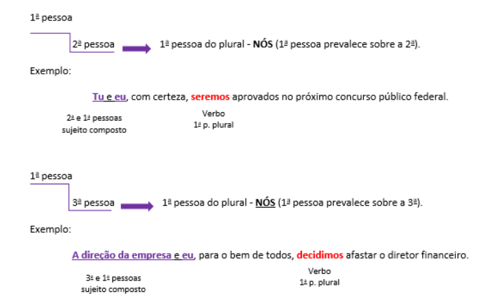
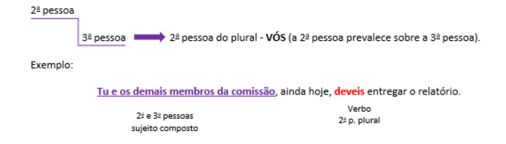
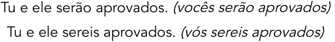
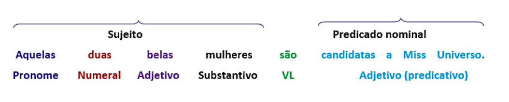

---
fonte_pdf: "Português - Aula 07.pdf"
paginas: 105
conversao: texto-e-imagens
---

<!-- pagina: 2 -->

**Equipe Português Estratégia Concursos, Felipe Luccas Aula 07** 

# **Índice** 

|................................................................................................................................................. 1) Noções Iniciais de Concordância|............................................. 3|
|---|---|
|................................................................................................................................................. 2) Tipos de Sujeito|............................................. 4|
|................................................................................................................................................. 3) Concordância com Sujeito simples|............................................. 5|
|................................................................................................................................................. 4) Concordância com Sujeito composto|............................................. 36|
|................................................................................................................................................. 5) Concordância do Verbo SER|............................................. 43|
|................................................................................................................................................. 6) Concordância Nominal|............................................. 47|
|................................................................................................................................................. 7) Resumo - Concordância|............................................. 56|
|................................................................................................................................................. 8) Questões Comentadas - Concordância verbal e nominal - FGV|............................................. 59|
|................................................................................................................................................. 9) Lista de Questões - Concordância verbal e nominal - FGV|............................................. 89|

---

<!-- pagina: 3 -->

**Equipe Português Estratégia Concursos, Felipe Luccas Aula 07** 

# **NOÇÕES INICIAIS DE CONCORDÂNCIA** 

Pessoal, 

Vamos a mais uma aula de Sintaxe. 

Há muitas regrinhas de Concordância, mas devemos começar pela regra geral: 

A regra básica da concordância verbal é simples. O verbo concorda em número e pessoa com o sujeito: O menin **o** compr **ou** um peão. Os menino **s** compr **aram** um peão. 

Para facilitar a leitura e a localização do sujeito e do verbo, que devem entrar em acordo, temos que lembrar a ordem direta das frases: 

**Sujeito + verbo + complementos + adjuntos** 

**Fulano fez alguma coisa     ontem** 

As bancas vão apresentar frases “acrobáticas”, com esses elementos fora da ordem, dificultando a localização dos termos que devem concordar. A dica é marcar o verbo e puxar aquela setinha até o sujeito. 

Vamos em frente! Temos muita teoria, mas a prática também será intensa. 

---

<!-- pagina: 4 -->

**Equipe Português Estratégia Concursos, Felipe Luccas Aula 07** 

# **TIPOS DE SUJEITO** 

As regras de concordância são mais facilmente entendidas se o aluno lembrar os tipos de sujeito existentes. Vamos a eles de forma resumida: 

||**TIPOS DE SUJEITO**|**EXEMPLOS**|
|---|---|---|
|**Simples**|Apenas um núcleo (nome ou pronome)|O governo decidiu não interferir na balança comercial. Eles desistiram de lutar.|
|**Composto**|Dois núcleos ou mais (nome ou pronome) ==5460==|João e Maria saíram. Deputados, Senadores e líderes do governo não entravam em acordo.|
|**Indeterminado**|Verbo fexionado na 3apessoa do plural ou partícula "se" indeterminante do sujeito|Disseram que o ideal era o livro comércio regular o mercado. Vive-se bem aqui.|
|**Oculto ou** **desinencial**|Identifcado pela terminação verbal|Fomos lá (sujeito = nós). Viajei, apesar da crise fnanceira (sujeito = eu).|
|**Orações sem** **sujeito**|Presença de verbos impessoais (ex.: verbo HAVER com sentido de existir e de tempo decorrido e os que indicam fenômenos da natureza).|Choveu torrencialmente ontem. Há pessoas ruins no poder. Há anos é assim.|

---

<!-- pagina: 5 -->

**Equipe Português Estratégia Concursos, Felipe Luccas Aula 07** 

# **CONCORDÂNCIA COM O SUJEITO SIMPLES** 

O sujeito simples **só tem um núcleo** , ou seja, só um agente, que será um nome (ex.: João) ou pronome (ex.: ele), por isso, leva o verbo para o singular. A banca dificulta a identificação do sujeito, afastando-o de seu verbo. **Marque o verbo** e procure quem está realizando aquela ação. 

Ex.: **Meu pai** <u>, que foi um homem de grandes talentos, vícios e teimosias, e que teve dois</u> filhos, que deram a ele três netos, **acreditava** mais no talento do que na sorte... 

Meus caros, é isso que a banca faz: insere vários termos em pessoa e número diferentes antes do verbo, para induzir uma concordância atrativa equivocada. Vejam só: 

### **(SEFAZ-DF / 2020)** 

muitas companhias restam presas na “divulgação” 

Sem prejuízo da correção gramatical e do sentido original do texto, a forma verbal “restam” poderia ser substituída por mantém-se. 

### **Comentários:** 

“restam” está no plural, “mantém-se” está no singular. No plural, traria o acento diferencial de número: mantêm. Questão incorreta. 

### **(PREF. RIO NOVO / 2020)** 

Julgue o item a seguir quanto à concordância. 

O ruído dos caminhões e das máquinas perturbam a comunidade local. 

### **Comentários:** 

Cuidado, aqui não temos dois núcleos. O sujeito é simples: “ruído”, “dos caminhões” e “das máquinas” são apenas determinantes do núcleo singular “ruído”, por isso o verbo só pode ficar no singular. 

Questão incorreta. 

### **(PREF. PIRACICABA / 2020)** 

Para responder à questão, considere o seguinte período, escrito a partir do texto: 

A falta de identificação e o emprego fora de contexto torna difícil a apreensão pelo leitor do significado de muitas siglas, razão pela qual devem ser usadas de forma criteriosa. 

https://t.me/KakashiAssinaturasBot

---

<!-- pagina: 6 -->

**Equipe Português Estratégia Concursos, Felipe Luccas Aula 07** 

Para que a redação possa atender à norma-padrão de concordância, o seguinte termo deve necessariamente ser flexionado para o plural, conforme indicado: 

a) contexto → contextos. 

c) difícil → difíceis. 

b) torna → tornam. d) forma → formas. e) criteriosa → criteriosas. 

### **Comentários:** 

O sujeito é composto, traz mais de um núcleo. Por isso, o verbo deve ficar no plural: 

[ **A falta****1** **de identificação e o emprego****2** **fora de contexto** ] tornaM difícil. Gabarito letra B. 

### **(SEFAZ-RS / 2019)** 

Desse modo, o poder de tributar está na origem do Estado ou do ente político, a partir da qual foi possível que as pessoas deixassem de viver no que Hobbes definiu como o estado natural (ou a vida pré-política da humanidade) e passassem a constituir uma sociedade de fato, a geri-la mediante um governo, e a financiá-la, estabelecendo, assim, uma relação clara entre governante e governados. 

O referente da forma verbal “passassem” é o termo “as pessoas”. 

### **Comentários:** 

Correto. O referente da forma verbal “passassem” é o termo “as pessoas”. A lógica é: As pessoas passaram a constituir uma sociedade de fato. Questão correta. 

### **(PGE-PE / 2019)** 

A invenção das técnicas para controlar o fogo, o início da agricultura e do pastoreio na Mesopotâmia, a organização da democracia na Grécia, as grandes descobertas científicas e geográficas entre os séculos XII e XVI, o advento da sociedade industrial no século XIX, tudo isso representa saltos de época, que desorientaram gerações inteiras. 

Seria mantida a correção gramatical do texto caso a forma verbal “representa” fosse substituída por representam. 

### **Comentários:** 

O sujeito é singular: “tudo isso”, então o verbo não pode ficar no plural. Esta é a regra da concordância com elementos resumitivos, mas que não foge da regra geral de concordância com o núcleo do sujeito. 

Questão incorreta. 

### **(IHBDF / 2018)** 

Ao voltarmos, o futebol ininterrupto que jogávamos com bola de borracha na porta da fábrica em frente parou e a molecada correu até nós. 

O sujeito da forma verbal “parou” é “fábrica”. 

### **Comentários:** 

Quem/o que parou? Parou “o futebol ininterrupto que jogávamos com bola de borracha na porta

---

<!-- pagina: 7 -->

**Equipe Português Estratégia Concursos, Felipe Luccas Aula 07** 

da fábrica em frente”. Todo esse “monstro” é o sujeito, mas seu núcleo é apenas “futebol”, por isso o verbo fica no singular. Questão incorreta. 

## **Concordância com coletivos ou partitivos especificados** 

Essa é a regra para expressões como: **a maioria de** , **a minoria de** , **uma porção de** , **um bando de** , **um grande número de +** determinante (termo preposicionado que modifica, ou especifica, o substantivo coletivo ou partitivo). 

A expressão partitiva “maioria” ou o coletivo “grupo”, por exemplo, não é especificada (não sabemos maioria do que, nem grupo do quê!). Por isso, tais expressões trazem um especificador, um determinante (maioria das pessoas, grupo de crianças). 

Esses especificadores desempenham função sintática de adjunto adnominal, pois estão juntos ao substantivo (partitivo ou coletivo). Como trazem nesse determinante um outro substantivo, que também pode ser visto semanticamente como agente, temos então duas possibilidades de concordância. Veja a regra para esses casos: 

**1 2** O verbo concorda com o **núcleo do sujeito (parte)** ou com o **o adjunto adnominal (determinante)** , termo determinante ligado a ele. Tanto faz. É facultativo. 

Ex.: A **metade** dos **servidores** públicos entr **ou** /entr **aram** em greve. 

Vamos entender essa análise e identificar os termos sintáticos: 

**Sujeito** : A **metade** dos servidores públicos **>** Núcleo do sujeito: **metade** 

**Adjunto** : dos servidores públicos > Núcleo do adjunto: servidores 

Veja um exemplo com coletivo especificado: 

Ex.: A **matilha** de lobos **atravessou** /atravessaram a montanha. 

**Obs. 1:** Se o coletivo não vier especificado (sem determinante), não vai ter esse adjunto adnominal, então cai na regra geral: verbo concorda em número e pessoa com o sujeito. 

Ex.: A matilha uivou a noite inteira/As matilhas uivaram a noite inteira. 

**Obs. 2:** Se o determinante estiver no mesmo número do núcleo do sujeito, só haverá uma possibilidade de concordância: 

Ex.: A maioria do eleitorado votou na pessoa errada. 

(Tanto maioria quanto eleitorado estão no singular. Não faria sentido concordar no plural.) 

---

<!-- pagina: 8 -->

**Equipe Português Estratégia Concursos, Felipe Luccas Aula 07** 

É importante saber que “determinante” é a palavra ou termo que determina, modifica, acompanha o substantivo. Por esse motivo, tem função de <u>adjunto</u> adnominal (junto ao nome). Esse substantivo que tem determinantes “ao redor” dele é o **núcleo** . Normalmente é o núcleo do sujeito que faz o verbo flexionar. 

No exemplo dos partitivos, coletivos e porcentagens, o “determinante” ou “especificador” geralmente é uma expressão preposicionada, com **de/da(s)/do(s)+conjunto** , que especifica a referência daquele núcleo, como em “metade **dos brasileiros** ”, “bando **de pássaros** ”, “frota **de motos** ”, “22 % **dos crimes** ”. Porém, pode ser qualquer termo que acompanhe o substantivo, como artigos e pronomes: 

Ex.: **<u>Os</u>** 20% **do eleitorado** ficaram revoltados. 

“os” e “do eleitorado” são determinantes (adjuntos) do núcleo 20%. 

Ex.: **<u>Aquele</u>** milhão **de brasileiros** ficou revoltado. 

“aquele” e “de brasileiros” são determinantes (adjuntos) no núcleo Milhão. 

**Observação: Quando o numeral é antecedido por determinante, como um artigo ou pronome, a concordância deve ser feita somente com esse determinante. Nos exemplos acima, não seria possível concordar com “eleitorado” e “brasileiros”, pela presença de “os” e “aquele”.** 

### **(SEFAZ-DF / 2020)** 

Na pesquisa, eles constataram que menos de um terço das companhias **<u>desenvolveram</u>** casos de negócios claros ou proposições de valor apoiadas em sustentabilidade. 

A substituição da forma verbal “desenvolveram” por **<u>desenvolveu</u>** manteria a correção gramatical do texto. 

### **Comentários:** 

Se o sujeito for expressão partitiva/percentual, seguida de determinante, a concordância pode ser feita com a **<u>parte</u>** ou com o **<u>determinante</u>** (a expressão preposicionada). Ambas são corretas: 

### **<u>um terço</u>** das companhias **<u>desenvolveu</u>** 

### um terço das **<u>companhias desenvolveram</u>** 

Questão correta. 

**(SEFAZ-AM / 2019)**

---

<!-- pagina: 9 -->

**Equipe Português Estratégia Concursos, Felipe Luccas Aula 07** 

O verbo flexionado no plural e que também pode ser corretamente flexionado no singular, sem que nenhuma outra modificação seja feita na frase, está em: 

a) Hoje as forças da criação de riqueza já não favorecem a expansão da privacidade... 

b) Não existiam expectativas de que uma porção significativa da vida... 

c) ... as normas, e eventualmente os direitos, de privacidade vieram a surgir. 

- d) Como nossas experiências com a mídia social têm deixado claro... 

e) ... a maior parte das pessoas obtiveram os meios financeiros para controlar o ambiente físico... 

### **Comentários:** 

Questão direta, que pede um caso de concordância facultativa. O mais comum é a concordância com expressões partitivas. O verbo pode concordar com o núcleo do **sujeito** ou com o **<u>determinante</u>** : 

... a maior **parte** <u>das</u> **<u>pessoas obtiveram</u>** / **obteve** os meios financeiros para controlar o ambiente físico... 

Nas demais, o verbo fica no plural, concordando obrigatoriamente com “forças”, “expectativas”, “normas” e “experiências”. Gabarito letra E. 

### **(SEDF / 2017)** 

Em “A maioria dos alunos que chegam à escola pública é oriunda precisamente desses grupos socioeconômicos”, a forma verbal “chegam” poderia ser corretamente flexionada no singular. Nesse caso, o pronome “que” retomaria o núcleo do sujeito da oração principal. 

### **Comentários:** 

O pronome relativo “que” é pronome e tem um antecedente, um termo que ele retoma (se refere). Em sujeitos modificados por pronome relativo “que”, o verbo deve concordar com o **antecedente do “que”** . 

### Ex.: **O aluno estuda** que você para a festa. 

No caso de uma expressão partitiva, podemos entender que o antecedente pode ser tanto o núcleo do sujeito quanto o núcleo do adjunto, da mesma forma que ocorre com a regra geral de concordância com uma expressão partitiva que tenha um determinante. Portanto, o verbo poderá concordar com ambos. 

A **maioria** dos **alunos** que cheg **a** /cheg **am** à escola 

Na redação original, “que” retoma o núcleo do adjunto adnominal (dos alunos que chegam), portanto, o verbo concorda no plural com “alunos”. 

### **“núcleo do adj. adn.”** 

A maioria dos **<u>alunos</u>** <u>que cheg</u> **<u>am</u>** à escola 

---

<!-- pagina: 10 -->

**Equipe Português Estratégia Concursos, Felipe Luccas Aula 07** 

Na redação alternativa da banca, temos a outra possibilidade correta: 

**“núcleo do sujeito”** 

A **maioria** dos alunos que cheg **a** à escola 

Portanto, a segunda opção também está correta, pois o verbo está concordando no singular com o núcleo do sujeito (maioria), de modo que este é o antecedente do pronome relativo “que”, isto é, o termo que está sendo retomado por ele. 

Questão correta. 

### **(ITEP-RN / 2018)** 

Julgue o item a seguir. 

<u>nasceu</u> Em “Grande parte do avanço em liberdades individuais e nas ciências do questionamento de paradigmas.”, o verbo em destaque poderia estar no plural, concordando, assim, com o núcleo do sujeito “liberdades”. 

### **Comentários:** 

Com expressões partitivas seguidas de determinante, o verbo pode concordar com o núcleo do sujeito (parte) ou com o núcleo do determinante (avanço). Como ambos são substantivos no singular, o verbo só poderia estar no singular. Questão incorreta. 

|**Concordância** **numerais** **determinados**|**em**|**geral**|
|---|---|---|
|**(porcentagens, decimais, frações)**|||

De modo geral, temos o mesmo raciocínio das expressões partitivas e coletivas. Então teremos duas possibilidades: uma concordância lógica, mais gramatical, com o núcleo do sujeito, ou uma concordância mais semântica, com o termo especificador. 

Nos percentuais, a concordância é feita com **<u>a porcentagem ou com o determinante</u>** <u>.</u> Da mesma forma, com numerais decimais, com vírgula, a concordância é feita com **<u>a parte inteira ou com o determinante</u>** <u>. Ex.:</u> 

**4** ,2% do grupo de mulheres entrevistadas **concordaram** . 

4,2% do **grupo** de mulheres entrevistadas **concordou** . 

**1,** 4% das pessoas **é** de classe média. 

2,4% das **<u>pessoas</u> são** de classe média. 

80% da **população é** alfabetizad **a** . 

**80%** da população **são** alfabetizad **os** .

---

<!-- pagina: 11 -->

**Equipe Português Estratégia Concursos, Felipe Luccas Aula 07** 

<u>Se o termo numérico vier</u> **<u>pre</u>** <u>cedido por um determinante, o verbo concordará</u> em número e pessoa com esse determinante (geralmente o artigo ou pronome). Ex.: 

**<u>Os</u> 80%** mais velhos da população **viverão** ainda mais. 

**<u>Esses</u> 10%** mais pobres da humanidade **são** analfabetos. 

OU seja, se veio um artigo antes do numeral, a concordância é feita com o artigo. 

Se o numeral for decimal **não determinado** , teremos a **concordância obrigatória no plural somente a partir do número dois** . Na verdade, isso é bem lógico, pois plural indica justamente “dois ou mais”. Ex.: 

**1** ,5 milhão **foi** gasto. **(Sem determinante, concorda com o numeral)** 

**1** ,5 milhão de dólares **foi** gasto. 

1,5 milhão de **<u>dólares foram</u>** gastos. 

Seu **1** ,99m de altura **intimida** ; os **2** ,20m dele **intimidam** mais ainda. 

Obs.: ~~1,5 Milhões~~ não existe. Sendo menor que dois, é singular. Veremos isso em concordância nominal. 

Obs.: A palavra “milhar” é masculina, então teremos: **Os** milhares de mulheres jovens que saíram... (Errado: **~~as~~** milhares de mulheres) 

Obs.: Com numerais fracionários, a concordância é feita com o numerador da fração: Ex.: " **Um** quinto dos bens **cabe** ao menino." 

No entanto, é registrada também a concordância com o determinante, conforme ressalva específica feita pelo gramático Cegalla: 

“Não nos parece, entretanto, incorreto usar o verbo no plural, quando o número fracionário, seguido de substantivo no plural, tem o numerador 1, como nos exemplos: 

"Um terço das **mortes** violentas no campo **acontecem** no sul do Pará." 

“Um quinto dos **homens eram** de cor escura.” 

## **Concordância com Milhão, Bilhão, Trilhão...**

---

<!-- pagina: 12 -->

**Equipe Português Estratégia Concursos, Felipe Luccas Aula 07** 

Aqui se aplica a regra geral dos numerais seguidos de determinantes. O verbo concorda com o núcleo do sujeito ou do adjunto. Em outras palavras, pode concordar com o numeral ou com seu determinante. Também é facultativo. Ex.: 

1 milhão de **torcedores assistiram** à Copa do Mundo. 

**1 milhão** de torcedores **assistiu** à Copa do Mundo. 

A concordância é feita com parte inteira, se igual ou maior que 2, vai para o plural, se menor, fica no singular: 1,9 milhão. 2,1 milhões. 

Se o numeral vier com um adjunto, a concordância pode ser feita com o núcleo do sujeito ou do adjunto. Ex.: 

**1** ,4 Milhão de **brasileiros foi** / **foram** às ruas protestar. 

Obs.: Milhões, Bilhões e Milhares são usados como substantivos masculinos, então a concordância do artigo/pronome/numeral que os precede é feita no masculino. Se forem seguidos de determinante feminino, é possível o adjetivo/particípio concordar no feminino: 

**Alguns/os/dois milhões** de pesso **as** enganad **AS** (ou enganad **OS** ) todo dia... (as/algumas milhares de pessoas está errado!) 

Veja o resumo a seguir da concordância com sujeito formado por coletivos: 

|**CONCORDÂNCIA**|**TIPO DE SUJEITO**|**EXEMPLOS**|
|---|---|---|
||Coletivos ou partitivos especifcados (A maioria de, a minoria, de, um bando, matilha etc.)|A**metade**dos**servidores** públicos **entrou**/entr**aram** em greve A **matilha** de **lobos** **atravessou**/**atravessaram** a montanha.|
|**FACULTATIVA**|Numerais / porcentagens + determinante (O verbo concorda com o próprio numeral ou com o determinante. Se o numeral vier determinado, a concordância tem que ser feita com o determinante)|20% do**eleitorado fcou**revoltado. **20%**do eleitorado **fcaram** revoltad**os**. 1 milhão de**torcedores assistiram**à Copa do Mundo. **1 milhão**de torcedores**assistiu**à Copa do Mundo. Os 20% do eleitorado fcaram revoltados. Aquele milhão de brasileiros fcou revoltado.|
|**CONCORDÂNCIA**|Mais de um, menos de dois, cerca de, menos de... +|Mais de**um**cliente se**queixou**. /|

---

<!-- pagina: 13 -->

**Equipe Português Estratégia Concursos, Felipe Luccas Aula 07** 

|**COM O NUMERAL**|NUMERAL|Mais de**dois**clientes se**queixaram**. Menos de**dois **clientes se**queixaram.**/ Cerca de**mil**pessoas se**queixaram**.|
|---|---|---|
|**CONCORDÂNCIA** **OBRIGATÓRIA NO** **PLURAL**|Numeral decimal **não** **determinado,** teremos a concordância obrigatória no plural somente a partir do número dois|1,5 milhãofoigasto. 1,5 milhãode dólares foigasto. 1,5 milhãodedólaresforamgastos. Seu1,99 m de alturaintimida; os2,20m deleintimidammais ainda.|

### **(DPE-DF / 2022)** 

Vivem 4,5 bilhões de pessoas que não têm saneamento nem água encanada, desprovidas das condições mínimas de higiene. 

No último período do texto, caso a palavra “desprovidas” fosse empregada no masculino — desprovidos —, em concordância com o termo “4,5 bilhões”, a correção gramatical e o sentido do texto seriam mantidos. 

### **Comentários:** 

A lógica aqui é semelhante à das expressões partitivas: pode-se concordar com a parte, o numeral, 4,5 bilhões, no masculino; ou pode-se concordar com o determinante “de pessoas”, no feminino. 

Vivem 4,5 bilhões de pessoas que não têm saneamento nem água encanada, desprovidos das condições mínimas de higiene. 

Vivem 4,5 bilhões de pessoas que não têm saneamento nem água encanada, desprovidas das condições mínimas de higiene. 

Observe que não haveria mudança de sentido, porque os 4,5 bilhões são as próprias pessoas: 

Questão correta. 

### **(PREFEITURA DE ANANINDEUA-PA / 2019)** 

Leia a frase seguinte:

---

<!-- pagina: 14 -->

**Equipe Português Estratégia Concursos, Felipe Luccas Aula 07** 

"Boa parte das alunas sai daqui no fim da tarde e vai se prostituir, logo ali.” 

A outra possibilidade correta de concordância verbal seria: 

a) saem-vão.      b) sairá -foi.      c) saem-vai.      d) sairiam-iria. 

### **Comentários:** 

Como temos expressão partitiva seguida de determinante: “boa parte das alunas”, podemos concordar com “parte” ou com “alunas”: 

"Boa parte das **alunas saem** daqui no fim da tarde e **vão** se prostituir, logo ali.” Gabarito letra A. 

### **(PF / 2018)** 

Na realidade, cada cientista recebe vários casos ao mesmo tempo. A maioria dos laboratórios <u>acredita que o acúmulo de trabalho é o maior problema que enfrentam, e boa parte dos pedidos</u> de aumento no orçamento baseia-se na dificuldade de dar conta de tanto serviço. 

Seria mantida a correção gramatical do texto caso a forma verbal “acredita” (L.2) fosse flexionada no plural: acreditam. 

### **Comentários:** 

Havendo expressão partitiva seguida de determinante, verbo pode concordar com o sujeito (a maioria aceita) ou com o determinante (os laboratórios acreditam). Portanto, na questão, singular ou plural estariam igualmente corretos. Questão correta. 

## **<u>Concordância com verbos ter e vir e seus derivados</u>** 

Os verbos **ter** , **vir** e seus derivados ( **manter, deter, entreter, advir, provir** ), quando na terceira pessoa do plural, devem trazer um **acento diferencial de número** : Eles t **ê** m/v **ê** m/mant **ê** m/prov **ê** m. Lembre-se de que esses verbos derivados, se estiverem na terceira pessoa do singular, são acentuados também, por serem oxítonas com terminação “em”. Ex.: 

Ele mantém um orfanato. 

Eles mantêm um orfanato. 

Ele e ela mantêm uma ONG, mas não sabem de onde provêm os recursos. Veja um quadro resumo desses verbos: 

||**PRESENTE DO INDIC** |**ATIVO** |
|---|---|---|
||**~~3~~****a****pessoa singular**|**3****a****pessoa plural**|
|**TER**|T**e**m|T**ê**m|
|**VIR**|V**e**m|V**ê**m|
|**MANTER**|Mant**é**m|Mant**ê**m|
|**ADVIR**|Adv**é**m|Adv**ê**m|
|**VER**|V**ê**|V**ee**m|
|**REVER**|Rev**ê**|Rev**ee**m|

---

<!-- pagina: 15 -->

**Equipe Português Estratégia Concursos, Felipe Luccas Aula 07** 

O detalhe que a banca gosta de explorar é a concordância desses verbos na voz passiva sintética. 

Ex.: ONGs **são mantidas** por doações **X** ONGs **mantêm-se** por doações. 

**Voz Passiva Analítica Voz Passiva Sintética** 

**Muita atenção** agora a essa próxima regra, já que os verbos **haver** e **existir** são muitíssimos cobrados. São questões fáceis. Não vacile! 

### **(UFPE / 2019)** 

Julgue o item a seguir. 

Muitos educadores e cientistas brasileiros tem buscado respostas para as principais dúvidas acerca do currículo escolar. 

### **Comentários:** 

O sujeito é plural “Muitos educadores e cientistas brasileiros”, então o verbo “ter” precisa do acento diferencial de número: “têm”. Questão incorreta. 

### **(MGS / 2016)** 

Tem-se “há casas com lareira que se mantêm frias.”. Nesse fragmento, percebe-se que o acento da forma verbal em destaque deve-se à concordância com a seguinte palavra: 

a) “há”      b) “casas”      c) “lareira”      d) “frias” 

### **Comentários:** 

O acento diferencial em “têm” marca o plural. O sujeito só poderia ser uma palavra no plural. Quem se mantêm frias? As casas. Gabarito letra B .

---

<!-- pagina: 16 -->

**Equipe Português Estratégia Concursos, Felipe Luccas Aula 07** 

## **Concordância com Haver, Existir e equivalentes** 

O verbo **haver, com sentido de existir,** é impessoal, não tem sujeito e, por isso, permanece sempre na terceira pessoa do singular: Há. O verbo haver tem apenas objeto. 

Por outro lado, o verbo existir é pessoal, tem sujeito e se flexiona para concordar em número e pessoa com ele. O mesmo vale para outros sinônimos de haver, como ocorrer e acontecer. Ex.: 

**Há dias** que faz chuva, dias que faz sol e há dias que tanto faz. 

### Exist **em** <u>pesso</u> **<u>as</u>** <u>que só dizem não.</u> 

(O verbo existir é intransitivo. O termo sublinhado é seu sujeito) 

**Houve** vários incidentes estranhos no evento. 

(Vários incidentes **é objeto;** o verbo haver permanece no singular, mesmo com objeto no plural.) 

### Ocorrer **am** vári **os** incidentes estranhos no evento. 

(Vários incidentes **é sujeito** , por isso, obriga a concordância do verbo no plural.) 

Essa regra também vale para outros casos de verbos impessoais, indicando fenômenos da natureza e passagem do tempo. Ex.: 

Choveu torrencialmente nas últimas noites. (Chover não tem agente!) 

Faz dois anos que terminei a graduação. (“ **~~Fazem 2 anos~~** ~~”~~ é errado!) 

**Obs.:** Em sentido figurado, um verbo que indica fenômeno da natureza passa a concordar com seu sujeito. Ex.: 

Choveram críticas ao trabalho. 

Hoje eu amanheci de mau humor! 

“De manhã escureço 

De dia tardo 

De tarde anoiteço 

De noite ardo.” Vinícius de Morais 

---

<!-- pagina: 17 -->

**Equipe Português Estratégia Concursos, Felipe Luccas Aula 07** 

### **(TJ-PA / 2020)** 

Todas as atividades realizadas no país e todas as pessoas que estão no Brasil estão sujeitas à lei. A norma vale para coletas operadas em outro país, desde que estejam relacionadas a bens ou serviços ofertados a brasileiros. Mas **<u>há</u>** exceções, como a obtenção de informações pelo Estado para a segurança pública. 

Sem prejuízo da correção gramatical e do sentido original do texto, a forma verbal “há” poderia ser substituída por 

a) existe.      b) ocorre.      c) têm.      d) tem.      e) existem. 

### **Comentários:** 

Há exceções=Existem exceções. O verbo haver fica no singular, por ser impessoal. Existir faz concordância normal com o sujeito Exceções. Gabarito letra E. 

### **(EMAP / 2018)** 

O VTS é um sistema eletrônico de auxílio à navegação, com capacidade de monitorar ativamente o tráfego aquaviário, melhorando a segurança e eficiência desse tráfego, nas áreas em que haja intensa movimentação de embarcações ou risco de acidente de grandes proporções. 

A forma verbal “haja” (L.2) poderia ser flexionada no plural — hajam —, preservando-se a correção gramatical e os sentidos do texto. 

### **Comentários:** 

O verbo haver, no sentido de existir, é impessoal e não vai ao plural. Questão incorreta. 

### **(CAGE-RS / 2018)** 

Embora, infelizmente, tais metas não tenham sido atingidas, ocorreram diversos avanços, como, por exemplo, a diminuição da mortalidade infantil e do analfabetismo; a melhoria na expectativa de vida; o aumento do número de jovens nas escolas, entre outros. 

A correção gramatical e os sentidos do texto 1A10BBB seriam preservados caso a forma verbal “ocorreram” (l.1) fosse substituída por 

a) existiu.    b) aconteceu.    c) sucederam.    d) tiveram.    e) houveram. 

### **Comentários:** 

Ocorrer é sinônimo de suceder. As letras A e B não poderiam ser a resposta, porque os verbos estão no singular e o sujeito é “diversos avanços”. Tiveram, na letra D, é informal. Houveram, na letra E, causaria erro de concordância, uma vez que o verbo haver impessoal, no sentido de suceder, não vai ao plural. Gabarito letra C. 

## **Concordância com expressões com pronome que, tendo** **<u>núcleo do sujeito no singular e núcleo do adjunto no plural</u>** 

Aqui temos outro caso de dupla concordância. Vale a regra acima, o verbo pode concordar com **qualquer um dos núcleos, do****1** **sujeito ou do****<u>2</u>** **<u>adjunto (determinante)</u>** <u>.</u> **DESDE QUE O SENTIDO**

---

<!-- pagina: 18 -->

**Equipe Português Estratégia Concursos, Felipe Luccas Aula 07** 

### **PERMITA.** 

Prestem atenção no exemplo, mais do que na regra. Ex.: 

Seremos**1** **nós****<u>2</u>** **<u>aqueles</u> que** <u>herdarão o reino dos céus. (aqueles herdarão)</u> 

**Nuc.Suj.   N.Adj.** 

Seremos**1** **nós****2** **aqueles que** herdaremos o reino dos céus. (nós herdaremos) 

**Nuc.Suj. N.Adj.** 

Vejam outros exemplos dessa regra: 

O efeito das **catástrofes que** se **verificaram** . 

O **<u>efeito</u>** das catástrofes **que** se **<u>verificou</u>** <u>.</u> Não sou um **daqueles que pensam** na morte. Não sou **<u>um</u>** daqueles **que** **<u>pensa</u>** na morte. 

**Cuidado** , que essa regra só é válida se o sentido permitir e não causar incoerência no texto. Ex.: 

Lerei muito sobre **atos** de terceiro que **sejam** considerados crime. 

*Lerei muito sobre **atos** de terceiro que **~~seja considerado~~** crime. 

Não haveria como concordar no singular, pois apenas o ato pode ser considerado crime, não o terceiro. Então, o “que” não pode retomar “terceiro”. 

*Ex.: Quais de **nós teríamos** pensado nisso? 

*Ex.: **Quais** de nós **teriam** pensado nisso? 

* Caso especial: não há pronome relativo que, mas o raciocínio é o mesmo. 

## **Concordância com “que” e “quem”** 

Essa regra vale para expressões como: **Eu** que **fiz** /Fui **eu** quem **fiz** / Fui eu **quem fez** . 

Em sujeitos modificados por pronome relativo “que”, o verbo deve concordar com o **antecedente do “que”** . O verbo deve concordar com o **antecedente do “que”** . Ex.: 

A menina que **convidou** você para a festa é tímida. 

Todos aqueles que **estudaram** lá foram aprovados 

Se o sujeito for o pronome “quem”, o verbo deve concordar com o próprio “quem”, ficando na 3º pessoa do singular. Essa é a regra! Ex.:

---

<!-- pagina: 19 -->

**Equipe Português Estratégia Concursos, Felipe Luccas Aula 07** 

Fui eu **quem convidou** você para a festa. 

Porém, embora a preferência seja concordar diretamente com “quem” também é **possível** concordar com o **antecedente do “quem”** , geralmente um pronome reto (eu, ele, nós...). Ex.: 

Fomos **nós convidamos** quem você para a reunião. 

Veja mais alguns exemplos. 

Fomos nós **quem convidou** você para a reunião. (preferência) 

Fui eu **quem recitou** o poema durante a aula. (preferência) 

Fui **eu** quem **recitei** o poema durante a aula. 

Só não vale misturar: ~~Foi eu que fz.~~ .. 

## **Concordância com “predicativos”** 

O **predicativo do sujeito** é um termo que atribui uma característica, estado, qualidade a um substantivo, que poderá ser sujeito ou objeto. Normalmente, o predicativo do sujeito vem após um verbo de ligação (ser, estar, parecer, ficar, tornar-se). 

Ex.: Ela      é **bipolar** 

**Suj.** VL **qualidade Predicativo** Ex.: Ele     foi **o mais rápido Suj.** VL **qualidade Predicativo** Ex.: Ele     foi **o primeiro que correu Suj.** VL **qualidade Predicativo** 

Se houver um predicativo, a concordância do verbo depois do “que” pode ser feita com o **1 2 sujeito** da oração **ou** com o **predicativo** . 

Ex.: Fui **eu** o último que **consegui** a vaga. 

Ex.: Fui eu **<u>o último</u>** que **conseguiu** a vaga. (concordância com o predicativo, termo sublinhado) 

Obs.: Só para aprofundar: isso ocorre porque podemos considerar qualquer dos núcleos como “antecedente” do “que”. Assim como nas expressões partitivas e coletivas com determinantes.

---

<!-- pagina: 20 -->

**Equipe Português Estratégia Concursos, Felipe Luccas Aula 07** 

No caso de um **predicativo do objeto** , a concordância é feita normalmente com o objeto: 

Ex.: Achei <u>as aul</u> **<u>as</u>** bo **as** . (Achar é transitivo direto; “as aulas” é o objeto direto; “boas” é uma qualidade atribuída a “aulas”, ou seja, é um predicativo do objeto “aulas”. A concordância é feita normalmente, pois “boas” é um adjetivo.) 

Ex.: Considerei fác **eis** <u>a</u> **<u>s</u>** <u>questõe</u> **<u>s</u>** <u>e o</u> **<u>s</u>** <u>simulado</u> **<u>s</u>** <u>. (“questões e simulados” é o objeto</u> direto do verbo “considerar”; “fáceis” é o predicativo desse objeto; por ser adjetivo, concorda normalmente com os substantivos.) 

### **(PREF. RIO NOVO / 2020)** 

Julgue o item a seguir quanto à concordância. 

Somos nós quem paga a conta pelo desleixo das obras públicas. 

### **Comentários:** 

A concordância deve ser feita diretamente com o pronome “quem”: quem paga. Alternativamente, também se admite a concordância com o antecedente: Somos **nós** quem **pagamos** . Questão correta. 

### **(PF / 2018)** 

Cerca de três séculos depois, Portugal lançou-se em uma expansão de conquistas que, à imagem do que Roma fizera, **levou** a língua portuguesa a remotas regiões: Guiné-Bissau, Angola, Moçambique, Cingapura, Índia e Brasil, para citar uns poucos exemplos em três continentes. 

A correção gramatical e a coerência do texto seriam preservadas caso a forma verbal “levou” fosse substituída por **levaram** . 

### **Comentários:** 

A regra de concordância quando temos o pronome “que” como sujeito é concordar com o seu “antecedente”. Contudo, sabemos que o antecedente depende do contexto. Na redação original, o verbo está no singular porque concorda com “expansão”, considerado então como antecedente. Contudo, ao levar o verbo para o plural, o antecedente passa a ser “conquistas”. Ambas as formas seriam corretas, apenas o termo retomado seria diferente. Quanto à coerência, não haveria nenhuma incoerência em fazer essa alteração, pois a “expansão” é justamente o conjunto de conquistas, então seria também lógico pensar que as conquistas territoriais é que levaram a língua a remotas regiões. Questão correta. 

### **(SEDF / 2017)**

---

<!-- pagina: 21 -->

**Equipe Português Estratégia Concursos, Felipe Luccas Aula 07** 

A construção do pensamento — e sua exposição de forma clara e persuasiva — constitui um dos objetivos mais perseguidos por todo aquele que almeja sucesso na vida profissional e, muitas vezes, pessoal. 

A respeito dos aspectos linguísticos do texto, julgue o item que se segue. 

A substituição da expressão “todo aquele” por <u>todos manteria o sentido original e a correção</u> gramatical do texto. 

**Comentários:** 

Vamos testar: 

todo **aquele** que **almeja** sucesso (verbo concordando perfeitamente no singular com “aquele”, termo antecedente do “que”) 

Agora veja o que acontece se trocarmos “todo aquele” por todos. 

**todos** que **~~almeja~~** sucesso (verbo no singular, não está concordando em número com o sujeito “todos”) 

Portanto, a troca causa erro de concordância. Questão incorreta. 

## **Concordância com sujeito oracional** 

Em diversas ocasiões na língua, o sujeito do verbo é uma oração. Ela será chamada de subordinada substantiva **subjetiva** justamente por exercer essa função de sujeito. Ela pode ser substituída pelo pronome ISTO, e, por essa razão, leva a **concordância para o singular** . Essa oração com função de sujeito pode aparecer introduzida pela conjunção integrante “que/se” ou vai aparecer reduzida, numa forma de infinitivo (fazer, falar, correr, pular, estudar). Ex.: 

É preciso **<u>amar as pessoas como se não houvesse amanhã</u>** . **Sujeito (isto)** 

Coube a elas **<u>resolver o problema</u>** <u>.</u> **Sujeito (isto)** 

Parece **<u>que dizes te amo, Maria</u>** . **Sujeito (isto)** 

### Convém **<u>que digas a verdade ao advogado</u>** . 

**Sujeito (isto)** 

Atenção, muitas vezes essa oração vai ser um sujeito paciente. Fique atento ao “SE” apassivador. Ex.: 

### Espera-se **<u>que a economia melhore</u>** . (isto é esperado) 

**Sujeito (isto)** 

Estima-se **<u>existir um trilhão de galáxias</u>** . (isto é estimado) 

**Sujeito (isto)** 

Parece **<u>que o concurso será este ano</u>** . (isto parece)

---

<!-- pagina: 22 -->

**Equipe Português Estratégia Concursos, Felipe Luccas Aula 07** 

### **Sujeito (isto)** 

Obs.: o verbo “parecer” pode também aparecer flexionado, numa locução verbal. Nesse caso, ele não forma uma outra oração. Ex.: 

Os meninos **parecem estar** felizes. 

Então, a banca normalmente insere o verbo “parecer” ao lado do verbo da oração subjetiva para “simular” uma locução verbal. Veja: 

Os alunos parecia ouvirem a professora 

A leitura da oração acima é: 

Os alunos parecia que ouviam a professora 

### Parecia **<u>que os alunos ouviam a professora</u>** . >>> Parecia **(isto)** 

Portanto, no caso acima temos sujeito oracional e o verbo fica no singular. Nas locuções verbais, só o verbo auxiliar se flexiona e ambos os verbos têm o mesmo sujeito. 

### **(CGE-CE / 2019)** 

Candeia era quase nada. Não tinha mais que vinte casas mortas, uma igrejinha velha, um resto de praça. Algumas construções nem sequer tinham telhado; outras, invadidas pelo mato, incompletas, sem paredes. Nem o ar tinha esperança de ser vento. Era custoso acreditar que morasse alguém naquele cemitério de gigantes. 

No texto CB1A1-I, o sujeito da oração “Era custoso” (L.3) é 

a) o segmento “acreditar que morasse alguém naquele cemitério de gigantes” (L. 3 e 4). 

b) o trecho “alguém naquele cemitério de gigantes” (L. 3 e 4). 

c) o termo “custoso” (L.3). 

d) classificado como indeterminado. 

e) oculto e se refere ao período “Nem o ar tinha esperança de ser vento” (L. 3). 

### **Comentários:** 

Temos caso típico de sujeito oracional: 

[Acreditar que morasse alguém naquele cemitério] era custoso. 

[ISTO] era custoso. Gabarito letra A.

---

<!-- pagina: 23 -->

**Equipe Português Estratégia Concursos, Felipe Luccas Aula 07** 

### **(TRT 24ª REGIÃO / 2017)** 

O verbo indicado entre parênteses deverá flexionar-se de modo a concordar com o elemento sublinhado na frase: 

a) À maioria dos homens (parecer) não interessar o prazer dos dias que estão decorrendo. 

b) Não (convir) a nenhuma criatura antecipar os males que lhe reserva o futuro. 

- c) Aos homens sábios não (atormentar) nos dias do presente a <u>infelicidade</u> de um futuro tormentoso. 

d) Sempre há aqueles a quem (caber) sofrer por antecipação o futuro sombrio que os aguarda. 

e) São numerosas as pessoas cuja obsessão as (aprisionar) em falsas expectativas de felicidade. 

### **Comentários:** 

Na letra A, o verbo parecer forma locução: parece interessar. Seu sujeito é “o prazer dos dias que estão decorrendo”. 

Na letra B, o sujeito do verbo “convir” é a oração “antecipar os males que lhe reserva o futuro”. 

Na letra C, o sujeito do verbo “atormentar” é “infelicidade”, então o verbo irá para a terceira pessoa do singular: 

a infelicidade de um futuro tormentoso não ( **atormenta** ) Aos homens sábios 

Na letra D, o sujeito de “caber” é a oração “sofrer por antecipação o futuro sombrio que os aguarda”. 

Na letra E, o sujeito de “aprisionar” é “obsessão”: a obsessão as aprisiona. Gabarito letra C. 

## **Concordância na voz passiva** 

Na passagem da voz ativa para a voz passiva, o que era objeto direto vira o sujeito paciente. 

Deve-se localizar o **sujeito paciente** e fazer a concordância do verbo com ele. Ex.: 

Casa **s são** vendida **s** no Grajaú = **Vendem** -se **casas** no Grajaú. 

Casa **é** vendid **a** no Grajaú = **Vende** -se **casa** no Grajaú. 

Observe que o particípio (vendidas) concorda em gênero e número com o sujeito, como um adjetivo. 

---

<!-- pagina: 24 -->

**Equipe Português Estratégia Concursos, Felipe Luccas Aula 07** 

### **(CGE-CE / 2019)** 

“Ainda hoje, em muitos rincões do nosso país, são encontrados administradores públicos cujas ações em muito se assemelham às de Nabucodonosor, rei do império babilônico”, julgue a opção cuja proposta de reescrita, além de estar gramaticalmente correta, preserva os sentidos originais do texto. 

**Ainda hoje, em muitos rincões do nosso país, encontra-se administradores públicos cujas ações se assemelham muito às do império babilônico de Nabucodonosor.** 

### **Comentários:** 

~~…encontra-se~~ encontraM-se administradores (o verbo deveria estar no plural, para concordar com o sujeito plural administradores) Questão incorreta. 

### **(UFPE / 2019)** 

Julgue o item a seguir. 

Infelizmente nem sempre se busca as melhores soluções para o currículo das escolas brasileiras. 

### **Comentários:** 

As melhores soluções não são buscadas... Temos sujeito passivo e plural: nem sempre se BUSCAM. 

Questão incorreta. 

**(SEFAZ-AM / 2019)** 

As normas de concordância estão respeitadas na frase: 

a) Armazenar em dispositivos móveis galerias de fotos digitais substituíram o álbum de família. 

b) O excesso de estímulos que acaba nos tornando reféns da superficialidade prejudicam a sensibilidade crítica. 

c) Transmite sensação de liberdade a fragmentação dos conteúdos digitais, na medida em que somos os editores daquilo que publicamos. 

d) A criatividade e a capacidade de inovar, no âmbito dos negócios e nas relações pessoais, compõe-se o vetor da era digital. 

e) Compartilha-se acriticamente inúmeras fotos nas redes sociais, o que inviabiliza a criação de vínculos afetivos. 

### **Comentários:** 

c) Transmite sensação de liberdade a fragmentação dos conteúdos digitais, na medida em que somos os editores daquilo que publicamos. 

Perfeita. O verbo está no singular porque o núcleo do sujeito é “fragmentação”. 

Vamos fazer a correção e marcar o termo que justifica a concordância: 

a) [ARMAZENAR em dispositivos móveis galerias de fotos digitais] ~~substituíram~~ SUBSTITUIU o álbum de família. 

Aqui temos sujeito oracional, então o verbo fica no singular.

---

<!-- pagina: 25 -->

**Equipe Português Estratégia Concursos, Felipe Luccas Aula 07** 

b) O EXCESSO de estímulos que acaba nos tornando reféns da superficialidade PREJUDICA ~~prejudicam~~ a sensibilidade crítica. 

A concordância deve ser feita com o antecedente do “que”: o excesso de estímulos 

d) A CRIATIVIDADE e a CAPACIDADE de inovar, no âmbito dos negócios e nas relações pessoais, ~~compõe-se~~ COMPÕEM o vetor da era digital. 

Sujeito composto e anteposto, verbo no plural. 

e) ~~Compartilha-se~~ COMPARTILHAM-SE acriticamente inúmeras FOTOS nas redes sociais, o que inviabiliza a criação de vínculos afetivos. 

Sujeito passivo plural leva o verbo para o plural, normalmente. Aqui, temos voz passiva sintética (VTD+SE). Gabarito letra C. 

## **Concordância na locu ão verbal** **<u>ç</u>** 

Em regra, nas **locuções verbais** (verbo auxiliar + verbo principal), o verbo auxiliar se flexiona e o principal fica invariável, no singular. 

No entanto, o verbo haver, com sentido de existir, “contamina” a concordância do verbo auxiliar, fazendo-o ficar **impessoal** também. Veja: 

**Deve haver** 15 anos que não estudo isso. 

Dev **em** existir vári **as** soluções para esse problema. 

Isso vale também para os outros verbos impessoais, como “fazer”. 

**Fique atento** a outros sentidos do verbo haver, quando ele será um verbo pessoal, conjugado normalmente: 

||**VERBO HAVER PESSOAL** |
|---|---|
|**SENTIDO**|**EXEMPLOS**|
|**TER/DEVER**|Ele**há**de ser um policial/Eles**hão**de ser heróis. Todos**haverão**de ser aprovados/**Hei**de vencer a banca no dia da prova.|
|**COMPORTAR-SE, PROCEDER,** **SAIR-SE**|Meus flhos se**houveram**bem na casa da vó.|
|**AJUSTAR CONTAS,** **ENTENDER-SE**|Se ele não for aprovado, vai se**haver**comigo.|
|**PENSAR, ACHAR** **CONVENIENTE, JULGAR**|Assim,**houveram**por bem pedir o divórcio.|

---

<!-- pagina: 26 -->

**Equipe Português Estratégia Concursos, Felipe Luccas Aula 07** 

Obs.: Outro verbo campeão de incidência em prova é o verbo **tratar-se** . Seu sujeito não aparece, é indeterminado. 

Ex.: Trata-se de doenças endêmicas, não há muito o que se fazer. 

Não confunda a expressão invariável **Tratar-se “de”** com a voz passiva do verbo tratar, que é transitivo direto. 

Ex.: Trata-se **de** pessoas que não querem de fato estudar. (Tem preposição: sujeito indeterminado) 

Ex.: Tratam-se diversas doenças cardiovasculares aqui. (Voz passiva: doenças são tratadas) 

**(EBSERH / 2020)** 

Leia o trecho: “ **<u>Há</u>** uma preocupação entre os alunos... 

Julgue o item a seguir. O verbo “haver” é impessoal. 

### **Comentários:** 

O verbo haver, com sentido de existir, é impessoal e não se flexiona: há/existe uma preocupação. Questão correta. 

### **(TJ-PA / 2020)** 

...Mas **<u>há</u>** exceções, como a obtenção de informações pelo Estado para a segurança pública. 

Sem prejuízo da correção gramatical e do sentido original do texto CG1A1-II, a forma verbal “há” poderia ser substituída por 

a) existe. b) ocorre. c) têm. d) tem. e) existem. 

### **Comentários:** 

Substituindo o verbo haver impessoal por seu sinônimo existir, este será flexionado no plural, para concordar com o sujeito “exceções”: existem exceções. 

“Existe” e “Ocorre” estão no singular, não concordam com “exceções”; “tem” e “têm” são igualmente incorretas, porque o uso de “Ter” com valor existencial é considerado inadequado, por ser informal. 

Gabarito letra E.

---

<!-- pagina: 27 -->

**Equipe Português Estratégia Concursos, Felipe Luccas Aula 07** 

### **(PREF. SÃO ROQUE / 2020)** 

Assinale a alternativa que reescreve fala da charge de acordo com a norma-padrão de concordância. 

a) Já se completou dois anos que terminei meu mestrado e trabalho com Uber. 

b) Quantos anos já fazem que você trabalha com Uber? 

c) Vão fazer uns dois anos que terminei meu mestrado e trabalho com Uber. 

d) Faz muitos anos, já, que você trabalha com Uber? 

e) Conta-se uns dois anos que estou trabalhando com Uber. 

### **Comentários:** 

Vejamos a concordância correta: 

a) Já se completARAMou dois anos que terminei meu mestrado e trabalho com Uber. 

b) Quantos anos já FAZ que você trabalha com Uber? 

c) VAI fazer uns dois anos que terminei meu mestrado e trabalho com Uber. 

d) Faz muitos anos, já, que você trabalha com Uber? 

e) ContaM-se uns dois anos que estou trabalhando com Uber. Gabarito letra D. 

### **(ALEPI / 2020)** 

Julgue o item a seguir. 

Certos autores, os cujos me nego a declinar, parecem não pisarem no chão. 

### **Comentários:** 

Aqui, temos locução verbal, então apenas o auxiliar se flexiona: certos autores parecem não pisar Vale a pena registrar que uma outra forma possível, embora formal e rara, seria: 

certos autores parece não pisarem (parece **que não pisam** : há duas orações). Questão incorreta. 

### **(PREF. DE MONTE ALEGRE DO PIAUÍ-PI / 2019)** 

“talvez existam cotas eleitorais” 

A única variação estrutural correta para a expressão destacada na oração em evidência é 

a) Haverão cotas eleitorais. c) Ocorrerá cotas eleitorais. 

b) Terão cotas eleitorais. d) Haverá cotas eleitorais. 

### **Comentários:** 

https://t.me/KakashiAssinaturasBot

---

<!-- pagina: 28 -->

**Equipe Português Estratégia Concursos, Felipe Luccas Aula 07** 

Se usarmos verbo “haver” impessoal, ele só pode vir no singular: haverá cotas. Substituindo por “ocorrer”, o verbo vai normalmente para o plural: ocorrerão cotas. O verbo “ter”, na linguagem culta, não é adequado para substituir “haver” impessoal, é considerado coloquial. Gabarito letra D. 

### **(PREF. MARACANÃ-PA / 2019)** 

A concordância do verbo não é feita com o sujeito da oração em: 

a) "(...) a gota escava a pedra (...)". c) “Se há algo absolutamente frágil (...)". 

b) "(...) que necessita de fôlego (...)" . d) “Paciência não é lerdeza.” 

### **Comentários:** 

Na letra C, temos verbo haver impessoal, não há sujeito, não é feita concordância. “Algo absolutamente frágil” é apenas objeto direto. Gabarito letra C. 

### **(UFPE / 2019)** 

Julgue o item a seguir. 

Devem existir parâmetros científicos confiáveis que possam subsidiar a tomada de decisões no campo da educação. 

### **Comentários:** 

O núcleo é plural: “parâmetros”, então o verbo auxiliar se flexiona normalmente para concordar com ele: devem existir.... Se o verbo principal fosse o haver impessoal, não haveria flexão, teríamos: deve haver parâmetros. Questão correta. 

### **(UNESP / 2019)** 

Assinale qual das alternativas abaixo está correta: 

a) Fazem cinco anos que ela partiu. 

- b) Sempre haverão descontentes. 

- c) Nesta obra, precisam-se de operários. 

- d) Dois terços dos alunos compareceram à aula. 

e) Sessenta por cento dos espectadores vaiou o espetáculo. 

**Comentários:** 

Vejamos: 

a) “Faz” indica tempo decorrido, não se flexiona: faz cinco anos 

b) “Haver” impessoal não se flexiona: haverá descontentes 

c) Precisar é verbo transitivo indireto, não há voz passiva, temos sujeito indeterminado e o verbo fica no singular: precisa-SE DE operários 

d) “Dois” e “alunos” estão no plural, então o verbo só poderia ficar no plural. 

https://t.me/KakashiAssinaturasBot

---

<!-- pagina: 29 -->

**Equipe Português Estratégia Concursos, Felipe Luccas Aula 07** 

e) “Sessenta” e “expectadores” estão no plural, então o verbo só poderia ficar no plural. Gabarito letra D. 

### **(CAGE-RS / 2018)** 

Embora, infelizmente, tais metas não tenham sido atingidas, ocorreram diversos avanços, como, por exemplo, a diminuição da mortalidade infantil e do analfabetismo; a melhoria na expectativa de vida; o aumento do número de jovens nas escolas, entre outros. 

A correção gramatical e os sentidos do texto seriam preservados caso a forma verbal “ocorreram” (l.1) fosse substituída por 

a) existiu.     b) aconteceu.     c) sucederam.     d) tiveram.     e) houveram. 

### **Comentários:** 

Ocorrer é sinônimo de suceder. As letras A e B não poderiam ser a resposta, porque os verbos estão no singular e o sujeito é “diversos avanços”. Tiveram, na letra D, é informal. Houveram, na letra E, causaria erro de concordância, uma vez que o verbo haver impessoal, no sentido de suceder, não vai ao plural. 

Gabarito letra C. 

### **(DPE-AM / 2018)** 

Está clara e correta a redação deste livre comentário sobre o texto: 

Assim como há linchadores do que é visto como diferente, assim também podem haver turbas que defendem o oposto, perpetrando o mesmo tipo de violência. 

### **Comentários:** 

“Há linchadores” está correto, porque o “haver” tem sentido de “existir”, logo é impessoal e não vai ao plural. Também por isso, a forma correta deveria ser: “ **pode haver** turbas...”, pois o verbo “haver” impessoal na locução verbal faz com que o auxiliar também não vá ao plural. Questão incorreta. 

### **(DPE-AM / 2018)** 

Está clara e correta a redação deste livre comentário sobre o texto: 

Ao menos existe nas redes sociais alguns momentos de ponderação, onde o ódio irrefletido cede lugar à dúvida quanto à possibilidade de julgar. 

### **Comentários:** 

O verbo “existir” é pessoal e concorda normalmente com o **<u>núcleo do sujeito</u>** . Organizando, temos: “alguns **<u>momentos</u>** de ponderação” existe **M** . 

Além disso, “onde” retoma lugar físico e não poderia ser usado para retomar “momentos”. Nesse caso, deveríamos usar “em que” ou “nos quais”. Questão incorreta. 

**(PF / 2018)**

---

<!-- pagina: 30 -->

**Equipe Português Estratégia Concursos, Felipe Luccas Aula 07** 

Julgue o item a seguir quanto à correção gramatical e à coerência e à coesão textual. 

Nos casos de cadáveres de vítimas carbonizadas, podem não mais haver impressões digitais. 

### **Comentários:** 

O verbo haver é impessoal nesse contexto, pois possui sentido de “existir”; então o verbo auxiliar que forma locução verbal com ele também não pode ir para o plural: 

**pode** não mais **haver** impressões digitais. 

**podem** não mais **existir** impressões digitais. Questão incorreta. 

## **Concordância com Nomes Próprios no plural** 

A concordância do verbo **segue o artigo** . 

Minas Gerais **exporta** leite para a Europa. 

**As** Minas Gerais **são** um grande exportador. 

**Os** Estados Unidos **declararam** guerra ao terror. 

Estados Unidos **é** um país de consumo. 

**Para entender:** a ausência do artigo indica que o termo foi utilizado de forma neutra, genérica, sem ênfase no componente plural do nome. Por isso, é considerada uma entidade única e leva o verbo para o singular. 

## **Concordância com mais de um, menos de dois, cerca de, menos de...** 

A concordância segue o numeral. Ex.: 

Mais de **um** cliente **se queixou** . 

Mais de **dois** clientes **se queixaram** . 

Menos de **dois** clientes **se queixaram** . 

Cerca de **mil** pessoas **se queixaram** . 

Observe que não há muita lógica semântica, é uma concordância puramente sintática, que gera um contrassenso. Observe os exemplos (errados): 

Mais de um= dois ou mais clientes se *queixou! e Menos de dois= um se *queixaram. 

## **Concordância com pronomes de tratamento e silepse** 

Os pronomes de tratamento concordam com a terceira pessoa, seguindo o padrão do pronome “você”. Os adjetivos concordam com o sexo da pessoa a que se refere o tratamento. Ex.: 

Vossa Excelência **perdeu sua** carteira? (não é vossa carteira!) 

**Senador** , Vossa Senhoria está **cansado** ! (não é cansada!)

---

<!-- pagina: 31 -->

**Equipe Português Estratégia Concursos, Felipe Luccas Aula 07** 

A propósito, chamamos de **silepse** essa concordância que acontece não com o que está explícito na frase, mas com o que está mentalmente subentendido, com o que está oculto. Portanto, trata-se de uma concordância **ideológica** , que ocorre **com a ideia** que o falante quer transmitir. Isso causa de o verbo estar em gênero e número diferente do seu referente: 

Depois de um dia de estudo, a **gente** fica **cansado** . 

(Silepse de gênero: o adjetivo “cansado” concordou com a “ideia” de um falante homem, mas não concordou com seu referente explícito feminino “gente”) 

A **gente** fica tão perdido que **acabamos** mudando o gabarito. 

(Silepse de número: houve concordância com “nós”, mas o sujeito é “a gente”) 

O **povo indígena** é uma vítima histórica, já que ==5460== **foram** muito perseguidos. 

(Silepse de número: perseguidos se refere a “índios” e não concorda com “povo” no singular”) 

**Eu e ela trabalhamos** no mesmo lugar. 

(Silepse de pessoa: “eu” e “ela” = “nós”) 

“ **Os alunos desta sala desejamos** que professor seja feliz”. 

(Silepse de pessoa: “os alunos” = “eles”, mas a concordância é feita com “nós” para concordar com a ideia de “inclusão do falante”) 

A concordância siléptica tem fundamento semântico e estilístico. Exceto em casos mais “populares” como “a gente vamos” e semelhantes, não é considerada erro. Então, havendo exemplos como esses acima, a concordância é considerada correta. 

### **(CREFITO 3 / 2020)** 

Suponha que o trecho a seguir faça parte de uma comunicação escrita enviada por um embaixador a seus funcionários. 

___________ Excelência o Ministro da Saúde XX passará dez dias em Londres para firmar parcerias entre instituições britânicas e brasileiras que atuam na área de Fisioterapia e, nesse período, ficará ___________ nesta embaixada. Ressalto que faremos tudo para tornar _________ visita agradável.

---

<!-- pagina: 32 -->

**Equipe Português Estratégia Concursos, Felipe Luccas Aula 07** 

De acordo com a norma-padrão, as lacunas devem ser preenchidas, respectivamente, por 

a) Vossa ... hospedado ... vossa c) Sua ... hospedado ... sua b) Vossa ... hospedada ... sua d) Sua ... hospedado ... vossa e) Sua ... hospedada ... sua 

### **Comentários:** 

Com pronomes de tratamento, a concordância é feita na terceira pessoa, não faça concordância com o “vós”, faça com “você”, seguindo o gênero do interlocutor. Se estivermos falando diretamente com a autoridade, usamos “Vossa Excelência”; se estivermos falando “da autoridade”, em terceira pessoa, usamos “Sua excelência”. Então, teremos: Sua Excelência/hospedado(ministro)/Sua (visita dele, do Ministro). 

Gabarito letra C. 

## **Concordância com infinitivos** 

Esse é um dos assuntos mais controvertidos da gramática. Os autores apenas registram “preferências”, pois há grande liberdade e não há regras absolutas e unânimes. Dito isso, vamos ver as principais informações sobre o tema. 

O infinitivo pessoal é aquele que deve ser flexionado para concordar com uma pessoa, o agente daquele verbo está claro, explícito. 

Já o infinitivo **impessoal não é flexionado** , não concorda com pessoa nenhuma, pois não está claro o sujeito: Viver é perigoso (quem vive? O agente é indeterminado, por isso o infinitivo fica invariável). 

Dessa forma, quando não há um sujeito explícito, a **flexão do infinitivo pode indicar o agente** , pela flexão e concordância com a pessoa do sujeito. Ex.: 

Está na hora de fazer a cama. 

(Não se sabe quem fará a cama. Ação genérica, com agente indeterminado.) 

### Está na hora de **fazermos** a cama. 

( **Nós** faremos a cama, foco no agente, acentuado pela concordância.) 

### **comer** . Comprei o bolo para 

(Eu comer sozinho? Todo mundo comer?) 

### **comermos** . Comprei o bolo para 

( **Nós** comeremos o bolo, foco no agente, acentuado pela concordância.) 

Por isso, a flexão pode acabar com ambiguidades, pois revela de fato quem é o agente daquele verbo.

---

<!-- pagina: 33 -->

**Equipe Português Estratégia Concursos, Felipe Luccas Aula 07** 

No entanto, se o sujeito for **claro e único** , a concordância deve ser feita com ele. Ex.: 

Faço isso para **ela** não me **julgar** um fracassado. 

(Observe que não é possível grafar: ~~ela não me julgarem.~~ ..) 

Faço isso para **eles** não me **julgarem** um fracassado. 

(Observe que não é possível grafar: ~~eles não me julgar.~~ ..) 

Em outros casos, de modo geral, após as preposições sem, de, a, para ou em, o infinitivo pode ou não ser flexionado. Contudo, as gramáticas preveem algumas regras preferenciais: 

Usa-se infinitivo **impessoal** , sem concordância com um sujeito explícito, em locuções preposicionadas com **“de” ou “para”** , quando **<u>complementos</u>** de adjetivos ou substantivos. Veja os exemplos: 

Com sua explicação, as soluções são fáceis **de** enxergar. 

Brasileiros têm propensão **a** comprar mesmo na crise. 

O que é **<u>essencial para a prova</u>** ? Devo flexionar ou não? É livre a escolha? Bem, há algumas regras mais rígidas e, nos demais casos, não há obrigatoriedade. 

Segundo alguns gramáticos de renome, como Celso Cunha, basicamente, flexionamos o infinitivo para dar ênfase ao agente, concordando com ele; ou não flexionamos, quando a intenção é dar foco na ação em si, deixando-a genérica. Então, nesses casos, se houver um possível sujeito no plural, é possível o infinitivo estar em forma de singular ou plural. Ex.: 

É importante estudar (foco na ação, o sujeito não aparece) 

É importante estudarmos (foco no sujeito—nós) 

**Por outro lado** , nas **locuções verbais, o infinitivo deve ficar invariável** , pois a flexão vai estar no outro verbo. Essa é a regra principal! Ex.: 

Devo **continuar** estudando para o concurso. 

Vocês poderiam **ter** dito antes. 

Tornou a **faltar** água no bairro. 

A notícia acabou de **passar** na televisão. 

Também **deve ficar invariável quando o pronome oblíquo átono “o” for sujeito desse infinitivo** , com os verbos causativos (deixar, fazer, mandar) e sensitivos (ver, ouvir, sentir). Ex.: 

Mandei- **os** sair. 

Deixei- **os** entrar. 

Ela não **os** fez desistir.

---

<!-- pagina: 34 -->

**Equipe Português Estratégia Concursos, Felipe Luccas Aula 07** 

Se em vez do pronome tivermos um substantivo plural, a flexão volta a ser opcional: Mandei **os meninos** sair/saírem. 

Essas duas regras acima são fundamentais, pois não dependem da intenção de quem escreve. Nas demais, há grande flexibilidade e as bancas **quase sempre cobram casos facultativos** . Revisem esse quadro! 

Esse assunto é polêmico, as regras não são rígidas; então busquem sempre a melhor resposta! 

### **(MPU / 2018)** 

É necessário compreender que a desigualdade se expressa em diferentes dimensões na vida das pessoas e que apenas uma minoria se beneficia com a acumulação de riqueza e de poder. 

A substituição da forma verbal “compreender” por <u>compreendermos</u> prejudicaria a correção gramatical do texto, assim como alteraria os seus sentidos originais. 

### **Comentários:** 

Aqui, temos que perceber que a banca a concordância com o infinitivo: 

É necessário **[compreender que a desigualdade se expressa em diferentes dimensões]** 

### É necessário **[ISTO]** 

A oração entre colchetes é subordinada substantiva subjetiva, ou seja, um sujeito oracional. Dentro dessa oração com função de sujeito, nada impede que o infinitivo se flexione para concordar com um suposto sujeito oculto “nós”: 

É necessário **[compreender que a desigualdade se expressa em diferentes dimensões]** 

É necessário **[(NÓS) compreenderMOS que a desigualdade se expressa em diferentes dimensões]** 

### É necessário **[ISTO]** 

Ambas as formas são corretas, a diferença é que usar “compreender”, de forma não flexionada, deixa a ação mais genérica, ao passo que que a forma “compreenderMOS", flexionada para concordar com “nós”, dá ênfase ao agente, ao sujeito. Essa é a lógica geral da concordância facultativa do infinitivo, depende da intenção de destacar o número do sujeito. Questão incorreta.

---

<!-- pagina: 35 -->

**Equipe Português Estratégia Concursos, Felipe Luccas Aula 07** 

### **(MPE-PI / 2018)** 

Saiu a mais nova lista de coisas que devem ou não ser feitas, moda que parece ter contagiado o planeta. 

Na linha 1, seria incorreto o emprego do verbo “ser” no plural — serem. 

### **Comentários:** 

“Devem ser” é uma locução verbal, então o verbo principal, no infinitivo, não deve ir ao plural. 

Questão correta. 

### **(SEFIN-RO / 2018)** 

Julgue o item. O segmento “É possível existir redes sociais” deveria ser substituído por “É possível existirem redes sociais”. 

### **Comentários:** 

O sujeito do infinitivo é “redes sociais”, no plural. Então, não cabe essa forma “redes existir”. 

Questão correta.

---

<!-- pagina: 36 -->

**Equipe Português Estratégia Concursos, Felipe Luccas Aula 07** 

# **CONCORDÂNCIA COM O SUJEITO COMPOSTO** 

O sujeito composto é aquele que tem mais de um núcleo. 

Ex.: **<u>João</u>****<u>1</u>** **<u>e Maria</u>****<u>2</u>** **correram** no parque. 

**(Sujeito)       (Verbo)** 

O **sujeito** , sintaticamente, **é um só** . Porém, é chamado de sujeito composto, pois há dois núcleos, dois agentes para a ação. João e Maria equivale a “eles”, terceira pessoa do plural, por isso, a concordância do verbo deve ser na 3ª pessoa do plural. 

Veja a diferença do sujeito simples que já tínhamos estudado: 

Ex.: **<u>Mudaram as estações</u>** , nada mudou. 

**(Verbo)       (Sujeito)** 

## **Regra geral** 

Se o **sujeito composto** for **anteposto** ao verbo, a concordância com os dois núcleos, no **plural** , torna-se mandatória. Ex.: 

A planta e a flor morreram. 

Caso tenhamos o sujeito **posposto** ao verbo, em geral, é facultativa a concordância com o **núcleo mais próximo (atrativa) ou com o total (plural)** . Ex.: 

Morreu a planta e a flor. (Concordância atrativa) 

Ex.: Morreram a planta e a flor. (Concordância gramatical ou total) 

Morreu a planta e as flores. (Concordância atrativa) 

Morreram a planta e as flores. (Concordância gramatical ou total) 

Morreram as plantas e a flor. (Concordância atrativa) 

---

<!-- pagina: 37 -->

**Equipe Português Estratégia Concursos, Felipe Luccas Aula 07** 

### **(IPHAN / 2018)** 

Dentre elas, podem ser destacadas as de financiamento de estudos, postos a julgamentos sobre suas finalidades e objetivos por comissões de alto nível, bem como as regras que regem a oferta de trabalho. O perfil e a política das **instituições** em que estão inseridos, entre outros aspectos, **impõem** a agenda dos estudos do momento. 

A forma verbal “impõem” (ℓ.4) está no plural porque concorda com o termo “instituições” (ℓ.4). 

### **Comentários:** 

Na verdade, concorda com o sujeito composto ( **O perfil e a política das instituições em que estão inseridos)** : 

**O perfil e a política das instituições em que estão inseridos** , entre outros aspectos, **impõem** a agenda dos estudos do momento. Questão incorreta. 

### **(TRT 24ª /  2017)** 

A frase abaixo está escrita em conformidade com a norma-padrão da língua: 

A cultura e os costumes de um povo representa aspectos socioculturais que tendem a ser reproduzidas pelos seus membros em geral e passadas a seus decendentes, geração à geração. 

### **Comentários:** 

Temos sujeito composto anteposto, então o verbo deve ficar no plural. Além disso, o particípio “reproduzidos” concorda com “aspectos” e ambos devem ficar no masculino: 

A**1** cultura e os**2** costumes de um povo **representaM** aspectos socioculturais que tendem a ser reproduzid **OS** pelos seus membros em geral e passad **OS** a seus de **S** cendentes 

Um outro detalhe que foi cobrado, a regra geral de concordância dos adjetivos compostos é somente flexionar a segunda parte da composição: aspecto **S** socioculturai **<u>S.</u>** Questão incorreta. 

### **(TRT-20ª / 2016)** 

“Afinal, a literatura de cordel é excelente para a transformação da sociedade em uma realidade onde exista mais equidade e respeito pela diversidade.” 

A respeito do verbo sublinhado acima, afirma-se corretamente: pode ser substituído pela forma “existam”, sem prejuízo para a correção. 

### **Comentários:** 

A regra cobrada é simples: Se o sujeito composto está **posposto ao verbo** , este pode flexionar-se para concordar com o núcleo **mais próximo ou** com o **sujeito todo** , no plural. 

**exista** mais**1** **<u>equidade</u>** e**2** respeito pela diversidade 

### **existam** mais**<u>1</u>** **~~<u>e</u>~~** **<u>quidade e</u>****<u>2</u>** **<u>respeito</u>** pela diversidade 

Em outras palavras, se o verbo veio antes do sujeito composto, há duas possibilidades de concordância. Questão correta. 

## **Núcleos unidos por coordenação** 

Regra geral, se os núcleos estiverem coordenados, o verbo fica no plural. Ex.:

---

<!-- pagina: 38 -->

**Equipe Português Estratégia Concursos, Felipe Luccas Aula 07** 

Carro, casa e comida vão subir de preço. 

Veja alguns casos especiais: 

|**ESPECIFICAÇÃO DO S**|**UJEITO COMPOSTO**|**EXEMPLOS**|
|---|---|---|
|Núcleos:**palavras sinônimas**|Concordância pode ser **atrativa**, com o núcleo mais próximo;**ou pode ser total**|Carinho e afeto é essencial ao casamento. Carinho e afeto são essenciais ao casamento.|
|Núcleos: **infinitivos** **antônimos**formando sujeito oracional composto|O verbo concordará na terceira pessoa do**plural**. ==5460==|Viver e morrer deve**m**ser uma realidade conhecida. Gastar ou poupar se alterna**m**em minhas prioridades.|
|Infnitivos**modificados por** **um artigo**, signifca que são substantivados|Segue a regra básica de concordância no plural, com ambos os núcleos|**O** viver e**o** morrer**devem** ser uma realidade conhecida.|
|**Infinitivos**que formam um sujeito oracional e**não forem** **antônimos**|Segue a regra geral do sujeito oracional, que é**a** **concordância no singular**|Comer, rezar e amar se tornou meu lema.|

## **Verbos que indicam ações recíprocas** 

Se os verbos são recíprocos, isso significa que ambos os núcleos praticam e sofrem a ação, o que leva o verbo para **o plural** para concordar com eles. Ex.: 

Abraçaram-se o leão e o cordeiro. / Os estagiários se digladiavam. 

## **Concordância com palavras em gradação** 

O sujeito composto por palavras em gradação também é um caso de sujeito com núcleos coordenados, por isso, concorda no **singular** , com o mais próximo, **ou no plural** , com o sujeito inteiro. O mesmo ocorre se as palavras forem sinônimas. Ex.: 

Para mim, um minuto, um ano, um século ainda **parece/parecem** pouco. 

## **Concordância com sujeito composto formado por pessoas diferentes** 

Pessoas diferentes, como Eu, tu e Ele, Você e eu, levam o verbo para a primeira do plural, pois Eu + tu + Ele = **Nós** ; Ela e Eu = **Nós** . Isso ocorre porque há a presença da primeira pessoa entre os núcleos, gerando semanticamente um sujeito “nós”.  Observe:

---

<!-- pagina: 39 -->

**Equipe Português Estratégia Concursos, Felipe Luccas Aula 07** 

Porém, no caso de **Tu + Ele** , a concordância pode ser com a segunda pessoa do plural (vós) ou com a terceira (eles). Isso ocorre porque não há a presença da primeira pessoa (eu) entre os núcleos, não sendo possível formar semanticamente o sentido de “nós”. Havendo “tu” e “ele” entre os núcleos, também não se pode pensar no sentido de “nós”, que é inclusivo da pessoa que fala. Ex.: 

## **Concordância com termos coesivos resumidores** 

Ao final de enumerações, é comum usarmos um termo de coesão, um aposto resumidor ou recapitulador daquela lista. Os mais comuns são termos como **tudo, nada, isso, cada um, nenhum, todos** . Nesse caso, a concordância segue a regra normal, concorda com o termo resumitivo, **no singular** . Ex.:

---

<!-- pagina: 40 -->

**Equipe Português Estratégia Concursos, Felipe Luccas Aula 07** 

“Seu rosto, seu cheiro, seu gosto, **tudo** que não me deixa em paz...” 

Alimentação, gasolina, aluguéis, **nada** vai ficar mais barato. 

## **Núcleos unidos por conectivos aditivos** 

Nesse caso, teremos dois casos de concordância, um mais sintático, outro mais semântico. 

**com** Em um sujeito composto com núcleos unidos pela preposição “com”, se a preposição indicar inclusão dos núcleos na ação, a concordância é feita no plural, pois terá claro sentido aditivo (sentido de “E”). Ex.: 

Eu com meu amigo instalamos o roteador. 

Ela com os primos formavam uma banda completa. 

Num segundo caso, mesmo que semanticamente se entenda que mais de uma pessoa está praticando a ação, se a preposição **com** estiver isolada, **entre vírgulas** , o sujeito estará sozinho e no singular, então a **concordância será** também **no singular** . Ex.: 

Ela, com os primos, formava uma banda completa. 

A presença dessas vírgulas impede a concordância, pois entenderemos que esse termo deslocado é um **adjunto adverbial de companhia** e deve ser capaz de ser retirado sem prejuízo da concordância. Ex.: 

Elaborou o presidente, com seus ministros, um plano de emergência. 

Veja na ordem direta: O **presidente** , com seus ministros, **elaborou** um plano... 

Em **sujeitos compostos formados por “bem como”, “assim como”, “tanto quanto”** , a preferência é a concordância com o primeiro termo do sujeito. 

Com séries aditivas enfáticas (não só...como/mas também), o verbo concorda com o mais próximo ou vai ao plural (o que é mais comum quando o verbo vem depois do sujeito). Ex.: 

O gato, assim como o cão, **ama/amam** o dono. 

“Tanto o lidador como o abade **havia/haviam** seguido para o sítio que ele parecia buscar com toda a precaução” 

Não só o idoso mas também o jovem **precisa/precisam** cuidar da saúde. 

---

<!-- pagina: 41 -->

**Equipe Português Estratégia Concursos, Felipe Luccas Aula 07** 

### **(IABAS / 2019)** 

Pode-se afirmar que a concordância verbal está correta na frase: O presidente, junto com alguns ministros, compareceu à solenidade de posse do governador. 

### **Comentários:** 

Nesse tipo de expressão, em que o núcleo vem acompanhado de expressão aditiva introduzida pela preposição “com”, a opinião majoritária dos gramáticos é concordar com o núcleo “presidente” e considerar o termo entre vírgulas como “adjunto adverbial de companhia”. Então, está correto o verbo no singular. Questão correta. 

## **Núcleos unidos pela conjunção “ou”** 

Para o **“ou”** aditivo ou **inclusivo** , ou quando unir **palavras antônimas** , a regra é a mesma do “nem”, e o verbo se flexiona no **plural** . Ex.: 

O arquiteto ou o engenheiro não saberão consertar isso. 

(Ambos não saberão) 

O gênio e o idiota aprenderão a lição igualmente. 

(Ambos aprenderão) 

Quando **“ou”** indicar uma situação **excludente** , uma retificação ou um caso de **sinonímia** , o verbo vai ficar **no singular** , já que só teremos um núcleo praticando a ação. Ex.: 

Ou o conservador ou o radical será eleito presidente. (Só um será) 

O homem ou homo sapiens descobriu o fogo cedo demais. (Retificação) 

A inteligência ou a dedicação predomina no sucesso. (Só uma pode predominar) 

## **Núcleos unidos pela conjunção “Nem”** 

Assim como no caso acima, nem significa uma **adição** (Nem = e não), e, portanto, deve haver concordância no **plural** . Ex.: 

Nem eu nem ela sabemos cantar o hino 

“Nem poder, nem dinheiro o corrompiam”. 

No caso do **sujeito** posposto ao **verbo** , as duas possibilidades são aceitas, havendo preferência pelo singular. Ex.: 

Não **faltava** motivação **nem disciplina naquele modo de estudar** . 

Porém, para Ulisses Infante, o **nem** pode ter sentido de **exclusão** , em contextos em que só um poderia praticar aquela ação (alternância ou mútua exclusão); nesse caso concorda no **singular** . Nesse exemplo ultraespecífico, “nem” funciona exatamente como a conjunção “ou”. Ex.: 

“Nem você nem ele será o novo representante da classe” (Ulisses Infante).

---

<!-- pagina: 42 -->

**Equipe Português Estratégia Concursos, Felipe Luccas Aula 07** 

### **(PREF. PB-RS / 2020)** 

Em relação à concordância verbal, assinalar a alternativa que preenche as lacunas abaixo CORRETAMENTE: 

Ou André ou Cláudio _________ o novo governador do estado. Cada um deles __________ lutando por esse título. 

a) será – está b) serão – estão c) será – estão d) serão - está 

### **Comentários:** 

Quando o “ou” indica mútua excludência, o verbo deve ficar no singular, porque semanticamente a ação só se refere a um dos núcleos: André ou Cláudio será o novo governador (apenas um será, excluído o outro). “Cada um” é expressão singular: Cada um deles está lutando por esse título. Gabarito letra A. 

### **(PREF. ACARAÚ-CE / 2019)** 

Quanto à concordância verbal, marque a opção INCORRETA. 

a) Eu ou ele casará com Teresa. 

b) A mãe com a filha esteve no baile. 

c) O rancor e o ódio não conduz a boa coisa. 

d) Tanto a mãe como a filha chorava. 

e) O andar e o nadar fazem bem à saúde. 

### **Comentários:** 

Vamos usar essa questão para ver regras muuuito específicas. 

“A mãe com a filha” é um sujeito composto, então o verbo deve vir no plural: estiveram 

Vejamos as demais: 

a) CORRETO. Só um vai se casar, temos “ou” com valor de exclusão e o verbo deve ficar no singular. 

c) CORRETO. Aqui vai uma regra muito específica: se os dois núcleos forem considerados sinônimos, como se fosse “a mesma coisa”, por assim dizer, o verbo pode vir no singular. 

d) CORRETO. Em expressões formadas de séries aditivas, o verbo vem preferencialmente no plural, mas também pode vir no singular, concordando com o núcleo mais próximo. 

e) CORRETO. Quando o sujeito é formado por infinitivos com determinante (aqui, foram usados artigos), o verbo vai ao plural. Gabarito letra B.

---

<!-- pagina: 43 -->

**Equipe Português Estratégia Concursos, Felipe Luccas Aula 07** 

# **CONCORDÂNCIA DO VERBO SER** 

O verbo **ser** é um verbo de ligação, liga o sujeito ao seu predicativo, que é uma especificação desse sujeito, de forma bem semelhante aos adjuntos, que especificam os núcleos do sujeito sem um verbo de ligação (VL). Ex.: 

Vandercleverson **<u>é</u>** engenheiro. **Sujeito** **<u>VL</u> Predicativo** Ele **<u>é</u>** engenheiro. **Sujeito  VL Predicativo** 

O problema surge quando temos sujeito e predicativo do sujeito em número e pessoa diferentes. Ex.: 

Vandercleverson <u>é   prejuízos mensais garantidos.</u> **Sujeito** <u>VL</u> **Predicativo** 

Para os casos acima, como pronomes retos e sujeito “pessoa”, o verbo ser **concorda** normalmente com o **sujeito** . Se sujeito e predicativo forem personativos, o verbo ser poderá concordar com o predicativo também. Ex.: 

Vandercleverson <u>é/são   muitos personagens ao mesmo tempo.</u> **Sujeito** <u>VL</u> **Predicativo** 

Se tivermos sujeito representado pelos pronomes **tudo, nada, isso, aquilo,** ou tivermos sujeito “coisa”, teremos a possibilidade de concordar com o **sujeito ou com o predicativo** do sujeito **(preferência)** , conforme os exemplos abaixo: 

Nem tudo **são** alegrias/ Nem tudo **é** alegrias Seu lema era os provérbios hindus/Seu lema eram os provérbios hindus. 

## **Se o sujeito for “que” ou “quem”, como pronomes interrogativos** 

O verbo **ser** concorda com o **predicativo!** Ex.: 

Quem foram os vikings? Que são ativos imobilizados? 

## **Tempo e distância** 

O verbo **ser** concorda com o **predicativo!** 

Ex.:

---

<!-- pagina: 44 -->

**Equipe Português Estratégia Concursos, Felipe Luccas Aula 07** 

Está quente hoje. 

É meio dia. 

Acorda, são 9 horas! 

Da sua casa para a minha são poucos metros. 

## **Quantidade, distância indicados com as palavras tudo, nada, muito, pouco, mais, menos, bastante, suficiente...** 

O verbo ser concorda no **singular!** Ex.: 

Cem dias é suficiente para ler isso, 300 dias é muito. 

Dois rounds é pouco para nocauteá-lo, é menos do que preciso. 

### **Para datas, há duas concordâncias corretas:** 

Hoje **são** 10 de março **<u>ou</u>** Hoje **é** 10 de março. 

### **(MPE-GO / 2022)** 

“É preciso um bom tempo para examinar essas questões, porque as raízes do alfabeto ainda continuam vindo à tona.” 

As opções a seguir mostram maneiras de reescrever corretamente essa frase, à exceção de uma, que apresenta um erro gramatical. Assinale-a. 

(A) é preciso um bom tempo para o exame dessas questões, porque as raízes do alfabeto ainda continuam vindo à tona.

---

<!-- pagina: 45 -->

**Equipe Português Estratégia Concursos, Felipe Luccas Aula 07** 

- (B) foi preciso um bom tempo para que se examinassem essas questões, porque as raízes do alfabeto ainda continuavam vindo à tona. 

- (C) porque as raízes do alfabeto ainda continuam vindo à tona, é preciso um bom tempo para examinar essas questões. 

- (D) é preciso um bom tempo para examinar essas questões, porque ainda continuam vindo à tona as raízes do alfabeto. 

- (E) é preciso um bom tempo para que se examine essas questões, porque as raízes do alfabeto ainda continuam vindo à tona. 

### **Comentários:** 

Pessoal, sejamos práticos. A banca fala de erro gramatical, não menciona mudança de sentido. Nas diversas alternativas, percebemos o deslocamento de "ainda", de "porque" e também mudança de tempo, de "é preciso" para "foi preciso". Nada disso causa erro gramatical. 

O erro é de concordância: 

<!-- Start of picture text -->
==5460== <!-- End of picture text -->

é preciso um bom tempo para que se examineM essas questões (para que sejam examinadas) Gabarito letra E. 

### **(MPE-GO / 2019)** 

Qual das sentenças a seguir apresenta concordância não conforme à gramática normativa? 

a) Quantos empregados não permanece perplexos diante de tal afirmativa? 

b) Quem de nós acredita que o país crescerá e se tornará uma nação admirável? 

- c) A alegria dos pais são as crianças. 

- d) Não fui eu quem recebeu as encomendas. 

- e) Professores, diretores, alunos, ninguém reclamou de nada. 

### **Comentários:** 

Vejamos: 

- a) INCORRETO. O verbo deve concordar no plural com “quantos empregados”. 

- b) CORRETO. O verbo concorda com “quem”. 

- c) CORRETO. A concordância é feita com o predicativo, pois este é personativo (indica pessoa). A preferência é concordar com o predicativo, quando este estiver no plural. 

- d) CORRETO. O verbo concorda diretamente com “quem”, esta é a preferência. É possível também concordar com o antecedente: Não fui eu quem recebi. 

- e) CORRETO. O verbo concorda com o termo resumitivo “ninguém”, no singular. Gabarito letra A. 

### **(IPHAN / 2018)** 

Sem prejuízo dos sentidos e da correção gramatical do texto, o primeiro parágrafo poderia ser reescrito da seguinte maneira: São a velocidade das transformações que caracterizam, 

https://t.me/KakashiAssinaturasBot

---

<!-- pagina: 46 -->

**Equipe Português Estratégia Concursos, Felipe Luccas Aula 07** 

principalmente, a sociedade contemporânea. **Comentários:** Aproveito essa questão para trazer mais uma regra do verbo “SER”: **REGRA:** A locução expletiva “é que” (ser+que) é invariável. Contudo, se o “ser” vier separado do “que”, o verbo varia e concorda com núcleo (não preposicionado) que vier entre eles: As pessoas de visão **é que** moldam seus destinos. **São** as pessoas de visão **que** moldam seus destinos. **É** a velocidade das transformações **que** caracteriza, principalmente, a sociedade contemporânea Questão incorreta.

---

<!-- pagina: 47 -->

**Equipe Português Estratégia Concursos, Felipe Luccas Aula 07** 

# **CONCORDÂNCIA NOMINAL** 

Os determinantes do substantivo (termos que se referem a ele) devem concordar com ele em gênero e número, conforme observamos nesse esquema. 

### **(ANP /2016)** 

Considere-se esta passagem do Texto: “Mas essa viagem diária me tornava uma criança completa de alegria.” 

Há um desvio de concordância na seguinte reescritura desse trecho do Texto: 

a) Mas essas viagens diárias enchiam de alegria aquela criança. 

b) Como me tornava uma criança completa de alegria essa viagem diária! 

c) Mas essas viagens diárias me tornavam uma criança completa de alegria. 

d) Essa viagem diária me tornava uma criança, completo de alegria. 

e) Eu me tornava uma criança completa de alegria por causa dessa viagem diária. 

### **Comentários:** 

Observe o problema da letra D: ”Essa viagem diária me tornava uma criança, completo de alegria.”. O adjetivo completo se refere a criança, então deveria concordar com o feminino, assim como o artigo, “um **a** criança...complet **a** de alegria”. 

Ah, mas o “completo” não pode estar se referindo a “eu”? Se você pensasse assim, poderia errar a questão, pois **no texto original** e em todas as alternativas a referência era “criança”. Gabarito letra D.

---

<!-- pagina: 48 -->

**Equipe Português Estratégia Concursos, Felipe Luccas Aula 07** 

**Há algumas exceções que devemos saber, vamos a elas:** 

## **Um adjetivo se referindo a dois ou mais substantivos** 

Concordarão com o mais próximo (concordância atrativa) ou com todos os substantivos (concordância total ou gramatical), salvo **quando o adjetivo estiver anteposto aos substantivos** , caso em que **só se admite concordância com o termo mais próximo** . Ex.: 

Tenho alunos e alunas dedicadas. 

Tenho alunos e alunas dedicados. 

Consumi bons vinhos, comidas e livros. 

Consumi boa comida, vinhos e livros. 

Na função de **predicativo** , é possível a concordância no plural, além da atrativa. Ex.: 

Estavam **enferrujados** as **facas** e os **garfos** . 

Estavam **enferrujadas as facas** e os garfos. 

Com nomes próprios e indicativos de parentesco, usamos só plural. Ex.: 

Encontrei as **lindas** irmã e avó de João. (Parentesco) 

Encontrei as **lindas** Paula e Marina. (Nomes próprios) 

Na função de predicativo do objeto, o adjetivo concorda com ambos os substantivos. Ex.: 

Encontrei cansados o aluno e aluna. 

Julgou culpados a esposa e o marido. 

**Obs.:** Cegalla e Bechara consideram que o adjetivo (como predicativo do objeto) anteposto aos substantivos pode concordar com o mais próximo: Julgou culpaldA a esposa e o marido. 

## **Concordância/flexão do adjetivo composto** 

Com adjetivo composto, em regra somente o segundo termo da composição varia. Ex.: 

As condições econômico-financeiras não são favoráveis. 

Os cidadãos afro-brasileiros foram recebidos na embaixada. 

Se houver um **substantivo** na composição, o adjetivo fica “invariável”: 

Camisas vermelho- **sangue** , ternos **cinza** -escuro, gravatas amarelo- **ouro** , sofás marrom- **terra** 

**Obs.:** São **invariáveis sempre** : azul-marinho, azul-celeste, furta-cor, ultravioleta, sem-sal, sem-terra, verde-musgo, cor-de-rosa, zero-quilômetro

---

<!-- pagina: 49 -->

**Equipe Português Estratégia Concursos, Felipe Luccas Aula 07** 

## **Particípios** 

O particípio funciona **como um adjetivo** , ou seja, concorda em gênero e número com o substantivo. Porém, se estiver em <u>locução verbal (verbo auxiliar + verbo principal), permanece</u> invariável. Ex.: 

José Aldo e Anderson Silva foram nocauteados. 

Quando tocou o sinal, eu já tinha resolvido as questões. 

### **(ALEPI / 2020)** 

A sentença que admite variar a concordância é: 

a) O deputado e a vereadora entusiasmada fizeram bela campanha. 

b) O deputado e a entusiasmada vereadora fizeram bela campanha. 

c) O deputado e a vereadora são entusiasmados. 

d) As ideias do deputado descabidas foram rechaçadas. 

e) Constrangidos, o deputado e a vereadora deixaram o plenário. 

### **Comentários:** 

Quando o adjetivo está modificando mais de um substantivo e está após esses substantivos, a concordância pode ser feita no **plural** ou apenas com o **mais próximo** : 

O deputado e a **vereadora entusiasmadA** fizeram bela campanha. 

O **deputado** e a **vereadora entusiasmadOS** fizeram bela campanha. Gabarito letra A. 

### **(MPE-GO / 2019)** 

Observe a concordância do(s) adjetivo(s) e assinale a alternativa incorreta. 

a) Em cada vaso da sala, ela arranjou vermelhos cravos e rosas. 

b) Em cada vaso da sala, ela arranjou cravos e rosas vermelhas. 

c) Em cada vaso da sala, ela arranjou vermelhos rosas e cravos. 

d) Em cada vaso da sala, ela arranjou rosas e cravos vermelhos. 

https://t.me/KakashiAssinaturasBot

---

<!-- pagina: 50 -->

**Equipe Português Estratégia Concursos, Felipe Luccas Aula 07** 

e) Em cada vaso da sala, ela arranjou cravos e rosas vermelhos. 

### **Comentários:** 

Quando há dois substantivos depois do adjetivo, este concorda obrigatoriamente com o mais próximo: ela arranjou vermelhos cravos e rosas (Letra A). Por isso, está errada a construção na letra C: vermelhos rosas e cravos, não houve concordância no feminino com o núcleo mais próximo: rosas. 

Se o adjetivo vem depois dos substantivos, pode concordar com ambos (rosas e cravos vermelhos ou cravos e rosas vermelhos— só mudou a ordem) ou com o mais próximo (cravos e rosas vermelhas— Letras B, D e E.) Gabarito letra C. 

### **(MPE-GO / 2019)** 

Após analisar as sentenças a seguir assinale única que contém a correta concordância: 

a) Vós próprias trouxestes o que era necessário para a viagem, minha cara senhora. 

b) Maurício dedicou-se ao trabalho e à pesquisa profundo de problemas sociais. 

c) O Embaixador comprou lindos ternos azul-marinho. 

d) No quadro a óleo, viam-se o povo e a bandeira brasileira desfraldados. 

e) Considerou relapso a vendedora e o gerente. 

### **Comentários:** 

Vejamos: 

a) INCORRETO. Se usamos “vós”, segunda pessoa do plural, deveríamos dizer: minhas caras senhoras. 

b) INCORRETO. O adjetivo poderia concordar com o mais próximo: pesquisa profunda, ou com ambos: trabalho e pesquisa profundos. 

c) CORRETO. Azul-marinho é invariável. 

d) INCORRETO. Apenas a bandeira é desfraldada. 

e) INCORRETO. O adjetivo aqui tem função de predicativo do objeto, então concorda com ambos os substantivos: considerou relapsos... Essa é a regra predominante. Gabarito letra C. 

### **(PREF. ITAPEVI-SP / 2019)** 

A concordância das palavras está em conformidade com a norma-padrão da língua portuguesa em: 

a) A dona de casa não suportava ver sujo ou desorganizado seus móveis, vidros e cristais. 

b) Costumava ser constante a insatisfação da dona de casa com os maus hábitos do marido. 

c) As almofadas do sofá da sala fora de seu lugar de origem tirava a senhora do sério. 

d) A dona de casa não gostava de jornais por achar que suas folhas continha fungos e outras sujeiras. 

e) Para desespero da mulher, os pés do marido estavam frequentemente colocado em cima dos móveis.

---

<!-- pagina: 51 -->

**Equipe Português Estratégia Concursos, Felipe Luccas Aula 07** 

### **Comentários:** 

A letra B está perfeita, apenas o sujeito está posposto, depois do verbo: 

a insatisfação da dona de casa com os maus hábitos do marido Costumava ser constante 

Vejamos a correção das demais: 

a) A dona de casa não suportava ver sujoS ou desorganizadoS seus MÓVEIS, VIDROS E CRISTAIS. 

c) As ALMOFADAS do sofá da sala fora de seu lugar de origem tiravaM a senhora do sério. 

d) A dona de casa não gostava de jornais por achar que suas FOLHAS continhaM fungos e outras sujeiras. 

e) Para desespero da mulher, os PÉS do marido estavam frequentemente colocadoS em cima dos móveis. 

Gabarito letra B. 

**(UFPE / 2019)** 

Julgue o item a seguir. 

Geralmente não são observadas nas decisões governamentais o embasamento científico necessário no campo da educação. 

### **Comentários:** 

Na voz passiva, o particípio concorda como um adjetivo: não É OBSERVADO nas decisões governamentais o EMBASAMENTO científico necessário no campo da educação. Questão incorreta. 

## **Advérbios x Adjetivos** 

Às vezes uma mesma palavra pode ter duas classes gramaticais. Quando se referir ao um verbo, adjetivo ou outro advérbio, temos um advérbio; quando se referir a um substantivo ou qualquer palavra de valor substantivo, temos um adjetivo. 

Paguei **caro** pela moto. **X** Comprei aquela moto **cara** . 

Ando **meio** desligado. **X** Comprei **meio** metro de pedra. 

Fica **junto** ao muro. **X Juntos** venceremos. 

Gosto **muito** deles. **X** Gosto de **muitos** amigos. 

Estamos **sós (sozinhos). X** João **só** estuda. 

**Obs.:** Bastante, quando pronome indefinido adjetivo, concorda com o substantivo. Funciona como a palavra “muito”. 

Estudo bastante. **X** Estudo bastantes matérias. 

Estudo muito. **X** Estudo muitas matérias. 

## **Substantivos com valor contextual de adjetivo**

---

<!-- pagina: 52 -->

**Equipe Português Estratégia Concursos, Felipe Luccas Aula 07** 

Muitas vezes os substantivos são usados para qualificar, funcionando como adjetivos impróprios. Nesse caso, não vão ser flexionados como adjetivos, vão permanecer **invariáveis** . Ex.: 

Estou com umas dores de cabeça **monstro** . 

A Alemanha realizava ataques **surpresa** contra os soviéticos. 

Comprei várias camisas **laranja** . 

## **Mais... Possível** 

Nas expressões superlativas com mais e possível a **concordância é feita com o artigo** . Ex.: 

As questões são **as** mais ambíguas **possíveis** . 

Estude **o** mais cedo **possível** . 

Os materiais em PDF são **os** mais atualizados **possíveis** . 

## **É bom, é necessário, é proibido (e expressões similares)** 

As expressões acima são invariáveis, mas, se vierem com artigo, o adjetivo concordará com ele. Ex.: 

É necessário disciplina. 

Cafeína é bom para os nervos. 

**A** cafeína é bo **a** para os nervos. 

**a a** É proibid presença de animais. 

É proibido fumar. (* O verbo fica no singular porque o sujeito é oração!) 

## **Anexo e apenso** 

Anexo e apenso são adjetivos e concordam em gênero e número com o termo substantivo a que se referem. As expressões “em anexo” e “em apenso” são **invariáveis** . Ex.: 

Seguem anex **as** (ou em anexo) as planilh **as** . 

Segue anex **o** (ou em anexo) o document **o** . 

Os demonstrativ **os** estão apensad **os** ao processo. 

Os demonstrativos estão em apenso. 

**GRAVE: “em apenso”; “menos” e “alerta” são invariáveis.** 

**Anexo – Obrigado – Mesmo – Próprio – Incluso – Quite (variáveis)**

---

<!-- pagina: 53 -->

**Equipe Português Estratégia Concursos, Felipe Luccas Aula 07** 

## **Tal e qual** 

Tal concorda com o antecedente e qual com o termo seguinte. Ex.: 

Esses **funcionários** são **tais quais** os **patrões** . 

Esse **funcionário** é **tal quais** os **patrões** . Esse **funcionário** é **tal qual** o **patrão** . Esses **funcionários** são **tais qual** o **patrão** . 

<!-- Start of picture text -->
==5460== <!-- End of picture text -->

### **(PC-AM / 2022)** 

Assinale a frase em que se comete um erro gramatical. 

(A) É urgente a necessidade de a encomenda chegar. 

(B) A maioria dos estudantes viajaram. 

(C) Era meio-dia e meio quando eles chegaram. 

- (D) Há tempos eu não os vejo. 

- (E) Cheguei à praia antes dos demais. 

### **Comentários:** 

Aqui, temos erro de concordância nominal: meio-dia e meia (meia hora). Quanto "meio" é numeral, flexiona-se normalmente para fazer concordância. 

(A) É urgente a necessidade de a encomenda chegar. 

Correto. A necessidade é urgente. Vale lembrar que se o adjetivo fosse variável, como existe um artigo (um determinante), deveria haver concordância seguindo esse artigo: 

É novA A necessidade... 

É novO O problema... 

Outra observação, o artigo não deve ser aglutinado à preposição, pois "a encomenda" é sujeito de "chegar": 

a necessidade de a encomenda chegar (certo) 

a necessidade da encomenda chegar (errado) 

https://t.me/KakashiAssinaturasBot

---

<!-- pagina: 54 -->

**Equipe Português Estratégia Concursos, Felipe Luccas Aula 07** 

(B) A maioria dos estudantes viajaram. 

Correto. Se o sujeito for uma expressão partitiva seguida de determinante, a concordância pode ser feita com a própria expressão partitiva (o núcleo do sujeito) ou com o determinante (a expressão preposicionada) 

A maioria dos estudantes viajaram. 

A maioria dos estudantes viajou. 

### (D) Há tempos eu não os vejo. 

Correto. Indicando tempo decorrido, o verbo haver é impessoal e não vai ao plural. 

### (E) Cheguei à praia antes dos demais. 

Correto.  Sujeito implícito "eu"; "os demais" é expressão analisada como pronome indefinido. Gabarito letra C. 

### **(PREF. SÃO ROQUE / 2020)** 

Julgue o item a seguir quanto à concordância: 

Atividades desportivas depois da aula depende de deferimento do docente da disciplina e só pode ser autorizado depois do meio-dia e meio. 

### **Comentários:** 

O núcleo é plural: “atividades”, então teremos: ATIVIDADES desportivas depois da aula dependeM de deferimento do docente da disciplina e só PODEM SER AUTORIZADAS depois do meio-dia e meia (meia hora). 

Questão incorreta. 

### **(UFPE / 2019)** 

Julgue o item a seguir. 

É necessário a compreensão dos processos de desenvolvimento da criança e do jovem para que não lhes seja negada a oportunidade de aprender. 

### **Comentários:** 

“Compreensão” veio precedido de artigo, então a flexão é obrigatória: É necessáriA A compreensão... Questão incorreta. 

### **(UNESP / 2019)** 

Assinale a alternativa correta gramaticalmente: 

a) Vocês tiveram a coragem de permanecer só, em meio a tantos perigos? 

b) Agora eu estou quites com o serviço militar; aqui está meu certificado de reservista. 

c) Eu e meu primo fomos convocados. Agora estamos quites com o serviço militar. 

d) Só, Pedro e Paulo abriram o cofre e fugiram com o dinheiro. 

https://t.me/KakashiAssinaturasBot

---

<!-- pagina: 55 -->

**Equipe Português Estratégia Concursos, Felipe Luccas Aula 07** 

|e) Paguei os impostos atrasados, e agora estou quites com a Receita Federal. **Comentários:** A C está perfeita. Sujeito composto com verbo no plural e particípio da voz passiva também no plural. “Quites” é adjetivo e concordou no plural também. Vejamos as demais: a) Vocês tiveram a coragem de permanecer SÓS (SOZINHOS), em meio a tantos perigos? Em “de permanecer”, oração que complementa “coragem”, o infnitivo pode fcar no plural ou no singular. Por falta de consenso, após preposições o infnitivo tem fexão facultativa. b) Agora eu estou QUITE com o serviço militar; aqui está meu certifcado de reservista. Quite é adjetivo e concorda com o sujeito “eu”. d) Só Pedro e Paulo abriram o cofre e fugiram com o dinheiro. Não existe essa vírgula separando “só” do sujeito; “só” faz parte do sujeito. e) Paguei os impostos atrasados, e agora estou quites com a Receita Federal. Quite é adjetivo e concorda com o sujeito oculto. Gabarito letra C.|
|---|

---

<!-- pagina: 56 -->

**Equipe Português Estratégia Concursos, Felipe Luccas Aula 07** 

# RESUMO 

**Sujeito simples:** concorda com o núcleo. Cuidado com a distância entre sujeito e verbo. Comece pelo verbo e trace uma seta até o sujeito. 

### **Sujeito formado por coletivos:** 

|**CONCORDÂNCIA**|**TIPO DE SUJEITO**|**EXEMPLOS**|
|---|---|---|
||Coletivos ou partitivos especificados (A maioria de, a minoria, de, um bando, matilha etc.)|A **metade** dos **servidores** públicos **_entrou_**_/entr_**_aram_** em greve A **matilha** de **lobos** **atravessou**/**atravessaram** a montanha.|
|**FACULTATIVA**|Numerais / porcentagens + determinante (O verbo concorda com o próprio numeral ou com o determinante. Se o numeral vier determinado, a concordância tem que ser feita com o determinante)|20% do**eleitorado ficou**revoltado. **20%**do eleitorado **ficaram** revoltad**os**. 1 milhão de**torcedores assistiram**à Copa do Mundo. **1 milhão**de torcedores**assistiu**à Copa do Mundo. Os20% do eleitorado ficaram revoltados.|
|||Aquele milhão de brasileiros ficou revoltado.|
|**CONCORDÂNCIA** **COM O** **NUMERAL**|_Mais de um, menos de dois, cerca de,_ _menos de... + NUMERAL_|Mais de**_um_ **cliente_se_**_queixou_**. / Mais de**_dois_ **clientes_se_**_queixaram_**. Menos de**_dois_ **clientes_se_**_queixaram_.** / Cerca de**_mil_ **pessoas_se_**_queixaram_**.|
|**CONCORDÂNCIA** **OBRIGATÓRIA** **NO PLURAL**|Numeral decimal**_não determinado_,** teremos a_concordância obrigatória no_ _plural somente a partir do número dois_|_1_,5 milhão_foi_ gasto. _1_,5 milhãode dólares_foi_ gasto. 1,5 milhãode_dólaresforam_ gastos. Seu_1_,99 m de altura_intimida_; os_2_,20m dele_intimidam_ mais ainda.|

**Sujeito Composto** : Anteposto> Concordância Gramatical/Total (plural) 

Posposto> Concordância Gramatical/Total **OU + próximo** 

Mário e Heber viajaram/Viajaram Mário e Heber/Viajou Mário e Heber **Sujeito indeterminado** : Verbo no singular> PIS (VTI/VI + SE): Vive-se bem aqui. Trabalha-se muito.

---

<!-- pagina: 57 -->

**Equipe Português Estratégia Concursos, Felipe Luccas Aula 07** 

**Núcleos unidos por “ou” e “nem”** : 

Excludente>Singular: Mário ou Heber será o primeiro lugar. 

Inclusivo>Plural: Mário ou Heber serão classificados. 

**Oração sem sujeito: (Não tem sujeito, não há flexão: verbo no singular)** 

**Fenômenos naturais:** Choveu muito/Amanheceu Nublado/Faz calor em Teresina 

Tempo decorrido: **_Faz_** _6 meses que não viajo/_ **_Vai_** _para 2 anos que não fumo/_ **_Há_** _6 meses não saio_ . Verbos ficam no singular. 

**Verbo haver com sentido de existir** (singular)> Trocou por sinônimo (ocorrer/acontecer/existir), o verbo sinônimo concorda com o sujeito. 

_Há vários livros ali/Haverá novos conflitos/existem livros/ocorrerão novos conflitos/Poderá haver conflitos_ (na locução com haver, **auxiliar fica no singular** também). 

**Sujeito oracional:** (Verbo na **3ª P. singular** > orações substantivas subjetivas, iniciadas por “QUE” e ==5460== substituíveis por [ISTO]; muitas vezes **_<u>reduzidas de infinitivo</u>_** <u>)</u> 

**Verbos Importantes (sujeito é oração):** 

|**Ocorrer                                       Jamais me ocorre****_desistir_. **|
|---|
|**Faltar                                          Faltava****_abandonar a velha escola_.**|
|**Convir****_Adiar oportunidades_ não convém.**|
|**Bastar              [ISTO]              Bastariaque estudassee ele seria aprovado.**|
|**Caber                                         Cabe à polícia****_inibir esses crimes_.**|
|**Importar                                    Não me importaque eu tentemil vezes.**|
|**Custar                                        Custou a ela****_pedir desculpas ao avô_.**|

**<mark>Núcleos do sujeito são infinitivos</mark>** <mark>: Verbo no singular: Comer, rezar e amar se tornou meu lema.</mark> 

<mark>Haverá</mark> **<mark>plural</mark>** <mark>quando os núcleos do sujeito do infinitivo vierem</mark> **<mark>determinados</mark>** <mark>ou forem</mark> **<mark>antônimos</mark>** <mark>: “</mark> **<mark>O</mark>** <mark>errar e</mark> **<mark>o</mark>** <mark>assumir dependem do caráter” (determinados pelo “o”)/“Dormir e acordar constituem características humanas” (antônimos).</mark> 

**Na locução verbal** <mark>, o infinitivo não varia, quem varia é o verbo auxiliar: Ele</mark> **<mark>s</mark>** <mark>pareci</mark> **<mark>am</mark>** <mark>estar famintos/eles deixaram de comer/começaram a trabalhar.</mark> 

<mark>O infinitivo também não varia quando o sujeito desse infinitivo for um pronome oblíquo: mandei-o entrar/não o vi sair/deixe-as entrar.</mark> 

<mark>De modo geral, nos outros casos, poderá variar para dar ênfase ao sujeito (Vivermos bem é fundamental/Por gostar</mark> **<mark>em</mark>** <mark>de frio,</mark> **<mark>eles</mark>** <mark>continuam no sul) ou ficar invariável, deixando a ação genérica (Viver bem é fudamental/Por gostar de frio, eles continuam no sul).</mark> 

**Que/Quem:** Em sujeitos modificados por pronome relativo “que”, o verbo deve concordar com o **_antecedente do “que”_** . 

Fui **eu** que **convidei** você para a festa./Fomos **nós** que **convidamos** você para a festa.

---

<!-- pagina: 58 -->

**Equipe Português Estratégia Concursos, Felipe Luccas Aula 07** 

” Em sujeitos modificados por pronome relativo “quem”, o verbo deve **concordar com o próprio “quem** . 

Ex.: Fui eu **quem convidou** você para a festa. 

Porém, também é possível concordar com o **_antecedente do “quem”_** , geralmente um pronome reto (eu, ele, nós...). 

Fui **_eu_** quem recitei o poema durante a aula. 

**Pronomes de tratamento:** <mark>verbo concorda com a terceira pessoa, seguindo o padrão do pronome “você”. Os adjetivos concordam com o sexo da pessoa a que se refere o tratamento.</mark> 

Ex.: Vossa Excelência **perdeu sua** carteira? (não é vossa carteira!) 

Ex.: **Senador** , Vossa Senhoria está **cansado** ! (não é cansada!) 

**Termos coesivos resumidores:** _(_ **_tudo, nada, isso, cada um, nenhum_** ). A concordância segue a regra normal, concorda com o termo resumitivo, **no singular** . 

Ex.: “Seu rosto, seu cheiro, seu gosto, **tudo** que não me deixa em paz...” 

**Voz passiva:** Deve-se localizar o **_sujeito paciente_** e fazer-se a concordância do verbo com ele. 

Ex.: Casas são vendidas no Grajaú = Vende **m** -se casa **s** no Grajaú (suj. pac. = casas) 

Ex.: Casa é vendida no Grajaú = Vende-se <u>casa</u> no Grajaú (suj. pac. = casa) 

**Um adjetivo se referindo a dois ou mais substantivos:** Concordarão com o mais próximo (concordância atrativa) ou com todos os substantivos (concordância total ou gramatical), salvo **_quando o adjetivo estiver anteposto aos substantivos_** , caso em que **_só se admite concordância com o termo mais próximo_** . 

Ex.: Tenho alunos e alun **<u>as</u>** dedicad **<u>as</u>** <u>./Tenho alun</u> **<u>os</u>** <u>e alun</u> **<u>as</u>** dedicad **<u>os</u>** <u>.</u> 

Ex.: Consumi **<u>bons vinhos</u>** <u>, comidas e livros./Consumi</u> **<u>boa comida</u>** , vinhos e livros. 

**Tal** e **Qual** : _Tal_ concorda com o antecedente e _qual_ com o termo seguinte: 

Ex.: Esses **funcionários** são **tais quais** os **patrões** ./Esse **funcionário** é **tal quais** os **patrões** . 

**_É bom, é necessário, é proibido_ (SER + Adjetivo):** As expressões acima são invariáveis, mas, se vierem com artigo, o adjetivo concordará com ele. 

É necessário disciplina./Cafeína é bom para os nervos. 

**A** cafeína é bo **a** para os nervos./É proibid **a a** presença de animais. 

**Mais...possível:** Nas expressões superlativas com _mais e possível_ a **concordância é feita com o artigo** . 

As questões são **_as_** mais ambíguas **_possíveis_** _<u>.</u>_ <u>/Estude</u> **_o_** mais cedo **_possível_ .** 

**_“Em apenso”; “menos” e “alerta” são invariáveis._** 

**_Anexo – Obrigado – Mesmo – Próprio – Incluso – Quite (variáveis)_**

---

<!-- pagina: 59 -->

**Equipe Português Estratégia Concursos, Felipe Luccas Aula 07** 

# **<mark>Q</mark> UESTÕES** **<mark>C</mark> OMENTADAS** **<mark>- C</mark> ONCORDÂNCIA VERBAL E NOMINAL** **<mark>-</mark> FGV** 

### **1. FGV / PC-PI / 2026** 

Assinale a opção em que há escolha de omissão do sujeito da oração. 

A) “87,85% das vítimas não haviam registrado boletim de ocorrência contra os agressores”. 

B) “No estágio mais grave, há confinamento, lesões corporais, ameaças com armas, abuso sexual, espancamento e ameaça de morte”. 

C) “Por fim, ocorre o feminicídio”. 

D) “Você denuncia, o estado acolhe”. 

E) “O objetivo é facilitar o acesso às informações”. 

### **Comentário:** 

No enunciado, a banca pede a alternativa em que ocorre a “omissão do sujeito da oração”. Há basicamente três tipos de sujeito que podem não aparecer expressamente na oração: sujeito oculto (= elíptico, desinencial), indeterminado ou oração sem sujeito. 

Na letra B, temos um caso de oração sem sujeito: 

B) “No estágio mais grave, há confinamento, lesões corporais, ameaças com armas, abuso sexual, espancamento e ameaça de morte”. 

O verbo “haver” com sentido de “existir” é impessoal, não apresenta sujeito. É caso de oração sem sujeito. 

Vamos destacar o sujeito das demais: 

A) “ **87,85% das vítimas** não haviam registrado boletim de ocorrência contra os agressores”. 

Sujeito simples. “haviam registrado” é locução verbal, sendo “haver” verbo auxiliar. 

C) “Por fim, ocorre **o feminicídio** ”. 

Sujeito simples: o feminicídio ocorre. “ocorrer” é verbo intransitivo. 

D) “ **Você** denuncia, **o estado** acolhe”. 

Sujeito simples: “você” e “o estado”. 

E) “ **O objetivo** é facilitar o acesso às informações”. 

Sujeito simples. “o objetivo” é o sujeito, sendo seguido do verbo de ligação “é” e do predicativo do sujeito “facilitar o acesso às informações”. 

Gabarito Letra B. 

### **2. FGV / AMAZUL / 2026** 

Observe a frase: “Então fico sentada na sala, sentindo” e julgue as sentenças a seguir: 

I. Não há sujeito expresso na oração.

---

<!-- pagina: 60 -->

**Equipe Português Estratégia Concursos, Felipe Luccas Aula 07** 

II. Não há sujeito porque ficar é um verbo de estado; portanto, impessoal. 

III. O sujeito se faz saber pela desinência do verbo. 

IV. Observa-se um caso de sujeito simples, com um só núcleo. 

Estão corretas 

A) I e III, apenas. 

B) I e II, apenas. 

C) II e IV, apenas. 

D) I, II e III, apenas. 

E) III e IV, apenas. 

### **Comentário:** 

Vamos analisar cada afirmação: 

Observe a frase: “Então fico sentada na sala, sentindo” e julgue as sentenças a seguir: 

I. Não há sujeito expresso na oração. 

Correta. É um caso de sujeito oculto em que o sujeito não está expresso na oração, mas é reconhecido pela desinência verbal: Então **(eu)** fico sentada na sala... 

II. Não há sujeito porque ficar é um verbo de estado; portanto, impessoal. 

Incorreta. Trata-se de sujeito oculto: Então **(eu)** fico sentada na sala. Além disso, “ficar” é verbo de ligação, mas é pessoal. 

III. O sujeito se faz saber pela desinência do verbo. 

Correta. O sujeito oculto também é chamado de desinencial, pois pode ser reconhecido pela desinência do verbo: “fico” (1ª pessoa do singular – “eu”). 

IV. Observa-se um caso de sujeito simples, com um só núcleo. 

Incorreta. Trata-se de sujeito oculto. 

Gabarito Letra A. 

### **3. FGV / IBGE / 2026** 

Sobre a concordância verbal em “a maioria dos responsáveis pelos lares é mais velha do que em 2010”, assinale a afirmativa correta. 

A) É um caso de dupla possibilidade de concordância, já que o verbo pode concordar com o substantivo ou com o núcleo do sujeito. 

B) É um caso de desvio de concordância, uma vez que o verbo deveria estar no plural, concordando com o núcleo “responsáveis”. 

C) É um caso de concordância com verbo obrigatoriamente no singular, tendo em vista que o núcleo do sujeito é “a maioria”. 

D) É um caso de impessoalidade do sujeito, o que leva o verbo para o singular. 

E) É um caso de concordância pela ideia e não pela forma, precisando de leitura atenta do trecho

---

<!-- pagina: 61 -->

**Equipe Português Estratégia Concursos, Felipe Luccas Aula 07** 

para identificar a flexão verbal correta. 

### **Comentário:** 

Quando o sujeito é uma expressão partitiva (a maior parte de, a maioria de...) seguida de determinante, o verbo pode concordar com o núcleo do sujeito ou com o determinante. 

Na frase, o verbo “ser” pode concordar tanto com o núcleo do sujeito “maioria” no singular quanto com o determinante “responsáveis” no plural. É caso de dupla possibilidade de concordância. Está correta a letra A. 

Gabarito Letra A. 

### **4. FGV / AL-RO / 2026** 

A frase abaixo que difere da norma culta da língua portuguesa, é: 

A) “O governo precisa da imprensa para defendê-lo; e a imprensa necessita do governo para subvencioná-la.” (Júlio Camargo) 

B) “Os governos são como os vinhos que se decantam e se adoçam com o tempo.” (Anatole France) 

C) “O melhor dos governos é para mim aquele que agoniza, pois vai ceder o lugar a outro.” (Flaubert) 

D) “O melhor governo é aquele que deseja tornar o povo feliz e sabe como fazer isso.” (Macaulay) 

E) “As nações tem ordinariamente os governos e governantes que merecem.” (Marquês de Maricá) 

### **Comentário:** 

Está incorreta: 

E) “As nações ~~tem~~ **têm** ordinariamente os governos e governantes que merecem.” (Marquês de Maricá) 

Há um erro de concordância verbal. “tem” é a flexão do verbo “ter” na 3ª pessoa do singular do presente do indicativo; já “têm” é a 3ª pessoa do plural. Na frase, o verbo concorda com o seu sujeito “nações” no plural: **têm** . 

Nas demais, não há erro de concordância. Os verbos estão destacados em negrito, e os respectivos referentes, que obrigam a flexão, aparecem sublinhados. 

A) “O <u>governo</u> **precisa** da imprensa para defendê-lo; e a <u>imprensa</u> **necessita** do governo para subvencioná-la.” (Júlio Camargo) 

B) “Os <u>governos</u> **são** como os <u>vinhos</u> que se **decantam** e se **adoçam** com o tempo.” (Anatole France) 

C) “O <u>melhor</u> dos governos **é** para mim <u>aquele</u> que **agoniza** , pois **vai** ceder o lugar a outro.” (Flaubert) 

D) “O <u>melhor governo</u> **é** <u>aquele</u> que **deseja** tornar o povo feliz e **sabe** como fazer isso.” (Macaulay) 

Gabarito Letra E.

---

<!-- pagina: 62 -->

**Equipe Português Estratégia Concursos, Felipe Luccas Aula 07** 

### **5. FGV / TJ-RJ / 2026** 

A frase em que o verbo ser está incorretamente empregado no que diz respeito à flexão de número (singular/plural) é: 

A) Tragédias é coisa em que não penso. 

B) Quantos são hoje do mês. 

C) Hoje é 28 de agosto. 

D) Que dia foi ontem? 

E) Era uma vez dois cachorros... 

### **Comentário:** 

Uma questão polêmica da FGV. A banca deu a letra C como incorreta: 

C) Hoje é 28 de agosto. 

Porém, em consulta aos gramáticos Cegalla, Cunha e Bechara, há uma convergência de que, na indicação de datas, a concordância do verbo SER pode ser feita tanto no singular quanto no plural. No plural, o verbo concorda com o numeral; no singular, o verbo concorda com o termo implícito “dia”. Logo, estariam corretas gramaticalmente: 

C) Hoje **é** <u>(dia) 28 de agosto. / Hoje</u> **são** <u>28 de agosto.</u> 

Porém, é fato que a preferência é a concordância com o numeral. 

Já, no caso da letra A, o verbo SER poderia estar flexionado no plural para concordar com o sujeito “Tragédias”, seguindo a regra básica de concordância: 

A) Tragédias ~~é~~ **são** coisa em que não penso. 

Assim, o gabarito correto seria a letra A, seguindo a regra preferencial básica. Porém, também caberia o singular. 

A concordância do verbo “ser” é cheia de detalhes, até divergências gramaticais. Vale aqui um resumo: 

### **CONCORDÂNCIA DO VERBO “SER”** 

O verbo ser é "todo especial", pois foge à regra básica de concordância. Em vez de concordar estritamente com o sujeito, ele frequentemente varia para concordar com o predicativo (o atributo). A regra geral obedece a uma hierarquia de prevalência: **o pronome pessoal prevalece sobre qualquer palavra; a pessoa prevalece sobre a coisa; e o plural prevalece sobre o singular** . 

Abaixo estão as principais regras para o verbo ser: 

**Sujeito ou predicativo é pronome pessoal reto:** O verbo concorda obrigatoriamente com o pronome (ex: "O Brasil, senhores, sois vós"; "Fernando Pestana sou eu"). Se houver dois pronomes, ele concordará com o primeiro, assumido como sujeito (ex: "Eu não sou tu"). 

**Sujeito é pessoa:** A concordância é feita com a pessoa, não importando se o predicativo está no plural (ex: "Fernando Pessoa foi muitos poetas"; "Ovídio é muitos poetas ao mesmo tempo"),,. 

**Sujeito são pronomes neutros (tudo, nada, isto, isso, aquilo):** O verbo concorda **preferencialmente** com o predicativo no plural (ex: "Tudo são flores"; "Aquilo foram situações

---

<!-- pagina: 63 -->

**Equipe Português Estratégia Concursos, Felipe Luccas Aula 07** 

difíceis"), embora a concordância no singular também seja aceita para realçar a unidade do conjunto (ex: "Tudo é flores no presente"). 

**Sujeito é coisa no singular e predicativo no plural:** O verbo tende a ir para o plural, atraído pelo predicativo (ex: "A cama são umas palhas"; "O problema eram os meus projetos"). 

**Indicação de horas, datas e distâncias (verbo impessoal):** O verbo ser concorda com a expressão numérica ou predicativo (ex: "São nove horas"; "Daqui à cidade são dez quilômetros"). Para datas, aceita-se tanto a concordância com o numeral ("Hoje são 15 de agosto") quanto com a palavra "dia" implícita ("Hoje **é (dia)** 15 de agosto"). 

**Expressões de quantidade, peso, medida ou valor:** Nas expressões como é muito, é pouco, é bastante, é suficiente, é mais de, o verbo fica no singular invariável (ex: "Dez mil dólares é pouco"; "Três quilômetros é muito"). 

**Com pronomes interrogativos (quem, que, o que):** O verbo concorda com o substantivo ou pronome que atua como predicativo logo a seguir (ex: "Quem são os interessados?"; "Que são três dias?"). 

**Na locução expletiva (de realce) "é que":** Quando os elementos estão juntos, a locução fica invariável (ex: "Eles **é que** sempre chegam atrasados"). Se o termo vier entre o é e o que, a concordância ocorre normalmente, “como se fosse” o sujeito (ex: " **São eles que** sempre **chegam** atrasados"). 

Nas demais, vamos sublinhar o termo com que o verbo SER concorda: 

B) Quantos (dias) **são** hoje do mês. 

O verbo SER concorda com o termo implícito “dias” no plural. 

D) Que dia **foi** ontem? 

O verbo SER concorda com o sujeito “que dia”. 

E) **Era** uma vez dois cachorros... 

A expressão “era uma vez” é invariável; o verbo fica no singular. 

Gabarito Letra C. 

### **6. FGV / EBSERH / 2026** 

A correção faz parte da boa escrita. Assinale a frase que exemplifica o correto emprego gramatical da língua. 

A) Não sou daqueles que gostam de jogo com muitos gols. 

B) Haviam muitos transeuntes na avenida em função do bloco carnavalesco que acabara de passar. 

C) Aconteceram uma série de acidentes de trânsito na nova rodovia. 

D) Parece que o grupo não quiseram contribuir com os gastos da festa. 

E) Os livros parecem que estão dormindo na estante da biblioteca escolas, pois ninguém os consulta. 

### **Comentário:**

---

<!-- pagina: 64 -->

**Equipe Português Estratégia Concursos, Felipe Luccas Aula 07** 

Está correta: 

A) Não sou daqueles que gostam de jogo com muitos gols. 

“gostar” concorda, no plural, com o referente do pronome relativo “que”: aqueles. 

Vamos corrigir as demais: 

B) ~~Haviam~~ **Havia** muitos transeuntes na avenida em função do bloco carnavalesco que acabara de passar. 

O verbo “haver” com sentido de “existir” é impessoal e deve ser conjugado obrigatoriamente na 3ª pessoa do singular. 

C) ~~Aconteceram~~ **Aconteceu** uma série de acidentes de trânsito na nova rodovia. 

“acontecer” é verbo intransitivo e concorda com o núcleo do sujeito “série” no singular. 

D) Parece que o grupo não ~~quiseram~~ **quis** contribuir com os gastos da festa. 

“querer” concorda com o núcleo do sujeito “grupo” no singular. 

E) ~~Os livros parecem que~~ **Parece que os livros** estão dormindo na estante da biblioteca escolas, pois ninguém os consulta. 

É caso de sujeito oracional. O verbo “parecer” deve ser conjugado na 3ª pessoa do singular: 

Parece **[que os livros estão dormindo...]** 

Parece **[ISSO.]** 

Gabarito Letra A. 

**7. FGV / Prefeitura de São José dos Campos - SP / 2026** 

Uma das marcas mais fortes da literatura machadiana é a correção gramatical. 

Assinale a frase abaixo que respeita integralmente a norma culta. 

A) Os jogadores parecem que estavam divertindo-se. 

B) Fui eu quem procedi ao sorteio dos prêmios. 

C) O artista esqueceu seu óculos sobre o piano. 

D) Como será a festa, senão vierem os músicos. 

E) Os turistas só bebiam champanhe francês. 

### **Comentário:** 

Está correta: 

E) Os turistas só bebiam champanhe francês. 

O verbo “bebiam” concorda com o sujeito “Os turistas” no plural. “champanhe” está com a grafia correta em português e se refere ao vinho espumante. 

Vamos corrigir as demais: 

A) ~~Os jogadores parecem que~~ **Parece que os jogadores** estavam divertindo-se. 

É caso de sujeito oracional. O verbo “parecer” deve ser conjugado na 3ª pessoa do singular:

---

<!-- pagina: 65 -->

**Equipe Português Estratégia Concursos, Felipe Luccas Aula 07** 

### Parece **[que os jogadores estavam divertindo-se.]** 

### Parece **[ISSO.]** 

Como locução verbal, poderíamos ter: Os jogadores parecem estar se divertindo. 

B) Fui eu quem ~~procedi~~ **procedeu** ao sorteio dos prêmios. 

No caso de o sujeito ser o pronome “quem”, o verbo fica na 3ª pessoa do singular concordando com “quem”. 

~~seu~~ **seus** C) O artista esqueceu óculos sobre o piano. 

O substantivo “óculos” é flexionado apenas no plural, o que obriga seus determinantes (artigos, pronomes...) a ficarem no plural também. 

D) Como será a festa, ~~senão~~ **se não** vierem os músicos. 

Aqui temos a conjunção condicional “se” seguida do advérbio “não”. 

Gabarito Letra E. 

### **8. (FGV / MPE-RJ / 2025)** 

As opções abaixo mostram frases que foram colocadas no plural. A frase em que houve erro gramatical nesse processo, é: 

A) Tem-se obtido bom retorno de nosso investimento / Têm-se obtido bons retornos de nosso investimento. 

B) Não se necessitará de seu empréstimo / Não se necessitarão de seus empréstimos. 

C) Espero que se modifique a estrutura do projeto / Espero que se modifiquem as estruturas do projeto. 

D) Nunca se desobedeceu à regra disciplinar da escola / Nunca se desobedeceu às regras disciplinares da escola. 

E) Conquistou-se novo freguês para o produto / Conquistaram-se novos fregueses para o produto. 

### **Comentário:** 

A questão tem como cerne a concordância na voz passiva. 

O único erro está na B: Não se necessitarão necessitará de seus empréstimos. 

“necessitar” é verbo transitivo indireto, então não ocorre voz passiva, nem concordância. Temos caso de sujeito indeterminado, que mantém o verbo invariável, no singular. 

Gabarito Letra B. 

### **9. (FGV / TCE-PI / 2025)** 

Leia a nota da OAB a seguir. 

A prática reiterada e impune de atos de corrupção leva as pessoas a pensar que a improbidade e a falta de ética são naturais e a improbidade é uma regra para os grandes delinquentes. 

Sobre a estruturação desse pequeno texto, julgue a assertiva a seguir.

---

<!-- pagina: 66 -->

**Equipe Português Estratégia Concursos, Felipe Luccas Aula 07** 

O texto mostra um erro de construção na forma verbal “pensar”, que deveria ser substituída por “pensarem”. 

### **Comentário:** 

*Correto. A banca considerou que a flexão do infinitivo seria obrigatória, pois estaria expressa a concordância com "pessoas". 

A prática reiterada e impune de atos de corrupção leva as **pessoas** a **pensarEM** 

Contudo, a flexão do infinitivo é controversa entre os gramáticos. Por falta de consenso, na maioria dos casos, este incluído, a flexão é facultativa. 

Questão correta. 

### **10. (FGV / EBSERH / 2025)** 

Assinale a frase em que a palavra sublinhada está empregada corretamente. 

A) Chegamos meios cansados. 

B) Ela estava meia abatida. 

C) As frutas estavam meio caras. 

D) Nos meio tempos, os times mudam. 

E) Ficaram todos meios tristes com o ocorrido. 

### **Comentários:** 

“meio”, com sentido de “um pouco”, modificando um adjetivo, é advérbio; portanto, é invariável. É o caso de “meio caras”= um pouco caras. Pelo mesmo motivo, a redação correta é “meio cansado”; “meio abatida”, “meio triste”. 

“meio” é variável quando tem sentido de metade: meio dia, meia hora, meios tempos. 

Gabarito letra C. 

### **11. (FGV / TJ RJ / 2024)** 

Assinale a frase em que há erro na concordância nominal. 

A) Os vestidos rosa das modelos não casavam bem com o horário do evento, segundo os especialistas. 

B) A capa dos livros da coleção, por ser vermelho-escura, atraía a atenção dos clientes da livraria. 

C) Os sapatos marrons e as bolsas areias combinavam razoavelmente. 

D) Os automóveis da companhia eram todos eles, por uma questão de uniformidade, azul-claros. 

E) Sapatos amarelos com bolsas verde-grama não ficam de acordo, salvo em festas patrióticas. **Comentários:** 

Quando se usa um substantivo para indicar uma característica, este fica **<u>invariável</u>** <u>. O caso mais</u> comum é usá-lo para indicar uma cor. Por isso, temos: 

A) vestidos rosa

---

<!-- pagina: 67 -->

**Equipe Português Estratégia Concursos, Felipe Luccas Aula 07** 

### C) Bolsas areia 

Com adjetivo composto, em regra somente o segundo termo da composição varia: 

Ex: As condições econômico-financeiras não são favoráveis. 

Ex: Os cidadãos afro-brasileiros foram recebidos na embaixada. 

**CONTUDO,** se houver um **substantivo** na composição, o adjetivo fica “invariável”: 

Ex: Camisas vermelho- **sangue** , ternos **cinza** -escuro, gravatas amarelo- **ouro** , sofás marrom- **terra** 

Na letra B, temos a regra básica do adjetivo composto, apenas a segunda parte varia: 

**escura escuras** Capa vermelho- > Capas vermelho- 

Na letra C, também temos a regra básica do adjetivo composto, apenas a segunda parte varia: Automóvel azul- **claro** > automóveis azul- **claros** 

Na letra E, temos **substantivo (grama)** na composição, então o adjetivo composto fica invariável: Bolsa verde- **grama** > bolsas verde- **grama** 

Gabarito letra C. 

### **12. (FGV / PREF. SÃO JOSÉ DOS CAMPOS - SP / 2024)** 

Assinale a frase abaixo, baseada no romance Dom Casmurro, que mostra **<u>erro</u>** de concordância da palavra “mesmo”. 

A) Obrigado pela flor que mandaste; dei-lhe dois beijos como se fosse a ti **<u>mesma</u>** <u>, pois que</u> apesar de seca e sem perfume, trouxe-me ela um pouco de tua alma. 

B)  Raros escritores, de todos os tempos, conseguem desvelar o subterrâneo de nós **<u>mesmos</u>** , como Machado de Assis. 

**<u>mesma</u>** C) Calçava sapatos de duraque, rasos e velhos, a que ela dera alguns pontos. 

D) Pediu-me algumas circunstâncias mais, as próprias palavras de uns e de outros, e o tom delas. **<u>mesma</u>** Como eu não queria dizer o ponto inicial da conversa, que era ela , não lhe pude dar toda a significação. 

E) Que as pernas também são pessoas, apenas inferiores aos braços, e valem de si **<u>mesmo</u>** <u>,</u> quando a cabeça não as rege por meio de ideias. 

### **Comentários:** 

O "mesmo", aqui, funciona como um pronome demonstrativo, com valor de reforço, ênfase, normalmente ligado e fazendo concordância com um pronome pessoal ou termo indicativo de pessoa: ti mesma (a), nós mesmos (b), ela mesma (c e d). 

O único erro está na E, por falta de concordância: 

E) Que as pernas também são pessoas, apenas inferiores aos braços, e valem de si **<u>mesmas</u>** <u>,</u> quando a cabeça não as rege por meio de ideias. 

Gabarito letra E. 

### **13. (FGV / TJ-RJ / 2024)**

---

<!-- pagina: 68 -->

**Equipe Português Estratégia Concursos, Felipe Luccas Aula 07** 

Assinale a frase em que há erro na concordância nominal. 

A) Os vestidos rosa das modelos não casavam bem com o horário do evento, segundo os especialistas. 

B) A capa dos livros da coleção, por ser vermelho-escura, atraía a atenção dos clientes da livraria. 

C) Os sapatos marrons e as bolsas areias combinavam razoavelmente. 

D) Os automóveis da companhia eram todos eles, por uma questão de uniformidade, azul-claros. 

E) Sapatos amarelos com bolsas verde-grama não ficam de acordo, salvo em festas patrióticas. 

### **Comentários:** 

Com adjetivo composto, em regra somente o segundo termo da composição varia: 

Ex: As condições econômico-financeiras não são favoráveis. 

Ex: Os cidadãos afro-brasileiros foram recebidos na embaixada. 

**CONTUDO,** se houver um **substantivo** na composição, o adjetivo fica “invariável”: 

Ex: Camisas vermelho- **sangue** , ternos **cinza** -escuro, gravatas amarelo- **ouro** , sofás marrom- **terra** 

Isso também vale para casos em que temos apenas o substantivo "solto", funcionando como verdadeiro adjetivo: Roupas **rosa** , Ternos **cinza** , Camisas **ouro** , Tapetes **areia** ... 

Por isso, estão corretas A, B, D e E. 

Está incorreta a C. A flexão correta seria "bolsas areia". 

Gabarito letra C. 

**14. (FGV / PC-SP / 2024)** 

Todas as frases abaixo foram retiradas de um dicionário de citações e quatro delas apresentam erros relacionados à norma culta da língua portuguesa. 

Assinale a única frase correta. 

A) Só se pode vencer a natureza obedecendo-a. 

B) Os rios são caminhos que marcham por si só. 

C) Todas as especulações são cinzas, meu amigo, mas a árvore de ouro da vida é eternamente verde. 

D) Destaca-se e viverás. 

E) Toda a vida é sonho e os sonhos, sonhos são. 

### **Comentários:** 

A questão versa sobre vários assuntos ao mesmo tempo. 

A) Só se pode vencer a natureza obedecendo- **lhe (a ela)** . 

"Desobedecer" é transitivo indireto e exige a preposição "a"; portanto, a forma pronominal adequada para objeto indireto é o "lhe" 

B) Os rios são caminhos que marcham por si **sós** . 

"sós" vai ao plural, concordando com "caminhos".

---

<!-- pagina: 69 -->

**Equipe Português Estratégia Concursos, Felipe Luccas Aula 07** 

C) Todas as especulações são **cinza** , meu amigo, mas a árvore de ouro da vida é eternamente verde. 

Quando a cor é indicada por um "substantivo", não há variação, não há plural. 

D) Destaca- **te** e viverás. 

O tratamento é "tu": tu viverás, então o pronome correspondente é o "te". 

E) Toda a vida é sonho e os sonhos, sonhos são. 

A banca considerou correta, por ser uma estrutura estilística, pleonástica. Contudo, podemos argumentar que há vírgula entre o sujeito e o verbo, o que faria a questão estar errada também. Infelizmente, é comum a banca trazer gabaritos discutíveis ou flagrantemente equivocados. 

Gabarito letra *E. 

**15. (FGV / CÂMARA MUNICIPAL DE SÃO PAULO - SP / 2024)** 

Assinale a frase abaixo em que a concordância da forma de particípio sublinhada mostra erro. 

A) Fica **<u>confrmado</u>** perante o tribunal a autoria da carta. 

B) Merecem ser **<u>admiradas</u>** , apesar de tudo, as obras de Wagner 

C) Os autores sabem que esse direito não lhes é **<u>assegurado</u>** <u>.</u> 

D) Tem sido **<u>demonstrado</u>** tais filmes serem falsos. 

E)  Nos é **<u>permitido</u>** ter acesso a esses documentos. 

### **Comentários:** 

O adjetivo ou particípio faz concordância com o substantivo a que se refere. 

A) Fica **<u>confrmadA</u>** perante o tribunal a autoria da carta. 

B) Merecem ser **<u>admiradas</u>** , apesar de tudo, as obras de Wagner 

C) Os autores sabem que esse direito não lhes é **<u>assegurado</u>** <u>.</u> 

Se o referente for uma oração, então não flexão. 

D) Tem sido **<u>demonstrado</u> [tais filmes serem falsos]** . 

Tem sido **<u>demonstrado</u> [que tais filmes são falsos]** <u>.</u> 

Tem sido **<u>demonstrado</u> [ISSO]** <u>.</u> 

**[ISSO]** <u>Tem sido</u> **<u>demonstrado</u>** 

E)  Nos é **<u>permitido</u>** <u>ter acesso a esses documentos.</u> 

Nos é **<u>permitido</u> [ter acesso]** . 

### Nos é **<u>permitido</u>** <u>.</u> 

**[ISSO]** Nos é **<u>permitido</u> .** 

Gabarito letra A. 

### **16. (FGV / CGE-PB / 2024)**

---

<!-- pagina: 70 -->

**Equipe Português Estratégia Concursos, Felipe Luccas Aula 07** 

A frase abaixo em que a concordância verbal está inadequada, é: 

A) Quantos anos haverá que ela nos visitou?; 

B) Deve ir em cinco anos que viajei para a Europa; 

- C) Cinco anos está fazendo que nos encontramos; 

D) Deve estar passando dois minutos das seis horas; 

E) Há de fazer duas semanas que comprei o carro novo. 

### **Comentários:** 

O cerne dessa questão é que verbos como fazer/haver, quando indicativos de tempo decorrido, são impessoais, não vão ao plural, pois não têm sujeito. 

A) Quantos anos haverá que ela nos visitou?; 

Correto; "haver" indica tempo decorrido e, portanto, é impessoal, não vai ao plural. 

B) Deve ir em cinco anos que viajei para a Europa; 

Correto; "deve ir" (=deve haver/deve fazer) indica tempo decorrido e, portanto, é impessoal, não vai ao plural. 

C) Cinco anos está fazendo que nos encontramos; 

Correto; "está fazendo" (=deve haver/deve fazer) indica tempo decorrido e, portanto, é impessoal, não vai ao plural. 

D) Deve estar passando dois minutos das seis horas; 

Incorreto. Aqui, temos sujeito expresso: "dois minutos". 

Dois minutos **devem** estar passando. 

E) Há de fazer duas semanas que comprei o carro novo. 

Correto; "há de fazer" indica tempo decorrido e, portanto, é impessoal, não vai ao plural. Gabarito letra D. 

### **17. (FGV / TJ-RN / 2023)** 

Num relatório para sua chefia, um funcionário escreveu a seguinte frase: "A maioria do funcionalismo tentam investir na construção de conhecimentos que permitem aprender o que é útil para sua atividade profissional". 

O chefe repreendeu o funcionário pelos erros cometidos no relatório e exigiu que o documento fosse corrigido; no dia seguinte, o funcionário corrigiu os erros e enviou ao chefe o seguinte texto, em que todos os problemas foram solucionados: 

A) "A maioria do funcionalismo tentam investir na construção de conhecimentos que lhes permitam aprender o que é util para sua atividade profissional." 

B) "A maioria do funcionalismo tenta investir na construção de conhecimentos que permitam aprender o que é útil para sua atividade profissional." 

C) "A maioria do funcionalismo tenta investir na construção de conhecimentos que lhes permita aprender o que é útil para sua atividade profissional."

---

<!-- pagina: 71 -->

**Equipe Português Estratégia Concursos, Felipe Luccas Aula 07** 

D) "A maioria do funcionalismo tenta investir na construção de conhecimentos que os permitam aprender o que tem utilidade para sua atividade profissional." 

E) "A maioria do funcionalismo tentam investir na construção de conhecimentos que lhes permita aprender o que é útil para sua atividade profissional." 

### **Comentários:** 

"A maioria do funcionalismo tentam investir na construção de conhecimentos que permitem aprender o que é útil para sua atividade profissional". 

A redação corrigida adequada é: 

C) "A maioria do funcionalismo tenta investir na construção de conhecimentos que lhes permita aprender o que é útil para sua atividade profissional." 

Em "a maioria do funcionalismo", temos expressão partitiva seguida de determinante, então a concordância poderia ser feita com "maioria" ou " funcionalismo", inevitavelmente no singular. Então: temos a forma corrigida "tenta". 

Assim, "tentam", no plural, é erro de concordância; então eliminamos A e E. 

Percebam que "a maioria do funcionalismo" é termo com ideia plural. É singular na flexão, mas indica um grupo plural. Na mensagem, temos "aprender" no infinitivo impessoal, sem um sujeito expresso. Para que ficasse claro que são os funcionários que vão aprender, utilizou-se o pronome "lhes": permita a eles (aos funcionários) aprender. Há uma espécie de silepse de número para dar mais clareza e coerência com a ideia de grupo. 

Como o termo é preposicionado "a eles", apenas o "lhe é correto. A forma "os" é incorreta; eliminamos D. 

Aqui também eliminamos a B, pois o "lhes" acaba com essa impessoalização do infinitivo: eles (o funcionalismo) vão aprender. 

O verbo ficou no singular, "permita", concordando com "construção": a construção dos conhecimentos é que vai permitir aprender o que é útil. 

**OBS:** Tecnicamente, não há um "erro" gramatical propriamente dito na B, mas a banca sempre olha para o contexto geral e para o propósito da mensagem. Por isso, a C é mais clara e condizente com a mensagem pretendida, portanto, é melhor que a B. 

Gabarito letra C. 

### **18. (FGV / CGE-SC / 2023)** 

“Estamos em 2022 e, neste momento, a maioria das transações bancárias, segundo o Banco Central, é realizada na modalidade Pix. Essa modalidade já superou a TED e o DOC. 

Sabemos que no Brasil existe muita sonegação, muitas empresas, principalmente as menores, não declaram tudo aquilo que movimentam. Porém, do outro lado da mesa, está a Receita Federal — com supercomputadores e com analistas bem treinados para auditar as milhares de informações que chegam aos bancos de dados do órgão. 

As Secretarias de Fazenda Estaduais e as Prefeituras estão se modernizando cada vez mais (é o caso do DF, que possui a Malha Fiscal), com o uso de tecnologia para tratamento das informações recebidas através das obrigações acessórias, a fim de evitar a sonegação fiscal por parte das empresas e não deixar de arrecadar tributos.

---

<!-- pagina: 72 -->

**Equipe Português Estratégia Concursos, Felipe Luccas Aula 07** 

A Receita Federal, através do sistema SPED (Sistema Público de Escrituração Digital), montou uma verdadeira armadilha para as pessoas físicas e jurídicas que não declaram suas movimentações financeiras. 

O que antes era feito em papel passou a ser digital e online, ou seja, hoje em dia a Receita Federal pode identificar uma operação clandestina antes mesmo de ser concluída. 

E, a partir de 2023, será possível cruzar a movimentação bancária gerada pelas empresas (de qualquer porte) com as informações repassadas pelas instituições financeiras, intermediadores financeiros e instituições de pagamento para arrecadar os tributos devidos nessas operações. 

Não importa a forma de transferência utilizada pelas empresas, TED, DOC, Pix etc. Tudo será informado para o fisco e, como já dissemos, no caso do Pix, a informação será retroativa.” 

(Arvi Consultoria) 

“Estamos em 2022 e, neste momento, a maioria das transações bancárias, segundo o Banco Central, é realizada na modalidade Pix. Essa modalidade já superou a TED e o DOC.” Sobre a estruturação sintática e semântica desse primeiro parágrafo do texto, assinale a afirmação correta. 

A) A forma verbal “estamos” se refere apenas ao conjunto de leitores do texto 

B) No termo “neste”, a forma do demonstrativo utilizada se prende ao fato de o momento estar anunciado antes. 

C) A expressão “a maioria das transações bancárias” pode levar o verbo da frase também para o plural. 

D) O termo “segundo o Banco Central” indica a falta de credibilidade dos autores do texto. 

E) No termo “a TED e o DOC” há um erro gramatical no emprego do primeiro artigo. 

### **Comentários:** 

A) Incorreto. O "nós" tem valor inclusivo: todos estamos em 2022, o autor e os leitores. 

B) Incorreto. "Neste" indica o momento presente. 

C) Correto. Em expressões partitivas seguidas de determinante, o verbo pode concordar com o núcleo do sujeito ou com a expressão preposicionada: 

a **maioria** das transações bancárias **é realizada** 

a maioria das **transações** bancárias **são realizadas** 

D) Incorreto. Indica credibilidade da instituição que é autoridade na regulação da matéria. 

E) Incorreto. Não há: o artigo feminino "a" é correto porque TED= Transferência Eletrônica Disponível. 

Gabarito letra C. 

### **19. (FGV / MPE-SP / 2023)** 

Raros são o secretário ou secretária que, enviando a alguém um documento ou um livro, não comece a carta escrevendo “Anexo lhe envio”. 

Assinale a frase abaixo que está em **<u>desacordo</u>** com as normas gramaticais cultas.

---

<!-- pagina: 73 -->

**Equipe Português Estratégia Concursos, Felipe Luccas Aula 07** 

A) Anexo lhe envio os documentos e as fotos. 

B) Em anexo lhe envio os documentos e as fotos. 

C) Anexos lhe envio os documentos e as fotos. 

D) Envio-lhe os documentos e as fotos anexos. 

E) Envio-lhe, em anexo, os documentos e as fotos. 

### **Comentários:** 

A) AnexoS lhe envio os documentos e as fotos. 

"anexo" concorda com "documentos e as fotos", então deve ficar no plural. Isso ocorre em C e D. em B e E, temos a locução "em anexo", que é invariável. 

Gabarito letra A. 

<!-- Start of picture text -->
==5460== <!-- End of picture text -->

### **20. (FGV / PC-AM / 2022)** 

Em todas as frases abaixo, com exceção de uma, as ações não identificam seus agentes. Assinale a frase em que o agente da ação está identificado objetivamente. 

A) Procurou-se uma saída para o problema. 

B) Foram identificadas várias vítimas do terremoto. 

C) Alguém esteve presente no m senhor dos aneis versão estendiauseu à noite. 

D) Atacaram a delegacia durante a madrugada. 

E) Vieram todos os funcionários na hora marcada. 

### **Comentários:** 

Quando a FGV fala de "agente não identificado", o candidato deve procurar orações com sujeito indeterminado ou na voz passiva sem agente da passiva explícito. 

(A) Procurou-se uma saída para o problema. 

Incorreta. Aqui, temos voz passiva sem agente identificado. 

- (B) Foram identificadas várias vítimas do terremoto. 

Incorreta. Aqui, temos voz passiva sem agente identificado. 

- (C) Alguém esteve presente no museu à noite. 

Incorreta. Aqui temos um sujeito explícito, mas ele é o pronome indefinido "alguém", que, semanticamente, é uma forma de deixar o agente não identificado. 

- (D) Atacaram a delegacia durante a madrugada. 

Incorreta. Aqui temos sujeito indeterminado, formado por verbo na terceira pessoa do plural, sem agente explícito. 

- (E) Vieram todos os funcionários na hora marcada. 

Aqui o sujeito agente está claro: os funcionários vieram. 

Gabarito letra E.

---

<!-- pagina: 74 -->

**Equipe Português Estratégia Concursos, Felipe Luccas Aula 07** 

### **21. (FGV / PREF. SALVADOR-BA / 2019)** 

Assinale a opção em que a frase mostra **erro de concordância** nas expressões percentuais. 

A) No Brasil, apenas 1% têm tudo. 

B) Apenas 10% das prostitutas caem na vida. 

C) Mais valem 10% de mil do que 100% de dez. 

D) O Brasil é o único país do mundo com 110% de corrupção. 

E) Havia 50% de bons ladrões no tempo de Cristo. 

### **Comentários:** 

Vejamos cada uma das alternativas: 

A) INCORRETA. Nos percentuais, a concordância é feita com a porcentagem ou com o determinante. Nesse caso, como não há um determinante (como a expressão "população", por exemplo), a concordância deve ser feita com o percentual (1%) que exige concordância do SINGULAR. Assim: No Brasil, apenas 1% **TEM** tudo. Lembre-se que o verbo TER flexionado na 3<u>a</u> pessoa recebe acento circunflexo diferencial para marcar o plural. 

B) CORRETA. Novamente, nos percentuais, a concordância é feita com a porcentagem ou com o determinante. Na sentença, o verbo se manteria no plural tanto para concordar com a porcentagem (10%) ou com o determinante (prostitutas). 

C) CORRETA. O verbo VALER está flexionado no plural para concordar com a porcentagem (10%). 

D) CORRETA. O verbo SER está flexionado no singular para concordar com o sujeito BRASIL que também é singular. 

E) CORRETA. O verbo HAVER, quando utilizado com o sentido de EXISTIR (assim como acontece na alternativA), deve permanecer na 3<u>a</u> pessoa do singular. 

Gabarito letra A. 

### **22. (FGV / IBGE / 2019) Adaptada** 

“Tráfico da Rocinha ameaça quem joga lixo na rua 

Bandidos espalham cartazes em área onde **<u>houve</u>** deslizamentos de terra nas últimas chuvas, alertando moradores para não despejar detritos em beco. Medida seria tomada porque venda de drogas é interrompida quando a região alaga”. 

Sobre a estruturação do texto, a forma verbal “houve” está empregada incorretamente. 

### **Comentários:** 

Note que o verbo HAVER, nesse caso, é impessoal (apresenta sentido de "existir") e, por isso, foi **corretamente mantido na 3****a** **pessoa do singular** . 

Questão incorreta. 

### **23. (FGV / PREF. ANGRA DOS REIS -RJ / 2019)** 

“A maioria dos jovens de hoje se entregam ao esporte, mas muitos ainda permanecem refratários

---

<!-- pagina: 75 -->

**Equipe Português Estratégia Concursos, Felipe Luccas Aula 07** 

a ele, e quase todos param cedo demais. Acumular conhecimentos e deixar enferrujar o mecanismo que devem utilizar, parece-me rematada loucura”. 

### Assinale a opção que indica a modificação **<u>inadequada</u>** da forma verbal. 

A) se entregam / se entrega. 

B) acumular / acumularem. 

C) deixar / deixarem. 

D) enferrujar / enferrujarem. 

E) devem / deve. 

### **Comentários:** 

No início do texto, temos o sujeito "A maioria dos jovens" que é formado por expressão partitiva ("a maioria") e determinante ("jovens"). Por isso, a concordância verbal pode ser feita no singular (com a expressão partitivA) ou no plural (com o determinantE). 

As alternativas A, B, C e E indicam justamente essa possibilidade - como os verbos se referem ao sujeito "a maioria dos jovens", eles podem ser flexionados tanto no singular como no plural. 

A alternativa D, porém, apresenta um verbo que não se relaciona a esse sujeito, mas a "mecanismo": " deixar **enferrujar o mecanismo** que devem utilizar" - Veja:   quem deixa (ou deixam) enferrujar? A maioria dos jovens. O que deixam enferrujar? O mecanismo. Portanto, a forma ENFERRUJAR (infinitivo pessoal concordando com a ~~3~~<u>a</u> pessoa do singular) só pode ser flexionada o singular por se referir ao "mecanismo" que também está no singular. 

Gabarito letra D. 

### **24. (FGV / DPE-RJ / 2019)** 

Texto 1 

Um centro de reumatologia publicou em revista semanal o seguinte texto: 

“Estima-se que 85% da população tem, teve ou terá dores nas costas. Muitos acreditam que basta tomar um analgésico, isso é um perigo! 

Dores na coluna tem vários motivos e podem estar associadas a doenças. Só um especialista pode diagnosticar e propor o melhor tratamento”. (adaptado) 

No texto 1, o problema gramatical está: 

A) na forma verbal “tem” na primeira linha do texto; 

B) na forma do demonstrativo “isso” em lugar de “isto”; 

C) na forma verbal “tem” do segundo parágrafo; 

D) no uso de “vários motivos” em lugar de “motivos vários”; 

E) no emprego de “um especialista” por “especialistas”. 

### **Comentários:** 

Considerando “dores na coluna” como sujeito, o verbo deveria estar no plural: dores tÊm vários motivos.

---

<!-- pagina: 76 -->

**Equipe Português Estratégia Concursos, Felipe Luccas Aula 07** 

Vejamos: 

A) O singular é correto, pois concorda com ‘população’. Seria possível também concordar com a porcentagem, caso em que o verbo ficaria no plural. 

85% da população tem, teve ou terá 

### **85** % da população **têm, tiveram** ou **terão** 

B) Nenhum problema, a referência é anafórica, isto é, “isso” retoma algo já dito. 

D) Se houvesse essa troca, o sentido mudaria: “vários motivos”= alguns motivos; “motivos vários”=motivos diferentes. Contudo, não há erro. 

E) Não há erro algum em usar o singular em sentido geral. Gabarito letra C. 

### **25. (FGV / DPE-RJ / 2019)** 

“Em linhas gerais a arquitetura brasileira sempre conservou a boa tradição da arquitetura portuguesa. De Portugal, desde o descobrimento do Brasil, vieram para aqui os fundamentos típicos da arquitetura colonial. Não se verificou, todavia, uma transplantação integral de gosto e de estilo, porque as novas condições de vida em clima e terras diferentes impuseram adaptações e mesmo improvisações que acabariam por dar à do Brasil uma feição um tanto diferente da arquitetura genuinamente portuguesa ou de feição portuguesa. E como arquitetura portuguesa, nesse caso, cumpre reconhecer a de característica ou de estilo barroco”. 

(Luís Jardim, Arquitetura brasileira. Cultura, SP: 1952) 

No texto há uma série de adjetivos que se referem a substantivos e com eles concordam; a opção em que essa relação de concordância está **<u>errada</u>** é: 

A) integral / transplantação; 

B) novas / condições; 

C) terras / diferentes; 

D) diferente / feição; 

E) barroco / característica ou estilo. 

### **Comentários:** 

Vejamos cada uma das alternativas: 

a) CORRETO. A relação apontada pela alternativa e a concordância estão corretas no trecho: "Não se verificou, todavia, uma **transplantação integral** de gosto e de estilo..." 

b) CORRETO. "porque as **novas condições** de vida em clima e terras diferentes impuseram adaptações" - correta relação entre o adjetivo "novas" (feminino plural) e seu referente, o substantivo "condições". 

c) INCORRETO. "porque as novas condições de vida em **clima** e **terras diferentes** impuseram adaptações" - nesse caso, o adjetivo "diferentes" não se refere apenas a "terras", mas à "clima" também. A alternativa está errada, pois deveria indicar que o adjetivo "diferentes" modifica dois substantivos: "clima" e "terras". 

d) CORRETO. "uma **feição** um tanto **diferente** da arquitetura genuinamente portuguesa" - correta

---

<!-- pagina: 77 -->

**Equipe Português Estratégia Concursos, Felipe Luccas Aula 07** 

relação entre adjetivo (diferente) e o substantivo que ele modifica (feição). 

e) CORRETO. E como arquitetura portuguesa, nesse caso, cumpre reconhecer a de **característica** ou de **estilo barroco** ”.  - No trecho optou-se pela concordância do adjetivo "barroco" com o substantivo "estilo". Lembre-se de que quando um adjetivo se refere a dois substantivos com gêneros diferentes, a concordância pode ser estabelecida com o substantivo mais próximo ou com a flexão do adjetivo no masculino plural para concordar com ambos os substantivos. 

Gabarito letra C. 

### **26. (FGV / AL-RO / 2018)** 

“Um jornal ou revista é processado se publicar sem autorização do autor um texto qualquer”. Se reescrita no plural, a melhor forma dessa frase será: 

A) Jornais e revistas são processados se publicar sem autorização do autor um texto qualquer; 

B) Jornais e revistas são processados se publicarem sem autorização dos autores uns textos quaisquer; 

C) Jornais e revistas são processados se publicar sem autorizações dos autores um texto qualquer; 

D) Jornais e revistas são processados se publicarem sem autorizações dos autores uns textos quaisquer; 

E) Jornais e revistas são processados se publicarem sem autorização do autor um texto qualquer. 

### **Comentários:** 

**Sujeito** e **verbo** foram para o plural. A transposição para o plural seria: 

e) **Jornais e revistas são processados se publicarem** sem autorização do autor um texto qualquer. 

O detalhe seria perceber que o plural seria “quaisquer” e que “autorização”, “autores” e “texto qualquer” não deveriam ir ao plural, pois a concordância não obriga a flexão do verbo para acompanhar o sujeito ou dos termos adjetivos para acompanhar os seus substantivos. Não há regra de concordância que obrigue a flexionar esses termos. Por isso, não faz muito sentido que o plural de “O copo de vinho é bom” é “Os copos DE VINHOS são bons”. O adjunto não tem que ir ao plural. Gabarito letra E. 

### **27. (FGV / BANESTES / 2018)** 

### Observe a frase: 

“Todas as paixões nos fazem cometer erros, mas os mais ridículos nos faz cometer o amor”. 

Sobre a escritura dessa frase, a observação adequada é: 

a forma “mais ridículos” deveria ser substituída por “mais ridículas”, pois o adjetivo se refere ao substantivo “paixões”; 

### **Comentários:** 

“Ridículos” se refere a “erros”. Questão incorreta.

---

<!-- pagina: 78 -->

**Equipe Português Estratégia Concursos, Felipe Luccas Aula 07** 

### **28. (FGV / AL-RO / 2018)** 

Em todas as frases a seguir foram sublinhados o adjetivo e o termo substantivo a que ele se refere e com que concorda; assinale a frase em que essa referência está indicada corretamente. 

A) “Ser marido é um trabalho de tempo integral.” 

- B) “A cachaça de Minas é das mais saborosas do país.” 

- C) “Os maridos das mulheres de que gostamos são sempre uns imbecis.” 

D) “É preciso realmente que um homem morra para que outros possam apurar o seu justo valor.” 

E) “Há quem esteja disposto a morrer para fazer com que morram os seus inimigos.” 

### **Comentários:** 

“Disposto” concorda com o pronome “quem”. Vejamos a marcação correta nas demais opções: 

A) “Ser marido é um trabalho de tempo integral.” 

B) “A cachaça de Minas é das (cachaças) mais saborosas do país.” (aqui, a palavra “cachaças”, no plural, está implícita) 

C) “Os maridos das mulheres de que gostamos são sempre uns imbecis.” 

D) “É preciso realmente que um homem morra para que outros possam apurar o seu justo valor.” Gabarito letra E. 

### **29. (FGV / TJ-AL / 2018)** 

### Observe a frase: 

“Tenho comentado aqui na Folha em diversas crônicas, os usos da internet, que se ressente ainda da falta de uma legislação específica que coíba não somente os usos mas os abusos deste importante e eficaz veículo de comunicação”. 

O problema de norma culta identificado nesse segmento do texto é: 

o emprego de plural indevido em “os usos”. 

### **Comentários:** 

Não há qualquer erro em “os usos”. Questão incorreta. 

### **30. (FGV / SEFIN RO / 2018)** 

### Julgue o item. 

O segmento “É possível existir redes sociais” deveria ser substituído por “É possível existirem redes sociais”. 

### **Comentários:** 

O sujeito do infinitivo é “redes sociais”, no plural. Então, não cabe essa forma “redes existir”. 

Questão correta. 

### **31. (FGV / BANESTES / 2018)**

---

<!-- pagina: 79 -->

**Equipe Português Estratégia Concursos, Felipe Luccas Aula 07** 

Observe a frase: 

“Todas as paixões nos fazem cometer erros, mas os mais ridículos nos faz cometer o amor”. 

Sobre a escritura dessa frase, a observação adequada é: 

a forma verbal “faz cometer” deveria ser substituída por “fazem cometer”, pois o sujeito das duas frases é o mesmo; 

### **Comentários:** 

O sujeito de “fazer” é “o amor”, então o verbo deveria ficar no singular mesmo. Questão incorreta. 

### **32. (FGV / AL-RO / 2018)** 

Assinale a frase a seguir em que a concordância verbal com porcentagens está incorreta. 

A) 25,7% do total de calouros se matricularam. 

B) 30% da imprensa mostraram esse mesmo dado. 

C) 1,7% do jornal se ocuparam dessa notícia. 

D) 5,8% do público leitor comentou os dados fornecidos. 

E) 1,3% dos leitores se interessaram pela notícia. 

### **Comentários:** 

Nas porcentagens seguidas de determinante, a concordância do verbo pode se dar com o numeral percentual ou com o determinante. Vejamos nas opções qual foi a concordância adotada: 

A) **25,7%** do total de calouros **se matricularam** . 

B) **30%** da imprensa **mostraram** esse mesmo dado. 

D) 5,8% d **o público leitor comentou** os dados fornecidos. 

### E) 1,3% d **os leitores se interessaram** pela notícia. 

Em A e B, a concordância foi feita com a porcentagem. Em D e E, a concordância foi feita com o determinante. O erro estava na letra C, pois “1,7%” leva o verbo para o singular (2 ou mais levaria o verbo para o plural) e o determinante também está no singular, então não poderia haver verbo no plural. Gabarito letra C. 

### **33. (FGV / SEFIN RO / 2018)** 

A geração pós-1980 e início de 1990 só conhece os tempos militares pelos livros de História e pelas séries da TV. Para a maioria dela, as palavras “democracia” e “liberdade” têm sentido diferente daquele para quem conheceu a falta desses direitos e as consequências de brigar por eles. Se hoje é possível existir redes sociais; se é possível que pessoas se organizem em grupos ou movimentos e digam ou escrevam o que querem e o que pensam, devem-se essas prerrogativas a quem no passado combateu as arbitrariedades de uma ditadura violenta, a custo muito alto. 

Apesar de bem escrito, o primeiro parágrafo do texto apresenta uma **<u>incorreção</u>** , segundo a

---

<!-- pagina: 80 -->

**Equipe Português Estratégia Concursos, Felipe Luccas Aula 07** 

norma padrão. 

Assinale a opção que a apresenta. 

A) O segmento “Para a maioria dela” deveria ser substituído por “Para a maioria delas”. 

B) O segmento “têm sentido diferente” deveria ser substituído por “têm sentidos diferentes”. 

C) O segmento “a falta desses direitos” deveria ser substituído por “a falta desse direito”. 

D) O segmento “É possível existir” deveria ser substituído por “É possível existirem”. 

E) O segmento “devem-se essas prerrogativas” deveria ser substituído por “deve-se essas prerrogativas”. 

### **Comentários:** 

O sujeito de “existir” é “redes sociais”, então o infinitivo deve concordar no plural com esse sujeito: 

é possível existirEM redes sociais (é possível que EXISTAM redes sociais) 

Vejamos as demais: 

A) “Dela” fica no singular para concordar com “geração. 

B) Nada obriga a flexionar “sentido diferente”. 

C) “Direitos” fica no plural porque se refere a “Democracia” e “Liberdade”. 

E) O verbo fica no plural porque o sujeito é “essas prerrogativas”, também no plural. Gabarito letra D. 

### **34. (FGV / PREF. PAULÍNIA-SP / 2016)** 

“Em geral os arquitetos temos de nos ater às plantas que nos apresentam os proprietários. Nisso nos parecemos com os médicos. Há quem os chame para que diagnostiquem a enfermidade que deseja ter, e lhe receite o regime que deseja seguir.” 

Nesse pensamento há um erro de forma verbal, no que diz respeito à concordância. Assinale a opção em que esse erro é adequadamente corrigido. 

A) temos/têm. 

B) apresentam/apresenta. 

C)  chame/chamem. 

D) diagnostiquem/diagnostique. 

E) receite/receitem. 

### **Comentários:** 

A forma ‘receitem’ se refere a médicos, então deve ser flexionada no plural. A forma “deseja” está no singular porque seu sujeito é o pronome “quem”. 

Há quem os chame para que **diagnostiquem** a enfermidade que deseja ter, e lhe **receiteM** o regime que deseja seguir. Gabarito letra E.

---

<!-- pagina: 81 -->

**Equipe Português Estratégia Concursos, Felipe Luccas Aula 07** 

### **35. (FGV / MPE-RJ / 2016)** 

“Muitos sites de saúde estão a serviço exclusivamente dos patrocinadores, geralmente empresas de produtos e equipamentos médicos, além da indústria farmacêutica que, em alguns casos, interferem no conteúdo e na linha editorial, pois estão interessados em vender seus produtos”. 

Sobre a concordância nesse segmento do texto 2, a afirmação inadequada é: 

A) “muitos” concorda com “sites”; 

B) “interessados” deveria ser substituído por “interessadas”; 

C) “editorial” concorda exclusivamente com “linha”; 

D) “médicos” se refere a “produtos e equipamentos”; 

E) “farmacêutica” concorda com “indústria”. 

### **Comentários:** 

O erro está na letra B: “deveria” dá ideia de obrigação. O termo “interessados” não deveria ser substituído por “interessadas”, pois essa concordância no feminino indicaria que a referência é somente “empresas de produtos e equipamentos médicos”. Temos outros interessados, como os patrocinadores. Em outras palavras, a concordância no feminino restringe a referência, ao passo que a concordância no masculino plural inclui vários interessados. Gabarito letra B. 

### **36. (FGV / IBGE / 2016)** 

Diploma superior é privilégio de apenas 13% 

Quando se avalia o nível de instrução da totalidade de brasileiros acima de 25 anos, mais de metade da população (57,5%) tem no máximo o ensino médio completo, sendo que 32% não completaram o ensino fundamental. Uma graduação universitária é privilégio de apenas 13,1% das pessoas (contra 12,6% em 2013). 

Os números também chamam atenção para a necessidade de se aprimorar o ensino nas escolas públicas, que são frequentadas por 76,9% dos alunos brasileiros (contra 75,7% em 2013). Mas a frequência escolar como um todo vêm aumentando, e tem seu maior patamar entre crianças de 6 a 14 anos: 98,5% nesta faixa etária estão na escola. 

Quando se contempla a população como um todo, o número médio de anos de estudo escolar é de 7,7. Aqui também há disparidades regionais: o Sudeste apresenta a maior média, de 8,4 anos, enquanto Norte e Nordeste registraram o menor tempo médio na escola, 7,2 e 6,6 anos, respectivamente. 

Uma falha de digitação ocasionou um erro de concordância no seguinte trecho: 

A) “mais de metade da população (57,5%) tem no máximo o ensino médio completo”; 

B) “32% não completaram o ensino fundamental”; 

- C) “Mas a frequência escolar como um todo vêm aumentando”; 

D) “98,5% nesta faixa etária estão na escola” 

E) “Aqui também há disparidades regionais”. 

### **Comentários:** 

O erro está na letra C: “vêm”, acentuado, indica terceira pessoa do plural. Contudo, o sujeito é

---

<!-- pagina: 82 -->

**Equipe Português Estratégia Concursos, Felipe Luccas Aula 07** 

singular: frequência. 

Na letra A, a concordância foi feita corretamente com “população”. 

Na letra B, a concordância foi feita corretamente com “32%”, no plural. 

Na letra D, a concordância foi feita corretamente com “98,5%”, no plural. 

Na letra E, não há concordância, pois o verbo “haver” no sentido de existir é impessoal e não tem sujeito. Disparidades é seu objeto direto. Gabarito letra C. 

### **37. (FGV / PREF. DE CUIABÁ-MT / 2016)** 

“De forma contrária às principais críticas que se ouve hoje, meus anos de Ensino Médio foram, sim, muito significativos para uma formação dita cidadã, e não só voltada aos vestibulares”. 

Assinale a opção que indica o erro de norma culta presente no fragmento acima. 

A) O uso inadequado do acento grave em “às principais críticas”. 

B) O erro de concordância na forma verbal “se ouve”. 

C) O emprego incoerente do vocábulo “sim”, entre vírgulas. 

D) O erro de concordância no emprego do vocábulo “muito”. 

E) O mau uso da forma “aos” em lugar de “para os”. 

### **Comentários:** 

O erro está na letra B. O núcleo do sujeito paciente também faz o verbo concordar com ele em número, então a forma correta seria: 

De forma contrária às principais **críticas** que se **ouveM** hoje (críticas são ouvidas) Gabarito letra B. 

### **38. (FGV / CODEBA / 2016)** 

O texto do cartaz apresenta numerosos erros segundo a norma culta da Língua Portuguesa. 

Assinale a opção em que o segmento retirado do texto está correto. 

A) “O lixo eletrônico contém". 

B) “material radioativo que causam danos". 

C) “causam danos a saúde".

---

<!-- pagina: 83 -->

**Equipe Português Estratégia Concursos, Felipe Luccas Aula 07** 

D) “a saúde e ao meio ambiemte". 

### E) “esse material fique jogado por ai". 

### **Comentários:** 

A) Correta. O verbo “contém”, na terceira pessoa do singular, não leva acento circunflexo e concorda normalmente com o núcleo “lixo”. “O lixo eletrônico contém". 

B) “material radioativo que **~~cau~~** ~~s~~ **~~am~~ causa** danos". (sujeito e verbo no singular) 

C) “ **~~causam~~ causa** danos **~~a~~ à** saúde". (causa danos a+a saúde= **à** saúdE) 

D) ~~“~~ **~~a~~ à** saúde e ao meio ambiemte". (causa danos a+a saúde= **à** saúdE) 

E) “esse material fique jogado por **~~ai~~ aí** ". (hiato acentuado) Gabarito letra A. 

### **39. (FGV / IBGE / 2016)** 

A concordância verbal que mostra um caso idêntico a “Água e luz avançam” é: 

A) “As piores médias estão no Norte (21,2%), no Nordeste (41,1%) e no Centro-Oeste (46,5%)”; 

B) “De um ano para o outro, 1,2 milhão de casas passaram a contar com esgoto”; 

C) “Norte e Nordeste registraram o menor tempo médio na escola”; 

D) “o número de residências com computador teve a primeira leve queda em 2014, de 49,5% para 49,2%”; 

E) “o número de crianças em situação de trabalho infantil era quase o triplo do número atual”. 

### **Comentários:** 

Em “**1** Água e**2** luz avançam”, temos sujeito composto, com dois núcleos. Da mesma forma, em “**1** Norte e**2** Nordeste registraram o menor tempo médio na escola”, temos dois núcleos, fato que leva o verbo ao plural. 

Nas outras alternativas, temos sujeito simples. Vamos marcar o núcleo: 

A) “As piores **médias** estão no Norte (21,2%), no Nordeste (41,1%) e no Centro-Oeste (46,5%)”; 

B) “De um ano para o outro, 1,2 **milhão** de casas passaram a contar com esgoto”; 

D) “o **número** de residências com computador teve a primeira leve queda em 2014, de 49,5% para 49,2%”; 

E) “o **número** de crianças em situação de trabalho infantil era quase o triplo do número atual”. 

Gabarito letra C. 

### **40. (FGV / PGE-RO / 2015)** 

“mães e pais contaminados”; a forma de reescrever-se esse mesmo segmento que mostra um desvio da norma culta é: 

A) pais e mães contaminadas; 

B) pais e mães contaminados; 

- C) contaminados pais e mães;

---

<!-- pagina: 84 -->

**Equipe Português Estratégia Concursos, Felipe Luccas Aula 07** 

### D) contaminadas mães e pais; 

### E) contaminados mães e pais. 

### **Comentários:** 

Quando temos um adjetivo ligado a vários substantivos, teremos que observara  seguinte regra: 

O adjetivo concordará com o mais próximo (concordância atrativa) ou com todos os substantivos (concordância total ou gramatical), salvo **quando o adjetivo estiver anteposto aos substantivos** , caso em que **só se admite concordância com o termo mais próximo** . 

Essa ressalva é exatamente o objeto da letra E, pois o adjetivo anteposto deveria concordar somente com o substantivo mais próximo: 

~~contadaminadas~~ **contadaminadas mães e pais** 

Gabarito letra E. 

### **41. (FGV / TCP-SP / 2015) ADAPTADA** 

“Preservar o paternalismo e a esquizofrenia do ECA equivale a ficar paralisado diante de um falso impasse”. 

Julgue o item: a forma verbal “equivale” deveria ser substituída por “equivalem”; 

### **Comentários:** 

A forma verbal “equivale” deve permanecer no singular, pois seu sujeito é uma oração: “ **Preservar** o paternalismo e a esquizofrenia do ECA”. Questão errada. 

### **42. (FGV / SSP-AM / 2015)** 

Texto 2 “Num posto de atendimento público, alguém espera na fila. Antes do horário regulamentar para o término do expediente, verifica-se que o guichê está sendo fechado e o atendimento do público, suspenso. Correndo para o responsável, essa pessoa ouve uma resposta insatisfatória, e fica sabendo que o expediente terminaria mais cedo por ordem do chefe. Manda chamar o chefe e, identificando-se como presidente do órgão em pauta, despede todo o grupo”. 

Os termos de um texto podem manter entre si relações de concordância nominal ou verbal; os termos abaixo que NÃO estabelecem entre si qualquer relação de concordância são: 

A) resposta insatisfatória; 

B) atendimento público; 

C) alguém espera; 

- D) horário regulamentar; 

E) mais cedo. 

### **Comentários:** 

As palavras “mais” e “cedo” são advérbios, classe invariável. Logo, não se flexionam para concordar com nenhum termo. Nas letras A, B e D, temos concordância nominal de gênero e número. Na letra C, temos concordância verbal em número e pessoa. Gabarito letra E.

---

<!-- pagina: 85 -->

**Equipe Português Estratégia Concursos, Felipe Luccas Aula 07** 

### **43. (FGV / DPE-MT / 2015)** 

Horóscopo do signo de Virgem, do dia 01 de fevereiro de 2015. 

“Procure agregar aliados com interesses semelhantes aos seus, invista em parcerias corretas. Mercúrio segue retrógrado em Aquário: você ganha mais se unir forças e trabalhar em equipe. Continue com atenção redobrada ao se comunicar. Bom período para ouvir opiniões diferentes, repensar assuntos e se abrir para novos pontos de vista. Bom, também, para revisar equipamentos eletrônicos.” 

As opções a seguir apresentam grupos de palavras que mantêm entre si uma relação de concordância nominal ou verbal, à exceção de uma. Assinale-a. 

A) Interesses semelhantes 

B) Novos pontos de vista 

C) Equipamentos eletrônicos 

D) Agregar aliados 

E) Mercúrio segue 

### **Comentários:** 

Na letra D, “aliados” é objeto do verbo “agregar”, logo não influencia em sua concordância. Quem faz o verbo se flexionar para concordar é o sujeito. Gabarito letra D. 

### **44. (FGV / DPE-MT / 2015)** 

Deixar recipientes com água no chão 

Nunca deixe as garrafas e galões usados para armazenar água no chão, local por onde passa insetos e naturalmente é mais sujo do que outras partes da casa. Prefira deixar os recipientes em locais mais altos, como bancadas ou em cima da mesa, do que em locais próximos ao chão, para evitar possível contaminação da água. 

Já na frase “local por onde passa insetos e naturalmente é mais sujo do que outras partes da casa", há um erro em 

A) nas duas formas verbais (passa / E), que deveriam estar no plural. 

B) na ausência da preposição “em" antes de “outras partes da casa". 

C) na falta de vírgulas antes e depois de “naturalmente". 

D) na falta de concordância da forma verbal “passa". 

E) no mau emprego da forma “onde". 

### **Comentários:** 

Quem passa? Os insetos. Se temos sujeito no plural, o verbo deve estar no plural: insetos passaM. 

A forma “é” está no singular porque concorda com sujeito singular: “lugar”. Gabarito letra D. 

### **45. (FGV / PREF. DE CUIABÁ-MT / 2015)**

---

<!-- pagina: 86 -->

**Equipe Português Estratégia Concursos, Felipe Luccas Aula 07** 

“Existem relatos e vestígios dessa arte desde o Império Romano” Assinale a opção que indica a forma de reescrever-se essa frase que mostra uma inadequação gramatical. 

A) Relatos e vestígios dessa arte devem existir desde o Império Romano. 

B) Desde o Império Romano existem relatos e vestígios dessa arte. 

C) Há, desde o Império Romano, relatos e vestígios dessa arte. 

D) Dessa arte existem relatos e vestígios desde o Império Romano. 

E) Devem haver, desde o Império Romano, relatos e vestígios dessa arte. 

### **Comentários:** 

Numa locução verbal, o verbo auxiliar se flexiona para concordar com o sujeito. Contudo, o verbo “haver” com sentido de existir é impessoal e “contamina” o verbo auxiliar da locução, tornando-o invariável também. Então, o erro está na letra E, que trouxe o haver flexionado: Gabarito letra E. 

~~Devem~~ **Deve** haver, desde o Império Romano, relatos e vestígios dessa arte. 

Nas opções, o verbo “existir” se flexiona normalmente, pois não é impessoal. 

### **46. (FGV / COMPESA / 2014)** 

“Eu e o computador jamais seríamos íntimos.” 

Assinale a opção que  indica a  frase que não segue as  regras de  concordância verbal da norma culta. 

A) Tu e ele jamais serão íntimos. 

B) Tu e ele jamais sereis íntimos. 

C) Você e eu jamais seremos íntimos. 

- D) Vocês e ele jamais sereis íntimos. 

- E) Ela e ele jamais serão íntimos. 

### **Comentários:** 

Com sujeito composto formado de pessoas gramaticais diferentes, a primeira pessoa prevalece. Então, se um dos núcleos for “eu”, o verbo concorda com “nós”. Da mesma forma, a segunda pessoa (vós), prevalece sobre a terceira (ele). Contudo, se tivermos “tu e ele” (vocês), é possível concordar também na terceira pessoa, pois entenderemos o sujeito como “vocês” ou “vós”: 

Tu e ele farão o trabalho (vocês farão) 

Tu e ele farão o trabalho (vós fareis) 

Obs.: Rigidamente, “você” é um pronome de tratamento de segunda pessoa (pessoa com quem se fala), embora tenha se consagrado a concordância verbal e **nominal** na terceira pessoa, como se fosse “ele/eles”: 

Ex.: Vocês **são seus** próprios líderes. (não é “vós sois” nem “vossos próprios”) 

Dito isso, vamos às alternativas: 

a) Tu e ele jamais serão íntimos. (vocês serão)

---

<!-- pagina: 87 -->

**Equipe Português Estratégia Concursos, Felipe Luccas Aula 07** 

b) Tu e ele jamais sereis íntimos. (vós sereis) 

c) Você e eu jamais seremos íntimos. (prevalece a primeira pessoa: “nós”) 

d) Vocês e ele jamais ~~sereis~~ **serão** íntimos. (“vocês” é pronome de segunda pessoa, mas leva o verbo para a terceira pessoa) 

e) Ela e ele jamais serão íntimos. (“eles” serão, ambos os núcleos estão na terceira pessoa do plural) Gabarito letra D. 

### **47. (FGV / PREF. DE FLORIANÓPOLIS-SC / 2014)** 

A frase do texto mostra: “Nós, seres humanos, vivemos em sociedade”. 

Julgue o item: a forma verbal “vivemos” está em concordância com o sujeito “seres humanos”. 

### **Comentários:** 

A forma verbal “vivemos” está em concordância com o núcleo do sujeito, “nós”. O termo “seres humanos” está entre vírgulas e não é sujeito, é um aposto. Questão errada. 

### **48. (FGV / PROCEMPA / 2014)** 

Na frase “A aviação e o rádio nos aproximou” há um mesmo tipo de erro gramatical que em 

A) “A própria natureza dessas coisas são um apelo eloquente à bondade do homem, um apelo à fraternidade universal, a união de todos nós”. 

B) “Neste mesmo instante, a minha voz chega a milhares de pessoas pelo mundo afora.” 

C) “Milhões de desesperados: homens, mulheres, criancinhas, vítimas de um sistema que tortura seres humanos e encarcera inocentes.” 

D) “Aos que podem me ouvir eu digo: não desespereis!” 

E) “A desgraça que tem caído sobre nós não é mais do que o produto da cobiça em agonia, da amargura de homens que temem o avanço do progresso humano.” 

### **Comentários:** 

Na frase “A aviação e o rádio nos aproximou” há erro gramatical de concordância, pois o verbo está no singular e o sujeito é composto, tem dois núcleos, o que demanda a flexão do verbo no plural. Em suma, sujeito e verbo estão em números diferentes. 

O mesmo ocorre em A própria natureza dessas coisas são um apelo eloquente à bondade do homem, pois o núcleo do sujeito é “natureza”, no singular, e o verbo está no plural: “são”. Gabarito letra A. 

### **49. (FGV / TJ-RJ / 2014)** 

“Sua vantagem é tanta que a prefeitura da Cidade do México **<u>lançou</u>** um programa de conservação hídrica que **<u>substituiu</u>** 350 mil vasos por modelos mais econômicos. As substituições reduziram de tal forma o consumo que seria possível **<u>abastecer</u>** 250 mil pessoas a mais. No entanto, muitas casas no Brasil **<u>têm</u>** descargas embutidas na parede, que **<u>costuma</u>** ter um altíssimo nível de consumo. O ideal é substituí-las por outros modelos.”

---

<!-- pagina: 88 -->

**Equipe Português Estratégia Concursos, Felipe Luccas Aula 07** 

Nesse segmento do texto, a forma verbal sublinhada que apresenta erro em relação à concordância é: 

A) lançou;      B) substituiu;      C) abastecer;      D) têm;      E) costuma. 

### **Comentários:** 

O erro está em: muitas **casas** no Brasil têm descargas embutidas na parede, que ~~costuma~~ **costumam** ter um altíssimo nível de consumo. (sujeito no plural e verbo no singular) Gabarito letra E. 

### **50. (FGV / SEDUC-AM / 2014)** 

“Mais de 90 milhões de brasileiros, quase metade da população atual, não eram nascidos quando o último general-presidente, João Figueiredo, deixou o Palácio do Planalto”. 

Assinale a opção que mostra uma afirmação correta sobre a concordância verbal desse período. 

A) A forma verbal “eram nascidos” concorda com “90 milhões” ou “brasileiros”. 

B) A forma verbal “eram nascidos” apresenta erro, pois deveria concordar com “população”. 

C) A forma “eram nascidos” deve, obrigatoriamente, concordar com “brasileiros”. 

D) A forma “eram nascidos” deve, obrigatoriamente, concordar com “90 milhões”. 

E) A forma verbal correta seria “era nascida”, concordando com “metade”. 

### **Comentários:** 

A expressão 90 milhões de brasileiros traz um numeral com determinante. Nesse caso, faculta-se concordar com o numeral ou com o determinante. 

A forma verbal “eram nascidos” está no plural e concorda com “90 milhões”, núcleo do sujeito, ou “brasileiros”, núcleo do adjunto. De toda forma o verbo ficará no plural, pois as duas opções de sujeito estão no plural. Por decorrência lógica, embora haja faculdade, se ambos estiverem no mesmo número, o verbo só poderá estar flexionado naquele número. 

Gabarito letra A.

---

<!-- pagina: 89 -->

**Equipe Português Estratégia Concursos, Felipe Luccas Aula 07** 

# **<mark>L</mark> ISTA DE** **<mark>Q</mark> UESTÕES** **<mark>- C</mark> ONCORDÂNCIA VERBAL E NOMINAL** **<mark>FGV</mark>** 

### **1. FGV / PC-PI / 2026** 

Assinale a opção em que há escolha de omissão do sujeito da oração. 

A) “87,85% das vítimas não haviam registrado boletim de ocorrência contra os agressores”. 

B) “No estágio mais grave, há confinamento, lesões corporais, ameaças com armas, abuso sexual, espancamento e ameaça de morte”. 

C) “Por fim, ocorre o feminicídio”. 

D) “Você denuncia, o estado acolhe”. 

E) “O objetivo é facilitar o acesso às informações”. 

### **2. FGV / AMAZUL / 2026** 

Observe a frase: “Então fico sentada na sala, sentindo” e julgue as sentenças a seguir: 

I. Não há sujeito expresso na oração. 

II. Não há sujeito porque ficar é um verbo de estado; portanto, impessoal. 

III. O sujeito se faz saber pela desinência do verbo. 

IV. Observa-se um caso de sujeito simples, com um só núcleo. 

Estão corretas 

A) I e III, apenas. 

B) I e II, apenas. 

C) II e IV, apenas. 

D) I, II e III, apenas. 

E) III e IV, apenas. 

### **3. FGV / IBGE / 2026** 

Sobre a concordância verbal em “a maioria dos responsáveis pelos lares é mais velha do que em 2010”, assinale a afirmativa correta. 

A) É um caso de dupla possibilidade de concordância, já que o verbo pode concordar com o substantivo ou com o núcleo do sujeito. 

B) É um caso de desvio de concordância, uma vez que o verbo deveria estar no plural, concordando com o núcleo “responsáveis”. 

C) É um caso de concordância com verbo obrigatoriamente no singular, tendo em vista que o núcleo do sujeito é “a maioria”. 

D) É um caso de impessoalidade do sujeito, o que leva o verbo para o singular.

---

<!-- pagina: 90 -->

**Equipe Português Estratégia Concursos, Felipe Luccas Aula 07** 

E) É um caso de concordância pela ideia e não pela forma, precisando de leitura atenta do trecho para identificar a flexão verbal correta. 

### **4. FGV / AL-RO / 2026** 

A frase abaixo que difere da norma culta da língua portuguesa, é: 

A) “O governo precisa da imprensa para defendê-lo; e a imprensa necessita do governo para subvencioná-la.” (Júlio Camargo) 

B) “Os governos são como os vinhos que se decantam e se adoçam com o tempo.” (Anatole France) 

C) “O melhor dos governos é para mim aquele que agoniza, pois vai ceder o lugar a outro.” (Flaubert) 

D) “O melhor governo é aquele que deseja tornar o povo feliz e sabe como fazer isso.” (Macaulay) 

E) “As nações tem ordinariamente os governos e governantes que merecem.” (Marquês de Maricá) 

### **5. FGV / TJ-RJ / 2026** 

A frase em que o verbo ser está incorretamente empregado no que diz respeito à flexão de número (singular/plural) é: 

A) Tragédias é coisa em que não penso. 

B) Quantos são hoje do mês. 

C) Hoje é 28 de agosto. 

D) Que dia foi ontem? 

E) Era uma vez dois cachorros... 

### **6. FGV / EBSERH / 2026** 

A correção faz parte da boa escrita. Assinale a frase que exemplifica o correto emprego gramatical da língua. 

A) Não sou daqueles que gostam de jogo com muitos gols. 

B) Haviam muitos transeuntes na avenida em função do bloco carnavalesco que acabara de passar. 

C) Aconteceram uma série de acidentes de trânsito na nova rodovia. 

D) Parece que o grupo não quiseram contribuir com os gastos da festa. 

E) Os livros parecem que estão dormindo na estante da biblioteca escolas, pois ninguém os consulta. 

### **7. FGV / Prefeitura de São José dos Campos - SP / 2026**

---

<!-- pagina: 91 -->

**Equipe Português Estratégia Concursos, Felipe Luccas Aula 07** 

Uma das marcas mais fortes da literatura machadiana é a correção gramatical. 

Assinale a frase abaixo que respeita integralmente a norma culta. 

A) Os jogadores parecem que estavam divertindo-se. 

B) Fui eu quem procedi ao sorteio dos prêmios. 

C) O artista esqueceu seu óculos sobre o piano. 

D) Como será a festa, senão vierem os músicos. 

E) Os turistas só bebiam champanhe francês. 

### **8. (FGV / MPE-RJ / 2025)** 

As opções abaixo mostram frases que foram colocadas no plural. A frase em que houve erro gramatical nesse processo, é: 

A) Tem-se obtido bom retorno de nosso investimento / Têm-se obtido bons retornos de nosso investimento. 

B) Não se necessitará de seu empréstimo / Não se necessitarão de seus empréstimos. 

C) Espero que se modifique a estrutura do projeto / Espero que se modifiquem as estruturas do projeto. 

D) Nunca se desobedeceu à regra disciplinar da escola / Nunca se desobedeceu às regras disciplinares da escola. 

E) Conquistou-se novo freguês para o produto / Conquistaram-se novos fregueses para o produto. 

### **9. (FGV / TCE-PI / 2025)** 

Leia a nota da OAB a seguir. 

A prática reiterada e impune de atos de corrupção leva as pessoas a pensar que a improbidade e a falta de ética são naturais e a improbidade é uma regra para os grandes delinquentes. 

Sobre a estruturação desse pequeno texto, julgue a assertiva a seguir. 

O texto mostra um erro de construção na forma verbal “pensar”, que deveria ser substituída por “pensarem”. 

### **10. (FGV / EBSERH / 2025)** 

Assinale a frase em que a palavra sublinhada está empregada corretamente. 

A) Chegamos meios cansados. 

B) Ela estava meia abatida. 

C) As frutas estavam meio caras. 

- D) Nos meio tempos, os times mudam. 

- E) Ficaram todos meios tristes com o ocorrido.

---

<!-- pagina: 92 -->

**Equipe Português Estratégia Concursos, Felipe Luccas Aula 07** 

### 11. **(FGV / TJ RJ / 2024)** 

Assinale a frase em que há erro na concordância nominal. 

A) Os vestidos rosa das modelos não casavam bem com o horário do evento, segundo os especialistas. 

B) A capa dos livros da coleção, por ser vermelho-escura, atraía a atenção dos clientes da livraria. 

C) Os sapatos marrons e as bolsas areias combinavam razoavelmente. 

D) Os automóveis da companhia eram todos eles, por uma questão de uniformidade, azul-claros. 

E) Sapatos amarelos com bolsas verde-grama não ficam de acordo, salvo em festas patrióticas. 

### **12. (FGV / PREF. SÃO JOSÉ DOS CAMPOS - SP / 2024)** 

Assinale a frase abaixo, baseada no romance Dom Casmurro, que mostra **<u>erro</u>** de concordância da palavra “mesmo”. 

A) Obrigado pela flor que mandaste; dei-lhe dois beijos como se fosse a ti **<u>mesma</u>** <u>, pois que</u> apesar de seca e sem perfume, trouxe-me ela um pouco de tua alma. 

B)  Raros escritores, de todos os tempos, conseguem desvelar o subterrâneo de nós **<u>mesmos</u>** , como Machado de Assis. 

**<u>mesma</u>** C) Calçava sapatos de duraque, rasos e velhos, a que ela dera alguns pontos. 

D) Pediu-me algumas circunstâncias mais, as próprias palavras de uns e de outros, e o tom delas. **<u>mesma</u>** Como eu não queria dizer o ponto inicial da conversa, que era ela , não lhe pude dar toda a significação. 

E) Que as pernas também são pessoas, apenas inferiores aos braços, e valem de si **<u>mesmo</u>** <u>,</u> quando a cabeça não as rege por meio de ideias. 

### **13. (FGV / TJ-RJ / 2024)** 

Assinale a frase em que há erro na concordância nominal. 

A) Os vestidos rosa das modelos não casavam bem com o horário do evento, segundo os especialistas. 

B) A capa dos livros da coleção, por ser vermelho-escura, atraía a atenção dos clientes da livraria. 

C) Os sapatos marrons e as bolsas areias combinavam razoavelmente. 

D) Os automóveis da companhia eram todos eles, por uma questão de uniformidade, azul-claros. 

E) Sapatos amarelos com bolsas verde-grama não ficam de acordo, salvo em festas patrióticas. 

### **14. (FGV / PC-SP / 2024)** 

Todas as frases abaixo foram retiradas de um dicionário de citações e quatro delas apresentam erros relacionados à norma culta da língua portuguesa. 

Assinale a única frase correta.

---

<!-- pagina: 93 -->

**Equipe Português Estratégia Concursos, Felipe Luccas Aula 07** 

A) Só se pode vencer a natureza obedecendo-a. 

B) Os rios são caminhos que marcham por si só. 

C) Todas as especulações são cinzas, meu amigo, mas a árvore de ouro da vida é eternamente verde. 

D) Destaca-se e viverás. 

E) Toda a vida é sonho e os sonhos, sonhos são. 

**15. (FGV / CÂMARA MUNICIPAL DE SÃO PAULO - SP / 2024)** 

Assinale a frase abaixo em que a concordância da forma de particípio sublinhada mostra erro. 

A) Fica **<u>confrmado</u>** perante o tribunal a autoria da carta. 

B) Merecem ser **<u>admiradas</u>** , apesar de tudo, as obras de Wagner 

C) Os autores sabem que esse direito não lhes é **<u>assegurado</u>** <u>.</u> 

- D) Tem sido **<u>demonstrado</u>** tais filmes serem falsos. 

- E)  Nos é **<u>permitido</u>** ter acesso a esses documentos. 

### **16. (FGV / CGE-PB / 2024)** 

A frase abaixo em que a concordância verbal está inadequada, é: 

A) Quantos anos haverá que ela nos visitou?; 

B) Deve ir em cinco anos que viajei para a Europa; 

- C) Cinco anos está fazendo que nos encontramos; 

- D) Deve estar passando dois minutos das seis horas; 

E) Há de fazer duas semanas que comprei o carro novo. 

### **17. (FGV / TJ-RN / 2023)** 

Num relatório para sua chefia, um funcionário escreveu a seguinte frase: "A maioria do funcionalismo tentam investir na construção de conhecimentos que permitem aprender o que é útil para sua atividade profissional". 

O chefe repreendeu o funcionário pelos erros cometidos no relatório e exigiu que o documento fosse corrigido; no dia seguinte, o funcionário corrigiu os erros e enviou ao chefe o seguinte texto, em que todos os problemas foram solucionados: 

A) "A maioria do funcionalismo tentam investir na construção de conhecimentos que lhes permitam aprender o que é util para sua atividade profissional." 

B) "A maioria do funcionalismo tenta investir na construção de conhecimentos que permitam aprender o que é útil para sua atividade profissional." 

C) "A maioria do funcionalismo tenta investir na construção de conhecimentos que lhes permita aprender o que é útil para sua atividade profissional."

---

<!-- pagina: 94 -->

**Equipe Português Estratégia Concursos, Felipe Luccas Aula 07** 

D) "A maioria do funcionalismo tenta investir na construção de conhecimentos que os permitam aprender o que tem utilidade para sua atividade profissional." 

E) "A maioria do funcionalismo tentam investir na construção de conhecimentos que lhes permita aprender o que é útil para sua atividade profissional." 

### **18. (FGV / CGE-SC / 2023)** 

“Estamos em 2022 e, neste momento, a maioria das transações bancárias, segundo o Banco Central, é realizada na modalidade Pix. Essa modalidade já superou a TED e o DOC. 

Sabemos que no Brasil existe muita sonegação, muitas empresas, principalmente as menores, não declaram tudo aquilo que movimentam. Porém, do outro lado da mesa, está a Receita Federal — com supercomputadores e com analistas bem treinados para auditar as milhares de informações que chegam aos bancos de dados do órgão. 

As Secretarias de Fazenda Estaduais e as Prefeituras estão se modernizando cada vez mais (é o caso do DF, que possui a Malha Fiscal), com o uso de tecnologia para tratamento das informações recebidas através das obrigações acessórias, a fim de evitar a sonegação fiscal por parte das empresas e não deixar de arrecadar tributos. 

A Receita Federal, através do sistema SPED (Sistema Público de Escrituração Digital), montou uma verdadeira armadilha para as pessoas físicas e jurídicas que não declaram suas movimentações financeiras. 

O que antes era feito em papel passou a ser digital e online, ou seja, hoje em dia a Receita Federal pode identificar uma operação clandestina antes mesmo de ser concluída. 

E, a partir de 2023, será possível cruzar a movimentação bancária gerada pelas empresas (de qualquer porte) com as informações repassadas pelas instituições financeiras, intermediadores financeiros e instituições de pagamento para arrecadar os tributos devidos nessas operações. 

Não importa a forma de transferência utilizada pelas empresas, TED, DOC, Pix etc. Tudo será informado para o fisco e, como já dissemos, no caso do Pix, a informação será retroativa.” 

(Arvi Consultoria) 

“Estamos em 2022 e, neste momento, a maioria das transações bancárias, segundo o Banco Central, é realizada na modalidade Pix. Essa modalidade já superou a TED e o DOC.” Sobre a estruturação sintática e semântica desse primeiro parágrafo do texto, assinale a afirmação correta. 

A) A forma verbal “estamos” se refere apenas ao conjunto de leitores do texto 

B) No termo “neste”, a forma do demonstrativo utilizada se prende ao fato de o momento estar anunciado antes. 

C) A expressão “a maioria das transações bancárias” pode levar o verbo da frase também para o plural. 

D) O termo “segundo o Banco Central” indica a falta de credibilidade dos autores do texto. 

E) No termo “a TED e o DOC” há um erro gramatical no emprego do primeiro artigo. 

**19. (FGV / MPE-SP / 2023)**

---

<!-- pagina: 95 -->

**Equipe Português Estratégia Concursos, Felipe Luccas Aula 07** 

Raros são o secretário ou secretária que, enviando a alguém um documento ou um livro, não comece a carta escrevendo “Anexo lhe envio”. 

Assinale a frase abaixo que está em **<u>desacordo</u>** com as normas gramaticais cultas. 

A) Anexo lhe envio os documentos e as fotos. 

B) Em anexo lhe envio os documentos e as fotos. 

C) Anexos lhe envio os documentos e as fotos. 

D) Envio-lhe os documentos e as fotos anexos. 

E) Envio-lhe, em anexo, os documentos e as fotos. 

### **20. (FGV / PC-AM / 2022)** 

Em todas as frases abaixo, com exceção de uma, as ações não identificam seus agentes. Assinale a frase em que o agente da ação está identificado objetivamente. 

A) Procurou-se uma saída para o problema. 

B) Foram identificadas várias vítimas do terremoto. 

C) Alguém esteve presente no m senhor dos aneis versão estendiauseu à noite. 

D) Atacaram a delegacia durante a madrugada. 

E) Vieram todos os funcionários na hora marcada. 

### **21. (FGV / PREF. SALVADOR-BA / 2019)** 

Assinale a opção em que a frase mostra **erro de concordância** nas expressões percentuais. 

A) No Brasil, apenas 1% têm tudo. 

B) Apenas 10% das prostitutas caem na vida. 

C) Mais valem 10% de mil do que 100% de dez. 

D) O Brasil é o único país do mundo com 110% de corrupção. 

E) Havia 50% de bons ladrões no tempo de Cristo. 

### **22. (FGV / IBGE / 2019) Adaptada** 

“Tráfico da Rocinha ameaça quem joga lixo na rua 

Bandidos espalham cartazes em área onde **<u>houve</u>** deslizamentos de terra nas últimas chuvas, alertando moradores para não despejar detritos em beco. Medida seria tomada porque venda de drogas é interrompida quando a região alaga”. 

Sobre a estruturação do texto, a forma verbal “houve” está empregada incorretamente. 

### **23. (FGV / PREF. ANGRA DOS REIS -RJ / 2019)** 

“A maioria dos jovens de hoje se entregam ao esporte, mas muitos ainda permanecem refratários a ele, e quase todos param cedo demais. Acumular conhecimentos e deixar enferrujar o

---

<!-- pagina: 96 -->

**Equipe Português Estratégia Concursos, Felipe Luccas Aula 07** 

mecanismo que devem utilizar, parece-me rematada loucura”. 

### Assinale a opção que indica a modificação **<u>inadequada</u>** da forma verbal. 

A) se entregam / se entrega. 

B) acumular / acumularem. 

C) deixar / deixarem. 

D) enferrujar / enferrujarem. 

E) devem / deve. 

### **24. (FGV / DPE-RJ / 2019)** 

### **Texto 1** 

Um centro de reumatologia publicou em revista semanal o seguinte texto: 

“Estima-se que 85% da população tem, teve ou terá dores nas costas. Muitos acreditam que basta tomar um analgésico, isso é um perigo! 

Dores na coluna tem vários motivos e podem estar associadas a doenças. Só um especialista pode diagnosticar e propor o melhor tratamento”. (adaptado) 

No texto 1, o problema gramatical está: 

A) na forma verbal “tem” na primeira linha do texto; 

B) na forma do demonstrativo “isso” em lugar de “isto”; 

C) na forma verbal “tem” do segundo parágrafo; 

D) no uso de “vários motivos” em lugar de “motivos vários”; 

E) no emprego de “um especialista” por “especialistas”. 

### **25. (FGV / DPE-RJ / 2019)** 

“Em linhas gerais a arquitetura brasileira sempre conservou a boa tradição da arquitetura portuguesa. De Portugal, desde o descobrimento do Brasil, vieram para aqui os fundamentos típicos da arquitetura colonial. Não se verificou, todavia, uma transplantação integral de gosto e de estilo, porque as novas condições de vida em clima e terras diferentes impuseram adaptações e mesmo improvisações que acabariam por dar à do Brasil uma feição um tanto diferente da arquitetura genuinamente portuguesa ou de feição portuguesa. E como arquitetura portuguesa, nesse caso, cumpre reconhecer a de característica ou de estilo barroco”. 

(Luís Jardim, Arquitetura brasileira. Cultura, SP: 1952) 

No texto há uma série de adjetivos que se referem a substantivos e com eles concordam; a opção em que essa relação de concordância está **<u>errada</u>** é: 

A) integral / transplantação; 

B) novas / condições; 

C) terras / diferentes;

---

<!-- pagina: 97 -->

**Equipe Português Estratégia Concursos, Felipe Luccas Aula 07** 

### D) diferente / feição; 

E) barroco / característica ou estilo. 

### **26. (FGV / AL-RO / 2018)** 

“Um jornal ou revista é processado se publicar sem autorização do autor um texto qualquer”. 

Se reescrita no plural, a melhor forma dessa frase será: 

A) Jornais e revistas são processados se publicar sem autorização do autor um texto qualquer; 

B) Jornais e revistas são processados se publicarem sem autorização dos autores uns textos quaisquer; 

C) Jornais e revistas são processados se publicar sem autorizações dos autores um texto qualquer; 

D) Jornais e revistas são processados se publicarem sem autorizações dos autores uns textos quaisquer; 

E) Jornais e revistas são processados se publicarem sem autorização do autor um texto qualquer. 

### **27. (FGV / BANESTES / 2018)** 

Observe a frase: 

“Todas as paixões nos fazem cometer erros, mas os mais ridículos nos faz cometer o amor”. 

Sobre a escritura dessa frase, a observação adequada é: 

a forma “mais ridículos” deveria ser substituída por “mais ridículas”, pois o adjetivo se refere ao substantivo “paixões”; 

### **28. (FGV / AL-RO / 2018)** 

Em todas as frases a seguir foram sublinhados o adjetivo e o termo substantivo a que ele se refere e com que concorda; assinale a frase em que essa referência está indicada corretamente. 

A) “Ser marido é um trabalho de tempo integral.” 

B) “A cachaça de Minas é das mais saborosas do país.” 

C) “Os maridos das mulheres de que gostamos são sempre uns imbecis.” 

D) “É preciso realmente que um homem morra para que outros possam apurar o seu justo valor.” 

E) “Há quem esteja disposto a morrer para fazer com que morram os seus inimigos.” 

### **29. (FGV / TJ-AL / 2018)** 

### Observe a frase: 

“Tenho comentado aqui na Folha em diversas crônicas, os usos da internet, que se ressente ainda da falta de uma legislação específica que coíba não somente os usos mas os abusos deste importante e eficaz veículo de comunicação”.

---

<!-- pagina: 98 -->

**Equipe Português Estratégia Concursos, Felipe Luccas Aula 07** 

O problema de norma culta identificado nesse segmento do texto é: 

o emprego de plural indevido em “os usos”. 

### **30. (FGV / SEFIN RO / 2018)** 

Julgue o item. 

O segmento “É possível existir redes sociais” deveria ser substituído por “É possível existirem redes sociais”. 

### **31. (FGV / BANESTES / 2018)** 

### Observe a frase: 

“Todas as paixões nos fazem cometer erros, mas os mais ridículos nos faz cometer o amor”. 

Sobre a escritura dessa frase, a observação adequada é: 

a forma verbal “faz cometer” deveria ser substituída por “fazem cometer”, pois o sujeito das duas frases é o mesmo. 

### **32. (FGV / AL-RO / 2018)** 

Assinale a frase a seguir em que a concordância verbal com porcentagens está incorreta. 

A) 25,7% do total de calouros se matricularam. 

B) 30% da imprensa mostraram esse mesmo dado. 

C) 1,7% do jornal se ocuparam dessa notícia. 

D) 5,8% do público leitor comentou os dados fornecidos. 

E) 1,3% dos leitores se interessaram pela notícia. 

### **33. (FGV / SEFIN RO / 2018)** 

A geração pós-1980 e início de 1990 só conhece os tempos militares pelos livros de História e pelas séries da TV. Para a maioria dela, as palavras “democracia” e “liberdade” têm sentido diferente daquele para quem conheceu a falta desses direitos e as consequências de brigar por eles. Se hoje é possível existir redes sociais; se é possível que pessoas se organizem em grupos ou movimentos e digam ou escrevam o que querem e o que pensam, devem-se essas prerrogativas a quem no passado combateu as arbitrariedades de uma ditadura violenta, a custo muito alto. 

Apesar de bem escrito, o primeiro parágrafo do texto apresenta uma **<u>incorreção</u>** , segundo a norma padrão. 

Assinale a opção que a apresenta. 

A) O segmento “Para a maioria dela” deveria ser substituído por “Para a maioria delas”. 

B) O segmento “têm sentido diferente” deveria ser substituído por “têm sentidos diferentes”. 

C) O segmento “a falta desses direitos” deveria ser substituído por “a falta desse direito”.

---

<!-- pagina: 99 -->

**Equipe Português Estratégia Concursos, Felipe Luccas Aula 07** 

D) O segmento “É possível existir” deveria ser substituído por “É possível existirem”. 

E) O segmento “devem-se essas prerrogativas” deveria ser substituído por “deve-se essas prerrogativas”. 

### **34. (FGV / PREF. PAULÍNIA-SP / 2016)** 

“Em geral os arquitetos temos de nos ater às plantas que nos apresentam os proprietários. Nisso nos parecemos com os médicos. Há quem os chame para que diagnostiquem a enfermidade que deseja ter, e lhe receite o regime que deseja seguir.” 

Nesse pensamento há um erro de forma verbal, no que diz respeito à concordância. Assinale a opção em que esse erro é adequadamente corrigido. 

A) temos/têm. 

B) apresentam/apresenta. 

C)  chame/chamem. 

D) diagnostiquem/diagnostique. 

E) receite/receitem. 

### **35. (FGV / MPE-RJ / 2016)** 

“Muitos sites de saúde estão a serviço exclusivamente dos patrocinadores, geralmente empresas de produtos e equipamentos médicos, além da indústria farmacêutica que, em alguns casos, interferem no conteúdo e na linha editorial, pois estão interessados em vender seus produtos”. 

Sobre a concordância nesse segmento do texto 2, a afirmação inadequada é: 

a) “muitos” concorda com “sites”; 

b) “interessados” deveria ser substituído por “interessadas”; 

C) “editorial” concorda exclusivamente com “linha”; 

D) “médicos” se refere a “produtos e equipamentos”; 

E) “farmacêutica” concorda com “indústria”. 

### **36. (FGV / IBGE / 2016)** 

Diploma superior é privilégio de apenas 13% 

Quando se avalia o nível de instrução da totalidade de brasileiros acima de 25 anos, mais de metade da população (57,5%) tem no máximo o ensino médio completo, sendo que 32% não completaram o ensino fundamental. Uma graduação universitária é privilégio de apenas 13,1% das pessoas (contra 12,6% em 2013). 

Os números também chamam atenção para a necessidade de se aprimorar o ensino nas escolas públicas, que são frequentadas por 76,9% dos alunos brasileiros (contra 75,7% em 2013). Mas a frequência escolar como um todo vêm aumentando, e tem seu maior patamar entre crianças de 6 a 14 anos: 98,5% nesta faixa etária estão na escola. 

Quando se contempla a população como um todo, o número médio de anos de estudo escolar é

---

<!-- pagina: 100 -->

**Equipe Português Estratégia Concursos, Felipe Luccas Aula 07** 

de 7,7. Aqui também há disparidades regionais: o Sudeste apresenta a maior média, de 8,4 anos, enquanto Norte e Nordeste registraram o menor tempo médio na escola, 7,2 e 6,6 anos, respectivamente. 

Uma falha de digitação ocasionou um erro de concordância no seguinte trecho: 

A) “mais de metade da população (57,5%) tem no máximo o ensino médio completo”; 

B) “32% não completaram o ensino fundamental”; 

C) “Mas a frequência escolar como um todo vêm aumentando”; 

D) “98,5% nesta faixa etária estão na escola” 

E) “Aqui também há disparidades regionais”. 

### **37. (FGV / PREF. DE CUIABÁ-MT / 2016)** 

“De forma contrária às principais críticas que se ouve hoje, meus anos de Ensino Médio foram, sim, muito significativos para uma formação dita cidadã, e não só voltada aos vestibulares”. 

Assinale a opção que indica o erro de norma culta presente no fragmento acima. 

A) O uso inadequado do acento grave em “às principais críticas”. 

B) O erro de concordância na forma verbal “se ouve”. 

C) O emprego incoerente do vocábulo “sim”, entre vírgulas. 

D) O erro de concordância no emprego do vocábulo “muito”. 

E) O mau uso da forma “aos” em lugar de “para os”. 

### **38. (FGV / CODEBA / 2016)** 

O texto do cartaz apresenta numerosos erros segundo a norma culta da Língua Portuguesa. 

Assinale a opção em que o segmento retirado do texto está correto. 

A) “O lixo eletrônico contém". 

B) “material radioativo que causam danos". 

C) “causam danos a saúde". 

D) “a saúde e ao meio ambiemte".

---

<!-- pagina: 101 -->

**Equipe Português Estratégia Concursos, Felipe Luccas Aula 07** 

E) “esse material fique jogado por ai". 

### **39. (FGV / IBGE / 2016)** 

A concordância verbal que mostra um caso idêntico a “Água e luz avançam” é: 

A) “As piores médias estão no Norte (21,2%), no Nordeste (41,1%) e no Centro-Oeste (46,5%)”; 

B) “De um ano para o outro, 1,2 milhão de casas passaram a contar com esgoto”; 

C) “Norte e Nordeste registraram o menor tempo médio na escola”; 

D) “o número de residências com computador teve a primeira leve queda em 2014, de 49,5% para 49,2%”; 

E) “o número de crianças em situação de trabalho infantil era quase o triplo do número atual”. ==5460== 

### **40. (FGV / PGE-RO / 2015)** 

“mães e pais contaminados”; a forma de reescrever-se esse mesmo segmento que mostra um desvio da norma culta é: 

A) pais e mães contaminadas; 

B) pais e mães contaminados; 

C) contaminados pais e mães; 

D) contaminadas mães e pais; 

E) contaminados mães e pais. 

### **41. (FGV / TCP-SP / 2015) ADAPTADA** 

“Preservar o paternalismo e a esquizofrenia do ECA equivale a ficar paralisado diante de um falso impasse”. 

Julgue o item: a forma verbal “equivale” deveria ser substituída por “equivalem”. 

### **42. (FGV / SSP-AM / 2015)** 

Texto 2 “Num posto de atendimento público, alguém espera na fila. Antes do horário regulamentar para o término do expediente, verifica-se que o guichê está sendo fechado e o atendimento do público, suspenso. Correndo para o responsável, essa pessoa ouve uma resposta insatisfatória, e fica sabendo que o expediente terminaria mais cedo por ordem do chefe. Manda chamar o chefe e, identificando-se como presidente do órgão em pauta, despede todo o grupo”. 

Os termos de um texto podem manter entre si relações de concordância nominal ou verbal; os termos abaixo que NÃO estabelecem entre si qualquer relação de concordância são: 

A) resposta insatisfatória; 

B) atendimento público;

---

<!-- pagina: 102 -->

**Equipe Português Estratégia Concursos, Felipe Luccas Aula 07** 

### C) alguém espera; 

### D) horário regulamentar; 

E) mais cedo. 

### **43. (FGV / DPE-MT / 2015)** 

Horóscopo do signo de Virgem, do dia 01 de fevereiro de 2015. 

“Procure agregar aliados com interesses semelhantes aos seus, invista em parcerias corretas. Mercúrio segue retrógrado em Aquário: você ganha mais se unir forças e trabalhar em equipe. Continue com atenção redobrada ao se comunicar. Bom período para ouvir opiniões diferentes, repensar assuntos e se abrir para novos pontos de vista. Bom, também, para revisar equipamentos eletrônicos.” 

As opções a seguir apresentam grupos de palavras que mantêm entre si uma relação de concordância nominal ou verbal, à exceção de uma. Assinale-a. 

A) Interesses semelhantes 

B) Novos pontos de vista 

C) Equipamentos eletrônicos 

D) Agregar aliados 

E) Mercúrio segue 

### **44. (FGV / DPE-MT / 2015)** 

Deixar recipientes com água no chão 

Nunca deixe as garrafas e galões usados para armazenar água no chão, local por onde passa insetos e naturalmente é mais sujo do que outras partes da casa. Prefira deixar os recipientes em locais mais altos, como bancadas ou em cima da mesa, do que em locais próximos ao chão, para evitar possível contaminação da água. 

Já na frase “local por onde passa insetos e naturalmente é mais sujo do que outras partes da casa", há um erro em 

A) nas duas formas verbais (passa / é), que deveriam estar no plural. 

B) na ausência da preposição “em" antes de “outras partes da casa". 

C) na falta de vírgulas antes e depois de “naturalmente". 

D) na falta de concordância da forma verbal “passa". 

E) no mau emprego da forma “onde". 

### **45. (FGV / PREF. DE CUIABÁ-MT / 2015)** 

“Existem relatos e vestígios dessa arte desde o Império Romano” Assinale a opção que indica a forma de reescrever-se essa frase que mostra uma inadequação gramatical. 

A) Relatos e vestígios dessa arte devem existir desde o Império Romano.

---

<!-- pagina: 103 -->

**Equipe Português Estratégia Concursos, Felipe Luccas Aula 07** 

B) Desde o Império Romano existem relatos e vestígios dessa arte. 

C) Há, desde o Império Romano, relatos e vestígios dessa arte. 

D) Dessa arte existem relatos e vestígios desde o Império Romano. 

E) Devem haver, desde o Império Romano, relatos e vestígios dessa arte. 

### **46. (FGV / COMPESA / 2014)** 

“Eu e o computador jamais seríamos íntimos.” 

Assinale a opção que  indica a  frase que não segue as  regras de  concordância verbal da norma culta. 

A) Tu e ele jamais serão íntimos. 

B) Tu e ele jamais sereis íntimos. 

C) Você e eu jamais seremos íntimos. 

D) Vocês e ele jamais sereis íntimos. 

E) Ela e ele jamais serão íntimos. 

### **47. (FGV / PREF. DE FLORIANÓPOLIS-SC / 2014)** 

A frase do texto mostra: “Nós, seres humanos, vivemos em sociedade”. 

Julgue o item: a forma verbal “vivemos” está em concordância com o sujeito “seres humanos”. 

### **48. (FGV / PROCEMPA / 2014)** 

Na frase “A aviação e o rádio nos aproximou” há um mesmo tipo de erro gramatical que em 

A) “A própria natureza dessas coisas são um apelo eloquente à bondade do homem, um apelo à fraternidade universal, a união de todos nós”. 

B) “Neste mesmo instante, a minha voz chega a milhares de pessoas pelo mundo afora.” 

C) “Milhões de desesperados: homens, mulheres, criancinhas, vítimas de um sistema que tortura seres humanos e encarcera inocentes.” 

D) “Aos que podem me ouvir eu digo: não desespereis!” 

E) “A desgraça que tem caído sobre nós não é mais do que o produto da cobiça em agonia, da amargura de homens que temem o avanço do progresso humano.” 

### **49. (FGV / TJ-RJ / 2014)** 

“Sua vantagem é tanta que a prefeitura da Cidade do México **<u>lançou</u>** um programa de conservação hídrica que **<u>substituiu</u>** 350 mil vasos por modelos mais econômicos. As substituições reduziram de tal forma o consumo que seria possível **<u>abastecer</u>** 250 mil pessoas a mais. No entanto, muitas casas no Brasil **<u>têm</u>** descargas embutidas na parede, que **<u>costuma</u>** ter um altíssimo nível de consumo. O ideal é substituí-las por outros modelos.”

---

<!-- pagina: 104 -->

**Equipe Português Estratégia Concursos, Felipe Luccas Aula 07** 

Nesse segmento do texto, a forma verbal sublinhada que apresenta erro em relação à concordância é: 

### **50. (FGV / SEDUC-AM / 2014)** 

“Mais de 90 milhões de brasileiros, quase metade da população atual, não eram nascidos quando o último general-presidente, João Figueiredo, deixou o Palácio do Planalto”. 

Assinale a opção que mostra uma afirmação correta sobre a concordância verbal desse período. 

A) A forma verbal “eram nascidos” concorda com “90 milhões” ou “brasileiros”. 

B) A forma verbal “eram nascidos” apresenta erro, pois deveria concordar com “população”. 

C) A forma “eram nascidos” deve, obrigatoriamente, concordar com “brasileiros”. 

D) A forma “eram nascidos” deve, obrigatoriamente, concordar com “90 milhões”. 

E) A forma verbal correta seria “era nascida”, concordando com “metade”. 

# **GABARITO** 

|1. LETRA B|27. INCORRETA|
|---|---|
|2. LETRA A|28. LETRA E|
|3. LETRA A|29. INCORRETA|
|4. LETRA E|30. CORRETA|
|5. LETRA C|31. INCORRETA|
|6. LETRA A|32. LETRA C|
|7. LETRA E|33. LETRA D|
|8. LETRA C|34. LETRA E|
|9. CORRETA|35. LETRA B|
|10. LETRA C|36. LETRA C|
|11. LETRA C|37. LETRA B|
|12. LETRA E|38. LETRA A|
|13. LETRA C|39. LETRA C|
|14. LETRA E*|40. LETRA E|
|15. LETRA A|41. INCORRETA|
|16. LETRA D|42. LETRA E|
|17. LETRA C|43. LETRA D|
|18. LETRA C|44. LETRA D|
|19. LETRA A|45. LETRA E|
|20. LETRA E|46. LETRA D|
|21. LETRA A|47. INCORRETA|
|22. INCORRETA|48. LETRA A|
|23. LETRA D|49. LETRA E|
|24. LETRA C|50. LETRA E|
|25. LETRA C||
|26. LETRA E||

---

<!-- pagina: 105 -->

