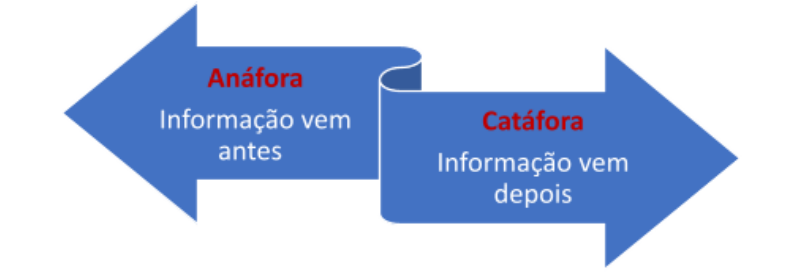
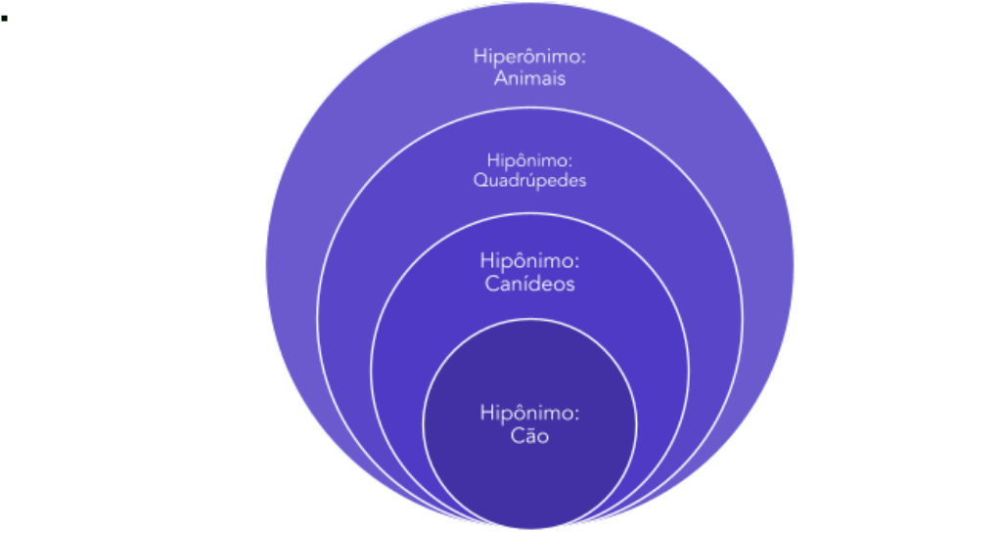
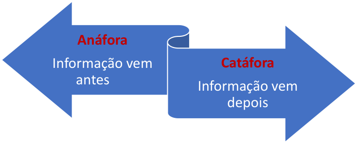
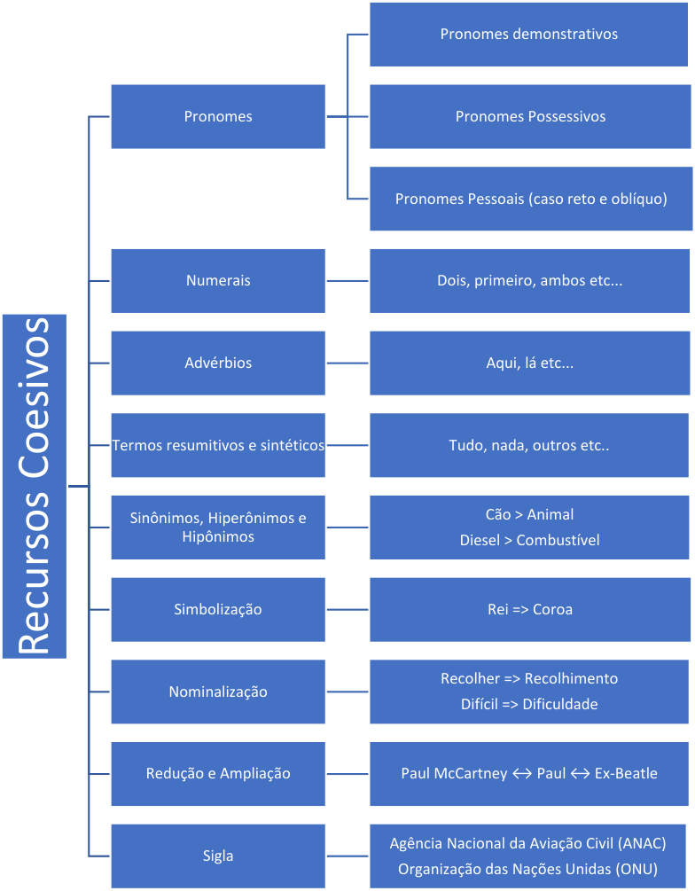
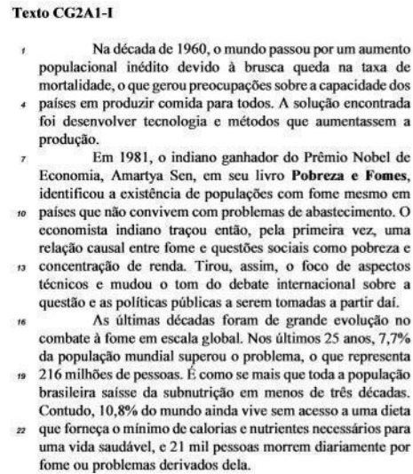
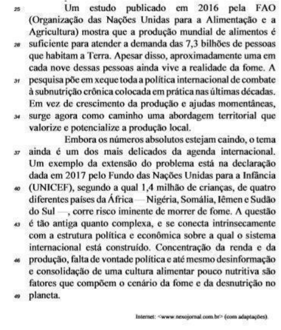

---
fonte_pdf: "Português - Aula 09.pdf"
paginas: 91
conversao: texto-e-imagens
---

<!-- pagina: 2 -->

**Equipe Português Estratégia Concursos, Felipe Luccas Aula 09** 

# **Índice** 

|........................................................................................................................................ 1) Noções Iniciais de Coesão e Coerência|...................................................... 3|
|---|---|
|........................................................................................................................................ 2) Coesão Textual|...................................................... 4|
|........................................................................................................................................ 3) Coerência|...................................................... 20|
|........................................................................................................................................ 4) Reescritura|...................................................... 21|
|........................................................................................................................................ 5) Resumo - Coesão, Coerência e Reescritura|...................................................... 24|
|........................................................................................................................................ 6) Questões Comentadas - Coesão e Coerência - FGV|...................................................... 26|
|........................................................................................................................................ 7) Lista de Questões - Coesão e Coerência - FGV|...................................................... 69|

---

<!-- pagina: 3 -->

**Equipe Português Estratégia Concursos, Felipe Luccas Aula 09** 

# **CONSIDERAÇÕES INICIAIS** 

Fala, meus jovens! Aqui é o professor Luiz Felipe. Você certamente já percorreu um longo caminho até chegar neste ponto do conteúdo... ENTÃO VAMOS COM TUDO!!! Neste livro, vamos trabalhar questões de coesão e coerência, ou seja, questões que envolvem valor semântico de conectivos, referenciação (anáfora e catáfora) e progressão textual. 

Além disso, abordaremos um assunto de extrema relevância para a sua prova: a reescritura de frases. Na prática, a maioria das questões de gramática são de "análise de redação de trechos e reescrita", ou seja, são de transformação e equivalência de estruturas. Quando se pede a troca de uma expressão por outra, inserção ou supressão de um acento, de uma vírgula, de uma palavra, tudo isso é questão de reescritura. O que varia é apenas o objeto da análise: ortografia, vocabulário, verbo, concordância, regência, conjunção, sintaxe, pontuação... 

Não é possível abordar em uma única aula toda a teoria de reescritura, pois, em uma questão assim, qualquer conteúdo de Língua Portuguesa pode aparecer. No entanto, precisamos estar atentos a alguns pontos, e são esses pontos que vamos destacar nesta aula. 

#### **_<u>@luizfelipedu rval</u>_**

---

<!-- pagina: 4 -->

**Equipe Português Estratégia Concursos, Felipe Luccas Aula 09** 

# **COESÃO TEXTUAL** 

Quando ler a palavra **coesão** , pense essencialmente na **“ligação”** entre palavras e partes do texto. A coesão também se refere à **retomada e adiantamentos de elementos e informações do texto por meio de palavras** coesivas ou artifícios textuais. 

Portanto, há dois tipos de coesão: 

**Coesão referencial** é aquela em que os recursos são utilizados para evitar repetições dentro do texto. Ela trabalha na base da retomada ou da antecipação de informações. São utilizadas inúmeras estratégias, como a reescritura (paráfrase), os pronomes, os advérbios e outras palavras remissivas. 

**Coesão sequencial** é responsável por estabelecer nexos (conexões) entre palavras, frases e parágrafos, com a finalidade de dar continuidade e lógica à estrutura de um texto. São utilizados as conjunções, as preposições e os pronome relativos, que dão sequência ao texto e estabelecem relações de “antes e depois”, “causa e consequência”. 

Embora os elementos utilizados para a coesão sejam geralmente palavras, até mesmo **a omissão de termos** pode ser utilizada como artifício de coesão. 

## **Coesão Anafórica x Coesão Catafórica** 

A coesão estabelece relação entre partes do texto. Quando o mecanismo de coesão retoma um termo ou informação que veio **antes** dele, diz-se que há coesão **anafórica** . 

Quando “anuncia” um termo ou informação que aparecerá **depois** , diz-se que há coesão **catafórica** . 

Isso tudo está detalhado na função referencial dos pronomes demonstrativos. 

Ex: **Estudo todo dia. Isso** faz a diferença. (anafórico) 

Ex: Desejo **isto** diariamente: **ser aprovado logo** . (catafórico) 

## **Referências Fora do Texto: Exofórica/Dêitica** 

Quando os elementos coesivos se referem a elementos fora do texto, como tempo e espaço, a gramática diz que eles têm função **dêitica** , ou **exofórica** (fora).

---

<!-- pagina: 5 -->

**Equipe Português Estratégia Concursos, Felipe Luccas Aula 09** 

**Ex** : Esse texto foi escrito **aqui** (aqui onde? Esse sentido dependerá de onde foi escrito. Essa localização é um elemento externo ao texto, fora dele.) 

Esse texto foi escrito aqui. 

Aqui onde? Esse sentido dependerá de onde foi escrito. 

Vamos almoçar amanhã. 

Que dia é amanhã? Depende de que dia é tomado como referência no momento da escrita. 

O Rio de Janeiro anda muito violento, quem poderá nos ajudar? 

“nos” se refere a “nós”, mas quem é esse “nós”? 

Perceba que as três referências (“aqui”, “amanhã” e “nós”) estão fora do texto. 

## **Coesão Referencial** 

Parafraseando Agostinho Dias Carneiro1 , um bom texto se articula fundamentalmente com repetição de ideias ( **coesão** ) e com apresentação de informação nova ( **progressão** ). Um texto que só repete é redundante; um texto que só apresenta novidade, sem dialogar com o que já foi dito, é incoerente. 

A repetição de ideias é muitas vezes necessária para o desenvolvimento linear de um texto. Porém, a repetição excessiva de palavras pode tornar um texto problemático. Nesse sentido, os mecanismos de coesão vão oferecer alternativas para a retomada de ideias sem a repetição viciosa das mesmas palavras. 

> 1 _In_ “Redação em construção: a escritura do texto”. São Paulo: Moderna, 1997.

---

<!-- pagina: 6 -->

**Equipe Português Estratégia Concursos, Felipe Luccas Aula 09** 

#### Veremos aqui algumas estratégias para evitar repetição <u>viciosa.</u> 

Essas técnicas são fundamentais para: 

- ✔ identificar **paráfrases** em questões de interpretação e reescrituras. 

- ✔ Desenvolver o texto em eventual **prova discursiva** . 

## **Uso de Pronomes** 

O pronome serve exatamente para isto: retomar e substituir um nome. Então, essa deve ser uma das técnicas mais intuitivas para evitar repetição. 

- Ex: **Meu pai** era um gênio, mas nunca **o** reconheceram. 

- Ex: **O leão** foi sacrificado. **Ele** não teve a menor chance. 

- Ex: Ninguém vencia **Silvério** na sinuca quando **ele** estava inspirado. 

- Ex: O **livro** que comprei é **esse** . 

- Ex: Ninguém tem uma **força de vontade** maior que a **sua** . 

- Ex: Ela deve **seu** sucesso ao estudo. 

- Ex: **Isto** é o atalho para ser aprovado: **estudar, revisar, fazer questões** . 

- Ex: Entre as **camisas** , comprei a **que** era mais cara. 

- Ex: O **menino** , **que** era estrábico, tinha excelente pontaria. 

- Ex: A vida de **concurseiro** é difícil. **Muitos** desistem, **alguns** logo no início. 

O **artigo definido** também pode ser usado como referência a termo citado. 

Nesse caso, o artigo definido vai indicar que o termo mencionado já é conhecido, por ter já aparecido antes no texto: 

**os** Lá na praça, havia vários policiais. Os assaltantes, quando chegaram, não viram policiais ali (“policiais” já foi citado no texto e já é um termo conhecido pelo leitor).

---

<!-- pagina: 7 -->

**Equipe Português Estratégia Concursos, Felipe Luccas Aula 09** 

#### **(IBGE / 2022)** 

Na frase “Para salvar os búfalos, a melhor coisa que podemos fazer é comê-los. Os animais que o ser humano come não se extinguem. É por isso que temos mais galinhas que águias nos Estados Unidos”. 

Nessa frase, há cinco termos sublinhados que se referem a outros elementos da mesma frase. Assinale a opção em que a referência que está erradamente indicada. 

(A) a melhor coisa / comer os animais. 

- (B) los / os búfalos. 

- (C) animais / os búfalos. 

- (D) que / animais. 

- (E) isso / os animais que o ser humano come não se extinguem. 

#### **Comentários:** 

Questão de coesão com pronomes e outros recursos. No segundo período, "animais" não retoma "búfalos", na verdade remete aos animais que o ser humano come, como se exemplifica logo adiante com as "galinhas". As demais referências estão corretas e autoevidentes. 

Gabarito letra C. 

#### **(MP-CE / 2020)** 

Desde os alvores da democracia ateniense, são sobejamente conhecidas as suas relações com a argumentação e a retórica. Porém, tal como a retórica e a argumentação podem ser postas ao serviço da mentira e da manipulação, também em relação à liberdade de expressão se coloca a questão dos seus limites. 

A expressão “suas relações” refere-se às relações da “democracia ateniense”. 

#### **Comentários:** 

“suas” é pronome possessivo e sugere a pergunta: “relação de quem”? “relação do que com a argumentação”? 

Aqui temos a relação “da democracia ateniense” com a retórica e a argumentação. 

Desde os alvores da **democracia ateniense** , são sobejamente conhecidas as **suas** relações com a argumentação e a retórica... Questão correta. 

#### **(PGE-PE / 2019)**

---

<!-- pagina: 8 -->

**Equipe Português Estratégia Concursos, Felipe Luccas Aula 09** 

Raras vezes na história humana, o trabalho, a riqueza, o poder e o saber mudaram simultaneamente. Quando isso ocorre, sobrevêm verdadeiras descontinuidades que marcam época, pedras miliares no caminho da humanidade. A invenção das técnicas para controlar o fogo, o início da agricultura e do pastoreio na Mesopotâmia, a organização da democracia na Grécia, as grandes descobertas científicas e geográficas entre os séculos XII e XVI, o advento da sociedade industrial no século XIX, tudo isso representa saltos de época, <u>que desorientaram</u> gerações inteiras. 

Na linha 6, o vocábulo “que” retoma o termo “saltos de época”. 

#### **Comentários:** 

Sim, pois são os “saltos de época” que desorietaram gerações inteiras: 

o advento da sociedade industrial no século XIX, tudo isso representa saltos de época, **que** desorientaram gerações inteiras. O pronome relativo é usado justamente para evitar a repetição. 

o advento da sociedade industrial no século XIX, tudo isso representa saltos de época, **saltos de época** desorientaram gerações inteiras. Questão correta. 

## **Coesão com pronomes demonstrativos** 

Por serem importantíssimos macanismos de coesão, relembramos aqui os aspectos semânticos do uso referencial dos pronomes demonstrativos. 

**Pronomes demonstrativos** apontam, isto é, demonstram a posição dos elementos a que se referem no tempo, no espaço e no texto. 

#### **Tempo:** 

- ✔ **este(s), esta (s), isto:** indicam **tempo presente** , período corrente 

   - **Ex:** Este domingo vai ter jogo do Barcelona. 

   - **Ex:** Neste verão viajarei para o Caribe. 

- ✔ **esse(s), essa (s), isso:** indicam **passado recente** ou **futuro próximo** 

   - **Ex:** Esse domingo haverá jogo do Barcelona. 

   - **Ex:** Nesse verão sofri demais com o calor. 

- ✔ **aquele(s), aquela (s), aquilo: indicam  passado** ou **futuro distante** 

   - **Ex:** Aquela década de 70 foi completamente perdida. 

   - **Ex:** Aquele intercâmbio que faremos em 10 anos será caríssimo. 

#### **Espaço:** 

- ✔ **este(s), esta (s), isto:** apontam para referente **perto do falante** 

   - **Ex** : Este violão aqui na minha mão é de madeira maçiça. 

   - **Ex** : Estes meus cabelos estão uma verdadeira palha. 

- ✔ **esse(s), essa (s), isso:** apontam para **perto do ouvinte**

---

<!-- pagina: 9 -->

**Equipe Português Estratégia Concursos, Felipe Luccas Aula 09** 

**Ex** : Esse violão aí na sua mão é de madeira maciça. 

**Ex** : Isso é roupa que se vista num casamento? Troque-a já! 

- ✔ **aquele(s), aquela (s), aquilo:** apontam para **longe do falante/ouvinte** 

**Ex** : Aquela pintura lá em cima é um afresco. 

**Ex** : Aquilo não é um pássaro, nem um avião; é só um balão caindo. 

Quando apontam para o **espaço** , o referente está fora do texto, então dizemos que o pronome tem uso “dêitico”. 

#### **Texto:** 

- ✔ **este(s), esta (s), isto:** apontam ao que **será mencionado** (anuncia) 

**Ex** : Esta é sua nova senha: ynot.xp$%; memorize-a. 

   - Ex: **Isto** era importante para ela: dinheiro, sucesso, prestígio. 

- ✔ **esse(s), essa (s), isso:** apontam para o que **já foi mencionado** 

   - **Ex: João** passou em primeiro lugar, **esse** cara é bom. 

**Ex** : **Dinheiro, sucesso, prestígio** , **isso** tudo é sim importante (resumitivo). 

- ✔ **aquele(s), aquela (s), aquilo** : apontam para o **antecedente mais distante** , enquanto **este** aponta para o **mais próximo:** 

**Ex** : **João** e **Maria** são concursados, **esta** do Bacen, **aquele** do TCU. 

**Ex** : Aquilo não é um pássaro, nem um avião; é só um balão caindo. 

Entre **três** seres mencionados no texto, **este** se refere ao mais próximo, ao **último** ; **aquele** se refere ao mais distante, ao **primeiro** . 

Nesse caso, recomenda-se o uso de numerais: o primeiro, o segundo, o terceiro. Fique atento. 

**Xuxa** , Pelé e **Senna** são famosos. **A primeira** é a rainha dos baixinhos, o segundo é o rei do futebol e **o terceiro** foi o maior piloto brasileiro. 

---

<!-- pagina: 10 -->

**Equipe Português Estratégia Concursos, Felipe Luccas Aula 09** 

#### **(PRF / 2019)** 

As atividades pertinentes ao trabalho relacionam-se intrinsecamente com a satisfação das <u>necessidades dos seres humanos</u> — alimentar-se, proteger-se do frio e do calor, ter o que calçar etc. Estas colocam os homens em uma relação de dependência com a natureza, pois no mundo natural estão os elementos que serão utilizados para atendê-las. 

As formas pronominais “Estas” (ℓ.2) e “las” (ℓ.4) referem-se a “necessidades dos seres humanos” (ℓ.1-2). 

#### **Comentários:** 

Sim, “ **estas** ” foi usado anaforicamente para retomar “necessidades dos seres humanos”, pois são as necessidades que colocamos homens.... 

“atende-l **as** ” = atender **as necessidades dos seres humanos** 

Antes que alguém pergunte: “estas pode ser anafórico?”. Pode sim! Basta que esteja retomando algo que apareceu antes. Ser anafórico quer dizer essencialmente “retomar informação anterior”. Questão correta. 

#### **(STM / 2018)** 

Aqui, neste escritório onde a verdade não pode ser mais do que uma cara sobreposta às infinitas máscaras variantes, estão os costumados dicionários da língua e vocabulários, os Morais e Aurélios, os Morenos e Torrinhas, algumas gramáticas, o Manual do Perfeito Revisor, vademeco de ofício [...]. 

Na linha 1, o emprego de “neste” decorre da presença do vocábulo “Aqui”, de modo que sua substituição por **nesse** resultaria em incorreção gramatical. 

#### **Comentários:** 

Aqui, temos o pronome demonstrativo fazendo referência espacial, um tipo de referência exofórica, a elemento exterior ao texto. 

O autor fala em primeira pessoa, em referência ao próprio escritório em que está, o escritório próximo. Então, a forma correta é “neste”.  O pronome “nesse” faria referência a um escritório próximo de quem ouve. Correto. 

## **Uso de numerais** 

Vamos relembrar o uso dos numerais como recurso coesivo por meio de exemplos. 

**Ex** : Eu e minha esposa fomos lá. Nós **dois** detestamos a comida. 

- "Nós dois” retoma “eu e minha esposa”. 

**Ex** : João e José foram ao shopping. O **primeiro** foi comprar charutos; o **segundo** foi comprar discos de vinil. 

O numeral “primeiro” se refere ao termo mais distante “João”; “segundo” se refere a

---

<!-- pagina: 11 -->

**Equipe Português Estratégia Concursos, Felipe Luccas Aula 09** 

quem apareceu por último, “José”. 

**Ex** : Comprei um fogão e uma geladeira. **Ambos** deram defeito. 

Ambos é considerado numeral e retoma “fogão” e “geladeira”. 

## **Uso de advérbios** 

Da mesma forma que fizemos com os numerais, vamos relembrar o uso dos advérbios como recurso coesivo por meio de exemplos. 

**Ex** : Estamos no Brasil; muita gente considera fraude esperteza **aqui** . 

- “Aqui” faz coesão anafórica com lugar que apareceu antes: “Brasil”. 

**Ex** : Sinto saudades de **lá** ; a Califórnia é muito bela! 

“Lá” faz coesão catafórica com o lugar que aparecerá depois: “Califórnia”. 

## **Termos resumitivos e sintéticos** 

Algumas palavras, como pronomes indefinidos, tem o poder de sintetizar e resumir um grupo de elementos. 

**Ex** : Estudar, revisar, fazer questões: **tudo isso** é indispensável. 

- “Tudo isso” retoma “Estudar, revisar, fazer questões”. 

**Ex** : João, Jose, Manoel e Joaquim vieram. **Os outros** faltaram. 

- “Os outros” de refere a quem não veio, pessoas não mencionadas por nome. 

**Ex** : Acordo às 6h, vou para a faculdade, depois para a natação. Ao final do dia, pego as crianças no colégio, antes de ir para o curso de inglês. No dia seguinte, repito **a rotina** . 

O termo “a rotina” sintetiza toda a sequência de ações habituais mencionada. 

---

<!-- pagina: 12 -->

**Equipe Português Estratégia Concursos, Felipe Luccas Aula 09** 

#### **(PGE-PE / 2019)** 

Raras vezes na história humana, o trabalho, a riqueza, o poder e o saber mudaram simultaneamente. Quando isso ocorre, sobrevêm verdadeiras descontinuidades que marcam época, pedras miliares no caminho da humanidade. A invenção das técnicas para controlar o fogo, o início da agricultura e do pastoreio na Mesopotâmia, a organização da democracia na Grécia, as grandes descobertas científicas e geográficas entre os séculos XII e XVI, o advento da sociedade industrial no século XIX, **<u>tudo isso</u>** representa saltos de época, que desorientaram gerações inteiras. 

A expressão “tudo isso” (L.5) retoma, por coesão, todos os termos que a precedem no período. 

#### **Comentários:** 

Sim. Esse é um termo “resumitivo”, sintetiza toda a lista anterior: **A invenção das técnicas para controlar o fogo, o início da agricultura e do pastoreio na Mesopotâmia, a organização da democracia na Grécia, as grandes descobertas científicas e geográficas entre os séculos XII e XVI, o advento da sociedade industrial no século XIX.** Questão correta. 

#### **(PREF. SÃO LUÍS (MA) / 2017)** 

Canção do exílio Minha terra tem palmeiras, Onde canta o Sabiá; As aves, que aqui gorjeiam, Não gorjeiam como lá. Nosso céu tem mais estrelas, Nossas várzeas têm mais flores, Nossos bosques têm mais vida, Nossa vida mais amores. Em cismar, sozinho, à noite, Mais prazer encontro eu lá; Minha terra tem palmeiras, Onde canta o Sabiá. 

Minha terra tem primores, Que tais não encontro eu **<u>cá</u>** <u>;</u> Em cismar, sozinho, à noite, Mais prazer encontro eu **<u>lá</u>** <u>;</u> Minha terra tem palmeiras, Onde canta o Sabiá. Não permita Deus que eu morra, Sem que volte para lá; Sem que desfrute os primores Que não encontro por cá; Sem qu’inda aviste as palmeiras, Onde canta o Sabiá.

---

<!-- pagina: 13 -->

**Equipe Português Estratégia Concursos, Felipe Luccas Aula 09** 

Gonçalves Dias. Poesia. Coleção “Nossos Clássicos”. São Paulo, Agir, 1969 

Na terceira estrofe do texto 10A1BBB, os vocábulos “cá” e “lá” são elementos anafóricos. 

#### **Comentários:** 

Pela leitura do texto, sabemos que “Cá” se refere ao local onde o poeta está, um lugar longe de sua terra natal (minha terra). O advérbio “Lá”, portanto, indica a terra natal do poeta. Todo texto se constroi nesse parelelo entre seu local atual e sua terra natal, da qual sente saudades. 

Em termos técnicos, “Cá” e “Lá” referem-se a elementos espaciais externos ao texto, então temos referência exofórica, dêitica. Questão incorreta. 

## **Sinônimos, Hiperônimos e Hipônimos** 

São palavras de **sentido amplo** que indicam, em termos semânticos, um conjunto abrangente de elementos, um “gênero”. Esse “gênero” tem unidades menores, “espécies” (hipônimos), que fazem parte daquele conjunto maior. 

O conceito de hipônimo decorre da explicação acima. Trata-se de um elemento com sentido mais específico, contido em um grupo maior, ou seja, de uma **espécie contida em um gênero** . 

**Ex:** Meu cão era bipolar. O **animal** às vezes atacava sem razão. 

“Animal” é hiperônimo de “cão”, pois o “cão” pertence ao conjunto “animais”. 

**Ex** : Tive um carro a diesel e achava barato o **combustível** . 

“Combustível” é hiperônimo de “diesel”, pois “diesel” pertence ao conjunto “combustíveis”.

---

<!-- pagina: 14 -->

**Equipe Português Estratégia Concursos, Felipe Luccas Aula 09** 

Uma outra técnica muito utilizada é a substituição de um nome próprio por um comum ou vice-versa. Geralmente consiste em aludir uma pessoa por uma característica que a distinga. Esta técnica se chama substituição por **antonomásia** . Calma, o nome é feio, mas é simples. 

**Bono Vox** e **Ivete Sangalo** estão namorando. **O roqueiro** foi visto saindo de um restaurante com a **beldade** . Indagada, a **baiana** negou estar em um relacionamento com o I **rlandês** . No entanto, os artistas foram vistos juntos muitas outras vezes. 

“Bono Vox” é um nome próprio e foi retomado várias vezes por nomes comuns, como “roqueiro”, “irlandês”, “artista”. 

Já “Ivete” foi aludida como “beldade”, “baiana”, “artista”. 

Não precisa gravar o nome, mas a técnica é fundamental!!! 

#### **(PGE-PE / 2019)** 

É como se você tivesse baixado algum software e ele te solicitasse assinar um contrato com dezenas de páginas em “juridiquês”; você dá uma olhada nele, passa imediatamente para a última página, tica em “concordo” e esquece o assunto. 

No trecho “tica em ‘concordo’” (L.2-3), o verbo **ticar** é sinônimo de **clicar** , mas difere deste por ser de uso informal. 

#### **Comentários:** 

Sim, “ticar” vem do inglês “to tick”, que significa justamente clicar numa caixinha virtual para aceitar, ou marcar um sinal de concordância, um “tique”, um x, um visto ou algo assim. No caso, “ticar” é clicar para aceitar o contrato. Ticar é uma palavra oficial, não é considerada de uso informal. Questão incorreta.

---

<!-- pagina: 15 -->

**Equipe Português Estratégia Concursos, Felipe Luccas Aula 09** 

#### **(MPU / 2018)** 

A impossibilidade de manter silêncio sobre um assunto é uma observação que pode ser feita a respeito de muitos casos de **patente** injustiça que nos enfurecem de um modo até difícil de ser capturado por nossa linguagem. 

Na linha 2, o adjetivo patente tem um significado de impressionante. 

#### **Comentários:** 

Tem um significado de **evidente, óbvio, flagrante** . Questão incorreta. 

## **Simboliza ão** **<u>ç</u>** 

Consiste em substituir uma entidade por um símbolo que a represente. 

**Ex** : **O Rei** era autoridade máxima. A verdade da **Coroa** sempre prevalecia. 

**Ex** : **A Cruz de Malta** cobriu as arquibancadas. Torcedores **vascaínos** ocuparam 80% dos assentos. 

## **Nominaliza ão** **<u>ç</u>** 

Basicamente, é substituir um adjetivo ou verbo por substantivo ou uma forma nominal. 

- **Ex** : **Recolheram** os impostos. Esse **recolhimento** foi menor que o ano passado. 

- **Ex** : As provas são **difíceis** hoje em dia. Essa **dificuldade** também envolve o fator tempo. 

**Ex** : Muito se **discutiu** sobre a polêmica. Esse constante **debater** do tema é cansativo para os envolvidos. 

## **Redução e Ampliação** 

Uma técnica muito utilizada é a redução, ou seja, usar uma forma mais longa do termo e alternar com formas mais curtas. 

- **Ex** : **O compositor Paul McCartney** virá ao Brasil em 2017. 

**Paul McCartney** já esteve no país em outras ocasiões. 

**O compositor** ama o público Brasileiro. 

**McCartney** tem inclusive diversos amigos aqui. 

**Paul** ainda não informou a data de sua passagem. 

Também poderia ser chamado de “o ex-Beatle”, “o músico”, “o artista”, “o cantor”... 

## **Sigla** 

Técnica muito importante em discursivas. 

**<u>Primeiro</u> se usa o nome por extenso** , seguido pela sigla entre parênteses. A partir daí, pode-se usar a sigla no lugar do nome completo. 

**Não** se deve usar a sigla antes de o nome completo aparecer no texto.

---

<!-- pagina: 16 -->

**Equipe Português Estratégia Concursos, Felipe Luccas Aula 09** 

**Ex** : A <u>Agência Nacional da Aviação Civil</u> ( **ANAC** ) divulgou hoje o resultado provisório da prova discursiva. Milhares visitaram o site da **ANAC** hoje. 

## **Coesão por justaposição de orações** 

Como vimos, pode haver “coesão” mesmo sem palavra ou conector “explícito”: quando há uma relação clara entre partes do texto, ainda que não tenham sido “materializadas” por uma palavra. 

Essa ligação coesa também opera por simples justaposição (inserção de unidades juntas, uma do lado da outra) de sentenças. 

Então, no lugar de um conector poderá vir apenas um sinal de pontuação ( **: ; , .** ) 

- Ex: Tenho que sair agora **:** estou atrasado. ==5460== 

- Ex: tenho que sair agora, **porque** estou atrasado 

Poderíamos trocar os dois-pontos por uma conjunção que retomasse a relação de **explicação** que existe entre as sentenças. 

Ex: Estudou tanto **;** não passou. 

- Ex: Estudou tanto, **mas** não passou. 

Novamente, como a relação lógica entre as orações justapostas é de oposição, podemos substituir o ponto e vírgula por um elemento coesivo “adversativo”. 

Nesses casos, cabe ao leitor interpretar a relação de sentido e pensar na conjunção adequada ao contexto. 

#### **(SEFAZ-RS / 2019 - Adaptada)** 

Pixis foi um músico medíocre, mas teve o seu dia de glória no distante ano de 1837. 

Em um concerto em Paris, Franz Liszt tocou uma peça do (hoje) desconhecido compositor, junto com outra, do admirável, maravilhoso e extraordinário Beethoven (os **<u>adjetivos</u>** aqui podem ser verdadeiros, mas — como se verá — relativos). A plateia, formada por um público refinado, culto e um pouco bovino, como são, sempre, os homens em ajuntamentos, esperava com impaciência. 

No segundo parágrafo do texto 1A11-I, o termo “adjetivos” remete às palavras “admirável”, “maravilhoso” e “extraordinário”.

---

<!-- pagina: 17 -->

**Equipe Português Estratégia Concursos, Felipe Luccas Aula 09** 

#### **Comentários:** 

Questão direta. O termo geral “adjetivos” inclui todas as qualidades atribuídas a Beethoven. Temos um termo geral “adjetivos”, que inclui: admirável, maravilhoso, extraordinário... 

Esses adjetivos atribuídos a ele são chamados de “relativos” justamente porque a peça tocada, na verdade, era de um outro compositor, considerado “medíocre”. Questão correta 

Em um concerto em Paris, Franz Liszt tocou uma peça do (hoje) desconhecido compositor, junto com outra, do **<u>admirável, maravilhoso e extraordinário</u>** <u>Beethoven (os</u> **adjetivos** aqui podem ser verdadeiros, mas — como se verá — relativos). A plateia, formada por um público refinado, culto e um pouco bovino, como são, sempre, os homens em ajuntamentos, esperava com impaciência. 

#### **(PREF. SÃO CRISTÓVÃO (SE) / 2019)** 

De tanto pegadio com o neto, até nos menores que fazeres fora de hora meu avô me queria com a cara metida nas coisas que as suas mãos manejavam. Era o seu jeito mais congruente de me passar o afeto calado de sua companhia, e ao mesmo tempo me adestrar na sabedoria que apanhara dos antepassados rurais: pequenos conhecimentos cristalizados em hábitos recorrentes que eram exercidos todos os dias no amanho da terra e no cultivo dos animais, com a entranhada naturalidade de quem já nasceu posseiro de seus segredos e de sua magia. Além de lavrar no Engenho Murituba os bens de consumo que abasteciam a sua gente, meu avô ainda tinha o domínio razoável de todos os pequenos ofícios necessários ao bom andamento de sua produção. Francisco J. C. Dantas. Coivara da memória. São Paulo: Estação Liberdade, 1991, p. 174 

As formas pronominais presentes em “seu jeito” (L.3) e “sua companhia” (L.4) têm como referente “meu avô” (L.2). 

#### **Comentários:** 

Retomando o trecho do texto, temos que 

"De tanto pegadio com o neto, até nos menores que fazeres fora de hora **meu avô** me queria com a cara metida nas coisas que as suas mãos manejavam. Era o **seu jeito** mais congruente de me passar o afeto calado de **sua companhia,** (...)". 

Perceba que os pronomes possessivos “seu” e “sua” indicam posse, retomando “avô”: "seu jeito" = jeito do avô; "sua companhia" = companhia do avô. Questão correta. 

## **Coesão sequencial** 

Conforme estudamos, a coesão estabelece o fluxo de leitura do texto. Vamos ver nesse momento as estratégias utilizadas para dar “sequência” a um texto, adicionando novas orações, novos trechos, ordenando logicamente a estrutura de suas partes, de modo que haja “continuidade” coesa e coerente, isto é, de modo que haja **progressão textual** . 

O maior instrumento desse tipo de coesão são os “conectivos”, especialmente a **conjunção.** 

Por exemplo, se uma oração se inicia por “mas”, já se subentende uma continuidade de algo que foi dito antes, em outra oração, e que vai sofrer uma oposição agora. 

**Ex: mas** Eu gosto de esportes, não pratico nenhum.

---

<!-- pagina: 18 -->

**Equipe Português Estratégia Concursos, Felipe Luccas Aula 09** 

Esse, “mas” tanto dá sequência ao texto quanto retoma uma informação anterior para quebrar a expectativa gerada por ela. Esse “movimento” do texto é que dá continuidade coesa a ele. 

Se iniciarmos uma oração por “portanto”, vamos dar continuidade ao texto anunciando que o que será dito decorre das informações anteriores, isto é, é conclusão do que foi apresentado. 

Se um parágrafo se inicia com “por outro lado”, sabemos que há outro com “o primeiro lado”. 

Se a oração se inicia com um pronome anafórico como “esse”, “desse”, “isso”, sabemos que há informação anterior. 

Pessoal, o que eu quero dizer aqui é que certas palavras, especialmente as conjunções, fazem o texto avançar em relação ao que foi dito. 

Esse conhecimento é essencial para a interpretação de texto, pois essas relações de “progressão” e “retomada” não são gratuitas: elas são propositais e servem para que o autor transmita sua mensagem, sua tese, sua informação. 

A melhor maneira de entender isso é vendo na prática, em uma questão que cobra essa percepção de “continuidade” e “sequência coesa”. Nem todas as Bancas cobram diretamente dessa forma, com essa nomenclatura, mas esse tipo de exercício é perfeito para aprender a identificar a progressão de um texto. 

#### **(PGE-PE /  2019)** 

Ela fazia um para cada dia da semana, assim, eu podia me esbaldar e me sujar à vontade, porque sempre teria um macacão limpo para usar no dia seguinte. 

A substituição do conectivo “porque” por pois manteria os sentidos originais do texto. 

#### **Comentários:** 

Sim, o “pois” assume valor causal, sendo equivalente a “porque”. Questão correta. Então, saber os conectivos equivalentes é também uma questão de semântica. 

#### **(SEFAZ-RS / 2019 - Adaptada)** 

O direito tributário brasileiro depara-se com grandes desafios, principalmente em tempos de globalização e interdependência dos sistemas econômicos. Entre esses pontos de atenção,

---

<!-- pagina: 19 -->

**Equipe Português Estratégia Concursos, Felipe Luccas Aula 09** 

destacam-se três. O primeiro é a guerra fiscal ocasionada pelo ICMS. O principal tributo em vigor, atualmente, é estadual, o que faz contribuintes e advogados se debruçarem sobre vinte e sete diferentes legislações no país para entendê-lo. **Isso se tornou um atentado contra o princípio de simplificação** , contribuindo para o incremento de uma guerra fiscal entre os estados, que buscam alterar regras para conceder benefícios e isenções, a fim de atrair e facilitar a instalação de novas empresas. 

No texto 1A1-I, o pronome que inicia o trecho “Isso se tornou um atentado contra o princípio de simplificação” (L. 5) remete à crítica do autor à recorrência das mesmas regras tributárias em “vinte e sete diferentes legislações no país” (L. 4). 

#### **Comentários:** 

O pronome “isso” geralmente não retoma um termo específico, mas sim todo um grupo de ideias: o conteúdo de uma oração, de um período, um parágrafo... 

No caso, recupera a ideia contida em: 

O principal tributo em vigor, atualmente, é estadual, o que faz contribuintes e advogados se debruçarem sobre vinte e sete diferentes legislações (26 estados mais o DF) no país para entendê-lo. 

Em suma, “isso” é a coexistência de muitas legislações, fato que dificulta a simplificação, ou seja, retoma as informações, e não uma crítica do autor. Questão incorreta.

---

<!-- pagina: 20 -->

**Equipe Português Estratégia Concursos, Felipe Luccas Aula 09** 

# **COERÊNCIA** 

A coerência observa as relações de sentido e lógica que um texto oferece. O texto tem uma lógica própria, arquitetada pelo autor. 

Quando se fala em sequência lógica das ideias, refere-se a um tipo específico de coerência, que é a **coerência interna** . A coerência interna está ligada ao conjunto de ideias e à articulação dos argumentos utilizados pelo autor para a construção do texto. Diz respeito às partes do texto. 

O outro tipo de coerência é a **coerência externa** . A coerência externa consiste na ligação do texto ao contexto, ou seja, as ideias expostas não podem contrariar a realidade que se apresenta, a história, os dados da realidade. 

Você não tem que necessariamente concordar com aquele sentido, mas deve ser capaz de ver a relação de lógica que se tenta construir ali. 

A coerência se constrói pela manutenção da **expectativa** que o uso de certas palavras traz ao leitor. Nesse sentido, a **contradição gera incoerência** . 

Vejamos alguns exemplos: 

**Ex:** Nós temos que tomar medidas urgentes, imediatas e drásticas para resolver o problema da educação. Portanto, é fundamental que paremos para pensar, sem pressa, e formemos comissões para estudos e estratégias de longo prazo. 

Observe que o texto se inicia com tom de “urgência” e “imediatismo” e prossegue com um tom de “calma”. Há visível contradição entre “urgente” e “sem pressa” e “longo prazo”. 

Esse é um texto incoerente, contraditório. 

**Ex:** Aquela menina sempre foi a mais dedicada da classe. Estudou com muito afinco e disciplina para o concurso e, mesmo assim, foi aprovada. 

Observe que a conjunção concessiva “mesmo assim” quebra a expectativa criada antes, pois, após a conjunção, cria-se a expectativa de que ela não passou. 

É incoerente usar um sentido de concessão para algo que seguiu o efeito esperado sem obstáculos. A conjunção coerente aqui seria uma conclusiva (“logo”, “portanto”). 

**Ex:** Todos me odeiam, mas ninguém gosta de mim. 

Novamente, há incoerência, pois foi usada uma conjunção adversativa (“mas”), que indica contraste e oposição, para relacionar partes que tem o mesmo sentido. Se não há oposição, não é lógico usar uma conjunção adversativa. 

**Qualquer** tipo de **contradição** gera **incoerência** , seja temporal, argumentativa, espacial, de nível de formalidade... Fique atento!

---

<!-- pagina: 21 -->

**Equipe Português Estratégia Concursos, Felipe Luccas Aula 09** 

# **REESCRITURA** 

Muitos de vocês têm dificuldade em analisar apenas o que está sendo pedido no comando de questão em que há propostas de reescritura de trechos. Há questões que pedem para que seja analisada a manutenção da **correção gramatical** ; outras pedem para que se analise a manutenção do **sentido** original do texto; e há ainda aquelas que pedem para analisar a **coerência** . 

Na maior parte das questões, o que encontramos é um conjugado de dois desses tópicos: gramática e sentido, sentido e coerência, gramática e coerência. Nessa hora, surgem muitas dúvidas: o que a Banca quer de mim? O que eu preciso analisar em uma questão como essa? Erro gramatical implica incoerência? Mudança de sentido implica erro gramatical? Fiquem calmos! Vamos esclarecer todos esses pontos para vocês. 

Antes de qualquer coisa, ‘sentido’ e ‘coerência’ **NÃO** são palavras sinônimas! Portanto, cada uma te orientará para um tipo de análise. 

Mudança de sentido não resulta necessariamente em um texto incoerente; pode haver mudança de sentido e o texto continuar coerente. Então, o que seria mudança de sentido? 

Se no texto original há uma relação lógica de **adição** (ex.: Os alunos estudaram **e** não jogaram bola), e na proposta a relação estabelecida é de **oposição** (ex.: Os alunos estudaram, **mas** não jogaram bola), podemos dizer que aí houve mudança de sentido. A reescritura está incoerente? Não! 

Em questões que pedem a análise de sentido, você precisa ficar atento a quatro pontos: 

- uso de palavras sinônimas 

- relação de sentido estabelecida pelos conectivos (preposições e conjunções) 

- tempo e modo verbais (mudança de tempo e modo geralmente altera o sentido original) 

- orações adjetivas: mudança de uma restritiva para uma explicativa (ou vice-versa) altera o sentido, mas normalmente mantém a correção gramatical. 

#### **Mas, professor, quando haverá então quebra de coerência?** 

Lembre-se de que a coerência é a relação lógica entre as ideias veiculadas no texto e também entre essas ideias e a realidade. Logo, se eu afirmo “Comprei um carro caro porque estava com pouco dinheiro”, a frase estaria **incoerente.** O que se espera na realidade é que alguém com pouco dinheiro não compre um carro caro ou, ainda, que ande de transporte coletivo. 

Por fim, quando a questão cobrar a manutenção da correção gramatical, atente-se principalmente aos seguintes pontos: 

- Ortografia: dígrafos, acentuação gráfica, palavras com ‘x’, ‘ch’, ‘z’, ‘s’, ‘g’ e ‘j’. 

- Correlação entre tempos verbais 

- Concordância verbal e nominal: entre sujeito e verbo, verbos impessoais, casos especiais... 

- Regência verbal e nominal 

- Ocorrência de crase 

- Pontuação (separação de sujeito e predicado, substituições de sinais...)

---

<!-- pagina: 22 -->

**Equipe Português Estratégia Concursos, Felipe Luccas Aula 09** 

#### **(IBGE / 2022)** 

Observe a frase: “Os moradores dos campos são melhores que os das cidades”. 

<!-- Start of picture text -->
==5460== <!-- End of picture text -->

A maneira de reescrever essa frase que modifica o seu sentido original é 

(A) Os moradores das cidades são piores que os moradores dos campos. 

- (B) Os moradores dos campos são menos bons que os das cidades. 

- (C) São melhores os moradores dos campos em relação aos moradores das cidades. 

- (D) Em relação aos moradores das cidades, os moradores dos campos são melhores. 

(E) Os moradores dos campos, com referência aos moradores das cidades, são melhores. 

#### **Comentários:** 

Questão direta, o texto original diz que os moradores dos campos são "melhores"; a alternativa diz que são "menos bons", justamente o antônimo. As demais alternativas apenas invertem a ordem se mudança de sentido. 

Gabarito letra B. 

#### **(FUNPRESP EXE / 2022)** 

Seja como for, está claro que a distinção entre o que seria natural e o que seria cultural não faz o menor sentido para os aborígenes australianos. Afinal de contas, no mundo deles, tudo é natural e cultural ao mesmo tempo. Para que se possa falar de natureza, é preciso que o homem tome distância do meio ambiente no qual está mergulhado, é preciso que se sinta exterior e superior ao mundo que o cerca. Ao se extrair do mundo por meio de um movimento de recuo, ele poderá perceber este mundo como um todo. Pensando bem, entender o mundo como um todo, como um conjunto coerente, diferente de nós mesmos e de nossos semelhantes, é uma ideia muito esquisita. Como diz o grande poeta português Fernando Pessoa, vemos claramente que há montanhas, vales, planícies, florestas, árvores, flores e mato, vemos claramente que há riachos e pedras, mas não vemos que há um todo ao qual isso tudo pertence, afinal só conhecemos o mundo por suas partes, jamais como um todo. Mas, a partir do momento em que nos habituamos a representar a natureza como um todo, ela se torna, por assim dizer, um grande relógio, do qual podemos desmontar o mecanismo e cujas peças e engrenagem podemos aperfeiçoar. Na realidade, essa imagem começou a ganhar corpo relativamente tarde, a partir do século XVII, na Europa. Esse movimento, além de tardio na história da humanidade, só se produziu uma única vez. Para retomar uma fórmula muito conhecida de Descartes, o homem se

---

<!-- pagina: 23 -->

**Equipe Português Estratégia Concursos, Felipe Luccas Aula 09** 

fez então “mestre e senhor da natureza”. Resultou daí um extraordinário desenvolvimento das ciências e das técnicas, mas também a exploração desenfreada de uma natureza composta, a partir de então, de objetos sem ligação com os humanos: plantas, animais, terras, águas e rochas convertidos em meros recursos que podemos usar e dos quais podemos tirar proveito. Naquela altura, a natureza havia perdido sua alma e nada mais nos impedia de vê-la unicamente como fonte de riqueza. 

Philippe Descola. Outras naturezas, outras culturas. São Paulo: Editora 34, 2016, p.22-23 (com adaptações). 

No que se refere aos sentidos e aos aspectos linguísticos do texto anterior, bem como às ideias nele expressas, julgue o item a seguir. Seriam mantidas a correção gramatical e a coerência do texto caso o trecho “Mas, a partir do momento em que nos habituamos a representar a natureza como um todo, ela se torna, por assim dizer, um grande relógio” (sétimo período) fosse reescrito da seguinte forma: Porém, desde que passamos a compreender a natureza como uma totalidade em si, ela se transformou em uma espécie de grande maquinário. 

#### **Comentários:** 

Em questões de semântica, devemos comparar o sentido como um todo da frase reescrita; contudo, é possível encontrar o erro comparando partes do texto, palavras soltas às vezes. 

“mas” e “porém” são sinônimos; “desde que” é conjunção temporal que indica um marco inicial, então é sinônima de “a partir do momento em que”. 

Agora, “representar” e “compreender” expressam ideias bem diferentes; além disso, “maquinário” é muito mais amplo que “relógio”; no contexto, utiliza-se relógio por sua relação com o tempo; então, “maquinário” não serve para manter a ideia original. 

Questão incorreta.

---

<!-- pagina: 24 -->

**Equipe Português Estratégia Concursos, Felipe Luccas Aula 09** 

# **RESUMO** 

## Coerência 

A coerência observa as relações de sentido e lógica que um texto oferece internamente e também em relação aos dados da realidade. 

Você não tem que necessariamente concordar com aquele sentido, mas deve ser capaz de ver a relação de lógica que se tenta construir ali. 

A coerência se constrói pela manutenção da expectativa que o uso de certas palavras traz ao leitor. Nesse sentido, a contradição gera incoerência . 

## Coesão 

<!-- Start of picture text -->
==5460== <!-- End of picture text -->

Coesão referencial é aquela que se materializa por meio de diferentes recursos linguísticos se para evitar repetições. 

Coesão sequencial é responsável por estabelecer a “continuidade” lógica e estrutural de um texto, principalmente através de conectivos. 

<!-- Start of picture text -->
Anáfora Informação vem  Catáfora antes Informação vem depois <!-- End of picture text -->

A coesão faz relação entre partes do texto. Quando o mecanismo de coesão retoma um termo ou informação que veio antes dele, diz-se que há coesão anafórica . 

### Referências _Fora_ do Texto: Exo _fór_ ica/Dêitica 

Quando os elementos coesivos se referem a elementos fora do texto, como tempo e espaço, a gramática diz que eles têm função dêitica , ou exofórica (fora). 

Ex : Esse texto foi escrito aqui (aqui onde? Esse sentido dependerá de onde foi escrito. Essa localização é elemento externo ao texto, fora dele.)

---

<!-- pagina: 25 -->

**Equipe Português Estratégia Concursos, Felipe Luccas Aula 09** 

## Recursos de Coesão na estrutura ão do texto <u>ç</u> 

<!-- Start of picture text -->
Pronomes demonstrativos Pronomes Pronomes Possessivos Pronomes Pessoais (caso reto e oblíquo) Numerais Dois, primeiro, ambos etc... Advérbios Aqui, lá etc... Termos resumitivos e sintéticos Tudo, nada, outros etc.. Sinônimos, Hiperônimos e  Cão > Animal Hipônimos Diesel > Combustível Simbolização Rei => Coroa Recolher => Recolhimento Nominalização Difícil => Dificuldade Redução e Ampliação Paul McCartney ↔Paul ↔Ex-Beatle Agência Nacional da Aviação Civil (ANAC) Sigla Organização das Nações Unidas (ONU) Recursos Coesivos <!-- End of picture text -->

---

<!-- pagina: 26 -->

**Equipe Português Estratégia Concursos, Felipe Luccas Aula 09** 

# **QUESTÕES COMENTADAS - COESÃO E COERÊNCIA - FGV** 

#### **1. FGV / IBGE / 2026** 

O Censo 2022 do Instituto Brasileiro de Geografia e Estatística (IBGE) revelou uma mudança significativa na composição familiar do Brasil: pela primeira vez, 34,1% das mulheres aparecem como responsáveis pelos domicílios, superando o percentual de 25% que ocupa a posição de cônjuge ou companheira. Em 2010, o cenário era inverso, com 29,7% das mulheres como cônjuges e apenas 22,9% como responsáveis pelos lares. 

Em termos gerais, os homens ainda são a maioria (50,9%) no comando das residências, somando 37 milhões. Entretanto, as mulheres já representam 49,1% das chefes de domicílios, que correspondem a cerca de 36 milhões de lares. De 2010 para cá, houve uma redução na diferença: naquele ano, 61,3% dos domicílios eram liderados por homens, contra 38,7% por mulheres. 

Em termos de idade, a maioria dos responsáveis pelos lares é mais velha do que em 2010, o que reflete um envelhecimento geral da população. Os estados do Rio de Janeiro e do Rio Grande do Sul apresentaram as maiores proporções de domicílios unipessoais, com 23,4% e 22,3%, respectivamente, indicando uma população envelhecida. 

https://exame.com/brasil/total-de-mulheres-responsaveis por-domicilios-cresce-revela-censo-2022/ 

Assinale a opção em que o elemento destacado retoma algo anteriormente dito. 

A) (...) pela primeira vez, 34,1% das mulheres aparecem como responsáveis pelos domicílios (...). 

B) Em 2010, o cenário era inverso, com 29,7% das mulheres como cônjuges. 

C) (...) os homens ainda são a maioria (50,9%) no comando das residências, somando 37 milhões (...). 

D) Os estados do Rio de Janeiro e do Rio Grande do Sul apresentaram as maiores proporções de domicílios unipessoais. 

E) (...) naquele ano, 61,3% dos domicílios eram liderados por homens (...). 

#### **Comentário:** 

Está correta: 

E) (...) naquele ano, 61,3% dos domicílios eram liderados por homens (...). 

“naquele ano” retoma “2010” mencionado no início da frase: 

“De **2010** para cá, houve uma redução na diferença: **naquele ano (2010)** , 61,3% dos domicílios eram liderados por homens, contra 38,7% por mulheres.” 

Nas demais alternativas, não há retomada de elemento dito anteriormente. 

Gabarito Letra E. 

#### **2. FGV / PC-PI / 2026** 

#### **A questão prova de Língua Portuguesa refere-se ao texto a seguir:** 

Quase 90% das mulheres mortas por feminicídio no Piauí entre janeiro de 2022 e abril de 2025

---

<!-- pagina: 27 -->

**Equipe Português Estratégia Concursos, Felipe Luccas Aula 09** 

não denunciaram os agressores à polícia, segundo levantamento da Secretaria de Segurança Pública do estado (SSP-PI) divulgado nesta segunda-feira (8). 

Os dados fazem parte da Biografia da Vítima de Feminicídio, produzida pela Gerência de Análise Criminal Estatística (Gace), e mostram que 87,85% das vítimas não haviam registrado boletim de ocorrência contra os agressores. 

A SSP alerta que o feminicídio costuma ser precedido por diferentes formas de violência. “O ciclo começa com xingamentos, ciúmes excessivos, piadas ofensivas, ameaças, controle, assédio sexual, chantagem, mentiras, ofensas e humilhações públicas”, informou o órgão. “Em seguida, o agressor passa a cometer agressões físicas, como beliscões, arranhões, empurrões e chutes, além de destruir objetos da vítima. No estágio mais grave, há confinamento, lesões corporais, ameaças com armas, abuso sexual, espancamento e ameaça de morte. Por fim, ocorre o feminicídio”, detalhou. 

A SSP, a Defensoria Pública, o Tribunal de Justiça e a Secretaria das Mulheres do Piauí lançaram a cartilha “Você denuncia, o estado acolhe”. O material reúne informações simples e diretas sobre como denunciar casos de violência, os direitos das vítimas e os serviços disponíveis. 

A cartilha está disponível online, no site da SSP e nas redes sociais do órgão, por meio de QRCode. O objetivo é facilitar o acesso às informações, incentivar denúncias e reforçar o apoio às vítimas. 

https://g1.globo.com 

Assinale a opção correta sobre as formas de coesão verificadas na construção do referente “cartilha” no texto. 

A) Hipônimo e repetição. 

B) Sinônimo e repetição. 

C) Homônimo e repetição. 

D) Hiperônimo e repetição. 

E) Parônimo e repetição. 

#### **Comentário:** 

Está correta: 

D) Hiperônimo e repetição. 

Hiperônimos são palavras que pertencem ao mesmo campo semântico de outras, mas que têm um sentido mais amplo, geral e abrangente. No texto, “cartilha” é retomado pelo hiperônimo “material” (4º parágrafo) e pela repetição da palavra no último parágrafo (“A cartilha está disponível...”). 

Gabarito Letra D. 

#### **3. FGV / AL-RO / 2026** 

Assinale a frase em que o termo sublinhado se refere a um termo anterior (anáfora) e não a um termo seguinte (catáfora). 

<u>os</u> A) “Pode o cão ladrar contra todos, mas não pode morder senão que dele se aproximam.” (Santo Agostinho).

---

<!-- pagina: 28 -->

**Equipe Português Estratégia Concursos, Felipe Luccas Aula 09** 

B) “Ser <u>o que somos, e vir a ser o que somos capazes de ser, é o único objetivo da vida.”</u> (Spinoza). 

C) “A vida é feita de ilusões. Entre essas ilusões, algumas triunfam; são <u>as que constituem a</u> realidade.” (Jacques Audiberti). 

<u>o</u> D) “Nosso maior desejo na vida é encontrar alguém que nos faça fazer melhor que pudermos.” (Emerson). 

<u>o</u> E) “Não importa sabe onde nasceste, mas que és.” (Cícero). 

#### **Comentário:** 

É um exemplo de anáfora (retoma algo dito antes): 

C) “A vida é feita de ilusões. Entre essas **ilusões** , algumas triunfam; são **as (= ilusões)** que constituem a realidade.” (Jacques Audiberti). 

O pronome demonstrativo “as” retoma “ilusões” mencionado anteriormente. 

Nas demais, os termos sublinhados são pronomes demonstrativos e retomam aquilo que vem depois (catáfora): 

A) “Pode o cão ladrar contra todos, mas não pode morder senão **<u>os</u> que dele se aproximam** .” (Santo Agostinho). 

B) “Ser **<u>o</u> que somos** , e vir a ser o que somos capazes de ser, é o único objetivo da vida.” (Spinoza). 

D) “Nosso maior desejo na vida é encontrar alguém que nos faça fazer melhor **<u>o</u> que pudermos** .” (Emerson). 

E) “Não importa sabe onde nasceste, mas **<u>o</u> que és** .” (Cícero). 

Gabarito Letra C. 

#### **4. FGV / AL-RO / 2026** 

Nas opções a seguir, há termos destacados que são referidos de forma diferente na continuidade do texto. 

Assinale a opção em que essa segunda referência é feita por uma expressão nominal. 

A) “Não há acaso no governo das coisas humanas, e a fortuna é apenas uma palavra que não tem sentido nenhum.” (Bossuet) 

B) “Não é opinativa a acepção das palavras cujo sentido se acha formado pelo uso universal dos escritores...” (Rui Barbosa) 

C) “Não devemos nunca nos acostumar com a vida; isto seria a morte.” (Paulo Bonfim) 

D) “O açúcar seria caro demais se não se fizesse cultivar a planta que o produz por escravos.” (Montesquieu) 

E) “A adolescência é magnífica, pena que essa idade dos sonhos dure pouco.” (Paulo Mendes Campos) 

#### **Comentário:** 

Está correta:

---

<!-- pagina: 29 -->

**Equipe Português Estratégia Concursos, Felipe Luccas Aula 09** 

E) “A adolescência é magnífica, pena que **essa idade dos sonhos** dure pouco.” (Paulo Mendes Campos) 

“adolescência” é retomada pela expressão “essa idade dos sonhos”, cujo núcleo “idade” é um substantivo, ou seja, um nome. 

Nas demais, a retomada acontece por um pronome: 

A) “Não há acaso no governo das coisas humanas, e a fortuna é apenas uma palavra **que (=uma palavra)** não tem sentido nenhum.” (Bossuet) 

“uma palavra” é retomada pelo pronome relativo “que”. 

B) “Não é opinativa a acepção das palavras **cujo** sentido se acha formado pelo uso universal dos escritores...” (Rui Barbosa) 

“palavras” é retomada pelo pronome relativo “cujo”: cujo sentido = sentido das palavras. 

C) “Não devemos nunca nos acostumar com a vida; **isto** seria a morte.” (Paulo Bonfim) 

Na verdade, o pronome demonstrativo “isto” retoma a oração anterior inteira e não apenas “a vida”: isto = nos acostumar com a vida. 

D) “O açúcar seria caro demais se não se fizesse cultivar a planta que **o (= açúcar)** produz por escravos.” (Montesquieu) 

O pronome oblíquo “o” retoma “o açúcar”. 

Gabarito Letra E. 

#### **5. FGV / TJ-RJ / 2026** 

Nas opções abaixo, há termos destacados que são omitidos na continuidade da frase. 

A exceção é: 

A) “O progresso é a injustiça que cada geração comete em relação à precedente.” (M. Cioran); 

B) “Amigo verdadeiro é aquele que nos quer apesar de nada.” (Sofocleto); 

C) “Longo é o caminho ensinado pela teoria, curto e eficaz, o do exemplo.” (Sêneca); 

D) “De nada serve ao homem ganhar a Lua se chega a perder a Terra.” (François Mauriac); 

E) “O computador é tão tolo quanto o homem.” (Giraudoux). 

#### **Comentário:** 

Elipse é a supressão de uma ou mais palavras, que podem ser inferidas pelo contexto. Isso só não acontece na letra B: 

B) “Amigo verdadeiro é **aquele** que nos quer apesar de nada.” (Sofocleto); 

“Amigo verdadeiro” é retomado pelo pronome demonstrativo “aquele”. Não ocorre elipse. 

Nas demais, temos elipse: 

A) “O progresso é a injustiça que cada geração comete em relação à [ **geração** ] precedente.” (M. Cioran); 

C) “Longo é o caminho ensinado pela teoria, curto e eficaz, o [ **caminho** ] do exemplo.” (Sêneca);

---

<!-- pagina: 30 -->

**Equipe Português Estratégia Concursos, Felipe Luccas Aula 09** 

D) “De nada serve ao <u>homem ganhar a Lua se [</u> **o homem** ] chega a perder a Terra.” (François Mauriac); 

E) “O computador é tão tolo quanto [ **é** ] o homem.” (Giraudoux). 

Gabarito Letra B. 

#### **6. FGV / AL-RO / 2026** 

Assinale a única frase em que todos os termos são passíveis de interpretação, ou seja, podem ser identificados. 

A) A tarefa leva muitas horas e não enviaram ainda as coisas. 

B) O processo não tem fim e todos estamos fartos de esperar. 

C) O projeto os preocupa, mas não se pode fazer nada por eles. 

D) Aquilo já era demais e não havia modo de solucionar o problema. 

E) A construção da represa no rio Paraíba foi um sucesso e toda a população do local ficou satisfeita. 

#### **Comentário:** 

O enunciado quer saber em qual alternativa não há termos vagos, indefinidos ou pronomes sem antecedente claro. Nesse sentido, está correta: 

E) A construção da represa no rio Paraíba foi um sucesso e toda a população do local ficou satisfeita. 

Todos os termos foram devidamente identificados no texto. Os sujeitos estão expressos e identificados: “A construção da represa no rio Paraíba”, “toda a população do local”. “do local” se refere à região perto do “rio Paraíba”. Não há pronomes sem referente. 

Vejamos o problema das demais: 

A) A tarefa leva muitas horas e não **enviaram** ainda as **coisas** . 

“enviaram” está flexionada na 3ª pessoa do plural sem referente expresso na frase; é caso de sujeito indeterminado. Além disso, o substantivo “coisas” se refere a algo vago, indefinido. Que coisas? 

B) O processo não tem fim e **todos** estamos fartos de esperar. 

Todos quem? “todos” é pronome indefinido; refere-se de forma genérica a um conjunto de pessoas. 

C) O projeto os preocupa, mas não se pode fazer nada por eles. 

Os pronomes “os” e “eles” apresentam o mesmo referente que não está expresso na frase. Logo, não dá para identificá-lo. 

D) Aquilo já era demais e não havia modo de solucionar o problema. 

Aquilo o quê? “aquilo” é pronome demonstrativo e não tem referente expresso na frase. 

Gabarito Letra E.

---

<!-- pagina: 31 -->

**Equipe Português Estratégia Concursos, Felipe Luccas Aula 09** 

**7. FGV / TJ-RJ / 2026** 

Em todas as alternativas abaixo, os termos sublinhados foram substituídos, na continuidade da frase, por pronomes demonstrativos. 

A única frase em que o pronome substituto NÃO é um pronome demonstrativo, como os demais, é: 

A) “Não devemos nunca nos acostumar com a vida; isto seria a morte.” (Paulo Bomfim); 

B) “Poucas vezes quem ganha o que não merece agradece o que ganha.” (Quevedo); 

C) “Deve-se evitar chamar alguém por um apelido, ainda que ele esteja acostumado a isso.” (W. Hazlitt); 

D) “E desde então todo o povo alemão foi dividido pelo seu governo em duas <u>classes: a dos</u> espiões e a dos espionados.” (Ludwig Börne); 

E) “Adular os tolos é um meio ordinário de os desfrutar; os velhacos o empregam eficazmente.” (Marquês de Maricá). 

#### **Comentário:** 

E) “Adular os tolos é **um meio ordinário de os desfrutar** ; os velhacos **o** empregam eficazmente.” (Marquês de Maricá). 

Na E, o trecho “ **um meio ordinário de os desfrutar** ” é retomado pelo pronome oblíquo átono “ **o** ” que atua como objeto direto do verbo “empregar”. 

Nas demais, os elementos sublinhados são substituídos pelos pronomes demonstrativos destacados abaixo: 

A) “Não devemos nunca nos acostumar com a vida; **isto** seria a morte.” (Paulo Bomfim); 

B) “Poucas vezes quem ganha o que não merece agradece **o** que ganha.” (Quevedo); 

C) “Deve-se evitar chamar alguém por um apelido, ainda que ele esteja acostumado a **isso** .” (W. Hazlitt); 

D) “E desde então todo o povo alemão foi dividido pelo seu governo em duas <u>classes:</u> **a** dos espiões e **a** dos espionados.” (Ludwig Börne); 

Gabarito Letra E. 

#### **8. FGV / AL-RO / 2026** 

Entre as frases abaixo, assinale aquela que mostra uma construção correta e adequada no uso do pronome relativo. 

A) O operário o qual ficou ferido no desabamento está fora de perigo, segundo os médicos. 

B) Os romancistas de quem falaram muito bem no Congresso enviaram agradecimentos. 

C) O cantor afirmou que o momento que conheceu sua atual esposa, foi mágico. 

D) Há canções que sua fama continua viva. 

E) Roberto Bach, muitos quadros do qual são expostos em museus mineiros, viajou definitivamente para a Europa. 

#### **Comentário:**

---

<!-- pagina: 32 -->

**Equipe Português Estratégia Concursos, Felipe Luccas Aula 09** 

A regra básica exige que a preposição seja colocada imediatamente **antes** do pronome relativo se o termo regente (verbo ou nome) a exigir; caso contrário, não deve haver preposição. Assim, está correta: 

B) Os romancistas de quem falaram muito bem no Congresso enviaram agradecimentos. 

Na frase, “falar” é verbo intransitivo, mas pede a preposição “de” para se ligar ao seu adjunto adverbial de assunto: (eles) falaram **dos** romancistas muito bem no Congresso. A preposição vem antes do pronome relativo “quem”. 

Vamos corrigir as demais: 

A) O operário ~~o qual~~ **que** ficou ferido no desabamento está fora de perigo, segundo os médicos. 

Como o enunciado pede uma construção não apenas correta, mas também adequada, o uso de “o qual”, embora seja correto gramaticalmente, não é adequado na frase. Como não há ambiguidade nem exigência de preposição, basta apenas o pronome relativo “que”: O operário ==5460== que ficou ferido... 

_____________________________________________________________________________ 

#### **Vamos fazer um aprofundamento voltado para a FGV:** 

Aqui, a banca explorou ponto muito específico: quando devemos usar “o qual” e variações no lugar de “que”. 

Na frase ("O operário o qual ficou ferido..."), a oração subordinada adjetiva é restritiva (ou seja, não está isolada por vírgulas) e o pronome relativo liga-se ao seu antecedente ("operário") sem nenhuma preposição. 

A inadequação ocorre porque a forma "o qual" (e suas flexões "a qual", "os quais", "as quais"), quando empregada sem preposição, só deve ser utilizada em orações com pausa, isto é, nas orações adjetivas explicativas (aquelas que vêm obrigatoriamente entre vírgulas). 

Celso Pedro Luft condena expressamente construções contínuas desse tipo, citando como **incorreto** um exemplo estruturalmente idêntico ao da questão: "Os rapazes os quais jogaram ontem estão cansados". 

Para que o uso de "o qual" sem preposição estivesse correto, a oração deveria ser explicativa, exigindo o uso de vírgulas: 

"Os rapazes, ~~os quais~~ ontem jogaram, estão cansados". 

Quando o uso de "o qual" é adequado e recomendado na norma culta? 

As gramáticas indicam que a substituição do pronome básico "que" por "o qual" possui aplicações bem delimitadas: 

**Para evitar ambiguidade** : Quando o pronome relativo vem distanciado do seu antecedente, ensejando falsos sentidos 

**Ex** : "Conheci o pai da garota o qual se acidentou". O uso do masculino "o qual" resgata o antecedente distante e deixa claro que quem se acidentou foi o pai, eliminando a dupla interpretação que ocorreria com o pronome "que". 

**Após preposições com mais de uma sílaba** : "O qual" é obrigatório ou preferencial quando encabeçado por preposições com duas ou mais sílabas (como perante, durante, sobre, mediante) e locuções prepositivas. Já o pronome "que" é preferido após preposições curtas e monossilábicas (a, com, de, em, por).

---

<!-- pagina: 33 -->

**Equipe Português Estratégia Concursos, Felipe Luccas Aula 09** 

**Com sentido partitivo** : Quando colocado após numerais, pronomes indefinidos ou superlativos (ex: "...dez romances, três dos quais..." ou "...vários livros, alguns dos quais..."). 

**Em orações explicativas** : Nas orações explicativas (separadas por vírgulas), o uso de "o qual", por ser uma palavra mais tônica, é bastante reclamado para imprimir melhor ritmo, eufonia e harmonia ao período. 

________________________________________________________________________ 

Continuando... 

**em** C) O cantor afirmou que o momento que conheceu sua atual esposa, foi mágico. 

Exige-se a preposição “em” para introduzir o adjunto adverbial: (o cantor) conheceu sua atual esposa **no momento** . 

D) Há canções ~~que sua~~ **cuja** fama continua viva. 

Há uma ideia de posse entre os termos “canções” e “fama”: fama das canções. 

E) Roberto Bach, muitos quadros ~~do qual~~ **dos quais** são expostos em museus mineiros, viajou definitivamente para a Europa. 

O pronome relativo concorda com o seu referente “quadros” no plural. 

Gabarito Letra B. 

#### **9. FGV / AL-RO / 2026** 

“Caiu o arraial a 5. No dia 6 acabaram de o destruir desmanchando-lhe as casas, 5.200, cuidadosamente contadas.” 

Nesse último parágrafo do texto, o termo “arraial” foi substituído, na continuidade do texto, pelo pronome pessoal “o”. 

Assinale a frase abaixo em que o termo sublinhado **não** é repetido na sequência da frase por um pronome pessoal. 

A) “A natureza nunca traiu o coração que a amou.” (William Wordsworth) 

B) “Ponha o pé com cuidado sobre a crosta terrestre – ela é fina.” (Edna St. Vicente Milley) 

C) “A vida que a gente vive não deixa a gente viver.” (Álvaro Pacheco) 

D) “Qual pode ser a <u>vida que começa pelos gritos da mãe, que a dá, e o choro do filho que a</u> recebe?” (Baltasar Gracián) 

E) “Não penso na idade, ela cuida de si.” (Tatiana Belinky) 

#### **Comentário:** 

Na letra C, a retomada acontece por pronome relativo “ **que** ”. 

C) “A vida **que** a gente vive não deixa a gente viver.” (Álvaro Pacheco) 

Nas demais, o termo sublinhado é repetido pelo pronome pessoal destacado: 

A) “A natureza nunca traiu o coração que **a** amou.” (William Wordsworth) 

Retomada pelo pronome pessoal oblíquo átono “a”. 

B) “Ponha o pé com cuidado sobre a crosta terrestre – **ela** é fina.” (Edna St. Vicente Milley)

---

<!-- pagina: 34 -->

**Equipe Português Estratégia Concursos, Felipe Luccas Aula 09** 

Retomada pelo pronome pessoal do caso reto “ela”. 

<u>vida</u> **a a** D) “Qual pode ser a que começa pelos gritos da mãe, que dá, e o choro do filho que recebe?” (Baltasar Gracián) 

Retomada pelo pronome pessoal oblíquo átono “a”. 

E) “Não penso na idade, **ela** cuida de si.” (Tatiana Belinky) 

Retomada pelo pronome pessoal do caso reto “ela”. 

Gabarito Letra C. 

#### **10. FGV / Prefeitura de São José dos Campos - SP / 2026** 

Assinale a frase em que o termo sublinhado **<u>não</u>** é omitido por elipse na continuidade do texto. 

<u>eu</u> A) Quando tem alguma coisa de que não gosto, chamo para conversar e mostro como melhorar. Na terceira vez, eu demito. 

B) O remédio caseiro é perigoso, porque, se malogra, pode piorar a doença. 

C) A maioria dos homens é mais capaz de grandes ações do que de boas 

D) Tanto se adoece por comer em excesso como por definhar à míngua. 

E) O brasileiro detesta andar. Nossos compatriotas só andam a pé por prescrição médica. 

**Comentário:** 

A banca considerou correta a letra E: 

E) O brasileiro detesta andar. **Nossos compatriotas** só andam a pé por prescrição médica. 

“O brasileiro” apresenta sentido genérico e é retomado pela expressão “nossos compatriotas”. Não ocorre elipse. 

Porém a letra B também não apresenta elipse do termo sublinhado. Aparece de outro termo: 

B) **O remédio caseiro** é perigoso, porque, se [ **o remédio caseiro** ] <u>malogra, [</u> **o remédio caseiro** ] pode piorar a doença. 

“malograr” significa não funcionar, fracassar. Esse verbo não se repete nem está omitido na frase. Provavelmente a banca se equivocou na hora de sublinhar o termo correto, pois já “o remédio caseiro” está elíptico duas vezes na frase. 

Nas demais, temos elipse: 

A) Quando tem alguma coisa de que <u>eu</u> não gosto, [ **eu** ] chamo para conversar e [ **eu** ] mostro como melhorar. Na terceira vez, eu demito. 

C) A maioria dos homens é mais capaz de grandes ações do que de [ **ações** ] boas 

D) Tanto se adoece por comer em excesso como [ **se adoece** ] por definhar à míngua. Gabarito Letra E. 

#### **11. (FGV / SEFAZ-RS / 2025)** 

Assinale a frase em que os dois termos sublinhados estão em adequada correspondência.

---

<!-- pagina: 35 -->

**Equipe Português Estratégia Concursos, Felipe Luccas Aula 09** 

A) É falta de educação ouvir à porta e o prudente envergonha-se de o fazer. 

B) A cortesia é para a natureza humana aquilo que o calor é para a cera. 

<u>lhe o</u> C) Chato é alguém que quando perguntam como vai, explica. 

D) A cortesia é uma coisa excelente, porém com ela não se pagam as contas. 

E) Enquanto o poço não seca, não sabemos dar valor à água. 

#### **Comentário:** 

A) Incorreto. O pronome demonstrativo "o", usado com verbo vicário, tem como referente: ouvir à porta. 

B) Incorreto. Nessa comparação, "a cera" remete à natureza humana; pois a cortesia pode fazer o outro ficar mais maleável nas relações humanas, assim como a cera se torna maleável com o calor. 

C) Incorreto.  O pronome oblíquo átono "o" refere-se a "como vai"; o chato realmente explica como vai. 

D) Incorreto.  O pronome pessoal reto "ela" retoma "cortesia". 

E) Correto.  A água remete ao poço, por uma relação lógica e semântica: a água está no poço que não secou. 

Gabarito Letra E. 

**12. (FGV / TCE-PI / 2025)** 

Assinale a frase em que termo sublinhado não mantém coesão com um termo anterior. 

A) Jogo imbecil é aquele em que ninguém ganha. 

<u>o</u> B) Se eu morresse em um hospital, eu processaria. 

C) Um pouco de incenso queimado é bom remédio para deixar lá com ela. 

D) Os médicos creem que, encontrada a causa da enfermidade, sua cura está descoberta. 

E) Por quatro gerações estamos fazendo remédios como se a vida das pessoas dependesse <u>deles.</u> 

#### **Comentário:** 

A) Jogo imbecil é aquele em que ninguém ganha. 

O pronome relativo “que” retoma o demonstrativo “aquele”. 

<u>o</u> B) Se eu morresse em um hospital, eu processaria. 

O pronome oblíquo átono “o” retoma “hospital”. 

C) Um pouco de incenso queimado é bom remédio para deixar lá com ela. 

O advérbio “lá” não retoma nenhum termo anterior, apenas remete ao lugar sugerido, não expresso, não mencionado, onde “ela” está. 

D) Os médicos creem que, encontrada a causa da enfermidade, sua cura está descoberta. 

O pronome possessivo “sua” retoma “enfermidade”: cura da enfermidade.

---

<!-- pagina: 36 -->

**Equipe Português Estratégia Concursos, Felipe Luccas Aula 09** 

E) Por quatro gerações estamos fazendo remédios como se a vida das pessoas dependesse <u>deles.</u> 

O pronome pessoal “eles” retoma “remédios”. 

Gabarito Letra C. 

#### **13. (FGV / TCE-PI / 2025)** 

Leia a nota da OAB a seguir. 

A prática reiterada e impune de atos de corrupção leva as pessoas a pensar que a improbidade e a falta de ética são naturais e a improbidade é uma regra para os grandes delinquentes. 

Sobre a estruturação desse pequeno texto, julgue a assertiva a seguir. 

A repetição da palavra “improbidade” poderia ser evitada, trocando-se a segunda ocorrência pelo demonstrativo “esta”. 

#### **Comentário:** 

Quanto temos duas entidades discriminadas, empregamos "este(a)(s)" para a mais próxima e "aquele(a)(s)" para a mais distante. Assim, "esta" retomaria "ética", não "improbidade". 

Questão incorreta. 

#### **14. (FGV / SEFAZ-RS / 2025)** 

As marcas mais visíveis da textualidade são a coesão, a coerência e a intertextualidade. 

Entre as frases a seguir, assinale aquela que não mostra coerência. 

A) O amor se parece com a sede: um pouco de comida o sustenta. 

B) Charme é conseguir a resposta sem ter feito nenhuma pergunta clara. 

C) Posso bem perdoar, mas esquecer é outra coisa. 

D) Ninguém escreve em seu caderno de notas os favores recebidos de outrem. 

E) Eu e meu pai, nossas semelhanças são diferentes. 

#### **Comentário:** 

A coerência é a lógica entre os elementos do texto, sua congruência semântica. Em outras palavras, um texto incoerente é contraditório, paradoxal, absurdo, sem sentido. 

É essa ausência de lógica que encontramos em: 

A) O amor se parece com a sede: um pouco de comida o sustenta. 

A “sede” se mata com água (ou líquidos em geral), não com comida. É a fome que se sustenta com comida. Por isso, é descabida, absurda, ilógica essa comparação. 

As demais alternativas são coerentes, por isso você conseguiu ler todas sem ter nenhuma sensação de contradição. 

Gabarito Letra A.

---

<!-- pagina: 37 -->

**Equipe Português Estratégia Concursos, Felipe Luccas Aula 09** 

#### **15. (FGV / TJ-RJ / 2024)** 

Assinale a frase que se mostra inteiramente coerente. 

A) É raro alguém querer ouvir aquilo que não quer ouvir. 

B) Às vezes ganha-se mais fazendo os trabalhos que pagam menos. 

C) Disseram-me que metade dos sócios estaria ansiosa para envolver-se, e a outra metade seria apática. Depois de quatro anos descobri que é exatamente o contrário. 

D) Um bom arqueiro acerta o alvo antes de ter disparado. 

E) Vendeu a empresa. Deixou de ser rico, agora só tem dinheiro. 

#### **Comentários:** 

A incoerência é o conflito de informações contraditórias, é a falta de harmonia lógica entre as informações. Em uma palavra, incoerência é "contradição". 

Vejamos a incoerência: 

A) É raro alguém querer ouvir aquilo que não quer ouvir. 

há contradição entre "querer ouvir" e não querer ouvir. 

C) Disseram-me que metade dos sócios estaria ansiosa para envolver-se, e a outra metade seria apática. Depois de quatro anos descobri que é exatamente o contrário. 

Se são duas metades, o contrário seria a mesma coisa: metade apática e metade ansiosa, o contrário seria igual, então não seria exatamente "o contrário"; daí a incoerência. 

D) Um bom arqueiro acerta o alvo antes de ter disparado. 

É impossível acertar sem disparar. 

E) Vendeu a empresa. Deixou de ser rico, agora só tem dinheiro. 

Aqui, vale uma ressalva: a banca usou esse "ter dinheiro" como sinônimo de ser rico, conforme o sentido popular da expressão. Ele "tem dinheiro", ou seja, é rico. Com essa leitura, há contradição. 

B) Às vezes ganha-se mais fazendo os trabalhos que pagam menos. 

Na letra B, não há incoerência, pois "ganhar mais" não foi usado no sentido financeiro, então não há contradição com o sentido de "pagam menos", este, sim, literalmente financeiro. 

Portanto, apesar de uma possível confusão entre B e E, o gabarito foi a letra E, por "ganhar mais" não ser necessariamente dinheiro. Aliás, sempre dizemos: "eu ganharia mais se tivesse ido dormir", no sentido de ter mais vantagem ou benefício, não financeiro. 

Gabarito letra E. 

#### **16. (FGV / CGM BELO HORIZONTE - MG / 2024)** 

As frases a seguir mostram uma comparação. Assinale a única frase em que a comparação feita não é seguida por uma explicação sobre ela. 

A) A vida é um circo gratuito: basta você prestar atenção.

---

<!-- pagina: 38 -->

**Equipe Português Estratégia Concursos, Felipe Luccas Aula 09** 

B) A alma humana é como a nuvem. Está sempre em movimento e mudando. 

C) A vida é bicicleta com câmbio de dez velocidades. A maioria de nós tem marchas que nunca usa. 

D) A maioria das pessoas são como os alfinetes: suas cabeças não são o mais importante. 

#### **Comentários:** 

Em " A) A vida é um circo gratuito: basta você prestar atenção", o fato de você prestar atenção não explica como ou por que motivo a vida é um circo. A sentença "basta prestar atenção" é um conselho, é um circo e, então, você deve prestar atenção. A relação semântica seria de adição ou conclusão. 

Nas demais, a segunda parte justifica a primeira. Inclusive, é possível substituir a pontuação por um conectivo explicativo: 

B) A alma humana é como a nuvem. ( **pois** ) Está sempre em movimento e mudando. 

C) A vida é bicicleta com câmbio de dez velocidades. ( **pois** ) A maioria de nós tem marchas que nunca usa. 

D) A maioria das pessoas são como os alfinetes: ( **pois** )  suas cabeças não são o mais importante. Gabarito letra A. 

#### **17. (FGV / CGM BELO HORIZONTE - MG / 2024)** 

Assinale a frase que se apresenta inteiramente coerente. 

A) Não me lembro do que ele morreu. Só me lembro que não era nada sério. 

B) Minha certidão de nascimento é velha, mas não a minha idade. 

C) Casa, comida e diamantes – isso é essencial, o resto é supérfluo. 

D) A única maneira de conter esta onda de suicídios é fazer com que seja um crime punido com pena de morte. 

#### **Comentários:** 

Em uma palavra, incoerência é "contradição". As partes terão uma incompatibilidade lógica, uma excluirá a outra. 

A) Não me lembro do que ele morreu. Só me lembro que não era nada sério. 

Se não era sério, não poderia tê-lo matado. 

B) Minha certidão de nascimento é velha, mas não a minha idade. 

A certidão registra a idade, que se conta do nascimento. 

Salvo um caso de segunda via recente, que seria um delírio especulativo do candidato, é impossível a certidão de nascimento ser velha e a pessoa não ser. 

D) A única maneira de conter esta onda de suicídios é fazer com que seja um crime punido com pena de morte. 

Não há como punir com pena de morte quem já tirou ou tentou tirar a própria vida. 

Portanto, por não haver absurdo ou contradição, a única coerente é:

---

<!-- pagina: 39 -->

**Equipe Português Estratégia Concursos, Felipe Luccas Aula 09** 

C) Casa, comida e diamantes – isso é essencial, o resto é supérfluo. 

Gabarito letra C. 

#### **18. (FGV / CÂMARA MUNICIPAL DE SÃO PAULO / 2024)** 

Em todas as frases abaixo ocorre a repetição de termos idênticos; para evitá-la, foram utilizados meios diferentes. Assinale a opção em que a forma de substituição do segundo termo repetido está corretamente identificada. 

A) Uma vez na caverna, o gato começa a procurar o rato de que lhe havia falado a raposa. O gato levanta as caixas, que caem fazendo um grande barulho. / substituição pelo pronome relativo “que”. 

B) O proprietário entra imediatamente na caverna com uma vara na mão. O gato de esconde para poder escapar do proprietário. / substituição pelo pronome pessoal “dele”. 

C) O gato encontrou, no entanto, um local escuro e se escondeu no lugar escuro. / substituição pelo advérbio “onde”. 

D) O proprietário acende uma tocha e se aproxima do esconderijo do gato. O gato mostrou todas as suas unhas e fugiu. / substituição pelo pronome demonstrativo “aquele”. 

E) O gato compreendeu que a raposa lhe fizera uma cilada. Ele fará a raposa pagar por essa cilada. / substituição por pronome pessoal “lhe”. 

#### **Comentários:** 

Questão pura de coesão! Vejamos... 

Temos de analisar a repetição do **segundo termo repetido** . 

A) Uma vez na caverna, o gato começa a procurar o rato de que lhe havia falado a raposa. O gato levanta as caixas, que caem fazendo um grande barulho. / substituição pelo pronome relativo “que”. 

Incorreto. O pronome relativo "que" retoma caixas, não o gato, que é o segundo termo repetido. 

B) O proprietário entra imediatamente na caverna com uma vara na mão. O gato de esconde para poder escapar do proprietário. / substituição pelo pronome pessoal “dele”. 

Correto. Para substituir "o proprietário", bastaria usar o pronome "ele": 

O gato de esconde para poder escapar **dele** . 

C) O gato encontrou, no entanto, um local escuro e se escondeu no lugar escuro. / substituição pelo advérbio “onde”. 

"onde" seria pronome relativo, não advérbio. 

O gato encontrou, no entanto, um local escuro, **onde/no qual/em que** se escondeu. 

D) O proprietário acende uma tocha e se aproxima do esconderijo do gato. O gato mostrou todas as suas unhas e fugiu. / substituição pelo pronome demonstrativo “aquele”. 

Incorreto. Entre dois referentes discriminados, utiliza-se "este" para o mais próximo e "aquele" para retomar o termo mais distante. Logo, "aquele" não seria o pronome adequado para substituir o gato, que é o termo mais próximo. 

O proprietário acende uma tocha e se aproxima do esconderijo do gato. **Este** mostrou todas as

---

<!-- pagina: 40 -->

**Equipe Português Estratégia Concursos, Felipe Luccas Aula 09** 

suas unhas e fugiu ( **daquele** ). 

E) O gato compreendeu que a raposa lhe fizera uma cilada. Ele fará a raposa pagar por essa cilada. / substituição por pronome pessoal “lhe”. 

Incorreto. Para retomar "a raposa", termo não preposicionado, objeto direto, devemos usar "a": 

Ele **a** fará pagar por essa cilada. 

Gabarito letra B. 

#### **19. (FGV / CGE-PB / 2024)** 

Todas as frases abaixo mostram um termo sublinhado, que é retomado no decorrer do texto; a opção em que essa retomada é identificada corretamente, é: 

A) Toninho vem de contar-nos <u>uma história estranha. Essa história se passa no início do século</u> passado. / retomada por meio de um mesmo nome com um determinante demonstrativo; 

B) Bruna mostra neste momento um grande entusiasmo por seu novo trabalho. Seu engajamento favorece, sem dúvida, seu progresso profissional na empresa. / retomada por meio de um termo genérico, acompanhado de um pronome possessivo; 

C) <u>A neve</u> começou a cair e algumas horas mais tarde tudo estava coberto. Um imenso tapete branco se estendia a perder de vista. / retomada por meio de um termo sintético, precedido de um indefinido; 

D) João acabou de comprar duas canetas, três lápis e um caderno pautado. Ele necessita desses artigos para o trabalho que está fazendo. / retomada por meio de um sinônimo, precedido de um demonstrativo; 

E) <u>A escrita data de muitos séculos. Sabem vocês a que data se localiza o primeiro alfabeto? /</u> retomada por meio de termo relacionado. 

#### **Comentários:** 

A) Toninho vem de contar-nos <u>uma história estranha. Essa história se passa no início do século</u> passado. / retomada por meio de um mesmo nome com um determinante demonstrativo; 

Correto. Como a história já havia sido mencionada, utilizou-se adequadamente o pronome demonstrativo anafórico "essa". 

#### Corrijamos as demais: 

B) Bruna mostra neste momento um grande entusiasmo por seu novo trabalho. Seu **engajamento** favorece, sem dúvida, seu progresso profissional na empresa. / retomada por meio de um sinônimo; 

C) <u>A neve</u> começou a cair e algumas horas mais tarde tudo estava coberto. **Um imenso tapete branco** se estendia a perder de vista. / retomada por meio de um termo menos sintético, mais longo, de valor descritivo; 

D) João acabou de comprar duas canetas, três lápis e um caderno pautado. Ele necessita desses artigos para o trabalho que está fazendo. / retomada por meio de um hiperônimo, termo mais geral; "artigos" inclui canetas, lápis e caderno. 

E) <u>A escrita data de muitos séculos. Sabem vocês a que data se localiza o primeiro alfabeto? /</u> retomada por meio de um termo mais específico, dentro do geral. "Escrita" é um termo amplo,

---

<!-- pagina: 41 -->

**Equipe Português Estratégia Concursos, Felipe Luccas Aula 09** 

que inclui "alfabetos", mas não se limita a eles. Há diversos tipos de escrita. 

Gabarito letra A. 

#### **20. (FGV / CGM BELO HORIZONTE - MG / 2024)** 

As frases a seguir mostram termos sublinhados que retomam termos anteriores. Assinale a frase em que o tipo de retomada está corretamente identificado. 

A) Luís Filipe acaba de comprar três esferográficas, dois lápis e folhas de papel pautado. Ele necessita desses **<u>artigos</u>** para suas anotações arqueológicas. / Sinônimo. 

B) Cristiane comprou recentemente novos patins. **<u>Os seus velhos</u>** já não cabiam mais. / Hiperônimo. 

C) Desde alguns anos, nos foram indicados vários produtos para substituírem a aspirina. Entretanto esse **<u>medicamento</u>** permanece eficaz em muitas circunstâncias. / Grupo nominal. 

D) A mulher ocupa mais e mais seu lugar em nossa sociedade. Não é raro ver **<u>mulheres</u>** ocupando cargos de chefia. / Repetição de termos com flexão diferente. 

#### **Comentários:** 

Vejamos a estratégia de reescritura/coesão utilizada: 

A) Luís Filipe acaba de comprar três esferográficas, dois lápis e folhas de papel pautado. Ele necessita desses **<u>artigos</u>** para suas anotações arqueológicas. / **hiperônimo, termo geral** . 

B) Cristiane comprou recentemente novos patins. **<u>Os seus velhos</u>** já não cabiam mais. / **elipse do nome "patins"** . 

C) Desde alguns anos, nos foram indicados vários produtos para substituírem a aspirina. Entretanto esse **<u>medicamento</u>** permanece eficaz em muitas circunstâncias. / **hiperônimo, termo geral** . 

D) A mulher ocupa mais e mais seu lugar em nossa sociedade. Não é raro ver **<u>mulheres</u>** ocupando cargos de chefia. / **Repetição de termos com flexão diferente, "mulher" estava no singular e foi repetido no plural** . 

Gabarito letra D. 

#### **21. (FGV / CÂMARA MUNICIPAL DE SÃO PAULO - SP / 2024)** 

Assinale a opção que mostra um segmento indicador de ordenação textual. 

A) As Nações Unidas, em nome de quem falo, agradece a presença dos vinte países convidados. 

B) Estamos aqui hoje reunidos para dar início à solenidade de formatura dos alunos do nível médio. 

C)  Referir-me-ei, em primeiro lugar, às consequências trágicas dessa guerra na Europa. 

D) Temos analisado o problema da distribuição de riquezas no mundo e chegamos a respostas satisfatórias. 

E) Não posso despedir-me sem agradecer a presença de todos.

---

<!-- pagina: 42 -->

**Equipe Português Estratégia Concursos, Felipe Luccas Aula 09** 

#### **Comentários:** 

"segmento indicador de ordenação textual" é um nome complexo para "ordenador", termo que indica ordem, sequência. 

O único ordenador é o numeral ordinal adjetivo "primeiro": 

Em primeiro lugar... 

Em segundo lugar... 

Em terceiro lugar... 

Gabarito letra C. 

**22. (FGV / DNIT / 2024)** 

Assinale a frase em que o termo sublinhado está retomado por um grupo nominal. 

A) Qualquer idiota é capaz de pintar um quadro. Mas só um gênio é capaz de vendê-lo. 

B) Cada qual é o construtor do seu próprio destino. 

C) Ela pediu uma revista de moda. Eu fui e comprei para ela a Vogue. 

D) Eu não quero <u>um homem</u> que só diga sim, trabalhando comigo. Quero alguém que fale a verdade, mesmo que isso lhe custe o emprego. 

E) A empresa contratou <u>novos empregados, que não agradaram totalmente, pois os</u> recém-chegados eram inexperientes. 

#### **Comentários:** 

Vejamos cada estratégia de retomada do referente: 

A) Qualquer idiota é capaz de pintar um quadro. Mas só um gênio é capaz de vendê- **lo** . 

Uso de pronome pessoal oblíquo átono. 

B) Cada qual é o construtor do seu próprio destino. 

Uso de pronome possessivo. 

C) Ela pediu uma revista de moda. Eu fui e comprei para ela a Vogue. 

Uso de hipônimo (Vogue) no lugar do hiperônimo (revista de moda) 

D) Eu não quero <u>um homem</u> que só diga sim, trabalhando comigo. Quero alguém que fale a verdade, mesmo que isso lhe custe o emprego. 

Uso de pronome indefinido (alguém) e de pronome pessoal (-lhe) 

E) A empresa contratou <u>novos empregados, que não agradaram totalmente, pois os</u> recém-chegados eram inexperientes. 

Aqui, "novos empregados" foi substituído pela expressão nominal: os recém-chegados. Gabarito letra E. 

#### **23. (FGV / TJ-RJ / 2024)** 

Assinale a opção em que o termo “o” sublinhado se refere a um termo anteriormente citado.

---

<!-- pagina: 43 -->

**Equipe Português Estratégia Concursos, Felipe Luccas Aula 09** 

A) Não mexa no que está quieto. 

B) O risco deriva do fato de você não saber o que está fazendo. 

<u>o</u> C) Comprei o livro, mas não era que estava sendo recomendado pela imprensa. 

D) A mudança de clima não trouxe o que estava sendo prometido pelo secretário de turismo. 

<u>ao</u> E) As aulas gratuitas na televisão não correspondiam que estava sendo anunciado no curso. 

#### **Comentários:** 

Na letra C, o pronome demonstrativo "o" retoma "livro", termo já mencionado. Segundo Bechara e Celso Pedro Luft, esse "o" poderia ser classificado como artigo definido diante de uma palavra elíptica: 

C) Comprei o **livro** , mas não era o  ( **livro** )que estava sendo recomendado pela imprensa. 

Nas demais alternativas, o "o" é pronome demonstrativo neutro, com sentido de "aquilo", inclusive veio retomado pelo pronome relativo "que". 

Gabarito letra C. 

#### **24. (FGV / ALESC / 2024)** 

Observe o segmento textual a seguir. 

“Todos os homens se dividem em todos os tempos e também hoje, em escravos e livres; pois aquele que não tem dois terços do dia para si é escravo, não importa o que seja: estadista, comerciante, funcionário ou erudito.” (Nietzche) 

Sobre a estruturação desse texto, assinale a afirmativa correta. 

A) Os vocábulos presentes na expressão “e também” são redundantes, bastando apenas um deles na frase. 

B) O sentido de “e também hoje” já está incluído no termo anterior “em todos os tempos”. 

C) A enumeração “estadista, comerciante, funcionário ou erudito” está em progressão de valor cultural. 

D) A definição de “escravo” é dada em função do tempo livre variável nas diferentes atividades. 

E) A diferença entre escravos e livres está na valorização do trabalho nas diversas profissões. 

#### **Comentários:** 

Aqui, houve uma contradição da FGV. Em provas anteriores, considerou redundante a expressão "e também" . Nessa prova, resolveu dizer o contrário. 

Entramos com recurso. 

GABARITO OFICIAL B 

GABARITO PRETENDIDO A: 

#### **FUNDAMENTAÇÃO:** 

A FUNDAÇÃO GETÚLIO VARGAS, em questão recente, na prova de Juiz Leigo do TJ Go, **expressamente definiu que "e também" é construção redundante** . É exatamente o que diz a alternativa A.

---

<!-- pagina: 44 -->

**Equipe Português Estratégia Concursos, Felipe Luccas Aula 09** 

##### **QUESTÃO TJ GO/ JUIZ LEIGO/ 2022** 

“E também porque para mim escrever é procurar. O sentimento de justiça nunca foi procura em mim, nunca chegou a ser descoberta, e o que me espanta é que ele não seja igualmente óbvio em todos.” 

Quando esse segmento do texto é digitado no computador, os vocábulos “E também” aparecem destacados pelo corretor de textos; o problema encontrado nesses vocábulos é que: 

##### **B) os dois vocábulos são redundantes (GABARITO)** 

Portanto, para não cair em contradição, é necessário alterar o gabarito para letra A. 

Gabarito letra B. 

#### **25. (FGV / ALESC / 2024)** 

Observe a frase a seguir. 

“Há sempre tempo para se dizer alguma coisa, mas não para se ficar em silêncio”. 

Assinale a modificação estrutural dessa frase que não está adequada. 

A) Mudar formas reduzidas para formas desenvolvidas: “Há sempre tempo para que se diga alguma coisa, mas não para que se fique em silêncio”. 

B) Mudança de voz passiva para voz ativa: “Há sempre tempo para que digamos alguma coisa, mas não para que fiquemos em silêncio”. 

C) Inversão na posição de termos: “Nem sempre há tempo para se ficar em silêncio, mas há sempre tempo para se dizer alguma coisa”. 

D) Troca de forma impessoal por forma personalizada: “Há sempre tempo para que digamos alguma coisa, mas não para que fiquemos em silêncio”. 

E) Mudança de tempo da frase para o passado: “Houve sempre tempo para que disséssemos algo, mas não para que ficássemos em silêncio”. 

#### **Comentários:** 

Nesta questão de reescritura, a banca ignorou totalmente as regras de uso das conjunções adversativas, que além da oposição, têm valor argumentativo: mostram a informação mais importante, predominante no período. 

A reescrita na letra C altera o sentido; ao inverter a posição do "mas", perde-se a noção original de "parte mais forte do argumento", que será invertida. 

Além disso, o "nem sempre há tempo para se ficar em silêncio" significa que há ocasiões em que se pode ficar em silêncio e outras não. É o contrário do que diz o texto. 

Sobre a posição do "mas", segue a lição de **Platão e Fiorin** 

7. os que assinalam uma relação de contrajunção, isto é, ligam enunciados com orientação argumentativa contrária: conjunções adversativas (mas, contudo, todavia, no entanto, entretanto, porém) e concessivas (embora, apesar de, apesar de que, conquanto, ainda que, posto que, se bem que). Qual é a diferença entre as adversativas e as concessivas, se ambas ligam enunciados com orientação argumentativa contrária? **Nas adversativas, prevalece a orientação do segmento introduzido pela conjunção. Ao longo dos dois últimos séculos de luta pela democracia, as tendências de esquerda podem ter-se colocado algumas vezes contra a liberdade política, mas têm sido sempre vanguardeiras das igualdades política e social. (Brasílio Sallum Jr.) Nesse caso, a oração não iniciada por**

---

<!-- pagina: 45 -->

**Equipe Português Estratégia Concursos, Felipe Luccas Aula 09** 

**mas conduz a uma conclusão negativa sobre o papel das esquerdas, enquanto a começada pela conjunção leva a uma conclusão positiva. Essa segunda orientação é a mais forte.** 

**Compare- 150 se, por exemplo,** 

#### **<u>Ele é inteligente, mas não é trabalhador</u>** 

#### **<u>com</u>** 

#### **<u>Ele não é trabalhador, mas é inteligente.</u>** 

**No primeiro caso, o que se quer dizer é que o fato de ser inteligente acaba sendo suplantado pela falta de trabalho. No segundo, que não ser trabalhador perde relevância diante do fato de ser inteligente. Quando se usam as conjunções adversativas, introduz-se um argumento com vistas a determinada conclusão, para, em seguida, apresentar um argumento decisivo para uma conclusão contrária. A estratégia discursiva é a de orientar para uma dada conclusão e, imediatamente, introduzir um argumento para anulá-la.** 

**https://obarao.damasio.com.br/wp-content/uploads/2021/02/Manual-do-Candidato-Lingu a-Portuguesa-2001-Francisco-Platao-Savioli-e-Jose-Luiz-Fiorin.pdf** 

A letra C traz clara mudança de sentido; a B não traz nenhum erro na voz passiva. Mesmo assim, a banca não admitiu. 

Gabarito letra *B. 

#### **26. (FGV / CGM-RJ / 2023)** 

#### **Texto 1 – Como sabemos que o aquecimento global é real?** 

Por Carlos Tosi 

“A primeira coisa a dizer a respeito disso é que a ciência básica por trás do mecanismo do aquecimento global – ou mudança climática, para quem quiser a versão mais sofisticada do problema – é bem simples, direta, nada controversa e está estabelecida há séculos. 

O fato de que a atmosfera terrestre aprisiona energia solar já havia sido deduzido por Joseph Fourier há quase 200 anos. Svante Arrhenius já estabeleceu que os principais responsáveis por esse processo são o CO2 e o vapor d'água, há mais de 100. 

Não existe, aliás, nenhuma controvérsia quanto à capacidade do dióxido de carbono de capturar calor: ela é levada em conta, por exemplo, no design de mísseis termoguiados, aqueles que perseguem o avião acrobático do herói nos filmes de ação. 

Some-se a esses fatos bem estabelecidos apenas mais um, também nada polêmico – o de que a queima de petróleo, carvão e outros hidrocarbonetos produz CO2 – e temos uma cadeia de premissas que leva a deduções lógicas que não requerem nenhum ‘Xeroque Rolmes’: o CO2 impede que a Terra devolva ao espaço o calor recebido do Sol. Quanto mais CO2, mais calor fica aprisionado. Quanto mais petróleo usamos, mais CO2 emitimos. Usamos bastante petróleo. Logo, estamos esquentando o planeta. 

Claro que, em se tratando de ciências físicas, cadeias dedutivas não bastam: é preciso confrontá-las com observações e experimentos. Afinal, mesmo que o encadeamento lógico, construído a partir das premissas conhecidas, seja perfeito, sempre é possível que a natureza tenha deixado alguma premissa oculta pelo caminho.

---

<!-- pagina: 46 -->

**Equipe Português Estratégia Concursos, Felipe Luccas Aula 09** 

No caso do aquecimento global causado por atividade humana, é verdade que, pelo menos até os anos 70 do século passado, muitos cientistas especulavam se o efeito não seria autolimitante: talvez outras formas de poluição emitidas junto com o CO2 fizessem ‘sombra’ na Terra e reduzissem a radiação solar incidente (o mesmo princípio, ainda que numa escala bem menos dramática, do Inverno Nuclear). Ou talvez o aumento na evaporação de água produzisse mais nuvens e essas nuvens, sendo brancas, refletissem a luz do Sol de volta ao espaço. 

Mas hoje sabemos que essas válvulas de escape e controle, com que imaginávamos poder contar, 40 anos atrás, simplesmente não funcionam. Mesmo a cobertura de nuvens pode, na verdade, acelerar o aquecimento. 

Observações e experimentos conduzidos nas últimas décadas mostraram que o efeito estufa não é autolimitante e, sim, autoacelerante! Não só o ganho em nuvens e sujeira falha em equilibrar o aumento de temperatura, como a perda do gelo (branco, refletor de luz solar) nos oceanos expõe a água (escura), e o aquecimento dos solos congelados libera metano, outro gás do efeito estufa. 

Também não faz sentido negar que o planeta esteja aquecendo. Há medições científicas do conteúdo de calor aprisionado nos oceanos e na superfície terrestre, e elas mostram clara elevação. As temperaturas globais também têm aumentado, e são as maiores, pelo menos, dos últimos mil anos. Um argumento ingênuo contra essa constatação é o de que ainda ocorrem invernos rigorosos. Mas, da mesma forma que um eventual dia frio no verão não nega o fato de que esta é uma estação, no geral, mais quente que as demais, eventuais períodos de frio intenso não desfazem a tendência geral, de longo prazo, de aquecimento do globo terrestre. 

Pode-se argumentar, ainda, que o clima global responde a outros fatores – cientistas chamam-nos de ‘forçantes’ – para além da concentração de gases emitidos pela atividade industrial humana, como a intensidade do brilho do Sol. É verdade. A questão, portanto, é determinar quais as forçantes que predominam dentro do cenário atual. 

Acontece que a atividade solar tem estado em declínio desde os anos 80, e ainda assim as temperaturas seguem subindo. Variações periódicas na órbita da Terra também deveriam estar nos encaminhando para um período de resfriamento e, a despeito disso, as temperaturas seguem subindo. 

Um trabalho exaustivo de avaliação e teste da hipótese de que diferentes forçantes climáticas poderiam explicar o cenário atual deixa, como principal responsável pelo aquecimento, o acúmulo de CO2 gerado por atividade humana na atmosfera nos últimos 200 anos. 

A saída que resta para quem insiste em negar esses fatos é apostar em alguma espécie de ilusão coletiva ou conspiração envolvendo praticamente todos os cientistas – mais de 90%, na verdade – que têm o estudo do clima e de suas variações de longo prazo como principal foco de pesquisa. 

Dada a forma como a atividade científica é conduzida, com a rotina de críticas duras por parte de colegas e competidores, a constante reanálise de dados e a exigência de revisão dos resultados pelos pares, a ocorrência de um fenômeno assim é algo bem próximo do inconcebível. 

Esse apelo desesperado à ilusão ou à conspiração é comum em círculos pseudocientíficos – criacionistas usamno para explicar a exclusão de suas crenças do currículo das ciências e homeopatas, acuados, também começam a se valer dele – mas não deveria ter lugar no debate sério sobre o que a melhor ciência disponível realmente diz.” 

Disponível em:

---

<!-- pagina: 47 -->

**Equipe Português Estratégia Concursos, Felipe Luccas Aula 09** 

https://revistaquestaodeciencia.com.br/questionadorquestionado/2018/12/09/como-sabemos-que-o-aquecimento-gl obale-real-e-causado-por-nos Acesso em: 04/01/2023 

Em cada uma das alternativas abaixo, observa-se uma passagem retirada do texto 1 (anterior ao sinal >) e uma proposta de reescritura dessa mesma passagem (posterior ao sinal >). 

A alternativa em que essa reescritura NÃO produz desvio da norma padrão no que diz respeito ao uso do pronome relativo é: 

A) “ela é levada em conta, por exemplo, no design de mísseis termoguiados, aqueles que perseguem o avião acrobático do herói nos filmes de ação.” (3º parágrafo) > ela é levada em conta, por exemplo, no design de mísseis termoguiados, aqueles pelos quais o avião acrobático do herói é perseguido nos filmes de ação; 

B) “Some-se a esses fatos bem estabelecidos apenas mais um, também nada polêmico – o de que a queima de petróleo, carvão e outros hidrocarbonetos produz CO2 – e temos uma cadeia de premissas que leva a deduções lógicas que não requerem nenhum ‘Xeroque Rolmes’” (4º parágrafo) > Some-se a esses fatos bem estabelecidos apenas mais um, também nada polêmico – o de que a queima de petróleo, carvão e outros hidrocarbonetos produz CO2 – e temos uma cadeia de premissas que leva a deduções lógicas às quais não pressupõem nenhum ‘Xeroque Rolmes’; 

C) “No caso do aquecimento global causado por atividade humana, é verdade que, pelo menos até os anos 70 do século passado, muitos cientistas especulavam se o efeito não seria autolimitante” (6º parágrafo) > No caso do aquecimento global que a causa é a atividade humana, é verdade que, pelo menos até os anos 70 do século passado, muitos cientistas especulavam se o efeito não seria autolimitante; 

D) “Mas hoje sabemos que essas válvulas de escape e controle, com que imaginávamos poder contar, 40 anos atrás, simplesmente não funcionam.” (7º parágrafo) > Mas hoje sabemos que essas válvulas de escape e controle, que imaginávamos poder confiar, 40 anos atrás, simplesmente não funcionam; 

E)  “A saída que resta para quem insiste em negar esses fatos é apostar em alguma espécie de ilusão coletiva ou conspiração envolvendo praticamente todos os cientistas – mais de 90%, na verdade – que têm o estudo do clima e de suas variações de longo prazo como principal foco de pesquisa.” (13º parágrafo) > A saída que resta para quem insiste em negar esses fatos é apostar em alguma espécie de ilusão coletiva ou conspiração envolvendo praticamente todos os cientistas – mais de 90%, na verdade – cujo o principal foco de pesquisa é o estudo do clima e de suas variações de longo prazo. 

**Comentários:** 

Quando um termo posterior exige determinada preposição, esta precisa obrigatoriamente aparecer antes do relativo. Observem a lógica: 

gosto do chocolate > o chocolate de que/do qual gosto... 

concordo com as ideias > as ideias com que/as quais concordo... 

discordo das ideias > as ideias de que/das quais discordo... 

luto pelos ideais > os ideais por que/pelos quais luto... 

Por isso, está correta a letra A:

---

<!-- pagina: 48 -->

**Equipe Português Estratégia Concursos, Felipe Luccas Aula 09** 

ela é levada em conta, por exemplo, no design de mísseis termoguiados, aqueles pelos quais o avião acrobático do herói é perseguido nos filmes de ação (o avião é perseguido pelos mísseis...) 

#### Corrigindo as demais: 

B) ... temos uma cadeia de premissas que leva a deduções lógicas as quais não pressupõem nenhum ‘Xeroque Rolmes’ (não há crase, pois não há preposição "a") 

C) ... No caso do aquecimento global cuja causa é a atividade humana (a causa do aquecimento global...) 

D) ... Mas hoje sabemos que essas válvulas de escape e controle, em que imaginávamos poder confiar, 40 anos atrás, simplesmente não funcionam; 

E)  ... mais de 90%, na verdade – cujo principal foco de pesquisa é o estudo do clima e de suas variações de longo prazo. ("cujo" não aceita artigo) 

Gabarito letra A. 

#### **27. (FGV / RECEITA FEDERAL / 2023)** 

O conteúdo programático desta prova inclui operações de re-escritura da frase. Assinale a opção em que a modificação ocorrida da primeira frase está corretamente indicada. 

A) A inteligência é uma construção do sujeito para enriquecer os objetos externos / A inteligência é uma construção do sujeito para o enriquecimento dos objetos externos = transformação de uma oração reduzida em oração desenvolvida. 

B) Errar é humano. Culpar o computador é ainda mais humano / Errar é humano, embora culpar o computador seja ainda mais humano = substituir um sinal de pontuação por um conector adequado. 

C) Não há exceções à regra de que todos gostam de ser a exceção da regra / Não há exceções à regra de que todos gostam de ser a exceção dela = substituição de um termo repetido por um hiperônimo. 

D) O arquiteto deseja sempre realizar o projeto e o pagamento do serviço / O arquiteto deseja sempre realizar o projeto e receber o pagamento = modificar um termo para restabelecer o paralelismo na frase. 

E) Não basta fugir, é preciso fugir na direção certa / Não basta fugir, é preciso fazê-lo na direção certa = substituição de um termo repetido por um sinônimo. 

#### **Comentários:** 

#### Vejamos: 

A) Incorreto. A inteligência é uma construção do sujeito para enriquecer os objetos externos / A inteligência é uma construção do sujeito para o enriquecimento dos objetos externos 

Houve transformação de uma oração reduzida em um nome. Não há oração, pois "enriquecimento" é uma nominalização, é um substantivo. Oração deve ter verbo. 

B) Incorreto. O conector não é adequado, pois o sentido é de soma, não de concessão. C) Incorreto. 

Não há exceções à regra de que todos gostam de ser a exceção da regra / Não há exceções à

---

<!-- pagina: 49 -->

**Equipe Português Estratégia Concursos, Felipe Luccas Aula 09** 

regra de que todos gostam de ser a exceção dela = substituição de um termo repetido por um pronome. 

Hiperônimo é um termo de sentido geral. Hipônimo é um termo de sentido específico. E possível trocar um pelo outro como recurso coesivo, numa relação "gênero-espécie". 

Ex: Messi foi o herói da copa. O jogador marcou dois gols na final. 

Ex: O diesel é um vilão ambiental. Tornou-se combustível mais poluente. 

D) Correto. Paralelismo é o uso de estruturas paralelas, simétricas, idênticas. 

Em "O arquiteto deseja sempre [realizar o projeto] e [o pagamento do serviço]", os termos não estão com a mesma forma 

[realizar o projeto] é oração. 

[o pagamento do serviço] é estrutura nominal. 

Para reestabelecer o paralelismo, os dois termos assumiram forma de oração: 

O arquiteto deseja sempre [realizar o projeto] e [receber o pagamento] 

E) Incorreto. Em "Não basta fugir, é preciso fazê-lo na direção certa", houve substituição de um termo por um verbo vicário: "fazer" tem sentido de "fugir": 

Fazê-lo = Fazer Isso (fugir) 

Gabarito letra D. 

#### **28. (FGV / PGM-NITERÓI / 2023)** 

Observe o texto a seguir. “Você acha que os homens chegarão a acabar com as guerras? É possível que os habitantes do planeta tenham sucesso na tarefa de fazer desaparecer os conflitos armados?” No desenvolvimento textual desse fragmento, o processo empregado é o de: 

A) reformular o enunciado; 

B) transformar o modelo básico da frase; 

C) acrescentar novas ideias ao já formulado; 

D) exemplificar o que já foi expresso; 

E) multiplicar os pontos de vista. 

#### **Comentários:** 

Pessoal, temos aqui essencialmente uma questão de reescritura: 

Você acha que os homens chegarão a acabar com as guerras? 

É possível que os habitantes do planeta tenham sucesso na tarefa de fazer desaparecer os conflitos armados? 

Os homens são os habitantes do planeta. O planeta é a Terra. Acabar é sinônimo de fazer desaparecer. Guerras são conflitos armados. 

O processo foi a simples reformulação (reescritura) do enunciado, sem alteração de sentido nem acréscimo de ideias, pontos de vista ou exemplos. 

Gabarito letra A.

---

<!-- pagina: 50 -->

**Equipe Português Estratégia Concursos, Felipe Luccas Aula 09** 

#### **29. (FGV / TJ-RN / 2023)** 

Em todas as frases abaixo há termos que estabelecem relações de coesão com termos anteriores; a frase que estabelece essa coesão com um termo que pertence a uma classe gramatical <u>diferente das demais, é:</u> 

A) O deputado e o senhor viajaram juntos, mas os dois voltaram após três dias; 

B) Adquiriu vários livros; o primeiro, um romance policial; 

C) O ônibus aproximou-se, mas o veículo não parou; 

D) Fiz cinco redações, mas meu primo fez o dobro; 

E) Trouxe vinte bananas e milha filha comeu um terço. 

#### **Comentários:** 

"os dois", "o primeiro", "o dobro" e "um terço" são todos numerais utilizados para retomar termos anteriores. 

Apenas na letra C não temos uso de numeral: 

O **ônibus** aproximou-se, mas **o veículo** não parou; 

A técnica de coesão utilizada foi o uso da relação hiperônimo (geral) x hipônimo (específico) 

"veículo" é um substantivo de valor específico, que retoma "ônibus", de valor geral. 

Gabarito letra C. 

**30. (FGV / TJ-RN / 2023)** 

Entre as opções abaixo há um termo destacado cujo referente se encontra após a sua enunciação, exemplificando o que se chama de “catáfora”; a opção em que isso ocorre, é: 

A) Todos aqueles que os citam são admiradores dos ministros; 

B) O quadro, ele foi adquirido ontem; 

C) Choveu muito e isso não surpreende mais; 

D) Não vi o buraco onde caíram os óculos; 

E) A semana em que ele chegou foi no início do mês. 

#### **Comentários:** 

Vale a pena revisar alguns conceitos de coesão: 

Coesão Anafórica x Coesão Catafórica: 

A coesão faz relação entre partes do texto. Quando o mecanismo de coesão retoma um termo ou informação que **veio antes** dele, diz-se que há coesão **anafórica** . 

Quando “anuncia” um termo ou informação que **aparecerá depois** , diz-se que há coesão **catafórica** . 

Isso tudo está detalhado na função referencial dos pronomes demonstrativos. 

---

<!-- pagina: 51 -->

**Equipe Português Estratégia Concursos, Felipe Luccas Aula 09** 

Ex: **Estudo todo dia. Isso** faz a diferença. (anafórico) 

Ex: Desejo **isto** diariamente: **ser aprovado logo** . (catafórico) 

#### **Referências Fora do Texto: Exofórica/Dêitica** 

Quando os elementos coesivos se referem a elementos fora do texto, como tempo e espaço, a gramática diz que eles têm função **dêitica** , ou **exofórica (fora)** , nesse caso o valor semântica vai depender da situação de produção do texto, de onde foi escrito, quando, por quem... 

Ex: Esse texto foi escrito aqui (aqui onde? Esse sentido dependerá de onde foi escrito. Essa localização é elemento externo ao texto, fora dele.) 

Ex: Vamos almoçar amanhã (Que dia é amanhã? Depende de que dia é tomado como referência no momento da escrita. Esse elemento está “fora” do texto.) 

Ex: O Rio de Janeiro anda muito violento, quem poderá nos ajudar? ( “nos” se refere a “nós”, mas quem é esse “nós”. Essa referência está fora do texto, na pessoa de quem fala e de quem ele deseja incluir usando “nós”, a população do RJ) 

#### **Voltando à questão...** 

Como o próprio enunciado explica, a catáfora, ou referência catafórica, é a retomada de um termo/informação que é "futuro" no texto, que não foi mencionado ainda e será trazido depois. Observem: 

A) Todos aqueles que **<u>os</u>** citam são admiradores **<u>dos ministros</u>** ; 

"os" é pronome oblíquo átono e se refere a "ministros", termo que só aparece ao final da sentença, após o próprio pronome que o retoma. Temos aqui um exemplo de catáfora. 

Nas demais, temos "anáfora", ou referência anafórica, isto é, a retomada de um termo/informação que já apareceu anteriormente: 

B) O **quadro** , **<u>ele</u>** foi adquirido ontem; 

C) **<u>Choveu muito</u>** e **<u>isso</u>** não surpreende mais; 

D) Não vi o **<u>buraco onde</u>** caíram os óculos; 

E) A **<u>semana</u>** em **<u>que</u>** <u>ele chegou foi no início do mês.</u> 

Gabarito letra A. 

#### **31. (FGV / SEFAZ-MT / 2023)** 

"Esta, acreditamos, é a grande característica da nossa era. Pela nossa habilidade em mecânica, o que se passou foi que na administração das coisas externas nós superamos todas as outras eras;

---

<!-- pagina: 52 -->

**Equipe Português Estratégia Concursos, Felipe Luccas Aula 09** 

mas em tudo o que diz respeito à <u>pura</u> natureza moral, na verdadeira dignidade da alma e do caráter, nós somos talvez inferiores à maioria das eras civilizadas [....] Os homens perderam toda a crença no invisível, e acreditam, e têm esperanças, e trabalham apenas no visível: ou, para dizê-lo <u>com outras palavras: esta não é uma era religiosa. Somente o material, o imediatamente prático,</u> não o divino e espiritual, é importante para nós. [....] Nossa verdadeira divindade é o mecanismo." 

(Thomas Carlyle. 1829) 

Sobre os vocábulos ou segmentos sublinhados, assinale a afirmativa correta. 

A) O adjetivo "pura" se relaciona a "pureza", que qualifica a nossa natureza moral. 

B) O segmento "para dizê-lo com outras palavras" indica a inclusão de uma retificação em relação a um termo anterior. 

C) O uso dos colchetes com pontos em seu interior indica ao leitor que algo foi censurado no texto original. 

D) A segunda forma do demonstrativo "esta" se explica pelo fato de referir-se à localização espacial de algo. 

E) A forma inicial do pronome demonstrativo "Esta" se explica por ser um termo catafórico, ou seja, refere-se a um termo posterior. 

#### **Comentários:** 

A) Incorreto. Conforme o próprio texto, a "pureza" NÃO qualifica a nossa natureza moral. 

B) Incorreto.  O segmento "para dizê-lo com outras palavras" indica a inclusão de uma explicação ou reformulação em relação a um termo anterior. Expressões retificativas clássicas são: ou melhor, melhor dizendo, digo, ou antes, na verdade... 

C) Incorreto.  O uso dos colchetes com pontos em seu interior indica ao leitor que algo foi omitido ou suprimido do texto original. Indica uso de fragmentos do texto. 

D) Incorreto.  A segunda forma do demonstrativo "esta" se explica pelo fato de referir-se à localização temporal da era: a era atual, a era corrente no texto. 

E) Correto. A forma inicial do pronome demonstrativo "Esta" se explica por ser um termo catafórico, ou seja, refere-se a um termo posterior ( "a grande característica da nossa era", que será desenvolvida ainda nos períodos seguintes). 

Gabarito letra E. 

**32. (FGV / PGM-NITERÓI / 2023)** 

Uma das marcas da textualidade é a coesão, que estabelece ligações formais entre elementos de um texto. O referente do pronome sublinhado está corretamente identificado em: 

A) Além disso, um autor pode escrever um prefácio tão longo quanto desejar, que o público continuará a dirigir-lhe as mesmas cobranças que ele havia procurado afastar / público; 

B) Quem escreve uma antologia escreve sempre um prefácio em que declara o critério adotado / antologia; 

C) Este prefácio, apesar de interessante, inútil. Alguns dados. Nem todos. Sem conclusões. Para quem me aceita são inúteis ambos / dados e conclusões;

---

<!-- pagina: 53 -->

**Equipe Português Estratégia Concursos, Felipe Luccas Aula 09** 

<u>o</u> D)  Por isso, os mais espertos costumam agora deixar de lado o prefácio, e os comodistas fazem porque um bom prefácio é mais difícil que o livro / prefácio; 

E) Não importa qual fosse o livro que eu estivesse lendo, adquiri o hábito de anotar por escrito sentenças isoladas ou passagens curtas <u>que</u> me parecessem dignas de atenção / passagens curtas. 

#### **Comentários:** 

"Ambos" é um numeral coesivo que retoma dois antecedentes. No caso, foram mencionados "dados" e "conclusões". 

C) Este prefácio, apesar de interessante, inútil. Alguns **dados** . Nem todos. Sem **conclusões** . Para quem me aceita são inúteis ambos / dados e conclusões; 

Vejamos as demais: 

A) Além disso, um autor pode escrever um prefácio tão longo quanto desejar, que o público continuará a dirigir-lhe as mesmas cobranças que ele havia procurado afastar / **autor** ; 

B) Quem escreve uma antologia escreve sempre um prefácio em que declara o critério adotado / **prefácio** ; 

<u>o</u> D)  Por isso, os mais espertos costumam agora deixar de lado o prefácio, e os comodistas fazem porque um bom prefácio é mais difícil que o livro / **"o" é pronome demonstrativo usado com um verbo vicário: retomam uma ação anterior: deixar de lado o prefácio** ; 

E) Não importa qual fosse o livro que eu estivesse lendo, adquiri o hábito de anotar por escrito sentenças isoladas ou passagens curtas <u>que</u> me parecessem dignas de atenção / **sentenças isoladas ou passagens curtas** . 

Muita gente ficou em dúvida na E. Naturalmente. 

— Felipe, por que o relativo "que" não retoma apenas "passagens curtas"? 

Pessoal, leiam de novo: o autor diz que anota sentenças e passagens. Se ele anota, é porque chamam sua atenção. "Parecer digna de atenção" é a própria razão de anotar. 

Esse "ou" é inclusivo: anota frase solta (menor) ou passagem (maior). 

Não seria coerente pensar que ele anota apenas as passagens que chamam atenção e não as sentenças isoladas. Só se ele fosse maluco e anotasse sentenças aleatórias. É impossível essa interpretação, pois a sentença expressamente traz o motivo de anotar. 

Gabarito letra C. 

#### **33. (FGV / TJ-RN / 2023)** 

Observe a seguinte frase: "Se você vai viajar para a Itália, não esqueça de visitar o Coliseu"; para que essas frase tenha sentido, sua coerência está ligada ao seguinte fator: 

A) conhecimento do vocabulário empregado; 

- B) conhecimento partilhado entre emissor e receptor; 

- C) inferências possíveis da frase; 

- D) intertextualidade com outro texto famoso; 

- E) ausência de polissemia ou ambiguidade.

---

<!-- pagina: 54 -->

**Equipe Português Estratégia Concursos, Felipe Luccas Aula 09** 

#### **Comentários:** 

O conhecimento de mundo é um dos fatores de coerência. 

Essa conversa só faz sentido se assumirmos que o ouvinte sabe que o Coliseu fica na Itália. 

Se trocar o país, a conversa fica totalmente sem lógica: 

"Se você vai viajar para a **China** , não esqueça de visitar o Coliseu" 

Ora, não tem cabimento esse diálogo, pois é impossível visitar o Coliseu na China, pois o Coliseu fica em Roma, na Itália. 

Então, o que dá coerência para a frase é o conhecimento partilhado entre emissor e receptor. 

A) conhecimento do vocabulário empregado é importante para entender a frase, mas não é o fator de coerência nessa sentença. 

C) não há que se falar nas inferências possíveis da frase; a informação compartilhada é óbvia, não está implícita: os dois compartilham a informação de que o Coliseu fica na Itália. 

D)não há intertextualidade com outro texto famoso; 

E) ausência de polissemia ou ambiguidade é necessário para entender a frase, mas não é o fator de coerência nessa sentença. 

Gabarito letra B. 

**34. (FGV – Recepcionista Legislativo - Câmara Taubaté-SP / 2022)** 

Uma das marcas da textualidade é a coerência; assinale a frase abaixo que está integralmente coerente. 

A) A cura da monotonia é a curiosidade. Não há cura para a curiosidade. 

B) Ficar triste por um minuto equivale a ficar 120 segundos sem alegria. 

C) O turista visitou o Pão de Açúcar no Rio de Janeiro e disse que vai repetir a experiência em outros países. 

D) Se você se deparar com uma encruzilhada em seu caminho, entre por ela. 

E) Era uma obra impossível; foi lá e fez. 

#### **Comentário:** 

Coerência é harmonia lógica, ausência de contradição ou incongruência. A afirmação “faz sentido”, tem cabimento, não menciona nada impossível, nada contrário à ordem natural da realidade, por assim dizer. 

Por exemplo: 

a) A cura da monotonia é a curiosidade. Não há cura para a curiosidade. 

Agora vejamos exemplos de incoerência: 

b) Ficar triste por um minuto equivale a ficar 120 segundos sem alegria. 

Incoerente: um minuto tem apenas 60 segundos. 

c) O turista visitou o Pão de Açúcar no Rio de Janeiro e disse que vai repetir a experiência em outros países.

---

<!-- pagina: 55 -->

**Equipe Português Estratégia Concursos, Felipe Luccas Aula 09** 

Incoerente: não há como repetir essa experiência em outros países, pois só há o Pão de Açúcar no Brasil. 

d) Se você se deparar com uma encruzilhada em seu caminho, entre por ela. 

Incoerente: por ela onde? Encruzilhadas trazem mais de um caminho. 

e) Era uma obra impossível; foi lá e fez. 

Incoerente: se era impossível, não poderia ter feito. 

Gabarito letra A 

**35. (FGV /CÂMARA TAUBATÉ-SP / CONSULTOR LEGISLATIVO / 2022)** 

Uma das marcas da textualidade é a coerência; assinale a frase abaixo que não exemplifica a incoerência. 

A) A história é um profeta que faz previsões sobre o passado. 

B) Deixe para amanhã o que você já fez ontem. 

C) Vivemos em paz pela imposição de nossa vontade. 

D) Quando você chegar aos 80 já terá aprendido tudo. Você só precisará lembrar disso. 

E) O personagem de Guimarães Rosa vivia na terceira margem do rio. 

#### **Comentário:** 

Incoerência é ausência de harmonia lógica interna do texto, é contradição, incongruência. Cuidado, que, nas questões da FGV, muitas vezes a incoerência é apenas aparente, derivada do sentido das palavras, mas tem sentido figurado e pode muitas vezes ser explicada com uma análise mais profunda. Na prática, devemos procurar as contradições. Vejamos. 

a) Incorreto.  Previsão é sobre o futuro, não sobre o passado. 

b) Incorreto.  Se já fez ontem, não há como deixar para amanhã. 

c) Incorreto.  Se é nossa vontade, como pode haver “imposição”? 

d) Correto. Quando você chegar aos 80 já terá aprendido tudo. Você só precisará lembrar disso (referência à memória falha dos idosos). 

e) Incorreto.  Um rio só tem duas margens. Como eu mencionei, numa linguagem figurada, literária, é até possível mergulhar no texto e buscar um sentido coerente, mas não deve ser assim nossa análise das alternativas. 

Gabarito letra D. 

**36. (FGV /CÂMARA TAUBATÉ-SP / CERIMONIALISTA LEGISLATIVO / 2022)** Em todas as frases abaixo aparecem dois termos sublinhados, estando o segundo em relação de coesão com o primeiro; a frase em que o modelo de coesão está corretamente identificado, é: 

A) Penso que o homem gordo não faz revolução. O abdome é naturalmente amigo da ordem; o <u>estômago pode destruir um império, mas há de ser antes do jantar / metáfora.</u>

---

<!-- pagina: 56 -->

**Equipe Português Estratégia Concursos, Felipe Luccas Aula 09** 

B) A <u>volúpia do aborrecimento, se não chegares a entendê-la, podes concluir que ignoras uma</u> das sensações mais sutis deste mundo / artigo definido. 

C) A <u>volúpia do aborrecimento, se não chegares a entendê-la, podes concluir que ignoras uma</u> das sensações mais sutis deste mundo / hiperônimo. 

D) Há <u>ações</u> ainda mais ignóbeis do que o próprio homem que <u>as</u> comete / pronome demonstrativo. 

E) Ninguém está contente com a sorte que lhe coube / pronome indefinido. 

#### **Comentário:** 

Mecanismos de coesão são formas de fazer referências/retomadas no texto, bem como meios de fazer o texto ter sequência. 

O modelo corretamente identificado está em: 

c) A <u>volúpia do aborrecimento, se não chegares a entendê-la, podes concluir que ignoras uma</u> das sensações mais sutis deste mundo / hiperônimo. 

Trocou-se o termo específico (hipônimo) por um geral (hiperônimo), afinal a “volúpia” é uma “sensação”, o item “volúpia” está contido no conjunto amplo “sensações”. 

Vejamos as demais: 

a) Penso que o homem gordo não faz revolução. O abdome é naturalmente amigo da ordem; o <u>estômago pode destruir um império, mas há de ser antes do jantar / sinônimo ou quase</u> sinônimo. 

b) A <u>volúpia</u> do aborrecimento, se não chegares a entendê-la, podes concluir que ignoras uma das sensações mais sutis deste mundo / pronome pessoal oblíquo átono. 

d) Há <u>ações ainda mais ignóbeis do que o próprio homem que as</u> comete / pronome pessoal oblíquo átono. 

e) Ninguém está contente com a sorte que lhe coube / pronome pessoal oblíquo átono. 

Gabarito Letra C 

**37. (FGV /CÂMARA TAUBATÉ-SP / RECEPCIONISTA LEGISLATIVO / 2022)** 

Uma marca da textualidade é a coesão, a ligação formal entre termos. Assinale a frase abaixo em que os termos sublinhados não estão ligados por coesão. 

A) O melhor meio de guardar boas ações na memória é refrescá-la com novas. 

B) Gratidão é o sentimento que mais depressa envelhece. 

C) A caridade é a única virtude que precisa da injustiça. 

D) Não há prazer em possuir algo e não o partilhar. 

E) Perdoar é um presente de alto valor, mas seu custo é nenhum. 

#### **Comentários:** 

Em “A caridade é a única virtude <u>que precisa da injustiça.”, o pronome relativo “que” tem como</u> referente “virtude”, NÃO retoma “caridade”.

---

<!-- pagina: 57 -->

**Equipe Português Estratégia Concursos, Felipe Luccas Aula 09** 

Nas demais, o pronome corretamente retoma o referente sublinhado, como se extrai do modelo da questão. 

Gabarito Letra C 

#### **38. (FGV / IBGE / 2022)** 

Observe a frase: “Os moradores dos campos são melhores que os das cidades”. 

A maneira de reescrever essa frase que modifica o seu sentido original é 

A) Os moradores das cidades são piores que os moradores dos campos. 

B) Os moradores dos campos são menos bons que os das cidades. 

C) São melhores os moradores dos campos em relação aos moradores das cidades. 

D) Em relação aos moradores das cidades, os moradores dos campos são melhores. 

E) Os moradores dos campos, com referência aos moradores das cidades, são melhores. 

#### **Comentários:** 

Questão direta, o texto original diz que os moradores dos campos são "melhores"; a alternativa diz que são "menos bons", justamente o antônimo. As demais alternativas apenas invertem a ordem se mudança de sentido. 

Gabarito letra B. 

#### **39. (FGV / CGU / 2022)** 

Em todos os textos a seguir há a retomada de um termo anterior, fato indispensável na estruturação textual. O texto abaixo em que o elemento destacado retoma de forma adequada um termo anterior é: 

A) Esta banda de fama internacional representa a vanguarda da música moderna. Eles iniciarão em breve uma turnê pelo Canadá e Estados Unidos; 

B) O guia encontrou seu grupo pouco tempo depois da abertura das portas do museu e ele lhes explicou o roteiro da visitação; 

C) Fátima e Bruna vão se mudar em breve; ela vai passar a morar muito perto de mim; 

D) A neve começou a cair na Europa e, algumas horas depois, tudo estava coberto. Um imenso <u>tapete branco se estendia a perder de vista;</u> 

E) Antônio acaba de comprar duas esferográficas, três lápis e folhas de papel em branco. Ele vai precisar desses artefatos em seu curso universitário. 

#### **Comentários:** 

A) Incorreto... **Ela** (a **banda** ) iniciará 

B) Incorreto... ele **lhe** explicou (explicou **ao grupo** ) 

C) Incorreto... **elas** ( **Fática e Bruna** ) vão passar 

D) Correto. "Um imenso **tapete branco** " retoma, por coesão e comparação figurada, a **neve** . 

E) Incorreto. "desses objetos"; o uso de "artefatos" não é adequado, pois "artefato" é um bem

---

<!-- pagina: 58 -->

**Equipe Português Estratégia Concursos, Felipe Luccas Aula 09** 

manufaturado, presume-se um trabalho mecânico, manual, sendo inclusive um termo típico da arqueologia. Não é apropriado seu uso para retomar meros materiais escolares. 

Gabarito letra D. 

#### **40. (FGV / IBGE / 2022)** 

Na frase “Para salvar os búfalos, a melhor coisa que podemos fazer é comê-los. Os animais <u>que o</u> ser humano come não se extinguem. É por isso que temos mais galinhas que águias nos Estados Unidos”. 

Nessa frase, há cinco termos sublinhados que se referem a outros elementos da mesma frase. Assinale a opção em que a referência que está **<u>erradamente</u>** indicada. 

A) a melhor coisa / comer os animais. 

B) los / os búfalos. 

- C) animais / os búfalos. 

D) que / animais. 

E) isso / os animais que o ser humano come não se extinguem. 

#### **Comentários:** 

Questão de coesão com pronomes e outros recursos. No segundo período, "animais" não retoma "búfalos", na verdade remete aos animais que o ser humano come, como se exemplifica logo adiante com as "galinhas". As demais referências estão corretas e autoevidentes. 

Gabarito letra C. 

#### **41. (QUESTÃO INÉDITA / ESTRATÉGIA CONCURSOS / 2021)** 

O número de cadastros das chaves para o Pix, novo sistema de pagamentos instantâneos do Banco Central, encerrou esta terça-feira (6), em seu segundo dia de adesão, com 10,1 milhões de registros. 

Apenas hoje foram cadastradas cerca de 6,6 milhões de chaves, quase o dobro dos registros desta segunda-feira (5), que teve 3,5 milhões (primeiro dia). 

O Pix começa a funcionar em 16 de novembro, mas o cadastro dos usuários começou ontem. 

O registro das chaves é quando o cliente vincula ao número do celular ou ao endereço de e-mail, por exemplo, as informações pessoais e bancárias dele. 

Na prática, quem fizer o cadastramento das chaves não vai precisar informar todos os seus dados na hora de transferir dinheiro ou pagar conta pelo Pix, ela precisará apenas falar a chave cadastrada (CPF, e-mail ou número de celular, por exemplo). 

Segundo o BC, uma pessoa pode fazer até 5 chaves por conta corrente e uma empresa, pode até 20. 

No primeiro dia, a quantidade de acessos simultâneos gerou instabilidade nos aplicativos de bancos e muitos consumidores reclamaram em redes sociais que não conseguiram acessar a conta corrente pelo celular. 

**(Larissa Garcia. Em dois dias, cadastros no Pix chegam a 10,1 milhões. Disponível em folha.uol.com.br. Acessado em:**

---

<!-- pagina: 59 -->

**Equipe Português Estratégia Concursos, Felipe Luccas Aula 09** 

**07.10.2020. Adaptado)** 

A passagem em que há uma expressão compatível com a noção de consequência é: 

A) e muitos consumidores reclamaram em redes sociais 

B) a quantidade de acessos simultâneos gerou instabilidade 

C) quem fizer o cadastramento das chaves 

D) mas o cadastro dos usuários começou ontem. 

E) quando o cliente vincula ao número do celular ou ao endereço de e-mail 

#### **Comentários:** 

Letra A: correta. O trecho estabelece relação de consequência de uma informação dada imediatamente antes, que é ‘a quantidade de acessos simultâneos gerou instabilidade’. 

Letra B: errada. O trecho destacado veicula um valor de causa. 

Letra C: errada. O trecho possui valor semântico de condição. 

Letra D: errada. O trecho estabelece uma relação de oposição em relação ao que se afirmou imediatamente antes no texto. 

Letra E: errada. O trecho possui valor de tempo. 

Gabarito: letra A. 

**42. (QUESTÃO INÉDITA / ESTRATÉGIA CONCURSOS / 2021)** 

O número de cadastros das chaves para o Pix, novo sistema de pagamentos instantâneos do Banco Central, encerrou esta terça-feira (6), em seu segundo dia de adesão, com 10,1 milhões de registros. 

Apenas hoje foram cadastradas cerca de 6,6 milhões de chaves, quase o dobro dos registros desta segunda-feira (5), que teve 3,5 milhões (primeiro dia). 

O Pix começa a funcionar em 16 de novembro, mas o cadastro dos usuários começou ontem. 

O registro das chaves é quando o cliente vincula ao número do celular ou ao endereço de e-mail, por exemplo, as informações pessoais e bancárias dele. 

Na prática, quem fizer o cadastramento das chaves não vai precisar informar todos os seus dados na hora de transferir dinheiro ou pagar conta pelo Pix, ela precisará apenas falar a chave cadastrada (CPF, e-mail ou número de celular, por exemplo). 

Segundo o BC, uma pessoa pode fazer até 5 chaves por conta corrente e uma empresa, pode até 20. 

No primeiro dia, a quantidade de acessos simultâneos gerou instabilidade nos aplicativos de bancos e muitos consumidores reclamaram em redes sociais que não conseguiram acessar a conta corrente pelo celular. 

(Larissa Garcia. Em dois dias, cadastros no Pix chegam a 10,1 milhões. Disponível em folha.uol.com.br. Acessado em: 07.10.2020. Adaptado) 

A passagem em que há uma expressão compatível com a noção de oposição é:

---

<!-- pagina: 60 -->

**Equipe Português Estratégia Concursos, Felipe Luccas Aula 09** 

A) a quantidade de acessos simultâneos gerou instabilidade 

B) quem fizer o cadastramento das chaves 

C) e muitos consumidores reclamaram em redes sociais 

D) mas o cadastro dos usuários começou ontem. 

E) quando o cliente vincula ao número do celular ou ao endereço de e-mail 

#### **Comentários:** 

Letra A: errada. O trecho destacado veicula um valor de causa. 

Letra B: errada. O trecho possui valor semântico de condição. 

Letra C: errada. O trecho estabelece relação de consequência de uma informação dada imediatamente antes, que é ‘a quantidade de acessos simultâneos gerou instabilidade’. 

Letra D: correta. O trecho estabelece uma relação de oposição em relação ao que se afirmou imediatamente antes no texto (o Pix começa a funcionar em 16 de novembro). 

Letra E: errada. O trecho possui valor de tempo. 

Gabarito: letra D. 

**43. (QUESTÃO INÉDITA / ESTRATÉGIA CONCURSOS / 2021)** 

A educação pressupõe a utilização de meios de comunicação social (as mídias). Quando os alunos e professores estão distantes, pelo menos uma tecnologia de comunicação é necessária para fazer o contato. A integração dos meios de comunicação gera também uma progressiva fusão das atividades intelectuais e industriais do campo da informação. Jornalistas das redações dos grandes jornais e agências de informação, artistas, comunidade estudantil e pesquisadores trabalham diante de uma tela de computador (FONSECA FILHO, 2007). 

Diga-se de passagem, que as mudanças ocorridas com o advento do computador na vida da humanidade contribuíram para o crescimento de diversos setores da economia mundial. Centenas de pessoas usam o computador na força de trabalho, na escola, instituições públicas e privadas. Além disso, houve integração entre várias mídias no campo comercial, industrial, cultural e social. 

O papel da escola no século XXI, diante dessas mudanças com advento da informática, é fazer com que os meios de comunicação disponíveis na escola estejam em condições de sustentar as necessidades dos alunos e professores e mantê-los interessados pelos assuntos pedagógicos e científicos, inseridos no contexto escolar, com a utilização de instrumentos capazes de transmitir os acontecimentos do mundo real no momento em que estes acontecem. 

Desse modo, o computador deve estar inserido em atividades essenciais, tais como aprender a ler, escrever, compreender textos, entender gráficos, contar, desenvolver noções espaciais etc. Nesse sentido, a Informática na escola passa a ser parte da resposta a questões ligadas à cidadania. 

Foram investigadas práticas de docentes de História na utilização da internet como recurso pedagógico durante as aulas realizadas no Laboratório de Informática Educacional-LIED. Constatou-se que esse recurso desperta maior interesse dos alunos por diversos temas de conhecimento histórico e possibilita a utilização de diversos dispositivos com materiais lúdicos, livros digitais, atividades on-line, sites e aplicativos educacionais. De forma geral, os profissionais

---

<!-- pagina: 61 -->

**Equipe Português Estratégia Concursos, Felipe Luccas Aula 09** 

da área consideram o uso da internet como uma proposta pedagógica fundamental para a melhoria do ensino e do rendimento escolar. 

A partir das investigações feitas in loco LIED da Escola Estadual Professor Antonio Ferreira Lima Neto em Macapá, foi possível constatar que a internet é um recurso que apresenta auxílio ao professor e alunos. A maioria dos profissionais usam a rede mundial de computadores para seu planejamento de aula; os discentes estão utilizando as ferramentas interativas on-line e publicadas em sites de interação social, como youtube, MySpace, Facebook, Orkut e Google durante as atividades de História. 

Nesse contexto, a figura do docente é despertar o interesse do aluno pelo saber histórico. As justificativas para a utilização da internet nas aulas de História são fundamentais para o aprendizado. Verificou-se nas observações in loco que o profissional precisa estar preparado para o uso da internet e deve ter apoio da escola para sua formação científica e técnica destinada à informática educacional. 

**(Francinei A. da Costa e Clarice C. da Silva. O Uso da Internet como recurso pedagógico para os docentes de História, na Escola Estadual Professor Antonio Ferreira Lima Neto em Macapá-AP. Disponível em partes.com.br. Acessado em: 07.10.2020. Adaptado)** 

Leia as frases a seguir: 

· **<u>Desse modo</u>** <u>, o computador deve estar inserido em atividades essenciais</u> 

- ·A maioria dos profissionais usam a rede mundial de computadores **<u>para</u>** <u>seu planejamento</u> 

- **<u>Quando</u>** os alunos e professores estão distantes 

Os termos em destaque estabelecem, respectivamente, as seguintes relações de sentido com os demais elementos: 

A) moderação, finalidade, tempo 

B) causa, finalidade, circunstância 

C) conclusão, motivo, tempo 

D) ênfase, finalidade, circunstância 

E) conclusão, finalidade, tempo 

#### **Comentários:** 

Letra A: errada. ‘Moderação’ está incorreta. 

Letra B: errada. ‘Causa’ e ‘circunstância’ estão incorretas. 

Letra C: errada. ‘Motivo’ está incorreta. 

Letra D: errada. Ênfase e circunstância estão incorretas. 

Letra E: certa. Essas são as relações de sentido estabelecidas. 

Gabarito: letra E. 

#### **44. (QUESTÃO INÉDITA / ESTRATÉGIA CONCURSOS / 2021)** 

Foi realizada nessa quinta-feira (1º/10) uma Mesa Técnica com ___ presença de representantes do Tribunal de Contas do Município de São Paulo (TCMSP) e da Secretaria Municipal de Educação

---

<!-- pagina: 62 -->

**Equipe Português Estratégia Concursos, Felipe Luccas Aula 09** 

(SME) para discutir o edital de Pregão Eletrônico nº 47/SME/2020, voltado ___ escolha das empresas fornecedoras de 465.500 tablets ___ serem distribuídos aos alunos da rede municipal de ensino. O encontro virtual durou três horas e contou com a participação do Conselheiro Maurício Faria, relator da matéria, de seus assessores, da Auditoria e da Assessoria Jurídica do TCMSP, do secretário municipal de Educação de São Paulo, Bruno Caetano, e de representantes de sua equipe técnica e jurídica. (...) 

**sua** No trecho “de representantes de equipe técnica e jurídica” (l. 9 e 10), o pronome destacado refere-se à seguinte informação: 

A) participação 

B) relator da matéria 

C) auditoria e Assessoria Jurídica 

D) Secretário municipal de Educação de São Paulo 

E) equipe jurídica 

#### **Comentários:** 

O período traz uma série de complementos ao termo “participação”. Vamos focar apenas na parte final, que se refere à pergunta da questão: 

**sua** do secretário municipal de Educação de São Paulo, Bruno Caetano, e de representantes de equipe técnica e jurídica. 

O pronome possessivo “sua” está se referindo ao Secretário municipal de Educação. 

Gabarito: letra D. 

#### **45. (FGV / TJ-RS / 2020)** 

A frase em que a substituição do segmento sublinhado por um particípio de valor equivalente foi feita de forma adequada é: 

A) O terreno que está sob as águas do rio / submetido às; 

B) Um edifício que está sobre duas rochas / construído; 

C) Os restos que estão na lata do lixo / acolhidos; 

D) O estado que está entre Amazonas e Maranhão / posto; 

E) Um carro que está na garagem / paralisado. 

#### **Comentários:** 

A - Note que se o terreno está embaixo das águas do rio, um particípio equivalente para o trecho seria SUBMERSO. 

B - Pessoal, o termo "que está" possui sentido de **localizado** , **situado** . Nesse contexto, podemos considerar que temos o mesmo sentido de **construído** . 

Percebam: se o edifício está localizado sobre duas rochas, ele foi construído sobre as duas rochas. 

C - Ao dizer que os restos estão na lata de lixo, não temos sentido de proteção. Repare que um

---

<!-- pagina: 63 -->

**Equipe Português Estratégia Concursos, Felipe Luccas Aula 09** 

particípio equivalente para o trecho seria LOCALIZADOS. 

D - Note que dizer que o estado foi "colocado" é incoerente. Um particípio equivalente para o trecho seria SITUADO. 

E - Pessoal, "paralisado" tem sentido de interrupção, dessa forma, não é a melhor opção de substituição para o trecho. Um particípio adequado seria ESTACIONADO. 

Gabarito: letra B. 

**46. (FGV / PREF SÃO JOSÉ DO RIO PRETO-SP /AUDITOR FISCAL TRIBUTÁRIO MUNICIPAL / 2020)** 

#### **[Laços antigos]** 

Na Idade da Pedra, os amigos dependiam uns dos outros para sua própria sobrevivência. Os humanos viviam em comunidades solidárias e os amigos eram pessoas com quem se ia à caça dos mamutes. Juntos, sobreviviam a longas jornadas e a invernos rigorosos. Cuidavam um do outro quando um deles ficava doente, e compartilhavam a última porção de comida em épocas de necessidade. 

Tais amigos conheciam uns aos outros mais intimamente do que muitos casais de nossos dias. Quantos maridos podem dizer que sabem qual será o comportamento da esposa se eles forem atacados por um mamute enfurecido? 

Substituir as redes tribais precárias pela segurança das economias e dos Estados paternalistas modernos obviamente tem vantagens enormes, mas é provável que a qualidade e a profundidade das relações íntimas tenha sido afetada. 

(HARARI, Yuval Noah. Sapiens - Uma breve história da humanidade. Trad. Janaína Marcoantonio. 38 ed. Porto Alegre: L&PM, 2018, p. 393) 

Uma expressão do texto é traduzida por outra de sentido equivalente em: 

A) dependiam uns dos outros para sua própria sobrevivência (1º parágrafo) = a dependência era compartilhada em recíproca sobrevivência 

B) sobreviviam a longas jornadas e a invernos rigorosos (1º parágrafo) = enfrentavam rigorosamente as excursões e a estiagem 

C) compartilhavam a última porção de comida (1º parágrafo) = nutriam-se com o derradeiro bocado de alimento 

D) Substituir as redes tribais precárias (3º parágrafo) = Alternar as parcas relações familiares 

E) obviamente tem vantagens enormes (3º parágrafo) = com toda a evidência é grandemente vantajoso 

#### **Comentários:** 

A - A primeira parte do texto original (" **dependiam uns dos outros** ") foi bem traduzida, **com sentido equivalente** , pela alternativa. Vejamos: 

" **A dependência era compartilhada** ". 

<u>O erro se encontra na segunda parte. Analisemos:</u> 

- **"em recíproca sobrevivência"** .

---

<!-- pagina: 64 -->

**Equipe Português Estratégia Concursos, Felipe Luccas Aula 09** 

O que era **recíproca** não era a sobrevivência, e sim a **dependência um do outro** . Eles dependiam uns dos outros para **SUA PRÓPRIA** sobrevivência, e não para garantir a mútua. 

B - Primeiramente, podemos notar que a palavra " **jornadas** " não foi bem substituída pela palavra " **excursões** " e, além disso, o adjetivo que acompanhava a primeira era **"longas"** , enquanto a <u>segunda foi antecipada pelo advérbio "</u> **rigorosamente** ", que, na verdade, deveria se referir ao <u>inverno.</u> 

No mais, muito menos a frase " **invernos rigorosos** " foi bem substituída pela palavra " **estiagem** ", que significa tempo seco. 

C - Nessa alternativa o erro é apenas um: o verbo. 

É nítida a diferença, uma vez que o verbo usado no texto " **compartilhavam** " dá sentido de que a última porção de comida era compartilhada entre eles (amigos/comunidades) em épocas de necessidade. 

Enquanto o verbo usado na alternativa " **nutriam-se** " dá sentido de que cada um nutria a si <u>mesmo</u> com um último pedaço de alimento. 

Assim, **o verbo da alternativa não deu a mesma essência que o texto desejava** . 

D - A expressão trazida pela alternativa " **alternar as parcas relações familiares** " não traduz o sentido da sentença produzida pelo texto " **substituir as redes tribais precárias** ". 

A frase do texto, ao dizer " **redes tribais precárias** " refere-se às relações profundas e íntimas que <u>os humanos tinham para sobreviver na Idade da Pedra.</u> 

Já a citação da alternativa " **parcas relações familiares** " não dá o mesmo sentido, uma vez que condiciona à relação familiar, o que não ocorria nos vínculos vividos em comunidade na Idade da Pedra, pois estas não eram necessariamente familiares. 

E - Podemos observar que a frase da alternativa tem palavras correspondentes para todas as da citação do enunciado, trazendo **sentido equivalente** . Assim, observemos, qual palavra concorda com qual: 

" **obviamente** " = " **com toda a evidência** " 

" **tem vantagens** " = " **vantajoso** " 

" **enormes** " = " **é grandemente** " 

Gabarito: letra E. 

#### **47. (FGV / TJ-RS / 2020)** 

O segmento composto pelo verbo ter + substantivo foi substituído de forma semanticamente adequada em: 

A) A velhinha tem disposição para o trabalho / se dedica ao; 

B) A jovem tinha vontade de sair / gostava; 

C) Os imigrantes tinham necessidade dos documentos / exigiam; 

D) As cortinas não tinham serventia / se deterioravam; 

E) O assaltante não teve intenção de fugir / pretendeu. 

**Comentários:**

---

<!-- pagina: 65 -->

**Equipe Português Estratégia Concursos, Felipe Luccas Aula 09** 

A - Os termos destacados não possuem o mesmo sentido. 

Disposição = tendência natural que leva alguém a fazer alguma coisa. 

Dedicação = devotamento, entrega. 

B - Os termos destacados não possuem o mesmo sentido. 

Ter vontade = desejar. 

Gostar = achar agradável. 

C - Os termos destacados não possuem o mesmo sentido. 

"ter necessidade" = precisar / "exigir" = solicitar 

D - Os termos destacados não possuem o mesmo sentido. 

"não ter serventia" = não possuir utilidade / "deteriorar" = estragar. 

E - "Ter a intenção" possui o mesmo sentido de "pretender". 

Dessa forma, a substituição está adequada. 

Gabarito: letra E. 

#### **48. (FGV / TJ-RS / 2020)** 

Algumas vezes, para reduzir-se a extensão do texto, ocorre a substituição de uma forma negativa por uma positiva equivalente. 

A frase abaixo em que isso foi feito de forma semanticamente adequada é: 

A) Os projetos não avançaram nas Comissões / recuaram; 

B) Vejo que os candidatos não foram chamados / desistiram; 

C) Os turistas não foram bem recebidos / foram expulsos; 

D) Os estudantes não continuaram no curso / fracassaram; 

E) O presidente não aceitou o convite / declinou do. 

#### **Comentários:** 

A - Os termos destacados não apresentam o mesmo sentido. 

"não avançar" = permanecer inerte / "recuar" = retroceder 

B - Os termos destacados não apresentam o mesmo sentido. 

"não ser chamado" = não ser convocado / "desistir" = abdicar 

C - Os termos destacados não apresentam o mesmo sentido. 

"não ser bem recebido" = ser mal recebido / "ser expulso" = ser retirado 

D - Os termos destacados não apresentam o mesmo sentido. 

"não continuar" = não prosseguir / "fracassar" = falhar 

E - Um dos sinônimos do verbo "declinar" é exatamente "recusar". 

Gabarito: letra E. 

https://t.me/KakashiAssinaturasBot

---

<!-- pagina: 66 -->

**Equipe Português Estratégia Concursos, Felipe Luccas Aula 09** 

#### **49. (FGV / TJ-RS / 2020)** 

A frase abaixo em que a substituição do segmento sublinhado por um advérbio foi feita de forma adequada é: 

A) Sem que se entendesse o motivo, o convidado aborreceu-se na festa / irresponsavelmente; 

B) Ia à academia poucas vezes / habitualmente; 

C) Dirigia com toda a atenção / atenciosamente; 

D) Mesmo sem estudo realizou a tarefa a contento / Intuitivamente; 

E) Enfrentou as dificuldades com coragem / ferozmente. 

#### **Comentários:** 

A - Não é correto o emprego do advérbio “irresponsavelmente”, porque é formado a partir do adjetivo “irresponsável” que, conforme o dicionário Michaelis Online, se refere àquele que não pode, não está obrigado ou não tem condições de responder pelos seus atos, acrescido do sufixo “mente”. 

B - Não é correto o emprego do advérbio “habitualmente”. Isso porque é formado a partir do adjetivo “habitual” que, conforme o dicionário Michaelis Online, se refere àquilo que costuma ocorrer com frequência, costumeira, usual, acrescido do sufixo “mente”. 

C - Não é correto o emprego do advérbio “atenciosamente”. Isso porque este é usualmente empregado na despedida de um documento formal (carta, e-mail, ofício, mensagem), com o objetivo de o remetente expressar estima, cortesia, gentileza em relação ao destinatário. 

D - Está correto o emprego do advérbio “intuitivamente”. Isso porque, mesmo sem conhecimento teórico, técnico, ou seja, sem estudo, realizou a tarefa a contento. Isso significa que o indivíduo realizou a tarefa intuitivamente, a partir de sua intuição, de sua percepção instintiva, espontânea, conforme a sua aptidão natural. 

E - Não é correto o emprego do advérbio “ferozmente”. Isso porque, é formado a partir do adjetivo “feroz” que, conforme o dicionário Michaelis Online, é a característica daquele que apresenta instinto de fera (ou selvagem), acrescido do sufixo “mente”. Gabarito: letra D. 

**50. (FGV / MPC PA / ANALISTA MINISTERIAL - CONTROLE EXTERNO / 2020)**

---

<!-- pagina: 67 -->

**Equipe Português Estratégia Concursos, Felipe Luccas Aula 09** 

Cada uma das opções a seguir apresenta proposta de reescrita para o seguinte trecho do texto: “Embora os números absolutos estejam caindo, o tema ainda é um dos mais delicados da agenda internacional.” (linha. 36 e 37). Assinale a opção em que a proposta de reescrita apresentada mantém os sentidos e a correção gramatical do texto. 

A) Visto que os números absolutos estão caindo, o tema ainda é um dos mais delicados da agenda internacional. 

B) O tema ainda é um dos mais delicados da agenda internacional contanto que os números absolutos estejam caindo. 

C) À medida que os números absolutos caiam, o tema ainda será um dos mais delicados da

---

<!-- pagina: 68 -->

**Equipe Português Estratégia Concursos, Felipe Luccas Aula 09** 

agenda internacional. 

D) Apesar de os números absolutos estarem caindo, o tema ainda é um dos mais delicados da agenda internacional. 

E) O tema ainda será um dos mais delicados da agenda internacional consoante os números absolutos estejam caindo. 

#### **Comentários:** 

"Embora" é uma conjunção concessiva. 

**causa** . A - Incorreta, pois "visto que" é uma conjunção que possui o sentido de 

B - Incorreta, pois contanto que é uma locução conjuncional **condicional, enquanto o sentido da oração original é de concessão.** 

C - Incorreta, pois à medida que é uma locução que possui sentido de **proporção** . 

D - Correta, pois apesar de possui sentido de **concessão** , da mesma forma que o texto original. 

E - Incorreta, pois consoante é uma **conjunção** que possui sentido de **conformidade** . 

Gabarito: letra D.

---

<!-- pagina: 69 -->

**Equipe Português Estratégia Concursos, Felipe Luccas Aula 09** 

# **LISTA DE QUESTÕES - COESÃO E COERÊNCIA- FGV** 

#### **1. FGV / IBGE / 2026** 

O Censo 2022 do Instituto Brasileiro de Geografia e Estatística (IBGE) revelou uma mudança significativa na composição familiar do Brasil: pela primeira vez, 34,1% das mulheres aparecem como responsáveis pelos domicílios, superando o percentual de 25% que ocupa a posição de cônjuge ou companheira. Em 2010, o cenário era inverso, com 29,7% das mulheres como cônjuges e apenas 22,9% como responsáveis pelos lares. 

Em termos gerais, os homens ainda são a maioria (50,9%) no comando das residências, somando 37 milhões. Entretanto, as mulheres já representam 49,1% das chefes de domicílios, que correspondem a cerca de 36 milhões de lares. De 2010 para cá, houve uma redução na diferença: naquele ano, 61,3% dos domicílios eram liderados por homens, contra 38,7% por mulheres. 

Em termos de idade, a maioria dos responsáveis pelos lares é mais velha do que em 2010, o que reflete um envelhecimento geral da população. Os estados do Rio de Janeiro e do Rio Grande do Sul apresentaram as maiores proporções de domicílios unipessoais, com 23,4% e 22,3%, respectivamente, indicando uma população envelhecida. 

https://exame.com/brasil/total-de-mulheres-responsaveis por-domicilios-cresce-revela-censo-2022/ 

Assinale a opção em que o elemento destacado retoma algo anteriormente dito. 

A) (...) pela primeira vez, 34,1% das mulheres aparecem como responsáveis pelos domicílios (...). 

B) Em 2010, o cenário era inverso, com 29,7% das mulheres como cônjuges. 

C) (...) os homens ainda são a maioria (50,9%) no comando das residências, somando 37 milhões (...). 

D) Os estados do Rio de Janeiro e do Rio Grande do Sul apresentaram as maiores proporções de domicílios unipessoais. 

E) (...) naquele ano, 61,3% dos domicílios eram liderados por homens (...). 

#### **2. FGV / PC-PI / 2026** 

#### **A questão prova de Língua Portuguesa refere-se ao texto a seguir:** 

Quase 90% das mulheres mortas por feminicídio no Piauí entre janeiro de 2022 e abril de 2025 não denunciaram os agressores à polícia, segundo levantamento da Secretaria de Segurança Pública do estado (SSP-PI) divulgado nesta segunda-feira (8). 

Os dados fazem parte da Biografia da Vítima de Feminicídio, produzida pela Gerência de Análise Criminal Estatística (Gace), e mostram que 87,85% das vítimas não haviam registrado boletim de ocorrência contra os agressores. 

A SSP alerta que o feminicídio costuma ser precedido por diferentes formas de violência. “O ciclo começa com xingamentos, ciúmes excessivos, piadas ofensivas, ameaças, controle, assédio sexual, chantagem, mentiras, ofensas e humilhações públicas”, informou o órgão. “Em seguida, o agressor passa a cometer agressões físicas, como beliscões, arranhões, empurrões e chutes, além de destruir objetos da vítima. No estágio mais grave, há confinamento, lesões corporais, ameaças

---

<!-- pagina: 70 -->

**Equipe Português Estratégia Concursos, Felipe Luccas Aula 09** 

com armas, abuso sexual, espancamento e ameaça de morte. Por fim, ocorre o feminicídio”, detalhou. 

A SSP, a Defensoria Pública, o Tribunal de Justiça e a Secretaria das Mulheres do Piauí lançaram a cartilha “Você denuncia, o estado acolhe”. O material reúne informações simples e diretas sobre como denunciar casos de violência, os direitos das vítimas e os serviços disponíveis. 

A cartilha está disponível online, no site da SSP e nas redes sociais do órgão, por meio de QRCode. O objetivo é facilitar o acesso às informações, incentivar denúncias e reforçar o apoio às vítimas. 

https://g1.globo.com 

Assinale a opção correta sobre as formas de coesão verificadas na construção do referente “cartilha” no texto. 

A) Hipônimo e repetição. 

B) Sinônimo e repetição. 

C) Homônimo e repetição. 

D) Hiperônimo e repetição. 

E) Parônimo e repetição. 

#### **3. FGV / AL-RO / 2026** 

Assinale a frase em que o termo sublinhado se refere a um termo anterior (anáfora) e não a um termo seguinte (catáfora). 

<u>os</u> A) “Pode o cão ladrar contra todos, mas não pode morder senão que dele se aproximam.” (Santo Agostinho). 

B) “Ser <u>o que somos, e vir a ser o que somos capazes de ser, é o único objetivo da vida.”</u> (Spinoza). 

C) “A vida é feita de ilusões. Entre essas ilusões, algumas triunfam; são <u>as que constituem a</u> realidade.” (Jacques Audiberti). 

<u>o</u> D) “Nosso maior desejo na vida é encontrar alguém que nos faça fazer melhor que pudermos.” (Emerson). 

<u>o</u> E) “Não importa sabe onde nasceste, mas que és.” (Cícero). 

#### **4. FGV / AL-RO / 2026** 

Nas opções a seguir, há termos destacados que são referidos de forma diferente na continuidade do texto. 

Assinale a opção em que essa segunda referência é feita por uma expressão nominal. 

A) “Não há acaso no governo das coisas humanas, e a fortuna é apenas uma palavra que não tem sentido nenhum.” (Bossuet) 

B) “Não é opinativa a acepção das palavras cujo sentido se acha formado pelo uso universal dos escritores...” (Rui Barbosa)

---

<!-- pagina: 71 -->

**Equipe Português Estratégia Concursos, Felipe Luccas Aula 09** 

C) “Não devemos nunca nos acostumar com a vida; isto seria a morte.” (Paulo Bonfim) 

D) “O açúcar seria caro demais se não se fizesse cultivar a planta que o produz por escravos.” (Montesquieu) 

E) “A adolescência é magnífica, pena que essa idade dos sonhos dure pouco.” (Paulo Mendes Campos) 

#### **5. FGV / TJ-RJ / 2026** 

Nas opções abaixo, há termos destacados que são omitidos na continuidade da frase. 

A exceção é: 

A) “O progresso é a injustiça que cada geração comete em relação à precedente.” (M. Cioran); 

B) “Amigo verdadeiro é aquele que nos quer apesar de nada.” (Sofocleto); 

C) “Longo é o caminho ensinado pela teoria, curto e eficaz, o do exemplo.” (Sêneca); 

D) “De nada serve ao homem ganhar a Lua se chega a perder a Terra.” (François Mauriac); 

E) “O computador é tão tolo quanto o homem.” (Giraudoux). 

#### **6. FGV / AL-RO / 2026** 

Assinale a única frase em que todos os termos são passíveis de interpretação, ou seja, podem ser identificados. 

A) A tarefa leva muitas horas e não enviaram ainda as coisas. 

B) O processo não tem fim e todos estamos fartos de esperar. 

C) O projeto os preocupa, mas não se pode fazer nada por eles. 

D) Aquilo já era demais e não havia modo de solucionar o problema. 

E) A construção da represa no rio Paraíba foi um sucesso e toda a população do local ficou satisfeita. 

#### **7. FGV / TJ-RJ / 2026** 

Em todas as alternativas abaixo, os termos sublinhados foram substituídos, na continuidade da frase, por pronomes demonstrativos. 

A única frase em que o pronome substituto NÃO é um pronome demonstrativo, como os demais, é: 

A) “Não devemos nunca nos acostumar com a vida; isto seria a morte.” (Paulo Bomfim); 

B) “Poucas vezes quem ganha o que não merece agradece o que ganha.” (Quevedo); 

C) “Deve-se evitar chamar alguém por um apelido, ainda que ele esteja acostumado a isso.” (W. Hazlitt); 

D) “E desde então todo o povo alemão foi dividido pelo seu governo em duas <u>classes: a dos</u> espiões e a dos espionados.” (Ludwig Börne);

---

<!-- pagina: 72 -->

**Equipe Português Estratégia Concursos, Felipe Luccas Aula 09** 

E) “Adular os tolos é um meio ordinário de os desfrutar; os velhacos o empregam eficazmente.” (Marquês de Maricá). 

#### **8. FGV / AL-RO / 2026** 

Entre as frases abaixo, assinale aquela que mostra uma construção correta e adequada no uso do pronome relativo. 

A) O operário o qual ficou ferido no desabamento está fora de perigo, segundo os médicos. 

B) Os romancistas de quem falaram muito bem no Congresso enviaram agradecimentos. 

C) O cantor afirmou que o momento que conheceu sua atual esposa, foi mágico. 

D) Há canções que sua fama continua viva. 

E) Roberto Bach, muitos quadros do qual são expostos em museus mineiros, viajou ==5460== definitivamente para a Europa. **9. FGV / AL-RO / 2026** 

“Caiu o arraial a 5. No dia 6 acabaram de o destruir desmanchando-lhe as casas, 5.200, cuidadosamente contadas.” 

Nesse último parágrafo do texto, o termo “arraial” foi substituído, na continuidade do texto, pelo pronome pessoal “o”. 

Assinale a frase abaixo em que o termo sublinhado **não** é repetido na sequência da frase por um pronome pessoal. 

A) “A natureza nunca traiu o coração que a amou.” (William Wordsworth) 

B) “Ponha o pé com cuidado sobre a crosta terrestre – ela é fina.” (Edna St. Vicente Milley) 

C) “A vida que a gente vive não deixa a gente viver.” (Álvaro Pacheco) 

D) “Qual pode ser a <u>vida que começa pelos gritos da mãe, que a dá, e o choro do filho que a</u> recebe?” (Baltasar Gracián) 

E) “Não penso na idade, ela cuida de si.” (Tatiana Belinky) 

#### **10. FGV / Prefeitura de São José dos Campos - SP / 2026** 

Assinale a frase em que o termo sublinhado **<u>não</u>** é omitido por elipse na continuidade do texto. 

<u>eu</u> A) Quando tem alguma coisa de que não gosto, chamo para conversar e mostro como melhorar. Na terceira vez, eu demito. 

B) O remédio caseiro é perigoso, porque, se malogra, pode piorar a doença. 

C) A maioria dos homens é mais capaz de grandes ações do que de boas 

D) Tanto se adoece por comer em excesso como por definhar à míngua. 

E) O brasileiro detesta andar. Nossos compatriotas só andam a pé por prescrição médica.

---

<!-- pagina: 73 -->

**Equipe Português Estratégia Concursos, Felipe Luccas Aula 09** 

#### **11. (FGV / SEFAZ-RS / 2025)** 

Assinale a frase em que os dois termos sublinhados estão em adequada correspondência. 

A) É falta de educação ouvir à porta e o prudente envergonha-se de o fazer. 

B) A cortesia é para a natureza humana aquilo que o calor é para a cera. 

<u>lhe o</u> C) Chato é alguém que quando perguntam como vai, explica. 

D) A cortesia é uma coisa excelente, porém com ela não se pagam as contas. 

E) Enquanto o poço não seca, não sabemos dar valor à água. 

#### **12. (FGV / TCE-PI / 2025)** 

Assinale a frase em que termo sublinhado não mantém coesão com um termo anterior. 

A) Jogo imbecil é aquele em que ninguém ganha. 

<u>o</u> B) Se eu morresse em um hospital, eu processaria. 

C) Um pouco de incenso queimado é bom remédio para deixar lá com ela. 

D) Os médicos creem que, encontrada a causa da enfermidade, sua cura está descoberta. 

E) Por quatro gerações estamos fazendo remédios como se a vida das pessoas dependesse <u>deles.</u> 

#### **13. (FGV / TCE-PI / 2025)** 

Leia a nota da OAB a seguir. 

A prática reiterada e impune de atos de corrupção leva as pessoas a pensar que a improbidade e a falta de ética são naturais e a improbidade é uma regra para os grandes delinquentes. 

Sobre a estruturação desse pequeno texto, julgue a assertiva a seguir. 

A repetição da palavra “improbidade” poderia ser evitada, trocando-se a segunda ocorrência pelo demonstrativo “esta”. 

#### **14. (FGV / SEFAZ-RS / 2025)** 

As marcas mais visíveis da textualidade são a coesão, a coerência e a intertextualidade. 

Entre as frases a seguir, assinale aquela que não mostra coerência. 

A) O amor se parece com a sede: um pouco de comida o sustenta. 

B) Charme é conseguir a resposta sem ter feito nenhuma pergunta clara. 

C) Posso bem perdoar, mas esquecer é outra coisa. 

D) Ninguém escreve em seu caderno de notas os favores recebidos de outrem. 

E) Eu e meu pai, nossas semelhanças são diferentes. 

#### **15. (FGV / TJ-RJ / 2024)**

---

<!-- pagina: 74 -->

**Equipe Português Estratégia Concursos, Felipe Luccas Aula 09** 

Assinale a frase que se mostra inteiramente coerente. 

A) É raro alguém querer ouvir aquilo que não quer ouvir. 

B) Às vezes ganha-se mais fazendo os trabalhos que pagam menos. 

C) Disseram-me que metade dos sócios estaria ansiosa para envolver-se, e a outra metade seria apática. Depois de quatro anos descobri que é exatamente o contrário. 

D) Um bom arqueiro acerta o alvo antes de ter disparado. 

E) Vendeu a empresa. Deixou de ser rico, agora só tem dinheiro. 

#### **16. (FGV / CGM BELO HORIZONTE - MG / 2024)** 

As frases a seguir mostram uma comparação. Assinale a única frase em que a comparação feita não é seguida por uma explicação sobre ela. 

A) A vida é um circo gratuito: basta você prestar atenção. 

B) A alma humana é como a nuvem. Está sempre em movimento e mudando. 

C) A vida é bicicleta com câmbio de dez velocidades. A maioria de nós tem marchas que nunca usa. 

D) A maioria das pessoas são como os alfinetes: suas cabeças não são o mais importante. 

#### **17. (FGV / CGM BELO HORIZONTE - MG / 2024)** 

Assinale a frase que se apresenta inteiramente coerente. 

A) Não me lembro do que ele morreu. Só me lembro que não era nada sério. 

B) Minha certidão de nascimento é velha, mas não a minha idade. 

C) Casa, comida e diamantes – isso é essencial, o resto é supérfluo. 

D) A única maneira de conter esta onda de suicídios é fazer com que seja um crime punido com pena de morte. 

#### **18. (FGV / CÂMARA MUNICIPAL DE SÃO PAULO / 2024)** 

Em todas as frases abaixo ocorre a repetição de termos idênticos; para evitá-la, foram utilizados meios diferentes. Assinale a opção em que a forma de substituição do segundo termo repetido está corretamente identificada. 

A) Uma vez na caverna, o gato começa a procurar o rato de que lhe havia falado a raposa. O gato levanta as caixas, que caem fazendo um grande barulho. / substituição pelo pronome relativo “que”. 

B) O proprietário entra imediatamente na caverna com uma vara na mão. O gato de esconde para poder escapar do proprietário. / substituição pelo pronome pessoal “dele”. 

C) O gato encontrou, no entanto, um local escuro e se escondeu no lugar escuro. / substituição pelo advérbio “onde”. 

D) O proprietário acende uma tocha e se aproxima do esconderijo do gato. O gato mostrou

---

<!-- pagina: 75 -->

**Equipe Português Estratégia Concursos, Felipe Luccas Aula 09** 

todas as suas unhas e fugiu. / substituição pelo pronome demonstrativo “aquele”. 

E) O gato compreendeu que a raposa lhe fizera uma cilada. Ele fará a raposa pagar por essa cilada. / substituição por pronome pessoal “lhe”. 

#### **19. (FGV / CGE-PB / 2024)** 

Todas as frases abaixo mostram um termo sublinhado, que é retomado no decorrer do texto; a opção em que essa retomada é identificada corretamente, é: 

A) Toninho vem de contar-nos <u>uma história estranha. Essa história se passa no início do século</u> passado. / retomada por meio de um mesmo nome com um determinante demonstrativo; 

B) Bruna mostra neste momento um grande entusiasmo por seu novo trabalho. Seu engajamento favorece, sem dúvida, seu progresso profissional na empresa. / retomada por meio de um termo genérico, acompanhado de um pronome possessivo; 

C) <u>A neve</u> começou a cair e algumas horas mais tarde tudo estava coberto. Um imenso tapete branco se estendia a perder de vista. / retomada por meio de um termo sintético, precedido de um indefinido; 

D) João acabou de comprar duas canetas, três lápis e um caderno pautado. Ele necessita desses artigos para o trabalho que está fazendo. / retomada por meio de um sinônimo, precedido de um demonstrativo; 

E) <u>A escrita data de muitos séculos. Sabem vocês a que data se localiza o primeiro alfabeto? /</u> retomada por meio de termo relacionado. 

#### **20. (FGV / CGM BELO HORIZONTE - MG / 2024)** 

As frases a seguir mostram termos sublinhados que retomam termos anteriores. Assinale a frase em que o tipo de retomada está corretamente identificado. 

A) Luís Filipe acaba de comprar três esferográficas, dois lápis e folhas de papel pautado. Ele necessita desses **<u>artigos</u>** para suas anotações arqueológicas. / Sinônimo. 

B) Cristiane comprou recentemente novos patins. **<u>Os seus velhos</u>** já não cabiam mais. / Hiperônimo. 

C) Desde alguns anos, nos foram indicados vários produtos para substituírem a aspirina. Entretanto esse **<u>medicamento</u>** permanece eficaz em muitas circunstâncias. / Grupo nominal. 

D) A mulher ocupa mais e mais seu lugar em nossa sociedade. Não é raro ver **<u>mulheres</u>** ocupando cargos de chefia. / Repetição de termos com flexão diferente. 

#### **21. (FGV / CÂMARA MUNICIPAL DE SÃO PAULO - SP / 2024)** 

Assinale a opção que mostra um segmento indicador de ordenação textual. 

A) As Nações Unidas, em nome de quem falo, agradece a presença dos vinte países convidados. 

B) Estamos aqui hoje reunidos para dar início à solenidade de formatura dos alunos do nível médio. 

C)  Referir-me-ei, em primeiro lugar, às consequências trágicas dessa guerra na Europa.

---

<!-- pagina: 76 -->

**Equipe Português Estratégia Concursos, Felipe Luccas Aula 09** 

D) Temos analisado o problema da distribuição de riquezas no mundo e chegamos a respostas satisfatórias. 

E) Não posso despedir-me sem agradecer a presença de todos. 

#### **22. (FGV / DNIT / 2024)** 

Assinale a frase em que o termo sublinhado está retomado por um grupo nominal. 

A) Qualquer idiota é capaz de pintar um quadro. Mas só um gênio é capaz de vendê-lo. 

B) Cada qual é o construtor do seu próprio destino. 

C) Ela pediu uma revista de moda. Eu fui e comprei para ela a Vogue. 

D) Eu não quero <u>um homem</u> que só diga sim, trabalhando comigo. Quero alguém que fale a verdade, mesmo que isso lhe custe o emprego. 

E) A empresa contratou <u>novos empregados, que não agradaram totalmente, pois os</u> recém-chegados eram inexperientes. 

#### **23. (FGV / TJ-RJ / 2024)** 

Assinale a opção em que o termo “o” sublinhado se refere a um termo anteriormente citado. 

A) Não mexa no que está quieto. 

B) O risco deriva do fato de você não saber o que está fazendo. 

<u>o</u> C) Comprei o livro, mas não era que estava sendo recomendado pela imprensa. 

D) A mudança de clima não trouxe o que estava sendo prometido pelo secretário de turismo. 

<u>o</u> E) As aulas gratuitas na televisão não correspondiam a que estava sendo anunciado no curso. 

#### **24. (FGV / ALESC / 2024)** 

Observe o segmento textual a seguir. 

“Todos os homens se dividem em todos os tempos e também hoje, em escravos e livres; pois aquele que não tem dois terços do dia para si é escravo, não importa o que seja: estadista, comerciante, funcionário ou erudito.” (Nietzche) 

Sobre a estruturação desse texto, assinale a afirmativa correta. 

A) Os vocábulos presentes na expressão “e também” são redundantes, bastando apenas um deles na frase. 

B) O sentido de “e também hoje” já está incluído no termo anterior “em todos os tempos”. 

C) A enumeração “estadista, comerciante, funcionário ou erudito” está em progressão de valor cultural. 

D) A definição de “escravo” é dada em função do tempo livre variável nas diferentes atividades. 

E) A diferença entre escravos e livres está na valorização do trabalho nas diversas profissões.

---

<!-- pagina: 77 -->

**Equipe Português Estratégia Concursos, Felipe Luccas Aula 09** 

#### **25. (FGV / ALESC / 2024)** 

Observe a frase a seguir. 

“Há sempre tempo para se dizer alguma coisa, mas não para se ficar em silêncio”. 

Assinale a modificação estrutural dessa frase que não está adequada. 

A) Mudar formas reduzidas para formas desenvolvidas: “Há sempre tempo para que se diga alguma coisa, mas não para que se fique em silêncio”. 

B) Mudança de voz passiva para voz ativa: “Há sempre tempo para que digamos alguma coisa, mas não para que fiquemos em silêncio”. 

C) Inversão na posição de termos: “Nem sempre há tempo para se ficar em silêncio, mas há sempre tempo para se dizer alguma coisa”. 

D) Troca de forma impessoal por forma personalizada: “Há sempre tempo para que digamos alguma coisa, mas não para que fiquemos em silêncio”. 

E) Mudança de tempo da frase para o passado: “Houve sempre tempo para que disséssemos algo, mas não para que ficássemos em silêncio”. 

**26. (FGV / CGM-RJ / 2023)** 

#### **Texto 1 – Como sabemos que o aquecimento global é real?** 

Por Carlos Tosi 

“A primeira coisa a dizer a respeito disso é que a ciência básica por trás do mecanismo do aquecimento global – ou mudança climática, para quem quiser a versão mais sofisticada do problema – é bem simples, direta, nada controversa e está estabelecida há séculos. 

O fato de que a atmosfera terrestre aprisiona energia solar já havia sido deduzido por Joseph Fourier há quase 200 anos. Svante Arrhenius já estabeleceu que os principais responsáveis por esse processo são o CO2 e o vapor d'água, há mais de 100. 

Não existe, aliás, nenhuma controvérsia quanto à capacidade do dióxido de carbono de capturar calor: ela é levada em conta, por exemplo, no design de mísseis termoguiados, aqueles que perseguem o avião acrobático do herói nos filmes de ação. 

Some-se a esses fatos bem estabelecidos apenas mais um, também nada polêmico – o de que a queima de petróleo, carvão e outros hidrocarbonetos produz CO2 – e temos uma cadeia de premissas que leva a deduções lógicas que não requerem nenhum ‘Xeroque Rolmes’: o CO2 impede que a Terra devolva ao espaço o calor recebido do Sol. Quanto mais CO2, mais calor fica aprisionado. Quanto mais petróleo usamos, mais CO2 emitimos. Usamos bastante petróleo. Logo, estamos esquentando o planeta. 

Claro que, em se tratando de ciências físicas, cadeias dedutivas não bastam: é preciso confrontá-las com observações e experimentos. Afinal, mesmo que o encadeamento lógico, construído a partir das premissas conhecidas, seja perfeito, sempre é possível que a natureza tenha deixado alguma premissa oculta pelo caminho. 

No caso do aquecimento global causado por atividade humana, é verdade que, pelo menos até os anos 70 do século passado, muitos cientistas especulavam se o efeito não seria autolimitante: talvez outras formas de poluição emitidas junto com o CO2 fizessem ‘sombra’ na Terra e reduzissem a radiação solar incidente (o mesmo princípio, ainda que numa escala bem

---

<!-- pagina: 78 -->

**Equipe Português Estratégia Concursos, Felipe Luccas Aula 09** 

menos dramática, do Inverno Nuclear). Ou talvez o aumento na evaporação de água produzisse mais nuvens e essas nuvens, sendo brancas, refletissem a luz do Sol de volta ao espaço. 

Mas hoje sabemos que essas válvulas de escape e controle, com que imaginávamos poder contar, 40 anos atrás, simplesmente não funcionam. Mesmo a cobertura de nuvens pode, na verdade, acelerar o aquecimento. 

Observações e experimentos conduzidos nas últimas décadas mostraram que o efeito estufa não é autolimitante e, sim, autoacelerante! Não só o ganho em nuvens e sujeira falha em equilibrar o aumento de temperatura, como a perda do gelo (branco, refletor de luz solar) nos oceanos expõe a água (escura), e o aquecimento dos solos congelados libera metano, outro gás do efeito estufa. 

Também não faz sentido negar que o planeta esteja aquecendo. Há medições científicas do conteúdo de calor aprisionado nos oceanos e na superfície terrestre, e elas mostram clara elevação. As temperaturas globais também têm aumentado, e são as maiores, pelo menos, dos últimos mil anos. Um argumento ingênuo contra essa constatação é o de que ainda ocorrem invernos rigorosos. Mas, da mesma forma que um eventual dia frio no verão não nega o fato de que esta é uma estação, no geral, mais quente que as demais, eventuais períodos de frio intenso não desfazem a tendência geral, de longo prazo, de aquecimento do globo terrestre. 

Pode-se argumentar, ainda, que o clima global responde a outros fatores – cientistas chamam-nos de ‘forçantes’ – para além da concentração de gases emitidos pela atividade industrial humana, como a intensidade do brilho do Sol. É verdade. A questão, portanto, é determinar quais as forçantes que predominam dentro do cenário atual. 

Acontece que a atividade solar tem estado em declínio desde os anos 80, e ainda assim as t ~~e~~ mperaturas seguem subindo. Variações periódicas na órbita da Terra também deveriam estar nos encaminhando para um período de resfriamento e, a despeito disso, as temperaturas seguem subindo. 

Um trabalho exaustivo de avaliação e teste da hipótese de que diferentes forçantes climáticas poderiam explicar o cenário atual deixa, como principal responsável pelo aquecimento, o acúmulo de CO2 gerado por atividade humana na atmosfera nos últimos 200 anos. 

A saída que resta para quem insiste em negar esses fatos é apostar em alguma espécie de ilusão coletiva ou conspiração envolvendo praticamente todos os cientistas – mais de 90%, na verdade – que têm o estudo do clima e de suas variações de longo prazo como principal foco de pesquisa. 

Dada a forma como a atividade científica é conduzida, com a rotina de críticas duras por parte de colegas e competidores, a constante reanálise de dados e a exigência de revisão dos resultados pelos pares, a ocorrência de um fenômeno assim é algo bem próximo do inconcebível. 

Esse apelo desesperado à ilusão ou à conspiração é comum em círculos pseudocientíficos – criacionistas usamno para explicar a exclusão de suas crenças do currículo das ciências e homeopatas, acuados, também começam a se valer dele – mas não deveria ter lugar no debate sério sobre o que a melhor ciência disponível realmente diz.” 

Disponível em: https://revistaquestaodeciencia.com.br/questionadorquestionado/2018/12/09/como-sabemos-que-o-aquecimento-gl obale-real-e-causado-por-nos Acesso em: 04/01/2023 

Em cada uma das alternativas abaixo, observa-se uma passagem retirada do texto 1 (anterior ao

---

<!-- pagina: 79 -->

**Equipe Português Estratégia Concursos, Felipe Luccas Aula 09** 

sinal >) e uma proposta de reescritura dessa mesma passagem (posterior ao sinal >). 

A alternativa em que essa reescritura NÃO produz desvio da norma padrão no que diz respeito ao uso do pronome relativo é: 

A) “ela é levada em conta, por exemplo, no design de mísseis termoguiados, aqueles que perseguem o avião acrobático do herói nos filmes de ação.” (3º parágrafo) > ela é levada em conta, por exemplo, no design de mísseis termoguiados, aqueles pelos quais o avião acrobático do herói é perseguido nos filmes de ação; 

B) “Some-se a esses fatos bem estabelecidos apenas mais um, também nada polêmico – o de que a queima de petróleo, carvão e outros hidrocarbonetos produz CO2 – e temos uma cadeia de premissas que leva a deduções lógicas que não requerem nenhum ‘Xeroque Rolmes’” (4º parágrafo) > Some-se a esses fatos bem estabelecidos apenas mais um, também nada polêmico – o de que a queima de petróleo, carvão e outros hidrocarbonetos produz CO2 – e temos uma cadeia de premissas que leva a deduções lógicas às quais não pressupõem nenhum ‘Xeroque Rolmes’; 

C) “No caso do aquecimento global causado por atividade humana, é verdade que, pelo menos até os anos 70 do século passado, muitos cientistas especulavam se o efeito não seria autolimitante” (6º parágrafo) > No caso do aquecimento global que a causa é a atividade humana, é verdade que, pelo menos até os anos 70 do século passado, muitos cientistas especulavam se o efeito não seria autolimitante; 

D) “Mas hoje sabemos que essas válvulas de escape e controle, com que imaginávamos poder contar, 40 anos atrás, simplesmente não funcionam.” (7º parágrafo) > Mas hoje sabemos que essas válvulas de escape e controle, que imaginávamos poder confiar, 40 anos atrás, simplesmente não funcionam; 

E)  “A saída que resta para quem insiste em negar esses fatos é apostar em alguma espécie de ilusão coletiva ou conspiração envolvendo praticamente todos os cientistas – mais de 90%, na verdade – que têm o estudo do clima e de suas variações de longo prazo como principal foco de pesquisa.” (13º parágrafo) > A saída que resta para quem insiste em negar esses fatos é apostar em alguma espécie de ilusão coletiva ou conspiração envolvendo praticamente todos os cientistas – mais de 90%, na verdade – cujo o principal foco de pesquisa é o estudo do clima e de suas variações de longo prazo. 

#### **27. (FGV / RECEITA FEDERAL / 2023)** 

O conteúdo programático desta prova inclui operações de re-escritura da frase. Assinale a opção em que a modificação ocorrida da primeira frase está corretamente indicada. 

A) A inteligência é uma construção do sujeito para enriquecer os objetos externos / A inteligência é uma construção do sujeito para o enriquecimento dos objetos externos = transformação de uma oração reduzida em oração desenvolvida. 

B) Errar é humano. Culpar o computador é ainda mais humano / Errar é humano, embora culpar o computador seja ainda mais humano = substituir um sinal de pontuação por um conector adequado. 

C) Não há exceções à regra de que todos gostam de ser a exceção da regra / Não há exceções à regra de que todos gostam de ser a exceção dela = substituição de um termo repetido por um

---

<!-- pagina: 80 -->

**Equipe Português Estratégia Concursos, Felipe Luccas Aula 09** 

hiperônimo. 

D) O arquiteto deseja sempre realizar o projeto e o pagamento do serviço / O arquiteto deseja sempre realizar o projeto e receber o pagamento = modificar um termo para restabelecer o paralelismo na frase. 

E) Não basta fugir, é preciso fugir na direção certa / Não basta fugir, é preciso fazê-lo na direção certa = substituição de um termo repetido por um sinônimo. 

#### **28. (FGV / PGM-NITERÓI / 2023)** 

Observe o texto a seguir. “Você acha que os homens chegarão a acabar com as guerras? É possível que os habitantes do planeta tenham sucesso na tarefa de fazer desaparecer os conflitos armados?” No desenvolvimento textual desse fragmento, o processo empregado é o de: 

A) reformular o enunciado; 

B) transformar o modelo básico da frase; 

C) acrescentar novas ideias ao já formulado; 

D) exemplificar o que já foi expresso; 

E) multiplicar os pontos de vista. 

#### **29. (FGV / TJ-RN / 2023)** 

Em todas as frases abaixo há termos que estabelecem relações de coesão com termos anteriores; a frase que estabelece essa coesão com um termo que pertence a uma classe gramatical <u>diferente das demais, é:</u> 

A) O deputado e o senhor viajaram juntos, mas os dois voltaram após três dias; 

B) Adquiriu vários livros; o primeiro, um romance policial; 

C) O ônibus aproximou-se, mas o veículo não parou; 

D) Fiz cinco redações, mas meu primo fez o dobro; 

E) Trouxe vinte bananas e milha filha comeu um terço. 

#### **30. (FGV / TJ-RN / 2023)** 

Entre as opções abaixo há um termo destacado cujo referente se encontra após a sua enunciação, exemplificando o que se chama de “catáfora”; a opção em que isso ocorre, é: 

A) Todos aqueles que os citam são admiradores dos ministros; 

B) O quadro, ele foi adquirido ontem; 

C) Choveu muito e isso não surpreende mais; 

D) Não vi o buraco onde caíram os óculos; 

E) A semana em que ele chegou foi no início do mês.

---

<!-- pagina: 81 -->

**Equipe Português Estratégia Concursos, Felipe Luccas Aula 09** 

#### **31. (FGV / SEFAZ-MT / 2023)** 

"Esta, acreditamos, é a grande característica da nossa era. Pela nossa habilidade em mecânica, o que se passou foi que na administração das coisas externas nós superamos todas as outras eras; mas em tudo o que diz respeito à <u>pura</u> natureza moral, na verdadeira dignidade da alma e do caráter, nós somos talvez inferiores à maioria das eras civilizadas [....] Os homens perderam toda a crença no invisível, e acreditam, e têm esperanças, e trabalham apenas no visível: ou, para dizê-lo <u>com outras palavras: esta não é uma era religiosa. Somente o material, o imediatamente prático,</u> não o divino e espiritual, é importante para nós. [....] Nossa verdadeira divindade é o mecanismo." 

(Thomas Carlyle. 1829) 

Sobre os vocábulos ou segmentos sublinhados, assinale a afirmativa correta. 

A) O adjetivo "pura" se relaciona a "pureza", que qualifica a nossa natureza moral. 

B) O segmento "para dizê-lo com outras palavras" indica a inclusão de uma retificação em relação a um termo anterior. 

C) O uso dos colchetes com pontos em seu interior indica ao leitor que algo foi censurado no texto original. 

D) A segunda forma do demonstrativo "esta" se explica pelo fato de referir-se à localização espacial de algo. 

E) A forma inicial do pronome demonstrativo "Esta" se explica por ser um termo catafórico, ou seja, refere-se a um termo posterior. 

**32. (FGV / PGM-NITERÓI / 2023)** 

Uma das marcas da textualidade é a coesão, que estabelece ligações formais entre elementos de um texto. O referente do pronome sublinhado está corretamente identificado em: 

A) Além disso, um autor pode escrever um prefácio tão longo quanto desejar, que o público continuará a dirigir-lhe as mesmas cobranças que ele havia procurado afastar / público; 

B) Quem escreve uma antologia escreve sempre um prefácio em que declara o critério adotado / antologia; 

C) Este prefácio, apesar de interessante, inútil. Alguns dados. Nem todos. Sem conclusões. Para quem me aceita são inúteis ambos / dados e conclusões; 

<u>o</u> D)  Por isso, os mais espertos costumam agora deixar de lado o prefácio, e os comodistas fazem porque um bom prefácio é mais difícil que o livro / prefácio; 

E) Não importa qual fosse o livro que eu estivesse lendo, adquiri o hábito de anotar por escrito sentenças isoladas ou passagens curtas <u>que</u> me parecessem dignas de atenção / passagens curtas. 

#### **33. (FGV / TJ-RN / 2023)** 

Observe a seguinte frase: "Se você vai viajar para a Itália, não esqueça de visitar o Coliseu"; para que essas frase tenha sentido, sua coerência está ligada ao seguinte fator: 

A) conhecimento do vocabulário empregado;

---

<!-- pagina: 82 -->

**Equipe Português Estratégia Concursos, Felipe Luccas Aula 09** 

B) conhecimento partilhado entre emissor e receptor; 

C) inferências possíveis da frase; 

- D) intertextualidade com outro texto famoso; 

E) ausência de polissemia ou ambiguidade. 

#### **34. (FGV / CÂMARA TAUBATÉ-SP / RECEPCIONISTA LEGISLATIVO / 2022)** 

Uma das marcas da textualidade é a coerência; assinale a frase abaixo que está integralmente coerente. 

A) A cura da monotonia é a curiosidade. Não há cura para a curiosidade. 

B) Ficar triste por um minuto equivale a ficar 120 segundos sem alegria. 

C) O turista visitou o Pão de Açúcar no Rio de Janeiro e disse que vai repetir a experiência em outros países. 

D) Se você se deparar com uma encruzilhada em seu caminho, entre por ela. 

E) Era uma obra impossível; foi lá e fez. 

#### **35. (FGV / CÂMARA TAUBATÉ-SP / CONSULTOR LEGISLATIVO / 2022)** 

Uma das marcas da textualidade é a coerência; assinale a frase abaixo que não exemplifica a incoerência. 

A) A história é um profeta que faz previsões sobre o passado. 

B) Deixe para amanhã o que você já fez ontem. 

C) Vivemos em paz pela imposição de nossa vontade. 

D) Quando você chegar aos 80 já terá aprendido tudo. Você só precisará lembrar disso. 

E) O personagem de Guimarães Rosa vivia na terceira margem do rio. 

**36. (FGV / CÂMARA TAUBATÉ-SP / CERIMONIALISTA LEGISLATIVO / 2022)** 

Em todas as frases abaixo aparecem dois termos sublinhados, estando o segundo em relação de coesão com o primeiro; a frase em que o modelo de coesão está corretamente identificado, é: 

A) Penso que o homem gordo não faz revolução. O abdome é naturalmente amigo da ordem; o <u>estômago pode destruir um império, mas há de ser antes do jantar / metáfora.</u> 

B) A <u>volúpia</u> do aborrecimento, se não chegares a entendê-la, podes concluir que ignoras uma das sensações mais sutis deste mundo / artigo definido. 

C) A <u>volúpia</u> do aborrecimento, se não chegares a entendê-la, podes concluir que ignoras uma das sensações mais sutis deste mundo / hiperônimo.

---

<!-- pagina: 83 -->

**Equipe Português Estratégia Concursos, Felipe Luccas Aula 09** 

D) Há <u>ações</u> ainda mais ignóbeis do que o próprio homem que <u>as</u> comete / pronome demonstrativo. 

E) Ninguém está contente com a sorte que lhe coube / pronome indefinido. 

#### **37. (FGV / CÂMARA TAUBATÉ-SP / RECEPCIONISTA LEGISLATIVO / 2022)** 

Uma marca da textualidade é a coesão, a ligação formal entre termos. Assinale a frase abaixo em que os termos sublinhados não estão ligados por coesão. 

A) O melhor meio de guardar boas ações na memória é refrescá-la com novas. 

B) Gratidão é o sentimento <u>que mais depressa envelhece.</u> 

C) A caridade é a única virtude que precisa da injustiça. 

D) Não há prazer em possuir algo e não o partilhar. 

E) Perdoar é um presente de alto valor, mas seu custo é nenhum. 

#### **38. (FGV / IBGE / 2022)** 

Observe a frase: “Os moradores dos campos são melhores que os das cidades”. 

A maneira de reescrever essa frase que modifica o seu sentido original é 

A) Os moradores das cidades são piores que os moradores dos campos. 

B) Os moradores dos campos são menos bons que os das cidades. 

C) São melhores os moradores dos campos em relação aos moradores das cidades. 

D) Em relação aos moradores das cidades, os moradores dos campos são melhores. 

E) Os moradores dos campos, com referência aos moradores das cidades, são melhores. 

#### **39. (FGV / CGU / 2022)** 

Em todos os textos a seguir há a retomada de um termo anterior, fato indispensável na estruturação textual. O texto abaixo em que o elemento destacado retoma de forma adequada um termo anterior é: 

A) Esta banda de fama internacional representa a vanguarda da música moderna. Eles iniciarão em breve uma turnê pelo Canadá e Estados Unidos; 

B) O guia encontrou seu grupo pouco tempo depois da abertura das portas do museu e ele lhes explicou o roteiro da visitação; 

C) Fátima e Bruna vão se mudar em breve; ela vai passar a morar muito perto de mim; 

D) A neve começou a cair na Europa e, algumas horas depois, tudo estava coberto. Um imenso <u>tapete branco se estendia a perder de vista;</u> 

E) Antônio acaba de comprar duas esferográficas, três lápis e folhas de papel em branco. Ele vai precisar desses artefatos em seu curso universitário.

---

<!-- pagina: 84 -->

**Equipe Português Estratégia Concursos, Felipe Luccas Aula 09** 

#### **40. (FGV / IBGE / 2022)** 

Na frase “Para salvar os búfalos, a melhor coisa que podemos fazer é comê-los. Os animais <u>que o</u> ser humano come não se extinguem. É por isso que temos mais galinhas que águias nos Estados Unidos”. 

Nessa frase, há cinco termos sublinhados que se referem a outros elementos da mesma frase. Assinale a opção em que a referência que está **<u>erradamente</u>** indicada. 

A) a melhor coisa / comer os animais. 

B) los / os búfalos. 

- C) animais / os búfalos. 

D) que / animais. 

- E) isso / os animais que o ser humano come não se extinguem. 

**41. (QUESTÃO INÉDITA / ESTRATÉGIA CONCURSOS / 2021)** 

O número de cadastros das chaves para o Pix, novo sistema de pagamentos instantâneos do Banco Central, encerrou esta terça-feira (6), em seu segundo dia de adesão, com 10,1 milhões de registros. 

Apenas hoje foram cadastradas cerca de 6,6 milhões de chaves, quase o dobro dos registros desta segunda-feira (5), que teve 3,5 milhões (primeiro dia). 

O Pix começa a funcionar em 16 de novembro, mas o cadastro dos usuários começou ontem. 

O registro das chaves é quando o cliente vincula ao número do celular ou ao endereço de e-mail, por exemplo, as informações pessoais e bancárias dele. 

Na prática, quem fizer o cadastramento das chaves não vai precisar informar todos os seus dados na hora de transferir dinheiro ou pagar conta pelo Pix, ela precisará apenas falar a chave cadastrada (CPF, e-mail ou número de celular, por exemplo). 

Segundo o BC, uma pessoa pode fazer até 5 chaves por conta corrente e uma empresa, pode até 20. 

No primeiro dia, a quantidade de acessos simultâneos gerou instabilidade nos aplicativos de bancos e muitos consumidores reclamaram em redes sociais que não conseguiram acessar a conta corrente pelo celular. 

**(Larissa Garcia. Em dois dias, cadastros no Pix chegam a 10,1 milhões. Disponível em folha.uol.com.br. Acessado em: 07.10.2020. Adaptado)** 

A passagem em que há uma expressão compatível com a noção de consequência é: 

A) e muitos consumidores reclamaram em redes sociais 

B) a quantidade de acessos simultâneos gerou instabilidade 

C) quem fizer o cadastramento das chaves 

D) mas o cadastro dos usuários começou ontem. 

E) quando o cliente vincula ao número do celular ou ao endereço de e-mail

---

<!-- pagina: 85 -->

**Equipe Português Estratégia Concursos, Felipe Luccas Aula 09** 

#### **42. (QUESTÃO INÉDITA / ESTRATÉGIA CONCURSOS / 2021)** 

O número de cadastros das chaves para o Pix, novo sistema de pagamentos instantâneos do Banco Central, encerrou esta terça-feira (6), em seu segundo dia de adesão, com 10,1 milhões de registros. 

Apenas hoje foram cadastradas cerca de 6,6 milhões de chaves, quase o dobro dos registros desta segunda-feira (5), que teve 3,5 milhões (primeiro dia). 

O Pix começa a funcionar em 16 de novembro, mas o cadastro dos usuários começou ontem. 

O registro das chaves é quando o cliente vincula ao número do celular ou ao endereço de e-mail, por exemplo, as informações pessoais e bancárias dele. 

Na prática, quem fizer o cadastramento das chaves não vai precisar informar todos os seus dados na hora de transferir dinheiro ou pagar conta pelo Pix, ela precisará apenas falar a chave cadastrada (CPF, e-mail ou número de celular, por exemplo). 

Segundo o BC, uma pessoa pode fazer até 5 chaves por conta corrente e uma empresa, pode até 20. 

No primeiro dia, a quantidade de acessos simultâneos gerou instabilidade nos aplicativos de bancos e muitos consumidores reclamaram em redes sociais que não conseguiram acessar a conta corrente pelo celular. 

(Larissa Garcia. Em dois dias, cadastros no Pix chegam a 10,1 milhões. Disponível em folha.uol.com.br. Acessado em: 07.10.2020. Adaptado) 

A passagem em que há uma expressão compatível com a noção de oposição é: 

A) a quantidade de acessos simultâneos gerou instabilidade 

B) quem fizer o cadastramento das chaves 

C) e muitos consumidores reclamaram em redes sociais 

D) mas o cadastro dos usuários começou ontem. 

E) quando o cliente vincula ao número do celular ou ao endereço de e-mail 

#### **43. (QUESTÃO INÉDITA / ESTRATÉGIA CONCURSOS / 2021)** 

A educação pressupõe a utilização de meios de comunicação social (as mídias). Quando os alunos e professores estão distantes, pelo menos uma tecnologia de comunicação é necessária para fazer o contato. A integração dos meios de comunicação gera também uma progressiva fusão das atividades intelectuais e industriais do campo da informação. Jornalistas das redações dos grandes jornais e agências de informação, artistas, comunidade estudantil e pesquisadores trabalham diante de uma tela de computador (FONSECA FILHO, 2007). 

Diga-se de passagem, que as mudanças ocorridas com o advento do computador na vida da humanidade contribuíram para o crescimento de diversos setores da economia mundial. Centenas de pessoas usam o computador na força de trabalho, na escola, instituições públicas e privadas. Além disso, houve integração entre várias mídias no campo comercial, industrial, cultural e social. 

O papel da escola no século XXI, diante dessas mudanças com advento da informática, é fazer

---

<!-- pagina: 86 -->

**Equipe Português Estratégia Concursos, Felipe Luccas Aula 09** 

com que os meios de comunicação disponíveis na escola estejam em condições de sustentar as necessidades dos alunos e professores e mantê-los interessados pelos assuntos pedagógicos e científicos, inseridos no contexto escolar, com a utilização de instrumentos capazes de transmitir os acontecimentos do mundo real no momento em que estes acontecem. 

Desse modo, o computador deve estar inserido em atividades essenciais, tais como aprender a ler, escrever, compreender textos, entender gráficos, contar, desenvolver noções espaciais etc. Nesse sentido, a Informática na escola passa a ser parte da resposta a questões ligadas à cidadania. 

Foram investigadas práticas de docentes de História na utilização da internet como recurso pedagógico durante as aulas realizadas no Laboratório de Informática Educacional-LIED. Constatou-se que esse recurso desperta maior interesse dos alunos por diversos temas de conhecimento histórico e possibilita a utilização de diversos dispositivos com materiais lúdicos, livros digitais, atividades on-line, sites e aplicativos educacionais. De forma geral, os profissionais da área consideram o uso da internet como uma proposta pedagógica fundamental para a melhoria do ensino e do rendimento escolar. 

A partir das investigações feitas in loco LIED da Escola Estadual Professor Antonio Ferreira Lima Neto em Macapá, foi possível constatar que a internet é um recurso que apresenta auxílio ao professor e alunos. A maioria dos profissionais usam a rede mundial de computadores para seu planejamento de aula; os discentes estão utilizando as ferramentas interativas on-line e publicadas em sites de interação social, como youtube, MySpace, Facebook, Orkut e Google durante as atividades de História. 

Nesse contexto, a figura do docente é despertar o interesse do aluno pelo saber histórico. As justificativas para a utilização da internet nas aulas de História são fundamentais para o aprendizado. Verificou-se nas observações in loco que o profissional precisa estar preparado para o uso da internet e deve ter apoio da escola para sua formação científica e técnica destinada à informática educacional. 

**(Francinei A. da Costa e Clarice C. da Silva. O Uso da Internet como recurso pedagógico para os docentes de História, na Escola Estadual Professor Antonio Ferreira Lima Neto em Macapá-AP. Disponível em partes.com.br. Acessado em: 07.10.2020. Adaptado)** 

Leia as frases a seguir: 

· **<u>Desse modo</u>** <u>, o computador deve estar inserido em atividades essenciais</u> 

- ·A maioria dos profissionais usam a rede mundial de computadores **<u>para</u>** <u>seu planejamento</u> 

- **<u>Quando</u>** os alunos e professores estão distantes 

Os termos em destaque estabelecem, respectivamente, as seguintes relações de sentido com os demais elementos: 

A) moderação, finalidade, tempo 

B) causa, finalidade, circunstância 

C) conclusão, motivo, tempo 

D) ênfase, finalidade, circunstância 

E) conclusão, finalidade, tempo

---

<!-- pagina: 87 -->

**Equipe Português Estratégia Concursos, Felipe Luccas Aula 09** 

#### **44. (QUESTÃO INÉDITA / ESTRATÉGIA CONCURSOS / 2021)** 

Foi realizada nessa quinta-feira (1º/10) uma Mesa Técnica com ___ presença de representantes do Tribunal de Contas do Município de São Paulo (TCMSP) e da Secretaria Municipal de Educação (SME) para discutir o edital de Pregão Eletrônico nº 47/SME/2020, voltado ___ escolha das empresas fornecedoras de 465.500 tablets ___ serem distribuídos aos alunos da rede municipal de ensino. O encontro virtual durou três horas e contou com a participação do Conselheiro Maurício Faria, relator da matéria, de seus assessores, da Auditoria e da Assessoria Jurídica do TCMSP, do secretário municipal de Educação de São Paulo, Bruno Caetano, e de representantes de sua equipe técnica e jurídica. (...) 

**sua** No trecho “de representantes de equipe técnica e jurídica” (l. 9 e 10), o pronome destacado refere-se à seguinte informação: 

A) participação 

B) relator da matéria 

C) auditoria e Assessoria Jurídica 

D) Secretário municipal de Educação de São Paulo 

E) equipe jurídica 

**45. (FGV / TRIBUNAL DE JUSTIÇA DO RIO GRANDE DO SUL / 2020)** 

A frase em que a substituição do segmento sublinhado por um particípio de valor equivalente foi feita de forma adequada é: 

A) O terreno que está sob as águas do rio / submetido às; 

B) Um edifício que está sobre duas rochas / construído; 

C) Os restos que estão na lata do lixo / acolhidos; 

D) O estado que está entre Amazonas e Maranhão / posto; 

E) Um carro que está na garagem / paralisado. 

**46. (AUDITOR FISCAL TRIBUTÁRIO MUNICIPAL (PREF SÃO JOSÉ DO RIO PRETO/SP) / 2020)** 

#### **[Laços antigos]** 

Na Idade da Pedra, os amigos dependiam uns dos outros para sua própria sobrevivência. Os humanos viviam em comunidades solidárias e os amigos eram pessoas com quem se ia à caça dos mamutes. Juntos, sobreviviam a longas jornadas e a invernos rigorosos. Cuidavam um do outro quando um deles ficava doente, e compartilhavam a última porção de comida em épocas de necessidade. 

Tais amigos conheciam uns aos outros mais intimamente do que muitos casais de nossos dias. Quantos maridos podem dizer que sabem qual será o comportamento da esposa se eles forem atacados por um mamute enfurecido?

---

<!-- pagina: 88 -->

**Equipe Português Estratégia Concursos, Felipe Luccas Aula 09** 

Substituir as redes tribais precárias pela segurança das economias e dos Estados paternalistas modernos obviamente tem vantagens enormes, mas é provável que a qualidade e a profundidade das relações íntimas tenha sido afetada. 

(HARARI, Yuval Noah. Sapiens - Uma breve história da humanidade. Trad. Janaína Marcoantonio. 38 ed. Porto Alegre: L&PM, 2018, p. 393) 

Uma expressão do texto é traduzida por outra de sentido equivalente em: 

A) dependiam uns dos outros para sua própria sobrevivência (1º parágrafo) = a dependência era compartilhada em recíproca sobrevivência 

B) sobreviviam a longas jornadas e a invernos rigorosos (1º parágrafo) = enfrentavam rigorosamente as excursões e a estiagem 

C) compartilhavam a última porção de comida (1º parágrafo) = nutriam-se com o derradeiro bocado de alimento 

D) Substituir as redes tribais precárias (3º parágrafo) = Alternar as parcas relações familiares 

E) obviamente tem vantagens enormes (3º parágrafo) = com toda a evidência é grandemente vantajoso 

#### **47. (FGV / TJ-RS / 2020)** 

O segmento composto pelo verbo ter + substantivo foi substituído de forma semanticamente adequada em: 

A) A velhinha tem disposição para o trabalho / se dedica ao; 

B) A jovem tinha vontade de sair / gostava; 

C) Os imigrantes tinham necessidade dos documentos / exigiam; 

D) As cortinas não tinham serventia / se deterioravam; 

E) O assaltante não teve intenção de fugir / pretendeu. 

#### **48. (FGV /  TJ-RS / 2020)** 

Algumas vezes, para reduzir-se a extensão do texto, ocorre a substituição de uma forma negativa por uma positiva equivalente. 

A frase abaixo em que isso foi feito de forma semanticamente adequada é: 

A) Os projetos não avançaram nas Comissões / recuaram; 

B) Vejo que os candidatos não foram chamados / desistiram; 

C) Os turistas não foram bem recebidos / foram expulsos; 

D) Os estudantes não continuaram no curso / fracassaram; 

E) O presidente não aceitou o convite / declinou do.

---

<!-- pagina: 89 -->

**Equipe Português Estratégia Concursos, Felipe Luccas Aula 09** 

#### **49. (FGV /  TJ-RS / 2020)** 

A frase abaixo em que a substituição do segmento sublinhado por um advérbio foi feita de forma adequada é: 

A) Sem que se entendesse o motivo, o convidado aborreceu-se na festa / irresponsavelmente; 

B) Ia à academia poucas vezes / habitualmente; 

C) Dirigia com toda a atenção / atenciosamente; 

D) Mesmo sem estudo realizou a tarefa a contento / Intuitivamente; 

E) Enfrentou as dificuldades com coragem / ferozmente. 

#### **50. (FGV / MPC PA / ANALISTA MINISTERIAL - CONTROLE EXTERNO / 2020)** 

Cada uma das opções a seguir apresenta proposta de reescrita para o seguinte trecho do texto: “Embora os números absolutos estejam caindo, o tema ainda é um dos mais delicados da agenda internacional.” (linha. 36 e 37). Assinale a opção em que a proposta de reescrita apresentada mantém os sentidos e a correção gramatical do texto. 

A) Visto que os números absolutos estão caindo, o tema ainda é um dos mais delicados da agenda internacional. 

B) O tema ainda é um dos mais delicados da agenda internacional contanto que os números absolutos estejam caindo. 

C) À medida que os números absolutos caiam, o tema ainda será um dos mais delicados da agenda internacional. 

D) Apesar de os números absolutos estarem caindo, o tema ainda é um dos mais delicados da agenda internacional. 

E) O tema ainda será um dos mais delicados da agenda internacional consoante os números

---

<!-- pagina: 90 -->

**Equipe Português Estratégia Concursos, Felipe Luccas Aula 09** 

absolutos estejam caindo. 

# **GABARITO** 

1. LETRA E 2. LETRA D 

3. LETRA C 

4. LETRA E 

5. LETRA B 6. LETRA E 

7. LETRA E 8. LETRA B 

9. LETRA C 10. LETRA E 11. LETRA E 12. LETRA C 13. INCORRETA 14. LETRA 15. LETRA 16. LETRA 17. LETRA 18. LETRA B 19. LETRA A 20. LETRA D 21. LETRA C 22. LETRA E 23. LETRA C 24. LETRA B* 25. LETRA B* 26. LETRA A 27. LETRA D 28. LETRA A 29. LETRA C 30. LETRA A 31. LETRA E 32. LETRA C 33. LETRA B 34. LETRA A 35. LETRA D 36. LETRA C 37. LETRA C 38. LETRA B 39. LETRA D 40. LETRA C 41. LETRA A 

42. LETRA D 43. LETRA E 44. LETRA D 45. LETRA B 46. LETRA E 47. LETRA E 48. LETRA E 49. LETRA D 50. LETRA D

---

<!-- pagina: 91 -->

