---
fonte_pdf: "Português - Aula 10.pdf"
paginas: 164
conversao: texto-e-imagens
---

<!-- pagina: 2 -->

**Equipe Português Estratégia Concursos, Felipe Luccas Aula 10** 

# **Índice** 

|.......................................................................................................................................... 1) Noções iniciais de Semântica|.................................................... 3|
|---|---|
|.......................................................................................................................................... 2) Campo semântico|.................................................... 4|
|.......................................................................................................................................... 3) Sentido Denotativo e Sentido Conotativo|.................................................... 5|
|.......................................................................................................................................... 4) Sinônimos e Antônimos|.................................................... 8|
|.......................................................................................................................................... 5) Hiperônimo e Hipônimo|.................................................... 12|
|.......................................................................................................................................... 6) Homônimos e Parônimos|.................................................... 16|
|.......................................................................................................................................... 7) Polissemia|.................................................... 20|
|.......................................................................................................................................... 8) Ambiguidade|.................................................... 22|
|.......................................................................................................................................... 9) Homônimo, Polissemia e Ambiguidade|.................................................... 28|
|.......................................................................................................................................... 10) Noções Iniciais de Figuras de Linguagem|.................................................... 30|
|.......................................................................................................................................... 11) Figuras de palavras e pensamento|.................................................... 31|
|.......................................................................................................................................... 12) Figuras de sintaxe|.................................................... 45|
|.......................................................................................................................................... 13) Figuras de som|.................................................... 52|
|.......................................................................................................................................... 14) Redundância, Tautologias de identidade - FGV|.................................................... 54|
|.......................................................................................................................................... 15) Resumo - Semântica|.................................................... 75|
|.......................................................................................................................................... 16) Resumo - Figuras de Linguagem|.................................................... 78|
|.......................................................................................................................................... 17) Questões Comentadas - Semântica - FGV|.................................................... 79|
|.......................................................................................................................................... 18) Lista de Questões - Semântica - FGV|.................................................... 118|
|.......................................................................................................................................... 19) Questões Comentadas - Figuras de linguagem - FGV|.................................................... 137|
|.......................................................................................................................................... 20) Lista de Questões - Figuras de linguagem - FGV|.................................................... 155|

---

<!-- pagina: 3 -->

**Equipe Português Estratégia Concursos, Felipe Luccas Aula 10** 

# **CONSIDERAÇÕES INICIAIS** 

##### Olá, pessoal! 

Professora e Coach Patrícia Manzato aqui para darmos continuidade nos nossos estudos de Língua Portuguesa! 

Em primeiro lugar, PARABÉNS a você que perseverou até aqui. Foi um longo caminho, muito conteúdo e centenas de questões comentadas. Agora, vamos concluir nossa missão! 

Nesta aula, nosso foco é em **Semântica,** que é o estudo do **sentido** de palavras ou de textos. É um assunto muito amplo. Para se entender plenamente um texto, cada palavra é relevante. 

Na prática, estamos estudando Semântica desde o início, subjacente ao sentido de toda parte de morfologia que vimos: o sentido dos conectores, dos tempos e modos verbais, das circunstâncias adverbiais, dos verbos regidos por determinadas preposições, das regras de pontuação, tudo isso tem aspectos “Semântica” e vai ser fundamental na hora de ler e decifrar o que está sendo comunicado. 

Agora vamos trabalhar algumas questões mais específicas, como vocabulário, sinônimos, antônimos, ambiguidade, interpretação, bem como outros detalhes da gramática que vêm sendo cobrados em prova. 

Pessoal, muito carinho com esta aula! Destaco que o conteúdo dela também complementa muito o conhecimento de Interpretação de Texto e de Redação. 

Vamos seguir! Estaremos prontos para tudo!!! 

Por fim, se quiser conhecer melhor meu trabalho e ter ainda mais dicas de Estudos e de Língua Portuguesa, me siga nas redes sociais 

Grande abraço e ótimos estudos! 

Profª Patrícia Manzato 

@prof.patriciamanzato 

Prof. Patrícia Manzato

---

<!-- pagina: 4 -->

**Equipe Português Estratégia Concursos, Felipe Luccas Aula 10** 

# **CAMPO SEMÂNTICO** 

As palavras podem ter estreitas relações de sentido entre si, como de **semelhança, equivalência, diferença, oposição, pertinência** . 

Palavras que se associam de uma forma direta e previsível, de modo que uma pessoa consiga facilmente pensar nas outras quando pensa na primeira, formam um “campo semântico”. 

<!-- Start of picture text -->
==5460== <!-- End of picture text -->

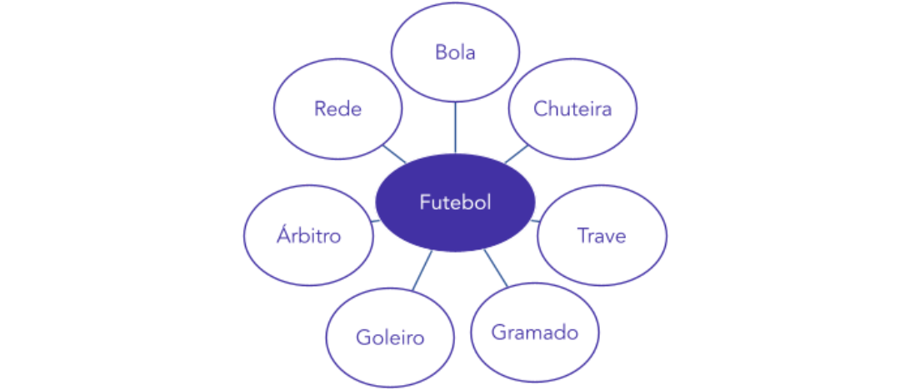

Em termos simples, podemos dizer que vocábulos como bola, chuteira, trave, rede, gol, artilheiro, goleiro, campeonato, pênalti, formam o campo semântico de “Futebol”. Quando pensamos em um elemento desses, geralmente há uma associação intuitiva aos outros elementos desse conjunto. 

Evidentemente, as associações são infinitas e não existe um número definido de elementos que pertencem a um campo semântico fixo e previsível. Essas associações se formam no contexto e dependem da experiência e conhecimento de mundo de cada um. Nada impede que faça parte desse campo palavra como Messi, juiz, ingresso, artilheiro, cartão, patrocínio, uniforme, luva ou outra que também se relacione de algum modo à ideia geral sugerida por “futebol”.

---

<!-- pagina: 5 -->

**Equipe Português Estratégia Concursos, Felipe Luccas Aula 10** 

# **SENTIDO DENOTATIVO X SENTIDO CONOTATIVO** 

As palavras geralmente têm um sentido mais direto, mais clássico, mais primário, que imediatamente se manifesta quando ouvimos ou lemos aquela sequência de sons ou letras. Esse é o sentido **d** enotativo, o sentido **d** ireto, primário, **<u>principal</u>** <u>do</u> **<u>d</u>** <u>icionário.</u> 

Cuidado que o dicionário também traz os possíveis sentidos figurados de um termo, mas o sentido **<u>d</u>** <u>e</u> notativo é aquele mais clássico, mais imediato, do mundo real, não figurado. Os sentidos figurados listados no dicionário geralmente são extensão semântica do primeiro sentido, do sentido real. 

**Ex:** o leão é o animal mais visitado do zoológico. 

Veja que “leão” está sendo usado em sua acepção mais clássica, como animal. 

Por outro lado, num determinado contexto, a palavra pode assumir um novo sentido, figurado, . metafórico, especial, não óbvio 

**Ex:** Esse lutador batendo é um leão; apanhando, é um gatinho. 

Agora a palavra “leão” deixou de designar o animal para indicar figuradamente uma pessoa que tem a característica da ferocidade. Já o gatinho tem a característica de ser pequeno, inofensivo. Esse é um sentido figurado, metafórico, **conotativo** . 

Veja exemplos de sentido conotativo que uma palavra pode assumir: 

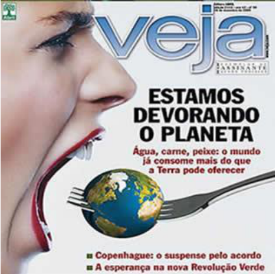

Observe que “devorando” tem sentido figurado. Não é possível “comer” o planeta. Mas esse uso se torna perfeitamente coerente porque a matéria fala sobre o consumo “desenfreado” dos alimentos do mundo. 

Veja mais um exemplo:

---

<!-- pagina: 6 -->

**Equipe Português Estratégia Concursos, Felipe Luccas Aula 10** 

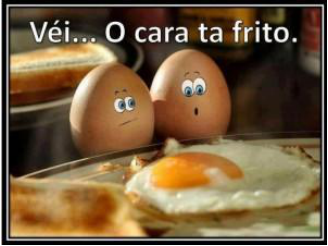

A palavra “frito” foi utilizada com sentido ambíguo de “ferrado” ou literalmente “frito numa frigideira”. 

<!-- Start of picture text -->
==5460== <!-- End of picture text -->

##### **(PC-AM / 2022)** 

Muitos escritores reformulam imagens bastante repetidas em nosso idioma, dando-lhes novos valores. Assinale a frase a seguir em que isso ocorre. 

- (A) A polícia prendeu o gastrônomo em flagrante delícia. 

- (B) O ouro negro do petróleo jorrou no Kuwait. 

(C) Para todos a água é um precioso líquido. 

(D) Todos foram à praia em pleno verão. 

(E) Os elefantes mostram uma força descomunal. 

##### **Comentários:** 

Pessoal, atenção ao enunciado: "novos valores". O candidato deve buscar a frase em que o sentido seja diferente do esperado. Isso apenas ocorre na letra A: "flagrante" significa notório, evidente; "em flagrante" é expressão utilizada para situações em que a polícia prende o criminoso no ato ou logo após o ato, deixando sua "autoria" óbvia, indiscutível. Então, aqui, "em flagrante delícia" não se refere literalmente ao crime de autoria óbvia, mas sim que a "delícia" da comida do gastrônomo era óbvia. 

Nas demais alternativas, o sentido é exatamente o direto, evidente; não há "novos valores". Gabarito letra A. 

##### **(TJ-RS / 2020 - adaptada)** 

Observe o texto a seguir, retirado de uma revista de computação.

---

<!-- pagina: 7 -->

**Equipe Português Estratégia Concursos, Felipe Luccas Aula 10** 

“Por mais poderoso que seja, um computador sem programas poderá usar essa pouca utilidade. Um programa adequado com certeza não é um aplicativo profissional, caro e sofisticado que, às vezes, já vem instalado. De nada adiantam funções, botões e janelas, se você não conseguir fazer alguma coisa com eles”. 

Um dos elementos que dá coerência aos textos é a ocorrência de vocábulos que estão dentro de um mesmo campo semântico; nesse texto, como palavras que pertencem ao mesmo bloco conceitual são computador, programas, aplicativo, janelas. 

##### **Comentário** 

“computador, programas, aplicativo e janelas” são termos que pertencem ao campo semântico da informática, são vocábulos típicos dessa temática. Questão correta. 

##### **(PREF. SÃO CRISTÓVÃO (SE) / 2019)** 

Catar feijão 

Catar feijão se limita com escrever: joga-se os grãos na água do alguidar e as palavras na folha de papel; 

e depois, joga-se fora o que boiar. Certo, toda palavra boiará no papel, água congelada, por chumbo seu verbo: pois para catar esse feijão, soprar nele, e jogar fora o leve e oco, palha e eco. 

Ora, nesse catar feijão entra um risco: o de que entre os grãos pesados entre um grão qualquer, pedra ou indigesto, um grão imastigável, de quebrar dente. Certo não, quando ao catar palavras: a pedra dá à frase seu grão mais vivo: obstrui a leitura fluviante, flutual, açula a atenção, isca-a como o risco. 

João Cabral de Melo Neto. A educação pela pedra. Rio de Janeiro: Nova Fronteira, 1997. 

Considerando as propriedades linguísticas e os sentidos do poema precedente, julgue o próximo item. 

Haja vista as situações apresentadas no poema, a expressão “catar feijão” tem tanto sentido denotativo quanto conotativo. 

##### **Comentários:** 

O poema, utiliza a expressão “catar feijão” tanto no sentido denotativo quanto no sentido conotativo. 

O poema traz a ação de catar feijão com a ação de escrever: e as palavras na folha de papel; (sentido figurado, linguagem conotativa, assim como se joga o feijão na água, as palavras são jogadas no papel). E também como a ação de pegar o feijão, de forma literal: e jogar fora o leve e oco, palha e eco. (sentido literal, linguagem denotativa).  Questão correta.

---

<!-- pagina: 8 -->

**Equipe Português Estratégia Concursos, Felipe Luccas Aula 10** 

# **SINÔNIMOS E ANTÔNIMOS** 

### **Sinônimos** 

São palavras que **se aproximam semanticamente por uma relação de equivalência ou semelhança** . 

**Não** existem sinônimos perfeitos, mas, em um dado contexto, palavras com sentido próximo, embora não idênticos, podem ser utilizadas para se referir e retomar o mesmo ser no texto. 

As questões de sinonímia dependem de um bom vocabulário e de uma boa captação do que a palavra significa no contexto em que aparece. 

**=** Por exemplo, “marcar” e “agendar” são sinônimos, certo? Marcar uma consulta Agendar uma consulta. Certo? 

**Errado** ! Depende do contexto! 

Veja que não é mais possível trocar um verbo pelo outro no exemplo abaixo: 

**Ex:** O jogador marcou um gol. 

Aquele momento me marcou para sempre. 

Então, nunca olhe as palavras isoladamente. 

Muitas questões são de vocabulário puro, secas, ou você conhece a palavra ou não conhece. Nesses casos, não há escapatória, você precisará tentar inferir o sentido da palavra pelo contexto, por palavras semelhantes, por prefixos e claro, sempre tentar fortalecer seu vocabulário com leitura regular de textos variados. 

---

<!-- pagina: 9 -->

**Equipe Português Estratégia Concursos, Felipe Luccas Aula 10** 

##### **(TRT 4ª REGIÃO / 2022)** 

##### **[Ritmos da civilização]** 

Se um camponês espanhol tivesse adormecido no ano 1.000 e despertado quinhentos anos depois, ao som dos marinheiros de Colombo a bordo das caravelas Nina, Pinta e Santa Maria, o mundo lhe pareceria bastante familiar. Esse viajante da Idade Média ainda teria se sentido em casa. Mas se um dos marinheiros de Colombo tivesse caído em letargia similar e despertado ao toque de um iPhone do século XXI, se encontraria num mundo estranho, para além de sua compreensão. “Estou no Céu?”, ele poderia muito bem se perguntar, “Ou, talvez, no Inferno?” Os últimos quinhentos anos testemunharam um crescimento fenomenal e sem precedentes no poderio humano. Suponha que um navio de batalha moderno fosse transportado de volta à época de Colombo. Em questão de segundos, poderia destruir as três caravelas e em seguida afundar as esquadras de cada uma das grandes potências mundiais. Cinco navios de carga modernos poderiam levar a bordo o carregamento das frotas mercantes do mundo inteiro. Um computador moderno poderia facilmente armazenar cada palavra e número de todos os documentos de todas as bibliotecas medievais, com espaço de sobra. Qualquer grande banco ==5460== de hoje tem mais dinheiro do que todos os reinos do mundo pré-moderno reunidos. 

Durante a maior parte da sua história, os humanos não sabiam nada sobre 99,99% dos organismos do planeta – em especial, os micro-organismos. Foi só em 1674 que um olho humano viu um micro-organismo pela primeira vez, quando Anton van Leeuwenhock deu uma espiada através de seu microscópio caseiro e ficou impressionado ao ver um mundo inteiro de criaturas minúsculas dando volta em uma gota d’água. Hoje, projetamos bactérias para produzir medicamentos, fabricar biocombustível e matar parasitas. 

Mas o momento mais notável e definidor dos últimos 500 anos ocorreu às 5h29m45s da manhã de 16 de julho de 1945. Naquele segundo exato, cientistas norte-americanos detonaram a primeira bomba atômica em Alamogordo, Novo México. Daquele ponto em diante, a humanidade teve a capacidade não só de mudar o curso da história como também de colocar um fim nela. O processo histórico que levou a Alamogordo e à Lua é conhecido como Revolução Científica. Ao longo dos últimos cinco séculos, os humanos passaram a acreditar que poderiam aumentar suas capacidades se investissem em pesquisa científica. O que ninguém poderia imaginar era em que aceleração frenética tudo se daria. 

(Adaptado de: HARARI, Yuval Noah. Uma breve história da humanidade. Trad. Janaína Marcoantonio. Porto Alegre: L&PM, 2018, p. 257-259, passim) 

Considerando-se o contexto, traduz-se adequadamente o sentido de um segmento do texto em: 

(A) em que aceleração frenética tudo se daria (4º parágrafo) = em que ritmo ousado ocorreriam. 

(B) tivesse caído em letargia (1º parágrafo) = entrasse num estado letárgico 

(C) sem precedentes no poderio humano (2º parágrafo) = sem previsão nos dotes humanitários. 

(D) Durante a maior parte da sua história (3º parágrafo) = Ao longo da sua história mais típica 

(E) o momento mais notável e definidor (4º parágrafo) = a instância mais solene e consumada 

##### **Comentários:** 

Letargia e Letárgico foi uma mera mudança de substantivo para adjetivo. São basicamente a mesma palavra. 

Sejamos objetivos nas demais:

---

<!-- pagina: 10 -->

**Equipe Português Estratégia Concursos, Felipe Luccas Aula 10** 

Frenético é diferente de ousado. 

Humano é diferente de humanitário. 

Maior é diferente de mais típica. 

Notável é diferente de solene. 

Gabarito letra B. 

##### **(PGE-PE / 2019)** 

Tenho ótimas recordações de lá e uma foto da qual gosto muito, da minha infância, às gargalhadas, vestindo um macacão que minha própria mãe costurava, com bastante capricho. 

A palavra “capricho” (L.2) está empregada no texto com o mesmo sentido de **zelo** . 

##### **Comentários:** 

Questão direta, são sinônimos no sentido de cuidado. Questão correta. 

##### **(LIQUIGÁS / 2018 - Adaptada)** 

No trecho do Texto “Ele lá ia cumprindo seu ritual, como antigamente se depositava o pão e o leite” (l. 11-13), a palavra em destaque pode, sem prejuízo de sentido, ser substituída por jogava. 

##### **Comentários:** 

Questão direta: "depositar" é sinônimo de postar, pôr, assentar, apoiar, colocar, acostar, arrimar. Questão incorreta. 

### **Antônimos** 

São palavras que se aproximam semanticamente por uma relação de **antagonismo ou oposição** . 

**Ex:** Gosto de silêncio: não tolero barulho. (silêncio **x** barulho) 

Em alguns casos, duas palavras podem não ser exatamente antônimos em seu sentido clássico, mas podem aparecer como opostas no contexto em que se dá aquele contraste. A relação de antonímia se dá no contexto. 

**Ex:** Não fale nada, acalme-se e respire. (falar **x** se acalmar e respirar) 

---

<!-- pagina: 11 -->

**Equipe Português Estratégia Concursos, Felipe Luccas Aula 10** 

##### **(SEFAZ-RS / 2019)** 

A música de Pixis, ouvida como sendo de Beethoven, foi recebida com entusiasmo e paixão, e a de Beethoven, ouvida como sendo de Pixis, foi enxovalhada. 

A correção e os sentidos do texto 1A11-I seriam preservados se a palavra “enxovalhada” fosse substituída por desassistida. 

##### **Comentários:** 

“Enxovalhada” foi utilizado no sentido de “menosprezada”, “desdenhada”: Os espectadores desprezaram a peça musical pensando que era de Pixis, músico considerado medíocre — não era de Beethoven. De qualquer forma, "desassistida" não é antônimo de "desprezada". Questão incorreta.

---

<!-- pagina: 12 -->

**Equipe Português Estratégia Concursos, Felipe Luccas Aula 10** 

# **HIPERÔNIMOS E HIPÔNIMOS** 

### **Hiperônimos** 

São palavras de **sentido amplo** que indicam, em termos semânticos, um conjunto abrangente de elementos, um “gênero”. Esse “gênero” tem unidades menores, “espécies” (hipônimos), que fazem parte daquele conjunto maior. 

Atleta é um **hiperônimo** . Nadador, corredor e goleiro são hipônimos, porque são espécies de atleta. Logo, “Atleta” é hiperônimo de “nadador”. 

Animal é um **hiperônimo** . Cachorro, macaco, jabuti são hipônimos, porque são espécies de animal. Então, “Animal” é hiperônimo de “macaco”. 

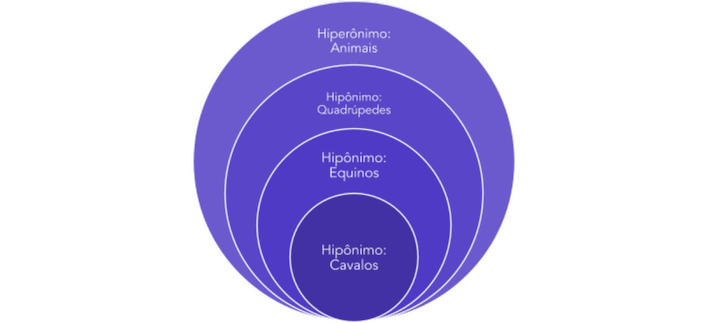

### **Hipônimos** 

O conceito de hipônimo decorre da explicação acima. Trata-se de um elemento com sentido

---

<!-- pagina: 13 -->

**Equipe Português Estratégia Concursos, Felipe Luccas Aula 10** 

mais específico, contido em um grupo maior, ou seja, de uma **espécie contida em um gênero** . 

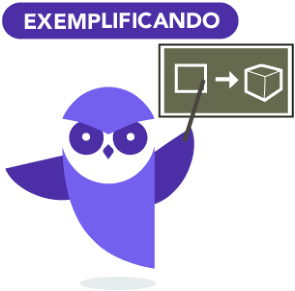

Gato é **hipônimo** de Felino (hiperônimo). Cavalo é **hipônimo** de Equino (hiperônimo). Deputado é **hipônimo** ==5460== de Político (hiperônimo). Essas relações de inclusão e pertinência se constroem num contexto. 

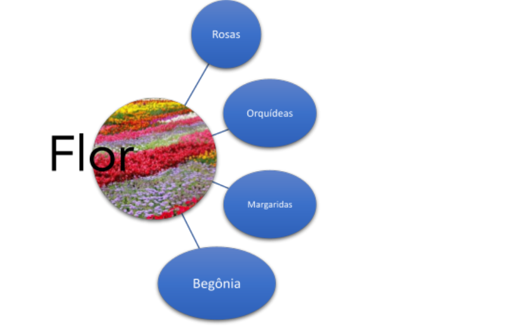

Mesmo antes de conhecer esses conceitos, sempre nos valemos de hiperônimos bem genéricos, como “coisa”, “pessoa”, “ser”, “acontecimento”, “fato”, “evento”, “elemento” para retomar outro termo mais específico. Às vezes fazemos o contrário: anunciamos o termo geral primeiro, depois o especificamos com um hipônimo: **Ex:** Tragédia: queda de avião mata 56 pessoas em Paris. A cidade organizou um evento de 

<!-- Start of picture text -->
https://t.me/KakashiAssinaturasBot <!-- End of picture text -->

---

<!-- pagina: 14 -->

**Equipe Português Estratégia Concursos, Felipe Luccas Aula 10** 

condolências. Milhares de pessoas compareceram à solenidade. 

Observe que tragédia é hiperônimo de “queda de avião”, pois a “queda” está dentro de um grupo maior de “tragédias”. Paris é hipônimo de “cidade”. “Solenidade” é hipônimo de evento e assim por diante... 

##### **(PC-AM / 2022)** 

Nos dicionários, as palavras dos verbetes são geralmente definidas e essas definições começam por um termo de valor geral (hiperônimo). 

Identifique a definição a seguir em que o termo inicial de caráter geral foi bem escolhido. 

(A) O caderno é um utensílio escolar. 

- (B) O jogador é um personagem do futebol. 

- (C) O martelo é um objeto do carpinteiro. 

- (D) O cachorro é um réptil muito amado. 

(E) O grafiteiro é um escultor mal compreendido. 

**Comentários:** 

Uma relação semântica muito cobrada em prova é: hiperônimo (termo geral) > hipônimo (termo específico). Parece muito uma relação gênero-espécie, em sentido amplo: 

hiperônimo (termo geral) > hipônimo (termo específico) 

felino > gato 

cão > labrador 

carro > gol 

eletrodoméstico > televisão 

embarcação > navio 

A banca pediu o termo geral "adequado". Vejamos: 

(A) O caderno é um material/item escolar. 

(C) O martelo é um utensílio/uma ferramenta do carpinteiro. 

(D) O cachorro é um animal muito amado. 

(E) O grafiteiro é um artista/pintor mal compreendido. 

Por exclusão, chegaríamos à letra B:

---

<!-- pagina: 15 -->

**Equipe Português Estratégia Concursos, Felipe Luccas Aula 10** 

- (B) O jogador é um personagem (ator/agente participante) do futebol. 

Aqui, teríamos de perceber que a banca não quis dizer "personagem" no sentido restrito de uma obra de ficção, mas no sentido de um "papel social". 

Gabarito letra B. 

##### **(TJ-RS / 2020)** 

Ao escrever um texto, o autor enfrenta várias dificuldades. Uma delas é evitar a repetição de palavras e um dos meios para isso é substituir uma palavra de valor específico por outra de conteúdo geral, como no exemplo a seguir. 

O **<u>sargento</u>** foi atropelado; depois de alguns minutos, chegou uma ambulância que levou o **<u>militar</u>** para o hospital. 

Assinale os vocábulos abaixo que mostram, respectivamente, esse mesmo tipo de relação: 

a) selvagens / índios; 

b) músicos / sambistas; 

c) embalagens / caixas; 

d) bananeira / bananal; 

e) quarto / cômodo. 

##### **Comentário** 

“militar” é o termo geral, o “hiperônimo”, dentro dele podemos abarcar “cabo”, “coronel”, “soldado”, “general”, inclusive “sargento”, que é um termo específico, um “hipônimo”. Essa troca é típico recurso de coesão, de retomada e substituição no texto. Gabarito letra E. 

##### **(PGE-PE / 2019)** 

É como se você tivesse baixado algum software e ele te solicitasse assinar um contrato com dezenas de páginas em “juridiquês”; você dá uma olhada nele, passa imediatamente para a última página, tica em “concordo” e esquece o assunto. 

No trecho “tica em ‘concordo’” (L.2-3), o verbo **ticar** é sinônimo de **clicar** , mas difere deste por ser de uso informal. 

##### **Comentários:** 

Sim, “ticar” vem do inglês “to tick”, que significa justamente clicar numa caixinha virtual para aceitar, ou marcar um sinal de concordância, um “tique”, um x, um visto ou algo assim. No caso, “ticar” é clicar para aceitar o contrato. Ticar é uma palavra oficial, não é considerada de uso informal. Questão incorreta.

---

<!-- pagina: 16 -->

**Equipe Português Estratégia Concursos, Felipe Luccas Aula 10** 

# **HOMÔNIMOS E PARÔNIMOS** 

### **Homônimos** 

Homônimos homó **<u>grafo</u>** <u>s: palavras que têm a</u> **mesma grafia** , mas trazem sentidos diferentes. 

Homônimos homó **fonos** : palavras que têm a mesma pronúncia, **mesmo som** , mas trazem sentidos diferentes. 

Homônimos perfeitos: São palavras que têm **som e grafia idênticos** , diferenciando-se somente pelo sentido. Quase sempre, são palavras de classes diferentes. 

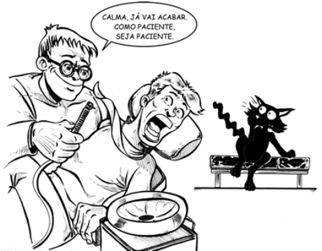

### **Parônimos** 

São **par** es de palavras **par** ecidas na pronúncia ou na grafia. 

Muitas vezes, essa semelhança conduz a erros ortográficos. O conhecimento dessas palavras também é muito importante para interpretação de texto e questões de vocabulário. 

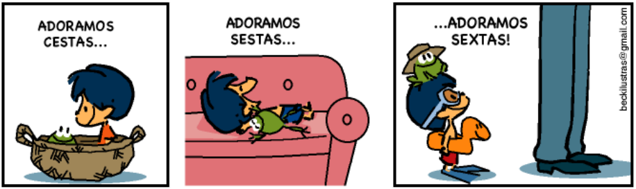

---

<!-- pagina: 17 -->

**Equipe Português Estratégia Concursos, Felipe Luccas Aula 10** 

##### **Exemplos clássicos de parônimos:** 

|absolver (perdoar, inocentar)|absorver (aspirar, sorver)|
|---|---|
|apóstrofe (figura de linguagem)|apóstrofo (sinal gráfico)|
|aprender (tomar conhecimento) ==5460==|apreender (capturar, assimilar)|
|arrear (pôr arreios)|arriar (descer, cair)|
|ascensão (subida)|assunção (elevação a um cargo)|
|bebedor (aquele que bebe)|bebedouro (local onde se bebe)|
|cavaleiro (que cavalga)|cavalheiro (homem gentil)|
|comprimento (extensão)|cumprimento (saudação)|
|deferir (atender)|diferir (distinguir-se, divergir)|
|delatar (denunciar)|dilatar (alargar)|
|descrição (ato de descrever)|discrição (reserva, prudência)|
|descriminar (tirar a culpa)|discriminar (distinguir)|
|despensa (local onde se guardam mantimentos)|dispensa (ato de dispensar)|
|docente (relativo a professores)|discente (relativo a alunos)|
|emigrar (deixar um país)|imigrar (entrar num país)|
|eminência (elevado)|iminência (qualidade do que está iminente)|
|eminente (elevado)|iminente (prestes a ocorrer)|
|esbaforido (ofegante, apressado)|espavorido (apavorado)|
|estada (permanência em um lugar)|estadia (permanência temporária em um lugar)|

---

<!-- pagina: 18 -->

**Equipe Português Estratégia Concursos, Felipe Luccas Aula 10** 

|fagrante (evidente)|fragrante (perfumado)|
|---|---|
|fuir (transcorrer, decorrer)|fruir (desfrutar)|
|fusível (aquilo que funde)|fuzil (arma de fogo)|
|imergir (afundar)|emergir (vir à tona)|
|infação (alta dos preços)|infração (violação)|
|infigir (aplicar pena)|infringir (violar, desrespeitar)|
|mandado (ordem judicial)|mandato (procuração)|
|peão (aquele que anda a pé, domador de cavalos)|pião (tipo de brinquedo)|
|precedente (que vem antes)|procedente (proveniente; que tem fundamento)|
|ratifcar (confirmar)|retifcar (corrigir)|
|recrear (divertir)|recriar (criar novamente)|
|soar (produzir som)|suar (transpirar)|
|sortir (abastecer, misturar)|surtir (produzir efeito)|
|sustar (suspender)|suster (sustentar)|
|tráfego (trânsito)|tráfco (comércio ilegal)|
|vadear (atravessar a vau)|vadiar (andar ociosamente)|

(http://www.soportugues.com.br/secoes/seman/seman7.php) 

A melhor forma de estudar esses pares é marcar a parte da palavra que se diferencia e anotar o sentido, como exemplifico abaixo: 

Cava **lei** ro **x** Cava **lhei** ro C **om** primento **x** C **um** primento D **es** criminar **x** D **is** criminar D **es** crição **x** D **is** crição Ap **ren** der **x** Apr **een** der **E** minente **x I** minente

---

<!-- pagina: 19 -->

**Equipe Português Estratégia Concursos, Felipe Luccas Aula 10** 

In **fla** ção **x** In **fra** ção **Fla** grante **x Fra** 

**Fra** grante 

**(TJ-RS / 2020)** Em todas as frases abaixo ocorre uma troca indevida do vocábulo sublinhado por seu parônimo; a única das frases cuja forma de vocábulo sublinhado está correta é: 

a) O motorista **<u>infigiu</u>** como leis do trânsito; 

b) O prisioneiro **<u>dilatou</u>** os comparsas do assalto; 

c) Não há nada que desabone sua conduta **<u>imoral</u>** <u>;</u> 

d) A cobrança é **<u>bimestral</u>** , ou seja, duas vezes por mês; 

e) Os **<u>cumprimentos</u>** devem ser dados na entrada da festa. 

##### **Comentário** 

Vejamos o parônimo adequado: 

a) “infringiu”, violou. “Infligir” é “aplicar, fazer incidir”. 

b) “delatou”, denunciou. “Dilatar” é “aumentar de extensão”. 

c) Aqui, temos que fazer uma análise mais profunda. Se a conduta fosse “imoral” mesmo, certamente seria reprovada, desabonada. Então, aqui, caberia “amoral”, que significa “Que não está de acordo com a moral nem é contrário a ela; indiferente à moral”. 

d) “bimensal”, duas vezes por mês. “Bimestral” significa “a cada dois meses”. 

e) Aqui, temos a “saudação”, ato de cumprimentar. “Comprimento” é a dimensão, medida física. Gabarito letra E. 

**(DPE-RJ / 2019 - Adaptada)** Há uma série de palavras em língua portuguesa que modificam o seu sentido em função de uma troca vocálica; esse fato não ocorre em infarte / infarto. 

##### **Comentários:** 

Infarte / infarto são variantes da mesma palavra, o sentido não muda. Questão correta.

---

<!-- pagina: 20 -->

**Equipe Português Estratégia Concursos, Felipe Luccas Aula 10** 

# **POLISSEMIA** 

Uma mesma palavra pode ter múltiplos sentidos. 

É diferente de um homônimo perfeito, pois a polissemia se refere a **vários sentidos de uma única palavra** . Homônimos são palavras diferentes, geralmente de classes diferentes, que têm sentidos diferentes. A palavra polissêmica é **uma só** , mas se reveste de novos sentidos, muitas vezes por associações figuradas. A diferença na prática é bem sutil. 

Vejamos alguns exemplos: 

Quero um suco de laranja **natural** (feito da fruta) 

Sou **natural** da Argentina (originário) 

Água é um recurso **natural** (da natureza) 

Pintou um retrato bastante **natural** (fiel, próximo) 

Quero um vinho **natural** (temperatura ambiente) 

Veja uma charge que explora os múltiplos sentidos da palavra “vendo”: 

Agora, você pode me perguntar: Ah, professora! Então, qual a diferença entre “polissemia” e “homônimo perfeito”? 

**Não** há uma resposta definitiva. A língua não é uma ciência exata. 

“A distinção entre homonímia e polissemia é indeterminada e arbitrária” (Lyons). Então, sem querer resolver enigmas acadêmicos, temos que adotar um critério prático:

---

<!-- pagina: 21 -->

**Equipe Português Estratégia Concursos, Felipe Luccas Aula 10** 

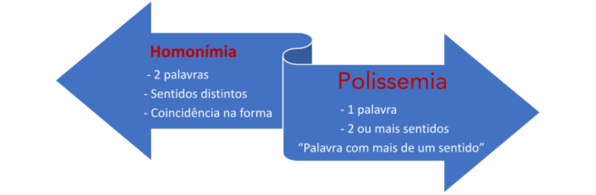

<!-- Start of picture text -->
==5460== <!-- End of picture text -->

==5460== Homonímia: há “duas” palavras, quase sempre de classes diferentes, cada uma com seu sentido, mas que apresentam uma “coincidência” de forma. Polissemia: há uma única palavra, que apresenta dois ou mais sentidos, normalmente com alguma relação. 

Normalmente, a **Questão** apenas cobra o conceito: 

“Palavra com mais de um sentido” – Polissemia 

“Palavras diferentes, com sentidos diferentes, mas que apresentam mesma grafia e/ou pronúncia” – Homônimos

---

<!-- pagina: 22 -->

**Equipe Português Estratégia Concursos, Felipe Luccas Aula 10** 

# **AMBIGUIDADE** 

Ambiguidade é a possibilidade de dupla leitura de um enunciado. É o bom e velho duplo sentido. Pode ser estrutural ou polissêmica. 

Nem sempre é um problema, pois pode ser proposital e está presente na literatura, nas piadas, nas propagandas. Porém, deve ser evitada, porque é considerada vício de linguagem, porque prejudica a clareza. 

A expressão “rede social” está difundida no campo semântico da maioria das pessoas como estruturas, principalmente dentro da internet, formada por pessoas e organizações que se conectam a partir de interesses ou valores comuns. O que vem à nossa cabeça, quase que imediato, são as redes Facebook, Instagram, Twitter etc. 

Por outro lado, essa mesma expressão pode ser entendida em seu sentido literal: um local de descanso coletivo, onde mais de uma pessoa pode se sentar.

---

<!-- pagina: 23 -->

**Equipe Português Estratégia Concursos, Felipe Luccas Aula 10** 

### **Ambiguidade estrutural** 

Veja a tira abaixo e observe como a posição do termo “com pouca gordura” causa dupla possibilidade de leitura: 

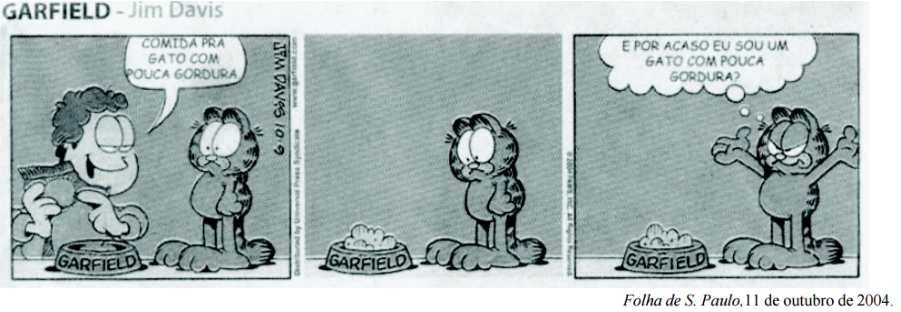

Essa é a ambiguidade estrutural. Ocorre quando a estrutura, a organização e a construção da frase dão margem a mais de uma possibilidade de sentido. 

No exemplo da tira, se o autor tivesse mudado a posição do termo, “comida com pouca gordura para gato”, a ambiguidade se desfaria. 

Vejamos outros exemplos: 

**Ex:** Peguei o ônibus **correndo** . 

Sentido 1: Eu estava correndo quando peguei o ônibus. 

Sentido 2: O ônibus estava correndo quando o peguei. 

**Ex:** Pedro encontrou Maria e lhe disse que **sua** mãe foi ao cinema. 

Sentido 1: A mãe de Pedro foi ao cinema. 

Sentido 2: A mãe de Maria foi ao cinema. 

**Ex:** O advogado viu o cliente **entrando no tribunal** . 

Sentido 1: O advogado estava entrando no tribunal e viu seu cliente. 

Sentido 2: O cliente estava entrando no tribunal. 

**Ex:** João e Maria vão **se** casar. 

Sentido 1: João vai se casar com uma pessoa e Maria, com outra. 

Sentido 2: João vai se casar com Maria. 

**Ex:** A venda **das empresas** foi positiva para os acionistas. 

Sentido 1: As próprias empresas foram vendidas. 

Sentido 2: As empresas venderam seus produtos.

---

<!-- pagina: 24 -->

**Equipe Português Estratégia Concursos, Felipe Luccas Aula 10** 

**Ex:** Comprei as frutas e os legumes **que fazem emagrecer** . Sentido 1: Os legumes fazem emagrecer. 

Sentido 2: Os legumes e as frutas fazem emagrecer. 

**Ex:** O menino falou com a menina **que mora em Ipanema** . Sentido 1: O menino mora em Ipanema e falou isso para a menina. 

Sentido 2: A menina mora em Ipanema e o menino falou com ela. 

### **Ambiguidade polissêmica** 

Ambiguidade polissêmica é aquela **inerente ao próprio vocábulo** ou à expressão que traz múltiplos sentidos. 

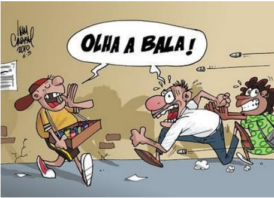

Na charge acima, a palavra “bala” é a responsável pela ambiguidade e consequente efeito de humor. 

Então, observe que, no exemplo acima, “bala” pode ser compreendida como o “doce” ou como “munição de arma de fogo”, em referência a um tiroteio. Portanto, o humor da charge reside na polissemia da palavra “bala”.

---

<!-- pagina: 25 -->

**Equipe Português Estratégia Concursos, Felipe Luccas Aula 10** 

Essa propaganda brinca com o nome da marca, “Garoto”. 

Na frase, “não fique sem seu garoto”, pode ser entendido como: (i) não fique sem companhia; (ii) não fique sem chocolate Garoto. Portanto, o efeito da publicidade reside na polissemia da palavra “garoto”. 

##### **(PREF. MANAUS / 2022)** 

“O doutor fez um raio X da minha cabeça e não encontrou nada.” 

Essa frase pode mostrar um sentido informativo e um sentido irônico. O sentido irônico é que o cliente 

(A) não sofre de qualquer grave enfermidade. 

(B) desfruta de uma saúde de ferro. 

- (C) não possui qualquer inteligência. 

(D) não possui um cérebro totalmente formado. 

(E) apresenta uma inteligência privilegiada. 

**Comentários:** 

Aqui temos uma análise de ambiguidade. 

Sentido informativo, literal, direto, primário: não encontrou problemas de saúde. 

Sentido irônico, simbólico, figurado: não encontrou conteúdo, a cabeça é vazia, a pessoa não tem ideias, inteligência. 

Gabarito letra C. 

##### **(POLÍCIA CIVIL-SP / 2018 - Adaptada)**

---

<!-- pagina: 26 -->

**Equipe Português Estratégia Concursos, Felipe Luccas Aula 10** 

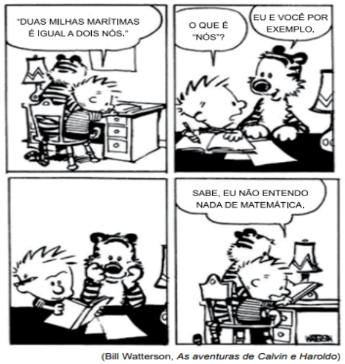

<!-- Start of picture text -->
==5460== <!-- End of picture text -->

==5460== É correto afirmar que o efeito de sentido da tira decorre da declaração pouco convincente do garoto, diante da resposta do tigre. 

##### **Comentários:** 

Perceba que o efeito de humor está construída em função da palavra “Nó”, que é uma medida náutica (1,852 km/h). No plural, a palavra fica “nós”, que se confunde com o pronome pessoal “nós”, o que explica a ambiguidade da tira. Nesse caso, a ambiguidade é um “efeito” da polissemia, isto é, o uso de palavras polissêmicas pode gerar ambiguidade. Questão incorreta. 

##### **(PGE-AM / 2022)** 

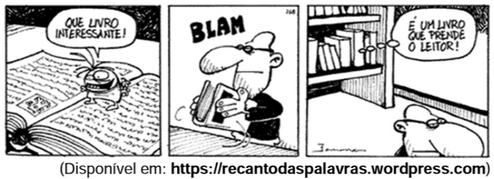

Para obter seu efeito de humor, a tirinha explora a ambiguidade do seguinte termo: 

(A) leitor. 

- (B) interessante. 

- (C) livro.

---

<!-- pagina: 27 -->

**Equipe Português Estratégia Concursos, Felipe Luccas Aula 10** 

(D) prende. 

(E) é. 

##### **Comentários:** 

O vocábulo prender foi usado de forma ambígua, para criar humor: pode ser lido, de forma figurada, como "capturar a atenção" do leitor; ou pode ser lido literalmente como prender de forma física, como aconteceu ao personagem. 

Gabarito letra D. 

**(TCE-PE / 2017 - adaptada)** 

No período “Assim, os negócios escusos, a corrupção, a gatunagem, os procedimentos ilícitos fogem da luz da divulgação como os vampiros da luz do Sol” (linha. 24 a 27), a expressão “da luz”, em ambas as ocorrências foi empregada com o mesmo sentido. 

##### **Comentários:** 

A expressão "da luz" possui significados distintos na frase: 

"Assim, os negócios escusos, a corrupção, a gatunagem, os procedimentos ilícitos fogem da <u>luz da divulgação</u> **(** sentido figurado - da imprensa, do aparecimento em meios de comunicação **)** como os vampiros da luz **(** sentido denotativo - luz, energia **)** do Sol”. Questão incorreta.

---

<!-- pagina: 28 -->

**Equipe Português Estratégia Concursos, Felipe Luccas Aula 10** 

# **HOMONÍMIA X POLISSEMIA X AMBIGUIDADE** 

A diferença é sutil e controversa, objeto de muitas discussões acadêmicas. 

Manteremos um enfoque prático, para que você possa acertar as questões da prova. E nada melhor, do que trazer um exemplo prático: 

**(TJ-RS / 2020)** A frase abaixo em que ocorre ambiguidade é: 

a) Ninguém mais os encontrou de novo; 

b) O cargo de oficial de justiça é importante; 

c) A nomeação do Ministro foi surpreendente; 

d) Tudo foi organizado para o julgamento; 

e) As folhas do caderno despencaram. 

##### **Comentário** 

Conforme se aprende na aula de sintaxe, o termo preposicionado “do Ministro” pode ser lido como “agente” (aí seria um adjunto adnominal) ou “paciente” (aí seria um complemento nominal): 

1) O Ministro nomeou alguém e isso foi surpreendente. 

2) O Ministro foi nomeado e isso foi surpreendente. 

Nas demais, não há outra leitura possível, além da literal. Gabarito letra C. 

##### **(DPE-RJ / 2019 - Adaptada)** 

A Prefeitura de Salvador faz divulgação de seu Festival da Virada em conhecidas revistas. O texto da publicidade diz o seguinte: 

Festa que vira atração de 460 mil turistas, 

Que vira 98% de ocupação hoteleira, 

Que vira milhares de empregos, Que vira 500 milhões de reais na economia. 

Que virada! 

Obrigado, Salvador! 

A estruturação do texto compreende ambiguidade do substantivo “virada". 

##### **Comentários:** 

Perceba que há jogo de palavras entre virar (transformar-se) virada (mudança brusca de resultado). Questão correta. 

https://t.me/KakashiAssinaturasBot

---

<!-- pagina: 29 -->

**Equipe Português Estratégia Concursos, Felipe Luccas Aula 10** 

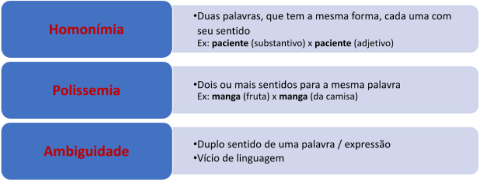

---

<!-- pagina: 30 -->

**Equipe Português Estratégia Concursos, Felipe Luccas Aula 10** 

# **NOÇÕES INICIAIS DE FIGURAS DE LINGUAGEM** 

Olá, pessoal! 

Nesta aula, nosso foco são as **Figuras de Linguagem,** que fazem parte do estudo da Estilística. 

Assim, podemos considerar as figuras de linguagem são os recursos estilísticos por excelência. Basicamente, são divididas entre de pensamento, palavras, sintaxe e som. 

Nesta aula, veremos as principais, ou seja, aquelas mais cobradas nas provas de concursos. Você irá perceber, inclusive, que as importantes serão mais detalhadas e ilustradas com mais questões. 

No texto, usamos as figuras de linguagem como estratégia para conseguir um efeito determinado na interpretação do leitor. Já na linguagem falada, utilizamos de forma bastante natural e muitas vezes sem perceber que estamos uso delas. 

Pessoal, ressalto aqui que o estudo das Figuras de Linguagem pode parecer decoreba ou algo muito “poético”, mas as bancas tendem a cobrar de forma bastante objetiva, o que nos ajuda a conseguir pontos a mais na prova se estivermos em dia com esta aula. 

Vamos seguir! Estaremos prontos para tudo!!! 

Grande abraço e ótimos estudos!

---

<!-- pagina: 31 -->

**Equipe Português Estratégia Concursos, Felipe Luccas Aula 10** 

# **FIGURAS DE PALAVRA E DE PENSAMENTO** 

A depender do autor, algumas figuras oscilam dentro das classificações “figura de palavra” ou “figura de pensamento”, uma vez que é muito difícil por vezes delimitar se o efeito estilístico está na palavra propriamente dita ou no efeito de pensamento que ela causa. 

Alguns tratam ironia, sinestesia e hipérbole, por exemplo, como figuras de pensamento, outros tratam como figuras de palavras. Essa divisão categórica não é relevante para nossa finalidade. Portanto, trataremos todas dentro de um mesmo grupo, pois **o que importa para a prova é reconhecer a figura e seu efeito expressivo no texto.** 

Começaremos por figuras de linguagem formadas por associações semânticas fundadas em semelhança ou comparação. Muitas delas podem ser chamadas de ‘metáforas’, em sentido amplo, pois são essencialmente figurativas. Contudo, recebem nomes específicos nas questões, por serem recursos particulares de linguagem metafórica. 

#### **Comparação ou símile:** 

É a expressão formal da semelhança entre duas entidades, um paralelo entre seres ou objeto, baseado em uma característica comum que os aproxima. 

A comparação tem um elemento formal, que pode ser um conectivo comparativo (como, tal qual, tal como) ou até mesmo um verbo que indique semelhança (parecer, assemelhar-se, sugerir ou equivalente): 

Ex: Fulano é forte **como** um touro. 

Ex: Trabalha **feito** um camelo. 

Ex: Ele mente tanto que **parece** um político. 

Ex: " **Como** uma cascavel que se enroscava, 

A cidade dos lázaros dormia..." (Augusto dos Anjos) 

Ex: " **Assim como** a madeira cria o bicho, mas o bicho destrói a madeira, assim do pecado nascem as lágrimas, mas as lágrimas destroem o pecado." (Manuel Bernardes) 

O nome símile se refere a uma comparação metafórica, expressiva, não óbvia. A comparação meramente gramatical (ex: João canta como o pai), que não forma imagem nem serve de recurso expressivo ou estilístico, não compartilha o status de figura de linguagem. Rigorosamente, “o símile” se refere à comparação de um ser com outro que possui como característica predominante aquela que será objeto da comparação: 

Ex: João é ágil como um gato. (João é ágil e é associado a um ser que tem como característica marcante, “predominante”, ser ágil.) 

#### **Metáfora:** 

A metáfora é essencialmente uma comparação implícita, sem a marcação de um elemento formal como uma partícula comparativa. Essa figura é muito produtiva em nossa língua e pode ser encontrada em expressões como:

---

<!-- pagina: 32 -->

**Equipe Português Estratégia Concursos, Felipe Luccas Aula 10** 

Furo de reportagem, choque de opiniões, engolir uma resposta, arranhar a reputação, explosão de alegria... 

No campo das ideias, é associação entre duas entidades, A (comparado) e B (comparante), que compartilham determinada característica. A característica de B vai ser usada para enfatizar o grau daquela característica presente em A. 

Vamos imaginar que se deseje valorizar expressivamente os lábios vermelhos e os olhos azuis de determinada pessoa. 

Ex: Seus olhos são estrelas e seus lábios são pétalas de rosa. 

Essa metáfora acima valoriza o brilho dos olhos, comparando-o ao brilho de uma estrela. Enfatiza a textura delicada dos lábios, comparando-a à de uma pétala de flor, elemento que tem essa marcante característica. Os elementos, originalmente, pertencem a domínios conceituais distintos, mas se fundem naquilo que têm em comum. Veja esse processo no exemplo abaixo: 

Ex: Chamou aos olhos de Sofia as estrelas da terra, e às estrelas os olhos do céu. Tudo isso baixinho e trêmulo. (Machado de Assis, em Quincas Borba) 

Veja a comparação: os olhos de Sofia são tão lindos, que na terra fazem o papel que as estrelas fazem no céu. O recurso expressivo é sugerir que ausência desses olhos na terra equivale à ausência das estrelas no céu. 

Quanto mais rara ou imprevisível a fusão das imagens, mais expressiva será a metáfora. 

A metáfora também pode se materializar com adjetivos (voz cristalina, silencio sepulcral, vida louca); verbos (o dia nasce, a noite morre, a guitarra chora, as ondas beijam a praia), advérbios (negociou leoninamente o contrato). 

Ressalto, para efeito de prova, que a comparação implícita é a metáfora (sem marcador linguístico formal, como um conectivo comparativo): Fulano É um leão. 

A comparação materializada por um conector é a ‘símile’: Fulano é feroz **como/feito** um leão. 

A metáfora, quando assume um valor convencional, abstrato, transforma-se em um “símbolo”: 

A cruz= cristianismo/cristo 

A coroa= Monarquia 

A balança= Justiça 

O cão= fidelidade 

A lesma= lentidão 

O touro= forca física 

O Leão= a agressividade 

Dom Quixote= Idealismo 

Judas= traição 

Ouro= riqueza 

Sangue= violência 

O evangelho= Religião cristã 

- O Corão= Religião muçulmana

---

<!-- pagina: 33 -->

**Equipe Português Estratégia Concursos, Felipe Luccas Aula 10** 

Os louros= as glórias 

As armas= militares, guerreiros 

Em suma, o símbolo é uma “metáfora persistente”, repetida até gerar uma associação fixa. 

As cores também podem assumir determinado simbolismo: 

Vermelho=sangue, paixão 

Verde=esperança 

Branco=pureza 

Preto=luto, misticismo, aspecto sombrio 

#### **Catacrese:** 

É a metáfora já desgastada pelo uso, pela repetição. A imagem perdeu seu valor estilístico e foi cristalizada na língua, na maioria das vezes por ausência de um outro termo que preenchesse aquela necessidade: 

Pé da mesa 

Braço da cadeira 

Bico de pena 

Folha de papel 

Enterrar uma agulha na pele 

O avião aterrissou no mar 

Amolar a paciência 

Em suma, a catacrese é uma “metáfora morta”, por ter se tornado hábito linguístico. 

Há diversos exemplos de catacreses e metáforas que já se tornaram hábitos linguísticos, de modo que se percebe cada vez menos o valor imagético de tais expressões. Vejamos alguns exemplos, baseados em Othon M. Garcia: 

Ex: Boca do túnel, cabeça do alfinete, mão de direção, dente de alho, braço de rio, costa do país (partes do corpo) 

Ex: cortina de fumaça, berço do cristianismo, laços matrimoniais, espelho da alma, faca da mão (objetos) 

Ex: uma flor de menina, maçã do rosto, fruto da sorte, ramo de comércio, flor da idade, folha de papel, árvore genealógica. (Vegetais) 

Ex: Explosão de alegria, torrente de críticas, chuva de comentários, vale de lágrimas, mar de azar (fenômenos físicos ou naturais) 

---

<!-- pagina: 34 -->

**Equipe Português Estratégia Concursos, Felipe Luccas Aula 10** 

##### **(PREF. MANAUS / 2022)** 

Assinale opção que apresenta a frase que se apoia numa comparação. 

- (A) Não há pai nem mãe a que seus filhos pareçam feios. 

- (B) Uma sociedade que odeia seus jovens não tem futuro. 

- (C) Todos os bandidos foram crianças infelizes. 

- (D) Não se pode educar crianças como se fossem animais. 

- (E) Uma criança é o amor que se fez visível. 

##### **Comentários:** 

Essa questão versa implicitamente sobre figuras de linguagem. Na letra D, temos uma clara expressão comparativa: "como", conjunção subordinativa adverbial comparativa. 

Na letra E, temos uma metáfora, que é uma comparação em sentido amplo. Contudo, aqui a questão era específica, então temos que saber que a metáfora é uma comparação não expressa, não traz elemento comparativo explícito; já a figura chamada "comparação ou símile" traz esse elemento comparativo expresso. Por isso, a resposta é D e não poderia ser a E. 

Gabarito letra D. 

##### **(DMAE-MG / TÉC. SEGURANÇA DO TRABALHO / 2020 - Adaptado)** 

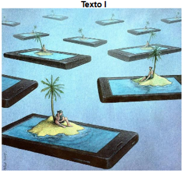

O texto I compara, de modo figurado, o estado de reclusão em que muitos usuários excessivos de celulares se encontram com a condição de pessoas que vivem em ilhas. Tal recurso expressivo pode ser classificado como metonímia. 

##### **Comentário** 

Se temos uma comparação simbólica, em que o abstrato se aproxima do concreto por uma coincidência de características, temos uma metáfora. Questão incorreta. 

##### **(PREF. DE BARÃO DE COCAIS-MG / ASS. SOCIAL / 2020 - Adaptada)** 

Releia este trecho. 

“O achado acendeu um alerta que ecoou pelo mundo – cada vez mais temeroso com a capacidade que micro-organismos têm demonstrado em driblar tratamentos à base de

---

<!-- pagina: 35 -->

**Equipe Português Estratégia Concursos, Felipe Luccas Aula 10** 

##### antibióticos.” 

A figura de linguagem que confere características humanas a objetos ou animais, como ocorre nesse trecho, é chamada de prosopopeia. 

##### **Comentário** 

A figura de linguagem que humaniza os animais é a “prosopopeia”, também chamada de personificação. Questão correta. 

#### **Prosopopeia:** 

Consiste em atribuir aos seres/objetos características que não são logicamente pertinentes a eles. Na prática, basicamente consiste em dar voz e ação a objetos inanimados. 

O bonde **vacilava** nos trilhos, **entrava** em ruas largas. Logo **um vento mais úmido soprava** anunciando, mais que o fim da tarde, o fim da **hora instável** . Ana respirou profundamente e uma grande aceitação deu a seu rosto um ar de mulher. (Clarice Lispector) 

Assim chegaria a noite, com sua tranqüila vibração. De manhã acordaria aureolada pelos calmos deveres. Encontrava os **móveis de novo empoeirados e sujos, como se voltassem arrependidos.** (Clarice Lispector) 

#### **Personificação:** 

É a metáfora baseada na comparação com seres humanos, isto é, é a atribuição de atitudes, características, ações próprias do homem a seres inanimados: O sol nasce, a noite morre, o mar sussurra, ventos furiosos, dias felizes, momentos tranquilos, ares exóticos... 

Observe a personificação de objetos nesse conto de Machado de Assis: 

|**Um apólogo** (Machado de Assis)|
|---|
|Era uma vez uma agulha, que disse a um novelo de linha: — Por que está você com esse ar, toda cheia de si, toda enrolada, para fngir que vale alguma cousa neste mundo? — Deixe-me, senhora.|
|— Que a deixe? Que a deixe, por quê? Porque lhe digo que está com um ar insuportável? Repito que sim, e falarei sempre que me der na cabeça. — Que cabeça, senhora?  A senhora não é alfnete, é agulha.  Agulha não tem cabeça. Que lhe importa o meu ar? Cada qual tem o ar que Deus lhe deu. Importe-se com a sua vida e deixe a dos outros. — Mas você é orgulhosa. — Decerto que sou.|

---

<!-- pagina: 36 -->

**Equipe Português Estratégia Concursos, Felipe Luccas Aula 10** 

##### **(ENFERMAGEM / 2016 - Adaptada)** 

##### **O leão, o burro e a raposa.** 

O leão, o burro e a raposa saíram juntos para caçar. Pegaram muitas presas, e o leão ordenou ao burro que dividisse a caça entre os três. O burro partiu o bolo todo em três partes iguais. Essa divisão não agradou nem um pouco ao leão! Irado, ele devorou o burro. 

Então, o leão mandou que a raposa dividisse de novo a caça. A raposa, prudente, juntou quase toda a caça num mesmo bolo e lhe entregou, ficando somente com um pouquinho. 

– Como você é inteligente, raposa! – Admirou-se o leão, satisfeito. – Quem foi que a ensinou a dividir tão bem assim? E a raposa respondeu apenas: – O burro. 

TOLSTÓI, Liev. Fábulas. Tradução e adaptação de Tatiana Mariz e Ana Sofia Mariz. São Paulo: Companhia das Letrinhas, 2009. p. 34-37. 

Em “– Como você é inteligente, raposa! – Admirou-se o leão, satisfeito”, ocorre uma figura de pensamento denominada pleonasmo. 

##### **Comentários:** 

Temos trecho de uma fábula, gênero narrativo em que animais são personificados. Trata-se de uma prosopopeia (personificação/animismo/antropomorfização). Questão incorreta. 

##### **(MRE / DIPLOMATA / 2015)** 

1 O subúrbio de S. Geraldo, no ano de 192..., já misturava ao cheiro de estrebaria algum progresso. Quanto 

mais fábricas se abriam nos arredores, mais o subúrbio se4 erguia em vida própria, sem que os habitantes pudessem dizer que transformação os atingia. Os movimentos já se haviam congestionado e não se poderia atravessar uma rua sem7 desviar-se de uma carroça que os cavalos vagarosos puxavam, enquanto um automóvel impaciente buzinava atrás lançando fumaça. Mesmo os crepúsculos eram agora enfumaçados e10 sanguinolentos. De manhã, entre os caminhões que pediam passagem para a nova usina, transportando madeira e ferro, as cestas de peixe se espalhavam pela calçada, vindas, através da13 noite, de centros maiores. Dos sobrados desciam mulheres despenteadas com panelas, os peixes eram pesados quase na mão, enquanto os vendedores em mangas de camisa gritavam16 os preços. E quando, sobre o alegre movimento da manhã, soprava o vento fresco e perturbador, dir-se-ia que a população inteira se preparava para um embarque. 

Clarice Lispector. A cidade sitiada. Rio de Janeiro: Rocco, 1998, p. 15-6 Com referência às ideias e às estruturas do texto acima, julgue (C ou E) o item que se segue.

---

<!-- pagina: 37 -->

**Equipe Português Estratégia Concursos, Felipe Luccas Aula 10** 

Os segmentos “um automóvel impaciente buzinava” (L.8) e “entre os caminhões que pediam passagem” (L. 10 e 11) expressam a mesma figura de linguagem. 

##### **Comentários:** 

Exato. Trata-se de uma personificação ou prosopopeia, figura que dá aos seres atributos que eles originalmente não possuem. O automóvel recebeu a característica humana da impaciência, assim como os caminhões foram personificados ao “pedir passagem”. Questão correta. 

#### **Metonímia:** 

É associação semântica que permite substituir um termo por outro baseado em uma relação lógica de “contiguidade”, “pertinência”, “continência”, “interdependência”, “causalidade”, “implicação”, enfim, uma extensão semântica e lógica que permite tomar um termo por outro. Como exemplos, temos o emprego de: 

**Autor pela obra** : Adoro ler Clarice Lispector 

**Ser por seu atributo notório ou estado** : As grávidas sofrem muito. (as mulheres grávidas) 

**Continente pelo conteúdo** : A chaleira está fervendo (a água contida na chaleira) 

**Coisa por sua origem** : Comprei garrafas de porto (vinho do porto) 

**Causa pelo efeito** : Eu vivo do suor do meu rosto. 

**Abstrato pelo concreto:** Vamos enganar a vigilância (os vigilantes) 

- **Concreto pelo abstrato** : Precisamos aumentar o cérebro (a inteligência) 

#### **Hipérbole:** 

Figura baseada no exagero, fundamentado numa percepção afetiva, com finalidade estilística de ênfase. 

Ex: Chorei rios de sangue! 

Ex: Após 15 dias, estava saturado até os ossos. 

- Ex: Você tem o olho maior que a barriga. 

---

<!-- pagina: 38 -->

**Equipe Português Estratégia Concursos, Felipe Luccas Aula 10** 

##### **(UEM / TÉCNICO / 2017 - Adaptada)** 

Na expressão "eles dão de mil a zero", há uma figura de linguagem chamada de hipérbole. 

##### **Comentários:** 

Hipérbole é a figura do exagero, do excesso: Mil a zero representa exageradamente o placar de um jogo, indicando que alguém vai vencer com grande vantagem. Questão correta. 

#### **Sinestesia:** 

Consiste na “interpenetração de planos sensoriais”, isto é, a associação de sensações que são captadas por sentidos diferentes: 

Ex: Gosto do silêncio fresco da floresta (o silêncio está ligado à audição, o frescor está ligado ao tato, à pele. Nessa figura, os sentidos se misturam.) 

A sinestesia está presente em expressões comuns, como: voz gélida, voz fina, olhar frio, ouvir a verdade nua e crua, ruído cortante, palavras amargas, palavras duras, discurso ácido, assim por diante. 

#### **Ironia ou antífrase:** 

Expressão utilizada com malícia ou sarcasmo para levar o ouvinte/leitor a entender algo diferente (normalmente oposto) ao sentido literal das palavras. O pensamento original é dissimulado por meio de outras palavras, embora o locutor tenha intenção de que o sentido oculto é que seja compreendido. 

Ex: “Isso é que dá encanto ao costume da gente ter tudo desarrumado. Tenho uma secretária que **é um gênio nesse sentido** . Perdeu, outro dia, cinquenta páginas de uma tradução. (Rubem Braga) 

No exemplo acima, o autor é irônico e indica o contrário do que as palavras sugerem: não há encanto algum e a secretária não é um gênio, pois fez algo errado. 

Obs: as aspas são frequentemente utilizadas para explicitar o uso irônico de uma expressão: 

Ex: Você está cada vez “delicado” nas suas patadas! 

Se dá patadas (comparação metafórica dos golpes dos animais), não está sendo mesmo delicado. As aspas indicam um sentido oposto no vocábulo. 

A ironia, como recurso expressivo, é formulada para ser entendida como tal. Uma ironia que ninguém entende perde sua finalidade. É comum que a ironia seja tão clara que exclui o sentido literal da palavra. Nos dois exemplos acima, é impossível ler o texto de forma literal, ou seja, não há como entender como elogio (genial ou delicado). A ironia tem uma ”segunda voz” que desautoriza a primeira. 

Contudo, muitas vezes a ironia é usada como recurso para dizer algo “sem dizer”, para gerar uma ambiguidade seletiva, de forma que o sentido literal é entendido na superfície e o discurso irônico é “subentendido”, numa coexistência de leituras. Nesse caso, pode haver duas mensagens paralelas, para interlocutores diferentes.

---

<!-- pagina: 39 -->

**Equipe Português Estratégia Concursos, Felipe Luccas Aula 10** 

Veja um exemplo: Numa festa de aniversário de 111 anos, o rico aniversariante está na presença de poucos amigos e entes queridos, mas está cercado de muitos parentes distantes e maliciosos, que só estão interessados na riqueza do aniversariante. Então, no seu discurso, o idoso declara: 

**"Eu não conheço metade de vocês como gostaria; e gosto de menos da metade de vocês a metade do que vocês merecem!" (J.R.R Tolkien)** 

A mensagem foi entendida por alguns, mais inocentes, como: 

Ele gostaria de conhecer todos nós, mas infelizmente conhece menos da metade 

Ele gosta de nós só a metade do que merecemos, ou seja, ele gosta muito, mas merecíamos que gostasse ainda mais 

Por outro lado, quem sabia que o aniversariante não gostava de todos aqueles parentes interesseiros depreendeu a seguinte mensagem: 

Ele não conhecia todos e gostaria de conhecer menos ainda, isto é, gostaria de conhecer só metade das pessoas degradáveis que estão ali: se conhece 10, preferia conhecer só 5, ou até menos. 

Gosta de poucas pessoas ali e, das poucas que gosta, gosta pouco, menos da metade do que essas pessoas merecem. 

Então, a sintaxe criteriosamente elaborada, aliada ao recurso irônico, permite duas leituras, sem que uma necessariamente desautorize a outra, por uma relação opositiva excludente. 

Essa ironia não óbvia, que permite uma leitura literal coerente na superfície e outra no plano profundo do texto, é característica marcante de Machado de Assis, como podemos perceber no capítulo “O Almocreve”, do livro Memórias Póstumas de Brás Cubas. 

Resumindo, o protagonista Brás Cubas quase morre após um galope repentino de seu cavalo, mas é salvo por um simples almocreve (condutor de animais de carga). Logo após ser salvo, tem um impulso de dar a ele várias moedas de ouro em gratidão. O restante do capítulo mostra uma progressiva racionalização, que culmina no autoconvencimento de que deveria dar apenas um centavo, ou mesmo não dar nada. Veja a ironia dúbia, no desfecho do episódio, logo após dar uma mísera recompensa: 

Ri-me, hesitei, meti-lhe na mão **um cruzado em prata** , cavalguei o jumento, e segui a trote largo, um pouco vexado, melhor direi um pouco incerto do efeito da pratinha. Mas a algumas braças de distância, olhei para trás, o almocreve fazia-me grandes cortesias, com evidentes mostras de contentamento. Adverti que devia ser assim mesmo; eu pagara-lhe bem, pagara-lhe talvez demais. Meti os dedos no bolso do colete que trazia no corpo e senti umas moedas de cobre; eram os vinténs que eu devera ter dado ao almocreve, em logar do cruzado em prata. **Porque, enfim, ele não levou em mira nenhuma recompensa ou virtude, cedeu a um impulso natural, ao temperamento, aos hábitos do ofício; acresce que a circunstância de estar, não mais adiante nem mais atrás, mas justamente no ponto do desastre, parecia constituí-lo simples instrumento de Providência; e de um ou de outro modo, o mérito do ato era positivamente nenhum.** Fiquei desconsolado com esta reflexão, chamei-me pródigo, lancei o cruzado à conta das minhas dissipações antigas; tive (por que não direi tudo?), tive remorsos.

---

<!-- pagina: 40 -->

**Equipe Português Estratégia Concursos, Felipe Luccas Aula 10** 

Os trechos destacados, especialmente, mostram que a fala do autor é irônica e pode ser lida de forma literal ou nas suas entrelinhas, de forma mais maliciosa. Quem percebe a ironia, sabe que todo o raciocínio desenvolvido é falacioso, que o personagem tem pouco caráter. Há narrativas inteiras que são feitas com esse subtexto irônico. 

##### **(SEDF / PROFESSOR / 2017)** 

O que o poeta quer dizer no discurso não cabe 

e se o diz é pra saber o que ainda não sabe. 

~~Um~~ a fruta uma flor um odor que relume... Como dizer o sabor, 

seu clarão seu perfume? 

Acerca do poema acima e de seus aspectos linguísticos, julgue o item que se segue. 

Na segunda estrofe do poema, o sujeito-lírico emprega como recurso expressivo a figura de linguagem denominada sinestesia. 

##### **Comentários:** 

Sinestesia é a figura que mistura os diferentes sentidos humanos: O odor se percebe com o olfato, o sabor se percebe pelo paladar e o clarão se percebe com a visão. Questão correta. 

#### **Antítese:** 

Oposição retórica entre ideias opostas, normalmente materializada por antônimos. Essa figura é muito comum, pois nossa visão do mundo é constantemente organizada por contrastes. 

- Ex: “As virtudes são econômicas, mas os vícios dispendiosos” 

- Ex: “Quando os tiranos caem, os povos se levantam” 

- Ex: “Sem ônus, sem bônus.” 

- Ex: “Nós somos medo e desejo, somos feitos de silêncio e som”

---

<!-- pagina: 41 -->

**Equipe Português Estratégia Concursos, Felipe Luccas Aula 10** 

#### **Paradoxo:** 

Variante da antítese que traz não só uma oposição, mas também uma contradição: obscura claridade, barato caríssimo, doce amargura, delicioso sofrimento, ruído ensurdecedor, voz muda. 

Ex: “O amor é o fogo que ardem sem se ver, é ferida que dói e não se sente, é o contentamento descontente...” (Letra de Renato Russo, parafraseando versos de Camões). 

O paradoxo (ou oxímoro) baseado no sentido imediato das palavras é apenas aparente, pois sua coerência (reunião das ideias opostas) se revela no contexto: 

Ex: A fama é a imortalidade mais efêmera que existe. 

No exemplo acima, temos aparente paradoxo entre “imortalidade” e “efemeridade”, na medida em que a primeira palavra sugere algo que nunca acaba e a segunda indica algo que acaba rápido. Contextualmente, a aparente contradição se desfaz quando percebemos que as pessoas famosas gozam de tamanho status e presença na consciência coletiva que parece que a notoriedade faz delas deuses, eternos, imortais. Contudo, a fama pode acabar a qualquer momento, como a vida, e o fim da fama leva quase que invariavelmente ao esquecimento. 

Ex: Ser mãe é padecer no paraíso. 

A incoerência entre “padecer” (sofrimento) e “paraíso” se justifica na coexistência de dois lados da maternidade: seu amor e suas inerentes dificuldades. 

Rigorosamente, percebemos então que o “paradoxo” é mais específico que a antítese, pois envolve a dissolução de uma aparente contradição, pelas relações globais do texto. No entanto, é comum em prova serem tratados como sinônimos. 

##### **(COMPESA / ANALISTA / 2016 - Adaptada)** 

Analise se a frase **<u>não</u>** possui estruturação baseada em uma antítese: De nada serve ao homem conquistar a Lua, se acaba por perder a Terra. 

**Comentários:** 

Falou em antítese, procure por antônimos! 

Na oração, ocorre o par conquistar x perder, que caracteriza uma antítese. Como o item afirma que NÃO há, então está errado. Questão incorreta. 

**(IFN-MG / 2016)** 

Releia o trecho a seguir.

---

<!-- pagina: 42 -->

**Equipe Português Estratégia Concursos, Felipe Luccas Aula 10** 

“‘Está em todas as partes e em nenhuma’ [...]” 

Leia as definições a seguir, retiradas do Aurélio versão 7.0 – eletrônica, e assinale aquela pertinente a esse trecho. 

a) Paradoxo: “Conceito que é ou parece contrário ao comum; contrassenso, absurdo, disparate”. 

b) Tautologia: “vício de linguagem que consiste em dizer, por formas diversas, sempre a mesma coisa”. 

c) Metáfora: “tropo que consiste na transferência de uma palavra para um âmbito semântico que não é o do objeto que ela designa, e que se fundamenta numa relação de semelhança subentendida entre o sentido próprio e o figurado; translação”. 

d) Ambiguidade: “que se pode tomar em mais de um sentido; equívoco”... 

##### **Comentários:** 

A oposição contraditória, excludente e aparentemente incoerente constitui um “paradoxo”, ==5460== como em “estar em todos os lugares” e “não estar em lugar nenhum”. Gabarito letra A. 

#### **Eufemismo:** 

É a suavização de algo que causa desconforto com palavras mais amenas. 

Ex: Após anos de trabalho e diversos problemas de saúde, o Mestre Antônio Cândido finalmente descansou. (morreu) 

Ex: O Senador faltou com a verdade. (mentiu) 

Ex: Esse não é exatamente o melhor livro que já li. (o livro é ruim) 

Ex: Ele vive da caridade pública. (vive de esmolas) 

A morte é um tema recorrente dos eufemismos: 

Ex: “Os amigos que me restam são de data recente; todos os antigos foram **estudar a geologia dos campos santos** .” (morreu). 

Ex: Quando a indesejada da gente chegar. (Manuel Bandeira) 

Ex: Era uma estrela divina que ao firmamento voou! (A. de Azevedo)” 

O eufemismo, quando não aliado a ironia, tem uso produtivo em obras literárias permeadas por “idealizações”, reproduções contaminadas de afetividade e tendenciosas a “suavizar” realidade para não macular uma suposta perfeição. Veja esse trecho do texto “A moreninha”, de Joaquim Manuel de Macedo, que ilustra a crítica ao eufemismo na idealização da mulher no romantismo: 

"Vocês com seu romantismo a que me não posso acomodar, a chamariam "pálida". Eu, que sou clássico em corpo e alma e que, portanto, dou às coisas o seu verdadeiro nome, a chamarei "amarela". 

Malditos românticos, que têm crismado tudo e trocado em seu crismar os nomes que melhor exprimem suas idéias!... O que outrora se chamava, em bom português, moça feia, os reformadores dizem: menina simpática!... O que em uma moça era antigamente desenxabimento, hoje é ao contrário: sublime languidez!... Já não há mais meninas importunas e vaidosas. As que forem,

---

<!-- pagina: 43 -->

**Equipe Português Estratégia Concursos, Felipe Luccas Aula 10** 

chamam-se agora espirituosas! A escola dos românticos reformou tudo isso, em consideração ao belo sexo. 

E eu, apesar dos tratos que dou à minha imaginação, não posso deixar de convencer-me que a minha linda prima é (aqui para nós) amarela e feia como uma convalescente de febres perniciosas." 

#### **Gradação:** 

Sucessão de termos numa lógica semântica progressiva. 

Ex: O Quincas Borba! Não; impossível; não pode ser. Não podia acabar de crer que essa figura esquálida, essa barba pintada de branco, esse maltrapilho avelhentado, que toda essa ruína fosse o Quincas Borba. (MACHADO DE ASSIS) 

Ex: “E entrava a girar em volta de mim, à espreita de um juízo, de uma palavra, de um gesto, que lhe aprovasse a recente produção.” (Machado de Assis) 

As gradações podem ter uma progressão crescente, decrescente ou até mesmo uma sequência não linear, não obvia, própria do texto. Essencialmente, vai indicar a ideia de processo paulatino. 

Ex: “Rasguei poemas, mulheres, horizontes 

Fiquei simples, sem fontes 

(Vinícius de Moraes) 

##### **(ALERJ / ESPECIALISTA LEGISLATIVo / 2017 - Adaptada)** 

Texto 4 - PRIVAÇÕES 

Verissimo, O Globo, 20/10/2016 “Durante anos, o Brasil sofreu a privação do Frank Sinatra. Passava ano, passava ano, e o Frank Sinatra não vinha. Nossa maior angústia era com o tempo: se demorasse muito para vir, o Frank Sinatra, quando viesse, não seria mais o mesmo. Poderia não ter mais a grande voz, ou ser uma múmia de si mesmo. Por que o Frank Sinatra não vinha ao Brasil enquanto era tempo? E, finalmente, o Frank Sinatra veio ao Brasil. E a espera, concordaram todos, tinha valido a pena. Sinatra cantou no Rio Palace para endinheirados e no Maracanã para uma multidão. Sua voz era a mesma dos bons tempos, apenas envelhecida em tonéis de carvalho como um bom Bourbon. O Brasil agradeceu a Sinatra com o maior público de sua carreira. E ficou feliz”. 

No texto 4 está presente o seguinte segmento: “Poderia não ter mais a grande voz, ou ser uma múmia de si mesmo”. 

Nesse segmento exemplifica-se a seguinte figura de linguagem denominada antítese.

---

<!-- pagina: 44 -->

**Equipe Português Estratégia Concursos, Felipe Luccas Aula 10** 

##### **Comentários:** 

A expressão “múmia de si mesmo” é metáfora para descrever o suposto estado em que Sinatra poderia estar se não viesse logo ao Brasil. Em suma, indica que estaria velho, decrépito, como uma múmia... Questão incorreta. 

##### **(ALERJ / ESPECIALISTA LEGISLATIVO / 2017)** 

No período inicial do texto 1 - O cristianismo impregna, com maior ou menor evidência, a vida cotidiana, os valores e as opções estéticas até mesmo dos que o ignoram. – ocorre um exemplo de linguagem figurada, denominada antítese, estruturada na oposição semântica maior/menor. 

Os vocábulos abaixo que também serviriam para estruturar uma antítese são: 

a) Às vezes ganha destaque ou relevância no noticiário. 

b) Entender os debates mais recentes ou anacrônicos... 

u c) ...eventuais alusões a um suposto conhecimento prévio o <u>previsto.</u> 

<u>humanitárias ou f</u> d) ...as práticas <u>lantrópicas...</u> 

<u>eminentes ou</u> e) ..que nos dirigimos a <u>desprestigiados especialistas...</u> 

##### **Comentários:** 

A antítese é a figura de linguagem que expressa oposição de ideias, normalmente marcada por palavras de sentido contrário (antônimos). 

Nas letras A, C e D, as palavras são sinônimas ou quase sinônimas. Na letra B, “recente”(novo) não é antônimo de “anacrônico” (aquilo que não está de acordo com uma época). 

Portanto, a oposição está entre “eminente” (elevado, ilustre, destacado, excelso) e “desprestigiado” (sem prestígio). Gabarito letra E.

---

<!-- pagina: 45 -->

**Equipe Português Estratégia Concursos, Felipe Luccas Aula 10** 

# **FIGURAS DE SINTAXE** 

São estruturas sintáticas peculiares, organizadas de forma a causar algum efeito estilístico. A ordem da sentença e a posição dos termos é determinante para o sentido e pode ser explorada como recurso expressivo, como em ambiguidades propositais. 

#### **Elipse:** 

É a omissão de palavra ou expressão recuperável pelo contexto geral. Essa omissão é sinalizada no texto normalmente por vírgula. 

Ex: Devemos lutar por nossos objetivos. (omissão do pronome “nós”, sujeito) 

Ex: “Ao redor, bons pastos, boa gente, terra boa para arroz.” (omissão do verbo) 

Ex: Estava eu lá, as mãos nos bolsos, esperando. (omissão da preposição “com”) 

Do fenômeno da elipse resultam vários casos de derivação imprópria, pois o termo expresso absorve semanticamente o omitido: A (cidade) capital, O (dente) canino, Uma (carta) circular. 

A elipse de um termo já mencionado se chama Zeugma: 

Ex: Carnívoros comem carne; herbívoros, vegetais. (elipse do verbo “comem” presente na oração anterior) 

Ex: Os meninos são feitos de sonho; os homens, de planos (elipse da forma composta “são feitos”) 

Ex: Eu era feliz; eles, tristes. (elipse do verbo “era”, presente na oração anterior.) 

A Zeugma que subentende verbo já expresso, mas sob outra flexão, é chamada de “complexa”. 

Obs: A Zeugma é um tipo de elipse, então a prova pode tratar o fenômeno pelo termo específico “Zeugma” ou pelo termo mais geral “Elipse”. Ambos estão corretos. 

##### **(PREF. SÃO JOSÉ DO RIO PRETO-SP / 2021)** 

Observa-se a elipse (ou seja, a omissão) de um substantivo no seguinte trecho: 

(A) um devedor, ao ter sua dívida cobrada pelo credor, primeiro pôs-se a pedir-lhe um adiamento 

(B) para as festas da deusa Deméter, paria fêmeas e, para as de Atena, machos 

(C) como o comprador estivesse assombrado com a resposta 

- (D) Ele afirmou que ela não apenas paria, mas que ainda o fazia de modo extraordinário 

- (E) Mas não se espante, pois nas festas do deus Dioniso ela também vai lhe parir cabritos

---

<!-- pagina: 46 -->

**Equipe Português Estratégia Concursos, Felipe Luccas Aula 10** 

##### **Comentários:** 

A FCC ultimamente tem feito várias questões sobre elipse. Vejamos: 

- (B) para as festas da deusa Deméter, paria fêmeas e, para as de Atena, machos 

(B) para as festas da deusa Deméter, paria fêmeas e, para as festas de Atena paria machos 

A última vírgula substitui o verbo já mencionado: parir. 

Gabarito letra B. 

##### **(CÂMARA DE FORTALEZA (CE) / CONSULTOR LEGISLATIVO / 2019 - Adaptada)** 

Verifica-se a elipse de um substantivo em Não digo que não, respondia-lhe o alienista; mas a verdade é o que Vossa Reverendíssima está vendo. (2º parágrafo) 

##### **Comentários:** 

Lembre-se de que elipse é omissão. 

No trecho há omissão do pronome "eu" em "Não digo", mas não de um substantivo, como o item afirma. Questão incorreta. 

##### **(STJ / Analista / 2015)** 

No período pré-romano da história ocidental, a sanção tinha fundamento religioso e pretensão de satisfação da divindade ofendida pela conduta do ofensor. Nesse período, surgiu a chamada Lei do Talião, do latim Lex Talionis — Lex significando lei e Talionis, tal qual ou igual. É de onde se 13 extraiu a máxima “Olho por olho, dente por dente”, encontrada, 

inclusive, na Bíblia. 

Acerca das estruturas linguísticas do texto Evolução histórica da responsabilidade civil e efetivação dos direitos humanos, julgue o item a seguir. 

Na linha 4, a vírgula que se segue ao vocábulo “Talionis” representa a elipse da forma verbal “significando”. 

##### **Comentários:** 

Exatamente. A vírgula indica justamente a elipse do verbo: 

Lex significando lei e Talionis **,** tal qual ou igual. 

Lex significando lei e Talionis **significando** tal qual ou igual. 

#### **Hipérbato:** 

A ordem natural das frases é Sujeito > Verbo > Complementos> Adjuntos. Hipérbato é o nome geral para “inversão” sintática, na ordem de termos ou orações. 

Ex: Eu de você tenho saudades. (Eu tenho saudades de você)

---

<!-- pagina: 47 -->

**Equipe Português Estratégia Concursos, Felipe Luccas Aula 10** 

#### **Anacoluto:** 

Consiste em mudar uma construção sintática, após uma pausa. Em outras palavras, é a quebra da estrutura, que deixa um termo solto, sem função sintática. 

Ex: “Umas carabinas que guardava atrás do guarda-roupa, a gente brincava com elas, de tão imprestáveis”. 

Observe que o termo “Umas carabinas que guardava atrás do guarda-roupa” ficou descolado, sem função sintática. Isso ocorre por uma interrupção repentina no fluxo sintático, a oração iniciada é abandonada e uma nova formulação sintática se inicia: 

“Os que acompanhavam o enterro, apenas dois o faziam por estima à finada: eram Luís Patrício e Valadares.” (MACHADO DE ASSIS) 

“Olha: eu, até de longe, com os olhos fechados, o senhor não me engana.” (GUIMARÃES ROSA) 

**(DMAE-MG / QUÍMICO / 2020 - Adaptada)** Releia o trecho a seguir. 

“— **Posso não?** Andar descalça, de pé no chão?” 

A figura de linguagem que pode ser percebida na expressão em destaque é o hipérbato. 

##### **Comentário** 

O hipérbato é uma inversão brusca da estrutura sintática: 

Não posso andar descalça, de pé no chão? 

“— **Posso não?** Andar descalça, de pé no chão?”. Questão correta. 

##### **(PREF. JAGUARIÚNA / PROCURADOR JURÍDICO / 2018 - Adaptada)** 

Ouviram do Ipiranga as margens plácidas 

De um povo heroico o brado retumbante, 

As figuras de linguagem que podem ser observadas na primeira estrofe é o Hipérbato e a Prosopopeia. 

##### **Comentários:** 

O hipérbato é a figura de sintaxe que inverte a ordem natural dos termos de uma oração ou período. Observe como ficaria diferente se o verso estivesse em ordem natural Sujeito – **Verbo** – **Complemento** :

---

<!-- pagina: 48 -->

**Equipe Português Estratégia Concursos, Felipe Luccas Aula 10** 

As margens plácidas do Ipiranga **ouviram o brado retumbante de um povo heroico** . 

Além disso, observamos que ‘as margens do Ipiranga’ foram personificadas, sendo capazes de atributos humanos como “ouvir”. Então, também se verifica a prosopopeia ou personificação. Questão correta. 

#### **Assíndeto:** 

É a ausência de conector num encadeamento de termos: 

Ex: Cheguei, tomei banho, almocei, dormi. 

Veja que o assíndeto tem o efeito estilístico da rapidez: 

“Luciana, inquieta, subia à janela da cozinha, sondava os arredores, bradava com desespero, até que ouvia duas notas estridentes, localizava o fugitivo, saía de casa como um redemoinho, ==5460== empurrava as portas, estabanada: — Quero o meu periquito.” (Graciliano Ramos) 

#### **Polissíndeto:** 

É a repetição de conectivos, normalmente com função expressiva de repetição ou movimento. 

Ex: Como uma horda de seres vivos, cobríamos gradualmente a terra. Ocupados como quem lavra a existência, **e** planta, **e** colhe, **e** vive, **e** morre, **e** come.  (Clarisse Lispector) 

#### **Silepse:** 

É a concordância semântica, feita com uma ideia, em vez de ser feita com termo gramatical expresso. 

##### **Silepse de Número:** 

Ex: O pessoal ouviu seu disco; gostaram muito. (concordância feita com a ideia plural do termo singular “pessoal”) 

Ex: Essa gente é fiel, quando amam um político, não desistem dele nem após sua prisão. 

(O sujeito gramatical é o termo coletivo “gente”, então a concordância é feita no plural: amam e desistem.) 

##### **Silepse de Gênero:** 

Ex: Senador, Vossa Excelência é muito dedicado. 

(O pronome de tratamento é gramaticalmente feminino, mas a concordância é feita com o sexo da pessoa.) 

##### **Silepse de Pessoa:** 

Ex: Todos queremos ser felizes. 

(Todos é pronome de terceira pessoa do plural: Todos querem/eles querem. Contudo, a ideia de inclusão faz o verbo concordar semanticamente com o pronome “nós”, primeira pessoa do plural.)

---

<!-- pagina: 49 -->

**Equipe Português Estratégia Concursos, Felipe Luccas Aula 10** 

##### **(EBSERH / 2017 - Adaptada)** 

A figura de estilo presente em “[...] só de pensar em se sentar em meio a gente que, ao contrário delas, estão acompanhadas.” é a silepse. 

##### **Comentários:** 

A silepse é a concordância semântica sobre a gramatical, isto é, concorda-se com a ideia em vez de concordar-se com o termo gramatical expresso. No texto, temos silepse de número, pois “gente” está no singular e “acompanhadas” está no plural, para concordar com a ideia de “pessoas”. Ambas as palavras são femininas, então não há silepse de gênero. Questão correta. 

#### **Pleonasmo:** 

É a repetição de ideias, que se materializa na repetição de palavras ou termos da oração: 

- Ex: **Os problemas** , já **os** resolvi. 

Ex: **O lutador** , **ele** já está pronto para o combate. 

- Ex: **Ao meio entendedor** , basta- **lhe** meia palavra. 

- Ex: **Que você trabalha muito** , **isso** eu já sei. 

O pleonasmo deve ser um recurso estilístico de reforço; a repetição sem propósito, por pobreza vocabular ou desconhecimento do sentido das palavras causa mera redundância e é considerada “vício de linguagem”. Então, são consideradas “pleonasmo vicioso” expressões como: “sair para fora, entrar para dentro, subir para cima, monopólio exclusivo, principal protaganista, encarar de frente, voltar para trás, avançar para frente”. Contudo, tenha cuidado: no contexto de uma obra poética, o pleonasmo pode ser utilizado como recurso enfático. Nesse caso, teremos “pleonasmo estilístico”. 

**Obs:** A redundância proposital, com finalidade enfática, também aparece em prova como recurso estilístico, de forma análoga ao nome “pleonasmo”. O polissíndeto, por exemplo, é um recurso de redundância estilística, pois a repetição do conectivo tem uma finalidade enfática, normalmente indicativa de movimento ou intensidade. 

Ex: Fulana trabalha, e batalha, e mata um leão por dia, e não sai do lugar. 

No exemplo acima, a redundância indica um movimento cíclico. 

#### **Anáfora:** 

Consiste em repetir a mesma palavra no início de cada verso cada membro da frase.

---

<!-- pagina: 50 -->

**Equipe Português Estratégia Concursos, Felipe Luccas Aula 10** 

Ex: **Grande** no pensamento, **grande** na ação, **grande** na glória, **grande** no infortúnio, ele morreu desconhecido e só. (Rocha Lima) 

Ex: “Quando não tinha nada eu quis 

Quando tudo era ausência esperei 

Quando tive frio tremi...” (Chico César) 

Dentro do campo das estruturas marcadas por “repetição”, temos também figuras bem específicas: 

Quiasmo: 

Inversão da ordem nas partes simétricas de uma construção com dois membros: 

“Era uma mosca azul, asas de outro e granada/(...) E **zumbia, e voava, e voava, e zumbia** .” (Machado de Assis) 

“E foi de **ziguezague** , veio de **zaguezigue** .” (Guimarães Rosa) 

Epizeuxe: 

É a repetição na sequência imediata das palavras (sem inversão): 

Ex: Ele é pobre, pobre, pobre... 

Ex: “Café com pão 

Café com pão 

Café com pão 

Virge Maria que foi isso maquinista?” (Manuel Bandeira) 

**(Engenheiro Civil / 2017 - Adaptada)** Nos enunciados “Mas o presente, nessa velocidade, é um pretérito contínuo” e “nosso mundo interno ficou a oceanos de nós”, ocorre, respectivamente, ironia e catacrese. 

##### **Comentários:** 

No trecho temos antítese nos antônimos “presente” e “pretérito” e hipérbole em “a oceanos” de nós, expressão exagerada de distância entre nós e nosso mundo interno. Questão incorreta. 

**(METROFOR-CE / 2017)** Assinale a opção em que a figura de linguagem está corretamente identificada. 

a) “... cuidar do mundo <u>e</u> vigiar o mundo, <u>e gritar os seus brados... que ninguém escuta e</u> chorar... as desgraças previsíveis e carpir junto com os demais...”.— Polissíndeto.

---

<!-- pagina: 51 -->

**Equipe Português Estratégia Concursos, Felipe Luccas Aula 10** 

|b) “O inquietocoraçãoque ama e se assusta e se acha responsável pelo céu e pela terra, o insolente coração não deixa.”— Ironia. c) “...não que omundolhe agradeça nem saiba sequer que esse estúpido coração existe.”— Perífrase. d) “...o misterioso sentimento de fraternidade que não acha nenhumaChinademasiado longe...”— Catacrese.. **Comentários:** O polissíndeto é a repetição de conectivos, como percebemos na repetição da conjunção coordenativa aditiva E: a) “... cuidar do mundo e vigiar o mundo, e gritar os seus brados... que ninguém escuta e chorar... as desgraças previsíveis e carpir junto com os demais...”. — Polissíndeto. Vejamos o problema das demais alternativas: b) “O inquietocoraçãoque ama e se assusta e se acha responsável pelo céu e pela terra, o insolente coração não deixa.” — PERSONIFICAÇÃO OU PROSOPOPEIA (o órgão coração ganha a aptidão humana de amar). c) “...não que omundolhe agradeça nem saiba sequer que esse estúpido coração existe.” — METONÍMIA, uso da parte (as pessoas do mundo) pelo todo (o mundo). d) “...o misterioso sentimento de fraternidade que não acha nenhumaChinademasiado longe...” — METONÍMIA, uso do nome próprio China como se fosse um nome comum e houvesse várias “chinas”. Gabarito letra A.|
|---|

---

<!-- pagina: 52 -->

**Equipe Português Estratégia Concursos, Felipe Luccas Aula 10** 

# **FIGURAS DE SOM** 

Os sons também podem ser usados com finalidade expressiva, sugerindo no plano fônico sentidos coerentes com a mensagem semântica do texto. 

Vejamos os principais recursos estilísticos de som. 

#### **Aliteração:** 

Repetição sistemática de consoantes iguais ou semelhantes. 

Ex: “Esperando, parada, pregada na pedra do porto. 

Com seu único velho vestido cada dia mais curto” (Dalla, Pallotino, Chico Buarque) 

Observe a repetição dos sons de /r/ e /p/ na letra acima. O efeito, além de sonoro, é também semântico: a consoante P é oclusiva, produzida pelo fechamento da boca, pelo impedimento quase total da saída de ar. Essa característica é coerente com o sentido de imobilidade da mulher no cais. 

Nos versos abaixo, os sons de /b/ e /t/ sugerem um som de impacto, de explosão. Se alguém tentar imitar o som de um tiro ou de uma bomba, vai precisar justamente dessas consoantes. 

Ex: “Bomba atômica que aterra 

Pomba atônita da paz 

Pomba tonta, bomba atômica…” (Drummond) 

Como se observa, o uso estilístico é elaborado, poético, não óbvio e não gratuito. 

#### **Assonância:** 

Repetição sistemática de vogal. 

Ex: "Sou Ana, da cama / da cana, fulana, bacana / Sou Ana de Amsterdam." (Chico Buarque). 

#### **Onomatopeia:** 

Uso de palavra ou conjunto de palavras para imitar sons e ruídos. 

Ex: "E era tudo silêncio na saleta de costura; não se ouvia mais o plic-plic-plic-plic da agulha no pano". (Machado de Assis) 

---

<!-- pagina: 53 -->

**Equipe Português Estratégia Concursos, Felipe Luccas Aula 10** 

##### **(DPE-RJ / TÉCNICO MÉDIO DE DEFENSORIA / 2019)** 

Muitas frases publicitárias ou poéticas utilizam repetições ou semelhanças fônicas a fim de melhorar o seu efeito; a frase em que essa utilização NÃO está presente é: 

A) “Quem te viu, quem te vê”; 

B) “Príncipe veste hoje o homem de amanhã”; 

C) “O rato roeu a roupa do rei de Roma”; 

D) “Air France: vá e volte voando”; 

E) “Um rei fraco faz fraca a forte gente”. 

##### **Comentários:** 

Esta questão é sobre as figuras sonoras.  Vejamos as alternativas: 

- A) ERRADA. Há ocorrência de aliteração em /t/ e /v/. ==5460== 

- B) CORRETA. Aqui, ocorre uma antítese: hoje x amanhã. 

- C) ERRADA. Há ocorrência de aliteração em /r/. 

- D) ERRADA. Há ocorrência de aliteração em /v/. 

- E) ERRADA. Há ocorrência de aliteração em /f/. 

Gabarito letra B. 

**(TRE-PI–Analista – 2017)** 

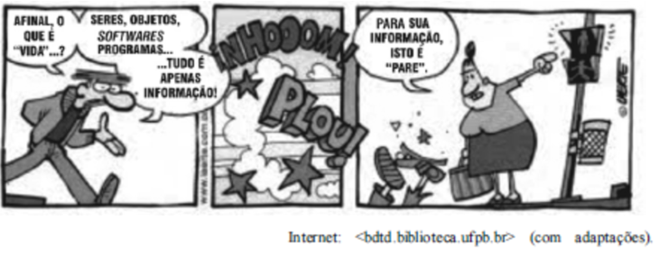

A respeito da representação dos sons e ruídos, no segundo quadrinho, julgue o item a seguir. 

O autor utiliza o recurso denominado onomatopeia, ao empregar caracteres alfabéticos para representar os referidos sons e ruídos. 

**Comentários:** 

Sim. O segundo quadrinho traz a figura da onomatopeia, cuja função e reproduzir com caracteres escritos os sons e ruídos da queda do personagem. Questão correta.

---

<!-- pagina: 54 -->

**Equipe Português Estratégia Concursos, Felipe Luccas Aula 10** 

DOS SIGNIFICAÇÃO VOCÁBULOS . REPETIÇÃO, REDUNDÂNCIA, PLEONASMO, TAUTOLOGIA.

---

<!-- pagina: 55 -->

**Equipe Português Estratégia Concursos, Felipe Luccas Aula 10** 

# **<mark>REDUNDÂNCIA / PLEONASMO VICIOSO</mark>** 

Redundância é um termo geral para repetição. Em alguns casos, a redundância é positiva, pois reforça ou enfatiza ideias. Porém, pode também ser sinal de pobreza vocabular e prolixidade do texto. 

Existe o "pleonasmo estilístico", típico da linguagem formal, encontrado em textos literários. A própria gramática normativa prevê o objeto pleonástico: 

Ex: A mim não me incomoda o ruído. 

Ex: Aos amigos, não lhes negarei nada. 

Por outro lado, o pleonasmo vicioso é considerado um **vício de linguagem** que resulta da **ignorância do sentido exato dos termos** ou de negligência. 

Vejamos os principais casos, divididos didaticamente em grupos. A lista é meramente exemplificativa e reflete os principais casos. Porém, outros casos são possíveis a depender do contexto. 

##### **_AÇÕES E DIREÇÃO (VERBOS DE MOVIMENTO)_** 

Estes são exemplos onde a ideia de direção ou movimento já está contida no verbo, tornando o adjunto redundante: 

- **Entrar para dentro** ou **Entrar dentro** . O verbo _entrar_ já significa movimentar-se para o interior de algo. Portanto, a forma correta seria apenas _entrar_ . 

- **Sair para fora** ou **Sair fora** . O verbo _sair_ já implica o movimento para o exterior. 

- **Subir para cima** . O sentido de _cima_ já está implícito em _subir_ . 

- **Descer para baixo** . O sentido de _baixo_ já está implícito em _descer_ . 

- **Voltar para trás / Regressar para trás** . O verbo _voltar_ já significa ir para trás. Contudo, a expressão _voltar atrás_ é por vezes defendida como legítima para dar certeza e vigor à expressão. 

- **Exportar para fora** . O verbo _exportar_ já carrega a ideia de enviar para o exterior. 

##### **_IDEIAS DE REPETIÇÃO, INEDITISMO E INTENSIDADE_** 

Estes casos resultam na repetição desnecessária de um conceito: 

- **Repetir de novo** ou **repetir outra vez** . O verbo _repetir_ já significa fazer novamente, de forma que "de novo" ou "outra vez" são redundantes. A forma **repetir o mesmo** também é uma redundância, pois não se repete outra coisa. 

- **Inaugurar o novo ____** . Tudo o que se inaugura é inerentemente novo. 

- **Monopólio exclusivo** . Não existe _monopólio_ que não seja _exclusivo_ . 

- **Ser o principal protagonista** . _Protagonista_ já é o ator ou elemento principal. 

- **Fazer uma breve alocução** . _Alocução_ é, por definição, um discurso breve.

---

<!-- pagina: 56 -->

**Equipe Português Estratégia Concursos, Felipe Luccas Aula 10** 

- **Surpresa inesperada** . Uma _surpresa_ é, por natureza, inesperada. 

 **Ambos os dois** . Esta expressão, embora enfática, é uma redundância a ser evitada, pois _ambos_ já significa _os dois_ . 

 **Elo de ligação.** Todo elo já serve para ligação. (Use "elo" ou "ligação"). 

- **Certeza absoluta.** Certeza já implica um estado absoluto. (Use "certeza"). 

- **Consenso geral** . Consenso é, por definição, um acordo geral. (Use "consenso"). 

 **Fato real** . Todo fato é, por natureza, real. (Use "fato"). 

- **Detalhes minuciosos** . Um "detalhe" já é, por natureza, um pormenor, uma minúcia. 

##### **_TEMPO E CONTINUIDADE_** 

Nestes exemplos, o vício reside na inclusão de um marcador temporal ou de continuidade que já está no significado de outro termo: 

- **Há anos atrás** . O verbo _haver_ (há) já indica tempo passado, tornando o advérbio _atrás_ desnecessário e pleonástico. A forma correta seria "Há cinco anos..." ou "Cinco anos atrás...". 

- **Acabamento final** e **Conclusão final** . O _acabamento_ é a parte final do processo, e a _conclusão_ é a parte final de um raciocínio ou trabalho, tornando _final_ redundante (exceto se houver conclusões parciais). 

- **Já e mais** . Alguns estudiosos consideram redundante o uso de **já e mais** em frases negativas (exemplo: _Já não se fazem mais móveis como antes_ ), embora outros, como Cegalla, vejam isso apenas como **ênfase temporal** , e não um vício. 

##### **_TERMOS ESPECÍFICOS E LOCUÇÕES_** 

- **Conviver junto** . O verbo _conviver_ já contém a ideia de estar _junto_ . 

- **Elo de ligação** . _Elo_ significa, por si só, _ligação_ . 

- **Encarar de frente** ou **Enfrentar de frente** . _Encarar_ já sugere uma posição frontal. 

- **Erário público** . _Erário_ refere-se ao tesouro público.

---

<!-- pagina: 57 -->

**Equipe Português Estratégia Concursos, Felipe Luccas Aula 10** 

- **Ganhar grátis/ Ganhar de graça** . O sentido de _ganhar_ (adquirir sem custos) torna _grátis_ redundante. 

 **Duas metades iguais** . Metades são, por definição, duas partes iguais. (Use "duas metades"). 

- **Comparecer pessoalmente.** Comparecer já pressupõe a presença física da pessoa. (Use "comparecer"). 

Outras construções que resultam em pleonasmo vicioso, por repetirem a ideia sem propósito enfático, incluem: **a brisa matinal da manhã** , **viúva do falecido** , **seus próprios filhos** e **seus respectivos lugares** . Além disso, o pleonasmo é encontrado no verbo _repetir-se_ usado no sentido de **redizer as mesmas coisas** . 

A redundância também pode se manifestar na falta de **concisão** ao sobrecarregar a frase com adjetivos e advérbios, acumular sinônimos e repetir palavras sem efeito enfático. 

##### **FGV / PGM RJ / 2025** 

O pleonasmo vicioso denota uma repetição desnecessária de palavras ou ideias, o que gera redundância na comunicação. 

Assinale a frase em que ocorre esse vício de linguagem. 

A) Estas são suas obras póstumas, que foram publicadas após sua morte. 

B) A questão do desarmamento não se resolverá antes de um século. 

C) O sargento, com seu novo uniforme, exibe-se para o público. 

D) Suba lá para o segundo andar e diga a Pedro que desça. 

E) O avião se deslocava a grande velocidade. 

##### **Comentário:** 

"póstumo" significa exatamente isto: após a morte. Toda obra póstuma é publicada após a morte do autor. 

Nas demais, não há nenhuma expressão redundante. 

Gabarito letra A. 

##### **FGV / SEEC RN / 2025** 

Assinale a opção incorreta sobre a significação e a estruturação da seguinte frase do escritor latino Tito Lívio: 

“Não sentimos as calamidades públicas senão quando elas atingem nossos negócios pessoais”. 

A) O termo “senão” inicia uma frase com valor de exceção. 

B) O termo “públicas”, no contexto, mostra o mesmo significado que na expressão “serviços públicos”.

---

<!-- pagina: 58 -->

**Equipe Português Estratégia Concursos, Felipe Luccas Aula 10** 

C) Os termos “elas” e “pessoais” são redundantes, pois seus significados já estão expressos por outros elementos linguísticos. 

D) A frase poderia estar igualmente expressa em “Só quando as calamidades públicas atingem nossos negócios pessoais, é que as sentimos”. 

E) Se retirarmos da frase os termos “Não” e “senão”, a frase original mantém o mesmo sentido básico. 

##### **Comentário:** 

A) O termo “senão” inicia uma frase com valor de exceção. 

Correta.  A estrutura "Não... senão..." é uma locução que equivale a "somente", "apenas", "exceto quando" ou " **a não ser quando** ". Ela estabelece uma regra geral ("Não sentimos as calamidades") e apresenta a única condição em que essa regra não se aplica, configurando, portanto, um valor de exceção. 

B) O termo “públicas”, no contexto, mostra o mesmo significado que na expressão “serviços públicos”. 

Incorreta. Há uma diferença de sentido no uso do adjetivo. Em "calamidades públicas", o termo se refere à coletividade, ao povo, à comunidade como um todo. Trata-se de calamidade que afeta a todos. 

Em "serviços públicos", o termo se refere à esfera administrativa do Estado ou do governo, que presta tais serviços. Embora relacionados, os significados não são idênticos: o primeiro remete ao povo; o segundo, ao Estado. 

C) Os termos “elas” e “pessoais” são redundantes, pois seus significados já estão expressos por outros elementos linguísticos. 

Correta. “elas” é pronome referente a “calamidades”, termo já expresso e passível de elipse. O pronome possessivo “nossos” já indica algo próprio, pessoal. Vejam como não há prejuízo semântico e o texto fica mais conciso. 

_“Não sentimos as calamidades públicas senão quando_ **_elas_** _atingem_ **_nossos_** _negócios pessoais”._ 

_“Não sentimos as calamidades públicas senão quando atingem negócios”._ 

D) A frase poderia estar igualmente expressa em “Só quando as calamidades públicas atingem nossos negócios pessoais, é que as sentimos”. 

Correta.  “É que” é expressão expletiva, pode ser retirada sem prejuízo semântico ou gramatical. 

E) Se retirarmos da frase os termos “Não” e “senão”, a frase original mantém o mesmo sentido básico. 

Correta. A frase resultante ("Sentimos as calamidades públicas quando elas atingem nossos negócios pessoais") mantém a relação de causa e efeito fundamental da frase original. Embora a ideia de exclusividade (sentir somente nessa situação) seja perdida, o "sentido básico" da conexão entre o fato e a consequência permanece. 

Gabarito letra B. 

##### **FGV / AGESAN RS / 2025** 

Leia a frase a seguir: 

O modo mais correto de esconder dos outros os limites do próprio saber é não os ultrapassar jamais. 

Sobre a significação ou a estruturação da frase, assinale a afirmativa correta. 

A) O pronome “os” refere-se a “outros”.

---

<!-- pagina: 59 -->

**Equipe Português Estratégia Concursos, Felipe Luccas Aula 10** 

B) O adjetivo “próprio” é sinônimo de “adequado”. 

C) A frase se insere entre os textos injuntivos. 

D) As palavras “não” e “jamais” são redundantes. 

##### **Comentário:** 

A Incorreta. O pronome “os” refere-se a “LIMITES”. 

B Incorreta. O adjetivo “próprio” é sinônimo de “SEU” ou “INDIVIDUAL”. 

C Correta. A frase se insere entre os textos injuntivos, porque traz uma instrução geral, um comando, uma regra, um ensinamento. 

D Incorreta. As palavras “não” e “jamais” NÃO são redundantes, pois o “jamais” significa que os limites não são ultrapassados NUNCA. 

##### **FGV / AL PR / 2025** 

Em todas as frases abaixo, em busca de concisão, houve a retirada de um elemento desnecessário. 

Assinale a frase em que a retirada do termo sublinhado não deve ser feita por modificar o sentido original da frase. 

A) Se quiser que o mundo todo saiba de uma determinada história, escolha a pessoa certa, conte e peça segredo absoluto. 

B) Ele não ganhou uma fortuna, a fortuna é que o ganhou. 

C) Um comerciante deve ter a sua própria máscara e não tirá-la jamais. 

D) Ou você tem experiência ou você arranja uma desculpa. 

E) Sua atitude foi simplesmente calhorda. 

##### **Comentário:** 

A) Se quiser que o mundo todo saiba de uma determinada história, escolha a pessoa certa, conte e peça segredo absoluto. 

Antes do substantivo, "determinada" é um pronome indefinido: uma certa história. A retirada do pronome removeria o sentido de "vagueza" da expressão. 

B) Ele não ganhou uma fortuna, a fortuna é que o ganhou. 

"é que" é expressão expletiva enfática, pode ser removida sem mudança de sentido ou prejuízo gramatical. 

C) Um comerciante deve ter a sua própria máscara e não tirá-la jamais. 

"sua" já indica posse, assim como "própria"; assim, "sua própria" é redundante. 

D) Ou você tem experiência ou você arranja uma desculpa. 

"você" já está expresso na primeira oração, pode ser omitido na segunda. É um caso de coesão por "elipse", que faz o texto mais conciso. 

E) Sua atitude foi simplesmente calhorda. 

O "simplesmente" foi enfático, pode ser retirado. 

Gabarito letra A.

---

<!-- pagina: 60 -->

**Equipe Português Estratégia Concursos, Felipe Luccas Aula 10** 

##### **FGV / MPU / 2025** 

Todas as frases abaixo contêm pleonasmos, ou seja, repetições desnecessárias de palavras, que foram modificadas na reescritura dessas frases. 

A frase em que o processo de reescrituração NÃO elimina o pleonasmo original é: 

A) Tenho o desejo de rever de novo o filme _O Protetor 2_ / Tenho o desejo de ver de novo o filme _O Protetor_ 

_2_ ; 

B) Segundo ele, ele crê que esse vocábulo é um neologismo / Ele crê que esse vocábulo é um neologismo; 

C) Os alunos dessa turma mutuamente se ajudam / Os alunos dessa turma se ajudam; 

D)  Os exterminadores de insetos eliminaram completamente as pulgas dos cães / Os exterminadores eliminaram completamente as pulgas dos cães; 

E) Analisaram a situação e depois, em seguida, propuseram soluções / Analisaram a situação; em seguida propuseram soluções. 

##### **Comentário:** 

O gabarito oficial foi a alternativa D. 

D)  Os exterminadores de insetos eliminaram completamente as pulgas dos cães / Os exterminadores eliminaram completamente as pulgas dos cães; 

De fato, remover “de insetos” não resolve um pleonasmo, pois nem sequer ocorre pleonasmo. “Exterminador” é aquele que extermina algo. O “de insetos” é necessário justamente para indicar o objeto exterminado. 

**Polêmica** : A alternativa A também não resolve um pleonasmo: “rever de novo” é diferente de “ver de novo”. Só pode rever “de novo” quem já “reviu alguma vez”. Então, “rever de novo” implica ver o filme, no mínimo três vezes. Isso é uma implicação lógica. 

Já “ver de novo” pode ser apenas a primeira vez que alguém “revê” o filme. Implica ver, no mínimo, duas vezes. 

Gabarito Letra D. 

##### **FGV / MPE-RJ / 2025** 

Assinale a frase em que não ocorre o caso de uma redundância desnecessária de palavras. 

A) Cada candidato, individualmente, deve sentar-se no local indicado pelo fiscal. 

B) Alguns candidatos sairão, depois do tempo previsto, sucessivamente, um após outro. 

C) A campainha é um sintoma indicativo de que o tempo da prova terminou. 

D) Os candidatos possivelmente poderão ver os gabaritos em poucos dias após a prova. 

E) Alguns candidatos saem da sala de prova somente para beber água. 

##### **Comentário:** 

Não há redundância apenas em: 

E) Alguns candidatos saem da sala de prova somente para beber água. 

Vejamos as demais.

---

<!-- pagina: 61 -->

**Equipe Português Estratégia Concursos, Felipe Luccas Aula 10** 

A) Cada candidato, individualmente, deve sentar-se no local indicado pelo fiscal. 

O pronome indefinido unitário “cada” já indica que é “individualmente”. 

B) Alguns candidatos sairão, depois do tempo previsto, sucessivamente, um após outro. 

“sucessivamente” já significa “um após o outro”. 

C) A campainha é um sintoma indicativo de que o tempo da prova terminou. 

“sintoma” já significa “sinal indicativo”. 

D) Os candidatos possivelmente poderão ver os gabaritos em poucos dias após a prova. 

Nesse contexto, “possivelmente” já traz o sentido de possibilidade pretendido com “poderão”. Gabarito Letra E. 

##### **FGV / MPE-RJ / 2025** 

Assinale o caso que exemplifica um caso de redundância desnecessária. 

A) Cada deputado terá direito a um ingresso para a festa. 

B) Os funcionários poderão levar as famílias à festa. 

C) Estará disponível um empréstimo temporário a todos os funcionários da empresa. 

D) Os funcionários receberão um abono este mês. 

E) A miséria é sinal de renda mal distribuída. 

##### **Comentário:** 

A questão seria bem direta para quem percebesse que “empréstimo” é sempre temporário. Se não for temporário, não é empréstimo, é doação. Portanto, é redundante dizer “empréstimo temporário”. Gabarito Letra C. 

# **<mark>- TAUTOLOGIA FGV</mark>** 

O termo tautologia é essencialmente associado a uma repetição, a uma redundância. A FGV sempre cobra questões exigindo a distinção de sentido entre palavras idênticas. 

Nesse modelo de questão, a repetição é meramente estilística, o segundo termo terá sentido diferente. Abaixo, trago teoria retirada de livros de retórica e teses acadêmicas que a FGV usou como "fonte" para algumas questões. **Pela literalidade e especificidade da cobrança desse conteúdo, vou manter o máximo possível a redação original dessas referências** . 

# **<mark>- TAUTOLOGIAS DE IDENTIDADE FGV</mark>** 

Na lógica, tautologia é uma proposição analítica que permanece sempre verdadeira, uma vez que o atributo é uma repetição do sujeito (p.ex. o sal é salgado). 

Na retórica, uma tautologia é a repetição desnecessária de uma ideia usando palavras diferentes (por exemplo, “um presente gratuito”).

---

<!-- pagina: 62 -->

**Equipe Português Estratégia Concursos, Felipe Luccas Aula 10** 

Porém, na língua, Tautologias como uma **_mulher é uma mulher_** são, na verdade, carregadas de sentidos e os termos, embora **pareçam** formalmente "idênticos", expressam noções bem distintas. Por isso, esse tipo de expressão é chamado de " **tautologia aparente** ". 

Por serem formalmente tautológicas, essas proposições incentivam a distinção entre os termos, mas não indicam, de antemão, para onde devemos dirigir nossa atenção, caracterizando-se como um procedimento que “[...] consiste em **valorizar positiva ou negativamente alguma coisa com um pleonasmo** …” . 

Numa expressão como "guerra é guerra", ocorre identidade apenas formal entre dois termos. Se o enunciado tem algum interesse, não podem ser idênticos, visto que **o primeiro Sintagma Nominal (SN) tem uma função substantiva e o segundo Sintagma Nominal (SN) tem uma função adjetiva; o primeiro SN faz referência a uma entidade no mundo e o segundo SN mostra as suas propriedades** . 

Essas tautologias são apenas aparentemente vazias de conteúdo semântico, e é esse aspecto formal que as faz funcionar predominantemente como recurso argumentativo. Tendo elevado potencial retórico, elas integram as chamadas ‘verdades geralmente aceitas’, colocam-se ao lado dos lugares-comuns ou dos truísmos e revelam muito sobre a visão de mundo de uma comunidade e sobre o papel que elas desempenham na configuração e no recorte desse modo de ver o mundo. 

Os nomes usados nas proposições tautológicas podem designar entidades concretas **humanas** ( _homem é homem, mulher é mulher)_ e não humanas ( _um carro é um carro);_ e **abstratas** ( _clássico é clássico, regra é regra)._ 

Então, em resumo essencial: 

**Nessas expressões, não há redundância real, apenas aparente. O segundo item, embora formalmente repetido, indica noções diferentes do primeiro, normalmente algum tipo de detalhamento, especificação, expansão de sentido. O primeiro termo tem valor substantivo (a entidade em si) e o segundo tem valor adjetivo (as características, comportamentos esperados, associações mais comuns, estereótipos)** 

Vejamos aqui algumas análises teóricas mais profundas; mas não se preocupe, vou trazer um quadro simplificado ao final: 

Com a tautologia _Pai é pai,_ usada no título e no final do texto, o autor sintetiza a ideia geral de que o verdadeiro pai deve ser forte e suave, dotado de amor incondicional, assim como culturalmente se considera o amor de mãe: 

[...] Pai é pai 

Dia dos Pais – data livre que tão bem podemos trabalhar no entusiasmo das boas recordações. Amor maiúsculo. Másculo. Forte e de uma suave grandeza que pereniza lembranças! Afinal, pode-se repetir o refrão ‘mãe é mãe’, afirmando, em analogia, apenas com a troca de letras para dizer ‘pai é pai’, e temos conversado mesmo na saudade dos que já partiram. 

Outra variação na forma das proposições tautológicas de identidade ocorre quando o nome é usado no plural, como _Kids are kids (Crianças são crianças)_ . Há semelhanças e diferenças entre o uso do singular e do plural em relação às tautologias que expressam a natureza humana. **_Tanto o singular quanto o plural ‘trabalham’ em defesa de um estereótipo, da tolerância e consequente indulgência em relação à natureza e ao comportamento humanos_** _._ Quanto às diferenças, o singular ( _Kid is kid – (Criança é criança_ ) sugere, no

---

<!-- pagina: 63 -->

**Equipe Português Estratégia Concursos, Felipe Luccas Aula 10** 

inglês, uma aparente tolerância do enunciador – apenas aparente − com o barulho, com a indisciplina, com a sinceridade espontânea das crianças. O plural, por seu turno, parece simplesmente reafirmar o estereótipo. 

Uma terceira variação na forma é relativa à categoria gramatical tempo. Nas proposições tautológicas de identidade, o presente é o tempo típico. Ele indica “[...] atualidade e a genericidade do estado de coisas [...]”, como verificamos em _<u>Mãe</u>_ **_<u>é</u>_** _<u>mãe.</u>_ O passado e o futuro, contudo, também são usados nas tautologias, como em _Da war ich sooo ich_ (alemão), _There I was so much I_ (inglês) ou simplesmente **_Eu era mais eu_** (traduzidos para o português), em que há o uso do tempo passado; ou em _Boys will be boys_ (inglês) ou, no português, _Meninos serão sempre meninos_ , em que há o uso do tempo futuro. 

Outra variação na forma dessas proposições ocorre quando elas permitem **o uso de modalizadores** , responsáveis por **expressar a atitude do falante em relação ao que enuncia** . Os advérbios _only_ ( **_apenas_** ) e _still_ ( **_ainda_** ) são as mais recorrentes. Em _A thing is only a thing_ ( _Uma coisa é_ **_apenas_** _uma coisa)_ e _Volkswagen still remains Volkswagen_ ( _A Volkswagen_ **_ainda_** _é a Volkswagem)._ 

_A_ famosa frase do escritor britânico nascido na Índia, Rudyard Kipling, ao fazer um elogio ao charuto, contém uma tautologia com material interveniente: _... e uma mulher é_ **_apenas_** _uma mulher, mas um bom charuto é o prazer de fumar._ A natureza aspectual de **_ainda_** , ou seja, a duração de um estado que se iniciou no passado e que perdura até o momento da enunciação, contribui para a manutenção do valor de verdade da tautologia. Em _apenas,_ há a representação cognitiva de um esquema de conjunto, diante do qual o conceito de _mulher_ , na perspectiva argumentativa do enunciador, se constituiu, exclusivamente, sobre certas propriedades, ao mesmo tempo em que se abandonaram outras propriedades essenciais. O resultado é a construção de um discurso que desprestigia o sexo feminino. 

As tautologias de identidade podem evocar duas interpretações gerais: a demissão e a aceitação. A ‘demissão’ seria uma tentativa de um dos envolvidos no processo argumentativo ‘sair do discurso’, ‘deixar o a ~~s~~ sunto para lá’. Numa situação, por exemplo, em que uma criança faz uma traquinagem, e a mãe diz **_Menino é menino_** , ela quer dizer algo como: Não quero falar sobre isso, porque é assunto irrelevante. Não vamos nos preocupar com isso. A ‘aceitação’ diz respeito à tolerância que devemos ter com a atitude da mesma criança, por exemplo. Seria o mesmo que dizer: Aceite essa atitude como natural para essa faixa etária.] 

##### **FORÇA ILOCUCIONÁRIA:** 

A força ilocucionária determina o tipo de ação que o falante realiza socialmente ao expressar um enunciado — por exemplo, um pedido, uma declaração, uma ordem ou uma promessa. Essa força é diferente do conteúdo proposicional (aquilo que é dito) e refere-se ao modo como o conteúdo é apresentado ou ao objetivo comunicativo pretendido no contexto de fala. Por exemplo: 

O enunciado “Saia da sala” possui força ilocucionária de ordem. 

“Você pode me passar o sal?” pode, a depender do contexto, funcionar como um pedido, e não apenas como uma pergunta literal. 

A força ilocucionária pode ser assinalada por verbos performativos (“eu prometo”, “eu declaro”), pelo modo verbal, pela ordem das palavras, pela entonação e até pelo contexto da interação. 

Podemos citar pelo menos três forças ilocucionárias para as proposições tautológicas: 

1) a força da justificação e/ou da ‘desculpa’ ( **_Guerra é guerra_** , para justificar o derramamento de sangue); 

2) a força da censura ( **_Lei é lei_** , em alguns contextos, é um modo de censurar atitudes que descumprem um dispositivo legal; 

3) a força do elogio ( **_Brastemp é Brastemp_** , em que o enunciador atribui à marca Brastemp maior valor em relação às outras marcas de eletrodomésticos, tecendo-lhe um elogio).

---

<!-- pagina: 64 -->

**Equipe Português Estratégia Concursos, Felipe Luccas Aula 10** 

Aproveito para reproduzir uma tabela com diversas tautologias e suas respectivas análises. Como a base dessas questões são obras acadêmicas de linguística (Wierzbicka, Lakoff, Perelmman, Olbrechts-Tyteca), mantenho aqui a interpretação literal dos autores originais. A banca reproduz trechos literais dessas análises nas alternativas. 

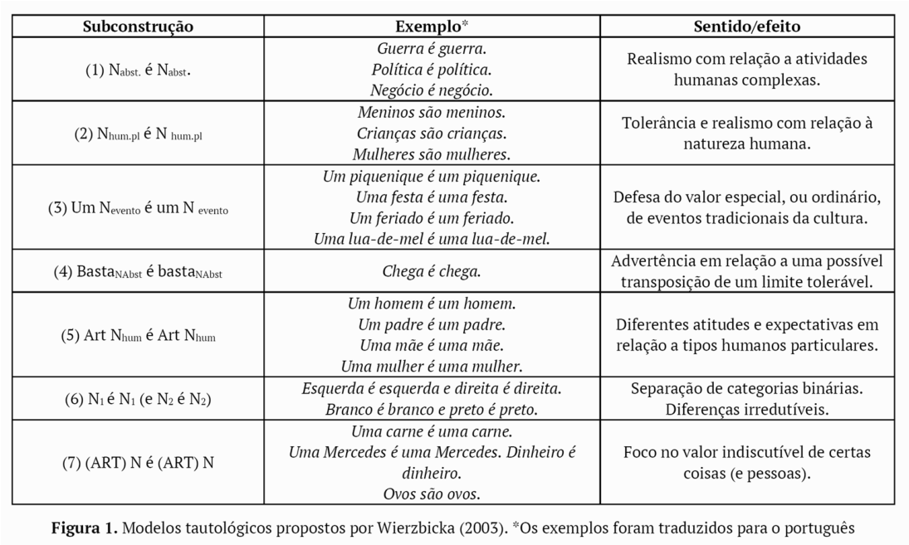

A **subconstrução (1),** que se realiza em tautologias como _Guerra é guerra,_ segundo Wierzbicka (2003), é restrita a atividades humanas complexas e envolve interação. A interpretação saliente parece também ser aquela em que os ‘inevitáveis’ aspectos negativos dessas atividades devem ser entendidos como **tolerados** . Há certo número de componentes inter-relacionados em proposições tautológicas desse tipo, dentre eles, o **truísmo** de que atividades complexas têm sempre algumas consequências indesejáveis, funcionam do mesmo modo e, por isso, é pouco importante falar delas. O raciocínio é o de que, se a atividade humana, por mais sórdida que seja, tem consequências inevitáveis, não há por que se discutir essa atividade e suas consequências o tempo todo. Daí, o seu caráter de soberba no processo argumentativo. 

No português, a proposição _Guerra é guerra_ é amplamente produtiva em títulos de filmes, de música e de artigos de opinião sobre uma ampla gama de assuntos. A seguir, verificamos sua ocorrência no título e na letra de uma música de Marcelo Caldi: 

(5) [...] Guerra é guerra 

Ai, morena, [...] / Este seu gingado / Parece uma guerra a se declarar / Primeiro disparo / Veio do teu lado / Já que guerra é guerra eu vou revidar [...] (Caldi & Ricardo, 2009). 

Com certeza, a frequência de uso dessa proposição tautológica foi tamanha nos quartéis que, inclusive, é possível metaforizá-la, como em (5), em que a ‘guerra’ de que fala o enunciador corresponde ao gingado da ‘morena’. Como forma de justificar o ‘revide’ contra o ‘rebolado’ da mulher, o intérprete usa a proposição _Guerra é guerra._ O uso metafórico de ‘guerra’ estabelece a lógica de que os encantos da ‘morena’ são uma

---

<!-- pagina: 65 -->

**Equipe Português Estratégia Concursos, Felipe Luccas Aula 10** 

forma de ação intencional que impõe, como em um embate, uma reação. O valor argumentativo da tautologia se manifesta tanto na forma quanto na função, visto que ela: 

1) está encaixada em uma sentença causal, funcionando como uma justificativa; 

2) é recrutada do sistema de crenças do enunciador, revelando o conhecimento compartilhado de que, na guerra, vale tudo e é preciso contra-atacar. 

A subconstrução (2) deve ser interpretada como um modo de o falante codificar na língua a tolerância com a natureza humana. Diferentemente da subconstrução (1), o valor negativo não é aplicável à subconstrução (2). Em **_Crianças são crianças_** _,_ podemos compreender que **_as crianças podem ser barulhentas, indisciplinadas, cansativas, mas não são más. Nesse tipo de proposição, há uma chamada para a calma, para a aceitação, para a indulgência, para a tolerância, o estereótipo de que a natureza humana é frágil, passível de erros_** . 

Há uma fórmula geral para a interpretação semântica da tautologia _Crianças são crianças,_ que pode ser assim resumida: 

- 1) há o conhecimento partilhado de que as crianças fazem coisas de modo impensado e inconsequente; 

2) eu sei que o meu interlocutor pode pensar que uma ação foi ruim, mas sei também que as crianças não agem por maldade; 

3) eu convido o meu interlocutor a ser tolerante quando enuncio _Crianças são crianças._ 

A proposição _Crianças são crianças_ também argumentar em favor da ideia de que as crianças, por serem consideradas ‘incapazes’ diante da lei, necessitam de atenção especial, como mostra o dado (6): 

_(6) ‘[...] Essas crianças abandonadas precisam do nosso apoio para ajudá-las a se reunirem com suas famílias, a recuperarem o cuidado, a proteção e os serviços, sem importar a origem ou afiliação das famílias’, sublinha o diretor do UNICEF. Quanto a qualquer outra criança no mundo, elas têm o direito de ser salvaguardadas, incluindo por meio de documentação legal._ **_Crianças são crianças!_** _(Cappelaere, 2017)._ 

Em (6), Geert Cappelaere, diretor regional da UNICEF para o Oriente Médio e o Norte da África, ao enunciar _Crianças são crianças,_ reclama a necessidade de se dedicar um olhar especial para o sofrimento das crianças do Oriente Médio e do Iraque, visto que, do ponto de vista legal _,_ **_são consideradas incapazes_** . 

A subconstrução (3) coloca em destaque eventos tradicionais de uma cultura que podem ser valorados positivamente, como especiais; ou valorados como atividades comuns, corriqueiras. É o caso, por exemplo, da proposição tautológica **_Uma lua de mel é uma lua de mel_** . O caráter especial consiste na suspensão das regras normais, cotidianas e rotineiras da vida para se buscarem atividades prazerosas. Esse tipo de tautologia está intimamente relacionado com _Boys will be boys_ , porque carrega a ideia de tolerância. Em uma situação, por exemplo, em que alguém tece uma crítica a uma pessoa porque ela ingeriu bastante bebida alcóolica em uma festa, outra pessoa pode contra-argumentar, dizendo _Uma festa é uma festa,_ ou seja, é preciso tolerar os exageros que ocorrem numa festa, porque a prática da ingestão de bebidas alcoólicas integra o _frame_ de eventos festivos e, de algum modo, bebida em festa é inevitável. Ainda segundo Wierzbicka (2003, p. 409), a forma no singular é a propriedade gramatical ícone para expressar o significado de evento especial. 

Entre os dados coletados para esta pesquisa, a ocorrência em (7), a seguir, apresenta a tautologia _Um feriado é um feriado:_ 

(7) [...] Copo meio cheio

---

<!-- pagina: 66 -->

**Equipe Português Estratégia Concursos, Felipe Luccas Aula 10** 

Mesmo com chuva, eu saio se sentir que quero sair. Mesmo com chuva, eu sei me divertir dentro de casa, se eu sentir que quero ficar. Um feriado é um feriado, chuvoso ou não, basta você saber aproveitá-lo e saber ver a vida com uma perspectiva mais positiva!6 

Em (7), a proposição **_Um feriado é um feriado_** constitui um modo de convencimento para aqueles que reclamam de feriados chuvosos. O argumento é o de que, independentemente da chuva, o feriado é um dia especial e pode ser aproveitado dentro ou fora de casa. 

Também se incluem, nesse tipo construção tautológica, exemplos como _A Monday is a Monday_ ( _Uma segunda é uma segunda_ ), que Wierzbicka (2003) interpreta como: _Uma segunda não é melhor nem pior que outro dia da semana,_ ou seja, é um dia normal. A proposição seria usada para contrapor-se a alguém que, por algum motivo, apontasse aspectos negativos desse dia da semana. Identificamos essa tautologia, mas sem a presença do determinante, em (8), a seguir, retirado do _blog_ Tenso. Nesse _blog,_ é proposta a seguinte pergunta: _Como escapar de uma segunda-feira?_ E os usuários postam suas respostas. Na ocorrência, tem-se uma resposta à pergunta formulada no _blog_ seguida de um comentário, em que se faz uso de uma proposição tautológica: 

(8) [...] Dica para fugir da segunda-feira 

VÁ PARA A BAHIA. Lá todo dia é Olodum, carnaval e festa. 

Baianos, por favor, não se ofendam. 

##### **Dani Barral** 

26/07/2011 00:39:25 

##### Quem me dera… Aqui **segunda é segunda.** 

E nos meus 23 anos eu nunca vi o Olodum de perto... (Barral, 2011). 

Em (8), o enunciador sugere que o povo baiano, já alvo do rótulo de preguiçoso, não trabalha, porque vive em festa. A resposta de uma das baianas aparece essencialmente na forma de uma tautologia: _Aqui segunda é segunda._ Ao fazer uso da tautologia, nesse contexto, a enunciadora quer dizer que a segunda-feira, na Bahia, não é diferente da segunda-feira em outro lugar, não tem o caráter de dia especial. A tautologia, nesse sentido, constitui argumento para contrapor o ponto de vista oposto e constitui uma forma de desconstruir um estereótipo. 

A **subconstrução (4)** **_enough is enough (chega é chega)_ NÃO** tem a força de um enunciado como **_Pare de uma vez_** . Significa que o enunciador sabe que precisa ser tolerante, foi tolerante por muito tempo, mas chegou ao seu limite severo e implacável. É uma proposição diferente de _Boys will be boys (meninos são/serão meninos),_ haja vista que, na subconstrução (4), há o pressuposto de que se foi tolerante por muito tempo. Nos dados do português, encontramos a proposição tautológica encaixada em uma oração temporal, que modifica de algum modo a interpretação sintático-semântica da tautologia. 

No dado (9), a seguir, o autor de novelas Agnaldo Silva, no ano de 2014, faz um desabafo sobre a direção da cena final do folhetim _Fina Estampa_ , exibido pela Rede Globo entre 2011 e 2012: 

(9) Aguinaldo Silva reclama da direção de cena final de novela 

_‘O final merecia uma direção mais atenta e cuidadosa. O terço final da novela ficou ao deus-dará. Via coisas que me deixavam arrepiado. Aquela sequência do naufrágio virou patacoada. Era dramática, houve erros clamorosos. Sou a mais gentil das criaturas, mas quando eu digo chega, é chega. Fiquei chateado’, revelou._ 

Aguinaldo silva sobre o final de Fina Estampa. 03/10/2014 (Fregatto, 2014)

---

<!-- pagina: 67 -->

**Equipe Português Estratégia Concursos, Felipe Luccas Aula 10** 

Em (9), o enunciador se considera uma pessoa gentil, contudo, essa gentileza é suspensa quando ele chega aos limites de sua tolerância. A construção introduzida pela oração temporal _quando eu digo chega_ faz toda a diferença no quesito ‘ser incisivo/taxativo’, se comparada à proposição simples _Chega é chega._ A afirmação _Quando eu digo chega_ faz pressupor a possibilidade de existência de outras pessoas que, diferentes do enunciador, poderiam dizer _Chega_ , mas continuariam tolerando, por mais tempo, uma situação considerada abusiva. Nessa subconstrução, há um uso metadiscursivo, ou seja, a tautologia faz menção ao que ele poderia enunciar: a interjeição _Chega!_ Ainda como dado dessa subconstrução, temos o _slogan Não é não_ contra o assédio sexual, amplamente divulgado, principalmente, no período do Carnaval no Brasil. Também nesse flexibilizada ou interpretada como seu oposto. Tanto em _Chega é chega_ quanto em _Não é não_ , a escolha linguística recai sobre uma expressão possivelmente enunciada, e não sobre um nome, como temos visto nas outras subconstruções. 

A **subconstrução (5)** , do tipo **_Um homem é um homem_** , caracteriza-se sintaticamente pela presença do artigo indefinido ( _um/uma_ ), por um nome com traço humano ( _homem, mãe, mulher)_ no singular _,_ pelo verbo _ser_ no presente, marcando a atemporalidade da conceituação do primeiro sintagma nominal (SN), e pela repetição do artigo indefinido e do nome humano. Como exemplo do contexto de uso dessa tautologia, há um episódio da série _Fawlty Towers_ da BBC, em que uma mulher vê um homem morto dentro de um armário e fica assustada. Outra mulher tenta tranquilizá-la, argumentando que um homem morto não pode fazer mal algum. Ela, porém, contra-argumenta dizendo: _Um homem é um homem._ Nesse contexto, a tautologia assume o **sentido de desconfiança em relação aos homens** , contudo, em diferentes contextos, as tautologias com essa configuração sintática podem ser combinadas com um número de diferentes atitudes, tal como afirma a autora, mostrando evidências em exemplos que podem ser traduzidas como: 

_[...] Um homem é um homem_ (e não pode ser confiável ou não pode ser desprezado). 

_Um padre é um padre_ (e pode ser confiável). 

_Uma mãe é uma mãe_ (e pode-se esperar que ela cuide). 

_Um advogado é um advogado_ (e pode ser considerado como um especialista). 

_Uma mulher é uma mulher_ (e pode-se esperar que ela mostre, em algum momento, uma ‘fraqueza feminina’, mesmo que ela pareça resistente) 

Em todos os casos, a proposição tautológica marca fortemente os estereótipos sociais construídos com base em modelos cognitivos idealizados, representação de uma estrutura de conhecimento armazenada da experiência na memória de longo prazo. O conhecimento armazenado é de tal modo partilhado entre falante e ouvinte que a sua expressão por meio de uma tautologia serve ao propósito argumentativo de reforçá-lo. Uma ativista das lutas feministas e de gênero, por exemplo, se oporia, com veemência, à tautologia **_Uma mulher é uma mulher_** _,_ porque o que se enunciou, por meio de uma tautologia, foi um conhecimento estereotipado, armazenado na memória, de que mulher é sexo frágil.

---

<!-- pagina: 68 -->

**Equipe Português Estratégia Concursos, Felipe Luccas Aula 10** 

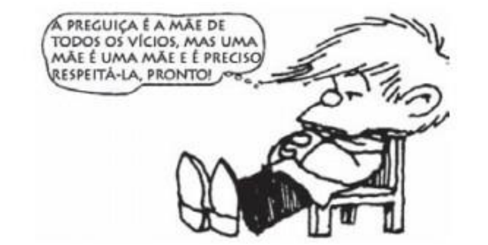

Em (10), Figura 2, a proposição tautológica _Uma mãe é uma mãe,_ introduzida pelo operador _mas,_ inicia um argumento contrário ao provérbio popular _A preguiça é mãe de todos os vícios._ Essa charge foi utilizada em uma questão de interpretação no Exame Nacional do Ensino Médio (ENEM), em 2013. 

A **subconstrução (6)** , que se realiza em dados como **_Esquerda é esquerda e direita é direita_** , indica a **_separação binária de categorias consideradas distintas e opostas pelo falante_** . Em termos formais, ela se constitui de duas tautologias coordenadas com o uso da conjunção _e_ ou simplesmente justapostas _._ No dado a seguir, apresentamos um exemplo de tautologia coordenada com o uso do coordenador _e:_ 

(11) É hora de provar que você ama/ Que eu não sou mais uma pra dormir na sua cama/ Vou te mostrar que eu sou o que você merece/ Porque homem é homem e moleque é moleque. (Ludmilla, 2018). 

Para se fazer uso da construção com proposições tautológicas coordenadas, é preciso que haja a pressuposição de que alguém acredita que X e Y são a mesma coisa, têm as mesmas propriedades e características, são iguais em muitos aspectos. Em (11), o enunciador demarca seu posicionamento, dizendo, por meio das tautologias coordenadas, que _homem_ e _moleque_ são categorias distintas, e que não podem ser confundidas. Supervaloriza-se o conceito contido na primeira tautologia coordenada ( _homem é homem)_ em relação àquele contido na segunda tautologia ( _moleque é moleque),_ também como meio de se atuar sobre o interlocutor para que ele deixe de agir como moleque e comece a agir como homem. Na sentença, a posição tópica10, da tautologia _homem é homem,_ em relação à tautologia _moleque é moleque,_ contribui para que a escolha implícita recaia sobre ela. 

Com base nos dados do português brasileiro sobre esse tipo subconstrução tautológica, percebemos as seguintes propriedades: a) demarcam ponto de vista categórico; b) na maioria dos contextos, funcionam como justificativa; c) fazem uso de uma crença compartilhada culturalmente e verossimilhantemente plausível , o que confere força ao argumento; d) pressupõem que alguém acredita que não haja distinção entre duas categorias; e) em alguns casos, principalmente quando se faz uso do nome próprio, há supervalorização do conceito ou referente do SN da primeira sentença e desvalorização do conceito ou referente do SN da segunda sentença tautológica. 

A **subconstrução (7)** é chamada de **‘tautologia de valor’** , uma vez que atribui valor a coisas e a pessoas. Na famosa frase de Kipling, já referida neste artigo, _Uma mulher é apenas uma mulher, mas um bom charuto é o prazer de fumar,_ a ênfase não é em alguma mulher particular, que é diferente das outras mulheres, mas no **‘menor valor’ atribuído a uma classe inteira das mulheres** , quando comparada com a classe dos charutos. A partícula depreciadora _apenas_ corrobora para a expressão do sentido de baixo valor.

---

<!-- pagina: 69 -->

**Equipe Português Estratégia Concursos, Felipe Luccas Aula 10** 

Em (12), a seguir, o autor do texto inicialmente fala das diferenças entre o beijo dos casais William e Catherine e Iker Casillas e Sara Carbonero para, então, concluir que **_um beijo é um beijo é um beijo_** , ou seja, não interessa se um beijo é contido ou se ele é exagerado, o que interessa é que ele constitui uma manifestação de amor e, por isso, tem valor inestimável: 

(12) [...] Enquanto o beijo de William e Catherine significa ‘vamos viver juntos, a partir de agora’, o beijo de Iker e Sara pode ser traduzido da seguinte forma ׃ ‘não posso mais viver sem você’. 

Sim, urge não esquecer que as situações são diferentes, que os interesses em jogo também estão em outra sintonia. Mas, **um beijo é um beijo é um beijo** . E, apesar do cinismo capitalista ou do desrespeito contemporâneo aos sentimentos afetivos, nada consegue substituí-lo como demonstração de amor (nesses tempos sombrios, um sentimento de difícil conceituação) 

O mesmo raciocínio vale para construções como **_Uma carne é uma carne, Uma Mercedes é uma Mercedes, Dinheiro é dinheiro, Ovos são ovos_** _._ A noção de valor se faz presente nas diferentes possibilidades de organização estrutural do enunciado: com ou sem o uso do artigo indefinido, no singular, no plural, com nome comum, com nome próprio, com ou sem as partículas depreciativas ou, ainda, com modificadores adverbiais de tempo ou de espaço, como em _naqueles tempos, homens eram homens._ 

O modificador adverbial implica contraste entre o antes e o agora, entre o lá e o aqui, mesmo que o agora e o aqui não sejam enunciados. A proposição tautológica transmite ideia de aprovação, e não de indulgência ou tolerância como verificado na subconstrução . As ideias de aprovação e valor agregadas a esse tipo de proposição é que permitem que seja usada como recurso persuasivo no discurso publicitário, como forma de dizer que o produto se define por ele mesmo por ser diferenciado entre os demais. 

Além desses sete tipos de subconstruções tautológicas, ocorre, ainda, uma tautologia com um sentido particular: o de **obrigação,** tais como **_Uma regra é uma regra_ ou** **_Critério é critério_** _._ Segundo Wierzbicka (2003), por razões de bases semânticas e sintáticas, essas tautologias não constituiriam um oitavo tipo. Uma razão de base semântica para isso seria o fato de elas manifestarem diferentes possibilidades de interpretação, em que há cruzamento de um tipo com outro. É o caso de _Um marido é um marido,_ que pode receber, pelo menos, quatro interpretações: a) obrigação (um marido deve cumprir as obrigações de um marido); b) apreciação (todo mundo sabe que há algo de bom em ter-se um marido); c) indiferença (um marido não é melhor nem pior que outro); d) generalização absoluta (todos os maridos são essencialmente os mesmos, e as pessoas sabem o que esperar deles). **Nesse segmento, eu reforço a variabilidade de interpretações que podem ser feitas a partir dessas expressões. É importante ler todas essas apresentadas acima, para aumento de repertório necessário para resolver com segurança as questões FGV.** 

As ‘tautologias de obrigação’ dizem respeito, mais amplamente, a regras do comportamento humano. Tautologias desse tipo podem ocorrer em contextos em que, presumivelmente, alguém possa preferir não cumprir um empreendimento contratual firmado. Em oposição a essa possível decisão, outra pessoa pode lembrar que **_uma regra é uma regra_** _,_ ou seja, independentemente de consequências desagradáveis ou inconvenientes, ela deve ser cumprida. A expressão perfila, em seu significado, um contrato implícito ( _aposta, promessa, acordo, lei, critério, contrato, teste, regra_ etc), mas é possível também o uso de sintagma nominal que se refira a papéis sociais para expressar obrigação, como em _um pai é um pai_ . 

**As tautologias de obrigação normalmente requerem a forma singular do nome (** **_Uma aposta é uma aposta, Um acordo é um acordo)_ . Já o uso do plural, em inglês, como** **_Promises are promises_ (** **_Promessas são promessas_ )** **_,_ por exemplo, parece implicar que ‘promessas não são mais do que promessas, são vazias, sem valor’.** Parece-nos que, no português brasileiro, a depender da situação comunicativa, algumas tautologias como _Promessas são promessas_ tanto podem indicar que as ‘promessas são vazias’, como podem indicar

---

<!-- pagina: 70 -->

**Equipe Português Estratégia Concursos, Felipe Luccas Aula 10** 

que ‘promessas devem ser cumpridas’, revelando, portanto, que a tautologia com os SN no plural serve a uma variedade de propósitos, dada a dinamicidade da língua em uso. 

Em (13), a seguir, ao formular a tautologia, FHC optou pelo uso do artigo definido, e introduzindo a proposição tautológica com o contra-argumentador _mas: (13) “[...] O ex-presidente Fernando Henrique Cardoso disse que seria melhor para o País se Lula concorresse às eleições de outubro, mas que “a lei é a lei”. Em entrevista à rádio Jovem Pan, transmitida na manhã desta terça-feira, 6, ele afirmou que há “bastante elementos” na condenação do ex-presidente petista._ 

Em (13), o artigo definido indica que não é ‘qualquer’ lei que foi aplicada ao ex-presidente Lula, mas a lei brasileira, especificamente, a praticada no âmbito da operação Lava Jato da Polícia Federal. Antecedida do _mas,_ a tautologia ganha _status_ de argumento mais relevante da sequência e opõe-se à ideia anterior de que ‘seria melhor para o País se Lula concorresse às eleições de outubro’. A tautologia reforça, portanto, que Lula, por ter sido condenado, não poderia concorrer nas eleições, em conformidade com a chamada _Lei da Ficha Lima_ , e que essa lei, apesar de severa, cumpriu o seu papel. ==5460== Bom, pessoal, eu sei que essas análises semânticas são muito sutis e específicas, mas é assim que cai em prova. Para reforçar os pontos principais, segue um resumo dos principais casos: 

##### **_Guerra é guerra_** 

O primeiro “guerra” designa a atividade humana violenta, com consequências ruins e inevitáveis. O segundo “guerra” expressa a aceitação dessas consequências, funcionando como uma justificativa ou desculpa: se há guerra, há sofrimento, e isso é inevitável. A força ilocucionária é a da justificação, usada para encerrar discussões ou naturalizar algo ruim. 

##### **_Crianças são crianças_** 

O primeiro “crianças” refere-se aos seres humanos em fase infantil, imaturos e impulsivos. O segundo “crianças” remete à ideia de inocência e à necessidade de tolerância. A tautologia convida à indulgência, pedindo que se entenda o comportamento como fruto da natureza infantil, e não da maldade. A força ilocucionária é a da tolerância e aceitação. 

##### **_Uma festa é uma festa_** 

O primeiro “festa” representa o evento social. O segundo “festa” carrega o sentido de permissão e tolerância aos excessos típicos dessas ocasiões. Quando alguém diz “uma festa é uma festa”, está sugerindo que é normal que haja exageros, como bebida ou desordem, pois isso faz parte da essência da festa. A força ilocucionária é de aceitação e relativização de comportamentos. 

##### **_Na Bahia, segunda é segunda_** 

O primeiro “segunda” identifica o dia da semana, geralmente associado à volta ao trabalho. O segundo “segunda” reafirma a normalidade desse dia, em oposição à visão de que em certos lugares a segunda seria diferente ou mais leve. No contexto do exemplo, a expressão é usada para desfazer um estereótipo,

---

<!-- pagina: 71 -->

**Equipe Português Estratégia Concursos, Felipe Luccas Aula 10** 

mostrando que a rotina é igual em qualquer lugar. A força ilocucionária é de contraposição e correção de um preconceito. 

##### **_Chega é chega_** 

O primeiro “chega” é a interjeição de limite e impaciência. O segundo “chega” reitera e reforça a ideia de que o limite foi atingido, após um processo de desgaste gradual. A expressão indica que a tolerância se esgotou e que a paciência do enunciador não deve mais ser testada. A força ilocucionária é a de interrupção e encerramento definitivo. 

##### **_Não é não / Regra é regra_** 

O primeiro “não” é a negação literal de algo. O segundo “não” reafirma o caráter absoluto da recusa. Essa tautologia, usada em campanhas contra o assédio, expressa a força da determinação, indicando que o consentimento não é negociável nem flexível. A força ilocucionária é de afirmação da autoridade e do limite inquestionável. Podemos encaixar esse exemplo nas tautologias de obrigação. 

##### **_Um homem é um homem_** 

O primeiro “homem” representa o indivíduo masculino. O segundo “homem” traz consigo o conjunto de estereótipos atribuídos ao gênero masculino, como força, poder ou, em certos contextos, desconfiança. A expressão pode significar que o homem é confiável ou que não é digno de confiança, conforme o contexto. A força ilocucionária é de reafirmação de estereótipos culturais. 

##### **_Um padre é um padre_** 

O primeiro “padre” nomeia a figura religiosa. O segundo “padre” enfatiza o estereótipo de confiança e moralidade associados ao papel. A tautologia reforça o modelo cognitivo idealizado de que o padre é sempre íntegro e respeitável. A força ilocucionária é de reafirmação de um valor cultural positivo. 

##### **_Uma mãe é uma mãe_** 

O primeiro “mãe” identifica a mulher que tem filhos. O segundo “mãe” acrescenta a ideia de cuidado, proteção e amor incondicional. A expressão pressupõe que a maternidade define comportamentos e virtudes, funcionando como elogio ou reconhecimento. A força ilocucionária é de exaltação do papel materno. 

##### **_Uma mulher é (apenas) uma mulher_** 

O primeiro “mulher” nomeia a pessoa do gênero feminino. O segundo “mulher” remete aos estereótipos de sensibilidade e emoção, associados tradicionalmente à feminilidade. A expressão pode reforçar visões conservadoras ou ser usada de forma irônica, depreciativa, dependendo do contexto. A força ilocucionária é de comentário sobre estereótipos culturais. 

##### **FGV / SEAD-AP / 2022** 

Num discurso parlamentar, um deputado inseriu a seguinte frase: 

“Afinal, a democracia é a democracia”.

---

<!-- pagina: 72 -->

**Equipe Português Estratégia Concursos, Felipe Luccas Aula 10** 

Sobre essa frase, assinale a afirmação correta. 

A) O primeiro termo indica as qualidades ou propriedades da coisa enquanto o segundo se refere à coisa em si. 

B) O segundo termo é tomado adjetivamente. 

C) O primeiro termo é empregado no sentido figurado e o segundo, no sentido lógico. 

D) Numa tautologia, como essa, o segundo termo nada acrescenta ao sentido do primeiro. 

E) O argumento contido no pensamento é apoiado na autoridade de quem o expressa. 

##### **Comentário:** 

O primeiro "democracia" é mais literal, é o conceito em si. O segundo "democracia" indica as características inerentes, típicas, esperadas da democracia: a democracia é esse sistema com tais características (vontade da maioria, eleições, representação por políticos eleitos). 

O adjetivo, por definição, é classe que modifica e caracteriza um substantivo. Por isso, por trazer "caracterização" ao primeiro substantivo "democracia", é que a banca diz que foi utilizado "adjetivamente". 

Vejamos as demais: 

A) O primeiro termo indica as qualidades ou propriedades da coisa enquanto o segundo se refere à coisa em si. 

Incorreta. É o contrário: O **segundo** termo indica as **qualidades** ou propriedades da coisa enquanto o **primeiro** se refere à coisa em si. 

C) O primeiro termo é empregado no sentido figurado e o segundo, no sentido lógico. 

Incorreta. Ambos são literais. 

D) Numa tautologia, como essa, o segundo termo nada acrescenta ao sentido do primeiro. 

Incorreta. Numa tautologia, como essa, o segundo termo acrescenta, **sim** , ao sentido do primeiro. O **segundo** termo indica as **qualidades** ou propriedades da coisa 

E) O argumento contido no pensamento é apoiado na autoridade de quem o expressa. 

Incorreta. O argumento é apoiado numa visão geral, num conhecimento compartilhado. Não há argumento de autoridade. 

Gabarito letra B. 

##### **FGV / PREF. CANAÃ DOS CARAJÁS / 2025** 

Sobre o segmento do texto 

“Do menino marginal esculpe-se o adulto marginal, talhado diariamente por uma sociedade violenta que lhe nega condições básicas de vida.” 

Assinale a afirmativa correta. 

A) Os vocábulos “esculpe-se” e “talhado” pertencem ao mesmo campo semântico. 

B) Os pronomes “que” e “lhe” referem-se ao mesmo antecedente (coesão). 

C) O termo “marginal” mostra sentidos diferentes nas duas ocorrências.

---

<!-- pagina: 73 -->

**Equipe Português Estratégia Concursos, Felipe Luccas Aula 10** 

D) Os termos “menino marginal” e “adulto marginal” mostram uma relação de oposição. 

E) O termo “nega condições básicas de vida” mostra uma consequência da violência. 

##### **Comentário:** 

A) Os vocábulos “esculpe-se” e “talhado” pertencem ao mesmo campo semântico. 

Correta. Os vocábulos “esculpe-se” e “talhado” pertencem ao campo semântico da escultura ou da carpintaria. 

Campo semântico é o conjunto de palavras que compartilham um mesmo núcleo de significado, isto é, que pertencem a uma mesma área de sentido dentro da língua. As palavras de um campo semântico relacionamse por afinidade temática, podendo se referir a objetos, ações, sentimentos ou ideias semelhantes. Por exemplo, o campo semântico de “escola” inclui termos como professor, aluno, caderno, prova, aula, quadro; o de “emoções”, palavras como alegria, tristeza, medo, raiva, surpresa; e o de “alimentação”, vocábulos como arroz, pão, carne, colher, prato. 

B) Os pronomes “que” e “lhe” referem-se ao mesmo antecedente (coesão). 

Incorreta; "que" retoma "sociedade"; "lhe" retoma o "menino". 

C) O termo “marginal” mostra sentidos diferentes nas duas ocorrências. 

Incorreta. O adjetivo "marginal" significa "à margem", "excluído", "segregado", nas duas ocorrências. 

D) Os termos “menino marginal” e “adulto marginal” mostram uma relação de oposição. 

Incorreta. Não, ambos são "excluídos". O adulto marginal é o menino marginal após atingir a maioridade. 

E) O termo “nega condições básicas de vida” mostra uma consequência da violência. 

Incorreta. Mostra uma causa. 

Gabarito letra A. 

##### **FGV / SEFAZ RJ / 2021** 

Assinale a frase que mostra em sua estruturação um jogo de palavras com sentidos diferentes de um mesmo termo. 

A) “Quem fica olhando o vento jamais semeará, quem fica olhando as nuvens jamais ceifará.” 

B) “Eu estaria disposto a entender a economia se me convencessem de que alguém entende.” 

C) “As fontes de todos os problemas são duas: barra de ouro e barra de saia.” 

D) “Há coisas mais importantes na vida do que ter algum dinheiro. Uma delas é ter muito dinheiro.” 

E) “Todo homem é sensível quando é espectador. Todo homem não é sensível quando está em ação.” 

##### **Comentário:** 

O primeiro "barra" é o lingote de ouro, o pedaço retangular feito do metal. 

O segundo "barra" se refere à bainha, à parte inferior da saia, uma peça do vestuário feminino. A expressão é uma metonímia que utiliza a parte (a barra da saia) para representar o todo (a mulher). 

Globalmente, o sentido da sentença é simbólico: as duas causas para todos os problemas são a busca por riqueza ou a busca por mulheres.

---

<!-- pagina: 74 -->

**Equipe Português Estratégia Concursos, Felipe Luccas Aula 10** 

Nas demais, o sentido das palavras repetidas é o mesmo nas duas ocorrências. 

Gabarito letra C. 

##### **FGV / Prefeitura de Macaé / 2024** 

Em todas as frases a seguir ocorre a presença de um mesmo termo mais de uma vez. 

Assinale a frase em que as duas palavras mostram sentidos diferentes 

A) Torna-te velho cedo se quiseres ser velho por muito tempo. 

B) O maior homem do mundo é o homem que não perde seu coração de criança. 

C) Se Deus quisesse que os homens seguissem receitas, Deus não nos daria avós. 

- D) Quem dorme como bebê, não tem bebê em casa. 

E) Um cão velho não deve latir, pois um cão velho já não é capaz de morder. 

##### **Comentário:** 

O gabarito oficial da banca foi D, argumentando que o primeiro "bebê" é figurado, indicando o "sono tranquilo" característico dos bebês; e que o segundo "bebê" é o recém-nascido literal. 

Eu discordo. Entendo que o gabarito deveria ser a alternativa A, em que o primeiro "velho" é sinônimo simbólico de "responsável" e o segundo é o adjetivo literal "idoso". 

O sentido global é: Irresponsabilidade encurta a vida. Torna-te responsável e previdente desde jovem, para que consiga viver muito tempo e ser um idoso de fato. 

Gabarito letra *D.

---

<!-- pagina: 75 -->

**Equipe Português Estratégia Concursos, Felipe Luccas Aula 10** 

# **SEMÂNTICA** 

### Sinônimos 

São palavras que se aproximam semanticamente por uma relação de equivalência ou semelhança . 

Não existem sinônimos perfeitos, mas, em um dado contexto , palavras com sentido próximo, embora não idênticos, podem ser utilizadas para se referir e retomar o mesmo ser no texto. 

### Antônimos 

São palavras que se aproximam semanticamente por uma relação de antagonismo ou oposição dentro de um contexto. 

Ex: Gosto de silêncio: não tolero barulho. (silêncio x barulho) 

### Hiperônimos e Hipônimos 

Hiperônimos ão palavras de sentido amplo que indicam, em termo semânticos, um conjunto abrangente de elementos, um “gênero”. Esse “gênero” tem unidades menores, “espécies” ( hipônimos ), que fazem parte daquele conjunto maior. 

### Homônimos 

Homônimos homó <u>grafo s: palavras que têm a</u> mesma grafia , mas trazem sentidos diferentes. 

Homônimos homó fonos : palavras que têm a mesma pronúncia, mesmo som , mas trazem sentidos diferentes. 

Homônimos perfeitos: São palavras que têm som e grafia idênticos , diferenciando-se somente pelo sentido. Quase sempre, são palavras de classes diferentes. 

### Parônimos 

São par es de palavras par ecidas na pronúncia ou na grafia. 

A melhor forma de estudar os pares é marcar a parte da palavra que se diferencia e anotar o sentido, como exemplifico abaixo: 

Cava lei ro x Cava lhei ro C om primento x C um primento

---

<!-- pagina: 76 -->

**Equipe Português Estratégia Concursos, Felipe Luccas Aula 10** 

D es criminar x D is criminar 

### Sentido Denotativo x Sentido Conotativo 

Denotativo - é o sentido d enotativo, o sentido d ireto, primário, <u>principal do d icionário.</u> 

Ex: o leão é o animal mais visitado do zoológico. 

Conotativo - é um sentido figurado, metafórico, conotativo . 

Ex: Esse lutador batendo é um leão; apanhando, é um gatinho. 

### Polissemia 

==5460== 

Uma mesma palavra pode ter múltiplos sentidos. A polissemia se refere a vários sentidos de uma única palavra . A palavra polissêmica é uma só, mas se reveste de novos sentidos, muitas vezes por associações figuradas: 

Quero um suco de laranja natural (feito da fruta) 

Sou natural da Argentina (originário) 

### Ambiguidade 

Ambiguidade é a possibilidade de dupla leitura de um enunciado. É o bom e velho duplo sentido. Pode ser estrutural ou polissêmica. 

Nem sempre é um problema, pois pode ser proposital e está presente na literatura, nas piadas, nas propagandas. Porém, deve ser evitada, porque é considerada vício de linguagem , porque prejudica a clareza. 

Ambiguidade estrutural: Ocorre quando a estrutura, a organização e a construção da frase dão margem a mais de uma possibilidade de sentido. 

Vejamos outros exemplos: 

Ex: Peguei o ônibus correndo . 

Sentido 1: Eu estava correndo quando peguei o ônibus. 

Sentido 2: O ônibus estava correndo quando o peguei. 

Ambiguidade polissêmica: é aquela inerente ao próprio vocábulo ou à expressão que traz múltiplos sentidos.

---

<!-- pagina: 77 -->

**Equipe Português Estratégia Concursos, Felipe Luccas Aula 10** 

•Duas palavras, que tem a mesma forma, cada uma com **Homonímia** seu sentido Ex: **paciente** (substantivo) x **paciente** (adjetivo) •Dois ou mais sentidos para a mesma palavra **Polissemia** Ex: **manga** (fruta) x **manga** (da camisa) •Duplo sentido de uma palavra / expressão **Ambiguidade** •Vício de linguagem 

---

<!-- pagina: 78 -->

**Equipe Português Estratégia Concursos, Felipe Luccas Aula 10** 

# **FIGURAS DE LINGUAGEM** 

## Figuras de Palavra e Pensamento 

## Figuras de Sintaxe 

## Figuras de Som 

- Comparação ou Símile 

- Metáfora: comparação implícita 

- Catacrese: metáfora cristalizada na língua 

- Prosopopeia: atribuir características que não são logicamente pertinentes ao ser 

- Personificação: atribuir características próprias do homem a seres inanimados 

- Metonímia: substituir um termo por outro baseado em uma relação lógica 

- Hipérbole: exagero 

- Sinestesia: associação de sensações 

- Ironia ou antífrase 

- Antítese: Oposição retórica entre ideias opostas 

- omissão de 

- • Elipse: palavra ou expressão 

- Hipérbato: “inversão” sintática na ordem direta das orações 

- Anacoluto: quebra da estrutura, que deixa um termo solto 

- Assíndeto: ausência de conector 

- Polissíndeto: repetição de conectivos 

- concordância 

- • Silepse: semântica 

- Pleonasmo: repetição de ideias 

- Anáfora: repetir a mesma palavra no início de 

cada trecho 

- Aliteração: Repetição sistemática de consoantes 

## • Assonância: 

Repetição sistemática de vogais 

• Onomatopeia: imitar sons e ruídos 

- Paradoxo: contradição 

- Eufemismo: suavização de algo que causa desconforto 

- Gradação: Sucessão de termos numa lógica semântica progressiva.

---

<!-- pagina: 79 -->

**Equipe Português Estratégia Concursos, Felipe Luccas Aula 10** 

# **QUESTÕES COMENTADAS - SEMÂNTICA - FGV** 

**1. FGV / AL-RO / 2026** 

Nas opções a seguir, de citações diversas, há termos destacados que são referidos na continuidade da frase. Assinale aquela em que essa segunda referência é feita por um termo cognato. 

A) “Muitos julgam cumprir o seu dever pronunciando aforismos abstratos para uso alheio em vez de pregar por meio de exemplo.” (Ibsen) 

B) “Qualquer coisa que faças, faze-o com prudência e considera o fim.” (Gesta Romanorum) 

C) “Nunca fazemos bem alguma coisa enquanto não paramos de pensar na maneira de fazê-la.” (W. Hazlitt) 

D) “Viver é <u>raciocinar. E o raciocínio é o supremo bem da vida. Quem raciocina não sofre.”</u> (Joracy Camargo) 

E) “Água, água por toda a parte, e nenhuma gota para beber.” (Coleridge) 

##### **Comentário:** 

Está correta: 

D) “Viver é <u>raciocinar. E o raciocínio é o supremo bem da vida. Quem raciocina não sofre.”</u> (Joracy Camargo) 

Palavras cognatas (ou família de palavras) são aquelas que apresentam o mesmo radical, como na letra D: **racio** cinar, **racio** cínio, **racio** cina... 

Nas demais, os termos sublinhados são retomados pelas palavras destacada, que não são cognatas: 

A) “Muitos julgam cumprir o seu dever pronunciando aforismos abstratos para uso alheio em vez de pregar por meio de exemplo.” (Ibsen) 

Não há retomada na frase acima. 

B) “Qualquer coisa que faças, faze- **o** com prudência e considera o fim.” (Gesta Romanorum) 

Há retomada pelo pronome oblíquo átono “o”. 

C) “Nunca fazemos bem alguma coisa enquanto não paramos de pensar na maneira de fazê- **la** .” (W. Hazlitt) 

Há retomada pelo pronome oblíquo átono “la”. 

E) “ **Água** , água por toda a parte, e nenhuma gota para beber.” (Coleridge) 

Há retomada pela repetição do termo “água”; “gota” é termo do mesmo campo semântico, mas não é palavra cognata. 

Gabarito Letra D. 

##### **2. FGV / AL-GO / 2026** 

“Gosto de ir aos cemitérios, admirar os túmulos dos que venceram na vida”. (Eno Teodoro

---

<!-- pagina: 80 -->

**Equipe Português Estratégia Concursos, Felipe Luccas Aula 10** 

##### Wanke) 

Julgue como certa ou errada a afirmação sobre a frase acima. 

No substantivo “cemitérios”, o sufixo “tério” tem valor semântico de “morte”, como em “necrotério”. 

**Comentário:** 

No substantivo “cemitérios”, o sufixo “tério” NÃO tem valor semântico de “morte”. 

É o prefixo “necro-” que tem sentido de “morte”: necrotério, necropsia, necrofilia... O sufixo “-tério” indica apenas o “lugar”, formando a ideia de “lugar para os mortos”. 

Gabarito: Errado. 

##### **3. FGV / TJ-RJ / 2026** 

“A morte não é nada, já que quando somos, a morte ainda não veio, e quando a morte vem, já não somos.” (Epicuro) 

Julgue como certa ou errada a afirmação sobre a frase acima. 

A expressão “não é nada” equivale a “é tudo”, podendo esta substituir a forma anterior. 

**Comentário:** 

A expressão “não é nada” <u>NÃO equivale a “é tudo”, NÃO podendo</u> esta substituir a forma anterior. 

“não é nada” é uma expressão que enfatiza a negação e não equivale a “é tudo”. A substituição <u>inverteria o sentido da frase.</u> 

Gabarito: Errado. 

##### **4. FGV / AL-GO / 2026** 

Todas as frases abaixo utilizam o verbo **pôr** em lugar de outro de significado mais específico. 

Assinale a frase em que a substituição de pôr por outro verbo é feita de forma adequada. 

A) Agora já podemos comunicar-nos por e-mail, pois já puseram internet no computador / uniram. 

B) Quando viu a confusão que havia provocado, o menino se pôs debaixo da mesa / enfiou. 

C) Antes de suturar, o médico pôs uma pomada sobre a ferida / aconselhou. 

D) Melhor será que ponhamos os livros em ordem alfabética / situemos. 

E) A cozinheira tinha que pôr mais açúcar neste bolo / juntar. 

##### **Comentário:** 

Está correta: 

B) Quando viu a confusão que havia provocado, o menino **se pôs/se enfiou** debaixo da mesa. 

Na frase, “pôr” tem o sentido de se meter, de se colocar, de **se enfiar** em algum lugar. Vamos ver o sentido das demais:

---

<!-- pagina: 81 -->

**Equipe Português Estratégia Concursos, Felipe Luccas Aula 10** 

A) Agora já podemos comunicar-nos por e-mail, pois já puseram internet no computador / ~~uniram~~ **instalaram** . 

C) Antes de suturar, o médico pôs uma pomada sobre a ferida / ~~aconselhou~~ **aplicou** . 

D) Melhor será que ponhamos os livros em ordem alfabética / ~~situemos~~ **organizemos** . 

E) A cozinheira tinha que pôr mais açúcar neste bolo / ~~juntar~~ **adicionar** . 

Aqui, entendo que “juntar” seria possível, mas não é o significado mais “preciso”, “específico” que o enunciado pede. 

Gabarito Letra B. 

##### **5. FGV / TJ-RJ / 2026** 

Todas as frases abaixo contêm o verbo “ter”. A alternativa em que se propõe uma substituição adequada para esse verbo é: 

A) Desde que a comissão se opôs aos planos da diretoria, elas não têm boas relações. / mantêm; 

B) O gerente não queria ter a responsabilidade de despedir vinte funcionários. / exercer; 

C) Meu filho mais velho tem um cargo importante numa empresa multinacional. / desempenha; 

D) O Código de Hamurabi tem duzentas e oitenta e duas leis. / dispõe de; 

E) O hotel em que ficaram hospedados os ministros tem todos os serviços necessários. / mostra. 

**Comentário:** 

Está correta: 

A) Desde que a comissão se opôs aos planos da diretoria, elas não têm boas relações. / **mantêm** ; 

O verbo “manter” é mais adequado, pois ele pressupõe a continuidade de uma relação já existente entre a diretoria e a comissão. Agora está difícil de manter/continuar/conservar essa relação devido à oposição aos planos da diretoria. 

Vamos corrigir as demais: 

B) O gerente não queria ter a responsabilidade de despedir vinte funcionários. / ~~exercer~~ **assumir** ; 

C) Meu filho mais velho <u>tem</u> um cargo importante numa empresa multinacional. / ~~desempenha~~ **ocupa** ; 

D) O Código de Hamurabi tem duzentas e oitenta e duas leis. / ~~dispõe de~~ **contém** ; 

E) O hotel em que ficaram hospedados os ministros tem todos os serviços necessários. / ~~mostra~~ **dispõe de** . 

Gabarito Letra A. 

##### **6. FGV / TJ-RJ / 2026** 

Todas as opções abaixo mostram orações adjetivas sublinhadas; a alternativa em que houve uma substituição inadequada de uma oração por um adjetivo ou locução é: 

A) “A maior lição <u>que a idade madura nos dá</u> é aprender a ser o que somos.” (Gal Costa) / da maturidade;

---

<!-- pagina: 82 -->

**Equipe Português Estratégia Concursos, Felipe Luccas Aula 10** 

B) “A mocidade é um dia que passa.” (Carmen Suplicy) / passageiro; 

C) “As únicas raízes <u>que precisamos preservar são as da mandioca.” (Joãosinho Trinta) /</u> preservativas; 

D) “A espécie humana é a única que sabe que deve morrer.” (Voltaire) / consciente de; 

E) “Os homens não seguem aqueles que estão em dúvida.” (Walter Lippmann) / vacilantes. 

**Comentário:** 

Não há uma equivalência semântica em: 

C) “As únicas raízes <u>que precisamos preservar são as da mandioca.” (Joãosinho Trinta) /</u> preservativas; 

“preservativas” indica algo que serve para proteger ou resguardar. Logo, não se refere a algo que deve ou precisa ser preservado. Para dar ideia de “precisamos preservar”, talvez a opção seria “preserváveis”. 

Nas demais alternativas, a substituição é possível: 

A) lição <u>que a idade madura nos dá</u> = **da maturidade** (qualidade de quem atingiu a idade madura) 

B) um dia que passa = **passageiro** (aquilo que passa, transitório) 

D) única que sabe = **consciente** de (que tem conhecimento de algo) 

E) aqueles que estão em dúvida = **vacilantes** (alguém inseguro, em dúvida) 

Gabarito Letra C. 

##### **7. FGV / TJ-MS / 2026** 

Atenção: o fragmento de texto a seguir, retirado do Livro dos Erros, organizado por Mário Goulart, refere-se à próxima questão. 

“Marco Nanini devia entrar em cena como Lady Enid, dizendo: 

— Estamos sendo perseguidos por fantasmas e espíritos. 

Mas o ator entrou com um cabide pendurado no vestido. 

Então disse naturalmente: 

— Estamos sendo perseguidos por fantasmas, espíritos e cabides.” 

Com base no texto anterior, observe a seguinte frase: 

“Marco Nanini devia entrar em cena como Lady Enid, dizendo:  — Estamos sendo perseguidos por fantasmas e espíritos.” 

A expressão sublinhada traz o verbo entrar, seguido da preposição em, com valor semântico de lugar. 

O mesmo tipo de construção aparece na seguinte frase: 

A) O paciente, vítima de atropelamento, chegou ao hospital pela manhã e <u>entrou em coma</u> pouco depois. 

B) Depois de um dia inteiro de trabalho estafante, o operário, às pressas, <u>entrou em casa,</u>

---

<!-- pagina: 83 -->

**Equipe Português Estratégia Concursos, Felipe Luccas Aula 10** 

dormindo a seguir. 

C) Pelo visto, o assunto não entrou em pauta no noticiário jornalístico. 

D) Os camelôs <u>entraram em discussão com os policiais, em função do local em que tinham</u> colocado suas mercadorias. 

E) Com a notícia do fechamento do banco, muitos investidores entraram em desespero. 

##### **Comentário:** 

No enunciado, “entrar em cena” significa entrar no palco, ou seja, entrar em um lugar, num espaço físico. Isso também acontece na letra B: 

B) Depois de um dia inteiro de trabalho estafante, o operário, às pressas, <u>entrou em casa,</u> dormindo a seguir. 

“entrou em casa” se refere ao lugar de habitação do operário. 

Nas demais, o verbo “entrar” não está ligado a um lugar físico, mas sim a um “posicionamento” virtual, figurado: 

A) “entrou em coma” se refere a um estado de perda da consciência. 

C) “entrou em pauta” se refere à ordem do dia. 

D) “entraram em discussão” envolve um conflito. 

E) “entraram em desespero” tem a ver com o estado emocional das pessoas. 

Gabarito Letra B. 

##### **8. FGV / AL-RO / 2026** 

A frase abaixo em que houve troca indevida entre parônimos ou homônimos, com relação às palavras sublinhadas, é: 

A) “Alguns firmando preliminarmente, com autoridade discutível, a função secundária do meio físico e decretando preparatoriamente a extinção quase completa do silvícola e a influência decrescente do africano depois da abolição do tráfico, preveem a vitória final do branco...” (Os Sertões – Euclides da Cunha) – tráfego / tráfico. 

B) “Hoje quem sobe a extensa via-sacra de três quilômetros de comprimento, em que se origem, a espaços, 25 capelas de alvenaria, encerrando painéis dos "passos", avalia a constância e a tenacidade do esforço despendido.” (Os Sertões – Euclides da Cunha) – comprimento / cumprimento. 

C) “Sabia assaz qual era a situação e quais os acidentes do solo de todos os desvios do Calpe para perceber que a minha demora naqueles sítios podia tornar-me impossível a saída.” (Eurico, o Presbítero – Alexandre Herculano) – acidente / incidente. 

D) “Era a espada de Muguite, o qual, passando, vira o perigo eminente do seu amigo e correra para o salvar.” (Eurico, o Presbítero – Alexandre Herculano) – eminente / iminente. 

E) “No exterior do templo, do meio de um vasto pátio que o rodeava, viam-se negrejar na sua cinta de estreitas celas as vestiduras severas das monjas...” (Eurico, o Presbítero – Alexandre Herculano) – cela / sela. 

**Comentário:**

---

<!-- pagina: 84 -->

**Equipe Português Estratégia Concursos, Felipe Luccas Aula 10** 

Houve troca indevida entre palavras na letra D: 

D) “Era a espada de Muguite, o qual, passando, vira o perigo ~~eminente~~ **iminente** do seu amigo e correra para o salvar.” (Eurico, o Presbítero – Alexandre Herculano) – eminente / iminente. 

“eminente” é algo que se destaca, notável; já “iminente” se refere a algo que está prestes a ocorrer, algo próximo. Na frase, o perigo não é notável, mas sim algo que vai acontecer em breve. Assim, o correto é: perigo iminente. 

Nas demais alternativas, os termos foram devidamente empregados, não havendo troca indevida: 

A) “abolição do **tráfico** ” 

“tráfego” se refere ao trânsito; já “tráfico” tem a ver com comércio ilegal. 

B) “três quilômetros de **comprimento** ” 

“comprimento” envolve uma medida de extensão (largura/altura); já “cumprimento” se refere ao ato de cumprimentar, de saudar alguém. 

C) “quais os **acidentes** do solo de todos os desvios do Calpe” 

“acidente” é uma ocorrência eventual grave; já “incidente” é um episódio casual sem gravidade, sem importância. 

E) “na sua cinta de estreitas **celas** as vestiduras severas das monjas...” 

“cela” se refere a um pequeno quarto de dormir; “sela” é uma peça de couro sobre a qual se senta o cavaleiro; “sela” também pode ser forma do verbo “selar”. 

Gabarito Letra D. 

##### **9. FGV / TJ-RS / 2026** 

Assinale a opção em que o termo sublinhado foi substituído adequadamente por outra expressão com o mesmo significado original. 

A) A ave julga prestar um serviço ao peixe ao erguê-lo no ar. / se o ergue. 

B) A flor não nasceu para decorar a casa, embora o morador pense o contrário. / para a decoreba da casa. 

C) À natureza cabe a maior parte dos sucessos dos homens. / masculinos. 

D) Pode o cão ladrar contra todos. / totalmente. 

E) Uma morte honrosa pode glorificar uma vida sem nobreza. / simples. 

**Comentário:** 

Está correta: 

E) Uma morte honrosa pode glorificar uma vida sem nobreza. / simples. 

Uma vida “sem nobreza” é uma vida ordinária, comum, simples. 

Vejamos o erro das demais: 

A) A ave julga prestar um serviço ao peixe ao erguê-lo no ar. / se o ergue. 

Incorreta. “ao erguê-lo no ar” expressa uma ideia certa em um determinado tempo; “se o ergue”

---

<!-- pagina: 85 -->

**Equipe Português Estratégia Concursos, Felipe Luccas Aula 10** 

exprime ideia de condição, de algo hipotético. 

B) A flor não nasceu para decorar a casa, embora o morador pense o contrário. / para a decoreba da casa. 

Incorreta. “decorar” é ornar uma casa; “decoreba” é memorizar. 

C) À natureza cabe a maior parte dos sucessos dos homens. / masculinos. 

Incorreta. A expressão “dos homens” está empregada em sentido genérico, referindo-se à humanidade como um todo. “masculinos” restringe apenas àqueles do sexo masculino. 

D) Pode o cão ladrar contra todos. / totalmente. 

Incorreta. “contra todos” aponta para o alvo do latido do cão; “totalmente” é advérbio que intensifica a forma do latido do cão. 

Gabarito Letra E. 

##### **10. FGV / IBGE / 2026** 

Mário recomeçou a passear, com as mãos nos bolsos, a cabeça baixa. Camila, ainda na poltrona, com as costas para a janela, os cotovelos fincados nos joelhos e o queixo nas mãos, procurava uma palavra com que pudesse convencer o filho da sua inocência. Tudo lhe parecia preferível àquela humilhação. Daria a luz dos seus olhos, - ah, antes ela fosse cega! para que Mário a julgasse pura, muito digna de todo o respeito das filhas, muito honesta, toda de seu marido e das suas crianças. Compreendia bem que o sentimento e a imaginação nas mulheres só servem para a dor. Colhem rosas as insensíveis, que vivem eternamente na doce paz; para as outras há pedras, duras como aquelas palavras do seu filho adorado. Antes ela fora surda: não as teria ouvido! 

Quantas vezes o marido teria beijado outras mulheres, amado outros corpos... e aí estava como dele só se dizia bem! Ele amara outras pela volúpia, pelo pecado, pelo crime; ela só se desviara para um homem, depois de lutas redentoras; e porque fora arrastada nessa fascinação, e porque não sabia esconder a sua ventura, aí estava boca do filho a dizer-lhe amarguras... 

(ALMEIDA, Julia Lopes de. A Falência. São Paulo: Via Leitura, 2018.) 

Assinale a opção que apresenta a palavra que melhor substitui o substantivo destacado em “Ele amara outras pela volúpia, pelo pecado, pelo crime”. 

A) vontade. 

B) despeito. 

C) inveja. 

D) prazer. 

E) impulso. 

##### **Comentário:** 

“volúpia” significa “grande prazer” e geralmente está associado ao prazer sexual, à lascívia, à luxúria. 

Gabarito Letra D.

---

<!-- pagina: 86 -->

**Equipe Português Estratégia Concursos, Felipe Luccas Aula 10** 

**11. FGV / TJ-RJ / 2026** 

Todas as opções abaixo mostram orações adjetivas sublinhadas; a alternativa em que houve uma substituição inadequada de uma oração por um adjetivo ou locução é: 

A) “A maior lição <u>que a idade madura nos dá</u> é aprender a ser o que somos.” (Gal Costa) / da maturidade; 

B) “A mocidade é um dia que passa.” (Carmen Suplicy) / passageiro; 

C) “As únicas raízes <u>que precisamos preservar são as da mandioca.” (Joãosinho Trinta) /</u> preservativas; 

D) “A espécie humana é a única que sabe que deve morrer.” (Voltaire) / consciente de; 

E) “Os homens não seguem aqueles que estão em dúvida.” (Walter Lippmann) / vacilantes. 

##### **Comentário:** 

Não há uma equivalência semântica em: 

C) “As únicas raízes <u>que precisamos preservar são as da mandioca.” (Joãosinho Trinta) /</u> preservativas; 

“preservativas” indica algo que serve para proteger ou resguardar. Logo, não se refere a algo que deve ou precisa ser preservado. Para dar ideia de “precisamos preservar”, talvez a opção seria “preserváveis”. 

Nas demais alternativas, a substituição é possível: 

A) lição <u>que a idade madura nos dá</u> = **da maturidade** (qualidade de quem atingiu a idade madura) 

B) um dia que passa = **passageiro** (aquilo que passa, transitório) 

D) única que sabe = **consciente** de (que tem conhecimento de algo) 

E) aqueles que estão em dúvida = **vacilantes** (alguém inseguro, em dúvida) 

Gabarito Letra C. 

##### **12. FGV / AL-RO / 2026** 

“Ademais, não desafiaria a incredulidade do futuro a narrativa de pormenores em que se amostrassem mulheres precipitando-se nas fogueiras...”. 

Nessa frase, o vocábulo “amostrassem” equivale a “mostrassem”. 

Assinale a frase em que houve troca **indevida** entre parônimos, com relação às palavras sublinhadas. 

A) “Pode-se precisar espiar não somente más ações, mas erros da própria natureza.” (Marquês de Custine) / espiar / expiar. 

B) “É de altos espíritos aspirar a coisas altas.” (Cervantes) / aspirar / expirar. 

C) “A descrença é fenômeno alheio à vontade do eleitor; a abstenção é propósito.” (A Semana, Machado de Assis) / abstenção / abstração. 

D) “A ternura não embarga a discrição nem esta diminui aquela.” (Memorial de Aires, Machado de Assis) / descrição / discrição.

---

<!-- pagina: 87 -->

**Equipe Português Estratégia Concursos, Felipe Luccas Aula 10** 

E) “Era esperto e arguto: entendia as coisas sem largo dispêndio de palavras.” (Papéis Avulsos, Machado de Assis) / esperto / experto. 

##### **Comentário:** 

Houve troca indevida entre palavras na letra A: 

A) “Pode-se precisar ~~espiar~~ **expiar** não somente más ações, mas erros da própria natureza.” (Marquês de Custine) / espiar / expiar. 

“espiar” é vigiar ocultamente, espionar; “expiar” é purificar-se de crimes ou pecados cometidos. O segundo termo é mais adequado para a frase: expiar/purificar-se de más ações... erros. 

Nas demais alternativas, os termos foram devidamente empregados, não havendo troca indevida: 

B) “ **aspirar** a coisas altas” 

“aspirar” é almejar algo; já “expirar” é soltar o ar dos pulmões. 

C) “... à vontade do eleitor; a **abstenção** é propósito” 

“abstenção”, do verbo “abster-se”, é a renúncia do direito de votar; “abstração” é o ato de não dar atenção a algo. 

D) “A ternura não embarga a **discrição** ...” 

“descrição” é o ato de descrever, relatar; “discrição” se refere à qualidade de quem é discreto. 

E) “Era **esperto** e arguto...” 

“esperto” é alguém arguto, sagaz, astuto; já “experto” é especialista. 

Gabarito Letra A. 

##### **13. FGV / TJ-RJ / 2026** 

A frase abaixo que mostra confusão entre os parônimos “cavaleiro” e “cavalheiro” é: 

A) “Como deveria tratar as damas e cavalheiros, em meio de um grande salão cheio de espelhos e cadeiras douradas?” (O Cortiço – Aluísio Azevedo); 

B) “A força moral da nação tinha, portanto, desaparecido, e a força material era apenas um fantasma; porque, debaixo das lorigas dos cavaleiros e dos saios dos peões das hostes não havia senão ânimos gelados, que não podiam aquecer-se ao fogo do santo amor da terra natal.” (Eurico, o Presbítero – Alexandre Herculano); 

C) “A esta gente bruta e indomável, cujo esforço vem das crenças da outra vida, se ajuntam os esquadrões de cavaleiros sarracenos que vagueiam pelas solidões da Arábia, pelas planícies do Egito e pelos vales da Síria...” (Eurico, o Presbítero – Alexandre Herculano); 

D) “Os raios matutinos faziam alvejar os turbantes e cintilavam nos ferros das lanças que os cavaleiros tinham em punho...” (Eurico, o Presbítero – Alexandre Herculano); 

E) “Os cavalheiros passaram um pelo outro como relâmpagos, para logo tornarem a voltar arrancando das espadas.” (Eurico, o Presbítero – Alexandre Herculano). 

##### **Comentário:** 

“cavaleiro” se refere a alguém que anda a cavalo; já “cavalheiro” é um homem cortês, educado.

---

<!-- pagina: 88 -->

**Equipe Português Estratégia Concursos, Felipe Luccas Aula 10** 

Na letra E, houve uma confusão entre os parônimos: 

E) “Os ~~cavalheiros~~ **cavaleiros** passaram um pelo outro como relâmpagos, para logo tornarem a voltar arrancando das espadas.” (Eurico, o Presbítero – Alexandre Herculano). 

Na frase, o termo se refere a guerreiros montados em cavalos; o correto é: cavaleiros. 

Nas demais, o termo foi devidamente empregado: 

A) “Como deveria tratar as damas e **cavalheiros** , em meio de um grande salão cheio de espelhos e cadeiras douradas?” (O Cortiço – Aluísio Azevedo); 

“damas e cavalheiros” equivale a “senhoras e senhores”; está adequado o uso de “cavalheiros”. 

B) “A força moral da nação tinha, portanto, desaparecido, e a força material era apenas um fantasma; porque, debaixo das lorigas dos **cavaleiros** e dos saios dos peões das hostes não havia senão ânimos gelados, que não podiam aquecer-se ao fogo do santo amor da terra natal.” (Eurico, o Presbítero – Alexandre Herculano); 

“loriga” é uma espécie de armadura com tiras de couro; uma vestimenta militar própria de **cavaleiros** , de soldados montados em cavalos. 

C) “A esta gente bruta e indomável, cujo esforço vem das crenças da outra vida, se ajuntam os esquadrões de **cavaleiros** sarracenos que vagueiam pelas solidões da Arábia, pelas planícies do Egito e pelos vales da Síria...” (Eurico, o Presbítero – Alexandre Herculano); 

“esquadrão” é uma unidade tática de cavalaria; está adequado o uso de “cavaleiros”. 

D) “Os raios matutinos faziam alvejar os turbantes e cintilavam nos ferros das lanças que os **cavaleiros** tinham em punho...” (Eurico, o Presbítero – Alexandre Herculano); 

“ferros das lanças” apontam para ideia de “cavaleiros”, guerreiros montados em cavalos. 

Gabarito Letra E. 

##### **14. FGV / TJ-RJ / 2026** 

“A morte não é nada, já que quando somos, a morte ainda não veio, e quando a morte vem, já não somos.” (Epicuro) 

Julgue como certa ou errada a afirmação sobre a frase acima. 

A repetição do termo “a morte” não traz um problema de estruturação da frase porque há ênfase intencional no emprego. 

**Comentário:** 

A repetição do termo “a morte” não traz, de fato, um problema de estruturação da frase, porque <u>há ênfase intencional</u> no emprego. 

O autor utiliza a palavra “morte” por três vezes na frase para dar ênfase. Não se trata de um erro, mas da intenção do próprio autor para salientar o termo. 

Gabarito: Certo. 

##### **15. (FGV / MPU / 2025)**

---

<!-- pagina: 89 -->

**Equipe Português Estratégia Concursos, Felipe Luccas Aula 10** 

As frases abaixo mostram uma palavra sublinhada para a qual se apresenta um substituto entre parênteses. 

A frase em que o novo termo assinala uma progressão ascendente de significação é: 

A) Picasso era um pintor talentoso (genial); 

- B) Um confito (diferença) opõe patrões e empregados; 

- C) Foram feitos progressos notáveis (apreciáveis); 

- D) O conferencista falava de forma polida (delicada); 

- E)  Seus termos foram grosseiros (vulgares). 

##### **Comentário:** 

A lógica da questão é que o segundo adjetivo seja uma versão semântica intensificada do anterior. Isso é o que ocorre entre “talentoso” e “genial”, na medida em que “genial” é uma forma muito mais intensa de descrever uma habilidade do que só “talentoso”. 

Vejamos as demais. 

b) houve uma suavização. 

c) houve uma suavização. 

d) são quase sinônimos, não houve intensificação. 

e) são quase sinônimos, não houve intensificação. 

Gabarito Letra A. 

##### **16. (FGV / MPU / 2025)** 

Em todas as frases abaixo, as orações adjetivas sublinhadas foram substituídas por termos de sentido equivalente. 

A única substituição que mostra um termo equivalente de sentido diferente do que se mostra na oração sublinhada é: 

A) O secretário tem um caráter que muda frequentemente / instável; 

- B) Ele mostra um tipo de risada que se comunica facilmente / estridente; 

- C) Era um político que sabia tirar partido das circunstâncias / esperto; 

- D) Era um homem que mantinha sua palavra / honrado; 

E) Eles tinham prestado ajuda a uma população que morria de fome / faminta. 

##### **Comentário:** 

Estridente significa: 

1. Que tem som agudo, áspero, penetrante: "...Embaixo, lá a anta soltara o estridente longo grito..." (João Guimarães Rosa, Tutameia.)) [ Antôn.: baixo, fraco, grave. ] 

2. Que causa estridor; BARULHENTO; RUIDOSO [ Antôn.: silencioso. ]. 

Aquele que se comunica facilmente pode ser chamado, por exemplo, de “eloquente”, “comunicativo”, “fluente”... Não há relação alguma com falar agudo.

---

<!-- pagina: 90 -->

**Equipe Português Estratégia Concursos, Felipe Luccas Aula 10** 

Gabarito Letra B. 

##### **17. (FGV / MPE-RJ / 2025)** 

Em todas as frases abaixo foi retirada a palavra “porque”, sendo substituída por construção de mesmo sentido. 

Assinale a frase em que essa substituição traz modificação de sentido. 

A) O torcedor foi expulso porque assim quis a torcida / o torcedor foi expulso por protesto da torcida. 

B) Emprestei-lhe o carro porque confiava nela / emprestei-lhe o carro em confiança. 

C) Venci porque muitas pessoas me ajudaram / venci graças ao auxílio de muitas pessoas. 

D) Deixou o palco porque muitas pessoas o vaiavam / deixou o palco pela vaia de muitas pessoas. 

E) Deixei de viajar porque não tinha dinheiro / deixei de viajar em função de problemas financeiros. 

##### **Comentário:** 

A) O torcedor foi expulso porque assim quis a torcida / o torcedor foi expulso por protesto da torcida. 

Há mudança de sentido: querer (desejar) é diferente de protestar (reclamar, mostrar indignação). 

B) Emprestei-lhe o carro porque confiava nela / emprestei-lhe o carro em confiança. 

“em confiança” é sinônimo de “devido à confiança”. 

C) Venci porque muitas pessoas me ajudaram / venci graças ao auxílio de muitas pessoas. 

“graças a” é expressão causal, usada para situações positivas. 

D) Deixou o palco porque muitas pessoas o vaiavam / deixou o palco pela vaia de muitas pessoas. 

“pela vaia”= “por causa da vaia/devido à vaia”. 

E) Deixei de viajar porque não tinha dinheiro / deixei de viajar em função de problemas financeiros. 

“em função de problemas financeiros” é uma forma polida de dizer “porque eu não tinha dinheiro”. 

Gabarito Letra A. 

##### **18. (FGV / TCE-PI / 2025)** 

Assinale a frase que mostra a presença de antônimos em sua estruturação. 

A) Para grandes males, grandes remédios. 

B) A distância mais longa é entre a cabeça e o coração. 

C) Depois do jantar descansarás ou andarás mil passos.

---

<!-- pagina: 91 -->

**Equipe Português Estratégia Concursos, Felipe Luccas Aula 10** 

D) Sabemos que tudo pode ser comum ou extraordinário. 

E) Os médicos devem inserir fé e esperança nos pacientes. 

##### **Comentário:** 

Antônimos são palavras que guardam uma relação de oposição, geralmente uma é o contrário da outra. É o que temos em “comum” (banal, ordinário, corriqueiro) e “extraordinário” (incomum, raro, especial). 

Na E, temos sinônimos: fé e esperança. 

Nas demais, não temos antônimos, apenas palavras meramente “diferentes”: 

Cabeça x Coração 

Males x Remédios 

Descansar x Andar 

Cuidado, embora essas palavras guardem entre si uma relação de “oposição” em sentido amplo, não são exatamente antônimos, pois uma não é o exato contrário da outra. 

Por exemplo, o contrário de “descansar” não é “andar”, pois qualquer outra atividade cansativa já seria oposta a “descansar”. É essa a lógica desse tipo de questão. 

Gabarito Letra D. 

##### **19. (FGV / MPU / 2025)** 

Observe a seguinte frase: 

“Não cheguei a assistir o início do show no final de ano”. 

A frase abaixo em que o verbo “assistir” é empregado no mesmo sentido que mostra na frase acima é: 

A) Não assiste a você o dever de estar presente; 

B) O professor deve assistir a todos os alunos; 

C)  O avô sempre foi assistido por todos os netos; 

D) Não se pode assistir parado a uma agressão dessas; 

E) O médico lhe assistiu nos últimos momentos. 

##### **Comentário:** 

Vamos lá, essa questão foi polêmica. Vou reproduzir aqui o enunciado: 

A frase abaixo em que o verbo “assistir” é empregado no mesmo sentido que mostra a frase... 

Agora, vamos pensar. A regência de um verbo pode alterar seu sentido. Certo. Porém, ocorre de o falante usar um verbo num determinado sentido e não observar rigorosamente, na fala ou na escrita, a regência culta para aquele caso. 

É o que temos aqui. “Assistir” foi usado com sentido de “ver, ser espectador”. Não foi usado com sentido de ajudar, caso em que seria, segundo a norma culta, transitivo direto. Isso é evidente pelo contexto. Deveria, então, ser grafado com a preposição “a”. Contudo, a preposição não foi usada, por desvio do falante.

---

<!-- pagina: 92 -->

**Equipe Português Estratégia Concursos, Felipe Luccas Aula 10** 

“Não cheguei a assistir (ver) o início do show no final de ano”. 

O mesmo ocorre na D: 

D) Não se pode assistir (ver) parado a uma agressão dessas; 

Na alternativa A, “assistir” tem sentido de “caber a alguém um direito/dever”, caso em que também exige a preposição “a”. 

Nas demais, “assistir” é sinônimo de ajudar. Observe que foi usado como transitivo indireto e na E (lhe= a ele); mas o enunciado perguntou sobre o sentido: 

A frase abaixo em que o verbo “assistir” é empregado no mesmo sentido que mostra a frase... 

Foi uma questão inteligente e capciosa. 

Gabarito Letra D. 

##### **20. (FGV / TCE-PI / 2025)** 

Assinale a frase que está inteiramente em linguagem lógica, sem conotação (linguagem figurada). 

A) Dinheiro fala. 

B) Êxtase: descobrir uma nova camada de bombons sob a primeira. 

C) Se você ficar com medo da guerra, coma uma bomba de chocolate. 

D) Se você tem alguma coisa importante a dizer, embrulhe-a em chocolate. 

E) Lavo muita roupa no tanque e só ando de bicicleta. Acho que isso faz o corpo ficar em forma. 

##### **Comentário:** 

A linguagem lógica ou denotativa é aquela que traz as palavras ou expressões em seu sentido literal, direto, imediato. 

A linguagem conotativa traz expressões em sentido figurado. Se a palavra/expressão não puder ser lida rigorosamente ao pé da letra, então teremos sentido denotativo ou lógico. 

É o que ocorre em: 

E) Lavo muita roupa no tanque e só ando de bicicleta. Acho que isso faz o corpo ficar em forma. 

Vejamos as demais: 

A) Dinheiro fala. 

Dinheiro, literalmente, não fala. 

B) Êxtase: descobrir uma nova camada de bombons sob a primeira. 

A própria expressão camada já considerada figurada: 

**Camada. Sentido figurado. 1.** Extensão, em espessura vária, de substância ou material depositados de modo mais ou menos contínuo e homogêneo sobre uma superfície: 

Cobriu o bolo com uma camada de creme: Uma camada de poeira cobria a mesa 

C) Se você ficar com medo da guerra, coma uma bomba de chocolate. 

A “bomba” não é literal, como o explosivo da guerra. 

D) Se você tem alguma coisa importante a dizer, embrulhe-a em chocolate.

---

<!-- pagina: 93 -->

**Equipe Português Estratégia Concursos, Felipe Luccas Aula 10** 

Não é possível “embrulhar” literalmente uma mensagem em chocolate. 

Gabarito Letra E. 

##### **21. (FGV / TCE-RR / AUDITOR DE CONTROLE EXTERNO / 2025)** 

Assinale a frase expressa em linguagem lógica (e não figurada). 

A) Os aniversários são o aluguel que pagamos pela vida. 

B) Um homem decente pode estar apaixonado como um louco, mas não como um tolo. 

C) O ciúme é a icterícia da alma. 

D) Mais perto do autor de uma boa frase está quem a citou primeiro. 

E) Civilização é a vontade da convivência. 

##### **Comentário:** 

Apenas a letra D é totalmente literal. Vejamos o sentido figurado nas demais: 

(A) Os aniversários são o aluguel que pagamos pela vida. 

“aniversários” não são literalmente um aluguel, mas simbolizam uma espécie de “anualidade” que vai reduzindo o tempo de vida. 

(B) Um homem decente pode estar apaixonado como um louco, mas não como um tolo. 

“como um louco” é uma comparação expressiva, figura de linguagem chamada “símile”. 

(C) O ciúme é a icterícia da alma. 

Literalmente, a icterícia é uma condição que causa uma coloração amarelada na pele, nos olhos e em outros tecidos. Ela é causada pelo acúmulo de bilirrubina no sangue, um pigmento amarelo produzido pelo fígado. 

Simbolicamente, “icterícia” representa uma doença da alma. 

(E) Civilização é a vontade da convivência. 

Literalmente, “civilização” não pode ser a vontade de fazer nada. Simbolicamente, o sentido é de que as pessoas se tornam civilizadas para poderem conviver em sociedade. Sem civilização, seria impossível conviver. 

Gabarito Letra D. 

##### **22. (FGV / MPU / 2025)** 

Todas as frases abaixo empregaram processos para evitar-se a repetição de termos idênticos. 

A frase em que o processo usado foi a utilização de um termo de sentido mais geral (hiperônimo) é: 

A) Meus alunos estudaram bastante e, por isso, eles merecem uma recompensa; 

B) Entrou na avenida batendo tambor, mas o instrumento não resistiu por muito tempo; 

C) Arrumando os discos, decidi vender aqueles que eu não escuto mais; 

D) O proprietário do imóvel reuniu os inquilinos e, após alguns minutos, esse grande orador nos

---

<!-- pagina: 94 -->

**Equipe Português Estratégia Concursos, Felipe Luccas Aula 10** 

convenceu do aumento; 

E) Traga suas fotografias para que eu as possa ver; as minhas fotos eu mostro depois. 

##### **Comentário:** 

“hiperônimo” é termo geral, que representa o conjunto em que o “hipônimo”, termo específico, está inserido. Podemos simplificar didaticamente como uma relação gênero-espécie; conjunto-unidade. 

É a relação que temos entre “instrumento” (hiperônimo-geral) e “tambor” (hipônimo-específico). 

Vejamos a estratégia coesiva usada nas demais: 

A) Meus alunos estudaram bastante e, por isso, eles merecem uma recompensa; 

Uso de pronome pessoal. 

C) Arrumando os discos, decidi vender aqueles que eu não escuto mais; 

Uso de pronomes: demonstrativo e relativo. 

D) O proprietário do imóvel reuniu os inquilinos e, após alguns minutos, esse grande orador nos convenceu do aumento; 

Uso de expressão expandida. 

E) Traga suas fotografias para que eu as possa ver; as minhas fotos eu mostro depois. 

Uso de forma abreviada. 

Gabarito Letra B. 

##### **23. (FGV / MPE-RJ / 2025)** 

Para manter-se a coerência textual, evitar as repetições numerosas e enriquecer o texto, certas palavras ou grupos de palavras servem para retomar certos elementos já mencionados no texto. 

Assinale a frase em que a retomada do termo sublinhado é feita por meio de um hiperônimo. 

A)  Durante minha viagem visitei alguns lugares muito agradáveis, uns em centros urbanos, outros no campo. 

B) <u>Escutar os outros é a melhor maneira de aprender. Isso implica escutar os companheiros de</u> trabalho, os clientes ou fregueses, os membros da família e mesmo os críticos mais violentos. 

C) Li muitos livros na minha vida. Alguns deles me ensinaram quase tudo o que sei. 

<u>amor e</u> D) A melhor vacina contra o vírus da violência que podemos dar a nossos filhos é nosso nossa afeição de pais. » 

E) Para ser bem-sucedido nesta prova o participante deve ter <u>coragem e determinação. Essas</u> qualidades ajudarão na vitória. 

##### **Comentário:** 

“coragem e determinação” são unidades específicas contidas no conjunto geral das “qualidades. Dito de outra forma, “coragem e determinação” são hipônimos de “qualidades”, hiperônimo. 

Na D, “afeição” foi usado como um “quase sinônimo” de amor. Não são equivalentes, mas seria a estratégia coesiva mais próxima.

---

<!-- pagina: 95 -->

**Equipe Português Estratégia Concursos, Felipe Luccas Aula 10** 

<u>amor e</u> D) A melhor vacina contra o vírus da violência que podemos dar a nossos filhos é nosso nossa afeição de pais. » 

Nas demais alternativas, foram usados pronomes: 

A)  Durante minha viagem visitei alguns lugares muito agradáveis, uns em centros urbanos, outros no campo. 

B) <u>Escutar os outros é a melhor maneira de aprender. Isso implica escutar os companheiros de</u> trabalho, os clientes ou fregueses, os membros da família e mesmo os críticos mais violentos. 

C) Li muitos livros na minha vida. Alguns deles me ensinaram quase tudo o que sei. 

Gabarito Letra E. 

**24. (FGV / TJ RJ / 2024)** 

Assinale a frase em que o termo sublinhado está retomado por um hiperônimo e não por um sinônimo. 

A) Todos reclamam de <u>mudanças</u> na Constituição, pois, na verdade, ninguém quer saber de reformas. 

B) O contentamento do artista era imenso e sua alegria contaminou todos os presentes. 

C) Há quem compre muitas <u>frutas</u> por preço baixo e há quem pague por esses <u>produtos</u> sete vezes mais. 

D) Os <u>quadros</u> dos artistas populares ficaram expostos por toda a manhã, mas poucas pinturas foram vendidas. 

E) O <u>abajur era antigo, de modelo francês, e a luminária tinha ficado esquecida no porão por</u> anos. 

##### **Comentários:** 

A relação é hiperônimo-hipônimo é basicamente de "geral-específico". Em outras palavras, o hipônimo é um elemento contido no conjunto geral representado pelo hiperônimo. Por exemplo: 

Veículo (hiperônimo) > Carro (hipônimo) 

Animal (hiperônimo) > Cão (hipônimo) 

Flor (hiperônimo) > Rosa (hipônimo) 

Por essa relação semântica de continência, a troca de um pelo outro é mecanismo de coesão. É o que acontece em: 

C) Há quem compre muitas <u>frutas</u> por preço baixo e há quem pague por esses <u>produtos</u> sete vezes mais. 

Produto (hiperônimo) > Fruta (hipônimo) 

Podemos comprar infinitos "produtos": frutas, legumes, carnes, computadores, carros... 

Então, "fruta" é elemento específico dentro do conjunto geral de "produtos". 

Nas demais alternativas, a relação é de equivalência semântica; no contexto, as palavras são sinônimas, ambas específicas. 

Gabarito letra C.

---

<!-- pagina: 96 -->

**Equipe Português Estratégia Concursos, Felipe Luccas Aula 10** 

##### **25. (FGV / TJ-RJ / 2024)** 

Assinale a frase em que o termo sublinhado está retomado por um hiperônimo e não por um sinônimo. 

A) Todos reclamam de **<u>mudanças</u>** na Constituição, pois, na verdade, ninguém quer saber de reformas. 

B) O **<u>contentamento</u>** do artista era imenso e sua alegria contaminou todos os presentes. 

C) Há quem compre muitas **<u>frutas</u>** por preço baixo e há quem pague por esses produtos sete vezes mais. 

D) Os **<u>quadros</u>** dos artistas populares ficaram expostos por toda a manhã, mas poucas pinturas foram vendidas. 

E) O **<u>abajur</u>** era antigo, de modelo francês, e a luminária tinha ficado esquecida no porão por anos. 

##### **Comentários:** 

Hiperônimo é o termo geral: produtos. Dentro do conjunto "produtos", temos vários termos específicos: frutas, legumes, carnes, cosméticos e tudo mais que possa ser considerado produto. 

Então, "fruta" é hipônimo de "produto". 

Nas demais, não há essa relação retomada pelo termo geral, os vocábulos são sinônimos. 

Gabarito letra C. 

**26. (FGV / CÂMARA DOS DEPUTADOS / 2024)** 

Em todas as opções a seguir há um exemplo do tipo de linguagem figurada colocada ao início. Assinale a frase em que esse exemplo está correto em relação à figura. 

A) Sinestesia – De longe podia-se ouvir o pálido ruído das manifestações. 

B) Paradoxo – Ninguém ouviu os gritos da vítima, embora a noite estivesse silenciosa. 

C) Ironia – Quem dera os políticos dessem mais atenção às reclamações dos eleitores. 

D) Hipérbole – A lua abriu, sobre as ondas, a sua cortina de prata. 

E) Eufemismo – Isso foi repetido mil vezes nas últimas eleições, mas nada foi feito. 

##### **Comentários:** 

Está correta a letra A. Sinestesia é a figura que mistura diferentes sentidos humanos. No 

exemplo, temos “pálido ruído”, misturando visão e audição. 

A) Sinestesia – De longe podia-se ouvir o pálido ruído das manifestações. 

Vejamos demais. 

B) Personificação: Ninguém ouviu os gritos da vítima, embora a noite estivesse silenciosa. 

A noite foi personificada, ganhou característica de ser silenciosa. Não é inerente à noite fazer silêncio ou ruído.

---

<!-- pagina: 97 -->

**Equipe Português Estratégia Concursos, Felipe Luccas Aula 10** 

C) Aqui, entendo que o sentido é literal e não há figura de linguagem. 

Quem dera os políticos dessem mais atenção às reclamações dos eleitores. 

D) Metáfora – A lua abriu, sobre as ondas, a sua cortina de prata. 

Hipérbole é uma metáfora do exagero expressivo: 

Ex: Estou morrendo de fome. 

Ex: Chorei rios de sangue. 

E) Hipérbole – Isso foi repetido mil vezes nas últimas eleições, mas nada foi feito. 

“Eufemismo” é uma figura de suavização de conteúdo sensível ou ofensivo: 

Ex: Ele finalmente passou desta para uma melhor (faleceu). 

Ex: João não foi privilegiado em capacidades mentais (é pouco inteligente). 

Gabarito: Letra A 

##### **27. (FGV / CGE-PB / 2024)** 

Na língua portuguesa há um grande número de locuções ou frases feitas amplamente usadas; entre as opções abaixo, aquela que NÃO tem o seu sentido indicado de forma correta, mas o oposto, é: 

A) arrepiar caminho / afastar-se; 

B) ter as costas quentes / sentir-se protegido; 

C) ser fogo de palha / entusiasmo passageiro; 

D) andar num cortado / estar em dificuldades; 

E) pôr alguém nas nuvens / exaltar uma pessoa. 

##### **Comentários:** 

Aqui temos questão de sinonímia frasal, ou seja, de equivalência de expressões. 

**"Arrepiar caminho" significa: a) voltar, reaproximar-se, retroceder, retornar para o local (ou posição) de partida; b) fugir, desaparecer.** 

Portanto, é o contrário de "afastar-se". 

Nas demais, como o próprio enunciado expressamente declara, o sentido está indicado corretamente. 

Gabarito letra A. 

##### **28. (FGV / TJ-RJ / 2024)** 

As frases a seguir mostram vocábulos idênticos repetidos. Assinale a frase em que esses vocábulos mostram significados diferentes. 

##### A) Quando faço o bem, sinto-me bem. 

B) Toda alegria é uma vitória, e uma vitória é uma vitória, por menor que seja. 

- C) Ambos se prejudicam: quem promete demais e quem espera demais.

---

<!-- pagina: 98 -->

**Equipe Português Estratégia Concursos, Felipe Luccas Aula 10** 

D) Quem cede sua liberdade em troca de um pouco de segurança temporária não merece nem liberdade nem segurança. 

E) É verdade que a liberdade é preciosa. Tão preciosa que é preciso racioná-la. 

##### **Comentários:** 

Em " A) Quando faço o bem, sinto-me bem", o primeiro "bem" é substantivo: fazer o bem, é fazer coisas boas, ter atitudes nobres, altruístas. 

O segundo bem é "advérbio" de modo: sentir-se "bem" é o contrário de não se sentir mal. 

Para reforçar, vale registrar os diversos sentidos do advérbio "bem": 

adv. 

**1.** De modo bom e conveniente: um homem bem vestido: empregar bem o tempo 

**2.** Sem falhas, com acerto, em alto nível de qualidade: Ela canta bem.: Ele joga bem vôlei 

**3.** Com saúde, bem-estar: Não me sinto bem hoje 

**4.** Com nitidez, distintamente: Desta janela vê-se bem o Corcovado 

**5.** Com comodidade; à vontade: Você está bem aí? 

**6.** De forma correta, justa: Penso que você agiu bem. 

**7.** Muito, bastante: A prova foi bem difícil 

**8.** Exatamente: Eles chegaram bem na hora 

sm. 

**9.** O que é bom, o que traz felicidade: Só quero o seu bem. 

**10.** Pessoa querida: "Meu amor meu bem me leve de ultraleve" (Zeca Baleiro) 

**11.** O que pertence a uma pessoa e para ela tem valor material; POSSE: Não possuía um único bem, que pudesse vender para pagar as dívidas. [Mais us. no pl.] 

Gabarito letra A. 

**29. (FGV / TJ-RJ / 2024)** 

Nas frases a seguir há expressões populares sublinhadas. Assinale a frase em que o significado de uma expressão foi corretamente indicado. 

A) Cada vez que o Brasil <u>tira a cabeça fora d’água</u> e mostra que é competitivo, vem bomba. / passa a ver melhor as coisas. 

B) Os estrangeiros terão de comer muito feijão para chegar à posição de maior banco do mundo. / terão de trabalhar muito. 

C) Se abrirmos a porteira, passa uma boiada e o país pode quebrar. / deixarmos de progredir. 

D) Se sinto que estou deixando o sucesso subir à cabeça, vou ao banheiro, pego minha cueca e lavo; enxáguo e deixo lá secando. / atingir o seu ponto máximo. 

E) Tem-se que <u>dar muito murro</u> para chegar a comprar um casarão na Flórida. / superar obstáculos.

---

<!-- pagina: 99 -->

**Equipe Português Estratégia Concursos, Felipe Luccas Aula 10** 

##### **Comentários:** 

Estas são questões práticas de vocabulário. Vejamos. 

A) Cada vez que o Brasil tira a cabeça fora d’água e mostra que é competitivo, vem bomba. / **se mostra, se expõe** . 

B) Os estrangeiros terão de comer muito feijão para chegar à posição de maior banco do mundo. / **terão de trabalhar muito** . 

C) Se <u>abrirmos a porteira, passa uma boiada e o país pode quebrar. /</u> **deixarmos uma brecha, permitirmos entrada/saída indesejada** . 

D) Se sinto que estou deixando o sucesso subir à cabeça, vou ao banheiro, pego minha cueca e lavo; enxáguo e deixo lá secando. / **sucesso causar deslumbramento** . 

E) Tem-se que dar muito murro para chegar a comprar um casarão na Flórida. / **lutar muito** . Gabarito letra B. 

##### **30. (FGV / TJ-RJ / 2024)** 

Nas frases abaixo há a presença de verbo + advérbio; se ocorrer a substituição desse conjunto por um só verbo de sentido equivalente, a forma **<u>inadequada</u>** é: 

A) Acabar completamente com a tropa inimiga / arrasar a. 

B) Purifcar totalmente o estilo do documento / depurar. 

C) Pagar integralmente uma dívida / quitar. 

D) Mudar totalmente a aparência da sala / transformar. 

E) Dedicar-se inteiramente a algo / devotar-se. 

##### **Comentários:** 

O sentido de "arrasar" é: 

Causar danos, perdas ou estragos consideráveis a; ARRUINAR; DESTRUIR [td. : A chuva de granizo arrasou a plantação.] [tr. + com : A chuva de granizo arrasou com a plantação.] 

**3.** Deitar por terra; DEMOLIR; DERRUBAR [td. : O terremoto arrasou todas as construções.] 

Não exatamente "acabar completamente", mas sim causar danos consideráveis. 

Gabarito letra A. 

##### **31. (FGV / PREF. SÃO JOSÉ DOS CAMPOS - SP / 2024)** 

Nas frases abaixo há locuções prepositivas iniciadas por A; assinale a frase em que a locução sublinhada tem seu valor semântico corretamente indicado. 

A) À força de conceder direito a todos, a democracia é o regime que mata com mais segurança e bondade. / modo. 

B) Deus está geralmente a favor dos batalhões grandes contra os pequenos. / meio. 

C) Eu não sou tão pacifista a ponto de não entrar numa guerra pela paz. / exclusão.

---

<!-- pagina: 100 -->

**Equipe Português Estratégia Concursos, Felipe Luccas Aula 10** 

D) A democracia é a arte e a ciência de administrar o circo a partir da jaula dos macacos. / lugar de origem. 

E) Eu lia, cada manhã, duas ou três páginas do código civil, <u>a fm de</u> ser sempre natural. / direcionamento. 

##### **Comentários:** 

A) À força de conceder direito a todos, a democracia é o regime que mata com mais segurança e bondade. **/ pretexto/motivo** . 

B) Deus está geralmente <u>a favor dos batalhões grandes contra os pequenos. /</u> **alinhamento/favorecimento** . 

C) Eu não sou tão pacifista a ponto de não entrar numa guerra pela paz. / **consequência** . 

D) A democracia é a arte e a ciência de administrar o circo a partir da jaula dos macacos. / **lugar ou ponto de origem** . 

E) Eu lia, cada manhã, duas ou três páginas do código civil, <u>a fm de</u> ser sempre natural. / **finalidade** . 

Gabarito letra D. 

##### **32. (FGV / DNIT / 2024)** 

As frases a seguir mostram vocábulos idênticos repetidos. Assinale a frase em que esses vocábulos mostram significados **<u>diferentes</u>** . 

A) Antever sucessos é grandioso; antever insucessos, mais ainda. 

B) O comércio internacional não é um jogo de damas, é um jogo de interesses. 

C) Líderes tornam as coisas possíveis. Líderes excepcionais as tornam inevitáveis. 

D) Os maiores homens da história foram produtos da coragem; e a coragem nasce do berço da adversidade. 

E) Ninguém está nos negócios por diversão, mas isso não quer dizer que não há diversão nos negócios. 

##### **Comentários:** 

Em " B) O comércio internacional não é um jogo de damas, é um jogo de interesses", temos duas ocorrências da palavra "jogo", mas com sentidos diferentes. 

No "jogo de damas", "jogo" é tomado em sentido literal, a partida real, com regras definidas. 

Na segunda ocorrência, em "jogo de interesses", "jogo" está em sentido figurado, numa comparação com algo em que há jogadores e uma competição, com algo a ganhar. Mas, literalmente, não há de fato um "jogo", é uma força de expressão, uma figura de linguagem. 

A propósito, no dicionário Caldas Aulete, há "jogo" listado com sentido figurado e o seguinte exemplo: 

**11.** Fig. Manipulação ou trapaça para alcançar um objetivo: Não caiu no jogo do adversário. 

Nas demais alternativas, o próprio enunciado afirma que o sentido é o mesmo nas duas ocorrências.

---

<!-- pagina: 101 -->

**Equipe Português Estratégia Concursos, Felipe Luccas Aula 10** 

Gabarito letra B. 

##### **33. (FGV / DNIT / 2024)** 

Assinale a frase que mostra dois vocábulos em oposição semântica (antônimos). 

A) A palavra é dom de todos; a sabedoria cabe a poucos. 

B) Quando todos pensam igual é que ninguém está pensando. 

C) Se não pode rir de você mesmo, ria dos outros. 

D) Os velhos não chegam a ser mais sábios, só mais prudentes. 

E) Os sábios aprendem muito com seus inimigos. 

##### **Comentários:** 

Antônimos são palavras opostas, diretamente contrárias. Portanto, temos antônimos diretos em "todos" (todas as pessoas) e "nenhum"(nenhuma pessoa). 

Cuidado, nesse tipo de questão, temos que pensar numa oposição mais "binária", em que um é exato contrário do outro, num par excludente. Nesse raciocínio, "todos" não é antônimo "poucos". O antônimo de "poucos" é "muitos". Nesse mesmo raciocínio, a FGV considerou, em questão recente, que "hoje" e "amanhã" não são antônimos, pois não formam um par binário. Temos "hoje", "ontem", "amanhã". 

Da mesma forma, "você mesmo" não é antônimo exato de "os outros". 

"sábios", "inimigos" e "prudentes" são simplesmente palavras diferentes. 

Gabarito letra B. 

##### **34. (FGV / PREF. SÃO JOSÉ DOS CAMPOS - SP / 2024)** 

Há alguns verbos na língua portuguesa – ter, fazer, dar e pôr - que são empregados em lugar de outros de significado mais preciso. 

Assinale a frase abaixo em que o verbo FAZER é substituído adequadamente por outro verbo de valor equivalente e mais específico. 

A) Janeiro é o tempo em que se **<u>fazem</u>** bons votos aos amigos. / Janeiro é o tempo em que se concretizam bons votos aos amigos. 

B) Nunca **<u>faça</u>** previsões, especialmente para o futuro. / Nunca construa previsões, especialmente para o futuro. 

C) Há pessoas tão chatas que nos **<u>fazem</u>** perder um dia em cinco minutos. / Há pessoas tão chatas que nos levam a perder um dia em cinco minutos. 

D) Prazos largos são fáceis de subscrever. A imaginação os **<u>faz</u>** infinitos. / Prazos largos são fáceis de subscrever.  A imaginação os ocupa infinitamente. 

E) Quando a história se encarrega de fazer teatro, o **<u>faz</u>** maravilhosamente. / Quando a história se encarrega de encenar teatro, o faz maravilhosamente. 

**Comentários:**

---

<!-- pagina: 102 -->

**Equipe Português Estratégia Concursos, Felipe Luccas Aula 10** 

A FGV explora muito esses verbos "universais", que são empregados com diversos sentidos. Uma excelente forma de estudar para essas questões é ler o verbo no dicionário, com todos os exemplos. 

Na letra C, nosso gabarito, "fazer" tem sentido de causar a perda: 

C) Há pessoas tão chatas que nos **<u>fazem</u>** perder um dia em cinco minutos. / Há pessoas tão chatas que nos levam a perder (causam a perda de) um dia em cinco minutos. 

Vejamos vocábulos mais precisos adequados nas demais. 

A) Janeiro é o tempo em que se **<u>fazem</u>** bons votos aos amigos. / Janeiro é o tempo em que se **desejam** bons votos aos amigos. 

B) Nunca **<u>faça</u>** previsões, especialmente para o futuro. / Nunca **crie/projete/emita** previsões, especialmente para o futuro. 

D) Prazos largos são fáceis de subscrever. A imaginação os **<u>faz</u>** infinitos. / Prazos largos são fáceis de subscrever.  A imaginação os **torna infinitos/mantêm** infinitamente. 

E) Quando a história se encarrega de fazer teatro, o **<u>faz</u>** maravilhosamente. / Quando a história se encarrega de encenar teatro, o **encena** maravilhosamente. 

Gabarito letra C. 

##### **35. (FGV / PREF. CARAGUATATUBA - SP / 2024)** 

As frases a seguir mostram formas do verbo TER. Assinale a frase em que a substituição dessas formas por outro verbo de valor semântico mais específico é feita de forma adequada. 

A) Na natureza não **<u>tem</u>** prêmios nem punições – há apenas consequências. / se mostram. 

B) A arte imita a vida e a vida imita a arte. A vida é uma peça e cada um **<u>tem</u>** seu papel. Não é um pensamento original. Tenho certeza de que você já ouviu isso antes. / apresenta. 

C) A opinião pública **<u>tem</u>** simpatia por opositores políticos, mas concorda com a frase que bandido bom é bandido morto. / exerce. 

D) Antes de os relógios existirem, todos **<u>tinham</u>** tempo / dispunham de. 

E) Há que se chamar ciência apenas o conjunto de fórmulas que sempre **<u>têm</u>** êxito. Todo o resto é literatura. / desfrutam do. 

##### **Comentários:** 

Vejamos alternativas mais específicas para o verbo "ter". 

A) Na natureza não **<u>tem</u>** prêmios nem punições – há apenas consequências. / **existem/há** . 

B) A arte imita a vida e a vida imita a arte. A vida é uma peça e cada um **<u>tem</u>** seu papel. Não é um pensamento original. Tenho certeza de que você já ouviu isso antes. / **exerce/interpreta** . 

C) A opinião pública **<u>tem</u>** simpatia por opositores políticos, mas concorda com a frase que bandido bom é bandido morto. / **nutre/alimenta** . 

D) Antes de os relógios existirem, todos **<u>tinham</u>** tempo / **dispunham de** . 

E) Há que se chamar ciência apenas o conjunto de fórmulas que sempre **<u>têm</u>** êxito. Todo o resto é literatura. / **obtêm, conseguem** .

---

<!-- pagina: 103 -->

**Equipe Português Estratégia Concursos, Felipe Luccas Aula 10** 

Gabarito letra D. 

**36. (FGV / PREF. CARAGUATATUBA - SP / 2024)** Parônimos são vocábulos de forma semelhante, mas com distintos significados; assim, as palavras destacadas são parônimas de outras bem semelhantes. 

Assinale a frase em que a palavra destacada está bem empregada. 

A) O despertador é um acidente de tráfego do sono. 

B) O motorista não pagou a infação de trânsito. 

C) O tráfego de drogas está ficando muito frequente. 

D) O juiz não diferiu o pedido de revogação da prisão. 

E) O paciente não conseguia aspirar direito no quarto abafado. 

##### **Comentários:** 

Está correta a letra A: 

Acidente: Evento ou acontecimento imprevisto e geralmente com efeitos relevantes ou prejudiciais. 

Incidente: Evento ou acontecimento imprevisto e desprovido de maior importância. 

A) O despertador é um acidente de tráfego do sono. 

Nas demais, houve troca pelo parônimo: 

B) O motorista não pagou a infração de trânsito. (delito, violação) 

"inflação"=perda do valor da moeda, que acarreta aumento de preços. 

C) O tráfco de drogas está ficando muito frequente. (comércio criminoso) 

"tráfego"=movimento 

D) O juiz não deferiu o pedido de revogação da prisão. (acatou) 

"diferir"=adiar, postergar 

E) O paciente não conseguia <u>respirar direito no quarto abafado. (inalar oxigênio e expelir gás</u> carbônico) 

"aspirar"=puxar ar, sugar. 

Gabarito letra A. 

**37. (FGV / PC-SP / 2024)** 

Assinale a frase abaixo em que o enunciador jogou com a dupla possibilidade de sentido do termo sublinhado. 

A) Não se vê o futuro através da parte **<u>opaca</u>** do espelho. 

B) O problema de ser **<u>pontual</u>** é que não há ninguém lá para elogiar você. 

C) O tempo **<u>perdido</u>** não se encontra nunca mais.

---

<!-- pagina: 104 -->

**Equipe Português Estratégia Concursos, Felipe Luccas Aula 10** 

D) Eu fiz um acordo de coexistência **<u>pacífca</u>** com o tempo. 

##### E) O moinho não moe com águas **<u>passadas</u>** . 

##### **Comentários:** 

O vocábulo "perdido" pode ser interpretado de duas formas: 

1) tempo desperdiçado, gasto em vão 

2) tempo sem direção, sem rumo. 

Essa ambiguidade foi proposital, por isso a banca diz que o autor "jogou" com essa dupla possibilidade de sentido. 

Gabarito letra C. 

##### **38. (FGV / CGE-PB / 2024)** 

==5460== 

"Inicialmente, era feito de grãos de cereais triturados com pedras, amassado com água e colocado sobre pedras quentes ou debaixo de cinzas para assar, o que resultava em um pão achatado, duro e seco.” 

O problema de escritura que ocorre nesse segmento do texto 3, é: 

A) uma possível ambiguidade; 

B) a ocorrência de um erro de ortografia; 

C) a presença de oralidade na língua escrita; 

D) o excesso de adjetivos, alguns dispensáveis; 

E) a existência de redundâncias desnecessárias. 

##### **Comentários:** 

O problema é a falta de clareza. Vejamos as possíveis ambiguidades: 

No segmento "era feito de grãos de cereais triturados com pedras": os grão eram triturados junto com a pedra ou usavam a pedra para triturar o grão? 

O mesmo vale para "amassado com água": a água amassava o grão ou era misturado junto com a água para amassar? 

Gabarito letra A. 

##### **39. (FGV / TJ-RN / 2023)** 

A frase abaixo que mostra ambiguidade em função de NÃO se poder distinguir agente e paciente, é: 

A) O chefe encontrou o funcionário em seu gabinete; 

B)  A criação da instituição demorou mais do que se esperava; 

C) João e Maria se casaram ontem; 

D) Encontrei o assaltante andando pela rua; 

- E) Chamar os bombeiros já ficou na moda. 

https://t.me/KakashiAssinaturasBot

---

<!-- pagina: 105 -->

**Equipe Português Estratégia Concursos, Felipe Luccas Aula 10** 

##### **Comentários:** 

Atenção, essa é clássica. A banca sempre trabalha a diferença sintático-semântica entre adjunto adnominal e complemento nominal. 

B)  A criação da instituição demorou mais do que se esperava; 

Sentido 1) A instituição criou. Sentido de agente. Função sintática de adjunto adnominal. 

Sentido 2) A instituição foi criada. Sentido de paciente. Função sintática de Complemento nominal. 

O contexto não permite distinguir entre os dois sentidos. 

Nas demais, temos ambiguidade, mas não entre agente e paciente. 

A) O chefe encontrou o funcionário em seu gabinete  (gabinete de quem?) 

C) João e Maria se casaram ontem; (Casaram-se um com o outro ou cada um casou com outra pessoa, formando dois casais?) 

D) Encontrei o assaltante andando pela rua (quem estava andando?) 

E) Chamar os bombeiros já ficou na moda. (O "já" modifica "chamar" ou "ficar na moda": chamar "já", imediatamente, ficou na moda; ou chamar ficou na moda já, ficou na moda agora?) 

Gabarito letra B. 

##### **40. (FGV / TJ-RN / 2023)** 

A frase em que os termos destacados podem ser compreendidos com um só significado, sem possibilidade de polissemia ou ambiguidade, é: 

A) Estes dois livros custaram vinte reais; 

B) Marcos é como um filho meu; 

- C) Anunciaram a criação do novo ministério; 

D) A viagem para a Europa é muito cara; 

- E) Fátima cuida hoje ainda de sua mãe. 

##### **Comentários:** 

Não há ambiguidade na letra D. A banca tentou fazer uma pegadinha com a expressão "para a Europa", no sentido de "opinião". Contudo, além de a expressão "para a Europa" em sentido de opinião dever vir marcado por vírgulas, não faz sentido que seria uma opinião da Europa sobre viagens. 

Vejamos a ambiguidade das outras: 

A) Estes dois livros custaram vinte reais; 

Cada um custou vinte reais ou os dois somados custaram vinte reais? 

B) Marcos é como um filho meu; 

É como se fosse um filho para mim ou é parecido com um outro filho que eu tenho? 

C) Anunciaram a criação do novo ministério;

---

<!-- pagina: 106 -->

**Equipe Português Estratégia Concursos, Felipe Luccas Aula 10** 

O novo ministério criou (ativo, adjunto adnominal) ou foi criado (passivo, complemento nominal). 

E) Fátima cuida hoje ainda de sua mãe. 

O ainda tem sentido de tempo (agora) ou de adição (cuida de mais alguém, além da mãe)? Gabarito letra D. 

##### **41. (FGV / TJ-RN / 2023)** 

John Ruskin, crítico de arte britânico, declarou o seguinte: 

"Nós devemos ser lembrados na história como a mais cruel, e, portanto, a menos sábia, geração de homens que jamais agitou a Terra: a mais cruel em proporção à sua sensibilidade, a menos sábia em proporção à sua ciência. Nenhum povo, entendendo a dor, tanto a infligiu; nenhum povo, entendendo os fatos, tampouco agiu com base neles". (adaptado) 

Sobre os componentes desse segmento textual, é correto afirmar que: 

A) o termo "nós", no início do texto, compreende o autor e o leitor do texto; 

B) o termo "sábia" deveria ser substituído por "bondosa" para tornar o texto mais coerente; 

C) a forma verbal "infligiu" deveria ser substituída pela forma "infringiu"; 

D) o termo "tampouco" deveria ser corretamente modificado para "tão pouco"; 

E) o termo "neles", ao final do texto, se refere coesivamente a "povos", que engloba os povos citados. 

##### **Comentários:** 

A) o termo "nós", no início do texto, compreende o autor e o leitor do texto; 

**POLÊMICA** : Entendo que essa alternativa está correta. O "nós" tem valor inclusivo e generalizante: quando o autor utiliza a primeira pessoa do plural, pretende implicar que o comentário vale para ele, para o leitor e para as pessoas em geral. 

Talvez a banca tenha considerado que o autor, por estar fazendo uma crítica, acredite que ele não faz parte desse grupo: ele é diferente dessa geração, por isso está criticando. Outra possibilidade é que a banca entenda que o leitor não se inclua, caso seja de outra geração. 

Enfim, a base teórica indica que a alternativa A deveria está correta; contudo, a FGV muitas vezes traz entendimentos muito particulares. 

B) o termo "sábia" deveria ser substituído por "bondosa" para tornar o texto mais coerente; 

"sabedoria" e "bondade" são virtudes diferentes. O texto é coerente, pois o autor expressa que o homem não é sábio, mesmo tendo tanto conhecimento científico. 

C) a forma verbal "infligiu" deveria ser substituída pela forma "infringiu"; 

A alternativa C tem como cerne o uso de parônimos. 

Parônimos são **pare** s de palavras **pare** cidas na pronúncia ou na grafia. Muitas vezes, essa semelhança conduz a erros ortográficos. 

##### **Veja exemplos clássicos de parônimos:** 

|**absolver (perdoar, inocentar)**|**absorver (aspirar, sorver)**|
|---|---|

---

<!-- pagina: 107 -->

**Equipe Português Estratégia Concursos, Felipe Luccas Aula 10** 

|**apóstrofe (figura de linguagem)**|**apóstrofo (sinal gráfico)**|
|---|---|
|**aprender (tomar conhecimento)**|**apreender (capturar, assimilar)**|
|**arrear (pôr arreios)**|**arriar (descer, cair)**|
|**ascensão (subida)**|**assunção (elevação a um cargo)**|
|**bebedor (aquele que bebe)**|**bebedouro (local onde se bebe)**|
|**cavaleiro (que cavalga)**|**cavalheiro (homem gentil)**|
|**comprimento (extensão)**|**cumprimento (saudação)**|
|**deferir (atender)**|**diferir (distinguir-se, divergir)**|
|**delatar (denunciar)**|**dilatar (alargar)**|
|**descrição (ato de descrever)**|**discrição (reserva, prudência)**|
|**descriminar (tirar a culpa)**|**discriminar (distinguir)**|
|**despensa (local onde se guardam** **mantimentos)**|**dispensa (ato de dispensar)**|
|**docente (relativo a professores)**|**discente (relativo a alunos)**|
|**emigrar (deixar um país)**|**imigrar (entrar num país)**|
|**eminência (elevado)**|**iminência (qualidade do que está** **iminente)**|
|**eminente (elevado)**|**iminente (prestes a ocorrer)**|
|**esbaforido (ofegante, apressado)**|**espavorido (apavorado)**|
|**estada (permanência em um lugar)**|**estadia (permanência temporária em** **um lugar)**|
|**flagrante (evidente)**|**fragrante (perfumado)**|
|**fluir (transcorrer, decorrer)**|**fruir (desfrutar)**|

---

<!-- pagina: 108 -->

**Equipe Português Estratégia Concursos, Felipe Luccas Aula 10** 

|**fusível (aquilo que funde)**|**fuzil (arma de fogo)**|
|---|---|
|**imergir (afundar)**|**emergir (vir à tona)**|
|**inflação (alta dos preços)**|**infração (violação)**|
|**infligir (aplicar pena)**|**infringir (violar, desrespeitar)**|
|**mandado (ordem judicial)**|**mandato (procuração)**|
|**peão (aquele que anda a pé,** **domador de cavalos)**|**pião (tipo de brinquedo)**|
|**precedente (que vem antes)**|**procedente (proveniente; que tem** **fundamento)**|
|**ratificar (confirmar)**|**retificar (corrigir)**|
|**recrear (divertir)**|**recriar (criar novamente)**|
|**soar (produzir som)**|**suar (transpirar)**|
|**sortir (abastecer, misturar)**|**surtir (produzir efeito)**|
|**sustar (suspender)**|**suster (sustentar)**|
|**tráfego (trânsito)**|**tráfico (comércio ilegal)**|
|**vadear (atravessar a vau)**|**vadiar (andar ociosamente)**|

(http://www.soportugues.com.br/secoes/seman/seman7.php) 

A melhor forma de estudar esses pares é marcar a parte da palavra que se diferencia e anotar o sentido, como exemplifico abaixo: 

Cava **lei** ro (relativo à cavalaria)- Cava **lhei** ro (homem gentil, polido) 

Abs **or ol** ver... ver (sorver, impregnar) – Abs 

C **om** primento-C **um** primento 

D **es** criminar-D **is** criminar 

D **es sa** percepido-de percebido 

D **es** crição- D **is** crição 

Ap **ren** der- Apr **een** der 

**E** minente- **I** minente

---

<!-- pagina: 109 -->

**Equipe Português Estratégia Concursos, Felipe Luccas Aula 10** 

In **fla** ção-In **fra** ção 

**Fla** grante- **Fra** grante 

Portanto, "infligiu" está correto, pois é "infligir dor"="causar dor". "Infringir" é violar, descumprir. 

D) o termo "tampouco" deveria ser corretamente modificado para "tão pouco"; 

Correto; "tampouco" é advérbio e se grafa como palavra única; é sinônimo de "nem", "também não". Foi usado em paralelo com "tanto": inflige tanta dor e age tão pouco com base nos fatos. 

Nenhum povo, entendendo a dor, **tanto** a infligiu; nenhum povo, entendendo os fatos, **tão pouco** agiu com base neles". 

E) o termo "neles", ao final do texto, se refere coesivamente a "povos", que engloba os povos citados. 

Incorreto; "neles" retoma "fatos". 

Nenhum povo, entendendo a dor, tanto a infligiu; nenhum povo, entendendo **os fatos** , tão pouco agiu com base **neles** ". 

Gabarito letra D. 

##### **42. (FGV / TJ-RN / 2023)** 

Um dos problemas continuamente apontados em textos escritos é o da repetição de termos idênticos; em todas as frases abaixo, esse problema foi combatido por meio de substituições. 

A opção em que a substituição foi realizada por meio de um processo **<u>diferente</u>** dos demais, é: 

A) O coronel tinha muito orgulho da farda, como ocorre com a grande maioria dos militares; 

B) Essa noite relampejou e trovejou muito, e os pobres cachorros, com medo desses fenômenos, latiram desesperadamente; 

C) Subir e descer escadas, caminhar uma hora por dia foram exercícios recomendados pelo médico do idoso; 

D) Os alunos pretendiam homenagear a professora, mas nem todos os alunos concordaram com a homenagem; 

E) Era muito simpático, característica que todos admiravam nele. 

##### **Comentários:** 

O processo utilizado foi a substituição semântica entre um termo geral (hiperônimo) e um específico (hipônimo) 

Militar > coronel 

Fenômenos > trovejar/relampejar 

Exercícios > subir e descer escadas, caminhar 

Característica > ser simpático/simpatia 

Isso só não ocorre em: 

D) Os alunos pretendiam homenagear a professora, mas nem todos os alunos concordaram com a homenagem;

---

<!-- pagina: 110 -->

**Equipe Português Estratégia Concursos, Felipe Luccas Aula 10** 

Nessa alternativa, o mecanismo de coesão foi a reiteração, a mera repetição. 

Gabarito letra D. 

##### **43. (FGV / MPE-SP / 2023)** 

Assinale a frase abaixo em que o processo utilizado para evitar a repetição de termos idênticos foi o da substituição por hiperônimo. 

A) Primeiro a gente toma a decisão. Depois nós fazemos a reunião. 

B) Um problema só surge quando estão presentes todas as condições para solucioná-lo. 

C) Ele pretendia obter o emprego, mas não corria atrás dele. 

D) Tinha a mania de interromper a nossa fala, coisa que me desagradava muito. 

E) Os indígenas brasileiros sobreviveram em pequeno número, pois nem sempre os indivíduos dos povos originários foram bem-tratados. 

##### **Comentários:** 

Hiperônimo é o termo de valor geral. Hipônimo é o termo de valor específico. Pense nas relações a seguir: 

Felino > Gato 

Veículo > Carro 

Esporte > Futebol 

Temos essa lógica em 

D) Tinha a mania de interromper a nossa fala, coisa que me desagradava muito. 

Usou-se o vocábulo "coisa", termo genérico, extremamente amplo, para substituir o ato de "interromper a fala". 

Na letra A, temos sequência com advérbios: primeiro, depois. 

Na letra B, temos uso de pronome. 

Na letra C, temos uso de pronome. 

Na letra E, temos uma relação de sinonímia, no contexto: "indígenas brasileiros" foi substituído por "povos originários". Cuidado, nem todo "povo originário" é um "indígena brasileiro". Gabarito letra D. 

##### **44. (FGV / PGM-NITERÓI / 2023)** 

Observe o seguinte pensamento do humorista Millôr Fernandes: “A economia compreende todas as atividades do país, mas nenhuma atividade do país compreende a economia”. O pensamento é composto por duas orações; sobre a sua estruturação, é correto afirmar que: 

A) a frase mostra uma rigorosa inversão dos termos nas duas orações que a compõem; 

B) enquanto a primeira oração mostra sentido lógico, a segunda mostra sentido figurado; 

C) o verbo “compreender” é empregado com significados distintos nas duas orações;

---

<!-- pagina: 111 -->

**Equipe Português Estratégia Concursos, Felipe Luccas Aula 10** 

D) enquanto a primeira oração é construída na voz ativa, a segunda é construída na voz passiva; 

E) o pensamento é estruturado sobre uma oposição entre presente X futuro. 

##### **Comentários:** 

O autor fez um jogo de palavras com o verbo "compreender": 

“A economia compreende (engloba/abrange) todas as atividades do país, mas nenhuma 

atividade do país compreende (entende) a economia” 

C) o verbo “compreender” é empregado com significados distintos nas duas orações; Vejamos as demais: 

A) Incorreto. não é "rigorosa", temos diferenças: "todas as atividades" x "nenhuma atividade". 

B) Incorreto. Nas duas o sentido é "lógico" (denotativo/literal). 

D) Incorreto. Ambas estão na voz ativa. 

E) Incorreto. O pensamento é construído entre dois sentidos do verbo compreender. Gabarito letra C. 

##### **45. (FGV / CGM-RJ / 2023)** 

##### **Texto – O futuro do plástico (fragmento)** 

Por Bruno Garattoni e Tiago Cordeiro 

“[...] 

Em setembro, um estudo publicado por cientistas chineses detectou, pela primeira vez, a presença de microplásticos (partículas com menos de 5 milímetros) na placenta humana. Eles analisaram as placentas de 17 gestantes, e todas continham quantidades ‘muito abundantes’ de microplásticos. [...] 

Estamos expostos ao plástico antes mesmo de nascer. E, ao chegar a este mundo, somos bombardeados por ele. Literalmente. Em 2020, cientistas da Universidade Cornell, nos EUA, coletaram amostras de ar em 11 pontos do país – e descobriram que, nelas, ‘chovem’ mais de 1.000 toneladas de microplásticos por ano, o equivalente a 120 milhões de garrafas PET. 

##### [...] 

Mas suas principais fontes são a água e a comida. Um estudo da Universidade de Newcastle analisou a quantidade presente em alguns alimentos, como peixes, mariscos, sal, cerveja, água, mel e açúcar – e concluiu que cada adulto ingere em média 20 gramas de microplásticos, o equivalente a uma pecinha de Lego, por mês. 

E o cálculo não considera outros alimentos ou fontes, como os microplásticos presentes em cremes dentais ou liberados por panelas com o revestimento antiaderente danificado – que podem soltar mais de 9.000 pedacinhos a cada uso. Ou seja: não estamos apenas sendo soterrados pelo plástico. Ele já está dentro de nós. 

[...]. 

##### **A ilha transparente**

---

<!-- pagina: 112 -->

**Equipe Português Estratégia Concursos, Felipe Luccas Aula 10** 

Em 1997, o oceanógrafo Charles Moore estava voltando de uma regata entre Los Angeles e Honolulu, no Havaí, quando resolveu testar seu veleiro, o Alguita. Pegou uma rota tranquila, com pouco vento, no Giro do Pacífico Norte [...]. Mas, aí, viu pedaços de plástico boiando a esmo no meio do oceano. 

Era a primeira observação da Grande Ilha de Lixo do Pacífico, um fenômeno que havia sido teorizado em 1988 por cientistas do governo americano. A ilha fica entre a costa oeste dos EUA e o Japão, e é formada por mais de 1,8 trilhão de detritos, que somam mais de 80 mil toneladas de plástico e se estendem por 1,6 milhão de quilômetros quadrados – o tamanho do estado do Amazonas. 

Só que a ilha não é bem como as pessoas imaginam, com uma gigantesca maçaroca flutuante. Em sua maior parte, ela é invisível a olho nu. Isso porque o lixo vai se fragmentando – e 80% dele já está na forma de microplásticos. 

Eles são muito pequenos, e ficam espalhados por uma área gigantesca. Por isso, a ilha é difícil de ver – seja de barco ou por imagens de satélite. 

Mas causa um impacto ambiental enorme: afeta mais de 700 espécies. Os animais marinhos podem ficar presos na ilha de lixo, ou ingerir plástico em quantidades nocivas. Além disso, como os pedacinhos de plástico deixam a água ligeiramente turva, reduzem o acesso das algas marinhas à luz do sol, podendo desregular seriamente a cadeia alimentar. 

##### A bactéria mutante 

A usina nuclear de Chernobyl é um dos pontos mais contaminados do mundo. Quando seu reator 4 explodiu, em 1986, a radioatividade no local chegou a incríveis 300 sieverts por hora: o equivalente a 3 milhões de exames de raio-X, e suficiente para matar uma pessoa em cerca de 1 minuto. [...] 

Mas foi ali que, em 1991, pesquisadores acharam algo incrível: um fungo radiotrófico, ou seja, capaz de se alimentar de radiação. Ele se chama Cryptococcus neoformans, e a ciência já o conhecia; mas essa sua nova habilidade, não. [...] 

Décadas mais tarde, em 2016, algo parecido aconteceu – só que com o plástico. Um grupo de pesquisadores estava testando amostras do solo perto de uma usina de reciclagem de garrafas PET na cidade de Sakai, no Japão. Eles encontraram uma bactéria capaz de ‘comer’ esse material, transformando-o em energia para sobreviver. 

O micróbio foi batizado de Ideonella sakaiensis, e passou a ser estudado em laboratório. O segredo dessa bactéria está numa enzima que ela produz: a PETase, que decompõe esse tipo de plástico [o plástico produzido a partir do polietileno tereftalato, ou PET, e que pode ser encontrado nas garrafas plásticas que recebem esse nome]. Nos anos seguintes, outras pesquisas descobriram dezenas de PETases, fabricadas por vários microorganismos. Elas decompõem o plástico em poucos dias – acelerando muito a degradação natural, que leva séculos. 

Cientistas da Universidade do Texas criaram uma versão alterada da enzima, que se chama FAST-PETase e funciona incrivelmente bem: basta aplicá-la sobre o plástico, deixar o material numa temperatura de 30 a 50 graus (fácil de atingir e manter num galpão ou tonel levemente aquecido, por exemplo), e a natureza faz todo o resto. Um a sete dias depois, dependendo da temperatura ambiente, você tem plástico novo.

---

<!-- pagina: 113 -->

**Equipe Português Estratégia Concursos, Felipe Luccas Aula 10** 

Sem precisar derreter o material, usar aditivos nem lidar com substâncias tóxicas. E a enzima não só decompõe o plástico, ela o refaz: repolimeriza as moléculas do material, montando novamente as cadeias de átomos que formam o PET (e o tornam tão flexível e resistente). 

Também há testes com novos métodos de reaproveitamento. A empresa holandesa Ioniqa, por exemplo, inventou uma técnica que permite reciclar as garrafas PET infinitas vezes, como é feito com as latinhas de alumínio. (No método tradicional, isso não acontece: o plástico perde qualidade após cada reciclagem, e você precisa adicionar uma porcentagem cada vez maior de material ‘virgem’, ou seja, novo, para fazer as garrafas.) 

[...] 

Em suma: vem aí uma série de inovações que podem aumentar muito a reciclagem. ‘Agora dá para começar a enxergar uma verdadeira economia circular em torno do plástico’, disse o químico Hal Alper, um dos criadores da enzima FAST-PETase, ao anunciá-la. 

[...]” 

Disponível em: https://super.abril.com.br/ciencia/o-futuro-doplastico. Acesso em: 04/01/2023 

Todas as alternativas abaixo apresentam passagens retiradas de O futuro do plástico nas quais foi empregado o sinal gráfico das aspas. A alternativa em que a função desse sinal está INCORRETAMENTE identificada é: 

A) “Eles analisaram as placentas de 17 gestantes, e todas continham quantidades ‘muito abundantes’ de microplásticos.” (1o parágrafo) – chamar atenção para um uso redundante; 

B) “e descobriram que, nelas, ‘chovem’ mais de 1.000 toneladas de microplásticos por ano” (2o parágrafo) – sinalizar uso conotativo; 

C) “Eles encontraram uma bactéria capaz de ‘comer’ esse material, transformando-o em energia para sobreviver.” (12o parágrafo) – indicar imprecisão terminológica; 

D) “e você precisa adicionar uma porcentagem cada vez maior de material ‘virgem’, ou seja, novo, para fazer as garrafas”. (16o parágrafo) – sinalizar uso conotativo; 

E) “‘Agora dá para começar a enxergar uma verdadeira economia circular em torno do plástico’, disse o químico Hal Alper” (17o parágrafo) – marcar discurso direto. 

**Comentári** o **s:** 

Na letra A, o termo "muito abundantes", entre aspas, foi utilizado para indicar citação literal. Isso significa que a expressão constava com essas exatas palavras no estudo que está sendo citado. Em setembro, um estudo publicado por cientistas chineses detectou, pela primeira vez, a presença de microplásticos (partículas com menos de 5 milímetros) na placenta humana. Eles analisaram as placentas de 17 gestantes, e todas continham quantidades ‘muito abundantes’ de microplásticos. [...]

---

<!-- pagina: 114 -->

**Equipe Português Estratégia Concursos, Felipe Luccas Aula 10** 

As demais estão corretas e são autoexplicativas. Só faria uma ressalva quanto à letra C: entendo 

que ali também as aspas poderiam indicar sentido figurado. Contudo, relendo com atenção, percebe-se que o "comer" é um sinônimo literal, embora impreciso, de "alimentar-se", de "consumir para sobreviver": 

Eles encontraram uma bactéria capaz de ‘comer’ esse material, transformando-o em energia para sobreviver. 

Gabarito letra A. 

**46. (FGV / CGM-RJ / 2023** ) – Utilize o texto da questão anterior Em função do seu potencial didático, a linguagem figurada costuma ser amplamente utilizada em reportagens sobre conteúdos científicos, cuja compreensão nem sempre é trivial para o leitor leigo. Dentre as passagens abaixo, a única em que a palavra sublinhada NÃO apresenta sentido figurado é: 

A) “Eles analisaram as placentas de 17 gestantes.” (1o parágrafo); 

B) “E, ao chegar a este mundo, somos bombardeados por ele.” (2o parágrafo); 

C) “e descobriram que, nelas, ‘chovem’ mais de 1.000 toneladas de microplásticos por ano, o equivalente a 120 milhões de garrafas PET.” (2o parágrafo); 

D) “Ou seja: não estamos apenas sendo soterrados pelo plástico.” (4o parágrafo); 

E) “Eles encontraram uma bactéria capaz de ‘comer’ esse material, transformando-o em energia para sobreviver.” (12o parágrafo). 

**Comentários** : 

Dá até medo de marcar, não é rs? 

Sim, "analisar" está em sentido denotativo, literal, lógico, próprio. 

Nas demais, temos sentido figurado, pois não podemos tomar ao pé da letra os sentidos. Há um processo figurativo: 

B) "bombardear" não é literal, não há bombas de verdade; o sentido é de atacados com grande volume. 

C) "chover" foi empregado no sentido de cair sobre nós em grande quantidade; 

D) "soterrados" foi empregado no sentido de nos cobrir como se fosse terra. 

E) "comer" foi empregado no sentido de "consumir". 

Gabarito letra A. 

##### **47. (FGV / PGM-NITERÓI / 2023)**

---

<!-- pagina: 115 -->

**Equipe Português Estratégia Concursos, Felipe Luccas Aula 10** 

Observe como foi construído o humor na seguinte frase: “A maneira mais segura de você dobrar 

o seu dinheiro, é pegar as notas, dobrá-las e guardá-las no bolso”. Como sabemos, o humor é construído pela quebra de uma expectativa; nesse caso, essa quebra provém: 

A) da inutilidade de ensinar-se como dobrar o dinheiro; 

B) do destaque dado a uma situação que é feita por todos; 

C) dos sentidos diversos do verbo “dobrar”; 

D) da impossibilidade de dobrar o dinheiro, pondo-o no bolso; 

E) da proposta inviável contida na frase. 

##### **Comentários:** 

Questão bem direta. Podemos "dobrar" no sentido físico, amassar no meio, alinhando as 

metades; ou podemos "dobrar" no sentido financeiro, o dinheiro passando a valer duas vezes 

mais. 

O humor vem dessa quebra de expectativa no uso do verbo "dobrar" em sentidos diferentes. 

Gabarito letra C. 

**48. (FGV / DEPEN-MG / AGENTE DE SEGURANÇA PENITENCIÁRIO / 2022)** 

Assinale a opção que apresenta a substituição adequada dos termos sublinhados por um só vocábulo de significado equivalente. 

A) Mais um verão e mais uma vez a dengue está de volta / repentinamente. 

B) Vamos continuar de tempos em tempos a precisar de vacinação / frequentemente. 

C) Ele trabalha doze horas todos os dias / continuamente. 

D) João, dia após dia progrediu no emprego / paulatinamente. 

E) O paciente devia tomar remédios de hora em hora / progressivamente. 

**Comentários:** 

Vejamos a substituição adequada: 

A) Mais um verão e mais uma vez a dengue está de volta / novamente. 

B) Vamos continuar <u>de tempos em tempos a precisar de vacinação / ocasionalmente,</u> esporadicamente ou de vez em quando. 

C) Ele trabalha doze horas todos os dias / diariamente. 

D) João, dia após dia progrediu no emprego / paulatinamente. 

E) O paciente devia tomar remédios <u>de hora em hora / até onde sei, não existe um advérbio</u> perfeitamente equivalente a “de hora em hora”; mas “progressivamente” certamente não tem esse sentido. 

Gabarito Letra D

---

<!-- pagina: 116 -->

**Equipe Português Estratégia Concursos, Felipe Luccas Aula 10** 

##### **49. (FGV / TCE-TO / ASSISTENTE DE CONTROLE EXTERNO / 2022)** 

**“A expressão santo do pau oco, que designa o sujeito dissimulado, fingido, surgiu em Minas Gerais nos tempos do Brasil colonial.”** 

**Nessa frase, o autor usou dois adjetivos sinônimos em seguida – dissimulado, fingido – talvez com a finalidade de tornar o texto mais claro, pois o primeiro adjetivo é de uso mais raro.** 

**Essa mesma estratégia foi usada na seguinte frase:** 

A) A beata praticava sempre atos bondosos, caridosos; 

B) O policial ficou colérico, raivoso, com a atitude do criminoso; 

C) O fugitivo foi ágil, lépido, e escapou dos perseguidores; 

D) O aluno era disciplinado, regrado, e obtinha boas notas; 

E) O vento era fraco, brando, e balançava as folhas. 

##### **Comentários:** 

Cuidado, a ordem é importante nessa questão. O adjetivo comum tem que ser o segundo. O primeiro tem que ser mais raro. 

A) A beata praticava sempre atos bondosos, caridosos (ambos comuns); 

B) O policial ficou colérico (mais raro), raivoso (mais comum), com a atitude do criminoso; 

C) O fugitivo foi ágil (mais comum), lépido (mais raro), e escapou dos perseguidores; 

D) O aluno era disciplinado, regrado (ambos comuns), e obtinha boas notas; 

E) O vento era fraco, brando (ambos comuns), e balançava as folhas. 

Gabarito Letra B 

##### **50. (FGV / TCE-TO / ASSISTENTE DE CONTROLE EXTERNO / 2022)** 

“Estaremos caminhando para uma vida sem limites?”; a locução “sem limites” equivale ao adjetivo “ilimitada”. 

A locução abaixo que corresponde semanticamente ao adjetivo dado, é: 

A) comida sem sabor / comida insossa; 

B) guerra sem trégua / guerra interrompida; 

C) porta sem chave / porta aberta; 

D) pessoa sem audição / pessoa deficiente; 

E) carne sem sal / carne insípida. 

##### **Comentário:** 

Vejamos as correspondências mais óbvias: 

A) comida sem sabor / comida insípida; 

B) guerra sem trégua / guerra ininterrupta; 

E) carne sem sal / carne insossa.

---

<!-- pagina: 117 -->

**Equipe Português Estratégia Concursos, Felipe Luccas Aula 10** 

Na C: porta “sem chave”, não há um adjetivo perfeitamente equivalente; mas, certamente, porta sem chave não é sinônimo de porta aberta, ela pode estar apenas encostada. Há várias portas que não possuem chave também. 

O gabarito está no par: pessoa sem audição / pessoa deficiente. 

A banca usou “deficiente” como termo muito genérico, é questionável. Contudo, não se pode negar que a surdez é uma deficiência; logo, essa era a única resposta possível. 

Gabarito Letra B

---

<!-- pagina: 118 -->

**Equipe Português Estratégia Concursos, Felipe Luccas Aula 10** 

# **LISTA DE QUESTÕES - SEMÂNTICA - FGV** 

##### **1. FGV / AL-RO / 2026** 

Nas opções a seguir, de citações diversas, há termos destacados que são referidos na continuidade da frase. Assinale aquela em que essa segunda referência é feita por um termo cognato. 

A) “Muitos julgam cumprir o seu dever pronunciando aforismos abstratos para uso alheio em vez de pregar por meio de exemplo.” (Ibsen) 

B) “Qualquer coisa que faças, faze-o com prudência e considera o fim.” (Gesta Romanorum) 

C) “Nunca fazemos bem alguma coisa enquanto não paramos de pensar na maneira de fazê-la.” (W. Hazlitt) 

D) “Viver é <u>raciocinar. E o raciocínio é o supremo bem da vida. Quem raciocina não sofre.”</u> (Joracy Camargo) 

E) “Água, água por toda a parte, e nenhuma gota para beber.” (Coleridge) 

##### **2. FGV / AL-GO / 2026** 

“Gosto de ir aos cemitérios, admirar os túmulos dos que venceram na vida”. (Eno Teodoro Wanke) 

Julgue como certa ou errada a afirmação sobre a frase acima. 

No substantivo “cemitérios”, o sufixo “tério” tem valor semântico de “morte”, como em “necrotério”. 

##### **3. FGV / TJ-RJ / 2026** 

“A morte não é nada, já que quando somos, a morte ainda não veio, e quando a morte vem, já não somos.” (Epicuro) 

Julgue como certa ou errada a afirmação sobre a frase acima. 

A expressão “não é nada” equivale a “é tudo”, podendo esta substituir a forma anterior. 

##### **4. FGV / AL-GO / 2026** 

Todas as frases abaixo utilizam o verbo **pôr** em lugar de outro de significado mais específico. 

Assinale a frase em que a substituição de pôr por outro verbo é feita de forma adequada. 

A) Agora já podemos comunicar-nos por e-mail, pois já puseram internet no computador / uniram. 

B) Quando viu a confusão que havia provocado, o menino se pôs debaixo da mesa / enfiou. 

C) Antes de suturar, o médico pôs uma pomada sobre a ferida / aconselhou. 

D) Melhor será que ponhamos os livros em ordem alfabética / situemos.

---

<!-- pagina: 119 -->

**Equipe Português Estratégia Concursos, Felipe Luccas Aula 10** 

E) A cozinheira tinha que pôr mais açúcar neste bolo / juntar. 

##### **5. FGV / TJ-RJ / 2026** 

Todas as frases abaixo contêm o verbo “ter”. A alternativa em que se propõe uma substituição adequada para esse verbo é: 

A) Desde que a comissão se opôs aos planos da diretoria, elas não têm boas relações. / mantêm; 

B) O gerente não queria ter a responsabilidade de despedir vinte funcionários. / exercer; 

C) Meu filho mais velho tem um cargo importante numa empresa multinacional. / desempenha; 

D) O Código de Hamurabi tem duzentas e oitenta e duas leis. / dispõe de; 

E) O hotel em que ficaram hospedados os ministros tem todos os serviços necessários. / mostra. 

##### **6. FGV / TJ-RJ / 2026** 

Todas as opções abaixo mostram orações adjetivas sublinhadas; a alternativa em que houve uma substituição inadequada de uma oração por um adjetivo ou locução é: 

A) “A maior lição <u>que a idade madura nos dá</u> é aprender a ser o que somos.” (Gal Costa) / da maturidade; 

B) “A mocidade é um dia que passa.” (Carmen Suplicy) / passageiro; 

C) “As únicas raízes <u>que precisamos preservar são as da mandioca.” (Joãosinho Trinta) /</u> preservativas; 

D) “A espécie humana é a única que sabe que deve morrer.” (Voltaire) / consciente de; 

E) “Os homens não seguem aqueles que estão em dúvida.” (Walter Lippmann) / vacilantes. 

##### **7. FGV / TJ-MS / 2026** 

Atenção: o fragmento de texto a seguir, retirado do Livro dos Erros, organizado por Mário Goulart, refere-se à próxima questão. 

“Marco Nanini devia entrar em cena como Lady Enid, dizendo: 

— Estamos sendo perseguidos por fantasmas e espíritos. 

Mas o ator entrou com um cabide pendurado no vestido. 

Então disse naturalmente: 

— Estamos sendo perseguidos por fantasmas, espíritos e cabides.” 

Com base no texto anterior, observe a seguinte frase: 

“Marco Nanini devia entrar em cena como Lady Enid, dizendo:  — Estamos sendo perseguidos por fantasmas e espíritos.” 

A expressão sublinhada traz o verbo entrar, seguido da preposição em, com valor semântico de lugar. 

O mesmo tipo de construção aparece na seguinte frase:

---

<!-- pagina: 120 -->

**Equipe Português Estratégia Concursos, Felipe Luccas Aula 10** 

A) O paciente, vítima de atropelamento, chegou ao hospital pela manhã e <u>entrou em coma</u> pouco depois. 

B) Depois de um dia inteiro de trabalho estafante, o operário, às pressas, <u>entrou em casa,</u> dormindo a seguir. 

C) Pelo visto, o assunto não entrou em pauta no noticiário jornalístico. 

D) Os camelôs <u>entraram em discussão</u> com os policiais, em função do local em que tinham colocado suas mercadorias. 

E) Com a notícia do fechamento do banco, muitos investidores entraram em desespero. 

##### **8. FGV / AL-RO / 2026** 

A frase abaixo em que houve troca indevida entre parônimos ou homônimos, com relação às palavras sublinhadas, é: 

A) “Alguns firmando preliminarmente, com autoridade discutível, a função secundária do meio físico e decretando preparatoriamente a extinção quase completa do silvícola e a influência decrescente do africano depois da abolição do tráfico, preveem a vitória final do branco...” (Os Sertões – Euclides da Cunha) – tráfego / tráfico. 

B) “Hoje quem sobe a extensa via-sacra de três quilômetros de comprimento, em que se origem, a espaços, 25 capelas de alvenaria, encerrando painéis dos "passos", avalia a constância e a tenacidade do esforço despendido.” (Os Sertões – Euclides da Cunha) – comprimento / cumprimento. 

C) “Sabia assaz qual era a situação e quais os acidentes do solo de todos os desvios do Calpe para perceber que a minha demora naqueles sítios podia tornar-me impossível a saída.” (Eurico, o Presbítero – Alexandre Herculano) – acidente / incidente. 

D) “Era a espada de Muguite, o qual, passando, vira o perigo eminente do seu amigo e correra para o salvar.” (Eurico, o Presbítero – Alexandre Herculano) – eminente / iminente. 

E) “No exterior do templo, do meio de um vasto pátio que o rodeava, viam-se negrejar na sua cinta de estreitas celas as vestiduras severas das monjas...” (Eurico, o Presbítero – Alexandre Herculano) – cela / sela. 

##### **9. FGV / TJ-RS / 2026** 

Assinale a opção em que o termo sublinhado foi substituído adequadamente por outra expressão com o mesmo significado original. 

A) A ave julga prestar um serviço ao peixe ao erguê-lo no ar. / se o ergue. 

B) A flor não nasceu para decorar a casa, embora o morador pense o contrário. / para a decoreba da casa. 

C) À natureza cabe a maior parte dos sucessos dos homens. / masculinos. 

D) Pode o cão ladrar contra todos. / totalmente. 

E) Uma morte honrosa pode glorificar uma vida sem nobreza. / simples.

---

<!-- pagina: 121 -->

**Equipe Português Estratégia Concursos, Felipe Luccas Aula 10** 

##### **10. FGV / IBGE / 2026** 

Mário recomeçou a passear, com as mãos nos bolsos, a cabeça baixa. Camila, ainda na poltrona, com as costas para a janela, os cotovelos fincados nos joelhos e o queixo nas mãos, procurava uma palavra com que pudesse convencer o filho da sua inocência. Tudo lhe parecia preferível àquela humilhação. Daria a luz dos seus olhos, - ah, antes ela fosse cega! para que Mário a julgasse pura, muito digna de todo o respeito das filhas, muito honesta, toda de seu marido e das suas crianças. Compreendia bem que o sentimento e a imaginação nas mulheres só servem para a dor. Colhem rosas as insensíveis, que vivem eternamente na doce paz; para as outras há pedras, duras como aquelas palavras do seu filho adorado. Antes ela fora surda: não as teria ouvido! 

Quantas vezes o marido teria beijado outras mulheres, amado outros corpos... e aí estava como dele só se dizia bem! Ele amara outras pela volúpia, pelo pecado, pelo crime; ela só se desviara para um homem, depois de lutas redentoras; e porque fora arrastada nessa fascinação, e porque não sabia esconder a sua ventura, aí estava boca do filho a dizer-lhe amarguras... 

(ALMEIDA, Julia Lopes de. A Falência. São Paulo: Via Leitura, 2018.) 

Assinale a opção que apresenta a palavra que melhor substitui o substantivo destacado em “Ele amara outras pela volúpia, pelo pecado, pelo crime”. 

A) vontade. 

B) despeito. 

C) inveja. 

D) prazer. 

E) impulso. 

##### **11. FGV / TJ-RJ / 2026** 

Todas as opções abaixo mostram orações adjetivas sublinhadas; a alternativa em que houve uma substituição inadequada de uma oração por um adjetivo ou locução é: 

A) “A maior lição <u>que a idade madura nos dá</u> é aprender a ser o que somos.” (Gal Costa) / da maturidade; 

B) “A mocidade é um dia que passa.” (Carmen Suplicy) / passageiro; 

C) “As únicas raízes <u>que precisamos preservar são as da mandioca.” (Joãosinho Trinta) /</u> preservativas; 

D) “A espécie humana é a única que sabe que deve morrer.” (Voltaire) / consciente de; 

E) “Os homens não seguem aqueles que estão em dúvida.” (Walter Lippmann) / vacilantes. 

##### **12. FGV / AL-RO / 2026** 

“Ademais, não desafiaria a incredulidade do futuro a narrativa de pormenores em que se amostrassem mulheres precipitando-se nas fogueiras...”. 

Nessa frase, o vocábulo “amostrassem” equivale a “mostrassem”. 

Assinale a frase em que houve troca **indevida** entre parônimos, com relação às palavras

---

<!-- pagina: 122 -->

**Equipe Português Estratégia Concursos, Felipe Luccas Aula 10** 

sublinhadas. 

A) “Pode-se precisar espiar não somente más ações, mas erros da própria natureza.” (Marquês de Custine) / espiar / expiar. 

B) “É de altos espíritos aspirar a coisas altas.” (Cervantes) / aspirar / expirar. 

C) “A descrença é fenômeno alheio à vontade do eleitor; a abstenção é propósito.” (A Semana, Machado de Assis) / abstenção / abstração. 

D) “A ternura não embarga a discrição nem esta diminui aquela.” (Memorial de Aires, Machado de Assis) / descrição / discrição. 

E) “Era esperto e arguto: entendia as coisas sem largo dispêndio de palavras.” (Papéis Avulsos, Machado de Assis) / esperto / experto. 

##### **13. FGV / TJ-RJ / 2026** 

A frase abaixo que mostra confusão entre os parônimos “cavaleiro” e “cavalheiro” é: 

A) “Como deveria tratar as damas e cavalheiros, em meio de um grande salão cheio de espelhos e cadeiras douradas?” (O Cortiço – Aluísio Azevedo); 

B) “A força moral da nação tinha, portanto, desaparecido, e a força material era apenas um fantasma; porque, debaixo das lorigas dos cavaleiros e dos saios dos peões das hostes não havia senão ânimos gelados, que não podiam aquecer-se ao fogo do santo amor da terra natal.” (Eurico, o Presbítero – Alexandre Herculano); 

C) “A esta gente bruta e indomável, cujo esforço vem das crenças da outra vida, se ajuntam os esquadrões de cavaleiros sarracenos que vagueiam pelas solidões da Arábia, pelas planícies do Egito e pelos vales da Síria...” (Eurico, o Presbítero – Alexandre Herculano); 

D) “Os raios matutinos faziam alvejar os turbantes e cintilavam nos ferros das lanças que os cavaleiros tinham em punho...” (Eurico, o Presbítero – Alexandre Herculano); 

E) “Os cavalheiros passaram um pelo outro como relâmpagos, para logo tornarem a voltar arrancando das espadas.” (Eurico, o Presbítero – Alexandre Herculano). 

##### **14. FGV / TJ-RJ / 2026** 

“A morte não é nada, já que quando somos, a morte ainda não veio, e quando a morte vem, já não somos.” (Epicuro) 

Julgue como certa ou errada a afirmação sobre a frase acima. 

A repetição do termo “a morte” não traz um problema de estruturação da frase porque há ênfase intencional no emprego. 

##### **15. (FGV / MPU / 2025)** 

As frases abaixo mostram uma palavra sublinhada para a qual se apresenta um substituto entre parênteses. 

A frase em que o novo termo assinala uma progressão ascendente de significação é: 

A) Picasso era um pintor talentoso (genial);

---

<!-- pagina: 123 -->

**Equipe Português Estratégia Concursos, Felipe Luccas Aula 10** 

B) Um confito (diferença) opõe patrões e empregados; 

C) Foram feitos progressos notáveis (apreciáveis); 

D) O conferencista falava de forma polida (delicada); 

E)  Seus termos foram grosseiros (vulgares). 

##### **16. (FGV / MPU / 2025)** 

Em todas as frases abaixo, as orações adjetivas sublinhadas foram substituídas por termos de sentido equivalente. 

A única substituição que mostra um termo equivalente de sentido diferente do que se mostra na oração sublinhada é: 

A) O secretário tem um caráter que muda frequentemente / instável; 

B) Ele mostra um tipo de risada que se comunica facilmente / estridente; 

C) Era um político que sabia tirar partido das circunstâncias / esperto; 

D) Era um homem que mantinha sua palavra / honrado; 

E) Eles tinham prestado ajuda a uma população que morria de fome / faminta. 

##### **17. (FGV / MPE-RJ / 2025)** 

Em todas as frases abaixo foi retirada a palavra “porque”, sendo substituída por construção de mesmo sentido. 

Assinale a frase em que essa substituição traz modificação de sentido. 

A) O torcedor foi expulso porque assim quis a torcida / o torcedor foi expulso por protesto da torcida. 

B) Emprestei-lhe o carro porque confiava nela / emprestei-lhe o carro em confiança. 

C) Venci porque muitas pessoas me ajudaram / venci graças ao auxílio de muitas pessoas. 

D) Deixou o palco porque muitas pessoas o vaiavam / deixou o palco pela vaia de muitas pessoas. 

E) Deixei de viajar porque não tinha dinheiro / deixei de viajar em função de problemas financeiros. 

##### **18. (FGV / TCE-PI / 2025)** 

Assinale a frase que mostra a presença de antônimos em sua estruturação. 

A) Para grandes males, grandes remédios. 

B) A distância mais longa é entre a cabeça e o coração. 

C) Depois do jantar descansarás ou andarás mil passos. 

D) Sabemos que tudo pode ser comum ou extraordinário. 

E) Os médicos devem inserir fé e esperança nos pacientes.

---

<!-- pagina: 124 -->

**Equipe Português Estratégia Concursos, Felipe Luccas Aula 10** 

##### **19. (FGV / MPU / 2025)** 

Observe a seguinte frase: 

“Não cheguei a assistir o início do show no final de ano”. 

A frase abaixo em que o verbo “assistir” é empregado no mesmo sentido que mostra na frase acima é: 

A) Não assiste a você o dever de estar presente; 

B) O professor deve assistir a todos os alunos; 

C)  O avô sempre foi assistido por todos os netos; 

D) Não se pode assistir parado a uma agressão dessas; 

E) O médico lhe assistiu nos últimos momentos. 

##### **20. (FGV / TCE-PI / 2025)** 

Assinale a frase que está inteiramente em linguagem lógica, sem conotação (linguagem figurada). 

A) Dinheiro fala. 

B) Êxtase: descobrir uma nova camada de bombons sob a primeira. 

C) Se você ficar com medo da guerra, coma uma bomba de chocolate. 

D) Se você tem alguma coisa importante a dizer, embrulhe-a em chocolate. 

E) Lavo muita roupa no tanque e só ando de bicicleta. Acho que isso faz o corpo ficar em forma. 

##### **21. (FGV / TCE-RR / AUDITOR DE CONTROLE EXTERNO / 2025)** 

Assinale a frase expressa em linguagem lógica (e não figurada). 

A) Os aniversários são o aluguel que pagamos pela vida. 

B) Um homem decente pode estar apaixonado como um louco, mas não como um tolo. 

C) O ciúme é a icterícia da alma. 

D) Mais perto do autor de uma boa frase está quem a citou primeiro. 

E) Civilização é a vontade da convivência. 

##### **22. (FGV / MPU / 2025)** 

Todas as frases abaixo empregaram processos para evitar-se a repetição de termos idênticos. 

A frase em que o processo usado foi a utilização de um termo de sentido mais geral (hiperônimo) é: 

A) Meus alunos estudaram bastante e, por isso, eles merecem uma recompensa; 

B) Entrou na avenida batendo tambor, mas o instrumento não resistiu por muito tempo; 

C) Arrumando os discos, decidi vender aqueles que eu não escuto mais;

---

<!-- pagina: 125 -->

**Equipe Português Estratégia Concursos, Felipe Luccas Aula 10** 

D) O proprietário do imóvel reuniu os inquilinos e, após alguns minutos, esse grande orador nos convenceu do aumento; 

E) Traga suas fotografias para que eu as possa ver; as minhas fotos eu mostro depois. 

##### **23. (FGV / MPE-RJ / 2025)** 

Para manter-se a coerência textual, evitar as repetições numerosas e enriquecer o texto, certas palavras ou grupos de palavras servem para retomar certos elementos já mencionados no texto. 

Assinale a frase em que a retomada do termo sublinhado é feita por meio de um hiperônimo. 

A)  Durante minha viagem visitei alguns lugares muito agradáveis, uns em centros urbanos, outros no campo. 

B) <u>Escutar os outros</u> é a melhor maneira de aprender. Isso implica escutar os companheiros de trabalho, os clientes ou fregueses, os membros da família e mesmo os críticos mais violentos. 

C) Li muitos livros na minha vida. Alguns deles me ensinaram quase tudo o que sei. 

<u>amor e</u> D) A melhor vacina contra o vírus da violência que podemos dar a nossos filhos é nosso nossa afeição de pais. » 

E) Para ser bem-sucedido nesta prova o participante deve ter <u>coragem e determinação. Essas</u> qualidades ajudarão na vitória. 

##### **24. (FGV / TJ RJ / 2024)** 

Assinale a frase em que o termo sublinhado está retomado por um hiperônimo e não por um sinônimo. 

A) Todos reclamam de <u>mudanças</u> na Constituição, pois, na verdade, ninguém quer saber de reformas. 

B) O contentamento do artista era imenso e sua alegria contaminou todos os presentes. 

C) Há quem compre muitas <u>frutas</u> por preço baixo e há quem pague por esses <u>produtos</u> sete vezes mais. 

D) Os <u>quadros</u> dos artistas populares ficaram expostos por toda a manhã, mas poucas pinturas foram vendidas. 

E) O <u>abajur era antigo, de modelo francês, e a luminária tinha ficado esquecida no porão por</u> anos. 

##### **25. (FGV / TJ-RJ / 2024)** 

Assinale a frase em que o termo sublinhado está retomado por um hiperônimo e não por um sinônimo. 

A) Todos reclamam de **<u>mudanças</u>** na Constituição, pois, na verdade, ninguém quer saber de reformas. 

B) O **<u>contentamento</u>** do artista era imenso e sua alegria contaminou todos os presentes. 

C) Há quem compre muitas **<u>frutas</u>** por preço baixo e há quem pague por esses produtos sete

---

<!-- pagina: 126 -->

**Equipe Português Estratégia Concursos, Felipe Luccas Aula 10** 

vezes mais. 

D) Os **<u>quadros</u>** dos artistas populares ficaram expostos por toda a manhã, mas poucas pinturas foram vendidas. 

E) O **<u>abajur</u>** era antigo, de modelo francês, e a luminária tinha ficado esquecida no porão por anos. 

##### **26. (FGV / CÂMARA DOS DEPUTADOS / 2024)** 

Em todas as opções a seguir há um exemplo do tipo de linguagem figurada colocada ao início. Assinale a frase em que esse exemplo está correto em relação à figura. 

A) Sinestesia – De longe podia-se ouvir o pálido ruído das manifestações. 

B) Paradoxo – Ninguém ouviu os gritos da vítima, embora a noite estivesse silenciosa. 

C) Ironia – Quem dera os políticos dessem mais atenção às reclamações dos eleitores. 

D) Hipérbole – A lua abriu, sobre as ondas, a sua cortina de prata. 

E) Eufemismo – Isso foi repetido mil vezes nas últimas eleições, mas nada foi feito. 

##### **27. (FGV / CGE-PB / 2024)** 

Na língua portuguesa há um grande número de locuções ou frases feitas amplamente usadas; entre as opções abaixo, aquela que NÃO tem o seu sentido indicado de forma correta, mas o oposto, é: 

A) arrepiar caminho / afastar-se; 

B) ter as costas quentes / sentir-se protegido; 

C) ser fogo de palha / entusiasmo passageiro; 

D) andar num cortado / estar em dificuldades; 

E) pôr alguém nas nuvens / exaltar uma pessoa. 

##### **28. (FGV / TJ-RJ / 2024)** 

As frases a seguir mostram vocábulos idênticos repetidos. Assinale a frase em que esses vocábulos mostram significados diferentes. 

A) Quando faço o bem, sinto-me bem. 

B) Toda alegria é uma vitória, e uma vitória é uma vitória, por menor que seja. 

C) Ambos se prejudicam: quem promete demais e quem espera demais. 

D) Quem cede sua liberdade em troca de um pouco de segurança temporária não merece nem liberdade nem segurança. 

E) É verdade que a liberdade é preciosa. Tão preciosa que é preciso racioná-la. 

##### **29. (FGV / TJ-RJ / 2024)**

---

<!-- pagina: 127 -->

**Equipe Português Estratégia Concursos, Felipe Luccas Aula 10** 

Nas frases a seguir há expressões populares sublinhadas. Assinale a frase em que o significado de uma expressão foi corretamente indicado. 

A) Cada vez que o Brasil <u>tira a cabeça fora d’água</u> e mostra que é competitivo, vem bomba. / passa a ver melhor as coisas. 

B) Os estrangeiros terão de comer muito feijão para chegar à posição de maior banco do mundo. / terão de trabalhar muito. 

C) Se abrirmos a porteira, passa uma boiada e o país pode quebrar. / deixarmos de progredir. 

D) Se sinto que estou deixando o sucesso subir à cabeça, vou ao banheiro, pego minha cueca e lavo; enxáguo e deixo lá secando. / atingir o seu ponto máximo. 

E) Tem-se que <u>dar muito murro</u> para chegar a comprar um casarão na Flórida. / superar obstáculos. 

##### **30. (FGV / TJ-RJ / 2024)** 

Nas frases abaixo há a presença de verbo + advérbio; se ocorrer a substituição desse conjunto por um só verbo de sentido equivalente, a forma **<u>inadequada</u>** é: 

A) Acabar completamente com a tropa inimiga / arrasar a. 

B) Purifcar totalmente o estilo do documento / depurar. 

C) Pagar integralmente uma dívida / quitar. 

D) Mudar totalmente a aparência da sala / transformar. 

<u>E) Dedicar-se inteiramente a algo / devotar-se.</u> 

##### **31. (FGV / PREF. SÃO JOSÉ DOS CAMPOS - SP / 2024)** 

Nas frases abaixo há locuções prepositivas iniciadas por A; assinale a frase em que a locução sublinhada tem seu valor semântico corretamente indicado. 

A) À força de conceder direito a todos, a democracia é o regime que mata com mais segurança e bondade. / modo. 

B) Deus está geralmente a favor dos batalhões grandes contra os pequenos. / meio. 

C) Eu não sou tão pacifista a ponto de não entrar numa guerra pela paz. / exclusão. 

D) A democracia é a arte e a ciência de administrar o circo a partir da jaula dos macacos. / lugar de origem. 

E) Eu lia, cada manhã, duas ou três páginas do código civil, <u>a fm de</u> ser sempre natural. / direcionamento. 

##### **32. (FGV / DNIT / 2024)** 

As frases a seguir mostram vocábulos idênticos repetidos. Assinale a frase em que esses vocábulos mostram significados **<u>diferentes</u>** . 

A) Antever sucessos é grandioso; antever insucessos, mais ainda.

---

<!-- pagina: 128 -->

**Equipe Português Estratégia Concursos, Felipe Luccas Aula 10** 

B) O comércio internacional não é um jogo de damas, é um jogo de interesses. 

C) Líderes tornam as coisas possíveis. Líderes excepcionais as tornam inevitáveis. 

D) Os maiores homens da história foram produtos da coragem; e a coragem nasce do berço da adversidade. 

E) Ninguém está nos negócios por diversão, mas isso não quer dizer que não há diversão nos negócios. 

##### **33. (FGV / DNIT / 2024)** 

Assinale a frase que mostra dois vocábulos em oposição semântica (antônimos). 

A) A palavra é dom de todos; a sabedoria cabe a poucos. 

B) Quando todos pensam igual é que ninguém está pensando. 

C) Se não pode rir de você mesmo, ria dos outros. 

D) Os velhos não chegam a ser mais sábios, só mais prudentes. 

E) Os sábios aprendem muito com seus inimigos. 

##### **34. (FGV / PREF. SÃO JOSÉ DOS CAMPOS - SP / 2024)** 

Há alguns verbos na língua portuguesa – ter, fazer, dar e pôr - que são empregados em lugar de outros de significado mais preciso. 

Assinale a frase abaixo em que o verbo FAZER é substituído adequadamente por outro verbo de valor equivalente e mais específico. 

A) Janeiro é o tempo em que se **<u>fazem</u>** bons votos aos amigos. / Janeiro é o tempo em que se concretizam bons votos aos amigos. 

B) Nunca **<u>faça</u>** previsões, especialmente para o futuro. / Nunca construa previsões, especialmente para o futuro. 

C) Há pessoas tão chatas que nos **<u>fazem</u>** perder um dia em cinco minutos. / Há pessoas tão chatas que nos levam a perder um dia em cinco minutos. 

D) Prazos largos são fáceis de subscrever. A imaginação os **<u>faz</u>** infinitos. / Prazos largos são fáceis de subscrever.  A imaginação os ocupa infinitamente. 

E) Quando a história se encarrega de fazer teatro, o **<u>faz</u>** maravilhosamente. / Quando a história se encarrega de encenar teatro, o faz maravilhosamente. 

##### **35. (FGV / PREF. CARAGUATATUBA - SP / 2024)** 

As frases a seguir mostram formas do verbo TER. Assinale a frase em que a substituição dessas formas por outro verbo de valor semântico mais específico é feita de forma adequada. 

A) Na natureza não **<u>tem</u>** prêmios nem punições – há apenas consequências. / se mostram. 

B) A arte imita a vida e a vida imita a arte. A vida é uma peça e cada um **<u>tem</u>** seu papel. Não é um pensamento original. Tenho certeza de que você já ouviu isso antes. / apresenta.

---

<!-- pagina: 129 -->

**Equipe Português Estratégia Concursos, Felipe Luccas Aula 10** 

C) A opinião pública **<u>tem</u>** simpatia por opositores políticos, mas concorda com a frase que bandido bom é bandido morto. / exerce. 

D) Antes de os relógios existirem, todos **<u>tinham</u>** tempo / dispunham de. 

E) Há que se chamar ciência apenas o conjunto de fórmulas que sempre **<u>têm</u>** êxito. Todo o resto é literatura. / desfrutam do. 

##### **36. (FGV / PREF. CARAGUATATUBA - SP / 2024)** 

Parônimos são vocábulos de forma semelhante, mas com distintos significados; assim, as palavras destacadas são parônimas de outras bem semelhantes. 

Assinale a frase em que a palavra destacada está bem empregada. 

A) O despertador é um acidente de tráfego do sono. 

B) O motorista não pagou a infação de trânsito. 

C) O tráfego de drogas está ficando muito frequente. 

D) O juiz não diferiu o pedido de revogação da prisão. 

E) O paciente não conseguia aspirar direito no quarto abafado. 

##### **37. (FGV / PC-SP / 2024)** 

Assinale a frase abaixo em que o enunciador jogou com a dupla possibilidade de sentido do termo sublinhado. 

A) Não se vê o futuro através da parte **<u>opaca</u>** do espelho. 

B) O problema de ser **<u>pontual</u>** é que não há ninguém lá para elogiar você. 

C) O tempo **<u>perdido</u>** não se encontra nunca mais. 

D) Eu fiz um acordo de coexistência **<u>pacífca</u>** com o tempo. 

E) O moinho não moe com águas **<u>passadas</u>** . 

##### **38. (FGV / CGE-PB / 2024)** 

"Inicialmente, era feito de grãos de cereais triturados com pedras, amassado com água e colocado sobre pedras quentes ou debaixo de cinzas para assar, o que resultava em um pão achatado, duro e seco.” 

O problema de escritura que ocorre nesse segmento do texto 3, é: 

A) uma possível ambiguidade; 

B) a ocorrência de um erro de ortografia; 

C) a presença de oralidade na língua escrita; 

D) o excesso de adjetivos, alguns dispensáveis;

---

<!-- pagina: 130 -->

**Equipe Português Estratégia Concursos, Felipe Luccas Aula 10** 

E) a existência de redundâncias desnecessárias. 

##### **39. (FGV / TJ-RN / 2023)** 

A frase abaixo que mostra ambiguidade em função de NÃO se poder distinguir agente e paciente, é: 

A) O chefe encontrou o funcionário em seu gabinete; 

B)  A criação da instituição demorou mais do que se esperava; 

C) João e Maria se casaram ontem; 

D) Encontrei o assaltante andando pela rua; 

- E) Chamar os bombeiros já ficou na moda. 

##### **40. (FGV / TJ-RN / 2023)** 

A frase em que os termos destacados podem ser compreendidos com um só significado, sem possibilidade de polissemia ou ambiguidade, é: 

A) Estes dois livros custaram vinte reais; 

B) Marcos é como um filho meu; 

- C) Anunciaram a criação do novo ministério; 

D) A viagem para a Europa é muito cara; 

E) Fátima cuida hoje ainda de sua mãe. 

##### **41. (FGV / TJ-RN / 2023)** 

John Ruskin, crítico de arte britânico, declarou o seguinte: 

"Nós devemos ser lembrados na história como a mais cruel, e, portanto, a menos sábia, geração de homens que jamais agitou a Terra: a mais cruel em proporção à sua sensibilidade, a menos sábia em proporção à sua ciência. Nenhum povo, entendendo a dor, tanto a infligiu; nenhum povo, entendendo os fatos, tampouco agiu com base neles". (adaptado) 

Sobre os componentes desse segmento textual, é correto afirmar que: 

A) o termo "nós", no início do texto, compreende o autor e o leitor do texto; 

B) o termo "sábia" deveria ser substituído por "bondosa" para tornar o texto mais coerente; 

C) a forma verbal "infligiu" deveria ser substituída pela forma "infringiu"; 

D) o termo "tampouco" deveria ser corretamente modificado para "tão pouco"; 

E) o termo "neles", ao final do texto, se refere coesivamente a "povos", que engloba os povos citados. 

##### **42. (FGV / TJ-RN / 2023)** 

Um dos problemas continuamente apontados em textos escritos é o da repetição de termos

---

<!-- pagina: 131 -->

**Equipe Português Estratégia Concursos, Felipe Luccas Aula 10** 

idênticos; em todas as frases abaixo, esse problema foi combatido por meio de substituições. 

A opção em que a substituição foi realizada por meio de um processo **<u>diferente</u>** dos demais, é: 

A) O coronel tinha muito orgulho da farda, como ocorre com a grande maioria dos militares; 

B) Essa noite relampejou e trovejou muito, e os pobres cachorros, com medo desses fenômenos, latiram desesperadamente; 

C) Subir e descer escadas, caminhar uma hora por dia foram exercícios recomendados pelo médico do idoso; 

D) Os alunos pretendiam homenagear a professora, mas nem todos os alunos concordaram com a homenagem; 

E) Era muito simpático, característica que todos admiravam nele. 

##### **43. (FGV / MPE-SP / 2023)** 

Assinale a frase abaixo em que o processo utilizado para evitar a repetição de termos idênticos foi o da substituição por hiperônimo. 

A) Primeiro a gente toma a decisão. Depois nós fazemos a reunião. 

B) Um problema só surge quando estão presentes todas as condições para solucioná-lo. 

C) Ele pretendia obter o emprego, mas não corria atrás dele. 

D) Tinha a mania de interromper a nossa fala, coisa que me desagradava muito. 

E) Os indígenas brasileiros sobreviveram em pequeno número, pois nem sempre os indivíduos dos povos originários foram bem-tratados. 

##### **44. (FGV / PGM-NITERÓI / 2023)** 

Observe o seguinte pensamento do humorista Millôr Fernandes: “A economia compreende todas as atividades do país, mas nenhuma atividade do país compreende a economia”. O pensamento é composto por duas orações; sobre a sua estruturação, é correto afirmar que: 

A) a frase mostra uma rigorosa inversão dos termos nas duas orações que a compõem; 

B) enquanto a primeira oração mostra sentido lógico, a segunda mostra sentido figurado; 

C) o verbo “compreender” é empregado com significados distintos nas duas orações; 

D) enquanto a primeira oração é construída na voz ativa, a segunda é construída na voz passiva; 

E) o pensamento é estruturado sobre uma oposição entre presente X futuro. 

##### **45. (FGV / CGM-RJ / 2023)** 

##### **Texto – O futuro do plástico (fragmento)** 

Por Bruno Garattoni e Tiago Cordeiro 

“[...] 

Em setembro, um estudo publicado por cientistas chineses detectou, pela primeira vez, a presença de microplásticos (partículas com menos de 5 milímetros) na placenta humana. Eles

---

<!-- pagina: 132 -->

**Equipe Português Estratégia Concursos, Felipe Luccas Aula 10** 

analisaram as placentas de 17 gestantes, e todas continham quantidades ‘muito abundantes’ de microplásticos. [...] 

Estamos expostos ao plástico antes mesmo de nascer. E, ao chegar a este mundo, somos bombardeados por ele. Literalmente. Em 2020, cientistas da Universidade Cornell, nos EUA, coletaram amostras de ar em 11 pontos do país – e descobriram que, nelas, ‘chovem’ mais de 1.000 toneladas de microplásticos por ano, o equivalente a 120 milhões de garrafas PET. 

##### [...] 

Mas suas principais fontes são a água e a comida. Um estudo da Universidade de Newcastle analisou a quantidade presente em alguns alimentos, como peixes, mariscos, sal, cerveja, água, mel e açúcar – e concluiu que cada adulto ingere em média 20 gramas de microplásticos, o equivalente a uma pecinha de Lego, por mês. 

E o cálculo não considera outros alimentos ou fontes, como os microplásticos presentes em cremes dentais ou liberados por panelas com o revestimento antiaderente danificado – que podem soltar mais de 9.000 pedacinhos a cada uso. Ou seja: não estamos apenas sendo soterrados pelo plástico. Ele já está dentro de nós. 

[...]. 

##### **A ilha transparente** 

Em 1997, o oceanógrafo Charles Moore estava voltando de uma regata entre Los Angeles e Honolulu, no Havaí, quando resolveu testar seu veleiro, o Alguita. Pegou uma rota tranquila, com pouco vento, no Giro do Pacífico Norte [...]. Mas, aí, viu pedaços de plástico boiando a esmo no meio do oceano. 

Era a primeira observação da Grande Ilha de Lixo do Pacífico, um fenômeno que havia sido teorizado em 1988 por cientistas do governo americano. A ilha fica entre a costa oeste dos EUA e o Japão, e é formada por mais de 1,8 trilhão de detritos, que somam mais de 80 mil toneladas de plástico e se estendem por 1,6 milhão de quilômetros quadrados – o tamanho do estado do Amazonas. 

Só que a ilha não é bem como as pessoas imaginam, com uma gigantesca maçaroca flutuante. Em sua maior parte, ela é invisível a olho nu. Isso porque o lixo vai se fragmentando – e 80% dele já está na forma de microplásticos. 

Eles são muito pequenos, e ficam espalhados por uma área gigantesca. Por isso, a ilha é difícil de ver – seja de barco ou por imagens de satélite. 

Mas causa um impacto ambiental enorme: afeta mais de 700 espécies. Os animais marinhos podem ficar presos na ilha de lixo, ou ingerir plástico em quantidades nocivas. Além disso, como os pedacinhos de plástico deixam a água ligeiramente turva, reduzem o acesso das algas marinhas à luz do sol, podendo desregular seriamente a cadeia alimentar. 

##### A bactéria mutante 

A usina nuclear de Chernobyl é um dos pontos mais contaminados do mundo. Quando seu reator 4 explodiu, em 1986, a radioatividade no local chegou a incríveis 300 sieverts por hora: o equivalente a 3 milhões de exames de raio-X, e suficiente para matar uma pessoa em cerca de 1 minuto. [...]

---

<!-- pagina: 133 -->

**Equipe Português Estratégia Concursos, Felipe Luccas Aula 10** 

Mas foi ali que, em 1991, pesquisadores acharam algo incrível: um fungo radiotrófico, ou seja, capaz de se alimentar de radiação. Ele se chama Cryptococcus neoformans, e a ciência já o conhecia; mas essa sua nova habilidade, não. [...] 

Décadas mais tarde, em 2016, algo parecido aconteceu – só que com o plástico. Um grupo de pesquisadores estava testando amostras do solo perto de uma usina de reciclagem de garrafas PET na cidade de Sakai, no Japão. Eles encontraram uma bactéria capaz de ‘comer’ esse material, transformando-o em energia para sobreviver. 

O micróbio foi batizado de Ideonella sakaiensis, e passou a ser estudado em laboratório. O segredo dessa bactéria está numa enzima que ela produz: a PETase, que decompõe esse tipo de plástico [o plástico produzido a partir do polietileno tereftalato, ou PET, e que pode ser encontrado nas garrafas plásticas que recebem esse nome]. Nos anos seguintes, outras pesquisas descobriram dezenas de PETases, fabricadas por vários microorganismos. Elas decompõem o plástico em poucos dias – acelerando muito a degradação natural, que leva séculos. 

Cientistas da Universidade do Texas criaram uma versão alterada da enzima, que se chama FAST-PETase e funciona incrivelmente bem: basta aplicá-la sobre o plástico, deixar o material numa temperatura de 30 a 50 graus (fácil de atingir e manter num galpão ou tonel levemente aquecido, por exemplo), e a natureza faz todo o resto. Um a sete dias depois, dependendo da temperatura ambiente, você tem plástico novo. 

Sem precisar derreter o material, usar aditivos nem lidar com substâncias tóxicas. E a enzima não só decompõe o plástico, ela o refaz: repolimeriza as moléculas do material, montando novamente as cadeias de átomos que formam o PET (e o tornam tão flexível e resistente). 

Também há testes com novos métodos de reaproveitamento. A empresa holandesa Ioniqa, por exemplo, inventou uma técnica que permite reciclar as garrafas PET infinitas vezes, como é feito com as latinhas de alumínio. (No método tradicional, isso não acontece: o plástico perde qualidade após cada reciclagem, e você precisa adicionar uma porcentagem cada vez maior de material ‘virgem’, ou seja, novo, para fazer as garrafas.) 

[...] 

Em suma: vem aí uma série de inovações que podem aumentar muito a reciclagem. ‘Agora dá para começar a enxergar uma verdadeira economia circular em torno do plástico’, disse o químico Hal Alper, um dos criadores da enzima FAST-PETase, ao anunciá-la. 

[...]” 

Disponível em: https://super.abril.com.br/ciencia/o-futuro-doplastico. Acesso em: 04/01/2023 

Todas as alternativas abaixo apresentam passagens retiradas de O futuro do plástico nas quais foi empregado o sinal gráfico das aspas. A alternativa em que a função desse sinal está INCORRETAMENTE identificada é: 

A) “Eles analisaram as placentas de 17 gestantes, e todas continham quantidades ‘muito 

abundantes’ de microplásticos.” (1o parágrafo) – chamar atenção para um uso redundante; B) “e descobriram que, nelas, ‘chovem’ mais de 1.000 toneladas de microplásticos por ano” (2o parágrafo) – sinalizar uso conotativo;

---

<!-- pagina: 134 -->

**Equipe Português Estratégia Concursos, Felipe Luccas Aula 10** 

C) “Eles encontraram uma bactéria capaz de ‘comer’ esse material, transformando-o em energia para sobreviver.” (12o parágrafo) – indicar imprecisão terminológica; 

D) “e você precisa adicionar uma porcentagem cada vez maior de material ‘virgem’, ou seja, novo, para fazer as garrafas”. (16o parágrafo) – sinalizar uso conotativo; 

E) “‘Agora dá para começar a enxergar uma verdadeira economia circular em torno do plástico’, disse o químico Hal Alper” (17o parágrafo) – marcar discurso direto. 

46. **(FGV / CGM-RJ / 2023** ) – Utilize o texto da questão anterior 

Em função do seu potencial didático, a linguagem figurada costuma ser amplamente utilizada em reportagens sobre conteúdos científicos, cuja compreensão nem sempre é trivial para o leitor leigo. Dentre as passagens abaixo, a única em que a palavra sublinhada NÃO apresenta sentido figurado é: 

A) “Eles analisaram as placentas de 17 gestantes.” (1o parágrafo); 

B) “E, ao chegar a este mundo, somos bombardeados por ele.” (2o parágrafo); 

C) “e descobriram que, nelas, ‘chovem’ mais de 1.000 toneladas de microplásticos por ano, o equivalente a 120 milhões de garrafas PET.” (2o parágrafo); 

D) “Ou seja: não estamos apenas sendo soterrados pelo plástico.” (4o parágrafo); 

E) “Eles encontraram uma bactéria capaz de ‘comer’ esse material, transformando-o em energia para sobreviver.” (12o parágrafo). 

##### **47. (FGV / PGM-NITERÓI / 2023)** 

Observe como foi construído o humor na seguinte frase: “A maneira mais segura de você dobrar 

o seu dinheiro, é pegar as notas, dobrá-las e guardá-las no bolso”. Como sabemos, o humor é construído pela quebra de uma expectativa; nesse caso, essa quebra provém: 

A) da inutilidade de ensinar-se como dobrar o dinheiro; 

B) do destaque dado a uma situação que é feita por todos; 

C) dos sentidos diversos do verbo “dobrar”; 

D) da impossibilidade de dobrar o dinheiro, pondo-o no bolso; 

E) da proposta inviável contida na frase. 

##### **48. (FGV / DEPEN-MG / AGENTE DE SEGURANÇA PENITENCIÁRIO / 2022)** 

Assinale a opção que apresenta a substituição adequada dos termos sublinhados por um só vocábulo de significado equivalente. 

A) Mais um verão e mais uma vez a dengue está de volta / repentinamente.

---

<!-- pagina: 135 -->

**Equipe Português Estratégia Concursos, Felipe Luccas Aula 10** 

B) Vamos continuar de tempos em tempos a precisar de vacinação / frequentemente. 

C) Ele trabalha doze horas todos os dias / continuamente. 

D) João, dia após dia progrediu no emprego / paulatinamente. 

E) O paciente devia tomar remédios de hora em hora / progressivamente. 

##### **49. (FGV / TCE-TO / ASSISTENTE DE CONTROLE EXTERNO / 2022)** 

**“A expressão santo do pau oco, que designa o sujeito dissimulado, fingido, surgiu em Minas Gerais nos tempos do Brasil colonial.”** 

**Nessa frase, o autor usou dois adjetivos sinônimos em seguida – dissimulado, fingido – talvez com a finalidade de tornar o texto mais claro, pois o primeiro adjetivo é de uso mais raro.** 

**Essa mesma estratégia foi usada na seguinte frase:** 

<!-- Start of picture text -->
==5460== <!-- End of picture text -->

A) A beata praticava sempre atos bondosos, caridosos; 

B) O policial ficou colérico, raivoso, com a atitude do criminoso; 

C) O fugitivo foi ágil, lépido, e escapou dos perseguidores; 

D) O aluno era disciplinado, regrado, e obtinha boas notas; 

E) O vento era fraco, brando, e balançava as folhas. 

**50. (FGV / TCE-TO / ASSISTENTE DE CONTROLE EXTERNO / 2022)** 

“Estaremos caminhando para uma vida sem limites?”; a locução “sem limites” equivale ao adjetivo “ilimitada”. 

A locução abaixo que corresponde semanticamente ao adjetivo dado, é: 

A) comida sem sabor / comida insossa; 

B) guerra sem trégua / guerra interrompida; 

C) porta sem chave / porta aberta; 

D) pessoa sem audição / pessoa deficiente; 

- E) carne sem sal / carne insípida.

---

<!-- pagina: 136 -->

**Equipe Português Estratégia Concursos, Felipe Luccas Aula 10** 

# **GABARITO** 

1. LETRA D 2. ERRADO 3. ERRADO 4. LETRA B 5. LETRA A 6. LETRA C 7. LETRA B 8. LETRA D 9. LETRA E 10. LETRA D 11. LETRA C 12. LETRA A 13. LETRA E 14. CORRETA 15. LETRA A 16. LETRA B 17. LETRA A 18. LETRA D 19. LETRA D 20. LETRA E 21. LETRA D 22. LETRA B 23. LETRA E 24. LETRA C 25. LETRA C 26. LETRA A 27. LETRA A 28. LETRA A 29. LETRA B 30. LETRA A 31. LETRA D 32. LETRA B 33. LETRA B 34. LETRA C 35. LETRA D 36. LETRA A 37. LETRA C 38. LETRA A 39. LETRA B 40. LETRA D 41. LETRA D 42. LETRA D 43. LETRA D 44. LETRA C 45. LETRA A 

46. LETRA A 47. LETRA C 48. LETRA D 49. LETRA B 50. LETRA B

---

<!-- pagina: 137 -->

**Equipe Português Estratégia Concursos, Felipe Luccas Aula 10** 

# **QUESTÕES COMENTADAS - FIGURAS DE LINGUAGEM - FGV** 

##### **1. (FGV / MPU / 2025)** 

Todas as frases abaixo contêm pleonasmos, ou seja, repetições desnecessárias de palavras, que foram modificadas na reescritura dessas frases. 

A frase em que o processo de reescrituração NÃO elimina o pleonasmo original é: 

A) Tenho o desejo de rever de novo o filme O Protetor 2 / Tenho o desejo de ver de novo o filme O Protetor 2; 

B) Segundo ele, ele crê que esse vocábulo é um neologismo / Ele crê que esse vocábulo é um neologismo; 

C) Os alunos dessa turma mutuamente se ajudam / Os alunos dessa turma se ajudam; 

D) Os exterminadores de insetos eliminaram completamente as pulgas dos cães / Os exterminadores eliminaram completamente as pulgas dos cães; 

E) Analisaram a situação e depois, em seguida, propuseram soluções / Analisaram a situação; em seguida propuseram soluções. 

##### **Comentário:** 

O gabarito oficial foi a alternativa D. 

D) Os exterminadores de insetos eliminaram completamente as pulgas dos cães / Os exterminadores eliminaram completamente as pulgas dos cães; 

De fato, remover “de insetos” não resolve um pleonasmo, pois nem sequer ocorre pleonasmo. “Exterminador” é aquele que extermina algo. O “de insetos” é necessário justamente para indicar o objeto exterminado. 

**Polêmica** : A alternativa A também não resolve um pleonasmo: “rever de novo” é diferente de “ver de novo”. Só pode rever “de novo” quem já “reviu alguma vez”. Então, “rever de novo” implica ver o filme, no mínimo três vezes. Isso é uma implicação lógica. 

Já “ver de novo” pode ser apenas a primeira vez que alguém “revê” o filme. Implica ver, no mínimo, duas vezes. 

Gabarito Letra D. 

##### **2. (FGV / MPE-RJ / 2025)** 

Assinale o caso que exemplifica um caso de redundância desnecessária. 

A) Cada deputado terá direito a um ingresso para a festa. 

B) Os funcionários poderão levar as famílias à festa. 

C) Estará disponível um empréstimo temporário a todos os funcionários da empresa. 

D) Os funcionários receberão um abono este mês. 

E) A miséria é sinal de renda mal distribuída. 

##### **Comentário:**

---

<!-- pagina: 138 -->

**Equipe Português Estratégia Concursos, Felipe Luccas Aula 10** 

A questão seria bem direta para quem percebesse que “empréstimo” é sempre temporário. Se não for temporário, não é empréstimo, é doação. Portanto, é redundante dizer “empréstimo temporário”. 

Gabarito Letra C. 

##### **3. (FGV / TCE-PI / 2025)** 

Leia a nota da OAB a seguir. 

A prática reiterada e impune de atos de corrupção leva as pessoas a pensar que a improbidade e a falta de ética são naturais e a improbidade é uma regra para os grandes delinquentes. 

Sobre a estruturação desse pequeno texto, julgue a assertiva a seguir. 

Os adjetivos “reiterada” e “impune” são redundantes, bastando tão somente o emprego de um deles. 

##### **Comentário:** 

Não são redundantes, pois cada um tem seu sentido próprio. "Reiterado" significa que se repetem; "impune" significa que não são punidos. 

Questão incorreta. 

##### **4. (FGV / MPE-RJ / 2025)** 

As frases abaixo utilizaram a linguagem figurada, em figuras diversas. 

Assinale a opção em que a figura utilizada está corretamente identificada. 

A) Bebeu um copo de vinho / metonímia, com a indicação do continente pelo conteúdo. 

B) A Inglaterra é um navio / metáfora por comparação formal. 

C) O problema terrível de nada ter a fazer / a antítese entre termos. 

D) Ele é candidato a Brasília / metonímia, com a indicação da função e não do local. 

E) Vocês estão dizendo adeus a estes muros que vocês vão deixar / sinédoque, ou seja, o todo pela parte. 

##### **Comentário:** 

Essa questão foi bastante polêmica e traz duas respostas possíveis. Vamos rever a teoria essencial: 

Metonímia é associação semântica que permite substituir um termo por outro baseado em uma relação lógica de “contiguidade”, “pertinência”, “continência”, “interdependência”, “causalidade”, “implicação”, enfim, uma extensão semântica e lógica que permite tomar um termo por outro. Como exemplos, temos o emprego de: 

**Autor pela obra** : Adoro ler Clarice Lispector 

**Ser por seu atributo notório ou estado** : As grávidas sofrem muito. (as mulheres grávidas) 

**<mark>Continente pelo conteúdo</mark>** <mark>: A chaleira está fervendo (a água contida na chaleira)</mark> 

**Coisa por sua origem** : Comprei garrafas de porto (vinho do porto)

---

<!-- pagina: 139 -->

**Equipe Português Estratégia Concursos, Felipe Luccas Aula 10** 

**Causa pelo efeito** : Eu vivo do suor do meu rosto. 

**Abstrato pelo concreto:** Vamos enganar a vigilância (os vigilantes) 

**Concreto pelo abstrato** : Precisamos aumentar o cérebro (a inteligência) 

Rigorosamente, embora tratada como sinônimo de metonímia, a sinédoque compreende substituições baseadas em uma relação básica “conjunto-unidade”, “parte-componente”: 

**Parte pelo todo ou todo pela parte** : 

Mil cabeças de gado (mil bois, não só as cabeças); 

O Brasil não sabe votar (os brasileiros); 

O time marcou um gol de bicicleta (um jogador do time); 

Moro numa cidade linda (mora numa residência, contida na cidade) 

**Gênero pela espécie** : Os mortais querem ser eternos (os homens) 

**Espécie pelo gênero:** O homem já conseguiu decifrar o genoma (alguns homens, alguns cientistas, não todos os homens) 

**Singular pelo plural** : Uma mulher gosta de ser respeitada (as mulheres, todas as mulheres) 

**Indivíduo pela classe** : Não confie naquele judas (naquele traidor, a exemplo de Judas) 

**De modo geral, para a prova, podemos tratar todos os exemplos como “metonímia”.** 

Então, logo na primeira alternativa, temos o caso mais clássico de metonímia. 

A) Bebeu um copo de vinho / metonímia, com a indicação do continente pelo conteúdo. 

**Correto** . A metonímia ocorre quando se usa o recipiente/continente (o copo) para se referir ao conteúdo (o vinho). A pessoa não bebe o copo em si, mas o que está dentro dele. 

B) A Inglaterra é um navio / metáfora por comparação formal. 

**Correto** . É uma metáfora, pois há uma comparação implícita entre a Inglaterra e um navio (talvez comparando noções de isolamento, mobilidade, etc.). No entanto, a descrição "por comparação formal" não é uma classificação comum ou precisa para metáforas. 

C) O problema terrível de nada ter a fazer / a antítese entre termos. 

Não há antítese (oposição de ideias) nesta frase. É apenas uma afirmação sobre um problema. 

D) Ele é candidato a Brasília / metonímia, com a indicação da função e não do local. 

É uma metonímia, mas a explicação está invertida. "Brasília" (o local) é usado para representar o poder político ou o governo (a instituição/função), não o contrário. 

E) Vocês estão dizendo adeus a estes muros que vocês vão deixar / sinédoque, ou seja, o todo pela parte. 

É uma sinédoque, mas a explicação está invertida. "Muros" (a parte) é usado para representar o edifício ou o local inteiro (o todo), ou seja, a parte pelo todo, e não o todo pela parte como descrito na opção. 

Gabarito Letra B. 

##### **5. (FGV / TCE-PI / 2025)**

---

<!-- pagina: 140 -->

**Equipe Português Estratégia Concursos, Felipe Luccas Aula 10** 

Assinale a frase que está inteiramente em linguagem lógica, sem conotação (linguagem figurada). 

A) Dinheiro fala. 

B) Êxtase: descobrir uma nova camada de bombons sob a primeira. 

C) Se você ficar com medo da guerra, coma uma bomba de chocolate. 

D) Se você tem alguma coisa importante a dizer, embrulhe-a em chocolate. 

E) Lavo muita roupa no tanque e só ando de bicicleta. Acho que isso faz o corpo ficar em forma. 

##### **Comentário:** 

A linguagem lógica ou denotativa é aquela que traz as palavras ou expressões em seu sentido literal, direto, imediato. 

A linguagem conotativa traz expressões em sentido figurado. Se a palavra/expressão não puder ser lida rigorosamente ao pé da letra, então teremos sentido denotativo ou lógico. 

É o que ocorre em: 

E) Lavo muita roupa no tanque e só ando de bicicleta. Acho que isso faz o corpo ficar em forma. 

Vejamos as demais: 

A) Dinheiro fala. 

Dinheiro, literalmente, não fala. 

B) Êxtase: descobrir uma nova camada de bombons sob a primeira. 

A própria expressão camada já considerada figurada: 

**Camada. Sentido figurado. 1.** Extensão, em espessura vária, de substância ou material depositados de modo mais ou menos contínuo e homogêneo sobre uma superfície: 

Cobriu o bolo com uma camada de creme: Uma camada de poeira cobria a mesa 

C) Se você ficar com medo da guerra, coma uma bomba de chocolate. 

A “bomba” não é literal, como o explosivo da guerra. 

D) Se você tem alguma coisa importante a dizer, embrulhe-a em chocolate. 

Não é possível “embrulhar” literalmente uma mensagem em chocolate. 

Gabarito Letra E. 

##### **6. (FGV / IPHAN / 2025)** 

As opções a seguir apresentam várias situações comunicativas em que a comunicação não está bem estabelecida. Assinale a opção em que a razão de não se estabelecer uma boa comunicação está corretamente identificada. 

A) Na discoteca, os dois membros de um casal de estrangeiros tinham dificuldade em ouvir as palavras do outro, pois a música estava bastante alta. / O código empregado ser uma língua estrangeira. 

B) Um arqueólogo luta há vinte anos para o entendimento de umas frases numas placas de argila. / O desconhecimento do código empregado.

---

<!-- pagina: 141 -->

**Equipe Português Estratégia Concursos, Felipe Luccas Aula 10** 

C) João não sabia dizer se a frase “A demissão do secretário” se referia a uma demissão feita pelo secretário ou se à demissão do próprio secretário. / Palavras não adaptadas às circunstâncias. 

D) O professor não conseguia entender o que estava escrito no texto do aluno. / O meio de comunicação mal escolhido. 

E) O aluno não conseguia distinguir as referências históricas de uma estrofe de Camões. / A polissemia da mensagem. 

##### **Comentário:** 

Em essência, essa é uma questão de teoria da comunicação. Na letra B, a dificuldade de comunicação está relacionada ao “entendimento de umas frases”, ou seja, reside na linguagem (=código) utilizada na placa. Assim, o problema foi devidamente identificado. 

Vejamos o problema das demais: 

A) Incorreto. O problema não era o código, mas o volume alto do som. 

C) Incorreto. O problema é a ambiguidade no contexto da frase. 

D) Incorreto. O problema não é o canal, mas o código. 

E) Incorreto. O problema é o desconhecimento do aluno sobre as referências usadas por Camões. Assim como o sentido das palavras precisa ser compartilhado, as referências também precisam ser de conhecimento comum entre os interlocutores. 

**Gabarito:** Letra B. 

##### **7. (FGV / DNIT / 2024)** 

Assinale a frase que mostra dois vocábulos em oposição semântica (antônimos). 

A) A palavra é dom de todos; a sabedoria cabe a poucos. 

B) Quando todos pensam igual é que ninguém está pensando. 

C) Se não pode rir de você mesmo, ria dos outros. 

D) Os velhos não chegam a ser mais sábios, só mais prudentes. 

E) Os sábios aprendem muito com seus inimigos. 

##### **Comentários:** 

Antônimos são palavras opostas, diretamente contrárias. Portanto, temos antônimos diretos em "todos" (todas as pessoas) e "nenhum"(nenhuma pessoa). 

Cuidado, nesse tipo de questão, temos que pensar numa oposição mais "binária", em que um é exato contrário do outro, num par excludente. Nesse raciocínio, "todos" não é antônimo "poucos". O antônimo de "poucos" é "muitos". Nesse mesmo raciocínio, a FGV considerou, em questão recente, que "hoje" e "amanhã" não são antônimos, pois não formam um par binário. Temos "hoje", "ontem", "amanhã". 

Da mesma forma, "você mesmo" não é antônimo exato de "os outros". 

"sábios", "inimigos" e "prudentes" são simplesmente palavras diferentes. Gabarito letra B.

---

<!-- pagina: 142 -->

**Equipe Português Estratégia Concursos, Felipe Luccas Aula 10** 

##### **8. (FGV / TJ-RJ / 2024)** 

A antítese é uma figura de linguagem em que se opõem, numa mesma frase, palavras ou pensamentos de sentido contrário. 

Segundo essa definição, há uma **<u>antítese</u>** na seguinte frase: 

A) Quanto maior é o poder, tanto mais perigoso é o abuso. 

B) Horas perdidas em greves acabam por transformar-se em anos de avanço econômico e social. 

C) As promessas de ontem são os impostos de hoje. 

D) O Brasil é uma nação de espertos que, reunidos, formam uma multidão de idiotas. 

E) Não é a maioria que é silenciosa. O governo é que é surdo. 

##### **Comentários:** 

A antítese é a figura de linguagem fundada nos opostos, no contraste de duas ideias diametralmente contrárias. Normalmente, é constituída por um par de antônimos. 

É o que temos em "espertos" e "idiotas", na letra D. 

Cuidado, "horas" e "anos" não são antônimos. 

"ontem" e "hoje" não são antônimos. 

"silenciosa" e "surda" não são antônimos. O oposto de "silencioso" seria "barulhento". 

Gabarito letra D. 

##### **9. (FGV / PREF. CARAGUATATUBA - SP / 2024)** 

Assinale a frase que **<u>não</u>** mostra uma antítese, ou seja, dois vocábulos de sentido oposto. 

A) O pavão de hoje é o espanador de amanhã. 

B) O mar é tão profundo na calmaria como na tempestade. 

C) O problema é que quando falta vergonha na cara e sobra mau caráter, não há lei que dê jeito. 

D) Congelamento de preços é como ditadura: fácil de entrar, difícil de sair. 

E) O verdadeiro segredo da felicidade é exigir muito de si e pouco dos outros 

##### **Comentários:** 

Para a FGV, não havia palavras de sentido oposto na letra A. Os vocábulos "hoje" e "amanhã" não são diretamente antônimos, não formam um par "binário", porque temos também o "ontem". 

Nas demais, há oposição nos pares: 

B) calmaria x tempestade 

C) falta x sobra 

D) fácil x difícil / entrar x sair 

- E) muito x pouco

---

<!-- pagina: 143 -->

**Equipe Português Estratégia Concursos, Felipe Luccas Aula 10** 

Gabarito letra A. 

##### **10. (FGV / PREF. SÃO JOSÉ DOS CAMPOS - SP / 2024)** 

Assinale a frase que mostra uma estrutura de antíteses. 

A) Nunca deixe para amanhã o que pode você pode fazer depois de amanhã. 

B) Recomendo-te que tenhas cuidado com os minutos, de vez que as horas cuidarão de si mesmas. 

C) Os anos ensinam muitas coisas que os dias jamais chegam a conhecer. 

D) Como diz um amigo meu, antes tarde do que mais tarde. 

E) O tempo é a imagem móvel da eternidade imóvel. 

##### **Comentários:** 

A antítese é figura de linguagem que trabalha com antônimos diretos. É o que temos com "móvel" e "imóvel", precisamente opostas.  Não há antônimos nas demais: 

"amanhã" não é o contrário de "depois de amanhã" (nem de "hoje", nem de "ontem", segundo o entendimento da FGV) 

"minutos" não é antônimo de "horas". 

"anos" não é antônimo de "dias". 

Gabarito letra E. 

**11. (FGV / CÂMARA MUNICIPAL DE SÃO PAULO - SP / 2024)** 

A antítese é uma figura de linguagem em que se opõem, numa mesma frase, palavras ou pensamentos de sentido contrário. Segundo essa definição, há uma antítese na seguinte frase: 

A) A política é a arte de trair os interesses reais e legítimos e de criar, em lugar deles, interesses imaginários e injustos. 

B) É verdade que existem idiotas no Congresso, mas eles constituem boa parte da população e merecem estar bem representados. 

C) O coração de um homem de Estado deve estar na sua cabeça. 

D) O problema do Brasil é um sistema político permissivo que manipula um sistema administrativo ultrapassado. 

E) A guerra é feita no momento em que se quer e é terminada quando se pode. 

##### **Comentários:** 

Como procedimento básico, numa questão de antítese, devemos procurar um par de antônimos diretos. É o que temos em "reais" e "imaginários". 

Nas demais, não encontramos um par de antônimos, apenas palavras diferentes. 

B) É verdade que existem idiotas no Congresso, mas eles constituem boa parte da população e merecem estar bem representados. 

C) O coração de um homem de Estado deve estar na sua cabeça.

---

<!-- pagina: 144 -->

**Equipe Português Estratégia Concursos, Felipe Luccas Aula 10** 

"cabeça" e "coração" não são antônimos. 

D) O problema do Brasil é um sistema político permissivo que manipula um sistema administrativo ultrapassado. 

"permissivo" e "ultrapassado" não são antônimos. 

E) A guerra é feita no momento em que se quer e é terminada quando se pode. 

"quer" e "pode" não são antônimos. 

Gabarito letra A. 

##### **12. (FGV / PREF. SÃO JOSÉ DOS CAMPOS - SP / 2024)** 

Assinale a frase a seguir em que os termos sublinhados **<u>não</u>** formam uma antítese. 

A) Fale **<u>bem</u>** dos amigos todos os dias. Fale **<u>mal</u>** ==5460== dos inimigos pelo menos duas vezes por dia. 

B) Ele não sabe **<u>nada</u>** e pensa que sabe **<u>tudo</u>** <u>. Isso aponta claramente para uma carreira política.</u> 

C) A paz faz **<u>crescerem</u>** as coisas pequenas; a guerra **<u>destrói</u>** as grandes. 

D) Dos amos, devemos temer tanto sua **<u>ira</u>** como seu **<u>afeto</u>** . 

- E) A caneta que **<u>nomeia</u>** é a mesma que **<u>demite</u>** . 

##### **Comentários:** 

Antítese é a figura de linguagem fundada na oposição, no contraste entre contrários. Normalmente, é sinalizada pela presença de antônimos diretos. 

Assim sendo, só **não** ocorre a presença de antônimos entre "crescer" e "destruir". O contrário dessas palavras seria "diminuir" e "criar". 

Gabarito letra C. 

**13. (FGV / CÂMARA MUNICIPAL DE SÃO PAULO / TÉCNICO / 2024)** 

Assinale a frase que se estrutura em uma figura de linguagem diferente da metáfora. 

A) Um ninho é uma fruta misteriosa que canta. 

B) Uma casa sem gato é um aquário sem peixe. 

C) O galo é o trombeteiro da manhã. 

- D) O morcego é o anjo do rato. 

- E) O livro vendido não era um Machado de Assis. 

##### **Comentários:** 

Metáforas são comparações simbólicas com foco em um elemento comum, estruturada sem um conectivo comparativo expresso. 

Temos metáforas em todas as alternativas, exceto na letra E, em que ocorre metonímia: 

E O livro vendido não era um Machado de Assis. 

A substituição do autor (Machado de Assis) pela obra é um dos casos mais cobrados dessa figura de linguagem. Vejamos os exemplos clássicos de prova:

---

<!-- pagina: 145 -->

**Equipe Português Estratégia Concursos, Felipe Luccas Aula 10** 

**Autor pela obra** : Adoro ler Clarice Lispector 

**Ser por seu atributo notório ou estado** : As grávidas sofrem muito. (as mulheres grávidas) **Continente pelo conteúdo** : A chaleira está fervendo (a água contida na chaleira) 

**Coisa por sua origem** : Comprei garrafas de porto (vinho do porto) 

**Causa pelo efeito** : Eu vivo do suor do meu rosto. 

**Abstrato pelo concreto:** Vamos enganar a vigilância (os vigilantes) 

**Concreto pelo abstrato** : Precisamos aumentar o cérebro (a inteligência) Gabarito letra E. 

##### **14. (FGV / PREF. SÃO JOSÉ DOS CAMPOS / AGENTE / 2024)** 

O texto fala de um tipo de figura: o eufemismo. 

Assinale a frase abaixo que exemplifica um caso de eufemismo. 

A) O pátio do supermercado estava um deserto. 

B) O carro era um monumento! 

C) O policial conseguiu prender o ladrão do shopping. 

D) O acusado faltou com a verdade perante o juiz. 

E) O menino soltou uma enxurrada de palavrões. 

##### **Comentários:** 

O eufemismo é a figura da suavização, é usar uma forma mais branda de expressar uma informação, geralmente desagradável. 

Ex: Ele passou dessa para uma melhor. (morreu) 

Ex: João era desprovido de beleza. (era feio) 

Ex: O político subtraiu recursos do tesouro. (roubou) 

Temos eufemismo em: 

D O acusado faltou com a verdade perante o juiz. 

"faltou com a verdade" é uma forma suavizada para "mentiu". 

Em A, B e E, temos um exagero, uma hipérbole. Em C, o sentido é literal. 

Gabarito letra D. 

**15. (FGV / TJ-RJ / 2024)** 

A antítese é uma figura de linguagem em que se opõem, numa mesma frase, palavras ou pensamentos de sentido contrário. 

Segundo essa definição, há uma **<u>antítese</u>** na seguinte frase: 

A) Quanto maior é o poder, tanto mais perigoso é o abuso. 

B) Horas perdidas em greves acabam por transformar-se em anos de avanço econômico e social.

---

<!-- pagina: 146 -->

**Equipe Português Estratégia Concursos, Felipe Luccas Aula 10** 

C) As promessas de ontem são os impostos de hoje. 

D) O Brasil é uma nação de espertos que, reunidos, formam uma multidão de idiotas. 

E) Não é a maioria que é silenciosa. O governo é que é surdo. 

##### **Comentários:** 

A antítese é a figura de linguagem fundada nos opostos, no contraste de duas ideias diametralmente contrárias. Normalmente, é constituída por um par de antônimos. 

É o que temos em "espertos" e "idiotas", na letra D. 

Cuidado, "horas" e "anos" não são antônimos. 

"ontem" e "hoje" não são antônimos. 

"silenciosa" e "surda" não são antônimos. O oposto de "silencioso" seria "barulhento". 

Gabarito letra D. 

##### **16. (FGV / TJ-RN / 2023)** 

Todas as frases abaixo trazem metáforas ou comparações; a opção em que o motivo da comparação está identificado de forma adequada, é: 

A) Meu pai sempre trabalhou como um escravo / com baixos salários; 

B) O carro passou pela avenida como um foguete / soltando fogo pelo cano traseiro; 

C) O menino declarou que a avó parecia uma bruxa / andava com uma vassoura; 

D) Em sala de aula, meu professor de História parecia uma biblioteca / carregava muitos livros consigo; 

E) A sala de jantar dos meus avós era tal qual um museu / cheia de coisas velhas e malcuidadas. 

##### **Comentários:** 

A) Incorreto. Escravo nem salário tem. 

B) Incorreto. O carro não solta fogo, não estamos falando do "batmóvel" rs... A expressão "como um foguete" significa "extremamente acelerado". 

C) Incorreto. Parecia uma bruxa por ser vilanesca, não pela vassoura. 

D) Correto. O ponto em comum é ter consigo muitos livros, exatamente o que ocorre na biblioteca. 

E) Incorreto. Nem tudo que está no museu é velho, há museu de obras novas, modernas, por exemplo. Além disso, no museu, as obras são/devem ser bem cuidadas. 

Gabarito letra D. 

##### **17. (FGV / PGM-NITERÓI / 2023)** 

Em todas as opções abaixo há a presença de comparações ou metáforas; o motivo de tais comparações só está adequadamente identificado em:

---

<!-- pagina: 147 -->

**Equipe Português Estratégia Concursos, Felipe Luccas Aula 10** 

A) O prazer é o deus do mundo / o prazer estar em todos os lugares; 

B) Sexo e morte são as molas das emoções humanas / as molas podem promover muita ou pouca propulsão; 

C) Todo homem é um herói para alguém / que serve de apoio nos problemas; 

D) A imaginação é a louca da casa / a imaginação vista como oposta à razão; 

E) A fama, o crédito e a honra são como nuvens no céu / distantes do ser humano. 

##### **Comentários:** 

Vou sugerir aqui o motivo adequado das comparações em cada alternativa: 

A) O prazer é o deus do mundo / o prazer manda no mundo; quase todos o buscam ou reverenciam; 

B) Sexo e morte são as molas das emoções humanas / são elementos de propulsão, de motivação a agir; 

C) Todo homem é um herói para alguém / que serve como ídolo ou salvação; 

D) A imaginação é a louca da casa / a imaginação vista como oposta à razão, já que "loucura" é ausência de razão. 

E) A fama, o crédito e a honra são como nuvens no céu / são passageiros. 

Gabarito letra D. 

##### **18. (FGV / PGM-NITERÓI / 2023)** 

Talvez a figura de linguagem mais conhecida de todos os leitores seja a metáfora ou comparação; a opção abaixo em que a comparação realizada é acompanhada de sua explicação, é: 

A)  A página aberta da vida é bela; porém mais bela é a página ainda fechada; 

B) Não sei como é a alma de um criminoso, mas a alma do homem honesto, do homem bom, é um inferno; 

C) A protelação é como um cartão de crédito: é muito divertido até você receber a conta; 

D) País que desvaloriza o dólar é como se roubasse a casa do vizinho; 

E) A burocracia é a reação à falta de paixão. 

##### **Comentários:** 

O sinal de dois-pontos é empregado para introduzir esclarecimentos, equivalendo muitas vezes a conectivos causais/explicativos como "porque, pois, já que, visto que...". observe seu uso na letra C, nosso gabarito: 

C) A protelação é como um cartão de crédito **: é muito divertido até você receber a conta** ; 

A protelação é como um cartão de crédito **, já que é muito divertido até você receber a conta** ; 

Por que a protelação é como um cartão de crédito? 

Porque a fatura um dia chega e o tempo gera juros. 

Pessoal, nas demais, não há a explicação expressa da comparação. Somente a interpretação baseada em conhecimento de mundo revelaria o motivo.

---

<!-- pagina: 148 -->

**Equipe Português Estratégia Concursos, Felipe Luccas Aula 10** 

Gabarito letra C. 

##### **19. (FGV / PGM-NITERÓI / 2023)** 

Abaixo aparecem cinco slogans publicitários; o slogan que apela a uma estratégia **<u>diferente</u>** da dos demais casos, é: 

A) Um pouco de Veja e muito de limpeza; 

B) São os pequenos detalhes que fazem as grandes marcas; 

C) Após a escuridão vem a claridade com Eveready; 

D) Não faça economia: compre um BMW; 

E) Príncipe veste hoje o homem de amanhã. 

##### **Comentários:** 

Há dois padrões possíveis. Vamos começar com a visão da banca: 

Em todas as alternativas, exceto a D, temos uma estratégia de oposição semântica: 

A) pouco x muito 

B) pequenos x grandes; 

C) escuridão x claridade; 

E) hoje (criança) x amanhã (homem). 

Não há oposição na letra D: 

D) Não faça economia: compre um BMW; 

Cuidado: observe o "não", "não economizar": "comprar carro de luxo" equivale a "não fazer economia"; as duas informações não são opostas, são convergentes. 

Então, o gabarito oficial foi a letra D. 

**POLÊMICA:** Alguns alunos e professores enxergaram outra possível análise, que fundamentaria o gabarito na letra B: 

Em todas as alternativas, exceto na B, há apelo ao valor de uma grande marca: a) Veja, C) Eveready; D) BMW; E) Príncipe (marca de roupa). 

Portanto, a única que foge ao padrão, isto é, a única que traz uma estratégia diferente é a letra B: “São os pequenos detalhes que fazem as grandes marcas”, que não menciona uma marca específica consagrada. Há um fundamento lógico para outro gabarito. 

Gabarito letra D. 

**20. (FGV /CÂMARA TAUBATÉ-SP / CONSULTOR LEGISLATIVO / 2022)** 

A metonímia é um tipo de linguagem figurada que possui diferentes modelos; um desses modelos é o emprego de um termo abstrato por um concreto ou vice-versa.

---

<!-- pagina: 149 -->

**Equipe Português Estratégia Concursos, Felipe Luccas Aula 10** 

Assinale a opção em que o termo sublinhado exemplifica o emprego de um termo abstrato por um concreto. 

A) Na abastança, é impossível compreender as lutas da miséria. 

B) Vaidade é o orgulho dos outros. 

C) Quantos sofrimentos nos custaram os males que nunca ocorreram. 

D) Um pedaço de pão comido com paz é melhor do que um banquete comido com ansiedade. 

E) Conhecimento é o antídoto do medo. 

##### **Comentário:** 

Pessoal, esta questão é bem específica. Trocar abstrato por um concreto e vice-versa é um exemplo clássico de metonímia: “nomeia-se ou indica-se um ser ou qualidade concretos por meio do substantivo abstrato a eles relacionado. 

1) Gentileza gera gentileza. (na verdade, o ato concreto de ser gentil gerará uma disposição do outro para também ser gentil) 

2) A juventude não pensa nos seus atos. (não é a juventude, mas os jovens que não pensam) 

O mesmo ocorre na questão: 

a) Na abastança, é impossível compreender as lutas da miséria (dos miseráveis, dos pobres, das <u>pessoas em concreto.</u> 

Nas demais alternativas, o sentido é abstrato mesmo. 

Gabarito Letra A 

**21. (FGV / PM SP / SOLDADO / 2022)** 

##### **Texto II** 

Além de ter palmeiras onde canta o sabiá, minha terra tem um monumento muito visitado. E para chegar até o Cristo Redentor, uma das maneiras mais práticas é pegar o trenzinho que sobe até o topo do Corcovado, através de um trilho que atravessa a floresta. 

Em um dos trechos, o trem segue mata adentro até fazer uma curva, na qual um clarão na mata e o vão das alturas descortinam uma vista deslumbrante. É a Cidade Maravilhosa vista de cima. 

O trecho ficou conhecido como “A curva do ohhhh”, em função da representação onomatopeica da interjeição, produzida pelos turistas que seguem no trem rumo à estátua mais famosa do Brasil. Tão certo como encontrar o Redentor de braços abertos é escutar o “ohhhhhh” em uníssono, expressado pelos passageiros rumo ao Cristo. 

Em Paris, acontece algo semelhante na linha 6 do metrô. Durante a ligação entre as estações de Bir-Hakeim e Passy, o trem passa por cima do rio Sena, atravessando a ponte Bir-Hakeim na superfície. A Torre Eiffel, exibida que é, aparece toda frondosa e não há passageiro que resista. 

Não chega a ser um “ohhhh” tão expressivo quanto acontece sobre os trilhos cariocas, mas já vi mesmo o mais concentrado ou sisudo francês largar um livro, parar de mexer no celular ou simplesmente desviar um pouco os pensamentos e dar uma espiadinha na velha dama de ferro imponente.

---

<!-- pagina: 150 -->

**Equipe Português Estratégia Concursos, Felipe Luccas Aula 10** 

**(Somos todos turistas – Crônicas de Paris. Disponível em https://cronicasdeparis.com/index.php/2017/07/02/somos-todos-turistas/)** 

No caso do trem do Corcovado, o termo “ohhhh” indica 

A) admiração e alegria. 

B) alegria e surpresa. 

C) surpresa e felicidade. 

D) felicidade e espanto. 

E) espanto e admiração. 

Comentário: 

##### **Vejamos:** 

**Em um dos trechos, o trem segue mata adentro até fazer uma curva, na qual um clarão na mata e o vão das alturas descortinam uma vista deslumbrante. É a Cidade Maravilhosa vista de cima.** 

**O trecho ficou conhecido como “A curva do ohhhh”, em função da representação onomatopeica da interjeição, produzida pelos turistas que seguem no trem rumo à estátua mais famosa do Brasil. Tão certo como encontrar o Redentor de braços abertos é escutar o “ohhhhhh” em uníssono, expressado pelos passageiros rumo ao Cristo.** 

Temos a ideia de uma paisagem espetacular que aparece de repente, causando espanto (surpresa) e admiração pela beleza. A sensação é de beleza surpreendente, então a palavra não expressa alegria ou felicidade. 

Gabarito Letra E 

##### **22. (FGV / CÂMARA TAUBATÉ-SP / CONSULTOR LEGISLATIVO / 2022)** 

A metonímia é um tipo de linguagem figurada que possui diferentes modelos; um desses modelos é o emprego de um termo abstrato por um concreto ou vice-versa. 

Assinale a opção em que o termo sublinhado exemplifica o emprego de um termo abstrato por um concreto. 

A) Na abastança, é impossível compreender as lutas da miséria. 

B) Vaidade é o orgulho dos outros. 

C) Quantos sofrimentos nos custaram os males que nunca ocorreram. 

D) Um pedaço de pão comido com paz é melhor do que um banquete comido com ansiedade. 

E) Conhecimento é o antídoto do medo. 

##### **Comentário:** 

Pessoal, esta questão é bem específica. Trocar abstrato por um concreto e vice-versa é um exemplo clássico de metonímia: “nomeia-se ou indica-se um ser ou qualidade concretos por meio do substantivo abstrato a eles relacionado. 

1) Gentileza gera gentileza. (na verdade, o ato concreto de ser gentil gerará uma disposição do outro para também ser gentil)

---

<!-- pagina: 151 -->

**Equipe Português Estratégia Concursos, Felipe Luccas Aula 10** 

2) A juventude não pensa nos seus atos. (não é a juventude, mas os jovens que não pensam) 

O mesmo ocorre na questão: 

a) Na abastança, é impossível compreender as lutas da miséria (dos miseráveis, dos pobres, das <u>pessoas em concreto.</u> 

Nas demais alternativas, o sentido é abstrato mesmo. 

Gabarito Letra A 

**23. (FGV /TCE-TO / ASSISTENTE DE CONTROLE EXTERNO / 2022)** Muitas frases são estruturadas com base em antíteses, ou seja, com a presença de palavras de sentidos opostos. 

A frase abaixo, retirada de um dicionário de citações, que mostra uma antítese, é: 

A) “Com uma mentira pode chegar-se muito longe, mas sem esperança de voltar”; 

B) “O amor à moda é o instinto de perfeição nos espíritos vulgares”; 

C) “O espelho reflete sem falar e algumas pessoas falam sem refletir”; 

D) “Comigo é tudo ou nada. Ou os homens se apaixonam por mim à primeira vista ou nada feito”; 

E) “Quando me dizem que sou muito velho para fazer uma coisa, procuro fazê-la imediatamente”. 

##### **Comentário:** 

A antítese é a contraposição de ideias opostas. Nesse tipo de questão, procure por antônimos diretos.  Ocorre antítese apenas em: tudo x nada. 

Gabarito Letra D. 

**24. (FGV / DEPEN MG / AGENTE DE SEGURANÇA PENITENCIÁRIO / 2022)** 

“...passamos a adotar pequenas atitudes diárias que fazem uma grande diferença no mundo...”; nesse trecho há a presença de um tipo de linguagem figurada denominada antítese, marcada pela oposição pequena X grande. 

Assinale a opção abaixo que não traz nenhuma antítese. 

A) “Os que muito falam pouco fazem de bom”. 

B) “Falar é barato porque a oferta é maior do que a demanda”. 

C) “O segredo é um perigo”. 

D) “A vida dos mortos está na memória dos vivos.” 

E) “O covarde morre muitas vezes, mas o valente só morre uma vez”. 

##### **Comentário:** 

A antítese no enunciado está na oposição “pequenas” x “grande”. 

O mesmo ocorre em: 

https://t.me/KakashiAssinaturasBot

---

<!-- pagina: 152 -->

**Equipe Português Estratégia Concursos, Felipe Luccas Aula 10** 

A) “muito” x “pouco”. 

B) “oferta” x “demanda”. 

D) “mortos” x “vivos.” 

E) “covarde” x “valente”. 

Apenas na C não ocorre antítese, “segredo” e “perigo” não são opostos. 

Gabarito Letra C 

##### **25. (FGV /TCE-TO / ASSISTENTE DE CONTROLE EXTERNO / 2022)** 

Ironia é uma figura de pensamento em que a palavra empregada significa exatamente o oposto do que normalmente significa; a opção abaixo que exemplifica uma ironia, é: 

A) Nem todos somos o que parecemos; 

B) Água mole em pedra dura, tanto bate até que fura; 

C) Uma das atrações turísticas da cidade são os assaltos; 

D) Todo criminoso se arrepende de seus atos; 

E) Surpreendentemente, o carro antigo estava novo em folha. 

##### **Comentários:** 

A ironia está em chamar “assalto” em atração turística; não há nada de atraente em assaltos, muito pelo contrário. 

Gabarito Letra C 

##### **26. (FGV / PREF. MANAUS / 2022)** 

Assinale opção que apresenta a frase que se apoia numa comparação. 

A) Não há pai nem mãe a que seus filhos pareçam feios. 

B) Uma sociedade que odeia seus jovens não tem futuro. 

C) Todos os bandidos foram crianças infelizes. 

- D) Não se pode educar crianças como se fossem animais. 

E) Uma criança é o amor que se fez visível. 

##### **Comentários:** 

Essa questão versa implicitamente sobre figuras de linguagem. Na letra D, temos uma clara expressão comparativa: "como", conjunção subordinativa adverbial comparativa. 

Na letra E, temos uma metáfora, que é uma comparação em sentido amplo. Contudo, aqui a questão era específica, então temos que saber que **a metáfora é uma comparação não expressa, não traz elemento comparativo explícito; já a figura chamada "comparação ou símile" traz esse elemento comparativo expresso** . Por isso, a resposta é D e não poderia ser a E. 

Gabarito letra D.

---

<!-- pagina: 153 -->

**Equipe Português Estratégia Concursos, Felipe Luccas Aula 10** 

##### **27. (FGV / PC-AM / 2022)** 

Em muitas frases estabelecemos comparações entre elementos do texto, tanto de forma objetiva como se forma figurada. 

Assinale a frase abaixo que **<u>não</u>** exemplifica qualquer tipo de comparação. 

A) O disco luminoso do sol se destacava no céu da manhã. 

B) O goleiro da seleção alemã foi um paredão no jogo. 

C) A chuva levou a reboque uma montanha de galhos. 

- D) Uma fila de ônibus buzinava sem parar. 

E) A noite caiu mais cedo, ocultando as formas. 

##### **Comentários:** 

Veja a comparação, ou seja, a indicação de um ponto em comum entre as realidades em análise. 

- (A) O disco luminoso do sol se destacava no céu da manhã. 

O sol é redondo como um disco. 

- (B) O goleiro da seleção alemã foi um paredão no jogo. 

Um paredão dificulta a passagem, assim como o goleiro dificulta a passagem da bola. 

- (C) A chuva levou a reboque uma montanha de galhos. 

A reboque=atrelado a; como consequência. A chuva foi a causa de os galhos caírem e acumularem numa montanha. A própria palavra montanha é metáfora para um "monte acumulado". 

- (D) Uma fila de ônibus buzinava sem parar. 

Não há comparação alguma aqui, é literal: ônibus buzinando, fazendo seu ruído de buzina. 

- (E) A noite caiu mais cedo, ocultando as formas. 

A noite não "cai" literalmente, mas metaforicamente vai "descendo" sobre o céu. 

Gabarito letra D. 

##### **28. (FGV / PC-AM / 2022)** 

Assinale a frase publicitária que **<u>não</u>** se utiliza de um duplo sentido. 

A) Nesta padaria, os donos também metem a mão na massa. 

B) Neste livro, as páginas de memórias ruins estão em branco. 

C) Nesta livraria, os livros estão empilhados nos balcões. 

- D) Nesta confeitaria, tudo é doce. 

- E) Este é um vinho seco, não molha a garganta. 

##### **Comentários:** 

Vejamos as duas leituras possíveis: 

- (A) "metem a mão na massa":

---

<!-- pagina: 154 -->

**Equipe Português Estratégia Concursos, Felipe Luccas Aula 10** 

- 1) metem literalmente a mão na massa física dos pães 

- 2) figuradamente trabalham de fato, participam ativamente 

- (B) Neste livro, as páginas de memórias ruins estão em branco. 

- 1) estão literalmente em branco no livro físico 

- 2) figuradamente não há memórias ruins 

- (C) Nesta livraria, os livros estão empilhados nos balcões. 

Aqui só há sentido literal. 

- (D) Nesta confeitaria, tudo é doce. 

- 1) literalmente só há produtos adoçados 

- 2) figuradamente é tudo agradável, suave 

- (E) Este é um vinho seco, não molha a garganta. 

- 1) literalmente o vinho é seco, tipo que não tem açúcar 

- 2) figuradamente o vinho não mata a sede 

Gabarito letra C. 

##### **29. (FGV / PC-AM / 2022)** 

Todas as frases abaixo se apoiam em metáforas, que é um tipo de figura de base comparativa, ou seja, que estabelece um ponto de semelhança entre duas coisas. 

Assinale a opção em que a comparação ou metáfora **<u>não</u>** está explicada. 

A) Sou como o dólar: mesmo se estiver em baixa, tenho valor. 

B) Frases leves, como as plumas, que sobem para cair. 

C) O segredo é um perigo, pode destruir vidas. 

- D) Palavras cruzadas são a linguagem em férias. 

- E) Um livro é uma janela por onde escapamos da mesmice. 

##### **Comentários:** 

Por que palavras cruzadas são a linguagem em férias? Qual a justificativa da semelhança? Não ficou explícito o ponto de semelhança. 

Notem que em todas as alternativas, há algum elemento indicativo de esclarecimento, como sinal de dois pontos, conjunções explicativas, etc: 

##### A) Sou como o dólar: mesmo se estiver em baixa, tenho valor. 

. B) Frases leves, como as plumas, que sobem para cair 

. C) O segredo é um perigo, (pois) pode destruir vidas 

E) Um livro é uma janela (pois é) por onde escapamos da mesmice. 

Gabarito letra D.

---

<!-- pagina: 155 -->

**Equipe Português Estratégia Concursos, Felipe Luccas Aula 10** 

# **LISTA DE QUESTÕES - FIGURAS DE LINGUAGEM - FGV** 

##### **1. (FGV / MPU / 2025)** 

Todas as frases abaixo contêm pleonasmos, ou seja, repetições desnecessárias de palavras, que foram modificadas na reescritura dessas frases. 

A frase em que o processo de reescrituração NÃO elimina o pleonasmo original é: 

A) Tenho o desejo de rever de novo o filme O Protetor 2 / Tenho o desejo de ver de novo o filme O Protetor 2; 

B) Segundo ele, ele crê que esse vocábulo é um neologismo / Ele crê que esse vocábulo é um neologismo; 

C) Os alunos dessa turma mutuamente se ajudam / Os alunos dessa turma se ajudam; 

D) Os exterminadores de insetos eliminaram completamente as pulgas dos cães / Os exterminadores eliminaram completamente as pulgas dos cães; 

E) Analisaram a situação e depois, em seguida, propuseram soluções / Analisaram a situação; em seguida propuseram soluções. 

##### **2. (FGV / MPE-RJ / 2025)** 

Assinale o caso que exemplifica um caso de redundância desnecessária. 

A) Cada deputado terá direito a um ingresso para a festa. 

B) Os funcionários poderão levar as famílias à festa. 

C) Estará disponível um empréstimo temporário a todos os funcionários da empresa. 

D) Os funcionários receberão um abono este mês. 

E) A miséria é sinal de renda mal distribuída. 

##### **3. (FGV / TCE-PI / 2025)** 

Leia a nota da OAB a seguir. 

A prática reiterada e impune de atos de corrupção leva as pessoas a pensar que a improbidade e a falta de ética são naturais e a improbidade é uma regra para os grandes delinquentes. 

Sobre a estruturação desse pequeno texto, julgue a assertiva a seguir. 

Os adjetivos “reiterada” e “impune” são redundantes, bastando tão somente o emprego de um deles. 

##### **4. (FGV / MPE-RJ / 2025)** 

As frases abaixo utilizaram a linguagem figurada, em figuras diversas. 

Assinale a opção em que a figura utilizada está corretamente identificada. 

A) Bebeu um copo de vinho / metonímia, com a indicação do continente pelo conteúdo.

---

<!-- pagina: 156 -->

**Equipe Português Estratégia Concursos, Felipe Luccas Aula 10** 

B) A Inglaterra é um navio / metáfora por comparação formal. 

C) O problema terrível de nada ter a fazer / a antítese entre termos. 

D) Ele é candidato a Brasília / metonímia, com a indicação da função e não do local. 

E) Vocês estão dizendo adeus a estes muros que vocês vão deixar / sinédoque, ou seja, o todo pela parte. 

##### **5. (FGV / TCE-PI / 2025)** 

Assinale a frase que está inteiramente em linguagem lógica, sem conotação (linguagem figurada). 

A) Dinheiro fala. 

B) Êxtase: descobrir uma nova camada de bombons sob a primeira. 

C) Se você ficar com medo da guerra, coma uma bomba de chocolate. 

D) Se você tem alguma coisa importante a dizer, embrulhe-a em chocolate. 

E) Lavo muita roupa no tanque e só ando de bicicleta. Acho que isso faz o corpo ficar em forma. 

##### **6. (FGV / IPHAN / 2025)** 

As opções a seguir apresentam várias situações comunicativas em que a comunicação não está bem estabelecida. Assinale a opção em que a razão de não se estabelecer uma boa comunicação está corretamente identificada. 

A) Na discoteca, os dois membros de um casal de estrangeiros tinham dificuldade em ouvir as palavras do outro, pois a música estava bastante alta. / O código empregado ser uma língua estrangeira. 

B) Um arqueólogo luta há vinte anos para o entendimento de umas frases numas placas de argila. / O desconhecimento do código empregado. 

C) João não sabia dizer se a frase “A demissão do secretário” se referia a uma demissão feita pelo secretário ou se à demissão do próprio secretário. / Palavras não adaptadas às circunstâncias. 

D) O professor não conseguia entender o que estava escrito no texto do aluno. / O meio de comunicação mal escolhido. 

E) O aluno não conseguia distinguir as referências históricas de uma estrofe de Camões. / A polissemia da mensagem. 

##### **7. (FGV / DNIT / 2024)** 

Assinale a frase que mostra dois vocábulos em oposição semântica (antônimos). 

A) A palavra é dom de todos; a sabedoria cabe a poucos. 

B) Quando todos pensam igual é que ninguém está pensando. 

C) Se não pode rir de você mesmo, ria dos outros. 

D) Os velhos não chegam a ser mais sábios, só mais prudentes.

---

<!-- pagina: 157 -->

**Equipe Português Estratégia Concursos, Felipe Luccas Aula 10** 

E) Os sábios aprendem muito com seus inimigos. 

##### **8. (FGV / TJ-RJ / 2024)** 

A antítese é uma figura de linguagem em que se opõem, numa mesma frase, palavras ou pensamentos de sentido contrário. 

Segundo essa definição, há uma **<u>antítese</u>** na seguinte frase: 

A) Quanto maior é o poder, tanto mais perigoso é o abuso. 

B) Horas perdidas em greves acabam por transformar-se em anos de avanço econômico e social. 

C) As promessas de ontem são os impostos de hoje. 

D) O Brasil é uma nação de espertos que, reunidos, formam uma multidão de idiotas. 

E) Não é a maioria que é silenciosa. O governo é que é surdo. 

##### **9. (FGV / PREF. CARAGUATATUBA - SP / 2024)** 

Assinale a frase que **<u>não</u>** mostra uma antítese, ou seja, dois vocábulos de sentido oposto. 

A) O pavão de hoje é o espanador de amanhã. 

B) O mar é tão profundo na calmaria como na tempestade. 

C) O problema é que quando falta vergonha na cara e sobra mau caráter, não há lei que dê jeito. 

D) Congelamento de preços é como ditadura: fácil de entrar, difícil de sair. 

E) O verdadeiro segredo da felicidade é exigir muito de si e pouco dos outros 

##### **10. (FGV / PREF. SÃO JOSÉ DOS CAMPOS - SP / 2024)** 

Assinale a frase que mostra uma estrutura de antíteses. 

A) Nunca deixe para amanhã o que pode você pode fazer depois de amanhã. 

B) Recomendo-te que tenhas cuidado com os minutos, de vez que as horas cuidarão de si mesmas. 

C) Os anos ensinam muitas coisas que os dias jamais chegam a conhecer. 

D) Como diz um amigo meu, antes tarde do que mais tarde. 

E) O tempo é a imagem móvel da eternidade imóvel. 

##### **11. (FGV / CÂMARA MUNICIPAL DE SÃO PAULO - SP / 2024)** 

A antítese é uma figura de linguagem em que se opõem, numa mesma frase, palavras ou pensamentos de sentido contrário. Segundo essa definição, há uma antítese na seguinte frase: 

A) A política é a arte de trair os interesses reais e legítimos e de criar, em lugar deles, interesses imaginários e injustos. 

B) É verdade que existem idiotas no Congresso, mas eles constituem boa parte da população e merecem estar bem representados.

---

<!-- pagina: 158 -->

**Equipe Português Estratégia Concursos, Felipe Luccas Aula 10** 

C) O coração de um homem de Estado deve estar na sua cabeça. 

D) O problema do Brasil é um sistema político permissivo que manipula um sistema administrativo ultrapassado. 

E) A guerra é feita no momento em que se quer e é terminada quando se pode. 

##### **12. (FGV / PREF. SÃO JOSÉ DOS CAMPOS - SP / 2024)** 

Assinale a frase a seguir em que os termos sublinhados **<u>não</u>** formam uma antítese. 

A) Fale **<u>bem</u>** dos amigos todos os dias. Fale **<u>mal</u>** dos inimigos pelo menos duas vezes por dia. 

B) Ele não sabe **<u>nada</u>** e pensa que sabe **<u>tudo</u>** <u>. Isso aponta claramente para uma carreira política.</u> 

C) A paz faz **<u>crescerem</u>** as coisas pequenas; a guerra **<u>destrói</u>** as grandes. 

D) Dos amos, devemos temer tanto sua **<u>ira</u>** como seu **<u>afeto</u>** . 

E) A caneta que **<u>nomeia</u>** é a mesma que **<u>demite</u>** . 

##### **13. (FGV / CÂMARA MUNICIPAL DE SÃO PAULO / TÉCNICO / 2024)** 

Assinale a frase que se estrutura em uma figura de linguagem diferente da metáfora. 

A) Um ninho é uma fruta misteriosa que canta. 

B) Uma casa sem gato é um aquário sem peixe. 

C) O galo é o trombeteiro da manhã. 

D) O morcego é o anjo do rato. 

E) O livro vendido não era um Machado de Assis. 

##### **14. (FGV / PREF. SÃO JOSÉ DOS CAMPOS - SP / 2024)** 

O texto fala de um tipo de figura: o eufemismo. 

Assinale a frase abaixo que exemplifica um caso de eufemismo. 

A) O pátio do supermercado estava um deserto. 

B) O carro era um monumento! 

C) O policial conseguiu prender o ladrão do shopping. 

D) O acusado faltou com a verdade perante o juiz. 

E) O menino soltou uma enxurrada de palavrões. 

##### **15. (FGV / TJ-RJ / 2024)** 

A antítese é uma figura de linguagem em que se opõem, numa mesma frase, palavras ou pensamentos de sentido contrário. 

Segundo essa definição, há uma **<u>antítese</u>** na seguinte frase: 

A) Quanto maior é o poder, tanto mais perigoso é o abuso.

---

<!-- pagina: 159 -->

**Equipe Português Estratégia Concursos, Felipe Luccas Aula 10** 

B) Horas perdidas em greves acabam por transformar-se em anos de avanço econômico e social. 

C) As promessas de ontem são os impostos de hoje. 

D) O Brasil é uma nação de espertos que, reunidos, formam uma multidão de idiotas. 

E) Não é a maioria que é silenciosa. O governo é que é surdo. 

##### **16. (FGV / TJ-RN / 2023)** 

Todas as frases abaixo trazem metáforas ou comparações; a opção em que o motivo da comparação está identificado de forma adequada, é: 

A) Meu pai sempre trabalhou como um escravo / com baixos salários; 

B) O carro passou pela avenida como um foguete / soltando fogo pelo cano traseiro; 

C) O menino declarou que a avó parecia uma bruxa / andava com uma vassoura; 

D) Em sala de aula, meu professor de História parecia uma biblioteca / carregava muitos livros consigo; 

E) A sala de jantar dos meus avós era tal qual um museu / cheia de coisas velhas e malcuidadas. 

##### **17. (FGV / PGM-NITERÓI / 2023)** 

Em todas as opções abaixo há a presença de comparações ou metáforas; o motivo de tais comparações só está adequadamente identificado em: 

A) O prazer é o deus do mundo / o prazer estar em todos os lugares; 

B) Sexo e morte são as molas das emoções humanas / as molas podem promover muita ou pouca propulsão; 

C) Todo homem é um herói para alguém / que serve de apoio nos problemas; 

D) A imaginação é a louca da casa / a imaginação vista como oposta à razão; 

E) A fama, o crédito e a honra são como nuvens no céu / distantes do ser humano. 

##### **18. (FGV / PGM-NITERÓI / 2023)** 

Talvez a figura de linguagem mais conhecida de todos os leitores seja a metáfora ou comparação; a opção abaixo em que a comparação realizada é acompanhada de sua explicação, é: 

A)  A página aberta da vida é bela; porém mais bela é a página ainda fechada; 

B) Não sei como é a alma de um criminoso, mas a alma do homem honesto, do homem bom, é um inferno; 

C) A protelação é como um cartão de crédito: é muito divertido até você receber a conta; 

D) País que desvaloriza o dólar é como se roubasse a casa do vizinho; 

E) A burocracia é a reação à falta de paixão. 

##### **19. (FGV / PGM-NITERÓI / 2023)**

---

<!-- pagina: 160 -->

**Equipe Português Estratégia Concursos, Felipe Luccas Aula 10** 

Abaixo aparecem cinco slogans publicitários; o slogan que apela a uma estratégia **<u>diferente</u>** da dos demais casos, é: 

A) Um pouco de Veja e muito de limpeza; 

B) São os pequenos detalhes que fazem as grandes marcas; 

C) Após a escuridão vem a claridade com Eveready; 

D) Não faça economia: compre um BMW; 

- E) Príncipe veste hoje o homem de amanhã. 

##### **20. (FGV / CÂMARA TAUBATÉ-SP / CONSULTOR LEGISLATIVO - / 2022)** 

A metonímia é um tipo de linguagem figurada que possui diferentes modelos; um desses modelos é o emprego de um termo abstrato por um concreto ou vice-versa. 

Assinale a opção em que o termo sublinhado exemplifica o emprego de um termo abstrato por um concreto. 

A) Na abastança, é impossível compreender as lutas da miséria. 

B) Vaidade é o orgulho dos outros. 

C) Quantos sofrimentos nos custaram os males que nunca ocorreram. 

D) Um pedaço de pão comido com paz é melhor do que um banquete comido com ansiedade. 

E) Conhecimento é o antídoto do medo. 

##### **21. (FGV / PM SP /  SOLDADO /2022)** 

##### **Texto II** 

Além de ter palmeiras onde canta o sabiá, minha terra tem um monumento muito visitado. E para chegar até o Cristo Redentor, uma das maneiras mais práticas é pegar o trenzinho que sobe até o topo do Corcovado, através de um trilho que atravessa a floresta. 

Em um dos trechos, o trem segue mata adentro até fazer uma curva, na qual um clarão na mata e o vão das alturas descortinam uma vista deslumbrante. É a Cidade Maravilhosa vista de cima. 

O trecho ficou conhecido como “A curva do ohhhh”, em função da representação onomatopeica da interjeição, produzida pelos turistas que seguem no trem rumo à estátua mais famosa do Brasil. Tão certo como encontrar o Redentor de braços abertos é escutar o “ohhhhhh” em uníssono, expressado pelos passageiros rumo ao Cristo. 

Em Paris, acontece algo semelhante na linha 6 do metrô. Durante a ligação entre as estações de Bir-Hakeim e Passy, o trem passa por cima do rio Sena, atravessando a ponte Bir-Hakeim na superfície. A Torre Eiffel, exibida que é, aparece toda frondosa e não há passageiro que resista. 

Não chega a ser um “ohhhh” tão expressivo quanto acontece sobre os trilhos cariocas, mas já vi mesmo o mais concentrado ou sisudo francês largar um livro, parar de mexer no celular ou simplesmente desviar um pouco os pensamentos e dar uma espiadinha na velha dama de ferro imponente. 

**(Somos todos turistas – Crônicas de Paris. Disponível em https://cronicasdeparis.com/index.php/2017/07/02/somos-todos-turistas/)**

---

<!-- pagina: 161 -->

**Equipe Português Estratégia Concursos, Felipe Luccas Aula 10** 

No caso do trem do Corcovado, o termo “ohhhh” indica 

A) admiração e alegria. 

B) alegria e surpresa. 

C) surpresa e felicidade. 

D) felicidade e espanto. 

E) espanto e admiração. 

##### **22. (FGV – Consultor Legislativo - Câmara Taubaté-SP / 2022)** 

A metonímia é um tipo de linguagem figurada que possui diferentes modelos; um desses modelos é o emprego de um termo abstrato por um concreto ou vice-versa. ==5460== 

Assinale a opção em que o termo sublinhado exemplifica o emprego de um termo abstrato por um concreto. 

A) Na abastança, é impossível compreender as lutas da miséria. 

B) Vaidade é o orgulho dos outros. 

C) Quantos sofrimentos nos custaram os males que nunca ocorreram. 

D) Um pedaço de pão comido com paz é melhor do que um banquete comido com ansiedade. 

E) Conhecimento é o antídoto do medo. 

##### **23. (FGV / TCE-TO / ASSISTENTE DE CONTROLE EXTERNO / 2022)** 

Muitas frases são estruturadas com base em antíteses, ou seja, com a presença de palavras de sentidos opostos. 

A frase abaixo, retirada de um dicionário de citações, que mostra uma antítese, é: 

A) “Com uma mentira pode chegar-se muito longe, mas sem esperança de voltar”; 

B) “O amor à moda é o instinto de perfeição nos espíritos vulgares”; 

C) “O espelho reflete sem falar e algumas pessoas falam sem refletir”; 

D) “Comigo é tudo ou nada. Ou os homens se apaixonam por mim à primeira vista ou nada feito”; 

E) “Quando me dizem que sou muito velho para fazer uma coisa, procuro fazê-la imediatamente”. 

##### **24. (FGV / DEPEN MG / AGENTE DE SEGURANÇA PENITENCIÁRIO - 2022)** 

“...passamos a adotar pequenas atitudes diárias que fazem uma grande diferença no mundo...”; nesse trecho há a presença de um tipo de linguagem figurada denominada antítese, marcada pela oposição pequena X grande.

---

<!-- pagina: 162 -->

**Equipe Português Estratégia Concursos, Felipe Luccas Aula 10** 

Assinale a opção abaixo que não traz nenhuma antítese. 

A) “Os que muito falam pouco fazem de bom”. 

B) “Falar é barato porque a oferta é maior do que a demanda”. 

C) “O segredo é um perigo”. 

D) “A vida dos mortos está na memória dos vivos.” 

E) “O covarde morre muitas vezes, mas o valente só morre uma vez”. 

##### **25. (FGV / TCE-TO / ASSISTENTE DE CONTROLE EXTERNO / 2022)** 

Ironia é uma figura de pensamento em que a palavra empregada significa exatamente o oposto do que normalmente significa; a opção abaixo que exemplifica uma ironia, é: 

A) Nem todos somos o que parecemos; 

B) Água mole em pedra dura, tanto bate até que fura; 

C) Uma das atrações turísticas da cidade são os assaltos; 

D) Todo criminoso se arrepende de seus atos; 

- E) Surpreendentemente, o carro antigo estava novo em folha. 

##### **26. (FGV / PREF. MANAUS / 2022)** 

Assinale opção que apresenta a frase que se apoia numa comparação. 

A) Não há pai nem mãe a que seus filhos pareçam feios. 

B) Uma sociedade que odeia seus jovens não tem futuro. 

C) Todos os bandidos foram crianças infelizes. 

D) Não se pode educar crianças como se fossem animais. 

E) Uma criança é o amor que se fez visível. 

##### **27. (FGV / PC-AM / 2022)** 

Em muitas frases estabelecemos comparações entre elementos do texto, tanto de forma objetiva como se forma figurada. 

Assinale a frase abaixo que **<u>não</u>** exemplifica qualquer tipo de comparação. 

A) O disco luminoso do sol se destacava no céu da manhã. 

B) O goleiro da seleção alemã foi um paredão no jogo. 

C) A chuva levou a reboque uma montanha de galhos. 

D) Uma fila de ônibus buzinava sem parar. 

E) A noite caiu mais cedo, ocultando as formas.

---

<!-- pagina: 163 -->

**Equipe Português Estratégia Concursos, Felipe Luccas Aula 10** 

##### **28. (FGV / PC-AM / 2022)** 

Assinale a frase publicitária que **<u>não</u>** se utiliza de um duplo sentido. 

A) Nesta padaria, os donos também metem a mão na massa. 

B) Neste livro, as páginas de memórias ruins estão em branco. 

C) Nesta livraria, os livros estão empilhados nos balcões. 

D) Nesta confeitaria, tudo é doce. 

- E) Este é um vinho seco, não molha a garganta. 

##### **29. (FGV / PC-AM / 2022)** 

Todas as frases abaixo se apoiam em metáforas, que é um tipo de figura de base comparativa, ou seja, que estabelece um ponto de semelhança entre duas coisas. 

Assinale a opção em que a comparação ou metáfora **<u>não</u>** está explicada. 

A) Sou como o dólar: mesmo se estiver em baixa, tenho valor. 

B) Frases leves, como as plumas, que sobem para cair. 

C) O segredo é um perigo, pode destruir vidas. 

D) Palavras cruzadas são a linguagem em férias. 

E) Um livro é uma janela por onde escapamos da mesmice. 

# **GABARITO** 

1. LETRA D 20. LETRA A 2. LETRA C 21. LETRA E 3. INCORRETA 22. LETRA A 4. LETRA B 23. LETRA D 5. LETRA E 24. LETRA C 6. LETRA B 25. LETRA C 7. LETRA B 26. LETRA D 8. LETRA D 27. LETRA D 9. LETRA A 28. LETRA C 10. LETRA E 29. LETRA D 

11. LETRA A 

12. LETRA C 

13. LETRA E 

14. LETRA D 

15. LETRA D 

16. LETRA D 

17. LETRA D 

18. LETRA C 

19. LETRA D

---

<!-- pagina: 164 -->

