---
fonte_pdf: "Português - Aula 11.pdf"
paginas: 198
conversao: texto-e-imagens
---

<!-- pagina: 2 -->

**Equipe Português Estratégia Concursos, Felipe Luccas Aula 11** 

# **Índice** 

|................................................................................................................................................ 1) Noções Iniciais de Tipologia Textual|.............................................. 3|
|---|---|
|................................................................................................................................................ 2) Tipo x Gênero|.............................................. 4|
|................................................................................................................................................ 3) Narração|.............................................. 7|
|................................................................................................................................................ 4) Descrição|.............................................. 18|
|................................................................................................................................................ 5) Injunção|.............................................. 21|
|................................................................................................................................................ 6) Dissertação|.............................................. 23|
|................................................................................................................................................ 7) Funções da Linguagem|.............................................. 41|
|................................................................................................................................................ 8) Noções Iniciais de Interpretação de Textos|.............................................. 51|
|................................................................................................................................................ 9) Linguagem Verbal x Linguagem Não verbal|.............................................. 52|
|................................................................................................................................................ 10) Linguagem Literária x Linguagem Não literária|.............................................. 53|
|................................................................................................................................................ 11) Intertextualidade|.............................................. 54|
|................................................................................................................................................ 12) Interpretação e Compreensão|.............................................. 59|
|................................................................................................................................................ 13) Julgamento de Assertivas|.............................................. 66|
|................................................................................................................................................ 14) Funções da escrita  - FGV|.............................................. 70|
|................................................................................................................................................ 15) Resumo - Tipologia Textual|.............................................. 73|
|................................................................................................................................................ 16) Resumo - Compreensão e Interpretação de Textos|.............................................. 77|
|................................................................................................................................................ 17) Questões Comentadas - Tipologia textual - FGV|.............................................. 79|
|................................................................................................................................................ 18) Lista de Questões - Tipologia Textual - FGV|.............................................. 118|
|................................................................................................................................................ 19) Questões Comentadas - Compreensão e Interpretação - FGV|.............................................. 140|
|................................................................................................................................................ 20) Lista de Questões - Compreensão e Interpretação - FGV|.............................................. 178|

---

<!-- pagina: 3 -->

**Equipe Português Estratégia Concursos, Felipe Luccas Aula 11** 

# **CONSIDERAÇÕES INICIAIS DE TIPOLOGIA TEXTUAL** 

#### Olá, pessoal! 

Nesta aula estudaremos um dos tópicos que dão base para compreender melhor a estrutura de textos e suas diversidades: gêneros textuais! 

A **tipo** logia textual se refere fundamentalmente ao tipo de texto e a sua estrutura e apresentação. Diferencia-se um tipo do outro pela presença de traços linguísticos predominantes. Por exemplo, Narrar é contar uma história, Descrever é caracterizar estaticamente, Dissertar é expor ideias, seja para defender uma tese, para demonstrar conhecimento, entre outras finalidades. 

Importante esclarecer que não é comum um texto totalmente fiel às características de um tipo textual. Geralmente os textos trazem elementos narrativos, descritivos ou dissertativos ==5460== simultaneamente e sua classificação será baseada na **predominância ou na prevalência de uma delas, em coerência com a finalidade principal do texto** . Ou seja, uma dissertação pode trazer trechos narrativos e descritivos e ainda assim será classificada como um texto dissertativo, se ficar indicado que o objetivo era expor ideias e defender uma tese. 

Normalmente, em concursos públicos, as bancas examinadoras têm cobrado com mais profundidade o tipo dissertação e suas subvariantes argumentativa e expositiva. 

Grande abraço e ótimos estudos! 

Time de Português 

---

<!-- pagina: 4 -->

**Equipe Português Estratégia Concursos, Felipe Luccas Aula 11** 

# **TIPO X GÊNERO** 

**Gênero textual** é um conjunto de características comuns de um texto. É um conceito mais específico que o conceito de “tipo” textual, que se define fundamentalmente pela “finalidade”. 

Por exemplo, o “tipo” narração tem vários “gêneros”, como romance, fábula, boletim de ocorrência, diário, piada, ata, notícia de jornal, conto, crônica. O “tipo” injuntivo/instrucional tem gêneros como a receita culinária, o manual de instruções, o tutorial. 

Vamos esquematizar: 

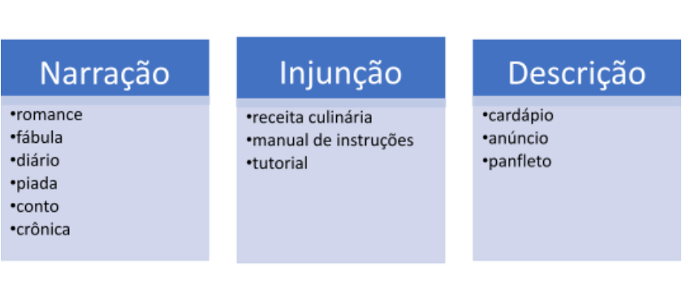

A **fábula** , por exemplo, é um texto narrativo alegórico, de texto curto e linguagem simples, cujos personagens são animais personificados e refletem as características humanas, como a preguiça, a previdência, a inveja, a falsidade, a coragem, a bondade. O desfecho da fábula transmite uma lição de moral ou uma crítica a comportamentos humanos. Vejamos: 

#### A Cigarra e a Formiga 

Num dia soalheiro de Verão, a Cigarra cantava feliz. Enquanto isso, uma Formiga passou por perto. Vinha afadigada, carregando penosamente um grão de milho que arrastava para o formigueiro. - Por que não ficas aqui a conversar um pouco comigo, em vez de te afadigares tanto? – Perguntou-lhe a Cigarra. - Preciso de arrecadar comida para o Inverno – respondeu-lhe a Formiga. – Aconselho-te a

---

<!-- pagina: 5 -->

**Equipe Português Estratégia Concursos, Felipe Luccas Aula 11** 

fazeres o mesmo. - Por que me hei-de preocupar com o Inverno? Comida não nos falta... – respondeu a Cigarra, olhando em redor. A Formiga não respondeu, continuou o seu trabalho e foi-se embora. Quando o Inverno chegou, a Cigarra não tinha nada para comer. No entanto, viu que as Formigas tinham muita comida porque a tinham guardado no Verão. Distribuíam-na diariamente entre si e não tinham fome como ela. A Cigarra compreendeu que tinha feito mal... 

Moral da história: Não enses só em divertir-te. Trabalha e ensa no futuro. <u>p p</u> 

Um gênero narrativo que tem sido bastante cobrado é a **crônica** , que se caracteriza por apresentar reflexões sobre fatos cotidianos, da vida social, do dia a dia, aparentemente banais. Dentro dessa temática, pode ser humorística, crítica, intimista. Geralmente é narrada em primeira pessoa e transmite a visão particular do autor. Sua linguagem é direta e geralmente informal, registrando a fala literal e espontânea dos personagens. 

<!-- Start of picture text -->
==5460== <!-- End of picture text -->

Pode haver presença de lirismo e ironia. Contudo, há crônicas de alguns autores, especialmente clássicos, em que se verifica registro formal e erudito da língua. 

Antes de detalhar cada um dos tipos, vamos relembrar a diferença entre Tipo e Gênero: 

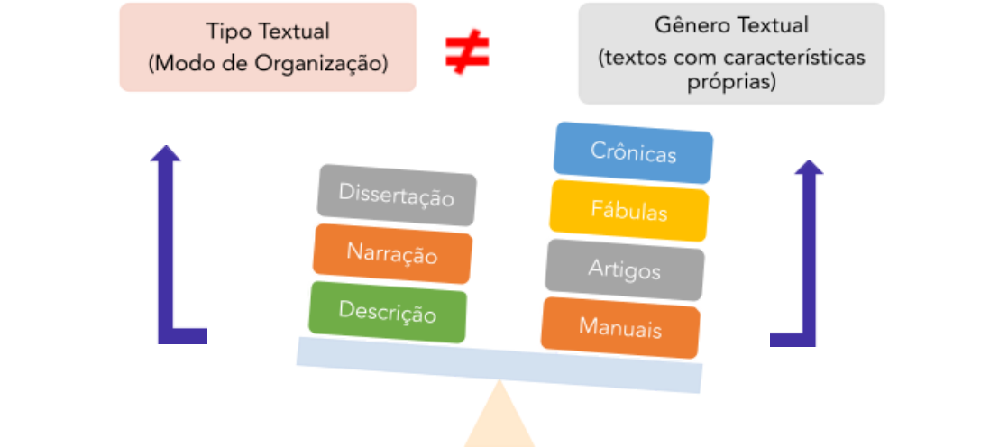

Em suma, os tipos textuais principais são poucos, mas os gêneros são inúmeros e estão sempre surgindo novos, de modo a abranger as novas “situações comunicativas”. 

https://t.me/KakashiAssinaturasBot

---

<!-- pagina: 6 -->

**Equipe Português Estratégia Concursos, Felipe Luccas Aula 11** 

#### **(PREF. CAMBORIU - SC / PROFESSOR / 2021)** 

Sobre tipologias textuais, assinale a alternativa correta. 

A) Os gêneros textuais são formas de comunicação a serviço das tipologias textuais. 

B) As tipologias textuais podem ser classificadas em primárias e secundárias. 

C) As tipologias textuais são ferramentas essenciais a serviço dos gêneros textuais. 

D) O site, o blog, o chat, o e-mail são exemplos de tipologias textuais recentes advindas da presença marcante de um novo suporte tecnológico na comunicação: a Internet. 

E) Para a produção de um tipo textual, o autor deve valer-se sempre do nível de linguagem cuidada, ou seja, culta. 

**Comentários:** 

Questão um pouco mais técnica. Vejamos as alternativas: 

A) ERRADA. É o contrário: a tipologia é que auxilia os gêneros. 

B) ERRADA.  Não há essa classificação para tipologia textual. 

C) CERTA. 

D) ERRADA.  O site, o blog, o chat, o e-mail são exemplos de gêneros textuais. 

E) ERRADA.  O nível de linguagem depende do gênero a ser utilizado. Gabarito letra C. 

**(PREF. CRISTINÁPOLIS - SE / PROFESSOR / 2020)** 

Todos os itens a seguir são exemplos de gêneros textuais, EXCETO: 

A) Propaganda. B) Notícia. C) Injunção. D) Lista de Compras. 

**Comentários:** 

Lembre-se que: 

Tipo textual: como o texto é organizado (MODO) 

Gênero textual: características dos textos (O QUE). 

Assim, ao olhar para as alternativas, temos que "injunção" é um tipo textual (modo de organização do texto). Portanto, Gabarito letra C.

---

<!-- pagina: 7 -->

**Equipe Português Estratégia Concursos, Felipe Luccas Aula 11** 

# **NARRAÇÃO** 

A narração tem a finalidade de contar uma história, isto é, **retratar acontecimentos** , reais ou imaginários, sucessivos num lapso temporal, de forma linear ou não linear. É dinâmica, pois traz uma mudança de estado, uma sequência de fatos, uma relação de antes e depois. 

Os elementos da narrativa são **narrador, enredo, tempo** (quando), **lugar/espaço** (onde), **personagens** (quem) e um encadeamento de **eventos** (o quê) que se desenvolvem ou se complicam até um **clímax** e um posterior **desfecho** . 

Por narrar acontecimentos em **sequência no tempo-espaço** , o tempo verbal <u>predominante é o pretérito perfeito, embora também possa ocorrer o pretérito imperfeito ou até o presente,</u> quando se pretende aproximar os acontecimentos do tempo da narração. 

Não há uma estrutura rígida para a construção de um **enredo** , contudo a narrativa normalmente parte de um “fato narrativo inicial”, um evento que dá a **referência inicial** a partir do qual o enredo vai se desenvolver. Deve haver uma **relação de causalidade** entre os eventos, uma **integração lógica** das ações e acontecimentos, pois o relato de vários eventos desconexos não constitui um enredo, que deve ter uma unidade lógica. 

O enredo da narrativa geralmente vai partir de um <u>estado inicial de harmonia, que será interrompido por um fato gerador de desarmonia e confito, que causará a busca por uma</u> solução. Então, essa busca se desenrolará em várias outras ações e outros conflitos, até um clímax e um desfecho da história. Basta pensar em qualquer filme ou romance e perceberemos esse desenvolvimento. A banca não costuma cobrar isso de forma teórica, mas pode perguntar sobre a motivação dos personagens. 

**Não** há uma sequência rígida: as narrações podem ocorrer de forma muito . simplificada, resumidas ao relato de algumas poucas ações sequenciais 

A característica mais marcante de uma narração é a **sequência temporal** . A passagem do tempo narrativo geralmente se explicita por meio de advérbios de tempo, orações temporais, tempos verbais específicos. Contudo, pode vir implícita:

---

<!-- pagina: 8 -->

**Equipe Português Estratégia Concursos, Felipe Luccas Aula 11** 

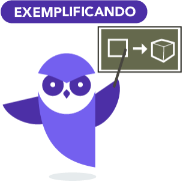

João deixou uma panela de feijão no fogo e foi à padaria comprar pão. Quando voltou, antes de entrar em casa, parou para brincar com seu cachorro e então sentiu um cheiro forte. Ao entrar em casa, percebeu que o feijão queimara. Desligou o fogo e gritou um palavrão bem alto. ==5460== 

Observe as marcas temporais: os verbos estão conjugados no **pretérito perfeito** , indicando ações perfeitamente concluídas. Os advérbios de tempo “antes”, “depois” e as orações temporais “quando voltou” e “ao entrar” sinalizam explicitamente a distribuição das ações na linha cronológica. Em “desligou o fogo E gritou”, o “E” aditivo é uma marca implícita da passagem do tempo, pois também indica uma ação seguida da outra. 

As narrativas podem seguir cronologias irregulares, tempos psicológicos, em que os eventos são narrados dentro da consciência do narrador e não coincidem com o tempo real. Também podem ser contadas de trás para frente, em “flashback”. 

O **ritmo** da narrativa também pode variar, podemos ter uma “narrativa direta”, que se desenvolve rapidamente, com foco em levar o leitor diretamente ao desfecho. Esse é o caso das piadas, anedotas, tirinhas. 

Também podemos ter uma “narrativa indireta”, que se desenvolve de forma mais lenta, com muitas interrupções e digressões do narrador, com rodeios, devaneios, pausas para descrições e intercalação de subnarrativas de eventos secundários. Esse é o estilo de narração de grandes obras, como “Memórias Póstumas de Brás Cubas” de Machado de Assis e “Dom Quixote” de Miguel de Cervantes. 

Quanto ao elemento “ **personagens** ”, é importante lembrar que são seres humanos ou humanizados (entidades personificadas, com atitude humana). Podem ser principais e secundários, de acordo com sua importância na narrativa. 

O personagem **protagonista** é um dos principais e conduz a ação. Sua experiência é o foco da narrativa, que geralmente se funda na solução de um conflito ou busca do personagem principal. 

O personagem **antagonista** é aquele que se opõe ao objetivo do protagonista. Suas ações geram obstáculos que ajudam a desenvolver a narrativa em outras ações e outras subtramas. Pessoal, isso é bem simples, basta pensar nos “heróis” e “vilões” dos filmes e quadrinhos. 

Os principais gêneros textuais narrativos são charges, piadas, contos, novelas, crônicas e romances.

---

<!-- pagina: 9 -->

**Equipe Português Estratégia Concursos, Felipe Luccas Aula 11** 

## **Tipos de narrador** 

O narrador pode apresentar diversos graus de interferência na história. 

Pode ser um **narrador personagem** , que conta a história em primeira pessoa e faz parte dela. Sua fala também pode vir registrada como a de um personagem comum, reproduzida literalmente ou indiretamente, com a pontuação pertinente. A narrativa em primeira pessoa é impregnada pela <u>opinião e pelas impressões do narrador. Veja o exemplo:</u> 

"Não tínhamos dinheiro para passagem de ônibus a próxima cidade, de modo que meu amigo sugeriu irmos de trem de carga, a condução dos espertos. Quando anoiteceu, corremos a nos esconder num vagão vazio. Ofegantes, fechamos a pesada porta e nos estendemos sobre o chão. Estávamos cansados e famintos." 

Pode ser um **narrador observador** , que narra a história em terceira pessoa, como se a assistisse de fora, traz o relato de uma **testemunha** . 

"...Ele andava calmamente, a rua estava escura dificultando sua caminhada, mas ele parecia não se importar, andava lentamente como se a escuridão não o assustasse..." 

Por fim, pode ser um **narrador onisciente** , que não só narra a história, mas também tem pleno conhecimento do pensamento e das emoções dos personagens, bem como sobre o passado e o futuro dos acontecimentos. Não há segredos para ele, pode desvelar a tendência e a personalidade dos personagens, mesmo que esses mesmos não saibam. Ele conhece a verdade da narrativa. 

“Ele sofria como um tolo desde a despedida dela. Dizia para si mesmo um milhão de vezes que ela um dia voltaria. Mas no fundo, o idiota se obrigava a acreditar nesta imbecil fantasia. Afinal, era a única coisa que o impedia de estourar os ró rios miolos”. <u>p p</u> 

## **Tipos de discurso do narrador** 

O narrador dispõe de 3 tipos de discurso para estruturar sua narrativa e mostrar ao leitor as falas, as emoções e o pensamentos dos personagens. São eles: o discurso direto, o indireto e o indireto livre. 

## **Discurso direto** 

É narrado em **primeira pessoa** , retratando as exatas palavras dos personagens. 

Caracteriza-se pelo uso de verbos dicendi ou declarativos, como dizer, falar, afirmar, ponderar, retrucar, redarguir, replicar, perguntar, responder, pensar, refletir, indagar e outros que exerçam

---

<!-- pagina: 10 -->

**Equipe Português Estratégia Concursos, Felipe Luccas Aula 11** 

essa função. A pontuação se caracteriza pela presença de dois pontos, travessões ou aspas para isolar as falas, que são claramente alternadas, bem como de sinais gráficos, como interjeições, interrogações e exclamações, para indicar o sentimento que as permeia. 

"- Por que veio tão tarde? perguntou-lhe Sofia, logo que apareceu à porta do jardim, em Santa Teresa. 

- Depois do almoço, que acabou às duas horas, estive arranjando uns papéis. Mas não é tão tarde assim, continuou Rubião, vendo o relógio; são quatro horas e meia. 

- Sempre é tarde para os amigos, replicou Sofia, em ar de censura." 

(Machado de Assis, Quincas Borba, cap. XXXIV) 

## **Discurso indireto** 

É narrado em **terceira pessoa** e o narrador incorpora a fala dos personagens a sua própria fala, também utilizando os verbos de elocução (discendi ou declarativos) como dizer, falar, afirmar, . ponderar, retrucar, redarguir, replicar, perguntar, responder, pensar, refletir, indagar 

Trata-se de uma **paráfrase, uma reescritura das falas** , agindo o narrador como intérprete e informante do que foi dito. Geralmente traz uma oração subordinada substantiva, com a conjunção "que". 

---

<!-- pagina: 11 -->

**Equipe Português Estratégia Concursos, Felipe Luccas Aula 11** 

“A certo ponto da conversação, Glória me disse que desejava muito conhecer Carlota e perguntou por que não a levei comigo." 

“Capitu segredou-me que a escrava desconfiara, e ia talvez contar às outras” 

## **Discurso indireto livre** 

É um discurso **híbrido** , haja vista que concilia características dos dois anteriores. 

Há absoluta **liberdade formal e sintática por parte do narrador, que mistura reproduções literais das falas com paráfrases** , que alterna pensamentos e registro de falas e ações, aproximando a fala do narrador e do personagem, como se ambos falassem em uníssono. 

"Quincas Borba calou-se de exausto, e sentou-se ofegante. Rubião acudiu, levando-lhe água e pedindo que se deitasse para descansar; mas o enfermo após alguns minutos, respondeu que não era nada. Perdera o costume de fazer discursos é o que era." 

"Aperto o copo na mão. Quando Lorena sacode a bola de vidro a neve sobe tão leve. Rodopia flutuante e depois vai caindo no telhado, na cerca e na menininha de capuz vermelho. Então ela sacode de novo. 'Assim tenho neve o ano inteiro'. Mas por que neve o ano inteiro? Onde é que tem neve aqui? Acha lindo a neve. Uma enjoada. Trinco a pedra de gelo nos dentes." 

Por ser o discurso mais difícil de ser percebido, vamos sintetizar suas principais características: 

- ✔ As falas das personagens (feitas na 1ª pessoa) surgem espontaneamente dentro discurso do narrado (na 3ª pessoa); 

- ✔ Não há marcas que indiquem a separação das falas do narrador e da personagem; 

- ✔ Não é introduzido por verbos de elocução, nem por sinais de pontuação ou conjunções;

---

<!-- pagina: 12 -->

**Equipe Português Estratégia Concursos, Felipe Luccas Aula 11** 

- ✔ Por vezes, é difícil delimitar o início e o fim da voz da personagem, já que está inserida dentro da voz do narrador; 

- ✔ O discurso do narrador transmite o sentido do discurso da personagem; 

- ✔ O narrador é onisciente de todas as falas, sentimentos, reações e pensamentos da personagem. 

## **Passagem do discurso direto para o indireto** 

Essa conversão é cobrada em prova e deve observar algumas mudanças. 

Todas essas mudanças são lógicas e decorrentes da própria passagem de uma fala literal para uma fala recontada. Então, vamos sistematizar essas regras gerais. 

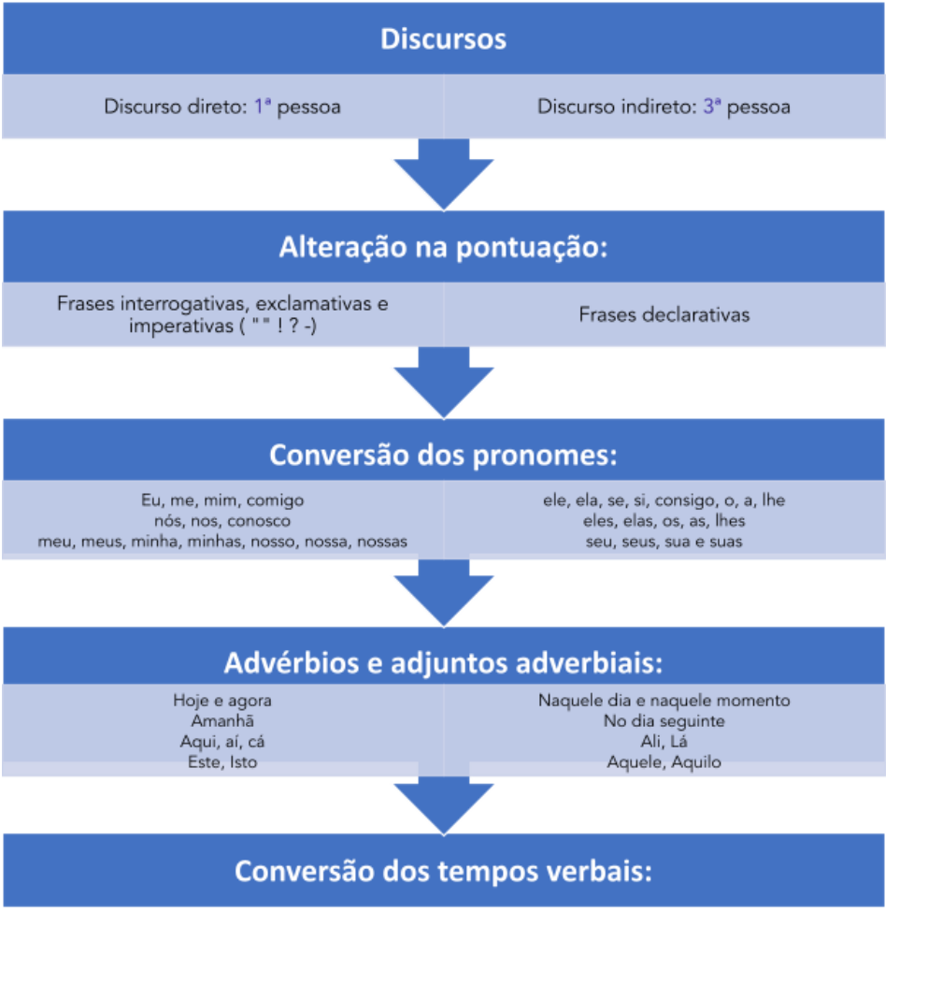

https://t.me/KakashiAssinaturasBot

---

<!-- pagina: 13 -->

**Equipe Português Estratégia Concursos, Felipe Luccas Aula 11** 

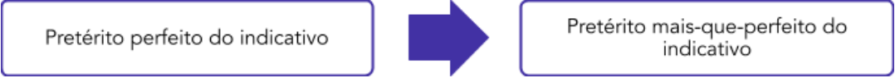

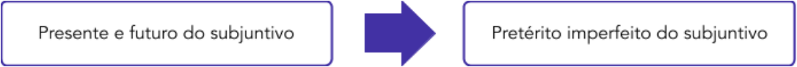

— Fujam agora— ordenou o General. O general ordenou que fugissem imediatamente (naquele momento). Pedro: Eu confesso— Quero viver sem pensar tanto em mim mesmo—. Pedro confessou que queria viver sem pensar tanto em si mesmo. “Começo a estudar amanhã aqui mesmo nesta bibliblioteca” — Prometeu Maria. Maria prometeu que começaria a estudar no dia seguinte, ali mesmo naquela biblioteca. Quem me chamou ontem? — perguntou Maria. Maria perguntou quem a chamara no dia anterior. 

Observe que a conversão do discurso direto para o indireto está sinalizada principalmente pelo verbo “declarativo” (verbo discendi), ou seja, aquele que introduz a fala (disse, declarou, afirmou, respondeu, retrucou etc), seguido da oração com conjunção integrante "que", "quem". 

https://t.me/KakashiAssinaturasBot

---

<!-- pagina: 14 -->

**Equipe Português Estratégia Concursos, Felipe Luccas Aula 11** 

Então, muitas vezes somente o verbo declarativo é passado para o discurso indireto e os verbos do restante da fala são mantidos nos tempos originais. 

— “Pedro não desistirá” — disse João. (Discurso Direto) 

João disse que Pedro não desistiria. 

João disse que Pedro não desistirá. 

#### **(CREF - 20ª Região  / 2019)** 

“A prática demonstra isso: um quadro de emoções negativas conduz à depressão e a outros males”, diz ele. 

De acordo com o texto, julgue o item a seguir. 

‐ O emprego do sinal de dois pontos à linha 21 justifica se por introduzir discurso direto. 

**Comentários:** 

De fato, dois pontos podem ser utilizados para iniciar uma fala / discurso direto, mas não é o caso da questão. No trecho, a pontuação é utilizada para iniciar uma enumeração. Questão incorreta. 

#### **(PREF. NOVO HORIZONTE-SP / 2019 - Adaptada)** 

“Oi, você poderia me dar indicações de brinquedos para meninas?”, diz uma mãe, num diálogo hipotético com a atendente de uma grande loja de brinquedos. Do outro lado do balcão, a atendente não hesita em apontar: “a Baby tem saído bastante”. A mãe: “e para meninos?”; outra resposta rápida: “temos Lego, dinossauros e super-heróis”. 

Acerca da seguinte afirmação sobre reescritas de trechos do texto, com mudança de discurso direto para indireto, julgue. 

Todo o período das linhas 01 e 02 do texto pode ser transcrito corretamente da seguinte forma: Uma mãe pergunta a uma atendente de uma grande loja de brinquedos se ela poderia dar-lhe indicações de brinquedos para meninas. 

**Comentários:** 

Note que o verbo "poderia", presente na estrutura original, está no Futuro do Pretérito do Indicativo e, por isso, não sofre alteração. A mesma coisa acontece com "diz", no Presente do Indicativo: por mais que tenha sido trocado por "pergunta", o tempo verbal é mantido. Questão correta. 

## **Opinião do autor/narrador**

---

<!-- pagina: 15 -->

**Equipe Português Estratégia Concursos, Felipe Luccas Aula 11** 

Percebemos que o **discurso direto** é mais objetivo, pois narra falas literais, exatamente como proferidas, de modo que o leitor pode julgar por si mesmo a atitude dos personagens. Então, o discurso direto ajuda a construir “veracidade” e “credibilidade” no que foi dito. 

Já no **discurso indireto e indireto livre** , o narrador divide com o leitor seu próprio ponto de vista, sua própria leitura dos fatos. Inclusive, ao recontar as falas dos outros, já pode estar inserindo seu viés na própria escolha das palavras. 

Nesse contexto, a opinião do narrador (ou do locutor de um texto argumentativo) pode ser verificada em algumas pistas, palavras que indicam em algum nível as verdadeiras impressões sobre o que se fala. Essas expressões que indicam ponto de vista são chamadas de “modalizadores”: 

**Ex:** Pedro infelizmente não tinha chegado ainda, devia estar no maldito trânsito e fatalmenteperderia o início do evento que lutara para organizar. 

No exemplo acima, os advérbios “infelizmente” e “fatalmente” indicam que o locutor considera negativos o acontecimento de perder o início do evento. Então, tais expressões revelam um viés “afetivo” e “subjetivo”. 

O advérbio “ainda” indica que há na fala expectativa ou convicção de que ele já deveria ter chegado. Se o advérbio utilizado fosse “já” (ele já chegou), o sentido seria outro e revelaria a visão de que ele chegou mais rápido que o esperado. 

O verbo “devia” foi usado como um modalizador, para indicar “possibilidade/probabilidade”, de modo que sabemos que não há certeza absoluta naquela declaração. Se fosse usado outro verbo, como “poderia”, ou um uma forma verbal mais categórica, como “estava”, os sentidos seriam outros e a visão do fato pareceria outra. 

O adjetivo “maldito” expressa verdadeiro rancor contra o “trânsito”. 

O verbo “lutar” também indica que o autor considera o ato de “organizar” o evento uma tarefa difícil, que exigia esforço e encontrava oposição, enfim, uma luta. 

Esses são apenas alguns indícios de opinião do narrador/autor, examinados num pequeno período. No texto, qualquer estrutura ou classe de palavras (verbos, adjetivos, advérbios, palavras denotativas, interjeições) pode ser vestígio de uma opinião subjacente. 

O que foi dito acima **não** é exclusivo para “narradores”: vale para a opinião do autor em dissertações, argumentações, propagandas, artigos, matérias jornalísticas e qualquer gênero textual. 

Cuidado, não é qualquer adjetivo ou advérbio que necessariamente indica um juízo de valor! Muitas vezes eles têm caráter mais objetivo, embasado em uma situação concreta. É preciso analisar o contexto e as opções da questão. 

Para exemplificar a teoria, vamos às questões? 

---

<!-- pagina: 16 -->

**Equipe Português Estratégia Concursos, Felipe Luccas Aula 11** 

|**(PREF. CAPANEMA - PA / 2020 - Adaptada)** **Pela emancipação masculina**|
|---|
|Uma pequena aglomeração na orla da Barra da Tijuca. Homens, em sua esmagadora maioria. O carro de som parado, o zunido do microfone enquanto passam o som, a faixa ligeiramente torta. É a primeira passeata masculinista do Brasil. João Marcelo é aquele cara ali, vestindo regata. Ele organizou o evento pelo WhatsApp. Tudo começou por causa de um controle remoto. Sempre que Miriam, sua esposa, botava o pé para fora de casa, o controle da TV desaparecia. E só quando ela voltava, o mistério era solucionado: estava na cara dele o tempo todo. Foi nesse meio-tempo, assistindo ao Rodrigo Hilbert a contragosto, que João Marcelo se deu conta da violência diária e silenciosa que ele sofria: a dependência do sexo feminino. Agora, João Marcelo quer que todos os homens sejam livres. E ele não está sozinho. Paulão é segurança particular e já perdeu dois empregos por causa de seu terno “abarrotado” (sic). Depois que a Sandra foi embora, ele parece um cosplay de Agostinho Carrara. Vocifera ao megafone em defesa de meninos inocentes que dependem dos caprichos de uma mãe, às vezes até de um pai – “porque homem oprime homem também!” – para se alimentar e fazer a própria higiene pessoal. É um projeto de dominação diabólico que visa domesticar os homens para sempre, desde pequenos. Uma ciclista curiosa interpela os manifestantes. Lidiane quer saber que injustiças são essas que esses homens alegam estar sofrendo. O tom da moça causa revolta. O feminismo é a pauta da vez, ninguém fala das mazelas do homem, só se ele for gay. Ela claramente não conhece a angústia de sair de casa para comprar rúcula e voltar com um ramo de espinafre. Ou de abrir uma gaveta cheia de meias soltas e não conseguir formar um par. Paulão tira a camisa envergonhado, ~~ex~~ibindo os cravos que se alastram em suas costas. Indiferente àquele tumulto em prol do empoderamento masculino, Lidiane pedala para longe, sob algumas vaias. Os cartazes começam a despontar na pequena multidão, estampando frases de efeito como: “minha próstata, minhas regras”, “a cada 11 minutos, um homem é obrigado a trocar um pneu no Brasil” e “paternidade é uma escolha, não uma obrigação”. A passeata segue pacificamente até ser interrompida por um apelo emocionado do organizador ao microfone: “Alguém viu minha carteira?”. (Disponível em: https://www1.folha.uol.com.br/colunas/manuelacantuaria/2019/09/pela-emancipacao-masculina.shtml. Acesso em: 10/09/2019. Manuela Cantuária.) Considere as afrmativas a seguir. I. A fnalidade do texto é narrar uma sequência de ações inusitadas para entreter o leitor. II. O foco narrativo do texto está na primeira pessoa do discurso e o narrador é o personagem principal da história. III. O texto é exemplo do gênero crônica narrativa, que se caracteriza pela fexibilidade de circular tanto no domínio discursivo jornalístico como também no literário. IV. O narrador do texto apresenta ao leitor suas impressões e inferências acerca de um acontecimento real, que serviu apenas de pretexto para expor suas refexões. Está correto o que se afrma apenas em|
|A) I e II. B) I e III. C) II e III. D) II e IV. E) III e IV.|

---

<!-- pagina: 17 -->

**Equipe Português Estratégia Concursos, Felipe Luccas Aula 11** 

#### **Comentários:** 

#### Vejamos os itens: 

I. CERTO. O texto narrativo tem esse objetivo. 

II. ERRADO. O narrador nesse texto é observador, por isso a narração é em 3ª pessoa. 

III. CERTO. Há trechos de narrativa, mas também há aqueles que se aproximam de uma matéria jornalística, por exemplo: " Uma pequena aglomeração na orla da Barra da Tijuca. Homens, em sua esmagadora maioria. (...) É a primeira passeata masculinista do Brasil." 

IV. ERRADO. O narrado apenas conta os fatos. Argumentação é característica de outro tipo textual - o argumentativo. 

#### Gabarito: Letra B. 

#### **(CREFONO - 9ª Região / 2019)** 

#### Vizinho, 

Quem  fala aqui é o homem do 1.003. Recebi outro  dia,  consternado,  a  visita  do  zelador,  que me  mostrou  a carta  em  que  o  senhor  reclamava  do  barulho  em  meu apartamento. Recebi, ‐ depois, a sua própria visita pessoal — devia  ser  meia noite  —  e  a  sua  veemente  reclamação verbal. Devo dizer que estou desolado com tudo isso, e lhe dou inteira razão. O regulamento do prédio é explícito e, se não o fosse, o senhor ainda teria ao seu lado a lei e a polícia. 

Quem trabalha o dia inteiro tem direito a repouso noturno e é impossível repousar no 903 quando há vozes, passos e músicas no 1.003, ou melhor, é impossível ao 903 dormir quando  o 1.003  se agita,  pois,  como não  sei  o  seu nome nem  o  senhor  sabe  o  meu,  ficamos reduzidos  a  ser  dois números empilhados entre dezenas de outros. Eu, 1.003, me limito a Leste pelo 1.005, a Oeste pelo 1.001, ao Sul pelo Oceano Atlântico, ao Norte pelo 1.004, ao alto pelo 1.103 e embaixo pelo 903 — que é o senhor. 

Todos esses números são comportados e silenciosos: apenas  eu  e  o  Oceano  Atlântico fazemos  algum  ruído  e funcionamos  fora dos horários civis; nós dois apenas nos agitamos e bramimos ao  sabor da maré, dos ventos e da Lua. 

Prometo sinceramente adotar, depois das 22 horas, de hoje em diante, um comportamento de manso lago azul. Prometo.  Quem  vier  à  minha  casa  (perdão:  ao  meu número) será convidado a se retirar às 21h45, e explicarei: o 903 precisa repousar das 22 às 7, pois às 8h15 deve deixar o 783 para tomar o 109 que o levará até o 527 de outra rua, onde ele trabalha na sala 305. Nossa vida, vizinho, está toda numerada:  e  reconheço  que  ela  só  pode  ser tolerável quando um  número  não incomoda  outro número, mas o respeita,  ficando  dentro ‐ dos  limites  de  seus  algarismos. Peço lhe desculpas – e prometo silêncio. 

‐ Rubem Braga. O verão e as mulheres. 10.ª ed. Rio de Janeiro:  Record, 2008, p. 21 23 (com adaptações) 

Em relação às ideias do texto, julgue o item. 

O texto consiste em uma crônica a respeito de um pequeno acontecimento diário comum nas grandes cidades. 

#### **Comentários:** 

É isso mesmo! A crônica narra fatos do dia a dia, acontecimentos cotidianos e atuais, de uma maneira diferente, com intenção crítica ou não. Questão correta.

---

<!-- pagina: 18 -->

**Equipe Português Estratégia Concursos, Felipe Luccas Aula 11** 

# **DESCRIÇÃO** 

Descrever é **caracterizar, relatar** em detalhes características de pessoas, objetos, imagens, cenas, situações, emoções, sentimentos. A descrição é uma pormenorização estática, uma pausa no tempo, geralmente uma interrupção da narração, para apresentação de traços dos seres. Para isso, se utiliza de muitos adjetivos, verbos de ligação que indicam estado e orações e locuções . adjetivas para caracterização 

O **tempo** mais usual é o pretérito imperfeito, por indicar uma ação continuada ou rotineira: era, fazia, estava, parecia... 

Importante lembrar que os **adjetivos** podem ter valor objetivo ou relacional, quando são isentos de opinião e simplesmente expressam um fato: carro preto, homem japonês, doença degenerativa. Esses adjetivos geralmente não aceitam gradação (homem mais japonês) e vão indicar uma descrição objetiva. 

Já os **adjetivos qualificativos ou subjetivos** expressam opinião, não são fatos, essas qualidades podem ser graduadas e questionadas: homem bonito, carro extravagante, aluno teimoso, lugar longe, muito longe... Esses adjetivos, por sua vez, caracterizam uma descrição subjetiva, impregnada pela opinião de quem descreve. 

A descrição quase sempre está presente em outros tipos textuais, assim como dificilmente é encontrada na sua forma pura, de modo que também é comumente permeada por trechos narrativos ou dissertativos. Nas provas de concurso, **o mais comum é a descrição aparecer dentro de uma narração.** 

Difere-se fundamentalmente da narração por trazer acontecimentos **simultâneos** , que ocorrem ao mesmo tempo, sem progressão temporal e sem relação de anterioridade e posterioridade. As ações podem descrever uma rotina, ações habituais, sem foco narrativo. 

A descrição está para uma foto, assim como a narração está para um filme. 

Além disso, a descrição é o tipo textual que predomina em gêneros como manuais, propagandas, biografias, relatórios, definições e verbetes, tutoriais. 

É rara a cobrança de uma descrição pura. Vamos ver um exemplo, retirado da prova do Centro Brasileiro de Pesquisas Físicas: 

“Amanhece na ilha de Heron. Sobre a imensa faixa de areia, que se estende em curva até desaparecer na bruma da manhã, despeja-se uma lua violácea, que pouco a pouco se encorpa. Mas é somente quando o sol oblíquo já incide sobre as areias e a água, sobre a vegetação rasteira e os tufos de algas que brilham nas

---

<!-- pagina: 19 -->

**Equipe Português Estratégia Concursos, Felipe Luccas Aula 11** 

pedras com a maré baixa, é só então – nunca antes – que se pode notar o primeiro movimento na praia.” 

O texto começa pela descrição da ilha de Heron. Um texto descritivo é caracterizado fundamentalmente por: 

a) ações que ocorrem em uma sequência cronológica. 

b) reflexões sobre aspectos problemáticos da vida. 

c) registro de elementos caracterizadores de uma realidade. 

d) citação de informações sobre determinado objeto. 

e) conjunto de pensamentos inacabados. 

A resposta é a letra C. Observe a **descrição estática** da paisagem da ilha, a abundância de adjetivos, a construção de uma **imagem** . Não há ações em sequência cronológica, nem reflexões sobre problemas, nem pensamentos ==5460== inacabados. Trata-se de uma descrição pura. 

Vejamos agora essas características nos textos que vêm sendo cobrados: 

#### **(CGU / 2022)** 

“A imagem era de uma pessoa que não podia inspirar outro sentimento que não o do respeito, porque seu aspecto mostrava uma face larga com um grande nariz e pequenos olhos abaixo de grossas sobrancelhas. Uns lábios finos se desenhavam sob um bigode tímido, tudo isso com uma pele morena bastante fresca com traços de ótima saúde. A cabeça era suportada por um corpo bastante avantajado...” 

Esse pequeno fragmento é exemplo de um texto descritivo. A afirmação correta sobre ele é: 

(A) a descrição se limita a características físicas de uma pessoa, particularmente de sua cabeça; 

(B) a tendência global dos traços descritivos apresentados é caracterizar uma pessoa por sua firmeza e elegância; 

(C) a estratégia descritiva empregada é a de dar uma ideia do todo, mostrando a seguir detalhes desse todo; 

(D) o observador encarregado da descrição faz questão de ser bastante objetivo, sem interferências de caráter subjetivo; 

(E) as características apresentadas, relativas ao aspecto geral da pessoa descrita, não confirmam a

---

<!-- pagina: 20 -->

**Equipe Português Estratégia Concursos, Felipe Luccas Aula 11** 

imagem de respeito referida no início do texto. 

#### **Comentários:** 

(A) Incorreto. A descrição não se limita a características físicas de uma pessoa, particularmente de sua cabeça; fala também da sua aura respeitável e do corpo avantajado. 

(B) Incorreto.  Não há nada que descreva firmeza e elegância; 

(C) Correto.  A estratégia descritiva empregada é a de dar uma ideia do todo, começando pela imagem geral da pessoa (respeitável), mostrando a seguir detalhes desse todo (face, nariz, olhos, bigodes). 

(D) o observador encarregado da descrição faz questão de ser bastante objetivo, sem interferências de caráter subjetivo; 

(E) as características apresentadas, relativas ao aspecto geral da pessoa descrita, não confirmam a imagem de respeito referida no início do texto. 

Gabarito letra C. 

#### **(PGE-PE / 2019)** 

Passávamos férias na fazenda da Jureia, que ficava na região de lindas propriedades cafeeiras. Íamos de automóvel até Barra do Piraí, onde pegávamos um carro de boi. Lembro-me do aboio do condutor, a pé, ao lado dos animais, com uma vara: “Xô, Marinheiro! Vâmu, Teimoso!”. Tenho ótimas recordações de lá e uma foto da qual gosto muito, da minha infância, às gargalhadas, vestindo um macacão que minha própria mãe costurava, com bastante capricho. Ela fazia um para cada dia da semana, assim, eu podia me esbaldar e me sujar à vontade, porque sempre teria um macacão limpo para usar no dia seguinte. 

Jô Soares. O livro de Jô: uma autobiografia 

desautorizada. São Paulo: Companhia das Letras, 2017. 

O texto é essencialmente descritivo, pois detalha lembranças acerca das viagens de férias que a personagem e sua família faziam com frequência durante a sua infância. 

#### **Comentários:** 

Essencialmente, predominantemente, principalmente o texto é narrativo, pois há clara sucessão de fatos e objetivo último de contar uma história, narrar uma sequência de ações ao longo do tempo. 

Questão incorreta.

---

<!-- pagina: 21 -->

**Equipe Português Estratégia Concursos, Felipe Luccas Aula 11** 

# **INJUNÇÃO** 

O texto injuntivo traz **instruções ao leitor** para realizar certa tarefa. Ensina, orienta, interpela ou obriga o leitor a fazer alguma coisa. 

Sua principal característica é apresentar verbos no imperativo, em comandos neutros, genéricos e impessoais, para prescrever alguma ação do leitor. O uso do infinitivo impessoal também é usado como estratégia de neutralidade, pois omite o agente: 

**Ex:** Passo 1, remover a embalagem. Passo 2, inserir CD de instalação. 

**Ex:** 149 - Compete à autoridade judiciária disciplinar, através de portaria, ou autorizar, mediante alvará... 

Observamos esse tipo textual em gêneros como leis, regulamentos, contratos, manuais de instrução, receitas de bolo, tutoriais. 

#### **(PREF. CORDILHEIRA ALTA - SC  / 2019 - adaptada)** 

#### **3 truques para tirar as manchas mais difíceis** 

Agora você pode comer aquela macarronada sem se preocupar. Testamos todas as fórmulas milagrosas para garantir que suas roupas fiquem sempre limpas. 

1. Molho de tomate 

- 1 colher de sopa de sabão em pó; 1/2 copo de água; 1 colher de sopa de lustra-móveis; 2 colheres de sopa de água sanitária. 

Modo de fazer 

Dilua o sabão em pó na água e misture-o aos outros ingredientes. Aplique a solução sobre a mancha e deixa-a repousar de 5 a 10 minutos. Use uma escova de dentes para esfregar. Enxágue. Se não sair, repita o processo. 

2. Óleo ou gordura 

- 1 colher de sopa de lustra-móveis; 1/2 colher de sopa de detergente. Modo de fazer 

Aplique a solução e deixe repousar de 5 a 10 minutos. Use uma escova de dentes para esfregar e enxágue. Se não sair, repita o processo. 

#### 3. Vinho 

- 1 colher de sopa de sabão em pó; 1/2 copo de água; 5 colheres de sopa de produto para limpeza pesada (usado para limpar azulejo e fogão); 5 colheres de sopa de água sanitária.

---

<!-- pagina: 22 -->

**Equipe Português Estratégia Concursos, Felipe Luccas Aula 11** 

#### Modo de fazer 

Aplique a solução e deixe repousar de 5 a 10 minutos. A mancha ficará marrom: não se preocupe, é normal. Use uma escova de dentes para esfregar e enxágue. 

O texto apresenta: 

A) Uma história. B) Uma notícia. C) Instruções. D) Uma poesia. E) Uma propaganda. 

#### **Comentários:** 

O texto claramente é injuntivo / instrucional: é um passo a passo de como tirar manchas difíceis. Gabarito: Letra C. 

<!-- Start of picture text -->
==5460== <!-- End of picture text -->

---

<!-- pagina: 23 -->

**Equipe Português Estratégia Concursos, Felipe Luccas Aula 11** 

# **DISSERTAÇÃO** 

Agora veremos o assunto **mais importante** desta aula e talvez deste curso. Digo isso porque a dissertação é o tipo textual mais cobrado, tanto em tipologia quando nas questões de português que trazem textos. Conhecer a estruturação desse tipo vai ser vital na interpretação em geral, pois aprenderemos as estratégias argumentativas que são objeto de questões de compreensão e das provas discursivas, além de ficarmos familiares com a estruturação correta de um parágrafo e de um texto. 

O texto dissertativo basicamente **expõe ideias, razões, teorias, raciocínios, abstrações,** por meio de **relações lógicas sequenciadas no texto,** dentro de uma <u>estrutura específca</u> (introdução, desenvolvimento e conclusão), sem necessária progressão temporal. Por ser neutra, atemporal e clara, marca-se pelo uso dos **verbos no presente** , porque indicam verdades universais: “a água ferve a 100 graus”; “a terra gira em torno do sol”. 

A dissertação pode ser objetiva, também chamada de **expositiva** ; ou subjetiva, também chamada de **argumentativa** ou **opinativa** . Veremos também que há subtipos para um texto argumentativo e para um texto expositivo. 

Na maioria das provas, a banca espera que o candidato saiba identificar textos dissertativos com diferentes finalidades. 

## **Texto dissertativo expositivo (puro)** 

A finalidade essencial de um texto expositivo é trazer conceitos, discutir um assunto de maneira impessoal e objetiva, ou seja, **sem defesa clara de uma opinião** . Não há defesa de tese, apenas exposição clara e atemporal de ideias. 

Diz-se que o autor é impessoal e o leitor é universal. O autor explana o que sabe de forma neutra e permite que o leitor forme sua própria opinião. Pode ocorrer que a opinião do autor transpareça pelo sentido dos modalizadores (marcas linguísticas de opinião), mas **não é seu objetivo primário** criar debate e convencer o leitor. 

As questões discursivas de provas de Auditor-Fiscal ou Analista de Tribunais são exemplos desse tipo de dissertação, em que o candidato-autor apenas expõe o conteúdo pedido no enunciado, sem opinar. Por isso, algumas bancas chamam esse tipo de “explicativo”. 

---

<!-- pagina: 24 -->

**Equipe Português Estratégia Concursos, Felipe Luccas Aula 11** 

"Com a pandemia, o planejamento de diversos certames previstos para 2020 acabou sendo prejudicado. Por outro lado, já está sendo observada uma abertura gradual da economia em alguns Estados, fato que deve se replicar no resto do Brasil." 

## **Texto dissertativo expositivo-informativo** 

É um subtipo do expositivo. Esse texto visa **acrescentar informação nova** ao leitor, ao contrário do expositivo puro, que não pressupõe que a informação discutida seja nova para quem lê. 

É comum ocorrerem no texto informativo trechos descritivos, como dados, estatísticas; ou narrativos, como relatos de acontecimentos, mas é a finalidade do texto que deve ser o critério de identificação do tipo textual. Não é por trazer relato de um crime que um texto com clara finalidade de trazer informação nova ao leitor (sobre uma ação da polícia, por exemplo) deve ser classificado como uma narrativa. 

Atentem para isso, pois quase todo texto dissertativo traz elementos de outra tipologia. 

"Foi encaminhado, em agosto de 2020, ao Congresso Nacional, o Projeto de Lei Orçamentária Anual (PLOA). A proposta trouxe a previsão de receitas e despesas da União para 2021, incluindo a criação de vagas. 

O anexo V do documento prevê o provimento de 50.946 cargos no Poder Executivo Federal, os quais estão distribuídos da seguinte maneira (...)" 

## **Texto dissertativo argumentativo** 

O texto argumentativo, além de discutir e informar, **defende uma tese** , uma opinião pessoal, tendo como finalidade principal o **convencimento** do leitor. 

Para persuadi-lo, o autor se utiliza de modalizadores e de operadores argumentativos, construindo fundamentação para seus argumentos por via de relações lógicas organizadas numa estrutura argumentativa progressiva. 

A **linguagem** utilizada é **clara, impessoal** (embora parcial), culta. A primeira pessoa é utilizada para realçar a inclusão do autor no universo de ideias discutidas e seu alinhamento aos argumentos utilizados, bem como para envolver o leitor. Também é comum o uso da terceira

---

<!-- pagina: 25 -->

**Equipe Português Estratégia Concursos, Felipe Luccas Aula 11** 

pessoa, com verbos no presente do indicativo, como estratégia para sugerir que as informações são fatos. Os verbos são semanticamente carregados e sugerem ou corroboram a opinião que está sendo defendida. Esses **argumentos** são apresentados de **forma estruturada** , com progressão. 

Algumas provas também cobram o conceito de texto **dissertativo argumentativo polêmico** , que seria semelhante à modalidade argumentativa, mas com a diferença de trazer **pelo menos dois pontos de vista e contrabalanceá-los.** 

## **A estrutura ar umentativa** **<u>g</u>** 

Como dito, a dissertação argumentativa traz uma **progressão lógica de argumentos** . Em nível estrutural, essa progressão toma a forma de introdução, desenvolvimento e conclusão. 

Na **introdução** , o autor apresenta o tema, a ideia principal, sua tese. 

No **desenvolvimento** , o autor traz argumentos de apoio ao convencimento. 

Na **conclusão** , o autor retoma a ideia central, apresentada na introdução, e consolida seu raciocínio. Nesse parágrafo, geralmente ele oferece soluções para os problemas discutidos, faz constatações e reitera sua opinião de forma mais incisiva. 

Existe grande liberdade na forma com que os autores constroem suas argumentações. Alguns autores concluem logo no início, depois justificam sua posição, outros trazem sua tese somente no final. Aprenderemos aqui as principais e mais consagradas técnicas de estruturação e de argumentação, para que o aluno seja capaz de reproduzi-las em uma redação de sua própria autoria, bem como reconhecê-las nos textos da prova. 

Vejamos em detalhes cada uma dessas partes. 

## **Introdu ão** **<u>ç</u>** 

A introdução deve conter a **tese** , ou seja, uma afirmação que deverá ser sustentada no decorrer dos parágrafos. Se o autor pudesse sintetizar todo seu texto numa sentença, essa seria sua tese. 

A opinião do autor aqui aparece de modo brando e será reiterada de modo forte na conclusão. 

Também é na introdução que o autor tenta **seduzir o leitor, captar seu interesse** , atraindo-o para continuar lendo. 

Muito teórico?! Então vamos à prática!

---

<!-- pagina: 26 -->

**Equipe Português Estratégia Concursos, Felipe Luccas Aula 11** 

## **Fórmulas de Introdu ão** **<u>ç</u>** 

Os textos dissertativos se estruturam de modo lógico para convencer o leitor. A introdução já é um momento de sugerir a estrutura que uma dissertação argumentativa deve tomar, sua divisão, sua progressão... etc. Vejamos fórmulas comuns de se construir um parágrafo introdutório. 

**Divisão** : é a enumeração explícita dos aspectos que serão tratados. É fácil e deixa o texto mais organizado. Além disso, facilita o uso de elementos de coesão: "em relação ao primeiro item", "já quanto ao segundo"... 

**Ex:** O problema das chuvas tem recebido bastante destaque na mídia, em grandes nesse contexto: <u>a</u> debates sobre quem seria o responsável. Há dois fatores principais <u>omissão do governo e a ação dos cidadãos.</u> 

Ao continuar o texto, o 1º Parágrafo do desenvolvimento será: A omissão do governo pode ser observada em casos como... 

E o 2º Parágrafo do desenvolvimento: Já a ação dos cidadãos também influencia nesse resultado porque... 

**Ex:** No Brasil, a tradição política no tocante à representação gira em torno de três ideias fundamentais. A primeira é a do mandato livre e independente, isto é, os representantes, ao serem eleitos, não têm nenhuma obrigação, necessariamente, para com as reivindicações e os interesses de seus eleitores. O representante deve exercer seu papel com base no exercício autônomo de sua atividade, na medida em que é ele quem tem a capacidade de discernimento para deliberar sobre os verdadeiros interesses dos seus constituintes. A <u>segunda ideia</u> é a de que os representantes devem exprimir interesses gerais, e não interesses locais ou regionais. Os interesses nacionais seriam os únicos e legítimos a serem representados. A <u>terceira ideia refere-se ao princípio de que o sistema</u> democrático representativo deve basear-se no governo da maioria. Praticamente todas as leis eleitorais que vigoraram no Brasil buscaram a formação de maiorias compactas que pudessem governar. 

**Definição** : é a apresentação de um conceito. 

**Ex:** <u>Denomina-se</u> política ambiental o conjunto de decisões e ações estratégicas que visam promover a conservação e o uso sustentável dos recursos naturais. A política ambiental, portanto, tem relação direta com todas as demais políticas que promovam o uso dos recursos. Por isso, embora a responsabilidade pelo seu estabelecimento seja dos órgãos ambientais, todas as demais áreas de governo têm um papel a cumprir na execução das políticas ambientais. 

**Citação:** é a reprodução literal ou indireta da fala de alguém cuja opinião seja relevante no contexto daquela dissertação. Essa técnica também pode ser usada para introduzir logo na introdução um argumento de autoridade. 

**Ex:** <u>Como afirma Foucault, a verdade jurídica é uma relação construída a partir de um</u> paradigma de poder social que manipula o instrumental legal, de um poder-saber que estrutura discursos de dominação. Assim, não basta proteger o cidadão do poder com o

---

<!-- pagina: 27 -->

**Equipe Português Estratégia Concursos, Felipe Luccas Aula 11** 

simples contraditório processual e a ampla defesa, abstratamente assegurados na Constituição. Deve haver um tratamento crítico e uma posição política sobre o discurso jurídico, com a possibilidade de revelar possíveis contradições e complexidades das tábuas de valor que orientam o direito. 

**Ex:** “A violência é tão fascinante, e nossas vidas são tão normais”. O <u>célebre verso de Renato Russo</u> traz à tona uma discussão atual sobre a segurança pública nas grandes capitais... 

**Ex:** “Disse Alexandre Dumas que Shakespeare, depois de Deus, foi o poeta que mais criou. Aos 37 anos, já escrevera 21 peças e inventara uma forma de soneto.” 

**Indagação** : é o uso de uma pergunta para captar a curiosidade do leitor ou para sinalizar o tema. Essa pergunta pode ser respondida na conclusão ou no desenvolvimento, com os argumentos. Pode também ser só uma tônica para o assunto. 

**Ex:** O problema das chuvas tem merecido bastante destaque na mídia, em grandes debates sobre quem seria o responsável. A maioria culpa o Governo, por sua omissão. Porém, <u>seriam alguns hábitos do cidadão comum responsáveis por grande parte desses eventos?</u> 

Aqui o autor poderia responder a essa pergunta ou se posicionar de forma diferente, atribuindo a um terceiro a culpa. A estratégia é seduzir o leitor e fazê-lo se perguntar quem seria o responsável e procurar a resposta no texto. 

**Frases nominais** : é o uso de uma frase seguida de uma explicação. A frase será o elemento de curiosidade, a frase seguinte será uma explicação. 

**Ex:** Calamidade pública. <u>Assim se referiu</u> o secretário estadual de saúde ao atual estado dos hospitais do Rio de Janeiro... 

**Ex:** Ditador, louco e genocida. Após baixar a fumaça das explosões, essas palavras podem <u>ser lidas em muralhas rachadas da maior capital do mundo árabe...</u> 

**Alusão histórica/literária** : é uma técnica de intertextualidade, comunicando a dissertação a outra obra.  A alusão serve para ressaltar semelhanças ou diferenças entre fenômenos atuais e passados, servindo como argumento para corroborar uma mudança ou uma estagnação. 

**Ex:** A Semana de Arte Moderna ocorreu no Teatro Municipal de São Paulo, em 1922, tendo como objetivo mostrar as novas tendências artísticas que já vigoravam na Europa. Essa nova forma de expressão <u>não foi compreendida pela elite paulista, que era</u> influenciada pelas formas estéticas europeias mais conservadoras. O idealizador deste evento artístico e cultural foi o pintor Di Cavalcanti. 

**Ex:** Na tarde do Yom Kipur de 1973, sábado, 6 de outubro, Egito e Síria atacam Israel. Surpreendido e tendo de lutar em duas frentes, num primeiro momento o país enfrenta dificuldades, mas menos de três semanas depois, em uma das mais impressionantes reviravoltas da história militar, seus exércitos estavam a caminho do Cairo e Damasco. Todo <u>esse tempo depois, ainda há resquícios desse conflito no dia a dia do povo palestino...</u> 

**Ex:** Machado de Assis, em seu conto a Igreja do Diabo, ironiza as religiões e a eterna

---

<!-- pagina: 28 -->

**Equipe Português Estratégia Concursos, Felipe Luccas Aula 11** 

tentação de violar prescrições e fazer o que é proibido. <u>Tal tentação ainda pode ser</u> observada, em casos como... 

**Ex:** Na mitologia grega, Prometeu é o titã que rouba o fogo dos deuses e é por eles condenado a um suplício eterno. Preso a uma rocha, uma águia devora-lhe constantemente o fígado. Trata-se de uma lenda altamente simbólica e aplicável à época <u>atual.</u> 

**Narração:** é trazer uma sequência de ações, ou um relato, que vai servir de insinuação do tema. 

**Ex:** No início do mês, um assaltante matou um jovem em São Paulo com um tiro na cabeça, mesmo depois de a vítima ter lhe passado o celular. Identificado por câmeras do sistema de segurança do prédio do rapaz, o criminoso foi localizado pela polícia, mas – apesar de todos os registros que não deixam dúvidas sobre a autoria do assassinato – não ficará um dia preso. Menor de idade, foi “apreendido” e levado a um centro de ‐ recolhimento. O máximo de punição a que está sujeito é submeter se, por três anos, à aplicação de medidas “socioeducativas”. 

**Ex:** Para desburocratizar e modernizar a administração pública federal, o Ministério do Planejamento, Orçamento e Gestão (MPOG) assinou acordo de cooperação com o Instituto Nacional de Tecnologia da Informação (ITI). O objetivo do termo é propor e implementar o Plano Nacional de Desmaterialização de Processos (PNDProc), que prevê a utilização da documentação eletrônica em todos os trâmites de processos. O extrato do pacto entre as entidades foi publicado nesta quarta-feira, 21, no Diário Oficial da União. 

**Ex:** Às 4 horas da manhã, o médico se prepara para a cirurgia que vai salvar a vida de um menino baleado. Aplica anestesia, mas é interrompido pelo flash de uma explosão. Assim têm vivido os profissionais que se voluntariaram no programa da cruz vermelha que trabalham nas regiões de conflito... 

**Declaração** : semelhante à frase nominal, com uma oração desenvolvida. Uma declaração forte no início do parágrafo introdutório surpreende o leitor e o induz a prosseguir na leitura. 

**Ex:** Jogar games de computador pode fazer bem à saúde dos idosos. Foi o que concluiu uma pesquisa do laboratório Gains Through Gaming (Ganhos através de jogos, numa tradução livre), na Universidade da Carolina do Norte, nos EUA. 

**Ex:** As projeções sobre a economia para os próximos dez anos são alentadoras. Se o Brasil mantiver razoável ritmo de crescimento nesse período, chegará ao final da próxima década sem extrema pobreza. Algumas projeções chegam a apontar o país como a primeira das atuais nações emergentes em condições de romper a barreira do subdesenvolvimento e ingressar no restrito mundo rico. 

**Ex:** O homem moderno sucumbiu ao consumismo, tem cada vez mais coisas e cada vez menos tempo. Agora chegou ao extremo de comprar produtos cuja finalidade é o próprio desperdício... 

Muito bem! Essas são algumas das principais fórmulas de introdução. Elas podem ser mescladas e adaptadas aos seus argumentos. Observem o exemplo (de prova):

---

<!-- pagina: 29 -->

**Equipe Português Estratégia Concursos, Felipe Luccas Aula 11** 

Tem saído nos jornais: chuvas deixam São Paulo no caos. É verdade que os moradores estão sofrendo além da conta, quer estejam circulando pela cidade com seus carros ou nos ônibus e metrô, quer estejam em casa ou no trabalho. Três fatores criam a confusão: semáforos desligados; alagamentos nas ruas; falta de energia. Então, tudo culpa da chuva, certo? Errado. 

Nessa introdução constam uma declaração inicial, uma divisão e uma indagação. Pura habilidade do autor! 

A seguir veremos também algumas estratégias argumentativas, que são fórmulas de parágrafos de desenvolvimento, mas que, igualmente, podem ser utilizados para iniciar um texto. 

## **Desenvolvimento** 

No desenvolvimento deve constar a **fundamentação** da opinião “levantada” na introdução. 

A ideia central de um parágrafo de desenvolvimento é chamada de **tópico frasal** ou pequena tese. Ele é a síntese do argumento, a ideia mais importante do parágrafo, e geralmente vem no início (não necessariamente). 

É importante destacar que o parágrafo segue uma estrutura análoga ao texto argumentativo como um todo, ou seja, o parágrafo de desenvolvimento também tem a sua **introdução,** que geralmente coincide com o **tópico frasal** . 

O período seguinte deve trazer uma ampliação desse tópico, sustentando-o por meio de argumentos e contra-argumentos, raciocínios lógicos, exemplos, comparações, narrativas, citações de autoridades, dados estatísticos ou outra forma de desenvolvimento. Por fim, pode haver uma conclusão que retoma a ideia-núcleo ou anuncia o tópico frasal do próximo argumento. 

A estrutura do parágrafo argumentativo pode ser vista assim: 

---

<!-- pagina: 30 -->

**Equipe Português Estratégia Concursos, Felipe Luccas Aula 11** 

**Cada argumento deve vir separado em um parágrafo** , por clareza e por destacar mais ainda a estrutura dissertativo-argumentativa. 

Essa regra é tão importante que as bancas geralmente descontam pontos por <u>parágrafos que trazem mais de uma ideia.</u> 

Para ilustrar essa teoria, vamos focar no segundo parágrafo de desenvolvimento retirado da prova da CVM: 

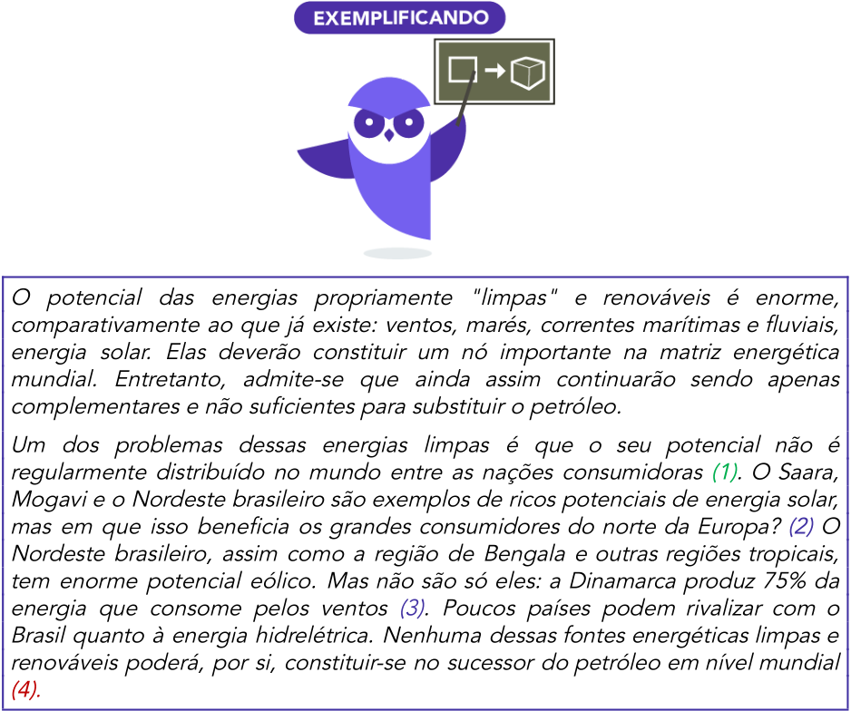

<!-- Start of picture text -->
O potencial das energias propriamente "limpas" e renováveis é enorme, comparativamente ao que já existe: ventos, marés, correntes marítimas e fluviais, energia solar. Elas deverão constituir um nó importante na matriz energética mundial. Entretanto, admite-se que ainda assim continuarão sendo apenas complementares e não suficientes para substituir o petróleo. Um dos problemas dessas energias limpas é que o seu potencial não é regularmente distribuído no mundo entre as nações consumidoras  (1) . O Saara, Mogavi e o Nordeste brasileiro são exemplos de ricos potenciais de energia solar, mas em que isso beneficia os grandes consumidores do norte da Europa?  (2)  O Nordeste brasileiro, assim como a região de Bengala e outras regiões tropicais, tem enorme potencial eólico. Mas não são só eles: a Dinamarca produz 75% da energia que consome pelos ventos  (3). Poucos países podem rivalizar com o Brasil quanto à energia hidrelétrica. Nenhuma dessas fontes energéticas limpas e renováveis poderá, por si, constituir-se no sucessor do petróleo em nível mundial (4) . <!-- End of picture text -->

---

<!-- pagina: 31 -->

**Equipe Português Estratégia Concursos, Felipe Luccas Aula 11** 

Na introdução, o autor deixa clara sua tese: Há potencial de energia limpa. Entretanto, admite-se que ainda assim continuarão sendo apenas complementares e não suficientes para substituir o petróleo em nível mundial. Isso tem que ser fundamentado no desenvolvimento. 

Já no desenvolvimento, observe o tópico frasal **(1)** , que apresenta a ideia de que o potencial das energias limpas não é distribuído de forma regular e se sugere que não seria a solução da crise energética mundial. 

No segundo período **(2)** , há ampliação desse tópico, com exemplos de regiões com potencial de energia solar, mas que não vão beneficiar os grandes consumidores da Europa. Em (3) o autor traz o exemplo da Dinamarca, na mesma linha. Esses exemplos sustentam a tese de que o potencial de energia limpa não é distribuído regularmente. 

Em **(4)** , o autor conclui seu raciocínio, reforçando que essas fontes não substituirão o petróleo, ou seja, serão apenas complementos, pois não são uniformemente distribuídas pelos grandes núcleos consumidores. 

Sintetizando a progressão lógica e estrutural desse texto, temos: a) As fontes renováveis são importantes, b) mas, serão apenas um complemento, pois não estão distribuídas de forma regular pelo mundo, conforme exemplos, c) portanto, não são capazes de substituir o petróleo. Veja que a estrutura de um único parágrafo reflete a macroestrutura do texto dissertativo-argumentativo. 

#### **(MPE-GO / 2022)** 

#### **Texto 2** 

“O alfabeto? É um pouco difícil saber exatamente o que o ‘o’ significa, porque existem vários assim chamados alfabetos que não começam por a e b. Ogham, o sistema do irlandês antigo, começava com BLF; a escrita medieval alemã, o rúnico, cujos caracteres se chamavam runas, começavam com seis letras que lhe deram o nome. O etíope começava com h-l. (....) Porém, apesar das modificações, persistia um ideal comum: captar os sons da fala por meio de um conjunto de duas ou três dúzias de sinais únicos, cada um dos quais correspondendo a um som falado. Na verdade, como veremos, trata-se de uma vã esperança.” 

Os exemplos citados no Texto 2 têm a finalidade de 

(A) abrir caminho para novas discussões. 

- (B) mostrar o conhecimento do autor sobre o tema. 

- (C) enriquecer a informação do texto. 

- (D) comprovar uma afirmação anterior. 

- (E) demonstrar a existência de vários alfabetos.

---

<!-- pagina: 32 -->

**Equipe Português Estratégia Concursos, Felipe Luccas Aula 11** 

**Comentários:** 

Essencialmente, essa questão é sobre o uso de exemplos como técnica argumentativa. O exemplo é o que faz uma ideia abstrata parecer concreta para o ouvinte, como eventos verificáveis daquela ideia apresentada. 

existem vários assim chamados alfabetos que não começam por a e b. (tese) 

Ogham, o sistema do irlandês antigo, começava com BLF; a escrita medieval alemã, o rúnico, cujos caracteres se chamavam runas, começavam com seis letras que lhe deram o nome. O etíope começava com h-l. (argumento - exemplos que comprovam existirem alfabetos que não começam por a e b) 

Gabarito letra D. 

#### **(SEPLAG-RECIFE (PE) / 2019 - Adaptada)** 

Quem não gosta de samba 

“Como se dá que ritmos e melodias, embora tão somente sons, se assemelhem a estados da alma?”, pergunta Aristóteles. Há pessoas que não suportam a música; mas há também uma venerável linhagem de moralistas que não suporta a ideia do que a música é capaz de suscitar nos ouvintes. Platão condenou certas escalas e ritmos musicais e propôs que fossem banidos da cidade ideal. Santo Agostinho confessou-se vulnerável aos “prazeres do ouvido” e se penitenciou por sua irrefreável propensão ao “pecado da lascívia musical”. Calvino alerta os fiéis contra os perigos do caos, volúpia e emefinação que ela provoca. Descartes temia que a música pudesse superexcitar a imaginação. 

~~O~~ que todo esse medo da música – ou de certos tipos de música – sugere? O vigor e o tom dos ataques traem o melindre. Eles revelam não só aquilo que afirmam – a crença num suposto perigo moral da música − , mas também o que deixam transparecer. O pavor pressupõe uma viva percepção da ameaça. Será exagero, portanto, detectar nesses ataques um índice da especial força da sensualidade justamente naqueles que tanto se empenharam em preveni-la e erradicá-la nos outros? 

O que mais violentamente repudiamos está em nós mesmos. Por vias oblíquas ou com plena ciência do fato, nossos respeitáveis moralistas sabiam muito bem do que estavam falando. 

(Adaptado de: GIANETTI, Eduardo. Trópicos utópicos. São Paulo: Companhia das Letras, 2016, p. 23-24) 

A frase O vigor e o tom dos ataques traem o melindre contém um argumento semelhante ao que está na seguinte frase: O que mais violentamente repudiamos está em nós mesmos. (3º parágrafo). 

#### **Comentários:** 

O autor, quando se refere ao “vigor e o tom dos ataques”, fala da intensidade com que os moralistas por ele citados atacam a música, o que é semelhante a repudiar violentamente. 

Da mesma maneira, o “melindre”, ou o sentimento de vergonha é traído pela maneira como atacam a música, pois, na verdade, estão envergonhados por causa da atração interior pelos encantos da música, argumento semelhante a “repudiamos está em nós mesmos”. Questão correta.

---

<!-- pagina: 33 -->

**Equipe Português Estratégia Concursos, Felipe Luccas Aula 11** 

#### **(SEFAZ-GO / 2018 - Adaptada)** 

#### **Os deuses de Delfos** 

Segundo a mitologia, Zeus teria designado uma medida apropriada e um justo limite para cada ser: o governo do mundo coincide assim com uma harmonia precisa e mensurável, expressa nos quatro motes escritos nas paredes do templo de Delfos: “O mais justo é o mais belo”, “Observa o limite”, “Odeia a hybris (arrogância)”, “Nada em excesso”. Sobre estas regras se funda o senso comum grego da Beleza, em acordo com uma visão do mundo que interpreta a ordem e a harmonia como aquilo que impõe um limite ao “bocejante Caos”, de cuja goela saiu, segundo Hesíodo, o mundo. Esta visão é colocada sob a proteção de Apolo, que, de fato, é representado entre as Musas no frontão ocidental do templo de Delfos. 

Mas no mesmo templo (século IV a.C.), no frontão oriental figura Dioniso, deus do caos e da desenfreada infração de toda regra. Essa coabitação de duas divindades antitéticas não é casual, embora só tenha sido tematizada na idade moderna, com Nietzsche. Em geral, ela exprime a possibilidade, sempre presente e verificando-se periodicamente, da irrupção do caos na beleza da harmonia. Mais especificamente, expressam-se aqui algumas antíteses significativas que permanecem sem solução dentro da concepção grega da Beleza, que se mostra bem mais complexa e problemática do que as simplificações operadas pela tradição clássica. 

Uma primeira antítese é aquela entre beleza e percepção sensível. Se de fato a Beleza é perceptível, mas não completamente, pois nem tudo nela se exprime em formas sensíveis, abre-se uma perigosa oposição entre Aparência e Beleza: oposição que os artistas tentarão manter entreaberta, mas que um filósofo como Heráclito abrirá em toda a sua amplidão, afirmando que a Beleza harmônica do mundo se evidencia como casual desordem. Uma segunda antítese é aquela entre som e visão, as duas formas perceptivas privilegiadas pela concepção grega (provavelmente porque, ao contrário do cheiro e do sabor, são recondutíveis a medidas e ordens numéricas): embora se reconheça à música o privilégio de exprimir a alma, é somente às formas visíveis que se aplica a definição de belo (Kalón) como “aquilo que agrada e atrai”. Desordem e música vão, assim, constituir uma espécie de lado obscuro da Beleza apolínea harmônica e visível e como tais colocam-se na esfera de ação de Dioniso. 

Esta diferença é compreensível se pensarmos que uma estátua devia representar uma “ideia” (presumindo, portanto, uma pacata contemplação), enquanto a música era entendida como algo que suscita paixões. 

(ECO, Umberto. História da beleza. Trad. Eliana Aguiar. Rio de Janeiro, Record, 2004, p. 55-56) 

O autor organiza sua argumentação de modo a expor, no terceiro e no quarto parágrafo, a opinião de que a beleza apolínea tem sido progressivamente substituída pelo conceito moderno de beleza dionisíaca. 

#### **Comentários:** 

Perceba que a beleza apolínea não tem sido substituída. O que ocorre é uma problemática, uma ponderação de antíteses sem solução clara. Questão incorreta. 

## **Operadores argumentativos** 

Para comprovar sua opinião e sua tese, o autor deverá estabelecer algumas relações de sentido para relacionar suas ideias e seus raciocínios. Para isso, poderá usar conectivos diversos,

---

<!-- pagina: 34 -->

**Equipe Português Estratégia Concursos, Felipe Luccas Aula 11** 

#### . conjunções, advérbios, palavras denotativas 

As **conjunções** são operadores argumentativos, pois ajudam a construir argumentos e relações lógicas diversas. Em suma, introduzem ideias e argumentos, estabelecendo entre eles relações de tempo, concessão, condição, proporcionalidade, comparação, conformidade, causa, consequência, adição, alternância, conclusão, explicação, oposição. 

**Advérbios** e **palavras denotativas** também funcionam como operadores argumentativos, pois estabelecem entre argumentos relações de inclusão, exclusão, retificação, realce, prioridade, predominância, relevância, esclarecimento. 

Não vou aprofundar muito aqui, pois já vimos essas relações todas no estudo das classes (conjunções, advérbios, preposições, palavras denotativas), mas é bom saber que a banca pode chamar de “operadores argumentativos ou discursivos” esses termos e os sentidos que estabelecem na construção do texto. 

Dessa forma, podemos dizer que as conjunções aditivas são operadores que “somam argumentos”, as conjunções adversativas “opõem argumentos”, as alternativas “excluem ou alternam” argumentos, assim por diante. 

## **Estratégias para desenvolver um parágrafo argumentativo** 

Assim como vimos fórmulas para desenvolver uma Introdução, veremos agora algumas maneiras de se desenvolver parágrafos argumentativos. 

Há certa semelhança entre algumas técnicas, na medida em que um dado estatístico pode ser considerado um exemplo ou um esclarecimento, ou ainda uma explicação pode ser considerada um detalhamento. De toda forma, entender o exemplo é mais importante do que o nome da estratégia, pois a banca espera que o candidato identifique que os exemplos, esclarecimentos, detalhamentos ou dados estatísticos, testemunhos de autoridade foram utilizados para fortalecer uma tese e qual tese é essa. 

**Exemplificação** : destacar alguns casos dentre um universo de fenômenos, para ratificar uma tese. 

**Ex:** Os investimentos diretos realizados por brasileiros no exterior têm aumentado muito nos últimos anos. Em 2011, somaram US$202,6 bilhões, com crescimento de 7,4% em relação ao ano anterior, conforme pesquisa divulgada em abril de 2012 pelo Banco Central. 

Tópico frasal: Os investimentos têm aumentado. 

Confirmação: Por exemplo, em 2011 cresceram em 7,4%. 

**Citação de fato histórico:** como visto na técnica de Introdução, consiste em trazer um evento do passado e relacioná-lo ao presente, geralmente para indicar mudança ou manutenção de tendências. 

**Ex:** O movimento feminista começou a florescer no Brasil na virada do século 20. Diante da omissão da Constituinte de 1891 acerca do voto feminino, a baiana Leolinda de Figueiredo Daltro deu entrada no requerimento de seu alistamento eleitoral. Não obteve sucesso, mas também não entregou os pontos. 

Menciona o evento histórico da omissão da constituinte acerca do voto feminino e indica

---

<!-- pagina: 35 -->

**Equipe Português Estratégia Concursos, Felipe Luccas Aula 11** 

mudança nesse cenário. Atualmente as mulheres votam. 

**Ex:** Em 23 de dezembro de 1910, fundou no Rio de Janeiro o Partido Republicano Feminista. O grupo tinha como principal objetivo mobilizar as mulheres pelo direito de votar. Em novembro de 1917, uma passeata organizada por Leolinda contou com a participação de 90 mulheres. O que hoje não pararia o trânsito deve ter causado horror em distintos senhores e madames. 

Faz contraste entre o escândalo de uma passeata de 90 mulheres em 1917 e indica que hoje tal evento não seria capaz de parar o trânsito. 

**Enumeração ou detalhamento:** listar sistematicamente tópicos ou aspectos a serem tratados, ou subdividir um aspecto amplo em aspectos menores nele incluídos: 

**Ex:** A Igreja Católica denuncia a amoralidade e o materialismo pelo vazio espiritual da ==5460== moderna civilização. A decomposição das famílias, a violência, a corrupção, as drogas, a dissolução dos costumes e a falta de solidariedade com os menos afortunados seriam sintomas de um mundo sem fé. 

O aspecto “Vazio espiritual” é detalhado em subaspectos: a decomposição das famílias, a violência, as drogas... 

**Ex:** Diversas são as naturezas dos instrumentos de que dispõe o povo para participar efetivamente da sociedade em que vive. Políticos, sociais ou jurisdicionais, todos eles destinam-se à mesma finalidade: submeter o administrador ao controle e à aprovação do administrado. O sufrágio universal, por exemplo, é um mecanismo de controle de índole eminentemente política — no Brasil, está previsto no art. 14 da Constituição Federal de 1988, que assegura ainda o voto direto e secreto e de igual valor para todos —, que garante o direito do cidadão de escolher seus representantes e de ser escolhido pelos seus pares. 

Enumera as naturezas dos instrumentos: política, social e jurisdicional. Detalha a natureza política com um exemplo: o sufrágio. 

**Contraste e Paralelo:** ressalta semelhanças ou diferenças entre elementos. 

**Ex:** Atualmente, há duas Américas Latinas. A primeira conta com um bloco de países — incluindo Brasil, Argentina e Venezuela — com acesso ao Oceano Atlântico, que confere ao Estado grande papel na economia. A segunda — composta por países de frente para o Pacífico, como México, Peru, Chile e Colômbia — adota o livre comércio e o mercado livre. 

**Dados estatísticos:** por serem de natureza objetiva, dão credibilidade ao argumento e são grandes recursos de convencimento. 

**Ex:** Dados do IBGE revelam que apenas 1,2% dos municípios possuíam plano municipal de redução de riscos em 2011. Nos municípios maiores, com mais de 500 mil habitantes, que não ultrapassam quatro dezenas, este percentual superava 50%. De modo inverso, nos

---

<!-- pagina: 36 -->

**Equipe Português Estratégia Concursos, Felipe Luccas Aula 11** 

municípios menores, com menos de 20 mil habitantes, em torno de quatro mil, este percentual era de 3,3%. É uma situação bastante preocupante relacionada aos municípios de grande porte e drástica nos municípios de pequeno porte. 

Tópico frasal: poucos municípios grandes têm plano municipal de redução de riscos e apenas ínfima porcentagem dos pequenos municípios os possui. Note que o tópico frasal veio após a estatística, sendo sustentado por ela 

**Ex:** Dados do Tribunal Superior Eleitoral (TSE) ajudam a traçar o perfil do eleitor brasileiro da última eleição. A inclusão política dos brasileiros vem, a cada eleição, consolidando-se e os dados são irrefutáveis quanto a isso. A cada cinco pessoas aptas a votar nas eleições de 2010, uma era analfabeta ou nunca havia frequentado uma escola. São, ao todo, 27 milhões de eleitores nessa situação no cadastro do TSE. Desses, oito milhões se declararam analfabetos e 19 milhões declararam saber ler e escrever, sem, entretanto, nunca terem estado em uma sala de aula. No total, havia 135,8 milhões de eleitores no país em 2010. 

Tópico frasal: A inclusão política dos brasileiros vem, a cada eleição. Em seguida as estatísticas fornecidas fundamentam essa tese. 

**Explicação ou esclarecimento:** consiste em explicitar o sentido de uma palavra ou afirmação. 

**Ex:** Com a popularização dos computadores e o desenvolvimento da microeletrônica, a palavra informação adquiriu um significado diferente. Até então, o seu sentido estava restrito à transmissão de dados acerca de alguém ou de algo, geralmente notícias de fatos que chegavam ao receptor com certa defasagem temporal. 

Tópico frasal: o sentido da palavra informação mudou. 

Explicação: antes significava transmitir dados acerca de alguém ou de algo, hoje significa outra coisa. 

**Testemunho de autoridade:** dar credibilidade para a uma tese, traz a opinião respeitada de um especialista que se alinha ou se opõe a ela. Serve como argumento e como contra-argumento. 

**Ex:** Entusiasta do sistema, o supervisor do Posto Fiscal Virtual, em Porto Alegre define o processo como seletivo, econômico e inteligente. “Esse é o futuro. No mundo, cada vez mais, a tecnologia substitui a ação humana, que, por mais atuante que possa ser, tem limitações de tempo, esforço e capacidade pessoal”, afirma o auditor-fiscal. O processamento eletrônico, destaca, veio para ficar, e isso está ocorrendo em todo o mundo. “No Chile, temos a fatura eletrônica, que é muito bem-sucedida. Aqui temos a Nota Fiscal Eletrônica, um sucesso crescente, que quase todos os Estados do país já adotam. É um rumo sem volta. Este é o caminho”, garante. 

Tópico frasal: o processamento eletrônico é vantajoso e veio para ficar. 

A opinião do supervisor do posto fiscal, um auditor-fiscal, permeada por exemplos, reforça essa tese.

---

<!-- pagina: 37 -->

**Equipe Português Estratégia Concursos, Felipe Luccas Aula 11** 

**Relação causa-efeito:** relaciona um fato a sua causa ou explicação. 

**Ex:** Se a China e a Índia hoje surgem no cenário internacional de modo surpreendente, é porque sabem articular inovadoramente a cultura ocidental moderna com seus antiquíssimos modos de pensar e agir, demonstrando que o desenvolvimento não se dá mais em termos lineares e que o futuro não se desenha desprezando e recalcando o passado. 

Causa **:** Índia e China sabem articular inovadoramente a cultura ocidental moderna. 

Efeito: Surgem no cenário internacional de modo surpreendente. 

**Ex:** Sabemos todos que as bombas atômicas fabricadas até hoje são sujas (aliás, imundas) porque, depois que explodem, deixam vagando pela atmosfera o já famoso e temido estrôncio 90. 

Causa: Todas as bombas atômicas deixam vagando na atmosfera o temido estrôncio 90. 

Efeito: todas as bombas atômicas são consideradas sujas. 

**Ex:** Se vivemos hoje a era do conhecimento é porque nos alçamos em ombros de gigantes do passado. A Internet representa um poderoso agente de transformação do nosso modus vivendi et operandi. 

Causa: Nós nos alçamos em ombros de gigantes do passado. 

Efeito: vivemos hoje a era do conhecimento. 

Conforme mencionado, para dar “validade” e “consistência” aos argumentos, é preciso fundamentá-los. Caso contrário, são mera “opinião”, “mero registro de subjetividade”. 

Uma forma clássica de se construir um argumento é o “ **silogismo** ”, raciocínio dedutivo que parte duas premissas (maior e menor) para chegar a uma conclusão. 

Todos os cariocas são brasileiros. ( **premissa maior** ) 

João é carioca. ( **premissa menor** ) 

Logo, João é brasileiro. ( **conclusão** ) 

Quando um silogismo é válido, a relação entre as premissas é verdadeira,

---

<!-- pagina: 38 -->

**Equipe Português Estratégia Concursos, Felipe Luccas Aula 11** 

|irrefutável e a conclusão é decorrência necessária, inevitável das premissas. Se uma das premissas for falsa, vai levar a uma conclusão falsa.|
|---|
|Obs:**Raciocínio dedutivo** é aquele queparte de uma verdade geral para um caso particular.|
|No exemplo acima, partimos de um conceito geral e abstrato (todos os cariocas são brasileiros) e chegamos a uma verdade particular, concreta (João é brasileiro)|
|**Raciocínio indutivo**, por outro lado, é o queparte de premissas particulares para uma generalização, uma conclusão**não necessariamente é verdadeira**. Ex: O leão é mamífero/ O leão é feroz. O lobo é mamífero/ O lobo é feroz. O tigre é mamífero/ O tigre é feroz. O golfinho é mamífero/ **Portanto, o golfinho é feroz.**|
|**Obs:**No estudo rigoroso do raciocínio lógico, que foge ao nosso escopo e tem regras muito mais específcas, as premissas podem ser absurdas, ser assumidas como verdadeiras e gerar conclusões absurdas consideradas válidas. Aqui, estamos trabalhando com o raciocínio de texto. Ex: Os homens voam, Maria é um homem. Logo, Maria voa. Para o nosso estudo, argumento consistente é aquele que tem relação de causalidade com as premissas, ou seja, decorre de premissas verdadeiras e conclui informação verdadeira.|
|Também quero registrar o método de raciocínio chamado “**dialético**”, que consiste em 3 premissas. A primeira é atese, a segunda aantítesee a última, a síntese.|
|Ateseé o ponto de vista do autor, a opinião que ele pretende defender. A antíteseé o contraposto de sua tese, ou seja, é uma opinião contrária. Asínteseé a retomada da tese, após a desconstrução ou invalidação da antítese, ou seja, uma conclusão que combina elementos das duas. Vejamos o exemplo:|
|**Ex:**A juventude é provavelmente a melhor fase para se dedicar ao trabalho (tese). No entanto, uma juventude sem diversão pode dar a sensação de que trabalhar não vale a pena (antítese). Portanto, é preciso aproveitar a juventude para produzir muito, mas sem abandonar totalmente o lazer (síntese). Essas estruturas aparecem muito frequentemente nos textos argumentativos e usamos esse tipo de raciocínio o tempo todo, sem perceber, de forma não tão sistemática.|
|As relações de causa e efeito são muito semelhantes a um silogismo "simplifcado", pois uma informação vai levar à conclusão de uma outra.|
|Então, esteja pronto para reconhecer no texto as premissas, os argumentos e as conclusões do autor.|

---

<!-- pagina: 39 -->

**Equipe Português Estratégia Concursos, Felipe Luccas Aula 11** 

Por fim, ressalto que, assim como ocorrem nas fórmulas de introdução, os textos trazem diversos argumentos desenvolvidos conjugando uma ou mais dessas técnicas, Vejamos um exemplo de prova: 

Entre 1990 e 2010, mais de 96 milhões de pessoas foram afetadas por desastres no Brasil, como demonstra o Atlas dos Desastres Naturais do Brasil. Destas, mais de 6 milhões tiveram de deixar suas moradias, cerca de 480 mil sofreram algum agravo ou doença e quase 3,5 mil morreram imediatamente após os mesmos. Desastres como o de Petrópolis, que resultaram em dezenas de óbitos, não existem em um vácuo. Se por um lado exigem a presença de ameaças naturais, como chuvas fortes, por outro não se realizam sem condições de vulnerabilidade, constituídas através dos processos sociais relacionados à dinâmica do desenvolvimento econômico e da proteção social e ambiental. Isto significa que os debates em torno do desastre devem ir além das cobranças que ano após ano ficam restritas à Defesa Civil. 

Nesse parágrafo argumentativo, o autor traz dados e depois monta uma divisão: por um lado...por outro. 

#### **(PREF. SÃO JOSÉ DO RIO PRETO / 2019 - adaptada)** 

Rubem Braga, o cronista 

Rubem Braga (1913-1990) foi o maior cronista deste país. Não será favor nenhum dizer que foi também um dos nossos maiores escritores, conquanto não tenha escrito praticamente nada além de crônicas. O irônico está em que o gênero da crônica é justamente aquele onde se costuma celebrar a transitoriedade do tempo, a anedota passageira, o pensamento arisco – nada muito durável. Mas Braga passou por cima disso e escreveu crônicas que não envelhecem. 

Talvez o fato de se dedicar exclusivamente a esse gênero explique um pouco da excelência a que chegou, mas faltaria muito ainda a ponderar: como é que deu uma forma de vida permanente ao

---

<!-- pagina: 40 -->

**Equipe Português Estratégia Concursos, Felipe Luccas Aula 11** 

que devia ser efêmero? Onde foi buscar grandeza para cunhar o que é pequeno? Que altura poética conseguiu dar a uma prosa que corre limpa e elegante, mas em tom de conversa? O segredo da potência das crônicas de Rubem Braga terá morrido com ele. Mas elas sobrevivem por conta do gênio dele, que desperta a cada vez que batemos os olhos numa linha, num parágrafo, numa página sua. Cada crônica do velho Braga tem a intensidade da vida que nos surpreende a cada momento. 

(Teobaldo Ramires, inédito) 

Uma causa provável e seu decorrente efeito encontram-se, nessa ordem, neste aspecto da atividade do cronista: se dedicar exclusivamente a esse gênero / excelência a que chegou. 

#### **Comentários:** 

O enunciado pede a causa provável e o seu decorrente efeito da vida do cronista, diante da obra reproduzida. 

A sequência "se dedicar exclusivamente a esse gênero / excelência a que chegou" apresenta exatamente o significado de causa e efeito: pelo fato de o cronista ter se dedicado exclusivamente ao gênero da crônica ( **causa** ), ele conseguiu alcançar a excelência ( **efeito** ). Questão correta. 

**Finalidade predominante dos Textos Expositivo/Explicativo/Informativo:** Expor informações e conhecimentos **Opinativo/Argumentativo:** Convencer, defender uma opinião. **Polêmico:** Contrabalancear opiniões. **Instrucional:** Normatizar, prescrever, ensinar.

---

<!-- pagina: 41 -->

**Equipe Português Estratégia Concursos, Felipe Luccas Aula 11** 

# **FUNÇÕES DA LINGUAGEM** 

A comunicação ocorre na interação de vários elementos integrados: um **emissor** , uma **mensagem** , um **receptor** para essa mensagem, que tem um tema, um assunto, um contexto, um **referente** . 

Há outros elementos: a mensagem é transmitida por determinado “meio”, um “ **canal** ”, e utiliza um determinado sistema de signos conhecidos pelas partes, chamado “ **código** ”. 

Então, se eu telefono para minha mãe para falar sobre uma possível visita no Natal, teremos os seguintes elementos nessa situação comunicativa: 

Eu serei o locutor (emissor); mamãe será interlocutora (receptora). A mensagem é um “convite para a ceia de Natal”. O contexto, o assunto, é o próprio feriado. O canal é o telefone e o código, a língua portuguesa, que ambos compartilhamos. 

No contexto de “adequação” ou “inadequação” de uma variante linguística, temos que ponderar qual é a finalidade daquela situação comunicativa, que se reflete em diversas “funções da linguagem”. 

A depender do objetivo, a linguagem vai “focar” em algum dos elementos envolvidos na comunicação. Às vezes, o foco do discurso recai sobre o conteúdo do texto; às vezes, sobre a forma que esse conteúdo é passado. Pode também recair sobre o assunto em si. 

Vejamos a característica principal de cada função da linguagem. 

#### **FUNÇÃO EMOTIVA:** 

O foco recai sobre o próprio “emissor”. 

O “eu” é o centro da mensagem, que se apresenta como subjetiva e pessoal. Por esse motivo, reflete o ânimo e as emoções. 

Essa função da linguagem predomina em poemas líricos e em prosa intimista. 

Como marcas textuais, temos o uso de interjeições, exclamações, reticências, vocativos, verbos . em primeira pessoa, adjetivos valorativos

---

<!-- pagina: 42 -->

**Equipe Português Estratégia Concursos, Felipe Luccas Aula 11** 

“Eu não gosto do bom gosto Eu não gosto de bom senso Eu não gosto dos bons modos Não gosto ==5460== Eu aguento até rigores Eu não tenho pena dos traídos Eu hospedo infratores e banidos Eu respeito conveniências Eu não ligo pra conchavos Eu suporto aparências Eu não gosto de maus-tratos Mas o que eu não gosto é do bom gosto Eu não gosto de bom senso Eu não gosto dos bons modos Não gosto (...)”. (Senhas – Adriana Calcanhotto) 

Oh? como és linda, mulher que passas Que me sacias e suplicias Dentro das noites, dentro dos dias? (Vinícius de Moraes) 

Sinto que viver é inevitável. Posso na primavera ficar horas sentada fumando, apenas sendo. Ser às vezes sangra. Mas não há como não sangrar pois é no sangue que sinto a primavera. Dói. A primavera me dá coisas. Dá do que viver E sinto que um dia na primavera é que vou morrer de amor pungente e coração enfraquecido. 

(Clarice Lispector)

---

<!-- pagina: 43 -->

**Equipe Português Estratégia Concursos, Felipe Luccas Aula 11** 

#### **FUNÇÃO FÁTICA:** 

O foco da mensagem recai sobre o próprio “canal” em que ela é transmitida. Visa a testar, estabelecer, manter ou encerrar a comunicação. 

Nessa função se encaixam as saudações, os iniciadores de conversa, os marcadores conversacionais de confirmação: alô? Tá ouvindo? Tudo bem? Como vai? Dá licença? Certo? Ok? Entendeu? Todos comigo? Hein? Falou... Ok.. Bom dia... 

Vejamos as tirinhas: 

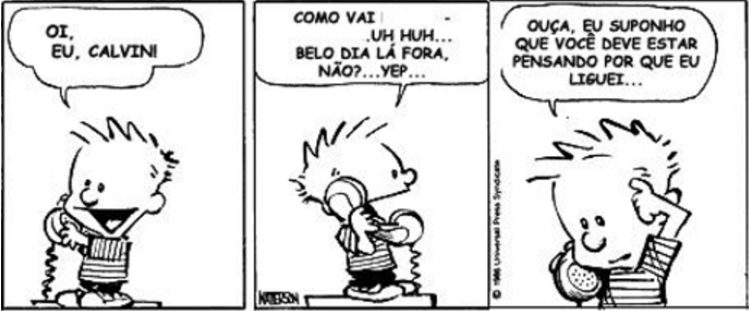

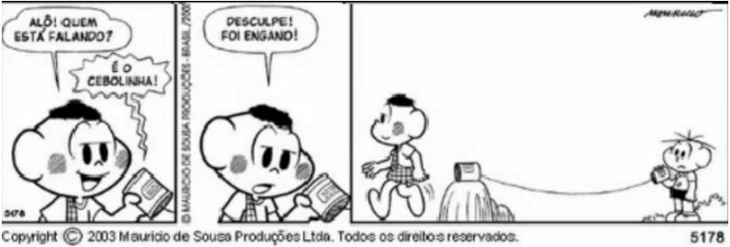

Note que na tirinha do Cascão e do Cebolinha, o efeito de humor é construído justamente pelo uso da função fática. 

#### **FUNÇÃO APELATIVA OU CONATIVA:** 

O foco recai sobre o interlocutor, o ouvinte. A finalidade é convencê-lo ou influenciá-lo. Por isso, é permeada por discurso em segunda pessoa (Tu e Você) e verbos no imperativo. 

Por objetivar induzir o ouvinte a fazer algo, esta é a linguagem predominante em sermões e em propaganda. 

---

<!-- pagina: 44 -->

**Equipe Português Estratégia Concursos, Felipe Luccas Aula 11** 

#### **FUNÇÃO REFERENCIAL OU DENOTATIVA:** 

A ênfase está no referente, isto é, no assunto, no conteúdo, **na informação** . 

A linguagem tende a ser objetiva, expositiva, e por isso costuma fazer uso de recursos impessoalizadores como a terceira pessoa, tempos verbais afirmativos como o futuro e o presente do indicativo. 

A linguagem é concisa e objetiva, típica dos textos jornalísticos, didáticos, científicos e outros que tenham como finalidade primária **informar ou ensinar** . 

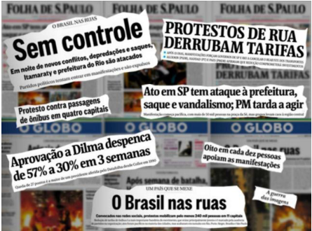

#### **FUNÇÃO POÉTICA OU CONOTATIVA:** 

A ênfase está na própria mensagem, na forma em que é construída e transmitida (de forma criativa, elaborada, com recursos figurativos), diferentemente da função referencial, que foca no conteúdo em si. 

Essa é a linguagem literária, por isso, encontraremos recursos como figuras de estilo ou linguagem (linguagem conotativa, figurada), neologismos, construções criativas e . deliberadamente recheadas de polissemia e ambiguidade

---

<!-- pagina: 45 -->

**Equipe Português Estratégia Concursos, Felipe Luccas Aula 11** 

Um texto pode ter indícios de várias funções de linguagem, mas uma será considerada **predominante** . 

Por exemplo, um texto poético pode também estar permeado pela linguagem emotiva, com muitas referências ao próprio narrador/eu-lírico e seus sentimentos. . Porém, a função predominante será a poética 

Vejamos alguns exemplos de poesias e anúncios criativos que exploram essa função: 

#### **Poética** 

Rio de Janeiro , 1954 

De manhã escureço 

De dia tardo 

De tarde anoiteço De noite ardo. 

A oeste a morte 

Contra quem vivo 

Do sul cativo 

O este é meu norte. 

Outros que contem 

Passo por passo: 

Eu morro ontem 

Nasço amanhã 

Ando onde há espaço: 

— Meu tempo é quando. 

#### **(Vinícius de Moraes)** 

- “...Eu, que tantas vezes não tenho tido paciência para tomar banho,

---

<!-- pagina: 46 -->

**Equipe Português Estratégia Concursos, Felipe Luccas Aula 11** 

Eu, que tantas vezes tenho sido ridículo, absurdo, 

Que tenho enrolado os pés publicamente nos tapetes das etiquetas, 

Que tenho sido grotesco, mesquinho, submisso e arrogante, 

Que tenho sofrido enxovalhos e calado, 

Que quando não tenho calado, tenho sido mais ridículo ainda...” 

#### **(Fernando Pessoa, Poema em linha reta)** 

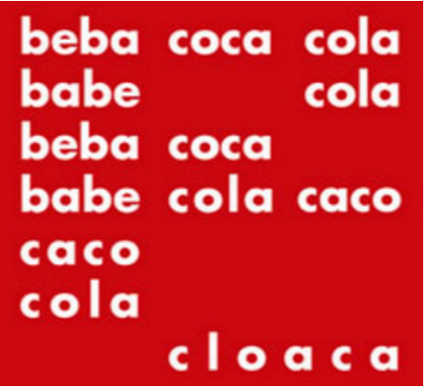

#### **FUNÇÃO METALINGUÍSTICA:** 

O foco está no código utilizado na transmissão da mensagem. O código é usado para explicar o próprio código, ou seja, a língua explica a língua. 

Esta aula é um exemplo, pois uso a linguagem para falar sobre a própria linguagem. Além disso, encontraremos a metalinguagem em **verbetes de dicionários** , em **resenhas** , em **manuais de redação e gramáticas** , em filmes que falam de filmes, em atores que interpretam atores, em poemas que falam sobre a poesia. 

Não faças versos sobre acontecimentos. 

Não há criação nem morte perante a poesia... 

... 

Convive com teus poemas, antes de escrevê-los.

---

<!-- pagina: 47 -->

**Equipe Português Estratégia Concursos, Felipe Luccas Aula 11** 

Tem paciência, se obscuros. Calma, se te provocam. 

Espera que cada um se realize e consume 

com seu poder de palavra 

e seu poder de silêncio. 

Não forces o poema a desprender-se do limbo. Não colhas no chão o poema que se perdeu. 

Não adules o poema. Aceita-o 

como ele aceitará sua forma definitiva e concentrada 

no espaço. 

Chega mais perto e contempla as palavras. 

Cada uma 

tem mil faces secretas sob a face neutra 

e te pergunta, sem interesse pela resposta, 

pobre ou terrível que lhe deres: 

Trouxeste a chave? 

#### **(Carlos Drummond de Andrade- Trecho de “Procura da Poesia”)** 

De Gramática e de Linguagem 

E havia uma gramática que dizia assim: 

"Substantivo (concreto) é tudo quanto indica 

Pessoa, animal ou cousa: João, sabiá, caneta". 

Eu gosto das cousas. As cousas sim !... 

As pessoas atrapalham. Estão em toda parte. Multiplicam-se em excesso. 

As cousas são quietas. Bastam-se. Não se metem com ninguém. 

Uma pedra. Um armário. Um ovo. (Ovo, nem sempre, Ovo pode estar choco: é inquietante...) 

As cousas vivem metidas com as suas cousas. 

E não exigem nada. 

Apenas que não as tirem do lugar onde estão. 

E João pode neste mesmo instante vir bater à nossa porta. 

Para quê? Não importa: João vem! 

E há de estar triste ou alegre, reticente ou falastrão, 

Amigo ou adverso...João só será definitivo 

Quando esticar a canela. Morre, João...

---

<!-- pagina: 48 -->

**Equipe Português Estratégia Concursos, Felipe Luccas Aula 11** 

Mas o bom mesmo, são os adjetivos, 

Os puros adjetivos isentos de qualquer objeto. 

Verde. Macio. Áspero. Rente. Escuro. luminoso. Sonoro. Lento. Eu sonho 

Com uma linguagem composta unicamente de adjetivos 

Como decerto é a linguagem das plantas e dos animais. 

Ainda mais: 

Eu sonho com um poema 

Cujas palavras sumarentas escorram Como a polpa de um fruto maduro em tua boca, 

Um poema que te mate de amor 

Antes mesmo que tu saibas o misterioso sentido: 

Basta provares o seu gosto... 

#### **(Mario Quintana)** 

A metalinguagem também ocorre em outras formas de expressão que não a prosa e a poesia. Observe as figuras abaixo: 

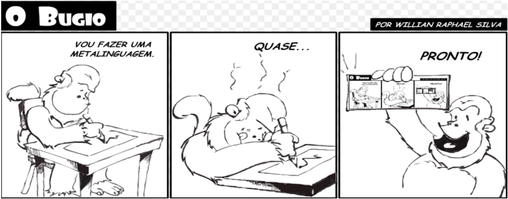

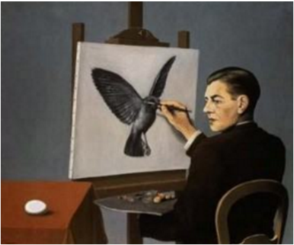

---

<!-- pagina: 49 -->

**Equipe Português Estratégia Concursos, Felipe Luccas Aula 11** 

Para finalizar e facilitar seu entendimento e memorização, deixo aqui um resumo das funções que acabamos de estudar: 

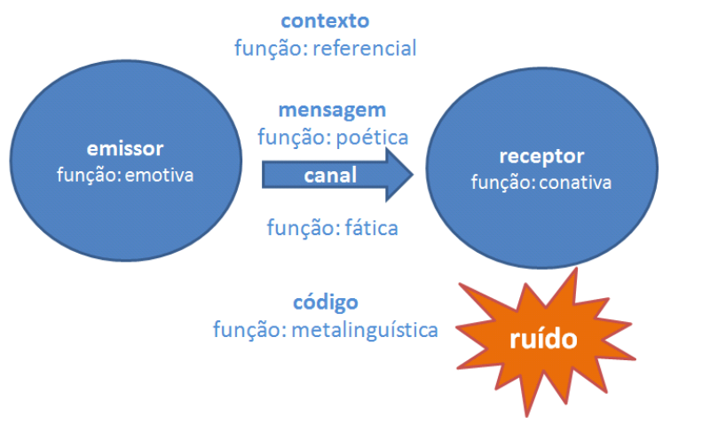

#### **(ALAP / 2020 - adaptada)** 

Entrando na Câmara, verifiquei que a grandiosa representação que eu fazia do legislador, não se me tinha diminuído com o exame da opaca figura do doutor Castro. Era uma exceção, mas certamente os outros deviam ser quase semideuses, mais que homens, pois eu queria-os com força e com faculdades capazes de atender e de pesar tão vários fatos, tão desencontradas

---

<!-- pagina: 50 -->

**Equipe Português Estratégia Concursos, Felipe Luccas Aula 11** 

considerações, tantas e tão sutis condições da existência de cada e da de todos. Para tirar regras seguras para a vida total desse entrechoque de paixões, de desejos, de ideias e de vontades, o legislador tinha que ter a ciência da terra e a clarividade do céu e sentir bem nítido o alvo incerto para que marchamos, na bruma do futuro fugidio. Quanta penetração! Quanto amor! Que estudo e saber não lhe eram exigidos! Era preciso tudo, tudo! A Teologia e a Física, a Alquimia! ... Era preciso saber tudo e sentir tudo! Era na verdade um vasto e levantado ofício! 

Os elementos do texto estão predominantemente concentrados no emissor, explícito nas impressões e exclamações proferidas pelo narrador. 

#### **Comentários:** 

Logo no início, percebe-se que a função emotiva é a que se destaca no texto uma vez que os verbos são conjugados em primeira pessoa, ou seja, o foco está em quem fala (emissor).  Além disso, as impressões pessoais do emissor ficam explícitas com o uso de exclamações, que denotam certa admiração. 

Percebe-se que o emissor fica encantado. Por isso, pode-se dizer que a função do texto é a emotiva já que o foco está em suas impressões pessoais. Questão correta. 

#### **(CAU / 2019 - adaptada)** 

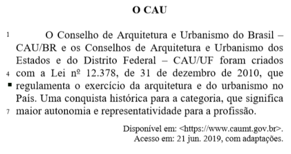

Considerando a relação entre a linguagem e o propósito principal do texto, é correto afirmar que nele prevalece a função da linguagem denominada apelativa. 

#### **Comentários:** 

A função apelativa tem como característica uma linguagem persuasiva que tem o intuito de convencer o leitor. É muito utilizada nas propagandas, publicidades e discursos políticos, com o objetivo de influenciar o receptor por meio da mensagem transmitida. 

Perceba que essa não é a função do texto apresentado. Ao contrário, sua função é a de comunicar de forma objetiva, sem envolver aspectos emotivos ou subjetivos. Questão incorreta. 

O mais importante é sempre praticar muito, ler vários textos, tentar responder aos itens e ler nos comentários qual foi o raciocínio que fundamentou o gabarito. Vá praticando devagar, textos são longos e levam tempo, mas não há outra forma de melhorar sua leitura senão ler. 

Se necessário, faça suas baterias de questões em partes, para não ficar cansado lendo muitos textos de uma só vez. 

Agora que já vimos toda a teoria, é hora de Praticar!

---

<!-- pagina: 51 -->

**Equipe Português Estratégia Concursos, Felipe Luccas Aula 11** 

# **NOÇÕES BÁSICAS DE “TEXTO”** 

Uma boa interpretação de textos pressupõe uma série de conhecimentos e habilidades, anteriores ao texto em si. 

O leitor precisa reconhecer: 

- ✔ o contexto (situação/situacionalidade); 

- ✔ a finalidade principal do texto: se é informar, narrar, descrever, e como essa intenção se materializa (intencionalidade discursiva); 

- ✔ a linguagem: se é literal ou figurada; irônica; se tem um propósito estético, poético, lírico, além da sua mensagem principal; 

- ✔ informações implícitas, quando há; 

- ✔ referência a informações fora do texto ou a outros textos e se essas referências são parte do conhecimento de mundo do leitor (para que possa entender aceitar essa mensagem – aceitabilidade). 

Enfim... Há muitos conceitos subjacentes à construção de um texto. A partir de agora, veremos os principais. 

---

<!-- pagina: 52 -->

**Equipe Português Estratégia Concursos, Felipe Luccas Aula 11** 

# **LINGUAGEM VERBAL E NÃO VERBAL** 

O **texto verbal** é aquele que se materializa em linguagem escrita ou falada. Vejamos um verbete de dicionário: 

Resiliência - substantivo feminino 

1. FÍSICA: propriedade que alguns corpos apresentam de retornar à forma original após terem sido submetidos a uma deformação elástica. 

2. figurado (sentido) figuradamente: capacidade de se recobrar facilmente ou se adaptar à má sorte ou às mudanças. 

O **texto “não verbal”** é o que usa outros elementos, que não a fala ou a escrita: imagens, música, gestos, escultura. Sinais, placas, pinturas, sons, linguagem corporal são todos elementos de linguagem “não verbal”. Comparem dois textos de mesma temática, mas escritos com linguagens diferentes: 

**Linguagem Verbal:** 

**Urbanização** é o crescimento das cidades, tanto em população quanto em extensão territorial. É o processo em que o espaço rural transforma-se em espaço urbano, com a consequente migração populacional do tipo campo-cidade que, quando ocorre de forma intensa e acelerada, é chamada de êxodo rural. 

**Linguagem Não Verbal:** 

Em prova, é comum a banca trazer textos “mistos”, “híbridos”, com elementos verbais e não verbais, ao mesmo tempo. Teremos então imagens e palavras. Vejamos: 

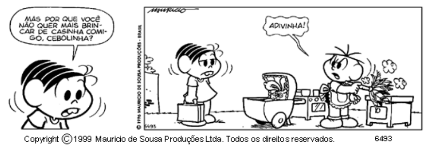

---

<!-- pagina: 53 -->

**Equipe Português Estratégia Concursos, Felipe Luccas Aula 11** 

# **LINGUAGEM LITERÁRIA E NÃO LITERÁRIA** 

A diferença básica entre um texto literário e um não literário é a função. 

O **texto literário** tem uma função estética, tem ênfase no plano da expressão, ou seja, a forma é essencial ao texto. 

Por isso, no texto literário, com função poética, abundam recursos estilísticos, como ritmo, versificação, estrutura planejada, figuras de som (rimas, aliterações), linguagem figurada, conotativa... Um texto literário não pode ser resumido, não pode ser alterado sem prejuízo. Se trocarmos uma palavra de lugar, perdemos o efeito estético de uma rima, por exemplo. 

O **texto não literário** tem foco no plano do conteúdo, na informação, na referência que fornece, por isso pode ser resumido, reescrito de outras formas, sem prejuízo da mensagem original. Sua ==5460== finalidade é utilitária (informar, convencer, explicar, documentar...), por isso preza pela objetividade, não pela forma. Compare: 

#### **Linguagem não literária:** 

Aos cinquenta anos, inesperadamente, apaixonei-me de novo. 

**Linguagem literária:** 

Na curva dos cinquenta derrapei neste amor. (Carlos Drummond de Andrade) 

Veja que o segundo fragmento traz uma linguagem figurada (conotativa), por meio da metáfora “derrapar na curva”. Então, a preocupação estética, lírica, na elaboração da mensagem marca o texto literário. 

**OBS:** A distinção vista acima não impede que textos utilitários (artigos, narrações, propagandas) tenham também efeitos estilísticos. A linguagem publicitária, por exemplo, abusa de efeitos estéticos em sua criação.

---

<!-- pagina: 54 -->

**Equipe Português Estratégia Concursos, Felipe Luccas Aula 11** 

# **INTERTEXTUALIDADE** 

Basicamente, a intertextualidade é comunicação/diálogo entre textos (texto escrito, música, pintura, obra audiovisual...), isto é, ocorre intertextualidade quando um texto faz referência a outro, de forma implícita (de forma oculta, de modo que o leitor depende de seu conhecimento de mundo para identificar a referência) ou explícita (por exemplo, numa citação direta, com identificação da autoria do outro texto citado). 

Vejamos as principais formas de intertextualidade: 

**Citação:** É a reprodução do discurso alheio, normalmente entre aspas e com indicação da autoria. 

**Epígrafe:** Citação curta colocada em uma página no início da obra ou destacada no início de um capítulo. Normalmente abre uma narrativa com a reprodução de frase célebre que anuncia ou resume a temática do capítulo/obra que se inicia. 

Se um homem tem um talento e não tem capacidade de usá-lo, ele fracassou. Se ele tem um talento e usa somente a metade deste, ele fracassou parcialmente. Se ele tem um talento e de certa forma aprende a usá-lo em sua totalidade, ele triunfou gloriosamente e obteve uma satisfação e um triunfo que poucos homens conhecerão. 

Thomas Wolfe 

**Paródia:** é a criação de um texto a partir de outro, com finalidade humorística, irônica. 

---

<!-- pagina: 55 -->

**Equipe Português Estratégia Concursos, Felipe Luccas Aula 11** 

Rua Nascimento Silva, 107 Você ensinando pra Elizete As canções de canção do amor demais 

Rua Nascimento Silva, 107 Eu saio correndo do pivete Tentando alcançar o elevador 

Minha janela não passa de um quadrado A gente só vê cimento armado Onde antes se via o Redentor 

Minha janela não passa de um quadrado A gente só vê Sérgio Dourado Onde antes se via o Redentor 

É, meu amigo, só resta uma certeza É preciso acabar com a natureza É melhor lotear o nosso amor ==5460== Original - Carta ao Tom 74 - Toquinho e Vinícius de Morais 

É, meu amigo Só resta uma certeza É preciso acabar com a natureza É melhor lotear o nosso amor Paródia “Carta do Tom” – Chico Buarque 

Veja exemplos famosos, com linguagem também não verbal. 

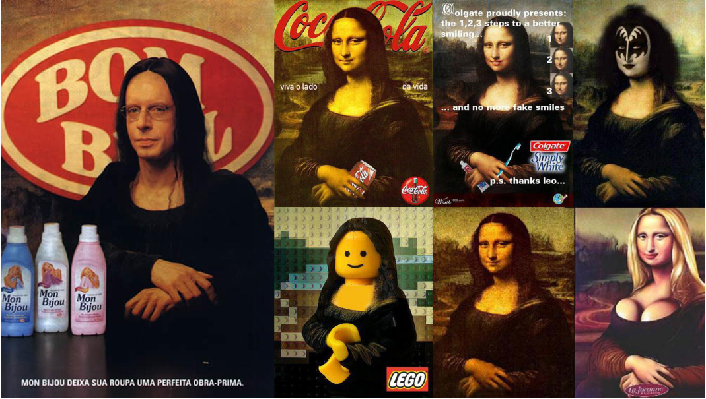

---

<!-- pagina: 56 -->

**Equipe Português Estratégia Concursos, Felipe Luccas Aula 11** 

Algumas reproduções grosseiras de outros trabalhos, usando a mesma linguagem/sintaxe, envolvendo colagens ou montagens de textos diversos (como uma “colcha de retalhos”), são chamadas de “ **pastiche** ”. 

As definições clássicas de pastiche são muito parecidas com a da paródia, mas se considera que o pastiche, diferente da paródia, não tem finalidade de criticar ou ridicularizar a obra de origem. 

**Paráfrase:** é a criação de um texto a partir de outro, é uma reescritura de ideias com outras palavras. A paráfrase não tem finalidade humorística, mas sim reproduz, preserva e confirma a ideologia do texto original. 

**Tradução:** é a reprodução de um texto de uma língua para outra. 

**Referência/Alusão:** é uma referência a outro texto, mas de forma vaga, indireta, sem indicação. Depende do conhecimento de mundo do leitor para fazer sentido. 

**Ex:** João ficou feliz por receber aquela promoção, sem saber que era um presente de grego. 

Aqui, a expressão “presente de grego” se refere à história da guerra de Troia, em que os Gregos deram de presente aos troianos um cavalo de madeira, como símbolo de trégua.

---

<!-- pagina: 57 -->

**Equipe Português Estratégia Concursos, Felipe Luccas Aula 11** 

O cavalo, na verdade, estava cheio de soldados gregos, que, à noite, massacraram os troianos dormindo e abriram os portões da cidade para a entrada do exército grego. 

**Ex:** “Profissão Mestre Adverte: dar aulas pode ser prejudicial à saúde”. 

Veja que há referência insinuada às propagandas do Ministério da Saúde acerca do cigarro. 

Essas definições e exemplos são de difícil diferenciação em muitos casos, então a banca pode muito bem não diferenciar precisamente os conceitos. O importante é reconhecer que são todas formas de intertextualidade, de comunicação entre textos. 

. 

#### **(IBGE / 2022)** 

A frase abaixo que se apoia num ditado popular é 

- (A) O povo perdoa aos que se parecem com ele. 

- (B) Em terra de cego, quem tem um olho nunca é visto. 

- (C) O melhor do susto é esperar por ele. 

- (D) Ter medo não ajuda a viver. 

- (E) O luxo é uma falta de gosto. 

#### **Comentários:** 

A frase " Em terra de cego, quem tem um olho nunca é visto. " se baseia no ditado popular: " Em terra de cego, quem tem um olho é rei".

---

<!-- pagina: 58 -->

**Equipe Português Estratégia Concursos, Felipe Luccas Aula 11** 

As demais frases não são ditos populares, são apenas invenções ou citações específicas da banca. 

Gabarito letra B. 

**(SANASA - CAMPINAS (SP) / 2019 - Adaptada)** 

Considere o trecho hipotético de uma conversa entre um cidadão-usuário e um atendente da empresa prestadora de serviços, conforme abaixo. 

**Atendente** : “Por favor, senhor, me explique o que está acontecendo?” 

**Cidadão-usuário** : A fatura da minha conta de água dos cinco últimos meses não passava de R$ 90,00, mas a desse mês veio R$ 280,00! Eu não sei se tem um vazamento na caixa ou se o relógio de medição quebrou.” 

**Atendente** : “Pelo que o senhor está me relatando, o senhor está com dúvida na sua conta de água e pode ter um problema com a sua instalação. **Cidadão-usuário** : “Sim, é isso mesmo!” 

Nesse trecho de conversa, o atendente utilizou de um recurso denominado paródia. 

#### **Comentários:** 

Da análise da conversa, percebemos que o atendente repetiu o que o cliente disse, por meio da utilização de outras palavras, de modo a tornar a compreensão mais fácil.  Tal recurso é a “paráfrase". Lembre-se que a paródia tem a finalidade humorística, irônica. Questão incorreta.

---

<!-- pagina: 59 -->

**Equipe Português Estratégia Concursos, Felipe Luccas Aula 11** 

# **INTERPRETAÇÃO E COMPREENSÃO** 

Embora muitos alunos os tratem por sinônimos, interpretar e compreender são ações diferentes. Sem filosofar muito, para efeito de prova, **interpretar** é ser capaz de depreender informações do texto, deduzir baseado em pistas, inferir um subtexto, que não está explícito, mas está . pressuposto 

**Compreender** , por sua vez, seria localizar uma informação explícita no texto e não depende de nenhuma inferência, porque está clara. 

Essa diferença aparece nos enunciados, quando a banca nos informa se uma questão deve ser resolvida por recorrência (compreensão) ou por inferência (interpretação). 

Veremos aqui uma breve distinção teórica e depois partiremos para as questões, porque só aprendemos a interpretar lendo e interpretando. 

#### **Recorrência** : 

O leitor deve buscar no texto aquela informação, sabendo que a resposta estará escrita com outras palavras, em forma de paráfrase, ou seja, de uma reescritura. É o ti o mais comum: a res osta está direta e literal no texto. <u>p p</u> 

#### **Inferência** : 

O leitor deve fazer deduções a partir do texto. O fundamento da dedução será um pressuposto, ou seja, uma pista, vestígios que o texto traz. Deduzir além das pistas do texto é extrapolar. Geralmente questões de inferência trazem o seguinte enunciado: “depreende-se das ideias do texto”. 

#### **Ex:** Douglas **parou** de fumar. 

Nessa informação temos um pressuposto, indicado no verbo parar. Só para de fumar quem começou a fumar. Então podemos inferir, deduzir, depreender dessa frase que Douglas fumava. 

**Ex: Ainda** não lançaram o novo filme do Tarantino. 

O advérbio ainda é um pressuposto e traz o sentido implícito de que há expectativa de que o filme já deveria ter saído. 

#### **Ex:** Minha **primeira** esposa **desistiu** de comprar aquele carro **que não polui o ambiente** . 

Pode se inferir de “primeira esposa” que o interlocutor se casou mais de uma vez, e que a referida primeira esposa pretendia comprar um determinado carro, tanto que desistiu. A oração restritiva “que não polui o ambiente” indica que nem todos os carros têm essa característica de não poluir.

---

<!-- pagina: 60 -->

**Equipe Português Estratégia Concursos, Felipe Luccas Aula 11** 

**Ex: Embora** ele **tentasse** estudar sempre, **até** nos fins de semana, **continuou sendo** criticado. 

A conjunção “embora”, por ser concessiva, nos permite inferir que aquela oração é vista como um possível “obstáculo” ao que vai ser dito a seguir. Entende-se que o estudo constante deveria impedir a crítica, mas não impede. O verbo “tentasse” já sugere que ele ‘tentava’, mas não conseguia. A palavra denotativa “até” dá sentido de inclusão, mas com uma camada semântica de concessão. Podemos depreender que “até nos fins de semana” indica que estudar no fim de semana tem um valor diferente. A forma “continuou” implica um início anterior: só continua quem começou. 

**Ex:** A população **supõe** que os senadores **se tornarão** defensores da nova democracia. 

O uso do verbo “supõe” sugere uma crença no que não é verdadeiro. A forma “se tornarão” indica mudança de estado, o que nos permite deduzir que o estado atual não é esse. Em outras palavras, os senadores não são defensores da nova democracia. A propósito, o adjetivo ‘nova’ permite presumir a existência de uma democracia “velha”. 

Os **subentendidos** , ao contrário dos pressupostos, não são decorrências necessárias das pistas, mas são deduções subjetivas, são informações presumidas e insinuadas. 

Imagine os seguintes diálogos entre pessoas no ponto de ônibus: 

**Ex:** — Você tem relógio? 

— São 11 horas. 

— Obrigado! 

Há aqui um subentendido: “quero saber que horas são”, que foi prontamente captado pelo ouvinte. 

**Ex:** —Você tem isqueiro? —Tenho sim. Por quê? —!!! 

Há neste exemplo um subentendido na pergunta: “gostaria de acender meu cigarro”. Mas o ouvinte não compreendeu a informação subentendida e respondeu de forma literal à pergunta insinuada. 

O **pressuposto** , embora traga informação implícita, está visivelmente registrado no teor daquelas palavras, está “marcado linguisticamente”, ao passo que o **subentendido** é uma insinuação, não marcada linguisticamente, ou seja, não está propriamente nas palavras, é extralinguístico, está nas entrelinhas. 

Por isso, a leitura literal das palavras pode levar a outra interpretação e não à informação subentendida. 

Vejamos mais um exemplo de subentendido:

---

<!-- pagina: 61 -->

**Equipe Português Estratégia Concursos, Felipe Luccas Aula 11** 

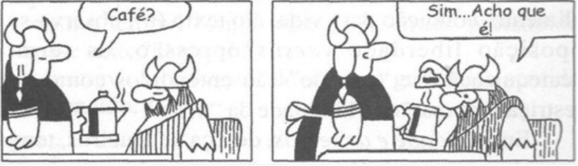

Novamente, a “oferta” de café, subentendida, não foi observada pelo ouvinte, que se ateve ao sentido literal registrado nas palavras. 

Enfim, pessoal, infelizmente não há uma dica milagrosa para interpretação. Teremos sempre que fazer esse exercício de buscar informações explícitas e implícitas no texto, baseado em vestígios e pistas, nas entrelinhas, ou muitas vezes encontrando a reescritura equivalente de uma ideia apresentada. 

O que posso oferecer a vocês, é um passo a passo a ser seguido para a resolução das questões que envolvam Compreensão e Interpretação de texto: 

Como se sair melhor nas questões de interpretação e compreensão: 

**1.** Leia o texto todo. Leia outra vez, marcando as ideias centrais de cada parágrafo, que frequentemente vêm no seu início. 

**2.** A ideia central na introdução e na conclusão é a tese. No desenvolvimento é o . 

tópico frasal 

**3.** Questões de recorrência são resolvidas encontrando uma paráfrase. Questões de inferência exigem uma dedução baseada e pressupostos. 

---

<!-- pagina: 62 -->

**Equipe Português Estratégia Concursos, Felipe Luccas Aula 11** 

#### **(IBGE / 2022)** 

“Os sábios dizem que a vossa luz se apagará um dia”, disseram os vagalumes às estrelas. Estas, porém, não responderam nada”. 

Nessa frase, as estrelas nada responderam porque 

- (A) tinham certeza do erro dos vagalumes. 

- (B) desconheciam quais eram os sábios. 

- (C) ficaram penalizadas dos vagalumes. 

- (D) estavam conscientes da sua superioridade. 

- (E) não sabiam o que responder. 

#### **Comentários:** 

Questãozinha bem figurada, com foco nas inferências. Vamos interpretar: 

As estrelas brilham por dezenas de bilhões de anos; vagalumes brilham por quanto tempo? Não sabemos, não entendemos de vagalumes, mas podemos inferir que é bem pouco e infinitamente menos que as estrelas. 

Então, imagine essas estrelas virtualmente eternas ouvindo de um bichinho bem efêmero que elas vão se apagar porque os sábios, também mortais e temporários, disseram... 

Se você fosse essas estrelas, aposto que não responderia também. 

Não responderia por estar consciente de que são superiores na questão em tela, que é "tempo de brilho". 

Gabarito letra D. 

#### **(MPE-GO / 2022)** 

Este livro é sobre uma das ideias mais importantes da humanidade – a ideia do alfabeto – e a sua forma mais difundida: o sistema de letras que você está lendo neste momento. Três características dessa ideia se destacam: sua singularidade, sua simplicidade e sua adaptabilidade. A partir da primeira manifestação do alfabeto, há 4000 anos, todos os demais alfabetos o tomaram como exemplo; e todos eles refletem a sua simplicidade fundamental. 

Não se trata da simplicidade do projeto perfeito. A força do alfabeto como ideia reside na sua virtual imperfeição. Embora não se adapte com perfeição a qualquer idioma, pode, com alguma adequação, adaptar-se a todos eles. Assim como a nossa própria espécie, de cérebro mais desenvolvido, que pode ser superada por outras espécies em diversas atividades, mas não no campo do pensamento, o alfabeto é um generalista. Em termos de software, seu sucesso reside em sua maleabilidade. Mas de onde teria surgido essa ideia do alfabeto? Como e onde se disseminou ao transformar-se no sistema de letras romanas que é hoje a escrita mais conhecida do mundo? 

É preciso um bom tempo para examinar essas questões, porque as raízes do alfabeto ainda continuam vindo à tona. 

(MAN, Jofin. História do Alfabeto.) 

A “virtual imperfeição” do alfabeto, citada no segundo parágrafo, se refere à

---

<!-- pagina: 63 -->

**Equipe Português Estratégia Concursos, Felipe Luccas Aula 11** 

- (A) maleabilidade, podendo transformar-se no sistema de letras romanas hoje usado. 

- (B) capacidade de, mesmo imperfeitamente, ser original em sua expressão. 

- (C) capacidade de facilmente adaptar-se qualquer idioma, embora de forma imperfeita. 

- (D) singularidade de criar palavras em todos os idiomas, ainda que deficientemente. 

- (E) possibilidade de permitir a expressão de todos os pensamentos, mesmo que de forma inadequada. 

**Comentários:** 

Literal: 

Não se trata da simplicidade do projeto perfeito. A força do alfabeto como ideia reside na sua virtual imperfeição. Embora não se adapte com perfeição a qualquer idioma, pode, com alguma adequação, adaptar-se a todos eles. 

Logo, A “virtual imperfeição” do alfabeto, citada no segundo parágrafo, se refere à capacidade de facilmente adaptar-se qualquer idioma, embora de forma imperfeita 

Gabarito letra C. 

#### **(ASSEMBLEIA LEGISLATIVA DO AMAPÁ / 2020 - Adaptado)** 

Novas formas de vida? 

Uma forma radical de mudar as leis da vida é produzir seres completamente inorgânicos. Os exemplos mais óbvios são programas de computador e vírus de computador que podem sofrer evolução independente. 

O campo da programação genética é hoje um dos mais interessantes no mundo da ciência da computação. Esta tenta emular os métodos da evolução genética. Muitos programadores sonham em criar um programa capaz de aprender e evoluir de maneira totalmente independente de seu criador. Nesse caso, o programador seria um primum mobile, um primeiro motor, mas sua criação estaria livre para evoluir em direções que nem seu criador nem qualquer outro humano jamais poderiam ter imaginado. 

Um protótipo de tal programa já existe – chama-se vírus de computador. Conforme se espalha pela internet, o vírus se replica milhões e milhões de vezes, o tempo todo sendo perseguido por programas de antivírus predatórios e competindo com outros vírus por um lugar no ciberespaço. Um dia, quando o vírus se replica, um erro ocorre – uma mutação computadorizada. Talvez a mutação ocorra porque o engenheiro humano programou o vírus para, ocasionalmente, cometer erros aleatórios de replicação. Talvez a mutação se deva a um erro aleatório. Se, por acidente, o vírus modificado for melhor para escapar de programas antivírus sem perder sua capacidade de invadir outros computadores, vai se espalhar pelo ciberespaço. Com o passar do tempo, o ciberespaço estará cheio de novos vírus que ninguém produziu e que passam por uma evolução inorgânica. 

Essas são criaturas vivas? Depende do que entendemos por “criaturas vivas”. Mas elas certamente foram criadas a partir de um novo processo evolutivo, completamente independente das leis e limitações da evolução orgânica. 

No último parágrafo do texto, sugere-se que o âmbito da biologia e da genética não inclui processos que se possam reconhecer como propriamente evolutivos.

---

<!-- pagina: 64 -->

**Equipe Português Estratégia Concursos, Felipe Luccas Aula 11** 

#### **Comentários:** 

O autor diz justamente o contrário: "elas certamente foram criadas a partir de um novo processo evolutivo". 

Pense assim: se é um "novo processo evolutivo", significa que havia um antigo processo evolutivo que era considerado. Portanto, não se pode dizer que "o âmbito da biologia e da genética **não** inclui processos que se possam reconhecer como propriamente evolutivos". Questão incorreta. 

#### **(TCE-RS / 2018)** 

Considere o seguinte fato: Há verbos que, em decorrência de seu sentido lógico, permitem presumir uma ideia que não vem expressa de modo explícito nas frases em que se encontram. Essa ideia é parte integrante do sentido da frase. 

Analise, então, as frases que seguem. 

I. Ao final, competia ao mais jovem a difícil decisão. ==5460== 

II. A cada ação humanitária, eleva-se a esperança dos imigrantes. 

III. Depois de muitas aventuras, bem e mal-sucedidas, retornou à advocacia. 

IV. Com os novos dados, os investidores apressaram as negociações. 

É correto afirmar que, pelo motivo exposto, há informação implícita em: 

a) I, II, III e IV.     b) I, II e IV, apenas.     c) II, apenas.     d) IV, apenas.     e) I e III, apenas. 

#### **Comentários:** 

Essa questão é excelente para ilustrar a noção de pressuposto textual. Todas as alternativas são exemplificam a presença de informações implícitas. Vejamos quais: 

I. Ao final, competia ao mais jovem a difícil decisão. 

O tempo pretérito competia sugere que “não mais compete”; além disso, se já um “mais jovem”, presume-se que haja mais de uma pessoa e que seja necessariamente mais velha do que aquele a quem competia a decisão. 

II. A cada ação humanitária, eleva-se a esperança dos imigrantes. 

O verbo “elevar-se” traz a informação implícita de que a esperança estava baixa. 

III. Depois de muitas aventuras, bem e mal-sucedidas, retornou à advocacia. 

Se “retornou” à advocacia, presume-se que fora advogado antes. Só retorna à advocacia quem já esteve na advocacia. 

IV. Com os novos dados, os investidores apressaram as negociações. 

“Novos dados” faz presumir que já havia dados antes; também é possível inferir do verbo “apressaram” que as negociações estavam lentas. Em II e IV, as informações implícitas são realmente muito sutis, mas a questão é, mesmo assim, muito boa para o estudo deste tópico. Gabarito letra A.

---

<!-- pagina: 65 -->

**Equipe Português Estratégia Concursos, Felipe Luccas Aula 11** 

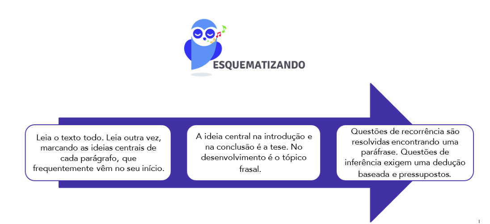

---

<!-- pagina: 66 -->

**Equipe Português Estratégia Concursos, Felipe Luccas Aula 11** 

# **JULGAMENTO DE ASSERTIVAS: PRINCIPAIS ERROS** 

Pessoal, vamos ver agora os principais raciocínios equivocados que fazem o aluno errar na hora da prova. 

#### ● **Extrapolar:** 

Esse é o erro mais comum. O texto vai até um limite e o examinador oferece uma assertiva que “vai além” desse limite. 

O examinador inventa aspectos que não estão contidos no texto e o candidato, por não ter entendido bem o texto, preenche essas lacunas com a imaginação, fazendo outras associações, à margem do texto, estimulado pela assertiva errada. O exemplo mais perigoso é a extrapolação com informação verdadeira, mas que não está no texto. 

#### **_●_ Limitar e Restringir:** 

É o contrário da extrapolação. Geralmente se manifesta na supressão de informação essencial para o texto. 

A assertiva reducionista omite parte do que foi dito ou restringe o fato discutido a um universo menor de possibilidades. 

#### **_●_ Acrescentar opinião:** 

Nesse tipo de assertiva errada, o examinador parafraseia parte do texto, mas acrescenta um pouco da sua própria opinião, opinião esta que não foi externada pelo autor. 

A armadilha dessas afirmativas está em embutir uma opinião que não está no texto, mas que está na consciência coletiva, pelo fato de ser um clichê ou senso comum que o candidato possa compartilhar. 

#### **_●_ Contradizer o texto.** 

O texto original diz “A” e o texto parafraseado da assertiva errada diz “Não A” ou “B”. 

Para disfarçar essa contradição, a banca usará muitas palavras do texto, fará uma paráfrase muito semelhante, mas com um vocábulo crucial que fará o sentido ficar inverso ao do texto. 

#### **_●_ Tangenciar o tema.** 

O examinador cria uma assertiva que aparentemente se relaciona ao tema, mas fala de outro assunto, remotamente correlato. No mundo dos fatos, aqueles dois temas podem até ser afins, mas no texto não se falou do segundo, só do primeiro; então houve fuga ao tema. 

Vamos fazer um exercício e localizar esses erros num texto.

---

<!-- pagina: 67 -->

**Equipe Português Estratégia Concursos, Felipe Luccas Aula 11** 

Para evitar os erros acima, o leitor deve ser capaz de fazer o “recorte temático”, isto é, uma delimitação do tema, um estabelecimento de fronteiras do que está no texto e o que o extrapola. 

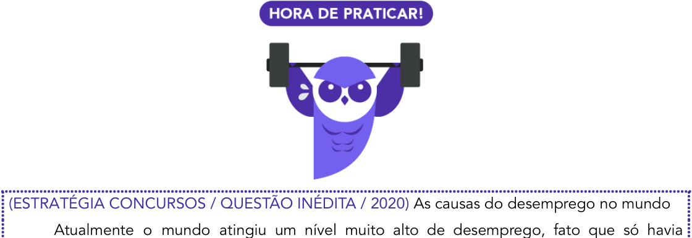

<!-- Start of picture text -->
(ESTRATÉGIA CONCURSOS / QUESTÃO INÉDITA / 2020)  As causas do desemprego no mundo Atualmente o mundo atingiu um nível muito alto de desemprego, fato que só havia  ==5460== <!-- End of picture text -->

Atualmente o mundo atingiu um nível muito alto de desemprego, fato que só havia ==5460== acontecido, em proporções similares, após a crise de 29. 

Segundo os órgãos internacionais, existem hoje, aproximadamente, 850 milhões de pessoas desempregadas, algumas profissões foram superadas outras extintas, o crescimento constante de tecnologias provoca alterações no mercado de trabalho em todo o mundo. 

Até mesmo em países de terceiro mundo, as fábricas e indústrias estão sofisticadas e modernas. As empresas são obrigadas a investir maciçamente em tecnologia para garantir rapidez e melhorar a qualidade, itens necessários em um mercado tão competitivo. 

De acordo com os fragmentos abaixo, julgue os itens: 

I- Consoante algumas instituições internacionais, um número próximo de 850 milhões de pessoas estão desempregadas, pois o desenvolvimento das tecnologias de automação modificou profundamente as relações de trabalho, aumentando a rotatividade nos postos de trabalho. 

II- Segundo o autor, o desemprego no Brasil atingiu um nível muito alto, algo que só ocorrera após a depressão de 1929. 

III- Fábricas em países de terceiro mundo, ao contrário do que possa parecer, ostentam plantas modernas, em que há grandes investimentos em tecnologia, pois esse é um fator necessário para sobreviver num mercado competitivo, assim como a qualidade da mão de obra. 

IV- De acordo com organismos internacionais, há aproximadamente 850 milhões de desempregados, tendo em vista que algumas profissões foram superadas e extintas, além do fato de que o crescimento constante de tecnologias provoca manutenção das relações de trabalho no mercado em todo o mundo. Tal nível de desemprego é sem precedentes na história. 

V- Os investimentos em tecnologia são um grande fator para a deterioração dos benefícios trabalhistas, constitucionalmente garantidos, acentuando a condição de hipossuficiente dos operários das modernas e sofisticadas fábricas em todo o mundo. 

#### **Comentários:** 

I- No primeiro item, há extrapolação. O texto não menciona nada sobre automação nem sobre rotatividade de trabalho; embora seja possível fazer essas associações à luz do tema “desemprego” isso foi além do que estava escrito no texto. Essas informações não estão contidas.

---

<!-- pagina: 68 -->

**Equipe Português Estratégia Concursos, Felipe Luccas Aula 11** 

II- Houve redução drástica da abrangência do tema. O autor fala do desemprego em todo o mundo; a assertiva somente menciona o Brasil, tornando o universo da discussão muito restrito. 

III- Esse “ao contrário do que possa parecer” é opinião do examinador levemente embutida no item. O texto não diz claramente que as fábricas parecem menos modernas. Pelo contrário, diz que até as fábricas em países de terceiro mundo estão sofisticadas; então poderíamos até entender um sentido concessivo de que não é esperado que essas fábricas sejam modernas, mas isso é diferente de dizer que “não parecem” modernas.  também foi acrescentada uma outra opinião: que “a qualidade da mão de obra é tão importante quanto a tecnologia”. Essas opiniões são compartilhadas por muitas pessoas, então o candidato pode se identificar e marcar o item como certo. Contudo, não constam no texto escrito. 

IV- O item é quase todo igual ao texto original, mas no finalzinho traz uma informação oposta: “o crescimento constante de tecnologias provoca manutenção das relações de trabalho”. Não há manutenção, há mudanças constantes, nas palavras do autor, há “alterações”. Também contradiz o texto a parte: “Tal nível de desemprego é sem precedentes na história”. Isso não é verdade, pois também houve desemprego alto após a crise de 29, conforme o texto. 

V- O tema do texto é o aumento do desemprego. Esta assertiva menciona indiretamente a tecnologia, mas foca em outro tema: “direitos trabalhistas”. Embora remotamente relacionados, houve fuga ao objeto principal do texto. 

Dessa forma, observamos que, embora todas as alternativas tragam palavras muito semelhantes às do texto, todos os itens estão errados. Gabarito EEEEE. 

Viram, pessoal? É assim que a banca trabalha para enganar você: muda pequenas partes do texto, subtraindo ou acrescentando informações com o propósito de mudar o sentido da assertiva. 

---

<!-- pagina: 69 -->

**Equipe Português Estratégia Concursos, Felipe Luccas Aula 11** 

O mais importante é sempre praticar muito, ler vários textos, tentar responder aos itens e ler nos comentários qual foi o raciocínio que fundamentou o gabarito. Vá praticando devagar, textos são longos e levam tempo, mas não há outra forma de melhorar sua leitura senão ler. 

Se necessário, faça suas baterias de questões em partes, para não ficar cansado lendo muitos textos de uma só vez. 

Agora que já vimos toda a teoria, é hora de Praticar!

---

<!-- pagina: 70 -->

**Equipe Português Estratégia Concursos, Felipe Luccas Aula 11** 

# **FUNÇÕES DA ESCRITA - FGV** 

**Função de memorização** : Usada para não esquecer informações de curto prazo. 

Exemplo: anotações, roteiros, planos, listas de tarefas e resumos de aula. 

**Função de preservação** : Serve para guardar informações por longos períodos, visando registros duradouros. 

Exemplo: documentos históricos, arquivos científicos e registros legais. 

**Função de transferência** : Permite comunicar informações para pessoas em outros lugares ou tempos. 

Exemplo: livros, cartas, e-mails, registros históricos. 

**Função artística** : Utiliza a linguagem de forma criativa e estética, valorizando a expressão e a beleza textual. 

Exemplo: poesias, romances, roteiros, letras de músicas. 

**Função sócio-político-cultural** : Afirma a identidade e estrutura uma sociedade, sendo usada em leis, manifestos, e textos que expressam valores de um grupo. 

Exemplo: constituições, literatura nacional, documentos oficiais. 

**OBS** : Cuidado! A preservação se refere à manutenção de informações ao longo do tempo, ao <u>passo que a memorização se refere a algo mais individual e pontual.</u> 

Essas funções ajudam a entender como a escrita pode assumir diferentes papéis no cotidiano, seja para organizar a memória, transmitir conhecimento, registrar a história, criar arte ou reforçar a identidade de uma comunidade. 

Vale observar que essas funções não são estanques nem excludentes. Uma obra pode atender a várias dessas funções. Por exemplo, a obra Os Lusíadas, de Camões, mostra função artística, por ser um poema épico; mostra função de transferência e sócio-político-cultural, pois traz registro histórico dos feitos do povo português. 

FGV (DPE-RO / 2025) 

A língua escrita mostra uma série de diferentes funções; na frase “Escritores são aqueles cujas almas falam nas bibliotecas”, a função da língua escrita indicada é a de: 

A) função de transferência, que marca a transferência do ato comunicativo para local ou outro momento. 

B) função de preservação que cuida do armazenamento de informações. 

C) função artística, sendo a escrita o veículo das grandes obras da literatura universal. 

D) função de produção de conhecimento, encarregada de produzir conhecimento a partir do próprio ato de escrever. 

E) função de memorização, encarregada que é de preservar algo em nossa memória para um momento específico.

---

<!-- pagina: 71 -->

**Equipe Português Estratégia Concursos, Felipe Luccas Aula 11** 

**Comentário:** 

A questão aborda diversas funções da escrita. Embora possamos pensar nelas de forma intuitiva, vale aqui uma organização teórica: 

#### **Funções da escrita (FGV)** 

**Função de memorização:** Usada para não esquecer informações de curto prazo. 

Exemplo: anotações, roteiros, planos,  listas de tarefas e resumos de aula. 

**Função de preservação:** Serve para guardar informações por longos períodos, visando registros duradouros. 

Exemplo: documentos históricos, arquivos científicos e registros legais. 

**Função de transferência:** Permite comunicar informações para pessoas em outros lugares ou tempos. 

==5460== Exemplo: livros, cartas, e-mails, registros históricos. 

**Função artística:** Utiliza a linguagem de forma criativa e estética, valorizando a expressão e a beleza textual. 

Exemplo: poesias, romances, roteiros, letras de músicas. 

**Função sócio-político-cultural:** Afirma a identidade e estrutura uma sociedade, sendo usada em leis, manifestos, e textos que expressam valores de um grupo. 

Exemplo: constituições, literatura nacional, documentos oficiais. 

Voltando à questão... 

No enunciado, temos a citação: “Escritores são aqueles cujas almas falam nas bibliotecas” 

A princípio, essas “almas” poderiam remeter à função artística; porém, a lógica não é essa. A “alma” não é o espírito artístico desses escritores, até porque não podemos inferir que esses escritores escreviam livros “artísticos”. Há escritores de livros de física, química, história, em que não há esse componente. 

Então, o cerne da questão é associar que a alma desses escritores é a memória que deixam de suas obras após a morte. As bibliotecas são acertos, **repositórios de conservação** dessas obras, que perduram no tempo mesmo após o fim da vida de seus autores. Então, a função aqui é a de **preservação** . 

Gabarito: letra B. 

(FGV / AL-TO / Analista Legislativo – Revisão / 2024) 

Em um curso de redação, os alunos aprenderam que deveriam organizar previamente um roteiro de seus textos. 

Nesse caso, a função da língua escrita seria 

a) Função de memorização – necessidade de proteção contra o esquecimento, como ocorre nas agendas. 

b) Função de transferência – capacidade de superar o tempo e o espaço. 

c) Função de preservação – armazenamento de informações para utilização em outro momento.

---

<!-- pagina: 72 -->

**Equipe Português Estratégia Concursos, Felipe Luccas Aula 11** 

d) Função artística – construção de obras de arte com base na linguagem. 

e) Função socio-político-cultural – afirmação da nacionalidade através da língua. 

#### **Comentário:** 

O roteiro é uma forma de o aluno não esquecer as informações ou a sequência das ideias a serem abordadas. Esse exemplo se enquadra na função de “memorização” da escrita. 

Gabarito: letra A. 

---

<!-- pagina: 73 -->

**Equipe Português Estratégia Concursos, Felipe Luccas Aula 11** 

# **TIPOLOGIA TEXTUAL** 

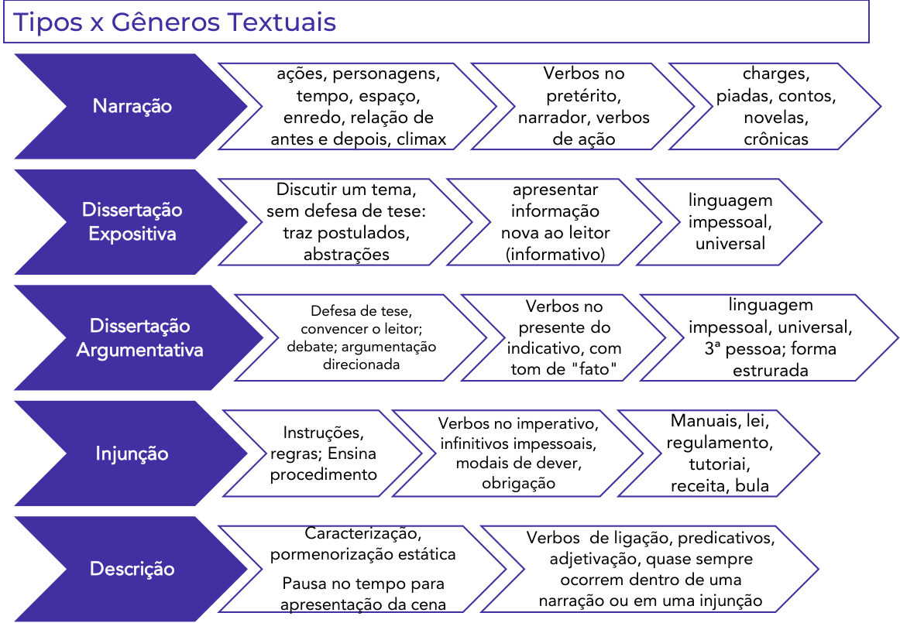

<!-- Start of picture text -->
Tipos x Gêneros Textuais ações, personagens,  Verbos no  charges, tempo, espaço,  pretérito,  piadas, contos, Narração enredo, relação de  narrador, verbos  novelas, antes e depois, climax de ação  crônicas Discutir um tema,  apresentar linguagem Dissertação  sem defesa de tese:  informação impessoal, Expositiva traz postulados,  nova ao leitor universal abstrações (informativo) Defesa de tese,  Verbos no  linguagem Dissertação  convencer o leitor;  presente do  impessoal, universal, Argumentativa debate; argumentação  indicativo, com  3ª pessoa; forma direcionada tom de "fato" estrurada Verbos no imperativo,  Manuais, lei, Instruções, infinitivos impessoais,  regulamento, Injunção regras; Ensina modais de dever,  tutoriai, procedimento obrigação receita, bula Caracterização,  Verbos  de ligação, predicativos, pormenorização estática adjetivação, quase sempre Descrição ocorrem dentro de uma Pausa no tempo para apresentação da cena narração ou em uma injunção <!-- End of picture text -->

Estrutura do parágrafo argumentativo: 

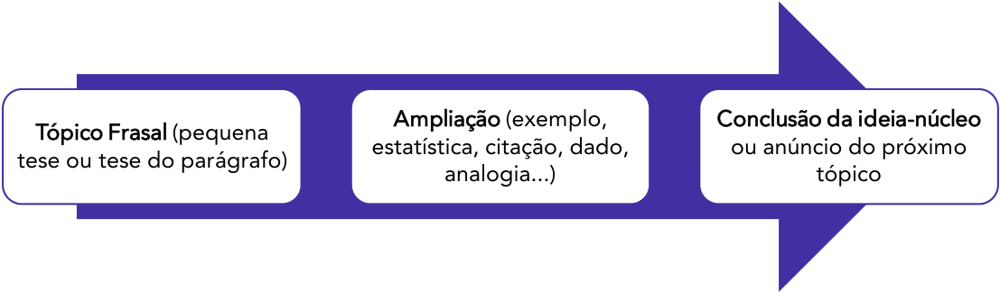

<!-- Start of picture text -->
Ampliação  (exemplo,  Conclusão da ideia-núcleo Tópico Frasal  (pequena estatística, citação, dado,  ou anúncio do próximo tese ou tese do parágrafo) analogia...) tópico <!-- End of picture text -->

## Finalidade dos Textos 

Argumentativo/Opinativo: Convencer, defender uma opinião.

---

<!-- pagina: 74 -->

**Equipe Português Estratégia Concursos, Felipe Luccas Aula 11** 

Polêmico: Contrabalancear opiniões. 

Expositivo/Explicativo/Informativo: Veicular informação nova. 

Instrucional: Normatizar, prescrever, ensinar. 

## Discursos direto, indireto e indireto livre 

As principais características do discurso indireto livre são: 

- ✓ As falas das personagens (feitas na 1ª pessoa) surgem espontaneamente dentro discurso do narrado (na 3ª pessoa); 

- ✓ Não há marcas que indiquem a separação das falas do narrador e da personagem; 

- ✓ Não é introduzido por verbos de elocução, nem por sinais de pontuação ou conjunções; 

- ✓ O discurso do narrador transmite o sentido do discurso da personagem; 

- ✓ O narrador é onisciente de todas as falas, sentimentos, reações e pensamentos da personagem. 

É possível a conversão entre eles. Nesse processo, há algumas regras gerais normalmente observadas na passagem de uma fala literal para uma fala reportada.

---

<!-- pagina: 75 -->

**Equipe Português Estratégia Concursos, Felipe Luccas Aula 11** 

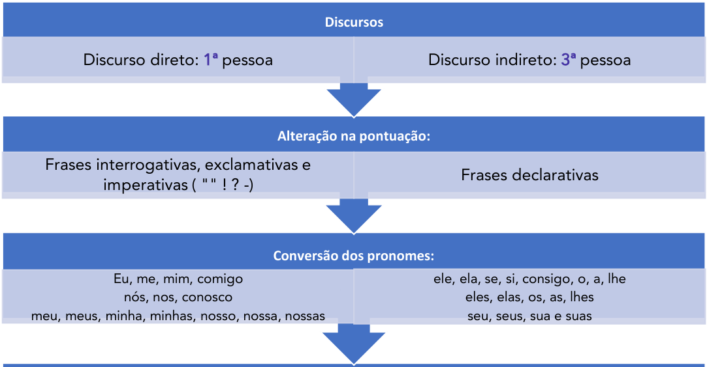

<!-- Start of picture text -->
Discursos Discurso direto:  1ª  pessoa Discurso indireto:  3ª  pessoa Alteração na pontuação: Frases interrogativas, exclamativas e Frases declarativas imperativas ( "" ! ? -) Conversão dos pronomes: Eu, me, mim, comigonós, nos, conosco ==5460== ele, ela, se, si, consigo, o, a, lheeles, elas, os, as, lhes meu, meus, minha, minhas, nosso, nossa, nossas  seu, seus, sua e suas <!-- End of picture text -->

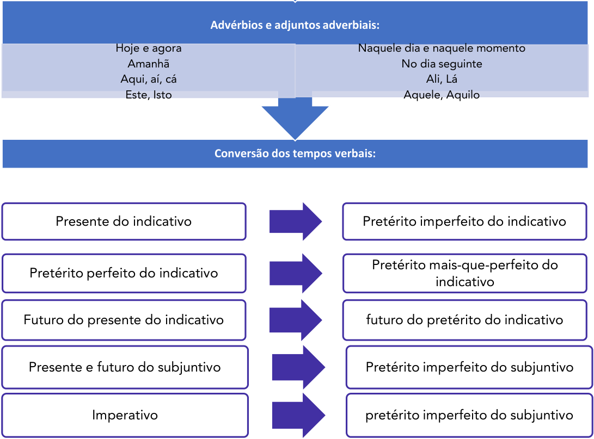

<!-- Start of picture text -->
Advérbios e adjuntos adverbiais: Hoje e agora Naquele dia e naquele momento Amanhã No dia seguinte Aqui, aí, cá Ali, Lá Este, Isto Aquele, Aquilo Conversão dos tempos verbais: Presente do indicativo Pretérito imperfeito do indicativo Pretérito mais-que-perfeito do Pretérito perfeito do indicativo indicativo Futuro do presente do indicativo futuro do pretérito do indicativo Presente e futuro do subjuntivo Pretérito imperfeito do subjuntivo Imperativo pretérito imperfeito do subjuntivo <!-- End of picture text -->

---

<!-- pagina: 76 -->

**Equipe Português Estratégia Concursos, Felipe Luccas Aula 11** 

## Funções da Linguagem 

---

<!-- pagina: 77 -->

**Equipe Português Estratégia Concursos, Felipe Luccas Aula 11** 

# **COMPREENSÃO E INTERPRETAÇÃO DE TEXTOS** 

## Compreensão de texto 

Recorrência: o leitor deve buscar no texto aquela informação, sabendo que a resposta estará escrita com outras palavras, em forma de paráfrase, ou seja, de uma reescritura. 

Inferência: o leitor deve fazer deduções a partir do texto. O fundamento da dedução será um pressuposto, ou seja, uma pista, vestígios que o texto traz. Deduzir além das pistas do texto é extrapolar. Geralmente questões de inferência trazem o seguinte enunciado: “depreende-se das ideias do texto”. 

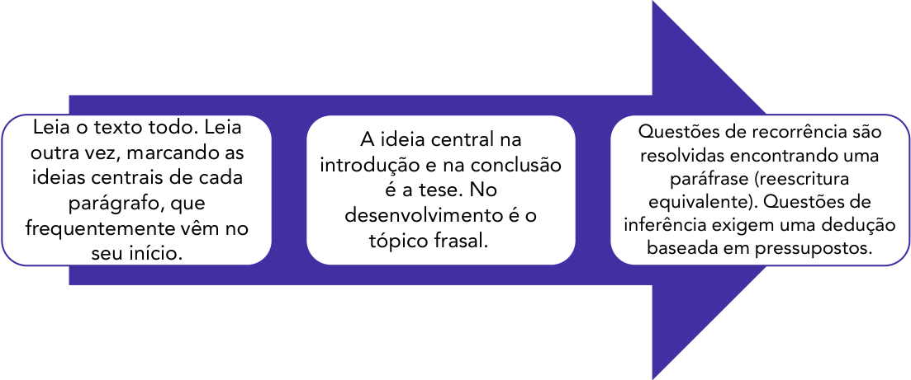

<!-- Start of picture text -->
Leia o texto todo. Leia  Questões de recorrência são A ideia central na outra vez, marcando as  resolvidas encontrando uma introdução e na conclusão ideias centrais de cada  paráfrase (reescritura é a tese. No parágrafo, que  equivalente). Questões de desenvolvimento é o frequentemente vêm no  inferência exigem uma dedução tópico frasal. seu início. baseada em pressupostos. <!-- End of picture text -->

## Julgamento de Assertivas: principais erros. 

#### Extrapolar : 

O texto vai até um limite e o examinador oferece uma assertiva que “vai além” desse limite. O examinador inventa aspectos que não estão contidos no texto e o candidato, por não ter entendido bem o texto, preenche essas lacunas com a imaginação, fazendo outras associações, à margem do texto, estimulado pela assertiva errada. 

#### Limitar e Restringir: 

É o contrário da extrapolação. Supressão de informação essencial para o texto. A assertiva reducionista omite parte do que foi dito ou restringe o fato discutido a um universo menor de possibilidades. 

#### Acrescentar opinião:

---

<!-- pagina: 78 -->

**Equipe Português Estratégia Concursos, Felipe Luccas Aula 11** 

O examinador parafraseia parte do texto, mas acrescenta um pouco da sua própria opinião, opinião esta que não foi externada pelo autor. A armadilha dessas afirmativas está em embutir uma opinião que não está no texto, mas está na consciência coletiva, por ser um clichê ou senso comum que o candidato possa compartilhar. 

#### Contradizer o texto. 

O texto original diz “A” e o texto parafraseado da assertiva errada diz “Não A” ou “B”. Para disfarçar essa contradição, a banca usará muitas palavras do texto, fará uma paráfrase muito semelhante, mas com um vocábulo crucial que fará o sentido ficar inverso ao do texto. Tangenciar o tema. 

O examinador cria uma assertiva que aparentemente se relaciona ao tema, mas fala de outro assunto, remotamente correlato. No mundo dos fatos, aqueles dois temas podem até ser afins, mas no texto não se falou do segundo, só do primeiro; então houve fuga ou tangenciamento ao ==5460== tema. 

https://t.me/KakashiAssinaturasBot

---

<!-- pagina: 79 -->

**Equipe Português Estratégia Concursos, Felipe Luccas Aula 11** 

# **QUESTÕES COMENTADAS - TIPOLOGIA TEXTUAL - FGV** 

#### **1. FGV / AMAZUL / 2026** 

#### **Insônia infeliz e feliz (Clarice Lispector)** 

Sente-se uma coisa que só tem um nome: solidão. Ler? Jamais. Escrever? Jamais. Passa-se um tempo, olha-se o relógio, quem sabe são cinco horas. Nem quatro chegaram. Quem estará acordado agora? E nem posso pedir que me telefonem no meio da noite, pois posso estar dormindo e não perdoar. Tomar uma pílula para dormir? Mas e o vício que nos espreita? Ninguém me perdoaria o vício. Então fico sentada na sala, sentindo. Sentindo o quê? O nada. E o telefone à mão. 

Mas quantas vezes a insônia é um dom. De repente despertar no meio da noite e ter essa coisa rara: solidão. Quase nenhum ruído. Só o das ondas do mar batendo na praia. E tomo café com gosto, toda sozinha no mundo. Ninguém me interrompe o nada. É um nada a um tempo vazio e rico. E o telefone mudo, sem aquele toque súbito que sobressalta. Depois vai amanhecendo. As nuvens se clareando sob um sol às vezes pálido como uma lua, às vezes de fogo puro. Vou ao terraço e sou talvez a primeira do dia a ver a espuma branca do mar. O mar é meu, o sol é meu, a terra é minha. E sinto-me feliz por nada, por tudo. Até que, como o sol subindo, a casa vai acordando e há o reencontro com meus filhos sonolentos. 

LISPECTOR, Clarice. A descoberta do mundo. Rio de Janeiro: Rocco, 1999. 

Assinale a opção em que se observa uma linguagem em sentido figurado. 

A) Ler? Jamais. Escrever? Jamais. 

B) Quase nenhum ruído. 

C) Então fico sentada na sala, sentindo. 

D) Vou ao terraço e sou talvez a primeira do dia a ver a espuma branca do mar. 

E) Até que, como o sol subindo, a casa vai acordando. 

#### **Comentário:** 

Temos figura de linguagem na letra E) Até que, como o sol subindo, **a casa vai acordando** . 

“acordar” é uma ação tipicamente humana que, na frase, foi atribuída à “casa”, um ser inanimado. Isso se chama **personificação** (ou **prosopopeia** ) que é a atribuição de características/hábitos/comportamentos humanos a objetos, animais ou coisas. 

Nas demais, não há figura de linguagem presente. O sentido é literal/próprio. 

Gabarito Letra E. 

#### **2. FGV / AMAZUL / 2026** 

No trecho: “Sente-se uma coisa que só tem um nome: solidão”, a palavra em destaque apresenta referência 

A) catafórica. 

B) anafórica.

---

<!-- pagina: 80 -->

**Equipe Português Estratégia Concursos, Felipe Luccas Aula 11** 

C) dêitica. 

D) intertextual. 

E) reiterativa. 

#### **Comentário:** 

Na frase, o substantivo “coisa” se refere à “solidão”, uma palavra que só aparece depois no final da frase. Assim, “coisa” tem função: 

A) catafórica. 

Vejamos as demais: 

- B) anafórica (= retoma algo que já foi mencionado antes) 

- C) dêitica (= refere-se a elementos fora do texto) 

- D) intertextual (= diálogo entre textos) 

- E) reiterativa (= retomada por repetição para dar ênfase) 

Gabarito Letra A. 

#### **3. FGV / AMAZUL / 2026** 

#### **Insônia infeliz e feliz (Clarice Lispector)** 

Sente-se uma coisa que só tem um nome: solidão. Ler? Jamais. Escrever? Jamais. Passa-se um tempo, olha-se o relógio, quem sabe são cinco horas. Nem quatro chegaram. Quem estará acordado agora? E nem posso pedir que me telefonem no meio da noite, pois posso estar dormindo e não perdoar. Tomar uma pílula para dormir? Mas e o vício que nos espreita? Ninguém me perdoaria o vício. Então fico sentada na sala, sentindo. Sentindo o quê? O nada. E o telefone à mão. 

Mas quantas vezes a insônia é um dom. De repente despertar no meio da noite e ter essa coisa rara: solidão. Quase nenhum ruído. Só o das ondas do mar batendo na praia. E tomo café com gosto, toda sozinha no mundo. Ninguém me interrompe o nada. É um nada a um tempo vazio e rico. E o telefone mudo, sem aquele toque súbito que sobressalta. Depois vai amanhecendo. As nuvens se clareando sob um sol às vezes pálido como uma lua, às vezes de fogo puro. Vou ao terraço e sou talvez a primeira do dia a ver a espuma branca do mar. O mar é meu, o sol é meu, a terra é minha. E sinto-me feliz por nada, por tudo. Até que, como o sol subindo, a casa vai acordando e há o reencontro com meus filhos sonolentos. 

LISPECTOR, Clarice. A descoberta do mundo. Rio de Janeiro: Rocco, 1999. 

Sobre o texto, é correto afirmar que 

A) há uma perspectiva infeliz da insônia, observada sobretudo pela perturbação que assola o processo de escrita. 

B) a solidão e o nada adquirem aspectos tanto positivos quanto negativos a partir do ponto que se observa em relação aos períodos de vigília. 

C) embora relatada de maneira positiva, a conclusão a que chega o narrador é a de que a insônia amplia a angústia do isolamento. 

D) a insônia contribui para a motivação literária, considerando a ausência de sons e interrupções

---

<!-- pagina: 81 -->

**Equipe Português Estratégia Concursos, Felipe Luccas Aula 11** 

#### do desenvolvimento criativo. 

E) o ponto de vista negativo da insônia se ampara na dependência de medicamentos estimuladores de sono. 

#### **Comentário:** 

Está correta: 

B) a solidão e o nada adquirem aspectos tanto positivos quanto negativos a partir do ponto que se observa em relação aos períodos de vigília. 

A autora apresenta duas visões distintas sobre a insônia e o nada. O primeiro parágrafo destaca aspectos negativos como a sensação de vazio (“Sente-se uma coisa que só tem um nome: solidão”) e de tédio (“Passa-se um tempo, olha-se o relógio, quem sabe são cinco horas. Nem quatro chegaram.”). Já o segundo parágrafo mostra o lado positivo ao celebrar a insônia como “um dom” e o nada como “um tempo vazio e rico”. Assim, o texto aponta aspectos tanto negativos quanto positivos sobre a insônia e o nada. 

#### Vejamos o erro das demais: 

A) há uma perspectiva infeliz da insônia, observada sobretudo pela perturbação que assola o processo de escrita. 

Incorreta. De fato, no 1º parágrafo, a narradora destaca aspectos negativos sobre a insônia, porém isso não se evidencia sobretudo/principalmente pela perturbação que assola o processo de escrita. Na verdade, ela não quer nem escrever: “Ler? Jamais. Escrever? Jamais.”. Não há perturbação do processo de escrita. 

C) embora relatada de maneira positiva, a conclusão a que chega o narrador é a de que a insônia amplia a angústia do isolamento. 

Incorreta. É exatamente o oposto da conclusão do texto. A narradora vê a insônia como “um dom” e o nada como “um tempo vazio e rico”. No final, ela ainda diz: “E sinto-me **feliz** por nada, por tudo”. 

D) a insônia contribui para a motivação literária, considerando a ausência de sons e interrupções do desenvolvimento criativo. 

Incorreta. Logo n início do texto, a narradora demonstra total desmotivação para escrever: “Ler? Jamais. Escrever? Jamais.”. 

E) o ponto de vista negativo da insônia se ampara na dependência de medicamentos estimuladores de sono. 

Incorreta. A narradora menciona o uso de remédios: “Tomar uma pílula para dormir? Mas e o vício que nos espreita?”. De fato, o risco de vício é um aspecto negativo; mas isso não é a base do seu ponto de vista negativo sobre a insônia. O foco da autora reside na sensação de vazio, na angústia e no tédio provocado pela insônia. 

Gabarito Letra B. 

#### **4. FGV / AL-GO / 2026** 

“O bispo de Botucatu encomendou pinturas religiosas a Cândido Portinari. Na entrega das obras, o bispo começou a fazer observações, criticando isto e aquilo. Portinari logo o interrompeu:

---

<!-- pagina: 82 -->

**Equipe Português Estratégia Concursos, Felipe Luccas Aula 11** 

- O senhor, na sua profissão é bispo. Eu, na minha, sou papa.” 

Assinale a opção que apresenta o modo de organização discursiva do trecho lido. 

A) Dissertativo-argumentativo, pois há a defesa de uma ideia com argumentos. 

B) Dissertativo-expositivo, pois há a exposição de um fato com um viés crítico. 

C) Narrativo, pois há o encadeamento cronológico de fatos com um significado global. 

D) Descritivo, pois há uma descrição de uma cena que envolve dois personagens: um bispo e um pintor. 

E) Injuntivo, pois, por meio da história contada, há um conselho dado aos leitores, de não interferirem na seara alheia. 

#### **Comentário:** 

O texto traz uma sequência de ações (“encomendou”, “começou a fazer”, “criticando”), praticadas por um personagem (“bispo de Botucatu”), com marcas de evolução temporal. Além disso, temos a presença do sinal de travessão indicando fala de outro personagem: “- O senhor, na sua profissão é bispo. Eu, na minha, sou papa.”. Trata-se, portanto, de um texto narrativo. 

Vejamos as demais: 

A) Incorreta. Embora Portinari, em sua fala, defenda uma opinião, o texto como um todo é uma história. 

B) Incorreta. O foco do trecho é contar uma história, com ações no passado e fala de personagem. Não se trata de mera exposição de um fato. 

D) Incorreta. O foco não está em caracterizar a cena, mas na trama em si, mostrando o desenrolar das ações. 

E) Incorreta. O fato de ter um conselho/lição por trás da história não a torna injuntiva. Para ser um texto injuntivo, o foco é fornecer instruções, comandos, conselhos. Além disso, é comum aparecer verbos no imperativo. 

Gabarito Letra C. 

#### **5. FGV / AL-RO / 2026** 

Assinale a frase, retirada do texto, que apresenta intertextualidade com outra frase conhecida, considerada como um ditado popular. 

A) Nada a ver com os rigores de um professor de português. 

B) (...) pedi graciosamente, por favor, que a moça repetisse. 

C) (...) como se falava no tempo do orelhão, quando o português era ouvido por aqui. 

D) O target não é preparar o leitor para a nota mil do Enem, mas meter a língua onde não se foi chamado. 

E) A moça queria ostentar na fala o mesmo padrão internacional do shopping. 

#### **Comentário:** 

A intertextualidade é o diálogo entre textos, exemplificado em situações nas quais um texto faz referência explícita ou implícita a outro.

---

<!-- pagina: 83 -->

**Equipe Português Estratégia Concursos, Felipe Luccas Aula 11** 

Na letra D, temos remissão ao ditado popular: “meter o nariz onde não é chamado”. Na frase do texto, o autor fez a troca do nariz pela língua: 

D) O target não é preparar o leitor para a nota mil do Enem, mas **meter a língua onde não se foi chamado** . 

Não há intertextualidade evidente nas demais. 

Gabarito Letra D. 

#### **6. FGV / AL-RO / 2026** 

A charge é antiga, mas o assunto continua atual. 

Na charge, produzida por Erasmo e retirada do Jornal de Piracicaba, o efeito de humor se dá sobretudo 

A) pelas desavenças entre pai e filho. 

B) pelo duplo sentido da palavra escola. 

C) pelo fato de a mãe não ter feito qualquer comentário. 

D) pelo fato de o termo escola ser um hiperônimo. 

E) pela atitude ambígua do filho do casal. 

#### **Comentário:** 

O humor da charge está no duplo sentido da palavra “escola”. Na sua pergunta, o pai se refere às escolas de samba que são típicas do carnaval. Porém, ao responder, o filho defende a escola pública, entendida como o ambiente de ensino regular. Está correta: 

B) pelo duplo sentido da palavra escola. 

Vejamos o erro das demais: 

A) pelas desavenças entre pai e filho. 

Incorreta. Não há um conflito entre pai e filho; apenas visões diferentes sobre qual escola deveria, de fato, vencer. 

C) pelo fato de a mãe não ter feito qualquer comentário. 

Incorreta. Na charge, a mãe é um personagem secundário e não impacta o humor da charge.

---

<!-- pagina: 84 -->

**Equipe Português Estratégia Concursos, Felipe Luccas Aula 11** 

D) pelo fato de o termo escola ser um hiperônimo. 

Incorreta. Não é um caso de hiperônimo (=sentido mais abrangente), mas de duplo sentido da palavra “escola”. 

E) pela atitude ambígua do filho do casal. 

Incorreta. O menino não tem atitude ambígua, mas entende o termo “escola” em sua acepção comum: ambiente de ensino regular. 

Gabarito Letra B. 

#### **7. FGV / TJ-RJ / 2026** 

Observe o texto a seguir – uma explicação no capítulo introdutório de um livro de ensino de genética. 

“Este capítulo apresenta um panorama geral da Genética, em forma de orientação para o resto do livro. Trataremos primeiro sobre certas generalidades dos genes, sua herança e a maneira pela qual interagem com o meio ambiente. Descobriremos a seguir o procedimento peculiar pelo qual os geneticistas reconhecem genes específicos. Por último, examinaremos de que formas distintas se afetam a genética e a sociedade humana.” 

Nesse caso, o texto se organiza: 

A) por meio de uma enumeração de conteúdos, sem ordem fixa; 

B) de modo a servir de orientação para os leitores; 

C) como resumo de um conteúdo já expresso; 

D) com destaques indicando o que é mais importante; 

E) através da explicação de conteúdos. 

#### **Comentário:** 

Está correta: 

B) de modo a servir de orientação para os leitores; 

O autor aborda, em linhas gerais e na **ordem sequencial** do livro, o que o leitor irá encontrar ao longo do texto. 

“ **Este capítulo** apresenta um panorama geral da Genética, em forma de orientação para o resto do livro. Trataremos **primeiro** sobre certas generalidades dos genes, sua herança e a maneira pela qual interagem com o meio ambiente. Descobriremos **a seguir** o procedimento peculiar pelo qual os geneticistas reconhecem genes específicos. **Por último** , examinaremos de que formas distintas se afetam a genética e a sociedade humana.” 

Vejamos o erro das demais: 

A) por meio de uma enumeração de conteúdos, sem ordem fixa; 

Incorreta. Não é sem ordem fixa. “Trataremos primeiro...”, “Descobriremos a seguir...” e “Por último...” demonstram a ordem estabelecida pelo autor. 

C) como resumo de um conteúdo já expresso; 

Incorreta. Não é uma explicação detalhada e resumida de tudo o que o leitor irá encontrar no

---

<!-- pagina: 85 -->

**Equipe Português Estratégia Concursos, Felipe Luccas Aula 11** 

texto, mas sim orientações gerais. 

#### D) com destaques indicando o que é mais importante; 

Incorreta. O autor não destaca as partes mais importantes do livro, mas sim antecipa o que o leitor encontrará pela frente. 

E) através da explicação de conteúdos. 

Incorreta. Não é uma explicação, mas um anúncio ou enumeração de assuntos a serem tratados no livro. 

Gabarito Letra B. 

#### **8. FGV / TJ-RJ / 2026** 

Observe o seguinte fragmento narrativo, retirado do livro A Morte e a Morte de Quincas Berro Dágua, de Jorge Amado. 

“Procurou onde sentar. Tudo que havia, além do catre, era um caixão de querosene vazio. Vanda o pôs de pé, soprou a poeira, sentou-se. Quanto tempo demoraria o médico a chegar? E Leonardo? Imaginou o marido cheio de dedos na repartição, explicando ao chefe a inesperada morte do sogro.” 

Como todo texto narrativo, esse também mostra ações ou acontecimentos em sequência cronológica. 

As duas formas abaixo que mostram esse tipo de sequência são: 

A) procurou / sentar; 

B) havia / era; 

C) pôs / soprou; 

D) demoraria / chegar; 

E) imaginou / explicando. 

#### **Comentário:** 

Está correta: 

C) pôs / soprou; 

Em textos narrativos, a sequência cronológica é marcada por verbos no pretérito perfeito do indicativo, como se pode observar no trecho a seguir: 

“Vanda o **pôs** de pé, **soprou** a poeira, **sentou-se** .” ( **pôs >> soprou >> sentou-se** ) 

Uma ação sucede a outra numa sequência cronológica. 

Vejamos as demais: 

A) procurou ( **pretérito perfeito do indicativo** ) / sentar ( **infinitivo** ); 

B) havia ( **pretérito imperfeito do indicativo** ) / era ( **pretérito imperfeito do indicativo** ); 

D) demoraria ( **futuro do pretérito do indicativo** ) / chegar ( **infinitivo** ); 

E) imaginou ( **pretérito perfeito do indicativo** ) / explicando ( **gerúndio** ).

---

<!-- pagina: 86 -->

**Equipe Português Estratégia Concursos, Felipe Luccas Aula 11** 

Gabarito Letra C. 

#### **9. FGV / TJ-RJ / 2026** 

Observe a tese argumentativa a seguir. 

“A legalização das drogas suporia a eliminação da estrutura de marginalidade, do mercado negro, de máfias e da delinquência, que atualmente se ampliaram ao redor do mundo.” 

Um contra-argumento válido para essa tese é: 

A) nesse caso, o número de viciados poderia ser tratado em hospitais públicos; 

B) haveria, assim, maior lucratividade por parte dos traficantes; 

C) desse modo, as drogas poderiam ser encaradas com todo o seu poder maléfico; 

D) a legalização das drogas aumentaria o número de consumidores; 

E) assim, a polícia teria um trabalho mais proveitoso. 

#### **Comentário:** 

A tese defende a legalização das drogas. Um contra-argumento válido a essa tese consiste na apresentação de uma perspectiva oposta à liberação. Isso só acontece na letra D: 

D) a legalização das drogas aumentaria o número de consumidores; 

O aumento do número de consumidores evidencia um impacto negativo da liberação das drogas. Trata-se de um contra-argumento. 

Nas demais, são argumentos favoráveis à tese ou apenas consequências naturais da tese: 

A) nesse caso, o número de viciados poderia ser tratado em hospitais públicos; 

Argumento favorável. Com a legalização das drogas, poderia se abrir espaço para o tratamento médico de viciados. 

B) haveria, assim, maior lucratividade por parte dos traficantes; 

Não é um contra-argumento, mas uma contradição. A tese fala em eliminar “a estrutura de marginalidade, do mercado negro, de máfias e da delinquência”. Já a alternativa diz que vai aumentar os lucros da marginalidade. Há uma contradição, uma incoerência, por exclusão mútua. 

C) desse modo, as drogas poderiam ser encaradas com todo o seu poder maléfico; 

Argumento favorável à tese. Com uma legislação clara sobre as drogas, a sociedade também enxergaria, de forma mais clara, o poder maléfico das drogas. 

E) assim, a polícia teria um trabalho mais proveitoso. 

Argumento favorável à tese. Sem o combate ao tráfico de drogas, a polícia poderia envidar esforços para resolver outros crimes. 

Gabarito Letra D. 

#### **10. FGV / IBGE / 2026** 

#### **Maria**

---

<!-- pagina: 87 -->

**Equipe Português Estratégia Concursos, Felipe Luccas Aula 11** 

Maria estava parada há mais de meia hora no ponto de ônibus. Estava cansada de esperar. Se a distância fosse menor, teria ido a pé. Era preciso mesmo ir se acostumando com a caminhada. Os ônibus estavam aumentando tanto! Além do cansaço, a sacola estava pesada. No dia anterior, no domingo, havia tido festa na casa da patroa. Ela levava para casa os restos. O osso do pernil e as frutas que tinham enfeitado a mesa. Ganhara as frutas e uma gorjeta. O osso a patroa ia jogar fora. Estava feliz, apesar do cansaço. A gorjeta chegara numa hora boa. Os dois filhos menores estavam muito gripados. Precisava comprar xarope e aquele remedinho de desentupir o nariz. Daria para comprar também uma lata de Toddy. As frutas estavam ótimas e havia melão. As crianças nunca tinham comido melão. Será que os meninos gostavam de melão? 

A palma de uma de suas mãos doía. Tinha sofrido um corte, bem no meio, enquanto cortava o pernil para a patroa. Que coisa! Faca-laser corta até a vida! 

Quando o ônibus apontou lá na esquina, Maria abaixou o corpo, pegando a sacola que estava no chão entre as suas pernas. O ônibus não estava cheio, havia lugares. Ela poderia descansar um pouco, cochilar até a hora da descida. Ao entrar, um homem levantou lá de trás, do último banco, fazendo um sinal para o trocador. Passou em silêncio, pagando a passagem dele e de Maria. Ela reconheceu o homem. Quanto tempo, que saudades! Como era difícil continuar a vida sem ele. Maria sentou-se na frente. O homem assentou-se ao lado dela. Ela se lembrou do passado. Do homem deitado com ela. Da vida dos dois no barraco. Dos primeiros enjoos. Da barriga enorme que todos diziam gêmeos, e da alegria dele. Que bom! Nasceu! Era um menino! E haveria de se tornar um homem. Maria viu, sem olhar, que era o pai do seu filho. Ele continuava o mesmo. Bonito, grande, o olhar assustado não se fixando em nada e em ninguém. Sentiu uma mágoa imensa. Por que não podia ser de outra forma? Por que não podiam ser felizes? E o menino, Maria? Como vai o menino? Cochichou o homem. Sabe que sinto falta de vocês? Tenho um buraco no peito, tamanha a saudade! Tou sozinho! Não arrumei, não quis mais ninguém. Você já teve outros... outros filhos? A mulher baixou os olhos como que pedindo perdão. É. Ela teve mais dois filhos, mas não tinha ninguém também! Homens também? Eles haveriam de ter outra vida. Com eles tudo haveria de ser diferente. Maria, não te esqueci! Tá tudo aqui no buraco do peito... 

EVARISTO, Conceição. Olhos D’água (adaptado). Rio de Janeiro: Pallas/Fundação Biblioteca Nacional, 2016. 

Assinale a opção que indica corretamente o gênero do texto, bem como sua justificativa. 

A) Fábula, uma vez que traz uma reflexão filosófica a partir de um tema cotidiano. 

B) Biografia, já que apresenta aspectos da vida de um personagem real. 

C) Editorial, pois revela aspectos sociais a partir de um ponto de vista. 

D) Ensaio, tendo em vista a predominância de um tom confessional no texto. 

E) Conto, considerando a condensação de uma história com poucos personagens. 

#### **Comentário:** 

O texto foca em contar uma história construída por uma sequência de ações no passado, protagonizadas por personagens em um tempo e espaço delimitados, incluindo também suas falas. Assim, trata-se de um texto narrativo. 

Isso já elimina as letras C (Editorial) e D (Ensaio) que são gêneros tipicamente dissertativos. 

Não pode ser a letra A (Fábula), pois não há elementos característicos desse gênero, como, por exemplo, animais falando ou a presença de seres fantásticos (duendes, fadas...).

---

<!-- pagina: 88 -->

**Equipe Português Estratégia Concursos, Felipe Luccas Aula 11** 

Também não pode ser a letra B (Biografia), pois não se trata de uma série de eventos que constituem a vida da personagem Maria. Mas é apenas o relato de um evento particular da personagem. 

Sobrou a letra E.  O gênero “conto” é basicamente definido como uma narrativa curta, com poucos personagens. É o caso aqui. 

Gabarito Letra E. 

#### **11. FGV / IBGE / 2026** 

Mário recomeçou a passear, com as mãos nos bolsos, a cabeça baixa. Camila, ainda na poltrona, com as costas para a janela, os cotovelos fincados nos joelhos e o queixo nas mãos, procurava uma palavra com que pudesse convencer o filho da sua inocência. Tudo lhe parecia preferível àquela humilhação. Daria a luz dos seus olhos, - ah, antes ela fosse cega! para que Mário a julgasse pura, muito digna de todo o respeito das filhas, muito honesta, toda de seu marido e das suas crianças. Compreendia bem que o sentimento e a imaginação nas mulheres só servem para a dor. Colhem rosas as insensíveis, que vivem eternamente na doce paz; para as outras há pedras, duras como aquelas palavras do seu filho adorado. Antes ela fora surda: não as teria ouvido! 

Quantas vezes o marido teria beijado outras mulheres, amado outros corpos... e aí estava como dele só se dizia bem! Ele amara outras pela volúpia, pelo pecado, pelo crime; ela só se desviara para um homem, depois de lutas redentoras; e porque fora arrastada nessa fascinação, e porque não sabia esconder a sua ventura, aí estava boca do filho a dizer-lhe amarguras... 

( ~~A~~ LMEIDA, Julia Lopes de. A Falência. São Paulo: Via Leitura, 2018.) 

Assinale a opção que revela a crítica presente no texto. 

A) A maternidade como um peso nas escolhas para a mulher. 

B) A dependência da mulher em relação ao filho, considerados os papéis sociais. 

C) O desequilíbrio atribuído ao peso de uma traição cometida por mulheres, em relação aos homens. 

D) O questionamento da masculinidade diante da traição. 

E) A violência das relações parentais na sociedade brasileira. 

#### **Comentário:** 

Temos relato de uma personagem mulher, que foi infiel e está sendo crucificada. 

Está correta: 

C) O desequilíbrio atribuído ao peso de uma traição cometida por mulheres, em relação aos homens. 

O texto critica a diferença de tratamento dado à traição masculina e à traição feminina. O marido já “teria beijado outras mulheres, amado outros corpos... e aí estava como **dele só se dizia bem** ” (2º parágrafo). Já Camila “só se desviara para um homem”, mas “aí estava boca do filho a dizer-lhe amarguras”. Logo, percebe-se que a traição do homem é aceita e até celebrada, mas a da mulher é tratada de forma dura. 

Vejamos o erro das demais:

---

<!-- pagina: 89 -->

**Equipe Português Estratégia Concursos, Felipe Luccas Aula 11** 

A) A maternidade como um peso nas escolhas para a mulher. 

Incorreta. O foco do texto não é a maternidade em si, mas a traição de Camila e o tratamento dado pelo filho Mário. 

B) A dependência da mulher em relação ao filho, considerados os papéis sociais. 

Incorreta. O texto não trabalha a dependência entre mãe e filho, mas reside na maneira como ambos enfrentam o impacto da traição da mãe. 

D) O questionamento da masculinidade diante da traição. 

Incorreta. Não se questiona a traição do marido; pelo contrário, “como **dele só se dizia bem** ” (2º parágrafo). 

E) A violência das relações parentais na sociedade brasileira. 

Incorreta. O foco do texto não reside nas relações parentais em geral, mas no tratamento severo dado pelo filho Mário à sua mãe Camila, que traiu seu marido. 

Gabarito Letra C. 

#### **12. FGV / IBGE / 2026** 

Mário recomeçou a passear, com as mãos nos bolsos, a cabeça baixa. Camila, ainda na poltrona, com as costas para a janela, os cotovelos fincados nos joelhos e o queixo nas mãos, procurava uma palavra com que pudesse convencer o filho da sua inocência. Tudo lhe parecia preferível àquela humilhação. Daria a luz dos seus olhos, - ah, antes ela fosse cega! para que Mário a julgasse pura, muito digna de todo o respeito das filhas, muito honesta, toda de seu marido e das suas crianças. Compreendia bem que o sentimento e a imaginação nas mulheres só servem para a dor. Colhem rosas as insensíveis, que vivem eternamente na doce paz; para as outras há pedras, duras como aquelas palavras do seu filho adorado. Antes ela fora surda: não as teria ouvido! 

Quantas vezes o marido teria beijado outras mulheres, amado outros corpos... e aí estava como dele só se dizia bem! Ele amara outras pela volúpia, pelo pecado, pelo crime; ela só se desviara para um homem, depois de lutas redentoras; e porque fora arrastada nessa fascinação, e porque não sabia esconder a sua ventura, aí estava boca do filho a dizer-lhe amarguras... 

(ALMEIDA, Julia Lopes de. A Falência. São Paulo: Via Leitura, 2018.) 

O texto classifica-se como 

A) injuntivo. 

B) argumentativo. 

C) descritivo. 

D) narrativo. 

E) expositivo. 

#### **Comentário:** 

Está correta: 

D) narrativo. 

O texto foca em contar uma história construída por uma sequência de ações no passado,

---

<!-- pagina: 90 -->

**Equipe Português Estratégia Concursos, Felipe Luccas Aula 11** 

protagonizadas por personagens. Assim, trata-se de um texto narrativo. 

Vejamos as demais: 

- A) injuntivo (= fornecer comandos, conselhos, regras). 

- B) argumentativo (= defender um ponto de vista). 

- C) descritivo (= relatar características de objetos, pessoas, lugares). 

E) expositivo (= expor dados e fatos objetivamente). 

Gabarito Letra D. 

#### **13. FGV / IBGE / 2026** 

#### **Maria** 

Maria estava parada há mais de meia hora no ponto de ônibus. Estava cansada de esperar. Se a distância fosse menor, teria ido a pé. Era preciso mesmo ir se acostumando com a caminhada. Os ônibus estavam aumentando tanto! Além do cansaço, a sacola estava pesada. No dia anterior, no domingo, havia tido festa na casa da patroa. Ela levava para casa os restos. O osso do pernil e as frutas que tinham enfeitado a mesa. Ganhara as frutas e uma gorjeta. O osso a patroa ia jogar fora. Estava feliz, apesar do cansaço. A gorjeta chegara numa hora boa. Os dois filhos menores estavam muito gripados. Precisava comprar xarope e aquele remedinho de desentupir o nariz. Daria para comprar também uma lata de Toddy. As frutas estavam ótimas e havia melão. As crianças nunca tinham comido melão. Será que os meninos gostavam de melão? 

A palma de uma de suas mãos doía. Tinha sofrido um corte, bem no meio, enquanto cortava o pernil para a patroa. Que coisa! Faca-laser corta até a vida! 

Quando o ônibus apontou lá na esquina, Maria abaixou o corpo, pegando a sacola que estava no chão entre as suas pernas. O ônibus não estava cheio, havia lugares. Ela poderia descansar um pouco, cochilar até a hora da descida. Ao entrar, um homem levantou lá de trás, do último banco, fazendo um sinal para o trocador. Passou em silêncio, pagando a passagem dele e de Maria. Ela reconheceu o homem. Quanto tempo, que saudades! Como era difícil continuar a vida sem ele. Maria sentou-se na frente. O homem assentou-se ao lado dela. Ela se lembrou do passado. Do homem deitado com ela. Da vida dos dois no barraco. Dos primeiros enjoos. Da barriga enorme que todos diziam gêmeos, e da alegria dele. Que bom! Nasceu! Era um menino! E haveria de se tornar um homem. Maria viu, sem olhar, que era o pai do seu filho. Ele continuava o mesmo. Bonito, grande, o olhar assustado não se fixando em nada e em ninguém. Sentiu uma mágoa imensa. Por que não podia ser de outra forma? Por que não podiam ser felizes? E o menino, Maria? Como vai o menino? Cochichou o homem. Sabe que sinto falta de vocês? Tenho um buraco no peito, tamanha a saudade! Tou sozinho! Não arrumei, não quis mais ninguém. Você já teve outros... outros filhos? A mulher baixou os olhos como que pedindo perdão. É. Ela teve mais dois filhos, mas não tinha ninguém também! Homens também? Eles haveriam de ter outra vida. Com eles tudo haveria de ser diferente. Maria, não te esqueci! Tá tudo aqui no buraco do peito... 

EVARISTO, Conceição. Olhos D’água (adaptado). Rio de Janeiro: Pallas/Fundação Biblioteca Nacional, 2016. 

Assinale a opção que apresenta a crítica presente no texto. 

A) A desigualdade social e seus desdobramentos.

---

<!-- pagina: 91 -->

**Equipe Português Estratégia Concursos, Felipe Luccas Aula 11** 

B) O descaso com a saúde pública no Brasil. 

C) A agressão física contra a mulher, praticada pelos parceiros. 

D) A superlotação dos transportes públicos. 

E) A violência urbana praticada por menores. 

#### **Comentário:** 

O texto mostra os impactos da pobreza na vida da personagem Maria: transporte público demorado (“Maria estava parada há mais de meia hora no ponto de ônibus”) e caro (“Os ônibus estavam aumentando tanto!”); alimentação precária (“Ela levava para casa os restos. O osso do pernil e as frutas que tinham enfeitado a mesa.”); exaustão do trabalho (“Estava feliz, apesar do cansaço”); saúde debilitada dos filhos (“Os dois filhos menores estavam muito gripados.”). Tudo isso aponta para os efeitos da desigualdade social. Está correta: 

A) A desigualdade social e seus desdobramentos. 

Vejamos o erro das demais: 

B) O descaso com a saúde pública no Brasil. 

Incorreta. Embora os filhos estejam gripados, o texto não fala diretamente sobre saúde pública. 

C) A agressão física contra a mulher, praticada pelos parceiros. 

Incorreta. No texto, não há qualquer menção à agressão física cometida pelo parceiro que ela encontrou no ônibus. 

D) A superlotação dos transportes públicos. 

Incorreta. No dia relatado no texto, o “ônibus não estava cheio, havia lugares”. 

E) A violência urbana praticada por menores. 

Incorreta. No texto não se fala de violência por menores ou contra menores. 

Gabarito Letra A. 

#### **14. (FGV / TCE-PI / 2025)** 

Assinale a opção que indica o fragmento textual que pertence ao modo narrativo de organização discursiva. 

A) “A iluminação era fraca, mas, como havia luz externa, o problema era de pouca monta.” 

B) “Alguns clientes conversavam em diversas mesas e pareciam contentes com alguma coisa.” 

C) “O restaurante era pequeno, com muitas mesas espalhadas pelo salão, com velas sobre elas.” 

D) “Restaurantes são lugares públicos e devem estar sempre com boa aparência para atrair os clientes.” 

E) “Estava com fome. Dobrei a esquina, dirigi-me a um restaurante que estava aberto e sentei-me na primeira mesa.” 

#### **Comentário:** 

Um texto narrativo é caracterizado por contar uma história ou relatar eventos, reais ou fictícios, <u>geralmente estruturados em:</u>

---

<!-- pagina: 92 -->

**Equipe Português Estratégia Concursos, Felipe Luccas Aula 11** 

**Introdução** : Apresenta os personagens, o espaço e o tempo em que a ação ocorre. 

**Desenvolvimento** : Descreve os acontecimentos, conflitos e ações que movem a narrativa. 

**Clímax** : O momento de maior tensão ou o ponto de virada da história. 

**Desfecho** : Resolve os conflitos e conclui a história. 

A característica distintiva do texto narrativo é a passagem do tempo, numa relação de antes e depois. Por isso, é predominante o uso de verbos no pretérito perfeito, indicando ações concluídas, conectadas muitas vezes por expressões temporais. 

É comum também o uso do presente narrativo/histórico, isto é, verbos formalmente conjugados no presente, mas expressando ações pretéritas. 

Por exemplo: 

Em uma pequena vila, João, um jovem agricultor, encontra uma semente mágica que promete mudar sua vida. Ao plantá-la, descobre uma árvore gigante que o leva a um reino no céu. Lá, enfrenta desafios e um gigante furioso, mas consegue escapar levando riquezas para sua família. No final, João destrói a árvore para proteger sua casa e vive uma vida próspera com sua mãe. 

Essas características estão evidentes no segmento: 

E) “Estava com fome. **Dobrei** a esquina, **dirigi** -me a um restaurante que estava aberto e **sentei** -me na primeira mesa.” 

Note a sequência cronológica de ações, marcadas por verbos no pretérito perfeito. 

Nas alternativas A, B e C, temos a descrição de uma cena, estática, congelada no tempo. Os textos são descritivos. 

Na alternativa D, temos um comentário categórico, uma opinião. O texto é dissertativo. Gabarito Letra E. 

#### **15. (FGV / MPU / 2025)** 

Em todas as frases abaixo, há termos de ligação sublinhados. 

A frase em que esse termo se refere à estrutura do texto e não a fatos reais é: 

A) Cheguei atrasado ao trabalho e, por causa disso, fui multado em 10% dos meus vencimentos; 

B) À proporção que leio o livro, mais me apaixono pela figura humana de Van Gogh; 

C) Logo após o relato de sua doença, o personagem interrompeu a narrativa por vários dias; 

D) Os estudantes ficaram <u>tão</u> chateados com os resultados da prova, <u>que</u> decidiram fazer uma greve; 

<u>mas</u> E) Os alunos leram os livros encomendados pelo mestre, alguns deles não apreciaram a tarefa. 

#### **Comentário:** 

Achei esse comando extremamente vago e mal redigido. Porém, vamos entender a lógica pretendida pelo examinador. 

Na C, temos a informação de um personagem e uma narrativa. Então, o examinador associou esse conteúdo a algo que não é real, associou o “logo após” como ligado à sequência temporal

---

<!-- pagina: 93 -->

**Equipe Português Estratégia Concursos, Felipe Luccas Aula 11** 

de um trecho narrativo, que, por sua vez, estão, estaria ligado “à estrutura do texto e não a fatos reais”. 

Em suma, na lógica da banca: “se fala de uma narrativa, não está ligado a fatos reais”. 

Gabarito Letra C. 

#### **16. (FGV / MPE-RJ / 2025)** 

#### Observe o seguinte texto: 

“Os pesquisadores dos laboratórios Bell (Estados Unidos), onde foi inventado o transistor, o elemento de base dos computadores modernos, já construíram um protótipo de computador óptico. Trata-se de algo ainda rudimentar. Ele só comporta 128 transistores ópticos e ocupa um espaço de 60 cm. Um elefante comparado aos computadores atuais cujos microprocessadores possuem milhões de transistores por centímetro quadrado. Mas transformar um mastodonte em micróbio é só uma questão de tempo: os primeiros computadores ocupavam o espaço de toda uma sala”. 

Sobre esse texto, assinale a afirmação correta. 

A) Trata-se de um texto publicitário que antecipa as qualidades de um futuro computador. 

B) Exemplifica um texto didático para um público leitor não especialista no assunto tratado. 

C) Constitui um texto jornalístico com informações e explicações para um leitor não especializado. 

D) Texto narrativo que traz as diferentes etapas da construção de um computador. 

E) Mostra um texto descritivo, com detalhes de elementos componentes de um computador. 

#### **Comentário:** 

O texto pertence ao gênero notícia, com finalidade de informar um leitor presumido como não especialista no assunto. Em outras palavras, o texto é explicado em termos compreensíveis para o “homem médio”. 

A) Incorreta. Não se trata de um texto publicitário, que visa convencer um leitor a consumir algo. Também não antecipa as qualidades de um futuro computador, até porque o computador não é “futuro”, ele já existe. 

B) Incorreta. O texto não é didático. Nesse tipo de questão, textos didáticos são aqueles que possuem um método didático para um conhecimento específico. Pense, por exemplo, nos livros de curso de inglês, nos livros didáticos escolares. 

D) Incorreta. Não temos objetivo de contar uma história, muito menos as diferentes etapas da construção de um computador. 

E) Incorreta. O texto não detalha componentes de um computador. 

Gabarito Letra C. 

#### **17. (FGV / TCE-PI / 2025)** 

Leia a frase em discurso direto a seguir.

---

<!-- pagina: 94 -->

**Equipe Português Estratégia Concursos, Felipe Luccas Aula 11** 

— Amanhã estarei saindo daqui com minha irmã. 

Assinale a opção que apresenta essa frase em discurso indireto. (Começando por Ele disse que...) 

A) amanhã estará saindo de lá com sua irmã. 

- B) amanhã estaria saindo de lá com a irmã dele. 

- C) amanhã estava saindo de lá com a irmã dele. 

- D) no dia seguinte estaria saindo de lá com sua irmã. 

E) no dia seguinte ele estaria saindo de lá com a irmã dele. 

#### **Comentário:** 

A questão é direta e pede as regras de conversão de discurso direto para o discurso indireto: 

Como o evento é relatado como algo ocorrido no passado, o futuro do presente vira presente do pretérito: estarei > estaria. 

O advérbio “daqui”, referente ao local próximo do falante, vira “lá”, distante do falante. 

O pronome possessivo de primeira pessoa “minha” vira pronome de terceira pessoa: “sua”. 

Gabarito Letra D. 

#### **18. (FGV / MPU / 2025)** 

Slogans como “Abuse e Use C&A” (C&A), “Não saia de casa sem ele” (American Express), “Seja mais feliz em um Chevrolet” (Chevrolet) fazem uso de uma função da linguagem muito comum no texto publicitário, que é a: 

A)  referencial; 

B)  fática; 

C) metalinguística; 

#### D) emotiva; 

E)  conativa. 

#### **Comentário:** 

Os slogans fazem parte da publicidade, gênero focado em vender/oferecer algo ao receptor. Como o objetivo é convencer, esse texto é associado à função conativa ou apelativa, justamente aquela caracterizada pelo foco no receptor, no seu convencimento. 

A função referencial foca no referente, isto é, no conteúdo. É associada normalmente aos textos dissertativos-expositivos/informativos. 

A função fática foca no canal de comunicação. Por exemplo, “alô, está ouvindo?”. 

A função metalinguística foca no próprio código; o exemplo mais comum é a língua sendo usada para falar da própria língua, como ocorre no estudo do Português. 

A função emotiva foca no emissor, em suas emoções/pensamentos. Textos de opinião e desabafos são exemplos comuns. 

A função poética foca na mensagem, no sentido de trazer preocupação com a forma e apresentação da mensagem. Poesias, com recursos estilísticos variados (rima, estrutura,

---

<!-- pagina: 95 -->

**Equipe Português Estratégia Concursos, Felipe Luccas Aula 11** 

aliteração, assonância) são exemplos comuns. 

É importante ressaltar que as funções se misturam nos textos e a classificação deve seguir um critério de predominância. Por exemplo, uma poesia pode trazer forma elaborada, sentimentos, opiniões e versar sobre a própria língua. Nesse caso, haveria mistura das funções poética, emotiva e metalinguística. 

Gabarito Letra E. 

#### **19. (FGV / MPU / 2025)** 

Na frase “Infelizmente, meu amigo se esqueceu de dar o aviso da entrevista para o pobre Marcelo”, cruzam-se duas funções de linguagem, que são: 

A) referencial e fática; 

B) conativa e metalinguística; 

C) metalinguística e referencial; 

D) emotiva e conativa; 

E) fática e emotiva. 

#### **Comentário:** 

A mensagem traz claras marcas de sentimento e opinião: Infelizmente, pobre. Então, a função predominante é a emotiva. Temos “emotiva” em D e E. Contudo, a “E” vem com “função fática”, aquela que testa o canal de comunicação, o que não guarda nenhuma relação com o texto. 

Considerando também que essa mensagem parece ser uma justificativa, uma explicação desse evento infeliz, podemos associá-la à função conativa/apelativa, aquela focada no convencimento do receptor. 

A função conativa (ou apelativa) é sutilmente presente na expressão "pobre Marcelo". Embora não seja uma ordem direta, o uso de "pobre" busca influenciar o receptor, despertando nele um sentimento de pena ou empatia por Marcelo, ou seja, tentando provocar uma reação ou mudar a percepção do ouvinte em relação à situação de Marcelo. 

Gabarito Letra D. 

#### **20. (FGV / SEFAZ-RS / 2025)** 

Assinale a frase que mostra a presença da função metalinguística de linguagem. 

A) Uma tarefa fácil se torna difícil quando você a realiza com má vontade. 

B) É mais fácil levantar castelos no ar do que sobre a terra. 

C) Os ideais são como as estrelas: estão fora de nosso alcance. 

D) Inocente como uma mosca que aceita convite de aranha. 

E) Quanto mais impertinente, maior prazer me dá. 

#### **Comentário:** 

Essa questão foi muito polêmica e deveria ter sido anulada. Não se assuste com ela, pois a usaremos apenas para ilustrar a matéria e fazer uma crítica à banca.

---

<!-- pagina: 96 -->

**Equipe Português Estratégia Concursos, Felipe Luccas Aula 11** 

A função metalinguística da linguagem ocorre quando o foco do enunciado está no próprio código, ou seja, a linguagem é usada para falar sobre a própria linguagem, suas regras ou estruturas. Isso geralmente acontece em definições, explicações de palavras ou reflexões sobre o uso da linguagem. 

Analisando as alternativas: 

A) Não há metalinguagem, apenas uma reflexão sobre atitudes. 

B) Uma comparação metafórica, sem referência explícita ao código linguístico. 

C) Uma metáfora poética, sem caráter metalinguístico. 

D) Outra metáfora, sem alusão ao código ou linguagem. 

E) Reflexão pessoal, sem relação com a linguagem em si. 

Nenhuma das alternativas apresentadas na questão demonstra claramente a função metalinguística de linguagem, pois nenhuma reflete sobre a linguagem, suas regras ou seus processos. 

Se a questão buscava incluir uma escolha que pudesse ser debatida como metalinguística (ainda que isso não esteja presente nas alternativas), seria necessário um enunciado como: "Uma frase é composta por palavras organizadas segundo regras gramaticais." 

No entanto, o examinador esperava a percepção de um detalhe absolutamente específico, praticamente invisível a um candidato: os sentidos literal e metafórico do verbo “levantar”: 

“levantar”, como sinônimo de “construir”, torna a redação absurda. Já “levantar” no sentido de “suspender” indicaria que um castelo que já está suspenso no ar seria mais fácil de “suspender”, a sensação de peso seria menor, pois o castelo já estaria “flutuando”. 

Gabarito Letra B. 

#### **21. (FGV / TCE-RR / Auditor de Controle Externo/ 2025)** 

Assinale a frase que **<u>não</u>** exemplifica a função conativa de linguagem. 

A) Não deixe para amanhã o que pode fazer hoje. 

B) Faz o bem sem olhar a quem. 

C) Siga em frente que atrás vem gente. 

D) Fiz o que pude para ajudar os demais. 

E) Veja bem o que você vai fazer. 

#### **Comentário:** 

A função conativa é aquela focada no receptor. Na prática, é aquela predominante em textos que buscam convencer o receptor de alguma ideia ou de algum comportamento. Assim, é comum que apareça com verbos no imperativo, pois essa tentativa de convencimento/mudança de comportamento vem na forma de comandos/pedidos/sugestões. 

Temos verbos no imperativo em todas as alternativas (Não deixe, Faz, Siga, Veja), exceto na D: 

Fiz o que pude para ajudar os demais. 

Nessa alternativa, nosso gabarito, predomina a função emotiva, que foca nas emoções /

---

<!-- pagina: 97 -->

**Equipe Português Estratégia Concursos, Felipe Luccas Aula 11** 

pensamentos / opiniões do emissor. 

Gabarito Letra D. 

#### **22. (FGV / SEFAZ-RS / 2025)** 

#### Observe a descrição a seguir. 

Tiradentes é uma cidade pequena e em sua parte mais antiga é calçada com pedras irregulares. As ruas são estreitas e tortuosas, as casas bem juntinhas e com amplos quintais. A praça central tem charme especial, com suas casas centenárias. 

O processo descritivo empregado no texto é 

A) do alto para baixo. 

B) de longe para perto. 

C) de fora para dentro. 

D) do geral para o particular. 

E) de cima para baixo. 

#### **Comentário:** 

A descrição começa falando da cidade com um todo, numa caracterização genérica: Tiradentes é assim; essa cidade em geral é assim. 

Depois, a descrição foca em elementos individuais específicos da cidade, como a parte antiga, as ruas, as casas, a praça. A visão sai do todo para as partes. 

Então, temos uma perspectiva descritiva do geral para o particular. 

Gabarito Letra D. 

#### **23. (FGV / MPU / 2025)** 

#### Leia o texto abaixo: 

“O problema em matéria de audição vem do fato de que o cérebro é um órgão muito rápido e que se pensa muito mais depressa do que se fala. Assim que escutamos uma pessoa, solicitamos ao cérebro que trabalhe muito mais lentamente em comparação com sua capacidade. Entretanto, não chegamos realmente a reduzir a velocidade do cérebro; enquanto registramos as palavras transmitidas pelo emissor, o cérebro continua a tratar as centenas de palavras e a fazer associações de ideias. Em outros termos, quando escutamos, nos resta algum tempo livre para pensar. É o emprego desse tempo livre que torna a escuta boa ou má”. 

Levando em consideração que o conteúdo temático do texto é de difícil acesso pelo leitor comum, o processo utilizado para tornar esse conteúdo mais claro foi: 

A)  indicar a estruturação do texto no início da leitura; 

B) acrescentar exemplos práticos ao texto; 

C) reformular as informações já dadas; 

D) utilizar sinônimos mais comuns para termos difíceis;

---

<!-- pagina: 98 -->

**Equipe Português Estratégia Concursos, Felipe Luccas Aula 11** 

E) repetir informações com os mesmos termos. 

#### **Comentário:** 

A estratégia aqui foi repetir a informação inicial de uma forma mais detalhada, numa reescritura explicativa. 

“O problema em matéria de audição vem do fato de que o cérebro é um órgão muito rápido e que se pensa muito mais depressa do que se fala. (fala inicial) 

Assim que escutamos uma pessoa, solicitamos ao cérebro que trabalhe muito mais lentamente em comparação com sua capacidade. Entretanto, não chegamos realmente a reduzir a velocidade do cérebro; enquanto registramos as palavras transmitidas pelo emissor, o cérebro continua a tratar as centenas de palavras e a fazer associações de ideias. (outra forma de dizer que o cérebro pensa mais rápido que fala) 

<u>Em outros termos, quando escutamos, nos resta algum tempo livre para pensar. É o emprego</u> desse tempo livre que torna a escuta boa ou má”. (outra reescritura do conteúdo anterior) 

Vejamos o problema nas demais. 

A) Não indicou a estruturação do texto no início da leitura; 

B) Essa poderia causar dúvida. Não foram acrescentados exemplos práticos (plural) ao texto; escutar e falar não é um exemplo prático, pois é justamente o que foi mencionado na primeira parte: 

“O problema em matéria de audição (ouvir) vem do fato de que o cérebro é um órgão muito rápido e que se pensa muito mais depressa do que se fala (falar). (fala inicial) 

Não podemos dizer que “ouvir e falar” é um exemplo prático de “audição e fala”. Ainda que, sendo muito concessivo, assumisse como um exemplo, ainda assim seria apenas “um exemplo”, e não seriam “exemplos práticos”, no plural. 

D) Não foram usados termos difíceis; 

E) As informações não foram repetidas com os mesmos termos, mas “em outros termos”. 

<u>Em outros termos, quando escutamos, nos resta algum tempo livre para pensar. É o emprego</u> desse tempo livre que torna a escuta boa ou má”. (outra reescritura do conteúdo anterior) 

Gabarito Letra C. 

#### **24. (FGV / SEFAZ-RS / 2025)** 

Observe o fragmento abaixo, que serve de introdução a um texto: 

A fórmula da estabilidade política da democracia da Europa está na polarização equilibrada entre duas forças políticas: os social-democratas e os liberais. 

Essa introdução apresenta o seguinte o esquema estrutural: 

A) uma declaração inicial neutra. 

B) uma narrativa de suspense. 

- C) uma divisão de elementos. 

- D) uma alusão histórica.

---

<!-- pagina: 99 -->

**Equipe Português Estratégia Concursos, Felipe Luccas Aula 11** 

E) uma definição etimológica. 

#### **Comentário:** 

As alternativas trazem fórmulas clássicas de introdução. 

Por “esquema estrutural”, a banca está indagando: qual é a estrutura? 

Observe que temos a menção a **duas forças políticas** . Depois, o autor emprega sinal de dois-pontos para indicar quais são: **1)os social-democratas e 2) os liberais** . 

Portanto, temos uma divisão de elementos. 

A) Incorreto.  Não é neutra, pois traz uma opinião, uma tese. 

B) Incorreto. Não há narração alguma. 

D) Incorreto.  Não há menção a nenhum evento histórico. 

E) Incorreto.  Não há definição, muito menos elementos etimológicos (relativos à origem das palavras). 

Gabarito Letra C. 

#### **25. (TJ RJ / MEDIADOR JUDICIÁRIO / 2024)** 

Observe o seguinte texto abaixo: 

“Na Roma antiga dava-se grande importância à argumentação, ensinavam-se técnicas de convencimento do auditório e as pessoas capazes de bem utilizar a linguagem para esse fim eram muito respeitadas. Essa forma oral de dirigir-se a um público para convencê-lo se chama oratória e, na democracia romana, qualquer cidadão tinha o direito de discursar em praça pública.” 

Segundo a estrutura desse pequeno texto, podemos classificá-lo como 

A) argumentativo. 

B) descritivo. 

C) didático. 

D) narrativo. 

E) Informativo. 

#### **Comentários:** 

O texto é dissertativo-expositivo. Explica o que é "oratória" e comenta sua origem e importância histórica, referindo-se à Roma antiga. Portanto, o texto deve ser classificado como predominantemente informativo. 

Gabarito letra E. 

#### **26. (FGV / DNIT / 2024)**

---

<!-- pagina: 100 -->

**Equipe Português Estratégia Concursos, Felipe Luccas Aula 11** 

Um grande escritor francês disse certa vez que “Se cinquenta milhões de pessoas dizem uma grande besteira, continua sendo uma grande besteira”. 

Essa frase contraria os argumentos presentes nos textos argumentativos, que se apoiam no(a) 

A) autoridade de algumas pessoas no assunto discutido. 

B) estatísticas que comprovam por estudos as teses defendidas. 

C) opinião dos emissores das teses defendidas. 

D) bom-senso, como origem de verdades generalizadas. 

E) pensamento idêntico de muitas pessoas. 

#### **Comentários:** 

A sentença sintetiza um problema de raciocínio chamado "falácia do apelo ao popular" (ad populum) 

O problema é que o mero fato de muitas pessoas acreditarem que algo é verdadeiro não prova de forma alguma que de fato é. 

Se milhares de pessoas acreditam que a terra é plana, elas estão todas enganadas, pois é fato comprovado que não é. 

Então, a frase: Se cinquenta milhões de pessoas dizem uma grande besteira, continua sendo uma grande besteira" refuta esse argumento de maioria. Em outras palavras, contraria uma argumentação baseada no pensamento idêntico de várias pessoas. 

Gabarito letra E. 

#### **27. (FGV / PREF. SÃO JOSÉ DOS CAMPOS - SP / 2024)** 

Observe abaixo um parágrafo do início do romance O Primo Basílio, de Eça de Queiroz, que traz uma descrição de um personagem: 

“Ficara sentada à mesa a ler o Diário de Notícias, no seu roupão de manhã de fazenda preta, bordado a sutache, com largos botões de madrepérola; o cabelo louro um pouco desmanchado, com um tom seco do calor do travesseiro, enrolava-se, torcido no alto da cabeça pequenina, de perfil bonito; a sua pele tinha a brancura tenra e láctea das louras; com o cotovelo encostado à mesa acariciava a orelha, e, no movimento lento e suave dos seus dedos, dois anéis de rubis miudinhos davam cintilações escarlates.” 

Sobre essa descrição, é correto afirmar que 

A) abrange uma sequência de momentos do personagem. 

B) os dados descritivos presentes no parágrafo se referem aos aspectos físico e psíquico do personagem. 

C) na descrição tanto o observador quanto a personagem descrita estão em movimento. 

D) alguns segmentos da descrição permitem a localização temporal do momento do dia em que a descrição é feita. 

E) o ato descritivo segue um roteiro estratégico, que mostra o personagem de longe para perto. 

**Comentários:**

---

<!-- pagina: 101 -->

**Equipe Português Estratégia Concursos, Felipe Luccas Aula 11** 

O segmento que permite a identificação do **momento do dia** é " roupão **de manhã** de fazenda preta, bordado a sutache, com largos botões de madrepérola" 

A) Incorreto. Não há uma sequência de momentos do personagem, temos descrição, o tempo é estático, congelado. 

B) Incorreto. Os dados descritivos presentes no parágrafo se referem aos aspectos físicos, somente. 

C) Incorreto.  Apenas a personagem descrita está em movimento. 

E) Incorreto. A descrição já começa de perto. 

Gabarito letra D. 

#### **28. (FGV / CGE-PB / 2024)** 

#### Texto 3 

“De origem ainda incerta, o pão, base da alimentação da quase totalidade dos seres humanos, é conhecido desde o período Neolítico. Inicialmente, era feito de grãos de cereais triturados com pedras, amassado com água e colocado sobre pedras quentes ou debaixo de cinzas para assar, o que resultava em um pão achatado, duro e seco”. 

A função de linguagem predominante no texto 3 é: 

A) metalinguística, pois explica a origem do vocábulo “pão”; 

B) emotiva, pois mostra opiniões pessoais de quem escreve; 

C) poética, pois constrói o texto com preocupações estéticas; 

D) referencial, pois fornece dados reais sobre a história do pão; 

E) conativa, pois tenta convencer o leitor das informações dadas. 

#### **Comentários:** 

O texto é objetivo, informativo, neutro e focado na realidade. Temos então um texto em que predomina a função referencial, com foco no conteúdo, na informação em si. 

Gabarito letra D. 

#### **29. (FGV / CÂMARA MUNICIPAL DE SÃO PAULO / 2024)** 

#### Observe o seguinte texto: 

“Jorge enrolou um cigarro, e muito repousado, muito fresco na sua camisa de chita, sem colete, o jaquetão de flanela azul aberto, os olhos no teto, pôs-se a pensar na sua jornada ao Alentejo.” 

Sobre a estruturação desse segmento textual, é correto afirmar que o texto 

A) é predominantemente descritivo, com detalhes pormenorizados das roupas do personagem. 

B) é do tipo narrativo, com uma interrupção descritiva. 

C) é predominantemente narrativo, com uma interrupção em flash-back. 

D) é do tipo expositivo, em que o enunciador fornece dados importantes para a compreensão do que é lido.

---

<!-- pagina: 102 -->

**Equipe Português Estratégia Concursos, Felipe Luccas Aula 11** 

E) é argumentativo, com a tese de que é indispensável a reflexão sobre as ações humanas. 

#### **Comentários:** 

Essencialmente, o texto é narrativo, porque mostra uma sequência de eventos, numa evolução temporal: Jorge enrolou um cigarro e depois começou a pensar. 

Contudo, no meio dessa sequência, temos um trecho descritivo, em que se faz um retrato mental do personagem, sua postura, suas roupas, seu estado... 

Então, temos um texto narrativo com uma interrupção descritiva. Esse é um caso clássico, as descrições permeiam textos narrativos. 

Gabarito letra B. 

#### **30. (FGV / CGE-PB / 2024)** 

Observe o seguinte capítulo do romance Dom Casmurro, de Machado de Assis: 

“Pádua era empregado em repartição dependente do ministério da guerra. Não ganhava muito, mas a mulher gastava pouco, e a vida era barata. Demais, a casa em que morava, assobradada como a nossa, posto que menor, era propriedade dele. Comprou-a com a sorte grande que lhe saiu num meio bilhete de loteria, dez contos de réis. A primeira ideia do Pádua, quando lhe saiu o prêmio, foi comprar um cavalo do Cabo, um adereço de brilhantes para a mulher, uma sepultura perpétua de família, mandar vir da Europa alguns pássaros, etc.; mas a mulher, esta D. Fortunata que ali está à porta dos fundos da casa, em pé, falando à filha, alta, forte, cheia, como a filha, a mesma cabeça, os mesmos olhos claros, a mulher é que lhe disse que o melhor era comprar a casa, e guardar o que sobrasse para acudir às moléstias grandes. Pádua hesitou muito; afinal, teve de ceder aos conselhos de minha mãe, a quem D. Fortunata pediu auxílio. Nem foi só nessa ocasião que minha mãe lhes valeu; um dia chegou a salvar a vida do Pádua. Escutai; a anedota é curta. 

O administrador da repartição em que Pádua trabalhava teve de ir ao Norte, em comissão. Pádua, ou por ordem regulamentar, ou por especial designação, ficou substituindo o administrador com os respectivos honorários. Esta mudança de fortuna trouxe-lhe certa vertigem; era antes dos dez contos. Não se contentou de reformar a roupa e a copa, atirou-se às despesas supérfluas, deu joias à mulher, nos dias de festa matava um leitão, era visto em teatros, chegou aos sapatos de verniz. Viveu assim vinte e dois meses na suposição de uma eterna interinidade”. 

Sobre a esquematização do tempo nesse fragmento narrativo, é correto afirmar que: 

A) o texto mostra uma evolução cronológica contínua dos fatos narrados; 

B) ocorre no texto acima uma prolepse, ou seja, uma antecipação das ações futuras; 

C) parte do fragmento textual mostra uma pausa, ou seja, um momento em que a ação narrativa para; 

D) entre os fatos narrados no texto há uma elipse de tempo, quando se salta de um momento a outro na sequência; 

E) o fragmento mostra a esquematização básica dos textos narrativos: uma situação inicial, um elemento perturbador, os fatos ou acontecimentos e uma resolução final. 

**Comentários:**

---

<!-- pagina: 103 -->

**Equipe Português Estratégia Concursos, Felipe Luccas Aula 11** 

A) Incorreto. O texto mostra uma evolução cronológica **descontínua** dos fatos narrados; o narrador começa descrevendo o Pádua, depois volta um pouco mais ao passado, relembrando quando este comprou a casa. Depois, ao falar da D.Fortunata, volta ao presente, diz que está naquele exato momento da narração falando à filha. 

Depois, volta novamente a um passado anterior para anunciar uma anedota. 

A primeira ideia do Pádua, quando lhe saiu o prêmio, foi comprar um cavalo do Cabo, um adereço de brilhantes para a mulher, uma sepultura perpétua de família, mandar vir da Europa alguns pássaros, etc.; mas a mulher, **esta D. Fortunata que ali está à porta dos fundos da casa, em pé, falando à filha** , alta, forte, cheia, como a filha, a mesma cabeça, os mesmos olhos claros, a mulher é que lhe disse que o melhor era comprar a casa, e guardar o que sobrasse para acudir às moléstias grandes. 

#### B) Incorreto. 

De fato, "prolepse" é uma manipulação narrativa do tempo na qual eventos futuros são antecipados. Contudo, não ocorre prolepse no texto, que volta ao passado, um "flasback". 

C) Correto. O narrador anuncia que vai contar uma anedota, começa a contá-la, mas o texto é interrompido antes do fim. 

Nem foi só nessa ocasião que minha mãe lhes valeu; um dia chegou a salvar a vida do Pádua. **Escutai; a anedota é curta** . 

O administrador da repartição em que Pádua trabalhava teve de ir ao Norte, em comissão. Pádua, ou por ordem regulamentar, ou por especial designação, ficou substituindo o administrador com os respectivos honorários. Esta mudança de fortuna trouxe-lhe certa vertigem; era antes dos dez contos. Não se contentou de reformar a roupa e a copa, atirou-se às despesas supérfluas, deu joias à mulher, nos dias de festa matava um leitão, era visto em teatros, chegou aos sapatos de verniz. Viveu assim vinte e dois meses na suposição de uma eterna interinidade”. 

D) Incorreto.  Não há uma elipse de tempo, o narrador começa narra no marco temporal que, para ele, é o presente (tempo histórico), depois retrocede a eventos mais remotos no passado. ; 

E) Incorreto.  De fato, podemos dizer que a esquematização básica dos textos narrativos **em geral** segue estas etapas: uma situação inicial, um elemento perturbador, os fatos ou acontecimentos e uma resolução final (clímax). 

Porém, nem todo texto segue exatamente essa sequência. No texto em tela, por exemplo, não há resolução final. 

Gabarito letra C. 

#### **31. (FGV / CGE-PB / 2024)** 

Observe o período abaixo, em discurso direto: 

“Eu perguntei ao ministro: – V. Exa trouxe consigo o dinheiro que lhe emprestei ontem?” 

Se passarmos esse mesmo período para o discurso indireto, a única modificação NÃO cabível é: 

A) “S. Exa” em lugar de “V. Exa”; 

B) “com ele” em lugar de “consigo”; 

C) “trouxera” em lugar de “trouxe”;

---

<!-- pagina: 104 -->

**Equipe Português Estratégia Concursos, Felipe Luccas Aula 11** 

D) “na véspera” em lugar de “ontem”; 

E) a conjunção “se” em lugar dos dois pontos e do travessão. 

#### **Comentários:** 

Essa questão foi muito cruel, pois cobrou um detalhe muito pouco explorado. 

"Consigo" é um pronome oblíquo de valor reflexivo, se refere ao mesmo sujeito da oração. 

Vejamos na lição expressa de Cegalla: 

"Os pronomes reflexivos si e consigo, para serem usados de acordo com a norma culta da língua, devem referir-se ao sujeito da oração. Exemplos: 

O egoísta só pensa em si. [si refere-se ao sujeito egoísta] 

**Marcos levou a filha consigo. [consigo refere-se ao sujeito Marcos]** 

**O senhor guarde o recibo consigo.** 

O médico trouxe consigo os remédios que utilizaria durante a consulta. 

Não carregue muito dinheiro consigo, mesmo que o tenha. 

Nada a satisfaria, enquanto não os tivesse consigo. 

- Em frases como as citadas no parágrafo anterior, **não se deve usar ele, ela** , em vez de si: 

**Marcos levou a filha com ele. (errado)** 

**Marcos levou a filha consigo. (certo)"** 

Está aí o erro da questão. 

Na conversão para o discurso indireto, teríamos: 

“Eu perguntei ao ministro: – V. Exa trouxe consigo o dinheiro que lhe emprestei ontem?” 

“Eu perguntei ao ministro **se** S. Exa **trouxera** consigo o dinheiro que lhe **emprestara** na véspera/no dia anterior?” 

O "consigo" deveria ter sido mantido, pois "com ele" é forma condenada pela gramática. 

Gabarito letra B. 

#### **32. (FGV / CGE-PB / 2024)** 

Nas opções abaixo há a indicação de um tipo de texto, suas marcas essenciais e exemplos desses textos; a opção em que os exemplos de textos citados correspondem ao tipo inicialmente apontado, é: 

A) injuntivo – indicação de ordens ou conselhos / receitas; 

B) explicativo – fazer compreender algo / romance policial; 

C) argumentativo – defesa ou ataque a uma ideia / texto de horóscopo; 

D) descritivo – descrição de objetos distintos / publicidade de um produto; 

E) narrativo – relato de fatos em ordem cronológica / comentário jornalístico. **Comentários:**

---

<!-- pagina: 105 -->

**Equipe Português Estratégia Concursos, Felipe Luccas Aula 11** 

De fato, o texto injuntivo é aquele com propósito de fornecer instruções, comandos, conselhos, regras, etapas de um fazer. 

Receitas, manuais, tutoriais, textos normativos são típicos exemplos da tipologia injuntiva. 

A) Correto. injuntivo – indicação de ordens ou conselhos / receitas; 

Vejamos o erro das demais: 

B) romances policiais são textos narrativos. 

C) horóscopos são textos preditivos. 

D) publicidade, considerada como texto que deseja apresentar e vender um produto, é texto argumentativo, pois visa a convencer. 

E) comentário jornalístico, por trazer opinião, é texto dissertativo-argumentativo. 

Gabarito letra A. 

#### **33. (FGV / PGM-NITERÓI / 2023)** 

Um texto anônimo encontrado em um pequeno jornal de um bairro registrava: “Chamo-me Pedro Álvares Cabral. Quero dizer que acabo de descobrir uma terra que parece muito grande, habitada por gente estranha, que vive em completa inocência, pois não escondem seus corpos, como nós. Não sei o que acontecerá a este lugar no futuro, principalmente me preocupa o fato de virem descobrir muitas riquezas nele, mas espero que Deus o proteja dos homens. Daqui a alguns dias voltarei para Lisboa e darei as boas-novas ao rei. Vou registrar diariamente os acontecimentos mais notáveis dessa descoberta”. 

Sobre a estrutura desse pequeno texto, é correto afirmar que: 

A) neste caso, o narrador e o autor são a mesma pessoa; 

B)  o foco principal da narrativa está na apresentação das diferenças entre os índios e os europeus; 

C) o narrador deste pequeno texto mostra uma visão nostálgica de um passado já distante; 

D) as características da linguagem empregada no texto tentam indicar que se trata de um momento já distante no tempo; 

E) o texto projeta uma visão futura positiva para o Brasil. 

#### **Comentários:** 

Inicialmente, é preciso distinguir "autor" de "narrador". O autor é quem cria a obra, o narrador é quem conta a história. No livro "Dom Casmurro", o autor é Machado de Assis, e o narrador é Bentinho. 

Não é Machado de Assis quem conta a história, nem bentinho quem escreve a obra. 

Contudo, no caso dessa questão, o relato é feito em nome próprio. O narrador é o próprio autor do texto, não há um terceiro fictício eleito para contar essa história: 

“Chamo-me Pedro Álvares Cabral. Quero dizer que acabo de descobrir uma terra que parece muito grande, habitada por gente estranha, que vive em completa inocência, pois não escondem seus corpos, como nós. 

Vejamos.

---

<!-- pagina: 106 -->

**Equipe Português Estratégia Concursos, Felipe Luccas Aula 11** 

B)  Incorreto. Não podemos dizer que "o foco principal da narrativa está na apresentação das diferenças entre os índios e os europeus", porque há apenas um pequeno segmento apontando diferença: "não escondem seus corpos, como nós". O foco é informar o descobrimento. 

C) Incorreto. Não há nenhuma menção a qualquer passado já distante. 

D) Incorreto. No momento da narração, o texto está no presente. 

E) Incorreto. O texto projeta uma visão futura duvidosa, nem positiva, nem negativa: Não sei o que acontecerá a este lugar no futuro, principalmente me preocupa o fato de virem descobrir muitas riquezas nele, mas espero que Deus o proteja dos homens. 

Gabarito letra A. 

#### **34. (FGV / PGM-NITERÓI / 2023)** 

Observe o texto narrativo a seguir. “São duas e meia da manhã. Cada vez que eu tento levantar-me, minha cabeça parece girar e tenho que apoiar-me na parede para não cair. Não sei exatamente o que está acontecendo, se este desconforto é fruto de bebida ou de remédios exagerados. Tento deitar de novo e procuro ficar imóvel para ver se o incômodo vai embora. Vamos ver...” A afirmativa adequada a esse fragmento de narração é: 

A) como na maioria dos textos narrativos, este também se utiliza prioritariamente do pretérito perfeito do indicativo; 

B) o texto exemplifica uma narrativa simultânea, em que o narrador relata os fatos no momento em que ocorrem; 

C) a narrativa mostra um momento íntimo, procurando inquietar o leitor sobre o estado psíquico do personagem; 

D) o texto narrativo acima é direto, sem qualquer interrupção dos fatos narrados; 

E) o texto mostra, como num diário, as impressões e observações do narrador sobre pequenos e grandes acontecimentos de sua vida diária. 

#### **Comentários:** 

A) Incorreto. O texto se utiliza prioritariamente do presente do indicativo; 

B) Correto. O texto exemplifica uma narrativa simultânea, em que o narrador relata os fatos no momento em que ocorrem: ele age e diz imediatamente o que sente: 

Cada vez que eu tento levantar-me, minha cabeça parece girar e tenho que apoiar-me na parede para não cair. 

Tento deitar de novo e procuro ficar imóvel para ver se o incômodo vai embora. 

Por isso também os verbos no presente. 

C) Incorreto. A narrativa mostra um momento íntimo, procurando inquietar o leitor sobre o estado físico do personagem; 

D) Incorreto. Há interrupção dos fatos narrados, com comentários do narrador; 

E) Incorreto. Não há observações do narrador sobre pequenos e grandes acontecimentos de sua vida diária; temos narração de um breve momento pontual: o narrador às duas da manhã. Gabarito letra B.

---

<!-- pagina: 107 -->

**Equipe Português Estratégia Concursos, Felipe Luccas Aula 11** 

#### **35. (FGV / TJ-RN / 2023)** 

Num romance autobiográfico, o narrador escreveu: 

"O subúrbio onde morávamos era bem populoso e meu pai ganhava bom dinheiro com a padaria que ali havia estabelecido; minha mãe ficava só e cuidava da casa e dos filhos com rigor extremado, só nos deixando sair da casa assobradada que servia de residência para locais onde nos pudesse ver. Diante da casa havia uma enorme praça, local de futebol para crianças e adultos e na esquina à esquerda ficava a biblioteca escolar, espaço de magia, onde minha imaginação delirava". 

Sobre esse segmento do romance, é correto afirmar que: 

A) o personagem narrador não se inclui entre os personagens da narrativa, sendo apenas observador dos fatos; 

B) apesar de estar inserido num romance, o segmento destacado é integralmente descritivo; 

C) o narrador constrói seu universo romanesco com personagens da família e da população local: 

D) o trecho mostra um espaço familiar de paz e de tranquilidade, propício ao pleno desenvolvimento psicológico; 

E) os aspectos representados no texto mostram a parcialidade da visão familiar por parte de um filho único. 

#### **Comentários:** 

A) Incorreto. O personagem narrador não se inclui entre os personagens da narrativa, pois usa o pronome "nós". 

B) Correto. O romance é um texto, no seu todo, narrativo. Contudo, aqui temos um congelamento no tempo, uma descrição de cena. 

C) Incorreto. O narrador constrói não incluiu personagens da população local. 

D) Incorreto. O trecho mostra um espaço familiar de paz e de tranquilidade, propício ao pleno desenvolvimento psicológico; ao contrário, menciona o rigor excessivo da mãe e o fato de que eram proibidos de sair. 

E) Incorreto. Há mais de um filho, o texto diz "filhos". 

Gabarito letra B. 

#### **36. (FGV / PGM-NITERÓI / 2023)** 

Todos os segmentos textuais abaixo são exemplos de textos narrativos, que podem mostrar, entre outras, uma focalização onisciente dos fatos, ou seja, em que o narrador mostra um conhecimento completo de todos os elementos romanescos: tempo, espaço e personagens. Esse tipo de focalização está apresentado em: 

A) Meus pensamentos vagaram toda a noite por projetos a serem realizados e, quando despertei, procurei anotar alguns detalhes importantes; 

B) A raposa olhou as uvas lá no alto e, sabendo que não iria alcançá-las, desistiu do seu projeto, alegando que estavam verdes, mantendo, assim, o orgulho;

---

<!-- pagina: 108 -->

**Equipe Português Estratégia Concursos, Felipe Luccas Aula 11** 

C) O homem aproximou-se do portão da casa e talvez, desejoso de ver a sua amada, apertou o botão da campainha...; 

D) Estacionei o carro na esquina, deixei rapidamente o local e meia hora depois a explosão acordou todo o quarteirão; 

E) Ele não sabia por que estava ali, parado, nem mesmo eu, o narrador desta história, tenho esse conhecimento. 

#### **Comentários:** 

Pessoal, o narrador onisciente é um narrador em 3ª pessoa. Em A, D e E, temos narração em primeira pessoa. O narrador é personagem. 

Na C, o narrador está em 3ª pessoa, mas é uma mera testemunha, não conhece o sentimento do personagem, tem dúvidas, usa o advérbio "talvez". Não pode ser onisciente se não **"mostra um conhecimento completo de todos os elementos romanescos: tempo, espaço e personagens".** 

Na B, sim, temos narrador onisciente: está em terceira pessoa e conhece o íntimo da raposa, sabe seus sentimentos, sabe do "orgulho" da personagem. 

B) A raposa olhou as uvas lá no alto e, sabendo que não iria alcançá-las, desistiu do seu projeto, alegando que estavam verdes, mantendo, assim, o orgulho; 

Gabarito letra B. 

#### **37. (FGV / PGM-NITERÓI / 2023)** 

“Meu filho, universitário do curso de Biologia, foi obrigado a fazer um estágio em uma pequeníssima cidade do interior do Rio Grande do Sul. Hospedou-se no único hotel da cidade cuja dona lhe disse logo à chegada: – Só troco a roupa de cama uma vez a cada quinze dias! – Não quero saber de lixo nos corredores do meu hotel! Havia coisas piores: os vasos sanitários não tinham tampa, o papel higiênico eram pequenos pedaços de folhas de jornais... Apesar das dificuldades, conseguiu fazer um bom estágio numa granja do local e o gerente lhe declarou que ele se tinha mostrado um bom estudante, que poderia voltar quando quisesse, mas, Deus me livre, não era a intenção dele.” Falando dos vários tipos de discurso, é correto afirmar que: 

A) a frase de discurso direto “Só troco a roupa de cama uma vez a cada quinze dias” pode ser passada para discurso indireto: “Ela disse que só trocaria a roupa de cama uma vez a cada quinze dias”; 

B) a frase de discurso direto “Não quero saber de lixo nos corredores do meu hotel” pode ser adequadamente modificada para discurso indireto do seguinte modo: “Ela disse que não queria saber de lixo nos corredores do meu hotel”; 

C) a frase de discurso indireto “o gerente lhe declarou que se tinha mostrado um bom estudante” poderia ser colocada em discurso direto: “– Você se mostrava um bom estudante”; 

D) a frase de discurso indireto “o gerente lhe declarou que poderia voltar quando quisesse” poderia ser colocada em discurso direto: “– Você pode voltar quando queira”; 

E) a frase “Deus me livre” é exemplo do que se denomina discurso indireto livre. 

Comentários: 

A questão versa sobre a conversão de discurso direto (1ª pessoa, literal) para indireto (3ª pessoa, relatado, refraseado).

---

<!-- pagina: 109 -->

**Equipe Português Estratégia Concursos, Felipe Luccas Aula 11** 

A) Incorreto.  Na conversão, presente vira pretérito imperfeito do indicativo. A frase de discurso direto “Só troco a roupa de cama uma vez a cada quinze dias” pode ser passada para discurso indireto: “Ela disse que só trocava a roupa de cama uma vez a cada quinze dias”; 

B) Incorreto. É preciso adaptar os pronomes para a terceira pessoa. A frase de discurso direto “Não quero saber de lixo nos corredores do meu hotel” pode ser adequadamente modificada para discurso indireto do seguinte modo: “Ela disse que não queria saber de lixo nos corredores do seu hotel (hotel dela)”; 

C) Incorreto. Na conversão, pretérito perfeito vira mais-que-perfeito do indicativo.  A frase de discurso indireto “o gerente lhe declarou que se tinha mostrado um bom estudante” poderia ser colocada em discurso direto: “– Você se mostrou um bom estudante”; 

D) Incorreto. Na conversão, futuro do presente vira futuro do pretérito do indicativo. A frase de discurso indireto “o gerente lhe declarou que poderia voltar quando quisesse” poderia ser colocada em discurso direto: “– Você poderá voltar quando queira”; 

==5460== 

E) Correto. A frase “Deus me livre” é exemplo do que se denomina discurso indireto livre, na medida em que apresenta uma mistura de discurso direto e indireto. A fala fica "solta", em primeira pessoa, sem que seja possível saber se é do personagem ou do narrador. Há mistura das vozes. Em concurso público, quase sempre o discurso indireto livre cai em prova como uma pergunta ou exclamação. Aqui, não foi diferente: "deus me livre" é frase exclamativa, não veio com o ponto de exclamação porque estava no meio do fluxo da fala, não estava fechando período. 

Gabarito letra E. 

#### **38. (FGV / MPE-SP / 2023)** 

Assinale a opção que apresenta a frase que exemplifica o gênero textual descritivo. 

A) Quem investe hoje na produção deveria receber um diploma de burrice. 

B) Fazer bons negócios é ver primeiro. 

C) Quando o assunto é dinheiro, todos os homens pertencem à mesma religião. 

D) Não fale sobre as minhas dívidas, a menos que você queira pagá-las. 

E) Desconfiai do primeiro movimento: é sempre generoso. 

#### **Comentários:** 

As bancas em geral enquadram verbetes e definições como textos "expositivos/explicativos". Contudo, no entendimento da FGV, **textos que trazem "definições" são classificados como "descritivos".** 

B) Fazer bons negócios é ver primeiro. (Definição do que é "fazer bons negócios" > texto descritivo). 

Em A, C e D, temos textos argumentativos, pois trazem, essencialmente, opiniões. Na letra E, temos um texto injuntivo, pois traz uma instrução, um comando, um conselho. 

Gabarito letra B. 

#### **39. (FGV / TJ-RN / 2023)**

---

<!-- pagina: 110 -->

**Equipe Português Estratégia Concursos, Felipe Luccas Aula 11** 

Em todas as opções abaixo há descrições de uma pequena cidade; a descrição que tem a finalidade de identificar ou localizar a cidade descrita, é: 

A) a cidade X mostra muitas igrejas antigas, do tempo colonial com pinturas e esculturas de valor; 

B) as ruas da cidade X estão quase sempre floridas e muitas delas reservadas a pedestres, sempre limpas e claras; 

C) a cidade X, por estar ao pé da Serra da Mantiqueira, tem estações bem-marcadas, com inverno e verão rigorosos; 

D) a população da cidade X se caracteriza por sua permanente solidariedade e atitudes afetivas em relação aos visitantes; 

E) o espaço ocupado pela cidade X mostra condomínios de luxo e paisagens dignas de quadros. 

#### **Comentários:** 

Pessoal, esse um dos modelos específicos da FGV, temos que ser objetivos no cerne da questão. 

Somente temos "localização" da cidade em C: estar ao pé da Serra da Mantiqueira 

C) a cidade X, **localizada** pé da Serra da Mantiqueira, tem estações bem-marcadas, com inverno e verão rigorosos; 

Nas demais, temos apenas características da cidade, sem a finalidade de indicar a localização. Gabarito letra C. 

#### **40. (FGV / TJ-RN / 2023)** 

Observe a seguinte descrição machadiana (Dom Casmurro) da casa onde mora o narrador e que procurou copiar a antiga casa onde morava na infância: 

"Construtor e pintor entenderam bem as indicações que lhes fiz: é o mesmo prédio assobradado, três janelas de frente, varanda ao fundo, as mesmas alcovas e salas. Na principal destas, a pintura do teto e das paredes é mais ou menos igual, umas grinaldas de flores miúdas e grandes pássaros que as tornam nos bicos, de espaço a espaço. Nos quatro cantos do teto as figuras das estações , e ao centro das paredes os medalhões de César, Augusto, Nero e Massinissa, com os nomes por baixo..." 

Sobre a estratégia descritiva empregada nesse texto, é correto afirmar que: 

A) a descrição é feita de cima para baixo, com inicial apreciação visual das partes superiores e, em seguida, das inferiores; 

B) o movimento descritivo parte do aspecto interior da casa para a visão do seu exterior; 

C) a descrição inclui aspectos que implicitamente mostram a situação econômica do narrador e o gosto estético da família; 

D) o texto é construído com riqueza de detalhes e identificação objetiva de todos os elementos descritos; 

E) os elementos descritos no texto são frutos de impressões tácteis do narrador. 

#### **Comentários:** 

A) Incorreto. A descrição é feita de fora para dentro.

---

<!-- pagina: 111 -->

**Equipe Português Estratégia Concursos, Felipe Luccas Aula 11** 

B) Incorreto. O movimento descritivo parte do aspecto exterior da casa para a visão do seu interior; 

C) Correto. De fato, a descrição inclui aspectos que implicitamente mostram a situação econômica do narrador, como  (medalhões de César, Augusto, Nero e Massinissa, medalhões de imperadores, que ornavam casas dos mais ricos) e também o gosto estético da família (umas grinaldas de flores miúdas e grandes pássaros que as tornam nos bicos, de espaço a espaço); 

D) Incorreto. Não é totalmente detalhado e objetivo, basta olhar a expressão "mais ou menos". 

E) Incorreto. Os elementos descritos no texto são frutos de impressões visuais do narrador. Gabarito letra C. 

#### **41. (FGV / SEFAZ-MT / 2023)** 

Assinale a opção que apresenta o segmento textual que deve ser incluído entre os <u>textos descritivos.</u> 

A) "Nós estamos em meio a uma corrida entre a destreza humana quanto aos meios e a sandice humana quanto aos fins." 

B) "Conhecimento é poder, mas poder para o mal não menos que para o bem." 

C) "A felicidade é a satisfação ulterior de um desejo pré-histórico." 

D) "Não se pode sustentar que a civilização por si mesma faz os homens mais felizes do que eles são na condição selvagem." 

E) "Antes de os portugueses descobrirem o Brasil, o Brasil tinha descoberto a felicidade." 

#### **Comentários:** 

Aí vai mais uma jurisprudência da FGV: definições são textos do tipo descritivo. 

Portanto: C) "A felicidade é a satisfação ulterior de um desejo pré-histórico." (definição > texto descritivo) 

Nas demais alternativas, temos textos argumentativos, pois basicamente trazem afirmações categóricas contendo opiniões. 

Gabarito letra C. 

#### **42. (FGV / TJ-RN / 2023)** 

Em um documento para motoristas que se preparavam para uma longa viagem pela estrada, destacavam-se os seguintes pontos: 

- Revise as partes vitais de seu veículo. 

- Use sempre o cinto de segurança. 

- Respeite os limites de velocidade. 

- Mantenha distância do carro da frente. 

Esse tipo de texto se enquadra entre os textos: 

- A) injuntivos;

---

<!-- pagina: 112 -->

**Equipe Português Estratégia Concursos, Felipe Luccas Aula 11** 

B) injuntivo-argumentativos; 

C) narrativos; 

- D) descritivos-narrativos; 

E) argumentativo. 

#### **Comentários:** 

Os textos são considerados injuntivos, pois dão comandos, instruções, sugestões. Gabarito letra A. 

#### **43. (FGV / SEAD AP / 2023)** 

No site “Recanto das Letras” apareceu o seguinte texto de Graça Novais: “O ensino se bem-organizado impulsiona, também, o desenvolvimento do estudante, porém esse deve ser visto como alguém que contribui para a sua aprendizagem de forma "ativa", implicando uma revolução na forma de conceber o ensino, alterando a postura do professor e da equipe gestora. Professor mediador entre os alunos e o conhecimento e facilitador da aprendizagem, tornando-se essa, um processo ativo que requer a reconstrução tanto de novos conhecimentos como de formas de pensar e tomar decisões”. 

O texto do “Recanto das Letras” deve ter seu gênero classificado como 

A) descritivo, pois define os vários componentes de uma estrutura moderna de ensino. 

B) narrativo, pois mostra uma evolução conceitual na forma de conceber o ensino. 

C) dissertativo-expositivo, pois expõe didaticamente como deve ser visto o ensino nos dias de hoje. 

D) dissertativo-argumentativo, pois defende uma ideia sobre o ensino, apoiada em argumentos de autoridade. 

E) dissertativo-histórico, pois enumera as diversas fases por que já passou a tarefa de ensinar. 

#### **Comentários:** 

O texto é considerado argumentativo, pois traz marcas de opinião, uma defesa de tese: O ensino bem organizado impulsiona o desenvolvimento do estudante, mas este deve ser ativo no aprendizado. 

Veja no texto. 

“O ensino se bem-organizado impulsiona, também, o desenvolvimento do estudante, porém esse deve ser visto como alguém que contribui para a sua aprendizagem de forma "ativa", implicando **<u>uma revolução</u>** <u>na forma de conceber o ensino ...</u> 

Professor mediador entre os alunos e o conhecimento e **facilitador** da aprendizagem, tornando-se essa, um **processo ativo** ... 

A autoridade no texto é a própria autora: Graça Novais, apresentada como tal, como produtora de conteúdo em site especializado: Recanto das Letras. 

Gabarito letra D.

---

<!-- pagina: 113 -->

**Equipe Português Estratégia Concursos, Felipe Luccas Aula 11** 

#### **44. (FGV / CÂMARA TAUBATÉ-SP / CONTADOR LEGISLATIVO / 2022)** 

Observe o seguinte fragmento de texto argumentativo, proferido por Rousseau: 

“Os pensamentos mais brilhantes podem surgir no cérebro de uma criança, ou os melhores termos em sua boca, assim como riquezas em suas mãos, sem que isso signifique que os pensamentos e as riquezas lhe pertençam; não há propriedade verdadeira de qualquer tipo nessa idade. 

As coisas ditas por uma criança não são para ela o que são para nós, nem mesmo ocorrem as mesmas ideias. Tais ideias são desprovidas, em sua mente, de ligações ou sequências; nada de fixo, nada de seguro em tudo o que ela pensa”. 

O encadeamento entre parágrafos é muito importante nos textos argumentativos; no caso desse texto, tal encadeamento é feito pela seguinte estratégia: 

A) aumentando a extensão do texto, por meio de novos exemplos das afirmações já realizadas no parágrafo anterior. 

B) retomando as afirmações anteriores, com o acréscimo de argumentos de autoridade. 

C) esclarecendo uma afirmação anterior, com a apresentação de afirmações de caráter subjetivo. 

D) repetindo informações de modo a apresentar as mesmas ideias anteriores, com novas palavras. 

E) modificando o que foi dito anteriormente, para a apresentação de algo mais científico. 

#### **Comentário:** 

Se o texto é argumentativo, teremos uma estrutura “tese + argumento”, materializada em “comentário + justificativa”. 

No primeiro parágrafo, temos o comentário: “ **não há propriedade verdadeira de qualquer tipo nessa idade”** 

No segundo parágrafo, temos a justificativa: “ **As coisas ditas por uma criança não são para ela o que são para nós, nem mesmo ocorrem as mesmas ideias. Tais ideias são desprovidas, em sua mente, de ligações ou sequências; nada de fixo, nada de seguro em tudo o que ela pensa”** 

Contudo, essa justificativa tem natureza subjetiva, pois simplesmente representa uma opinião do autor. Ele simplesmente afirma, sem grandes elaborações, que as coisas ditas por crianças não são fixas, nem seguras... 

Vejamos o erro das demais: 

A) Incorreto. Não há novos exemplos das afirmações já realizadas no parágrafo anterior. 

B) Incorreto. Não há argumentos de autoridade, apenas sua própria voz no texto. 

D) Incorreto. Não está repetindo informações, está justificando o parágrafo anterior. 

E) Incorreto. Não está modificando o que foi dito anteriormente, está apresentando um argumento pessoal, sem nada de mais científico. 

Gabarito Letra C 

#### **45. (FGV / CÂMARA TAUBATÉ-SP / CONTADOR LEGISLATIVO / 2022)** 

Observe o seguinte texto argumentativo:

---

<!-- pagina: 114 -->

**Equipe Português Estratégia Concursos, Felipe Luccas Aula 11** 

“Creio que todos os brasileiros devem defender o respeito à nossa Constituição, principalmente pela proximidade das eleições. Não se pode aceitar que qualquer um dos poderes da República possa atentar contra essa base de segurança institucional, que é a nossa Carta Magna”. 

Sobre a estrutura argumentativa desse texto, assinale a observação adequada. 

- A) a defesa da tese apresentada apela para argumentos de intimidação, em função das próximas eleições. 

- B) os argumentos apresentados se apoiam na autoridade dos defensores da tese. 

- C) as opiniões do enunciador do texto servem de único argumento para a defesa da Constituição. 

- D) a estruturação do texto se utiliza do método indutivo, partindo do específico para o geral. 

- E) a exemplificação é uma das estratégias do argumentador para a defesa do que entende como correto. 

#### **Comentário:** 

Sejamos objetivos: o autor o utiliza o verbo “creio”, em primeira pessoa. Trata-se evidentemente de uma opinião. Se observarmos, perceberemos que ele basicamente repete essa opinião como se fosse um argumento: 

“brasileiros devem defender o respeito à constituição” (pois) não se pode aceitar atentar contra a constituição. 

Ou seja: tem que respeitar porque tem que respeitar. 

A) Incorreto. Não há intimidação, apenas uma repetição da opinião. 

B) Incorreto. Não há autoridade, apenas opinião própria. 

D) Incorreto. Não há exemplo, apenas repetição da opinião. 

Rigorosamente, poderíamos até dizer que o autor incidiu na falácia do círculo vicioso, pois basicamente repetiu a tese com outras palavras. 

Gabarito Letra C 

**46. (FGV / CÂMARA TAUBATÉ-SP / CERIMONIALISTA LEGISLATIVO / 2022)** 

A maioria dos textos mostra um tipo de introdução qualquer, como uma preparação de terreno para o que vai ser abordado. 

Observe o seguinte texto: “Quem joga bola é menino, menina brinca com boneca”, “Mulher que pratica esportes se masculiniza!” Durante séculos pensamentos desse tipo afastaram as mulheres dos esportes”. 

No caso desse texto, a introdução apresenta o seguinte tipo 

A) alusão histórica. 

B) interrogação. 

C) citação. 

D) definição. 

E) divisão.

---

<!-- pagina: 115 -->

**Equipe Português Estratégia Concursos, Felipe Luccas Aula 11** 

#### **Comentário:** 

São falas de terceiros, reproduzidas fielmente, entre aspas. São exemplos de discurso direto. Temos a técnica de introdução chamada “Citação”. 

Gabarito Letra C 

#### **47. (FGV / CÂMARA TAUBATÉ-SP / CONTADOR LEGISLATIVO / 2022)** 

Observe o seguinte texto, iniciado por uma interrogação: 

“Há remédio que possa ser utilizado contra o uso indiscriminado de agrotóxicos? O único caminho sensato, como faziam nossos antepassados, parece ser o do controle biológico das pragas”. 

Nesse caso, considerando-se o texto, a pergunta inicial 

A) não supõe uma resposta possível. 

B) já é respondida pelo próprio texto. 

C) mostra mais de uma possibilidade de resposta. 

D) é puramente retórica, ou seja, não é para ser respondida. 

E) tem a finalidade de provocar a curiosidade do leitor. 

#### **Comentário:** 

A pergunta trouxe uma resposta imediata: **O único caminho sensato, como faziam nossos antepassados, parece ser o do controle biológico das pragas** 

A) Incorreto. Já trouxe uma resposta possível. 

C) Incorreto. Mostra apenas uma possibilidade de resposta. 

D) Incorreto. Não é puramente retórica, pois foi respondida. 

E) Incorreto. Não há curiosidade, pois é respondida imediatamente. 

Gabarito Letra B 

#### **48. (FGV / CÂMARA TAUBATÉ-SP / CONTADOR LEGISLATIVO / 2022)** 

Abaixo estão cinco títulos dados a notícias variadas em um jornal impresso; a opção em que o título está bem formulado, levando-se em conta a economia de espaço e a clareza da informação, é: 

A) Os analistas estrangeiros chegam para as eleições. 

B) Os resultados das eleições serão rapidamente divulgados. 

C) Indolência e despreparo preocupam o TSE. 

D) Eleições preocupam brasileiros; 

E) Candidatos perdedores questionam os resultados. 

**Comentário:**

---

<!-- pagina: 116 -->

**Equipe Português Estratégia Concursos, Felipe Luccas Aula 11** 

Pessoal, essa questão é bastante específica, do tipo “sabe ou não sabe”; sem ter visto antes, é bem difícil acertar. O cerne da questão é a economia de espaço, então temos que levar em conta que o artigo pode muito bem ser suprimido para deixar a manchete mais enxuta. Isso só acontece em: 

D) Eleições preocupam brasileiros; 

Nas demais, poderia haver supressão do artigo; veja como ficariam mais “econômicas”: 

A) analistas estrangeiros chegam para eleições. 

B) resultados das eleições serão rapidamente divulgados. 

C) Indolência e despreparo preocupam TSE. 

E) Candidatos perdedores questionam resultados. 

Gabarito Letra D 

#### **49. (FGV / CÂMARA TAUBATÉ-SP / RECEPCIONISTA LEGISLATIVO / 2022)** 

“O argumentador faz referência a uma obra célebre, a um autor, a um especialista reconhecido cuja competência é colocada a serviço da defesa de uma tese”. 

As palavras acima fazem referência a um tipo de argumento frequentemente utilizado, denominado 

A) argumento apoiado em valores sociais. 

B) argumento por meio de exemplos. 

C) argumento por analogia. 

D) argumento de autoridade. 

E) argumento com apelo ao bom-senso. 

**Comentário:** 

O enunciado traz uma definição para “argumento de autoridade”, no qual a opinião de um especialista consagrado num determinado campo do conhecimento valida ou refuta uma tese. 

**Em outras palavras:** 

**“O argumentador faz referência a uma obra célebre, a um autor, a um especialista reconhecido cuja competência é colocada a serviço da defesa de uma tese”.** 

Gabarito Letra D 

**50. (FGV – Agente de Segurança Penitenciário - DEPEN MG / 2022)** 

“A crise de criminalidade do Brasil é produto da impunidade. A impunidade, por sua vez, tem duas raízes. A primeira é a incapacidade do sistema de Justiça Criminal de impedir os crimes e identificar, prender e manter os criminosos depois que o crime foi cometido. A segunda raiz é uma legislação penal criada com base na ideologia do criminoso ‘vítima da sociedade’ e em algumas ideias absurdas, sem nenhum compromisso com a realidade”. 

Esse texto deve ser classificado como

---

<!-- pagina: 117 -->

**Equipe Português Estratégia Concursos, Felipe Luccas Aula 11** 

A) descritivo cujo objeto é a situação criminal do país. 

B) narrativo a respeito da origem da crise de criminalidade. 

C) descritivo-narrativo com a mistura de passado e presente. 

D) expositivo, informando sobre nossa legislação penal. 

E) argumentativo, apontando causas do problema. 

#### **Comentário:** 

O texto é argumentativo, pois traz uma opinião (tese) e um argumento para defendê-la. No caso, utilizou-se uma relação de causa-efeito, embora demasiadamente simplificada. 

Texto descritivo cria uma imagem mental de uma cena, personagem, objeto etc... 

Texto narrativo relata um história com sucessão temporal. 

O texto expositivo é predominantemente informativo, seu objetivo é trazer de forma neutra informações “novas” para o leitor. 

Gabarito Letra E

---

<!-- pagina: 118 -->

**Equipe Português Estratégia Concursos, Felipe Luccas Aula 11** 

# **LISTA DE QUESTÕES -  TIPOLOGIA TEXTUAL - FGV** 

#### **1. FGV / AMAZUL / 2026** 

#### **Insônia infeliz e feliz (Clarice Lispector)** 

Sente-se uma coisa que só tem um nome: solidão. Ler? Jamais. Escrever? Jamais. Passa-se um tempo, olha-se o relógio, quem sabe são cinco horas. Nem quatro chegaram. Quem estará acordado agora? E nem posso pedir que me telefonem no meio da noite, pois posso estar dormindo e não perdoar. Tomar uma pílula para dormir? Mas e o vício que nos espreita? Ninguém me perdoaria o vício. Então fico sentada na sala, sentindo. Sentindo o quê? O nada. E o telefone à mão. 

Mas quantas vezes a insônia é um dom. De repente despertar no meio da noite e ter essa coisa rara: solidão. Quase nenhum ruído. Só o das ondas do mar batendo na praia. E tomo café com gosto, toda sozinha no mundo. Ninguém me interrompe o nada. É um nada a um tempo vazio e rico. E o telefone mudo, sem aquele toque súbito que sobressalta. Depois vai amanhecendo. As nuvens se clareando sob um sol às vezes pálido como uma lua, às vezes de fogo puro. Vou ao terraço e sou talvez a primeira do dia a ver a espuma branca do mar. O mar é meu, o sol é meu, a terra é minha. E sinto-me feliz por nada, por tudo. Até que, como o sol subindo, a casa vai acordando e há o reencontro com meus filhos sonolentos. 

LISPECTOR, Clarice. A descoberta do mundo. Rio de Janeiro: Rocco, 1999. 

Assinale a opção em que se observa uma linguagem em sentido figurado. 

A) Ler? Jamais. Escrever? Jamais. 

B) Quase nenhum ruído. 

- C) Então fico sentada na sala, sentindo. 

D) Vou ao terraço e sou talvez a primeira do dia a ver a espuma branca do mar. 

E) Até que, como o sol subindo, a casa vai acordando. 

#### **2. FGV / AMAZUL / 2026** 

No trecho: “Sente-se uma coisa que só tem um nome: solidão”, a palavra em destaque apresenta referência 

A) catafórica. 

B) anafórica. 

C) dêitica. 

D) intertextual. 

E) reiterativa. 

#### **3. FGV / AMAZUL / 2026** 

#### **Insônia infeliz e feliz (Clarice Lispector)** 

Sente-se uma coisa que só tem um nome: solidão. Ler? Jamais. Escrever? Jamais. Passa-se um

---

<!-- pagina: 119 -->

**Equipe Português Estratégia Concursos, Felipe Luccas Aula 11** 

tempo, olha-se o relógio, quem sabe são cinco horas. Nem quatro chegaram. Quem estará acordado agora? E nem posso pedir que me telefonem no meio da noite, pois posso estar dormindo e não perdoar. Tomar uma pílula para dormir? Mas e o vício que nos espreita? Ninguém me perdoaria o vício. Então fico sentada na sala, sentindo. Sentindo o quê? O nada. E o telefone à mão. 

Mas quantas vezes a insônia é um dom. De repente despertar no meio da noite e ter essa coisa rara: solidão. Quase nenhum ruído. Só o das ondas do mar batendo na praia. E tomo café com gosto, toda sozinha no mundo. Ninguém me interrompe o nada. É um nada a um tempo vazio e rico. E o telefone mudo, sem aquele toque súbito que sobressalta. Depois vai amanhecendo. As nuvens se clareando sob um sol às vezes pálido como uma lua, às vezes de fogo puro. Vou ao terraço e sou talvez a primeira do dia a ver a espuma branca do mar. O mar é meu, o sol é meu, a terra é minha. E sinto-me feliz por nada, por tudo. Até que, como o sol subindo, a casa vai acordando e há o reencontro com meus filhos sonolentos. 

LISPECTOR, Clarice. A descoberta do mundo. Rio de Janeiro: Rocco, 1999. 

Sobre o texto, é correto afirmar que 

A) há uma perspectiva infeliz da insônia, observada sobretudo pela perturbação que assola o processo de escrita. 

B) a solidão e o nada adquirem aspectos tanto positivos quanto negativos a partir do ponto que se observa em relação aos períodos de vigília. 

C) embora relatada de maneira positiva, a conclusão a que chega o narrador é a de que a insônia amplia a angústia do isolamento. 

D) a insônia contribui para a motivação literária, considerando a ausência de sons e interrupções do desenvolvimento criativo. 

E) o ponto de vista negativo da insônia se ampara na dependência de medicamentos estimuladores de sono. 

#### **4. FGV / AL-GO / 2026** 

“O bispo de Botucatu encomendou pinturas religiosas a Cândido Portinari. Na entrega das obras, o bispo começou a fazer observações, criticando isto e aquilo. Portinari logo o interrompeu: 

- O senhor, na sua profissão é bispo. Eu, na minha, sou papa.” 

Assinale a opção que apresenta o modo de organização discursiva do trecho lido. 

A) Dissertativo-argumentativo, pois há a defesa de uma ideia com argumentos. 

B) Dissertativo-expositivo, pois há a exposição de um fato com um viés crítico. 

C) Narrativo, pois há o encadeamento cronológico de fatos com um significado global. 

D) Descritivo, pois há uma descrição de uma cena que envolve dois personagens: um bispo e um pintor. 

E) Injuntivo, pois, por meio da história contada, há um conselho dado aos leitores, de não interferirem na seara alheia. 

#### **5. FGV / AL-RO / 2026**

---

<!-- pagina: 120 -->

**Equipe Português Estratégia Concursos, Felipe Luccas Aula 11** 

Assinale a frase, retirada do texto, que apresenta intertextualidade com outra frase conhecida, considerada como um ditado popular. 

A) Nada a ver com os rigores de um professor de português. 

B) (...) pedi graciosamente, por favor, que a moça repetisse. 

C) (...) como se falava no tempo do orelhão, quando o português era ouvido por aqui. 

D) O target não é preparar o leitor para a nota mil do Enem, mas meter a língua onde não se foi chamado. 

E) A moça queria ostentar na fala o mesmo padrão internacional do shopping. 

#### **6. FGV / AL-RO / 2026** 

A charge é antiga, mas o assunto continua atual. 

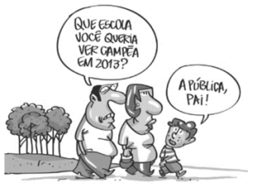

Na charge, produzida por Erasmo e retirada do Jornal de Piracicaba, o efeito de humor se dá sobretudo 

A) pelas desavenças entre pai e filho. 

B) pelo duplo sentido da palavra escola. 

C) pelo fato de a mãe não ter feito qualquer comentário. 

D) pelo fato de o termo escola ser um hiperônimo. 

E) pela atitude ambígua do filho do casal. 

#### **7. FGV / TJ-RJ / 2026** 

Observe o texto a seguir – uma explicação no capítulo introdutório de um livro de ensino de genética. 

“Este capítulo apresenta um panorama geral da Genética, em forma de orientação para o resto do livro. Trataremos primeiro sobre certas generalidades dos genes, sua herança e a maneira pela qual interagem com o meio ambiente. Descobriremos a seguir o procedimento peculiar pelo qual os geneticistas reconhecem genes específicos. Por último, examinaremos de que formas distintas se afetam a genética e a sociedade humana.”

---

<!-- pagina: 121 -->

**Equipe Português Estratégia Concursos, Felipe Luccas Aula 11** 

Nesse caso, o texto se organiza: 

A) por meio de uma enumeração de conteúdos, sem ordem fixa; 

B) de modo a servir de orientação para os leitores; 

C) como resumo de um conteúdo já expresso; 

D) com destaques indicando o que é mais importante; 

E) através da explicação de conteúdos. 

#### **8. FGV / TJ-RJ / 2026** 

Observe o seguinte fragmento narrativo, retirado do livro A Morte e a Morte de Quincas Berro Dágua, de Jorge Amado. 

“Procurou onde sentar. Tudo que havia, além do catre, era um caixão de querosene vazio. Vanda o pôs de pé, soprou a poeira, sentou-se. Quanto tempo demoraria o médico a chegar? E Leonardo? Imaginou o marido cheio de dedos na repartição, explicando ao chefe a inesperada morte do sogro.” 

Como todo texto narrativo, esse também mostra ações ou acontecimentos em sequência cronológica. 

As duas formas abaixo que mostram esse tipo de sequência são: 

A) procurou / sentar; 

B) havia / era; 

C) pôs / soprou; 

D) demoraria / chegar; 

E) imaginou / explicando. 

#### **9. FGV / TJ-RJ / 2026** 

Observe a tese argumentativa a seguir. 

“A legalização das drogas suporia a eliminação da estrutura de marginalidade, do mercado negro, de máfias e da delinquência, que atualmente se ampliaram ao redor do mundo.” 

Um contra-argumento válido para essa tese é: 

A) nesse caso, o número de viciados poderia ser tratado em hospitais públicos; 

B) haveria, assim, maior lucratividade por parte dos traficantes; 

C) desse modo, as drogas poderiam ser encaradas com todo o seu poder maléfico; 

D) a legalização das drogas aumentaria o número de consumidores; 

E) assim, a polícia teria um trabalho mais proveitoso. 

#### **10. FGV / IBGE / 2026** 

#### **Maria**

---

<!-- pagina: 122 -->

**Equipe Português Estratégia Concursos, Felipe Luccas Aula 11** 

Maria estava parada há mais de meia hora no ponto de ônibus. Estava cansada de esperar. Se a distância fosse menor, teria ido a pé. Era preciso mesmo ir se acostumando com a caminhada. Os ônibus estavam aumentando tanto! Além do cansaço, a sacola estava pesada. No dia anterior, no domingo, havia tido festa na casa da patroa. Ela levava para casa os restos. O osso do pernil e as frutas que tinham enfeitado a mesa. Ganhara as frutas e uma gorjeta. O osso a patroa ia jogar fora. Estava feliz, apesar do cansaço. A gorjeta chegara numa hora boa. Os dois filhos menores estavam muito gripados. Precisava comprar xarope e aquele remedinho de desentupir o nariz. Daria para comprar também uma lata de Toddy. As frutas estavam ótimas e havia melão. As crianças nunca tinham comido melão. Será que os meninos gostavam de melão? 

A palma de uma de suas mãos doía. Tinha sofrido um corte, bem no meio, enquanto cortava o pernil para a patroa. Que coisa! Faca-laser corta até a vida! 

Quando o ônibus apontou lá na esquina, Maria abaixou o corpo, pegando a sacola que estava no chão entre as suas pernas. O ônibus não estava cheio, havia lugares. Ela poderia descansar um pouco, cochilar até a hora da descida. Ao entrar, um homem levantou lá de trás, do último banco, fazendo um sinal para o trocador. Passou em silêncio, pagando a passagem dele e de Maria. Ela reconheceu o homem. Quanto tempo, que saudades! Como era difícil continuar a vida sem ele. Maria sentou-se na frente. O homem assentou-se ao lado dela. Ela se lembrou do passado. Do homem deitado com ela. Da vida dos dois no barraco. Dos primeiros enjoos. Da barriga enorme que todos diziam gêmeos, e da alegria dele. Que bom! Nasceu! Era um menino! E haveria de se tornar um homem. Maria viu, sem olhar, que era o pai do seu filho. Ele continuava o mesmo. Bonito, grande, o olhar assustado não se fixando em nada e em ninguém. Sentiu uma mágoa imensa. Por que não podia ser de outra forma? Por que não podiam ser felizes? E o menino, Maria? Como vai o menino? Cochichou o homem. Sabe que sinto falta de vocês? Tenho um buraco no peito, tamanha a saudade! Tou sozinho! Não arrumei, não quis mais ninguém. Você já teve outros... outros filhos? A mulher baixou os olhos como que pedindo perdão. É. Ela teve mais dois filhos, mas não tinha ninguém também! Homens também? Eles haveriam de ter outra vida. Com eles tudo haveria de ser diferente. Maria, não te esqueci! Tá tudo aqui no buraco do peito... 

EVARISTO, Conceição. Olhos D’água (adaptado). Rio de Janeiro: Pallas/Fundação Biblioteca Nacional, 2016. 

Assinale a opção que indica corretamente o gênero do texto, bem como sua justificativa. 

A) Fábula, uma vez que traz uma reflexão filosófica a partir de um tema cotidiano. 

B) Biografia, já que apresenta aspectos da vida de um personagem real. 

C) Editorial, pois revela aspectos sociais a partir de um ponto de vista. 

D) Ensaio, tendo em vista a predominância de um tom confessional no texto. 

E) Conto, considerando a condensação de uma história com poucos personagens. 

#### **11. FGV / IBGE / 2026** 

Mário recomeçou a passear, com as mãos nos bolsos, a cabeça baixa. Camila, ainda na poltrona, com as costas para a janela, os cotovelos fincados nos joelhos e o queixo nas mãos, procurava uma palavra com que pudesse convencer o filho da sua inocência. Tudo lhe parecia preferível àquela humilhação. Daria a luz dos seus olhos, - ah, antes ela fosse cega! para que Mário a julgasse pura, muito digna de todo o respeito das filhas, muito honesta, toda de seu marido e das suas crianças. Compreendia bem que o sentimento e a imaginação nas mulheres só servem

---

<!-- pagina: 123 -->

**Equipe Português Estratégia Concursos, Felipe Luccas Aula 11** 

para a dor. Colhem rosas as insensíveis, que vivem eternamente na doce paz; para as outras há pedras, duras como aquelas palavras do seu filho adorado. Antes ela fora surda: não as teria ouvido! 

Quantas vezes o marido teria beijado outras mulheres, amado outros corpos... e aí estava como dele só se dizia bem! Ele amara outras pela volúpia, pelo pecado, pelo crime; ela só se desviara para um homem, depois de lutas redentoras; e porque fora arrastada nessa fascinação, e porque não sabia esconder a sua ventura, aí estava boca do filho a dizer-lhe amarguras... 

(ALMEIDA, Julia Lopes de. A Falência. São Paulo: Via Leitura, 2018.) 

Assinale a opção que revela a crítica presente no texto. 

A) A maternidade como um peso nas escolhas para a mulher. 

B) A dependência da mulher em relação ao filho, considerados os papéis sociais. 

C) O desequilíbrio atribuído ao peso de uma traição cometida por mulheres, em relação aos homens. 

D) O questionamento da masculinidade diante da traição. 

E) A violência das relações parentais na sociedade brasileira. 

#### **12. FGV / IBGE / 2026** 

Mário recomeçou a passear, com as mãos nos bolsos, a cabeça baixa. Camila, ainda na poltrona, com as costas para a janela, os cotovelos fincados nos joelhos e o queixo nas mãos, procurava uma palavra com que pudesse convencer o filho da sua inocência. Tudo lhe parecia preferível àquela humilhação. Daria a luz dos seus olhos, - ah, antes ela fosse cega! para que Mário a julgasse pura, muito digna de todo o respeito das filhas, muito honesta, toda de seu marido e das suas crianças. Compreendia bem que o sentimento e a imaginação nas mulheres só servem para a dor. Colhem rosas as insensíveis, que vivem eternamente na doce paz; para as outras há pedras, duras como aquelas palavras do seu filho adorado. Antes ela fora surda: não as teria ouvido! 

Quantas vezes o marido teria beijado outras mulheres, amado outros corpos... e aí estava como dele só se dizia bem! Ele amara outras pela volúpia, pelo pecado, pelo crime; ela só se desviara para um homem, depois de lutas redentoras; e porque fora arrastada nessa fascinação, e porque não sabia esconder a sua ventura, aí estava boca do filho a dizer-lhe amarguras... 

(ALMEIDA, Julia Lopes de. A Falência. São Paulo: Via Leitura, 2018.) 

O texto classifica-se como 

A) injuntivo. 

B) argumentativo. 

C) descritivo. 

D) narrativo. 

E) expositivo. 

#### **13. FGV / IBGE / 2026**

---

<!-- pagina: 124 -->

**Equipe Português Estratégia Concursos, Felipe Luccas Aula 11** 

#### **Maria** 

Maria estava parada há mais de meia hora no ponto de ônibus. Estava cansada de esperar. Se a distância fosse menor, teria ido a pé. Era preciso mesmo ir se acostumando com a caminhada. Os ônibus estavam aumentando tanto! Além do cansaço, a sacola estava pesada. No dia anterior, no domingo, havia tido festa na casa da patroa. Ela levava para casa os restos. O osso do pernil e as frutas que tinham enfeitado a mesa. Ganhara as frutas e uma gorjeta. O osso a patroa ia jogar fora. Estava feliz, apesar do cansaço. A gorjeta chegara numa hora boa. Os dois filhos menores estavam muito gripados. Precisava comprar xarope e aquele remedinho de desentupir o nariz. Daria para comprar também uma lata de Toddy. As frutas estavam ótimas e havia melão. As crianças nunca tinham comido melão. Será que os meninos gostavam de melão? 

A palma de uma de suas mãos doía. Tinha sofrido um corte, bem no meio, enquanto cortava o pernil para a patroa. Que coisa! Faca-laser corta até a vida! 

Quando o ônibus apontou lá na esquina, Maria abaixou o corpo, pegando a sacola que estava no chão entre as suas pernas. O ônibus não estava cheio, havia lugares. Ela poderia descansar um pouco, cochilar até a hora da descida. Ao entrar, um homem levantou lá de trás, do último banco, fazendo um sinal para o trocador. Passou em silêncio, pagando a passagem dele e de Maria. Ela reconheceu o homem. Quanto tempo, que saudades! Como era difícil continuar a vida sem ele. Maria sentou-se na frente. O homem assentou-se ao lado dela. Ela se lembrou do passado. Do homem deitado com ela. Da vida dos dois no barraco. Dos primeiros enjoos. Da barriga enorme que todos diziam gêmeos, e da alegria dele. Que bom! Nasceu! Era um menino! E haveria de se tornar um homem. Maria viu, sem olhar, que era o pai do seu filho. Ele continuava o mesmo. Bonito, grande, o olhar assustado não se fixando em nada e em ninguém. Sentiu uma mágoa imensa. Por que não podia ser de outra forma? Por que não podiam ser felizes? E o menino, Maria? Como vai o menino? Cochichou o homem. Sabe que sinto falta de vocês? Tenho um buraco no peito, tamanha a saudade! Tou sozinho! Não arrumei, não quis mais ninguém. Você já teve outros... outros filhos? A mulher baixou os olhos como que pedindo perdão. É. Ela teve mais dois filhos, mas não tinha ninguém também! Homens também? Eles haveriam de ter outra vida. Com eles tudo haveria de ser diferente. Maria, não te esqueci! Tá tudo aqui no buraco do peito... 

EVARISTO, Conceição. Olhos D’água (adaptado). Rio de Janeiro: Pallas/Fundação Biblioteca Nacional, 2016. 

Assinale a opção que apresenta a crítica presente no texto. 

A) A desigualdade social e seus desdobramentos. 

B) O descaso com a saúde pública no Brasil. 

C) A agressão física contra a mulher, praticada pelos parceiros. 

D) A superlotação dos transportes públicos. 

E) A violência urbana praticada por menores. 

#### **14. (FGV / TCE-PI / 2025)** 

Assinale a opção que indica o fragmento textual que pertence ao modo narrativo de organização discursiva. 

A) “A iluminação era fraca, mas, como havia luz externa, o problema era de pouca monta.” 

B) “Alguns clientes conversavam em diversas mesas e pareciam contentes com alguma coisa.”

---

<!-- pagina: 125 -->

**Equipe Português Estratégia Concursos, Felipe Luccas Aula 11** 

C) “O restaurante era pequeno, com muitas mesas espalhadas pelo salão, com velas sobre elas.” 

D) “Restaurantes são lugares públicos e devem estar sempre com boa aparência para atrair os clientes.” 

E) “Estava com fome. Dobrei a esquina, dirigi-me a um restaurante que estava aberto e sentei-me na primeira mesa.” 

#### **15. (FGV / MPU / 2025)** 

Em todas as frases abaixo, há termos de ligação sublinhados. 

A frase em que esse termo se refere à estrutura do texto e não a fatos reais é: 

A) Cheguei atrasado ao trabalho e, por causa disso, fui multado em 10% dos meus vencimentos; 

B) À proporção que leio o livro, mais me apaixono pela figura humana de Van Gogh; 

C) Logo após o relato de sua doença, o personagem interrompeu a narrativa por vários dias; 

D) Os estudantes ficaram <u>tão</u> chateados com os resultados da prova, <u>que</u> decidiram fazer uma greve; 

<u>mas</u> E) Os alunos leram os livros encomendados pelo mestre, alguns deles não apreciaram a tarefa. 

#### **16. (FGV / MPE-RJ / 2025)** 

#### Observe o seguinte texto: 

“Os pesquisadores dos laboratórios Bell (Estados Unidos), onde foi inventado o transistor, o elemento de base dos computadores modernos, já construíram um protótipo de computador óptico. Trata-se de algo ainda rudimentar. Ele só comporta 128 transistores ópticos e ocupa um espaço de 60 cm. Um elefante comparado aos computadores atuais cujos microprocessadores possuem milhões de transistores por centímetro quadrado. Mas transformar um mastodonte em micróbio é só uma questão de tempo: os primeiros computadores ocupavam o espaço de toda uma sala”. 

Sobre esse texto, assinale a afirmação correta. 

A) Trata-se de um texto publicitário que antecipa as qualidades de um futuro computador. 

B) Exemplifica um texto didático para um público leitor não especialista no assunto tratado. 

C) Constitui um texto jornalístico com informações e explicações para um leitor não especializado. 

D) Texto narrativo que traz as diferentes etapas da construção de um computador. 

E) Mostra um texto descritivo, com detalhes de elementos componentes de um computador. 

#### **17. (FGV / TCE-PI / 2025)** 

Leia a frase em discurso direto a seguir.

---

<!-- pagina: 126 -->

**Equipe Português Estratégia Concursos, Felipe Luccas Aula 11** 

— Amanhã estarei saindo daqui com minha irmã. 

Assinale a opção que apresenta essa frase em discurso indireto. (Começando por Ele disse que...) 

A) amanhã estará saindo de lá com sua irmã. 

B) amanhã estaria saindo de lá com a irmã dele. 

C) amanhã estava saindo de lá com a irmã dele. 

D) no dia seguinte estaria saindo de lá com sua irmã. 

E) no dia seguinte ele estaria saindo de lá com a irmã dele. 

#### **18. (FGV / MPU / 2025)** 

Slogans como “Abuse e Use C&A” (C&A), “Não saia de casa sem ele” (American Express), “Seja mais feliz em um Chevrolet” (Chevrolet) fazem uso de uma função da linguagem muito comum no texto publicitário, que é a: 

A)  referencial; 

B)  fática; 

C) metalinguística; 

D) emotiva; 

E)  conativa. 

#### **19. (FGV / MPU / 2025)** 

Na frase “Infelizmente, meu amigo se esqueceu de dar o aviso da entrevista para o pobre Marcelo”, cruzam-se duas funções de linguagem, que são: 

A) referencial e fática; 

B) conativa e metalinguística; 

C) metalinguística e referencial; 

D) emotiva e conativa; 

E) fática e emotiva. 

#### **20. (FGV / SEFAZ-RS / 2025)** 

Assinale a frase que mostra a presença da função metalinguística de linguagem. 

A) Uma tarefa fácil se torna difícil quando você a realiza com má vontade. 

B) É mais fácil levantar castelos no ar do que sobre a terra. 

C) Os ideais são como as estrelas: estão fora de nosso alcance. 

D) Inocente como uma mosca que aceita convite de aranha. 

E) Quanto mais impertinente, maior prazer me dá.

---

<!-- pagina: 127 -->

**Equipe Português Estratégia Concursos, Felipe Luccas Aula 11** 

#### **21. (FGV / TCE-RR / Auditor de Controle Externo/ 2025)** 

#### Assinale a frase que **<u>não</u>** exemplifica a função conativa de linguagem. 

A) Não deixe para amanhã o que pode fazer hoje. 

B) Faz o bem sem olhar a quem. 

C) Siga em frente que atrás vem gente. 

D) Fiz o que pude para ajudar os demais. 

E) Veja bem o que você vai fazer. 

#### **22. (FGV / SEFAZ-RS / 2025)** 

#### Observe a descrição a seguir. 

Tiradentes é uma cidade pequena e em sua parte mais antiga é calçada com pedras irregulares. As ruas são estreitas e tortuosas, as casas bem juntinhas e com amplos quintais. A praça central tem charme especial, com suas casas centenárias. 

O processo descritivo empregado no texto é 

A) do alto para baixo. 

B) de longe para perto. 

C) de fora para dentro. 

D) do geral para o particular. 

E) de cima para baixo. 

#### **23. (FGV / MPU / 2025)** 

Leia o texto abaixo: 

“O problema em matéria de audição vem do fato de que o cérebro é um órgão muito rápido e que se pensa muito mais depressa do que se fala. Assim que escutamos uma pessoa, solicitamos ao cérebro que trabalhe muito mais lentamente em comparação com sua capacidade. Entretanto, não chegamos realmente a reduzir a velocidade do cérebro; enquanto registramos as palavras transmitidas pelo emissor, o cérebro continua a tratar as centenas de palavras e a fazer associações de ideias. Em outros termos, quando escutamos, nos resta algum tempo livre para pensar. É o emprego desse tempo livre que torna a escuta boa ou má”. 

Levando em consideração que o conteúdo temático do texto é de difícil acesso pelo leitor comum, o processo utilizado para tornar esse conteúdo mais claro foi: 

A)  indicar a estruturação do texto no início da leitura; 

B) acrescentar exemplos práticos ao texto; 

C) reformular as informações já dadas; 

D) utilizar sinônimos mais comuns para termos difíceis; 

E) repetir informações com os mesmos termos.

---

<!-- pagina: 128 -->

**Equipe Português Estratégia Concursos, Felipe Luccas Aula 11** 

#### **24. (FGV / SEFAZ-RS / 2025)** 

Observe o fragmento abaixo, que serve de introdução a um texto: 

A fórmula da estabilidade política da democracia da Europa está na polarização equilibrada entre duas forças políticas: os social-democratas e os liberais. 

Essa introdução apresenta o seguinte o esquema estrutural: 

A) uma declaração inicial neutra. 

B) uma narrativa de suspense. 

C) uma divisão de elementos. 

D) uma alusão histórica. 

E) uma definição etimológica. 

#### **25. (TJ RJ / MEDIADOR JUDICIÁRIO / 2024)** 

Observe o seguinte texto abaixo: 

“Na Roma antiga dava-se grande importância à argumentação, ensinavam-se técnicas de convencimento do auditório e as pessoas capazes de bem utilizar a linguagem para esse fim eram muito respeitadas. Essa forma oral de dirigir-se a um público para convencê-lo se chama oratória e, na democracia romana, qualquer cidadão tinha o direito de discursar em praça pública.” 

Segundo a estrutura desse pequeno texto, podemos classificá-lo como 

A) argumentativo. 

B) descritivo. 

C) didático. 

D) narrativo. 

E) Informativo. 

#### **26. (FGV / DNIT / 2024)** 

Um grande escritor francês disse certa vez que “Se cinquenta milhões de pessoas dizem uma grande besteira, continua sendo uma grande besteira”. 

Essa frase contraria os argumentos presentes nos textos argumentativos, que se apoiam no(a) 

A) autoridade de algumas pessoas no assunto discutido. 

B) estatísticas que comprovam por estudos as teses defendidas. 

C) opinião dos emissores das teses defendidas. 

D) bom-senso, como origem de verdades generalizadas. 

E) pensamento idêntico de muitas pessoas.

---

<!-- pagina: 129 -->

**Equipe Português Estratégia Concursos, Felipe Luccas Aula 11** 

#### **27. (FGV / PREF. SÃO JOSÉ DOS CAMPOS - SP / 2024)** 

Observe abaixo um parágrafo do início do romance O Primo Basílio, de Eça de Queiroz, que traz uma descrição de um personagem: 

“Ficara sentada à mesa a ler o Diário de Notícias, no seu roupão de manhã de fazenda preta, bordado a sutache, com largos botões de madrepérola; o cabelo louro um pouco desmanchado, com um tom seco do calor do travesseiro, enrolava-se, torcido no alto da cabeça pequenina, de perfil bonito; a sua pele tinha a brancura tenra e láctea das louras; com o cotovelo encostado à mesa acariciava a orelha, e, no movimento lento e suave dos seus dedos, dois anéis de rubis miudinhos davam cintilações escarlates.” 

Sobre essa descrição, é correto afirmar que 

A) abrange uma sequência de momentos do personagem. 

B) os dados descritivos presentes no parágrafo se referem aos aspectos físico e psíquico do personagem. 

C) na descrição tanto o observador quanto a personagem descrita estão em movimento. 

D) alguns segmentos da descrição permitem a localização temporal do momento do dia em que a descrição é feita. 

E) o ato descritivo segue um roteiro estratégico, que mostra o personagem de longe para perto. 

#### **28. (FGV / CGE-PB / 2024)** 

#### Texto 3 

“De origem ainda incerta, o pão, base da alimentação da quase totalidade dos seres humanos, é conhecido desde o período Neolítico. Inicialmente, era feito de grãos de cereais triturados com pedras, amassado com água e colocado sobre pedras quentes ou debaixo de cinzas para assar, o que resultava em um pão achatado, duro e seco”. 

A função de linguagem predominante no texto 3 é: 

A) metalinguística, pois explica a origem do vocábulo “pão”; 

B) emotiva, pois mostra opiniões pessoais de quem escreve; 

C) poética, pois constrói o texto com preocupações estéticas; 

D) referencial, pois fornece dados reais sobre a história do pão; 

E) conativa, pois tenta convencer o leitor das informações dadas. 

#### **29. (FGV / CÂMARA MUNICIPAL DE SÃO PAULO / 2024)** 

#### Observe o seguinte texto: 

“Jorge enrolou um cigarro, e muito repousado, muito fresco na sua camisa de chita, sem colete, o jaquetão de flanela azul aberto, os olhos no teto, pôs-se a pensar na sua jornada ao Alentejo.” 

Sobre a estruturação desse segmento textual, é correto afirmar que o texto 

A) é predominantemente descritivo, com detalhes pormenorizados das roupas do personagem. 

B) é do tipo narrativo, com uma interrupção descritiva.

---

<!-- pagina: 130 -->

**Equipe Português Estratégia Concursos, Felipe Luccas Aula 11** 

C) é predominantemente narrativo, com uma interrupção em flash-back. 

D) é do tipo expositivo, em que o enunciador fornece dados importantes para a compreensão do que é lido. 

E) é argumentativo, com a tese de que é indispensável a reflexão sobre as ações humanas. 

#### **30. (FGV / CGE-PB / 2024)** 

Observe o seguinte capítulo do romance Dom Casmurro, de Machado de Assis: 

“Pádua era empregado em repartição dependente do ministério da guerra. Não ganhava muito, mas a mulher gastava pouco, e a vida era barata. Demais, a casa em que morava, assobradada como a nossa, posto que menor, era propriedade dele. Comprou-a com a sorte grande que lhe saiu num meio bilhete de loteria, dez contos de réis. A primeira ideia do Pádua, quando lhe saiu o prêmio, foi comprar um cavalo do Cabo, um adereço de brilhantes para a mulher, uma sepultura perpétua de família, mandar vir da Europa alguns pássaros, etc.; mas a mulher, esta D. Fortunata que ali está à porta dos fundos da casa, em pé, falando à filha, alta, forte, cheia, como a filha, a mesma cabeça, os mesmos olhos claros, a mulher é que lhe disse que o melhor era comprar a casa, e guardar o que sobrasse para acudir às moléstias grandes. Pádua hesitou muito; afinal, teve de ceder aos conselhos de minha mãe, a quem D. Fortunata pediu auxílio. Nem foi só nessa ocasião que minha mãe lhes valeu; um dia chegou a salvar a vida do Pádua. Escutai; a anedota é curta. 

O administrador da repartição em que Pádua trabalhava teve de ir ao Norte, em comissão. Pádua, ou por ordem regulamentar, ou por especial designação, ficou substituindo o administrador com os respectivos honorários. Esta mudança de fortuna trouxe-lhe certa vertigem; era antes dos dez contos. Não se contentou de reformar a roupa e a copa, atirou-se às despesas supérfluas, deu joias à mulher, nos dias de festa matava um leitão, era visto em teatros, chegou aos sapatos de verniz. Viveu assim vinte e dois meses na suposição de uma eterna interinidade”. 

Sobre a esquematização do tempo nesse fragmento narrativo, é correto afirmar que: 

A) o texto mostra uma evolução cronológica contínua dos fatos narrados; 

B) ocorre no texto acima uma prolepse, ou seja, uma antecipação das ações futuras; 

C) parte do fragmento textual mostra uma pausa, ou seja, um momento em que a ação narrativa para; 

D) entre os fatos narrados no texto há uma elipse de tempo, quando se salta de um momento a outro na sequência; 

E) o fragmento mostra a esquematização básica dos textos narrativos: uma situação inicial, um elemento perturbador, os fatos ou acontecimentos e uma resolução final. 

#### **31. (FGV / CGE-PB / 2024)** 

Observe o período abaixo, em discurso direto: 

“Eu perguntei ao ministro: – V. Exa trouxe consigo o dinheiro que lhe emprestei ontem?” 

Se passarmos esse mesmo período para o discurso indireto, a única modificação NÃO cabível é:

---

<!-- pagina: 131 -->

**Equipe Português Estratégia Concursos, Felipe Luccas Aula 11** 

A) “S. Exa” em lugar de “V. Exa”; 

B) “com ele” em lugar de “consigo”; 

C) “trouxera” em lugar de “trouxe”; 

D) “na véspera” em lugar de “ontem”; 

E) a conjunção “se” em lugar dos dois pontos e do travessão. 

#### **32. (FGV / CGE-PB / 2024)** 

Nas opções abaixo há a indicação de um tipo de texto, suas marcas essenciais e exemplos desses textos; a opção em que os exemplos de textos citados correspondem ao tipo inicialmente apontado, é: 

A) injuntivo – indicação de ordens ou conselhos / receitas; 

B) explicativo – fazer compreender algo / romance policial; 

C) argumentativo – defesa ou ataque a uma ideia / texto de horóscopo; 

D) descritivo – descrição de objetos distintos / publicidade de um produto; 

E) narrativo – relato de fatos em ordem cronológica / comentário jornalístico. 

#### **33. (FGV / PGM-NITERÓI / 2023)** 

Um texto anônimo encontrado em um pequeno jornal de um bairro registrava: “Chamo-me Pedro Álvares Cabral. Quero dizer que acabo de descobrir uma terra que parece muito grande, habitada por gente estranha, que vive em completa inocência, pois não escondem seus corpos, como nós. Não sei o que acontecerá a este lugar no futuro, principalmente me preocupa o fato de virem descobrir muitas riquezas nele, mas espero que Deus o proteja dos homens. Daqui a alguns dias voltarei para Lisboa e darei as boas-novas ao rei. Vou registrar diariamente os acontecimentos mais notáveis dessa descoberta”. 

Sobre a estrutura desse pequeno texto, é correto afirmar que: 

A) neste caso, o narrador e o autor são a mesma pessoa; 

B)  o foco principal da narrativa está na apresentação das diferenças entre os índios e os europeus; 

C) o narrador deste pequeno texto mostra uma visão nostálgica de um passado já distante; 

D) as características da linguagem empregada no texto tentam indicar que se trata de um momento já distante no tempo; 

E) o texto projeta uma visão futura positiva para o Brasil. 

#### **34. (FGV / PGM-NITERÓI / 2023)** 

Observe o texto narrativo a seguir. “São duas e meia da manhã. Cada vez que eu tento levantar-me, minha cabeça parece girar e tenho que apoiar-me na parede para não cair. Não sei exatamente o que está acontecendo, se este desconforto é fruto de bebida ou de remédios

---

<!-- pagina: 132 -->

**Equipe Português Estratégia Concursos, Felipe Luccas Aula 11** 

exagerados. Tento deitar de novo e procuro ficar imóvel para ver se o incômodo vai embora. Vamos ver...” A afirmativa adequada a esse fragmento de narração é: 

A) como na maioria dos textos narrativos, este também se utiliza prioritariamente do pretérito perfeito do indicativo; 

B) o texto exemplifica uma narrativa simultânea, em que o narrador relata os fatos no momento em que ocorrem; 

C) a narrativa mostra um momento íntimo, procurando inquietar o leitor sobre o estado psíquico do personagem; 

D) o texto narrativo acima é direto, sem qualquer interrupção dos fatos narrados; 

E) o texto mostra, como num diário, as impressões e observações do narrador sobre pequenos e grandes acontecimentos de sua vida diária. 

#### **35. (FGV / TJ-RN / 2023)** 

Num romance autobiográfico, o narrador escreveu: 

"O subúrbio onde morávamos era bem populoso e meu pai ganhava bom dinheiro com a padaria que ali havia estabelecido; minha mãe ficava só e cuidava da casa e dos filhos com rigor extremado, só nos deixando sair da casa assobradada que servia de residência para locais onde nos pudesse ver. Diante da casa havia uma enorme praça, local de futebol para crianças e adultos e na esquina à esquerda ficava a biblioteca escolar, espaço de magia, onde minha imaginação delirava". 

Sobre esse segmento do romance, é correto afirmar que: 

A) o personagem narrador não se inclui entre os personagens da narrativa, sendo apenas observador dos fatos; 

B) apesar de estar inserido num romance, o segmento destacado é integralmente descritivo; 

C) o narrador constrói seu universo romanesco com personagens da família e da população local: 

D) o trecho mostra um espaço familiar de paz e de tranquilidade, propício ao pleno desenvolvimento psicológico; 

E) os aspectos representados no texto mostram a parcialidade da visão familiar por parte de um filho único. 

#### **36. (FGV / PGM-NITERÓI / 2023)** 

Todos os segmentos textuais abaixo são exemplos de textos narrativos, que podem mostrar, entre outras, uma focalização onisciente dos fatos, ou seja, em que o narrador mostra um conhecimento completo de todos os elementos romanescos: tempo, espaço e personagens. Esse tipo de focalização está apresentado em: 

A) Meus pensamentos vagaram toda a noite por projetos a serem realizados e, quando despertei, procurei anotar alguns detalhes importantes; 

B) A raposa olhou as uvas lá no alto e, sabendo que não iria alcançá-las, desistiu do seu projeto, alegando que estavam verdes, mantendo, assim, o orgulho;

---

<!-- pagina: 133 -->

**Equipe Português Estratégia Concursos, Felipe Luccas Aula 11** 

C) O homem aproximou-se do portão da casa e talvez, desejoso de ver a sua amada, apertou o botão da campainha...; 

D) Estacionei o carro na esquina, deixei rapidamente o local e meia hora depois a explosão acordou todo o quarteirão; 

E) Ele não sabia por que estava ali, parado, nem mesmo eu, o narrador desta história, tenho esse conhecimento. 

#### **37. (FGV / PGM-NITERÓI / 2023)** 

“Meu filho, universitário do curso de Biologia, foi obrigado a fazer um estágio em uma pequeníssima cidade do interior do Rio Grande do Sul. Hospedou-se no único hotel da cidade cuja dona lhe disse logo à chegada: – Só troco a roupa de cama uma vez a cada quinze dias! – Não quero saber de lixo nos corredores do meu hotel! Havia coisas piores: os vasos sanitários não tinham tampa, o papel higiênico eram pequenos pedaços de folhas de jornais... Apesar das dificuldades, conseguiu fazer um bom estágio numa granja do local e o gerente lhe declarou que ele se tinha mostrado um bom estudante, que poderia voltar quando quisesse, mas, Deus me livre, não era a intenção dele.” Falando dos vários tipos de discurso, é correto afirmar que: 

A) a frase de discurso direto “Só troco a roupa de cama uma vez a cada quinze dias” pode ser passada para discurso indireto: “Ela disse que só trocaria a roupa de cama uma vez a cada quinze dias”; 

B) a frase de discurso direto “Não quero saber de lixo nos corredores do meu hotel” pode ser adequadamente modificada para discurso indireto do seguinte modo: “Ela disse que não queria saber de lixo nos corredores do meu hotel”; 

C) a frase de discurso indireto “o gerente lhe declarou que se tinha mostrado um bom estudante” poderia ser colocada em discurso direto: “– Você se mostrava um bom estudante”; 

D) a frase de discurso indireto “o gerente lhe declarou que poderia voltar quando quisesse” poderia ser colocada em discurso direto: “– Você pode voltar quando queira”; 

E) a frase “Deus me livre” é exemplo do que se denomina discurso indireto livre. 

#### **38. (FGV / MPE-SP / 2023)** 

Assinale a opção que apresenta a frase que exemplifica o gênero textual descritivo. 

A) Quem investe hoje na produção deveria receber um diploma de burrice. 

B) Fazer bons negócios é ver primeiro. 

C) Quando o assunto é dinheiro, todos os homens pertencem à mesma religião. 

D) Não fale sobre as minhas dívidas, a menos que você queira pagá-las. 

E) Desconfiai do primeiro movimento: é sempre generoso. 

#### **39. (FGV / TJ-RN / 2023)** 

Em todas as opções abaixo há descrições de uma pequena cidade; a descrição que tem a finalidade de identificar ou localizar a cidade descrita, é:

---

<!-- pagina: 134 -->

**Equipe Português Estratégia Concursos, Felipe Luccas Aula 11** 

A) a cidade X mostra muitas igrejas antigas, do tempo colonial com pinturas e esculturas de valor; 

B) as ruas da cidade X estão quase sempre floridas e muitas delas reservadas a pedestres, sempre limpas e claras; 

C) a cidade X, por estar ao pé da Serra da Mantiqueira, tem estações bem-marcadas, com inverno e verão rigorosos; 

D) a população da cidade X se caracteriza por sua permanente solidariedade e atitudes afetivas em relação aos visitantes; 

E) o espaço ocupado pela cidade X mostra condomínios de luxo e paisagens dignas de quadros. 

#### **40. (FGV / TJ-RN / 2023)** 

Observe a seguinte descrição machadiana (Dom Casmurro) da casa onde mora o narrador e que procurou copiar a antiga casa onde morava na infância: 

"Construtor e pintor entenderam bem as indicações que lhes fiz: é o mesmo prédio assobradado, três janelas de frente, varanda ao fundo, as mesmas alcovas e salas. Na principal destas, a pintura do teto e das paredes é mais ou menos igual, umas grinaldas de flores miúdas e grandes pássaros que as tornam nos bicos, de espaço a espaço. Nos quatro cantos do teto as figuras das estações , e ao centro das paredes os medalhões de César, Augusto, Nero e Massinissa, com os nomes por baixo..." 

Sobre a estratégia descritiva empregada nesse texto, é correto afirmar que: 

A) a descrição é feita de cima para baixo, com inicial apreciação visual das partes superiores e, em seguida, das inferiores; 

B) o movimento descritivo parte do aspecto interior da casa para a visão do seu exterior; 

C) a descrição inclui aspectos que implicitamente mostram a situação econômica do narrador e o gosto estético da família; 

D) o texto é construído com riqueza de detalhes e identificação objetiva de todos os elementos descritos; 

E) os elementos descritos no texto são frutos de impressões tácteis do narrador. 

#### **41. (FGV / SEFAZ-MT / 2023)** 

Assinale a opção que apresenta o segmento textual que deve ser incluído entre os <u>textos descritivos.</u> 

A) "Nós estamos em meio a uma corrida entre a destreza humana quanto aos meios e a sandice humana quanto aos fins." 

B) "Conhecimento é poder, mas poder para o mal não menos que para o bem." 

C) "A felicidade é a satisfação ulterior de um desejo pré-histórico." 

D) "Não se pode sustentar que a civilização por si mesma faz os homens mais felizes do que eles são na condição selvagem." 

E) "Antes de os portugueses descobrirem o Brasil, o Brasil tinha descoberto a felicidade."

---

<!-- pagina: 135 -->

**Equipe Português Estratégia Concursos, Felipe Luccas Aula 11** 

#### **42. (FGV / TJ-RN / 2023)** 

Em um documento para motoristas que se preparavam para uma longa viagem pela estrada, destacavam-se os seguintes pontos: 

- Revise as partes vitais de seu veículo. 

- Use sempre o cinto de segurança. 

- Respeite os limites de velocidade. 

- Mantenha distância do carro da frente. 

Esse tipo de texto se enquadra entre os textos: 

A) injuntivos; 

B) injuntivo-argumentativos; 

C) narrativos; 

- D) descritivos-narrativos; 

E) argumentativo. 

#### **43. (FGV / SEAD AP / 2023)** 

No site “Recanto das Letras” apareceu o seguinte texto de Graça Novais: “O ensino se bem-organizado impulsiona, também, o desenvolvimento do estudante, porém esse deve ser visto como alguém que contribui para a sua aprendizagem de forma "ativa", implicando uma revolução na forma de conceber o ensino, alterando a postura do professor e da equipe gestora. Professor mediador entre os alunos e o conhecimento e facilitador da aprendizagem, tornando-se essa, um processo ativo que requer a reconstrução tanto de novos conhecimentos como de formas de pensar e tomar decisões”. 

O texto do “Recanto das Letras” deve ter seu gênero classificado como 

A) descritivo, pois define os vários componentes de uma estrutura moderna de ensino. 

B) narrativo, pois mostra uma evolução conceitual na forma de conceber o ensino. 

C) dissertativo-expositivo, pois expõe didaticamente como deve ser visto o ensino nos dias de hoje. 

D) dissertativo-argumentativo, pois defende uma ideia sobre o ensino, apoiada em argumentos de autoridade. 

E) dissertativo-histórico, pois enumera as diversas fases por que já passou a tarefa de ensinar. 

#### **44. (FGV / CÂMARA TAUBATÉ-SP / CONTADOR LEGISLATIVO / 2022)** 

Observe o seguinte fragmento de texto argumentativo, proferido por Rousseau: 

“Os pensamentos mais brilhantes podem surgir no cérebro de uma criança, ou os melhores termos em sua boca, assim como riquezas em suas mãos, sem que isso signifique que os pensamentos e as riquezas lhe pertençam; não há propriedade verdadeira de qualquer tipo nessa idade.

---

<!-- pagina: 136 -->

**Equipe Português Estratégia Concursos, Felipe Luccas Aula 11** 

As coisas ditas por uma criança não são para ela o que são para nós, nem mesmo ocorrem as mesmas ideias. Tais ideias são desprovidas, em sua mente, de ligações ou sequências; nada de fixo, nada de seguro em tudo o que ela pensa”. 

O encadeamento entre parágrafos é muito importante nos textos argumentativos; no caso desse texto, tal encadeamento é feito pela seguinte estratégia: 

A) aumentando a extensão do texto, por meio de novos exemplos das afirmações já realizadas no parágrafo anterior. 

B) retomando as afirmações anteriores, com o acréscimo de argumentos de autoridade. 

C) esclarecendo uma afirmação anterior, com a apresentação de afirmações de caráter subjetivo. 

D) repetindo informações de modo a apresentar as mesmas ideias anteriores, com novas palavras. 

- E) modificando o que foi dito anteriormente, para a apresentação de algo mais científico. 

#### **45. (FGV / CÂMARA TAUBATÉ-SP / CONTADOR LEGISLATIVO / 2022)** 

Observe o seguinte texto argumentativo: 

“Creio que todos os brasileiros devem defender o respeito à nossa Constituição, principalmente pela proximidade das eleições. Não se pode aceitar que qualquer um dos poderes da República possa atentar contra essa base de segurança institucional, que é a nossa Carta Magna”. 

Sobre a estrutura argumentativa desse texto, assinale a observação adequada. 

- A) a defesa da tese apresentada apela para argumentos de intimidação, em função das próximas eleições. 

- B) os argumentos apresentados se apoiam na autoridade dos defensores da tese. 

- C) as opiniões do enunciador do texto servem de único argumento para a defesa da Constituição. 

- D) a estruturação do texto se utiliza do método indutivo, partindo do específico para o geral. 

- E) a exemplificação é uma das estratégias do argumentador para a defesa do que entende como correto. 

**46. (FGV / CÂMARA TAUBATÉ-SP / CERIMONIALISTA LEGISLATIVO / 2022)** 

A maioria dos textos mostra um tipo de introdução qualquer, como uma preparação de terreno para o que vai ser abordado. 

Observe o seguinte texto: “Quem joga bola é menino, menina brinca com boneca”, “Mulher que pratica esportes se masculiniza!” Durante séculos pensamentos desse tipo afastaram as mulheres dos esportes”. 

No caso desse texto, a introdução apresenta o seguinte tipo 

A) alusão histórica. 

B) interrogação. 

- C) citação.

---

<!-- pagina: 137 -->

**Equipe Português Estratégia Concursos, Felipe Luccas Aula 11** 

D) definição. 

E) divisão. 

#### **47. (FGV / CÂMARA TAUBATÉ-SP / CONTADOR LEGISLATIVO / 2022)** 

Observe o seguinte texto, iniciado por uma interrogação: 

“Há remédio que possa ser utilizado contra o uso indiscriminado de agrotóxicos? O único caminho sensato, como faziam nossos antepassados, parece ser o do controle biológico das pragas”. 

Nesse caso, considerando-se o texto, a pergunta inicial 

A) não supõe uma resposta possível. 

B) já é respondida pelo próprio texto. 

C) mostra mais de uma possibilidade de resposta. 

D) é puramente retórica, ou seja, não é para ser respondida. 

E) tem a finalidade de provocar a curiosidade do leitor. 

#### **48. (FGV / CÂMARA TAUBATÉ-SP / CONTADOR LEGISLATIVO / 2022)** 

Abaixo estão cinco títulos dados a notícias variadas em um jornal impresso; a opção em que o título está bem formulado, levando-se em conta a economia de espaço e a clareza da informação, é: 

A) Os analistas estrangeiros chegam para as eleições. 

B) Os resultados das eleições serão rapidamente divulgados. 

C) Indolência e despreparo preocupam o TSE. 

D) Eleições preocupam brasileiros; 

E) Candidatos perdedores questionam os resultados. 

#### **49. (FGV / CÂMARA TAUBATÉ-SP / RECEPCIONISTA LEGISLATIVO / 2022)** 

“O argumentador faz referência a uma obra célebre, a um autor, a um especialista reconhecido cuja competência é colocada a serviço da defesa de uma tese”. 

As palavras acima fazem referência a um tipo de argumento frequentemente utilizado, denominado 

A) argumento apoiado em valores sociais. 

B) argumento por meio de exemplos. 

C) argumento por analogia. 

D) argumento de autoridade.

---

<!-- pagina: 138 -->

**Equipe Português Estratégia Concursos, Felipe Luccas Aula 11** 

E) argumento com apelo ao bom-senso. 

#### **50. (FGV / DEPEN MG / AGENTE DE SEGURANÇA PENITENCIÁRIO / 2022)** 

“A crise de criminalidade do Brasil é produto da impunidade. A impunidade, por sua vez, tem duas raízes. A primeira é a incapacidade do sistema de Justiça Criminal de impedir os crimes e identificar, prender e manter os criminosos depois que o crime foi cometido. A segunda raiz é uma legislação penal criada com base na ideologia do criminoso ‘vítima da sociedade’ e em algumas ideias absurdas, sem nenhum compromisso com a realidade”. 

Esse texto deve ser classificado como 

A) descritivo cujo objeto é a situação criminal do país. 

B) narrativo a respeito da origem da crise de criminalidade. 

C) descritivo-narrativo com a mistura de passado e presente. ==5460== 

D) expositivo, informando sobre nossa legislação penal. 

E) argumentativo, apontando causas do problema.

---

<!-- pagina: 139 -->

**Equipe Português Estratégia Concursos, Felipe Luccas Aula 11** 

# **GABARITO** 

1. LETRA E 2. LETRA A 3. LETRA B 4. LETRA C 5. LETRA D 6. LETRA B 7. LETRA B 8. LETRA C 9. LETRA D 10. LETRA E 11. LETRA C 12. LETRA D 13. LETRA A 14. LETRA E 15. LETRA C 16. LETRA C 17. LETRA D 18. LETRA E 19. LETRA D 20. LETRA B 21. LETRA D 22. LETRA D 23. LETRA C 24. LETRA C 25. LETRA E 26. LETRA E 27. LETRA D 28. LETRA D 29. LETRA B 30. LETRA C 31. LETRA B 32. LETRA A 33. LETRA A 34. LETRA B 35. LETRA B 36. LETRA B 37. LETRA E 38. LETRA B 39. LETRA C 40. LETRA C 41. LETRA C 42. LETRA A 43. LETRA D 44. LETRA C 45. LETRA C 

46. LETRA C 47. LETRA B 48. LETRA D 49. LETRA D 50. LETRA E

---

<!-- pagina: 140 -->

**Equipe Português Estratégia Concursos, Felipe Luccas Aula 11** 

# **<mark>Q</mark> UESTÕES** **<mark>C</mark> OMENTADAS** **<mark>- C</mark> OMPREENSÃO E INTERPRETAÇÃO** **<mark>FGV</mark>** 

#### **1. (FGV / MPU / 2025)** 

Todas as frases abaixo mostram solicitações ou conselhos de forma direta ou indireta. 

A frase que mostra uma forma indireta é: 

- A) Você aceita uma sobremesa? 

- B) Proíbo você de continuar com essa história; 

- C) Aconselho a todos a leitura de Guimarães Rosa; 

D) Eu te peço para comprares a casa; 

E) Se seu pai venceu na vida, ele trabalhou muito! 

#### **Comentário:** 

Em todas as alternativas, a sugestão é clara na própria literalidade da frase: aceite a sobremesa, não continue a história, leia Guimarães Rosa, compre a casa... 

Na E, existe a necessidade de uma inferência, a sugestão está implícita: 

E) Se seu pai venceu na vida, (é porque) ele trabalhou muito! 

Existe uma relação de causalidade entre trabalhar e vence. Portanto, a sugestão indireta é: Trabalhe, porque é o caminho para vencer. 

Gabarito Letra E. 

#### **2. (FGV / MPE-RJ / 2025)** 

As opções a seguir apresentam ditados cujos significados são fornecidos a seguir. 

Assinale a opção em que esse significado está indicado corretamente. 

A) Mais vale um pássaro na mão que dois voando / é indispensável proteger os bens naturais do que os bens materiais. 

B) Ninguém pode argumentar com a ignorância da lei / Todas as leis são conhecidas por todos. 

C) A grama do quintal do vizinho está sempre mais verde / A inveja comanda as nossas reações. 

D) Mais vale um gosto que três vinténs / conselho de economia doméstica. 

E) Não deixes para amanhã o que podes fazer hoje / conselho a ser rápido na execução das tarefas, antes que outros o façam. 

#### **Comentário:** 

Está correta a C: a grama do vizinho simboliza a vida alheia. Estar “mais verde” significa a vida alheia parecer melhor que a da pessoa que tem inveja. 

Vejamos o sentido essencial dos demais ditos populares: 

A) Mais vale um pássaro na mão que dois voando / mais vale um pouco disponível do que muito

---

<!-- pagina: 141 -->

**Equipe Português Estratégia Concursos, Felipe Luccas Aula 11** 

inalcançável. 

B) Ninguém pode argumentar com a ignorância da lei / A lei, ainda que equivocada, é obrigatória e autoritária. 

D) Mais vale um gosto que três vinténs / provérbio português que significa que é preferível dar um capricho ou satisfazer um desejo, do que guardar dinheiro. Certas coisas (o prazer, a realização de um desejo) são mais importantes do que acumular bens materiais. 

E) Não deixes para amanhã o que podes fazer hoje / não é bom adiar atividades sem motivo, celeridade é positivo. 

Gabarito Letra C. 

#### **3. (FGV / PREF. CUIABÁ - MT / 2025)** 

Nosso grande pensador Rui Barbosa declarou: 

“O direito não se impõe somente com o peso dos exércitos. Também se impõe, e melhor, com a pressão dos povos.” 

A respeito desse pensamento, assinale a afirmativa correta. 

A) O direito também pode, segundo Rui Barbosa, ser imposto pela força. 

B) O direito, segundo esse pensamento, só é imposto pela força popular. 

C)  O direito é um bem abstrato, sem interferência do poder dos homens. 

D)  os termos “dos exércitos” e “dos povos” representam os pacientes dos termos anteriores. 

E) o termo “e melhor” mostra a correção de um erro anterior. 

#### **Comentário:** 

Notem que há uma correlação aditiva: o direito não se impõe **SOMENTE** com exércitos (a força), **MAS TAMBÉM** se impõe com a pressão dos povos. 

Ou seja, impõe-se com exércitos **E** pressão popular. 

Portanto, também se impõe pela força. 

Vejamos: 

B) Incorreto. Pela força dos exércitos também. 

C) Incorreto. O poder do povo e dos exércitos é poder "dos homens". 

D) Incorreto. Não há sentido paciente, mas, sim, de posse. 

E) Incorreto. Mostra uma adição. O que mostraria correção é a locução retificativa "ou melhor" Gabarito Letra A. 

#### **4. (FGV / PREF. CUIABÁ - MT / 2025)** 

O grande filósofo grego Platão disse: “A punição que os bons sofrem, quando se recusam a tomar parte do governo, é viver sob o governo dos maus”. 

Com essa frase, Platão valoriza.

---

<!-- pagina: 142 -->

**Equipe Português Estratégia Concursos, Felipe Luccas Aula 11** 

A) a solidariedade com os mais pobres. 

- B) a bondade mesmo em relação aos inimigos. 

- C) a vigilância constante dos atos governamentais. 

- D) a participação política na sociedade. 

- E) a revolta contra os maus. 

#### **Comentário:** 

Questão direta. Vejam a literalidade: tomar parte do governo = participar no governo, ou seja, participação política. 

Platão valoriza a participação política porque, sem ela, os omissos são punidos com a obrigação de viver sob o governo dos maus. 

Gabarito Letra D. 

#### **5. (FGV / SEFAZ-RS / 2025)** 

Observe a interrogação inicial de um texto: 

Existe alguma forma de reduzirem-se os prejuízos causados pelas queimadas no Norte do Brasil? O único caminho viável é o da educação ambiental, que pode ser lento e demorado, não os evitando de imediato. 

Sobre essa interrogação no texto, é correto afirmar que 

A) possui mais de uma resposta viável. 

- B) indica uma resposta apoiada em autoridades do assunto. 

- C) mostra uma resposta implícita, inferida do texto. 

- D) aponta uma resposta direta. 

- E) não apresenta qualquer resposta possível. 

#### **Comentário:** 

A) Incorreto.  Aponta apenas uma: **O único caminho viável é o da educação ambiental.** 

B) Incorreto.  Não há voz de nenhuma autoridade no texto. 

- C) Incorreto.  A resposta é explícita: **O único caminho viável é o da educação ambiental.** 

D) Correto. A resposta é direta e categórica: **O único caminho viável é o da educação ambiental.** 

E) Incorreto.  Apresenta a única resposta: **O único caminho viável é o da educação ambiental.** Gabarito Letra D. 

#### **6. (FGV / IPHAN / 2025)** 

Assinale a opção que apresenta um segmento textual **sem traços de subjetividade** . 

A) Pena que os comerciantes não se deram conta da situação. 

B) Sua performance foi certamente excepcional.

---

<!-- pagina: 143 -->

**Equipe Português Estratégia Concursos, Felipe Luccas Aula 11** 

C) Segundo minha opinião, esse médico é um charlatão. 

- D) Você não passa de um artista medíocre. 

E) Nem todos sabem o que fazer na hora das provas. 

#### **Comentário:** 

Na letra E, há apenas a constatação de um fato; a ausência de adjetivos também indica uma frase objetiva, sem caráter opinativo. 

E) Nem todos sabem o que fazer na hora das provas. 

Vejamos as demais: 

A) Pena que os comerciantes não se deram conta da situação. 

Incorreto. “pena que” emite um juízo de valor. 

B) Sua performance foi certamente excepcional. 

Incorreto. “excepcional” é um adjetivo que expressa uma opinião, o advérbio “certamente” também indica essa certeza subjetiva. 

C) Segundo minha opinião, esse médico é um charlatão. 

Incorreto. “minha opinião” evidencia a subjetividade. O termo “charlatão” é depreciativo, também indica avaliação pessoal. 

D) Você não passa de um artista medíocre. 

Incorreto. “medíocre” expressa uma opinião negativa. 

**Gabarito:** Letra E. 

#### **7. (FGV / PREF. CUIABÁ - MT / 2025)** 

A frase abaixo que mostra uma visão positiva da justiça é: 

A) A justiça é cega, mas não devemos fazê-la paralítica. (Mark Berg) 

B) Uma alma nobre faz justiça mesmo aos que a recusam. (Marquês de Condorcet) 

C) É impossível sermos justos, pois somos humanos. (Marquês de Vauvernagues) 

D) É claro que a justiça, sendo cega, não vê se é vista, e então não se envergonha. (Machado de Assis) 

E) O preço da justiça está no canhoto do meu talão de cheques. (Sérgio Naya) 

**Comentário:** 

Vejamos: 

A) Incorreto. Há uma crítica: a justiça é cega. 

B) Correto. Aqui há um elogio à justiça, que é aplicada mesmo a quem a recusa. 

C) Incorreto. Há uma crítica: a justiça é feita por homens, que são injustos; logo, também é injusta. 

D) Incorreto. Há uma crítica: a justiça é cega. 

E) Incorreto. Há uma crítica: a justiça se vende, é corrupta. 

https://t.me/KakashiAssinaturasBot

---

<!-- pagina: 144 -->

**Equipe Português Estratégia Concursos, Felipe Luccas Aula 11** 

Gabarito Letra B. 

#### **8. (FGV / SEFAZ-RS / 2025)** 

Assinale a frase que foi construída com base em outra frase bastante conhecida, ou seja, com marcas de intertextualidade. 

A) Bem-aventurado aquele que nada espera, porque nunca sofrerá desengano. 

B) Um homem sem paciência é uma lâmpada sem óleo. 

C) O mal da igualdade é que só a queremos em relação a nossos superiores. 

D) Metas são sonhos com prazos definidos. 

E) Um perigo previsto está metade evitado. 

#### **Comentário:** 

A intertextualidade é o diálogo entre textos, exemplificado em situações nas quais um texto faz referência explícita ou implícita a outro. 

Nesse caso, temos remissão à frase bíblica: 

Mateus 5:3-12 

“Bem-aventurados os pobres em espírito, pois deles é o reino dos céus. Bem-aventurados os que choram, pois serão consolados. Bem-aventurados os humildes, pois receberão a terra por herança. Bem-aventurados os que têm fome e sede de justiça, pois serão satisfeitos. Bem-aventurados os misericordiosos, pois obterão misericórdia. Bem-aventurados os puros de coração, pois verão a Deus. Bem-aventurados os pacificadores, pois serão chamados filhos de ― Deus. Bem-aventurados os perseguidos por causa da justiça, pois deles é o reino dos céus”. Bem-aventurados serão vocês quando, por minha causa, os insultarem, os perseguirem e, mentindo, disserem todo tipo de mal contra vocês. 

Gabarito Letra A. 

#### **9. (FGV / TCE-PI / 2025)** 

…a Justiça sustenta numa das mãos a balança e que pesa o Direito, e na outra a espada de que se serve para o defender. A espada sem a balança é a força brutal; a balança sem a espada é a impotência do Direito. 

(Rudolf von Ihering. Metáfora da balança da Justiça.) 

Sobre o texto acima, assinale a afirmativa incorreta. 

A) Segundo o texto, as punições são indispensáveis no exercício da justiça. 

B) O emprego da vírgula no segundo período se deve à omissão do verbo. 

C) O primeiro período do texto podia mostrar entre vírgulas o termo “numa das mãos”. 

D) O texto não cita o fato de a justiça também ser cega, o que aparece representado na imagem. E) O texto pode ser interpretado como uma crítica à justiça. 

**Comentário:**

---

<!-- pagina: 145 -->

**Equipe Português Estratégia Concursos, Felipe Luccas Aula 11** 

A) Segundo o texto, as punições são indispensáveis no exercício da justiça. 

Correto.  Sem a “espada” para punir, o direito é impotente, pois a lei não consegue ser coercitiva. 

B) O emprego da vírgula no segundo período se deve à omissão do verbo. 

*Incorreto, mas o gabarito foi outro rs... 

Aqui, a banca deslizou: não há vírgula no segundo período. A omissão do verbo “sustenta” ocorre é no primeiro período: 

…a Justiça **sustenta** numa das mãos a balança e que pesa o Direito, e na outra ( **sustenta** ) a espada de que se serve para o defender. 

Apesar do erro indiscutível, a banca não anulou a questão. 

C) O primeiro período do texto podia mostrar entre vírgulas o termo “numa das mãos”. 

Correto.  Com adjunto adverbial curto, as vírgulas são facultativas. 

D) O texto não cita o fato de a justiça também ser cega, o que aparece representado na imagem. 

Correto.  Essa questão remete ao conhecimento do mundo; de fato, a estátua da justiça é cega e está vedada. Isso não aparece no texto, também não há essa imagem que a banca menciona. 

E) O texto pode ser interpretado como uma crítica à justiça. 

Incorreto.  Não há crítica alguma, o texto apenas explica a simbologia da estátua da justiça, elucidando seu aspecto de equilíbrio. 

Gabarito Letra E. 

#### **10. (FGV / PREF. CUIABÁ - MT / 2025)** 

Todas as frases abaixo se apoiam em comparações. A opção em que a comparação não está explicada, é: 

A) Política é como fotografia. Se você se mexer, não sai. 

B) Governe uma grande nação do mesmo modo como você cozinha um peixinho: não exagere. 

C) Países são como frutas: os vermes estão dentro. 

D) Ser presidente é como administrar um cemitério: há um monte de gente embaixo de você, mas escuta. 

E) O elefante é como um camundongo construído segundo as especificações do Estado. 

#### **Comentário:** 

A explicação está logo no comentário seguinte à primeira declaração. Note como, em B, C e D, foram usados dois pontos, que introduzem explicação. É possível até subentender um conectivo explicativo, por exemplo, “pois”. 

A) Política é como fotografia **. (POIS) Se você se mexer, não sai** . 

B) Governe uma grande nação do mesmo modo como você cozinha um peixinho **: (POIS) não exagere.** 

#### C) Países são como frutas **: (POIS) os vermes estão dentro.**

---

<!-- pagina: 146 -->

**Equipe Português Estratégia Concursos, Felipe Luccas Aula 11** 

D) Ser presidente é como administrar um cemitério **: (POIS)  há um monte de gente embaixo de você, mas escuta.** 

Apenas na E não temos a explicação. 

E) O elefante é como um camundongo construído segundo as especificações do Estado. 

Foi feita a afirmação, mas sem ter sido expresso o motivo. 

Gabarito Letra E. 

#### **11. (FGV / SEFAZ-RS / 2025)** 

Analise o cartaz a seguir. 

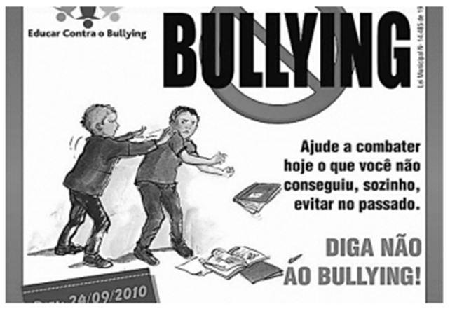

O cartaz mostra um protesto contra o bullying. Sobre os termos e as imagens do cartaz, assinale a afirmativa correta. 

A) A forma de imperativo no cartaz (diga) representa uma ordem. 

B) Os termos do cartaz se dirigem aos estudantes que sofreram bullying no passado. 

C) A imagem central mostra alguém tendo seus livros e cadernos jogados fora por aqueles que fazem bullying. 

D) A imagem do cartaz prega a não violência contra os que fazem bullying. 

E) O cartaz divulga a ideia de que é necessária punição mais severa para os praticantes de bullying. 

#### **Comentário:** 

Vejamos: 

A) Incorreto. Não é uma "ordem", pois não há relação de autoridade. Trata-se de um "pedido/conselho". 

B) Correto. Isso se verifica em "o que você não conseguiu, sozinho, evitar no passado". O texto busca a identificação de um leitor que já tenha sofrido bullying no passado. 

C) Incorreto. A imagem mostra o menino sendo empurrado. Então, como consequência, os livros

---

<!-- pagina: 147 -->

**Equipe Português Estratégia Concursos, Felipe Luccas Aula 11** 

caem no chão. Não são "jogados fora". 

D) Incorreto. Não prega "não violência" contra quem faz bullying, mas prega contra o bullying em si. 

E) Incorreto.  Não há qualquer referência a punições. 

Gabarito Letra B. 

#### **12. (FGV / PREF. CUIABÁ - MT / 2025)** 

Observe a tirinha abaixo e identifique a afirmativa correto sobre ela: 

A) A pergunta do personagem à direita da imagem pretende debochar do outro personagem. 

B) O personagem da direita chama de “conclusão” uma frase que nada conclui. 

C) O humor da tirinha se localiza numa contradição interna das falas do personagem da esquerda. 

D) A palavra “pesquisa” foi utilizada duas vezes, com o mesmo sentido. 

E) A tirinha tem por objetivo mostrar a inutilidade das pesquisas eleitorais. 

#### **Comentário:** 

O humor está na incoerência do personagem: não acredita em pesquisas porque aprendeu numa pesquisa que pesquisas são mentirosas. Então, ele se contradiz: diz que não acredita, mas acreditou. 

Vejamos: 

A) Incorreto. A pergunta é honesta, sem deboche. 

B) Incorreto. A conclusão é a opinião do personagem da esquerda, baseada em uma pesquisa. 

D) Incorreto. No primeiro quadro, "pesquisa" tem sentido específico de "estudos publicados", como pesquisas eleitorais. No segundo quadro, "pesquisa" tem sentido mais geral de "consulta, investigação". 

E) Incorreto. Não podemos afirmar que as pesquisas eleitorais são inúteis, apenas que o personagem diz não acreditar nelas. 

Gabarito Letra C.

---

<!-- pagina: 148 -->

**Equipe Português Estratégia Concursos, Felipe Luccas Aula 11** 

#### **13. (FGV / TCE-PI / 2025)** 

Leia a nota da OAB a seguir. 

A prática reiterada e impune de atos de corrupção leva as pessoas a pensar que a improbidade e a falta de ética são naturais e a improbidade é uma regra para os grandes delinquentes. 

Sobre a estruturação desse pequeno texto, julgue a assertiva a seguir. 

O adjetivo “grandes” mostra valor de importância social dos delinquentes. 

#### **Comentário:** 

Aqui, "grandes delinquentes" equivale a "piores delinquentes", não expressa "importância", mas gravidade do defeito. 

Questão incorreta. 

#### **14. (FGV / DNIT / 2024)** 

Observe o seguinte texto de um escritor italiano: 

“Existe uma classe de pessoas que dá provas e atribui-se o mérito de ser ilustre há muitas gerações, embora permaneça ociosa e inútil. Intitula-se nobreza; e, não menos do que a classe dos sacerdotes, deve ser considerada como um dos maiores obstáculos à vida livre e um dos mais ferozes e permanentes pilares da tirania.” 

Sobre a estrutura e a significação dessa frase, assinale a afirmativa **<u>inadequada</u>** <u>.</u> 

A) O autor condena a classe nobre, mostrando as razões para essa condenação: a ociosidade e a inutilidade. 

B) A classe dos sacerdotes recebe crítica idêntica à dos nobres, pelos mesmos motivos. 

C) A forma verbal “atribui-se” indica a ideia de que o mérito de ser ilustre não é um valor autêntico. 

D) A condenação da nobreza se apoia argumentativamente no pensamento da maioria, o que traz autoridade. 

E) Ao final do texto, o autor mostra as razões políticas e sociais de sua condenação à nobreza. 

#### **Comentários:** 

O único erro está na afirmação de que "A condenação da nobreza se apoia argumentativamente no pensamento da maioria". 

Primeiro, não há opinião da maioria, mas apenas a opinião isolada do autor. 

Segundo, a opinião ser da maioria não necessariamente dá autoridade a ela, pois a maioria não é especializada. **Aliás, a FGV reiteradamente cobra a falácia do apelo ao popular, que é justamente sustentar que uma informação falsa é verdadeira só por que é de senso comum.** 

Gabarito letra D.

---

<!-- pagina: 149 -->

**Equipe Português Estratégia Concursos, Felipe Luccas Aula 11** 

#### **15. (FGV / PREF. SÃO JOSÉ DOS CAMPOS - SP / 2024)** 

As frases abaixo permitem a inferência de um sentimento; assinale a frase em que esse sentimento indicado está **<u>inadequado</u>** à frase. 

A) Minha prima gritou quando o cachorro se aproximou dela, latindo muito. / Raiva. 

B) Júlia correu para casa a fim de anunciar que havido sido escolhida para o papel principal da novela. / Alegria. 

C) Cristiano Ronaldo ficou insatisfeito com o fato de Messi ter ganho a bola de ouro. / Inveja. 

D) Juliana chorou muito com a morte de sua cadelinha. / Tristeza. 

E) O torcedor emudeceu quando viu seu time perder a decisão do campeonato. / Desilusão. 

#### **Comentários:** 

A questão de inferência; então, por um processo lógico, devemos deduzir qual seria a emoção razoável naquela situação. 

Se um cachorro latindo se aproxima muito de uma pessoa, a emoção natural é o medo, não é a raiva. 

A) Minha prima gritou quando o cachorro se aproximou dela, latindo muito. / ~~Raiva~~ Medo. 

Vejamos as demais: 

B) Júlia correu para casa a fim de anunciar que havido sido escolhida para o papel principal da novela. / Alegria, pois o evento é positivo. 

C) Cristiano Ronaldo ficou insatisfeito com o fato de Messi ter ganho a bola de ouro. / Inveja, pois são notoriamente rivais, alternando como melhores do mundo. 

D) Juliana chorou muito com a morte de sua cadelinha. / Tristeza, pois a morte de um animal de estimação é dolorosa. 

E) O torcedor emudeceu quando viu seu time perder a decisão do campeonato. / Desilusão, pois o torcedor deseja ver seu time vencer e fica decepcionado quando perde. 

Gabarito letra A. 

#### **16. (FGV / ALESC / 2024)** 

#### Observe o texto a seguir. 

“Os países da América Latina não precisam criar uma civilização. Ela já foi criada pela Europa nos últimos quatro séculos. Cabe-nos assimilar essa civilização.” (Eugênio Gudin) 

Sobre o conteúdo e a estruturação desse pequeno texto, assinale a afirmativa correta. 

A) O conceito de civilização, nesse texto, se prende exclusivamente aos valores clássicos de cultura. 

B) Entre os dois primeiros períodos do texto há uma relação, respectivamente, de causa e consequência. 

C) O autor defende a criação de uma civilização nacional original, apoiada em valores europeus. 

D) O texto mostra uma visão negativa das possibilidades culturais dos países da América latina.

---

<!-- pagina: 150 -->

**Equipe Português Estratégia Concursos, Felipe Luccas Aula 11** 

E) O último período do texto mostra uma justificativa das ideias apresentadas anteriormente. 

#### **Comentários:** 

Pessoal, para efeito didático, aqui vou apresentar uma questão bastante polêmica da FGV. 

Gabarito Oficial: LETRA A 

Gabarito pretendido: LETRA D 

Observe o texto a seguir. “Os países da América Latina não precisam criar uma civilização. Ela já foi criada pela Europa nos últimos quatro séculos. Cabe-nos assimilar essa civilização.” (Eugênio Gudin) Sobre o conteúdo e a estruturação desse pequeno texto, assinale a afirmativa correta. 

(A) O conceito de civilização, nesse texto, se prende exclusivamente aos valores clássicos de cultura. 

Não há no texto qualquer tipo de referência ou indicação que permita dizer que "civilização" é sinônimo de "valores clássicos de cultura". 

A ideia básica do texto é que a América Latina deve "imitar" a civilização europeia, por não ser capaz de criar uma própria que seja superior à da Europa. Imite a Europa, a civilização boa já está pronta. 

(D) O texto mostra uma visão negativa das possibilidades culturais dos países da América latina. 

Aliás, essa é a ideia expressa no **texto original na qual a questão foi baseada.** 

**https://epoca.globo.com/ideias/noticia/2016/07/o-brasil-entre-profecia-e-o-mimetismo.html** 

#### Destaco a parte essencial: 

Desenvolvimento para quê? Devemos buscar, como nação, a perfeita e acabada ocidentalização que há séculos nos elude? Ou devemos, antes, procurar determinar nós mesmos, à luz do que somos, a nossa própria métrica de sucesso e realização, aquilo que nos distingue, aquilo que tem valor? A que vem o Brasil, afinal, como nação? 

A resposta à disjuntiva separa dois grupos bem definidos. De um lado, a visão mimética ou imitativa de que não há o que inventar. **“Nós queremos ser como eles” e seria** **<u>portanto equivocado, se não ridículo, supor que devemos ter a pretensão de criar uma</u> .** **<u>alternativa original ao modelo ocidental</u>** É o que sugere, por exemplo, Rui Barbosa ao afirmar, citando um líder francês, que, “se, à maneira do escultor, que molda entre as mãos o barro plástico, eu pudesse afeiçoar a meu gosto o meu país, faria dele não uma **América** , mas uma **Inglaterra** ”; é o que defende o economista **Eugênio Gudin** – presumivelmente expressando a opinião da maioria dos seus colegas brasileiros – ao propor que “os países da **América Latina** não precisam criar uma civilização. Ela já foi criada pela Europa nos últimos quatro séculos. Cabe-nos assimilar essa civilização”. Se – tudo correr bem, chegaremos um dia a ser como outra nação desenvolvida qualquer algo semelhante, digamos, a um estado do Sul dos Estados Unidos ou a um país do **Mediterrâneo** europeu; tudo que nos cabe fazer é seguir o melhor que pudermos a receita e o caminho já trilhado por eles. “Se tivermos racionalidade e competência, chegaremos lá.” 

Portanto, é correta a letra D: o texto mostra uma visão negativa das possibilidades culturais dos países da América Latina.

---

<!-- pagina: 151 -->

**Equipe Português Estratégia Concursos, Felipe Luccas Aula 11** 

Seria equivocado supor que devemos ter a pretensão de criar uma alternativa à cultura europeia, devemos apenas imitar. Em suma, devemos aceitar nossa inferioridade e aceitar/copiar o que é já existe e é bom. 

### **e seria portanto equivocado, se não ridículo, supor que devemos ter a pretensão de criar uma alternativa original ao modelo ocidental.** 

A banca contraria o próprio texto original base, a questão deveria ter sido anulada ou ter o gabarito alterado. 

Gabarito letra A. 

#### 17. **(FGV / CGE-PB / 2024)** 

Uma das tarefas mais complicadas na escritura é a seleção adequada de palavras utilizadas nos textos. 

A opção abaixo em que a crítica indicada sobre o uso de palavras no texto dado NÃO é pertinente, é: 

A) “Um tema pelo qual estou interessado é o relacionado com os efeitos que provoca a droga a nível desportivo.” / utilização de termos desnecessários; 

B) “Em muitas partes do corpo como são as mãos, as orelhas e os pés, estão representados todos os órgãos e partes do corpo, como mostra a reflexologia.” / repetição de palavras idênticas; 

C) “O projeto governamental não foi aprovado no Senado, a despeito dos esforços dos partidos governistas, em função da grande pressão popular.” / utilização de conectores inadequados; 

D) “As coisas apresentadas na exposição tinham aspecto interessante, mas a ausência de público prejudicou o bom evento.” / emprego de palavras demasiadamente gerais ou de significado impreciso; 

E) “O aprofundamento dos debates paralelamente às novas contribuições trazidas pelos parlamentares pode dar solução ao problema das moradias.” / utilização de palavras abstratas em lugar das concretas e de vocábulos mais longos em lugar dos mais curtos. 

#### **Comentários:** 

A) “Um tema pelo qual estou interessado é o relacionado com os efeitos que provoca a droga a nível desportivo.” / utilização de termos desnecessários; 

Correto. De fato, o texto não é conciso. Poderiam ser eliminadas essas partes: "o relacionado com"; "a nível"... 

Numa versão sucinta. Estou interessado no tema dos efeitos da droga no esporte. 

B) “Em muitas partes do corpo como são as mãos, as orelhas e os pés, estão representados todos os órgãos e partes do corpo, como mostra a reflexologia.” / repetição de palavras idênticas; 

Correto. Houve repetição de "partes do corpo". 

C) “O projeto governamental não foi aprovado no Senado, a despeito dos esforços dos partidos governistas, em função da grande pressão popular.” / utilização de conectores inadequados; 

Incorreto. O conector é adequado; "a despeito de" expressa concessão, indicando que os

---

<!-- pagina: 152 -->

**Equipe Português Estratégia Concursos, Felipe Luccas Aula 11** 

esforços foram contrários, mas não alteraram o resultado final. 

D) “As coisas apresentadas na exposição tinham aspecto interessante, mas a ausência de público prejudicou o bom evento.” / emprego de palavras demasiadamente gerais ou de significado impreciso; 

Correto.  De fato, "aspecto" é muito vago; "interessante" é um adjetivo muito genérico. 

E) “O aprofundamento dos debates paralelamente às novas contribuições trazidas pelos parlamentares pode dar solução ao problema das moradias.” / utilização de palavras abstratas em lugar das concretas e de vocábulos mais longos em lugar dos mais curtos. 

Correto. De fato, "contribuições" e "aprofundamento" são substantivos abstratos, pois expressam ação. "Dar solução" é uma forma mais longa de dizer simplesmente "solucionar. Gabarito letra C. 

#### **18. (FGV / PC-SP / 2024)** 

O célebre cientista Lineu disse certa vez: 

“A natureza é um imenso dicionário!” 

A comparação entre a natureza e o dicionário se justifica por duas marcas, que são: 

A) a quantidade e a variedade. 

B) a dificuldade e a necessidade. 

C) a necessidade e a precariedade. 

D) a precariedade e a quantidade. 

E) a variedade e a dificuldade. 

#### **Comentários:** 

Um dicionário traz dezenas de milhares de palavras diferentes, ou seja, muita quantidade e muita variedade. O mesmo vale para a natureza, infinitas espécies de animais, plantas, terrenos... 

Portanto, a comparação se baseia na quantidade e na variedade. 

Gabarito letra A. 

#### **19. (FGV / TJ-RN / 2023)** 

Um candidato a um concurso público devia escrever um texto argumentativo, defendendo a preferência pela vida nas grandes cidades pelos cidadãos comuns; entre os argumentos abaixo, aquele a que deve ser atribuída a maior importância, é: 

A) As grandes cidades permitem reencontros, ao acaso, nas ruas, nos bares ou nos cinemas; 

B) uma cidade grande é o espaço do progresso social e profissional, onde mais facilmente se encontra um posto de trabalho. 

C) uma grande cidade tem espaço muito atraente, o mesmo que tem sido celebrado por grandes artistas; 

D) a vida na grande cidade permite, graças aos espaços verdes e aos animais domésticos, o

---

<!-- pagina: 153 -->

**Equipe Português Estratégia Concursos, Felipe Luccas Aula 11** 

aprofundamento no mundo natural; 

E) uma grande cidade é dinâmica e estimulante, possibilitando o acesso a todos os itens da modernidade. 

#### **Comentários:** 

Pessoal, a argumentação é a favor da vida em grandes cidades grandes. Qual é o maior atrativo das cidades grandes, de maneira geral? É o próprio desenvolvimento da cidade, que se traduz em mais oportunidades de trabalho e relacionamentos. 

Como a banca pergunta o argumento mais relevante, por bom senso, a resposta é a letra B. 

Vejam como as demais alternativas trazem atrativos muito acessórios ou muito específicos, até mesmo falsos. 

A) Reencontros aleatórios são mais comuns em lugares pequenos, pois há maior coincidência nos mesmos lugares. 

C) "celebração por grandes artistas"? Não podemos dizer que isso seja verdade. De qualquer forma, artistas também celebram o interior. 

D) o interior, menos urbanizado, é muito mais propício para aprofundar no mundo natural. 

Gabarito letra B. 

#### **20. (FGV / TJ-RN / 2023)** 

Todas as frases abaixo fazem propaganda de um creme dental; aquela que, em busca do convencimento do  cliente, apela para a sua vaidade é: 

A) Creme Dental X: mais por preço menor; 

B) Sorriso brilhante é com Creme Dental X; 

C) Faça como os franceses: compre Creme Dental X; 

D) Para proteção completa dos dentes: Creme Dental X; 

E) Não sofra com as cáries: use Creme Dental X. 

#### **Comentários:** 

A vaidade está representada pela beleza de um sorriso brilhante. 

Vejamos as demais: 

A) apela para o menor preço. Promoções como "pague um, leve dois" são exemplos da estratégia argumentativa da tentação. 

C) apela para uma imagem positiva que as pessoas têm dos franceses. Teríamos aqui um exemplo da estratégia da sedução. 

D) apela para a segurança. A estratégia argumentativa que envolve risco/medo/vergonha é a da intimidação. 

E) apela para a evitação de um sofrimento. A estratégia argumentativa que envolve risco/medo/vergonha é a da intimidação. 

Gabarito letra B.

---

<!-- pagina: 154 -->

**Equipe Português Estratégia Concursos, Felipe Luccas Aula 11** 

#### **21. (FGV / TJ-RN / 2023)** 

O escritor francês Montaigne declarou: "Estamos sempre dispostos a atribuir aos escritos dos outros sentidos que favoreçam as nossas opiniões sedimentadas: um ateu se orgulha de fazer com que todos os autores reforcem a causa do ateísmo. Ele envenena com sua própria peçonha o mais inocente pensamento". 

Depreende-se da leitura desse texto que: 

A) Montaigne é adepto da causa do ateísmo; 

B) alguns autores interpretam favoravelmente textos alheios; 

C) nossas opiniões sempre encontram apoio em outros textos; 

- D) nossas convicções se modificam conforme nossas leituras; 

E) as citações de textos alheios envenenam nossas ideias. 

#### **Comentários:** 

Em "estamos sempre dispostos a atribuir aos escritos dos outros sentidos que favoreçam nossas opiniões sedimentadas", o autor declara que os textos alheios são revestidos pelos sentidos que o leitor acha conveniente para sustentar as ideias que já possui sedimentadas. Ora, isso significa que os textos, originalmente, não "apoiam as opiniões". O leitor precisa "atribuir" a eles o sentido que acha conveniente. O verbo "atribuir" permite concluir que os sentidos são distorcidos pelo leitor, que os enxerga como convém. "Envenenar o pensamento" traz justamente essa ideia de distorção dos sentidos. 

Além disso, o "nossas opiniões sempre encontram apoio" também cria uma generalização indevida, não há a informação no texto de que toda opinião emitida sempre encontra apoio em algum texto; e, sim, que a nossa "tendência" é atribuir aos textos a leitura que nos favorece. Ressalte-se que a palavra "tendência" também revela algo eventual, que não corre "sempre". Quando dizemos que algo "tende" a acontecer, é porque "geralmente" ocorre: não ocorre "sempre". 

Não se pode afirmar que toda opinião sempre tem suporte em um texto; os textos mencionados sequer sustentam a opinião sedimentada, mas são distorcidos para parecer que sustentam. 

Portanto, o gabarito deve ser a letra B, pela ideia de que "alguns" autores buscam nos textos alheios ideias que os favorecem. 

Gabarito letra B. 

#### **22. (FGV / TJ-RN / 2023)** 

Numa sessão de Congresso Nacional, um deputado sobe à tribuna e lê para seus amigos políticos a tradução de um antigo discurso de John Kennedy, cujo tema era adequado a uma discussão daquele momento: o valor da democracia. 

Nesse caso, levando-se em conta os elementos de comunicação desse ato, é correto afirmar que: 

A)  emissor do discurso é o presidente John Kennedy; 

B) o receptor do texto lido é o deputado que discursa;

---

<!-- pagina: 155 -->

**Equipe Português Estratégia Concursos, Felipe Luccas Aula 11** 

C) o código empregado no texto é a lingua inglesa; 

D) a mensagem do texto aborda o valor da democracia; 

E) o canal utilizado no ato é puramente auditivo. 

Comentários: 

A questão versa sobre os elementos da comunicação. 

A) Incorreto. O emissor do discurso é o deputado; 

B) Incorreto. O receptor do texto lido é a plateia de políticos; 

C) Incorreto. O código empregado no texto é a língua portuguesa, o texto foi traduzido; 

D) Correto. Para ser pertinente ao tema, naturalmente a mensagem, isto é, o conteúdo do texto, aborda o valor da democracia; 

E) Incorreto. O canal utilizado no ato é a fala. 

Gabarito letra D. 

#### **23. (FGV / TJ-RN / 2023)** 

Uma das estratégias de diminuir o ser humano é usar para ele vocábulos empregados somente ou também para coisas (reificação); a frase abaixo em que foi empregado esse processo, é: 

A) Apesar de craque, em alguns jogos Pelé parecia desligado; 

B) Nem toda pessoa domina os nervos; 

C) Os professores não perdem a paciência facilmente; 

D) Havia grande quantidade de pessoas na festa; 

E) Os artistas prometeram fazer um bom show. 

#### **Comentários:** 

Nosso gabarito é a letra A: 

A) Apesar de craque, em alguns jogos Pelé parecia desligado; 

Literalmente, apenas aparelhos podem ser "ligados" e "desligados". O ser humano não tem botão de liga/desliga. Quando usamos esses termos, tratamos o ser humano como coisa, num processo de linguagem figurada. 

B) Não há reificação, pois a pessoa tem mesmo, literalmente, nervos. 

C) Não há reificação, paciência já é uma virtude humana. 

D) Não há reificação, a sentença é literal. 

E) Não há reificação, os artistas "prometem", algo que humanos literalmente fazem. 

Gabarito letra A. 

#### **24. (FGV / TJ-RN / 2023)** 

A frase abaixo que apresenta uma relação lógica corretamente estabelecida, é:

---

<!-- pagina: 156 -->

**Equipe Português Estratégia Concursos, Felipe Luccas Aula 11** 

A) audição está para som como paladar está para língua; 

B) livro está para capa como travesseiro está para fronha; 

C) álcool está para alcoolismo como droga está para traficante; 

D) tecido está para desbotar como papel está para rasgar; 

E) mestre está para discípulo como professor está para escola. 

#### **Comentários:** 

A) Incorreto; audição está para som como paladar está para sabor/gosto; 

B) Correto; livro está para capa como travesseiro está para fronha; a lógica é "parte externa, revestimento, proteção". 

C) Incorreto; álcool está para alcoolismo como droga está para dependência (daquela droga específica); se a droga for tabaco, o tabaco (droga) está para o tabagismo (dependência de tabaco). 

D) Incorreto; tecido está para desbotar como papel está para amarela/desbota/envelhece; 

E) Incorreto; mestre está para discípulo como professor está para aluno. 

Gabarito letra B 

#### **25. (FGV / TJ-RN / 2023)** 

Entre os segmentos abaixo, aquele que se mostra bastante objetivo, sem pormenores inúteis, repetições desnecessárias ou redundâncias, é: 

A) Cada candidato, individualmente, terá acesso às informações do concurso por meio de uma senha particular; 

B)  O governo deve devolver ao povo o valor do empréstimo temporário cobrado no preço dos alimentos; 

C) Ocorreu uma verdadeira balbúrdia no momento em que Trump entrou no tribunal; 

D) Na volta da guerra, os militares receberam amor e afeto de seus familiares, que os aguardavam ansiosos; 

E) Os atletas ficaram desestimulados ao se depararem com a grande quantidade de obstáculos na pista. 

#### **Comentários:** 

A) Incorreto. O pronome "cada" já indica que é individualmente. 

B) Incorreto. Se é "empréstimo", é temporário; caso contrário, seria uma doação. 

C) Incorreto. A preposição "em" é dispensável, bastaria "no momento que". Além disso, se é "balbúrdia", já temos sentido de uma intensa bagunça, não há necessidade de intensificar com esse "verdadeiro". 

D) Incorreto. Amor e afeto não são sinônimos, mas o amor já pressupõe o afeto. 

E) Correto. Aqui não há redundância, é uma relação lógica natural se sentir desestimulado por uma grande quantidade de obstáculos.

---

<!-- pagina: 157 -->

**Equipe Português Estratégia Concursos, Felipe Luccas Aula 11** 

OBS: Sobre a expressão "no momento em que", reproduzo literalmente a lição do professor Ricardo Sérgio: 

##### NO MOMENTO QUE ou NO MOMENTO EM QUE? 

Podemos escrever ou dizer "no momento que" ou "no momento em que", tanto faz. Acontece que a preposição [em] pode ser omitida antes do pronome relativo [que] quando este introduz uma oração temporal: 

- Todos se levantaram na hora que (ou: em que) o professor entrou. 

- O acidente ocorreu no dia que (ou: em que) eles chegaram. 

- No momento que (ou: em que) se quis erguer, não conseguiu. 

- Todos insistiram que (ou: em que) estava na hora de sair da festa. 

- O dia (em que) que eu souber de uma falha sua, ficarei desapontado. 

Mas Atenção: a preposição é obrigatória diante do pronome relativo, nos casos não relacionados a uma oração temporal. 

A escolha do uso ou não da preposição em frases desse tipo é uma questão de conveniência ou eufônica (bom ouvido). Entretanto, num texto formal, é melhor usar a preposição. 

A preposição [em] também pode ser omitida nos adjuntos adverbiais de tempo.  Veja: 

- Viajaremos no domingo. Ou: Viajaremos domingo. 

- Voltaremos no próximo domingo. Ou: Voltaremos domingo próximo. 

- A lista dos aprovados sai nesta semana. Ou: esta semana. 

- O jogo será no dia 22. Ou: O jogo será dia 22. ®Sérgio. 

____________________ 

Para maiores informações sobre o assunto ver: CEGALLA, Domingos Paschoal. Dicionário de Dificuldades da Língua Portuguesa. Ed. Nova Fronteira, Rio de Janeiro, 1996. 

Gabarito letra E. 

#### **26. (FGV / TJ-RN / 2023)** 

Observe a seguinte explicação, retirada de uma gramática de língua portuguesa: “O adjetivo é uma das classes de palavras, caracterizada por ser variável em gênero e número, determinante de um substantivo ou pronome substantivo, expressando estado, característica, qualidade ou relação”. 

Sobre esse pequeno texto explicativo, é correto afirmar que o texto: 

A) se estrutura a partir de uma pergunta explícita, seguida de uma resposta que lhe dá explicação; 

B) comporta definições, destacadas por palavras que as apresentam; 

C) mostra muitos conectores lógicos, que introduzem explicações; 

D) mostra termos especializados não explicados em função de dirigir-se a leitores com certos conhecimentos; 

E) mostra comparações e esquemas que permitem visualizar a explicação de forma mais clara. 

#### **Comentários:** 

A) Incorreto. Não há uma pergunta explícita. Poderíamos até pensar numa pergunta "implícita": o que é um adjetivo.

---

<!-- pagina: 158 -->

**Equipe Português Estratégia Concursos, Felipe Luccas Aula 11** 

B) Incorreto. Não há "definições", no plural. Há apenas a definição de adjetivo. 

C) Incorreto.  Só há um conector, o "ou" alternativo. 

D) Correto. Há termos especializados, isto é, técnicos, que dependem de um conhecimento prévio. O leitor, para entender a definição, deve conhecer o sentido de "substantivo", "pronome", "variável em gênero e número", etc... Essas informações pressupõem um conhecimento compartilhado. 

E) Incorreto. Não há esquemas nem comparações. 

Gabarito letra D. 

#### **27. (FGV / TJ-RN / 2023)** 

Um escritor espanhol, conhecido por sua preocupação com o idioma, produziu a seguinte frase: “Estudar latim é como colocar as palavras para fazer ginástica”. 

Isso significa que: 

A) o estudo de latim é hoje uma tarefa inútil, pois os estudos históricos perderam valor; 

B) o conhecimento do latim melhora a qualidade redacional de nossos textos; 

C) estudar a língua latina faz com que se acrescentem muitos novos vocábulos aos dicionários; 

D) o aprendizado da língua latina é indispensável para o conhecimento de nosso próprio idioma; 

E) estudar latim faz com que aprofundemos o conhecimento das palavras. 

**Comentários:** 

Numa questão de semântica, temos que ser razoáveis e buscar o propósito da mensagem. 

A língua portuguesa deriva do latim. Na faculdade de letras, inclusive, eu estudei latim por dois anos! Isso é necessário para entender melhor a origem, o funcionamento, a evolução, a história, a etimologia da língua, além de facilitar muito na identificação do significado das palavras, com radicais ou afixos latinos. 

Então, a comparação feita tem base no fato de que o conhecimento do latim é muito relevante para o aprofundamento no estudo de nossa língua. Da mesma forma, fazer ginástica faz que nosso corpo funcione melhor, aumenta nossa capacidade respiratória, nossa postura, nosso alongamento e nossa performance como um todo. 

Em suma, ginástica "turbina" a performance do corpo; estudar latim "turbina" a performance nos estudos das palavras. 

Portanto... 

A) Incorreto. O estudo de latim é hoje uma tarefa útil, os estudos históricos não perderam valor; 

B) Incorreto. Não necessariamente o conhecimento do latim melhora a qualidade redacional de nossos textos; não adianta conhecer latim e não saber como ele influencia no estágio atual da língua. Além disso, só escrevendo é que a redação melhora de qualidade. 

C) Incorreto. Estudar a língua latina faz com que se acrescentem muitos novos vocábulos aos nosso vocabulário; nos dicionários, as palavras já estão catalogadas; 

D) Incorreto. Não é indispensável para o conhecimento de nosso próprio idioma, mas é muito útil para aprofundamento. Aliás, não precisa "aprender latim", mas, sim, estudar aspectos do latim

---

<!-- pagina: 159 -->

**Equipe Português Estratégia Concursos, Felipe Luccas Aula 11** 

que influenciaram na nossa língua. 

E) Correto. Estudar latim faz com que aprofundemos o conhecimento das palavras. 

Gabarito letra E. 

#### **28. (FGV / SEFAZ-MT / 2023)** 

As opções a seguir mostram frases de campanhas publicitárias cuja argumentação se apoia em um valor social qualquer. Assinale a opção que apresenta a frase em que esse valor social está corretamente identificado. 

A) Tenha sucesso na vida! Estude na UFMT e ganhe os melhores salários! / vaidade. 

B) Faça amizade com seus vizinhos: você e eles podem precisar de ajuda amanhã. / compreensão. 

==5460== C) Escute seus avós: eles não estudaram na universidade, mas possuem experiência. / tradição. 

D) Não deixe para amanhã o que pode fazer hoje: pague hoje mesmo o seu imposto sobre a renda! / prudência. 

E) Faça o que fez Cabral: descubra coisas novas! / coragem. 

#### **Comentários:** 

Vejamos os valores sociais identificados: 

A) Tenha sucesso na vida! Estude na UFMT e ganhe os melhores salários! / ambição (financeira). 

B) Faça amizade com seus vizinhos: você e eles podem precisar de ajuda amanhã. / compaixão. 

C) Escute seus avós: eles não estudaram na universidade, mas possuem experiência. / autoridade/experiência. 

D) Não deixe para amanhã o que pode fazer hoje: pague hoje mesmo o seu imposto sobre a renda! / prudência (cautela ao evitar uma punição). 

E) Faça o que fez Cabral: descubra coisas novas! / curiosidade. 

Gabarito letra D. 

#### **29. (FGV / SEFAZ-MT / 2023)** 

"Trabalhar pelo preço oferecido por outro e para o lucro deste, sem sendo o preço do trabalho Interesse algum pelo trabalho ajustado pela competição hostil, com um lado pedindo o mais possível e o outro pagando o menos que puder, não é, mesmo quando os salários são elevados, um estado satisfatório para seres humanos de Inteligência cultivada, que deixaram de julgar-se inferiores àqueles a quem servem." 

John Stuart Mill (1848) 

No fragmento acima, Stuart Mill afirma que 

A) todos os que trabalham para outros julgam-se inferiores a eles. 

B) o preço do trabalho é fruto de uma disputa legal entre patrões e empregados. 

C) a competição citada é hostil porque cada um só enxerga os seus interesses.

---

<!-- pagina: 160 -->

**Equipe Português Estratégia Concursos, Felipe Luccas Aula 11** 

D) os salários pagos nunca são satisfatórios para seres humanos de inteligência cultivada. 

E) as relações trabalhistas tendem a se tornar mais problemáticas em um futuro próximo. 

#### **Comentários:** 

A competição é hostil porque o empregado quer receber o máximo possível, e o patrão quer pagar o mínimo possível. Cada um tenta maximizar seu interesse. 

#### Nosso gabarito é: 

C) a competição citada é hostil porque cada um só enxerga os seus interesses. 

"Trabalhar pelo preço oferecido por outro e para o lucro deste, sem sendo o preço do trabalho Interesse algum pelo trabalho ajustado pela competição hostil, com um lado pedindo o mais possível (trabalhador) e o outro pagando o menos que puder (patrão), não é, mesmo quando os salários são elevados, um estado satisfatório para seres humanos de Inteligência cultivada, que deixaram de julgar-se inferiores àqueles a quem servem." 

Vejamos as demais: 

A) Incorreto.  Nem todos os que trabalham para outros julgam-se inferiores a eles; só quem trabalha obrigado e não tem inteligência cultivada. 

B) Incorreto.  O preço do trabalho é fruto de uma disputa negociação/permuta entre patrões e empregados. 

D) Incorreto.  Cuidado, o texto diz: “Trabalhar pelo preço oferecido por outro e para o lucro deste” não é um estado satisfatório. É um comentário restrito: tem que ser pelo preço oferecido e tem que ser pelo lucro dele. 

Alguém que define o próprio salário (profissionais disputados) ou que trabalha em parceria ou para si mesmo, naturalmente, não está nesse grupo trazido pelo texto. Os salários pagos algumas vezes são satisfatórios para seres humanos de inteligência cultivada. 

E) Incorreto.  Extrapolação pura, não há nada no texto sobre o futuro das relações trabalhistas. Gabarito letra C. 

#### 30. **(FGV / PGM-NITERÓI / 2023)** 

Todas as frases abaixo expressam uma opinião; aquela que expressa uma opinião alheia de forma neutra, é: 

A) Como dizem os agricultores, nem todo dia de sol é bom de plantar ou de colher; 

B) Considero execrável o pensamento egoísta de pagarmos o mínimo possível a quem trabalha; 

C) Considero que esse novo programa agrícola vai atingir um sucesso imenso, principalmente por sua criatividade; 

D) Dizem que a distância traz o esquecimento, mas eu não apoio esse raciocínio; 

E) Alguém imaginaria que o atual progresso científico iria trazer essa tragédia para a vida na Terra? 

#### **Comentários:** 

Observem o enunciado: uma opinião alheia de forma neutra... Temos necessariamente que ter no gabarito "opinião de terceiro" + "apresentação sem julgamento dessa opinião".

---

<!-- pagina: 161 -->

**Equipe Português Estratégia Concursos, Felipe Luccas Aula 11** 

A) Como dizem os agricultores, nem todo dia de sol é bom de plantar ou de colher; 

Temos a opinião dos agricultores (os terceiros) e seu conteúdo é simplesmente reproduzido, sem valoração alguma. 

. Nas demais, há opinião própria, julgamentos pessoais Atenção aos modalizadores, expressões que indicam posicionamento pessoal do autor. Observe os adjetivos, verbos e até substantivos usados. 

B) (Eu) Considero execrável (adjetivo subjetivo) o pensamento egoísta de pagarmos o mínimo possível a quem trabalha; 

C) (Eu) Considero que esse novo programa agrícola vai atingir um sucesso imenso (adjetivo subjetivo), principalmente por sua criatividade (acho criativo: opinião); 

esse D) Dizem que a distância traz o esquecimento, mas eu não apoio (discordo: opinião) raciocínio; 

E) Alguém imaginaria que o atual progresso científico iria trazer essa tragédia (é trágico: opinião) para a vida na Terra? 

Gabarito letra A. 

#### **31. (FGV / PGM-NITERÓI / 2023)** 

Em todas as opções abaixo há diferentes tipos de raciocínio; o texto que exemplifica o tipo de raciocínio por analogia, é: 

A) No governo republicano, é da natureza da constituição que os juízes devem seguir a letra da lei; 

B) Se as eleições indicam um vencedor, é natural que as pessoas passem a atribuir a esse vencedor responsabilidades pelos sonhos que almejam; 

C) Os animais não possuem as vantagens que temos, mas possuem outras: eles não têm nossas esperanças, mas não possuem nossos temores; eles sofrem, como nós, a morte, mas sem a conhecer; 

D) Nos estados tirânicos, a natureza do governo requer uma obediência extrema; e, uma vez conhecida a vontade do líder, ela deve provocar efeito infalível, como o de uma bola que se choca contra a outra; 

E) Não há liberdade se o poder de julgar não está separado do poder legislativo e executivo. Se ele estivesse unido ao poder legislativo, o poder sobre a vida dos cidadãos seria arbitrário porque o juiz seria legislador. 

#### **Comentários:** 

Analogia é uma comparação com foco no ponto em comum entre duas situações. Observe na D o conectivo comparativo "como": funciona como uma bola que bate na outra: 

D) Nos estados tirânicos, a natureza do governo requer uma obediência extrema; e, uma vez conhecida a vontade do líder, ela deve provocar efeito infalível, como o de uma bola que se choca contra a outra; 

A vontade do líder causa efeito inevitável, assim como é inevitável a reação física quando uma bola se choca com outra.

---

<!-- pagina: 162 -->

**Equipe Português Estratégia Concursos, Felipe Luccas Aula 11** 

Em B, D e E, não há comparação, então não há que se falar em "analogia". A dúvida dos alunos foi na C: 

- "... eles sofrem, como nós, a morte, mas sem a conhecer..." 

— Felipe, por que não há analogia na C? Estou vendo uma comparação! 

Repito: Analogia é uma comparação com foco no ponto em comum entre duas situações. 

Na letra C, temos uma comparação, sim. Mas seu foco é **NA DIFERENÇA,** é uma comparação contrastiva, não é uma analogia apoiada numa semelhança. 

Vejam de novo: 

**Diferenças:** eles não têm nossas esperanças, mas não possuem nossos temores; eles sofrem, como nós, a morte, mas sem a conhecer 

Gabarito letra D. 

#### **32. (FGV / PGM-NITERÓI / 2023)** 

“Os Cactos da Encosta têm por desagradáveis vizinhos os Promotores da Bagunça. Os Trapezistas do Asfalto não se entendem seja com os Promotores da Bagunça, seja com os Camelôs da Praça para atenuar uma ameaça contra os Cactos da Encosta, depois, naturalmente de se aliarem com os Bitolados da Patota, ou depois de momentaneamente, por acordos secretos, terem neutralizado os Camaleões de Plantão. A situação, naturalmente, não se apresenta sempre assim de uma maneira tão simples.” (texto adaptado de Henri Michaux) 

Alguns textos provocam lágrimas, outros provocam admiração ou exaltação, outros fazem rir, outros nos trazem pessimismo e assim por diante. No caso desse pequeno texto, o que predomina é: 

A) o tom trágico, fundamentado na crença de que as coisas são inevitáveis, como a relação problemática entre os grupos; 

B) o tom lírico, que exalta os sentimentos íntimos comuns a todos os homens, como ocorre nesses grupos; 

C) o tom patético, que provoca uma ternura exagerada nos leitores diante de uma triste situação, sem remédio; 

D) o tom cômico, que se fundamenta numa quebra de expectativa, como a de se considerar simples uma situação confusa; 

E) o tom épico, que procura valorizar ações de grupos. 

#### **Comentários:** 

Se você não entendeu nada do texto, ótimo! Vai acertar a questão. 

Pessoal, o texto é ironicamente construído para satirizar a confusão das relações políticas. O narrador apresenta uma história absurdamente confusa e diz que é "simples": 

A situação, naturalmente, não se apresenta sempre assim de uma maneira tão simples. 

A piada era esta: uma trama complicada e confusa ser chamada de simples. 

Portanto, o texto apresenta **tom cômico, que se fundamenta numa quebra de expectativa, como a de se considerar simples uma situação confusa.**

---

<!-- pagina: 163 -->

**Equipe Português Estratégia Concursos, Felipe Luccas Aula 11** 

Gabarito letra D. 

#### **33. (FGV / PGM-NITERÓI / 2023)** 

Há distintas maneiras de interrogar; a opção abaixo em que a pergunta feita (numa entrevista de emprego) exige uma resposta mais longa e mais pessoal, é: 

A) O que o senhor sabe de nossa empresa? 

B) Que tipo de função o senhor pretende ocupar? 

C) O senhor sabe usar seu poder de sedução? 

D) Em que disciplinas universitárias o senhor era melhor? 

E) O senhor possui um relacionamento fraterno com os outros? 

#### **Comentários:** 

Vale lembrar a diferença entre interrogativas abertas ou fechadas. As abertas pressupõem uma resposta mais elaborada. As fechadas são respondidas simplesmente com "sim" ou "não". As abertas também podem ser respondidas com respostas mais curtas (Qual é seu time?) ou mais longas (Quais são as classes de palavras?). 

É importante destacar que muitas perguntas "parecem" abertas, mas ocultam um subentendido. Então, não é coerente uma resposta como "sim" ou "não". 

#### Ex: 

Pergunta: Você tem relógio? 

Resposta: São 14h. 

O objetivo não era de fato saber se o receptor tinha relógio sim ou não, mas era saber a hora. 

Vamos à questão. 

A) O que o senhor sabe de nossa empresa? 

O receptor teria que elaborar "o que" sabe, dar uma resposta mais longa e completa. 

B) Que tipo de função o senhor pretende ocupar? 

Aqui, bastaria dizer "função X". 

C) O senhor sabe usar seu poder de sedução? 

Aqui, bastaria dizer "sim" ou "não". 

D) Em que disciplinas universitárias o senhor era melhor? 

Aqui, bastaria dizer: "disciplina X e Y", "Cálculo e Física", por exemplo. 

E) O senhor possui um relacionamento fraterno com os outros? 

Aqui, bastaria dizer "sim" ou "não". 

Gabarito letra A. 

#### **34. (FGV / PGM-NITERÓI / 2023)** 

Observe o texto argumentativo a seguir. “Os dicionários, como muitos dizem, são ‘os pais dos

---

<!-- pagina: 164 -->

**Equipe Português Estratégia Concursos, Felipe Luccas Aula 11** 

burros’, já que todos os consultam quando desconhecem o significado de alguma palavra, mas nossos dicionários ainda têm muito o que aprender, desde a apresentação de informações mais precisas, até a inclusão da etimologia das palavras, sua datação e exemplos dos múltiplos significados indicados. Assim, eles passarão a ser ‘os pais dos inteligentes’.” 

O plano de estruturação argumentativa desse texto é: 

A) apresentação de uma tese própria, seguida de argumentos contrários à tese oposta; 

B) apresentação de uma listagem de argumentos favoráveis a uma tese própria do argumentador, explicitada ao final; 

C) apresentação da tese oposta, seguida de argumentos e da tese própria; 

D) apresentação de uma listagem de argumentos favoráveis à tese oposta, sem a explicitação da tese própria; 

E) apresentação da tese própria, seguida da tese oposta, com uma listagem de argumentos que defendem aquela. 

#### **Comentários:** 

O senso comum chama os dicionários de "pais dos burros", porque as pessoas, em geral, buscam apenas quando desconhecem uma palavra e desejam superficialmente só saber o sentido dela. 

A tese do autor é: o dicionário é o pai dos inteligentes, porque vão trazer informações mais técnicas, como etimologia e múltiplos sentidos das palavras. 

Então, a tese do autor (tese própria) é contrária à tese do senso comum, das pessoas em geral. Ele parte da tese "oposta", que pretende refutar, depois apresenta sua tese própria. 

“Os dicionários, como muitos dizem, são ‘os pais dos burros’ (tese oposta), já que todos os consultam quando desconhecem o significado de alguma palavra (argumento) 

MAS nossos dicionários ainda têm muito o que aprender, desde a apresentação de informações mais precisas, até a inclusão da etimologia das palavras, sua datação e exemplos dos múltiplos significados indicados. Assim, eles passarão a ser ‘os pais dos inteligentes" (tese própria) 

Não custa lembrar que o "mas" introduz argumentativamente a informação mais relevante do período. 

Portanto, a estruturação é: apresentação da tese oposta, seguida de argumentos e da tese própria; 

Gabarito letra C. 

#### **35. (FGV / PGM-NITERÓI / 2023)** 

De cada uma das frases abaixo podem-se retirar informações implícitas ou pressupostas; a opção em que a informação implícita está adequadamente referida, é: 

A) O mordomo fechou a janela da sala / na sala havia mais de uma janela e uma delas estava aberta; 

B) Os cinco filhos de Vicente estão de férias; três dos meninos foram para o Rio de Janeiro / os outros dois filhos são meninas;

---

<!-- pagina: 165 -->

**Equipe Português Estratégia Concursos, Felipe Luccas Aula 11** 

C) Os novos vizinhos vêm jantar amanhã em nossa casa / os novos vizinhos são amigos de longa data; 

D) O automóvel que estava mal estacionado foi retirado da porta da minha casa / o automóvel não pertence ao enunciador da frase; 

E) Como professor há muitos anos, já ensinei coisas importantes a meus alunos / os alunos não deram a devida atenção ao que lhes foi ensinado. 

#### **Comentários:** 

A) Incorreto. O artigo "a" em "a janela da sala" faz inferir que há apenas uma janela da sala. 

B) Incorreto. "Filhos" inclui ambos os gêneros gramaticais. Três "dos meninos" faz inferir que há pelo menos mais um menino, ou não faria sentido usar a expressão partitiva. 

C) Incorreto. São novos vizinhos, provavelmente não são amigos de longa data. A inferência natural é que acabaram de chegar e estão sendo se integrando socialmente. 

D) Correto. O uso de "minha casa" e o particípio "retirado" faz inferir que o carro era de outra pessoa e estava indevidamente estacionado. 

E) Incorreto. Não há suporte para inferir que os alunos deram ou não atenção. 

Gabarito letra D. 

#### **36. (FGV / PGM-NITERÓI / 2023)** 

Numerosas situações da vida cotidiana ou profissional nos levam a contestar ou a defender um ponto de vista, logo, a produzir uma argumentação. Todas as opções abaixo mostram sugestões de temas para textos argumentativos; a opção em que é proposta uma estruturação com base em duas teses possíveis, é: 

A) Como será o sistema de trabalho no futuro? 

B) Os jornais falados e escritos estão em franca disputa por leitores; qual dos dois modelos vai triunfar? 

C) Alguns especialistas consideram que o turismo de aventura será a coqueluche do próximo século. Como você imagina esse tipo de turismo? 

D) Os ritmos musicais estão ligados a um instrumento básico. A bossa-nova só poderia ser composta no violão, assim como a valsa só poderia ser composta a partir do piano. Você considera válido esse ponto de vista? 

E) Como julgar as aulas pela internet? São bastante úteis, sobretudo para os que não dispõem de tempo ou, carecendo da presença física do professor, deixam sempre a desejar? 

#### **Comentários:** 

Temos duas teses na letra E: 

Como julgar as aulas pela internet? 

TESE 1) São bastante úteis, sobretudo para os que não dispõem de tempo 

TESE 2) carecendo da presença física do professor, deixam sempre a desejar? 

A) Incorreto. Não há tese alguma, só uma pergunta aberta:

---

<!-- pagina: 166 -->

**Equipe Português Estratégia Concursos, Felipe Luccas Aula 11** 

Como será o sistema de trabalho no futuro? 

B) Incorreto. Não há duas teses, apenas dois tipos de jornal e a informação de que disputam leitores.  Há sim uma mera pergunta: qual dos dois modelos vai triunfar? 

C) Incorreto. Há apenas uma tese: Alguns especialistas consideram que o turismo de aventura será a coqueluche do próximo século. 

Depois, há uma pergunta: Como você imagina esse tipo de turismo? 

D) Incorreto. Há apenas uma tese: Os ritmos musicais estão ligados a um instrumento básico. A bossa-nova só poderia ser composta no violão, assim como a valsa só poderia ser composta a partir do piano. 

Depois, há uma pergunta: Você considera válido esse ponto de vista? 

Gabarito letra E. 

#### **37. (FGV / BANESTES / 2023)** 

O ex-ministro da Fazenda Delfim Netto declarou certa vez: 

“O capital é como água. Sempre flui por onde encontra menos obstáculos”. 

Assinale a afirmativa correta sobre os componentes e a estrutura desse pensamento. 

A) O segundo período é uma redundância do primeiro, já que expressam o mesmo pensamento. 

B) A comparação do primeiro período é explicada no segundo. 

C) O primeiro período expressa uma causa cuja consequência é expressa no segundo período. 

D) Enquanto o primeiro período é expresso em linguagem figurada, o segundo é expresso em linguagem lógica. 

E) O segundo período expressa uma conclusão do que é expresso no período anterior. 

#### **Comentários:** 

Primeiro temos uma comparação: O capital é como água. 

Por quê? O que têm de semelhante? 

Explicação: Ambos fluem por onde há menos obstáculos. 

A) Incorreto. O segundo período não é uma redundância do primeiro, é a explicação do pensamento. 

C) Incorreto. Não há relação de causa e efeito, há uma comparação. 

D) Incorreto. Ambos trazem linguagem lógica. 

E) Incorreto. O segundo período expressa uma explicação do que é expresso no período anterior. Gabarito letra B. 

#### 38. **(FGV / PGM-NITERÓI / 2023)** 

As funções de linguagem fazem parte do conteúdo desta prova; a frase abaixo que documenta a função de linguagem denominada conativa, ou seja, a que pretende influenciar o receptor, é:

---

<!-- pagina: 167 -->

**Equipe Português Estratégia Concursos, Felipe Luccas Aula 11** 

A)  Eu sempre quis ser igualzinha à Barbie. É por isso que clareio o cabelo até ficar branco; 

B) Gosto de meus braços musculosos, aspecto atlético e cintura fina. Detesto é a camada de gordura que cobre tudo isso; 

C) O mundo abre passagem ao homem que sabe para onde está indo; 

D) A rosa vive uma hora e o espinheiro, cem anos; 

E) Quando ouvir falar bem de um amigo, conte isso a ele. 

#### **Comentários:** 

Pessoal, a linguagem conativa é também chamada de "apelativa", pois é aquela com foco no convencimento do receptor. Então, podemos associar esta função a ordens, comandos, sugestões, pedidos e outras interpelações que visem a uma mudança de comportamento, a uma ação do interlocutor. 

É o que encontramos em: Quando ouvir falar bem de um amigo, conte isso a ele (faça isso). 

Em A e B, temos função emotiva, com foco num pensamento ou emoção do emissor. 

Em C e D, temos função referencial, com foco no conteúdo da mensagem, no seu caráter informativo. 

Gabarito letra E. 

#### **39. (FGV / PGM-NITERÓI / 2023)** 

Um ex-governador da Bahia, já falecido, falando de um adversário político, declarou: “Não dá para lidar com alguém que não usa paletó, usa sobretudo”. O argumento empregado pelo ex-governador pode ser classificado como inadequado porque: 

A) se fundamenta parcialmente em uma opinião pessoal; 

B) não apresenta provas do que declara; 

- C) substitui o racional pelo emotivo; 

- D) foge do assunto, focalizando a pessoa e não os fatos; 

- E) apela para uma autoridade discutível. 

#### **Comentários:** 

No plano da validade lógica de uma argumentação, irrelevante o tipo de roupa que o político usa. Usar paletó ou sobretudo é totalmente alheio à questão. Então, o ex-governador basicamente foge do tema e ataca a pessoa com uma crítica irrelevante, deixando a tese em si de lado. 

Tecnicamente, temos aqui o que a lógica informal chama de "falácia ad hominem" (ataque ao homem), cumulada com a falácia de fuga ao tema. Relembremos. 

Falácia Ad Hominem (ataque ao homem) 

Consiste em atacar a pessoa que argumenta em vez de o argumento em si. 

Ex: Você não pode afirmar nada sobre a ditatura de 1964 porque não é um historiador. 

Ex: Pessoas céticas não acreditam em alienígenas porque têm a mente muito fechada.

---

<!-- pagina: 168 -->

**Equipe Português Estratégia Concursos, Felipe Luccas Aula 11** 

Ex: Obviamente esse candidato não será um bom presidente, pois ele foi um péssimo militar. 

Ex: O pai diz ao filho: "você não deve comer tanta fritura, porque não é saudável". O filho responde: "e você que fuma?" 

Ex: A esposa reclama ao marido: "você não me ajuda com as tarefas da casa"; este argumenta: "você não pode falar nada, pois age como uma louca ciumenta". 

**OBS:** Essa falácia tem uma variante conhecida como "tu quoque: tu também", que se traduz no ditado "faça o que eu digo, mas não faça o que eu faço": 

Ex: "Dizes que eu não devo beber, mas não estás sóbrio faz mais de um ano." 

Também pode ser chamada de "falácia do apelo à hipocrisia", justamente porque a pessoa não pratica o que prega. 

Gabarito letra D. 

#### **40. (FGV / CGM-RJ / 2023)** 

#### Texto 2 – O jornalismo de opinião pode perpetuar negacionismos? (adaptado) 

Por Matheus Cervo 

“No dia 9 de agosto de 2021, o Painel Intergovernamental sobre Mudanças Climáticas (IPCC, na sigla em inglês) emitiu um dos mais completos e conclusivos relatórios sobre a grave crise ecológica e planetária que enfrentamos. O documento tem mais de 3 mil páginas, que foram escritas por aproximadamente 200 cientistas oriundos de 60 países diferentes a partir de anos de pesquisa sobre o tema, citando mais de 14 mil estudos que dão base às conclusões feitas. 

Após apenas um mês de emissão do relatório, o jornal Zero Hora (ZH) publicou um infeliz artigo de opinião de Flávio Juarez Feijó chamado ‘Aquecimento Natural’. Apesar de ser geólogo e ser mestre em geociências, Flávio foi abraçado pelo jornal da capital gaúcha por suas opiniões descabidas, que não possuem nenhum embasamento científico. 

Nesse artigo aprovado por ZH, ele ousou dizer que o relatório do IPCC é alarmista e que tem como meta o impedimento do crescimento de países subdesenvolvidos como o Brasil. Como supostos argumentos científicos, afirma que as mudanças climáticas atuais fazem parte de um ciclo natural da terra e que não é necessário reduzir a emissão de gases de efeito estufa. Ainda, opina que as metas de carbono zero fariam a sociedade voltar a andar a cavalo e que a agricultura do nosso país voltaria a ser movida por arados a boi. 

Em letras miúdas quase imperceptíveis ao(à) leitor(a), o jornal ZH escreve no rodapé da página do artigo: ‘Os textos não representam a opinião do Grupo RBS’. Contudo, essa não é a primeira vez que ZH abraça as opiniões de Flávio, já que publicou outro texto do geólogo em 2018 chamado ‘Descarbonizar não é preciso’. Neste texto, sem nenhuma referência científica, diz que o derretimento das geleiras não acrescentaria uma ‘gota no oceano’, que o gelo da Antártica está protegido e que o nível do mar não irá subir. Ainda assim, não se contém e diz que, caso várias áreas do planeta derretam devido ao ‘aquecimento natural’, deve-se aproveitar as ‘benesses’ do contexto e criar novas rotas de navegação e vastas áreas de agricultura (!). 

Não é preciso dizer mais nada para afirmar que escolhas editoriais como essa são perigosas e devem ser apontadas como tal. Pequenas notas em rodapé não devem justificar a falta de responsabilidade de veículos de comunicação para com a pauta do colapso climático. É importante dizer que essas escolhas estão sendo feitas por muitos jornais brasileiros, como Folha

---

<!-- pagina: 169 -->

**Equipe Português Estratégia Concursos, Felipe Luccas Aula 11** 

de São Paulo, que publicou um péssimo texto de Leandro Narloch chamado ‘Negacionistas e aceitacionistas se equivalem na reação histérica contra quem questiona seus dogmas’. A publicação foi feita apenas 8 dias depois da emissão do relatório do IPCC e apenas 3 dias após manifestação do ombudsman da Folha contra o mesmo colunista. 

Esse pronunciamento do ombudsman só ocorreu devido à grande polêmica que os diversos textos negacionistas de Narloch causaram na opinião pública através das redes sociais. Por isso, devemos nos manter alerta às decisões editoriais como as de Zero Hora e nos manifestar criticamente para que o jornalismo brasileiro não aja como se o colapso climático fosse questão de opinião.” 

Disponível em: https://jornalismoemeioambiente.com/2021/09/ 13/o-jornalismo-de-opiniao-pode-perpetuar-negacionismos- %ef%bf%bc/ 

Acesso em: 04/01/2023 

“O documento tem mais de <u>3 mil páginas, que foram escritas por aproximadamente 200 cientistas</u> oriundos de <u>60 países diferentes</u> a partir de anos de pesquisa sobre o tema, citando mais de 14 mil estudos que dão base às conclusões feitas.” (Texto 2, 1º parágrafo) 

Na passagem transcrita acima, chama a atenção o acúmulo de quatro dados numéricos (“3 mil páginas”, “200 cientistas”, “60 países diferentes” e “14 mil estudos”) em um único período. No contexto do texto 2, esse acúmulo produz o efeito de: 

A) minimizar a importância do aquecimento global; 

B) reforçar um argumento de autoridade; 

C) revelar um raciocínio circular; 

D) expor o caráter controverso das mudanças climáticas; 

E) ressaltar a importância de conscientizar os consumidores. 

#### **Comentários:** 

O argumento de autoridade dá credibilidade à tese. O autor vai se basear no trabalho do Painel Intergovernamental sobre Mudanças Climáticas (conjunto de especialistas que realizaram um estudo). 

Para valorizar mais a relevância do estudo, o autor enfatiza sua amplitude e abrangência: 

“No dia 9 de agosto de 2021, o Painel Intergovernamental sobre Mudanças Climáticas (IPCC, na sigla em inglês) emitiu um dos mais completos e conclusivos relatórios sobre a grave crise ecológica e planetária que enfrentamos. O documento tem mais de 3 mil páginas, que foram escritas por aproximadamente 200 cientistas oriundos de 60 países diferentes a partir de anos de pesquisa sobre o tema, citando mais de 14 mil estudos que dão base às conclusões feitas. 

O uso de dados numéricos dá ao texto um caráter mais objetivo, pela crença geral de que a matemática não mente, não tem viés. 

No contexto do texto 2, esse acúmulo de dados numéricos produz o efeito de: reforçar um argumento de autoridade (do estudo citado). 

A) Incorreto. Ninguém minimiza a importância do aquecimento global; 

C) Incorreto. O raciocínio não é circular, tem justificativa, base numérica;

---

<!-- pagina: 170 -->

**Equipe Português Estratégia Concursos, Felipe Luccas Aula 11** 

D) Incorreto. O motivo não é expor o caráter controverso das mudanças climáticas, mas, sim, mostrar a credibilidade do estudo e, portanto, do argumento. 

E) Incorreto. O uso de dados numéricos ressalta a abrangência do estudo, não tem nada a ver com  a importância de conscientizar os consumidores. 

Gabarito letra B. 

#### **41. (FGV / CGM-RJ / 2023)** 

#### **Texto 2 – O jornalismo de opinião pode perpetuar negacionismos? (adaptado)** 

Por Matheus Cervo 

“No dia 9 de agosto de 2021, o Painel Intergovernamental sobre Mudanças Climáticas (IPCC, na sigla em inglês) emitiu um dos mais completos e conclusivos relatórios sobre a grave crise ecológica e planetária que enfrentamos. O documento tem mais de 3 mil páginas, que foram escritas por aproximadamente 200 cientistas oriundos de 60 países diferentes a partir de anos de pesquisa sobre o tema, citando mais de 14 mil estudos que dão base às conclusões feitas. 

Após apenas um mês de emissão do relatório, o jornal Zero Hora (ZH) publicou um infeliz artigo de opinião de Flávio Juarez Feijó chamado ‘Aquecimento Natural’. Apesar de ser geólogo e ser mestre em geociências, Flávio foi abraçado pelo jornal da capital gaúcha por suas opiniões descabidas, que não possuem nenhum embasamento científico. 

Nesse artigo aprovado por ZH, ele ousou dizer que o relatório do IPCC é alarmista e que tem como meta o impedimento do crescimento de países subdesenvolvidos como o Brasil. Como supostos argumentos científicos, afirma que as mudanças climáticas atuais fazem parte de um ciclo natural da terra e que não é necessário reduzir a emissão de gases de efeito estufa. Ainda, opina que as metas de carbono zero fariam a sociedade voltar a andar a cavalo e que a agricultura do nosso país voltaria a ser movida por arados a boi. 

Em letras miúdas quase imperceptíveis ao(à) leitor(a), o jornal ZH escreve no rodapé da página do artigo: ‘Os textos não representam a opinião do Grupo RBS’. Contudo, essa não é a primeira vez que ZH abraça as opiniões de Flávio, já que publicou outro texto do geólogo em 2018 chamado ‘Descarbonizar não é preciso’. Neste texto, sem nenhuma referência científica, diz que o derretimento das geleiras não acrescentaria uma ‘gota no oceano’, que o gelo da Antártica está protegido e que o nível do mar não irá subir. Ainda assim, não se contém e diz que, caso várias áreas do planeta derretam devido ao ‘aquecimento natural’, deve-se aproveitar as ‘benesses’ do contexto e criar novas rotas de navegação e vastas áreas de agricultura (!). 

Não é preciso dizer mais nada para afirmar que escolhas editoriais como essa são perigosas e devem ser apontadas como tal. Pequenas notas em rodapé não devem justificar a falta de responsabilidade de veículos de comunicação para com a pauta do colapso climático. É importante dizer que essas escolhas estão sendo feitas por muitos jornais brasileiros, como Folha de São Paulo, que publicou um péssimo texto de Leandro Narloch chamado ‘Negacionistas e aceitacionistas se equivalem na reação histérica contra quem questiona seus dogmas’. A publicação foi feita apenas 8 dias depois da emissão do relatório do IPCC e apenas 3 dias após manifestação do ombudsman da Folha contra o mesmo colunista. 

Esse pronunciamento do ombudsman só ocorreu devido à grande polêmica que os diversos textos negacionistas de Narloch causaram na opinião pública através das redes sociais.

---

<!-- pagina: 171 -->

**Equipe Português Estratégia Concursos, Felipe Luccas Aula 11** 

Por isso, devemos nos manter alerta às decisões editoriais como as de Zero Hora e nos manifestar criticamente para que o jornalismo brasileiro não aja como se o colapso climático fosse questão de opinião.” 

Disponível em: https://jornalismoemeioambiente.com/2021/09/ 13/o-jornalismo-de-opiniao-pode-perpetuar-negacionismos- %ef%bf%bc/ 

Acesso em: 04/01/2023 

“Por isso, devemos nos manter alerta às decisões editoriais como as de Zero Hora e nos manifestar criticamente para que o jornalismo brasileiro não aja como se o colapso climático fosse questão de opinião.” (Texto 2, 6º parágrafo, último período) O texto 2 é predominantemente argumentativo (no que se refere ao seu modo de organização discursiva) e desempenha majoritariamente as funções referencial e emotiva (no que se refere ao seu propósito comunicativo). Seu último período, no entanto, subverte esse padrão, na medida em que evidencia uma predominância: 

A) do modo narrativo e da função metalinguística; 

B) do modo descritivo e da função fática; 

C) do modo injuntivo e da função conativa; 

D) do modo argumentativo e da função poética; 

E) do modo expositivo e da função fática. 

#### **Comentários:** 

O modo injuntivo é marcado pelo propósito de fornecer instruções, normas, procedimentos, enfim, de orientar para certo comportamento; ora, a função da linguagem relacionada a buscar convencimento, mudança de comportamento, produção de determinada ação é a função conativa, chamada também de apelativa, justamente por seu propósito comunicativo de causar um certo comportamento. 

Em suma, "Por isso, devemos nos manter alerta às decisões editoriais" traz um conselho, uma sugestão, uma exortação para determinada atitude. Gabarito letra C. 

#### 42. **(FGV / MPE GO / 2022)** 

#### Texto III 

“Dois amigos meus que leram os três volumes dessa A vida de D. Pedro I, de Octávio Tarquínio de Sousa, disseram que é um livro de que a gente fica com saudades quando acaba, quando o herói morre tão moço, ainda capaz de tanto heroísmo e tanta estripulia. Foi isso mesmo que senti chegando ao fim da leitura, vontade de pedir ao historiador a vida de D. Pedro II como quem repete um prato gostoso em um restaurante: ‘Salta mais um Pedro!’”. 

(Pedro I, 13/12/1952) 

O segmento inicial dessa crônica pode ser visto como um texto publicitário do livro, apoiado na seguinte qualidade da obra: 

A) informação histórica de caráter preciso.

---

<!-- pagina: 172 -->

**Equipe Português Estratégia Concursos, Felipe Luccas Aula 11** 

B) promessa de aventuras cheias de suspense. 

C) revelações íntimas e secretas sobre Pedro I. 

D) aspecto sentimental da vida do personagem. 

E) narração atraente de fatos e aventuras. 

#### **Comentários** : 

O interesse está nas peripécias de Dom Pedro, isso está expresso no texto: 

#### . o herói morre tão moço, ainda capaz de tanto heroísmo e tanta estripulia 

Aliás, esse é o único ponto mencionado, não há qualquer menção a "informação histórica precisa", "suspense", "revelações íntimas", "aspectos sentimentais", nada disso. Gabarito letra E. 

#### **43. (FGV / CÂMARA TAUBATÉ-SP / CONTADOR LEGISLATIVO / 2022)** 

Observe o seguinte texto, de modelo muito utilizado no contexto administrativo: 

Exmo. Sr. Chefe de Polícia de Palmas 

LUÍS ROBERTO NEVES, brasileiro, dentista, residente à Rua das Acácias n. 28, Gávea, Palmas, como presidente da Associação de Moradores do bairro, 

#### EXPÕE 

Que tendo solicitado inúmeras vezes junto à Prefeitura da Cidade o aumento do policiamento para a localidade denominada Corredor da Praia, em face do grande número de furtos nas casas 

do local, assim como nos automóveis estacionados nas ruas, 

#### SOLICITA 

Que dê ordens para que seja providenciada de forma oficial e rápida a instalação de uma unidade policial durante o horário noturno em nosso bairro, a fim de proteger não só nossos interesses, mas também, e sobretudo, nossas vidas. 

Contando com pronto atendimento 

#### Luís Roberto Neves 

Entre as opções abaixo, assinale a que não caracteriza a linguagem empregada nessa solicitação. 

A) o predomínio da construção nominal, com mais substantivos e adjetivos, do que verbos. 

B) a utilização de formas não pessoais dos verbos, como tendo solicitado, proteger. 

C) a substituição de verbos por construções onde aparecem substantivos, como dê ordens em lugar de ordene. 

D) a longa extensão das orações de modo que cada parágrafo pode aparecer formado por uma só oração, como é o caso dos segmentos após expõe e solicita. 

E) o emprego de abreviaturas, traço característico desse tipo de documento, como Exmo. Sr.

---

<!-- pagina: 173 -->

**Equipe Português Estratégia Concursos, Felipe Luccas Aula 11** 

#### **Comentário:** 

Nos segmentos “expõe” e “solicita”, a oração não é longa, é curta, formada apenas pelo verbo. Logo, não podemos dizer que as orações são de longa extensão. Os parágrafos sim são mais longos, não a oração dada como exemplo na alternativa. 

As demais são compostas por afirmativa e exemplo, nas palavras da própria banca, estão naturalmente corretas. 

Gabarito Letra D 

#### **44. (FGV / CÂMARA TAUBATÉ-SP / CONSULTOR LEGISLATIVO / 2022)** 

Observe o seguinte fragmento textual: 

“Observava com muito interesse o quadro de Van Gogh; um quarto modesto, com uma cama ao lado da porta, com pequenas gravuras na parede... Não guardei na memória o restante da cena porque imaginava a tristeza do pintor ao não ver reconhecido o seu imenso valor...”. 

Nesse caso, a impossibilidade de descrever o restante do quarto está ligada a 

A) uma limitação de tempo. 

B) uma impossibilidade física. 

C) um bloqueio psicológico. 

D) uma falta de conhecimento. 

E) um distanciamento temporal. 

#### **Comentário:** 

A causa está evidente no texto, numa oração causal expressa: 

**... Não guardei na memória o restante da cena porque imaginava a tristeza do pintor ao não ver** **<u>reconhecido o seu imenso valor...”</u>** 

O motivo que impediu a descrição foi um sentimento, a empatia com a tristeza do pintor. Se temos uma emoção impedindo uma ação, podemos resumir a causa como um “bloqueio psicológico”. 

A impossibilidade é psicológica, não é temporal, física ou de conhecimento. Daí o erro nas demais alternativas. 

Gabarito Letra C 

#### **45. (FGV / CÂMARA TAUBATÉ-SP / CONSULTOR LEGISLATIVO / 2022)** 

Assinale a opção que não apresenta uma opinião. 

A) Nunca dispomos de todas as informações para que possamos chegar às melhores decisões. 

B) Antigamente, os casamentos só ocorriam após um período de namoro e uns anos de noivado. 

C) Logicamente, tudo muda de figura se o seu time vendeu todos os jogadores craques e ficou com a sobra. 

D) O inferno está cheio de boas intenções.

---

<!-- pagina: 174 -->

**Equipe Português Estratégia Concursos, Felipe Luccas Aula 11** 

E) As únicas pessoas normais são aquelas que você não conhece bem. 

#### **Comentário:** 

Na letra B, temos apenas a declaração de um fato histórico, objetivo. Nas demais, percebam a marca de opinião no uso da primeira pessoa ou adjetivações valorativas: (nós) dispomos; logicamente; jogadores craques; boas intenções; pessoas normais… 

Gabarito Letra B 

#### 46. **(FGV / DEPEN MG / AGENTE DE SEGURANÇA PENITENCIÁRIO / 2022)** 

“A crise de criminalidade do Brasil é produto da impunidade. A impunidade, por sua vez, tem duas raízes. A primeira é a incapacidade do sistema de Justiça Criminal de impedir os crimes e identificar, prender e manter os criminosos depois que o crime foi cometido. A segunda raiz é uma legislação penal criada com base na ideologia do criminoso ‘vítima da sociedade’ e em algumas ideias absurdas, sem nenhum compromisso com a realidade”. 

(Adaptado) 

“A crise de criminalidade do Brasil é produto da impunidade”. 

Essa frase inicial do texto 

A) resume integralmente o conteúdo do texto. 

B) fala de algo que fica sem explicações. 

C) simplifica exageradamente um problema grave. 

D) não mostra relação de causa e efeito. 

E) é retificada no restante do parágrafo. 

#### **Comentário:** 

Aqui temos a falácia da simplificação exagerada, que consiste em pegar um tema complexo, multifatorial, polêmico, e tratar como se fosse possível resumir a questão a um único aspecto. 

Geralmente, as mães incidem muito nessa falácia, quando os filhos trazem um problema, por mais complexo que seja, muitas dizem “nada que uma noite de sono não resolva” rs... 

Brincadeiras à parte, é demasiado simplista dizer que a criminalidade se deve unicamente à impunidade. Há diversos outros fatores, econômicos, sociais, históricos... 

A) Incorreto; não resume integralmente o conteúdo do texto, pois traz apenas uma raiz da questão. 

B) Incorreto.  Traz sim explicações, a própria impunidade. 

D) Incorreto.  Mostra relação de causa e efeito, ao dizer que a criminalidade é “produto (efeito/resultado)” da impunidade. 

E) Incorreto; é rAtificada no restante do parágrafo. 

Gabarito Letra C 

#### **47. (FGV / DEPEN MG / AGENTE DE SEGURANÇA PENITENCIÁRIO / 2022)**

---

<!-- pagina: 175 -->

**Equipe Português Estratégia Concursos, Felipe Luccas Aula 11** 

Os textos informativos preocupam-se em dar credibilidade ao que informam, atribuindo o valor de certeza ao que veiculam. 

Assinale a opção em que não há nenhum termo que reduza esse tom de precisão absoluta. 

A) Segundo alguns, dinheiro não traz felicidade, mas é certo que afasta a infelicidade para bem longe. 

B) O novo governo americano talvez traga mais tranquilidade econômica aos EUA. 

C) O controle da poluição ambiental poderia produzir mais riqueza no futuro do planeta. 

D) Como o governador é muito amigo do prefeito, possivelmente devem fazer muitas parcerias. 

E) Millôr Fernandes afirmou que devagar se vai ao longe, mas quando se chega lá não se encontra mais ninguém. 

#### **Comentário:** 

A) ”Segundo alguns” reduz a credibilidade, pois indica mera citação de opinião vaga (alguns) e alheia. 

B) O advérbio “talvez” indica dúvida. 

C) O futuro do pretérito “poderia” indica incerteza. 

D) O advérbio “possivelmente” indica dúvida. 

E) Aqui, temos alternativa correta, com uma afirmação categórica de uma autoridade. 

Gabarito Letra E 

**48. (FGV / DEPEN MG / AGENTE DE SEGURANÇA PENITENCIÁRIO / 2022)** 

Para serem claros e precisos, alguns autores esclarecem o significado de adjetivos empregados em seus textos. 

Assinale a frase abaixo, retirada de um jornal do Rio de Janeiro, em que o adjetivo em maiúsculas não vem acompanhado de nenhuma explicação. 

A) A tragédia de Santa Teresa levou sofrimento a duas famílias. Mas os sentimentos são DIFERENTES. Para a família de Maria da Penha Coelho, perda e saudade eterna. Para a de Clara Marques, vergonha e desgosto, que nem o tempo será capaz de apagar. 

B) Não sofro mais. Considero-me uma pessoa normal. Esqueci do passado, quero viver o presente. Agora, minha alimentação é totalmente SAUDÁVEL. Durmo cedo e evito tomar remédios. 

C) Sei que o fenômeno do funk é INTERESSANTE do ponto de vista antropológico e sociológico, que ele reflete um entrelaçamento positivo entre o morro e o asfalto, uma diluição promissora das fronteiras entre as classes sociais etc. 

D) Acostumados a adjetivos POUCO LISONJEIROS, os cariocas, tidos pelo senso comum como malandros e adeptos do jeitinho brasileiro, já podem lavar a alma com orgulho que são os campeões de solidariedade em todo o planeta. 

E) Em vez de tentar encontrar um critério científico para eleger os cem melhores poemas brasileiros do século XX numa antologia que agradasse a todos, o crítico Ítalo Moriconi decidiu abraçar o que esta eleição tem de arbitrária e subjetiva. O resultado é uma coletânea que se

---

<!-- pagina: 176 -->

**Equipe Português Estratégia Concursos, Felipe Luccas Aula 11** 

dirige ao leitor “MARCIANO”, isto é, ignorante em matéria de nossa poesia, mas sequioso de conhecê-la. 

#### **Comentários:** 

Vejamos a explicação dos adjetivos: 

A) “diferentes” porque há “perda e saudade” para uma e “vergonha e desgosto” para outra. 

B) não há explicação do que seria alimentação “saudável”. O adjetivo ficou “solto”, apenas sugerido, como se fosse autoevidente. 

C) é “interessante” porque promove entrelaçamento positivo entre morro e asfalto. 

D) “pouco lisonjeiros” porque são vistos como malandros. 

E) “marciano” é ignorante em matéria de nossa poesia, é alienígena. 

Gabarito Letra B 

**49. (FGV / PM SP / SOLDADO / 2022)** 

#### **Texto I** 

“É preciso fazer uma reflexão. O turismo e os turistas que chegam a Florianópolis causam uma agonia. A invasão das praias mostra um retrato do Brasil popular, mas sem nenhuma delicadeza. Me sinto encurralado pelos hábitos de mal gosto de grande parcela dos turistas que acham que som alto à beira mar e lixo jogado em todo canto fazem parte do relax das férias. Não compreendo essa identidade do brasileiro do quanto mais bagunçado melhor. Tudo pode em nome da liberdade individual e do politicamente correto. E não bastasse o comportamento dos que chegam de fora, os locais acabam cooperando, liberando seus instintos, juntando-se à bagunça geral. E os preços então? Uma explosão numérica sem limites. Mas enfim, deve ser essa a tão sonhada identidade brasileira.” 

(PRATA, Anselmo. Turismo em Santa Catarina – Vale a pena? Disponível em https://www.ronaud.com/sociedade/turismo-em-santa-catarina/) 

A parte inicial do Texto I diz que os turistas “causam uma agonia”. A razão dessa agonia é 

A) a insegurança causada pelo excesso de pessoas. 

B) o aumento abusivo dos gêneros de primeira necessidade. 

C) o desrespeito dos turistas em relação ao trânsito. 

D) a característica brasileira de adesão à bagunça. 

E) a falta de higiene nas praias. 

#### **Comentário:** 

Pessoal, muito cuidado. Algumas alternativas estão corretas e fundadas no texto, mas a banca quer a opção que resuma tudo. 

Vejamos: 

#### **retrato do Brasil popular**

---

<!-- pagina: 177 -->

**Equipe Português Estratégia Concursos, Felipe Luccas Aula 11** 

**Não compreendo essa identidade do brasileiro do quanto mais bagunçado melhor. Tudo pode em nome da liberdade individual e do politicamente correto.** 

Percebe-se que o ponto focal é a “má educação” do brasileiro, que se traduz em música alta, trânsito caótico, lixo, superlotação e, consequentemente, inflação de preços. Isso inclui os turistas e também os locais, os brasileiros em geral, que causam ou aderem à bagunça. 

Então, a causa original que sintetiza tudo é: a característica brasileira de adesão à bagunça. 

Gabarito Letra D 

#### **50. (FGV / PM SP / SOLDADO / 2022) - Utilize o texto da questão anterior** 

O Texto I mostra uma reflexão do seu autor, segundo é dito na frase inicial do texto. 

Assinale a opção que apresenta a atitude que marca tal reflexão. 

A) Criticar a falta de educação generalizada do brasileiro. 

B) Mostrar a falta de organização oficial dos centros turísticos. 

C) Indicar saídas para a melhoria da atividade turística. 

D) Elogiar a preocupação com o politicamente correto. 

E) Destacar a necessidade de mais fiscalização nas praias. 

**Comentário:** 

A reflexão está nos primeiros períodos: 

**O turismo e os turistas que chegam a Florianópolis causam uma agonia. A invasão das praias mostra um retrato do Brasil popular, mas sem nenhuma delicadeza.** 

Depois, o autor desenvolve esse “retrato popular”, dando exemplos de efeitos da “má educação” do brasileiro em geral. 

Gabarito Letra A.

---

<!-- pagina: 178 -->

**Equipe Português Estratégia Concursos, Felipe Luccas Aula 11** 

# **LISTA DE QUESTÕES - COMPREENSÃO E INTERPRETAÇÃO - FGV** 

#### **1. (FGV / MPU / 2025)** 

Todas as frases abaixo mostram solicitações ou conselhos de forma direta ou indireta. 

A frase que mostra uma forma indireta é: 

A) Você aceita uma sobremesa? 

B) Proíbo você de continuar com essa história; 

C) Aconselho a todos a leitura de Guimarães Rosa; 

D) Eu te peço para comprares a casa; 

E) Se seu pai venceu na vida, ele trabalhou muito! 

#### **2. (FGV / MPE-RJ / 2025)** 

As opções a seguir apresentam ditados cujos significados são fornecidos a seguir. 

Assinale a opção em que esse significado está indicado corretamente. 

A) Mais vale um pássaro na mão que dois voando / é indispensável proteger os bens naturais do que os bens materiais. 

B) Ninguém pode argumentar com a ignorância da lei / Todas as leis são conhecidas por todos. 

C) A grama do quintal do vizinho está sempre mais verde / A inveja comanda as nossas reações. 

D) Mais vale um gosto que três vinténs / conselho de economia doméstica. 

E) Não deixes para amanhã o que podes fazer hoje / conselho a ser rápido na execução das tarefas, antes que outros o façam. 

#### **3. (FGV / PREF. CUIABÁ - MT / 2025)** 

Nosso grande pensador Rui Barbosa declarou: 

“O direito não se impõe somente com o peso dos exércitos. Também se impõe, e melhor, com a pressão dos povos.” 

A respeito desse pensamento, assinale a afirmativa correta. 

A) O direito também pode, segundo Rui Barbosa, ser imposto pela força. 

B) O direito, segundo esse pensamento, só é imposto pela força popular. 

C)  O direito é um bem abstrato, sem interferência do poder dos homens. 

D)  os termos “dos exércitos” e “dos povos” representam os pacientes dos termos anteriores. 

E) o termo “e melhor” mostra a correção de um erro anterior. 

#### **4. (FGV / PREF. CUIABÁ - MT / 2025)** 

O grande filósofo grego Platão disse: “A punição que os bons sofrem, quando se recusam a

---

<!-- pagina: 179 -->

**Equipe Português Estratégia Concursos, Felipe Luccas Aula 11** 

tomar parte do governo, é viver sob o governo dos maus”. 

Com essa frase, Platão valoriza. 

A) a solidariedade com os mais pobres. 

B) a bondade mesmo em relação aos inimigos. 

C) a vigilância constante dos atos governamentais. 

D) a participação política na sociedade. 

E) a revolta contra os maus. 

#### **5. (FGV / SEFAZ-RS / 2025)** 

Observe a interrogação inicial de um texto: 

Existe alguma forma de reduzirem-se os prejuízos causados pelas queimadas no Norte do Brasil? O único caminho viável é o da educação ambiental, que pode ser lento e demorado, não os evitando de imediato. 

Sobre essa interrogação no texto, é correto afirmar que 

A) possui mais de uma resposta viável. 

B) indica uma resposta apoiada em autoridades do assunto. 

C) mostra uma resposta implícita, inferida do texto. 

D) aponta uma resposta direta. 

E) não apresenta qualquer resposta possível. 

#### **6. (FGV / IPHAN / 2025)** 

Assinale a opção que apresenta um segmento textual **sem traços de subjetividade** . 

A) Pena que os comerciantes não se deram conta da situação. 

B) Sua performance foi certamente excepcional. 

C) Segundo minha opinião, esse médico é um charlatão. 

D) Você não passa de um artista medíocre. 

E) Nem todos sabem o que fazer na hora das provas. 

#### **7. (FGV / PREF. CUIABÁ - MT / 2025)** 

A frase abaixo que mostra uma visão positiva da justiça é: 

A) A justiça é cega, mas não devemos fazê-la paralítica. (Mark Berg) 

B) Uma alma nobre faz justiça mesmo aos que a recusam. (Marquês de Condorcet) 

C) É impossível sermos justos, pois somos humanos. (Marquês de Vauvernagues) 

D) É claro que a justiça, sendo cega, não vê se é vista, e então não se envergonha. (Machado de Assis)

---

<!-- pagina: 180 -->

**Equipe Português Estratégia Concursos, Felipe Luccas Aula 11** 

E) O preço da justiça está no canhoto do meu talão de cheques. (Sérgio Naya) 

#### **8. (FGV / SEFAZ-RS / 2025)** 

Assinale a frase que foi construída com base em outra frase bastante conhecida, ou seja, com marcas de intertextualidade. 

A) Bem-aventurado aquele que nada espera, porque nunca sofrerá desengano. 

B) Um homem sem paciência é uma lâmpada sem óleo. 

C) O mal da igualdade é que só a queremos em relação a nossos superiores. 

D) Metas são sonhos com prazos definidos. 

E) Um perigo previsto está metade evitado. 

#### **9. (FGV / TCE-PI / 2025)** 

…a Justiça sustenta numa das mãos a balança e que pesa o Direito, e na outra a espada de que se serve para o defender. A espada sem a balança é a força brutal; a balança sem a espada é a impotência do Direito. 

(Rudolf von Ihering. Metáfora da balança da Justiça.) 

Sobre o texto acima, assinale a afirmativa incorreta. 

A) Segundo o texto, as punições são indispensáveis no exercício da justiça. 

B) O emprego da vírgula no segundo período se deve à omissão do verbo. 

C) O primeiro período do texto podia mostrar entre vírgulas o termo “numa das mãos”. 

D) O texto não cita o fato de a justiça também ser cega, o que aparece representado na imagem. 

E) O texto pode ser interpretado como uma crítica à justiça. 

#### **10. (FGV / PREF. CUIABÁ - MT / 2025)** 

Todas as frases abaixo se apoiam em comparações. A opção em que a comparação não está explicada, é: 

A) Política é como fotografia. Se você se mexer, não sai. 

B) Governe uma grande nação do mesmo modo como você cozinha um peixinho: não exagere. 

C) Países são como frutas: os vermes estão dentro. 

D) Ser presidente é como administrar um cemitério: há um monte de gente embaixo de você, mas escuta. 

E) O elefante é como um camundongo construído segundo as especificações do Estado. 

#### **11. (FGV / SEFAZ-RS / 2025)** 

Analise o cartaz a seguir.

---

<!-- pagina: 181 -->

**Equipe Português Estratégia Concursos, Felipe Luccas Aula 11** 

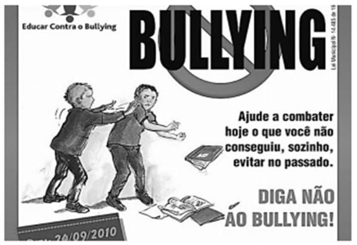

O cartaz mostra um protesto contra o bullying. Sobre os termos e as imagens do cartaz, assinale a afirmativa correta. 

A) A forma de imperativo no cartaz (diga) representa uma ordem. 

B) Os termos do cartaz se dirigem aos estudantes que sofreram bullying no passado. 

C) A imagem central mostra alguém tendo seus livros e cadernos jogados fora por aqueles que fazem bullying. 

D) A imagem do cartaz prega a não violência contra os que fazem bullying. 

E) O cartaz divulga a ideia de que é necessária punição mais severa para os praticantes de bullying. 

#### **12. (FGV / PREF. CUIABÁ - MT / 2025)** 

Observe a tirinha abaixo e identifique a afirmativa correto sobre ela: 

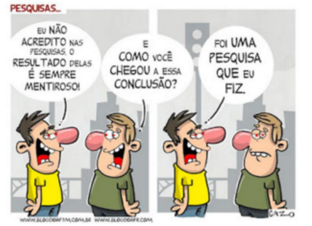

A) A pergunta do personagem à direita da imagem pretende debochar do outro personagem. 

B) O personagem da direita chama de “conclusão” uma frase que nada conclui. 

C) O humor da tirinha se localiza numa contradição interna das falas do personagem da esquerda.

---

<!-- pagina: 182 -->

**Equipe Português Estratégia Concursos, Felipe Luccas Aula 11** 

D) A palavra “pesquisa” foi utilizada duas vezes, com o mesmo sentido. 

E) A tirinha tem por objetivo mostrar a inutilidade das pesquisas eleitorais. 

#### **13. (FGV / TCE-PI / 2025)** 

Leia a nota da OAB a seguir. 

A prática reiterada e impune de atos de corrupção leva as pessoas a pensar que a improbidade e a falta de ética são naturais e a improbidade é uma regra para os grandes delinquentes. 

Sobre a estruturação desse pequeno texto, julgue a assertiva a seguir. 

O adjetivo “grandes” mostra valor de importância social dos delinquentes. 

#### **14. (FGV / DNIT / 2024)** 

Observe o seguinte texto de um escritor italiano: 

“Existe uma classe de pessoas que dá provas e atribui-se o mérito de ser ilustre há muitas gerações, embora permaneça ociosa e inútil. Intitula-se nobreza; e, não menos do que a classe dos sacerdotes, deve ser considerada como um dos maiores obstáculos à vida livre e um dos mais ferozes e permanentes pilares da tirania.” 

Sobre a estrutura e a significação dessa frase, assinale a afirmativa **<u>inadequada</u>** <u>.</u> 

A) O autor condena a classe nobre, mostrando as razões para essa condenação: a ociosidade e a inutilidade. 

B) A classe dos sacerdotes recebe crítica idêntica à dos nobres, pelos mesmos motivos. 

C) A forma verbal “atribui-se” indica a ideia de que o mérito de ser ilustre não é um valor autêntico. 

D) A condenação da nobreza se apoia argumentativamente no pensamento da maioria, o que traz autoridade. 

E) Ao final do texto, o autor mostra as razões políticas e sociais de sua condenação à nobreza. 

#### **15. (FGV / PREF. SÃO JOSÉ DOS CAMPOS - SP / 2024)** 

As frases abaixo permitem a inferência de um sentimento; assinale a frase em que esse sentimento indicado está **<u>inadequado</u>** à frase. 

A) Minha prima gritou quando o cachorro se aproximou dela, latindo muito. / Raiva. 

B) Júlia correu para casa a fim de anunciar que havido sido escolhida para o papel principal da novela. / Alegria. 

C) Cristiano Ronaldo ficou insatisfeito com o fato de Messi ter ganho a bola de ouro. / Inveja. 

D) Juliana chorou muito com a morte de sua cadelinha. / Tristeza. 

E) O torcedor emudeceu quando viu seu time perder a decisão do campeonato. / Desilusão. 

#### **16. (FGV / ALESC / 2024)**

---

<!-- pagina: 183 -->

**Equipe Português Estratégia Concursos, Felipe Luccas Aula 11** 

Observe o texto a seguir. 

“Os países da América Latina não precisam criar uma civilização. Ela já foi criada pela Europa nos últimos quatro séculos. Cabe-nos assimilar essa civilização.” (Eugênio Gudin) 

Sobre o conteúdo e a estruturação desse pequeno texto, assinale a afirmativa correta. 

A) O conceito de civilização, nesse texto, se prende exclusivamente aos valores clássicos de cultura. 

B) Entre os dois primeiros períodos do texto há uma relação, respectivamente, de causa e consequência. 

C) O autor defende a criação de uma civilização nacional original, apoiada em valores europeus. 

D) O texto mostra uma visão negativa das possibilidades culturais dos países da América latina. 

E) O último período do texto mostra uma justificativa das ideias apresentadas anteriormente. 

#### 17. **(FGV / CGE-PB / 2024)** 

Uma das tarefas mais complicadas na escritura é a seleção adequada de palavras utilizadas nos textos. 

A opção abaixo em que a crítica indicada sobre o uso de palavras no texto dado NÃO é pertinente, é: 

A) “Um tema pelo qual estou interessado é o relacionado com os efeitos que provoca a droga a nível desportivo.” / utilização de termos desnecessários; 

B) “Em muitas partes do corpo como são as mãos, as orelhas e os pés, estão representados todos os órgãos e partes do corpo, como mostra a reflexologia.” / repetição de palavras idênticas; 

C) “O projeto governamental não foi aprovado no Senado, a despeito dos esforços dos partidos governistas, em função da grande pressão popular.” / utilização de conectores inadequados; 

D) “As coisas apresentadas na exposição tinham aspecto interessante, mas a ausência de público prejudicou o bom evento.” / emprego de palavras demasiadamente gerais ou de significado impreciso; 

E) “O aprofundamento dos debates paralelamente às novas contribuições trazidas pelos parlamentares pode dar solução ao problema das moradias.” / utilização de palavras abstratas em lugar das concretas e de vocábulos mais longos em lugar dos mais curtos. 

#### **18. (FGV / PC-SP / 2024)** 

O célebre cientista Lineu disse certa vez: 

“A natureza é um imenso dicionário!” 

A comparação entre a natureza e o dicionário se justifica por duas marcas, que são: 

A) a quantidade e a variedade. 

B) a dificuldade e a necessidade. 

C) a necessidade e a precariedade.

---

<!-- pagina: 184 -->

**Equipe Português Estratégia Concursos, Felipe Luccas Aula 11** 

D) a precariedade e a quantidade. 

E) a variedade e a dificuldade. 

#### **19. (FGV / TJ-RN / 2023)** 

Um candidato a um concurso público devia escrever um texto argumentativo, defendendo a preferência pela vida nas grandes cidades pelos cidadãos comuns; entre os argumentos abaixo, aquele a que deve ser atribuída a maior importância, é: 

A) As grandes cidades permitem reencontros, ao acaso, nas ruas, nos bares ou nos cinemas; 

B) uma cidade grande é o espaço do progresso social e profissional, onde mais facilmente se encontra um posto de trabalho. 

C) uma grande cidade tem espaço muito atraente, o mesmo que tem sido celebrado por grandes artistas; 

D) a vida na grande cidade permite, graças aos espaços verdes e aos animais domésticos, o aprofundamento no mundo natural; 

E) uma grande cidade é dinâmica e estimulante, possibilitando o acesso a todos os itens da modernidade. 

#### **20. (FGV / TJ-RN / 2023)** 

Todas as frases abaixo fazem propaganda de um creme dental; aquela que, em busca do convencimento do  cliente, apela para a sua vaidade é: 

A) Creme Dental X: mais por preço menor; 

B) Sorriso brilhante é com Creme Dental X; 

C) Faça como os franceses: compre Creme Dental X; 

D) Para proteção completa dos dentes: Creme Dental X; 

E) Não sofra com as cáries: use Creme Dental X. 

#### **21. (FGV / TJ-RN / 2023)** 

O escritor francês Montaigne declarou: "Estamos sempre dispostos a atribuir aos escritos dos outros sentidos que favoreçam as nossas opiniões sedimentadas: um ateu se orgulha de fazer com que todos os autores reforcem a causa do ateísmo. Ele envenena com sua própria peçonha o mais inocente pensamento". 

Depreende-se da leitura desse texto que: 

A) Montaigne é adepto da causa do ateísmo; 

B) alguns autores interpretam favoravelmente textos alheios; 

C) nossas opiniões sempre encontram apoio em outros textos; 

D) nossas convicções se modificam conforme nossas leituras; 

E) as citações de textos alheios envenenam nossas ideias.

---

<!-- pagina: 185 -->

**Equipe Português Estratégia Concursos, Felipe Luccas Aula 11** 

#### **22. (FGV / TJ-RN / 2023)** 

Numa sessão de Congresso Nacional, um deputado sobe à tribuna e lê para seus amigos políticos a tradução de um antigo discurso de John Kennedy, cujo tema era adequado a uma discussão daquele momento: o valor da democracia. 

Nesse caso, levando-se em conta os elementos de comunicação desse ato, é correto afirmar que: 

A)  emissor do discurso é o presidente John Kennedy; 

B) o receptor do texto lido é o deputado que discursa; 

C) o código empregado no texto é a lingua inglesa; 

D) a mensagem do texto aborda o valor da democracia; 

E) o canal utilizado no ato é puramente auditivo. 

#### **23. (FGV / TJ-RN / 2023)** 

Uma das estratégias de diminuir o ser humano é usar para ele vocábulos empregados somente ou também para coisas (reificação); a frase abaixo em que foi empregado esse processo, é: 

A) Apesar de craque, em alguns jogos Pelé parecia desligado; 

B) Nem toda pessoa domina os nervos; 

C) Os professores não perdem a paciência facilmente; 

D) Havia grande quantidade de pessoas na festa; 

E) Os artistas prometeram fazer um bom show. 

#### **24. (FGV / TJ-RN / 2023)** 

A frase abaixo que apresenta uma relação lógica corretamente estabelecida, é: 

A) audição está para som como paladar está para língua; 

B) livro está para capa como travesseiro está para fronha; 

C) álcool está para alcoolismo como droga está para traficante; 

D) tecido está para desbotar como papel está para rasgar; 

E) mestre está para discípulo como professor está para escola. 

#### **25. (FGV / TJ-RN / 2023)** 

Entre os segmentos abaixo, aquele que se mostra bastante objetivo, sem pormenores inúteis, repetições desnecessárias ou redundâncias, é: 

A) Cada candidato, individualmente, terá acesso às informações do concurso por meio de uma senha particular; 

B)  O governo deve devolver ao povo o valor do empréstimo temporário cobrado no preço dos alimentos;

---

<!-- pagina: 186 -->

**Equipe Português Estratégia Concursos, Felipe Luccas Aula 11** 

C) Ocorreu uma verdadeira balbúrdia no momento em que Trump entrou no tribunal; 

D) Na volta da guerra, os militares receberam amor e afeto de seus familiares, que os aguardavam ansiosos; 

E) Os atletas ficaram desestimulados ao se depararem com a grande quantidade de obstáculos na pista. 

#### **26. (FGV / TJ-RN / 2023)** 

Observe a seguinte explicação, retirada de uma gramática de língua portuguesa: “O adjetivo é uma das classes de palavras, caracterizada por ser variável em gênero e número, determinante de um substantivo ou pronome substantivo, expressando estado, característica, qualidade ou relação”. 

Sobre esse pequeno texto explicativo, é correto afirmar que o texto: 

A) se estrutura a partir de uma pergunta explícita, seguida de uma resposta que lhe dá explicação; 

B) comporta definições, destacadas por palavras que as apresentam; 

C) mostra muitos conectores lógicos, que introduzem explicações; 

D) mostra termos especializados não explicados em função de dirigir-se a leitores com certos conhecimentos; 

E) mostra comparações e esquemas que permitem visualizar a explicação de forma mais clara. 

#### **27. (FGV / TJ-RN / 2023)** 

Um escritor espanhol, conhecido por sua preocupação com o idioma, produziu a seguinte frase: “Estudar latim é como colocar as palavras para fazer ginástica”. 

Isso significa que: 

A) o estudo de latim é hoje uma tarefa inútil, pois os estudos históricos perderam valor; 

B) o conhecimento do latim melhora a qualidade redacional de nossos textos; 

C) estudar a língua latina faz com que se acrescentem muitos novos vocábulos aos dicionários; 

D) o aprendizado da língua latina é indispensável para o conhecimento de nosso próprio idioma; 

E) estudar latim faz com que aprofundemos o conhecimento das palavras. 

#### **28. (FGV / SEFAZ-MT / 2023)** 

As opções a seguir mostram frases de campanhas publicitárias cuja argumentação se apoia em um valor social qualquer. Assinale a opção que apresenta a frase em que esse valor social está corretamente identificado. 

A) Tenha sucesso na vida! Estude na UFMT e ganhe os melhores salários! / vaidade. 

B) Faça amizade com seus vizinhos: você e eles podem precisar de ajuda amanhã. / compreensão.

---

<!-- pagina: 187 -->

**Equipe Português Estratégia Concursos, Felipe Luccas Aula 11** 

C) Escute seus avós: eles não estudaram na universidade, mas possuem experiência. / tradição. 

D) Não deixe para amanhã o que pode fazer hoje: pague hoje mesmo o seu imposto sobre a renda! / prudência. 

E) Faça o que fez Cabral: descubra coisas novas! / coragem. 

#### **29. (FGV / SEFAZ-MT / 2023)** 

"Trabalhar pelo preço oferecido por outro e para o lucro deste, sem sendo o preço do trabalho Interesse algum pelo trabalho ajustado pela competição hostil, com um lado pedindo o mais possível e o outro pagando o menos que puder, não é, mesmo quando os salários são elevados, um estado satisfatório para seres humanos de Inteligência cultivada, que deixaram de julgar-se inferiores àqueles a quem servem." 

John Stuart Mill (1848) 

No fragmento acima, Stuart Mill afirma que 

A) todos os que trabalham para outros julgam-se inferiores a eles. 

B) o preço do trabalho é fruto de uma disputa legal entre patrões e empregados. 

C) a competição citada é hostil porque cada um só enxerga os seus interesses. 

D) os salários pagos nunca são satisfatórios para seres humanos de inteligência cultivada. 

E) as relações trabalhistas tendem a se tornar mais problemáticas em um futuro próximo. 

#### 30. **(FGV / PGM-NITERÓI / 2023)** 

Todas as frases abaixo expressam uma opinião; aquela que expressa uma opinião alheia de forma neutra, é: 

A) Como dizem os agricultores, nem todo dia de sol é bom de plantar ou de colher; 

B) Considero execrável o pensamento egoísta de pagarmos o mínimo possível a quem trabalha; 

C) Considero que esse novo programa agrícola vai atingir um sucesso imenso, principalmente por sua criatividade; 

D) Dizem que a distância traz o esquecimento, mas eu não apoio esse raciocínio; 

E) Alguém imaginaria que o atual progresso científico iria trazer essa tragédia para a vida na Terra? 

#### **31. (FGV / PGM-NITERÓI / 2023)** 

Em todas as opções abaixo há diferentes tipos de raciocínio; o texto que exemplifica o tipo de raciocínio por analogia, é: 

A) No governo republicano, é da natureza da constituição que os juízes devem seguir a letra da lei; 

B) Se as eleições indicam um vencedor, é natural que as pessoas passem a atribuir a esse vencedor responsabilidades pelos sonhos que almejam;

---

<!-- pagina: 188 -->

**Equipe Português Estratégia Concursos, Felipe Luccas Aula 11** 

C) Os animais não possuem as vantagens que temos, mas possuem outras: eles não têm nossas esperanças, mas não possuem nossos temores; eles sofrem, como nós, a morte, mas sem a conhecer; 

D) Nos estados tirânicos, a natureza do governo requer uma obediência extrema; e, uma vez conhecida a vontade do líder, ela deve provocar efeito infalível, como o de uma bola que se choca contra a outra; 

E) Não há liberdade se o poder de julgar não está separado do poder legislativo e executivo. Se ele estivesse unido ao poder legislativo, o poder sobre a vida dos cidadãos seria arbitrário porque o juiz seria legislador. 

#### **32. (FGV / PGM-NITERÓI / 2023)** 

“Os Cactos da Encosta têm por desagradáveis vizinhos os Promotores da Bagunça. Os Trapezistas do Asfalto não se entendem seja com os Promotores da Bagunça, seja com os Camelôs da Praça para atenuar uma ameaça contra os Cactos da Encosta, depois, naturalmente de se aliarem com os Bitolados da Patota, ou depois de momentaneamente, por acordos secretos, terem neutralizado os Camaleões de Plantão. A situação, naturalmente, não se apresenta sempre assim de uma maneira tão simples.” (texto adaptado de Henri Michaux) 

Alguns textos provocam lágrimas, outros provocam admiração ou exaltação, outros fazem rir, outros nos trazem pessimismo e assim por diante. No caso desse pequeno texto, o que predomina é: 

A) o tom trágico, fundamentado na crença de que as coisas são inevitáveis, como a relação problemática entre os grupos; 

B) o tom lírico, que exalta os sentimentos íntimos comuns a todos os homens, como ocorre nesses grupos; 

C) o tom patético, que provoca uma ternura exagerada nos leitores diante de uma triste situação, sem remédio; 

D) o tom cômico, que se fundamenta numa quebra de expectativa, como a de se considerar simples uma situação confusa; 

E) o tom épico, que procura valorizar ações de grupos. 

#### **33. (FGV / PGM-NITERÓI / 2023)** 

Há distintas maneiras de interrogar; a opção abaixo em que a pergunta feita (numa entrevista de emprego) exige uma resposta mais longa e mais pessoal, é: 

A) O que o senhor sabe de nossa empresa? 

B) Que tipo de função o senhor pretende ocupar? 

C) O senhor sabe usar seu poder de sedução? 

D) Em que disciplinas universitárias o senhor era melhor? 

E) O senhor possui um relacionamento fraterno com os outros?

---

<!-- pagina: 189 -->

**Equipe Português Estratégia Concursos, Felipe Luccas Aula 11** 

#### **34. (FGV / PGM-NITERÓI / 2023)** 

Observe o texto argumentativo a seguir. “Os dicionários, como muitos dizem, são ‘os pais dos burros’, já que todos os consultam quando desconhecem o significado de alguma palavra, mas nossos dicionários ainda têm muito o que aprender, desde a apresentação de informações mais precisas, até a inclusão da etimologia das palavras, sua datação e exemplos dos múltiplos significados indicados. Assim, eles passarão a ser ‘os pais dos inteligentes’.” 

O plano de estruturação argumentativa desse texto é: 

A) apresentação de uma tese própria, seguida de argumentos contrários à tese oposta; 

B) apresentação de uma listagem de argumentos favoráveis a uma tese própria do argumentador, explicitada ao final; 

C) apresentação da tese oposta, seguida de argumentos e da tese própria; 

D) apresentação de uma listagem de argumentos favoráveis à tese oposta, sem a explicitação da tese própria; 

E) apresentação da tese própria, seguida da tese oposta, com uma listagem de argumentos que defendem aquela. 

#### **35. (FGV / PGM-NITERÓI / 2023)** 

De cada uma das frases abaixo podem-se retirar informações implícitas ou pressupostas; a opção em que a informação implícita está adequadamente referida, é: 

A) O mordomo fechou a janela da sala / na sala havia mais de uma janela e uma delas estava aberta; 

B) Os cinco filhos de Vicente estão de férias; três dos meninos foram para o Rio de Janeiro / os outros dois filhos são meninas; 

C) Os novos vizinhos vêm jantar amanhã em nossa casa / os novos vizinhos são amigos de longa data; 

D) O automóvel que estava mal estacionado foi retirado da porta da minha casa / o automóvel não pertence ao enunciador da frase; 

E) Como professor há muitos anos, já ensinei coisas importantes a meus alunos / os alunos não deram a devida atenção ao que lhes foi ensinado. 

#### **36. (FGV / PGM-NITERÓI / 2023)** 

Numerosas situações da vida cotidiana ou profissional nos levam a contestar ou a defender um ponto de vista, logo, a produzir uma argumentação. Todas as opções abaixo mostram sugestões de temas para textos argumentativos; a opção em que é proposta uma estruturação com base em duas teses possíveis, é: 

A) Como será o sistema de trabalho no futuro? 

B) Os jornais falados e escritos estão em franca disputa por leitores; qual dos dois modelos vai triunfar? 

C) Alguns especialistas consideram que o turismo de aventura será a coqueluche do próximo

---

<!-- pagina: 190 -->

**Equipe Português Estratégia Concursos, Felipe Luccas Aula 11** 

século. Como você imagina esse tipo de turismo? 

D) Os ritmos musicais estão ligados a um instrumento básico. A bossa-nova só poderia ser composta no violão, assim como a valsa só poderia ser composta a partir do piano. Você considera válido esse ponto de vista? 

E) Como julgar as aulas pela internet? São bastante úteis, sobretudo para os que não dispõem de tempo ou, carecendo da presença física do professor, deixam sempre a desejar? 

#### **37. (FGV / BANESTES / 2023)** 

O ex-ministro da Fazenda Delfim Netto declarou certa vez: 

“O capital é como água. Sempre flui por onde encontra menos obstáculos”. 

Assinale a afirmativa correta sobre os componentes e a estrutura desse pensamento. 

==5460== A) O segundo período é uma redundância do primeiro, já que expressam o mesmo pensamento. 

B) A comparação do primeiro período é explicada no segundo. 

C) O primeiro período expressa uma causa cuja consequência é expressa no segundo período. 

D) Enquanto o primeiro período é expresso em linguagem figurada, o segundo é expresso em linguagem lógica. 

E) O segundo período expressa uma conclusão do que é expresso no período anterior. 

#### 38. **(FGV / PGM-NITERÓI / 2023)** 

As funções de linguagem fazem parte do conteúdo desta prova; a frase abaixo que documenta a função de linguagem denominada conativa, ou seja, a que pretende influenciar o receptor, é: 

A)  Eu sempre quis ser igualzinha à Barbie. É por isso que clareio o cabelo até ficar branco; 

B) Gosto de meus braços musculosos, aspecto atlético e cintura fina. Detesto é a camada de gordura que cobre tudo isso; 

C) O mundo abre passagem ao homem que sabe para onde está indo; 

D) A rosa vive uma hora e o espinheiro, cem anos; 

E) Quando ouvir falar bem de um amigo, conte isso a ele. 

#### **39. (FGV / PGM-NITERÓI / 2023)** 

Um ex-governador da Bahia, já falecido, falando de um adversário político, declarou: “Não dá para lidar com alguém que não usa paletó, usa sobretudo”. O argumento empregado pelo ex-governador pode ser classificado como inadequado porque: 

A) se fundamenta parcialmente em uma opinião pessoal; 

B) não apresenta provas do que declara; 

C) substitui o racional pelo emotivo; 

D) foge do assunto, focalizando a pessoa e não os fatos;

---

<!-- pagina: 191 -->

**Equipe Português Estratégia Concursos, Felipe Luccas Aula 11** 

#### E) apela para uma autoridade discutível. 

#### **40. (FGV / CGM-RJ / 2023)** 

Texto 2 – O jornalismo de opinião pode perpetuar negacionismos? (adaptado) 

#### Por Matheus Cervo 

“No dia 9 de agosto de 2021, o Painel Intergovernamental sobre Mudanças Climáticas (IPCC, na sigla em inglês) emitiu um dos mais completos e conclusivos relatórios sobre a grave crise ecológica e planetária que enfrentamos. O documento tem mais de 3 mil páginas, que foram escritas por aproximadamente 200 cientistas oriundos de 60 países diferentes a partir de anos de pesquisa sobre o tema, citando mais de 14 mil estudos que dão base às conclusões feitas. 

Após apenas um mês de emissão do relatório, o jornal Zero Hora (ZH) publicou um infeliz artigo de opinião de Flávio Juarez Feijó chamado ‘Aquecimento Natural’. Apesar de ser geólogo e ser mestre em geociências, Flávio foi abraçado pelo jornal da capital gaúcha por suas opiniões descabidas, que não possuem nenhum embasamento científico. 

Nesse artigo aprovado por ZH, ele ousou dizer que o relatório do IPCC é alarmista e que tem como meta o impedimento do crescimento de países subdesenvolvidos como o Brasil. Como supostos argumentos científicos, afirma que as mudanças climáticas atuais fazem parte de um ciclo natural da terra e que não é necessário reduzir a emissão de gases de efeito estufa. Ainda, opina que as metas de carbono zero fariam a sociedade voltar a andar a cavalo e que a agricultura do nosso país voltaria a ser movida por arados a boi. 

Em letras miúdas quase imperceptíveis ao(à) leitor(a), o jornal ZH escreve no rodapé da página do artigo: ‘Os textos não representam a opinião do Grupo RBS’. Contudo, essa não é a primeira vez que ZH abraça as opiniões de Flávio, já que publicou outro texto do geólogo em 2018 chamado ‘Descarbonizar não é preciso’. Neste texto, sem nenhuma referência científica, diz que o derretimento das geleiras não acrescentaria uma ‘gota no oceano’, que o gelo da Antártica está protegido e que o nível do mar não irá subir. Ainda assim, não se contém e diz que, caso várias áreas do planeta derretam devido ao ‘aquecimento natural’, deve-se aproveitar as ‘benesses’ do contexto e criar novas rotas de navegação e vastas áreas de agricultura (!). 

Não é preciso dizer mais nada para afirmar que escolhas editoriais como essa são perigosas e devem ser apontadas como tal. Pequenas notas em rodapé não devem justificar a falta de responsabilidade de veículos de comunicação para com a pauta do colapso climático. É importante dizer que essas escolhas estão sendo feitas por muitos jornais brasileiros, como Folha de São Paulo, que publicou um péssimo texto de Leandro Narloch chamado ‘Negacionistas e aceitacionistas se equivalem na reação histérica contra quem questiona seus dogmas’. A publicação foi feita apenas 8 dias depois da emissão do relatório do IPCC e apenas 3 dias após manifestação do ombudsman da Folha contra o mesmo colunista. 

Esse pronunciamento do ombudsman só ocorreu devido à grande polêmica que os diversos textos negacionistas de Narloch causaram na opinião pública através das redes sociais. Por isso, devemos nos manter alerta às decisões editoriais como as de Zero Hora e nos manifestar criticamente para que o jornalismo brasileiro não aja como se o colapso climático fosse questão de opinião.” 

Disponível em: https://jornalismoemeioambiente.com/2021/09/ 13/o-jornalismo-de-opiniao-pode-perpetuar-negacionismos- %ef%bf%bc/ 

Acesso em: 04/01/2023

---

<!-- pagina: 192 -->

**Equipe Português Estratégia Concursos, Felipe Luccas Aula 11** 

“O documento tem mais de <u>3 mil páginas, que foram escritas por aproximadamente 200 cientistas</u> oriundos de <u>60 países diferentes</u> a partir de anos de pesquisa sobre o tema, citando mais de 14 mil estudos que dão base às conclusões feitas.” (Texto 2, 1º parágrafo) 

Na passagem transcrita acima, chama a atenção o acúmulo de quatro dados numéricos (“3 mil páginas”, “200 cientistas”, “60 países diferentes” e “14 mil estudos”) em um único período. No contexto do texto 2, esse acúmulo produz o efeito de: 

A) minimizar a importância do aquecimento global; 

B) reforçar um argumento de autoridade; 

C) revelar um raciocínio circular; 

D) expor o caráter controverso das mudanças climáticas; 

E) ressaltar a importância de conscientizar os consumidores. 

#### **41. (FGV / CGM-RJ / 2023)** 

#### **Texto 2 – O jornalismo de opinião pode perpetuar negacionismos? (adaptado)** 

Por Matheus Cervo 

“No dia 9 de agosto de 2021, o Painel Intergovernamental sobre Mudanças Climáticas (IPCC, na sigla em inglês) emitiu um dos mais completos e conclusivos relatórios sobre a grave crise ecológica e planetária que enfrentamos. O documento tem mais de 3 mil páginas, que foram escritas por aproximadamente 200 cientistas oriundos de 60 países diferentes a partir de anos de pesquisa sobre o tema, citando mais de 14 mil estudos que dão base às conclusões feitas. 

Após apenas um mês de emissão do relatório, o jornal Zero Hora (ZH) publicou um infeliz artigo de opinião de Flávio Juarez Feijó chamado ‘Aquecimento Natural’. Apesar de ser geólogo e ser mestre em geociências, Flávio foi abraçado pelo jornal da capital gaúcha por suas opiniões descabidas, que não possuem nenhum embasamento científico. 

Nesse artigo aprovado por ZH, ele ousou dizer que o relatório do IPCC é alarmista e que tem como meta o impedimento do crescimento de países subdesenvolvidos como o Brasil. Como supostos argumentos científicos, afirma que as mudanças climáticas atuais fazem parte de um ciclo natural da terra e que não é necessário reduzir a emissão de gases de efeito estufa. Ainda, opina que as metas de carbono zero fariam a sociedade voltar a andar a cavalo e que a agricultura do nosso país voltaria a ser movida por arados a boi. 

Em letras miúdas quase imperceptíveis ao(à) leitor(a), o jornal ZH escreve no rodapé da página do artigo: ‘Os textos não representam a opinião do Grupo RBS’. Contudo, essa não é a primeira vez que ZH abraça as opiniões de Flávio, já que publicou outro texto do geólogo em 2018 chamado ‘Descarbonizar não é preciso’. Neste texto, sem nenhuma referência científica, diz que o derretimento das geleiras não acrescentaria uma ‘gota no oceano’, que o gelo da Antártica está protegido e que o nível do mar não irá subir. Ainda assim, não se contém e diz que, caso várias áreas do planeta derretam devido ao ‘aquecimento natural’, deve-se aproveitar as ‘benesses’ do contexto e criar novas rotas de navegação e vastas áreas de agricultura (!). 

Não é preciso dizer mais nada para afirmar que escolhas editoriais como essa são perigosas e devem ser apontadas como tal. Pequenas notas em rodapé não devem justificar a

---

<!-- pagina: 193 -->

**Equipe Português Estratégia Concursos, Felipe Luccas Aula 11** 

falta de responsabilidade de veículos de comunicação para com a pauta do colapso climático. É importante dizer que essas escolhas estão sendo feitas por muitos jornais brasileiros, como Folha de São Paulo, que publicou um péssimo texto de Leandro Narloch chamado ‘Negacionistas e aceitacionistas se equivalem na reação histérica contra quem questiona seus dogmas’. A publicação foi feita apenas 8 dias depois da emissão do relatório do IPCC e apenas 3 dias após manifestação do ombudsman da Folha contra o mesmo colunista. 

Esse pronunciamento do ombudsman só ocorreu devido à grande polêmica que os diversos textos negacionistas de Narloch causaram na opinião pública através das redes sociais. Por isso, devemos nos manter alerta às decisões editoriais como as de Zero Hora e nos manifestar criticamente para que o jornalismo brasileiro não aja como se o colapso climático fosse questão de opinião.” 

Disponível em: https://jornalismoemeioambiente.com/2021/09/ 13/o-jornalismo-de-opiniao-pode-perpetuar-negacionismos- %ef%bf%bc/ 

Acesso em: 04/01/2023 

“Por isso, devemos nos manter alerta às decisões editoriais como as de Zero Hora e nos manifestar criticamente para que o jornalismo brasileiro não aja como se o colapso climático fosse questão de opinião.” (Texto 2, 6º parágrafo, último período) O texto 2 é predominantemente argumentativo (no que se refere ao seu modo de organização discursiva) e desempenha majoritariamente as funções referencial e emotiva (no que se refere ao seu propósito comunicativo). Seu último período, no entanto, subverte esse padrão, na medida em que evidencia uma predominância: 

A) do modo narrativo e da função metalinguística; 

B) do modo descritivo e da função fática; 

C) do modo injuntivo e da função conativa; 

D) do modo argumentativo e da função poética; 

E) do modo expositivo e da função fática. 

#### 42. **(FGV / MPE GO / 2022)** 

#### Texto III 

“Dois amigos meus que leram os três volumes dessa A vida de D. Pedro I, de Octávio Tarquínio de Sousa, disseram que é um livro de que a gente fica com saudades quando acaba, quando o herói morre tão moço, ainda capaz de tanto heroísmo e tanta estripulia. Foi isso mesmo que senti chegando ao fim da leitura, vontade de pedir ao historiador a vida de D. Pedro II como quem repete um prato gostoso em um restaurante: ‘Salta mais um Pedro!’”. 

(Pedro I, 13/12/1952) 

O segmento inicial dessa crônica pode ser visto como um texto publicitário do livro, apoiado na seguinte qualidade da obra: 

A) informação histórica de caráter preciso. 

B) promessa de aventuras cheias de suspense.

---

<!-- pagina: 194 -->

**Equipe Português Estratégia Concursos, Felipe Luccas Aula 11** 

C) revelações íntimas e secretas sobre Pedro I. 

D) aspecto sentimental da vida do personagem. 

E) narração atraente de fatos e aventuras. 

#### **43. (FGV /CÂMARA TAUBATÉ-SP / CONTADOR LEGISLATIVO / 2022)** 

Observe o seguinte texto, de modelo muito utilizado no contexto administrativo: 

Exmo. Sr. Chefe de Polícia de Palmas 

LUÍS ROBERTO NEVES, brasileiro, dentista, residente à Rua das Acácias n. 28, Gávea, Palmas, como presidente da Associação de Moradores do bairro, 

#### EXPÕE 

Que tendo solicitado inúmeras vezes junto à Prefeitura da Cidade o aumento do policiamento para a localidade denominada Corredor da Praia, em face do grande número de furtos nas casas 

do local, assim como nos automóveis estacionados nas ruas, 

#### SOLICITA 

Que dê ordens para que seja providenciada de forma oficial e rápida a instalação de uma unidade policial durante o horário noturno em nosso bairro, a fim de proteger não só nossos interesses, mas também, e sobretudo, nossas vidas. 

Contando com pronto atendimento 

Luís Roberto Neves 

Entre as opções abaixo, assinale a que não caracteriza a linguagem empregada nessa solicitação. 

A) o predomínio da construção nominal, com mais substantivos e adjetivos, do que verbos. 

B) a utilização de formas não pessoais dos verbos, como tendo solicitado, proteger. 

C) a substituição de verbos por construções onde aparecem substantivos, como dê ordens em lugar de ordene. 

D) a longa extensão das orações de modo que cada parágrafo pode aparecer formado por uma só oração, como é o caso dos segmentos após expõe e solicita. 

E) o emprego de abreviaturas, traço característico desse tipo de documento, como Exmo. Sr. 

#### **44. (FGV /CÂMARA TAUBATÉ-SP / CONSULTOR LEGISLATIVO / 2022)** 

Observe o seguinte fragmento textual: 

“Observava com muito interesse o quadro de Van Gogh; um quarto modesto, com uma cama ao lado da porta, com pequenas gravuras na parede... Não guardei na memória o restante da cena porque imaginava a tristeza do pintor ao não ver reconhecido o seu imenso valor...”. 

Nesse caso, a impossibilidade de descrever o restante do quarto está ligada a

---

<!-- pagina: 195 -->

**Equipe Português Estratégia Concursos, Felipe Luccas Aula 11** 

A) uma limitação de tempo. 

B) uma impossibilidade física. 

C) um bloqueio psicológico. 

D) uma falta de conhecimento. 

E) um distanciamento temporal. 

#### **45. (FGV – Consultor Legislativo - Câmara Taubaté-SP / 2022)** 

Assinale a opção que não apresenta uma opinião. 

A) Nunca dispomos de todas as informações para que possamos chegar às melhores decisões. 

B) Antigamente, os casamentos só ocorriam após um período de namoro e uns anos de noivado. 

C) Logicamente, tudo muda de figura se o seu time vendeu todos os jogadores craques e ficou com a sobra. 

D) O inferno está cheio de boas intenções. 

E) As únicas pessoas normais são aquelas que você não conhece bem. 

#### 46. **(FGV / DEPEN MG / AGENTE DE SEGURANÇA PENITENCIÁRIO / 2022)** 

“A crise de criminalidade do Brasil é produto da impunidade. A impunidade, por sua vez, tem duas raízes. A primeira é a incapacidade do sistema de Justiça Criminal de impedir os crimes e identificar, prender e manter os criminosos depois que o crime foi cometido. A segunda raiz é uma legislação penal criada com base na ideologia do criminoso ‘vítima da sociedade’ e em algumas ideias absurdas, sem nenhum compromisso com a realidade”. 

(Adaptado) 

“A crise de criminalidade do Brasil é produto da impunidade”. 

Essa frase inicial do texto 

A) resume integralmente o conteúdo do texto. 

B) fala de algo que fica sem explicações. 

C) simplifica exageradamente um problema grave. 

D) não mostra relação de causa e efeito. 

E) é retificada no restante do parágrafo. 

#### **47. (FGV / DEPEN MG / AGENTE DE SEGURANÇA PENITENCIÁRIO / 2022)** 

Os textos informativos preocupam-se em dar credibilidade ao que informam, atribuindo o valor de certeza ao que veiculam. 

Assinale a opção em que não há nenhum termo que reduza esse tom de precisão absoluta.

---

<!-- pagina: 196 -->

**Equipe Português Estratégia Concursos, Felipe Luccas Aula 11** 

A) Segundo alguns, dinheiro não traz felicidade, mas é certo que afasta a infelicidade para bem longe. 

B) O novo governo americano talvez traga mais tranquilidade econômica aos EUA. 

C) O controle da poluição ambiental poderia produzir mais riqueza no futuro do planeta. 

D) Como o governador é muito amigo do prefeito, possivelmente devem fazer muitas parcerias. 

E) Millôr Fernandes afirmou que devagar se vai ao longe, mas quando se chega lá não se encontra mais ninguém. 

#### **48. (FGV – Agente de Segurança Penitenciário - DEPEN MG / 2022)** 

Para serem claros e precisos, alguns autores esclarecem o significado de adjetivos empregados em seus textos. 

Assinale a frase abaixo, retirada de um jornal do Rio de Janeiro, em que o adjetivo em maiúsculas não vem acompanhado de nenhuma explicação. 

A) A tragédia de Santa Teresa levou sofrimento a duas famílias. Mas os sentimentos são DIFERENTES. Para a família de Maria da Penha Coelho, perda e saudade eterna. Para a de Clara Marques, vergonha e desgosto, que nem o tempo será capaz de apagar. 

B) Não sofro mais. Considero-me uma pessoa normal. Esqueci do passado, quero viver o presente. Agora, minha alimentação é totalmente SAUDÁVEL. Durmo cedo e evito tomar remédios. 

C) Sei que o fenômeno do funk é INTERESSANTE do ponto de vista antropológico e sociológico, que ele reflete um entrelaçamento positivo entre o morro e o asfalto, uma diluição promissora das fronteiras entre as classes sociais etc. 

D) Acostumados a adjetivos POUCO LISONJEIROS, os cariocas, tidos pelo senso comum como malandros e adeptos do jeitinho brasileiro, já podem lavar a alma com orgulho que são os campeões de solidariedade em todo o planeta. 

E) Em vez de tentar encontrar um critério científico para eleger os cem melhores poemas brasileiros do século XX numa antologia que agradasse a todos, o crítico Ítalo Moriconi decidiu abraçar o que esta eleição tem de arbitrária e subjetiva. O resultado é uma coletânea que se dirige ao leitor “MARCIANO”, isto é, ignorante em matéria de nossa poesia, mas sequioso de conhecê-la. 

#### **49. (FGV / PM SP / SOLDADO / 2022)** 

#### **Texto I** 

“É preciso fazer uma reflexão. O turismo e os turistas que chegam a Florianópolis causam uma agonia. A invasão das praias mostra um retrato do Brasil popular, mas sem nenhuma delicadeza. Me sinto encurralado pelos hábitos de mal gosto de grande parcela dos turistas que acham que som alto à beira mar e lixo jogado em todo canto fazem parte do relax das férias. Não compreendo essa identidade do brasileiro do quanto mais bagunçado melhor. Tudo pode em nome da liberdade individual e do politicamente correto. E não bastasse o comportamento dos que chegam de fora, os locais acabam cooperando, liberando seus instintos, juntando-se à

---

<!-- pagina: 197 -->

**Equipe Português Estratégia Concursos, Felipe Luccas Aula 11** 

bagunça geral. E os preços então? Uma explosão numérica sem limites. Mas enfim, deve ser essa a tão sonhada identidade brasileira.” 

(PRATA, Anselmo. Turismo em Santa Catarina – Vale a pena? Disponível em https://www.ronaud.com/sociedade/turismo-em-santa-catarina/) 

A parte inicial do Texto I diz que os turistas “causam uma agonia”. A razão dessa agonia é 

A) a insegurança causada pelo excesso de pessoas. 

B) o aumento abusivo dos gêneros de primeira necessidade. 

C) o desrespeito dos turistas em relação ao trânsito. 

D) a característica brasileira de adesão à bagunça. 

E) a falta de higiene nas praias. 

#### **50. (FGV / PM SP / SOLDADO / 2022) - Utilize o texto da questão anterior** 

O Texto I mostra uma reflexão do seu autor, segundo é dito na frase inicial do texto. Assinale a opção que apresenta a atitude que marca tal reflexão. 

A) Criticar a falta de educação generalizada do brasileiro. 

B) Mostrar a falta de organização oficial dos centros turísticos. 

C) Indicar saídas para a melhoria da atividade turística. 

D) Elogiar a preocupação com o politicamente correto. 

E) Destacar a necessidade de mais fiscalização nas praias. 

||**GABARITO** ||
|---|---|---|
|1. LETRA E|19. LETRA B|37. LETRA B|
|2. LETRA C|20. LETRA B|38. LETRA E|
|3. LETRA A|21. LETRA B|39. LETRA D|
|4. LETRA D|22. LETRA D|40. LETRA B|
|5. LETRA D|23. LETRA A|41. LETRA C|
|6. LETRA E|24. LETRA B|42. LETRA E|
|7. LETRA B|25. LETRA E|43. LETRA D|
|8. LETRA A|26. LETRA D|44. LETRA C|
|9. LETRA E|27. LETRA E|45. LETRA B|
|10. LETRA E|28. LETRA D|46. LETRA C|
|11. LETRA B|29. LETRA C|47. LETRA E|
|12. LETRA C|30. LETRA A|48. LETRA B|
|13. INCORRETA|31. LETRA D|49. LETRA D|
|14. LETRA D|32. LETRA D|50. LETRA A|
|15. LETRA A|33. LETRA A||
|16. LETRA A*|34. LETRA C||
|17. LETRA C|35. LETRA D||
|18. LETRA A|36. LETRA E||

---

<!-- pagina: 198 -->

