---
fonte_pdf: "Raciocínio Lógico - Aula 00.pdf"
paginas: 110
conversao: texto-e-imagens
---

<!-- pagina: 2 -->

**Equipe Exatas Estratégia Concursos Aula 00** 

# **Índice** 

|........................................................................................................................................... 1) Aviso|................................................... 3|
|---|---|
|........................................................................................................................................... 2) Apresentação do Curso|................................................... 4|
|........................................................................................................................................... 3) Introdução às Proposições|................................................... 5|
|........................................................................................................................................... 4) Proposições Simples|................................................... 25|
|........................................................................................................................................... 5) Proposições Compostas|................................................... 34|
|........................................................................................................................................... 6) Questões Comentadas - Proposições Compostas - FGV|................................................... 73|
|......................................................................................**.**.................................................... 7) Lista de Questões - Proposições Compostas - FGV|................................................... 101|

---

<!-- pagina: 3 -->

**Equipe Exatas Estratégia Concursos Aula 00** 

# **AVISO IMPORTANTE!** 

<!-- Start of picture text -->
==5460== <!-- End of picture text -->

Olá, Alunos (as)! 

Passando para informá-los a respeito da **disposição das questões** dentro do nosso material didático. Informamos que a escolha das bancas, dentro dos nossos Livros Digitais, é feita de maneira estratégica e pedagógica pelos nossos professores a fim de proporcionar a melhor didática e o melhor direcionamento daquilo que mais se aproxima do formato de cobrança da banca do seu concurso. 

Assim, o formato de questões divididas por tópico facilitará o seu processo de estudo, deixando mais alinhado às disposições constantes no edital. 

No mais, continuaremos à disposição de todos no Fórum de dúvidas! 

Atenciosamente, 

Equipe Exatas 

Estratégia Concursos

---

<!-- pagina: 4 -->

**Equipe Exatas Estratégia Concursos Aula 00** 

# **<mark>A</mark> PRESENTAÇÃO DO** **<mark>C</mark> URSO** 

Olá, pessoal! Tudo bem? 

É com grande satisfação que damos início ao nosso curso! 

Os professores **Eduardo Mocellin, Francisco Rebouças** e **Vinicius Veleda** ficarão responsáveis pelo **Livro Digital** . 

Antes de continuarmos, vamos apresentar os professores do material escrito: 

**Eduardo Mocellin** : Fala, pessoal! Meu nome é Eduardo Mocellin, sou professor de Matemática e de Raciocínio Lógico do Estratégia Concursos e engenheiro Mecânico-Aeronáutico pelo Instituto Tecnológico de Aeronáutica (ITA). Sinto-me feliz em poder contribuir com a sua aprovação! Não deixe de me seguir no Instagram: **@edu.mocellin** ==5460== 

**Francisco Rebouças** : Fala, alunos! Aqui é o Francisco Rebouças, professor de Matemática do Estratégia Concursos. Sou Engenheiro Aeroespacial formado pelo Instituto Tecnológico de Aeronáutica (ITA). Saiba que será uma honra fazer parte da sua jornada rumo à aprovação e que estaremos sempre aqui para auxiliá-los com o que precisarem. Um grande abraço e nos vemos nas aulas! 

**Vinicius Veleda:** Olá, caros alunos! Sou Auditor Fiscal do Estado do Rio Grande do Sul. Professor de Matemática e Matemática Financeira do Estratégia Concursos. Aprovado nos Concursos de Auditor Fiscal da Secretaria da Fazenda dos Estados do Rio Grande do Sul (SEFAZ RS - 2019), Santa Catarina (SEFAZ SC - 2018) e Goiás (SEFAZ GO - 2018). Formado em Engenharia de Petróleo pela Universidade Federal do Rio de Janeiro (UFRJ) com graduação sanduíche em Engenharia Geológica pela Universidade Politécnica de Madrid (UPM). Pela UFRJ, fui campeão sul americano do Petrobowl (Buenos Aires) e, posteriormente, Campeão Mundial (Dubai). Cursei meu ensino médio na Escola Preparatória de Cadetes do Exército (EsPCEx). Contem comigo nessa trajetória! **@viniciusveleda** 

O material escrito em **PDF** está sendo construído para ser sua fonte **autossuficiente** de estudos. Isso significa que o livro digital será **completo** e **voltado para o seu edital** , justamente para que você não perca o seu precioso tempo "caçando por aí" o conteúdo que será cobrado na sua prova. Ademais, sempre que necessário, você poderá fazer perguntas sobre as aulas no **fórum de dúvidas** . **Bons estudos!**

---

<!-- pagina: 5 -->

**Equipe Exatas Estratégia Concursos Aula 00** 

# **A AULA PRESENTAÇÃO DA** 

Fala, pessoal! 

A aula de hoje é a **<u>base</u>** da lógica de proposições, sem a qual não podemos avançar no conteúdo. 

Primeiramente abordaremos aspectos introdutórios: **introdução às proposições** e **proposições simples** . Tais assuntos não costumam ter uma incidência muito alta em provas de concurso público, porém eles constituem os fundamentos da matéria. 

Em seguida, trataremos sobre as **proposições compostas.** Nesse tema, apresentaremos diversos exemplos que contextualizam os valores lógicos resultantes do uso dos conectivos. Por experiência como professor, gravar exemplos não é o melhor caminho. É muito mais importante que você **<u>DECORE</u>** os casos típicos de cada um dos cinco conectivos. 

Vamos exibir, no **início de cada tópico** , um pequeno **resumo** para que você tenha uma visão geral do conteúdo antes mesmo de iniciar o assunto. 

Vamos avançando com calma e constância. A aula apresenta uma teoria um pouco extensa, porém necessária para criarmos os alicerces da lógica de proposições. 

Conte comigo nessa caminhada =) 

**Prof. Eduardo Mocellin.** 

##### **@edu.mocellin**

---

<!-- pagina: 6 -->

**Equipe Exatas Estratégia Concursos Aula 00** 

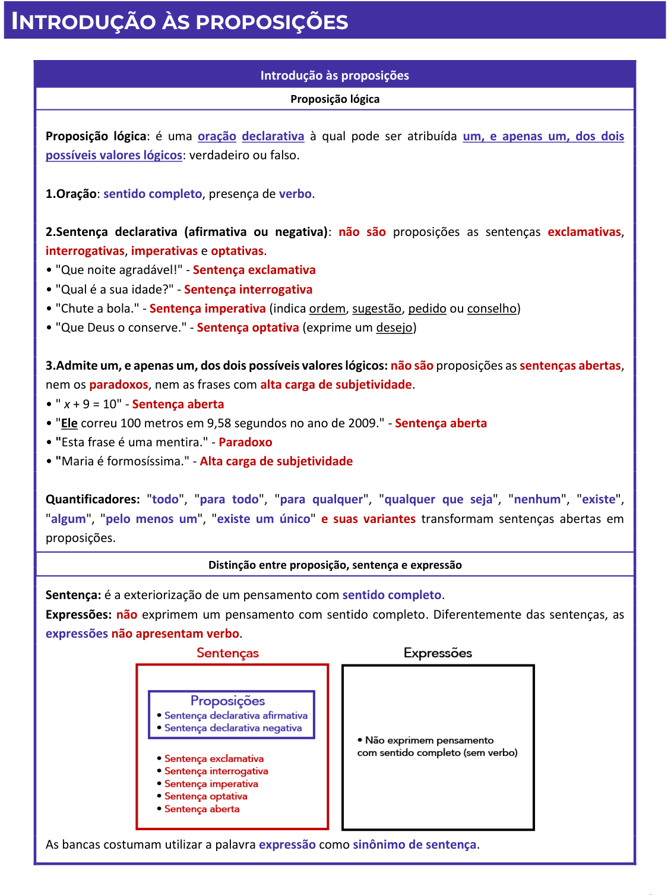

<!-- Start of picture text -->
INTRODUÇÃO ÀS PROPOSIÇÕES Introdução às proposições Proposição lógica Proposição lógica : é uma  oração declarativa à qual pode ser atribuída  um, e apenas um, dos dois possíveis valores lógicos : verdadeiro ou falso. 1.Oração :  sentido completo , presença de  verbo . 2.Sentença declarativa (afirmativa ou negativa) :  não são  proposições as sentenças  exclamativas , interrogativas ,  imperativas  e  optativas . • "Que noite agradável!" -  Sentença exclamativa • "Qual é a sua idade?" -  Sentença interrogativa • "Chute a bola." -  Sentença imperativa  (indica ordem, sugestão, pedido ou conselho) • "Que Deus o conserve." -  Sentença optativa  (exprime um desejo) 3.Admite um, e apenas um, dos dois possíveis valores lógicos: não são  proposições as  sentenças abertas , nem os  paradoxos , nem as frases com  alta carga de subjetividade . • "  x  + 9 = 10" -  Sentença aberta • " Ele correu 100 metros em 9,58 segundos no ano de 2009." -  Sentença aberta •  " Esta frase é uma mentira." -  Paradoxo •  " Maria é formosíssima." -  Alta carga de subjetividade Quantificadores:  " todo ", " para todo ", " para qualquer ", " qualquer que seja ", " nenhum ", " existe ", " algum ", " pelo menos um ", " existe um único "  e suas variantes  transformam sentenças abertas em proposições. Distinção entre proposição, sentença e expressão Sentença:  é a exteriorização de um pensamento com  sentido completo . Expressões: não  exprimem um pensamento com sentido completo. Diferentemente das sentenças, as expressões não apresentam verbo . As bancas costumam utilizar a palavra  expressão  como  sinônimo de sentença . <!-- End of picture text -->

---

<!-- pagina: 7 -->

**Equipe Exatas Estratégia Concursos Aula 00** 

|**A lógica bivalente e as leis do pensamento**|
|---|
|**Lógica Bivalente**=**Lógica Proposicional**,**Lógica Clássica**,**Lógica Aristotélica**. Obedece**a três princípios**, conhecidos por**Leis do Pensamento**:|
|**1.** **Identidade**: Uma proposição verdadeira é sempre verdadeira, e uma proposição falsa é sempre falsa.|
|**2.** **Não Contradição**: Uma proposição não pode ser verdadeira e falsa ao mesmo tempo.|
|**3.** **Terceiro Excluído**: Uma proposição**ou é verdadeira ou é falsa**.Não existe um terceiro valor "talvez".|

---

<!-- pagina: 8 -->

**Equipe Exatas Estratégia Concursos Aula 00** 

## Proposição lógica 

Uma **proposição lógica** é uma **<u>oração declarativa</u>** à qual pode ser atribuída **<u>um, e apenas um, dos dois possíveis valores lógicos</u>** <u>: verdadeiro ou falso. Exemplo:</u> 

"Porto Alegre é a capital do Rio Grande do Sul." 

Perceba que a frase acima **<u>é uma oração</u>** em que **<u>se declara algo</u>** sobre a cidade de Porto Alegre. Além disso, essa frase **<u>admite um valor lógico</u>** . Não bastasse isso, essa oração **<u>admite somente um valor lógico</u>** : **ou é verdadeiro que** Porto Alegre é realmente a capital do Rio Grande do Sul, **ou é falso que** essa cidade é a capital desse estado. Vejamos outros exemplos de proposição: 

"A raiz quadrada de 16 é 8." 

"Usain Bolt correu 100 metros em 9,58 segundos no ano de 2009." 

Cumpre destacar que **podemos ter proposições que são expressões matemáticas** . Exemplos: 

"5 + 5 = 9." 

**(Lê-se: "Cinco mais cinco é igual a nove.")** 

"12 > 5." 

**(Lê-se: "Doze é maior do que cinco.")** 

É muito importante que você entenda o conceito de proposição lógica apresentado, pois é possível resolver diversas questões introdutórias somente conhecendo essa definição. 

**(PETROBRAS/2022)** Julgue o item seguinte como CERTO ou ERRADO. 

A seguinte afirmação é uma proposição: A quantidade de formigas no planeta Terra é maior que a quantidade de grãos de areia. 

**Comentários:** 

Uma proposição lógica é uma **<u>oração declarativa</u>** à qual pode ser atribuída **<u>um, e apenas um, dos dois possíveis valores lógicos</u>** <u>: verdadeiro ou falso.</u> 

Note que a afirmação do enunciado se enquadra nessa definição: 

- Temos uma **<u>oração</u>** <u>, que pode ser identificada com a presença do verbo "ser";</u> 

- A oração em questão é **<u>declarativa</u>** . No caso em questão, declara-se algo sobre a quantidade de formigas no planeta Terra; 

•  Pode-se atribuir **<u>um, e apenas um, dos dois possíveis valores lógicos</u>** à oração declarativa em questão: **ou é verdadeiro que** "a quantidade de formigas no planeta Terra é maior que a quantidade de grãos de areia", **ou é falso que** "a quantidade de formigas no planeta Terra é maior que a quantidade de grãos de areia". **Gabarito: CERTO.** 

Nesse momento, vamos nos aprofundar no conceito de proposição.

---

<!-- pagina: 9 -->

**Equipe Exatas Estratégia Concursos Aula 00** 

### Uma proposição deve ser uma oração 

Uma proposição lógica deve ser uma oração. Isso significa que ela necessariamente deve apresentar um **sentido completo** , identificado pela **presença de um verbo** . As **seguintes expressões não são proposições** por não apresentarem verbo: 

"Um excelente curso de raciocínio lógico." 

"Vinte e duas horas." 

"Teclado." 

**(CRF-GO/2022)** Julgue o item. 

A frase “Dois mil mais vinte mais dois” não é uma proposição. 

##### **Comentários:** 

A frase “ **Dois mil mais vinte mais dois** ” **não é uma proposição** por **não apresentar sentido completo** . Em outras palavras, a frase em questão **não é uma proposição por não ser uma oração** , uma vez que **não há verbo** . 

**Gabarito: CERTO.** 

Uma proposição deve ser declarativa 

Uma proposição lógica é uma sentença declarativa, podendo ser uma **sentença declarativa** **<u>afirmativa</u>** ou uma **sentença declarativa negativa** . São proposições: 

- "Taubaté é a capital de São Paulo." - **Sentença declarativa afirmativa** 

- "João **<u>não</u>** é nordestino." - **Sentença declarativa negativa** 

As seguintes sentenças **não são proposições** por não serem declarativas: 

- "Que noite agradável!" - **Sentença exclamativa** 

- "Qual é a sua idade?" - **Sentença interrogativa** 

- "Chute a bola." - **Sentença imperativa** (indica ordem, <u>sugestão, pedido ou conselho)</u> 

- "Que Deus o conserve." - **Sentença optativa** (exprime um desejo) 

**Não basta que a sentença apresente um verbo para que ela seja considerada uma proposição** . Veja que a sentença imperativa " **Chute a bola** " apresenta verbo ( **chutar** ) e, mesmo assim, não é uma proposição por não ser declarativa.

---

<!-- pagina: 10 -->

**Equipe Exatas Estratégia Concursos Aula 00** 

**(CRO-SC/2023)** Com relação a equações e inequações e estruturas lógicas, julgue o item. 

“Pelé é o maior jogador de futebol de todos os tempos!” é uma proposição. 

##### **Comentários:** 

A frase acima é uma **sentença exclamativa** (apresenta ponto de exclamação). Não se trata, portanto, de uma proposição. 

**Gabarito: ERRADO.** 

**(CREF 3/2023)** A frase “Eu quebrei o vaso!” é uma proposição exclamativa. 

##### **Comentários:** 

Veja que a questão tenta enganar o concurseiro dizendo que a frase é uma " **proposição exclamativa** ". Esse conceito de "proposição exclamativa" não existe, pois uma proposição não pode ser exclamativa. 

Em síntese, a frase acima é uma **sentença exclamativa** (apresenta ponto de exclamação). Não se trata, portanto, de uma proposição. 

**Gabarito: ERRADO.** 

**(PETROBRAS/2022)** Acerca de lógica matemática, julgue o item a seguir. 

A frase “Saia daqui!” é uma proposição simples. 

**Comentários:** 

A frase acima é uma **sentença imperativa** (indica uma ordem, <u>sugestão, pedido ou conselho), bem como é</u> uma **sentença exclamativa** (apresenta ponto de exclamação). Não se trata, portanto, de uma proposição. **Gabarito: ERRADO.** 

**(BNB/2018)** A sentença “É justo que toda a população do país seja penalizada pelos erros de seus dirigentes?” é uma proposição lógica composta. 

**Comentários:** 

Veremos ainda nessa aula o conceito de **proposição** **<u>composta</u>** <u>.</u> 

Note, porém, que podemos resolver a questão mesmo sem conhecer esse conceito. Isso porque a sentença apresentada **não é uma proposição lógica** , pois trata-se de uma **sentença interrogativa** . **Gabarito: ERRADO.** 

Uma proposição deve admitir um, e apenas um, dos dois possíveis valores lógicos 

Antes de desenvolver essa última característica das proposições, devemos entender o que é um **valor lógico** . 

**Valor lógico** é o resultado do juízo que se faz sobre uma proposição. Na lógica que é tratada nesse curso, a Lógica Formal, o valor lógico pode ser **<u>ou</u> verdadeiro ou falso** , **<u>mas não ambos</u>** <u>.</u>

---

<!-- pagina: 11 -->

**Equipe Exatas Estratégia Concursos Aula 00** 

Observe a seguinte proposição: 

"Porto Alegre é a capital do Rio Grande do Sul." 

Sabemos que ela **<u>ou</u>** é **verdadeira** **<u>ou</u>** é **falsa** , não sendo possível Porto Alegre ser e não ser, ao mesmo tempo, a capital do Rio Grande do Sul. 

Nesse momento, é importante que você entenda o seguinte: para verificar se determinada frase é uma proposição, **não precisamos saber** , **no mundo dos fatos** , **se a frase é verdadeira ou se é falsa** 

Se você é bom em Geografia, provavelmente você sabe que, **quando contrastada com o mundo em que vivemos** , a proposição " **Porto Alegre é a capital do Rio Grande do Sul** " é verdadeira. 

Apesar disso, para identificarmos se a frase em questão é uma proposição, você não precisa ser bom em Geografia. **Não se faz necessário saber se essa frase é de fato verdadeira ou não** , pois **nos interessa saber somente se a frase tem a** **<u>capacidade de admitir um, e apenas um, dos dois possíveis valores lógicos</u>** ( **verdadeiro** ou **falso** ). 

Para verificar se determinada frase é uma proposição, **não precisamos saber** , **no mundo dos fatos** , **se a frase é verdadeira ou se é falsa** . No caso em que acabamos de mostrar, não precisamos saber se Porto Alegre é ou não de fato a capital do Rio Grande no Sul. 

Para que a frase seja considerada uma proposição, **um dos requisitos é que ela tenha a** **<u>capacidade de admitir um, e apenas um, dos dois possíveis valores lógicos</u>** ( **verdadeiro** ou **falso** ). 

Observe outro exemplo de proposição lógica: 

"Taubaté é a capital do Ceará." 

##### _Professor! Isso é mesmo uma proposição? A capital do Ceará é Fortaleza!_ 

Calma, caro aluno. Realmente, quando a frase é contrastada com o mundo dos fatos, identificamos que a capital do Ceará é Fortaleza. Apesar disso, **esse conhecimento é totalmente dispensável para que reconheçamos o fato de que aquela frase é uma proposição lógica** . Isso porque a frase se encaixa perfeitamente na definição de proposição: 

- Temos uma **<u>oração</u>** , que pode ser identificada com a presença do verbo "ser"; 

- A oração em questão é **<u>declarativa</u>** . No caso em questão, declara-se algo sobre Taubaté;

---

<!-- pagina: 12 -->

**Equipe Exatas Estratégia Concursos Aula 00** 

- Pode-se atribuir **<u>um, e apenas um, dos dois possíveis valores lógicos</u>** à oração declarativa em questão: **ou é verdadeiro que** "Taubaté é a capital do Ceará", **ou é falso que** "Taubaté é a capital do Ceará". 

Para que não reste dúvidas, veja a seguinte frase: 

"Na Via Láctea existem mais de 1 trilhão de estrelas." 

E aí, astrônomo? Sabe dizer se essa frase é verdadeira ou se é falsa? Mesmo que não saibamos se a frase é verdadeira ou falsa, não resta dúvida de que a frase é uma proposição, pois: 

- Temos uma **<u>oração</u>** , que pode ser identificada com a presença do verbo "existir"; 

- A oração em questão é **<u>declarativa</u>** . No caso em questão, declara-se algo sobre a Via Láctea; 

- Pode-se atribuir **<u>um, e apenas um, dos dois possíveis valores lógicos</u>** à oração declarativa em questão: **ou é verdadeiro que** "na Via Láctea existem mais de 1 trilhão de estrelas ", **ou é falso que** "na Via Láctea existem mais de 1 trilhão de estrelas". 

**Existem algumas questões** , relacionadas a conteúdos que ainda serão estudados, **em que se faz necessário contrastar a proposição com a realidade dos fatos** para que possamos determinar se ela é verdadeira ou se ela é falsa. Em regra, essas questões apresentam **proposições que envolvem conceitos matemáticos** . Por exemplo: 

" 5 + 2 = 8 " 

**(Lê-se: "Cinco mais dois é igual a oito.")** 

" 5 > 2 " 

**(Lê-se: "Cinco é maior do que dois.")** 

Nesses casos, as questões costumam requerer que você saiba que a primeira proposição é falsa e que a segunda proposição é verdadeira. 

Agora que sabemos o que é um valor lógico e como esse conceito é usado para definirmos o que é uma proposição, veremos algumas situações de frases que não são proposições. 

#### **Sentenças abertas não são proposições** 

**Sentenças abertas** são aquelas sentenças em que **não se pode determinar a que ela se refere** . Como consequência disso, não se pode dizer que elas admitem um único valor lógico V ou F.

---

<!-- pagina: 13 -->

**Equipe Exatas Estratégia Concursos Aula 00** 

Em resumo, **sentenças abertas não são proposições** porque o **<u>valor lógico</u>** que **<u>poderia</u>** ser atribuído à sentença **<u>depende da determinação de uma variável</u>** . Exemplo: 

"𝑥+ 9 = 10" 

##### _Professor! Nessa sentença eu sei que_ 𝑥 _é igual a 1!_ 

Calma, caro aluno. **Você não sabe o valor de** 𝒙 . 

O que você acabou de fazer é resolver a equação matematicamente para que ela seja verdadeira. Em outras palavras, você acaba de "forçar" para que a equação seja verdadeira e, como consequência disso, você concluiu que 𝑥 deve ser igual a 1. 

**Note** , **porém** , **que queremos verificar se a sentença em si é verdadeira ou falsa** , **sem que ela seja resolvida** . Nesse caso, não conseguimos determinar o valor lógico de "==5460== 𝑥+ 9 = 10 ", pois **não sabemos de antemão o valor de** 𝒙 . 

Para classificar a equação do exemplo como verdadeira ou falsa, precisaríamos determinar a variável 𝑥 . Veja que, **para** 𝒙 **igual a** 𝟑 , por exemplo, **a sentença seria falsa** , pois 3 + 9 não é igual a 10 . Por outro lado, **para** 𝒙 **igual a** 𝟏 , **a sentença seria verdadeira** , pois 1 + 9 é igual a 10 . 

Vejamos como isso pode aparecer em prova. 

**(CRO-SC/2023)** Com relação a equações e inequações e estruturas lógicas, julgue o item. 

A inequação 61𝑥2 −61𝑥> 0 é uma proposição. 

**Comentários:** 

A inequação em questão não é uma proposição, pois trata-se de uma sentença aberta. O **<u>valor lógico</u>** que **<u>poderia</u>** ser atribuído à sentença **<u>depende da determinação da variável</u>** <u>.</u> **Gabarito: ERRADO.** 

A questão a seguir apresenta uma aplicação muito interessante do que aprendemos até agora. 

**(ISS GRU/2019)** Dentre as sentenças a seguir, aquela que é uma sentença aberta é 

a) 3 ⋅𝑥+ 4– 𝑥– 3– 2 ⋅𝑥= 0 b) 7 + 3 = 11 c) 0 ⋅𝑥= 5 d) 13 ⋅𝑥= 7 e) 43 – 1 = 42 **Comentários:** 

Sentenças abertas são aquelas em que o **<u>valor lógico</u>** que **<u>poderia</u>** ser atribuído à sentença **<u>depende da determinação de uma variável</u>** <u>. Vamos analisar cada uma das alternativas.</u>

---

<!-- pagina: 14 -->

**Equipe Exatas Estratégia Concursos Aula 00** 

##### **Alternativa A** 

Observe o desenvolvimento da sentença original: 

3𝑥+ 4 −𝑥−3 −2𝑥= 0 

(3𝑥−𝑥−2𝑥) + 4 −3 = 0 

0𝑥+ 1 = 0 

1 = 0 

Veja que o valor lógico sentença " 3 ⋅𝑥+ 4– 𝑥– 3– 2 ⋅𝑥= 0 " **independe de uma variável** , pois a sentença corresponde a " 1 = 0 " (lê-se: zero é igual a um). Portanto, **a sentença em questão é uma proposição** . Além disso, caso queiramos contrastar a proposição com a realidade dos fatos, sabemos que essa proposição é falsa. 

##### **Alternativa B** 

" 7 + 3 = 11 " é uma **proposição falsa** . Seu valor lógico **não depende da determinação de uma variável** . **Alternativa C** 

Vamos desenvolver a equação. 

0 ⋅𝑥= 5 

0 = 5 

Veja que o valor lógico sentença original **independe de uma variável** , pois corresponde a " 0 = 5 ", que é uma **proposição falsa** . 

**Alternativa D** 

**"** 13 ⋅𝑥= 7 " corresponde a uma **sentença aberta** . Caso atribuíssemos a 𝑥 o valor 7 ~~,~~ a sentença seria 13 verdadeira e, caso atribuíssemos qualquer outro valor, ela seria falsa. Logo, o **gabarito** é a **alternativa D** . 

##### **Alternativa E** 

**"** 43 −1 = 42 " é uma **proposição verdadeira** . Seu valor lógico **não depende da determinação de uma variável** . 

##### **Gabarito: Letra D.** 

É importante que você entenda que **sentenças abertas não precisam ser expressões matemáticas.** Exemplo: 

" **<u>Ele</u>** correu 100 metros em 9,58 segundos no ano de 2009." 

Perceba que, na frase em questão, **o pronome** " **ele** " **funciona como uma variável** . **Para que atribuíssemos** 

**o valor verdadeiro ou falso para a sentença** , **precisaríamos determinar essa variável** . No exemplo, se "ele" fosse o ex-velocista Usain Bolt, a sentença seria verdadeira. De modo diverso, se o pronome se referisse ao professor Eduardo Mocellin, a sentença seria falsa. 

**(Pref. Irauçuba/2022)** Considere as seguintes sentenças: 

I. Ela foi a melhor aluna da turma em 2022. 

II. Mario foi o diretor do Colégio Liceu em 2020. 

https://t.me/KakashiAssinaturasBot

---

<!-- pagina: 15 -->

**Equipe Exatas Estratégia Concursos Aula 00** 

𝑥+𝑦 III. é um número par. 2 É verdade que: a) Todas as sentenças são abertas. b) Apenas a sentença III é aberta. c) Apenas as sentenças I e III são abertas. d) Apenas a sentença I é aberta. **Comentários:** Vamos verificar as três sentenças individualmente. **I- Ela foi a melhor aluna da turma em 2022.** Note que **o pronome** " **ela** " **funciona como uma variável** . Para que atribuíssemos o valor verdadeiro ou falso para a sentença, precisaríamos determinar essa variável. Logo, trata-se de uma **sentença aberta** . **II- Mario foi o diretor do Colégio Liceu em 2020.** Sabemos que uma proposição lógica é uma **<u>oração declarativa</u>** à qual pode ser atribuída **<u>um, e apenas um, dos dois possíveis valores lógicos</u>** <u>: verdadeiro ou falso. Trata-se do caso dessa sentença e, portanto, essa</u> sentença é uma **proposição** . 𝒙+𝒚 **IIIé um número par.** 𝟐 

Note que 𝒙 **e** 𝒚 **são variáveis** . Para que atribuíssemos o valor verdadeiro ou falso para a sentença, precisaríamos determinar essas variáveis. Logo, trata-se de uma **sentença aberta** . 

Portanto, é correto afirmar que **apenas as sentenças I e III são abertas** . **Gabarito: Letra C.** 

**(INSS/2022)** P: “Se me mandou mensagem, meu filho lembrou-se de mim e quer ser lembrado por mim”. 

Considerando a proposição P apresentada, julgue o item seguinte. 

Na proposição P, permitindo-se variar, em certo conjunto de pessoas, o sujeito e o objeto de cada verbo de suas proposições simples constituintes, tem-se uma sentença aberta, que também pode ser expressa por **quem mandou mensagem, lembrou-se e quer ser lembrado** . 

**Comentários:** 

Questão de alto nível, pessoal! 

Note que P é uma proposição. Veremos futuramente que esse tipo de proposição pode ser classificado como **proposição composta** <u>, pois essa proposição é formada por mais de uma proposição simples.</u> 

Em resumo, a questão pretende tornar indeterminadas as pessoas presentes na proposição P, e a questão sintetiza essa indeterminação na frase " **quem mandou mensagem, lembrou-se e quer ser lembrado** ". 

Considerando essa frase, percebe-se que temos uma sentença em que **não se pode determinar a quem ela se refere** . Temos, portanto, uma **sentença aberta** . 

**Gabarito: CERTO.**

---

<!-- pagina: 16 -->

**Equipe Exatas Estratégia Concursos Aula 00** 

Existem situações em que as bancas são bastante sutis quando querem indicar que uma frase é uma sentença aberta. Veja o exercício a seguir. 

**(TJ CE/2008)** A frase "No ano de 2007, o índice de criminalidade da cidade caiu pela metade em relação ao ano de 2006" é uma sentença aberta. 

##### **Comentários:** 

Perceba que **não sabemos a qual cidade a frase do enunciado se refere** . Se atribuíssemos à "variável cidade" uma cidade específica, por exemplo, Porto Alegre, poderíamos averiguar se o índice realmente caiu pela metade ou não. Nesse caso, seria possível afirmar se a sentença é verdadeira ou se ela é falsa. Trata-se, portanto, de uma **sentença aberta** . 

##### **Gabarito: CERTO.** 

Nesse ponto da matéria, preciso que você crie um certo "jogo de cintura". **É comum que as bancas não sejam extremamente rigorosas nesses casos em que se utiliza pronomes para indicar sentenças abertas** . Na questão a seguir, perceba que **a frase** " **Você estudou diariamente para essa prova** " **foi tratada como uma proposição simples** , apesar de ser possível alegar que se desconhece a quem o pronome "você" se refere. 

**(GOINFRA/2022)** Proposição é toda oração declarativa que pode ser classificada como verdadeira ou falsa, ou seja, é todo encadeamento de termos, palavras ou símbolos que expressam um pensamento de sentido completo. Assim, qual das alternativas a seguir representa uma proposição? 

a) Como está se saindo neste concurso? 

b) Fique tranquilo, mas não esqueça de responder nenhuma pergunta. 

c) A prova do concurso. 

d) Você estudou diariamente para essa prova. 

e) Não fique nervoso! 

**Comentários:**

---

<!-- pagina: 17 -->

**Equipe Exatas Estratégia Concursos Aula 00** 

Vamos comentar cada alternativa. 

##### **a) Como está se saindo neste concurso? ERRADO.** 

Trata-se de uma **sentença interrogativa** . Logo, a frase em questão não é uma proposição. 

##### **b) Fique tranquilo, mas não esqueça de responder nenhuma pergunta. ERRADO.** 

Trata-se de uma **sentença imperativa** , pois "fique tranquilo" indica uma ordem ou um pedido. Logo, a frase em questão não é uma proposição. 

##### **c) A prova do concurso. ERRADO.** 

A frase “ **A prova do concurso** ” **não é uma proposição** por **não apresentar sentido completo** . Em outras palavras, a frase em questão **não é uma proposição por não ser uma oração** , uma vez que **não há verbo** . 

##### **d) Você estudou diariamente para essa prova. CERTO.** 

Nessa questão, devemos considerar que a frase " **Você estudou diariamente para essa prova** " é uma proposição simples, apesar de ser possível alegar que se desconhece a quem o pronome " **você** " se refere. Relevando-se esse possível questionamento, observe que a frase em questão é uma proposição lógica, pois é uma **<u>oração declarativa</u>** à qual pode ser atribuída **<u>um, e apenas um, dos dois possíveis valores lógicos</u>** <u>:</u> verdadeiro ou falso. 

##### **e) Não fique nervoso! ERRADO.** 

A frase acima é uma **sentença imperativa** (indica ordem, <u>sugestão, pedido ou conselho), bem como é uma</u> **sentença exclamativa** (apresenta ponto de exclamação). Não se trata, portanto, de uma proposição. 

**Gabarito: Letra D.** 

#### **Quantificadores transformam uma sentença aberta em uma proposição** 

Pode-se **transformar uma sentença aberta em uma proposição** por meio do uso de elementos denominados **quantificadores.** 

Estudaremos quantificadores em momento oportuno. Nesse momento, só precisamos saber que elementos como **"todo"** , **"para todo", "para qualquer"** , **"qualquer que seja", "nenhum"** , **"existe", "algum"** , **"pelo menos um", "existe um único" e suas variantes** transformam sentenças abertas em proposições. 

Considere novamente a seguinte sentença aberta: 

##### " **<u>Ele</u>** correu 100 metros em 9,58 segundos no ano de 2009." 

Caso a variável " **ele** " fosse substituída pelo quantificador " **alguém** " ( **variante de** " **algum** "), teríamos: 

" **<u>Alguém</u>** correu 100 metros em 9,58 segundos em 2009." 

Observe que **a frase acima tem a capacidade de admitir um, e apenas um, dos dois possíveis valores lógicos** . Em outras palavras, a frase acima é passível de valoração V ou F. Note que **ou é verdadeiro que** "alguém correu 100 metros em 9,58 segundos em 2009", **ou então é falso que** "alguém correu 100 metros em 9,58 segundos em 2009".

---

<!-- pagina: 18 -->

**Equipe Exatas Estratégia Concursos Aula 00** 

|Por curiosidade, caso queiramos contrastar a proposição com a realidade, podemos atribuir a ela o valor|
|---|
|lógico**verdadeiro**, pois, no mundo dos fatos, alguém realmente correu 100 metros em 9,58 segundos em 2009: o velocista Usain Bolt.|
|**(Pref Irauçuba/2022)**Das frases abaixo, assinale qual representa uma proposição:|
|a) Escreva uma redação dissertativa.|
|b) Existem tubarões em Pernambuco.|
|c) O jogo de ontem terminou empatado?|
|d) Que desenho lindo!|
|**Comentários:**|
|Vamos avaliar cada alternativa.|
|**a) Escreva uma redação dissertativa.**|
|A frase acima é uma**sentença imperativa**(indica umaordem, sugestão, pedidoouconselho). Não se trata, portanto, de uma proposição.|
|**b) Existem tubarões em Pernambuco.**|
|Observe que a sentença apresentada é uma proposição lógica:|
|• Temos uma**oração**,que pode ser identificada com a presença do verbo "existir";|
|• A oração em questão é**declarativa**. No caso em questão, declara-se algo sobre a existência de tubarões em Pernambuco;|
|• Pode-se atribuir**um, e apenas um, dos dois possíveis valores lógicos** à oração declarativa em questão:**ou** **é verdadeiro** **que**"existem tubarões em Pernambuco",**ou é falso que**"existem tubarões em Pernambuco".|
|Cumpre destacar que essa frase**não se trata de uma sentença aberta**. Trata-se de uma**proposição com o** **quantificador**"**existe**".|
|**c) O jogo de ontem terminou empatado?**|
|A frase acima é uma**sentença interrogativa**. Não se trata, portanto, de uma proposição.|
|**d) Que desenho lindo!**|
|A frase acima é uma**sentença exclamativa**. Não se trata, portanto, de uma proposição.|
|**Gabarito: Letra B.**|
|**(SEBRAE/2008)**A proposição "Ninguém ensina ninguém" é um exemplo de sentença aberta.|
|**Comentários:**|
|Observe que o elemento "**ninguém**"**é um quantificador**, sendo uma variante do quantificador "**nenhum**". A frase não é uma sentença aberta,**pois não apresenta uma variável**. Trata-se de uma proposição.|
|**Gabarito: ERRADO.**|
|É possível utilizar símbolos para transformar sentenças abertas em proposições:|

---

<!-- pagina: 19 -->

**Equipe Exatas Estratégia Concursos Aula 00** 

a) ∀ **:** "todo", “para todo"; "para qualquer"; "qualquer que seja". 

b) ∃ **:** "existe"; "algum"; "pelo menos um". 

c) ∄ **:** “nenhum"; "não existe". 

- d) ∃ **!:** "existe um único". 

O exemplo abaixo é uma proposição que deve ser lida como "existe um 𝒙 pertencente ao conjunto dos números naturais tal que 𝒙 + 𝟗 = 𝟏𝟎 ". O valor lógico é verdadeiro, pois para 𝒙 = 𝟏 a igualdade se confirma. 

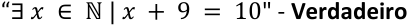

O próximo exemplo também é uma proposição e deve ser lida como "para todo 𝒙 pertencente ao conjunto dos números naturais, 𝒙 + 𝟗 = 𝟏𝟎 ". 

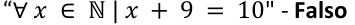

#### **Paradoxos não são proposições** 

**Frases paradoxais** não podem ser proposições justamente porque **não pode ser atribuído um único valor lógico a esse tipo de frase** . Exemplo: 

"Esta frase é uma mentira." 

Perceba que **se a frase acima for julgada como verdadeira** , então, seguindo o que a frase explica, é verdadeiro que **a frase é falsa** . Nesse caso, chega-se ao absurdo de que a frase é verdadeira e falsa ao mesmo tempo. 

Por outro lado, **se a frase acima for julgada como falsa** , então, segundo o que a frase explica, é falso que a frase é falsa e, consequentemente, **a frase é verdadeira** . Novamente, chega-se ao absurdo de que a frase é verdadeira e falsa ao mesmo tempo. 

**(TRF1/2017)** "A maior prova de honestidade que realmente posso dar neste momento é dizer que continuarei sendo o cidadão desonesto que sempre fui." 

A partir da frase apresentada, conclui-se que, não sendo possível provar que o que é enunciado é falso, então o enunciador é, de fato, honesto. 

##### **Comentários:** 

Primeiramente, devemos pressupor nessa questão que uma **pessoa honesta sempre diz a verdade** , e uma **pessoa desonesta sempre mente** . Seria melhor se a banca tivesse informado isso. 

Perceba que sentença apresentada é um **paradoxo** . Se você considerar que a pessoa é honesta, ou seja, que diz a verdade, então a frase que ela disse é verdadeira. Ocorre que, sendo a frase verdadeira, chega-se à conclusão que a pessoa é desonesta, ou seja, que ela mentiu. Isso significa que a frase é falsa. 

Chega-se então ao absurdo de que a frase é verdadeira e falsa ao mesmo tempo. Trata-se, portanto, de um paradoxo. **Não se pode dizer que o enunciador é honesto** , ou seja, **não se pode dizer que a sentença é verdadeira** , **pois não se trata de uma proposição** . 

##### **Gabarito: ERRADO.**

---

<!-- pagina: 20 -->

**Equipe Exatas Estratégia Concursos Aula 00** 

#### **Frases que exprimem opinião não são proposições** 

Em algumas questões de concurso público, podem ser apresentadas algumas frases que apresentam **alta carga de subjetividade** , que mais se aproximam de uma **mera opinião** . Esse tipo de frase não admite um único valor lógico (V ou F) e, portanto, **não se trata de uma proposição** . Por exemplo: 

"Maria é formosíssima." 

Em um primeiro momento, essa frase pode parecer que é uma proposição. Ocorre, porém, que ela carrega uma alta carga de subjetividade. **Como seria possível afirmar categoricamente que Maria é formosíssima** ? 

Veja que não é possível atribuir um valor lógico V ou F para essa frase, pois ela **<u>emite uma opinião</u>** , **que não pode ser valorada de modo objetivo** . Logo, **não se trata de uma proposição** . Vejamos outros exemplos de frases que não são proposições por conta da sua alta carga de subjetividade: 

"Josefa é mais bonita do que Maria." 

"O amor é maior do que a dor." 

**(BRDE/2023)** Entre as alternativas abaixo, qual NÃO pode ser considerada uma proposição lógica? 

a) Ana é balconista. 

b) Paulo tem 5 gatos. 

c) Porto Alegre é no Rio Grande do Sul. 

d) 1 > 9 

e) João é incrível. 

##### **Comentários:** 

Sabemos que uma proposição lógica é uma **<u>oração declarativa</u>** à qual pode ser atribuída **<u>um, e apenas um, dos dois possíveis valores lógicos</u>** <u>: verdadeiro ou falso. As frases apresentadas nas alternativas de A até D se</u> encaixam nessa definição, inclusive a expressão matemática " **1 > 9** ", que pode ser lida como " **um é maior do que nove** ". 

**Na letra E** , temos a frase " **João é incrível** ". Em um primeiro momento, a frase apresentada nessa alternativa pode parecer que é uma proposição. Ocorre, porém, que essa frase carrega uma **alta carga de subjetividade** . **Como seria possível afirmar categoricamente que João é incrível?** 

Veja que **não é possível atribuir um valor lógico V ou F** para essa frase, pois ela **<u>emite uma opinião</u>** , **que não pode ser valorada de modo objetivo** . Logo, **não se trata de uma proposição** . 

**Gabarito: Letra E.** 

**(CAU TO/2023)** A respeito de estruturas lógicas, julgue o item. 

A frase “A Terra é um geoide?” é opinativa e, portanto, não pode ser considerada uma proposição. **Comentários:**

---

<!-- pagina: 21 -->

**Equipe Exatas Estratégia Concursos Aula 00** 

Cuidado! **De fato** , **a frase em questão não é uma proposição** . Ocorre que ela não é uma proposição por ser uma **sentença interrogativa** . **Não se trata de uma frase opinativa** . 

##### **Gabarito: ERRADO.** 

Novamente, preciso que você crie um "jogo de cintura" com as questões. **É bem comum que frases subjetivas sejam consideradas proposições** . Na questão a seguir, perceba que a frase " **Ainda é cedo** " **foi tratada como uma proposição simples** , apesar de ser possível alegar que a característica "cedo" é subjetiva. 

**(CBM BA/2020)** O conceito mais fundamental de lógica é a proposição. Dentre as afirmações abaixo, assinale a alternativa correta que apresenta uma proposição. 

a) Façam silêncio. 

b) Que cansaço! 

c) Onde está meu chaveiro? 

d) Um belo exemplo de vida. 

e) Ainda é cedo. 

**Comentários:** 

##### **a) Façam silêncio. ERRADO** . 

A frase acima é uma **sentença imperativa** (indica uma ordem, <u>sugestão, pedido ou conselho). Não se trata,</u> portanto, de uma proposição. 

##### **b) Que cansaço! ERRADO** . 

Trata-se de uma **sentença exclamativa** . Logo, a frase em questão não é uma proposição. 

##### **c) Onde está meu chaveiro? ERRADO** . 

Trata-se de uma **sentença interrogativa** . Logo, a frase em questão não é uma proposição. 

##### **d) Um belo exemplo de vida. ERRADO** . 

A frase “ **Um belo exemplo de vida** ” **não é uma proposição** por **não apresentar sentido completo** . Em outras palavras, a frase em questão **não é uma proposição por não ser uma oração** , uma vez que **não há verbo** . 

##### **e) Ainda é cedo. CERTO** . 

Nessa questão, devemos considerar que a frase " **Ainda é cedo** " é uma proposição simples, apesar de ser possível alegar que a característica "cedo" é subjetiva. Relevando-se esse possível questionamento, observe que a frase em questão é uma proposição lógica, pois é uma **<u>oração declarativa</u>** à qual pode ser atribuída **<u>um, e apenas um, dos dois possíveis valores lógicos</u>** <u>: verdadeiro ou falso.</u> 

##### **Gabarito: Letra E.**

---

<!-- pagina: 22 -->

**Equipe Exatas Estratégia Concursos Aula 00** 

## Distinção entre proposição, sentença e expressão 

Agora que já vimos a definição de proposição, vamos entender as definições de **sentença** e de **expressão.** 

**Sentença** é a <u>exteriorização de um pensamento com sentido completo. Conforme já estudamos, uma</u> sentença pode ser: 

- a) **Declarativa afirmativa** ; 

- b) **Declarativa negativa** ; 

- c) **Exclamativa** ; 

- d) **Interrogativa** ; 

- e) **Imperativa** (indica ordem, sugestão, pedido ou conselho); 

- f) **Optativa** (exprime um desejo); 

- g) **Sentença aberta** . 

Note que as **sentenças declarativas são proposições** , **e as demais sentenças não são** . 

Já as **expressões** são aquelas <u>frases que não exprimem um pensamento com sentido completo.</u> Diferentemente das sentenças, as **expressões não apresentam verbo** . Exemplos: 

"Um décimo de segundo." 

"A casa de Pedro." 

A figura a seguir mostra que: 

- Dentro do conceito de **<u>sentença</u>** temos as **<u>proposições</u>** <u>, as</u> **sentenças exclamativas** , as **sentenças interrogativas** , as **sentenças imperativas** , as **sentenças optativas** e as **sentenças abertas** ; 

- Dentro do conceito de **<u>proposições</u>** , que também são sentenças, temos as **sentenças declarativas afirmativas** e as **sentenças declarativas negativas** ; e 

- Dentro do conceito de **<u>expressões</u>** temos frases que não apresentam sentido completo. Veja que não existem expressões que sejam sentenças, bem como não existem expressões que sejam proposições. 

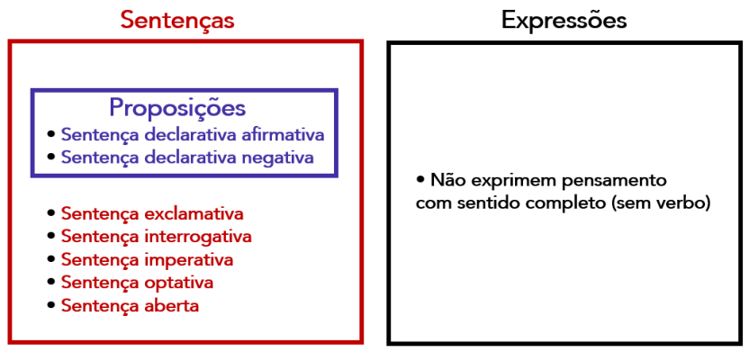

---

<!-- pagina: 23 -->

**Equipe Exatas Estratégia Concursos Aula 00** 

Note que **proposição** é um <u>caso particular</u> de **sentença** e que, por exclusão, não há proposições lógicas em expressões. 

Na maioria dos casos as bancas costumam utilizar a palavra **expressão como sinônimo de sentença** . É necessário avaliar o contexto do enunciado para estabelecer a necessidade de distinção entre esses três conceitos. **Ao longo do curso, expressão e sentença serão tratadas como sinônimos de proposição.** 

**(CM Cabo de Sto. Agostinho/2019)** Em questões de raciocínio lógico, é comum termos expressões e frases nas quais não conseguimos identificar um sujeito e nem um predicado. Por exemplo, “Quarenta e nove décimos” é uma expressão. Nesse sentido, assinale a alternativa que NÃO apresenta uma expressão. 

a) O dobro de um número. 

b) Vinte e cinco metros e 30 centímetros. 

c) A altura de Pedro é igual a 1,80m. 

d) Uma dúzia e meia. 

**Comentários:** 

As frases das **alternativas A, B e D** <u>não exprimem um pensamento com sentido completo, pois não</u> apresentam verbo. Logo, temos **expressões** nessas alternativas. 

Por outro lado, na frase " **A altura de Pedro é igual a 1,80m** ", **temos um pensamento com sentido completo** , evidenciado pela **existência do verbo** " **ser** ". **Logo** , **nesse caso** , **não temos uma expressão** . Trata-se, na verdade, de uma **proposição** . 

**Gabarito: Letra C.**

---

<!-- pagina: 24 -->

**Equipe Exatas Estratégia Concursos Aula 00** 

## A lógica bivalente e as leis do pensamento 

A lógica que vamos tratar ao longo do curso é a **Lógica Proposicional** , também conhecida por **Lógica Clássica** , **Lógica Aristotélica** ou **Lógica Bivalente** . Essa última forma de se chamar a lógica objeto do nosso estudo relaciona-se ao fato de que toda a proposição pode ser julgada com apenas um único valor lógico: verdadeiro ou falso. 

**Essa lógica obedece a três princípios** , conhecidos também por **Leis do Pensamento** : 

- a) **Princípio da Identidade** : Uma proposição verdadeira é sempre verdadeira, e uma proposição falsa é sempre falsa. 

- b) **Princípio da Não Contradição** : Uma proposição **não pode** ser **<u>verdadeira e falsa ao mesmo tempo</u>** . 

- c) **Princípio do Terceiro Excluído** : Uma proposição **<u>ou é verdadeira ou é falsa</u>** <u>. Não existe um terceiro</u> valor "talvez". 

**(Pref SJ Basílios/2023)** Assinale a assertiva representada pelo princípio que afirma que uma proposição não pode ser verdadeira e falsa ao mesmo tempo. a) Princípio do terceiro excluído. b) Princípio da identidade. c) Princípio da não contradição. d) Princípio da ambiguidade. e) Princípio da contagem. **Comentários:** Segundo o **princípio da não contradição** , uma proposição **não pode** ser **<u>verdadeira e falsa ao mesmo tempo</u>** . **Gabarito: Letra C. (Pref Palmeirante/2023)** Assinale a assertiva que apresenta corretamente o princípio da lógica que afirma que uma proposição só pode ser verdadeira ou falsa, não se admitindo outra possibilidade. a) Princípio da não contradição. b) Princípio do terceiro excluído. c) Princípio da identidade. d) Princípio da negação. **Comentários:** Segundo o **princípio do terceiro excluído** , uma proposição **<u>ou é verdadeira ou é falsa</u>** , não se admitindo um terceiro valor "talvez". **Gabarito: Letra B.**

---

<!-- pagina: 25 -->

**Equipe Exatas Estratégia Concursos Aula 00** 

# **PROPOSIÇÕES SIMPLES** 

###### **Proposições simples** 

**Definição de proposição simples Proposição simples** : não pode ser dividida em proposições menores. **Negação de proposições simples** A negação de uma proposição simples **p** gera uma nova proposição simples ~ **p** . Uso do "não" e de expressões correlatas: " **não** ", " **não é verdade que** ", " **é falso que** ". A nova proposição ~ **p** sempre terá o valor lógico oposto da proposição original **p** . A maneira mais comum de se negar uma sentença declarativa negativa consiste em **remover o elemento** " **não** ", transformando-a em uma sentença declarativa afirmativa. **q** : "Taubaté **não** é a capital de Mato Grosso." ~ **q** : "Taubaté **é** a capital de Mato Grosso." **Negação usando antônimos** : nem sempre o uso de um antônimo nega a proposição original. Para a proposição "O Grêmio <u>venceu o jogo", é</u> **errado** dizer que a negação seria "O Grêmio <u>perdeu</u> o jogo", porque o jogo poderia ter empatado. 

Para negar uma proposição simples formada por uma oração principal e por orações subordinadas, **devemos negar a oração principal** . **Dupla negação:** ~ **(** ~ **p) ≡ p** . **Várias negações em sequência:** 

• Número **par** de negações: proposição **equivalente a original** ; e • Número **ímpar** de negações: nova proposição é a **negação da proposição original** . **Descompasso entre a língua portuguesa e a linguagem proposicional:** para a linguagem proposicional, " **<u>não</u>** vou comer **<u>nada</u>** " seria equivalente a "vou comer". Na língua portuguesa, tal frase significa que a pessoa realmente não vai comer coisa alguma. **p** : "Vou comer." ~ **p** : "Vou comer **<u>nada</u>** <u>."</u> ~ **(** ~ **p)** : " **<u>Não</u>** vou comer **<u>nada</u>** <u>."</u>

---

<!-- pagina: 26 -->

**Equipe Exatas Estratégia Concursos Aula 00** 

## Definição de proposição simples 

##### Dizemos que uma proposição é **simples** quando ela **<u>não pode ser dividida em proposições menores</u>** <u>.</u> 

De outra forma, podemos dizer que a proposição é simples quando ela é formada por uma única parcela elementar indivisível que pode ser julgada como verdadeira ou falsa. 

É muito comum representar as proposições simples por uma letra do alfabeto. Exemplos: 

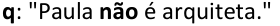

Observe que as proposições simples **p** e **r** são sentenças **declarativas** **<u>afirmativas</u>** , enquanto **q** é uma sentença **declarativa negativa** <u>.</u> 

## Negação de proposições simples 

### Uso do “não” e de expressões correlatas 

A negação de uma proposição simples **p** gera uma nova proposição simples. 

Essa nova proposição simples é denotada pelo símbolo ~ ou **¬** seguido da letra que representa a proposição original. Ou seja, a negação de **p** é representada por ~ **p** ou **¬p (lê-se: "não p")** . Exemplo: 

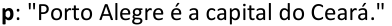

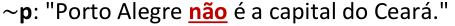

Uma outra forma de se negar a proposição original sugerida é inserir expressões como "não é verdade que...", "é falso que..." no início: 

~ **p** : " **<u>Não é verdade que</u>** Porto Alegre é a capital do Ceará." 

~ **p** : " **<u>É falso que</u>** Porto Alegre é a capital do Ceará." 

Valor lógico da negação de uma proposição 

A nova proposição ~ **p** sempre terá o valor lógico oposto da proposição original **p** . Isso significa que se **p** é ~ ~ falsa, **p** é verdadeira, e se **p** é verdadeira, **p** é falsa. Essa ideia pode ser representada na seguinte tabela, conhecida por **tabela-verdade** :

---

<!-- pagina: 27 -->

**Equipe Exatas Estratégia Concursos Aula 00** 

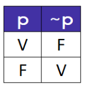

Cada linha da tabela representa uma possível combinação de valores lógicos para as proposições **p** e ~ **p** . A ~ primeira linha representa o fato de que se **p** assumir o valor V, **p** deve assumir o valor F. Já a segunda linha representa o fato de que se **p** assumir o valor F, ~ **p** deve assumir o valor V. 

### Negação de proposições que são sentenças declarativas negativas 

Observe a proposição simples **q** abaixo, que é uma sentença declarativa negativa: 

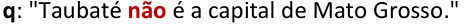

Sua negação pode ser escrita das seguintes formas: 

~ **q** : " **<u>Não é verdade que</u>** Taubaté **não** é a capital de Mato Grosso." 

~ **q** : " **<u>É falso que</u>** Taubaté **não** é a capital de Mato Grosso." 

~ **q** : " **Taubaté é a capital de Mato Grosso** ." 

Note que a maneira mais comum de se negar uma <u>sentença declarativa negativa consiste em</u> **remover o elemento** " **não** ", transformando-a em uma sentença declarativa afirmativa. 

Logo, a negação mais comum de "Taubaté **não** é a capital de Mato Grosso" corresponde à proposição "Taubaté é a capital de Mato Grosso". 

**Cuidado! Como visto no exemplo anterior** , a negação de uma proposição não necessariamente contém expressões como " **não** ", " **não é verdade que** ", " **é falso que** ", etc. **Isso se deve ao fato de que a proposição original pode já conter essas expressões** . 

Em resumo, a maneira mais simples e comum de se negar uma <u>sentença declarativa negativa</u> consiste em **remover o elemento** " **não** ", transformando-a em uma <u>sentença declarativa afirmativa.</u>

---

<!-- pagina: 28 -->

**Equipe Exatas Estratégia Concursos Aula 00** 

**(CGIA SC/2020)** A proposição p equivale à “Ana não dirige moto” e a proposição q equivale à “Heitor ~ ~ administra o mercado”. Assinale a alternativa que apresenta corretamente p e q, nesta ordem. a) “Ana dirige apenas carro”; “Heitor não administra o mercado”. b) “Ana dirige moto”; “Heitor administra a farmácia”. c) “Ana administra o mercado”; “Heitor não dirige moto”. d) “Ana dirige moto”; “Heitor não administra o mercado”. e) “Ana não administra o mercado”; “Heitor dirige moto”. **Comentários:** Na proposição **p** temos originalmente uma sentença declarativa negativa: **p:** “Ana **não** dirige moto.” A maneira mais comum de se negar uma sentença declarativa negativa ==5460== consiste em **remover o elemento** " **não** ", transformando-a em uma sentença declarativa afirmativa. Nesse caso, temos: ~ **p:** “Ana dirige moto.” Por outro lado, na proposição **q** temos uma sentença declarativa afirmativa: **q** : "Heitor administra o mercado" Para negá-la, podemos inserir o elemento "não": ~ **q** : "Heitor **não** administra o mercado" Logo, ~ **p** e ~ **q** correspondem “ **Ana dirige moto** ” e “ **Heitor não administra o mercado** ”. **Gabarito: Letra D. (IDAM/2019)** A negação de uma negação, na lógica proposicional, é equivalente a: a) Uma verdade b) Uma afirmação c) Uma negação d) Uma negação duas vezes mais forte **Comentário:** Por "negação de uma negação", entende-se que a questão quis se referir à negação de uma proposição do tipo sentença declarativa negativa. Ao se negar uma sentença declarativa negativa, obtém-se uma <u>sentença declarativa afirmativa, ou uma</u> "afirmação", conforme a letra B. Exemplo: **p** : "Pedro **não** é engenheiro." ~ **p** : "Pedro é engenheiro." Uma possível "pegadinha" seria a alternativa A. Ocorre que **verdade é um valor lógico (V)** , e não sabemos se a proposição original é verdadeira ou se é falsa. **Gabarito: Letra B.** 

**_www.estrategiaconcursos.com.br_** 

https://t.me/KakashiAssinaturasBot

---

<!-- pagina: 29 -->

**Equipe Exatas Estratégia Concursos Aula 00** 

### Negação usando antônimos 

É possível negar uma proposição simples utilizando antônimos. Exemplo: 

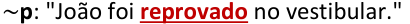

Veja que faz sentido dizer que " **João foi** **<u>reprovado</u> no vestibular** " corresponde à negação de " **João foi** **<u>aprovado</u> no vestibular** ". Isso porque, nesse contexto, " **aprovado** " e " **reprovado** " abarcam todas as possibilidades possíveis. 

O uso de antônimos para se negar uma proposição deve ser visto com muito cuidado. Veja a seguinte proposição: 

**p:** "O Grêmio **<u>venceu</u>** o jogo contra o Inter." 

Observe que um antônimo de " **vencer** " é " **perder** ", porém essa palavra não nega a proposição anterior. **Não está certo dizer que a negação da proposição seria** " **O Grêmio perdeu o jogo contra o Inter** ". 

Note que, nesse contexto, " **vencer** " e " **perder** " não abarcam todas as possibilidades, pois o jogo poderia ter <u>empatado. Nesse caso, não resta outra opção senão negar a proposição com um dos modos tradicionais:</u> 

Perceba que " **não venceu** " **abarca as possibilidades** " **perder** " e " **empatar** ". 

Nem sempre o uso de um antônimo nega corretamente uma proposição simples. 

**(CRMV RJ/2022)** Em relação a estruturas lógicas e à lógica de argumentação, julgue o item a seguir. 

A negação de “O canguru vermelho é o maior marsupial existente” é “O canguru vermelho é o menor marsupial existente”. 

**Comentários:** 

Originalmente, temos a seguinte proposição: 

**p:** “O canguru vermelho é o **maior** marsupial existente" 

A questão sugere que essa proposição seja negada substituindo a palavra " **maior** " pelo seu antônimo " **menor** ".

---

<!-- pagina: 30 -->

**Equipe Exatas Estratégia Concursos Aula 00** 

Veja que **essa suposta negação não abarca todas as possibilidades possíveis** , pois **o canguru vermelho pode não ser o maior marsupial sem que ele seja exatamente o menor** . Em outras palavras, o canguru vermelho poderia, por exemplo, ter um tamanho mediano. 

Logo, uma possibilidade correta de se negar a proposição original seria: 

~ **p:** “O canguru vermelho **não** é o **maior** marsupial existente" **Gabarito: ERRADO. (CRM SC/2022)** Com relação a estruturas lógicas, julgue o item. “Joinville é a cidade mais bonita do mundo” é a negação de “Florianópolis é a cidade mais bonita do mundo”. **Comentários:** Originalmente, temos a seguinte proposição: **p:** “Florianópolis é a cidade mais bonita do mundo " Uma possibilidade para se negar essa proposição consiste em inserir a palavra " **não** ": ~ **p:** “Florianópolis **não** é a cidade mais bonita do mundo”. 

Note que **a suposta negação sugerida pelo enunciado não abarca todas as possibilidades de se negar a proposição original** . Isso porque, para que Florianópolis não seja a cidade mais bonita do mundo, não é necessário que Joinville seja a cidade mais bonita do mundo. 

**Gabarito: ERRADO.** 

**(Pref. Paraí/2019)** A negação da proposição simples “Está quente em Paraí” é: 

a) Está frio em Paraí. b) Se está quente em Paraí então chove. 

c) Está quente em Paraí ou frio. 

d) Ou está quente em Paraí ou chove. 

e) Não é verdade que está quente em Paraí. **Comentários:** 

**Sempre evite o uso de antônimos para negar uma proposição** . Lembre-se que uma das formas tradicionais de se negar uma proposição sem utilizar antônimos é incluir " **não é verdade que** " no início dela. 

**p** : "Está quente em Paraí." 

~ **p** : " **Não é verdade** que está quente em Paraí." 

A pegadinha da questão era a letra A, que utiliza o antônimo "frio" para negar a palavra "quente" presente na proposição original. Observe que " **frio** " **não nega a palavra** " **quente** ", pois a cidade pode estar nem quente nem fria. 

##### **Gabarito: Letra E.**

---

<!-- pagina: 31 -->

**Equipe Exatas Estratégia Concursos Aula 00** 

### Negação de período composto por subordinação 

Seja a proposição simples **p** : 

**p** : "Pedro **respondeu** que **estudou** todo o edital." 

Perceba que temos dois verbos, "respondeu" e "estudou" e, portanto, estamos diante de duas orações. Para negar a proposição corretamente, **nega-se a oração principal** . 

##### ~ **p** : "Pedro **<u>não</u> respondeu** que **estudou** todo o edital." 

Note que a oração "que **estudou** todo o edital" é subordinada à oração principal, devendo ser tratada como objeto direto. Podemos reescrever assim: 

**p** : "Pedro **respondeu** ~~que estudou todo o edital.~~ " 

**p** : "Pedro **respondeu** **<u>isso</u>** <u>."</u> 

Nesse caso, podemos negar a proposição simples do seguinte modo: 

##### ~ **p** : "Pedro **<u>não</u> respondeu** **<u>isso</u>** <u>."</u> 

Se voltarmos para a estrutura original, temos: 

##### ~ **<u>p</u>** : "Pedro **<u>não</u> respondeu** **<u>que estudou todo o edital</u>** <u>."</u> 

Observe que é errado negar a oração subordinada. Isso significa que "Pedro **respondeu** que **<u>não</u> estudou** todo o edital" **não é a negação** de "Pedro **respondeu** que **estudou** todo o edital". 

Para negar uma **proposição simples** formada por uma oração principal e por orações **<mark>subordinadas</mark>** <mark>, devemos</mark> **<u><mark>negar a oração principal</mark></u>** <mark>.</mark> 

<mark>Em um período composto por subordinação,</mark> **<mark>nem sempre a oração principal aparece primeiro</mark>** <mark>.</mark> Isso significa que **nem sempre é o primeiro verbo que deve ser negado** .

---

<!-- pagina: 32 -->

**Equipe Exatas Estratégia Concursos Aula 00** 

**(BNB/2022)** A negação de “Não basta que juízes sejam equilibrados nos seus votos” está corretamente expressa em “Basta que juízes não sejam equilibrados nos seus votos”. **Comentários:** 

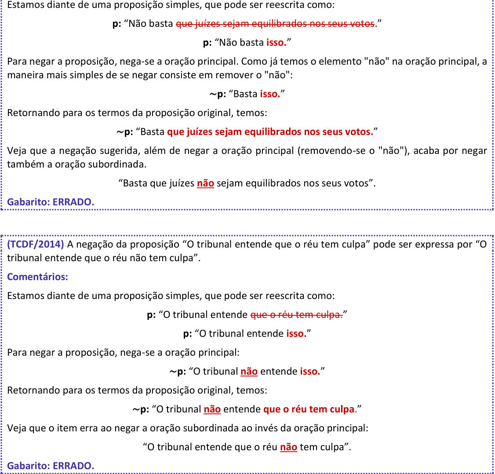

<!-- Start of picture text -->
Estamos diante de uma proposição simples, que pode ser reescrita como: p:  “Não basta  que juízes sejam equilibrados nos seus votos. ” p:  “Não basta  isso. ” Para negar a proposição, nega-se a oração principal. Como já temos o elemento "não" na oração principal, a maneira mais simples de se negar consiste em remover o "não": ~ p:  “Basta  isso. ” Retornando para os termos da proposição original, temos: ~ p:  “Basta  que juízes sejam equilibrados nos seus votos. ” Veja que a negação sugerida, além de negar a oração principal (removendo-se o "não"), acaba por negar também a oração subordinada. “Basta que juízes  não sejam equilibrados nos seus votos”. Gabarito: ERRADO. (TCDF/2014)  A negação da proposição “O tribunal entende que o réu tem culpa” pode ser expressa por “O tribunal entende que o réu não tem culpa”. Comentários: Estamos diante de uma proposição simples, que pode ser reescrita como: p:  “O tribunal entende  que o réu tem culpa.” p:  “O tribunal entende  isso. ” Para negar a proposição, nega-se a oração principal: ~ p:  “O tribunal  não entende  isso. ” Retornando para os termos da proposição original, temos: ~ p:  “O tribunal  não entende  que o réu tem culpa .” Veja que o item erra ao negar a oração subordinada ao invés da oração principal: “O tribunal entende que o réu  não tem culpa”. Gabarito: ERRADO. <!-- End of picture text -->

### Dupla negação e generalização para mais de duas negações 

Um resultado importante que pode ser obtido da tabela-verdade é que a **negação da negação de p** sempre tem **valor lógico igual a proposição p** . Para obter esse resultado importante, primeiramente inserimos na tabela verdade as possibilidades de **p** e ~ **p** :

---

<!-- pagina: 33 -->

**Equipe Exatas Estratégia Concursos Aula 00** 

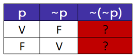

~ ~ O próximo passo é preencher os valores de ( **p** ) observando que **essa proposição é a negação da proposição** ~ **p.** 

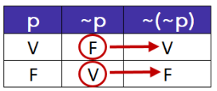

Agora basta reconhecer que a **primeira coluna e a última coluna da tabela verdade são exatamente iguais** . Isso significa que, para os dois valores lógicos que **p** <u>pode assumir (V ou F), os valores lógicos assumidos pela proposição</u> ~ **(** ~ **p)** <u>são exatamente iguais.</u> 

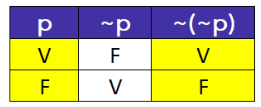

Quando duas proposições assumem valores lógicos necessariamente iguais, dizemos que as **proposições são equivalentes.** Ressalto que trataremos sobre equivalências lógicas em aula futura. Nesse momento, quero que você sabia que representação da equivalência lógica é dada utilizando o símbolo " **≡"** ou " ⇔” . Portanto: 

##### ~ ~ **( p) ≡ p** 

Quando tivermos várias negações em sequência, podemos utilizar a seguinte regra: 

- Se tivermos um **número par de negações** , temos uma proposição **equivalente a original** ; e 

- Se tivermos um **número ímpar de negações** , temos a **negação da proposição original** . 

**(INÉDITA) Acerca da lógica de proposições, julgue o item a seguir.** 

~ ~ ~ ~ ~ **A proposição ( ( ( p))) sempre tem o valor lógico igual ao de p.** 

##### **Comentários:** 

Quando tivermos várias negações em sequência, podemos utilizar a seguinte regra: 

- Se tivermos um **número par de negações** , temos uma proposição **equivalente a original** ; e 

- Se tivermos um número **ímpar de negações** , temos a **negação da proposição original** . 

Como problema apresenta quatro negações, temos que a proposição é equivalente a original, ou seja, a proposição ~ ( ~ ( ~ ( ~ **p** ))) apresenta sempre o mesmo valor lógico de **p** , não de ~ **p** como afirma o enunciado. 

**Gabarito: ERRADO.**

---

<!-- pagina: 34 -->

**Equipe Exatas Estratégia Concursos Aula 00** 

# **PROPOSIÇÕES COMPOSTAS** 

###### **Proposições compostas** 

- **Proposição composta:** resulta da combinação de duas ou mais proposições simples por meio do uso de **conectivos.** 

- **Valor lógico (V ou F) de uma proposição composta:** depende dos valores lógicos atribuídos às proposições simples que a compõem. 

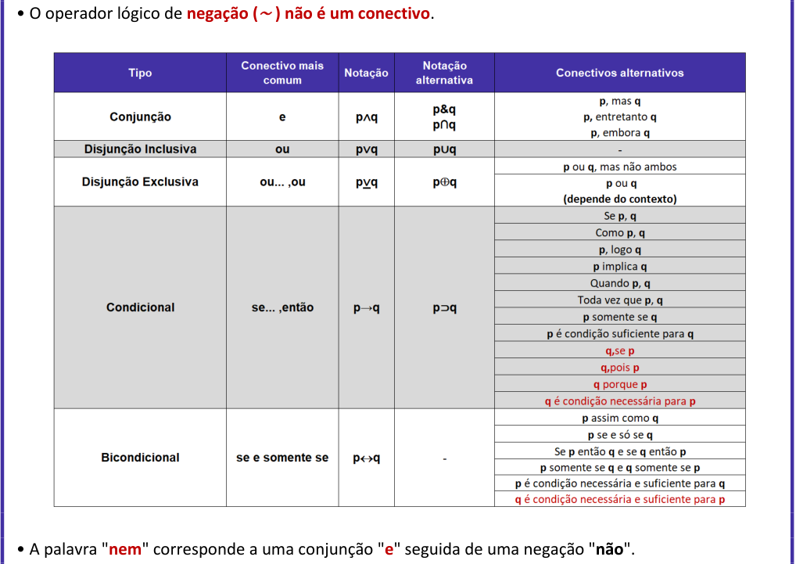

<!-- Start of picture text -->
• O operador lógico de  negação ( ~  ) não é um conectivo . • A palavra " nem " corresponde a uma conjunção " e " seguida de uma negação " não ". <!-- End of picture text -->

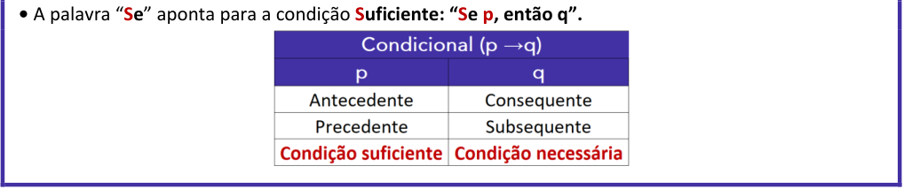

<!-- Start of picture text -->
•  A palavra “ Se ” aponta para a condição Suficiente: “Se p, então q”. <!-- End of picture text -->

---

<!-- pagina: 35 -->

**Equipe Exatas Estratégia Concursos Aula 00** 

**Conjunção (p** ∧ **q):** é **verdadeira** somente quando **ambas as parcelas são verdadeiras** . **Disjunção Inclusiva (p** ∨ **q):** é **falsa** somente quando **ambas as parcelas são falsas** . **Disjunção Exclusiva (p** <u>∨</u> **<u>q):</u>** é **falsa** somente quando **ambas as parcelas tiverem o mesmo valor lógico** . **Condicional (p** → **q):** é **falsa** somente quando a **primeira parcela é verdadeira** e a **segunda parcela é falsa** . **Bicondicional (p**  **q):** é **verdadeira** somente quando **ambas as parcelas tiverem o mesmo valor lógico** . 

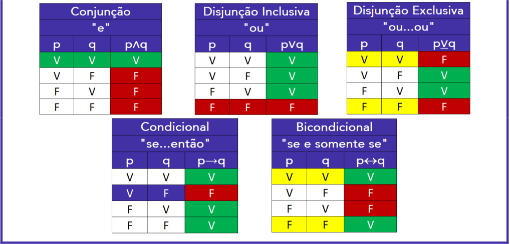

---

<!-- pagina: 36 -->

**Equipe Exatas Estratégia Concursos Aula 00** 

## Definição de proposição composta 

**Proposição composta** é uma proposição que resulta da combinação de duas ou mais proposições simples por meio do uso de **conectivos** . Exemplo: considere as proposições simples **p** e **q** : 

**p** : "Maria foi ao cinema." 

**q** : "João foi ao parque." 

Unindo essas duas proposições simples por meio do conectivo " **e** ", **<u>forma-se uma proposição distinta</u>** , que chamaremos de **R:** 

**R:** " Maria foi ao cinema **e** João foi ao parque." 

Essa proposição **R** é uma proposição composta, resultante da associação das proposições simples **p** e **q** por meio de um conectivo. 

Se unirmos as mesmas proposições simples por meio do conectivo " **ou** ", forma-se uma nova proposição composta **S** diferente da proposição **R** : 

**S** : "Maria foi ao cinema **ou** João foi ao parque." 

O **valor lógico** (V ou F) **de uma proposição composta depende dos valores lógicos atribuídos às proposições simples que a compõem** . 

Podemos dizer, no exemplo acima, que o valor lógico (V ou F) que a proposição composta **R** assume é função dos valores lógicos assumidos pelas proposições simples **p** e **q** que a compõem. O mesmo pode ser dito da proposição composta **S,** que utiliza um conectivo distinto. 

As relações entre os valores lógicos das proposições simples e o consequente valor lógico da proposição composta obtida pelo uso de conectivos serão estudadas a seguir. Antes disso, vamos a um exercício. 

**(Pref. Flores da Cunha/2022)** Analise as sentenças abaixo: 

I. Lucas é médico ou João é engenheiro. 

II. João é alto e Paulo é professor. 

III. Antônio é gaúcho ou Carlos é mecânico. 

De acordo com as proposições acima, assinale a alternativa que representa corretamente uma proposição composta. 

a) Apenas I. 

b) Apenas II. 

c) Apenas III. 

d) Apenas I e II. 

e) I, II e III.

---

<!-- pagina: 37 -->

**Equipe Exatas Estratégia Concursos Aula 00** 

##### **Comentários:** 

Vamos analisar cada sentença. 

##### **I. Lucas é médico ou João é engenheiro.** 

Note que: 

- " **Lucas é médico** " é uma proposição simples; e 

- " **João é engenheiro** " é uma proposição simples. 

Logo " **Lucas é médico ou João é engenheiro** " **é uma proposição composta** formada por duas proposições simples unidas pelo conectivo " **ou** ". 

##### **II. João é alto e Paulo é professor.** 

Note que: 

- " **João é alto** " é uma proposição simples; e 

- " **Paulo é professor** " é uma proposição simples. 

Logo " **João é alto e Paulo é professor** " **é uma proposição composta** formada por duas proposições simples unidas pelo conectivo " **e** ". 

##### **III. Antônio é gaúcho ou Carlos é mecânico.** 

Note que: 

- " **Antônio é gaúcho** " é uma proposição simples; e 

- " **Carlos é mecânico** " é uma proposição simples. 

Logo " **Antônio é gaúcho ou Carlos é mecânico** " **é uma proposição composta** formada por duas proposições simples unidas pelo conectivo " **ou** ". 

Portanto, é correto afirmar que as **sentenças I, II e III** representam **proposições compostas** . 

**Gabarito: Letra E.**

---

<!-- pagina: 38 -->

**Equipe Exatas Estratégia Concursos Aula 00** 

## Conectivos lógicos 

Os **conectivos** possíveis são divididos em **cinco tipos** , havendo formas diferentes de representá-los na língua portuguesa, conforme será visto adiante. 

Os cinco conectivos e as suas formas mais usuais na língua portuguesa são: **Conjunção** (" **e** "), **Disjunção inclusiva** (" **ou** "), **Disjunção exclusiva** (" **ou...ou** "), **Condicional** (" **se...então** ") e **Bicondicional** (" **se e somente se** "). 

A negação de uma proposição simples gera uma nova proposição simples. Assim, **o operador lógico de negação (** ~ **) não é um conectivo** . 

### Conjunção (p ∧ q) 

O operador lógico **"e"** é um conectivo do tipo **conjunção** . É representado pelo símbolo " ∧ ” ou " **&** " (menos comum). As bancas podem também representar a conjunção com o símbolo de intersecção da teoria dos conjuntos: "∩". 

Voltando ao exemplo inicial. Sejam **p** e **q** as proposições: 

**p:** "Maria foi ao cinema." 

**q:** "João foi ao parque." 

A proposição composta **R** , resultante da união das proposições simples por meio do conectivo **"e"** , é representada por **p** ∧ **q** : 

**p** ∧ **q: "** Maria foi ao cinema **e** João foi ao parque." 

Vamos agora verificar os valores lógicos (V ou F) que a proposição composta **p** ∧ **q** pode receber, dependendo dos valores atribuídos a **p** e a **q.** 

**Exemplo 1:** Maria, no mundo dos fatos, realmente foi ao cinema. Nesse caso, **p** é verdadeiro. Além disso, João de fato foi ao parque. Isso significa que **q** também é verdadeiro. 

Dado esse contexto, se analisarmos a frase "Maria foi ao cinema e João foi ao parque", podemos dizer que essa frase é verdadeira. Isso significa que **<u>p</u>** ∧ **<u>q</u>** é verdadeiro. 

Inserindo este raciocínio em uma tabela-verdade, teremos:

---

<!-- pagina: 39 -->

**Equipe Exatas Estratégia Concursos Aula 00** 

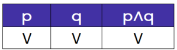

Voltemos à história de Maria e João: 

**Exemplo 2:** consideremos agora que Maria realmente foi ao cinema e, com isso, a proposição **p** é verdadeira. Porém, desta vez, João não foi ao parque. Isso significa que **q** é falso. Lembre-se que a proposição **q** afirma que “João foi ao parque”. Se João não foi de fato ao parque, a proposição **q** é falsa. 

Dado esse contexto, se analisarmos a frase "Maria foi ao cinema e João foi ao parque", podemos dizer que ela é falsa, pois João, no mundo dos fatos, não foi ao parque. Isso significa que o valor lógico da proposição composta **<u>p</u>** ∧ **<u>q</u>** é falso. 

Inserindo esse novo resultado na tabela-verdade que começamos a preencher a partir do exemplo 1, teremos: 

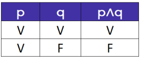

Considere agora a seguinte possibilidade: 

**Exemplo 3:** dessa vez, no plano dos fatos, Maria resolveu não ir ao cinema. Nesse caso, o valor lógico da proposição **p** é falso. Por outro lado, João realmente foi ao parque. Isso significa que o valor lógico da proposição **q** é verdadeiro. 

Dado esse novo contexto, se analisarmos a frase "Maria foi ao cinema e João foi ao parque", podemos dizer que ela é falsa, pois Maria não foi ao cinema. Isso significa que o valor lógico da <u>proposição composta</u> **<u>p</u>** ∧ **<u>q</u>** é falso. 

A nossa tabela atualizada fica da seguinte forma: 

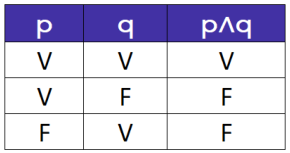

Por fim, a quarta possibilidade para a história dos seus amigos Maria e João é a seguinte:

---

<!-- pagina: 40 -->

**Equipe Exatas Estratégia Concursos Aula 00** 

**Exemplo 4:** Maria novamente não foi ao cinema. Nesse caso, o valor lógico da proposição **p** é falso. Além disso, seu amigo João também não foi ao parque. Isso significa que o valor lógico da proposição **q** é falso. 

Dado esse contexto, se analisarmos a frase "Maria foi ao cinema e João foi ao parque", podemos dizer que ela é falsa, pois tanto Maria quanto João não foram ao cinema. Isso significa que o valor lógico da proposição **<u>p</u>** ∧ **<u>q</u>** é falso. 

Entendido o quarto exemplo, finalmente a tabela-verdade está completa: 

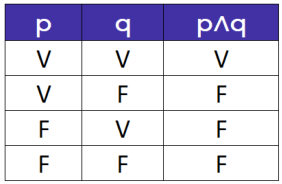

**Esqueçamos a história de Maria e João!** Ela foi fundamental para você entender o raciocínio por trás dos conceitos, mas podemos generalizar os resultados obtidos. A tabela abaixo, conhecida como **tabela-verdade da conjunção,** resume os valores lógicos que a **conjunção p** ∧ **q** pode assumir em função dos valores assumidos por **p** e por **q** . 

A conjunção **p** ∧ **q** é **verdadeira** somente quando **ambas as parcelas são verdadeiras** . **Nos demais casos** , **a conjunção p** ∧ **q** é **falsa** . 

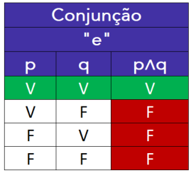

---

<!-- pagina: 41 -->

**Equipe Exatas Estratégia Concursos Aula 00** 

**(MGS/2022)** Sejam as proposições lógicas simples: 

**p:** Flávia gosta de sorvete de morango. 

**q:** Jonathan gosta de milkshake. 

A proposição lógica composta **p** ∧~ **q** corresponde a: 

a) Se Flávia gosta de sorvete de morango, então Jonathan não gosta de milkshake 

b) Se Jonathan gosta de milkshake, então Flávia não gosta de sorvete de morango 

c) Flávia gosta de sorvete de morango ou Jonathan não gosta de milkshake d) Flávia gosta de sorvete de morango e Jonathan não gosta de milkshake **Comentários:** 

Temos as seguintes proposições simples: 

**p:** "Flávia gosta de sorvete de morango." 

**q:** "Jonathan gosta de milkshake." 

A negação de **q** , representada por ~ **q** , pode ser escrita assim: 

~ **q:** "Jonathan **não** gosta de milkshake." 

Portanto, a conjunção **p** ∧~ **q** corresponde a: 

**p** ∧~ **q** : " **[** Flávia gosta de sorvete de morango **] e [** Jonathan **não** gosta de milkshake **]** ." **Gabarito: Letra D.** 

**(Pref. S Parnaíba/2022)** Considere a proposição **A** : **p** ∧ **¬q** . 

Para que a proposição **A** seja falsa, 

a) basta que a proposição **p** seja verdadeira ou que a proposição **q** seja falsa. 

b) basta que a proposição **p** seja falsa ou que a proposição **q** seja verdadeira. 

c) é necessário que a proposição **p** seja verdadeira e que a proposição **q** seja falsa. 

d) é necessário que a proposição **p** seja falsa e que a proposição **q** seja verdadeira. **Comentários:** 

Vimos que a conjunção **p** ∧ **q** é **verdadeira** somente quando **ambas as parcelas p e q são verdadeiras** . **Nos demais casos** , **a conjunção p** ∧ **q** é **falsa** . 

Para o problema em questão, temos **p** ∧~ **q** . Nesse caso, **p** ∧~ **q** é **verdadeira** somente quando **ambas as parcelas p e** ~ **q são verdadeiras** . **Nos demais casos** , **a conjunção p** ∧~ **q** é **falsa** . Portanto, para que **p** ∧~ **q** seja falsa, basta que basta que a proposição **<u>p</u>** <u>seja falsa ou que a proposição</u> ~ **<u>q</u>** <u>seja falsa. Em outras palavras, basta que a proposição</u> **<u>p</u>** <u>seja falsa ou que a proposição</u> **<u>q</u>** <u>seja verdadeira.</u> **Gabarito: Letra B.**

---

<!-- pagina: 42 -->

**Equipe Exatas Estratégia Concursos Aula 00** 

**(CRO SC/2023)** Considerando que a proposição “Sydney é a capital da Austrália” é falsa e que a proposição “A Austrália é localizada na Oceania” é verdadeira, julgue o item. 

A proposição “Sydney não é a capital da Austrália e a Austrália não é localizada na Oceania” é verdadeira. 

**Comentários:** 

Considere as seguintes proposições simples: 

**s:** "Sydney é a capital da Austrália" 

**a: "** A Austrália é localizada na Oceania" 

Note que a proposição composta sugerida pelo enunciado pode ser descrita por ~ **s** ∧~ **a** : 

~ **s** ∧~ **a** :" **[** Sydney **não** é a capital da Austrália **] e [** a Austrália **não** é localizada na Oceania **]** " 

Segundo o enunciado: 

- **s** é falso; e 

- **a** é verdadeiro. 

Consequentemente: 

- ~ **s** é verdadeiro; e 

- ~ **a** é falso. 

Note, portanto, que temos uma conjunção ~ **s** ∧~ **a** em que uma das parcelas, ~ **a** , é falsa. Consequentemente, **essa conjunção é falsa** . Isso porque, **para que a conjunção fosse verdadeira** , **ambas as parcelas** ~ **s e** ~ **a precisariam ser verdadeiras** . 

Portanto, **a proposição** “ **Sydney não é a capital da Austrália e a Austrália não é localizada na Oceania** ” **é falsa** . 

**Gabarito: ERRADO.** 

#### **Formas alternativas de se representar a conjunção "e"** 

" " É importante você saber que **a palavra mas também é utilizada para representar uma conjunção** . 

Apesar de na Língua Portuguesa a palavra "mas" apresentar uma ideia de oposição, ou seja, um sentido adversativo, devemos ter em mente que, **para fins de Lógica de Proposições** , **"mas" é igual ao conectivo "e"** .

---

<!-- pagina: 43 -->

**Equipe Exatas Estratégia Concursos Aula 00** 

**Isso também vale para outras expressões adversativas ou concessivas** , como " **entretanto** " e “ **embora** ”: devemos tratar essas expressões como se fosse o conectivo " **e** ". 

**(IFMT/2022)** Considere a proposição: “Adelaide namora, mas não consegue casar.” 

Nessa proposição, o conectivo lógico é: 

a) disjunção inclusiva. 

b) bicondicional. 

c) disjunção exclusiva. 

d) condicional. 

e) conjunção. 

##### **Comentários:** 

A palavra " **mas** " é utilizada para representar uma **conjunção** . Logo, para a Lógica de Proposições, a proposição em questão corresponde a: 

“ **[** Adelaide namora **] e [não** consegue casar **]** .” 

##### **Gabarito: Letra E.** 

**(CM POA/2012)** Considere a proposição: Paula é brasileira, entretanto não gosta de futebol. Nesta proposição, está presente o conetivo lógico denominado como: 

a ~~)~~ bicondicional. 

b) condicional. 

c) conjunção. 

d) disjunção inclusiva. 

e) disjunção exclusiva. 

##### **Comentários:** 

A palavra " **mas** ", assim como outras expressões adversativas ou concessivas como " **entretanto** ", é utilizada para representar uma **conjunção** . Logo, para a Lógica de Proposições, a proposição em questão corresponde a: 

" **[** Paula é brasileira **] e [não** gosta de futebol **]** " 

**Gabarito: Letra C** . 

É importante também que você saiba que a palavra " **nem** " corresponde a uma conjunção " **e** " seguida de uma negação " **não** ". Considere, por exemplo, as seguintes proposições: 

**e:** "Pedro estuda." 

**t** : "Pedro trabalha." 

Note que a proposição composta "Pedro **não** estuda **nem** trabalha." corresponde a ~ **e** ∧~ **t** :

---

<!-- pagina: 44 -->

**Equipe Exatas Estratégia Concursos Aula 00** 

~ **e** ∧~ **t** : " **[** Pedro **não** estuda **] e [** Pedro **não** trabalha **]** ." 

**Nem** = " **E** ... **não** " 

### Disjunção inclusiva (p ∨ q) 

O operador lógico **"ou"** é um conectivo do tipo **disjunção inclusiva** . É representado pelo símbolo " ∨ ”. As bancas podem também representar a disjunção inclusiva com o símbolo de união da teoria dos conjuntos: " ∪ ". Exemplo: 

**p** ∨ **q: "** Pedro vai ao parque **ou** Maria vai ao cinema." 

A **tabela-verdade da disjunção inclusiva** sintetiza os valores lógicos que a proposição composta **p** ∨ **q** pode assumir em função dos valores assumidos por **p** e por **q** . 

A disjunção inclusiva **p** ∨ **q** é **falsa** somente quando **ambas as parcelas são falsas** . **Nos demais casos** , **p** ∨ **q é verdadeira** . 

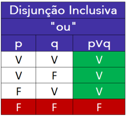

---

<!-- pagina: 45 -->

**Equipe Exatas Estratégia Concursos Aula 00** 

Para exemplificar, vamos utilizar a mesma história dos seus amigos Maria e João. Digamos que a proposição **p** ," João vai ao parque", seja verdadeira e que a proposição **q** , "Maria vai ao cinema", seja falsa. 

Nesse caso, a proposição **p** ∨ **q "** Pedro vai ao parque **ou** Maria vai ao cinema" é verdadeira, pois para a disjunção inclusiva ser falsa, ambas as proposições devem ser falsas. Para a disjunção inclusiva ser verdadeira, basta que uma das proposições que a compõem seja verdadeira. 

Vamos a um outro exemplo: 

**a** : "7 + 1 =10" **(F)** 

**b: "** Café não é uma bebida." **(F)** 

Nesse caso, a disjunção inclusiva **a** ∨ **b** é dada por **:** 

**a** ∨ **b: "** 7 + 1 = 10 **ou** café não é uma bebida." **(F)** 

Essa proposição é falsa, <u>pois ambas as proposições simples</u> **a** e **b** são falsas. 

**(AGRAER MS/2022)** Considere as seguintes sentenças: 

• **p** : Cachorros podem voar. 

• **q** : Thiago é inteligente. 

É correto afirmar que a sentença ~ **p** ∨~ **q** é: 

a) Cachorros não podem voar. 

b) Thiago não é inteligente. 

c) Cachorros podem voar e Thiago é inteligente. 

d) Cachorros não podem voar ou Thiago não é inteligente. 

e) Cachorros podem voar ou Thiago é inteligente. 

**Comentários:** 

Temos as seguintes proposições simples: 

**p:** "Cachorros podem voar." 

**q:** "Thiago é inteligente." 

As negações de **p** e de **q** , representadas por ~ **p** e por ~ **q** , podem ser representadas assim: 

~ **p:** "Cachorros **não** podem voar." 

~ **<u>q:</u>** "Thiago **não** é inteligente."

---

<!-- pagina: 46 -->

**Equipe Exatas Estratégia Concursos Aula 00** 

Portanto, a disjunção inclusiva ~ **p** ∨~ **q** corresponde a: 

~ **p** ∨~ **q** : " **[** Cachorros **não** podem voar **] ou [** Thiago **não** é inteligente **]** ." 

##### **Gabarito: Letra D.** 

**(MGS/2022)** Maria, uma estudante dedicada, observou que o valor lógico de uma proposição “ **p** ” é falso e que o valor lógico de uma proposição “ **q** ” é verdadeiro. Dessa forma, Maria conseguiu afirmar, de forma correta, que o valor lógico da proposição composta é: 

a) **p** ∨ **q** é verdade b) **p** ∧ **q** é verdade c) **p** → **q** é falso d) **p**  **q** é verdade **Comentários:** Vimos que a disjunção inclusiva **p** ∨ **q** é **falsa** somente quando **ambas as parcelas p e q são falsas** . **Nos demais casos, p** ∨ **q é verdadeira** . Logo, se **p** for falso e **q** for verdadeiro, **p** ∨ **q** será verdadeira. O **gabarito** , portanto, é **letra A** . **<u>Observação</u>** <u>: ainda veremos o que significa os símbolos "</u> → " e "". Além disso, note que a conjunção **p** ∧ **q** não é verdadeira, pois, para que a conjunção **p** ∧ **q** seja verdadeira, ambas as parcelas precisam ser verdadeiras. 

**Gabarito: Letra A.** 

|**(Pref S Parnaíba/2022)**Considere a proposição**A**:**¬p**∨**¬q**.|
|---|
|Para que a proposição**A**seja falsa,|
|a) basta que uma das proposições,**p**ou**q**, seja verdadeira.|
|b) basta que uma das proposições,**p**ou**q**, seja falsa.|
|c) é necessário que ambas as proposições,**p**e**q**, sejam verdadeiras.|
|d) é necessário que ambas as proposições,**p**e**q**, sejam falsas.|
|**Comentários:**|
|Vimos que a disjunção inclusiva**p**∨**q**é**falsa**somente quando**ambas** **as** **parcelas** **pe q são falsas**.**Nos demais** **casos, p**∨**qé verdadeira**.|
|Para o problema em questão, temos~**p**∨~**q**. Nesse caso,~**p**∨~**q**é**falsa**somente quando**ambas** **as** **parcelas** ~**pe **~**q são falsas**.|
|Portanto, para que~**p**∨~**q**seja falsa, é necessário queambas as proposições, **p**e**q**,sejam verdadeiras.|
|**Gabarito: Letra C.**|

---

<!-- pagina: 47 -->

**Equipe Exatas Estratégia Concursos Aula 00** 

#### **Sentido de inclusão do conectivo "ou"** 

Considere novamente a seguinte disjunção inclusiva: 

**p** ∨ **q: "** Pedro vai ao parque **ou** Maria vai ao cinema." 

Na lógica de proposições, o uso do **conectivo "ou"** **<u>sozinho</u>** será, **na grande maioria das situações,** com sentido de **inclusão** . Essa inclusão significa que: 

- A **primeira** possibilidade pode ocorrer **isoladamente** : somente Pedro vai ao parque e Maria não vai ao cinema; 

- A **segunda** possibilidade pode ocorrer **isoladamente** : somente Maria vai ao cinema e Pedro não vai ao parque; e 

- A primeira e a segunda possibilidade **podem ocorrer simultaneamente** : Pedro vai ao parque e também Maria vai ao cinema. 

##### _Professor, por que você disse que o conectivo "ou" sozinho tem sentido de inclusão na grande maioria das_ _<u>situações? Há alguma exceção?</u>_ 

Calma concurseiro, veremos o porquê no tópico seguinte. Antes disso, vamos resolver uma questão. 

**(CEFET MG/2021)** Na afirmação “Gosto de pão ou de carne”, o uso do conectivo “ou” indica 

a) exclusão e, com isso, essa pessoa gosta somente de carne. 

b) exclusão e, com isso, essa pessoa não gosta nem de pão nem de carne. 

c) exclusão e, por isso, deve-se entender que essa pessoa gosta só de pão e não gosta de carne. 

d) inclusão e, por isso, significa que a pessoa gosta, com certeza, tanto de pão quanto de carne. 

e) inclusão, significando que a pessoa pode gostar só de pão, só de carne ou pode gostar dos dois ao mesmo tempo. 

##### **Comentários:** 

Na afirmação “ **Gosto de pão ou de carne** ”, o uso do conectivo “ **ou** ” tem um sentido de **inclusão** . Isso significa que 

- A **primeira** possibilidade pode ocorrer **isoladamente** : a pessoa pode gostar só de pão; 

- A **segunda** possibilidade pode ocorrer **isoladamente** : a pessoa pode gostar só de carne; e 

- A primeira e a segunda possibilidade **podem ocorrer simultaneamente** : a pessoa pode gostar de pão e de carne ao mesmo tempo. 

O **gabarito** , portanto, é **letra E** . 

**Gabarito: Letra E.**

---

<!-- pagina: 48 -->

**Equipe Exatas Estratégia Concursos Aula 00** 

### Disjunção exclusiva (p <u>∨ q)</u> 

O operador lógico **"ou...,ou"** é um conectivo do tipo **disjunção exclusiva** . É representado pelo símbolo " <u>∨</u> ” ou "  " (menos comum). Exemplo: 

##### **p** <u>∨</u> **<u>q:</u>** " **Ou** Pedro vai ao parque, **ou** Maria vai ao cinema." 

Na **disjunção exclusiva** as duas proposições **não podem ser verdadeiras ao mesmo tempo** . O sentido de **exclusão** conferido por esse conectivo significa que: 

- A **primeira** possibilidade pode ocorrer **isoladamente** : somente Pedro vai ao parque e Maria não vai ao cinema; 

- A **segunda** possibilidade pode ocorrer **isoladamente** : somente Maria vai ao cinema e Pedro não vai ao parque; e 

- **A primeira e a segunda possibilidade não podem ocorrer simultaneamente** , ou seja: 

   - Maria não pode ir ao cinema com Pedro indo ao parque; e 

   - Pedro não pode ir ao parque com Maria indo ao cinema. 

A **tabela-verdade da disjunção exclusiva** resume os valores lógicos que a proposição composta **<u>p</u>** <u>∨</u> **<u>q</u>** pode assumir em função dos valores assumidos por **p** e por **q** . 

A disjunção exclusiva **<u>p</u>** <u>∨</u> **<u>q</u>** é **falsa** somente quando **ambas as parcelas apresentam o mesmo valor lógico** . **Nos demais casos** , **<u>p</u>** <u>∨</u> **<u>q</u> é verdadeira** . 

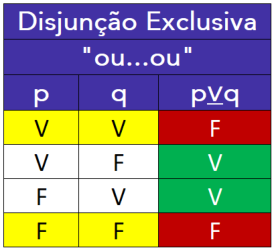

Vamos exemplificar essa tabela-verdade com um novo exemplo. Considere as proposições: 

**p: "** Hoje é domingo." 

**q: "** Hoje é segunda-feira." 

**<u>p</u>** <u>∨</u> **<u>q:</u>** " **Ou** hoje é domingo, **ou** hoje é segunda-feira"

---

<!-- pagina: 49 -->

**Equipe Exatas Estratégia Concursos Aula 00** 

Existem quatro possibilidades de atribuição dos valores lógicos V ou F a estas proposições: 

1) Primeiro caso: **p:** "Hoje é domingo" e **q** : **"** Hoje é segunda-feira" são ambas verdadeiras. Nesse caso, **<u>p</u>** <u>∨</u> **<u>q</u>** : " **Ou** hoje é domingo, **ou** hoje é segunda-feira" é falsa, pois não é possível ser domingo e segunda-feira ao mesmo tempo. 

2) Segundo caso: hoje é domingo. Nesse caso, **<u>p</u>** <u>∨</u> **<u>q</u>** : " **Ou** hoje é domingo, **ou** hoje é segunda-feira" é verdadeira, pois uma (somente uma) das proposições é verdadeira - no caso, a proposição **p.** 

3) Terceiro caso: hoje é segunda-feira. Nesse caso, **p** <u>∨</u> **<u>q</u>** : " **Ou** hoje é domingo, **ou** hoje é segundafeira" também é verdadeira, pois uma (somente uma) das proposições é verdadeira – no caso, a proposição **q.** 

4) Quarto caso: hoje não é domingo nem segunda-feira. Nesse caso **p** e **q** são falsas e **<u>p</u>** <u>∨</u> **q** : " **Ou** hoje é domingo, **ou** hoje é segunda-feira" é falsa. 

**(IFMA/2023)** Considere as proposições compostas a seguir: 

**P** : “Paulo vai ao IFMA e Paulo é carioca”; 

**Q** : “Ou Paulo vai ao IFMA ou Paulo é carioca”. 

Sabendo que as proposições **P** e **Q** têm o mesmo valor-verdade, ou seja, ambas são verdadeiras ou ambas são falsas, então, é correto afirmar que 

a) Paulo vai ao IFMA. 

b) Paulo é carioca. 

c) Paulo não vai ao IFMA e Paulo não é carioca. 

d) Paulo vai ao IFMA e Paulo não é carioca. 

e) Paulo não vai ao IFMA e Paulo é carioca. 

**Comentários:** 

Considere as seguintes proposições simples: 

**p:** "Paulo vai ao IFMA." 

**q:** "Paulo é carioca." 

Note que as proposições compostas **P** e **Q** podem ser descritas assim: 

**p** ∧ **q:** " **[** Paulo vai ao IFMA **] e [** Paulo é carioca **]** .” 

**p** <u>∨</u> **<u>q:</u>** " **Ou [** Paulo vai ao IFMA **] ou [** Paulo é carioca **]** .” 

Nesse problema, **ambas as proposições compostas p** ∧ **<u>q e p</u>** <u>∨</u> **<u>q devem ter o mesmo valor lógico</u>** .

---

<!-- pagina: 50 -->

**Equipe Exatas Estratégia Concursos Aula 00** 

Comparando as tabelas-verdade das duas proposições compostas, podemos perceber que **a conjunção "e" e a disjunção inclusiva "ou" apresentam o mesmo valor lógico somente na última linha** . 

Em outras palavras, **as duas proposições compostas apresentam o mesmo valor lógico** (falso) **quando ambas as parcelas são falsas** . 

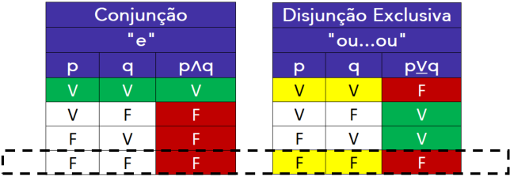

Logo, **<u>p</u>** <u>deve ser falso e</u> **<u>q</u>** <u>deve ser falso.</u> 

Vamos analisar as alternativas e assinalar a correta, ou seja, assinalar aquela que apresenta uma proposição verdadeira. 

a) **p** − proposição simples falsa, pois **p** é falso. 

b) **q** − proposição simples falsa, pois **q** é falso. 

c) ~ **p** ∧~ **q** − conjunção verdadeira, pois ~ **p** e ~ **q** são ambos verdadeiros. Esse é o **gabarito** . 

d) **p** ∧~ **q** − conjunção falsa, pois um dos termos, **p** , é falso. 

e) ~ **p** ∧ **q** − conjunção falsa, pois um dos termos, **q** , é falso. 

**Gabarito: Letra C.** 

#### **Formas alternativas de se representar a disjunção exclusiva "ou...ou"** 

O uso da expressão **"...ou..., mas não ambos"** é utilizado como **disjunção exclusiva** . Exemplo: 

##### **p** <u>∨</u> **<u>q: "</u>** Pedro vai ao parque **<u>ou</u>** Maria vai ao cinema **, mas não ambos** ." 

Além disso, é importante que você saiba que, **em algumas questões** , **é necessário supor que o uso do "ou" sozinho** , exatamente como é usado na disjunção inclusiva, **corresponde a uma disjunção exclusiva** . 

**Em algumas questões** , **é necessário supor que o uso do "ou" sozinho** , exatamente como é usado na disjunção inclusiva, **corresponde a uma disjunção exclusiva** . 

Esse tipo de "pegadinha" costuma ocorrer quando, considerando o contexto, as proposições simples não podem ser simultaneamente verdadeiras. Exemplo:

---

<!-- pagina: 51 -->

**Equipe Exatas Estratégia Concursos Aula 00** 

**p** <u>∨</u> **<u>q:</u>** "José é cearense **ou** José é paranaense." 

Perceba que José não pode ser cearense e paranaense ao mesmo tempo, e com isso **podemos considerar o "ou" sozinho como exclusivo** . 

Muito cuidado ao realizar essa consideração na hora da prova. **Utilize esse entendimento como último recurso.** 

**(CREFONO 7/2014)** Assinale a alternativa que representa o mesmo tipo de operação lógica que “O fonoaudiólogo é gaúcho ou paulista”. 

a) O pesquisador gosta de música ou de biologia. 

b) O comentarista é paranaense ou matemático. 

c) O analista é fonoaudiólogo ou dentista. 

d) O professor faz musculação ou natação. 

e) O gato está vivo ou morto. 

##### **Comentários:** 

Observe que, nessa questão, tanto a proposição do enunciado quanto as alternativas apresentam o conectivo "ou" sozinho e, **em um primeiro momento** , **poderíamos achar que todas as assertivas se tratam de disjunção inclusiva** . 

Ocorre que, ao contextualizar a frase do enunciado, percebe-se que **o fonoaudiólogo não pode ser ao mesmo tempo gaúcho e paulista** , de modo que **devemos procurar nas alternativas um "ou" exclusivo** . 

Essa situação só ocorre na **letra E** , que apresenta um "ou" exclusivo justamente porque **o gato não pode estar vivo e morto ao mesmo tempo** . 

**Gabarito: Letra E.** 

### → Condicional (p q) 

O operador lógico **"se... ,então"** é um conectivo do tipo **condicional** . É representado pelo símbolo " → ” ou " ⊃ ” (menos comum). Exemplo: 

**p** → **q: “Se** Pedro vai ao parque, **então** Maria vai ao cinema.” 

A **tabela-verdade da proposição condicional** resume os valores lógicos que a proposição composta **p** → **q** pode assumir em função dos valores assumidos por **p** e por **q** . 

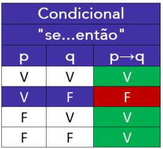

---

<!-- pagina: 52 -->

**Equipe Exatas Estratégia Concursos Aula 00** 

A condicional **p** → **q** é **falsa** somente quando a **primeira parcela é verdadeira** e a **segunda parcela é falsa** . **Nos demais casos** , **p** → **q é verdadeira** . 

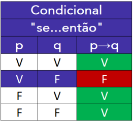

Vamos exemplificar essa tabela-verdade. 

Considere as proposições sobre Frederico: 

**p:** "Frederico é matemático." 

**q** : "Frederico sabe somar." 

**p** → **q** : " **Se** Frederico é matemático, **então** Frederico sabe somar." 

Analisemos as possibilidades: 

1) **p:** "Frederico é matemático" e **q** : "Frederico sabe somar" são ambas verdadeiras. Nesse caso, se realmente Frederico é matemático, não há dúvida que ele sabe somar, e a proposição condicional **p** → **q** : " **Se** Frederico é matemático, **então** Frederico sabe somar" é verdadeira. 

2) **p:** "Frederico é matemático" é verdadeira e **q** : "Frederico sabe somar" é falsa. Na situação apresentada, temos que Frederico é matemático e não sabe somar. A proposição condicional é falsa. 

3) **p:** "Frederico é matemático" é falsa e **q** : "Frederico sabe somar" é verdadeira. Nessa situação, temos uma pessoa que não se formou em matemática, mas que sabe somar. A condicional é verdadeira. 

4) **p:** "Frederico é matemático" e **q** : "Frederico sabe somar" são ambas falsas. Esse caso é possível, pois Frederico pode ser uma criança recém-nascida, que não é bacharel em matemática e que não sabe somar. A condicional é verdadeira.

---

<!-- pagina: 53 -->

**Equipe Exatas Estratégia Concursos Aula 00** 

**(CRMV/2022)** Admitindo que as proposições “Pedro é o pai de Anderson” e “Waldir é o pai de Pedro” são verdadeiras e que a proposição “Roseana é neta de Rodolfo” é falsa, julgue o item. 

“Se Roseana é neta de Rodolfo, então Pedro é o pai de Anderson” é uma proposição falsa. **Comentários:** Considere as seguintes proposições simples: **r:** “Roseana é neta de Rodolfo.” **p:** “Pedro é o pai de Anderson.” Note que a condicional sugerida pode ser escrita na forma **r** → **p** : **r** → **p** : “ **Se [** Roseana é neta de Rodolfo **]** , **então [** Pedro é o pai de Anderson **]** .” Segundo o enunciado, **r** é **falso** e **p** é **verdadeiro** . Logo, a condicional **r** → **p** é da forma **F** → **V** . Trata-se de uma **condicional verdadeira** , pois a condicional só é falsa quando a primeira parcela é verdadeira e a segunda parcela é falsa (caso **V** → **F** ). **Gabarito: ERRADO. (CRP 9/2022)** Se é verdadeira a proposição “Se a psicologia não é o estudo da alma, então Poliana é psicóloga.”, então a proposição “Poliana é psicóloga.” é necessariamente verdadeira. **Comentários:** Considere as seguintes proposições simples: **a:** “Psicologia é o estudo da alma.” **p:** “Poliana é psicóloga.” Note que a condicional sugerida pode ser escrita na forma ~ **a** → **p** : ~ **a** → **p** : “ **Se [** a psicologia **não** é o estudo da alma **]** , **então [** Poliana é psicóloga **]** .” Sabemos que a condicional ~ **a** → **p** é **falsa** somente quando **a primeira parcela é verdadeira e a segunda parcela é falsa** . **Nos demais casos** , ~ **a** → **p é verdadeira** . Logo, **a condicional** ~ **a** → **p é verdadeira nos seguintes casos** : • **V** → **V** : ~ **a** verdadeiro e **p** verdadeiro; • **F** → **V** : ~ **a** falso e **p** verdadeiro; • **F** → **F** : ~ **a** falso e **p falso** <u>;</u> Portanto, uma vez que a condicional ~ **a** → **p** é verdadeira, **não necessariamente p é verdadeiro** . **Gabarito: ERRADO.** 

https://t.me/KakashiAssinaturasBot

---

<!-- pagina: 54 -->

**Equipe Exatas Estratégia Concursos Aula 00** 

**(CRA PR/2022)** Sendo **p** , **q** e **r** três proposições, julgue o item. Se a proposição **(p** ∧ **q)** → **r** é falsa, então **p** e **q** são verdadeiras e **r** é falsa. **Comentários:** A condicional **(p** ∧ **q)** → **r** é **falsa** somente quando **a primeira parcela (p** ∧ **q) é verdadeira e a segunda parcela r é falsa** . Logo, para essa condicional ser falsa: • **(p** ∧ **q)** é verdadeiro; e • **r** é falso. Para que a conjunção **(p** ∧ **q)** seja verdadeira, ambas as parcelas precisam ser verdadeiras. Logo: • **p** é verdadeiro. • **q** é verdadeiro. • **r** é falso. **Gabarito: CERTO.** 

**(UNICAMP/2023)** Considere falsa a seguinte afirmação: Se eu almocei, então não estou com fome. Com base nas informações apresentadas, é verdade que: a) Eu não almocei. b) Eu não estou com fome. c) Eu não almocei e estou com fome. d) Eu não almocei e não estou com fome. e) Eu almocei e estou com fome. **Comentários:** Considere as seguintes proposições simples: **a:** “Eu almocei.” **f:** “Estou com fome.” Note que a condicional sugerida pode ser escrita na forma **a** →~ **f** : **a** →~ **f:** “ **Se [** eu almocei **]** , **então [não** estou com fome **]** .” Sabemos que a condicional **a** →~ **f** é **falsa** somente quando **a primeira parcela é verdadeira e a segunda parcela é falsa** . Logo: • **a** é verdadeiro; e • ~ **f** é falso.

---

<!-- pagina: 55 -->

**Equipe Exatas Estratégia Concursos Aula 00** 

Como ~ **f** é falso, **f** é verdadeiro. Portanto: 

- **a** é verdadeiro; e 

- **f** é verdadeiro. 

Com base nisso, devemos assinalar a alternativa que apresenta uma proposição verdadeira. 

a) ~ **a** − proposição simples falsa, pois ~ **a** é falso. 

b) ~ **f** − proposição simples falsa, pois ~ **f** é falso. 

c) ~ **a** ∧ **f** − conjunção falsa, pois um dos termos, ~ **a** , é falso. 

d) ~ **a** ∧~ **f** − conjunção falsa, pois ambos os termos, ~ **a** e ~ **f** , são falsos. 

e) **a** ∧ **f** − conjunção verdadeira, pois **a** e **f** são ambos verdadeiros. Esse é o **gabarito** . 

**Gabarito: Letra E.** 

#### **Formas alternativas de se representar a condicional "se...então"** 

Algumas vezes as bancas gostam de esconder a proposição condicional utilizando conectivos diferentes do clássico " **se...então** ". Vamos apresentar aqui as possibilidades que mais aparecem nas provas. Considere novamente as proposições simples: 

**p:** "Pedro vai ao parque." 

**q:** "Maria vai ao cinema." 

A forma clássica de se representar a condicional **p** → **q** é a seguinte: 

**p** → **q: “Se** Pedro vai ao parque, **então** Maria vai ao cinema.” 

Essa mesma condicional **p** → **q** pode também ser representada das seguintes formas: 

- **Se p** , **q** . Observe que o “então” foi omitido. 

**p** → **q: "Se** Pedro vai ao parque, Maria vai ao cinema." 

- **Como p** , **q** . 

**p** → **q: "Como** Pedro vai ao parque, Maria vai ao cinema." 

- **p** , **logo q** . 

**p** → **q: "** Pedro vai ao parque, **logo** Maria vai ao cinema." 

- **p implica q.** 

**p** → **q:** "Pedro ir ao parque **implica** Maria ir ao cinema."

---

<!-- pagina: 56 -->

**Equipe Exatas Estratégia Concursos Aula 00** 

- **Quando p** , **q** . 

**p** → **q:** " **Quando** Pedro vai ao parque, Maria vai ao cinema." 

- **Toda vez que p** , **q** . 

**p** → **q:** " **Toda vez que** Pedro vai ao parque, Maria vai ao cinema." 

- **p somente se q.** 

**p** → **q: "** Pedro vai ao parque **somente se** Maria vai ao cinema." 

Como será visto mais à frente, o conectivo **"se e somente se"** é **bicondicional** . Seu uso é diferente do conectivo **condicional "somente se"** . 

- **q, se p** . Nesse caso ocorre a **<u>inversão da ordem</u>** entre **p** e **q** . 

**p** → **q: "** Maria vai ao cinema, **se** Pedro for ao parque." 

- **q, pois p** . Novamente ocorre a **<u>inversão da ordem</u>** entre **p** e **q** . 

**p** → **q: "** Maria vai ao cinema, **pois** Pedro vai ao parque." 

- **q porque p** . Novamente ocorre a **<u>inversão da ordem</u>** entre **p** e **q** . 

**p** → **q: "** Maria vai ao cinema **porque** Pedro vai ao parque." 

---

<!-- pagina: 57 -->

**Equipe Exatas Estratégia Concursos Aula 00** 

Muita atenção para os casos em que ocorre a inversão da ordem entre **p** e **q** . **As quatro condicionais a seguir** , para fins de Lógica de Proposições, **são exatamente iguais** e apresentam a mesma notação **p** → **q** : 

**p** → **q:** " **Se** <mark>Pedro vai ao parque,</mark> **então** <mark>Maria vai ao cinema.</mark> " 

**p** → **q: "** <mark>Maria vai ao cinema,</mark> **se** <mark>Pedro ir ao parque.</mark> " 

**p** → **q: "** <mark>Maria vai ao cinema,</mark> **pois** <mark>Pedro vai ao parque.</mark> " 

**p** → **q: "** <mark>Maria vai ao cinema</mark> **porque** <mark>Pedro vai ao parque.</mark> " 

**(Pref Betim/2022)** Tendo-se como premissa que a proposição simples “agentes municipais são públicos” tenha valor falso, é CORRETO deduzir que o valor lógico da proposição “agentes municipais são públicos, logo devem ser concursados” é: 

a) Falso. 

b) Verdadeiro. 

c) Inconclusivo. 

d) Não se trata de uma proposição. 

**Comentários:** 

Considere as seguintes proposições simples: 

**p:** “Agentes municipais são públicos.” 

**c:** “Agentes municipais devem ser concursados.” 

Note que a proposição composta sugerida é a condicional **p** → **c** escrita na forma “ **p** , **logo q** ”: 

**p** → **c** : “ **[** Agentes municipais são públicos **]** , **logo [** devem ser concursados **]** .” 

Essa condicional pode ser escrita por meio do conectivo tradicional **“se...então** ”: 

**p** → **c** : “ **Se [** os agentes municipais são públicos **]** , **então [** devem ser concursados **]** .” 

Sabemos que a condicional **p** → **c** é **falsa** somente quando **a primeira parcela é verdadeira e a segunda parcela é falsa** . **Nos demais casos** , **p** → **c é verdadeira** . 

A questão informa que a primeira parcela, **p** , é falsa. Veja que, nesse caso, **a condicional p** → **c será sempre verdadeira** , **qualquer que seja o valor de c** ( **V ou F** ). Isso porque, qualquer que seja o valor de **c** , não teremos o caso em que a condicional é falsa, ou seja, **não teremos o caso V** → **F** . 

**Gabarito: Letra B.** 

https://t.me/KakashiAssinaturasBot

---

<!-- pagina: 58 -->

**Equipe Exatas Estratégia Concursos Aula 00** 

**(Pref Irauçuba/2022/adaptada)** Considere a proposição a seguir. 

“Quando Ana vai à escola de ônibus ou de carro, ela sempre leva um guarda-chuva e também dinheiro.” 

Assinale a opção que expressa corretamente a proposição acima em linguagem da lógica formal, assumindo que: 

**P** = “Ana vai à escola de ônibus”. 

**Q** = “Ana vai à escola de carro”. 

**R** = “Ana sempre leva um guarda-chuva”. 

**S** = “Ana sempre leva dinheiro”. 

a) **P** ∨ **(Q** → **(R** ∧ **S))** 

b) **(P** → **Q)** ∨ **R** 

c) **P** → **(Q** ∨ **R)** 

##### d) **(P** ∨ **Q)** → **(R** ∧ **S)** 

##### **Comentários:** 

Note que a proposição composta sugerida é uma condicional escrita na forma “ **Quando p** , **q** ”. Nesse caso, a primeira parcela é disjunção inclusiva **P** ∨ **Q** , e a segunda parcela é a conjunção **R** ∧ **S** . Observe: 

**(P** ∨ **Q)** → **(R** ∧ **S):** “ **Quando [(** Ana vai à escola de ônibus **) ou (** Ana vai à escola de carro **)]** , **[(** Ana sempre leva um guarda-chuva **) e (** Ana sempre leva dinheiro **)]** .” 

Reescrevendo a frase na língua portuguesa de modo a eliminar repetições desnecessárias, temos: 

**(P** ∨ **Q)** → **(R** ∧ **S):** “ **Quando [(** Ana vai à escola de ônibus **) ou (** de carro **)]** , **[(** ela sempre leva um guarda-chuva **) e (** também dinheiro **)]** .” 

Portanto, é correto afirmar que a proposição composta corresponde a **(P** ∨ **Q)** → **(R** ∧ **S)** . 

**Gabarito: Letra D.** 

#### **Condição suficiente e condição necessária** 

Quando temos uma condicional **p** → **q** , podemos dizer que: 

- **p** é condição **suficiente** para **q;** 

- **q** é condição **necessária** para **p.** 

Considere a condicional abaixo: 

**p** → **q: “Se** <mark>Pedro vai ao parque,</mark> **então** <mark>Maria vai ao cinema</mark> .” 

Podemos reescrevê-la dos seguintes modos:

---

<!-- pagina: 59 -->

**Equipe Exatas Estratégia Concursos Aula 00** 

**p** → **q: “** <mark>Pedro ir ao parque</mark> **é condição suficiente para** <mark>Maria ir ao cinema</mark> .” 

**p** → **q:** **<mark>“</mark>** <mark>Maria ir ao cinema</mark> **é condição necessária para** <mark>Pedro ir ao parque</mark> .” 

Uma forma de não confundir condição necessária com condição suficiente e vice-versa é lembrar que **a** " **palavra "se"** do " **se...então aponta para a condição suficiente** . 

##### A palavra “ **S** e” aponta para a condição **S** uficiente 

<mark>“</mark> **<mark>S</mark>** <mark>e</mark> **<mark>p</mark>** <mark>, então</mark> **<mark>q</mark>** <mark>”</mark> 

**<mark>p</mark>** <mark>é a condição</mark> **<mark>S</mark>** <mark>uficiente</mark> **q** é a condição necessária 

Como será visto mais à frente, a expressão **"condição necessária e suficiente"** se refere às proposições que compõem o conectivo **bicondicional** . 

**(CODHAB/2018) R** : Se alguém estuda muitas horas sobre cálculo, então é aprovado em seu exame de cálculo. 

Considerando a sentença apresentada acima, julgue o item que se segue. 

A sentença **R** significa que estudar muitas horas sobre cálculo é condição necessária para ser aprovado em seu exame de cálculo. 

**Comentários:** 

Considere as seguintes proposições simples: 

**e:** “Alguém estuda muitas horas sobre cálculo.” 

**a:** “Alguém é aprovado em seu exame de cálculo.” 

Note que a proposição composta **R** é a condicional **e** → **a** : 

**e** → **a** : **Se** **<u>[</u>** <mark>alguém estuda muitas horas sobre cálculo</mark> **<u>]</u>** , **então** **<u><mark>[</mark></u>** <mark>é aprovado em seu exame de cálculo</mark> **<u>]</u>** .”

---

<!-- pagina: 60 -->

**Equipe Exatas Estratégia Concursos Aula 00** 

Essa condicional pode ser escrita dos seguintes modos: 

**e** → **a: “[** <mark>Estudar muitas horas sobre cálculo</mark> **] é condição suficiente para [** <mark>ser aprovado em seu exame de cálculo</mark> **<mark>]</mark>** .” 

**e** → **a: “[** <mark>Ser aprovado em seu exame de cálculo</mark> **] é condição necessária para [** <mark>estudar muitas horas sobre cálculo</mark> **<mark>]</mark>** .” 

Logo, é errado afirmar que “ **estudar muitas horas sobre cálculo é condição necessária para ser aprovado em seu exame de cálculo** ”. Isso porque **estudar muitas horas sobre cálculo é a condição suficiente** <u>.</u> **Gabarito: ERRADO.** 

**(CEFET MG/2022)** Considere a tirinha a seguir. 

Sobre a implicação lógica apresentada na tirinha, é correto afirmar que: 

a) Existir é condição suficiente de pensar. 

b) Pensar é condição suficiente de existir. 

c) Pensar é condição necessária de existir. 

d) Existir é condição necessária e suficiente de pensar. 

e) Pensar é condição necessária e suficiente de existir. 

**Comentários:** 

Considere as seguintes proposições simples: 

**p:** “Eu penso.” 

**e:** “Eu existo.” 

Note a implicação lógica apresentada no primeiro quadrinho da tirinha é condicional **p** → **e** escrita na forma “ **p** , **logo q** ”: 

**p** → **e:** “ **[** Eu penso **]** , **logo [** (eu) existo **]** .” 

Essa condicional pode ser escrita por meio do conectivo tradicional **“se...então** ”: 

**<u>p</u>** → **e:** “ **Se** **<u><mark>[</mark></u>** <mark>eu penso</mark> **<u><mark>]</mark></u>** , **então [** <u><mark>(eu) existo</mark></u> **<u><mark>]</mark></u>** .”

---

<!-- pagina: 61 -->

**Equipe Exatas Estratégia Concursos Aula 00** 

Uma vez que temos a condicional **p** → **e** escrita com o conectivo tradicional “ **se...então** ”, podemos reescrever essa condicional dos seguintes modos: 

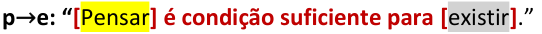

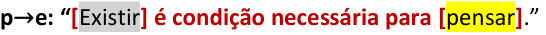

O **gabarito** , portanto, é **letra B** . 

**Gabarito: Letra B.** 

#### **Nomenclatura dos termos que compõem o condicional** 

Quando temos uma condicional **p** → **q** , a primeira parcela **p** e a segunda parcela **q** que compõem essa condicional têm nomes especiais: 

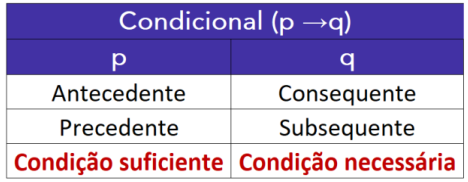

Não confunda **condição suficiente** com **subsequente** , pois a palavra “subsequente” significa **"aquele que segue imediatamente a outro"** . 

**(PGE PE/2019)** Se uma proposição na estrutura condicional — isto é, na forma **p** → **q** , em que **p** e **q** são proposições simples — for falsa, então o precedente será, necessariamente, falso. 

**Comentários:** 

A questão afirma que, para uma condicional **p** → **q** ser falsa, devemos ter o precedente **p** necessariamente falso. 

Da tabela-verdade condicional, sabemos que a **condicional é falsa somente no caso V** → **F** , isto é, somente quando o **<u>precedente é verdadeiro</u>** ao mesmo tempo em que o **<u>subsequente é falso</u>** . 

O **gabarito** , portanto, é **ERRADO** . 

**Gabarito: ERRADO.** 

**(CM Maringá/2017)** Uma proposição condicional tem valor falso se ambos, antecedente e consequente, forem falsos. 

##### **Comentários:** 

Da tabela-verdade condicional, sabemos que a **condicional é falsa somente no caso V** → **F** , isto é, somente quando o **<u>antecedente é verdadeiro</u>** ao mesmo tempo em que o **<u>consequente é falso</u>** . **Gabarito: ERRADO.**

---

<!-- pagina: 62 -->

**Equipe Exatas Estratégia Concursos Aula 00** 

### Bicondicional (p  q) 

O operador lógico **"se e somente se"** é um conectivo do tipo **bicondicional** . É representado pelo símbolo "  ”. Exemplo: 

**p**  **q: "** Pedro vai ao parque **se e somente se** Maria vai ao cinema." 

A **tabela-verdade da proposição bicondicional** sintetiza os valores lógicos que a proposição composta **p**  **q** pode assumir em função dos valores assumidos por **p** e por **q** . 

A proposição bicondicional **p**  **q** é **verdadeira** somente quando **ambas as proposições apresentam o mesmo valor lógico** . 

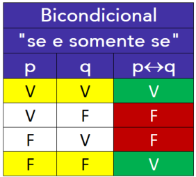

Vamos exemplificar essa tabela-verdade com um novo exemplo. Considere as proposições: 

**p: "** Hoje é dia 01/09." 

**q: "** Hoje é o primeiro dia do mês de setembro." 

**p**  **q:** "Hoje é dia 01/09 **se e somente se** hoje é o primeiro dia do mês de setembro." 

Perceba que se **p** e **q** são proposições com valor lógico verdadeiro no exemplo dado, necessariamente a frase "Hoje é dia 01/09 **se e somente se** hoje é o primeiro dia do mês de setembro" é verdadeira. Além disso, se é falso que hoje é dia 01/09 e falso que hoje é o primeiro dia do mês de setembro, a proposição composta continua verdadeira.

---

<!-- pagina: 63 -->

**Equipe Exatas Estratégia Concursos Aula 00** 

Quando somente **p** ou somente **q** forem verdadeiros, chegamos a um absurdo, pois é impossível ser verdade que hoje seja dia 01/09 se hoje não for necessariamente o primeiro dia do mês de setembro. A situação inversa também é absurda, pois não há como ser verdadeiro o fato de hoje ser o primeiro dia do mês de setembro se hoje não for dia 01/09. Assim, o valor lógico da <u>proposição composta é falso.</u> 

**(CREF 3/2023)** No que se refere à lógica proposicional, julgue o item. 

A sentença “5+5=5 se, e somente se, 10+10=10” é verdadeira. **Comentários:** 

Considere as seguintes proposições simples: **p:** “5+5=5” **q:** “10+10=10” 

Note que, como as proposições **p** e **q** são equações matemáticas, **já podemos assumir que essas proposições são falsas** , pois **5+5 não é igual a 5** , bem como **10+10 não é igual a 10** . 

Veja que a proposição composta sugerida pelo enunciado corresponde à bicondicional **p**  **q** : 

**p**  **q** : “ **[** 5+5=5 **] se, e somente se, [** 10+10=10 **]** ” 

Como **ambas as parcelas da bicondicional apresentam o mesmo valor** ( **falso** ), **é correto afirmar que a bicondicional é verdadeira** . 

**Gabarito: CERTO.** 

**(CRA PR/2022)** Sendo **p** , **q** e **r** três proposições, julgue o item. 

Se **p** é uma proposição falsa, então **p**  **q** é sempre verdadeira. 

**Comentários:** 

A proposição bicondicional **p**  **q** é **verdadeira** somente quando **ambas as proposições apresentam o mesmo valor lógico** . No caso em questão, temos que **p** é falso. Note que, se **q** for verdadeiro, teremos uma bicondicional **V**  **F** , que é uma bicondicional falsa. 

Logo, **é errado afirmar que** , **sendo p falso** , **a bicondicional p**  **q é sempre verdadeira** . 

**Gabarito: ERRADO.** 

https://t.me/KakashiAssinaturasBot

---

<!-- pagina: 64 -->

**Equipe Exatas Estratégia Concursos Aula 00** 

#### **Formas alternativas de se representar a bicondicional "se e somente se"** 

Considere novamente as proposições simples: 

**p:** "Pedro vai ao parque." 

**q:** "Maria vai ao cinema." 

A forma clássica de se representar a bicondicional **p**  **q** é a seguinte: 

**p**  **q: “** Pedro vai ao parque **se e somente se** Maria vai ao cinema.” 

Essa mesma bicondicional **p**  **q** pode também ser representada das seguintes formas: 

- **p assim como q** . 

<!-- Start of picture text -->
==5460== <!-- End of picture text -->

**p**  **q: "** Pedro vai ao parque **assim como** Maria vai ao cinema." 

- **p se e só se q.** 

**p**  **q: "** Pedro vai ao parque **se e só se** Maria vai ao cinema." 

- **Se p, então q e se q, então p.** 

**p**  **q: "Se** Pedro vai ao parque, **então** Maria vai ao cinema **e se** Maria vai ao cinema, **então** Pedro vai ao parque." 

- **p somente se q e q somente se p.** 

**p**  **q: "** Pedro vai ao parque **somente se** Maria vai ao cinema **e** Maria vai ao cinema **somente se** Pedro vai ao parque." 

Perceba que as duas últimas formas apresentadas de se representar a **bicondicional** são geradas por meio de: 

1. Aplicação de um conectivo condicional por duas vezes; 

2. Inversão das proposições **p** e **q** na segunda aplicação do condicional; e 

3. Junção dos condicionais por meio da conjunção **"e"** .

---

<!-- pagina: 65 -->

**Equipe Exatas Estratégia Concursos Aula 00** 

##### **p** → **q: "Se p** , **então q** ." 

**q** → **p: "Se q** , **então p** ." 

##### **p**  **q** : " **Se p** , **então q e se q** , **então p** ." 

**p** → **q: "p somente se q** ." 

**q** → **p: "q somente se p** ." 

**p**  **q** : " **p somente se q e q somente se p** ." 

Essa representação deriva do fato de que a bicondicional pode ser entendida como a aplicação na condicional "na ida" e a aplicação da condicional "na volta". Veremos na aula equivalências lógicas, se for objeto do seu edital, que as expressões **p**  **q** e ( **p** → **q** ) ∧ ( **q** → **p** ) são equivalentes, ou seja, apresentam a mesma tabela-verdade. 

##### **p**  **q** ≡ ( **p** → **q** ) ∧ ( **q** → **p** ) 

**(MME/2013)** A representação simbólica correta da proposição "O homem é semelhante à mulher assim como o rato é semelhante ao elefante" é 

a) PQ 

b) P 

c) P ∧ Q 

d) P ∨ Q 

e) P → Q 

##### **Comentários:** 

Se definirmos as proposições simples **P** : "O homem é semelhante à mulher." e **Q** : "O rato é semelhante ao elefante", o conectivo “ **assim como** ” une as duas proposições em uma bicondicional **P**  **Q** . 

**P**  **Q:** "O homem é semelhante à mulher **assim como** o rato é semelhante ao elefante." 

**Gabarito: Letra A.**

---

<!-- pagina: 66 -->

**Equipe Exatas Estratégia Concursos Aula 00** 

**(TRF1/2006/ADAPTADA)** Se todos os nossos atos têm causa, então não há atos livres e se não há atos livres, então todos os nossos atos têm causa. Logo, 

a) alguns atos não têm causa se não há atos livres. 

b) todos os nossos atos têm causa se e somente se há atos livres. 

c) todos os nossos atos têm causa se e somente se não há atos livres. 

d) todos os nossos atos não têm causa se e somente se não há atos livres. 

e) alguns atos são livres se e somente se todos os nossos atos têm causa. 

**Comentários:** 

Considere as seguintes proposições simples: 

**p** : "Todos os nossos atos têm causa." 

**q** : "Não há atos livres." 

Observe que temos uma **bicondicional** escrita na forma “ **se p, então q e se q, então p** ”: 

**p**  **q: “Se** todos os nossos atos têm causa, **então** não há atos livres **e se** não há atos livres, **então** todos os nossos atos têm causa.” 

Como temos uma bicondicional entre **p** e **q** , podemos escrever: 

**p**  **q:** “ **[** Todos os nossos atos têm causa **] se e somente se [** não há atos livres **]** .” 

**Gabarito: Letra C.** 

#### **Condição necessária e suficiente** 

Em uma bicondicional, dizemos que **p** é **condição necessária e suficiente para q** , bem como dizemos que **q** é **condição necessária e suficiente para p.** 

Considere novamente a seguinte bicondicional: 

**p**  **q: “** Pedro vai ao parque **se e somente se** Maria vai ao cinema.” 

Podemos representar essa bicondicional também desses dois modos: 

- **p é condição necessária e suficiente para q** 

**p**  **q** : " <mark>Pedro ir ao parque</mark> **é condição necessária e suficiente para** <mark>Maria ir ao cinema.</mark> " 

- **q é condição necessária e suficiente para p** 

**p**  **q** : " <mark>Maria ir ao cinema</mark> **é condição necessária e suficiente para** <mark>Pedro ir ao parque.</mark> "

---

<!-- pagina: 67 -->

**Equipe Exatas Estratégia Concursos Aula 00** 

Na sequência, realizaremos algumas questões envolvendo os conectivos lógicos. Antes de prosseguir, peço que você **<u>DECORE</u>** o resumo a seguir. 

**Conjunção (p** ∧ **q):** é **verdadeira** somente quando **ambas as parcelas são verdadeiras** . **Disjunção Inclusiva (p** ∨ **q):** é **falsa** somente quando **ambas as parcelas são falsas** . **Disjunção Exclusiva (p** <u>∨</u> **<u>q):</u>** é **falsa** somente quando **ambas as parcelas tiverem o mesmo valor lógico** . **Condicional (p** → **q):** é **falsa** somente quando a **primeira parcela é verdadeira** e a **segunda parcela é falsa** . **Bicondicional (p**  **q):** é **verdadeira** somente quando **ambas as parcelas tiverem o mesmo valor lógico** . 

**Decorou?** Para reforçar ainda mais o aprendizado, tente reproduzir em uma folha as tabelas-verdade dos cinco conectivos sem espiar o material. 

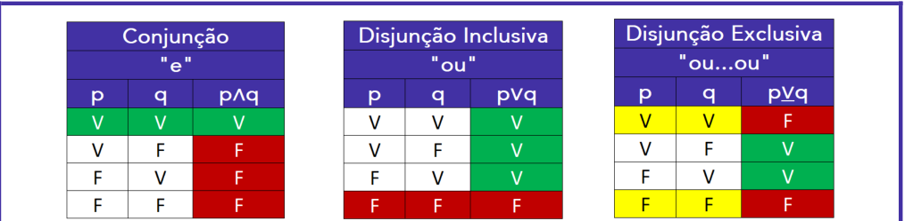

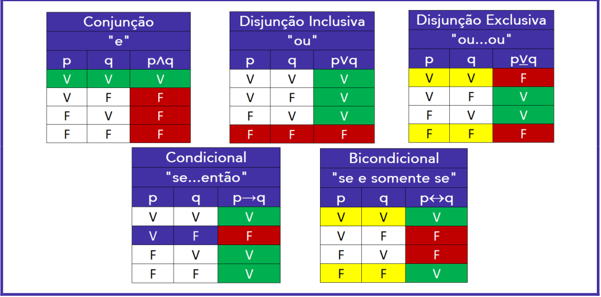

Agora vamos resolver algumas questões envolvendo diversos conteúdos vistos nesse tópico. Peço que você não se preocupe ao errar, pois o enfoque, nesse momento, é o aprendizado. 

---

<!-- pagina: 68 -->

**Equipe Exatas Estratégia Concursos Aula 00** 

**(IPE Saúde/2022)** Considere que o valor lógico da sentença **A** é a falsidade, o valor lógico de **B** é a verdade e o valor lógico de **C** é a falsidade. Sobre isso, assinale V, se verdadeiro, ou F, se falso. 

(    ) **(A** ∧ **B)** → **C** 

(    ) **(A** ∨ **B)**  ∼ **C** 

##### (    ) **(** ∼ **A** ∨ **B)** → **C** 

A ordem correta de preenchimento dos parênteses, de cima para baixo, é: 

a) V – V – V. 

b) V – V – F. 

c) V – F – V. 

d) F – V – F. 

e) F – F – F. 

##### **Comentários:** 

Sabemos **A** e **C** são **falsos** e **B** é **verdadeiro** . Com base nisso, vamos analisar as três proposições compostas. 

##### ( **V** ) **(A** ∧ **B)** → **C** 

Temos uma condicional cujo antecedente é **(A** ∧ **B)** e cujo consequente é **C** . 

Note que o antecedente é uma conjunção da forma **F** ∧ **V.** Trata-se de uma **conjunção falsa** , pois um dos termos da conjunção é falso. 

Como o consequente **C** é falso, note que a condicional **(A** ∧ **B)** → **C** apresenta a forma **F** → **F** . Logo, **temos uma condicional verdadeira** , pois a condicional é falsa somente no caso **V** → **F** . 

##### ( **V** ) **(A** ∨ **B)**  ∼ **C** 

Temos uma bicondicional em que o primeiro termo é **(A** ∨ **B)** e o segundo termo é ~ **C** . 

Note que o primeiro termo é disjunção inclusiva da forma **F** ∨ **V** . Trata-se de uma disjunção inclusiva verdadeira, pois a disjunção inclusiva é falsa somente no caso **F** ∨ **F** . 

O segundo termo, ~ **C** , é a negação de um termo falso. Logo, ~ **C** é verdadeiro. 

Perceba, portanto, que temos uma bicondicional da forma **V**  **V** , em que ambos os termos são verdadeiros. Logo, **temos uma bicondicional verdadeira** . 

##### ( **F** ) **(** ∼ **A** ∨ **B)** → **C** 

Temos uma condicional cujo antecedente é **(** ∼ **A** ∨ **B)** e cujo consequente é **C** . 

Como **A** é falso, temos que ~ **A** é verdadeiro. Note, portanto, que o antecedente da condicional, **(** ∼ **A** ∨ **B)** , é uma disjunção inclusiva da forma **V** ∨ **V** . Trata-se de uma **disjunção inclusiva verdadeira** , pois a disjunção inclusiva é falsa somente no caso **F** ∨ **F** . 

Como o consequente **C** é falso, note que a condicional **(** ∼ **A** ∨ **B)** → **C** apresenta a forma **V** → **F** . Logo, **temos uma condicional falsa** , pois o caso **V** → **F** é o único caso em que a condicional é falsa. 

Logo, a ordem correta de preenchimento dos parênteses, de cima para baixo, é **V – V – F.** 

**Gabarito: Letra B.**

---

<!-- pagina: 69 -->

**Equipe Exatas Estratégia Concursos Aula 00** 

**(DPE RS/2023)** Sabe-se que a sentença: 

“Se a camisa é preta e a calça é branca, então o cinto é marrom ou o sapato é marrom” é FALSA. 

É correto afirmar que: 

a) Se o cinto é marrom, então o sapato é marrom; 

b) Se o sapato não é marrom, então a camisa não é preta; 

c) Se a calça é branca, então o sapato é marrom; 

d) Se a camisa é preta, então a calça não é branca; 

e) Se a camisa é preta, então o cinto é marrom. 

##### **Comentários:** 

Considere as seguintes proposições simples: 

**p:** “A camisa é preta.” 

**b:** “A calça é branca.” 

**c:** “O cinto é marrom.” 

**s:** “O sapato é marrom 

A sentença em questão pode ser descrita como **(p** ∧ **b)** → **(c** ∨ **s)** : 

**(p** ∧ **b)** → **(c** ∨ **s)** : “ **Se [(** a camisa é preta **) e (** a calça é branca **)]** , **então [(** o cinto é marrom **) ou (** o sapato é marrom **)]** .” 

Como a condicional em questão é falsa, o antecedente é verdadeiro e o consequente é falso. Logo: 

- **(p** ∧ **b)** é verdadeiro; e 

- **(c** ∨ **s)** é falso. 

Para que a conjunção **p** ∧ **b** seja verdadeira, ambas as parcelas precisam ser verdadeiras. Logo, **<mark>p</mark>** <mark>é V</mark> e **<mark>b</mark>** <mark>é V.</mark> Para que a disjunção inclusiva **c** ∨ **s** seja falsa, ambas as parcelas precisam ser falsas. Logo, **<mark>c</mark>** <mark>é F</mark> e **<mark>s</mark>** <mark>é F.</mark> Com base nessas informações, vamos avaliar a alternativa que apresenta uma proposição verdadeira. 

a) **c** → **s –** Trata-se da condicional **F** → **F** , que é uma condicional verdadeira. **Esse é o gabarito** . 

b) ~ **s** →~ **p –** Condicional falsa, pois temos o caso **V** → **F** . 

c) **b** → **s –** Condicional falsa, pois temos o caso **V** → **F** . 

d) **p** →~ **b –** Condicional falsa, pois temos o caso **V** → **F** . 

e) **p** → **c –** Condicional falsa, pois temos o caso **V** → **F** . 

**Gabarito: Letra A.**

---

<!-- pagina: 70 -->

**Equipe Exatas Estratégia Concursos Aula 00** 

**(PM SP/2023)** São logicamente verdadeiras as seguintes afirmações: 

I. Eu sou casado ou eu não sou policial. II. Eu não tenho filho e eu não sou casado. 

A partir dessas informações, pode-se afirmar que 

a) eu não sou casado, sou policial e não tenho filho. 

b) eu não sou casado, não sou policial e não tenho filho. 

c) eu sou casado, sou policial e tenho filho. 

d) eu sou casado, não sou policial e tenho filho. 

**Comentários:** 

Considere as seguintes proposições simples: 

**f:** “Eu tenho filho.” 

**c:** “Eu sou casado.” 

**p:** “Eu sou policial.” 

Note que a afirmação I pode ser descrita como **c** ∨~ **p** : 

**c** ∨~ **p:** “ **[** Eu sou casado **] ou [** eu **não** sou policial **]** .” 

Por outro lado, a afirmação II pode ser descrita como ~ **f** ∧~ **c** : 

~ **f** ∧~ **c:** “ **[** Eu **não** tenho filho **] e [** eu **não** sou casado **]** .” 

Sabemos que **ambas as afirmações são verdadeiras** . 

Observe a conjunção ~ **f** ∧~ **c** da afirmação II. Para que ela seja verdadeira, ambas as parcelas precisam ser verdadeiras. Logo, ~ **f** e ~ **c** são ambos verdadeiros. Isso significa que **<mark>f</mark>** <mark>é F</mark> e **<mark>c</mark>** <mark>é F.</mark> 

Observe agora a disjunção inclusiva **c** ∨~ **p** da afirmação II. Para que ela seja verdadeira, não podemos ter ambos os termos falsos. Como já sabemos que **c** é falso, é necessário que ~ **p** seja verdadeiro. Logo, **<mark>p</mark>** <mark>é F.</mark> 

Como todas as proposições simples definidas são falsas, é correto afirmar que **eu** **<u>não</u> sou casado** ( ~ **c** é verdadeiro), **<u>não sou policial</u>** ( ~ **p** é verdadeiro) e **<u>não tenho filho</u>** ( ~ **f** é verdadeiro). **Gabarito: Letra B.** 

**(PM BA/2020)** Observe as duas proposições P e Q apresentadas a seguir. 

P: Ana é engenheira. Q: Bianca é arquiteta. 

Considere que Ana é engenheira somente se Bianca é arquiteta e, assinale a alternativa correta.

---

<!-- pagina: 71 -->

**Equipe Exatas Estratégia Concursos Aula 00** 

a) Ana ser engenheira não implica Bianca ser arquiteta 

b) Ana ser engenheira é condição suficiente para Bianca ser arquiteta 

c) Uma condição necessária para Bianca ser arquiteta é Ana ser engenheira 

d) Ana é engenheira se e somente se Bianca não é arquiteta 

e) Uma condição necessária para Bianca ser arquiteta é Ana não ser engenheira 

##### **Comentários:** 

Sabemos que o conectivo " **somente se** " corresponde ao conectivo " **se...então** ". Logo, o enunciado apresenta a condicional **P** → **Q** , que pode ser representada das seguintes formas: 

**P** → **Q: "[** Ana é engenheira **] somente se [** Bianca é arquiteta **]** . **"** 

**P** → **Q: "Se [** Ana é engenheira **], então [** Bianca é arquiteta **]** . **"** 

Vamos **avaliar a alternativa que apresenta outra forma de expressar o condicional P** → **Q em questão** . 

**a) Ana ser engenheira não implica Bianca ser arquiteta. ERRADO.** 

Sabemos que a palavra " **implica** " pode expressar uma condicional. Nesse caso, a condicional **P** → **Q** pode ser representada corretamente da seguinte forma: 

**P** → **Q: "[** Ana ser engenheira **] implica [** Bianca ser arquiteta **]** . **"** 

A alternativa erra ao escrever " **<u>não</u> implica** ". 

- **b) Ana ser engenheira é condição suficiente para Bianca ser arquiteta. CERTO** . 

Quando temos uma condicional **P** → **Q** , podemos dizer que: 

**P** é condição **suficiente** para **Q** ; 

**Q** é condição **necessária** para **P** . 

Uma forma de não trocar condição necessária por suficiente e vice-versa é lembrar que **a palavra "se" aponta para a condição suficiente** . 

Para o caso em questão, **P** corresponde a "Ana é engenheira" e **Q** é a proposição "Bianca é arquiteta". Logo, a alternativa B apresenta corretamente a condicional **P** → **Q** : 

**P** → **Q: "Se [** Ana é engenheira **], então [** Bianca é arquiteta **]** . **"** 

**P** → **Q** : **[** Ana ser engenheira **] é condição suficiente para [** Bianca ser arquiteta **]** ." **c) Uma condição necessária para Bianca ser arquiteta é Ana ser engenheira. ERRADO.** Podemos reescrever a proposição composta apresentada nessa alternativa do seguinte modo: 

" **[** Ana ser engenheira **] é condição necessária para [** Bianca ser arquiteta **]** ." Essa proposição composta pode ser reescrita novamente da seguinte forma: 

" **Se [** Bianca é arquiteta **]** , **então [** Ana é engenheira **]** ." 

Note que essa proposição composta corresponde a **Q** → **P** . 

https://t.me/KakashiAssinaturasBot

---

<!-- pagina: 72 -->

**Equipe Exatas Estratégia Concursos Aula 00** 

##### **d) Ana é engenheira se e somente se Bianca não é arquiteta. ERRADO.** 

A proposição original é uma condicional. Essa alternativa está errada por apresentar o conectivo **bicondicional** " **se e somente se** ". 

##### **e) Uma condição necessária para Bianca ser arquiteta é Ana não ser engenheira. ERRADO.** 

Podemos reescrever a proposição composta apresentada nessa alternativa do seguinte modo: 

" **[** Ana **não** ser engenheira **] é condição necessária para [** Bianca ser arquiteta **]** ." 

Essa proposição composta pode ser reescrita novamente da seguinte forma: 

" **Se [** Bianca é arquiteta **]** , **então [** Ana **não** é engenheira **]** ." 

Note que essa proposição composta corresponde a **Q** →~ **P** . 

**Gabarito: Letra B.**

---

<!-- pagina: 73 -->

**Equipe Exatas Estratégia Concursos Aula 00** 

# **QUESTÕES COMENTADAS – FGV** 

## **Proposições compostas** 

**1. (FGV/TRF1/2024) Sabe-se que a sentença “Se a calça é verde e a camisa é rosa, então o sapato é branco ou o cinto é marrom” é FALSA.** 

**É correto concluir que:** 

a) a camisa não é rosa ou o cinto é marrom; 

b) a calça é verde e o sapato é branco; 

c) se o sapato não é branco, então a camisa não é rosa; 

d) se o cinto não é marrom, então o sapato é branco; 

e) se a calça não é verde, então o cinto é marrom. 

**Comentários:** 

Sejam as proposições simples: 

**v:** "A calça é verde." 

**r:** "A camisa é rosa." 

**b:** "O sapato é branco." 

**m:** "O cinto é marrom." 

Note que a proposição composta do enunciado pode ser descrita pela condicional **v** ∧ **r** → **b** ∨ **m:** 

- **v** ∧ **r** → **b** ∨ **m:** “ **Se [(** a calça é verde **) e (** a camisa é rosa **)]** , **então [(** o sapato é branco **) ou (** o cinto é marrom **)]** ” 

Como essa condicional é falsa, devemos ter o antecedente verdadeiro e o consequente falso ( **caso V** → **F** ). Logo: 

- **v** ∧ **r** é verdadeiro; e 

- **b** ∨ **m** é falso. 

Note que: 

- Para que a conjunção **v** ∧ **r** seja verdadeira, ambas as parcelas devem ser verdadeiras. Logo, **v e r são ambos verdadeiros** . 

- Para a disjunção inclusiva **b** ∨ **m** ser falsa, ambas as parcelas devem ser falsas. Logo, **b e m são ambos falsos** . 

Com base nisso, vamos avaliar as alternativas. 

- **a) r** ∨ **m –** trata-se de uma disjunção inclusiva falsa, pois ambas as parcelas, ~ **r** e **m** , são falsas. 

- **b)  v** ∧ **b –** conjunção falsa, pois um dos termos, **b** , é falso. 

**c)** ~ **b** →~ **r –** condicional falsa, pois o antecedente ~ **b** é verdadeiro e o consequente ~ **r** é falso (caso **V** → **F** ).

---

<!-- pagina: 74 -->

**Equipe Exatas Estratégia Concursos Aula 00** 

**d)** ~ **m** → **b −** condicional falsa, pois o antecedente ~ **m** é verdadeiro e o consequente **b** é falso (caso **V** → **F** ). 

**e)** ~ **v** →~ **m –** condicional verdadeira, pois temos o caso **F** → **V** , que é uma condicional verdadeira. 

##### **Gabarito: Letra E.** 

**2. (FGV/CVM/2024) Considere a sentença: Se** 𝑥 **≤** 𝑦 **, então** 𝑥 **+ 2** 𝑦 **< 5. Essa sentença é FALSA quando:** 

a) 𝑥 = 3 e 𝑦 = 2; 

- b) 𝑥 = 2 e 𝑦 = 2; 

c) 𝑥 = 2 e 𝑦 = 1; 

- d) 𝑥 = 1 e 𝑦 = 1; 

- e) 𝑥 = 0 e 𝑦 = 2. 

##### **Comentários:** 

Sabemos que **uma condicional só é falsa no caso V** → **F** . Logo, devemos verificar os valores de  e 𝑥 de  que fazem com que o 𝑦 **antecedente** "𝑥 **≤** 𝑦” **seja verdadeiro** e o **consequente** "𝑥 **+ 2** 𝑦 **< 5** " **seja falso** . 

##### **a)** 𝑥 **= 3 e** 𝑦 **= 2. ERRADO.** 

Para essa alternativa, temos o caso **F** → **F** . Logo, temos uma condicional verdadeira. Observe: 

- **Antecedente** : 

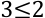

- **Consequente** : 

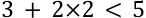

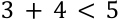

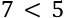

**(Falso)** 

##### **b)** 𝑥 **= 2 e** 𝑦 **= 2. CERTO.** 

Para essa alternativa, temos o caso **V** → **F** . Logo, temos uma condicional falsa. Observe: 

- **Antecedente** : 

2≤2 **(Verdadeiro)** 

- **Consequente** : 

2 + 2×2 < 5 

2 + 4 < 5 

6 < 5 

**(Falso)** 

https://t.me/KakashiAssinaturasBot

---

<!-- pagina: 75 -->

**Equipe Exatas Estratégia Concursos Aula 00** 

O **gabarito** , portanto, é **letra B** . 

##### **c)** 𝑥 **= 2 e** 𝑦 **= 1. ERRADO.** 

Para essa alternativa, temos o caso **F** → **V** . Logo, temos uma condicional verdadeira. Observe: 

- **Antecedente** : 

2≤1 **(Falso)** 

- **Consequente** : 

2 + 2×1 < 5 

2 + 2 < 5 

4 < 5 

**(Verdadeiro)** 

##### **d)** 𝑥 **= 1 e** 𝑦 **= 1. ERRADO.** 

Para essa alternativa, temos o caso **V** → **V** . Logo, temos uma condicional verdadeira. Observe: 

- **Antecedente** : 

1≤1 

**(Verdadeiro)** 

- **Consequente** : 

- 1 + 2×1 < 5 

1 + 2 < 5 

3 < 5 

**(Verdadeiro)** 

##### **e)** 𝑥 **= 0 e** 𝑦 **= 2. ERRADO.** 

Para essa alternativa, temos o caso **V** → **V** . Logo, temos uma condicional verdadeira. Observe: 

- **Antecedente** : 

0≤2 **(Verdadeiro)** 

- **Consequente** : 

- 0 + 2×2 < 5 0 + 4 < 5 4 < 5 

**(Verdadeiro)** 

##### **Gabarito: Letra B.** 

**3. (FGV/CMSP/2024) Sabe-se que a sentença “Se faz sol e o mar está calmo, então vou remar” é FALSA.** 

##### **Nesse caso, é correto concluir que** 

a) Não faz sol ou o mar não está calmo. 

b) Faz sol e o mar não está calmo.

---

<!-- pagina: 76 -->

**Equipe Exatas Estratégia Concursos Aula 00** 

c) Não faz sol e o mar está calmo. 

d) Vou remar ou não faz sol. 

e) Não vou remar e o mar está calmo. 

**Comentários:** 

Sejam as proposições simples: 

**f:** "Faz sol." 

**r:** "Vou remar." 

**f** ∧ **m** → **r** : A sentença do enunciado corresponde a 

**f** ∧ **m** → **r** : " **Se [(** faz sol **) e (** o mar está calmo **)]** , **então [** vou remar **]** ." 

Sabemos que a condicional é falsa somente no caso **V** → **F** . Para a condicional em questão, temos que: 

- O antecedente **f** ∧ **m** é verdadeiro; e 

- O consequente **r** é falso. 

Para a conjunção **f** ∧ **m** ser verdadeira, ambos os termos precisam ser verdadeiros. Portanto: 

● **f** é verdadeiro; 

- **m** é verdadeiro; e 

- **r** é falso. 

Com base nisso, vamos avaliar a alternativa que apresenta uma proposição verdadeira: 

a) ~ **f** ∨~ **m –** Disjunção inclusiva falsa, pois ambos os termos, ~ **f** e ~ **m** , são falsos. 

b) **f** ∧~ **m –** Conjunção falsa, pois um dos termos, ~ **m** , é falso. 

c) ~ **f** ∧ **m −** Conjunção falsa, pois um dos termos, ~ **f** , é falso. 

d) **r** ∨~ **f −** Disjunção inclusiva falsa, pois ambos os termos, **r** e ~ **f** , são falsos. 

e) ~ **r** ∧ **m –** Conjunção verdadeira, pois ambos os termos, ~ **r** e **m** , são verdadeiros. **Esse é o gabarito** . 

##### **Gabarito: Letra E.** 

**4. (FGV/AGENERSA/2023) Sabe-se que a sentença “Paulo não é louro ou Margarida é morena” é falsa.** 

##### **É correto concluir que** 

a) Paulo é louro e Margarida é morena. 

b) Paulo não é louro e Margarida não é morena. 

c) Paulo não é louro e Margarida é morena. 

d) Se Paulo é louro, então Margarida é morena. 

e) Se Margarida não é morena, então Paulo é louro.

---

<!-- pagina: 77 -->

**Equipe Exatas Estratégia Concursos Aula 00** 

##### **Comentários:** 

Sejam as proposições simples: 

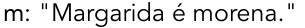

Note que a sentença original é dada por ~ **p** ∨ **m** : 

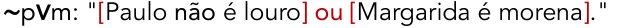

Para a disjunção inclusiva ser falsa, ambas as parcelas devem ser falsas. Logo, ~ **p** e **m** são ambos falsos. Consequentemente, **<mark>p</mark>** <mark>é V</mark> e **<mark>m</mark>** <mark>é F.</mark> 

Com base nisso, vamos avaliar a alternativa que apresenta uma proposição verdadeira: 

a) **p** ∧ **m –** Conjunção falsa, pois um dos termos, **m** , é falso. 

b) ~ **p** ∧~ **m −** Conjunção falsa, pois um dos termos, ~ **p** , é falso. 

c) ~ **p** ∧ **m −** Conjunção falsa, pois ambos os termos, ~ **p** e **m** , são falsos. 

d) **p** → **m –** Condicional falsa, pois temos o caso **V** → **F** . 

e) ~ **m** → **p −** Condicional verdadeira, pois trata-se do caso **V** → **V** . Esse é o **gabarito** . 

**Gabarito: Letra E.** 

**5. (FGV/PGM Niterói/2023) Sabe-se que a sentença “Se o sapato é marrom, então a calça é bege ou a camisa é azul” é FALSA.** 

##### **É correto concluir que:** 

a) o sapato não é marrom, a calça não é bege, a camisa não é azul; 

b) o sapato não é marrom, a calça é bege, a camisa é azul; 

c) o sapato não é marrom, a calça não é bege, a camisa é azul; 

d) o sapato é marrom, a calça é bege, a camisa é azul; 

e) o sapato é marrom, a calça não é bege, a camisa não é azul. 

##### **Comentários:** 

Considere as proposições simples: 

**m:** "O sapato é marrom." 

**b:** "A calça é bege." 

**a:** "A camisa é azul." 

**m** → **b** ∨ **a** : Note que a sentença apresentada corresponde a 

**m** → **b** ∨ **a** : “ **Se [** o sapato é marrom **]** , **então [(** a calça é bege **) ou (** a camisa é azul **)]** .” 

O enunciado afirma que a condicional anterior é falsa. Isso significa que o antecedente da condicional é verdadeiro e o consequente da condicional é falso. Logo:

---

<!-- pagina: 78 -->

**Equipe Exatas Estratégia Concursos Aula 00** 

- **m** é verdadeiro; e 

- **b** ∨ **a** é falso. 

**b** ∨ **a** Para que a disjunção inclusiva seja falsa, é necessário que ambos os termos sejam falsos. Logo: 

- **m** é **verdadeiro** ; 

- **b** é **falso** ; e 

- **a** é **falso** . 

Sendo **b** e **a** proposições falsas, ~ **b** e ~ **a** são proposições verdadeiras. Logo: 

- **m** é **verdadeiro** ; 

- ~ **b** é **verdadeiro** ; e 

- ~ **a** é **verdadeiro** . 

Portanto, **podemos concluir corretamente** que: 

- "O sapato é marrom" ( **m** é **verdadeiro** ); 

- "A calça **não** é bege" ( ~ **b** é **verdadeiro** ); e 

- "A camisa **não** é azul" ( ~ **a** é **verdadeiro** ). 

##### **Gabarito: Letra E.** 

**6. (FGV/MPE SP/2023) Sejam p, q, r, s e t proposições simples e** ~ **p,** ~ **q,** ~ **r,** ~ **s e** ~ **t as suas respectivas negações.** 

**Se a proposição composta p** ∨ **q** ∨~ **r** ∨ **s** ∨~ **t tem valor l ó gico falso, pode-se afirmar que** 

a) p é verdadeiro e q é falso. 

b) q é verdadeiro e r é falso. 

c) r é verdadeiro e s é falso. 

- d) s é verdadeiro e t é falso. 

e) t é verdadeiro e r é falso. 

##### **Comentários:** 

Sabemos que uma **disjunção inclusiva** " **ou** " com dois termos é **<u>falsa</u> somente quando ambas as parcelas são falsas** . Em outras palavras, uma disjunção inclusiva genérica **p** ∨ **q** é falsa quando **p** e **q** são ambos falsos. 

A questão informa que a **sequência de disjunções inclusivas p** ∨ **q** ∨~ **r** ∨ **s** ∨~ **t** é **falsa** . **Nesse caso** , **é necessário que todos os termos que compõem essa sequência de "ous" sejam falsos** . Logo: 

- **p** é **falso** ; 

- **q** é **falso** ; 

- ~ **r** é **falso** ; 

- **s** é **falso** ; e

---

<!-- pagina: 79 -->

**Equipe Exatas Estratégia Concursos Aula 00** 

● ~ **t** é **falso** . 

Como ~ **r** e ~ **t** são falsos, **r** e **t** são verdadeiros. Logo: 

● **p** é **falso** ; 

- **q** é **falso** ; 

- **r** é **verdadeiro** ; 

- **s** é **falso** ; e 

- **t** é **verdadeiro** . 

Consequentemente, pode-se afirmar que **r** é **verdadeiro** e **s** é **falso** . O **gabarito** , portanto, é **letra C** . 

**<u>Observação:</u>** Uma dúvida que pode restar quanto à resolução do problema é a seguinte: **por que necessariamente todos os termos da sequência de "ous" devem ser falsos?** 

Para responder à pergunta, considere que a seguinte proposição composta é **falsa** : **p** ∨ **q** ∨ **r** . 

Veja que essa proposição pode ser entendida como **(p** ∨ **q)** ∨ **r** , ou seja, como uma disjunção inclusiva "ou" entre o termo **(p** ∨ **q)** e o termo **r** . 

Para que **(p** ∨ **q)** ∨ **r** seja falsa, ambos os termos **(p** ∨ **q)** e **r** devem ser falsos. Logo: 

- **(p** ∨ **q)** é **falso** ; e 

**• r** é **falso** . 

Note, ainda, que como **(p** ∨ **q)** é falso, ambas as parcelas devem ser falsas. Logo: 

**• p** é **falso** ; 

**• q** é **falso** ; e 

**• r** é **falso** . 

Veja que, **se sequência de** " **ous** " **p** ∨ **q** ∨ **r for falsa** , **concluímos que todos os termos devem ser falsos** . 

##### **"Ok, professor. E se nós tivermos mais termos?"** 

Podemos seguir o mesmo raciocínio incluindo mais termos. Considere, por exemplo, que a seguinte proposição composta é **falsa** : **p** ∨ **q** ∨ **r** ∨ **s** . 

Veja que essa proposição pode ser entendida como **(p** ∨ **q** ∨ **r)** ∨ **s** , ou seja, como uma disjunção inclusiva "ou" entre o termo **(p** ∨ **q** ∨ **r)** e o termo **s** . 

https://t.me/KakashiAssinaturasBot

---

<!-- pagina: 80 -->

**Equipe Exatas Estratégia Concursos Aula 00** 

Para que **(p** ∨ **q** ∨ **r)** ∨ **s** seja falsa, ambos os termos **(p** ∨ **q** ∨ **r)** e **s** devem ser falsos. Logo: 

- **(p** ∨ **q** ∨ **r)** é **falso** ; e 

- **s** é **falso** . 

Acabamos de ver que, para que **(p** ∨ **q** ∨ **r)** seja falso, todos os termos devem ser falsos. Logo: 

**• p** é **falso** ; 

- **q** é **falso** ; 

- **r** é **falso** ; e 

- **s** é **falso** . 

Note que, **se a sequência de** " **ous** " **p** ∨ **q** ∨ **r** ∨ **s for falsa** , **concluímos novamente que todos os termos devem ser falsos** . 

##### **Gabarito: Letra C.** 

**7. (FGV/BANESTES/2023) Sejam p, q, r e t proposições simples e** ∼ **p,** ∼ **q,** ∼ **r e** ∼ **t, respectivamente, as suas negações. Se as seguintes proposições compostas têm valor lógico falso:** 

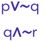

##### **conclui-se que são logicamente verdadeiras apenas as proposições simples** 

a) p e q. 

b) p e t. 

c) q e r. 

d) p, q e r. 

e) q, r e t. 

##### **Comentários:** 

O enunciado apresenta **três proposições compostas** que apresentam **valor lógico falso** : uma **disjunção inclusiva** " **ou** ", uma **conjunção** " **e** " e uma **condicional** " **se...então** ". Sabemos que: 

- A **conjunção** " **e** " é **verdadeira** somente quando **ambas as parcelas são verdadeiras** . **Caso contrário** , **a conjunção é falsa** ; 

- A **disjunção inclusiva** " **ou** " é **falsa** somente quando **ambas as parcelas são falsas** ; e 

- A **condicional** é **falsa** somente quando a **primeira parcela é verdadeira** e a **segunda é falsa** .

---

<!-- pagina: 81 -->

**Equipe Exatas Estratégia Concursos Aula 00** 

Para que a disjunção inclusiva **p** ∨~ **q** seja **falsa** , **p** e ~ **q** devem ser ambos falsos. Logo, **<mark>p</mark>** <mark>é F</mark> e **<mark>q</mark>** <mark>é</mark> V. 

Para que a condicional **r** → **t** seja **falsa** , o antecedente **r** deve ser verdadeiro e o consequente **t** deve ser falso. Logo, **<mark>r</mark>** <mark>é V</mark> e **<mark>t</mark>** <mark>é F</mark> . 

Veja que, a partir da análise das proposições compostas **p** ∨~ **q** e **r** → **t** , temos a garantia de que a proposição composta restante **q** ∧~ **r** é falsa. Isso porque, de acordo com os valores lógicos já obtidos, a conjunção em questão é falsa, pois temos a conjunção de um termo verdadeiro ( **q** ) com um termo falso ( ~ **r** ). 

Portanto, dentre as proposições simples **p, q, r** e **t** , **conclui-se que são logicamente verdadeiras apenas as proposições simples q e r** . 

##### **Gabarito: Letra C.** 

**8. (FGV/CM Taubaté/2022) Sabe-se que as 3 afirmações a seguir são verdadeiras:** 

   - **Marlene é médica;** 

   - **Olga é oftalmologista;** 

   - **Priscila não é professora.** 

##### **É correto concluir que:** 

a) Marlene é médica e Olga não é oftalmologista. 

b) Priscila é professora ou Marlene não é médica. 

c) Se Priscila é professora, então Marlene não é médica. 

d) Se Priscila não é professora, então Olga não é oftalmologista. 

e) Se Olga é oftalmologista, então Marlene não é médica. 

##### **Comentários:** 

Considere as seguintes proposições simples: 

**m** : "Marlene é médica." 

**o** : "Olga é oftalmologista." 

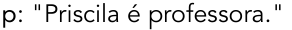

O enunciado afirma que **m** , **o** e ~ **p** são proposições verdadeiras. Logo: 

- **m** é **verdadeiro** ; 

- **o** é **verdadeiro** ; e 

- **p** é **falso** . 

Vamos verificar a alternativa que apresenta uma proposição verdadeira. 

**a) [Marlene é médica] e [Olga não é oftalmologista]. ERRADO** . 

A proposição composta em questão é a conjunção **m** ∧~ **o** . Trata-se de uma conjunção falsa, pois um dos termos, ~ **o** , é falso.

---

<!-- pagina: 82 -->

**Equipe Exatas Estratégia Concursos Aula 00** 

##### **b) [Priscila é professora] ou [Marlene não é médica]. ERRADO** . 

A proposição composta em questão é a disjunção inclusiva **p** ∨~ **m** . Trata-se de uma disjunção inclusiva falsa, pois ambos os termos, **p** e ~ **m** , são falsos. 

##### **c) Se [Priscila é professora], então [Marlene não é médica]. CERTO** . Esse é o **gabarito** . 

A proposição composta em questão é a condicional **p** →~ **m** . Trata-se da condicional **F** → **F** , que é uma condicional verdadeira. Isso porque a condicional só é falsa quando o antecedente é verdadeiro e o consequente é falso (caso **V** → **F** ). 

##### **d) Se [Priscila não é professora], então [Olga não é oftalmologista]. ERRADO** . 

A proposição composta em questão é a condicional ~ **p** →~ **o** . Trata-se da condicional **V** → **F** , que é uma condicional falsa. 

##### **e) Se [Olga é oftalmologista], então [Marlene não é médica]. ERRADO** . 

A proposição composta em questão é a condicional **o** →~ **m** . Trata-se da condicional **V** → **F** , que é uma condicional falsa. 

##### **Gabarito: Letra C.** 

**9. (FGV/SEFAZ AM/2022) Considere as sentenças a seguir.** 

**Paulo é carioca ou Bernardo é paulista.** 

**Se Sérgio é amazonense, então Paulo é carioca.** 

**Sabe-se que a primeira sentença é verdadeira e a segunda é falsa. É correto concluir que** 

a) Paulo é carioca, Bernardo é paulista, Sérgio é amazonense. 

b) Paulo é carioca, Bernardo não é paulista, Sérgio é amazonense. 

c) Paulo não é carioca, Bernardo é paulista, Sérgio é amazonense. 

d) Paulo não é carioca, Bernardo é paulista, Sérgio não é amazonense. 

e) Paulo não é carioca, Bernardo não é paulista, Sérgio é amazonense. 

**Comentários:** 

Considere as proposições simples: 

**p:** "Paulo é carioca." 

**b:** "Bernardo é paulista." 

**s:** "Sérgio é amazonense." 

Note que a primeira sentença é dada por **p** ∨ **b** : 

**p** ∨ **b:** " **[** Paulo é carioca **] ou [** Bernardo é paulista **]** ." 

Por outro lado, a segunda sentença é dada por **s** → **p** : 

**s** → **p:** " **Se [** Sérgio é amazonense **]** , **então [** Paulo é carioca **]** ."

---

<!-- pagina: 83 -->

**Equipe Exatas Estratégia Concursos Aula 00** 

O enunciado nos diz que a segunda sentença, **s** → **p** , é falsa. Sabemos que uma condicional é falsa somente no caso **V** → **F** . Logo, temos que: **<mark>s</mark>** <mark>é verdadeiro</mark> e **<mark>p</mark>** <mark>é falso.</mark> 

Além disso, o enunciado nos diz que a primeira sentença, **p** ∨ **b** , é verdadeira. Para uma disjunção inclusiva ser verdadeira, ao menos um dos termos deve ser verdadeiro. Como **p** é falso, devemos ter que **<mark>b</mark>** <mark>é verdadeiro.</mark> 

Em resumo, temos os seguintes valores lógicos: 

- **p** é **falso** ; 

- **b** é **verdadeiro** ; e 

- **s** é **verdadeiro** ; 

Sendo **p** falso, temos que ~ **p** é verdadeiro. Logo: 

- ~ **p** é **verdadeiro** ; 

- **b** é **verdadeiro** ; e 

- **s** é **verdadeiro** . 

Portanto, **podemos concluir corretamente** que: 

- "Paulo **não** é carioca." ( ~ **p** é **verdadeiro** ); 

- "Bernardo é paulista." ( **b** é **verdadeiro** ); e 

- "Sérgio é amazonense." ( **s** é **verdadeiro** ). 

##### **Gabarito: Letra C.** 

**10. (FGV/SEFAZ BA/2022) Sabe-se que a sentença “Se João não é vascaíno, então Júlia é tricolor ou Marcela não é botafoguense.” é falsa.** 

##### **É correto concluir que** 

a) João é vascaíno e Júlia não é tricolor. 

b) Se Marcela é botafoguense, então Júlia é tricolor. 

c) João é vascaíno ou Marcela não é botafoguense. 

d) Se Júlia não é tricolor, então Marcela é botafoguense. 

e) João não é vascaíno, Júlia não é tricolor e Marcela não é botafoguense. 

##### **Comentários:** 

Considere as proposições simples: 

**v:** "João é vascaíno." 

**t:** "Júlia é tricolor." 

**b:** "Marcela é botafoguense." 

Note que a sentença apresentada corresponde a ~ **v** → **t** ∨~ **b** . 

~ **v** → **t** ∨~ **b:** “ **Se [** João **não** é vascaíno **]** , **então [(** Júlia é tricolor **) ou (** Marcela **não** é botafoguense **)]** .”

---

<!-- pagina: 84 -->

**Equipe Exatas Estratégia Concursos Aula 00** 

O enunciado afirma que a condicional anterior é falsa. Isso significa que o antecedente da condicional é verdadeiro e o consequente da condicional é falso. Logo: 

- ~ **v** é verdadeiro; e 

- **t** ∨~ **b** é falso. 

Como ~ **v** é verdadeiro, **v** é falso. Além disso, para que a disjunção inclusiva **t** ∨~ **b** seja falsa, é necessário que ambos os termos sejam falsos. Logo: 

- **v** é falso; 

- **t** é falso; e 

- ~ **b** é falso. 

Como ~ **b** é falso, **b** é verdadeiro. Logo, temos: 

- **v** é **falso** ; 

- **t** é **falso** ; e 

- **b** é **verdadeiro** . 

Vamos analisar as alternativas apresentadas e encontrar a verdadeira. 

a) **[** João é vascaíno **] e [** Júlia **não** é tricolor **]** − **v** ∧~ **t** . **FALSO** . 

**v** Temos uma conjunção em que um dos termos, , é falso. Logo, a alternativa apresenta uma conjunção falsa. 

b) **Se [** Marcela é botafoguense **]** , **então [** Júlia é tricolor **]** − **b** → **t** . **FALSO** . 

Temos uma condicional em que o antecedente **b** é verdadeiro e o consequente **t** é falso. Logo, a alternativa apresenta uma condicional falsa (caso **V** → **F** ). 

c) **[** João é vascaíno **] ou [** Marcela **não** é botafoguense **]** − **v** ∨~ **b** . **FALSO** . 

Temos uma disjunção inclusiva em que ambos os termos, **v** e ~ **b** , são falsos. Logo, a alternativa apresenta uma disjunção inclusiva falsa. 

d) **Se [** Júlia **não** é tricolor **]** , **então [** Marcela é botafoguense **]** − ~ **t** → **b** . **VERDADEIRO** . Esse é o **gabarito** . 

Temos uma condicional em que o antecedente ~ **t** é verdadeiro e o consequente **b** é verdadeiro. Logo, a alternativa apresenta uma condicional verdadeira ( **V** → **V** ). Esse é o **gabarito** . 

e) **[** João **não** é vascaíno **]** , **[** Júlia **não** é tricolor **] e [** Marcela **não** é botafoguense **]** − ~ **v** ∧~ **t** ∧~ **b** . **FALSO** . 

Temos uma sequência de conjunções em que um dos termos, ~ **b** , é falso. Logo, a conjunção em questão é falsa. Note que, realizando as conjunções na ordem em que aparece, temos: 

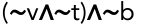

**V** ∧ **F**

---

<!-- pagina: 85 -->

**Equipe Exatas Estratégia Concursos Aula 00** 

**F** 

##### **Gabarito: Letra D.** 

**11. (FGV/CM Taubaté/2022) Sabe-se que a sentença “Se a camisa é verde, então a calça é azul ou o sapato não é preto” é falsa. É correto concluir que** 

a) a camisa é verde, a calça não é azul e o sapato é preto. 

b) a camisa é verde, a calça é azul e o sapato é preto. 

c) a camisa não é verde, a calça não é azul e o sapato é preto. 

d) a camisa não é verde, a calça não é azul e o sapato não é preto. 

e) a camisa não é verde, a calça é azul e o sapato não é preto. 

##### **Comentários** 

Considere as proposições simples: 

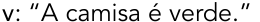

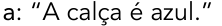

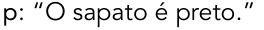

Nesse caso, note que a sentença do enunciado corresponde à proposição composta **v** → **(a** ∨~ **p)** : 

**v → (a** ∨~ **p)** : “ **Se [** a camisa é verde **]** , **então [(** a calça é azul **) ou (** o sapato **não** é preto **)]** .” 

Sabemos que a condicional apresentada é falsa. Nesse caso, o antecedente **<mark>v</mark>** <mark>deve ser verdadeiro</mark> e o consequente **(a** ∨~ **p)** deve ser falso (caso **V** → **F** ). 

Para que a disjunção inclusiva **(a** ∨~ **p)** seja falsa, os termos **a** e ~ **p** devem ser ambos falsos. Logo, **<mark>a</mark>** <mark>é falso</mark> e **<mark>p</mark>** <mark>é verdadeiro.</mark> 

Em resumo: 

- **v** é verdadeiro; 

- **a** é falso; e 

- **p** é verdadeiro. 

Logo, é correto concluir **v** , ~ **a** e **p** . Portanto: 

- A camisa é verde ( **v** ); 

- A calça não é azul (~ **a** ); 

- O sapato é preto ( **p** ). 

##### **Gabarito: Letra A.** 

**12. (FGV/CM Taubaté/2022) Sabe-se que as 3 afirmações a seguir são verdadeiras:** 

- **Marlene é médica;** 

- **Olga é oftalmologista;** 

- **Priscila não é professora.**

---

<!-- pagina: 86 -->

**Equipe Exatas Estratégia Concursos Aula 00** 

##### **É correto concluir que:** 

a) Marlene é médica e Olga não é oftalmologista. 

b) Priscila é professora ou Marlene não é médica. 

c) Se Priscila é professora, então Marlene não é médica. 

d) Se Priscila não é professora, então Olga não é oftalmologista. 

e) Se Olga é oftalmologista, então Marlene não é médica. 

##### **Comentários:** 

Considere as seguintes proposições simples: 

**m:** "Marlene é médica" 

**o: "** Olga é oftalmologista." 

**p:** "Priscila é professora." 

Segundo o enunciado: 

- Marlene é médica – **<u>m</u>** <u>é verdadeiro;</u> 

- Olga é oftalmologista – **<u>o</u>** <u>é verdadeiro</u> 

- Priscila não é professor − ~ **p** é verdadeiro e, portanto, **<u>p</u>** <u>é falso.</u> 

Com base nisso, vamos avaliar a alternativa que apresenta uma proposição composta verdadeira: 

a) **[** Marlene é médica **] e [** Olga **não** é oftalmologista **]** − **m** ∧~ **o** – trata-se de uma conjunção falsa, pois um de seus termos, ~ **o** , é falso. 

b) **[** Priscila é professora **] ou [** Marlene **não** é médica **]** . − **p** ∨~ **m** – trata-se de uma disjunção inclusiva falsa, pois ambos os termos, **p** e ~ **m** , são falsos. 

c) **Se [** Priscila é professora **]** , **então [** Marlene **não** é médica **]** . − **p** →~ **m** – trata-se de uma condicional **F** → **F V** → **F** . , que é uma condicional verdadeira. Isso porque a condicional é falsa somente no caso O **gabarito** , portanto, é **letra C** . 

d) **Se [** Priscila **não** é professora **]** , **então [** Olga **não** é oftalmologista **]** . − ~ **p** →~ **o** – trata-se de uma **V** → **F** . condicional falsa, pois temos o caso 

e) **Se [** Olga é oftalmologista **]** , **então [** Marlene **não** é médica **]** . − **o** →~ **m** – trata-se de uma **V** → **F** . condicional falsa, pois temos o caso 

##### **Gabarito: Letra C.** 

**13. (FGV/PM AM/2022) Sabe-se que a sentença “Se o sapato é preto, então a meia é preta ou o cinto é preto” é FALSA.** 

##### **É correto concluir que** 

a) o sapato é preto, a meia não é preta, o cinto não é preto. 

b) o sapato é preto, a meia é preta, o cinto não é preto.

---

<!-- pagina: 87 -->

**Equipe Exatas Estratégia Concursos Aula 00** 

c) o sapato é preto, a meia é preta, o cinto é preto. 

d) o sapato não é preto, a meia não é preta, o cinto não é preto. 

e) o sapato não é preto, a meia é preta, o cinto é preto. 

##### **Comentários:** 

Considere as proposições simples: 

**s:** "O sapato é preto." 

**m:** "A meia é preta." 

**c:** "O cinto é preto." 

**s** → **m** ∨ **c** . Note que a sentença apresentada corresponde a 

**s** → **m** ∨ **c:** “ **Se [** o sapato é preto **]** , **então [(** a meia é preta **) ou (** o cinto é preto **)]** .” 

O enunciado afirma que a condicional anterior é falsa. Isso significa que o antecedente da condicional é verdadeiro e o consequente da condicional é falso. Logo: 

- **<mark>s</mark>** <mark>é verdadeiro;</mark> e 

- **m** ∨ **c** é falso. 

**m** ∨ **c** Para que a disjunção inclusiva seja falsa, é necessário que ambos os termos sejam falsos. Logo: 

- **m** é falso; e 

- **c** é falso. 

Consequentemente, temos: 

- <mark>~</mark> **<mark>m</mark>** <mark>é verdadeiro;</mark> e 

- <mark>~</mark> **<mark>c</mark>** <mark>é verdadeiro.</mark> 

Portanto, **podemos concluir corretamente que** : 

- "O sapato é preto." ( **s** é **verdadeiro** ); 

- "A meia **não** é preta." ( ~ **m** é **verdadeiro** ); e 

- "O cinto **não** é preto." (~ **c** é **verdadeiro** ). 

##### **Gabarito: Letra A.** 

**14. (FGV/PC AM/2022) Sabe-se que a sentença “Se a camisa é azul, então a calça não é branca ou o boné é preto” é FALSA.** 

##### **É correto então concluir que** 

a) a camisa não é azul, a calça não é branca, o boné não é preto. 

b) a camisa é azul, a calça não é branca, o boné é preto. 

c) a camisa não é azul, a calça não é branca, o boné é preto. 

- d) a camisa é azul, a calça é branca, o boné não é preto.

---

<!-- pagina: 88 -->

**Equipe Exatas Estratégia Concursos Aula 00** 

e) a camisa não é azul, a calça é branca, o boné é preto. 

##### **Comentários:** 

Considere as proposições simples: 

**a:** "A camisa é azul." 

**b:** "A calça é branca." 

**p:** "O boné é preto." 

Note que a sentença apresentada corresponde a **a** →~ **b** ∨ **p** . 

**a** →~ **b** ∨ **p:** “ **Se [** a camisa é azul **]** , **então [(** a calça **não** é branca **) ou (** o boné é preto **)]** .” 

O enunciado afirma que a condicional anterior é falsa. Isso significa que o antecedente da condicional é verdadeiro e o consequente da condicional é falso. Logo: 

- **<mark>a</mark>** <mark>é verdadeiro;</mark> e 

- ~ **b** ∨ **p** é falso. 

Para que a disjunção inclusiva ~ **b** ∨ **p** seja falsa, é necessário que ambos os termos sejam falsos. Logo: 

- ~ **b** é falso; e 

- **p** é falso. 

Consequentemente, temos: 

- **<mark>b</mark>** <mark>é verdadeiro;</mark> e 

- <mark>~</mark> **<mark>p</mark>** <mark>é verdadeiro.</mark> 

Portanto, **podemos concluir corretamente que** : 

- "A camisa é azul." ( **a** é **verdadeiro** ); 

- "A calça é branca." ( **b** é **verdadeiro** ); e 

- "O boné **não** é preto." (~ **p** é **verdadeiro** ). 

##### **Gabarito: Letra D.** 

**15. (FGV/PC RN/2021) Sabe-se que a sentença “Se a camisa é branca, então a calça é branca” é FALSA e a sentença “Se o sapato é preto, então a camisa não é branca” é VERDADEIRA.** 

##### **É correto concluir que:** 

a) a camisa é branca, a calça não é branca e o sapato não é preto; 

b) a camisa é branca, a calça não é branca e o sapato é preto; 

c) a camisa não é branca, a calça é branca e o sapato não é preto; 

d) a camisa não é branca, a calça é branca e o sapato é preto; 

e) a camisa não é branca, a calça não é branca e o sapato é preto.

---

<!-- pagina: 89 -->

**Equipe Exatas Estratégia Concursos Aula 00** 

##### **Comentários:** 

Considere as proposições simples: 

**m:** "A camisa é branca." 

**l:** "A calça é branca." 

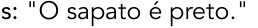

**m** → **l** : Note que a primeira sentença é dada por 

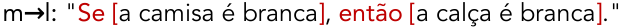

**s** →~ **m** : Por outro lado, a segunda sentença é dada por 

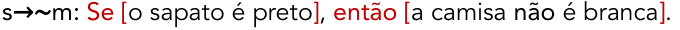

O enunciado nos diz que a primeira sentença, **m** → **l** , é falsa. Sabemos que uma condicional é falsa somente no caso **V** → **F** . Logo, temos que: **<mark>m</mark>** <mark>é verdadeiro</mark> e **<mark>l</mark>** <mark>é falso.</mark> 

Além disso, o enunciado nos diz que a segunda sentença, **s** →~ **m** , é verdadeira. Para a condicional ser verdadeira, não podemos recair no caso **V** → **F** . Como o consequente ~ **m** é falso, devemos ter que o antecedente **<mark>s</mark>** <mark>é falso.</mark> 

Em resumo, temos os seguintes valores lógicos: 

- **m** é **verdadeiro** ; 

- **l** é **falso** ; e 

- **s** é **falso** ; 

Sendo **l** falso, temos que ~ **l** é verdadeiro. Além disso, sendo **s** falso, temos que ~ **s** é verdadeiro. Logo: 

- **m** é **verdadeiro** ; 

- ~ **l** é **verdadeiro** ; e 

- ~ **s** é **verdadeiro** . 

Portanto, **podemos concluir corretamente que** : 

- "A camisa é branca." ( **m** é **verdadeiro** ); 

- "A calça **não** é branca." ( ~ **l** é **verdadeiro** ); e 

- "O sapato **não** é preto." (~ **s** é **verdadeiro** ). 

##### **Gabarito: Letra A.** 

**16. (FGV/MPE RJ/2019) Considere as proposições a seguir.** 

**I. 30% de 120 = 36 e 25% de 140 = 36.** 

**II. 30% de 120 = 36 ou 25% de 140 = 36.** 

**III. Se 25% de 140 = 36, então 30% de 120 = 36.**

---

<!-- pagina: 90 -->

**Equipe Exatas Estratégia Concursos Aula 00** 

##### **É correto concluir que:** 

a) apenas a proposição I é verdadeira; 

- b) apenas a proposição II é verdadeira; 

c) apenas as proposições II e III são verdadeiras; 

d) todas são verdadeiras; 

e) nenhuma é verdadeira. 

##### **Comentários:** 

Note que a proposição simples " **30% de 120 = 36** " é **verdadeira** , pois 0,3 × 120 = 36. Além disso, a proposição simples " **25% de 140 = 36** " é **falsa** , pois 0,25 × 140 = **35** . 

Com base nisso, vamos analisar as proposições compostas I, II e III. 

##### **I. 30% de 120 = 36 e 25% de 140 = 36.** 

<!-- Start of picture text -->
==5460== <!-- End of picture text -->

**FALSA** . A proposição composta apresentada é uma **conjunção** ( ∧ ), pois liga duas proposições por meio do **conectivo "e"** . Com base nos valores lógicos das proposições simples, temos: 

##### **(30% de 120 = 36)** ∧ **(25% de 140 = 36)** 

Trata-se de uma **conjunção falsa** , pois para uma conjunção ser verdadeira ambas as proposições devem ser verdadeiras. 

##### **II. 30% de 120 = 36 ou 25% de 140 = 36.** 

**VERDADEIRA** . A proposição composta apresentada é uma **disjunção inclusiva** ( ∨ ), pois liga duas proposições por meio do **conectivo "ou"** . Com base nos valores lógicos das proposições simples, temos: 

##### **(30% de 120 = 36)** ∨ **(25% de 140 = 36)** 

Trata-se de uma **disjunção inclusiva verdadeira** , pois para ela ser verdadeira basta que uma das proposições seja verdadeira. 

##### **III. Se 25% de 140 = 36, então 30% de 120 = 36.** 

**VERDADEIRA** . A proposição composta apresentada é uma **condicional** ( → ), pois liga duas proposições por meio do **conectivo "se... então"** . Com base nos valores lógicos das proposições simples, temos: 

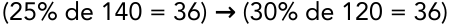

Trata-se de uma **condicional verdadeira** , pois o único caso em que a condicional é falsa ocorre quando antecedente é verdadeiro e o consequente é falso **(V** → **F)** . 

Apenas as proposições II e III são verdadeiras. Logo, o **gabarito** é **letra C** . 

**Gabarito: Letra C.**

---

<!-- pagina: 91 -->

**Equipe Exatas Estratégia Concursos Aula 00** 

**17. (FGV/BANESTES/2018) Considere a sentença: “Se Emília é capixaba, então ela gosta de moqueca”. Um cenário no qual a sentença dada é falsa é:** 

a) Emília é carioca e não gosta de moqueca; 

b) Emília é paulista e gosta de moqueca; 

c) Emília é capixaba e não gosta de moqueca; 

d) Emília é capixaba e gosta de moqueca; 

e) Emília é mineira e gosta de moqueca. 

##### **Comentários:** 

Sejam as proposições simples: 

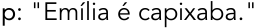

A sentença apresentada consiste na condicional **p** → **q** : 

Para a sentença em questão ser falsa, o antecedente **p** deve ser verdadeiro e o consequente **q** deve ser falso, pois o único caso em que temos uma condicional falsa é o caso V→F. 

Logo, o cenário no qual a sentença dada é falsa é <u>Emília é capixaba (</u> **p** é V) e <u>não gosta de moqueca (</u> **q** é F). 

##### **Gabarito: Letra C.** 

**18. (FGV/Pref. Salvador/2017) Considere a sentença:** 

**“Se Jorge é torcedor do Vitória, então ele é soteropolitano** ”. 

**Um cenário no qual a sentença dada é falsa é** 

a) “Jorge é torcedor do Bahia e é soteropolitano”. 

b) “Jorge é torcedor do Vasco e é carioca”. 

c) “Jorge é torcedor do Bahia e é paulista”. 

d) “Jorge é torcedor do Vitória e é paulista”. 

e) “Jorge é torcedor do Flamengo e é soteropolitano”. 

##### **Comentários:** 

A sentença apresentada é uma **condicional** , pois apresenta o conectivo " **se... então** ". <u>Para a condicional ser falsa, devemos ter o</u> **<u>antecedente</u>** " **Jorge é torcedor do Vitória** " **<u>verdadeiro</u>** e o **<u>consequente</u>** " **Jorge é soteropolitano** " **<u>falso</u>** . 

Assim, Jorge deve ser torcedor do Vitória e não deve ser soteropolitano. Essa situação é apresentada na alternativa D: "Jorge é torcedor do Vitória e é paulista".

---

<!-- pagina: 92 -->

**Equipe Exatas Estratégia Concursos Aula 00** 

##### **Gabarito: Letra D.** 

**19. (FGV/MPE MS/2013) Um contra** ‐ **exemplo para uma determinada afirmativa é um exemplo que a contradiz, isto é, um exemplo que torna a afirmativa falsa.** 

‐ **No caso de afirmativas do tipo “SE antecedente ENTÃO consequente”, um contra exemplo torna o antecedente verdadeiro e o consequente falso.** 

**Um contra** ‐ **exemplo para a afirmativa “SE x é múltiplo de 7 ENTÃO x é um número ímpar” é:** 

a) x = 7 

b) x = 8 

c) x = 11 

d) x = 14 

e) x = 21 

##### **Comentários:** 

𝑥 Seguindo o comando da questão, devemos selecionar dentre as alternativas um valor para  que torne o **antecedente** " é múltiplo de 7" 𝑥 **verdadeiro** e que torne o **consequente** " é um número 𝑥 ímpar" **falso** . Isto é, devemos selecionar um número que seja múltiplo de 7 e que não seja ímpar. Trata-se do número 14, presente na alternativa D. 

##### **Gabarito: Letra D.** 

**20. (FGV/TJ AM/2013) Antônio utiliza exclusivamente a regra a seguir para aprovar ou não os possíveis candidatos a namorar sua filha:** 

**“ - Se não for torcedor do Vasco então tem que ser rico ou gostar de música clássica”.** 

**Considere os seguintes candidatos:** 

**Pedro: torcedor do Flamengo, não é rico, não gosta de música clássica.** 

**Carlos: torcedor do Vasco, é rico, gosta de música clássica.** 

**Marcos: torcedor do São Raimundo, é rico, gosta de música clássica.** 

**Tiago: torcedor do Vasco, não é rico, não gosta de música clássica.** 

**Bruno: torcedor do Nacional, não é rico, gosta de música clássica.** 

**Classificando cada um desses cinco candidatos, na ordem em que eles foram apresentados, como aprovado (A) ou não aprovado (N) segundo a regra utilizada por Antônio, tem-se, respectivamente,** 

a) A, A, A, A e A. 

b) N, A, A, A e A. 

c) N, A, N, A e A. 

d) N, A, N, N e A. 

e) N, A, N, A e N.

---

<!-- pagina: 93 -->

**Equipe Exatas Estratégia Concursos Aula 00** 

##### **Comentários:** 

Sejam as proposições simples: 

**v** : **"** O candidato é torcedor do Vasco." 

**r:** "O candidato é rico." 

**m: "** O candidato gosta de música clássica." 

Definidas as proposições simples, podemos descrever o critério de Antônio por ~ **v** → **(r** ∨ **m)** . 

~ **v** → **(r** ∨ **m)** : " **Se [** não for torcedor do Vasco **] então [(** tem que ser rico **) ou (** gostar de música clássica **)]** . " 

Vamos ver o valor lógico de ~ **v** → **(r** ∨ **m)** para cada um dos candidatos a namorar a filha de Antônio, lembrando que um condicional é falso somente quando o antecedente é verdadeiro e o . <u>consequente é falso</u> 

**Pedro: torcedor do Flamengo (v é F), não é rico (r é F), não gosta de música clássica (m é F).** 

Temos o antecedente ~ **v** verdadeiro e o consequente **r** ∨ **m** falso. Logo, o condicional ~ **v** → **(r** ∨ **m)** é falso, isto é, **Pedro não foi aprovado** . 

**Carlos: torcedor do Vasco (v é V), é rico (r é V), gosta de música clássica (m é V).** 

Temos o antecedente ~ **v** falso e o consequente **r** ∨ **m** verdadeiro. Logo, o condicional ~ **v** → **(r** ∨ **m)** é verdadeiro, isto é, **Carlos foi aprovado** . 

**Marcos: torcedor do São Raimundo (v é F), é rico (r é V), gosta de música clássica (m é V).** 

Temos o antecedente ~ **v** verdadeiro e o consequente **r** ∨ **m** verdadeiro. Logo, o condicional ~ **v** → **(r** ∨ **m)** é verdadeiro, isto é, **Marcos foi aprovado** . 

**Tiago: torcedor do Vasco (v é V), não é rico (r é F), não gosta de música clássica (m é F).** 

Temos o antecedente ~ **v** falso e o consequente **r** ∨ **m** falso. Logo, o condicional ~ **v** → **(r** ∨ **m)** é verdadeiro, isto é, **Tiago foi aprovado** . 

**Bruno: torcedor do Nacional (v é F), não é rico (r é F), gosta de música clássica (m é V).** 

Temos o antecedente ~ **v** verdadeiro e o consequente **r** ∨ **m** verdadeiro. Logo, o condicional ~ **v** → **(r** ∨ **m)** é verdadeiro, isto é, **Bruno foi aprovado** . 

Portanto, Pedro foi o único não aprovado segundo a regra utilizada por Antônio. 

**Gabarito: Letra B.** 

**21. (FGV/SAD PE/2009) Sejam p, q e r proposições simples cujos valores lógicos (verdadeiro ou falso) são, a princípio, desconhecidos. No diagrama abaixo, cada célula numerada deve conter os resultados lógicos das proposições compostas formadas pelo conectivo condicional (** ⇒ **), em que as proposições nas linhas são os antecedentes e nas colunas, os consequentes. Os resultados das células 3, 4 e 7 já foram fornecidos.**

---

<!-- pagina: 94 -->

**Equipe Exatas Estratégia Concursos Aula 00** 

##### **Com relação à tabela, é correto afirmar que o valor lógico da célula:** 

a) 1 é falso. 

b) 2 é falso. 

c) 5 é falso. 

d) 6 é verdadeiro. 

e) 8 é verdadeiro. 

##### **Comentários:** 

Note que cada célula numerada contém o valor lógico resultante da condicional formada pelas <u>seguintes parcelas:</u> 

- **Antecedente** : proposição correspondente à **linha** ; 

- **Consequente** : proposição correspondente à **coluna** . 

Lembre-se de que a condicional **p** → **q** é **falsa** somente quando a **primeira parcela é verdadeira** e a **segunda parcela é falsa** . **Nos demais casos** , **a condicional é verdadeira** . 

Voltando à questão, temos que resultados das células 3, 4 e 7 já foram fornecidos. A partir dessa informação, podemos extrair alguns resultados: 

- A **célula 4** nos diz que a condicional **q** → **p** é F. Sabemos que só existe uma possibilidade para a condicional ser falsa: o antecedente **<mark>q</mark>** <mark>é V</mark> e o consequente **<mark>p</mark>** <mark>é F</mark> . 

- A **célula 7** nos diz que a condicional **r** → **p** é V. Já sabemos que o consequente **p** é F. Para que a condicional seja verdadeira, **não** podemos ter o antecedente **r** verdadeiro, pois nesse caso teríamos a condicional V→F. Logo, **<mark>r</mark>** <mark>é F.</mark> 

- A **célula 3** de fato apresenta uma condicional verdadeira, pois se trata da condicional **p** → **r** , que corresponde à condicional F→F.

---

<!-- pagina: 95 -->

**Equipe Exatas Estratégia Concursos Aula 00** 

Note que já temos os valores lógicos das proporções **p** , **q** e **r.** Vamos analisar cada alternativa: 

##### **a) 1 é falso.** 

**ERRADO** . A **célula 1** corresponde ao condicional **p** → **p** , isto é, F→F. Trata-se de um condicional verdadeiro. 

##### **b) 2 é falso.** 

**ERRADO** . A **célula 2** corresponde ao condicional **p** → **q** , isto é, F→V. Trata-se de um condicional verdadeiro. 

##### **c) 5 é falso.** 

**ERRADO** . A **célula 5** corresponde ao condicional **q** → **q** , isto é, V→V. Trata-se de um condicional verdadeiro. 

##### **d) 6 é verdadeiro.** 

**ERRADO** . A **célula 6** corresponde ao condicional **q** → **r** , isto é, V→F. Trata-se de um condicional falso. 

##### **e) 8 é verdadeiro.** 

**CERTO** . A **célula 8** corresponde ao condicional **r** → **q** , isto é, F→V. Trata-se de um condicional verdadeiro. 

##### **Gabarito: Letra E.** 

##### **22. (FGV/MEC/2009) Com relação à naturalidade dos cidadãos brasileiros, assinale a alternativa logicamente correta:** 

a) Ser brasileiro é condição necessária e suficiente para ser paulista. 

b) Ser brasileiro é condição suficiente, mas não necessária para ser paranaense. 

c) Ser carioca é condição necessária e suficiente para ser brasileiro. 

d) Ser baiano é condição suficiente, mas não necessária para ser brasileiro. 

e) Ser maranhense é condição necessária, mas não suficiente para ser brasileiro. 

##### **Comentários:** 

Antes de analisar as alternativas, devemos nos recordar que um condicional da forma **p** → **q** pode ser descrito das seguintes formas: 

- **p** é **condição suficiente** para **q;** 

- **q** é **condição necessária** para **p** . 

Lembre-se que a expressão **"condição necessária e suficiente"** se refere a um bicondicional. 

Vamos avaliar cada alternativa. 

##### **<u>Alternativa A</u>**

---

<!-- pagina: 96 -->

**Equipe Exatas Estratégia Concursos Aula 00** 

Devemos entender que se alguém é paulista, então essa pessoa é brasileira. **O contrário não podemos dizer** , isto é, **não podemos dizer** que se alguém é brasileiro, então essa pessoa é paulista. Logo: 

- Podemos escrever a condicional **p** → **b** : "Se é paulista, então é brasileiro". 

- Não podemos escrever a condicional **b** → **p** nem a bicondicional **p** ↔ **b** . 

Outras formas alternativas de se representar **p** → **b** são: 

- Ser paulista é **condição suficiente** para ser brasileiro; 

- Ser brasileiro é **condição necessária** para ser paulista. 

A alternativa A traz a expressão "condição necessária e suficiente", que remete a um bicondicional. Portanto, a alternativa está errada. 

##### **<u>Alternativa B</u>** 

Podemos escrever a condicional **a** → **b** : " **Se é paranaense, então é brasileiro** ". As outras formas alternativas de se representar **a** → **b** são: 

- Ser paranaense é **condição suficiente** para ser brasileiro; 

- Ser brasileiro é **condição necessária** para ser paranaense. 

A alternativa erra ao dizer que ser brasileiro é condição suficiente para ser paranaense. 

##### **<u>Alternativa C</u>** 

Podemos escrever a condicional **c** → **b** : " **Se é carioca, então é brasileiro** ". As outras formas alternativas de se representar **c** → **b** são: 

- Ser carioca é **condição suficiente** para ser brasileiro; 

- Ser brasileiro é **condição necessária** para ser carioca. 

A alternativa C traz a expressão "condição necessária e suficiente", que remete a um bicondicional. Portanto, a alternativa está errada. 

##### **<u>Alternativa D</u>** 

Podemos escrever a condicional **n** → **b** : " **Se é baiano, então é brasileiro** ". As outras formas alternativas de se representar **n** → **b** são: 

- Ser baiano é **condição suficiente** para ser brasileiro; 

- Ser brasileiro é **condição necessária** para ser baiano. 

A alternativa D traz a representação correta da situação: "Ser baiano é condição suficiente, mas não necessária para ser brasileiro". 

##### **<u>Alternativa E</u>** 

Podemos escrever a condicional **m** → **b** : " **Se é maranhense, então é brasileiro** ". As outras formas alternativas de se representar **m** → **b** são:

---

<!-- pagina: 97 -->

**Equipe Exatas Estratégia Concursos Aula 00** 

- Ser maranhense é **condição suficiente** para ser brasileiro; 

- Ser brasileiro é **condição necessária** para ser maranhense. 

A alternativa erra ao dizer que ser maranhense é condição necessária para ser brasileiro. 

##### **Gabarito: Letra D.** 

**23. (FGV/Senado/2008) Cada um dos cartões abaixo tem de um lado um número e do outro lado uma figura geométrica.** 

**Alguém afirmou que todos os cartões que têm um triângulo em uma face têm um número primo na outra.** 

##### **Para afirmar se tal afirmação é verdadeira:** 

a) é necessário virar todos os cartões. 

b) é suficiente virar os dois primeiros cartões. 

c) é suficiente virar os dois últimos cartões. 

d) é suficiente virar os dois cartões do meio. 

e) é suficiente virar o primeiro e o último cartão. 

**Comentários:** 

Considere as proposições simples: 

**p:** “O cartão tem um triângulo em uma face." 

**q: "** O cartão tem um número primo na outra face." 

A afirmação "todos os cartões que têm um triângulo em uma face têm um número primo na outra" pode ser entendida, **<u>para cada cartão</u>** , por meio da seguinte condicional: 

**p** → **q:** " **Se [** o cartão tem um triângulo em uma face **]** , **então [** o cartão tem um número primo na outra face **]** ." 

Lembre-se de que a condicional **p** → **q** é **falsa** somente quando a **primeira parcela é verdadeira** e a **segunda parcela é falsa** . **Nos demais casos** , **a condicional é verdadeira** .

---

<!-- pagina: 98 -->

**Equipe Exatas Estratégia Concursos Aula 00** 

Voltando à questão, **deve-se obter quais cartões precisamos virar** para verifcar se a condicional **p** → **q** <u>será verdadeira para todos os cartões.</u> 

##### **<u>Primeiro cartão</u>** 

Note que o cartão tem um triângulo em uma face e, portanto, **p** é verdadeiro. Com essa informação, a condicional **p** → **q** corresponde a: 

Veja que: 

- Se o consequente **q** for verdadeiro, a condicional será da forma V→V e, portanto, será **verdadeira** . 

- Se o consequente **q** for falso, a condicional será da forma V→F e, portanto, será **falsa** . 

Logo, para verificar se a condicional **p** → **q** é verdadeira, **precisamos virar o primeiro cartão** para verificar se **q** é verdadeiro ou se é falso, isto é, **precisamos virar o primeiro cartão para verificar se ele tem ou não tem um número primo na outra face** . 

##### **<u>Segundo cartão</u>** 

Note que o segundo cartão tem um pentágono em uma face e, portanto, **p** é falso, pois não se trata de um triângulo. Com essa informação, a condicional **p** → **q** corresponde a: 

Veja que: 

- Se o consequente **q** for verdadeiro, a condicional será da forma F→V e, portanto, será **verdadeira** . 

- Se o consequente **q** for falso, a condicional será da forma F→F e, portanto, também será **verdadeira** . 

Logo, a condicional **p** → **q** é verdadeira, independentemente do valor de **q** . Portanto, **não precisamos virar o segundo cartão** para verificar se **q** é verdadeiro ou se é falso, isto é, **não precisamos virar o segundo cartão para verificar se ele tem ou não tem um número primo na outra face** . 

##### **<u>Terceiro cartão</u>** 

Note que o cartão tem o número 7 em uma face e, portanto, **q** é verdadeiro, pois 7 é um número primo. Com essa informação, a condicional **p** → **q** corresponde a:

---

<!-- pagina: 99 -->

**Equipe Exatas Estratégia Concursos Aula 00** 

(?) → **V** 

Veja que: 

- Se o antecedente **p** for verdadeiro, a condicional será da forma V→V e, portanto, será **verdadeira** . 

- Se o consequente **p** for falso, a condicional será da forma F→V e, portanto, também será **verdadeira** . 

Logo, a condicional **p** → **q** é verdadeira, independentemente do valor de **p** . Portanto, **não precisamos virar o segundo cartão** para verificar se **p** é verdadeiro ou se é falso, isto é, **não precisamos virar o segundo cartão para verificar se ele tem ou não tem um triângulo** . 

##### **<u>Quarto cartão</u>** 

Note que o cartão tem o número 6 em uma face e, portanto, **q** é falso, pois 6 não é primo. Com essa informação, a condicional **p** → **q** corresponde a: 

(?) → **F** 

Veja que: 

- Se o antecedente **p** for verdadeiro, a condicional será da forma V→F e, portanto, será **falsa** . 

- Se o antecedente **p** for falso, a condicional será da forma F→F e, portanto, será **verdadeira** . 

Logo, para verificar se a condicional **p** → **q** é verdadeira, **precisamos virar o quarto cartão** para verificar se **p** é verdadeiro ou se é falso, isto é, **precisamos virar o quarto cartão para verificar se ele tem ou não tem um triângulo** . 

Note, portanto, que para garantir que a condicional **p** → **q** é válida para todos os cartões, isto é, para garantir que é verdadeiro que "todos os cartões que têm um triângulo em uma face têm um número primo na outra", **é suficiente virar o primeiro e o último cartão** . 

##### **Gabarito: Letra E.** 

**24. (FGV/SEFAZ MS/2006) Considere verdadeira a proposição "o jogo só será realizado se não chover". Podemos concluir que:** 

a) se o jogo é realizado, o tempo é bom. 

b) se o jogo não é realizado, então chove. 

c) se chove, o jogo poderá ser realizado. 

d) se não chove, o jogo será certamente realizado. 

e) se não chove, o jogo não é realizado. 

##### **Comentários:** 

**só** será realizado **se** A proposição composta original, dada por "o jogo não chover", corresponde à seguinte proposição: 

"O jogo será realizado **só se** não chover."

---

<!-- pagina: 100 -->

**Equipe Exatas Estratégia Concursos Aula 00** 

Em outras palavras, podemos escrever: 

Trata-se de uma condicional **p** → **q** escrita na forma **"p somente se q** ". Essa mesma condicional pode ser escrita na forma " **Se p, q"** : 

Infelizmente, a questão apresentou a **<u>negação</u>** de " **chover** " como se fosse o **antônimo** " **o tempo é bom** ". Trata-se de um entendimento equivocado que por vezes aparece em questões de concurso público. O equívoco ocorre porque, como visto na teoria, a negação de "chover" não corresponde a "o tempo é bom". 

Utilizando o entendimento da banca, a condicional pode ser descrita por: 

##### **Gabarito: Letra A.**

---

<!-- pagina: 101 -->

**Equipe Exatas Estratégia Concursos Aula 00** 

# **LISTA DE QUESTÕES – FGV** 

## **Proposições compostas** 

**1. (FGV/TRF1/2024) Sabe-se que a sentença “Se a calça é verde e a camisa é rosa, então o sapato é branco ou o cinto é marrom” é FALSA.** 

##### **É correto concluir que:** 

a) a camisa não é rosa ou o cinto é marrom; 

b) a calça é verde e o sapato é branco; 

c) se o sapato não é branco, então a camisa não é rosa; 

d) se o cinto não é marrom, então o sapato é branco; 

e) se a calça não é verde, então o cinto é marrom. 

**2. (FGV/CVM/2024) Considere a sentença: Se** 𝑥 **≤** 𝑦 **, então** 𝑥 **+ 2** 𝑦 **< 5.** 

##### **Essa sentença é FALSA quando:** 

a) 𝑥 = 3 e 𝑦 = 2; 

b) 𝑥 = 2 e 𝑦 = 2; 

c) 𝑥 = 2 e 𝑦 = 1; 

d) 𝑥 = 1 e 𝑦 = 1; 

e) 𝑥 = 0 e 𝑦 = 2. 

**3. (FGV/CMSP/2024) Sabe-se que a sentença “Se faz sol e o mar está calmo, então vou remar” é FALSA.** 

##### **Nesse caso, é correto concluir que** 

a) Não faz sol ou o mar não está calmo. 

b) Faz sol e o mar não está calmo. 

c) Não faz sol e o mar está calmo. 

- d) Vou remar ou não faz sol. 

- e) Não vou remar e o mar está calmo. 

**4. (FGV/AGENERSA/2023) Sabe-se que a sentença “Paulo não é louro ou Margarida é morena” é falsa.** 

##### **É correto concluir que** 

a) Paulo é louro e Margarida é morena. 

- b) Paulo não é louro e Margarida não é morena.

---

<!-- pagina: 102 -->

**Equipe Exatas Estratégia Concursos Aula 00** 

c) Paulo não é louro e Margarida é morena. 

d) Se Paulo é louro, então Margarida é morena. 

e) Se Margarida não é morena, então Paulo é louro. 

**5. (FGV/PGM Niterói/2023) Sabe-se que a sentença “Se o sapato é marrom, então a calça é bege ou a camisa é azul” é FALSA.** 

##### **É correto concluir que:** 

a) o sapato não é marrom, a calça não é bege, a camisa não é azul; 

b) o sapato não é marrom, a calça é bege, a camisa é azul; 

c) o sapato não é marrom, a calça não é bege, a camisa é azul; 

d) o sapato é marrom, a calça é bege, a camisa é azul; 

e) o sapato é marrom, a calça não é bege, a camisa não é azul. 

**6. (FGV/MPE SP/2023) Sejam p, q, r, s e t proposições simples e** ~ **p,** ~ **q,** ~ **r,** ~ **s e** ~ **t as suas respectivas negações.** 

**Se a proposição composta p** ∨ **q** ∨~ **r** ∨ **s** ∨~ **t tem valor l ó gico falso, pode-se afirmar que** 

a) p é verdadeiro e q é falso. 

b) q é verdadeiro e r é falso. 

c) r é verdadeiro e s é falso. 

d) s é verdadeiro e t é falso. 

e) t é verdadeiro e r é falso. 

**7. (FGV/BANESTES/2023) Sejam p, q, r e t proposições simples e** ∼ **p,** ∼ **q,** ∼ **r e** ∼ **respectivamente, as suas negações. Se as seguintes proposições compostas têm valor lógico falso:** 

##### **conclui-se que são logicamente verdadeiras apenas as proposições simples** 

a) p e q. 

b) p e t. 

c) q e r. 

d) p, q e r.

---

<!-- pagina: 103 -->

**Equipe Exatas Estratégia Concursos Aula 00** 

e) q, r e t. 

**8. (FGV/CM Taubaté/2022) Sabe-se que as 3 afirmações a seguir são verdadeiras:** 

##### **Marlene é médica;** 

##### **Olga é oftalmologista;** 

##### **Priscila não é professora.** 

##### **É correto concluir que:** 

- a) Marlene é médica e Olga não é oftalmologista. 

- b) Priscila é professora ou Marlene não é médica. 

c) Se Priscila é professora, então Marlene não é médica. 

d) Se Priscila não é professora, então Olga não é oftalmologista. 

e) Se Olga é oftalmologista, então Marlene não é médica. 

**9. (FGV/SEFAZ AM/2022) Considere as sentenças a seguir.** 

##### **Paulo é carioca ou Bernardo é paulista.** 

##### **Se Sérgio é amazonense, então Paulo é carioca.** 

##### **Sabe-se que a primeira sentença é verdadeira e a segunda é falsa. É correto concluir que** 

a) Paulo é carioca, Bernardo é paulista, Sérgio é amazonense. 

b) Paulo é carioca, Bernardo não é paulista, Sérgio é amazonense. 

c) Paulo não é carioca, Bernardo é paulista, Sérgio é amazonense. 

d) Paulo não é carioca, Bernardo é paulista, Sérgio não é amazonense. 

e) Paulo não é carioca, Bernardo não é paulista, Sérgio é amazonense. 

**10. (FGV/SEFAZ BA/2022) Sabe-se que a sentença** 

##### **“Se João não é vascaíno, então Júlia é tricolor ou Marcela não é botafoguense.”** 

**é falsa.** 

##### **É correto concluir que** 

a) João é vascaíno e Júlia não é tricolor. 

b) Se Marcela é botafoguense, então Júlia é tricolor. 

c) João é vascaíno ou Marcela não é botafoguense. 

d) Se Júlia não é tricolor, então Marcela é botafoguense. 

e) João não é vascaíno, Júlia não é tricolor e Marcela não é botafoguense.

---

<!-- pagina: 104 -->

**Equipe Exatas Estratégia Concursos Aula 00** 

**11. (FGV/CM Taubaté/2022) Sabe-se que a sentença “Se a camisa é verde, então a calça é azul ou o sapato não é preto” é falsa. É correto concluir que** 

a) a camisa é verde, a calça não é azul e o sapato é preto. 

b) a camisa é verde, a calça é azul e o sapato é preto. 

c) a camisa não é verde, a calça não é azul e o sapato é preto. 

d) a camisa não é verde, a calça não é azul e o sapato não é preto. 

e) a camisa não é verde, a calça é azul e o sapato não é preto. 

**12. (FGV/CM Taubaté/2022) Sabe-se que as 3 afirmações a seguir são verdadeiras:** 

- **Marlene é médica;** 

- **Olga é oftalmologista;** 

- **Priscila não é professora.** 

##### **É correto concluir que:** 

a) Marlene é médica e Olga não é oftalmologista. 

b) Priscila é professora ou Marlene não é médica. 

c) Se Priscila é professora, então Marlene não é médica. 

d) Se Priscila não é professora, então Olga não é oftalmologista. 

e) Se Olga é oftalmologista, então Marlene não é médica. 

**13. (FGV/PM AM/2022) Sabe-se que a sentença “Se o sapato é preto, então a meia é preta ou o cinto é preto” é FALSA.** 

##### **É correto concluir que** 

a) o sapato é preto, a meia não é preta, o cinto não é preto. 

b) o sapato é preto, a meia é preta, o cinto não é preto. 

c) o sapato é preto, a meia é preta, o cinto é preto. 

d) o sapato não é preto, a meia não é preta, o cinto não é preto. 

e) o sapato não é preto, a meia é preta, o cinto é preto. 

**14. (FGV/PC AM/2022) Sabe-se que a sentença “Se a camisa é azul, então a calça não é branca ou o boné é preto” é FALSA.** 

##### **É correto então concluir que** 

a) a camisa não é azul, a calça não é branca, o boné não é preto. 

b) a camisa é azul, a calça não é branca, o boné é preto. 

c) a camisa não é azul, a calça não é branca, o boné é preto.

---

<!-- pagina: 105 -->

**Equipe Exatas Estratégia Concursos Aula 00** 

d) a camisa é azul, a calça é branca, o boné não é preto. 

e) a camisa não é azul, a calça é branca, o boné é preto. 

**15. (FGV/PC RN/2021) Sabe-se que a sentença “Se a camisa é branca, então a calça é branca” é FALSA e a sentença “Se o sapato é preto, então a camisa não é branca” é VERDADEIRA. É correto concluir que:** 

a) a camisa é branca, a calça não é branca e o sapato não é preto; 

b) a camisa é branca, a calça não é branca e o sapato é preto; 

c) a camisa não é branca, a calça é branca e o sapato não é preto; 

d) a camisa não é branca, a calça é branca e o sapato é preto; 

e) a camisa não é branca, a calça não é branca e o sapato é preto. 

**16. (FGV/MPE RJ/2019) Considere as proposições a seguir.** 

**I. 30% de 120 = 36 e 25% de 140 = 36.** 

**II. 30% de 120 = 36 ou 25% de 140 = 36.** 

**III. Se 25% de 140 = 36, então 30% de 120 = 36.** 

**É correto concluir que:** 

a) apenas a proposição I é verdadeira; 

b) apenas a proposição II é verdadeira; 

c) apenas as proposições II e III são verdadeiras; 

d) todas são verdadeiras; 

e) nenhuma é verdadeira. 

**17. (FGV/BANESTES/2018) Considere a sentença: “Se Emília é capixaba, então ela gosta de moqueca”. Um cenário no qual a sentença dada é falsa é:** 

a) Emília é carioca e não gosta de moqueca; 

b) Emília é paulista e gosta de moqueca; 

c) Emília é capixaba e não gosta de moqueca; 

d) Emília é capixaba e gosta de moqueca; 

e) Emília é mineira e gosta de moqueca. 

**18. (FGV/Pref. Salvador/2017) Considere a sentença:** 

**“Se Jorge é torcedor do Vitória, então ele é soteropolitano”.** 

**Um cenário no qual a sentença dada é falsa é** 

a) “Jorge é torcedor do Bahia e é soteropolitano”.

---

<!-- pagina: 106 -->

**Equipe Exatas Estratégia Concursos Aula 00** 

b) “Jorge é torcedor do Vasco e é carioca”. 

c) “Jorge é torcedor do Bahia e é paulista”. 

d) “Jorge é torcedor do Vitória e é paulista”. 

e) “Jorge é torcedor do Flamengo e é soteropolitano”. 

**19. (FGV/MPE MS/2013) Um contra** ‐ **exemplo para uma determinada afirmativa é um exemplo que a contradiz, isto é, um exemplo que torna a afirmativa falsa.** 

‐ **No caso de afirmativas do tipo “SE antecedente ENTÃO consequente”, um contra exemplo torna o antecedente verdadeiro e o consequente falso.** 

**Um contra** ‐ **exemplo para a afirmativa “SE x é múltiplo de 7 ENTÃO x é um número ímpar” é:** 

a) x = 7 b) x = 8 ==5460== c) x = 11 d) x = 14 e) x = 21 **20. (FGV/TJ AM/2013) Antônio utiliza exclusivamente a regra a seguir para aprovar ou não os possíveis candidatos a namorar sua filha:** 

**“ - Se não for torcedor do Vasco então tem que ser rico ou gostar de música clássica”.** 

**Considere os seguintes candidatos:** 

**Pedro: torcedor do Flamengo, não é rico, não gosta de música clássica.** 

**Carlos: torcedor do Vasco, é rico, gosta de música clássica.** 

**Marcos: torcedor do São Raimundo, é rico, gosta de música clássica.** 

**Tiago: torcedor do Vasco, não é rico, não gosta de música clássica.** 

**Bruno: torcedor do Nacional, não é rico, gosta de música clássica.** 

**Classificando cada um desses cinco candidatos, na ordem em que eles foram apresentados, como aprovado (A) ou não aprovado (N) segundo a regra utilizada por Antônio, tem-se, respectivamente,** 

a) A, A, A, A e A. 

b) N, A, A, A e A. 

c) N, A, N, A e A. 

d) N, A, N, N e A. 

e) N, A, N, A e N. 

**21. (FGV/SAD PE/2009) Sejam p, q e r proposições simples cujos valores lógicos (verdadeiro ou falso) são, a princípio, desconhecidos. No diagrama abaixo, cada célula numerada deve conter os resultados lógicos das proposições compostas formadas pelo conectivo condicional**

---

<!-- pagina: 107 -->

**Equipe Exatas Estratégia Concursos Aula 00** 

**(** ⇒ **), em que as proposições nas linhas são os antecedentes e nas colunas, os consequentes. Os resultados das células 3, 4 e 7 já foram fornecidos.** 

**Com relação à tabela, é correto afirmar que o valor lógico da célula:** 

a) 1 é falso. 

b) 2 é falso. 

c) 5 é falso. 

d) 6 é verdadeiro. 

e) 8 é verdadeiro. 

**22. (FGV/MEC/2009) Com relação à naturalidade dos cidadãos brasileiros, assinale a alternativa logicamente correta:** 

a) Ser brasileiro é condição necessária e suficiente para ser paulista. 

b) Ser brasileiro é condição suficiente, mas não necessária para ser paranaense. 

c) Ser carioca é condição necessária e suficiente para ser brasileiro. 

d) Ser baiano é condição suficiente, mas não necessária para ser brasileiro. 

e) Ser maranhense é condição necessária, mas não suficiente para ser brasileiro. 

**23. (FGV/Senado/2008) Cada um dos cartões abaixo tem de um lado um número e do outro lado uma figura geométrica.** 

**Alguém afirmou que todos os cartões que têm um triângulo em uma face têm um número primo na outra.** 

**Para afirmar se tal afirmação é verdadeira:** 

a) é necessário virar todos os cartões. 

b) é suficiente virar os dois primeiros cartões. 

c) é suficiente virar os dois últimos cartões. 

d) é suficiente virar os dois cartões do meio. 

e) é suficiente virar o primeiro e o último cartão.

---

<!-- pagina: 108 -->

**Equipe Exatas Estratégia Concursos Aula 00** 

**24. (FGV/SEFAZ MS/2006) Considere verdadeira a proposição "o jogo só será realizado se não chover". Podemos concluir que:** 

a) se o jogo é realizado, o tempo é bom. 

b) se o jogo não é realizado, então chove. 

c) se chove, o jogo poderá ser realizado. 

d) se não chove, o jogo será certamente realizado. 

e) se não chove, o jogo não é realizado.

---

<!-- pagina: 109 -->

**Equipe Exatas Estratégia Concursos Aula 00** 

# **GABARITO – FGV** 

## **Proposições compostas** 

|**1.**|LETRA E|
|---|---|
|**2.**|LETRA B|
|**3.**|LETRA E|
|**4.**|LETRA E|
|**5.**|LETRA E|
|**6.**|LETRA C|
|**7.**|LETRA C|
|**8.**|LETRA C|
|**9.**|LETRA C|
|**10.**|LETRA D|
|**11.**|LETRA A|
|12.|LETRA C|
|**13.**|LETRA A|
|**14.**|LETRA D|
|**15.**|LETRA A|
|**16.**|LETRA C|
|**17.**|LETRA C|
|**18.**|LETRA D|
|**19.**|LETRA D|
|**20.**|LETRA B|
|**21.**|LETRA E|
|**22.**|LETRA D|
|**23.**|LETRA E|
|**24.**|LETRA A|

---

<!-- pagina: 110 -->

